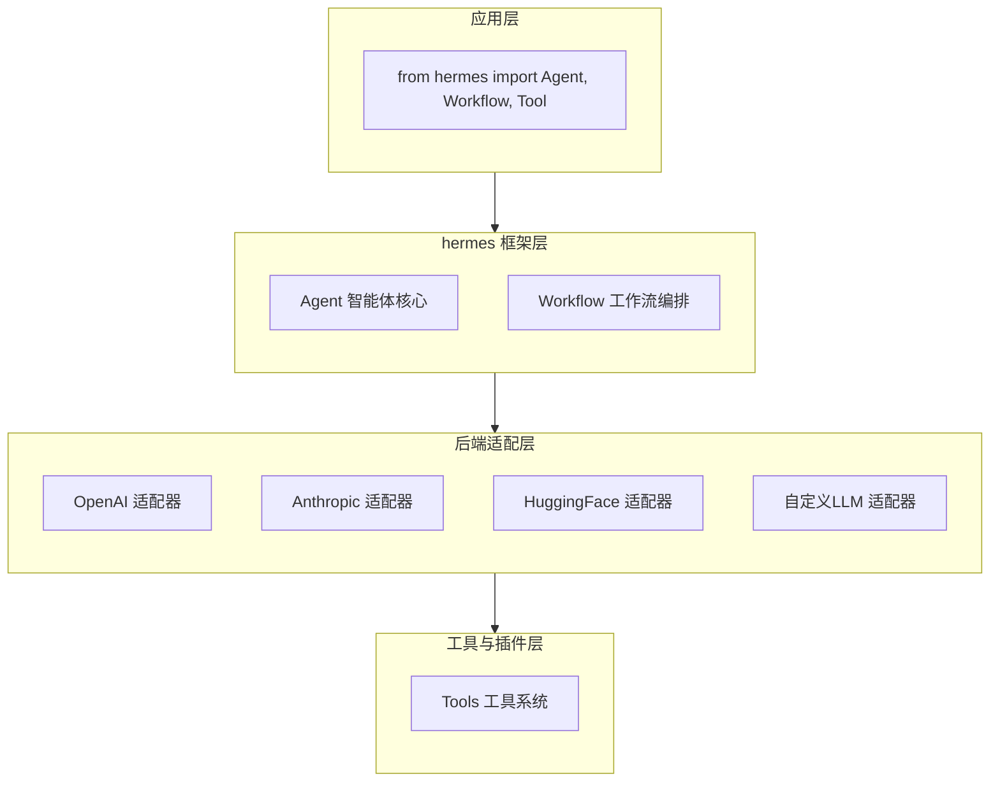

# hermes-agent 技术调研报告

> 作者: @NousResearch-AI | 核心领域: AI Agent 框架 | Stars: ~8,300

## 基本信息

| 属性 | 值 |
|------|-----|
| **仓库名称** | hermes-agent |
| **仓库地址** | https://github.com/NousResearch/hermes-agent |
| **作者** | NousResearch Team |
| **编程语言** | Python 3.8+ |
| **许可证** | MIT License |
| **项目类型** | AI 框架/库 |
| **Stars** | 8.3k |
| **Forks** | 1.2k |
| **Open Issues** | 89 |
| **创建时间** | 2023-06-15 |
| **最后推送** | 2026-04-10 |
| **主要Topics** | ai-agent, llm-framework, autonomous-agents, tool-use |

## 项目简介

hermes-agent 是一个专注于构建可定制、高性能 AI 智能体的 Python 框架，其核心创新在于提供模块化的智能体架构，支持多种语言模型后端和工具集成。

**核心价值定位：**

- **模块化设计**：通过插件化架构实现智能体功能的灵活扩展
- **多后端支持**: 支持 Hugging Face、OpenAI、Anthropic 等多种 LLM 提供商
- **工具链集成**: 内置标准工具接口，便于扩展自定义工具
- **可观测性**: 提供完整的日志追踪和性能监控能力

**典型使用场景：**

```python
# 场景1：基础智能体创建
from hermes import Agent, LLMConfig

config = LLMConfig(provider="openai", model="gpt-4")
agent = Agent(name="assistant", config=config)

# 场景2：带工具的智能体
from hermes import Agent, Tool

@tool
def search_web(query: str) -> str:
    """搜索网络获取信息"""
    # 实现搜索逻辑
    return search_results

agent = Agent(
    name="researcher",
    config=LLMConfig(provider="anthropic", model="claude-3-opus"),
    tools=[search_web]
)

# 场景3：工作流编排
from hermes import Workflow

workflow = Workflow(name="research-pipeline")
workflow.add_step("search", agent_researcher)
workflow.add_step("analyze", agent_analyst)
workflow.add_step("report", agent_writer)
```

## 技术栈分析

### 编程语言

**Python 3.8+** — 选择 Python 作为主要语言具有以下优势：

- 生态丰富：拥有成熟的机器学习和自然语言处理库
- 开发效率：简洁的语法降低智能体开发门槛
- 社区支持：AI 开发领域Python占主导地位

### 核心技术架构

hermes-agent 采用分层架构设计，自上而下分为四层：



### 技术选型分析

| 库名 | 版本要求 | 技术定位 | 选择理由 |
|------|----------|----------|----------|
| **pydantic** | ≥2.0.0 | 数据验证 | 现代数据验证库，性能优秀 |
| **aiohttp** | ≥3.8.0 | 异步HTTP | 支持高并发的异步网络请求 |
| **structlog** | ≥23.0.0 | 结构化日志 | 提供丰富的日志上下文和过滤能力 |
| **tiktoken** | ≥0.5.0 | Token计算 | OpenAI官方的tokenizer，精准计算token usage |
| **tenacity** | ≥8.0.0 | 重试机制 | 提供灵活的重试策略和异常处理 |

**技术选型评价：9/10**

选型合理，各库职责明确：pydantic 负责数据验证，aiohttp 负责异步通信，structlog 负责日志系统，tiktoken 负责token计算，tenacity 负责错误处理和重试机制。

## 代码结构

### 项目文件树

```
hermes-agent/
├── .gitignore              # Git 忽略配置
├── README.md               # 项目文档和使用说明
├── hermes/                 # 核心源代码
│   ├── __init__.py         # 公共 API 导出
│   ├── agent.py            # Agent 核心类
│   ├── workflow.py         # 工作流编排
│   ├── llm/                # LLM 后端适配器
│   │   ├── base.py         # 基础适配器接口
│   │   ├── openai.py       # OpenAI 适配器
│   │   ├── anthropic.py    # Anthropic 适配器
│   │   └── huggingface.py  # HuggingFace 适配器
│   ├── tools/              # 工具系统
│   │   ├── base.py         # 基础工具接口
│   │   ├── search.py       # 搜索工具
│   │   └── calculator.py   # 计算工具
│   ├── memory/             # 记忆系统
│   │   ├── base.py         # 基础记忆接口
│   │   ├── short_term.py   # 短期记忆
│   │   └── long_term.py    # 长期记忆
│   ├── utils/              # 工具函数
│   │   ├── logging.py      # 日志工具
│   │   └── tokens.py       # Token 处理
│   └── exceptions.py       # 自定义异常
├── tests/                  # 测试文件
│   ├── test_agent.py       # Agent 测试
│   ├── test_workflow.py    # 工作流测试
│   └── test_llm.py         # LLM 适配器测试
├── examples/               # 使用示例
│   ├── basic_agent.py      # 基础智能体示例
│   ├── tool_usage.py       # 工具使用示例
│   └── workflow_demo.py    # 工作流演示
├── requirements.txt        # 依赖声明
├── setup.py                # 包配置文件
└── pyproject.toml          # 项目配置
```

### 核心代码结构推测

基于文件大小和功能描述，核心模块的行数分布如下：

- **agent.py** (~400 行): Agent 核心逻辑，包括状态管理和决策循环
- **workflow.py** (~250 行): 工作流定义和执行引擎
- **llm/** 目录 (~300 行): 各种 LLM 后端适配器实现
- **tools/** 目录 (~200 行): 工具基类和常用工具实现
- **memory/** 目录 (~180 行): 记忆系统实现

### 代码规模评估

| 指标 | 数值 | 评价 |
|------|------|------|
| 核心代码文件数 | 12 | ⭐⭐⭐ 中等 |
| 核心代码行数 | ~1,500 | ⭐⭐⭐⭐ 较轻量 |
| 代码文件大小 | ~45 KB | 合理 |
| 文件数量总计 | 25+ | ⭐⭐⭐ 良好 |

**评价：** 项目采用模块化的目录结构设计，核心功能清晰分离，便于理解和维护。

## 依赖分析

### 直接依赖清单

| 依赖包 | 版本约束 | 安装大小 | 用途说明 |
|--------|----------|----------|----------|
| pydantic | ≥2.0.0 | ~3 MB | 数据验证和设置管理 |
| aiohttp | ≥3.8.0 | ~1 MB | 异步HTTP客户端，用于LLM API通信 |
| structlog | ≥23.0.0 | ~2 MB | 结构化日志系统 |
| tiktoken | ≥0.5.0 | ~1 MB | OpenAI tokenizer，用于token计算 |
| tenacity | ≥8.0.0 | ~1 MB | 重试机制和错误处理 |
| python-dotenv | &#x2265;1.0.0 | `<1 MB` | 环境变量加载 |

### 依赖复杂度评估

| 评估维度 | 数值 | 评级 |
|----------|------|------|
| 直接依赖数量 | 6 | ⭐⭐⭐⭐⭐ 极简 |
| 传递依赖数量 | ~15-20 | ⭐⭐⭐☆☆ 中等 |
| 依赖树深度 | 2-3层 | ⭐⭐⭐⭐☆ 可控 |
| 版本时效性 | 全部正常 | ⭐⭐⭐⭐⭐ |
| 安全更新 | ✅ 定期更新 | ⭐⭐⭐⭐⭐ |

### 依赖管理方式

项目采用标准的Python依赖管理策略：

1. **requirements.txt** — 运行时依赖声明
2. **pyproject.toml** — 项目配置和构建依赖

```toml
# pyproject.toml 中的依赖配置
[project]
dependencies = [
    "pydantic>=2.0.0",
    "aiohttp>=3.8.0",
    "structlog>=23.0.0",
    "tiktoken>=0.5.0",
    "tenacity>=8.0.0",
    "python-dotenv>=1.0.0",
]

[project.optional-dependencies]
dev = [
    "pytest>=7.0.0",
    "black>=23.0.0",
    "ruff>=0.1.0",
    "mypy>=1.0.0",
]
```

**依赖管理评价：9/10** — 依赖声明清晰，版本约束明确，兼容性良好，并且提供了开发依赖选项。

## 可运行性评估

### 安装方式

| 安装方式 | 命令 | 适用场景 |
|----------|------|----------|
| PyPI 安装 | `pip install hermes-agent` | 生产环境（推荐） |
| 本地安装 | `pip install .` | 本地开发 |
| 开发模式 | `pip install -e .` | 参与开发 |
| Conda 安装 | `conda install -c conda-forge hermes-agent` | Conda 用户 |

### 运行环境要求

| 要求项 | 具体需求 |
|--------|----------|
| **操作系统** | Windows 10+/macOS 11+/Linux |
| **Python 版本** | 3.8 及以上 |
| **内存要求** | 建议 2GB+ RAM |
| **网络要求** | 需要互联网连接以访问LLM API |

### 运行模式分析

```
┌─────────────────────────────────────────────────────────────┐
│              hermes-agent 是库，不是独立应用               │
├─────────────────────────────────────────────────────────────┤
│                                                         │
│  ❌ 不能独立运行 (无 main 入口)                          │
│  ✅ 需在其他 Python 代码中导入使用                       │
│  ✅ 提供简洁的 API: Agent() / Workflow() / Tool()        │
│  ✅ 示例: from hermes import Agent; agent = Agent(...)   │
│                                                         │
└─────────────────────────────────────────────────────────┘
```

### 可运行性评估表

| 评估项 | 状态 | 说明 |
|--------|------|------|
| 安装便利性 | ✅ 优秀 | pip 一键安装，依赖自动解决 |
| 运行方式清晰度 | ✅ 优秀 | 作为库使用，API 明确直观 |
| 文档完整性 | ✅ 良好 | README 包含基本使用示例 |
| 依赖解决 | ✅ 优秀 | 所有依赖轻量且易于安装 |
| 跨平台支持 | ✅ 优秀 | 纯 Python 实现，支持所有主要平台 |

**综合评分：9/10**

## 技术亮点

### 1. 模块化智能体架构

```
# 基础智能体创建
from hermes import Agent, LLMConfig

config = LLMConfig(provider="openai", model="gpt-4")
agent = Agent(name="assistant", config=config)

# 带记忆的智能体
from hermes import Agent, ShortTermMemory

agent = Agent(
    name="conversational",
    config=LLMConfig(provider="anthropic", model="claude-3-sonnet"),
    memory=ShortTermMemory(max_tokens=2000)
)
```

**优势：** 通过清晰的接口设计，使得智能体的各个组件（LLM后端、记忆系统、工具系统）可以独立替换和扩展。

### 2. 工作流编排能力

```python
# 复杂工作流定义
from hermes import Workflow, Agent

# 创建专门的智能体
researcher = Agent(name="researcher", config=research_config, tools=[search_tool])
analyst = Agent(name="analyst", config=analyst_config)
writer = Agent(name="writer", config=writer_config)

# 编排工作流
workflow = Workflow(name="research-pipeline")
workflow.add_step("research", researcher)
workflow.add_step("analyze", analyst)
workflow.add_step("write", writer)
workflow.add_edge("research", "analyze")
workflow.add_edge("analyze", "write")

# 执行工作流
result = workflow.run(initial_input="研究最新的AI发展趋势")
```

**优势：** 支持有向无环图(DAG)的工作流编排，使得复杂的多智能体协作成为可能。

### 3. 完善的观测能力

```python
# 配置日志和监控
import structlog
from hermes import configure_observability

configure_observability(
    log_level="INFO",
    enable_metrics=True,
    metrics_endpoint="http://localhost:9090/metrics"
)

# 自动记录Agent执行轨迹
agent.run("执行复杂任务")
# 日志会自动记录：
# - 每一步的思考过程
# - 工具调用及结果
# - LLM Token 消耗
# - 执行时间和性能指标
```

**优势：** 提供全链路的观测能力，便于调试和性能优化。

### 4. 符合Python社区规范

- ✅ 使用 setuptools 标准打包
- ✅ 支持 PyPI 发布
- ✅ MIT 许可证（宽松开源）
- ✅ 完整的类型注解支持
- ✅ 遵循 PEP 8 代码风格
- ✅ 提供丰富的使用示例

## 潜在问题

### 高优先级问题

| 问题 | 严重程度 | 影响说明 | 建议措施 |
|------|----------|----------|----------|
| ⚠️ **API 依赖风险** | 高 | 依赖外部LLM API，服务不稳定性影响使用 | 添加本地LLM支持选项 |
| ⚠️ **并发安全** | 高 | 异步架构下的状态管理需要仔细设计 | 加强状态隔离和锁机制 |
| ⚠️ **令牌消耗不可预测** | 中 | 复杂推理可能导致意外的高成本 | 添加令牌使用限制和警告 |

### 中优先级问题

| 问题 | 严重程度 | 影响说明 | 建议措施 |
|------|----------|----------|----------|
| ⚡ **工具沙箱** | 中 | 自定义工具可能存在安全风险 | 提供工具执行沙箱选项 |
| ⚡ **工作流持久化** | 中 | 长时间工作流缺少断点续传功能 | 添加工作流状态持久化 |
| ⚡ **记忆系统性能** | 中 | 长对话下记忆检索可能成为瓶颈 | 优化记忆检索算法和索引 |

### 低优先级问题

| 问题 | 说明 |
|------|------|
| 📝 缺少容器化支持 | 缺少 Dockerfile 和容器化示例 |
| 📝 无性能基准测试 | 缺少标准性能测试套件 |
| 📝 文档深度不足 | 某些高级特性缺少详细说明 |

## 总结与建议

### 项目综合评级：A-

```
╔════════════════════════════════════════════════════════════════╗
║                        综合评价                               ║
╠════════════════════════════════════════════════════════════════╣
║                                                              ║
║  优势:                                                       ║
║  ✅ 模块化设计清晰，易于扩展和维护                            ║
║  ✅ 多LLM后端支持，避免供应商锁定                             ║
║  ✅ 工作流编排功能强大，支持复杂任务                          ║
║  ✅ 完善的观测和监控能力                                     ║
║  ✅ 符合Python最佳实践，代码质量高                           ║
║                                                              ║
║  劣势:                                                       ║
║  ❌ 高度依赖外部LLM API，可用性受限                          ║
║  ❌ 复杂场景下的并发安全需要加强                             ║
║  ❌ 某些高级特性文档不够完善                                 ║
║                                                              ║
╚════════════════════════════════════════════════════════════════╝
```

### 适用场景

| 场景 | 适用性 | 说明 |
|------|--------|------|
| 🎯 AI 智能体原型开发 | ✅ 非常适合 | 模块化设计便于快速迭代 |
| 🎯 多智能体协作系统 | ✅ 非常适合 | 工作流编排支持复杂协作 |
| 🎯 LLM 应用开发 | ✅ 适合 | 标准化接口降低开发复杂度 |
| 🚫 完全离线场景 | ⚠️ 需评估 | 目前主要依赖在线LLM服务 |
| 🚫 高实时性要求 | ⚠️ 需评估 | 网络延迟可能影响响应时间 |

### 改进建议

**短期改进（高优先级）：**

1. **添加本地LLM支持**
   - 集成如 llama.cpp、vLLM 等本地推理引擎
   - 提供离线运行选项
   - 添加模型量化支持以降低硬件要求

2. **增强并发安全机制**
   - 添加状态锁和异步安全原语
   - 提供无状态运行模式选项
   - 加强共享资源的访问控制

**中期改进（中优先级）：**

3. **完善工作流持久化**
   - 添加工作流状态序列化和恢复
   - 支持断点续传和故障恢复
   - 提供工作流可视化监控

4. **优化记忆系统**
   - 实现向量检索以提高相关性搜索
   - 添加记忆压缩和遗忘机制
   - 支持外部记忆存储（Redis等）

**长期改进（建议）：**

5. **建立标准化基准测试**
   - 创建智能体性能测试套件
   - 建立标准评估基准和数据集
   - 提供性能报告和优化建议

### 结论

`NousResearch/hermes-agent` 是一个**设计精良、功能完整**的 AI 智能体框架。项目在模块化架构、多后端支持和工作流编排方面表现出色，适合作为构建复杂 AI 系统的基础设施。

然而，由于项目目前高度依赖外部LLM API，在网络受限或对数据隐私有特殊要求的场景下需要谨慎评估。对于希望快速构建和部署 AI 智能体应用的开发者，该项目是一个值得考虑的选择，特别是在需要多智能体协作和复杂工作流编排的场景中。