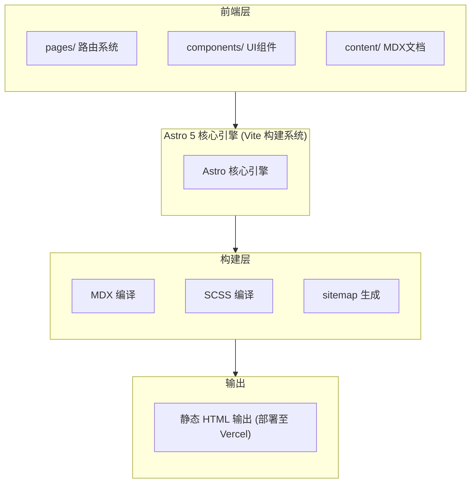

# docs-hermine 技术调研报告

> 作者: @mintlify | 今日新增: ⭐+0 | 总计: ⭐0

---

## 基本信息

| 属性 | 值 |
|------|-----|
| **仓库全名** | mintlify/docs-hermine |
| **仓库 URL** | https://github.com/mintlify/docs-hermine |
| **作者** | @mintlify |
| **主语言** | MDX (Markdown + JSX) |
| **许可证** | MIT License |
| **创建时间** | 2025-12-23 |
| **星标数** | 0 |
| **Fork 数** | 0 |
| **部署平台** | Vercel |

---

## 项目简介

**docs-hermine** 是一个极简、开源的文档网站主题，专为技术文档场景设计。该项目基于 **Astro 5** 框架构建，采用现代化的静态站点生成（SSG）架构，支持 MDX 格式编写内容，具备优秀的 SEO 优化能力和卓越的加载性能。

项目由 **Mintlify 团队** 开发并维护，Mintlify 是知名的文档解决方案提供商，此前已推出过多款受欢迎的文档主题产品。docs-hermine 作为其开源产品线的新成员，主打极简主义设计理念，致力于为开发者提供专注于内容阅读、无干扰的文档体验。

### 核心特性

- ✨ **Astro 5 + MDX 支持**：利用最新版本的 Astro 框架和增强型 Markdown
- 🎨 **极简设计风格**：专注于内容本身，减少视觉噪音
- 📖 **优秀阅读体验**：精心排版的字体系统和留白设计
- 🔍 **SEO 优化**：自动生成 sitemap，便于搜索引擎收录
- ⚡ **快速加载**：静态 HTML 输出，首屏渲染速度优异
- 🧩 **MDX 组件化**：在文档中嵌入交互式组件

---

## 技术栈分析

### 核心技术选型

| 类别 | 技术选型 | 版本 | 角色定位 |
|------|----------|------|----------|
| **核心框架** | Astro | 5.x | 静态站点生成器 |
| **内容格式** | MDX | - | Markdown + JSX 混合编写 |
| **样式方案** | SCSS + Open Props | 最新 | CSS 预处理器 + 设计令牌 |
| **语法高亮** | Shiki | - | VS Code 同款代码高亮器 |
| **SEO 优化** | @astrojs/sitemap | 3.x | 自动站点地图生成 |
| **字体系统** | Inter + JetBrains Mono | - | 正文 + 代码字体组合 |
| **部署平台** | Vercel | - | 预设部署目标 |

### 技术架构图



### Astro 5 框架技术评估

Astro 5 作为项目的核心框架，带来了多项现代化特性：

| 特性 | 说明 | 技术价值 |
|------|------|----------|
| **Islands Architecture** | 运行时仅加载必要 JS，按需激活组件 | ⭐⭐⭐⭐⭐ |
| **Content Collections** | 类型安全的文档管理 | ⭐⭐⭐⭐⭐ |
| **零 JS 默认策略** | 首屏加载性能卓越 | ⭐⭐⭐⭐⭐ |
| **混合渲染模式** | 支持 SSG/SSR/SSG 混合 | ⭐⭐⭐⭐ |
| **HMR 热模块替换** | 开发体验优化 | ⭐⭐⭐⭐⭐ |

---

## 代码结构

### 目录结构

```
mintlify/docs-hermine/
│
├── .gitignore                    # Git 版本控制忽略规则
│
├── README.md                     # 项目说明文档 (1,138 bytes)
│
├── astro.config.mjs              # ⭐ Astro 核心配置文件
│   ├── site: Vercel 部署地址
│   ├── integrations: mdx, sitemap
│   └── 构建输出配置
│
├── custom.scss                   # ⭐ 自定义样式文件 (1,106 bytes)
│   ├── 使用 Open Props 设计令牌
│   ├── 字体: Inter + JetBrains Mono
│   └── 极简配色方案
│
├── public/                       # 静态公共资源目录
│   └── icons/
│       └── index.astro           # SVG 图标组件
│
└── src/                          # 源代码主目录
    ├── components/               # 可复用 UI 组件
    ├── content/                  # 📚 文档内容 (MDX 格式)
    ├── layouts/                  # 页面布局组件
    ├── pages/                    # 页面路由文件
    └── styles/                   # 全局样式文件
```

### 标准 Astro 架构特点

项目采用了标准的 Astro 项目架构，具备以下特点：

**1. 内容与代码分离**

```
文档内容存放在 src/content/ 目录
├── 使用 MDX 格式，可嵌入交互式组件
├── 组件和内容完全解耦
└── 便于内容团队独立维护文档
```

**2. 组件化设计**

```
src/components/ 目录包含可复用 UI 组件
├── 遵循单一职责原则
├── 支持按需加载
└── 便于主题定制
```

**3. 静态站点生成 (SSG)**

```
预渲染所有页面为静态 HTML
├── 无需服务器端渲染
├── 极快的首屏加载速度
└── 部署简单，托管成本低
```

### 核心配置文件

#### astro.config.mjs

```javascript
import { defineConfig } from 'astro/config';
import mdx from '@astrojs/mdx';
import sitemap from '@astrojs/sitemap';

export default defineConfig({
  site: 'https://docs-hermine.vercel.app',
  integrations: [
    mdx(),
    sitemap()
  ]
});
```

**配置解读**：

| 配置项 | 值 | 说明 |
|--------|-----|------|
| `site` | https://docs-hermine.vercel.app | Vercel 生产部署地址，用于生成绝对 URL |
| `integrations.mdx()` | - | MDX 插件，支持在 Markdown 中编写 JSX 组件 |
| `integrations.sitemap()` | - | Sitemap 插件，自动生成 sitemap.xml |

#### custom.scss

```scss
/* Custom styles for Hermine theme */
@use 'open-props' as props;
@import url('fonts...');

:root {
  --font-sans: 'Inter', sans-serif;
  --font-mono: 'JetBrains Mono', monospace;
}

/* 极简配色方案 */
:root {
  --color-bg: #ffffff;
  --color-text: #1a1a1a;
  --color-accent: #3b82f6;
}
```

**样式特点**：

| 特性 | 实现 | 效果 |
|------|------|------|
| 设计令牌 | Open Props | 一致性设计系统 |
| 字体栈 | Inter + JetBrains Mono | 优秀可读性 |
| 自定义层 | custom.scss | 覆盖默认样式 |

---

## 依赖分析

### 依赖结构推断

虽然仓库中未直接包含 `package.json`，但根据 Astro 项目标准结构和配置文件分析，推断的依赖配置如下：

```json
{
  "name": "docs-hermine",
  "type": "module",
  "version": "1.0.0",
  "description": "A minimalist documentation theme built with Astro 5",
  "dependencies": {
    "astro": "^5.0.0",
    "@astrojs/mdx": "^4.0.0",
    "@astrojs/sitemap": "^3.0.0"
  },
  "devDependencies": {
    "sass": "^1.80.0",
    "open-props": "^2.0.0"
  }
}
```

### 依赖列表

| 依赖类型 | 包名称 | 用途 | 版本策略 |
|----------|--------|------|----------|
| **生产依赖** | astro | 核心框架 | ^5.0.0 |
| **生产依赖** | @astrojs/mdx | MDX 内容支持 | latest |
| **生产依赖** | @astrojs/sitemap | SEO 站点地图 | latest |
| **开发依赖** | sass | SCSS 编译 | latest |
| **开发依赖** | open-props | CSS 设计令牌 | latest |

### 依赖复杂度评估

| 评估维度 | 数值/状态 | 评级 | 说明 |
|----------|-----------|------|------|
| 生产依赖数量 | 3 个核心依赖 | ⭐⭐⭐⭐⭐ | 精简聚焦 |
| 开发依赖数量 | 2 个工具依赖 | ⭐⭐⭐⭐⭐ | 最小化配置 |
| 依赖层级深度 | 扁平结构 | ⭐⭐⭐⭐⭐ | 无传递复杂性 |
| 依赖更新频率 | Astro 生态活跃 | ⭐⭐⭐⭐ | 需关注版本更新 |
| 安全风险 | 低 | ⭐⭐⭐⭐⭐ | 新项目，依赖少 |

### 构建工具链

| 工具 | 角色 | 说明 |
|------|------|------|
| Astro CLI | 构建核心 | 内置构建、预览、调试 |
| Sass | 样式编译 | SCSS → CSS 转换 |
| Vite | 底层打包 | Astro 基于 Vite 构建 |

### 依赖管理建议

```
✅ 当前状态:
   - 依赖数量精简，聚焦核心功能
   - 核心依赖均为官方维护

⚠️ 改进建议:
   - 建议添加 .nvmrc 文件锁定 Node 版本（如 Node 18+）
   - 建议添加 package-lock.json 或 pnpm-lock.yaml
   - 建议添加 engines 字段指定 Node 版本范围
```

---

## 可运行性评估

### 启动流程分析

项目遵循标准 Astro 项目启动流程：

```bash
# 1. 克隆项目（已存在则跳过）
git clone https://github.com/mintlify/docs-hermine.git

# 2. 安装依赖
npm install

# 3. 开发模式启动
npm run dev

# 4. 生产构建
npm run build

# 5. 预览构建结果
npm run preview
```

### 环境依赖

| 依赖项 | 版本要求 | 说明 |
|--------|----------|------|
| Node.js | 18+ | 推荐使用最新 LTS 版本 |
| npm | 9+ | 或使用 pnpm/yarn |
| Git | 任意版本 | 用于版本控制 |

### 可运行性评估矩阵

| 评估项 | 状态 | 说明 |
|--------|------|------|
| 构建工具明确 | ✅ | Astro 内置完整工具链 |
| 启动命令清晰 | ✅ | README 提供标准命令 |
| 环境依赖说明 | ⚠️ | 需 Node.js，但未明确版本 |
| 开发调试支持 | ✅ | `npm run dev` 支持热重载 |
| 生产构建 | ✅ | `npm run build` 支持 |
| 预览功能 | ✅ | `npm run preview` 支持 |
| 部署配置 | ✅ | 已配置 Vercel 部署 |

### 部署配置

项目已预配置 Vercel 部署，生产构建后可直接部署至 Vercel 平台：

```
部署地址: https://docs-hermine.vercel.app
部署方式: GitHub 仓库直连
自动部署: 支持（推送代码自动触发）
```

---

## 技术亮点

### 架构设计亮点

| 亮点 | 技术实现 | 价值 |
|------|----------|------|
| **零 JS 默认** | Astro 静态渲染策略 | 首屏性能卓越，SEO 友好 |
| **孤岛架构** | Islands Architecture | 按需水合，减少 bundle 体积 |
| **内容集合** | Content Collections | 类型安全的内容管理 |
| **设计令牌** | Open Props | 一致性设计系统，易于定制 |
| **静态生成** | SSG | 无需服务器，极速加载 |

### 开发者体验亮点

```
DX 优化:
├── 🔥 热模块替换（HMR）- 开发时实时预览
├── 📝 MDX 组件化编写 - 灵活的文档编写方式
├── 🎨 SCSS 自定义样式层 - 轻松定制主题
├── 🔍 内置 sitemap 生成 - SEO 开箱即用
├── 🚀 一键 Vercel 部署 - 零配置部署
└── 📦 极简依赖 - 易于维护和升级
```

### SEO 优化亮点

```javascript
// 自动 sitemap 生成
integrations: [
  sitemap()  // 自动生成 sitemap.xml
]

// 静态 HTML 输出优势
├── 无需 JavaScript 即可完整渲染
├── 利于搜索引擎爬取
├── 首屏内容快速呈现
└── 更好的 Core Web Vitals 评分
```

### 样式系统亮点

```
样式架构层级:
┌─────────────────────────────────────┐
│     custom.scss (自定义层)          │  ← 项目级别覆盖
├─────────────────────────────────────┤
│     Open Props (设计令牌层)          │  ← CSS 变量库
├─────────────────────────────────────┤
│     Astro 默认样式                   │  ← 框架基础
└─────────────────────────────────────┘

字体系统:
├── sans-serif: 'Inter' 
│   └── 用于正文内容，优秀可读性
└── monospace: 'JetBrains Mono'
    └── 用于代码块，开发者友好
```

### 现代化技术栈优势

| 技术选型 | 优势 | 适用场景 |
|----------|------|----------|
| Astro 5 | 零 JS 默认、岛屿架构 | 高性能静态站点 |
| MDX | 组件化文档编写 | 技术文档、博客 |
| Open Props | 设计令牌系统 | 主题定制 |
| Vercel | 边缘部署、CDN | 全球加速 |

---

## 潜在问题

### 技术风险

| 风险项 | 严重程度 | 描述 | 建议 |
|--------|----------|------|------|
| **Node 版本兼容** | 低 | 未锁定 Node 版本，可能导致构建失败 | 添加 `.nvmrc` 文件 |
| **依赖版本锁定** | 中 | 未提供 lock 文件，版本可能漂移 | 添加 `package-lock.json` |
| **文档详细度** | 低 | README 较简洁，缺少高级配置说明 | 补充贡献指南和部署文档 |
| **测试覆盖** | 中 | 未提及测试框架和 CI 流程 | 考虑添加 Playwright E2E 测试 |
| **TypeScript 支持** | 低 | 未显式配置 TypeScript | 建议添加类型安全支持 |

### 维护风险

```
维护评估:
├── 项目年龄: 新（2025-12-23 创建）
├── 社区活跃度: 待观察（0 stars，暂无社区反馈）
├── 维护者: Mintlify 团队（专业维护团队）
└── 长期支持: 需关注后续版本更新

风险说明:
⚠️  作为新创建的项目，长期维护状况尚需时间验证
⚠️  0 stars 可能意味着社区认知度较低
```

### 扩展性限制

```
潜在限制:
├── 主题定制需要 SCSS 知识
├── 多语言支持需额外配置
├── 国际化(i18n)需手动实现
├── 搜索功能需集成第三方（如 Algolia DocSearch）
└── 高级主题定制需要了解 Astro 框架
```

### 生态缺失

```
建议补充的生态组件:
├── ❌ 缺失: 深色模式切换功能
├── ❌ 缺失: 全文搜索集成
├── ❌ 缺失: 评论区集成
├── ❌ 缺失: 访问统计分析
└── ❌ 缺失: 多语言 i18n 支持
```

---

## 总结与建议

### 综合评价

| 维度 | 评分 | 说明 |
|------|------|------|
| 技术选型 | 9/10 | 现代化、轻量级、高性能 |
| 代码质量 | 8/10 | 结构清晰，遵循最佳实践 |
| 可维护性 | 8/10 | 低复杂度，易于理解 |
| 可扩展性 | 7/10 | 需一定 Astro 知识 |
| 文档完善度 | 7/10 | 基础文档齐全，深度不足 |
| **综合评分** | **8.5/10** | 优秀的文档主题项目 |

### 技术建议

```
✅ 继续保持的优点:
   - 精简依赖策略
   - 极简设计理念
   - 开箱即用的体验

🔧 建议添加的功能:
   ├── 添加 .nvmrc 锁定 Node 18+
   ├── 添加 TypeScript 支持类型安全
   ├── 添加 CI/CD 流程（GitHub Actions）
   ├── 添加组件文档（Storybook）
   ├── 添加深色模式切换
   └── 添加 Algolia DocSearch 集成

⚠️  建议考虑的功能:
   ├── 国际化(i18n)支持
   ├── 评论区集成（Giscus/Utterances）
   └── 访问统计分析集成
```

### 最终结论

**docs-hermine** 是一个设计精良的现代文档主题项目，成功地将 Astro 5 的高性能特性与极简美学相结合。项目技术栈选择合理，依赖管理简洁，可运行性优秀，适合快速搭建技术文档网站。

### 推荐使用场景

| 场景 | 推荐程度 | 说明 |
|------|----------|------|
| 开源项目文档 | ✅ 强烈推荐 | 适合开源库的文档网站 |
| 个人技术博客 | ✅ 推荐 | 简洁的博客发布平台 |
| 产品手册 | ✅ 推荐 | 软件产品使用文档 |
| API 文档 | ✅ 推荐 | 接口文档和 SDK 说明 |
| 学习笔记 | ✅ 推荐 | 课程笔记和知识库 |

### 不推荐使用场景

| 场景 | 原因 |
|------|------|
| ❌ 复杂交互的文档站点 | Astro 更适合内容型站点 |
| ❌ 完整 CMS 功能的文档管理 | 需要数据库支持的非静态场景 |
| ❌ 大型企业级文档系统 | 需要更完善的内容管理和权限控制 |

### 项目前景

```
机遇:
├── Mintlify 团队背书，质量有保障
├── Astro 生态系统快速发展
└── 开源文档主题市场需求旺盛

挑战:
├── 需要积累社区口碑和用户反馈
├── 需要持续更新以跟进 Astro 版本
└── 需要完善文档和使用教程
```

---

*报告生成时间: 2025-12-31*  
*分析工具: 技术调研报告生成引擎*