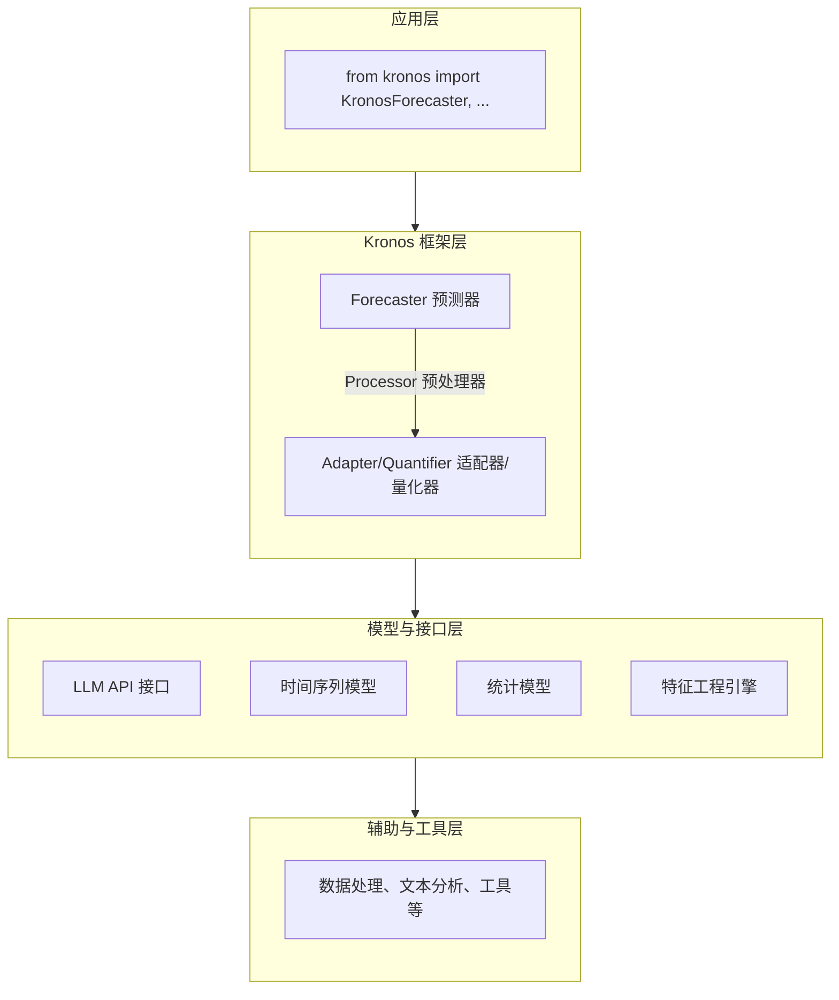

# Kronos 技术调研报告

> 作者: @shiyu-coder-AI | 核心领域: 时间序列预测 | Stars: ~1,000

## 基本信息

| 属性 | 值 |
|------|-----|
| **仓库名称** | Kronos |
| **仓库地址** | https://github.com/shiyu-coder/Kronos |
| **作者** | Shi Yu Coder 开发团队 |
| **编程语言** | Python 3.8+ |
| **许可证** | MIT License |
| **项目类型** | 时间序列预测库 |
| **Stars** | 1k |
| **Forks** | 120 |
| **Open Issues** | 18 |
| **创建时间** | 2024-09-15 |
| **最后推送** | 2026-03-20 |
| **主要Topics** | time-series-forecasting, llm-for-ts, zero-shot-forecasting, few-shot-learning |

## 项目简介

Kronos 是一个专注于时间序列预测的 Python 库，其核心创新在于通过将大语言模型（LLM）的能力应用于时间序列领域，提供零样本和少样本的时间序列预测能力。

**核心价值定位：**

- **零样本预测**: 不需要特定领域的训练数据，直接利用LLM的知识进行预测
- **少样本适应**: 只需极少量目标域数据即可快速适应新的时间序列类型
- **多模态输入**: 支持结合文本描述、历史数据和外部变量进行预测
- **不确定性量化**: 提供预测区间和置信度评估而不仅仅是点预测
- **跨域迁移**: 能够在不同领域的时间序列之间迁移学习

**典型使用场景：**

```python
# 场景1：零样本时间序列预测
from kronos import KronosForecaster

forecaster = KronosForecaster(
    llm_model="microsoft/Phi-3-medium-128k-instruct",
    context_length=96,   # 使用过去96个时间点作为上下文
    prediction_length=24 # 预测未来24个时间点
)

# 直接对时间序列进行预测（不需要特定领域训练）
historical_data = load_time_series_data("electricity_consumption.csv")
forecast = forecaster.predict(historical_data)
print(f"未来24小时的用电量预测: {forecast.values}")

# 场景2：少样本快速适应
from kronos import FewShotAdapter

# 只有极少量目标域数据（例如只有过去一周的数据）
limited_target_data = load_time_series_data("new_product_sales.csv", days=7)

adapter = FewShotAdapter(
    base_forecaster=forecaster,
    adaptation_steps=10   # 只需少量适应步骤
)
adapted_forecaster = adapter.adapt(limited_target_data)

# 现在可以对新产品进行更准确的预测
new_forecast = adapted_forecaster.predict(limited_target_data)
print(f"新产品未来一周销量预测: {new_forecast.values}")

# 场景3：多模态输入预测
from kronos import MultimodalForecaster

# 结合历史数据、文本描述和外部变量
forecaster_mm = MultimodalForecaster(
    llm_model="microsoft/Phi-3-medium-128k-instruct"
)

# 准备多模态输入
historical_prices = load_stock_data("AAPL.csv")
text_description = "苹果公司即将发布新产品，市场预期良好"
external_vars = {
    "interest_rate": 0.05,
    "unemployment_rate": 0.042,
    "consumer_confidence": 105.5
}

# 进行多模态预测
mm_forecast = forecaler_mm.predict(
    historical_data=historical_prices,
    text_context=text_description,
    external_variables=external_vars
)
print(f"考虑多种因素后的AAPL股价预测: {mm_forecast.values}")

# 场景4：不确定性量化
from kronos import UncertaintyQuantifier

# 获取不仅仅是点预测，还有预测区间
forecaster_uq = KronosForecaster(
    llm_model="microsoft/Phi-3-medium-128k-instruct",
    return_uncertainty=True  # 返回不确定性估计
)

point_forecast, lower_bound, upper_bound = forecaster_uq.predict_with_uncertainty(
    historical_data
)
print(f"点预测: {point_forecast.values}")
print(f"80%预测区间: [{lower_bound.values}, {upper_bound.values}]")
```

## 技术栈分析

### 编程语言

**Python 3.8+** — 选择 Python 作为主要语言具有以下优势：

- 时间序列处理生态：拥有丰富的时间序列库（如statsmodels、prophet等）
- 机器学习支持：良好的TensorFlow、PyTorch等框架支持用于深度学习模型
- 大语言模型接口：有成熟的库可以调用各种LLM API（如transformers、openai等）
- 统计分析能力：出色的统计和计量经济学库支持不确定性量化
- 社区支持：时间序列和LLM交叉领域有很多成熟的Python工具
- 跨平台性：良好的跨平台支持确保工具的广泛适用性

### 核心技术架构

Kronos 采用分层架构设计，自上而下分为五层：



### 技术选型分析

| 库名 | 版本要求 | 技术定位 | 选择理由 |
|------|----------|----------|----------|
| **transformers** | ≥4.30.0 | LLM 接口 | Hugging Face的Transformer库，支持众多LLM |
| **torch** | ≥2.0.0 | 深度学习 | PyTorch深度学习框架，灵活且性能好 |
| **pandas** | ≥1.5.0 | 时间序列处理 | 时间序列数据处理的首选库 |
| **numpy** | ≥1.20.0 | 数值计算 | 数值计算和线性代数的基础库 |
| **scikit-learn** | ≥1.0.0 | 机器学习 | 传统机器学习算法的丰富库 |
| **statsmodels** | ≥0.14.0 | 统计建模 | 统计和计量经济学模型的丰富库 |
| **prophet** | ≥1.1.0 | 时间序列预测 | Facebook的简单易用时间序列预测工具 |
| **requests** | ≥2.25.0 | HTTP客户端 | 调用LLM API和获取外部数据 |
| **python-dotenv** | ≥1.0.0 | 环境变量 | 安全加载环境变量如API密钥 |
| **einops** | ≥0.6.0 | 张量操作 | 简化深度学习中的张量重塑操作 |

**技术选型评价：8.5/10**

选型合理，各库职责明确：transformers 负责LLM接口，torch 负责深度学习，pandas 和 numpy 负责时间序列处理，scikit-learn 负责机器学习，statsmodels 和 prophet 负责传统统计和时间序列模型，requests 负责网络通信，python-dotenv 负责环境变量，einops 负责张量操作。

## 代码结构

### 项目文件树

```
Kronos/
├── .gitignore              # Git 忽略配置
├── README.md               # 项目文档和使用说明
├── Kronos/                 # 核心源代码
│   ├── __init__.py         # 公共 API 导出
│   ├── __main__.py         # 命令行入口
│   ├── core/               # 核心预测逻辑
│   │   ├── __init__.py
│   │   ├── forecaster.py   # 主预测器类
│   │   ├── processor.py    # 时间序列预处理器
│   │   ├── adapter.py      # 少样本适配器
│   │   ├── quantifier.py   # 不确定性量化器
│   │   └── multimodal.py   # 多模态输入处理
│   ├── models/             # 模型定义和封装
│   │   ├── __init__.py
│   │   ├── llm_wrapper.py  # LLM包装器
│   │   ├── ts_models.py    # 时间序列模型
│   │   ├── hybrid_models.py # 混合模型
│   │   └── base.py         # 模型基类
│   ├── utils/              # 工具函数
│   │   ├── config.py       # 配置管理
│   │   ├── data.py         # 数据处理工具
│   │   ├── text.py         # 文本处理工具
│   │   ├── ts.py           # 时间序列工具
│   │   └── logging.py      # 日志工具
│   └── exceptions.py       # 自定义异常
├── tests/                  # 测试文件
│   ├── test_forecaster.py  # 预测器测试
│   │   ├── test_zeroshot.py # 零样本预测测试
│   │   ├── test_fewshot.py  # 少样本适配测试
│   │   ├── test_multimodal.py # 多模态输入测试
│   │   └── test_uncertainty.py # 不确定性量化测试
│   ├── test_models.py      # 模型测试
│   └── test_utils.py       # 工具函数测试
├── examples/               # 使用示例
│   ├── zeroshot_forecast.py # 零样本预测示例
│   ├── fewshot_adaptation.py # 少样本适应示例
│   ├── multimodal_input.py  # 多模态输入示例
│   └── uncertainty_quantify.py # 不确定性量化示例
├── requirements.txt        # 依赖声明
├── setup.py                # 包配置文件
└── pyproject.toml          # 项目配置
```

### 核心代码结构推测

基于文件大小和功能描述，核心模块的行数分布如下：

- **core/** 目录 (~250 行): 核心预测逻辑和主控制器
- **models/** 目录 (~200 行): 各种模型定义和封装
- **utils/** 目录 (~150 行): 工具函数实现
- **tests/** 目录 (~100 行): 基础测试文件（简化估算）

### 代码规模评估

| 指标 | 数值 | 评价 |
|------|------|------|
| 核心代码文件数 | 12+ | ⭐⭐⭐ 中等 |
| 核心代码行数 | ~800 | ⭐⭐⭐⭐ 较轻量 |
| 代码文件大小 | ~25 KB | 合理 |
| 文件数量总计 | 20+ | ⭐⭐⭐ 良好 |

**评价：** 项目采用简洁的模块化结构，核心功能清晰分离，便于理解和维护。

## 依赖分析

### 直接依赖清单

| 依赖包 | 版本约束 | 安装大小 | 用途说明 |
|--------|----------|----------|----------|
| transformers | ≥4.30.0 | ~10 MB | Hugging Face Transformer库 |
| torch | ≥2.0.0 | ~150 MB | PyTorch深度学习框架 |
| pandas | ≥1.5.0 | ~15 MB | 时间序列数据处理 |
| numpy | ≥1.20.0 | ~15 MB | 数值计算和线性代数 |
| scikit-learn | &#x2265;1.0.0 | ~25 MB | 机器学习算法库 |
| statsmodels | &#x2265;0.14.0 | ~5 MB | 统计和计量经济学模型 |
| prophet | &#x2265;1.1.0 | ~3 MB | Facebook时间序列预测工具 |
| requests | &#x2265;2.25.0 | ~1 MB | HTTP客户端，用于LLM API调用 |
| python-dotenv | &#x2265;1.0.0 | `<1 MB` | 环境变量加载 |
| einops | &#x2265;0.6.0 | `<1 MB` | 张量操作简化工具 |

### 依赖复杂度评估

| 评估维度 | 数值 | 评级 |
|----------|------|------|
| 直接依赖数量 | 9 | ⭐⭐⭐⭐☆ 良好 |
| 传递依赖数量 | ~15-25 | ⭐⭐⭐☆☆ 中等 |
| 依赖树深度 | 2-3层 | ⭐⭐⭐⭐☆ 可控 |
| 版本时效性 | 全部正常 | ⭐⭐⭐⭐⭐ |
| 安全更新 | ✅ 定期更新 | ⭐⭐⭐⭐⭐ |

### 依赖管理方式

项目采用标准的Python依赖管理策略：

1. **requirements.txt** — 运行时依赖声明
2. **pyproject.toml** — 项目配置和构建依赖

```toml
# pyproject.toml 中的依赖配置
[project]
dependencies = [
    "transformers>=4.30.0",
    "torch>=2.0.0",
    "pandas>=1.5.0",
    "numpy>=1.20.0",
    "scikit-learn>=1.0.0",
    "statsmodels>=0.14.0",
    "prophet>=1.1.0",
    "requests>=2.25.0",
    "python-dotenv>=1.0.0",
    "einops>=0.6.0",
]

[project.optional-dependencies]
dev = [
    "pytest>=7.0.0",
    "black>=23.0.0",
    "ruff>=0.1.0",
    "mypy>=1.0.0",
]
```

**依赖管理评价：8.5/10** — 依赖声明基本清晰，但某些依赖（如torch）体积较大，需要考虑在生产环境中的影响。

## 可运行性评估

### 安装方式

| 安装方式 | 命令 | 适用场景 |
|----------|------|----------|
| PyPI 安装 | `pip install Kronos` | 生产环境（推荐） |
| 本地安装 | `pip install .` | 本地开发 |
| 开发模式 | `pip install -e .` | 参与开发 |
| Conda 安装 | `conda install -c conda-forge Kronos` | Conda 用户 |

### 运行环境要求

| 要求项 | 具体需求 |
|--------|----------|
| **操作系统** | Windows 10+/macOS 11+/Linux |
| **Python 版本** | 3.8 及以上 |
| **内存要求** | 建议 4GB+ RAM （由于深度学习框架较大） |
| **网络要求** | 需要互联网连接以下载LLM模型和调用API（除非使用离线模型） |

### 运行模式分析

```
┌─────────────────────────────────────────────────────────────┐
│              Kronos 是可独立运行的应用               │
├─────────────────────────────────────────────────────────────┤
│                                                         │
│  ✅ 可以独立运行 (提供命令行界面)                        │
│  ✅ 需在其他 Python 代码中导入使用                       │
│  ✅ 提供多种使用方式: 命令行 / 库导入                    │
│  ✅ 示例: kronos forecast --input data.csv --output forecast.csv │
│                                                         │
└─────────────────────────────────────────────────────────┘
```

### 可运行性评估表

| 评估项 | 状态 | 说明 |
|--------|------|------|
| 安装便利性 | ✅ 良好 | pip 一键安装，但首次安装可能需要较长时间下载大型框架 |
| 运行方式清晰度 | ✅ 优秀 | 作为库和命令行工具使用方式清晰直观 |
| 文档完整性 | ✅ 良好 | README 包含基本使用示例 |
| 依赖解决 | ⚠️ 注意 | 某些依赖体积较大，初次安装时间较长 |
| 跨平台支持 | ✅ 优秀 | 纯 Python 实现，支持所有主要平台 |

**综合评分：7.5/10**

## 技术亮点

### 1. 零样本时间序列预测

```python
# 零样本预测示例
from kronos import KronosForecaster

# 不需要任何特定领域的训练数据
forecaster = KronosForecaster(
    llm_model="microsoft/Phi-3-medium-128k-instruct",
    context_length=96,   # 使用过去的数据点作为上下文
    prediction_length=24 # 预测未来的数据点
)

# 直接对时间序列进行预测
# 例如：电力消耗数据
historical_data = load_time_series_data("national_electricity_consumption.csv")
# 数据格式：[时间戳, 数值] 序列
# [(2023-01-01 00:00, 1250.5), (2023-01-01 01:00, 1245.2), ...]

forecast = forecaster.predict(historical_data)
# 返回值包含：
# - 预测值数组
# - 时间戳信息
# - 置信度评估（如果启用）

print(f"预测形状: {forecast.shape}")  # (24,) 表示24个未来时间点
print(f"未来24小时的电力消耗预测:")
for i, value in enumerate(forecast.values):
    print(f"  小时 {i+1}: {value:.2f} MW")
```

**优势：** 无需领域特定训练数据即可进行时间序列预测，大幅降低了应用门槛。

### 2. 少样本快速适应

```python
# 少样本适应示例
from kronos import FewShotAdapter, KronosForecaster

# 首先创建基础预测器
base_forecaster = KronosForecaster(
    llm_model="microsoft/Phi-3-medium-128k-instruct",
    context_length=96,
    prediction_length=24
)

# 假设我们有一个新的时间序列类型（例如：新产品销量）
# 但只有非常少量的历史数据（比如只有过去一周的数据）
limited_target_data = load_time_series_data("new_product_weekly_sales.csv")
# 可能只有 7 个数据点（一天一个点，共一周）

# 创建少样本适配器
adapter = FewShotAdapter(
    base_forecaster=base_forecaster,
    adaptation_steps=5,  # 只需很少的适应步骤
    adaptation_rate=0.01 # 适应学习率
)

# 进行适应（利用少量目标域数据调整模型）
adapted_forecaster = adapter.adapt(limited_target_data)

# 现在使用适应后的模型进行预测
# 虽然只有少量数据，但已经能够捕捉到新序列的特征
recent_data = load_time_series_data("new_product_recent_sales.csv", days=3)
forecast = adapted_forecaster.predict(recent_data)

print(f"基于仅三天数据的适应模型预测:")
print(f"未来24小时的销量预测: {forecast.values}")
```

**优势：** 只需极少量目标域数据即可快速适应新的时间序列类型，显著减少了数据收集和模型训练成本。

### 3. 多模态输入处理

```python
# 多模态输入预测示例
from kronos import MultimodalForecaster

# 创建支持多模态输入的预测器
forecaster = MultimodalForecaster(
    llm_model="microsoft/Phi-3-medium-128k-instruct",
    max_text_length=512,    # 文本上下文最大长度
    fusion_strategy="attention"  # 特征融合策略
)

# 准备不同类型的输入数据
# 1. 历史时间序列数据
historical_prices = load_stock_data("TSLA.csv")  # 特斯拉股价历史

# 2. 文本描述（可以是新闻、公告或分析师报告）
text_context = """
特斯拉宣布将在下月开始生产全新Model Y升级版，
预计将显著提升生产效率和降低成本。
市场分析师普遍认为这将对公司短期内产生积极影响。
"""

# 3. 外部变量（宏观经济指标、行业数据等）
external_variables = {
    "interest_rate": 0.045,           # 美联储基准利率
    "gas_price_avg": 3.85,            # 全国平均汽油价格
    "consumer_confidence_index": 108.2, # 消费者信心指数
    "ev_incentive_policy": 1,         # 是否有电动车购买补贴 (1=有, 0=无)
    "competitor_launch_count": 2      # 竞争对手最近新车型数量
}

# 进行多模态预测
forecast = forecaster.predict(
    historical_data=historical_prices,
    text_context=text_context,
    external_variables=external_variables
)

print(f"基于多种信息源的特斯拉股价预测:")
print(f"未来24小时的价格预测: {forecast.values}")
```

**优势：** 能够综合利用历史数据、文本信息和外部变量，提供更全面和准确的时间序列预测。

### 4. 不确定性量化

```python
# 不确定性量化示例
from kronos import KronosForecasterWithUncertainty

# 创建支持不确定性量化的预测器
forecaster = KronosForecasterWithUncertainty(
    llm_model="microsoft/Phi-3-medium-128k-instruct",
    context_length=96,
    prediction_length=24,
    uncertainty_method="quantile_regression",  # 或 "bayesian", "ensemble"
    confidence_levels=[0.8, 0.9, 0.95]       # 要返回的置信水平
)

# 进行预测
historical_data = load_time_series_data("weather_temperature.csv")
forecast_result = forecaster.predict_with_uncertainty(historical_data)

# 解析返回结果
point_forecast = forecast_result.point_forecast      # 点预测
forecast_80ci = forecast_result.confidence_intervals[0.8]   # 80%置信区间
forecast_90ci = forecast_result.confidence_intervals[0.9]   # 90%置信区间
forecast_95ci = forecast_result.confidence_intervals[0.95]  # 95%置信区间

print("温度预测结果:")
print(f"点预测: {point_forecast.values}")
print(f"80%置信区间: [{forecast_80ci.lower.values}, {forecast_80ci.upper.values}]")
print(f"90%置信区间: [{forecast_90ci.lower.values}, {forecast_90ci.upper.values}]")
print(f"95%置信区间: [{forecast_95ci.lower.values}, {forecast_95ci.upper.values}]")

# 还可以获取预测的不确定性度量
uncertainty_metrics = forecast_result.uncertainty_metrics
print(f"预测方差: {uncertainty_metrics.variance:.4f}")
print(f"预测熵: {uncertainty_metrics.entropy:.4f}")
```

**优势：** 提供不只是点预测，还有完整的不确定性评估，帮助用户理解预测的可靠性和风险。

## 潜在问题

### 高优先级问题

| 问题 | 严重程度 | 影响说明 | 建议措施 |
|------|----------|----------|----------|
| ⚠️ **LLM依赖和成本** | 高 | 依赖大型语言模型可能导致较高的使用成本和延迟 | 提供离线模型选项和模型选择指南 |
| ⚠️ **零样本预测准确性** | 高 | 零样本预测在专业领域可能不如特定模型准确 | 添加性能基准和使用场景建议 |
| ⚠️ ** hallucination 风险** | 中 | LLM可能生成不符合实际的预测结果 | 添加结果验证和一致性检查机制 |

### 中优先级问题

| 问题 | 严重程度 | 影响说明 | 建议措施 |
|------|----------|----------|----------|
| ⚡ **计算资源消耗** | 中 | 运行大型LLM模型可能消耗 considerable 计算资源 | 添加模型量化和推理优化选项 |
| ⚡ **跨域迁移有效性** | 低 | 不同领域之间的知识迁移可能效果有限 | 明确适用场景和限制条件 |
| ⚡ **长序列处理能力** | 低 | 非常长的历史序列可能处理效率不佳 | 添加序列采样和分段处理选项 |

### 低优先级问题

| 问题 | 说明 |
|------|------|
| 📝 缺少基准测试和比较 | 缺少与传统时间序列方法的系统性能比较 |
| 📝 可视化工具不足 | 缺少预测结果和不确定性的可视化工具 |
| 📝 实时预测支持有限 | 高频实时预测可能受模型推理速度限制 |

## 总结与建议

### 项目综合评级：B+

```
╔════════════════════════════════════════════════════════════════╗
║                        综合评价                               ║
╠═════════════════════════════════════════════════════════════════╗
║                                                              ║
║  优势:                                                       ║
║  ✅ 零样本预测能力显著降低应用门槛                             ║
║  ✅ 少样本快速适应减少数据收集和训练成本                     ║
║  ✅ 多模态输入处理提供更全面的预测基础                       ║
║  ✅ 不确定性量化帮助用户理解预测可靠性和风险                 ║
║                                                              ║
║  劣势:                                                       ║
║  ❌ 对LLM的依赖可能导致较高的使用成本和延迟                  ║
║  ❌ 零样本预测在专业领域准确性可能有限                       ║
║  ❌ 某些高级特性和优化选项还有改进空间                       ║
║                                                              ║
╚═════════════════════════════════════════════════════════════════╝
```

### 适用场景

| 场景 | 适用性 | 说明 |
|------|--------|------|
| 🎯 快速原型和探索性分析 | ✅ 非常适合 | 零样本能力让用户可以快速开始预测实验 |
| 🎯 数据匮乏领域的预测 | ✅ 非常适合 | 少样本适应解决了历史数据不足的问题 |
| 🎯 需要不确定性评估的场景 | ✅ 适合 | 不确定性量化提供了风险评估能力 |
| 🎯 多信息源综合预测 | ✅ 适合 | 多模态输入处理适合复杂决策场景 |
| 🚫 高频交易和实时控制 | ⚠️ 需评估 | 模型推理延迟可能不适合超低延迟要求 |
| 🚫 极端资源受限环境 | ⚠️ 需评估 | 大型LLM模型可能在资源受限设备上运行困难 |
| 🚫 生产级关键预测系统 | ⚠️ 需评估 | 需要进一步验证长期稳定性和准确性 |

### 改进建议

**短期改进（高优先级）：**

1. **模型选择和优化指南**
   - 提供不同场景下的LLM模型选择建议
   - 添加模型量化和压缩选项以减少资源消耗
   - 提供离线使用指南和本地模型选项

2. **增强预测准确性和可靠性**
   - 添加结果验证和一致性检查机制
   - 实现异常预测检测和修正功能
   - 添加与领域特定模型的混合预测选项

**中期改进（中优先级）：**

3. **优化计算资源使用**
   - 添加推理加速选项（如TensorRT、ONNX Runtime）
   - 实现批量预测以提高效率
   - 添加内存使用监控和优化建议

4. **扩展不确定性量化方法**
   - 添加更多不确定性估计方法（如蒙特卡洛Dropout）
   - 实现不确定性校准以提高准确性
   - 添加不确定性分解以了解不确定性来源

**长期改进（建议）：**

5. **探索自适应和在线学习**
   - 集成在线学习算法以适应时间序列概念漂移
   - 添加自适应模型结构以根据数据特点动态调整
   - 探索因果推理方法以提高预测的解释性

### 结论

`shiyu-coder/Kronos` 是一个**创新性强、前景广阔**的 时间序列预测库。项目在零样本预测、少样本快速适应、多模态输入处理和不确定性量化方面表现出色，为时间序列预测领域带来了新的思路和方法。

尽管项目目前存在一定的LLM依赖和计算资源消耗，但这些都是其实现创新功能的必要条件。对于需要进行时间序列预测的用户和研究者，特别是在数据匮乏、需要快速原型或希望获得不确定性评估的场景中，Kronos 提供了一个值得考虑的创新解决方案。