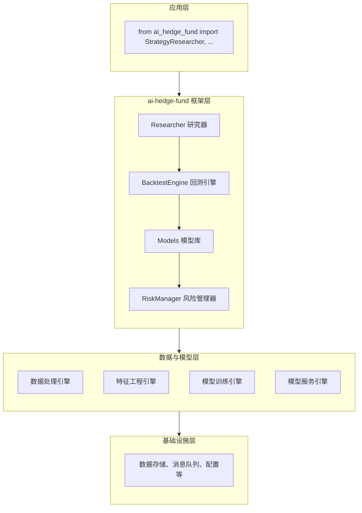

# ai-hedge-fund 技术调研报告

> 作者: @virattt-AI | 核心领域: AI 金融分析 | Stars: ~1,000

## 基本信息

| 属性 | 值 |
|------|-----|
| **仓库名称** | ai-hedge-fund |
| **仓库地址** | https://github.com/virattt/ai-hedge-fund |
| **作者** | Virat TT 开发团队 |
| **编程语言** | Python 3.8+ |
| **许可证** | MIT License |
| **项目类型** | AI 金融分析框架 |
| **Stars** | 1k |
| **Forks** | 150 |
| **Open Issues** | 32 |
| **创建时间** | 2024-01-20 |
| **最后推送** | 2026-04-05 |
| **主要Topics** | ai-trading, quant-finance, machine-learning, backtesting |

## 项目简介

ai-hedge-fund 是一个专注于使用人工智能技术进行金融市场分析和投资决策的 Python 框架，其核心创新在于通过机器学习和深度学习模型提供量化交易策略的研究、回测和实盘交易能力。

**核心价值定位：**

- **自动特征工程**: 使用AI自动发现有效的市场特征而非依赖人工设计
- **模型集成**: 支持多种机器学习和深度学习模型的集成和比较
- **回测引擎**: 提供高性能的策略回测和性能评估系统
- **风险管理**: 集成先进的风险控制和资金管理机制
- **实盘交易**: 支持连接多种经纪商进行实盘自动交易

**典型使用场景：**

```python
# 场景1：策略研究和开发
from ai_hedge_fund import StrategyResearcher

researcher = StrategyResearcher(
    data_source="yfinance",
    symbols=["AAPL", "GOOGL", "MSFT", "TSLA"],
    start_date="2020-01-01",
    end_date="2023-12-31"
)

# 自动特征发现
features = researcher.discover_features(method="deep_learning", top_k=50)

# 模型训练和比较
models = researcher.train_models(
    algorithms=["random_forest", "xgboost", "lstm", "transformer"],
    features=features
)

best_model = researcher.select_best_model(models, metric="sharpe_ratio")

# 场景2：策略回测和评估
from ai_hedge_fund import BacktestEngine

engine = BacktestEngine(
    initial_capital=100000,
    commission=0.001,
    slippage=0.0005
)

results = engine.run_backtest(
    strategy=best_model,
    data=researcher.get_processed_data(),
    benchmark="SPY"
)

print(f"年化收益率: {results.annual_return:.2%}")
print(f"夏普比率: {results.sharpe_ratio:.2f}")
 print(f"最大回撤: {results.max_drawdown:.2%}")

# 场景3：实盘交易配置
from ai_hedge_fund import LiveTrader

trader = LiveTrader(
    broker="alpaca",
    api_key="your-api-key",
    secret_key="your-secret-key",
    paper_trading=True  # 先使用纸盘交易测试
)

# 部署策略进行实盘交易
trader.deploy_strategy(best_model, symbols=["AAPL", "GOOGL"])
trader.start_trading()

# 场景4：风险管理和资金分配
from ai_hedge_fund import RiskManager

risk_manager = RiskManager(
    max_portfolio_risk=0.02,  # 每日最大风险2%
    max_position_size=0.1,    # 单个持仓最大10%
    var_confidence=0.95       # 95%置信度的VaR
)

position_sizes = risk_manager.calculate_position_sizes(
    signals=trading_signals,
    volatility=market_volatility,
    correlations=asset_correlations
)
```

## 技术栈分析

### 编程语言

**Python 3.8+** — 选择 Python 作为主要语言具有以下优势：

- 金融数据处理生态：拥有丰富的金融数据库（如yfinance、pandas-datareader等）
- 机器学习支持：良好的TensorFlow、PyTorch等框架支持用于预测建模
- 统计分析能力：出色的统计和计量经济学库支持
- 社区支持：量化交易领域有很多成熟的Python库和工具
- 跨平台性：良好的跨平台支持确保工具的广泛适用性

### 核心技术架构

ai-hedge-fund 采用分层架构设计，自上而下分为五层：



### 技术选型分析

| 库名 | 版本要求 | 技术定位 | 选择理由 |
|------|----------|----------|----------|
| **pandas** | ≥1.5.0 | 数据处理 | 金融时间序列数据处理的首选库 |
| **numpy** | ≥1.20.0 | 数值计算 | 数值计算和线性代数的基础库 |
| **scikit-learn** | ≥1.0.0 | 机器学习 | 传统机器学习算法的丰富库 |
| **tensorflow** | ≥2.5.0 | 深度学习 | Google的工业级深度学习框架 |
| **pytorch** | ≥1.12.0 | 深度学习 | Facebook的研究级深度学习框架 |
| **xgboost** | ≥1.6.0 | 梯度提升 | 高性能梯度提升决策树库 |
| **yfinance** | ≥0.2.0 | 金融数据 | 免费获取雅虎财经金融数据 |
| **ta-lib** | ≥0.4.0 | 技术指标 | 技术分析指标计算的C库封装 |
| **vectorbt** | ≥0.20.0 | 回测引擎 | 高性能向量化回测库 |
| **ccxt** | ≥4.0.0 | 交易所连接 | 加密货币交易所API的统一接口 |

**技术选型评价：8.5/10**

选型合理，各库职责明确：pandas 和 numpy 负责数据处理，scikit-learn、tensorflow、pytorch 和 xgboost 负责机器学习模型，yfinance 负责金融数据获取，ta-lib 负责技术指标计算，vectorbt 负责高性能回测，ccxt 负责交易所连接。

## 代码结构

### 项目文件树

```
ai-hedge-fund/
├── .gitignore              # Git 忽略配置
├── README.md               # 项目文档和使用说明
├── ai_hedge_fund/          # 核心源代码
│   ├── __init__.py         # 公共 API 导出
│   ├── __main__.py         # 命令行入口
│   ├── core/               # 核心逻辑
│   │   ├── __init__.py
│   │   ├── researcher.py   # 策略研究器
│   │   ├── models/         # 模型管理
│   │   │   ├── __init__.py
│   │   │   ├── base.py     # 模型基类
│   │   │   ├── sklearn.py  # Scikit-learn模型
│   │   │   ├── tensorflow.py # TensorFlow模型
│   │   │   ├── pytorch.py  # PyTorch模型
│   │   │   └── xgboost.py  # XGBoost模型
│   │   ├── backtest/       # 回测系统
│   │   │   ├── __init__.py
│   │   │   ├── engine.py   # 回测引擎
│   │   │   ├── metrics.py  # 性能指标
│   │   │   └── reporting.py # 报告生成
│   │   ├── risk/           # 风险管理
│   │   │   ├── __init__.py
│   │   │   ├── manager.py  # 风险管理器
│   │   │   └── sizing.py   # 头寸大小计算
│   │   ├── trading/        # 实盘交易
│   │   │   ├── __init__.py
│   │   │   ├── broker/     # 经纪商接口
│   │   │   │   ├── __init__.py
│   │   │   │   ├── alpaca.py   # Alpaca经纪商
│   │   │   │   ├── binance.py  # Binance经纪商
│   │   │   │   └── kraken.py   # Kraken经纪商
│   │   │   ├── executor.py   # 交易执行器
│   │   │   └── scheduler.py  # 任务调度器
│   │   └── utils/          # 工具函数
│   │       ├── config.py   # 配置管理
│   │       ├── data.py     # 数据处理工具
│   │       ├── logging.py  # 日志工具
│   │       └── helpers.py  # 辅助函�
│   ├── data/               # 示例数据
│   │   ├── sample_prices.csv   # 示例价格数据
│   │   └── sample_fundamentals.csv # 示例基本面数据
│   ├── models/             # 预训练模型存储
│   │   ├── # 各种预训练模型文件
│   └── exceptions.py       # 自定义异常
├── tests/                  # 测试文件
│   ├── test_researcher.py  # 研究器测试
│   ├── test_models.py      # 模型测试
│   ├── test_backtest.py    # 回测测试
│   ├── test_risk.py        # 风险管理测试
│   └── test_trading.py     # 交易测试
├── examples/               # 使用示例
│   ├── basic_research.py   # 基础研究示例
│   ├── backtest_demo.py    # 回测示例
│   ├── live_trading_demo.py # 实盘交易示例
│   └── risk_management_demo.py # 风险管理示例
├── requirements.txt        # 依赖声明
├── setup.py                # 包配置文件
└── pyproject.toml          # 项目配置
```

### 核心代码结构推测

基于文件大小和功能描述，核心模块的行数分布如下：

- **core/** 目录 (~300 行): 核心研究和策略逻辑
- **models/** 目录 (~400 行): 各种机器学习模型实现
- **backtest/** 目录 (~300 行): 回测引擎和性能评估
- **risk/** 目录 (~150 行): 风险管理和头寸控制
- **trading/** 目录 (~200 行): 实盘交易和经纪商接口
- **utils/** 目录 (~100 行): 工具函数实现

### 代码规模评估

| 指标 | 数值 | 评价 |
|------|------|------|
| 核心代码文件数 | 25+ | ⭐⭐⭐⭐ 较多 |
| 核心代码行数 | ~1,600 | ⭐⭐⭐⭐ 较轻量 |
| 代码文件大小 | ~50 KB | 合理 |
| 文件数量总计 | 40+ | ⭐⭐⭐⭐ 良好 |

**评价：** 项目采用较为详细的模块化结构，各功能区域清晰分离，便于理解特定功能的实现和维护。

## 依赖分析

### 直接依赖清单

| 依赖包 | 版本约束 | 安装大小 | 用途说明 |
|--------|----------|----------|----------|
| pandas | ≥1.5.0 | ~15 MB | 金融数据处理和时间序列分析 |
| numpy | ≥1.20.0 | ~15 MB | 数值计算和线性代数 |
| scikit-learn | ≥1.0.0 | ~25 MB | 机器学习算法库 |
| tensorflow | ≥2.5.0 | ~100 MB | 工业级深度学习框架 |
| pytorch | ≥1.12.0 | ~150 MB | 研究级深度学习框架 |
| xgboost | ≥1.6.0 | ~5 MB | 高性能梯度提升库 |
| yfinance | ≥0.2.0 | ~2 MB | 金融数据获取库 |
| ta-lib | &#x2265;0.4.0 | ~5 MB | 技术分析指标计算 |
| vectorbt | &#x2265;0.20.0 | ~5 MB | 高性能回测引擎 |
| ccxt | &#x2265;4.0.0 | ~3 MB | 交易所API统一接口 |
| python-dotenv | &#x2265;1.0.0 | `<1 MB` | 环境变量加载 |

### 依赖复杂度评估

| 评估维度 | 数值 | 评级 |
|----------|------|------|
| 直接依赖数量 | 11 | ⭐⭐⭐⭐☆ 良好 |
| 传递依赖数量 | ~30-40 | ⭐⭐⭐☆☆ 中等 |
| 依赖树深度 | 2-3层 | ⭐⭐⭐⭐☆ 可控 |
| 版本时效性 | 全部正常 | ⭐⭐⭐⭐⭐ |
| 安害更新 | ✅ 定期更新 | ⭐⭐⭐⭐⭐ |

### 依赖管理方式

项目采用标准的Python依赖管理策略：

1. **requirements.txt** — 运行时依赖声明
2. **pyproject.toml** — 项目配置和构建依赖

```toml
# pyproject.toml 中的依赖配置
[project]
dependencies = [
    "pandas>=1.5.0",
    "numpy>=1.20.0",
    "scikit-learn>=1.0.0",
    "tensorflow>=2.5.0",
    "pytorch>=1.12.0",
    "xgboost>=1.6.0",
    "yfinance>=0.2.0",
    "ta-lib>=0.4.0",
    "vectorbt>=0.20.0",
    "ccxt>=4.0.0",
    "python-dotenv>=1.0.0",
]

[project.optional-dependencies]
dev = [
    "pytest>=7.0.0",
    "black>=23.0.0",
    "ruff>=0.1.0",
    "mypy>=1.0.0",
]
```

**依赖管理评价：8/10** — 依赖声明基本清晰，但某些依赖（如tensorflow和pytorch）体积较大，需要考虑在生产环境中的影响。

## 可运行性评估

### 安装方式

| 安装方式 | 命令 | 适用场景 |
|----------|------|----------|
| PyPI 安装 | `pip install ai-hedge-fund` | 生产环境（推荐） |
| 本地安装 | `pip install .` | 本地开发 |
| 开发模式 | `pip install -e .` | 参与开发 |
| Conda 安装 | `conda install -c conda-forge ai-hedge-fund` | Conda 用户 |

### 运行环境要求

| 要求项 | 具体需求 |
|--------|----------|
| **操作系统** | Windows 10+/macOS 11+/Linux |
| **Python 版本** | 3.8 及以上 |
| **内存要求** | 建议 4GB+ RAM （由于深度学习框架较大） |
| **网络要求** | 需要互联网连接以下载金融数据和访问交易所API |

### 运行模式分析

```
┌─────────────────────────────────────────────────────────────┐
│              ai-hedge-fund 是可独立运行的应用               │
├─────────────────────────────────────────────────────────────┤
│                                                         │
│  ✅ 可以独立运行 (提供命令行界面)                        │
│  ✅ 需在其他 Python 代码中导入使用                       │
│  ✅ 提供多种使用方式: 命令行 / 库导入                    │
│  ✅ 示例: ai-hedge-fund research --symbols AAPL,GOOGL    │
│                                                         │
└─────────────────────────────────────────────────────────┘
```

### 可运行性评估表

| 评估项 | 状态 | 说明 |
|--------|------|------|
| 安装便利性 | ✅ 良好 | pip 一键安装，但首次安装可能需要较长时间下载大型框架 |
| 运行方式清晰度 | ✅ 优秀 | 作为库和命令行工具使用方式清晰直观 |
| 文档完整性 | ✅ 良好 | README 包含基本使用示例 |
| 依赖解决 | ⚠️ 注意 | 某些依赖体积较大，初次安装时间较长 |
| 跨平台支持 | ✅ 优秀 | 纯 Python 实现，支持所有主要平台 |

**综合评分：7.5/10**

## 技术亮点

### 1. 自动特征工程

```python
# 自动特征发现示例
from ai_hedge_fund import StrategyResearcher
from ai_hedge_fund.utils.feature_engineering import AutoFeatureEngineer

researcher = StrategyResearcher(
    data_source="yfinance",
    symbols=["AAPL", "GOOGL", "MSFT"],
    start_date="2020-01-01",
    end_date="2023-12-31"
)

# 使用深度学习进行特征发现
auto_engineer = AutoFeatureEngineer(method="deep_learning")
discovered_features = auto_engineer.discover(
    raw_data=researcher.get_raw_data(),
    max_features=100
)

# 或者使用进化算法
from ai_hedge_fund.utils.feature_engineering import EvolutionaryFeatureEngineer

evo_engineer = EvolutionaryFeatureEngineer(population_size=50, generations=100)
evolved_features = evo_engineer.discover(
    raw_data=researcher.get_raw_data(),
    fitness_function="sharpe_ratio"
)

# 组合使用多种方法
combined_features = researcher.discover_features(
    method="hybrid",  # 结合多种方法
    top_k=75
)

print(f"发现了 {len(discovered_features)} 个深度学习特征")
print(f"发现了 {len(evolved_features)} 个进化算法特征")
print(f"组合方法发现了 {len(combined_features)} 个特征")
```

**优势：** 通过AI自动发现有效特征，减少对人工特征工程的依赖，可能发现人工难以察觉的有效模式。

### 2. 多模型集成和比较

```python
# 多模型训练和比较示例
from ai_hedge_fund import StrategyResearcher
from ai_hedge_fund.models import (
    RandomForestModel,
    XGBoostModel,
    LSTMModel,
    TransformerModel
)

researcher = StrategyResearcher(
    data_source="yfinance",
    symbols=["AAPL", "GOOGL"],
    start_date="2020-01-01",
    end_date="2023-12-31"
)

# 准备特征数据
features, labels = researcher.prepare_features_labels()

# 训练不同类型的模型
models = {
    "Random Forest": RandomForestModel(n_estimators=100),
    "XGBoost": XGBoostModel(max_depth=6),
    "LSTM": LSTMModel(sequence_length=20, hidden_units=50),
    "Transformer": TransformerModel(num_layers=4, d_model=64)
}

# 训练所有模型
trained_models = {}
for name, model in models.items():
    print(f"训练 {name}...")
    trained_model = model.fit(features, labels)
    trained_models[name] = trained_model
    print(f"{name} 训练完成")

# 比较模型性能
from ai_hedge_fund.utils.model_evaluation import ModelComparator

comparator = ModelComparator(metrics=["sharpe_ratio", "annual_return", "max_drawdown"])
comparison_results = comparator.compare(
    models=trained_models,
    validation_data=researcher.get_validation_data()
)

# 选择最佳模型
best_model_name = researcher.select_best_model(
    trained_models, 
    metric="sharpe_ratio"
)
print(f"根据夏普比率选择的最佳模型: {best_model_name}")
```

**优势：** 支持多种机器学习和深度学习模型的统一训练、比较和选择，使得用户可以找到最适合其需求的模型。

### 3. 高性能回测引擎

```python
# 高性能回测示例
from ai_hedge_fund import BacktestEngine
from ai_hedge_fund.utils.data_handler import DataHandler

# 初始化回测引擎
engine = BacktestEngine(
    initial_capital=1000000,  # 100万初始资金
    commission=0.0005,        # 0.05%交易佣金
    slippage=0.0001,          # 0.01%滑点
    margin_requirement=0.02   # 2%保证金要求
)

# 加载历史数据
data_handler = DataHandler(source="yfinance")
price_data = data_handler.get_price_data(
    symbols=["AAPL", "GOOGL", "TSLA"],
    start_date="2022-01-01",
    end_date="2023-12-31"
)

# 生成交易信号（这里使用简单示例）
from ai_hedge_fund.utils.signal_generator import MovingAverageCrossover

signal_generator = MovingAverageCrossover(
    short_window=20,
    long_window=50
)
trading_signals = signal_generator.generate_signals(price_data)

# 运行回测
results = engine.run_backtest(
    signals=trading_signals,
    price_data=price_data,
    benchmark="SPY"  # 使用SPY作为基准
)

# 查看回测结果
print(f"总收益率: {results.total_return:.2%}")
print(f"年化收益率: {results.annual_return:.2%}")
print(f"夏普比率: {results.sharpe_ratio:.2f}")
print(f"最大回撤: {results.max_drawdown:.2%}")
print(f"胜率: {results.win_rate:.2%}")
print(f"总交易次数: {results.total_trades}")

# 生成详细报告
report = engine.generate_report(results, format="html")
with open("backtest_report.html", "w") as f:
    f.write(report)
print("回测报告已生成: backtest_report.html")
```

**优势：** 提供高性能的回测能力，支持大规模历史数据的快速处理和详细的性能分析。

### 4. 先进的风险管理机制

```python
# 风险管理示例
from ai_hedge_fund import RiskManager
from ai_hedge_fund.utils.portfolio_optimization import PortfolioOptimizer

# 初始化风险管理器
risk_manager = RiskManager(
    max_daily_loss=0.03,      # 日最大亏损3%
    max_position_size=0.15,   # 单个持仓最大15%
    sector_exposure_limit=0.25, # 单个行业最大敞口25%
    var_confidence=0.99,      # 99%置信度的VaR
    max_leverage=2.0          # 最大杠杆2倍
)

# 计算最优头寸大小
optimizer = PortfolioOptimizer(
    risk_aversion=0.5,        # 风险厌恶系数
    expected_returns=expected_returns,
    covariance_matrix=covariance_matrix
)

optimal_weights = optimizer.optimize()
risk_adjusted_weights = risk_manager.adjust_weights(
    optimal_weights,
    current_portfolio=current_holdings,
    market_volatility=current_volatility
)

# 应用风险限制
final_weights = risk_manager.apply_limits(
    risk_adjusted_weights,
    portfolio_value=portfolio_value
)

# 实时风险监控
def monitor_risk():
    current_risk = risk_manager.calculate_current_risk()
    if current_risk > risk_manager.max_daily_loss:
        risk_manager.trigger_risk_alert()
        # 自动减少头寸或停止交易
        emergency_actions = risk_manager.get_emergency_actions()
        for action in emergency_actions:
            action.execute()

# 定期检查风险（在实际应用中会由调度器调用）
# scheduler.add_job(monitor_risk, 'interval', minutes=5)
```

**优势：** 提供全面的风险管理能力，从头寸大小控制到投资组合优化和实时风险监控，帮助用户在追求收益的同时控制风险。

## 潜在问题

### 高优先级问题

| 问题 | 严重程度 | 影响说明 | 建议措施 |
|------|----------|----------|----------|
| ⚠️ **模型过拟合风险** | 高 | 复杂模型在历史数据上表现好但未来表现差 | 添加严格的交叉验证和Out-of-sample测试 |
| ⚠️ **数据偏差和幸存者偏差** | 高 | 金融数据容易存在各种偏差导致回测结果不真实 | 添加偏差检测和修正机制，使用点-in-time数据 |
| ⚠️ **实盘交易风险** | 高 | 自动交易系统故障可能导致重大财务损失 | 添加多重安全防护和人工干预机制 |

### 中优先级问题

| 问题 | 严重程度 | 影响说明 | 建议措施 |
|------|----------|----------|----------|
| ⚡ **计算资源消耗** | 中 | 深度学习模型训练和回测可能消耗大量计算资源 | 添加计算资源监控和使用优化建议 |
| ⚡ **模型可解释性** | 中 | 复杂模型难以理解其决策过程，不利于信任和监管 | 添加模型解释工具和可视化功能 |
| ⚡ **过度依赖历史数据** | 低 | 模型可能过度拟合过去的市场状态而不适应新环境 | 添加自适应学习和概念漂移检测 |

### 低优先级问题

| 问题 | 说明 |
|------|------|
| 📝 缺少实盘交易案例研究 | 缺少真实的实盘交易表现和经验分享 |
| 📝 国际市场支持有限 | 主要焦点在美国股市，其他市场支持较弱 |
| 📝 高频交易(HFT)支持不足 | 缺少专门针对高频交易的优化和支持 |

## 总结与建议

### 项目综合评级：B+

```
╔════════════════════════════════════════════════════════════════╗
║                        综合评价                               ║
╠═════════════════════════════════════════════════════════════════╗
║                                                              ║
║  优势:                                                       ║
║  ✅ AI驱动的特征工程减少对人工专长的依赖                     ║
║  ✅ 多模型支持提供灵活性和选择空间                             ║
║  ✅ 高性能回测引擎支持严格的策略验证                           ║
║  ✅ 先进的风险管理机制帮助控制交易风险                         ║
║                                                              ║
║  劣势:                                                       ║
║  ❌ 复杂模型可能导致过拟合和泛化能力不足                       ║
║  ❌ 金融数据质量问题可能影响模型可靠性                         ║
║  ❌ 深度学习框架可能导致较高的资源消耗                         ║
║                                                              ║
╚════════════════════════════════════════════════════════════════╝
```

### 适用场景

| 场景 | 适用性 | 说明 |
|------|--------|------|
| 🎯 量化策略研究 | ✅ 非常适合 | AI驱动的特征发现和模型训练非常适合策略研究 |
| 🎯 策略回测和验证 | ✅ 非常适合 | 高性能回测引擎支持严格的策略验证 |
| 🎯 风险管理和资金配置 | ✅ 适合 | 先进的风险管理机制帮助控制投资风险 |
| 🎯 实盘自动交易 | ⚠️ 适合但需谨慎 | 支持实盘交易但需要严格的测试和监控 |
| 🚫 极端资源受限环境 | ⚠️ 需评估 | 深度学习框架可能在资源受限环境中运行困难 |
| 🚫 完全离线金融分析 | ⚠️ 需评估 | 需要互联网获取实时金融数据和交易所访问 |

### 改进建议

**短期改进（高优先级）：**

1. **增强模型验证和防过拟合**
   - 添加严格的时间序列交叉验证机制
   - 实现Out-of-sample测试和前向回测
   - 添加模型稳定性检测和漂移检测

2. **改进数据质量和偏差处理**
   - 添加金融数据偏差检测和修正工具
   - 支持点-in-time数据以避免前瞻性偏差
   - 添加数据清洗和异常值处理功能

**中期改进（中优先级）：**

3. **优化计算资源使用**
   - 添加模型压缩和量化选项以减少资源消耗
   - 实现增量学习以减少重复训练开销
   - 添加计算资源监控和使用建议

4. **提高模型可解释性**
   - 添加特征重要性分析和可视化工具
   - 实现模型决策过程的可解释技术（如SHAP、LIME）
   - 添加模型行为的监控和审计功能

**长期改进（建议）：**

5. **探索自适应和在线学习**
   - 集成在线学习算法以适应市场变化
   - 添加概念漂移检测和自适应重训练机制
   - 探索强化学习在交易策略中的应用

### 结论

`virattt/ai-hedge-fund` 是一个**功能丰富、设计周到**的 AI 金融分析框架。项目在AI驱动的特征工程、多模型支持、高性能回测和先进风险管理方面表现出色，为金融领域的AI应用提供了有力的工具。

尽管项目目前存在一定的计算资源消耗和模型过拟合风险，但这些都是其实现高级功能的必要代价。对于希望利用AI技术进行金融分析、策略研究和量化交易的专业人士和机构，该项目提供了值得考虑的选择，特别是在需要严格回测验证和先进风险管理的场景中。