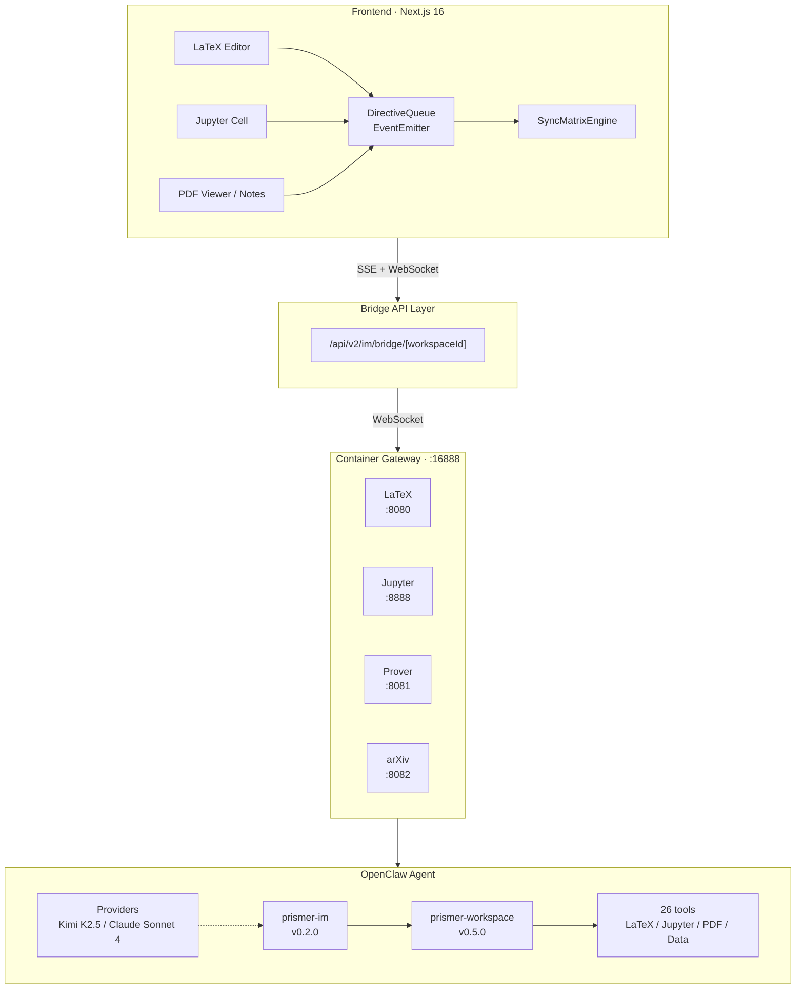

# Prismer 整体架构

## 项目概述

**Prismer** 是 PrincetonSIGMA 开发的学术研究助手，通过 AI Agent 编排多种工具（LaTeX 编译、Jupyter 执行、PDF 阅读等），为研究人员提供智能化的学术写作与代码执行环境。

- **GitHub**: https://github.com/PrincetonSIGMA/Prismer
- **开源协议**: Apache-2.0
- **核心定位**: 学术研究 + AI Agent 协作

## 系统架构总览



## 核心组件详解

### 1. Frontend Layer

| 组件 | 技术栈 | 职责 |
|------|--------|------|
| **UI Framework** | Next.js 16 + React 19 | 页面渲染、App Router |
| **Styling** | Tailwind 4 + OKLCH 色彩空间 | 样式系统 |
| **UI Library** | shadcn/ui + Radix UI + CVA | 组件系统 |
| **State** | Zustand 5 (10 stores) | 状态管理 |

### 2. Sync & Directive Layer

| 组件 | 文件位置 | 职责 |
|------|----------|------|
| **SyncMatrixEngine** | `web/src/lib/sync/` | 规则驱动的同步引擎 |
| **defaultMatrix.ts** | — | 11 条同步规则定义 |
| **componentStateConfig.ts** | — | 字段级同步配置 |
| **useAgentConnection.ts** | — | WebSocket + 指数退避重连 |

### 3. API & Service Layer

| 组件 | 路由/文件 | 职责 |
|------|----------|------|
| **Bridge API** | `/api/v2/im/bridge/[workspaceId]` | 中央消息枢纽 |
| **Workspace API** | `/api/workspace/[id]` | 工作区 CRUD |
| **Agent Start API** | `/api/agents/[id]/start` | Agent 实例启动 |

### 4. Container Services

| Service | Port | 技术 | 用途 |
|---------|------|------|------|
| Gateway | 16888 | Node.js | 反向代理，零依赖 |
| LaTeX | 18080 | pdflatex/xelatex/lualatex | 文档编译 |
| Prover | 8081 | Lean 4/Coq/Z3 | 形式化验证 |
| Jupyter | 18888 | Notebook Kernel | 代码执行 |
| arXiv | 8082 | — | 论文获取 |

### 5. Agent Layer

| 组件 | 配置 | 职责 |
|------|------|------|
| **OpenClaw** | `openclaw.json` | Agent 运行时 |
| **prismer-im** | `docker/plugin/` | IM 桥接插件 |
| **prismer-workspace** | `docker/plugin/` | 工具注册 |

## 数据流详解

### 消息流转路径

```
1. 用户输入 → Frontend (chatStore)
       ↓
2. POST /api/v2/im/bridge/[workspaceId]
       ↓
3. WebSocket → Container Gateway
       ↓
4. OpenClaw Agent (Kimi K2.5 / Claude Sonnet 4)
       ↓
5. Agent Tools (26 workspace tools)
       ↓
6. 执行结果 + Directives
       ↓
7. SSE Stream → Frontend
       ↓
8. DirectiveQueue → Store Mutation → UI 更新
```

### Workspace 隔离机制

存储 Key 格式:
```
user-${userId}:${baseKey}:ws-${workspaceId}
```

示例:
```
user-123:chatStore:ws-456
user-123:layoutStore:ws-456
```

### Directive 协议详解

Agent → Frontend 指令类型:

| Directive | 用途 | 触发时机 |
|-----------|------|----------|
| `SWITCH_COMPONENT` | 切换工作区组件 | Agent 需要切换视图 |
| `LATEX_COMPILE_COMPLETE` | LaTeX 编译完成 | PDF 生成后 |
| `JUPYTER_CELL_RESULT` | Jupyter 执行结果 | 代码运行后 |
| `UPDATE_NOTES` | 更新笔记内容 | Agent 修改笔记 |
| `UPDATE_GALLERY` | 更新数据可视化 | 数据查询后 |

## 核心数据模型

### 1:1:1 绑定关系

```
WorkspaceSession ←→ AgentInstance ←→ Container
```

| 模型 | 关联 | 说明 |
|------|------|------|
| WorkspaceSession | 1:1 → AgentInstance | 用户会话 |
| AgentInstance | 1:1 → Container | Agent 运行环境 |
| Container | 1:1 → WorkspaceSession | 隔离执行环境 |

### Prisma Schema 规模

- **37 个数据模型**
- **7 个域 (domains)**
- **开发环境**: SQLite
- **生产环境**: MySQL

## 6 个 Agent 模板

| 模板 | 角色描述 |
|------|----------|
| `academic-researcher` | 学术研究员，综合研究能力 |
| `data-scientist` | 数据科学家，数据分析与可视化 |
| `mathematician` | 数学家，数学证明与计算 |
| `finance-researcher` | 金融研究员，财务分析与预测 |
| `paper-reviewer` | 论文评审专家，学术质量评估 |
| `cs-researcher` | 计算机研究员，代码与算法 |

## 与 Overleaf 对比

| 功能维度 | Overleaf | Prismer |
|----------|----------|---------|
| 实时协作 | ✅ 完整 | ❌ 无 |
| LaTeX 编译 | ✅ 完整 | ✅ 完整 |
| AI 辅助 | ⚠️ 有限 | ✅ 深度集成 |
| Jupyter 集成 | ❌ 无 | ✅ 原生支持 |
| 代码执行 | ❌ 无 | ✅ 26 工具 |
| 形式化验证 | ❌ 无 | ✅ Lean/Coq/Z3 |

## 技术亮点

1. **Directive 协议**: Agent → Frontend 双向通信
2. **SyncMatrixEngine**: 规则驱动的实时同步
3. **Docker 服务栈**: 隔离的 LaTeX/Jupyter/Prover 环境
4. **26 工具生态**: 覆盖学术研究全流程
5. **多 Agent Provider**: Kimi K2.5 / Claude Sonnet 4

## 技术局限

1. **无实时协作**: 缺少光标共享、内联评论
2. **单用户编辑**: 仅支持单用户 + AI 协作
3. **无版本控制**: workspace snapshots 仅用于状态回放
