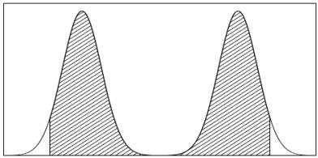
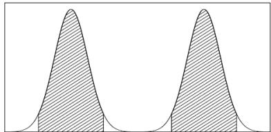

# SINGLE-PARAMETER MODELS

# CHAPTER 2

ESTIMATING A PROBABILITY FROM BINOMIAL DATA   
$\oplus$ POSTERIOR AS COMPROMISE BETWEEN DATA AND PRIOR INFORMATION   
SUMMARIZING POSTERIOR INFERENCE   
4 INFORMATIVE PRIOR DISTRIBUTIONS   
ESTIMATING A NORMAL MEAN WITH KNOWN VARIANCE   
OTHER STANDARD SINGLE-PARAMETER MODELS  
EXAMPLE: INFORMATIVE PRIOR DISTRIBUTION FOR CANCER RATES   
NONINFORMATIVE PRIOR DISTRIBUTIONS   
WEAKLY INFORMATIVE PRIOR DISTRIBUTIONS

# ESTIMATING A PROBABILITY FROM BINOMIAL DATA

The binomial sampling model, $\operatorname{Bin}(y|n,\theta)$ , is,

$$
p (y | \theta) = \left( \begin{array}{c} n \\ y \end{array} \right) \theta^ {y} (1 - \theta) ^ {n - y}.
$$

$y$ : the total number of successes in the $n$ Bernoulli trials;

$\theta$ : the proportion of successes in the population or, equivalently, the probability of success in each trial.

# PRIOR DISTRIBUTION OF $\theta$

To perform Bayesian inference in the binomial model, we must specify a prior distribution for $\theta$ .

We will discuss issues associated with specifying prior distributions many times throughout this course, but for simplicity at this point, we assume that the prior distribution for $\theta$ is uniform on the interval [0, 1].

# POSTERIOR DISTRIBUTION OF $\theta$

Elementary application of Bayes' rule applied to the binomial model, then gives the posterior density for $\theta$ as

$$
p (\theta | y) \propto \theta^ {y} (1 - \theta) ^ {n - y}.
$$

# NOTE

With fixed $n$ and $y$ , the factor $\binom{n}{y}$ does not depend on the unknown parameter $\theta$ , and so it can be treated as a constant when calculating the posterior distribution of $\theta$ .

As is typical of many examples, the posterior density can be written immediately in closed form, up to a constant of proportionality.

In single-parameter problems, this allows immediate graphical presentation of the posterior distribution.

In the present case, we can recognize the posterior distribution of $\theta$ as the unnormalized form of the beta distribution,

$$
\theta | y \sim \operatorname {B e t a} (y + 1, n - y + 1).
$$

# BETA DISTRIBUTION

$$
p (x | \alpha , \beta) = \frac {\Gamma (\alpha + \beta)}{\Gamma (\alpha) \Gamma (\beta)} x ^ {\alpha - 1} (1 - x) ^ {\beta - 1}, 0 \leq x \leq 1.
$$

# PREDICTION

In the binomial example with the uniform prior distribution, the prior predictive distribution can be evaluated explicitly.

Under the model, all possible values of $y$ are equally likely, a priori.

For posterior prediction from this model, we might be more interested in the outcome of one new trial, rather than another set of $n$ new trials.

Letting $\tilde{y}$ denote the result of a new trial, exchangeable with the first $n$ ,

$$
\begin{array}{l} P (\tilde {y} = 1 | y) = \int_ {0} ^ {1} P (\tilde {y} = 1 | \theta , y) \times p (\theta | y) d \theta \\ = \int_ {0} ^ {1} \theta p (\theta | y) d \theta = E (\theta | y) = \frac {y + 1}{n + 2}. \\ \end{array}
$$

# NOTE

This result, based on the uniform prior distribution, is known as Laplace's law of succession. At the extreme observations $y = 0$ and $y = n$ , Laplace's law predicts probabilities of $1 / (n + 2)$ and $(n + 1) / (n + 2)$ , respectively.

ESTIMATING A PROBABILITY FROM BINOMIAL DATA   
POSTERIOR AS COMPROMISE BETWEEN DATA AND PRIOR INFORMATION   
SUMMARIZING POSTERIOR INFERENCE   
4 INFORMATIVE PRIOR DISTRIBUTIONS   
ESTIMATING A NORMAL MEAN WITH KNOWN VARIANCE   
OTHER STANDARD SINGLE-PARAMETER MODELS  
EXAMPLE: INFORMATIVE PRIOR DISTRIBUTION FOR CANCER RATES   
NONINFORMATIVE PRIOR DISTRIBUTIONS   
9 WEAKLY INFORMATIVE PRIOR DISTRIBUTIONS

# POSTERIOR AS COMPROMISE BETWEEN DATA AND PRIOR INFORMATION

The process of Bayesian inference involves passing from a prior distribution, $p(\theta)$ , to a posterior distribution, $p(\theta | y)$ , and it is natural to expect that some general relations might hold between these two distributions.

For example, we might expect that, because the posterior distribution incorporates the information from the data, it will be less variable than the prior distribution.

This notion is formalized in the second of the following expressions:

$$
\mathsf {E} (\theta) = \mathsf {E} \left[ \mathsf {E} (\theta | y) \right],
$$

$$
\operatorname {V a r} (\theta) = \operatorname {E} \left[ \operatorname {V a r} (\theta | y) \right] + \operatorname {V a r} \left[ \operatorname {E} (\theta | y) \right].
$$

The result expressed by the expectation is scarcely surprising: the prior mean of $\theta$ is the average of all possible posterior means over the distribution of possible data.

The variance formula is more interesting because it says that the posterior variance is on average smaller than the prior variance, by an amount that depends on the variation in posterior means over the distribution of possible data. The greater the latter variation, the more the potential for reducing our uncertainty with regard to $\theta$ .

The mean and variance relations only describe expectations, and in particular situations the posterior variance can be similar to or even larger than the prior variance (although this can be an indication of conflict or inconsistency between the sampling model and prior distribution).

In the binomial example with the uniform prior distribution, the prior mean is $1/2$ , and the prior variance is $1/12$ .

The posterior mean, $(y + 1) / (n + 2)$ , is a compromise between the prior mean $(1/2)$ and the sample proportion $(y/n)$ , where clearly the prior mean has a smaller and smaller role as the size of the data sample increases.

This is a general feature of Bayesian inference: the posterior distribution is centered at a point that represents a compromise between the prior information and the data, and the compromise is controlled to a greater extent by the data as the sample size increases.

ESTIMATING A PROBABILITY FROM BINOMIAL DATA   
$\oplus$ POSTERIOR AS COMPROMISE BETWEEN DATA AND PRIOR INFORMATION

SUMMARIZING POSTERIOR INFERENCE   
4 INFORMATIVE PRIOR DISTRIBUTIONS   
ESTIMATING A NORMAL MEAN WITH KNOWN VARIANCE   
OTHER STANDARD SINGLE-PARAMETER MODELS  
EXAMPLE: INFORMATIVE PRIOR DISTRIBUTION FOR CANCER RATES   
NONINFORMATIVE PRIOR DISTRIBUTIONS   
9 WEAKLY INFORMATIVE PRIOR DISTRIBUTIONS

# SUMMARIZING POSTERIOR INFERENCE

The posterior probability distribution contains all the current information about the parameter $\theta$ .

Commonly used summaries of location are the mean, median, and mode(s) of the distribution; variation is commonly summarized by the standard deviation, the interquartile range, and other quantiles.

When the posterior distribution has a closed form, such as the beta distribution in the current example, summaries such as the mean, median, and standard deviation of the posterior distribution are often available in closed form.

# POSTERIOR QUANTILES AND INTERVALS

In addition to point summaries, it is nearly always important to report posterior uncertainty.

The usual approach is to present quantiles of the posterior distribution of estimands of interest or, if an interval summary is desired, a central interval of posterior probability, which corresponds, in the case of a $100(1 - \alpha)\%$ interval, to the range of values above and below which lies exactly $100(\alpha / 2)\%$ of the posterior probability.

Such interval estimates are referred to as posterior intervals.

A slightly different summary of posterior uncertainty is the highest posterior density region: the set of values that contains $100(1 - \alpha)\%$ of the posterior probability and also has the characteristic that the density within the region is never lower than that outside.

Such a region is identical to a central posterior interval if the posterior distribution is unimodal and symmetric.

  
FIGURE: Hypothetical density for which the $95\%$ central interval and $95\%$ highest posterior density region dramatically differ. Left: central posterior interval, Right: highest posterior density region.

ESTIMATING A PROBABILITY FROM BINOMIAL DATA   
$\bullet$ POSTERIOR AS COMPROMISE BETWEEN DATA AND PRIOR INFORMATION   
SUMMARIZING POSTERIOR INFERENCE   
4 INFORMATIVE PRIOR DISTRIBUTIONS   
ESTIMATING A NORMAL MEAN WITH KNOWN VARIANCE   
OTHER STANDARD SINGLE-PARAMETER MODELS  
EXAMPLE: INFORMATIVE PRIOR DISTRIBUTION FOR CANCER RATES   
NONINFORMATIVE PRIOR DISTRIBUTIONS   
9 WEAKLY INFORMATIVE PRIOR DISTRIBUTIONS

# INFORMATIVE PRIOR DISTRIBUTIONS

In the binomial example, we have so far considered only the uniform prior distribution for $\theta$ .

# QUESTION

How can this specification be justified, and how in general do we approach the problem of constructing prior distributions?

We consider two basic interpretations that can be given to prior distributions.

In the population interpretation, the prior distribution represents a population of possible parameter values, from which the $\theta$ of current interest has been drawn.

In the more subjective state of knowledge interpretation, the guiding principle is that we must express our knowledge (and uncertainty) about $\theta$ as if its value could be thought of as a random realization from the prior distribution.

For many problems, such as estimating the probability of failure in a new industrial process, there is no perfectly relevant population of $\theta$ 's from which the current $\theta$ has been drawn, except in hypothetical contemplation.

Typically, the prior distribution should include all plausible values of $\theta$ , but the distribution need not be realistically concentrated around the true value, because often the information about $\theta$ contained in the data will far outweigh any reasonable prior probability specification.

# BINOMIAL EXAMPLE WITH DIFFERENT PRIOR DISTRIBUTIONS

Considered as a function of $\theta$ , the likelihood of the binomial model is of the form,

$$
p (y | \theta) \propto \theta^ {a} (1 - \theta) ^ {b}.
$$

Thus, if the prior density is of the same form, with its own values $a$ and $b$ , then the posterior density will also be of this form.

We will parameterize such a prior density as

$$
p (\theta) \propto \theta^ {\alpha - 1} (1 - \theta) ^ {\beta - 1},
$$

which is a beta distribution with parameters $\alpha$ and $\beta$ : $\theta \sim \mathrm{Beta}(\alpha, \beta)$ .

Comparing $p(\theta)$ and $p(y|\theta)$ suggests that this prior density is equivalent to $\alpha - 1$ prior successes and $\beta - 1$ prior failures.

The parameters of the prior distribution are often referred to as hyperparameters.

For now, assume that we can select reasonable values $\alpha$ and $\beta$ . The posterior density for $\theta$ is

$$
\begin{array}{l} p (\theta | y) \propto p (\theta) \times p (y | \theta) \\ \propto \theta^ {\alpha - 1} (1 - \theta) ^ {\beta - 1} \times \theta^ {y} (1 - \theta) ^ {n - y} \\ = \theta^ {y + \alpha - 1} (1 - \theta) ^ {n - y + \beta - 1} \\ = \operatorname {B e t a} (\theta | \alpha + y, \beta + n - y). \\ \end{array}
$$

# CONJUGACY

The property that the posterior distribution follows the same parametric form as the prior distribution is called conjugacy; the beta prior distribution is a conjugate family for the binomial likelihood.

The conjugate family is mathematically convenient in that the posterior distribution follows a known parametric form.

If information is available that contradicts the conjugate parametric family, it may be necessary to use a more realistic, if inconvenient, prior distribution (just as the binomial likelihood may need to be replaced by a more realistic likelihood in some cases).

To continue with the binomial model with beta prior distribution, the posterior mean of $\theta$ , which may be interpreted as the posterior probability of success for a future draw from the population, is now

$$
\mathsf {E} (\theta | y) = \frac {\alpha + y}{\alpha + \beta + n},
$$

which always lies between the sample proportion, $y / n$ , and the prior mean, $\alpha / (\alpha + \beta)$ .

The posterior variance is

$$
\mathsf {V a r} (\theta | y) = \frac {(\alpha + y) (\beta + n - y)}{(\alpha + \beta + n) ^ {2} (\alpha + \beta + n + 1)}.
$$

As $y$ and $n - y$ become large with fixed $\alpha$ and $\beta$ ,

$$
\mathsf {E} (\theta | y) \approx \frac {y}{n}, \quad \text {a n d} \quad \mathsf {V a r} (\theta | y) \approx \frac {1}{n} \times \frac {y}{n} \times \left(1 - \frac {y}{n}\right),
$$

which approaches zero at the rate $1 / n$ .

# NOTE

In the limit, the parameters of the prior distribution have no influence on the posterior distribution.

# CONJUGATE PRIOR DISTRIBUTIONS

If $\mathcal{F}$ is a class of sampling distributions $p(y|\theta)$ , and $\mathcal{P}$ is a class of prior distributions for $\theta$ , then the class $\mathcal{P}$ is conjugate for $\mathcal{F}$ if

$$
p (\theta | y) \in \mathcal {P} \text {f o r a l l} p (\cdot | \theta) \in \mathcal {F} \text {a n d} p (\cdot) \in \mathcal {P}.
$$

This definition is formally vague since if we choose $\mathcal{P}$ as the class of all distributions, then $\mathcal{P}$ is always conjugate no matter what class of sampling distributions is used.

Conjugate prior distributions have the practical advantage, in addition to computational convenience, of being interpretable as additional data.

# EXAMPLE: PROBABILITY OF A GIRL BIRTH GIVEN PLACENTA PREVIA

See the textbook.

ESTIMATING A PROBABILITY FROM BINOMIAL DATA   
POSTERIOR AS COMPROMISE BETWEEN DATA AND PRIOR INFORMATION   
SUMMARIZING POSTERIOR INFERENCE   
4 INFORMATIVE PRIOR DISTRIBUTIONS   
ESTIMATING A NORMAL MEAN WITH KNOWN VARIANCE   
OTHER STANDARD SINGLE-PARAMETER MODELS  
EXAMPLE: INFORMATIVE PRIOR DISTRIBUTION FOR CANCER RATES   
NONINFORMATIVE PRIOR DISTRIBUTIONS   
9 WEAKLY INFORMATIVE PRIOR DISTRIBUTIONS

# ESTIMATING A NORMAL MEAN WITH KNOWN VARIANCE

As the simplest first case, consider a single scalar observation $y$ from a normal distribution parameterized by a mean $\theta$ and variance $\sigma^2$ , where for this initial development we assume that $\sigma^2$ is known.

The sampling distribution is

$$
p (y | \theta) = \frac {1}{\sqrt {2 \pi} \sigma} e ^ {- \frac {1}{2 \sigma^ {2}} (y - \theta) ^ {2}}.
$$

# CONJUGATE PRIOR AND POSTERIOR DISTRIBUTIONS

Considered as a function of $\theta$ , the likelihood is an exponential of a quadratic form in $\theta$ , so the family of conjugate prior densities looks like

$$
p (\theta) = e ^ {A \theta^ {2} + B \theta + C}, \quad A <   0.
$$

We parameterize this family as

$$
p (\theta) \propto \exp \left\{- \frac {1}{2 \tau_ {0} ^ {2}} (\theta - \mu_ {0}) ^ {2} \right\};
$$

that is, $\theta \sim N(\mu_0,\tau_0^2)$ , with hyperparameters $\mu_0$ and $\tau_0^2$ .

The conjugate prior density implies that the posterior distribution for $\theta$ is the exponential of a quadratic form and thus normal, but some algebra is required to reveal its specific form.

In the posterior density, all variables except $\theta$ are regarded as constants, giving the conditional density,

$$
p (\theta | y) \propto \exp \left\{- \frac {1}{2} \left[ \frac {(y - \theta) ^ {2}}{\sigma^ {2}} + \frac {(\theta - \mu_ {0}) ^ {2}}{\tau_ {0} ^ {2}} \right] \right\}.
$$

Expanding the exponents, collecting terms and then completing the square in $\theta$ gives

$$
p (\theta | y) \propto \exp \left\{- \frac {1}{2 \tau_ {1} ^ {2}} (\theta - \mu_ {1}) ^ {2} \right\},
$$

that is, $\theta |y\sim N(\mu_1,\tau_1^2)$ , where

$$
\mu_ {1} = \frac {\mu_ {0} / \tau_ {0} ^ {2} + y / \sigma^ {2}}{1 / \tau_ {0} ^ {2} + 1 / \sigma^ {2}} \quad \text {a n d} \quad \frac {1}{\tau_ {1} ^ {2}} = \frac {1}{\tau_ {0} ^ {2}} + \frac {1}{\sigma^ {2}}.
$$

# PRECISIONS OF THE PRIOR AND POSTERIOR DISTRIBUTIONS

In manipulating normal distributions, the inverse of the variance plays a prominent role and is called the precision.

The algebra above demonstrates that for normal data and normal prior distribution (each with known precision), the posterior precision equals the prior precision plus the data precision.

There are several different ways of interpreting the form of the posterior mean, $\mu_{1}$ .

The posterior mean is expressed as a weighted average of the prior mean and the observed value, $y$ , with weights proportional to the precisions.

Alternatively, we can express $\mu_{1}$ as the prior mean adjusted toward the observed $y$ ,

$$
\mu_ {1} = \mu_ {0} + (y - \mu_ {0}) \frac {\tau_ {0} ^ {2}}{\sigma^ {2} + \tau_ {0} ^ {2}},
$$

or as the data shrunk toward the prior mean,

$$
\mu_ {1} = y - (y - \mu_ {0}) \frac {\sigma^ {2}}{\sigma^ {2} + \tau_ {0} ^ {2}}.
$$

Each formulation represents the posterior mean as a compromise between the prior mean and the observed value.

# POSTERIOR PREDICTIVE DISTRIBUTION

The posterior predictive distribution of a future observation, $\tilde{y}$ , $p(\tilde{y} | y)$ , can be calculated directly by integration:

$$
\begin{array}{l} p (\tilde {y} | y) = \int p (\tilde {y} | \theta) \times p (\theta | y) d \theta \\ \propto \int \exp \left\{- \frac {1}{2 \sigma^ {2}} (\tilde {y} - \theta) ^ {2} \right\} \times \exp \left\{- \frac {1}{2 \tau_ {1} ^ {2}} (\theta - \mu_ {1}) ^ {2} \right\} d \theta . \\ \end{array}
$$

The product in the integrand is the exponential of a quadratic function of $(\tilde{y},\theta)$ ; hence $\tilde{y}$ and $\theta$ have a joint normal posterior distribution, and so the marginal posterior distribution of $\tilde{y}$ is normal.

We can determine the mean and variance of the posterior predictive distribution using the knowledge from the posterior distribution that $\mathsf{E}(\tilde{y}|\theta) = \theta$ and $\mathsf{Var}(\tilde{y}|\theta) = \sigma^2$ , therefore,

$$
\mathsf {E} (\tilde {y} | y) = \mathsf {E} \left[ \mathsf {E} (\tilde {y} | \theta) | y \right] = \mathsf {E} (\theta | y) = \mu_ {1},
$$

$$
\operatorname {V a r} (\tilde {y} | y) = \operatorname {E} \left[ \operatorname {V a r} (\tilde {y} | \theta) | y \right] + \operatorname {V a r} \left[ \operatorname {E} (\tilde {y} | \theta) | y \right] = \operatorname {E} \left(\sigma^ {2} | y\right) + \operatorname {V a r} (\theta | y) = \sigma^ {2} + \tau_ {1} ^ {2}.
$$

Thus, the posterior predictive distribution of $\tilde{y}$ has mean equal to the posterior mean of $\theta$ and two components of variance: the predictive variance $\sigma^2$ from the model and the variance $\tau_1^2$ due to posterior uncertainty in $\theta$ .

# NORMAL MODEL WITH MULTIPLE OBSERVATIONS

This development of the normal model with a single observation can be easily extended to the more realistic situation where a sample of independent and identically distributed observations $y = (y_{1},\ldots ,y_{n})$ is available.

In fact, since $\bar{y}|\theta \sim N(\theta, \sigma^2/n)$ , the results derived for the single normal observation apply immediately (treating $\bar{y}$ as the single observation) to give

$$
p (\theta | y _ {1}, \ldots , y _ {n}) = p (\theta | \bar {y}) = N (\theta | \mu_ {n}, \tau_ {n} ^ {2}),
$$

$$
\mu_ {n} = \frac {\mu_ {0} / \tau_ {0} ^ {2} + n \bar {y} / \sigma^ {2}}{1 / \tau_ {0} ^ {2} + n / \sigma^ {2}},
$$

$$
\frac {1}{\tau_ {n} ^ {2}} = \frac {1}{\tau_ {0} ^ {2}} + \frac {n}{\sigma^ {2}}.
$$

ESTIMATING A PROBABILITY FROM BINOMIAL DATA   
POSTERIOR AS COMPROMISE BETWEEN DATA AND PRIOR INFORMATION   
SUMMARIZING POSTERIOR INFERENCE   
4 INFORMATIVE PRIOR DISTRIBUTIONS   
ESTIMATING A NORMAL MEAN WITH KNOWN VARIANCE   
OTHER STANDARD SINGLE-PARAMETER MODELS  
EXAMPLE: INFORMATIVE PRIOR DISTRIBUTION FOR CANCER RATES   
NONINFORMATIVE PRIOR DISTRIBUTIONS   
9 WEAKLY INFORMATIVE PRIOR DISTRIBUTIONS

# OTHER STANDARD SINGLE-PARAMETER MODELS

See the textbook.

ESTIMATING A PROBABILITY FROM BINOMIAL DATA   
POSTERIOR AS COMPROMISE BETWEEN DATA AND PRIOR INFORMATION   
SUMMARIZING POSTERIOR INFERENCE   
4 INFORMATIVE PRIOR DISTRIBUTIONS   
ESTIMATING A NORMAL MEAN WITH KNOWN VARIANCE   
OTHER STANDARD SINGLE-PARAMETER MODELS  
EXAMPLE: INFORMATIVE PRIOR DISTRIBUTION FOR CANCER RATES   
NONINFORMATIVE PRIOR DISTRIBUTIONS   
9 WEAKLY INFORMATIVE PRIOR DISTRIBUTIONS

# EXAMPLE: INFORMATIVE PRIOR DISTRIBUTION FOR CANCER RATES

See the textbook.

ESTIMATING A PROBABILITY FROM BINOMIAL DATA   
$\oplus$ POSTERIOR AS COMPROMISE BETWEEN DATA AND PRIOR INFORMATION   
SUMMARIZING POSTERIOR INFERENCE   
4 INFORMATIVE PRIOR DISTRIBUTIONS   
ESTIMATING A NORMAL MEAN WITH KNOWN VARIANCE   
OTHER STANDARD SINGLE-PARAMETER MODELS  
EXAMPLE: INFORMATIVE PRIOR DISTRIBUTION FOR CANCER RATES   
NONINFORMATIVE PRIOR DISTRIBUTIONS   
9 WEAKLY INFORMATIVE PRIOR DISTRIBUTIONS

# NONINFORMATIVE PRIOR DISTRIBUTIONS

When prior distributions have no population basis, they can be difficult to construct, and there has long been a desire for prior distributions that can be guaranteed to play a minimal role in the posterior distribution.

Such distributions are sometimes called reference prior distributions, and the prior density is described as vague, flat, diffuse or noninformative.

The rationale for using noninformative prior distributions is often said to be to let the data speak for themselves, so that inferences are unaffected by information external to the current data.

A related idea is the weakly informative prior distribution, which contains some information, enough to regularize the posterior distribution, that is, to keep it roughly within reasonable bounds, but without attempting to fully capture one's scientific knowledge about the underlying parameter.

# PROPER AND IMPROPER PRIOR DISTRIBUTIONS

We return to the problem of estimating the mean $\theta$ of a normal model with known variance $\sigma^2$ , with a $N(\mu_0, \tau_0^2)$ prior distribution on $\theta$ .

If the prior precision, $1 / \tau_0^2$ , is small relative to the data precision, $n / \sigma^2$ , then the posterior distribution is approximately as if $\tau_0^2 = \infty$ :

$$
p (\theta | y) \approx N (\theta | \bar {y}, \sigma^ {2} / n).
$$

Putting this another way, the posterior distribution is approximately that which would result from assuming $p(\theta)$ is proportional to a constant for $\theta \in (-\infty, +\infty)$ .

Such a distribution is not strictly possible, since the integral of the assumed $p(\theta)$ is infinity, which violates the assumption that probabilities sum to 1.

In general, we call a prior density $p(\theta)$ proper if it does not depend on data and integrates to 1.

If $p(\theta)$ integrates to any positive finite value, it is called an unnormalized density and can be renormalized (multiplied by a constant) to integrate to 1.

The prior distribution is improper in this example, but the posterior distribution is proper, given at least one data point.

# IMPROPER PRIOR DISTRIBUTIONS CAN LEAD TO PROPER POSTERIOR DISTRIBUTIONS

In neither of the above two examples does the prior density combine with the likelihood to define a proper joint probability model, $p(y, \theta)$ .

However, we can proceed with the algebra of Bayesian inference and define an unnormalized posterior density function by

$$
p (\theta | y) \propto p (y | \theta) \times p (\theta).
$$

In the above examples (but not always!), the posterior density is in fact proper; that is, $\int p(\theta | y) d\theta$ is finite for all $y$ .

Posterior distributions obtained from improper prior distributions must be interpreted with great care, one must always check that the posterior distribution has a finite integral and a sensible form.

Their most reasonable interpretation is as approximations in situations where the likelihood dominates the prior density.

# JEFFREYS' INVARIANCE PRINCIPLE

One approach that is sometimes used to define noninformative prior distributions was introduced by Jeffreys, based on considering one-to-one transformations of the parameter: $\phi = h(\theta)$ .

Jeffreys' general principle is that any rule for determining the prior density $p(\theta)$ should yield an equivalent result if applied to the transformed parameter.

# UNIFORM PRIORS AND INVARIANCE

Recall that in female birth rate analysis, a uniform prior on the birth rate was used, that is, $\theta \sim \mathrm{Unif}[0,1]$ . The justification was one of ignorance or lack of information.

One pretended that he had no (prior) reason to consider one value of $\theta = \theta_{1}$ more likely than another value $\theta = \theta_{2}$ (both values coming from the range [0, 1]). A uniform pdf is consistent with such a consideration.

But, there is a logical flaw.

Consider the log-odds ratio of a female birth $\phi = \log \frac{\theta}{1 - \theta}$ .

By the same logic, one should not prefer any value of $\phi = \phi_{1}$ over any other $\phi = \phi_{2}$ .

So a prior plausibility score $p(\phi)$ on $\phi$ should satisfy $p(\phi_1) / p(\phi_2) = 1$ for all $\phi_1$ and $\phi_2$ .

But if $\theta$ is assigned the uniform prior pdf $p(\theta) = 1$ , $\theta \in [0,1]$ , then it induces the following prior pdf on $\phi$ by the change of variable

$$
\theta = \frac {\exp (\phi)}{1 + \exp (\phi)},
$$

as follows:

$$
p (\phi) = \frac {\exp (\phi)}{\left[ 1 + \exp (\phi) \right] ^ {2}}.
$$

Hence, $p(\phi_1) \neq p(\phi_2)$ for $\phi_1 \neq \phi_2$ .

That is, the logic of no-preference on $\theta$ leads to a (induced) prior pdf on $\phi$ that does not conform with the logic of no-preference applied directly to $\phi$ , even through $\phi$ is a monotone transform of $\theta$ .

This was held as a major criticism against Bayesian inference in the early 20th century by, among others, the most eminent statisticians of all, R. A. Fisher.

This all but killed the development of Bayesian statistics until H. Jeffreys' revived this topic in mid 20th century.

# INVARIANCE UNDER MONOTONE TRANSFORMATION

Note that the premise of this discussion and debate is the case when there is not much prior information about the parameter.

The question is, is there a prior pdf (for a given model) that would be universally accepted as a non-informative prior?

Laplace's proposal was to use the uniform distribution.

When the parameter space is discrete and finite, this choice is indeed noninformative and even survives the scrutiny of monotone transformations mentioned above.

But when the parameter space is a continuum and one is seeking a prior pdf, uniform distributions are not universally accepted.

The lack of invariance under monotone transformation being one big criticism.

Jeffreys proposed that an acceptable non-informative prior finding principle should be invariant under monotone transformations of the parameter.

Let the statistical model be $Y \sim f(y|\theta)$ and the prior is $p_{\theta}(\theta)$ .

Now suppose we look at a re-parametrization $\phi = h(\theta)$ , given by a smooth monotone transformation $h$ .

The reparametrized model is $Y \sim g(y|\phi)$ where $g(y|\phi) = f(y|h^{-1}(\phi))$ . Suppose the principle, when applied to the re-parameterized model, produces a prior pdf $p_{\phi}(\phi)$ on $\phi$ .

But one could also derive a prior pdf $\tilde{p}_{\phi}(\phi)$ by starting from the prior pdf $p_{\theta}(\theta)$ on $\theta$ and using the transformation $\phi = h(\theta)$ .

Jeffreys demand of invariance is same as saying that the two pdfs

- $p_{\phi}(\phi)$ : found by applying the principle directly on $\phi$   
- $\tilde{p}_{\phi}(\phi)$ : found by applying the principle to $\theta$ and then deriving the corresponding pdf on $\phi$

should be the same.

A little algebra shows that

$$
\begin{array}{l} p _ {\phi} (\phi) = \tilde {p} _ {\phi} (\phi), \mathrm {f o r a l l} \phi \\ \Leftrightarrow p _ {\phi} (h (\theta)) = \tilde {p} _ {\phi} (h (\theta)), \text {f o r a l l} \theta \\ \Leftrightarrow p _ {\phi} (h (\theta)) = p _ {\theta} (\theta) \left| h ^ {\prime} (\theta) \right|, \text {f o r a l l} \theta . \\ \end{array}
$$

In addition to making the demand of invariance, Jeffreys also described how to construct such a prior.

The construction is based on the Fisher information function of a model.

Jeffreys' principle leads to defining the noninformative prior density as $p(\theta) \propto [J(\theta)]^{1/2}$ , where $J(\theta)$ is the Fisher information for $\theta$ :

$$
J (\theta) = \mathsf {E} \left[ \left(\frac {d \log p (y | \theta)}{d \theta}\right) ^ {2} \Bigg | \theta \right] = - \mathsf {E} \left(\frac {d ^ {2} \log p (y | \theta)}{d \theta^ {2}} \Bigg | \theta\right).
$$

To see that Jeffreys' prior model is invariant to parameterization, evaluate $J(\phi)$ at $\theta = h^{-1}(\phi)$ :

$$
\begin{array}{l} J (\phi) = - \mathsf {E} \left(\frac {d ^ {2} \log p (y | \phi)}{d \phi^ {2}}\right) \\ = - \mathsf {E} \left(\frac {d ^ {2} \log p (y | \theta = h ^ {- 1} (\phi))}{d \theta^ {2}} \left| \frac {d \theta}{d \phi} \right| ^ {2}\right) \\ = J (\theta) \left| \frac {d \theta}{d \phi} \right| ^ {2}. \\ \end{array}
$$

Thus, $J(\phi)^{1 / 2} = J(\theta)^{1 / 2}\left|\frac{d\theta}{d\phi}\right|$ , as required.

# EXAMPLE: NORMAL MODEL

Consider $y_{1},\ldots ,y_{n}\sim \mathcal{N}(\mu ,\sigma^{2})$ with known $\sigma^2$

It is easy to derive that the Fisher information of $\mu$ is $n / \sigma^2$ .

Therefore, the Jeffreys' prior for $\mu$ is

$$
p _ {\mu} (\mu) \propto \sqrt {n / \sigma^ {2}}.
$$

# VARIOUS NONINFORMATIVE PRIOR DISTRIBUTIONS FOR THE BINOMIAL PARAMETER

The log-likelihood function of the Binomial model is

$$
\log p (y | \theta) = \text {c o n s t a n t} + y \log \theta + (n - y) \log (1 - \theta).
$$

Routine evaluation of the second derivative and substitution of $\mathsf{E}(y|\theta) = n\theta$ yields the Fisher information:

$$
J (\theta) = - \mathsf {E} \left(\frac {d ^ {2} \log p (y | \theta)}{d \theta^ {2}}\right) = \frac {n}{\theta (1 - \theta)}.
$$

Therefore, Jeffreys' prior density is then $p(\theta) \propto \theta^{-1/2}(1 - \theta)^{-1/2}$ , which is a Beta(1/2, 1/2) density.

On the other hand, the prior density that is uniform in the natural parameter of the exponential family representation of the distribution is

$$
p \big (\operatorname {l o g i t} (\theta) \big) \propto \text {c o n s t a n t},
$$

which corresponds to the improper $\mathrm{Beta}(0,0)$ density on $\theta$ .

# NOTE

But one must be careful with the improper $\operatorname{Beta}(0,0)$ prior distribution: if $y = 0$ or $n$ , the resulting posterior distribution is improper!

# EXAMPLE: JEFFREY'S PRIOR ON BINOMIAL MODEL

$$
p (\theta) \propto \theta^ {- 1 / 2} \times (1 - \theta) ^ {- 1 / 2},
$$

$$
\phi = \log \left(\frac {\theta}{1 - \theta}\right), \quad \theta = \frac {e ^ {\phi}}{1 + e ^ {\phi}}, \quad 1 - \theta = \frac {1}{1 + e ^ {\phi}}, \quad \frac {d \theta}{d \phi} = \frac {e ^ {\phi}}{(1 + e ^ {\phi}) ^ {2}},
$$

$$
\tilde {p} (\phi) \propto \left(\frac {1 + e ^ {\phi}}{e ^ {\phi}}\right) ^ {1 / 2} \times \left(1 + e ^ {\phi}\right) ^ {1 / 2} \times \frac {e ^ {\phi}}{(1 + e ^ {\phi}) ^ {2}} = \frac {e ^ {\phi / 2}}{1 + e ^ {\phi}}.
$$

# EXAMPLE: JEFFREY'S PRIOR ON BINOMIAL MODEL

$$
\begin{array}{l} p (y | \theta) \propto \theta^ {y} \times (1 - \theta) ^ {n - y}, \quad p (y | \phi) \propto \left(\frac {e ^ {\phi}}{1 + e ^ {\phi}}\right) ^ {y} \times \left(\frac {1}{1 + e ^ {\phi}}\right) ^ {n - y}, \\ \log p (y | \phi) = \text {c o n s t a n t} + y \phi - n \log \left(1 + e ^ {\phi}\right), \\ \end{array}
$$

$$
\frac {d ^ {2} \log p (y | \phi)}{d \phi^ {2}} = - n \frac {e ^ {\phi}}{(1 + e ^ {\phi}) ^ {2}}, \quad J (\phi) = - \mathsf {E} \left(\frac {d ^ {2} \log p (y | \phi)}{d \phi^ {2}}\right) = n \frac {e ^ {\phi}}{(1 + e ^ {\phi}) ^ {2}},
$$

$$
p (\phi) \propto J (\phi) ^ {1 / 2} \propto \frac {e ^ {\phi / 2}}{1 + e ^ {\phi}}, \quad p (\phi) = \tilde {p} (\phi).
$$

# DIFFICULTIES WITH NONINFORMATIVE PRIOR DISTRIBUTIONS

Searching for a prior distribution that is always vague seems misguided: if the likelihood is truly dominant in a given problem, then the choice among a range of relatively flat prior densities cannot matter.

Establishing a particular specification as the reference prior distribution seems to encourage its automatic, and possibly inappropriate, use.

For many problems, there is no clear choice for a vague prior distribution, since a density that is flat or uniform in one parameterization will not be in another.

This is the essential difficulty with Laplace's principle of insufficient reason-on what scale should the principle apply?

For example, the reasonable prior density on the normal mean $\theta$ above is uniform, while for $\sigma^2$ , the density $p(\sigma^2) \propto 1 / \sigma^2$ seems reasonable.

However, if we define $\phi = \log \sigma^2$ , then the prior density on $\phi$ is

$$
p (\phi) = p (\sigma^ {2}) \left| \frac {d \sigma^ {2}}{d \phi} \right| \propto \frac {1}{\sigma^ {2}} \sigma^ {2} = 1.
$$

That is, uniform on $\phi = \log \sigma^2$

With discrete distributions, there is the analogous difficulty of deciding how to subdivide outcomes into atoms of equal probability.

Further difficulties arise when averaging over a set of competing models that have improper prior distributions.

Nevertheless, noninformative and reference prior densities are often useful when it does not seem to be worth the effort to quantify one's real prior knowledge as a probability distribution, as long as one is willing to perform the mathematical work to check that the posterior density is proper and to determine the sensitivity of posterior inferences to modeling assumptions of convenience.

ESTIMATING A PROBABILITY FROM BINOMIAL DATA   
$\oplus$ POSTERIOR AS COMPROMISE BETWEEN DATA AND PRIOR INFORMATION   
SUMMARIZING POSTERIOR INFERENCE   
4 INFORMATIVE PRIOR DISTRIBUTIONS   
ESTIMATING A NORMAL MEAN WITH KNOWN VARIANCE   
OTHER STANDARD SINGLE-PARAMETER MODELS  
EXAMPLE: INFORMATIVE PRIOR DISTRIBUTION FOR CANCER RATES   
NONINFORMATIVE PRIOR DISTRIBUTIONS   
9 WEAKLY INFORMATIVE PRIOR DISTRIBUTIONS

# WEAKLY INFORMATIVE PRIOR DISTRIBUTIONS

See the textbook.

# ASSIGNMENT

2.5   
2.8   
2.14