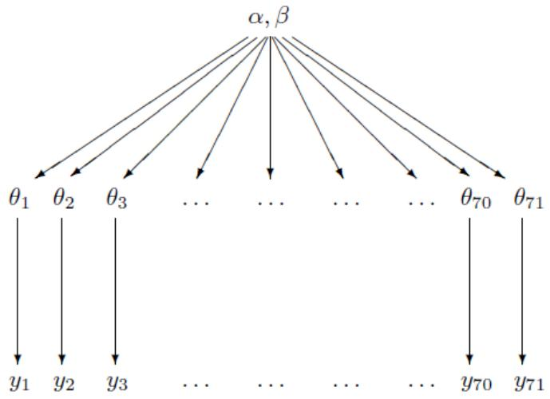

# HIERARCHICAL MODELS

# CHAPTER 5

# HIERARCHICAL MODELS

Many statistical applications involve multiple parameters that can be regarded as related or connected in some way by the structure of the problem, implying that a joint probability model for these parameters should reflect their dependence.

For example, in a study of the effectiveness of cardiac treatments, with the patients in hospital $j$ having survival probability $\theta_{j}$ , it might be reasonable to expect that estimates of the $\theta_{j}$ 's, which represent a sample of hospitals, should be related to each other.

We shall see that this is achieved in a natural way if we use a prior distribution in which the $\theta_{j}$ 's are viewed as a sample from a common population distribution.

A key feature of such applications is that the observed data, $y_{ij}$ , with units indexed by $i$ within groups indexed by $j$ , can be used to estimate aspects of the population distribution of the $\theta_j$ 's even though the values of $\theta_j$ are not themselves observed.

It is natural to model such a problem hierarchically, with observable outcomes modeled conditionally on certain parameters, which themselves are given a probabilistic specification in terms of further parameters, known as hyperparameters.

Such hierarchical thinking helps in understanding multiparameter problems and also plays an important role in developing computational strategies.

Perhaps even more important in practice is that simple nonhierarchical models are usually inappropriate for hierarchical data: with few parameters, they generally cannot fit large data sets accurately, whereas with many parameters, they tend to overfit such data in the sense of producing models that fit the existing data well but lead to inferior predictions for new data.

In contrast, hierarchical models can have enough parameters to fit the data well, while using a population distribution to structure some dependence into the parameters, thereby avoiding problems of overfitting.

1 CONSTRUCTING A PARAMETERIZED PRIOR DISTRIBUTION   
EXCHANGEABILITY AND SETTING UP HIERARCHICAL MODELS   
3 FULLY BAYESIAN ANALYSIS OF CONJUGATE HIERARCHICAL MODELS   
ESTIMATING EXCHANGEABLE PARAMETERS FROM A NORMAL MODEL   
EXAMPLE: PARALLEL EXPERIMENTS IN EIGHT SCHOOLS   
6 HIERARCHICAL MODELING APPLIED TO A META-ANALYSIS   
WEAKLY INFORMATIVE PRIORS

# ANALYZING A SINGLE EXPERIMENT IN THE CONTEXT OF HISTORICAL DATA

To begin our description of hierarchical models, we consider the problem of estimating a parameter $\theta$ using data from a small experiment and a prior distribution constructed from similar previous (or historical) experiments.

Mathematically, we will consider the current and historical experiments to be a random sample from a common population.

# EXAMPLE: ESTIMATING THE RISK OF TUMOR IN A GROUP OF RATS

In the evaluation of drugs for possible clinical application, studies are routinely performed on rodents.

For a particular study drawn from the statistical literature, suppose the immediate aim is to estimate $\theta$ , the probability of tumor in a population of female laboratory rats of type F344 that receive a zero dose of the drug (a control group).

The data show that 4 out of 14 rats developed endometrial stromal polyps (a kind of tumor).

It is natural to assume a binomial model for the number of tumors, given $\theta$ .

For convenience, we select a prior distribution for $\theta$ from the conjugate family, $\theta \sim \mathrm{Beta}(\alpha, \beta)$ .

Then, assuming a $\operatorname{Beta}(\alpha, \beta)$ prior distribution for $\theta$ yields a $\operatorname{Beta}(\alpha + 4, \beta + 10)$ posterior distribution for $\theta$ .

# ANALYSIS WITH A FIXED PRIOR DISTRIBUTION

From historical data, suppose we knew that the tumor probabilities $\theta$ among groups of female lab rats of type F344 follow an approximate beta distribution, with known mean and standard deviation.

The tumor probabilities $\theta$ vary because of differences in rats and experimental conditions among the experiments.

Referring to the expressions for the mean and variance of the beta distribution, we could find values for $\alpha$ , $\beta$ that correspond to the given values for the mean and standard deviation.

# NOTE

For $\theta \sim \mathrm{Beta}(\alpha, \beta)$ ,

$$
\mathsf {E} (\theta) = \frac {\alpha}{\alpha + \beta}, \quad \mathsf {V a r} (\theta) = \frac {\alpha \beta}{(\alpha + \beta) ^ {2} (\alpha + \beta + 1)}.
$$

# APPROXIMATE ESTIMATE OF THE POPULATION DISTRIBUTION USING THE HISTORICAL DATA

Typically, the mean and standard deviation of underlying tumor risks are not available.

Rather, historical data are available on previous experiments on similar groups of rats.

In the rat tumor example, the historical data were in fact a set of observations of tumor incidence in 70 groups of rats (Table 5.1).

Previous experiments:   
Current experiment:   
4/14   

<table><tr><td>0/20</td><td>0/20</td><td>0/20</td><td>0/20</td><td>0/20</td><td>0/20</td><td>0/20</td><td>0/19</td><td>0/19</td><td>0/19</td></tr><tr><td>0/19</td><td>0/18</td><td>0/18</td><td>0/17</td><td>1/20</td><td>1/20</td><td>1/20</td><td>1/20</td><td>1/19</td><td>1/19</td></tr><tr><td>1/18</td><td>1/18</td><td>2/25</td><td>2/24</td><td>2/23</td><td>2/20</td><td>2/20</td><td>2/20</td><td>2/20</td><td>2/20</td></tr><tr><td>2/20</td><td>1/10</td><td>5/49</td><td>2/19</td><td>5/46</td><td>3/27</td><td>2/17</td><td>7/49</td><td>7/47</td><td>3/20</td></tr><tr><td>3/20</td><td>2/13</td><td>9/48</td><td>10/50</td><td>4/20</td><td>4/20</td><td>4/20</td><td>4/20</td><td>4/20</td><td>4/20</td></tr><tr><td>4/20</td><td>10/48</td><td>4/19</td><td>4/19</td><td>4/19</td><td>5/22</td><td>11/46</td><td>12/49</td><td>5/20</td><td>5/20</td></tr><tr><td>6/23</td><td>5/19</td><td>6/22</td><td>6/20</td><td>6/20</td><td>6/20</td><td>16/52</td><td>15/47</td><td>15/46</td><td>9/24</td></tr></table>

TABLE: Tumor incidence in historical control groups and current group of rats, from Tarone (1982). The table displays the values of $y_{j} / n_{j}$ : (number of rats with tumors)/(total number of rats).

In the $j$ th historical experiment, let the number of rats with tumors be $y_{j}$ and the total number of rats be $n_{j}$ .

We model the $y_{j}$ 's as independent binomial data, given sample sizes $n_{j}$ and study-specific means $\theta_{j}$ .

Assuming that the beta prior distribution with parameters $(\alpha, \beta)$ is a good description of the population distribution of the $\theta_j$ 's in the historical experiments, we can display the hierarchical model schematically as in Figure 5.1, with $\theta_{71}$ and $y_{71}$ corresponding to the current experiment.

  
FIGURE: Structure of the hierarchical model for the rat tumor example.

The observed sample mean and standard deviation of the 70 values $y_{j} / n_{j}$ are 0.136 and 0.103.

If we set the mean and standard deviation of the population distribution to these values, we can solve for $\alpha$ and $\beta$ . The resulting estimate for $(\alpha, \beta)$ is (1.4, 8.6).

# NOTE

This is NOT a Bayesian calculation because it is not based on any specified full probability model.

We present a better, fully Bayesian approach to estimating $(\alpha, \beta)$ for this example in Section 5.3.

The estimate (1.4, 8.6) is simply a starting point from which we can explore the idea of estimating the parameters of the population distribution.

Using the simple estimate of the historical population distribution as a prior distribution for the current experiment yields a Beta(5.4, 18.6) posterior distribution for $\theta_{71}$ : the posterior mean is 0.223, and the standard deviation is 0.083.

The prior information has resulted in a posterior mean substantially lower than the crude proportion, $4 / 14 = 0.286$ , because the weight of experience indicates that the number of tumors in the current experiment is unusually high.

These analyses require that the current tumor risk, $\theta_{71}$ , and the 70 historical tumor risks, $\theta_{1},\ldots ,\theta_{70}$ , be considered a random sample from a common distribution.

An assumption that would be invalidated, for example, if it were known that the historical experiments were all done in laboratory A but the current data were gathered in laboratory B, or if time trends were relevant.

In practice, a simple, although arbitrary, way of accounting for differences between the current and historical data is to inflate the historical variance.

For the Beta distribution model, inflating the historical variance means decreasing $(\alpha + \beta)$ while holding $\alpha / \beta$ constant.

Other systematic differences, such as a time trend in tumor risks, can be incorporated in a more extensive model.

Having used the 70 historical experiments to form a prior distribution for $\theta_{71}$ , we might now like also to use this same prior distribution to obtain Bayesian inferences for the tumor probabilities in the first 70 experiments, $\theta_1,\ldots ,\theta_{70}$ .

There are several logical and practical problems with the approach of directly estimating a prior distribution from existing data:

- If we wanted to use the estimated prior distribution for inference about the first 70 experiments, then the data would be used twice: first, all the results together are used to estimate the prior distribution, and then each experiment's results are used to estimate its $\theta$ . This would seem to cause us to overestimate our precision.

- The point estimate for $\alpha$ and $\beta$ seems arbitrary, and using any point estimate for $\alpha$ and $\beta$ necessarily ignores some posterior uncertainty.   
- We can also make the opposite point: does it make sense to estimate $\alpha$ and $\beta$ at all? They are part of the prior distribution: should they be known before the data are gathered, according to the logic of Bayesian inference?

# LOGIC OF COMBINING INFORMATION

Despite these problems, it clearly makes more sense to try to estimate the population distribution from all the data, and thereby to help estimate each $\theta_{j}$ , than to estimate all 71 values $\theta_{j}$ separately.

Consider the following thought experiment about inference on two of the parameters, $\theta_{26}$ and $\theta_{27}$ , each corresponding to experiments with 2 observed tumors out of 20 rats.

Suppose our prior distribution for both $\theta_{26}$ and $\theta_{27}$ is centered around 0.15; now suppose that you were told after completing the data analysis that $\theta_{26} = 0.1$ exactly.

This should influence your estimate of $\theta_{27}$ ; in fact, it would probably make you think that $\theta_{27}$ is lower than you previously believed, since the data for the two parameters are identical, and the postulated value of 0.1 is lower than you previously expected for $\theta_{26}$ from the prior distribution.

Thus, $\theta_{26}$ and $\theta_{27}$ should be dependent in the posterior distribution, and they should not be analyzed separately.

We retain the advantages of using the data to estimate prior parameters and eliminate all of the disadvantages just mentioned by putting a probability model on the entire set of parameters and experiments and then performing a Bayesian analysis on the joint distribution of all the model parameters.

A complete Bayesian analysis is described in Section 5.3.

The analysis using the data to estimate the prior parameters, which is sometimes called empirical Bayes, can be viewed as an approximation to the complete hierarchical Bayesian analysis.

We prefer to avoid the term empirical Bayes because it misleadingly suggests that the full Bayesian method, which we discuss here and use for the rest of the book, is not empirical.

1 CONSTRUCTING A PARAMETERIZED PRIOR DISTRIBUTION   
EXCHANGEABILITY AND SETTING UP HIERARCHICAL MODELS   
3 FULLY BAYESIAN ANALYSIS OF CONJUGATE HIERARCHICAL MODELS   
ESTIMATING EXCHANGEABLE PARAMETERS FROM A NORMAL MODEL   
EXAMPLE: PARALLEL EXPERIMENTS IN EIGHT SCHOOLS   
6 Hierarchical MODELING APPLIED TO A META-ANALYSIS   
WEAKLY INFORMATIVE PRIORS

# EXCHANGEABILITY AND SETTING UP HIERARCHICAL MODELS

Generalizing from the example of the previous section, consider a set of experiments $j = 1,\ldots ,J$ , in which experiment $j$ has data (vector) $y_{j}$ and parameter (vector) $\theta_{j}$ , with likelihood $p(y_{j}|\theta_{j})$ .

# NOTE

Throughout this chapter we use the word experiment for convenience, but the methods can apply equally well to nonexperimental data.

Some of the parameters in different experiments may overlap.

For example, each data vector $y_{j}$ may be a sample of observations from a normal distribution with mean $\mu_{j}$ and common variance $\sigma^2$ , in which case $\theta_{j} = (\mu_{j},\sigma^{2})$ .

# EXCHANGEABILITY

If no information, other than the data $y$ , is available to distinguish any of the $\theta_j$ 's from any of the others, and no ordering or grouping of the parameters can be made, one must assume symmetry among the parameters in their prior distribution.

This symmetry is represented probabilistically by exchangeability; the parameters $(\theta_{1},\ldots ,\theta_{J})$ are exchangeable in their joint distribution if $p(\theta_1,\dots ,\theta_J)$ is invariant to permutations of the indexes $(1,\ldots ,J)$ .

For example, in the rat tumor problem, suppose we have no information to distinguish the 71 experiments, other than the sample sizes $n_j$ , which presumably are not related to the values of $\theta_j$ .

We therefore use an exchangeable model for the $\theta_{j}$ 's.

We have already encountered the concept of exchangeability in constructing independent and identically distributed models for direct data.

In practice, ignorance implies exchangeability.

Generally, the less we know about a problem, the more confidently we can make claims of exchangeability.

NOTE This is not, we hasten to add, a good reason to limit our knowledge of a problem before embarking on statistical analysis!

Consider the analogy to a roll of a die: we should initially assign equal probabilities to all six outcomes.

However, if we study the measurements of the die and weigh the die carefully, we might eventually notice imperfections, which might make us favor one outcome over the others and thus eliminate the symmetry among the six outcomes.

The simplest form of an exchangeable distribution has each of the parameters $\theta_{j}$ as an independent sample from a prior (or population) distribution governed by some unknown parameter vector $\phi$ .

Thus,

$$
p (\theta | \phi) = \prod_ {i = 1} ^ {J} p (\theta_ {j} | \phi).
$$

In general, $\phi$ is unknown, so our distribution for $\theta$ must average over our uncertainty in $\phi$ :

$$
p (\theta) = \int p (\theta | \phi) \times p (\phi) d \phi = \int \left[ \prod_ {i = 1} ^ {J} p (\theta_ {j} | \phi) \right] \times p (\phi) d \phi .
$$

This form, the mixture of independent identical distributions, is usually all that we need to capture exchangeability in practice.

Statistically, the mixture model characterizes parameters $\theta$ as drawn from a common superpopulation that is determined by the unknown hyperparameters, $\phi$ .

We are already familiar with exchangeable models for data, $y_{1}, \ldots, y_{n}$ , in the form of likelihoods in which the $n$ observations are independent and identically distributed, given some parameter vector $\theta$ .

As a simple counterexample to the above mixture model, consider the probabilities of a given die landing on each of its six faces.

The probabilities $\theta_{1},\ldots ,\theta_{6}$ are exchangeable, but the six parameters $\theta_{j}$ are constrained to sum to 1 and so cannot be modeled with a mixture of independent identical distributions; nonetheless, they can be modeled exchangeably.

# EXAMPLE: EXCHANGEABILITY AND SAMPLING

See the textbook.

# EXCHANGEABILITY WHEN ADDITIONAL INFORMATION IS AVAILABLE ON THE UNITS

Often observations are not fully exchangeable, but are partially or conditionally exchangeable:

- If observations can be grouped, we may make hierarchical model, where each group has its own submodel, but the group properties are unknown. If we assume that group properties are exchangeable, we can use a common prior distribution for the group properties.   
- If $y_{i}$ has additional information $x_{i}$ so that $y_{i}$ are not exchangeable but $(y_{i}, x_{i})$ still are exchangeable, then we can make a joint model for $(y_{i}, x_{i})$ or a conditional model for $y_{i}|x_{i}$ .

In the rat tumor example, $y_{j}$ were exchangeable as no additional knowledge was available on experimental conditions.

If we knew that specific batches of experiments were made in different laboratories we could assume partial exchangeability and use two level hierarchical model to model variation within each laboratory and between laboratories.

In the divorce example, if we knew $x_{j}$ , the divorce rate in state $j$ last year, for $j = 1, \ldots, 8$ , but not which index corresponded to which state, then we would certainly be able to distinguish the eight values of $y_{j}$ , but the joint prior distribution $p(x_{j}, y_{j})$ would be the same for each state.

For states having the same last year divorce rates $x_{j}$ , we could use grouping and assume partial exchangeability or if there are many possible values for $x_{j}$ (as we would assume for divorce rates) we could assume conditional exchangeability and use $x_{j}$ as covariate in regression model.

In general, the usual way to model exchangeability with covariates is through conditional independence:

$$
p (\theta_ {1}, \ldots , \theta_ {J} | x _ {1}, \ldots , x _ {J}) = \int \left[ \prod_ {i = 1} ^ {J} p (\theta_ {j} | \phi , x _ {j}) \right] p (\phi | x) d \phi ,
$$

with $x = (x_{1},\ldots ,x_{J})$

In this way, exchangeable models become almost universally applicable, because any information available to distinguish different units should be encoded in the $x$ and $y$ variables.

In the rat tumor example, we have already noted that the sample sizes $n_j$ are the only available information to distinguish the different experiments.

It does not seem likely that $n_j$ would be a useful variable for modeling tumor rates, but if one were interested, one could create an exchangeable model for the $J$ pairs $(n, y)_j$ .

A natural first step would be to plot $y_{j} / n_{j}$ v.s. $n_{j}$ to see any obvious relation that could be modeled.

For example, perhaps some studies $j$ had larger sample sizes $n_j$ because the investigators correctly suspected rarer events; that is, smaller $\theta_j$ and thus smaller expected values of $y_j / n_j$ .

In fact, the plot of $y_{j} / n_{j}$ v.s. $n_{j}$ , not shown here, shows no apparent relation between the two variables.

# OBJECTIONS TO EXCHANGEABLE MODELS

In virtually any statistical application, it is natural to object to exchangeability on the grounds that the units actually differ.

For example, the 71 rat tumor experiments were performed at different times, on different rats, and presumably in different laboratories.

Such information does not, however, invalidate exchangeability.

That the experiments differ implies that the $\theta_{j}$ 's differ, but it might be perfectly acceptable to consider them as if drawn from a common distribution.

In fact, with no information available to distinguish them, we have no logical choice but to model the $\theta_{j}$ 's exchangeably.

Objecting to exchangeability for modeling ignorance is no more reasonable than objecting to an independent and identically distributed model for samples from a common population, objecting to regression models in general, or, for that matter, objecting to displaying points in a scatterplot without individual labels.

As with regression, the valid concern is not about exchangeability, but about encoding relevant knowledge as explanatory variables where possible.

# THE FULL BAYESIAN TREATMENT OF THE HIERARCHICAL MODEL

Returning to the problem of inference, the key hierarchical part of these models is that $\phi$ is not known and thus has its own prior distribution, $p(\phi)$ .

The appropriate Bayesian posterior distribution is of the vector $(\phi, \theta)$ .

The joint prior distribution is

$$
p (\phi , \theta) = p (\phi) \times p (\theta | \phi),
$$

and the joint posterior distribution is

$$
p (\phi , \theta | y) \propto p (\phi , \theta) \times p (y | \phi , \theta) = p (\phi , \theta) \times p (y | \theta).
$$

Note that the latter simplification holding because the data distribution, $p(y|\phi ,\theta)$ , depends only on $\theta$ ; the hyperparameters $\phi$ affect $y$ only through $\theta$ .

Previously, we assumed $\phi$ was known, which is unrealistic; now we include the uncertainty in $\phi$ in the model.

# THE HYPERPRIOR DISTRIBUTION

In order to create a joint probability distribution for $(\phi, \theta)$ , we must assign a prior distribution to $\phi$ .

If little is known about $\phi$ , we can assign a diffuse prior distribution, but we must be careful when using an improper prior density to check that the resulting posterior distribution is proper, and we should assess whether our conclusions are sensitive to this simplifying assumption.

In most real problems, one should have enough substantive knowledge about the parameters in $\phi$ at least to constrain the hyperparameters into a finite region, if not to assign a substantive hyperprior distribution.

As in nonhierarchical models, it is often practical to start with a simple, relatively noninformative, prior distribution on $\phi$ and seek to add more prior information if there remains too much variation in the posterior distribution.

In the rat tumor example, the hyperparameters are $(\alpha, \beta)$ , which determine the beta distribution for $\theta$ .

# POSTERIOR PREDICTIVE DISTRIBUTIONS

Hierarchical models are characterized both by hyperparameters, $\phi$ , in our notation, and parameters $\theta$ .

There are two posterior predictive distributions that might be of interest to the data analyst:

(1) the distribution of future observations $\tilde{y}$ corresponding to an existing $\theta_{j}$ , or   
(2) the distribution of observations $\tilde{y}$ corresponding to future $\theta_{j}$ 's drawn from the same superpopulation.

We label the future $\theta_{j}$ 's as $\tilde{\theta}$ .

Both kinds of replications can be used to assess model adequacy.

In the rat tumor example, future observations can be

(1) additional rats from an existing experiment, or   
(2) results from a future experiment.

In the former case, the posterior predictive draws $\tilde{y}$ are based on the posterior draws of $\theta_{j}$ for the existing experiment.

In the latter case, one must first draw $\tilde{\theta}$ for the new experiment from the population distribution, given the posterior draws of $\phi$ , and then draw $\tilde{y}$ given the simulated $\tilde{\theta}$ .

1 CONSTRUCTING A PARAMETERIZED PRIOR DISTRIBUTION   
2 EXCHANGEABILITY AND SETTING UP HIERARCHICAL MODELS   
3 FULLY BAYESIAN ANALYSIS OF CONJUGATE HIERARCHICAL MODELS   
ESTIMATING EXCHANGEABLE PARAMETERS FROM A NORMAL MODEL   
EXAMPLE: PARALLEL EXPERIMENTS IN EIGHT SCHOOLS   
6 HIERARCHICAL MODELING APPLIED TO A META-ANALYSIS   
WEAKLY INFORMATIVE PRIORS

# FULLY BAYESIAN ANALYSIS OF CONJUGATE

# HIERARCHICAL MODELS

Our inferential strategy for hierarchical models follows the general approach to multiparameter problems presented in Chapter 3 but is more difficult in practice because of the large number of parameters that commonly appear in a hierarchical model.

In particular, we cannot generally plot the contours or display a scatterplot of the simulations from the joint posterior distribution of $(\theta, \phi)$ .

With care, however, we can follow a similar simulation-based approach as before.

In this section, we present an approach that combines analytical and numerical methods to obtain simulations from the joint posterior distribution, $p(\theta ,\phi |y)$ .

For the beta-binomial model for the rat-tumor example, for which the population distribution, $p(\theta|\phi)$ , is conjugate to the likelihood, $p(y|\theta)$ .

# ANALYTIC DERIVATION OF CONDITIONAL AND MARGINAL DISTRIBUTIONS

We first perform the following three steps analytically.

1. Write the joint posterior density, $p(\theta, \phi | y)$ , in unnormalized form as a product of the hyperprior distribution $p(\phi)$ , the population distribution $p(\theta | \phi)$ , and the likelihood $p(y | \theta)$ .   
2. Determine analytically the conditional posterior density of $\theta$ given the hyperparameters $\phi$ ; for fixed observed $y$ , this is a function of $\phi$ , $p(\theta | \phi, y)$ .   
3. Estimate $\phi$ using the Bayesian paradigm; that is, obtain its marginal posterior distribution, $p(\phi | y)$ .

The first step is immediate, and the second step is easy for conjugate models because, conditional on $\phi$ , the population distribution for $\theta$ is just the independent and identically distributed, so that the conditional posterior density is a product of conjugate posterior densities for the components $\theta_{j}$ .

The third step can be performed by brute force by integrating the joint posterior distribution over $\theta$ :

$$
p (\phi | y) = \int p (\theta , \phi | y) d \theta .
$$

For many standard models, however, including the normal distribution, the marginal posterior distribution of $\phi$ can be computed algebraically using the conditional probability formula,

$$
p (\phi | y) = \frac {p (\theta , \phi | y)}{p (\theta | \phi , y)}.
$$

This expression is useful because the numerator is just the joint posterior distribution, and the denominator is the posterior distribution for $\theta$ if $\phi$ were known.

The difficulty in using the above formula, beyond a few standard conjugate models, is that the denominator, $p(\theta | \phi, y)$ , regarded as a function of both $\theta$ and $\phi$ for fixed $y$ , has a normalizing factor that depends on $\phi$ as well as $y$ .

One must be careful with the proportionality constant in Bayes' theorem, especially when using hierarchical models, to make sure it is actually constant.

# DRAWING SIMULATIONS FROM THE POSTERIOR DISTRIBUTION

The following strategy is useful for simulating a draw from the joint posterior distribution, $p(\theta, \phi | y)$ , for simple hierarchical models such as are considered in this chapter.

1. Draw the vector of hyperparameters, $\phi$ , from its marginal posterior distribution, $p(\phi | y)$ .

2. Draw the parameter vector $\theta$ from its conditional posterior distribution, $p(\theta|\phi, y)$ , given the drawn value of $\phi$ .   
3. If desired, draw predictive values $\tilde{y}$ from the posterior predictive distribution given the drawn $\theta$ . Depending on the problem, it might be necessary first to draw a new value $\tilde{\theta}$ given $\phi$ .

As usual, the above steps are performed $L$ times in order to obtain a set of $L$ draws.

From the joint posterior simulations of $\theta$ and $\tilde{y}$ , we can compute the posterior distribution of any estimand or predictive quantity of interest.

# APPLICATION TO THE MODEL FOR RAT TUMORS

See the textbook.

1 CONSTRUCTING A PARAMETERIZED PRIOR DISTRIBUTION   
2 EXCHANGEABILITY AND SETTING UP HIERARCHICAL MODELS   
3 FULLY BAYESIAN ANALYSIS OF CONJUGATE HIERARCHICAL MODELS   
ESTIMATING EXCHANGEABLE PARAMETERS FROM A NORMAL MODEL   
EXAMPLE: PARALLEL EXPERIMENTS IN EIGHT SCHOOLS   
6 HIERARCHICAL MODELING APPLIED TO A META-ANALYSIS   
WEAKLY INFORMATIVE PRIORS

# ESTIMATING EXCHANGEABLE PARAMETERS FROM ANORMAL MODEL

We now present a full treatment of a simple hierarchical model based on the normal distribution, in which observed data are normally distributed with a different mean for each group or experiment, with known observation variance, and a normal population distribution for the group means.

This model is sometimes termed the one-way normal random-effects model with known data variance and is widely applicable, being an important special case of the hierarchical normal linear model.

# THE DATA STRUCTURE

Consider $J$ independent experiments, with experiment $j$ estimating the parameter $\theta_{j}$ from $n_j$ independent normally distributed data points, $y_{ij}$ , each with known error variance $\sigma^2$ ; that is,

$$
y _ {i j} | \theta_ {j} \sim N (\theta_ {j}, \sigma^ {2}), \quad \text {f o r} \quad i = 1, \ldots , n _ {j}; \quad j = 1, \ldots , J.
$$

Using standard notation from the analysis of variance, we label the sample mean of each group $j$ as

$$
\bar {y} _ {, j} = \frac {1}{n _ {j}} \sum_ {i = 1} ^ {n _ {j}} y _ {i j}
$$

with sampling variance

$$
\sigma_ {j} ^ {2} = \sigma^ {2} / n _ {j}.
$$

We can then write the likelihood for each $\theta_{j}$ using the sufficient statistics, $\bar{y}_{j}$ :

$$
\bar {y} _ {j} | \theta_ {j} \sim N (\theta_ {j}, \sigma_ {j} ^ {2}),
$$

a notation that will prove useful later because of the flexibility in allowing a separate variance $\sigma_{j}^{2}$ for the mean of each group $j$ .

For the rest of this chapter, all expressions will be implicitly conditional on the known values $\sigma_{j}^{2}$ .

The treatment of the model provided in this section is also appropriate for situations in which the variances differ for reasons other than the number of data points in the experiment.

In fact, the likelihood can appear in much more general contexts than that stated here.

For example, if the group sizes $n_j$ are large enough, then the means $\bar{y}_{j}$ are approximately normally distributed, given $\theta_{j}$ , even when the data $y_{ij}$ are not.

# CONSTRUCTING A PRIOR DISTRIBUTION FROM PRAGMATIC CONSIDERATIONS

Rather than considering immediately the problem of specifying a prior distribution for the parameter vector $\theta = (\theta_{1},\ldots ,\theta_{J})$ , let us consider what sorts of posterior estimates might be reasonable for $\theta$ , given data $(y_{ij})$ .

A simple natural approach is to estimate $\theta_{j}$ by $\bar{y}_{j}$ , the average outcome in experiment $j$ .

But what if, for example, there are $J = 20$ experiments with only $n_j = 2$ observations per experimental group, and the groups are 20 pairs of assays taken from the same strain of rat, under essentially identical conditions?

The two observations per group do not permit accurate estimates.

Since the 20 groups are from the same strain of rat, we might now prefer to estimate each $\theta_{j}$ by the pooled estimate,

$$
\bar {y} _ {\cdot \cdot} = \frac {\sum_ {j = 1} ^ {J} \bar {y} _ {\cdot j} / \sigma_ {j} ^ {2}}{\sum_ {j = 1} ^ {J} 1 / \sigma_ {j} ^ {2}}.
$$

To decide which estimate to use, a traditional approach from classical statistics is to perform an analysis of variance $F$ test for differences among means: if the $J$ group means appear significantly variable, choose separate sample means, and if the variance between the group means is not significantly greater than what could be explained by individual variability within groups, use $\bar{y}$ .

The theoretical analysis of variance table is as follows, where $\tau^2$ is the variance of $\theta_1, \ldots, \theta_J$ .

For simplicity, we present the analysis of variance for a balanced design in which $n_j = n$ and $\sigma_j^2 = \sigma^2 / n$ for all $j$ .

<table><tr><td></td><td>df</td><td>SS</td><td>MS</td><td>E(MS|σ2,τ2)</td></tr><tr><td>Between groups</td><td>J-1</td><td>ΣiΣj(¯y.j-¯y..)2</td><td>SS/(J-1)</td><td>nτ2+ σ2</td></tr><tr><td>Within groups</td><td>J(n-1)</td><td>ΣiΣj(¯yij-¯y..)2</td><td>SS/(J(n-1))</td><td>σ2</td></tr><tr><td>Total</td><td>Jn-1</td><td></td><td>ΣiΣj(¯yij-¯y..)2</td><td>SS/(Jn-1)</td></tr></table>

In the classical random-effects analysis of variance, one computes the sum of squares (SS) and the mean square (MS) columns of the table and uses the between and within mean squares to estimate $\tau$ .

If the ratio of between to within mean squares is significantly greater than 1, then the analysis of variance suggests separate estimates, $\hat{\theta}_j = \bar{y}_{.j}$ for each $j$ .

If the ratio of mean squares is not statistically significant, then the $F$ test cannot reject the hypothesis that $\tau = 0$ , and pooling is reasonable: $\hat{\theta}_j = \overline{y}_{..}$ for all $j$ .

But we are not forced to choose between complete pooling and none at all.

An alternative is to use a weighted combination:

$$
\hat {\theta} _ {j} = \lambda_ {j} \bar {y}. _ {j} + (1 - \lambda_ {j}) \bar {y}...
$$

$\lambda_{j}$ is between 0 and 1.

What kind of prior models produce these various posterior estimates?

1. The unpooled estimate $\hat{\theta}_j = \overline{y}_{,j}$ is the posterior mean if the $J$ values $\theta_{j}$ have independent uniform prior densities on $(-\infty ,\infty)$ .   
2. The pooled estimate $\hat{\theta} = \overline{y}_{\cdot}$ is the posterior mean if the $J$ values $\theta_{j}$ are restricted to be equal, with a uniform prior density on the common $\theta$ .   
3. The weighted combination is the posterior mean if the $J$ values $\theta_{j}$ have independent and identically distributed normal prior densities.

All three of these options are exchangeable in the $\theta_{j}$ 's, and options 1 and 2 are special cases of option 3.

No pooling corresponds to $\lambda_{j} \equiv 1$ for all $j$ and an infinite prior variance for the $\theta_{j}$ 's, and complete pooling corresponds to $\lambda_{j} \equiv 0$ for all $j$ and a zero prior variance for the $\theta_{j}$ 's.

# THE HIERARCHICAL MODEL

For the convenience of conjugacy (more accurately, partial conjugacy), we assume that the parameters $\theta_{j}$ are drawn from a normal distribution with hyperparameters $(\mu ,\tau)$ :

$$
p (\theta_ {1}, \ldots , \theta_ {J} | \mu , \tau) = \prod_ {j = 1} ^ {J} N (\theta_ {j} | \mu , \tau^ {2}),
$$

$$
p (\theta_ {1}, \ldots , \theta_ {J}) = \int \left[ \prod_ {j = 1} ^ {J} N (\theta_ {j} | \mu , \tau^ {2}) \right] \times p (\mu , \tau) d (\mu , \tau).
$$

That is, the $\theta_{j}$ 's are conditionally independent given $(\mu, \tau)$ .

The hierarchical model also permits the interpretation of the $\theta_{j}$ 's as a random sample from a shared population distribution.

We assign a noninformative uniform hyperprior distribution to $\mu$ , given $\tau$ :

$$
p (\mu , \tau) = p (\mu | \tau) p (\tau) \propto p (\tau).
$$

The uniform prior density for $\mu$ is generally reasonable for this problem; because the combined data from all $J$ experiments are generally highly informative about $\mu$ , we can afford to be vague about its prior distribution.

As usual, we first work out the answer conditional on the hyperparameters and then consider their prior and posterior distributions.

# THE JOINT POSTERIOR DISTRIBUTION

Combining the sampling model for the observable $y_{ij}$ 's and the prior distribution yields the joint posterior distribution of all the parameters and hyperparameters, which we can express in terms of the sufficient statistics, $\bar{y}_{j}$ :

$$
\begin{array}{l} p (\theta , \mu , \tau | y) \propto p (\mu , \tau) \times p (\theta | \mu , \tau) \times p (y | \theta) \\ \propto p (\mu , \tau) \times \prod_ {j = 1} ^ {J} N (\theta_ {j} | \mu , \tau^ {2}) \times \prod_ {j = 1} ^ {J} N (\bar {y}. _ {j} | \theta_ {j}, \sigma_ {j} ^ {2}), \\ \end{array}
$$

where we can ignore factors that depend only on $y$ and the parameters $\sigma_{j}$ which are assumed known for this analysis.

# THE CONDITIONAL POSTERIOR DISTRIBUTION OF THE NORMAL MEANS, GIVEN THE HYPERPARAMETERS

As in the general hierarchical structure, the parameters $\theta_{j}$ are independent in the prior distribution (given $\mu$ and $\tau$ ) and appear in different factors in the likelihood.

Thus, the conditional posterior distribution $p(\theta | \mu, \tau, y)$ factors into $J$ components.

Conditional on the hyperparameters, we simply have $J$ independent unknown normal means, given normal prior distributions, so we can use the methods of Chapter 2 independently on each $\theta_{j}$ .

The conditional posterior distributions for the $\theta_{j}$ 's are independent, and

$$
\theta_ {j} \mid \mu , \tau , y \sim N (\hat {\theta} _ {j}, V _ {j})
$$

$$
\hat {\theta} _ {j} = \frac {\bar {y} _ {j} / \sigma_ {j} ^ {2} + \mu / \tau^ {2}}{1 / \sigma_ {j} ^ {2} + 1 / \tau^ {2}} \quad \text {a n d} \quad \frac {1}{V _ {j}} = \frac {1}{\sigma_ {j} ^ {2}} + \frac {1}{\tau^ {2}}.
$$

The posterior mean is a precision-weighted average of the prior population mean and the sample mean of the $j$ th group; these expressions for $\hat{\theta}_j$ and $V_j$ are functions of $\mu$ and $\tau$ as well as the data.

The conditional posterior density for each $\theta_{j}$ given $(\mu ,\tau)$ is proper.

# THE MARGINAL POSTERIOR DISTRIBUTION OF THE HYPERPARAMETERS

The solution so far is only partial because it depends on the unknown $\mu$ and $\tau$ .

The next step in our approach is a full Bayesian treatment for the hyperparameters.

For the hierarchical normal model, we can simply consider the information supplied by the data about the hyperparameters directly:

$$
p (\mu , \tau | y) \propto p (\mu , \tau) \times p (y | \mu , \tau).
$$

For many problems, this decomposition is no help, because the marginal likelihood factor, $p(y|\mu, \tau)$ , cannot generally be written in closed form.

For the normal distribution, however, the marginal likelihood has a particularly simple form.

The marginal distributions of the group means $\bar{y}_j$ , averaging over $\theta$ , are independent (but not identically distributed) normal:

$$
\bar {y} _ {j} | \mu , \tau \sim N (\mu , \sigma_ {j} ^ {2} + \tau^ {2}).
$$

Thus, we can write the marginal posterior density as

$$
p (\mu , \tau | y) \propto p (\mu , \tau) \times \prod_ {j = 1} ^ {J} N (\bar {y}. _ {j} | \mu , \sigma_ {j} ^ {2} + \tau^ {2}).
$$

# POSTERIOR DISTRIBUTION OF $\mu$ GIVEN $\tau$

We could use the above formula to compute directly the posterior distribution $p(\mu, \tau | y)$ as a function of two variables and proceed as in the rat tumor example.

For the normal model, however, we can further simplify by integrating over $\mu$ , leaving a simple univariate numerical computation of $p(\tau | y)$ .

We factor the marginal posterior density of the hyperparameters as we did the prior density:

$$
p (\mu , \tau | y) = p (\mu | \tau , y) \times p (\tau | y).
$$

The first factor on the right side of the above formula is just the posterior distribution of $\mu$ if $\tau$ were known.

# From inspection of

$$
\begin{array}{l} p (\mu , \tau | y) \propto p (\mu , \tau) \times \prod_ {j = 1} ^ {J} N (\bar {y} _ {j} | \mu , \sigma_ {j} ^ {2} + \tau^ {2}) \\ = p (\mu | \tau) \times p (\tau) \times \prod_ {j = 1} ^ {J} N (\bar {y} _ {j} | \mu , \sigma_ {j} ^ {2} + \tau^ {2}). \\ \end{array}
$$

$\bullet$ $\tau$ assumed known,   
a uniform conditional prior density $p(\mu |\tau)$   
- the log posterior distribution is found to be quadratic in $\mu$ .

Thus, $p(\mu | \tau, y)$ must be normal.

The mean and variance of this distribution can be obtained immediately by considering the group means $\overline{y}_j$ as $J$ independent estimates of $\mu$ with variances $(\sigma_j^2 + \tau^2)$ .

Combining the data with the uniform prior density $p(\mu|\tau)$ yields

$$
\mu | \tau , y \sim N (\hat {\mu}, V _ {\mu}),
$$

where $\hat{\mu}$ is the precision, weighted average of the $\bar{y}_{j}$ , values, and $V_{\mu}^{-1}$ is the total precision:

$$
\hat {\mu} = \frac {\sum_ {j = 1} ^ {J} \frac {\bar {y} _ {j}}{\sigma_ {j} ^ {2} + \tau^ {2}}}{\sum_ {j = 1} ^ {J} \frac {1}{\sigma_ {j} ^ {2} + \tau^ {2}}}, V _ {\mu} ^ {- 1} = \sum_ {j = 1} ^ {J} \frac {1}{\sigma_ {j} ^ {2} + \tau^ {2}}.
$$

The result is a proper posterior density for $\mu$ , given $\tau$ .

# POSTERIOR DISTRIBUTION OF 7

We can now obtain the posterior distribution of $\tau$ analytically, as follows:

$$
\begin{array}{l} p (\tau | y) = \frac {p (\mu , \tau | y)}{p (\mu | \tau , y)} \\ \propto \frac {p (\tau) \times \prod_ {j = 1} ^ {J} N (\bar {y} _ {j} | \mu , \sigma^ {2} + \tau^ {2})}{N (\mu | \hat {\mu} , V _ {\mu})}. \\ \end{array}
$$

This identity must hold for any value of $\mu$ (in other words, all the factors of $\mu$ must cancel when the expression is simplified); in particular, it holds if we set $\mu$ to $\hat{\mu}$ , which makes evaluation of the expression simple:

$$
p (\tau | y) \propto \frac {p (\tau) \times \prod_ {j = 1} ^ {J} N (\bar {y} _ {j} | \mu , \sigma^ {2} + \tau^ {2})}{N (\mu | \hat {\mu} , V _ {\mu})}
$$

$$
\propto p (\tau) \times V _ {\mu} ^ {1 / 2} \times \prod_ {j = 1} ^ {J} \left(\sigma_ {j} ^ {2} + \tau^ {2}\right) ^ {- 1 / 2} \exp \left[ - \frac {\left(\bar {y} _ {, j} - \hat {\mu}\right) ^ {2}}{2 \left(\sigma_ {j} ^ {2} + \tau^ {2}\right)} \right].
$$

Both expressions are functions of $\tau$ , which means that $p(\tau | y)$ is a complicated function of $\tau$ .

# PRIOR DISTRIBUTION FOR 7

To complete our analysis, we must assign a prior distribution to $\tau$ .

For convenience, we use a diffuse noninformative prior density for $\tau$ and hence must examine the resulting posterior density to ensure it has a finite integral.

For our illustrative analysis, we use the uniform prior distribution,

$$
p (\tau) \propto 1.
$$

Alternatively, in applications it involves little extra effort to determine a best guess and an upper bound for the population variance $\tau$ , and a reasonable prior distribution can then be constructed from the scaled inverse- $\chi^2$ family (the natural choice for variance parameters), matching the best guess to the mean of the scaled inverse- $\chi^2$ density and the upper bound to an upper percentile such as the 99th.

Once an initial analysis is performed using the noninformative uniform prior density, a sensitivity analysis with a more realistic prior distribution is often desirable.

# COMPUTATION

For this model, computation of the posterior distribution of $\theta$ is most conveniently performed via simulation, following the factorization used above:

$$
p (\theta , \mu , \tau | y) = p (\tau | y) \times p (\mu | \tau , y) \times p (\theta | \mu , \tau , y).
$$

The first step, simulating $\tau$ , is easily performed numerically using the inverse cdf method on a grid of uniformly spaced values of $\tau$ , with $p(\tau | y)$ .

The second and third steps, simulating $\mu$ and then $\theta$ , can both be done easily by sampling from normal distributions.

# POSTERIOR PREDICTIVE DISTRIBUTIONS

Sampling from the posterior predictive distribution of new data, either from a current or new batch, is straightforward given draws from the posterior distribution of the parameters.

We consider two scenarios:

(1) future data $\tilde{y}$ from the current set of batches, with means $\theta = (\theta_{1},\dots ,\theta_{J})$ and   
(2) future data $\tilde{y}$ from $\tilde{J}$ future batches, with means $\tilde{\theta} = (\tilde{\theta}_1,\dots ,\tilde{\theta}_J)$ .

In the latter case, we must also specify the $\tilde{J}$ individual sample sizes $\tilde{n}_j$ for the future batches.

# DIFFICULTY WITH A NATURAL NON-BAYESIAN

# ESTIMATE OF THE HYPERPARAMETERS

To see some advantages of our fully Bayesian approach, we compare it to an approximate method that is sometimes used based on a point estimate of $\mu$ and $\tau$ from the data.

Unbiased point estimates, derived from the analysis of variance presented earlier, are

$$
\hat {\mu} = \bar {y} _ {\cdot}, \quad \hat {\tau} ^ {2} = (M S B - M S W) / n.
$$

In this alternative approach, inference for $\theta = (\theta_{1},\dots,\theta_{J})$ is based on the conditional posterior distribution, $p(\theta |\hat{\mu},\hat{\tau})$ , given the point estimates.

As we saw in the rat tumor example of the previous section, the main problem with substituting point estimates for the hyperparameters is that it ignores our real uncertainty about them.

The resulting inference for $\theta$ cannot be interpreted as a Bayesian posterior summary.

In addition, the estimate $\hat{\tau}^2$ has the flaw that it can be negative!

The problem of a negative estimate for a variance component can be avoided by setting $\hat{\tau}^2$ to zero in the case that MSW exceeds $MSB$ , but this creates new issues.

Estimating $\tau^2 = 0$ whenever $MSW > MSB$ seems too strong a claim: if $MSW > MSB$ , then the sample size is too small for $\tau^2$ to be distinguished from zero, but this is not the same as saying we know that $\tau^2 = 0$ .

The latter claim, made implicitly by the point estimate, implies that all the group means $\theta_{j}$ are absolutely identical, which leads to scientifically indefensible claims.

It is possible to construct a point estimate of $(\mu, \tau)$ to avoid this particular difficulty, but it would still have the problem, common to all point estimates, of ignoring uncertainty.

1 CONSTRUCTING A PARAMETERIZED PRIOR DISTRIBUTION   
2 EXCHANGEABILITY AND SETTING UP HIERARCHICAL MODELS   
3 FULLY BAYESIAN ANALYSIS OF CONJUGATE HIERARCHICAL MODELS   
ESTIMATING EXCHANGEABLE PARAMETERS FROM A NORMAL MODEL   
EXAMPLE: PARALLEL EXPERIMENTS IN EIGHT SCHOOLS   
6 HIERARCHICAL MODELING APPLIED TO A META-ANALYSIS   
WEAKLY INFORMATIVE PRIORS

# EXAMPLE: PARALLEL EXPERIMENTS IN EIGHT SCHOOLS

See the textbook.

1 CONSTRUCTING A PARAMETERIZED PRIOR DISTRIBUTION   
EXCHANGEABILITY AND SETTING UP HIERARCHICAL MODELS   
3 FULLY BAYESIAN ANALYSIS OF CONJUGATE HIERARCHICAL MODELS   
ESTIMATING EXCHANGEABLE PARAMETERS FROM A NORMAL MODEL   
EXAMPLE: PARALLEL EXPERIMENTS IN EIGHT SCHOOLS   
6 HIERARCHICAL MODELING APPLIED TO A META-ANALYSIS   
WEAKLY INFORMATIVE PRIORS

# HIERARCHICAL MODELING APPLIED TO A META-ANALYSIS

See the textbook.

1 CONSTRUCTING A PARAMETERIZED PRIOR DISTRIBUTION   
2 EXCHANGEABILITY AND SETTING UP HIERARCHICAL MODELS   
3 FULLY BAYESIAN ANALYSIS OF CONJUGATE HIERARCHICAL MODELS   
ESTIMATING EXCHANGEABLE PARAMETERS FROM A NORMAL MODEL   
EXAMPLE: PARALLEL EXPERIMENTS IN EIGHT SCHOOLS   
6 HIERARCHICAL MODELING APPLIED TO A META-ANALYSIS

WEAKLY INFORMATIVE PRIORS

# WEAKLY INFORMATIVE PRIORS

See the textbook.

# ASSIGNMENT

5.11   
5.12