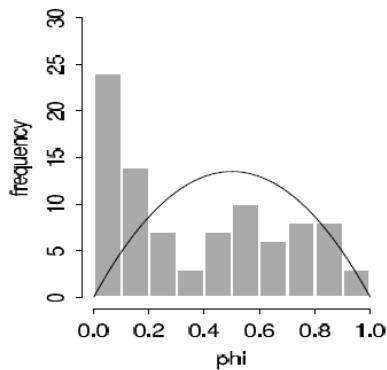
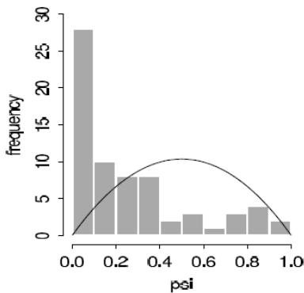
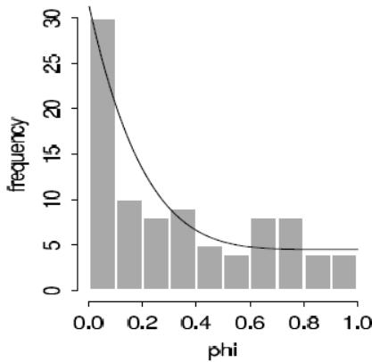
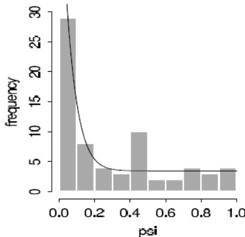
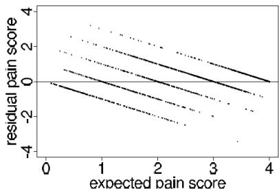
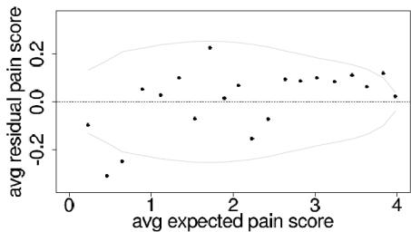

# MODEL CHECKING

# CHAPTER 6

THE PLACE OF MODEL CHECKING IN APPLIED BAYESIAN STATISTICS   
DO THE INFERENCES FROM THE MODEL MAKE SENSE   
POSTERIOR PREDICTIVE CHECKING   
4 GRAPHICAL POSTERIOR PREDICTIVE CHECKS   
MODEL CHECKING FOR THE EDUCATIONAL TESTING EXAMPLE

# THE PLACE OF MODEL CHECKING IN APPLIED BAYESIAN STATISTICS

Once we have accomplished the first two steps of a Bayesian analysis, constructing a probability model and computing the posterior distribution of all estimands, we should not ignore the relatively easy step of assessing the fit of the model to the data and to our substantive knowledge.

It is difficult to include in a probability distribution all of one's knowledge about a problem, and so it is wise to investigate what aspects of reality are NOT captured by the model.

Checking the model is crucial to statistical analysis.

Bayesian prior-to-posterior inferences assume the whole structure of a probability model and can yield misleading inferences when the model is poor.

A good Bayesian analysis, therefore, should include at least some check of the adequacy of the fit of the model to the data and the plausibility of the model for the purposes for which the model will be used.

This is sometimes discussed as a problem of sensitivity to the prior distribution, but in practice the likelihood model is typically just as suspect.

Throughout, we use model to encompass the sampling distribution, the prior distribution, any hierarchical structure, and issues such as which explanatory variables have been included in a regression.

# SENSITIVITY ANALYSIS AND MODEL IMPROVEMENT

It is typically the case that more than one reasonable probability model can provide an adequate fit to the data in a scientific problem.

The basic question of a sensitivity analysis is:

How much do posterior inferences change when other reasonable probability models are used in place of the present model?

Other reasonable models may differ substantially from the present model in the prior specification, the sampling distribution, or in what information is included (for example, predictor variables in a regression).

It is possible that the present model provides an adequate fit to the data, but that posterior inferences differ under plausible alternative models.

In theory, both model checking and sensitivity analysis can be incorporated into the usual prior-to-posterior analysis.

Under this perspective, model checking is done by setting up a comprehensive joint distribution, such that any data that might be observed are plausible outcomes under the joint distribution.

That is, this joint distribution is a mixture of all possible true models or realities, incorporating all known substantive information.

The prior distribution in such a case incorporates prior beliefs about the likelihood of the competing realities and about the parameters of the constituent models.

The posterior distribution of such an exhaustive probability model automatically incorporates all sensitivity analysis but is still predicated on the truth of some member of the larger class of models.

In practice, however, setting up such a super-model to include all possibilities and all substantive knowledge is both conceptually impossible and computationally infeasible in all but the simplest problems.

It is thus necessary for us to examine our models in other ways to see how they fail to fit reality and how sensitive the resulting posterior distributions are to arbitrary specifications.

# JUDGING MODEL FLAWS BY THEIR PRACTICAL IMPLICATIONS

We do not like to ask: Is our model true or false?

Since probability models in most data analyses will not be perfectly true.

# GEORGE BOX

All models are wrong, but some are useful.

Even the coin tosses and die rolls ubiquitous in probability theory texts are not truly exchangeable.

The more relevant question is:

Do the model's deficiencies have a noticeable effect on the substantive inferences?

$\bullet$ THE PLACE OF MODEL CHECKING IN APPLIED BAYESIAN STATISTICS   
DO THE INFERENCES FROM THE MODEL MAKE SENSE   
3 POSTERIOR PREDICTIVE CHECKING   
4 GRAPHICAL POSTERIOR PREDICTIVE CHECKS   
MODEL CHECKING FOR THE EDUCATIONAL TESTING EXAMPLE

# DO THE INFERENCES FROM THE MODEL MAKE SENSE?

In any applied problem, there will be knowledge that is not included formally in either the prior distribution or the likelihood, for reasons of convenience or objectivity.

If the additional information suggests that posterior inferences of interest are false, then this suggests a potential for creating a more accurate probability model for the parameters and data collection process.

# EXAMPLE: EVALUATING ELECTION PREDICTIONS BY COMPARING TO SUBSTANTIVE POLITICAL KNOWLEDGE

See the textbook.

# EXTERNAL VALIDATION

More formally, we can check a model by external validation using the model to make predictions about future data, and then collecting those data and comparing to their predictions.

Posterior means should be correct on average, $50\%$ intervals should contain the true values half the time, and so forth.

# CHOICES IN DEFINING THE PREDICTIVE QUANTITIES

A single model can be used to make different predictions.

For example, in the SAT example we could consider a joint prediction for future data from the 8 schools in the study, $p(\tilde{y} | y)$ , a joint prediction for 8 new schools $p(\tilde{y}_i | y)$ , $i = 9, \ldots, 16$ , or any other combination of new and existing schools.

Other scenarios may have even more different choices in defining the focus of predictions.

For example, in analyses of sample surveys and designed experiments, it often makes sense to consider hypothetical replications of the experiment with a new randomization of selection or treatment assignment, by analogy to classical randomization tests.

Sections 6.3 and 6.4 discuss posterior predictive checking, which use global summaries to check the joint posterior predictive distribution $p(\tilde{y} | y)$ .

At the end of Section 6.3 we briefly discuss methods that combine inferences for local quantities to check marginal predictive distributions $p(\tilde{y}_i|y)$ , an idea that is related to cross-validation methods considered in Chapter 7.

$\bullet$ THE PLACE OF MODEL CHECKING IN APPLIED BAYESIAN STATISTICS   
DO THE INFERENCES FROM THE MODEL MAKE SENSE   
POSTERIOR PREDICTIVE CHECKING   
4 GRAPHICAL POSTERIOR PREDICTIVE CHECKS   
MODEL CHECKING FOR THE EDUCATIONAL TESTING EXAMPLE

# POSTERIOR PREDICTIVE CHECKING

If the model fits, then replicated data generated under the model should look similar to observed data.

To put it another way, the observed data should look plausible under the posterior predictive distribution.

This is really a self-consistency check: an observed discrepancy can be due to model misfit or chance.

Our basic technique for checking the fit of a model to data is to draw simulated values from the joint posterior predictive distribution of replicated data and compare these samples to the observed data.

Any systematic differences between the simulations and the data indicate potential failings of the model.

# EXAMPLE: COMPARING NEWCOMB'S SPEED OF

# LIGHT MEASUREMENTS TO THE POSTERIOR

# PREDICTIVE DISTRIBUTION

See the textbook.

For many problems, it is useful to examine graphical comparisons of summaries of the data to summaries from posterior predictive simulations.

In cases with less blatant discrepancies than the outliers, it is often also useful to measure the statistical significance of the lack of fit.

# NOTATION FOR REPLICATIONS

Let $y$ be the observed data and $\theta$ be the vector of parameters (including all the hyperparameters if the model is hierarchical).

To avoid confusion with the observed data, $y$ , we define $y^{\mathrm{rep}}$ as the replicated data that could have been observed, or, to think predictively, as the data we would see tomorrow if the experiment that produced $y$ today were replicated with the same model and the same value of $\theta$ that produced the observed data.

We distinguish between $y^{\text{rep}}$ and $\tilde{y}$ , our general notation for predictive outcomes: $\tilde{y}$ is any future observable value or vector of observable quantities, whereas $y^{\text{rep}}$ is specifically a replication just like $y$ .

For example, if the model has explanatory variables, $x$ , they will be identical for $y$ and $y^{\text{rep}}$ , but $\tilde{y}$ may have its own explanatory variables, $\tilde{x}$ .

We will work with the distribution of $y^{\mathrm{rep}}$ given the current state of knowledge, that is, with the posterior predictive distribution

$$
p (y ^ {\text {r e p}} | y) = \int p (y ^ {\text {r e p}} | \theta) \times p (\theta | y) d \theta .
$$

# TEST QUANTITIES

We measure the discrepancy between model and data by defining test quantities, the aspects of the data we wish to check.

A test quantity, or discrepancy measure, $T(y, \theta)$ , is a scalar summary of parameters and data that is used as a standard when comparing data to predictive simulations.

Test quantities play the role in Bayesian model checking that test statistics play in classical testing.

We use the notation $T(y)$ for a test statistic, which is a test quantity that depends only on data.

In the Bayesian context, we can generalize test statistics to allow dependence on the model parameters under their posterior distribution.

This can be useful in directly summarizing discrepancies between model and data.

# TAIL-AREA PROBABILITIES

Lack of fit of the data with respect to the posterior predictive distribution can be measured by the tail-area probability, or $p$ -value, of the test quantity, and computed using posterior simulations of $(y^{\mathrm{rep}},\theta)$ .

We define the $p$ -value mathematically, first for the familiar classical test and then in the Bayesian context.

# CLASSICAL $p$ -VALUES

The classical $p$ -value for the test statistic $T(y)$ is

$$
p _ {C} = \Pr \left(T (y ^ {\text {r e p}}) \geq T (y) | \theta\right).
$$

The probability is taken over the distribution of $y^{\mathrm{rep}}$ with $\theta$ fixed.

# NOTE

The distribution of $y^{\mathrm{rep}}$ given $y$ and $\theta$ is the same as its distribution given $\theta$ alone.

Test statistics are classically derived in a variety of ways but generally represent a summary measure of discrepancy between the observed data and what would be expected under a model with a particular value of $\theta$ .

This value may be a null value, corresponding to a null hypothesis, or a point estimate such as the maximum likelihood value.

NOTE A point estimate for $\theta$ MUST be substituted to compute a $p$ -value in classical statistics.

# POSTERIOR PREDICTIVE $p$ -VALUES

To evaluate the fit of the posterior distribution of a Bayesian model, we can compare the observed data to the posterior predictive distribution.

In the Bayesian approach, test quantities can be functions of the unknown parameters as well as data because the test quantity is evaluated over draws from the posterior distribution of the unknown parameters.

The Bayesian $p$ -value is defined as the probability that the replicated data could be more extreme than the observed data, as measured by the test quantity:

$$
p _ {B} = \Pr \left(T (y ^ {\text {r e p}}, \theta) \geq T (y, \theta) | y\right).
$$

- The probability is taken over the posterior distribution of $\theta$ and the posterior predictive distribution of $y^{\mathrm{rep}}$

The joint distribution, $p(\theta ,y^{\mathrm{rep}}|y)$ ..

$$
p _ {B} = \int \int \mathbb {I} \left[ T (y ^ {\text {r e p}}, \theta) \geq T (y, \theta) \right] \times p (y ^ {\text {r e p}} | \theta) \times p (\theta | y) d y ^ {\text {r e p}} d \theta .
$$

- I[.] is the indicator function.

# NOTE

In this formula, we have used the property of the predictive distribution that $p(y^{\mathrm{rep}}|\theta ,y) = p(y^{\mathrm{rep}}|\theta)$ .

In practice, we usually compute the posterior predictive distribution using simulation.

If we already have $S$ simulations from the posterior density of $\theta$ , that is $\theta^1, \ldots, \theta^S$ , we just draw one $y^{\mathrm{rep} s}$ from the predictive distribution for each simulated $\theta^s$ ; we now have $S$ draws, $(y^{\mathrm{rep} s}, \theta^s)$ , from the joint posterior distribution, $p(y^{\mathrm{rep}}, \theta | y)$ .

The posterior predictive check is the comparison between the realized test quantities, $T(y, \theta^s)$ , and the predictive test quantities, $T(y^{\mathrm{rep} s}, \theta^s)$ .

The estimated $p$ -value is just the proportion of these $S$ simulations for which the test quantity equals or exceeds its realized value; that is, for which $T(y^{\mathrm{rep}}s,\theta^s)\geq T(y,\theta^s), s = 1,\ldots ,S.$

# NOTE

In contrast to the classical approach, Bayesian model checking does not require special methods to handle nuisance parameters; by using posterior simulations, we implicitly average over all the parameters in the model.

# EXAMPLE: SPEED OF LIGHT

See the textbook.

# CHOOSING TEST QUANTITIES

The procedure for carrying out a posterior predictive model check requires specifying a test quantity, $T(y)$ or $T(y,\theta)$ , and an appropriate predictive distribution for the replications $y^{\mathrm{rep}}$ .

If $T(y)$ does not appear to be consistent with the set of values

$$
T (y ^ {\text {r e p} 1}), \ldots , T (y ^ {\text {r e p} S}),
$$

then the model is making predictions that do not fit the data.

The discrepancy between $T(y)$ and the distribution of $T(y^{\mathrm{rep}})$ can be summarized by a $p$ -value but we prefer to look at the magnitude of the discrepancy as well as its $p$ -value.

# EXAMPLE: CHECKING THE ASSUMPTION OF

# INDEPENDENCE IN BINOMIAL TRIALS

See the textbook.

For many problems, a function of data and parameters can directly address a particular aspect of a model in a way that would be difficult or awkward using a function of data alone.

If the test quantity depends on $\theta$ as well as $y$ , then the test quantity $T(y, \theta)$ as well as its replication $T(y^{\mathrm{rep}}, \theta)$ are unknowns and are represented by $S$ simulations, and the comparison can be displayed either as a scatter plot of the values $T(y, \theta^s)$ v.s. $T(y^{\mathrm{rep}} s, \theta^s)$ or a histogram of the differences, $T(y, \theta^s) - T(y^{\mathrm{rep}} s, \theta^s)$ .

Under the model, the scatter plot should be symmetric about the $45^{\circ}$ line and the histogram should include 0.

Because a probability model can fail to reflect the process that generated the data in any number of ways, posterior predictive $p$ -values can be computed for a variety of test quantities in order to evaluate more than one possible model failure.

Ideally, the test quantities $T$ will be chosen to reflect aspects of the model that are relevant to the scientific purposes to which the inference will be applied.

Test quantities are commonly chosen to measure feature of the data not directly addressed by the probability model; for example, ranks of the sample, or correlation of residuals with some possible explanatory variable.

# EXAMPLE: CHECKING THE FIT OF HIERARCHICAL REGRESSION MODELS FOR ADOLESCENT SMOKING

See the textbook.

Posterior predictive checking is a useful direct way of assessing the fit of the model to these various aspects of the data.

Our goal here is NOT to compare or choose among the models but rather to explore the ways in which either or both models might be lacking.

Numerical test quantities can also be constructed from patterns noticed visually.

This can be useful to quantify a pattern of potential interest, or to summarize a model check that will be performed repeatedly.

For example, in checking the fit of a model that is applied to several different data sets.

# MULTIPLE COMPARISONS

One might worry about interpreting the significance levels of multiple tests or of tests chosen by inspection of the data.

For example, we looked at three different test variables in checking the adolescent smoking models, so perhaps it is less surprising than it might seem at first that the worst-fitting test statistic had a $p$ -value of 0.005.

A multiple comparisons adjustment would calculate the probability that the most extreme $p$ -value would be as low as 0.005, which would perhaps yield an adjusted $p$ -value somewhere near 0.015.

We do not make this adjustment, because we use predictive checks to see how particular aspects of the data would be expected to appear in replica-tions.

If we examine several test variables, we would not be surprised for some of them not to be fitted by the model, but if we are planning to apply the model, we might be interested in those aspects of the data that do not appear typical.

We are not concerned with Type I error rate, that is, the probability of rejecting a hypothesis conditional on it being true, because we use the checks not to accept or reject a model but rather to understand the limits of its applicability in realistic replications.

In the setting where we are interested in making several comparisons at once, we prefer to directly make inferences on the comparisons using a multilevel model.

# INTERPRETING POSTERIOR PREDICTIVE $p$ -VALUES

A model is suspect if a discrepancy is of practical importance and its observed value has a tail-area probability near 0 or 1, indicating that the observed pattern would be unlikely to be seen in replications of the data if the model were true.

An extreme $p$ -value implies that the model cannot be expected to capture this aspect of the data.

A $p$ -value is a posterior probability and can therefore be interpreted directly, although NOT as Pr(model is true|data).

Major failures of the model, typically corresponding to extreme tail-area probabilities (less than 0.01 or more than 0.99), can be addressed by expanding the model appropriately.

Lesser failures might also suggest model improvements or might be ignored in the short term if the failure appears not to affect the main inferences.

In some cases, even extreme $p$ -values may be ignored if the misfit of the model is substantively small compared to variation within the model.

We typically evaluate a model with respect to several test quantities, and we should be sensitive to the implications of this practice.

If a $p$ -value is close to 0 or 1, it is not so important exactly how extreme it is.

A $p$ -value of 0.00001 is virtually no stronger, in practice, than 0.001; in either case, the aspect of the data measured by the test quantity is inconsistent with the model.

A slight improvement in the model (or correction of a data coding error!) could bring either $p$ -value to a reasonable range (between 0.05 and 0.95, say).

The $p$ -value measures statistical significance, not practical significance.

The practical significance is determined by how different the observed data are from the reference distribution on a scale of substantive interest and depends on the goal of the study.

The relevant goal is not to answer the question: Do the data come from the assumed model? (to which the answer is almost always no), but to quantify the discrepancies between data and model, and assess whether they could have arisen by chance, under the model's own assumptions.

# LIMITATIONS OF POSTERIOR TESTS

Finding an extreme $p$ -value and thus rejecting a model is never the end of an analysis; the departures of the test quantity in question from its posterior predictive distribution will often suggest improvements of the model or places to check the data.

Moreover, even when the current model seems appropriate for drawing inferences (in that no unusual deviations between the model and the data are found), the next scientific step will often be a more rigorous experiment incorporating additional factors, thereby providing better data.

# p-VALUES AND u-VALUES

Bayesian predictive checking generalizes classical hypothesis testing by averaging over the posterior distribution of the unknown parameter vector $\theta$ rather than fixing it at some estimate $\hat{\theta}$ .

Bayesian tests do not rely on the construction of pivotal quantities, and are therefore applicable in general settings.

# PIVOTAL QUANTITIES

Functions of data and parameters whose distributions are independent of the parameters of the model or on asymptotic results.

This is not to suggest that the tests are automatic; as with classical testing, the choice of test quantity and appropriate predictive distribution requires careful consideration of the type of inferences required for the problem being considered.

In the special case that the parameters $\theta$ are known (or estimated to a very high precision) or in which the test statistic $T(y)$ is ancillary with a continuous distribution, the posterior predictive $p$ -value $\Pr \left(T(y^{\mathrm{rep}}) > T(y)|y\right)$ has a distribution that is uniform if the model is true.

# ANCILLARY

$T(y)$ depends only on observed data and its distribution is independent of the parameters of the model.

Under these conditions, $p$ -values less than 0.1 occur $10\%$ of the time, $p$ -values less than 0.05 occur $5\%$ of the time, and so forth.

More generally, when posterior uncertainty in $\theta$ propagates to the distribution of $T(y|\theta)$ , the distribution of the $p$ -value, if the model is true, is more concentrated near the middle of the range: the $p$ -value is more likely to be near 0.5 than near 0 or 1.

# NOTE

To be more precise, the sampling distribution of the $p$ -value has been shown to be stochastically less variable than uniform.

To clarify, we define a $u$ -value as any function of the data $y$ that has a $U(0,1)$ sampling distribution.

A $u$ -value can be averaged over the distribution of $\theta$ to give it a Bayesian flavor, but it is fundamentally not Bayesian, in that it cannot necessarily be interpreted as a posterior probability.

In contrast, the posterior predictive $p$ -value is such a probability statement, conditional on the model and data, about what might be expected in future replications.

The $p$ -value is to the $u$ -value as the posterior interval is to the confidence interval.

Just as posterior intervals are not, in general, classical confidence intervals (in the sense of having the stated probability coverage conditional on any value of $\theta$ ), Bayesian $p$ -values are not generally $u$ -values.

This property has led some to characterize posterior predictive checks as conservative or uncalibrated.

We do not think such labeling is helpful; rather, we interpret $p$ -values directly as probabilities.

The sample space for a posterior predictive check, the set of all possible events whose probabilities sum to 1, comes from the posterior distribution of $y^{\mathrm{rep}}$ .

If a posterior predictive $p$ -value is 0.4, say, that means that, if we believe the model, we think there is a $40\%$ chance that tomorrow's value of $T(y^{\mathrm{rep}})$ will exceed today's $T(y)$ .

If we were able to observe such replications in many settings, and if our models were actually true, we could collect them and check that, indeed, this happens $40\%$ of the time when the $p$ -value is 0.4, that it happens $30\%$ of the time when the $p$ -value is 0.3, and so forth.

These $p$ -values are as calibrated as any other model-based probability, for example a statement such as,

- From a roll of this particular pair of loaded dice, the probability of getting double-sixes is 0.11.   
- There is a $50\%$ probability that Barack Obama won more than $52\%$ of the white vote in Michigan in the 2008 election.

# MODEL CHECKING AND THE LIKELIHOOD PRINCIPLE

In Bayesian inference, the data enter the posterior distribution only through the likelihood function. That is, those aspects of $p(y|\theta)$ that depend on the unknown parameters $\theta$ .

Thus, it is sometimes stated as a principle that inferences should depend on the likelihood and no other aspects of the data.

For a simple example, consider an experiment in which a random sample of 55 students is tested to see if their average score on a test exceeds a pre-chosen passing level of 80 points.

Further assume the test scores are normally distributed and that some prior distribution has been set for $\mu$ and $\sigma^2$ , the mean and standard deviation of the scores in the population from which the students were drawn.

Imagine four possible ways of collecting the data:

(1) simply take measurements on a random sample of 55 students;   
(2) randomly sample students in sequence and after each student cease collecting data with probability 0.02;   
(3) randomly sample students for a fixed amount of time;   
(4) continue to randomly sample and measure individual students until the sample mean is significantly different from 80 using the classical $t$ -test.

In designs (3) and (4), the number of measurements is a random variable whose distribution depends on unknown parameters.

For the particular data at hand, these four very different measurement protocols correspond to different probability models for the data but identical likelihood functions, and thus Bayesian inference about $\mu$ and $\sigma^2$ does not depend on how the data were collected, if the model is assumed to be true.

But once we want to check the model, we need to simulate replicated data, and then the sampling rule is relevant.

For any fixed data set $y$ , the posterior inference $p(\mu, \sigma^2 | y)$ is the same for all these sampling models, but the distribution of replicated data, $p(y^{\mathrm{rep}} | \mu, \sigma^2)$ changes.

Thus, it is possible for aspects of the data to fit well under one data collection model but not another, even if the likelihoods are the same.

# MARGINAL PREDICTIVE CHECKS

So far in this section the focus has been on replicated data from the joint posterior predictive distribution.

An alternative approach is to compute the probability distribution for each marginal prediction $p(\tilde{y}_i|y)$ separately and then compare these separate distributions to data in order to find outliers or check overall calibration.

The tail-area probability can be computed for each marginal posterior predictive distribution,

$$
p _ {i} = \Pr \left(T \left(y _ {i} ^ {\text {r e p}}\right) \leq T \left(y _ {i}\right) | y\right).
$$

If $y_{i}$ is scalar and continuous, a natural test quantity is $T(y_{i}) = y_{i}$ , with tail-area probability,

$$
p _ {i} = \Pr \left(y _ {i} ^ {\text {r e p}} \leq y _ {i} | y\right).
$$

For ordered discrete data we can compute a mid $p$ -value

$$
p _ {i} = \Pr (y _ {i} ^ {\text {r e p}} <   y _ {i} | y) + \frac {1}{2} \Pr (y _ {i} ^ {\text {r e p}} = y _ {i} | y).
$$

If we combine the checks from single data points, we will in general see different behavior than from the joint checks described in the previous section.

# Consider the educational testing example from Section 5.5:

- Marginal prediction for each of the existing schools, using $p(\tilde{y}_i | y)$ , $i = 1, \dots, 8$ . If the population prior is noninformative or weakly informative, the center of posterior predictive distribution will be close to $y_i$ , and the separate $p$ -values $p_i$ will tend to concentrate near 0.5. In extreme case of no pooling, the separate $p$ -values will be exactly 0.5.   
- Marginal prediction for new schools $p(\tilde{y}_i|y)$ , $i = 9, \dots, 16$ , comparing replications to the observed $y_i$ , $y_i = 1, \dots, 8$ . Now the effect of single $y_i$ is smaller, working through the population distribution, and the $p_i$ 's have distributions that are closer to $U(0, 1)$ .

A related approach to checking is to replace predictive distributions with cross-validation predictive distributions, for each data point comparing to the inference given all the other data:

$$
p _ {i} = \Pr \left(y _ {i} ^ {\text {r e p}} \leq y _ {i} \mid y _ {- i}\right).
$$

- $y_{-i}$ contains all other data except $y_i$ .

For continuous data, cross-validation predictive $p$ -values have uniform distribution if the model is calibrated.

On the downside, cross-validation generally requires additional computation.

In some settings, posterior predictive checking using the marginal predictions for new individuals with exactly the same predictors $x_{i}$ is called mixed predictive checking and can be seen to bridge the gap between cross-validation and full Bayesian predictive checking.

If the marginal posterior $p$ -values concentrate near 0 and 1, data is over-dispersed compared to the model and if the $p$ -values concentrate near 0.5 data is under-dispersed compared to the model.

It may also be helpful to look at individual observations related to marginal posterior $p$ -values close to 0 or 1.

Alternatively used measure is the conditional predictive ordinate

$$
\mathrm {C P O} _ {i} = p \left(y _ {i} \mid y _ {- i}\right),
$$

which gives low value for unlikely observations given the current model.

Examining unlikely observations could give insight how to improve the model.

THE PLACE OF MODEL CHECKING IN APPLIED BAYESIAN STATISTICS   
DO THE INFERENCES FROM THE MODEL MAKE SENSE   
3 POSTERIOR PREDICTIVE CHECKING   
4 GRAPHICAL POSTERIOR PREDICTIVE CHECKS   
MODEL CHECKING FOR THE EDUCATIONAL TESTING EXAMPLE

# GRAPHICAL POSTERIOR PREDICTIVE CHECKS

The basic idea of graphical model checking is to display the data alongside simulated data from the fitted model, and to look for systematic discrepancies between real and simulated data.

This section gives examples of three kinds of graphical display:

- Direct display of all the data.   
- Display of data summaries or parameter inferences. This can be useful in settings where the data set is large and we wish to focus on the fit of a particular aspect of the model.   
- Graphs of residuals or other measures of discrepancy between model and data.

# DIRECT DATA DISPLAY

See the textbook.

Displaying data is not simply a matter of dumping a set of numbers on a page (or a screen).

Even more important, the arrangement of the rows, columns, and persons in increasing order is crucial to seeing the patterns in the data over and above the model.

# DISPLAYING SUMMARY STATISTICS OR INFERENCES

A key principle of exploratory data analysis is to exploit regular structure to display data more effectively. The analogy in modeling is hierarchical or multilevel modeling, in which batches of parameters capture variation at different levels.

When checking model fit, hierarchical structure can allow us to compare batches of parameters to their reference distribution.

In this scenario, the replications correspond to new draws of a batch of parameters.

We illustrate with inference from a hierarchical model from psychology.

This was a fairly elaborate model, whose details we do not describe here; all we need to know for this example is that the model included two vectors of parameters, $\phi_1,\ldots ,\phi_{90}$ , and $\psi_{1},\ldots ,\psi_{69}$ , corresponding to patients and psychological symptoms, and that each of these 159 parameters were assigned independent Beta(2,2) prior distributions.

Each of these parameters represented a probability that a given patient or symptom is associated with a particular psychological syndrome.

Data were collected (measurements of which symptoms appeared in which patients) and the full Bayesian model was fitted, yielding posterior simulations for all these parameters.

If the model were true, we would expect any single simulation draw of the vectors of patient parameters $\phi$ and symptom parameters $\psi$ to look like independent draws from the Beta(2,2) distribution.

We know this because of the following reasoning:

- If the model were indeed true, we could think of the observed data vector $y$ and the vector $\theta$ of the true values of all the parameters (including $\phi$ and $\psi$ ) as a random draw from their joint distribution, $p(y, \theta)$ . Thus, $y$ comes from the marginal distribution, the prior predictive distribution, $p(y)$ .

- A single draw $\theta^s$ from the posterior inference comes from $p(\theta^s | y)$ . Since $y \sim p(y)$ , this means that $y, \theta^s$ come from the model's joint distribution of $(y, \theta)$ , and so the marginal distribution of $\theta^s$ is the same as that of $\theta$ .   
- That is, $y, \theta, \theta^s$ have a combined joint distribution in which $\theta$ and $\theta^s$ have the same marginal distributions (and the same joint distributions with $y$ ).

Thus, as a model check we can plot a histogram of a single simulation of the vector of parameters $\phi$ or $\psi$ and compare to the prior distribution.

This corresponds to a posterior predictive check in which the inference from the observed data is compared to what would be expected if the model were applied to a new set of patients and a new set of symptoms.

  
patient parameters

  
symptom parameters

FIGURE: Histograms of (a) 90 patient parameters and (b) 69 symptom parameters, from a single draw from the posterior distribution of a psychometric model. These histograms of posterior estimates contradict the assumed $\mathrm{Beta}(2,2)$ prior densities (overlain on the histograms) for each batch of parameters, and motivated us to switch to mixture prior distributions. This implicit comparison to the values under the prior distribution can be viewed as a posterior predictive check in which a new set of patients and a new set of symptoms are simulated.

Figure 6.9 shows histograms of a single simulation draw for each of $\phi$ and $\psi$ as fitted to our data set.

The lines show the $\mathrm{Beta}(2,2)$ prior distribution, which clearly does not fit.

For both $\phi$ and $\psi$ , there are too many cases near zero, corresponding to patients and symptoms that almost certainly are not associated with a particular syndrome.

Our next step was to replace the offending Beta(2,2) prior distributions by mixtures of two beta distributions, one distribution with a spike near zero, and another that is uniform between 0 and 1, with different models for the $\phi$ 's and the $\psi$ 's.

The exact model is,

$$
p \left(\phi_ {j}\right) = 0. 5 \operatorname {B e t a} \left(\phi_ {j} \mid 1, 6\right) + 0. 5 \operatorname {B e t a} \left(\phi_ {j} \mid 1, 1\right),
$$

$$
p (\psi_ {j}) = 0. 5 \text {B e t a} (\psi_ {j} | 1, 1 6) + 0. 5 \text {B e t a} (\psi_ {j} | 1, 1).
$$

We set the parameters of the mixture distributions to fixed values based on our understanding of the model.

It was reasonable for these data to suppose that any given symptom appeared only about half the time; however, labeling of the symptoms is subjective, so we used beta distributions peaked near zero but with some probability of taking small positive values.

We assigned the Beta(1,1) (that is, uniform) distributions for the patient and symptom parameters that were not near zero, given the estimates in Figure 6.9, these seemed to fit the data better than the original Beta(2,2) models.

# NOTE

The original reason for using Beta(2,2) rather than uniform prior distributions was so that maximum likelihood estimates would be in the interior of the interval [0, 1], a concern that disappeared when we moved to Bayesian inference.

Some might object to revising the prior distribution based on the fit of the model to the data.

It is, however, consistent with common statistical practice, in which a model is iteratively altered to provide a better fit to data.

The natural next step would be to add a hierarchical structure, with hyperparameters for the mixture distributions for the patient and symptom parameters.

This would require additional computational steps and potential new modeling difficulties (for example, instability in the estimated hyperparameters).

Our main concern in this problem was to reasonably model the individual $\phi_j$ and $\psi_j$ parameters without the prior distributions inappropriately interfering.

We refitted the model with the new prior distribution and repeated the model check, which is displayed in Figure 6.10.

The fit of the prior distribution to the inferences is not perfect but is much better than before.

  
patient parameters

symptom parameters   
  
FIGURE: Histograms of (a) 90 patient parameters and (b) 69 symptom parameters, as estimated from an expanded psychometric model. The mixture prior densities (overlain on the histograms) are not perfect, but they approximate the corresponding histograms much better than the Beta(2, 2) densities in Figure 6.9.

# RESIDUAL PLOTS AND BINNED RESIDUAL PLOTS

Linear and nonlinear regression models, which are the core tools of applied statistics, are characterized by a function $g(x,\theta) = \mathsf{E}(y|x,\theta)$ , where $x$ is a vector of predictors.

Then, given the unknown parameters $\theta$ and the predictors $x_{i}$ for a data point $y_{i}$ , the predicted value is $g(x_{i},\theta)$ and the residual is $y_{i} - g(x_{i},\theta)$ .

This is sometimes called a realized residual in contrast to the classical or estimated residual, $y_{i} - g(x_{i},\hat{\theta})$ , which is based on a point estimate $\hat{\theta}$ of the parameters.

A Bayesian residual graph plots a single realization of the residuals (based on a single random draw of $\theta$ ).

Classical residual plots can be thought of as approximations to the Bayesian version, ignoring posterior uncertainty in $\theta$ .

# BINNED RESIDUALS FOR DISCRETE DATA

Unfortunately, for discrete data, plots of residuals can be difficult to interpret because, for any particular value of $\mathsf{E}(y_i|x,\theta)$ , the residual $r_i$ can only take on certain discrete values.

Thus, even if the model is correct, the residuals will not generally be expected to be independent of predicted values or covariates in the model.

Figure 6.11 (a) illustrates with data and then residuals plotted vs. fitted values, for a model of pain relief scores, which were discretely reported as 0, 1, 2, 3, or 4. The residuals have a distracting striped pattern because predicted values plus residuals equal discrete observed data values.

FIGURE: Residuals (observed—expected) vs. expected values for a model of pain relief scores ( $0 = \text{no pain relief}$ , ..., $5 = \text{complete pain relief}$ ).

A standard way to make discrete residual plots more interpretable is to work with binned or smoothed residuals, which should be closer to symmetric about zero if enough residuals are included in each bin or smoothing category.

# NOTE

Since the expectation of each residual is by definition zero, the central limit theorem ensures that the distribution of averages of many residuals will be approximately symmetric.

In particular, suppose we would like to plot the vector of residuals $r$ v.s. some vector $w = (w_1, \ldots, w_n)$ that can in general be a function of $x, \theta,$ and perhaps $y$ .

We can bin the predictors and residuals by ordering the $n$ values of $w_{i}$ and sorting them into bins $k = 1, \ldots, K$ , with approximately equal numbers of points $n_{k}$ in each bin.

For each bin, we then compute $\bar{w}_k$ and $\bar{r}_k$ , the average values of $w_i$ and $r_i$ , respectively, for points $i$ in bin $k$ .

The binned residual plot is the plot of the points $\bar{r}_k$ v.s. $\bar{w}_k$ , which actually must be represented by several plots (which perhaps can be overlain) representing variability due to uncertainty of $\theta$ in the posterior distribution.

Since we are viewing the plot as a test variable, it must be compared to the distribution of plots of $\vec{r}_k^{\mathrm{rep}}$ v.s. $\bar{w}_k^{\mathrm{rep}}$ , where, for each simulation draw, the values of $\vec{r}_k^{\mathrm{rep}}$ are computed by averaging the replicated residuals $\vec{r}_i^{\mathrm{rep}} = y_i^{\mathrm{rep}} - \mathsf{E}(y_i|x,\theta)$ for points $i$ in bin $k$ .

In general, the values of $w_{i}$ can depend on $y$ , and so the bins and the values of $\bar{w}_{k}^{\mathrm{rep}}$ can vary among the replicated data sets.

Because we can compare to the distribution of simulated replications, the question arises: why do the binning at all?

We do so because we want to understand the model misfits that we detect. Because of the discreteness of the data, the individual residuals $r_i$ have asymmetric discrete distributions.

As expected, the binned residuals are approximately symmetrically distributed.

In general, it is desirable for the posterior predictive reference distribution of a discrepancy variable to exhibit some simple features (in this case, independence and approximate normality of the $\overline{r}_k$ 's) so that there is a clear interpretation of a misfit.

This is, in fact, the same reason that one plots residuals, rather than data, v.s. predicted values: it is easier to compare to an expected horizontal line than to an expected $45^{\circ}$ line.

Under the model, the residuals are independent and, if enough are in each bin, the mean residuals $\overline{r}_k$ are approximately normally distributed.

We can then display the reference distribution as $95\%$ error bounds, as in Figure 6.11b.

FIGURE: Average residuals vs. expected pain scores, with measurements divided into 20 equally sized bins defined by ranges of expected pain scores. The average prediction errors are relatively small (note the scale of the y-axis), but with a consistent pattern that low predictions are too low and high predictions are too high. Dotted lines show $95\%$ bounds under the model.

We never actually have to display the replicated data; the replication distribution is implicit, given our knowledge that the binned residuals are independent, approximately normally distributed, and with expected variation as shown by the error bounds.

# GENERAL INTERPRETATION OF GRAPHS AS MODEL CHECKS

More generally, we can compare any data display to replications under the model, not necessarily as an explicit model check but more to understand what the display should look like if the model were true.

THE PLACE OF MODEL CHECKING IN APPLIED BAYESIAN STATISTICS   
DO THE INFERENCES FROM THE MODEL MAKE SENSE   
3 POSTERIOR PREDICTIVE CHECKING   
4 GRAPHICAL POSTERIOR PREDICTIVE CHECKS   
MODEL CHECKING FOR THE EDUCATIONAL TESTING EXAMPLE

# MODEL CHECKING FOR THE EDUCATIONAL TESTING EXAMPLE

See the textbook.

# ASSIGNMENT

6.7   
6.10

The assignment is a numerical exercise and does not need to be handed in.