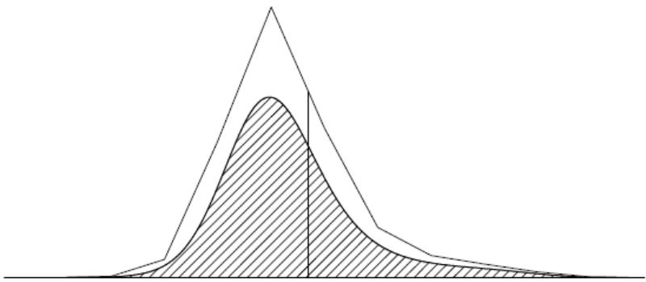

# INTRODUCTION TO BAYESIAN COMPUTATION

# CHAPTER 10

# BAYESIAN COMPUTATION

Bayesian computation revolves around two steps:

- computation of the posterior distribution, $p(\theta | y)$ ,   
- computation of the posterior predictive distribution, $p\left( {\widetilde{y} \mid  y}\right)$ .

So far we have considered examples where these could be computed analytically in closed form, with simulations performed directly using a combination of preprogrammed routines for standard distributions (normal, gamma, beta, Poisson, and so forth) and numerical computation on grids.

For complicated or unusual models or in high dimensions, however, more elaborate algorithms are required to approximate the posterior distribution.

Often the most efficient computation can be achieved by combining different algorithms.

# NORMALIZED AND UNNORMALIZED DENSITIES

We refer to the (multivariate) distribution to be simulated as the target distribution and call it $p(\theta | y)$ .

In general, we assume that $p(\theta | y)$ can be easily computed for any value $\theta$ , up to a factor involving only the data $y$ ; that is, we assume there is some easily computable function $q(\theta | y)$ , an unnormalized density, for which $q(\theta | y) / p(\theta | y)$ is a constant that depends only on $y$ .

For example, in the usual use of Bayes' theorem, we work with the product $p(\theta) \times p(y|\theta)$ , which is proportional to the posterior density.

# LOG DENSITIES

To avoid computational overflows and underflows, one should compute with the logarithms of posterior densities whenever possible.

Exponentiation should be performed only when necessary and as late as possible; for example, in the Metropolis algorithm, the required ratio of two densities should be computed as the exponential of the difference of the log-densities.

1 NUMERICAL INTEGRATION

2 DISTRIBUTIONAL APPROXIMATIONS   
3 DIRECT SIMULATION AND REJECTION SAMPLING  
4 IMPORTANCE SAMPLING   
HOW MANY SIMULATION DRAWS ARE NEEDED?   
6 DEBUGGING BAYESIAN COMPUTING

# NUMERICAL INTEGRATION

Numerical integration, also called quadrature, refers to methods in which the integral over continuous function is evaluated by computing the value of the function at finite number of points.

By increasing the number of points where the function is evaluated, desired accuracy can be obtained.

Numerical integration methods can be divided to simulation (stochastic) methods, such as Monte Carlo, and deterministic methods such as many quadrature rule methods.

The posterior expectation of any function $h(\theta)$ is defined as $\mathsf{E}\big(h(\theta)|y\big) = \int h(\theta)p(\theta |y)d\theta$ , where the integral has as many dimensions as $\theta$ .

Conversely, we can express any integral over the space of $\theta$ as a posterior expectation by defining $h(\theta)$ appropriately.

If we have posterior draws $\theta^s$ from $p(\theta | y)$ , we can estimate the integral by the sample average,

$$
\frac {1}{S} \sum_ {s = 1} ^ {S} h (\theta^ {s}).
$$

For any finite number of simulation draws, the accuracy of this estimate can be roughly gauged by the standard deviation of the $h(\theta^s)$ values.

If it is not easy to draw from the posterior distribution, or if the $h(\theta^s)$ values are too variable (so that the sample average is too variable an estimate to be useful), more sampling methods are necessary.

# SIMULATION METHODS

Simulation (stochastic) methods are based on obtaining random samples $\theta^s$ from the desired distribution $p(\theta)$ and estimating the expectation of any function $h(\theta)$ ,

$$
\mathrm {E} (h (\theta) | y) = \int h (\theta) p (\theta | y) d \theta \approx \frac {1}{S} \sum_ {s = 1} ^ {S} h \left(\theta^ {s}\right). \tag {10.1}
$$

The estimate is stochastic depending on generated random numbers, but the accuracy of the simulation can be improved by obtaining more samples.

Basic Monte Carlo methods which produce independent samples and Markov chain Monte Carlo methods which can better adapt to high-dimensional complex distributions, but produce dependent samples.

Markov chain Monte Carlo methods have been important in making Bayesian inference practical for generic hierarchical models.

Simulation methods can be used for high-dimensional distributions, and there are general algorithms which work for a wide variety of models; where necessary, more efficient computation can be obtained by combining these general ideas with tailored simulation methods, deterministic methods, and distributional approximations.

# DETERMINISTIC METHODS

Deterministic numerical integration methods are based on evaluating the integrand $h(\theta) \times p(\theta | y)$ at selected points $\theta^s$ , based on a weighted version of (10.1):

$$
\mathsf {E} \big (h (\theta) | y \big) = \int h (\theta) p (\theta | y) d \theta \approx \frac {1}{S} \sum_ {s = 1} ^ {S} w _ {s} h \left(\theta^ {s}\right) p \left(\theta^ {s} | y\right),
$$

with weight $w_{s}$ corresponding to the volume of space represented by the point $\theta^{s}$ .

More elaborate rules, such as Simpson's, use local polynomials for improved accuracy.

Deterministic numerical integration rules typically have lower variance than simulation methods, but selection of locations gets difficult in high dimensions.

The simplest deterministic method is to evaluate the integrand in a grid with equal weights.

Grid methods can be made adaptive starting the grid formation from the posterior mode.

For an integrand where one part has some specific form as Gaussian, there are specific quadrature rules that can give more accurate estimates with fewer integrand evaluations.

Quadrature rules exist for both bounded and unbounded regions.

1 NUMERICAL INTEGRATION   
DISTRIBUTIONAL APPROXIMATIONS   
3 DIRECT SIMULATION AND REJECTION SAMPLING  
4 IMPORTANCE SAMPLING   
5 HOW MANY SIMULATION DRAWS ARE NEEDED?   
6 DEBUGGING BAYESIAN COMPUTING

# DISTRIBUTIONAL APPROXIMATIONS

Distributional (analytic) approximations approximate the posterior with some simpler parametric distribution, from which integrals can be computed directly or by using the approximation as a starting point for simulation-based methods.

# CRUDE ESTIMATION BY IGNORING SOME

# INFORMATION

Before developing elaborate approximations or complicated methods for sampling from the target distribution, it is almost always useful to obtain a rough estimate of the location of the target distribution, that is, a point estimate of the parameters in the model, using some simple, noniterative technique.

The method for creating this first estimate will vary from problem to problem but typically will involve discarding parts of the model and data to create a simple problem for which convenient parameter estimates can be found.

In a hierarchical model, one can sometimes roughly estimate the main parameters $\gamma$ by first estimating the hyperparameters $\phi$ crudely, then using the conditional posterior distribution of $\gamma | \phi, y$ .

We applied this approach to the rat tumor example in Section 5.1, where crude estimates of the hyperparameters $(\alpha, \beta)$ were used to obtain initial estimates of the other parameters, $\theta_{j}$ .

When some data are missing, a good way to get started is by simplistically imputing the missing values based on available data.

In addition to creating a starting point for a more exact analysis, crude inferences are useful for comparison with later results, if the rough estimate differs greatly from the results of the full analysis, the latter may well have errors in programming or modeling.

Crude estimates are often convenient and reliable because they can be computed using available computer programs.

1 NUMERICAL INTEGRATION   
2 DISTRIBUTIONAL APPROXIMATIONS   
3 DIRECT SIMULATION AND REJECTION SAMPLING  
4 IMPORTANCE SAMPLING   
5 HOW MANY SIMULATION DRAWS ARE NEEDED?   
6 DEBUGGING BAYESIAN COMPUTING

# DIRECT SIMULATION AND REJECTION SAMPLING

In simple nonhierarchical Bayesian models, it is often easy to draw from the posterior distribution directly, especially if conjugate prior distributions have been assumed.

For more complicated problems, it can help to factor the distribution analytically and simulate it in parts, first sampling from the marginal posterior distribution of the hyperparameters, then drawing the other parameters conditional on the data and the simulated hyperparameters.

It is sometimes possible to perform direct simulations and analytic integrations for parts of the larger problem.

Frequently, draws from standard distributions or low-dimensional non-standard distributions are required, either as direct draws from the posterior distribution of the estimand in an easy problem, or as an intermediate step in a more complex problem.

In this section, we describe methods of drawing a random sample of size 1, with the understanding that the methods can be repeated to draw larger samples.

When obtaining more than one sample, it is often possible to reduce computation time by saving intermediate results such as the Cholesky factor for a fixed multivariate normal distribution.

# DIRECT APPROXIMATION BY CALCULATING AT A GRID OF POINTS

For the simplest discrete approximation, compute the target density, $p(\theta | y)$ , at a set of evenly spaced values $\theta_1, \ldots, \theta_N$ , that cover a broad range of the parameter space for $\theta$ , then approximate the continuous $p(\theta | y)$ by the discrete density at $\theta_1, \ldots, \theta_N$ , with probabilities

$$
\frac {p (\theta_ {i} | y)}{\sum_ {j = 1} ^ {N} p (\theta_ {j} | y)}.
$$

Because the approximate density must be normalized anyway, this method will work just as well using an unnormalized density function, $q(\theta | y)$ , in place of $p(\theta | y)$ .

Once the grid of density values is computed, a random draw from $p(\theta | y)$ is obtained by drawing a random sample $U$ from the uniform distribution on [0, 1], then transforming by the inverse cdf method to obtain a sample from the discrete approximation.

When the points $\theta_{i}$ are spaced closely enough and miss nothing important beyond their boundaries, this method works well.

The discrete approximation is more difficult to use in higher-dimensional multivariate problems, where computing at every point in a dense multidimensional grid becomes prohibitively expensive.

# SIMULATING FROM PREDICTIVE DISTRIBUTIONS

Once we have a sample from the posterior distribution, $p(\theta | y)$ , it is typically easy to draw from the predictive distribution of unobserved or future data, $\tilde{y}$ .

For each draw of $\theta$ from the posterior distribution, just draw one $\tilde{y}$ from the predictive distribution, $p(\tilde{y}|\theta)$ .

The set of simulated $\tilde{y}$ 's from all the $\theta$ 's characterizes the posterior predictive distribution.

# REJECTION SAMPLING

Suppose we want to obtain a single random draw from a density $p(\theta | y)$ , or perhaps an unnormalized density $q(\theta | y)$ .

In the following description we use $p$ to represent the target distribution, but we could just as well work with the unnormalized form $q$ instead.

To perform rejection sampling we require a positive function $g(\theta)$ defined for all $\theta$ for which $p(\theta | y) > 0$ that has the following properties:

- We can draw from the probability density proportional to $g$ . It is not required that $g(\theta)$ integrate to 1, but $g(\theta)$ must have a finite integral.   
- The importance ratio $\frac{p(\theta|y)}{g(\theta)}$ must have a known bound; that is, there must be some known constant $M$ for which $\frac{p(\theta|y)}{g(\theta)} \leq M$ for all $\theta$ .

The rejection sampling algorithm proceeds in two steps:

1. Sample $\theta$ at random from the probability density proportional to $g(\theta)$ .   
2. With probability $\frac{p(\theta|y)}{Mg(\theta)}$ , accept $\theta$ as a draw from $p$ . If the drawn $\theta$ is rejected, return to step 1.

FIGURE: Illustration of rejection sampling. The top curve is an approximation function, $Mg(\theta)$ , and the bottom curve is the target density, $p(\theta | y)$ . As required, $Mg(\theta) \geq p(\theta | y)$ for all $\theta$ . The vertical line indicates a single random draw $\theta$ from the density proportional to $g$ . The probability that a sampled draw $\theta$ is accepted is the ratio of the height of the lower curve to the height of the higher curve at the value $\theta$ .

# Figure 10.1 illustrates rejection sampling.

An accepted $\theta$ has the correct distribution, $p(\theta |y)$ ; that is, the distribution of drawn $\theta$ , conditional on it being accepted, is $p(\theta |y)$ .

The boundedness condition is necessary so that the probability in step 2 is not greater than 1.

A good approximate density $g(\theta)$ for rejection sampling should be roughly proportional to $p(\theta | y)$ (considered as a function of $\theta$ ).

The ideal situation is $g \propto p$ , in which case, with a suitable value of $M$ , we can accept every draw with probability 1.

When $g$ is not nearly proportional to $p$ , the bound $M$ must be set so large that almost all draws obtained in step 1 will be rejected in step 2.

A virtue of rejection sampling is that it is self-monitoring, if the method is not working efficiently, few simulated draws will be accepted.

The function $g(\theta)$ is chosen to approximate $p(\theta | y)$ and so in general will depend on $y$ .

We do not use the notation $g(\theta, y)$ or $g(\theta | y)$ , however, because in practice we will be considering approximations to one posterior distribution at a time, and the functional dependence of $g$ on $y$ is not of interest.

Rejection sampling is used in some fast methods for sampling from standard univariate distributions.

It is also often used for generic truncated multivariate distributions, if the proportion of the density mass in the truncated part is not close to 1.

1 NUMERICAL INTEGRATION   
2 DISTRIBUTIONAL APPROXIMATIONS   
3 DIRECT SIMULATION AND REJECTION SAMPLING  
4 IMPORTANCE SAMPLING   
5 HOW MANY SIMULATION DRAWS ARE NEEDED?   
6 DEBUGGING BAYESIAN COMPUTING

# IMPORTANCE SAMPLING

Importance sampling is a method, related to rejection sampling and a precursor to the Metropolis algorithm (discussed in the next chapter), that is used for computing expectations using a random sample drawn from an approximation to the target distribution.

Suppose we are interested in $\operatorname{E}(h(\theta)|y)$ , but we cannot generate random draws of $\theta$ from $p(\theta|y)$ and thus cannot evaluate the integral by a simple average of simulated values.

If $g(\theta)$ is a probability density from which we can generate random draws, then we can write,

$$
\mathsf {E} \big (h (\theta) | y \big) = \frac {\int h (\theta) q (\theta | y) d \theta}{\int q (\theta | y) d \theta} = \frac {\int \left[ h (\theta) q (\theta | y) / g (\theta) \right] g (\theta) d \theta}{\int \left[ q (\theta | y) / g (\theta) \right] g (\theta) d \theta}. \tag {10.2}
$$

$\mathsf{E}\big(h(\theta)|y\big)$ can be estimated using $S$ draws $\theta^1,\ldots ,\theta^S$ from $g(\theta)$ by the expression,

$$
\frac {\frac {1}{5} \sum_ {s = 1} ^ {S} h \left(\theta^ {s}\right) w \left(\theta^ {s}\right)}{\frac {1}{5} \sum_ {s = 1} ^ {S} w \left(\theta^ {s}\right)}. \tag {10.3}
$$

The factors

$$
w \left(\theta^ {s}\right) = \frac {q \left(\theta^ {s} \mid y\right)}{g \left(\theta^ {s}\right)}
$$

are called importance ratios or importance weights.

Recall that $q$ is our general notation for unnormalized densities; that is, $q(\theta | y)$ equals $p(\theta | y)$ times some factor that does not depend on $\theta$ .

It is generally advisable to use the same set of random draws for both the numerator and denominator of (10.3) in order to reduce the sampling error in the estimate.

If $g(\theta)$ can be chosen such that $\frac{hq}{g}$ is roughly constant, then fairly precise estimates of the integral can be obtained.

Importance sampling is not a useful method if the importance ratios vary substantially.

The worst possible scenario occurs when the importance ratios are small with high probability but with a low probability are huge, which happens, for example, if $hq$ has wide tails compared to $g$ , as a function of $\theta$ .

# ACCURACY AND EFFICIENCY OF IMPORTANCE

# SAMPLING ESTIMATES

In general, without some form of mathematical analysis of the exact and approximate densities, there is always the realistic possibility that we have missed some extremely large but rare importance weights.

However, it may help to examine the distribution of sampled importance weights to discover possible problems.

It can help to examine a histogram of the logarithms of the largest importance ratios: estimates will often be poor if the largest ratios are too large relative to the average.

In contrast, we do not have to worry about the behavior of small importance ratios, because they have little influence on equation (10.2).

If the variance of the weights is finite, the effective sample size can be estimated using an approximation,

$$
S _ {\text {e f f}} = \frac {1}{\sum_ {s = 1} ^ {S} \left(\tilde {w} \left(\theta^ {s}\right)\right) ^ {2}}. \tag {10.4}
$$

- $\tilde{w}(\theta^s)$ are normalized weights; that is,

$$
\tilde {w} (\theta^ {s}) = \frac {w (\theta^ {s})}{\sum_ {s ^ {\prime} = 1} ^ {S} w (\theta^ {s ^ {\prime}})}.
$$

The effective sample size $S_{\mathrm{eff}}$ is small if there are few extremely high weights which would unduly influence the distribution.

If the distribution has occasional very large weights, however, this estimate is itself noisy; it can thus be taken as no more than a rough guide.

# IMPORTANCE RESAMPLING

To obtain independent samples with equal weights, it is possible to use importance resampling (also called sampling-importance resampling or SIR).

Once $S$ draws, $\theta^1, \ldots, \theta^S$ , from the approximate distribution $g$ have been sampled, a sample of $k < S$ draws can be simulated as follows.

1. Sample a value $\theta$ from the set $\{\theta^1, \ldots, \theta^S\}$ , where the probability of sampling each $\theta^s$ is proportional to the weight, $w(\theta^s) = \frac{q(\theta^s | y)}{g(\theta^s)}$ .   
2. Sample a second value using the same procedure, but excluding the already sampled value from the set.   
3. Repeatedly sample without replacement $k - 2$ more times.

# WHY SAMPLE WITHOUT REPLACEMENT?

If the importance weights are moderate, sampling with and without replacement gives similar results.

Now consider a bad case, with a few large weights and many small weights.

Sampling with replacement will pick the same few values of $\theta$ repeatedly; in contrast, sampling without replacement yields a more desirable intermediate approximation somewhere between the starting and target densities.

For other purposes, sampling with replacement could be superior.

# USES OF IMPORTANCE SAMPLING IN BAYESIAN

# COMPUTATION

Importance (re)sampling can also be useful when considering mild changes in the posterior distribution, for example replacing the normal distribution by a $t$ in the 8 schools model or when computing leave-one-out cross-validation.

The idea in this case is to treat the original posterior distribution as an approximation to the modified posterior distribution.

A good way to develop an understanding of importance sampling is to program simulations for simple examples, such as using a $t_3$ distribution as an approximation to the normal (good practice) or vice versa (bad practice).

The approximating distribution $g$ in importance sampling should cover all the important regions of the target distribution.

1 NUMERICAL INTEGRATION   
2 DISTRIBUTIONAL APPROXIMATIONS   
3 DIRECT SIMULATION AND REJECTION SAMPLING  
4 IMPORTANCE SAMPLING   
HOW MANY SIMULATION DRAWS ARE NEEDED?   
6 DEBUGGING BAYESIAN COMPUTING

# HOW MANY SIMULATION DRAWS ARE NEEDED?

Bayesian inferences are usually most conveniently summarized by random draws from the posterior distribution of the model parameters.

Percentiles of the posterior distribution of univariate estimands can be reported to convey the shape of the distribution.

For example, reporting the $2.5\%$ , $25\%$ , $50\%$ , $75\%$ , and $97.5\%$ points of the sampled distribution of an estimand provides a $50\%$ and a $95\%$ posterior interval and also conveys skewness in its marginal posterior density.

Scatterplots of simulations, contour plots of density functions, or more sophisticated graphical techniques can also be used to examine the posterior distribution in two or three dimensions.

Quantities of interest can be defined in terms of the parameters or of parameters and data.

We also use posterior simulations to make inferences about predictive quantities.

Given each draw $\theta^s$ , we can sample any predictive quantity, $\tilde{y}^s \sim p(\tilde{y}|\theta^s)$ or, for a regression model, $\tilde{y}^s \sim p(\tilde{y}|\tilde{X},\theta^s)$ .

Posterior inferences and probability calculations can then be performed for each predictive quantity using the $S$ simulations.

Finally, given each simulation $\theta^s$ , we can simulate a replicated dataset $y^{\mathrm{rep} s}$ .

Our goal in Bayesian computation is to obtain a set of independent draws $\theta^s$ , $s = 1, \ldots, S$ , from the posterior distribution, with enough draws $S$ so that quantities of interest can be estimated with reasonable accuracy.

For most examples, $S = 100$ independent draws are enough for reasonable posterior summaries.

We can see this by considering a scalar parameter $\theta$ with an approximately normal posterior distribution with mean $\mu_{\theta}$ and standard deviation $\sigma_{\theta}$ .

We assume these cannot be calculated analytically and instead are estimated from the mean $\bar{\theta}$ and standard deviation $s_{\theta}$ of the $S$ simulation draws.

The posterior mean is then estimated to an accuracy of approximately $s_{\theta} / \sqrt{S}$ .

The total standard deviation of the computational parameter estimate (including Monte Carlo error, the uncertainty contributed by having only a finite number of simulation draws) is then $s_{\theta} \sqrt{1 + 1 / S}$ .

For $S = 100$ , the factor $\sqrt{1 + 1 / S}$ is 1.005, implying that Monte Carlo error adds almost nothing to the uncertainty coming from actual posterior variance.

However, it can be convenient to have more than 100 simulations just so that the numerical summaries are more stable, even if this stability typically confers no important practical advantage.

For some posterior inferences, more simulation draws are needed to obtain desired precisions.

For example, posterior $p$ probabilities are estimated to a standard deviation of $\sqrt{p(1 - p) / S}$ , so that $S = 100$ simulations allow estimation of a probability near 0.5 to an accuracy of $5\%$ .

$S = 2500$ simulations are needed to estimate to an accuracy of $1\%$ .

Even more simulation draws are needed to compute the posterior probability of rare events, unless analytic methods are used to assist the computations.

# EXAMPLE: EDUCATIONAL TESTING EXPERIMENTS

See the textbook.

1 NUMERICAL INTEGRATION   
2 DISTRIBUTIONAL APPROXIMATIONS   
3 DIRECT SIMULATION AND REJECTION SAMPLING  
4 IMPORTANCE SAMPLING   
HOW MANY SIMULATION DRAWS ARE NEEDED?   
6 DEBUGGING BAYESIAN COMPUTING

# DEBUGGING USING FAKE DATA

Our usual approach for building confidence in our posterior inferences is to fit different versions of the desired model, noticing when the inferences change unexpectedly.

Within the computation of any particular model, we check convergence by running parallel simulations from different starting points, checking that they mix and converge to the same estimated posterior distribution.

This can be seen as a form of debugging of the individual simulated sequences.

When a model is particularly complicated, or its inferences are unexpected enough to be not necessarily believable, one can perform more elaborate debugging using fake data. The basic approach is:

1. Pick a reasonable value for the true parameter vector $\theta$ . Strictly speaking, this value should be a random draw from the prior distribution, but if the prior distribution is noninformative, then any reasonable value of $\theta$ should work.   
2. If the model is hierarchical (as it generally will be), then perform the above step by picking reasonable values for the hyperparameters, then drawing the other parameters from the prior distribution conditional on the specified hyperparameters.

3. Simulate a large fake dataset $y^{\mathrm{fake}}$ from the data distribution $p(y|\theta)$ .   
4. Perform posterior inference about $\theta$ from $p(\theta | y^{\text{fake}})$ .   
5. Compare the posterior inferences to the true $\theta$ from step 1 or 2. For instance, for any element of $\theta$ , there should be a $50\%$ probability that its $50\%$ posterior interval contains the truth.

Formally, this procedure requires that the model has proper prior distributions and that the frequency evaluations be averaged over many values of the true $\theta$ , drawn independently from the prior distribution in step 1 above.

In practice, however, the debugging procedure can be useful with just a single reasonable choice of $\theta$ in the first step.

If the model does not produce reasonable inferences with $\theta$ set to a reasonable value, then there is probably something wrong, either in the computation or in the model itself.

Inference from a single fake dataset can be revealing for debugging purposes, if the true value of $\theta$ is far outside the computed posterior distribution.

If the dimensionality of $\theta$ is large (as can easily happen with hierarchical models), we can go further and compute debugging checks such as the proportion of the $50\%$ intervals that contain the true value.

To check that inferences are correct on average, one can create a residual plot as follows.

For each scalar parameter $\theta_{j}$ , define the predicted value as the average of the posterior simulations of $\theta_{j}$ , and the error as the true $\theta_{j}$ (as specified or simulated in step 1 or 2 above) minus the predicted value.

If the model is computed correctly, the errors should have zero mean, and we can diagnose problems by plotting errors v.s. predicted values, with one dot per parameter.

For models with only a few parameters, one can get the same effect by performing many fake-data simulations, resampling a new true vector $\theta$ and a new fake dataset $y^{\mathrm{fake}}$ each time, and then checking that the errors have zero mean and the correct interval coverage, on average.

# MODEL CHECKING AND CONVERGENCE CHECKING AS DEBUGGING

In practice, when a model grossly misfits the data, or when a histogram or scatterplot or other display of replicated data looks weird, it is often because of a computing error.

These errors can be as simple as forgetting to recode discrete responses (for example, $1 = \text{Yes}$ , $0 = \text{No}$ , $-9 = \text{Don't Know}$ ) or misspelling a regression predictor, or as subtle as a miscomputed probability ratio in a Metropolis updating step, but typically they show up as predictions that do not make sense or do not fit the data.

Similarly, poor convergence of an iterative simulation algorithm can sometimes occur from programming errors or conceptual errors in the model.

When posterior inferences from a fitted model seem wrong, it is sometimes unclear if there is a bug in the program or a fundamental problem with the model itself.

At this point, a useful conceptual and computational strategy is to simplify, to remove parameters from the model, or to give them fixed values or highly informative prior distributions, or to separately analyze data from different sources (that is, to un-link a hierarchical model).

These computations can be performed in steps, for example first removing a parameter from the model, then setting it equal to a null value (for example, zero) just to check that adding it into the program has no effect, then fixing it at a reasonable nonzero value, then assigning it a precise prior distribution, then allowing it to be estimated more fully from the data.

Model building is a gradual process, and we often find ourselves going back and forth between simpler and more complicated models, both for conceptual and computational reasons.