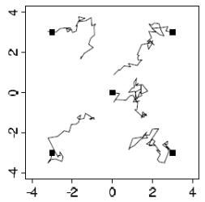
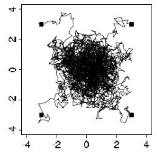
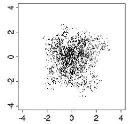
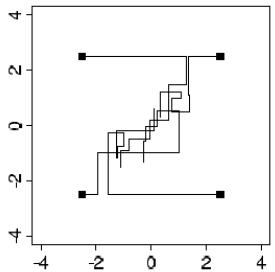
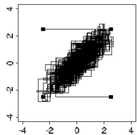
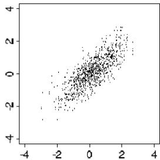
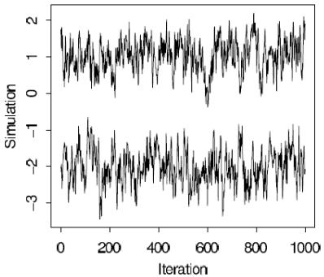
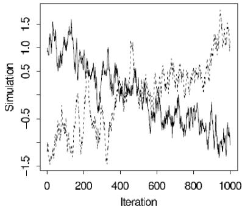

# BASICS OF MARKOV CHAIN SIMULATION

# CHAPTER 11

# BASICS OF MARKOV CHAIN SIMULATION

Many clever methods have been devised for constructing and sampling from arbitrary posterior distributions.

Markov chain simulation (also called Markov chain Monte Carlo, or MCMC) is a general method based on drawing values of $\theta$ from approximate distributions and then correcting those draws to better approximate the target posterior distribution, $p(\theta | y)$ .

The sampling is done sequentially, with the distribution of the sampled draws depending on the last value drawn; hence, the draws form a Markov chain.

# NOTE

As defined in probability theory, a Markov chain is a sequence of random variables $\theta_1, \theta_2, \ldots$ , for which, for any $t$ , the distribution of $\theta_t$ given all previous $\theta$ 's depends only on the most recent value, $\theta_{t-1}$ .

The key to the method's success, however, is not the Markov property but rather that the approximate distributions are improved at each step in the simulation, in the sense of converging to the target distribution.

  
FIGURE: Five independent sequences of a Markov chain simulation for the bivariate unit normal distribution, with overdispersed starting points indicated by solid squares. The simulation is a Metropolis algorithm described in the example on page 278, with a jumping rule that has purposely been chosen to be inefficient so that the chains will move slowly and their random-walk-like aspect will be apparent.

Figure 11.1 illustrates a simple example of a Markov chain simulation. In this case, a Metropolis algorithm in which $\theta$ is a vector with only two components, with a bivariate unit normal posterior distribution, $\theta \sim N(0, I)$ .

First consider Figure 11.1a, which portrays the early stages of the simulation. The space of the figure represents the range of possible values of the multivariate parameter, $\theta$ , and each of the five jagged lines represents the early path of a random walk starting near the center or the extremes of the target distribution and jumping through the distribution according to an appropriate sequence of random iterations.

Figure 11.1b represents the mature stage of the same Markov chain simulation, in which the simulated random walks have each traced a path throughout the space of $\theta$ , with a common stationary distribution that is equal to the target distribution.

We can then perform inferences about $\theta$ using points from the second halves of the Markov chains we have simulated, as displayed in Figure 11.1c.

In our applications of Markov chain simulation, we create several independent sequences; each sequence, $\theta^1, \theta^2, \theta^3, \ldots$ , is produced by

- starting at some point $\theta^0$ and then,   
- for each $t$ , drawing $\theta^t$ from a transition distribution, $T_t(\theta^t | \theta^{t-1})$ that depends on the previous draw, $\theta^{t-1}$ .

As we shall see in the discussion of combining the Gibbs sampler and Metropolis sampling, it is often convenient to allow the transition distribution to depend on the iteration number $t$ ; hence the notation $T_{t}$ .

The transition probability distributions must be constructed so that the Markov chain converges to a unique stationary distribution that is the posterior distribution, $p(\theta | y)$ .

Markov chain simulation is used when it is not possible (or not computationally efficient) to sample $\theta$ directly from $p(\theta | y)$ ; instead we sample iteratively in such a way that at each step of the process we expect to draw from a distribution that becomes closer to $p(\theta | y)$ .

For a wide class of problems (including posterior distributions for many hierarchical models), this appears to be the easiest way to get reliable results.

The key to Markov chain simulation is to create a Markov process whose stationary distribution is the specified $p(\theta | y)$ and to run the simulation long enough that the distribution of the current draws is close enough to this stationary distribution.

For any specific $p(\theta | y)$ , or unnormalized density $q(\theta | y)$ , a variety of Markov chains with the desired property can be constructed.

Once the simulation algorithm has been implemented and the simulations drawn, it is absolutely necessary to check the convergence of the simulated sequences; for example, the simulations of Figure 11.1a are far from convergence and are not close to the target distribution.

We will discuss how to check convergence, and construct an expression for the effective number of simulation draws for a correlated sample.

This chapter introduces the basic Markov chain simulation methods, the Gibbs sampler and the Metropolis-Hastings algorithm, in the context of our general computing approach based on successive approximation.

We sketch a proof of the convergence of Markov chain simulation algorithms and present a method for monitoring the convergence in practice.

# GIBBS SAMPLER

2 METROPOLIS AND METROPOLIS-HASTINGS ALGORITHMS   
3 USING GIBBS AND METROPOLIS AS BUILDING BLOCKS   
4 INFERENCE AND ASSESSING CONVERGENCE   
5 EFFECTIVE NUMBER OF SIMULATION DRAWS   
EXAMPLE: HIERARCHICAL NORMAL MODEL

# GIBBS SAMPLER

A particular Markov chain algorithm that has been found useful in many multidimensional problems is the Gibbs sampler, also called alternating conditional sampling, which is defined in terms of subvectors of $\theta$ .

Suppose the parameter vector $\theta$ has been divided into $d$ components or subvectors, $\theta = (\theta_{1},\ldots ,\theta_{d})$ .

Each iteration of the Gibbs sampler cycles through the subvectors of $\theta$ , drawing each subset conditional on the value of all the others. There are thus $d$ steps in iteration $t$ .

At each iteration $t$ , an ordering of the $d$ subvectors of $\theta$ is chosen and, in turn, each $\theta_j^t$ is sampled from the conditional distribution given all the other components of $\theta$ :

$$
p (\theta_ {j} | \theta_ {- j} ^ {t - 1}, y).
$$

- $\theta_{-j}^{t - 1}$ represents all the components of $\theta$ , except for $\theta_{j}$ , at their current values:

$$
\theta_ {- j} ^ {t - 1} = (\theta_ {1} ^ {t}, \ldots , \theta_ {j - 1} ^ {t}, \theta_ {j + 1} ^ {t - 1}, \ldots , \theta_ {d} ^ {t}).
$$

Thus, each subvector $\theta_{j}$ is updated conditional on the latest values of the other components of $\theta$ , which are the iteration $t$ values for the components already updated and the iteration $t - 1$ values for the others.

For many problems involving standard statistical models, it is possible to sample directly from most or all of the conditional posterior distributions of the parameters.

We typically construct models using a sequence of conditional probability distributions, as in the hierarchical models of Chapter 5.

It is often the case that the conditional distributions in such models are conjugate distributions that provide for easy simulation.

# EXAMPLE: BIVARIATE NORMAL DISTRIBUTION

See the textbook.

GIBBS SAMPLER   
2 METROPOLIS AND METROPOLIS-HASTINGS ALGORITHMS   
3 USING GIBBS AND METROPOLIS AS BUILDING BLOCKS   
4 INFERENCE AND ASSESSING CONVERGENCE   
5 EFFECTIVE NUMBER OF SIMULATION DRAWS   
EXAMPLE: HIERARCHICAL NORMAL MODEL

# METROPOLIS AND METROPOLIS-HASTINGS

# ALGORITHMS

The Metropolis-Hastings algorithm is a general term for a family of Markov chain simulation methods that are useful for sampling from Bayesian posterior distributions.

We have already seen the Gibbs sampler in the previous section; it can be viewed as a special case of Metropolis-Hastings.

Here we present the basic Metropolis algorithm and its generalization to the Metropolis-Hastings algorithm.

# THE METROPOLIS ALGORITHM

The Metropolis algorithm is an adaptation of a random walk with an acceptance/rejection rule to converge to the specified target distribution.

The algorithm proceeds as follows.

1. Draw a starting point $\theta^0$ , for which $p(\theta^0 | y) > 0$ , from a starting distribution $p_0(\theta)$ . The starting distribution might, for example, be based on an approximation as described in Section 13.3. Or we may simply choose starting values dispersed around a crude approximate estimate of the sort discussed in Chapter 10.

2. For $t = 1, 2, \ldots$ :

(2.1) Sample a proposal $\theta^{*}$ from a jumping distribution (or proposal distribution) at time $t$ , $J_{t}(\theta^{*}|\theta^{t-1})$ .

For the Metropolis algorithm (but not the Metropolis-Hastings algorithm, as discussed later in this section), the jumping distribution must be symmetric, satisfying the condition $J_{t}(\theta_{a}|\theta_{b}) = J_{t}(\theta_{b}|\theta_{a})$ for all $\theta_{a}, \theta_{b}$ , and $t$ .

2. For $t = 1, 2, \ldots$ :

(2.2) Calculate the ratio of the densities,

$$
r = \frac {p \left(\theta^ {*} | y\right)}{p \left(\theta^ {t - 1} | y\right)}. \tag {11.1}
$$

(2.3) Set

$$
\theta^ {t} = \left\{ \begin{array}{l l} \theta^ {*}, & \text {w i t h p r o b a b i l i t y m i n} (r, 1), \\ \theta^ {t - 1}, & \text {o t h e r w i s e}. \end{array} \right.
$$

Given the current value $\theta^{t - 1}$ , the transition distribution $T_{t}(\theta^{t}|\theta^{t - 1})$ of the Markov chain is thus a mixture of a point mass at $\theta^t = \theta^{t - 1}$ , and a weighted version of the jumping distribution, $J_{t}(\theta^{t}|\theta^{t - 1})$ , that adjusts for the acceptance rate.

The algorithm requires the ability to calculate the ratio $r$ in (11.1) for all $(\theta, \theta^*)$ , and to draw $\theta$ from the jumping distribution $J_t(\theta^* | \theta)$ for all $\theta$ and $t$ .

In addition, step (2.3) above requires the generation of a uniform random number.

# NOTE

When $\theta^t = \theta^{t-1}$ , that is, if the jump is not accepted, this still counts as an iteration in the algorithm.

# EXAMPLE: BIVARIATE UNIT NORMAL DENSITY WITH NORMAL JUMPING KERNEL

See the textbook.

# RELATION TO OPTIMIZATION

The acceptance/rejection rule of the Metropolis algorithm can be stated as follows:

(1) if the jump increases the posterior density, set $\theta^t = \theta^*$ ;   
(2) if the jump decreases the posterior density, set $\theta^t = \theta^*$ with probability equal to the density ratio, $r$ , and set $\theta^t = \theta^{t-1}$ otherwise.

The Metropolis algorithm can thus be viewed as a stochastic version of a stepwise mode-finding algorithm, always accepting steps that increase the density but only sometimes accepting downward steps.

# WHY DOES THE METROPOLIS ALGORITHM WORK?

The proof that the sequence of iterations $\theta^1, \theta^2, \ldots$ converges to the target distribution has two steps:

- first, it is shown that the simulated sequence is a Markov chain with a unique stationary distribution,   
- second, it is shown that the stationary distribution equals this target distribution.

The first step of the proof holds if the Markov chain is irreducible, aperiodic, and not transient.

Except for trivial exceptions, the latter two conditions hold for a random walk on any proper distribution, and irreducibility holds as long as the random walk has a positive probability of eventually reaching any state from any other state; that is, the jumping distributions $J_{t}$ must eventually be able to jump to all states with positive probability.

To see that the target distribution is the stationary distribution of the Markov chain generated by the Metropolis algorithm, consider starting the algorithm at time $t - 1$ with a draw $\theta^{t-1}$ from the target distribution $p(\theta | y)$ .

Now consider any two such points $\theta_{a}$ and $\theta_{b}$ , drawn from $p(\theta | y)$ and labeled so that $p(\theta_{b} | y) \geq p(\theta_{a} | y)$ .

The unconditional probability density of a transition from $\theta_{a}$ and $\theta_{b}$ is

$$
p (\theta^ {t - 1} = \theta_ {a}, \theta^ {t} = \theta_ {b}) = p (\theta_ {a} | y) \times J _ {t} (\theta_ {b} | \theta_ {a}),
$$

where the acceptance probability is 1 because of our labeling of $a$ and $b$ , and the unconditional probability density of a transition from $\theta_{b}$ and $\theta_{a}$ is, from (11.1),

$$
\begin{array}{l} p (\theta^ {t} = \theta_ {a}, \theta^ {t - 1} = \theta_ {b}) = p (\theta_ {b} | y) \times J _ {t} (\theta_ {a} | \theta_ {b}) \times \frac {p (\theta_ {a} | y)}{p (\theta_ {b} | y)} \\ = p \left(\theta_ {a} | y\right) \times J _ {t} \left(\theta_ {a} \mid \theta_ {b}\right), \\ \end{array}
$$

where is the same as the probability of a transition from $\theta_{a}$ to $\theta_{b}$ , since we have required that $J_{t}(.|.)$ be symmetric, that is, $J_{t}(\theta_{a}|\theta_{b}) \equiv J_{t}(\theta_{b}|\theta_{a})$ .

Since their joint distribution is symmetric, $\theta^t$ and $\theta^{t-1}$ have the same marginal distributions, and so $p(\theta | y)$ is the stationary distribution of the Markov chain of $\theta$ .

# THE METROPOLIS-HASTINGS ALGORITHM

The Metropolis-Hastings algorithm generalizes the basic Metropolis algorithm presented above in two ways.

First, the jumping rules $J_{t}$ need no longer be symmetric; that is, there is no requirement that $J_{t}(\theta_{a}|\theta_{b}) \equiv J_{t}(\theta_{b}|\theta_{a})$ .

Second, to correct for the asymmetry in the jumping rule, the ratio $r$ in (11.1) is replaced by a ratio of ratios:

$$
r = \frac {p \left(\theta^ {*} \mid y\right)}{p \left(\theta^ {t - 1} \mid y\right)} \times \frac {J _ {t} \left(\theta^ {t - 1} \mid \theta^ {*}\right)}{J _ {t} \left(\theta^ {*} \mid \theta^ {t - 1}\right)}. \tag {11.2}
$$

# NOTE

The ratio $r$ is always defined, because a jump from $\theta^{t-1}$ to $\theta^*$ can only occur if both $p(\theta^{t-1}|y)$ and $J_t(\theta^*|\theta^{t-1})$ are nonzero.

Allowing asymmetric jumping rules can be useful in increasing the speed of the random walk.

Convergence to the target distribution is proved in the same way as for the Metropolis algorithm.

The proof of convergence to a unique stationary distribution is identical.

To prove that the stationary distribution is the target distribution, $p(\theta | y)$ , consider any two points $\theta_{a}$ and $\theta_{b}$ with posterior densities labeled so that $p(\theta_{b} | y) J_{t}(\theta_{a} | \theta_{b}) \geq p(\theta_{a} | y) J_{t}(\theta_{b} | \theta_{a})$ .

If $\theta^{t - 1}$ follows the target distribution, then it is easy to show that the unconditional probability density of a transition from $\theta_{a}$ to $\theta_{b}$ is the same as the reverse transition.

# RELATION BETWEEN THE JUMPING RULE AND EFFICIENCY OF SIMULATIONS

The ideal Metropolis-Hastings jumping rule is simply to sample the proposal, $\theta^{*}$ , from the target distribution; that is, $J(\theta^{*}|\theta)\equiv p(\theta^{*}|y)$ for all $\theta$ .

Then the ratio $r$ in (11.2) is always exactly 1, and the iterates $\theta^t$ are a sequence of independent draws from $p(\theta | y)$ .

In general, however, iterative simulation is applied to problems for which direct sampling is not possible.

A good jumping distribution has the following properties:

- For any $\theta$ , it is easy to sample from $J(\theta^{*}|\theta)$ .   
It is easy to compute the ratio $r$ .   
- Each jump goes a reasonable distance in the parameter space (otherwise the random walk moves too slowly).   
- The jumps are not rejected too frequently (otherwise the random walk wastes too much time standing still).

GIBBS SAMPLER   
2 METROPOLIS AND METROPOLIS-HASTINGS ALGORITHMS   
3 USING GIBBS AND METROPOLIS AS BUILDING BLOCKS   
4 INFERENCE AND ASSESSING CONVERGENCE   
5 EFFECTIVE NUMBER OF SIMULATION DRAWS   
EXAMPLE: HIERARCHICAL NORMAL MODEL

# USING GIBBS AND METROPOLIS AS BUILDING BLOCKS

The Gibbs sampler and the Metropolis algorithm can be used in various combinations to sample from complicated distributions.

The Gibbs sampler is the simplest of the Markov chain simulation algorithms, and it is our first choice for conditionally conjugate models, where we can directly sample from each conditional posterior distribution.

For example, we could use the Gibbs sampler for the normal-normal hierarchical models in Chapter 5.

The Metropolis algorithm can be used for models that are not conditionally conjugate, for example, the two-parameter logistic regression for the bioassay experiment in Section 3.7.

In this example, the Metropolis algorithm could be performed in vector form, jumping in the two-dimensional space of $(\alpha, \beta)$ , or embedded within a Gibbs sampler structure, by alternately updating $\alpha$ and $\beta$ using one-dimensional Metropolis jumps.

In either case, the Metropolis algorithm will probably have to be tuned to get a good acceptance rate, as discussed in Section 12.2.

If some of the conditional posterior distributions in a model can be sampled from directly and some cannot, then the parameters can be updated one at a time, with the Gibbs sampler used where possible and one-dimensional Metropolis updating used otherwise.

More generally, the parameters can be updated in blocks, where each block is altered using the Gibbs sampler or a Metropolis jump of the parameters within the block.

# INTERPRETATION OF THE GIBBS SAMPLER AS A SPECIAL CASE OF THE METROPOLIS-HASTINGS ALGORITHM

Gibbs sampling can be viewed as a special case of the Metropolis-Hastings algorithm in the following way.

We first define iteration $t$ to consist of a series of $d$ steps, with step $j$ of iteration $t$ corresponding to an update of the subvector $\theta_j$ conditional on all the other elements of $\theta$ .

Then the jumping distribution, $J_{j,t}(\cdot |.)$ , at step $j$ of iteration $t$ only jumps along the $j$ th subvector, and does so with the conditional posterior density of $\theta_j$ given $\theta_{-j}^{t - 1}$ :

$$
\mathcal {J} _ {j, t} ^ {\text {G i b b s}} (\theta^ {*} | \theta^ {t - 1}) = \left\{ \begin{array}{l l} p (\theta_ {j} ^ {*} | \theta_ {- j} ^ {t - 1}, y), & \text {i f} \theta_ {- j} ^ {*} = \theta_ {- j} ^ {t - 1}, \\ 0, & \text {o t h e r w i s e}. \end{array} \right.
$$

The only possible jumps are to parameter vectors $\theta^{*}$ that match $\theta^{t-1}$ on all components other than the $j$ th.

Under this jumping distribution, the ratio (11.2) at the $j$ th step of iteration $t$ is

$$
\begin{array}{l} r = \frac {p \left(\theta^ {*} \mid y\right)}{p \left(\theta^ {t - 1} \mid y\right)} \times \frac {\int_ {j , t} ^ {\text {G i b b s}} \left(\theta^ {t - 1} \mid \theta^ {*}\right)}{\int_ {j , t} ^ {\text {G i b b s}} \left(\theta^ {*} \mid \theta^ {t - 1}\right)} = \frac {p \left(\theta^ {*} \mid y\right)}{p \left(\theta^ {t - 1} \mid y\right)} \times \frac {p \left(\theta_ {j} ^ {t - 1} \mid \theta_ {- j} ^ {t - 1} , y\right)}{p \left(\theta_ {j} ^ {*} \mid \theta_ {- j} ^ {t - 1} , y\right)} \\ = \frac {p \left(\theta_ {j} ^ {*} \mid \theta_ {- j} ^ {*} , y\right) \times p \left(\theta_ {- j} ^ {*} \mid y\right)}{p \left(\theta_ {j} ^ {t - 1} \mid \theta_ {- j} ^ {t - 1} , y\right) \times p \left(\theta_ {- j} ^ {t - 1} \mid y\right)} \times \frac {p \left(\theta_ {j} ^ {t - 1} \mid \theta_ {- j} ^ {t - 1} , y\right)}{p \left(\theta_ {j} ^ {*} \mid \theta_ {- j} ^ {t - 1} , y\right)} \quad \left(\theta_ {- j} ^ {*} = \theta_ {- j} ^ {t - 1}\right) \\ = \frac {p (\theta_ {- j} ^ {t - 1} | y)}{p (\theta_ {- j} ^ {t - 1} | y)} \equiv 1, \\ \end{array}
$$

and thus every jump is accepted.

The second line above follows from the first because, under this jumping rule, $\theta^{*}$ differs from $\theta^{t - 1}$ only in the $j$ th component.

The third line follows from the second by applying the rules of conditional probability to $\theta = (\theta_{j},\theta_{-j})$ and noting that $\theta_{-j}^{*} = \theta_{-j}^{t - 1}$ .

Usually, one iteration of the Gibbs sampler is defined as we do, to include all $d$ steps corresponding to the $d$ components of $\theta$ , thereby updating all of $\theta$ at each iteration.

It is possible, however, to define Gibbs sampling without the restriction that each component be updated in each iteration, as long as each component is updated periodically.

# GIBBS SAMPLER WITH APPROXIMATIONS

For some problems, sampling from some, or all, of the conditional distributions $p(\theta_j|\theta_{-j,y})$ is impossible, but one can construct approximations, which we label $g(\theta_j|\theta_{-j})$ , from which sampling is possible.

The general form of the Metropolis-Hastings algorithm can be used to compensate for the approximation.

As in the Gibbs sampler, we choose an order for altering the $d$ elements of $\theta$ ; the jumping function at the $j$ th Metropolis step at iteration $t$ is then

$$
J _ {j, t} (\theta^ {*} | \theta^ {t - 1}) = \left\{ \begin{array}{l l} g (\theta_ {j} ^ {*} | \theta_ {- j} ^ {t - 1}), & \text {i f} \theta_ {- j} ^ {*} = \theta_ {- j} ^ {t - 1}, \\ 0, & \text {o t h e r w i s e}, \end{array} \right.
$$

and the ratio $r$ in (11.2) must be computed and the acceptance or rejection of $\theta^*$ decided.

GIBBS SAMPLER   
2 METROPOLIS AND METROPOLIS-HASTINGS ALGORITHMS   
3 USING GIBBS AND METROPOLIS AS BUILDING BLOCKS   
4 INFERENCE AND ASSESSING CONVERGENCE   
5 EFFECTIVE NUMBER OF SIMULATION DRAWS   
EXAMPLE: HIERARCHICAL NORMAL MODEL

# INFERENCE AND ASSESSING CONVERGENCE

The basic method of inference from iterative simulation is the same as for Bayesian simulation in general: use the collection of all the simulated draws from $p(\theta | y)$ to summarize the posterior density and to compute quantiles, moments, and other summaries of interest as needed.

Posterior predictive simulations of unobserved outcomes $\tilde{y}$ can be obtained by simulation conditional on the drawn values of $\theta$ .

Inference using the iterative simulation draws requires some care, however, as we discuss in this section.

# DIFFICULTIES OF INFERENCE FROM ITERATIVE SIMULATION

Iterative simulation adds two challenges to simulation inference.

First, if the iterations have not proceeded long enough, as in Figure 11.1a, the simulations may be grossly unrepresentative of the target distribution.

Even when simulations have reached approximate convergence, early iterations still reflect the starting approximation rather than the target distribution; for example, consider the early iterations of Figures 11.1b and 11.2b.

The second problem with iterative simulation draws is their within-sequence correlation; aside from any convergence issues, simulation inference from correlated draws is generally less precise than from the same number of independent draws.

Serial correlation in the simulations is not necessarily a problem because, at convergence, the draws are identically distributed as $p(\theta | y)$ , and so when performing inferences, we ignore the order of the simulation draws in any case.

But such correlation can cause inefficiencies in simulations.

Consider Figure 11.1c, which displays 500 successive iterations from each of five simulated sequences of the Metropolis algorithm: the patchy appearance of the scatterplot would not be likely to appear from 2500 independent draws from the normal distribution but is rather a result of the slow movement of the simulation algorithm.

In some sense, the effective number of simulation draws here is far fewer than 2500. We calculate effective sample size using formula (11.8).

We handle the special problems of iterative simulation in three ways.

First, we attempt to design the simulation runs to allow effective monitoring of convergence, in particular by simulating multiple sequences with starting points dispersed throughout parameter space, as in Figure 11.1a.

Second, we monitor the convergence of all quantities of interest by comparing variation between and within simulated sequences until within variation roughly equals between variation, as in Figure 11.1b.

Only when the distribution of each simulated sequence is close to the distribution of all the sequences mixed together can they all be approximating the target distribution.

Third, if the simulation efficiency is unacceptably low (in the sense of requiring too much real time on the computer to obtain approximate convergence of posterior inferences for quantities of interest), the algorithm can be altered, as we discuss in Sections 12.1 and 12.2.

# DISCARDING EARLY ITERATIONS OF THE SIMULATION RUNS

To diminish the influence of the starting values, we generally discard the first half of each sequence and focus attention on the second half.

Our inferences will be based on the assumption that the distributions of the simulated values $\theta^t$ , for large enough $t$ , are close to the target distribution, $p(\theta | y)$ .

We refer to the practice of discarding early iterations in Markov chain simulation as warm-up; depending on the context, different warm-up fractions can be appropriate.

For example, in the Gibbs sampler displayed in Figure 11.2, it would be necessary to discard only a few initial iterations.

We adopt the general practice of discarding the first half as a conservative choice.

For example, we might run 200 iterations and discard the first half. If approximate convergence has not yet been reached, we might then run another 200 iterations, now discarding all of the initial 200 iterations.

  
FIGURE: Four independent sequences of the Gibbs sampler for a bivariate normal distribution with correlation $\rho = 0.8$ , with overdispersed starting points indicated by solid squares.

# NOTE

(A) First 10 iterations, showing the componentwise updating of the Gibbs iterations.   
(B) After 500 iterations, the sequences have reached approximate convergence.   
(c) This figure shows the points from the second halves of the sequences, representing a set of correlated draws from the target distribution.

# DEPENDENCE OF THE ITERATIONS IN EACH SEQUENCE

Another issue that sometimes arises, once approximate convergence has been reached, is whether to thin the sequences by keeping every $k$ th simulation draw from each sequence and discarding the rest.

In our applications, we have found it useful to skip iterations in problems with large numbers of parameters where computer storage is a problem, perhaps setting $k$ so that the total number of iterations saved is no more than 1000.

# NOTE

Whether or not the sequences are thinned, if the sequences have reached approximate convergence, they can be directly used for inferences about the parameters $\theta$ and any other quantities of interest.

# MULTIPLE SEQUENCES WITH OVERDISPERSED

# STARTING POINTS

Our recommended approach to assessing convergence of iterative simulation is based on comparing different simulated sequences, as illustrated in Figure 11.1, which shows five parallel simulations before and after approximate convergence.

In Figure 11.1a, the multiple sequences clearly have not converged; the variance within each sequence is much less than the variance between sequences.

Later, in Figure 11.1b, the sequences have mixed, and the two variance components are essentially equal.

To see such disparities, we clearly need more than one independent sequence.

Thus our plan is to simulate independently at least two sequences, with starting points drawn from an overdispersed distribution.

# MONITORING SCALAR ESTIMANDS

We monitor each scalar estimand or other scalar quantities of interest separately.

Estimands include all the parameters of interest in the model and any other quantities of interest (for example, the ratio of two parameters or the value of a predicted future observation).

It is often useful also to monitor the value of the logarithm of the posterior density, which has probably already been computed if we are using a version of the Metropolis algorithm.

# CHALLENGES OF MONITORING CONVERGENCE:

# MIXING AND STATIONARITY

Figure 11.3 illustrates two of the challenges of monitoring convergence of iterative simulations.

The first graph shows two sequences, each of which looks fine on its own (and, indeed, when looked at separately would satisfy any reasonable convergence criterion), but when looked at together reveal a clear lack of convergence.

Figure 11.3a illustrates that, to achieve convergence, the sequences must together have mixed.

  
FIGURE: Examples of two challenges in assessing convergence of iterative simulations.

# NOTE

(1) In the left plot, either sequence alone looks stable, but the juxtaposition makes it clear that they have not converged to a common distribution.   
(2) In the right plot, the two sequences happen to cover a common distribution but neither sequence appears stationary.   
(3) These graphs demonstrate the need to use between-sequence and also within-sequence information when assessing convergence.

The second graph in Figure 11.3 shows two chains that have mixed, in the sense that they have traced out a common distribution, but they do not appear to have converged.

Figure 11.3b illustrates that, to achieve convergence, each individual sequence must reach stationarity.

# SPLITTING EACH SAVED SEQUENCE INTO TWO PARTS

We diagnose convergence (as noted above, separately for each scalar quantity of interest) by checking mixing and stationarity.

There are various ways to do this; we apply a fairly simple approach in which we split each chain in half and check that all the resulting half-sequences have mixed.

# This simultaneously tests

- mixing: if all the chains have mixed well, the separate parts of the different chains should also mix;   
- stationarity: at stationarity, the first and second half of each sequence should be traversing the same distribution.

We start with some number of simulated sequences in which the warm-up period (which by default we set to the first half of the simulations) has already been discarded.

We then take each of these chains and split into the first and second half (this is all after discarding the warm-up iterations).

Let $m$ be the number of chains (after splitting) and $n$ be the length of each chain.

We always simulate at least two sequences so that we can observe mixing; see Figure 11.3a; thus $m$ is always at least 4.

For example, suppose we simulate 5 chains, each of length 1000, and then discard the first half of each as warm-up.

We are then left with 5 chains, each of length 500, and we split each into two parts: iterations $1 \sim 250$ (originally iterations $501 \sim 750$ ) and iterations $251 \sim 500$ (originally iterations $751 \sim 1000$ ).

We now have $m = 10$ chains, each of length $n = 250$ .

# ASSESSING MIXING USING BETWEEN- AND WITHIN-SEQUENCE VARIANCES

For each scalar estimate $\psi$ , we label the simulations as $\psi_{ij}$ , $i = 1, \ldots, n$ ; $j = 1, \ldots, m$ , and we compute $B$ and $W$ , the between- and within-sequence variances:

$$
B = \frac {n}{m - 1} \sum_ {j = 1} ^ {m} (\bar {\psi} _ {. j} - \bar {\psi} _ {. \cdot}) ^ {2}, \quad \bar {\psi} _ {. j} = \frac {1}{n} \sum_ {i = 1} ^ {n} \psi_ {i j}, \quad \bar {\psi} _ {. \cdot} = \frac {1}{m} \sum_ {j = 1} ^ {m} \bar {\psi} _ {. j},
$$

$$
W = \frac {1}{m} \sum_ {j = 1} ^ {m} s _ {j} ^ {2}, s _ {j} ^ {2} = \frac {1}{n - 1} \sum_ {i = 1} ^ {n} (\psi_ {i j} - \bar {\psi} _ {. j}) ^ {2}.
$$

The between-sequence variance, $B$ , contains a factor of $n$ because it is based on the variance of the within-sequence means, $\bar{\psi}_{j}$ , each of which is an average of $n$ values $\psi_{jj}$ .

We can estimate $\operatorname{Var}(\psi | y)$ , the marginal posterior variance of the estimand, by a weighted average of $W$ and $B$ , namely

$$
\widehat {\operatorname {V a r}} ^ {+} (\psi | y) = \frac {n - 1}{n} W + \frac {1}{n} B. \tag {11.3}
$$

This quantity overestimates the marginal posterior variance assuming the starting distribution is appropriately overdispersed, but is unbiased under stationarity (that is, if the starting distribution equals the target distribution), or in the limit $n \to \infty$ .

This is analogous to the classical variance estimate with cluster sampling.

Meanwhile, for any finite $n$ , the within variance $W$ should be an underestimate of $\operatorname{Var}(\psi | y)$ because the individual sequences have not had time to range over all of the target distribution and, as a result, will have less variability; in the limit as $n \to \infty$ , the expectation of $W$ approaches $\operatorname{Var}(\psi | y)$ .

We monitor convergence of the iterative simulation by estimating the factor by which the scale of the current distribution for $\psi$ might be reduced if the simulations were continued in the limit $n\to \infty$ .

This potential scale reduction is estimated by

$$
\hat {R} = \sqrt {\frac {\widehat {\operatorname {V a r}} ^ {+} (\psi | y)}{W}}, \tag {11.4}
$$

which declines to 1 as $n\to \infty$

If the potential scale reduction is high, then we have reason to believe that proceeding with further simulations may improve our inference about the target distribution of the associated scalar estimand.

# EXAMPLE: BIVARIATE UNIT NORMAL DENSITY WITH NORMAL JUMPING KERNEL (CONT.)

See the textbook.

The method of monitoring convergence presented here has the key advantage of not requiring the user to examine time series graphs of simulated sequences.

Inspection of such plots is a notoriously unreliable method of assessing convergence and in addition is unwieldy when monitoring a large number of quantities of interest, such as can arise in complicated hierarchical models.

Because it is based on means and variances, the simple method presented here is most effective for quantities whose marginal posterior distributions are approximately normal.

When performing inference for extreme quantiles, or for parameters with multimodal marginal posterior distributions, one should monitor also extreme quantiles of the between and within sequences.

GIBBS SAMPLER   
2 METROPOLIS AND METROPOLIS-HASTINGS ALGORITHMS   
3 USING GIBBS AND METROPOLIS AS BUILDING BLOCKS   
4 INFERENCE AND ASSESSING CONVERGENCE   
5 EFFECTIVE NUMBER OF SIMULATION DRAWS   
EXAMPLE: HIERARCHICAL NORMAL MODEL

# EFFECTIVE NUMBER OF SIMULATION DRAWS

Once the simulated sequences have mixed, we can compute an approximate effective number of independent simulation draws for any estimand of interest $\psi$ .

We start with the observation that if the $n$ simulation draws within each sequence were truly independent, then the between-sequence variance $B$ would be an unbiased estimate of the posterior variance, $\operatorname{Var}(\psi | y)$ , and we would have a total of $mn$ independent simulations from the $m$ sequences.

In general, however, the simulations of $\psi$ within each sequence will be autocorrelated, and $B$ will be larger than $\operatorname{Var}(\psi | y)$ , in expectation.

One way to define effective sample size for correlated simulation draws is to consider the statistical efficiency of the average of the simulations $\bar{\psi}_{\cdot}$ , as an estimate of the posterior mean, $\mathsf{E}(\psi |y)$ .

This can be a reasonable baseline even though it is not the only possible summary and might be inappropriate, for example, if there is particular interest in accurate representation of low-probability events in the tails of the distribution.

Continuing with this definition, it is usual to compute effective sample size using the following asymptotic formula for the variance of the average of a correlated sequence:

$$
\lim  _ {n \rightarrow \infty} m n \operatorname {V a r} (\bar {\psi} _ {\cdot \cdot}) = \left(1 + 2 \sum_ {t = 1} ^ {\infty} \rho_ {t}\right) \operatorname {V a r} (\psi | y). \tag {11.5}
$$

$\rho_t$ : the autocorrelation of the sequence $\psi$ at lag $t$ .

If the $n$ simulation draws from each of the $m$ chains were independent, then $\operatorname{Var}(\bar{\psi}_{..})$ would simply be $\frac{1}{mn}\operatorname{Var}(\psi |y)$ and the sample size would be $mn$ .

In the presence of correlation we then define the effective sample size as

$$
n _ {\text {e f f}} = \frac {m n}{1 + 2 \sum_ {t = 1} ^ {\infty} \rho_ {t}}. \tag {11.6}
$$

The asymptotic nature of (11.5) and (11.6) might seem disturbing given that in reality we will only have a finite simulation, but this should not be a problem given that we already want to run the simulations long enough for approximate convergence to the (asymptotic) target distribution.

To compute the effective sample size we need an estimate of the sum of the correlations $\rho$ , for which we use information within and between sequences.

We start by computing the total variance using the estimate $\widehat{\mathsf{Var}}^{+}$ from (11.3); we then estimate the correlations by first computing the variogram $V_{t}$ at each lag $t$ :

$$
V _ {t} = \frac {1}{m (n - t)} \sum_ {j = 1} ^ {m} \sum_ {i = t + 1} ^ {n} \left(\psi_ {i, j} - \psi_ {i - t, j}\right) ^ {2}.
$$

We then estimate the correlations by inverting the formula, $\mathsf{E}(\psi_i - \psi_{i - t})^2 = 2(1 - \rho_t)\mathsf{Var}(\psi)$ :

$$
\hat {\rho} _ {t} = 1 - \frac {V _ {t}}{2 \widehat {\operatorname {V a r}} ^ {+}}. \tag {11.7}
$$

Unfortunately we cannot simply sum all of these to estimate $n_{\mathrm{eff}}$ in (11.6); the difficulty is that for large values of $t$ the sample correlation is too noisy.

Instead we compute a partial sum, starting from lag 0 and continuing until the sum of autocorrelation estimates for two successive lags $\hat{\rho}_{2t'} + \hat{\rho}_{2t' + 1}$ is negative.

We use this positive partial sum as our estimate of $\sum_{t=1}^{\infty} \rho_t$ in (11.6).

Putting this all together yields the estimate,

$$
\hat {n} _ {\text {e f f}} = \frac {m n}{1 + 2 \sum_ {t = 1} ^ {T} \hat {\rho} _ {t}}. \tag {11.8}
$$

- the estimated autocorrelations $\hat{\rho}_t$ are computed from formula (11.7) and $T$ is the first odd positive integer for which $\hat{\rho}_{T+1} + \hat{\rho}_{T+2}$ is negative.

All these calculations should be performed using only the saved iterations, after discarding the warm-up period.

For example, suppose we simulate 4 chains, each of length 1000, and then discard the first half of each as warm-up.

Then $m = 8$ , $n = 250$ , and we compute variograms and correlations only for the saved iterations (thus, up to a maximum lag $t$ of 249, although in practice the stopping point $T$ in (11.8) will be much lower).

# BOUNDED OR LONG-TAILED DISTRIBUTIONS

The above convergence diagnostics are based on means and variances, and they will not work so well for parameters or scalar summaries for which the posterior distribution, $p(\phi | y)$ , is far from Gaussian.

As discussed in Chapter 4, asymptotically the posterior distribution should typically be normally distributed as the data sample size approaches infinity, but

(A) we are never actually at the asymptotic limit (in fact we are often interested in learning from small samples), and   
(B) it is common to have only a small amount of data on individual parameters that are part of a hierarchical model.

For summaries $\phi$ whose distributions are constrained or otherwise far from normal, we can preprocess simulations using transformations before computing the potential scale reduction factor $\hat{R}$ and the effective sample size $\hat{n}_{\mathrm{eff}}$ .

We can take the logarithm of all-positive quantities, the logit of quantities that are constrained to fall in $(0,1)$ , and use the rank transformation for long-tailed distributions.

Transforming the simulations to have well-behaved distributions should allow mean and variance-based convergence diagnostics to work better.

# STOPPING THE SIMULATIONS

We monitor convergence for the entire multivariate distribution, $p(\theta | y)$ , by computing the potential scale reduction factor (11.4) and the effective sample size (11.8) for each scalar summary of interest.

Recall that we are using $\theta$ to denote the vector of unknowns in the posterior distribution, and $\phi$ to represent scalar summaries, considered one at a time.

We recommend computing the potential scale reduction for all scalar estimands of interest; if $\hat{R}$ is not near 1 for all of them, continue the simulation runs (perhaps altering the simulation algorithm itself to make the simulations more efficient, as described in the next section).

The condition of $\hat{R}$ being near 1 depends on the problem at hand, but we generally have been satisfied with setting 1.1 as a threshold.

We can use effective sample size $\hat{n}_{\mathrm{eff}}$ to give us a sense of the precision obtained from our simulations.

As we have discussed in Section 10.5, for many purposes it should suffice to have 100 or even 10 independent simulation draws.

# NOTE

$$
\text {I f} \hat {n} _ {\text {e f f}} = 1 0, \text {t h e s i m u l a t i o n s t a n d a r d e r r o r i s i n c e r e a s e d b y} \sqrt {1 + 1 / 1 0} = 1. 0 5.
$$

As a default rule, we suggest running the simulation until $\hat{n}_{\mathrm{eff}}$ is at least $5m$ , that is, until there are the equivalent of at least 10 independent draws per sequence.

# NOTE

Recall that $m$ is twice the number of sequences, as we have split each sequence into two parts so that $\hat{R}$ can assess stationarity as well as mixing.

Having an effective sample size of 10 per sequence should typically correspond to stability of all the simulated sequences.

For some purposes, more precision will be desired, and then a higher effective sample size threshold can be used.

Once $\hat{R}$ is near 1 and $\hat{n}_{\mathrm{eff}}$ is more than 10 per chain for all scalar estimands of interest, just collect the $mn$ simulations (with warm-up iterations already excluded, as noted before) and treat them as a sample from the target distribution.

Even if an iterative simulation appears to converge and has passed all tests of convergence, it still may actually be far from convergence if important areas of the target distribution were not captured by the starting distribution and are not easily reachable by the simulation algorithm.

When we declare approximate convergence, we are actually concluding that each individual sequence appears stationary and that the observed sequences have mixed well with each other.

These checks are not hypothesis tests. There is no $p$ -value and no statistical significance.

We assess discrepancy from convergence via practical significance (or some conventional version thereof, such as $\hat{R} > 1.1$ ).

GIBBS SAMPLER   
2 METROPOLIS AND METROPOLIS-HASTINGS ALGORITHMS   
3 USING GIBBS AND METROPOLIS AS BUILDING BLOCKS   
4 INFERENCE AND ASSESSING CONVERGENCE   
5 EFFECTIVE NUMBER OF SIMULATION DRAWS   
EXAMPLE: HIERARCHICAL NORMAL MODEL

# EXAMPLE: HIERARCHICAL NORMAL MODEL

See the textbook.