# Texts in Statistical Science

# Bayesian Data Analysis

# Third Edition

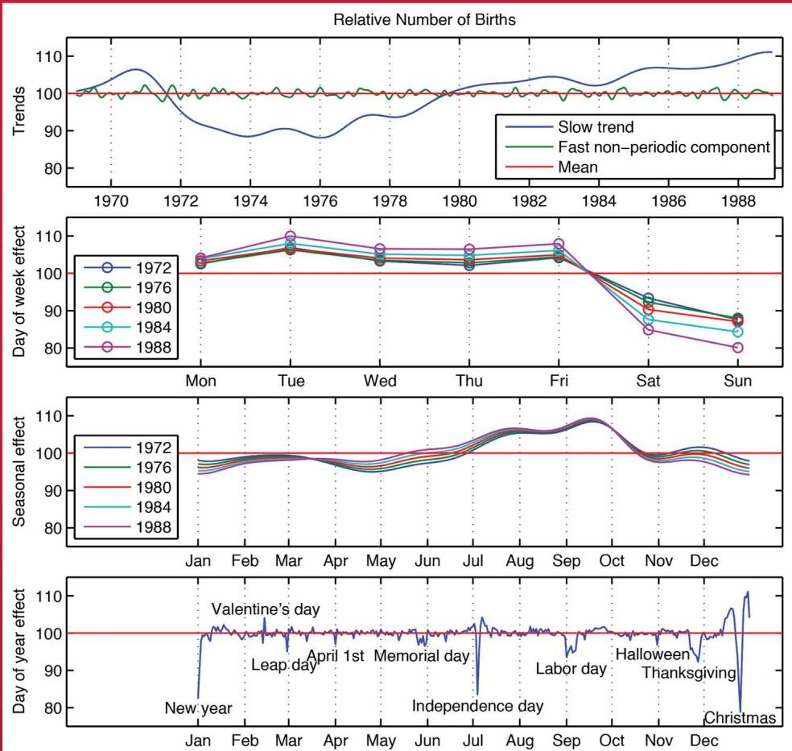

Andrew Gelman, John B. Carlin, Hal S. Stern, David B. Dunson, Aki Vehtari, and Donald B. Rubin

# Bayesian Data Analysis

Third Edition

# CHAPMAN & HALL/CRC

# Texts in Statistical Science Series

Series Editors

Francesca Dominici, Harvard School of Public Health, USA

Julian J. Faraway, University of Bath, UK

Martin Tanner, Northwestern University, USA

Jim Zidek, University of British Columbia, Canada

Analysis of Failure and Survival Data

P.J. Smith

The Analysis of Time Series: An Introduction, Sixth Edition

C. Chatfield

Applied Bayesian Forecasting and Time Series Analysis

A. Pole, M. West, and J. Harrison

Applied Categorical and Count Data Analysis

W. Tang, H. He, and X.M. Tu

Applied Nonparametric Statistical Methods, Fourth Edition

P. Sprent and N.C. Smeeton

Applied Statistics: Handbook of GENSTAT Analyses

E.J. Snell and H. Simpson

Applied Statistics: Principles and Examples

D.R. Cox and E.J. Snell

Applied Stochastic Modelling, Second Edition

B.J.T. Morgan

Bayesian Data Analysis, Third Edition

A. Gelman, J.B. Carlin, H.S. Stern, D.B. Dunson,

A. Vehtari, and D.B. Rubin

Bayesian Ideas and Data Analysis: An Introduction for Scientists and Statisticians

R. Christensen, W. Johnson, A. Branscum, and T.E. Hanson

Bayesian Methods for Data Analysis, Third Edition

B.P. Carlin and T.A. Louis

Beyond ANOVA: Basics of Applied Statistics

R.G.Miller,Jr.

The BUGS Book: A Practical Introduction to Bayesian Analysis

D. Lunn, C. Jackson, N. Best, A. Thomas, and

D. Spiegelhalter

A Course in Categorical Data Analysis

T. Leonard

A Course in Large Sample Theory

T.S. Ferguson

Data Driven Statistical Methods

P. Sprent

Decision Analysis: A Bayesian Approach

J.Q. Smith

Design and Analysis of Experiments with SAS

J. Lawson

Elementary Applications of Probability Theory, Second Edition

H.C. Tuckwell

Elements of Simulation

B.J.T. Morgan

Epidemiology: Study Design and

Data Analysis, Third Edition

M. Woodward

Essential Statistics, Fourth Edition

D.A.G. Rees

Exercises and Solutions in Statistical Theory

L.L. Kupper, B.H. Neelon, and S.M. O'Brien

Exercises and Solutions in Biostatistical Theory

L.L. Kupper, B.H. Neelon, and S.M. O'Brien

Extending the Linear Model with R:

Generalized Linear, Mixed Effects and

Nonparametric Regression Models

J.J. Faraway

A First Course in Linear Model Theory

N. Ravishanker and D.K. Dey

Generalized Additive Models:

An Introduction with R

S. Wood

Generalized Linear Mixed Models:

Modern Concepts, Methods and Applications

W.W. Stroup

Graphics for Statistics and Data Analysis with R

K.J.Keen

Interpreting Data: A First Course

in Statistics

A.J.B.Anderson

Introduction to General and Generalized

Linear Models

H. Madsen and P. Thyregod

An Introduction to Generalized

Linear Models, Third Edition

A.J. Dobson and A.G. Barnett

Introduction to Multivariate Analysis

C. Chatfield and A.J. Collins

Introduction to Optimization Methods and

Their Applications in Statistics

B.S.Everitt

Introduction to Probability with R

K. Baclawski

Introduction to Randomized Controlled

Clinical Trials, Second Edition

J.N.S. Matthews

Introduction to Statistical Inference and Its Applications with R

M.W. Trosset

Introduction to Statistical Limit Theory

A.M. Polansky

Introduction to Statistical Methods for Clinical Trials

T.D. Cook and D.L. DeMets

Introduction to Statistical Process Control

P.Qiu

Introduction to the Theory of Statistical Inference

H. Liero and S. Zwanzig

Large Sample Methods in Statistics

P.K. Sen and J. da Motta Singer

Linear Algebra and Matrix Analysis for Statistics

S. Banerjee and A. Roy

Logistic Regression Models

J.M. Hilbe

Markov Chain Monte Carlo:

Stochastic Simulation for Bayesian Inference, Second Edition

D. Gamerman and H.F. Lopes

Mathematical Statistics

K.Knight

Modeling and Analysis of Stochastic Systems, Second Edition

V.G. Kulkarni

Modelling Binary Data, Second Edition

D. Collett

Modelling Survival Data in Medical Research, Second Edition

D. Collett

Multivariate Analysis of Variance and

Repeated Measures: A Practical Approach for Behavioural Scientists

D.J. Hand and C.C. Taylor

Multivariate Statistics: A Practical Approach

B. Flury and H. Riedwyl

Multivariate Survival Analysis and Competing Risks

M. Crowder

Nonparametric Methods in Statistics with SAS Applications

O. Korosteleva

Pólya Urn Models

H. Mahmoud

Practical Data Analysis for Designed

Experiments

B.S. Yandell

Practical Longitudinal Data Analysis

D.J. Hand and M. Crowder

Practical Multivariate Analysis, Fifth Edition

A. Affifi, S. May, and V.A. Clark

Practical Statistics for Medical Research

D.G. Altman

A Primer on Linear Models

J.F. Monahan

Principles of Uncertainty

J.B. Kadane

Probability: Methods and Measurement

A. O'Hagan

Problem Solving: A Statistician's Guide, Second Edition

C. Chatfield

Randomization, Bootstrap and Monte Carlo Methods in Biology, Third Edition

B.F.J. Manly

Readings in Decision Analysis

S. French

Sampling Methodologies with Applications

P.S.R.S. Rao

Stationary Stochastic Processes: Theory and Applications

G. Lindgren

Statistical Analysis of Reliability Data

M.J. Crowder, A.C. Kimber,

T.J. Sweeting, and R.L. Smith

Statistical Methods for Spatial Data Analysis

O. Schabenberger and C.A. Gotway

Statistical Methods for SPC and TQM D.Bissell

Statistical Methods in Agriculture and Experimental Biology, Second Edition R. Mead, R.N. Curnow, and A.M. Hasted

Statistical Process Control: Theory and Practice, Third Edition G.B. Wetherill and D.W. Brown

Statistical Theory: A Concise Introduction  
F. Abramovich and Y. Ritov

Statistical Theory, Fourth Edition B.W. Lindgren

Statistics for Accountants S.Letchford

Statistics for Epidemiology N.P.Jewell

Statistics for Technology: A Course in Applied Statistics, Third Edition C. Chatfield

Statistics in Engineering: A Practical Approach  
A.V. Metcalfe

Statistics in Research and Development, Second Edition R.Caulcutt

Stochastic Processes: An Introduction, Second Edition P.W. Jones and P. Smith

Survival Analysis Using S: Analysis of Time-to-Event Data  
M. Tableman and J.S. Kim

The Theory of Linear Models B.Jorgensen

Time Series Analysis H. Madsen

Time Series: Modeling, Computation, and Inference  
R. Prado and M. West

Understanding Advanced Statistical Methods P.H. Westfall and K.S.S. Henning

# Bayesian Data Analysis

Third Edition

Andrew Gelman

John B. Carlin

Hal S. Stern

David B. Dunson

Aki Vehtari

Donald B. Rubin


CRC Press

Taylor & Francis Group

Boca Raton London New York

CRC Press

Taylor & Francis Group

6000 Broken Sound Parkway NW, Suite 300

Boca Raton, FL 33487-2742

© 2014 by Taylor & Francis Group, LLC

CRC Press is an imprint of Taylor & Francis Group, an Informa business

No claim to original U.S. Government works

Version Date: 20131003

International Standard Book Number-13: 978-1-4398-9820-8 (eBook - PDF)

This book contains information obtained from authentic and highly regarded sources. Reasonable efforts have been made to publish reliable data and information, but the author and publisher cannot assume responsibility for the validity of all materials or the consequences of their use. The authors and publishers have attempted to trace the copyright holders of all material reproduced in this publication and apologize to copyright holders if permission to publish in this form has not been obtained. If any copyright material has not been acknowledged please write and let us know so we may rectify in any future reprint.

Except as permitted under U.S. Copyright Law, no part of this book may be reprinted, reproduced, transmitted, or utilized in any form by any electronic, mechanical, or other means, now known or hereafter invented, including photocopying, microfilming, and recording, or in any information storage or retrieval system, without written permission from the publishers.

For permission to photocopy or use material electronically from this work, please access www.copyright.com (http://www.copyright.com/) or contact the Copyright Clearance Center, Inc. (CCC), 222 Rosewood Drive, Danvers, MA 01923, 978-750-8400. CCC is a not-for-profit organization that provides licenses and registration for a variety of users. For organizations that have been granted a photocopy license by the CCC, a separate system of payment has been arranged.

Trademark Notice: Product or corporate names may be trademarks or registered trademarks, and are used only for identification and explanation without intent to infringe.

Visit the Taylor & Francis Web site at

http://www.taylorandfrancis.com

and the CRC Press Web site at

http://www.crcpress.com

# Contents

# Preface xiii

# Part I: Fundamentals of Bayesian Inference 1

# 1 Probability and inference 3

1.1 The three steps of Bayesian data analysis 3   
1.2 General notation for statistical inference 4   
1.3 Bayesian inference 6   
1.4 Discrete probability examples: genetics and spell checking 8   
1.5 Probability as a measure of uncertainty 11   
1.6 Example of probability assignment: football point spreads 13   
1.7 Example: estimating the accuracy of record linkage 16   
1.8 Some useful results from probability theory 19   
1.9 Computation and software 22   
1.10 Bayesian inference in applied statistics 24   
1.11 Bibliographic note 25   
1.12 Exercises 27

# 2 Single-parameter models 29

2.1 Estimating a probability from binomial data 29   
2.2 Posterior as compromise between data and prior information 32   
2.3 Summarizing posterior inference 32   
2.4 Informative prior distributions 34   
2.5 Estimating a normal mean with known variance 39   
2.6 Other standard single-parameter models 42   
2.7 Example: informative prior distribution for cancer rates 47   
2.8 Noninformative prior distributions 51   
2.9 Weakly informative prior distributions 55   
2.10 Bibliographic note 56   
2.11 Exercises 57

# 3 Introduction to multiparameter models 63

3.1 Averaging over 'nuisance parameters' 63   
3.2 Normal data with a noninformative prior distribution 64   
3.3 Normal data with a conjugate prior distribution 67   
3.4 Multinomial model for categorical data 69   
3.5 Multivariate normal model with known variance 70   
3.6 Multivariate normal with unknown mean and variance 72   
3.7 Example: analysis of a bioassay experiment 74   
3.8 Summary of elementary modeling and computation 78   
3.9 Bibliographic note 78   
3.10 Exercises 79

# 4 Asymptotics and connections to non-Bayesian approaches 83

4.1 Normal approximations to the posterior distribution 83   
4.2 Large-sample theory 87   
4.3 Counterexamples to the theorems 89   
4.4 Frequency evaluations of Bayesian inferences 91   
4.5 Bayesian interpretations of other statistical methods 92   
4.6 Bibliographic note 97   
4.7 Exercises 98

# 5 Hierarchical models 101

5.1 Constructing a parameterized prior distribution 102   
5.2 Exchangeability and setting up hierarchical models 104   
5.3 Fully Bayesian analysis of conjugate hierarchical models 108   
5.4 Estimating exchangeable parameters from a normal model 113   
5.5 Example: parallel experiments in eight schools 119   
5.6 Hierarchical modeling applied to a meta-analysis 124   
5.7 Weakly informative priors for hierarchical variance parameters 128   
5.8 Bibliographic note 132   
5.9 Exercises 134

# Part II: Fundamentals of Bayesian Data Analysis 139

# 6 Model checking 141

6.1 The place of model checking in applied Bayesian statistics 141   
6.2 Do the inferences from the model make sense? 142   
6.3 Posterior predictive checking 143   
6.4 Graphical posterior predictive checks 153   
6.5 Model checking for the educational testing example 159   
6.6 Bibliographic note 161   
6.7 Exercises 163

# 7 Evaluating, comparing, and expanding models 165

7.1 Measures of predictive accuracy 166   
7.2 Information criteria and cross-validation 169   
7.3 Model comparison based on predictive performance 178   
7.4 Model comparison using Bayes factors 182   
7.5 Continuous model expansion 184   
7.6 Implicit assumptions and model expansion: an example 187   
7.7 Bibliographic note 192   
7.8 Exercises 193

# 8 Modeling accounting for data collection 197

8.1 Bayesian inference requires a model for data collection 197   
8.2 Data-collection models and ignorability 199   
8.3 Sample surveys 205   
8.4 Designed experiments 214   
8.5 Sensitivity and the role of randomization 218   
8.6 Observational studies 220   
8.7 Censoring and truncation 224   
8.8 Discussion 229   
8.9 Bibliographic note 229   
8.10 Exercises 230

# CONTENTS

ix

# 9 Decision analysis 237

9.1 Bayesian decision theory in different contexts 237   
9.2 Using regression predictions: incentives for telephone surveys 239   
9.3 Multistage decision making: medical screening 245   
9.4 Hierarchical decision analysis for radon measurement 246   
9.5 Personal vs. institutional decision analysis 256   
9.6 Bibliographic note 257   
9.7 Exercises 257

# Part III: Advanced Computation 259

# 10 Introduction to Bayesian computation 261

10.1 Numerical integration 261   
10.2 Distributional approximations 262   
10.3 Direct simulation and rejection sampling 263   
10.4 Importance sampling 265   
10.5 How many simulation draws are needed? 267   
10.6 Computing environments 268   
10.7 Debugging Bayesian computing 270   
10.8 Bibliographic note 271   
10.9 Exercises 272

# 11 Basics of Markov chain simulation 275

11.1 Gibbs sampler 276   
11.2 Metropolis and Metropolis-Hastings algorithms 278   
11.3 Using Gibbs and Metropolis as building blocks 280   
11.4 Inference and assessing convergence 281   
11.5 Effective number of simulation draws 286   
11.6 Example: hierarchical normal model 288   
11.7 Bibliographic note 291   
11.8 Exercises 291

# 12 Computationally efficient Markov chain simulation 293

12.1 Efficient Gibbs samplers 293   
12.2 Efficient Metropolis jumping rules 295   
12.3 Further extensions to Gibbs and Metropolis 297   
12.4 Hamiltonian Monte Carlo 300   
12.5 Hamiltonian dynamics for a simple hierarchical model 305   
12.6 Stan: developing a computing environment 307   
12.7 Bibliographic note 308   
12.8 Exercises 309

# 13 Modal and distributional approximations 311

13.1 Finding posterior modes 311   
13.2 Boundary-avoiding priors for modal summaries 313   
13.3 Normal and related mixture approximations 318   
13.4 Finding marginal posterior modes using EM 320   
13.5 Approximating conditional and marginal posterior densities 325   
13.6 Example: hierarchical normal model (continued) 326   
13.7 Variational inference 331   
13.8 Expectation propagation 338   
13.9 Other approximations 343

13.10 Unknown normalizing factors 345   
13.11 Bibliographic note 348   
13.12 Exercises 349

# Part IV: Regression Models 351

# 14 Introduction to regression models 353

14.1 Conditional modeling 353   
14.2 Bayesian analysis of the classical regression model 354   
14.3 Regression for causal inference: incumbency in congressional elections 358   
14.4 Goals of regression analysis 364   
14.5Assembling the matrix of explanatory variables 365   
14.6 Regularization and dimension reduction for multiple predictors 367   
14.7Unequalvariancesandcorrelations 369   
14.8 Including numerical prior information 376   
14.9 Bibliographic note 378   
14.10 Exercises 378

# 15 Hierarchical linear models 381

15.1 Regression coefficients exchangeable in batches 382   
15.2 Example: forecasting U.S. presidential elections 383   
15.3 Interpreting a normal prior distribution as additional data 388   
15.4 Varying intercepts and slopes 390   
15.5 Computation: batching and transformation 392   
15.6 Analysis of variance and the batching of coefficients 395   
15.7 Hierarchical models for batches of variance components 398   
15.8 Bibliographic note 400   
15.9 Exercises 402

# 16 Generalized linear models 405

16.1 Standard generalized linear model likelihoods 406   
16.2 Working with generalized linear models 407   
16.3 Weakly informative priors for logistic regression 412   
16.4 Example: hierarchical Poisson regression for police stops 420   
16.5 Example: hierarchical logistic regression for political opinions 422   
16.6 Models for multivariate and multinomial responses 423   
16.7 Loglinear models for multivariate discrete data 428   
16.8 Bibliographic note 431   
16.9 Exercises 432

# 17 Models for robust inference 435

17.1 Aspects of robustness 435   
17.2 Overdispersed versions of standard probability models 437   
17.3 Posterior inference and computation 439   
17.4 Robust inference and sensitivity analysis for the eight schools 441   
17.5 Robust regression using $t$ -distributed errors 444   
17.6 Bibliographic note 445   
17.7 Exercises 446

# CONTENTS

xi

# 18 Models for missing data

449

18.1 Notation

449

18.2 Multiple imputation

451

18.3 Missing data in the multivariate normal and $t$ models

454

18.4 Example: multiple imputation for a series of polls

456

18.5 Missing values with counted data

462

18.6 Example: an opinion poll in Slovenia

463

18.7 Bibliographic note

466

18.8 Exercises

467

# Part V: Nonlinear and Nonparametric Models

469

# 19 Parametric nonlinear models

471

19.1 Example: serial dilution assay

471

19.2 Example: population toxicokinetics

477

19.3 Bibliographic note

485

19.4 Exercises

486

# 20 Basis function models

487

20.1 Splines and weighted sums of basis functions

487

20.2 Basis selection and shrinkage of coefficients

490

20.3 Non-normal models and multivariate regression surfaces

494

20.4 Bibliographic note

498

20.5 Exercises

498

# 21 Gaussian process models

501

21.1 Gaussian process regression

501

21.2 Example: birthdays and birthdates

505

21.3 Latent Gaussian process models

510

21.4 Functional data analysis

512

21.5 Density estimation and regression

513

21.6 Bibliographic note

516

21.7 Exercises

516

# 22 Finite mixture models

519

22.1 Setting up and interpreting mixture models

519

22.2 Example: reaction times and schizophrenia

524

22.3 Label switching and posterior computation

533

22.4 Unspecified number of mixture components

536

22.5 Mixture models for classification and regression

539

22.6 Bibliographic note

542

22.7 Exercises

543

# 23 Dirichlet process models

545

23.1 Bayesian histograms

545

23.2 Dirichlet process prior distributions

546

23.3 Dirichlet process mixtures

549

23.4 Beyond density estimation

557

23.5 Hierarchical dependence

560

23.6 Density regression

568

23.7 Bibliographic note

571

23.8 Exercises

573

xii

CONTENTS

A Standard probability distributions 575

A.1 Continuous distributions 575   
A.2 Discrete distributions 583   
A.3 Bibliographic note 584

B Outline of proofs of limit theorems 585

B.1 Bibliographic note 588

C Computation in R and Stan 589

C.1 Getting started with R and Stan 589   
C.2 Fitting a hierarchical model in Stan 589   
C.3 Direct simulation, Gibbs, and Metropolis in R 594   
C.4 Programming Hamiltonian Monte Carlo in R 601   
C.5 Further comments on computation 605   
C.6 Bibliographic note 606

References 607

# Preface

This book is intended to have three roles and to serve three associated audiences: an introductory text on Bayesian inference starting from first principles, a graduate text on effective current approaches to Bayesian modeling and computation in statistics and related fields, and a handbook of Bayesian methods in applied statistics for general users of and researchers in applied statistics. Although introductory in its early sections, the book is definitely not elementary in the sense of a first text in statistics. The mathematics used in our book is basic probability and statistics, elementary calculus, and linear algebra. A review of probability notation is given in Chapter 1 along with a more detailed list of topics assumed to have been studied. The practical orientation of the book means that the reader's previous experience in probability, statistics, and linear algebra should ideally have included strong computational components.

To write an introductory text alone would leave many readers with only a taste of the conceptual elements but no guidance for venturing into genuine practical applications, beyond those where Bayesian methods agree essentially with standard non-Bayesian analyses. On the other hand, we feel it would be a mistake to present the advanced methods without first introducing the basic concepts from our data-analytic perspective. Furthermore, due to the nature of applied statistics, a text on current Bayesian methodology would be incomplete without a variety of worked examples drawn from real applications. To avoid cluttering the main narrative, there are bibliographic notes at the end of each chapter and references at the end of the book.

Examples of real statistical analyses appear throughout the book, and we hope thereby to give an applied flavor to the entire development. Indeed, given the conceptual simplicity of the Bayesian approach, it is only in the intricacy of specific applications that novelty arises. Non-Bayesian approaches dominated statistical theory and practice for most of the last century, but the last few decades have seen a re-emergence of Bayesian methods. This has been driven more by the availability of new computational techniques than by what many would see as the theoretical and logical advantages of Bayesian thinking.

In our treatment of Bayesian inference, we focus on practice rather than philosophy. We demonstrate our attitudes via examples that have arisen in the applied research of ourselves and others. Chapter 1 presents our views on the foundations of probability as empirical and measurable; see in particular Sections 1.4-1.7.

# Changes for the third edition

The biggest change for this new edition is the addition of Chapters 20-23 on nonparametric modeling. Other major changes include weakly informative priors in Chapters 2, 5, and elsewhere; boundary-avoiding priors in Chapter 13; an updated discussion of cross-validation and predictive information criteria in the new Chapter 7; improved convergence monitoring and effective sample size calculations for iterative simulation in Chapter 11; presentations of Hamiltonian Monte Carlo, variational Bayes, and expectation propagation in Chapters 12 and 13; and new and revised code in Appendix C. We have made other changes throughout.

During the eighteen years since completing the first edition of Bayesian Data Analysis, we have worked on dozens of interesting applications which, for reasons of space, we are not able to add to this new edition. Many of these examples appear in our book, Data Analysis

Using Regression and Hierarchical/Multilevel Models, as well as in our published research articles.

# Online information

Additional materials, including the data used in the examples, solutions to many of the end-of-chapter exercises, and any errors found after the book goes to press, are posted at http://www.stat.columbia.edu/~gelman/book/. Feel free to send any comments to us directly.

# Acknowledgments

We thank many students, colleagues, and friends for comments and advice and also acknowledge the public funding that made much of this work possible.

In particular, we thank Stephen Ansolabehere, Adriano Azevedo, Jarrett Barber, Richard Barker, Tom Belin, Michael Betancourt, Suzette Blanchard, Rob Calver, Brad Carlin, Bob Carpenter, Alicia Carriquiry, Samantha Cook, Alex Damour, Victor De Oliveira, Vince Dorie, David Draper, John Emerson, Steve Fienberg, Alex Franks, Byron Gajewski, Yuanjun Gao, Daniel Gianola, Yuri Goegebeur, David Hammill, Chad Heilig, Matt Hoffman, Chuanpu Hu, Zaiying Huang, Shane Jensen, Yoon-Sook Jeon, Pasi Jylanki, Jay Kadane, Jouni Kerman, Gary King, Lucien Le Cam, Yew Jin Lim, Rod Little, Tom Little, Chuanhai Liu, Xuecheng Liu, Peter McCullagh, Mary Sara McPeek, Xiao-Li Meng, Baback Moghaddam, Olivier Nimeskern, Peter Norvig, Ali Rahimi, Thomas Richardson, Christian Robert, Scott Schmidler, Matt Schofield, Andrea Siegel, Sandip Sinharay, Elizabeth Stuart, Andrew Swift, Eric Tassone, Francis Tuerlinckx, Iven Van Mechelen, Amos Waterland, Rob Weiss, Lo-Hua Yuan, and Alan Zaslavsky. We especially thank John Boscardin, Jessica Hwang, Daniel Lee, Phillip Price, and Radford Neal.

This work was partially supported by research grants from the National Science Foundation, National Institutes of Health, Institute of Education Sciences, National Security Agency, Department of Energy, and Academy of Finland.

Many of our examples have appeared in books and articles written by ourselves and others, as we indicate in the bibliographic notes and exercises in the chapters where they appear.<sup>1</sup>

Finally, we thank Caroline, Nancy, Hara, Amy, Ilona, and other family and friends for their love and support during the writing and revision of this book.

# Part I: Fundamentals of Bayesian Inference

Bayesian inference is the process of fitting a probability model to a set of data and summarizing the result by a probability distribution on the parameters of the model and on unobserved quantities such as predictions for new observations. In Chapters 1-3, we introduce several useful families of models and illustrate their application in the analysis of relatively simple data structures. Some mathematics arises in the analytical manipulation of the probability distributions, notably in transformation and integration in multiparameter problems. We differ somewhat from other introductions to Bayesian inference by emphasizing stochastic simulation, and the combination of mathematical analysis and simulation, as general methods for summarizing distributions. Chapter 4 outlines the fundamental connections between Bayesian and other approaches to statistical inference. The early chapters focus on simple examples to develop the basic ideas of Bayesian inference; examples in which the Bayesian approach makes a practical difference relative to more traditional approaches begin to appear in Chapter 3. The major practical advantages of the Bayesian approach appear in Chapter 5, where we introduce hierarchical models, which allow the parameters of a prior, or population, distribution themselves to be estimated from data.

# Chapter 1

# Probability and inference

# 1.1 The three steps of Bayesian data analysis

This book is concerned with practical methods for making inferences from data using probability models for quantities we observe and for quantities about which we wish to learn. The essential characteristic of Bayesian methods is their explicit use of probability for quantifying uncertainty in inferences based on statistical data analysis.

The process of Bayesian data analysis can be idealized by dividing it into the following three steps:

1. Setting up a full probability model—a joint probability distribution for all observable and unobservable quantities in a problem. The model should be consistent with knowledge about the underlying scientific problem and the data collection process.   
2. Conditioning on observed data: calculating and interpreting the appropriate posterior distribution—the conditional probability distribution of the unobserved quantities of ultimate interest, given the observed data.   
3. Evaluating the fit of the model and the implications of the resulting posterior distribution: how well does the model fit the data, are the substantive conclusions reasonable, and how sensitive are the results to the modeling assumptions in step 1? In response, one can alter or expand the model and repeat the three steps.

Great advances in all these areas have been made in the last forty years, and many of these are reviewed and used in examples throughout the book. Our treatment covers all three steps, the second involving computational methodology and the third a delicate balance of technique and judgment, guided by the applied context of the problem. The first step remains a major stumbling block for much Bayesian analysis: just where do our models come from? How do we go about constructing appropriate probability specifications? We provide some guidance on these issues and illustrate the importance of the third step in retrospectively evaluating the fit of models. Along with the improved techniques available for computing conditional probability distributions in the second step, advances in carrying out the third step alleviate to some degree the need to assume correct model specification at the first attempt. In particular, the much-feared dependence of conclusions on 'subjective' prior distributions can be examined and explored.

A primary motivation for Bayesian thinking is that it facilitates a common-sense interpretation of statistical conclusions. For instance, a Bayesian (probability) interval for an unknown quantity of interest can be directly regarded as having a high probability of containing the unknown quantity, in contrast to a frequentist (confidence) interval, which may strictly be interpreted only in relation to a sequence of similar inferences that might be made in repeated practice. Recently in applied statistics, increased emphasis has been placed on interval estimation rather than hypothesis testing, and this provides a strong impetus to the Bayesian viewpoint, since it seems likely that most users of standard confidence intervals give them a common-sense Bayesian interpretation. One of our aims in this book

is to indicate the extent to which Bayesian interpretations of common simple statistical procedures are justified.

Rather than argue the foundations of statistics—see the bibliographic note at the end of this chapter for references to foundational debates—we prefer to concentrate on the pragmatic advantages of the Bayesian framework, whose flexibility and generality allow it to cope with complex problems. The central feature of Bayesian inference, the direct quantification of uncertainty, means that there is no impediment in principle to fitting models with many parameters and complicated multilayered probability specifications. In practice, the problems are ones of setting up and computing with such large models, and a large part of this book focuses on recently developed and still developing techniques for handling these modeling and computational challenges. The freedom to set up complex models arises in large part from the fact that the Bayesian paradigm provides a conceptually simple method for coping with multiple parameters, as we discuss in detail from Chapter 3 on.

# 1.2 General notation for statistical inference

Statistical inference is concerned with drawing conclusions, from numerical data, about quantities that are not observed. For example, a clinical trial of a new cancer drug might be designed to compare the five-year survival probability in a population given the new drug to that in a population under standard treatment. These survival probabilities refer to a large population of patients, and it is neither feasible nor ethically acceptable to experiment on an entire population. Therefore inferences about the true probabilities and, in particular, their differences must be based on a sample of patients. In this example, even if it were possible to expose the entire population to one or the other treatment, it is never possible to expose anyone to both treatments, and therefore statistical inference would still be needed to assess the causal inference—the comparison between the observed outcome in each patient and that patient's unobserved outcome if exposed to the other treatment.

We distinguish between two kinds of estimands—unobserved quantities for which statistical inferences are made—first, potentially observable quantities, such as future observations of a process, or the outcome under the treatment not received in the clinical trial example; and second, quantities that are not directly observable, that is, parameters that govern the hypothetical process leading to the observed data (for example, regression coefficients). The distinction between these two kinds of estimands is not always precise, but is generally useful as a way of understanding how a statistical model for a particular problem fits into the real world.

# Parameters, data, and predictions

As general notation, we let $\theta$ denote unobservable vector quantities or population parameters of interest (such as the probabilities of survival under each treatment for randomly chosen members of the population in the example of the clinical trial), $y$ denote the observed data (such as the numbers of survivors and deaths in each treatment group), and $\tilde{y}$ denote unknown, but potentially observable, quantities (such as the outcomes of the patients under the other treatment, or the outcome under each of the treatments for a new patient similar to those already in the trial). In general these symbols represent multivariate quantities. We generally use Greek letters for parameters, lower case Roman letters for observed or observable scalars and vectors (and sometimes matrices), and upper case Roman letters for observed or observable matrices. When using matrix notation, we consider vectors as column vectors throughout; for example, if $u$ is a vector with $n$ components, then $u^T u$ is a scalar and $uu^T$ an $n \times n$ matrix.

# Observational units and variables

In many statistical studies, data are gathered on each of a set of $n$ objects or units, and we can write the data as a vector, $y = (y_{1},\ldots ,y_{n})$ . In the clinical trial example, we might label $y_{i}$ as 1 if patient $i$ is alive after five years or 0 if the patient dies. If several variables are measured on each unit, then each $y_{i}$ is actually a vector, and the entire dataset $y$ is a matrix (usually taken to have $n$ rows). The $y$ variables are called the 'outcomes' and are considered 'random' in the sense that, when making inferences, we wish to allow for the possibility that the observed values of the variables could have turned out otherwise, due to the sampling process and the natural variation of the population.

# Exchangeability

The usual starting point of a statistical analysis is the (often tacit) assumption that the $n$ values $y_{i}$ may be regarded as exchangeable, meaning that we express uncertainty as a joint probability density $p(y_{1},\ldots ,y_{n})$ that is invariant to permutations of the indexes. A nonexchangeable model would be appropriate if information relevant to the outcome were conveyed in the unit indexes rather than by explanatory variables (see below). The idea of exchangeability is fundamental to statistics, and we return to it repeatedly throughout the book.

We commonly model data from an exchangeable distribution as independently and identically distributed (iid) given some unknown parameter vector $\theta$ with distribution $p(\theta)$ . In the clinical trial example, we might model the outcomes $y_{i}$ as iid, given $\theta$ , the unknown probability of survival.

# Explanatory variables

It is common to have observations on each unit that we do not bother to model as random. In the clinical trial example, such variables might include the age and previous health status of each patient in the study. We call this second class of variables explanatory variables, or covariates, and label them $x$ . We use $X$ to denote the entire set of explanatory variables for all $n$ units; if there are $k$ explanatory variables, then $X$ is a matrix with $n$ rows and $k$ columns. Treating $X$ as random, the notion of exchangeability can be extended to require the distribution of the $n$ values of $(x,y)_i$ to be unchanged by arbitrary permutations of the indexes. It is always appropriate to assume an exchangeable model after incorporating sufficient relevant information in $X$ that the indexes can be thought of as randomly assigned. It follows from the assumption of exchangeability that the distribution of $y$ , given $x$ , is the same for all units in the study in the sense that if two units have the same value of $x$ , then their distributions of $y$ are the same. Any of the explanatory variables $x$ can be moved into the $y$ category if we wish to model them. We discuss the role of explanatory variables (also called predictors) in detail in Chapter 8 in the context of analyzing surveys, experiments, and observational studies, and in the later parts of this book in the context of regression models.

# Hierarchical modeling

In Chapter 5 and subsequent chapters, we focus on hierarchical models (also called multilevel models), which are used when information is available on several different levels of observational units. In a hierarchical model, it is possible to speak of exchangeability at each level of units. For example, suppose two medical treatments are applied, in separate randomized experiments, to patients in several different cities. Then, if no other information were available, it would be reasonable to treat the patients within each city as exchangeable

and also treat the results from different cities as themselves exchangeable. In practice it would make sense to include, as explanatory variables at the city level, whatever relevant information we have on each city, as well as the explanatory variables mentioned before at the individual level, and then the conditional distributions given these explanatory variables would be exchangeable.

# 1.3 Bayesian inference

Bayesian statistical conclusions about a parameter $\theta$ , or unobserved data $\tilde{y}$ , are made in terms of probability statements. These probability statements are conditional on the observed value of $y$ , and in our notation are written simply as $p(\theta | y)$ or $p(\tilde{y} | y)$ . We also implicitly condition on the known values of any covariates, $x$ . It is at the fundamental level of conditioning on observed data that Bayesian inference departs from the approach to statistical inference described in many textbooks, which is based on a retrospective evaluation of the procedure used to estimate $\theta$ (or $\tilde{y}$ ) over the distribution of possible $y$ values conditional on the true unknown value of $\theta$ . Despite this difference, it will be seen that in many simple analyses, superficially similar conclusions result from the two approaches to statistical inference. However, analyses obtained using Bayesian methods can be easily extended to more complex problems. In this section, we present the basic mathematics and notation of Bayesian inference, followed in the next section by an example from genetics.

# Probability notation

Some comments on notation are needed at this point. First, $p(\cdot|\cdot)$ denotes a conditional probability density with the arguments determined by the context, and similarly for $p(\cdot)$ , which denotes a marginal distribution. We use the terms 'distribution' and 'density' interchangeably. The same notation is used for continuous density functions and discrete probability mass functions. Different distributions in the same equation (or expression) will each be denoted by $p(\cdot)$ , as in (1.1) below, for example. Although an abuse of standard mathematical notation, this method is compact and similar to the standard practice of using $p(\cdot)$ for the probability of any discrete event, where the sample space is also suppressed in the notation. Depending on context, to avoid confusion, we may use the notation $\operatorname{Pr}(\cdot)$ for the probability of an event; for example, $\operatorname{Pr}(\theta > 2) = \int_{\theta > 2} p(\theta) d\theta$ . When using a standard distribution, we use a notation based on the name of the distribution; for example, if $\theta$ has a normal distribution with mean $\mu$ and variance $\sigma^2$ , we write $\theta \sim \mathrm{N}(\mu, \sigma^2)$ or $p(\theta) = \mathrm{N}(\theta|\mu, \sigma^2)$ or, to be even more explicit, $p(\theta|\mu, \sigma^2) = \mathrm{N}(\theta|\mu, \sigma^2)$ . Throughout, we use notation such as $\mathrm{N}(\mu, \sigma^2)$ for random variables and $\mathrm{N}(\theta|\mu, \sigma^2)$ for density functions. Notation and formulas for several standard distributions appear in Appendix A.

We also occasionally use the following expressions for all-positive random variables $\theta$ : the coefficient of variation is defined as $\mathrm{sd}(\theta) / \mathrm{E}(\theta)$ , the geometric mean is $\exp (\mathrm{E}[\log (\theta)])$ , and the geometric standard deviation is $\exp (\mathrm{sd}[\log (\theta)])$ .

# Bayes' rule

In order to make probability statements about $\theta$ given $y$ , we must begin with a model providing a joint probability distribution for $\theta$ and $y$ . The joint probability mass or density function can be written as a product of two densities that are often referred to as the prior distribution $p(\theta)$ and the sampling distribution (or data distribution) $p(y|\theta)$ , respectively:

$$
p (\theta , y) = p (\theta) p (y | \theta).
$$

Simply conditioning on the known value of the data $y$ , using the basic property of conditional probability known as Bayes' rule, yields the posterior density:

$$
p (\theta | y) = \frac {p (\theta , y)}{p (y)} = \frac {p (\theta) p (y | \theta)}{p (y)}, \tag {1.1}
$$

where $p(y) = \sum_{\theta} p(\theta) p(y|\theta)$ , and the sum is over all possible values of $\theta$ (or $p(y) = \int p(\theta) p(y|\theta) d\theta$ in the case of continuous $\theta$ ). An equivalent form of (1.1) omits the factor $p(y)$ , which does not depend on $\theta$ and, with fixed $y$ , can thus be considered a constant, yielding the unnormalized posterior density, which is the right side of (1.2):

$$
p (\theta | y) \propto p (\theta) p (y | \theta). \tag {1.2}
$$

The second term in this expression, $p(y|\theta)$ , is taken here as a function of $\theta$ , not of $y$ . These simple formulas encapsulate the technical core of Bayesian inference: the primary task of any specific application is to develop the model $p(\theta, y)$ and perform the computations to summarize $p(\theta|y)$ in appropriate ways.

# Prediction

To make inferences about an unknown observable, often called predictive inferences, we follow a similar logic. Before the data $y$ are considered, the distribution of the unknown but observable $y$ is

$$
p (y) = \int p (y, \theta) d \theta = \int p (\theta) p (y | \theta) d \theta . \tag {1.3}
$$

This is often called the marginal distribution of $y$ , but a more informative name is the prior predictive distribution: prior because it is not conditional on a previous observation of the process, and predictive because it is the distribution for a quantity that is observable.

After the data $y$ have been observed, we can predict an unknown observable, $\tilde{y}$ , from the same process. For example, $y = (y_{1},\dots ,y_{n})$ may be the vector of recorded weights of an object weighed $n$ times on a scale, $\theta = (\mu ,\sigma^2)$ may be the unknown true weight of the object and the measurement variance of the scale, and $\tilde{y}$ may be the yet to be recorded weight of the object in a planned new weighing. The distribution of $\tilde{y}$ is called the posterior predictive distribution, posterior because it is conditional on the observed $y$ and predictive because it is a prediction for an observable $\tilde{y}$ :

$$
\begin{array}{l} p (\tilde {y} | y) = \int p (\tilde {y}, \theta | y) d \theta \\ = \int p (\tilde {y} | \theta , y) p (\theta | y) d \theta \\ = \int p (\tilde {y} | \theta) p (\theta | y) d \theta . \tag {1.4} \\ \end{array}
$$

The second and third lines display the posterior predictive distribution as an average of conditional predictions over the posterior distribution of $\theta$ . The last step follows from the assumed conditional independence of $y$ and $\tilde{y}$ given $\theta$ .

# Likelihood

Using Bayes' rule with a chosen probability model means that the data $y$ affect the posterior inference (1.2) only through $p(y|\theta)$ , which, when regarded as a function of $\theta$ , for fixed $y$ , is called the likelihood function. In this way Bayesian inference obeys what is sometimes called

the likelihood principle, which states that for a given sample of data, any two probability models $p(y|\theta)$ that have the same likelihood function yield the same inference for $\theta$ .

The likelihood principle is reasonable, but only within the framework of the model or family of models adopted for a particular analysis. In practice, one can rarely be confident that the chosen model is correct. We shall see in Chapter 6 that sampling distributions (imagining repeated realizations of our data) can play an important role in checking model assumptions. In fact, our view of an applied Bayesian statistician is one who is willing to apply Bayes' rule under a variety of possible models.

# Likelihood and odds ratios

The ratio of the posterior density $p(\theta | y)$ evaluated at the points $\theta_{1}$ and $\theta_{2}$ under a given model is called the posterior odds for $\theta_{1}$ compared to $\theta_{2}$ . The most familiar application of this concept is with discrete parameters, with $\theta_{2}$ taken to be the complement of $\theta_{1}$ . Odds provide an alternative representation of probabilities and have the attractive property that Bayes' rule takes a particularly simple form when expressed in terms of them:

$$
\frac {p \left(\theta_ {1} \mid y\right)}{p \left(\theta_ {2} \mid y\right)} = \frac {p \left(\theta_ {1}\right) p \left(y \mid \theta_ {1}\right) / p (y)}{p \left(\theta_ {2}\right) p \left(y \mid \theta_ {2}\right) / p (y)} = \frac {p \left(\theta_ {1}\right)}{p \left(\theta_ {2}\right)} \frac {p \left(y \mid \theta_ {1}\right)}{p \left(y \mid \theta_ {2}\right)}. \tag {1.5}
$$

In words, the posterior odds are equal to the prior odds multiplied by the likelihood ratio, $p(y|\theta_1) / p(y|\theta_2)$ .

# 1.4 Discrete probability examples: genetics and spell checking

We next demonstrate Bayes' theorem with two examples in which the immediate goal is inference about a particular discrete quantity rather than with the estimation of a parameter that describes an entire population. These discrete examples allow us to see the prior, likelihood, and posterior probabilities directly.

# Inference about a genetic status

Human males have one X-chromosome and one Y-chromosome, whereas females have two X-chromosomes, each chromosome being inherited from one parent. Hemophilia is a disease that exhibits X-chromosome-linked recessive inheritance, meaning that a male who inherits the gene that causes the disease on the X-chromosome is affected, whereas a female carrying the gene on only one of her two X-chromosomes is not affected. The disease is generally fatal for women who inherit two such genes, and this is rare, since the frequency of occurrence of the gene is low in human populations.

Prior distribution. Consider a woman who has an affected brother, which implies that her mother must be a carrier of the hemophilia gene with one 'good' and one 'bad' hemophilia gene. We are also told that her father is not affected; thus the woman herself has a fifty-fifty chance of having the gene. The unknown quantity of interest, the state of the woman, has just two values: the woman is either a carrier of the gene $(\theta = 1)$ or not $(\theta = 0)$ . Based on the information provided thus far, the prior distribution for the unknown $\theta$ can be expressed simply as $\operatorname{Pr}(\theta = 1) = \operatorname{Pr}(\theta = 0) = \frac{1}{2}$ .

Data model and likelihood. The data used to update the prior information consist of the affection status of the woman's sons. Suppose she has two sons, neither of whom is affected. Let $y_{i} = 1$ or 0 denote an affected or unaffected son, respectively. The outcomes of the two sons are exchangeable and, conditional on the unknown $\theta$ , are independent; we assume the sons are not identical twins. The two items of independent data generate the following

likelihood function:

$$
\Pr \left(y _ {1} = 0, y _ {2} = 0 \mid \theta = 1\right) = (0. 5) (0. 5) = 0. 2 5
$$

$$
\Pr \left(y _ {1} = 0, y _ {2} = 0 \mid \theta = 0\right) = (1) (1) = 1.
$$

These expressions follow from the fact that if the woman is a carrier, then each of her sons will have a $50\%$ chance of inheriting the gene and so being affected, whereas if she is not a carrier then there is a probability close to 1 that a son of hers will be unaffected. (In fact, there is a nonzero probability of being affected even if the mother is not a carrier, but this risk—the mutation rate—is small and can be ignored for this example.)

Posterior distribution. Bayes' rule can now be used to combine the information in the data with the prior probability; in particular, interest is likely to focus on the posterior probability that the woman is a carrier. Using $y$ to denote the joint data $(y_{1},y_{2})$ , this is simply

$$
\begin{array}{l} \operatorname * {P r} (\theta = 1 | y) = \frac {p (y | \theta = 1) \operatorname * {P r} (\theta = 1)}{p (y | \theta = 1) \operatorname * {P r} (\theta = 1) + p (y | \theta = 0) \operatorname * {P r} (\theta = 0)} \\ = \frac {(0 . 2 5) (0 . 5)}{(0 . 2 5) (0 . 5) + (1 . 0) (0 . 5)} = \frac {0 . 1 2 5}{0 . 6 2 5} = 0. 2 0. \\ \end{array}
$$

Intuitively it is clear that if a woman has unaffected children, it is less probable that she is a carrier, and Bayes' rule provides a formal mechanism for determining the extent of the correction. The results can also be described in terms of prior and posterior odds. The prior odds of the woman being a carrier are $0.5 / 0.5 = 1$ . The likelihood ratio based on the information about her two unaffected sons is $0.25 / 1 = 0.25$ , so the posterior odds are $1 \cdot 0.25 = 0.25$ . Converting back to a probability, we obtain $0.25 / (1 + 0.25) = 0.2$ , as before.

Adding more data. A key aspect of Bayesian analysis is the ease with which sequential analyses can be performed. For example, suppose that the woman has a third son, who is also unaffected. The entire calculation does not need to be redone; rather we use the previous posterior distribution as the new prior distribution, to obtain:

$$
\Pr (\theta = 1 | y _ {1}, y _ {2}, y _ {3}) = \frac {(0 . 5) (0 . 2 0)}{(0 . 5) (0 . 2 0) + (1) (0 . 8)} = 0. 1 1 1.
$$

Alternatively, if we suppose that the third son is affected, it is easy to check that the posterior probability of the woman being a carrier becomes 1 (again ignoring the possibility of a mutation).

# Spelling correction

Classification of words is a problem of managing uncertainty. For example, suppose someone types 'radom.' How should that be read? It could be a misspelling or mistyping of 'random' or 'radon' or some other alternative, or it could be the intentional typing of 'radom' (as in its first use in this paragraph). What is the probability that 'radom' actually means random? If we label $y$ as the data and $\theta$ as the word that the person was intending to type, then

$$
\Pr (\theta \mid y = ^ {\prime} \text {r a d o m} ^ {\prime}) \propto p (\theta) \Pr (y = ^ {\prime} \text {r a d o m} ^ {\prime} \mid \theta). \tag {1.6}
$$

This product is the unnormalized posterior density. In this case, if for simplicity we consider only three possibilities for the intended word, $\theta$ (random, radon, or radom), we can compute the posterior probability of interest by first computing the unnormalized density for all three values of theta and then normalizing:

$$
p (\mathrm {r a n d o m} | ^ {\prime} \mathrm {r a d o m} ^ {\prime}) = \frac {p (\theta_ {1}) p (^ {\prime} \mathrm {r a d o m} ^ {\prime} | \theta_ {1})}{\sum_ {j = 1} ^ {3} p (\theta_ {j}) p (^ {\prime} \mathrm {r a d o m} ^ {\prime} | \theta_ {j})},
$$

where $\theta_{1} =$ random, $\theta_{2} =$ radon, and $\theta_{3} =$ radom. The prior probabilities $p(\theta_j)$ can most simply come from frequencies of these words in some large database, ideally one that is adapted to the problem at hand (for example, a database of recent student emails if the word in question is appearing in such a document). The likelihoods $p(y|\theta_j)$ can come from some modeling of spelling and typing errors, perhaps fit using some study in which people were followed up after writing emails to identify any questionable words.

Prior distribution. Without any other context, it makes sense to assign the prior probabilities $p(\theta_j)$ based on the relative frequencies of these three words in some databases. Here are probabilities supplied by researchers at Google:

<table><tr><td>θ</td><td>p(θ)</td></tr><tr><td>random</td><td>7.60 × 10-5</td></tr><tr><td>radon</td><td>6.05 × 10-6</td></tr><tr><td>radom</td><td>3.12 × 10-7</td></tr></table>

Since we are considering only these possibilities, we could renormalize the three numbers to sum to 1 ( $p(\text{random}) = \frac{760}{760 + 60.5 + 3.12}$ , etc.) but there is no need, as the adjustment would merely be absorbed into the proportionality constant in (1.6).

Returning to the table above, we were surprised to see the probability of 'radom' in the corpus being as high as it was. We looked up the word in Wikipedia and found that it is a medium-sized city: home to 'the largest and best-attended air show in Poland ... also the popular unofficial name for a semiautomatic $9\mathrm{mm}$ Para pistol of Polish design ...'. For the documents that we encounter, the relative probability of 'radom' seems much too high. If the probabilities above do not seem appropriate for our application, this implies that we have prior information or beliefs that have not yet been included in the model. We shall return to this point after first working out the model's implications for this example.

Likelihood. Here are some conditional probabilities from Google's model of spelling and typing errors:

<table><tr><td>θ</td><td>p(&#x27;radom&#x27;|θ)</td></tr><tr><td>random</td><td>0.00193</td></tr><tr><td>radon</td><td>0.000143</td></tr><tr><td>radom</td><td>0.975</td></tr></table>

We emphasize that this likelihood function is not a probability distribution. Rather, it is a set of conditional probabilities of a particular outcome ('radom') from three different probability distributions, corresponding to three different possibilities for the unknown parameter $\theta$ .

These particular values look reasonable enough—a $97\%$ chance that this particular five-letter word will be typed correctly, a $0.2\%$ chance of obtaining this character string by mistakenly dropping a letter from 'random,' and a much lower chance of obtaining it by mistyping the final letter of 'radon.' We have no strong intuition about these probabilities and will trust the Google engineers here.

Posterior distribution. We multiply the prior probability and the likelihood to get joint probabilities and then renormalize to get posterior probabilities:

<table><tr><td>θ</td><td>p(θ)p(&#x27;radom&#x27;|θ)</td><td>p(θ|‘radom’)</td></tr><tr><td>random</td><td>1.47 × 10-7</td><td>0.325</td></tr><tr><td>radon</td><td>8.65 × 10-10</td><td>0.002</td></tr><tr><td>radom</td><td>3.04 × 10-7</td><td>0.673</td></tr></table>

Thus, conditional on the model, the typed word 'radom' is about twice as likely to be correct as to be a typographical error for 'random,' and it is very unlikely to be a mistaken instance of 'radon.' A fuller analysis would include possibilities beyond these three words, but the basic idea is the same.

Decision making, model checking, and model improvement. We can envision two directions to go from here. The first approach is to accept the two-thirds probability that the word was typed correctly or even to simply declare 'radom' as correct on first pass. The second option would be to question this probability by saying, for example, that 'radom' looks like a typo and that the estimated probability of it being correct seems much too high.

When we dispute the claims of a posterior distribution, we are saying that the model does not fit the data or that we have additional prior information not included in the model so far. In this case, we are only examining one word so lack of fit is not the issue; thus a dispute over the posterior must correspond to a claim of additional information, either in the prior or the likelihood.

For this problem we have no particular grounds on which to criticize the likelihood. The prior probabilities, on the other hand, are highly context dependent. The word 'random' is of course highly frequent in our own writing on statistics, 'radon' occurs occasionally (see Section 9.4), while 'radom' was entirely new to us. Our surprise at the high probability of 'radom' represents additional knowledge relevant to our particular problem.

The model can be elaborated most immediately by including contextual information in the prior probabilities. For example, if the document under study is a statistics book, then it becomes more likely that the person intended to type 'random.' If we label $x$ as the contextual information used by the model, the Bayesian calculation then becomes,

$$
p (\theta | x, y) \propto p (\theta | x) p (y | \theta , x).
$$

To first approximation, we can simplify that last term to $p(y|\theta)$ , so that the probability of any particular error (that is, the probability of typing a particular string $y$ given the intended word $\theta$ ) does not depend on context. This is not a perfect assumption but could reduce the burden of modeling and computation.

The practical challenges in Bayesian inference involve setting up models to estimate all these probabilities from data. At that point, as shown above, Bayes' rule can be easily applied to determine the implications of the model for the problem at hand.

# 1.5 Probability as a measure of uncertainty

We have already used concepts such as probability density, and indeed we assume that the reader has a fair degree of familiarity with basic probability theory (although in Section 1.8 we provide a brief technical review of some probability calculations that often arise in Bayesian analysis). But since the uses of probability within a Bayesian framework are much broader than within non-Bayesian statistics, it is important to consider at least briefly the foundations of the concept of probability before considering more detailed statistical examples. We take for granted a common understanding on the part of the reader of the mathematical definition of probability: that probabilities are numerical quantities, defined on a set of 'outcomes,' that are nonnegative, additive over mutually exclusive outcomes, and sum to 1 over all possible mutually exclusive outcomes.

In Bayesian statistics, probability is used as the fundamental measure or yardstick of uncertainty. Within this paradigm, it is equally legitimate to discuss the probability of 'rain tomorrow' or of a Brazilian victory in the soccer World Cup as it is to discuss the probability that a coin toss will land heads. Hence, it becomes as natural to consider the probability that an unknown estimand lies in a particular range of values as it is to consider the probability that the mean of a random sample of 10 items from a known fixed population of size 100 will lie in a certain range. The first of these two probabilities is of more interest after data have been acquired whereas the second is more relevant beforehand. Bayesian methods enable statements to be made about the partial knowledge available (based on data) concerning some situation or 'state of nature' (unobservable or as yet unobserved) in

a systematic way, using probability as the yardstick. The guiding principle is that the state of knowledge about anything unknown is described by a probability distribution.

What is meant by a numerical measure of uncertainty? For example, the probability of 'heads' in a coin toss is widely agreed to be $\frac{1}{2}$ . Why is this so? Two justifications seem to be commonly given:

1. Symmetry or exchangeability argument:

$$
\mathrm {p r o b a b i l i t y} = \frac {\mathrm {n u m b e r o f f a v o r a b l e c a s e s}}{\mathrm {n u m b e r o f p o s s i b i l i t i e s}},
$$

assuming equally likely possibilities. For a coin toss this is really a physical argument, based on assumptions about the forces at work in determining the manner in which the coin will fall, as well as the initial physical conditions of the toss.

2. Frequency argument: probability $=$ relative frequency obtained in a long sequence of tosses, assumed to be performed in an identical manner, physically independently of each other.

Both the above arguments are in a sense subjective, in that they require judgments about the nature of the coin and the tossing procedure, and both involve semantic arguments about the meaning of equally likely events, identical measurements, and independence. The frequency argument may be perceived to have certain special difficulties, in that it involves the hypothetical notion of a long sequence of identical tosses. If taken strictly, this point of view does not allow a statement of probability for a single coin toss that does not happen to be embedded, at least conceptually, in a long sequence of identical events.

The following examples illustrate how probability judgments can be increasingly subjective. First, consider the following modified coin experiment. Suppose that a particular coin is stated to be either double-headed or double-tailed, with no further information provided. Can one still talk of the probability of heads? It seems clear that in common parlance one certainly can. It is less clear, perhaps, how to assess this new probability, but many would agree on the same value of $\frac{1}{2}$ , perhaps based on the exchangeability of the labels 'heads' and 'tails.'

Now consider some further examples. Suppose Colombia plays Brazil in soccer tomorrow: what is the probability of Colombia winning? What is the probability of rain tomorrow? What is the probability that Colombia wins, if it rains tomorrow? What is the probability that a specified rocket launch will fail? Although each of these questions seems reasonable in a common-sense way, it is difficult to contemplate strong frequency interpretations for the probabilities being referenced. Frequency interpretations can usually be constructed, however, and this is an extremely useful tool in statistics. For example, one can consider the future rocket launch as a sample from the population of potential launches of the same type, and look at the frequency of past launches that have failed (see the bibliographic note at the end of this chapter for more details on this example). Doing this sort of thing scientifically means creating a probability model (or, at least, a 'reference set' of comparable events), and this brings us back to a situation analogous to the simple coin toss, where we must consider the outcomes in question as exchangeable and thus equally likely.

Why is probability a reasonable way of quantifying uncertainty? The following reasons are often advanced.

1. By analogy: physical randomness induces uncertainty, so it seems reasonable to describe uncertainty in the language of random events. Common speech uses many terms such as 'probably' and 'unlikely,' and it appears consistent with such usage to extend a more formal probability calculus to problems of scientific inference.   
2. Axiomatic or normative approach: related to decision theory, this approach places all statistical inference in the context of decision-making with gains and losses. Then reasonable

axioms (ordering, transitivity, and so on) imply that uncertainty must be represented in terms of probability. We view this normative rationale as suggestive but not compelling.

3. Coherence of bets. Define the probability p attached (by you) to an event E as the fraction (p ∈ [0,1]) at which you would exchange (that is, bet) $p for a return of $1 if E occurs. That is, if E occurs, you gain $(1 - p); if the complement of E occurs, you lose $p. For example:

- Coin toss: thinking of the coin toss as a fair bet suggests even odds corresponding to $p = \frac{1}{2}$ .   
- Odds for a game: if you are willing to bet on team A to win a game at 10 to 1 odds against team B (that is, you bet 1 to win 10), your 'probability' for team A winning is at least $\frac{1}{11}$ .

The principle of coherence states that your assignment of probabilities to all possible events should be such that it is not possible to make a definite gain by betting with you. It can be proved that probabilities constructed under this principle must satisfy the basic axioms of probability theory.

The betting rationale has some fundamental difficulties:

- Exact odds are required, on which you would be willing to bet in either direction, for all events. How can you assign exact odds if you are not sure?   
- If a person is willing to bet with you, and has information you do not, it might not be wise for you to take the bet. In practice, probability is an incomplete (necessary but not sufficient) guide to betting.

All of these considerations suggest that probabilities may be a reasonable approach to summarizing uncertainty in applied statistics, but the ultimate proof is in the success of the applications. The remaining chapters of this book demonstrate that probability provides a rich and flexible framework for handling uncertainty in statistical applications.

# Subjectivity and objectivity

All statistical methods that use probability are subjective in the sense of relying on mathematical idealizations of the world. Bayesian methods are sometimes said to be especially subjective because of their reliance on a prior distribution, but in most problems, scientific judgment is necessary to specify both the 'likelihood' and the 'prior' parts of the model. For example, linear regression models are generally at least as suspect as any prior distribution that might be assumed about the regression parameters. A general principle is at work here: whenever there is replication, in the sense of many exchangeable units observed, there is scope for estimating features of a probability distribution from data and thus making the analysis more 'objective.' If an experiment as a whole is replicated several times, then the parameters of the prior distribution can themselves be estimated from data, as discussed in Chapter 5. In any case, however, certain elements requiring scientific judgment will remain, notably the choice of data included in the analysis, the parametric forms assumed for the distributions, and the ways in which the model is checked.

# 1.6 Example of probability assignment: football point spreads

As an example of how probabilities might be assigned using empirical data and plausible substantive assumptions, we consider methods of estimating the probabilities of certain outcomes in professional (American) football games. This is an example only of probability assignment, not of Bayesian inference. A number of approaches to assigning probabilities for football game outcomes are illustrated: making subjective assessments, using empirical probabilities based on observed data, and constructing a parametric probability model.

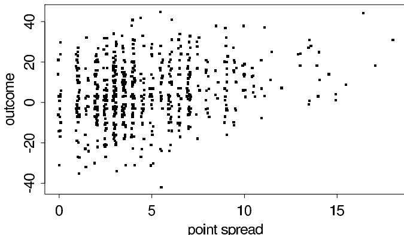  
Figure 1.1 Scatterplot of actual outcome vs. point spread for each of 672 professional football games. The $x$ and $y$ coordinates are jittered by adding uniform random numbers to each point's coordinates (between -0.1 and 0.1 for the $x$ coordinate; between -0.2 and 0.2 for the $y$ coordinate) in order to display multiple values but preserve the discrete-valued nature of each.

# Football point spreads and game outcomes

Football experts provide a point spread for every football game as a measure of the difference in ability between the two teams. For example, team A might be a 3.5-point favorite to defeat team B. The implication of this point spread is that the proposition that team A, the favorite, defeats team B, the underdog, by 4 or more points is considered a fair bet; in other words, the probability that A wins by more than 3.5 points is $\frac{1}{2}$ . If the point spread is an integer, then the implication is that team A is as likely to win by more points than the point spread as it is to win by fewer points than the point spread (or to lose); there is positive probability that A will win by exactly the point spread, in which case neither side is paid off. The assignment of point spreads is itself an interesting exercise in probabilistic reasoning; one interpretation is that the point spread is the median of the distribution of the gambling population's beliefs about the possible outcomes of the game. For the rest of this example, we treat point spreads as given and do not worry about how they were derived.

The point spread and actual game outcome for 672 professional football games played during the 1981, 1983, and 1984 seasons are graphed in Figure 1.1. (Much of the 1982 season was canceled due to a labor dispute.) Each point in the scatterplot displays the point spread, $x$ , and the actual outcome (favorite's score minus underdog's score), $y$ . (In games with a point spread of zero, the labels 'favorite' and 'underdog' were assigned at random.) A small random jitter is added to the $x$ and $y$ coordinate of each point on the graph so that multiple points do not fall exactly on top of each other.

# Assigning probabilities based on observed frequencies

It is of interest to assign probabilities to particular events: $\mathrm{Pr}(\text{favorite wins})$ , $\mathrm{Pr}(\text{favorite wins}|$ point spread is 3.5 points), $\mathrm{Pr}(\text{favorite wins by more than the point spread})$ , $\mathrm{Pr}(\text{favorite wins by more than the point spread}|$ point spread is 3.5 points), and so forth. We might report a subjective probability based on informal experience gathered by reading the newspaper and watching football games. The probability that the favored team wins a game should certainly be greater than 0.5, perhaps between 0.6 and 0.75? More complex events require more intuition or knowledge on our part. A more systematic approach is to assign probabilities based on the data in Figure 1.1. Counting a tied game as one-half win and

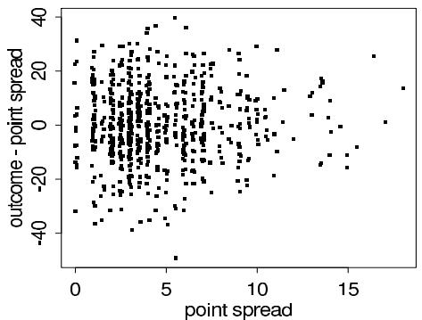

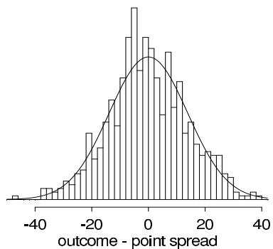  
Figure 1.2 (a) Scatterplot of (actual outcome - point spread) vs. point spread for each of 672 professional football games (with uniform random jitter added to $x$ and $y$ coordinates). (b) Histogram of the differences between the game outcome and the point spread, with the $N(0,14^2)$ density superimposed.

one-half loss, and ignoring games for which the point spread is zero (and thus there is no favorite), we obtain empirical estimates such as:

- $\operatorname{Pr}(\text{favorite wins}) = \frac{410.5}{655} = 0.63$   
- $\operatorname{Pr}(\text{favorite wins} \mid x = 3.5) = \frac{36}{59} = 0.61$   
- Pr(favorite wins by more than the point spread) = $\frac{308}{655} = 0.47$   
- $\operatorname{Pr}(\text{favorite wins by more than the point spread} | x = 3.5) = \frac{32}{59} = 0.54$ .

These empirical probability assignments all seem sensible in that they match the intuition of knowledgeable football fans. However, such probability assignments are problematic for events with few directly relevant data points. For example, 8.5-point favorites won five out of five times during this three-year period, whereas 9-point favorites won thirteen out of twenty times. However, we realistically expect the probability of winning to be greater for a 9-point favorite than for an 8.5-point favorite. The small sample size with point spread 8.5 leads to imprecise probability assignments. We consider an alternative method using a parametric model.

# A parametric model for the difference between outcome and point spread

Figure 1.2a displays the differences $y - x$ between the observed game outcome and the point spread, plotted versus the point spread, for the games in the football dataset. (Once again, random jitter was added to both coordinates.) This plot suggests that it may be roughly reasonable to model the distribution of $y - x$ as independent of $x$ . (See Exercise 6.10.) Figure 1.2b is a histogram of the differences $y - x$ for all the football games, with a fitted normal density superimposed. This plot suggests that it may be reasonable to approximate the marginal distribution of the random variable $d = y - x$ by a normal distribution. The sample mean of the 672 values of $d$ is 0.07, and the sample standard deviation is 13.86, suggesting that the results of football games are approximately normal with mean equal to the point spread and standard deviation nearly 14 points (two converted touchdowns). For the remainder of the discussion we take the distribution of $d$ to be independent of $x$ and normal with mean zero and standard deviation 14 for each $x$ ; that is,

$$
d | x \sim \mathrm {N} (0, 1 4 ^ {2}),
$$

as displayed in Figure 1.2b. The assigned probability model is not perfect: it does not fit the data exactly, and, as is often the case with real data, neither football scores nor point spreads are continuous-valued quantities.

Assigning probabilities using the parametric model

Nevertheless, the model provides a convenient approximation that can be used to assign probabilities to events. If $d$ has a normal distribution with mean zero and is independent of the point spread, then the probability that the favorite wins by more than the point spread is $\frac{1}{2}$ , conditional on any value of the point spread, and therefore unconditionally as well. Denoting probabilities obtained by the normal model as $\mathrm{Pr}_{\mathrm{norm}}$ , the probability that an $x$ -point favorite wins the game can be computed, assuming the normal model, as follows:

$$
\operatorname * {P r} _ {\mathrm {n o r m}} (y > 0 \mid x) = \operatorname * {P r} _ {\mathrm {n o r m}} (d > - x \mid x) = 1 - \Phi \left(- \frac {x}{1 4}\right),
$$

where $\Phi$ is the standard normal cumulative distribution function. For example,

- $\operatorname{Pr}_{\text {norm }}$ (favorite wins $|x = 3.5) = 0.60$   
- $\operatorname{Pr}_{\text {norm }}$ (favorite wins $|x = 8.5) = 0.73$   
- $\operatorname{Pr}_{\mathrm{norm}}$ (favorite wins $|x = 9.0) = 0.74$

The probability for a 3.5-point favorite agrees with the empirical value given earlier, whereas the probabilities for 8.5- and 9-point favorites make more intuitive sense than the empirical values based on small samples.

# 1.7 Example: estimating the accuracy of record linkage

We emphasize the essentially empirical (not 'subjective' or 'personal') nature of probabilities with another example in which they are estimated from data.

Record linkage refers to the use of an algorithmic technique to identify records from different databases that correspond to the same individual. Record-linkage techniques are used in a variety of settings. The work described here was formulated and first applied in the context of record linkage between the U.S. Census and a large-scale post-enumeration survey, which is the first step of an extensive matching operation conducted to evaluate census coverage for subgroups of the population. The goal of this first step is to declare as many records as possible 'matched' by computer without an excessive rate of error, thereby avoiding the cost of the resulting manual processing for all records not declared 'matched.'

# Existing methods for assigning scores to potential matches

Much attention has been paid in the record-linkage literature to the problem of assigning 'weights' to individual fields of information in a multivariate record and obtaining a composite 'score,' which we call $y$ , that summarizes the closeness of agreement between two records. Here, we assume that this step is complete in the sense that these rules have been chosen. The next step is the assignment of candidate matched pairs, where each pair of records consists of the best potential match for each other from the respective databases. The specified weighting rules then order the candidate matched pairs. In the motivating problem at the Census Bureau, a binary choice is made between the alternatives 'declare matched' vs. 'send to followup,' where a cutoff score is needed above which records are declared matched. The false-match rate is then defined as the number of falsely matched pairs divided by the number of declared matched pairs.

Particularly relevant for any such decision problem is an accurate method for assessing the probability that a candidate matched pair is a correct match as a function of its score. Simple methods exist for converting the scores into probabilities, but these lead to extremely inaccurate, typically grossly optimistic, estimates of false-match rates. For example, a manual check of a set of records with nominal false-match probabilities ranging from $10^{-3}$ to $10^{-7}$ (that is, pairs deemed almost certain to be matches) found actual false-match rates

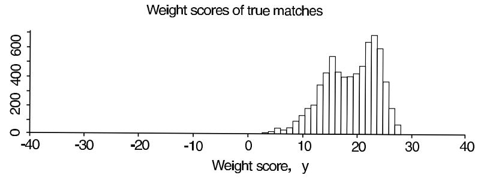

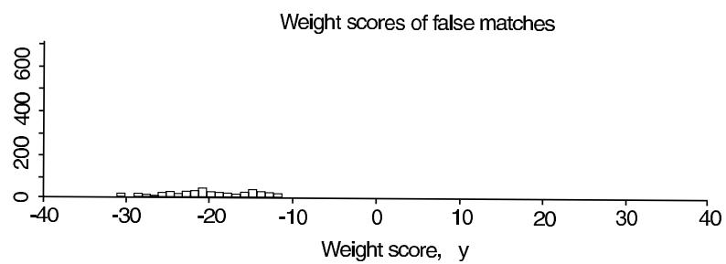  
Figure 1.3 Histograms of weight scores $y$ for true and false matches in a sample of records from the 1988 test Census. Most of the matches in the sample are true (because a pre-screening process has already picked these as the best potential match for each case), and the two distributions are mostly, but not completely, separated.

closer to the $1\%$ range. Records with nominal false-match probabilities of $1\%$ had an actual false-match rate of $5\%$ .

We would like to use Bayesian methods to recalibrate these to obtain objective probabilities of matching for a given decision rule—in the same way that in the football example, we used past data to estimate the probabilities of different game outcomes conditional on the point spread. Our approach is to work with the scores $y$ and empirically estimate the probability of a match as a function of $y$ .

# Estimating match probabilities empirically

We obtain accurate match probabilities using mixture modeling, a topic we discuss in detail in Chapter 22. The distribution of previously obtained scores for the candidate matches is considered a 'mixture' of a distribution of scores for true matches and a distribution for non-matches. The parameters of the mixture model are estimated from the data. The estimated parameters allow us to calculate an estimate of the probability of a false match (a pair declared matched that is not a true match) for any given decision threshold on the scores. In the procedure that was actually used, some elements of the mixture model (for example, the optimal transformation required to allow a mixture of normal distributions to apply) were fit using 'training' data with known match status (separate from the data to which we apply our calibration procedure), but we do not describe those details here. Instead we focus on how the method would be used with a set of data with unknown match status.

Support for this approach is provided in Figure 1.3, which displays the distribution of scores for the matches and non-matches in a particular dataset obtained from 2300 records from a 'test Census' survey conducted in a single local area two years before the 1990 Census. The two distributions, $p(y|\mathrm{match})$ and $p(y|\mathrm{non - match})$ , are mostly distinct—meaning that

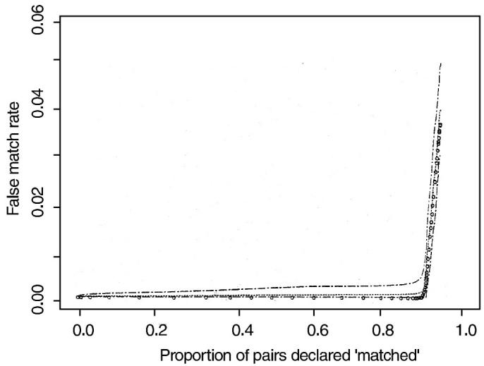  
Figure 1.4 Lines show expected false-match rate (and $95\%$ bounds) as a function of the proportion of cases declared matches, based on the mixture model for record linkage. Dots show the actual false-match rate for the data.

in most cases it is possible to identify a candidate as a match or not given the score alone—but with some overlap.

In our application dataset, we do not know the match status. Thus we are faced with a single combined histogram from which we estimate the two component distributions and the proportion of the population of scores that belong to each component. Under the mixture model, the distribution of scores can be written as,

$$
p (y) = \Pr (\text {m a t c h}) p (y | \text {m a t c h}) + \Pr (\text {n o n - m a t c h}) p (y | \text {n o n - m a t c h}). \tag {1.7}
$$

The mixture probability (Pr(match)) and the parameters of the distributions of matches $(p(y|\mathrm{match}))$ and non-matches $(p(y|\mathrm{non - match}))$ are estimated using the mixture model approach (as described in Chapter 22) applied to the combined histogram from the data with unknown match status.

To use the method to make record-linkage decisions, we construct a curve giving the false-match rate as a function of the decision threshold, the score above which pairs will be 'declared' a match. For a given decision threshold, the probability distributions in (1.7) can be used to estimate the probability of a false match, a score $y$ above the threshold originating from the distribution $p(y|\text{non-match})$ . The lower the threshold, the more pairs we will declare as matches. As we declare more matches, the proportion of errors increases. The approach described here should provide an objective error estimate for each threshold. (See the validation in the next paragraph.) Then a decision maker can determine the threshold that provides an acceptable balance between the goals of declaring more matches automatically (thus reducing the clerical labor) and making fewer mistakes.

# External validation of the probabilities using test data

The approach described above was externally validated using data for which the match status is known. The method was applied to data from three different locations of the 1988 test Census, and so three tests of the methods were possible. We provide detailed results for one; results for the other two were similar. The mixture model was fitted to the scores of all the candidate pairs at a test site. Then the estimated model was used to create the lines in Figure 1.4, which show the expected false-match rate (and uncertainty bounds) in

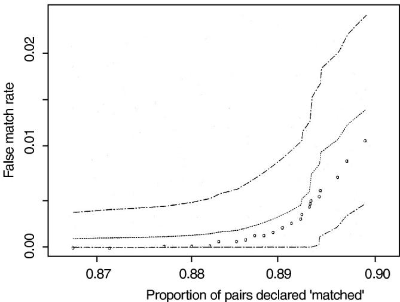  
Figure 1.5 Expansion of Figure 1.4 in the region where the estimated and actual match rates change rapidly. In this case, it would seem a good idea to match about $88\%$ of the cases and send the rest to follow up.

terms of the proportion of cases declared matched, as the threshold varies from high (thus allowing no matches) to low (thus declaring almost all the candidate pairs to be matches). The false-match proportion is an increasing function of the number of declared matches, which makes sense: as we move rightward on the graph, we are declaring weaker and weaker cases to be matches.

The lines on Figure 1.4 display the expected proportion of false matches and $95\%$ posterior bounds for the false-match rate as estimated from the model. (These bounds give the estimated range within which there is $95\%$ posterior probability that the false-match rate lies. The concept of posterior intervals is discussed in more detail in the next chapter.) The dots in the graph display the actual false-match proportions, which track well with the model. In particular, the model would suggest a recommendation of declaring something less than $90\%$ of cases as matched and giving up on the other $10\%$ or so, so as to avoid most of the false matches, and the dots show a similar pattern.

It is clearly possible to match large proportions of the files with little or no error. Also, the quality of candidate matches becomes dramatically worse at some point where the false-match rate accelerates. Figure 1.5 takes a magnifying glass to the previous display to highlight the behavior of the calibration procedure in the region of interest where the false-match rate accelerates. The predicted false-match rate curves bend upward, close to the points where the observed false-match rate curves rise steeply, which is a particularly encouraging feature of the calibration method. The calibration procedure performs well from the standpoint of providing predicted probabilities that are close to the true probabilities and interval estimates that are informative and include the true values. By comparison, the original estimates of match probabilities, constructed by multiplying weights without empirical calibration, were highly inaccurate.

# 1.8 Some useful results from probability theory

We assume the reader is familiar with elementary manipulations involving probabilities and probability distributions. In particular, basic probability background that must be well understood for key parts of the book includes the manipulation of joint densities, the definition of simple moments, the transformation of variables, and methods of simulation. In

this section we briefly review these assumed prerequisites and clarify some further notational conventions used in the remainder of the book. Appendix A provides information on some commonly used probability distributions.

As introduced in Section 1.3, we generally represent joint distributions by their joint probability mass or density function, with dummy arguments reflecting the name given to each variable being considered. Thus for two quantities $u$ and $v$ , we write the joint density as $p(u,v)$ ; if specific values need to be referenced, this notation will be further abused as with, for example, $p(u,v = 1)$ .

In Bayesian calculations relating to a joint density $p(u,v)$ , we will often refer to a conditional distribution or density function such as $p(u|v)$ and a marginal density such as $p(u) = \int p(u,v)dv$ . In this notation, either or both $u$ and $v$ can be vectors. Typically it will be clear from the context that the range of integration in the latter expression refers to the entire range of the variable being integrated out. It is also often useful to factor a joint density as a product of marginal and conditional densities; for example, $p(u,v,w) = p(u|v,w)p(v|w)p(w)$ .

Some authors use different notations for distributions on parameters and observables—for example, $\pi(\theta), f(y|\theta)$ —but this obscures the fact that all probability distributions have the same logical status in Bayesian inference. We must always be careful, though, to indicate appropriate conditioning; for example, $p(y|\theta)$ is different from $p(y)$ . In the interests of conciseness, however, our notation hides the conditioning on hypotheses that hold throughout—no probability judgments can be made in a vacuum—and to be more explicit one might use a notation such as the following:

$$
p (\theta , y | H) = p (\theta | H) p (y | \theta , H),
$$

where $H$ refers to the set of hypotheses or assumptions used to define the model. Also, we sometimes suppress explicit conditioning on known explanatory variables, $x$ .

We use the standard notations, $\operatorname{E}(\cdot)$ and $\operatorname{var}(\cdot)$ , for mean and variance, respectively:

$$
\operatorname {E} (u) = \int u p (u) d u, \quad \operatorname {v a r} (u) = \int (u - \operatorname {E} (u)) ^ {2} p (u) d u.
$$

For a vector parameter $u$ , the expression for the mean is the same, and the covariance matrix is defined as

$$
\operatorname {v a r} (u) = \int (u - \operatorname {E} (u)) (u - \operatorname {E} (u)) ^ {T} p (u) d u,
$$

where $u$ is considered a column vector. (We use the terms 'variance matrix' and 'covariance matrix' interchangeably.) This notation is slightly imprecise, because $\operatorname{E}(u)$ and $\operatorname{var}(u)$ are really functions of the distribution function, $p(u)$ , not of the variable $u$ . In an expression involving an expectation, any variable that does not appear explicitly as a conditioning variable is assumed to be integrated out in the expectation; for example, $\operatorname{E}(u|v)$ refers to the conditional expectation of $u$ with $v$ held fixed—that is, the conditional expectation as a function of $v$ —whereas $\operatorname{E}(u)$ is the expectation of $u$ , averaging over $v$ (as well as $u$ ).

# Modeling using conditional probability

Useful probability models often express the distribution of observables conditionally or hierarchically rather than through more complicated unconditional distributions. For example, suppose $y$ is the height of a university student selected at random. The marginal distribution $p(y)$ is (essentially) a mixture of two approximately normal distributions centered around 160 and 175 centimeters. A more useful description of the distribution of $y$ would be based on the joint distribution of height and sex: $p(\mathrm{male}) \approx p(\mathrm{female}) \approx \frac{1}{2}$ , along with the conditional specifications that $p(y|\mathrm{female})$ and $p(y|\mathrm{male})$ are each approximately normal

with means 160 and $175~\mathrm{cm}$ , respectively. If the conditional variances are not too large, the marginal distribution of $y$ is bimodal. In general, we prefer to model complexity with a hierarchical structure using additional variables rather than with complicated marginal distributions, even when the additional variables are unobserved or even unobservable; this theme underlies mixture models, as discussed in Chapter 22. We repeatedly return to the theme of conditional modeling throughout the book.

# Means and variances of conditional distributions

It is often useful to express the mean and variance of a random variable $u$ in terms of the conditional mean and variance given some related quantity $v$ . The mean of $u$ can be obtained by averaging the conditional mean over the marginal distribution of $v$ ,

$$
\operatorname {E} (u) = \operatorname {E} (\operatorname {E} (u | v)), \tag {1.8}
$$

where the inner expectation averages over $u$ , conditional on $v$ , and the outer expectation averages over $v$ . Identity (1.8) is easy to derive by writing the expectation in terms of the joint distribution of $u$ and $v$ and then factoring the joint distribution:

$$
\operatorname {E} (u) = \iint u p (u, v) d u d v = \iint u p (u | v) d u p (v) d v = \int \operatorname {E} (u | v) p (v) d v.
$$

The corresponding result for the variance includes two terms, the mean of the conditional variance and the variance of the conditional mean:

$$
\operatorname {v a r} (u) = \mathrm {E} (\operatorname {v a r} (u | v)) + \operatorname {v a r} (\mathrm {E} (u | v)). \tag {1.9}
$$

This result can be derived by expanding the terms on the right side of (1.9):

$$
\begin{array}{l} \operatorname {E} \left(\operatorname {v a r} (u | v)\right) + \operatorname {v a r} \left(\operatorname {E} (u | v)\right) = \operatorname {E} \left(\operatorname {E} \left(u ^ {2} | v\right) - (\operatorname {E} (u | v)) ^ {2}\right) + \operatorname {E} \left(\left(\operatorname {E} (u | v)\right) ^ {2}\right) - (\operatorname {E} \left(\operatorname {E} (u | v)\right)) ^ {2} \\ = \mathrm {E} (u ^ {2}) - \mathrm {E} \left(\left(\mathrm {E} (u | v)\right) ^ {2}\right) + \mathrm {E} \left(\left(\mathrm {E} (u | v)\right) ^ {2}\right) - (\mathrm {E} (u)) ^ {2} \\ = \mathrm {E} (u ^ {2}) - (\mathrm {E} (u)) ^ {2} \\ = \quad \operatorname {v a r} (u). \\ \end{array}
$$

Identities (1.8) and (1.9) also hold if $u$ is a vector, in which case $\operatorname{E}(u)$ is a vector and $\operatorname{var}(u)$ a matrix.

# Transformation of variables

It is common to transform a probability distribution from one parameterization to another. We review the basic result here for a probability density on a transformed space. For clarity, we use subscripts here instead of our usual generic notation, $p(\cdot)$ . Suppose $p_{u}(u)$ is the density of the vector $u$ , and we transform to $v = f(u)$ , where $v$ has the same number of components as $u$ .

If $p_u$ is a discrete distribution, and $f$ is a one-to-one function, then the density of $v$ is given by

$$
p _ {v} (v) = p _ {u} \left(f ^ {- 1} (v)\right).
$$

If $f$ is a many-to-one function, then a sum of terms appears on the right side of this expression for $p_v(v)$ , with one term corresponding to each of the branches of the inverse function.

If $p_u$ is a continuous distribution, and $v = f(u)$ is a one-to-one transformation, then the joint density of the transformed vector is

$$
p _ {v} (v) = | J | p _ {u} \left(f ^ {- 1} (v)\right)
$$

where $|J|$ is the determinant of the Jacobian of the transformation $u = f^{-1}(v)$ as a function of $v$ ; the Jacobian $J$ is the square matrix of partial derivatives (with dimension given by the number of components of $u$ ), with the $(i,j)$ th entry equal to $\partial u_i / \partial v_j$ . Once again, if $f$ is many-to-one, then $p_v(v)$ is a sum or integral of terms.

In one dimension, we commonly use the logarithm to transform the parameter space from $(0,\infty)$ to $(- \infty, \infty)$ . When working with parameters defined on the open unit interval, (0,1), we often use the logistic transformation:

$$
\operatorname {l o g i t} (u) = \log \left(\frac {u}{1 - u}\right), \tag {1.10}
$$

whose inverse transformation is

$$
\operatorname {l o g i t} ^ {- 1} (v) = \frac {e ^ {v}}{1 + e ^ {v}}.
$$

Another common choice is the probit transformation, $\Phi^{-1}(u)$ , where $\Phi$ is the standard normal cumulative distribution function, to transform from $(0,1)$ to $(- \infty, \infty)$ .

# 1.9 Computation and software

At the time of writing, the authors rely primarily on the software package R for graphs and basic simulations, fitting of classical simple models (including regression, generalized linear models, and nonparametric methods such as locally weighted regression), optimization, and some simple programming. We use the Bayesian inference package Stan (see Appendix C) for fitting most models, but for teaching purposes in this book we describe how to perform most of the computations from first principles. Even when using Stan, we typically work within R to plot and transform the data before model fitting, and to display inferences and model checks afterwards.

Specific computational tasks that arise in Bayesian data analysis include:

- Vector and matrix manipulations (see Table 1.1)   
- Computing probability density functions (see Appendix A)   
- Drawing simulations from probability distributions (see Appendix A for standard distributions and Exercise 1.9 for an example of a simple stochastic process)   
- Structured programming (including looping and customized functions)   
- Calculating the linear regression estimate and variance matrix (see Chapter 14)   
- Graphics, including scatterplots with overlain lines and multiple graphs per page (see Chapter 6 for examples).

Our general approach to computation is to fit many models, gradually increasing the complexity. We do not recommend the strategy of writing a model and then letting the computer run overnight to estimate it perfectly. Rather, we prefer to fit each model relatively quickly, using inferences from the previously fitted simpler models as starting values, and displaying inferences and comparing to data before continuing.

We discuss computation in detail in Part III of this book after first introducing the fundamental concepts of Bayesian modeling, inference, and model checking. Appendix C illustrates how to perform computations in R and Stan in several different ways for a single example.

# Summarizing inferences by simulation

Simulation forms a central part of much applied Bayesian analysis, because of the relative ease with which samples can often be generated from a probability distribution, even when

the density function cannot be explicitly integrated. In performing simulations, it is helpful to consider the duality between a probability density function and a histogram of a set of random draws from the distribution: given a large enough sample, the histogram can provide practically complete information about the density, and in particular, various sample moments, percentiles, and other summary statistics provide estimates of any aspect of the distribution, to a level of precision that can be estimated. For example, to estimate the 95th percentile of the distribution of $\theta$ , draw a random sample of size $S$ from $p(\theta)$ and use the 0.95Sth order statistic. For most purposes, $S = 1000$ is adequate for estimating the 95th percentile in this way.

Another advantage of simulation is that extremely large or small simulated values often flag a problem with model specification or parameterization (for example, see Figure 4.2) that might not be noticed if estimates and probability statements were obtained in analytic form.

Generating values from a probability distribution is often straightforward with modern computing techniques based on (pseudo)random number sequences. A well-designed pseudorandom number generator yields a deterministic sequence that appears to have the same properties as a sequence of independent random draws from the uniform distribution on [0, 1]. Appendix A describes methods for drawing random samples from some commonly used distributions.

# Sampling using the inverse cumulative distribution function

As an introduction to the ideas of simulation, we describe a method for sampling from discrete and continuous distributions using the inverse cumulative distribution function. The cumulative distribution function, or cdf, $F$ , of a one-dimensional distribution, $p(v)$ , is defined by

$$
\begin{array}{l} F (v _ {*}) = \Pr (v \leq v _ {*}) \\ = \left\{ \begin{array}{l l} \sum_ {v \leq v _ {*}} p (v) & \text {i f p i s d i s c r e t e} \\ \int_ {- \infty} ^ {v _ {*}} p (v) d v & \text {i f p i s c o n t i n u o u s .} \end{array} \right. \\ \end{array}
$$

The inverse cdf can be used to obtain random samples from the distribution $p$ , as follows. First draw a random value, $U$ , from the uniform distribution on $[0,1]$ , using a table of random numbers or, more likely, a random number function on the computer. Now let $v = F^{-1}(U)$ . The function $F$ is not necessarily one-to-one—certainly not if the distribution is discrete—but $F^{-1}(U)$ is unique with probability 1. The value $v$ will be a random draw from $p$ , and is easy to compute as long as $F^{-1}(U)$ is simple. For a discrete distribution, $F^{-1}$ can simply be tabulated.

For a continuous example, suppose $v$ has an exponential distribution with parameter $\lambda$ (see Appendix A); then its cdf is $F(v) = 1 - e^{-\lambda v}$ , and the value of $v$ for which $U = F(v)$ is $v = -\frac{\log(1 - U)}{\lambda}$ . Then, recognizing that $1 - U$ also has the uniform distribution on $[0,1]$ , we see we can obtain random draws from the exponential distribution as $-\frac{\log U}{\lambda}$ . We discuss other methods of simulation in Part III of the book and Appendix A.

# Simulation of posterior and posterior predictive quantities

In practice, we are most often interested in simulating draws from the posterior distribution of the model parameters $\theta$ , and perhaps from the posterior predictive distribution of unknown observables $\tilde{y}$ . Results from a set of $S$ simulation draws can be stored in the computer in an array, as illustrated in Table 1.1. We use the notation $s = 1,\dots,S$ to index simulation draws; $(\theta^s,\tilde{y}^s)$ is the corresponding joint draw of parameters and predicted quantities from their joint posterior distribution.

Table 1.1 Structure of posterior and posterior predictive simulations. The superscripts are indexes, not powers.   

<table><tr><td>Simulation draw</td><td colspan="3">Parameters</td><td colspan="3">Predictive quantities</td></tr><tr><td></td><td>θ1</td><td>...</td><td>θk</td><td>ŷ1</td><td>...</td><td>ŷn</td></tr><tr><td>1</td><td>θ11</td><td>...</td><td>θ1k</td><td>ŷ11</td><td>...</td><td>ŷ1n</td></tr><tr><td>:</td><td>:</td><td>..</td><td>:</td><td>:</td><td>..</td><td>:</td></tr><tr><td>S</td><td>θ1S</td><td>...</td><td>θkS</td><td>ŷ1S</td><td>...</td><td>ŷnS</td></tr></table>

From these simulated values, we can estimate the posterior distribution of any quantity of interest, such as $\theta_1 / \theta_3$ , by just computing a new column in Table 1.1 using the existing $S$ draws of $(\theta, \tilde{y})$ . We can estimate the posterior probability of any event, such as $\operatorname*{Pr}(\tilde{y}_1 + \tilde{y}_2 > e^{\theta_1})$ , by the proportion of the $S$ simulations for which it is true. We are often interested in posterior intervals; for example, the central $95\%$ posterior interval $[a, b]$ for the parameter $\theta_j$ , for which $\operatorname*{Pr}(\theta_j < a) = 0.025$ and $\operatorname*{Pr}(\theta_j > b) = 0.025$ . These values can be directly estimated by the appropriate simulated values of $\theta_j$ , for example, the 25th and 976th order statistics if $S = 1000$ . We commonly summarize inferences by $50\%$ and $95\%$ intervals.

We return to the accuracy of simulation inferences in Section 10.5 after we have gained some experience using simulations of posterior distributions in some simple examples.

# 1.10 Bayesian inference in applied statistics

A pragmatic rationale for the use of Bayesian methods is the inherent flexibility introduced by their incorporation of multiple levels of randomness and the resultant ability to combine information from different sources, while incorporating all reasonable sources of uncertainty in inferential summaries. Such methods naturally lead to smoothed estimates in complicated data structures and consequently have the ability to obtain better real-world answers.

Another reason for focusing on Bayesian methods is more psychological, and involves the relationship between the statistician and the client or specialist in the subject matter area who is the consumer of the statistician's work. In many practical cases, clients will interpret interval estimates provided by statisticians as Bayesian intervals, that is, as probability statements about the likely values of unknown quantities conditional on the evidence in the data. Such direct probability statements require prior probability specifications for unknown quantities (or more generally, probability models for vectors of unknowns), and thus the kinds of answers clients will assume are being provided by statisticians, Bayesian answers, require full probability models—explicit or implicit.

Finally, Bayesian inferences are conditional on probability models that invariably contain approximations in their attempt to represent complicated real-world relationships. If the Bayesian answers vary dramatically over a range of scientifically reasonable assumptions that are unassailable by the data, then the resultant range of possible conclusions must be entertained as legitimate, and we believe that the statistician has the responsibility to make the client aware of this fact.

In this book, we focus on the construction of models (especially hierarchical ones, as discussed in Chapter 5 onward) to relate complicated data structures to scientific questions, checking the fit of such models, and investigating the sensitivity of conclusions to reasonable modeling assumptions. From this point of view, the strength of the Bayesian approach lies in (1) its ability to combine information from multiple sources (thereby in fact allowing greater 'objectivity' in final conclusions), and (2) its more encompassing accounting of uncertainty about the unknowns in a statistical problem.

Other important themes, many of which are common to much modern applied statistical practice, whether formally Bayesian or not, are the following:

- a willingness to use many parameters   
- hierarchical structuring of models, which is the essential tool for achieving partial pooling of estimates and compromising in a scientific way between alternative sources of information   
- model checking—not only by examining the internal goodness of fit of models to observed and possible future data, but also by comparing inferences about estimands and predictions of interest to substantive knowledge   
- an emphasis on inference in the form of distributions or at least interval estimates rather than simple point estimates   
- the use of simulation as the primary method of computation; the modern computational counterpart to a 'joint probability distribution' is a set of randomly drawn values, and a key tool for dealing with missing data is the method of multiple imputation (computation and multiple imputation are discussed in more detail in later chapters)   
- the use of probability models as tools for understanding and possibly improving data-analytic techniques that may not explicitly invoke a Bayesian model   
- the importance of including in the analysis as much background information as possible, so as to approximate the goal that data can be viewed as a random sample, conditional on all the variables in the model   
- the importance of designing studies to have the property that inferences for estimands of interest will be robust to model assumptions.

# 1.11 Bibliographic note

Several good introductory books have been written on Bayesian statistics, beginning with Lindley (1965), and continuing through Hoff (2009). Berry (1996) presents, from a Bayesian perspective, many of the standard topics for an introductory statistics textbook. Gill (2002) and Jackman (2009) introduce applied Bayesian statistics for social scientists, Kruschke (2011) introduces Bayesian methods for psychology researchers, and Christensen et al. (2010) supply a general introduction. Carlin and Louis (2008) cover the theory and applications of Bayesian inference, focusing on biological applications and connections to classical methods. Some resources for teaching Bayesian statistics include Sedlmeier and Gigerenzer (2001) and Gelman (1998, 2008b).

The bibliographic notes at the ends of the chapters in this book refer to a variety of specific applications of Bayesian data analysis. Several review articles in the statistical literature, such as Breslow (1990) and Racine et al. (1986), have appeared that discuss, in general terms, areas of application in which Bayesian methods have been useful. The volumes edited by Gatsonis et al. (1993-2002) are collections of Bayesian analyses, including extensive discussions about choices in the modeling process and the relations between the statistical methods and the applications.

The foundations of probability and Bayesian statistics are an important topic that we treat only briefly. Bernardo and Smith (1994) give a thorough review of the foundations of Bayesian models and inference with a comprehensive list of references. Jeffreys (1961) is a self-contained book about Bayesian statistics that comprehensively presents an inductive view of inference; Good (1950) is another important early work. Jaynes (1983) is a collection of reprinted articles that present a deductive view of Bayesian inference that we believe is similar to ours. Both Jeffreys and Jaynes focus on applications in the physical sciences. Jaynes (2003) focuses on connections between statistical inference and the philosophy of science and includes several examples of physical probability.

Gigerenzer and Hoffrage (1995) discuss the connections between Bayesian probability and frequency probabilities from a perspective similar to ours, and provide evidence that people can typically understand and compute best with probabilities that expressed in the form of relative frequency. Gelman (1998) presents some classroom activities for teaching Bayesian ideas.

De Finetti (1974) is an influential work that focuses on the crucial role of exchangeability. More approachable discussions of the role of exchangeability in Bayesian inference are provided by Lindley and Novick (1981) and Rubin (1978a, 1987a). The non-Bayesian article by Draper et al. (1993) makes an interesting attempt to explain how exchangeable probability models can be justified in data analysis. Berger and Wolpert (1984) give a comprehensive discussion and review of the likelihood principle, and Berger (1985, Sections 1.6, 4.1, and 4.12) reviews a range of philosophical issues from the perspective of Bayesian decision theory.

Our own philosophy of Bayesian statistics appears in Gelman (2011) and Gelman and Shalizi (2013); for some contrasting views, see the discussion of that article, along with Efron (1986) and the discussions following Gelman (2008a).

Pratt (1965) and Rubin (1984) discuss the relevance of Bayesian methods for applied statistics and make many connections between Bayesian and non-Bayesian approaches to inference. Further references on the foundations of statistical inference appear in Shafer (1982) and the accompanying discussion. Kahneman and Tversky (1972) and Alpert and Raiffa (1982) present the results of psychological experiments that assess the meaning of 'subjective probability' as measured by people's stated beliefs and observed actions. Lindley (1971a) surveys many different statistical ideas, all from the Bayesian perspective. Box and Tiao (1973) is an early book on applied Bayesian methods. They give an extensive treatment of inference based on normal distributions, and their first chapter, a broad introduction to Bayesian inference, provides a good counterpart to Chapters 1 and 2 of this book.

The iterative process involving modeling, inference, and model checking that we present in Section 1.1 is discussed at length in the first chapter of Box and Tiao (1973) and also in Box (1980). Cox and Snell (1981) provide a more introductory treatment of these ideas from a less model-based perspective.

Many good books on the mathematical aspects of probability theory are available, such as Feller (1968) and Ross (1983); these are useful when constructing probability models and working with them. O'Hagan (1988) has written an interesting introductory text on probability from an explicitly Bayesian point of view.

Physical probability models for coin tossing are discussed by Keller (1986), Jaynes (2003), and Gelman and Nolan (2002b). The football example of Section 1.6 is discussed in more detail in Stern (1991); see also Harville (1980) and Glickman (1993) and Glickman and Stern (1998) for analyses of football scores not using the point spread. Related analyses of sports scores and betting odds appear in Stern (1997, 1998). For more background on sports betting, see Snyder (1975) and Rombola (1984).

An interesting real-world example of probability assignment arose with the explosion of the Challenger space shuttle in 1986; Martz and Zimmer (1992), Dalal, Fowlkes, and Hoadley (1989), and Lavine (1991) present and compare various methods for assigning probabilities for space shuttle failures. (At the time of writing we are not aware of similar contributions relating to the more recent space accident in 2003.) The record-linkage example in Section 1.7 appears in Belin and Rubin (1995b), who discuss the mixture models and calibration techniques in more detail. The Census problem that motivated the record linkage is described by Hogan (1992).

In all our examples, probabilities are assigned using statistical modeling and estimation, not by 'subjective' assessment. Dawid (1986) provides a general discussion of probability assignment, and Dawid (1982) discusses the connections between calibration and Bayesian probability assignment.

The graphical method of jittering, used in Figures 1.1 and 1.2 and elsewhere in this book, is discussed in Chambers et al. (1983). For information on the statistical packages R and Bugs, see Becker, Chambers, and Wilks (1988), R Project (2002), Fox (2002), Venables and Ripley (2002), and Spiegelhalter et al. (1994, 2003).

Norvig (2007) describes the principles and details of the Bayesian spelling corrector.

# 1.12 Exercises

1. Conditional probability: suppose that if $\theta = 1$ , then $y$ has a normal distribution with mean 1 and standard deviation $\sigma$ , and if $\theta = 2$ , then $y$ has a normal distribution with mean 2 and standard deviation $\sigma$ . Also, suppose $\operatorname{Pr}(\theta = 1) = 0.5$ and $\operatorname{Pr}(\theta = 2) = 0.5$ .

(a) For $\sigma = 2$ , write the formula for the marginal probability density for $y$ and sketch it.   
(b) What is $\operatorname*{Pr}(\theta = 1|y = 1)$ , again supposing $\sigma = 2$ ?   
(c) Describe how the posterior density of $\theta$ changes in shape as $\sigma$ is increased and as it is decreased.

2. Conditional means and variances: show that (1.8) and (1.9) hold if $u$ is a vector.

3. Probability calculation for genetics (from Lindley, 1965): suppose that in each individual of a large population there is a pair of genes, each of which can be either x or X, that controls eye color: those with xx have blue eyes, while heterozygotes (those with Xx or xX) and those with XX have brown eyes. The proportion of blue-eyed individuals is $p^2$ and of heterozygotes is $2p(1 - p)$ , where $0 < p < 1$ . Each parent transmits one of its own genes to the child; if a parent is a heterozygote, the probability that it transmits the gene of type X is $\frac{1}{2}$ . Assuming random mating, show that among brown-eyed children of brown-eyed parents, the expected proportion of heterozygotes is $2p / (1 + 2p)$ . Suppose Judy, a brown-eyed child of brown-eyed parents, marries a heterozygote, and they have $n$ children, all brown-eyed. Find the posterior probability that Judy is a heterozygote and the probability that her first grandchild has blue eyes.   
4. Probability assignment: we will use the football dataset to estimate some conditional probabilities about professional football games. There were twelve games with point spreads of 8 points; the outcomes in those games were: $-7, -5, -3, -3, 1, 6, 7, 13, 15, 16, 20, \text{and} 21$ , with positive values indicating wins by the favorite and negative values indicating wins by the underdog. Consider the following conditional probabilities:

$\operatorname{Pr}(\text{favorite wins} \mid \text{point spread} = 8)$ ,

$\operatorname{Pr}(\text{favorite wins by at least } 8 \mid \text{point spread} = 8)$ ,

$\operatorname{Pr}(\text{favorite wins by at least } 8 \mid \text{point spread} = 8$ and favorite wins).

(a) Estimate each of these using the relative frequencies of games with a point spread of 8.   
(b) Estimate each using the normal approximation for the distribution of (outcome - point spread).

5. Probability assignment: the 435 U.S. Congressional members are elected to two-year terms; the number of voters in an individual congressional election varies from about 50,000 to 350,000. We will use various sources of information to estimate roughly the probability that at least one congressional election is tied in the next national election.

(a) Use any knowledge you have about U.S. politics. Specify clearly what information you are using to construct this conditional probability, even if your answer is just a guess.   
(b) Use the following information: in the period 1900-1992, there were 20,597 congressional elections, out of which 6 were decided by fewer than 10 votes and 49 decided by fewer than 100 votes.

See Gelman, King, and Boscardin (1998), Mulligan and Hunter (2001), and Gelman, Katz, and Tuerlinckx (2002) for more on this topic.

6. Conditional probability: approximately 1/125 of all births are fraternal twins and 1/300 of births are identical twins. Elvis Presley had a twin brother (who died at birth). What is the probability that Elvis was an identical twin? (You may approximate the probability of a boy or girl birth as $\frac{1}{2}$ .)

7. Conditional probability: the following problem is loosely based on the television game show Let's Make a Deal. At the end of the show, a contestant is asked to choose one of three large boxes, where one box contains a fabulous prize and the other two boxes contain lesser prizes. After the contestant chooses a box, Monty Hall, the host of the show, opens one of the two boxes containing smaller prizes. (In order to keep the conclusion suspenseful, Monty does not open the box selected by the contestant.) Monty offers the contestant the opportunity to switch from the chosen box to the remaining unopened box. Should the contestant switch or stay with the original choice? Calculate the probability that the contestant wins under each strategy. This is an exercise in being clear about the information that should be conditioned on when constructing a probability judgment. See Selvin (1975) and Morgan et al. (1991) for further discussion of this problem.

8. Subjective probability: discuss the following statement. 'The probability of event $\mathrm{E}$ is considered "subjective" if two rational persons $\mathrm{A}$ and $\mathrm{B}$ can assign unequal probabilities to $\mathrm{E}$ , $P_A(E)$ and $P_B(E)$ . These probabilities can also be interpreted as "conditional": $P_A(E) = P(E|I_A)$ and $P_B(E) = P(E|I_B)$ , where $I_A$ and $I_B$ represent the knowledge available to persons $\mathrm{A}$ and $\mathrm{B}$ , respectively.' Apply this idea to the following examples.

(a) The probability that a '6' appears when a fair die is rolled, where A observes the outcome of the die roll and B does not.   
(b) The probability that Brazil wins the next World Cup, where A is ignorant of soccer and B is a knowledgeable sports fan.

9. Simulation of a queuing problem: a clinic has three doctors. Patients come into the clinic at random, starting at 9 a.m., according to a Poisson process with time parameter 10 minutes: that is, the time after opening at which the first patient appears follows an exponential distribution with expectation 10 minutes and then, after each patient arrives, the waiting time until the next patient is independently exponentially distributed, also with expectation 10 minutes. When a patient arrives, he or she waits until a doctor is available. The amount of time spent by each doctor with each patient is a random variable, uniformly distributed between 5 and 20 minutes. The office stops admitting new patients at 4 p.m. and closes when the last patient is through with the doctor.

(a) Simulate this process once. How many patients came to the office? How many had to wait for a doctor? What was their average wait? When did the office close?   
(b) Simulate the process 100 times and estimate the median and $50\%$ interval for each of the summaries in (a).

# Chapter 2

# Single-parameter models

Our first detailed discussion of Bayesian inference is in the context of statistical models where only a single scalar parameter is to be estimated; that is, the estimand $\theta$ is one-dimensional. In this chapter, we consider four fundamental and widely used one-dimensional models—the binomial, normal, Poisson, and exponential—and at the same time introduce important concepts and computational methods for Bayesian data analysis.

# 2.1 Estimating a probability from binomial data

In the simple binomial model, the aim is to estimate an unknown population proportion from the results of a sequence of 'Bernoulli trials'; that is, data $y_{1},\ldots ,y_{n}$ , each of which is either 0 or 1. This problem provides a relatively simple but important starting point for the discussion of Bayesian inference. By starting with the binomial model, our discussion also parallels the very first published Bayesian analysis by Thomas Bayes in 1763, and his seminal contribution is still of interest.

The binomial distribution provides a natural model for data that arise from a sequence of $n$ exchangeable trials or draws from a large population where each trial gives rise to one of two possible outcomes, conventionally labeled 'success' and 'failure.' Because of the exchangeability, the data can be summarized by the total number of successes in the $n$ trials, which we denote here by $y$ . Converting from a formulation in terms of exchangeable trials to one using independent and identically distributed random variables is achieved naturally by letting the parameter $\theta$ represent the proportion of successes in the population or, equivalently, the probability of success in each trial. The binomial sampling model is,

$$
p (y | \theta) = \operatorname {B i n} (y | n, \theta) = \binom {n} {y} \theta^ {y} (1 - \theta) ^ {n - y}, \tag {2.1}
$$

where on the left side we suppress the dependence on $n$ because it is regarded as part of the experimental design that is considered fixed; all the probabilities discussed for this problem are assumed to be conditional on $n$ .

# Example. Estimating the probability of a female birth

As a specific application of the binomial model, we consider the estimation of the sex ratio within a population of human births. The proportion of births that are female has long been a topic of interest both scientifically and to the lay public. Two hundred years ago it was established that the proportion of female births in European populations was less than 0.5 (see Historical Note below), while in this century interest has focused on factors that may influence the sex ratio. The currently accepted value of the proportion of female births in large European-race populations is 0.485.

For this example we define the parameter $\theta$ to be the proportion of female births, but an alternative way of reporting this parameter is as a ratio of male to female birth rates, $\phi = (1 - \theta) / \theta$ .

Let $y$ be the number of girls in $n$ recorded births. By applying the binomial model

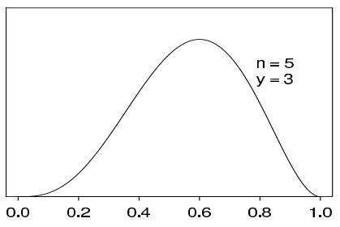

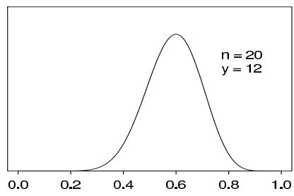

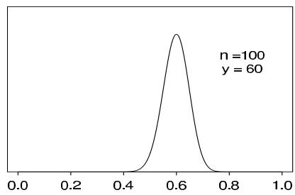

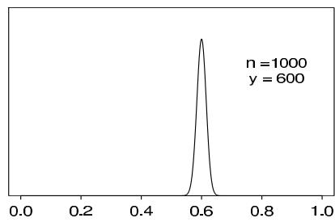  
Figure 2.1 Unnormalized posterior density for binomial parameter $\theta$ , based on uniform prior distribution and $y$ successes out of $n$ trials. Curves displayed for several values of $n$ and $y$ .

(2.1), we are assuming that the $n$ births are conditionally independent given $\theta$ , with the probability of a female birth equal to $\theta$ for all cases. This modeling assumption is motivated by the exchangeability that may be judged to arise when we have no explanatory information (for example, distinguishing multiple births or births within the same family) that might affect the sex of the baby.

To perform Bayesian inference in the binomial model, we must specify a prior distribution for $\theta$ . We will discuss issues associated with specifying prior distributions many times throughout this book, but for simplicity at this point, we assume that the prior distribution for $\theta$ is uniform on the interval [0, 1].

Elementary application of Bayes' rule as displayed in (1.2), applied to (2.1), then gives the posterior density for $\theta$ as

$$
p (\theta | y) \propto \theta^ {y} (1 - \theta) ^ {n - y}. \tag {2.2}
$$

With fixed $n$ and $y$ , the factor $\binom{n}{y}$ does not depend on the unknown parameter $\theta$ , and so it can be treated as a constant when calculating the posterior distribution of $\theta$ . As is typical of many examples, the posterior density can be written immediately in closed form, up to a constant of proportionality. In single-parameter problems, this allows immediate graphical presentation of the posterior distribution. For example, in Figure 2.1, the unnormalized density (2.2) is displayed for several different experiments, that is, different values of $n$ and $y$ . Each of the four experiments has the same proportion of successes, but the sample sizes vary. In the present case, we can recognize (2.2) as the unnormalized form of the beta distribution (see Appendix A),

$$
\theta | y \sim \operatorname {B e t a} (y + 1, n - y + 1). \tag {2.3}
$$

# Historical note: Bayes and Laplace

Many early writers on probability dealt with the elementary binomial model. The first contributions of lasting significance, in the 17th and early 18th centuries, concentrated on the 'pre-data' question: given $\theta$ , what are the probabilities of the various possible outcomes of the random variable $y$ ? For example, the 'weak law of large numbers' of

Jacob Bernoulli states that if $y \sim \mathrm{Bin}(n, \theta)$ , then $\operatorname*{Pr}(|\frac{y}{n} - \theta| > \epsilon | \theta) \to 0$ as $n \to \infty$ for any $\theta$ and any fixed value of $\epsilon > 0$ . The Reverend Thomas Bayes, an English part-time mathematician whose work was unpublished during his lifetime, and Pierre Simon Laplace, an inventive and productive mathematical scientist whose massive output spanned the Napoleonic era in France, receive independent credit as the first to invert the probability statement and obtain probability statements about $\theta$ , given observed $y$ .

In his famous paper, published in 1763, Bayes sought, in our notation, the probability $\operatorname*{Pr}(\theta \in (\theta_1,\theta_2)|y)$ ; his solution was based on a physical analogy of a probability space to a rectangular table (such as a billiard table):

1. (Prior distribution) A ball $W$ is randomly thrown (according to a uniform distribution on the table). The horizontal position of the ball on the table is $\theta$ , expressed as a fraction of the table width.   
2. (Likelihood) A ball $O$ is randomly thrown $n$ times. The value of $y$ is the number of times $O$ lands to the right of $W$ .

Thus, $\theta$ is assumed to have a (prior) uniform distribution on $[0,1]$ . Using direct probability calculations which he derived in the paper, Bayes then obtained

$$
\begin{array}{l} \Pr (\theta \in (\theta_ {1}, \theta_ {2}) | y) = \frac {\Pr (\theta \in (\theta_ {1} , \theta_ {2}) , y)}{p (y)} \\ = \frac {\int_ {\theta_ {1}} ^ {\theta_ {2}} p (y | \theta) p (\theta) d \theta}{p (y)} \\ = \frac {\int_ {\theta_ {1}} ^ {\theta_ {2}} \binom {n} {y} \theta^ {y} (1 - \theta) ^ {n - y} d \theta}{p (y)}. \tag {2.4} \\ \end{array}
$$

Bayes succeeded in evaluating the denominator, showing that

$$
\begin{array}{l} p (y) = \int_ {0} ^ {1} \binom {n} {y} \theta^ {y} (1 - \theta) ^ {n - y} d \theta \tag {2.5} \\ = \frac {1}{n + 1} \quad \text {f o r} y = 0, \ldots , n. \\ \end{array}
$$

This calculation shows that all possible values of $y$ are equally likely a priori.

The numerator of (2.4) is an incomplete beta integral with no closed-form expression for large values of $y$ and $(n - y)$ , a fact that apparently presented some difficulties for Bayes.

Laplace, however, independently 'discovered' Bayes' theorem, and developed new analytic tools for computing integrals. For example, he expanded the function $\theta^y (1 - \theta)^{n - y}$ around its maximum at $\theta = y / n$ and evaluated the incomplete beta integral using what we now know as the normal approximation.

In analyzing the binomial model, Laplace also used the uniform prior distribution. His first serious application was to estimate the proportion of girl births in a population. A total of 241,945 girls and 251,527 boys were born in Paris from 1745 to 1770. Letting $\theta$ be the probability that any birth is female, Laplace showed that

$$
\Pr (\theta \geq 0. 5 | y = 2 4 1, 9 4 5, n = 2 5 1, 5 2 7 + 2 4 1, 9 4 5) \approx 1. 1 5 \times 1 0 ^ {- 4 2},
$$

and so he was 'morally certain' that $\theta < 0.5$ .

# Prediction

In the binomial example with the uniform prior distribution, the prior predictive distribution can be evaluated explicitly, as we have already noted in (2.5). Under the model, all possible values of $y$ are equally likely, a priori. For posterior prediction from this model, we might be more interested in the outcome of one new trial, rather than another set of $n$ new trials. Letting $\tilde{y}$ denote the result of a new trial, exchangeable with the first $n$ ,

$$
\begin{array}{l} \operatorname * {P r} (\tilde {y} = 1 | y) = \int_ {0} ^ {1} \operatorname * {P r} (\tilde {y} = 1 | \theta , y) p (\theta | y) d \theta \\ = \int_ {0} ^ {1} \theta p (\theta | y) d \theta = \mathrm {E} (\theta | y) = \frac {y + 1}{n + 2}, \tag {2.6} \\ \end{array}
$$

from the properties of the beta distribution (see Appendix A). It is left as an exercise to reproduce this result using direct integration of (2.6). This result, based on the uniform prior distribution, is known as 'Laplace's law of succession.' At the extreme observations $y = 0$ and $y = n$ , Laplace's law predicts probabilities of $\frac{1}{n + 2}$ and $\frac{n + 1}{n + 2}$ , respectively.

# 2.2 Posterior as compromise between data and prior information

The process of Bayesian inference involves passing from a prior distribution, $p(\theta)$ , to a posterior distribution, $p(\theta | y)$ , and it is natural to expect that some general relations might hold between these two distributions. For example, we might expect that, because the posterior distribution incorporates the information from the data, it will be less variable than the prior distribution. This notion is formalized in the second of the following expressions:

$$
\mathrm {E} (\theta) = \mathrm {E} (\mathrm {E} (\theta | y)) \tag {2.7}
$$

and

$$
\operatorname {v a r} (\theta) = \mathrm {E} (\operatorname {v a r} (\theta | y)) + \operatorname {v a r} (\mathrm {E} (\theta | y)), \tag {2.8}
$$

which are obtained by substituting $(\theta, y)$ for the generic $(u, v)$ in (1.8) and (1.9). The result expressed by Equation (2.7) is scarcely surprising: the prior mean of $\theta$ is the average of all possible posterior means over the distribution of possible data. The variance formula (2.8) is more interesting because it says that the posterior variance is on average smaller than the prior variance, by an amount that depends on the variation in posterior means over the distribution of possible data. The greater the latter variation, the more the potential for reducing our uncertainty with regard to $\theta$ , as we shall see in detail for the binomial and normal models in the next chapter. The mean and variance relations only describe expectations, and in particular situations the posterior variance can be similar to or even larger than the prior variance (although this can be an indication of conflict or inconsistency between the sampling model and prior distribution).

In the binomial example with the uniform prior distribution, the prior mean is $\frac{1}{2}$ , and the prior variance is $\frac{1}{12}$ . The posterior mean, $\frac{y + 1}{n + 2}$ , is a compromise between the prior mean and the sample proportion, $\frac{y}{n}$ , where clearly the prior mean has a smaller and smaller role as the size of the data sample increases. This is a general feature of Bayesian inference: the posterior distribution is centered at a point that represents a compromise between the prior information and the data, and the compromise is controlled to a greater extent by the data as the sample size increases.

# 2.3 Summarizing posterior inference

The posterior probability distribution contains all the current information about the parameter $\theta$ . Ideally one might report the entire posterior distribution $p(\theta | y)$ ; as we have seen

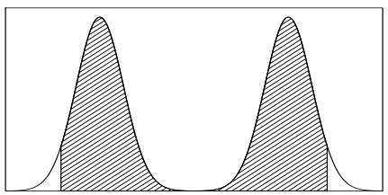

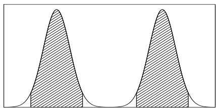  
Figure 2.2 Hypothetical density for which the $95\%$ central interval and $95\%$ highest posterior density region dramatically differ: (a) central posterior interval, (b) highest posterior density region.

in Figure 2.1, a graphical display is useful. In Chapter 3, we use contour plots and scatterplots to display posterior distributions in multiparameter problems. A key advantage of the Bayesian approach, as implemented by simulation, is the flexibility with which posterior inferences can be summarized, even after complicated transformations. This advantage is most directly seen through examples, some of which will be presented shortly.

For many practical purposes, however, various numerical summaries of the distribution are desirable. Commonly used summaries of location are the mean, median, and mode(s) of the distribution; variation is commonly summarized by the standard deviation, the interquartile range, and other quantiles. Each summary has its own interpretation: for example, the mean is the posterior expectation of the parameter, and the mode may be interpreted as the single 'most likely' value, given the data (and the model). Furthermore, as we shall see, much practical inference relies on the use of normal approximations, often improved by applying a symmetrizing transformation to $\theta$ , and here the mean and the standard deviation play key roles. The mode is important in computational strategies for more complex problems because it is often easier to compute than the mean or median.

When the posterior distribution has a closed form, such as the beta distribution in the current example, summaries such as the mean, median, and standard deviation of the posterior distribution are often available in closed form. For example, applying the distributional results in Appendix A, the mean of the beta distribution in (2.3) is $\frac{y + 1}{n + 2}$ , and the mode is $\frac{y}{n}$ , which is well known from different points of view as the maximum likelihood and (minimum variance) unbiased estimate of $\theta$ .

# Posterior quantiles and intervals

In addition to point summaries, it is nearly always important to report posterior uncertainty. Our usual approach is to present quantiles of the posterior distribution of estimands of interest or, if an interval summary is desired, a central interval of posterior probability, which corresponds, in the case of a $100(1 - \alpha)\%$ interval, to the range of values above and below which lies exactly $100(\alpha /2)\%$ of the posterior probability. Such interval estimates are referred to as posterior intervals. For simple models, such as the binomial and normal, posterior intervals can be computed directly from cumulative distribution functions, often using calls to standard computer functions, as we illustrate in Section 2.4 with the example of the human sex ratio. In general, intervals can be computed using computer simulations from the posterior distribution, as described at the end of Section 1.9.

A slightly different summary of posterior uncertainty is the highest posterior density region: the set of values that contains $100(1 - \alpha)\%$ of the posterior probability and also has the characteristic that the density within the region is never lower than that outside. Such a region is identical to a central posterior interval if the posterior distribution is unimodal and symmetric. In current practice, the central posterior interval is in common use, partly because it has a direct interpretation as the posterior $\alpha /2$ and $1 - \alpha /2$ quantiles, and partly because it is directly computed using posterior simulations. Figure 2.2 shows

a case where different posterior summaries look much different: the $95\%$ central interval includes the area of zero probability in the center of the distribution, whereas the $95\%$ highest posterior density region comprises two disjoint intervals. In this situation, the highest posterior density region is more cumbersome but conveys more information than the central interval; however, it is probably better not to try to summarize this bimodal density by any single interval. The central interval and the highest posterior density region can also differ substantially when the posterior density is highly skewed.

# 2.4 Informative prior distributions

In the binomial example, we have so far considered only the uniform prior distribution for $\theta$ . How can this specification be justified, and how in general do we approach the problem of constructing prior distributions?

We consider two basic interpretations that can be given to prior distributions. In the population interpretation, the prior distribution represents a population of possible parameter values, from which the $\theta$ of current interest has been drawn. In the more subjective state of knowledge interpretation, the guiding principle is that we must express our knowledge (and uncertainty) about $\theta$ as if its value could be thought of as a random realization from the prior distribution. For many problems, such as estimating the probability of failure in a new industrial process, there is no perfectly relevant population of $\theta$ 's from which the current $\theta$ has been drawn, except in hypothetical contemplation. Typically, the prior distribution should include all plausible values of $\theta$ , but the distribution need not be realistically concentrated around the true value, because often the information about $\theta$ contained in the data will far outweigh any reasonable prior probability specification.

In the binomial example, we have seen that the uniform prior distribution for $\theta$ implies that the prior predictive distribution for $y$ (given $n$ ) is uniform on the discrete set $\{0,1,\dots,n\}$ , giving equal probability to the $n + 1$ possible values. In his original treatment of this problem (described in the Historical Note in Section 2.1), Bayes' justification for the uniform prior distribution appears to have been based on this observation; the argument is appealing because it is expressed entirely in terms of the observable quantities $y$ and $n$ . Laplace's rationale for the uniform prior density was less clear, but subsequent interpretations ascribe to him the so-called 'principle of insufficient reason,' which claims that a uniform specification is appropriate if nothing is known about $\theta$ . We shall discuss in Section 2.8 the weaknesses of the principle of insufficient reason as a general approach for assigning probability distributions.

At this point, we discuss some of the issues that arise in assigning a prior distribution that reflects substantive information.

# Binomial example with different prior distributions

We first pursue the binomial model in further detail using a parametric family of prior distributions that includes the uniform as a special case. For mathematical convenience, we construct a family of prior densities that lead to simple posterior densities.

Considered as a function of $\theta$ , the likelihood (2.1) is of the form,

$$
p (y | \theta) \propto \theta^ {a} (1 - \theta) ^ {b}.
$$

Thus, if the prior density is of the same form, with its own values $a$ and $b$ , then the posterior density will also be of this form. We will parameterize such a prior density as

$$
p (\theta) \propto \theta^ {\alpha - 1} (1 - \theta) ^ {\beta - 1},
$$

which is a beta distribution with parameters $\alpha$ and $\beta$ : $\theta \sim \mathrm{Beta}(\alpha, \beta)$ . Comparing $p(\theta)$ and

$p(y|\theta)$ suggests that this prior density is equivalent to $\alpha - 1$ prior successes and $\beta - 1$ prior failures. The parameters of the prior distribution are often referred to as hyperparameters. The beta prior distribution is indexed by two hyperparameters, which means we can specify a particular prior distribution by fixing two features of the distribution, for example its mean and variance; see (A.3) on page 583.

For now, assume that we can select reasonable values $\alpha$ and $\beta$ . Appropriate methods for working with unknown hyperparameters in certain problems are described in Chapter 5. The posterior density for $\theta$ is

$$
\begin{array}{l} p (\theta | y) \propto \theta^ {y} (1 - \theta) ^ {n - y} \theta^ {\alpha - 1} (1 - \theta) ^ {\beta - 1} \\ = \theta^ {y + \alpha - 1} (1 - \theta) ^ {n - y + \beta - 1} \\ = \operatorname {B e t a} (\theta | \alpha + y, \beta + n - y). \\ \end{array}
$$

The property that the posterior distribution follows the same parametric form as the prior distribution is called conjugacy; the beta prior distribution is a conjugate family for the binomial likelihood. The conjugate family is mathematically convenient in that the posterior distribution follows a known parametric form. If information is available that contradicts the conjugate parametric family, it may be necessary to use a more realistic, if inconvenient, prior distribution (just as the binomial likelihood may need to be replaced by a more realistic likelihood in some cases).

To continue with the binomial model with beta prior distribution, the posterior mean of $\theta$ , which may be interpreted as the posterior probability of success for a future draw from the population, is now

$$
\operatorname {E} (\theta | y) = \frac {\alpha + y}{\alpha + \beta + n},
$$

which always lies between the sample proportion, $y / n$ , and the prior mean, $\alpha / (\alpha + \beta)$ ; see Exercise 2.5b. The posterior variance is

$$
\mathrm {v a r} (\theta | y) = \frac {(\alpha + y) (\beta + n - y)}{(\alpha + \beta + n) ^ {2} (\alpha + \beta + n + 1)} = \frac {E (\theta | y) [ 1 - E (\theta | y) ]}{\alpha + \beta + n + 1}.
$$

As $y$ and $n - y$ become large with fixed $\alpha$ and $\beta$ , $\operatorname{E}(\theta | y) \approx y / n$ and $\operatorname{var}(\theta | y) \approx \frac{1}{n} \frac{y}{n} (1 - \frac{y}{n})$ , which approaches zero at the rate $1 / n$ . In the limit, the parameters of the prior distribution have no influence on the posterior distribution.

In fact, as we shall see in more detail in Chapter 4, the central limit theorem of probability theory can be put in a Bayesian context to show:

$$
\left(\frac {\theta - \operatorname {E} (\theta | y)}{\sqrt {\operatorname {v a r} (\theta | y)}} \Bigg | y\right) \to \mathrm {N} (0, 1).
$$

This result is often used to justify approximating the posterior distribution with a normal distribution. For the binomial parameter $\theta$ , the normal distribution is a more accurate approximation in practice if we transform $\theta$ to the logit scale; that is, performing inference for $\log (\theta /(1 - \theta))$ instead of $\theta$ itself, thus expanding the probability space from [0,1] to $(-\infty ,\infty)$ , which is more fitting for a normal approximation.

# Conjugate prior distributions

Conjugacy is formally defined as follows. If $\mathcal{F}$ is a class of sampling distributions $p(y|\theta)$ , and $\mathcal{P}$ is a class of prior distributions for $\theta$ , then the class $\mathcal{P}$ is conjugate for $\mathcal{F}$ if

$$
p (\theta | y) \in \mathcal {P} \text {f o r a l l} p (\cdot | \theta) \in \mathcal {F} \text {a n d} p (\cdot) \in \mathcal {P}.
$$

This definition is formally vague since if we choose $\mathcal{P}$ as the class of all distributions, then $\mathcal{P}$ is always conjugate no matter what class of sampling distributions is used. We are most interested in natural conjugate prior families, which arise by taking $\mathcal{P}$ to be the set of all densities having the same functional form as the likelihood.

Conjugate prior distributions have the practical advantage, in addition to computational convenience, of being interpretable as additional data, as we have seen for the binomial example and will also see for the normal and other standard models in Sections 2.5 and 2.6.

# Nonconjugate prior distributions

The basic justification for the use of conjugate prior distributions is similar to that for using standard models (such as binomial and normal) for the likelihood: it is easy to understand the results, which can often be put in analytic form, they are often a good approximation, and they simplify computations. Also, they will be useful later as building blocks for more complicated models, including in many dimensions, where conjugacy is typically impossible. For these reasons, conjugate models can be good starting points; for example, mixtures of conjugate families can sometimes be useful when simple conjugate distributions are not reasonable (see Exercise 2.4).

Although they can make interpretations of posterior inferences less transparent and computation more difficult, nonconjugate prior distributions do not pose any new conceptual problems. In practice, for complicated models, conjugate prior distributions may not even be possible. Section 2.4 and Exercises 2.10 and 2.11 present examples of nonconjugate computation; a more extensive nonconjugate example, an analysis of a bioassay experiment, appears in Section 3.7.

Conjugate prior distributions, exponential families, and sufficient statistics

We close this section by relating conjugate families of distributions to the classical concepts of exponential families and sufficient statistics. Readers who are unfamiliar with these concepts can skip ahead to the example with no loss.

Probability distributions that belong to an exponential family have natural conjugate prior distributions, so we digress at this point to review the definition of exponential families; for complete generality in this section, we allow data points $y_{i}$ and parameters $\theta$ to be multidimensional. The class $\mathcal{F}$ is an exponential family if all its members have the form,

$$
p (y _ {i} | \theta) = f (y _ {i}) g (\theta) e ^ {\phi (\theta) ^ {T} u (y _ {i})}.
$$

The factors $\phi(\theta)$ and $u(y_i)$ are, in general, vectors of equal dimension to that of $\theta$ . The vector $\phi(\theta)$ is called the 'natural parameter' of the family $\mathcal{F}$ . The likelihood corresponding to a sequence $y = (y_1, \ldots, y_n)$ of independent and identically distributed observations is

$$
p (y | \theta) = \left(\prod_ {i = 1} ^ {n} f (y _ {i})\right) g (\theta) ^ {n} \exp \left(\phi (\theta) ^ {T} \sum_ {i = 1} ^ {n} u (y _ {i})\right).
$$

For all $n$ and $y$ , this has a fixed form (as a function of $\theta$ ):

$$
p (y | \theta) \propto g (\theta) ^ {n} e ^ {\phi (\theta) ^ {T} t (y)}, \quad \text {w h e r e} t (y) = \sum_ {i = 1} ^ {n} u (y _ {i}).
$$

The quantity $t(y)$ is said to be a sufficient statistic for $\theta$ , because the likelihood for $\theta$ depends on the data $y$ only through the value of $t(y)$ . Sufficient statistics are useful in

algebraic manipulations of likelihoods and posterior distributions. If the prior density is specified as

$$
p (\theta) \propto g (\theta) ^ {\eta} e ^ {\phi (\theta) ^ {T} \nu},
$$

then the posterior density is

$$
p (\theta | y) \propto g (\theta) ^ {\eta + n} e ^ {\phi (\theta) ^ {T} (\nu + t (y))},
$$

which shows that this choice of prior density is conjugate. It has been shown that, in general, the exponential families are the only classes of distributions that have natural conjugate prior distributions, since, apart from certain irregular cases, the only distributions having a fixed number of sufficient statistics for all $n$ are of the exponential type. We have already discussed the binomial distribution, where for the likelihood $p(y|\theta ,n) = \mathrm{Bin}(y|n,\theta)$ with $n$ known, the conjugate prior distributions on $\theta$ are beta distributions. It is left as an exercise to show that the binomial is an exponential family with natural parameter $\mathrm{logit}(\theta)$ .

# Example. Probability of a girl birth given placenta previa

As a specific example of a factor that may influence the sex ratio, we consider the maternal condition *placenta previa*, an unusual condition of pregnancy in which the placenta is implanted low in the uterus, obstructing the fetus from a normal vaginal delivery. An early study concerning the sex of *placenta previa* births in Germany found that of a total of 980 births, 437 were female. How much evidence does this provide for the claim that the proportion of female births in the population of *placenta previa* births is less than 0.485, the proportion of female births in the general population?

Analysis using a uniform prior distribution. Under a uniform prior distribution for the probability of a girl birth, the posterior distribution is Beta(438,544). Exact summaries of the posterior distribution can be obtained from the properties of the beta distribution (Appendix A): the posterior mean of $\theta$ is 0.446 and the posterior standard deviation is 0.016. Exact posterior quantiles can be obtained using numerical integration of the beta density, which in practice we perform by a computer function call; the median is 0.446 and the central $95\%$ posterior interval is [0.415,0.477]. This $95\%$ posterior interval matches, to three decimal places, the interval that would be obtained by using a normal approximation with the calculated posterior mean and standard deviation. Further discussion of the approximate normality of the posterior distribution is given in Chapter 4.

In many situations it is not feasible to perform calculations on the posterior density function directly. In such cases it can be particularly useful to use simulation from the posterior distribution to obtain inferences. The first histogram in Figure 2.3 shows the distribution of 1000 draws from the Beta(438, 544) posterior distribution. An estimate of the $95\%$ posterior interval, obtained by taking the 25th and 976th of the 1000 ordered draws, is [0.415, 0.476], and the median of the 1000 draws from the posterior distribution is 0.446. The sample mean and standard deviation of the 1000 draws are 0.445 and 0.016, almost identical to the exact results. A normal approximation to the $95\%$ posterior interval is $[0.445 \pm 1.96 \cdot 0.016] = [0.414, 0.476]$ . Because of the large sample and the fact that the distribution of $\theta$ is concentrated away from zero and one, the normal approximation works well in this example.

As already noted, when estimating a proportion, the normal approximation is generally improved by applying it to the logit transform, $\log \left(\frac{\theta}{1 - \theta}\right)$ , which transforms the parameter space from the unit interval to the real line. The second histogram in Figure 2.3 shows the distribution of the transformed draws. The estimated posterior mean and standard deviation on the logit scale based on 1000 draws are $-0.220$ and $0.065$ . A normal approximation to the $95\%$ posterior interval for $\theta$ is obtained by inverting the $95\%$ interval on the logit scale $[-0.220 \pm 1.96 \cdot 0.065]$ , which yields [0.414, 0.477]

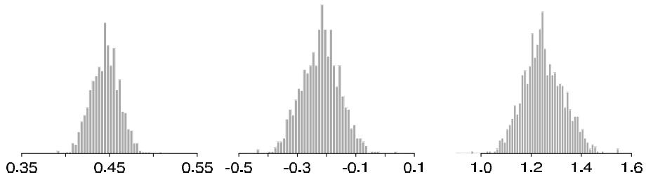  
Figure 2.3 Draws from the posterior distribution of (a) the probability of female birth, $\theta$ ; (b) the logit transform, $\logit(\theta)$ ; (c) the male-to-female sex ratio, $\phi = (1 - \theta) / \theta$ .

Table 2.1 Summaries of the posterior distribution of $\theta$ , the probability of a girl birth given placenta previa, under a variety of conjugate prior distributions.   

<table><tr><td colspan="2">Parameters of the prior distribution</td><td colspan="2">Summaries of the posterior distribution</td></tr><tr><td>α/α+β</td><td>α+β</td><td>Posterior median of θ</td><td>95% posterior interval for θ</td></tr><tr><td>0.500</td><td>2</td><td>0.446</td><td>[0.415, 0.477]</td></tr><tr><td>0.485</td><td>2</td><td>0.446</td><td>[0.415, 0.477]</td></tr><tr><td>0.485</td><td>5</td><td>0.446</td><td>[0.415, 0.477]</td></tr><tr><td>0.485</td><td>10</td><td>0.446</td><td>[0.415, 0.477]</td></tr><tr><td>0.485</td><td>20</td><td>0.447</td><td>[0.416, 0.478]</td></tr><tr><td>0.485</td><td>100</td><td>0.450</td><td>[0.420, 0.479]</td></tr><tr><td>0.485</td><td>200</td><td>0.453</td><td>[0.424, 0.481]</td></tr></table>

on the original scale. The improvement from using the logit scale is most noticeable when the sample size is small or the distribution of $\theta$ includes values near zero or one. In any real data analysis, it is important to keep the applied context in mind. The parameter of interest in this example is traditionally expressed as the 'sex ratio,' $(1 - \theta) / \theta$ , the ratio of male to female births. The posterior distribution of the ratio is illustrated in the third histogram. The posterior median of the sex ratio is 1.24, and the $95\%$ posterior interval is [1.10, 1.41]. The posterior distribution is concentrated on values far above the usual European-race sex ratio of 1.06, implying that the probability of a female birth given placenta previa is less than in the general population.

Analysis using different conjugate prior distributions. The sensitivity of posterior inference about $\theta$ to the proposed prior distribution is exhibited in Table 2.1. The first row corresponds to the uniform prior distribution, $\alpha = 1$ , $\beta = 1$ , and subsequent rows of the table use prior distributions that are increasingly concentrated around 0.485, the proportion of female births in the general population. The first column shows the prior mean for $\theta$ , and the second column indexes the amount of prior information, as measured by $\alpha + \beta$ ; recall that $\alpha + \beta - 2$ is, in some sense, equivalent to the number of prior observations. Posterior inferences based on a large sample are not particularly sensitive to the prior distribution. Only at the bottom of the table, where the prior distribution contains information equivalent to 100 or 200 births, are the posterior intervals pulled noticeably toward the prior distribution, and even then, the $95\%$ posterior intervals still exclude the prior mean.

Analysis using a nonconjugate prior distribution. As an alternative to the conjugate beta family for this problem, we might prefer a prior distribution that is centered around 0.485 but is flat far away from this value to admit the possibility that the truth is far away. The piecewise linear prior density in Figure 2.4a is an example

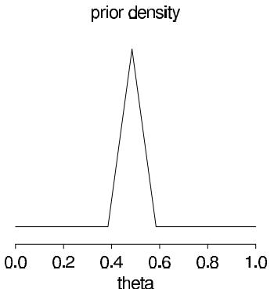

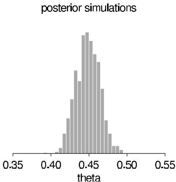  
Figure 2.4 (a) Prior density for $\theta$ in an example nonconjugate analysis of birth ratio example; (b) histogram of 1000 draws from a discrete approximation to the posterior density. Figures are plotted on different scales.

of a prior distribution of this form; $40\%$ of the probability mass is outside the interval [0.385, 0.585]. This prior distribution has mean 0.493 and standard deviation 0.21, similar to the standard deviation of a beta distribution with $\alpha + \beta = 5$ . The unnormalized posterior distribution is obtained at a grid of $\theta$ values, (0.000, 0.001, ..., 1.000), by multiplying the prior density and the binomial likelihood at each point. Posterior simulations can be obtained by normalizing the distribution on the discrete grid of $\theta$ values. Figure 2.4b is a histogram of 1000 draws from the discrete posterior distribution. The posterior median is 0.448, and the $95\%$ central posterior interval is [0.419, 0.480]. Because the prior distribution is overwhelmed by the data, these results match those in Table 2.1 based on beta distributions. In taking the grid approach, it is important to avoid grids that are too coarse and distort a significant portion of the posterior mass.

# 2.5 Estimating a normal mean with known variance

The normal distribution is fundamental to most statistical modeling. The central limit theorem helps to justify using the normal likelihood in many statistical problems, as an approximation to a less analytically convenient actual likelihood. Also, as we shall see in later chapters, even when the normal distribution does not itself provide a good model fit, it can be useful as a component of a more complicated model involving $t$ or finite mixture distributions. For now, we simply work through the Bayesian results assuming the normal model is appropriate. We derive results first for a single data point and then for the general case of many data points.

# Likelihood of one data point

As the simplest first case, consider a single scalar observation $y$ from a normal distribution parameterized by a mean $\theta$ and variance $\sigma^2$ , where for this initial development we assume that $\sigma^2$ is known. The sampling distribution is

$$
p (y | \theta) = \frac {1}{\sqrt {2 \pi} \sigma} e ^ {- \frac {1}{2 \sigma^ {2}} (y - \theta) ^ {2}}.
$$

Conjugate prior and posterior distributions

Considered as a function of $\theta$ , the likelihood is an exponential of a quadratic form in $\theta$ , so the family of conjugate prior densities looks like

$$
p (\theta) = e ^ {A \theta^ {2} + B \theta + C}.
$$

We parameterize this family as

$$
p (\theta) \propto \exp \left(- \frac {1}{2 \tau_ {0} ^ {2}} (\theta - \mu_ {0}) ^ {2}\right);
$$

that is, $\theta \sim \mathrm{N}(\mu_0,\tau_0^2)$ , with hyperparameters $\mu_0$ and $\tau_0^2$ . As usual in this preliminary development, we assume that the hyperparameters are known.

The conjugate prior density implies that the posterior distribution for $\theta$ is the exponential of a quadratic form and thus normal, but some algebra is required to reveal its specific form. In the posterior density, all variables except $\theta$ are regarded as constants, giving the conditional density,

$$
p (\theta | y) \propto \exp \left(- \frac {1}{2} \left(\frac {(y - \theta) ^ {2}}{\sigma^ {2}} + \frac {(\theta - \mu_ {0}) ^ {2}}{\tau_ {0} ^ {2}}\right)\right).
$$

Expanding the exponents, collecting terms and then completing the square in $\theta$ (see Exercise 2.14(a) for details) gives

$$
p (\theta | y) \propto \exp \left(- \frac {1}{2 \tau_ {1} ^ {2}} \left(\theta - \mu_ {1}\right) ^ {2}\right), \tag {2.9}
$$

that is, $\theta |y\sim \mathrm{N}(\mu_1,\tau_1^2)$ , where

$$
\mu_ {1} = \frac {\frac {1}{\tau_ {0} ^ {2}} \mu_ {0} + \frac {1}{\sigma^ {2}} y}{\frac {1}{\tau_ {0} ^ {2}} + \frac {1}{\sigma^ {2}}} \quad \text {a n d} \quad \frac {1}{\tau_ {1} ^ {2}} = \frac {1}{\tau_ {0} ^ {2}} + \frac {1}{\sigma^ {2}}. \tag {2.10}
$$

Precisions of the prior and posterior distributions. In manipulating normal distributions, the inverse of the variance plays a prominent role and is called the precision. The algebra above demonstrates that for normal data and normal prior distribution (each with known precision), the posterior precision equals the prior precision plus the data precision.

There are several different ways of interpreting the form of the posterior mean, $\mu_{1}$ . In (2.10), the posterior mean is expressed as a weighted average of the prior mean and the observed value, $y$ , with weights proportional to the precisions. Alternatively, we can express $\mu_{1}$ as the prior mean adjusted toward the observed $y$ ,

$$
\mu_ {1} = \mu_ {0} + (y - \mu_ {0}) \frac {\tau_ {0} ^ {2}}{\sigma^ {2} + \tau_ {0} ^ {2}},
$$

or as the data 'shrunk' toward the prior mean,

$$
\mu_ {1} = y - (y - \mu_ {0}) \frac {\sigma^ {2}}{\sigma^ {2} + \tau_ {0} ^ {2}}.
$$

Each formulation represents the posterior mean as a compromise between the prior mean and the observed value.

At the extremes, the posterior mean equals the prior mean or the observed data:

$$
\mu_ {1} = \mu_ {0} \quad \text {i f} \quad y = \mu_ {0} \text {o r} \tau_ {0} ^ {2} = 0;
$$

$$
\mu_ {1} = y \quad \text {i f} \quad y = \mu_ {0} \text {o r} \sigma^ {2} = 0.
$$

If $\tau_0^2 = 0$ , the prior distribution is infinitely more precise than the data, and so the posterior and prior distributions are identical and concentrated at the value $\mu_0$ . If $\sigma^2 = 0$ , the data are perfectly precise, and the posterior distribution is concentrated at the observed value, $y$ . If $y = \mu_0$ , the prior and data means coincide, and the posterior mean must also fall at this point.

# Posterior predictive distribution

The posterior predictive distribution of a future observation, $\tilde{y}$ , $p(\tilde{y} | y)$ , can be calculated directly by integration, using (1.4):

$$
\begin{array}{l} {p (\tilde {y} | y)} = {\int p (\tilde {y} | \theta) p (\theta | y) d \theta} \\ \propto \int \exp \left(- \frac {1}{2 \sigma^ {2}} (\tilde {y} - \theta) ^ {2}\right) \exp \left(- \frac {1}{2 \tau_ {1} ^ {2}} (\theta - \mu_ {1}) ^ {2}\right) d \theta . \\ \end{array}
$$

The first line above holds because the distribution of the future observation, $\tilde{y}$ , given $\theta$ , does not depend on the past data, $y$ . We can determine the distribution of $\tilde{y}$ more easily using the properties of the bivariate normal distribution. The product in the integrand is the exponential of a quadratic function of $(\tilde{y},\theta)$ ; hence $\tilde{y}$ and $\theta$ have a joint normal posterior distribution, and so the marginal posterior distribution of $\tilde{y}$ is normal.

We can determine the mean and variance of the posterior predictive distribution using the knowledge from the posterior distribution that $\operatorname{E}(\tilde{y}|\theta) = \theta$ and $\operatorname{var}(\tilde{y}|\theta) = \sigma^2$ , along with identities (2.7) and (2.8):

$$
\operatorname {E} (\tilde {y} | y) = \operatorname {E} (\operatorname {E} (\tilde {y} | \theta , y) | y) = \operatorname {E} (\theta | y) = \mu_ {1},
$$

and

$$
\begin{array}{l} \operatorname {v a r} (\tilde {y} | y) = \operatorname {E} (\operatorname {v a r} (\tilde {y} | \theta , y) | y) + \operatorname {v a r} (\operatorname {E} (\tilde {y} | \theta , y) | y) \\ = \mathrm {E} (\sigma^ {2} | y) + \operatorname {v a r} (\theta | y) \\ = \sigma^ {2} + \tau_ {1} ^ {2}. \\ \end{array}
$$

Thus, the posterior predictive distribution of $\tilde{y}$ has mean equal to the posterior mean of $\theta$ and two components of variance: the predictive variance $\sigma^2$ from the model and the variance $\tau_1^2$ due to posterior uncertainty in $\theta$ .

# Normal model with multiple observations

This development of the normal model with a single observation can be easily extended to the more realistic situation where a sample of independent and identically distributed observations $y = (y_{1},\ldots ,y_{n})$ is available. Proceeding formally, the posterior density is

$$
\begin{array}{l} p (\theta | y) \propto p (\theta) p (y | \theta) \\ = p (\theta) \prod_ {i = 1} ^ {n} p (y _ {i} | \theta) \\ \propto \exp \left(- \frac {1}{2 \tau_ {0} ^ {2}} (\theta - \mu_ {0}) ^ {2}\right) \prod_ {i = 1} ^ {n} \exp \left(- \frac {1}{2 \sigma^ {2}} (y _ {i} - \theta) ^ {2}\right) \\ \propto \exp \left(- \frac {1}{2} \left(\frac {1}{\tau_ {0} ^ {2}} (\theta - \mu_ {0}) ^ {2} + \frac {1}{\sigma^ {2}} \sum_ {i = 1} ^ {n} (y _ {i} - \theta) ^ {2}\right)\right). \\ \end{array}
$$

Algebraic simplification of this expression (along similar lines to those used in the single observation case, as explicated in Exercise 2.14(b)) shows that the posterior distribution depends on $y$ only through the sample mean, $\overline{y} = \frac{1}{n}\sum_{i}y_{i}$ ; that is, $\overline{y}$ is a sufficient statistic in this model. In fact, since $\overline{y} |\theta ,\sigma^2\sim \mathrm{N}(\theta ,\sigma^2 /n)$ , the results derived for the single normal observation apply immediately (treating $\overline{y}$ as the single observation) to give

$$
p \left(\theta \mid y _ {1} \dots , y _ {n}\right) = p \left(\theta \mid \bar {y}\right) = \mathrm {N} \left(\theta \mid \mu_ {n}, \tau_ {n} ^ {2}\right), \tag {2.11}
$$

where

$$
\mu_ {n} = \frac {\frac {1}{\tau_ {0} ^ {2}} \mu_ {0} + \frac {n}{\sigma^ {2}} \bar {y}}{\frac {1}{\tau_ {0} ^ {2}} + \frac {n}{\sigma^ {2}}} \quad \text {a n d} \quad \frac {1}{\tau_ {n} ^ {2}} = \frac {1}{\tau_ {0} ^ {2}} + \frac {n}{\sigma^ {2}}. \tag {2.12}
$$

Incidentally, the same result is obtained by adding information for the data $y_{1},y_{2},\ldots ,y_{n}$ one point at a time, using the posterior distribution at each step as the prior distribution for the next (see Exercise 2.14(c)).

In the expressions for the posterior mean and variance, the prior precision, $1 / \tau_0^2$ , and the data precision, $n / \sigma^2$ , play equivalent roles, so if $n$ is large, the posterior distribution is largely determined by $\sigma^2$ and the sample value $\overline{y}$ . For example, if $\tau_0^2 = \sigma^2$ , then the prior distribution has the same weight as one extra observation with the value $\mu_0$ . More specifically, as $\tau_0 \to \infty$ with $n$ fixed, or as $n \to \infty$ with $\tau_0^2$ fixed, we have:

$$
p (\theta | y) \approx \mathrm {N} (\theta | \bar {y}, \sigma^ {2} / n), \tag {2.13}
$$

which is, in practice, a good approximation whenever prior beliefs are relatively diffuse over the range of $\theta$ where the likelihood is substantial.

# 2.6 Other standard single-parameter models

Recall that, in general, the posterior density, $p(\theta | y)$ , has no closed-form expression; the normalizing constant, $p(y)$ , is often especially difficult to compute due to the integral (1.3). Much formal Bayesian analysis concentrates on situations where closed forms are available; such models are sometimes unrealistic, but their analysis often provides a useful starting point when it comes to constructing more realistic models.

The standard distributions—binomial, normal, Poisson, and exponential—have natural derivations from simple probability models. As we have already discussed, the binomial distribution is motivated from counting exchangeable outcomes, and the normal distribution applies to a random variable that is the sum of many exchangeable or independent terms. We will also have occasion to apply the normal distribution to the logarithm of all-positive data, which would naturally apply to observations that are modeled as the product of many independent multiplicative factors. The Poisson and exponential distributions arise as the number of counts and the waiting times, respectively, for events modeled as occurring exchangeably in all time intervals; that is, independently in time, with a constant rate of occurrence. We will generally construct realistic probability models for more complicated outcomes by combinations of these basic distributions. For example, in Section 22.2, we model the reaction times of schizophrenic patients in a psychological experiment as a binomial mixture of normal distributions on the logarithmic scale.

Each of these standard models has an associated family of conjugate prior distributions, which we discuss in turn.

# Normal distribution with known mean but unknown variance

The normal model with known mean $\theta$ and unknown variance is an important example, not necessarily for its direct applied value, but as a building block for more complicated,

useful models, most immediately the normal distribution with unknown mean and variance, which we cover in Section 3.2. In addition, the normal distribution with known mean but unknown variance provides an introductory example of the estimation of a scale parameter.

For $p(y|\theta, \sigma^2) = \mathrm{N}(y|\theta, \sigma^2)$ , with $\theta$ known and $\sigma^2$ unknown, the likelihood for a vector $y$ of $n$ independent and identically distributed observations is

$$
\begin{array}{l} p \left(y \mid \sigma^ {2}\right) \propto \sigma^ {- n} \exp \left(- \frac {1}{2 \sigma^ {2}} \sum_ {i = 1} ^ {n} \left(y _ {i} - \theta\right) ^ {2}\right) \\ = \left(\sigma^ {2}\right) ^ {- n / 2} \exp \left(- \frac {n}{2 \sigma^ {2}} v\right). \\ \end{array}
$$

The sufficient statistic is

$$
v = \frac {1}{n} \sum_ {i = 1} ^ {n} (y _ {i} - \theta) ^ {2}.
$$

The corresponding conjugate prior density is the inverse-gamma,

$$
p (\sigma^ {2}) \propto (\sigma^ {2}) ^ {- (\alpha + 1)} e ^ {- \beta / \sigma^ {2}},
$$

which has hyperparameters $(\alpha, \beta)$ . A convenient parameterization is as a scaled inverse- $\chi^2$ distribution with scale $\sigma_0^2$ and $\nu_0$ degrees of freedom (see Appendix A); that is, the prior distribution of $\sigma^2$ is taken to be the distribution of $\sigma_0^2\nu_0 / X$ , where $X$ is a $\chi_{\nu_0}^2$ random variable. We use the convenient but nonstandard notation, $\sigma^2 \sim \mathrm{Inv - }\chi^2 (\nu_0,\sigma_0^2)$ .

The resulting posterior density for $\sigma^2$ is

$$
\begin{array}{l} p \left(\sigma^ {2} | y\right) \propto p \left(\sigma^ {2}\right) p \left(y \mid \sigma^ {2}\right) \\ \propto \left(\frac {\sigma_ {0} ^ {2}}{\sigma^ {2}}\right) ^ {\nu_ {0} / 2 + 1} \exp \left(- \frac {\nu_ {0} \sigma_ {0} ^ {2}}{2 \sigma^ {2}}\right) \cdot (\sigma^ {2}) ^ {- n / 2} \exp \left(- \frac {n}{2} \frac {v}{\sigma^ {2}}\right) \\ \propto \left(\sigma^ {2}\right) ^ {- \left((n + v _ {0}) / 2 + 1\right)} \exp \left(- \frac {1}{2 \sigma^ {2}} \left(v _ {0} \sigma_ {0} ^ {2} + n v\right)\right). \\ \end{array}
$$

Thus,

$$
\sigma^ {2} | y \sim \mathrm {I n v -} \chi^ {2} \left(\nu_ {0} + n, \frac {\nu_ {0} \sigma_ {0} ^ {2} + n v}{\nu_ {0} + n}\right),
$$

which is a scaled inverse- $\chi^2$ distribution with scale equal to the degrees-of-freedom-weighted average of the prior and data scales and degrees of freedom equal to the sum of the prior and data degrees of freedom. The prior distribution can be thought of as providing the information equivalent to $\nu_0$ observations with average squared deviation $\sigma_0^2$ .

# Poisson model

The Poisson distribution arises naturally in the study of data taking the form of counts; for instance, a major area of application is epidemiology, where the incidence of diseases is studied.

If a data point $y$ follows the Poisson distribution with rate $\theta$ , then the probability distribution of a single observation $y$ is

$$
p (y | \theta) = \frac {\theta^ {y} e ^ {- \theta}}{y !}, \text {f o r} y = 0, 1, 2, \dots ,
$$

and for a vector $y = (y_{1},\ldots ,y_{n})$ of independent and identically distributed observations,

the likelihood is

$$
\begin{array}{l} p (y | \theta) = \prod_ {i = 1} ^ {n} \frac {1}{y _ {i} !} \theta^ {y _ {i}} e ^ {- \theta} \\ \propto \theta^ {t (y)} e ^ {- n \theta}, \\ \end{array}
$$

where $t(y) = \sum_{i=1}^{n} y_i$ is the sufficient statistic. We can rewrite the likelihood in exponential family form as

$$
p (y | \theta) \propto e ^ {- n \theta} e ^ {t (y) \log \theta},
$$

revealing that the natural parameter is $\phi (\theta) = \log \theta$ , and the natural conjugate prior distribution is

$$
p (\theta) \propto (e ^ {- \theta}) ^ {\eta} e ^ {\nu \log \theta},
$$

indexed by hyperparameters $(\eta, \nu)$ . To put this argument another way, the likelihood is of the form $\theta^a e^{-b\theta}$ , and so the conjugate prior density must be of the form $p(\theta) \propto \theta^A e^{-B\theta}$ . In a more conventional parameterization,

$$
p (\theta) \propto e ^ {- \beta \theta} \theta^ {\alpha - 1},
$$

which is a gamma density with parameters $\alpha$ and $\beta$ , $\mathrm{Gamma}(\alpha, \beta)$ ; see Appendix A. Comparing $p(y|\theta)$ and $p(\theta)$ reveals that the prior density is, in some sense, equivalent to a total count of $\alpha - 1$ in $\beta$ prior observations. With this conjugate prior distribution, the posterior distribution is

$$
\theta | y \sim \operatorname {G a m m a} (\alpha + n \bar {y}, \beta + n).
$$

The negative binomial distribution. With conjugate families, the known form of the prior and posterior densities can be used to find the marginal distribution, $p(y)$ , using the formula

$$
p (y) = \frac {p (y | \theta) p (\theta)}{p (\theta | y)}.
$$

For instance, the Poisson model for a single observation, $y$ , has prior predictive distribution

$$
\begin{array}{l} p (y) = \frac {\operatorname {P o i s s o n} (y | \theta) \operatorname {G a m m a} (\theta | \alpha , \beta)}{\operatorname {G a m m a} (\theta | \alpha + y , 1 + \beta)} \\ = \frac {\Gamma (\alpha + y) \beta^ {\alpha}}{\Gamma (\alpha) y ! (1 + \beta) ^ {\alpha + y}}, \\ \end{array}
$$

which reduces to

$$
p (y) = \left( \begin{array}{c} \alpha + y - 1 \\ y \end{array} \right) \left(\frac {\beta}{\beta + 1}\right) ^ {\alpha} \left(\frac {1}{\beta + 1}\right) ^ {y},
$$

which is known as the negative binomial density:

$$
y \sim \operatorname {N e g} - \operatorname {b i n} (\alpha , \beta).
$$

The above derivation shows that the negative binomial distribution is a mixture of Poisson distributions with rates, $\theta$ , that follow the gamma distribution:

$$
\operatorname {N e g - b i n} (y | \alpha , \beta) = \int \operatorname {P o i s s o n} (y | \theta) \operatorname {G a m m a} (\theta | \alpha , \beta) d \theta .
$$

We return to the negative binomial distribution in Section 17.2 as a robust alternative to the Poisson distribution.

Poisson model parameterized in terms of rate and exposure

In many applications, it is convenient to extend the Poisson model for data points $y_{1},\ldots ,y_{n}$ to the form

$$
y _ {i} \sim \operatorname {P o i s s o n} \left(x _ {i} \theta\right), \tag {2.14}
$$

where the values $x_{i}$ are known positive values of an explanatory variable, $x$ , and $\theta$ is the unknown parameter of interest. In epidemiology, the parameter $\theta$ is often called the rate, and $x_{i}$ is called the exposure of the $i$ th unit. This model is not exchangeable in the $y_{i}$ 's but is exchangeable in the pairs $(x,y)_i$ . The likelihood for $\theta$ in the extended Poisson model is

$$
p (y | \theta) \propto \theta^ {\left(\sum_ {i = 1} ^ {n} y _ {i}\right)} e ^ {- \left(\sum_ {i = 1} ^ {n} x _ {i}\right) \theta}
$$

(ignoring factors that do not depend on $\theta$ ), and so the gamma distribution for $\theta$ is conjugate. With prior distribution

$$
\theta \sim \operatorname {G a m m a} (\alpha , \beta),
$$

the resulting posterior distribution is

$$
\theta | y \sim \operatorname {G a m m a} \left(\alpha + \sum_ {i = 1} ^ {n} y _ {i}, \beta + \sum_ {i = 1} ^ {n} x _ {i}\right). \tag {2.15}
$$

# Estimating a rate from Poisson data: an idealized example

Suppose that causes of death are reviewed in detail for a city in the United States for a single year. It is found that 3 persons, out of a population of 200,000, died of asthma, giving a crude estimated asthma mortality rate in the city of 1.5 cases per 100,000 persons per year. A Poisson sampling model is often used for epidemiological data of this form. The Poisson model derives from an assumption of exchangeability among all small intervals of exposure. Under the Poisson model, the sampling distribution of $y$ , the number of deaths in a city of 200,000 in one year, may be expressed as Poisson(2.0θ), where $\theta$ represents the true underlying long-term asthma mortality rate in our city (measured in cases per 100,000 persons per year). In the above notation, $y = 3$ is a single observation with exposure $x = 2.0$ (since $\theta$ is defined in units of 100,000 people) and unknown rate $\theta$ . We can use knowledge about asthma mortality rates around the world to construct a prior distribution for $\theta$ and then combine the datum $y = 3$ with that prior distribution to obtain a posterior distribution.

Setting up a prior distribution. What is a sensible prior distribution for $\theta$ ? Reviews of asthma mortality rates around the world suggest that mortality rates above 1.5 per 100,000 people are rare in Western countries, with typical asthma mortality rates around 0.6 per 100,000. Trial-and-error exploration of the properties of the gamma distribution, the conjugate prior family for this problem, reveals that a Gamma(3.0, 5.0) density provides a plausible prior density for the asthma mortality rate in this example if we assume exchangeability between this city and other cities and this year and other years. The mean of this prior distribution is 0.6 (with a mode of 0.4), and $97.5\%$ of the mass of the density lies below 1.44. In practice, specifying a prior mean sets the ratio of the two gamma parameters, and then the shape parameter can be altered by trial and error to match the prior knowledge about the tail of the distribution.

Posterior distribution. The result in (2.15) shows that the posterior distribution of $\theta$ for a $\mathrm{Gamma}(\alpha, \beta)$ prior distribution is $\mathrm{Gamma}(\alpha + y, \beta + x)$ in this case. With the prior distribution and data described, the posterior distribution for $\theta$ is $\mathrm{Gamma}(6.0, 7.0)$ , which has mean 0.86—substantial shrinkage has occurred toward the prior distribution. A histogram of 1000 draws from the posterior distribution for $\theta$ is shown as Figure 2.5a. For example, the posterior probability that the long-term death rate from asthma in our city is more than 1.0 per 100,000 per year, computed from the gamma posterior density, is 0.30.

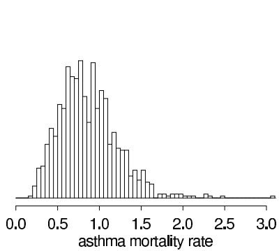

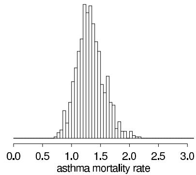  
Figure 2.5 Posterior density for $\theta$ , the asthma mortality rate in cases per 100,000 persons per year, with a Gamma(3.0, 5.0) prior distribution: (a) given $y = 3$ deaths out of 200,000 persons; (b) given $y = 30$ deaths in 10 years for a constant population of 200,000. The histograms appear jagged because they are constructed from only 1000 random draws from the posterior distribution in each case.

Posterior distribution with additional data. To consider the effect of additional data, suppose that ten years of data are obtained for the city in our example, instead of just one, and it is found that the mortality rate of 1.5 per 100,000 is maintained; we find $y = 30$ deaths over 10 years. Assuming the population is constant at 200,000, and assuming the outcomes in the ten years are independent with constant long-term rate $\theta$ , the posterior distribution of $\theta$ is then Gamma(33.0, 25.0); Figure 2.5b displays 1000 draws from this distribution. The posterior distribution is much more concentrated than before, and it still lies between the prior distribution and the data. After ten years of data, the posterior mean of $\theta$ is 1.32, and the posterior probability that $\theta$ exceeds 1.0 is 0.93.

# Exponential model

The exponential distribution is commonly used to model 'waiting times' and other continuous, positive, real-valued random variables, often measured on a time scale. The sampling distribution of an outcome $y$ , given parameter $\theta$ , is

$$
p (y | \theta) = \theta \exp (- y \theta), \mathrm {f o r} y > 0,
$$

and $\theta = 1 / \operatorname{E}(y|\theta)$ is called the 'rate.' Mathematically, the exponential is a special case of the gamma distribution with the parameters $(\alpha, \beta) = (1, \theta)$ . In this case, however, it is being used as a sampling distribution for an outcome $y$ , not a prior distribution for a parameter $\theta$ , as in the Poisson example.

The exponential distribution has a 'memoryless' property that makes it a natural model for survival or lifetime data; the probability that an object survives an additional length of time $t$ is independent of the time elapsed to this point: $\operatorname*{Pr}(y > t + s \mid y > s, \theta) = \operatorname*{Pr}(y > t \mid \theta)$ for any $s, t$ . The conjugate prior distribution for the exponential parameter $\theta$ , as for the Poisson mean, is $\mathrm{Gamma}(\theta | \alpha, \beta)$ with corresponding posterior distribution $\mathrm{Gamma}(\theta | \alpha + 1, \beta + y)$ . The sampling distribution of $n$ independent exponential observations, $y = (y_1, \ldots, y_n)$ , with constant rate $\theta$ is

$$
p (y | \theta) = \theta^ {n} \exp (- n \overline {{y}} \theta), \mathrm {f o r} \overline {{y}} \geq 0,
$$

which when viewed as the likelihood of $\theta$ , for fixed $y$ , is proportional to a $\mathrm{Gamma}(n + 1, n\overline{y})$ density. Thus the $\mathrm{Gamma}(\alpha, \beta)$ prior distribution for $\theta$ can be viewed as $\alpha - 1$ exponential observations with total waiting time $\beta$ (see Exercise 2.19).

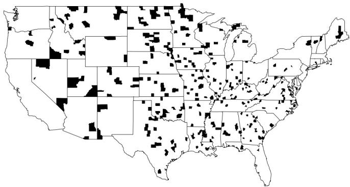  
Highest kidney cancer death rates   
Figure 2.6 The counties of the United States with the highest $10\%$ age-standardized death rates for cancer of kidney/ureter for U.S. white males, 1980-1989. Why are most of the shaded counties in the middle of the country? See Section 2.7 for discussion.

# 2.7 Example: informative prior distribution for cancer rates

At the end of Section 2.4, we considered the effect of the prior distribution on inference given a fixed quantity of data. Here, in contrast, we consider a large set of inferences, each based on different data but with a common prior distribution. In addition to illustrating the role of the prior distribution, this example introduces hierarchical modeling, to which we return in Chapter 5.

# A puzzling pattern in a map

Figure 2.6 shows the counties in the United States with the highest kidney cancer death rates during the 1980s. $^{1}$ The most noticeable pattern in the map is that many of the counties in the Great Plains in the middle of the country, but relatively few counties near the coasts, are shaded.

When shown the map, people come up with many theories to explain the disproportionate shading in the Great Plains: perhaps the air or the water is polluted, or the people tend not to seek medical care so the cancers get detected too late to treat, or perhaps their diet is unhealthy ... These conjectures may all be true but they are not actually needed to explain the patterns in Figure 2.6. To see this, look at Figure 2.7, which plots the $10\%$ of counties with the lowest kidney cancer death rates. These are also mostly in the middle of the country. So now we need to explain why these areas have the lowest, as well as the highest, rates.

The issue is sample size. Consider a county of population 1000. Kidney cancer is a rare disease, and, in any ten-year period, a county of 1000 will probably have zero kidney cancer deaths, so that it will be tied for the lowest rate in the country and will be shaded in Figure 2.7. However, there is a chance the county will have one kidney cancer death during the decade. If so, it will have a rate of 1 per 10,000 per year, which is high enough to put it in the top $10\%$ so that it will be shaded in Figure 2.6. The Great Plains has many low-population counties, and so it is overrepresented in both maps. There is no evidence from these maps that cancer rates are particularly high there.

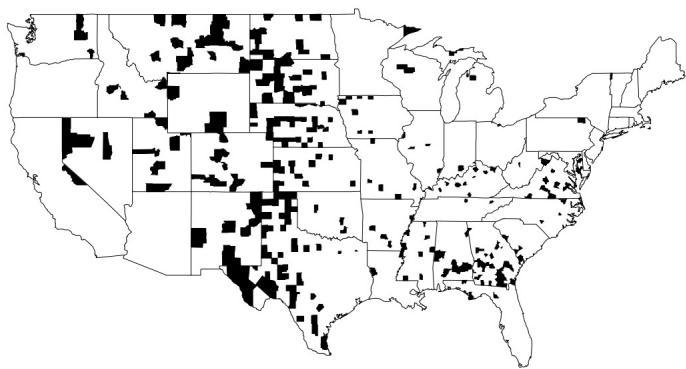  
Lowest kidney cancer death rates   
Figure 2.7 The counties of the United States with the lowest $10\%$ age-standardized death rates for cancer of kidney/ureter for U.S. white males, 1980-1989. Surprisingly, the pattern is somewhat similar to the map of the highest rates, shown in Figure 2.6.

# Bayesian inference for the cancer death rates

The misleading patterns in the maps of raw rates suggest that a model-based approach to estimating the true underlying rates might be helpful. In particular, it is natural to estimate the underlying cancer death rate in each county $j$ using the model

$$
y _ {j} \sim \operatorname {P o i s s o n} \left(1 0 n _ {j} \theta_ {j}\right), \tag {2.16}
$$

where $y_{j}$ is the number of kidney cancer deaths in county $j$ from 1980-1989, $n_{j}$ is the population of the county, and $\theta_{j}$ is the underlying rate in units of deaths per person per year. In this notation, the maps in Figures 2.6 and 2.7 are plotting the raw rates, $\frac{y_{j}}{10n_{j}}$ . (Here we are ignoring the age-standardization, although a generalization of the model to allow for this would be possible.)

This model differs from (2.14) in that $\theta_{j}$ varies between counties, so that (2.16) is a separate model for each of the counties in the U.S. We use the subscript $j$ (rather than $i$ ) in (2.16) to emphasize that these are separate parameters, each being estimated from its own data. Were we performing inference for just one of the counties, we would simply write $y \sim \mathrm{Poisson}(10n\theta)$ .

To perform Bayesian inference, we need a prior distribution for the unknown rate $\theta_{j}$ . For convenience we use a gamma distribution, which is conjugate to the Poisson. As we shall discuss later, a gamma distribution with parameters $\alpha = 20$ and $\beta = 430,000$ is a reasonable prior distribution for underlying kidney cancer death rates in the counties of the U.S. during this period. This prior distribution has a mean of $\frac{\alpha}{\beta} = 4.65 \times 10^{-5}$ and standard deviation $\frac{\sqrt{\alpha}}{\beta} = 1.04 \times 10^{-5}$ .

The posterior distribution of $\theta_{j}$ is then,

$$
\theta_ {j} \mid y _ {j} \sim \operatorname {G a m m a} (2 0 + y _ {j}, 4 3 0, 0 0 0 + 1 0 n _ {j}),
$$

which has mean and variance,

$$
\operatorname {E} \left(\theta_ {j} \mid y _ {j}\right) = \frac {2 0 + y _ {j}}{4 3 0 , 0 0 0 + 1 0 n _ {j}}
$$

$$
\operatorname {v a r} (\theta_ {j} | y _ {j}) = \frac {2 0 + y _ {j}}{(4 3 0 , 0 0 0 + 1 0 n _ {j}) ^ {2}}.
$$

The posterior mean can be viewed as a weighted average of the raw rate, $\frac{y_j}{10n_j}$ , and the prior mean, $\frac{\alpha}{\beta} = 4.65 \times 10^{-5}$ . (For a similar calculation, see Exercise 2.5.)

Relative importance of the local data and the prior distribution

Inference for a small county. The relative weighting of prior information and data depends on the population size $n_j$ . For example, consider a small county with $n_j = 1000$ :

- For this county, if $y_{j} = 0$ , then the raw death rate is 0 but the posterior mean is $\frac{20}{440000} = 4.55 \times 10^{-5}$ .   
- If $y_{j} = 1$ , then the raw death rate is 1 per 1000 per 10 years, or $10^{-4}$ per person-year (about twice as high as the national mean), but the posterior mean is only $\frac{21}{440,000} = 4.77 \times 10^{-5}$ .   
- If $y_{j} = 2$ , then the raw death rate is an extremely high $2 \times 10^{-4}$ per person-year, but the posterior mean is still only $\frac{22}{440000} = 5.00 \times 10^{-5}$ .

With such a small population size, the data are dominated by the prior distribution.

But how likely, a priori, is it that $y_{j}$ will equal 0, 1, 2, and so forth, for this county with $n_{j} = 1000$ ? This is determined by the predictive distribution, the marginal distribution of $y_{j}$ , averaging over the prior distribution of $\theta_{j}$ . As discussed in Section 2.6, the Poisson model with gamma prior distribution has a negative binomial predictive distribution:

$$
y _ {j} \sim \mathrm {N e g - b i n} \left(\alpha , \frac {\beta}{1 0 n _ {j}}\right).
$$

It is perhaps even simpler to simulate directly the predictive distribution of $y_{j}$ as follows: (1) draw 500 (say) values of $\theta_{j}$ from the Gamma(20,430,000) distribution; (2) for each of these, draw one value $y_{j}$ from the Poisson distribution with parameter 10,000 $\theta_{j}$ . Of 500 simulations of $y_{j}$ produced in this way, 319 were 0's, 141 were 1's, 33 were 2's, and 5 were 3's.

Inference for a large county. Now consider a large county with $n_j = 1$ million. How many cancer deaths $y_j$ might we expect to see in a ten-year period? Again we can use the Gamma(20,430,000) and Poisson $(10^{7}\theta_{j})$ distributions to simulate 500 values $y_j$ from the predictive distribution. Doing this we found a median of 473 and a $50\%$ interval of [393,545]. The raw death rate in such a county is then as likely or not to fall between $3.93 \times 10^{-5}$ and $5.45 \times 10^{-5}$ .

What about the Bayesianly estimated or 'Bayes-adjusted' death rate? For example, if $y_{j}$ takes on the low value of 393, then the raw death rate is $3.93 \times 10^{-5}$ and the posterior mean of $\theta_{j}$ is $\frac{20 + 393}{10^{7} + 430000} = 3.96 \times 10^{-5}$ , and if $y_{j} = 545$ , then the raw rate is $5.45 \times 10^{-5}$ and the posterior mean is $5.41 \times 10^{-5}$ . In this large county, the data dominate the prior distribution.

Comparing counties of different sizes. In the Poisson model (2.16), the variance of $\frac{y_j}{10n_j}$ is inversely proportional to the exposure parameter $n_j$ , which can thus be considered a 'sample size' for county $j$ . Figure 2.8 shows how the raw kidney cancer death rates vary by population. The extremely high and extremely low rates are all in low-population counties. By comparison, Figure 2.9a shows that the Bayes-estimated rates are much less variable. Finally, Figure 2.9b displays $50\%$ interval estimates for a sample of counties (chosen because it would be hard to display all 3071 in a single plot). The smaller counties supply less information and thus have wider posterior intervals.

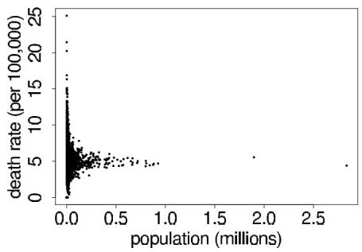

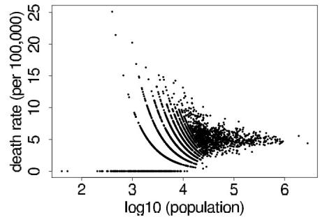  
Figure 2.8 (a) Kidney cancer death rates $y_{j} / (10n_{j})$ vs. population size $n_j$ . (b) Replotted on the scale of $\log_{10}$ population to see the data more clearly. The patterns come from the discreteness of the data ( $n_j = 0, 1, 2, \ldots$ ).

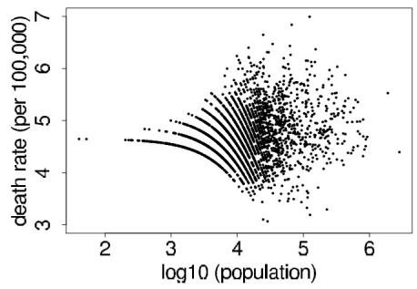

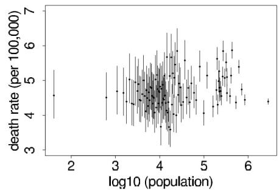  
Figure 2.9 (a) Bayes-estimated posterior mean kidney cancer death rates, $E(\theta_j | y_j) = \frac{20 + y_j}{430000 + 10n_j}$ vs. logarithm of population size $n_j$ , the 3071 counties in the U.S. (b) Posterior medians and 50% intervals for $\theta_j$ for a sample of 100 counties $j$ . The scales on the $y$ -axes differ from the plots in Figure 2.8b.

# Constructing a prior distribution

We now step back and discuss where we got the Gamma(20,430,000) prior distribution for the underlying rates. As we discussed when introducing the model, we picked the gamma distribution for mathematical convenience. We now explain how the two parameters $\alpha, \beta$ can be estimated from data to match the distribution of the observed cancer death rates $\frac{y_j}{10n_j}$ . It might seem inappropriate to use the data to set the prior distribution, but we view this as a useful approximation to our preferred approach of hierarchical modeling (introduced in Chapter 5), in which distributional parameters such as $\alpha, \beta$ in this example are treated as unknowns to be estimated.

Under the model, the observed count $y_{j}$ for any county $j$ comes from the predictive distribution, $p(y_{j}) = \int p(y_{j}|\theta_{j})p(\theta_{j})d\theta_{j}$ , which in this case is Neg-bin $(\alpha ,\frac{\beta}{10n_j})$ . From Appendix A, we can find the mean and variance of this distribution:

$$
\operatorname {E} (y _ {j}) = 1 0 n _ {j} \frac {\alpha}{\beta}
$$

$$
\operatorname {v a r} \left(y _ {j}\right) = 1 0 n _ {j} \frac {\alpha}{\beta} + (1 0 n _ {j}) ^ {2} \frac {\alpha}{\beta^ {2}}. \tag {2.17}
$$

These can also be derived directly using the mean and variance formulas (1.8) and (1.9); see Exercise 2.6.

Matching the observed mean and variance to their expectations and solving for $\alpha$ and $\beta$ yields the parameters of the prior distribution. The actual computation is more complicated

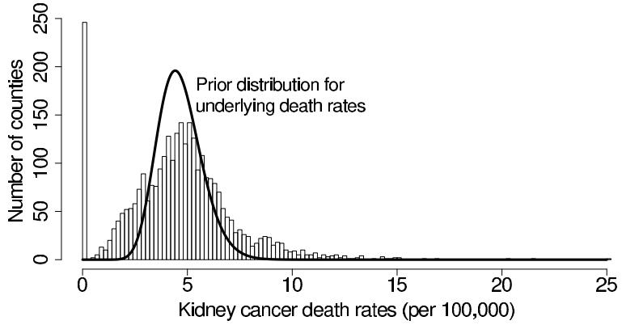  
Figure 2.10 Empirical distribution of the age-adjusted kidney cancer death rates, $\frac{y_j}{10n_j}$ , for the 3071 counties in the U.S., along with the Gamma(20,430,000) prior distribution for the underlying cancer rates $\theta_j$ .

because we must deal with the age adjustment and it also is more efficient to work with the mean and variance of the rates $\frac{y_j}{10n_j}$ :

$$
\mathrm {E} \left(\frac {y _ {j}}{1 0 n _ {j}}\right) = \frac {\alpha}{\beta}
$$

$$
\operatorname {v a r} \left(\frac {y _ {j}}{1 0 n _ {j}}\right) = \frac {1}{1 0 n _ {j}} \frac {\alpha}{\beta} + \frac {\alpha}{\beta^ {2}}. \tag {2.18}
$$

After dealing with the age adjustments, we equate the observed and theoretical moments, setting the mean of the values of $\frac{y_j}{10n_j}$ to $\frac{\alpha}{\beta}$ and setting the variance of the values of $\frac{y_j}{10n_j}$ to $\operatorname{E}\left(\frac{1}{10n_j}\right)\frac{\alpha}{\beta} + \frac{\alpha}{\beta^2}$ , using the sample average of the values $\frac{1}{10n_j}$ in place of $\operatorname{E}\left(\frac{1}{10n_j}\right)$ in that last expression.

Figure 2.10 shows the empirical distribution of the raw cancer rates, along with the estimated Gamma(20,430,000) prior distribution for the underlying cancer rates $\theta_{j}$ . The distribution of the raw rates is much broader, which makes sense since they include the Poisson variability as well as the variation between counties.

Our prior distribution is reasonable in this example, but this method of constructing it—by matching moments—is somewhat sloppy and can be difficult to apply in general. In Chapter 5, we discuss how to estimate this and other prior distributions in a more direct Bayesian manner, using hierarchical models.

A more important way this model could be improved is by including information at the county level that could predict variation in the cancer rates. This would move the model toward a hierarchical Poisson regression of the sort discussed in Chapter 16.

# 2.8 Noninformative prior distributions

When prior distributions have no population basis, they can be difficult to construct, and there has long been a desire for prior distributions that can be guaranteed to play a minimal role in the posterior distribution. Such distributions are sometimes called 'reference prior distributions,' and the prior density is described as vague, flat, diffuse or noninformative. The rationale for using noninformative prior distributions is often said to be 'to let the data speak for themselves,' so that inferences are unaffected by information external to the current data.

A related idea is the weakly informative prior distribution, which contains some informa

tion—enough to ‘regularize’ the posterior distribution, that is, to keep it roughly within reasonable bounds—but without attempting to fully capture one’s scientific knowledge about the underlying parameter.

# Proper and improper prior distributions

We return to the problem of estimating the mean $\theta$ of a normal model with known variance $\sigma^2$ , with a $\mathrm{N}(\mu_0, \tau_0^2)$ prior distribution on $\theta$ . If the prior precision, $1 / \tau_0^2$ , is small relative to the data precision, $n / \sigma^2$ , then the posterior distribution is approximately as if $\tau_0^2 = \infty$ :

$$
p (\theta | y) \approx \mathrm {N} (\theta | \overline {{y}}, \sigma^ {2} / n).
$$

Putting this another way, the posterior distribution is approximately that which would result from assuming $p(\theta)$ is proportional to a constant for $\theta \in (-\infty, \infty)$ . Such a distribution is not strictly possible, since the integral of the assumed $p(\theta)$ is infinity, which violates the assumption that probabilities sum to 1. In general, we call a prior density $p(\theta)$ proper if it does not depend on data and integrates to 1. (If $p(\theta)$ integrates to any positive finite value, it is called an unnormalized density and can be renormalized—multiplied by a constant—to integrate to 1.) The prior distribution is improper in this example, but the posterior distribution is proper, given at least one data point.

As a second example of a noninformative prior distribution, consider the normal model with known mean but unknown variance, with the conjugate scaled inverse- $\chi^2$ prior distribution. If the prior degrees of freedom, $\nu_0$ , are small relative to the data degrees of freedom, $n$ , then the posterior distribution is approximately as if $\nu_0 = 0$ :

$$
p (\sigma^ {2} | y) \approx \mathrm {I n v -} \chi^ {2} (\sigma^ {2} | n, v).
$$

This limiting form of the posterior distribution can also be derived by defining the prior density for $\sigma^2$ as $p(\sigma^2) \propto 1 / \sigma^2$ , which is improper, having an infinite integral over the range $(0, \infty)$ .

Improper prior distributions can lead to proper posterior distributions

In neither of the above two examples does the prior density combine with the likelihood to define a proper joint probability model, $p(y,\theta)$ . However, we can proceed with the algebra of Bayesian inference and define an unnormalized posterior density function by

$$
p (\theta | y) \propto p (y | \theta) p (\theta).
$$

In the above examples (but not always!), the posterior density is in fact proper; that is, $\int p(\theta |y)d\theta$ is finite for all $y$ . Posterior distributions obtained from improper prior distributions must be interpreted with great care—one must always check that the posterior distribution has a finite integral and a sensible form. Their most reasonable interpretation is as approximations in situations where the likelihood dominates the prior density. We discuss this aspect of Bayesian analysis more completely in Chapter 4.

# Jeffreys' invariance principle

One approach that is sometimes used to define noninformative prior distributions was introduced by Jeffreys, based on considering one-to-one transformations of the parameter: $\phi = h(\theta)$ . By transformation of variables, the prior density $p(\theta)$ is equivalent, in terms of expressing the same beliefs, to the following prior density on $\phi$ :

$$
p (\phi) = p (\theta) \left| \frac {d \theta}{d \phi} \right| = p (\theta) \left| h ^ {\prime} (\theta) \right| ^ {- 1}. \tag {2.19}
$$

Jeffreys' general principle is that any rule for determining the prior density $p(\theta)$ should yield an equivalent result if applied to the transformed parameter; that is, $p(\phi)$ computed by determining $p(\theta)$ and applying (2.19) should match the distribution that is obtained by determining $p(\phi)$ directly using the transformed model, $p(y,\phi) = p(\phi)p(y|\phi)$ .

Jeffreys' principle leads to defining the noninformative prior density as $p(\theta) \propto [J(\theta)]^{1/2}$ , where $J(\theta)$ is the Fisher information for $\theta$ :

$$
J (\theta) = \mathrm {E} \left(\left. \left(\frac {d \log p (y | \theta)}{d \theta}\right) ^ {2} \right| \theta\right) = - \mathrm {E} \left(\left. \frac {d ^ {2} \log p (y | \theta)}{d \theta^ {2}} \right| \theta\right). \tag {2.20}
$$

To see that Jeffreys' prior model is invariant to parameterization, evaluate $J(\phi)$ at $\theta = h^{-1}(\phi)$ :

$$
\begin{array}{l} J (\phi) = - \operatorname {E} \left(\frac {d ^ {2} \log p (y | \phi)}{d \phi^ {2}}\right) \\ = - \mathrm {E} \left(\frac {d ^ {2} \log p (y | \theta = h ^ {- 1} (\phi))}{d \theta^ {2}} \left| \frac {d \theta}{d \phi} \right| ^ {2}\right) \\ = J (\theta) \left| \frac {d \theta}{d \phi} \right| ^ {2}; \\ \end{array}
$$

thus, $J(\phi)^{1/2} = J(\theta)^{1/2}\left|\frac{d\theta}{d\phi}\right|$ , as required.

Jeffreys' principle can be extended to multiparameter models, but the results are more controversial. Simpler approaches based on assuming independent noninformative prior distributions for the components of the vector parameter $\theta$ can give different results than are obtained with Jeffreys' principle. When the number of parameters in a problem is large, we find it useful to abandon pure noninformative prior distributions in favor of hierarchical models, as we discuss in Chapter 5.

Various noninformative prior distributions for the binomial parameter

Consider the binomial distribution: $y \sim \operatorname{Bin}(n, \theta)$ , which has log-likelihood

$$
\log p (y | \theta) = \operatorname {c o n s t a n t} + y \log \theta + (n - y) \log (1 - \theta).
$$

Routine evaluation of the second derivative and substitution of $\operatorname{E}(y|\theta) = n\theta$ yields the Fisher information:

$$
J (\theta) = - \operatorname {E} \left(\left. \frac {d ^ {2} \log p (y | \theta)}{d \theta^ {2}} \right| \theta\right) = \frac {n}{\theta (1 - \theta)}.
$$

Jeffreys' prior density is then $p(\theta) \propto \theta^{-1/2}(1 - \theta)^{-1/2}$ , which is a $\mathrm{Beta}\left(\frac{1}{2}, \frac{1}{2}\right)$ density. By comparison, recall the Bayes-Laplace uniform prior density, which can be expressed as $\theta \sim \mathrm{Beta}(1, 1)$ . On the other hand, the prior density that is uniform in the natural parameter of the exponential family representation of the distribution is $p(\log \mathrm{it}(\theta)) \propto \mathrm{constant}$ (see Exercise 2.7), which corresponds to the improper $\mathrm{Beta}(0, 0)$ density on $\theta$ . In practice, the difference between these alternatives is often small, since to get from $\theta \sim \mathrm{Beta}(0, 0)$ to $\theta \sim \mathrm{Beta}(1, 1)$ is equivalent to passing from prior to posterior distribution given one more success and one more failure, and usually 2 is a small fraction of the total number of observations. But one must be careful with the improper $\mathrm{Beta}(0, 0)$ prior distribution—if $y = 0$ or $n$ , the resulting posterior distribution is improper!

# Pivotal quantities

For the binomial and other single-parameter models, different principles give (slightly) different noninformative prior distributions. But for two cases—location parameters and scale parameters—all principles seem to agree.

1. If the density of $y$ is such that $p(y - \theta | \theta)$ is a function that is free of $\theta$ and $y$ , say, $f(u)$ , where $u = y - \theta$ , then $y - \theta$ is a pivotal quantity, and $\theta$ is called a pure location parameter. In such a case, it is reasonable that a noninformative prior distribution for $\theta$ would give $f(y - \theta)$ for the posterior distribution, $p(y - \theta | y)$ . That is, under the posterior distribution, $y - \theta$ should still be a pivotal quantity, whose distribution is free of both $\theta$ and $y$ . Under this condition, using Bayes' rule, $p(y - \theta | y) \propto p(\theta) p(y - \theta | \theta)$ , thereby implying that the noninformative prior density is uniform on $\theta$ ; that is, $p(\theta) \propto \text{constant}$ over the range $(-\infty, \infty)$ .

2. If the density of $y$ is such that $p\left(\frac{y}{\theta} \mid \theta\right)$ is a function that is free of $\theta$ and $y$ —say, $g(u)$ , where $u = \frac{y}{\theta}$ —then $u = \frac{y}{\theta}$ is a pivotal quantity and $\theta$ is called a pure scale parameter. In such a case, it is reasonable that a noninformative prior distribution for $\theta$ would give $g\left(\frac{y}{\theta}\right)$ for the posterior distribution, $p\left(\frac{y}{\theta} \mid y\right)$ . By transformation of variables, the conditional distribution of $y$ given $\theta$ can be expressed in terms of the distribution of $u$ given $\theta$ ,

$$
p (y | \theta) = \frac {1}{\theta} p (u | \theta),
$$

and similarly,

$$
p (\theta | y) = \frac {y}{\theta^ {2}} p (u | y).
$$

After letting both $p(u|\theta)$ and $p(u|y)$ equal $g(u)$ , we have the identity $p(\theta | y) = \frac{y}{\theta} p(y|\theta)$ . Thus, in this case, the reference prior distribution is $p(\theta)\propto \frac{1}{\theta}$ or, equivalently, $p(\log \theta)\propto 1$ or $p(\theta^2)\propto \frac{1}{\theta^2}$ .

This approach, in which the sampling distribution of the pivot is used as its posterior distribution, can be applied to sufficient statistics in more complicated examples, such as hierarchical normal models.

Even these principles can be misleading in some problems, in the critical sense of suggesting prior distributions that can lead to improper posterior distributions. For example, the uniform prior density does not work for the logarithm of a hierarchical variance parameter, as we discuss in Section 5.4.

# Difficulties with noninformative prior distributions

The search for noninformative priors has several problems, including:

1. Searching for a prior distribution that is always vague seems misguided: if the likelihood is truly dominant in a given problem, then the choice among a range of relatively flat prior densities cannot matter. Establishing a particular specification as the reference prior distribution seems to encourage its automatic, and possibly inappropriate, use.

2. For many problems, there is no clear choice for a vague prior distribution, since a density that is flat or uniform in one parameterization will not be in another. This is the essential difficulty with Laplace's principle of insufficient reason--on what scale should the principle apply? For example, the 'reasonable' prior density on the normal mean $\theta$ above is uniform, while for $\sigma^2$ , the density $p(\sigma^2) \propto 1 / \sigma^2$ seems reasonable. However, if we define $\phi = \log \sigma^2$ , then the prior density on $\phi$ is

$$
p (\phi) = p (\sigma^ {2}) \left| \frac {d \sigma^ {2}}{d \phi} \right| \propto \frac {1}{\sigma^ {2}} \sigma^ {2} = 1;
$$

that is, uniform on $\phi = \log \sigma^2$ . With discrete distributions, there is the analogous difficulty of deciding how to subdivide outcomes into 'atoms' of equal probability.

3. Further difficulties arise when averaging over a set of competing models that have improper prior distributions, as we discuss in Section 7.3.

Nevertheless, noninformative and reference prior densities are often useful when it does not seem to be worth the effort to quantify one's real prior knowledge as a probability distribution, as long as one is willing to perform the mathematical work to check that the posterior density is proper and to determine the sensitivity of posterior inferences to modeling assumptions of convenience.

# 2.9 Weakly informative prior distributions

We characterize a prior distribution as weakly informative if it is proper but is set up so that the information it does provide is intentionally weaker than whatever actual prior knowledge is available. We will discuss this further in the context of a specific example, but in general any problem has some natural constraints that would allow a weakly informative model. For example, for regression models on the logarithmic or logistic scale, with predictors that are binary or scaled to have standard deviation 1, we can be sure for most applications that effect sizes will be less than 10, given that a difference of 10 on the log scale changes the expected value by a factor of $\exp (10) = 20,000$ , and on the logit scale shifts a probability of $\log \mathrm{it}^{-1}(-5) = 0.01$ to $\log \mathrm{it}^{-1}(5) = 0.99$ .

Rather than trying to model complete ignorance, we prefer in most problems to use weakly informative prior distributions that include a small amount of real-world information, enough to ensure that the posterior distribution makes sense. For example, in the sex ratio example from Sections 2.1 and 2.4, one could use a prior distribution concentrated between 0.4 and 0.6, for example $\mathrm{N}(0.5,0.1^2)$ or, to keep the mathematical convenience of conjugacy, $\mathrm{Beta}(20,20)$ . In the general problem of estimating a normal mean from Section 2.5, a $\mathrm{N}(0,A^2)$ prior distribution is weakly informative, with $A$ set to some large value that depends on the context of the problem.

In almost every real problem, the data analyst will have more information than can be conveniently included in the statistical model. This is an issue with the likelihood as well as the prior distribution. In practice, there is always compromise for a number of reasons: to describe the model more conveniently; because it may be difficult to express knowledge accurately in probabilistic form; to simplify computations; or perhaps to avoid using a possibly unreliable source of information. Except for the last reason, these are all arguments for convenience and are best justified by the claim that the answer would not have changed much had we been more accurate. If so few data are available that the choice of noninformative prior distribution makes a difference, one should put relevant information into the prior distribution, perhaps using a hierarchical model, as we discuss in Chapter 5. We return to the issue of accuracy vs. convenience in likelihoods and prior distributions in the examples of the later chapters.

# Constructing a weakly informative prior distribution

One might argue that virtually all statistical models are weakly informative: a model always conveys some information, if only in its choice of inputs and the functional form of how they are combined, but it is not possible or perhaps even desirable to encode all of one's prior beliefs about a subject into a set of probability distributions. With that in mind, we

offer two principles for setting up weakly informative priors, going at the problem from two different directions:

- Start with some version of a noninformative prior distribution and then add enough information so that inferences are constrained to be reasonable.   
- Start with a strong, highly informative prior and broaden it to account for uncertainty in one's prior beliefs and in the applicability of any historically based prior distribution to new data.

Neither of these approaches is pure. In the first case, it can happen that the purportedly noninformative prior distribution used as a starting point is in fact too strong. For example, if a $\mathrm{U}(0,1)$ prior distribution is assigned to the probability of some rare disease, then in the presence of weak data the probability can be grossly overestimated (suppose $y = 0$ incidences out of $n = 100$ cases, and the true prevalence is known to be less than 1 in 10,000), and an appropriate weakly informative prior will be such that the posterior in this case will be concentrated in that low range. In the second case, a prior distribution that is believed to be strongly informative may in fact be too weak along some direction. This is not to say that priors should be made more precise whenever posterior inferences are vague; in many cases, our best strategy is simply to acknowledge whatever posterior uncertainty we have. But we should not feel constrained by default noninformative models when we have substantive prior knowledge available.

There are settings, however, when it can be recommended to not use relevant information, even when it could clearly improve posterior inferences. The concern here is often expressed in terms of fairness and encoded mathematically as a symmetry principle, that the prior distribution should not pull inferences in any predetermined direction. For example, consider an experimenter studying an effect that she is fairly sure is positive; perhaps her prior distribution is $\mathrm{N}(0.5, 0.5)$ on some appropriate scale. Such an assumption might be perfectly reasonable given current scientific information but seems potentially risky if it is part of the analysis of an experiment designed to test the scientist's theory. If anything, one might want a prior distribution that leans against an experimenter's hypothesis in order to require a higher standard of proof.

Ultimately, such concerns can and should be subsumed into decision analysis and some sort of model of the entire scientific process, trading off the gains of early identification of large and real effects against the losses entailed in overestimating the magnitudes of effects and overreacting to patterns that could be attributed to chance. In the meantime, though, we know that statistical inferences are taken as evidence of effects, and as guides to future decision making, and for this purpose it can make sense to require models to have certain constraints such as symmetry about 0 for the prior distribution of a single treatment effect.

# 2.10 Bibliographic note

A fascinating detailed account of the early development of the idea of 'inverse probability' (Bayesian inference) is provided in the book by Stigler (1986), on which our brief accounts of Bayes' and Laplace's solutions to the problem of estimating an unknown proportion are based. Bayes' famous 1763 essay in the Philosophical Transactions of the Royal Society of London has been reprinted as Bayes (1763); see also Laplace (1785, 1810).

Introductory textbooks providing complementary discussions of the simple models covered in this chapter were listed at the end of Chapter 1. In particular, Box and Tiao (1973) provide a detailed treatment of Bayesian analysis with the normal model and also discuss highest posterior density regions in some detail. The theory of conjugate prior distributions was developed in detail by Raiffa and Schlaifer (1961). An interesting account of inference

for prediction, which also includes extensive details of particular probability models and conjugate prior analyses, appears in Aitchison and Dunsmore (1975).

Liu et al. (2013) discuss how to efficiently compute highest posterior density intervals using simulations.

Noninformative and reference prior distributions have been studied by many researchers. Jeffreys (1961) and Hartigan (1964) discuss invariance principles for noninformative prior distributions. Chapter 1 of Box and Tiao (1973) presents a straightforward and practically oriented discussion, a brief but detailed survey is given by Berger (1985), and the article by Bernardo (1979) is accompanied by a wide-ranging discussion. Bernardo and Smith (1994) give an extensive treatment of this topic along with many other matters relevant to the construction of prior distributions. Barnard (1985) discusses the relation between pivotal quantities and noninformative Bayesian inference. Kass and Wasserman (1996) provide a review of many approaches for establishing noninformative prior densities based on Jeffreys' rule, and they also discuss the problems that may arise from uncritical use of purportedly noninformative prior specifications. Dawid, Stone, and Zidek (1973) discuss some difficulties that can arise with noninformative prior distributions; also see Jaynes (1980).

Kerman (2011) discusses noninformative and informative conjugate prior distributions for the binomial and Poisson models.

Jaynes (1983) discusses in several places the idea of objectively constructing prior distributions based on invariance principles and maximum entropy. Appendix A of Bretthorst (1988) outlines an objective Bayesian approach to assigning prior distributions, as applied to the problem of estimating the parameters of a sinusoid from time series data. More discussions of maximum entropy models appear in Jaynes (1982), Skilling (1989), and Gull (1989a); see Titterington (1984) and Donoho et al. (1992) for other views.

For more on weakly informative prior distributions, see Gelman (2006a) and Gelman, Jakulin, et al. (2008). Gelman (2004b) discusses connections between parameterization and Bayesian modeling. Greenland (2001) discusses informative prior distributions in epidemiology.

The data for the placenta previa example come from a study from 1922 reported in James (1987). For more on the challenges of estimating sex ratios from small samples, see Gelman and Weakliem (2009). The Bayesian analysis of age-adjusted kidney cancer death rates in Section 2.7 is adapted from Manton et al. (1989); see also Gelman and Nolan (2002a) for more on this particular example and Bernardinelli, Clayton, and Montomoli (1995) for a general discussion of prior distributions for disease mapping. Gelman and Price (1999) discuss artifacts in maps of parameter estimates, and Louis (1984), Shen and Louis (1998), and Louis and Shen (1999) analyze the general problem of estimation of ensembles of parameters, a topic to which we return in Chapter 5.

# 2.11 Exercises

1. Posterior inference: suppose you have a $\mathrm{Beta}(4,4)$ prior distribution on the probability $\theta$ that a coin will yield a 'head' when spun in a specified manner. The coin is independently spun ten times, and 'heads' appear fewer than 3 times. You are not told how many heads were seen, only that the number is less than 3. Calculate your exact posterior density (up to a proportionality constant) for $\theta$ and sketch it.   
2. Predictive distributions: consider two coins, $C_1$ and $C_2$ , with the following characteristics: $\operatorname{Pr}(\text{heads}|C_1) = 0.6$ and $\operatorname{Pr}(\text{heads}|C_2) = 0.4$ . Choose one of the coins at random and imagine spinning it repeatedly. Given that the first two spins from the chosen coin are tails, what is the expectation of the number of additional spins until a head shows up?   
3. Predictive distributions: let $y$ be the number of 6's in 1000 rolls of a fair die.

(a) Sketch the approximate distribution of $y$ , based on the normal approximation.

(b) Using the normal distribution table, give approximate $5\%$ , $25\%$ , $50\%$ , $75\%$ , and $95\%$ points for the distribution of $y$ .

4. Predictive distributions: let $y$ be the number of 6's in 1000 independent rolls of a particular real die, which may be unfair. Let $\theta$ be the probability that the die lands on '6.' Suppose your prior distribution for $\theta$ is as follows:

$$
\operatorname * {P r} (\theta = 1 / 1 2) \quad = \quad 0. 2 5,
$$

$$
\Pr (\theta = 1 / 6) = 0. 5,
$$

$$
\operatorname * {P r} (\theta = 1 / 4) \quad = \quad 0. 2 5.
$$

(a) Using the normal approximation for the conditional distributions, $p(y|\theta)$ , sketch your approximate prior predictive distribution for $y$ .

(b) Give approximate $5\%$ , $25\%$ , $50\%$ , $75\%$ , and $95\%$ points for the distribution of $y$ . (Be careful here: $y$ does not have a normal distribution, but you can still use the normal distribution as part of your analysis.)

5. Posterior distribution as a compromise between prior information and data: let $y$ be the number of heads in $n$ spins of a coin, whose probability of heads is $\theta$ .

(a) If your prior distribution for $\theta$ is uniform on the range $[0,1]$ , derive your prior predictive distribution for $y$ ,

$$
\operatorname * {P r} (y = k) = \int_ {0} ^ {1} \operatorname * {P r} (y = k | \theta) d \theta ,
$$

for each $k = 0,1,\ldots ,n$

(b) Suppose you assign a $\mathrm{Beta}(\alpha, \beta)$ prior distribution for $\theta$ , and then you observe $y$ heads out of $n$ spins. Show algebraically that your posterior mean of $\theta$ always lies between your prior mean, $\frac{\alpha}{\alpha + \beta}$ , and the observed relative frequency of heads, $\frac{y}{n}$ .   
(c) Show that, if the prior distribution on $\theta$ is uniform, the posterior variance of $\theta$ is always less than the prior variance.   
(d) Give an example of a $\operatorname{Beta}(\alpha, \beta)$ prior distribution and data $y, n$ , in which the posterior variance of $\theta$ is higher than the prior variance.

6. Predictive distributions: Derive the mean and variance (2.17) of the negative binomial predictive distribution for the cancer rate example, using the mean and variance formulas (1.8) and (1.9).

7. Noninformative prior densities:

(a) For the binomial likelihood, $y \sim \operatorname{Bin}(n, \theta)$ , show that $p(\theta) \propto \theta^{-1}(1 - \theta)^{-1}$ is the uniform prior distribution for the natural parameter of the exponential family.   
(b) Show that if $y = 0$ or $n$ , the resulting posterior distribution is improper.

8. Normal distribution with unknown mean: a random sample of $n$ students is drawn from a large population, and their weights are measured. The average weight of the $n$ sampled students is $\overline{y} = 150$ pounds. Assume the weights in the population are normally distributed with unknown mean $\theta$ and known standard deviation 20 pounds. Suppose your prior distribution for $\theta$ is normal with mean 180 and standard deviation 40.

(a) Give your posterior distribution for $\theta$ . (Your answer will be a function of $n$ .)   
(b) A new student is sampled at random from the same population and has a weight of $\tilde{y}$ pounds. Give a posterior predictive distribution for $\tilde{y}$ . (Your answer will still be a function of $n$ .)   
(c) For $n = 10$ , give a $95\%$ posterior interval for $\theta$ and a $95\%$ posterior predictive interval for $\tilde{y}$ .   
(d) Do the same for $n = 100$

9. Setting parameters for a beta prior distribution: suppose your prior distribution for $\theta$ , the proportion of Californians who support the death penalty, is beta with mean 0.6 and standard deviation 0.3.

(a) Determine the parameters $\alpha$ and $\beta$ of your prior distribution. Sketch the prior density function   
(b) A random sample of 1000 Californians is taken, and $65\%$ support the death penalty. What are your posterior mean and variance for $\theta$ ? Draw the posterior density function.   
(c) Examine the sensitivity of the posterior distribution to different prior means and widths including a non-informative prior.

10. Discrete sample spaces: suppose there are $N$ cable cars in San Francisco, numbered sequentially from 1 to $N$ . You see a cable car at random; it is numbered 203. You wish to estimate $N$ . (See Goodman, 1952, for a discussion and references to several versions of this problem, and Jeffreys, 1961, Lee, 1989, and Jaynes, 2003, for Bayesian treatments.)

(a) Assume your prior distribution on $N$ is geometric with mean 100; that is,

$$
p (N) = (1 / 1 0 0) (9 9 / 1 0 0) ^ {N - 1}, \quad \text {f o r} N = 1, 2, \dots .
$$

What is your posterior distribution for $N$ ?

(b) What are the posterior mean and standard deviation of $N$ ? (Sum the infinite series analytically or approximate them on the computer.)   
(c) Choose a reasonable 'noninformative' prior distribution for $N$ and give the resulting posterior distribution, mean, and standard deviation for $N$ .

11. Computing with a nonconjugate single-parameter model: suppose $y_{1},\ldots ,y_{5}$ are independent samples from a Cauchy distribution with unknown center $\theta$ and known scale 1: $p(y_i|\theta)\propto 1 / (1 + (y_i - \theta)^2)$ . Assume, for simplicity, that the prior distribution for $\theta$ is uniform on [0, 100]. Given the observations $(y_{1},\dots ,y_{5}) = (43,44,45,46.5,47.5)$ :

(a) Compute the unnormalized posterior density function, $p(\theta)p(y|\theta)$ , on a grid of points $\theta = 0, \frac{1}{m}, \frac{2}{m}, \ldots, 100$ , for some large integer $m$ . Using the grid approximation, compute and plot the normalized posterior density function, $p(\theta|y)$ , as a function of $\theta$ .   
(b) Sample 1000 draws of $\theta$ from the posterior density and plot a histogram of the draws.   
(c) Use the 1000 samples of $\theta$ to obtain 1000 samples from the predictive distribution of a future observation, $y_{6}$ , and plot a histogram of the predictive draws.

12. Jeffreys' prior distributions: suppose $y|\theta \sim \mathrm{Poisson}(\theta)$ . Find Jeffreys' prior density for $\theta$ , and then find $\alpha$ and $\beta$ for which the Gamma $(\alpha, \beta)$ density is a close match to Jeffreys' density.

13. Discrete data: Table 2.2 gives the number of fatal accidents and deaths on scheduled airline flights per year over a ten-year period. We use these data as a numerical example for fitting discrete data models.

(a) Assume that the numbers of fatal accidents in each year are independent with a Poisson $(\theta)$ distribution. Set a prior distribution for $\theta$ and determine the posterior distribution based on the data from 1976 through 1985. Under this model, give a $95\%$ predictive interval for the number of fatal accidents in 1986. You can use the normal approximation to the gamma and Poisson or compute using simulation.   
(b) Assume that the numbers of fatal accidents in each year follow independent Poisson distributions with a constant rate and an exposure in each year proportional to the number of passenger miles flown. Set a prior distribution for $\theta$ and determine the posterior distribution based on the data for 1976-1985. (Estimate the number of passenger miles flown in each year by dividing the appropriate columns of Table 2.2 and ignoring round-off errors.) Give a $95\%$ predictive interval for the number of fatal

Table 2.2 Worldwide airline fatalities, 1976-1985. Death rate is passenger deaths per 100 million passenger miles. Source: Statistical Abstract of the United States.   

<table><tr><td>Year</td><td>Fatal accidents</td><td>Passenger deaths</td><td>Death rate</td></tr><tr><td>1976</td><td>24</td><td>734</td><td>0.19</td></tr><tr><td>1977</td><td>25</td><td>516</td><td>0.12</td></tr><tr><td>1978</td><td>31</td><td>754</td><td>0.15</td></tr><tr><td>1979</td><td>31</td><td>877</td><td>0.16</td></tr><tr><td>1980</td><td>22</td><td>814</td><td>0.14</td></tr><tr><td>1981</td><td>21</td><td>362</td><td>0.06</td></tr><tr><td>1982</td><td>26</td><td>764</td><td>0.13</td></tr><tr><td>1983</td><td>20</td><td>809</td><td>0.13</td></tr><tr><td>1984</td><td>16</td><td>223</td><td>0.03</td></tr><tr><td>1985</td><td>22</td><td>1066</td><td>0.15</td></tr></table>

accidents in 1986 under the assumption that $8 \times 10^{11}$ passenger miles are flown that year.

(c) Repeat (a) above, replacing 'fatal accidents' with 'passenger deaths.'   
(d) Repeat (b) above, replacing 'fatal accidents' with 'passenger deaths.'   
(e) In which of the cases (a)-(d) above does the Poisson model seem more or less reasonable? Why? Discuss based on general principles, without specific reference to the numbers in Table 2.2.

Incidentally, in 1986, there were 22 fatal accidents, 546 passenger deaths, and a death rate of 0.06 per 100 million miles flown. We return to this example in Exercises 3.12, 6.2, 6.3, and 8.14.

14. Algebra of the normal model:

(a) Fill in the steps to derive (2.9)-(2.10), and (2.11)-(2.12).   
(b) Derive (2.11) and (2.12) by starting with a $\mathrm{N}(\mu_0, \tau_0^2)$ prior distribution and adding data points one at a time, using the posterior distribution at each step as the prior distribution for the next.

15. Beta distribution: assume the result, from standard advanced calculus, that

$$
\int_ {0} ^ {1} u ^ {\alpha - 1} (1 - u) ^ {\beta - 1} d u = \frac {\Gamma (\alpha) \Gamma (\beta)}{\Gamma (\alpha + \beta)}.
$$

If $Z$ has a beta distribution with parameters $\alpha$ and $\beta$ , find $\operatorname{E}[Z^m (1 - Z)^n ]$ for any nonnegative integers $m$ and $n$ . Hence derive the mean and variance of $Z$ .

16. Beta-binomial distribution and Bayes' prior distribution: suppose $y$ has a binomial distribution for given $n$ and unknown parameter $\theta$ , where the prior distribution of $\theta$ is $\mathrm{Beta}(\alpha, \beta)$ .

(a) Find $p(y)$ , the marginal distribution of $y$ , for $y = 0, \dots, n$ (unconditional on $\theta$ ). This discrete distribution is known as the beta-binomial, for obvious reasons.   
(b) Show that if the beta-binomial probability is constant in $y$ , then the prior distribution has to have $\alpha = \beta = 1$ .

17. Posterior intervals: unlike the central posterior interval, the highest posterior interval is not invariant to transformation. For example, suppose that, given $\sigma^2$ , the quantity $n v / \sigma^2$ is distributed as $\chi_n^2$ , and that $\sigma$ has the (improper) noninformative prior density $p(\sigma) \propto \sigma^{-1}, \sigma > 0$ .

(a) Prove that the corresponding prior density for $\sigma^2$ is $p(\sigma^2)\propto \sigma^{-2}$

(b) Show that the $95\%$ highest posterior density region for $\sigma^2$ is not the same as the region obtained by squaring the endpoints of a posterior interval for $\sigma$ .

18. Poisson model: derive the gamma posterior distribution (2.15) for the Poisson model parameterized in terms of rate and exposure with conjugate prior distribution.

19. Exponential model with conjugate prior distribution:

(a) Show that if $y|\theta$ is exponentially distributed with rate $\theta$ , then the gamma prior distribution is conjugate for inferences about $\theta$ given an independent and identically distributed sample of $y$ values.

(b) Show that the equivalent prior specification for the mean, $\phi = 1 / \theta$ , is inverse-gamma. (That is, derive the latter density function.)

(c) The length of life of a light bulb manufactured by a certain process has an exponential distribution with unknown rate $\theta$ . Suppose the prior distribution for $\theta$ is a gamma distribution with coefficient of variation 0.5. (The coefficient of variation is defined as the standard deviation divided by the mean.) A random sample of light bulbs is to be tested and the lifetime of each obtained. If the coefficient of variation of the distribution of $\theta$ is to be reduced to 0.1, how many light bulbs need to be tested?

(d) In part (c), if the coefficient of variation refers to $\phi$ instead of $\theta$ , how would your answer be changed?

20. Censored and uncensored data in the exponential model:

(a) Suppose $y|\theta$ is exponentially distributed with rate $\theta$ , and the marginal (prior) distribution of $\theta$ is Gamma $(\alpha, \beta)$ . Suppose we observe that $y \geq 100$ , but do not observe the exact value of $y$ . What is the posterior distribution, $p(\theta | y \geq 100)$ , as a function of $\alpha$ and $\beta$ ? Write down the posterior mean and variance of $\theta$ .

(b) In the above problem, suppose that we are now told that $y$ is exactly 100. Now what are the posterior mean and variance of $\theta$ ?

(c) Explain why the posterior variance of $\theta$ is higher in part (b) even though more information has been observed. Why does this not contradict identity (2.8) on page 32?

21. Simple hierarchical modeling:

The file pew_research_center_june elect_wknd_data.dta<sup>3</sup> has data from Pew Research Center polls taken during the 2008 election campaign. You can read these data into R using the read.dta() function (after first loading the foreign package into R). Your task is to estimate the percentage of the (adult) population in each state (excluding Alaska and Hawaii) who label themselves as 'very liberal,' replicating the procedure that was used in Section 2.8 to estimate cancer rates. But you do not need to make maps; it will be enough to make scatterplots, plotting the estimate vs. Obama's vote share in 2008 (data available at 2008ElectionResult.csv, readable in R using read.csv)). Make the following four graphs on a single page:

(a) Graph proportion liberal in each state vs. Obama vote share—that is, a scatterplot using the two-letter state abbreviations (see state.abb() in R).   
(b) Graph the Bayes posterior mean in each state vs. Obama vote share.   
(c) Repeat graphs (a) and (b) using the number of respondents in the state on the $x$ -axis. This exercise has four challenges: first, manipulating the data in order to get the totals by state; second, replicating the calculations for estimating the parameters of the prior distribution; third, doing the Bayesian analysis by state; and fourth, making the graphs.

22. Prior distributions:

A (hypothetical) study is performed to estimate the effect of a simple training program on basketball free-throw shooting. A random sample of 100 college students is recruited into the study. Each student first shoots 100 free-throws to establish a baseline success probability. Each student then takes 50 practice shots each day for a month. At the end of that time, he or she takes 100 shots for a final measurement. Let $\theta$ be the average improvement in success probability.

Give three prior distributions for $\theta$ (explaining each in a sentence):

(a) A noninformative prior,   
(b) A subjective prior based on your best knowledge, and   
(c) A weakly informative prior.

# Chapter 3

# Introduction to multiparameter models

Virtually every practical problem in statistics involves more than one unknown or unobservable quantity. It is in dealing with such problems that the simple conceptual framework of the Bayesian approach reveals its principal advantages over other methods of inference. Although a problem can include several parameters of interest, conclusions will often be drawn about one, or only a few, parameters at a time. In this case, the ultimate aim of a Bayesian analysis is to obtain the marginal posterior distribution of the particular parameters of interest. In principle, the route to achieving this aim is clear: we first require the joint posterior distribution of all unknowns, and then we integrate this distribution over the unknowns that are not of immediate interest to obtain the desired marginal distribution. Or equivalently, using simulation, we draw samples from the joint posterior distribution and then look at the parameters of interest and ignore the values of the other unknowns. In many problems there is no interest in making inferences about many of the unknown parameters, although they are required in order to construct a realistic model. Parameters of this kind are often called nuisance parameters. A classic example is the scale of the random errors in a measurement problem.

We begin this chapter with a general treatment of nuisance parameters and then cover the normal distribution with unknown mean and variance in Section 3.2. Sections 3.4 and 3.5 present inference for the multinomial and multivariate normal distributions—the simplest models for discrete and continuous multivariate data, respectively. The chapter concludes with an analysis of a nonconjugate logistic regression model, using numerical computation of the posterior density on a grid.

# 3.1 Averaging over 'nuisance parameters'

To express the ideas of joint and marginal posterior distributions mathematically, suppose $\theta$ has two parts, each of which can be a vector, $\theta = (\theta_{1},\theta_{2})$ , and further suppose that we are only interested (at least for the moment) in inference for $\theta_{1}$ , so $\theta_{2}$ may be considered a 'nuisance' parameter. For instance, in the simple example,

$$
y | \mu , \sigma^ {2} \sim \mathrm {N} (\mu , \sigma^ {2}),
$$

in which both $\mu (= \theta_1)$ and $\sigma^2 (= \theta_2)$ are unknown, interest commonly centers on $\mu$ .

We seek the conditional distribution of the parameter of interest given the observed data; in this case, $p(\theta_1|y)$ . This is derived from the joint posterior density,

$$
p (\theta_ {1}, \theta_ {2} | y) \propto p (y | \theta_ {1}, \theta_ {2}) p (\theta_ {1}, \theta_ {2}),
$$

by averaging over $\theta_{2}$ :

$$
p (\theta_ {1} | y) = \int p (\theta_ {1}, \theta_ {2} | y) d \theta_ {2}.
$$

Alternatively, the joint posterior density can be factored to yield

$$
p \left(\theta_ {1} | y\right) = \int p \left(\theta_ {1} \mid \theta_ {2}, y\right) p \left(\theta_ {2} \mid y\right) d \theta_ {2}, \tag {3.1}
$$

which shows that the posterior distribution of interest, $p(\theta_1|y)$ , is a mixture of the conditional posterior distributions given the nuisance parameter, $\theta_{2}$ , where $p(\theta_2|y)$ is a weighting function for the different possible values of $\theta_{2}$ . The weights depend on the posterior density of $\theta_{2}$ and thus on a combination of evidence from data and prior model. The averaging over nuisance parameters $\theta_{2}$ can be interpreted generally; for example, $\theta_{2}$ can include a discrete component representing different possible sub-models.

We rarely evaluate the integral (3.1) explicitly, but it suggests an important practical strategy for both constructing and computing with multiparameter models. Posterior distributions can be computed by marginal and conditional simulation, first drawing $\theta_{2}$ from its marginal posterior distribution and then $\theta_{1}$ from its conditional posterior distribution, given the drawn value of $\theta_{2}$ . In this way the integration embodied in (3.1) is performed indirectly. A canonical example of this form of analysis is provided by the normal model with unknown mean and variance, to which we now turn.

# 3.2 Normal data with a noninformative prior distribution

As the prototype example of estimating the mean of a population from a sample, we consider a vector $y$ of $n$ independent observations from a univariate normal distribution, $\mathrm{N}(\mu, \sigma^2)$ ; the generalization to the multivariate normal distribution appears in Section 3.5. We begin by analyzing the model under a noninformative prior distribution, with the understanding that this is no more than a convenient assumption for the purposes of exposition and is easily extended to informative prior distributions.

# A noninformative prior distribution

We saw in Chapter 2 that a sensible vague prior density for $\mu$ and $\sigma$ , assuming prior independence of location and scale parameters, is uniform on $(\mu, \log \sigma)$ or, equivalently,

$$
p (\mu , \sigma^ {2}) \propto (\sigma^ {2}) ^ {- 1}.
$$

The joint posterior distribution, $p(\mu ,\sigma^2 |y)$

Under this conventional improper prior density, the joint posterior distribution is proportional to the likelihood function multiplied by the factor $1 / \sigma^2$ :

$$
\begin{array}{l} p (\mu , \sigma^ {2} | y) \propto \sigma^ {- n - 2} \exp \left(- \frac {1}{2 \sigma^ {2}} \sum_ {i = 1} ^ {n} (y _ {i} - \mu) ^ {2}\right) \\ = \sigma^ {- n - 2} \exp \left(- \frac {1}{2 \sigma^ {2}} \left[ \sum_ {i = 1} ^ {n} \left(y _ {i} - \bar {y}\right) ^ {2} + n (\bar {y} - \mu) ^ {2} \right]\right) \\ = \sigma^ {- n - 2} \exp \left(- \frac {1}{2 \sigma^ {2}} [ (n - 1) s ^ {2} + n (\bar {y} - \mu) ^ {2} ]\right), \tag {3.2} \\ \end{array}
$$

where

$$
s ^ {2} = \frac {1}{n - 1} \sum_ {i = 1} ^ {n} (y _ {i} - \overline {{y}}) ^ {2}
$$

is the sample variance of the $y_{i}$ 's. The sufficient statistics are $\overline{y}$ and $s^2$ .

The conditional posterior distribution, $p(\mu |\sigma^2,y)$

In order to factor the joint posterior density as in (3.1), we consider first the conditional posterior density, $p(\mu | \sigma^2, y)$ , and then the marginal posterior density, $p(\sigma^2 | y)$ . To determine the posterior distribution of $\mu$ , given $\sigma^2$ , we simply use the result derived in Section 2.5 for the mean of a normal distribution with known variance and a uniform prior distribution:

$$
\mu \left| \sigma^ {2}, y \sim \mathrm {N} \left(\bar {y}, \sigma^ {2} / n\right). \right. \tag {3.3}
$$

The marginal posterior distribution, $p(\sigma^2 | y)$

To determine $p(\sigma^2 | y)$ , we must average the joint distribution (3.2) over $\mu$ :

$$
p (\sigma^ {2} | y) \propto \int \sigma^ {- n - 2} \exp \left(- \frac {1}{2 \sigma^ {2}} [ (n - 1) s ^ {2} + n (\bar {y} - \mu) ^ {2} ]\right) d \mu .
$$

Integrating this expression over $\mu$ requires evaluating the integral $\exp \left(-\frac{1}{2\sigma^2} n(\overline{y} - \mu)^2\right)$ , which is a simple normal integral; thus,

$$
\begin{array}{l} p (\sigma^ {2} | y) \propto \sigma^ {- n - 2} \exp \left(- \frac {1}{2 \sigma^ {2}} (n - 1) s ^ {2}\right) \sqrt {2 \pi \sigma^ {2} / n} \\ \propto \left(\sigma^ {2}\right) ^ {- (n + 1) / 2} \exp \left(- \frac {(n - 1) s ^ {2}}{2 \sigma^ {2}}\right), \tag {3.4} \\ \end{array}
$$

which is a scaled inverse- $\chi^2$ density:

$$
\sigma^ {2} | y \sim \operatorname {I n v} - \chi^ {2} (n - 1, s ^ {2}). \tag {3.5}
$$

We have thus factored the joint posterior density (3.2) as the product of conditional and marginal posterior densities: $p(\mu, \sigma^2 | y) = p(\mu | \sigma^2, y) p(\sigma^2 | y)$ .

This marginal posterior distribution for $\sigma^2$ has a remarkable similarity to the analogous sampling theory result: conditional on $\sigma^2$ (and $\mu$ ), the distribution of the appropriately scaled sufficient statistic, $\frac{(n-1)s^2}{\sigma^2}$ , is $\chi_{n-1}^2$ . Considering our derivation of the reference prior distribution for the scale parameter in Section 2.8, however, this result is not surprising.

Sampling from the joint posterior distribution

It is easy to draw samples from the joint posterior distribution: first draw $\sigma^2$ from (3.5), then draw $\mu$ from (3.3). We also derive some analytical results for the posterior distribution, since this is one of the few multiparameter problems simple enough to solve in closed form.

Analytic form of the marginal posterior distribution of $\mu$

The population mean, $\mu$ , is typically the estimand of interest, and so the objective of the Bayesian analysis is the marginal posterior distribution of $\mu$ , which can be obtained by integrating $\sigma^2$ out of the joint posterior distribution. The representation (3.1) shows that the posterior distribution of $\mu$ can be regarded as a mixture of normal distributions, mixed over the scaled inverse- $\chi^2$ distribution for the variance, $\sigma^2$ . We can derive the marginal posterior density for $\mu$ by integrating the joint posterior density over $\sigma^2$ :

$$
p (\mu | y) = \int_ {0} ^ {\infty} p (\mu , \sigma^ {2} | y) d \sigma^ {2}.
$$

This integral can be evaluated using the substitution

$$
z = \frac {A}{2 \sigma^ {2}}, \mathrm {w h e r e} A = (n - 1) s ^ {2} + n (\mu - \overline {{y}}) ^ {2},
$$

and recognizing that the result is an unnormalized gamma integral:

$$
\begin{array}{l} p (\mu | y) \propto A ^ {- n / 2} \int_ {0} ^ {\infty} z ^ {(n - 2) / 2} \exp (- z) d z \\ \propto \left[ (n - 1) s ^ {2} + n (\mu - \bar {y}) ^ {2} \right] ^ {- n / 2} \\ \propto \left[ 1 + \frac {n (\mu - \bar {y}) ^ {2}}{(n - 1) s ^ {2}} \right] ^ {- n / 2}. \\ \end{array}
$$

This is the $t_{n - 1}(\overline{y},s^2 /n)$ density (see Appendix A).

To put it another way, we have shown that, under the noninformative uniform prior distribution on $(\mu ,\log \sigma)$ , the posterior distribution of $\mu$ has the form

$$
\frac {\mu - \overline {{y}}}{s / \sqrt {n}} \Bigg | y \sim t _ {n - 1},
$$

where $t_{n-1}$ denotes the standard $t$ density (location 0, scale 1) with $n-1$ degrees of freedom. This marginal posterior distribution provides another interesting comparison with sampling theory. Under the sampling distribution, $p(y|\mu, \sigma^2)$ , the following relation holds:

$$
\left. \frac {\overline {{y}} - \mu}{s / \sqrt {n}} \right| \mu , \sigma^ {2} \sim t _ {n - 1}.
$$

The sampling distribution of the pivotal quantity $(\overline{y} - \mu) / (s / \sqrt{n})$ does not depend on the nuisance parameter $\sigma^2$ , and its posterior distribution does not depend on data. In general, a pivotal quantity for the estimand is defined as a nontrivial function of the data and the estimand whose sampling distribution is independent of all parameters and data.

Posterior predictive distribution for a future observation

The posterior predictive distribution for a future observation, $\tilde{y}$ , can be written as a mixture, $p(\tilde{y} | y) = \iint p(\tilde{y} | \mu, \sigma^2, y) p(\mu, \sigma^2 | y) d\mu d\sigma^2$ . The first of the two factors in the integral is just the normal distribution for the future observation given the values of $(\mu, \sigma^2)$ , and does not depend on $y$ at all. To draw from the posterior predictive distribution, first draw $\mu, \sigma^2$ from their joint posterior distribution and then simulate $\tilde{y} \sim \mathrm{N}(\mu, \sigma^2)$ .

In fact, the posterior predictive distribution of $\tilde{y}$ is a $t$ distribution with location $\overline{y}$ , scale $(1 + \frac{1}{n})^{1/2}s$ , and $n - 1$ degrees of freedom. This analytic form is obtained using the same techniques as in the derivation of the posterior distribution of $\mu$ . Specifically, the distribution can be obtained by integrating out the parameters $\mu, \sigma^2$ according to their joint posterior distribution. We can identify the result more easily by noticing that the factorization $p(\tilde{y}|\sigma^2,y) = \int p(\tilde{y}|\mu,\sigma^2,y)p(\mu|\sigma^2,y)d\mu$ leads to $p(\tilde{y}|\sigma^2,y) = \mathrm{N}(\tilde{y}|\overline{y},(1 + \frac{1}{n})\sigma^2)$ , which is the same, up to a changed scale factor, as the distribution of $\mu|\sigma^2,y$ .

# Example. Estimating the speed of light

Simon Newcomb set up an experiment in 1882 to measure the speed of light. Newcomb measured the amount of time required for light to travel a distance of 7442 meters. A histogram of Newcomb's 66 measurements is shown in Figure 3.1. There are two unusually low measurements and then a cluster of measurements that are approximately symmetrically distributed. We (inappropriately) apply the normal model, assuming that all 66 measurements are independent draws from a normal distribution with mean

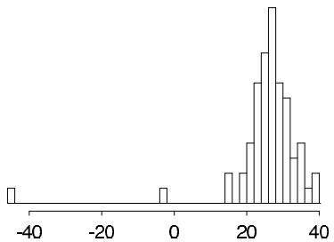  
Figure 3.1 Histogram of Simon Newcomb's measurements for estimating the speed of light, from Stigler (1977). The data are recorded as deviations from 24,800 nanoseconds.

$\mu$ and variance $\sigma^2$ . The main substantive goal is posterior inference for $\mu$ . The outlying measurements do not fit the normal model; we discuss Bayesian methods for measuring the lack of fit for these data in Section 6.3. The mean of the 66 measurements is $\overline{y} = 26.2$ , and the sample standard deviation is $s = 10.8$ . Assuming the noninformative prior distribution $p(\mu, \sigma^2) \propto (\sigma^2)^{-1}$ , a $95\%$ central posterior interval for $\mu$ is obtained from the $t_{65}$ marginal posterior distribution of $\mu$ as $\overline{y} \pm 1.997s / \sqrt{66} = [23.6, 28.8]$ .

The posterior interval can also be obtained by simulation. Following the factorization of the posterior distribution given by (3.5) and (3.3), we first draw a random value of $\sigma^2 \sim \mathrm{Inv} - \chi^2(65, s^2)$ as $65s^2$ divided by a random draw from the $\chi_{65}^2$ distribution (see Appendix A). Then given this value of $\sigma^2$ , we draw $\mu$ from its conditional posterior distribution, $\mathrm{N}(26.2, \sigma^2/66)$ . Based on 1000 simulated values of $(\mu, \sigma^2)$ , we estimate the posterior median of $\mu$ to be 26.2 and a $95\%$ central posterior interval for $\mu$ to be [23.6, 28.9], close to the analytically calculated interval.

Incidentally, based on the currently accepted value of the speed of light, the 'true value' for $\mu$ in Newcomb's experiment is 33.0, which falls outside our $95\%$ interval. This reinforces the fact that posterior inferences are only as good as the model and the experiment that produced the data.

# 3.3 Normal data with a conjugate prior distribution

A family of conjugate prior distributions

A first step toward a more general model is to assume a conjugate prior distribution for the two-parameter univariate normal sampling model in place of the noninformative prior distribution just considered. The form of the likelihood displayed in (3.2) and the subsequent discussion shows that the conjugate prior density must also have the product form $p(\sigma^2)p(\mu |\sigma^2)$ , where the marginal distribution of $\sigma^2$ is scaled inverse- $\chi^2$ and the conditional distribution of $\mu$ given $\sigma^2$ is normal (so that marginally $\mu$ has a $t$ distribution). A convenient parameterization is given by the following specification:

$$
\mu | \sigma^ {2} \sim \mathrm {N} (\mu_ {0}, \sigma^ {2} / \kappa_ {0})
$$

$$
\sigma^ {2} \sim \mathrm {I n v -} \chi^ {2} (\nu_ {0}, \sigma_ {0} ^ {2}),
$$

which corresponds to the joint prior density

$$
p \left(\mu , \sigma^ {2}\right) \propto \sigma^ {- 1} \left(\sigma^ {2}\right) ^ {- \left(\nu_ {0} / 2 + 1\right)} \exp \left(- \frac {1}{2 \sigma^ {2}} \left[ \nu_ {0} \sigma_ {0} ^ {2} + \kappa_ {0} \left(\mu_ {0} - \mu\right) ^ {2} \right]\right). \tag {3.6}
$$

We label this the N-Inv- $\chi^2(\mu_0, \sigma_0^2/\kappa_0; \nu_0, \sigma_0^2)$ density; its four parameters can be identified as the location and scale of $\mu$ and the degrees of freedom and scale of $\sigma^2$ , respectively.

The appearance of $\sigma^2$ in the conditional distribution of $\mu |\sigma^2$ means that $\mu$ and $\sigma^2$ are necessarily dependent in their joint conjugate prior density: for example, if $\sigma^2$ is large, then a high-variance prior distribution is induced on $\mu$ . This dependence is notable, considering that conjugate prior distributions are used largely for convenience. Upon reflection, however, it often makes sense for the prior variance of the mean to be tied to $\sigma^2$ , which is the sampling variance of the observation $y$ . In this way, prior belief about $\mu$ is calibrated by the scale of measurement of $y$ and is equivalent to $\kappa_0$ prior measurements on this scale.

The joint posterior distribution, $p(\mu ,\sigma^2 |y)$

Multiplying the prior density (3.6) by the normal likelihood yields the posterior density

$$
\begin{array}{l} {p (\mu , \sigma^ {2} | y)} \propto {\sigma^ {- 1} (\sigma^ {2}) ^ {- (\nu_ {0} / 2 + 1)} \exp \left(- \frac {1}{2 \sigma^ {2}} [ \nu_ {0} \sigma_ {0} ^ {2} + \kappa_ {0} (\mu - \mu_ {0}) ^ {2} ]\right) \times} \\ \times \left(\sigma^ {2}\right) ^ {- n / 2} \exp \left(- \frac {1}{2 \sigma^ {2}} \left[ (n - 1) s ^ {2} + n (\bar {y} - \mu) ^ {2} \right]\right) \tag {3.7} \\ = \mathrm {N - I n v} - \chi^ {2} \left(\mu_ {n}, \sigma_ {n} ^ {2} / \kappa_ {n}; \nu_ {n}, \sigma_ {n} ^ {2}\right), \\ \end{array}
$$

where, after some algebra (see Exercise 3.9), it can be shown that

$$
\mu_ {n} = \frac {\kappa_ {0}}{\kappa_ {0} + n} \mu_ {0} + \frac {n}{\kappa_ {0} + n} \bar {y}
$$

$$
\kappa_ {n} = \kappa_ {0} + n
$$

$$
\nu_ {n} = \nu_ {0} + n
$$

$$
\nu_ {n} \sigma_ {n} ^ {2} = \nu_ {0} \sigma_ {0} ^ {2} + (n - 1) s ^ {2} + \frac {\kappa_ {0} n}{\kappa_ {0} + n} (\overline {{y}} - \mu_ {0}) ^ {2}.
$$

The parameters of the posterior distribution combine the prior information and the information contained in the data. For example $\mu_{n}$ is a weighted average of the prior mean and the sample mean, with weights determined by the relative precision of the two pieces of information. The posterior degrees of freedom, $\nu_{n}$ , is the prior degrees of freedom plus the sample size. The posterior sum of squares, $\nu_{n}\sigma_{n}^{2}$ , combines the prior sum of squares, the sample sum of squares, and the additional uncertainty conveyed by the difference between the sample mean and the prior mean.

The conditional posterior distribution, $p(\mu |\sigma^2,y)$

The conditional posterior density of $\mu$ , given $\sigma^2$ , is proportional to the joint posterior density (3.7) with $\sigma^2$ held constant,

$$
\begin{array}{l} \mu | \sigma^ {2}, y \sim \mathrm {N} (\mu_ {n}, \sigma^ {2} / \kappa_ {n}) \\ = \mathrm {N} \left(\frac {\frac {\kappa_ {0}}{\sigma^ {2}} \mu_ {0} + \frac {n}{\sigma^ {2}} \bar {y}}{\frac {\kappa_ {0}}{\sigma^ {2}} + \frac {n}{\sigma^ {2}}}, \frac {1}{\frac {\kappa_ {0}}{\sigma^ {2}} + \frac {n}{\sigma^ {2}}}\right), \tag {3.8} \\ \end{array}
$$

which agrees, as it must, with the analysis in Section 2.5 of $\mu$ with $\sigma$ considered fixed.

The marginal posterior distribution, $p(\sigma^2 |y)$

The marginal posterior density of $\sigma^2$ , from (3.7), is scaled inverse- $\chi^2$ :

$$
\sigma^ {2} | y \sim \operatorname {I n v} - \chi^ {2} \left(\nu_ {n}, \sigma_ {n} ^ {2}\right). \tag {3.9}
$$

Sampling from the joint posterior distribution

To sample from the joint posterior distribution, just as in the previous section, we first draw $\sigma^2$ from its marginal posterior distribution (3.9), then draw $\mu$ from its normal conditional posterior distribution (3.8), using the simulated value of $\sigma^2$ .

Analytic form of the marginal posterior distribution of $\mu$

Integration of the joint posterior density with respect to $\sigma^2$ , in a precisely analogous way to that used in the previous section, shows that the marginal posterior density for $\mu$ is

$$
\begin{array}{l} p (\mu | y) \propto \left(1 + \frac {\kappa_ {n} (\mu - \mu_ {n}) ^ {2}}{\nu_ {n} \sigma_ {n} ^ {2}}\right) ^ {- (\nu_ {n} + 1) / 2} \\ = t _ {\nu_ {n}} \left(\mu \mid \mu_ {n}, \sigma_ {n} ^ {2} / \kappa_ {n}\right). \\ \end{array}
$$

# 3.4 Multinomial model for categorical data

The binomial distribution that was emphasized in Chapter 2 can be generalized to allow more than two possible outcomes. The multinomial sampling distribution is used to describe data for which each observation is one of $k$ possible outcomes. If $y$ is the vector of counts of the number of observations of each outcome, then

$$
p (y | \theta) \propto \prod_ {j = 1} ^ {k} \theta_ {j} ^ {y _ {j}},
$$

where the sum of the probabilities, $\sum_{j=1}^{k} \theta_{j}$ , is 1. The distribution is typically thought of as implicitly conditioning on the number of observations, $\sum_{j=1}^{k} y_{j} = n$ . The conjugate prior distribution is a multivariate generalization of the beta distribution known as the Dirichlet,

$$
p (\theta | \alpha) \propto \prod_ {j = 1} ^ {k} \theta_ {j} ^ {\alpha_ {j} - 1},
$$

where the distribution is restricted to nonnegative $\theta_{j}$ 's with $\sum_{j=1}^{k} \theta_{j} = 1$ ; see Appendix A for details. The resulting posterior distribution for the $\theta_{j}$ 's is Dirichlet with parameters $\alpha_{j} + y_{j}$ .

The prior distribution is mathematically equivalent to a likelihood resulting from $\sum_{j=1}^{k} \alpha_{j}$ observations with $\alpha_{j}$ observations of the $j$ th outcome category. As in the binomial there are several plausible noninformative Dirichlet prior distributions. A uniform density is obtained by setting $\alpha_{j} = 1$ for all $j$ ; this distribution assigns equal density to any vector $\theta$ satisfying $\sum_{j=1}^{k} \theta_{j} = 1$ . Setting $\alpha_{j} = 0$ for all $j$ results in an improper prior distribution that is uniform in the $\log(\theta_{j})$ 's. The resulting posterior distribution is proper if there is at least one observation in each of the $k$ categories, so that each component of $y$ is positive. The bibliographic note at the end of this chapter points to other suggested noninformative prior distributions for the multinomial model.

# Example. Pre-election polling

For a simple example of a multinomial model, we consider a sample survey question with three possible responses. In late October, 1988, a survey was conducted by CBS News of 1447 adults in the United States to find out their preferences in the upcoming

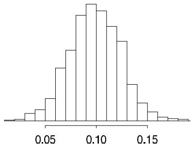  
Figure 3.2 Histogram of values of $(\theta_{1} - \theta_{2})$ for 1000 simulations from the posterior distribution for the election polling example.

presidential election. Out of 1447 persons, $y_{1} = 727$ supported George Bush, $y_{2} = 583$ supported Michael Dukakis, and $y_{3} = 137$ supported other candidates or expressed no opinion. Assuming no other information on the respondents, the 1447 observations are exchangeable. If we also assume simple random sampling (that is, 1447 names 'drawn out of a hat'), then the data $(y_{1}, y_{2}, y_{3})$ follow a multinomial distribution, with parameters $(\theta_{1}, \theta_{2}, \theta_{3})$ , the proportions of Bush supporters, Dukakis supporters, and those with no opinion in the survey population. An estimand of interest is $\theta_{1} - \theta_{2}$ , the population difference in support for the two major candidates.

With a noninformative uniform prior distribution on $\theta$ , $\alpha_{1} = \alpha_{2} = \alpha_{3} = 1$ , the posterior distribution for $(\theta_{1},\theta_{2},\theta_{3})$ is Dirichlet(728, 584, 138). We could compute the posterior distribution of $\theta_{1} - \theta_{2}$ by integration, but it is simpler just to draw 1000 points $(\theta_{1},\theta_{2},\theta_{3})$ from the posterior Dirichlet distribution and then compute $\theta_{1} - \theta_{2}$ for each. The result is displayed in Figure 3.2. All of the 1000 simulations had $\theta_{1} > \theta_{2}$ ; thus, the estimated posterior probability that Bush had more support than Dukakis in the survey population is over $99.9\%$ .

In fact, the CBS survey does not use independent random sampling but rather uses a variant of a stratified sampling plan. We discuss an improved analysis of this survey, using some knowledge of the sampling scheme, in Section 8.3 (see Table 8.2 on page 207).

In complicated problems—for example, analyzing the results of many survey questions simultaneously—the number of multinomial categories, and thus parameters, becomes so large that it is hard to usefully analyze a dataset of moderate size without additional structure in the model. Formally, additional information can enter the analysis through the prior distribution or the sampling model. An informative prior distribution might be used to improve inference in complicated problems, using the ideas of hierarchical modeling introduced in Chapter 5. Alternatively, loglinear models can be used to impose structure on multinomial parameters that result from cross-classifying several survey questions; Section 16.7 provides details and an example.

# 3.5 Multivariate normal model with known variance

Here we give a somewhat formal account of the distributional results of Bayesian inference for the parameters of a multivariate normal distribution. In many ways, these results parallel those already given for the univariate normal model, but there are some important new aspects that play a major role in the analysis of linear models, which is the central activity of much applied statistical work (see Chapters 5, 14, and 15). This section can be viewed at this point as reference material for future chapters.

Multivariate normal likelihood

The basic model to be discussed concerns an observable vector $y$ of $d$ components, with the multivariate normal distribution,

$$
y | \mu , \Sigma \sim \mathrm {N} (\mu , \Sigma), \tag {3.10}
$$

where $\mu$ is a (column) vector of length $d$ and $\Sigma$ is a $d\times d$ variance matrix, which is symmetric and positive definite. The likelihood function for a single observation is

$$
p (y | \mu , \Sigma) \propto | \Sigma | ^ {- 1 / 2} \exp \left(- \frac {1}{2} (y - \mu) ^ {T} \Sigma^ {- 1} (y - \mu)\right),
$$

and for a sample of $n$ independent and identically distributed observations, $y_{1},\ldots ,y_{n}$ , is

$$
\begin{array}{l} p \left(y _ {1}, \dots , y _ {n} \mid \mu , \Sigma\right) \propto | \Sigma | ^ {- n / 2} \exp \left(- \frac {1}{2} \sum_ {i = 1} ^ {n} \left(y _ {i} - \mu\right) ^ {T} \Sigma^ {- 1} \left(y _ {i} - \mu\right)\right) \\ = | \Sigma | ^ {- n / 2} \exp \left(- \frac {1}{2} \operatorname {t r} \left(\Sigma^ {- 1} S _ {0}\right)\right), \tag {3.11} \\ \end{array}
$$

where $S_0$ is the matrix of 'sums of squares' relative to $\mu$ ,

$$
S _ {0} = \sum_ {i = 1} ^ {n} \left(y _ {i} - \mu\right) \left(y _ {i} - \mu\right) ^ {T}. \tag {3.12}
$$

# Conjugate analysis

As with the univariate normal model, we analyze the multivariate normal model by first considering the case of known $\Sigma$ .

Conjugate prior distribution for $\mu$ with known $\Sigma$ . The log-likelihood is a quadratic form in $\mu$ , and therefore the conjugate prior distribution for $\mu$ is the multivariate normal distribution, which we parameterize as $\mu \sim \mathrm{N}(\mu_0, \Lambda_0)$ .

Posterior distribution for $\mu$ with known $\Sigma$ . The posterior distribution of $\mu$ is

$$
p (\mu | y, \Sigma) \propto \exp \left(- \frac {1}{2} \left((\mu - \mu_ {0}) ^ {T} \Lambda_ {0} ^ {- 1} (\mu - \mu_ {0}) + \sum_ {i = 1} ^ {n} (y _ {i} - \mu) ^ {T} \Sigma^ {- 1} (y _ {i} - \mu)\right)\right),
$$

which is an exponential of a quadratic form in $\mu$ . Completing the quadratic form and pulling out constant factors (see Exercise 3.13) gives

$$
\begin{array}{l} p (\mu | y, \Sigma) \propto \exp \left(- \frac {1}{2} (\mu - \mu_ {n}) ^ {T} \Lambda_ {n} ^ {- 1} (\mu - \mu_ {n})\right) \\ = \mathrm {N} (\mu | \mu_ {n}, \Lambda_ {n}), \\ \end{array}
$$

where

$$
\begin{array}{l} \mu_ {n} = \left(\Lambda_ {0} ^ {- 1} + n \Sigma^ {- 1}\right) ^ {- 1} \left(\Lambda_ {0} ^ {- 1} \mu_ {0} + n \Sigma^ {- 1} \bar {y}\right) \\ \Lambda_ {n} ^ {- 1} = \Lambda_ {0} ^ {- 1} + n \Sigma^ {- 1}. \tag {3.13} \\ \end{array}
$$

These are similar to the results for the univariate normal model in Section 2.5, the posterior mean being a weighted average of the data and the prior mean, with weights given by the data and prior precision matrices, $n\Sigma^{-1}$ and $\Lambda_0^{-1}$ , respectively. The posterior precision is the sum of the prior and data precisions.

Posterior conditional and marginal distributions of subvectors of $\mu$ with known $\Sigma$ . It follows from the properties of the multivariate normal distribution (see Appendix A) that the marginal posterior distribution of a subset of the parameters, $\mu^{(1)}$ say, is also multivariate normal, with mean vector equal to the appropriate subvector of the posterior mean vector $\mu_{n}$ and variance matrix equal to the appropriate submatrix of $\Lambda_{n}$ . Also, the conditional posterior distribution of a subset $\mu^{(1)}$ given the values of a second subset $\mu^{(2)}$ is multivariate normal. If we write superscripts in parentheses to indicate appropriate subvectors and submatrices, then

$$
\mu^ {(1)} \mid \mu^ {(2)}, y \sim \mathrm {N} \left(\mu_ {n} ^ {(1)} + \beta^ {1 | 2} \left(\mu^ {(2)} - \mu_ {n} ^ {(2)}\right), \Lambda^ {1 | 2}\right), \tag {3.14}
$$

where the regression coefficients $\beta^{1|2}$ and conditional variance matrix $\Lambda^{1|2}$ are defined by

$$
\begin{array}{l} \beta^ {1 | 2} = \Lambda_ {n} ^ {(1 2)} \left(\Lambda_ {n} ^ {(2 2)}\right) ^ {- 1} \\ {\Lambda^ {1 | 2}} = {\Lambda_ {n} ^ {(1 1)} - \Lambda_ {n} ^ {(1 2)} \left(\Lambda_ {n} ^ {(2 2)}\right) ^ {- 1} \Lambda_ {n} ^ {(2 1)}.} \\ \end{array}
$$

Posterior predictive distribution for new data. We now work out the analytic form of the posterior predictive distribution for a new observation $\tilde{y} \sim \mathrm{N}(\mu, \Sigma)$ . As with the univariate normal, we first note that the joint distribution, $p(\tilde{y}, \mu | y) = \mathrm{N}(\tilde{y} | \mu, \Sigma) \mathrm{N}(\mu | \mu_n, \Lambda_n)$ , is the exponential of a quadratic form in $(\tilde{y}, \mu)$ ; hence $(\tilde{y}, \mu)$ have a joint normal posterior distribution, and so the marginal posterior distribution of $\tilde{y}$ is (multivariate) normal. We are still assuming the variance matrix $\Sigma$ is known. As in the univariate case, we can determine the posterior mean and variance of $\tilde{y}$ using (2.7) and (2.8):

$$
\begin{array}{l} \operatorname {E} (\tilde {y} | y) = \operatorname {E} (\operatorname {E} (\tilde {y} | \mu , y) | y) \\ = \mathrm {E} (\mu | y) = \mu_ {n}, \\ \end{array}
$$

and

$$
\begin{array}{l} \operatorname {v a r} (\tilde {y} | y) = \operatorname {E} \left(\operatorname {v a r} (\tilde {y} | \mu , y) | y\right) + \operatorname {v a r} \left(\operatorname {E} (\tilde {y} | \mu , y) | y\right) \\ = \mathrm {E} (\Sigma | y) + \operatorname {v a r} (\mu | y) = \Sigma + \Lambda_ {n}. \\ \end{array}
$$

To sample from the posterior distribution or the posterior predictive distribution, refer to Appendix A for a method of generating random draws from a multivariate normal distribution with specified mean and variance matrix.

Noninformative prior density for $\mu$ . A noninformative uniform prior density for $\mu$ is $p(\mu) \propto$ constant, obtained in the limit as the prior precision tends to zero in the sense $|\Lambda_0^{-1}| \to 0$ ; in the limit of infinite prior variance (zero prior precision), the prior mean is irrelevant. The posterior density is then proportional to the likelihood (3.11). This is a proper posterior distribution only if $n \geq d$ , that is, if the sample size is greater than or equal to the dimension of the multivariate normal; otherwise the matrix $S_0$ is not full rank. If $n \geq d$ , the posterior distribution for $\mu$ , given the uniform prior density, is $\mu|\Sigma, y \sim \mathrm{N}(\overline{y}, \Sigma / n)$ .

# 3.6 Multivariate normal with unknown mean and variance

Conjugate inverse-Wishart family of prior distributions

Recall that the conjugate distribution for the univariate normal with unknown mean and variance is the normal-inverse- $\chi^2$ distribution (3.6). We can use the inverse-Wishart distribution, a multivariate generalization of the scaled inverse- $\chi^2$ , to describe the prior dis

distribution of the matrix $\Sigma$ . The conjugate prior distribution for $(\mu, \Sigma)$ , the normal-inverse-Wishart, is conveniently parameterized in terms of hyperparameters $(\mu_0, \Lambda_0 / \kappa_0; \nu_0, \Lambda_0)$ :

$$
\Sigma \sim \mathrm {I n v - W i s h a r t} _ {\nu_ {0}} (\Lambda_ {0} ^ {- 1})
$$

$$
\mu | \Sigma \sim \mathrm {N} (\mu_ {0}, \Sigma / \kappa_ {0}),
$$

which corresponds to the joint prior density

$$
p (\mu , \Sigma) \propto | \Sigma | ^ {- ((\nu_ {0} + d) / 2 + 1)} \exp \biggl (- \frac {1}{2} \mathrm {t r} (\Lambda_ {0} \Sigma^ {- 1}) - \frac {\kappa_ {0}}{2} (\mu - \mu_ {0}) ^ {T} \Sigma^ {- 1} (\mu - \mu_ {0}) \biggr).
$$

The parameters $\nu_{0}$ and $\Lambda_0$ describe the degrees of freedom and the scale matrix for the inverse-Wishart distribution on $\Sigma$ . The remaining parameters are the prior mean, $\mu_0$ , and the number of prior measurements, $\kappa_0$ , on the $\Sigma$ scale. Multiplying the prior density by the normal likelihood results in a posterior density of the same family with parameters

$$
\mu_ {n} = \frac {\kappa_ {0}}{\kappa_ {0} + n} \mu_ {0} + \frac {n}{\kappa_ {0} + n} \overline {{y}}
$$

$$
\kappa_ {n} = \kappa_ {0} + n
$$

$$
\nu_ {n} = \nu_ {0} + n
$$

$$
{\Lambda_ {n}} = {\Lambda_ {0} + S + \frac {\kappa_ {0} n}{\kappa_ {0} + n} (\overline {{y}} - \mu_ {0}) (\overline {{y}} - \mu_ {0}) ^ {T},}
$$

where $S$ is the sum of squares matrix about the sample mean,

$$
S = \sum_ {i = 1} ^ {n} \left(y _ {i} - \bar {y}\right) \left(y _ {i} - \bar {y}\right) ^ {T}.
$$

Other results from the univariate normal easily generalize to the multivariate case. The marginal posterior distribution of $\mu$ is multivariate $t_{\nu_n - d + 1}(\mu_n, \Lambda_n / (\kappa_n(\nu_n - d + 1)))$ . The posterior predictive distribution of a new observation $\tilde{y}$ is also multivariate $t$ with an additional factor of $\kappa_n + 1$ in the numerator of the scale matrix. Samples from the joint posterior distribution of $(\mu, \Sigma)$ are easily obtained using the following procedure: first, draw $\Sigma | y \sim \mathrm{Inv-Wishart}_{\nu_n}(\Lambda_n^{-1})$ , then draw $\mu | \Sigma, y \sim \mathrm{N}(\mu_n, \Sigma / \kappa_n)$ . See Appendix A for drawing from inverse-Wishart and multivariate normal distributions. To draw from the posterior predictive distribution of a new observation, draw $\tilde{y} | \mu, \Sigma, y \sim \mathrm{N}(\mu, \Sigma)$ , given the already drawn values of $\mu$ and $\Sigma$ .

# Different noninformative prior distributions

Inverse-Wishart with $d + 1$ degrees of freedom. Setting $\Sigma \sim \mathrm{Inv - Wishart}_{d + 1}(I)$ has the appealing feature that each of the correlations in $\Sigma$ has, marginally, a uniform prior distribution. (The joint distribution is not uniform, however, because of the constraint that the correlation matrix be positive definite.)

Inverse-Wishart with $d - 1$ degrees of freedom. Another proposed noninformative prior distribution is the multivariate Jeffreys prior density,

$$
p (\mu , \Sigma) \propto | \Sigma | ^ {- (d + 1) / 2},
$$

which is the limit of the conjugate prior density as $\kappa_0\to 0$ , $\nu_{0}\rightarrow -1$ , $|\Lambda_0|\to 0$ . The corresponding posterior distribution can be written as

$$
\Sigma | y \sim \operatorname {I n v - W i s h a r t} _ {n - 1} (S ^ {- 1})
$$

$$
\begin{array}{r c l} \mu | \Sigma , y & \sim & \mathrm {N} (\overline {{y}}, \Sigma / n). \end{array}
$$

Results for the marginal distribution of $\mu$ and the posterior predictive distribution of $\tilde{y}$ , assuming that the posterior distribution is proper, follow from the previous paragraph. For example, the marginal posterior distribution of $\mu$ is multivariate $t_{n - d}(\overline{y},S / (n(n - d)))$ .

Table 3.1: Bioassay data from Racine et al. (1986).   

<table><tr><td>Dose, xi(log g/ml)</td><td>Number of animals, ni</td><td>Number of deaths, yi</td></tr><tr><td>-0.86</td><td>5</td><td>0</td></tr><tr><td>-0.30</td><td>5</td><td>1</td></tr><tr><td>-0.05</td><td>5</td><td>3</td></tr><tr><td>0.73</td><td>5</td><td>5</td></tr></table>

# Scaled inverse-Wishart model

When modeling covariance matrices it can help to extend the inverse-Wishart model by multiplying by a set of scale parameters that can be modeled separately. This gives flexibility in modeling and allows one to set up a uniform or weak prior distribution on correlations without overly constraining the variance parameters. The scaled inverse-Wishart model for $\Sigma$ has the form,

$$
\Sigma = \mathrm {D i a g} (\xi) \Sigma_ {\eta} \mathrm {D i a g} (\xi),
$$

where $\Sigma_{\eta}$ is given an inverse-Wishart prior distribution (one choice is $\mathrm{Inv - Wishart}_{d + 1}(I)$ , so that the marginal distributions of the correlations are uniform) and then the scale parameters $\xi$ can be given weakly informative priors themselves. We discuss further in Section 15.4 in the context of varying-intercept, varying-slope hierarchical regression models.

# 3.7 Example: analysis of a bioassay experiment

Beyond the normal distribution, few multiparameter sampling models allow simple explicit calculation of posterior distributions. Data analysis for such models is possible using the computational methods described in Part III of this book. Here we present an example of a nonconjugate model for a bioassay experiment, drawn from the literature on applied Bayesian statistics. The model is a two-parameter example from the broad class of generalized linear models to be considered more thoroughly in Chapter 16. We use a particularly simple simulation approach, approximating the posterior distribution by a discrete distribution supported on a two-dimensional grid of points, that provides sufficiently accurate inferences for this two-parameter example.

# The scientific problem and the data

In the development of drugs and other chemical compounds, acute toxicity tests or bioassay experiments are commonly performed on animals. Such experiments proceed by administering various dose levels of the compound to batches of animals. The animals' responses are typically characterized by a dichotomous outcome: for example, alive or dead, tumor or no tumor. An experiment of this kind gives rise to data of the form

$$
(x _ {i}, n _ {i}, y _ {i}); i = 1, \dots , k,
$$

where $x_{i}$ represents the $i$ th of $k$ dose levels (often measured on a logarithmic scale) given to $n_i$ animals, of which $y_{i}$ subsequently respond with positive outcome. An example of real data from such an experiment is shown in Table 3.1: twenty animals were tested, five at each of four dose levels.

# Modeling the dose-response relation

Given what we have seen so far, we must model the outcomes of the five animals within each group $i$ as exchangeable, and it seems reasonable to model them as independent with

equal probabilities, which implies that the data points $y_{i}$ are binomially distributed:

$$
y _ {i} | \theta_ {i} \sim \operatorname {B i n} (n _ {i}, \theta_ {i}),
$$

where $\theta_{i}$ is the probability of death for animals given dose $x_{i}$ . (An example of a situation in which independence and the binomial model would not be appropriate is if the deaths were caused by a contagious disease.) For this experiment, it is also reasonable to treat the outcomes in the four groups as independent of each other, given the parameters $\theta_{1},\ldots ,\theta_{4}$ .

The simplest analysis would treat the four parameters $\theta_{i}$ as exchangeable in their prior distribution, perhaps using a noninformative density such as $p(\theta_1,\dots ,\theta_4)\propto 1$ , in which case the parameters $\theta_{i}$ would have independent beta posterior distributions. The exchangeable prior model for the $\theta_{i}$ parameters has a serious flaw, however; we know the dose level $x_{i}$ for each group $i$ , and one would expect the probability of death to vary systematically as a function of dose.

The simplest model of the dose-response relation—that is, the relation of $\theta_{i}$ to $x_{i}$ —is linear: $\theta_{i} = \alpha + \beta x_{i}$ . Unfortunately, this model has the flaw that at low or high doses, $x_{i}$ approaches $\pm \infty$ (recall that the dose is measured on the log scale), whereas $\theta_{i}$ , being a probability, must be constrained to lie between 0 and 1. The standard solution is to use a transformation of the $\theta$ 's, such as the logistic, in the dose-response relation:

$$
\operatorname {l o g i t} \left(\theta_ {i}\right) = \alpha + \beta x _ {i}, \tag {3.15}
$$

where $\mathrm{logit}(\theta_i) = \mathrm{log}(\theta_i / (1 - \theta_i))$ as defined in (1.10). This is called a logistic regression model.

# The likelihood

Under the model (3.15), we can write the sampling distribution, or likelihood, for each group $i$ in terms of the parameters $\alpha$ and $\beta$ as

$$
p \left(y _ {i} \mid \alpha , \beta , n _ {i}, x _ {i}\right) \propto [ \log \mathrm {i t} ^ {- 1} (\alpha + \beta x _ {i}) ] ^ {y _ {i}} \left[ 1 - \log \mathrm {i t} ^ {- 1} (\alpha + \beta x _ {i}) \right] ^ {n _ {i} - y _ {i}}.
$$

The model is characterized by the parameters $\alpha$ and $\beta$ , whose joint posterior distribution is

$$
\begin{array}{l} p (\alpha , \beta | y, n, x) \propto p (\alpha , \beta | n, x) p (y | \alpha , \beta , n, x) \tag {3.16} \\ \propto \quad p (\alpha , \beta) \prod_ {i = 1} ^ {k} p (y _ {i} | \alpha , \beta , n _ {i}, x _ {i}). \\ \end{array}
$$

We consider the sample sizes $n_i$ and dose levels $x_i$ as fixed for this analysis and suppress the conditioning on $(n, x)$ in subsequent notation.

# The prior distribution

We present an analysis based on a prior distribution for $(\alpha, \beta)$ that is independent and locally uniform in the two parameters; that is, $p(\alpha, \beta) \propto 1$ . In practice, we might use a uniform prior distribution if we really have no prior knowledge about the parameters, or if we want to present a simple analysis of this experiment alone. If the analysis using the noninformative prior distribution is insufficiently precise, we may consider using other sources of substantive information (for example, from other bioassay experiments) to construct an informative prior distribution.

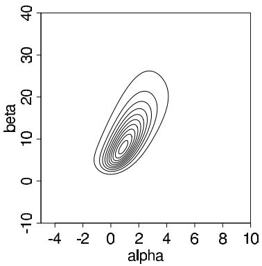

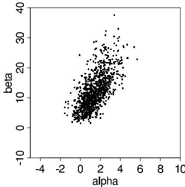  
Figure 3.3 (a) Contour plot for the posterior density of the parameters in the bioassay example. Contour lines are at $0.05, 0.15, \ldots, 0.95$ times the density at the mode. (b) Scatterplot of 1000 draws from the posterior distribution.

# A rough estimate of the parameters

We will compute the joint posterior distribution (3.16) at a grid of points $(\alpha, \beta)$ , but before doing so, it is a good idea to get a rough estimate of $(\alpha, \beta)$ so we know where to look. To obtain the rough estimate, we use existing software to perform a logistic regression; that is, finding the maximum likelihood estimate of $(\alpha, \beta)$ in (3.16) for the four data points in Table 3.1. The estimate is $(\hat{\alpha}, \hat{\beta}) = (0.8, 7.7)$ , with standard errors of 1.0 and 4.9 for $\alpha$ and $\beta$ , respectively.

# Obtaining a contour plot of the joint posterior density

We are now ready to compute the posterior density at a grid of points $(\alpha, \beta)$ . After some experimentation, we use the range $(\alpha, \beta) \in [-5, 10] \times [-10, 40]$ , which captures almost all the mass of the posterior distribution. The resulting contour plot appears in Figure 3.3a; a general justification for setting the lowest contour level at 0.05 for two-dimensional plots appears on page 85 in Section 4.1.

# Sampling from the joint posterior distribution

Having computed the unnormalized posterior density at a grid of values that cover the effective range of $(\alpha, \beta)$ , we can normalize by approximating the distribution as a step function over the grid and setting the total probability in the grid to 1. We sample 1000 random draws $(\alpha^s, \beta^s)$ from the posterior distribution using the following procedure.

1. Compute the marginal posterior distribution of $\alpha$ by numerically summing over $\beta$ in the discrete distribution computed on the grid of Figure 3.3a.   
2. For $s = 1,\dots ,1000$

(a) Draw $\alpha^s$ from the discretely computed $p(\alpha |y)$ ; this can be viewed as a discrete version of the inverse cdf method described in Section 1.9.   
(b) Draw $\beta^s$ from the discrete conditional distribution, $p(\beta | \alpha, y)$ , given the just-sampled value of $\alpha$ .   
(c) For each of the sampled $\alpha$ and $\beta$ , add a uniform random jitter centered at zero with a width equal to the spacing of the sampling grid. This gives the simulation draws a continuous distribution.

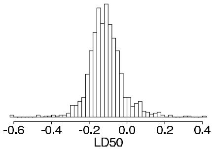  
Figure 3.4 Histogram of the draws from the posterior distribution of the LD50 (on the scale of log dose in $g / ml$ ) in the bioassay example, conditional on the parameter $\beta$ being positive.

The 1000 draws $(\alpha^s, \beta^s)$ are displayed on a scatterplot in Figure 3.3b. The scale of the plot, which is the same as the scale of Figure 3.3a, has been set large enough that all the 1000 draws would fit on the graph.

There are a number of practical considerations when applying this two-dimensional grid approximation. There can be difficulty finding the correct location and scale for the grid points. A grid that is defined on too small an area may miss important features of the posterior distribution that fall outside the grid. A grid defined on a large area with wide intervals between points can miss important features that fall between the grid points. It is also important to avoid overflow and underflow operations when computing the posterior distribution. It is usually a good idea to compute the logarithm of the unnormalized posterior distribution and subtract off the maximum value before exponentiating. This creates an unnormalized discrete approximation with maximum value 1, which can then be normalized (by setting the total probability in the grid to 1).

# The posterior distribution of the LD50

A parameter of common interest in bioassay studies is the LD50—the dose level at which the probability of death is $50\%$ . In our logistic model, a $50\%$ survival rate means

$$
\text {L D 5 0 :} \quad \mathrm {E} \left(\frac {y _ {i}}{n _ {i}}\right) = \operatorname {l o g i t} ^ {- 1} (\alpha + \beta x _ {i}) = 0. 5;
$$

thus, $\alpha + \beta x_{i} = \mathrm{logit}(0.5) = 0$ , and the LD50 is $x_{i} = -\alpha / \beta$ . Computing the posterior distribution of any summaries in the Bayesian approach is straightforward, as discussed at the end of Section 1.9. Given what we have done so far, simulating the posterior distribution of the LD50 is trivial: we just compute $-\alpha / \beta$ for the 1000 draws of $(\alpha, \beta)$ pictured in Figure 3.3b.

Difficulties with the LD50 parameterization if the drug is beneficial. In the context of this example, LD50 is a meaningless concept if $\beta \leq 0$ , in which case increasing the dose does not cause the probability of death to increase. If we were certain that the drug could not cause the tumor rate to decrease, we should constrain the parameter space to exclude values of $\beta$ less than 0. However, it seems more reasonable here to allow the possibility of $\beta \leq 0$ and just note that LD50 is hard to interpret in this case.

We summarize the inference on the LD50 scale by reporting two results: (1) the posterior probability that $\beta > 0$ —that is, that the drug is harmful—and (2) the posterior distribution for the LD50 conditional on $\beta > 0$ . All of the 1000 simulation draws had positive values of $\beta$ , so the posterior probability that $\beta > 0$ is roughly estimated to exceed 0.999. We compute the LD50 for the simulation draws with positive values of $\beta$ (which happen to be all 1000

draws for this example); a histogram is displayed in Figure 3.4. This example illustrates that the marginal posterior mean is not always a good summary of inference about a parameter. We are not, in general, interested in the posterior mean of the LD50, because the posterior mean includes the cases in which the dose-response relation is negative.

# 3.8 Summary of elementary modeling and computation

The lack of multiparameter models permitting easy calculation of posterior distributions is not a major practical handicap for three main reasons. First, when there are few parameters, posterior inference in nonconjugate multiparameter models can be obtained by simple simulation methods, as we have seen in the bioassay example. Second, sophisticated models can often be represented in a hierarchical or conditional manner, as we shall see in Chapter 5, for which effective computational strategies are available (as we discuss in general in Part III). Finally, as we discuss in Chapter 4, we can often apply a normal approximation to the posterior distribution, and therefore the conjugate structure of the normal model can play an important role in practice, well beyond its application to explicitly normal sampling models.

Our successful analysis of the bioassay example suggests the following strategy for computation of simple Bayesian posterior distributions. What follows is not truly a general approach, but it summarizes what we have done so far and foreshadows the general methods—based on successive approximations—presented in Part III.

1. Write the likelihood part of the model, $p(y|\theta)$ , ignoring any factors that are free of $\theta$ .   
2. Write the posterior density, $p(\theta | y) \propto p(\theta) p(y|\theta)$ . If prior information is well-formulated, include it in $p(\theta)$ . Otherwise use a weakly informative prior distribution or temporarily set $p(\theta) \propto$ constant, with the understanding that the prior density can be altered later to include additional information or structure.   
3. Create a crude estimate of the parameters, $\theta$ , for use as a starting point and a comparison to the computation in the next step.   
4. Draw simulations $\theta^1, \ldots, \theta^S$ , from the posterior distribution. Use the sample draws to compute the posterior density of any functions of $\theta$ that may be of interest.   
5. If any predictive quantities, $\tilde{y}$ , are of interest, simulate $\tilde{y}^1, \ldots, \tilde{y}^S$ by drawing each $\tilde{y}^s$ from the sampling distribution conditional on the drawn value $\theta^s$ , $p(\tilde{y} | \theta^s)$ . In Chapter 6, we discuss how to use posterior simulations of $\theta$ and $\tilde{y}$ to check the fit of the model to data and substantive knowledge.

For nonconjugate models, step 4 above can be difficult. Various methods have been developed to draw posterior simulations in complicated models, as we discuss in Part III. Occasionally, high-dimensional problems can be solved by combining analytical and numerical simulation methods. If $\theta$ has only one or two components, it is possible to draw simulations by computing on a grid, as we illustrated in the previous section for the bioassay example.

# 3.9 Bibliographic note

Chapter 2 of Box and Tiao (1973) thoroughly treats the univariate and multivariate normal distribution problems and also some related problems such as estimating the difference between two means and the ratio between two variances. At the time that book was written, computer simulation methods were much less convenient than they are now, and so Box and Tiao, and other Bayesian authors of the period, restricted their attention to conjugate families and devoted much effort to deriving analytic forms of marginal posterior densities.

Table 3.2 Number of respondents in each preference category from ABC News pre- and post-debate surveys in 1988.   

<table><tr><td>Survey</td><td>Bush</td><td>Dukakis</td><td>No opinion/other</td><td>Total</td></tr><tr><td>pre-debate</td><td>294</td><td>307</td><td>38</td><td>639</td></tr><tr><td>post-debate</td><td>288</td><td>332</td><td>19</td><td>639</td></tr></table>

Many textbooks on multivariate analysis discuss the unique mathematical features of the multivariate normal distribution, such as the property that all marginal and conditional distributions of components of a multivariate normal vector are normal; for example, see Mardia, Kent, and Bibby (1979).

Simon Newcomb's data, along with a discussion of his experiment, appear in Stigler (1977).

The multinomial model and corresponding informative and noninformative prior distributions are discussed by Good (1965) and Fienberg (1977); also see the bibliographic note on loglinear models at the end of Chapter 16.

The data and model for the bioassay example appear in Racine et al. (1986), an article that presents several examples of simple Bayesian analyses that have been useful in the pharmaceutical industry.

# 3.10 Exercises

1. Binomial and multinomial models: suppose data $(y_{1},\ldots ,y_{J})$ follow a multinomial distribution with parameters $(\theta_{1},\dots,\theta_{J})$ . Also suppose that $\theta = (\theta_{1},\dots,\theta_{J})$ has a Dirichlet prior distribution. Let $\alpha = \frac{\theta_1}{\theta_1 + \theta_2}$

(a) Write the marginal posterior distribution for $\alpha$   
(b) Show that this distribution is identical to the posterior distribution for $\alpha$ obtained by treating $y_{1}$ as an observation from the binomial distribution with probability $\alpha$ and sample size $y_{1} + y_{2}$ , ignoring the data $y_{3},\ldots ,y_{J}$ .

This result justifies the application of the binomial distribution to multinomial problems when we are only interested in two of the categories; for example, see the next problem.

2. Comparison of two multinomial observations: on September 25, 1988, the evening of a presidential campaign debate, ABC News conducted a survey of registered voters in the United States; 639 persons were polled before the debate, and 639 different persons were polled after. The results are displayed in Table 3.2. Assume the surveys are independent simple random samples from the population of registered voters. Model the data with two different multinomial distributions. For $j = 1,2$ , let $\alpha_{j}$ be the proportion of voters who preferred Bush, out of those who had a preference for either Bush or Dukakis at the time of survey $j$ . Plot a histogram of the posterior density for $\alpha_{2} - \alpha_{1}$ . What is the posterior probability that there was a shift toward Bush?

3. Estimation from two independent experiments: an experiment was performed on the effects of magnetic fields on the flow of calcium out of chicken brains. Two groups of chickens were involved: a control group of 32 chickens and an exposed group of 36 chickens. One measurement was taken on each chicken, and the purpose of the experiment was to measure the average flow $\mu_{c}$ in untreated (control) chickens and the average flow $\mu_{t}$ in treated chickens. The 32 measurements on the control group had a sample mean of 1.013 and a sample standard deviation of 0.24. The 36 measurements on the treatment group had a sample mean of 1.173 and a sample standard deviation of 0.20.

(a) Assuming the control measurements were taken at random from a normal distribution with mean $\mu_c$ and variance $\sigma_c^2$ , what is the posterior distribution of $\mu_c$ ? Similarly, use

the treatment group measurements to determine the marginal posterior distribution of $\mu_t$ . Assume a uniform prior distribution on $(\mu_c, \mu_t, \log \sigma_c, \log \sigma_t)$ .

(b) What is the posterior distribution for the difference, $\mu_t - \mu_c$ ? To get this, you may sample from the independent $t$ distributions you obtained in part (a) above. Plot a histogram of your samples and give an approximate $95\%$ posterior interval for $\mu_t - \mu_c$ . The problem of estimating two normal means with unknown ratio of variances is called the Behrens-Fisher problem.

4. Inference for a $2 \times 2$ table: an experiment was performed to estimate the effect of beta-blockers on mortality of cardiac patients. A group of patients were randomly assigned to treatment and control groups: out of 674 patients receiving the control, 39 died, and out of 680 receiving the treatment, 22 died. Assume that the outcomes are independent and binomially distributed, with probabilities of death of $p_0$ and $p_1$ under the control and treatment, respectively. We return to this example in Section 5.6.

(a) Set up a noninformative prior distribution on $(p_0,p_1)$ and obtain posterior simulations.   
(b) Summarize the posterior distribution for the odds ratio, $(p_1 / (1 - p_1)) / (p_0 / (1 - p_0))$   
(c) Discuss the sensitivity of your inference to your choice of noninformative prior density.

5. Rounded data: it is a common problem for measurements to be observed in rounded form (for a review, see Heitjan, 1989). For a simple example, suppose we weigh an object five times and measure weights, rounded to the nearest pound, of 10, 10, 12, 11, 9. Assume the unrounded measurements are normally distributed with a noninformative prior distribution on the mean $\mu$ and variance $\sigma^2$ .

(a) Give the posterior distribution for $(\mu, \sigma^2)$ obtained by pretending that the observations are exact unrounded measurements.   
(b) Give the correct posterior distribution for $(\mu, \sigma^2)$ treating the measurements as rounded.   
(c) How do the incorrect and correct posterior distributions differ? Compare means, variances, and contour plots.   
(d) Let $z = (z_{1},\ldots ,z_{5})$ be the original, unrounded measurements corresponding to the five observations above. Draw simulations from the posterior distribution of $z$ . Compute the posterior mean of $(z_{1} - z_{2})^{2}$ .

6. Binomial with unknown probability and sample size: some of the difficulties with setting prior distributions in multiparameter models can be illustrated with the simple binomial distribution. Consider data $y_{1},\ldots ,y_{n}$ modeled as independent $\operatorname {Bin}(N,\theta)$ , with both $N$ and $\theta$ unknown. Defining a convenient family of prior distributions on $(N,\theta)$ is difficult, partly because of the discreteness of $N$ .

Raftery (1988) considers a hierarchical approach based on assigning the parameter $N$ to a Poisson distribution with unknown mean $\mu$ . To define a prior distribution on $(\theta, N)$ , Raftery defines $\lambda = \mu \theta$ and specifies a prior distribution on $(\lambda, \theta)$ . The prior distribution is specified in terms of $\lambda$ rather than $\mu$ because 'it would seem easier to formulate prior information about $\lambda$ , the unconditional expectation of the observations, than about $\mu$ , the mean of the unobserved quantity $N$ .

(a) A suggested noninformative prior distribution is $p(\lambda, \theta) \propto \lambda^{-1}$ . What is a motivation for this noninformative distribution? Is the distribution improper? Transform to determine $p(N, \theta)$ .   
(b) The Bayesian method is illustrated on counts of waterbuck obtained by remote photography on five separate days in Kruger Park in South Africa. The counts were 53, 57, 66, 67, and 72. Perform the Bayesian analysis on these data and display a scatterplot of posterior simulations of $(N,\theta)$ . What is the posterior probability that $N > 100$ ?   
(c) Why not simply use a Poisson with fixed $\mu$ as a prior distribution for $N$ ?

Table 3.3 Counts of bicycles and other vehicles in one hour in each of 10 city blocks in each of six categories. (The data for two of the residential blocks were lost.) For example, the first block had 16 bicycles and 58 other vehicles, the second had 9 bicycles and 90 other vehicles, and so on. Streets were classified as 'residential,' 'fairly busy,' or 'busy' before the data were gathered.   

<table><tr><td>Type of street</td><td>Bike route?</td><td>Counts of bicycles/other vehicles</td></tr><tr><td>Residential</td><td>yes</td><td>16/58, 9/90, 10/48, 13/57, 19/103, 20/57, 18/86, 17/112, 35/273, 55/64</td></tr><tr><td>Residential</td><td>no</td><td>12/113, 1/18, 2/14, 4/44, 9/208, 7/67, 9/29, 8/154</td></tr><tr><td>Fairly busy</td><td>yes</td><td>8/29, 35/415, 31/425, 19/42, 38/180, 47/675, 44/620, 44/437, 29/47, 18/462</td></tr><tr><td>Fairly busy</td><td>no</td><td>10/557, 43/1258, 5/499, 14/601, 58/1163, 15/700, 0/90, 47/1093, 51/1459, 32/1086</td></tr><tr><td>Busy</td><td>yes</td><td>60/1545, 51/1499, 58/1598, 59/503, 53/407, 68/1494, 68/1558, 60/1706, 71/476, 63/752</td></tr><tr><td>Busy</td><td>no</td><td>8/1248, 9/1246, 6/1596, 9/1765, 19/1290, 61/2498, 31/2346, 75/3101, 14/1918, 25/2318</td></tr></table>

7. Poisson and binomial distributions: a student sits on a street corner for an hour and records the number of bicycles $b$ and the number of other vehicles $v$ that go by. Two models are considered:

- The outcomes $b$ and $v$ have independent Poisson distributions, with unknown means $\theta_b$ and $\theta_v$ .   
- The outcome $b$ has a binomial distribution, with unknown probability $p$ and sample size $b + v$ .

Show that the two models have the same likelihood if we define $p = \frac{\theta_b}{\theta_b + \theta_v}$ .

8. Analysis of proportions: a survey was done of bicycle and other vehicular traffic in the neighborhood of the campus of the University of California, Berkeley, in the spring of 1993. Sixty city blocks were selected at random; each block was observed for one hour, and the numbers of bicycles and other vehicles traveling along that block were recorded. The sampling was stratified into six types of city blocks: busy, fairly busy, and residential streets, with and without bike routes, with ten blocks measured in each stratum. Table 3.3 displays the number of bicycles and other vehicles recorded in the study. For this problem, restrict your attention to the first four rows of the table: the data on residential streets.

(a) Let $y_{1}, \ldots, y_{10}$ and $z_{1}, \ldots, z_{8}$ be the observed proportion of traffic that was on bicycles in the residential streets with bike lanes and with no bike lanes, respectively (so $y_{1} = 16 / (16 + 58)$ and $z_{1} = 12 / (12 + 113)$ , for example). Set up a model so that the $y_{i}$ 's are independent and identically distributed given parameters $\theta_{y}$ and the $z_{i}$ 's are independent and identically distributed given parameters $\theta_{z}$ .   
(b) Set up a prior distribution that is independent in $\theta_y$ and $\theta_z$ .   
(c) Determine the posterior distribution for the parameters in your model and draw 1000 simulations from the posterior distribution. (Hint: $\theta_y$ and $\theta_z$ are independent in the posterior distribution, so they can be simulated independently.)   
(d) Let $\mu_y = \operatorname{E}(y_i|\theta_y)$ be the mean of the distribution of the $y_i$ 's; $\mu_y$ will be a function of $\theta_y$ . Similarly, define $\mu_z$ . Using your posterior simulations from (c), plot a histogram of the posterior simulations of $\mu_y - \mu_z$ , the expected difference in proportions in bicycle traffic on residential streets with and without bike lanes.

We return to this example in Exercise 5.13.

9. Conjugate normal model: suppose $y$ is an independent and identically distributed sample of size $n$ from the distribution $\mathrm{N}(\mu, \sigma^2)$ , where $(\mu, \sigma^2)$ have the N-Inv- $\chi^2(\mu_0, \sigma_0^2 / \kappa_0; \nu_0, \sigma_0^2)$ prior distribution, (that is, $\sigma^2 \sim \mathrm{Inv}-\chi^2(\nu_0, \sigma_0^2)$ and $\mu | \sigma^2 \sim \mathrm{N}(\mu_0, \sigma^2 / \kappa_0)$ ). The posterior distribution, $p(\mu, \sigma^2 | y)$ , is also normal-inverse- $\chi^2$ ; derive explicitly its parameters in terms of the prior parameters and the sufficient statistics of the data.

10. Comparison of normal variances: for $j = 1,2$ , suppose that

$$
\begin{array}{l} y _ {j 1}, \dots , y _ {j n _ {j}} | \mu_ {j}, \sigma_ {j} ^ {2} \sim \text {i i d} \mathrm {N} (\mu_ {j}, \sigma_ {j} ^ {2}), \\ p (\mu_ {j}, \sigma_ {j} ^ {2}) \propto \sigma_ {j} ^ {- 2}, \\ \end{array}
$$

and $(\mu_1,\sigma_1^2)$ are independent of $(\mu_{2},\sigma_{2}^{2})$ in the prior distribution. Show that the posterior distribution of $(s_1^2 /s_2^2) / (\sigma_1^2 /\sigma_2^2)$ is $F$ with $(n_{1} - 1)$ and $(n_{2} - 1)$ degrees of freedom. (Hint: to show the required form of the posterior density, you do not need to carry along all the normalizing constants.)

11. Computation: in the bioassay example, replace the uniform prior density by a joint normal prior distribution on $(\alpha, \beta)$ , with $\alpha \sim \mathrm{N}(0, 2^2)$ , $\beta \sim \mathrm{N}(10, 10^2)$ , and $\mathrm{corr}(\alpha, \beta) = 0.5$ .

(a) Repeat all the computations and plots of Section 3.7 with this new prior distribution.   
(b) Check that your contour plot and scatterplot look like a compromise between the prior distribution and the likelihood (as displayed in Figure 3.3).   
(c) Discuss the effect of this hypothetical prior information on the conclusions in the applied context.

12. Poisson regression model: expand the model of Exercise 2.13(a) by assuming that the number of fatal accidents in year $t$ follows a Poisson distribution with mean $\alpha + \beta t$ . You will estimate $\alpha$ and $\beta$ , following the example of the analysis in Section 3.7.

(a) Discuss various choices for a 'noninformative' prior for $(\alpha, \beta)$ . Choose one.   
(b) Discuss what would be a realistic informative prior distribution for $(\alpha, \beta)$ . Sketch its contours and then put it aside. Do parts (c)-(h) of this problem using your noninformative prior distribution from (a).   
(c) Write the posterior density for $(\alpha, \beta)$ . What are the sufficient statistics?   
(d) Check that the posterior density is proper.   
(e) Calculate crude estimates and uncertainties for $(\alpha, \beta)$ using linear regression.   
(f) Plot the contours and take 1000 draws from the joint posterior density of $(\alpha, \beta)$ .   
(g) Using your samples of $(\alpha, \beta)$ , plot a histogram of the posterior density for the expected number of fatal accidents in 1986, $\alpha + 1986\beta$ .   
(h) Create simulation draws and obtain a $95\%$ predictive interval for the number of fatal accidents in 1986.   
(i) How does your hypothetical informative prior distribution in (b) differ from the posterior distribution in (f) and (g), obtained from the noninformative prior distribution and the data? If they disagree, discuss.

13. Multivariate normal model: derive equations (3.13) by completing the square in vector-matrix notation.   
14. Improper prior and proper posterior distributions: prove that the posterior density (3.16) for the bioassay example has a finite integral over the range $(\alpha, \beta) \in (-\infty, \infty) \times (-\infty, \infty)$ .   
15. Joint distributions: The autoregressive time-series model $y_{1},y_{2},\ldots$ with mean level 0, autocorrelation 0.8, residual standard deviation 1, and normal errors can be written as $(y_{t}|y_{t - 1},y_{t - 2},\dots)\sim \mathrm{N}(0.8y_{t - 1},1)$ for all $t$ .

(a) Prove that the distribution of $y_{t}$ , given the observations at all other integer time points $t$ , depends only on $y_{t-1}$ and $y_{t+1}$ .   
(b) What is the distribution of $y_{t}$ given $y_{t - 1}$ and $y_{t + 1}$ ?

# Chapter 4

# Asymptotics and connections to non-Bayesian approaches

We have seen that many simple Bayesian analyses based on noninformative prior distributions give similar results to standard non-Bayesian approaches (for example, the posterior $t$ interval for the normal mean with unknown variance). The extent to which a noninformative prior distribution can be justified as an objective assumption depends on the amount of information available in the data: in the simple cases discussed in Chapters 2 and 3, it was clear that as the sample size $n$ increases, the influence of the prior distribution on posterior inferences decreases. These ideas, sometimes referred to as asymptotic theory, because they refer to properties that hold in the limit as $n$ becomes large, will be reviewed in the present chapter, along with some more explicit discussion of the connections between Bayesian and non-Bayesian methods. The large-sample results are not actually necessary for performing Bayesian data analysis but are often useful as approximations and as tools for understanding.

We begin this chapter with a discussion of the various uses of the normal approximation to the posterior distribution. Theorems about consistency and normality of the posterior distribution in large samples are outlined in Section 4.2, followed by several counterexamples in Section 4.3; proofs of the theorems are sketched in Appendix B. Finally, we discuss how the methods of frequentist statistics can be used to evaluate the properties of Bayesian inferences.

# 4.1 Normal approximations to the posterior distribution

Normal approximation to the joint posterior distribution

If the posterior distribution $p(\theta | y)$ is unimodal and roughly symmetric, it can be convenient to approximate it by a normal distribution; that is, the logarithm of the posterior density is approximated by a quadratic function of $\theta$ .

Here we consider a quadratic approximation to the log-posterior density that is centered at the posterior mode (which in general is easy to compute using off-the-shelf optimization routines); in Chapter 13 we discuss more elaborate approximations which can be effective in settings where simple mode-based approximations fail.

A Taylor series expansion of $\log p(\theta |y)$ centered at the posterior mode, $\hat{\theta}$ (where $\theta$ can be a vector and $\hat{\theta}$ is assumed to be in the interior of the parameter space), gives

$$
\log p (\theta | y) = \log p (\hat {\theta} | y) + \frac {1}{2} (\theta - \hat {\theta}) ^ {T} \left[ \frac {d ^ {2}}{d \theta^ {2}} \log p (\theta | y) \right] _ {\theta = \hat {\theta}} (\theta - \hat {\theta}) + \dots , \tag {4.1}
$$

where the linear term in the expansion is zero because the log-posterior density has zero derivative at its mode. As we discuss in Section 4.2, the remainder terms of higher order fade in importance relative to the quadratic term when $\theta$ is close to $\hat{\theta}$ and $n$ is large. Considering

(4.1) as a function of $\theta$ , the first term is a constant, whereas the second term is proportional to the logarithm of a normal density, yielding the approximation,

$$
p (\theta | y) \approx \mathrm {N} (\hat {\theta}, [ I (\hat {\theta}) ] ^ {- 1}), \tag {4.2}
$$

where $I(\theta)$ is the observed information,

$$
I (\theta) = - \frac {d ^ {2}}{d \theta^ {2}} \log p (\theta | y).
$$

If the mode, $\hat{\theta}$ , is in the interior of parameter space, then the matrix $I(\hat{\theta})$ is positive definite.

# Example. Normal distribution with unknown mean and variance

We illustrate the approximate normal distribution with a simple theoretical example. Let $y_{1},\ldots ,y_{n}$ be independent observations from a $\mathrm{N}(\mu ,\sigma^2)$ distribution, and, for simplicity, we assume a uniform prior density for $(\mu ,\log \sigma)$ . We set up a normal approximation to the posterior distribution of $(\mu ,\log \sigma)$ , which has the virtue of restricting $\sigma$ to positive values. To construct the approximation, we need the second derivatives of the log posterior density,

$$
\log p (\mu , \log \sigma | y) = \mathrm {c o n s t a n t} - n \log \sigma - \frac {1}{2 \sigma^ {2}} ((n - 1) s ^ {2} + n (\overline {{y}} - \mu) ^ {2}).
$$

The first derivatives are

$$
\frac {d}{d \mu} \log p (\mu , \log \sigma | y) = \frac {n (\overline {{y}} - \mu)}{\sigma^ {2}},
$$

$$
\frac {d}{d (\log \sigma)} \log p (\mu , \log \sigma | y) = - n + \frac {(n - 1) s ^ {2} + n (\bar {y} - \mu) ^ {2}}{\sigma^ {2}},
$$

from which the posterior mode is readily obtained as

$$
(\hat {\mu}, \log \hat {\sigma}) = \left(\bar {y}, \log \left(\sqrt {\frac {n - 1}{n}} s\right)\right).
$$

The second derivatives of the log posterior density are

$$
\frac {d ^ {2}}{d \mu^ {2}} \log p (\mu , \log \sigma | y) = - \frac {n}{\sigma^ {2}}
$$

$$
\frac {d ^ {2}}{d \mu d (\log \sigma)} \log p (\mu , \log \sigma | y) = - 2 n \frac {\bar {y} - \mu}{\sigma^ {2}}
$$

$$
\frac {d ^ {2}}{d (\log \sigma) ^ {2}} \log p (\mu , \log \sigma | y) = - \frac {2}{\sigma^ {2}} ((n - 1) s ^ {2} + n (\bar {y} - \mu) ^ {2}).
$$

The matrix of second derivatives at the mode is then $\left( \begin{array}{cc} - n / \hat{\sigma}^2 & 0\\ 0 & -2n \end{array} \right)$ . From (4.2), the posterior distribution can be approximated as

$$
p (\mu , \log \sigma | y) \approx \mathrm {N} \left(\left( \begin{array}{c} \mu \\ \log \sigma \end{array} \right) \Big | \left( \begin{array}{c} \overline {{y}} \\ \log \hat {\sigma} \end{array} \right), \left( \begin{array}{c c} \hat {\sigma} ^ {2} / n & 0 \\ 0 & 1 / (2 n) \end{array} \right)\right).
$$

If we had instead constructed the normal approximation in terms of $p(\mu, \sigma^2)$ , the second derivative matrix would be multiplied by the Jacobian of the transformation from $\log \sigma$ to $\sigma^2$ and the mode would change slightly, to $\tilde{\sigma}^2 = \frac{n}{n + 2}\tilde{\sigma}^2$ . The two components, $(\mu, \sigma^2)$ , would still be independent in their approximate posterior distribution, and $p(\sigma^2 | y) \approx \mathrm{N}(\sigma^2 |\tilde{\sigma}^2, 2\tilde{\sigma}^4 / (n + 2))$ .

Interpretation of the posterior density function relative to its maximum

In addition to its direct use as an approximation, the multivariate normal distribution provides a benchmark for interpreting the posterior density function and contour plots. In the $d$ -dimensional normal distribution, the logarithm of the density function is a constant plus a $\chi_d^2$ distribution divided by $-2$ . For example, the 95th percentile of the $\chi_{10}^{2}$ density is 18.31, so if a problem has $d = 10$ parameters, then approximately $95\%$ of the posterior probability mass is associated with the values of $\theta$ for which $p(\theta |y)$ is no less than $\exp (-18.31 / 2) = 1.1\times 10^{-4}$ times the density at the mode. Similarly, with $d = 2$ parameters, approximately $95\%$ of the posterior mass corresponds to densities above $\exp (-5.99 / 2) = 0.05$ , relative to the density at the mode. In a two-dimensional contour plot of a posterior density (for example, Figure 3.3a), the 0.05 contour line thus includes approximately $95\%$ of the probability mass.

# Summarizing posterior distributions by point estimates and standard errors

The asymptotic theory outlined in Section 4.2 shows that if $n$ is large enough, a posterior distribution can be approximated by a normal distribution. In many areas of application, a standard inferential summary is the $95\%$ interval obtained by computing a point estimate, $\hat{\theta}$ , such as the maximum likelihood estimate (which is the posterior mode under a uniform prior density), plus or minus two standard errors, with the standard error estimated from the information at the estimate, $I(\hat{\theta})$ . A different asymptotic argument justifies the non-Bayesian, frequentist interpretation of this summary, but in many simple situations both interpretations hold. It is difficult to give general guidelines on when the normal approximation is likely to be adequate in practice. From the Bayesian point of view, the accuracy in any given example can be directly determined by inspecting the posterior distribution.

In many cases, convergence to normality of the posterior distribution for a parameter $\theta$ can be dramatically improved by transformation. If $\phi$ is a continuous transformation of $\theta$ , then both $p(\phi | y)$ and $p(\theta | y)$ approach normal distributions, but the closeness of the approximation for finite $n$ can vary substantially with the transformation chosen.

# Data reduction and summary statistics

Under the normal approximation, the posterior distribution is summarized by its mode, $\hat{\theta}$ , and the curvature of the posterior density, $I(\hat{\theta})$ ; that is, asymptotically, these are sufficient statistics. In the examples at the end of the next chapter, we shall see that it can be convenient to summarize 'local-level' or 'individual-level' data from a number of sources by their normal-theory sufficient statistics. This approach using summary statistics allows the relatively easy application of hierarchical modeling techniques to improve each individual estimate. For example, in Section 5.5, each of a set of eight experiments is summarized by a point estimate and a standard error estimated from an earlier linear regression analysis. Using summary statistics is clearly most reasonable when posterior distributions are close to normal; the approach can otherwise discard important information and lead to erroneous inferences.

# Lower-dimensional normal approximations

For a finite sample size $n$ , the normal approximation is typically more accurate for conditional and marginal distributions of components of $\theta$ than for the full joint distribution. For example, if a joint distribution is multivariate normal, all its margins are normal, but the converse is not true. Determining the marginal distribution of a component of $\theta$ is equivalent to averaging over all the other components of $\theta$ , and averaging a family of distributions

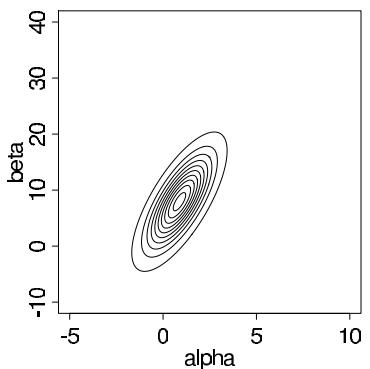

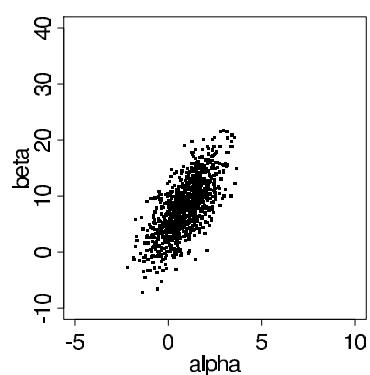  
Figure 4.1 (a) Contour plot of the normal approximation to the posterior distribution of the parameters in the bioassay example. Contour lines are at 0.05, 0.15, ..., 0.95 times the density at the mode. Compare to Figure 3.3a. (b) Scatterplot of 1000 draws from the normal approximation to the posterior distribution. Compare to Figure 3.3b.

generally brings them closer to normality, by the same logic that underlies the central limit theorem.

The normal approximation for the posterior distribution of a low-dimensional $\theta$ is often perfectly acceptable, especially after appropriate transformation. If $\theta$ is high-dimensional, two situations commonly arise. First, the marginal distributions of many individual components of $\theta$ can be approximately normal; inference about any one of these parameters, taken individually, can then be well summarized by a point estimate and a standard error. Second, it is possible that $\theta$ can be partitioned into two subvectors, $\theta = (\theta_{1},\theta_{2})$ , for which $p(\theta_2|y)$ is not necessarily close to normal, but $p(\theta_1|\theta_2,y)$ is, perhaps with mean and variance that are functions of $\theta_{2}$ . The approach of approximation using conditional distributions is often useful, and we consider it more systematically in Section 13.5. Lower-dimensional approximations are increasingly popular, for example in computation for latent Gaussian models.

Finally, approximations based on the normal distribution are often useful for debugging a computer program or checking a more elaborate method for approximating the posterior distribution.

# Example. Bioassay experiment (continued)

We illustrate the normal approximation for the model and data from the bioassay experiment of Section 3.7. The sample size in this experiment is relatively small, only twenty animals in all, and we find that the normal approximation is close to the exact posterior distribution but with important differences.

The normal approximation to the joint posterior distribution of $(\alpha, \beta)$ . To begin, we compute the mode of the posterior distribution (using a logistic regression program) and the normal approximation (4.2) evaluated at the mode. The posterior mode of $(\alpha, \beta)$ is the same as the maximum likelihood estimate because we have assumed a uniform prior density for $(\alpha, \beta)$ . Figure 4.1 shows a contour plot of the bivariate normal approximation and a scatterplot of 1000 draws from this approximate distribution. The plots resemble the plots of the actual posterior distribution in Figure 3.3 but without the skewness in the upper right corner of the earlier plots. The effect of the skewness is apparent when comparing the mean of the normal approximation, $(\alpha, \beta) = (0.8, 7.7)$ , to the mean of the actual posterior distribution, $(\alpha, \beta) = (1.4, 11.9)$ , computed from the simulations displayed in Figure 3.3b.

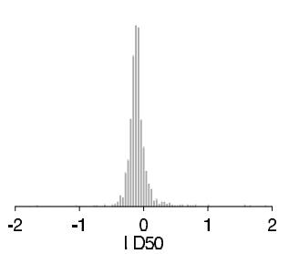

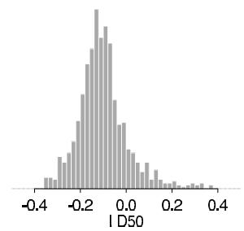  
Figure 4.2 (a) Histogram of the simulations of $LD50$ , conditional on $\beta > 0$ , in the bioassay example based on the normal approximation $p(\alpha, \beta | y)$ . The wide tails of the histogram correspond to values of $\beta$ close to 0. Omitted from this histogram are five simulation draws with values of $LD50$ less than -2 and four draws with values greater than 2; the extreme tails are truncated to make the histogram visible. The values of $LD50$ for the 950 simulation draws corresponding to $\beta > 0$ had a range of [-12.4, 5.4]. Compare to Figure 3.4. (b) Histogram of the central $95\%$ of the distribution.

The posterior distribution for the LD50 using the normal approximation on $(\alpha, \beta)$ . Flaws of the normal approximation. The same set of 1000 draws from the normal approximation can be used to estimate the probability that $\beta$ is positive and the posterior distribution of the LD50, conditional on $\beta$ being positive. Out of the 1000 simulation draws, 950 had positive values of $\beta$ , yielding the estimate $\operatorname{Pr}(\beta > 0) = 0.95$ , a different result than from the exact distribution, where $\operatorname{Pr}(\beta > 0) > 0.999$ . Continuing with the analysis based on the normal approximation, we compute the LD50 as $-\alpha / \beta$ for each of the 950 draws with $\beta > 0$ ; Figure 4.2a presents a histogram of the LD50 values, excluding some extreme values in both tails. (If the entire range of the simulations were included, the shape of the distribution would be nearly impossible to see.) To get a better picture of the center of the distribution, we display in Figure 4.2b a histogram of the middle $95\%$ of the 950 simulation draws of the LD50. The histograms are centered in approximately the same place as Figure 3.4 but with substantially more variation, due to the possibility that $\beta$ is close to zero.

In summary, posterior inferences based on the normal approximation here are roughly similar to the exact results, but because of the small sample, the actual joint posterior distribution is substantially more skewed than the large-sample approximation, and the posterior distribution of the LD50 actually has much shorter tails than implied by using the joint normal approximation. Whether or not these differences imply that the normal approximation is inadequate for practical use in this example depends on the ultimate aim of the analysis.

# 4.2 Large-sample theory

To understand why the normal approximation is often reasonable, we review some theory of how the posterior distribution behaves as the amount of data, from some fixed sampling distribution, increases.

# Notation and mathematical setup

The basic tool of large sample Bayesian inference is asymptotic normality of the posterior distribution: as more and more data arrive from the same underlying process, the posterior distribution of the parameter vector approaches multivariate normality, even if the true distribution of the data is not within the parametric family under consideration. Mathematically, the results apply most directly to observations $y_{1},\ldots ,y_{n}$ that are independent

outcomes sampled from a common distribution, $f(y)$ . In many situations, the notion of a 'true' underlying distribution, $f(y)$ , for the data is difficult to interpret, but it is necessary in order to develop the asymptotic theory. Suppose the data are modeled by a parametric family, $p(y|\theta)$ , with a prior distribution $p(\theta)$ . In general, the data points $y_{i}$ and the parameter $\theta$ can be vectors. If the true data distribution is included in the parametric family—that is, if $f(y) = p(y|\theta_0)$ for some $\theta_0$ —then, in addition to asymptotic normality, the property of consistency holds: the posterior distribution converges to a point mass at the true parameter value, $\theta_0$ , as $n\to \infty$ . When the true distribution is not included in the parametric family, there is no longer a true value $\theta_0$ , but its role in the theoretical result is replaced by a value $\theta_0$ that makes the model distribution, $p(y|\theta)$ , closest to the true distribution, $f(y)$ , in a technical sense involving Kullback-Leibler divergence, as is explained in Appendix B.

In discussing the large-sample properties of posterior distributions, the concept of Fisher information, $J(\theta)$ , introduced as (2.20) in Section 2.8 in the context of Jeffreys' prior distributions, plays an important role.

# Asymptotic normality and consistency

The fundamental mathematical result given in Appendix B shows that, under some regularity conditions (notably that the likelihood is a continuous function of $\theta$ and that $\theta_0$ is not on the boundary of the parameter space), as $n\to \infty$ , the posterior distribution of $\theta$ approaches normality with mean $\theta_0$ and variance $(nJ(\theta_0))^{-1}$ . At its simplest level, this result can be understood in terms of the Taylor series expansion (4.1) of the log posterior density centered about the posterior mode. A preliminary result shows that the posterior mode is consistent for $\theta_0$ , so that as $n\to \infty$ , the mass of the posterior distribution $p(\theta |y)$ becomes concentrated in smaller and smaller neighborhoods of $\theta_0$ , and the distance $|\hat{\theta} -\theta_0|$ approaches zero.

Furthermore, we can rewrite the coefficient of the quadratic term in (4.1):

$$
\left[ \frac {d ^ {2}}{d \theta^ {2}} \log p (\theta | y) \right] _ {\theta = \hat {\theta}} = \left[ \frac {d ^ {2}}{d \theta^ {2}} \log p (\theta) \right] _ {\theta = \hat {\theta}} + \sum_ {i = 1} ^ {n} \left[ \frac {d ^ {2}}{d \theta^ {2}} \log p (y _ {i} | \theta) \right] _ {\theta = \hat {\theta}}.
$$

Considered as a function of $\theta$ , this coefficient is a constant plus the sum of $n$ terms, each of whose expected value under the true sampling distribution of $y_{i}$ , $p(y|\theta_0)$ , is approximately $-J(\theta_0)$ , as long as $\hat{\theta}$ is close to $\theta_0$ (we are assuming now that $f(y) = p(y|\theta_0)$ for some $\theta_0$ ). Therefore, for large $n$ , the curvature of the log posterior density can be approximated by the Fisher information, evaluated at either $\hat{\theta}$ or $\theta_0$ (where only the former is available in practice).

In summary, in the limit of large $n$ , in the context of a specified family of models, the posterior mode, $\hat{\theta}$ , approaches $\theta_0$ , and the curvature (the observed information or the negative of the coefficient of the second term in the Taylor expansion) approaches $nJ(\hat{\theta})$ or $nJ(\theta_0)$ . In addition, as $n \to \infty$ , the likelihood dominates the prior distribution, so we can just use the likelihood alone to obtain the mode and curvature for the normal approximation. More precise statements of the theorems and outlines of proofs appear in Appendix B.

# Likelihood dominating the prior distribution

The asymptotic results formalize the notion that the importance of the prior distribution diminishes as the sample size increases. One consequence of this result is that in problems with large sample sizes we need not work especially hard to formulate a prior distribution that accurately reflects all available information. When sample sizes are small, the prior distribution is a critical part of the model specification.

# 4.3 Counterexamples to the theorems

A good way to understand the limitations of the large-sample results is to consider cases in which the theorems fail. The normal distribution is usually helpful as a starting approximation, but one must examine deviations, especially with unusual parameter spaces and in the extremes of the distribution. The counterexamples to the asymptotic theorems generally correspond to situations in which the prior distribution has an impact on the posterior inference, even in the limit of infinite sample sizes.

Underidentified models and nonidentified parameters. The model is underidentified given data $y$ if the likelihood, $p(\theta | y)$ , is equal for a range of values of $\theta$ . This may also be called a flat likelihood (although that term is sometimes also used for likelihoods for parameters that are only weakly identified by the data—so the likelihood function is not strictly equal for a range of values, only almost so). Under such a model, there is no single point $\theta_0$ to which the posterior distribution can converge.

For example, consider the model,

$$
\left( \begin{array}{c} u \\ v \end{array} \right) \sim \mathrm {N} \left(\left( \begin{array}{c} 0 \\ 0 \end{array} \right), \left( \begin{array}{c c} 1 & \rho \\ \rho & 1 \end{array} \right)\right),
$$

in which only one of $u$ or $v$ is observed from each pair $(u, v)$ . Here, the parameter $\rho$ is nonidentified. The data supply no information about $\rho$ , so the posterior distribution of $\rho$ is the same as its prior distribution, no matter how large the dataset is.

The only solution to a problem of nonidentified or underidentified parameters is to recognize that the problem exists and, if there is a desire to estimate these parameters more precisely, gather further information that can enable the parameters to be estimated (either from future data collection or from external information that can inform a prior distribution).

Number of parameters increasing with sample size. In complicated problems, there can be large numbers of parameters, and then we need to distinguish between different types of asymptotics. If, as $n$ increases, the model changes so that the number of parameters increases as well, then the simple results outlined in Sections 4.1 and 4.2, which assume a fixed model class $p(y_i|\theta)$ , do not apply. For example, sometimes a parameter is assigned for each sampling unit in a study; for example, $y_i \sim \mathrm{N}(\theta_i, \sigma^2)$ . The parameters $\theta_i$ generally cannot be estimated consistently unless the amount of data collected from each sampling unit increases along with the number of units. In nonparametric models such as Gaussian processes (see Chapter 21) there can be a new latent parameter corresponding to each data point.

As with underidentified parameters, the posterior distribution for $\theta_{i}$ will not converge to a point mass if new data do not bring enough information about $\theta_{i}$ . Here, the posterior distribution will not in general converge to a point in the expanding parameter space (reflecting the increasing dimensionality of $\theta$ ), and its projection into any fixed space—for example, the marginal posterior distribution of any particular $\theta_{i}$ —will not necessarily converge to a point either.

Aaliasing. Aliasing is a special case of underidentified parameters in which the same likelihood function repeats at a discrete set of points. For example, consider the following normal mixture model with independent and identically distributed data $y_{1},\ldots ,y_{n}$ and parameter vector $\theta = (\mu_1,\mu_2,\sigma_1^2,\sigma_2^2,\lambda)$ :

$$
p (y _ {i} | \mu_ {1}, \mu_ {2}, \sigma_ {1} ^ {2}, \sigma_ {2} ^ {2}, \lambda) = \lambda \frac {1}{\sqrt {2 \pi} \sigma_ {1}} e ^ {- \frac {1}{2 \sigma_ {1} ^ {2}} (y _ {i} - \mu_ {1}) ^ {2}} + (1 - \lambda) \frac {1}{\sqrt {2 \pi} \sigma_ {2}} e ^ {- \frac {1}{2 \sigma_ {2} ^ {2}} (y _ {i} - \mu_ {2}) ^ {2}}.
$$

If we interchange each of $(\mu_1, \mu_2)$ and $(\sigma_1^2, \sigma_2^2)$ , and replace $\lambda$ by $(1 - \lambda)$ , the likelihood of the data remains the same. The posterior distribution of this model generally has at least

two modes and consists of a $(50\%, 50\%)$ mixture of two distributions that are mirror images of each other; it does not converge to a single point no matter how large the dataset is.

In general, the problem of aliasing is eliminated by restricting the parameter space so that no duplication appears; in the above example, the aliasing can be removed by restricting $\mu_{1}$ to be less than or equal to $\mu_{2}$ .

Unbounded likelihoods. If the likelihood function is unbounded, then there might be no posterior mode within the parameter space, invalidating both the consistency results and the normal approximation. For example, consider the previous normal mixture model; for simplicity, assume that $\lambda$ is known (and not equal to 0 or 1). If we set $\mu_{1} = y_{i}$ for any arbitrary $y_{i}$ , and let $\sigma_1^2\rightarrow 0$ , then the likelihood approaches infinity. As $n\to \infty$ , the number of modes of the likelihood increases. If the prior distribution is uniform on $\sigma_1^2$ and $\sigma_2^2$ in the region near zero, there will be likewise an increasing number of posterior modes, with no corresponding normal approximations. A prior distribution proportional to $\sigma_1^{-2}\sigma_2^{-2}$ just makes things worse because this puts more probability near zero, causing the posterior distribution to explode even faster at zero.

In general, this problem should arise rarely in practice, because the poles of an unbounded likelihood correspond to unrealistic conditions in a model. The problem can be solved by restricting to a plausible set of distributions. When the problem occurs for variance components near zero, it can be resolved in various ways, such as using a prior distribution that declines to zero at the boundary or by assigning an informative prior distribution to the ratio of the variance parameters.

Improper posterior distributions. If the unnormalized posterior density, obtained by multiplying the likelihood by a 'formal' prior density representing an improper prior distribution, integrates to infinity, then the asymptotic results, which rely on probabilities summing to 1, do not follow. An improper posterior distribution cannot occur except with an improper prior distribution.

A simple example arises from combining a $\mathrm{Beta}(0,0)$ prior distribution for a binomial proportion with data consisting of $n$ successes and 0 failures. More subtle examples, with hierarchical binomial and normal models, are discussed in Sections 5.3 and 5.4.

The solution to this problem is clear. An improper prior distribution is only a convenient approximation, and if it does not give rise to a proper posterior distribution then the sought convenience is lost. In this case a proper prior distribution is needed, or at least an improper prior density that when combined with the likelihood has a finite integral.

Prior distributions that exclude the point of convergence. If $p(\theta_0) = 0$ for a discrete parameter space, or if $p(\theta) = 0$ in a neighborhood about $\theta_0$ for a continuous parameter space, then the convergence results, which are based on the likelihood dominating the prior distribution, do not hold. The solution is to give positive probability density in the prior distribution to all values of $\theta$ that are even remotely plausible.

Convergence to the edge of parameter space. If $\theta_0$ is on the boundary of the parameter space, then the Taylor series expansion must be truncated in some directions, and the normal distribution will not necessarily be appropriate, even in the limit.

For example, consider the model, $y_{i} \sim \mathrm{N}(\theta, 1)$ , with the restriction $\theta \geq 0$ . Suppose that the model is accurate, with $\theta = 0$ as the true value. The posterior distribution for $\theta$ is normal, centered at $\overline{y}$ , truncated to be positive. The shape of the posterior distribution for $\theta$ , in the limit as $n \to \infty$ , is half of a normal distribution, centered about 0, truncated to be positive.

For another example, consider the same assumed model, but now suppose that the true $\theta$ is $-1$ , a value outside the assumed parameter space. The limiting posterior distribution for $\theta$ has a sharp spike at 0 with no resemblance to a normal distribution at all. The solution in practice is to recognize the difficulties of applying the normal approximation if

one is interested in parameter values near the edge of parameter space. More important, one should give positive prior probability density to all values of $\theta$ that are even remotely possible, or in the neighborhood of remotely possible values.

Tails of the distribution. The normal approximation can hold for essentially all the mass of the posterior distribution but still not be accurate in the tails. For example, suppose $p(\theta |y)$ is proportional to $e^{-c|\theta|}$ as $|\theta| \to \infty$ , for some constant $c$ ; by comparison, the normal density is proportional to $e^{-c\theta^2}$ . The distribution function still converges to normality, but for any finite sample size $n$ the approximation fails far out in the tail. As another example, consider any parameter that is constrained to be positive. For any finite sample size, the normal approximation will admit the possibility of the parameter being negative, because the approximation is simply not appropriate at that point in the tail of the distribution, but that point becomes farther and farther in the tail as $n$ increases.

# 4.4 Frequency evaluations of Bayesian inferences

Just as the Bayesian paradigm can be seen to justify simple 'classical' techniques, the methods of frequentist statistics provide a useful approach for evaluating the properties of Bayesian inferences—their operating characteristics—when these are regarded as embedded in a sequence of repeated samples. We have already used this notion in discussing the ideas of consistency and asymptotic normality. The notion of stable estimation, which says that for a fixed model, the posterior distribution approaches a point as more data arrive—leading, in the limit, to inferential certainty—is based on the idea of repeated sampling. It is certainly appealing that if the hypothesized family of probability models contains the true distribution (and assigns it a nonzero prior density), then as more information about $\theta$ arrives, the posterior distribution converges to the true value of $\theta$ .

# Large-sample correspondence

Suppose that the normal approximation (4.2) for the posterior distribution of $\theta$ holds; then we can transform to the standard multivariate normal:

$$
[ I (\hat {\theta}) ] ^ {1 / 2} (\theta - \hat {\theta}) \mid y \sim \mathrm {N} (0, I), \tag {4.3}
$$

where $\hat{\theta}$ is the posterior mode and $[I(\hat{\theta})]^{1/2}$ is any matrix square root of $I(\hat{\theta})$ . In addition, $\hat{\theta} \to \theta_0$ , and so we could just as well write the approximation in terms of $I(\theta_0)$ . If the true data distribution is included in the class of models, so that $f(y) \equiv p(y|\theta)$ for some $\theta$ , then in repeated sampling with fixed $\theta$ , in the limit $n \to \infty$ , it can be proved that

$$
[ I (\hat {\theta}) ] ^ {1 / 2} (\theta - \hat {\theta}) \mid \theta \sim \mathrm {N} (0, I), \tag {4.4}
$$

a result from classical statistical theory that is generally proved for $\hat{\theta}$ equal to the maximum likelihood estimate but is easily extended to the case with $\hat{\theta}$ equal to the posterior mode. These results mean that, for any function of $(\theta - \hat{\theta})$ , the posterior distribution derived from (4.3) is asymptotically the same as the repeated sampling distribution derived from (4.4). Thus, for example, a $95\%$ central posterior interval for $\theta$ will cover the true value $95\%$ of the time under repeated sampling with any fixed true $\theta$ .

# Point estimation, consistency, and efficiency

In the Bayesian framework, obtaining an 'estimate' of $\theta$ makes most sense in large samples when the posterior mode, $\hat{\theta}$ , is the obvious center of the posterior distribution of $\theta$ and the uncertainty conveyed by $nI(\hat{\theta})$ is so small as to be practically unimportant. More generally,

however, in smaller samples, it is inappropriate to summarize inference about $\theta$ by one value, especially when the posterior distribution of $\theta$ is more variable or even asymmetric. Formally, by incorporating loss functions in a decision-theoretic context (see Section 9.1 and Exercise 9.6), one can define optimal point estimates; for the purposes of Bayesian data analysis, however, we believe that representation of the full posterior distribution (as, for example, with $50\%$ and $95\%$ central posterior intervals) is more useful. In many problems, especially with large samples, a point estimate and its estimated standard error are adequate to summarize a posterior inference, but we interpret the estimate as an inferential summary, not as the solution to a decision problem. In any case, the large-sample frequency properties of any estimate can be evaluated, without consideration of whether the estimate was derived from a Bayesian analysis.

A point estimate is said to be consistent in the sampling theory sense if, as samples get larger, it converges to the true value of the parameter that it is asserted to estimate. Thus, if $f(y) \equiv p(y|\theta_0)$ , then a point estimate $\hat{\theta}$ of $\theta$ is consistent if its sampling distribution converges to a point mass at $\theta_0$ as the data sample size $n$ increases (that is, considering $\hat{\theta}$ as a function of $y$ , which is a random variable conditional on $\theta_0$ ). A closely related concept is asymptotic unbiasedness, where $(\mathrm{E}(\hat{\theta} |\theta_0) - \theta_0) / \mathrm{sd}(\hat{\theta} |\theta_0)$ converges to 0 (once again, considering $\hat{\theta}(y)$ as a random variable whose distribution is determined by $p(y|\theta_0)$ ). When the truth is included in the family of models being fitted, the posterior mode $\hat{\theta}$ , and also the posterior mean and median, are consistent and asymptotically unbiased under mild regularity conditions.

A point estimate $\hat{\theta}$ is said to be efficient if there exists no other function of $y$ that estimates $\theta$ with lower mean squared error, that is, if the expression $\mathrm{E}((\hat{\theta} - \theta_0)^2 | \theta_0)$ is at its optimal, lowest value. More generally, the efficiency of $\hat{\theta}$ is the optimal mean squared error divided by the mean squared error of $\hat{\theta}$ . An estimate is asymptotically efficient if its efficiency approaches 1 as the sample size $n \to \infty$ . Under mild regularity conditions, the center of the posterior distribution (defined, for example, by the posterior mean, median, or mode) is asymptotically efficient.

# Confidence coverage

If a region $C(y)$ includes $\theta_0$ at least $100(1 - \alpha)\%$ of the time (given any value of $\theta_0$ ) in repeated samples, then $C(y)$ is called a $100(1 - \alpha)\%$ confidence region for the parameter $\theta$ . The word 'confidence' is carefully chosen to distinguish such intervals from probability intervals and to convey the following behavioral meaning: if one chooses $\alpha$ to be small enough (for example, 0.05 or 0.01), then since confidence regions cover the truth in at least $(1 - \alpha)$ of their applications, one should be confident in each application that the truth is within the region and therefore act as if it is. We saw previously that asymptotically a $100(1 - \alpha)\%$ central posterior interval for $\theta$ has the property that, in repeated samples of $y$ , $100(1 - \alpha)\%$ of the intervals include the value $\theta_0$ .

# 4.5 Bayesian interpretations of other statistical methods

We consider three levels at which Bayesian statistical methods can be compared with other methods. First, as we have already indicated, Bayesian methods are often similar to other statistical approaches in problems involving large samples from a fixed probability model. Second, even for small samples, many statistical methods can be considered as approximations to Bayesian inferences based on particular prior distributions; as a way of understanding a statistical procedure, it is often useful to determine the implicit underlying prior distribution. Third, some methods from classical statistics (notably hypothesis testing) can give results that differ greatly from those given by Bayesian methods. In this section,

we briefly consider several statistical concepts—point and interval estimation, likelihood inference, unbiased estimation, frequency coverage of confidence intervals, hypothesis testing, multiple comparisons, nonparametric methods, and the jackknife and bootstrap—and discuss their relation to Bayesian methods.

One way to develop possible models is to examine the interpretation of crude data-analytic procedures as approximations to Bayesian inference under specific models. For example, a widely used technique in sample surveys is ratio estimation, in which, for example, given data from a simple random sample, one estimates $R = \overline{y} / \overline{x}$ by $\overline{y}_{\mathrm{obs}} / \overline{x}_{\mathrm{obs}}$ , in the notation of Chapter 8. It can be shown that this estimate corresponds to a summary of a Bayesian posterior inference given independent observations $y_{i}|x_{i} \sim \mathrm{N}(Rx_{i}, \sigma^{2}x_{i})$ and a noninformative prior distribution. Ratio estimates can be useful in a wide variety of cases in which this model does not hold, but when the data deviate greatly from this model, the ratio estimate generally is not appropriate.

For another example, standard methods of selecting regression predictors, based on 'statistical significance,' correspond roughly to Bayesian analyses under exchangeable prior distributions on the coefficients in which the prior distribution of each coefficient is a mixture of a peak at zero and a widely spread distribution, as we discuss further in Section 14.6. We believe that understanding this correspondence suggests when such models can be usefully applied and how they can be improved. Often, in fact, such procedures can be improved by including additional information, for example, in problems involving large numbers of predictors, by clustering regression coefficients that are likely to be similar into batches.

# Maximum likelihood and other point estimates

From the perspective of Bayesian data analysis, we can often interpret classical point estimates as exact or approximate posterior summaries based on some implicit full probability model. In the limit of large sample size, in fact, we can use asymptotic theory to construct a theoretical Bayesian justification for classical maximum likelihood inference. In the limit (assuming regularity conditions), the maximum likelihood estimate, $\hat{\theta}$ , is a sufficient statistic—and so is the posterior mode, mean, or median. That is, for large enough $n$ , the maximum likelihood estimate (or any of the other summaries) supplies essentially all the information about $\theta$ available from the data. The asymptotic irrelevance of the prior distribution can be taken to justify the use of convenient noninformative prior models.

In repeated sampling with $\theta = \theta_0$

$$
p (\hat {\theta} (y) | \theta = \theta_ {0}) \approx \mathrm {N} (\hat {\theta} (y) | \theta_ {0}, (n J (\theta_ {0})) ^ {- 1});
$$

that is, the sampling distribution of $\hat{\theta}(y)$ is approximately normal with mean $\theta_0$ and precision $nJ(\theta_0)$ , where for clarity we emphasize that $\hat{\theta}$ is a function of $y$ . Assuming that the prior distribution is locally uniform (or continuous and nonzero) near the true $\theta$ , the simple analysis of the normal mean (Section 3.5) shows that the posterior Bayesian inference is

$$
p (\theta | \hat {\theta}) \approx \mathrm {N} (\theta | \hat {\theta}, (n J (\hat {\theta})) ^ {- 1}).
$$

This result appears directly from the asymptotic normality theorem, but deriving it indirectly through Bayesian inference given $\hat{\theta}$ gives insight into a Bayesian rationale for classical asymptotic inference based on point estimates and standard errors.

For finite $n$ , the above approach is inefficient or wasteful of information to the extent that $\hat{\theta}$ is not a sufficient statistic. When the number of parameters is large, the consistency result is often not helpful, and noninformative prior distributions are hard to justify. As discussed in Chapter 5, hierarchical models are preferable when dealing with a large number of parameters since then their common distribution can be estimated from data. In addition, any method of inference based on the likelihood alone can be improved if real prior

information is available that is strong enough to contribute substantially to that contained in the likelihood function.

# Unbiased estimates

Some non-Bayesian statistical methods place great emphasis on unbiasedness as a desirable principle of estimation, and it is intuitively appealing that, over repeated sampling, the mean (or perhaps the median) of a parameter estimate should be equal to its true value. Formally, an estimate $\theta y$ is called unbiased if $\operatorname{E}(\hat{\theta}(y)|\theta) = \theta$ for any value of $\theta$ , where this expectation is taken over the data distribution, $p(y|\theta)$ . From a Bayesian perspective, the principle of unbiasedness is reasonable in the limit of large samples (see page 92) but otherwise is potentially misleading. The major difficulties arise when there are many parameters to be estimated and our knowledge or partial knowledge of some of these parameters is clearly relevant to the estimation of others. Requiring unbiased estimates will often lead to relevant information being ignored (as we discuss with hierarchical models in Chapter 5). In sampling theory terms, minimizing bias will often lead to counterproductive increases in variance.

One general problem with unbiasedness (and point estimation in general) is that it is often not possible to estimate several parameters at once in an even approximately unbiased manner. For example, unbiased estimates of $\theta_{1},\ldots ,\theta_{J}$ yield an upwardly biased estimate of the variance of the $\theta_{j}$ 's (except in the trivial case in which the $\theta_{j}$ 's are known exactly).

Another problem with the principle of unbiasedness arises when treating a future observable value as a parameter in prediction problems.

# Example. Prediction using regression

Consider the problem of estimating $\theta$ , the height of an adult daughter, given $y$ , her mother's height. For simplicity, assume that the heights of mothers and daughters are jointly normally distributed, with known equal means of 160 centimeters, equal variances, and a known correlation of 0.5. Conditioning on the known value of $y$ (in other words, using Bayesian inference), the posterior mean of $\theta$ is

$$
\mathrm {E} (\theta | y) = 1 6 0 + 0. 5 (y - 1 6 0). \tag {4.5}
$$

The posterior mean is not, however, an unbiased estimate of $\theta$ , in the sense of repeated sampling of $y$ given a fixed $\theta$ . Given the daughter's height, $\theta$ , the mother's height, $y$ , has mean $\operatorname{E}(y|\theta) = 160 + 0.5(\theta - 160)$ . Thus, under repeated sampling of $y$ given fixed $\theta$ , the posterior mean (4.5) has expectation $160 + 0.25(\theta - 160)$ and is biased towards the grand mean of 160. In contrast, the estimate

$$
\hat {\theta} = 1 6 0 + 2 (y - 1 6 0)
$$

is unbiased under repeated sampling of $y$ , conditional on $\theta$ . Unfortunately, the estimate $\hat{\theta}$ makes no sense for values of $y$ not equal to 160; for example, if a mother is 10 centimeters taller than average, it estimates her daughter to be 20 centimeters taller than average!

In this simple example, in which $\theta$ has an accepted population distribution, a sensible non-Bayesian statistician would not use the unbiased estimate $\hat{\theta}$ ; instead, this problem would be classified as 'prediction' rather than 'estimation,' and procedures would not be evaluated conditional on the random variable $\theta$ . The example illustrates, however, the limitations of unbiasedness as a general principle: it requires unknown quantities to be characterized either as 'parameters' or 'predictions,' with different implications for estimation but no clear substantive distinction. Chapter 5 considers similar situations in which the population distribution of $\theta$ must be estimated from data rather than conditioning on a particular value.

The important principle illustrated by the example is that of regression to the mean: for any given mother, the expected value of her daughter's height lies between her mother's height and the population mean. This principle was fundamental to the original use of the term 'regression' for this type of analysis by Galton in the late 19th century. In many ways, Bayesian analysis can be seen as a logical extension of the principle of regression to the mean, ensuring that proper weighting is made of information from different sources.

# Confidence intervals

Even in small samples, Bayesian $(1 - \alpha)$ posterior intervals often have close to $(1 - \alpha)$ confidence coverage under repeated samples conditional on $\theta$ . But there are some confidence intervals, derived purely from sampling-theory arguments, that differ considerably from Bayesian probability intervals. From our perspective these intervals are of doubtful value. For example, many authors have shown that a general theory based on unconditional behavior can lead to clearly counterintuitive results, for example, the possibilities of confidence intervals with zero or infinite length. A simple example is the confidence interval that is empty $5\%$ of the time and contains all of the real line $95\%$ of the time: this always contains the true value (of any real-valued parameter) in $95\%$ of repeated samples. Such examples do not imply that there is no value in the concept of confidence coverage but rather show that coverage alone is not a sufficient basis on which to form reasonable inferences.

# Hypothesis testing

The perspective of this book has little role for the non-Bayesian concept of hypothesis tests, especially where these relate to point null hypotheses of the form $\theta = \theta_0$ . In order for a Bayesian analysis to yield a nonzero probability for a point null hypothesis, it must begin with a nonzero prior probability for that hypothesis; in the case of a continuous parameter, such a prior distribution (comprising a discrete mass, of say 0.5, at $\theta_0$ mixed with a continuous density elsewhere) usually seems contrived. In fact, most of the difficulties in interpreting hypothesis tests arise from the artificial dichotomy that is required between $\theta = \theta_0$ and $\theta \neq \theta_0$ . Difficulties related to this dichotomy are widely acknowledged from all perspectives on statistical inference. In problems involving a continuous parameter $\theta$ (say the difference between two means), the hypothesis that $\theta$ is exactly zero is rarely reasonable, and it is of more interest to estimate a posterior distribution or a corresponding interval estimate of $\theta$ . For a continuous parameter $\theta$ , the question 'Does $\theta$ equal 0?' can generally be rephrased more usefully as 'What is the posterior distribution for $\theta$ ?'

In various simple one-sided hypothesis tests, conventional $p$ -values may correspond with posterior probabilities under noninformative prior distributions. For example, suppose we observe $y = 1$ from the model $y \sim \mathrm{N}(\theta, 1)$ , with a uniform prior density on $\theta$ . One cannot 'reject the hypothesis' that $\theta = 0$ : the one-sided $p$ -value is 0.16 and the two-sided $p$ -value is 0.32, both greater than the conventionally accepted cutoff value of 0.05 for 'statistical significance.' On the other hand, the posterior probability that $\theta > 0$ is $84\%$ , which is a more satisfactory and informative conclusion than the dichotomous verdict 'reject' or 'do not reject.'

In contrast to the problem of making inference about a parameter within a particular model, we do find a form of hypothesis test to be useful when assessing the goodness of fit of a probability model. In the Bayesian framework, it is useful to check a model by comparing observed data to possible predictive outcomes, as we discuss in detail in Chapter 6.

# Multiple comparisons and multilevel modeling

Consider a problem with independent measurements, $y_{j} \sim \mathrm{N}(\theta_{j}, 1)$ , on each of $J$ parameters, in which the goal is to detect differences among and ordering of the continuous parameters $\theta_{j}$ . Several competing multiple comparisons procedures have been derived in classical statistics, with rules about when various $\theta_{j}$ 's can be declared 'significantly different.' In the Bayesian approach, the parameters have a joint posterior distribution. One can compute the posterior probability of each of the $J!$ orderings if desired. If there is posterior uncertainty in the ordering, several permutations will have substantial probabilities, which is a more reasonable conclusion than producing a list of $\theta_{j}$ 's that can be declared different (with the false implication that other $\theta_{j}$ 's may be exactly equal). With $J$ large, the exact ordering is probably not important, and it might be more reasonable to give a posterior median and interval estimate of the quantile of each $\theta_{j}$ in the population.

We prefer to handle multiple comparisons problems using hierarchical models, as we shall illustrate in a comparison of treatment effects in eight schools in Section 5.5 (see also Exercise 5.3). Hierarchical modeling automatically partially pools estimates of different $\theta_{j}$ 's toward each other when there is little evidence for real variation. As a result, this Bayesian procedure automatically addresses the key concern of classical multiple comparisons analysis, which is the possibility of finding large differences as a byproduct of searching through so many possibilities. For example, in the educational testing example, the eight schools give $8 \cdot 7/2 = 28$ possible comparisons, and none turn out to be close to 'statistically significant' (in the sense that zero is contained within the $95\%$ intervals for all the differences in effects between pairs of schools), which makes sense since the between-school variation (the parameter $\tau$ in that model) is estimated to be low.

# Nonparametric methods, permutation tests, jackknife, bootstrap

Many non-Bayesian methods have been developed that avoid complete probability models, even at the sampling level. It is difficult to evaluate many of these from a Bayesian point of view. For instance, hypothesis tests for comparing medians based on ranks do not have direct counterparts in Bayesian inference; therefore it is hard to interpret the resulting estimates and $p$ -values from a Bayesian point of view (for example, as posterior expectations, intervals, or probabilities for parameters or predictions of interest). In complicated problems, there is often a degree of arbitrariness in the procedures used; for example there is generally no clear method for constructing a nonparametric inference or an estimator to jackknife/bootstrap in hypothetical replications. Without a specified probability model, it is difficult to see how to test the assumptions underlying a particular nonparametric method. In such problems, we find it more satisfactory to construct a joint probability distribution and check it against the data (as in Chapter 6) than to construct an estimator and evaluate its frequency properties. Nonparametric methods are useful to us as tools for data summary and description that can help us to construct models or help us evaluate inferences from a completely different perspective.

From a different direction, one might well say that Bayesian methods involve arbitrary choices of models and are difficult to evaluate because in practice there will always be important aspects of a model that are impossible to check. Our purpose here is not to dismiss or disparage classical nonparametric methods but rather to put them in a Bayesian context to the extent this is possible.

Some nonparametric methods such as permutation tests for experiments and sampling-theory inference for surveys turn out to give similar results in simple problems to Bayesian inferences with noninformative prior distributions, if the Bayesian model is constructed to fit the data reasonably well. Such simple problems include balanced designs with no missing data and surveys based on simple random sampling. When estimating several pa

rameters at once or including explanatory variables in the analysis (using methods such as the analysis of covariance or regression) or prior information on the parameters, the permutation/sampling theory methods give no direct answer, and this often provides considerable practical incentive to move to a model-based Bayesian approach.

# Example. The Wilcoxon rank test

Another connection can be made by interpreting nonparametric methods in terms of implicit models. For example, the Wilcoxon rank test for comparing two samples $(y_{1},\ldots ,y_{n_{y}})$ and $(z_{1},\ldots ,z_{n_{z}})$ proceeds by first ranking each of the points in the combined data from 1 to $n = n_y + n_z$ , then computing the difference between the average ranks of the $y$ 's and $z$ 's, and finally computing the $p$ -value of this difference by comparing to a tabulated reference distribution calculated based on the assumption of random assignment of the $n$ ranks. This can be formulated as a nonlinear transformation that replaces each data point by its rank in the combined data, followed by a comparison of the mean values of the two transformed samples. Even more clear would be to transform the ranks $1,2,\ldots ,n$ to quantiles $\frac{1}{2n}$ , $\frac{3}{2n}$ , ..., $\frac{2n - 1}{2n}$ , so that the difference between the two means can be interpreted as an average distance in the scale of the quantiles of the combined distribution. From the Central Limit Theorem, the mean difference is approximately normally distributed, and so classical normal-theory confidence intervals can be interpreted as Bayesian posterior probability statements, as discussed at the beginning of this section.

We see two major advantages of expressing rank tests as approximate Bayesian inferences. First, the Bayesian framework is more flexible than rank testing for handling the complications that arise, for example, from additional information such as regression predictors or from complications such as censored or truncated data. Second, setting up the problem in terms of a nonlinear transformation reveals the generality of the model-based approach—we are free to use any transformation that might be appropriate for the problem, perhaps now treating the combined quantiles as a convenient default choice.

# 4.6 Bibliographic note

Relatively little has been written on the practical implications of asymptotic theory for Bayesian analysis. The overview by Edwards, Lindman, and Savage (1963) remains one of the best and includes a detailed discussion of the principle of 'stable estimation' or when prior information can be satisfactorily approximated by a uniform density function. Much more has been written comparing Bayesian and non-Bayesian approaches to inference, and we have largely ignored the extensive philosophical and logical debates on this subject. Some good sources on the topic from the Bayesian point of view include Lindley (1958), Pratt (1965), and Berger and Wolpert (1984). Jaynes (1976) discusses some disadvantages of non-Bayesian methods compared to a particular Bayesian approach.

In Appendix B we provide references to the asymptotic normality theory. The counterexamples presented in Section 4.3 have arisen, in various forms, in our own applied research. Berzuini et al. (1997) discuss Bayesian inference for sequential data problems, in which the posterior distribution changes as data arrive, thus approaching the asymptotic results dynamically.

An example of the use of the normal approximation with small samples is provided by Rubin and Schenker (1987), who approximate the posterior distribution of the logit of the binomial parameter in a real application and evaluate the frequentist operating characteristics of their procedure; see also Agresti and Coull (1998). Clogg et al. (1991) provide additional discussion of this approach in a more complicated setting.

Morris (1983) and Rubin (1984) discuss, from two different standpoints, the concept

of evaluating Bayesian procedures by examining long-run frequency properties (such as coverage of $95\%$ confidence intervals). An example of frequency evaluation of Bayesian procedures in an applied problem is given by Zaslavsky (1993).

Krantz (1999) discusses the strengths and weaknesses of $p$ -values as used in statistical data analysis in practice. Discussions of the role of $p$ -values in Bayesian inference appear in Bayarri and Berger (1998, 2000). Earlier work on the Bayesian analysis of hypothesis testing and the problems of interpreting conventional $p$ -values is provided by Berger and Sellke (1987), which contains a lively discussion and many further references. Gelman (2008a) and discussants provide a more recent airing of arguments for and against Bayesian statistics. Gelman (2006b) compares Bayesian inference and the more generalized approach known as belief functions (Dempster, 1967, 1968) using a simple toy example.

Greenland and Poole (2013) and Gelman (2013a) present some more recent discussions of the relevance of classical $p$ -values in Bayesian inference.

A simple and pragmatic discussion of the need to consider Bayesian ideas in hypothesis testing in a biostatistical context is given by Browner and Newman (1987), and further discussion of the role of Bayesian thinking in medical statistics appears in Goodman (1999a, b) and Sterne and Smith (2001). Gelman and Tuerlinckx (2000), Efron and Tibshirani (2002), and Gelman, Hill, and Yajima (2012) give a Bayesian perspective on multiple comparisons in the context of hierarchical modeling.

Stigler (1983) discusses the similarity between Bayesian inference and regression prediction that we mention in our critique of unbiasedness in Section 4.5; Stigler (1986) discusses Galton's use of regression.

Sequential monitoring and analysis of clinical trials in medical research is an important area of practical application that has been dominated by frequentist thinking but has recently seen considerable discussion of the merits of a Bayesian approach; recent reviews and examples are provided by Freedman, Spiegelhalter, and Parmar (1994), Parmar et al. (2001), and Vail et al. (2001). Thall, Simon, and Estey (1995) consider frequency properties of Bayesian analyses of sequential trials. More references on sequential designs appear in the bibliographic note at the end of Chapter 8.

The non-Bayesian principles and methods mentioned in Section 4.5 are covered in many books, for example, Lehmann (1983, 1986), Cox and Hinkley (1974), Hastie and Tibshirani (1990), and Efron and Tibshirani (1993). The connection between ratio estimation and modeling alluded to in Section 4.5 is discussed by Brewer (1963), Royall (1970), and, from our Bayesian approach, Rubin (1987a, p. 46). Conover and Iman (1980) discuss the connection between nonparametric tests and data transformations.

# 4.7 Exercises

1. Normal approximation: suppose that $y_{1},\ldots ,y_{5}$ are independent samples from a Cauchy distribution with unknown center $\theta$ and known scale 1: $p(y_i|\theta)\propto 1 / (1 + (y_i - \theta)^2)$ . Assume that the prior distribution for $\theta$ is uniform on [0,1]. Given the observations $(y_{1},\dots ,y_{5}) = (-2, - 1,0,1.5,2.5)$ :   
(a) Determine the derivative and the second derivative of the log posterior density.   
(b) Find the posterior mode of $\theta$ by iteratively solving the equation determined by setting the derivative of the log-likelihood to zero.   
(c) Construct the normal approximation based on the second derivative of the log posterior density at the mode. Plot the approximate normal density and compare to the exact density computed in Exercise 2.11.   
2. Normal approximation: derive the analytic form of the information matrix and the normal approximation variance for the bioassay example.   
3. Normal approximation to the marginal posterior distribution of an estimand: in the

bioassay example, the normal approximation to the joint posterior distribution of $(\alpha, \beta)$ is obtained. The posterior distribution of any estimand, such as the LD50, can be approximated by a normal distribution fit to its marginal posterior mode and the curvature of the marginal posterior density about the mode. This is sometimes called the 'delta method.' Expand the posterior distribution of the LD50, $-\alpha / \beta$ , as a Taylor series around the posterior mode and thereby derive the asymptotic posterior median and standard deviation. Compare to the histogram in Figure 4.2.

4. Asymptotic normality: assuming the regularity conditions hold, we know that $p(\theta | y)$ approaches normality as $n \to \infty$ . In addition, if $\phi = f(\theta)$ is any one-to-one continuous transformation of $\theta$ , we can express the Bayesian inference in terms of $\phi$ and find that $p(\phi | y)$ also approaches normality. But a nonlinear transformation of a normal distribution is no longer normal. How can both limiting normal distributions be valid?

5. Approximate mean and variance:

- Suppose $x$ and $y$ are independent normally distributed random variables, where $x$ has mean 4 and standard deviation 1, and $y$ has mean 3 and standard deviation 2. What are the mean and standard deviation of $y / x$ ? Compute this using simulation.   
- Suppose $x$ and $y$ are independent random variables, where $x$ has mean 4 and standard deviation 1, and $y$ has mean 3 and standard deviation 2. What are the approximate mean and standard deviation of $y / x$ ? Determine this without using simulation.   
- What assumptions are required for the approximation in (b) to be reasonable?

6. Statistical decision theory: a decision-theoretic approach to the estimation of an unknown parameter $\theta$ introduces the loss function $L(\theta, a)$ which, loosely speaking, gives the cost of deciding that the parameter has the value $a$ , when it is in fact equal to $\theta$ . The estimate $a$ can be chosen to minimize the posterior expected loss,

$$
\operatorname {E} (L (a | y)) = \int L (\theta , a) p (\theta | y) d \theta .
$$

This optimal choice of $a$ is called a Bayes estimate for the loss function $L$ . Show that:

(a) If $L(\theta, a) = (\theta - a)^2$ (squared error loss), then the posterior mean, $\mathrm{E}(\theta | y)$ , if it exists, is the unique Bayes estimate of $\theta$ .   
(b) If $L(\theta, a) = |\theta - a|$ , then any posterior median of $\theta$ is a Bayes estimate of $\theta$ .   
(c) If $k_{0}$ and $k_{1}$ are nonnegative numbers, not both zero, and

$$
L (\theta , a) = \left\{ \begin{array}{l l} k _ {0} (\theta - a) & \mathrm {i f} \quad \theta \geq a \\ k _ {1} (a - \theta) & \mathrm {i f} \quad \theta <   a, \end{array} \right.
$$

then any $\frac{k_0}{k_0 + k_1}$ quantile of the posterior distribution $p(\theta | y)$ is a Bayes estimate of $\theta$ .

7. Unbiasedness: prove that the Bayesian posterior mean, based on a proper prior distribution, cannot be an unbiased estimator except in degenerate problems (see Bickel and Blackwell, 1967, and Lehmann, 1983, p. 244).   
8. Regression to the mean: work through the details of the example of mother's and daughter's heights on page 94, illustrating with a sketch of the joint distribution and relevant conditional distributions.   
9. Point estimation: suppose a measurement $y$ is recorded with a $\mathrm{N}(\theta, \sigma^2)$ sampling distribution, with $\sigma$ known exactly and $\theta$ known to lie in the interval [0, 1]. Consider two point estimates of $\theta$ : (1) the maximum likelihood estimate, restricted to the range [0, 1], and (2) the posterior mean based on the assumption of a uniform prior distribution on $\theta$ . Show that if $\sigma$ is large enough, estimate (1) has a higher mean squared error than (2) for any value of $\theta$ in [0, 1]. (The unrestricted maximum likelihood estimate has even higher mean squared error.)

10. Non-Bayesian inference: replicate the analysis of the bioassay example in Section 3.7 using non-Bayesian inference. This problem does not have a unique answer, so be clear on what methods you are using.

(a) Construct an 'estimator' of $(\alpha, \beta)$ ; that is, a function whose input is a dataset, $(x, n, y)$ , and whose output is a point estimate $(\hat{\alpha}, \hat{\beta})$ . Compute the value of the estimate for the data given in Table 5.2.   
(b) The bias and variance of this estimate are functions of the true values of the parameters $(\alpha, \beta)$ and also of the sampling distribution of the data, given $\alpha, \beta$ . Assuming the binomial model, estimate the bias and variance of your estimator.   
(c) Create approximate $95\%$ confidence intervals for $\alpha, \beta$ , and the LD50 based on asymptotic theory and the estimated bias and variance.   
(d) Does the inaccuracy of the normal approximation for the posterior distribution (compare Figures 3.3 and 4.1) cast doubt on the coverage properties of your confidence intervals in (c)? If so, why?   
(e) Create approximate $95\%$ confidence intervals for $\alpha$ , $\beta$ , and the LD50 using the jackknife or bootstrap (see Efron and Tibshirani, 1993).   
(f) Compare your $95\%$ intervals for the LD50 in (c) and (e) to the posterior distribution displayed in Figure 3.4 and the posterior distribution based on the normal approximation, displayed in 4.2b. Comment on the similarities and differences among the four intervals. Which do you prefer as an inferential summary about the LD50? Why?

11. Bayesian interpretation of non-Bayesian estimates: consider the following estimation procedure, which is based on classical hypothesis testing. A matched pairs experiment is done, and the differences $y_{1},\ldots ,y_{n}$ are recorded and modeled as independent draws from $\mathrm{N}(\theta ,\sigma^2)$ . For simplicity, assume $\sigma^2$ is known. The parameter $\theta$ is estimated as the average observed difference if it is 'statistically significant' and zero otherwise:

$$
\hat {\theta} = \left\{ \begin{array}{l l} \overline {{y}} & \text {i f} \overline {{y}} \geq 1. 9 6 \sigma / \sqrt {n} \\ 0 & \text {o t h e r w i s e .} \end{array} \right.
$$

Can this be interpreted, in some sense, as an approximate summary (for example, a posterior mean or mode) of a Bayesian inference under some prior distribution on $\theta$ ?

12. Bayesian interpretation of non-Bayesian estimates: repeat the above problem but with $\sigma$ replaced by $s$ , the sample standard deviation of $y_{1},\ldots ,y_{n}$ .   
13. Objections to Bayesian inference: discuss the criticism, 'Bayesianism assumes: (a) Either a weak or uniform prior [distribution], in which case why bother?', (b) Or a strong prior [distribution], in which case why collect new data?, (c) Or more realistically, something in between, in which case Bayesianism always seems to duck the issue' (Ehrenberg, 1986). Feel free to use any of the examples covered so far to illustrate your points.   
14. Objectivity and subjectivity: discuss the statement, 'People tend to believe results that support their preconceptions and disbelieve results that surprise them. Bayesian methods encourage this undisciplined mode of thinking.'   
15. Coverage of posterior intervals:

(a) Consider a model with scalar parameter $\theta$ . Prove that, if you draw $\theta$ from the prior, draw $y|\theta$ from the data model, then perform Bayesian inference for $\theta$ given $y$ , that there is a $50\%$ probability that your $50\%$ interval for $\theta$ contains the true value.   
(b) Suppose $\theta \sim \mathrm{N}(0,2^2)$ and $y|\theta \sim \mathrm{N}(\theta ,1)$ . Suppose the true value of $\theta$ is 1. What is the coverage of the posterior $50\%$ interval for $\theta$ ? (You have to work this one out; it's not $50\%$ or any other number you could just guess.)   
(c) Suppose $\theta \sim \mathrm{N}(0,2^2)$ and $y|\theta \sim \mathrm{N}(\theta ,1)$ . Suppose the true value of $\theta$ is $\theta_0$ . Make a plot showing the coverage of the posterior $50\%$ interval for $\theta$ , as a function of $\theta_0$ .

# Chapter 5

# Hierarchical models

Many statistical applications involve multiple parameters that can be regarded as related or connected in some way by the structure of the problem, implying that a joint probability model for these parameters should reflect their dependence. For example, in a study of the effectiveness of cardiac treatments, with the patients in hospital $j$ having survival probability $\theta_{j}$ , it might be reasonable to expect that estimates of the $\theta_{j}$ 's, which represent a sample of hospitals, should be related to each other. We shall see that this is achieved in a natural way if we use a prior distribution in which the $\theta_{j}$ 's are viewed as a sample from a common population distribution. A key feature of such applications is that the observed data, $y_{ij}$ , with units indexed by $i$ within groups indexed by $j$ , can be used to estimate aspects of the population distribution of the $\theta_{j}$ 's even though the values of $\theta_{j}$ are not themselves observed. It is natural to model such a problem hierarchically, with observable outcomes modeled conditionally on certain parameters, which themselves are given a probabilistic specification in terms of further parameters, known as hyperparameters. Such hierarchical thinking helps in understanding multiparameter problems and also plays an important role in developing computational strategies.

Perhaps even more important in practice is that simple nonhierarchical models are usually inappropriate for hierarchical data: with few parameters, they generally cannot fit large datasets accurately, whereas with many parameters, they tend to 'overfit' such data in the sense of producing models that fit the existing data well but lead to inferior predictions for new data. In contrast, hierarchical models can have enough parameters to fit the data well, while using a population distribution to structure some dependence into the parameters, thereby avoiding problems of overfitting. As we show in the examples in this chapter, it is often sensible to fit hierarchical models with more parameters than there are data points.

In Section 5.1, we consider the problem of constructing a prior distribution using hierarchical principles but without fitting a formal probability model for the hierarchical structure. We first consider the analysis of a single experiment, using historical data to create a prior distribution, and then we consider a plausible prior distribution for the parameters of a set of experiments. The treatment in Section 5.1 is not fully Bayesian, because, for the purpose of simplicity in exposition, we work with a point estimate, rather than a complete joint posterior distribution, for the parameters of the population distribution (the hyperparameters). In Section 5.2, we discuss how to construct a hierarchical prior distribution in the context of a fully Bayesian analysis. Sections 5.3-5.4 present a general approach to computation with hierarchical models in conjugate families by combining analytical and numerical methods. We defer details of the most general computational methods to Part III in order to explore immediately the important practical and conceptual advantages of hierarchical Bayesian models. The chapter continues with two extended examples: a hierarchical model for an educational testing experiment and a Bayesian treatment of the method of 'meta-analysis' as used in medical research to combine the results of separate studies relating to the same research question. We conclude with a discussion of weakly informative priors, which become important for hierarchical models fit to data from a small number of groups.

Previous experiments:

Table 5.1 Tumor incidence in historical control groups and current group of rats, from Tarone (1982). The table displays the values of $\frac{y_j}{n_j}$ : (number of rats with tumors)/(total number of rats).   

<table><tr><td>0/20</td><td>0/20</td><td>0/20</td><td>0/20</td><td>0/20</td><td>0/20</td><td>0/20</td><td>0/19</td><td>0/19</td><td>0/19</td></tr><tr><td>0/19</td><td>0/18</td><td>0/18</td><td>0/17</td><td>1/20</td><td>1/20</td><td>1/20</td><td>1/20</td><td>1/19</td><td>1/19</td></tr><tr><td>1/18</td><td>1/18</td><td>2/25</td><td>2/24</td><td>2/23</td><td>2/20</td><td>2/20</td><td>2/20</td><td>2/20</td><td>2/20</td></tr><tr><td>2/20</td><td>1/10</td><td>5/49</td><td>2/19</td><td>5/46</td><td>3/27</td><td>2/17</td><td>7/49</td><td>7/47</td><td>3/20</td></tr><tr><td>3/20</td><td>2/13</td><td>9/48</td><td>10/50</td><td>4/20</td><td>4/20</td><td>4/20</td><td>4/20</td><td>4/20</td><td>4/20</td></tr><tr><td>4/20</td><td>10/48</td><td>4/19</td><td>4/19</td><td>4/19</td><td>5/22</td><td>11/46</td><td>12/49</td><td>5/20</td><td>5/20</td></tr><tr><td>6/23</td><td>5/19</td><td>6/22</td><td>6/20</td><td>6/20</td><td>6/20</td><td>16/52</td><td>15/47</td><td>15/46</td><td>9/24</td></tr></table>

Current experiment:

4/14

# 5.1 Constructing a parameterized prior distribution

Analyzing a single experiment in the context of historical data

To begin our description of hierarchical models, we consider the problem of estimating a parameter $\theta$ using data from a small experiment and a prior distribution constructed from similar previous (or historical) experiments. Mathematically, we will consider the current and historical experiments to be a random sample from a common population.

# Example. Estimating the risk of tumor in a group of rats

In the evaluation of drugs for possible clinical application, studies are routinely performed on rodents. For a particular study drawn from the statistical literature, suppose the immediate aim is to estimate $\theta$ , the probability of tumor in a population of female laboratory rats of type 'F344' that receive a zero dose of the drug (a control group). The data show that 4 out of 14 rats developed endometrial stromal polyps (a kind of tumor). It is natural to assume a binomial model for the number of tumors, given $\theta$ . For convenience, we select a prior distribution for $\theta$ from the conjugate family, $\theta \sim \mathrm{Beta}(\alpha, \beta)$ .

Analysis with a fixed prior distribution. From historical data, suppose we knew that the tumor probabilities $\theta$ among groups of female lab rats of type F344 follow an approximate beta distribution, with known mean and standard deviation. The tumor probabilities $\theta$ vary because of differences in rats and experimental conditions among the experiments. Referring to the expressions for the mean and variance of the beta distribution (see Appendix A), we could find values for $\alpha, \beta$ that correspond to the given values for the mean and standard deviation. Then, assuming a $\mathrm{Beta}(\alpha, \beta)$ prior distribution for $\theta$ yields a $\mathrm{Beta}(\alpha + 4, \beta + 10)$ posterior distribution for $\theta$ .

Approximate estimate of the population distribution using the historical data. Typically, the mean and standard deviation of underlying tumor risks are not available. Rather, historical data are available on previous experiments on similar groups of rats. In the rat tumor example, the historical data were in fact a set of observations of tumor incidence in 70 groups of rats (Table 5.1). In the $j$ th historical experiment, let the number of rats with tumors be $y_{j}$ and the total number of rats be $n_j$ . We model the $y_{j}$ 's as independent binomial data, given sample sizes $n_j$ and study-specific means $\theta_{j}$ . Assuming that the beta prior distribution with parameters $(\alpha, \beta)$ is a good description of the population distribution of the $\theta_{j}$ 's in the historical experiments, we can display the hierarchical model schematically as in Figure 5.1, with $\theta_{71}$ and $y_{71}$ corresponding to the current experiment.

The observed sample mean and standard deviation of the 70 values $\frac{y_j}{n_j}$ are 0.136 and

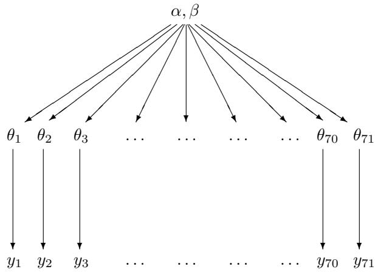  
Figure 5.1: Structure of the hierarchical model for the rat tumor example.

0.103. If we set the mean and standard deviation of the population distribution to these values, we can solve for $\alpha$ and $\beta$ —see (A.3) on page 583 in Appendix A. The resulting estimate for $(\alpha, \beta)$ is (1.4, 8.6). This is not a Bayesian calculation because it is not based on any specified full probability model. We present a better, fully Bayesian approach to estimating $(\alpha, \beta)$ for this example in Section 5.3. The estimate (1.4, 8.6) is simply a starting point from which we can explore the idea of estimating the parameters of the population distribution.

Using the simple estimate of the historical population distribution as a prior distribution for the current experiment yields a Beta(5.4, 18.6) posterior distribution for $\theta_{71}$ : the posterior mean is 0.223, and the standard deviation is 0.083. The prior information has resulted in a posterior mean substantially lower than the crude proportion, $4/14 = 0.286$ , because the weight of experience indicates that the number of tumors in the current experiment is unusually high.

These analyses require that the current tumor risk, $\theta_{71}$ , and the 70 historical tumor risks, $\theta_{1},\ldots ,\theta_{70}$ , be considered a random sample from a common distribution, an assumption that would be invalidated, for example, if it were known that the historical experiments were all done in laboratory A but the current data were gathered in laboratory B, or if time trends were relevant. In practice, a simple, although arbitrary, way of accounting for differences between the current and historical data is to inflate the historical variance. For the beta model, inflating the historical variance means decreasing $(\alpha +\beta)$ while holding $\frac{\alpha}{\beta}$ constant. Other systematic differences, such as a time trend in tumor risks, can be incorporated in a more extensive model.

Having used the 70 historical experiments to form a prior distribution for $\theta_{71}$ , we might now like also to use this same prior distribution to obtain Bayesian inferences for the tumor probabilities in the first 70 experiments, $\theta_{1},\ldots ,\theta_{70}$ . There are several logical and practical problems with the approach of directly estimating a prior distribution from existing data:

- If we wanted to use the estimated prior distribution for inference about the first 70 experiments, then the data would be used twice: first, all the results together are used to estimate the prior distribution, and then each experiment's results are used to estimate its $\theta$ . This would seem to cause us to overestimate our precision.   
- The point estimate for $\alpha$ and $\beta$ seems arbitrary, and using any point estimate for $\alpha$ and $\beta$ necessarily ignores some posterior uncertainty.   
- We can also make the opposite point: does it make sense to 'estimate' $\alpha$ and $\beta$ at all?

They are part of the 'prior' distribution: should they be known before the data are gathered, according to the logic of Bayesian inference?

# Logic of combining information

Despite these problems, it clearly makes more sense to try to estimate the population distribution from all the data, and thereby to help estimate each $\theta_{j}$ , than to estimate all 71 values $\theta_{j}$ separately. Consider the following thought experiment about inference on two of the parameters, $\theta_{26}$ and $\theta_{27}$ , each corresponding to experiments with 2 observed tumors out of 20 rats. Suppose our prior distribution for both $\theta_{26}$ and $\theta_{27}$ is centered around 0.15; now suppose that you were told after completing the data analysis that $\theta_{26} = 0.1$ exactly. This should influence your estimate of $\theta_{27}$ ; in fact, it would probably make you think that $\theta_{27}$ is lower than you previously believed, since the data for the two parameters are identical, and the postulated value of 0.1 is lower than you previously expected for $\theta_{26}$ from the prior distribution. Thus, $\theta_{26}$ and $\theta_{27}$ should be dependent in the posterior distribution, and they should not be analyzed separately.

We retain the advantages of using the data to estimate prior parameters and eliminate all of the disadvantages just mentioned by putting a probability model on the entire set of parameters and experiments and then performing a Bayesian analysis on the joint distribution of all the model parameters. A complete Bayesian analysis is described in Section 5.3. The analysis using the data to estimate the prior parameters, which is sometimes called empirical Bayes, can be viewed as an approximation to the complete hierarchical Bayesian analysis. We prefer to avoid the term 'empirical Bayes' because it misleadingly suggests that the full Bayesian method, which we discuss here and use for the rest of the book, is not 'empirical.'

# 5.2 Exchangeability and setting up hierarchical models

Generalizing from the example of the previous section, consider a set of experiments $j = 1,\ldots ,J$ , in which experiment $j$ has data (vector) $y_{j}$ and parameter (vector) $\theta_{j}$ , with likelihood $p(y_j|\theta_j)$ . (Throughout this chapter we use the word 'experiment' for convenience, but the methods can apply equally well to nonexperimental data.) Some of the parameters in different experiments may overlap; for example, each data vector $y_{j}$ may be a sample of observations from a normal distribution with mean $\mu_{j}$ and common variance $\sigma^2$ , in which case $\theta_{j} = (\mu_{j},\sigma^{2})$ . In order to create a joint probability model for all the parameters $\theta$ , we use the crucial idea of exchangeability introduced in Chapter 1 and used repeatedly since then.

# Exchangeability

If no information—other than the data $y$ —is available to distinguish any of the $\theta_j$ 's from any of the others, and no ordering or grouping of the parameters can be made, one must assume symmetry among the parameters in their prior distribution. This symmetry is represented probabilistically by exchangeability; the parameters $(\theta_1, \dots, \theta_J)$ are exchangeable in their joint distribution if $p(\theta_1, \dots, \theta_J)$ is invariant to permutations of the indexes $(1, \dots, J)$ . For example, in the rat tumor problem, suppose we have no information to distinguish the 71 experiments, other than the sample sizes $n_j$ , which presumably are not related to the values of $\theta_j$ ; we therefore use an exchangeable model for the $\theta_j$ 's.

We have already encountered the concept of exchangeability in constructing independent and identically distributed models for direct data. In practice, ignorance implies exchangeability. Generally, the less we know about a problem, the more confidently we can make

claims of exchangeability. (This is not, we hasten to add, a good reason to limit our knowledge of a problem before embarking on statistical analysis!) Consider the analogy to a roll of a die: we should initially assign equal probabilities to all six outcomes, but if we study the measurements of the die and weigh the die carefully, we might eventually notice imperfections, which might make us favor one outcome over the others and thus eliminate the symmetry among the six outcomes.

The simplest form of an exchangeable distribution has each of the parameters $\theta_{j}$ as an independent sample from a prior (or population) distribution governed by some unknown parameter vector $\phi$ ; thus,

$$
p (\theta | \phi) = \prod_ {j = 1} ^ {J} p \left(\theta_ {j} \mid \phi\right). \tag {5.1}
$$

In general, $\phi$ is unknown, so our distribution for $\theta$ must average over our uncertainty in $\phi$ :

$$
p (\theta) = \int \left(\prod_ {j = 1} ^ {J} p \left(\theta_ {j} \mid \phi\right)\right) p (\phi) d \phi , \tag {5.2}
$$

This form, the mixture of independent identical distributions, is usually all that we need to capture exchangeability in practice.

A related theoretical result, de Finetti's theorem, to which we alluded in Section 1.2, states that in the limit as $J \to \infty$ , any suitably well-behaved exchangeable distribution on $(\theta_{1},\ldots ,\theta_{J})$ can be expressed as a mixture of independent and identical distributions as in (5.2). The theorem does not hold when $J$ is finite (see Exercises 5.1, 5.2, and 5.4). Statistically, the mixture model characterizes parameters $\theta$ as drawn from a common 'superpopulation' that is determined by the unknown hyperparameters, $\phi$ . We are already familiar with exchangeable models for data, $y_{1},\dots ,y_{n}$ , in the form of likelihoods in which the $n$ observations are independent and identically distributed, given some parameter vector $\theta$ .

As a simple counterexample to the above mixture model, consider the probabilities of a given die landing on each of its six faces. The probabilities $\theta_{1},\ldots ,\theta_{6}$ are exchangeable, but the six parameters $\theta_{j}$ are constrained to sum to 1 and so cannot be modeled with a mixture of independent identical distributions; nonetheless, they can be modeled exchangeably.

# Example. Exchangeability and sampling

The following thought experiment illustrates the role of exchangeability in inference from random sampling. For simplicity, we use a nonhierarchical example with exchangeability at the level of $y$ rather than $\theta$ .

We, the authors, have selected eight states out of the United States and recorded the divorce rate per 1000 population in each state in 1981. Call these $y_{1}, \ldots, y_{8}$ . What can you, the reader, say about $y_{8}$ , the divorce rate in the eighth state?

Since you have no information to distinguish any of the eight states from the others, you must model them exchangeably. You might use a beta distribution for the eight $y_{j}$ 's, a logit normal, or some other prior distribution restricted to the range [0,1]. Unless you are familiar with divorce statistics in the United States, your distribution on $(y_{1},\ldots ,y_{8})$ should be fairly vague.

We now randomly sample seven states from these eight and tell you their divorce rates: 5.8, 6.6, 7.8, 5.6, 7.0, 7.1, 5.4, each in numbers of divorces per 1000 population (per year). Based primarily on the data, a reasonable posterior (predictive) distribution for the remaining value, $y_{8}$ , would probably be centered around 6.5 and have most of its mass between 5.0 and 8.0. Changing the indexing does not change the joint distribution. If we relabel the remaining value to be any other $y_{j}$ the posterior estimate would be the same. $y_{j}$ are exchangeable but they are not independent as we

assume that the divorce rate in the eighth unobserved state is probably similar to the observed rates.

Suppose initially we had given you the further prior information that the eight states are Mountain states: Arizona, Colorado, Idaho, Montana, Nevada, New Mexico, Utah, and Wyoming, but selected in a random order; you still are not told which observed rate corresponds to which state. Now, before the seven data points were observed, the eight divorce rates should still be modeled exchangeably. However, your prior distribution (that is, before seeing the data), for the eight numbers should change: it seems reasonable to assume that Utah, with its large Mormon population, has a much lower divorce rate, and Nevada, with its liberal divorce laws, has a much higher divorce rate, than the remaining six states. Perhaps, given your expectation of outliers in the distribution, your prior distribution should have wide tails. Given this extra information (the names of the eight states), when you see the seven observed values and note that the numbers are so close together, it might seem a reasonable guess that the missing eighth state is Nevada or Utah. Therefore its value might be expected to be much lower or much higher than the seven values observed. This might lead to a bimodal or trimodal posterior distribution to account for the two plausible scenarios. The prior distribution on the eight values $y_{j}$ is still exchangeable, however, because you have no information telling which state corresponds to which index number. (See Exercise 5.6.)

Finally, we tell you that the state not sampled (corresponding to $y_{8}$ ) was Nevada. Now, even before seeing the seven observed values, you cannot assign an exchangeable prior distribution to the set of eight divorce rates, since you have information that distinguishes $y_{8}$ from the other seven numbers, here suspecting it is larger than any of the others. Once $y_{1}, \ldots, y_{7}$ have been observed, a reasonable posterior distribution for $y_{8}$ plausibly should have most of its mass above the largest observed rate, that is, $p(y_{8} > \max(y_{1}, \ldots, y_{7}) | y_{1}, \ldots, y_{7})$ should be large.

Incidentally, Nevada's divorce rate in 1981 was 13.9 per 1000 population.

Exchangeability when additional information is available on the units

Often observations are not fully exchangeable, but are partially or conditionally exchangeable:

- If observations can be grouped, we may make hierarchical model, where each group has its own submodel, but the group properties are unknown. If we assume that group properties are exchangeable, we can use a common prior distribution for the group properties.   
- If $y_{i}$ has additional information $x_{i}$ so that $y_{i}$ are not exchangeable but $(y_{i}, x_{i})$ still are exchangeable, then we can make a joint model for $(y_{i}, x_{i})$ or a conditional model for $y_{i} | x_{i}$ .

In the rat tumor example, $y_{j}$ were exchangeable as no additional knowledge was available on experimental conditions. If we knew that specific batches of experiments were made in different laboratories we could assume partial exchangeability and use two level hierarchical model to model variation within each laboratory and between laboratories.

In the divorce example, if we knew $x_{j}$ , the divorce rate in state $j$ last year, for $j = 1, \ldots, 8$ , but not which index corresponded to which state, then we would certainly be able to distinguish the eight values of $y_{j}$ , but the joint prior distribution $p(x_{j}, y_{j})$ would be the same for each state. For states having the same last year divorce rates $x_{j}$ , we could use grouping and assume partial exchangeability or if there are many possible values for $x_{j}$ (as we would assume for divorce rates) we could assume conditional exchangeability and use $x_{j}$ as covariate in regression model.

In general, the usual way to model exchangeability with covariates is through conditional independence: $p(\theta_1,\ldots ,\theta_J|x_1,\ldots ,x_J) = \int [\prod_{j = 1}^J p(\theta_j|\phi ,x_j)]p(\phi |x)d\phi$ , with $x = (x_{1},\dots,x_{J})$ . In this way, exchangeable models become almost universally applicable, because any information available to distinguish different units should be encoded in the $x$ and $y$ variables.

In the rat tumor example, we have already noted that the sample sizes $n_j$ are the only available information to distinguish the different experiments. It does not seem likely that $n_j$ would be a useful variable for modeling tumor rates, but if one were interested, one could create an exchangeable model for the $J$ pairs $(n,y)_j$ . A natural first step would be to plot $\frac{y_j}{n_j}$ vs. $n_j$ to see any obvious relation that could be modeled. For example, perhaps some studies $j$ had larger sample sizes $n_j$ because the investigators correctly suspected rarer events; that is, smaller $\theta_j$ and thus smaller expected values of $\frac{y_j}{n_j}$ . In fact, the plot of $\frac{y_j}{n_j}$ versus $n_j$ , not shown here, shows no apparent relation between the two variables.

# Objections to exchangeable models

In virtually any statistical application, it is natural to object to exchangeability on the grounds that the units actually differ. For example, the 71 rat tumor experiments were performed at different times, on different rats, and presumably in different laboratories. Such information does not, however, invalidate exchangeability. That the experiments differ implies that the $\theta_{j}$ 's differ, but it might be perfectly acceptable to consider them as if drawn from a common distribution. In fact, with no information available to distinguish them, we have no logical choice but to model the $\theta_{j}$ 's exchangeably. Objecting to exchangeability for modeling ignorance is no more reasonable than objecting to an independent and identically distributed model for samples from a common population, objecting to regression models in general, or, for that matter, objecting to displaying points in a scatterplot without individual labels. As with regression, the valid concern is not about exchangeability, but about encoding relevant knowledge as explanatory variables where possible.

# The full Bayesian treatment of the hierarchical model

Returning to the problem of inference, the key 'hierarchical' part of these models is that $\phi$ is not known and thus has its own prior distribution, $p(\phi)$ . The appropriate Bayesian posterior distribution is of the vector $(\phi, \theta)$ . The joint prior distribution is

$$
p (\phi , \theta) = p (\phi) p (\theta | \phi),
$$

and the joint posterior distribution is

$$
\begin{array}{l} p (\phi , \theta | y) \propto p (\phi , \theta) p (y | \phi , \theta) \\ = p (\phi , \theta) p (y | \theta), \tag {5.3} \\ \end{array}
$$

with the latter simplification holding because the data distribution, $p(y|\phi ,\theta)$ , depends only on $\theta$ ; the hyperparameters $\phi$ affect $y$ only through $\theta$ . Previously, we assumed $\phi$ was known, which is unrealistic; now we include the uncertainty in $\phi$ in the model.

# The hyperprior distribution

In order to create a joint probability distribution for $(\phi, \theta)$ , we must assign a prior distribution to $\phi$ . If little is known about $\phi$ , we can assign a diffuse prior distribution, but we must be careful when using an improper prior density to check that the resulting posterior distribution is proper, and we should assess whether our conclusions are sensitive to

this simplifying assumption. In most real problems, one should have enough substantive knowledge about the parameters in $\phi$ at least to constrain the hyperparameters into a finite region, if not to assign a substantive hyperprior distribution. As in nonhierarchical models, it is often practical to start with a simple, relatively noninformative, prior distribution on $\phi$ and seek to add more prior information if there remains too much variation in the posterior distribution.

In the rat tumor example, the hyperparameters are $(\alpha, \beta)$ , which determine the beta distribution for $\theta$ . We illustrate one approach to constructing an appropriate hyperprior distribution in the continuation of that example in the next section.

# Posterior predictive distributions

Hierarchical models are characterized both by hyperparameters, $\phi$ , in our notation, and parameters $\theta$ . There are two posterior predictive distributions that might be of interest to the data analyst: (1) the distribution of future observations $\tilde{y}$ corresponding to an existing $\theta_{j}$ , or (2) the distribution of observations $\tilde{y}$ corresponding to future $\theta_{j}$ 's drawn from the same superpopulation. We label the future $\theta_{j}$ 's as $\tilde{\theta}$ . Both kinds of replications can be used to assess model adequacy, as we discuss in Chapter 6. In the rat tumor example, future observations can be (1) additional rats from an existing experiment, or (2) results from a future experiment. In the former case, the posterior predictive draws $\tilde{y}$ are based on the posterior draws of $\theta_{j}$ for the existing experiment. In the latter case, one must first draw $\tilde{\theta}$ for the new experiment from the population distribution, given the posterior draws of $\phi$ , and then draw $\tilde{y}$ given the simulated $\tilde{\theta}$ .

# 5.3 Fully Bayesian analysis of conjugate hierarchical models

Our inferential strategy for hierarchical models follows the general approach to multiparameter problems presented in Section 3.8 but is more difficult in practice because of the large number of parameters that commonly appear in a hierarchical model. In particular, we cannot generally plot the contours or display a scatterplot of the simulations from the joint posterior distribution of $(\theta, \phi)$ . With care, however, we can follow a similar simulation-based approach as before.

In this section, we present an approach that combines analytical and numerical methods to obtain simulations from the joint posterior distribution, $p(\theta, \phi | y)$ , for the beta-binomial model for the rat-tumor example, for which the population distribution, $p(\theta | \phi)$ , is conjugate to the likelihood, $p(y | \theta)$ . For the many nonconjugate hierarchical models that arise in practice, more advanced computational methods, presented in Part III of this book, are necessary. Even for more complicated problems, however, the approach using conjugate distributions is useful for obtaining approximate estimates and starting points for more accurate computations.

# Analytic derivation of conditional and marginal distributions

We first perform the following three steps analytically.

1. Write the joint posterior density, $p(\theta, \phi | y)$ , in unnormalized form as a product of the hyperprior distribution $p(\phi)$ , the population distribution $p(\theta | \phi)$ , and the likelihood $p(y | \theta)$ .   
2. Determine analytically the conditional posterior density of $\theta$ given the hyperparameters $\phi$ ; for fixed observed $y$ , this is a function of $\phi$ , $p(\theta|\phi,y)$ .   
3. Estimate $\phi$ using the Bayesian paradigm; that is, obtain its marginal posterior distribution, $p(\phi |y)$

The first step is immediate, and the second step is easy for conjugate models because, conditional on $\phi$ , the population distribution for $\theta$ is just the independent and identically distributed model (5.1), so that the conditional posterior density is a product of conjugate posterior densities for the components $\theta_{j}$ .

The third step can be performed by brute force by integrating the joint posterior distribution over $\theta$ :

$$
p (\phi | y) = \int p (\theta , \phi | y) d \theta . \tag {5.4}
$$

For many standard models, however, including the normal distribution, the marginal posterior distribution of $\phi$ can be computed algebraically using the conditional probability formula,

$$
p (\phi | y) = \frac {p (\theta , \phi | y)}{p (\theta | \phi , y)}. \tag {5.5}
$$

This expression is useful because the numerator is just the joint posterior distribution (5.3), and the denominator is the posterior distribution for $\theta$ if $\phi$ were known. The difficulty in using (5.5), beyond a few standard conjugate models, is that the denominator, $p(\theta|\phi,y)$ , regarded as a function of both $\theta$ and $\phi$ for fixed $y$ , has a normalizing factor that depends on $\phi$ as well as $y$ . One must be careful with the proportionality 'constant' in Bayes' theorem, especially when using hierarchical models, to make sure it is actually constant. Exercise 5.11 has an example of a nonconjugate model in which the integral (5.4) has no closed-form solution so that (5.5) is no help.

# Drawing simulations from the posterior distribution

The following strategy is useful for simulating a draw from the joint posterior distribution, $p(\theta ,\phi |y)$ , for simple hierarchical models such as are considered in this chapter.

1. Draw the vector of hyperparameters, $\phi$ , from its marginal posterior distribution, $p(\phi | y)$ . If $\phi$ is low-dimensional, the methods discussed in Chapter 3 can be used; for high-dimensional $\phi$ , more sophisticated methods such as described in Part III may be needed.   
2. Draw the parameter vector $\theta$ from its conditional posterior distribution, $p(\theta|\phi,y)$ , given the drawn value of $\phi$ . For the examples we consider in this chapter, the factorization $p(\theta|\phi,y) = \prod_j p(\theta_j|\phi,y)$ holds, and so the components $\theta_j$ can be drawn independently, one at a time.   
3. If desired, draw predictive values $\tilde{y}$ from the posterior predictive distribution given the drawn $\theta$ . Depending on the problem, it might be necessary first to draw a new value $\tilde{\theta}$ , given $\phi$ , as discussed at the end of the previous section.

As usual, the above steps are performed $L$ times in order to obtain a set of $L$ draws. From the joint posterior simulations of $\theta$ and $\tilde{y}$ , we can compute the posterior distribution of any estimand or predictive quantity of interest.

# Application to the model for rat tumors

We now perform a full Bayesian analysis of the rat tumor experiments described in Section 5.1. Once again, the data from experiments $j = 1,\dots ,J$ , $J = 71$ , are assumed to follow independent binomial distributions:

$$
y _ {j} \sim \mathrm {B i n} (n _ {j}, \theta_ {j}),
$$

with the number of rats, $n_j$ , known. The parameters $\theta_j$ are assumed to be independent samples from a beta distribution:

$$
\theta_ {j} \sim \operatorname {B e t a} (\alpha , \beta),
$$

and we shall assign a noninformative hyperprior distribution to reflect our ignorance about the unknown hyperparameters. As usual, the word 'noninformative' indicates our attitude toward this part of the model and is not intended to imply that this particular distribution has any special properties. If the hyperprior distribution turns out to be crucial for our inference, we should report this and if possible seek further substantive knowledge that could be used to construct a more informative prior distribution. If we wish to assign an improper prior distribution for the hyperparameters, $(\alpha, \beta)$ , we must check that the posterior distribution is proper. We defer the choice of noninformative hyperprior distribution, a relatively arbitrary and unimportant part of this particular analysis, until we inspect the integrability of the posterior density.

Joint, conditional, and marginal posterior distributions. We first perform the three steps for determining the analytic form of the posterior distribution. The joint posterior distribution of all parameters is

$$
\begin{array}{l} p (\theta , \alpha , \beta | y) \propto p (\alpha , \beta) p (\theta | \alpha , \beta) p (y | \theta , \alpha , \beta) \\ \propto p (\alpha , \beta) \prod_ {j = 1} ^ {J} \frac {\Gamma (\alpha + \beta)}{\Gamma (\alpha) \Gamma (\beta)} \theta_ {j} ^ {\alpha - 1} (1 - \theta_ {j}) ^ {\beta - 1} \prod_ {j = 1} ^ {J} \theta_ {j} ^ {y _ {j}} (1 - \theta_ {j}) ^ {n _ {j} - y _ {j}}. \tag {5.6} \\ \end{array}
$$

Given $(\alpha, \beta)$ , the components of $\theta$ have independent posterior densities that are of the form $\theta_j^A (1 - \theta_j)^B$ —that is, beta densities—and the joint density is

$$
p (\theta | \alpha , \beta , y) = \prod_ {j = 1} ^ {J} \frac {\Gamma (\alpha + \beta + n _ {j})}{\Gamma (\alpha + y _ {j}) \Gamma (\beta + n _ {j} - y _ {j})} \theta_ {j} ^ {\alpha + y _ {j} - 1} (1 - \theta_ {j}) ^ {\beta + n _ {j} - y _ {j} - 1}. \tag {5.7}
$$

We can determine the marginal posterior distribution of $(\alpha, \beta)$ by substituting (5.6) and (5.7) into the conditional probability formula (5.5):

$$
p (\alpha , \beta | y) \propto p (\alpha , \beta) \prod_ {j = 1} ^ {J} \frac {\Gamma (\alpha + \beta)}{\Gamma (\alpha) \Gamma (\beta)} \frac {\Gamma (\alpha + y _ {j}) \Gamma (\beta + n _ {j} - y _ {j})}{\Gamma (\alpha + \beta + n _ {j})}. \tag {5.8}
$$

The product in equation (5.8) cannot be simplified analytically but is easy to compute for any specified values of $(\alpha, \beta)$ using a standard routine to compute the gamma function.

Choosing a standard parameterization and setting up a 'noninformative' hyperprior distribution. Because we have no immediately available information about the distribution of tumor rates in populations of rats, we seek a relatively diffuse hyperprior distribution for $(\alpha, \beta)$ . Before assigning a hyperprior distribution, we reparameterize in terms of $\log (\frac{\alpha}{\alpha + \beta}) = \log (\frac{\alpha}{\beta})$ and $\log (\alpha + \beta)$ , which are the logit of the mean and the logarithm of the 'sample size' in the beta population distribution for $\theta$ . It would seem reasonable to assign independent hyperprior distributions to the prior mean and 'sample size,' and we use the logistic and logarithmic transformations to put each on a $(- \infty, \infty)$ scale. Unfortunately, a uniform prior density on these newly transformed parameters yields an improper posterior density, with an infinite integral in the limit $(\alpha + \beta) \to \infty$ , and so this particular prior density cannot be used here.

In a problem such as this with a reasonably large amount of data, it is possible to set up a 'noninformative' hyperprior density that is dominated by the likelihood and yields a proper posterior distribution. One reasonable choice of diffuse hyperprior density is uniform on $(\frac{\alpha}{\alpha + \beta}, (\alpha + \beta)^{-1/2})$ , which when multiplied by the appropriate Jacobian yields the following densities on the original scale,

$$
p (\alpha , \beta) \propto (\alpha + \beta) ^ {- 5 / 2}, \tag {5.9}
$$

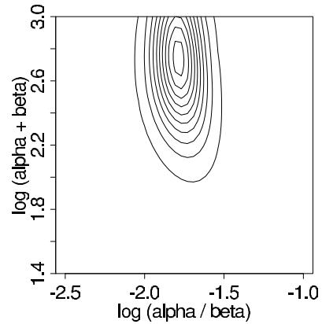  
Figure 5.2 First try at a contour plot of the marginal posterior density of $(\log (\frac{\alpha}{\beta}),\log (\alpha +\beta))$ for the rat tumor example. Contour lines are at 0.05, 0.15, ..., 0.95 times the density at the mode.

and on the natural transformed scale:

$$
p \left(\log \left(\frac {\alpha}{\beta}\right), \log (\alpha + \beta)\right) \propto \alpha \beta (\alpha + \beta) ^ {- 5 / 2}. \tag {5.10}
$$

See Exercise 5.9 for a discussion of this prior density.

We could avoid the mathematical effort of checking the integrability of the posterior density if we were to use a proper hyperprior distribution. Another approach would be tentatively to use a flat hyperprior density, such as $p\left(\frac{\alpha}{\alpha + \beta}, \alpha + \beta\right) \propto 1$ , or even $p(\alpha, \beta) \propto 1$ , and then compute the contours and simulations from the posterior density (as detailed below). The result would clearly show the posterior contours drifting off toward infinity, indicating that the posterior density is not integrable in that limit. The prior distribution would then have to be altered to obtain an integrable posterior density.

Incidentally, setting the prior distribution for $(\log (\frac{\alpha}{\beta}),\log (\alpha +\beta))$ to uniform in a vague but finite range, such as $[-10^{10},10^{10}]\times [-10^{10},10^{10}]$ , would not be an acceptable solution for this problem, as almost all the posterior mass in this case would be in the range of $\alpha$ and $\beta$ near 'infinity,' which corresponds to a $\mathrm{Beta}(\alpha ,\beta)$ distribution with a variance of zero, meaning that all the $\theta_{j}$ parameters would be essentially equal in the posterior distribution. When the likelihood is not integrable, setting a faraway finite cutoff to a uniform prior density does not necessarily eliminate the problem.

Computing the marginal posterior density of the hyperparameters. Now that we have established a full probability model for data and parameters, we compute the marginal posterior distribution of the hyperparameters. Figure 5.2 shows a contour plot of the unnormalized marginal posterior density on a grid of values of $(\log (\frac{\alpha}{\beta}),\log (\alpha +\beta))$ . To create the plot, we first compute the logarithm of the density function (5.8) with prior density (5.9), multiplying by the Jacobian to obtain the density $p(\log (\frac{\alpha}{\beta}),\log (\alpha +\beta)|y)$ . We set a grid in the range $(\log (\frac{\alpha}{\beta}),\log (\alpha +\beta))\in [-2.5, - 1]\times [1.5,3]$ , which is centered near our earlier point estimate $(-1.8,2.3)$ (that is, $(\alpha ,\beta) = (1.4,8.6))$ and covers a factor of 4 in each parameter. Then, to avoid computational overflows, we subtract the maximum value of the log density from each point on the grid and exponentiate, yielding values of the unnormalized marginal posterior density.

The most obvious features of the contour plot are (1) the mode is not far from the point estimate (as we would expect), and (2) important parts of the marginal posterior distribution lie outside the range of the graph.

We recompute $p(\log (\frac{\alpha}{\beta}), \log (\alpha + \beta)|y)$ , this time in the range $(\log (\frac{\alpha}{\beta}), \log (\alpha + \beta)) \in$

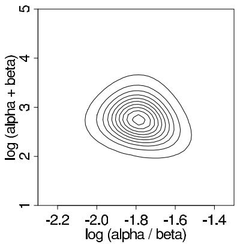

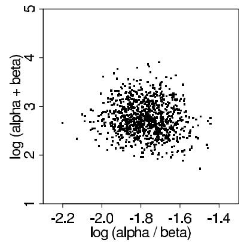  
Figure 5.3 (a) Contour plot of the marginal posterior density of $(\log (\frac{\alpha}{\beta}),\log (\alpha +\beta))$ for the rat tumor example. Contour lines are at 0.05, 0.15, ..., 0.95 times the density at the mode. (b) Scatterplot of 1000 draws $(\log (\frac{\alpha}{\beta}),\log (\alpha +\beta))$ from the numerically computed marginal posterior density.

$[-2.3, -1.3] \times [1, 5]$ . The resulting grid, shown in Figure 5.3a, displays essentially all of the marginal posterior distribution. Figure 5.3b displays 1000 random draws from the numerically computed posterior distribution. The graphs show that the marginal posterior distribution of the hyperparameters, under this transformation, is approximately symmetric about the mode, roughly $(-1.75, 2.8)$ . This corresponds to approximate values of $(\alpha, \beta) = (2.4, 14.0)$ , which differs somewhat from the crude estimate obtained earlier.

Having computed the relative posterior density at a grid that covers the effective range of $(\alpha, \beta)$ , we normalize by approximating the distribution as a step function over the grid and setting the total probability in the grid to 1.

We can then compute posterior moments based on the grid of $(\log (\frac{\alpha}{\beta}),\log (\alpha +\beta))$ ; for example,

$$
\operatorname {E}(\alpha |y) \text{is estimated by}\sum_{\log (\frac{\alpha}{\beta}),\log (\alpha +\beta)}\alpha \cdot p(\log (\frac{\alpha}{\beta}),\log (\alpha +\beta)|y).
$$

From the grid in Figure 5.3, we compute $\operatorname{E}(\alpha | y) = 2.4$ and $\operatorname{E}(\beta | y) = 14.3$ . This is close to the estimate based on the mode of Figure 5.3a, given above, because the posterior distribution is approximately symmetric on the scale of $(\log(\frac{\alpha}{\beta}), \log(\alpha + \beta))$ . A more important consequence of averaging over the grid is to account for the posterior uncertainty in $(\alpha, \beta)$ , which is not captured in the point estimate.

Sampling from the joint posterior distribution of parameters and hyperparameters. We draw 1000 random samples from the joint posterior distribution of $(\alpha, \beta, \theta_1, \ldots, \theta_J)$ , as follows.

1. Simulate 1000 draws of $(\log (\frac{\alpha}{\beta}),\log (\alpha +\beta))$ from their posterior distribution displayed in Figure 5.3, using the same discrete-grid sampling procedure used to draw $(\alpha ,\beta)$ for Figure 3.3b in the bioassay example of Section 3.8.   
2. For $l = 1, \dots, 1000$ :

(a) Transform the $l$ th draw of $(\log(\frac{\alpha}{\beta}), \log(\alpha + \beta))$ to the scale $(\alpha, \beta)$ to yield a draw of the hyperparameters from their marginal posterior distribution.   
(b) For each $j = 1,\dots ,J$ sample $\theta_{j}$ from its conditional posterior distribution, $\theta_{j}|\alpha ,\beta ,y\sim$ $\mathrm{Beta}(\alpha +y_j,\beta +n_j - y_j)$

Displaying the results. Figure 5.4 shows posterior medians and $95\%$ intervals for the $\theta_{j}$ 's, computed by simulation. The rates $\theta_{j}$ are shrunk from their sample point estimates, $\frac{y_j}{n_j}$ ,

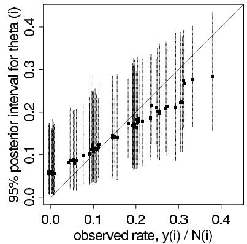  
Figure 5.4 Posterior medians and $95\%$ intervals of rat tumor rates, $\theta_{j}$ (plotted vs. observed tumor rates $y_{j} / n_{j}$ ), based on simulations from the joint posterior distribution. The $45^{\circ}$ line corresponds to the unpooled estimates, $\hat{\theta}_i = y_i / n_i$ . The horizontal positions of the line have been jittered to reduce overlap.

towards the population distribution, with approximate mean 0.14; experiments with fewer observations are shrunk more and have higher posterior variances. The results are superficially similar to what would be obtained based on a point estimate of the hyperparameters, which makes sense in this example, because of the fairly large number of experiments. But key differences remain, notably that posterior variability is higher in the full Bayesian analysis, reflecting posterior uncertainty in the hyperparameters.

# 5.4 Estimating exchangeable parameters from a normal model

We now present a full treatment of a simple hierarchical model based on the normal distribution, in which observed data are normally distributed with a different mean for each 'group' or 'experiment,' with known observation variance, and a normal population distribution for the group means. This model is sometimes termed the one-way normal random-effects model with known data variance and is widely applicable, being an important special case of the hierarchical normal linear model, which we treat in some generality in Chapter 15. In this section, we present a general treatment following the computational approach of Section 5.3. The following section presents a detailed example; those impatient with the algebraic details may wish to look ahead at the example for motivation.

# The data structure

Consider $J$ independent experiments, with experiment $j$ estimating the parameter $\theta_{j}$ from $n_j$ independent normally distributed data points, $y_{ij}$ , each with known error variance $\sigma^2$ ; that is,

$$
y _ {i j} | \theta_ {j} \sim \mathrm {N} (\theta_ {j}, \sigma^ {2}), \text {f o r} i = 1, \dots , n _ {j}; j = 1, \dots , J. \tag {5.11}
$$

Using standard notation from the analysis of variance, we label the sample mean of each group $j$ as

$$
\bar {y} _ {. j} = \frac {1}{n _ {j}} \sum_ {i = 1} ^ {n _ {j}} y _ {i j}
$$

with sampling variance

$$
\sigma_ {j} ^ {2} = \sigma^ {2} / n _ {j}.
$$

We can then write the likelihood for each $\theta_{j}$ using the sufficient statistics, $\overline{y}_{j}$ :

$$
\bar {y} _ {. j} \left| \theta_ {j} \sim \mathrm {N} \left(\theta_ {j}, \sigma_ {j} ^ {2}\right), \right. \tag {5.12}
$$

a notation that will prove useful later because of the flexibility in allowing a separate variance $\sigma_j^2$ for the mean of each group $j$ . For the rest of this chapter, all expressions will be implicitly conditional on the known values $\sigma_j^2$ . The problem of estimating a set of means with unknown variances will require some additional computational methods, presented in Sections 11.6 and 13.6. Although rarely strictly true, the assumption of known variances at the sampling level of the model is often an adequate approximation.

The treatment of the model provided in this section is also appropriate for situations in which the variances differ for reasons other than the number of data points in the experiment. In fact, the likelihood (5.12) can appear in much more general contexts than that stated here. For example, if the group sizes $n_j$ are large enough, then the means $\overline{y}_{j}$ are approximately normally distributed, given $\theta_{j}$ , even when the data $y_{ij}$ are not. Other applications where the actual likelihood is well approximated by (5.12) appear in the next two sections.

# Constructing a prior distribution from pragmatic considerations

Rather than considering immediately the problem of specifying a prior distribution for the parameter vector $\theta = (\theta_{1},\dots,\theta_{J})$ , let us consider what sorts of posterior estimates might be reasonable for $\theta$ , given data $(y_{ij})$ . A simple natural approach is to estimate $\theta_{j}$ by $\overline{y}_{.j}$ , the average outcome in experiment $j$ . But what if, for example, there are $J = 20$ experiments with only $n_j = 2$ observations per experimental group, and the groups are 20 pairs of assays taken from the same strain of rat, under essentially identical conditions? The two observations per group do not permit accurate estimates. Since the 20 groups are from the same strain of rat, we might now prefer to estimate each $\theta_{j}$ by the pooled estimate,

$$
\bar {y} _ {\cdot \cdot} = \frac {\sum_ {j = 1} ^ {J} \frac {1}{\sigma_ {j} ^ {2}} \bar {y} _ {\cdot j}}{\sum_ {j = 1} ^ {J} \frac {1}{\sigma_ {j} ^ {2}}}. \tag {5.13}
$$

To decide which estimate to use, a traditional approach from classical statistics is to perform an analysis of variance $F$ test for differences among means: if the $J$ group means appear significantly variable, choose separate sample means, and if the variance between the group means is not significantly greater than what could be explained by individual variability within groups, use $\overline{y}_{\cdot}$ . The theoretical analysis of variance table is as follows, where $\tau^2$ is the variance of $\theta_{1}, \ldots, \theta_{J}$ . For simplicity, we present the analysis of variance for a balanced design in which $n_j = n$ and $\sigma_j^2 = \sigma^2 / n$ for all $j$ .

<table><tr><td></td><td>df</td><td>SS</td><td>MS</td><td>E(MS|σ2,τ)</td></tr><tr><td>Between groups</td><td>J-1</td><td>∑i ∑j (y.j - y..)2</td><td>SS/(J-1)</td><td>nτ2 + σ2</td></tr><tr><td>Within groups</td><td>J(n-1)</td><td>∑i ∑j (yij - y..)2</td><td>SS/(J(n-1))</td><td>σ2</td></tr><tr><td>Total</td><td>Jn-1</td><td>∑i ∑j (yij - y..)2</td><td>SS/(Jn-1)</td><td></td></tr></table>

In the classical random-effects analysis of variance, one computes the sum of squares (SS) and the mean square (MS) columns of the table and uses the 'between' and 'within' mean squares to estimate $\tau$ . If the ratio of between to within mean squares is significantly greater than 1, then the analysis of variance suggests separate estimates, $\hat{\theta}_j = \overline{y}_{.j}$ for each $j$ . If the ratio of mean squares is not 'statistically significant,' then the $F$ test cannot 'reject the hypothesis' that $\tau = 0$ , and pooling is reasonable: $\hat{\theta}_j = \overline{y}_{..}$ , for all $j$ . We discuss Bayesian analysis of variance in Section 15.6 in the context of hierarchical regression models.

But we are not forced to choose between complete pooling and none at all. An alternative is to use a weighted combination:

$$
\hat {\theta} _ {j} = \lambda_ {j} \overline {{y}} _ {. j} + (1 - \lambda_ {j}) \overline {{y}} _ {..},
$$

where $\lambda_{j}$ is between 0 and 1.

What kind of prior models produce these various posterior estimates?

1. The unbounded estimate $\hat{\theta}_j = \overline{y}_{.j}$ is the posterior mean if the $J$ values $\theta_{j}$ have independent uniform prior densities on $(-\infty ,\infty)$ .   
2. The pooled estimate $\hat{\theta} = \overline{y}$ is the posterior mean if the $J$ values $\theta_{j}$ are restricted to be equal, with a uniform prior density on the common $\theta$ .   
3. The weighted combination is the posterior mean if the $J$ values $\theta_{j}$ have independent and identically distributed normal prior densities.

All three of these options are exchangeable in the $\theta_{j}$ 's, and options 1 and 2 are special cases of option 3. No pooling corresponds to $\lambda_{j} \equiv 1$ for all $j$ and an infinite prior variance for the $\theta_{j}$ 's, and complete pooling corresponds to $\lambda_{j} \equiv 0$ for all $j$ and a zero prior variance for the $\theta_{j}$ 's.

# The hierarchical model

For the convenience of conjugacy (more accurately, partial conjugacy), we assume that the parameters $\theta_{j}$ are drawn from a normal distribution with hyperparameters $(\mu ,\tau)$ :

$$
p \left(\theta_ {1}, \dots , \theta_ {J} \mid \mu , \tau\right) = \prod_ {j = 1} ^ {J} \mathrm {N} \left(\theta_ {j} \mid \mu , \tau^ {2}\right) \tag {5.14}
$$

$$
p (\theta_ {1}, \dots , \theta_ {J}) = \int \prod_ {j = 1} ^ {J} \left[ \mathrm {N} (\theta_ {j} | \mu , \tau^ {2}) \right] p (\mu , \tau) d (\mu , \tau).
$$

That is, the $\theta_{j}$ 's are conditionally independent given $(\mu, \tau)$ . The hierarchical model also permits the interpretation of the $\theta_{j}$ 's as a random sample from a shared population distribution, as illustrated in Figure 5.1 for the rat tumors.

We assign a noninformative uniform hyperprior distribution to $\mu$ , given $\tau$ :

$$
p (\mu , \tau) = p (\mu | \tau) p (\tau) \propto p (\tau). \tag {5.15}
$$

The uniform prior density for $\mu$ is generally reasonable for this problem; because the combined data from all $J$ experiments are generally highly informative about $\mu$ , we can afford to be vague about its prior distribution. We defer discussion of the prior distribution of $\tau$ to later in the analysis, although relevant principles have already been discussed in the context of the rat tumor example. As usual, we first work out the answer conditional on the hyperparameters and then consider their prior and posterior distributions.

# The joint posterior distribution

Combining the sampling model for the observable $y_{ij}$ 's and the prior distribution yields the joint posterior distribution of all the parameters and hyperparameters, which we can express in terms of the sufficient statistics, $\overline{y}_{.j}$ :

$$
\begin{array}{l} p (\theta , \mu , \tau | y) \propto p (\mu , \tau) p (\theta | \mu , \tau) p (y | \theta) \\ \propto \quad p (\mu , \tau) \prod_ {j = 1} ^ {J} \mathrm {N} \left(\theta_ {j} \mid \mu , \tau^ {2}\right) \prod_ {j = 1} ^ {J} \mathrm {N} \left(\bar {y} _ {. j} \mid \theta_ {j}, \sigma_ {j} ^ {2}\right), \tag {5.16} \\ \end{array}
$$

where we can ignore factors that depend only on $y$ and the parameters $\sigma_{j}$ , which are assumed known for this analysis.

The conditional posterior distribution of the normal means, given the hyperparameters

As in the general hierarchical structure, the parameters $\theta_{j}$ are independent in the prior distribution (given $\mu$ and $\tau$ ) and appear in different factors in the likelihood (5.11); thus, the conditional posterior distribution $p(\theta|\mu, \tau, y)$ factors into $J$ components.

Conditional on the hyperparameters, we simply have $J$ independent unknown normal means, given normal prior distributions, so we can use the methods of Section 2.5 independently on each $\theta_{j}$ . The conditional posterior distributions for the $\theta_{j}$ 's are independent, and

$$
\theta_ {j} | \mu , \tau , y \sim \mathrm {N} (\hat {\theta} _ {j}, V _ {j}),
$$

where

$$
\hat {\theta} _ {j} = \frac {\frac {1}{\sigma_ {j} ^ {2}} \bar {y} _ {. j} + \frac {1}{\tau^ {2}} \mu}{\frac {1}{\sigma_ {j} ^ {2}} + \frac {1}{\tau^ {2}}} \quad \text {a n d} \quad V _ {j} = \frac {1}{\frac {1}{\sigma_ {j} ^ {2}} + \frac {1}{\tau^ {2}}}. \tag {5.17}
$$

The posterior mean is a precision-weighted average of the prior population mean and the sample mean of the $j$ th group; these expressions for $\hat{\theta}_j$ and $V_j$ are functions of $\mu$ and $\tau$ as well as the data. The conditional posterior density for each $\theta_j$ given $\mu, \tau$ is proper.

The marginal posterior distribution of the hyperparameters

The solution so far is only partial because it depends on the unknown $\mu$ and $\tau$ . The next step in our approach is a full Bayesian treatment for the hyperparameters. Section 5.3 mentions integration or analytic computation as two approaches for obtaining $p(\mu, \tau | y)$ from the joint posterior density $p(\theta, \mu, \tau | y)$ . For the hierarchical normal model, we can simply consider the information supplied by the data about the hyperparameters directly:

$$
p (\mu , \tau | y) \propto p (\mu , \tau) p (y | \mu , \tau).
$$

For many problems, this decomposition is no help, because the 'marginal likelihood' factor, $p(y|\mu ,\tau)$ , cannot generally be written in closed form. For the normal distribution, however, the marginal likelihood has a particularly simple form. The marginal distributions of the group means $\overline{y}_{.j}$ , averaging over $\theta$ , are independent (but not identically distributed) normal:

$$
\overline {{y}} _ {. j} | \mu , \tau \sim \mathrm {N} (\mu , \sigma_ {j} ^ {2} + \tau^ {2}).
$$

Thus we can write the marginal posterior density as

$$
p (\mu , \tau | y) \propto p (\mu , \tau) \prod_ {j = 1} ^ {J} \mathrm {N} \left(\bar {y} _ {. j} \mid \mu , \sigma_ {j} ^ {2} + \tau^ {2}\right). \tag {5.18}
$$

Posterior distribution of $\mu$ given $\tau$ . We could use (5.18) to compute directly the posterior distribution $p(\mu, \tau | y)$ as a function of two variables and proceed as in the rat tumor example. For the normal model, however, we can further simplify by integrating over $\mu$ , leaving a simple univariate numerical computation of $p(\tau | y)$ . We factor the marginal posterior density of the hyperparameters as we did the prior density (5.15):

$$
p (\mu , \tau | y) = p (\mu | \tau , y) p (\tau | y). \tag {5.19}
$$

The first factor on the right side of (5.19) is just the posterior distribution of $\mu$ if $\tau$ were known. From inspection of (5.18) with $\tau$ assumed known, and with a uniform conditional

prior density $p(\mu|\tau)$ , the log posterior distribution is found to be quadratic in $\mu$ ; thus, $p(\mu|\tau,y)$ must be normal. The mean and variance of this distribution can be obtained immediately by considering the group means $\overline{y}_{.j}$ as $J$ independent estimates of $\mu$ with variances $(\sigma_{j}^{2} + \tau^{2})$ . Combining the data with the uniform prior density $p(\mu|\tau)$ yields

$$
\mu | \tau , y \sim \mathrm {N} (\hat {\mu}, V _ {\mu}),
$$

where $\hat{\mu}$ is the precision-weighted average of the $\overline{y}_{j}$ -values, and $V_{\mu}^{-1}$ is the total precision:

$$
\hat {\mu} = \frac {\sum_ {j = 1} ^ {J} \frac {1}{\sigma_ {j} ^ {2} + \tau^ {2}} \bar {y} _ {. j}}{\sum_ {j = 1} ^ {J} \frac {1}{\sigma_ {j} ^ {2} + \tau^ {2}}} \quad \text {a n d} \quad V _ {\mu} ^ {- 1} = \sum_ {j = 1} ^ {J} \frac {1}{\sigma_ {j} ^ {2} + \tau^ {2}}. \tag {5.20}
$$

The result is a proper posterior density for $\mu$ , given $\tau$ .

Posterior distribution of $\tau$ . We can now obtain the posterior distribution of $\tau$ analytically from (5.19) and substitution of (5.18) and (5.20) for the numerator and denominator, respectively:

$$
\begin{array}{l} p (\tau | y) = \frac {p (\mu , \tau | y)}{p (\mu | \tau , y)} \\ \propto \frac {p (\tau) \prod_ {j = 1} ^ {J} \mathrm {N} (\overline {{y}} _ {. j} | \mu , \sigma_ {j} ^ {2} + \tau^ {2})}{\mathrm {N} (\mu | \hat {\mu} , V _ {\mu})}. \\ \end{array}
$$

This identity must hold for any value of $\mu$ (in other words, all the factors of $\mu$ must cancel when the expression is simplified); in particular, it holds if we set $\mu$ to $\hat{\mu}$ , which makes evaluation of the expression simple:

$$
\begin{array}{l} p (\tau | y) \propto \frac {p (\tau) \prod_ {j = 1} ^ {J} \mathrm {N} (\overline {{y}} _ {\cdot j} | \hat {\mu} , \sigma_ {j} ^ {2} + \tau^ {2})}{\mathrm {N} (\hat {\mu} | \hat {\mu} , V _ {\mu})} \\ \propto p (\tau) V _ {\mu} ^ {1 / 2} \prod_ {j = 1} ^ {J} \left(\sigma_ {j} ^ {2} + \tau^ {2}\right) ^ {- 1 / 2} \exp \left(- \frac {(\bar {y} _ {. j} - \hat {\mu}) ^ {2}}{2 \left(\sigma_ {j} ^ {2} + \tau^ {2}\right)}\right), \tag {5.21} \\ \end{array}
$$

with $\hat{\mu}$ and $V_{\mu}$ defined in (5.20). Both expressions are functions of $\tau$ , which means that $p(\tau | y)$ is a complicated function of $\tau$ .

Prior distribution for $\tau$ . To complete our analysis, we must assign a prior distribution to $\tau$ . For convenience, we use a diffuse noninformative prior density for $\tau$ and hence must examine the resulting posterior density to ensure it has a finite integral. For our illustrative analysis, we use the uniform prior distribution, $p(\tau) \propto 1$ . We leave it as an exercise to show mathematically that the uniform prior density for $\tau$ yields a proper posterior density and that, in contrast, the seemingly reasonable 'noninformative' prior distribution for a variance component, $p(\log \tau) \propto 1$ , yields an improper posterior distribution for $\tau$ . Alternatively, in applications it involves little extra effort to determine a 'best guess' and an upper bound for the population variance $\tau$ , and a reasonable prior distribution can then be constructed from the scaled inverse- $\chi^2$ family (the natural choice for variance parameters), matching the 'best guess' to the mean of the scaled inverse- $\chi^2$ density and the upper bound to an upper percentile such as the 99th. Once an initial analysis is performed using the noninformative 'uniform' prior density, a sensitivity analysis with a more realistic prior distribution is often desirable.

# Computation

For this model, computation of the posterior distribution of $\theta$ is most conveniently performed via simulation, following the factorization used above:

$$
p (\theta , \mu , \tau | y) = p (\tau | y) p (\mu | \tau , y) p (\theta | \mu , \tau , y).
$$

The first step, simulating $\tau$ , is easily performed numerically using the inverse cdf method (see Section 1.9) on a grid of uniformly spaced values of $\tau$ , with $p(\tau | y)$ computed from (5.21). The second and third steps, simulating $\mu$ and then $\theta$ , can both be done easily by sampling from normal distributions, first (5.20) to obtain $\mu$ and then (5.17) to obtain the $\theta_{j}$ 's independently.

# Posterior predictive distributions

Sampling from the posterior predictive distribution of new data, either from a current or new batch, is straightforward given draws from the posterior distribution of the parameters. We consider two scenarios: (1) future data $\tilde{y}$ from the current set of batches, with means $\theta = (\theta_{1},\dots,\theta_{J})$ , and (2) future data $\tilde{y}$ from $\tilde{J}$ future batches, with means $\tilde{\theta} = (\tilde{\theta}_1,\dots,\tilde{\theta}_{\tilde{J}})$ . In the latter case, we must also specify the $\tilde{J}$ individual sample sizes $\tilde{n}_j$ for the future batches.

To obtain a draw from the posterior predictive distribution of new data $\tilde{y}$ from the current batch of parameters, $\theta$ , first obtain a draw from $p(\theta, \mu, \tau | y)$ and then draw the predictive data $\tilde{y}$ from (5.11).

To obtain posterior predictive simulations of new data $\tilde{y}$ for $\tilde{J}$ new groups, perform the following three steps: first, draw $(\mu, \tau)$ from their posterior distribution; second, draw $\tilde{J}$ new parameters $\tilde{\theta} = (\tilde{\theta}_1, \dots, \tilde{\theta}_{\tilde{J}})$ from the population distribution $p(\tilde{\theta}_j | \mu, \tau)$ , which is the population, or prior, distribution for $\theta$ given the hyperparameters (equation (5.14)); and third, draw $\tilde{y}$ given $\tilde{\theta}$ from the data distribution (5.11).

Difficulty with a natural non-Bayesian estimate of the hyperparameters

To see some advantages of our fully Bayesian approach, we compare it to an approximate method that is sometimes used based on a point estimate of $\mu$ and $\tau$ from the data. Unbiased point estimates, derived from the analysis of variance presented earlier, are

$$
\hat {\mu} = \bar {y} _ {\cdot}.
$$

$$
\hat {\tau} ^ {2} = \left(\mathrm {M S} _ {B} - \mathrm {M S} _ {W}\right) / n. \tag {5.22}
$$

The terms $\mathrm{MS}_B$ and $\mathrm{MS}_W$ are the 'between' and 'within' mean squares, respectively, from the analysis of variance. In this alternative approach, inference for $\theta_1,\ldots ,\theta_J$ is based on the conditional posterior distribution, $p(\theta |\hat{\mu},\hat{\tau})$ , given the point estimates.

As we saw in the rat tumor example of the previous section, the main problem with substituting point estimates for the hyperparameters is that it ignores our real uncertainty about them. The resulting inference for $\theta$ cannot be interpreted as a Bayesian posterior summary. In addition, the estimate $\hat{\tau}^2$ in (5.22) has the flaw that it can be negative! The problem of a negative estimate for a variance component can be avoided by setting $\hat{\tau}^2$ to zero in the case that $\mathrm{MS}_W$ exceeds $\mathrm{MS}_B$ , but this creates new issues. Estimating $\tau^2 = 0$ whenever $\mathrm{MS}_W > \mathrm{MS}_B$ seems too strong a claim: if $\mathrm{MS}_W > \mathrm{MS}_B$ , then the sample size is too small for $\tau^2$ to be distinguished from zero, but this is not the same as saying we know that $\tau^2 = 0$ . The latter claim, made implicitly by the point estimate, implies that all the group means $\theta_j$ are absolutely identical, which leads to scientifically indefensible claims, as we shall see in the example in the next section. It is possible to construct a point estimate

of $(\mu, \tau)$ to avoid this particular difficulty, but it would still have the problem, common to all point estimates, of ignoring uncertainty.

# 5.5 Example: parallel experiments in eight schools

We illustrate the hierarchical normal model with a problem in which the Bayesian analysis gives conclusions that differ in important respects from other methods.

A study was performed for the Educational Testing Service to analyze the effects of special coaching programs on test scores. Separate randomized experiments were performed to estimate the effects of coaching programs for the SAT-V (Scholastic Aptitude Test-Verbal) in each of eight high schools. The outcome variable in each study was the score on a special administration of the SAT-V, a standardized multiple choice test administered by the Educational Testing Service and used to help colleges make admissions decisions; the scores can vary between 200 and 800, with mean about 500 and standard deviation about 100. The SAT examinations are designed to be resistant to short-term efforts directed specifically toward improving performance on the test; instead they are designed to reflect knowledge acquired and abilities developed over many years of education. Nevertheless, each of the eight schools in this study considered its short-term coaching program to be successful at increasing SAT scores. Also, there was no prior reason to believe that any of the eight programs was more effective than any other or that some were more similar in effect to each other than to any other.

The results of the experiments are summarized in Table 5.2. All students in the experiments had already taken the PSAT (Preliminary SAT), and allowance was made for differences in the PSAT-M (Mathematics) and PSAT-V test scores between coached and uncoached students. In particular, in each school the estimated coaching effect and its standard error were obtained by an analysis of covariance adjustment (that is, a linear regression was performed of SAT-V on treatment group, using PSAT-M and PSAT-V as control variables) appropriate for a completely randomized experiment. A separate regression was estimated for each school. Although not simple sample means (because of the covariance adjustments), the estimated coaching effects, which we label $y_{j}$ , and their sampling variances, $\sigma_{j}^{2}$ , play the same role in our model as $\overline{y}_{.j}$ and $\sigma_{j}^{2}$ in the previous section. The estimates $y_{j}$ are obtained by independent experiments and have approximately normal sampling distributions with sampling variances that are known, for all practical purposes, because the sample sizes in all of the eight experiments were relatively large, over thirty students in each school (recall the discussion of data reduction in Section 4.1). Incidentally, an increase of eight points on the SAT-V corresponds to about one more test item correct.

# Inferences based on nonhierarchical models and their problems

Before fitting the hierarchical Bayesian model, we first consider two simpler nonhierarchical methods—estimating the effects from the eight experiments independently, and complete pooling—and discuss why neither of these approaches is adequate for this example.

Separate estimates. A cursory examination of Table 5.2 may at first suggest that some coaching programs have moderate effects (in the range 18-28 points), most have small effects (0-12 points), and two have small negative effects; however, when we take note of the standard errors of these estimated effects, we see that it is difficult statistically to distinguish between any of the experiments. For example, treating each experiment separately and applying the simple normal analysis in each yields $95\%$ posterior intervals that all overlap substantially.

A pooled estimate. The general overlap in the posterior intervals based on independent analyses suggests that all experiments might be estimating the same quantity. Under the

Table 5.2 Observed effects of special preparation on SAT-V scores in eight randomized experiments. Estimates are based on separate analyses for the eight experiments.   

<table><tr><td>School</td><td>Estimated treatment effect, yj</td><td>Standard error of effect estimate, σj</td></tr><tr><td>A</td><td>28</td><td>15</td></tr><tr><td>B</td><td>8</td><td>10</td></tr><tr><td>C</td><td>-3</td><td>16</td></tr><tr><td>D</td><td>7</td><td>11</td></tr><tr><td>E</td><td>-1</td><td>9</td></tr><tr><td>F</td><td>1</td><td>11</td></tr><tr><td>G</td><td>18</td><td>10</td></tr><tr><td>H</td><td>12</td><td>18</td></tr></table>

hypothesis that all experiments have the same effect and produce independent estimates of this common effect, we could treat the data in Table 5.2 as eight normally distributed observations with known variances. With a noninformative prior distribution, the posterior mean for the common coaching effect in the schools is $\overline{y}_{..}$ , as defined in equation (5.13) with $y_{j}$ in place of $\overline{y}_{.j}$ . This pooled estimate is 7.7, and the posterior variance is $(\sum_{j=1}^{8} \frac{1}{\sigma_j^2})^{-1} = 16.6$ because the eight experiments are independent. Thus, we would estimate the common effect to be 7.7 points with standard error equal to $\sqrt{16.6} = 4.1$ , which would lead to the $95\%$ posterior interval $[-0.5, 15.9]$ , or approximately $[8 \pm 8]$ . Supporting this analysis, the classical test of the hypothesis that all $\theta_j$ 's are estimating the same quantity yields a $\chi^2$ statistic less than its degrees of freedom (seven, in this case): $\sum_{j=1}^{8} (y_j - \overline{y}_{..})^2 / \sigma_i^2 = 4.6$ . To put it another way, the estimate $\hat{\tau}^2$ from (5.22) is negative.

Would it be possible to have one school's observed effect be 28 just by chance, if the coaching effects in all eight schools were really the same? To get a feeling for the natural variation that we would expect across eight studies if this assumption were true, suppose the estimated treatment effects are eight independent draws from a normal distribution with mean 8 points and standard deviation 13 points (the square root of the mean of the eight variances $\sigma_j^2$ ). Then, based on the expected values of normal order statistics, we would expect the largest observed value of $y_{j}$ to be about 26 points and the others, in diminishing order, to be about 19, 14, 10, 6, 2, -3, and -9 points. These expected effect sizes are consistent with the set of observed effect sizes in Table 5.2. Thus, it would appear imprudent to believe that school A really has an effect as large as 28 points.

Difficulties with the separate and pooled estimates. To see the problems with the two extreme attitudes—the separate analyses that consider each $\theta_{j}$ separately, and the alternative view (a single common effect) that leads to the pooled estimate—consider $\theta_{1}$ , the effect in school A. The effect in school A is estimated as 28.4 with a standard error of 14.9 under the separate analysis, versus a pooled estimate of 7.7 with a standard error of 4.1 under the common-effect model. The separate analyses of the eight schools imply the following posterior statement: 'the probability is $\frac{1}{2}$ that the true effect in A is more than 28.4,' a doubtful statement, considering the results for the other seven schools. On the other hand, the pooled model implies the following statement: 'the probability is $\frac{1}{2}$ that the true effect in A is less than 7.7,' which, despite the non-significant $\chi^2$ test, seems an inaccurate summary of our knowledge. The pooled model also implies the statement: 'the probability is $\frac{1}{2}$ that the true effect in A is less than the true effect in C,' which also is difficult to justify given the data in Table 5.2. As in the theoretical discussion of the previous section, neither estimate is fully satisfactory, and we would like a compromise that combines information

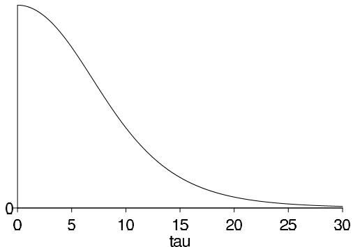  
Figure 5.5 Marginal posterior density, $p(\tau | y)$ , for standard deviation of the population of school effects $\theta_{j}$ in the educational testing example.

from all eight experiments without assuming all the $\theta_{j}$ 's to be equal. The Bayesian analysis under the hierarchical model provides exactly that.

# Posterior simulation under the hierarchical model

Consequently, we compute the posterior distribution of $\theta_{1},\ldots ,\theta_{8}$ , based on the normal model presented in Section 5.4. (More discussion of the reasonableness of applying this model in this problem appears in Sections 6.5 and 17.4.) We draw from the posterior distribution for the Bayesian model by simulating the random variables $\tau$ , $\mu$ , and $\theta$ , in that order, from their posterior distribution, as discussed at the end of the previous section. The sampling standard deviations, $\sigma_{j}$ , are assumed known and equal to the values in Table 5.2, and we assume independent uniform prior densities on $\mu$ and $\tau$ .

# Results

The marginal posterior density function, $p(\tau | y)$ from (5.21), is plotted in Figure 5.5. Values of $\tau$ near zero are most plausible; zero is the most likely value, values of $\tau$ larger than 10 are less than half as likely as $\tau = 0$ , and $\operatorname{Pr}(\tau > 25) \approx 0$ . Inference regarding the marginal distributions of the other model parameters and the joint distribution are obtained from the simulated values. Illustrations are provided in the discussion that follows this section. In the normal hierarchical model, however, we learn a great deal by considering the conditional posterior distributions given $\tau$ (and averaged over $\mu$ ).

The conditional posterior means $\mathrm{E}(\theta_j|\tau, y)$ (averaging over $\mu$ ) are displayed as functions of $\tau$ in Figure 5.6; the vertical axis displays the scale for the $\theta_j$ 's. Comparing Figure 5.6 to Figure 5.5, which has the same scale on the horizontal axis, we see that for most of the likely values of $\tau$ , the estimated effects are relatively close together; as $\tau$ becomes larger, corresponding to more variability among schools, the estimates become more like the raw values in Table 5.2.

The lines in Figure 5.7 show the conditional standard deviations, $\mathrm{sd}(\theta_j|\tau ,y)$ , as a function of $\tau$ . As $\tau$ increases, the population distribution allows the eight effects to be more different from each other, and hence the posterior uncertainty in each individual $\theta_{j}$ increases, approaching the standard deviations in Table 5.2 in the limit of $\tau \to \infty$ . (The posterior means and standard deviations for the components $\theta_{j}$ , given $\tau$ , are computed using the mean and variance formulas (2.7) and (2.8), averaging over $\mu$ ; see Exercise 5.12.)

The general conclusion from an examination of Figures 5.5-5.7 is that an effect as large as 28.4 points in any school is unlikely. For the likely values of $\tau$ , the estimates in all schools are substantially less than 28 points. For example, even at $\tau = 10$ , the probability

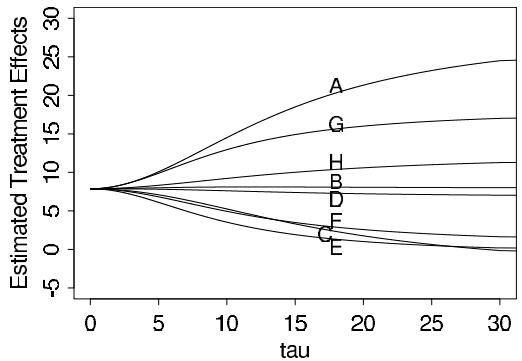

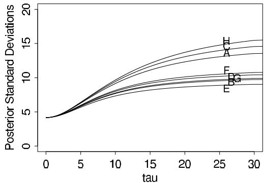  
Figure 5.6 Conditional posterior means of treatment effects, $E(\theta_j|\tau, y)$ , as functions of the between-school standard deviation $\tau$ , for the educational testing example. The line for school C crosses the lines for E and F because C has a higher measurement error (see Table 5.2) and its estimate is therefore shrunk more strongly toward the overall mean in the Bayesian analysis.   
Figure 5.7 Conditional posterior standard deviations of treatment effects, $\mathrm{sd}(\theta_j|\tau ,y)$ , as functions of the between-school standard deviation $\tau$ , for the educational testing example.

that the effect in school A is less than 28 points is $\Phi[(28 - 14.5)/9.1] = 93\%$ , where $\Phi$ is the standard normal cumulative distribution function; the corresponding probabilities for the effects being less than 28 points in the other schools are $99.5\%$ , $99.2\%$ , $98.5\%$ , $99.96\%$ , $99.8\%$ , $97\%$ , and $98\%$ .

Of substantial importance, we do not obtain an accurate summary of the data if we condition on the posterior mode of $\tau$ . The technique of conditioning on a modal value (for example, the maximum likelihood estimate) of a hyperparameter such as $\tau$ is often used in practice (at least as an approximation), but it ignores the uncertainty conveyed by the posterior distribution of the hyperparameter. At $\tau = 0$ , the inference is that all experiments have the same size effect, 7.7 points, and the same standard error, 4.1 points. Figures 5.5-5.7 certainly suggest that this answer represents too much pulling together of the estimates in the eight schools. The problem is especially acute in this example because the posterior mode of $\tau$ is on the boundary of its parameter space. A joint posterior modal estimate of $(\theta_{1},\ldots ,\theta_{J},\mu ,\tau)$ suffers from even worse problems in general.

# Discussion

Table 5.3 summarizes the 200 simulated effect estimates for all eight schools. In one sense, these results are similar to the pooled $95\%$ interval $[8 \pm 8]$ , in that the eight Bayesian $95\%$ intervals largely overlap and are median-centered between 5 and 10. In a second sense,

Table 5.3: Summary of 200 simulations of the treatment effects in the eight schools.   

<table><tr><td>School</td><td colspan="5">Posterior quantiles</td></tr><tr><td></td><td>2.5%</td><td>25%</td><td>median</td><td>75%</td><td>97.5%</td></tr><tr><td>A</td><td>-2</td><td>7</td><td>10</td><td>16</td><td>31</td></tr><tr><td>B</td><td>-5</td><td>3</td><td>8</td><td>12</td><td>23</td></tr><tr><td>C</td><td>-11</td><td>2</td><td>7</td><td>11</td><td>19</td></tr><tr><td>D</td><td>-7</td><td>4</td><td>8</td><td>11</td><td>21</td></tr><tr><td>E</td><td>-9</td><td>1</td><td>5</td><td>10</td><td>18</td></tr><tr><td>F</td><td>-7</td><td>2</td><td>6</td><td>10</td><td>28</td></tr><tr><td>G</td><td>-1</td><td>7</td><td>10</td><td>15</td><td>26</td></tr><tr><td>H</td><td>-6</td><td>3</td><td>8</td><td>13</td><td>33</td></tr></table>

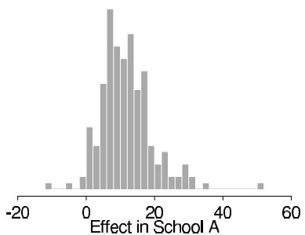

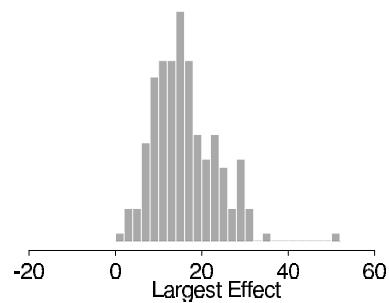  
Figure 5.8 Histograms of two quantities of interest computed from the 200 simulation draws: (a) the effect in school $A$ , $\theta_{1}$ ; (b) the largest effect, $\max\{\theta_{j}\}$ . The jaggedness of the histograms is just an artifact caused by sampling variability from using only 200 random draws.

the results in the table differ from the pooled estimate in a direction toward the eight independent answers: the $95\%$ Bayesian intervals are each almost twice as wide as the one common interval and suggest substantially greater probabilities of effects larger than 16 points, especially in school A, and greater probabilities of negative effects, especially in school C. If greater precision were required in the posterior intervals, one could simulate more simulation draws; we use only 200 draws here to illustrate that a small simulation gives adequate inference for many practical purposes.

The ordering of the effects in the eight schools as suggested by Table 5.3 is essentially the same as would be obtained by the eight separate estimates. However, there are differences in the details; for example, the Bayesian probability that the effect in school A is as large as 28 points is less than $10\%$ , which is substantially less than the $50\%$ probability based on the separate estimate for school A.

As an illustration of the simulation-based posterior results, 200 simulations of school A's effect are shown in Figure 5.8a. Having simulated the parameter $\theta$ , it is easy to ask more complicated questions of this model. For example, what is the posterior distribution of $\max \{\theta_j\}$ , the effect of the most successful of the eight coaching programs? Figure 5.8b displays a histogram of 200 values from this posterior distribution and shows that only 22 draws are larger than 28.4; thus, $\operatorname{Pr}(\max \{\theta_j\} > 28.4) \approx \frac{22}{200}$ . Since Figure 5.8a gives the marginal posterior distribution of the effect in school A, and Figure 5.8b gives the marginal posterior distribution of the largest effect no matter which school it is in, the latter figure has larger values. For another example, we can estimate $\operatorname{Pr}(\theta_1 > \theta_3|y)$ , the posterior probability that the coaching program is more effective in school A than in school C, by the proportion of simulated draws of $\theta$ for which $\theta_1 > \theta_3$ ; the result is $\frac{141}{200} = 0.705$ .

To sum up, the Bayesian analysis of this example not only allows straightforward inferences about many parameters that may be of interest, but the hierarchical model is flexible

Table 5.4 Results of 22 clinical trials of beta-blockers for reducing mortality after myocardial infarction, with empirical log-odds and approximate sampling variances. Data from Yusuf et al. (1985). Posterior quantiles of treatment effects are based on 5000 draws from a Bayesian hierarchical model described here. Negative effects correspond to reduced probability of death under the treatment.   

<table><tr><td rowspan="3">Study, j</td><td colspan="2">Raw data (deaths/total)</td><td rowspan="3">Log- odds, yj</td><td rowspan="3">sd, σj</td><td colspan="5">Posterior quantiles of effect θj</td></tr><tr><td rowspan="2">Control</td><td rowspan="2">Treated</td><td colspan="5">normal approx. (on log-odds scale)</td></tr><tr><td>2.5%</td><td>25%</td><td>median</td><td>75%</td><td>97.5%</td></tr><tr><td>1</td><td>3/39</td><td>3/38</td><td>0.028</td><td>0.850</td><td>-0.57</td><td>-0.33</td><td>-0.24</td><td>-0.16</td><td>0.12</td></tr><tr><td>2</td><td>14/116</td><td>7/114</td><td>-0.741</td><td>0.483</td><td>-0.64</td><td>-0.37</td><td>-0.28</td><td>-0.20</td><td>-0.00</td></tr><tr><td>3</td><td>11/93</td><td>5/69</td><td>-0.541</td><td>0.565</td><td>-0.60</td><td>-0.35</td><td>-0.26</td><td>-0.18</td><td>0.05</td></tr><tr><td>4</td><td>127/1520</td><td>102/1533</td><td>-0.246</td><td>0.138</td><td>-0.45</td><td>-0.31</td><td>-0.25</td><td>-0.19</td><td>-0.05</td></tr><tr><td>5</td><td>27/365</td><td>28/355</td><td>0.069</td><td>0.281</td><td>-0.43</td><td>-0.28</td><td>-0.21</td><td>-0.11</td><td>0.15</td></tr><tr><td>6</td><td>6/52</td><td>4/59</td><td>-0.584</td><td>0.676</td><td>-0.62</td><td>-0.35</td><td>-0.26</td><td>-0.18</td><td>0.05</td></tr><tr><td>7</td><td>152/939</td><td>98/945</td><td>-0.512</td><td>0.139</td><td>-0.61</td><td>-0.43</td><td>-0.36</td><td>-0.28</td><td>-0.17</td></tr><tr><td>8</td><td>48/471</td><td>60/632</td><td>-0.079</td><td>0.204</td><td>-0.43</td><td>-0.28</td><td>-0.21</td><td>-0.13</td><td>0.08</td></tr><tr><td>9</td><td>37/282</td><td>25/278</td><td>-0.424</td><td>0.274</td><td>-0.58</td><td>-0.36</td><td>-0.28</td><td>-0.20</td><td>-0.02</td></tr><tr><td>10</td><td>188/1921</td><td>138/1916</td><td>-0.335</td><td>0.117</td><td>-0.48</td><td>-0.35</td><td>-0.29</td><td>-0.23</td><td>-0.13</td></tr><tr><td>11</td><td>52/583</td><td>64/873</td><td>-0.213</td><td>0.195</td><td>-0.48</td><td>-0.31</td><td>-0.24</td><td>-0.17</td><td>0.01</td></tr><tr><td>12</td><td>47/266</td><td>45/263</td><td>-0.039</td><td>0.229</td><td>-0.43</td><td>-0.28</td><td>-0.21</td><td>-0.12</td><td>0.11</td></tr><tr><td>13</td><td>16/293</td><td>9/291</td><td>-0.593</td><td>0.425</td><td>-0.63</td><td>-0.36</td><td>-0.28</td><td>-0.20</td><td>0.01</td></tr><tr><td>14</td><td>45/883</td><td>57/858</td><td>0.282</td><td>0.205</td><td>-0.34</td><td>-0.22</td><td>-0.12</td><td>0.00</td><td>0.27</td></tr><tr><td>15</td><td>31/147</td><td>25/154</td><td>-0.321</td><td>0.298</td><td>-0.56</td><td>-0.34</td><td>-0.26</td><td>-0.19</td><td>0.01</td></tr><tr><td>16</td><td>38/213</td><td>33/207</td><td>-0.135</td><td>0.261</td><td>-0.48</td><td>-0.30</td><td>-0.23</td><td>-0.15</td><td>0.08</td></tr><tr><td>17</td><td>12/122</td><td>28/251</td><td>0.141</td><td>0.364</td><td>-0.47</td><td>-0.29</td><td>-0.21</td><td>-0.12</td><td>0.17</td></tr><tr><td>18</td><td>6/154</td><td>8/151</td><td>0.322</td><td>0.553</td><td>-0.51</td><td>-0.30</td><td>-0.23</td><td>-0.13</td><td>0.15</td></tr><tr><td>19</td><td>3/134</td><td>6/174</td><td>0.444</td><td>0.717</td><td>-0.53</td><td>-0.31</td><td>-0.23</td><td>-0.14</td><td>0.15</td></tr><tr><td>20</td><td>40/218</td><td>32/209</td><td>-0.218</td><td>0.260</td><td>-0.50</td><td>-0.32</td><td>-0.25</td><td>-0.17</td><td>0.04</td></tr><tr><td>21</td><td>43/364</td><td>27/391</td><td>-0.591</td><td>0.257</td><td>-0.64</td><td>-0.40</td><td>-0.31</td><td>-0.23</td><td>-0.09</td></tr><tr><td>22</td><td>39/674</td><td>22/680</td><td>-0.608</td><td>0.272</td><td>-0.65</td><td>-0.40</td><td>-0.31</td><td>-0.23</td><td>-0.07</td></tr></table>

enough to adapt to the data, thereby providing posterior inferences that account for the partial pooling as well as the uncertainty in the hyperparameters.

# 5.6 Hierarchical modeling applied to a meta-analysis

Meta-analysis is an increasingly popular and important process of summarizing and integrating the findings of research studies in a particular area. As a method for combining information from several parallel data sources, meta-analysis is closely connected to hierarchical modeling. In this section we consider a relatively simple application of hierarchical modeling to a meta-analysis in medicine. We consider another meta-analysis problem in the context of a decision problem in Section 9.2.

The data in our medical example are displayed in the first three columns of Table 5.4, which summarize mortality after myocardial infarction in 22 clinical trials, each consisting of two groups of heart attack patients randomly allocated to receive or not receive beta-blockers (a family of drugs that affect the central nervous system and can relax the heart muscles). Mortality varies from $3\%$ to $21\%$ across the studies, most of which show a modest, though not 'statistically significant,' benefit from the use of beta-blockers. The aim of a meta-analysis is to provide a combined analysis of the studies that indicates the overall strength of the evidence for a beneficial effect of the treatment under study. Before proceeding to a formal meta-analysis, it is important to apply rigorous criteria in determining which studies are included. (This relates to concerns of ignorantability in data collection for observational studies, as discussed in Chapter 8.)

# Defining a parameter for each study

In the beta-blocker example, the meta-analysis involves data in the form of several $2 \times 2$ tables. If clinical trial $j$ (in the series to be considered for meta-analysis) involves the use of $n_{0j}$ subjects in the control group and $n_{1j}$ in the treatment group, giving rise to $y_{0j}$ and $y_{1j}$ deaths in control and treatment groups, respectively, then the usual sampling model involves two independent binomial distributions with probabilities of death $p_{0j}$ and $p_{1j}$ , respectively. Estimands of interest include the difference in probabilities, $p_{1j} - p_{0j}$ , the probability or risk ratio, $p_{1j} / p_{0j}$ , and the odds ratio, $\rho_j = \frac{p_{1j}}{1 - p_{1j}} / \frac{p_{0j}}{1 - p_{0j}}$ . For a number of reasons, including interpretability in a range of study designs (including case-control studies as well as clinical trials and cohort studies), and the fact that its posterior distribution is close to normality even for relatively small sample sizes, we concentrate on inference for the (natural) logarithm of the odds ratio, which we label $\theta_j = \log \rho_j$ .

# A normal approximation to the likelihood

Relatively simple Bayesian meta-analysis is possible using the normal-theory results of the previous sections if we summarize the results of each experiment $j$ with an approximate normal likelihood for the parameter $\theta_{j}$ . This is possible with a number of standard analytic approaches that produce a point estimate and standard errors, which can be regarded as approximating a normal mean and standard deviation. One approach is based on empirical logits: for each study $j$ , one can estimate $\theta_{j}$ by

$$
y _ {j} = \log \left(\frac {y _ {1 j}}{n _ {1 j} - y _ {1 j}}\right) - \log \left(\frac {y _ {0 j}}{n _ {0 j} - y _ {0 j}}\right), \tag {5.23}
$$

with approximate sampling variance

$$
\sigma_ {j} ^ {2} = \frac {1}{y _ {1 j}} + \frac {1}{n _ {1 j} - y _ {1 j}} + \frac {1}{y _ {0 j}} + \frac {1}{n _ {0 j} - y _ {0 j}}. \tag {5.24}
$$

We use the notation $y_{j}$ and $\sigma_j^2$ to be consistent with our earlier expressions for the hierarchical normal model. There are various refinements of these estimates that improve the asymptotic normality of the sampling distributions involved (in particular, it is often recommended to add a fraction such as 0.5 to each of the four counts in the $2\times 2$ table), but whenever study-specific sample sizes are moderately large, such details do not concern us.

The estimated log-odds ratios $y_{j}$ and their estimated standard errors $\sigma_j^2$ are displayed as the fourth and fifth columns of Table 5.4. We use a hierarchical Bayesian analysis to combine information from the 22 studies and gain improved estimates of each $\theta_{j}$ , along with estimates of the mean and variance of the effects over all studies.

# Goals of inference in meta-analysis

Discussions of meta-analysis are sometimes imprecise about the estimands of interest in the analysis, especially when the primary focus is on testing the null hypothesis of no effect in any of the studies to be combined. Our focus is on estimating meaningful parameters, and for this objective there appear to be three possibilities, accepting the overarching assumption that the studies are comparable in some broad sense. The first possibility is that we view the studies as identical replications of each other, in the sense we regard the individuals in all the studies as independent samples from a common population, with the same outcome measures and so on. A second possibility is that the studies are so different that the results of any one study provide no information about the results of any of the others. A third, more general, possibility is that we regard the studies as exchangeable but not necessarily either

identical or completely unrelated; in other words we allow differences from study to study, but such that the differences are not expected a priori to have predictable effects favoring one study over another. As we have discussed in detail in this chapter, this third possibility represents a continuum between the two extremes, and it is this exchangeable model (with unknown hyperparameters characterizing the population distribution) that forms the basis of our Bayesian analysis.

Exchangeability does not dictate the form of the joint distribution of the study effects. In what follows we adopt the convenient assumption of a normal distribution for the varying parameters; in practice it is important to check this assumption using some of the techniques discussed in Chapter 6.

The first potential estimand of a meta-analysis, or a hierarchically structured problem in general, is the mean of the distribution of effect sizes, since this represents the overall 'average' effect across all studies that could be regarded as exchangeable with the observed studies. Other possible estimands are the effect size in any of the observed studies and the effect size in another, comparable (exchangeable) unobserved study.

# What if exchangeability is inappropriate?

When assuming exchangeability we assume there are no important covariates that might form the basis of a more complex model, and this assumption (perhaps misguidedly) is widely adopted in meta-analysis. What if other information (in addition to the data $(n,y)$ ) is available to distinguish among the $J$ studies in a meta-analysis, so that an exchangeable model is inappropriate? In this situation, we can expand the framework of the model to be exchangeable in the observed data and covariates, for example using a hierarchical regression model, as in Chapter 15, so as to estimate how the treatment effect behaves as a function of the covariates. The real aim might in general be to estimate a response surface so that one could predict an effect based on known characteristics of a population and its exposure to risk.

# A hierarchical normal model

A normal population distribution in conjunction with the approximate normal sampling distribution of the study-specific effect estimates allows an analysis of the same form as used for the SAT coaching example in the previous section. Let $y_{j}$ represent generically the point estimate of the effect $\theta_{j}$ in the $j$ th study, obtained from (5.23), where $j = 1,\dots ,J$ . The first stage of the hierarchical normal model assumes that

$$
y _ {j} | \theta_ {j}, \sigma_ {j} \sim \mathrm {N} (\theta_ {j}, \sigma_ {j} ^ {2}),
$$

where $\sigma_{j}$ represents the corresponding estimated standard error from (5.24), which is assumed known without error. The simplification of known variances has little effect here because, with the large sample sizes (more than 50 persons in each treatment group in nearly all of the studies in the beta-blocker example), the binomial variances in each study are precisely estimated. At the second stage of the hierarchy, we again use an exchangeable normal prior distribution, with mean $\mu$ and standard deviation $\tau$ , which are unknown hyperparameters. Finally, a hyperprior distribution is required for $\mu$ and $\tau$ . For this problem, it is reasonable to assume a noninformative or locally uniform prior density for $\mu$ , since even with a small number of studies (say 5 or 10), the combined data become relatively informative about the center of the population distribution of effect sizes. As with the SAT coaching example, we also assume a locally uniform prior density for $\tau$ , essentially for convenience, although it is easy to modify the analysis to include prior information.

Table 5.5 Summary of posterior inference for the overall mean and standard deviation of study effects, and for the predicted effect in a hypothetical future study, from the meta-analysis of the beta-blocker trials in Table 5.4. All effects are on the log-odds scale.   

<table><tr><td rowspan="2">Estimand</td><td colspan="5">Posterior quantiles</td></tr><tr><td>2.5%</td><td>25%</td><td>median</td><td>75%</td><td>97.5%</td></tr><tr><td>Mean, μ</td><td>-0.37</td><td>-0.29</td><td>-0.25</td><td>-0.20</td><td>-0.11</td></tr><tr><td>Standard deviation, τ</td><td>0.02</td><td>0.08</td><td>0.13</td><td>0.18</td><td>0.31</td></tr><tr><td>Predicted effect, θj</td><td>-0.58</td><td>-0.34</td><td>-0.25</td><td>-0.17</td><td>0.11</td></tr></table>

# Results of the analysis and comparison to simpler methods

The analysis of our meta-analysis model now follows exactly the same methodology as in the previous sections. First, a plot (not shown here) similar to Figure 5.5 shows that the marginal posterior density of $\tau$ peaks at a nonzero value, although values near zero are clearly plausible, zero having a posterior density only about $25\%$ lower than that at the mode. Posterior quantiles for the effects $\theta_{j}$ for the 22 studies on the logit scale are displayed as the last columns of Table 5.4.

Since the posterior distribution of $\tau$ is concentrated around values that are small relative to the sampling standard deviations of the data (compare the posterior median of $\tau$ , 0.13, in Table 5.5 to the values of $\sigma_{j}$ in the fourth column of Table 5.4), considerable shrinkage is evident in the Bayes estimates, especially for studies with low internal precision (for example, studies 1, 6, and 18). The substantial degree of homogeneity between the studies is further reflected in the large reductions in posterior variance obtained when going from the study-specific estimates to the Bayesian ones, which borrow strength from each other. Using an approximate approach fixing $\tau$ would yield standard deviations that would be too small compared to the fully Bayesian ones.

Histograms (not shown) of the simulated posterior densities for each of the individual effects exhibit skewness away from the central value of the overall mean, whereas the distribution of the overall mean has greater symmetry. The imprecise studies, such as 2 and 18, exhibit longer-tailed posterior distributions than the more precise ones, such as 7 and 14.

In meta-analysis, interest often focuses on the estimate of the overall mean effect, $\mu$ . Superimposing the graphs (not shown here) of the conditional posterior mean and standard deviation of $\mu$ given $\tau$ on the posterior density of $\tau$ reveals a small range in the plausible values of $\operatorname{E}(\mu|\tau,y)$ , from about $-0.26$ to just over $-0.24$ , but $\operatorname{sd}(\mu|\tau,y)$ varies by a factor of more than 2 across the plausible range of values of $\tau$ . The latter feature indicates the importance of averaging over $\tau$ in order to account adequately for uncertainty in its estimation. In fact, the conditional posterior standard deviation, $\operatorname{sd}(\mu|\tau,y)$ has the value $0.060$ at $\tau = 0.13$ , whereas upon averaging over the posterior distribution for $\tau$ we find a value of $\operatorname{sd}(\mu|y) = 0.071$ .

Table 5.5 gives a summary of posterior inferences for the hyperparameters $\mu$ and $\tau$ and the predicted effect, $\tilde{\theta}_j$ , in a hypothetical future study. The approximate $95\%$ highest posterior density interval for $\mu$ is $[-0.37, -0.11]$ , or $[0.69, 0.90]$ when converted to the odds ratio scale (that is, exponentiated). In contrast, the $95\%$ posterior interval that results from complete pooling—that is, assuming $\tau = 0$ —is considerably narrower, $[0.70, 0.85]$ . In the original published discussion of these data, it was remarked that the latter seems an 'unusually narrow range of uncertainty.' The hierarchical Bayesian analysis suggests that this was due to the use of an inappropriate model that had the effect of claiming all the studies were identical. In mathematical terms, complete pooling makes the assumption that the parameter $\tau$ is exactly zero, whereas the data supply evidence that $\tau$ might be close to zero, but might also plausibly be as high as 0.3. A related concern is that commonly used analyses tend to place undue emphasis on inference for the overall mean effect. Un

certainty about the probable treatment effect in a particular population where a study has not been performed (or indeed in a previously studied population but with a slightly modified treatment) might be more reasonably represented by inference for a new study effect, exchangeable with those for which studies have been performed, rather than for the overall mean. In this case, uncertainty is even greater, as exhibited in the 'Predicted effect' row of Table 5.5; uncertainty for an individual patient includes yet another component of variation. In particular, with the beta-blocker data, there is just over $10\%$ posterior probability that the true effect, $\tilde{\theta}_j$ , in a new study would be positive (corresponding to the treatment increasing the probability of death in that study).

# 5.7 Weakly informative priors for hierarchical variance parameters

A key element in the analyses above is the prior distribution for the scale parameter, $\tau$ . We have used the uniform, but various other noninformative prior distributions have been suggested in the Bayesian literature. It turns out that the choice of 'noninformative' prior distribution can have a big effect on inferences, especially for problems where the number of groups $J$ is small or the group-level variation $\tau$ is small.

We discuss the options here in the context of the normal model, but the principles apply to inferences for group-level variances more generally.

# Concepts relating to the choice of prior distribution

Improper limit of a prior distribution. Improper prior densities can, but do not necessarily, lead to proper posterior distributions. To avoid confusion it is useful to define improper distributions as particular limits of proper distributions. For the group-level variance parameter, two commonly considered improper densities are uniform $(0,A)$ on $\tau$ , as $A \to \infty$ and inverse-gamma $(\epsilon, \epsilon)$ on $\tau^2$ , as $\epsilon \to 0$ .

As we shall see, the uniform $(0,A)$ model yields a limiting proper posterior density as $A\to \infty$ , as long as the number of groups $J$ is at least 3. Thus, for a finite but sufficiently large $A$ , inferences are not sensitive to the choice of $A$ .

In contrast, the inverse-gamma $(\epsilon ,\epsilon)$ model does not have any proper limiting posterior distribution. As a result, posterior inferences are sensitive to $\epsilon$ -it cannot simply be comfortably set to a low value such as 0.001.

Calibration. Posterior inferences can be evaluated using the concept of calibration of the posterior mean, the Bayesian analogue to the classical notion of bias. For any parameter $\theta$ , if we label the posterior mean as $\hat{\theta} = \operatorname{E}(\theta | y)$ , we can define the miscalibration of the posterior mean as $\operatorname{E}(\theta | \hat{\theta}) - \hat{\theta}$ . If the prior distribution is true—that is, if the data are constructed by first drawing $\theta$ from $p(\theta)$ , then drawing $y$ from $p(y | \theta)$ —then the posterior mean is automatically calibrated; that is, the miscalibration is 0 for all values of $\hat{\theta}$ .

To restate: in classical bias analysis, we condition on the true $\theta$ and look at the distribution of the data-based estimate, $\hat{\theta}$ . In a Bayesian calibration analysis, we condition on the data $y$ (and thus also on the estimate, $\hat{\theta}$ ) and look at the distribution of parameters $\theta$ that could have produced these data.

When considering improper models, the theory must be expanded, since it is impossible for $\theta$ to be drawn from an unnormalized density. To evaluate calibration in this context, it is necessary to posit a 'true prior distribution' from which $\theta$ is drawn along with the 'inferential prior distribution' that is used in the Bayesian inference.

For the hierarchical model for the 8 schools, we can consider the improper uniform density on $\tau$ as a limit of uniform prior densities on the range $(0,A)$ , with $A\to \infty$ . For any finite value of $A$ , we can then see that the improper uniform density leads to inferences with a positive miscalibration—that is, overestimates (on average) of $\tau$ .

We demonstrate this miscalibration in two steps. First, suppose that both the true and inferential prior distributions for $\tau$ are uniform on $(0,A)$ . Then the miscalibration is trivially zero. Now keep the true prior distribution at $\mathrm{U}(0,A)$ and let the inferential prior distribution go to $\mathrm{U}(0,\infty)$ . This will necessarily increase $\hat{\theta}$ for any data $y$ (since we are now averaging over values of $\theta$ in the range $[A,\infty)$ ) without changing the true $\theta$ , thus causing the average value of the miscalibration to become positive.

# Classes of noninformative and weakly informative prior distributions for hierarchical variance parameters

General considerations. We view any noninformative or weakly informative prior distribution as inherently provisional—after the model has been fit, one should look at the posterior distribution and see if it makes sense. If the posterior distribution does not make sense, this implies that additional prior knowledge is available that has not been included in the model, and that contradicts the assumptions of the prior distribution that has been used. It is then appropriate to go back and alter the prior distribution to be more consistent with this external knowledge.

Uniform prior distributions. We first consider uniform priors while recognizing that we must be explicit about the scale on which the distribution is defined. Various choices have been proposed for modeling variance parameters. A uniform prior distribution on $\log \tau$ would seem natural—working with the logarithm of a parameter that must be positive—but it results in an improper posterior distribution. An alternative would be to define the prior distribution on a compact set (e.g., in the range $[-A, A]$ for some large value of $A$ ), but then the posterior distribution would depend strongly on the lower bound $-A$ of the prior support.

The problem arises because the marginal likelihood, $p(y|\tau)$ after integrating over $\theta$ and $\mu$ in (5.16)—approaches a finite nonzero value as $\tau \to 0$ . Thus, if the prior density for $\log \tau$ is uniform, the posterior will have infinite mass integrating to the limit $\log \tau \to -\infty$ . To put it another way, in a hierarchical model the data can never rule out a group-level variance of zero, and so the prior distribution cannot put an infinite mass in this area.

Another option is a uniform prior distribution on $\tau$ itself, which has a finite integral near $\tau = 0$ and thus avoids the above problem. We have generally used this noninformative density in our applied work (as illustrated in Section 5.5), but it has a slightly disagreeable miscalibration toward positive values, with its infinite prior mass in the range $\tau \rightarrow \infty$ . With $J = 1$ or 2 groups, this actually results in an improper posterior density, essentially concluding $\tau = \infty$ and doing no pooling. In a sense this is reasonable behavior, since it would seem difficult from the data alone to decide how much, if any, pooling should be done with data from only one or two groups. However, from a Bayesian perspective it is awkward for the decision to be made ahead of time, as it were, with the data having no say in the matter. In addition, for small $J$ , such as 4 or 5, we worry that the heavy right tail of the posterior distribution would lead to overestimates of $\tau$ and thus result in pooling that is less than optimal for estimating the individual $\theta_{j}$ 's.

We can interpret these improper uniform prior densities as limits of weakly informative conditionally conjugate priors. The uniform prior distribution on $\log \tau$ is equivalent to $p(\tau) \propto \tau^{-1}$ or $p(\tau^2) \propto \tau^{-2}$ , which has the form of an inverse- $\chi^2$ density with 0 degrees of freedom and can be taken as a limit of proper inverse-gamma priors.

The uniform density on $\tau$ is equivalent to $p(\tau^2) \propto \tau^{-1}$ , an inverse- $\chi^2$ density with $-1$ degrees of freedom. This density cannot easily be seen as a limit of proper inverse- $\chi^2$ densities (since these must have positive degrees of freedom), but it can be interpreted as a limit of the half- $t$ family on $\tau$ , where the scale approaches $\infty$ (and any value of $\nu$ ).

Another noninformative prior distribution sometimes proposed in the Bayesian literature

is uniform on $\tau^2$ . We do not recommend this, as it seems to have the miscalibration toward higher values as described above, but more so, and also requires $J \geq 4$ groups for a proper posterior distribution.

Inverse-gamma $(\epsilon, \epsilon)$ prior distributions. The parameter $\tau$ in model (5.21) does not have any simple family of conjugate prior distributions because its marginal likelihood depends in a complex way on the data from all $J$ groups. However, the inverse-gamma family is conditionally conjugate given the other parameters in the model: that is, if $\tau^2$ has an inverse-gamma prior distribution, then the conditional posterior distribution $p(\tau^2 | \theta, \mu, y)$ is also inverse-gamma. The inverse-gamma $(\alpha, \beta)$ model for $\tau^2$ can also be expressed as an inverse- $\chi^2$ distribution with scale $s^2 = \frac{\beta}{\alpha}$ and degrees of freedom $\nu = 2\alpha$ . The inverse- $\chi^2$ parameterization can be helpful in understanding the information underlying various choices of proper prior distributions.

The inverse-gamma $(\epsilon, \epsilon)$ prior distribution is an attempt at noninformativeness within the conditionally conjugate family, with $\epsilon$ set to a low value such as 1 or 0.01 or 0.001. A difficulty of this prior distribution is that in the limit of $\epsilon \to 0$ it yields an improper posterior density, and thus $\epsilon$ must be set to a reasonable value. Unfortunately, for datasets in which low values of $\tau$ are possible, inferences become very sensitive to $\epsilon$ in this model, and the prior distribution hardly looks noninformative, as we illustrate in Figure 5.9.

Half-Cauchy prior distributions. We shall also consider the $t$ family of distributions (actually, the half- $t$ , since the scale parameter $\tau$ is constrained to be positive) as an alternative class that includes normal and Cauchy as edge cases. We first considered the $t$ model for this problem because it can be expressed as a conditionally conjugate prior distribution for $\tau$ using a reparameterization.

For our purposes here, however, it is enough to recognize that the half-Cauchy can be a convenient weakly informative family; the distribution has a broad peak at zero and a single scale parameter, which we shall label $A$ to indicate that it could be set to some large value. In the limit $A \to \infty$ this becomes a uniform prior density on $\tau$ . Large but finite values of $A$ represent prior distributions which we consider weakly informative because, even in the tail, they have a gentle slope (unlike, for example, a half-normal distribution) and can let the data dominate if the likelihood is strong in that region. We shall consider half-Cauchy models for variance parameters which are estimated from a small number of groups (so that inferences are sensitive to the choice of weakly informative prior distribution).

# Application to the 8-schools example

We demonstrate the properties of some proposed noninformative prior densities on the eight-schools example of Section 5.5. Here, the parameters $\theta_{1},\ldots ,\theta_{8}$ represent the relative effects of coaching programs in eight different schools, and $\tau$ represents the between-school standard deviations of these effects. The effects are measured as points on the test, which was scored from 200 to 800 with an average of about 500; thus the largest possible range of effects could be about 300 points, with a realistic upper limit on $\tau$ of 100, say.

Noninformative prior distributions for the 8-schools problem. Figure 5.9 displays the posterior distributions for the 8-schools model resulting from three different choices of prior distributions that are intended to be noninformative.

The leftmost histogram shows posterior inference for $\tau$ for the model with uniform prior density. The data show support for a range of values below $\tau = 20$ , with a slight tail after that, reflecting the possibility of larger values, which are difficult to rule out given that the number of groups $J$ is only 8—that is, not much more than the $J = 3$ required to ensure a proper posterior density with finite mass in the right tail.

In contrast, the middle histogram in Figure 5.9 shows the result with an inverse-gamma(1,1) prior distribution for $\tau^2$ . This new prior distribution leads to changed in-

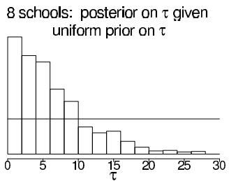

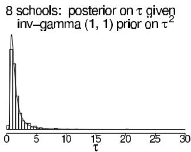

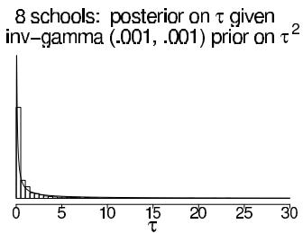  
Figure 5.9 Histograms of posterior simulations of the between-school standard deviation, $\tau$ , from models with three different prior distributions: (a) uniform prior distribution on $\tau$ , (b) inverse-gamma(1,1) prior distribution on $\tau^2$ , (c) inverse-gamma(0.001,0.001) prior distribution on $\tau^2$ . Overlain on each is the corresponding prior density function for $\tau$ . (For models (b) and (c), the density for $\tau$ is calculated using the gamma density function multiplied by the Jacobian of the $1 / \tau^2$ transformation.) In models (b) and (c), posterior inferences are strongly constrained by the prior distribution.

ferences. In particular, the posterior mean and median of $\tau$ are lower, and shrinkage of the $\theta_{j}$ 's is greater than in the previously fitted model with a uniform prior distribution on $\tau$ . To understand this, it helps to graph the prior distribution in the range for which the posterior distribution is substantial. The graph shows that the prior distribution is concentrated in the range [0.5, 5], a narrow zone in which the likelihood is close to flat compared to this prior (as we can see because the distribution of the posterior simulations of $\tau$ closely matches the prior distribution, $p(\tau)$ ). By comparison, in the left graph, the uniform prior distribution on $\tau$ seems closer to 'noninformative' for this problem, in the sense that it does not appear to be constraining the posterior inference.

Finally, the rightmost histogram in Figure 5.9 shows the corresponding result with an inverse-gamma(0.001, 0.001) prior distribution for $\tau^2$ . This prior distribution is even more sharply peaked near zero and further distorts posterior inferences, with the problem arising because the marginal likelihood for $\tau$ remains high near zero.

In this example, we do not consider a uniform prior density on $\log \tau$ , which would yield an improper posterior density with a spike at $\tau = 0$ , like the rightmost graph in Figure 5.9 but more so. We also do not consider a uniform prior density on $\tau^2$ , which would yield a posterior similar to the leftmost graph in Figure 5.9, but with a slightly higher right tail.

This example is a gratifying case in which the simplest approach—the uniform prior density on $\tau$ —seems to perform well. As detailed in Appendix C, this model is also straightforward to program directly in R or Stan.

The appearance of the histograms and density plots in Figure 5.9 is crucially affected by the choice to plot them on the scale of $\tau$ . If instead they were plotted on the scale of $\log \tau$ , the inverse-gamma(0.001, 0.001) prior density would appear to be the flattest. However, the inverse-gamma $(\epsilon, \epsilon)$ prior is not at all 'noninformative' for this problem since the resulting posterior distribution remains highly sensitive to the choice of $\epsilon$ . The hierarchical model likelihood does not constrain $\log \tau$ in the limit $\log \tau \to -\infty$ , and so a prior distribution that is noninformative on the log scale will not work.

# Weakly informative prior distribution for the 3-schools problem

The uniform prior distribution seems fine for the 8-school analysis, but problems arise if the number of groups $J$ is much smaller, in which case the data supply little information about the group-level variance, and a noninformative prior distribution can lead to a posterior distribution that is improper or is proper but unrealistically broad. We demonstrate by reanalyzing the 8-schools example using just the data from the first three of the schools.

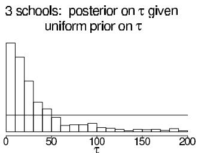

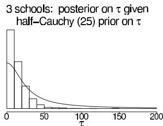  
Figure 5.10 Histograms of posterior simulations of the between-school standard deviation, $\tau$ , from models for the 3-schools data with two different prior distributions on $\tau$ : (a) uniform $(0,\infty)$ , (b) half-Cauchy with scale 25, set as a weakly informative prior distribution given that $\tau$ was expected to be well below 100. The histograms are not on the same scales. Overlain on each histogram is the corresponding prior density function. With only $J = 3$ groups, the noninformative uniform prior distribution is too weak, and the proper Cauchy distribution works better, without appearing to distort inferences in the area of high likelihood.

Figure 5.10 displays the inferences for $\tau$ based on two different priors. First we continue with the default uniform distribution that worked well with $J = 8$ (as seen in Figure 5.9). Unfortunately, as the left histogram of Figure 5.10 shows, the resulting posterior distribution for the 3-schools dataset has an extremely long right tail, containing values of $\tau$ that are too high to be reasonable. This heavy tail is expected since $J$ is so low (if $J$ were any lower, the right tail would have an infinite integral), and using this as a posterior distribution will have the effect of underpooling the estimates of the school effects $\theta_{j}$ .

The right histogram of Figure 5.10 shows the posterior inference for $\tau$ resulting from a half-Cauchy prior distribution with scale parameter $A = 25$ (a value chosen to be a bit higher than we expect for the standard deviation of the underlying $\theta_{j}$ 's in the context of this educational testing example, so that the model will constrain $\tau$ only weakly). As the line on the graph shows, this prior distribution is high over the plausible range of $\tau < 50$ , falling off gradually beyond this point. This prior distribution appears to perform well in this example, reflecting the marginal likelihood for $\tau$ at its low end but removing much of the unrealistic upper tail.

This half-Cauchy prior distribution would also perform well in the 8-schools problem; however it was unnecessary because the default uniform prior gave reasonable results. With only 3 schools, we went to the trouble of using a weakly informative prior, a distribution that was not intended to represent our actual prior state of knowledge about $\tau$ but rather to constrain the posterior distribution, to an extent allowed by the data.

# 5.8 Bibliographic note

The early non-Bayesian work on shrinkage estimation of Stein (1955) and James and Stein (1960) was influential in the development of hierarchical normal models. Efron and Morris (1971, 1972) present subsequent theoretical work on the topic. Robbins (1955, 1964) constructs and justifies hierarchical methods from a decision-theoretic perspective. De Finetti's theorem is described by de Finetti (1974); Bernardo and Smith (1994) discuss its role in Bayesian modeling. An early thorough development of the idea of Bayesian hierarchical modeling is given by Good (1965).

Mosteller and Wallace (1964) analyzed a hierarchical Bayesian model using the negative binomial distribution for counts of words in a study of authorship. Restricted to the limited computing power at the time, they used various approximations and point estimates for hyperparameters.

Other historically influential papers on 'empirical Bayes' (or, in our terminology, hierar-

chical Bayes) include Hartley and Rao (1967), Laird and Ware (1982) on longitudinal modeling, and Clayton and Kaldor (1987) and Breslow (1990) on epidemiology and biostatistics. Morris (1983) and Deely and Lindley (1981) explored the relation between Bayesian and non-Bayesian ideas for these models.

The problem of estimating several normal means using an exchangeable hierarchical model was treated in a fully Bayesian framework by Hill (1965), Tiao and Tan (1965, 1966), and Lindley (1971b). Box and Tiao (1973) present hierarchical normal models using slightly different notation from ours. They compare Bayesian and non-Bayesian methods and discuss the analysis of variance table in some detail. More references on hierarchical normal models appear in the bibliographic note at the end of Chapter 15.

The past few decades have seen the publication of applied Bayesian analyses using hierarchical models in a wide variety of application areas. For example, an important application of hierarchical models is 'small-area estimation,' in which estimates of population characteristics for local areas are improved by combining the data from each area with information from neighboring areas (with important early work from Fay and Herriot, 1979, Dempster and Raghunathan, 1987, and Mollie and Richardson, 1991). Other applications that have motivated methodological development include measurement error problems in epidemiology (for example, Richardson and Gilks, 1993), multiple comparisons in toxicology (Meng and Dempster, 1987), and education research (Bock, 1989). We provide references to a number of other applications in later chapters dealing with specific model types.

Hierarchical models can be viewed as a subclass of 'graphical models,' and this connection has been elegantly exploited for Bayesian inference in the development of the computer package Bugs, using techniques that will be explained in Chapter 11 (see also Appendix C); see Thomas, Spiegelhalter, and Gilks (1992), and Spiegelhalter et al. (1994, 2003). Related discussion and theoretical work appears in Lauritzen and Spiegelhalter (1988), Pearl (1988), Wermuth and Lauritzen (1990), and Normand and Tritchler (1992).

The rat tumor data were analyzed hierarchically by Tarone (1982) and Dempster, Selwyn, and Weeks (1983); our approach is close in spirit to the latter paper's. Leonard (1972) and Novick, Lewis, and Jackson (1973) are early examples of hierarchical Bayesian analysis of binomial data.

Much of the material in Sections 5.4 and 5.5, along with much of Section 6.5, originally appeared in Rubin (1981a), which is an early example of an applied Bayesian analysis using simulation techniques. For later work on the effects of coaching on Scholastic Aptitude Test scores, see Hansen (2004).

The weakly-informative half-Cauchy prior distribution for the 3-schools problem in Section 5.7 comes from Gelman (2006a). Polson and Scott (2012) provide a theoretical justification for this model.

The material of Section 5.6 is adapted from Carlin (1992), which contains several key references on meta-analysis; the original data for the example are from Yusuf et al. (1985); a similar Bayesian analysis of these data under a slightly different model appears as an example in Spiegelhalter et al. (1994, 2003). Thall et al. (2003) discuss hierarchical models for medical treatments that vary across subtypes of a disease. More general treatments of meta-analysis from a Bayesian perspective are provided by DuMouchel (1990), Rubin (1989), Skene and Wakefield (1990), and Smith, Spiegelhalter, and Thomas (1995). An example of a Bayesian meta-analysis appears in Dominici et al. (1999). DuMouchel and Harris (1983) present what is essentially a meta-analysis with covariates on the studies; this article is accompanied by some interesting discussion by prominent Bayesian and non-Bayesian statisticians. Higgins and Whitehead (1996) discuss how to construct a prior distribution for the group-level variance in a meta-analysis by considering it as an example from larger population of meta-analyses. Lau, Ioannidis, and Schmid (1997) provide practical advice on meta-analysis.

# 5.9 Exercises

1. Exchangeability with known model parameters: For each of the following three examples, answer: (i) Are observations $y_{1}$ and $y_{2}$ exchangeable? (ii) Are observations $y_{1}$ and $y_{2}$ independent? (iii) Can we act as if the two observations are independent?

(a) A box has one black ball and one white ball. We pick a ball $y_{1}$ at random, put it back, and pick another ball $y_{2}$ at random.   
(b) A box has one black ball and one white ball. We pick a ball $y_{1}$ at random, we do not put it back, then we pick ball $y_{2}$ .   
(c) A box has a million black balls and a million white balls. We pick a ball $y_{1}$ at random, we do not put it back, then we pick ball $y_{2}$ at random.

2. Exchangeability with known model parameters: For each of the following three examples, answer: (i) Are observations $y_{1}$ and $y_{2}$ exchangeable? (ii) Are observations $y_{1}$ and $y_{2}$ independent? (iii) Can we act as if the two observations are independent?

(a) A box has $n$ black and white balls but we do not know how many of each color. We pick a ball $y_{1}$ at random, put it back, and pick another ball $y_{2}$ at random.   
(b) A box has $n$ black and white balls but we do not know how many of each color. We pick a ball $y_{1}$ at random, we do not put it back, then we pick ball $y_{2}$ at random.   
(c) Same as (b) but we know that there are many balls of each color in the box.

3. Hierarchical models and multiple comparisons:

(a) Reproduce the computations in Section 5.5 for the educational testing example. Use the posterior simulations to estimate (i) for each school $j$ , the probability that its coaching program is the best of the eight; and (ii) for each pair of schools, $j$ and $k$ , the probability that the coaching program in school $j$ is better than that in school $k$ .   
(b) Repeat (a), but for the simpler model with $\tau$ set to $\infty$ (that is, separate estimation for the eight schools). In this case, the probabilities (i) and (ii) can be computed analytically.   
(c) Discuss how the answers in (a) and (b) differ.   
(d) In the model with $\tau$ set to 0, the probabilities (i) and (ii) have degenerate values; what are they?

4. Exchangeable prior distributions: suppose it is known a priori that the $2J$ parameters $\theta_{1},\ldots ,\theta_{2J}$ are clustered into two groups, with exactly half being drawn from a $\mathbf{N}(1,1)$ distribution, and the other half being drawn from a $\mathbf{N}(-1,1)$ distribution, but we have not observed which parameters come from which distribution.

(a) Are $\theta_{1},\ldots ,\theta_{2J}$ exchangeable under this prior distribution?   
(b) Show that this distribution cannot be written as a mixture of independent and identically distributed components.   
(c) Why can we not simply take the limit as $J \to \infty$ and get a counterexample to de Finetti's theorem?

See Exercise 8.10 for a related problem.

5. Mixtures of independent distributions: suppose the distribution of $\theta = (\theta_{1},\dots,\theta_{J})$ can be written as a mixture of independent and identically distributed components:

$$
p (\theta) = \int \prod_ {j = 1} ^ {J} p (\theta_ {j} | \phi) p (\phi) d \phi .
$$

Prove that the covariances $\operatorname{cov}(\theta_i, \theta_j)$ are all nonnegative.

6. Exchangeable models:

(a) In the divorce rate example of Section 5.2, set up a prior distribution for the values $y_{1}, \ldots, y_{8}$ that allows for one low value (Utah) and one high value (Nevada), with independent and identical distributions for the other six values. This prior distribution should be exchangeable, because it is not known which of the eight states correspond to Utah and Nevada.   
(b) Determine the posterior distribution for $y_{8}$ under this model given the observed values of $y_{1},\ldots ,y_{7}$ given in the example. This posterior distribution should probably have two or three modes, corresponding to the possibilities that the missing state is Utah, Nevada, or one of the other six.   
(c) Now consider the entire set of eight data points, including the value for $y_{8}$ given at the end of the example. Are these data consistent with the prior distribution you gave in part (a) above? In particular, did your prior distribution allow for the possibility that the actual data have an outlier (Nevada) at the high end, but no outlier at the low end?

# 7. Continuous mixture models:

(a) If $y|\theta \sim \mathrm{Poisson}(\theta)$ , and $\theta \sim \mathrm{Gamma}(\alpha, \beta)$ , then the marginal (prior predictive) distribution of $y$ is negative binomial with parameters $\alpha$ and $\beta$ (or $p = \beta / (1 + \beta)$ ). Use the formulas (2.7) and (2.8) to derive the mean and variance of the negative binomial.   
(b) In the normal model with unknown location and scale $(\mu, \sigma^2)$ , the noninformative prior density, $p(\mu, \sigma^2) \propto 1 / \sigma^2$ , results in a normal-inverse- $\chi^2$ posterior distribution for $(\mu, \sigma^2)$ . Marginally then $\sqrt{n} (\mu - \overline{y}) / s$ has a posterior distribution that is $t_{n-1}$ . Use (2.7) and (2.8) to derive the first two moments of the latter distribution, stating the appropriate condition on $n$ for existence of both moments.

8. Discrete mixture models: if $p_m(\theta)$ , for $m = 1, \dots, M$ , are conjugate prior densities for the sampling model $y|\theta$ , show that the class of finite mixture prior densities given by

$$
p (\theta) = \sum_ {m = 1} ^ {M} \lambda_ {m} p _ {m} (\theta)
$$

is also a conjugate class, where the $\lambda_{m}$ 's are nonnegative weights that sum to 1. This can provide a useful extension of the natural conjugate prior family to more flexible distributional forms. As an example, use the mixture form to create a bimodal prior density for a normal mean, that is thought to be near 1, with a standard deviation of 0.5, but has a small probability of being near $-1$ , with the same standard deviation. If the variance of each observation $y_{1},\ldots ,y_{10}$ is known to be 1, and their observed mean is $\overline{y} = -0.25$ , derive your posterior distribution for the mean, making a sketch of both prior and posterior densities. Be careful: the prior and posterior mixture proportions are different.

9. Noninformative hyperprior distributions: consider the hierarchical binomial model in Section 5.3. Improper posterior distributions are, in fact, a general problem with hierarchical models when a uniform prior distribution is specified for the logarithm of the population standard deviation of the exchangeable parameters. In the case of the beta population distribution, the prior variance is approximately $(\alpha + \beta)^{-1}$ (see Appendix A), and so a uniform distribution on $\log (\alpha + \beta)$ is approximately uniform on the log standard deviation. The resulting unnormalized posterior density (5.8) has an infinite integral in the limit as the population standard deviation approaches 0. We encountered the problem again in Section 5.4 for the hierarchical normal model.

(a) Show that, with a uniform prior density on $(\log(\frac{\alpha}{\beta}), \log(\alpha + \beta))$ , the unnormalized posterior density has an infinite integral.

(b) A simple way to avoid the impropriety is to assign a uniform prior distribution to the standard deviation parameter itself, rather than its logarithm. For the beta population distribution we are considering here, this is achieved approximately by assigning a uniform prior distribution to $(\alpha + \beta)^{-1/2}$ . Show that combining this with an independent uniform prior distribution on $\frac{\alpha}{\alpha + \beta}$ yields the prior density (5.10).   
(c) Show that the resulting posterior density (5.8) is proper as long as $0 < y_{j} < n_{j}$ for at least one experiment $j$ .

10. Checking the integrability of the posterior distribution: consider the hierarchical normal model in Section 5.4.

(a) If the hyperprior distribution is $p(\mu, \tau) \propto \tau^{-1}$ (that is, $p(\mu, \log \tau) \propto 1$ ), show that the posterior density is improper.   
(b) If the hyperprior distribution is $p(\mu, \tau) \propto 1$ , show that the posterior density is proper if $J > 2$ .   
(c) How would you analyze SAT coaching data if $J = 2$ (that is, data from only two schools)?

11. Nonconjugate hierarchical models: suppose that in the rat tumor example, we wish to use a normal population distribution on the log-odds scale: $\mathrm{logit}(\theta_j) \sim \mathrm{N}(\mu, \tau^2)$ , for $j = 1, \ldots, J$ . As in Section 5.3, you will assign a noninformative prior distribution to the hyperparameters and perform a full Bayesian analysis.

(a) Write the joint posterior density, $p(\theta ,\mu ,\tau |y)$   
(b) Show that the integral (5.4) has no closed-form expression.   
(c) Why is expression (5.5) no help for this problem?

In practice, we can solve this problem by normal approximation, importance sampling, and Markov chain simulation, as described in Part III.

12. Conditional posterior means and variances: derive analytic expressions for $\operatorname{E}(\theta_j|\tau, y)$ and $\operatorname{var}(\theta_j|\tau, y)$ in the hierarchical normal model (and used in Figures 5.6 and 5.7). (Hint: use (2.7) and (2.8), averaging over $\mu$ .)   
13. Hierarchical binomial model: Exercise 3.8 described a survey of bicycle traffic in Berkeley, California, with data displayed in Table 3.3. For this problem, restrict your attention to the first two rows of the table: residential streets labeled as 'bike routes,' which we will use to illustrate this computational exercise.

(a) Set up a model for the data in Table 3.3 so that, for $j = 1,\ldots ,10$ , the observed number of bicycles at location $j$ is binomial with unknown probability $\theta_{j}$ and sample size equal to the total number of vehicles (bicycles included) in that block. The parameter $\theta_{j}$ can be interpreted as the underlying or 'true' proportion of traffic at location $j$ that is bicycles. (See Exercise 3.8.) Assign a beta population distribution for the parameters $\theta_{j}$ and a noninformative hyperprior distribution as in the rat tumor example of Section 5.3. Write down the joint posterior distribution.   
(b) Compute the marginal posterior density of the hyperparameters and draw simulations from the joint posterior distribution of the parameters and hyperparameters, as in Section 5.3.   
(c) Compare the posterior distributions of the parameters $\theta_{j}$ to the raw proportions, (number of bicycles / total number of vehicles) in location $j$ . How do the inferences from the posterior distribution differ from the raw proportions?   
(d) Give a $95\%$ posterior interval for the average underlying proportion of traffic that is bicycles.   
(e) A new city block is sampled at random and is a residential street with a bike route. In an hour of observation, 100 vehicles of all kinds go by. Give a $95\%$ posterior interval

for the number of those vehicles that are bicycles. Discuss how much you trust this interval in application.

(f) Was the beta distribution for the $\theta_{j}$ 's reasonable?

14. Hierarchical Poisson model: consider the dataset in the previous problem, but suppose only the total amount of traffic at each location is observed.

(a) Set up a model in which the total number of vehicles observed at each location $j$ follows a Poisson distribution with parameter $\theta_{j}$ , the 'true' rate of traffic per hour at that location. Assign a gamma population distribution for the parameters $\theta_{j}$ and a noninformative hyperprior distribution. Write down the joint posterior distribution.   
(b) Compute the marginal posterior density of the hyperparameters and plot its contours. Simulate random draws from the posterior distribution of the hyperparameters and make a scatterplot of the simulation draws.   
(c) Is the posterior density integrable? Answer analytically by examining the joint posterior density at the limits or empirically by examining the plots of the marginal posterior density above.   
(d) If the posterior density is not integrable, alter it and repeat the previous two steps.   
(e) Draw samples from the joint posterior distribution of the parameters and hyperparameters, by analogy to the method used in the hierarchical binomial model.

15. Meta-analysis: perform the computations for the meta-analysis data of Table 5.4.

(a) Plot the posterior density of $\tau$ over an appropriate range that includes essentially all of the posterior density, analogous to Figure 5.5.   
(b) Produce graphs analogous to Figures 5.6 and 5.7 to display how the posterior means and standard deviations of the $\theta_{j}$ 's depend on $\tau$ .   
(c) Produce a scatterplot of the crude effect estimates vs. the posterior median effect estimates of the 22 studies. Verify that the studies with smallest sample sizes are partially pooled the most toward the mean.   
(d) Draw simulations from the posterior distribution of a new treatment effect, $\tilde{\theta}_j$ . Plot a histogram of the simulations.   
(e) Given the simulations just obtained, draw simulated outcomes from replications of a hypothetical new experiment with 100 persons in each of the treated and control groups. Plot a histogram of the simulations of the crude estimated treatment effect (5.23) in the new experiment.

16. Equivalent data: Suppose we wish to apply the inferences from the meta-analysis example in Section 5.6 to data on a new study with equal numbers of people in the control and treatment groups. How large would the study have to be so that the prior and data were weighted equally in the posterior inference for that study?

17. Informative prior distributions: Continuing the example from Exercise 2.22, consider a (hypothetical) study of a simple training program for basketball free-throw shooting. A random sample of 100 college students is recruited into the study. Each student first shoots 100 free-throws to establish a baseline success probability. Each student then takes 50 practice shots each day for a month. At the end of that time, he or she takes 100 shots for a final measurement.

Let $\theta_{i}$ be the improvement in success probability for person $i$ . For simplicity, assume the $\theta_{i}$ 's are normally distributed with mean $\mu$ and standard deviation $\sigma$ .

Give three joint prior distributions for $\mu, \sigma$ :

(a) A noninformative prior distribution,   
(b) A subjective prior distribution based on your best knowledge, and   
(c) A weakly informative prior distribution.

# Part II: Fundamentals of Bayesian Data Analysis

For most problems of applied Bayesian statistics, the data analyst must go beyond the simple structure of prior distribution, likelihood, and posterior distribution. In Chapter 6, we discuss methods of assessing the sensitivity of posterior inferences to model assumptions and checking the fit of a probability model to data and substantive information. Model checking allows an escape from the tautological aspect of formal approaches to Bayesian inference, under which all conclusions are conditional on the truth of the posited model. Chapter 7 considers evaluating and comparing models using predictive accuracy, adjusting for the parameters being fit to the data. Chapter 8 outlines the role of study design and methods of data collection in probability modeling, focusing on how to set up Bayesian inference for sample surveys, designed experiments, and observational studies; this chapter contains some of the most conceptually distinctive and potentially difficult material in the book. Chapter 9 discusses the use of Bayesian inference in applied decision analysis, illustrating with examples from social science, medicine, and public health. These four chapters explore the creative choices that are required, first to set up a Bayesian model in a complex problem, then to perform the model checking and confidence building that is typically necessary to make posterior inferences scientifically defensible, and finally to use the inferences in decision making.

# 6.1 The place of model checking in applied Bayesian statistics

Once we have accomplished the first two steps of a Bayesian analysis—constructing a probability model and computing the posterior distribution of all estimands—we should not ignore the relatively easy step of assessing the fit of the model to the data and to our substantive knowledge. It is difficult to include in a probability distribution all of one's knowledge about a problem, and so it is wise to investigate what aspects of reality are not captured by the model.

Checking the model is crucial to statistical analysis. Bayesian prior-to-posterior inferences assume the whole structure of a probability model and can yield misleading inferences when the model is poor. A good Bayesian analysis, therefore, should include at least some check of the adequacy of the fit of the model to the data and the plausibility of the model for the purposes for which the model will be used. This is sometimes discussed as a problem of sensitivity to the prior distribution, but in practice the likelihood model is typically just as suspect; throughout, we use 'model' to encompass the sampling distribution, the prior distribution, any hierarchical structure, and issues such as which explanatory variables have been included in a regression.

# Sensitivity analysis and model improvement

It is typically the case that more than one reasonable probability model can provide an adequate fit to the data in a scientific problem. The basic question of a sensitivity analysis is: how much do posterior inferences change when other reasonable probability models are used in place of the present model? Other reasonable models may differ substantially from the present model in the prior specification, the sampling distribution, or in what information is included (for example, predictor variables in a regression). It is possible that the present model provides an adequate fit to the data, but that posterior inferences differ under plausible alternative models.

In theory, both model checking and sensitivity analysis can be incorporated into the usual prior-to-posterior analysis. Under this perspective, model checking is done by setting up a comprehensive joint distribution, such that any data that might be observed are plausible outcomes under the joint distribution. That is, this joint distribution is a mixture of all possible 'true' models or realities, incorporating all known substantive information. The prior distribution in such a case incorporates prior beliefs about the likelihood of the competing realities and about the parameters of the constituent models. The posterior distribution of such an 'exhaustive' probability model automatically incorporates all 'sensitivity analysis' but is still predicated on the truth of some member of the larger class of models.

In practice, however, setting up such a super-model to include all possibilities and all substantive knowledge is both conceptually impossible and computationally infeasible in all but the simplest problems. It is thus necessary for us to examine our models in other ways

to see how they fail to fit reality and how sensitive the resulting posterior distributions are to arbitrary specifications.

# Judging model flaws by their practical implications

We do not like to ask, 'Is our model true or false?', since probability models in most data analyses will not be perfectly true. Even the coin tosses and die rolls ubiquitous in probability theory texts are not truly exchangeable. The more relevant question is, 'Do the model's deficiencies have a noticeable effect on the substantive inferences?'

In the examples of Chapter 5, the beta population distribution for the tumor rates and the normal distribution for the eight school effects are both chosen partly for convenience. In these examples, making convenient distributional assumptions turns out not to matter, in terms of the impact on the inferences of most interest. How to judge when assumptions of convenience can be made safely is a central task of Bayesian sensitivity analysis. Failures in the model lead to practical problems by creating clearly false inferences about estimands of interest.

# 6.2 Do the inferences from the model make sense?

In any applied problem, there will be knowledge that is not included formally in either the prior distribution or the likelihood, for reasons of convenience or objectivity. If the additional information suggests that posterior inferences of interest are false, then this suggests a potential for creating a more accurate probability model for the parameters and data collection process. We illustrate with an example of a hierarchical regression model.

# Example. Evaluating election predictions by comparing to substantive political knowledge

Figure 6.1 displays a forecast, made in early October, 1992, of the probability that Bill Clinton would win each state in the U.S. presidential election that November. The estimates are posterior probabilities based on a hierarchical linear regression model. For each state, the height of the shaded part of the box represents the estimated probability that Clinton would win the state. Even before the election occurred, the forecasts for some of the states looked wrong; for example, from state polls, Clinton was known in October to be much weaker in Texas and Florida than shown in the map. This does not mean that the forecast is useless, but it is good to know where the weak points are. Certainly, after the election, we can do an even better job of criticizing the model and understanding its weaknesses. We return to this election forecasting example in Section 15.2 as an example of a hierarchical linear model.

# External validation

More formally, we can check a model by external validation using the model to make predictions about future data, and then collecting those data and comparing to their predictions. Posterior means should be correct on average, $50\%$ intervals should contain the true values half the time, and so forth. We used external validation to check the empirical probability estimates in the record-linkage example in Section 1.7, and we apply the idea again to check a toxicology model in Section 19.2. In the latter example, the external validation (see Figure 19.10 on page 484) reveals a generally reasonable fit but with some notable discrepancies between predictions and external data. Often we need to check the model before obtaining new data or waiting for the future to happen. In this chapter and the next, we discuss methods which can approximate external validation using the data we already have.

  
Figure 6.1 Summary of a forecast of the 1992 U.S. presidential election performed one month before the election. For each state, the proportion of the box that is shaded represents the estimated probability of Clinton winning the state; the width of the box is proportional to the number of electoral votes for the state.

# Choices in defining the predictive quantities

A single model can be used to make different predictions. For example, in the SAT example we could consider a joint prediction for future data from the 8 schools in the study, $p(\tilde{y} | y)$ , a joint prediction for 8 new schools $p(\tilde{y}_i | y)$ , $i = 9, \dots, 16$ , or any other combination of new and existing schools. Other scenarios may have even more different choices in defining the focus of predictions. For example, in analyses of sample surveys and designed experiments, it often makes sense to consider hypothetical replications of the experiment with a new randomization of selection or treatment assignment, by analogy to classical randomization tests.

Sections 6.3 and 6.4 discuss posterior predictive checking, which use global summaries to check the joint posterior predictive distribution $p(\tilde{y} | y)$ . At the end of Section 6.3 we briefly discuss methods that combine inferences for local quantities to check marginal predictive distributions $p(\tilde{y}_i | y)$ , an idea that is related to cross-validation methods considered in Chapter 7.

# 6.3 Posterior predictive checking

If the model fits, then replicated data generated under the model should look similar to observed data. To put it another way, the observed data should look plausible under the posterior predictive distribution. This is really a self-consistency check: an observed discrepancy can be due to model misfit or chance.

Our basic technique for checking the fit of a model to data is to draw simulated values from the joint posterior predictive distribution of replicated data and compare these samples to the observed data. Any systematic differences between the simulations and the data indicate potential failings of the model.

We introduce posterior predictive checking with a simple example of an obviously poorly fitting model, and then in the rest of this section we lay out the key choices involved in posterior predictive checking. Sections 6.3 and 6.4 discuss numerical and graphical predictive checks in more detail.

# Example. Comparing Newcomb's speed of light measurements to the posterior predictive distribution

Simon Newcomb's 66 measurements on the speed of light are presented in Section 3.2. In the absence of other information, in Section 3.2 we modeled the measurements as


  
Figure 6.2 Twenty replications, $y^{\mathrm{rep}}$ , of the speed of light data from the posterior predictive distribution, $p(y^{\mathrm{rep}}|y)$ ; compare to observed data, $y$ , in Figure 3.1. Each histogram displays the result of drawing 66 independent values $\tilde{y}_i$ from a common normal distribution with mean and variance $(\mu, \sigma^2)$ drawn from the posterior distribution, $p(\mu, \sigma^2|y)$ , under the normal model.

  
Figure 6.3 Smallest observation of Newcomb's speed of light data (the vertical line at the left of the graph), compared to the smallest observations from each of the 20 posterior predictive simulated datasets displayed in Figure 6.2.

$\mathrm{N}(\mu, \sigma^2)$ , with a noninformative uniform prior distribution on $(\mu, \log \sigma)$ . However, the lowest of Newcomb's measurements look like outliers compared to the rest of the data. Could the extreme measurements have reasonably come from a normal distribution? We address this question by comparing the observed data to what we expect to be observed under our posterior distribution. Figure 6.2 displays twenty histograms, each of which represents a single draw from the posterior predictive distribution of the values in Newcomb's experiment, obtained by first drawing $(\mu, \sigma^2)$ from their joint posterior distribution, then drawing 66 values from a normal distribution with this mean and variance. All these histograms look different from the histogram of actual data in Figure 3.1 on page 67. One way to measure the discrepancy is to compare the smallest value in each hypothetical replicated dataset to Newcomb's smallest observation, -44. The histogram in Figure 6.3 shows the smallest observation in each of the 20 hypothetical replications; all are much larger than Newcomb's smallest observation, which is indicated by a vertical line on the graph. The normal model clearly does not capture the variation that Newcomb observed. A revised model might use an asymmetric contaminated normal distribution or a symmetric long-tailed distribution in place of the normal measurement model.

Many other examples of posterior predictive checks appear throughout the book, including the educational testing example in Section 6.5, linear regressions examples in Sections 14.3 and 15.2, and a hierarchical mixture model in Section 22.2.

For many problems, it is useful to examine graphical comparisons of summaries of the data to summaries from posterior predictive simulations, as in Figure 6.3. In cases with less blatant discrepancies than the outliers in the speed of light data, it is often also useful to measure the 'statistical significance' of the lack of fit, a notion we formalize here.

# Notation for replications

Let $y$ be the observed data and $\theta$ be the vector of parameters (including all the hyperparameters if the model is hierarchical). To avoid confusion with the observed data, $y$ , we define $y^{\mathrm{rep}}$ as the replicated data that could have been observed, or, to think predictively, as the data we would see tomorrow if the experiment that produced $y$ today were replicated with the same model and the same value of $\theta$ that produced the observed data.

We distinguish between $y^{\mathrm{rep}}$ and $\tilde{y}$ , our general notation for predictive outcomes: $\tilde{y}$ is any future observable value or vector of observable quantities, whereas $y^{\mathrm{rep}}$ is specifically a replication just like $y$ . For example, if the model has explanatory variables, $x$ , they will be identical for $y$ and $y^{\mathrm{rep}}$ , but $\tilde{y}$ may have its own explanatory variables, $\tilde{x}$ .

We will work with the distribution of $y^{\mathrm{rep}}$ given the current state of knowledge, that is, with the posterior predictive distribution

$$
p (y ^ {\mathrm {r e p}} | y) = \int p (y ^ {\mathrm {r e p}} | \theta) p (\theta | y) d \theta . \tag {6.1}
$$

# Test quantities

We measure the discrepancy between model and data by defining test quantities, the aspects of the data we wish to check. A test quantity, or discrepancy measure, $T(y,\theta)$ , is a scalar summary of parameters and data that is used as a standard when comparing data to predictive simulations. Test quantities play the role in Bayesian model checking that test statistics play in classical testing. We use the notation $T(y)$ for a test statistic, which is a test quantity that depends only on data; in the Bayesian context, we can generalize test statistics to allow dependence on the model parameters under their posterior distribution. This can be useful in directly summarizing discrepancies between model and data. We discuss options for graphical test quantities in Section 6.4. The test quantities in this section are usually functions of $y$ or replicated data $y^{\mathrm{rep}}$ . In the end of this section we briefly discuss a different sort of test quantities used for calibration that are functions of both $y_i$ and $y_i^{\mathrm{rep}}$ (or $\tilde{y}_i$ ). In Chapter 7 we discuss measures of discrepancy between model and data, that is, measures of predictive accuracy that are also functions of both $y_i$ and $y_i^{\mathrm{rep}}$ (or $\tilde{y}_i$ ).

# Tail-area probabilities

Lack of fit of the data with respect to the posterior predictive distribution can be measured by the tail-area probability, or $p$ -value, of the test quantity, and computed using posterior simulations of $(\theta, y^{\mathrm{rep}})$ . We define the $p$ -value mathematically, first for the familiar classical test and then in the Bayesian context.

Classical $p$ -values. The classical $p$ -value for the test statistic $T(y)$ is

$$
p _ {C} = \Pr (T (y ^ {\text {r e p}}) \geq T (y) | \theta), \tag {6.2}
$$

where the probability is taken over the distribution of $y^{\mathrm{rep}}$ with $\theta$ fixed. (The distribution of $y^{\mathrm{rep}}$ given $y$ and $\theta$ is the same as its distribution given $\theta$ alone.) Test statistics are classically derived in a variety of ways but generally represent a summary measure of discrepancy between the observed data and what would be expected under a model with a particular value of $\theta$ . This value may be a 'null' value, corresponding to a 'null hypothesis,' or a point estimate such as the maximum likelihood value. A point estimate for $\theta$ must be substituted to compute a $p$ -value in classical statistics.

Posterior predictive $p$ -values. To evaluate the fit of the posterior distribution of a Bayesian model, we can compare the observed data to the posterior predictive distribution. In the Bayesian approach, test quantities can be functions of the unknown parameters as well as data because the test quantity is evaluated over draws from the posterior distribution of the unknown parameters. The Bayesian $p$ -value is defined as the probability that the replicated data could be more extreme than the observed data, as measured by the test quantity:

$$
p _ {B} = \operatorname * {P r} (T (y ^ {\mathrm {r e p}}, \theta) \geq T (y, \theta) | y),
$$

where the probability is taken over the posterior distribution of $\theta$ and the posterior predictive distribution of $y^{\mathrm{rep}}$ (that is, the joint distribution, $p(\theta ,y^{\mathrm{rep}}|y)$ ):

$$
p _ {B} = \iint I _ {T (y ^ {\mathrm {r e p}}, \theta) \geq T (y, \theta)} p (y ^ {\mathrm {r e p}} | \theta) p (\theta | y) d y ^ {\mathrm {r e p}} d \theta ,
$$

where $I$ is the indicator function. In this formula, we have used the property of the predictive distribution that $p(y^{\mathrm{rep}}|\theta ,y) = p(y^{\mathrm{rep}}|\theta)$ .

In practice, we usually compute the posterior predictive distribution using simulation. If we already have $S$ simulations from the posterior density of $\theta$ , we just draw one $y^{\mathrm{rep}}$ from the predictive distribution for each simulated $\theta$ ; we now have $S$ draws from the joint posterior distribution, $p(y^{\mathrm{rep}},\theta |y)$ . The posterior predictive check is the comparison between the realized test quantities, $T(y,\theta^{s})$ , and the predictive test quantities, $T(y^{\mathrm{rep}s},\theta^{s})$ . The estimated $p$ -value is just the proportion of these $S$ simulations for which the test quantity equals or exceeds its realized value; that is, for which $T(y^{\mathrm{rep}s},\theta^{s})\geq T(y,\theta^{s}), s = 1,\ldots ,S$ .

In contrast to the classical approach, Bayesian model checking does not require special methods to handle 'nuisance parameters'; by using posterior simulations, we implicitly average over all the parameters in the model.

# Example. Speed of light (continued)

In Figure 6.3, we demonstrated the poor fit of the normal model to the speed of light data using $\min(y_i)$ as the test statistic. We continue this example using other test quantities to illustrate how the fit of a model depends on the aspects of the data and parameters being monitored. Figure 6.4a shows the observed sample variance and the distribution of 200 simulated variances from the posterior predictive distribution. The sample variance does not make a good test statistic because it is a sufficient statistic of the model and thus, in the absence of an informative prior distribution, the posterior distribution will automatically be centered near the observed value. We are not at all surprised to find an estimated $p$ -value close to $\frac{1}{2}$ .

The model check based on $\min(y_i)$ earlier in the chapter suggests that the normal model is inadequate. To illustrate that a model can be inadequate for some purposes but adequate for others, we assess whether the model is adequate except for the extreme tails by considering a model check based on a test quantity sensitive to asymmetry in the center of the distribution,

$$
T (y, \theta) = | y _ {(6 1)} - \theta | - | y _ {(6)} - \theta |.
$$

The 61st and 6th order statistics are chosen to represent approximately the $90\%$ and


  
Figure 6.4 Realized vs. posterior predictive distributions for two more test quantities in the speed of light example: (a) Sample variance (vertical line at 115.5), compared to 200 simulations from the posterior predictive distribution of the sample variance. (b) Scatterplot showing prior and posterior simulations of a test quantity: $T(y, \theta) = |y_{(61)} - \theta| - |y_{(6)} - \theta|$ (horizontal axis) vs. $T(y^{\mathrm{rep}}, \theta) = |y_{(61)}^{\mathrm{rep}} - \theta| - |y_{(6)}^{\mathrm{rep}} - \theta|$ (vertical axis) based on 200 simulations from the posterior distribution of $(\theta, y^{\mathrm{rep}})$ . The $p$ -value is computed as the proportion of points in the upper-left half of the scatterplot.

$10\%$ points of the distribution. The test quantity should be scattered about zero for a symmetric distribution. The scatterplot in Figure 6.4b shows the test quantity for the observed data and the test quantity evaluated for the simulated data for 200 simulations from the posterior distribution of $(\theta, \sigma^2)$ . The estimated $p$ -value is 0.26, implying that any observed asymmetry in the middle of the distribution can easily be explained by sampling variation.

# Choosing test quantities

The procedure for carrying out a posterior predictive model check requires specifying a test quantity, $T(y)$ or $T(y,\theta)$ , and an appropriate predictive distribution for the replications $y^{\mathrm{rep}}$ (which involves deciding which if any aspects of the data to condition on, as discussed at the end of Section 6.3). If $T(y)$ does not appear to be consistent with the set of values $T(y^{\mathrm{rep1}},\ldots ,T(y^{\mathrm{repS}})$ , then the model is making predictions that do not fit the data. The discrepancy between $T(y)$ and the distribution of $T(y^{\mathrm{rep}})$ can be summarized by a $p$ -value (as discussed in Section 6.3) but we prefer to look at the magnitude of the discrepancy as well as its $p$ -value.

# Example. Checking the assumption of independence in binomial trials

Consider a sequence of binary outcomes, $y_{1}, \ldots, y_{n}$ , modeled as a specified number of independent trials with a common probability of success, $\theta$ , that is given a uniform prior distribution. As discussed in Chapter 2, the posterior density under the model is $p(\theta | y) \propto \theta^{\sum y} (1 - \theta)^{n - \sum y}$ , which depends on the data only through the sufficient statistic, $\sum_{i=1}^{n} y_{i}$ . Now suppose the observed data are, in order, 1, 1, 0, 0, 0, 0, 0, 1, 1, 1, 1, 1, 0, 0, 0, 0, 0, 0, 0. The observed autocorrelation is evidence that the model is flawed. To quantify the evidence, we can perform a posterior predictive test using the test quantity $T =$ number of switches between 0 and 1 in the sequence. The observed value is $T(y) = 3$ , and we can determine the posterior predictive distribution of $T(y^{\mathrm{rep}})$ by simulation. To simulate $y^{\mathrm{rep}}$ under the model, we first draw $\theta$ from its Beta(8,14) posterior distribution, then draw $y^{\mathrm{rep}} = (y_{1}^{\mathrm{rep}}, \ldots, y_{20}^{\mathrm{rep}})$ as independent Bernoulli variables with probability $\theta$ . Figure 6.5 displays a histogram of the values of $T(y^{\mathrm{rep}s})$ for simulation draws $s = 1, \ldots, 10000$ , with the observed value, $T(y) = 3$ , shown by a vertical line. The observed number of switches is about one-third as many

  
Figure 6.5 Observed number of switches (vertical line at $T(y) = 3$ ), compared to 10,000 simulations from the posterior predictive distribution of the number of switches, $T(y^{\mathrm{rep}})$ .

as would be expected from the model under the posterior predictive distribution, and the discrepancy cannot easily be explained by chance, as indicated by the computed $p$ -value of $\frac{9838}{10000}$ . To convert to a $p$ -value near zero, we can change the sign of the test statistic, which amounts to computing $\operatorname*{Pr}(T(y^{\mathrm{rep}},\theta)\leq T(y,\theta)|y)$ , which is 0.028 in this case. The $p$ -values measured from the two ends have a sum that is greater than 1 because of the discreteness of the distribution of $T(y^{\mathrm{rep}})$ .

For many problems, a function of data and parameters can directly address a particular aspect of a model in a way that would be difficult or awkward using a function of data alone. If the test quantity depends on $\theta$ as well as $y$ , then the test quantity $T(y,\theta)$ as well as its replication $T(y^{\mathrm{rep}},\theta)$ are unknowns and are represented by $S$ simulations, and the comparison can be displayed either as a scatterplot of the values $T(y,\theta^{s})$ vs. $T(y^{\mathrm{reps}},\theta^{s})$ or a histogram of the differences, $T(y,\theta^{s}) - T(y^{\mathrm{reps}},\theta^{s})$ . Under the model, the scatterplot should be symmetric about the $45^{\circ}$ line and the histogram should include 0.

Because a probability model can fail to reflect the process that generated the data in any number of ways, posterior predictive $p$ -values can be computed for a variety of test quantities in order to evaluate more than one possible model failure. Ideally, the test quantities $T$ will be chosen to reflect aspects of the model that are relevant to the scientific purposes to which the inference will be applied. Test quantities are commonly chosen to measure a feature of the data not directly addressed by the probability model; for example, ranks of the sample, or correlation of residuals with some possible explanatory variable.

# Example. Checking the fit of hierarchical regression models for adolescent smoking

We illustrate with a model fitted to a longitudinal dataset of about 2000 Australian adolescents whose smoking patterns were recorded every six months (via questionnaire) for a period of three years. Interest lay in the extent to which smoking behavior could be predicted based on parental smoking and other background variables, and the extent to which boys and girls picked up the habit of smoking during their teenage years. Figure 6.6 illustrates the overall rate of smoking among survey participants, who had an average age of 14.9 years at the beginning of the study.

We fit two models to these data. Our first model is a hierarchical logistic regression, in which the probability of smoking depends on sex, parental smoking, the wave of the study, and an individual parameter for the person. For person $j$ at wave $t$ , we model the probability of smoking as,

$$
\Pr (y _ {j t} = 1) = \operatorname {l o g i t} ^ {- 1} (\beta_ {0} + \beta_ {1} X _ {j 1} + \beta_ {2} X _ {j 2} + \beta_ {3} (1 - X _ {j 2}) t + \beta_ {4} X _ {j 2} t + \alpha_ {j}), \quad (6. 3)
$$

where $X_{j1}$ is an indicator for parental smoking and $X_{j2}$ is an indicator for females, so that $\beta_{3}$ and $\beta_{4}$ represent the time trends for males and females, respectively. The individual effects $\alpha_{j}$ are assigned a $\mathrm{N}(0,\tau^{2})$ distribution, with a noninformative uni-

  
Figure 6.6 Prevalence of regular (daily) smoking among participants responding at each wave in the study of Australian adolescents (who were on average 15 years old at wave 1).

Table 6.1 Summary of posterior predictive checks for three test statistics for two models fit to the adolescent smoking data: (1) hierarchical logistic regression, and (2) hierarchical logistic regression with a mixture component for never-smokers. The second model better fits the percentages of never- and always-smokers, but still has a problem with the percentage of 'incident smokers,' who are defined as persons who report incidents of non-smoking followed by incidents of smoking.   

<table><tr><td rowspan="2">Test variable</td><td rowspan="2">T(y)</td><td colspan="2">Model 1</td><td colspan="2">Model 2</td></tr><tr><td>95% int. for T(y rep)</td><td>p-value</td><td>95% int. for T(y rep)</td><td>p-value</td></tr><tr><td>% never-smokers</td><td>77.3</td><td>[75.5, 78.2]</td><td>0.27</td><td>[74.8, 79.9]</td><td>0.53</td></tr><tr><td>% always-smokers</td><td>5.1</td><td>[5.0, 6.5]</td><td>0.95</td><td>[3.8, 6.3]</td><td>0.44</td></tr><tr><td>% incident smokers</td><td>8.4</td><td>[5.3, 7.9]</td><td>0.005</td><td>[4.9, 7.8]</td><td>0.004</td></tr></table>

form prior distribution on $\beta, \tau$ . (See Chapter 22 for more on hierarchical generalized linear models.)

The second model is an expansion of the first, in which each person $j$ has an unobserved 'susceptibility' status $S_{j}$ that equals 1 if the person might possibly smoke or 0 if he or she is 'immune' from smoking (that is, has no chance of becoming a smoker). This model is an oversimplification but captures the separation in the data between adolescents who often or occasionally smoke and those who never smoke at all. In this mixture model, the smoking status $y_{jt}$ is automatically 0 at all times for nonsusceptible persons. For those persons with $S_{j} = 1$ , we use the model (6.3), understanding that these probabilities now refer to the probability of smoking, conditional on being susceptible. The model is completed with a logistic regression for susceptibility status given the individual-level predictors: $\operatorname{Pr}(S_j = 1) = \log \mathrm{it}^{-1}(\gamma_0 + \gamma_1X_{j1} + \gamma_2X_{j2})$ , and a uniform prior distribution on these coefficients $\gamma$ .

Table 6.1 shows the results for posterior predictive checks of the two fitted models using three different test statistics $T(y)$ :

- The percentage of adolescents in the sample who never smoked.   
- The percentage in the sample who smoked during all waves.   
- The percentage of 'incident smokers': adolescents who began the study as nonsmokers, switched to smoking during the study period, and did not switch back.

From the first column of Table 6.1, we see that $77\%$ of the sample never smoked, $5\%$ always smoked, and $8\%$ were incident smokers. The table then displays the posterior predictive distribution of each test statistic under each of the two fitted models. Both models accurately capture the percentage of never-smokers, but the second model better fits the percentage of always-smokers. It makes sense that the second model

should fit this aspect of the data better, since its mixture form separates smokers from non-smokers. Finally, both models underpredict the proportion of incident smokers, which suggests that they are not completely fitting the variation of smoking behavior within individuals.

Posterior predictive checking is a useful direct way of assessing the fit of the model to these various aspects of the data. Our goal here is not to compare or choose among the models (a topic we discuss in Section 7.3) but rather to explore the ways in which either or both models might be lacking.

Numerical test quantities can also be constructed from patterns noticed visually (as in the test statistics chosen for the speed-of-light example in Section 6.3). This can be useful to quantify a pattern of potential interest, or to summarize a model check that will be performed repeatedly (for example, in checking the fit of a model that is applied to several different datasets).

# Multiple comparisons

One might worry about interpreting the significance levels of multiple tests or of tests chosen by inspection of the data. For example, we looked at three different test variables in checking the adolescent smoking models, so perhaps it is less surprising than it might seem at first that the worst-fitting test statistic had a $p$ -value of 0.005. A 'multiple comparisons' adjustment would calculate the probability that the most extreme $p$ -value would be as low as 0.005, which would perhaps yield an adjusted $p$ -value somewhere near 0.015.

We do not make this adjustment, because we use predictive checks to see how particular aspects of the data would be expected to appear in replications. If we examine several test variables, we would not be surprised for some of them not to be fitted by the model—but if we are planning to apply the model, we might be interested in those aspects of the data that do not appear typical. We are not concerned with 'Type I error' rate—that is, the probability of rejecting a hypothesis conditional on it being true—because we use the checks not to accept or reject a model but rather to understand the limits of its applicability in realistic replications. In the setting where we are interested in making several comparisons at once, we prefer to directly make inferences on the comparisons using a multilevel model; see the discussion on page 96.

# Interpreting posterior predictive $p$ -values

A model is suspect if a discrepancy is of practical importance and its observed value has a tail-area probability near 0 or 1, indicating that the observed pattern would be unlikely to be seen in replications of the data if the model were true. An extreme $p$ -value implies that the model cannot be expected to capture this aspect of the data. A $p$ -value is a posterior probability and can therefore be interpreted directly—although not as Pr(model is true | data). Major failures of the model, typically corresponding to extreme tail-area probabilities (less than 0.01 or more than 0.99), can be addressed by expanding the model appropriately. Lesser failures might also suggest model improvements or might be ignored in the short term if the failure appears not to affect the main inferences. In some cases, even extreme $p$ -values may be ignored if the misfit of the model is substantively small compared to variation within the model. We typically evaluate a model with respect to several test quantities, and we should be sensitive to the implications of this practice.

If a $p$ -value is close to 0 or 1, it is not so important exactly how extreme it is. A $p$ -value of 0.00001 is virtually no stronger, in practice, than 0.001; in either case, the aspect of the data measured by the test quantity is inconsistent with the model. A slight improvement in the model (or correction of a data coding error!) could bring either $p$ -value to a reasonable

range (between 0.05 and 0.95, say). The $p$ -value measures 'statistical significance,' not 'practical significance.' The latter is determined by how different the observed data are from the reference distribution on a scale of substantive interest and depends on the goal of the study; an example in which a discrepancy is statistically but not practically significant appears at the end of Section 14.3.

The relevant goal is not to answer the question, 'Do the data come from the assumed model?' (to which the answer is almost always no), but to quantify the discrepancies between data and model, and assess whether they could have arisen by chance, under the model's own assumptions.

# Limitations of posterior tests

Finding an extreme $p$ -value and thus 'rejecting' a model is never the end of an analysis; the departures of the test quantity in question from its posterior predictive distribution will often suggest improvements of the model or places to check the data, as in the speed of light example. Moreover, even when the current model seems appropriate for drawing inferences (in that no unusual deviations between the model and the data are found), the next scientific step will often be a more rigorous experiment incorporating additional factors, thereby providing better data. For instance, in the educational testing example of Section 5.5, the data do not allow rejection of the model that all the $\theta_j$ 's are equal, but that assumption is clearly unrealistic, hence we do not restrict $\tau$ to be zero.

Finally, the discrepancies found in predictive checks should be considered in their applied context. A demonstrably wrong model can still work for some purposes, as we illustrate with a regression example in Section 14.3.

# $P$ -values and $u$ -values

Bayesian predictive checking generalizes classical hypothesis testing by averaging over the posterior distribution of the unknown parameter vector $\theta$ rather than fixing it at some estimate $\hat{\theta}$ . Bayesian tests do not rely on the construction of pivotal quantities (that is, functions of data and parameters whose distributions are independent of the parameters of the model) or on asymptotic results, and are therefore applicable in general settings. This is not to suggest that the tests are automatic; as with classical testing, the choice of test quantity and appropriate predictive distribution requires careful consideration of the type of inferences required for the problem being considered.

In the special case that the parameters $\theta$ are known (or estimated to a very high precision) or in which the test statistic $T(y)$ is ancillary (that is, if it depends only on observed data and if its distribution is independent of the parameters of the model) with a continuous distribution, the posterior predictive $p$ -value $\operatorname*{Pr}(T(y^{\mathrm{rep}} > T(y)|y)$ has a distribution that is uniform if the model is true. Under these conditions, $p$ -values less than 0.1 occur $10\%$ of the time, $p$ -values less than 0.05 occur $5\%$ of the time, and so forth.

More generally, when posterior uncertainty in $\theta$ propagates to the distribution of $T(y|\theta)$ , the distribution of the $p$ -value, if the model is true, is more concentrated near the middle of the range: the $p$ -value is more likely to be near 0.5 than near 0 or 1. (To be more precise, the sampling distribution of the $p$ -value has been shown to be 'stochastically less variable' than uniform.)

To clarify, we define a $u$ -value as any function of the data $y$ that has a $\mathrm{U}(0,1)$ sampling distribution. A $u$ -value can be averaged over the distribution of $\theta$ to give it a Bayesian flavor, but it is fundamentally not Bayesian, in that it cannot necessarily be interpreted as a posterior probability. In contrast, the posterior predictive $p$ -value is such a probability statement, conditional on the model and data, about what might be expected in future replications.

The $p$ -value is to the $u$ -value as the posterior interval is to the confidence interval. Just as posterior intervals are not, in general, classical confidence intervals (in the sense of having the stated probability coverage conditional on any value of $\theta$ ), Bayesian $p$ -values are not generally $u$ -values.

This property has led some to characterize posterior predictive checks as conservative or uncalibrated. We do not think such labeling is helpful; rather, we interpret $p$ -values directly as probabilities. The sample space for a posterior predictive check—the set of all possible events whose probabilities sum to 1—comes from the posterior distribution of $y^{\mathrm{rep}}$ . If a posterior predictive $p$ -value is 0.4, say, that means that, if we believe the model, we think there is a $40\%$ chance that tomorrow's value of $T(y^{\mathrm{rep}})$ will exceed today's $T(y)$ . If we were able to observe such replications in many settings, and if our models were actually true, we could collect them and check that, indeed, this happens $40\%$ of the time when the $p$ -value is 0.4, that it happens $30\%$ of the time when the $p$ -value is 0.3, and so forth. These $p$ -values are as calibrated as any other model-based probability, for example a statement such as, 'From a roll of this particular pair of loaded dice, the probability of getting double-sixes is 0.11,' or, 'There is a $50\%$ probability that Barack Obama won more than $52\%$ of the white vote in Michigan in the 2008 election.'

# Model checking and the likelihood principle

In Bayesian inference, the data enter the posterior distribution only through the likelihood function (that is, those aspects of $p(y|\theta)$ that depend on the unknown parameters $\theta$ ); thus, it is sometimes stated as a principle that inferences should depend on the likelihood and no other aspects of the data.

For a simple example, consider an experiment in which a random sample of 55 students is tested to see if their average score on a test exceeds a prechosen passing level of 80 points. Further assume the test scores are normally distributed and that some prior distribution has been set for $\mu$ and $\sigma$ , the mean and standard deviation of the scores in the population from which the students were drawn. Imagine four possible ways of collecting the data: (a) simply take measurements on a random sample of 55 students; (b) randomly sample students in sequence and after each student cease collecting data with probability 0.02; (c) randomly sample students for a fixed amount of time; or (d) continue to randomly sample and measure individual students until the sample mean is significantly different from 80 using the classical $t$ -test. In designs (c) and (d), the number of measurements is a random variable whose distribution depends on unknown parameters.

For the particular data at hand, these four very different measurement protocols correspond to different probability models for the data but identical likelihood functions, and thus Bayesian inference about $\mu$ and $\sigma$ does not depend on how the data were collected—if the model is assumed to be true. But once we want to check the model, we need to simulate replicated data, and then the sampling rule is relevant. For any fixed dataset $y$ , the posterior inference $p(\mu, \sigma | y)$ is the same for all these sampling models, but the distribution of replicated data, $p(y^{\mathrm{rep}} | \mu, \sigma)$ changes. Thus it is possible for aspects of the data to fit well under one data-collection model but not another, even if the likelihoods are the same.

# Marginal predictive checks

So far in this section the focus has been on replicated data from the joint posterior predictive distribution. An alternative approach is to compute the probability distribution for each marginal prediction $p(\tilde{y}_i|y)$ separately and then compare these separate distributions to data in order to find outliers or check overall calibration.

The tail-area probability can be computed for each marginal posterior predictive distri

bution,

$$
p _ {i} = \Pr (T (y _ {i} ^ {\mathrm {r e p}}) \leq T (y _ {i}) | y).
$$

If $y_{i}$ is scalar and continuous, a natural test quantity is $T(y_{i}) = y_{i}$ , with tail-area probability,

$$
p _ {i} = \Pr (y _ {i} ^ {\mathrm {r e p}} \leq y _ {i} | y).
$$

For ordered discrete data we can compute a 'mid' $p$ -value

$$
p _ {i} = \operatorname * {P r} (y _ {i} ^ {\mathrm {r e p}} <   y _ {i} | y) + \frac {1}{2} \operatorname * {P r} (y _ {i} ^ {\mathrm {r e p}} = y _ {i} | y).
$$

If we combine the checks from single data points, we will in general see different behavior than from the joint checks described in the previous section. Consider the educational testing example from Section 5.5:

- Marginal prediction for each of the existing schools, using $p(\tilde{y}_i|y), i = 1,\ldots ,8$ . If the population prior is noninformative or weakly informative, the center of posterior predictive distribution will be close to $y_{i}$ , and the separate $p$ -values $p_i$ will tend to concentrate near 0.5. In extreme case of no pooling, the separate $p$ -values will be exactly 0.5.   
- Marginal prediction for new schools $p(\tilde{y}_i|y), i = 9, \dots, 16$ , comparing replications to the observed $y_i, y_i = 1, \dots, 8$ . Now the effect of single $y_i$ is smaller, working through the population distribution, and the $p_i$ 's have distributions that are closer to $\mathrm{U}(0,1)$ .

A related approach to checking is to replace predictive distributions with cross-validation predictive distributions, for each data point comparing to the inference given all the other data:

$$
p _ {i} = \Pr (y _ {i} ^ {\mathrm {r e p}} \leq y _ {i} | y _ {- i}),
$$

where $y_{-i}$ contains all other data except $y_{i}$ . For continuous data, cross-validation predictive $p$ -values have uniform distribution if the model is calibrated. On the downside, cross-validation generally requires additional computation. In some settings, posterior predictive checking using the marginal predictions for new individuals with exactly the same predictors $x_{i}$ is called mixed predictive checking and can be seen to bridge the gap between cross-validation and full Bayesian predictive checking. We return to cross-validation in the next chapter.

If the marginal posterior $p$ -values concentrate near 0 and 1, data is over-dispersed compared to the model and if the $p$ -values concentrate near 0.5 data is under-dispersed compared to the model. It may also be helpful to look at individual observations related to marginal posterior $p$ -values close to 0 or 1. Alternatively used measure is the conditional predictive ordinate

$$
\mathrm {C P O} _ {i} = p \left(y _ {i} \mid y _ {- i}\right),
$$

which gives low value for unlikely observations given the current model. Examining unlikely observations could give insight how to improve the model. In Chapter 17 we discuss how to make model inference more robust if the data have surprising 'outliers.'

# 6.4 Graphical posterior predictive checks

The basic idea of graphical model checking is to display the data alongside simulated data from the fitted model, and to look for systematic discrepancies between real and simulated data. This section gives examples of three kinds of graphical display:

- Direct display of all the data (as in the comparison of the speed-of-light data in Figure 3.1 to the 20 replications in Figure 6.2).   
- Display of data summaries or parameter inferences. This can be useful in settings where the dataset is large and we wish to focus on the fit of a particular aspect of the model.   
- Graphs of residuals or other measures of discrepancy between model and data.


  
Figure 6.7 Left column displays observed data $y$ (a $15 \times 23$ array of binary responses from each of 6 persons); right columns display seven replicated datasets $y^{\mathrm{rep}}$ from a fitted logistic regression model. A misfit of model to data is apparent: the data show strong row and column patterns for individual persons (for example, the nearly white row near the middle of the last person's data) that do not appear in the replicates. (To make such patterns clearer, the indexes of the observed and each replicated dataset have been arranged in increasing order of average response.)

# Direct data display

Figure 6.7 shows another example of model checking by displaying all the data. The left column of the figure displays a three-way array of binary data—for each of 6 persons, a possible 'yes' or 'no' to each of 15 possible reactions (displayed as rows) to 23 situations (columns)—from an experiment in psychology. The three-way array is displayed as 6 slices, one for each person. Before displaying, the reactions, situations, and persons have been ordered in increasing average response. We can thus think of the test statistic $T(y)$ as being this graphical display, complete with the ordering applied to the data $y$ .

The right columns of Figure 6.7 display seven independently simulated replications $y^{\mathrm{rep}}$ from a fitted logistic regression model (with the rows, columns, and persons for each dataset arranged in increasing order before display, so that we are displaying $T(y^{\mathrm{rep}})$ in each case). Here, the replicated datasets look fuzzy and 'random' compared to the observed data, which have strong rectilinear structures that are clearly not captured in the model. If the data were actually generated from the model, the observed data on the left would fit right in with the simulated datasets on the right.

These data have enough internal replication that the model misfit would be clear in comparison to a single simulated dataset from the model. But, to be safe, it is good to compare to several replications to see if the patterns in the observed data could be expected to occur by chance under the model.

Displaying data is not simply a matter of dumping a set of numbers on a page (or a screen). For example, we took care to align the graphs in Figure 6.7 to display the three-dimensional dataset and seven replications at once without confusion. Even more important, the arrangement of the rows, columns, and persons in increasing order is crucial to seeing the patterns in the data over and above the model. To see this, consider Figure


  
Figure 6.8 Redisplay of Figure 6.7 without ordering the rows, columns, and persons in order of increasing response. Once again, the left column shows the observed data and the right columns show replicated datasets from the model. Without the ordering, it is difficult to notice the discrepancies between data and model, which are easily apparent in Figure 6.7.

6.8, which presents the same information as in Figure 6.7 but without the ordering. Here, the discrepancies between data and model are not clear at all.

# Displaying summary statistics or inferences

A key principle of exploratory data analysis is to exploit regular structure to display data more effectively. The analogy in modeling is hierarchical or multilevel modeling, in which batches of parameters capture variation at different levels. When checking model fit, hierarchical structure can allow us to compare batches of parameters to their reference distribution. In this scenario, the replications correspond to new draws of a batch of parameters.

We illustrate with inference from a hierarchical model from psychology. This was a fairly elaborate model, whose details we do not describe here; all we need to know for this example is that the model included two vectors of parameters, $\phi_1,\ldots ,\phi_{90}$ , and $\psi_{1},\ldots ,\psi_{69}$ corresponding to patients and psychological symptoms, and that each of these 159 parameters were assigned independent $\mathrm{Beta}(2,2)$ prior distributions. Each of these parameters represented a probability that a given patient or symptom is associated with a particular psychological syndrome.

Data were collected (measurements of which symptoms appeared in which patients) and the full Bayesian model was fitted, yielding posterior simulations for all these parameters. If the model were true, we would expect any single simulation draw of the vectors of patient parameters $\phi$ and symptom parameters $\psi$ to look like independent draws from the Beta(2, 2) distribution. We know this because of the following reasoning:

- If the model were indeed true, we could think of the observed data vector $y$ and the vector $\theta$ of the true values of all the parameters (including $\phi$ and $\psi$ ) as a random draw from their joint distribution, $p(y, \theta)$ . Thus, $y$ comes from the marginal distribution, the prior predictive distribution, $p(y)$ .   
- A single draw $\theta^s$ from the posterior inference comes from $p(\theta^s | y)$ . Since $y \sim p(y)$ , this


  
Figure 6.9 Histograms of (a) 90 patient parameters and (b) 69 symptom parameters, from a single draw from the posterior distribution of a psychometric model. These histograms of posterior estimates contradict the assumed Beta(2,2) prior densities (overlain on the histograms) for each batch of parameters, and motivated us to switch to mixture prior distributions. This implicit comparison to the values under the prior distribution can be viewed as a posterior predictive check in which a new set of patients and a new set of symptoms are simulated.

means that $y, \theta^s$ come from the model's joint distribution of $y, \theta$ , and so the marginal distribution of $\theta^s$ is the same as that of $\theta$ .

- That is, $y, \theta, \theta^s$ have a combined joint distribution in which $\theta$ and $\theta^s$ have the same marginal distributions (and the same joint distributions with $y$ ).

Thus, as a model check we can plot a histogram of a single simulation of the vector of parameters $\phi$ or $\psi$ and compare to the prior distribution. This corresponds to a posterior predictive check in which the inference from the observed data is compared to what would be expected if the model were applied to a new set of patients and a new set of symptoms.

Figure 6.9 shows histograms of a single simulation draw for each of $\phi$ and $\psi$ as fitted to our dataset. The lines show the $\mathrm{Beta}(2,2)$ prior distribution, which clearly does not fit. For both $\phi$ and $\psi$ , there are too many cases near zero, corresponding to patients and symptoms that almost certainly are not associated with a particular syndrome.

Our next step was to replace the offending $\mathrm{Beta}(2,2)$ prior distributions by mixtures of two beta distributions—one distribution with a spike near zero, and another that is uniform between 0 and 1—with different models for the $\phi$ 's and the $\psi$ 's. The exact model is,

$$
{p (\phi_ {j})} = {0. 5 \mathrm {B e t a} (\phi_ {j} | 1, 6) + 0. 5 \mathrm {B e t a} (\phi_ {j} | 1, 1)}
$$

$$
{p (\psi_ {j})} = {0. 5 \mathrm {B e t a} (\psi_ {j} | 1, 1 6) + 0. 5 \mathrm {B e t a} (\psi_ {j} | 1, 1).}
$$

We set the parameters of the mixture distributions to fixed values based on our understanding of the model. It was reasonable for these data to suppose that any given symptom appeared only about half the time; however, labeling of the symptoms is subjective, so we used beta distributions peaked near zero but with some probability of taking small positive values. We assigned the $\mathrm{Beta}(1,1)$ (that is, uniform) distributions for the patient and symptom parameters that were not near zero—given the estimates in Figure 6.9, these seemed to fit the data better than the original $\mathrm{Beta}(2,2)$ models. (The original reason for using $\mathrm{Beta}(2,2)$ rather than uniform prior distributions was so that maximum likelihood estimates would be in the interior of the interval [0, 1], a concern that disappeared when we moved to Bayesian inference; see Exercise 4.9.)

Some might object to revising the prior distribution based on the fit of the model to the data. It is, however, consistent with common statistical practice, in which a model is iteratively altered to provide a better fit to data. The natural next step would be to add


  
Figure 6.10 Histograms of (a) 90 patient parameters and (b) 69 symptom parameters, as estimated from an expanded psychometric model. The mixture prior densities (overlain on the histograms) are not perfect, but they approximate the corresponding histograms much better than the Beta(2,2) densities in Figure 6.9.

a hierarchical structure, with hyperparameters for the mixture distributions for the patient and symptom parameters. This would require additional computational steps and potential new modeling difficulties (for example, instability in the estimated hyperparameters). Our main concern in this problem was to reasonably model the individual $\phi_j$ and $\psi_j$ parameters without the prior distributions inappropriately interfering (which appears to be happening in Figure 6.9).

We refitted the model with the new prior distribution and repeated the model check, which is displayed in Figure 6.10. The fit of the prior distribution to the inferences is not perfect but is much better than before.

# Residual plots and binned residual plots

Bayesian residuals. Linear and nonlinear regression models, which are the core tools of applied statistics, are characterized by a function $g(x,\theta) = \operatorname{E}(y|x,\theta)$ , where $x$ is a vector of predictors. Then, given the unknown parameters $\theta$ and the predictors $x_i$ for a data point $y_i$ , the predicted value is $g(x_i,\theta)$ and the residual is $y_i - g(x_i,\theta)$ . This is sometimes called a 'realized' residual in contrast to the classical or estimated residual, $y_i - g(x_i,\hat{\theta})$ , which is based on a point estimate $\hat{\theta}$ of the parameters.

A Bayesian residual graph plots a single realization of the residuals (based on a single random draw of $\theta$ ). An example appears on page 484. Classical residual plots can be thought of as approximations to the Bayesian version, ignoring posterior uncertainty in $\theta$ .

Binned residuals for discrete data. Unfortunately, for discrete data, plots of residuals can be difficult to interpret because, for any particular value of $\operatorname{E}(y_i|x,\theta)$ , the residual $r_i$ can only take on certain discrete values; thus, even if the model is correct, the residuals will not generally be expected to be independent of predicted values or covariates in the model. Figure 6.11 illustrates with data and then residuals plotted vs. fitted values, for a model of pain relief scores, which were discretely reported as 0, 1, 2, 3, or 4. The residuals have a distracting striped pattern because predicted values plus residuals equal discrete observed data values.

A standard way to make discrete residual plots more interpretable is to work with binned or smoothed residuals, which should be closer to symmetric about zero if enough residuals are included in each bin or smoothing category (since the expectation of each residual is by definition zero, the central limit theorem ensures that the distribution of averages of many


  
Figure 6.11 (a) Residuals (observed - expected) vs. expected values for a model of pain relief scores ( $0 =$ no pain relief, ..., $5 =$ complete pain relief). (b) Average residuals vs. expected pain scores, with measurements divided into 20 equally sized bins defined by ranges of expected pain scores. The average prediction errors are relatively small (note the scale of the $y$ -axis), but with a consistent pattern that low predictions are too low and high predictions are too high. Dotted lines show $95\%$ bounds under the model.

residuals will be approximately symmetric). In particular, suppose we would like to plot the vector of residuals $r$ vs. some vector $w = (w_{1},\ldots ,w_{n})$ that can in general be a function of $x$ , $\theta$ , and perhaps $y$ . We can bin the predictors and residuals by ordering the $n$ values of $w_{i}$ and sorting them into bins $k = 1,\dots ,K$ , with approximately equal numbers of points $n_k$ in each bin. For each bin, we then compute $\bar{w}_k$ and $\bar{r}_k$ , the average values of $w_{i}$ and $r_i$ , respectively, for points $i$ in bin $k$ . The binned residual plot is the plot of the points $\bar{r}_k$ vs. $\bar{w}_k$ , which actually must be represented by several plots (which perhaps can be overlain) representing variability due to uncertainty of $\theta$ in the posterior distribution.

Since we are viewing the plot as a test variable, it must be compared to the distribution of plots of $\bar{r}_k^{\mathrm{rep}}$ vs. $\bar{w}_k^{\mathrm{rep}}$ , where, for each simulation draw, the values of $\bar{r}_k^{\mathrm{rep}}$ are computed by averaging the replicated residuals $r_i^{\mathrm{rep}} = y_i^{\mathrm{rep}} - \operatorname{E}(y_i|x,\theta)$ for points $i$ in bin $k$ . In general, the values of $w_i$ can depend on $y$ , and so the bins and the values of $\bar{w}_k^{\mathrm{rep}}$ can vary among the replicated datasets.

Because we can compare to the distribution of simulated replications, the question arises: why do the binning at all? We do so because we want to understand the model misfits that we detect. Because of the discreteness of the data, the individual residuals $r_i$ have asymmetric discrete distributions. As expected, the binned residuals are approximately symmetrically distributed. In general it is desirable for the posterior predictive reference distribution of a discrepancy variable to exhibit some simple features (in this case, independence and approximate normality of the $\bar{r}_k$ 's) so that there is a clear interpretation of a misfit. This is, in fact, the same reason that one plots residuals, rather than data, vs. predicted values: it is easier to compare to an expected horizontal line than to an expected $45^\circ$ line.

Under the model, the residuals are independent and, if enough are in each bin, the mean residuals $\bar{r}_k$ are approximately normally distributed. We can then display the reference distribution as $95\%$ error bounds, as in Figure 6.11b. We never actually have to display the replicated data; the replication distribution is implicit, given our knowledge that the binned residuals are independent, approximately normally distributed, and with expected variation as shown by the error bounds.

# General interpretation of graphs as model checks

More generally, we can compare any data display to replications under the model—not necessarily as an explicit model check but more to understand what the display 'should' look like if the model were true. For example, the maps and scatterplots of high and

low cancer rates (Figures 2.6-2.8) show strong patterns, but these are not particularly informative if the same patterns would be expected of replications under the model. The erroneous initial interpretation of Figure 2.6—as evidence of a pattern of high cancer rates in the sparsely populated areas in the center-west of the country—can be thought of as an erroneous model check, in which the data display was compared to a random pattern rather than to the pattern expected under a reasonable model of variation in cancer occurrences.

# 6.5 Model checking for the educational testing example

We illustrate the ideas of this chapter with the example from Section 5.5.

# Assumptions of the model

The inference presented for the 8 schools example is based on several model assumptions: (1) normality of the estimates $y_{j}$ given $\theta_{j}$ and $\sigma_{j}$ , where the values $\sigma_{j}$ are assumed known; (2) exchangeability of the prior distribution of the $\theta_{j}$ 's; (3) normality of the prior distribution of each $\theta_{j}$ given $\mu$ and $\tau$ ; and (4) uniformity of the hyperprior distribution of $(\mu, \tau)$ .

The assumption of normality with a known variance is made routinely when a study is summarized by its estimated effect and standard error. The design (randomization, reasonably large sample sizes, adjustment for scores on earlier tests) and analysis (for example, the raw data of individual test scores were checked for outliers in an earlier analysis) were such that the assumptions seem justifiable in this case.

The second modeling assumption deserves commentary. The real-world interpretation of the mathematical assumption of exchangeability of the $\theta_{j}$ 's is that before seeing the results of the experiments, there is no desire to include in the model features such as a belief that (a) the effect in school A is probably larger than in school B or (b) the effects in schools A and B are more similar than in schools A and C. In other words, the exchangeability assumption means that we will let the data tell us about the relative ordering and similarity of effects in the schools. Such a prior stance seems reasonable when the results of eight parallel experiments are being scientifically summarized for general presentation. Generally accepted information concerning the effectiveness of the programs or differences among the schools might suggest a nonexchangeable prior distribution if, for example, schools B and C have similar students and schools A, D, E, F, G, H have similar students. Unusual types of detailed prior knowledge (for example, two schools are similar but we do not know which schools they are) can suggest an exchangeable prior distribution that is not a mixture of independent and identically distributed components. In the absence of any such information, the exchangeability assumption implies that the prior distribution of the $\theta_{j}$ 's can be considered as independent samples from a population whose distribution is indexed by some hyperparameters—in our model, $(\mu, \tau)$ —that have their own hyperprior distribution.

The third and fourth modeling assumptions are harder to justify a priori than the first two. Why should the school effects be normally distributed rather than say, Cauchy distributed, or even asymmetrically distributed, and why should the location and scale parameters of this prior distribution be uniformly distributed? Mathematical tractability is one reason for the choice of models, but if the family of probability models is inappropriate, Bayesian answers can be misleading.

# Comparing posterior inferences to substantive knowledge

Inference about the parameters in the model. When checking the model assumptions, our first step is to compare the posterior distribution of effects to our knowledge of educational

testing. The estimated treatment effects (the posterior means) for the eight schools range from 5 to 10 points, which are plausible values. (The scores on the test range can range from 200 to 800.) The effect in school A could be as high as 31 points or as low as $-2$ points (a $95\%$ posterior interval). Either of these extremes seems plausible. We could look at other summaries as well, but it seems clear that the posterior estimates of the parameters do not violate our common sense or our limited substantive knowledge about test preparation courses.

Inference about predicted values. Next, we simulate the posterior predictive distribution of a hypothetical replication of the experiments. Sampling from the posterior predictive distribution is nearly effortless given all that we have done so far: from each of the 200 simulations from the posterior distribution of $(\theta, \mu, \tau)$ , we simulate a hypothetical replicated dataset, $y^{\mathrm{rep}} = (y_1^{\mathrm{rep}}, \ldots, y_8^{\mathrm{rep}})$ , by drawing each $y_j^{\mathrm{rep}}$ from a normal distribution with mean $\theta_j$ and standard deviation $\sigma_j$ . The resulting set of 200 vectors $y^{\mathrm{rep}}$ summarizes the posterior predictive distribution. (Recall from Section 5.5 that we are treating $y$ —the eight separate estimates—as the 'raw data' from the eight experiments.)

The model-generated parameter values $\theta_{j}$ for each school in each of the 200 replications are all plausible outcomes of experiments on coaching. The simulated hypothetical observation $y_{j}^{\mathrm{rep}}$ range from $-48$ to 63; again, we find these possibilities to be plausible given our general understanding of this area.

# Posterior predictive checking

If the fit to data shows serious problems, we may have cause to doubt the inferences obtained under the model such as displayed in Figure 5.8 and Table 5.3. For instance, how consistent is the largest observed outcome, 28 points, with the posterior predictive distribution under the model? Suppose we perform 200 posterior predictive simulations of the coaching experiments and compute the largest observed outcome, $\max_j y_j^{\mathrm{rep}}$ , for each. If all 200 of these simulations lie below 28 points, then the model does not fit this important aspect of the data, and we might suspect that the normal-based inference in Section 5.5 shrinks the effect in School A too far.

To test the fit of the model to data, we examine the posterior predictive distribution of the following four test statistics: the largest of the 8 observed outcomes, $\max_j y_j$ , the smallest, $\min_j y_j$ , the average, $\mathrm{mean}(y_j)$ , and the sample standard deviation, $\mathrm{sd}(y_j)$ . We approximate the posterior predictive distribution of each test statistic by the histogram of the values from the 200 simulations of the parameters and predictive data, and we compare each distribution to the observed value of the test statistic and our substantive knowledge of SAT coaching programs. The results are displayed in Figure 6.12.

The summaries suggest that the model generates predicted results similar to the observed data in the study; that is, the actual observations are typical of the predicted observations generated by the model.

Many other functions of the posterior predictive distribution could be examined, such as the differences between individual values of $y_{j}^{\mathrm{rep}}$ . Or, if we had a particular skewed prior distribution in mind for the effects $\theta_{j}$ , we could construct a test quantity based on the skewness or asymmetry of the simulated predictive data as a check on the normal model. Often in practice we can obtain diagnostically useful displays directly from intuitively interesting quantities without having to supply a specific alternative model.

# Sensitivity analysis

The model checks seem to support the posterior inferences for the educational testing example. Although we may feel confident that the data do not contradict the model, this is


  
Figure 6.12 Posterior predictive distribution, observed result, and $p$ -value for each of four test statistics for the educational testing example.

not enough to inspire complete confidence in our general substantive conclusions, because other reasonable models might provide just as good a fit but lead to different conclusions. Sensitivity analysis can then be used to assess the effect of alternative analyses on the posterior inferences.

The uniform prior distribution for $\tau$ . To assess the sensitivity to the prior distribution for $\tau$ we consider Figure 5.5, the graph of the marginal posterior density, $p(\tau | y)$ , obtained under the assumption of a uniform prior density for $\tau$ on the positive half of the real line. One can obtain the posterior density for $\tau$ given other choices of the prior distribution by multiplying the density displayed in Figure 5.5 by the prior density. There will be little change in the posterior inferences as long as the prior density is not sharply peaked and does not put a great deal of probability mass on values of $\tau$ greater than 10.

The normal population distribution for the school effects. The normal distribution assumption on the $\theta_{j}$ 's is made for computational convenience, as is often the case. A natural sensitivity analysis is to consider longer-tailed alternatives, such as the $t$ , as a check on robustness. We defer the details of this analysis to Section 17.4, after the required computational techniques have been presented. Any alternative model must be examined to ensure that the predictive distributions are restricted to realistic SAT improvements.

The normal likelihood. As discussed earlier, the assumption of normal data conditional on the means and standard deviations need not and cannot be seriously challenged in this example. The justification is based on the central limit theorem and the designs of the studies. Assessing the validity of this assumption would require access to the original data from the eight experiments, not just the estimates and standard errors given in Table 5.2.

# 6.6 Bibliographic note

The posterior predictive approach to model checking described here was presented in Rubin (1981a, 1984). Gelman, Meng, and Stern (1996) discuss the use of test quantities that depend on parameters as well as data; related ideas appear in Zellner (1976) and Tsui and Weerahandi (1989). Rubin and Stern (1994) and Raghunathan (1994) provide further applied examples. The examples in Section 6.4 appear in Meulders et al. (1998) and Gelman

(2003). The antisymmetric discrepancy measures discussed in Section 6.3 appear in Berkhof, Van Mechelen, and Gelman (2003). The adolescent smoking example appears in Carlin et al. (2001). Sinharay and Stern (2003) discuss posterior predictive checks for hierarchical models, focusing on the SAT coaching example. Johnson (2004) discusses Bayesian $\chi^2$ tests as well as the idea of using predictive checks as a debugging tool, as discussed in Section 10.7. Bayarri and Castellanos (2007) present a slightly different perspective on posterior predictive checking, to which we respond in Gelman (2007b). Gelman (2013b) discusses the statistical properties of posterior predictive $p$ -values in two simple examples.

Model checking using simulation has a long history in statistics; for example, Bush and Mosteller (1955, p. 252) check the fit of a model by comparing observed data to a set of simulated data. Their method differs from posterior predictive checking only in that their model parameters were fixed at point estimates for the simulations rather than being drawn from a posterior distribution. Ripley (1988) applies this idea repeatedly to examine the fits of models for spatial data. Early theoretical papers featuring ideas related to Bayesian posterior predictive checks include Guttman (1967) and Dempster (1971). Bernardo and Smith (1994) discuss methods of comparing models based on predictive errors. Gelman, Van Mechelen, et al. (2005) consider Bayesian model checking in the presence of missing data. O'Hagan (2003) discusses tools for measuring conflict between information from prior and likelihood at any level of hierarchical model.

Gelfand, Dey, and Chang, (1992) and Gelfand (1996) discuss cross-validation predictive checks. Gelman, Meng, and Stern (1996) use the term 'mixed predictive check' if direct parameters are replicated from their prior given the posterior samples for the hyperparameters (predictions for new groups). Marshall and Spiegelhalter (2007) discuss different posterior, mixed, and cross-validation predictive checks for outlier detection. Gneiting, Balabdaoui, and Raftery (2007) discuss test quantities for marginal predictive calibration.

Box (1980, 1983) has contributed a wide-ranging discussion of model checking ('model criticism' in his terminology), including a consideration of why it is needed in addition to model expansion and averaging. Box proposed checking models by comparing data to the prior predictive distribution; in the notation of our Section 6.3, defining replications with distribution $p(y^{\mathrm{rep}}) = \int p(y^{\mathrm{rep}}|\theta)p(\theta)d\theta$ . This approach has different implications for model checking; for example, with an improper prior distribution on $\theta$ , the prior predictive distribution is itself improper and thus the check is not generally defined, even if the posterior distribution is proper (see Exercise 6.7).

Box was also an early contributor to the literature on sensitivity analysis and robustness in standard models based on normal distributions: see Box and Tiao (1962, 1973). Various theoretical studies have been performed on Bayesian robustness and sensitivity analysis examining the question of how posterior inferences are affected by prior assumptions; see Leamer (1978b), McCulloch (1989), Wasserman (1992), and the references at the end of Chapter 17. Kass and coworkers have developed methods based on Laplace's approximation for approximate sensitivity analysis: for example, see Kass, Tierney, and Kadane (1989) and Kass and Vaidyanathan (1992).

Finally, many model checking methods in common practical use, including tests for outliers, plots of residuals, and normal plots, can be interpreted as Bayesian posterior predictive checks, where the practitioner is looking for discrepancies from the expected results under the assumed model (see Gelman, 2003, for an extended discussion of this point). Many non-Bayesian treatments of graphical model checking appear in the statistical literature, for example, Atkinson (1985). Tukey (1977) presents a graphical approach to data analysis that is, in our opinion, fundamentally based on model checking (see Gelman, 2003 and Gelman, 2004a). The books by Cleveland (1985, 1993) and Tufte (1983, 1990) present many useful ideas for displaying data graphically; these ideas are fundamental to the graphical model checks described in Section 6.4.

# 6.7 Exercises

1. Posterior predictive checking:

(a) On page 120, the data from the SAT coaching experiments were checked against the model that assumed identical effects in all eight schools: the expected order statistics of the effect sizes were (26, 19, 14, 10, 6, 2, -3, -9), compared to observed data of (28, 18, 12, 8, 7, 1, -1, -3). Express this comparison formally as a posterior predictive check comparing this model to the data. Does the model fit the aspect of the data tested here?   
(b) Explain why, even though the identical-schools model fits under this test, it is still unacceptable for some practical purposes.

2. Model checking: in Exercise 2.13, the counts of airline fatalities in 1976-1985 were fitted to four different Poisson models.

(a) For each of the models, set up posterior predictive test quantities to check the following assumptions: (1) independent Poisson distributions, (2) no trend over time.   
(b) For each of the models, use simulations from the posterior predictive distributions to measure the discrepancies. Display the discrepancies graphically and give $p$ -values.   
(c) Do the results of the posterior predictive checks agree with your answers in Exercise 2.13(e)?

3. Model improvement:

(a) Use the solution to the previous problem and your substantive knowledge to construct an improved model for airline fatalities.   
(b) Fit the new model to the airline fatality data.   
(c) Use your new model to forecast the airline fatalities in 1986. How does this differ from the forecasts from the previous models?   
(d) Check the new model using the same posterior predictive checks as you used in the previous models. Does the new model fit better?

4. Model checking and sensitivity analysis: find a published Bayesian data analysis from the statistical literature.

(a) Compare the data to posterior predictive replications of the data.   
(b) Perform a sensitivity analysis by computing posterior inferences under plausible alternative models.

5. Hypothesis testing: discuss the statement, 'Null hypotheses of no difference are usually known to be false before the data are collected; when they are, their rejection or acceptance simply reflects the size of the sample and the power of the test, and is not a contribution to science' (Savage, 1957, quoted in Kish, 1965). If you agree with this statement, what does this say about the model checking discussed in this chapter?

6. Variety of predictive reference sets: in the example of binary outcomes on page 147, it is assumed that the number of measurements, $n$ , is fixed in advance, and so the hypothetical replications under the binomial model are performed with $n = 20$ . Suppose instead that the protocol for measurement is to stop once 13 zeros have appeared.

(a) Explain why the posterior distribution of the parameter $\theta$ under the assumed model does not change.   
(b) Perform a posterior predictive check, using the same test quantity, $T =$ number of switches, but simulating the replications $y^{\mathrm{rep}}$ under the new measurement protocol. Display the predictive simulations, $T(y^{\mathrm{rep}})$ , and discuss how they differ from Figure 6.5.

7. Prior vs. posterior predictive checks (from Gelman, Meng, and Stern, 1996): consider 100 observations, $y_{1}, \ldots, y_{n}$ , modeled as independent samples from a $N(\theta, 1)$ distribution with a diffuse prior distribution, say, $p(\theta) = \frac{1}{2A}$ for $\theta \in [-A, A]$ with some extremely large value of $A$ , such as $10^{5}$ . We wish to check the model using, as a test statistic, $T(y) = \max_{i} |y_{i}|$ : is the maximum absolute observed value consistent with the normal model? Consider a dataset in which $\overline{y} = 5.1$ and $T(y) = 8.1$ .

(a) What is the posterior predictive distribution for $y^{\mathrm{rep}}$ ? Make a histogram for the posterior predictive distribution of $T(y^{\mathrm{rep}})$ and give the posterior predictive $p$ -value for the observation $T(y) = 8.1$ .   
(b) The prior predictive distribution is $p(y^{\mathrm{rep}}) = \int p(y^{\mathrm{rep}}|\theta)p(\theta)d\theta$ . (Compare to equation (6.1).) What is the prior predictive distribution for $y^{\mathrm{rep}}$ in this example? Roughly sketch the prior predictive distribution of $T(y^{\mathrm{rep}})$ and give the approximate prior predictive $p$ -value for the observation $T(y) = 8.1$ .   
(c) Your answers for (a) and (b) should show that the data are consistent with the posterior predictive but not the prior predictive distribution. Does this make sense? Explain.

8. Variety of posterior predictive distributions: for the educational testing example in Section 6.5, we considered a reference set for the posterior predictive simulations in which $\theta = (\theta_{1},\dots,\theta_{8})$ was fixed. This corresponds to a replication of the study with the same eight coaching programs.

(a) Consider an alternative reference set, in which $(\mu, \tau)$ are fixed but $\theta$ is allowed to vary. Define a posterior predictive distribution for $y^{\mathrm{rep}}$ under this replication, by analogy to (6.1). What is the experimental replication that corresponds to this reference set?   
(b) Consider switching from the analysis of Section 6.5 to an analysis using this alternative reference set. Would you expect the posterior predictive $p$ -values to be less extreme, more extreme, or stay about the same? Why?   
(c) Reproduce the model checks of Section 6.5 based on this posterior predictive distribution. Compare to your speculations in part (b).

9. Model checking: check the assumed model fitted to the rat tumor data in Section 5.3. Define some test quantities that might be of scientific interest, and compare them to their posterior predictive distributions.

10. Checking the assumption of equal variance: Figures 1.1 and 1.2 on pages 14 and 15 display data on point spreads $x$ and score differentials $y$ of a set of professional football games. (The data are available at http://www.stat.columbia.edu/\~gelman/book/.) In Section 1.6, a model is fit of the form, $y\sim \mathrm{N}(x,14^2)$ . However, Figure 1.2a seems to show a pattern of decreasing variance of $y - x$ as a function of $x$ .

(a) Simulate several replicated datasets $y^{\mathrm{rep}}$ under the model and, for each, create graphs like Figures 1.1 and 1.2. Display several graphs per page, and compare these to the corresponding graphs of the actual data. This is a graphical posterior predictive check as described in Section 6.4.   
(b) Create a numerical summary $T(x,y)$ to capture the apparent decrease in variance of $y - x$ as a function of $x$ . Compare this to the distribution of simulated test statistics, $T(x,y^{\mathrm{rep}})$ and compute the $p$ -value for this posterior predictive check.

# Chapter 7

# Evaluating, comparing, and expanding models

In the previous chapter we discussed discrepancy measures for checking the fit of model to data. In this chapter we seek not to check models but to compare them and explore directions for improvement. Even if all of the models being considered have mismatches with the data, it can be informative to evaluate their predictive accuracy and consider where to go next. The challenge we focus on here is the estimation of the predictive model accuracy, correcting for the bias inherent in evaluating a model's predictions of the data that were used to fit it.

We proceed as follows. First we discuss measures of predictive fit, using a small linear regression as a running example. We consider the differences between external validation, fit to training data, and cross-validation in Bayesian contexts. Next we describe information criteria, which are estimates and approximations to cross-validated or externally validated fit, used for adjusting for overfitting when measuring predictive error. Section 7.3 considers the use of predictive error measures for model comparison using the 8-schools model as an example. The chapter continues with Bayes factors and continuous model expansion and concludes in Section 7.6 with an extended discussion of robustness to model assumptions in the context of a simple but nontrivial sampling example.

# Example. Forecasting presidential elections

We shall use a simple linear regression as a running example. Figure 7.1 shows a quick summary of economic conditions and presidential elections over the past several decades. It is based on the 'bread and peace' model created by political scientist Douglas Hibbs to forecast elections based solely on economic growth (with corrections for wartime, notably Adlai Stevenson's exceptionally poor performance in 1952 and Hubert Humphrey's loss in 1968, years when Democrats were presiding over unpopular wars). Better forecasts are possible using additional information such as incumbency and opinion polls, but what is impressive here is that this simple model does pretty well all by itself.

For simplicity, we predict $y$ (vote share) solely from $x$ (economic performance), using a linear regression, $y \sim \mathrm{N}(a + bx, \sigma^2)$ , with a noninformative prior distribution, $p(a, b, \log \sigma) \propto 1$ . Although these data form a time series, we are treating them here as a simple regression problem.

The posterior distribution for linear regression with a conjugate prior is normal-inverse- $\chi^2$ . We go over the derivation in Chapter 14; here we quickly present the distribution for our two-coefficient example so that we can go forward and use this distribution in our predictive error measures. The posterior distribution is most conveniently factored as $p(a, b, \sigma^2 | y) = p(\sigma^2 | y) p(a, b | \sigma^2, y)$ :

- The marginal posterior distribution of the variance parameter is

$$
\sigma^ {2} | y \sim \operatorname {I n v} - \chi^ {2} (n - J, s ^ {2}),
$$

# Forecasting elections from the economy

<table><tr><td></td><td>Income growth</td><td colspan="4">Incumbent party&#x27;s share of the popular vote</td></tr><tr><td>Johnson vs. Goldwater (1964)</td><td>more than 4%</td><td></td><td></td><td></td><td>●</td></tr><tr><td>Reagan vs. Mondale (1984)</td><td></td><td></td><td></td><td></td><td>●</td></tr><tr><td>Nixon vs. McGovern (1972)</td><td>3% to 4%</td><td></td><td></td><td></td><td>●</td></tr><tr><td>Humphrey vs. Nixon (1968)</td><td></td><td></td><td>●</td><td></td><td></td></tr><tr><td>Eisenhower vs. Stevenson (1956)</td><td></td><td></td><td></td><td></td><td>●</td></tr><tr><td>Stevenson vs. Eisenhower (1952)</td><td></td><td></td><td></td><td></td><td></td></tr><tr><td>Gore vs. Bush, Jr. (2000)</td><td>2% to 3%</td><td>●</td><td></td><td></td><td></td></tr><tr><td>Bush, Sr. vs. Dukakis (1988)</td><td></td><td></td><td></td><td>●</td><td></td></tr><tr><td>Bush, Jr. vs. Kerry (2004)</td><td></td><td></td><td></td><td></td><td></td></tr><tr><td>Ford vs. Carter (1976)</td><td>1% to 2%</td><td></td><td>●</td><td></td><td></td></tr><tr><td>Clinton vs. Dole (1996)</td><td></td><td></td><td></td><td>●</td><td></td></tr><tr><td>Nixon vs. Kennedy (1960)</td><td></td><td></td><td>●</td><td></td><td></td></tr><tr><td>Bush, Sr. vs. Clinton (1992)</td><td>0% to 1%</td><td></td><td></td><td></td><td></td></tr><tr><td>McCain vs. Obama (2008)</td><td></td><td></td><td></td><td></td><td></td></tr><tr><td>Carter vs. Reagan (1980)</td><td>negative</td><td>●</td><td></td><td></td><td></td></tr><tr><td></td><td></td><td>45%</td><td>50%</td><td>55%</td><td>60%</td></tr></table>

Above matchups are all listed as incumbent party's candidate vs. other party's candidate.   
Income growth is a weighted measure over the four years preceding the election. Vote share excludes third parties.

Figure 7.1 Douglas Hibbs's 'bread and peace' model of voting and the economy. Presidential elections since 1952 are listed in order of the economic performance at the end of the preceding administration (as measured by inflation-adjusted growth in average personal income). The better the economy, the better the incumbent party's candidate generally does, with the biggest exceptions being 1952 (Korean War) and 1968 (Vietnam War).

where

$$
s ^ {2} = \frac {1}{n - J} (y - X \hat {\beta}) ^ {T} (y - X \hat {\beta}),
$$

and $X$ is the $n \times J$ matrix of predictors, in this case the $15 \times 2$ matrix whose first column is a column of 1's and whose second column is the vector $x$ of economic performance numbers.

- The conditional posterior distribution of the vector of coefficients, $\beta = (a,b)$ , is

$$
\beta | \sigma^ {2}, y \sim \mathrm {N} (\hat {\beta}, V _ {\beta} \sigma^ {2}),
$$

where

$$
\hat {\beta} = \left(X ^ {T} X\right) ^ {- 1} X ^ {T} y,
$$

$$
V _ {\beta} = (X ^ {T} X) ^ {- 1}.
$$

For the data at hand, $s = 3.6$ , $\hat{\beta} = (45.9, 3.2)$ , and $V_{\beta} = \left( \begin{array}{cc}0.21 & -0.07\\ -0.07 & 0.04 \end{array} \right)$ .

# 7.1 Measures of predictive accuracy

One way to evaluate a model is through the accuracy of its predictions. Sometimes we care about this accuracy for its own sake, as when evaluating a forecast. In other settings, predictive accuracy is valued for comparing different models rather than for its own sake. We begin by considering different ways of defining the accuracy or error of a model's predictions, then discuss methods for estimating predictive accuracy or error from data.

Preferably, the measure of predictive accuracy is specifically tailored for the application at hand, and it measures as correctly as possible the benefit (or cost) of predicting future data with the model. Examples of application-specific measures are classification accuracy and monetary cost. More examples are given in Chapter 9 in the context of decision analysis. For many data analyses, however, explicit benefit or cost information is not available, and the predictive performance of a model is assessed by generic scoring functions and rules.

In point prediction (predictive point estimation or point forecasting) a single value is reported as a prediction of the unknown future observation. Measures of predictive accuracy for point prediction are called scoring functions. We consider the squared error as an example as it is the most common scoring function in the literature on prediction.

Mean squared error. A model's fit to new data can be summarized in point prediction by mean squared error, $\frac{1}{n}\sum_{i=1}^{n}(y_i - \mathrm{E}(y_i|\theta))^2$ , or a weighted version such as $\frac{1}{n}\sum_{i=1}^{n}(y_i - \mathrm{E}(y_i|\theta))^2/\mathrm{var}(y_i|\theta)$ . These measures have the advantage of being easy to compute and, more importantly, to interpret, but the disadvantage of being less appropriate for models that are far from the normal distribution.

In probabilistic prediction (probabilistic forecasting) the aim is to report inferences about $\tilde{y}$ in such a way that the full uncertainty over $\tilde{y}$ is taken into account. Measures of predictive accuracy for probabilistic prediction are called scoring rules. Examples include the quadratic, logarithmic, and zero-one scores. Good scoring rules for prediction are proper and local: propriety of the scoring rule motivates the decision maker to report his or her beliefs honestly, and locality incorporates the possibility that bad predictions for some $\tilde{y}$ may be judged more harshly than others. It can be shown that the logarithmic score is the unique (up to an affine transformation) local and proper scoring rule, and it is commonly used for evaluating probabilistic predictions.

Log predictive density or log-likelihood. The logarithmic score for predictions is the log predictive density $\log p(y|\theta)$ , which is proportional to the mean squared error if the model is normal with constant variance. The log predictive density is also sometimes called the log-likelihood. The log predictive density has an important role in statistical model comparison because of its connection to the Kullback-Leibler information measure. In the limit of large sample sizes, the model with the lowest Kullback-Leibler information—and thus, the highest expected log predictive density—will have the highest posterior probability. Thus, it seems reasonable to use expected log predictive density as a measure of overall model fit. Due to its generality, we use the log predictive density to measure predictive accuracy in this chapter.

Given that we are working with the log predictive density, the question may arise: why not use the log posterior? Why only use the data model and not the prior density in this calculation? The answer is that we are interested here in summarizing the fit of model to data, and for this purpose the prior is relevant in estimating the parameters but not in assessing a model's accuracy.

We are not saying that the prior cannot be used in assessing a model's fit to data; rather we say that the prior density is not relevant in computing predictive accuracy. Predictive accuracy is not the only concern when evaluating a model, and even within the bailiwick of predictive accuracy, the prior is relevant in that it affects inferences about $\theta$ and thus affects any calculations involving $p(y|\theta)$ . In a sparse-data setting, a poor choice of prior distribution can lead to weak inferences and poor predictions.

# Predictive accuracy for a single data point

The ideal measure of a model's fit would be its out-of-sample predictive performance for new data produced from the true data-generating process (external validation). We label $f$ as the true model, $y$ as the observed data (thus, a single realization of the dataset $y$ from

the distribution $f(y)$ ), and $\tilde{y}$ as future data or alternative datasets that could have been seen. The out-of-sample predictive fit for a new data point $\tilde{y}_i$ using logarithmic score is then,

$$
\log p _ {\mathrm {p o s t}} (\tilde {y} _ {i}) = \log \operatorname {E} _ {\mathrm {p o s t}} (p (\tilde {y} _ {i} | \theta)) = \log \int p (\tilde {y} _ {i} | \theta) p _ {\mathrm {p o s t}} (\theta) d \theta .
$$

In the above expression, $p_{\mathrm{post}}(\tilde{y}_i)$ is the predictive density for $\tilde{y}_i$ induced by the posterior distribution $p_{\mathrm{post}}(\theta)$ . We have introduced the notation $p_{\mathrm{post}}$ here to represent the posterior distribution because our expressions will soon become more complicated and it will be convenient to avoid explicitly showing the conditioning of our inferences on the observed data $y$ . More generally, we use $p_{\mathrm{post}}$ and $\mathrm{E}_{\mathrm{post}}$ to denote any probability or expectation that averages over the posterior distribution of $\theta$ .

# Averaging over the distribution of future data

We must then take one further step. The future data $\tilde{y}_i$ are themselves unknown and thus we define the expected out-of-sample log predictive density,

elpd $=$ expected log predictive density for a new data point

$$
= \mathrm {E} _ {f} \left(\log p _ {\text {p o s t}} \left(\tilde {y} _ {i}\right)\right) = \int \left(\log p _ {\text {p o s t}} \left(\tilde {y} _ {i}\right)\right) f \left(\tilde {y} _ {i}\right) d \tilde {y}. \tag {7.1}
$$

In any application, we would have some $p_{\mathrm{post}}$ but we do not in general know the data distribution $f$ . A natural way to estimate the expected out-of-sample log predictive density would be to plug in an estimate for $f$ , but this will tend to imply too good a fit, as we discuss in Section 7.2. For now we consider the estimation of predictive accuracy in a Bayesian context.

To keep comparability with the given dataset, one can define a measure of predictive accuracy for the $n$ data points taken one at a time:

elppd = expected log pointwise predictive density for a new dataset

$$
= \sum_ {i = 1} ^ {n} \mathrm {E} _ {f} \left(\log p _ {\text {p o s t}} \left(\tilde {y} _ {i}\right)\right), \tag {7.2}
$$

which must be defined based on some agreed-upon division of the data $y$ into individual data points $y_{i}$ . The advantage of using a pointwise measure, rather than working with the joint posterior predictive distribution, $p_{\mathrm{post}}(\tilde{y})$ is in the connection of the pointwise calculation to cross-validation, which allows some fairly general approaches to approximation of out-of-sample fit using available data.

It is sometimes useful to consider predictive accuracy given a point estimate $\hat{\theta}(y)$ , thus,

$$
\text {e x p e c t e d} \quad \hat {\theta}: E _ {f} (\log p (\tilde {y} | \hat {\theta})). \tag {7.3}
$$

For models with independent data given parameters, there is no difference between joint or pointwise prediction given a point estimate, as $p(\tilde{y}|\hat{\theta}) = \prod_{i=1}^{n} p(\tilde{y}_i|\hat{\theta})$ .

# Evaluating predictive accuracy for a fitted model

In practice the parameter $\theta$ is not known, so we cannot know the log predictive density $\log p(y|\theta)$ . For the reasons discussed above we would like to work with the posterior distribution, $p_{\mathrm{post}}(\theta) = p(\theta |y)$ , and summarize the predictive accuracy of the fitted model to data by

$$
\begin{array}{l} \mathrm {l p p d} = \log \text {p o i n t w i s e p r e d i c t i v e d e n s i t y} \\ = \log \prod_ {i = 1} ^ {n} p _ {\text {p o s t}} \left(y _ {i}\right) = \sum_ {i = 1} ^ {n} \log \int p \left(y _ {i} \mid \theta\right) p _ {\text {p o s t}} (\theta) d \theta . \tag {7.4} \\ \end{array}
$$

To compute this predictive density in practice, we can evaluate the expectation using draws from $p_{\mathrm{post}}(\theta)$ , the usual posterior simulations, which we label $\theta^s$ , $s = 1,\dots ,S$ :

computed lppd = computed log pointwise predictive density

$$
= \sum_ {i = 1} ^ {n} \log \left(\frac {1}{S} \sum_ {s = 1} ^ {S} p \left(y _ {i} \mid \theta^ {s}\right)\right). \tag {7.5}
$$

We typically assume that the number of simulation draws $S$ is large enough to fully capture the posterior distribution; thus we shall refer to the theoretical value (7.4) and the computation (7.5) interchangeably as the log pointwise predictive density or lppd of the data.

As we shall discuss in Section 7.2, the lppd of observed data $y$ is an overestimate of the elppd for future data (7.2). Hence the plan is to start with (7.5) and then apply some sort of bias correction to get a reasonable estimate of (7.2).

# Choices in defining the likelihood and predictive quantities

As is well known in hierarchical modeling, the line separating prior distribution from likelihood is somewhat arbitrary and is related to the question of what aspects of the data will be changed in hypothetical replications. In a hierarchical model with direct parameters $\alpha_{1},\ldots ,\alpha_{J}$ and hyperparameters $\phi$ factored as $p(\alpha ,\phi |y)\propto p(\phi)\prod_{j = 1}^{J}p(\alpha_{j}|\phi)p(y_{j}|\alpha_{j})$ , we can imagine replicating new data in existing groups (with the 'likelihood' being proportional to $p(y|\alpha_j))$ or new data in new groups (a new $\alpha_{J + 1}$ is drawn, and the 'likelihood' is proportional to $p(y|\phi) = \int p(\alpha_{J + 1}|\phi)p(y|\alpha_{J + 1})d\alpha_{J + 1})$ . In either case we can easily compute the posterior predictive density of the observed data $y$ :

- When predicting $\tilde{y}|\alpha_{j}$ (that is, new data from existing groups), we compute $p(y|\alpha_{j}^{s})$ for each posterior simulation $\alpha_{j}^{s}$ and then take the average, as in (7.5).   
- When predicting $\tilde{y} | \alpha_{J+1}$ (that is, new data from a new group), we sample $\alpha_{J+1}^s$ from $p(\alpha_{J+1} | \phi^s)$ to compute $p(y | \alpha_{J+1}^s)$ .

Similarly, in a mixture model, we can consider replications conditioning on the mixture indicators, or replications in which the mixture indicators are redrawn as well.

Similar choices arise even in the simplest experiments. For example, in the model $y_{1},\ldots ,y_{n}\sim \mathrm{N}(\mu ,\sigma^{2})$ , we have the option of assuming the sample size is fixed by design (that is, leaving $n$ unmodeled) or treating it as a random variable and allowing a new $\tilde{n}$ in a hypothetical replication.

We are not bothered by the nonuniqueness of the predictive distribution. Just as with posterior predictive checks, different distributions correspond to different potential uses of a posterior inference. Given some particular data, a model might predict new data accurately in some scenarios but not in others.

# 7.2 Information criteria and cross-validation

For historical reasons, measures of predictive accuracy are referred to as information criteria and are typically defined based on the deviance (the log predictive density of the data given a point estimate of the fitted model, multiplied by $-2$ ; that is $-2\log p(y|\hat{\theta})$ ).

A point estimate $\hat{\theta}$ and posterior distribution $p_{\mathrm{post}}(\theta)$ are fit to the data $y$ , and out-of-sample predictions will typically be less accurate than implied by the within-sample predictive accuracy. To put it another way, the accuracy of a fitted model's predictions of future data will generally be lower, in expectation, than the accuracy of the same model's predictions for observed data—even if the family of models being fit happens to include

the true data-generating process, and even if the parameters in the model happen to be sampled exactly from the specified prior distribution.

We are interested in prediction accuracy for two reasons: first, to measure the performance of a model that we are using; second, to compare models. Our goal in model comparison is not necessarily to pick the model with lowest estimated prediction error or even to average over candidate models—as discussed in Section 7.5, we prefer continuous model expansion to discrete model choice or averaging—but at least to put different models on a common scale. Even models with completely different parameterizations can be used to predict the same measurements.

When different models have the same number of parameters estimated in the same way, one might simply compare their best-fit log predictive densities directly, but when comparing models of differing size or differing effective size (for example, comparing logistic regressions fit using uniform, spline, or Gaussian process priors), it is important to make some adjustment for the natural ability of a larger model to fit data better, even if only by chance.

# Estimating out-of-sample predictive accuracy using available data

Several methods are available to estimate the expected predictive accuracy without waiting for out-of-sample data. We cannot compute formulas such as (7.1) directly because we do not know the true distribution, $f$ . Instead we can consider various approximations. We know of no approximation that works in general, but predictive accuracy is important enough that it is still worth trying. We list several reasonable-seeming approximations here. Each of these methods has flaws, which tells us that any predictive accuracy measure that we compute will be only approximate.

- Within-sample predictive accuracy. A naive estimate of the expected log predictive density for new data is the log predictive density for existing data. As discussed above, we would like to work with the Bayesian pointwise formula, that is, lppd as computed using the simulation (7.5). This summary is quick and easy to understand but is in general an overestimate of (7.2) because it is evaluated on the data from which the model was fit.   
- Adjusted within-sample predictive accuracy. Given that lppd is a biased estimate of elppd, the next logical step is to correct that bias. Formulas such as AIC, DIC, and WAIC (all discussed below) give approximately unbiased estimates of elppd by starting with something like lppd and then subtracting a correction for the number of parameters, or the effective number of parameters, being fit. These adjustments can give reasonable answers in many cases but have the general problem of being correct at best only in expectation, not necessarily in any given case.   
- Cross-validation. One can attempt to capture out-of-sample prediction error by fitting the model to training data and then evaluating this predictive accuracy on a holdout set. Cross-validation avoids the problem of overfitting but remains tied to the data at hand and thus can be correct at best only in expectation. In addition, cross-validation can be computationally expensive: to get a stable estimate typically requires many data partitions and fits. At the extreme, leave-one-out cross-validation (LOO-CV) requires $n$ fits except when some computational shortcut can be used to approximate the computations.

# Log predictive density asymptotically, or for normal linear models

Before introducing information criteria it is useful to discuss some asymptotical results. Under conditions specified in Chapter 4, the posterior distribution, $p(\theta | y)$ , approaches a normal distribution in the limit of increasing sample size. In this asymptotic limit, the posterior is dominated by the likelihood—the prior contributes only one factor, while the

  
Figure 7.2 Posterior distribution of the log predictive density $\log p(y|\theta)$ for the election forecasting example. The variation comes from posterior uncertainty in $\theta$ . The maximum value of the distribution, $-40.3$ , is the log predictive density when $\theta$ is at the maximum likelihood estimate. The mean of the distribution is $-42.0$ , and the difference between the mean and the maximum is $1.7$ , which is close to the value of $\frac{3}{2}$ that would be predicted from asymptotic theory, given that we are estimating 3 parameters (two coefficients and a residual variance).

likelihood contributes $n$ factors, one for each data point—and so the likelihood function also approaches the same normal distribution.

As sample size $n\to \infty$ , we can label the limiting posterior distribution as $\theta |y\rightarrow$ $\mathrm{N}(\theta_0,V_0 / n)$ . In this limit the log predictive density is

$$
\log p (y | \theta) = c (y) - \frac {1}{2} \left(k \log (2 \pi) + \log | V _ {0} / n | + (\theta - \theta_ {0}) ^ {T} (V _ {0} / n) ^ {- 1} (\theta - \theta_ {0})\right),
$$

where $c(y)$ is a constant that only depends on the data $y$ and the model class but not on the parameters $\theta$ .

The limiting multivariate normal distribution for $\theta$ induces a posterior distribution for the log predictive density that ends up being a constant $(c(y) - \frac{1}{2} (k\log (2\pi) + \log |V_0 / n|))$ minus $\frac{1}{2}$ times a $\chi_k^2$ random variable, where $k$ is the dimension of $\theta$ , that is, the number of parameters in the model. The maximum of this distribution of the log predictive density is attained when $\theta$ equals the maximum likelihood estimate (of course), and its posterior mean is at a value $\frac{k}{2}$ lower. For actual posterior distributions, this asymptotic result is only an approximation, but it will be useful as a benchmark for interpreting the log predictive density as a measure of fit.

With singular models (such as mixture models and overparameterized complex models more generally discussed in Part V of this book), a single data model can arise from more than one possible parameter vector, the Fisher information matrix is not positive definite, plug-in estimates are not representative of the posterior distribution, and the deviance does not converge to a $\chi^2$ distribution.

# Example. Fit of the election forecasting model: Bayesian inference

The log predictive probability density of the data is $\sum_{i=1}^{15} \log (\mathrm{N}(y_i | a + bx_i, \sigma^2))$ , with an uncertainty induced by the posterior distribution, $p_{\mathrm{post}}(a, b, \sigma^2)$ .

Posterior distribution of the observed log predictive density, $p(y|\theta)$ . The posterior distribution $p_{\mathrm{post}}(\theta) = p(a,b,\sigma^2 |y)$ is normal-inverse- $\chi^2$ . To get a sense of uncertainty in the log predictive density $p(y_i|\theta)$ , we compute it for each of $S = 10,000$ posterior simulation draws of $\theta$ . Figure 7.2 shows the resulting distribution, which looks roughly like a $\chi_3^2$ (no surprise since three parameters are being estimated—two coefficients and a variance—and the sample size of 15 is large enough that we would expect the asymptotic normal approximation to the posterior distribution to be pretty good), scaled by a factor of $-\frac{1}{2}$ and shifted so that its upper limit corresponds to the maximum

likelihood estimate (with log predictive density of $-40.3$ , as noted earlier). The mean of the posterior distribution of the log predictive density is $-42.0$ , and the difference between the mean and the maximum is 1.7, which is close to the value of $\frac{3}{2}$ that would be predicted from asymptotic theory, given that 3 parameters are being estimated.

# Akaike information criterion (AIC)

In much of the statistical literature on predictive accuracy, inference for $\theta$ is summarized not by a posterior distribution $p_{\mathrm{post}}$ but by a point estimate $\hat{\theta}$ , typically the maximum likelihood estimate. Out-of-sample predictive accuracy is then defined not by the expected log posterior predictive density (7.1) but by $\mathrm{elpd}_{\hat{\theta}} = \mathrm{E}_f(\log p(\tilde{y}|\hat{\theta}(y)))$ defined in (7.3), where both $y$ and $\tilde{y}$ are random. There is no direct way to calculate (7.3); instead the standard approach is to use the log posterior density of the observed data $y$ given a point estimate $\hat{\theta}$ and correct for bias due to overfitting.

Let $k$ be the number of parameters estimated in the model. The simplest bias correction is based on the asymptotic normal posterior distribution. In this limit (or in the special case of a normal linear model with known variance and uniform prior distribution), subtracting $k$ from the log predictive density given the maximum likelihood estimate is a correction for how much the fitting of $k$ parameters will increase predictive accuracy, by chance alone:

$$
\widehat {\operatorname {e l p d}} _ {\mathrm {A I C}} = \log p (y | \hat {\theta} _ {\mathrm {m l e}}) - k. \tag {7.6}
$$

AIC is defined as the above quantity multiplied by $-2$ ; thus AIC $= -2\log p(y|\hat{\theta}_{\mathrm{mle}}) + 2k$

It makes sense to adjust the deviance for fitted parameters, but once we go beyond linear models with flat priors, we cannot simply add $k$ . Informative prior distributions and hierarchical structures tend to reduce the amount of overfitting, compared to what would happen under simple least squares or maximum likelihood estimation.

For models with informative priors or hierarchical structure, the effective number of parameters strongly depends on the variance of the group-level parameters. We shall illustrate in Section 7.3 with the example of educational testing experiments in 8 schools. Under the hierarchical model in that example, we would expect the effective number of parameters to be somewhere between 8 (one for each school) and 1 (for the average of the school effects).

Deviance information criterion (DIC) and effective number of parameters

DIC is a somewhat Bayesian version of AIC that takes formula (7.6) and makes two changes, replacing the maximum likelihood estimate $\hat{\theta}$ with the posterior mean $\hat{\theta}_{\mathrm{Bayes}} = \operatorname{E}(\theta | y)$ and replacing $k$ with a data-based bias correction. The new measure of predictive accuracy is,

$$
\widehat {\mathrm {e p d}} _ {\mathrm {D I C}} = \log p (y | \hat {\theta} _ {\text {B a y e s}}) - p _ {\mathrm {D I C}}, \tag {7.7}
$$

where $p_{\mathrm{DIC}}$ is the effective number of parameters, defined as,

$$
p _ {\mathrm {D I C}} = 2 \left(\log p (y | \hat {\theta} _ {\text {B a y e s}}) - \mathrm {E} _ {\text {p o s t}} (\log p (y | \theta))\right), \tag {7.8}
$$

where the expectation in the second term is an average of $\theta$ over its posterior distribution. Expression (7.8) is calculated using simulations $\theta^s$ , $s = 1, \ldots, S$ as,

$$
\operatorname {c o m p u t e d} p _ {\mathrm {D I C}} = 2 \left(\log p \left(y \mid \hat {\theta} _ {\text {B a y e s}}\right) - \frac {1}{S} \sum_ {s = 1} ^ {S} \log p \left(y \mid \theta^ {s}\right)\right). \tag {7.9}
$$

The posterior mean of $\theta$ will produce the maximum log predictive density when it happens to be the same as the mode, and negative $p_{\mathrm{DIC}}$ can be produced if posterior mean is far from the mode.

An alternative version of DIC uses a slightly different definition of effective number of parameters:

$$
p _ {\mathrm {D I C} \text {a l t}} = 2 \operatorname {v a r} _ {\text {p o s t}} (\log p (y | \theta)). \tag {7.10}
$$

Both $p_{\mathrm{DIC}}$ and $p_{\mathrm{DICalt}}$ give the correct answer in the limit of fixed model and large $n$ and can be derived from the asymptotic $\chi^2$ distribution (shifted and scaled by a factor of $-\frac{1}{2}$ ) of the log predictive density. For linear models with uniform prior distributions, both these measures of effective sample size reduce to $k$ . Of these two measures, $p_{\mathrm{DIC}}$ is more numerically stable but $p_{\mathrm{DICalt}}$ has the advantage of always being positive. Compared to previous proposals for estimating the effective number of parameters, easier and more stable Monte Carlo approximation of DIC made it quickly popular.

The actual quantity called DIC is defined in terms of the deviance rather than the log predictive density; thus,

$$
\mathrm {D I C} = - 2 \log p (y | \hat {\theta} _ {\text {B a y e s}}) + 2 p _ {\mathrm {D I C}}.
$$

Watanabe-Akaike or widely available information criterion (WAIC)

WAIC is a more fully Bayesian approach for estimating the out-of-sample expectation (7.2), starting with the computed log pointwise posterior predictive density (7.5) and then adding a correction for effective number of parameters to adjust for overfitting.

Two adjustments have been proposed in the literature. Both are based on pointwise calculations and can be viewed as approximations to cross-validation, based on derivations not shown here.

The first approach is a difference, similar to that used to construct $p_{\mathrm{DIC}}$ :

$$
p _ {\mathrm {W A I C 1}} = 2 \sum_ {i = 1} ^ {n} \left(\log \big (\mathrm {E} _ {\mathrm {p o s t}} p (y _ {i} | \theta) \big) - \mathrm {E} _ {\mathrm {p o s t}} (\log p (y _ {i} | \theta))\right),
$$

which can be computed from simulations by replacing the expectations by averages over the $S$ posterior draws $\theta^s$ :

$$
\mathrm {c o m p u t e d} p _ {\mathrm {W A I C 1}} = 2 \sum_ {i = 1} ^ {n} \left(\log \left(\frac {1}{S} \sum_ {s = 1} ^ {S} p (y _ {i} | \theta^ {s})\right) - \frac {1}{S} \sum_ {s = 1} ^ {S} \log p (y _ {i} | \theta^ {s})\right).
$$

The other measure uses the variance of individual terms in the log predictive density summed over the $n$ data points:

$$
p _ {\text {W A I C} 2} = \sum_ {i = 1} ^ {n} \operatorname {v a r} _ {\text {p o s t}} \left(\log p \left(y _ {i} \mid \theta\right)\right). \tag {7.11}
$$

This expression looks similar to (7.10), the formula for $p_{\mathrm{DICalt}}$ (although without the factor of 2), but is more stable because it computes the variance separately for each data point and then sums; the summing yields stability.

To calculate (7.11), we compute the posterior variance of the log predictive density for each data point $y_{i}$ , that is, $V_{s = 1}^{S}\log p(y_{i}|\theta^{s})$ , where $V_{s = 1}^{S}$ represents the sample variance, $V_{s = 1}^{S}a_{s} = \frac{1}{S - 1}\sum_{s = 1}^{S}(a_{s} - \bar{a})^{2}$ . Summing over all the data points $y_{i}$ gives the effective number of parameters:

$$
\text {c o m p u t e d} p _ {\mathrm {W A I C} 2} = \sum_ {i = 1} ^ {n} V _ {s = 1} ^ {S} \left(\log p \left(y _ {i} \mid \theta^ {s}\right)\right). \tag {7.12}
$$

We can then use either $p_{\mathrm{WAIC1}}$ or $p_{\mathrm{WAIC2}}$ as a bias correction:

$$
\widehat {\operatorname {e l p p d} _ {\mathrm {W A I C}}} = \operatorname {l p p d} - p _ {\mathrm {W A I C}}. \tag {7.13}
$$

In the present discussion, we evaluate both $p_{\mathrm{WAIC1}}$ and $p_{\mathrm{WAIC2}}$ . For practical use, we recommend $p_{\mathrm{WAIC2}}$ because its series expansion has closer resemblance to the series expansion for LOO-CV and also in practice seems to give results closer to LOO-CV.

As with AIC and DIC, we define WAIC as $-2$ times the expression (7.13) so as to be on the deviance scale. In Watanabe's original definition, WAIC is the negative of the average log pointwise predictive density (assuming the prediction of a single new data point) and thus is divided by $n$ and does not have the factor 2; here we scale it so as to be comparable with AIC, DIC, and other measures of deviance.

For a normal linear model with large sample size, known variance, and uniform prior distribution on the coefficients, $p_{\mathrm{WAIC1}}$ and $p_{\mathrm{WAIC2}}$ are approximately equal to the number of parameters in the model. More generally, the adjustment can be thought of as an approximation to the number of 'unconstrained' parameters in the model, where a parameter counts as 1 if it is estimated with no constraints or prior information, 0 if it is fully constrained or if all the information about the parameter comes from the prior distribution, or an intermediate value if both the data and prior distributions are informative.

Compared to AIC and DIC, WAIC has the desirable property of averaging over the posterior distribution rather than conditioning on a point estimate. This is especially relevant in a predictive context, as WAIC is evaluating the predictions that are actually being used for new data in a Bayesian context. AIC and DIC estimate the performance of the plug-in predictive density, but Bayesian users of these measures would still use the posterior predictive density for predictions.

Other information criteria are based on Fisher's asymptotic theory assuming a regular model for which the likelihood or the posterior converges to a single point, and where maximum likelihood and other plug-in estimates are asymptotically equivalent. WAIC works also with singular models and thus is particularly helpful for models with hierarchical and mixture structures in which the number of parameters increases with sample size and where point estimates often do not make sense.

For all these reasons, we find WAIC more appealing than AIC and DIC. A cost of using WAIC is that it relies on a partition of the data into $n$ pieces, which is not so easy to do in some structured-data settings such as time series, spatial, and network data. AIC and DIC do not make this partition explicitly, but derivations of AIC and DIC assume that residuals are independent given the point estimate $\hat{\theta}$ : conditioning on a point estimate $\hat{\theta}$ eliminates posterior dependence at the cost of not fully capturing posterior uncertainty.

# Effective number of parameters as a random variable

It makes sense that $p_{\mathrm{DIC}}$ and $p_{\mathrm{WAIC}}$ depend not just on the structure of the model but on the particular data that happen to be observed. For a simple example, consider the model $y_i, \ldots, y_n \sim \mathrm{N}(\theta, 1)$ , with $n$ large and $\theta \sim U(0, \infty)$ . That is, $\theta$ is constrained to be positive but otherwise has a noninformative uniform prior distribution. How many parameters are being estimated in this model? If the measurement $y$ is close to zero, then the effective number of parameters $p$ is approximately $\frac{1}{2}$ , since roughly half the information in the posterior distribution is coming from the data and half from the prior constraint of positivity. However, if $y$ is positive and large, then the constraint is essentially irrelevant, and the effective number of parameters is approximately 1. This example illustrates that, even with a fixed model and fixed true parameters, it can make sense for the effective number of parameters to depend on data.

# 'Bayesian' information criterion (BIC)

There is also something called the Bayesian information criterion (a misleading name, we believe) that adjusts for the number of fitted parameters with a penalty that increases with the sample size, $n$ . The formula is BIC = -2 log $p(y|\hat{\theta}) + k\log n$ , which for large datasets gives a larger penalty per parameter compared to AIC and thus favors simpler models. BIC differs from the other information criteria considered here in being motivated not by an estimation of predictive fit but by the goal of approximating the marginal probability density of the data, $p(y)$ , under the model, which can be used to estimate relative posterior probabilities in a setting of discrete model comparison. For reasons described in Section 7.4, we do not typically find it useful to think about the posterior probabilities of models, but we recognize that others find BIC and similar measures helpful for both theoretical and applied reason. At this point, we merely point out that BIC has a different goal than the other measures we have discussed. It is completely possible for a complicated model to predict well and have a low AIC, DIC, and WAIC, but, because of the penalty function, to have a relatively high (that is, poor) BIC. Given that BIC is not intended to predict out-of-sample model performance but rather is designed for other purposes, we do not consider it further here.

# Leave-one-out cross-validation

In Bayesian cross-validation, the data are repeatedly partitioned into a training set $y_{\mathrm{train}}$ and a holdout set $y_{\mathrm{holdout}}$ , and then the model is fit to $y_{\mathrm{train}}$ (thus yielding a posterior distribution $p_{\mathrm{train}}(\theta) = p(\theta | y_{\mathrm{train}})$ ), with this fit evaluated using an estimate of the log predictive density of the holdout data, $\log p_{\mathrm{train}}(y_{\mathrm{holdout}}) = \log \int p_{\mathrm{pred}}(y_{\mathrm{holdout}} | \theta) p_{\mathrm{train}}(\theta) d\theta$ . Assuming the posterior distribution $p(\theta | y_{\mathrm{train}})$ is summarized by $S$ simulation draws $\theta^s$ , we calculate the log predictive density as $\log \left( \frac{1}{S} \sum_{s=1}^{S} p(y_{\mathrm{holdout}} | \theta^s) \right)$ .

For simplicity, we restrict our attention here to leave-one-out cross-validation (LOOCV), the special case with $n$ partitions in which each holdout set represents a single data point. Performing the analysis for each of the $n$ data points (or perhaps a random subset for efficient computation if $n$ is large) yields $n$ different inferences $p_{\mathrm{post}(-i)}$ , each summarized by $S$ posterior simulations, $\theta^{is}$ .

The Bayesian LOO-CV estimate of out-of-sample predictive fit is

$$
\mathrm {l p p d} _ {\mathrm {l o o - c v}} = \sum_ {i = 1} ^ {n} \log p _ {\mathrm {p o s t} (- i)} (y _ {i}), \text {c a l c u l a t e d a s} \sum_ {i = 1} ^ {n} \log \left(\frac {1}{S} \sum_ {s = 1} ^ {S} p \left(y _ {i} \mid \theta^ {i s}\right)\right). \tag {7.14}
$$

Each prediction is conditioned on $n - 1$ data points, which causes underestimation of the predictive fit. For large $n$ the difference is negligible, but for small $n$ (or when using $k$ -fold cross-validation) we can use a first order bias correction $b$ by estimating how much better predictions would be obtained if conditioning on $n$ data points:

$$
b = \mathrm {l p p d} - \overline {{\mathrm {l p p d}}} _ {- i},
$$

where

$$
\overline {{\mathrm {l p p d}}} _ {- i} = \frac {1}{n} \sum_ {i = 1} ^ {n} \sum_ {j = 1} ^ {n} \log p _ {\mathrm {p o s t} (- i)} (y _ {j}), \mathrm {c a l c u l a t e d a s} \frac {1}{n} \sum_ {i = 1} ^ {n} \sum_ {j = 1} ^ {n} \log \left(\frac {1}{S} \sum_ {s = 1} ^ {S} p (y _ {j} | \theta^ {i s})\right).
$$

The bias-corrected Bayesian LOO-CV is then

$$
\mathrm {l p p d} _ {\mathrm {c l o o - c v}} = \mathrm {l p p d} _ {\mathrm {l o o - c v}} + b.
$$

The bias correction $b$ is rarely used as it is usually small, but we include it for completeness.

To make comparisons to other methods, we compute an estimate of the effective number of parameters as

$$
p _ {\mathrm {l o o} - \mathrm {c v}} = \mathrm {l p p d} - \mathrm {l p p d} _ {\mathrm {l o o} - \mathrm {c v}} \tag {7.15}
$$

or, using bias-corrected LOO-CV,

$$
\begin{array}{l} p _ {\mathrm {c l o o - c v}} = \mathrm {l p p d} - \mathrm {l p p d} _ {\mathrm {c l o o}} \\ = \quad \overline {{\mathrm {l p p d}}} _ {- i} - \mathrm {l p p d} _ {\mathrm {l o o}}. \\ \end{array}
$$

Cross-validation is like WAIC in that it requires data to be divided into disjoint, ideally conditionally independent, pieces. This represents a limitation of the approach when applied to structured models. In addition, cross-validation can be computationally expensive except in settings where shortcuts are available to approximate the distributions $p_{\mathrm{post}(-i)}$ without having to re-fit the model each time. For the examples in this chapter such shortcuts are available, but we use the brute force approach for clarity. If no shortcuts are available, common approach is to use $k$ -fold cross-validation where data is partitioned in $k$ sets. With moderate value of $k$ , for example 10, computation time is reasonable in most applications.

Under some conditions, different information criteria have been shown to be asymptotically equal to leave-one-out cross-validation (in the limit $n \to \infty$ , the bias correction can be ignored in the proofs). AIC has been shown to be asymptotically equal to LOO-CV as computed using the maximum likelihood estimate. DIC is a variation of the regularized information criteria which have been shown to be asymptotically equal to LOO-CV using plug-in predictive densities. WAIC has been shown to be asymptotically equal to Bayesian LOO-CV.

For finite $n$ there is a difference, as LOO-CV conditions the posterior predictive densities on $n - 1$ data points. These differences can be apparent for small $n$ or in hierarchical models, as we discuss in our examples. Other differences arise in regression or hierarchical models. LOO-CV assumes the prediction task $p(\tilde{y}_i|\tilde{x}_i,y_{-i},x_{-i})$ while WAIC estimates $p(\tilde{y}_i|y,x) = p(\tilde{y}_i|y_i,x_i,y_{-i},x_{-i})$ , so WAIC is making predictions only at $x$ -locations already observed (or in subgroups indexed by $x_i$ ). This can make a noticeable difference in flexible regression models such as Gaussian processes or hierarchical models where prediction given $x_i$ may depend only weakly on all other data points $(y_{-i},x_{-i})$ . We illustrate with a simple hierarchical model in Section 7.3.

The cross-validation estimates are similar to the non-Bayesian resampling method known as jackknife. Even though we are working with the posterior distribution, our goal is to estimate an expectation averaging over $y^{\mathrm{rep}}$ in its true, unknown distribution, $f$ ; thus, we are studying the frequency properties of a Bayesian procedure.

# Comparing different estimates of out-of-sample prediction accuracy

All the different measures discussed above are based on adjusting the log predictive density of the observed data by subtracting an approximate bias correction. The measures differ both in their starting points and in their adjustments.

AIC starts with the log predictive density of the data conditional on the maximum likelihood estimate $\hat{\theta}$ , DIC conditions on the posterior mean $\mathrm{E}(\theta |y)$ , and WAIC starts with the log predictive density, averaging over $p_{\mathrm{post}}(\theta) = p(\theta |y)$ . Of these three approaches, only WAIC is fully Bayesian and so it is our preference when using a bias correction formula. Cross-validation can be applied to any starting point, but it is also based on the log pointwise predictive density.

# Example. Predictive error in the election forecasting model

We illustrate the different estimates of out-of-sample log predictive density using the regression model of 15 elections introduced on page 165.

AIC. Fit to all 15 data points, the maximum likelihood estimate of the vector $(\hat{a},\hat{b},\hat{\sigma})$ is (45.9,3.2,3.6). Since 3 parameters are estimated, the value of $\widehat{\mathrm{elpd}}_{\mathrm{AIC}}$ is

$$
\sum_ {i = 1} ^ {1 5} \log \mathrm {N} \left(y _ {i} \mid 4 5. 9 + 3. 2 x _ {i}, 3. 6 ^ {2}\right) - 3 = - 4 3. 3,
$$

and $\mathrm{AIC} = -2\widehat{\mathrm{elpd}}_{\mathrm{AIC}} = 86.6.$

DIC. The relevant formula is $p_{\mathrm{DIC}} = 2(\log p(y|\mathrm{E}_{\mathrm{post}}(\theta)) - \mathrm{E}_{\mathrm{post}}(\log p(y|\theta)))$ .

The second of these terms is invariant to reparameterization; we calculate it as

$$
\operatorname {E} _ {\text {p o s t}} (y | \theta) = \frac {1}{S} \sum_ {s = 1} ^ {S} \sum_ {i = 1} ^ {1 5} \log \mathrm {N} \left(y _ {i} \mid a ^ {s} + b ^ {s} x _ {i}, (\sigma^ {s}) ^ {2}\right) = - 4 2. 0,
$$

based on a large number $S$ of simulation draws.

The first term is not invariant. With respect to the prior $p(a, b, \log \sigma) \propto 1$ , the posterior means of $a$ and $b$ are 45.9 and 3.2, the same as the maximum likelihood estimate. The posterior means of $\sigma$ , $\sigma^2$ , and $\log \sigma$ are $\operatorname{E}(\sigma | y) = 4.1$ , $\operatorname{E}(\sigma^2 | y) = 17.2$ , and $\operatorname{E}(\log \sigma | y) = 1.4$ . Parameterizing using $\sigma$ , we get

$$
\log p (y | \mathrm {E} _ {\text {p o s t}} (\theta)) = \sum_ {i = 1} ^ {1 5} \log \mathrm {N} (y _ {i} | \mathrm {E} (a | y) + \mathrm {E} (b | y) x _ {i}, (\mathrm {E} (\sigma | y)) ^ {2}) = - 4 0. 5,
$$

which gives $p_{\mathrm{DIC}} = 2(-40.5 - (-42.0)) = 3.0$ , $\widehat{\mathrm{elpd}}_{\mathrm{DIC}} = \log p(y|\mathrm{E}_{\mathrm{post}}(\theta)) - p_{\mathrm{DIC}} = -40.5 - 3.0 = -43.5$ , and $\mathrm{DIC} = -2\widehat{\mathrm{elpd}}_{\mathrm{DIC}} = 87.0$ .

WAIC. The log pointwise predictive probability of the observed data under the fitted model is

$$
\operatorname {l p p d} = \sum_ {i = 1} ^ {1 5} \log \left(\frac {1}{S} \sum_ {s = 1} ^ {S} \mathrm {N} \left(y _ {i} \mid a ^ {s} + b ^ {s} x _ {i}, \left(\sigma^ {s}\right) ^ {2}\right)\right) = - 4 0. 9.
$$

The effective number of parameters can be calculated as

$$
p _ {\text {W A I C} 1} = 2 \left(\operatorname {l p p d} - \mathrm {E} _ {\text {p o s t}} (y | \theta)\right), = 2 (- 4 0. 9 - (- 4 2. 0)) = 2. 2
$$

or

$$
p _ {\mathrm {W A I C} 2} = \sum_ {i = 1} ^ {1 5} V _ {s = 1} ^ {S} \log \mathrm {N} \left(y _ {i} \mid a ^ {s} + b ^ {s} x _ {i}, \left(\sigma^ {s}\right) ^ {2}\right) = 2. 7.
$$

Then $\widehat{\mathrm{elppd}}_{\mathrm{WAIC1}} = \mathrm{lppd} - p_{\mathrm{WAIC1}} = -40.9 - 2.2 = -43.1$ , and $\widehat{\mathrm{elppd}}_{\mathrm{WAIC2}} = \mathrm{lppd} - p_{\mathrm{WAIC2}} = -40.9 - 2.7 = -43.6$ , so WAIC is 86.2 or 87.2.

Leave-one-out cross-validation. We fit the model 15 times, leaving out a different data point each time. For each fit of the model, we sample $S$ times from the posterior distribution of the parameters and compute the log predictive density. The cross-validated pointwise predictive accuracy is

$$
\mathrm {l p p d} _ {\mathrm {l o o - c v}} = \sum_ {l = 1} ^ {1 5} \log \left(\frac {1}{S} \sum_ {s = 1} ^ {S} \mathrm {N} \left(y _ {l} \mid a ^ {l s} + b ^ {l s} x _ {l}, (\sigma^ {l s}) ^ {2}\right)\right),
$$

which equals $-43.8$ . Multiplying by $-2$ to be on the same scale as AIC and the others, we get 87.6. The effective number of parameters from cross-validation, from (7.15), is $p_{\mathrm{loo - cv}} = \mathrm{E}(\mathrm{lppd}) - \mathrm{E}(\mathrm{lppd}_{\mathrm{loo - cv}}) - 40.9 - (-43.8) = 2.9$ .

Given that this model includes two linear coefficients and a variance parameter, these all look like reasonable estimates of effective number of parameters.

External validation. How well will the model predict new data? The 2012 election gives an answer, but it is just one data point. This illustrates the difficulty with external validation for this sort of problem.

# 7.3 Model comparison based on predictive performance

There are generally many options in setting up a model for any applied problem. Our usual approach is to start with a simple model that uses only some of the available information—for example, not using some possible predictors in a regression, fitting a normal model to discrete data, or ignoring evidence of unequal variances and fitting a simple equal-variance model. Once we have successfully fitted a simple model, we can check its fit to data (as discussed in Sections 6.3 and 6.4) and then expand it (as discussed in Section 7.5).

There are two typical scenarios in which models are compared. First, when a model is expanded, it is natural to compare the smaller to the larger model and assess what has been gained by expanding the model (or, conversely, if a model is simplified, to assess what was lost). This generalizes into the problem of comparing a set of nested models and judging how much complexity is necessary to fit the data.

In comparing nested models, the larger model typically has the advantage of making more sense and fitting the data better but the disadvantage of being more difficult to understand and compute. The key questions of model comparison are typically: (1) is the improvement in fit large enough to justify the additional difficulty in fitting, and (2) is the prior distribution on the additional parameters reasonable?

The second scenario of model comparison is between two or more nonnested models—neither model generalizes the other. One might compare regressions that use different sets of predictors to fit the same data, for example, modeling political behavior using information based on past voting results or on demographics. In these settings, we are typically not interested in choosing one of the models—it would be better, both in substantive and predictive terms, to construct a larger model that includes both as special cases, including both sets of predictors and also potential interactions in a larger regression, possibly with an informative prior distribution if needed to control the estimation of all the extra parameters. However, it can be useful to compare the fit of the different models, to see how either set of predictors performs when considered alone.

In any case, when evaluating models in this way, it is important to adjust for overfitting, especially when comparing models that vary greatly in their complexity.

# Example. Expected predictive accuracy of models for the eight schools

In the example of Section 5.5, three modes of inference were proposed:

- No pooling: Separate estimates for each of the eight schools, reflecting that the experiments were performed independently and so each school's observed value is an unbiased estimate of its own treatment effect. This model has eight parameters: an estimate for each school.   
- Complete pooling: A combined estimate averaging the data from all schools into a single number, reflecting that the eight schools were actually quite similar (as were the eight different treatments), and also reflecting that the variation among the eight estimates (the left column of numbers in Table 5.2) is no larger than would be expected by chance alone given the standard errors (the rightmost column in the table). This model has only one, shared, parameter.   
- Hierarchical model: A Bayesian meta-analysis, partially pooling the eight estimates toward a common mean. This model has eight parameters but they are constrained through their hierarchical distribution and are not estimated independently; thus the effective number of parameters should be some number less than 8.

Table 7.1 Deviance (-2 times log predictive density) and corrections for parameter fitting using AIC, DIC, WAIC (using the correction $p_{\text{WAIC}2}$ ), and leave-one-out cross-validation for each of three models fitted to the data in Table 5.2. Lower values of AIC/DIC/WAIC imply higher predictive accuracy.   

<table><tr><td></td><td></td><td>No pooling (τ = ∞)</td><td>Complete pooling (τ = 0)</td><td>Hierarchical model (τ estimated)</td></tr><tr><td rowspan="3">AIC</td><td>-2 lpd = -2 log p(y|θmle)</td><td>54.6</td><td>59.4</td><td></td></tr><tr><td>k</td><td>8.0</td><td>1.0</td><td></td></tr><tr><td>AIC = -2 elpdAIC</td><td>70.6</td><td>61.4</td><td></td></tr><tr><td rowspan="3">DIC</td><td>-2 lpd = -2 log p(y|θBayes)</td><td>54.6</td><td>59.4</td><td>57.4</td></tr><tr><td>pDIC</td><td>8.0</td><td>1.0</td><td>2.8</td></tr><tr><td>DIC = -2 elpdDIC</td><td>70.6</td><td>61.4</td><td>63.0</td></tr><tr><td rowspan="4">WAIC</td><td>-2 lppd = -2 ∑i log post(yi)</td><td>60.2</td><td>59.8</td><td>59.2</td></tr><tr><td>pWAIC1</td><td>2.5</td><td>0.6</td><td>1.0</td></tr><tr><td>pWAIC2</td><td>4.0</td><td>0.7</td><td>1.3</td></tr><tr><td>WAIC = -2 elppdWAIC2</td><td>68.2</td><td>61.2</td><td>61.8</td></tr><tr><td rowspan="3">LOO-CV</td><td>-2 lppd</td><td></td><td>59.8</td><td>59.2</td></tr><tr><td>ploo-cv</td><td></td><td>0.5</td><td>1.8</td></tr><tr><td>-2 lppdloo-cv</td><td></td><td>60.8</td><td>62.8</td></tr></table>

Blank cells in the table correspond to measures that are undefined: AIC is defined relative to the maximum likelihood estimate and so is inappropriate for the hierarchical model; cross-validation requires prediction for the held-out case, which is impossible under the no-pooling model.

The no-pooling model has the best raw fit to data, but after correcting for fitted parameters, the complete-pooling model has lowest estimated expected predictive error under the different measures. In general, we would expect the hierarchical model to win, but in this particular case, setting $\tau = 0$ (that is, the complete-pooling model) happens to give the best average predictive performance.

Table 7.1 illustrates the use of predictive log densities and information criteria to compare the three models—no pooling, complete pooling, and hierarchical—fitted to the SAT coaching data. We only have data at the group level, so we necessarily define our data points and cross-validation based on the 8 schools, not the individual students.

We shall go down the rows of Table 7.1 to understand how the different information criteria work for each of these three models, then we discuss how these measures can be used to compare the models.

AIC. The log predictive density is higher—that is, a better fit—for the no pooling model. This makes sense: with no pooling, the maximum likelihood estimate is right at the data, whereas with complete pooling there is only one number to fit all 8 schools. However, the ranking of the models changes after adjusting for the fitted parameters (8 for no pooling, 1 for complete pooling), and the expected log predictive density is estimated to be the best (that is, AIC is lowest) for complete pooling. The last column of the table is blank for AIC, as this procedure is defined based on maximum likelihood estimation which is meaningless for the hierarchical model.

DIC. For the no-pooling and complete-pooling models with their flat priors, DIC gives results identical to AIC (except for possible simulation variability, which we have essentially eliminated here by using a large number of posterior simulation draws). DIC for the hierarchical model gives something in between: a direct fit to data (lpd) that is better than complete pooling but not as good as the (overfit) no pooling, and an effective number of parameters of 2.8, closer to 1 than to 8, which makes sense given that the estimated school effects are pooled almost all the way back to their

common mean. Adding in the correction for fitting, complete pooling wins, which makes sense given that in this case the data are consistent with zero between-group variance.

WAIC. This fully Bayesian measure gives results similar to DIC. The fit to observed data is slightly worse for each model (that is, the numbers for lppd are slightly more negative than the corresponding values for lpd, higher up in the table), accounting for the fact that the posterior predictive density has a wider distribution and thus has lower density values at the mode, compared to the predictive density conditional on the point estimate. However, the correction for effective number of parameters is lower (for no pooling and the hierarchical model, $p_{\mathrm{WAIC}}$ is about half of $p_{\mathrm{DIC}}$ ), consistent with the theoretical behavior of WAIC when there is only a single data point per parameter, while for complete pooling, $p_{\mathrm{WAIC}}$ is only a bit less than 1 (roughly consistent with what we would expect from a sample size of 8). For all three models here, $p_{\mathrm{WAIC}}$ is much less than $p_{\mathrm{DIC}}$ , with this difference arising from the fact that the lppd in WAIC is already accounting for much of the uncertainty arising from parameter estimation.

Cross-validation. For this example it is impossible to cross validate the no-pooling model as it would require the impossible task of obtaining a prediction from a held-out school given the other seven. This illustrates one main difference to information criteria, which assume new prediction for these same schools and thus work also in no-pooling model. For complete pooling and for the hierarchical model, we can perform leave-one-out cross-validation directly. In this model the local prediction of cross-validation is based only on the information coming from the other schools, while the local prediction in WAIC is based on the local observation as well as the information coming from the other schools. In both cases the prediction is for unknown future data, but the amount of information used is different and thus predictive performance estimates differ more when the hierarchical prior becomes more vague (with the difference going to infinity as the hierarchical prior becomes uninformative, to yield the no-pooling model).

Comparing the three models. For this particular dataset, complete pooling wins the expected out-of-sample prediction competition. Typically it is best to estimate the hierarchical variance but, in this case, $\tau = 0$ is the best fit to the data, and this is reflected in the center column in Table 7.1, where the expected log predictive densities are higher than for no pooling or complete pooling.

That said, we still prefer the hierarchical model here, because we do not believe that $\tau$ is truly zero. For example, the estimated effect in school A is 28 (with a standard error of 15) and the estimate in school C is -3 (with a standard error of 16). This difference is not statistically significant and, indeed, the data are consistent with there being zero variation of effects between schools; nonetheless we would feel uncomfortable, for example, stating that the posterior probability is 0.5 that the effect in school C is larger than the effect in school A, given that data that show school A looking better. It might, however, be preferable to use a more informative prior distribution on $\tau$ , given that very large values are both substantively implausible and also contribute to some of the predictive uncertainty under this model.

In general, predictive accuracy measures are useful in parallel with posterior predictive checks to see if there are important patterns in the data that are not captured by each model. As with predictive checking, the log score can be computed in different ways for a hierarchical model depending on whether the parameters $\theta$ and replications $y^{\mathrm{rep}}$ correspond to estimates and replications of new data from the existing groups (as we have performed

the calculations in the above example) or new groups (additional schools from the $\mathrm{N}(\mu, \tau^2)$ distribution in the above example).

# Evaluating predictive error comparisons

When comparing models in their predictive accuracy, two issues arise, which might be called statistical and practical significance. Lack of statistical significance arises from uncertainty in the estimates of comparative out-of-sample prediction accuracy and is ultimately associated with variation in individual prediction errors which manifests itself in averages for any finite dataset. Some asymptotic theory suggests that the sampling variance of any estimate of average prediction error will be of order 1, so that, roughly speaking, differences of less than 1 could typically be attributed to chance. But this asymptotic result does not necessarily hold for nonnested models. A practical estimate of related sampling uncertainty can be obtained by analyzing the variation in the expected log predictive densities $\widehat{\mathrm{elppd}}_i$ using parametric or nonparametric approaches.

Sometimes it may be possible to use an application-specific scoring function that is so familiar for subject-matter experts that they can interpret the practical significance of differences. For example, epidemiologists are used to looking at differences in area under receiver operating characteristic curve (AUC) for classification and survival models. In settings without such conventional measures, it is not always clear how to interpret the magnitude of a difference in log predictive probability when comparing two models. Is a difference of 2 important? 10? 100? One way to understand such differences is to calibrate based on simpler models. For example, consider two models for a survey of $n$ voters in an American election, with one model being completely empty (predicting $p = 0.5$ for each voter to support either party) and the other correctly assigning probabilities of 0.4 and 0.6 (one way or another) to the voters. Setting aside uncertainties involved in fitting, the expected log predictive probability is $\log(0.5) = -0.693$ per respondent for the first model and $0.6\log(0.6) + 0.4\log(0.4) = -0.673$ per respondent for the second model. The expected improvement in log predictive probability from fitting the better model is then $0.02n$ . So, for $n = 1000$ , this comes to an improvement of 20, but for $n = 10$ the predictive improvement is only 2. This would seem to accord with intuition: going from 50/50 to 60/40 is a clear win in a large sample, but in a smaller predictive dataset the modeling benefit would be hard to see amid the noise.

In our studies of public opinion and epidemiology, we have seen cases where a model that is larger and better (in the sense of giving more reasonable predictions) does not appear dominant in the predictive comparisons. This can happen because the improvements are small on an absolute scale (for example, changing the predicted average response among a particular category of the population from $55\%$ Yes to $60\%$ Yes) and concentrated in only a few subsets of the population (those for which there is enough data so that a more complicated model yields noticeably different predictions). Average out-of-sample prediction error can be a useful measure but it does not tell the whole story of model fit.

# Bias induced by model selection

Cross-validation and information criteria make a correction for using the data twice (in constructing the posterior and in model assessment) and obtain asymptotically unbiased estimates of predictive performance for a given model. However, when these methods are used to choose a model selection, the predictive performance estimate of the selected model is biased due to the selection process.

If the number of compared models is small, the bias is small, but if the number of candidate models is very large (for example, if the number of models grows exponentially as the number of observations $n$ grows, or the number of predictors $p$ is much larger than

$\log n$ in covariate selection) a model selection procedure can strongly overfit the data. It is possible to estimate the selection-induced bias and obtain unbiased estimates, for example by using another level of cross-validation. This does not, however, prevent the model selection procedure from possibly overfitting to the observations and consequently selecting models with suboptimal predictive performance. This is one reason we view cross-validation and information criteria as an approach for understanding fitted models rather than for choosing among them.

# Challenges

The current state of the art of measurement of predictive model fit remains unsatisfying. Formulas such as AIC, DIC, and WAIC fail in various examples: AIC does not work in settings with strong prior information, DIC gives nonsensical results when the posterior distribution is not well summarized by its mean, and WAIC relies on a data partition that would cause difficulties with structured models such as for spatial or network data. Cross-validation is appealing but can be computationally expensive and also is not always well defined in dependent data settings.

For these reasons, Bayesian statisticians do not always use predictive error comparisons in applied work, but we recognize that there are times when it can be useful to compare highly dissimilar models, and, for that purpose, predictive comparisons can make sense. In addition, measures of effective numbers of parameters are appealing tools for understanding statistical procedures, especially when considering models such as splines and Gaussian processes that have complicated dependence structures and thus no obvious formulas to summarize model complexity.

Thus we see the value of the methods described here, for all their flaws. Right now our preferred choice is cross-validation, with WAIC as a fast and computationally convenient alternative. WAIC is fully Bayesian (using the posterior distribution rather than a point estimate), gives reasonable results in the examples we have considered here, and has a more-or-less explicit connection to cross-validation, as can be seen from its formulation based on the pointwise predictive density.

# 7.4 Model comparison using Bayes factors

So far in this chapter we have discussed model evaluation and comparison based on expected predictive accuracy. Another way to compare models is through a Bayesian analysis in which each model is given a prior probability which, when multiplied by the marginal likelihood (the probability of the data given the model) yields a quantity that is proportional to the posterior probability of the model. This fully Bayesian approach has some appeal but we generally do not recommend it because, in practice, the marginal likelihood is highly sensitive to aspects of the model that are typically assigned arbitrarily and are untestable from data. Here we present the general idea and illustrate with two examples, one where it makes sense to assign prior and posterior probabilities to discrete models, and one example where it does not.

In a problem in which a discrete set of competing models is proposed, the term Bayes factor is sometimes used for the ratio of the marginal probability density under one model to the marginal density under a second model. If we label two competing models as $H_{1}$ and $H_{2}$ , then the ratio of their posterior probabilities is

$$
\frac {p (H _ {2} | y)}{p (H _ {1} | y)} = \frac {p (H _ {2})}{p (H _ {1})} \times \mathrm {B a y e s f a c t o r} (H _ {2}; H _ {1}),
$$

where

$$
\text {B a y e s f a c t o r} \left(H _ {2}; H _ {1}\right) = \frac {p \left(y \mid H _ {2}\right)}{p \left(y \mid H _ {1}\right)} = \frac {\int p \left(\theta_ {2} \mid H _ {2}\right) p \left(y \mid \theta_ {2} , H _ {2}\right) d \theta_ {2}}{\int p \left(\theta_ {1} \mid H _ {1}\right) p \left(y \mid \theta_ {1} , H _ {1}\right) d \theta_ {1}}. \tag {7.16}
$$

In many cases, the competing models have a common set of parameters, but this is not necessary; hence the notation $\theta_{i}$ for the parameters in model $H_{i}$ . As expression (7.16) makes clear, the Bayes factor is only defined when the marginal density of $y$ under each model is proper.

The goal when using Bayes factors is to choose a single model $H_{i}$ or average over a discrete set using their posterior probabilities, $p(H_{i}|y)$ . As we show in examples in this book, we generally prefer to replace a discrete set of models with an expanded continuous family. The bibliographic note at the end of the chapter provides pointers to more extensive treatments of Bayes factors.

Bayes factors can work well when the underlying model is truly discrete and for which it makes sense to consider one or the other model as being a good description of the data. We illustrate with an example from genetics.

# Example. A discrete example in which Bayes factors are helpful

The Bayesian inference for the genetics example in Section 1.4 can be fruitfully expressed using Bayes factors, with the two competing 'models' being $H_{1}$ : the woman is affected, and $H_{2}$ : the woman is unaffected, that is, $\theta = 1$ and $\theta = 0$ in the notation of Section 1.4. The prior odds are $p(H_{2}) / p(H_{1}) = 1$ , and the Bayes factor of the data that the woman has two unaffected sons is $p(y|H_{2}) / p(y|H_{1}) = 1.0 / 0.25$ . The posterior odds are thus $p(H_{2}|y) / p(H_{1}|y) = 4$ . Computation by multiplying odds ratios makes the accumulation of evidence clear.

This example has two features that allow Bayes factors to be helpful. First, each of the discrete alternatives makes scientific sense, and there are no obvious scientific models in between. Second, the marginal distribution of the data under each model, $p(y|H_i)$ , is proper.

Bayes factors do not work so well for models that are inherently continuous. For example, we do not like models that assign a positive probability to the event $\theta = 0$ , if $\theta$ is some continuous parameter such as a treatment effect. Similarly, if a researcher expresses interest in comparing or choosing among various discrete regression models (the problem of variable selection), we would prefer to include all the candidate variables, using a prior distribution to partially pool the coefficients to zero if this is desired. To illustrate the problems with Bayes factors for continuous models, we use the example of the no-pooling and complete-pooling models for the 8 schools problem.

# Example. A continuous example where Bayes factors are a distraction

We now consider a case in which discrete model comparisons and Bayes factors distract from scientific inference. Suppose we had analyzed the data in Section 5.5 from the 8 schools using Bayes factors for the discrete collection of previously proposed standard models, no pooling $(H_{1})$ and complete pooling $(H_{2})$ :

$$
\begin{array}{l} H _ {1}: p (y | \theta_ {1}, \dots , \theta_ {J}) = \prod_ {j = 1} ^ {J} \mathrm {N} \left(y _ {j} | \theta_ {j}, \sigma_ {j} ^ {2}\right), p (\theta_ {1}, \dots , \theta_ {J}) \propto 1 \\ H _ {2}: p (y | \theta_ {1}, \dots , \theta_ {J}) = \prod_ {j = 1} ^ {J} \mathrm {N} \left(y _ {j} | \theta_ {j}, \sigma_ {j} ^ {2}\right), \theta_ {1} = \dots = \theta_ {J} = \theta , p (\theta) \propto 1. \\ \end{array}
$$

(Recall that the standard deviations $\sigma_{j}$ are assumed known in this example.)

If we use Bayes factors to choose or average among these models, we are immediately confronted with the fact that the Bayes factor—the ratio $p(y|H_1) / p(y|H_2)$ —is not

defined; because the prior distributions are improper, the ratio of density functions is $0/0$ . Consequently, if we wish to continue with the approach of assigning posterior probabilities to these two discrete models, we must consider (1) proper prior distributions, or (2) improper prior distributions that are carefully constructed as limits of proper distributions. In either case, we shall see that the results are unsatisfactory.

More explicitly, suppose we replace the flat prior distributions in $H_{1}$ and $H_{2}$ by independent normal prior distributions, $\mathrm{N}(0, A^{2})$ , for some large $A$ . The resulting posterior distribution for the effect in school $j$ is

$$
p (\theta_ {j} | y) = (1 - \lambda) p (\theta_ {j} | y, H _ {1}) + \lambda p (\theta_ {j} | y, H _ {2}),
$$

where the two conditional posterior distributions are normal centered near $y_{j}$ and $\overline{y}$ , respectively, and $\lambda$ is proportional to the prior odds times the Bayes factor, which is a function of the data and $A$ (see Exercise 7.4). The Bayes factor for this problem is highly sensitive to the prior variance, $A^2$ ; as $A$ increases (with fixed data and fixed prior odds, $p(H_2) / p(H_1)$ ) the posterior distribution becomes more and more concentrated on $H_{2}$ , the complete pooling model. Therefore, the Bayes factor cannot be reasonably applied to the original models with noninformative prior densities, even if they are carefully defined as limits of proper prior distributions.

Yet another problem with the Bayes factor for this example is revealed by considering its behavior as the number of schools being fitted to the model increases. The posterior distribution for $\theta_{j}$ under the mixture of $H_{1}$ and $H_{2}$ turns out to be sensitive to the dimensionality of the problem, as much different inferences would be obtained if, for example, the model were applied to similar data on 80 schools (see Exercise 7.4). It makes no scientific sense for the posterior distribution to be highly sensitive to aspects of the prior distributions and problem structure that are scientifically incidental.

Thus, if we were to use a Bayes factor for this problem, we would find a problem in the model-checking stage (a discrepancy between posterior distribution and substantive knowledge), and we would be moved toward setting up a smoother, continuous family of models to bridge the gap between the two extremes. A reasonable continuous family of models is $y_{j} \sim \mathrm{N}(\theta_{j},\sigma_{j}^{2})$ , $\theta_{j} \sim \mathrm{N}(\mu ,\tau^{2})$ , with a flat prior distribution on $\mu$ , and $\tau$ in the range $[0,\infty)$ ; this is the model we used in Section 5.5. Once the continuous expanded model is fitted, there is no reason to assign discrete positive probabilities to the values $\tau = 0$ and $\tau = \infty$ , considering that neither makes scientific sense.

# 7.5 Continuous model expansion

# Sensitivity analysis

In general, the posterior distribution of the model parameters can either overestimate or underestimate different aspects of 'true' posterior uncertainty. The posterior distribution typically overestimates uncertainty in the sense that one does not, in general, include all of one's substantive knowledge in the model; hence the utility of checking the model against one's substantive knowledge. On the other hand, the posterior distribution underestimates uncertainty in two senses: first, the assumed model is almost certainly wrong—hence the need for posterior model checking against the observed data—and second, other reasonable models could have fit the observed data equally well, hence the need for sensitivity analysis. We have already addressed model checking. In this section, we consider the uncertainty in posterior inferences due to the existence of reasonable alternative models and discuss how to expand the model to account for this uncertainty. Alternative models can differ in the specification of the prior distribution, in the specification of the likelihood, or both. Model checking and sensitivity analysis go together: when conducting sensitivity analysis,

it is only necessary to consider models that fit substantive knowledge and observed data in relevant ways.

The basic method of sensitivity analysis is to fit several probability models to the same problem. It is often possible to avoid surprises in sensitivity analyses by replacing improper prior distributions with proper distributions that represent substantive prior knowledge. In addition, different questions are differently affected by model changes. Naturally, posterior inferences concerning medians of posterior distributions are generally less sensitive to changes in the model than inferences about means or extreme quantiles. Similarly, predictive inferences about quantities that are most like the observed data are most reliable; for example, in a regression model, interpolation is typically less sensitive to linearity assumptions than extrapolation. It is sometimes possible to perform a sensitivity analysis by using 'robust' models, which ensure that unusual observations (or larger units of analysis in a hierarchical model) do not exert an undue influence on inferences. The typical example is the use of the $t$ distribution in place of the normal (either for the sampling or the population distribution). Such models can be useful but require more computational effort. We consider robust models in Chapter 17.

# Adding parameters to a model

There are several possible reasons to expand a model:

1. If the model does not fit the data or prior knowledge in some important way, it should be altered in some way, possibly by adding enough new parameters to allow a better fit.   
2. If a modeling assumption is questionable or has no real justification, one can broaden the class of models (for example, replacing a normal by a $t$ , as we do in Section 17.4 for the SAT coaching example).   
3. If two different models, $p_1(y,\theta)$ and $p_2(y,\theta)$ , are under consideration, they can be combined into a larger model using a continuous parameterization that includes the original models as special cases. For example, the hierarchical model for SAT coaching in Chapter 5 is a continuous generalization of the complete-pooling $(\tau = 0)$ and no-pooling $(\tau = \infty)$ models.   
4. A model can be expanded to include new data; for example, an experiment previously analyzed on its own can be inserted into a hierarchical population model. Another common example is expanding a regression model of $y|x$ to a multivariate model of $(x,y)$ in order to model missing data in $x$ (see Chapter 18).

All these applications of model expansion have the same mathematical structure: the old model, $p(y,\theta)$ , is embedded in or replaced by a new model, $p(y,\theta ,\phi)$ or, more generally, $p(y,y^{*},\theta ,\phi)$ , where $y^{*}$ represents the added data.

The joint posterior distribution of the new parameters, $\phi$ , and the parameters $\theta$ of the old model is,

$$
p (\theta , \phi | y, y ^ {*}) \propto p (\phi) p (\theta | \phi) p (y, y ^ {*} | \theta , \phi).
$$

The conditional prior distribution, $p(\theta|\phi)$ , and the likelihood, $p(y, y^*|\theta, \phi)$ , are determined by the expanded family. The marginal distribution of $\phi$ is obtained by averaging over $\theta$ :

$$
p \left(\phi \mid y, y ^ {*}\right) \propto p (\phi) \int p (\theta | \phi) p \left(y, y ^ {*} \mid \theta , \phi\right) d \theta . \tag {7.17}
$$

In any expansion of a Bayesian model, one must specify a set of prior distributions, $p(\theta | \phi)$ , to replace the old $p(\theta)$ , and also a hyperprior distribution $p(\phi)$ on the hyperparameters. Both tasks typically require thought, especially with noninformative prior distributions (see Exercises 6.7 and 6.5). For example, Section 14.7 discusses a model for unequal variances that includes unweighted and weighted linear regression as extreme cases. In Section

17.4, we illustrate the task of expanding the normal model for the SAT coaching example of Section 5.5 to a $t$ model by including the degrees of freedom of the $t$ distribution as an additional hyperparameter. Another detailed example of model expansion appears in Section 22.2, for a hierarchical mixture model applied to data from an experiment in psychology.

# Accounting for model choice in data analysis

We typically construct the final form of a model only after extensive data analysis, which leads to concerns that are related to the classical problems of multiple comparisons and estimation of prediction error. As discussed in Section 4.5, a Bayesian treatment of multiple comparisons uses hierarchical modeling, simultaneously estimating the joint distribution of all possible comparisons and shrinking these as appropriate (for example, in the analysis of the eight schools, the $\theta_{j}$ 's are all shrunk toward $\mu$ , so the differences $\theta_{j} - \theta_{k}$ are automatically shrunk toward 0). Nonetheless, some potential problems arise, such as the possibility of performing many analyses on a single dataset in order to find the strongest conclusion. This is a danger with all applied statistical methods and is only partly alleviated by the Bayesian attempt to include all sources of uncertainty in a model.

# Selection of predictors and combining information

In regression problems there are generally many different reasonable-seeming ways to set up a model, and these different models can give dramatically different answers (as we illustrate in Section 9.2 in an analysis of the effects of incentives on survey response). Putting together existing information in the form of predictors is nearly always an issue in observational studies (see Section 8.6), and can be seen as a model specification issue. Even when only a few predictors are available, we can choose among possible transformations and interactions.

As we shall discuss in Sections 14.6 and 15.6, we prefer including as many predictors as possible in a regression and then scaling and batching them into an analysis-of-variance structure, so that they are all considered to some extent rather than being discretely 'in' or 'out.' Even so, choices must be made in selecting the variables to be included in the hierarchical model itself. Bayesian methods for discrete model averaging may be helpful here, although we have not used this approach in our own research.

A related and more fundamental issue arises when setting up regression models for causal inference in observational studies. Here, the relations among the variables in the substantive context are relevant, as in principal stratification methods (see Section 8.6), where, after the model is constructed, additional analysis is required to compute causal estimands of interest, which are not in general the same as the regression coefficients.

# Alternative model formulations

We often find that adding a parameter to a model makes it much more flexible. For example, in a normal model, we prefer to estimate the variance parameter rather than set it to a pre-chosen value. At the next stage, the $t$ model is more flexible than the normal (see Chapter 17), and this has been shown to make a practical difference in many applications. But why stop there? There is always a balance between accuracy and convenience. As discussed in Chapter 6, predictive model checks can reveal serious model misfit, but we do not yet have good general principles to justify our basic model choices. As computation of hierarchical models becomes more routine, we may begin to use more elaborate models as defaults.

# Practical advice for model checking and expansion

It is difficult to give appropriate general advice for model choice; as with model building, scientific judgment is required, and approaches must vary with context.

Our recommended approach, for both model checking and sensitivity analysis, is to examine posterior distributions of substantively important parameters and predicted quantities. Then we compare posterior distributions and posterior predictions with substantive knowledge, including the observed data, and note where the predictions fail. Discrepancies should be used to suggest possible expansions of the model, perhaps as simple as putting real prior information into the prior distribution or adding a parameter such as a nonlinear term in a regression, or perhaps requiring some substantive rethinking, as for the poor prediction of the southern states in the presidential election model as displayed in Figure 6.1 on page 143.

Sometimes a model has stronger assumptions than are immediately apparent. For example, a regression with many predictors and a flat prior distribution on the coefficients will tend to overestimate the variation among the coefficients, just as the independent estimates for the eight schools were more spread than appropriate. If we find that the model does not fit for its intended purposes, we are obliged to search for a new model that fits; an analysis is rarely, if ever, complete with simply a rejection of some model.

If a sensitivity analysis reveals problems, the basic solution is to include the other plausible models in the prior specification, thereby forming a posterior inference that reflects uncertainty in the model specification, or simply to report sensitivity to assumptions untestable by the data at hand. And one must sometimes conclude that, for practical purposes, available data cannot effectively answer some questions. In other cases, it is possible to add information to constrain the model enough to allow useful inferences; Section 7.6 presents an example in the context of a simple random sample from a nonnormal population, in which the quantity of interest is the population total.

# 7.6 Implicit assumptions and model expansion: an example

Despite our best efforts to include information, all models are approximate. Hence, checking the fit of a model to data and prior assumptions is always important. For the purpose of model evaluation, we can think of the inferential step of Bayesian data analysis as a sophisticated way to explore all the implications of a proposed model, in such a way that these implications can be compared with observed data and other knowledge not included in the model. For example, Section 6.4 illustrates graphical predictive checks for models fitted to data for two different problems in psychological research. In each case, the fitted model captures a general pattern of the data but misses some key features. In the second example, finding the model failure leads to a model improvement—a mixture distribution for the patient and symptom parameters—that better fits the data, as seen in Figure 6.10.

Posterior inferences can often be summarized graphically. For simple problems or one or two-dimensional summaries, we can plot a histogram or scatterplot of posterior simulations, as in Figures 3.2, 3.3, and 5.8. For larger problems, summary graphs such as Figures 5.4-5.7 are useful. Plots of several independently derived inferences are useful in summarizing results so far and suggesting future model improvements. We illustrate in Figure 14.2 with a series of estimates of the advantage of incumbency in congressional elections.

When checking a model, one must keep in mind the purposes for which it will be used. For example, the normal model for football scores in Section 1.6 accurately predicts the probability of a win, but gives poor predictions for the probability that a game is exactly tied (see Figure 1.1).

We should also know the limitations of automatic Bayesian inference. Even a model that fits observed data well can yield poor inferences about some quantities of interest. It is

Table 7.2 Summary statistics for populations of municipalities in New York State in 1960 (New York City was represented by its five boroughs); all 804 municipalities and two independent simple random samples of 100. From Rubin (1983a).   

<table><tr><td></td><td>Population (N=804)</td><td>Sample 1 (n=100)</td><td>Sample 2 (n=100)</td></tr><tr><td>total</td><td>13,776,663</td><td>1,966,745</td><td>3,850,502</td></tr><tr><td>mean</td><td>17,135</td><td>19,667</td><td>38,505</td></tr><tr><td>sd</td><td>139,147</td><td>142,218</td><td>228,625</td></tr><tr><td>lowest</td><td>19</td><td>164</td><td>162</td></tr><tr><td>5%</td><td>336</td><td>308</td><td>315</td></tr><tr><td>25%</td><td>800</td><td>891</td><td>863</td></tr><tr><td>median</td><td>1,668</td><td>2,081</td><td>1,740</td></tr><tr><td>75%</td><td>5,050</td><td>6,049</td><td>5,239</td></tr><tr><td>95%</td><td>30,295</td><td>25,130</td><td>41,718</td></tr><tr><td>highest</td><td>2,627,319</td><td>1,424,815</td><td>1,809,578</td></tr></table>

surprising and instructive to see the pitfalls that can arise when models are not subjected to model checks.

# Example. Estimating a population total under simple random sampling using transformed normal models

We consider the problem of estimating the total population of the $N = 804$ municipalities in New York State in 1960 from a simple random sample of $n = 100$ an artificial example, but one that illustrates the role of model checking in avoiding seriously wrong inferences. Table 7.2 summarizes the population of this 'survey' along with two simple random samples (which were the first and only ones chosen). With knowledge of the population, neither sample appears particularly atypical; sample 1 is representative of the population according to the summary statistics provided, whereas sample 2 has a few too many large values. Consequently, it might at first glance seem straightforward to estimate the population total, perhaps overestimating the total from the second sample.

Sample 1: initial analysis. We begin by trying to estimate the population total from sample 1 assuming that the $N$ values in the population were drawn from a $\mathrm{N}(\mu, \sigma^2)$ superpopulation, with a uniform prior density on $(\mu, \log \sigma)$ . To use notation introduced more formally in Chapter 8, we wish to estimate the finite-population quantity,

$$
y _ {\text {t o t a l}} = N \bar {y} = n \bar {y} _ {\text {o b s}} + (N - n) \bar {y} _ {\text {m i s}}, \tag {7.18}
$$

where $\bar{y}_{\mathrm{obs}}$ is the average for the 100 observed municipalities, and $\bar{y}_{\mathrm{mis}}$ is the average for the 704 others. As we discuss in Section 8.3, under this model, the posterior distribution of $\bar{y}$ is $t_{n-1}(\bar{y}_{\mathrm{obs}}, (\frac{1}{n} - \frac{1}{N}) s_{\mathrm{obs}}^2)$ . Using the data from the second column of Table 7.2 and the tabulated $t$ distribution, we obtain the following $95\%$ posterior interval for $y_{\mathrm{total}}$ : $[-5.4 \times 10^6, 37.0 \times 10^6]$ . The practical person examining this $95\%$ interval might find the upper limit useful and simply replace the lower limit by the total in the sample, since the total in the population can be no less. This procedure gives a $95\%$ interval estimate of $[2.0 \times 10^6, 37.0 \times 10^6]$ .

Surely, modestly intelligent use of statistical models should produce a better answer because, as we can see in Table 7.2, both the population and sample 1 are far from normal, and the standard interval is most appropriate with normal populations. Moreover, all values in the population are known ahead of time to be positive.

We repeat the above analysis under the assumption that the $N = 804$ values in the complete data follow a lognormal distribution: $\log y_{i}\sim \mathrm{N}(\mu ,\sigma^{2})$ , with a uniform

prior distribution on $(\mu, \log \sigma)$ . Posterior inference for $y_{\mathrm{total}}$ is performed in the usual manner: drawing $(\mu, \sigma)$ from their posterior (normal-inverse- $\chi^2$ ) distribution, then drawing $y_{\mathrm{mis}}|\mu, \sigma$ from the predictive distribution, and finally calculating $y_{\mathrm{total}}$ from (7.18). Based on 100 simulation draws, the $95\%$ interval for $y_{\mathrm{total}}$ is $[5.4 \times 10^6, 9.9 \times 10^6]$ . This interval is narrower than the original interval and at first glance looks like an improvement.

Sample 1: checking the lognormal model. One of our major principles is to check the fit of our models. Because we are interested in a population total, $y_{\mathrm{total}}$ , we apply a posterior predictive check using, as a test statistic, the total in the sample, $T(y_{\mathrm{obs}}) = \sum_{i=1}^{n} y_{\mathrm{obs}i}$ . Using our $S = 100$ sample draws of $(\mu, \sigma^2)$ from the posterior distribution under the lognormal model, we obtain posterior predictive simulations of $S$ independent replicated datasets, $y_{\mathrm{obs}}^{\mathrm{rep}}$ , and compute $T(y_{\mathrm{obs}}^{\mathrm{rep}}) = \sum_{i=1}^{n} y_{\mathrm{obs}i}^{\mathrm{rep}}$ for each. The result is that, for this predictive quantity, the lognormal model is unacceptable: all of the $S = 100$ simulated values are lower than the actual total in the sample, 1,966,745.

Sample 1: extended analysis. A natural generalization beyond the lognormal model for municipality sizes is the power-transformed normal family, which adds an additional parameter, $\phi$ , to the model; see (7.19) on page 194 for details. The values $\phi = 1$ and $0$ correspond to the untransformed normal and lognormal models, respectively, and other values correspond to other transformations.

To fit a transformed normal family to data $y_{\mathrm{obs}}$ , the easiest computational approach is to fit the normal model to transformed data at several values of $\phi$ and then compute the marginal posterior density of $\phi$ . Using the data from sample 1, the marginal posterior density of $\phi$ is strongly peaked around the value $-1/8$ (assuming a uniform prior distribution for $\phi$ , which is reasonable given the relatively informative likelihood). Based on 100 simulated values under the extended model, the 95% interval for $y_{\mathrm{total}}$ is $[5.8 \times 10^6, 31.8 \times 10^6]$ . With respect to the posterior predictive check, 15 out of 100 simulated replications of the sample total are larger than the actual sample total; the model fits adequately in this sense.

Perhaps we have learned how to apply Bayesian methods successfully to estimate a population total with this sort of data: use a power-transformed family and summarize inference by simulation draws. But we did not conduct a rigorous test of this conjecture. We started with the log transformation and obtained an inference that initially looked respectable, but we saw that the posterior predictive check indicated a lack of fit in the model with respect to predicting the sample total. We then enlarged the family of transformations and performed inference under the larger model (or, equivalently in this case, found the best-fitting transformation, since the transformation power was so precisely estimated by the data). The extended procedure seemed to work in the sense that the $95\%$ interval was plausible; moreover, the posterior predictive check on the sample total was acceptable. To check on this extended procedure, we try it on the second random sample of 100.

Sample 2. The standard normal-based inference for the population total from the second sample yields a $95\%$ interval of $[-3.4 \times 10^6, 65.3 \times 10^6]$ . Substituting the sample total for the lower limit gives the wide interval of $[3.9 \times 10^6, 65.3 \times 10^6]$ .

Following the steps used on sample 1, modeling the sample 2 data as lognormal leads to a $95\%$ interval for $y_{\mathrm{total}}$ of $[8.2\times 10^{6},19.6\times 10^{6}]$ . The lognormal inference is tight. However, in the posterior predictive check for sample 2 with the lognormal model, none of 100 simulations of the sample total was as large as the observed sample total, and so once again we find this model unsuited for estimation of the population total. Based upon our experience with sample 1, and the posterior predictive checks under the lognormal models for both samples, we should not trust the lognormal interval

and instead should consider the general power family, which includes the lognormal as a special case. For sample 2, the marginal posterior distribution for the power parameter $\phi$ is strongly peaked at $-1/4$ . The posterior predictive check generated 48 of 100 sample totals larger than the observed total—no indication of any problems, at least if we do not examine the specific values being generated.

In this example we have the luxury of knowing the correct value (the actual total population of 13.8 million), and from this standpoint the inference for the population total under the power family turns out to be atrocious: for example, the median of the 100 generated values of $y_{\mathrm{total}}$ is $57 \times 10^{7}$ , the 97th value is $14 \times 10^{15}$ , and the largest value generated is $12 \times 10^{17}$ .

Need to specify crucial prior information. What is going on? How can the inferences for the population total in sample 2 be so much less realistic with a better-fitting model (that is, assuming a normal distribution for $y_{i}^{-1 / 4}$ ) than with a worse-fitting model (that is, assuming a normal distribution for $\log y_{i}$ )?

The problem with the inferences in this example is not an inability of the models to fit the data, but an inherent inability of the data to distinguish between alternative models that have different implications for estimation of the population total, $y_{\mathrm{total}}$ . Estimates of $y_{\mathrm{total}}$ depend strongly on the upper extreme of the distribution of municipality sizes, but as we fit models like the power family, the right tail of these models (especially beyond the 99.5% quantile), is being affected dramatically by changes governed by the fit of the model to the main body of the data (between the 0.5% and 99.5% quantiles). The inference for $y_{\mathrm{total}}$ is actually critically dependent upon tail behavior beyond the quantile corresponding to the largest observed $y_{\mathrm{obs}i}$ . In order to estimate the total (or the mean), not only do we need a model that reasonably fits the observed data, but we also need a model that provides realistic extrapolations beyond the region of the data. For such extrapolations, we must rely on prior assumptions, such as specification of the largest possible size of a municipality.

More explicitly, for our two samples, the three parameters of the power family are basically enough to provide a reasonable fit to the observed data. But in order to obtain realistic inferences for the population of New York State from a simple random sample of size 100, we must constrain the distribution of large municipalities. We were warned, in fact, by the specific values of the posterior simulations for the sample total from sample 2, where 10 of the 100 simulations for the replicated sample total were larger than 300 million!

The substantive knowledge that is used to criticize the power-transformed normal model can also be used to improve the model. Suppose we know that no single municipality has population greater than $5 \times 10^{6}$ . To include this information in the model, we simply draw posterior simulations in the same way as before but truncate municipality sizes to lie below that upper bound. The resulting posterior inferences for total population size are reasonable. For both samples, the inferences for $y_{\mathrm{total}}$ under the power family are tighter than with the untruncated models and are realistic. The $95\%$ intervals under samples 1 and 2 are $[6 \times 10^{6}, 20 \times 10^{6}]$ and $[10 \times 10^{6}, 34 \times 10^{6}]$ , respectively. Incidentally, the true population total is $13.7 \times 10^{6}$ (see Table 7.2), which is included in both intervals.

Why does the untransformed normal model work reasonably well for estimating the population total? The inferences for $y_{\mathrm{total}}$ based on the simple untransformed normal model for $y_{i}$ are not terrible, even without supplying an upper bound for municipality size. Why? The estimate for $y_{\mathrm{total}}$ under the normal model is essentially based only on the assumed normal sampling distribution for $\overline{y}_{\mathrm{obs}}$ and the corresponding $\chi^2$ sampling distribution for $s_{\mathrm{obs}}^2$ . In order to believe that these sampling distributions are approximately valid, we need the central limit theorem to apply, which we achieve

by implicitly bounding the upper tail of the distribution for $y_{i}$ enough to make approximate normality work for a sample size of 100. This is not to suggest that we recommend the untransformed normal model for clearly nonnormal data; in the example considered here, the bounded power-transformed family makes more efficient use of the data. In addition, the untransformed normal model gives extremely poor inferences for estimands such as the population median. In general, a Bayesian analysis that limits large values of $y_{i}$ must do so explicitly.

Well-designed samples or robust questions obviate the need for strong prior information. Extensive modeling and simulation are not needed to estimate totals routinely in practice. Good survey practitioners know that a simple random sample is not a good survey design for estimating the total in a highly skewed population. If stratification variables were available, one would prefer to oversample the large municipalities (for example, sample all five boroughs of New York City, a large proportion of cities, and a smaller proportion of towns).

Inference for the population median. It should not be overlooked, however, that the simple random samples we drew, although not ideal for estimating the population total, are satisfactory for answering many questions without imposing strong prior restrictions.

For example, consider inference for the median size of the 804 municipalities. Using the data from sample 1, the simulated $95\%$ posterior intervals for the median municipality size under the three models: (a) lognormal, (b) power-transformed normal family, and (c) power-transformed normal family truncated at $5 \times 10^{6}$ , are [1800, 3000], [1600, 2700], and [1600, 2700], respectively. The comparable intervals based on sample 2 are [1700, 3600], [1300, 2400], and [1200, 2400]. In general, better models tend to give better answers, but for questions that are robust with respect to the data at hand, such as estimating the median from our simple random sample of size 100, the effect is rather weak. For such questions, prior constraints are not extremely critical and even relatively inflexible models can provide satisfactory answers. Moreover, the posterior predictive checks for the sample median looked fine—with the observed sample median near the middle of the distribution of simulated sample medians—for all these models (but not for the untransformed normal model).

What general lessons have we learned from considering this example? The first two messages are specific to the example and address accuracy of inferences for covering the true population total.

1. The lognormal model may yield inaccurate inferences for the population total even when it appears to fit observed data fairly well.   
2. Extending the lognormal family to a larger, and so better-fitting, model such as the power transformation family, may lead to less realistic inferences for the population total.

These two points are not criticisms of the lognormal distribution or power transformations. Rather, they provide warnings when using a model that has not been subjected to posterior predictive checks (for test variables relevant to the estimands of interest) and reality checks. In this context, the naive statement, 'better fits to data mean better models which in turn mean better real-world answers,' is not necessarily true. Statistical answers rely on prior assumptions as well as data, and better real-world answers generally require models that incorporate more realistic prior assumptions (such as bounds on municipality sizes) as well as provide better fits to data. This comment naturally leads to a general message encompassing the first two points.

3. In general, inferences may be sensitive to features of the underlying distribution of values in the population that cannot be addressed by the observed data. Consequently, for good statistical answers, we not only need models that fit observed data, but we also need:

(a) flexibility in these models to allow specification of realistic underlying features not adequately addressed by observed data, such as behavior in the extreme tails of the distribution, or   
(b) questions that are robust for the type of data collected, in the sense that all relevant underlying features of population values are adequately addressed by the observed values.

Finding models that satisfy (a) is a more general approach than finding questions that satisfy (b) because statisticians are often presented with hard questions that require answers of some sort, and do not have the luxury of posing easy (that is, robust) questions in their place. For example, for environmental reasons it may be important to estimate the total amount of pollutant being emitted by a manufacturing plant using samples of the soil from the surrounding geographical area, or, for purposes of budgeting a health-care insurance program, it may be necessary to estimate the total amount of medical expenses from a sample of patients. Such questions are inherently nonrobust in that their answers depend on the behavior in the extreme tails of the underlying distributions. Estimating more robust population characteristics, such as the median amount of pollutant in soil samples or the median medical expense for patients, does not address the essential questions in such examples.

Relevant inferential tools, whether Bayesian or non-Bayesian, cannot be free of assumptions. Robustness of Bayesian inference is a joint property of data, prior knowledge, and questions under consideration. For many problems, statisticians may be able to define the questions being studied so as to have robust answers. Sometimes, however, the practical, important question is inescapably nonrobust, with inferences being sensitive to assumptions that the data at hand cannot address, and then a good Bayesian analysis expresses this sensitivity.

# 7.7 Bibliographic note

Some references to Bayesian approaches to cross-validation and predictive error include Geisser and Eddy (1979), Gelfand, Dey, and Chang (1992), Bernardo and Smith (1994), George and Foster (2000), and Vehtari and Lampinen (2002). Arlot, and Celisse (2010) provide recent review of cross-validation in a generic (non-Bayesian) context. The first order bias correction for cross-validation described in this chapter was proposed by Burman (1989); see also Tibshirani and Tibshirani (2009). Fushiki (2009) has proposed an alternative approach to compute bias correction for cross-validation.

Geisser (1986) discusses predictive inference and model checking in general, Barbieri and Berger (2004) discuss Bayesian predictive model selection, and Vehtari and Ojanen (2012) present an extensive review of Bayesian predictive model assessment and selection methods, and of methods closely related to them. Nelder and Wedderburn (1972) explore the deviance as a measure of model fit, Akaike (1973) introduces the expected predictive deviance and the AIC, and Mallows (1973) derives the related $C_p$ measure. Hansen and Yu (2001) review related ideas from an information-theoretic perspective. Gneiting and Raftery (2007) review scoring rules for probabilistic prediction and Geniting (2011) reviews scoring functions for point prediction.

The deviance information criterion (DIC) and its calculation using posterior simulations are described by Spiegelhalter et al. (2002); see also van der Linde (2005) and Plummer (2008). Burnham and Anderson (2002) discuss and motivate the use of the Kullback-Leibler divergence for model comparison, which relates to the log predictive density used to summarize predictive accuracy. The topic of counting parameters in nonlinear, constrained, and hierarchical models is discussed by Hastie and Tibshirani (1990), Moody (1992), Gelman, Meng, and Stern (1996), Hodges and Sargent (2001), and Vaida and Blanchard (2002).

The last paper discusses the different ways that information criteria can be computed in hierarchical models.

Our discussion of predictive information criteria and cross-validation is taken from Gelman, Hwang, and Vehtari (2013). Watanabe (2010) presents WAIC. Watanabe (2013) presents also a widely applicable Bayesian information criterion (WBIC) version of BIC which works also in singular and unrealizable cases. Singular learning theory used to derive WAIC and WBIC is presented in Watanabe (2009).

Proofs for asymptotic equalities of various information criteria and LOO-CV have been shown by Stone (1997), Shibata (1989), and Watanabe (2010).

Ando and Tsay (2010) have proposed an information criterion for the joint prediction, but its bias correction has the same computational difficulties as many other extensions of AIC and it cannot be compared to cross-validation, since it is not possible to leave $n$ data points out in the cross-validation approach.

Vehtari and Ojanen (2012) discuss different prediction scenarios where the future explanatory variable $\tilde{x}$ is assumed to be random, unknown, fixed, shifted, deterministic, or constrained in some way. Here we discussed only scenarios with no $x$ , $p(\tilde{x})$ is equal to $p(x)$ , or $\tilde{x}$ is equal to $x$ . Variations of cross-validation and hold-out methods can be used for more complex scenarios.

Calibration of differences in log predictive densities is discussed, e.g., by McCulloch (1989).

A comprehensive overview of the use of Bayes factors for comparing models and testing scientific hypotheses is given by Kass and Raftery (1995), which contains many further references in this area. Pauler, Wakefield, and Kass (1999) discuss Bayes factors for hierarchical models. Weiss (1996) considers the use of Bayes factors for sensitivity analysis. Chib (1995) and Chib and Jeliazkov (2001) describe approaches for calculating the marginal densities required for Bayes factors from iterative simulation output (as produced by the methods described in Chapter 11).

Bayes factors are not defined for models with improper prior distributions, but there have been several attempts to define analogous quantities; see Spiegelhalter and Smith (1982) and Kass and Raftery (1995). A related proposal is to treat Bayes factors as posterior probabilities and then average over competing models—see Raftery (1996a) for a theoretical treatment, Rosenkranz and Raftery (1994) for an application, and Hoeting et al. (1999) and Chipman, George, and McCulloch (2001) for reviews. Carlin and Chib (1993) discuss the problem of averaging over models that have incompatible parameterizations.

There are many examples of applied Bayesian analyses in which sensitivity to the model has been examined, for example Racine et al. (1986), Weiss (1994), and Smith, Spiegelhalter, and Thomas (1995). Calvin and Sedransk (1991) provide an example comparing various Bayesian and non-Bayesian methods of model checking and expansion.

A variety of views on model selection and averaging appear in the articles by Draper (1995) and O'Hagan (1995) and the accompanying discussions. We refer the reader to these articles and their references for further discussion and examples of these methods. Because we emphasize continuous families of models rather than discrete choices, Bayes factors are rarely relevant in our approach to Bayesian statistics; see Raftery (1995) and Gelman and Rubin (1995) for two contrasting views on this point.

The final section of this chapter is an elaboration of Rubin (1983a).

# 7.8 Exercises

1. Predictive accuracy and cross-validation: Compute AIC, DIC, WAIC, and cross-validation for the logistic regression fit to the bioassay example of Section 3.7.   
2. Information criteria: show that DIC yields an estimate of elpd that is correct in expec

tation, in the case of normal models or in the asymptotic limit of large sample sizes (see Spiegelhalter et al., 2002, p. 604).

3. Predictive accuracy for hierarchical models: Compute AIC, DIC, WAIC, and cross-validation for the meta-analysis example of Section 5.6.

4. Bayes factors when the prior distribution is improper: on page 183, we discuss Bayes factors for comparing two extreme models for the SAT coaching example.

(a) Derive the Bayes factor, $p(H_2|y) / p(H_1|y)$ , as a function of $y_{1},\ldots ,y_{J}$ , $\sigma_{1},\ldots ,\sigma_{J}$ , and $A$ , for the models with $\mathrm{N}(0,A^2)$ prior distributions.   
(b) Evaluate the Bayes factor in the limit $A\to \infty$   
(c) For fixed $A$ , evaluate the Bayes factor as the number of schools, $J$ , increases. Assume for simplicity that $\sigma_{1} = \dots = \sigma_{J} = \sigma$ , and that the sample mean and variance of the $y_{j}$ 's do not change.

5. Power-transformed normal models: A natural expansion of the family of normal distributions, for all-positive data, is through power transformations, which are used in various contexts, including regression models. For simplicity, consider univariate data $y = (y_{1},\ldots ,y_{n})$ , that we wish to model as independent and identically normally distributed after transformation.

Box and Cox (1964) propose the model, $y_{i}^{(\phi)}\sim \mathrm{N}(\mu ,\sigma^{2})$ , where

$$
y _ {i} ^ {(\phi)} = \left\{ \begin{array}{l l} (y _ {i} ^ {\phi} - 1) / \phi & \text {f o r} \phi \neq 0 \\ \log y _ {i} & \text {f o r} \phi = 0. \end{array} \right. \tag {7.19}
$$

The parameterization in terms of $y_{i}^{(\phi)}$ allows a continuous family of power transformations that includes the logarithm as a special case. To perform Bayesian inference, one must set up a prior distribution for the parameters, $(\mu, \sigma, \phi)$ .

(a) It seems natural to apply a prior distribution of the form $p(\mu, \log \sigma, \phi) \propto p(\phi)$ , where $p(\phi)$ is a prior distribution (perhaps uniform) on $\phi$ alone. Unfortunately, this prior distribution leads to unreasonable results. Set up a numerical example to show why. (Hint: consider what happens when all the data points $y_i$ are multiplied by a constant factor.)   
(b) Box and Cox (1964) propose a prior distribution that has the form $p(\mu, \sigma, \phi) \propto \dot{y}^{1 - \phi} p(\phi)$ , where $\dot{y} = (\prod_{i=1}^{n} y_i)^{1/n}$ . Show that this prior distribution eliminates the problem in (a).   
(c) Write the marginal posterior density, $p(\phi |y)$ , for the model in (b).   
(d) Discuss the implications of the fact that the prior distribution in (b) depends on the data.   
(e) The power transformation model is used with the understanding that negative values of $y_{i}^{(\phi)}$ are not possible. Discuss the effect of the implicit truncation on the model.

See Pericchi (1981) and Hinkley and Runger (1984) for further discussion of Bayesian analysis of power transformations.

6. Fitting a power-transformed normal model: Table 7.3 gives short-term radon measurements for a sample of houses in three counties in Minnesota (see Section 9.4 for more on this example). For this problem, ignore the first-floor measurements (those indicated with asterisks in the table).

(a) Fit the power-transformed normal model from Exercise 7.5(b) to the basement measurements in Blue Earth County.   
(b) Fit the power-transformed normal model to the basement measurements in all three counties, holding the parameter $\phi$ equal for all three counties but allowing the mean and variance of the normal distribution to vary.

Table 7.3 Short-term measurements of radon concentration (in picoCuries/liter) in a sample of houses in three counties in Minnesota. All measurements were recorded on the basement level of the houses, except for those indicated with asterisks, which were recorded on the first floor.   

<table><tr><td>County</td><td>Radon measurements (pCi/L)</td></tr><tr><td>Blue Earth</td><td>5.0, 13.0, 7.2, 6.8, 12.8, 5.8*, 9.5, 6.0, 3.8, 14.3*, 1.8, 6.9, 4.7, 9.5</td></tr><tr><td>Clay</td><td>0.9*, 12.9, 2.6, 3.5*, 26.6, 1.5, 13.0, 8.8, 19.5, 2.5*, 9.0, 13.1, 3.6, 6.9*</td></tr><tr><td>Goodhue</td><td>14.3, 6.9*, 7.6, 9.8*, 2.6, 43.5, 4.9, 3.5, 4.8, 5.6, 3.5, 3.9, 6.7</td></tr></table>

(c) Check the fit of the model using posterior predictive simulations.   
(d) Discuss whether it would be appropriate to simply fit a lognormal model to these data.

7. Model expansion: consider the $t$ model, $y_{i}|\mu ,\sigma^{2},\nu \sim t_{\nu}(\mu ,\sigma^{2})$ , as a generalization of the normal. Suppose that, conditional on $\nu$ , you are willing to assign a noninformative uniform prior density on $(\mu ,\log \sigma)$ . Construct what you consider a noninformative joint prior density on $(\mu ,\log \sigma ,\nu)$ , for the range $\nu \in [1,\infty)$ . Address the issues raised in setting up a prior distribution for the power-transformed normal model in Exercise 7.5.

# Chapter 8

# Modeling accounting for data collection

How does the design of a sample survey, an experiment, or an observational study affect the models that we construct for a Bayesian analysis? How does one analyze data from a survey that is not a simple random sample? How does one analyze data from hierarchical experimental designs such as randomized blocks and Latin squares, or nonrandomly generated data in an observational study? If we know that a design is randomized, how does that affect our Bayesian inference? In this chapter, we address these questions by showing how relevant features of data collection are incorporated in the process of full probability modeling.

This chapter has two general messages:

- The information that describes how the data were collected should be included in the analysis, typically by basing conclusions on a model (such as a regression; see Part IV) that is conditional on the variables that describe the data collection process.   
- If partial information is available (for example, knowing that a measurement exceeds some threshold but not knowing its exact value, or having missing values for variables of interest), then a probability model should be used to relate the partially observed quantity or quantities to the other variables of interest.

Despite the simplicity of our messages, many of the examples in this chapter are mathematically elaborate, even when describing data collected under simple designs such as random sampling and randomized experiments. This chapter includes careful theoretical development of these simple examples in order to show clearly how general Bayesian modeling principles adapt themselves to particular designs. The purpose of these examples is not to reproduce or refine existing classical methods but rather to show how Bayesian methods can be adapted to deal with data collection issues such as stratification and clustering in surveys, blocking in experiments, selection in observational studies, and partial-data patterns such as censoring.

# 8.1 Bayesian inference requires a model for data collection

There are a variety of settings where a data analysis must account for the design of data collection rather than simply model the observed values directly. These include classical statistical designs such as sample surveys and randomized experiments, problems of nonresponse or missing data, and studies involving censored or truncated data. Each of these, and other problems, will be considered in this chapter.

The key goal throughout is generalizing beyond existing data to a larger population representing unrecorded data, additional units not in the study (as in a sample survey), or information not recorded on the existing units (as in an experiment or observational study, in which it is not possible to apply all treatments to all units). The information used in data collection must be included in the analysis, or else inferences will not necessarily be appropriate for the general population of interest.

A naive student of Bayesian inference might claim that because all inference is conditional on the observed data, it makes no difference how those data were collected. This misplaced appeal to the likelihood principle would assert that given (1) a fixed model (including the prior distribution) for the underlying data and (2) fixed observed values of the data, Bayesian inference is determined regardless of the design for the collection of the data. Under this view there would be no formal role for randomization in either sample surveys or experiments. The essential flaw in the argument is that a complete definition of 'the observed data' should include information on how the observed values arose, and in many situations such information has a direct bearing on how these values should be interpreted. Formally then, the data analyst needs to incorporate the information describing the data collection process in the probability model used for analysis.

The notion that the method of data collection is irrelevant to Bayesian analysis can be dispelled by the simplest of examples. Suppose for instance that we, the authors, give you, the reader, a collection of the outcomes of ten rolls of a die and all are 6's. Certainly your attitude toward the nature of the die after analyzing these data would be different if we told you (i) these were the only rolls we performed, versus (ii) we rolled the die 60 times but decided to report only the 6's, versus (iii) we decided in advance that we were going to report honestly that ten 6's appeared but would conceal how many rolls it took, and we had to wait 500 rolls to attain that result. In simple situations such as these, it is easy to see that the observed data follow a different distribution from that for the underlying 'complete data.' Moreover, in such simple cases it is often easy to state immediately the marginal distribution of the observed data having properly averaged over the posterior uncertainty about the missing data. But in general such simplicity is not present.

More important than these theoretical examples, however, are the applications of the theory to analysis of data from surveys, experiments, and observational studies, and with different patterns of missing data. We shall discuss some general principles that guide the appropriate incorporation of study design and data collection in the process of data analysis:

1. The data analyst should use all relevant information; the pattern of what has been observed can be informative.   
2. Ignorable designs (as defined in Section 8.2)—often based on randomization—are likely to produce data for which inferences are less sensitive to model choice, than nonignorable designs.   
3. As more explanatory variables are included in an analysis, the inferential conclusions become more valid conditionally but possibly more sensitive to the model specifications relating the outcomes to the explanatory variables.   
4. Thinking about design and the data one could have observed helps us structure inference about models and finite-population estimands such as the population mean in a sample survey or the average causal effect of an experimental treatment. In addition, the posterior predictive checks discussed in Chapter 6 in general explicitly depend on the study design through the hypothetical replications, $y^{\mathrm{rep}}$ .

# Generality of the observed- and missing-data paradigm

Our general framework for thinking about data collection problems is in terms of observed data that have been collected from a larger set of complete data (or potential data), leaving unobserved missing data. Inference is conditional on observed data and also on the pattern of observed and missing observations. We use the expression 'missing data' in a general sense to include unintentional missing data due to unfortunate circumstances such as survey nonresponse, censored measurements, and noncompliance in an experiment, but also intentional missing data such as data from units not sampled in a survey and the unobserved 'potential outcomes' under treatments not applied in an experiment (see Table 8.1).

Table 8.1: Use of observed- and missing-data terminology for various data structures.   

<table><tr><td>Example</td><td>‘Observed data’</td><td>‘Complete data’</td></tr><tr><td>Sampling</td><td>Values from the n units in the sample</td><td>Values from all N units in the population</td></tr><tr><td>Experiment</td><td>Outcomes under the observed treatment for each unit treated</td><td>Outcomes under all treatments for all units</td></tr><tr><td>Rounded data</td><td>Rounded observations</td><td>Precise values of all observations</td></tr><tr><td>Unintentional missing data</td><td>Observed data values</td><td>Complete data, both observed and missing</td></tr></table>

Section 8.2 defines a general notation for data collection and introduces the concept of ignorability, which is crucial in setting up models that correctly account for data collection. The rest of this chapter discusses Bayesian analysis in different scenarios: sampling, experimentation, observational studies, and unintentional missing data. Chapter 18 goes into more detail on multivariate regression models for missing data.

To develop a basic understanding of the fundamental issues, we need a general formal structure in which we can embed the variations as special cases. As we discuss in the next section, the key idea is to expand the sample space to include, in addition to the potential (complete) data $y$ , an indicator variable $I$ for whether each element of $y$ is observed or not.

# 8.2 Data-collection models and ignorability

In this section, we develop a general notation for observed and potentially observed data. As noted earlier, we introduce the notation in the context of missing-data problems but apply it to sample surveys, designed experiments, and observational studies in the rest of the chapter. In a wide range of problems, it is useful to imagine what would be done if all data were completely observed—that is, if a sample survey were a census, or if all units could receive all treatments in an experiment, or if no observations were censored (see Table 8.1). We divide the modeling tasks into two parts: modeling the complete data, $y$ , typically using the methods discussed elsewhere in this book, and modeling the variable $I$ , which indexes which potential data are observed.

# Notation for observed and missing data

Let $y = (y_{1},\ldots ,y_{N})$ be the matrix of potential data (each $y_{i}$ may itself be a vector with components $y_{ij},j = 1,\dots ,J$ , for example if several questions are asked of each respondent in a survey), and let $I = (I_{1},\ldots ,I_{N})$ be a matrix of the same dimensions as $y$ with indicators for the observation of $y$ : $I_{ij} = 1$ means $y_{ij}$ is observed, whereas $I_{ij} = 0$ means $y_{ij}$ is missing. For notational convenience, let 'obs' = $\{(i,j)\colon I_{ij} = 1\}$ index the observed components of $y$ and 'mis' = $\{(i,j)\colon I_{ij} = 0\}$ index the unobserved components of $y$ ; for simplicity we assume that $I$ itself is always observed. (In a situation in which $I$ is not fully observed, for example a sample survey with unknown population size, one can assign parameters to the unknown quantities so that $I$ is fully observed, conditional on the unknown parameters.) The symbols $y_{\mathrm{obs}}$ and $y_{\mathrm{mis}}$ refer to the collection of elements of $y$ that are observed and missing. The sample space is the product of the usual sample space for $y$ and the sample space for $I$ . Thus, in this chapter, and also in Chapter 18, we use the notation $y_{\mathrm{obs}}$ where in the other chapters we would use $y$ .

For much of this chapter, we assume that the simple $0/1$ indicator $I_{ij}$ is adequate for summarizing the possible responses; Section 8.7 considers models in which missing data pat

terns are more complicated and the data points cannot simply be categorized as 'observed' or 'missing.'

# Stability assumption

It is standard in statistical analysis to assume stability: that the recording or measurement process does not change the values of the data. In experiments, the assumption is called the stable unit treatment value assumption and includes the assumption of no interference between units: the treatment applied to any particular unit should have no effect on outcomes for the other units. More generally, the assumption is that the complete-data vector (or matrix) $y$ is not affected by the inclusion vector (or matrix) $I$ . An example in which this assumption fails is an agricultural experiment that tests several fertilizers on plots so closely spaced that the fertilizers leach to neighboring plots.

In defining $y$ as a fixed quantity, with $I$ only affecting which elements of $y$ are observed, our notation implicitly assumes stability. If instability is a possibility, then the notation must be expanded to allow all possible outcome vectors in a larger 'complete data' structure $y$ . In order to control the computational burden, such a structure is typically created based on some specific model. We do not consider this topic further except in Exercise 8.4.

# Fully observed covariates

In this chapter, we use the notation $x$ for variables that are fully observed for all units. There are typically three reasons why we might want to include $x$ in an analysis:

1. We may be interested in some aspect of the joint distribution of $(x,y)$ , such as the regression of $y$ on $x$ .   
2. We may be interested in some aspect of the distribution of $y$ , but $x$ provides information about $y$ : in a regression setting, if $x$ is fully observed, then a model for $p(y|x)$ can lead to more precise inference about new values of $y$ than would be obtained by modeling $y$ alone.   
3. Even if we are only interested in $y$ , we must include $x$ in the analysis if $x$ is involved in the data collection mechanism or, equivalently, if the distribution of the inclusion indicators $I$ depends on $x$ . Examples include stratum indicators in sampling or block indicators in a randomized block experiment. We return to this topic several times in this chapter.

# Data model, inclusion model, and complete and observed data likelihood

It is useful when considering data collection to break the joint probability model into two parts: (1) the model for the underlying complete data, $y$ including observed and unobserved components—and (2) the model for the inclusion vector, $I$ . We define the complete-data likelihood as the product of the likelihoods of these two factors; that is, the distribution of the complete data, $y$ , and the inclusion vector, $I$ , given the parameters in the model:

$$
p (y, I | \theta , \phi) = p (y | \theta) p (I | y, \phi). \tag {8.1}
$$

In this chapter, we use $\theta$ and $\phi$ to denote the parameters of the distributions of the complete data and the inclusion vectors, respectively.

In this formulation, the first factor of (8.1), $p(y|\theta)$ , is a model of the underlying data without reference to the data collection process. For most problems we shall consider, the estimands of primary interest are functions of the complete data $y$ (finite-population estimands) or of the parameters $\theta$ (superpopulation estimands). The parameters $\phi$ that index the missingness model are characteristic of the data collection but are not generally

of scientific interest. It is possible, however, for $\theta$ and $\phi$ to be dependent in their prior distribution or even to be deterministically related.

Expression (8.1) is useful for setting up a probability model, but it is not actually the 'likelihood' of the data at hand unless $y$ is completely observed. The actual information available is $(y_{\mathrm{obs}}, I)$ , and so the appropriate likelihood for Bayesian inference is

$$
p (y _ {\mathrm {o b s}}, I | \theta , \phi) = \int p (y, I | \theta , \phi) d y _ {\mathrm {m i s}},
$$

which we call the observed-data likelihood. If fully observed covariates $x$ are available, all these expressions are conditional on $x$ .

Joint posterior distribution of parameters $\theta$ from the sampling model and $\phi$ from the missing-data model

The complete-data likelihood of $(y, I)$ , given parameters $(\theta, \phi)$ and covariates $x$ , is

$$
p (y, I | x, \theta , \phi) = p (y | x, \theta) p (I | x, y, \phi),
$$

where the pattern of missing data can depend on the complete data $y$ (both observed and missing), as in the cases of censoring and truncation presented in Section 8.7. The joint posterior distribution of the model parameters $\theta$ and $\phi$ , given the observed information, $(x,y_{\mathrm{obs}},I)$ , is

$$
\begin{array}{l} p (\theta , \phi | x, y _ {\mathrm {o b s}}, I) \propto p (\theta , \phi | x) p (y _ {\mathrm {o b s}}, I | x, \theta , \phi) \\ = p (\theta , \phi | x) \int p (y, I | x, \theta , \phi) d y _ {\mathrm {m i s}} \\ = p (\theta , \phi | x) \int p (y | x, \theta) p (I | x, y, \phi) d y _ {\mathrm {m i s}}. \\ \end{array}
$$

The posterior distribution of $\theta$ alone is this expression averaged over $\phi$ :

$$
p (\theta | x, y _ {\mathrm {o b s}}, I) = p (\theta | x) \iint p (\phi | x, \theta) p (y | x, \theta) p (I | x, y, \phi) d y _ {\mathrm {m i s}} d \phi . \tag {8.2}
$$

As usual, we will often avoid evaluating these integrals by simply drawing posterior simulations of the joint vector of unknowns, $(y_{\mathrm{mis}},\theta ,\phi)$ and then focusing on the estimands of interest.

# Finite-population and superpopulation inference

As indicated earlier, we distinguish between two kinds of estimands: finite-population quantities and superpopulation quantities, respectively. In the terminology of the earlier chapters, finite-population estimands are unobserved but often observable, and so sometimes may be called predictable. It is usually convenient to divide our analysis and computation into two steps: superpopulation inference—that is, analysis of $p(\theta, \phi | x, y_{\mathrm{obs}}, I)$ —and finite-population inference using $p(y_{\mathrm{mis}} | x, y_{\mathrm{obs}}, I, \theta, \phi)$ . Posterior simulations of $y_{\mathrm{mis}}$ from its posterior distribution are called multiple imputations and are typically obtained by first drawing $(\theta, \phi)$ from their joint posterior distribution and then drawing $y_{\mathrm{mis}}$ from its conditional posterior distribution given $(\theta, \phi)$ . Exercise 3.5 provides a simple example of these computations for inference from rounded data.

If all units were observed fully—for example, sampling all units in a survey or applying all treatments (counterfactually) to all units in an experiment—then finite-population

quantities would be known exactly, but there would still be some uncertainty in superpopulation inferences. In situations in which a large fraction of potential observations are in fact observed, finite-population inferences about $y_{\mathrm{mis}}$ are more robust to model assumptions, such as additivity or linearity, than are superpopulation inferences about $\theta$ . In a model of $y$ given $x$ , the finite-population inferences depend only on the conditional distribution for the particular set of $x$ 's in the population, whereas the superpopulation inferences are, implicitly, statements about the infinity of unobserved values of $y$ generated by $p(y|\theta ,x)$ .

Estimands defined from predictive distributions are of special interest because they are not tied to any particular parametric model and are therefore particularly amenable to sensitivity analysis across different models with different parameterizations.

Posterior predictive distributions. When considering prediction of future data, or replicated data for model checking, it is useful to distinguish between predicting future complete data, $\tilde{y}$ , and predicting future observed data, $\tilde{y}_{\mathrm{obs}}$ . The former task is, in principle, easier because it depends only on the complete data distribution, $p(y|x,\theta)$ , and the posterior distribution of $\theta$ , whereas the latter task depends also on the data collection mechanism—that is, $p(I|x,y,\phi)$ .

# Ignorability

If we decide to ignore the data collection process, we can compute the posterior distribution of $\theta$ by conditioning only on $y_{\mathrm{obs}}$ but not $I$ :

$$
\begin{array}{l} p (\theta | x, y _ {\mathrm {o b s}}) \propto p (\theta | x) p (y _ {\mathrm {o b s}} | x, \theta) \\ = p (\theta | x) \int p (y | x, \theta) d y _ {\mathrm {m i s}}. \tag {8.3} \\ \end{array}
$$

When the missing data pattern supplies no information—when the function $p(\theta | x, y_{\mathrm{obs}})$ given by (8.3) equals $p(\theta | x, y_{\mathrm{obs}}, I)$ given by (8.2)—the study design or data collection mechanism is called *ignorable* (with respect to the proposed model). In this case, the posterior distribution of $\theta$ and the posterior predictive distribution of $y_{\mathrm{mis}}$ (for example, future values of $y$ ) are entirely determined by the specification of a data model—that is, $p(y | x, \theta) p(\theta | x)$ —and the observed values of $y_{\mathrm{obs}}$ .

'Missing at random' and 'distinct parameters'

Two general and simple conditions are sufficient to ensure ignorability of the missing data mechanism for Bayesian analysis. First, the condition of missing at random requires that

$$
p (I | x, y, \phi) = p (I | x, y _ {\mathrm {o b s}}, \phi);
$$

that is, $p(I|x,y,\phi)$ , evaluated at the observed value of $(x,I,y_{\mathrm{obs}})$ , must be free of $y_{\mathrm{mis}}$ — that is, given observed $x$ and $y_{\mathrm{obs}}$ , it is a function of $\phi$ alone. 'Missing at random' is a subtle term, since the required condition is that, given $\phi$ , missingness depends only on $x$ and $y_{\mathrm{obs}}$ . For example, a deterministic inclusion rule that depends only on $x$ is 'missing at random' under this definition. (An example of a deterministic inclusion rule is auditing all tax returns with declared income greater than $1 million, where 'declared income' is a fully observed covariate, and 'audited income' is $y$ .)

Second, the condition of distinct parameters is satisfied when the parameters of the missing data process are independent of the parameters of the data generating process in the prior distribution:

$$
p (\phi | x, \theta) = p (\phi | x).
$$

Models in which the parameters are not distinct are considered in an extended example in Section 8.7.

The important consequence of these definitions is that, from (8.2), it follows that if data are missing at random according to a model with distinct parameters, then $p(\theta | x, y_{\mathrm{obs}}) = p(\theta | x, y_{\mathrm{obs}}, I)$ , that is, the missing data mechanism is ignorable.

# Ignorability and Bayesian inference under different data-collection schemes

The concept of ignorability supplies some justification for a relatively weak version of the claim presented at the outset of this chapter that, with fixed data and fixed models for the data, the data collection process does not influence Bayesian inference. That result is true for all ignorable designs when 'Bayesian inference' is interpreted strictly to refer only to the posterior distribution of the estimands with one fixed model (both prior distribution and likelihood), conditional on the data, but excluding both sensitivity analyses and posterior predictive checks. Our notation also highlights the incorrectness of the claim for the irrelevance of study design in general: even with a fixed likelihood function $p(y|\theta)$ , prior distribution $p(\theta)$ , and data $y$ , the posterior distribution does vary with different nonignorable data collection mechanisms.

In addition to the ignorable/nonignorable classification for designs, we also distinguish between known and unknown mechanisms, as anticipated by the discussion in the examples of Section 8.7 contrasting inference with specified versus unspecified truncation and censoring points. The term 'known' includes data collection processes that follow a known parametric family, even if the parameters $\phi$ are unknown

Designs that are ignorable and known with no covariates, including simple random sampling and completely randomized experiments. The simplest data collection procedures are those that are ignorable and known, in the sense that

$$
p (I | x, y, \phi) = p (I). \tag {8.4}
$$

Here, there is no unknown parameter $\phi$ because there is a single accepted specification for $p(I)$ that does not depend on either $x$ or $y_{\mathrm{obs}}$ . Only the complete-data distribution, $p(y|x,\theta)$ , and the prior distribution for $\theta$ , $p(\theta)$ , need be considered for inference. The obvious advantage of such an ignorable design is that the information from the data can be recovered with a relatively simple analysis. We begin Section 8.3 on surveys and Section 8.4 on experiments by considering basic examples with no covariates, $x$ , which document this connection with standard statistical practice and also show that the potential data $y = (y_{\mathrm{obs}}, y_{\mathrm{mis}})$ can usefully be regarded as having many components, most of which we never expect to observe but can be used to define 'finite-population' estimands.

Designs that are ignorable and known given covariates, including stratified sampling and randomized block experiments. In practice, simple random sampling and complete randomization are less common than more complicated designs that base selection and treatment decisions on covariate values. It is not appropriate always to pretend that data $y_{\mathrm{obs}1}, \ldots, y_{\mathrm{obs}n}$ are collected as a simple random sample from the target population, $y_1, \ldots, y_N$ . A key idea for Bayesian inference with complicated designs is to include in the model $p(y|x,\theta)$ enough explanatory variables $x$ so that the design is ignorable. With ignorable designs, many of the models presented in other chapters of this book can be directly applied. We illustrate this approach with several examples that show that not all known ignorable data collection mechanisms are equally good for all inferential purposes.

Designs that are strongly ignorable and known. A design that is strongly ignorable (sometimes called unconfounded) satisfies

$$
p (I | x, y, \phi) = p (I | x),
$$

so that the only dependence is on fully observed covariates. (For an example of a design that is ignorable but not strongly ignorable, consider a sequential experiment in which the unit-

level probabilities of assignment depend on the observed outcomes of previously assigned units.) We discuss these designs further in the context of propensity scores below.

Designs that are ignorable and unknown, such as experiments with nonrandom treatment assignments based on fully observed covariates. When analyzing data generated by an unknown or nonrandomized design, one can still ignore the assignment mechanism if $p(I|x,y,\phi)$ depends only on fully observed covariates, and $\theta$ is distinct from $\phi$ . The ignorable analysis must be conditional on these covariates. We illustrate with an example in Section 8.4, with strongly ignorable (given $x$ ) designs that are unknown. Propensity scores can play a useful role in the analysis of such data.

Designs that are nonignorable and known, such as censoring. There are many settings in which the data collection mechanism is known (or assumed known) but is not ignorable. Two simple but important examples are censored data (some of the variations in Section 8.7) and rounded data (see Exercises 3.5 and 8.14).

Designs that are nonignorable and unknown. This is the most difficult case. For example, censoring at an unknown point typically implies great sensitivity to the model specification for $y$ (discussed in Section 8.7). For another example, consider a medical study of several therapies, $j = 1,\dots ,J$ , in which the treatments that are expected to have smaller effects are applied to larger numbers of patients. The sample size of the experiment corresponding to treatment $j$ , $n_j$ , would then be expected to be correlated with the efficacy, $\theta_{j}$ , and so the parameters of the data collection mechanism are not distinct from the parameters indexing the data distribution. In this case, we should form a parametric model for the joint distribution of $(n_j,y_j)$ . Nonignorable and unknown data collection are standard in observational studies, as we discuss in Section 8.6, where initial analyses typically treat the design as ignorable but unknown.

# Propensity scores

With a strongly ignorable design, the unit-level probabilities of assignments,

$$
\operatorname * {P r} (I _ {i} = 1 | X) = \pi_ {i},
$$

are called propensity scores. In some strongly ignorable designs, the vector of propensity scores, $\pi = (\pi_1,\dots ,\pi_N)$ , is an adequate summary of the covariates $X$ in the sense that the assignment mechanism is strongly ignorable given just $\pi$ rather than $x$ . Conditioning on $\pi$ rather than multivariate $x$ may lose some precision but it can greatly simplify modeling and produce more robust inferences. Propensity scores also create another bridge to classical designs.

However, propensity scores alone never supply enough information for posterior predictive replications (which are crucial to model checking, as discussed in Sections 6.3-6.4), because different designs can have the same propensity scores. For example, a completely randomized experiment with $\pi_i = \frac{1}{2}$ for all units has the same propensity scores as an experiment with independent assignments with probability $\frac{1}{2}$ for each treatment for each unit. Similarly, simple random sampling has the same propensity scores as some more elaborate equal-probability sampling designs involving stratified or cluster sampling.

# Unintentional missing data

A ubiquitous problem in real datasets is unintentional missing data, which we discuss in more detail in Chapter 18. Classical examples include survey nonresponse, dropouts in experiments, and incomplete information in observational studies. When the amount of missing data is small, one can often perform a good analysis assuming that the missing

data are ignorable (conditional on the fully observed covariates). As the fraction of missing information increases, the ignorability assumption becomes more critical. In some cases, half or more of the information is missing, and then a serious treatment of the missingness mechanism is essential. For example, in observational studies of causal effects, at most half of the potential data (corresponding to both treatments applied to all units in the study) are observed, and so it is necessary to either assume ignorability (conditional on available covariates) or explicitly model the treatment selection process.

# 8.3 Sample surveys

Simple random sampling of a finite population

For perhaps the simplest nontrivial example of statistical inference, consider a finite population of $N$ persons, where $y_{i}$ is the weekly amount spent on food by the $i$ th person. Let $y = (y_{1},\ldots ,y_{N})$ , where the object of inference is average weekly spending on food in the population, $\overline{y}$ . As usual, we consider the finite population as $N$ exchangeable units; that is, we model the marginal distribution of $y$ as an independent and identically distributed mixture over the prior distribution of underlying parameters $\theta$ :

$$
p (y) = \int \prod_ {i = 1} ^ {N} p (y _ {i} | \theta) p (\theta) d \theta .
$$

The estimand, $\overline{y}$ , will be estimated from a sample of $y_{i}$ -values because a census of all $N$ units is too expensive for practical purposes. A standard technique is to draw a simple random sample of specified size $n$ . Let $I = (I_1,\dots ,I_N)$ be the vector of indicators for whether or not person $i$ is included in the sample:

$$
I _ {i} = \left\{ \begin{array}{l l} 1 & \text {i f i i s s a m p l e d} \\ 0 & \text {o t h e r w i s e .} \end{array} \right.
$$

Formally, simple random sampling is defined by

$$
p (I | y, \phi) = p (I) = \left\{ \begin{array}{l l} {\binom {N} {n}} ^ {- 1} & \text {i f} \sum_ {i = 1} ^ {N} I _ {i} = n \\ 0 & \text {o t h e r w i s e .} \end{array} \right.
$$

This method is strongly ignorable and known (compare to equation (8.4)) and therefore is straightforward to deal with inferentially. The probability of inclusion in the sample (the propensity score) is $\pi_{i} = \frac{n}{N}$ for all units.

Bayesian inference for superpopulation and finite-population estimands. We can perform Bayesian inference applying the principles of the early chapters of this book to the posterior density, $p(\theta | y_{\mathrm{obs}}, I)$ , which under an ignorable design is $p(\theta | y_{\mathrm{obs}}) \propto p(\theta) p(y_{\mathrm{obs}} | \theta)$ . As usual, this requires setting up a model for the distribution of weekly spending on food in the population in terms of parameters $\theta$ . For this problem, however, the estimand of interest is the finite-population average, $\overline{y}$ , which can be expressed as

$$
\bar {y} = \frac {n}{N} \bar {y} _ {\mathrm {o b s}} + \frac {N - n}{N} \bar {y} _ {\mathrm {m i s}}, \tag {8.5}
$$

where $\overline{y}_{\mathrm{obs}}$ and $\overline{y}_{\mathrm{mis}}$ are the averages of the observed and missing $y_{i}$ 's.

We can determine the posterior distribution of $\overline{y}$ using simulations of $\overline{y}_{\mathrm{mis}}$ from its posterior predictive distribution. We start with simulations of $\theta$ : $\theta^s, s = 1, \dots, S$ . For each drawn $\theta^s$ we then draw a vector $y_{\mathrm{mis}}$ from

$$
p (y _ {\mathrm {m i s}} | \theta^ {s}, y _ {\mathrm {o b s}}) = p (y _ {\mathrm {m i s}} | \theta^ {s}) = \prod_ {i: I _ {i} = 0} p (y _ {i} | \theta^ {s}),
$$

and then average the values of the simulated vector to obtain a draw of $\overline{y}_{\mathrm{mis}}$ from its posterior predictive distribution. Because $\overline{y}_{\mathrm{obs}}$ is known, we can compute draws from the posterior distribution of the finite-population mean, $\overline{y}$ , using (8.5) and the draws of $y_{\mathrm{mis}}$ . Although typically the estimand is viewed as $\overline{y}$ , more generally it could be any function of $y$ (such as the median of the $y_i$ values, or the mean of $\log y_i$ ).

Large-sample equivalence of superpopulation and finite-population inference. If $N - n$ is large, then we can use the central limit theorem to approximate the sampling distribution of $\overline{y}_{\mathrm{mis}}$ :

$$
p (\overline {{y}} _ {\mathrm {m i s}} | \theta) \approx \mathrm {N} \left(\overline {{y}} _ {\mathrm {m i s}} \left| \mu , \frac {1}{N - n} \sigma^ {2}\right), \right.
$$

where $\mu = \mu (\theta) = \operatorname {E}(y_i|\theta)$ and $\sigma^2 = \sigma^2 (\theta) = \mathrm{var}(y_i|\theta)$ . If $n$ is large as well, then the posterior distributions of $\theta$ and any of its components, such as $\mu$ and $\sigma$ , are approximately normal, hence the posterior distribution of $\overline{y}_{\mathrm{mis}}$ is approximately a normal mixture of normals and thus normal itself. More formally,

$$
p (\overline {{y}} _ {\mathrm {m i s}} | y _ {\mathrm {o b s}}) \approx \int p (\overline {{y}} _ {\mathrm {m i s}} | \mu , \sigma) p (\mu , \sigma | y _ {\mathrm {o b s}}) d \mu d \sigma ;
$$

as both $N$ and $n$ get large with $N / n$ fixed, this is approximately normal with

$$
\mathrm {E} (\overline {{y}} _ {\mathrm {m i s}} | y _ {\mathrm {o b s}}) \approx \mathrm {E} (\mu | y _ {\mathrm {o b s}}) \approx \overline {{y}} _ {\mathrm {o b s}},
$$

and

$$
\begin{array}{l} \operatorname {v a r} \left(\bar {y} _ {\text {m i s}} \mid y _ {\text {o b s}}\right) \approx \operatorname {v a r} (\mu \mid y _ {\text {o b s}}) + \mathrm {E} \left(\frac {1}{N - n} \sigma^ {2} \mid y _ {\text {o b s}}\right) \\ \approx \frac {1}{n} s _ {\mathrm {o b s}} ^ {2} + \frac {1}{N - n} s _ {\mathrm {o b s}} ^ {2} \\ = \frac {N}{n (N - n)} s _ {\mathrm {o b s}} ^ {2}, \\ \end{array}
$$

where $s_{\mathrm{obs}}^2$ is the sample variance of the observed values of $y_{\mathrm{obs}}$ . Combining this approximate posterior distribution with (8.5), it follows not only that $p(\overline{y} | y_{\mathrm{obs}}) \to p(\mu | y_{\mathrm{obs}})$ , but, more generally, that

$$
\bar {y} \mid y _ {\mathrm {o b s}} \approx \mathrm {N} \left(\bar {y} _ {\mathrm {o b s}}, \left(\frac {1}{n} - \frac {1}{N}\right) s _ {\mathrm {o b s}} ^ {2}\right). \tag {8.6}
$$

This is the formal Bayesian justification of normal-theory inference for finite sample surveys.

For $p(y_i|\theta)$ normal, with the standard noninformative prior distribution, the exact result is $\overline{y} | y_{\mathrm{obs}} \sim t_{n-1}\left(\overline{y}_{\mathrm{obs}}, \left(\frac{1}{n} - \frac{1}{N}\right) s_{\mathrm{obs}}^2\right)$ . (See Exercise 8.7.)

# Stratified sampling

In stratified random sampling, the $N$ units are divided into $J$ strata, and a simple random sample of size $n_j$ is drawn using simple random sampling from each stratum $j = 1,\ldots ,J$ . This design is ignorable given $J$ vectors of indicator variables, $x_{1},\ldots ,x_{J}$ , with $x_{j} = (x_{1j},\dots,x_{nj})$ and

$$
x _ {i j} = \left\{ \begin{array}{l l} 1 & \text {i f u n i t i i s i n s t r a t u m j} \\ 0 & \text {o t h e r w i s e .} \end{array} \right.
$$

The variables $x_{j}$ are effectively fully observed in the population as long as we know, for each $j$ , the number of units $N_{j}$ in the stratum and the values of $x_{ij}$ for units in the sample. A

Table 8.2 Results of a CBS News survey of 1447 adults in the United States, divided into 16 strata. The sampling is assumed to be proportional, so that the population proportions, $N_{j} / N$ , are approximately equal to the sampling proportions, $n_{j} / n$ .   

<table><tr><td rowspan="2">Stratum, j</td><td colspan="3">Proportion who prefer ...</td><td>Sample</td></tr><tr><td>Bush, yobs1j/nj</td><td>Dukakis, yobs2j/nj</td><td>no opinion, yobs3j/nj</td><td>proportion, nj/n</td></tr><tr><td>Northeast, I</td><td>0.30</td><td>0.62</td><td>0.08</td><td>0.032</td></tr><tr><td>Northeast, II</td><td>0.50</td><td>0.48</td><td>0.02</td><td>0.032</td></tr><tr><td>Northeast, III</td><td>0.47</td><td>0.41</td><td>0.12</td><td>0.115</td></tr><tr><td>Northeast, IV</td><td>0.46</td><td>0.52</td><td>0.02</td><td>0.048</td></tr><tr><td>Midwest, I</td><td>0.40</td><td>0.49</td><td>0.11</td><td>0.032</td></tr><tr><td>Midwest, II</td><td>0.45</td><td>0.45</td><td>0.10</td><td>0.065</td></tr><tr><td>Midwest, III</td><td>0.51</td><td>0.39</td><td>0.10</td><td>0.080</td></tr><tr><td>Midwest, IV</td><td>0.55</td><td>0.34</td><td>0.11</td><td>0.100</td></tr><tr><td>South, I</td><td>0.57</td><td>0.29</td><td>0.14</td><td>0.015</td></tr><tr><td>South, II</td><td>0.47</td><td>0.41</td><td>0.12</td><td>0.066</td></tr><tr><td>South, III</td><td>0.52</td><td>0.40</td><td>0.08</td><td>0.068</td></tr><tr><td>South, IV</td><td>0.56</td><td>0.35</td><td>0.09</td><td>0.126</td></tr><tr><td>West, I</td><td>0.50</td><td>0.47</td><td>0.03</td><td>0.023</td></tr><tr><td>West, II</td><td>0.53</td><td>0.35</td><td>0.12</td><td>0.053</td></tr><tr><td>West, III</td><td>0.54</td><td>0.37</td><td>0.09</td><td>0.086</td></tr><tr><td>West, IV</td><td>0.56</td><td>0.36</td><td>0.08</td><td>0.057</td></tr></table>

natural analysis is to model the distributions of the measurements $y_{i}$ within each stratum $j$ in terms of parameters $\theta_{j}$ and then perform Bayesian inference on all the sets of parameters $\theta_{1},\ldots ,\theta_{J}$ . For many applications it will be natural to assign a hierarchical model to the $\theta_{j}$ 's, yielding a problem with structure similar to the rat tumor experiments, the educational testing experiments, and the meta-analysis of Chapter 5. We illustrate this approach with an example at the end of this section.

We obtain finite-population inferences by weighting the inferences from the separate strata in a way appropriate for the finite-population estimand. For example, we can write the population mean, $\overline{y}$ , in terms of the individual stratum means, $\overline{y}_j$ , as $\overline{y} = \sum_{j=1}^{J} \frac{N_j}{N} \overline{y}_j$ . The finite-population quantities $\overline{y}_j$ can be simulated given the simulated parameters $\theta_j$ for each stratum. There is no requirement that $\frac{n_j}{n} = \frac{N_j}{N}$ ; the finite-population Bayesian inference automatically corrects for any oversampling or undersampling of strata.

# Example. Stratified sampling in pre-election polling

We illustrate the analysis of a stratified sample with the opinion poll introduced in Section 3.4, in which we estimated the proportion of registered voters who supported the two major candidates in the 1988 U.S. presidential election. In Section 3.4, we analyzed the data under the false assumption of simple random sampling. Actually, the CBS survey data were collected using a variant of stratified random sampling, in which all the primary sampling units (groups of residential phone numbers) were divided into 16 strata, cross-classified by region of the country (Northeast, Midwest, South, West) and density of residential area (as indexed by telephone exchanges). The data and relative size of each stratum in the sample are given in Table 8.2. For the purposes of this example, we assume that respondents are sampled at random within each stratum and that the sampling fractions are exactly equal across strata, so that $N_{j} / N = n_{j} / n$ for each stratum $j$ .

Complications arise from several sources, including the systematic sampling used within strata, the selection of an individual to respond from each household that is contacted, the number of times people who are not at home are called back, the use of


  
Figure 8.1 Values of $\sum_{j=1}^{16} \frac{N_j}{N} (\theta_{1j} - \theta_{2j})$ for 1000 simulations from the posterior distribution for the election polling example, based on (a) the simple nonhierarchical model and (b) the hierarchical model. Compare to Figure 3.2.

demographic adjustments, and the general problem of nonresponse. For simplicity, we ignore many complexities in the design and restrict our attention here to the Bayesian analysis of the population of respondents answering residential phone numbers, thereby assuming the nonresponse is ignorable and also avoiding the additional step of shifting to the population of registered voters. (Exercises 8.12 and 8.13 consider adjusting for the fact that the probability an individual is sampled is proportional to the number of telephone lines in his or her household and inversely proportional to the number of adults in the household.) A more complete analysis would control for covariates such as sex, age, and education that affect the probabilities of nonresponse.

Data distribution. To justify the use of an ignorable model, we must model the outcome variable conditional on the explanatory variables—region of the country and density of residential area—that determine the stratified sampling. We label the strata $j = 1, \ldots, 16$ , with $n_j$ out of $N_j$ drawn from each stratum, and a total of $N = \sum_{j=1}^{16} N_j$ registered voters in the population. We fit the multinomial model of Section 3.4 within each stratum and a hierarchical model to link the parameters across different strata. For each stratum $j$ , we label $y_{\mathrm{obs}j} = (y_{\mathrm{obs}1j}, y_{\mathrm{obs}2j}, y_{\mathrm{obs}3j})$ , the number of supporters of Bush, Dukakis, and other/no-opinion in the sample, and we model $y_{\mathrm{obs}j} \sim \mathrm{Multin}(n_j; \theta_{1j}, \theta_{2j}, \theta_{3j})$ .

A simple nonhierarchical model. The simplest analysis of these data assigns the 16 vectors of parameters $(\theta_{1j},\theta_{2j},\theta_{3j})$ independent prior distributions. At this point, the Dirichlet model is a convenient choice of prior distribution because it is conjugate to the multinomial likelihood (see Section 3.4). Assuming Dirichlet prior distributions with all parameters equal to 1, we can obtain posterior inferences separately for the parameters in each stratum. The resulting simulations of $\theta_{ij}$ 's constitute the 'superpopulation inference' under this model.

Finite-population inference. As discussed in the earlier presentation of this example in Section 3.4, an estimand of interest is the difference in the proportions of Bush and Dukakis supporters, that is,

$$
\sum_ {j = 1} ^ {1 6} \frac {N _ {j}}{N} \left(\theta_ {1 j} - \theta_ {2 j}\right), \tag {8.7}
$$

which we can easily compute using the posterior simulations of $\theta$ and the known values of $N_{j} / N$ . In the above formula, we have used superpopulation means $\theta_{kj}$ in place of population averages $\overline{y}_{kj}$ , but given the huge size of the finite populations in question, this is not a concern. We are in a familiar setting in which finite-population and superpopulation inferences are essentially identical. The results of 1000 draws from the posterior distribution of (8.7) are displayed in Figure 8.1a. The distribution is centered at a slightly smaller value than in Figure 3.2, 0.097 versus 0.098, and is

slightly more concentrated about the center. The former result is likely a consequence of the choice of prior distribution. The Dirichlet prior distribution can be thought of as adding a single voter to each multinomial category within each of the 16 strata—adding a total of 16 to each of the three response categories. This differs from the nonstratified analysis in which only a single voter was added to each of the three multinomial categories. A Dirichlet prior distribution with parameters equal to $\frac{1}{16}$ would reproduce the same median as the nonstratified analysis. The smaller spread is expected and is one of the reasons for taking account of the stratified design in the analysis.

A hierarchical model. The simple model with prior independence across strata allows easy computation, but, as discussed in Chapter 5, when presented with a hierarchical dataset, we can improve inference by estimating the population distributions of parameters using a hierarchical model.

As an aid to constructing a reasonable model, we transform the parameters to separate partisan preference and probability of having a preference:

$$
\alpha_ {1 j} = \frac {\theta_ {1 j}}{\theta_ {1 j} + \theta_ {2 j}} = \begin{array}{l} \text {p r o b a b i l i t y o f p r e f e r r i n g B u s h , g i v e n} \\ \text {t h a t a p r e f e r e n c e i s e x p r e s s e d} \end{array}
$$

$$
\alpha_ {2 j} = 1 - \theta_ {3 j} = \text {p r o b a b i l i t y o f e x p r e s s i n g a p r e f e r e n c e}. \tag {8.8}
$$

We then transform these parameters to the logit scale (because they are restricted to lie between 0 and 1),

$$
\beta_ {1 j} = \operatorname {l o g i t} (\alpha_ {1 j}) \text {a n d} \beta_ {2 j} = \operatorname {l o g i t} (\alpha_ {2 j}),
$$

and model them as exchangeable across strata with a bivariate normal distribution indexed by hyperparameters $(\mu_1, \mu_2, \tau_1, \tau_2, \rho)$ :

$$
p(\beta |\mu_{1},\mu_{2},\tau_{1},\tau_{2},\rho) = \prod_{j = 1}^{16}\mathrm{N}\left(\left( \begin{array}{c}\beta_{1j}\\ \beta_{2j} \end{array} \right)\Big|\left( \begin{array}{c}\mu_{1}\\ \mu_{2} \end{array} \right),\left( \begin{array}{cc}\tau_{1}^{2} & \rho \tau_{1}\tau_{2}\\ \rho \tau_{1}\tau_{2} & \tau_{2}^{2} \end{array} \right)\right),
$$

with the conditionals $p(\beta_{1j}, \beta_{2j} | \mu_1, \mu_2, \tau_1, \tau_2, \rho)$ independent for $j = 1, \ldots, 16$ . This model, which is exchangeable in the 16 strata, does not use all the available prior information, because the strata are actually structured in a $4 \times 4$ array, but it improves upon the nonhierarchical model (which is equivalent to the hierarchical model with the parameters $\tau_1$ and $\tau_2$ fixed at $\infty$ ). We complete the model by assigning a uniform prior density to the hierarchical mean and standard deviation parameters and to the correlation of the two logits.

Results under the hierarchical model. Posterior inference for the 37-dimensional parameter vector $(\beta, \mu_1, \mu_2, \sigma_1, \sigma_2, \tau)$ is conceptually straightforward but requires computational methods beyond those developed in Parts I and II of this book. For the purposes of this example, we present the results of sampling using the Metropolis algorithm; see Exercise 11.7.

Table 8.3 provides posterior quantities of interest for the hierarchical parameters and for the parameters $\alpha_{1j}$ , the proportion preferring Bush (among those who have a preference) in each stratum. The posterior medians of the $\alpha_{1j}$ 's vary from 0.48 to 0.59, representing considerable shrinkage from the proportions in the raw counts, $y_{\mathrm{obs}1j} / (y_{\mathrm{obs}1j} + y_{\mathrm{obs}2j})$ , which vary from 0.33 to 0.67. The posterior median of $\rho$ , the between-stratum correlation of logit of support for Bush and logit of proportion who express a preference, is negative, but the posterior distribution has substantial variability. Posterior quantiles for the probability of expressing a preference are displayed for only one stratum, stratum 16, as an illustration.

Table 8.3 Summary of posterior inference for the hierarchical analysis of the CBS survey in Table 8.2. The posterior distributions for the $\alpha_{1j}$ 's vary from stratum to stratum much less than the raw counts do. The inference for $\alpha_{2,16}$ for stratum 16 is included above as a representative of the 16 parameters $\alpha_{2j}$ . The parameters $\mu_1$ and $\mu_2$ are transformed to the inverse-logit scale so they can be more directly interpreted.   

<table><tr><td rowspan="2">Estimand</td><td colspan="5">Posterior quantiles</td></tr><tr><td>2.5%</td><td>25%</td><td>median</td><td>75%</td><td>97.5%</td></tr><tr><td>Stratum 1, α1,1</td><td>0.34</td><td>0.43</td><td>0.48</td><td>0.52</td><td>0.57</td></tr><tr><td>Stratum 2, α1,2</td><td>0.42</td><td>0.50</td><td>0.53</td><td>0.56</td><td>0.61</td></tr><tr><td>Stratum 3, α1,3</td><td>0.48</td><td>0.52</td><td>0.54</td><td>0.56</td><td>0.60</td></tr><tr><td>Stratum 4, α1,4</td><td>0.41</td><td>0.47</td><td>0.50</td><td>0.54</td><td>0.58</td></tr><tr><td>Stratum 5, α1,5</td><td>0.39</td><td>0.49</td><td>0.52</td><td>0.55</td><td>0.61</td></tr><tr><td>Stratum 6, α1,6</td><td>0.44</td><td>0.50</td><td>0.53</td><td>0.55</td><td>0.64</td></tr><tr><td>Stratum 7, α1,7</td><td>0.48</td><td>0.53</td><td>0.56</td><td>0.58</td><td>0.63</td></tr><tr><td>Stratum 8, α1,8</td><td>0.52</td><td>0.56</td><td>0.59</td><td>0.61</td><td>0.66</td></tr><tr><td>Stratum 9, α1,9</td><td>0.47</td><td>0.54</td><td>0.57</td><td>0.61</td><td>0.69</td></tr><tr><td>Stratum 10, α1,10</td><td>0.47</td><td>0.52</td><td>0.55</td><td>0.57</td><td>0.61</td></tr><tr><td>Stratum 11, α1,11</td><td>0.47</td><td>0.53</td><td>0.56</td><td>0.58</td><td>0.63</td></tr><tr><td>Stratum 12, α1,12</td><td>0.53</td><td>0.56</td><td>0.58</td><td>0.61</td><td>0.65</td></tr><tr><td>Stratum 13, α1,13</td><td>0.43</td><td>0.50</td><td>0.53</td><td>0.56</td><td>0.63</td></tr><tr><td>Stratum 14, α1,14</td><td>0.50</td><td>0.55</td><td>0.57</td><td>0.60</td><td>0.67</td></tr><tr><td>Stratum 15, α1,15</td><td>0.50</td><td>0.55</td><td>0.58</td><td>0.59</td><td>0.65</td></tr><tr><td>Stratum 16, α1,16</td><td>0.50</td><td>0.55</td><td>0.57</td><td>0.60</td><td>0.65</td></tr><tr><td>Stratum 16, α2,16</td><td>0.87</td><td>0.90</td><td>0.91</td><td>0.92</td><td>0.94</td></tr><tr><td>logit-1(μ1)</td><td>0.50</td><td>0.53</td><td>0.55</td><td>0.56</td><td>0.59</td></tr><tr><td>logit-1(μ2)</td><td>0.89</td><td>0.91</td><td>0.91</td><td>0.92</td><td>0.93</td></tr><tr><td>τ1</td><td>0.11</td><td>0.17</td><td>0.23</td><td>0.30</td><td>0.47</td></tr><tr><td>τ2</td><td>0.14</td><td>0.20</td><td>0.28</td><td>0.40</td><td>0.78</td></tr><tr><td>ρ</td><td>-0.92</td><td>-0.71</td><td>-0.44</td><td>0.02</td><td>0.75</td></tr></table>

Posterior inference for the population total (8.7) is displayed on page 208 in Figure 8.1b which, compared to Figures 8.1a, indicates that the hierarchical model yields a higher posterior median, 0.11, and slightly more variability. The higher median occurs because the groups within which support for Bush was lowest, strata 1 and 5, have relatively small samples (see Table 8.2) and so are pulled more toward the grand mean in the hierarchical analysis (see Table 8.3).

Model checking. The large shrinkage of the extreme values in the hierarchical analysis is a possible cause for concern, considering that the observed support for Bush in strata 1 and 5 was so much less than in the other 14 strata. Perhaps the normal model for the distribution of true stratum parameters $\beta_{1j}$ is inappropriate? We check the fit using a posterior predictive check, using as a test statistic $T(y) = \min_j y_{\mathrm{obs}1j} / n_j$ , which has an observed value of 0.298 (occurring in stratum 1). Using 1000 draws from the posterior predictive distribution, we find that $T(y^{\mathrm{rep}})$ varies from 0.14 to 0.48, with $\frac{163}{1000}$ replicated values falling below 0.298. Thus, the extremely low value is plausible under the model.

# Cluster sampling

In cluster sampling, the $N$ units in the population are divided into $K$ clusters, and sampling proceeds in two stages. First, a sample of $J$ clusters is drawn, and second, a sample of $n_j$ units is drawn from the $N_j$ units within each sampled cluster $j = 1,\ldots ,J$ . This design is

ignorable given indicator variables for the $J$ clusters and knowledge of the number of units in each of the $J$ clusters. Analysis of a cluster sample proceeds as for a stratified sample, except that inference must be extended to the clusters not sampled, which correspond to additional exchangeable batches in a hierarchical model (see Exercise 8.9).

# Example. A survey of Australian schoolchildren

We illustrate with a study estimating the proportion of children in the Melbourne area who walked to school. The survey was conducted by first sampling 72 schools from the metropolitan area and then surveying the children from two classes randomly selected within each school. The schools were selected from a list, with probability of selection proportional to the number of classes in the school. This 'probability proportional to size' sampling is a classical design for which the probabilities of selection are equal for each student in the city, and thus the average of the sample is an unbiased estimate of the population mean (see Section 4.5). The Bayesian analysis for this design is more complicated but has the advantage of being easily generalized to more elaborate inferential settings such as regressions.

Notation for cluster sampling. We label students, classes, and schools as $i,j,k$ , respectively, with $N_{jk}$ students within class $j$ in school $k$ , $M_k$ classes within school $k$ , and $K$ schools in the city. The number of students in school $k$ is then $N_k = \sum_{j=1}^{M_k} N_{jk}$ , with a total of $N = \sum_{k=1}^{K} N_k$ students in the city.

We define $y_{ijk}$ to equal 1 if student $i$ (in class $j$ and school $k$ ) walks to school and 0 otherwise, $\bar{y}_{.jk} = \frac{1}{N_{jk}}\sum_{i=1}^{N_{jk}}y_{ijk}$ to be the proportion of students in class $j$ and school $k$ who walk to school, and $\bar{y}_{..k} = \frac{1}{N_k}\sum_{j=1}^{M_k}N_{jk}\bar{y}_{.jk}$ to be the proportion of students in school $k$ who walk. The estimand of interest is $\overline{Y} = \frac{1}{N}\sum_{k=1}^{K}N_k\bar{y}_{..k}$ , the proportion of students in the city who walk.

The model. The general principle of modeling for cluster sampling is to include a parameter for each level of clustering. A simple model would start with independence at the student level within classes: $Pr(y_{ijk} = 1) = \theta_{jk}$ . Assuming a reasonable number of students $N_{jk}$ in the class, we approximate the distribution of the average in class $j$ within school $k$ as independent with distributions,

$$
\bar {y} _ {. j k} \sim \mathrm {N} \left(\theta_ {j k}, \sigma_ {j k} ^ {2}\right), \tag {8.9}
$$

where $\sigma_{jk}^2 = \bar{y}_{.jk}(1 - \bar{y}_{.jk}) / N_{jk}$ . We could perform the computations with the exact binomial model, but for our purposes here, the normal approximation allows us to lay out more clearly the structure of the model for cluster data.

We continue by modeling the classes within each school as independent (conditional on school-level parameters) with distributions,

$$
\theta_ {j k} \sim \mathrm {N} (\theta_ {k}, \tau_ {\mathrm {c l a s s}} ^ {2})
$$

$$
\theta_ {k} \sim \mathrm {N} (\alpha + \beta M _ {k}, \tau_ {\text {s c h o o l}} ^ {2}). \tag {8.10}
$$

We include the number of classes $M_{k}$ in the school-level model because of the principle that all information used in the design should be included in the analysis. In this survey, the sampling probabilities depend on the school sizes $M_{k}$ , and so the design is ignorable only for a model that includes the $M_{k}$ 's. The linear form (8.10) is only one possible way to do this, but it seems a reasonable place to start.

Inference for the population mean. Bayesian inference for this problem proceeds in four steps:

1. Fit the model defined by (8.9) and (8.10), along with a noninformative prior distribution on the hyperparameters $\alpha, \beta, \tau_{\mathrm{class}}, \tau_{\mathrm{school}}$ to obtain inferences for these

hyperparameters, along with the parameters $\theta_{jk}$ for the classes $j$ in the sample and $\theta_{k}$ for the schools $k$ in the sample.

2. For each posterior simulation from the model, use the model (8.10) to simulate the parameters $\theta_{jk}$ and $\theta_{k}$ for classes and schools that are not in the sample.   
3. Use the sampling model (8.9) to obtain inferences about students in unsampled classes and unsampled schools, and then combine these to obtain inferences about the average response in each school, $\bar{y}_{..k} = \frac{1}{N_k}\sum_{j=1}^{M_k}N_{jk}\bar{y}_{.jk}$ . For unsampled schools $k$ , $\bar{y}_{..k}$ is calculated directly from the posterior simulations of its $M_k$ classes, or more directly simulated as,

$$
\bar {y} _ {\cdot . k} \sim \mathrm {N} (\alpha + \beta M _ {k}, \tau_ {\mathrm {s c h o o l}} ^ {2} + \tau_ {\mathrm {c l a s s}} ^ {2} / M _ {k} + \sigma^ {2} / N _ {k}).
$$

For sampled schools $k$ , $\bar{y}_{..k}$ is an average over sampled and unsampled classes. This can be viewed as a more elaborate version of the $\bar{y}_{\mathrm{obs}}$ , $\bar{y}_{\mathrm{mis}}$ calculations described at the beginning of Section 8.3.

4. Combine the posterior simulations about the school-level averages to obtain inference about the population mean, $\overline{Y} = \frac{1}{N}\sum_{k=1}^{K}N_k\overline{y}_{..k}$ . To perform this sum (as well as the simulations in the previous step), we must know the number of children $N_k$ within each of the schools in the population. If these are not known, they must be estimated from the data—that is, we must jointly model $(N_k,\theta_k)$ —as illustrated in the Alcoholics Anonymous sampling example below.

Approximate inference when the fraction of clusters sampled is small. For inference about schools in the Melbourne area, the superpopulation quantities $\theta_{jk}$ and $\theta_{k}$ can be viewed as intermediate quantities, useful for the ultimate goal of estimating the finite-population average $\bar{Y}$ , as detailed above. In general practice, however (and including this particular survey), the number of schools sampled is a small fraction of the total in the city, and thus we can approximate the average of any variable in the population by its mean in the superpopulation distribution. In particular, we can approximate $\overline{Y}$ , the overall proportion of students in the city who walk, by the expectations in the school-level model:

$$
\bar {Y} \approx \frac {1}{N} \sum_ {k = 1} ^ {K} N _ {k} \mathrm {E} \left(\theta_ {k}\right) = \frac {1}{N} \sum_ {k = 1} ^ {K} N _ {k} \left(\alpha + \beta M _ {k}\right). \tag {8.11}
$$

This quantity of interest has a characteristic feature of sample survey inference, that it depends both on model parameters and cluster sizes. Since we are now assuming that only a small fraction of schools are included in the sample, the calculation of (8.11) depends only on the hyperparameters $\alpha, \beta$ and the distribution of $(M_k, N_k)$ in the population, and not on the school-level parameters $\theta_k$ .

# Unequal probabilities of selection

Another simple survey design is independent sampling with unequal sampling probabilities for different units. This design is ignorable conditional on the covariates, $x$ , that determine the sampling probability, as long as the covariates are fully observed in the general population (or, to put it another way, as long as we know the values of the covariates in the sample and also the distribution of $x$ in the general population—for example, if the sampling probabilities depend on sex and age, the number of young females, young males, old females, and old males in the population). The critical step then in Bayesian modeling is formulating the conditional distribution of $y$ given $x$ .

# Example. Sampling of Alcoholics Anonymous groups

Approximately every three years, Alcoholics Anonymous performs a survey of its members in the United States, first selecting a number of meeting groups at random, then sending a packet of survey forms to each group and asking all the persons who come to the meeting on a particular day to fill out the survey. For the 1997 survey, groups were sampled with equal probability, and 400 groups throughout the nation responded, sending back an average of 20 surveys each.

For any binary survey response $y_{i}$ (for example, the answer to the question, 'Have you been an AA member for more than 5 years?'), we assume independent responses within each group $j$ with probability $\theta_{j}$ for a Yes response; thus,

$$
y _ {j} \sim \mathrm {B i n} (n _ {j}, \theta_ {j}),
$$

where $y_{j}$ is the number of Yes responses and $n_j$ the total number of people who respond to the survey sent to members of group $j$ . (This binomial model ignores the finite-population correction that is appropriate if a large proportion of the potential respondents in a group actually do receive and respond to the survey. In practice, it is acceptable to ignore this correction because, in this example, the main source of uncertainty is with respect to the unsampled clusters—a more precise within-cluster model would not make much difference.)

For any response $y$ , interest lies in the population mean; that is,

$$
\bar {Y} = \frac {\sum_ {j = 1} ^ {K} x _ {j} \theta_ {j}}{\sum_ {n = 1} ^ {K} x _ {j}}, \tag {8.12}
$$

where $x_{j}$ represents the number of persons in group $j$ , defined as the average number of persons who come to meetings of the group. To evaluate (8.12), we must perform inferences about the group sizes $x_{j}$ and the probabilities $\theta_{j}$ , for all the groups $j$ in the population—the 400 sampled groups and the 6000 unsampled.

For Bayesian inference, we need a joint model for $(x_{j},\theta_{j})$ . We set this up conditionally: $p(x_{j},\theta_{j}) = p(x_{j})p(\theta_{j}|x_{j})$ . For simplicity, we assign a joint normal distribution, which we can write as a normal model for $x_{j}$ and a linear regression for $\theta_{j}$ given $x_{j}$ :

$$
x _ {j} \sim \mathrm {N} (\mu_ {x}, \tau_ {x} ^ {2})
$$

$$
\theta_ {j} \sim \mathrm {N} (\alpha + \beta x _ {j}, \tau_ {\theta} ^ {2}). \tag {8.13}
$$

This is not the best parameterization since it does not account for the constraint that the probabilities $\theta_{j}$ must lie between 0 and 1 and the group sizes $x_{j}$ must be positive. The normal model is convenient, however, for illustrating the mathematical ideas behind cluster sampling, especially if the likelihood is simplified as,

$$
y _ {j} / n _ {j} \approx \mathrm {N} \left(\theta_ {j}, \sigma_ {j} ^ {2}\right), \tag {8.14}
$$

where $\sigma_j^2 = y_j(n_j - y_j) / n_j^3$

We complete the model with a likelihood on $n_j$ , which we assume has a Poisson distribution with mean $\pi x_j$ , where $\pi$ represents the probability that a person will respond to the survey. For convenience, we can approximate the Poisson by a normal model:

$$
n _ {j} \approx \mathrm {N} (\pi x _ {j}, \pi x _ {j}), \tag {8.15}
$$

The likelihood (8.14) and (8.15), along with the prior distribution (8.13), and a noninformative uniform distribution on the hyperparameters $\alpha, \beta, \tau_x, \tau_\theta, \pi$ , represents a hierarchical normal model for the parameters $(x_j, \theta_j)$ —a bivariate version of the hierarchical normal model discussed in Chapter 5. (It would require only a little more

effort to compute with the exact posterior distribution using the binomial and Poisson likelihoods, with more realistic models for $x_{j}$ and $\theta_{j}$ .

In general, the population quantity (8.12) depends on the observed and unobserved groups. In this example, the number of unobserved clusters is large, and so we can approximate (8.12) by

$$
\overline {{Y}} = \frac {\operatorname {E} (x _ {j} \theta_ {j})}{\operatorname {E} (x _ {j})}.
$$

From the normal model (8.13), we can express these expectations as posterior means of functions of the hyperparameters:

$$
\bar {Y} = \frac {\alpha \mu_ {x} + \beta \left(\mu_ {x} ^ {2} + \tau_ {x} ^ {2}\right)}{\mu_ {x}}. \tag {8.16}
$$

If average responses $\theta_{j}$ and group sizes $x_{j}$ are independent then $\beta = 0$ and so (8.16) reduces to $\alpha$ . Otherwise, the estimate is corrected to reflect the goal of estimating the entire population, with each group counted in proportion to its size.

In general, the analysis of sample surveys with unequal sampling probabilities can be difficult because of the large number of potential categories, each with its own model for the distribution of $y$ given $x$ and a parameter for the frequency of that category in the population. At this point, hierarchical models may be needed to obtain good results.

# 8.4 Designed experiments

In statistical terminology, an experiment involves the assignment of treatments to units, with the assignment under the control of the experimenter. In an experiment, statistical inference is needed to generalize from the observed outcomes to the hypothetical outcomes that would have occurred if different treatments had been assigned. Typically, the analysis also should generalize to other units not studied, that is, thinking of the units included in the experiment as a sample from a larger population. We begin with a strongly ignorable design—the completely randomized experiment—and then consider more complicated experimental designs that are ignorable only conditional on information used in the treatment assignment process.

# Completely randomized experiments

Notation for complete data. Suppose, for notational simplicity, that the number of units $n$ in an experiment is even, with half to receive the basic treatment $A$ and half to receive the new active treatment $B$ . We define the complete set of observables as $(y_{i}^{A}, y_{i}^{B})$ , $i = 1, \ldots, n$ , where $y_{i}^{A}$ and $y_{i}^{B}$ are the outcomes if the $i$ th unit received treatment $A$ or $B$ , respectively. This model, which characterizes all potential outcomes as an $n \times 2$ matrix, requires the stability assumption; that is, the treatment applied to unit $i$ is assumed to have no effect on the potential outcomes in the other $n - 1$ units.

Causal effects in superpopulation and finite-population frameworks. The $A$ versus $B$ causal effect for the $i$ th unit is typically defined as $y_{i}^{A} - y_{i}^{B}$ , and the overall causal estimand is typically defined to be the true average of the causal effects. In the superpopulation framework, the average causal effect is $\mathrm{E}(y_i^A - y_i^B |\theta) = \mathrm{E}(y_i^A |\theta) - \mathrm{E}(y_i^B |\theta)$ , where the expectations average over the complete-data likelihood, $p(y_i^A, y_i^B|\theta)$ . The average causal effect is thus a function of $\theta$ , with a posterior distribution induced by the posterior distribution of $\theta$ .

The finite population causal effect is $\overline{y}^A - \overline{y}^B$ , for the finite population under study. In many experimental contexts, the superpopulation estimand is of primary interest, but it is also nice to understand the connection to finite-population inference in sample surveys.

Inclusion model. The data collection indicator for an experiment is $I = ((I_i^A, I_i^B), i = 1, \dots, n)$ , where $I_i = (1,0)$ if the $i$ th unit receives treatment $A$ , $I_i = (0,1)$ if the $i$ th unit receives treatment $B$ , and $I_i = (0,0)$ if the $i$ th unit receives neither treatment (for example, a unit whose treatment has not yet been applied). It is not possible for both $I_i^A$ and $I_i^B$ to equal 1. For a completely randomized experiment,

$$
p (I | y, \phi) = p (I) = \left\{ \begin{array}{c l} {\binom {n} {n / 2}} ^ {- 1} & \text {i f} \sum_ {i = 1} ^ {n} I _ {i} ^ {A} = \sum_ {i = 1} ^ {n} I _ {i} ^ {B} = \frac {n}{2}, I _ {i} ^ {A} \neq I _ {i} ^ {B} \text {f o r a l l} i, \\ 0 & \text {o t h e r w i s e}. \end{array} \right.
$$

This treatment assignment is known and ignorable. The discussion of propensity scores on page 204 applied to the situation where $I_{i} = (0,0)$ could not occur, and so the notation becomes $I_{i} = I_{i}^{A}$ and $I_{i}^{B} = 1 - I_{i}^{A}$ .

Bayesian inference for superpopulation and finite-population estimands. Just as with simple random sampling, inference is straightforward under a completely randomized experiment. Because the treatment assignment is ignorable, we can perform posterior inference about the parameters $\theta$ using $p(\theta | y_{\mathrm{obs}}) \propto p(\theta) p(y_{\mathrm{obs}}|\theta)$ . For example, under the usual independent and identically distributed mixture model,

$$
p (y _ {\mathrm {o b s}} | \theta) = \prod_ {i: I _ {i} = (1, 0)} p (y _ {i} ^ {A} | \theta) \prod_ {i: I _ {i} = (0, 1)} p (y _ {i} ^ {B} | \theta),
$$

which allows for a Bayesian analysis applied separately to the parameters governing the marginal distribution of $y_{i}^{A}$ , say $\theta_{A}$ , and those of the marginal distribution of $y_{i}^{B}$ , say $\theta_{B}$ . (See Exercise 3.3, for example.)

Once posterior simulations have been obtained for the superpopulation parameters, $\theta$ , one can obtain inference for the finite-population quantities $(y_{\mathrm{mis}}^{A}, y_{\mathrm{mis}}^{B})$ by drawing simulations from the posterior predictive distribution, $p(y_{\mathrm{mis}} | \theta, y_{\mathrm{obs}})$ . The finite-population inference is trickier than in the sample survey example because only partial outcome information is available on the treated units. Drawing simulations from the posterior predictive distribution,

$$
p (y _ {\mathrm {m i s}} | \theta , y _ {\mathrm {o b s}}) = \prod_ {i: I _ {i} = (1, 0)} p (y _ {i} ^ {B} | \theta , y _ {i} ^ {A}) \prod_ {i: I _ {i} = (0, 1)} p (y _ {i} ^ {A} | \theta , y _ {i} ^ {B}),
$$

requires a model of the joint distribution, $p(y_i^A, y_i^B | \theta)$ . (See Exercise 8.8.) The parameters governing the joint distribution of $(y_i^A, y_i^B)$ , say $\theta_{AB}$ , do not appear in the likelihood. The posterior distribution of $\theta_{AB}$ is found by averaging the conditional prior distribution, $p(\theta_{AB} | \theta_A, \theta_B)$ over the posterior distribution of $\theta_A$ and $\theta_B$ .

Large sample correspondence. Inferences for finite-population estimands such as $\overline{y}^A -\overline{y}^B$ are sensitive to aspects of the joint distribution of $y_{i}^{A}$ and $y_{i}^{B}$ , such as $\mathrm{corr}(y_i^A,y_i^B |\theta)$ , for which no data are available (in the usual experimental setting in which each unit receives no more than one treatment). For large populations, however, the sensitivity vanishes if the causal estimand can be expressed as a comparison involving only $\theta_{A}$ and $\theta_B$ , the separate parameters for the outcome under each treatment. For example, suppose the $n$ units are themselves randomly sampled from a much larger finite population of $N$ units, and the causal effect to be estimated is the mean difference between treatments for all $N$ units, $\overline{y}^A -\overline{y}^B$ . Then it can be shown (see Exercise 8.8), using the central limit theorem, that the posterior distribution of the finite-population causal effect for large $n$ and $N / n$ is

$$
(\overline {{y}} ^ {A} - \overline {{y}} ^ {B}) | y _ {\mathrm {o b s}} \approx \mathrm {N} \left(\overline {{y}} _ {\mathrm {o b s}} ^ {A} - \overline {{y}} _ {\mathrm {o b s}} ^ {B}, \frac {2}{n} (s _ {\mathrm {o b s}} ^ {2 A} + s _ {\mathrm {o b s}} ^ {2 B})\right), \qquad \qquad (8. 1 7)
$$

where $s_{\mathrm{obs}}^{2A}$ and $s_{\mathrm{obs}}^{2B}$ are the sample variances of the observed outcomes under the two treatments. The practical similarity between the Bayesian results and the repeated sampling

B: 257 E: 230 A: 279 C: 287 D: 202

D:245 A:283 E:245 B:280 C:260

E:182 B:252 C:280 D:246 A:250

A:203 C:204 D:227 E:193 B:259

C:231 D:271 B:266 A:334 E:338

Table 8.4 Yields of plots of millet arranged in a Latin square. Treatments A, B, C, D, E correspond to spacings of width 2, 4, 6, 8, 10 inches, respectively. Yields are in grams per inch of spacing. From Snedecor and Cochran (1989).

randomization-based results is striking, but not entirely unexpected considering the relation between Bayesian and sampling-theory inferences in large samples, as discussed in Section 4.4.

Randomized blocks, Latin squares, etc.

More complicated designs can be analyzed using the same principles, modeling the outcomes conditional on all factors that are used in determining treatment assignments. We present an example here of a Latin square; the exercises provide examples of other designs.

# Example. Latin square experiment

Table 8.4 displays the results of an agricultural experiment with 25 plots (units) and five treatments labeled A, B, C, D, E. In our notation, the complete data $y$ are a $25 \times 5$ matrix with one entry observed in each row, and the indicator $I$ is a fully observed $25 \times 5$ matrix of zeros and ones. The estimands of interest are the average yields under each treatment.

Setting up a model under which the design is ignorable. The factors relevant in the design (that is, affecting the probability distribution of $I$ ) are the physical locations of the 25 plots, which can be coded as a $25 \times 2$ matrix $x$ of horizontal and vertical coordinates. Any ignorable model must be of the form $p(y|x,\theta)$ . If additional relevant information were available (for example, the location of a stream running through the field), it should be included in the analysis.

Inference for estimands of interest under various models. Under a model for $p(y|x,\theta)$ , the design is ignorable, and so we can perform inference for $\theta$ based on the likelihood of the observed data, $p(y_{\mathrm{obs}}|x,\theta)$ .

The starting point would be a linear additive model on the logarithms of the yields, with row effects, column effects, and treatment effects. A more complicated model has interactions between the treatment effects and the geographic coordinates; for example, the effect of treatment A might increase going from the left to the right side of the field. Such interactions can be included as additional terms in the additive model. The analysis is best summarized in two parts: (1) superpopulation inference for the parameters of the distribution of $y$ given the treatments and $x$ , and (2) finite-population inference obtained by averaging the distributions in the first step conditional on the values of $x$ in the 25 plots.

Relevance of the Latin square design. Now suppose we are told that the data in Table 8.4 actually arose from a completely randomized experiment that just happened to be balanced in rows and columns. How would this affect our analysis? Actually, our analysis should not be affected at all, as it is still desirable to model the plot yields in terms of the plot locations as well as the assigned treatments. Nevertheless, under a completely randomized design, the treatment assignment would be ignorable under a simpler model of the form $p(y|\theta)$ , and so a Bayesian analysis ignoring the

plot locations would yield valid posterior inferences (without conditioning on plot location). However, the analysis conditional on plot location is more relevant given what we know, and would tend to yield more precise inference assuming the true effects of location on plot yields are modeled appropriately. This point is explored more fully in Exercise 8.6.

# Sequential designs

Consider a randomized experiment in which the probabilities of treatment assignment for unit $i$ depend on the results of the randomization or on outcomes for previously treated units. Appropriate Bayesian analysis of sequential experiments is sometimes described as essentially impossible and sometimes described as trivial, in that the data can be analyzed as if the treatments were assigned completely at random. Neither of these claims is true. A randomized sequential design is ignorable conditional on all the variables used in determining the treatment allocations, including time of entry in the study and the outcomes of any previous units that are used in the design. See Exercise 8.15 for a simple example. A sequential design is not strongly ignorable.

# Including additional predictors beyond the minimally adequate summary

From the design of a randomized study, we can determine the minimum set of explanatory variables required for ignorability; this minimal set, along with the treatment and outcome measurements, is called an adequate summary of the data, and the resulting inference is called a minimally adequate summary or simply a minimal analysis. As suggested earlier, sometimes the propensity scores can be such an adequate summary. In many examples, however, additional information is available that was not used in the design, and it is generally advisable to try to use all available information in a Bayesian analysis, thus going beyond the minimal analysis.

For example, suppose a simple random sample of size 100 is drawn from a large population that is known to be $51\%$ female and $49\%$ male, and the sex of each respondent is recorded along with the answer to the target question. A minimal summary of the data does not include sex of the respondents, but a better analysis models the responses conditional on sex and then obtains inferences for the general population by averaging the results for the two sexes, thus obtaining posterior inferences using the data as if they came from a stratified sample. (Posterior predictive checks for this problem could still be based on the simple random sampling design.)

On the other hand, if the population frequencies of males and females were not known, then sex would not be a fully observed covariate, and the frequencies of men and women would themselves have to be estimated in order to estimate the joint distribution of sex and the target question in the population. In that case, in principle the joint analysis could be informative for the purpose of estimating the distribution of the target variable, but in practice the adequate summary might be more appealing because it would not require the additional modeling effort involving the additional unknown parameters. See Exercise 8.6 for further discussion of this point.

# Example. An experiment with treatment assignments based on observed covariates

An experimenter can sometimes influence treatment assignments even in a randomized design. For example, an experiment was conducted on 50 cows to estimate the effect of a feed additive (methionine hydroxy analog) on six outcomes related to the amount of milk fat produced by each cow. Four diets (treatments) were considered, corresponding to different levels of the additive, and three variables were recorded before treatment assignment: lactation number (seasons of lactation), age, and initial weight of cow.

Cows were initially assigned to treatments completely at random, and then the distributions of the three covariates were checked for balance across the treatment groups; several randomizations were tried, and the one that produced the 'best' balance with respect to the three covariates was chosen. The treatment assignment is ignorable (because it depends only on fully observed covariates and not on unrecorded variables such as the physical appearances of the cows or the times at which the cows entered the study) but unknown (because the decisions whether to re-randomize are not explained). In our general notation, the covariates $x$ are a $50 \times 3$ matrix and the complete data $y$ are a $50 \times 24$ matrix, with only one of 4 possible subvectors of dimension 6 observed for each unit (there were 6 different outcome measures relating to the cows' diet after treatment).

The minimal analysis uses a model of mean daily milk fat conditional on the treatment and the three pre-treatment variables. This analysis, based on ignorance, implicitly assumes distinct parameters; reasonable violations of this assumption should not have large effects on our inferences for this problem (see Exercise 8.3). A linear additive model seems reasonable, after appropriate transformations (see Exercise 14.5). As usual, one would first compute and draw samples from the posterior distribution of the superpopulation parameters—the regression coefficients and variance. In this example, there is probably no reason to compute inferences for finite-population estimands such as the average treatment effects, since there was no particular interest in the 50 cows that happened to be in the study.

If the goal is more generally to understand the treatment effects, it would be better to model the multivariate outcome $y$ — the six post-treatment measurements—conditional on the treatment and the three pre-treatment variables. After appropriate transformations, a multivariate normal regression could make sense.

The only issue we need to worry about is modeling $y$ , unless $\phi$ is not distinct from $\theta$ (for example, if the treatment assignment rule chosen is dependent on the experimenter's belief about the treatment efficacy).

For fixed model and data, the posterior distribution of $\theta$ and finite population estimands is the same for all ignorable data collection models. However, better designs are likely to yield data exhibiting less sensitivity to variations in models. In the cow experiment, a better design would have been to explicitly balance over the covariates, most simply using a randomized block design.

# 8.5 Sensitivity and the role of randomization

We have seen how ignorable designs facilitate Bayesian analysis by allowing us to model observed data directly. To put it another way, posterior inference for $\theta$ and $y_{\mathrm{mis}}$ is completely insensitive to the details of an ignorable design, given a fixed model for the data.

# Complete randomization

How does randomization fit into this picture? First, consider the situation with no fully observed covariates $x$ , in which case the only way to have an ignorable design—that is, a probability distribution, $p(I_1, \ldots, I_n | \phi)$ , that is invariant to permutations of the indexes—is to randomize (excluding the degenerate designs in which all units get assigned one of the treatments).

However, for any given inferential goal, some ignorable designs are better than others in the sense of being more likely to yield data that provide more precise inferences about estimands of interest. For example, for estimating the average treatment effect in a group of 10 subjects with a noninformative prior distribution on the distribution of outcomes under

each of two treatments, the strategy of assigning a random half of the subjects to each treatment is generally better than flipping a coin to assign a treatment to each subject independently, because the expected posterior precision of estimation is higher with equal numbers of subjects in each treatment group.

# Randomization given covariates

When fully observed covariates are available, randomized designs are in competition with deterministic ignorable designs, that is, designs with propensity scores equal to 0 or 1. What are the advantages, if any, of randomization in this setting, and how does knowledge of randomization affect Bayesian data analysis? Even in situations where little is known about the units, distinguishing unit-level information is usually available in some form, for example telephone numbers in a telephone survey or physical location in an agricultural experiment. For a simple example, consider a long stretch of field divided into 12 adjacent plots, on which the relative effects of two fertilizers, A and B, are to be estimated. Compare two designs: assignment of the six plots to each treatment at random, or the systematic design ABABABBABABA. Both designs are ignorable given $x$ , the locations of the plots, and so a usual Bayesian analysis of $y$ given $x$ is appropriate. The randomized design is ignorable even not given $x$ , but in this setting it would seem advisable, for the purpose of fitting an accurate model, to include at least a linear trend for $\operatorname{E}(y|x)$ no matter what design is used to collect these data.

So are there any potential advantages to the randomized design? Suppose the randomized design were used. Then an analysis that pretends $x$ is unknown is still a valid Bayesian analysis. Suppose such an analysis is conducted, yielding a posterior distribution for $y_{\mathrm{mis}}$ , $p(y_{\mathrm{mis}}|y_{\mathrm{obs}})$ . Now pretend $x$ is suddenly observed; the posterior distribution can then be updated to produce $p(y_{\mathrm{mis}}|y_{\mathrm{obs}},x)$ . (Since the design is ignorable, the inferences are also implicitly conditional on $I$ .) Since both analyses are correct given their respective states of knowledge, we would expect them to be consistent with each other, with $p(y_{\mathrm{mis}}|y_{\mathrm{obs}},x)$ expected to be more precise as well as conditionally appropriate given $x$ . If this is not the case, we should reconsider the modeling assumptions. This extra step of model examination is not available in the systematic design without explicitly averaging over a distribution of $x$ .

Another potential advantage of the randomized design is the increased flexibility for carrying out posterior predictive checks in hypothetical future replications. With the randomized design, future replications give different treatment assignments to the different plots.

Finally, any particular systematic design is sensitive to associated particular model assumptions about $y$ given $x$ , and so repeated use of a single systematic design would cause a researcher's inferences to be systematically dependent on a particular assumption. In this sense, there is a benefit to using different patterns of treatment assignment for different experiments; if nothing else about the experiments is specified, they are exchangeable, and the global treatment assignment is necessarily randomized over the set of experiments.

# Designs that 'cheat'

Another advantage of randomization is to make it more difficult for an experimenter to 'cheat,' intentionally or unintentionally, by choosing sample selections or treatment assignments in such a way as to bias the results (for example, assigning treatments A and B to sunny and shaded plots, respectively). This complication can enter a Bayesian analysis in several ways:

1. If treatment assignment depends on unrecorded covariates (for example, an indicator for whether each plot is sunny or shaded), then it is not ignorable, and the resulting

unknown selection effects must be modeled, at best a difficult enterprise with heightened sensitivity to model assumptions.

2. If the assignment depends on recorded covariates, then the dependence of the outcome variable the covariates, $p(y|x,\theta)$ , must be modeled. Depending on the actual pattern of treatment assignments, the resulting inferences may be highly sensitive to the model; for example, if all sunny plots get A and all shaded plots get B, then the treatment indicator and the sunny/shaded indicator are identical, so the observed-data likelihood provides no information to distinguish between them.   
3. Even a randomized design can be nonignorable if the parameters are not distinct. For example, consider an experimenter who uses complete randomization when he thinks that treatment effects are large but uses randomized blocks for increased precision when he suspects smaller effects. In this case, the assignment mechanism depends on the prior distribution of the treatment effects; in our general notation, $\phi$ and $\theta$ are dependent in their prior distribution, and we no longer have ignorability. In practice, one can often ignore such effects if the data dominate the prior distribution, but it is theoretically important to see how they fit into the Bayesian framework.

# Bayesian analysis of nonrandomized studies

Randomization is a method of ensuring ignorability and thus making Bayesian inferences less sensitive to assumptions. Consider the following nonrandomized sampling scheme: in order to estimate the proportion of the adults in a city who hold a certain opinion, an interviewer stands on a street corner and interviews all the adults who pass by between 11 am and noon on a certain day. This design can be modeled in two ways: (1) nonignorable because the probability that adult $i$ is included in the sample depends on that person's travel pattern, a variable that is not observed for the $N - n$ adults not in the sample; or (2) ignorable because the probability of inclusion in the sample depends on a fully observed indicator variable, $x_{i}$ , which equals 1 if adult $i$ passed by in that hour and 0 otherwise. Under the nonignorable parameterization, we must specify a model for $I$ given $y$ and include that factor in the likelihood. Under the ignorable model, we must perform inference for the distribution of $y$ given $x$ , with no data available when $x = 0$ . In either case, posterior inference for the estimand of interest, $\overline{y}$ , is highly sensitive to the prior distribution unless $\frac{n}{N}$ is close to 1.

In contrast, if covariates $x$ are available and a nonrandomized but ignorable and roughly balanced design is used, then inferences are typically less sensitive to prior assumptions about the design mechanism. Any strongly ignorable design is implicitly randomized over all variables not in $x$ , in the sense that if two units $i$ and $j$ have identical values for all covariates $x$ , then their propensity scores are equal: $p(I_i|x) = p(I_j|x)$ . Our usual goal in randomized or nonrandomized studies is to set up an ignorable model so we can use the standard methods of Bayesian inference developed in most of this book, working with $p(\theta |x,y_{\mathrm{obs}})\propto p(\theta)p(x,y_{\mathrm{obs}}|\theta)$ .

# 8.6 Observational studies

# Comparison to experiments

In an observational or nonexperimental study, data are typically analyzed as if they came from an experiment—that is, with a treatment and an outcome recorded for each unit—but the treatments are simply observed and not under the experimenter's control. For example, the SAT coaching study presented in Section 5.5 involves experimental data, because the students were assigned to the two treatments by the experimenter in each school. In that case, the treatments were assigned randomly; in general, such studies are often, but not necessarily, randomized. The data would have arisen from an observational study if, for


  
Figure 8.2 Hypothetical-data illustrations of sensitivity analysis for observational studies. In each graph, circles and dots represent treated and control units, respectively. (a) The first plot shows balanced data, as from a randomized experiment, and the difference between the two lines shows the estimated treatment effect from a simple linear regression. (b, c) The second and third plots show unbalanced data, as from a poorly conducted observational study, with two different models fit to the data. The estimated treatment effect for the unbalanced data in (b) and (c) is highly sensitive to the form of the fitted model, even when the treatment assignment is ignorable.

example, the students themselves had chosen whether or not to enroll in the coaching programs.

In a randomized experiment, the groups receiving each treatment will be similar, on average, or with differences that are known ahead of time by the experimenter (if a design is used that involves unequal probabilities of assignment). In an observational study, in contrast, the groups receiving each treatment can differ greatly, and by factors not measured in the study.

A well-conducted observational study can provide a good basis for drawing causal inferences, provided that (1) it controls well for background differences between the units exposed to the different treatments; (2) enough independent units are exposed to each treatment to provide reliable results (that is, narrow-enough posterior intervals); (3) the study is designed without reference to the outcome of the analysis; (4) attrition, dropout, and other forms of unintentional missing data are minimized or else appropriately modeled; and (5) the analysis takes account of the information used in the design.

Many observational studies do not satisfy these criteria. In particular, systematic pretreatment differences between groups should be included in the analysis, using background information on the units or with a realistic nonignorable model. Minor differences between different treatment groups can be controlled, at least to some extent, using models such as regression, but with larger differences, posterior inferences become highly sensitive to the functional form and other details used in the adjustment model. In some cases, the use of estimated propensity scores can help in limiting the sensitivity of such analyses by restricting to a subset of treated and control units with similar distributions of the covariates. In this context, the propensity score is the probability (as a function of the covariates) that a unit receives the treatment.

Figure 8.2 illustrates the connection between lack of balance in data collection and sensitivity to modeling assumptions in the case with a single continuous covariate. In the first of the three graphs, which could have come from a randomized experiment, the two groups are similar with respect to the pre-treatment covariate. As a result, the estimated treatment effect—the difference between the two regression lines in an additive model—is relatively insensitive to the form of the model fit to $y|x$ . The second and third graphs show data that could arise from a poorly balanced observational study (for example, an economic study in which a certain training program is taken only by people who already had relatively higher incomes). From the second graph, we see that a linear regression yields a positive estimated treatment effect. However, the third graph shows that the identical

data could be fitted just as well with a mildly nonlinear relation between $y$ and $x$ , without any treatment effect. In this hypothetical scenario, estimated treatment effects from the observational study are extremely sensitive to the form of the fitted model.

Another way to describe this sensitivity is by using estimated propensity scores. Suppose we estimate the propensity score, $\operatorname{Pr}(I_i = 1|X_i)$ , assuming strongly ignorable treatment assignment, for example using a logistic regression model (see Section 3.7 and Chapter 16). In the case of Figure 8.2b,c, there will be little or no overlap in the estimated propensity scores in the two treatment conditions. This technique works even with multivariate $X$ because the propensity score is a scalar and so can be extremely useful in observational studies with many covariates to diagnose and reveal potential sensitivity to models for causal effects.

# Bayesian inference for observational studies

In Bayesian analysis of observational studies, it is typically important to gather many covariates so that the treatment assignment is close to ignorable conditional on the covariates. Once ignorability is accepted, the observational study can be analyzed as if it were an experiment with treatment assignment probabilities depending on the included covariates. We shall illustrate this approach in Section 14.3 for the example of estimating the advantage of incumbency in legislative elections. In such examples, the collection of relevant data is essential, because without enough covariates to make the design approximately ignorable, sensitivity of inferences to plausible missing data models can be so great that the observed data may provide essentially no information about the questions of interest. As illustrated in Figure 8.2, inferences can still be sensitive to the model even if ignorability is accepted, if there is little overlap in the distributions of covariates for units receiving different treatments.

Data collection and organization methods for observational studies include matched sampling, subclassification, blocking, and stratification, all of which are methods of introducing covariates $x$ in a way to limit the sensitivity of inference to the specific form of the $y$ given $x$ models by limiting the range of $x$ -space over which these models are being used for extrapolation. Specific techniques that arise naturally in Bayesian analyses include post-stratification and the analysis of covariance (regression adjustment). Under either of these approaches, inference is performed conditional on covariates and then averaged over the distribution of these covariates in the population, thereby correcting for differences between treatment groups.

Two general difficulties arise when implementing this plan for analyzing observational studies:

1. Being out of the experimenter's control, the treatments can easily be unbalanced. Consider the educational testing example of Section 5.5 and suppose the data arose from observational studies rather than experiments. If, for example, good students received coaching and poor students received no coaching, then the inference in each school would be highly sensitive to model assumptions (for example, the assumption of an additive treatment effect, as illustrated in Figure 8.2). This difficulty alone can make a dataset useless in practice for answering questions of substantive interest.   
2. Typically, the actual treatment assignment in an observational study depends on several unknown and even possibly unmeasurable factors (for example, the state of mind of the student on the day of decision to enroll in a coaching program), and so inferences about $\theta$ are sensitive to assumptions about the nonignorable model for treatment assignment.

Data gathering and analysis in observational studies for causal effects is a vast area. Our purpose in raising the topic here is to connect the general statistical ideas of ignorability, sensitivity, and using available information to the specific models of applied Bayesian

Table 8.5 Summary statistics from an experiment on vitamin A supplements, where the vitamin was available (but optional) only to those assigned the treatment. The table shows number of units in each assignment/exposure/outcome condition. From Sommer and Zeger (1991).   

<table><tr><td>Category</td><td>Assignment, Iobs,i</td><td>Exposure, Uobs,i</td><td>Survival, Yobs,i</td><td>#units in category</td></tr><tr><td>Complier or never-taker</td><td>0</td><td>0</td><td>0</td><td>74</td></tr><tr><td>Complier or never-taker</td><td>0</td><td>0</td><td>1</td><td>11514</td></tr><tr><td>Never-taker</td><td>1</td><td>0</td><td>0</td><td>34</td></tr><tr><td>Never-taker</td><td>1</td><td>0</td><td>1</td><td>2385</td></tr><tr><td>Complier</td><td>1</td><td>1</td><td>0</td><td>12</td></tr><tr><td>Complier</td><td>1</td><td>1</td><td>1</td><td>9663</td></tr></table>

statistics discussed in the other chapters of this book. For example, in Sections 8.3 and 8.4, we illustrated how the information inherent in stratification in a survey and blocking in an experiment can be used in Bayesian inference via hierarchical models. In general, the use of covariate information increases expected precision under specific models and, if well done, reduces sensitivity to alternative models. However, too much blocking can make modeling more difficult and sensitive. See Exercise 8.6 for more discussion of this point.

# Causal inference and principal stratification

Principal stratification refers to a method of adjusting for an outcome variable that is 'intermediate to' or 'on the causal pathway' to the final outcome $y$ . Suppose we call this intermediate outcome $C$ , with corresponding potential outcomes $C(1)$ and $C(0)$ , respectively, if an individual is assigned to treatment condition 1 or 0. If $I$ is an indicator variable for assignment to condition 1, then the observed value is $C_{\mathrm{obs}}$ , where $C_{\mathrm{obs},i} = I_iC_i(1) + (1 - I_i)C_i(0)$ . A common mistake is to treat $C_{\mathrm{obs}}$ as if it were a covariate, which it is not, unless $C(1) \equiv C(0)$ , and do an analysis stratified by $C_{\mathrm{obs}}$ . The correct procedure is to stratify on the joint values $(C(1),C(0))$ , which are unaffected by assignment $I$ and so can be treated as a vector covariate. Thus, stratifying by $C(1),C(0)$ is legitimate and is called 'principal stratification.'

There are many examples of this general principle of stratifying on intermediate outcomes, the most common being compliance with assigned treatment. This is an important topic for a few reasons. First, it is a bridge to the economists' tool of instrumental variables, as we shall discuss. Second, randomized experiments with noncompliance can be viewed as 'islands' between the 'shores' of perfect randomized experiments and purely observational studies. Third, noncompliance is an important introduction to more complex examples of principal stratification.

# Example. A randomized experiment with noncompliance

A large randomized experiment assessing the effect of vitamin A supplements on infant mortality was conducted in Indonesian villages, where vitamin A was only available to those assigned to take it. In the context of this example $I$ is an indicator for assignment to the vitamin A treatment. The intermediate outcome in this case is compliance. There are two principal strata here, defined by whether or not the units would take vitamin A if assigned it: compliers and noncompliers. The strata are observed for the units assigned to take vitamin A because we know whether they comply or not, but the strata are not observed for the units assigned to control because we do not know what they would have done had they been assigned to the vitamin A group. In terms of the notation above, we know $C_i(0) = 0$ for everyone, indicating no one would take vitamin A when assigned not to take it (they have no way of getting it), and know $C_i(1)$ only for those units assigned to take vitamin A. The data are summarized in Table 8.5.

Complier average causal effects and instrumental variables

In a randomized experiment with noncompliance, such as the Indonesian vitamin A experiment just described, the objective is to estimate the causal effect of the treatment within each principal stratum (see Exercise 8.16). We shall use that setting to describe the instrumental variable approach (popular in econometrics) for estimating causal effects within each stratum and then compare it to the Bayesian likelihood approach. The average causal effects for compliers and noncompliers are called the complier average causal effect (CACE) and the noncompliant average causal effect (NACE), respectively. The overall average causal effect of being assigned to the treatment (averaged over compliance status) is

$$
\bar {Y} _ {1} - \bar {Y} _ {0} = p _ {c} \cdot \mathrm {C A C E} + (1 - p _ {c}) \cdot \mathrm {N A C E}, \tag {8.18}
$$

where $p_c$ is the proportion of compliers in the population. Expression (8.18) is known as the intention-to-treat effect because it measures the effect over the entire population that we intend to treat (including those who do not comply with the treatment assigned and therefore do not reap its potential benefits).

In the case of a randomized experiment, we can estimate the intention-to-treat effect $\overline{Y}_1 - \overline{Y}_0$ with the usual estimate, $\overline{y}_1 - \overline{y}_0$ . It is also straightforward to estimate the proportion of compliers $p_c$ in the population, with the estimate being the proportion of compliers in the random half assigned to take vitamin A. We would like to estimate CACE—the effect of the treatment for those who actually would take it if assigned.

Suppose we assume that there is no effect on mortality of being assigned to take vitamin A for those who would not take it even when assigned to take it. This is known as the exclusion restriction because it excludes the causal effect of treatment assignment for non-compliers. This assumption means that $\mathrm{NACE} = 0$ , and then a simple estimate of CACE is

$$
\widehat {\mathrm {C A C E}} = \left(\bar {y} _ {1} - \bar {y} _ {0}\right) / \hat {p} _ {c}, \tag {8.19}
$$

which is called the instrumental variables estimate in economics. The instrumental variables estimate for CACE is thus the estimated intention-to-treat effect on $Y$ , divided by the proportion of the treatment group who are compliers, that is, who actually receive the new treatment.

# Bayesian causal inference with noncompliance

The instrumental variables approach to noncompliance is effective at revealing how simple assumptions can be used to address noncompliance. The associated estimate (8.19) is a 'method of moments' estimate, however, which is generally far from satisfactory. The Bayesian approach is to treat the unknown compliance status for each person in the control group explicitly as missing data. A particular advantage of the Bayesian approach is the freedom to relax the exclusion restriction. A more complex example with noncompliance involves a study where encouragement to receive influenza shots is randomly assigned, but many patients do not comply with their encouragements, thereby creating two kinds of noncompliers (those who are encouraged to receive a shot but do not, and those who are not encouraged to receive a shot but do so anyway) in addition to compliers. The computations are easily done using iterative simulation methods of the sort discussed in Part III.

# 8.7 Censoring and truncation

We illustrate a variety of possible missing data mechanisms by considering a series of variations on a simple example. In all these variations, it is possible to state the appropriate model directly—although as examples become more complicated, it is useful and ultimately necessary to work within a formal structure for modeling data collection.

The example involves observation of a portion of a 'complete' dataset that are $N$ weighings $y_{i}$ , $i = 1, \dots, N$ , of an object with unknown weight $\theta$ , that are assumed to follow a $\mathrm{N}(\theta, 1)$ distribution, with a noninformative uniform prior distribution on $\theta$ . Initially $N$ is fixed at 100. In each variation, a different data-collection rule is followed, and in each case only $n = 91$ of the original $N$ measurements are observed. We label $\overline{y}_{\mathrm{obs}}$ as the mean of the observed measurements.

For each case, we first describe the data collection and then present the Bayesian analysis. This example shows how a fixed dataset can have different inferential implications depending on how it was collected.

# 1. Data missing completely at random

Suppose we weigh an object 100 times on an electronic scale with a known $\mathrm{N}(\theta, 1)$ measurement distribution, where $\theta$ is the true weight of the object. Randomly, with probability 0.1, the scale fails to report a value, and we observe 91 values. Then the complete data $y$ are $\mathrm{N}(\theta, 1)$ subject to Bernoulli sampling with known probability of selection of 0.9. Even though the sample size $n = 91$ is binomially distributed under the model, the posterior distribution of $\theta$ is the same as if the sample size of 91 had been fixed in advance.

The inclusion model is $I_{i} \sim \mathrm{Bernoulli}(0.9)$ , independent of $y$ , and the posterior distribution is,

$$
p (\theta | y _ {\mathrm {o b s}}, I) = p (\theta | y _ {\mathrm {o b s}}) = \mathrm {N} (\theta | \overline {{y}} _ {\mathrm {o b s}}, 1 / 9 1).
$$

# 2. Data missing completely at random with unknown probability of missingness

Consider the same situation with 91 observed values and 9 missing values, except that the probability that the scale randomly fails to report a weight is unknown. Now the complete data are $\mathrm{N}(\theta, 1)$ subject to Bernoulli sampling with unknown probability of selection, $\pi$ . The inclusion model is then $I_i|\pi \sim \mathrm{Bernoulli}(\pi)$ , independent of $y$ .

The posterior distribution of $\theta$ is the same as in variation 1 only if $\theta$ and $\pi$ are independent in their prior distribution, that is, are 'distinct' parameters. If $\theta$ and $\pi$ are dependent, then $n = 91$ , the number of reported values, provides extra information about $\theta$ beyond the 91 measured weights. For example, if it is known that $\pi = \frac{\theta}{1 + \theta}$ , then $\frac{n}{N} = \frac{91}{100}$ can be used to estimate $\pi$ , and thereby $\theta = \frac{\pi}{1 - \pi}$ , even if the measurements $y$ were not recorded.

Formally, the posterior distribution is,

$$
\begin{array}{l} p (\theta , \pi | y _ {\mathrm {o b s}}, I) \propto p (\theta , \pi) p (y _ {\mathrm {o b s}}, I | \theta , \pi) \\ \propto \quad p (\theta , \pi) \mathrm {N} (\theta | \bar {y} _ {\mathrm {o b s}}, 1 / 9 1) \mathrm {B i n} (n | 1 0 0, \pi). \\ \end{array}
$$

This formula makes clear that if $\theta$ and $\pi$ are independent in the prior distribution, then the posterior inference for $\theta$ is as above. If $\pi = \frac{\theta}{1 + \theta}$ , then the posterior distribution of $\theta$ is,

$$
p (\theta | y, I) \propto \mathrm {N} (\theta | \bar {y} _ {\mathrm {o b s}}, 1 / 9 1) \mathrm {B i n} (n | 1 0 0, \theta / (1 + \theta)).
$$

Given $n = 91$ and $\overline{y}_{\mathrm{obs}}$ , this density can be calculated numerically over a range of $\theta$ , and then simulations of $\theta$ can be drawn using the inverse-cdf method.

# 3. Censored data

Now modify the scale so that all weights produce a report, but the scale has an upper limit of $200\mathrm{kg}$ for reports: all values above $200\mathrm{kg}$ are reported as 'too heavy.' The complete data are still $\mathrm{N}(\theta ,1)$ , but the observed data are censored; if we observe 'too heavy,' we know that it corresponds to a weighing with a reading above 200. Now, for the same 91 observed

weights and 9 'too heavy' measurements, the posterior distribution of $\theta$ differs from that of variation 2 of this example. In this case, the contributions to the likelihood from the 91 numerical measurements are normal densities, and the contributions from the 9 'too heavy' measurements are of the form $\Phi (\theta -200)$ , where $\Phi$ is the normal cumulative distribution function.

The inclusion model is $\operatorname*{Pr}(I_i = 1|y_i) = 1$ if $y_{i}\leq 200$ , and 0 otherwise. The posterior distribution is,

$$
\begin{array}{l} p (\theta | y _ {\mathrm {o b s}}, I) = p (\theta) p (y _ {\mathrm {o b s}}, I | \theta) \\ = p (\theta) \int p (y _ {\mathrm {o b s}}, y _ {\mathrm {m i s}}, I | \theta) d y _ {\mathrm {m i s}} \\ = p (\theta) \binom {1 0 0} {9 1} \prod_ {i = 1} ^ {9 1} N (y _ {\text {o b s} i} | \theta , 1) \prod_ {i = 1} ^ {9} \Phi (\theta - 2 0 0) \\ \propto \mathrm {N} (\theta | \bar {y} _ {\text {o b s}}, 1 / 9 1) [ \Phi (\theta - 2 0 0) ] ^ {9}. \\ \end{array}
$$

Given $\overline{y}_{\mathrm{obs}}$ , this density can be calculated numerically over a range of $\theta$ , and then simulations of $\theta$ can be drawn using the inverse-cdf method.

# 4. Censored data with unknown censoring point

Now extend the experiment by allowing the censoring point to be unknown. Thus the complete data are distributed as $\mathrm{N}(\theta, 1)$ , but the observed data are censored at an unknown $\phi$ , rather than at 200 as in the previous variation. Now the posterior distribution of $\theta$ differs from that of the previous variation because the contributions from the 9 'too heavy' measurements are of the form $\Phi(\theta - \phi)$ . Even when $\theta$ and $\phi$ are a priori independent, these 9 contributions to the likelihood create dependence between $\theta$ and $\phi$ in the posterior distribution, and so to find the posterior distribution of $\theta$ , we must consider the joint posterior distribution $p(\theta, \phi)$ .

The posterior distribution is then $p(\theta, \phi | y_{\mathrm{obs}}, I) \propto p(\phi | \theta) \mathrm{N}(\theta | \overline{y}_{\mathrm{obs}}, 1/91) [\Phi (\theta - \phi)]^9$ . Given $\overline{y}_{\mathrm{obs}}$ , this density can be calculated numerically over a grid of $(\theta, \phi)$ , and then simulations of $(\theta, \phi)$ can be drawn using the grid method (as in the example in Figure 3.3 on page 76).

We can formally derive the censored-data model using the observed and missing-data notation, as follows. Label $y = (y_{1},\ldots ,y_{N})$ as the original $N = 100$ uncensored weighings: the complete data. The observed information consists of the $n = 91$ observed values, $y_{\mathrm{obs}} = (y_{\mathrm{obs}1},\dots,y_{\mathrm{obs}91})$ , and the inclusion vector, $I = (I_{1},\dots,I_{100})$ , which is composed of 91 ones and 9 zeros. There are no covariates, $x$ .

The complete-data likelihood in this example is

$$
p (y | \theta) = \prod_ {i = 1} ^ {1 0 0} \mathrm {N} (y _ {i} | \theta , 1),
$$

and the likelihood of the inclusion vector, given the complete data, has a simple independent, identically distributed form:

$$
\begin{array}{l} p (I | y, \phi) = \prod_ {i = 1} ^ {1 0 0} p (I _ {i} | y _ {i}, \phi) \\ = \prod_ {i = 1} ^ {1 0 0} \left\{ \begin{array}{l l} 1 & \text {i f (I _ {i} = 1 a n d y _ {i} \leq \phi) o r (I _ {i} = 0 a n d y _ {i} > \phi)} \\ 0 & \text {o t h e r w i s e .} \end{array} \right. \\ \end{array}
$$

For valid Bayesian inference we must condition on all observed data, which means we need

the joint likelihood of $y_{\mathrm{obs}}$ and $I$ , which we obtain mathematically by integrating out $y_{\mathrm{mis}}$ from the complete-data likelihood:

$$
\begin{array}{l} p (y _ {\mathrm {o b s}}, I | \theta , \phi) = \int p (y, I | \theta , \phi) d y _ {\mathrm {m i s}} \\ = \int p (y | \theta , \phi) p (I | y, \theta , \phi) d y _ {\mathrm {m i s}} \\ = \prod_ {i: I _ {i} = 1} \mathrm {N} (y _ {i} | \theta , 1) \prod_ {i: I _ {i} = 0} \int_ {\phi} ^ {\infty} \mathrm {N} (y _ {i} | \theta , 1) p (I _ {i} | y _ {i}, \phi) d y _ {i} \\ = \prod_ {i: I _ {i} = 1} \mathrm {N} (y _ {i} | \theta , 1) \prod_ {i: I _ {i} = 0} \Phi (\theta - \phi) \\ = \left(\prod_ {i = 1} ^ {9 1} \mathrm {N} \left(y _ {\text {o b s} i} \mid \theta , 1\right)\right) \left[ \Phi (\theta - \phi) \right] ^ {9}. \tag {8.20} \\ \end{array}
$$

Since the joint posterior distribution $p(\theta, \phi | y_{\mathrm{obs}}, I)$ is proportional to the joint prior distribution of $(\theta, \phi)$ multiplied by the likelihood (8.20), we have provided an algebraic illustration of a case where the unknown $\phi$ cannot be ignored in making inferences about $\theta$ .

Thus we can see that the missing data mechanism is nonignorable. The likelihood of the observed measurements, if we (mistakenly) ignore the observation indicators, is

$$
p \left(y _ {\mathrm {o b s}} | \theta\right) = \prod_ {i = 1} ^ {9 1} \mathrm {N} \left(y _ {\mathrm {o b s} i} | \theta , 1\right),
$$

which is wrong—crucially different from the appropriate likelihood (8.20)—because it omits the factors corresponding to the censored observations.

# 5. Truncated data

Now suppose the object is weighed by someone else who only provides to you the 91 observed values, but not the number of times the object was weighed. Also, suppose, as in our first censoring example above, that we know that no values over 200 are reported by the scale. The complete data can still be viewed as $\mathrm{N}(\theta, 1)$ , but the observed data are truncated at 200. The likelihood of each observed data point in the truncated distribution is a normal density divided by a normalizing factor of $\Phi(200 - \theta)$ . We can proceed by working with this observed data likelihood, but we first demonstrate the connection between censoring and truncation. Truncated data differ from censored data in that no count of observations beyond the truncation point is available. With censoring, the values of observations beyond the truncation point are lost but their number is observed.

Now that $N$ is unknown, the joint posterior distribution is,

$$
\begin{array}{l} p (\theta , N | y _ {\mathrm {o b s}}, I) \propto p (\theta , N) p (y _ {\mathrm {o b s}}, I | \theta , N) \\ \propto p (\theta , N) \binom {N} {9 1} \mathrm {N} (\theta | \overline {{y}} _ {\mathrm {o b s}}, 1 / 9 1) [ \Phi (\theta - 2 0 0) ] ^ {N - 9 1}. \\ \end{array}
$$

So the marginal posterior distribution of $\theta$ is,

$$
p(\theta |y_{\mathrm{obs}},I)\propto p(\theta)\mathrm{N}(\theta |\overline{y}_{\mathrm{obs}},1 / 91)\sum_{N = 91}^{\infty}p(N|\theta)\binom {N}{91}\bigl[\Phi (\theta -200)\bigr ]^{N - 91}.
$$

If $p(\theta ,N)\propto \frac{1}{N}$ , then this becomes,

$$
p (\theta | y _ {\mathrm {o b s}}, I) \propto \mathrm {N} (\theta | \overline {{y}} _ {\mathrm {o b s}}, 1 / 9 1) \sum_ {N = 9 1} ^ {\infty} \frac {1}{N} \binom {N} {9 1} [ \Phi (\theta - 2 0 0) ] ^ {N - 9 1}
$$

$$
\begin{array}{l} \propto \mathrm {N} (\theta | \overline {{y}} _ {\mathrm {o b s}}, 1 / 9 1) \sum_ {N = 9 1} ^ {\infty} \binom {N - 1} {9 0} [ \Phi (\theta - 2 0 0) ] ^ {N - 9 1} \\ = \mathrm {N} (\theta | \overline {{y}} _ {\mathrm {o b s}}, 1 / 9 1) [ 1 - \Phi (\theta - 2 0 0) ] ^ {- 9 1}, \\ \end{array}
$$

where the last line can be derived because the summation has the form of a negative binomial density with $\theta = N - 91$ , $\alpha = 91$ , and $\frac{1}{\beta + 1} = \Phi (\theta -200)$ (see Appendix A). Thus there are two ways to end up with the posterior distribution for $\theta$ in this case, by using the truncated likelihood or by viewing this as a case of censoring with $p(N)\propto \frac{1}{N}$ .

# 6. Truncated data with unknown truncation point

Finally, extend the variations to allow an unknown truncation point; that is, the complete data are $\mathrm{N}(\theta, 1)$ , but the observed data are truncated at an unknown value $\phi$ . Here the posterior distribution of $\theta$ is a mixture of posterior distributions with known truncation points (from the previous variation), averaged over the posterior distribution of the truncation point, $\phi$ . This posterior distribution differs from the analogous one for censored data in variation 4. With censored data and an unknown censoring point, the proportion of values that are observed provides relatively powerful information about the censoring point $\phi$ (in units of standard deviations from the mean), but this source of information is absent with truncated data.

Now the joint posterior distribution is,

$$
p(\theta ,\phi ,N|y_{\mathrm{obs}},I)\propto p(\theta ,\phi ,N)\binom {N}{91}\mathrm{N}(\theta |\overline{y}_{\mathrm{obs}},1 / 91)[\Phi (\theta -\phi)]^{N - 91}.
$$

Once again, we can sum over $N$ to get a marginal density of $(\theta ,\phi)$ . If, as before, $p(N|\theta ,\phi)\propto 1 / N$ , then

$$
p (\theta , \phi | y _ {\mathrm {o b s}}, I) \propto p (\theta , \phi) \mathrm {N} (\theta | \bar {y} _ {\mathrm {o b s}}, 1 / 9 1) [ 1 - \Phi (\theta - \phi) ] ^ {- 9 1}.
$$

With a noninformative prior density, this joint posterior density actually implies an improper posterior distribution for $\phi$ , because as $\phi \to \infty$ , the factor $[1 - \Phi (\theta -\phi)]^{-91}$ approaches 1. In this case, the marginal posterior density for $\theta$ is just,

$$
p (\theta | y _ {\mathrm {o b s}}) = \mathrm {N} (\theta | \overline {{y}} _ {\mathrm {o b s}}, 1 / 9 1),
$$

as in the first variation of this example.

We could continue to exhibit more and more complex variations in which the data collection mechanism influences the posterior distribution.

# More complicated patterns of missing data

Incomplete data can be observed in other forms too, such as rounded or binned data (for example, heights rounded to the nearest inch, ages rounded down to the nearest integer, or income reported in discrete categories); see Exercise 3.5. With categorical data, it can happen that one knows which of a set of categories a data point belongs to, but not the exact category. For example, a survey respondent might report being Christian without specifying Protestant, Catholic, or other. Section 18.6 illustrates patterns of missing categorical data induced by nonresponse in a survey.

For more complicated missing data patterns, one must generalize the notation of Section 8.2 to allow for partial information such as censoring points, rounding, or data observed in coarse categories. The general Bayesian approach still holds, but now the observation indicators $I_{i}$ are not simply 0's and 1's but more generally indicate to which set in the sample space $y_{i}$ can belong.

# 8.8 Discussion

In general, the method of data collection dictates the minimal level of modeling required for a valid Bayesian analysis, that is, conditioning on all information used in the design—for example, conditioning on strata and clusters in a sample survey or blocks in an experiment. A Bayesian analysis that is conditional on enough information can ignore the data collection mechanism for inference although not necessarily for model checking. As long as data have been recorded on all the variables that need to be included in the model—whether for scientific modeling purposes or because they are used for data collection—one can proceed with the methods of modeling and inference discussed in the other chapters of this book, notably using regression models for $p(y_{\mathrm{obs}}|x,\theta)$ as in the models of Parts IV and V. As usual, the greatest practical advantages of the Bayesian approach come from accounting for uncertainty in a multiparameter setting, and hierarchical modeling of the data-collection process and of the underlying process under study.

# 8.9 Bibliographic note

The material in this chapter on the role of study design in Bayesian data analysis develops from a sequence of contributions on Bayesian inference with missing data, where even sample surveys and studies for causal effects are viewed as problems of missing data. The general Bayesian perspective was first presented in Rubin (1976), which defined the concepts of ignorability, missing at random, and distinctness of parameters; related work appears in Dawid and Dickey (1977). The notation of potential outcomes with fixed unknown values in randomized experiments dates back to Neyman (1923) and is standard in that context (see references in Speed, 1990, and Rubin, 1990); this idea was introduced for causal inference in observational studies by Rubin (1974b). More generally, Rubin (1978a) applied the perspective to Bayesian inference for causal effects, where treatment assignment mechanisms were treated as missing-data mechanisms. Dawid (2000) and the accompanying discussions present a variety of Bayesian and related perspectives on causal inference; see also Greenland, Robins, and Pearl (1999), Robins (1998), Rotnitzky, Robins, and Scharfstein (1999), and Pearl (2010).

David et al. (1986) examined the reasonableness of the missing-at-random assumption for a problem in missing data imputation. The stability assumption in experiments was defined in Rubin (1980a), further discussed in the second chapter of Rubin (1987a), which explicates this approach to survey sampling, and extended in Rubin (1990). Smith (1983) discusses the role of randomization for Bayesian and non-Bayesian inference in survey sampling. Work on Bayesian inference before Rubin (1976) did not explicitly consider models for the data collection process, but rather developed the analysis directly from assumptions of exchangeability; see, for example, Ericson (1969) and Scott and Smith (1973) for sample surveys and Lindley and Novick (1981) for experiments. Rosenbaum and Rubin (1983a) introduced the expression 'strongly ignorable.'

The problem of Bayesian inference for data collected under sequential designs has been the subject of much theoretical study and debate, for example, Barnard (1949), Anscombe (1963), Edwards, Lindman, and Savage (1963), and Pratt (1965). Berger (1985, Chapter 7), provides an extended discussion from the perspective of decision theory. Rosenbaum and Rubin (1984a) and Rubin (1984) discuss the relation between sequential designs and robustness to model uncertainty. The book by Berry et al. (2010) offers practical guidance for Bayesian analyses in sequential designs.

There is a vast statistical literature on the general problems of missing data, surveys, experiments, observational studies, and censoring and truncation discussed in this chapter. We present a few of the recent references that apply modern Bayesian models to various data collection mechanisms. Little and Rubin (2002) present many techniques and relevant

theory for handling missing data, some of which we review in Chapter 18. Heitjan and Rubin (1990, 1991) generalize missing data to coarse data, which includes rounding and heaping; previous work on rounding is reviewed by Heitjan (1989). Analysis of record-breaking data, a kind of time-varying censoring, is discussed by Carlin and Gelfand (1993).

Rosenbaum (2010) thoroughly reviews observational studies from a non-Bayesian perspective. Rosenbaum and Rubin (1983b) present a study of sensitivity to nonignorable models for observational studies. Heckman (1979) is an influential work on nonignorable models from an econometric perspective. Greenland (2005) discusses models for biases in observational studies.

Hierarchical models for stratified and cluster sampling are discussed by Scott and Smith (1969), Little (1991, 1993), and Nandaram and Sedransk (1993); related material also appears in Skinner, Holt, and Smith (1989). Gelman and Carlin (2001), Gelman (2007a) and Schutt (2009) discuss connections between hierarchical models and survey weights. The survey of Australian schoolchildren in Section 8.3 is described in Carlin et al. (1997).

The introduction to Goldstein and Silver (1989) discusses the role of designs of surveys and experiments in gathering data for the purpose of estimating hierarchical models. Hierarchical models for experimental data are also discussed by Tiao and Box (1967) and Box and Tiao (1973).

Rubin (1978a) and Kadane and Seidenfeld (1990) discuss randomization from two different Bayesian perspectives; see also Senn (2013). Rubin (1977) discusses the analysis of designs that are ignorable conditional on a covariate. Rosenbaum and Rubin (1983a) introduce the idea of propensity scores, which can be minimally adequate summaries as defined by Rubin (1985); technical applications of propensity scores to experiments and observational studies appear in Rosenbaum and Rubin (1984b, 1985). Later work on propensity score methods includes Rubin and Thomas (1992, 2000) and Imbens (2000). There is now a relatively vast applied literature on propensity scores; see, for example, Connors et al. (1996).

Frangakis and Rubin (2002) introduced the expression 'principal stratification' and discuss its application to sample outcomes. Rubin (1998, 2000) presents the principal stratification approach to the problem of 'censoring due to death,' and Zhang (2002) develops a Bayesian attack on the problem. The vitamin A experiment, along with a general discussion of the connection between principal stratification and instrumental variables, appears in Imbens, and Rubin (1997). Recent applications of these ideas in medicine and public policy include Dehejia and Wahba (1999), Hirano et al. (2000) and Barnard et al. (2003). Imbens and Angrist (1994) give a non-Bayesian presentation of instrumental variables for causal inference; see also McClellan, McNeil, and Newhouse (1994) and Newhouse and McClellan (1994), as well as Bloom (1984) and Zelen (1979). Glickman and Normand (2000) connect principal stratification to continuous instrumental variables models.

# 8.10 Exercises

1. Definition of concepts: the concepts of randomization, exchangeability, and ignorance have often been confused in the statistical literature. For each of the following statements, explain why it is false but also explain why it has a kernel of truth. Illustrate with examples from this chapter or earlier chapters.

(a) Randomization implies exchangeability: that is, if a randomized design is used, an exchangeable model is appropriate for the observed data, $y_{\mathrm{obs}1}, \ldots, y_{\mathrm{obs}n}$ .   
(b) Randomization is required for exchangeability: that is, an exchangeable model for $y_{\mathrm{obs}1}, \ldots, y_{\mathrm{obs}n}$ is appropriate only for data that were collected in a randomized fashion.

Table 8.6 Yields of penicillin produced by four manufacturing processes (treatments), each applied in five different conditions (blocks). Four runs were made within each block, with the treatments assigned to the runs at random. From Box, Hunter, and Hunter (1978), who adjusted the data so that the averages are integers, a complication we ignore in our analysis.   

<table><tr><td>Block</td><td colspan="4">Treatment</td></tr><tr><td></td><td>A</td><td>B</td><td>C</td><td>D</td></tr><tr><td>1</td><td>89</td><td>88</td><td>97</td><td>94</td></tr><tr><td>2</td><td>84</td><td>77</td><td>92</td><td>79</td></tr><tr><td>3</td><td>81</td><td>87</td><td>87</td><td>85</td></tr><tr><td>4</td><td>87</td><td>92</td><td>89</td><td>84</td></tr><tr><td>5</td><td>79</td><td>81</td><td>80</td><td>88</td></tr></table>

(c) Randomization implies ignorability; that is, if a randomized design is used, then it is ignorable.   
(d) Randomization is required for ignorability; that is, randomized designs are the only designs that are ignorable.   
(e) Ignorability implies exchangeability; that is, if an ignorable design is used, then an exchangeable model is appropriate for the observed data, $y_{\mathrm{obs}1}, \ldots, y_{\mathrm{obs}n}$ .   
(f) Ignorability is required for exchangeability; that is, an exchangeable model for the vector $y_{\mathrm{obs}1}, \ldots, y_{\mathrm{obs}n}$ is appropriate only for data that were collected using an ignorable design.

2. Application of design issues: choose an example from earlier in this book and discuss the relevance of the material in the current chapter to the analysis. In what way would you change the analysis, if at all, given what you have learned from the current chapter?

3. Distinct parameters and ignorability:

(a) For the milk production experiment in Section 8.4, give an argument for why the parameters $\phi$ and $\theta$ may not be distinct.   
(b) If the parameters are not distinct in this example, the design is no longer ignorable. Discuss how posterior inferences would be affected by using an appropriate nonignorable model. (You need not set up the model; just discuss the direction and magnitude of the changes in the posterior inferences for the treatment effect.)

4. Interaction between units: consider a hypothetical agricultural experiment in which each of two fertilizers is assigned to 10 plots chosen completely at random from a linear array of 20 plots, and the outcome is the average yield of the crops in each plot. Suppose there is interference between units, because each fertilizer leaches somewhat onto the two neighboring plots.

(a) Set up a model of potential data $y$ , observed data $y_{\mathrm{obs}}$ , and inclusion indicators $I$ . The potential data structure will have to be larger than a $20 \times 4$ matrix in order to account for the interference.   
(b) Is the treatment assignment ignorable under this notation?   
(c) Suppose the estimand of interest is the average difference in yields under the two treatments. Define the finite-population estimand mathematically in terms of $y$ .   
(d) Set up a probability model for $y$

5. Analyzing a designed experiment: Table 8.6 displays the results of a randomized blocks experiment on penicillin production.

(a) Express this experiment in the general notation of this chapter, specifying $x$ , $y_{\mathrm{obs}}$ , $y_{\mathrm{mis}}$ , $N$ , and $I$ . Sketch the table of units by measurements. How many observed measurements and how many unobserved measurements are there in this problem?

(b) Under the randomized blocks design, what is the distribution of $I$ ? Is it ignorable? Is it known? Is it strongly ignorable? Are the propensity scores an adequate summary?   
(c) Set up a normal-based model of the data and all relevant parameters that is conditional on enough information for the design to be ignorable.   
(d) Suppose one is interested in the (superpopulation) average yields of penicillin, averaging over the block conditions, under each of the four treatments. Express this estimate in terms of the parameters in your model.

We return to this example in Exercise 15.2.

6. Including additional information beyond the adequate summary:

(a) Suppose that the experiment in the previous exercise had been performed by complete randomization (with each treatment coincidentally appearing once in each block), not randomized blocks. Explain why the appropriate Bayesian modeling and posterior inference would not change.   
(b) Describe how the posterior predictive check would change under the assumption of complete randomization.   
(c) Why is the randomized blocks design preferable to complete randomization in this problem?   
(d) Give an example illustrating why too much blocking can make modeling more difficult and sensitive to assumptions.

7. Simple random sampling:

(a) Derive the exact posterior distribution for $\overline{y}$ under simple random sampling with the normal model and noninformative prior distribution.   
(b) Derive the asymptotic result (8.6).

8. Finite-population inference for completely randomized experiments:

(a) Derive the asymptotic result (8.17).   
(b) Derive the (finite-population) inference for $\overline{y}_A - \overline{y}_B$ under a model in which the pairs $(y_i^A, y_i^B)$ are drawn from a bivariate normal distribution with mean $(\mu^A, \mu^B)$ , standard deviations $(\sigma^A, \sigma^B)$ , and correlation $\rho$ .   
(c) Discuss how inference in (b) depends on $\rho$ and the implications in practice. Why does the dependence on $\rho$ disappear in the limit of large $N / n$ ?

9. Cluster sampling:

(a) Discuss the analysis of one-stage and two-stage cluster sampling designs using the notation of this chapter. What is the role of hierarchical models in analysis of data gathered by one- and two-stage cluster sampling?   
(b) Discuss the analysis of cluster sampling in which the clusters were sampled with probability proportional to some measure of size, where the measure of size is known for all clusters, sampled and unsampled. In what way do the measures of size enter into the Bayesian analysis?

See Kish (1965) and Lohr (2009) for thoughtful presentations of classical methods for design and analysis of such data.

10. Cluster sampling: Suppose data have been collected using cluster sampling, but the details of the sampling have been lost, so it is not known which units in the sample came from common clusters.

(a) Explain why an exchangeable but not independent and identically distributed model is appropriate.   
(b) Suppose the clusters are of equal size, with $A$ clusters, each of size $B$ , and the data came from a simple random sample of $a$ clusters, with a simple random sample of

Table 8.7 Respondents to the CBS telephone survey classified by opinion and number of residential telephone lines (category ‘?’ indicates no response to the number of phone lines question).   

<table><tr><td rowspan="2">Preference</td><td colspan="5">Number of phone lines</td></tr><tr><td>1</td><td>2</td><td>3</td><td>4</td><td>?</td></tr><tr><td>Bush</td><td>557</td><td>38</td><td>4</td><td>3</td><td>7</td></tr><tr><td>Dukakis</td><td>427</td><td>27</td><td>1</td><td>0</td><td>3</td></tr><tr><td>No opinion/other</td><td>87</td><td>1</td><td>0</td><td>0</td><td>7</td></tr></table>

$b$ units within each cluster. Under what limits of $a, A, b$ , and $B$ can we ignore the cluster sampling in the analysis?

11. Capture-recapture (see Seber, 1992, and Barry et al., 2003): a statistician/fisherman is interested in $N$ , the number of fish in a certain pond. He catches 100 fish, tags them, and throws them back. A few days later, he returns and catches fish until he has caught 20 tagged fish, at which point he has also caught 70 untagged fish. (That is, the second sample has 20 tagged fish out of 90 total.)

(a) Assuming that all fish are sampled independently and with equal probability, give the posterior distribution for $N$ based on a noninformative prior distribution. (You can give the density in unnormalized form.)   
(b) Briefly discuss your prior distribution and also make sure your posterior distribution is proper.   
(c) Give the probability that the next fish caught by the fisherman is tagged. Write the result as a sum or integral--you do not need to evaluate it, but the result should not be a function of $N$ .   
(d) The statistician/fisherman checks his second catch of fish and realizes that, of the 20 'tagged' fish, 15 are definitely tagged, but the other 5 may be tagged—he is not sure. Include this aspect of missing data in your model and give the new joint posterior density for all parameters (in unnormalized form).

12. Sampling with unequal probabilities: Table 8.7 summarizes the opinion poll discussed in the examples in Sections 3.4 and 8.3, with the responses classified by presidential preference and number of telephone lines in the household. We shall analyze these data assuming that the probability of reaching a household is proportional to the number of telephone lines. Pretend that the responding households are a simple random sample of telephone numbers; that is, ignore the stratification discussed in Section 8.3 and ignore all nonresponse issues.

(a) Set up parametric models for (i) preference given number of telephone lines, and (ii) distribution of number of telephone lines in the population. (Hint: for (i), consider the parameterization (8.8).)   
(b) What assumptions did you make about households with no telephone lines and households that did not respond to the 'number of phone lines' question?   
(c) Write the joint posterior distribution of all parameters in your model.   
(d) Draw 1000 simulations from the joint distribution. (Use approximate computational methods.)   
(e) Compute the mean preferences for Bush, Dukakis, and no opinion/other in the population of households (not phone numbers!) and display a histogram for the difference in support between Bush and Dukakis. Compare to Figure 3.2 and discuss any differences.   
(f) Check the fit of your model to the data using posterior predictive checks.

Table 8.8 Respondents to the CBS telephone survey classified by opinion, number of residential telephone lines (category ‘?’ indicates no response to the number of phone lines question), and number of adults in the household (category ‘?’ includes all responses greater than 8 as well as nonresponses).   

<table><tr><td rowspan="2">Number of adults</td><td rowspan="2">Preference</td><td colspan="5">Number of phone lines</td></tr><tr><td>1</td><td>2</td><td>3</td><td>4</td><td>?</td></tr><tr><td rowspan="3">1</td><td>Bush</td><td>124</td><td>3</td><td>0</td><td>2</td><td>2</td></tr><tr><td>Dukakis</td><td>134</td><td>2</td><td>0</td><td>0</td><td>0</td></tr><tr><td>No opinion/other</td><td>32</td><td>0</td><td>0</td><td>0</td><td>1</td></tr><tr><td rowspan="3">2</td><td>Bush</td><td>332</td><td>21</td><td>3</td><td>0</td><td>5</td></tr><tr><td>Dukakis</td><td>229</td><td>15</td><td>0</td><td>0</td><td>3</td></tr><tr><td>No opinion/other</td><td>47</td><td>0</td><td>0</td><td>0</td><td>6</td></tr><tr><td rowspan="3">3</td><td>Bush</td><td>71</td><td>9</td><td>1</td><td>0</td><td>0</td></tr><tr><td>Dukakis</td><td>47</td><td>7</td><td>1</td><td>0</td><td>0</td></tr><tr><td>No opinion/other</td><td>4</td><td>1</td><td>0</td><td>0</td><td>0</td></tr><tr><td rowspan="3">4</td><td>Bush</td><td>23</td><td>4</td><td>0</td><td>1</td><td>0</td></tr><tr><td>Dukakis</td><td>11</td><td>3</td><td>0</td><td>0</td><td>0</td></tr><tr><td>No opinion/other</td><td>3</td><td>0</td><td>0</td><td>0</td><td>0</td></tr><tr><td rowspan="3">5</td><td>Bush</td><td>3</td><td>0</td><td>0</td><td>0</td><td>0</td></tr><tr><td>Dukakis</td><td>4</td><td>0</td><td>0</td><td>0</td><td>0</td></tr><tr><td>No opinion/other</td><td>1</td><td>0</td><td>0</td><td>0</td><td>0</td></tr><tr><td rowspan="3">6</td><td>Bush</td><td>1</td><td>0</td><td>0</td><td>0</td><td>0</td></tr><tr><td>Dukakis</td><td>1</td><td>0</td><td>0</td><td>0</td><td>0</td></tr><tr><td>No opinion/other</td><td>0</td><td>0</td><td>0</td><td>0</td><td>0</td></tr><tr><td rowspan="3">7</td><td>Bush</td><td>2</td><td>0</td><td>0</td><td>0</td><td>0</td></tr><tr><td>Dukakis</td><td>0</td><td>0</td><td>0</td><td>0</td><td>0</td></tr><tr><td>No opinion/other</td><td>0</td><td>0</td><td>0</td><td>0</td><td>0</td></tr><tr><td rowspan="3">8</td><td>Bush</td><td>1</td><td>0</td><td>0</td><td>0</td><td>0</td></tr><tr><td>Dukakis</td><td>0</td><td>0</td><td>0</td><td>0</td><td>0</td></tr><tr><td>No opinion/other</td><td>0</td><td>0</td><td>0</td><td>0</td><td>0</td></tr><tr><td rowspan="3">?</td><td>Bush</td><td>0</td><td>1</td><td>0</td><td>0</td><td>0</td></tr><tr><td>Dukakis</td><td>1</td><td>0</td><td>0</td><td>0</td><td>0</td></tr><tr><td>No opinion/other</td><td>0</td><td>0</td><td>0</td><td>0</td><td>0</td></tr></table>

(g) Explore the sensitivity of your results to your assumptions.

13. Sampling with unequal probabilities (continued): Table 8.8 summarizes the opinion poll discussed in the examples in Sections 3.4 and 8.3, with the responses classified by vote preference, size of household, and number of telephone lines in the household. Analyze these data assuming that the probability of reaching an individual is proportional to the number of telephone lines and inversely proportional to the number of persons in the household. Use this additional information to obtain inferences for the mean preferences for Bush, Dukakis, and no opinion/other among individuals, rather than households, answering the analogous versions of questions (a)-(g) in the previous exercise. Compare to your results for the previous exercise and explain the differences. (A complete analysis would require the data also cross-classified by the 16 strata in Table 8.2 as well as demographic data such as sex and age that affect the probability of nonresponse.)   
14. Rounded data: the last two columns of Table 2.2 on page 60 give data on passenger airline deaths and deaths per passenger mile flown. We would like to divide these to obtain the number of passenger miles flown in each year, but the 'per mile' data are rounded. (For the purposes of this exercise, ignore the column in the table labeled 'Fatal accidents.')   
(a) Using just the data from 1976 (734 deaths, 0.19 deaths per 100 million passenger

miles), obtain inference for the number of passenger miles flown in 1976. Give a $95\%$ posterior interval (you may do this by simulation). Clearly specify your model and your prior distribution.

(b) Apply your method to obtain intervals for the number of passenger miles flown each year until 1985, analyzing the data from each year separately.   
(c) Now create a model that allows you to use data from all the years to estimate jointly the number of passenger miles flown each year. Estimate the model and give $95\%$ intervals for each year. (Use approximate computational methods.)   
(d) Describe how you would use the results of this analysis to get a better answer for Exercise 2.13.

15. Sequential treatment assignment: consider a medical study with two treatments, in which the subjects enter the study one at a time. As the subjects enter, they must be assigned treatments. Efron (1971) evaluates the following 'biased-coin' design for assigning treatments: each subject is assigned a treatment at random with probability of receiving treatment depending on the treatment assignments of the subjects who have previously arrived. If equal numbers of previous subjects have received each treatment, then the current subject is given the probability $\frac{1}{2}$ of receiving each treatment; otherwise, he or she is given the probability $p$ of receiving the treatment that has been assigned to fewer of the previous subjects, where $p$ is a fixed value between $\frac{1}{2}$ and 1.

(a) What covariate must be recorded on the subjects for this design to be ignorable?   
(b) Outline how you would analyze data collected under this design.   
(c) To what aspects of your model is this design sensitive?   
(d) Discuss in Bayesian terms the advantages and disadvantages of the biased-coin design over the following alternatives: (i) independent randomization (that is, $p = \frac{1}{2}$ in the above design), (ii) randomized blocks where the blocks consist of successive pairs of subjects (that is, $p = 1$ in the above design). Be aware of the practical complications discussed in Section 8.5.

16. Randomized experiment with noncompliance: Table 8.5 on page 223 gives data from the study of vitamin A in Indonesia described in the example on page 223 (see Imbens and Rubin, 1997).

(a) Is treatment assignment ignorable? Strongly ignorable? Known?   
(b) Estimate the intention-to-treat effect: that is, the effect of assigning the treatment, irrespective of compliance, on the entire population.   
(c) Give the simple instrumental variables estimate of the average effect of the treatment for the compliers.   
(d) Write the likelihood, assuming compliance status is known for all units.

17. Data structure and data analysis:

An experiment is performed comparing two treatments applied to the growth of cell cultures. The cultures are in dishes, with six cultures to a dish. The researcher applies each treatment to five dishes in a simple unpaired design and then considers two analyses: (i) $n = 30$ for each treatment, assuming there is no dependence among the outcomes within a dish, so that the observations for each treatment can be considered as 30 independent data points; or (ii) $n = 5$ for each treatment, allowing for the possibility of dependence by using, for each dish, the mean of the six outcomes within the dish and then modeling the 5 dishes as independent.

In either case, assume the researcher is doing the simple classical estimate. Thus, the estimated treatment effect is the same under either analysis—it is the average of the measurements under one treatment minus the average under the other. The only difference is whether the measurements are considered as clustered.

The researcher suspects that the outcomes within each dish are independent: the cell cultures are far enough apart that they are not physically interacting, and the experiment is done carefully enough that there is no reason to suspect there are 'dish effects.' That said, the data are clustered, so dish effects are a possibility. Further suppose that it is completely reasonable to consider the different dishes as independent.

The researcher reasons as follows: the advantage of method (i) is that, with 30 observations instead of just 5 per treatment, the standard errors of the estimates should be much smaller. On the other hand, method (ii) seems like the safer approach as it should work even if there are within-dish correlations or dish effects.

(a) Which of these two analyses should the researcher do? Explain your answer in two or three sentences.   
(b) Write a model that you might use for a Bayesian analysis of this problem.

# Chapter 9

# Decision analysis

What happens after the data analysis, after the model has been built and the inferences computed, and after the model has been checked and expanded as necessary so that its predictions are consistent with observed data? What use is made of the inferences once the data analysis is done?

One form of answer to this question came in Chapter 8, which discussed the necessity of extending the data model to encompass the larger population of interest, including missing observations, unobserved outcomes of alternative treatments, and units not included in the study. For a Bayesian model to generalize, it must account for potential differences between observed data and the population.

This chapter considers a slightly different aspect of the problem: how can inferences be used in decision making? In a general sense, we expect to be using predictive distributions, but the details depend on the particular problem. In Section 9.1 we outline the theory of decision making under uncertainty, and the rest of the chapter presents examples of the application of Bayesian inference to decisions in social science, medicine, and public health.

The first example, in Section 9.2, is the simplest: we fit a hierarchical regression on the effects of incentives on survey response rates, and then we use the predictions to estimate costs. The result is a graph estimating expected increase in response rate vs. the additional cost required, which allows us to apply general inferences from the regression model to making decisions for a particular survey of interest. From a decision-making point of view, this example is interesting because regression coefficients that are not 'statistically significant' (that is, that have high posterior probabilities of being positive or negative) are still highly relevant for the decision problem, and we cannot simply set them to zero.

Section 9.3 presents a more complicated decision problem, on the option of performing a diagnostic test before deciding on a treatment for cancer. This is a classic problem of the 'value of information,' balancing the risks of the screening test against the information that might lead to a better treatment decision. The example presented here is typical of the medical decision-making literature in applying a relatively sophisticated Bayesian decision analysis using point estimates of probabilities and risks taken from simple summaries of published studies.

The example in Section 9.4 combines Bayesian hierarchical modeling, probabilistic decision analysis, and utility analysis, balancing the risks of exposure to radon gas against the costs of measuring the level of radon in a house and potentially remediating it. We see this analysis as a prototype of full integration of inference with decision analysis, beyond what is practical or feasible for most applications but indicating the connections between Bayesian hierarchical regression modeling and individually focused decision making.

# 9.1 Bayesian decision theory in different contexts

Many if not most statistical analyses are performed for the ultimate goal of decision making. In most of this book we have left the decision-making step implicit: we perform a Bayesian

analysis, from which we can summarize posterior inference for quantities of interest such as the probability of dying of cancer, or the effectiveness of a medical treatment, or the vote by state in the next Presidential election.

When explicitly balancing the costs and benefits of decision options under uncertainty, we use Bayesian inference in two ways. First, a decision will typically depend on predictive quantities (for example, the probability of recovery under a given medical treatment, or the expected value of a continuous outcome such as cost or efficacy under some specified intervention) which in turn depend on unknown parameters such as regression coefficients and population frequencies. We use posterior inferences to summarize our uncertainties about these parameters, and hence about the predictions that enter into the decision calculations. We give examples in Sections 9.2 and 9.4, in both cases using inferences from hierarchical regressions.

The second way we use Bayesian inference is within a decision analysis, to determine the conditional distribution of relevant parameters and outcomes, given information observed as a result of an earlier decision. This sort of calculation arises in multistage decision trees, in particular when evaluating the expected value of information. We illustrate with a simple case in Section 9.3 and a more elaborate example in Section 9.4.

# Bayesian inference and decision trees

Decision analysis is inherently more complicated than statistical inference because it involves optimization over decisions as well as averaging over uncertainties. We briefly lay out the elements of Bayesian decision analysis here. The implications of these general principles should become clear in the examples that follow.

Bayesian decision analysis is defined mathematically by the following steps:

1. Enumerate the space of all possible decisions $d$ and outcomes $x$ . In a business context, $x$ might be dollars; in a medical context, lives or life-years. More generally, outcomes can have multiple attributes and would be expressed as vectors. Section 9.2 presents an example in which outcomes are in dollars and survey response rates, and in the example of Section 9.4, outcomes are summarized as dollars and lives. The vector of outcomes $x$ can include observables (that is, predicted values $\tilde{y}$ in our usual notation) as well as unknown parameters $\theta$ . For example, $x$ could include the total future cost of an intervention (which would ultimately be observed) as well as its effectiveness in the population (which might never be measured).   
2. Determine the probability distribution of $x$ for each decision option $d$ . In Bayesian terms, this is the conditional posterior distribution, $p(x|d)$ . In the decision-analytic framework, the decision $d$ does not have a probability distribution, and so we cannot speak of $p(d)$ or $p(x)$ ; all probabilities must be conditional on $d$ .   
3. Define a utility function $U(x)$ mapping outcomes onto the real numbers. In simple problems, utility might be identified with a single continuous outcome of interest $x$ , such as years of life, or net profit. If the outcome $x$ has multiple attributes, the utility function must trade off different goods, for example quality-adjusted life-years (in Section 9.3).   
4. Compute the expected utility $\operatorname{E}(U(x)|d)$ as a function of the decision $d$ , and choose the decision with highest expected utility. In a decision tree—in which a sequence of two or more decisions might be taken—the expected utility must be calculated at each decision point, conditional on all information available up to that point.

A full decision analysis includes all four of these steps, but in many applications, we simply perform the first two, leaving it to decision makers to balance the expected gains of different decision options.

This chapter includes three case studies of the use of Bayesian inference for decision analysis. In Section 9.2, we present an example in which decision making is carried halfway:

we consider various decision options and evaluate their expected consequences, but we do not create a combined utility function or attempt to choose an optimal decision. Section 9.3 analyzes a more complicated decision problem that involves conditional probability and the value of information. We conclude in Section 9.4 with a full decision analysis including utility maximization.

# Summarizing inference and model selection

When we cannot present the entire posterior distribution, for example, due to reasons of decision making, market mechanisms, reporting requirements, or communication, we have to make a decision of how to summarize the inference. We discussed generic summaries in Chapter 2, but it is also possible to formulate the choice of summary as a decision problem. There are various utilities called scoring functions for point predictions and scoring rules for probabilistic predictions, which were briefly discussed in Chapter 7. The usual point and interval summaries have all corresponding scoring function or rule. Optimal summary resulting from the logarithmic score used in model assessment in Chapter 7 is to report the entire posterior (predictive) distribution.

Model selection can be also formulated as a decision problem: is the predictive performance of an expanded model significantly better? Often this decision is made informally, but a more formal decision can be made, for example, if there are data collection costs and cost of measuring less relevant explanatory variables may overcome the benefits of getting better predictions.

# 9.2 Using regression predictions: incentives for telephone surveys

Our first example shows the use of a meta-analysis—fit from historical data using hierarchical linear regression—to estimate predicted costs and benefits for a new situation. The decision analysis for this problem is implicit, but the decision-making framework makes it clear why it can be important to include predictors in a regression model even when they are not statistically significant.

# Background on survey incentives

Common sense and evidence (in the form of randomized experiments within surveys) both suggest that giving incentives to survey participants tends to increase response rates. From a survey designer's point of view, the relevant questions are:

- Do the benefits of incentives outweigh the costs?   
- If an incentive is given, how and when should it be offered, whom should it be offered to, what form should it take, and how large should its value be?

We consider these questions in the context of the New York City Social Indicators Survey, a telephone study conducted every two years that has had a response rate below $50\%$ . Our decision analysis proceeds in two steps: first, we perform a meta-analysis to estimate the effects of incentives on response rate, as a function of the amount of the incentive and the way it is implemented. Second, we use this inference to estimate the costs and benefits of incentives in our particular survey.

We consider the following factors that can affect the efficacy of an incentive:

- The value of the incentive (in tens of 1999 dollars),   
- The timing of the incentive payment (given before the survey or after),   
- The form of the incentive (cash or gift),   
- The mode of the survey (face-to-face or telephone),


  
Figure 9.1 Observed increase $z_{i}$ in response rate vs. the increased dollar value of incentive compared to the control condition, for experimental data from 39 surveys. Prepaid and postpaid incentives are indicated by closed and open circles, respectively. (The graphs show more than 39 points because many surveys had multiple treatment conditions.) The lines show expected increases for prepaid (solid lines) and postpaid (dashed lines) cash incentives as estimated from a hierarchical regression.

- The burden, or effort, required of the survey respondents (a survey is characterized as high burden if it is over one hour long and has sensitive or difficult questions, and low burden otherwise).

# Data from 39 experiments

Data were collected on 39 surveys that had embedded experiments testing different incentive conditions. For example, a survey could, for each person contacted, give a $5 prepaid incentive with probability \(1/3$ , a \)10 prepaid incentive with probability $1/3$ , or no incentive with probability $1/3$ . The surveys in the meta-analysis were conducted on different populations and at different times, and between them they covered a range of different interactions of the five factors mentioned above (value, timing, form, mode, and burden). In total, the 39 surveys include 101 experimental conditions. We use the notation $y_i$ to indicate the observed response rate for observation $i = 1, \ldots, 101$ .

A reasonable starting point uses the differences, $z_{i} = y_{i} - y_{i}^{0}$ , where $y_{i}^{0}$ corresponds to the lowest-valued incentive condition in the survey that includes condition $i$ (in most surveys, this is simply the control case of no incentive). Working with $z_{i}$ reduces the number of cases in the analysis from 101 conditions to 62 differences and eliminates the between-survey variation in baseline response rates.

Figure 9.1 displays the difference in response rates $z_{i}$ vs. the difference in incentive amounts, for each of the 62 differences $i$ . The points are partitioned into subgraphs corresponding to the mode and burden of their surveys. Within each graph, solid and open circles indicate prepaid and postpaid incentives, respectively. We complete the graphs by including a dotted line at zero, to represent the comparison case of no incentive. (The graphs also include fitted regression lines from the hierarchical model described below.)

It is clear from the graphs in Figure 9.1 that incentives generally have positive effects, and that prepaid incentives tend to be smaller in dollar value. Some of the observed differences are negative, but this can be expected from sampling variability, given that some of the 39 surveys are fairly small.

A natural way to use these data to support the planning of future surveys is to fit a classical regression model relating $z_{i}$ to the value, timing, and form of incentive as well as the mode and burden of survey. However there are a number of difficulties with this approach. From the sparse data, it is difficult to estimate interactions which might well be important. For example, it seems reasonable to expect that the effect of prepaid versus postpaid incentive may depend on the amount of the incentive. In addition, a traditional regression would not reflect the hierarchical structure of the data: the 62 differences are clustered in 39 surveys. It is also not so easy in a regression model to account for the unequal sample sizes for the experimental conditions, which range from below 100 to above 2000. A simple weighting proportional to sample size is not appropriate since the regression residuals include model error as well as binomial sampling error.

We shall set up a slightly more elaborate hierarchical model because, for the purpose of estimating the costs and benefits in a particular survey, we need to estimate interactions in the model (for example, the interaction between timing and value of incentive), even if these are not statistically significant.

# Setting up a Bayesian meta-analysis

We set up a hierarchical model with 101 data points $i$ , nested within 39 surveys $j$ . We start with a binomial model relating the number of respondents, $n_i$ , to the number of persons contacted, $N_i$ (thus, $y_i = n_i / N_i$ ), and the population response probabilities $\pi_i$ :

$$
n _ {i} \sim \operatorname {B i n} \left(N _ {i}, \pi_ {i}\right). \tag {9.1}
$$

The next stage is to model the probabilities $\pi_{i}$ in terms of predictors $X$ , including an indicator for survey incentives, the five incentive factors listed above, and various interactions. In general it would be advisable to use a transformation before modeling these probabilities since they are constrained to lie between 0 and 1. However, in our particular application area, response probabilities in telephone and face-to-face surveys are far enough from 0 and 1 that a linear model is acceptable:

$$
\pi_ {i} \sim \mathrm {N} \left(X _ {i} \beta + \alpha_ {j (i)}, \sigma^ {2}\right). \tag {9.2}
$$

Here, $X_{i}\beta$ is the linear predictor for the condition corresponding to data point $i$ , $\alpha_{j(i)}$ is a random effect for the survey $j = 1,\dots ,39$ (necessary in the model because underlying response rates vary greatly), and $\sigma$ represents the lack of fit of the linear model. We use the notation $j(i)$ because the conditions $i$ are nested within surveys $j$ . The use of the survey random effects allows us to incorporate the 101 conditions in the analysis rather than working with the 62 differences as was done earlier. The $\alpha_{j}$ 's also address the hierarchical structure of the data.

Modeling (9.2) on the untransformed scale is not simply an approximation but rather a choice to set up a more interpretable model. Switching to the logistic, for example, would have no practical effect on our conclusions, but it would make all the regression coefficients much more difficult to interpret.

We next specify prior distributions for the parameters in the model. We model the survey-level random effects $\alpha_{j}$ using a normal distribution:

$$
\alpha_ {j} \sim \mathrm {N} (0, \tau^ {2}). \tag {9.3}
$$

There is no loss of generality in assuming a zero mean for the $\alpha_{j}$ 's if a constant term

is included in the set of predictors $X$ . Finally, we assign uniform prior densities to the standard deviations $\sigma$ and $\tau$ and to the regression coefficients $\beta$ . The parameters $\sigma$ and $\tau$ are estimated precisely enough that the inferences are not sensitive to the particular choice of noninformative prior distribution.

# Inferences from the model

Thus far we have not addressed the choice of variables to include in the matrix of predictors, $X$ . The main factors are those described earlier (which we denote as Value, Timing, Form, Mode, and Burden) along with Incentive, an indicator for whether a given condition includes an incentive (not required when we were working with the differences). Because there are restrictions (Value, Timing, and Form are only defined if Incentive = 1), there are 36 possible regression predictors, including the constant term and working up to the interaction of all five factors with incentive. The number of predictors would increase if we allowed for nonlinear functions of incentive value.

Of the predictors, we are particularly interested in those that include interactions with the Incentive indicator, since these indicate effects of the various factors. The two-way interactions in the model that include Incentive can thus be viewed as main effects of the factors included in the interactions, the three-way interactions can be viewed as two-way interactions of the included factors, and so forth.

We fit a series of models, starting with the simplest, then adding interactions until we pass the point where the existing data could estimate them effectively, then finally choosing a model that includes the key interactions needed for our decision analysis. Our chosen model includes the main effects for Mode, Burden, and the Mode $\times$ Burden interaction, which all have the anticipated large impacts on the response rate of a survey. It also includes Incentive (on average, the use of an incentive increases the response rate by around 3 percentage points), all two-way interactions of Incentive with the other factors, and the three-way interactions that include Incentive $\times$ Value interacting with Timing and Burden. We do not provide detailed results here, but some of the findings are that an extra $10 in incentive is expected to increase the response rate by 3-4 percentage points, cash incentives increase the response rate by about 1 percentage point relative to noncash, prepaid incentives increase the response rate by 1-2 percentage points relative to postpaid, and incentives have a bigger impact (by about 5 percentage points) on high-burden surveys compared to low-burden surveys.

The within-study standard deviation $\sigma$ is around 3 or 4 percentage points, indicating the accuracy with which differential response rates can be predicted within any survey. The between-study standard deviation $\tau$ is about 18 percentage points, indicating that the overall response rates vary greatly, even after accounting for the survey-level predictors (Mode, Burden, and their interaction).

Figure 9.1 on page 240 displays the model fit as four graphs corresponding to the two possible values of the Burden and Mode variables. Within each graph, we display solid lines for the prepaid condition and dotted lines for postpaid incentives, in both cases showing only the results with cash incentives, since these were estimated to be better than gifts of the same value.

To check the fit, we display in Figure 9.2 residual plots of prediction errors for the individual data points $y_{i}$ , showing telephone and face-to-face surveys separately and, as with the previous plots, using symbols to distinguish pre- and post-incentives. There are no apparent problems with the basic fit of the model, although other models could also fit these data equally well.


  
Figure 9.2 Residuals of response rate meta-analysis data plotted vs. predicted values. Residuals for telephone and face-to-face surveys are shown separately. As in Figure 9.1, solid and open circles indicate surveys with prepaid and postpaid incentives, respectively.

# Inferences about costs and response rates for the Social Indicators Survey

The Social Indicators survey is a low-burden telephone survey. If we use incentives at all, we would use cash, since this appears to be more effective than gifts of the same value. We then have the choice of value and timing of incentives. Regarding timing, prepaid incentives are more effective than postpaid incentives per dollar of incentive (compare the slopes of the solid and dashed lines in Figure 9.1). But this does not directly address our decision problem. Are prepaid incentives still more effective than postpaid incentives when we look at total dollars spent? This is not immediately clear, since prepaid incentives must be sent to all potential respondents, whereas postpaid are given only to the people who actually respond. It can be expensive to send the prepaid incentives to the potential respondents who cannot be reached, refuse to respond, or are eliminated in the screening process.

We next describe how the inferences are used to inform decisions in the context of the Social Indicators Survey. This survey was conducted by random digit dialing in two parts: 750 respondents came from an 'individual survey,' in which an attempt was made to survey an adult from every residential phone number that is called, and 1500 respondents came from a 'caregiver survey,' which included only adults who are taking care of children. The caregiver survey began with a screening question to eliminate households without children.

For each of the two surveys, we use our model to estimate the expected increase in response rate for any hypothesized incentive and the net increase in cost to obtain that increase in response rate. It is straightforward to use the fitted hierarchical regression model to estimate the expected increase in response rate. Then we work backward and estimate the number of telephone calls required to reach the same number of respondents with this higher response rate. The net cost of the hypothesized incentive is the dollar value of the incentive (plus $1.25 to account for the cost of processing and mailing) times the number of people to whom the incentive is sent less the savings that result because fewer contacts are required.

For example, consider a $5 postpaid incentive for the caregiver survey. From the fitted model, this would lead to an expected increase of 1.5% in response rate, which would increase it from the 38.9% in the actual survey to a hypothesized 40.4%. The cost of the postpaid incentives for 1500 respondents at $6.25 each ($5 incentive plus $1.25 processing and mailing cost) is $9375. With the number of responses fixed, the increased response rate implies that only 1500/0.404 = 3715 eligible households would have to be reached, instead of the 3658 households contacted in the actual survey. Propagating back to the screening stage leads to an estimated number of telephone numbers that would need to be contacted and an estimated number of calls to reach those numbers. In this case we estimate that 3377 fewer calls would be required, yielding an estimated savings of $2634 (based on the cost of


  
Figure 9.3 Expected increase in response rate vs. net added cost per respondent, for prepaid (solid lines) and postpaid (dotted lines) incentives, for surveys of individuals and caregivers. On each plot, heavy lines correspond to the estimated effects, with light lines showing $\pm 1$ standard error bounds. The numbers on the lines indicate incentive payments. At zero incentive payments, estimated effects and costs are nonzero because the models have nonzero intercepts (corresponding to the effect of making any contact at all) and we are assuming a $1.25 mailing and processing cost per incentive.

interviewers and the average length per non-interview call). The net cost of the incentive is then $9375 -$ 2634 = $6741, which when divided by the 1500 completed interviews yields a cost of $4.49 per interview for this 1.5% increase in response rate. We perform similar calculations for other hypothesized incentive conditions.

Figure 9.3 summarizes the results for a range of prepaid and postpaid incentive values, assuming we would spend up to \(20 per respondent in incentives. For either survey, incentives are expected to raise response rates by only a few percentage points. Prepaid incentives are expected to be slightly better for the individual survey, and postpaid are preferred for the (larger) caregiver survey. For logistical reasons, we would use the same form of incentive for both, so we recommend postpaid. In any case, we leave the final step of the decision analysis—picking the level of the incentive—to the operators of the survey, who must balance the desire to increase response rate with the cost of the incentive itself.

# Loose ends

Our study of incentives is far from perfect; we use it primarily to demonstrate how a relatively routine analysis can be used to make inferences about the potential consequences of decision options. The most notable weaknesses are the high level of uncertainty about individual coefficients (not shown here) and the arbitrariness of the decision as to which interactions should be included/excluded. These two problems go together: when we tried including more interactions, the standard errors became even larger and the inferences became less believable. The problem is with the noninformative uniform prior distribution on the coefficients. It would make more sense to include all interactions and make use of prior information that might shrink the higher-order interactions without fixing them at zero. It would also be reasonable to allow the effects of incentives to vary among surveys. We did not expand the model in these ways because we felt we were at the limit of our knowledge about this problem, and we thought it better to stop and summarize our inference and uncertainties about the costs and benefits of incentives.

Another weakness of the model is its linearity, which implies undiminishing effects as incentives rise. It would be possible to add an asymptote to the model to fix this, but we do not do so, since in practice we would not attempt to extrapolate our inferences beyond the range of the data in the meta-analysis (prepaid incentives up to $20 and postpaid up to$ 60 or $100; see Figure 9.1).

# 9.3 Multistage decision making: medical screening

Decision analysis becomes more complicated when there are two or more decision points, with later decisions depending on data gathered after the first decision has been made. Such decision problems can be expressed as trees, alternating between decision and uncertainty nodes. In these multistage problems, Bayesian inference is particularly useful in updating the state of knowledge with the information gained at each step.

# Example with a single decision point

We illustrate with a simplified example from the medical decision making literature. A 95-year-old man with an apparently malignant tumor in the lung must decide between the three options of radiotherapy, surgery, or no treatment. The following assumptions are made about his condition and life expectancy (in practice, these probabilities and life expectancies are based on extrapolations from the medical literature):

- There is a $90\%$ chance that the tumor is malignant.   
- If the man does not have lung cancer, his life expectancy is 34.8 months.   
- If the man does have lung cancer,

1. With radiotherapy, his life expectancy is 16.7 months.   
2. With surgery, there is a $35\%$ chance he will die immediately, but if he survives, his life expectancy is 20.3 months.   
3. With no treatment, his life expectancy is 5.6 months.

Aside from mortality risk, the treatments themselves cause considerable discomfort for slightly more than a month. We shall determine the decision that maximizes the patient's quality-adjusted life expectancy, which is defined as the expected length of time the patient survives, minus a month if he goes through one of the treatments. The subtraction of a month addresses the loss in 'quality of life' due to treatment-caused discomfort.

Quality-adjusted life expectancy under each treatment is then

1. With radiotherapy: $0.9 \cdot 16.7 + 0.1 \cdot 34.8 - 1 = 17.5$ months.   
2. With surgery: $0.35 \cdot 0 + 0.65 \cdot (0.9 \cdot 20.3 + 0.1 \cdot 34.8 - 1) = 13.5$ months.   
3. With no treatment: $0.9 \cdot 5.6 + 0.1 \cdot 34.8 = 8.5$ months.

These simple calculations show radiotherapy to be the preferred treatment for this 95-year-old man.

# Adding a second decision point

The problem becomes more complicated when we consider a fourth decision option, which is to perform a test to see if the cancer is truly malignant. The test, called bronchoscopy, is estimated to have a $70\%$ chance of detecting the lung cancer if the tumor is indeed malignant, and a $2\%$ chance of falsely finding cancer if the tumor is actually benign. In addition, there is an estimated $5\%$ chance that complications from the test itself will kill the patient.

Should the patient choose bronchoscopy? To make this decision, we must first determine what he would do after the test. Bayesian inference with discrete probabilities gives the probability of cancer given the test result $T$ as

$$
\operatorname * {P r} (\mathrm {c a n c e r} | T) = \frac {\operatorname * {P r} (\mathrm {c a n c e r}) p (T | \mathrm {c a n c e r})}{\operatorname * {P r} (\mathrm {c a n c e r}) p (T | \mathrm {c a n c e r}) + \operatorname * {P r} (\mathrm {n o c a n c e r}) p (T | \mathrm {n o c a n c e r})},
$$

and we can use this conditional probability in place of the prior probability $\operatorname{Pr}(\text{cancer}) = 0.9$ in the single-decision-point calculations above.

- If the test is positive for cancer, then the patient's updated probability of cancer is $\frac{0.9 \cdot 0.7}{0.9 \cdot 0.7 + 0.1 \cdot 0.02} = 0.997$ , and his quality-adjusted life expectancy under each of the three treatments becomes

1. With radiotherapy: $0.997 \cdot 16.7 + 0.003 \cdot 34.8 - 1 = 15.8$ months.   
2. With surgery: $0.35 \cdot 0 + 0.65(0.997 \cdot 20.3 + 0.003 \cdot 34.8 - 1) = 12.6$ months.   
3. With no treatment: $0.997 \cdot 5.6 + 0.003 \cdot 34.8 = 5.7$ months.

So, if the test is positive, radiotherapy would be the best treatment, with a quality-adjusted life expectancy of 15.8 months.

- If the test is negative for cancer, then the patient's updated probability of cancer is $\frac{0.9 \cdot 0.3}{0.9 \cdot 0.3 + 0.1 \cdot 0.98} = 0.734$ , and his quality-adjusted life expectancy under each of the three treatments becomes

1. With radiotherapy: $0.734 \cdot 16.7 + 0.266 \cdot 34.8 - 1 = 20.5$ months.   
2. With surgery: $0.35 \cdot 0 + 0.65(0.734 \cdot 20.3 + 0.266 \cdot 34.8 - 1) = 15.1$ months.   
3. With no treatment: $0.734 \cdot 5.6 + 0.266 \cdot 34.8 = 13.4$ months.

If the test is negative, radiotherapy would still be the best treatment, this time with a quality-adjusted life expectancy of 20.5 months.

At this point, it is clear that bronchoscopy is not a good idea, since whichever way the treatment goes, it will not affect the decision that is made. To complete the analysis, however, we work out the quality-adjusted life expectancy for this decision option. The bronchoscopy can yield two possible results:

- Test is positive for cancer. The probability of this outcome is $0.9 \cdot 0.7 + 0.1 \cdot 0.02 = 0.632$ , and the quality-adjusted life expectancy (accounting for the $5\%$ chance that the test can be fatal) is $0.95 \cdot 15.8 = 15.0$ months.   
- Test is negative for cancer. The probability of this outcome is $0.9 \cdot 0.3 + 0.1 \cdot 0.98 = 0.368$ , and the quality-adjusted life expectancy (accounting for the $5\%$ chance that the test can be fatal) is $0.95 \cdot 20.5 = 19.5$ months.

The total quality-adjusted life expectancy for the bronchoscopy decision is then $0.632 \cdot 15.0 + 0.368 \cdot 19.5 = 16.6$ months. Since radiotherapy without a bronchoscopy yields an expected quality-adjusted survival of 17.5 months, it is clear that the patient should not choose bronchoscopy.

The decision analysis reveals the perhaps surprising result that, in this scenario, bronchoscopy is pointless, since it would not affect the decision that is to be made. Any other option (for example, bronchoscopy, followed by a decision to do radiotherapy if the test is positive or do no treatment if the test is negative) would be even worse in expected value.

# 9.4 Hierarchical decision analysis for radon measurement

Associated with many household environmental hazards is a decision problem: whether to (1) perform an expensive remediation to reduce the risk from the hazard, (2) do nothing, or (3) take a relatively inexpensive measurement to assess the risk and use this information to decide whether to (a) remediate or (b) do nothing. This decision can often be made at the individual, household, or community level. Performing this decision analysis requires estimates for the risks. Given the hierarchical nature of the decision-making units, individuals are grouped within households which are grouped within counties, and so forth, it is natural to use a hierarchical model to estimate the risks.

We illustrate with the example of risks and remediation for home radon exposure. We provide a fair amount of background detail to make sure that the context of the decision analysis is clear.


  
Figure 9.4 Lifetime added risk of lung cancer, as a function of average radon exposure in picoCuries per liter $(pCi / L)$ . The median and mean radon levels in ground-contact houses in the U.S. are 0.67 and $1.3~\mathrm{pCi} / L$ , respectively, and over 50,000 homes have levels above $20~\mathrm{pCi} / L$ .

# Background

Radon is a carcinogen—a naturally occurring radioactive gas whose decay products are also radioactive—known to cause lung cancer in high concentration, and estimated to cause several thousand lung cancer deaths per year in the U.S. Figure 9.4 shows the estimated additional lifetime risk of lung cancer death for male and female smokers and nonsmokers, as a function of average radon exposure. At high levels, the risks are large, and even the risks at low exposures are not trivial when multiplied by the millions of people affected.

The distribution of annual-average living area home radon concentrations in U.S. houses, as measured by a national survey (described in more detail below), is approximately lognormal with geometric mean $0.67\mathrm{pCi / L}$ and geometric standard deviation 3.1 (the median of this distribution is $0.67~\mathrm{pCi / L}$ and the mean is $1.3~\mathrm{pCi / L}$ ). The vast majority of houses in the U.S. do not have high radon levels: about $84\%$ have concentrations under $2\mathrm{pCi / L}$ and about $90\%$ are below $3\mathrm{pCi / L}$ . However, the survey data suggest that between 50,000 and 100,000 homes have radon concentrations in primary living space in excess of $20~\mathrm{pCi / L}$ . This level causes an annual radiation exposure roughly equal to the occupational exposure limit for uranium miners.

Our decision problem includes as one option measuring the radon concentration and using this information to help decide whether to take steps to reduce the risk from radon. The most frequently used measurement protocol in the U.S. has been the 'screening' measurement: a short-term (2-7 day) charcoal-canister measurement made on the lowest level of the home (often an unoccupied basement), at a cost of about $15 to$ 20. Because they are usually made on the lowest level of the home (where radon levels are highest), short-term measurements are upwardly biased measures of annual living area average radon level. The magnitude of this bias varies by season and by region of the country and depends on whether the basement (if any) is used as living space. After correcting for biases, short-term measurements in a house have approximate lognormal distributions with geometric standard deviation of roughly 1.8.

A radon measure that is far less common than the screening measurement, but is much better for evaluating radon risk, is a 12-month integrated measurement of the radon concentration. These long-term observations directly measure the annual living-area average radon concentration, with a geometric standard deviation of about 1.2, at a cost of about $50. In the discussion below we find that long-term measurements are more effective, in a cost-benefit sense, than short-term measurements.

If the radon level in a home is sufficiently high, then an individual may take action to control the risk due to radon. Several radon control or remediation techniques have been developed, tested, and implemented. The currently preferred remediation method for most homes, 'sub-slab depressurization,' seals the floors and increases ventilation, at a

cost of about $2000, including additional heating and cooling costs. Studies suggest that almost all homes can be remediated to below 4 pCi/L, while reductions under 1 pCi/L are rarely attained with conventional methods. For simplicity, we make the assumption that remediation will reduce radon concentration to 2 pCi/L. For obvious reasons, little is known about effects of remediation on houses that already have low radon levels; we assume that if the initial annual living area average level is less than 2 pCi/L, then remediation will have no effect.

# The individual decision problem

We consider the individual homeowner to have three options:

1. Remediate without monitoring: spend the $2000 to remediate the home and reduce radon exposure to 2 pCi/L.   
2. Do nothing and accept the current radon exposure.   
3. Take a long-term measurement of your home at a cost of $50. Based on the result of the measurement, decide whether to remediate or do nothing.

As described above, a short-term measurement is another possibility, but in our analysis we find this not to be cost-effective.

The measurement/remediation decision must generally be made under uncertainty, because most houses have not been measured for radon. Even after measurement, the radon level is not known exactly—just as in the cancer treatment example in Section 9.3, the cancer status is not perfectly known even after the test. The decision analysis thus presents two challenges: first, deciding whether to remediate if the radon exposure were known; and second, deciding whether it is worth it to measure radon exposure given the current state of knowledge about home radon—that is, given the homeowner's prior distribution. This prior distribution is not a subjective quantity; rather, we determine it by a hierarchical analysis of a national sample of radon measurements, as we discuss below.

# Decision-making under certainty

Before performing the statistical analysis, we investigate the optimal decision for the homeowner with a known radon exposure. The problem is difficult because it trades off dollars and lives.

We express decisions under certainty in terms of three quantities, equivalent under a linear no-threshold dose-response relationship:

1. $D_{d}$ , the dollar value associated with a reduction of $10^{-6}$ in probability of death from lung cancer (essentially the value of a 'microlife');   
2. $D_{r}$ , the dollar value associated with a reduction of $1\mathrm{pCi / L}$ in home radon level for a 30-year period:   
3. $R_{\text{action}}$ , the home radon level above which you should remediate if your radon level is known,

The dollar value of radon reduction, $D_r$ , depends on the number of lives (or microlives) saved by a drop in the radon level. This in turn depends on a variety of factors including the number, gender and smoking status of household occupants as well as the decrease in cancer risk due to the decrease in radon exposure. We do not discuss the details of such a calculation here but only report that for a 'typical' U.S. household (one with an average number of male and female smokers and nonsmokers) $D_r = 4800D_d$ . The appropriate radon level to act upon, $R_{\mathrm{action}}$ , depends on the dollar value of radon reduction and the benefits of remediation. We assume that remediation takes a house's annual-average living-area radon level down to a level $R_{\mathrm{remed}} = 2$ pCi/L if it was above that, but leaves it unchanged if it

was below that. Then the action level is determined as the value at which the benefit of remediation \((\mathbb{S}D_{r}(R_{\mathrm{action}} - R_{\mathrm{remed}}))\) is equal to the cost (\(2000),

$$
R _ {\text {a c t i o n}} = \frac {\mathbb {S} 2 0 0 0}{D _ {r}} + R _ {\text {r e m e d}}. \tag {9.4}
$$

The U.S., English, Swedish, and Canadian governments recommend remediation levels of \( R_{\text{action}} = 4, 5, 10 \), and \( 20 \, \text{pCi/L} \), which, with \( R_{\text{remed}} = 2 \, \text{pCi/L} \), correspond to equivalent costs per \( \text{pCi/L} \) of \( D_r = \\(1000 \), \\)670, \\(250, and \\)111, respectively. For an average U.S. household this implies dollar values per microlife of \( D_d = \\)0.21 \), \$0.14, \$0.05, and \$0.02, respectively.

From the risk assessment literature, typical values of $D_{d}$ for medical interventions are in the range $0.10 to$ 0.50. Higher values are often attached to life in other contexts (for example, jury awards for deaths due to negligence). The lower values seem reasonable in this case because radon remediation, like medical intervention, is voluntary and addresses reduction of future risk rather than compensation for current loss.

With these as a comparison, the U.S. and English recommendations for radon action levels correspond to the low end of the range of acceptable risk-reduction expenditures. The Canadian and Swedish recommendations are relatively cavalier about the radon risk, in the sense that the implied dollar value per microlife is lower than ordinarily assumed for other risks.

Our calculation (which assumes an average U.S. household) obscures dramatic differences among individual households. For example, a household of one male nonsmoker and one female nonsmoker that is willing to spend \(0.21 per person to reduce the probability of lung cancer by \(10^{-6}\) (so that \(D_{d} = \)0.21) should spend $370 per pCi/L of radon reduction because their risk of lung cancer is less than for the average U.S. household. As a result, a suitable action level for such a household is \(R_{\text{action}} = 7.4 \, \text{pCi/L}\), which can be compared to \(R_{\text{action}} = 4\) for the average household. In contrast, if the male and female are both smokers, they should be willing to spend the much higher value of $1900 per pCi/L, because of their higher risk of lung cancer, and thus should have an action level of \(R_{\text{action}} = 3.1 \, \text{pCi/L}\).

Other sources of variation in $R_{\text{action}}$ across households, in addition to household composition, are (a) variation in risk preferences, (b) variation in individual beliefs about the risks of radon and the effects of remediation, and (c) variation in the perceived dollar value associated with a given risk reduction. Through the rest of our analysis we use $R_{\text{action}} = 4$ pCi/L as an exemplary value, but rational informed individuals might plausibly choose different values of $R_{\text{action}}$ , depending on financial resources, general risk tolerance, attitude towards radon risk, as well as the number of people in the household and their smoking habits.

# Bayesian inference for county radon levels

The previous discussion concerns decision making under certainty. Individual homeowners are likely to have limited information about the radon exposure level for their home. A goal of some researchers has been to identify locations and predictive variables associated with high-radon homes so that monitoring and remediation programs can be focused efficiently.

Two datasets are readily available for such a study:

- Long-term measurements from approximately 5000 houses, selected as a cluster sample from 125 randomly selected counties.   
- Short-term measurements from about 80,000 houses, sampled at random from all the counties in the U.S.

This is a pattern we sometimes see: a relatively small amount of accurate data, along with a large amount of biased and imprecise data. The challenge is to use the good data to

calibrate the bad data, so that inference can be made about the entire country, not merely the 125 counties in the sample of long-term measurements.

Hierarchical model. We simultaneously calibrate the data and predict radon levels by fitting a hierarchical model to both sets of measurements, using predictors at the house and county level, with a separate model fit to each of the 10 regions of the U.S. Let $y_{i}$ denote the logarithm of the radon measurement of house $i$ within county $j(i)$ and $X$ denote a matrix of household-level predictors including indicators for whether the house has a basement and whether the basement is a living area, along with an indicator variable that equals 1 if measurement $i$ is a short-term screening measurement. Including the indicator corrects for the biases in the screening measurements. We assume a normal linear regression model,

$$
y _ {i} \sim \mathrm {N} (X _ {i} \beta + \alpha_ {j (i)}, \sigma_ {i} ^ {2}), \text {f o r h o u s e s} i = 1, \ldots , n,
$$

where $\alpha_{j(i)}$ is a county effect, and the data-level variance parameter $\sigma_{i}$ can take on two possible values depending on whether measurement $i$ is long- or short-term.

The county parameters $\alpha_{j}$ are also assumed normally distributed,

$$
\alpha_ {j} \sim \mathrm {N} (W _ {j} \gamma + \delta_ {k (j)}, \tau^ {2}), \mathrm {f o r c o u n t i e s} j = 1, \ldots , J,
$$

with county-level predictors $W$ including climate data and a measure of the uranium level in the soil, and the indicator $\delta_{k(j)}$ characterizing the geology of county $j$ as one of $K = 19$ types. Finally, the coefficients $\delta_{k}$ for the 19 geological types are themselves estimated from the data,

$$
\delta_ {k} \sim \mathrm {N} (0, \kappa^ {2}), \text {f o r g e o l o g i c t y p e s} k = 1, \dots , K,
$$

as are the hierarchical variance components $\tau$ and $\kappa$ . Finally, we divide the country into ten regions and fit the model separately within each region.

Combining long- and short-term measurements allows us to estimate the distribution of radon levels in nearly every county in the U.S., albeit with widely varying uncertainties depending primarily on the number of houses in the sample within the county.

Inferences. Unfortunately (from the standpoint of radon mitigation), indoor radon concentrations are highly variable even within small areas. Given the predictors included in the model, the radon level of an individual house in a specified county can be predicted only to within a factor of at best about 1.9 (that is to say, the posterior geometric standard deviation is about 1.9), with a factor of 2.3 being more typical, a disappointingly large predictive uncertainty considering the factor of 3.1 that would hold given no information on the home other than that it is in the U.S. On the other hand, this seemingly modest reduction in uncertainty is still enough to identify some areas where high-radon homes are very rare or very common. For instance, in the mid-Atlantic states, more than half the houses in some counties have long-term living area concentrations over the EPA's recommended action level of $4\mathrm{pCi / L}$ , whereas in other counties fewer than one-half of one percent exceed that level.

Bayesian inference for the radon level in an individual house

We use the fitted hierarchical regression model to perform inferences and decision analyses for previously unmeasured houses $i$ , using the following notation:

$$
R _ {i} = \mathrm {r a d o n c o n c e n t r a t i o n i n h o u s e} i
$$

$$
\theta_ {i} = \log (R _ {i}).
$$

For the decision on house $i$ , we need the posterior predictive distribution for a given $\theta_{i}$ , averaging over the posterior uncertainties in regression coefficients, county effects, and

variance components; it will be approximately normal (because the variance components are so well estimated), and we label it as

$$
\theta_ {i} \sim \mathrm {N} \left(M _ {i}, S _ {i} ^ {2}\right), \tag {9.5}
$$

where $M_{i}$ and $S_{i}$ are computed from the posterior simulations of the model estimation. The mean is $M_{i} = X_{i}\hat{\beta} +\hat{\alpha}_{j(i)}$ , where $X_{i}$ is a row vector containing the house-level predictors (indicators for whether the house has a basement and whether the basement is a living area) for house $i$ , and $(\hat{\beta},\hat{\alpha})$ are the posterior means from the analysis in the appropriate region of the country. The variance $S_{i}^{2}$ (obtained from the earlier posterior computation) includes the posterior uncertainty in the coefficients $\alpha, \beta$ and also the hierarchical variance components $\tau^2$ and $\kappa^2$ . (We are predicting actual radon levels, not measurements, and so $\sigma^2$ does not play a role here.) It turns out that the geometric standard deviations $e^{S}$ of the predictive distributions for home radon levels vary from 2.1 to 3.0, and they are in the range (2.1, 2.5) for most U.S. houses. (The houses with $e^{S} > 2.5$ lie in small-population counties for which little information was available in the radon surveys, resulting in relatively high predictive uncertainty within these counties.) The geometric means of the house predictive distributions, $e^{M}$ , vary from 0.1 to 14.6 pCi/L, with 95% in the range [0.3, 3.7] and 50% in the range [0.6, 1.6]. The houses with the highest predictive geometric means are houses with basement living areas in high-radon counties; the houses with lowest predictive geometric means have no basements and lie in low-radon counties.

The distribution (9.5) summarizes the state of knowledge about the radon level in a house given only its county and basement information. In this respect it serves as a prior distribution for the homeowner. Now suppose a measurement $y \sim \mathrm{N}(\theta, \sigma^2)$ is taken in the house. (We are assuming an unbiased measurement. If a short-term measurement is being used, it will have to be corrected for the biases which were estimated in the regression models.) In our notation, $y$ and $\theta$ are the logarithms of the measurement and the true home radon level, respectively. The posterior distribution for $\theta$ is

$$
\theta | M, y \sim \mathrm {N} (\Lambda , V), \tag {9.6}
$$

where

$$
\Lambda = \frac {\frac {M}{S ^ {2}} + \frac {y}{\sigma^ {2}}}{\frac {1}{S ^ {2}} + \frac {1}{\sigma^ {2}}} \quad V = \frac {1}{\frac {1}{S ^ {2}} + \frac {1}{\sigma^ {2}}}. \tag {9.7}
$$

We base our decision analysis of when to measure and when to remediate on the distributions (9.5) and (9.6).

# Decision analysis for individual homeowners

We now work out the optimal decisions of measurement and remediation conditional on the predicted radon level in a home, the additional risk of lung cancer death from radon, the effects of remediation, and individual attitude toward risk.

Given an action level under certainty, $R_{\text{action}}$ , we address the question of whether to pay for a home radon measurement and whether to remediate. The decision of whether to measure depends on the prior distribution (9.5) of radon level for your house, given your predictors $X$ . We use the term 'prior distribution' to refer to the predictive distribution based on our hierarchical model; the predictive distribution conditions on the survey data but is prior to any specific measurements for the house being considered. The decision of whether to remediate depends on the posterior distribution (9.6) if a measurement has been taken or the prior distribution (9.5) otherwise. In our computations, we use the following results from the normal distribution: if $z \sim \mathrm{N}(\mu, s^2)$ , then $\mathrm{E}(e^z) = e^{\mu + \frac{1}{2} s^2}$ and $\mathrm{E}(e^z | z > a) \Pr(z > a) = e^{\mu + \frac{1}{2} s^2} (1 - \Phi(\frac{\mu + s^2 - a}{s}))$ , where $\Phi$ is the standard normal cumulative distribution function.

The decision tree is set up with three branches. In each branch, we evaluate the expected loss in dollar terms, converting radon exposure (over a 30-year period) to dollars using $D_r = \frac{\$2000}{(R_{\text{action}} - R_{\text{remed}})}$ as the equivalent cost per pCi/L for additional home radon exposure. In the expressions below we let $R = e^{\theta}$ be the unknown radon exposure level in the home being considered; the prior and posterior distributions are normal distributions for $\theta = \log R$ .

1. Remigrate without monitoring. Expected loss is remediation cost + equivalent dollar cost of radon exposure after remediation:

$$
\begin{array}{l} L _ {1} = \$ 2 0 0 0 + D _ {r} \mathrm {E} (\min  (R, R _ {\text {r e m e d}})) \\ = \$ 2000 + D _ {r} \left[ R _ {\text {r e m e d}} \Pr (R \geq R _ {\text {r e m e d}}) + \mathrm {E} (R | R <   R _ {\text {r e m e d}}) \Pr (R <   R _ {\text {r e m e d}}) \right] \\ = \S 2000 + D _ {r} \left[ R _ {\text {r e m e d}} \Phi \left(\frac {M - \log \left(R _ {\text {r e m e d}}\right)}{S}\right) + e ^ {M + \frac {1}{2} S ^ {2}} \left(1 - \Phi \left(\frac {M + S ^ {2} - \log \left(R _ {\text {r e m e d}}\right)}{S}\right)\right) \right] \tag {9.8} \\ \end{array}
$$

2. Do not monitor or remediate. Expected loss is the equivalent dollar cost of radon exposure:

$$
L _ {2} = D _ {r} \mathrm {E} (R) = D _ {r} e ^ {M + \frac {1}{2} S ^ {2}}. \tag {9.9}
$$

3. Take a measurement y (measured in log pCi/L). The immediate loss is the measurement cost (assumed to be $50) and, in addition, the radon exposure during the year that you are taking the measurement (which is 1/30 of the 30-year exposure (9.9)). The inner decision has two branches:

(a) Remediate. Expected loss is the immediate loss due to measurement plus the remediation loss which is computed as for decision 1, but using the posterior rather than the prior distribution:

$$
\begin{array}{l} L _ {3 a} = \\ \mathbb {S} 5 0 + D _ {r} \frac {1}{3 0} e ^ {M + \frac {1}{2} S ^ {2}} + \\ \mathbb {S} 2 0 0 0 + D _ {r} \left[ R _ {\text {r e m e d}} \Phi \left(\frac {\Lambda - \log \left(R _ {\text {r e m e d}}\right)}{\sqrt {V}}\right) + \right. \\ \left. + e ^ {\Lambda + \frac {1}{2} V} \left(1 - \Phi \left(\frac {\Lambda + V - \log \left(R _ {\text {r e m e d}}\right)}{\sqrt {V}}\right)\right) \right], \tag {9.10} \\ \end{array}
$$

where $\Lambda$ and $V$ are the posterior mean and variance from (9.7).

(b) Do not remediate. Expected loss is:

$$
L _ {3 b} = \$ 50 + D _ {r} \frac {1}{3 0} e ^ {M + \frac {1}{2} S ^ {2}} + D _ {r} e ^ {\Lambda + \frac {1}{2} V}. \tag {9.11}
$$

Deciding whether to remediate given a measurement. To evaluate the decision tree, we must first consider the inner decision between 3(a) and 3(b), conditional on the measurement $y$ . Let $y_0$ be the point (on the logarithmic scale) at which you will choose to remediate if $y > y_0$ , or do nothing if $y < y_0$ . (Because of measurement error, $y \neq \theta$ , and consequently $y_0 \neq \log(R_{\text{action}})$ .) We determine $y_0$ , which depends on the prior mean $M$ , the prior standard deviation $S$ , and the measurement standard deviation $\sigma$ , by numerically solving the implicit equation

$$
L _ {3 a} = L _ {3 b} \text {a t} y = y _ {0}. \tag {9.12}
$$

Details of our approach for solving the equation are not provided here.

Deciding among the three branches. The expected loss for immediate remediation (9.8) and the expected loss for no action (9.9) can be determined directly for a given prior mean $M$ , prior standard deviation $S$ , and specified dollar value $D_r$ for radon reduction. We determine the expected loss for branch 3 of the decision tree,

$$
L _ {3} = \mathrm {E} \left(\min  \left(L _ {3 a}, L _ {3 b}\right)\right), \tag {9.13}
$$

by averaging over the prior uncertainty in the measurement $y$ (given a value for the measurement variability $\sigma$ ) as follows.

  
Figure 9.5 Recommended radon remediation/measurement decision as a function of the perfect-information action level $R_{\mathrm{action}}$ and the prior geometric mean radon level $e^{M}$ , under the simplifying assumption that $e^{S} = 2.3$ . You can read off your recommended decision from this graph and, if the recommendation is 'take a measurement,' you can do so and then perform the calculations to determine whether to remediate, given your measurement. The horizontal axis of this figure begins at $2pCi / L$ because remediation is assumed to reduce home radon level to $2pCi / L$ , so it makes no sense for $R_{\mathrm{action}}$ to be lower than that value. Wiggles in the lines are due to simulation variability.

1. Simulate 5000 draws of $y \sim \mathrm{N}(M, S^2 + \sigma^2)$ .   
2. For each draw of $y$ , compute $\min(L_{3a}, L_{3b})$ from (9.10) and (9.11).   
3. Estimate $L_{3}$ as the average of these 5000 values.

This expected loss is valid only if we assume that you will make the recommended optimal decision once the measurement is taken.

We can now compare the expected losses $L_{1}, L_{2}, L_{3}$ , and choose among the three decisions. The recommended decision is the one with the lowest expected loss. An individual homeowner can apply this approach simply by specifying $R_{\text{action}}$ (the decision threshold under certainty), looking up the prior mean and standard deviation for the home's radon level as estimated by the hierarchical model, and determining the optimal decision. In addition, our approach makes it possible for a homeowner to take account any additional information that is available. For example, if a measurement is available for a neighbor's house, then one can update the prior mean and standard deviation to include this information.

If we are willing to make the simplifying assumption that $\sigma = \log(1.2)$ and $S = \log(2.3)$ for all counties, then we can summarize the decision recommendations by giving threshold levels $M_{\mathrm{low}}$ and $M_{\mathrm{high}}$ for which decision 1 (remmediate immediately) is preferred if $M > M_{\mathrm{high}}$ , decision 2 (do not monitor or remediate) is preferred if $M < M_{\mathrm{low}}$ , and decision 3 (take a measurement) is preferred if $M \in [M_{\mathrm{low}}, M_{\mathrm{high}}]$ . Figure 9.5 displays these cutoffs as a function of $R_{\mathrm{action}}$ , and thus displays the recommended decision as a function of $(R_{\mathrm{action}}, e^{M})$ . For example, setting $R_{\mathrm{action}} = 4 \, \mathrm{pCi/L}$ leads to the following recommendation based on $e^{M}$ , the prior GM of your home radon based on your county and house type:

- If $e^{M}$ is less than $1.0 \, \mathrm{pCi/L}$ (which corresponds to $68\%$ of U.S. houses), do nothing.   
- If $e^{M}$ is between 1.0 and $3.5\mathrm{pCi / L}$ (27% of U.S. houses), perform a long-term measurement (and then decide whether to remediate).   
- If $e^{M}$ is greater than $3.5\mathrm{pCi / L}$ (5% of U.S. houses), remediate immediately without measuring. Actually, in this circumstance, short-term monitoring can turn out to be (barely) cost-effective if we include it as an option. We ignore this additional complexity to the decision tree, since it occurs rarely and has little impact on the overall cost-benefit analysis.


  
Figure 9.6 Maps showing (a) fraction of houses in each county for which measurement is recommended, given the perfect-information action level of $R_{\text{action}} = 4 \, pCi / L$ ; (b) expected fraction of houses in each county for which remediation will be recommended, once the measurement $y$ has been taken. For the present radon model, within any county the recommendations on whether to measure and whether to remediate depend only on the house type: whether the house has a basement and whether the basement is used as living space. Apparent discontinuities across the boundaries of Utah and South Carolina arise from irregularities in the radon measurements from the radon surveys conducted by those states, an issue we ignore here.

# Aggregate consequences of individual decisions

Now that we have made idealized recommendations for individual homeowners, we consider the aggregate effects if the recommendations are followed by all homeowners in the U.S. In particular, we compare the consequences of individuals following our recommendations to the consequences of other policies such that implicitly recommended by the EPA, of taking a short-term measurement as a condition of a home sale and performing remediation if the measurement exceeds $4\mathrm{pCi / L}$ .

Applying the recommended decision strategy to the entire country. Figure 9.6 displays the geographic pattern of recommended measurements (and, after one year, recommended remediations), based on an action level $R_{\text{action}}$ of $4 \, \text{pCi/L}$ . Each county is shaded according to the proportion of houses for which measurement (and then remediation) is recommended. These recommendations incorporate the effects of parameter uncertainties in the models that predict radon distributions within counties, so these maps would be expected to change somewhat as better predictions become available.

From a policy standpoint, perhaps the most significant feature of the maps is that even if the EPA's recommended action level of $4\mathrm{pCi} / \mathrm{L}$ is assumed to be correct—and, as we have discussed, it does lead to a reasonable value of $D_{d}$ , under standard dose-response assumptions—monitoring is still not recommended in most U.S. homes. Indeed, only $28\%$ of U.S. homes would perform radon monitoring. A higher action level of $8\mathrm{pCi} / \mathrm{L}$ , a reasonable value for nonsmokers under the standard assumptions, would lead to even more restricted monitoring and remediation: only about $5\%$ of homes would perform monitoring.

Evaluation of different decision strategies. We estimate the total monetary cost and lives saved if each of the following decision strategies were to be applied nationally:

1. The recommended strategy from the decision analysis (that is, monitor homes with prior mean estimates above a given level, and remediate those with high measurements).   
2. Performing long-term measurements on all houses and then remediating those for which the measurement exceeds the specified radon action level $R_{\text{action}}$ .   
3. Performing short-term measurements on all houses and then remediating those for which the bias-corrected measurement exceeds the specified radon action level $R_{\mathrm{action}}$ (with the bias estimated from the hierarchical regression model).

  
Figure 9.7 Expected lives saved vs. expected cost for various radon measurement/ remediation strategies. Numbers indicate values of $R_{\text{action}}$ . The solid line is for the recommended strategy of measuring only certain homes; the others assume that all homes are measured. All results are estimated totals for the U.S. over a 30-year period.

4. Performing short-term measurements on all houses and then remediating those for which the uncorrected measurement exceeds the specified radon action level $R_{\mathrm{action}}$ .

We evaluate each of the above strategies in terms of aggregate lives saved and dollars cost, with these outcomes parameterized by the radon action level $R_{\text{action}}$ . Both lives saved and costs are considered for a 30-year period. For each strategy, we assume that the level $R_{\text{action}}$ is the same for all houses (this would correspond to a uniform national recommendation). To compute the lives saved, we assume that the household composition for each house is the same as the average in the U.S. We evaluate the expected cost and the expected number of lives saved by aggregating over the decisions for individual homes in the country. In practice for our model we need only consider three house types defined by our predictors (no basement, basement is not living space, basement is living space) for each of the 3078 counties.

We describe the results of our expected cost and expected lives saved calculation in some detail only for the decision strategy based on our hierarchical model. If the strategy were followed everywhere with \( R_{\text{action}} = 4 \, \text{pCi/L} \) (as pictured in the maps in Figure 9.6), about \( 26\% \) of the 70 million ground-contact houses in the U.S. would monitor and about \( 4.5\% \) would remediate. The houses being remediated include 2.8 million homes with radon levels above \( 4 \, \text{pCi/L} \) (\( 74\% \) of all such homes), and 840,000 of the homes above \( 8 \, \text{pCi/L} \) (\( 91\% \) of all such homes). The total monetary cost is estimated at \( \\(7.3 \, \text{billion—}\\)1 \) billion for measurement and \( \\(6.3 \, \text{billion for remediation—} \) and would be expected to save the lives of 49,000 smokers and 35,000 nonsmokers over a 30-year period. Total cost and total lives saved for other action levels and other decision strategies are calculated in the same way.

Figure 9.7 displays the tradeoff between expected cost and expected lives saved over a thirty-year period for the four strategies. The numbers on the curves are action levels, $R_{\text{action}}$ . This figure allows us to compare the effectiveness of alternative strategies of equal expected cost or equal expected lives saved. For example, the recommended strategy (the solid line on the graph) at $R_{\text{action}} = 4 \, \text{pCi/L}$ would result in an expected 83,000 lives saved at an expected cost of $7.3 billion. Let us compare this to the EPA's implicitly recommended strategy based on uncorrected short-term measurements (the dashed line on the figure). For the same cost of $7.3 billion, the uncorrected short-term strategy is expected to save only

64,000 lives; to achieve the same expected savings of 83,000 lives, the uncorrected short-term strategy would cost about $12 billion.

# 9.5 Personal vs. institutional decision analysis

Statistical inference has an ambiguous role in decision making. Under a 'subjective' view of probability (which we do not generally find useful; see Sections 1.5-1.7), posterior inferences represent the personal beliefs of the analyst, given his or her prior information and data. These can then be combined with a subjective utility function and input into a decision tree to determine the optimal decision, or sequence of decisions, so as to maximize subjective expected utility. This approach has serious drawbacks as a procedure for personal decision making, however. It can be more difficult to define a utility function and subjective probabilities than to simply choose the most appealing decision. The formal decision-making procedure has an element of circular reasoning, in that one can typically come to any desired decision by appropriately setting the subjective inputs to the analysis.

In practice, then, personal decision analysis is most useful when the inputs (utilities and probabilities) are well defined. For example, in the cancer screening example discussed in Section 9.3, the utility function is noncontroversial—years of life, with a slight adjustment for quality of life—and the relevant probabilities are estimated from the medical literature. Bayesian decision analysis then serves as a mathematical tool for calculating the expected value of the information that would come from the screening.

In institutional settings such as businesses, governments, or research organizations, decisions need to be justified, and formal decision analysis has a role to play in clarifying the relation between the assumptions required to build and apply a relevant probability model and the resulting estimates of costs and benefits. We introduce the term institutional decision analysis to refer to the process of transparently setting up a probability model, utility function, and an inferential framework leading to cost estimates and decision recommendations. Depending on the institutional setting, the decision analysis can be formalized to different extents. For example, the meta-analysis in Section 9.2 leads to fairly open-ended recommendations about incentives for sample surveys—given the high levels of posterior uncertainties, it would not make sense to give a single recommendation, since it would be so sensitive to the assumptions about the relative utility of dollars and response rate. For the cancer-screening example in Section 9.3, the decision analysis is potentially useful both for its direct recommendation (not to perform bronchoscopy for this sort of patient) and also because it can be taken apart to reveal the sensitivity of the conclusion to the different assumptions taken from the medical literature on probabilities and expected years of life.

In contrast, the key assumptions in the hierarchical decision analysis for radon exposure in Section 9.4 have to do with cost-benefit tradeoffs. By making a particular assumption about the relative importance of dollars and cancer risk (corresponding to $R_{\mathrm{action}} = 4$ pCi/L), we can make specific recommendations by county (see the maps in Figure 9.6 on page 254). It would be silly to believe that all households in the United States have utility functions equivalent to this constant level of $R_{\mathrm{action}}$ , but the analysis resulting in the maps is useful to give a sense of a uniform recommendation that could be made by the government.

In general, there are many ways in which statistical inferences can be used to inform decision-making. The essence of the 'objective' or 'institutional' Bayesian approach is to clearly identify the model assumptions and data used to form the inferences, evaluate the reasonableness and the fit of the model's predictions (which include decision recommendations as a special case), and then expand the model as appropriate to be more realistic. The most useful model expansions are typically those that allow more information to be incorporated into the inferences.

# 9.6 Bibliographic note

Berger (1985) and DeGroot (1970) both give clear presentations of the theoretical issues in decision theory and the connection to Bayesian inference. Many introductory books have been written on the topic; Luce and Raiffa (1957) is particularly interesting for its wide-ranging discussions. Savage (1954) is an influential early work that justifies Bayesian statistical methods in terms of decision theory.

Gneiting (2011) reviews scoring functions for point predictions and also presents survey results of use of scoring functions in the evaluation of point forecasts in businesses and organizations. Gneiting, and Raftery (2007) review scoring rules for probabilistic prediction. Vehtari and Ojanen (2012) provide a detailed decision theoretic review of Bayesian predictive model assessment, selection, and comparison methods.

Clemen (1996) provides a thorough introduction to applied decision analysis. Parmigiani (2002) is a textbook on medical decision making from a Bayesian perspective. The articles in Kahneman, Slovic, and Tversky (1982) and Gilovich, Griffin, and Kahneman (2002) address many of the component problems in decision analysis from a psychological perspective.

The decision analysis for incentives in telephone surveys appears in Gelman, Stevens, and Chan (2003). The meta-analysis data were collected by Singer et al. (1999), and Groves (1989) discusses many practical issues in sampling, including the effects of incentives in mail surveys. More generally, Dehejia (2005) discusses the connection between decision analysis and causal inference in models with interactions.

Parmigiani (2004) discusses the value of information in medical diagnostics. Parmigiani et al. (1999) and the accompanying discussions include several perspectives on Bayesian inference in medical decision making for breast cancer screening. The cancer screening example in Section 9.3 is adapted and simplified from Moroff and Pauker (1983). The journal Medical Decision Making, where this article appears, contains many interesting examples and discussions of applied decision analysis. Heitjan, Moskowitz, and Whang (1999) discuss Bayesian inference for cost-effectiveness of medical treatments. Fouskakis and Draper (2008), and Fouskakis, Ntzoufras, and Draper (2009) discuss a model selection example in which monetary utility is placed for the data collection costs as well as for the accuracy of predicting the mortality rate in a health policy problem. Lau, Ioannidis, and Schmid (1997) present a general review of meta-analysis in medical decision making.

The radon problem is described by Lin et al. (1999). Boscardin and Gelman (1996) describe the computations for the hierarchical model for the radon example in more detail. Ford et al. (1999) present a cost-benefit analysis of the radon problem without using a hierarchical model.

# 9.7 Exercises

1. Basic decision analysis: Widgets cost $2 each to manufacture and you can sell them for $3. Your forecast for the market for widgets is (approximately) normally distributed with mean 10,000 and standard deviation 5,000. How many widgets should you manufacture in order to maximize your expected net profit?

2. Conditional probability and elementary decision theory: Oscar has lost his dog; there is a $70\%$ probability it is in forest A and a $30\%$ chance it is in forest B. If the dog is in forest A and Oscar looks there for a day, he has a $50\%$ chance of finding the dog. If the dog is in forest B and Oscar looks there for a day, he has an $80\%$ chance of finding the dog.

(a) If Oscar can search only one forest for a day, where should he look to maximize his probability of finding the dog? What is the probability that the dog is still lost after the search?   
(b) Assume Oscar made the rational decision and the dog is still lost (and is still in the

same forest as yesterday). Where should he search for the dog on the second day? What is the probability that the dog is still lost at the end of the second day?

(c) Again assume Oscar makes the rational decision on the second day and the dog is still lost (and is still in the same forest). Where should he search on the third day? What is the probability that the dog is still lost at the end of the third day?

(d) (Expected value of additional information.) You will now figure out the expected value of knowing, at the beginning, which forest the dog is in. Suppose Oscar will search for at most three days, with the following payoffs: $-1$ if the dog is found in one day, $-2$ if the dog is found on the second day, and $-3$ if the dog is found on the third day, and $-10$ otherwise.

i. What is Oscar's expected payoff without the additional information?

ii. What is Oscar's expected payoff if he knows the dog is in forest A?

iii. What is Oscar's expected payoff if he knows the dog is in forest B?

iv. Before the search begins, how much should Oscar be willing to pay to be told which forest his dog is in?

3. Decision analysis:

(a) Formulate an example from earlier in this book as a decision problem. (For example, in the bioassay example of Section 3.7, there can be a cost of setting up a new experiment, a cost per rat in the experiment, and a benefit to estimating the dose-response curve more accurately. Similarly, in the meta-analysis example in Section 5.6, there can be a cost per study, a cost per patient in the study, and a benefit to accurately estimating the efficacy of beta-blockers.)   
(b) Set up a utility function and determine the expected utility for each decision option within the framework you have set up.   
(c) Explore the sensitivity of the results of your decision analysis to the assumptions you have made in setting up the decision problem.

# Part III: Advanced Computation

The remainder of this book delves into more sophisticated models. Before we begin this enterprise, however, we detour to describe methods for computing posterior distributions in hierarchical models. Toward the end of Chapter 5, the algebra required for analytic derivation of posterior distributions became less and less attractive, and that was with a relatively simple model constructed entirely from normal distributions. If we try to solve more complicated problems analytically, the algebra starts to overwhelm the statistical science almost entirely, making the full Bayesian analysis of realistic probability models too cumbersome for most practical applications. Fortunately, a battery of powerful methods has been developed over the past few decades for approximating and simulating from probability distributions. In the next four chapters, we survey some useful simulation methods that we apply in later chapters in the context of specific models. Some of the simpler simulation methods we present here have already been introduced in examples in earlier chapters.

Because the focus of this book is on data analysis rather than computation, we move through the material of Part III briskly, with the intent that it be used as a reference when applying the models discussed in Parts IV and V. We have also attempted to place a variety of useful techniques in the context of a systematic general approach to Bayesian computation. Our general philosophy in computation, as in modeling, is pluralistic, developing approximations using a variety of techniques.

# Chapter 10

# Introduction to Bayesian computation

Bayesian computation revolves around two steps: computation of the posterior distribution, $p(\theta | y)$ , and computation of the posterior predictive distribution, $p(\tilde{y} | y)$ . So far we have considered examples where these could be computed analytically in closed form, with simulations performed directly using a combination of preprogrammed routines for standard distributions (normal, gamma, beta, Poisson, and so forth) and numerical computation on grids. For complicated or unusual models or in high dimensions, however, more elaborate algorithms are required to approximate the posterior distribution. Often the most efficient computation can be achieved by combining different algorithms. We discuss these algorithms in Chapters 11-13. This chapter provides a brief summary of statistical procedures to approximately evaluate integrals. The bibliographic note at the end of this chapter suggests other sources.

# Normalized and unnormalized densities

We refer to the (multivariate) distribution to be simulated as the target distribution and call it $p(\theta |y)$ . Unless otherwise noted (in Section 13.10), we assume that $p(\theta |y)$ can be easily computed for any value $\theta$ , up to a factor involving only the data $y$ ; that is, we assume there is some easily computable function $q(\theta |y)$ , an unnormalized density, for which $q(\theta |y) / p(\theta |y)$ is a constant that depends only on $y$ . For example, in the usual use of Bayes' theorem, we work with the product $p(\theta)p(y|\theta)$ , which is proportional to the posterior density.

# Log densities

To avoid computational overflows and underflows, one should compute with the logarithms of posterior densities whenever possible. Exponentiation should be performed only when necessary and as late as possible; for example, in the Metropolis algorithm, the required ratio of two densities (11.1) should be computed as the exponential of the difference of the log-densities.

# 10.1 Numerical integration

Numerical integration, also called 'quadrature,' refers to methods in which the integral over continuous function is evaluated by computing the value of the function at finite number of points. By increasing the number of points where the function is evaluated, desired accuracy can be obtained. Numerical integration methods can be divided to simulation (stochastic) methods, such as Monte Carlo, and deterministic methods such as many quadrature rule methods.

The posterior expectation of any function $h(\theta)$ is defined as $\operatorname{E}(h(\theta)|y) = \int h(\theta)p(\theta |y)d\theta$ , where the integral has as many dimensions as $\theta$ . Conversely, we can express any integral over the space of $\theta$ as a posterior expectation by defining $h(\theta)$ appropriately. If we have posterior

draws $\theta^s$ from $p(\theta |y)$ , we can estimate the integral by the sample average, $\frac{1}{S}\sum_{s = 1}^{S}h(\theta^s)$ . For any finite number of simulation draws, the accuracy of this estimate can be roughly gauged by the standard deviation of the $h(\theta^s)$ values (we discuss this in more detail in Section 10.5). If it is not easy to draw from the posterior distribution, or if the $h(\theta^s)$ values are too variable (so that the sample average is too variable an estimate to be useful), more sampling methods are necessary.

# Simulation methods

Simulation (stochastic) methods are based on obtaining random samples $\theta^s$ from the desired distribution $p(\theta)$ and estimating the expectation of any function $h(\theta)$ ,

$$
\operatorname {E} (h (\theta) | y) = \int h (\theta) p (\theta | y) d \theta \approx \frac {1}{S} \sum_ {s = 1} ^ {S} h \left(\theta^ {s}\right). \tag {10.1}
$$

The estimate is stochastic depending on generated random numbers, but the accuracy of the simulation can be improved by obtaining more samples. Basic Monte Carlo methods which produce independent samples are discussed in Sections 10.3-10.4 and Markov chain Monte Carlo methods which can better adapt to high-dimensional complex distributions, but produce dependent samples, are discussed in Chapters 11-12. Markov chain Monte Carlo methods have been important in making Bayesian inference practical for generic hierarchical models. Simulation methods can be used for high-dimensional distributions, and there are general algorithms which work for a wide variety of models; where necessary, more efficient computation can be obtained by combining these general ideas with tailored simulation methods, deterministic methods, and distributional approximations.

# Deterministic methods

Deterministic numerical integration methods are based on evaluating the integrand $h(\theta) p(\theta | y)$ at selected points $\theta^s$ , based on a weighted version of (10.1):

$$
\operatorname {E} (h (\theta) | y) = \int h (\theta) p (\theta | y) d \theta \approx \frac {1}{S} \sum_ {s = 1} ^ {S} w _ {s} h (\theta^ {s}) p (\theta^ {s} | y),
$$

with weight $w_{s}$ corresponding to the volume of space represented by the point $\theta^{s}$ . More elaborate rules, such as Simpson's, use local polynomials for improved accuracy. Deterministic numerical integration rules typically have lower variance than simulation methods, but selection of locations gets difficult in high dimensions.

The simplest deterministic method is to evaluate the integrand in a grid with equal weights. Grid methods can be made adaptive starting the grid formation from the posterior mode. For an integrand where one part has some specific form as Gaussian, there are specific quadrature rules that can give more accurate estimates with fewer integrand evaluations. Quadrature rules exist for both bounded and unbounded regions.

# 10.2 Distributional approximations

Distributional (analytic) approximations approximate the posterior with some simpler parametric distribution, from which integrals can be computed directly or by using the approximation as a starting point for simulation-based methods. We have already discussed the normal approximation in Chapter 4, and we consider more advanced approximation methods in Chapter 13.

# Crude estimation by ignoring some information

Before developing elaborate approximations or complicated methods for sampling from the target distribution, it is almost always useful to obtain a rough estimate of the location of the target distribution—that is, a point estimate of the parameters in the model—using some simple, noniterative technique. The method for creating this first estimate will vary from problem to problem but typically will involve discarding parts of the model and data to create a simple problem for which convenient parameter estimates can be found.

In a hierarchical model, one can sometimes roughly estimate the main parameters $\gamma$ by first estimating the hyperparameters $\phi$ crudely, then using the conditional posterior distribution of $\gamma |\phi ,y$ . We applied this approach to the rat tumor example in Section 5.1, where crude estimates of the hyperparameters $(\alpha ,\beta)$ were used to obtain initial estimates of the other parameters, $\theta_{j}$ .

For another example, in the educational testing analysis in Section 5.5, the school effects $\theta_{j}$ can be crudely estimated by the data $y_{j}$ from the individual experiments, and the between-school standard deviation $\tau$ can then be estimated crudely by the standard deviation of the eight $y_{j}$ -values or, to be slightly more sophisticated, the estimate (5.22), restricted to be nonnegative.

When some data are missing, a good way to get started is by simplistically imputing the missing values based on available data. (Ultimately, inferences for the missing data should be included as part of the model; see Chapter 18.)

In addition to creating a starting point for a more exact analysis, crude inferences are useful for comparison with later results—if the rough estimate differs greatly from the results of the full analysis, the latter may well have errors in programming or modeling. Crude estimates are often convenient and reliable because they can be computed using available computer programs.

# 10.3 Direct simulation and rejection sampling

In simple nonhierarchical Bayesian models, it is often easy to draw from the posterior distribution directly, especially if conjugate prior distributions have been assumed. For more complicated problems, it can help to factor the distribution analytically and simulate it in parts, first sampling from the marginal posterior distribution of the hyperparameters, then drawing the other parameters conditional on the data and the simulated hyperparameters. It is sometimes possible to perform direct simulations and analytic integrations for parts of the larger problem, as was done in the examples of Chapter 5.

Frequently, draws from standard distributions or low-dimensional non-standard distributions are required, either as direct draws from the posterior distribution of the estimand in an easy problem, or as an intermediate step in a more complex problem. Appendix A is a relatively detailed source of advice, algorithms, and procedures specifically relating to a variety of commonly used distributions. In this section, we describe methods of drawing a random sample of size 1, with the understanding that the methods can be repeated to draw larger samples. When obtaining more than one sample, it is often possible to reduce computation time by saving intermediate results such as the Cholesky factor for a fixed multivariate normal distribution.

# Direct approximation by calculating at a grid of points

For the simplest discrete approximation, compute the target density, $p(\theta |y)$ , at a set of evenly spaced values $\theta_{1},\ldots ,\theta_{N}$ , that cover a broad range of the parameter space for $\theta$ , then approximate the continuous $p(\theta |y)$ by the discrete density at $\theta_{1},\dots,\theta_{N}$ , with probabilities $p(\theta_i|y) / \sum_{j = 1}^N p(\theta_j|y)$ . Because the approximate density must be normalized anyway, this

  
Figure 10.1 Illustration of rejection sampling. The top curve is an approximation function, $Mg(\theta)$ and the bottom curve is the target density, $p(\theta |y)$ . As required, $Mg(\theta) \geq p(\theta |y)$ for all $\theta$ . The vertical line indicates a single random draw $\theta$ from the density proportional to $g$ . The probability that a sampled draw $\theta$ is accepted is the ratio of the height of the lower curve to the height of the higher curve at the value $\theta$ .

method will work just as well using an unnormalized density function, $q(\theta | y)$ , in place of $p(\theta | y)$ .

Once the grid of density values is computed, a random draw from $p(\theta | y)$ is obtained by drawing a random sample $U$ from the uniform distribution on [0, 1], then transforming by the inverse cdf method (see Section 1.9) to obtain a sample from the discrete approximation. When the points $\theta_{i}$ are spaced closely enough and miss nothing important beyond their boundaries, this method works well. The discrete approximation is more difficult to use in higher-dimensional multivariate problems, where computing at every point in a dense multidimensional grid becomes prohibitively expensive.

# Simulating from predictive distributions

Once we have a sample from the posterior distribution, $p(\theta | y)$ , it is typically easy to draw from the predictive distribution of unobserved or future data, $\tilde{y}$ . For each draw of $\theta$ from the posterior distribution, just draw one $\tilde{y}$ from the predictive distribution, $p(\tilde{y} | \theta)$ . The set of simulated $\tilde{y}$ 's from all the $\theta$ 's characterizes the posterior predictive distribution. Posterior predictive distributions are crucial to the model-checking approach described in Chapter 6.

# Rejection sampling

Suppose we want to obtain a single random draw from a density $p(\theta |y)$ , or perhaps an unnormalized density $q(\theta |y)$ (with $p(\theta |y) = q(\theta |y) / \int q(\theta |y)d\theta$ ). In the following description we use $p$ to represent the target distribution, but we could just as well work with the unnormalized form $q$ instead. To perform rejection sampling we require a positive function $g(\theta)$ defined for all $\theta$ for which $p(\theta |y) > 0$ that has the following properties:

- We can draw from the probability density proportional to $g$ . It is not required that $g(\theta)$ integrate to 1, but $g(\theta)$ must have a finite integral.   
- The importance ratio $\frac{p(\theta|y)}{g(\theta)}$ must have a known bound; that is, there must be some known constant $M$ for which $\frac{p(\theta|y)}{g(\theta)} \leq M$ for all $\theta$ .

The rejection sampling algorithm proceeds in two steps:

1. Sample $\theta$ at random from the probability density proportional to $g(\theta)$ .   
2. With probability $\frac{p(\theta|y)}{Mg(\theta)}$ , accept $\theta$ as a draw from $p$ . If the drawn $\theta$ is rejected, return to step 1.

Figure 10.1 illustrates rejection sampling. An accepted $\theta$ has the correct distribution, $p(\theta |y)$ ; that is, the distribution of drawn $\theta$ , conditional on it being accepted, is $p(\theta |y)$ (see Exercise

10.4). The boundedness condition is necessary so that the probability in step 2 is not greater than 1.

A good approximate density $g(\theta)$ for rejection sampling should be roughly proportional to $p(\theta | y)$ (considered as a function of $\theta$ ). The ideal situation is $g \propto p$ , in which case, with a suitable value of $M$ , we can accept every draw with probability 1. When $g$ is not nearly proportional to $p$ , the bound $M$ must be set so large that almost all draws obtained in step 1 will be rejected in step 2. A virtue of rejection sampling is that it is self-monitoring—if the method is not working efficiently, few simulated draws will be accepted.

The function $g(\theta)$ is chosen to approximate $p(\theta | y)$ and so in general will depend on $y$ . We do not use the notation $g(\theta, y)$ or $g(\theta | y)$ , however, because in practice we will be considering approximations to one posterior distribution at a time, and the functional dependence of $g$ on $y$ is not of interest.

Rejection sampling is used in some fast methods for sampling from standard univariate distributions. It is also often used for generic truncated multivariate distributions, if the proportion of the density mass in the truncated part is not close to 1.

# 10.4 Importance sampling

Importance sampling is a method, related to rejection sampling and a precursor to the Metropolis algorithm (discussed in the next chapter), that is used for computing expectations using a random sample drawn from an approximation to the target distribution. Suppose we are interested in $\operatorname{E}(h(\theta) | y)$ , but we cannot generate random draws of $\theta$ from $p(\theta | y)$ and thus cannot evaluate the integral by a simple average of simulated values.

If $g(\theta)$ is a probability density from which we can generate random draws, then we can write,

$$
\operatorname {E} (h (\theta | y)) = \frac {\int h (\theta) q (\theta | y) d \theta}{\int q (\theta | y) d \theta} = \frac {\int [ h (\theta) q (\theta | y) / g (\theta) ] g (\theta) d \theta}{\int [ q (\theta | y) / g (\theta) ] g (\theta) d \theta}, \tag {10.2}
$$

which can be estimated using $S$ draws $\theta^1,\ldots ,\theta^S$ from $g(\theta)$ by the expression,

$$
\frac {\frac {1}{S} \sum_ {s = 1} ^ {S} h \left(\theta^ {s}\right) w \left(\theta^ {s}\right)}{\frac {1}{S} \sum_ {s = 1} ^ {S} w \left(\theta^ {s}\right)}, \tag {10.3}
$$

where the factors

$$
w (\theta^ {s}) = \frac {q (\theta^ {s} | y)}{g (\theta^ {s})}
$$

are called importance ratios or importance weights. Recall that $q$ is our general notation for unnormalized densities; that is, $q(\theta | y)$ equals $p(\theta | y)$ times some factor that does not depend on $\theta$ .

It is generally advisable to use the same set of random draws for both the numerator and denominator of (10.3) in order to reduce the sampling error in the estimate.

If $g(\theta)$ can be chosen such that $\frac{hq}{g}$ is roughly constant, then fairly precise estimates of the integral can be obtained. Importance sampling is not a useful method if the importance ratios vary substantially. The worst possible scenario occurs when the importance ratios are small with high probability but with a low probability are huge, which happens, for example, if $hq$ has wide tails compared to $g$ , as a function of $\theta$ .

# Accuracy and efficiency of importance sampling estimates

In general, without some form of mathematical analysis of the exact and approximate densities, there is always the realistic possibility that we have missed some extremely large but rare importance weights. However, it may help to examine the distribution of sampled

importance weights to discover possible problems. It can help to examine a histogram of the logarithms of the largest importance ratios: estimates will often be poor if the largest ratios are too large relative to the average. In contrast, we do not have to worry about the behavior of small importance ratios, because they have little influence on equation (10.2). If the variance of the weights is finite, the effective sample size can be estimated using an approximation,

$$
S _ {\text {e f f}} = \frac {1}{\sum_ {s = 1} ^ {S} \left(\tilde {w} \left(\theta^ {s}\right)\right) ^ {2}}, \tag {10.4}
$$

where $\tilde{w} (\theta^s)$ are normalized weights; that is, $\tilde{w} (\theta^{s}) = w(\theta^{s})S / \sum_{s^{\prime} = 1}^{S}w(\theta^{s^{\prime}})$ . The effective sample size $S_{\mathrm{eff}}$ is small if there are few extremely high weights which would unduly influence the distribution. If the distribution has occasional very large weights, however, this estimate is itself noisy; it can thus be taken as no more than a rough guide.

# Importance resampling

To obtain independent samples with equal weights, it is possible to use importance resampling (also called sampling-importance resampling or SIR).

Once $S$ draws, $\theta^1,\ldots ,\theta^S$ , from the approximate distribution $g$ have been sampled, a sample of $k < S$ draws can be simulated as follows.

1. Sample a value $\theta$ from the set $\{\theta^1, \dots, \theta^S\}$ , where the probability of sampling each $\theta^s$ is proportional to the weight, $w(\theta^s) = \frac{q(\theta^s|y)}{g(\theta^s)}$ .   
2. Sample a second value using the same procedure, but excluding the already sampled value from the set.   
3. Repeatedly sample without replacement $k - 2$ more times.

Why sample without replacement? If the importance weights are moderate, sampling with and without replacement gives similar results. Now consider a bad case, with a few large weights and many small weights. Sampling with replacement will pick the same few values of $\theta$ repeatedly; in contrast, sampling without replacement yields a more desirable intermediate approximation somewhere between the starting and target densities. For other purposes, sampling with replacement could be superior.

# Uses of importance sampling in Bayesian computation

Importance sampling can be used to improve analytic posterior approximations as described in Chapter 13. If importance sampling does not yield an accurate approximation, then importance resampling can still be helpful for obtaining starting points for an iterative simulation of the posterior distribution, as described in Chapter 11.

Importance (re)sampling can also be useful when considering mild changes in the posterior distribution, for example replacing the normal distribution by a $t$ in the 8 schools model or when computing leave-one-out cross-validation. The idea in this case is to treat the original posterior distribution as an approximation to the modified posterior distribution.

A good way to develop an understanding of importance sampling is to program simulations for simple examples, such as using a $t_3$ distribution as an approximation to the normal (good practice) or vice versa (bad practice); see Exercises 10.6 and 10.7. The approximating distribution $g$ in importance sampling should cover all the important regions of the target distribution.

# 10.5 How many simulation draws are needed?

Bayesian inferences are usually most conveniently summarized by random draws from the posterior distribution of the model parameters. Percentiles of the posterior distribution of univariate estimands can be reported to convey the shape of the distribution. For example, reporting the $2.5\%$ , $25\%$ , $50\%$ , $75\%$ , and $97.5\%$ points of the sampled distribution of an estimand provides a $50\%$ and a $95\%$ posterior interval and also conveys skewness in its marginal posterior density. Scatterplots of simulations, contour plots of density functions, or more sophisticated graphical techniques can also be used to examine the posterior distribution in two or three dimensions. Quantities of interest can be defined in terms of the parameters (for example, LD50 in the bioassay example in Section 3.7) or of parameters and data.

We also use posterior simulations to make inferences about predictive quantities. Given each draw $\theta^s$ , we can sample any predictive quantity, $\tilde{y}^s \sim p(\tilde{y}|\theta^s)$ or, for a regression model, $\tilde{y}^s \sim p(\tilde{y}|\tilde{X},\theta^s)$ . Posterior inferences and probability calculations can then be performed for each predictive quantity using the $S$ simulations (for example, the predicted probability of Bill Clinton winning each state in 1992, as displayed in Figure 6.1 on page 143).

Finally, given each simulation $\theta^s$ , we can simulate a replicated dataset $y^{\mathrm{rep}s}$ . As described in Chapter 6, we can then check the model by comparing the data to these posterior predictive replications.

Our goal in Bayesian computation is to obtain a set of independent draws $\theta^s$ , $s = 1, \ldots, S$ , from the posterior distribution, with enough draws $S$ so that quantities of interest can be estimated with reasonable accuracy. For most examples, $S = 100$ independent draws are enough for reasonable posterior summaries. We can see this by considering a scalar parameter $\theta$ with an approximately normal posterior distribution (see Chapter 4) with mean $\mu_{\theta}$ and standard deviation $\sigma_{\theta}$ . We assume these cannot be calculated analytically and instead are estimated from the mean $\bar{\theta}$ and standard deviation $s_{\theta}$ of the $S$ simulation draws. The posterior mean is then estimated to an accuracy of approximately $s_{\theta} / \sqrt{S}$ . The total standard deviation of the computational parameter estimate (including Monte Carlo error, the uncertainty contributed by having only a finite number of simulation draws) is then $s_{\theta} \sqrt{1 + 1 / S}$ . For $S = 100$ , the factor $\sqrt{1 + 1 / S}$ is 1.005, implying that Monte Carlo error adds almost nothing to the uncertainty coming from actual posterior variance. However, it can be convenient to have more than 100 simulations just so that the numerical summaries are more stable, even if this stability typically confers no important practical advantage.

For some posterior inferences, more simulation draws are needed to obtain desired precisions. For example, posterior probabilities are estimated to a standard deviation of $\sqrt{p(1 - p) / S}$ , so that $S = 100$ simulations allow estimation of a probability near 0.5 to an accuracy of $5\%$ . $S = 2500$ simulations are needed to estimate to an accuracy of $1\%$ . Even more simulation draws are needed to compute the posterior probability of rare events, unless analytic methods are used to assist the computations.

# Example. Educational testing experiments

We illustrate with the hierarchical model fitted to the data from the 8 schools as described in Section 5.5. First consider inference for a particular parameter, for example $\theta_{1}$ , the estimated effect of coaching in school A. Table 5.3 shows that from 200 simulation draws, our posterior median estimate was 10, with a $50\%$ interval of [7, 16] and a $95\%$ interval of $[-2, 31]$ . Repeating the computation, another 200 draws gave a posterior median of 9, with a $50\%$ interval of [6, 14] and a $95\%$ interval of $[-4, 32]$ . These intervals differ slightly but convey the same general information about $\theta_{1}$ . From $S = 10,000$ simulation draws, the median is 10, the $50\%$ interval is [6, 15], and the $95\%$ interval is $[-2, 31]$ . In practice, these are no different from either of the summaries obtained from 200 draws.

We now consider some posterior probability statements. Our original 200 simulations gave us an estimate of 0.73 for the posterior probability $\operatorname{Pr}(\theta_1 > \theta_3|y)$ , the probability that the effect is larger in school A than in school C (see the end of Section 5.5). This probability is estimated to an accuracy of $\sqrt{0.73(1 - 0.73) / 200} = 0.03$ , which is good enough in this example.

How about a rarer event, such as the probability that the effect in School A is greater than 50 points? None of our 200 simulations $\theta_1^s$ exceeds 50, so the simple estimate of the probability is that it is zero (or less than $1/200$ ). When we simulate $S = 10,000$ draws, we find 3 of the draws to have $\theta_1 > 50$ , which yields a crude estimated probability of 0.0003.

An alternative way to compute this probability is semi-analytically. Given $\mu$ and $\tau$ , the effect in school A has a normal posterior distribution, $p(\theta_1|\mu ,\tau ,y) = \mathrm{N}(\hat{\theta}_1,V_1)$ , where this mean and variance depend on $y_{1}$ , $\mu$ , and $\tau$ (see (5.17) on page 116). The conditional probability that $\theta_{1}$ exceeds 50 is then $\operatorname*{Pr}(\theta_1 > 50|\mu ,\tau ,y) = \Phi ((\hat{\theta}_1 - 50) / \sqrt{V_1})$ , and we can estimate the unconditional posterior probability $\operatorname*{Pr}(\theta_1 > 50|y)$ as the average of these normal probabilities as computed for each simulation draw $(\mu^s,\tau^s)$ . Using this approach, $S = 200$ draws are sufficient for a reasonably accurate estimate.

In general, fewer simulations are needed to estimate posterior medians of parameters, probabilities near 0.5, and low-dimensional summaries than extreme quantiles, posterior means, probabilities of rare events, and higher-dimensional summaries. In most of the examples in this book, we use a moderate number of simulation draws (typically 100 to 2000) as a way of emphasizing that applied inferences do not typically require a high level of simulation accuracy.

# 10.6 Computing environments

Programs exist for full Bayesian inference for commonly used models such as hierarchical linear and logistic regression and some nonparametric models. These implementations use various combinations of the Bayesian computation algorithms discussed in the following chapters.

We see (at least) four reasons for wanting an automatic and general program for fitting Bayesian models. First, many applied statisticians and subject-matter researchers would like to fit Bayesian models but do not have the mathematical, statistical, and computer skills to program the inferential steps themselves. Economists and political scientists can run regressions with a single line of code or a click on a menu, epidemiologists can do logistic regression, sociologists can fit structural equation models, psychologists can fit analysis of variance, and education researchers can fit hierarchical linear models. We would like all these people to be able to fit Bayesian models (which include all those previously mentioned as special cases but also allow for generalizations such as robust error models, mixture distributions, and various arbitrary functional forms, not to mention a framework for including prior information).

A second use for a general Bayesian package is for teaching. Students can first learn to do inference automatically, focusing on the structure of their models rather than on computation, learning the algebra and computing later. A deeper understanding is useful—if we did not believe so, we would not have written this book. Ultimately it is helpful to learn what lies behind the inference and computation because one way we understand a model is by comparing to similar models that are slightly simpler or more complicated, and one way we understand the process of model fitting is by seeing it as a map from data and assumptions to inferences. Even when using a black box or 'inference engine,' we often want

to go back and see where the substantively important features of our posterior distribution came from.

A third motivation for writing an automatic model-fitting package is as a programming environment for implementing new models, and for practitioners who could program their own models to be able to focus on more important statistical issues.

Finally, a fourth potential benefit of a general Bayesian program is that it can be faster than custom code. There is an economy of scale. Because the automatic program will be used so many times, it can make sense to optimize it in various ways, implement it in parallel, and include algorithms that require more coding effort but are faster in hard problems.

That said, no program can be truly general. Any such software should be open and accessible, with places where the (sophisticated) user can alter the program or 'hold its hand' to ensure that it does what it is supposed to do.

# The Bugs family of programs

During the 1990s and early 2000s, a group of statisticians and programmers developed Bugs (Bayesian inference using Gibbs sampling), a general-purpose program in which a user could supply data and specify a statistical model using a convenient language not much different from the mathematical notation used in probability theory, and then the program used a combination of Gibbs sampling, the Metropolis algorithm, and slice sampling (algorithms which are described in the following chapters) to obtain samples from the posterior distribution. When run for a sufficiently long time, Bugs could provide inference for an essentially unlimited variety of models. Instead of models being chosen from a list or menu of preprogrammed options, Bugs models could be put together in arbitrary ways using a large set of probability distributions, much in the way that we construct models in this book.

The most important limitations of Bugs have been computational. The program excels with complicated models for small datasets but can be slow with large datasets and multivariate structures. Bugs works by updating one scalar parameter at a time (following the ideas of Gibbs sampling, as discussed in the following chapter), which results in slow convergence when parameters are strongly dependent, as can occur in hierarchical models.

# Stan

We have recently developed an open-source program, Stan (named after Stanislaw Ulam, a mathematician who was one of the inventors of the Monte Carlo method) that has similar functionality as Bugs but uses a more complicated simulation algorithm, Hamiltonian Monte Carlo (see Section 12.4). Stan is written in C++ and has been designed to be easily extendable, both in allowing improvements to the updating algorithm and in being open to the development of new models. We now develop and fit our Bayesian models in Stan, using its Bugs-like modeling language and improving it as necessary to fit more complicated models and larger problems. Stan is intended to serve both as an automatic program for general users and as a programming environment for the development of new simulation methods. We discuss Stan further in Section 12.6 and Appendix C.

# Other Bayesian software

Following the success of Bugs, many research groups have developed general tools for fitting Bayesian models. These include mcsim (a C program that implements Gibbs and Metropolis for differential equation systems such as the toxicology model described in Section 19.2), PyMC (a suite of routines in the open-source language Python), HBC (developed for discrete-parameter models in computational linguistics). These and other programs have

been developed by individuals or communities of users who have wanted to fit particular models and have found it most effective to do this by writing general implementations. In addition various commercial programs are under development that fit Bayesian models with various degrees of generality.

# 10.7 Debugging Bayesian computing

Debugging using fake data

Our usual approach for building confidence in our posterior inferences is to fit different versions of the desired model, noticing when the inferences change unexpectedly. Section 10.2 discusses crude inferences from simplified models that typically ignore some structure in the data.

Within the computation of any particular model, we check convergence by running parallel simulations from different starting points, checking that they mix and converge to the same estimated posterior distribution (see Section 11.4). This can be seen as a form of debugging of the individual simulated sequences.

When a model is particularly complicated, or its inferences are unexpected enough to be not necessarily believable, one can perform more elaborate debugging using fake data. The basic approach is:

1. Pick a reasonable value for the 'true' parameter vector $\theta$ . Strictly speaking, this value should be a random draw from the prior distribution, but if the prior distribution is noninformative, then any reasonable value of $\theta$ should work.   
2. If the model is hierarchical (as it generally will be), then perform the above step by picking reasonable values for the hyperparameters, then drawing the other parameters from the prior distribution conditional on the specified hyperparameters.   
3. Simulate a large fake dataset $y^{\mathrm{fake}}$ from the data distribution $p(y|\theta)$ .   
4. Perform posterior inference about $\theta$ from $p(\theta | y^{\mathrm{fake}})$ .   
5. Compare the posterior inferences to the 'true' $\theta$ from step 1 or 2. For instance, for any element of $\theta$ , there should be a $50\%$ probability that its $50\%$ posterior interval contains the truth.

Formally, this procedure requires that the model has proper prior distributions and that the frequency evaluations be averaged over many values of the 'true' $\theta$ , drawn independently from the prior distribution in step 1 above. In practice, however, the debugging procedure can be useful with just a single reasonable choice of $\theta$ in the first step. If the model does not produce reasonable inferences with $\theta$ set to a reasonable value, then there is probably something wrong, either in the computation or in the model itself.

Inference from a single fake dataset can be revealing for debugging purposes, if the true value of $\theta$ is far outside the computed posterior distribution. If the dimensionality of $\theta$ is large (as can easily happen with hierarchical models), we can go further and compute debugging checks such as the proportion of the $50\%$ intervals that contain the true value.

To check that inferences are correct on average, one can create a 'residual plot' as follows. For each scalar parameter $\theta_{j}$ , define the predicted value as the average of the posterior simulations of $\theta_{j}$ , and the error as the true $\theta_{j}$ (as specified or simulated in step 1 or 2 above) minus the predicted value. If the model is computed correctly, the errors should have zero mean, and we can diagnose problems by plotting errors vs. predicted values, with one dot per parameter.

For models with only a few parameters, one can get the same effect by performing many fake-data simulations, resampling a new 'true' vector $\theta$ and a new fake dataset $y^{\mathrm{fake}}$ each time, and then checking that the errors have zero mean and the correct interval coverage, on average.

Model checking and convergence checking as debugging

Finally, the techniques for model checking and comparison described in Chapters 6 and 7, and the techniques for checking for poor convergence of iterative simulations, which we describe in Section 11.4, can also be interpreted as methods for debugging.

In practice, when a model grossly misfits the data, or when a histogram or scatterplot or other display of replicated data looks weird, it is often because of a computing error. These errors can be as simple as forgetting to decode discrete responses (for example, $1 = \text{Yes}$ , $0 = \text{No}$ , $-9 = \text{Don't Know}$ ) or misspelling a regression predictor, or as subtle as a miscomputed probability ratio in a Metropolis updating step (see Section 11.2), but typically they show up as predictions that do not make sense or do not fit the data. Similarly, poor convergence of an iterative simulation algorithm can sometimes occur from programming errors or conceptual errors in the model.

When posterior inferences from a fitted model seem wrong, it is sometimes unclear if there is a bug in the program or a fundamental problem with the model itself. At this point, a useful conceptual and computational strategy is to simplify—to remove parameters from the model, or to give them fixed values or highly informative prior distributions, or to separately analyze data from different sources (that is, to un-link a hierarchical model). These computations can be performed in steps, for example first removing a parameter from the model, then setting it equal to a null value (for example, zero) just to check that adding it into the program has no effect, then fixing it at a reasonable nonzero value, then assigning it a precise prior distribution, then allowing it to be estimated more fully from the data. Model building is a gradual process, and we often find ourselves going back and forth between simpler and more complicated models, both for conceptual and computational reasons.

# 10.8 Bibliographic note

Excellent general books on simulation from a statistical perspective are Ripley (1987), and Gentle (2003), which cover two topics that we do not address in this chapter: creating uniformly distributed (pseudo)random numbers and simulating from standard distributions (on the latter, see our Appendix A for more details). Hammersley and Handscomb (1964) is a classic reference on simulation. Thisted (1988) is a general book on statistical computation that discusses many optimization and simulation techniques. Robert and Casella (2004) cover simulation algorithms from a variety of statistical perspectives.

For further information on numerical integration techniques, see Press et al. (1986); a review of the application of these techniques to Bayesian inference is provided by Smith et al. (1985), and O'Hagan and Forster (2004).

Bayesian quadrature methods using Gaussian process priors have been proposed by O'Hagan (1991) and Rasmussen and Ghahramani (2003). Adaptive grid sampling has been presented, for example, by Rue, Martino, and Chopin (2009).

Importance sampling is a relatively old idea in numerical computation; for some early references, see Hammersley and Handscomb (1964). Geweke (1989) is a pre-Gibbs sampler discussion in the context of Bayesian computation; also see Wakefield, Gelfand, and Smith (1991). Chapters 2-4 of Liu (2001) discuss importance sampling in the context of Markov chain simulation algorithms. Gelfand, Dey, and Chang (1992) proposed importance sampling for fast leave-one-out cross-validation. Kong, Liu, and Wong (1996) propose a method for estimating the reliability of importance sampling using approximation of the variance of importance weights. Skare, Bolviken, and Holden (2003) propose improved importance sampling using modified weights which reduce the bias of the estimate.

Importance resampling was introduced by Rubin (1987b), and an accessible exposition is given by Smith and Gelfand (1992). Skare, Bolviken, and Holden (2003) discuss why it

is best to draw importance resamples $(k < S)$ without replacement and they propose an improved algorithm that uses modified weights. When $k = S$ draws are required, Kitagawa (1996) presents stratified and deterministic resampling, and Liu (2001) presents residual resampling; these methods all have smaller variance than simple random resampling.

Kass et al. (1998) discuss many practical issues in Bayesian simulation. Gelman and Hill (2007, chapter 8) and Cook, Gelman, and Rubin (2006) show how to check Bayesian computations using fake-data simulation. Kerman and Gelman (2006, 2007) discuss some ways in which R can be modified to allow more direct manipulation of random variable objects and Bayesian inferences.

Information about Bugs appears at Spiegelhalter et al. (1994, 2003) and Plummer (2003), respectively. The article by Lunn et al. (2009) and ensuing discussion give a sense of the scope of the Bugs project. Stan is discussed further in Section 12.6 and Appendix C of this book, as well as at Stan Development Team (2012). Several other efforts have been undertaken to develop Bayesian inference tools for particular classes of model, for example Daume (2008).

# 10.9 Exercises

The exercises in Part III focus on computational details. Data analysis exercises using the methods described in this part of the book appear in the appropriate chapters in Parts IV and V.

1. Number of simulation draws: Suppose the scalar variable $\theta$ is approximately normally distributed in a posterior distribution that is summarized by $n$ independent simulation draws. How large does $n$ have to be so that the $2.5\%$ and $97.5\%$ quantiles of $\theta$ are specified to an accuracy of $0.1\mathrm{sd}(\theta |y)$ ?

(a) Figure this out mathematically, without using simulation.   
(b) Check your answer using simulation and show your results.

2. Number of simulation draws: suppose you are interested in inference for the parameter $\theta_{1}$ in a multivariate posterior distribution, $p(\theta |y)$ . You draw 100 independent values $\theta$ from the posterior distribution of $\theta$ and find that the posterior density for $\theta_{1}$ is approximately normal with mean of about 8 and standard deviation of about 4.

(a) Using the average of the 100 draws of $\theta_{1}$ to estimate the posterior mean, $\operatorname{E}(\theta_1|y)$ , what is the approximate standard deviation due to simulation variability?   
(b) About how many simulation draws would you need to reduce the simulation standard deviation of the posterior mean to 0.1 (thus justifying the presentation of results to one decimal place)?   
(c) A more usual summary of the posterior distribution of $\theta_{1}$ is a $95\%$ central posterior interval. Based on the data from 100 draws, what are the approximate simulation standard deviations of the estimated $2.5\%$ and $97.5\%$ quantiles of the posterior distribution? (Recall that the posterior density is approximately normal.)   
(d) About how many simulation draws would you need to reduce the simulation standard deviations of the $2.5\%$ and $97.5\%$ quantiles to 0.1?   
(e) In the eight-schools example of Section 5.5, we simulated 200 posterior draws. What are the approximate simulation standard deviations of the $2.5\%$ and $97.5\%$ quantiles for school A in Table 5.3?   
(f) Why was it not necessary, in practice, to simulate more than 200 draws for the SAT coaching example?

3. Posterior computations for the binomial model: suppose $y_{1} \sim \mathrm{Bin}(n_{1}, p_{1})$ is the number of successfully treated patients under an experimental new drug, and $y_{2} \sim \mathrm{Bin}(n_{2}, p_{2})$

is the number of successfully treated patients under the standard treatment. Assume that $y_{1}$ and $y_{2}$ are independent and assume independent beta prior densities for the two probabilities of success. Let $n_1 = 10, y_1 = 6$ , and $n_2 = 20, y_2 = 10$ . Repeat the following for several different beta prior specifications.

(a) Use simulation to find a $95\%$ posterior interval for $p_1 - p_2$ and the posterior probability that $p_1 > p_2$ .   
(b) Numerically integrate to estimate the posterior probability that $p_1 > p_2$ .

4. Rejection sampling:

(a) Prove that rejection sampling gives draws from $p(\theta |y)$   
(b) Why is the boundedness condition on $p(\theta | y) / q(\theta)$ necessary for rejection sampling?

5. Rejection sampling and importance sampling: Consider the model, $y_{j} \sim \mathrm{Binomial}(n_{j},\theta_{j})$ where $\theta_{j} = \mathrm{logit}^{-1}(\alpha +\beta x_{j})$ , for $j = 1,\dots ,J$ , and with independent prior distributions, $\alpha \sim t_4(0,2^2)$ and $\beta \sim t_4(0,1)$ . Suppose $J = 10$ , the $x_{j}$ values are randomly drawn from a U(0,1) distribution, and $n_j \sim \mathrm{Poisson}^+ (5)$ , where $\mathrm{Poisson}^{+}$ is the Poisson distribution restricted to positive values.

(a) Sample a dataset at random from the model.   
(b) Use rejection sampling to get 1000 independent posterior draws from $(\alpha, \beta)$ .   
(c) Approximate the posterior density for $(\alpha, \beta)$ by a normal centered at the posterior mode with covariance matrix fit to the curvature at the mode.   
(d) Take 1000 draws from the two-dimensional $t_4$ distribution with that center and scale matrix and use importance sampling to estimate $\mathrm{E}(\alpha |y)$ and $\mathrm{E}(\beta |y)$   
(e) Compute an estimate of effective sample size for importance sampling using (10.4) on page 266.

6. Importance sampling when the importance weights are well behaved: consider a univariate posterior distribution, $p(\theta | y)$ , which we wish to approximate and then calculate moments of, using importance sampling from an unnormalized density, $g(\theta)$ . Suppose the posterior distribution is normal, and the approximation is $t_3$ with mode and curvature matched to the posterior density.

(a) Draw a sample of size $S = 100$ from the approximate density and compute the importance ratios. Plot a histogram of the log importance ratios.   
(b) Estimate $\operatorname {E}(\theta |y)$ and $\mathrm{var}(\theta |y)$ using importance sampling. Compare to the true values.   
(c) Repeat (a) and (b) for $S = 10,000$ .   
(d) Using the sample obtained in (c), compute an estimate of effective sample size using (10.4) on page 266.

7. Importance sampling when the importance weights are too variable: repeat the previous exercise, but with a $t_3$ posterior distribution and a normal approximation. Explain why the estimates of $\operatorname{var}(\theta | y)$ are systematically too low.

8. Importance resampling with and without replacement:

(a) Consider the bioassay example introduced in Section 3.7. Use importance resampling to approximate draws from the posterior distribution of the parameters $(\alpha, \beta)$ , using the normal approximation of Section 4.1 as the starting distribution. Sample $S = 10,000$ from the approximate distribution, and resample without replacement $k = 1000$ samples. Compare your simulations of $(\alpha, \beta)$ to Figure 3.3b and discuss any discrepancies.   
(b) Comment on the distribution of the simulated importance ratios.   
(c) Repeat part (a) using importance sampling with replacement. Discuss how the results differ

# Basics of Markov chain simulation

Many clever methods have been devised for constructing and sampling from arbitrary posterior distributions. Markov chain simulation (also called Markov chain Monte Carlo, or MCMC) is a general method based on drawing values of $\theta$ from approximate distributions and then correcting those draws to better approximate the target posterior distribution, $p(\theta |y)$ . The sampling is done sequentially, with the distribution of the sampled draws depending on the last value drawn; hence, the draws form a Markov chain. (As defined in probability theory, a Markov chain is a sequence of random variables $\theta^1, \theta^2, \ldots$ , for which, for any $t$ , the distribution of $\theta^t$ given all previous $\theta$ 's depends only on the most recent value, $\theta^{t-1}$ .) The key to the method's success, however, is not the Markov property but rather that the approximate distributions are improved at each step in the simulation, in the sense of converging to the target distribution. As we shall see in Section 11.2, the Markov property is helpful in proving this convergence.

Figure 11.1 illustrates a simple example of a Markov chain simulation—in this case, a Metropolis algorithm (see Section 11.2) in which $\theta$ is a vector with only two components, with a bivariate unit normal posterior distribution, $\theta \sim \mathrm{N}(0,I)$ . First consider Figure 11.1a, which portrays the early stages of the simulation. The space of the figure represents the range of possible values of the multivariate parameter, $\theta$ , and each of the five jagged lines represents the early path of a random walk starting near the center or the extremes of the target distribution and jumping through the distribution according to an appropriate sequence of random iterations. Figure 11.1b represents the mature stage of the same Markov chain simulation, in which the simulated random walks have each traced a path throughout the space of $\theta$ , with a common stationary distribution that is equal to the target distribution. We can then perform inferences about $\theta$ using points from the second halves of the Markov chains we have simulated, as displayed in Figure 11.1c.

In our applications of Markov chain simulation, we create several independent sequences; each sequence, $\theta^1,\theta^2,\theta^3,\ldots$ , is produced by starting at some point $\theta^0$ and then, for each $t$ , drawing $\theta^t$ from a transition distribution, $T_{t}(\theta^{t}|\theta^{t - 1})$ that depends on the previous draw, $\theta^{t - 1}$ . As we shall see in the discussion of combining the Gibbs sampler and Metropolis sampling in Section 11.3, it is often convenient to allow the transition distribution to depend on the iteration number $t$ ; hence the notation $T_{t}$ . The transition probability distributions must be constructed so that the Markov chain converges to a unique stationary distribution that is the posterior distribution, $p(\theta |y)$ .

Markov chain simulation is used when it is not possible (or not computationally efficient) to sample $\theta$ directly from $p(\theta |y)$ ; instead we sample iteratively in such a way that at each step of the process we expect to draw from a distribution that becomes closer to $p(\theta |y)$ . For a wide class of problems (including posterior distributions for many hierarchical models), this appears to be the easiest way to get reliable results. In addition, Markov chain and other iterative simulation methods have many applications outside Bayesian statistics, such as optimization, that we do not discuss here.

The key to Markov chain simulation is to create a Markov process whose stationary dis


  
Figure 11.1 Five independent sequences of a Markov chain simulation for the bivariate unit normal distribution, with overdispersed starting points indicated by solid squares. (a) After 50 iterations, the sequences are still far from convergence. (b) After 1000 iterations, the sequences are nearer to convergence. Figure (c) shows the iterates from the second halves of the sequences; these represent a set of (correlated) draws from the target distribution. The points in Figure (c) have been jittered so that steps in which the random walks stood still are not hidden. The simulation is a Metropolis algorithm described in the example on page 278, with a jumping rule that has purposely been chosen to be inefficient so that the chains will move slowly and their random-walk-like aspect will be apparent.

The distribution of the current draws is the same as in Section 11.1. The distribution of the current draws is the same as in Section 11.2.

Once the simulation algorithm has been implemented and the simulations drawn, it is absolutely necessary to check the convergence of the simulated sequences; for example, the simulations of Figure 11.1a are far from convergence and are not close to the target distribution. We discuss how to check convergence in Section 11.4, and in Section 11.5 we construct an expression for the effective number of simulation draws for a correlated sample. If convergence is painfully slow, the algorithm should be altered, as discussed in the next chapter.

This chapter introduces the basic Markov chain simulation methods—the Gibbs sampler and the Metropolis-Hastings algorithm—in the context of our general computing approach based on successive approximation. We sketch a proof of the convergence of Markov chain simulation algorithms and present a method for monitoring the convergence in practice. We illustrate these methods in Section 11.6 for a hierarchical normal model. For most of this chapter we consider simple and familiar (even trivial) examples in order to focus on the principles of iterative simulation methods as they are used for posterior simulation. Many examples of these methods appear in the recent statistical literature and also in the later parts of this book. Appendix C shows the details of implementation in the computer languages R and Stan for the educational testing example from Chapter 5.

# 11.1 Gibbs sampler

A particular Markov chain algorithm that has been found useful in many multidimensional problems is the Gibbs sampler, also called alternating conditional sampling, which is defined in terms of subvectors of $\theta$ . Suppose the parameter vector $\theta$ has been divided into $d$ components or subvectors, $\theta = (\theta_{1},\dots,\theta_{d})$ . Each iteration of the Gibbs sampler cycles through the subvectors of $\theta$ , drawing each subset conditional on the value of all the others. There are thus $d$ steps in iteration $t$ . At each iteration $t$ , an ordering of the $d$ subvectors of $\theta$ is chosen and, in turn, each $\theta_{j}^{t}$ is sampled from the conditional distribution given all the


  
Figure 11.2 Four independent sequences of the Gibbs sampler for a bivariate normal distribution with correlation $\rho = 0.8$ , with overdispersed starting points indicated by solid squares. (a) First 10 iterations, showing the componentwise updating of the Gibbs iterations. (b) After 500 iterations, the sequences have reached approximate convergence. Figure (c) shows the points from the second halves of the sequences, representing a set of correlated draws from the target distribution.

other components of $\theta$ :

$$
p (\theta_ {j} | \theta_ {- j} ^ {t - 1}, y),
$$

where $\theta_{-j}^{t - 1}$ represents all the components of $\theta$ , except for $\theta_{j}$ , at their current values:

$$
\theta_ {- j} ^ {t - 1} = (\theta_ {1} ^ {t}, \ldots , \theta_ {j - 1} ^ {t}, \theta_ {j + 1} ^ {t - 1}, \ldots , \theta_ {d} ^ {t - 1}).
$$

Thus, each subvector $\theta_{j}$ is updated conditional on the latest values of the other components of $\theta$ , which are the iteration $t$ values for the components already updated and the iteration $t - 1$ values for the others.

For many problems involving standard statistical models, it is possible to sample directly from most or all of the conditional posterior distributions of the parameters. We typically construct models using a sequence of conditional probability distributions, as in the hierarchical models of Chapter 5. It is often the case that the conditional distributions in such models are conjugate distributions that provide for easy simulation. We present an example for the hierarchical normal model at the end of this chapter and another detailed example for a normal-mixture model in Section 22.2. Here, we illustrate the workings of the Gibbs sampler with a simple example.

# Example. Bivariate normal distribution

Consider a single observation $(y_{1},y_{2})$ from a bivariate normally distributed population with unknown mean $\theta = (\theta_{1},\theta_{2})$ and known covariance matrix $\left( \begin{array}{cc}1 & \rho \\ \rho & 1 \end{array} \right)$ . With a uniform prior distribution on $\theta$ , the posterior distribution is

$$
\left( \begin{array}{c} \theta_ {1} \\ \theta_ {2} \end{array} \right) \Bigg |   y \sim \mathrm {N} \left(\left( \begin{array}{c} y _ {1} \\ y _ {2} \end{array} \right), \left( \begin{array}{c c} 1 & \rho \\ \rho & 1 \end{array} \right)\right).
$$

Although it is simple to draw directly from the joint posterior distribution of $(\theta_{1},\theta_{2})$ for the purpose of exposition we demonstrate the Gibbs sampler here. We need the conditional posterior distributions, which, from the properties of the multivariate normal distribution (either equation (A.1) or (A.2) on page 580), are

$$
\theta_ {1} | \theta_ {2}, y \sim \mathrm {N} (y _ {1} + \rho (\theta_ {2} - y _ {2}), 1 - \rho^ {2})
$$

$$
\theta_ {2} | \theta_ {1}, y \sim \mathrm {N} (y _ {2} + \rho (\theta_ {1} - y _ {1}), 1 - \rho^ {2}).
$$

The Gibbs sampler proceeds by alternately sampling from these two normal distributions. In general, we would say that a natural way to start the iterations would be with random draws from a normal approximation to the posterior distribution; such

draws would eliminate the need for iterative simulation in this trivial example. Figure 11.2 illustrates for the case $\rho = 0.8$ , data $(y_{1}, y_{2}) = (0, 0)$ , and four independent sequences started at $(\pm 2.5, \pm 2.5)$ .

# 11.2 Metropolis and Metropolis-Hastings algorithms

The Metropolis-Hastings algorithm is a general term for a family of Markov chain simulation methods that are useful for sampling from Bayesian posterior distributions. We have already seen the Gibbs sampler in the previous section; it can be viewed as a special case of Metropolis-Hastings (as described in Section 11.3). Here we present the basic Metropolis algorithm and its generalization to the Metropolis-Hastings algorithm.

# The Metropolis algorithm

The Metropolis algorithm is an adaptation of a random walk with an acceptance/rejection rule to converge to the specified target distribution. The algorithm proceeds as follows.

1. Draw a starting point $\theta^0$ , for which $p(\theta^0 | y) > 0$ , from a starting distribution $p_0(\theta)$ . The starting distribution might, for example, be based on an approximation as described in Section 13.3. Or we may simply choose starting values dispersed around a crude approximate estimate of the sort discussed in Chapter 10.

2. For $t = 1,2,\ldots$

(a) Sample a proposal $\theta^{*}$ from a jumping distribution (or proposal distribution) at time $t$ , $J_{t}(\theta^{*}|\theta^{t - 1})$ . For the Metropolis algorithm (but not the Metropolis-Hastings algorithm, as discussed later in this section), the jumping distribution must be symmetric, satisfying the condition $J_{t}(\theta_{a}|\theta_{b}) = J_{t}(\theta_{b}|\theta_{a})$ for all $\theta_{a},\theta_{b}$ , and $t$ .

(b) Calculate the ratio of the densities,

$$
r = \frac {p \left(\theta^ {*} \mid y\right)}{p \left(\theta^ {t - 1} \mid y\right)}. \tag {11.1}
$$

(c) Set

$$
\theta^ {t} = \left\{ \begin{array}{l l} \theta^ {*} & \text {w i t h p r o b a b i l i t y m i n} (r, 1) \\ \theta^ {t - 1} & \text {o t h e r w i s e .} \end{array} \right.
$$

Given the current value $\theta^{t - 1}$ , the transition distribution $T_{t}(\theta^{t}|\theta^{t - 1})$ of the Markov chain is thus a mixture of a point mass at $\theta^t = \theta^{t - 1}$ , and a weighted version of the jumping distribution, $J_{t}(\theta^{t}|\theta^{t - 1})$ , that adjusts for the acceptance rate.

The algorithm requires the ability to calculate the ratio $r$ in (11.1) for all $(\theta, \theta^*)$ , and to draw $\theta$ from the jumping distribution $J_t(\theta^*|\theta)$ for all $\theta$ and $t$ . In addition, step (c) above requires the generation of a uniform random number.

When $\theta^t = \theta^{t - 1}$ —that is, if the jump is not accepted—this still counts as an iteration in the algorithm.

# Example. Bivariate unit normal density with normal jumping kernel

For simplicity, we illustrate the Metropolis algorithm with the simple example of the bivariate unit normal distribution. The target density is the bivariate unit normal, $p(\theta |y) = \mathrm{N}(\theta |0,I)$ , where $I$ is the $2\times 2$ identity matrix. The jumping distribution is also bivariate normal, centered at the current iteration and scaled to $1 / 5$ the size: $J_{t}(\theta^{*}|\theta^{t - 1}) = \mathrm{N}(\theta^{*}|\theta^{t - 1},0.2^{2}I)$ . At each step, it is easy to calculate the density ratio $r = \mathrm{N}(\theta^{*}|0,I) / \mathrm{N}(\theta^{t - 1}|0,I)$ . It is clear from the form of the normal distribution that the jumping rule is symmetric. Figure 11.1 on page 276 displays five simulation runs starting from different points. We have purposely set the scale of this jumping

algorithm to be too small, relative to the target distribution, so that the algorithm will run inefficiently and its random-walk aspect will be obvious in the figure. In Section 12.2 we discuss how to set the jumping scale to optimize the efficiency of the Metropolis algorithm.

# Relation to optimization

The acceptance/rejection rule of the Metropolis algorithm can be stated as follows: (a) if the jump increases the posterior density, set $\theta^t = \theta^*$ ; (b) if the jump decreases the posterior density, set $\theta^t = \theta^*$ with probability equal to the density ratio, $r$ , and set $\theta^t = \theta^{t-1}$ otherwise. The Metropolis algorithm can thus be viewed as a stochastic version of a stepwise mode-finding algorithm, always accepting steps that increase the density but only sometimes accepting downward steps.

Why does the Metropolis algorithm work?

The proof that the sequence of iterations $\theta^1, \theta^2, \ldots$ converges to the target distribution has two steps: first, it is shown that the simulated sequence is a Markov chain with a unique stationary distribution, and second, it is shown that the stationary distribution equals this target distribution. The first step of the proof holds if the Markov chain is irreducible, aperiodic, and not transient. Except for trivial exceptions, the latter two conditions hold for a random walk on any proper distribution, and irreducibility holds as long as the random walk has a positive probability of eventually reaching any state from any other state; that is, the jumping distributions $J_t$ must eventually be able to jump to all states with positive probability.

To see that the target distribution is the stationary distribution of the Markov chain generated by the Metropolis algorithm, consider starting the algorithm at time $t - 1$ with a draw $\theta^{t-1}$ from the target distribution $p(\theta | y)$ . Now consider any two such points $\theta_{a}$ and $\theta_{b}$ , drawn from $p(\theta | y)$ and labeled so that $p(\theta_{b} | y) \geq p(\theta_{a} | y)$ . The unconditional probability density of a transition from $\theta_{a}$ to $\theta_{b}$ is

$$
p \left(\theta^ {t - 1} = \theta_ {a}, \theta^ {t} = \theta_ {b}\right) = p \left(\theta_ {a} | y\right) J _ {t} \left(\theta_ {b} | \theta_ {a}\right),
$$

where the acceptance probability is 1 because of our labeling of $a$ and $b$ , and the unconditional probability density of a transition from $\theta_{b}$ to $\theta_{a}$ is, from (11.1),

$$
\begin{array}{l} p (\theta^ {t} = \theta_ {a}, \theta^ {t - 1} = \theta_ {b}) = p (\theta_ {b} | y) J _ {t} (\theta_ {a} | \theta_ {b}) \left(\frac {p (\theta_ {a} | y)}{p (\theta_ {b} | y)}\right) \\ = p \left(\theta_ {a} | y\right) J _ {t} \left(\theta_ {a} | \theta_ {b}\right), \\ \end{array}
$$

which is the same as the probability of a transition from $\theta_{a}$ to $\theta_{b}$ , since we have required that $J_{t}(\cdot |\cdot)$ be symmetric. Since their joint distribution is symmetric, $\theta^t$ and $\theta^{t - 1}$ have the same marginal distributions, and so $p(\theta |y)$ is the stationary distribution of the Markov chain of $\theta$ . For more detailed theoretical concerns, see the bibliographic note at the end of this chapter.

# The Metropolis-Hastings algorithm

The Metropolis-Hastings algorithm generalizes the basic Metropolis algorithm presented above in two ways. First, the jumping rules $J_{t}$ need no longer be symmetric; that is, there is no requirement that $J_{t}(\theta_{a}|\theta_{b})\equiv J_{t}(\theta_{b}|\theta_{a})$ . Second, to correct for the asymmetry in the jumping rule, the ratio $r$ in (11.1) is replaced by a ratio of ratios:

$$
r = \frac {p \left(\theta^ {*} | y\right) / J _ {t} \left(\theta^ {*} \mid \theta^ {t - 1}\right)}{p \left(\theta^ {t - 1} | y\right) / J _ {t} \left(\theta^ {t - 1} \mid \theta^ {*}\right)}. \tag {11.2}
$$

(The ratio $r$ is always defined, because a jump from $\theta^{t-1}$ to $\theta^*$ can only occur if both $p(\theta^{t-1}|y)$ and $J_t(\theta^*|\theta^{t-1})$ are nonzero.)

Allowing asymmetric jumping rules can be useful in increasing the speed of the random walk. Convergence to the target distribution is proved in the same way as for the Metropolis algorithm. The proof of convergence to a unique stationary distribution is identical. To prove that the stationary distribution is the target distribution, $p(\theta |y)$ , consider any two points $\theta_{a}$ and $\theta_{b}$ with posterior densities labeled so that $p(\theta_b|y)J_t(\theta_a|\theta_b)\geq p(\theta_a|y)J_t(\theta_b|\theta_a)$ . If $\theta^{t - 1}$ follows the target distribution, then it is easy to show that the unconditional probability density of a transition from $\theta_{a}$ to $\theta_{b}$ is the same as the reverse transition.

Relation between the jumping rule and efficiency of simulations

The ideal Metropolis-Hastings jumping rule is simply to sample the proposal, $\theta^{*}$ , from the target distribution; that is, $J(\theta^{*}|\theta)\equiv p(\theta^{*}|y)$ for all $\theta$ . Then the ratio $r$ in (11.2) is always exactly 1, and the iterates $\theta^t$ are a sequence of independent draws from $p(\theta |y)$ . In general, however, iterative simulation is applied to problems for which direct sampling is not possible.

A good jumping distribution has the following properties:

- For any $\theta$ , it is easy to sample from $J(\theta^{*}|\theta)$ .   
- It is easy to compute the ratio $r$ .   
- Each jump goes a reasonable distance in the parameter space (otherwise the random walk moves too slowly).   
- The jumps are not rejected too frequently (otherwise the random walk wastes too much time standing still).

We return to the topic of constructing efficient simulation algorithms in the next chapter.

# 11.3 Using Gibbs and Metropolis as building blocks

The Gibbs sampler and the Metropolis algorithm can be used in various combinations to sample from complicated distributions. The Gibbs sampler is the simplest of the Markov chain simulation algorithms, and it is our first choice for conditionally conjugate models, where we can directly sample from each conditional posterior distribution. For example, we could use the Gibbs sampler for the normal-normal hierarchical models in Chapter 5.

The Metropolis algorithm can be used for models that are not conditionally conjugate, for example, the two-parameter logistic regression for the bioassay experiment in Section 3.7. In this example, the Metropolis algorithm could be performed in vector form—jumping in the two-dimensional space of $(\alpha, \beta)$ —or embedded within a Gibbs sampler structure, by alternately updating $\alpha$ and $\beta$ using one-dimensional Metropolis jumps. In either case, the Metropolis algorithm will probably have to be tuned to get a good acceptance rate, as discussed in Section 12.2.

If some of the conditional posterior distributions in a model can be sampled from directly and some cannot, then the parameters can be updated one at a time, with the Gibbs sampler used where possible and one-dimensional Metropolis updating used otherwise. More generally, the parameters can be updated in blocks, where each block is altered using the Gibbs sampler or a Metropolis jump of the parameters within the block.

A general problem with conditional sampling algorithms is that they can be slow when parameters are highly correlated in the target distribution (for example, see Figure 11.2 on page 277). This can be fixed in simple problems using reparameterization (see Section 12.1) or more generally using the more advanced algorithms mentioned in Chapter 12.

Interpretation of the Gibbs sampler as a special case of the Metropolis-Hastings algorithm

Gibbs sampling can be viewed as a special case of the Metropolis-Hastings algorithm in the following way. We first define iteration $t$ to consist of a series of $d$ steps, with step $j$ of iteration $t$ corresponding to an update of the subvector $\theta_{j}$ conditional on all the other elements of $\theta$ . Then the jumping distribution, $J_{j,t}(\cdot|\cdot)$ , at step $j$ of iteration $t$ only jumps along the $j$ th subvector, and does so with the conditional posterior density of $\theta_{j}$ given $\theta_{-j}^{t-1}$ :

$$
J _ {j, t} ^ {\mathrm {G i b b s}} (\theta^ {*} | \theta^ {t - 1}) = \left\{ \begin{array}{l l} p (\theta_ {j} ^ {*} | \theta_ {- j} ^ {t - 1}, y) & \text {i f} \theta_ {- j} ^ {*} = \theta_ {- j} ^ {t - 1} \\ 0 & \text {o t h e r w i s e .} \end{array} \right.
$$

The only possible jumps are to parameter vectors $\theta^{*}$ that match $\theta^{t - 1}$ on all components other than the $j$ th. Under this jumping distribution, the ratio (11.2) at the $j$ th step of iteration $t$ is

$$
\begin{array}{l} r = \frac {p (\theta^ {*} | y) / J _ {j , t} ^ {\mathrm {G i b b s}} (\theta^ {*} | \theta^ {t - 1})}{p (\theta^ {t - 1} | y) / J _ {j , t} ^ {\mathrm {G i b b s}} (\theta^ {t - 1} | \theta^ {*})} \\ = \frac {p \left(\theta^ {*} | y\right) / p \left(\theta_ {j} ^ {*} \mid \theta_ {- j} ^ {t - 1} , y\right)}{p \left(\theta^ {t - 1} | y\right) / p \left(\theta_ {j} ^ {t - 1} \mid \theta_ {- j} ^ {t - 1} , y\right)} \\ = \frac {p \left(\theta_ {- j} ^ {t - 1} | y\right)}{p \left(\theta_ {- j} ^ {t - 1} | y\right)} \\ \equiv 1, \\ \end{array}
$$

and thus every jump is accepted. The second line above follows from the first because, under this jumping rule, $\theta^{*}$ differs from $\theta^{t - 1}$ only in the $j$ th component. The third line follows from the second by applying the rules of conditional probability to $\theta = (\theta_{j},\theta_{-j})$ and noting that $\theta_{-j}^{*} = \theta_{-j}^{t - 1}$ .

Usually, one iteration of the Gibbs sampler is defined as we do, to include all $d$ steps corresponding to the $d$ components of $\theta$ , thereby updating all of $\theta$ at each iteration. It is possible, however, to define Gibbs sampling without the restriction that each component be updated in each iteration, as long as each component is updated periodically.

# Gibbs sampler with approximations

For some problems, sampling from some, or all, of the conditional distributions $p(\theta_j|\theta_{-j},y)$ is impossible, but one can construct approximations, which we label $g(\theta_j|\theta_{-j})$ , from which sampling is possible. The general form of the Metropolis-Hastings algorithm can be used to compensate for the approximation. As in the Gibbs sampler, we choose an order for altering the $d$ elements of $\theta$ ; the jumping function at the $j$ th Metropolis step at iteration $t$ is then

$$
J _ {j, t} (\theta^ {*} | \theta^ {t - 1}) = \left\{ \begin{array}{l l} g (\theta_ {j} ^ {*} | \theta_ {- j} ^ {t - 1}) & \text {i f} \theta_ {- j} ^ {*} = \theta_ {- j} ^ {t - 1} \\ 0 & \text {o t h e r w i s e ,} \end{array} \right.
$$

and the ratio $r$ in (11.2) must be computed and the acceptance or rejection of $\theta^{*}$ decided.

# 11.4 Inference and assessing convergence

The basic method of inference from iterative simulation is the same as for Bayesian simulation in general: use the collection of all the simulated draws from $p(\theta | y)$ to summarize the posterior density and to compute quantiles, moments, and other summaries of interest as needed. Posterior predictive simulations of unobserved outcomes $\tilde{y}$ can be obtained by simulation conditional on the drawn values of $\theta$ . Inference using the iterative simulation draws requires some care, however, as we discuss in this section.

# Difficulties of inference from iterative simulation

Iterative simulation adds two challenges to simulation inference. First, if the iterations have not proceeded long enough, as in Figure 11.1a, the simulations may be grossly unrepresentative of the target distribution. Even when simulations have reached approximate convergence, early iterations still reflect the starting approximation rather than the target distribution; for example, consider the early iterations of Figures 11.1b and 11.2b.

The second problem with iterative simulation draws is their within-sequence correlation; aside from any convergence issues, simulation inference from correlated draws is generally less precise than from the same number of independent draws. Serial correlation in the simulations is not necessarily a problem because, at convergence, the draws are identically distributed as $p(\theta | y)$ , and so when performing inferences, we ignore the order of the simulation draws in any case. But such correlation can cause inefficiencies in simulations. Consider Figure 11.1c, which displays 500 successive iterations from each of five simulated sequences of the Metropolis algorithm: the patchy appearance of the scatterplot would not be likely to appear from 2500 independent draws from the normal distribution but is rather a result of the slow movement of the simulation algorithm. In some sense, the 'effective' number of simulation draws here is far fewer than 2500. We calculate effective sample size using formula (11.8) on page 287.

We handle the special problems of iterative simulation in three ways. First, we attempt to design the simulation runs to allow effective monitoring of convergence, in particular by simulating multiple sequences with starting points dispersed throughout parameter space, as in Figure 11.1a. Second, we monitor the convergence of all quantities of interest by comparing variation between and within simulated sequences until 'within' variation roughly equals 'between' variation, as in Figure 11.1b. Only when the distribution of each simulated sequence is close to the distribution of all the sequences mixed together can they all be approximating the target distribution. Third, if the simulation efficiency is unacceptably low (in the sense of requiring too much real time on the computer to obtain approximate convergence of posterior inferences for quantities of interest), the algorithm can be altered, as we discuss in Sections 12.1 and 12.2.

# Discarding early iterations of the simulation runs

To diminish the influence of the starting values, we generally discard the first half of each sequence and focus attention on the second half. Our inferences will be based on the assumption that the distributions of the simulated values $\theta^t$ , for large enough $t$ , are close to the target distribution, $p(\theta | y)$ . We refer to the practice of discarding early iterations in Markov chain simulation as warm-up; depending on the context, different warm-up fractions can be appropriate. For example, in the Gibbs sampler displayed in Figure 11.2, it would be necessary to discard only a few initial iterations.<sup>1</sup> We adopt the general practice of discarding the first half as a conservative choice. For example, we might run 200 iterations and discard the first half. If approximate convergence has not yet been reached, we might then run another 200 iterations, now discarding all of the initial 200 iterations.

# Dependence of the iterations in each sequence

Another issue that sometimes arises, once approximate convergence has been reached, is whether to thin the sequences by keeping every $k$ th simulation draw from each sequence


  
Figure 11.3 Examples of two challenges in assessing convergence of iterative simulations. (a) In the left plot, either sequence alone looks stable, but the juxtaposition makes it clear that they have not converged to a common distribution. (b) In the right plot, the twosequences happen to cover a common distribution but neither sequence appears stationary. These graphs demonstrate the need to use between-sequence and also within-sequence information when assessing convergence.

and discarding the rest. In our applications, we have found it useful to skip iterations in problems with large numbers of parameters where computer storage is a problem, perhaps setting $k$ so that the total number of iterations saved is no more than 1000.

Whether or not the sequences are thinned, if the sequences have reached approximate convergence, they can be directly used for inferences about the parameters $\theta$ and any other quantities of interest.

# Multiple sequences with overdispersed starting points

Our recommended approach to assessing convergence of iterative simulation is based on comparing different simulated sequences, as illustrated in Figure 11.1 on page 276, which shows five parallel simulations before and after approximate convergence. In Figure 11.1a, the multiple sequences clearly have not converged; the variance within each sequence is much less than the variance between sequences. Later, in Figure 11.1b, the sequences have mixed, and the two variance components are essentially equal.

To see such disparities, we clearly need more than one independent sequence. Thus our plan is to simulate independently at least two sequences, with starting points drawn from an overdispersed distribution (either from a crude estimate such as discussed in Section 10.2 or a more elaborate approximation as discussed in the next chapter).

# Monitoring scalar estimands

We monitor each scalar estimand or other scalar quantities of interest separately. Estimands include all the parameters of interest in the model and any other quantities of interest (for example, the ratio of two parameters or the value of a predicted future observation). It is often useful also to monitor the value of the logarithm of the posterior density, which has probably already been computed if we are using a version of the Metropolis algorithm.

# Challenges of monitoring convergence: mixing and stationarity

Figure 11.3 illustrates two of the challenges of monitoring convergence of iterative simulations. The first graph shows two sequences, each of which looks fine on its own (and,

indeed, when looked at separately would satisfy any reasonable convergence criterion), but when looked at together reveal a clear lack of convergence. Figure 11.3a illustrates that, to achieve convergence, the sequences must together have mixed.

The second graph in Figure 11.3 shows two chains that have mixed, in the sense that they have traced out a common distribution, but they do not appear to have converged. Figure 11.3b illustrates that, to achieve convergence, each individual sequence must reach stationarity.

# Splitting each saved sequence into two parts

We diagnose convergence (as noted above, separately for each scalar quantity of interest) by checking mixing and stationarity. There are various ways to do this; we apply a fairly simple approach in which we split each chain in half and check that all the resulting half-sequences have mixed. This simultaneously tests mixing (if all the chains have mixed well, the separate parts of the different chains should also mix) and stationarity (at stationarity, the first and second half of each sequence should be traversing the same distribution).

We start with some number of simulated sequences in which the warm-up period (which by default we set to the first half of the simulations) has already been discarded. We then take each of these chains and split into the first and second half (this is all after discarding the warm-up iterations). Let $m$ be the number of chains (after splitting) and $n$ be the length of each chain. We always simulate at least two sequences so that we can observe mixing; see Figure 11.3a; thus $m$ is always at least 4.

For example, suppose we simulate 5 chains, each of length 1000, and then discard the first half of each as warm-up. We are then left with 5 chains, each of length 500, and we split each into two parts: iterations 1-250 (originally iterations 501-750) and iterations 251-500 (originally iterations 751-1000). We now have $m = 10$ chains, each of length $n = 250$ .

# Assessing mixing using between- and within-sequence variances

For each scalar estimand $\psi$ , we label the simulations as $\psi_{ij}$ ( $i = 1, \dots, n; j = 1, \dots, m$ ), and we compute $B$ and $W$ , the between- and within-sequence variances:

$$
B = \frac {n}{m - 1} \sum_ {j = 1} ^ {m} (\overline {{\psi}} _ {. j} - \overline {{\psi}} _ {..}) ^ {2}, \mathrm {w h e r e} \overline {{\psi}} _ {. j} = \frac {1}{n} \sum_ {i = 1} ^ {n} \psi_ {i j}, \overline {{\psi}} _ {..} = \frac {1}{m} \sum_ {j = 1} ^ {m} \overline {{\psi}} _ {. j}
$$

$$
W = \frac {1}{m} \sum_ {j = 1} ^ {m} s _ {j} ^ {2}, \mathrm {w h e r e} s _ {j} ^ {2} = \frac {1}{n - 1} \sum_ {i = 1} ^ {n} (\psi_ {i j} - \overline {{\psi}} _ {. j}) ^ {2}.
$$

The between-sequence variance, $B$ , contains a factor of $n$ because it is based on the variance of the within-sequence means, $\overline{\psi}_{j}$ , each of which is an average of $n$ values $\psi_{ij}$ .

We can estimate $\operatorname{var}(\psi | y)$ , the marginal posterior variance of the estimand, by a weighted average of $W$ and $B$ , namely

$$
\widehat {\operatorname {v a r}} ^ {+} (\psi | y) = \frac {n - 1}{n} W + \frac {1}{n} B. \tag {11.3}
$$

This quantity overestimates the marginal posterior variance assuming the starting distribution is appropriately overdispersed, but is unbiased under stationarity (that is, if the starting distribution equals the target distribution), or in the limit $n \to \infty$ (see Exercise 11.5). This is analogous to the classical variance estimate with cluster sampling.

Meanwhile, for any finite $n$ , the 'within' variance $W$ should be an underestimate of $\mathrm{var}(\psi | y)$ because the individual sequences have not had time to range over all of the target

Table 11.1 $95\%$ central intervals and estimated potential scale reduction factors for three scalar summaries of the bivariate normal distribution simulated using a Metropolis algorithm. (For demonstration purposes, the jumping scale of the Metropolis algorithm was purposely set to be inefficient; see Figure 11.1.) Displayed are inferences from the second halves of five parallel sequences, stopping after 50, 500, 2000, and 5000 iterations. The intervals for $\infty$ are taken from the known normal and $\chi_2^2 / 2$ marginal distributions for these summaries in the target distribution.   

<table><tr><td rowspan="2">Number of iterations</td><td colspan="3">95% intervals and R for ...</td></tr><tr><td>θ1</td><td>θ2</td><td>log p(θ1, θ2|y)</td></tr><tr><td>50</td><td>[-2.14, 3.74], 12.3</td><td>[-1.83, 2.70], 6.1</td><td>[-8.71, -0.17], 6.1</td></tr><tr><td>500</td><td>[-3.17, 1.74], 1.3</td><td>[-2.17, 2.09], 1.7</td><td>[-5.23, -0.07], 1.3</td></tr><tr><td>2000</td><td>[-1.83, 2.24], 1.2</td><td>[-1.74, 2.09], 1.03</td><td>[-4.07, -0.03], 1.10</td></tr><tr><td>5000</td><td>[-2.09, 1.98], 1.02</td><td>[-1.90, 1.95], 1.03</td><td>[-3.70, -0.03], 1.00</td></tr><tr><td>∞</td><td>[-1.96, 1.96], 1</td><td>[-1.96, 1.96], 1</td><td>[-3.69, -0.03], 1</td></tr></table>

distribution and, as a result, will have less variability; in the limit as $n\to \infty$ , the expectation of $W$ approaches $\mathrm{var}(\psi |y)$

We monitor convergence of the iterative simulation by estimating the factor by which the scale of the current distribution for $\psi$ might be reduced if the simulations were continued in the limit $n\to \infty$ . This potential scale reduction is estimated by<sup>2</sup>

$$
\widehat {R} = \sqrt {\frac {\widehat {\operatorname {v a r}} ^ {+} (\psi | y)}{W}}, \tag {11.4}
$$

which declines to 1 as $n \to \infty$ . If the potential scale reduction is high, then we have reason to believe that proceeding with further simulations may improve our inference about the target distribution of the associated scalar estimand.

# Example. Bivariate unit normal density with bivariate normal jumping kernel (continued)

We illustrate the multiple sequence method using the Metropolis simulations of the bivariate normal distribution illustrated in Figure 11.1. Table 11.1 displays posterior inference for the two parameters of the distribution as well as the log posterior density (relative to the density at the mode). After 50 iterations, the variance between the five sequences is much greater than the variance within, for all three univariate summaries considered. However, the five simulated sequences have converged adequately after 2000 or certainly 5000 iterations for the quantities of interest. The comparison with the true target distribution shows how some variability remains in the posterior inferences even after the Markov chains have converged. (This must be so, considering that even if the simulation draws were independent, so that the Markov chains would converge in a single iteration, it would still require hundreds or thousands of draws to obtain precise estimates of extreme posterior quantiles.)

The method of monitoring convergence presented here has the key advantage of not requiring the user to examine time series graphs of simulated sequences. Inspection of such plots is a notoriously unreliable method of assessing convergence and in addition is unwieldy when monitoring a large number of quantities of interest, such as can arise in complicated hierarchical models. Because it is based on means and variances, the simple

method presented here is most effective for quantities whose marginal posterior distributions are approximately normal. When performing inference for extreme quantiles, or for parameters with multimodal marginal posterior distributions, one should monitor also extreme quantiles of the 'between' and 'within' sequences.

# 11.5 Effective number of simulation draws

Once the simulated sequences have mixed, we can compute an approximate 'effective number of independent simulation draws' for any estimand of interest $\psi$ . We start with the observation that if the $n$ simulation draws within each sequence were truly independent, then the between-sequence variance $B$ would be an unbiased estimate of the posterior variance, $\operatorname{var}(\psi | y)$ , and we would have a total of $mn$ independent simulations from the $m$ sequences. In general, however, the simulations of $\psi$ within each sequence will be autocorrelated, and $B$ will be larger than $\operatorname{var}(\psi | y)$ , in expectation.

One way to define effective sample size for correlated simulation draws is to consider the statistical efficiency of the average of the simulations $\bar{\psi}_{..}$ , as an estimate of the posterior mean, $\operatorname{E}(\psi | y)$ . This can be a reasonable baseline even though it is not the only possible summary and might be inappropriate, for example, if there is particular interest in accurate representation of low-probability events in the tails of the distribution.

Continuing with this definition, it is usual to compute effective sample size using the following asymptotic formula for the variance of the average of a correlated sequence:

$$
\lim  _ {n \rightarrow \infty} m n \operatorname {v a r} (\bar {\psi} _ {\cdot}) = \left(1 + 2 \sum_ {t = 1} ^ {\infty} \rho_ {t}\right) \operatorname {v a r} (\psi | y), \tag {11.5}
$$

where $\rho_{t}$ is the autocorrelation of the sequence $\psi$ at lag $t$ . If the $n$ simulation draws from each of the $m$ chains were independent, then $\mathrm{var}(\bar{\psi}_{..})$ would simply be $\frac{1}{mn}\mathrm{var}(\psi |y)$ and the sample size would be $mn$ . In the presence of correlation we then define the effective sample size as

$$
n _ {\text {e f f}} = \frac {m n}{1 + 2 \sum_ {t = 1} ^ {\infty} \rho_ {t}}. \tag {11.6}
$$

The asymptotic nature of (11.5)-(11.6) might seem disturbing given that in reality we will only have a finite simulation, but this should not be a problem given that we already want to run the simulations long enough for approximate convergence to the (asymptotic) target distribution.

To compute the effective sample size we need an estimate of the sum of the correlations $\rho$ , for which we use information within and between sequences. We start by computing the total variance using the estimate $\widehat{\mathrm{var}}^{+}$ from (11.3); we then estimate the correlations by first computing the variogram $V_{t}$ at each lag $t$ :

$$
V _ {t} = \frac {1}{m (n - t)} \sum_ {j = 1} ^ {m} \sum_ {i = t + 1} ^ {n} (\psi_ {i, j} - \psi_ {i - t, j}) ^ {2}.
$$

We then estimate the correlations by inverting the formula, $\mathrm{E}(\psi_i - \psi_{i - t})^2 = 2(1 - \rho_t)\mathrm{var}(\psi)$

$$
\widehat {\rho_ {t}} = 1 - \frac {V _ {t}}{2 \widehat {\operatorname {v a r}} ^ {+}}. \tag {11.7}
$$

Unfortunately we cannot simply sum all of these to estimate $n_{\mathrm{eff}}$ in (11.6); the difficulty is that for large values of $t$ the sample correlation is too noisy. Instead we compute a partial sum, starting from lag 0 and continuing until the sum of autocorrelation estimates for two

successive lags $\hat{\rho}_{2t'} + \hat{\rho}_{2t' + 1}$ is negative. We use this positive partial sum as our estimate of $\sum_{t = 1}^{\infty}\rho_t$ in (11.6). Putting this all together yields the estimate,

$$
\hat {n} _ {\mathrm {e f f}} = \frac {m n}{1 + 2 \sum_ {t = 1} ^ {T} \hat {\rho} _ {t}}, \tag {11.8}
$$

where the estimated autocorrelations $\widehat{\rho}_t$ are computed from formula (11.7) and $T$ is the first odd positive integer for which $\widehat{\rho}_{T + 1} + \widehat{\rho}_{T + 2}$ is negative.

All these calculations should be performed using only the saved iterations, after discarding the warm-up period. For example, suppose we simulate 4 chains, each of length 1000, and then discard the first half of each as warm-up. Then $m = 8$ , $n = 250$ , and we compute variograms and correlations only for the saved iterations (thus, up to a maximum lag $t$ of 249, although in practice the stopping point $T$ in (11.8) will be much lower).

# Bounded or long-tailed distributions

The above convergence diagnostics are based on means and variances, and they will not work so well for parameters or scalar summaries for which the posterior distribution, $p(\phi | y)$ , is far from Gaussian. (As discussed in Chapter 4, asymptotically the posterior distribution should typically be normally distributed as the data sample size approaches infinity, but (a) we are never actually at the asymptotic limit (in fact we are often interested in learning from small samples), and (b) it is common to have only a small amount of data on individual parameters that are part of a hierarchical model.)

For summaries $\phi$ whose distributions are constrained or otherwise far from normal, we can preprocess simulations using transformations before computing the potential scale reduction factor $\widehat{R}$ and the effective sample size $\hat{n}_{\mathrm{eff}}$ . We can take the logarithm of all-positive quantities, the logit of quantities that are constrained to fall in $(0,1)$ , and use the rank transformation for long-tailed distributions. Transforming the simulations to have well-behaved distributions should allow mean and variance-based convergence diagnostics to work better.

# Stopping the simulations

We monitor convergence for the entire multivariate distribution, $p(\theta | y)$ , by computing the potential scale reduction factor (11.4) and the effective sample size (11.8) for each scalar summary of interest. (Recall that we are using $\theta$ to denote the vector of unknowns in the posterior distribution, and $\phi$ to represent scalar summaries, considered one at a time.)

We recommend computing the potential scale reduction for all scalar estimands of interest; if $\widehat{R}$ is not near 1 for all of them, continue the simulation runs (perhaps altering the simulation algorithm itself to make the simulations more efficient, as described in the next section). The condition of $\widehat{R}$ being 'near' 1 depends on the problem at hand, but we generally have been satisfied with setting 1.1 as a threshold.

We can use effective sample size $\hat{n}_{\mathrm{eff}}$ to give us a sense of the precision obtained from our simulations. As we have discussed in Section 10.5, for many purposes it should suffice to have 100 or even 10 independent simulation draws. (If $n_{\mathrm{eff}} = 10$ , the simulation standard error is increased by $\sqrt{1 + 1 / 10} = 1.05$ ). As a default rule, we suggest running the simulation until $\hat{n}_{\mathrm{eff}}$ is at least $5m$ , that is, until there are the equivalent of at least 10 independent draws per sequence (recall that $m$ is twice the number of sequences, as we have split each sequence into two parts so that $\widehat{R}$ can assess stationarity as well as mixing). Having an effective sample size of 10 per sequence should typically correspond to stability of all the simulated sequences. For some purposes, more precision will be desired, and then a higher effective sample size threshold can be used.

Table 11.2 Coagulation time in seconds for blood drawn from 24 animals randomly allocated to four different diets. Different treatments have different numbers of observations because the randomization was unrestricted. From Box, Hunter, and Hunter (1978), who adjusted the data so that the averages are integers, a complication we ignore in our analysis.   

<table><tr><td>Diet</td><td>Measurements</td></tr><tr><td>A</td><td>62, 60, 63, 59</td></tr><tr><td>B</td><td>63, 67, 71, 64, 65, 66</td></tr><tr><td>C</td><td>68, 66, 71, 67, 68, 68</td></tr><tr><td>D</td><td>56, 62, 60, 61, 63, 64, 63, 59</td></tr></table>

Once $\widehat{R}$ is near 1 and $\hat{n}_{\mathrm{eff}}$ is more than 10 per chain for all scalar estimands of interest, just collect the $mn$ simulations (with warm-up iterations already excluded, as noted before) and treat them as a sample from the target distribution.

Even if an iterative simulation appears to converge and has passed all tests of convergence, it still may actually be far from convergence if important areas of the target distribution were not captured by the starting distribution and are not easily reachable by the simulation algorithm. When we declare approximate convergence, we are actually concluding that each individual sequence appears stationary and that the observed sequences have mixed well with each other. These checks are not hypothesis tests. There is no $p$ -value and no statistical significance. We assess discrepancy from convergence via practical significance (or some conventional version thereof, such as $\widehat{R} > 1.1$ ).

# 11.6 Example: hierarchical normal model

We illustrate the simulation algorithms with a hierarchical normal model, extending the problem discussed in Section 5.4 by allowing an unknown data variance, $\sigma^2$ . The example is continued in Section 13.6 to illustrate mode-based computation. We demonstrate with the normal model because it is simple enough that the key computational ideas do not get lost in the details.

# Data from a small experiment

We demonstrate the computations on a small experimental dataset, displayed in Table 11.2, that has been used previously as an example in the statistical literature. Our purpose here is solely to illustrate computational methods, not to perform a full Bayesian data analysis (which includes model construction and model checking), and so we do not discuss the applied context.

# The model

Under the hierarchical normal model (restated here, for convenience), data $y_{ij}$ , $i = 1, \dots, n_j$ , $j = 1, \dots, J$ , are independently normally distributed within each of $J$ groups, with means $\theta_j$ and common variance $\sigma^2$ . The total number of observations is $n = \sum_{j=1}^{J} n_j$ . The group means are assumed to follow a normal distribution with unknown mean $\mu$ and variance $\tau^2$ , and a uniform prior distribution is assumed for $(\mu, \log \sigma, \tau)$ , with $\sigma > 0$ and $\tau > 0$ ; equivalently, $p(\mu, \log \sigma, \log \tau) \propto \tau$ . If we were to assign a uniform prior distribution to $\log \tau$ , the posterior distribution would be improper, as discussed in Chapter 5.

The joint posterior density of all the parameters is

$$
p (\theta , \mu , \log \sigma , \log \tau | y) \propto \tau \prod_ {j = 1} ^ {J} \mathrm {N} (\theta_ {j} | \mu , \tau^ {2}) \prod_ {j = 1} ^ {J} \prod_ {i = 1} ^ {n _ {j}} \mathrm {N} (y _ {i j} | \theta_ {j}, \sigma^ {2}).
$$

# Starting points

In this example, we can choose overdispersed starting points for each parameter $\theta_{j}$ by simply taking random points from the data $y_{ij}$ from group $j$ . We obtain 10 starting points for the simulations by drawing $\theta_{j}$ independently in this way for each group. We also need starting points for $\mu$ , which can be taken as the average of the starting $\theta_{j}$ values. No starting values are needed for $\tau$ or $\sigma$ as they can be drawn as the first steps in the Gibbs sampler.

Section 13.6 presents a more elaborate procedure for constructing a starting distribution for the iterative simulations using the posterior mode and a normal approximation.

# Gibbs sampler

The conditional distributions for this model all have simple conjugate forms:

1. Conditional posterior distribution of each $\theta_{j}$ . The factors in the joint posterior density that involve $\theta_{j}$ are the $\mathrm{N}(\mu, \tau^{2})$ prior distribution and the normal likelihood from the data in the $j$ th group, $y_{ij}, i = 1, \dots, n_j$ . The conditional posterior distribution of each $\theta_{j}$ given the other parameters in the model is

$$
\theta_ {j} \mid \mu , \sigma , \tau , y \sim \mathrm {N} \left(\hat {\theta} _ {j}, V _ {\hat {\theta} _ {j}}\right), \tag {11.9}
$$

where the parameters of the conditional posterior distribution depend on $\mu$ , $\sigma$ , and $\tau$ as well as $y$ :

$$
\hat {\theta} _ {j} = \frac {\frac {1}{\tau^ {2}} \mu + \frac {n _ {j}}{\sigma^ {2}} \bar {y} . j}{\frac {1}{\tau^ {2}} + \frac {n _ {j}}{\sigma^ {2}}} \tag {11.10}
$$

$$
V _ {\theta_ {j}} = \frac {1}{\frac {1}{\tau^ {2}} + \frac {n _ {j}}{\sigma^ {2}}}. \tag {11.11}
$$

These conditional distributions are independent; thus drawing the $\theta_{j}$ 's one at a time is equivalent to drawing the vector $\theta$ all at once from its conditional posterior distribution.

2. Conditional posterior distribution of $\mu$ . Conditional on $y$ and the other parameters in the model, $\mu$ has a normal distribution determined by the $\theta_{j}$ 's:

$$
\mu | \theta , \sigma , \tau , y \sim \mathrm {N} (\hat {\mu}, \tau^ {2} / J), \tag {11.12}
$$

where

$$
\hat {\mu} = \frac {1}{J} \sum_ {j = 1} ^ {J} \theta_ {j}. \tag {11.13}
$$

3. Conditional posterior distribution of $\sigma^2$ . The conditional posterior density for $\sigma^2$ has the form corresponding to a normal variance with known mean; there are $n$ observations $y_{ij}$ with means $\theta_j$ . The conditional posterior distribution is

$$
\sigma^ {2} | \theta , \mu , \tau , y \sim \operatorname {I n v} - \chi^ {2} (n, \hat {\sigma} ^ {2}), \tag {11.14}
$$

where

$$
\hat {\sigma} ^ {2} = \frac {1}{n} \sum_ {j = 1} ^ {J} \sum_ {i = 1} ^ {n _ {j}} \left(y _ {i j} - \theta_ {j}\right) ^ {2}. \tag {11.15}
$$

4. Conditional posterior distribution of $\tau^2$ . Conditional on the data and the other parameters in the model, $\tau^2$ has a scaled inverse- $\chi^2$ distribution, with parameters depending only on $\mu$ and $\theta$ (as can be seen by examining the joint posterior density):

$$
\tau^ {2} | \theta , \mu , \sigma , y \sim \operatorname {I n v} - \chi^ {2} (J - 1, \hat {\tau} ^ {2}), \tag {11.16}
$$

Table 11.3 Summary of inference for the coagulation example. Posterior quantiles and estimated potential scale reductions are computed from the second halves of ten Gibbs sampler sequences, each of length 100. Potential scale reductions for $\sigma$ and $\tau$ are computed on the log scale. The hierarchical standard deviation, $\tau$ , is estimated less precisely than the unit-level standard deviation, $\sigma$ , as is typical in hierarchical modeling with a small number of batches.   

<table><tr><td rowspan="2">Estimand</td><td colspan="5">Posterior quantiles</td><td rowspan="2">\( \widehat{R} \)</td></tr><tr><td>2.5%</td><td>25%</td><td>median</td><td>75%</td><td>97.5%</td></tr><tr><td>\( {\theta }_{1} \)</td><td>58.9</td><td>60.6</td><td>61.3</td><td>62.1</td><td>63.5</td><td>1.01</td></tr><tr><td>\( {\theta }_{2} \)</td><td>63.9</td><td>65.3</td><td>65.9</td><td>66.6</td><td>67.7</td><td>1.01</td></tr><tr><td>\( {\theta }_{3} \)</td><td>66.0</td><td>67.1</td><td>67.8</td><td>68.5</td><td>69.5</td><td>1.01</td></tr><tr><td>\( {\theta }_{4} \)</td><td>59.5</td><td>60.6</td><td>61.1</td><td>61.7</td><td>62.8</td><td>1.01</td></tr><tr><td>\( \mu \)</td><td>56.9</td><td>62.2</td><td>63.9</td><td>65.5</td><td>73.4</td><td>1.04</td></tr><tr><td>\( \sigma \)</td><td>1.8</td><td>2.2</td><td>2.4</td><td>2.6</td><td>3.3</td><td>1.00</td></tr><tr><td>\( \tau \)</td><td>2.1</td><td>3.6</td><td>4.9</td><td>7.6</td><td>26.6</td><td>1.05</td></tr><tr><td>\( \log p\left( {\mu ,\log \sigma ,\log \tau \mid y}\right) \)</td><td>-67.6</td><td>-64.3</td><td>-63.4</td><td>-62.6</td><td>-62.0</td><td>1.02</td></tr><tr><td>\( \log p\left( {\theta ,\mu ,\log \sigma ,\log \tau \mid y}\right) \)</td><td>-70.6</td><td>-66.5</td><td>-65.1</td><td>-64.0</td><td>-62.4</td><td>1.01</td></tr></table>

with

$$
\hat {\tau} ^ {2} = \frac {1}{J - 1} \sum_ {j = 1} ^ {J} \left(\theta_ {j} - \mu\right) ^ {2}. \tag {11.17}
$$

The expressions for $\tau^2$ have $(J - 1)$ degrees of freedom instead of $J$ because $p(\tau) \propto 1$ rather than $\tau^{-1}$ .

# Numerical results with the coagulation data

We illustrate the Gibbs sampler with the coagulation data of Table 11.2. Inference from ten parallel Gibbs sampler sequences appears in Table 11.3; 100 iterations were sufficient for approximate convergence.

# The Metropolis algorithm

We also describe how the Metropolis algorithm can be used for this problem. It would be possible to apply the algorithm to the entire joint distribution, $p(\theta, \mu, \sigma, \tau | y)$ , but we can work more efficiently in a lower-dimensional space by taking advantage of the conjugacy of the problem that allows us to compute the function $p(\mu, \log \sigma, \log \tau | y)$ , as we discuss in Section 13.6. We use the Metropolis algorithm to jump through the marginal posterior distribution of $(\mu, \log \sigma, \log \tau)$ and then draw simulations of the vector $\theta$ from its normal conditional posterior distribution (11.9). Following a principle of efficient Metropolis jumping that we shall discuss in Section 12.2, we jump through the space of $(\mu, \log \sigma, \log \tau)$ using a multivariate normal jumping kernel centered at the current value of the parameters and variance matrix equal to that of a normal approximation (see Section 13.6), multiplied by $2.4^2 / d$ , where $d$ is the dimension of the Metropolis jumping distribution. In this case, $d = 3$ .

# Metropolis results with the coagulation data

We ran ten parallel sequences of Metropolis algorithm simulations. In this case 500 iterations were sufficient for approximate convergence $(\widehat{R} < 1.1$ for all parameters); at that point we obtained similar results to those obtained using Gibbs sampling. The acceptance rate for the Metropolis simulations was 0.35, which is close to the expected result for the normal distribution with $d = 3$ using a jumping distribution scaled by $2.4 / \sqrt{d}$ (see Section 12.1).

# 11.7 Bibliographic note

Gilks, Richardson, and Spiegelhalter (1996) is a book full of examples and applications of Markov chain simulation methods. Further references on Bayesian computation appear in the books by Tanner (1993), Chen, Shao, and Ibrahim (2000), and Robert, and Casella (2004). Many other applications of Markov chain simulation appear in the recent applied statistical literature.

Metropolis and Ulam (1949) and Metropolis et al. (1953) apparently were the first to describe Markov chain simulation of probability distributions (that is, the 'Metropolis algorithm'). Their algorithm was generalized by Hastings (1970); see Chib and Greenberg (1995) for an elementary introduction and Tierney (1998) for a theoretical perspective. The conditions for Markov chain convergence appear in probability texts such as Feller (1968), and more recent work such as Rosenthal (1995) has evaluated the rates of convergence of Markov chain algorithms for statistical models. The Gibbs sampler was first so named by Geman and Geman (1984) in a discussion of applications to image processing. Tanner and Wong (1987) introduced the idea of iterative simulation to many statisticians, using the special case of 'data augmentation' to emphasize the analogy to the EM algorithm (see Section 13.4). Gelfand and Smith (1990) showed how the Gibbs sampler could be used for Bayesian inference for a variety of important statistical models. The Metropolis-approximate Gibbs algorithm introduced at the end of Section 11.3 appears in Gelman (1992b) and is used by Gilks, Best, and Tan (1995).

Gelfand et al. (1990) applied Gibbs sampling to a variety of statistical problems, and many other applications of Gibbs sampler algorithms have appeared since; for example, Clayton (1991) and Carlin and Polson (1991). Besag and Green (1993), Gilks et al. (1993), and Smith and Roberts (1993) discuss Markov simulation algorithms for Bayesian computation. Bugs (Spiegelhalter et al., 1994, 2003) is a general-purpose computer program for Bayesian inference using the Gibbs sampler; see Appendix C for details.

Inference and monitoring convergence from iterative simulation are reviewed by Gelman and Rubin (1992b) and Brooks and Gelman (1998), who provide a theoretical justification of the method presented in Section 11.4 and discuss more elaborate versions of the method; see also Brooks and Giudici (2000) and Gelman and Shirley (2011). Other views on assessing convergence appear in the ensuing discussion of Gelman and Rubin (1992b) and Geyer (1992) and in Cowles and Carlin (1996) and Brooks and Roberts (1998). Gelman and Rubin (1992a,b) and Glickman (1993) present examples of iterative simulation in which lack of convergence is impossible to detect from single sequences but is obvious from multiple sequences. The rule for summing autocorrelations and stopping after the sum of two is negative comes from Geyer (1992).

Venna, Kaski, and Peltonen (2003) and Peltonen, Venna, and Kaski (2009) discuss graphical diagnostics for convergence of iterative simulations.

# 11.8 Exercises

1. Metropolis-Hastings algorithm: Show that the stationary distribution for the Metropolis-Hastings algorithm is, in fact, the target distribution, $p(\theta | y)$ .   
2. Metropolis algorithm: Replicate the computations for the bioassay example of Section 3.7 using the Metropolis algorithm. Be sure to define your starting points and your jumping rule. Compute with log-densities (see page 261). Run the simulations long enough for approximate convergence.   
3. Gibbs sampling: Table 11.4 contains quality control measurements from 6 machines in a factory. Quality control measurements are expensive and time-consuming, so only 5 measurements were done for each machine. In addition to the existing machines, we are interested in the quality of another machine (the seventh machine). Implement a

Table 11.4: Quality control measurements from 6 machines in a factory.   

<table><tr><td>Machine</td><td>Measurements</td></tr><tr><td>1</td><td>83, 92, 92, 46, 67</td></tr><tr><td>2</td><td>117, 109, 114, 104, 87</td></tr><tr><td>3</td><td>101, 93, 92, 86, 67</td></tr><tr><td>4</td><td>105, 119, 116, 102, 116</td></tr><tr><td>5</td><td>79, 97, 103, 79, 92</td></tr><tr><td>6</td><td>57, 92, 104, 77, 100</td></tr></table>

separate, a pooled and hierarchical Gaussian model with common variance described in Section 11.6. Run the simulations long enough for approximate convergence. Using each of three models—separate, pooled, and hierarchical—report: (i) the posterior distribution of the mean of the quality measurements of the sixth machine, (ii) the predictive distribution for another quality measurement of the sixth machine, and (iii) the posterior distribution of the mean of the quality measurements of the seventh machine.

4. Gibbs sampling: Extend the model in Exercise 11.3 by adding a hierarchical model for the variances of the machine quality measurements. Use an $\mathrm{Inv - }\chi^2$ prior distribution for variances with unknown scale $\sigma_0^2$ and fixed degrees of freedom. (The data do not contain enough information for determining the degrees of freedom, so inference for that hyperparameter would depend very strongly on its prior distribution in any case). The conditional distribution of $\sigma_0^2$ is not of simple form, but you can sample from its distribution, for example, using grid sampling.

5. Monitoring convergence:

(a) Prove that $\widehat{\mathrm{var}}^{+}(\psi |y)$ as defined in (11.3) is an unbiased estimate of the marginal posterior variance of $\phi$ , if the starting distribution for the Markov chain simulation algorithm is the same as the target distribution, and if the $m$ parallel sequences are computed independently. (Hint: show that $\widehat{\mathrm{var}}^{+}(\psi |y)$ can be expressed as the average of the halved squared differences between simulations $\phi$ from different sequences, and that each of these has expectation equal to the posterior variance.)   
(b) Determine the conditions under which $\widehat{\mathrm{var}}^{+}(\psi |y)$ approaches the marginal posterior variance of $\phi$ in the limit as the lengths $n$ of the simulated chains approach $\infty$ .

6. Effective sample size:

(a) Derive the asymptotic formula (11.5) for the variance of the average of correlated simulations.   
(b) Implement a Markov chain simulation for some example and plot $\widehat{n}_{\mathrm{eff}}$ from (11.8) over time. Is $\widehat{n}_{\mathrm{eff}}$ stable? Does it gradually increase as a function of number of iterations, as one would hope?

7. Analysis of survey data: Section 8.3 presents an analysis of a stratified sample survey using a hierarchical model on the stratum probabilities.

(a) Perform the computations for the simple nonhierarchical model described in the example.   
(b) Using the Metropolis algorithm, perform the computations for the hierarchical model, using the results from part (a) as a starting distribution. Check by comparing your simulations to the results in Figure 8.1b.

# Chapter 12

# Computationally efficient Markov chain simulation

The basic Gibbs sampler and Metropolis algorithm can be seen as building blocks for more advanced Markov chain simulation algorithms that can work well for a wide range of problems. In Sections 12.1 and 12.2, we discuss reparameterizations and settings of tuning parameters to make Gibbs and Metropolis more efficient. Section 12.4 presents Hamiltonian Monte Carlo, a generalization of the Metropolis algorithm that includes 'momentum' variables so that each iteration can move farther in parameter space, thus allowing faster mixing, especially in high dimensions. We follow up in Sections 12.5 and 12.6 with an application to a hierarchical model and a discussion of our program Stan, which implements HMC for general models.

# 12.1 Efficient Gibbs samplers

# Transformations and reparameterization

The Gibbs sampler is most efficient when parameterized in terms of independent components; Figure 11.2 shows an example with highly dependent components that create slow convergence. The simplest way to reparameterize is by a linear transformation of the parameters, but posterior distributions that are not approximately normal may require special methods.

The same arguments apply to Metropolis jumps. In a normal or approximately normal setting, the jumping kernel should ideally have the same covariance structure as the target distribution, which can be approximately estimated based on the normal approximation at the mode (as we discussed in Chapter 13). Markov chain simulation of a distribution with multiple modes can be greatly improved by allowing jumps between modes.

# Auxiliary variables

Gibbs sampler computations can often be simplified or convergence accelerated by adding auxiliary variables, for example indicators for mixture distributions, as described in Chapter 22. The idea of adding variables is also called data augmentation and is often a useful conceptual and computational tool, both for the Gibbs sampler and for the EM algorithm (see Section 13.4).

# Example. Modeling the $t$ distribution as a mixture of normals

A simple but important example of auxiliary variables arises with the $t$ distribution, which can be expressed as a mixture of normal distributions, as noted in Chapter 3 and discussed in more detail in Chapter 17. We illustrate with the example of inference for the parameters $\mu, \sigma^2$ given $n$ independent data points from the $t_\nu(\mu, \sigma^2)$ distribution, where for simplicity we assume $\nu$ is known. We also assume a uniform

prior distribution on $\mu, \log \sigma$ . The $t$ likelihood for each data point is equivalent to the model,

$$
y _ {i} \sim \mathrm {N} (\mu , V _ {i})
$$

$$
V _ {i} \sim \operatorname {I n v} - \chi^ {2} (\nu , \sigma^ {2}), \tag {12.1}
$$

where the $V_{i}$ 's are auxiliary variables that cannot be directly observed. If we perform inference using the joint posterior distribution, $p(\mu, \sigma^2, V|y)$ , and then just consider the simulations for $\mu, \sigma$ , these will represent the posterior distribution under the original $t$ model.

There is no direct way to sample the parameters $\mu, \sigma^2$ in the $t$ model, but it is straightforward to perform the Gibbs sampler on $V, \mu, \sigma^2$ in the augmented model:

1. Conditional posterior distribution of each $V_{i}$ . Conditional on the data $y$ and the other parameters of the model, each $V_{i}$ is a normal variance parameter with a scaled inverse- $\chi^2$ prior distribution, and so its posterior distribution is also inverse- $\chi^2$ (see Section 2.6):

$$
V _ {i} | \mu , \sigma^ {2}, \nu , y \sim \mathrm {I n v -} \chi^ {2} \left(\nu + 1, \frac {\nu \sigma^ {2} + (y _ {i} - \mu) ^ {2}}{\nu + 1}\right).
$$

The $n$ parameters $V_{i}$ are independent in their conditional posterior distribution, and we can directly apply the Gibbs sampler by sampling from their scaled inverse- $\chi^2$ distributions.

2. Conditional posterior distribution of $\mu$ . Conditional on the data $y$ and the other parameters of the model, information about $\mu$ is supplied by the $n$ data points $y_{i}$ , each with its own variance. Combining with the uniform prior distribution on $\mu$ yields,

$$
\mu | \sigma^ {2}, V, \nu , y \sim \mathrm {N} \left(\frac {\sum_ {i = 1} ^ {n} \frac {1}{V _ {i}} y _ {i}}{\sum_ {i = 1} ^ {n} \frac {1}{V _ {i}}}, \frac {1}{\sum_ {i = 1} ^ {n} \frac {1}{V _ {i}}}\right).
$$

3. Conditional posterior distribution of $\sigma^2$ . Conditional on the data $y$ and the other parameters of the model, all the information about $\sigma$ comes from the variances $V_i$ . The conditional posterior distribution is,

$$
\begin{array}{l} p \left(\sigma^ {2} \mid \mu , V, \nu , y\right) \propto \sigma^ {- 2} \prod_ {i = 1} ^ {n} \sigma^ {\nu} e ^ {- \nu \sigma^ {2} / \left(2 V _ {i}\right)} \\ = \left(\sigma^ {2}\right) ^ {n \nu / 2 - 1} \exp \left(- \frac {\nu}{2} \sum_ {i = 1} ^ {n} \frac {1}{V _ {i}} \sigma^ {2}\right) \\ \propto \quad \text {G a m m a} \left(\sigma^ {2} \left| \frac {n \nu}{2}, \frac {\nu}{2} \sum_ {i = 1} ^ {n} \frac {1}{V _ {i}}\right), \right. \\ \end{array}
$$

from which we can sample directly.

# Parameter expansion

For some problems, the Gibbs sampler can be slow to converge because of posterior dependence among parameters that cannot simply be resolved with a linear transformation. Paradoxically, adding an additional parameter—thus performing the random walk in a larger space—can improve the convergence of the Markov chain simulation. We illustrate with the $t$ example above.

# Example. Fitting the $t$ model (continued)

In the latent-parameter form (12.1) of the $t$ model, convergence will be slow if a simulation draw of $\sigma$ is close to zero, because the conditional distributions will then cause the $V_{i}$ 's to be sampled with values near zero, and then the conditional distribution of $\sigma$ will be near zero, and so on. Eventually the simulations will get unstuck but it can be slow for some problems. We can fix things by adding a new parameter whose only role is to allow the Gibbs sampler to move in more directions and thus avoid getting stuck. The expanded model is,

$$
y _ {i} \sim \mathrm {N} (\mu , \alpha^ {2} U _ {i})
$$

$$
U _ {i} \sim \operatorname {I n v} - \chi^ {2} (\nu , \tau^ {2}),
$$

where $\alpha > 0$ can be viewed as an additional scale parameter. In this new model, $\alpha^2 U_i$ plays the role of $V_i$ in (12.1) and $\alpha \tau$ plays the role of $\sigma$ . The parameter $\alpha$ has no meaning on its own and we can assign it a noninformative uniform prior distribution on the logarithmic scale.

The Gibbs sampler on this expanded model now has four steps:

1. For each $i$ , $U_{i}$ is updated much as $V_{i}$ was before:

$$
U _ {i} | \alpha , \mu , \tau^ {2}, \nu , y \sim \operatorname {I n v -} \chi^ {2} \left(\nu + 1, \frac {\nu \tau^ {2} + ((y _ {i} - \mu) / \alpha) ^ {2}}{\nu + 1}\right).
$$

2. The mean, $\mu$ , is updated as before:

$$
\mu | \alpha , \tau^ {2}, U, \nu , y \sim \mathrm {N} \left(\frac {\sum_ {i = 1} ^ {n} \frac {1}{\alpha^ {2} U _ {i}} y _ {i}}{\sum_ {i = 1} ^ {n} \frac {1}{\alpha^ {2} U _ {i}}}, \frac {1}{\sum_ {i = 1} ^ {n} \frac {1}{\alpha^ {2} U _ {i}}}\right).
$$

3. The variance parameter $\tau^2$ , is updated much as $\sigma^2$ was before:

$$
\tau^ {2} | \alpha , \mu , U, \nu , y \sim \mathrm {G a m m a} \left(\frac {n \nu}{2}, \frac {\nu}{2} \sum_ {i = 1} ^ {n} \frac {1}{U _ {i}}\right).
$$

4. Finally, we must update $\alpha^2$ , which is easy since conditional on all the other parameters in the model it is simply a normal variance parameter:

$$
\alpha^ {2} | \mu , \tau^ {2}, U, \nu , y \sim \operatorname {I n v} - \chi^ {2} \left(n, \frac {1}{n} \sum_ {i = 1} ^ {n} \frac {(y _ {i} - \mu) ^ {2}}{U _ {i}}\right).
$$

The parameters $\alpha^2, U, \tau$ in this expanded model are not identified in that the data do not supply enough information to estimate each of them. However, the model as a whole is identified as long as we monitor convergence of the summaries $\mu$ , $\sigma = \alpha \tau$ , and $V_i = \alpha^2 U_i$ for $i = 1, \ldots, n$ . (Or, if the only goal is inference for the original $t$ model, we can simply save $\mu$ and $\sigma$ from the simulations.)

The Gibbs sampler under the expanded parameterizations converges more reliably because the new parameter $\alpha$ breaks the dependence between $\tau$ and the $V_{i}$ 's.

We discuss parameter expansion for hierarchical models in Section 15.5 and illustrate in Appendix C.

# 12.2 Efficient Metropolis jumping rules

For any given posterior distribution, the Metropolis-Hastings algorithm can be implemented in an infinite number of ways. Even after reparameterizing, there are still endless choices in

the jumping rules, $J_{t}$ . In many situations with conjugate families, the posterior simulation can be performed entirely or in part using the Gibbs sampler, which is not always efficient but generally is easy to program, as we illustrated with the hierarchical normal model in Section 11.6. For nonconjugate models we must rely on Metropolis-Hastings algorithms (either within a Gibbs sampler or directly on the multivariate posterior distribution). The choice of jumping rule then arises.

There are two main classes of simple jumping rules. The first are essentially random walks around the parameter space. These jumping rules are often normal jumping kernels with mean equal to the current value of the parameter and variance set to obtain efficient algorithms. The second approach uses proposal distributions that are constructed to closely approximate the target distribution (either the conditional distribution of a subset in a Gibbs sampler or the joint posterior distribution). In the second case the goal is to accept as many draws as possible with the Metropolis-Hastings acceptance step being used primarily to correct the approximation. There is no natural advantage to altering one parameter at a time except for potential computational savings in evaluating only part of the posterior density at each step.

It is hard to give general advice on efficient jumping rules, but some results have been obtained for random walk jumping distributions that have been useful in many problems. Suppose there are $d$ parameters, and the posterior distribution of $\theta = (\theta_{1},\dots,\theta_{d})$ , after appropriate transformation, is multivariate normal with known variance matrix $\Sigma$ . Further suppose that we will take draws using the Metropolis algorithm with a normal jumping kernel centered on the current point and with the same shape as the target distribution: that is, $J(\theta^{*}|\theta^{t - 1}) = \mathrm{N}(\theta^{*}|\theta^{t - 1},c^{2}\Sigma)$ . Among this class of jumping rules, the most efficient has scale $c\approx 2.4 / \sqrt{d}$ , where efficiency is defined relative to independent sampling from the posterior distribution. The efficiency of this optimal Metropolis jumping rule for the $d$ -dimensional normal distribution can be shown to be about $0.3 / d$ (by comparison, if the $d$ parameters were independent in their posterior distribution, the Gibbs sampler would have efficiency $1 / d$ , because after every $d$ iterations, a new independent draw of $\theta$ would be created). Which algorithm is best for any particular problem also depends on the computation time for each iteration, which in turn depends on the conditional independence and conjugacy properties of the posterior density.

A Metropolis algorithm can also be characterized by the proportion of jumps that are accepted. For the multivariate normal random walk jumping distribution with jumping kernel the same shape as the target distribution, the optimal jumping rule has acceptance rate around 0.44 in one dimension, declining to about 0.23 in high dimensions (roughly $d > 5$ ). This result suggests an adaptive simulation algorithm:

1. Start the parallel simulations with a fixed algorithm, such as a version of the Gibbs sampler, or the Metropolis algorithm with a normal random walk jumping rule shaped like an estimate of the target distribution (using the covariance matrix computed at the joint or marginal posterior mode scaled by the factor $2.4 / \sqrt{d}$ ).

2. After some number of simulations, update the Metropolis jumping rule as follows.

(a) Adjust the covariance of the jumping distribution to be proportional to the posterior covariance matrix estimated from the simulations.   
(b) Increase or decrease the scale of the jumping distribution if the acceptance rate of the simulations is much too high or low, respectively. The goal is to bring the jumping rule toward the approximate optimal value of 0.44 (in one dimension) or 0.23 (when many parameters are being updated at once using vector jumping).

This algorithm can be improved in various ways, but even in its simple form, we have found it useful for drawing posterior simulations for some problems with $d$ ranging from 1 to 50.

# Adaptive algorithms

When an iterative simulation algorithm is 'tuned'—that is, modified while it is running—care must be taken to avoid converging to the wrong distribution. If the updating rule depends on previous simulation steps, then the transition probabilities are more complicated than as stated in the Metropolis-Hastings algorithm, and the iterations will not in general converge to the target distribution. To see the consequences, consider an adaptation that moves the algorithm more quickly through flat areas of the distribution and moves more slowly when the posterior density is changing rapidly. This would make sense as a way of exploring the target distribution, but the resulting simulations would spend disproportionately less time in the flat parts of the distribution and more time in variable parts; the resulting simulation draws would not match the target distribution unless some sort of correction is applied.

To be safe, we typically run any adaptive algorithm in two phases: first, the adaptive phase, where the parameters of the algorithm can be tuned as often as desired to increase the simulation efficiency, and second, a fixed phase, where the adapted algorithm is run long enough for approximate convergence. Only simulations from the fixed phase are used in the final inferences.

# 12.3 Further extensions to Gibbs and Metropolis

# Slice sampling

A random sample of $\theta$ from the $d$ -dimensional target distribution, $p(\theta |y)$ , is equivalent to a random sample from the area under the distribution (for example, the shaded area under the curve in the illustration of rejection sampling in Figure 10.1 on page 264). Formally, sampling is performed from the $d + 1$ -dimensional distribution of $(\theta ,u)$ , where, for any $\theta$ , $p(\theta ,u|y)\propto 1$ for $u\in [0,p(\theta |y)]$ and 0 otherwise. Slice sampling refers to the application of iterative simulation algorithms on this uniform distribution. The details of implementing an effective slice sampling procedure can be complicated, but the method can be applied in great generality and can be especially useful for sampling one-dimensional conditional distributions in a Gibbs sampling structure.

# Reversible jump sampling for moving between spaces of differing dimensions

In a number of settings it is desirable to carry out a trans-dimensional Markov chain simulation, in which the dimension of the parameter space can change from one iteration to the next. One example where this occurs is in model averaging where a single Markov chain simulation is constructed that includes moves among a number of plausible models (perhaps regression models with different sets of predictors). The 'parameter space' for such a Markov chain simulation includes the traditional parameters along with an indication of the current model. A second example includes finite mixture models (see Chapter 22) in which the number of mixture components is allowed to vary.

It is still possible to perform the Metropolis algorithm in such settings, using the method of reversible jump sampling. We use notation corresponding to the case where a Markov chain moves among a number of candidate models. Let $M_{k}, k = 1,\dots ,K$ , denote the candidate models and $\theta_{k}$ the parameter vector for model $k$ with dimension $d_{k}$ . A key aspect of the reversible jump approach is the introduction of additional random variables that enable the matching of parameter space dimensions across models. Specifically if a move from $k$ to $k^{*}$ is being considered, then an auxiliary random variable $u$ with jumping distribution $J(u|k,k^{*},\theta_{k})$ is generated. A series of one-to-one deterministic functions are defined that do the dimension-matching with $(\theta_{k^*},u^*) = g_{k,k^*}(\theta_k,u)$ and $d_{k} + \dim (u) =$

$d_{k^{*}} + \dim (u^{*})$ . The dimension matching ensures that the balance condition needed to prove the convergence of the Metropolis-Hastings algorithm in Chapter 11 continues to hold here.

We present the reversible jump algorithm in general terms followed by an example. For the general description, let $\pi_k$ denote the prior probability on model $k$ , $p(\theta_k|M_k)$ the prior distribution for the parameters in model $k$ , and $p(y|\theta_k,M_k)$ the sampling distribution under model $k$ . Reversible jump Markov chain simulation generates samples from $p(k,\theta_k|y)$ using the following three steps at each iteration:

1. Starting in state $(k,\theta_{k})$ (that is, model $M_{k}$ with parameter vector $\theta_{k}$ ), propose a new model $M_{k^{*}}$ with probability $J_{k,k^{*}}$ and generate an augmenting random variable $u$ from proposal density $J(u|k,k^{*},\theta_{k})$ .

2. Determine the proposed model's parameters, $(\theta_{k^*},u^*) = g_{k,k^*}(\theta_k,u)$

3. Define the ratio

$$
r = \frac {p \left(y \mid \theta_ {k ^ {*}} , M _ {k ^ {*}}\right) p \left(\theta_ {k ^ {*}} \mid M _ {k ^ {*}}\right) \pi_ {k ^ {*}}}{p \left(y \mid \theta_ {k} , M _ {k}\right) p \left(\theta_ {k} \mid M _ {k}\right) \pi_ {k}} \frac {J _ {k ^ {*} , k} J \left(u ^ {*} \mid k ^ {*} , k , \theta_ {k ^ {*}}\right)}{J _ {k , k ^ {*}} J \left(u \mid k , k ^ {*} , \theta_ {k}\right)} \left| \frac {\nabla g _ {k , k ^ {*}} \left(\theta_ {k} , u\right)}{\nabla \left(\theta_ {k} , u\right)} \right| \tag {12.2}
$$

and accept the new model with probability $\min (r,1)$

The resulting posterior draws provide inference about the posterior probability for each model as well as the parameters under that model.

# Example. Testing a variance component in a logistic regression

The application of reversible jump sampling, especially the use of the auxiliary random variables $u$ , is seen most easily through an example.

Consider a probit regression for survival of turtles in a natural selection experiment. Let $y_{ij}$ denote the binary response for turtle $i$ in family $j$ with $\operatorname{Pr}(y_{ij} = 1) = p_{ij}$ for $i = 1, \ldots, n_j$ and $j = 1, \ldots, J$ . The weight $x_{ij}$ of the turtle is known to affect survival probability, and it is likely that familial factors also play a role. This suggests the model, $p_{ij} = \Phi(\alpha_0 + \alpha_1 x_{ij} + b_j)$ . It is natural to model the $b_j$ 's as exchangeable family effects, $b_j \sim N(0, \tau^2)$ . The prior distribution $p(\alpha_0, \alpha_1, \tau)$ is not central to this discussion so we do not discuss it further here.

Suppose for the purpose of this example that we seek to test whether the variance component $\tau$ is needed by running a Markov chain that considers the model with and without the varying intercepts, $b_{j}$ . As emphasized in Chapters 6-7, we much prefer to fit the model with the variance parameter and assess its importance by examining its posterior distribution. However, it might be of interest to consider the model that allows $\tau = 0$ as a discrete possibility, and we choose this example to illustrate the reversible jump algorithm.

Let $M_0$ denote the model with $\tau = 0$ (no variance component) and $M_1$ denote the model including the variance component. We use numerical integration to compute the marginal likelihood $p(y|\alpha_0,\alpha_1,\tau)$ for model $M_1$ . Thus the $b_j$ 's are not part of the iterative simulation under model $M_1$ . The reversible jump algorithm takes $\pi_0 = \pi_1 = 0.5$ and $J_{0,0} = J_{0,1} = J_{1,0} = J_{1,1} = 0.5$ . At each step we either take a Metropolis step within the current model (with probability 0.5) or propose a jump to the other model. If we are in model 0 and are proposing a jump to model 1, then the auxiliary random variable is $u\sim J(u)$ (scaled inverse- $\chi^2$ in this case) and we define the parameter vector for model 1 by setting $\tau^2 = u$ and leaving $\alpha_0$ and $\alpha_{1}$ as they were in the previous iteration. The ratio (12.2) is then

$$
r = \frac {p (y | \alpha_ {0} , \alpha_ {1} , \tau^ {2} , M _ {1}) p (\tau^ {2})}{p (y | \alpha_ {0} , \alpha_ {1} , M _ {0}) J (\tau^ {2})},
$$

because the prior distributions on $\alpha$ and the models cancel, and the Jacobian of the transformation is 1. The candidate model is accepted with probability $\min(r, 1)$ .

There is no auxiliary random variable for going from model 1 to model 0. In that case we merely set $\tau = 0$ , and the acceptance probability is the reciprocal of the above. In the example we chose $J(\tau^2)$ based on a pilot analysis of model $M_1$ (an inverse- $\chi^2$ distribution matching the posterior mean and variance).

# Simulated tempering and parallel tempering

Multimodal distributions can pose special problems for Markov chain simulation. The goal is to sample from the entire posterior distribution and this requires sampling from each of the modes with significant posterior probability. Unfortunately it is easy for Markov chain simulations to remain in the neighborhood of a single mode for a long period of time. This occurs primarily when two (or more) modes are separated by regions of extremely low posterior density. Then it is difficult to move from one mode to the other because, for example, Metropolis jumps to the region between the two modes are rejected.

Simulated tempering is one strategy for improving Markov chain simulation performance in this case. As usual, we take $p(\theta | y)$ to be the target density. The algorithm works with a set of $K + 1$ distributions $p_{k}(\theta | y), k = 0, 1, \ldots, K$ , where $p_{0}(\theta | u) = p(\theta | y)$ , and $p_{1}, \ldots, p_{K}$ are distributions with the same basic shape but with improved opportunities for mixing across the modes, and each of these distributions comes with its own sampler (which might, for example, be a separately tuned Metropolis or HMC algorithm). As usual, the distributions $p_{k}$ need not be fully specified; it is only necessary that the user can compute unnormalized density functions $q_{k}$ , where $q_{k}(\theta) = p_{k}(\theta | y)$ multiplied by a constant which can depend on $y$ and $k$ but not on the parameters $\theta$ . (We write $q_{k}(\theta)$ , but with the understanding that, since the $q_{k}$ 's are built for a particular posterior distribution $p(\theta | y)$ , they can in general depend on $y$ .)

One choice for the ladder of unnormalized densities $q_{k}$ is

$$
q _ {k} (\theta) = p (\theta) ^ {1 / T _ {k}},
$$

for a set of 'temperature' parameters $T_{k} > 0$ . Setting $T_{k} = 1$ reduces to the original density, and large values of $T_{k}$ produce less highly peaked modes. (That is, 'high temperatures' add 'thermal noise' to the system.) A single composite Markov chain simulation is then developed that randomly moves across the $K + 1$ distributions, with $T_{0}$ set to 1 so that $q_{0}(\theta) \propto p(\theta | y)$ . The state of the composite Markov chain at iteration $t$ is represented by the pair $(\theta^t, s^t)$ , where $s^t$ is an integer identifying the distribution used at iteration $t$ . Each iteration of the composite Markov chain simulation consists of two steps:

1. A new value $\theta^{t + 1}$ is selected using the Markov chain simulation with stationary distribution $q_{s^t}$ .   
2. A jump from the current sampler $s^t$ to an alternative sampler $j$ is proposed with probability $J_{s^t,j}$ . We accept the move with probability $\min(r,1)$ , where

$$
r = \frac {c _ {j} q _ {j} (\theta^ {t + 1}) J _ {j , s ^ {t}}}{c _ {s ^ {t}} q _ {s ^ {t}} (\theta^ {t + 1}) J _ {s ^ {t} , j}}.
$$

The constants $c_k$ for $k = 0,1,\ldots ,K$ are set adaptively (that is, assigned initial values and then altered after the simulation has run a while) to approximate the inverses of the normalizing constants for the distributions defined by the unnormalized densities $q_{k}$ . The chain will then spend an approximately equal amount of time in each sampler.

At the end of the Markov chain simulation, only those values of $\theta$ simulated from the target distribution $(q_0)$ are used to obtain posterior inferences.

Parallel tempering is a variant of the above algorithm in which $K + 1$ parallel chains

are simulated, one for each density $q_{k}$ in the ladder. Each chain moves on its own but with occasional flipping of states between chains, with a Metropolis accept-reject rule similar to that in simulated tempering. At convergence, the simulations from chain 0 represent draws from the target distribution.

Other auxiliary variable methods have been developed that are tailored to particular structures of multivariate distributions. For example, highly correlated variables such as arise in spatial statistics can be simulated using multigrid sampling, in which computations are done alternately on the original scale and on coarser scales that do not capture the local details of the target distribution but allow faster movement between states.

# Particle filtering, weighting, and genetic algorithms

Particle filtering describes a class of simulation algorithms involving parallel chains, in which existing chains are periodically tested and allowed to die, live, or split, with the rule set up so that chains in lower-probability areas of the posterior distribution are more likely to die and those in higher-probability areas are more likely to split. The idea is that a large number of chains can explore the parameter space, with the birth/death/splitting steps allowing the ensemble of chains to more rapidly converge to the target distribution. The probabilities of the different steps are set up so that the stationary distribution of the entire process is the posterior distribution of interest.

A related idea is weighting, in which a simulation is performed that converges to a specified but wrong distribution, $g(\theta)$ , and then the final draws are weighted by $p(\theta | y) / g(\theta)$ . In more sophisticated implementations, this reweighting can be done throughout the simulation process. It can sometimes be difficult or expensive to sample from $p(\theta | y)$ and faster to work with a good approximation $g$ if available. Weighting can be combined with particle filtering by using the weights in the die/live/split probabilities.

Genetic algorithms are similar to particle filtering in having multiple chains that can live or die, but with the elaboration that the updating algorithms themselves can change ('mutate') and combine ('sexual reproduction'). Many of these ideas are borrowed from the numerical analysis literature on optimization but can also be effective in a posteriori simulation setting in which the goal is to converge to a distribution rather than to a single best value.

# 12.4 Hamiltonian Monte Carlo

An inherent inefficiency in the Gibbs sampler and Metropolis algorithm is their random walk behavior—as illustrated in Figures 11.1 and 11.2 on pages 276 and 277, the simulations can take a long time zigging and zagging while moving through the target distribution. Reparameterization and efficient jumping rules can improve the situation (see Sections 12.1 and 12.2), but for complicated models this local random walk behavior remains, especially for high-dimensional target distributions.

Hamiltonian Monte Carlo (HMC) borrows an idea from physics to suppress the local random walk behavior in the Metropolis algorithm, thus allowing it to move much more rapidly through the target distribution. For each component $\theta_{j}$ in the target space, Hamiltonian Monte Carlo adds a 'momentum' variable $\phi_{j}$ . Both $\theta$ and $\phi$ are then updated together in a new Metropolis algorithm, in which the jumping distribution for $\theta$ is determined largely by $\phi$ . Each iteration of HMC proceeds via several steps, during which the position and momentum evolve based on rules imitating the behavior of position the steps can move rapidly where possible through the space of $\theta$ and even can turn corners in parameter space to preserve the total 'energy' of the trajectory. Hamiltonian Monte Carlo is also called hybrid Monte Carlo because it combines MCMC and deterministic simulation methods.

In HMC, the posterior density $p(\theta | y)$ (which, as usual, needs only be computed up

to a multiplicative constant) is augmented by an independent distribution $p(\phi)$ on the momenta, thus defining a joint distribution, $p(\theta, \phi | y) = p(\phi) p(\theta | y)$ . We simulate from the joint distribution but we are only interested in the simulations of $\theta$ ; the vector $\phi$ is thus an auxiliary variable, introduced only to enable the algorithm to move faster through the parameter space.

In addition to the posterior density (which, as usual, needs to be computed only up to a multiplicative constant), HMC also requires the gradient of the log-posterior density. In practice the gradient must be computed analytically; numerical differentiation requires too many function evaluations to be computationally effective. If $\theta$ has $d$ dimensions, this gradient is $\frac{d\log p(\theta|y)}{d\theta} = \left(\frac{d\log p(\theta|y)}{d\theta_1},\dots,\frac{d\log p(\theta|y)}{d\theta_d}\right)$ . For most of the models we consider in this book, this vector is easy to determine analytically and then program. When writing and debugging the program, we recommend also programming the gradient numerically (using finite differences of the log-posterior density) as a check on the programming of the analytic gradients. If the two subroutines do not return identical results to several decimal places, there is likely a mistake somewhere.

# The momentum distribution, $p(\phi)$

It is usual to give $\phi$ a multivariate normal distribution (recall that $\phi$ has the same dimension as $\theta$ ) with mean 0 and covariance set to a prespecified 'mass matrix' $M$ (so called by analogy to the physical model of Hamiltonian dynamics). To keep it simple, we commonly use a diagonal mass matrix, $M$ . If so, the components of $\phi$ are independent, with $\phi_j \sim \mathrm{N}(0, M_{jj})$ for each dimension $j = 1, \ldots, d$ . It can be useful for $M$ to roughly scale with the inverse covariance matrix of the posterior distribution, $(\mathrm{var}(\theta | y))^{-1}$ , but the algorithm works in any case; better scaling of $M$ will merely make HMC more efficient.

# The three steps of an HMC iteration

HMC proceeds by a series of iterations (as in any Metropolis algorithm), with each iteration having three parts:

1. The iteration begins by updating $\phi$ with a random draw from its posterior distribution—which, as specified, is the same as its prior distribution, $\phi \sim \mathrm{N}(0,M)$ .   
2. The main part of the Hamiltonian Monte Carlo iteration is a simultaneous update of $(\theta, \phi)$ , conducted in an elaborate but effective fashion via a discrete mimicking of physical dynamics. This update involves $L$ 'leapfrog steps' (to be defined in a moment), each scaled by a factor $\epsilon$ . In a leapfrog step, both $\theta$ and $\phi$ are changed, each in relation to the other. The $L$ leapfrog steps proceed as follows:

Repeat the following steps $L$ times:

(a) Use the gradient (the vector derivative) of the log-posterior density of $\theta$ to make a half-step of $\phi$ :

$$
\phi \gets \phi + \frac {1}{2} \epsilon \frac {d \log p (\theta | y)}{d \theta}.
$$

(b) Use the 'momentum' vector $\phi$ to update the 'position' vector $\theta$ :

$$
\theta \gets \theta + \epsilon M ^ {- 1} \phi .
$$

Again, $M$ is the mass matrix, the covariance of the momentum distribution $p(\phi)$ . If $M$ is diagonal, the above step amounts to scaling each dimension of the $\theta$ update. (It might seem redundant to include $\epsilon$ in the above expression: why not simply absorb it into $M$ , which can itself be set by the user? The reason is that it can be convenient in tuning the algorithm to alter $\epsilon$ while keeping $M$ fixed.)

(c) Again use the gradient of $\theta$ to half-update $\phi$ :

$$
\phi \gets \phi + \frac {1}{2} \epsilon \frac {d \log p (\theta | y)}{d \theta}.
$$

Except at the first and last step, updates (c) and (a) above can be performed together. The stepping thus starts with a half-step of $\phi$ , then alternates $L - 1$ full steps of the parameter vector $\theta$ and the momentum vector $\phi$ , and concludes with a half-step of $\phi$ . This algorithm (called a 'leapfrog' because of the splitting of the momentum updates into half steps) is a discrete approximation to physical Hamiltonian dynamics in which both position and momentum evolve in continuous time.

In the limit of $\epsilon$ near zero, the leapfrog algorithm preserves the joint density $p(\theta, \phi | y)$ . We will not give the proof, but here is some intuition. Suppose the current value of $\theta$ is at a flat area of the posterior. Then $\frac{d \log p(\theta | y)}{d\theta}$ will be zero, and in step 2 above, the momentum will remain constant. Thus the leapfrog steps will skate along in $\theta$ -space with constant velocity. Now suppose the algorithm moves toward an area of low posterior density. Then $\frac{d \log p(\theta | y)}{d\theta}$ will be negative in this direction, thus in step 2 inducing a decrease in the momentum in the direction of movement. As the leapfrog steps continue to move into an area of lower density in $\theta$ -space, the momentum continues to decrease. The decrease in $\log p(\theta | y)$ is matched (in the limit $\epsilon \to 0$ , exactly so) by a decrease in the 'kinetic energy,' $\log p(\phi)$ . And if iterations continue to move in the direction of decreasing density, the leapfrog steps will slow to zero and then back down or curve around the dip. Now consider the algorithm heading in a direction in which the posterior density is increasing. Then $\frac{d \log p(\theta | y)}{d\theta}$ will be positive in that direction, leading in step 2 to an increase in momentum in that direction. As $\log p(\theta | y)$ increases, $\log p(\phi)$ increases correspondingly until the trajectory eventually moves past or around the mode and then starts to slow down.

For finite $\epsilon$ , the joint density $p(\theta, \phi | y)$ does not remain entirely constant during the leapfrog steps but it will vary only slowly if $\epsilon$ is small. For reasons we do not discuss here, the leapfrog integrator has the pleasant property that combining $L$ steps of error $\delta$ does not produce $L\delta$ error, because the dynamics of the algorithm tend to send the errors weaving back and forth around the exact value that would be obtained by a continuous integration. Keeping the discretization error low is important because of the next part of the HMC algorithm, the accept/reject step.

3. Label $\theta^{t - 1},\phi^{t - 1}$ as the value of the parameter and momentum vectors at the start of the leapfrog process and $\theta^{*},\phi^{*}$ as the value after the $L$ steps. In the accept-reject step, we compute

$$
r = \frac {p \left(\theta^ {*} \mid y\right) p \left(\phi^ {*}\right)}{p \left(\theta^ {t - 1} \mid y\right) p \left(\phi^ {t - 1}\right)}. \tag {12.3}
$$

4. Set

$$
\theta^ {t} = \left\{ \begin{array}{l l} \theta^ {*} & \text {w i t h p r o b a b i l i t y m i n} (r, 1) \\ \theta^ {t - 1} & \text {o t h e r w i s e .} \end{array} \right.
$$

Strictly speaking it would be necessary to set $\phi^t$ as well, but since we do not care about $\phi$ in itself, and it gets immediately updated at the beginning of the next iteration (see step 1 above), so there is no need to keep track of it after the accept/reject step.

As with any other MCMC algorithm, we repeat these iterations until approximate convergence, as assessed by $\hat{R}$ being near 1 and the effective sample size being large enough for all quantities of interest; see Section 11.4.

Restricted parameters and areas of zero posterior density

HMC is designed to work with all-positive target densities. If at any point during an iteration the algorithm reaches a point of zero posterior density (for example, if the steps go below zero when updating a parameter that is restricted to be positive), we stop the stepping and give up, spending another iteration at the previous value of $\theta$ . The resulting algorithm preserves detailed balance and stays in the positive zone.

An alternative is 'bouncing,' where again the algorithm checks that the density is positive after each step and, if not, changes the sign of the momentum to return to the direction in which it came. This again preserves detailed balance and is typically more efficient than simply rejecting the iteration, for example with a hard boundary for a parameter that is restricted to be positive.

Another way to handle bounded parameters is via transformation, for example taking the logarithm of a parameter constrained to be positive or the logit for a parameter constrained to fall between 0 and 1, or more complicated joint transformations for sets of parameters that are constrained (for example, if $\theta_{1} < \theta_{2} < \theta_{3}$ or if $\alpha_{1} + \alpha_{2} + \alpha_{3} + \alpha_{4} = 1$ ). One must then work out the Jacobian of the transformation and use it to determine the log posterior density and its gradient in the new space.

# Setting the tuning parameters

HMC can be tuned in three places: (i) the probability distribution for the momentum variables $\phi$ (which, in our implementation requires specifying the diagonal elements of a covariance matrix, that is, a scale parameter for each of the $d$ dimensions of the parameter vector), (ii) the scaling factor $\epsilon$ of the leapfrog steps, and (iii) the number of leapfrog steps $L$ per iteration.

As with the Metropolis algorithm in general, these tuning parameters can be set ahead of time, or they can be altered completely at random (a strategy which can sometimes be helpful in keeping an algorithm from getting stuck), but one has to take care when altering them given information from previous iterations. Except in some special cases, adaptive updating of the tuning parameters alters the algorithm so that it no longer converges to the target distribution. So when we set the tuning parameters, we do so during the warm-up period: that is, we start with some initial settings, then run HMC for a while, then reset the tuning parameters based on the iterations so far, then discard the early iterations that were used for warm-up. This procedure can be repeated if necessary, as long as the saved iterations use only simulations after the last setting of the tuning parameters.

How, then, to set the parameters that govern HMC? We start by setting the scale parameters for the momentum variables to some crude estimate of the scale of the target distribution. (One can also incorporate covariance information but here we will assume a diagonal covariance matrix so that all that is required is the vector of scales.) By default we could simply use the identity matrix.

We then set the product $\epsilon L$ to 1. This roughly calibrates the HMC algorithm to the 'radius' of the target distribution; that is, $L$ steps, each of length $\epsilon$ times the already-chosen scale of $\phi$ , should roughly take you from one side of the distribution to the other. A default starting point could be $\epsilon = 0.1$ , $L = 10$ .

Finally, theory suggests that HMC is optimally efficient when its acceptance rate is approximately $65\%$ (based on an analysis similar to that which finds an optimal $23\%$ acceptance rate for the multidimensional Metropolis algorithm). The theory is based on all sorts of assumptions but seems like a reasonable guideline for optimization in practice. For now we recommend a simple adaptation in which HMC is with its initial settings and then adapted if the average acceptance probability (as computed from the simulations so far) is not close to $65\%$ . If the average acceptance probability is lower, then the leapfrog jumps

are too ambitious and you should lower $\epsilon$ and correspondingly increase $L$ (so their product remains 1). Conversely, if the average acceptance probability is much higher than $65\%$ , then the steps are too cautious and we recommend raising $\epsilon$ and lowering $L$ (not forgetting that $L$ must be an integer). These rules do not solve all problems, and it should be possible to develop diagnostics to assess the efficiency of HMC to allow for more effective adaptation of the tuning parameters.

# Varying the tuning parameters during the run

As with MCMC tuning more generally, any adaptation can go on during the warm-up period, but adaptation performed later on, during the simulations that will be used for inference, can cause the algorithm to converge to the wrong distribution. For example, suppose we were to increase the step size $\epsilon$ after high-probability jumps and decrease $\epsilon$ when the acceptance probability is low. Such an adaptation seems appealing but would destroy the detailed balance (that is, the property of the algorithm that the flow of probability mass from point A to B is the same as from B to A, for any points A and B in the posterior distribution) that is used to prove that the posterior distribution of interest is the stationary distribution of the Markov chain.

Completely random variation of $\epsilon$ and $L$ , however, causes no problems with convergence and can be useful. If we randomly vary the tuning parameters (within specified ranges) from iteration to iteration while the simulation is running, the algorithm has a chance to take long tours through the posterior distribution when possible and make short movements where the iterations are stuck in a cramped part of the space. The price for this variation is some potential loss of optimality, as the algorithm will also take short steps where long tours would be feasible and try for long steps where the space is too cramped for such jumps to be accepted.

# Locally adaptive HMC

For difficult HMC problems, it would be desirable for the tuning parameters to vary as the algorithm moves through the posterior distribution, with the mass matrix $M$ scaling to the local curvature of the log density, the step size $\epsilon$ getting smaller in areas where the curvature is high, and the number of steps $L$ being large enough for the trajectory to move far through the posterior distribution without being so large that the algorithm circles around and around. To this end, researchers have developed extensions of HMC that adapt without losing detailed balance. These algorithms are more complicated and can require more computations per iteration but can converge more effectively for complicated distributions. We describe two such algorithms here but without giving the details.

The no-U-turn sampler. In the no-U-turn sampler, the number of steps is determined adaptively at each iteration. Instead of running for a fixed number of steps, $L$ , the trajectory in each iteration continues until it turns around (more specifically, until we reach a negative value of the dot product between the momentum variable $\phi$ and the distance traveled from the position $\theta$ at the start of the iteration). This rule essentially sends the trajectory as far as it can go during that iteration. If such a rule is applied alone, the simulations will not converge to the desired target distribution. The full no-U-turn sampler is more complicated, going backward and forward along the trajectory in a way that satisfies detailed balance. Along with this algorithm comes a procedure for adaptively setting the mass matrix $M$ and step size $\epsilon$ ; these parameters are tuned during the warm-up phase and then held fixed during the later iterations which are kept for the purpose of posterior inference.

Riemannian adaptation. Another approach to optimization is Riemannian adaptation, in which the mass matrix $M$ is set to conform with the local curvature of the log posterior

density at each step. Again, the local adaptation allows the sampler to move much more effectively but the steps of the algorithm need to become more complicated to maintain detailed balance. Riemannian adaptation can be combined with the no-U-turn sampler.

Neither of the above extensions solves all the problems with HMC. The no-U-turn sampler is self-tuning and computationally efficient but, like ordinary Hamiltonian Monte Carlo, has difficulties with very short-tailed and long-tailed distributions, in both cases having difficulties transitioning from the center to the tails, even in one dimension. Riemannian adaptation handles varying curvature and non-exponentially tailed distributions but is impractical in high dimensions.

# Combining HMC with Gibbs sampling

There are two ways in which ideas of the Gibbs sampler fit into Hamiltonian Monte Carlo. First, it can make sense to partition variables into blocks, either to simplify computation or to speed convergence. Consider a hierarchical model with $J$ groups, with parameter vector $\theta = (\eta^{(1)},\eta^{(2)},\dots,\eta^{(J)},\phi)$ , where each of the $\eta^{(j)}$ 's is itself a vector of parameters corresponding to the model for group $j$ and $\phi$ is a vector of hyperparameters, and for which the posterior distribution can be factored as, $p(\theta |y)\propto p(\phi)\prod_{j = 1}^{J}p(\eta^{(j)}|\phi)p(y^{(j)}|\eta^{(j)})$ . In this case, even if it is possible to update the entire vector $\theta$ at once using HMC, it may be more effective—in computation speed or convergence—to cycle through $J + 1$ updating steps, altering each $\eta^{(j)}$ and then $\phi$ during each cycle. This way we only have to work with at most one of the likelihood factors, $p(y^{(j)}|\eta^{(j)})$ , at each step. Parameter expansion can be used to facilitate quicker mixing through the joint distribution.

The second way in which Gibbs sampler principles can enter HMC is through the updating of discrete variables. Hamiltonian dynamics are only defined on continuous distributions. If some of the parameters in a model are defined on discrete spaces (for example, latent indicators for mixture components, or a parameter that follows a continuous distribution but has a positive probability of being exactly zero), they can be updated using Gibbs steps or, more generally, one-dimensional updates such as Metropolis or slice sampling (see Section 12.3). The simplest approach is to partition the space into discrete and continuous parameters, then alternate HMC updates on the continuous subspace and Gibbs, Metropolis, or slice updates on the discrete components.

# 12.5 Hamiltonian dynamics for a simple hierarchical model

We illustrate the tuning of Hamiltonian Monte Carlo with the model for the educational testing experiments described in Chapter 5. HMC is not necessary in this problem—the Gibbs sampler works just fine, especially after the parameter expansion which allows more efficient movement of the hierarchical variance parameter (see Section 12.1)—but it is helpful to understand the new algorithm in a simple example. Here we go through all the steps of the algorithm. The code appears in Section C.4, starting on page 601.

In order not to overload our notation, we label the eight school effects (defined as $\theta_{j}$ in Chapter 5) as $\alpha_{j}$ ; the full vector of parameters $\theta$ then has $d = 10$ dimensions, corresponding to $\alpha_{1},\ldots ,\alpha_{8},\mu ,\tau$ .

Gradients of the log posterior density. For HMC we need the gradients of the log posterior density for each of the ten parameters, a set of operations that are easily performed with the normal distributions of this model:

$$
\frac {d \log p (\theta | y)}{d \alpha_ {j}} = - \frac {\alpha_ {j} - y _ {j}}{\sigma_ {j} ^ {2}} - \frac {\alpha_ {j} - \mu}{\tau^ {2}}, \mathrm {f o r} j = 1, \ldots , 8,
$$

$$
\frac {d \log p (\theta | y)}{d \mu} = - \sum_ {j = 1} ^ {J} \frac {\mu - \alpha_ {j}}{\tau^ {2}},
$$

$$
\frac {d \log p (\theta | y)}{d \tau} = - \frac {J}{\tau} + \sum_ {j = 1} ^ {J} \frac {(\mu - \alpha_ {j}) ^ {2}}{\tau^ {3}}.
$$

As a debugging step we also compute the gradients numerically using finite differences of $\pm 0.0001$ on each component of $\theta$ . Once we have checked that the two gradient routines yield identical results, we use the analytic gradient in the algorithm as it is faster to compute.

The mass matrix for the momentum distribution. As noted above, we want to scale the mass matrix to roughly match the posterior distribution. That said, we typically only have a vague idea of the posterior scale before beginning our computation; thus this scaling is primarily intended to forestall the problems that would arise if there are gross disparities in the scaling of different dimensions. In this case, after looking at the data in Table 5.2 we assign a rough scale of 15 for each of the parameters in the model and crudely set the mass matrix to $\mathrm{Diag}(15,\ldots ,15)$ .

Starting values. We run 4 chains of HMC with starting values drawn at random to crudely match the scale of the parameter space, in this case following the idea above and drawing the ten parameters in the model from independent $\mathrm{N}(0,15^2)$ distributions.

Tuning $\epsilon$ and $L$ . To give the algorithm more flexibility, we do not set $\epsilon$ and $L$ to fixed values. Instead we choose central values $\epsilon_0, L_0$ and then at each step draw $\epsilon$ and $L$ independently from uniform distributions on $(0, 2\epsilon_0)$ and $[1, 2L_0]$ , respectively (with the distribution for $L$ being discrete uniform, as $L$ must be an integer). We have no reason to think this particular jittering is ideal; it is just a simple way to vary the tuning parameters in a way that does not interfere with convergence of the algorithm. Following the general advice given above, we start by setting $\epsilon_0 L_0 = 1$ and $L_0 = 10$ . We simulate 4 chains for 20 iterations just to check that the program runs without crashing.

We then do some experimentation. We first run 4 chains for 100 iterations and see that the inferences are reasonable (no extreme values, as can sometimes happen when there is poor convergence or a bug in the program) but not yet close to convergence, with several values of $\widehat{R}$ that are more than 2. The average acceptance probabilities of the 4 chains are 0.23, 0.59, 0.02, and 0.57, well below $65\%$ , so we suspect the step size is too large.

We decrease $\epsilon_0$ to 0.05, increase $L_{0}$ to 20 (thus keeping $\epsilon_0 L_0$ constant), and rerun the 4 chains for 100 iterations, now getting acceptance rates of 0.72,, 0.87, 0.33, and 0.55, with chains still far from mixing. At this point we increase the number of simulations to 1000. The simulations now are close to convergence, with $\widehat{R}$ less than 1.2 for all parameters, and average acceptance probabilities are more stable, at 0.52, 0.68, 0.75, and 0.51. We then run 4 chains at 10,000 simulations at these tuning parameters and achieve approximate convergence, with $\widehat{R}$ less than 1.1 for all parameters.

In this particular example, HMC is unnecessary, as the Gibbs sampler works fine on an appropriately transformed scale. In larger and more difficult problems, however, Gibbs and Metropolis can be too slow, while HMC can move effectively efficiently move through high-dimensional parameter spaces.

# Transforming to $\log \tau$

When running HMC on a model with constrained parameters, the algorithm can go outside the boundary, thus wasting some iterations. One remedy is to transform the space to be unconstrained. In this case, the simplest way to handle the constraint $\tau > 0$ is to transform to $\log \tau$ . We then must alter the algorithm in the following ways:

1. We redefine $\theta$ as $(\alpha_{1},\dots ,\alpha_{8},\mu ,\log \tau)$ and do all jumping on this new space.   
2. The (unnormized) posterior density $p(\theta | y)$ is multiplied by the Jacobian, $\tau$ , so we add $\log \tau$ to the log posterior density used in the calculations.   
3. The gradient of the log posterior density changes in two ways: first, we need to account for the new term added just above; second, the derivative for the last component of the gradient is now with respect to $\log \tau$ rather than $\tau$ and so must be multiplied by the Jacobian, $\tau$ :

$$
\frac {d \log p (\theta | y)}{d \log \tau} = - (J - 1) + \sum_ {j = 1} ^ {J} \frac {(\mu - \alpha_ {j}) ^ {2}}{\tau^ {2}}.
$$

4. We change the mass matrix to account for the transformation. We keep $\alpha_{1},\ldots ,\alpha_{8},\mu$ with masses of 15 (roughly corresponding to a posterior distribution with a scale of 15 in each of these dimensions) but set the mass of $\log \tau$ to 1.   
5. We correspondingly change the initial values by drawing the first nine parameters from independent $\mathrm{N}(0,15^2)$ distributions and $\log \tau$ from $\mathrm{N}(0,1)$ .

HMC runs as before. Again, we start with $\epsilon = 0.1$ and $L = 10$ and then adjust to get a reasonable acceptance rate.

# 12.6 Stan: developing a computing environment

Hamiltonian Monte Carlo takes a bit of effort to program and tune. In more complicated settings, though, we have found HMC to be faster and more reliable than basic Markov chain simulation algorithms.

To mitigate the challenges of programming and tuning, we have developed a computer program, Stan (Sampling through adaptive neighborhoods) to automatically apply HMC given a Bayesian model. The key steps of the algorithm are data and model input, computation of the log posterior density (up to an arbitrary constant that cannot depend on the parameters in the model) and its gradients, a warm-up phase in which the tuning parameters are set, an implementation of the no-U-turn sampler to move through the parameter space, and convergence monitoring and inferential summaries at the end.

We briefly describe how each of these steps is done in Stan. Instructions and examples for running the program appear in Appendix C.

# Entering the data and model

Each line of a Stan model goes into defining the log probability density of the data and parameters, with code for looping, conditioning, computation of intermediate quantities, and specification of terms of the log joint density. Standard distributions such as the normal, gamma, binomial, Poisson, and so forth, are preprogrammed, and arbitrary distributions can be entered by directly programming the log density. Algebraic manipulations and functions such as exp and logit can also be included in the specification; it is all just sent into $\mathrm{C}++$ .

To compute gradients, Stan uses automatic analytic differentiation, using an algorithm that parses arbitrary $\mathrm{C}++$ expressions and then applies basic rules of differential calculus to construct a $\mathrm{C}++$ program for the gradient. For computational efficiency, we have preprogrammed the gradients for various standard statistical expressions to make up some of this difference. We use special scalar variable classes that evaluate the function and at the same time construct the full expression tree used to generate the log probability. Then the reverse pass walks backward down the expression tree (visiting every dependent node before any node it depends on), propagating partial derivatives by the chain rule. The walk over the expression tree implicitly employs dynamic programming to minimize the number of

calculations. The resulting autodifferentiation is typically much faster than computing the gradient numerically via finite differences.

In addition to the data, parameters, and model statements, a Stan call also needs the number of chains, the number of iterations per chain, and various control parameters that can be set by default. Starting values can be supplied or else they are generated from preset default random variables.

# Setting tuning parameters in the warm-up phase

As noted above, it can be tricky to tune Hamiltonian Monte Carlo for any particular example. The no-U-turn sampler helps with this, as it eliminates the need to assign the number of steps $L$ , but we still need to set the mass matrix $M$ and step size $\epsilon$ . During a prespecified warm-up phase of the simulation, Stan adaptively alters $M$ and $\epsilon$ using ideas from stochastic optimization in numerical analysis. This adaptation will not always work—for distributions with varying curvature, there will not in general be any single good set of tuning parameters—and if the simulation is having difficulty converging, it can make sense to look at the values of $M$ and $\epsilon$ chosen for different chains to better understand what is happening. Convergence can sometimes be improved by reparameterization. More generally, it could make sense to have different tuning parameters for different areas of the distribution—this is related to ideas such as Riemannian adaptation, which at the time of this writing we are incorporating into Stan.

# No-U-turn sampler

Stan runs HMC using the no-U-turn sampler, preprocessing where possible by transforming bounded variables to put them on an unconstrained scale. For complicated constraints this cannot always be done automatically and then it can make sense for the user to reparameterize in writing the model. While running, Stan keeps track of acceptance probabilities (as well as the simulations themselves), which can be helpful in getting inside the algorithm if there are problems with mixing of the chains.

# Inferences and postprocessing

Stan produces multiple sequences of simulations. For our posterior inferences we discard the iterations from the warm-up period (but we save them as possibly of diagnostic use if the algorithm is not mixing well) and compute $\widehat{R}$ and $n_{\mathrm{eff}}$ as described in Section 11.4.

# 12.7 Bibliographic note

For the relatively simple ways of improving simulation algorithms mentioned in Sections 12.1 and 12.2, Tanner and Wong (1987) discuss data augmentation and auxiliary variables, and Hills and Smith (1992) and Roberts and Sahu (1997) discuss different parameterizations for the Gibbs sampler. Higdon (1998) discusses some more complicated auxiliary variable methods, and Liu and Wu (1999), van Dyk and Meng (2001), and Liu (2003) present different approaches to parameter expansion. The results on acceptance rates for efficient Metropolis jumping rules appear in Gelman, Roberts, and Gilks (1995); more general results for Metropolis-Hastings algorithms appear in Roberts and Rosenthal (2001) and Brooks, Giudici, and Roberts (2003).

Gelfand and Sahu (1994) discuss the difficulties of maintaining convergence to the target distribution when adapting Markov chain simulations, as discussed at the end of Section 12.2. Andrieu and Robert (2001) and Andrieu and Thoms (2008) consider adaptive Markov chain Monte Carlo algorithms.

Slice sampling is discussed by Neal (2003), and simulated tempering is discussed by Geyer and Thompson (1993) and Neal (1996b). Besag et al. (1995) and Higdon (1998) review several ideas based on auxiliary variables that have been useful in high-dimensional problems arising in genetics and spatial models.

Reversible jump MCMC was introduced by Green (1995); see also Richardson and Green (1997) and Brooks, Giudici, and Roberts (2003) for more on trans-dimensional MCMC.

Mykland, Tierney, and Yu (1994) discuss an approach to MCMC in which the algorithm has regeneration points, or subspaces of $\theta$ , so that if a finite sequence starts and ends at a regeneration point, it can be considered as an exact (although dependent) sample from the target distribution. Propp and Wilson (1996) and Fill (1998) introduce a class of MCMC algorithms called perfect simulation in which, after a certain number of iterations, the simulations are known to have exactly converged to the target distribution.

The book by Liu (2001) covers a wide range of advanced simulation algorithms including those discussed in this chapter. The monograph by Neal (1993) also overviews many of these methods. Hamiltonian Monte Carlo was introduced by Duane et al. (1987) in the physics literature and Neal (1994) for statistics problems. Neal (2011) reviews HMC, Hoffman and Gelman (2013) introduce the no-U-turn sampler, and Girolami and Calderhead (2011) introduce Riemannian updating; see also Betancourt and Stein (2011) and Betancourt (2012, 2013). Romeel (2011) explains how leapfrog steps tend to reduce discretization error in HMC. Leimkuhler and Reich (2004) discuss the mathematics in more detail. Griewank and Walther (2008) is a standard reference on algorithmic differentiation.

# 12.8 Exercises

1. Efficient Metropolis jumping rules: Repeat the computation for Exercise 11.2 using the adaptive algorithm given in Section 12.2.   
2. Simulated tempering: Consider the Cauchy model, $y_{i} \sim \mathrm{Cauchy}(\theta, 1), i = 1, \ldots, n$ , with two data points, $y_{1} = 1.3, y_{2} = 15.0$ .

(a) Graph the posterior density.   
(b) Program the Metropolis algorithm for this problem using a symmetric Cauchy jumping distribution. Tune the scale parameter of the jumping distribution appropriately.   
(c) Program simulated tempering with a ladder of 10 inverse-temperatures, 0.1, ..., 1.   
(d) Compare your answers in (b) and (c) to the graph in (a).

3. Hamiltonian Monte Carlo: Program HMC in R for the bioassay logistic regression example from Chapter 3.

(a) Code the gradients analytically and numerically and check that the two programs give the same result.   
(b) Pick reasonable starting values for the mass matrix, step size, and number of steps.   
(c) Tune the algorithm to an approximate $65\%$ acceptance rate.   
(d) Run 4 chains long enough so that each has an effective sample size of at least 100. How many iterations did you need?   
(e) Check that your inferences are consistent with those from the direct approach in Chapter 3.

4. Coverage of intervals and rejection sampling: Consider the following model: $y_{j} \sim \mathrm{Binomial}(n_{j},\theta_{j})$ , where $\theta_{j} = \mathrm{logit}^{-1}(\alpha +\beta x_{j})$ , for $j = 1,\ldots ,J$ , and with independent prior distributions, $\alpha \sim t_4(0,2^2)$ and $\beta \sim t_4(0,1)$ . Assume $J = 10$ , the $x_{j}$ values are randomly drawn from a U(1,1) distribution, and $n_j \sim \mathrm{Poisson}^+ (5)$ , where $\mathrm{Poisson}^+$ is the Poisson distribution restricted to positive values.

(a) Sample a dataset at random from the model, estimate $\alpha$ and $\beta$ using Stan, and make a graph simultaneously displaying the data, the fitted model, and uncertainty in the fit (shown via a set of inverse logit curves that are thin and gray (in R, 1wd=.5, col="gray").   
(b) Did Stan's posterior $50\%$ interval for $\alpha$ contain its true value? How about $\beta$ ?   
(c) Use rejection sampling to get 1000 independent posterior draws from $(\alpha, \beta)$ .

# Chapter 13

# Modal and distributional approximations

The early chapters of the book describe simulation approaches that work in low-dimensional problems. With complicated models, it is rare that samples from the posterior distribution can be obtained directly, and Chapters 11 and 12 describe iterative simulation algorithms that can be used with such models. In this chapter we describe various approaches based on distributional approximations. These methods are useful for quick inferences, as starting points for Markov chain simulation algorithms, and for large problems where iterative simulation approaches are too slow. The approximations that we describe are relatively simple to compute and can provide valuable information about the fit of the model.

In Section 13.1 we discuss algorithms for finding posterior modes. Beyond being useful in constructing distributional approximations, the posterior mode is often used in statistical practice as a point estimate, sometimes in the guise of a penalized likelihood estimate (where the logarithm of the prior density is considered as a penalty function). Section 13.2 discusses how, if the goal is to summarize the posterior distribution by a mode, it can make sense to use a different prior distribution than would be used in full Bayesian inference. Section 13.3 presents normal and normal-mixture approximations centered at the mode. We continue in Sections 13.4-13.6 with EM (expectation maximization) and related approaches for finding marginal posterior modes, along with related approximations based on factorizing the joint posterior distribution. Finally, Sections 13.7 and 13.8 introduce variational Bayes and expectation propagation, two methods for constructing approximations to a distribution based on conditional moments.

The proliferation of algorithms for Bayesian computing reflects the proliferation of challenging applied problems that we are trying to solve using Bayesian methods. These problems typically have large numbers of unknown parameters, hence the appeal of Bayesian inference and hence also the struggles with computation. When different approximating strategies are available, it can make sense to fit the model in multiple ways and then use the tools described in Chapters 6 and 7 to evaluate and compare them.

# 13.1 Finding posterior modes

In Bayesian computation, we search for modes not for their own sake, but as a way to begin mapping the posterior density. In particular, we have no special interest in finding the absolute maximum of the posterior density. If many modes exist, we should try to find them all, or at least all the modes with non-negligible posterior mass in their neighborhoods. In practice, we often first search for a single mode, and if it does not look reasonable in a substantive sense, we continue searching through the parameter space for other modes. To find all the local modes—or to make sure that a mode that has been found is the only important mode—sometimes one must run a mode-finding algorithm several times from different starting points.

Even better, where possible, is to find the modes of the marginal posterior density of a

subset of the parameters. One then analyzes the distribution of the remaining parameters, conditional on the first subset. We return to this topic in Sections 13.4 and 13.5.

A variety of numerical methods exist for solving optimization problems and any of these, in principle, can be applied to find the modes of a posterior density. Rather than attempt to cover this vast topic comprehensively, we introduce two simple methods that are commonly used in statistical problems.

# Conditional maximization

Often the simplest method of finding modes is conditional maximization, also called stepwise ascent; simply start somewhere in the target distribution—for example, setting the parameters at rough estimates—and then alter one set of components of $\theta$ at a time, leaving the other components at their previous values, at each step increasing the log posterior density. Assuming the posterior density is bounded, the steps will eventually converge to a local mode. The method of iterative proportional fitting for loglinear models (see Section 16.7) is an example of conditional maximization. To search for multiple modes, run the conditional maximization routine starting at a variety of points spread throughout the parameter space. It should be possible to find a range of reasonable starting points based on rough estimates of the parameters and problem-specific knowledge about reasonable bounds on the parameters.

For many standard statistical models, the conditional distribution of each parameter given all the others has a simple analytic form and is easily maximized. In this case, applying a conditional maximization algorithm is easy: just maximize the density with respect to one set of parameters at a time, iterating until the steps become small enough that approximate convergence has been reached. We illustrate this process in Section 13.6 for the example of the hierarchical normal model.

# Newton's method

Newton's method, also called the Newton-Raphson algorithm, is an iterative approach based on a quadratic Taylor series approximation of the log posterior density,

$$
L (\theta) = \log p (\theta | y).
$$

It is also acceptable to use an unnormalized posterior density, since Newton's method uses only the derivatives of $L(\theta)$ , and any multiplicative constant in $p$ is an additive constant in $L$ . As we have seen in Chapter 4, the quadratic approximation is generally fairly accurate when the number of data points is large relative to the number of parameters. Start by determining the functions $L'(\theta)$ and $L''(\theta)$ , the vector of derivatives and matrix of second derivatives, respectively, of the logarithm of the posterior density. The derivatives can be determined analytically or numerically. The mode-finding algorithm proceeds as follows:

1. Choose a starting value, $\theta^0$

2. For $t = 1,2,3,\ldots$

(a) Compute $L'(\theta^{t-1})$ and $L''(\theta^{t-1})$ . The Newton's method step at time $t$ is based on the quadratic approximation to $L(\theta)$ centered at $\theta^{t-1}$ .   
(b) Set the new iterate, $\theta^t$ , to maximize the quadratic approximation; thus,

$$
\theta^ {t} = \theta^ {t - 1} - \left[ L ^ {\prime \prime} \left(\theta^ {t - 1}\right) \right] ^ {- 1} L ^ {\prime} \left(\theta^ {t - 1}\right).
$$

The starting value, $\theta^0$ , is important; the algorithm is not guaranteed to converge from all starting values, particularly in regions where $-L''$ is not positive definite. Starting values may be obtained from crude parameter estimates, or conditional maximization could be

used to generate a starting value for Newton's method. The advantage of Newton's method is that convergence is extremely fast once the iterates are close to the solution, where the quadratic approximation is accurate. If the iterations do not converge, they typically move off quickly toward the edge of the parameter space, and the next step may be to try again with a new starting point.

# Quasi-Newton and conjugate gradient methods

Computation and storage of $-L''$ in Newton's method may be costly. Quasi-Newton methods such as the Broyden-Fletcher-Goldfarb-Shanno (BFGS) method form an approximation of $-L''$ iteratively using only gradient information.

Conjugate gradient methods use only the gradient information but, instead of steepest descent, subsequent optimization directions are formed using conjugate direction formulas. Conjugate gradient is likely to require more iterations than Newton and quasi-Newton methods but uses less computation per iteration and requires less storage.

# Numerical computation of derivatives

If the first and second derivatives of the log posterior density are difficult to determine analytically, one can approximate them numerically using finite differences. Each component of $L'$ can be estimated numerically at any specified value $\theta = (\theta_{1},\dots,\theta_{d})$ by

$$
L _ {i} ^ {\prime} (\theta) = \frac {d L}{d \theta_ {i}} \approx \frac {L \left(\theta + \delta_ {i} e _ {i} | y\right) - L \left(\theta - \delta_ {i} e _ {i} | y\right)}{2 \delta_ {i}}, \tag {13.1}
$$

where $\delta_{i}$ is a small value and, using linear algebra notation, $e_i$ is the unit vector corresponding to the $i$ th component of $\theta$ . The values of $\delta_{i}$ are chosen based on the scale of the problem; typically, values such as 0.0001 are low enough to approximate the derivative and high enough to avoid roundoff error on the computer. The second derivative matrix at $\theta$ is numerically estimated by applying the differencing again; for each $i,j$ :

$$
\begin{array}{l} L _ {i j} ^ {\prime \prime} (\theta) = \frac {d ^ {2} L}{d \theta_ {i} d \theta_ {j}} = \frac {d}{d \theta_ {j}} \left(\frac {d L}{d \theta_ {i}}\right) \\ \approx \frac {L _ {i} ^ {\prime} (\theta + \delta_ {j} e _ {j} | y) - L _ {i} ^ {\prime} (\theta - \delta_ {j} e _ {j} | y)}{2 \delta_ {j}} \\ \approx \quad \left[ L \left(\theta + \delta_ {i} e _ {i} + \delta_ {j} e _ {j}\right) - L \left(\theta - \delta_ {i} e _ {i} + \delta_ {j} e _ {j}\right) \right. \\ - L \left(\theta + \delta_ {i} e _ {i} - \delta_ {j} e _ {j}\right) + L \left(\theta - \delta_ {i} e _ {i} - \delta_ {j} e _ {j}\right) ] / \left(4 \delta_ {i} \delta_ {j}\right). \tag {13.2} \\ \end{array}
$$

# 13.2 Boundary-avoiding priors for modal summaries

# Posterior modes on the boundary of parameter space

The posterior mode is a good point summary of a symmetric posterior distribution. If the posterior is asymmetric, however, the mode can be a poor point estimate.

Consider, for example, the posterior distribution for the group-level scale parameter in the 8-schools example, displayed on page 121 and repeated here as Figure 13.1. The mode of the (marginal) posterior distribution is at $\tau = 0$ , corresponding to the model in which the effects of coaching on college admissions tests are the same in all eight schools. This conclusion is consistent with the data (as indicated by zero being the posterior mode) but on substantive grounds we do not believe the true variation to be exactly zero: the coaching programs in the eight schools differed, and so the effects should vary, if only by a small amount.

  
Figure 13.1 Marginal posterior density, $p(\tau | y)$ , for the standard deviation of the population of school effects $\theta_{j}$ in the educational testing example. If we were to choose to summarize this distribution by its mode, we would be in the uncomfortable position of setting $\hat{\tau} = 0$ , an estimate on the boundary of parameter space.


  
Figure 13.2 From a simple one-dimensional hierarchical model with scale parameter 0.5 and data in 10 groups: (a) Sampling distribution of the marginal posterior mode of $\tau$ under a uniform prior distribution, based on 1000 simulations of data from the model. (b) 100 simulations of the marginal likelihood, $p(y|\tau)$ . In this example, the point estimate is noisy and the likelihood function is not very informative about $\tau$ .

From a fully Bayesian perspective, the posterior distribution represented in Figure 13.1 is no problem. The uniform prior distribution on $\tau$ allows the possibility that this parameter can be arbitrarily small, but we are assigning a zero probability on the event that $\tau = 0$ exactly. The resulting posterior distribution is defined on a continuous space and we can summarize it with random simulations or, if we want a point summary, by the posterior median (which in this example takes on the reasonable value of 4.9).

The problem of zero mode of the marginal likelihood does not only arise in the 8-schools example. We illustrate with a stripped-down example with $J = 10$ groups:

$$
y _ {j} \sim \mathrm {N} (\theta_ {j}, 1), \text {f o r} j = 1, \dots , J,
$$

for simplicity modeling the $\theta_{j}$ 's with a normal distribution centered at zero:

$$
\theta_ {j} \sim \mathrm {N} (0, \tau^ {2}).
$$

In our simulation, we assume $\tau = 0.5$ .


Figure 13.3 Various possible zero-avoiding prior densities for $\tau$ , the group-level standard deviation parameter in the 8 schools example. We prefer the gamma with 2 degrees of freedom, which hits zero at $\tau = 0$ (thus ensuring a nonzero posterior mode) but clears zero for any positive $\tau$ . In contrast, the lognormal and inverse-gamma priors effectively shut off $\tau$ in some positive region near zero, or rule out high values of $\tau$ . These are behaviors we do not want in a default prior distribution.   
  
All these priors are intended for use in constructing penalized likelihood (posterior mode) estimates; if we were doing full Bayes and averaging over the posterior distribution of $\tau$ , we would be happy with a uniform or half-Cauchy prior density, as discussed in Section 5.7.

From this model, we create 1000 simulated datasets $y$ ; for each we determine the marginal likelihood and the value at which it takes on its maximum.

Figure 13.2a shows the sampling distribution of the maximum marginal likelihood estimate of $\tau$ (in this simple example, we just solve for $\hat{\tau}$ in the equation $1 + \hat{\tau}^2 = \frac{1}{J}\sum_{j=1}^{J}y_j^2$ , with the boundary constraint that $\hat{\tau} = 0$ if $\frac{1}{J}\sum_{j=1}^{J}y_j^2 < 1$ ). In almost half the simulations, the marginal likelihood is maximized at $\hat{\tau} = 0$ . There is enough noise here that it is almost impossible to do anything more than bound the group-level variance; the data do not allow an accurate estimate.

# Zero-avoiding prior distribution for a group-level variance parameter

The problems in the above examples arise because the mode is taken as a posterior summary. If we are planning to summarize the posterior distribution by its mode (perhaps for computational convenience or as a quick approximation, as discussed in this chapter), it can make sense to choose the prior distribution accordingly.

What is an appropriate noninformative prior distribution, $p(\tau)$ , that will avoid boundary estimates in an 8-schools-like problem in which inferences are summarized by the posterior mode? To start with, $p(\tau)$ must be zero at $\tau = 0$ .

Several convenient probability models on positive random variables have this property, including the lognormal $(\log \tau \sim \mathrm{N}(\mu_{\tau},\sigma_{\tau}^{2}))$ which is convenient given our familiarity with the normal distribution, and the inverse-gamma $(\tau^2\sim \mathrm{Inv - gamma}(\alpha_\tau ,\beta_\tau))$ which is conditionally conjugate in the hierarchical models we have been considering. Unfortunately, both these classes of prior distribution cut off too sharply near zero. The lognormal and the inverse-gamma both have effective lower bounds, below which the prior density declines so

rapidly as to effectively shut off some range of $\tau$ near zero. If the scale parameters on these models are set to be vague enough, this lower bound can be made extremely low, but then the prior becomes strongly peaked. There is thus no reasonable default setting with these models; the user must either choose a vague prior which rules out values of $\tau$ near zero, or a distribution that is highly informative on the scale of the data.

Instead we prefer a prior model such as $\tau \sim \mathrm{Gamma}(2, \frac{2}{A})$ , a gamma distribution with shape 2 and some large scale parameter. This density starts at 0 when $\tau = 0$ and then increases linearly from there, eventually curving gently back to zero for large values of $\tau$ . The linear behavior at $\tau = 0$ ensures that no matter how concentrated the likelihood is near zero, the posterior distribution will remain consistent with the data, a property that does not hold with the lognormal or inverse-gamma prior distributions.

Again, the purpose of this prior distribution is to give a good estimate when the posterior distribution for $\tau$ is to be summarized by its mode, as is often the case in statistical computations with hierarchical models. If we were planning to use posterior simulations, we would generally not see any advantage to the gamma prior distribution and instead would go with the uniform or half-Cauchy as default choices, as discussed in Chapter 5.

Boundary-avoiding prior distribution for a correlation parameter

We next illustrate the difficulty of estimating correlation parameters, using a simple model of a varying-intercept, varying-slope regression with a $2 \times 2$ group-level variance matrix.

Within each group $j = 1, \dots, J$ , we assume a linear model:

$$
y _ {i j} \sim \mathrm {N} \left(\theta_ {j 1} + \theta_ {j 2} x _ {i}, 1\right), \text {f o r} i = 1, \dots , n _ {j}.
$$

For our simulation we draw the $x_{i}$ 's independently from a unit normal distribution and set $n_j = 5$ for all $j$ . As before, we consider $J = 10$ groups.

The two regression parameters in each group $j$ are modeled as a random draw from a normal distribution:

$$
\left( \begin{array}{l} \theta_ {j 1} \\ \theta_ {j 2} \end{array} \right) \sim \mathrm {N} \left(\left( \begin{array}{l} 0 \\ 0 \end{array} \right), \left( \begin{array}{l l} \tau_ {1} ^ {2} & \rho \tau_ {1} \tau_ {2} \\ \rho \tau_ {1} \tau_ {2} & \tau_ {2} ^ {2} \end{array} \right)\right).
$$

As in the previous example, we average over the linear parameters $\theta$ and work with the marginal likelihood, which can be computed analytically as

$$
p (y | \tau_ {1}, \tau_ {2}, \rho) = \prod_ {j = 1} ^ {J} \mathrm {N} (\hat {\theta} _ {j} | 0, V _ {j} + T),
$$

where $\hat{\theta}_j$ and $V_{j}$ are the least-squares estimate and corresponding covariance matrix from regressing $y$ on $x$ for the data in group $j$ , and $T = \left( \begin{array}{cc}\tau_1^2 & \rho \tau_1\tau_2\\ \rho \tau_1\tau_2 & \tau_2^2 \end{array} \right)$ .

For this example, we assume the true values of the variance parameters are $\tau_{1} = \tau_{2} = 0.5$ and $\rho = 0$ . For the goal of getting an estimate of $\rho$ that is stable and far from the boundary, setting the true value to 0 should be a best-case scenario. Even here, though, it turns out we have troubles.

As before, we simulate data and compute the marginal likelihood 1000 times. For this example we are focusing on $\rho$ so we look at the value of $\rho$ in the maximum marginal likelihood estimate of $(\tau_{1},\tau_{2},\rho)$ and we also look at the profile likelihood for $\rho$ ; that is, the function $L_{\mathrm{profile}}(\rho |y) = \max_{\tau_1,\tau_2}p(y|\tau_1,\tau_2,\rho)$ . As is standard in regression models, all these definitions are implicitly conditional on $x$ , a point we discuss further in Section 14.1. For each simulation, we compute the profile likelihood as a function of $\rho$ using a numerical optimization routine applied separately to each $\rho$ in a grid. The optimization is


  
Figure 13.4 From a simulated varying-intercept, varying-slope hierarchical regression with identity group-level covariance matrix: (a) Sampling distribution of the maximum marginal likelihood estimate $\hat{\rho}$ of the group-level correlation parameter, based on 1000 simulations of data from the model. (b) 100 simulations of the marginal profile likelihood, $L_{\mathrm{profile}}(\rho |y) = \max_{\tau_1,\tau_2}p(y|\tau_1,\tau_2,\rho)$ . In this example, the maximum marginal likelihood estimate is extremely variable and the likelihood function is not very informative about $\rho$ . (In some cases, the profile likelihood for $\rho$ is flat in some places; this occurs when the corresponding estimate of one of the variance parameters ( $\tau_{1}$ or $\tau_{2}$ ) is zero, in which case $\rho$ is not identified.)

easy enough, because the marginal likelihood function can be written in closed form. The marginal posterior density for $\rho$ , averaging over a uniform prior on $(\tau_{1},\tau_{2},\rho)$ , would take more effort to work out but would yield similar results.

Figure 13.4 displays the results. In 1000 simulations, the maximum marginal likelihood estimate of group-level correlation is on the boundary $(\hat{\rho} = \pm 1)$ over $10\%$ of the time, and the profile marginal likelihood for $\rho$ is typically not very informative. In a fully Bayesian setting, we would average over $\rho$ ; in a penalized likelihood framework, we want a more stable point estimate.

If the plan is to summarize inference by the posterior mode of $\rho$ , we would replace the $\mathrm{U}(-1,1)$ prior distribution with $p(\rho) \propto (1 - \rho)(1 + \rho)$ , which is equivalent to a $\mathrm{Beta}(2,2)$ on the transformed parameter $\frac{\rho + 1}{2}$ . The prior and resulting posterior densities are zero at the boundaries and thus the posterior mode will never be $-1$ or $1$ . However, as with the $\mathrm{Gamma}(2,\frac{2}{A})$ prior distribution for $\tau$ discussed earlier in this section, the prior density for $\rho$ is linear near the boundaries and thus will not contradict any likelihood.

# Degeneracy-avoiding prior distribution for a covariance matrix

More generally, we want any mode-based point estimate or computational approximation of a covariance matrix to be non-degenerate, that is, to have positive variance parameters and a positive-definite correlation matrix. Again, we can ensure this property in the posterior mode by choosing a prior density that goes to zero when the covariance matrix is degenerate. By analogy to the one- and two-dimensional solutions above, for a general $d \times d$ covariance matrix we choose the Wishart( $d + 3$ , $AI$ ) prior density, which is zero but with a positive constant derivative at the boundary. As before, we can set $A$ to a large value based on the context of the problem. The resulting estimate of the covariance matrix is always positive definite but without excluding estimates near the boundary if they are supported by the likelihood.

In the limit of large values of $A$ , the Wishart( $d + 3, AI$ ) prior distribution on a covariance matrix corresponds to independent Gamma(2, δ) prior distributions on each of the $d$

eigenvalues with $\delta \rightarrow 0$ and thus can be seen as a generalization of our default model for variance parameters given above. In two dimensions, the multivariate model in the limit $A\to \infty$ corresponds to the prior distribution $p(\rho)\propto (1 + \rho)(1 - \rho)$ as before.

Again, we see this family of default Wishart prior distributions as a noninformative choice if the plan is to summarize or approximate inference for the covariance matrix by the posterior mode. For full Bayesian inference, there would be no need to choose a prior distribution that hits zero at the boundary; we would prefer something like a scaled inverse-Wishart model that generalizes the half-Cauchy prior distribution discussed in Section 5.7.

# 13.3 Normal and related mixture approximations

Fitting multivariate normal densities based on the curvature at the modes

Once the mode or modes have been found (perhaps after including a boundary-avoiding prior distribution as discussed in the previous section), we can construct an approximation based on the (multivariate) normal distribution. For simplicity we first consider the case of a single mode at $\hat{\theta}$ , where we fit a normal distribution to the first two derivatives of the log posterior density function at $\hat{\theta}$ :

$$
p _ {\mathrm {n o r m a l a p p r o x}} (\theta) = \mathrm {N} (\theta | \hat {\theta}, V _ {\theta}).
$$

The variance matrix is the inverse of the curvature of the log posterior density at the mode, $V_{\theta} = \left[-\frac{d^{2}\log p(\theta|y)}{d\theta^{2}}\bigg|_{\theta = \hat{\theta}}\right]^{-1}$ , and this second derivative can be calculated analytically for some problems or else approximated numerically as in (13.2). As usual, before fitting a normal density, it makes sense to transform parameters as appropriate, often using logarithms and logits, so that they are defined on the whole real line with roughly symmetric distributions (remembering to multiply the posterior density by the Jacobian of the transformation, as in Section 1.8).

Laplace's method for analytic approximation of integrals

Instead of approximating just the posterior with normal distribution, we can use Laplace's method to approximate integrals of a smooth function times the posterior $h(\theta) p(\theta | y)$ . The approximation is proportional to a (multivariate) normal density in $\theta$ , and its integral is just

$$
\mathrm {a p p r o x i m a t i o n o f} \operatorname {E} (h (\theta) | y): h (\theta_ {0}) p (\theta_ {0} | y) (2 \pi) ^ {d / 2} | - u ^ {\prime \prime} (\theta_ {0}) | ^ {1 / 2},
$$

where $d$ is the dimension of $\theta$ , $u(\theta) = \log(h(\theta)p(\theta|y))$ , and $\theta_0$ is the point at which $u(\theta)$ is maximized.

If $h(\theta)$ is a fairly smooth function, this approximation can be reasonable, due to the approximate normality of the posterior distribution, $p(\theta | y)$ , for large sample sizes (recall Chapter 4). Because Laplace's method is based on normality, it is most effective for unimodal posterior densities, or when applied separately to each mode of a multimodal density. We use Laplace's method to compute the relative masses of the densities in a normal-mixture approximation to a multimodal density (13.4).

Laplace's method using unnormalized densities. If we are only able to compute the unnormalized density $q(\theta | y)$ , we can apply Laplace's method separately to $hq$ and $q$ to evaluate the numerator and denominator here:

$$
\operatorname {E} (h (\theta) | y) = \frac {\int h (\theta) q (\theta | y) d \theta}{\int q (\theta | y) d \theta}. \tag {13.3}
$$

Mixture approximation for multimodal densities

Now suppose we have found $K$ modes in the posterior density. The posterior distribution can then be approximated by a mixture of $K$ multivariate normal distributions, each with its own mode $\hat{\theta}_k$ , variance matrix $V_{\theta k}$ , and relative mass $\omega_k$ . That is, the target density $p(\theta | y)$ can be approximated by

$$
p _ {\mathrm {n o r m a l a p p r o x}} (\theta) \propto \sum_ {k = 1} ^ {K} \omega_ {k} \mathrm {N} (\theta | \hat {\theta} _ {k}, V _ {\theta k}).
$$

For each $k$ , the mass $\omega_{k}$ of the $k$ th component of the multivariate normal mixture can be estimated by equating the posterior density, $p(\hat{\theta}_k|y)$ , or the unnormalized posterior density, $q(\hat{\theta}_k|y)$ , to the approximation, $p_{\mathrm{normal~approx}}(\hat{\theta}_k)$ , at each of the $K$ modes. If the modes are fairly widely separated and the normal approximation is appropriate for each mode, then we obtain

$$
\omega_ {k} = q \left(\hat {\theta} _ {k} | y\right) \left| V _ {\theta k} \right| ^ {1 / 2}, \tag {13.4}
$$

which yields the normal-mixture approximation

$$
p _ {\mathrm {n o r m a l a p p r o x}} (\theta) \propto \sum_ {k = 1} ^ {K} q (\hat {\theta} _ {k} | y) \exp \left(- \frac {1}{2} (\theta - \hat {\theta} _ {k}) ^ {T} V _ {\theta k} ^ {- 1} (\theta - \hat {\theta} _ {k})\right).
$$

Multivariate $t$ approximation instead of the normal

For a broader distribution, one can replace each normal density by a multivariate $t$ with some small number of degrees of freedom, $\nu$ . The corresponding approximation is a mixture density function that has the functional form,

$$
p _ {t \mathrm {a p p r o x}} (\theta) \propto \sum_ {k = 1} ^ {K} q (\hat {\theta} _ {k} | y) \left(\nu + (\theta - \hat {\theta} _ {k}) ^ {T} V _ {\theta k} ^ {- 1} (\theta - \hat {\theta} _ {k})\right) ^ {- (d + \nu) / 2},
$$

where $d$ is the dimension of $\theta$ . A value such as $\nu = 4$ , which provides three finite moments for the approximating density, has worked in some examples.

Several strategies can be used to improve the approximate distribution further, including analytically fitting the approximation to locations other than the modes, such as saddle points or tails, of the distribution; analytically or numerically integrating out some components; or moving to an iterative scheme such as variational Bayes or expectation propagation, as described in Sections 13.7 and 13.8.

# Sampling from the approximate posterior distributions

It is easy to draw random samples from the multivariate normal or $t$ -mixture approximations. To generate a single sample from the approximation, first choose one of the $K$ mixture components using the relative probability masses of the mixture components, $\omega_{k}$ , as multinomial probabilities. Appendix A provides details on how to sample from a single multivariate normal or $t$ distribution using the Cholesky factorization of the scale matrix.

The sample drawn from the approximate posterior distribution can be used in importance sampling, or an improved sample can be obtained using importance resampling, as described in Section 10.4.

# 13.4 Finding marginal posterior modes using EM

In problems with many parameters, normal approximations to the joint distribution are often useless, and the joint mode is typically not helpful. It is often useful, however, to base an approximation on a marginal posterior mode of a subset of the parameters; we use the notation $\theta = (\gamma, \phi)$ and suppose we are interested in first approximating $p(\phi | y)$ . After approximating $p(\phi | y)$ as a normal or $t$ or a mixture of these, we may be able to approximate the conditional distribution, $p(\gamma | \phi, y)$ , as normal (or $t$ , or a mixture) with parameters depending on $\phi$ . In this section we address the first problem, and in the next section we address the second.

The EM algorithm can be viewed as an iterative method for finding the mode of the marginal posterior density, $p(\phi |y)$ , and is extremely useful for many common models for which it is hard to maximize $p(\phi |y)$ directly but easy to work with $p(\gamma |\phi ,y)$ and $p(\phi |\gamma ,y)$ . Examples of the EM algorithm appear in the later chapters of this book, including Sections 18.4, 18.6, and 22.2; we introduce the method here.

If we think of $\phi$ as the parameters in our problem and $\gamma$ as missing data, the EM algorithm formalizes a relatively old idea for handling missing data: start with a guess of the parameters and then (1) replace missing values by their expectations given the guessed parameters, (2) estimate parameters assuming the missing data are equal to their estimated values, (3) re-estimate the missing values assuming the new parameter estimates are correct, (4) re-estimate parameters, and so forth, iterating until convergence. In fact, the EM algorithm is more efficient than these four steps would suggest since each missing value is not estimated separately; instead, those functions of the missing data that are needed to estimate the model parameters are estimated jointly.

The name 'EM' comes from the two alternating steps: finding the expectation of the needed functions (the sufficient statistics) of the missing values, and maximizing the resulting posterior density to estimate the parameters as if these functions of the missing data were observed. For many standard models, both steps—estimating the missing values given a current estimate of the parameter and estimating the parameters given current estimates of the missing values—are straightforward. EM is widely applicable because many models, including mixture models and some hierarchical models, can be re-expressed as distributions on augmented parameter spaces, where the added parameters $\gamma$ can be thought of as missing data.

# Derivation of the EM and generalized EM algorithms

In the notation of this chapter, EM finds the modes of the marginal posterior distribution, $p(\phi |y)$ , averaging over the parameters $\gamma$ . A more conventional presentation, in terms of missing and complete data, appears in Section 18.2. We show here that each iteration of the EM algorithm increases the value of the log posterior density until convergence. We start with the simple identity

$$
\log p (\phi | y) = \log p (\gamma , \phi | y) - \log p (\gamma | \phi , y)
$$

and take expectations of both sides, treating $\gamma$ as a random variable with the distribution $p(\gamma |\phi^{\mathrm{old}},y)$ , where $\phi^{\mathrm{old}}$ is the current (old) guess. The left side of the above equation does not depend on $\gamma$ , so averaging over $\gamma$ yields

$$
\log p (\phi | y) = \mathrm {E} _ {\text {o l d}} \left(\log p (\gamma , \phi | y)\right) - \mathrm {E} _ {\text {o l d}} \left(\log p (\gamma | \phi , y)\right), \tag {13.5}
$$

where $\mathrm{E}_{\mathrm{old}}$ is an average over $\gamma$ under the distribution $p(\gamma |\phi^{\mathrm{old}},y)$ . The last term on the right side of (13.5), $\mathrm{E}_{\mathrm{old}}(\log p(\gamma |\phi ,y))$ , is maximized at $\phi = \phi^{\mathrm{old}}$ (see Exercise 13.6). The other term, the expected log joint posterior density, $\mathrm{E}_{\mathrm{old}}(\log p(\gamma ,\phi |y))$ , is repeatedly used

in computation,

$$
\operatorname {E} _ {\mathrm {o l d}} (\log p (\gamma , \phi | y)) = \int (\log p (\gamma , \phi | y)) p (\gamma | \phi^ {\mathrm {o l d}}, y) d \gamma .
$$

This expression is called $Q(\phi|\phi^{\mathrm{old}})$ in the EM literature, where it is viewed as the expected complete-data log-likelihood.

Now consider any value $\phi^{\mathrm{new}}$ for which $\mathrm{E_{old}}(\log p(\gamma ,\phi^{\mathrm{new}}|y)) > \mathrm{E_{old}}(\log p(\gamma ,\phi^{\mathrm{old}}|y))$ . If we replace $\phi^{\mathrm{old}}$ by $\phi^{\mathrm{new}}$ , we increase the first term on the right side of (13.5), while not increasing the second term, and so the total must increase: $\log p(\phi^{\mathrm{new}}|y) > \log p(\phi^{\mathrm{old}}|y)$ . This idea motivates the generalized EM (GEM) algorithm: at each iteration, determine $\mathrm{E_{old}}(\log p(\gamma ,\phi |y))$ —considered as a function of $\phi$ and update $\phi$ to a new value that increases this function. The EM algorithm is the special case in which the new value of $\phi$ is chosen to maximize $\mathrm{E_{old}}(\log p(\gamma ,\phi |y))$ , rather than merely increase it. The EM and GEM algorithms both have the property of increasing the marginal posterior density, $p(\phi |y)$ , at each iteration.

Because the marginal posterior density, $p(\phi |y)$ , increases in each step of the EM algorithm, and because the $Q$ function is maximized at each step, EM converges to a local mode of the posterior density except in some special cases. (Because the GEM algorithm does not maximize at each step, it does not necessarily converge to a local mode.) The rate at which the EM algorithm converges to a local mode depends on the proportion of 'information' about $\phi$ in the joint density, $p(\gamma ,\phi |y)$ , that is missing from the marginal density, $p(\phi |y)$ . It can be slow to converge if the proportion of missing information is large; see the bibliographic note at the end of this chapter for many theoretical and applied references on this topic.

# Implementation of the EM algorithm

The EM algorithm can be described algorithmically as follows.

1. Start with a crude parameter estimate, $\phi^0$

2. For $t = 1,2,\ldots$

(a) E-step: Determine the expected log posterior density function,

$$
\operatorname {E} _ {\mathrm {o l d}} (\log p (\gamma , \phi | y)) = \int p (\gamma | \phi^ {\mathrm {o l d}}, y) \log p (\gamma , \phi | y) d \gamma ,
$$

where the expectation averages over the conditional posterior distribution of $\gamma$ , given the current estimate, $\phi^{\mathrm{old}} = \phi^{t - 1}$ .

(b) M-step: Let $\phi^t$ be the value of $\phi$ that maximizes $E_{\mathrm{old}}(\log p(\gamma, \phi | y))$ . For the GEM algorithm, it is only required that $E_{\mathrm{old}}(\log p(\gamma, \phi | y))$ be increased, not necessarily maximized.

As we have seen, the marginal posterior density, $p(\phi | y)$ , increases at each step of the EM algorithm, so that, except in some special cases, the algorithm converges to a local mode of the posterior density.

Finding multiple modes. A simple way to search for multiple modes with EM is to start the iterations at many points throughout the parameter space. If we find several modes, we can roughly compare their relative masses using a normal approximation, as described in the previous section.

Debugging. A useful debugging check when running an EM algorithm is to compute the logarithm of the marginal posterior density, $\log p(\phi^t |y)$ , at each iteration, and check that it increases monotonically. This computation is recommended for all problems for which it is relatively easy to compute the marginal posterior density.

# Example. Normal distribution with unknown mean and variance and partially conjugate prior distribution

Suppose we weigh an object on a scale $n$ times, and the weighings, $y_{1},\ldots ,y_{n}$ , are assumed independent with a $\mathrm{N}(\mu ,\sigma^2)$ distribution, where $\mu$ is the true weight of the object. For simplicity, we assume a $\mathrm{N}(\mu_0,\tau_0^2)$ prior distribution on $\mu$ (with $\mu_0$ and $\tau_0$ known) and the standard noninformative uniform prior distribution on $\log \sigma$ ; these form a partially conjugate joint prior distribution.

Because the model is not fully conjugate, there is no standard form for the joint posterior distribution of $(\mu, \sigma)$ and no closed-form expression for the marginal posterior density of $\mu$ . We can, however, use the EM algorithm to find the marginal posterior mode of $\mu$ , averaging over $\sigma$ ; that is, $(\mu, \sigma)$ corresponds to $(\phi, \gamma)$ in the general notation.

Joint log posterior density. The logarithm of the joint posterior density is

$$
\log p (\mu , \sigma | y) = - \frac {1}{2 \tau_ {0} ^ {2}} \left(\mu - \mu_ {0}\right) ^ {2} - (n + 1) \log \sigma - \frac {1}{2 \sigma^ {2}} \sum_ {i = 1} ^ {n} \left(y _ {i} - \mu\right) ^ {2} + \text {c o n s t a n t}, \tag {13.6}
$$

ignoring terms that do not depend on $\mu$ or $\sigma^2$ .

$E$ -step. For the E-step of the EM algorithm, we must determine the expectation of (13.6), averaging over $\sigma$ and conditional on the current guess, $\mu^{\mathrm{old}}$ , and $y$ :

$$
\begin{array}{l} \mathrm {E} _ {\mathrm {o l d}} \log p (\mu , \sigma | y) = - \frac {1}{2 \tau_ {0} ^ {2}} (\mu - \mu_ {0}) ^ {2} - (n + 1) \mathrm {E} _ {\mathrm {o l d}} (\log \sigma) \\ - \frac {1}{2} \mathrm {E} _ {\text {o l d}} \left(\frac {1}{\sigma^ {2}}\right) \sum_ {i = 1} ^ {n} \left(y _ {i} - \mu\right) ^ {2} + \text {c o n s t a n t}. \tag {13.7} \\ \end{array}
$$

We must now evaluate $\mathrm{E_{old}}(\log \sigma)$ and $\mathrm{E_{old}}\left(\frac{1}{\sigma^2}\right)$ . Actually, we need evaluate only the latter expression, because the former expression is not linked to $\mu$ in (13.7) and thus will not affect the M-step. The expression $\mathrm{E_{old}}\left(\frac{1}{\sigma^2}\right)$ can be evaluated by noting that, given $\mu$ , the posterior distribution of $\sigma^2$ is that for a normal distribution with known mean and unknown variance, which is scaled inverse- $\chi^2$ :

$$
\sigma^ {2} | \mu , y \sim \mathrm {I n v -} \chi^ {2} \left(n, \frac {1}{n} \sum_ {i = 1} ^ {n} (y _ {i} - \mu) ^ {2}\right).
$$

Then the conditional posterior distribution of $\frac{1}{\sigma^2}$ is a scaled $\chi^2$ , and

$$
\mathrm {E} _ {\mathrm {o l d}} \left(\frac {1}{\sigma^ {2}}\right) = \mathrm {E} \left(\frac {1}{\sigma^ {2}} \Bigg | \mu^ {\mathrm {o l d}}, y\right) = \left(\frac {1}{n} \sum_ {i = 1} ^ {n} (y _ {i} - \mu^ {\mathrm {o l d}}) ^ {2}\right) ^ {- 1}.
$$

We can then re-express (13.7) as

$$
\operatorname {E} _ {\text {o l d}} \log p (\mu , \sigma | y) = - \frac {1}{2 \tau_ {0} ^ {2}} (\mu - \mu_ {0}) ^ {2} - \frac {1}{2} \left(\frac {1}{n} \sum_ {i = 1} ^ {n} \left(y _ {i} - \mu^ {\text {o l d}}\right) ^ {2}\right) ^ {- 1} \sum_ {i = 1} ^ {n} \left(y _ {i} - \mu\right) ^ {2} + \text {c o n s t .} \tag {13.8}
$$

$M$ -step. For the M-step, we must find the $\mu$ that maximizes the above expression. For this problem, the task is straightforward, because (13.8) has the form of a normal log posterior density, with prior distribution $\mu \sim \mathrm{N}(\mu_0,\tau_0^2)$ and $n$ data points $y_{i}$ , each with variance $\frac{1}{n}\sum_{i = 1}^{n}(y_i - \mu^{\mathrm{old}})^2$ . The M-step is achieved by the mode of the

equivalent posterior density, which is

$$
\mu^ {\mathrm {n e w}} = \frac {\frac {1}{\tau_ {0} ^ {2}} \mu_ {0} + \frac {n}{\frac {1}{n} \sum_ {i = 1} ^ {n} (y _ {i} - \mu^ {\mathrm {o l d}}) ^ {2}} \overline {{y}}}{\frac {1}{\tau_ {0} ^ {2}} + \frac {n}{\frac {1}{n} \sum_ {i = 1} ^ {n} (y _ {i} - \mu^ {\mathrm {o l d}}) ^ {2}}}.
$$

If we iterate this computation, $\mu$ converges to the marginal mode of $p(\mu |y)$ .

# Extensions of the EM algorithm

Variants and extensions of the basic EM algorithm increase the range of problems to which the algorithm can be applied, and some versions can converge much more quickly than the basic EM algorithm. In addition, the EM algorithm and its extensions can be supplemented with calculations that obtain the second derivative matrix for use as an estimate of the asymptotic variance at the mode. We describe some of these modifications here.

The ECM algorithm. The ECM algorithm is a variant of the EM algorithm in which the M-step is replaced by a set of conditional maximizations, or CM-steps. Suppose that $\phi^t$ is the current iterate. The E-step is unchanged: the expected log posterior density is computed, averaging over the conditional posterior distribution of $\gamma$ given the current iterate. The M-step is replaced by a set of $S$ conditional maximizations. At the $s$ th conditional maximization, the value of $\phi^{t + s / S}$ is found that maximizes the expected log posterior density among all $\phi$ such that $g_{s}(\phi) = g_{s}(\phi^{t + (s - 1) / S})$ with the $g_{s}(\cdot)$ known as constraint functions. The output of the last CM-step, $\phi^{t + S / S} = \phi^{t + 1}$ , is the next iterate of the ECM algorithm. The set of constraint functions, $g_{s}(\cdot), s = 1, \ldots, S$ , must satisfy certain conditions in order to guarantee convergence to a stationary point. The most common choice of constraint function is the indicator function for the $s$ th subset of the parameters. The parameter vector $\phi$ is partitioned into $S$ disjoint and exhaustive subsets, $(\phi_{1}, \ldots, \phi_{S})$ , and at the $s$ th conditional maximization step, all parameters except those in $\phi_{s}$ are constrained to equal their current values, $\phi_{j}^{t + s / S} = \phi_{j}^{t + (s - 1) / S}$ for $j \neq s$ . An ECM algorithm based on a partitioning of the parameters is an example of a generalized EM algorithm. Moreover, if each of the CM steps maximizes by setting first derivatives equal to zero, then ECM shares with EM the property that it will converge to a local mode of the marginal posterior distribution of $\phi$ . Because the log posterior density, $p(\phi | y)$ , increases with every iteration of the ECM algorithm, its monotone increase can still be used for debugging.

As described in the previous paragraph, ECM performs several CM-steps after each E-step. The multicycle ECM algorithm performs additional E-steps during a single iteration. For example, one might perform an additional E-step before each conditional maximization. Multicycle ECM algorithms require more computation for each iteration than the ECM algorithm but can sometimes reach approximate convergence with fewer total iterations.

The ECME algorithm. The ECME algorithm is an extension of ECM that replaces some of the conditional maximization steps of the expected log joint density, $\mathrm{E}_{\mathrm{old}}(\log p(\gamma ,\phi |y))$ , with conditional maximization steps of the actual log posterior density, $\log p(\phi |y)$ . The last E in the acronym refers to the choice of maximizing either the actual log posterior density or the expected log posterior density. Iterations of ECME also increase the log posterior density at each iteration. Moreover, if each conditional maximization sets first derivatives equal to zero, ECME will converge to a local mode.

ECME can be especially helpful at increasing the rate of convergence, since the actual marginal posterior density is being increased on some steps rather than the full posterior density averaged over the current estimate of the distribution of the other parameters. The increase in speed of convergence can be dramatic when faster converging numerical methods (such as Newton's method) are applied directly to the marginal posterior density on some of the CM-steps. For example, if one CM-step requires a one-dimensional search to maximize

the expected log joint posterior density then the same effort can be applied directly to the logarithm of the marginal posterior density of interest.

The AECM algorithm. The ECME algorithm can be further generalized by allowing different alternating definitions of $\gamma$ at each conditional maximization step. This generalization is most straightforward when $\phi$ represents missing data, and where there are different ways of completing the data at different maximization steps. In some problems the alternation can allow much faster convergence. The AECM algorithm shares with EM the property of converging to a local mode with an increase in the posterior density at each step.

# Supplemented EM and ECM algorithms

The EM algorithm is attractive because it is often easy to implement and has stable and reliable convergence properties. The basic algorithm and its extensions can be enhanced to produce an estimate of the asymptotic variance matrix at the mode, which is useful in forming approximations to the marginal posterior density. The supplemented EM (SEM) algorithm and the supplemented ECM (SECM) algorithm use information from the log joint posterior density and repeated EM- or ECM-steps to obtain the approximate asymptotic variance matrix for the parameters $\phi$ .

To describe the SEM algorithm we introduce the notation $M(\phi)$ for the mapping defined implicitly by the EM algorithm, $\phi^{t + 1} = M(\phi^t)$ . The asymptotic variance matrix $V$ is

$$
V = V _ {\text {j o i n t}} + V _ {\text {j o i n t}} D _ {M} (I - D _ {M}) ^ {- 1},
$$

where $D_M$ is the Jacobian matrix for the EM map evaluated at the marginal mode, $\hat{\phi}$ , and $V_{\mathrm{joint}}$ is the asymptotic variance matrix based on the logarithm of the joint posterior density averaged over $\gamma$ ,

$$
V _ {\mathrm {j o i n t}} = \left[ \operatorname {E} \left(- \left. \frac {d ^ {2} \log p (\phi , \gamma | y)}{d \theta^ {2}} \right| \phi , y\right) \Bigg | _ {\phi = \hat {\phi}} \right] ^ {- 1}.
$$

Typically, $V_{\mathrm{joint}}$ can be computed analytically so that only $D_M$ is required. The matrix $D_M$ is computed numerically at each marginal mode using the E- and M-steps according to the following algorithm.

1. Run the EM algorithm to convergence, thereby obtaining the marginal mode, $\hat{\phi}$ . (If multiple runs of EM lead to different modes, apply the following steps separately for each mode.)

2. Choose a starting value $\phi^0$ for the SEM calculation such that $\phi^0$ does not equal $\hat{\phi}$ for any component. One possibility is to use the same starting value that is used for the original EM calculation.

3. Repeat the following steps to get a sequence of matrices $R^t$ , $t = 1,2,3,\ldots$ , for which each element $r_{ij}^{t}$ converges to the appropriate element of $D_M$ . In the following we describe the steps used to generate $R^t$ given the current EM iterate, $\phi^t$ .

(a) Run the usual E-step and M-step with input $\phi^t$ to obtain $\phi^{t + 1}$ .   
(b) For each element of $\phi$ , say $\phi_i$ :

i. Define $\phi^t (i)$ equal to $\hat{\phi}$ except for the $i$ th element, which is replaced by its current value $\phi_i^t$ .

ii. Run one E-step and one M-step treating $\phi^t (i)$ as the input value of the parameter vector, $\phi$ . Denote the result of these E- and M-steps as $\phi^{t + 1}(i)$ . The $i$ th row of $R^t$ is computed as

$$
r _ {i j} ^ {t} = \frac {\phi_ {j} ^ {t + 1} (i) - \hat {\phi} _ {j}}{\phi_ {i} ^ {t} - \hat {\phi} _ {i}}, \mathrm {f o r e a c h} j.
$$

When the value of an element $r_{ij}$ no longer changes, it represents a numerical estimate of the corresponding element of $D_M$ . Once all of the elements in a row have converged, then we need no longer repeat the final step for that row. If some elements of $\phi$ are independent of $\gamma$ , then EM will converge immediately to the mode for that component with the corresponding elements of $D_M$ equal to zero. SEM can be easily modified in such cases to obtain the variance matrix.

The same approach can be used to supplement the ECM algorithm with an estimate of the asymptotic variance matrix. The SECM algorithm is based on the following result:

$$
V = V _ {\mathrm {j o i n t}} + V _ {\mathrm {j o i n t}} (D _ {M} ^ {\mathrm {E C M}} - D _ {M} ^ {\mathrm {C M}}) (I - D _ {M} ^ {\mathrm {E C M}}) ^ {- 1},
$$

with $D_M^{\mathrm{ECM}}$ defined and computed in a manner analogous to $D_M$ in the above discussion except with ECM in place of EM, and where $D_M^{\mathrm{CM}}$ is the rate of convergence for conditional maximization applied directly to $\log p(\phi |y)$ . This latter matrix depends only on $V_{\mathrm{joint}}$ and $\nabla_s = \nabla g_s(\hat{\phi}), s = 1,\dots,S$ , the gradient of the vector of constraint functions $g_{s}$ at $\hat{\phi}$ :

$$
D _ {M} ^ {\mathrm {C M}} = \prod_ {s = 1} ^ {S} \left[ \nabla_ {s} (\nabla_ {s} ^ {T} V _ {\mathrm {j o i n t}} \nabla_ {s}) ^ {- 1} \nabla_ {s} ^ {T} V _ {\mathrm {j o i n t}} \right].
$$

These gradient vectors are trivial to calculate for a constraint that directly fixes components of $\phi$ . In general, SECM appears to require analytic work to compute $V_{\mathrm{joint}}$ and $\nabla_s, s = 1, \ldots, S$ , in addition to applying the numerical computation for $D_M^{\mathrm{ECM}}$ , but some of these calculations can be performed using results from the ECM iterations.

# Parameter-expanded EM (PX-EM)

The various methods discussed in Section 12.1 for improving the efficiency of Gibbs samplers have analogues for mode-finding (and in fact were originally constructed for that purpose). For example, the parameter expansion idea illustrated with the $t$ model on page 295 was originally developed in the context of the EM algorithm. In this setting, the individual latent data variances $V_{i}$ are treated as missing data, and the ECM algorithm maximizes over the parameters $\mu$ , $\tau$ , and $\alpha$ in the posterior distribution.

# 13.5 Approximating conditional and marginal posterior densities

Approximating the conditional posterior density, $p(\gamma |\phi ,y)$

As stated at the beginning of Section 13.4, the normal, multivariate $t$ , and other analytically convenient distributions can be poor approximations to a joint posterior distribution. Often, however, we can partition the parameter vector as $\theta = (\gamma, \phi)$ , in such a way that an analytic approximation works well for the conditional posterior density, $p(\gamma | \phi, y)$ . In general, the approximation will depend on $\phi$ . We write the approximate conditional density as $p_{\mathrm{approx}}(\gamma | \phi, y)$ . For example, in the hierarchical model in Section 5.4, we fitted a normal distribution to $p(\theta, \mu | \tau, y)$ but not to $p(\tau | y)$ (in that example, the normal conditional distribution is an exact fit).

Approximating the marginal posterior density, $p(\phi | y)$ , using an analytic approximation to $p(\gamma | \phi, y)$

The mode-finding techniques and normal approximation of Sections 13.1 and 13.3 can be applied directly to the marginal posterior density if the marginal distribution can be obtained analytically. If not, then the EM algorithm (Section 13.4) may allow us to find the mode of the marginal posterior density and construct an approximation. On occasion it is

not possible to construct an approximation to $p(\phi |y)$ using any of those methods. Fortunately we may still derive an approximation if we have an analytic approximation to the conditional posterior density, $p(\gamma |\phi ,y)$ . We can use a trick used in (5.19) in Section 5.4 to generate an approximation to $p(\phi |y)$ . The approximation is constructed as the ratio of the joint posterior distribution to the analytic approximation of the conditional posterior distribution:

$$
p _ {\text {a p p r o x}} (\phi | y) = \frac {p (\gamma , \phi | y)}{p _ {\text {a p p r o x}} (\gamma | \phi , y)}. \tag {13.9}
$$

The key to this method is that if the denominator has a standard analytic form, we can compute its normalizing factor, which, in general, depends on $\phi$ . When using (13.9), we must also specify a value $\gamma$ (possibly as a function of $\phi$ ) since the left side does not involve $\gamma$ at all. If the analytic approximation to the conditional distribution is exact, the factors of $\gamma$ in the numerator and denominator cancel, and we obtain the marginal posterior density exactly. If the analytic approximation is not exact, a natural value to use for $\gamma$ is the center of the approximate distribution (for example, $\operatorname{E}(\gamma|\phi,y)$ under the normal or $t$ approximations).

For example, suppose we have approximated the $d$ -dimensional conditional density function, $p(\gamma |\phi ,y)$ , by a multivariate normal density with mean $\hat{\gamma}$ and scale matrix $V_{\gamma}$ , both of which depend on $\phi$ . We can then approximate the marginal density of $\phi$ by

$$
p _ {\text {a p p r o x}} (\phi | y) \propto p (\hat {\gamma} (\phi), \phi | y) \left| V _ {\gamma} (\phi) \right| ^ {1 / 2}, \tag {13.10}
$$

where $\phi$ is included in parentheses to indicate that the mean and scale matrix must be evaluated at each value of $\phi$ . The same result holds if a $t$ approximation is used; in either case, the normalizing factor in the denominator of (13.9) is proportional to $|V_{\gamma}(\phi)|^{-1/2}$ .

Improving an approximation using importance resampling We can improve the approximation with importance sampling, using draws of $\gamma$ from each value of $\phi$ at which the approximation is computed. For any given value of $\phi$ , we can write the marginal posterior density as

$$
\begin{array}{l} p (\phi | y) = \int p (\gamma , \phi | y) d \gamma \\ = \int \frac {p (\gamma , \phi | y)}{p _ {\text {a p p r o x}} (\gamma | \phi , y)} p _ {\text {a p p r o x}} (\gamma | \phi , y) d \gamma \\ = \mathrm {E} _ {\text {a p p r o x}} \left(\frac {p (\gamma , \phi | y)}{p _ {\text {a p p r o x}} (\gamma | \phi , y)}\right), \tag {13.11} \\ \end{array}
$$

where $\mathrm{E}_{\mathrm{approx}}$ averages over $\gamma$ using the conditional posterior distribution, $p_{\mathrm{approx}}(\gamma | \phi, y)$ . The importance sampling estimate of $p(\phi | y)$ can be computed by simulating $S$ values $\gamma^s$ from the approximate conditional distribution, computing the joint density and approximate conditional density at each $\gamma^s$ , and then averaging the $S$ values of $p(\gamma^s, \phi | y) / p_{\mathrm{approx}}(\gamma^s | \phi, y)$ . This procedure is then repeated for each point on the grid of $\phi$ . If the normalizing constant for the joint density $p(\gamma, \phi | y)$ is itself unknown, then more complicated computational procedures must be used.

# 13.6 Example: hierarchical normal model (continued)

We illustrate mode-based computations with the hierarchical normal model that we used in Section 11.6. In that section, we illustrated the Gibbs sampler and the Metropolis algorithm as two different ways of drawing posterior samples. In this section, we describe how to get approximate inference by finding the mode of $p(\mu, \log \sigma, \log \tau | y)$ , the marginal posterior density, and a normal approximation centered at the mode. Given $(\mu, \log \sigma, \log \tau)$ , the individual means $\theta_j$ have independent normal conditional posterior distributions.

Table 13.1 Convergence of stepwise ascent to a joint posterior mode for the coagulation example. The joint posterior density increases at each conditional maximization step, as it should. The posterior mode is in terms of $\log \sigma$ and $\log \tau$ , but these values are transformed back to the original scale for display in the table.   

<table><tr><td rowspan="2">Parameter</td><td colspan="4">Stepwise ascent</td></tr><tr><td>Crude estimate</td><td>First iteration</td><td>Second iteration</td><td>Third iteration</td></tr><tr><td>θ1</td><td>61.00</td><td>61.28</td><td>61.29</td><td>61.29</td></tr><tr><td>θ2</td><td>66.00</td><td>65.87</td><td>65.87</td><td>65.87</td></tr><tr><td>θ3</td><td>68.00</td><td>67.74</td><td>67.73</td><td>67.73</td></tr><tr><td>θ4</td><td>61.00</td><td>61.15</td><td>61.15</td><td>61.15</td></tr><tr><td>μ</td><td>64.00</td><td>64.01</td><td>64.01</td><td>64.01</td></tr><tr><td>σ</td><td>2.29</td><td>2.17</td><td>2.17</td><td>2.17</td></tr><tr><td>τ</td><td>3.56</td><td>3.32</td><td>3.31</td><td>3.31</td></tr><tr><td>log p(θ, μ, log σ, log τ|y)</td><td>-63.70</td><td>-61.42</td><td>-61.42</td><td>-61.42</td></tr></table>

# Crude initial parameter estimates

Initial parameter estimates for the computations are easily obtained by estimating $\theta_{j}$ as $\overline{y}_{.j}$ , the average of the observations in the $j$ th group, for each $j$ , and estimating $\sigma^2$ as the average of the $J$ within-group sample variances, $s_j^2 = \sum_{i=1}^{n_j} (y_{ij} - \overline{y}_{.j})^2 / (n_j - 1)$ . We then crudely estimate $\mu$ and $\tau^2$ as the mean and variance of the $J$ estimated values of $\theta_{j}$ . For the coagulation data in Table 11.2, the crude estimates are shown in the first column of Table 13.1.

Conditional maximization to find the joint mode of $p(\theta, \mu, \log \sigma, \log \tau | y)$

Because of the conjugacy of the normal model, it is easy to perform conditional maximization on the joint posterior density, updating each parameter in turn by its conditional mode. In general, we analyze scale parameters such as $\sigma$ and $\tau$ on the logarithmic scale. The conditional modes for each parameter are easy to compute, especially because we have already determined the conditional posterior density functions in computing the Gibbs sampler for this problem in Section 11.6. After obtaining a starting guess for the parameters, the conditional maximization proceeds as follows, where the parameters can be updated in any order.

1. Conditional mode of each $\theta_{j}$ . The conditional posterior distribution of $\theta_{j}$ , given all other parameters in the model, is normal and given by (11.10). For $j = 1,\dots ,J$ , we can maximize the conditional posterior density of $\theta_{j}$ given $(\mu ,\sigma ,\tau ,y)$ (and thereby increase the joint posterior density), by replacing the current estimate of $\theta_{j}$ by $\hat{\theta}_j$ in (11.10).   
2. Conditional mode of $\mu$ . The conditional posterior distribution of $\mu$ , given all other parameters in the model, is normal and given by (11.12). For conditional maximization, replace the current estimate of $\mu$ by $\hat{\mu}$ in (11.13).   
3. Conditional mode of $\log \sigma$ . The conditional posterior density for $\sigma^2$ is scaled inverse- $\chi^2$ and given by (11.14). The mode of the conditional posterior density of $\log \sigma$ is obtained by replacing the current estimate of $\log \sigma$ with $\log \hat{\sigma}$ , with $\hat{\sigma}$ defined in (11.15). (From Appendix A, the conditional mode of $\sigma^2$ is $\frac{n}{n+2} \hat{\sigma}^2$ . The factor of $\frac{n}{n+2}$ does not appear in the conditional mode of $\log \sigma$ because of the Jacobian factor when transforming from $p(\sigma^2)$ to $p(\log \sigma)$ ; see Exercise 13.7.)

4. Conditional mode of $\log \tau$ . The conditional posterior density for $\tau^2$ is scaled inverse- $\chi^2$ and given by (11.16). The mode of the conditional posterior density of $\log \tau$ is obtained by replacing the current estimate of $\log \tau$ with $\log \hat{\tau}$ , with $\hat{\tau}$ defined in (11.17).

Numerical results of conditional maximization for the coagulation example are presented in Table 13.1, from which we see that the algorithm has required only three iterations to reach approximate convergence in this small example. We also see that this posterior mode is extremely close to the crude estimate, which occurs because the shrinkage factors $\frac{\sigma^2}{n_j} / \left(\frac{\sigma^2}{n_j} + \tau^2\right)$ are all near zero. Incidentally, the mode displayed in Table 13.1 is only a local mode; the joint posterior density also has another mode at the boundary of the parameter space; we are not especially concerned with that degenerate mode because the region around it includes little of the posterior mass (see Exercise 13.8).

In a simple applied analysis, we might stop here with an approximate posterior distribution centered at this joint mode, or even just stay with the simpler crude estimates. In other hierarchical examples, however, there might be quite a bit of pooling, as in the educational testing problem of Section 5.5, in which case it is advisable to continue the analysis, as we describe below.

# Factoring into conditional and marginal posterior densities

As discussed, the joint mode often does not provide a useful summary of the posterior distribution, especially when $J$ is large relative to the $n_j$ 's. To investigate this possibility, we consider the marginal posterior distribution of a subset of the parameters. In this example, using the notation of the previous sections, we set $\gamma = (\theta_1, \dots, \theta_J) = \theta$ and $\phi = (\mu, \log \sigma, \log \tau)$ , and we consider the posterior distribution as the product of the marginal posterior distribution of $\phi$ and the conditional posterior distribution of $\theta$ given $\phi$ . The subvector $(\mu, \log \sigma, \log \tau)$ has only three components no matter how large $J$ is, so we expect asymptotic approximations to work better for the marginal distribution of $\phi$ than for the joint distribution of $(\gamma, \phi)$ .

From (11.9) in the Gibbs sampling analysis of the coagulation data in Chapter 11, the conditional posterior density of the normal means, $p(\theta | \mu, \sigma, \tau, y)$ , is a product of independent normal densities with means $\hat{\theta}_j$ and variances $V_{\theta_j}$ that are easily computable functions of $(\mu, \sigma, \tau, y)$ .

The marginal posterior density, $p(\mu, \log \sigma, \log \tau | y)$ , of the remaining parameters, can be determined using formula (13.9), where the conditional distribution $p_{\mathrm{approx}}(\theta | \mu, \log \sigma, \log \tau, y)$ is actually exact. Thus,

$$
\begin{array}{l} p (\mu , \log \sigma , \log \tau | y) = \frac {p (\theta , \mu , \log \sigma , \log \tau | y)}{p (\theta | \mu , \log \sigma , \log \tau , y)} \\ \propto \frac {\tau \prod_ {j = 1} ^ {J} \mathrm {N} (\theta_ {j} | \mu , \tau^ {2}) \prod_ {j = 1} ^ {J} \prod_ {i = 1} ^ {n _ {j}} \mathrm {N} (y _ {i j} | \theta_ {j} , \sigma^ {2})}{\prod_ {j = 1} ^ {J} \mathrm {N} (\theta_ {j} | \hat {\theta} _ {j} , V _ {\theta_ {j}})}. \\ \end{array}
$$

Because the denominator is exact, this identity must hold for any $\theta$ ; to simplify calculations, we set $\theta = \hat{\theta}$ , to yield

$$
p (\mu , \log \sigma , \log \tau | y) \propto \tau \prod_ {j = 1} ^ {J} \mathrm {N} \left(\hat {\theta} _ {j} \mid \mu , \tau^ {2}\right) \prod_ {j = 1} ^ {J} \prod_ {i = 1} ^ {n _ {j}} \mathrm {N} \left(y _ {i j} \mid \hat {\theta} _ {j}, \sigma^ {2}\right) \prod_ {j = 1} ^ {J} V _ {\theta_ {j}} ^ {1 / 2}, \tag {13.12}
$$

with the final factor coming from the normalizing constant of the normal distribution in the denominator, and where $\hat{\theta}_j$ and $V_{\theta_j}$ are defined by (11.11).

Finding the marginal posterior mode of $p(\mu, \log \sigma, \log \tau | y)$ using EM

The marginal posterior mode of $(\mu, \sigma, \tau)$ the maximum of (13.12)-cannot be found analytically because the $\hat{\theta}_j$ 's and $V_{\theta_j}$ 's are functions of $(\mu, \sigma, \tau)$ . One possible approach is Newton's method, which requires computing derivatives and second derivatives analytically or numerically. For this problem, however, it is easier to use the EM algorithm.

To obtain the mode of $p(\mu, \log \sigma, \log \tau | y)$ using EM, we average over the parameter $\theta$ in the E-step and maximize over $(\mu, \log \sigma, \log \tau)$ in the M-step. The logarithm of the joint posterior density of all the parameters is

$$
\begin{array}{l} \log p (\theta , \mu , \log \sigma , \log \tau | y) = - n \log \sigma - (J - 1) \log \tau - \frac {1}{2 \tau^ {2}} \sum_ {j = 1} ^ {J} (\theta_ {j} - \mu) ^ {2} \\ - \frac {1}{2 \sigma^ {2}} \sum_ {j = 1} ^ {J} \sum_ {i = 1} ^ {n _ {j}} \left(y _ {i j} - \theta_ {j}\right) ^ {2} + \text {c o n s t a n t}. \tag {13.13} \\ \end{array}
$$

$E$ -step. The E-step, averaging over $\theta$ in (13.13), requires determining the conditional posterior expectations $\mathrm{E}_{\mathrm{old}}((\theta_j - \mu)^2)$ and $\mathrm{E}_{\mathrm{old}}((y_{ij} - \theta_j)^2)$ for all $j$ . These are both easy to compute using the conditional posterior distribution $p(\theta|\mu, \sigma, \tau, y)$ , which we have already determined in (11.9).

$$
\begin{array}{l} \operatorname {E} _ {\text {o l d}} \left(\left(\theta_ {j} - \mu\right) ^ {2}\right) = \operatorname {E} \left(\left(\theta_ {j} - \mu\right) ^ {2} \mid \mu^ {\text {o l d}}, \sigma^ {\text {o l d}}, \tau^ {\text {o l d}}, y\right) \\ = \left(\operatorname {E} _ {\text {o l d}} \left(\theta_ {j} - \mu\right)\right) ^ {2} + \operatorname {v a r} _ {\text {o l d}} \left(\theta_ {j}\right) \\ = \left(\hat {\theta} _ {j} - \mu\right) ^ {2} + V _ {\theta_ {j}}. \\ \end{array}
$$

Using a similar calculation,

$$
\mathrm {E} _ {\mathrm {o l d}} ((y _ {i j} - \theta_ {j}) ^ {2}) = (y _ {i j} - \hat {\theta} _ {j}) ^ {2} + V _ {\theta_ {j}}.
$$

For both expressions, $\hat{\theta}_j$ and $V_{\theta_j}$ are computed from (11.11) based on $(\mu ,\log \sigma ,\log \tau)^{\mathrm{old}}$ . $M$ -step. It is now straightforward to maximize $\operatorname{E}_{\mathrm{old}}(\log p(\theta ,\mu ,\log \sigma ,\log \tau |y))$ as a function of $(\mu ,\log \sigma ,\log \tau)$ . The maximizing values are $(\mu^{\mathrm{new}},\log \sigma^{\mathrm{new}},\log \tau^{\mathrm{new}})$ , with $(\mu ,\sigma ,\tau)^{\mathrm{new}}$ obtained by maximizing (13.13):

$$
\begin{array}{l} \mu^ {\mathrm {n e w}} = \frac {1}{J} \sum_ {j = 1} ^ {J} \hat {\theta} _ {j} \\ \sigma^ {\mathrm {n e w}} = \left(\frac {1}{n} \sum_ {j = 1} ^ {J} \sum_ {i = 1} ^ {n _ {j}} \left((y _ {i j} - \hat {\theta} _ {j}) ^ {2} + V _ {\theta_ {j}}\right)\right) ^ {1 / 2} \\ \tau^ {\text {n e w}} = \left(\frac {1}{J - 1} \sum_ {j = 1} ^ {J} \left(\left(\hat {\theta} _ {j} - \mu^ {\text {n e w}}\right) ^ {2} + V _ {\theta_ {j}}\right)\right) ^ {1 / 2}. \tag {13.14} \\ \end{array}
$$

The derivation of these is straightforward (see Exercise 13.9).

Checking that the marginal posterior density increases at each step. Ideally, at each iteration of EM, we would compute the log of (13.12) using the just calculated $(\mu ,\log \sigma ,\log \tau)^{\mathrm{new}}$ If the function does not increase, there is a mistake in the analytic calculations or the programming, or possibly a roundoff error, which can be checked by altering the precision of the calculations.

We apply EM to the coagulation example, using the values of $(\sigma, \mu, \tau)$ from the joint

<table><tr><td rowspan="2">Parameter</td><td rowspan="2">Value at joint mode</td><td colspan="3">EM algorithm</td></tr><tr><td>First iteration</td><td>Second iteration</td><td>Third iteration</td></tr><tr><td>μ</td><td>64.01</td><td>64.01</td><td>64.01</td><td>64.01</td></tr><tr><td>σ</td><td>2.17</td><td>2.33</td><td>2.36</td><td>2.36</td></tr><tr><td>τ</td><td>3.31</td><td>3.46</td><td>3.47</td><td>3.47</td></tr><tr><td>log p(μ, log σ, log τ|y)</td><td>-61.99</td><td>-61.835</td><td>-61.832</td><td>-61.832</td></tr></table>

Table 13.2 Convergence of the EM algorithm to the marginal posterior mode of $(\mu, \log \sigma, \log \tau)$ for the coagulation example. The marginal posterior density increases at each EM iteration, as it should. The posterior mode is in terms of $\log \sigma$ and $\log \tau$ , but these values are transformed back to the original scale for display in the table.   
Table 13.3 Summary of posterior simulations for the coagulation example, based on draws from the normal approximation to $p(\mu, \log \sigma, \log \tau | y)$ and the exact conditional posterior distribution, $p(\theta | \mu, \log \sigma, \log \tau, y)$ . Compare to joint and marginal modes in Tables 13.1 and 13.2.   

<table><tr><td rowspan="2">Parameter</td><td colspan="5">Posterior quantiles</td></tr><tr><td>2.5%</td><td>25%</td><td>median</td><td>75%</td><td>97.5%</td></tr><tr><td>θ1</td><td>59.15</td><td>60.63</td><td>61.38</td><td>62.18</td><td>63.87</td></tr><tr><td>θ2</td><td>63.83</td><td>65.20</td><td>65.78</td><td>66.42</td><td>67.79</td></tr><tr><td>θ3</td><td>65.46</td><td>66.95</td><td>67.65</td><td>68.32</td><td>69.64</td></tr><tr><td>θ4</td><td>59.51</td><td>60.68</td><td>61.21</td><td>61.77</td><td>62.99</td></tr><tr><td>μ</td><td>60.43</td><td>62.73</td><td>64.05</td><td>65.29</td><td>67.69</td></tr><tr><td>σ</td><td>1.75</td><td>2.12</td><td>2.37</td><td>2.64</td><td>3.21</td></tr><tr><td>τ</td><td>1.44</td><td>2.62</td><td>3.43</td><td>4.65</td><td>8.19</td></tr></table>

mode as a starting point; numerical results appear in Table 13.2, where we see that the EM algorithm has approximately converged after only three steps. As typical in this sort of problem, the variance parameters $\sigma$ and $\tau$ are larger at the marginal mode than the joint mode. The logarithm of the marginal posterior density, $\log p(\mu, \log \sigma, \log \tau | y)$ , has been computed to the (generally unnecessary) precision of three decimal places for the purpose of checking that it does, indeed, monotonically increase. (If it had not, we would have debugged the program before including the example in the book!)

# Constructing an approximation to the joint posterior distribution

Having found the mode, we can construct a normal approximation based on the $3 \times 3$ matrix of second derivatives of the marginal posterior density, $p(\mu, \log \sigma, \log \tau | y)$ , in (13.12). To draw simulations from the approximate joint posterior density, first draw $(\mu, \log \sigma, \log \tau)$ from the approximate normal marginal posterior density, then $\theta$ from the conditional posterior distribution, $p(\theta | \mu, \log \sigma, \log \tau, y)$ , which is already normal and so does not need to be approximated. Table 13.3 gives posterior intervals for the model parameters from these simulations.

# Comparison to other computations

If we determine that the approximate inferences are not adequate, the approximation that we have developed can still serve us as a comparison point to more complicated algorithms, and also to obtain starting points. For example, we can obtain a roughly overdispersed approximation to the target distribution by sampling from the $t_4$ approximation for $(\mu, \log \sigma, \log \tau)$ , and then we can subsample using importance resampling (see Section 10.4) and use these as starting points for the iterative simulations.

# 13.7 Variational inference

Variational Bayes is an algorithmic framework, similar to EM, for approximating a joint distribution. EM proceeds by alternately evaluating conditional expectations of the log density and using these to maximize a function of a set of hyperparameters (which in turn define the conditional distribution used to compute the expectation in the next step, and so forth), converging to a point estimate of the hyperparameters and thus an approximation to the posterior distribution. In variational Bayes, the iterations lead to a closed-form approximation that is the closest fit to the posterior distribution (in a sense defined below) within some specified class of functions.

# Minimization of Kullback-Leibler divergence

In variational Bayes, a parametric approximation $g(\theta)$ is constructed iteratively using an expectation procedure that, as we shall show, has the effect of minimizing the Kullback-Leibler divergence from the target posterior distribution $p(\theta | y)$ ,

$$
\operatorname {K L} (g | | p) = - \operatorname {E} _ {g} \left(\log \left(\frac {p (\theta | y)}{g (\theta)}\right)\right) = - \int \log \left(\frac {p (\theta | y)}{g (\theta)}\right) g (\theta) d \theta . \tag {13.15}
$$

The absolute minimum of this divergence is 0, which is attained when $g \equiv p$ . The difficulty is that variational Bayes is typically applied in settings where we cannot directly summarize $p$ that is, we cannot easily take posterior draws from $p(\theta | y)$ , nor can we easily compute expectations of interest, $\mathrm{E}_p(h(\theta))$ . In variational Bayes we work with some simpler parameterized class of distributions $g$ that are easier to handle.

Here we shall use the notation $\phi$ for the hyperparameters of the variational approximation. Thus we write our approximating function $g$ as $g(\theta|\phi)$ , and the algorithm proceeds by starting with some guess of $\phi$ and then iteratively updating it in a way that is mathematically guaranteed to decrease the Kullback-Leibler divergence (13.15) at each step. As with EM, at some point $\phi$ no longer makes any visible changes. At that point we stop the iteration and use $g(\theta|\phi)$ given the most recent update of $\phi$ as our approximation to the posterior density. It can make sense to check the results by running the algorithm several times from different starting points.

# The class of approximate distributions

There are various ways of defining the class of distributions for the variational approximation, $g(\theta|\phi)$ . A standard approach is to constrain the components of $\theta$ to be independent; thus, $g(\theta|\phi) = \prod_{j=1}^{J} g_j(\theta_j|\phi_j)$ for a $J$ -dimensional parameter $\theta$ . In that case, the family of distributions $g_j$ over which to optimize can be determined from the mathematical form of the posterior density function, $p(\theta|y)$ .

It works like this: for each $j$ , we examine the expectation of the log posterior density, $\log p(\theta | y)$ , considering it as a function of $\theta_j$ , averaging over the distributions $g_{-j}$ that represent the other $J - 1$ dimensions of $\theta$ . This is similar to Gibbs sampling except that we are interested in the average rather than the conditional density. At this point in setting up the variational Bayes algorithm, we do not yet need to evaluate the expectation $\mathrm{E}_{g_{-j}}(\log p(\theta | y))$ ; we merely need to figure out its mathematical form as a function of $\theta_j$ . Once we have done this for each parameter $\theta_j$ , we have determined the functional forms of the approximating distributions, $g_j(\theta_j | \phi_j)$ .

As with EM, variational Bayes works best on exponential family models with conditionally conjugate prior distributions, in which case the approximating distributional families can typically be determined by inspection and the necessary expectations can be calculated in closed form. In nonconjugate models, variational Bayes can still be done by working within restricted functional forms such as normal distributions.

# The variational Bayes algorithm

Once the classes of approximating distributions $g_{j}(\theta_{j}|\phi_{j})$ have been identified, the computation begins with guesses of all the hyperparameters $\phi$ . We then cycle through the distributions $g_{j}$ , in each of these steps updating the vector of hyperparameters $\phi_{j}$ so that $\log g_{j}(\theta_{j}|\phi_{j})$ is set to $\mathrm{E}_{g_{-j}}(\log p(\theta |y)) = \int \log p(\theta |y)g_{-j}(\theta_{-j}|\phi_{-j})d_{\theta_{-j}}$ . We use the notation $\mathrm{E}_{g_{-j}}$ to indicate an average over the approximating distribution of all the parameters other than $\theta_{j}$ , conditional on the current iteration of $g_{-j}$ . The result is a $J - 1$ -dimensional integral, but for many models we are able to evaluate these expectations analytically.

We shall sketch the proof that the steps of variational Bayes decrease $\mathrm{KL}(g||p)$ and thus gradually bring the approximating distribution $g(\theta)$ closer to the target posterior distribution $p(\theta |y)$ . But first we show how the algorithm works in a simple but nontrivial example.

# Example. Educational testing experiments

We illustrate with the hierarchical model for the 8 schools from Section 5.5. As with our demonstration of HMC in Section 12.5, we label the eight school effects (defined as $\theta_{j}$ in Chapter 5) as $\alpha_{j}$ ; the full vector of parameters $\theta$ then has 10 dimensions, corresponding to $\alpha_{1},\ldots ,\alpha_{8},\mu ,\tau$ , and the log posterior density is

$$
\log p (\theta | y) = - \frac {1}{2} \sum_ {j = 1} ^ {8} \frac {(y _ {j} - \alpha_ {j}) ^ {2}}{\sigma_ {j} ^ {2}} - 8 \log \tau - \frac {1}{2} \frac {1}{\tau^ {2}} \sum_ {j = 1} ^ {8} (\alpha_ {j} - \mu) ^ {2} + \mathrm {c o n s t .} \tag {13.16}
$$

We shall follow standard practice with variational Bayes and approximate $p(\theta)$ by a product of independent densities; thus,

$$
g (\theta) = g \left(\alpha_ {1}, \dots , \alpha_ {8}, \mu , \tau\right) = g \left(\alpha_ {1}\right) \dots g \left(\alpha_ {8}\right) g (\mu) g (\tau). \tag {13.17}
$$

Determining the form of the approximating distributions. We begin variational Bayes as follows. For each of the ten variables in the model, we inspect the log posterior density, consider its expectation averaging over the independent distribution $g$ for the other nine variables, and determine its parametric form:

- For each $\alpha_{j}$ , we look at $\operatorname{E} \log p$ , averaging over the other seven $\alpha$ 's, $\mu$ , and $\tau$ ; that is, averaging (13.16) over all the factors of (13.17) except for $g(\alpha_{j})$ . The result is a quadratic function of $\alpha_{j}$ . For this inspection, the details of the averaging distributions $g$ are irrelevant; it is enough to know that they are independent. All we need to do is look at (13.16) and consider what will happen if we average over all parameters other than $\alpha_{j}$ . The result is,

$$
\mathrm {F o r} \alpha_ {j} \colon \mathrm {E} \log p (\theta | y) = - \frac {1}{2} \frac {(y _ {j} - \alpha_ {j}) ^ {2}}{\sigma_ {j} ^ {2}} - \frac {1}{2} \mathrm {E} (\frac {1}{\tau^ {2}}) \mathrm {E} ((\alpha_ {j} - \mu) ^ {2}) + \mathrm {c o n s t a n t}.
$$

where various expectations that do not involve $\alpha_{j}$ can be swept into the constant term. To be more explicit, we could write the expectation above as $\mathrm{E}_{g_{-\alpha_j}}\log p$ indicating that it averages over all the factors of $g$ in (13.17) except for $g_{\alpha_j}$ .

In any case, we recognize $\operatorname{E}\log p$ as a quadratic function of $\alpha_{j}$ and thus $e^{\operatorname{E}\log p(\theta | y)}$

is proportional to a normal density when considered as a function of $\alpha_{j}$ . We can identify the parameters of this normal distribution by completing the square of the quadratic expression or, more intuitively from a statistical perspective, recognizing the expression as equivalent to two pieces of information, one centered at $y_{j}$ with inverse-variance $\sigma_j^{-2}$ and one centered at $\operatorname {E}(\mu)$ with inverse-variance $\operatorname {E}(\frac{1}{\tau^2})$ . We combine these by weighting the means and adding the inverse-variances, thus getting the following form for the variational Bayes component for $\alpha_{j}$ :

$$
g \left(\alpha_ {j}\right) = \mathrm {N} \left(\alpha_ {j} \left| \frac {\frac {1}{\sigma_ {j} ^ {2}} y _ {j} + \mathrm {E} \left(\frac {1}{\tau^ {2}}\right) \mathrm {E} (\mu)}{\frac {1}{\sigma_ {j} ^ {2}} + \mathrm {E} \left(\frac {1}{\tau^ {2}}\right)}, \frac {1}{\frac {1}{\sigma_ {j} ^ {2}} + \mathrm {E} \left(\frac {1}{\tau^ {2}}\right)}\right). \right. \tag {13.18}
$$

- For $\mu$ , we inspect (13.16). Averaging over all the parameters other than $\mu$ , the expression $\operatorname{E}\log p(\theta | y)$ has the form $-\frac{1}{2} \operatorname{E}\left(\frac{1}{\tau^2}\right) \sum_{j=1}^{8} (\operatorname{E}(\alpha_j) - \mu)^2 + \text{const}$ . As above, this is the logarithm of a normal density function; the parameters of this distribution can be determined by considering it as a combination of 8 pieces of information:

$$
g (\mu) = \mathrm {N} \left(\mu \left| \frac {1}{8} \sum_ {j = 1} ^ {8} \mathrm {E} \left(\alpha_ {j}\right), \frac {1}{8} \frac {1}{\mathrm {E} \left(\frac {1}{\tau^ {2}}\right)}\right). \right. \tag {13.19}
$$

- Finally, averaging over all parameters other than $\tau$ gives a density function that can be recognized as inverse-gamma or, in the parameterization we prefer,

$$
g \left(\tau^ {2}\right) = \operatorname {I n v} - \chi^ {2} \left(\tau^ {2} \left| 7, \frac {1}{7} \sum_ {j = 1} ^ {8} \mathrm {E} \left(\left(\alpha_ {j} - \mu\right) ^ {2}\right)\right), \right. \tag {13.20}
$$

with the expectation $\operatorname{E}((\alpha_j - \mu)^2)$ over the approximating distribution $g$ .

The above expressions are essentially identical to the derivations of the conditional distributions for the Gibbs sampler for the hierarchical normal model in Section 11.6 and the EM algorithm in Section 13.6, with the only difference being that in the 8-schools example we assume the data variances $\sigma_{j}$ are known.

Determining the conditional expectations. Rewriting the above factors in generic notation, we have:

$$
g \left(\alpha_ {j}\right) = \mathrm {N} \left(\alpha_ {j} \mid M _ {\alpha_ {j}}, S _ {\alpha_ {j}} ^ {2}\right), \text {f o r} j = 1, \dots , 8 \tag {13.21}
$$

$$
g (\mu) = \mathrm {N} \left(\mu \mid M _ {\mu}, S _ {\mu} ^ {2}\right) \tag {13.22}
$$

$$
g \left(\tau^ {2}\right) = \operatorname {I n v} - \chi^ {2} \left(\tau^ {2} \mid 7, M _ {\tau} ^ {2}\right). \tag {13.23}
$$

We will need these to get the conditional expectations for each of the above three steps:

- To specify the distribution for $\alpha_{j}$ in (13.18), we need $\operatorname{E}(\mu)$ , which is $M_{\mu}$ from (13.22), and $\operatorname{E}\left(\frac{1}{\tau^2}\right)$ , which is $\frac{1}{M_{\tau}^{2}}$ from (13.23).   
- To specify the distribution for $\mu$ in (13.19), we need $\operatorname{E}(\alpha_j)$ , which is $M_{\alpha_j}$ from (13.21) and $\operatorname{E}(\frac{1}{\tau^2})$ , which is $\frac{1}{M_\tau^2}$ from (13.23).   
- To specify the distribution for $\tau$ in (13.20), we need $\operatorname{E}((\alpha_j - \mu)^2)$ , which is $(M_{\alpha_j} - M_\mu)^2 + S_{\alpha_j}^2 + S_\mu^2$ from (13.21) and (13.22), and using the assumption that the densities $g$ are independent in the variational approximation.


  
Figure 13.5 Progress of variational Bayes for the parameters governing the variational approximation for the hierarchical model for the 8 schools. After a random starting point, the parameters require about 50 iterations to reach approximate convergence. The lower-right graph shows the Kullback-Leibler divergence $KL(g||p)$ (calculated up to an arbitrary additive constant); $KL(g||p)$ is guaranteed to uniformly decrease if the variational algorithm is programmed correctly.

Starting values. To get variational Bayes started, we need to initialize, not the variables $\alpha, \mu, \tau$ , but the parameters in their distributions $g(\alpha), g(\mu), g(\tau)$ . For simplicity we draw the unbounded parameters $M_{\alpha_1}, \ldots, M_{\alpha_8}, M_\mu$ from independent $\mathrm{N}(0,1)$ distributions and draw the bounded parameters $S_{\alpha_1}, \ldots, S_{\alpha_8}, S_\mu$ from independent $\mathrm{U}(0,1)$ distributions.

Running the algorithm. We iterate through $\alpha_{1},\ldots ,\alpha_{8},\mu ,\tau$ , at each iteration updating the distributions (13.18)-(13.20) using the expectations from the current values of the other distributions. That is, we compute the parameters in (13.18)-(13.20) by plugging in the expectations described in the bullet points above, using the current values of $M$ 's and $S$ 's. Then we turn around and label the newly computed means and standard deviations in (13.18)-(13.20 as the updated $M$ 's and $S$ 's. The algorithm thus looks a lot like EM, with the difference that it is distributions, rather than point estimates, that are being updated. The first five plots in Figure 13.5 show the progress of the parameters of the distributions (13.21)-(13.23). With these particular starting points, the algorithm takes awhile to get moving, but once it gets unstuck, it quickly finds a solution.

Checking that the fit is improving. As noted above, the Kullback-Leibler divergence (13.15) should decrease in each step of variational Bayes. In this example we can evaluate the expression analytically and so we do. Because we are comparing these values and do not care about their absolute level, so we can simplify our analysis by ignoring constants that do not depend on the parameters $\theta$ .

For the example at hand, the Kullback-Leibler divergence is,

$$
- \operatorname {E} _ {g} \left(\log \left(\frac {p (y | \theta)}{g (\theta)}\right)\right) = - \operatorname {E} _ {g} \left(\log p (y | \theta)\right) + \operatorname {E} _ {g} \left(\log g (\theta)\right)
$$


  
Figure 13.6 Progress of inferences for the effects in schools $A$ , $B$ , and $C$ , for 100 iterations of variational Bayes. The lines and shaded regions show the median, $50\%$ interval, and $90\%$ interval for the variational distribution. Shown to the right of each graph are the corresponding quantiles for the full Bayes inference as computed via simulation.

$$
\begin{array}{l} = \frac {1}{2} \sum_ {j = 1} ^ {8} \frac {(y - M _ {\alpha}) ^ {2} + S _ {\alpha} ^ {2}}{\sigma_ {j} ^ {2}} + 8 \log M _ {\tau} + \frac {1}{2} \sum_ {j = 1} ^ {8} \frac {(M _ {\alpha} - M _ {\mu}) ^ {2} + S _ {\alpha} ^ {2} + S _ {\mu} ^ {2}}{M _ {\tau} ^ {2}} \\ - \sum_ {j = 1} ^ {J} \log S _ {\alpha} - \log S _ {\mu} - J \log M _ {\tau} + \text {c o n s t a n t}. \\ \end{array}
$$

The lower-right plot in Figure 13.5 shows the steady decrease in $\mathrm{KL}(g||p)$ as the algorithm progresses.

Comparing variational and full Bayes solutions. Figure 13.6 shows the progress of the variational algorithm for three of the parameters, $\alpha_{1},\alpha_{2},\alpha_{3}$ , corresponding to the effect of the coaching programs of the first three schools in the dataset. The functional form here is Gaussian so it will necessarily fail at capturing some of the subtleties of the posterior distribution, as can be seen by the comparison to the asymmetric full Bayes intervals in this example. In addition, this variational fit does not allow for dependence among the $\alpha_{j}$ 's and thus would be inappropriate for some purposes. That said, the approximation fits the marginal distributions fairly well, and variational Bayes represents a fast and scalable approach for inference in this sort of problem with large datasets.

Unlike MCMC, which eventually converges to the posterior density, the variational inference converges to an approximation—the closest fit within a restricted class. So in a case like this, where we can also run MCMC long enough for convergence, it makes sense to try to understand variational Bayes by comparing it to the actual posterior density.

Proof that each step of variational Bayes decreases the Kullback-Leibler divergence

The Kullback-Leibler divergence (13.15) is defined using the (normalized) posterior density, $p(\theta |y)$ . The first step in understanding variational Bayes is to re-express in terms of the unnormalized density, $p(\theta ,y) = p(\theta)p(y|\theta)$ which we can calculate. The re-expression goes like this: $p(\theta |y) = \frac{p(\theta,y)}{p(y)}$ , so $\log p(\theta |y) = \log p(\theta ,y) - \log p(y)$ , and thus,

$$
\begin{array}{l} \operatorname {K L} (g | | p) = - \int \log \left(\frac {p (\theta | y)}{g (\theta)}\right) g (\theta) d \theta \\ = - \int \log \left(\frac {p (\theta , y)}{g (\theta)}\right) g (\theta) d \theta + \int \log (p (y)) g (\theta) d \theta \\ \end{array}
$$

$$
= - \mathrm {E} _ {g} \left(\log \left(\frac {p (\theta , y)}{g (\theta)}\right)\right) + \log p (y). \tag {13.24}
$$

We cannot in general evaluate that last term, $\log p(y)$ , but for the purpose of variational inference all we need to realize is that it does not depend on $g$ . Hence, for any given model $p$ and data $y$ , decreasing the first term on the right of (13.24) is equivalent to decreasing $\mathrm{KL}(g||p)$ . This expression, $\mathrm{E}_g\left(\log \left(\frac{p(\theta,y)}{g(\theta)}\right)\right)$ , is called the variational lower bound.

Next we show that each step of the variational algorithm is guaranteed to increase the variational lower bound, or equivalently to decrease the global Kullback-Leibler divergence (13.24). Consider the step where the distribution $g_{j}(\theta_{j})$ is being updated. We shall decompose the variational lower bound using the factorization we have assumed for the approximating distribution: $g(\theta) = g_{j}(\theta_{j})g_{-j}(\theta_{-j})$ :

$$
\begin{array}{l} - \operatorname {E} _ {g} \left(\log \left(\frac {p (\theta , y)}{g (\theta)}\right)\right) = \iint g _ {j} \left(\theta_ {j}\right) g _ {- j} \left(\theta_ {- j}\right) \left(- \log p (\theta , y) + \log g _ {j} \left(\theta_ {j}\right) + \log g _ {- j} \left(\theta_ {- j}\right)\right) d \theta_ {j} d \theta_ {- j} \\ = - \int g _ {j} (\theta_ {j}) \left(\int g _ {- j} (\theta_ {- j}) \log p (\theta , y) d \theta_ {- j}\right) d \theta_ {j} + \\ + \int g _ {j} \left(\theta_ {j}\right) \log g _ {j} \left(\theta_ {j}\right) d \theta_ {j} + \int g _ {- j} \left(\theta_ {- j}\right) \log g _ {- j} \left(\theta_ {- j}\right) d \theta_ {- j}. \tag {13.25} \\ \end{array}
$$

We were able to turn the double integrals into single integrals in the last line above because we have assumed that $g_{j}$ and $g_{-j}$ are normalized probability densities and thus integrate to 1.

Here we are considering only the step at which $g_{j}$ is being updated, so we can ignore the last term in (13.25) as it only depends on $g_{-j}$ , and we can consider the expression in brackets in the first term to be (temporarily) a constant in that it does not depend on $g_{j}$ :

$$
\operatorname {E} _ {g _ {- j}} \log p (\theta , y) = \int g _ {- j} (\theta_ {- j}) \log p (\theta , y) d \theta_ {- j}. \tag {13.26}
$$

As $\theta_{-j}$ has been integrated out, expression (13.26) is a function only of $\theta_{j}$ and $y$ , and it can be considered as the logarithm of an unnormalized probability density of $\theta_{j}$ , which we shall call,

$$
\log \tilde {p} (\theta_ {j}) = \mathrm {E} _ {g _ {- j}} \log p (\theta , y) + \text {c o n s t a n t}. \tag {13.27}
$$

That is, $\log \tilde{p}$ is the (unnormized) log density you get by considering $\log p(\theta | y)$ as a function of $\theta_{j}$ and taking the expectation over all the other components of $\theta$ , averaging the current iteration of $g_{-j}$ (as illustrated in detail for the 8-schools example earlier in this section). Expression (13.25) then becomes,

$$
- \operatorname {E} _ {g} \left(\log \left(\frac {p (\theta , y)}{g (\theta)}\right)\right) = - \int g _ {j} \left(\theta_ {j}\right) \log \left(\frac {\tilde {p} \left(\theta_ {j}\right)}{g _ {j} \left(\theta_ {j}\right)}\right) d \theta_ {j} + \text {c o n s t .} \tag {13.28}
$$

This last expression is just $\mathrm{KL}(g_j||\tilde{p})$ , the Kullback-Leibler divergence of $g_{j}$ with respect to $\tilde{p}$ , and it is minimized when $g_{j}(\theta_{j})\equiv \tilde{p} (\theta_{j})$ as defined in (13.27).

Thus, when it is possible to evaluate the expectations in (13.26) and thus determine $g_{j}$ , we have our update, and the variational algorithm is guaranteed to decrease the global Kullback-Leibler divergence (13.15) at each step. If the expectation (13.26) cannot be done in closed form, what is needed is some update to $g_{j}$ that decreases (13.28), thus bringing $g_{j}$ closer to $\tilde{p}$ in that step.

# Model checking

The variational Bayes approximation is a generative model—that is, a proper probability distribution for the parameters $\theta$ ; thus we can check its fit by drawing a sample $\theta^s$ , $s =$

$1, \ldots, S$ from the fitted $g(\theta)$ and then, for each $\theta^s$ , drawing a replicated dataset $y^{\mathrm{rep}, s}$ . For the 8-schools example, we would first draw 1000 replications of the parameters $\alpha_1, \ldots, \alpha_8$ from the final $g$ in our variational Bayes calculation, then sample 1000 replications for data for the 8 schools. Or, if we were interested in predictions for new schools, we would first draw 1000 values of $(\mu, \tau)$ from $g$ , then, for each of these simulations, draw 8 new schools from $\mathrm{N}(\mu, \tau^2)$ , and then draw one new data observation from each new school (conditional on some assumed $\sigma$ ).

In general we would expect that, compared to full Bayes, variational inferences would provide a better fit to observed data. As a point estimate of the distribution, variational Bayes can overfit the data. Nonetheless, a model check can be a good idea as it could still reveal problems with the inferences.

# Variational Bayes followed by importance sampling or particle filtering

Variational methods are commonly used as an approximate method when simulation-based full Bayes is too computationally expensive, as with very large models or datasets. In such cases it might make sense to use the variational estimate as a starting point for a stochastic algorithm leading to a better approximation to the target distribution.

The simplest idea would be importance sampling: in the sorts of problems where variational methods are tractable, we can easily compute both the target density $p(\theta | y)$ and the approximation $g(\theta)$ , and we can also get fast simulations directly from $g$ . We can then compute $S$ simulation draws, $\theta^s$ from $g$ and, for each, compute the importance weight $p(\theta^s | y) / g(\theta^s)$ . (As usual, we only need these weights up to an arbitrary multiplicative constant; thus it would be fine to use unnormalized densities in place of $g$ or $p$ .) We could then compute expectations using weighted averages.

Unfortunately, the direct use of importance weighting from a variational approximation can be disastrous, because the variational Bayes fit tends to be less variable than the target distribution, hence the distribution of importance ratios can have long tails, leading to unstable averages. So instead we would recommend importance resampling, in which we first draw from $g$ , then resample without replacement using the importance weights. (It is crucial to resample without replacement so that any sampled points with extremely high weights do not dominate the simulations.) As in general with importance resampling, it is not always clear how many draws to take at each of the two stages of sampling.

A more general approach would be particle filtering, again using draws from the variational Bayes as a starting point and then moving through the target density using Metropolis or Hamiltonian Monte Carlo and splitting and removing points as appropriate. Implementing this for any particular example could represent a large investment in programming time, but for a large problem, or in a computing environment in which particle filtering has already been set up, it could make sense.

# EM as a special case of variational Bayes

Variational inference proceeds in $J$ steps, each time updating one conditional distribution $g_{j}$ , averaging over the other factors of $g$ . EM has two steps (the E-step and the M-step), alternately estimating a parameter $\phi$ and averaging over the other parameters $\gamma$ . EM can be seen as a special case of variational Bayes in which (a) the parameters are partitioned into two parts, $\phi$ and $\gamma$ , (b) the approximating distribution for $\phi$ is required to be a point mass (thus, updating $g(\phi)$ is equivalent to updating the point estimate of $\phi$ ), and (c) the approximating distribution for $\gamma$ is unconstrained; thus $g(\gamma) = p(\gamma | \phi, y)$ , conditional on the most recent update of $\phi$ .

More general forms of variational Bayes

Variational inference as described above is an approach for approximating a target distribution $p$ over some class of approximating distributions $g$ using an iterative algorithm that at each step reduces the Kullback-Leibler divergence, $\mathrm{KL}(g||p)$ . As noted above, this can be done in closed form only for models with certain conjugacy properties. Such models include many important special cases (such as normal distributions and finite mixtures), but more generally the idea of variational Bayes can be extended by replacing the objective function (the criterion to be minimized) with an approximation of $\mathrm{KL}(g||p)$ . For many problems, including logistic regression, good approximations are available, so that an algorithm that optimizes over this new criterion yields a good approximation to the posterior distribution. Typically the approximation itself changes with each step, being defined based on the most recent update of the approximating function $g$ .

# 13.8 Expectation propagation

Expectation propagation (EP) is another deterministic iterative algorithm in which the posterior distribution $p(\theta | y)$ is approximated by a best-fit distribution from some specified parametric family. Expectation propagation differs from variational Bayes in its optimization criterion and also in the nature of how it is computed. We shall first describe the algorithm in general and then go through the steps of applying it to logistic regression.

We start with the target distribution $p(\theta | y)$ , which we shall write as $f(\theta)$ , suppressing the dependence on $y$ which is not directly relevant for these computations. We assume that $f$ has some convenient factorization,

$$
f (\theta) = \prod_ {i = 0} ^ {n} f _ {i} (\theta). \tag {13.29}
$$

As with many Bayesian computations, all we need for the $f_{i}$ 's are the unnormalized density functions.

Expectation propagation can be expressed more generally, but in this description it is convenient to think of $f_0(\theta)$ as the prior density and each $f_i(\theta)$ as the likelihood for one data point. The computational advantage of the factorization arises from the possibility of computing certain expectations rapidly when the density is factorized in this way, as we discuss below.

As with variational Bayes, expectation propagation works by iteratively approximating the target distribution by some $g(\theta)$ which is constrained to follow some parametric form. The algorithm begins with some guess for $g$ and then proceeds via an iterative updating. A key difference between the two methods is that variational inference is typically based on a separation of $g$ into factors for each parameter (thus, $g(\theta) = \prod_{j=1}^{J} g_j(\theta_j)$ ), whereas expectation propagation factorizes $g$ based on a partition of the data; thus,

$$
g (\theta) = \prod_ {i = 0} ^ {n} g _ {i} (\theta). \tag {13.30}
$$

At convergence, each factor of (13.30) is intended to approximate the corresponding factor of (13.29). The trick is that these approximations are done one at a time, but in the context of the entire distribution.

Exponential families, sufficient statistics, and natural parameters. The approximating distribution $g(\theta)$ should be in the exponential family—as discussed on page 36, this means that the density can be written as a normalizing function times the exponential of a linear func

tion of sufficient statistics of $\theta$ . For example, take the normal distribution:

$$
\begin{array}{l} \mathrm {N} (\theta | \mu , \sigma^ {2}) = \frac {1}{\sqrt {2 \pi} \sigma} \exp \left(- \frac {1}{2 \sigma^ {2}} (\theta - \mu) ^ {2}\right) \\ = \frac {1}{\sqrt {2 \pi} \sigma} \exp \left(- \frac {1}{2 \sigma^ {2}} \theta^ {2} + \frac {\mu}{\sigma^ {2}} \theta - \frac {\mu^ {2}}{2 \sigma^ {2}}\right). \\ \end{array}
$$

In this parameterization, the normalizing function is the ugly-looking $\frac{1}{\sqrt{2\pi}\sigma}\exp \left(-\frac{\mu^2}{2\sigma^2}\right)$ , but this does not really matter. What is important are the sufficient statistics, $\theta$ and $\theta^2$ . In expectation propagation, we compute the expectations of the sufficient statistics under various combinations of the approximating distribution and the target distribution. The coefficients of the sufficient statistics inside the exponential of the above expression are called the natural parameters of the model.

In typical applications of expectation propagation, the approximating distribution is restricted to the multivariate normal family; thus, $g(\theta) = \mathrm{N}(\theta|\mu, \Sigma)$ . Here there are two sufficient statistics: the vector $\theta$ and the outer-product matrix $\theta\theta^T$ , and the corresponding natural parameters are proportional to the scaled mean vector $\Sigma^{-1}\mu$ and the precision matrix $\Sigma^{-1}$ .

The expectation propagation algorithm. At each step of the iterative algorithm, we take the current approximating function $g(\theta)$ and pull out the approximating factor $g_{i}(\theta)$ , replacing it by the corresponding factor $f_{i}(\theta)$ from the target distribution. We define the (unnormized)

$$
\mathrm {c a v i t y d i s t r i b u t i o n :} g _ {- i} (\theta) \propto \frac {g (\theta)}{g _ {i} (\theta)}
$$

and the

$$
\text {t i l t e d} g _ {- i} (\theta) f _ {i} (\theta).
$$

We then construct an approximation to the tilted distribution, using a moment-matching approach described below. This approximation is the updated $g(\theta)$ . We then back out the updated approximating factor, $g_{i}(\theta) = g(\theta) / g_{-i}(\theta)$ . The result is that we have a new $g_{i}(\theta)$ which approximates $f_{i}(\theta)$ , in the context of $g_{-i}$ . This also explains why the algorithm needs to iterate, as the context changes with each step until convergence.

Moment matching. The core of the expectation propagation algorithm occurs within each step, to construct the approximation of the tilted distribution, $g_{-i}(\theta)f_i(\theta)$ , within the parametric form specified for $g(\theta)$ . The way this is done is by matching moments: that is, setting the expectations of the sufficient statistics of $g$ to the corresponding expectations of $\theta$ in $g_{-i}(\theta)f_i(\theta)$ .

For example, if $g(\theta)$ has the form $\mathrm{N}(\theta|\mu, \Sigma)$ , then in the moment-matching step we set $\mu = \operatorname{E}_{\text{tilted}_i}(\theta) = \int \theta g_{-i}(\theta)f_i(\theta)d\theta$ and $\Sigma = \operatorname{var}_{\text{tilted}_i}(\theta) = \int (\theta - \mu)(\theta - \mu)^Tg_{-i}(\theta)f_i(\theta)d\theta$ .

The difficult part of this step is computing these expectations, which in theory could require an integration over a high-dimensional space (that of the entire parameter vector $\theta$ ). In practical implementations of expectation propagation, these integrals can be done in closed form or via a transformation that reduces the problem to a low-dimensional integral. What makes this work is that the tilted distribution is mostly $g_{-i}$ (which is easy to handle because it follows a specified parametric form such as the multivariate normal) with only one difficult factor $f_{i}$ . For many models, $f_{i}$ can be expressed in such a way that its integral over $g_{-i}$ is well behaved.

If $g$ is updated after each moment-matching step, the algorithm is called sequential $EP$ , whereas if $g$ is updated only after all tilted moments have been computed the algorithm is called parallel $EP$ . Parallel EP is typically much faster as it requires less frequent updates of the higher-dimensional function $g$ .

Moment matching corresponds to minimizing the Kullback-Leibler divergence from the tilted distribution to the new approximated marginal distribution, but the iterative matching of the marginals does not guarantee that the Kullback-Leibler divergence from the full posterior distribution to the overall approximation is minimized. There is no guarantee of convergence for EP, but for models with log-concave factors $f_{i}$ and initialization to the prior distribution, the algorithm has been used successfully in many applications.

# Expectation propagation for logistic regression

Consider the model of independent data $y_{i} \sim \mathrm{Bin}(m_{i},\mathrm{logit}^{-1}(X_{i}\theta))$ , $i = 1,\dots ,n$ , with prior distribution $\theta \sim \mathrm{N}(\mu_0,\Sigma_0)$ . Here, $X_{i}$ is the $i$ th row of the $n \times k$ matrix $X$ of predictors. It is not difficult to iteratively solve for the $(k$ -dimensional) posterior mode of $\theta$ and then compute the second derivative matrix of the log posterior density, thus obtaining a mode-centered normal approximation (for details, see Section 16.2), but we can get a better normal approximation using expectation propagation, as follows.

We use a normal approximating function with factors $g_{i}(\theta) = \mathrm{N}(\mu_{i},\Sigma_{i})$ , $i = 0,\dots ,n$ . We set $g_{0}$ to equal the prior distribution and, to start, for each $i = 1,\ldots ,n$ , set the natural parameter $\Sigma_i^{-1}\mu$ to the zero vector and $\Sigma_i^{-1}$ to the identity matrix $I_{k}$ times some positive number, corresponding to a starting distribution that is precise enough to be computationally stable but not so sharply localized that the algorithm is slow to move from its initial value.

The iteration proceeds by stepping through the data points. For each $i$ :

1. Compute the parameters of the cavity distribution, $g_{-i}(\theta) = \mathrm{N}(\mu_{-i},\Sigma_{-i})$

$$
\Sigma_ {- i} ^ {- 1} \mu_ {- i} = \Sigma^ {- 1} \mu - \Sigma_ {i} ^ {- 1} \mu_ {i}
$$

$$
{\Sigma_ {- i} ^ {- 1}} = {\Sigma^ {- 1} - \Sigma_ {i} ^ {- 1}.}
$$

2. Project the cavity distribution onto the one-dimensional subspace represented by the data vector $X_{i}$ . The projected distribution is a one-dimensional normal with mean and variance,

$$
M _ {- i} = X _ {i} \mu_ {- i}
$$

$$
V _ {- i} = X _ {i} \Sigma_ {- i} X _ {i} ^ {T}.
$$

Steps 1 and 2 can be combined so that only scalar moments $X_{i}\Sigma X_{i}^{T}$ and $X_{i}\mu$ are required:

$$
M _ {- i} = V _ {- i} \left(\left(X _ {i} \Sigma X _ {i} ^ {T}\right) ^ {- 1} X _ {i} \mu - V _ {i} ^ {- 1} M _ {i}\right)
$$

$$
V _ {- i} = \left(\left(X _ {i} \Sigma X _ {i} ^ {T}\right) ^ {- 1} - V _ {i} ^ {- 1}\right) ^ {- 1}.
$$

3. Define the (unnormized) tilted distribution of $\eta = X_{i}\theta$ :

$$
g _ {- i} (\eta) f _ {i} (\eta) = \mathrm {N} (\eta | M _ {- i}, V _ {- i}) \operatorname {B i n} (y _ {i} | m _ {i}, \operatorname {l o g i t} ^ {- 1} (\eta)).
$$

Compute moments 0, 1, 2 of this unnormalized distribution to get moments of the tilted distribution of $\eta$ :

$$
E _ {k} = \int \eta^ {k} g _ {- i} (\eta) f _ {i} (\eta) d \eta , \mathrm {f o r} k = 0, 1, 2.
$$

Compute $M = \frac{E_1}{E_0}$ and $V = \frac{E_2}{E_0} - (\frac{E_1}{E_0})^2$ , the mean and variance of the tilted distribution of $\eta$ , using numerical integration. We use the iterative Gauss-Kronrod quadrature method. To perform these (one-dimensional) integrals, we need lower and upper bounds of integration. Ideally we would do this based on the mode and curvature of the tilted distribution but for simplicity we might just use $M_{-i} \pm \delta \sqrt{V_{-i}}$ , based on the mean and standard deviation of the cavity distribution. The multiplier $\delta$ is set to some large number such as 10 to ensure that the mass of the tilted distribution is contained in the range of integration.

4. Subtract off the cavity distribution to get the moments of the updated approximating factor $g_{i}(\eta) = \mathrm{N}(\eta |M_{i},V_{i})$ :

$$
\frac {M _ {i}}{V _ {i}} = \frac {M}{V} - \frac {M _ {- i}}{V _ {- i}}
$$

$$
\frac {1}{V _ {i}} = \frac {1}{V} - \frac {1}{V _ {- i}}.
$$

5. Transform these to get the moments of the updated approximating factor defined on the full space, $g_{i}(\theta) = \mathrm{N}(\theta |\mu_{i},\Sigma_{i})$ :

$$
\Sigma_ {i} ^ {- 1} \mu_ {i} = X _ {i} ^ {T} \frac {M _ {i}}{V _ {i}}
$$

$$
\Sigma_ {i} ^ {- 1} = X _ {i} ^ {T} \frac {1}{V _ {i}} X _ {i}.
$$

Recall that $M_{i}$ and $V_{i}$ are scalars, $\Sigma_{i}^{-1}\mu_{i}$ is a $k\times 1$ vector, and $\Sigma_{i}^{-1}$ is a $k\times k$ matrix.

6. Combine this updated $g_{i}$ with the cavity distribution $g_{-i}$ to get the updated approximating distribution, $g(\theta) = \mathrm{N}(\mu, \Sigma)$ . This is done by adding the natural parameters of the component parts:

$$
\begin{array}{l} \Sigma^ {- 1} \mu = \Sigma_ {- i} ^ {- 1} \mu_ {- i} + \Sigma_ {i} ^ {- 1} \mu_ {i} \\ \Sigma^ {- 1} = \Sigma_ {- i} ^ {- 1} + \Sigma_ {i} ^ {- 1}. \\ \end{array}
$$

This step is skipped in parallel EP, and only after updating all approximating factors $g_{i}(\theta)$ the updated posterior is computed. With large $n$ and $k$ , this saves computation time.

7. Now return to step 1, updating a new $i$ .

What makes the algorithm computationally feasible is that, in each step, the relevant factor of the likelihood depends on the parameters only through the linear combination $X_{i}\theta$ . It is a different linear combination at each step, but during any particular step, the required integrals are one-dimensional.

In addition, the algorithm operates just as easily for any fixed normal prior distribution on $\theta$ , as this just folds into the factor $g_0$ . For a hierarchical model in which the model contains additional hyperparameters, another step is needed.

We illustrate expectation propagation for a simple logistic regression with uniform prior distribution.

# Example. Bioassay logistic regression with two coefficients

Section 3.7 describes an experiment on 20 rats in four groups of 5, each group exposed to a different level of a toxin. For consistency with the notation immediately above, we write the model as $y_{i} \sim \mathrm{Bin}(m_{i},\mathrm{logit}^{-1}(\theta_{1} + \theta_{2}x_{i}))$ , $i = 1,\ldots ,4$ . The row vector of data for observation $i$ is then $X_{i} = (1,x_{i})$ . The model is completed with a flat prior distribution on $\theta = (\theta_{1},\theta_{2})$ . As usual in such settings, this uniform prior distribution is not a reasonable summary of any scientific understanding of the problem but rather serves as a placeholder, with the understanding that it can be augmented with substantive information as needed.

The data are in Table 3.1 on page 74. In Section 4.1 we fit the basic mode-based normal approximation, yielding a point estimate of (0.8, 7.7) and a covariance matrix as shown in Figure 4.1 on page 86. For comparison, Figure 3.3 on page 76 displays the contours of the exact posterior density. The actual density is skewed, with a long tail toward large values of $\theta_{1}$ and $\theta_{2}$ , and so we would hope that our approximation


  
Figure 13.7 Progress of expectation propagation for a simple logistic regression with intercept and slope parameters. The bivariate normal approximating distribution is characterized by a mean and standard deviation in each dimension and a correlation. The algorithm reached approximate convergence after 4 iterations.


  
Figure 13.8 (a) Progress of the normal approximating distribution during the iterations of expectation propagation. The small ellipse at the bottom (which is actually a circle if $x$ and $y$ axes are placed on a common scale) is the starting distribution; after a few iterations the algorithm converges. (b) Comparison of the approximating distribution from EP (solid ellipse) to the simple approximation based on the curvature at the posterior mode (dotted ellipse) and the exact posterior density (dashed oval). The exact distribution is not normal so the EP approximation is not perfect, but it is closer than the mode-based approximation. All curves show contour lines for the density at 0.05 times the mode (which for the normal distribution contains approximately 95% of the probability mass; see discussion on page 85).

using expectation propagation would move in that direction, compared to the mode, to better fit the full distribution.

We then run the algorithm, with starting values $\Sigma_{i}^{-1}\mu_{i} = 0$ and $\Sigma_{i}^{-1} = I$ for $i = 1,\ldots ,4$ . During the progress of the iterations we keep track of the $2\times 1$ vector $\Sigma^{-1}\mu$ and the $2\times 2$ matrix $\Sigma^{-1}$ ; these are the natural parameters of the normal approximating distribution. To understand these better we reparameterize as $\mu_1,\mu_2,\sigma_1,\sigma_2,\rho$ . Figure 13.7 shows the progress of these parameters over 10 iterations of the algorithm—a total of 40 steps—which is more than enough in this case for practical convergence.

Figure 13.8 compares the final approximating distribution from expectation propagation to the simpler normal approximation based on the curvature at the posterior mode, and to the exact posterior density. In this example, EP performs well. The approximation is shifted toward the mass of the distribution, as we would hope.

In summary, expectation propagation is an appealing algorithm. It is fast and direct to implement. Unlike EM, it approximates the entire distribution rather than just supplying a point estimate; and, unlike usual implementations of variational Bayes, it fits the joint distribution rather than just the margins. Expectation propagation can be difficult to apply in general settings, however, as it requires a likelihood or prior factorization in which the required integrals can be expressed in some simple form. An active goal of research for all these deterministic approximate methods is to develop general implementations that can work with arbitrary density functions, as can now be done stochastically using Gibbs, Metropolis, and Hamiltonian Monte Carlo.

# Extensions of expectation propagation

There is a provably convergent slower double-loop algorithm for EP, which can be combined with regular EP so that the slower algorithm is only used if regular EP does not converge.

Sometimes convergence of EP can be improved by using damping, that is, by making only partial updates of $g$ after moment matching. Fractional $EP$ (or power EP) is an extension of EP which can be used to improve stability when the approximation $g$ is not flexible enough or when the propagation of information is difficult due to vague prior information. Fractional updating can be viewed as minimization of $\alpha$ -divergence which includes the directed Kullback-Leibler divergences and the Hellinger distance as special cases. Fractional EP provides flexibility in choice of minimized divergence and can also be used to improve convergence and to recover standard EP by setting $\alpha$ close to 1 in the final iterations. Improved marginal posteriors for $\theta_{i}$ can be obtained by applying expression (13.9) or faster approximations of that.

# 13.9 Other approximations

# Integrated nested Laplace approximation (INLA)

Another form of posterior approximation involves partitioning the parameters into a large set $\gamma$ conditional on a smaller set of hyperparameters $\phi$ . The idea is to construct a joint Gaussian approximation for $p(\gamma | \phi, y)$ and apply expression (13.9) to approximate both $p(\phi | y)$ and $p(\gamma_i | \phi, y)$ . Approximations to $p(\gamma_i | y)$ are obtained by numerically integrating over the low dimensional $p_{\mathrm{approx}}(\phi | y)$ (hence the name integrated nested Laplace approximation). INLA works best when there are not many hyperparameters in the model, because then the space of hyperparameters is small enough that their marginal posterior distribution can be reasonably approximated by a sample on some discrete grid. The algorithm was developed for hierarchical models in which the parameters for the data model have a joint normal prior, so that the conditional normal approximation is easily constructed.

# Central composite design integration (CCD)

If we like to improve over modal approximation, but the computation of $p(\phi | y)$ is costly, we want to minimize the number of evaluation points around the mode. Clever deterministic placement of points can provide lower variance using the same number of posterior evaluations as sampling based approaches. Central composite design is a useful method for obtaining a moderate number of representative points from posteriors having moderate dimensionality. For example, a 5-dimensional model uses 27 integration points under this method, while a 15-dimensional model uses 287 points. CCD uses a fractional factorial design to avoid the exponential increase of the number of evaluation points when the dimensionality of the posterior increases while allowing to estimate the curvature of the posterior distribution around the mode. The integration is a finite sum with special weights. The accuracy of the CCD is between the modal approximation and the full integration with a grid or Monte Carlo. We use the CCD method in Chapter 21 for Gaussian processes.

# Approximate Bayesian computation (ABC)

The term 'approximate Bayesian computation' is applied to a set of statistical procedures based on drawing parameters $\theta$ from an initial or approximate distribution, then sampling replicated data $y^{\mathrm{rep}}|\theta$ from the model, and then accepting or rejecting the sample based on the closeness of $y^{\mathrm{rep}}$ to the observed data $y$ . The attraction of approximate Bayesian computation is that it does not require computation of the likelihood function, only the ability to simulate $y^{\mathrm{rep}}|\theta$ from the data distribution; the difficulty is in the assessment of the closeness of $y^{\mathrm{rep}}$ to $y$ .

The most basic form of ABC has the form of simple rejection sampling:

- Draw $\theta$ from the prior distribution $p(\theta)$ and then $y^{\mathrm{rep}}$ from the data distribution, $p(y^{\mathrm{rep}}|\theta)$ , thus obtaining a single draw of $y^{\mathrm{rep}}$ from its marginal distribution.   
- Compute a discrepancy measure $d(y^{\mathrm{rep}},y)$ , where $d$ is defined so that it is zero if $y$ and $y^{\mathrm{rep}}$ are identical and is larger the more 'different' they are, in some relevant dimensions.   
- Accept $\theta$ if $d(y^{\mathrm{rep}},y) < \epsilon$ for some preset threshold $\epsilon$ , otherwise reject.

The result is to accept draws from the prior distribution in proportion to the probability that they yield replicated data that are close to the observed data. This latter probability is approximately the likelihood, hence the accepted set of simulation draws is an approximation of the posterior distribution.

ABC involves three challenges. First, one needs to define a discrepancy measure $d$ , which ideally should capture the aspects of the data that are relevant for estimating the parameters in the model (that is, the sufficient statistics) without requiring $y^{\mathrm{rep}}$ to match $y$ on irrelevant 'noise' dimensions. Second, $\epsilon$ needs to be set small enough that the data provide information, but not so small that all (or almost all) the simulations get rejected. Third, if the prior distribution is broad enough, the rejection rate can be unacceptably high even if the discrepancy measure and threshold have been chosen well.

These challenges can be partly addressed by combining ABC with other ideas of posterior simulation. For example, it is not necessary to draw from the prior; one can draw simulations from another distribution and then correct using importance sampling. Or one can use MCMC steps to move in interesting regions of parameter space. As with many ideas in Bayesian simulation, research is stimulated by the practical challenges of approximating certain distributions that arise in practice.

A related idea is substitution likelihood, in which one uses a rank likelihood or a likelihood that only depends on quantiles and not what happens in between them, in place of a full likelihood specification. These almost-likelihoods are put in place of the likelihood in Bayes rule. The advantage of this approach is that it allows a specified joint distribution

model (which is sometimes called a copula) to be applied in settings where the marginal distribution would not fit. This is thus a computational approximation that allows a popular class of statistical models to be applied more broadly.

# 13.10 Unknown normalizing factors

Finally, we discuss the application of numerical integration to compute normalizing factors, a problem that arises in some complicated models that we largely do not discuss in this book. We include this section here to introduce the problem, which is an active area of research; see the bibliographic note for some references on the topic.

Most of the models we present are based on combining standard classes of models for which the normalizing constants are known; for example, all the distributions in Appendix A have exactly known densities. Even the nonconjugate models we usually use are combinations of standard parts.

For standard models, we can compute $p(\theta)$ and $p(y|\theta)$ exactly, or up to unknown multiplicative constants, and the expression

$$
p (\theta | y) \propto p (\theta) p (y | \theta)
$$

has a single unknown normalizing constant—the denominator of Bayes' rule, $p(y)$ . A similar result holds for a hierarchical model with data $y$ , local parameters $\gamma$ , and hyperparameters $\phi$ . The joint posterior density has the form

$$
p (\gamma , \phi | y) \propto p (\phi) p (\gamma | \phi) p (y | \gamma , \phi),
$$

which, once again, has only a single unknown normalizing constant. In each of these situations we can apply standard computational methods using the unnormalized density.

Unknown normalizing factors in the likelihood. A new and different problem arises when the sampling density $p(y|\theta)$ has an unknown normalizing factor that depends on $\theta$ . Such models often arise in problems that are specified conditionally, such as in spatial statistics. For a simple example, pretend we knew that the univariate normal density was of the form $p(y|\mu, \sigma) \propto \exp\left(-\frac{1}{2\sigma^2}(y - \mu)^2\right)$ , but with the normalizing factor $1 / (\sqrt{2\pi}\sigma)$ unknown. Performing our analysis as before without accounting for the factor of $1/\sigma$ would lead to an incorrect posterior distribution. (See Exercise 10.11 for a simple nontrivial example of an unnormalized density.)

In general we use the following notation:

$$
p (y | \theta) = \frac {1}{z (\theta)} q (y | \theta),
$$

where $q$ is a generic notation for an unnormalized density, and

$$
z (\theta) = \int q (y | \theta) d y \tag {13.31}
$$

is called the normalizing factor of the family of distributions—being a function of $\theta$ , we can no longer call it a 'constant'—and $q(y|\theta)$ is a family of unnormalized densities. We consider the situation in which $q(y|\theta)$ can be easily computed but $z(\theta)$ is unknown. Combining the density $p(y|\theta)$ with a prior density, $p(\theta)$ , yields the posterior density

$$
p (\theta | y) \propto p (\theta) \frac {1}{z (\theta)} q (y | \theta).
$$

To perform posterior inference, one must determine $p(\theta | y)$ , as a function of $\theta$ , up to an arbitrary multiplicative constant.

An unknown, but constant, normalizing factor in the prior density, $p(\theta)$ , causes no problems because it does not depend on any model parameters.

Unknown normalizing factors in hierarchical models. An analogous situation arises in hierarchical models if the population distribution has an unknown normalizing factor that depends on the hyperparameters. Consider a model with data $y$ , first-level parameters $\gamma$ , and hyperparameters $\phi$ . For simplicity, assume that the likelihood, $p(y|\gamma)$ , is known exactly, but the population distribution is only known up to an unnormalized density, $q(\gamma|\phi) = z(\phi)p(\gamma|\phi)$ . The joint posterior density is then

$$
p (\gamma , \phi | y) \propto p (\phi) \frac {1}{z (\phi)} q (\gamma | \phi) p (y | \gamma),
$$

and the function $z(\phi)$ must be considered. If the likelihood, $p(y|\gamma)$ , also has an unknown normalizing factor, it too must be considered in order to work with the posterior distribution.

Posterior computations involving an unknown normalizing factor

A basic computational strategy. If the integral (13.31), or the analogous expression for the hierarchical model, cannot be evaluated analytically, numerical integration can be used, perhaps involving more advanced approaches such as bridge and path sampling, discussed below. An additional difficulty is that one must evaluate (or estimate) the integral as a function of $\theta$ , or $\phi$ in the hierarchical case. The following basic strategy, combining analytic and simulation-based integration methods, can be used for computation with a posterior distribution containing unknown normalizing factors.

1. Obtain an analytic estimate of $z(\theta)$ using some approximate method, for example Laplace's method centered at a crude estimate of $\theta$ .   
2. Construct an approximation to the posterior distribution, as discussed in Chapter 13. Such approximations can often be integrated directly.   
3. For more exact computation, evaluate $z(\theta)$ (see below) whenever the posterior density needs to be computed for a new value of $\theta$ . Computationally, this approach treats $z(\theta)$ as an approximately 'known' function that happens to be expensive to compute.

Other strategies are possible in specific problems. If $\theta$ (or $\phi$ in the hierarchical version of the problem) is only one- or two-dimensional, it may be reasonable to compute $z(\theta)$ over a finite grid and interpolate to obtain an estimate of $z(\theta)$ as a function of $\theta$ . It is still recommended to perform the approximate steps 1 and 2 above so as to get a rough idea of the location of the posterior distribution—for any given problem, $z(\theta)$ needs not be computed in regions of $\theta$ for which the posterior probability is essentially zero.

Computing the normalizing factor. The normalizing factor can be computed, for each value of $\theta$ , using any of the numerical integration approaches applied to (13.31). Applying approximation methods such as Laplace's is fairly straightforward, with the notation changed so that integration is over $y$ , rather than $\theta$ , or changed appropriately to evaluate normalizing constants as a function of hyperparameters in a hierarchical model.

The importance sampling estimate is based on the identity

$$
z (\theta) = \int \frac {q (y | \theta)}{g (y)} g (y) d y = \operatorname {E} _ {g} \left(\frac {q (y | \theta)}{g (y)}\right),
$$

where $\mathrm{E}_g$ averages over $y$ under the approximate density $g(y)$ . The estimate of $z(\theta)$ is $\frac{1}{S} \sum_{s=1}^{S} q(y^s |\theta) / g(y^s)$ , based on simulations $y^s$ from $g(y)$ . Again, estimation of a normalizing factor for a hierarchical model is analogous.

Some additional subtleties arise, however, when applying this method to evaluate $z(\theta)$ for many values of $\theta$ . First, we can use the same approximation function, $g(y)$ , and in fact the same simulations, $y^{1},\ldots ,y^{S}$ , to estimate $z(\theta)$ for different values of $\theta$ . Compared to performing a new simulation for each value of $\theta$ , using the same simulations saves computing

time and increases accuracy (with the overall savings in time, we can simulate a larger number $S$ of draws), but in general this can only be done in a local range of $\theta$ where the densities $q(y|\theta)$ are similar enough to each other that they can be approximated by the same density. Second, we have some freedom in our computations because the evaluation of $z(\theta)$ as a function of $\theta$ is required only up to a proportionality constant. Any arbitrary constant that does not depend on $\theta$ becomes part of the constant in the posterior density and does not affect posterior inference. Thus, the approximate density, $g(y)$ , is not required to be normalized, as long as we use the same function $g(y)$ to approximate $q(y|\theta)$ for all values of $\theta$ , or if we know, or can estimate, the relative normalizing constants of the different approximation functions used in the problem.

# Bridge and path sampling

When computing integrals numerically, we typically want to evaluate several of them (for example, when computing the marginal posterior densities of different models) or to compute them for a range of values of a continuous parameter (as with continuous model expansion or when working with models whose normalizing factors depend on the parameters in the model and cannot be determined analytically).

In these settings with a family of normalizing factors to be computed, importance sampling can be generalized in a number of useful ways. Continuing our notation above, we let $\phi$ be the continuous or discrete parameter indexing the family of densities $p(\gamma |\phi ,y)$ . The numerical integration problem is to average over $\gamma$ in this distribution, for each $\phi$ (or for a continuous range of values $\phi$ ). In general, for these methods it is only necessary to compute the densities $p$ up to arbitrary normalizing constants.

One approach is to perform importance sampling using the density at some central value, $p(\gamma | \phi_{*}, y)$ , as the approximating distribution for the entire range of $\phi$ . This approach is convenient as it does not require the creation of a special $p_{\mathrm{approx}}$ but rather uses a distribution from a family that we already know how to handle (probably using Markov chain simulation).

If the distributions $p(\gamma |\phi ,y)$ are far enough apart that no single $\phi_{*}$ can effectively cover all of them, we can move to bridge sampling, in which $\gamma$ is sampled from two distributions, $p(\gamma |\phi_0,y)$ and $p(\gamma |\phi_1,y)$ . Here, $\phi_0$ and $\phi_{1}$ represent two points near the end of the space of $\phi$ (think of the family of distributions as a suspension bridge held up at two points). The bridge sampling estimate of the integral for any $\phi$ is a weighted average of the importance sampling estimates given $\phi_0$ and $\phi_{1}$ . The weights depend on $\phi$ and can be computed using a simple iterative formula.

Bridge sampling is a general idea that arises in many statistical contexts and can be further generalized to allow sampling from more than two points, which makes sense if the distributions vary widely over $\phi$ . In the limit in which a sample is drawn from the entire continuous range of distributions $p(\gamma |\phi_0,y)$ indexed by $\phi$ , we can apply path sampling, a differential form of bridge sampling. In path sampling, a sample $(\gamma ,\phi)$ is drawn from a joint posterior distribution, and the derivative of the log posterior density, $d\log p(\gamma ,\phi |y) / d\phi$ , is computed at the simulated values and numerically integrated over $\phi$ to obtain an estimate of the log marginal density, $\log p(\phi |y)$ , over a continuous range of values of $\phi$ . This simulation-based computation uses the identity,

$$
\frac {d}{d \phi} \log p (\phi | y) = \operatorname {E} (U (\gamma , \phi , y) | \phi , y),
$$

where $U(\gamma, \phi, y) = d\log p(\gamma, \phi|y) / d\phi$ . Numerically integrating these values gives an estimate of $\log p(\phi|y)$ (up to an additive constant) as a function of $\phi$ .

Bridge and path sampling are related to parallel tempering (see page 299), which uses

a similar structure of samples from an indexed family of distributions. Depending on the application, the marginal distribution of $\phi$ can be specified for computational efficiency or convenience (as with tempering) or estimated (as with the computations of marginal densities).

# 13.11 Bibliographic note

An accessible source of general algorithms for conditional maximization (stepwise ascent), Newton's method, and other computational methods is Press et al. (1986). Gill, Murray, and Wright (1981) is a classic book that is useful for understanding more complicated optimization problems.

The boundary-avoiding prior densities in Section 13.2 are discussed by Chung, Rabe-Hesketh, et al. (2013a,b).

Laplace's method for integration was developed in a statistical context by Tierney and Kadane (1986), who demonstrated the accuracy of applying the method separately to the numerator and denominator of (13.3). Extensions and refinements were made by Kass, Tierney, and Kadane (1989) and Wong and Li (1992). Geweke (1989) discusses modal approximations for importance sampling and proposes the $k$ -variate split normal density as an improved approximation for asymmetric posterior densities.

The EM algorithm was first presented in full generality and under that name, along with many examples, by Dempster, Laird, and Rubin (1977); the formulation in that article is in terms of finding the maximum likelihood estimate, but, as the authors note, the same arguments hold for finding posterior modes. That article and the accompanying discussion contributions also refer to many earlier implementations in specific problems; see also Meng and Pedlow (1992). EM was first presented in a general statistical context by Orchard and Woodbury (1972) as the 'missing information principle' and first derived in mathematical generality by Baum et al. (1970). Little and Rubin (2002, Chapter 8) discuss the EM algorithm for missing data problems. SEM was introduced in Meng and Rubin (1991); ECM in Meng and Rubin (1993) and Meng (1994a); SECM in van Dyk, Meng, and Rubin (1995); and ECME in Liu and Rubin (1994). AECM appears in Meng and van Dyk (1997), and the accompanying discussion provides further connections. Many of the iterative simulation methods discussed in Chapter 11 for simulating posterior distributions can be regarded as stochastic extensions of EM; Tanner and Wong (1987) is an important paper in drawing this connection. Parameter-expanded EM was introduced by Liu, Rubin, and Wu (1998), and related ideas appear in Meng and van Dyk (1997), Liu and Wu (1999), and Liu (2003).

Some references on variational Bayes include Jordan et al. (1999), Jaakkola and Jordan (2000), Blei, Ng, and Jordan (2003), and Gershman, Hoffman, and Blei (2012). Hoffman et al. (2012) present a stochastic variational algorithm that is computable for large datasets.

Expectation propagation comes from Minka (2001). This and other deterministic approximate Bayesian methods are reviewed by Bishop (2006) and Rasmussen and Williams (2006). Cseke and Heskes (2011) consider several methods to improve marginal posteriors obtained from Laplace's method or expectation propagation. Rue, Martino, and Chopin (2009) describe integrated nested Laplace approximation and CCD integration scheme, with more information at Rue (2013). Heskes et al. and Marin et al. (2012) review approximate Bayesian computation. Some work on substitution likelihoods appears in Dunson and Taylor (2005), Hoff (2007), and Murray et al. (2013).

Bridge sampling was introduced by Meng and Wong (1996). Gelman and Meng (1998) generalize from bridge sampling to path sampling and provide references to related work that has appeared in the statistical physics literature. Meng and Schilling (1996) provide an example in which several of these methods are applied to a problem in factor analysis. Kong et al. (2003) set up a general theoretical framework that includes importance sampling and bridge sampling as special cases.

The method of computing normalizing constants for statistical problems using importance sampling has been applied by Ott (1979) and others. Models with unknown normalizing functions arise often in spatial statistics; see, for example, Besag (1974) and Ripley (1981, 1988). Geyer (1991) and Geyer and Thompson (1992, 1993) develop the idea of estimating the normalizing function using simulations from the model and have applied these methods to problems in genetics. Pettitt, Friel, and Reeves (2003) use path sampling to estimate normalizing constants for a class of models in spatial statistics. Computing normalizing functions is an area of active current research, as more and more complicated Bayesian models are coming into use.

# 13.12 Exercises

1. Multimodality: Consider a simple one-parameter model of independent data, $y_{i} \sim \mathrm{Cauchy}(\theta ,1), i = 1,\dots ,n$ , with uniform prior density on $\theta$ . Suppose $n = 2$

(a) Prove that the posterior distribution is proper.   
(b) Under what conditions will the posterior density be unimodal?

2. Normal approximation and importance resampling:

(a) Repeat Exercise 3.12 using the normal approximation to produce posterior simulations for $(\alpha, \beta)$ .   
(b) Use importance resampling to improve on the normal approximation.   
(c) Compute the importance ratios for your simulations. Plot a histogram of the importance ratios and comment on their distribution. Compute an estimate of effective sample size using (10.4) on page 266.

3. Mode-based approximation: Consider the model, $y_{j}\sim \mathrm{Binomial}(n_{j},\theta_{j})$ , where $\theta_{j} =$ $\mathrm{logit}^{-1}(\alpha +\beta x_j)$ , for $j = 1,\dots ,J$ , and with independent prior distributions, $\alpha \sim t_4(0,2^2)$ and $\beta \sim t_4(0,1)$ . Suppose $J = 10$ , the $x_{j}$ values are randomly drawn from a U(0,1) distribution, and $n_j\sim \mathrm{Poisson}^+ (5)$ , where $\mathrm{Poisson^{+}}$ is the Poisson distribution restricted to positive values.

(a) Sample a dataset at random from the model   
(b) Use rejection sampling to get 1000 independent posterior draws from $(\alpha, \beta)$ .   
(c) Approximate the posterior density for $(\alpha, \beta)$ by a normal centered at the posterior mode with covariance matrix fit to the curvature at the mode.   
(d) Take 1000 draws from the two-dimensional $t_4$ distribution with that center and scale matrix and use importance sampling to estimate $\operatorname{E}(\alpha | y)$ and $\operatorname{E}(\beta | y)$ .

4. Analytic approximation to a subset of the parameters: suppose that the joint posterior distribution $p(\theta_1, \theta_2 | y)$ is of interest and that it is known that the $t$ provides an adequate approximation to the conditional distribution, $p(\theta_1 | \theta_2, y)$ . Show that both the normal and $t$ approaches described in the last paragraph of Section 13.5 lead to the same answer.

5. Estimating the number of unseen species (see Fisher, Corbet, and Williams, 1943, Efron and Thisted, 1976, and Seber, 1992): suppose that during an animal trapping expedition the number of times an animal from species $i$ is caught is $x_{i} \sim \mathrm{Poisson}(\lambda_{i})$ . For parts (a)-(d) of this problem, assume a Gamma $(\alpha, \beta)$ prior distribution for the $\lambda_{i}$ 's, with a uniform hyperprior distribution on $(\alpha, \beta)$ . The only observed data are $y_{k}$ , the number of species observed exactly $k$ times during a trapping expedition, for $k = 1, 2, 3, \ldots$

(a) Write the distribution $p(x_{i}|\alpha ,\beta)$   
(b) Use the distribution of $x_{i}$ to derive a multinomial distribution for $y$ given that there are a total of $N$ species.

(c) Suppose that we are given $y = (118, 74, 44, 24, 29, 22, 20, 14, 20, 15, 12, 14, 6, 12, 6, 9, 9, 6, 10, 10, 11, 5, 3, 3)$ , so that 118 species were observed only once, 74 species were observed twice, and so forth, with a total of 496 species observed and 3266 animals caught. Write down the likelihood for $y$ using the multinomial distribution with 24 cells (ignoring unseen species). Use any method to find the mode of $\alpha, \beta$ and an approximate second derivative matrix.   
(d) Derive an estimate and approximate $95\%$ posterior interval for the number of additional species that would be observed if 10,000 more animals were caught.   
(e) Evaluate the fit of the model to the data using appropriate posterior predictive checks.   
(f) Discuss the sensitivity of the inference in (d) to each of the model assumptions.

6. Derivation of the monotone convergence of EM algorithm: prove that the function $\mathrm{E}_{\mathrm{old}}\log p(\gamma |\phi ,y)$ in (13.5) is maximized at $\phi = \phi^{\mathrm{old}}$ . (Hint: express the expectation as an integral and apply Jensen's inequality to the convex logarithm function.)   
7. Conditional maximization for the hierarchical normal model: show that the conditional modes of $\sigma$ and $\tau$ associated with (11.14) and (11.16), respectively, are correct.   
8. Joint posterior modes for hierarchical models:

(a) Show that the posterior density for the coagulation example from Table 11.2 on page 288 has a degenerate mode at $\tau = 0$ and $\theta_{j} = \mu$ for all $j$ .   
(b) The rest of this exercise demonstrates that the degenerate mode represents a small part of the posterior distribution. First estimate an upper bound on the integral of the unnormalized posterior density in the neighborhood of the degenerate mode. (Approximate the integrand so that the integral is analytically tractable.)   
(c) Now approximate the integral of the unnormalized posterior density in the neighborhood of the other mode using the density at the mode and the second derivative matrix of the log posterior density at the mode.   
(d) Finally, estimate an upper bound on the posterior mass in the neighborhood of the degenerate mode.

9. EM algorithm:

(a) For the hierarchical normal model in Section 13.6, derive the expressions (13.14) for $\mu^{\mathrm{new}}$ , $\sigma^{\mathrm{new}}$ , and $\tau^{\mathrm{new}}$ .   
(b) Pick values for the hyperparameters in this model, then simulate fake data, then apply EM to estimate the model. Compare the EM estimate to the assumed true model.

10. Variational Bayes: Consider probit regression, which is just like logistic except that the function $\mathrm{logit}^{-1}$ is replaced by the normal cumulative distribution function. Set up and program variational Bayes for a probit regression with two coefficients (that is, $\operatorname*{Pr}(y_i = 1) = \Phi (a + bx_i)$ , for $i = 1,\ldots ,n$ ), using the latent-data formulation (so that $z_{i}\sim \mathrm{N}(a + bx_{i},1)$ and $y_{i} = 1$ if $z_{i} > 0$ and 0 otherwise):

(a) Write the log posterior density (up to an arbitrary constant), $p(a, b, z|y)$ .   
(b) Assuming a variational approximation $g$ that is independent in its $n + 2$ dimensions, determine the functional form of each of the factors in $g$ .   
(c) Write the steps of the variational Bayes algorithm and program them in R.

11. Unknown normalizing functions: compute the normalizing factor for the following unnormalized sampling density,

$$
p (y | \mu , A, B, C) \propto \exp \left[ - \frac {1}{2} (A (y - \mu) ^ {6} + B (y - \mu) ^ {4} + C (y - \mu) ^ {2}) \right],
$$

as a function of $A, B, C$ . (Hint: it will help to integrate out analytically as many of the parameters as you can.)

# Part IV: Regression Models

With modern computational tools at our disposal, we now turn to linear regression and generalized linear models, which are the statistical methods most commonly used to understand the relations between variables. Chapter 14 reviews classical regression from a Bayesian context, then Chapters 15 and 16 consider hierarchical linear regression and generalized linear models, along with the analysis of variance. Chapter 17 discusses robust alternatives to the standard normal, binomial, and Poisson distributions, and Chapter 18 discusses imputation of missing data.

# Chapter 14

# Introduction to regression models

Linear regression is one of the most widely used statistical tools. This chapter introduces Bayesian model building and inference for normal linear models, focusing on the simple case of uniform prior distributions. We apply the hierarchical modeling ideas of Chapter 5 in the context of linear regression in the next chapter. The analysis of the educational testing experiments in Chapter 5 is a special case of hierarchical linear modeling.

The topics of setting up and checking linear regression models are far too broad to be adequately covered in one or two chapters here. Rather than attempt a complete treatment in this book, we cover the standard forms of regression in enough detail to show how to set up the relevant Bayesian models and draw samples from posterior distributions for parameters $\theta$ and future observables $\tilde{y}$ . For the simplest case of linear regression, we derive the basic results in Section 14.2 and discuss the major applied issues in Section 14.3 with an extended example of estimating the effect of incumbency in elections. In the later sections of this chapter, we discuss analytical and computational methods for more complicated models.

Throughout, we describe computations that build on the methods of standard least-squares regression where possible. In particular, we show how simple simulation methods can be used to (1) draw samples from posterior and predictive distributions, automatically incorporating uncertainty in the model parameters, and (2) draw samples for posterior predictive checks.

# 14.1 Conditional modeling

Many studies concern relations among two or more observables. A common question is: how does one quantity, $y$ , vary as a function of another quantity or vector of quantities, $x$ ? In general, we are interested in the conditional distribution of $y$ , given $x$ , parameterized as $p(y|\theta, x)$ , under a model in which the $n$ observations $(x, y)_i$ are exchangeable.

# Notation

The quantity of primary interest, $y$ , is called the response or outcome variable; we assume here that it is continuous. The variables $x = (x_{1},\ldots ,x_{k})$ are called explanatory variables and may be discrete or continuous. We sometimes choose a single variable $x_{j}$ of primary interest and call it the treatment variable, labeling the other components of $x$ as control variables. The distribution of $y$ given $x$ is typically studied in the context of a set of units or experimental subjects, $i = 1,\dots ,n$ , on which $y_{i}$ and $x_{i1},\ldots ,x_{ik}$ are measured. Throughout, we use $i$ to index units and $j$ to index components of $x$ . We use $y$ to denote the vector of outcomes for the $n$ subjects and $X$ as the $n\times k$ matrix of predictors.

The simplest and most widely used version of this model is the normal linear model, in which the distribution of $y$ given $X$ is normal with a mean that is a linear function of $X$ :

$$
\operatorname {E} \left(y _ {i} \mid \beta , X\right) = \beta_ {1} x _ {i 1} + \dots + \beta_ {k} x _ {i k},
$$

for $i = 1, \ldots, n$ . For many applications, the variable $x_{i1}$ is fixed at 1, so that $\beta_1 x_{i1}$ is constant for all $i$ .

In this chapter, we restrict our attention to the normal linear model; in Sections 14.2-14.5, we further restrict to the case of ordinary linear regression in which the conditional variances are equal, $\mathrm{var}(y_i|\theta ,X) = \sigma^2$ for all $i$ , and the observations $y_{i}$ are conditionally independent given $\theta ,X$ . The parameter vector is then $\theta = (\beta_{1},\ldots ,\beta_{k},\sigma)$ . We consider more complicated variance structures in Section 14.7.

In the normal linear model framework, the key statistical modeling issues are (1) defining the variables $x$ and $y$ (possibly using transformations) so that the conditional expectation of $y$ is reasonably linear as a function of the columns of $X$ with approximately normal errors, and (2) setting up a prior distribution on the model parameters that accurately reflects substantive knowledge—a prior distribution that is sufficiently strong for the model parameters to be accurately estimated from the data at hand, yet not so strong as to dominate the data inappropriately. The statistical inference problem is to estimate the parameters $\theta$ , conditional on $X$ and $y$ .

Because we can choose as many variables $X$ as we like and transform the $X$ and $y$ variables in any convenient way, the normal linear model is a remarkably flexible tool for quantifying relationships among variables. In Chapter 16, we discuss generalized linear models, which broaden the range of problems to which the linear predictor can be applied.

# Formal Bayesian justification of conditional modeling

The numerical 'data' in a regression problem include both $X$ and $y$ . Thus, a full Bayesian model includes a distribution for $X$ , $p(X|\psi)$ , indexed by a parameter vector $\psi$ , and thus involves a joint likelihood, $p(X,y|\psi ,\theta)$ , along with a prior distribution, $p(\psi ,\theta)$ . In the standard regression context, the distribution of $X$ is assumed to provide no information about the conditional distribution of $y$ given $X$ ; that is, we assume prior independence of the parameters $\theta$ determining $p(y|X,\theta)$ and the parameters $\psi$ determining $p(X|\psi)$ .

Thus, from a Bayesian perspective, the defining characteristic of a 'regression model' is that it ignores the information supplied by $X$ about $(\psi, \theta)$ . How can this be justified? Suppose $\psi$ and $\theta$ are independent in their prior distribution; that is, $p(\psi, \theta) = p(\psi)p(\theta)$ . Then the posterior distribution factors,

$$
p (\psi , \theta | X, y) = p (\psi | X) p (\theta | X, y),
$$

and we can analyze the second factor by itself (that is, as a standard regression model), with no loss of information:

$$
p (\theta | X, y) \propto p (\theta) p (y | X, \theta).
$$

When the explanatory variables $X$ are chosen (for example, in a designed experiment), their probability $p(X)$ is known, and there are no parameters $\psi$ .

The practical advantage of using such a regression model is that it is much easier to specify a realistic conditional distribution of one variable given $k$ others than a joint distribution on all $k + 1$ variables.

# 14.2 Bayesian analysis of the classical regression model

A large part of applied statistical analysis is based on linear regression techniques that can be thought of as Bayesian posterior inference based on a noninformative prior distribution for the parameters of the normal linear model. In Sections 14.2-14.5, we briefly outline, from a Bayesian perspective, the choices involved in setting up a regression model; these issues also apply to methods such as the analysis of variance and the analysis of covariance that can be considered special cases of linear regression. For more discussions of these issues from

a non-Bayesian perspective, see any standard regression or econometrics textbook. Under a standard noninformative prior distribution, the Bayesian estimates and standard errors coincide with the classical results. However, even in the noninformative case, posterior simulations are useful for predictive inference and model checking.

# Notation and basic model

In the simplest case, sometimes called ordinary linear regression, the observation errors are independent and have equal variance; in vector notation,

$$
y \mid \beta , \sigma , X \sim \mathrm {N} (X \beta , \sigma^ {2} I), \tag {14.1}
$$

where $I$ is the $n \times n$ identity matrix. We discuss departures from the assumptions of the ordinary linear regression model—notably, the constant variance and zero conditional correlations in (14.1)—in Section 14.7.

# The standard noninformative prior distribution

In the normal regression model, a convenient noninformative prior distribution is uniform on $(\beta ,\log \sigma)$ or, equivalently,

$$
p (\beta , \sigma^ {2} | X) \propto \sigma^ {- 2}. \tag {14.2}
$$

When there are many data points and only a few parameters, the noninformative prior distribution is useful—it gives acceptable results (for reasons discussed in Chapter 4) and takes less effort than specifying prior knowledge in probabilistic form. For a small sample size or a large number of parameters, the likelihood is less sharply peaked, and so prior distributions and hierarchical models are more important. We return to the issue of prior information for the normal linear model in Section 14.8 and Chapter 15.

# The posterior distribution

As with the normal distribution with unknown mean and variance analyzed in Chapter 3, we determine first the posterior distribution for $\beta$ , conditional on $\sigma$ , and then the marginal posterior distribution for $\sigma^2$ . That is, we factor the joint posterior distribution for $\beta$ and $\sigma^2$ as $p(\beta, \sigma^2 | y) = p(\beta | \sigma^2, y) p(\sigma^2 | y)$ . For notational convenience, we suppress the dependence on $X$ here and in subsequent notation.

Conditional posterior distribution of $\beta$ , given $\sigma$ . The conditional posterior distribution of the (vector) parameter $\beta$ , given $\sigma$ , is the exponential of a quadratic form in $\beta$ and hence is normal. We use the notation

$$
\beta | \sigma , y \sim \mathrm {N} (\hat {\beta}, V _ {\beta} \sigma^ {2}), \tag {14.3}
$$

using the now familiar technique of completing the square (see Exercise 14.3):

$$
\hat {\beta} = \left(X ^ {T} X\right) ^ {- 1} X ^ {T} y, \tag {14.4}
$$

$$
V _ {\beta} = \left(X ^ {T} X\right) ^ {- 1}. \tag {14.5}
$$

Marginal posterior distribution of $\sigma^2$ . The marginal posterior distribution of $\sigma^2$ can be written as

$$
p (\sigma^ {2} | y) = \frac {p (\beta , \sigma^ {2} | y)}{p (\beta | \sigma^ {2} , y)},
$$

which can be seen to have a scaled inverse- $\chi^2$ form (see Exercise 14.4),

$$
\sigma^ {2} | y \sim \operatorname {I n v} - \chi^ {2} (n - k, s ^ {2}), \tag {14.6}
$$

where

$$
s ^ {2} = \frac {1}{n - k} (y - X \hat {\beta}) ^ {T} (y - X \hat {\beta}). \tag {14.7}
$$

The marginal posterior distribution of $\beta |y$ , averaging over $\sigma$ , is multivariate $t$ with $n - k$ degrees of freedom, but we rarely use this fact in practice when drawing inferences by simulation, since to characterize the joint posterior distribution we can draw simulations of $\sigma$ and then $\beta |\sigma$ .

Comparison to classical regression estimates. The standard non-Bayesian estimates of $\beta$ and $\sigma$ are $\hat{\beta}$ and $s$ , respectively, as just defined. The classical standard error estimate for $\beta$ is obtained by setting $\sigma = s$ in (14.3).

Checking that the posterior distribution is proper. As for any analysis based on an improper prior distribution, it is important to check that the posterior distribution is proper (that is, has a finite integral). It turns out that $p(\beta, \sigma^2 | y)$ is proper as long as (1) $n > k$ and (2) the rank of $X$ equals $k$ (see Exercise 14.6). Statistically, in the absence of prior information, the first condition requires that there be at least as many data points as parameters, and the second condition requires that the columns of $X$ be linearly independent (that is, no column can be expressed as a linear combination of the other columns) in order for all $k$ coefficients of $\beta$ to be uniquely identified by the data.

# Sampling from the posterior distribution

It is easy to draw samples from the posterior distribution, $p(\beta, \sigma^2 | y)$ , by (1) computing $\hat{\beta}$ from (14.4) and $V_{\beta}$ from (14.5), (2) computing $s^2$ from (14.7), (3) drawing $\sigma^2$ from the scaled inverse- $\chi^2$ distribution (14.6), and (4) drawing $\beta$ from the multivariate normal distribution (14.3). In practice, $\hat{\beta}$ and $V_{\beta}$ can be computed using standard linear regression software.

To be computationally efficient, the simulation can be set up as follows, using standard matrix computations. (See the bibliographic note at the end of the chapter for references on matrix factorization and least squares computation.) Computational efficiency is important for large datasets and also with the iterative methods required to estimate several variance parameters simultaneously, as described in Section 14.7.

1. Compute the $QR$ factorization, $X = QR$ , where $Q$ is an $n \times k$ matrix of orthonormal columns and $R$ is a $k \times k$ upper triangular matrix.   
2. Compute $R^{-1}$ this is an easy task since $R$ is upper triangular. $R^{-1}$ is a Cholesky factor (that is, a matrix square root) of the covariance matrix $V_{\beta}$ , since $R^{-1}(R^{-1})^T = (X^T X)^{-1} = V_{\beta}$ .   
3. Compute $\hat{\beta}$ by solving the linear system, $R\hat{\beta} = Q^T y$ , using the fact that $R$ is upper triangular.

Once $\sigma^2$ is simulated (using the random $\chi^2$ draw), $\beta$ can be easily simulated from the appropriate multivariate normal distribution using the Cholesky factorization and a program for generating independent standard normals (see Appendix A). The QR factorization of $X$ is useful both for computing the mean of the posterior distribution and for simulating the random component in the posterior distribution of $\beta$ .

For some large problems involving thousands of data points and hundreds of explanatory variables, even the QR decomposition can require substantial computer storage space and time, and methods such as conjugate gradient, stepwise ascent, and iterative simulation can be more effective.

The posterior predictive distribution for new data

Now suppose we apply the regression model to a new set of data, for which we have observed the matrix $\tilde{X}$ of explanatory variables, and we wish to predict the outcomes, $\tilde{y}$ . If $\beta$ and $\sigma^2$ were known exactly, the vector $\tilde{y}$ would have a normal distribution with mean $\tilde{X}\beta$ and variance matrix $\sigma^2 I$ . Instead, our current knowledge of $\beta$ and $\sigma$ is summarized by our posterior distribution.

Posterior predictive simulation. The posterior predictive distribution of unobserved data, $p(\tilde{y} | y)$ , has two components of uncertainty: (1) the fundamental variability of the model, represented by the variance $\sigma^2$ in $y$ not accounted for by $X\beta$ , and (2) the posterior uncertainty in $\beta$ and $\sigma$ due to the finite sample size of $y$ . (Our notation continues to suppress the dependence on $X$ and $\tilde{X}$ .) As the sample size $n \to \infty$ , the variance due to posterior uncertainty in $(\beta, \sigma^2)$ decreases to zero, but the predictive uncertainty remains. To draw a random sample $\tilde{y}$ from its posterior predictive distribution, we first draw $(\beta, \sigma)$ from their joint posterior distribution, then draw $\tilde{y} \sim \mathrm{N}(\tilde{X}\beta, \sigma^2 I)$ .

Analytic form of the posterior predictive distribution. The normal linear model is simple enough that we can also determine the posterior predictive distribution analytically. Deriving the analytic form is not necessary—we can easily draw $(\beta, \sigma)$ and then $\tilde{y}$ , as described above—however, we can gain useful insight by studying the predictive uncertainty analytically.

We first consider the conditional posterior predictive distribution, $p(\tilde{y}|\sigma, y)$ , then average over the posterior uncertainty in $\sigma|y$ . Given $\sigma$ , the future observation $\tilde{y}$ has a normal distribution (see Exercise 14.7), and we derive its mean by averaging over $\beta$ using (2.7):

$$
\begin{array}{l} \operatorname {E} (\tilde {y} | \sigma , y) = \operatorname {E} (\operatorname {E} (\tilde {y} | \beta , \sigma , y) | \sigma , y) \\ = \mathrm {E} (\tilde {X} \beta | \sigma , y) \\ = \tilde {X} \hat {\beta}, \\ \end{array}
$$

where the inner expectation averages over $\tilde{y}$ , conditional on $\beta$ , and the outer expectation averages over $\beta$ . All expressions are conditional on $\sigma$ and $y$ , and the conditioning on $X$ and $\tilde{X}$ is implicit. Similarly, we can derive $\operatorname{var}(\tilde{y}|\sigma, y)$ using (2.8):

$$
\begin{array}{l} \operatorname {v a r} (\tilde {y} | \sigma , y) = \operatorname {E} [ \operatorname {v a r} (\tilde {y} | \beta , \sigma , y) | \sigma , y ] + \operatorname {v a r} [ \operatorname {E} (\tilde {y} | \beta , \sigma , y) | \sigma , y ] (14.8) \\ = \mathrm {E} [ \sigma^ {2} I | \sigma , y ] + \operatorname {v a r} [ \tilde {X} \beta | \sigma , y ] \\ = \left(I + \tilde {X} V _ {\beta} \tilde {X} ^ {T}\right) \sigma^ {2}. (14.9) \\ \end{array}
$$

This result makes sense: conditional on $\sigma$ , the posterior predictive variance has two terms: $\sigma^2 I$ , representing sampling variation, and $\tilde{X} V_{\beta} \tilde{X}^T \sigma^2$ , due to uncertainty about $\beta$ .

Given $\sigma$ , the future observations have a normal distribution with mean $\tilde{X}\hat{\beta}$ , which does not depend on $\sigma$ , and variance (14.9) that is proportional to $\sigma^2$ . To complete the determination of the posterior predictive distribution, we must average over the marginal posterior distribution of $\sigma^2$ in (14.6). The resulting posterior predictive distribution, $p(\tilde{y} | y)$ , is multivariate $t$ with center $\tilde{X}\hat{\beta}$ , squared scale matrix $s^2(I + \tilde{X}V_\beta \tilde{X}^T)$ , and $n - k$ degrees of freedom.

Prediction when $\tilde{X}$ is not completely observed. It is harder to predict $\tilde{y}$ if not all the explanatory variables in $\tilde{X}$ are known, because then the explanatory variables must themselves be modeled by a probability distribution. We return to the problem of multivariate missing data in Chapter 18.

# Model checking and robustness

Checking the fit and robustness of a linear regression model is a well-developed topic in statistics. The standard methods such as examining plots of residuals against explanatory variables are useful and can be directly interpreted as posterior predictive checks. An advantage of the Bayesian approach is that we can compute, using simulation, the posterior predictive distribution for any data summary, so we do not need to put a lot of effort into estimating the sampling distributions of test statistics. For example, to assess the statistical and practical significance of patterns in a residual plot, we can obtain the posterior predictive distribution of an appropriate test statistic (for example, the correlation between the squared residuals and the fitted values), as we illustrate in Table 14.2 in the following example.

# 14.3 Regression for causal inference: incumbency in congressional elections

We illustrate the Bayesian interpretation of linear regression with an example of constructing a regression model using substantive knowledge, computing its posterior distribution, interpreting the results, and checking the fit of the model to data.

Observers of legislative elections in the United States have often noted that incumbency—that is, being the current representative in a district—is an advantage for candidates. Political scientists are interested in the magnitude of the effect, formulated, for example, as 'what proportion of the vote is incumbency worth?' and 'how has incumbency advantage changed over the past few decades?' We shall use linear regression to study the advantage of incumbency in elections for the U.S. House of Representatives in the past century. In order to assess changes over time, we run a separate regression for each election year in our study. The results of each regression can be thought of as summary statistics for the effect of incumbency in each election year; these summary statistics can themselves be analyzed, formally by a hierarchical time series model or, as we do here, informally by examining graphs of the estimated effect and standard errors over time.

Every two years, the members of the U.S. House of Representatives are elected by plurality vote in 435 single-member districts. Typically, about 100 to 150 of the district elections are uncontested; that is, one candidate runs unopposed. Almost all the other district elections are contested by one candidate from each of the two major parties, the Democrats and the Republicans. In each district, one of the parties—the incumbent party in that district—currently holds the seat in the House, and the current officeholder—the incumbent—may or may not be a candidate for reelection. We are interested in the effect of the decision of the incumbent to run for reelection on the vote received by the incumbent party's candidate.

# Units of analysis, outcome, and treatment variables

For each election year, the units of analysis in our study are the contested district elections. The outcome variable, $y_{i}$ , is the proportion of the vote received by the incumbent party (see below) in district $i$ , and we code the treatment variable as $R_{i}$ , the decision of the incumbent to run for reelection:

$$
R _ {i} = \left\{ \begin{array}{l l} 1 & \text {i f t h e i n c u m b e n t o f f i c e h o l d e r r u n s f o r r e e l e c t i o n} \\ 0 & \text {o t h e r w i s e .} \end{array} \right.
$$

If the incumbent does not run for reelection (that is, if $R_{i} = 0$ ), the district election is called an 'open seat.' Thus, an incumbency advantage would cause the value of $y_{i}$ to increase if $R_{i} = 1$ . We exclude from our analysis votes for third-party candidates and elections in which only one major-party candidate is running; see the bibliographic note for references discussing these and other data-preparation issues.

  
Figure 14.1 U.S. congressional elections: Democratic proportion of the vote in contested districts in 1986 and 1988. Dots and circles indicate districts that in 1988 had incumbents running and open seats, respectively. Points on the left and right halves of the graph correspond to the incumbent party being Republican or Democratic.

We analyze the data as an observational study in which we are interested in estimating the effect of the incumbency variable on the vote proportion. The estimand of primary interest in this study is the average effect of incumbency.

We define the theoretical incumbency advantage for an election in a single district $i$ as

$$
\text {i n c u m b e n c y} \quad \text {a d v a n t a g e} _ {i} = y _ {\text {c o m p l e t e} i} ^ {I} - y _ {\text {c o m p l e t e} i} ^ {O}, \tag {14.10}
$$

where

$y_{\text{complete} i}^{I} = \text{proportion of the vote in district } i \text{ received by the incumbent legislator,}$ if he or she runs for reelection against major-party opposition in district $i$ (thus, $y_{\text{complete} i}^{I}$ is unobserved in an open-seat election),

$y_{\mathrm{complete}i}^{O} =$ proportion of the vote in district $i$ received by the incumbent party, if the incumbent legislator does not run and the two major parties compete for the open seat (thus, $y_{\mathrm{complete}i}^{O}$ is unobserved if the incumbent runs for reelection).

The observed outcome, $y_{i}$ , equals either $y_{\mathrm{complete}i}^{I}$ or $y_{\mathrm{complete}i}^{O}$ , depending on whether the treatment variable equals 0 or 1.

We define the aggregate incumbency advantage for an entire legislature as the average of the incumbency advantages for all districts in a general election. This theoretical definition applies within a single election year and allows incumbency advantage to vary among districts. The definition (14.10) does not assume that the candidates under the two treatments are identical in all respects except for incumbency status.

The incumbency advantage in a district depends on both $y_{\text{complete } i}^{I}$ and $y_{\text{complete } i}^{O}$ ; unfortunately, a real election in a single district will reveal only one of these. The problem can be thought of as causal inference from an observational study; as discussed in Sections 8.4 and 8.6, the average treatment effect can be estimated using regression, if we condition on enough control variables for the treatment assignment to be considered ignorable.

# Setting up control variables so that data collection is approximately ignorable

It would be possible to estimate the incumbency advantage with only two columns in $X$ : the treatment variable and the constant term (a column of ones). The regression would then be directly comparing the vote shares of incumbents to nonincumbents. The problem

is that, since incumbency is not a randomly assigned experimental treatment, incumbents and nonincumbents no doubt differ in important ways other than incumbency. For example, suppose that incumbents tend to run for reelection in 'safe seats' that favor their party, but typically decline to run for reelection in 'marginal seats' that they have less chance of winning. If this were the case, then incumbents would be getting higher vote shares than non-incumbents, even in the absence of incumbency advantage. The resulting inference for incumbency advantage would be flawed because of serious nonignorability in the treatment assignment.

A partial solution is to include the vote for the incumbent party in the previous election as a control variable. Figure 14.1 shows the data for the 1988 election, using the 1986 election as a control variable. Each symbol in Figure 14.1 represents a district election; the dots represent districts in which an incumbent is running for reelection, and the open circles represent 'open seats' in which no incumbent is running. The vertical coordinate of each point is the share of the vote received by the Democratic party in the district, and the horizontal coordinate is the share of the vote received by the Democrats in the previous election in that district. The strong correlation confirms both the importance of using the previous election outcome as a control variable and the rough linear relation between the explanatory and outcome variables.

We include another control variable for the incumbent party: $P_{i} = 1$ if the Democrats control the seat and -1 if the Republicans control the seat before the election, whether or not the incumbent is running for reelection. This includes in the model a possible nationwide partisan swing; for example, a swing of $5\%$ toward the Democrats would add $5\%$ to $y_{i}$ for districts $i$ in which the Democrats are the incumbent party and $-5\%$ to $y_{i}$ for districts $i$ in which the Republicans are the incumbent party.

It might make sense to include other control variables that may affect the treatment and outcome variables, such as incumbency status in that district in the previous election, the outcome in the district two elections earlier, and so forth. At some point, additional variables will add little to the ability of the regression model to predict $y$ and will have essentially no influence on the coefficient for the treatment variable.

# Implicitignorabilityassumption

For our regression to estimate the actual effect of incumbency, we are implicitly assuming that the treatment assignments—the decision of an incumbent political party to run an incumbent or not in district $i$ , and thus to set $R_{i}$ equal to 0 or 1—conditional on the control variables, do not depend on any other variables that also affect the election outcome. For example, if incumbents who knew they would lose decided not to run for reelection, then the decision to run would depend on an unobserved outcome, the treatment assignment would be nonignorable, and the selection effect would have to be modeled.

In a separate analysis of these data, we have found that the probability an incumbent runs for reelection is approximately independent of the vote in that district in the previous election. If electoral vulnerability were a large factor in the decision to run, we would expect that incumbents with low victory margins in the previous election would be less likely to run for reelection. Since this does not occur, we believe the departures from ignorability are small. So, although the ignorability assumption is imperfect, we tentatively accept it for this analysis. The decision to accept ignorability is made based on subject-matter knowledge and additional data analysis.

# Transformations

Since the explanatory variable is restricted to lie between 0 and 1 (recall that we have excluded uncontested elections from our analysis), it would seem advisable to transform the

  
Figure 14.2 Incumbency advantage over time: posterior median and $95\%$ interval for each election year. The inference for each year is based on a separate regression. As an example, the results from the regression for 1988, based on the data in Figure 14.1, are displayed in Table 14.1.

data, perhaps using the logit transformation, before fitting a linear regression model. In practice, however, almost all the vote proportions $y_{i}$ fall between 0.2 and 0.8, so the effect of such a transformation would be minor. We analyze the data on the original scale for simplicity in computation and interpretation of inferences.

# Posterior inference

As an initial analysis, we estimate separate regressions for each of the election years in the twentieth century, excluding election years immediately following redrawing of the district boundaries, for it is difficult to define incumbency in those years. Posterior means and $95\%$ posterior intervals (determined analytically from the appropriate $t$ distributions) for the coefficient for incumbency are displayed for each election year in Figure 14.2. As usual, we can use posterior simulations of the regression coefficients to compute any quantity of interest. For example, the increase from the average incumbency advantage in the 1950s to the average advantage in the 1980s has a posterior mean of 0.050 with a central $95\%$ posterior interval of [0.035, 0.065], according to an estimate based on 1000 independent simulation draws.

These results are based using incumbent party and previous election result as control variables (in addition to the constant term). Including more control variables to account for earlier incumbency and election results did not substantially change the inference about the coefficient of the treatment variable, and in addition made the analysis more difficult because of complications such as previous elections that were uncontested.

As an example of the results from a single regression, Table 14.1 displays posterior inferences for the coefficients $\beta$ and residual standard deviation $\sigma$ of the regression estimating the incumbency advantage in 1988, based on a noninformative uniform prior distribution on $(\beta, \log \sigma)$ and the data displayed in Figure 14.1. The posterior quantiles could have been computed by simulation, but for this simple case we computed them analytically from the posterior $t$ and scaled inverse- $\chi^2$ distributions.

# Model checking and sensitivity analysis

The estimates in Figure 14.2 are plausible and also add to our understanding of elections, in giving an estimate of the magnitude of the incumbency advantage ('what proportion of

Table 14.1 Inferences for parameters in the regression estimating the incumbency advantage in 1988. The outcome variable is the incumbent party's share of the two-party vote in 1988, and only districts that were contested by both parties in both 1986 and 1988 were included. The parameter of interest is the coefficient of incumbency. Data are displayed in Figure 14.1. The posterior median and $95\%$ interval for the coefficient of incumbency correspond to the bar for 1988 in Figure 14.2.   

<table><tr><td rowspan="2">Variable</td><td colspan="5">Posterior quantiles</td></tr><tr><td>2.5%</td><td>25%</td><td>median</td><td>75%</td><td>97.5%</td></tr><tr><td>Incumbency</td><td>0.084</td><td>0.103</td><td>0.114</td><td>0.124</td><td>0.144</td></tr><tr><td>Vote proportion in 1986</td><td>0.576</td><td>0.627</td><td>0.654</td><td>0.680</td><td>0.731</td></tr><tr><td>Incumbent party</td><td>-0.014</td><td>-0.009</td><td>-0.007</td><td>-0.004</td><td>0.001</td></tr><tr><td>Constant term</td><td>0.066</td><td>0.106</td><td>0.127</td><td>0.148</td><td>0.188</td></tr><tr><td>σ (residual sd)</td><td>0.061</td><td>0.064</td><td>0.066</td><td>0.068</td><td>0.071</td></tr></table>

  
Figure 14.3 Standardized residuals, $(y_{it} - X_{it}\hat{\beta}) / s_t$ , from the incumbency advantage regressions for the 1980s, vs. Democratic vote in the previous election. (The subscript $t$ indexes the election years.) Dots and circles indicate district elections with incumbents running and open seats, respectively.

the vote is incumbency worth?') and evidence of a small positive incumbency advantage in the first half of the century.

In addition it is instructive, and crucial if we are to have any faith in our results, to check the fit of the model to our data.

Search for outliers. A careful look at Figure 14.1 suggests that the outcome variable is not normally distributed, even after controlling for its linear regression on the treatment and control variables. To examine the outliers further, we plot in Figure 14.3 the standardized residuals from the regressions from the 1980s. As in Figure 14.1, elections with incumbents and open seats are indicated by dots and circles, respectively. (We show data from just one decade because displaying the points from all the elections in our data would overwhelm the scatterplot.) For the standardized residual for the data point $i$ , we just use $(y_{i} - X_{i}\hat{\beta}) / s$ where $s$ is the estimated standard deviation from equation (14.7). For simplicity, we still have a separate regression, and thus separate values of $\hat{\beta}$ and $s$ , for each election year. If the normal linear model is correct, the standardized residuals should be approximately normally distributed, with a mean of 0 and standard deviation of about 1. Some of the standardized residuals in Figure 14.3 appear to be outliers by comparison to the normal distribution. (The residual standard deviations of the regressions are about 0.07—see Table 14.1, for example—and almost all of the vote shares lie between 0.2 and 0.8, so the fact that the vote shares are bounded between 0 and 1 is essentially irrelevant here.)

Table 14.2 Summary of district elections that are 'outliers' (defined as having absolute (unstandardized) residuals from the regression model of more than 0.2) for the incumbency advantage example. Elections are classified as open seats or incumbent running; for each category, the observed proportion of outliers is compared to the posterior predictive distribution. Both observed proportions are far higher than expected under the model.   

<table><tr><td rowspan="2"></td><td rowspan="2">Observed proportion of outliers</td><td colspan="3">Posterior predictive dist. of proportion of outliers</td></tr><tr><td>2.5%</td><td>median</td><td>97.5%</td></tr><tr><td>Open seats</td><td>41/1596 = 0.0257</td><td>0.0013</td><td>0.0038</td><td>0.0069</td></tr><tr><td>Incumbent running</td><td>84/10303 = 0.0082</td><td>0.0028</td><td>0.0041</td><td>0.0054</td></tr></table>

Posterior predictive checks. To perform a more formal check, we compute the proportion of district elections over a period of decades whose unstandardized residuals from the fitted regression models are greater than 0.20 in absolute value, a value that is roughly 3 estimated standard deviations away from zero. We use this unconventional measure partly to demonstrate the flexibility of the Bayesian approach to posterior predictive model checking and partly because the definition has an easily understood political meaning—the proportion of elections mispredicted by more than $20\%$ . The results classified by incumbency status appear in the first column of Table 14.2.

As a comparison, we simulate the posterior predictive distribution of the test statistics:

1. For $l = 1, \dots, 1000$ :

(a) For each election year in the study:

i. Draw $(\beta, \sigma)$ from their posterior distribution.

ii. Draw a hypothetical replication, $y^{\mathrm{rep}}$ , from the predictive distribution, $y^{\mathrm{rep}} \sim \mathrm{N}(X\beta, \sigma^2 I)$ , given the drawn values of $(\beta, \sigma)$ and the existing vector $X$ for that election year.

iii. Run a regression of $y^{\mathrm{rep}}$ on $X$ and save the residuals.

(b) Combine the results from the individual election years to get the proportion of residuals that exceed 0.2 in absolute value, for elections with and without incumbents running.

2. Use the 1000 simulated values of the above test statistics to represent the posterior predictive distribution.

Quantiles from the posterior predictive distributions of the test statistics are shown as the final three columns of Table 14.2. The observed numbers of outliers in the two categories are about ten times and twice the values expected under the model and can clearly not be explained by chance.

One way to measure the seriousness of the outliers is to compute a test statistic measuring the effect on political predictions. For example, consider the number of party switches—districts in which the incumbent party candidate loses. In the actual data, $1498 / 11899 = 0.126$ of contested district elections result in a party switch in that district. By comparison, we can compute the posterior predictive distribution of the proportion of party switches using the same posterior predictive simulations as above; the median of the 1000 simulations is 0.136 with a central $95\%$ posterior interval of [0.130, 0.143]. The posterior predictive simulations tell us that the observed proportion of party switches is lower than could be predicted under the model, but the difference is a minor one of overpredicting switches by about one percentage point.

Sensitivity of results to the normality assumption. These outliers do not strongly affect our inference for the average incumbency advantage, so we ignore this failing of the model. We would not want to use this model for predictions of extreme outcomes, however, nor would we be surprised by occasional election outcomes far from the regression line. In

political terms, the outliers may correspond to previously popular politicians who have been tainted by scandal—information that is not included in the model. It would be possible to generalize, for example by modeling the outliers with unequal variances for incumbents and open seats, along with a $t$ error term; but we would want a good reason to add in this additional complexity.

# 14.4 Goals of regression analysis

Regression models satisfy at least three goals: (1) understanding the behavior of $y$ , given $x$ (for example, 'what are the factors that aid a linear prediction of the Democratic share of the vote in a congressional district?'); (2) predicting $y$ , given $x$ , for future observations ('what share of the vote might my local congressmember receive in the next election?' or 'how many Democrats will be elected to Congress next year?'); (3) causal inference, or predicting how $y$ would change if $x$ were changed in a specified way ('what would be the effect on the number of Democrats elected to Congress next year, if a term limitations bill were enacted—so no incumbents would be allowed to run for reelection—compared to if no term limitations bill were enacted?').

The goal of understanding how $y$ varies as a function of $x$ is clear, given any particular regression model. We discuss the goals of prediction and causal inference in more detail, focusing on how the general concepts can be implemented in the form of probability models, posterior inference, and prediction.

# Predicting $y$ from $x$ for new observations

Once its parameters have been estimated, a regression can be used to predict future observations from units in which the explanatory variables $\tilde{X}$ , but not the outcome $\tilde{y}$ , have been observed. When making predictions we are assuming that the old and new observations are exchangeable given the same values of $x$ , so that the vector $x$ contains all the information we have to distinguish the new observation from the old (this includes, for example, the assumption that time of observation is irrelevant if it is not encoded in $x$ ). For example, suppose we have fitted a regression model to 100 schoolchildren, with $y$ for each child being the reading test score at the end of the second grade and $x$ having two components: the student's test score at the beginning of the second grade and a constant term. Then we could use these predictors to construct a predictive distribution of $\tilde{y}$ for a new student for whom we have observed $\tilde{x}$ . This prediction would be most trustworthy if all 101 students were randomly sampled from a common population (such as students in a particular school or students in the United States as a whole) and less reliable if the additional student differed in some known way from the first hundred—for example, if the first hundred came from a single school and the additional student attended a different school.

As with exchangeability in general, it is not required that the 101 students be 'identical' or even similar, just that all relevant knowledge about them be included in $x$ . The more similar the units are, the lower the variance of the regression will be, but that is an issue of precision, not validity.

When the old and new observations are not exchangeable, the relevant information should be encoded in $x$ . For example, if we are interested in learning about students from two different schools, we should include an indicator variable in the regression. The simplest approach is to replace the constant term in $x$ by two indicator variables (that is, replacing the column of ones in $X$ by two columns): $x_{A}$ that equals 1 for students from school A and 0 for students from school B, and $x_{B}$ that is the reverse. Now, if all the 100 students used to estimate the regression attended school A, then the data will provide no evidence about the coefficient for school B. The resulting predictive distribution of $y$ for a new student in school B is highly dependent on our prior distribution, indicating our uncertainty in extrapolating

to a new population. (With a noninformative uniform prior distribution and no data on the coefficient of school B, the improper posterior predictive distribution for a new observation in school B will have infinite variance. In a real study, it should be possible to construct some sort of weak prior distribution linking the coefficients in the two schools, which would lead to a posterior distribution with high variance.)

# Causal inference

The goals of describing the relationship between $y$ and $x$ and using the resulting model for prediction are straightforward applications of estimating $p(y|x)$ . Causal inference is more subtle. When thinking about causal inference, as in the incumbency advantage example of Section 14.3, we think of the variable of interest as the treatment variable and the other explanatory variables as control variables or covariates. In epidemiology, closely related terms are exposure and confounding variables, respectively. The treatment variables represent attributes that are manipulated or at least potentially manipulable by the investigator (such as the doses of drugs applied to a patient in an experimental medical treatment), whereas the control variables measure other characteristics of the experimental unit or experimental environment, such as the patient's weight, measured before the treatment.

Do not control for post-treatment variables when estimating the causal effect.

Some care must be taken when considering control variables for causal inference. For instance, in the incumbency advantage example, what if we were to include a control variable for campaign spending, perhaps the logarithm of the number of dollars spent by the incumbent candidate's party in the election? After all, campaign spending is generally believed to have a large effect on many election outcomes. For the purposes of predicting election outcomes, it would be a good idea to include campaign spending as an explanatory variable. For the purpose of estimating the incumbency advantage with a regression, however, total campaign spending should not be included, because much spending occurs after the decision of the incumbent whether to run for reelection. The causal effect of incumbency, as we have defined it, is not equivalent to the effect of the incumbent running versus not running, with total campaign spending held constant, since, if the incumbent runs, total campaign spending by the incumbent party will probably increase. Controlling for 'pre-decision' campaign spending would be legitimate, however. If we control for one of the effects of the treatment variable, our regression will probably underestimate the true causal effect. If we are interested in both predicting vote share and estimating the causal effect of incumbency, we could include campaign spending and vote share as correlated outcome variables.

# 14.5 Assembling the matrix of explanatory variables

The choice of which variables to include in a regression model depends on the purpose of the study. We discuss, from a Bayesian perspective, some issues that arise in classical regression. We have already discussed issues arising from the distinction between prediction and causal inference.

# Identifiability and collinearity

The parameters in a classical regression cannot be uniquely estimated if there are more parameters than data points or, more generally, if the columns of the matrix $X$ of explanatory variables are not linearly independent. In these cases, the data are said to be 'collinear,' and $\beta$ cannot be uniquely estimated from the data alone, no matter how large the sample size. Think of a $k$ -dimensional scatterplot of the $n$ data points: if the $n$ points fall in a

lower-dimensional subspace (such as a two-dimensional plane sitting in a three-dimensional space), then the data are collinear ('coplanar' would be a better word). If the data are nearly collinear, falling close to some lower-dimensional hyperplane, then they supply little information about some linear combinations of the $\beta$ 's.

For example, consider the incumbency regression described in Section 14.3. If all the incumbents running for reelection had won with $70\%$ of the vote in the previous election, and all the open seats occurred in districts in which the incumbent party won $60\%$ of the vote in the previous election, then the three variables, incumbency, previous vote for the incumbent party, and the constant term, would be collinear (previous vote $= 0.6 + 0.1R_{i}$ ), and it would be impossible to estimate the three coefficients from the data alone. To do better we need more data—or prior information—that do not fall along the plane. Now consider a hypothetical dataset that is nearly collinear: suppose all the candidates who had received more than $65\%$ in the previous election always ran for reelection, whereas members who had won less than $65\%$ always declined to run. The near-collinearity of the data means that the posterior variance of the regression coefficients would be high in this hypothetical case. Another problem in addition to increased uncertainty conditional on the regression model is that in practice the inferences would be highly sensitive to the model's assumption that $\operatorname{E}(y|x,\theta)$ is linear in $x$ .

# Nonlinear relations

Once the variables have been selected, it often makes sense to transform them so that the relation between $x$ and $y$ is close to linear. Transformations such as logarithms and logits have been found useful in a variety of applications. One must take care, however: a transformation changes the interpretation of the regression coefficient to the change in transformed $y$ per unit change in the transformed $x$ variable. If it is thought that a variable $x_{j}$ has a nonlinear effect on $y$ , it is also possible to include more than one transformation of $x_{j}$ in the regression—for example, including both $x_{j}$ and $x_{j}^{2}$ allows an arbitrary quadratic function to be fitted. In Chapters 20-23 we discuss nonparametric models that can track nonlinear relations without need to prespecify the functional form of the nonlinearity. When $y$ is discrete, a generalized linear model can be appropriate; see Chapter 16.

# Indicator variables

To include a categorical variable in a regression, a natural approach is to construct an 'indicator variable' for each category. This allows a separate effect for each level of the category, without assuming any ordering or other structure on the categories. When there are two categories, a simple $0/1$ indicator works; when there are $k$ categories, $k-1$ indicators are required in addition to the constant term. It is often useful to incorporate the coefficients of indicator variables into hierarchical models, as we discuss in Chapter 15.

# Categorical and continuous variables

If there is a natural order to the categories of a discrete variable, then it is often useful to treat the variable as if it were continuous. For example, the letter grades A, B, C, D might be coded as 4, 3, 2, 1. In epidemiology this approach is often referred to as trend analysis. It is also possible to create a categorical variable from a continuous variable by grouping the values. This is sometimes helpful for examining and modeling departures from linearity in the relationship of $y$ to a particular component of $x$ .

# Interactions

In the linear model, a change of one unit in $x_{i}$ is associated with a constant change in the mean response of $y_{i}$ , given any fixed values of the other predictors. If the response to a unit change in $x_{i}$ depends on what value another predictor $x_{j}$ has been fixed at, then it is necessary to include interaction terms in the model. Generally the interaction can be allowed for by adding the cross-product term $(x_{i} - \overline{x}_{i})(x_{j} - \overline{x}_{j})$ as an additional predictor, although such terms may not be readily interpretable if both $x_{i}$ and $x_{j}$ are continuous (if such is the case, it is often preferable to categorize at least one of the two variables). For purposes of this exposition we treat these interactions just as we would any other explanatory variable: that is, create a new column of $X$ and estimate a new element of $\beta$ . We discuss nonparametric models for interactions in Chapters 20-23.

# Controlling for irrelevant variables

In addition, we generally wish to include only variables that have some reasonable substantive connection to the problem under study. Often in regression there are a large number of potential control variables, some of which may appear to have predictive value. For one example, consider, as a possible control variable in the incumbency example, the number of letters in the last name of the incumbent party's candidate. On the face of it, this variable looks silly, but it might happen to have predictive value for our dataset. In almost all cases, length of name is determined before the decision to seek reelection, so it will not interfere with causal inference. However, if length of name has predictive value in the regression, we should try to understand what is happening, rather than blindly throwing it into the model. For example, if length of name is correlating with ethnic group, which has political implications, it would be better, if possible, to use the more substantively meaningful variable, ethnicity itself, in the final model.

# Selecting the explanatory variables

Ideally, a statistical model should include all relevant information; in a regression, $x$ should include all covariates that might possibly help predict $y$ . The attempt to include relevant predictors is demanding in practice but is generally worth the effort. The possible loss of precision when including unimportant predictors is usually viewed as a relatively small price to pay for the general validity of predictions and inferences about estimands of interest.

In classical regression, there are direct disadvantages to increasing the number of explanatory variables. For one thing there is the restriction, when using the noninformative prior distribution, that $k < n$ . In addition, using a large number of explanatory variables leaves little information available to obtain precise estimates of the variance. These problems, which are sometimes summarized by the label 'overfitting,' are of much less concern with reasonable prior distributions, such as those applied in hierarchical linear models, as we shall see in Chapter 15. We consider Bayesian approaches to handling a large number of predictor variables in Section 14.6.

# 14.6 Regularization and dimension reduction for multiple predictors

Approaches such as stepwise regression and subset selection are traditional non-Bayesian methods for choosing a set of explanatory variables to include in a regression. Mathematically, not including a variable is equivalent to setting its coefficient to exactly zero. The classical regression estimate based on a selection procedure is equivalent to obtaining the posterior mode corresponding to a prior distribution that has nonzero probability on various low-dimensional hyperplanes of $\beta$ -space. The selection procedure is heavily influenced by

the quantity of data available, so that important variables may be omitted because chance variation cannot be ruled out as an alternative explanation for their predictive power. Geometrically, if $\beta$ -space is thought of as a room, the model implied by classical model selection claims that the true $\beta$ has certain prior probabilities of being in the room, on the floor, on the walls, in the edge of the room, or in a corner.

In a Bayesian framework, it is appealing to include prior information more continuously. With many explanatory variables $x_{j}$ , each with a fair probability of being irrelevant to modeling the outcome variable $y$ , one can give each coefficient a prior distribution $p(\beta)$ with a peak at zero—here we are thinking not of a spike at zero but of a distribution such as a zero-centered $t$ with a mode concentrated near zero—and a long tail. This says that each variable is probably unimportant, but if it has predictive power, it could be large.

For example, when the coefficients of a set of predictors are themselves modeled, it may be important first to apply linear or other transformations to put the predictors on an approximately common scale. In classical maximum likelihood or least squares estimation, or if a linear regression is performed with a noninformative uniform prior distribution on the coefficients $\beta_{j}$ , linear transformations of the predictor variables have no effect on inferences or predictions. In a Bayesian setting, however, transformations—even linear transformations in a linear model—can be important.

For example, if several different economic measures were available in a forecasting problem, it would be natural to first transforming each to an approximate $-1$ to 1 scale (say) before applying a prior distribution on the coefficients. Such transformations make intuitive sense statistically, and they allow a common prior distribution to be reasonable for a set of different coefficients $\beta_{j}$ . From a purely subjectivist perspective, any such linear data transformation would be irrelevant because it would directly map into a transformation of the prior distribution. In practical Bayesian inference, however, one of our criteria for choosing models is convenience, and as a default it is convenient to use a single prior distribution for all the coefficients in a model—or perhaps to categorize the coefficients into two or three categories (for example, corresponding to predictors that are essential, those that are pontetially important, and those of doubtful relevance). In either case, we would not be carefully assigning a separate prior distribution for each coefficient; rather, we would be using a flexible yet convenient class of models that we hope would perform well in most settings (the traditional goal of statistical methods, Bayesian and otherwise).

As discussed in Section 2.8, regularization is a general term used for statistical procedures that give more stable estimates. Least-squares estimates with large numbers of predictors can be noisy; informative prior distributions regularize the estimates. Three choices are involved in Bayesian regularization:

- The location and scale of the prior distribution: a more concentrated prior does more regularization.   
- The analytic form of the prior distribution: a normal distribution pulls estimates toward the prior mean by a constant proportion, a double-exponential (Laplacian) shifts estimates by a constant amount, and a long-tailed distribution such as a Cauchy does more regularization for estimates near the mean and less for estimates that are far away.   
- How the posterior inference is summarized: the posterior mode, which omits some variation, can look smoother (that is, more regularized) than the full posterior.

# Lasso

We can illustrate all three of these points with lasso, a popular non-Bayesian form of regularization that corresponds to estimating coefficients by their posterior mode, after assigning a double-exponential (Laplace) prior distribution centered at zero (that is, $p(\beta) \propto \prod_{j} \exp(-\lambda |\beta_j|)$ ). Combined with the normal likelihood from the regression model, this

yields a posterior distribution that is partially pooled toward zero, with the amount of pooling determined by $\lambda$ (a hyperparameter that can be set based on external information or estimated from data, either Bayesianly or through some non-Bayesian approach such as cross-validation). The key to lasso, though, is the combination of a prior distribution with a sharp peak right at zero and the decision to summarize the posterior distribution (or, equivalently, the penalized likelihood function) by its mode. Putting these together allows the estimates for coefficients to become exactly zero in settings with many predictors, noisy data, and small to moderate sample sizes.

For the regressions we typically see, we do not believe any coefficients to be truly zero and we do not generally consider it a conceptual (as opposed to computational) advantage to get point estimates of zero—but regularized estimates such as obtained by lasso can be much better than those resulting from simple least squares and flat prior distributions, which, in practice, can implicitly require users to massively restrict the set of possible predictors in order to obtain stable estimates.

From this perspective, regularization will always happen, one way or another—and simple methods such as lasso have two advantages over traditional approaches to selecting regression predictors. First, lasso is clearly defined and algorithmic; its choices are transparent, which is not the case with informal methods. Second, lasso allows the inclusion of more information in the model fitting and uses a data-based approach to decide which predictors to keep.

From a Bayesian perspective, there is room for improving lasso. The obvious first step would be to allow uncertainty in which variables are selected, perhaps returning a set of simulations representing different subsets to include in the model. We do not go this route, however, because, as noted above, we are not comfortable with an underlying model in which the coefficients can be exactly zero. Another approach would just take the lasso prior and do full Bayesian inference, in which case the coefficients are partially pooled. This makes some sense but in that case there is no particular advantage to the double-exponential family and we might as well use something from the $t$ family instead. In addition, in any particular application we might have information suggesting that some coefficients should be pooled more than others—there is no need to use the same prior distribution on all of them.

As always, once we think seriously about the model there are potentially endless complications. For all its simplifications, lasso is a useful step in the right direction, allowing the automatic use of many more predictors than would be possible under least squares.

# 14.7 Unequal variances and correlations

The data distribution (14.1) makes several assumptions—linearity of the expected value, $\operatorname{E}(y|\theta, X)$ , as a function of $X$ , normality of the error terms, and independent observations with equal variance—none of which is true in common practice. As always, the question is: does the gap between theory and practice adversely affect our inferences? Following the methods of Chapters 6 and 7, we can check posterior estimates and predictions to see how well the model fits relevant aspects of the data, and we can fit competing models to the same dataset to see how sensitive the inferences are to assumptions.

In the regression context, we could try to reduce nonlinearity of $\operatorname{E}(y|\theta, X)$ by including explanatory variables, transformed appropriately. Nonlinearity can be diagnosed by plots of residuals against explanatory variables. If there is some concern about the proper relation between $y$ and $X$ , try several regressions: fitting $y$ to various transformations of $X$ . For example, in medicine, the degree of improvement of a patient may depend on the age of the patient. It is common for this relationship to be nonlinear, perhaps increasing for younger patients and then decreasing for older patients. Introduction of a nonlinear term such as a quadratic may improve the fit of the model.

Nonnormality is sometimes apparent for structural reasons—for example, when $y$ only

takes on discrete values—and can also be diagnosed by residual plots, as in Figure 14.3 for the incumbency example. If nonnormality is a serious concern, transformation is the first line of attack, or a generalized linear model may be appropriate; see Chapter 16 for details.

Unequal variances of the regression errors, $y_{i} - X_{i}\beta$ , can sometimes be detected by plots of absolute residuals versus explanatory variables. Often the solution is just to include more explanatory variables. For example, a regression of agricultural yield in a number of geographic areas, on various factors concerning the soil and fertilizer, may appear to have unequal variances because local precipitation was not included as an explanatory variable. In other cases, unequal variances are a natural part of the data collection process. For example, if the sampling units are hospitals, and each data point is obtained as an average of patients within a hospital, then the variance is expected to be roughly proportional to the reciprocal of the sample size in each hospital. For another example, data collected by two different technicians of different proficiency will presumably exhibit unequal variances. We discuss models with more than one variance parameter in Section 14.7.

Correlations between $(y_{i} - X_{i}\beta)$ and $(y_{j} - X_{j}\beta)$ (conditional on $X$ and the model parameters) can sometimes be detected by examining the correlation of residuals with respect to the possible cause of the problem. For example, if sampling units are collected sequentially in time, then the autocorrelation of the residual sequence should be examined and, if necessary, modeled. The usual linear model is not appropriate because the time information was not explicitly included in the model. If correlation exists in the data but is not included in the model, then the posterior inference about model parameters will typically be falsely precise, because the $n$ sampling units will contain less information than $n$ independent sampling units. In addition, predictions for future data will be inaccurate if they ignore correlation between relevant observed units. For example, heights of siblings remain correlated even after controlling for age and sex. But if we also control for genetically related variables such as the heights of the two parents (that is, add two more columns to the $X$ matrix), the siblings' heights will have a lower (but in general still positive) correlation. This example suggests that it may often be possible to use more explanatory variables to reduce the complexity of the covariance matrix and thereby use more straightforward analyses. However, nonzero correlations will always be required when the values of $y$ for particular subjects under study are related to each other through mechanisms other than systematic dependence on observed covariates.

# Modeling unequal variances and correlated errors

Unequal variances and correlated errors can be included in the linear model by allowing a data covariance matrix $\Sigma_y$ that is not necessarily proportional to the identity matrix:

$$
y \sim \mathrm {N} (X \beta , \Sigma_ {y}), \tag {14.11}
$$

Modeling and estimation are, in general, more difficult than in ordinary linear regression. The symmetric, positive definite $n \times n$ data variance matrix $\Sigma_y$ must be specified or given an informative prior distribution.

# Bayesian regression with a known covariance matrix

We first consider the simplest case of unequal variances and correlated errors, where the variance matrix $\Sigma_y$ is known. We continue to assume a noninformative uniform prior distribution for $\beta$ . The computations in this section will be useful later as an intermediate step in iterative computations for more complicated models with informative prior information and hierarchical structures.

The posterior distribution. The posterior distribution is nearly identical to that for ordinary linear regression with known variance, if we apply a simple linear transformation to $X$ and $y$ . Let $\Sigma_y^{1/2}$ be a Cholesky factor (an upper triangular 'matrix square root') of $\Sigma_y$ . Multiplying both sides of the regression equation (14.11) by $\Sigma_y^{-1/2}$ yields

$$
\Sigma_ {y} ^ {- 1 / 2} y | \theta , X \sim \mathrm {N} (\Sigma_ {y} ^ {- 1 / 2} X \beta , I).
$$

Drawing posterior simulations. To draw samples from the posterior distribution with data variance $\Sigma_y$ known, first compute the Cholesky factor $\Sigma_y^{1/2}$ and its inverse, $\Sigma_y^{-1/2}$ , then repeat the procedure of Section 14.2 with $\sigma$ fixed at 1, replacing $y$ by $\Sigma_y^{-1/2}y$ and $X$ by $\Sigma_y^{-1/2}X$ . Algebraically, this means replacing (14.4) and (14.5) by

$$
\hat {\beta} = \left(X ^ {T} \Sigma_ {y} ^ {- 1} X\right) ^ {- 1} X ^ {T} \Sigma_ {y} ^ {- 1} y \tag {14.12}
$$

$$
V _ {\beta} = \left(X ^ {T} \Sigma_ {y} ^ {- 1} X\right) ^ {- 1}, \tag {14.13}
$$

with the posterior distribution given by (14.3). As with (14.4) and (14.5), the matrix inversions never actually need to be computed since the Cholesky decomposition should be used for computation.

Prediction. Suppose we wish to sample from the posterior predictive distribution of $\tilde{n}$ new observations, $\tilde{y}$ , given an $\tilde{n} \times k$ matrix of explanatory variables, $\tilde{X}$ . Prediction with nonzero correlations is more complicated than in ordinary linear regression because we must specify the joint variance matrix for the old and new data. For example, consider a regression of children's heights in which the heights of children from the same family are correlated with a fixed known correlation. If we wish to predict the height of a new child whose brother is in the old dataset, we should use that correlation in the predictions. We will use the following notation for the joint normal distribution of $y$ and $\tilde{y}$ , given the explanatory variables and the parameters of the regression model:

$$
\left( \begin{array}{c c} y & \\ \tilde {y} & X, \tilde {X}, \theta \end{array} \right) \sim \mathrm {N} \left(\left( \begin{array}{c} X \beta \\ \tilde {X} \beta \end{array} \right), \left( \begin{array}{c c} \Sigma_ {y} & \Sigma_ {y, \tilde {y}} \\ \Sigma_ {\tilde {y}, y} & \Sigma_ {\tilde {y}} \end{array} \right)\right).
$$

The covariance matrix for $(y,\tilde{y})$ must be symmetric and positive semidefinite.

Given $(y, \beta, \Sigma_y)$ , the heights of the new children have a joint normal posterior predictive distribution with mean and variance matrix,

$$
\operatorname {E} (\tilde {y} | y, \beta , \Sigma_ {y}) = \tilde {X} \beta + \Sigma_ {\tilde {y}, y} \Sigma_ {y} ^ {- 1} (y - X \beta)
$$

$$
\operatorname {v a r} (\tilde {y} | y, \beta , \Sigma_ {y}) = \Sigma_ {\tilde {y}} - \Sigma_ {\tilde {y}, y} \Sigma_ {y} ^ {- 1} \Sigma_ {y, \tilde {y}},
$$

which can be derived from the properties of the multivariate normal distribution; see (3.14) on page 72 and (A.1) on page 580.

# Bayesian regression with unknown covariance matrix

We now derive the posterior distribution when the covariance matrix is unknown. As usual, we divide the problem of inference in two parts: posterior inference for $\beta$ conditional on $\Sigma_y$ which we have just considered—and posterior inference for $\Sigma_y$ . Assume that the prior distribution on $\beta$ is uniform, with fixed scaling not depending on $\Sigma_y$ ; that is, $p(\beta | \Sigma_y) \propto 1$ . Then the marginal posterior distribution of $\Sigma_y$ can be written as

$$
\begin{array}{l} p (\Sigma_ {y} | y) = \frac {p (\beta , \Sigma_ {y} | y)}{p (\beta | \Sigma_ {y} , y)} \\ \propto \frac {p \left(\Sigma_ {y}\right) \mathrm {N} \left(y \mid \beta , \Sigma_ {y}\right)}{\mathrm {N} \left(\beta \mid \hat {\beta} , V _ {\beta}\right)}, \tag {14.14} \\ \end{array}
$$

where $\hat{\beta}$ and $V_{\beta}$ depend on $\Sigma_y$ and are defined by (14.12)-(14.13). Expression (14.14) must hold for any $\beta$ (since the left side of the equation does not depend on $\beta$ at all); for convenience and computational stability we set $\beta = \hat{\beta}$ :

$$
p (\Sigma_ {y} | y) \propto p (\Sigma_ {y}) | \Sigma_ {y} | ^ {- 1 / 2} | V _ {\beta} | ^ {1 / 2} \exp \left(- \frac {1}{2} (y - X \hat {\beta}) ^ {T} \Sigma_ {y} ^ {- 1} (y - X \hat {\beta})\right). \tag {14.15}
$$

Difficulties with the general parameterization. The density (14.15) is easy to compute but hard to draw samples from in general, because of the dependence of $\hat{\beta}$ and $|V_{\beta}|^{1/2}$ on $\Sigma_y$ . Perhaps more important, setting up a prior distribution on $\Sigma_y$ is, in general, a difficult task. In the next section we discuss several important special cases of parameterizations of the variance matrix, focusing on models with unequal variances but zero correlations.

Variance matrix known up to a scalar factor

Suppose we can write the data variance $\Sigma_y$ as

$$
\Sigma_ {y} = Q _ {y} \sigma^ {2}, \tag {14.16}
$$

where the matrix $Q_{y}$ is known but the scale $\sigma$ is unknown. As with ordinary linear regression, we start by assuming a noninformative prior distribution, $p(\beta ,\sigma^2)\propto \sigma^{-2}$ .

To draw samples from the posterior distribution of $(\beta, \sigma^2)$ , one must now compute $Q_y^{-1/2}$ and then repeat the procedure of Section 14.2 with $\sigma^2$ unknown, replacing $y$ by $Q_y^{-1/2}y$ and $X$ by $Q_y^{-1/2}X$ . Algebraically, this means replacing (14.4) and (14.5) by,

$$
\hat {\beta} = \left(X ^ {T} Q _ {y} ^ {- 1} X\right) ^ {- 1} X ^ {T} Q _ {y} ^ {- 1} y \tag {14.17}
$$

$$
V _ {\beta} = \left(X ^ {T} Q _ {y} ^ {- 1} X\right) ^ {- 1}, \tag {14.18}
$$

and (14.7) by

$$
s ^ {2} = \frac {1}{n - k} (y - X \hat {\beta}) ^ {T} Q _ {y} ^ {- 1} (y - X \hat {\beta}), \tag {14.19}
$$

with the normal and scaled inverse- $\chi^2$ distributions (14.3) and (14.6). These formulas are just generalizations of the results for ordinary linear regression (for which $Q_y = I$ ). As with (14.4) and (14.5), the matrix inversions do not actually need to be computed since the Cholesky decomposition should be used for computation.

Weighted linear regression

If the data variance matrix is diagonal, then the above model is called weighted linear regression. We use the notation

$$
\Sigma_ {i i} = \sigma^ {2} / w _ {i},
$$

where $w_{1},\ldots ,w_{n}$ are known 'weights,' and $\sigma^2$ is an unknown variance parameter. Think of $w$ as an additional $X$ variable that does not affect the mean of $y$ but does affect its variance. The procedure for weighted linear regression is the same as for the general matrix version, with the simplification that $Q_{y}^{-1} = \mathrm{diag}(w_{1},\dots ,w_{n})$ .

Parametric models for unequal variances

More generally, the variances can depend nonlinearly on the inverse weights:

$$
\Sigma_ {i i} = \sigma^ {2} v \left(w _ {i}, \phi\right), \tag {14.20}
$$

where $\phi$ is an unknown parameter and $v$ is some function such as $v(w_{i},\phi) = w_{i}^{-\phi}$ . This parameterization has the feature of continuously changing from equal variances at $\phi = 0$ to variances proportional to $1 / w_{i}$ when $\phi = 1$ and can thus be considered a generalization of weighted linear regression. (Another simple functional form with this feature is $v(w_{i},\phi) = (1 - \phi) + \phi /w_{i}$ .) A reasonable noninformative prior distribution for $\phi$ is uniform on $[0,1]$ .

Before analysis, the weights $w_{i}$ are multiplied by a constant factor set so that their product is 1, so that inference for $\phi$ will not be affected by the scaling of the weights. If this adjustment is not done, the joint prior distribution of $\sigma$ and $\phi$ must be set up to account for the scale of the weights (see the bibliographic note for more discussion and Exercise 6.5 for a similar example).

Drawing posterior simulations. The joint posterior distribution is

$$
p (\beta , \sigma^ {2}, \phi | y) \propto p (\phi) p (\beta , \sigma^ {2} | \phi) \prod_ {i = 1} ^ {n} \mathrm {N} \left(y _ {i} \mid X _ {i} \beta , \sigma^ {2} v \left(w _ {i}, \phi\right)\right). \tag {14.21}
$$

Assuming the usual noninformative prior density, $p(\beta ,\log \sigma |\phi)\propto 1$ , we can factor the posterior distribution, and draw simulations, as follows.

First, given $\phi$ , the model is just weighted linear regression with

$$
Q _ {y} = \operatorname {d i a g} (v (w _ {1}, \phi), \dots , v (w _ {n}, \phi)).
$$

To perform the computation, just replace $X$ and $y$ by $Q_y^{-1/2}X$ and $Q_y^{-1/2}y$ , respectively, and follow the linear regression computations.

Second, the marginal posterior distribution of $\phi$ is

$$
\begin{array}{l} p (\phi | y) = \frac {p (\beta , \sigma^ {2} , \phi | y)}{p (\beta , \sigma^ {2} | \phi , y)} \\ \propto \frac {p (\phi) \sigma^ {- 2} \prod_ {i = 1} ^ {n} \mathrm {N} (y _ {i} | X _ {i} \beta , \sigma^ {2} v (w _ {i} , \phi))}{\operatorname {I n v -} \chi^ {2} (\sigma^ {2} | n - k , s ^ {2}) \mathrm {N} (\beta | \hat {\beta} , V _ {\beta} \sigma^ {2})}. \\ \end{array}
$$

This equation holds in general, so it must hold for any particular value of $(\beta, \sigma^2)$ . For analytical convenience and computational stability, we evaluate the expression at $(\hat{\beta}, s^2)$ . Also, recall that the product of the weights is 1, so we now have

$$
p (\phi | y) \propto p (\phi) \left| V _ {\beta} \right| ^ {1 / 2} s ^ {- (n - k)}, \tag {14.22}
$$

where $\hat{\beta}, V_{\beta}, s$ depend on $\phi$ and are given by (14.17)-(14.19). Expression (14.22) is not a standard distribution, but for any specified weights $w$ and functional form $v(w_{i}, \phi)$ , it can be evaluated at a grid of $\phi$ in $[0, 1]$ to yield a numerical posterior density, $p(\phi | y)$ .

It is then easy to draw joint posterior simulations in the order $\phi, \sigma^2, \beta$ .

# Estimating several unknown variance parameters

Thus far we have considered regression models with a single unknown variance parameter, $\sigma$ , allowing us to model data with equal variances and zero correlations (in ordinary linear regression) or unequal variances with known variance ratios and correlations (in weighted linear regression). Models with several unknown variance parameters arise when different groups of observations have different variances and also, perhaps more importantly, when considering hierarchical regression models, as we discuss in Section 15.1.

When there is more than one unknown variance parameter, there is no general method to sample directly from the marginal posterior distribution of the variance parameters, and we generally must resort to iterative simulation techniques. In this section, we discuss linear

regression with unequal variances and a noninformative prior distribution; Section 14.8 and Chapter 15 describe how to account for prior information.

Many parametric models are possible for unequal variances; here, we discuss models in which the variance matrix $\Sigma_y$ is known up to a diagonal vector of variances. If the variance matrix has unknown nondiagonal components, the computation is more difficult.

# Example. Estimating the incumbency advantage (continued)

In the analysis described in Section 14.3, it is reasonable to suppose that congressional elections with incumbents running for reelection are less variable than open-seat elections, because of the familiarity of the voters with the incumbent candidate. Love him or hate him, at least they know him, and so their votes should be predictable. Or maybe the other way around—when two unknowns are running, people vote based on their political parties, while the incumbency advantage is a wild card that helps some politicians more than others. In any case, incumbent and open-seat elections seem different, and we might try modeling them with two different variance parameters.

Notation. Suppose the $n$ observations can be divided into $I$ batches— $n_1$ data points of type 1, $n_2$ of type 2, ..., $n_I$ of type $I$ —with each type of observation having its own variance parameter to be estimated, so that we must estimate $I$ scalar variance parameters $\sigma_1, \sigma_2, \ldots, \sigma_I$ , instead of just $\sigma$ . This model is characterized by expression (14.11) with covariance matrix $\Sigma_y$ that is diagonal with $n_i$ instances of $\sigma_i^2$ for each $i = 1, \ldots, I$ , and $\sum_{i=1}^{I} n_i = n$ . In the incumbency example, $I = 2$ (incumbents and open seats).

A noninformative prior distribution. To derive the natural noninformative prior distribution for the variance components, think of the data as $I$ separate experiments, each with its own unknown independent variance parameter. Multiplying the $I$ separate noninformative prior distributions, along with a uniform prior distribution on the regression coefficients, yields $p(\beta, \Sigma_y) \propto \prod_{i=1}^{I} \sigma_i^{-2}$ . The posterior distribution of the variance $\sigma_i^2$ is proper only if $n_i \geq 2$ ; if the $i$ th batch comprises only one observation, its variance parameter $\sigma_i^2$ must have an informative prior specification.

For the incumbency example, there are enough observations in each year so that the results based on a noninformative prior distribution for $(\beta, \sigma_1^2, \sigma_2^2)$ may be acceptable. We follow our usual practice of performing a noninformative analysis and then examining the results to see where it might make sense to improve the model.

Posterior distribution. The joint posterior density of $\beta$ and the variance parameters is

$$
p \left(\beta , \sigma_ {1} ^ {2}, \dots , \sigma_ {I} ^ {2} | y\right) \propto \left(\prod_ {i = 1} ^ {I} \sigma_ {i} ^ {- n _ {i} - 2}\right) \exp \left(- \frac {1}{2} (y - X \beta) ^ {T} \Sigma_ {y} ^ {- 1} (y - X \beta)\right), \tag {14.23}
$$

where the matrix $\Sigma_y$ itself depends on the variance parameters $\sigma_i^2$ . The conditional posterior distribution of $\beta$ given the variance parameters is just the weighted linear regression result with known variance matrix, and the marginal posterior distribution of the variance parameters is given by

$$
p (\Sigma_ {y} | y) \propto p (\Sigma_ {y}) | V _ {\beta} | ^ {1 / 2} | \Sigma_ {y} | ^ {- 1 / 2} \exp \left(- \frac {1}{2} (y - X \hat {\beta}) ^ {T} \Sigma_ {y} ^ {- 1} (y - X \hat {\beta})\right)
$$

(see (14.15)), with the understanding that $\Sigma_y$ is parameterized by the vector $(\sigma_1^2, \ldots, \sigma_I^2)$ and with the prior density $p(\Sigma_y) \propto \prod_{i=1}^{I} \sigma_i^{-2}$ .

# Example. Estimating the incumbency advantage (continued)

Comparing variances by examining residuals. We can get a rough idea of what to expect by examining the average residual standard deviations for the two kinds of observations. In the post-1940 period, the residual standard deviations were, on average,

  
Figure 14.4 Posterior medians of standard deviations $\sigma_{1}$ and $\sigma_{2}$ for elections with incumbents (solid line) and open-seat elections (dotted line), 1898-1990, estimated from the model with two variance components. (These years are slightly different from those in Figure 14.2 because this model was fit to a slightly different dataset.)

higher for open seats than contested elections. As a result, a model with equal variances distorts estimates of $\beta$ somewhat because it does not 'know' to treat open-seat outcomes as more variable than contested elections.

Fitting the regression model with two variance parameters. For each year, we fit the model, $y \sim \mathrm{N}(X\beta, \Sigma_y)$ , in which $\Sigma_y$ is diagonal with $\Sigma_{ii}$ equal to $\sigma_1^2$ for districts with incumbents running and $\sigma_2^2$ for open seats. We used EM to find a marginal posterior mode of $(\sigma_1^2, \sigma_2^2)$ and used the normal approximation about the mode as a starting point for the Gibbs sampler; in this case, the normal approximation is accurate (otherwise we might use a $t$ approximation instead), and three independent sequences, each of length 100, were more than sufficient to bring the estimated potential scale reduction, $\hat{R}$ , to below 1.1 for all parameters.

The inference for the incumbency coefficients over time is virtually unchanged from the equal-variance model, and so we do not bother to display the results. The inferences for the two variance components is displayed in Figure 14.4. The variance estimate for the ordinary linear regressions (not shown here) followed a pattern similar to the solid line in Figure 14.4, which makes sense considering that most of the elections have incumbents running (recall Figure 14.1). The most important difference between the two models is in the predictive distribution—the unequal-variance model realistically models the uncertainties in open-seat and incumbent elections since 1940. Further improvement could probably be made by pooling information across elections using a hierarchical model.

Even the new model is subject to criticism. For example, the spiky time series pattern of the estimates of $\sigma_{2}$ does not look right; more smoothness would seem appropriate, and the variability apparent in Figure 14.4 is due to the small number of open seats per year, especially in more recent years. A hierarchical time series model (which we do not cover in this book) would be an improvement on the current noninformative prior on the variances. In practice, one can visually smooth the estimates in the graph, but for the purpose of estimating the size of the real changes in the variance, a hierarchical model would be preferable.

General models for unequal variances

All the models we have considered so far follow the general form,

$$
\begin{array}{l} \operatorname {E} (y \mid X, \theta) = X \beta \\ \log (\operatorname {v a r} (y | X, \theta)) = W \phi , \\ \end{array}
$$

where $W$ is a specified matrix of parameters governing the variance (log weights for weighted linear regression, indicator variables for unequal variances in groups), and $\phi$ is the vector of variance parameters. In the general form of the model, iterative simulation methods including the Metropolis algorithm can be used to draw posterior simulations of $(\beta, \phi)$ .

# 14.8 Including numerical prior information

In some ways, prior information is already implicitly included in the classical regression; for example, we usually would not bother including a control variable if we thought it had no substantial predictive value. The meaning of the phrase 'substantial predictive value' depends on context, but can usually be made clear in applications; recall our discussion of the choice of variables to include in the incumbency advantage regressions.

Here we show how to add conjugate prior information about regression parameters to the classical regression model. This is of interest as a Bayesian approach to classical regression models and, more importantly, because the same ideas return in the hierarchical normal linear model in Chapter 15. We express all results in terms of expanded linear regressions.

Coding prior information on a regression parameter as an extra 'data point'

First, consider adding prior information about a single regression coefficient, $\beta_{j}$ . Suppose we can express the prior information as a normal distribution:

$$
\beta_ {j} \sim \mathrm {N} (\beta_ {j 0}, \sigma_ {\beta_ {j}} ^ {2}),
$$

with $\beta_{j0}$ and $\sigma_{\beta_i}^2$ known.

We can determine the posterior distribution by considering the prior information on $\beta_{j}$ to be another 'data point' in the regression. An observation in regression can be described as a normal random variable $y$ with mean $x\beta$ and variance $\sigma^2$ . The prior distribution for $\beta_{j}$ can be seen to have the same form as a typical observation because the normal density for $\beta_{j}$ is equivalent to a normal density for $\beta_{j0}$ with mean $\beta_{j}$ and variance $\sigma_{\beta_{j}}^{2}$ :

$$
p (\beta_ {j}) \propto \frac {1}{\sigma_ {\beta_ {j}}} \exp \left(- \frac {(\beta_ {j} - \beta_ {j 0}) ^ {2}}{2 \sigma_ {\beta_ {j}} ^ {2}}\right).
$$

Thus considered as a function of $\beta_{j}$ , the prior distribution can be viewed as an 'observation' $\beta_{j0}$ with corresponding 'explanatory variables' equal to zero, except $x_{j}$ , which equals 1, and a 'variance' of $\sigma_{\beta_j}^2$ . To include the prior distribution in the regression, just append one data point, $\beta_{j0}$ , to $y$ , one row of all zeros except for a 1 in the $j$ th column to $X$ , and a diagonal element of $\sigma_{\beta_j}^2$ to the end of $\Sigma_y$ (with zeros on the appended row and column of $\Sigma_y$ away from the diagonal). Then apply the computational methods for a noninformative prior distribution: conditional on $\Sigma_y$ , the posterior distribution for $\beta$ can be obtained by weighted linear regression.

To understand this formulation, consider two extremes. In the limit of no prior information, corresponding to $\sigma_{\beta_j}^2 \to \infty$ , we are just adding a data point with infinite variance, which has no effect on inference. In the limit of perfect prior information, corresponding to $\sigma_{\beta_j}^2 = 0$ , we are adding a data point with zero variance, which has the effect of fixing $\beta_j$ exactly at $\beta_{j0}$ .

Interpreting prior information on several coefficients as several additional 'data points'

Now consider prior information about the whole vector of parameters in $\beta$ :

$$
\beta \sim \mathrm {N} (\beta_ {0}, \Sigma_ {\beta}).
$$

We can treat the prior distribution as $k$ prior 'data points,' and get correct posterior inference by weighted linear regression applied to 'observations' $y_{*}$ , 'explanatory variables' $X_{*}$ , and 'variance matrix' $\Sigma_{*}$ , where

$$
y _ {*} = \left( \begin{array}{c} y \\ \beta_ {0} \end{array} \right), \quad X _ {*} = \left( \begin{array}{c} X \\ I _ {k} \end{array} \right), \quad \Sigma_ {*} = \left( \begin{array}{c c} \Sigma_ {y} & 0 \\ 0 & \Sigma_ {\beta} \end{array} \right). \tag {14.24}
$$

If some of the components of $\beta$ have infinite variance (that is, noninformative prior distributions), they should be excluded from these added 'prior' data points to avoid infinities in the matrix $\Sigma_{*}$ . Or, if we are careful, we can just work with $\Sigma_{*}^{-1}$ and its Cholesky factors and never explicitly compute $\Sigma_{*}$ . The joint prior distribution for $\beta$ is proper if all $k$ components have proper prior distributions; that is, if $\Sigma_{\beta}^{-1}$ has rank $k$ .

Computation conditional on $\Sigma_{*}$ is straightforward using the methods described in Section 14.7 for regression with known covariance matrix. One can determine the marginal posterior density of $\Sigma_{*}$ analytically and use the inverse-cdf method to draw simulations. More complicated versions of the model, such as arise in hierarchical regression, can be computed using the Gibbs sampler.

# Prior information about variance parameters

In general, prior information is less important for the parameters describing the variance matrix than for the regression coefficients because $\sigma^2$ is generally of less substantive interest than $\beta$ . Nonetheless, for completeness, we show how to include such prior information.

For the normal linear model (weighted or unweighted), the conjugate prior distribution for $\sigma^2$ is scaled inverse- $\chi^2$ , which we will parameterize as

$$
\sigma^ {2} \sim \mathrm {I n v -} \chi^ {2} (n _ {0}, \sigma_ {0} ^ {2}).
$$

Using the same trick as above, this prior distribution is equivalent to $n_0$ prior data points— $n_0$ need not be an integer—with sample variance $\sigma_0^2$ . The resulting posterior distribution is also scaled inverse- $\chi^2$ and can be written as

$$
\sigma^ {2} | y \sim \mathrm {I n v -} \chi^ {2} \left(n _ {0} + n, \frac {n _ {0} \sigma_ {0} ^ {2} + n s ^ {2}}{n _ {0} + n}\right),
$$

in place of (14.6). If prior information about $\beta$ is also supplied, $s^2$ is replaced by the corresponding value from the regression of $y_*$ on $X_*$ and $\Sigma_*$ , and $n$ is replaced by the length of $y_*$ . In either case, we can directly draw from the posterior distribution for $\sigma^2$ . In the algebra and computations, one must replace $n$ by $n + n_0$ everywhere and add terms $n_0\sigma_0^2$ to every estimate of $\sigma^2$ . If there are several variance parameters, then we can use independent conjugate prior distributions, or it may be better to model them hierarchically.

# Prior information in the form of inequality constraints on parameters

Another form of prior information that is easy to incorporate in our simulation framework is inequality constraints, such as $\beta_{1} \geq 0$ , or $\beta_{2} \leq \beta_{3} \leq \beta_{4}$ . Constraints such as positivity or monotonicity occur in many problems. For example, recall the nonlinear bioassay example in Section 3.7 for which it might be sensible to constrain the slope to be nonnegative.

Monotonicity can occur if the regression model includes an ordinal categorical variable that has been coded as indicator variables: we might wish to constrain the higher levels to have coefficients at least as large as the lower levels of the variable.

A simple and often effective way to handle constraints in a simulation is just to ignore them until the end: obtain simulations of $(\beta, \sigma)$ from the unconstrained distribution, then simply discard any simulations that violate the constraints. Discarding is reasonably efficient unless the constraints eliminate a large portion of the unconstrained posterior distribution, in which case the data are tending to contradict the model.

# 14.9 Bibliographic note

Linear regression is described in detail in many textbooks, for example Weisberg (1985) and Neter et al. (1996). For other presentations of Bayesian linear regression, see Zellner (1971), Box and Tiao (1973), and, for a more informally Bayesian treatment, Gelman and Hill (2007). Fox (2002) presents linear regression using the statistical package R. The computations of linear regression, including the QR decomposition and more complicated methods that are more efficient for large problems, are described in many places; for example, Gill, Murray, and Wright (1981) and Golub and van Loan (1983). Gelman, Goegebeur, et al. (2000), Pardoe (2001) and Pardoe and Cook (2002) discuss Bayesian graphical regression model checks.

The incumbency in elections example comes from Gelman and King (1990a); more recent work in this area includes Cox and Katz (1996) and Ansolabehere and Snyder (2002). Gelman and Huang (2008) frame the problem using a hierarchical model. The general framework used for causal inference, also discussed in Chapter 8 of this book, is presented in Rubin (1974b, 1978a); for a related but slightly different perspective, see Pearl (2010). Bayesian approaches to analyzing regression residuals appear in Zellner (1975), Chaloner and Brant (1988), and Chaloner (1991).

Lasso regression was presented by Tibshirani (1996) as a way to estimate a large number of parameters so that, with sparse data, many of the coefficients will be estimated at zero. Bayesian lasso was presented by Park and Casella (2008) using MCMC computation and by Seeger (2008) using expectation propagation. Carvalho, Polson, and Scott (2010) propose the 'horseshoe' distribution, a continuous Cauchy mixture model of normal distributions, as a hierarchical prior distribution for regression coefficients; that article also reviews several other families of prior distributions that have been proposed for this purpose. Polson and Scott (2012) discuss shrinkage priors more generally. Arminger (1998), Murray et al. (2013) and Hoff and Niu (2012) consider models for latent structured covariance matrices that can be viewed as dimension-reduction techniques.

A variety of parametric models for unequal variances have been used in Bayesian analyses; Boscardin and Gelman (1996) present some references and an example with forecasting Presidential elections (see Section 15.2).

Correlation models are important in many areas of statistics; see, for example, Box and Jenkins (1976), Brillinger (1981), and Pole, West, and Harrison (1994) for time series analysis, Kunsch (1987) and Cressie (1993) for spatial statistics, and Mugglin, Carlin, and Gelfand (2000) and Banerjee, Carlin, and Gelfand (2004) for space-time models.

# 14.10 Exercises

1. Analysis of radon measurements:

(a) Fit a linear regression to the logarithms of the radon measurements in Table 7.3, with indicator variables for the three counties and for whether a measurement was recorded on the first floor. Summarize your posterior inferences in nontechnical terms.

(b) Suppose another house is sampled at random from Blue Earth County. Sketch the posterior predictive distribution for its radon measurement and give a $95\%$ predictive interval. Express the interval on the original (unlogged) scale. (Hint: you must consider the separate possibilities of basement or first-floor measurement.)

2. Causal inference using regression: discuss the difference between finite-population and superpopulation inference for the incumbency advantage example of Section 14.3.   
3. Ordinary linear regression: derive the formulas for $\hat{\beta}$ and $V_{\beta}$ in (14.4)-(14.5) for the posterior distribution of the regression parameters.   
4. Ordinary linear regression: derive the formula for $s^2$ in (14.7) for the posterior distribution of the regression parameters.   
5. Analysis of the milk production data: consider how to analyze data from the cow experiment described in Section 8.4. Specifically:

(a) Discuss the role of the treatment assignment mechanism for the appropriate analysis from a Bayesian perspective.   
(b) Discuss why you would focus on finite-population inferences for these 50 cows or on superpopulation inferences for the hypothetical population of cows from which these 50 are conceptualized as a random sample. Either focus is legitimate, and a reasonable answer might be that one is easier than the other, but if this is your answer, say why it is true.

6. Ordinary linear regression: derive the conditions that the posterior distribution is proper in Section 14.2.   
7. Posterior predictive distribution for ordinary linear regression: show that $p(\tilde{y}|\sigma, y)$ is a normal density. (Hint: first show that $p(\tilde{y}, \beta|\sigma, y)$ is the exponential of a quadratic form in $(\tilde{y}, \beta)$ and is thus a normal density.)   
8. Expression of prior information as additional data: give an algebraic proof of (14.24).

9. Lasso regularization:

(a) Write the (unnormized) posterior density for regression coefficients with a lasso prior with parameter $\lambda$ . Suppose the least-squares estimate is $\hat{\beta}$ with covariance matrix $V_{\beta} \sigma^{2}$ . (For simplicity, treat the data variance $\sigma$ as known.)   
(b) Suppose $\beta$ is one-dimensional. Give the lasso (posterior mode) estimate of $\beta$ .   
(c) Suppose $\beta$ is multidimensional. Explain why, in general, the lasso estimate cannot simply be found by pulling the least-squares estimate of each coefficient toward zero.

10. Lasso regularization: Find a linear regression example, in an application area of interest to you, with many predictors.

(a) Do a lasso regression, that is, a Bayesian regression using a double-exponential prior distribution with hyperparameter $\lambda$ estimated from data, summarizing by the posterior mode of the coefficients.   
(b) Get uncertainty in this estimate by bootstrapping the data 100 times and repeating the above step for each bootstrap sample.   
(c) Now fit a fully Bayesian lasso (that is, the same model as in (a) but assigning a hyperprior to $\lambda$ and obtaining simulations over the entire posterior distribution.   
(d) Compare your inferences in (a), (b), and (c).

11. Straight-line fitting with variation in $x$ and $y$ : suppose we wish to model two variables, $x$ and $y$ , as having an underlying linear relation with added errors. That is, with data $(x,y)_i, i = 1,\ldots ,n$ , we model $\binom{x_i}{y_i} \sim \mathrm{N}\left(\binom{u_i}{v_i},\Sigma\right)$ , and $v_{i} = a + bu_{i}$ . The goal is to estimate the underlying regression parameters, $(a,b)$ .

Table 14.3 Data from the earliest study of metabolic rate and body surface area, measured on a set of dogs. From Schmidt-Nielsen (1984, p. 78).   

<table><tr><td>Body mass (kg)</td><td>Body surface (cm2)</td><td>Metabolic rate (kcal/day)</td></tr><tr><td>31.2</td><td>10750</td><td>1113</td></tr><tr><td>24.0</td><td>8805</td><td>982</td></tr><tr><td>19.8</td><td>7500</td><td>908</td></tr><tr><td>18.2</td><td>7662</td><td>842</td></tr><tr><td>9.6</td><td>5286</td><td>626</td></tr><tr><td>6.5</td><td>3724</td><td>430</td></tr><tr><td>3.2</td><td>2423</td><td>281</td></tr></table>

(a) Assume that the values $u_{i}$ follow a normal distribution with mean $\mu$ and variance $\tau^2$ . Write the likelihood of the data given the parameters; you can do this by integrating over $u_{1},\ldots ,u_{n}$ or by working with the multivariate normal distribution.   
(b) Discuss reasonable noninformative prior distributions on $(a,b)$ . See Snedecor and Cochran (1989, p. 173) for an approximate solution, and Gull (1989b) for a Bayesian treatment of the problem of fitting a line with errors in both variables.

12. Straight-line fitting with variation in $x$ and $y$ : you will use the model developed in the previous exercise to analyze the data on body mass and metabolic rate of dogs in Table 14.3, assuming an approximate linear relation on the logarithmic scale. In this case, the errors in $\Sigma$ are presumably caused primarily by failures in the model and variation among dogs rather than 'measurement error.'

(a) Assume that log body mass and log metabolic rate have independent 'errors' of equal variance, $\sigma^2$ . Assuming a noninformative prior distribution, compute posterior simulations of the parameters.   
(b) Summarize the posterior inference for $b$ and explain the meaning of the result on the original, untransformed scale.   
(c) How does your inference for $b$ change if you assume a variance ratio of 2?

13. Straight-line fitting with variation in $x_{1}$ , $x_{2}$ , and $y$ : adapt the model used in the previous exercise to the problem of estimating an underlying linear relation with two predictors. Estimate the relation of log metabolic rate to log body mass and log body surface area using the data in Table 14.3. How does the near-collinearity of the two predictor variables affect your inference?

14. Heaped data and regression: As part of a public health study, the ages and heights were recorded for several hundred young children in Africa. The goal was to see how many children were too short, given their age. File reported_ages.png shows a histogram of the reported ages (in months). The spikes at 12 months, etc., suggest that some (but not all) of the ages are rounded (it is not obvious whether they are being rounded up or down). You can assume that some ages are reported exactly, some are rounded to the nearest 6 months, and some are rounded to the nearest 12 months.

(a) Set up a model for these data. You can use the notation $a_{i}$ for the reported ages and $h_i$ for the heights (which are measured, essentially exactly).   
(b) Write the likelihood for your model.   
(c) Describe how you would estimate the parameters in your model.

Hierarchical regression models are useful as soon as there are predictors at different levels of variation. For example, in studying scholastic achievement we may have information about individual students (for example, family background), class-level information (characteristics of the teacher), and also information about the school (educational policy, type of neighborhood). Another situation in which hierarchical modeling arises naturally is in the analysis of data obtained by stratified or cluster sampling. A natural family of models is regression of $y$ on indicator variables for strata or clusters, in addition to any measured predictors $x$ . With cluster sampling, hierarchical modeling is in fact necessary in order to generalize to the unsampled clusters.

With predictors at multiple levels, the assumption of exchangeability of units or subjects at the lowest level breaks down. The simplest extension from classical regression is to introduce as predictors a set of indicator variables for each of the higher-level units in the data—that is, for the classes in the educational example or for the strata or clusters in the sampling example. But this will in general dramatically increase the number of parameters in the model, and sensible estimation of these is only possible through further modeling, in the form of a population distribution. The latter may itself take a simple exchangeable or independent and identically distributed form, but it may also be reasonable to consider a further regression model at this second level, to allow for the predictors defined at this level. In principle there is no limit to the number of levels of variation that can be handled in this way. Bayesian methods provide ready guidance on handling the estimation of unknown parameters, although computational complexities can be considerable, especially if one moves out of the realm of conjugate normal specifications. In this chapter we give a brief introduction to the broad topic of hierarchical linear models, emphasizing the general principles used in handling normal models.

In fact, we have already considered a hierarchical linear model in Chapter 5: the problem of estimating several normal means can be considered as a special case of linear regression. In the notation of Section 5.5, the data points are $y_{j}$ , $j = 1,\dots ,J$ , and the regression coefficients are the school parameters $\theta_{j}$ . In this example, therefore, $n = J$ ; the number of 'data points' equals the number of explanatory variables. The $X$ matrix is just the $J\times J$ identity matrix, and the individual observations have known variances $\sigma_j^2$ . Section 5.5 discussed the flaws of no pooling and complete pooling of the data, $y_{1},\ldots ,y_{J}$ , to estimate the parameters, $\theta_{j}$ . In the regression context, no pooling corresponds to a noninformative uniform prior distribution on the regression coefficients, and complete pooling corresponds to the $J$ coefficients having a common prior distribution with zero variance. The favored hierarchical model corresponds to a prior distribution of the form $\beta \sim \mathrm{N}(\mu ,\tau^{2}I)$ .

In the next section, we present notation and computations for the simple varying-coefficients model, which constitutes the simplest version of the general hierarchical linear model (of which the eight schools example of Section 5.5 is in turn a simple case). We illustrate in Section 15.2 with the example of forecasting U.S. presidential elections, and then go on to the general form of the hierarchical linear model in Section 15.3. Throughout, we

assume a normal linear regression model for the likelihood, $y \sim \mathrm{N}(X\beta, \Sigma_y)$ , as in Chapter 14, and we label the regression coefficients as $\beta_j$ , $j = 1, \ldots, J$ .

# 15.1 Regression coefficients exchangeable in batches

We begin by considering hierarchical regression models in which groups of the regression coefficients are exchangeable and are modeled with normal population distributions. Each such group is called a batch of random effects or varying coefficients.

# Simple varying-coefficients model

In the simplest form of the random-effects or varying-coefficients model, all of the regression coefficients contained in the vector $\beta$ are exchangeable, and their population distribution can be expressed as

$$
\beta \sim \mathrm {N} (1 \alpha , \sigma_ {\beta} ^ {2} I), \tag {15.1}
$$

where $\alpha$ and $\sigma_{\beta}$ are unknown scalar parameters, and $1$ is the $J\times 1$ vector of ones, $1 = (1,\ldots ,1)^T$ . We use this vector-matrix notation to allow for easy generalization to regression models for the coefficients $\beta$ , as we discuss in Section 15.3. Model (15.1) is equivalent to the hierarchical model we applied to the educational testing example of Section 5.5, using $(\beta ,\alpha ,\sigma_{\beta})$ in place of $(\theta ,\mu ,\tau)$ . As in that example, this general model includes, as special cases, unrelated $\beta_{j}$ 's $(\sigma_{\beta} = \infty)$ and all $\beta_{j}$ 's equal $(\sigma_{\beta} = 0)$ .

It can be reasonable to start with a prior density that is uniform on $\alpha, \sigma_{\beta}$ , as we used in the educational testing example. As discussed in Section 5.4, we cannot assign a uniform prior distribution to $\log \sigma_{\beta}$ (the standard 'noninformative' prior distribution for variance parameters), because this leads to an improper posterior distribution with all its mass in the neighborhood of $\sigma_{\beta} = 0$ . Another relatively noninformative prior distribution that is often used for $\sigma_{\beta}^{2}$ is scaled inverse- $\chi^2$ (see Appendix A) with the degrees of freedom set to a low number such as 2. In applications one should be careful to ensure that posterior inferences are not sensitive to these choices; if they are, then greater care needs to be taken in specifying prior distributions that are defensible on substantive grounds. If there is little replication in the data at the level of variation corresponding to a particular variance parameter, then that parameter is generally not well estimated by the data and inferences may be sensitive to prior assumptions.

# Intraclass correlation

There is a straightforward connection between the varying-coefficients model just described and a within-group correlation. Suppose data $y_{1},\ldots ,y_{n}$ fall into $J$ batches and have a multivariate normal distribution: $y\sim \mathrm{N}(\alpha \mathbf{1},\Sigma_y)$ , with $\operatorname {var}(y_i) = \eta^2$ for all $i$ , and $\operatorname {cov}(y_{i_1},y_{i_2}) = \rho \eta^2$ if $i_{1}$ and $i_{2}$ are in the same batch and 0 otherwise. (We use the notation 1 for the $n\times 1$ vector of 1's.) If $\rho \geq 0$ , this is equivalent to the model $y\sim \mathrm{N}(X\beta ,\sigma^2 I)$ , where $X$ is a $n\times J$ matrix of indicator variables with $X_{ij} = 1$ if unit $i$ is in batch $j$ and 0 otherwise, and $\beta$ has the varying-coefficients population distribution (15.1). The equivalence of the models occurs when $\eta^2 = \sigma^2 +\sigma_\beta^2$ and $\rho = \sigma_\beta^2 /(\sigma^2 +\sigma_\beta^2)$ , as can be seen by deriving the marginal distribution of $y$ , averaging over $\beta$ . More generally, positive intraclass correlation in a linear regression can be subsumed into a varying-coefficients model by augmenting the regression with $J$ indicator variables whose coefficients have the population distribution (15.1).

# Mixed-effects model

An important variation on the simple varying-coefficients or random-effects model is the 'mixed-effects model,' in which the first $J_{1}$ components of $\beta$ are assigned independent im

proper prior distributions, and the remaining $J_{2} = J - J_{1}$ components are exchangeable with common mean $\alpha$ and standard deviation $\sigma_{\beta}$ . The first $J_{1}$ components, which are implicitly modeled as exchangeable with infinite prior variance, are sometimes called fixed effects. $^{1}$

A simple example is the hierarchical normal model considered in Chapter 5; the varying-coefficients model with the school means normally distributed and a uniform prior density assumed for their mean $\alpha$ is equivalent to what is sometimes called a mixed-effects model with a single constant 'fixed effect' and a set of random effects with mean 0.

# Several sets of varying coefficients

To generalize, allow the $J$ components of $\beta$ to be divided into $K$ clusters of coefficients, with cluster $k$ having population mean $\alpha_{k}$ and standard deviation $\sigma_{\beta k}$ . A mixed-effects model is obtained by setting the variance to $\infty$ for one of the clusters of coefficients. We return to these models in discussing the analysis of variance in Section 15.7.

# Exchangeability

The essential feature of varying-coefficient models is that exchangeability of the units of analysis is achieved by conditioning on indicator variables that represent groupings in the population. The varying coefficients allow each subgroup to have a different mean outcome level, and averaging over these parameters to a marginal distribution for $y$ induces a correlation between outcomes observed on units in the same subgroup (just as in the simple intraclass correlation model described above).

# 15.2 Example: forecasting U.S. presidential elections

We illustrate hierarchical linear modeling with an example in which a hierarchical model is useful for obtaining realistic forecasts. Following standard practice, we begin by fitting a nonhierarchical linear regression with a noninformative prior distribution but find that the simple model does not provide an adequate fit. Accordingly we expand the model hierarchically, including varying coefficients to model variation at a second level in the data.

Political scientists in the U.S. have been interested in the idea that national elections are highly predictable, in the sense that one can accurately forecast election results using information publicly available several months before the election. In recent years, several different linear regression forecasts have been suggested for U.S. presidential elections. In this chapter, we present a hierarchical linear model that was estimated from the elections through 1988 and used to forecast the 1992 election.

# Unit of analysis and outcome variable

The units of analysis are results in each state from each of the 11 presidential elections from 1948 through 1988. The outcome variable of the regression is the Democratic party candidate's share of the two-party vote for president in that state and year. For convenience and to avoid tangential issues, we discard the District of Columbia (in which the Democrats have received over $80\%$ in every presidential election) and states with third-party victories from our model, leaving us with 511 units from the 11 elections considered.


  
Figure 15.1 (a) Democratic share of the two-party vote for president, for each state, in 1984 and 1988. (b) Democratic share of the two-party vote for president, for each state, in 1972 and 1976.

# Preliminary graphical analysis

Figure 15.1a suggests that the presidential vote may be strongly predictable from one election to the next. The fifty points on the figure represent the states of the U.S. (indicated by their two-letter abbreviations); the $x$ and $y$ coordinates of each point show the Democratic party's share of the vote in the presidential elections of 1984 and 1988, respectively. The points fall close to a straight line, indicating that a linear model predicting $y$ from $x$ is reasonable and relatively precise. The pattern is not always so strong, however; consider Figure 15.1b, which displays the votes by states in 1972 and 1976—the relation is not close to linear. Nevertheless, a careful look at the second graph reveals some patterns: the greatest outlying point, on the upper left, is Georgia ('GA'), the home state of Jimmy Carter, the Democratic candidate in 1976. The other outlying points, all on the upper left side of the $45^{\circ}$ line, are other states in the South, Carter's home region. It appears that it may be possible to create a good linear fit by including other predictors in addition to the Democratic share of the vote in the previous election, such as indicator variables for the candidates' home states and home regions. (For political analysis, the United States is typically divided into four regions: Northeast, South, Midwest, and West, with each region containing ten or more states.)

# Fitting a preliminary, nonhierarchical, regression model

Political trends such as partisan shifts can occur nationwide, at the level of regions of the country, or in individual states; to capture these three levels of variation, we include three kinds of explanatory variables in the regression. The nationwide variables—which are the same for every state in a given election year—include national measures of the popularity of the candidates, the popularity of the incumbent President (who may or may not be running for reelection), and measures of the condition of the economy in the past two years. Regional variables include home-region indicators for the candidates and various adjustments for past elections in which regional voting had been important. Statewide variables include the Democratic party's share of the state's vote in recent presidential elections, measures of the state's economy and political ideology, and home-state indicators. The explanatory variables used in the model are listed in Table 15.1. With 511 observations, a large number of state and regional variables can reasonably be fitted in a model of election outcome, assuming there are smooth patterns of dependence on these covariates across states and regions. Fewer relationships with national variables can be estimated, however, since for this purpose there are essentially only 11 data points—the national elections.

Table 15.1 Variables used for forecasting U.S. presidential elections. Sample minima, medians, and maxima come from the 511 data points. All variables are signed so that an increase in a variable would be expected to increase the Democratic share of the vote in a state. 'Inc' is defined to be $+1$ or $-1$ depending on whether the incumbent President is a Democrat or a Republican. 'Presinc' equals Inc if the incumbent President is running for reelection and 0 otherwise. 'Dem. share of state vote' in last election and two elections ago are coded as deviations from the corresponding national votes, to allow for a better approximation to prior independence among the regression coefficients. 'Proportion Catholic' is the deviation from the average proportion in 1960, the only year in which a Catholic ran for President. See Gelman and King (1993) and Boscardin and Gelman (1996) for details on the other variables, including a discussion of the regional/subregional variables. When fitting the hierarchical model, we also included indicators for years and regions within years.   

<table><tr><td rowspan="2">Description of variable</td><td colspan="3">Sample quantiles</td></tr><tr><td>min</td><td>median</td><td>max</td></tr><tr><td colspan="4">Nationwide variables:</td></tr><tr><td>Support for Dem. candidate in Sept. poll</td><td>0.37</td><td>0.46</td><td>0.69</td></tr><tr><td>(Presidential approval in July poll) × Inc</td><td>-0.69</td><td>-0.47</td><td>0.74</td></tr><tr><td>(Presidential approval in July poll) × Presinc</td><td>-0.69</td><td>0</td><td>0.74</td></tr><tr><td>(2nd quarter GNP growth) × Inc</td><td>-0.024</td><td>-0.005</td><td>0.018</td></tr><tr><td colspan="4">Statewide variables:</td></tr><tr><td>Dem. share of state vote in last election</td><td>-0.23</td><td>-0.02</td><td>0.41</td></tr><tr><td>Dem. share of state vote two elections ago</td><td>-0.48</td><td>-0.02</td><td>0.41</td></tr><tr><td>Home states of presidential candidates</td><td>-1</td><td>0</td><td>1</td></tr><tr><td>Home states of vice-presidential candidates</td><td>-1</td><td>0</td><td>1</td></tr><tr><td>Democratic majority in the state legislature</td><td>-0.49</td><td>0.07</td><td>0.50</td></tr><tr><td>(State economic growth in past year) × Inc</td><td>-0.22</td><td>-0.00</td><td>0.26</td></tr><tr><td>Measure of state ideology</td><td>-0.78</td><td>-0.02</td><td>0.69</td></tr><tr><td>Ideological compatibility with candidates</td><td>-0.32</td><td>-0.05</td><td>0.32</td></tr><tr><td>Proportion Catholic in 1960 (compared to U.S. avg.)</td><td>-0.21</td><td>0</td><td>0.38</td></tr><tr><td colspan="4">Regional/subregional variables:</td></tr><tr><td>South</td><td>0</td><td>0</td><td>1</td></tr><tr><td>(South in 1964) × (-1)</td><td>-1</td><td>0</td><td>0</td></tr><tr><td>(Deep South in 1964) × (-1)</td><td>-1</td><td>0</td><td>0</td></tr><tr><td>New England in 1964</td><td>0</td><td>0</td><td>1</td></tr><tr><td>North Central in 1972</td><td>0</td><td>0</td><td>1</td></tr><tr><td>(West in 1976) × (-1)</td><td>-1</td><td>0</td><td>0</td></tr></table>

For a first analysis, we fit a classical regression including all the variables in Table 15.1 to the data up to 1988, as described in Chapter 14. We could then draw simulations from the posterior distribution of the regression parameters and use each of these simulations, applied to the national, regional, and state explanatory variables for 1992, to create a random simulation of the vector of election outcomes for the fifty states in 1992. These simulated results could be used to estimate the probability that each candidate would win the national election and each state election, the expected number of states each candidate would win, and other predictive quantities.

# Checking the preliminary regression model

The ordinary linear regression model ignores the year-by-year structure of the data, treating them as 511 independent observations, rather than 11 sets of roughly 50 related observations each. Substantively, the feature of these data that such a model misses is that partisan support across the states does not vary independently: if, for example, the Democratic candidate for President receives a higher-than-expected vote share in Massachusetts in a

  
Figure 15.2 Scatterplot showing the joint distribution of simulation draws of the realized test quantity, $T(y,\beta)$ — the square root of the average of the 11 squared nationwide residuals—and its hypothetical replication, $T(y^{\mathrm{rep}},\beta)$ , under the nonhierarchical model for the election forecasting example. The 200 simulated points are far below the $45^{\circ}$ line, which means that the realized test quantity is much higher than predicted under the model.

particular year, we would expect him also to perform better than expected in Utah in that year. In other words, because of the known grouping into years, the assumption of exchangeability among the 511 observations does not make sense, even after controlling for the explanatory variables.

An important use of the model is to forecast the nationwide outcome of the presidential election. One way of assessing the significance of possible failures in the model is to use the model-checking approach of Chapter 6. To check whether correlation of the observations from the same election has a substantial effect on nationwide forecasts, we create a test variable that reflects the average precision of the model in predicting the national result—the square root of the average of the squared nationwide realized residuals for the 11 general elections in the dataset. (Each nationwide realized residual is the average of $(y_{i} - X_{i}\beta)$ for the roughly 50 observations in that election year.) This test variable should be sensitive to positive correlations of outcomes in each year. We then compare the values of the test variable $T(y,\beta)$ from the posterior simulations of $\beta$ to the hypothetical replicated values under the model, $T(y^{\mathrm{rep}},\beta)$ . The results are displayed in Figure 15.2. As can be seen in the figure, the observed variation in national election results is larger than would be expected from the model. The practical consequence of the failure of the model is that its forecasts of national election results are falsely precise.

# Extending to a varying-coefficients model

We can improve the regression model by adding an additional predictor for each year to serve as an indicator for nationwide partisan shifts unaccounted for by the other national variables; this adds 11 new components of $\beta$ corresponding to the 11 election years in the data. The additional columns in $X$ are indicator vectors of zeros and ones indicating which observations correspond to which year. After controlling for the national variables already in the model, we fit an exchangeable model for the election-year variables, which in the normal model implies a common mean and variance. Since a constant term is already in the model, we can set the mean of the population distribution of the year-level errors to zero (recall Section 15.1). By comparison, the classical regression model we fitted earlier is a special case of the current model in which the variance of the 11 election-year coefficients is fixed at zero.

In addition to year-to-year variability not captured by the model, there are also electoral

swings that follow the region of the country—Northeast, South, Midwest, and West. To capture regional variability, we include 44 region $\times$ year indicator variables (also with the mean of the population distributions set to zero) to cover all regions in all election years. Within each region, we model these indicator variables as exchangeable. Because the South tends to act as a special region of the U.S. politically, we give the 11 Southern regional variables their own common variance, and treat the remaining 33 regional variables as exchangeable with their own variance. In total, we have added 55 new $\beta$ parameters and three new variance components to the model, and we have excluded the regional and subregional corrections in Table 15.1 associated with specific years. We can write the model for data in states $s$ , regions $r(s)$ , and years $t$ ,

$$
\begin{array}{l} {y _ {s t}} \sim {\mathrm {N} (X _ {s t} \beta + \gamma_ {r (s) t} + \delta_ {t}, \sigma^ {2})} \\ \gamma_ {r t} \sim \left\{ \begin{array}{l l} \mathrm {N} (0, \tau_ {\gamma 1} ^ {2}) & \text {f o r} r = 1, 2, 3 \quad \text {(n o n - S o u t h)} \\ \mathrm {N} (0, \tau_ {\gamma 2} ^ {2}) & \text {f o r} r = 4 \quad \text {(S o u t h)} \end{array} \right. \\ \delta_ {t} \sim \mathrm {N} (0, \tau_ {\delta} ^ {2}), \tag {15.2} \\ \end{array}
$$

with a uniform hyperprior distribution on $\beta, \sigma, \tau_{\gamma 1}, \tau_{\gamma 2}, \tau_{\delta}$ . (We also fit with a uniform prior distribution on the hierarchical variances, rather than the standard deviations, and obtained essentially identical inferences.)

In the notation of Section 15.1, we would label $\beta$ as the concatenated vector of all the varying coefficients, $(\beta ,\gamma ,\delta)$ in formulation (15.2). The augmented $\beta$ has a prior with mean 0 and diagonal variance matrix $\Sigma_{\beta} = \mathrm{diag}(\infty ,\ldots ,\infty ,\tau_{\gamma 1}^{2},\ldots ,\tau_{\gamma 1}^{2},\tau_{\gamma 2}^{2},\ldots ,\tau_{\gamma 2}^{2},\tau_{\delta}^{2},\ldots ,\tau_{\delta}^{2})$ . The first 20 elements of $\beta$ , corresponding to the constant term and the predictors in Table 15.1, have noninformative priors--that is, $\sigma_{\beta j} = \infty$ for these elements. The next 33 values of $\sigma_{\beta j}$ are set to the parameter $\tau_{\gamma 1}$ . The 11 elements corresponding to the Southern regional variables have $\sigma_{\beta j} = \tau_{\gamma 2}$ . The final 11 elements correspond to the nationwide shifts and have prior standard deviation $\tau_{\delta}$

# Forecasting

Predictive inference is more subtle for a hierarchical model than a classical regression model, because of the possibility that new parameters (varying coefficients) $\beta$ must be estimated for the predictive data. Consider the task of forecasting the outcome of the 1992 presidential election, given the $50 \times 20$ matrix of explanatory variables for the linear regression corresponding to the 50 states in 1992. To form the complete matrix of explanatory variables for 1992, $\tilde{X}$ , we must include 55 columns of zeros, thereby setting the indicators for previous years to zero for estimating the results in 1992. Even then, we are not quite ready to make predictions. To simulate draws from the predictive distribution of 1992 state election results using the hierarchical model, we must include another year indicator and four new region $\times$ year indicator variables for 1992—this adds five new predictors. However, we have no information on the coefficients of these predictor variables; they are not even included in the vector $\beta$ that we have estimated from the data up to 1988. Since we have no data on these five new components of $\beta$ , we must simulate their values from their posterior (predictive) distribution; that is, the coefficient for the year indicator is drawn as $\mathrm{N}(0, \tau_{\delta}^{2})$ , the non-South region $\times$ year coefficients are drawn as $\mathrm{N}(0, \tau_{\gamma 1}^{2})$ , and the South $\times$ year coefficient is drawn as $\mathrm{N}(0, \tau_{\gamma 2}^{2})$ , using the values $\tau_{\delta}, \tau_{\gamma 1}, \tau_{\gamma 2}$ drawn from the posterior simulation.

# Posterior inference

We fit the model using EM and the vector Gibbs sampler as described in Section 15.5, to obtain a set of draws from the posterior distribution of $(\beta, \sigma, \tau_{\delta}, \tau_{\gamma 1}, \tau_{\gamma 2})$ . We ran ten

  
Figure 15.3 Scatterplot showing the joint distribution of simulation draws of the realized test quantity, $T(y,\beta)$ — the square root of the average of the 11 squared nationwide residuals—and its hypothetical replication, $T(y^{\mathrm{rep}},\beta)$ , under the hierarchical model for the election forecasting example. The 200 simulated points are scattered evenly about the $45^{\circ}$ line, which means that the model accurately fits this particular test quantity.

parallel Gibbs sampler sequences; after 500 steps, the potential scale reductions, $\widehat{R}$ , were below 1.1 for all parameters.

The coefficient estimates for the variables in Table 15.1 are similar to the results from the preliminary, nonhierarchical regression. The posterior medians of the coefficients all have the expected positive sign. The hierarchical standard deviations $\tau_{\delta}, \tau_{\gamma 1}, \tau_{\gamma 2}$ are not determined with great precision. This points out one advantage of the full Bayesian approach; if we had simply made point estimates of these variance components, we would have been ignoring a wide range of possible values for all the parameters.

When applied to data from 1992, the model yields state-by-state predictions that are summarized in Figure 6.1, with a forecasted $85\%$ probability that the Democrats would win the national electoral vote total. The forecasts for individual states have predictive standard errors between $5\%$ and $6\%$ .

We tested the model in the same way as we tested the nonhierarchical model, by a posterior predictive check on the average of the squared nationwide residuals. The simulations from the hierarchical model, with their additional national and regional error terms, accurately fit the observed data, as shown in Figure 15.3.

# Reasons for using a hierarchical model

In summary, there are three main advantages of the hierarchical model here:

- It allows the modeling of correlation within election years and regions.   
- Including the year and region $\times$ year terms without a hierarchical model, or not including these terms at all, correspond to special cases of the hierarchical model with $\tau = \infty$ or 0, respectively. The more general model allows for a reasonable compromise between these extremes.   
- Predictions will have additional components of variability for regions and year and should therefore be more reliable.

# 15.3 Interpreting a normal prior distribution as additional data

More general forms of the hierarchical linear model can be created, with further levels of parameters representing additional structure in the problem. For instance, building on the

brief example in the opening paragraph of this chapter, we might have a study of educational achievement in which class-level effects are not considered exchangeable but rather depend on features of the school district or state. In a similar vein, the election forecasting example might be extended to attempt some modeling of the year-by-year errors in terms of trends over time, although there is probably limited information on which to base such a model after conditioning on other observed variables. No serious conceptual or computational difficulties are added by extending the model to more levels.

A general formulation of a model with three levels of variation is:

$$
y | X, \beta , \Sigma_ {y} \sim \mathrm {N} (X \beta , \Sigma_ {y}) \quad \text {l i k e l i h o o d} \quad n \text {d a t a p o i n t s} y _ {i}
$$

$$
\beta \left| X _ {\beta}, \alpha , \Sigma_ {\beta} \sim \mathrm {N} \left(X _ {\beta} \alpha , \Sigma_ {\beta}\right) \quad \text {‘ p o p u l a t i o n d i s t r i b u t i o n ’} J \text {p a r a m e t e r s} \beta_ {j} \right.
$$

$$
\alpha \mid \alpha_ {0}, \Sigma_ {\alpha} \sim \mathrm {N} (\alpha_ {0}, \Sigma_ {\alpha}) \quad \text {‘ h y p e r p r i o r d i s t r i b u t i o n ’} \quad K \text {p a r a m e t e r s} \alpha_ {k}
$$

# Interpretation as a single linear regression

The conjugacy of prior distribution and regression likelihood (see Section 14.8) allows us to express the hierarchical model as a single normal regression model using a larger 'dataset' that includes as 'observations' the information added by the population and hyperprior distributions. Specifically, for the three-level model, we can extend (14.24) to write

$$
y _ {*} | X _ {*}, \gamma , \Sigma_ {*} \sim \mathrm {N} (X _ {*} \gamma , \Sigma_ {*}),
$$

where $\gamma$ is the vector $(\beta, \alpha)$ of length $J + K$ , and $y_{*}$ , $X_{*}$ , and $\Sigma_{*}^{-1}$ are defined by considering the likelihood, population, and hyperprior distributions as $n + J + K$ 'observations' informative about $\gamma$ :

$$
y _ {*} = \left( \begin{array}{c} y \\ 0 \\ \alpha_ {0} \end{array} \right), X _ {*} = \left( \begin{array}{c c} X & 0 \\ I _ {J} & - X _ {\beta} \\ 0 & I _ {K} \end{array} \right), \Sigma_ {*} ^ {- 1} = \left( \begin{array}{c c c} \Sigma_ {y} ^ {- 1} & 0 & 0 \\ 0 & \Sigma_ {\beta} ^ {- 1} & 0 \\ 0 & 0 & \Sigma_ {\alpha} ^ {- 1} \end{array} \right). \tag {15.3}
$$

If any of the components of $\beta$ or $\alpha$ have noninformative prior distributions, the corresponding rows in $y_*$ and $X_*$ , as well as the corresponding rows and columns in \(\Sigma_*
^{-1}\), can be eliminated, because they correspond to 'observations' with infinite variance. The resulting regression then has $n + J_* + K_*$ 'observations,' where $J_*$ and $K_*$ are the number of components of $\beta$ and $\alpha$ , respectively, with informative prior distributions.

For example, in the election forecasting example, $\beta$ has 75 components—20 predictors in the original regression (including the constant term but excluding the five regional variables in Table 15.1 associated with specific years), 11 year errors, and 44 region $\times$ year errors—but $J_{*}$ is only 55 because only the year and region $\times$ year errors have informative prior distributions. (All three groups of varying coefficients have means fixed at zero, so in this example $K_{*} = 0$ .)

# More than one way to set up a model

A hierarchical regression model can be set up in several equivalent ways. For example, we have already noted that the hierarchical model for the 8 schools could be written as $y_{j} \sim \mathrm{N}(\theta_{j},\sigma_{j}^{2})$ and $\theta_{j} \sim \mathrm{N}(\mu ,\tau^{2})$ , or as $y_{j} \sim \mathrm{N}(\beta_{0} + \beta_{j},\sigma_{j}^{2})$ and $\beta_{j} \sim \mathrm{N}(0,\tau^{2})$ . The hierarchical model for the election forecasting example can be written, as described above, as a regression, $y \sim \mathrm{N}(X\beta ,\sigma^2 I)$ , with 70 predictors $X$ and normal prior distributions on the coefficients $\beta$ , or as a regression with 20 predictors and three independent error terms, corresponding to year, region $\times$ year, and state $\times$ year.

In the three-level formulation described at the beginning of this section, group-level predictors can be included in either the likelihood or the population distribution, and the constant term can be included in any of the three regression levels.

# 15.4 Varying intercepts and slopes

So far we have focused on hierarchical models for scalar parameters. What do we do when multiple parameters can vary by group? Then we need a multivariate prior distribution. Consider the following generic model of data in $J$ groups and, within each group $j$ , a likelihood, $p(y^{(j)}|\theta^{(j)})$ , depending on a vector of parameters $\theta$ , which themselves are given a prior distribution, $p(\theta_j|\phi)$ , given hyperparameters $\phi$ .

The model can also have parameters that do not vary by group, for example in the varying-intercept, varying-slope linear model:

$$
\begin{array}{l} y _ {i j} \sim \mathrm {N} (\alpha_ {j} + x _ {i j} \beta_ {j}, \sigma_ {y} ^ {2}) \\ \left( \begin{array}{c} \alpha \\ \beta \end{array} \right) \sim \mathrm {N} \left(\left( \begin{array}{c} \mu_ {\alpha} \\ \mu_ {\beta} \end{array} \right), \left( \begin{array}{c c} \sigma_ {\alpha} ^ {2} & \rho \sigma_ {\alpha} \sigma_ {\beta} \\ \rho \sigma_ {\alpha} \sigma_ {\beta} & \sigma_ {\beta} ^ {2} \end{array} \right)\right). \tag {15.4} \\ \end{array}
$$

We then assign a hyperprior distribution to the vector of hyperparameters, $(\mu_{\alpha},\mu_{\beta},\sigma_{\alpha},\sigma_{\beta},\rho)$ , probably starting with a uniform (with the constraints that the scale parameters must be positive and the correlation parameter is between $-1$ and $1$ ) and then adding more information as necessary (for example, if the number of groups is low).

When more than two coefficients vary by group, we can write (15.4) in vector-matrix form as,

$$
\begin{array}{l} {y _ {i j}} \sim {\mathrm {N} (X _ {j} \beta^ {(j)}, \sigma_ {y} ^ {2})} \\ \beta^ {(j)} \sim \mathrm {N} (\mu_ {\beta}, \Sigma_ {\beta}). \tag {15.5} \\ \end{array}
$$

The model could be further elaborated, for example by having the data variance itself vary by group, or by adding structure to the mean vector, or by having more than one level of grouping. In any case, the key is the prior distribution on $\Sigma_{\beta}$ . (The data variance $\sigma_y$ and the mean vector $\mu_{\beta}$ also need hyperprior distributions, but these parameters can typically be estimated pretty well from the data, so their exact prior specification is not so important.)

# Inverse-Wishart model

Let $K$ be the number of coefficients in the regression model, so that $\beta$ is a $J\times K$ matrix, and the group-level variance matrix $\Sigma_{\beta}$ is $K\times K$ . The conditionally conjugate distribution for $\Sigma_{\beta}$ in model (15.5) is the inverse-Wishart (see Section 3.6).

# Scaled inverse-Wishart model

The trouble with the Inv-Wishart $_{K+1}(I)$ model is that it strongly constrains the variance parameters, the diagonal elements of the covariance matrix. What we want is a model that is noninformative on the correlations but allows a wider range of uncertainty on the variances. We can create such a model using a redundant parameterization, rewriting (15.5) as,

$$
\begin{array}{l} {y _ {i j}} \sim {\mathrm {N} (X _ {j} (\mu_ {\beta} + \xi \otimes \eta^ {(j)}), \sigma_ {y} ^ {2})} \\ \eta^ {(j)} \sim \mathrm {N} (0, \Sigma_ {\eta}). \tag {15.6} \\ \end{array}
$$

Here, $\xi$ is a vector of length $K$ , the symbol $\otimes$ represents component-wise multiplication, we have decomposed the coefficient vector from each group as $\beta^{(j)} = \mu_{\beta} + \xi \otimes \eta$ , and the covariance matrix is

$$
\Sigma_ {\beta} = \operatorname {D i a g} (\xi) \Sigma_ {\eta} \operatorname {D i a g} (\xi).
$$

The advantage of splitting up the model in this way is that now we can assign separate prior distributions to $\xi$ and $\Sigma_{\eta}$ , inducing a richer structure of uncertainty modeling. It is, in fact, an example of the scaled inverse-Wishart model described at the end of Section 3.6.

As a noninformative model, we can set $\Sigma_{\eta} \sim \mathrm{Inv-Wishart}_{K+1}(I)$ , along with independent uniform prior distributions on $\xi$ 's. If necessary, one can add informative priors to $\xi$ .

# Predicting business school grades for different groups of students

We illustrate varying-intercept, varying-slope regression with an example of prediction in which the data are so sparse that a hierarchical model is necessary for inference about some of the estimands of interest.

It is common for schools of business management in the United States to use regression equations to predict the first-year grade point average of prospective students from their scores on the verbal and quantitative portions of the Graduate Management Admission Test (GMAT-V and GMAT-Q) as well as their undergraduate grade point average (UGPA). This equation is important because the predicted score derived from it may play a central role in the decision to admit the student. The coefficients of the regression equation are typically estimated from the data collected from the most recently completed first-year class.

A concern was raised with this regression model about possible biased predictions for identifiable subgroups of students, particularly black students. A study was performed based on data from 59 business schools over a two-year period, involving about 8500 students of whom approximately $4\%$ were black. For each school, a separate regression was performed of first-year grades on four explanatory variables: a constant term, GMAT-V, GMAT-Q, and UGPA. By looking at the residuals for all schools and years, it was found that the regressions tended to overpredict the first-year grades of blacks.

At this point, it might seem natural to add another term to the regression model corresponding to an indicator variable that is 1 if a student is black and 0 otherwise. However, such a model was considered too restrictive; once blacks and non-blacks were treated separately in the model, it was desired to allow different regression models for the two groups. For each school, the expanded model then has eight explanatory variables: the four mentioned above, and then the same four variables multiplied by the indicator for black students. For student $i = 1,\ldots ,n_{j}$ in school $j = 1,\ldots ,59$ we model the first-year grade point average $y_{ij}$ , given the vector of eight covariates $x_{ij}$ , as a linear regression with coefficient vector $\beta_{j}$ and residual variance $\sigma_j^2$ . Then the model for the entire vector of responses $y$ is

$$
p (y | \beta , \sigma^ {2}) \sim \prod_ {j = 1} ^ {5 9} \prod_ {i = 1} ^ {n _ {j}} \mathrm {N} (y _ {i j} | X _ {i j} \beta_ {j}, \sigma_ {j} ^ {2}).
$$

Geometrically, the model is equivalent to requiring two different regression planes: one for blacks and one for non-blacks. For each school, nine parameters must be estimated: $\beta_{1j},\ldots ,\beta_{8j},\sigma_j$ . Algebraically, all eight terms of the regression are used to predict the scores of blacks but only the first four terms for non-blacks.

At this point, the procedure of estimating separate regressions for each school becomes impossible using standard least-squares methods, which are implicitly based on noninformative prior distributions. Blacks comprise only $4\%$ of the students in the dataset, and many of the schools are all non-black or have so few blacks that the regression parameters cannot be estimated under classical regression (that is, based on a noninformative prior distribution on the nine parameters in each regression). Fortunately, it is possible to estimate all $8 \times 59$ regression parameters simultaneously using a hierarchical model. To use the most straightforward approach, the 59 vectors $\beta_{j}$ are modeled as independent samples from a multivariate $\mathrm{N}(\alpha, \Lambda_{\beta})$ distribution, with unknown vector $\alpha$ and $8 \times 8$ matrix $\Lambda_{\beta}$ .

The unknown parameters of the model are then $\beta$ , $\alpha$ , $\Lambda_{\beta}$ , and $\sigma_{1}, \ldots, \sigma_{59}$ . We first

assumed a uniform prior distribution on $\alpha, \Lambda_{\beta}, \log \sigma_1, \ldots, \log \sigma_{59}$ . This noninformative approach is not ideal (at the least, one would want to embed the 59 $\sigma_{j}$ parameters in a hierarchical model) but is a reasonable start.

A crude approximation to $\alpha$ and the parameters $\sigma_{j}^{2}$ was obtained by running a regression of the combined data vector $y$ on the eight explanatory variables, pooling the data from all 59 schools. Using the crude estimates as a starting point, the posterior mode of $(\alpha ,\Lambda_{\beta},\sigma_{1}^{2},\ldots ,\sigma_{59}^{2})$ was found using EM. Here, we describe the conclusions of the study, which were based on this modal approximation.

One conclusion from the analysis was that the multivariate hierarchical model is a substantial improvement over the standard model, because the predictions for both black and non-black students are relatively accurate. Moreover, the analysis revealed systematic differences between predictions for black and non-black students. In particular, conditioning the test scores at the mean scores for the black students, in about $85\%$ of schools, nonblacks were predicted to have higher first-year grade-point averages, with over $60\%$ of the differences being more than one posterior standard deviation above zero, and about $20\%$ being more than two posterior standard deviations above zero. This sort of comparison, conditional on school and test scores, could not be reasonably estimated with a nonhierarchical model in this dataset, in which the number of black students per school was so low.

# 15.5 Computation: batching and transformation

There are several ways to use the Gibbs sampler to draw posterior simulations for hierarchical linear models. The different methods vary in their programming effort required, computational speed, and convergence rate, with different approaches being reasonable for different problems. In general we prefer Hamiltonian Monte Carlo to simple Gibbs; however, ideas of Gibbs sampling remain relevant, both for parameterizing the problem so that HMC runs more effectively, and because for large problems it can make sense to break up a hierarchical model into smaller pieces for more efficient computation.

We shall discuss computation for models with independent variances at each of the hierarchical levels; computation can be adapted to structured covariance matrices as described in Section 14.7.

# Gibbs sampler, one batch at a time

Perhaps the simplest computational approach for hierarchical regressions is to perform a blockwise Gibbs sampler, updating each batch of regression coefficients given all the others, and then updating the variance parameters. Given the data and all other parameters in the model, inference for a batch of coefficients corresponds to a linear regression with fixed prior distribution. We can thus update the coefficients of the entire model in batches, performing at each step an augmented linear regression, as discussed in Section 14.8. In many cases (including the statewide, regional, and national error terms in the election forecasting example), the model is simple enough that the means and variances for the Gibbs updating do not actually require a regression calculation but instead can be performed using simple averages.

The variance parameters can also be updated one at a time. For simple hierarchical models with scalar variance parameters (typically one parameter per batch of coefficients, along with one or more data-level variance parameters), the Gibbs updating distributions are scaled inverse- $\chi^2$ . For more complicated models, the variance parameters can be updated using Metropolis jumps.

The Gibbs sampler for the entire model then proceeds by cycling through all the batches of parameters in the model (including the batch, if any, of coefficients with noninformative

or fixed prior distributions). One attractive feature of this algorithm is that it mimics the natural way one might try to combine information from the different levels: starting with a guess at the upper-level parameters, the lower-level regression is run, and then these simulated coefficients are used to better estimate the upper-level regression parameters, and so on.

# All-at-once Gibbs sampler

As noted in Section 15.3, the different levels in a hierarchical regression context can be combined into a single regression model by appropriately augmenting the data, predictors, and variance matrix. The Gibbs sampler can then be applied, alternately updating the variance parameters (with independent inverse- $\chi^2$ distributions given the data and regression coefficients), and the vector of regression coefficients, which can be updated at each step by running a weighted regression with weight matrix depending on the current values of the variance parameters.

In addition to its conceptual simplicity, this all-at-once Gibbs sampler has the advantages of working efficiently even if regression coefficients at different levels are correlated in their posterior distribution, as can commonly happen with hierarchical models (for example, the parameters $\theta_{j}$ and $\mu$ have positive posterior correlations in the 8-schools example).

The main computational disadvantage of all-at-once Gibbs sampling for this problem is that each step requires a regression on a potentially large augmented dataset. For example, the election forecasting model has $n = 511$ data points and $k = 20$ predictors, but the augmented regression has $n_* = 511 + 55$ observations and $k_* = 20 + 55$ predictors. The computer time required to perform a linear regression is proportional to $nk^2$ , and thus each step of the all-at-once Gibbs sampler can be slow when the number of parameters is large. In practice we would implement such a computation using HMC rather than Gibbs.

# Parameter expansion

Any of the algorithms mentioned above can be slow to converge when estimated hierarchical variance parameters are near zero. The problem is that, if the current draw of a hierarchical variance parameter is near 0, then in the next updating step, the corresponding batch of linear parameters $\gamma_{j}$ will themselves be 'shrunk' to be close to their population mean. Then, in turn, the variance parameter will be estimated to be close to 0 because it is updated based on the relevant $\gamma_{j}$ 's. Ultimately, the stochastic nature of the Gibbs sampler allows it to escape out of this trap but this may require many iterations.

The parameter-expanded Gibbs sampler and EM algorithms (see Sections 12.1 and 13.4) can be used to solve this problem. For hierarchical linear models, the basic idea is to associate with each batch of regression coefficients a multiplicative factor, which has the role of breaking the dependence between the coefficients and their variance parameter.

# Example. Election forecasting (continued)

We illustrate with the presidential election forecasting model (15.2), which in its expanded-parameter version can be written as,

$$
y _ {s t} \sim \left\{ \begin{array}{l l} \mathrm {N} (X _ {s t} \beta + \zeta_ {1} ^ {\mathrm {r e g i o n}} \gamma_ {r (s) t} + \zeta^ {\mathrm {y e a r}} \delta_ {t}, \sigma^ {2}) & \mathrm {i f} r (s) = 1, 2, 3 \quad (\mathrm {n o n - S o u t h}) \\ \mathrm {N} (X _ {s t} \beta + \zeta_ {2} ^ {\mathrm {r e g i o n}} \gamma_ {r (s) t} + \zeta^ {\mathrm {y e a r}} \delta_ {t}, \sigma^ {2}) & \mathrm {i f} r (s) = 4 \quad (\mathrm {S o u t h}) \end{array} \right.
$$

with the same prior distributions as before. The new parameters $\zeta_1^{\mathrm{region}}$ , $\zeta_2^{\mathrm{region}}$ , and $\zeta^{\mathrm{year}}$ are assigned uniform prior distributions and are not identified in the posterior distribution. The products $\zeta_1^{\mathrm{region}}\gamma_{rt}$ (for $r = 1,2,3$ ), $\zeta_2^{\mathrm{region}}\gamma_{rt}$ (for $r = 4$ ), and $\zeta^{\mathrm{year}}\delta_t$ , correspond to the parameters $\gamma_{rt}$ and $\delta_t$ , respectively, in the old model. Similarly, the

products $|\zeta_1^{\mathrm{region}}| \tau_{\gamma_1}$ , $|\zeta_2^{\mathrm{region}}| \tau_{\gamma_2}$ , and $|\zeta^{\mathrm{year}}| \tau_{\delta}$ correspond to the variance components $\tau_{\gamma_1}, \tau_{\gamma_2}$ , and $\tau_{\delta}$ in the original model.

For the election forecasting model, the variance parameters are estimated precisely enough that the ordinary Gibbs sampler performs reasonably efficiently. However, we can use this problem to illustrate the computational steps of parameter expansion.

The Gibbs sampler for the parameter-expanded model alternately updates the regression coefficients $(\beta, \gamma, \delta)$ , the variance parameters $(\sigma, \tau_{\gamma 1}, \tau_{\gamma 2}, \tau_{\delta})$ , and the additional parameters $(\zeta_1^{\mathrm{region}}, \zeta_2^{\mathrm{region}}, \zeta^{\mathrm{year}})$ . The regression coefficients can be updated using any of the Gibbs samplers described above—by batch, all at once, or one element at a time. The $\zeta$ parameters do not change the fact that $\beta, \gamma$ , and $\delta$ can be estimated by linear regression. Similarly, the Gibbs sampler updates for the variances are still independent inverse- $\chi^2$ .

The final step of the Gibbs sampler is to update the multiplicative parameters $\zeta$ . This step turns out to be easy: given the data and the other parameters in the model, the information about the $\zeta$ 's can be expressed simply as a linear regression of the 'data' $z_{st} = y_{st} - X_{st}\beta$ on the 'predictors' $\gamma_{r(s)t}$ (for states $s$ with regions $r(s) = 1, 2$ , or 3), $\gamma_{r(s)t}$ (for $r(s) = 4$ ), and $\delta_t$ , with variance matrix $\sigma^2 I$ . The three parameters $\zeta$ are then easily updated with a linear regression.

When running the Gibbs sampler, we do not worry about the individual parameters $\zeta, \beta, \gamma, \delta$ ; instead, we save and monitor the convergence of the variance parameters $\sigma$ and the parameters $\gamma_{rt}$ and $\delta_t$ in the original parameterization (15.2). This is most easily done by just multiplying each of the parameters $\gamma_{rt}$ and $\delta_t$ by the appropriate $\zeta$ parameter, and multiplying each of the variance components $\tau_{\gamma 1}, \tau_{\gamma 2}, \tau_{\delta}$ , by the absolute value of its corresponding $\zeta$ .

More on the parameter-expanded Gibbs sampler for hierarchical models appears at the end of Section 15.7.

# Transformations for HMC

A slightly different transformation can be useful when implementing Hamiltonian Monte Carlo. HMC can be slow to converge when certain parameters have very short-tailed or long-tailed distributions, and this can happen with the variance parameters or the log variance parameters in hierarchical models. A simple decoupling of the model can sometimes solve this problem.

# Example. Eight schools model

We demonstrate with the hierarchical model for the educational testing experiments from Section 5.5:

$$
y _ {j} \sim \mathrm {N} (\theta_ {j}, \sigma_ {j} ^ {2}), \text {f o r} j = 1, \ldots , J
$$

$$
\theta_ {j} \sim \mathrm {N} (\mu , \tau^ {2}), \mathrm {f o r} j = 1, \ldots , J,
$$

along with some prior distribution, $p(\mu, \tau)$ . EM or Gibbs for this model can get stuck when the value of $\tau$ is near zero. In HMC, the joint posterior distribution of $\theta, \mu, \tau$ forms a 'whirlpool': no single step size works well for the whole distribution, and, again, the trajectories are unlikely to go into the region where $\tau$ is near zero and then unlikely to leave that vortex when they are there.

The following parameterization works much better:

$$
y _ {j} \sim \mathrm {N} (\mu + \tau \eta_ {j}, \sigma_ {j} ^ {2}), \text {f o r} j = 1, \dots , J
$$

$$
\eta_ {j} \sim \mathrm {N} (0, 1), \text {f o r} j = 1, \ldots , J,
$$

where $\theta_{j} = \mu +\tau \eta_{j}$ for each $j$

# 15.6 Analysis of variance and the batching of coefficients

The largest gains in estimating regression coefficients often come from specifying structure in the model. For example, in the election forecasting problem, it is crucial that the national and regional indicator variables are clustered and modeled separately from the quantitative predictors. In general, when many predictor variables are used in a regression, they should be set up so they can be structured hierarchically, so the Bayesian analysis can do the most effective job at pooling the information about them.

Analysis of variance (Anova) represents a key idea in statistical modeling of complex data structures—the grouping of predictor variables and their coefficients into batches. In the traditional application of analysis of variance, each batch of coefficients and the associated row of the Anova table corresponds to a single experimental block or factor or to an interaction of two or more factors. In a hierarchical linear regression context, each row of the table corresponds to a set of regression coefficients, and we are potentially interested in the individual coefficients and also in the variance of the coefficients in each batch. We thus view the analysis of variance as a way of making sense of hierarchical regression models with many predictors or indicators that can be grouped into batches within which all the coefficients are exchangeable.

# Notation and model

We shall work with the linear model, with the 'analysis of variance' corresponding to the batching of coefficients into 'sources of variation,' with each batch corresponding to one row of an Anova table. We use the notation $m = 1,\dots ,M$ for the rows of the table. Each row $m$ represents a batch of $J_{m}$ regression coefficients $\beta_j^{(m)}$ , $j = 1,\ldots ,J_{m}$ . We denote the $m$ -th subvector of coefficients as $\beta^{(m)} = (\beta_1^{(m)},\dots,\beta_{J_m}^{(m)})$ and the corresponding classical least-squares estimate as $\hat{\beta}^{(m)}$ . These estimates are subject to $c_{m}$ linear constraints, yielding $(df)_m = J_m - c_m$ degrees of freedom. We label the $c_{m}\times J_{m}$ constraint matrix as $C^{(m)}$ so that $C^{(m)}\hat{\beta}^{(m)} = 0$ for all $m$ , and we assume that $C^{(m)}$ is of rank $c_{m}$ . For notational convenience, we label the grand mean as $\beta_1^{(0)}$ , corresponding to the (invisible) zeroth row of the Anova table and estimated with no linear constraints.

The linear model is fitted to the data points $y_{i}$ , $i = 1, \dots, n$ , and can be written as

$$
y _ {i} = \sum_ {m = 0} ^ {M} \beta_ {j _ {i} ^ {m}} ^ {(m)}, \tag {15.7}
$$

where $j_{i}^{m}$ indexes the appropriate coefficient $j$ in batch $m$ corresponding to data point $i$ . Thus, each data point pulls one coefficient from each row in the Anova table. Equation (15.7) could also be expressed as a linear regression model with a design matrix composed entirely of 0's and 1's. The coefficients $\beta_{j}^{M}$ of the last row of the table correspond to the residuals or error term of the model.

The analysis of variance can also be applied more generally to regression models (or to generalized linear models), in which case we can have any design matrix $X$ , and (15.7) is replaced by

$$
y _ {i} = \sum_ {m = 0} ^ {M} \sum_ {j = 1} ^ {J _ {m}} x _ {i j} ^ {(m)} \beta_ {j} ^ {(m)}. \tag {15.8}
$$

The essence of analysis of variance is in the structuring of the coefficients into batches—hence the notation $\beta_j^{(m)}$ —going beyond the usual linear model formulation that has a single indexing of coefficients $\beta_j$ .

We shall use a hierarchical formulation in which each batch of regression coefficients is

modeled as a sample from a normal distribution with mean 0 and its own variance $\sigma_{m}^{2}$ :

$$
\beta_ {j} ^ {(m)} \sim \mathrm {N} (0, \sigma_ {m} ^ {2}), \mathrm {f o r} j = 1, \ldots , J _ {m}, \mathrm {f o r e a c h b a t c h} m = 1, \ldots , M.
$$

Without loss of generality, we can center the distribution of each batch $\beta^{(m)}$ at 0—if it were appropriate for the mean to be elsewhere, we would just include the mean of the $x_{j}^{(m)}$ 's as a separate predictor. As in classical Anova, we usually include interactions only if the corresponding main effects are in the model.

The conjugate hyperprior distributions for the variances are scaled inverse- $\chi^2$ distributions:

$$
\sigma_ {m} ^ {2} \sim \mathrm {I n v -} \chi^ {2} (\nu_ {m}, \sigma_ {0 m} ^ {2}).
$$

A natural noninformative prior density is uniform on $\sigma_{m}$ , which corresponds to $\nu_{m} = -1$ and $\sigma_{0m} = 0$ . For values of $m$ in which $J_{m}$ is large (that is, rows of the Anova table corresponding to many linear predictors), $\sigma_{m}$ is essentially estimated from data. When $J_{m}$ is small, the flat prior distribution implies that $\sigma$ is allowed the possibility of taking on large values, which minimizes the amount of shrinkage in the coefficient estimates.

# Computation

In this model, the posterior distribution for the parameters $(\beta, \sigma)$ can be simulated using the Gibbs sampler, alternately updating the vector $\beta$ given $\sigma$ with linear regression, and updating the vector $\sigma$ from the independent inverse- $\chi^2$ conditional posterior distributions given $\beta$ .

The only trouble with this Gibbs sampler is that it can get stuck with variance components $\sigma_{m}$ near zero. A more efficient updating uses parameter expansion, as described at the end of Section 15.5. In the notation here, we reparameterize into vectors $\gamma$ , $\zeta$ , and $\tau$ , which are defined as follows:

$$
\beta_ {j} ^ {(m)} = \zeta_ {m} \gamma_ {j} ^ {(m)}
$$

$$
\sigma_ {m} = | \zeta_ {m} | \tau_ {m}. \tag {15.9}
$$

The model can be then expressed as

$$
y = X \zeta \gamma
$$

$$
\gamma_ {j} ^ {(m)} \sim \mathrm {N} (0, \tau_ {m} ^ {2}) \mathrm {f o r e a c h} m
$$

$$
\tau_ {m} ^ {2} \sim \mathrm {I n v -} \chi^ {2} (\nu_ {m}, \sigma_ {0 m} ^ {2}).
$$

The auxiliary parameters $\zeta$ are given a uniform prior distribution, and then this reduces to the original model. The Gibbs sampler then proceeds by updating $\gamma$ (using linear regression with $n$ data points and $\sum_{m=0}^{M} J_m$ predictors), $\zeta$ (linear regression with $n$ data points and $M$ predictors), and $\tau$ (independent inverse- $\chi^2$ distributions). The parameters in the original parameterization, $\beta$ and $\sigma$ , can then be recomputed from (15.9) and stored at each step.

# Finite-population and superpopulation standard deviations

One measure of the importance of each row or 'source' in the Anova table is the standard deviation of its constrained regression coefficients, defined as

$$
s _ {m} = \sqrt {\frac {1}{(d f) _ {m}} \beta^ {(m) T} \left[ I - C ^ {(m) T} \left(C ^ {(m)} C ^ {(m) T}\right) ^ {- 1} C ^ {(m)} \right] \beta^ {(m)}}. \tag {15.10}
$$

We divide by $(df)_m = J_m - c_m$ rather than $J_{m} - 1$ because multiplying by $C^{(m)}$ induces $c_{m}$ linear constraints. We model the underlying $\beta$ coefficients as unconstrained.

For each batch of coefficients $\beta^{(m)}$ , there are two natural variance parameters to estimate: the superpopulation standard deviation $\sigma_{m}$ and the finite-population standard deviation $s_m$ as defined in (15.10). The superpopulation standard deviation characterizes the uncertainty for predicting a new coefficient from batch $m$ , whereas the finite-population standard deviation describes the variation in the existing $J_{m}$ coefficients.

Variance estimation is often presented in terms of the superpopulation standard deviations $\sigma_{m}$ , but in our Anova summaries, we focus on the finite-population quantities $s_m$ , for reasons we shall discuss here. However, for computational reasons, the parameters $\sigma_{m}$ are useful intermediate quantities to estimate. Our general procedure is to use computational methods such as described in Section 15.5 to draw joint posterior simulations of $(\beta, \sigma)$ and then compute the finite-sample standard deviations $s_m$ from $\beta$ using (15.10).

To see the difference between the two variances, consider the extreme case in which $J_{m} = 2$ (with the usual constraint that $\beta_{1}^{(m)} + \beta_{2}^{(m)} = 0$ ) and a large amount of data are available in both groups. Then the two parameters $\beta_{1}^{(m)}$ and $\beta_{2}^{(m)}$ will be estimated accurately and so will $s_{m}^{2} = \frac{1}{2} (\beta_{1}^{(m)} - \beta_{2}^{(m)})^{2}$ . The superpopulation variance $\sigma_{m}^{2}$ , on the other hand, is only being estimated by a measurement that is proportional to a $\chi^2$ with 1 degree of freedom. We know much about the two parameters $\beta_{1}^{(m)}, \beta_{2}^{(m)}$ but can say little about others from their batch.

We believe that much of the statistical literature on fixed and random effects can be fruitfully reexpressed in terms of finite-population and superpopulation inferences. In some contexts (for example, collecting data on the 50 states of the U.S.), the finite population seems more meaningful; whereas in others (for example, subject-level effects in a psychological experiment), interest clearly lies in the superpopulation.

For example, suppose a factor has four degrees of freedom corresponding to five different medical treatments, and these are the only existing treatments and are thus considered 'fixed.' Suppose it is then discovered that these are part of a larger family of many possible treatments, and so it makes sense to model them as 'random.' In our framework, the inference about these five parameters $\beta_j^{(m)}$ and their finite-population and superpopulation standard deviations, $s_m$ and $\sigma_m$ , will not change with the news that they can actually be viewed as a random sample from a distribution of possible treatment effects. But the superpopulation variance now has an important new role in characterizing this distribution. The difference between fixed and random effects is thus not a difference in inference or computation but in the ways that these inferences will be used.

# Example. Five-way factorial structure for data on Web connect times

We illustrate the analysis of variance with an example of a linear model fitted for exploratory purposes to a highly structured dataset. Data were collected by an internet infrastructure provider on connect times for messages processed by two different companies. Messages were sent every hour for 25 consecutive hours, from each of 45 locations to 4 different destinations, and the study was repeated one week later. It was desired to quickly summarize these data to learn about the importance of different sources of variation in connect times.

Figure 15.4 shows the Bayesian Anova display for an analysis of logarithms of connect times on the five factors: destination ('to'), source ('from'), service provider ('company'), time of day ('hour'), and week. The data have a full factorial structure with no replication, so the full five-way interaction at the bottom represents the 'error' or lowest-level variability.

Each row of the plot shows the estimated finite-population standard deviation of the corresponding group of parameters, along with $50\%$ and $95\%$ uncertainty intervals. We can immediately see that the lowest-level variation is more important in variance than

  
Figure 15.4 Anova display for the World Wide Web data. The bars indicate $50\%$ and $95\%$ intervals for the finite-population standard deviations $s_m$ . The display makes apparent the magnitudes and uncertainties of the different components of variation. Since the data are on the logarithmic scale, the standard deviation parameters can be interpreted directly. For example, $s_m = 0.20$ corresponds to a coefficient of variation of $\exp(0.2) - 1 \approx 0.2$ on the original scale, and so the exponentiated coefficients $\exp(\beta_j^{(m)})$ in this batch correspond to multiplicative increases or decreases in the range of $20\%$ . (The dots on the bars show simple classical estimates of the variance components that can be used as starting points in a Bayesian computation.)

any of the factors except for the main effect of the destination. Company represents a large amount of variation on its own and, perhaps more interestingly, in interaction with to, from, and in the three-way interaction.

Figure 15.4 would not normally represent the final statistical analysis for this sort of problem. The Anova plot represents a default model and is a tool for data exploration—for learning about which factors are important in predicting the variation in the data—and can be used to construct more focused models or design future data collection.

# 15.7 Hierarchical models for batches of variance components

We next consider an analysis of variance problem which has several variance components, one for each source of variation, in a $5 \times 5 \times 2$ split-plot latin square with five full-plot treatments (labeled A, B, C, D, E), and with each plot divided into two subplots (labeled 1 and 2).


  
Figure 15.5 Posterior medians, $50\%$ , and $95\%$ intervals for standard deviation parameters $\sigma_{k}$ estimated from a split-plot latin square experiment. (a) The left plot shows inferences given uniform prior distributions on the $\sigma_{k}$ 's. (b) The right plot shows inferences given a hierarchical half-Cauchy model with scale fit to the data. The half-Cauchy model gives much sharper inferences, using the partial pooling that comes with fitting a hierarchical model.

<table><tr><td>Source</td><td>df</td></tr><tr><td>row</td><td>4</td></tr><tr><td>column</td><td>4</td></tr><tr><td>(A,B,C,D,E)</td><td>4</td></tr><tr><td>plot</td><td>12</td></tr><tr><td>(1,2)</td><td>1</td></tr><tr><td>row × (1,2)</td><td>4</td></tr><tr><td>column × (1,2)</td><td>4</td></tr><tr><td>(A,B,C,D,E) × (1,2)</td><td>4</td></tr><tr><td>plot × (1,2)</td><td>12</td></tr></table>

Each row of the table corresponds to a different variance component, and the split-plot Anova can be understood as a linear model with nine variance components, $\sigma_1^2,\ldots ,\sigma_9^2$ one for each row of the table. A simple noninformative analysis uses a uniform prior distribution, $p(\sigma_1,\dots ,\sigma_9)\propto 1$

More generally, we can set up a hierarchical model, where the variance parameters have a common distribution with hyperparameters estimated from the data. Based on the analyses given above, we consider a half-Cauchy prior distribution with peak 0 and scale $A$ , and with a uniform prior distribution on $A$ . The hierarchical half-Cauchy model allows most of the variance parameters to be small but with the occasionally large $\sigma_{\alpha}$ , which seems reasonable in the typical settings of analysis of variance, in which most sources of variation are small but some are large.

# Superpopulation and finite-population standard deviations

Figure 15.5 shows the inferences in the latin square example, given uniform and hierarchical half-Cauchy prior distributions for the standard deviation parameters $\sigma_{k}$ . As the left plot shows, the uniform prior distribution does not rule out the potential for some extremely high values of the variance components—the degrees of freedom are low, and the interlocking of the linear parameters in the latin square model results in difficulty in estimating any single variance parameter. In contrast, the hierarchical half-Cauchy model performs a great deal of shrinkage, especially of the high ranges of the intervals. (For most of the variance parameters, the posterior medians are similar under the two models; it is the 75th and 97.5th percentiles that are shrunk by the hierarchical model.) This is an ideal setting for hierarchical modeling of variance parameters in that it combines separately imprecise estimates of each of the individual $\sigma_{k}$ 's.


  
Figure 15.6 Posterior medians, $50\%$ , and $95\%$ intervals for finite-population standard deviations $s_k$ estimated from a split-plot latin square experiment. (a) The left plot shows inferences given uniform prior distributions on the $\sigma_k$ 's. (b) The right plot shows inferences given a hierarchical half-Cauchy model with scale fit to the data. The half-Cauchy model gives sharper estimates even for these finite-population standard deviations, indicating the power of hierarchical modeling for these highly uncertain quantities. Compare to Figure 15.5 (which is on a different scale).

The $\sigma_{k}$ 's are superpopulation parameters in that each represents the standard deviation for an entire population of groups, of which only a few were sampled for the experiment at hand. In estimating variance parameters from few degrees of freedom, it can be helpful also to look at the finite-population standard deviation $s_{\alpha}$ of the corresponding linear parameters $\alpha_{j}$ .

For a simple hierarchical model of the form (5.21), $s_{\alpha}$ is simply the standard deviation of the $J$ values of $\alpha_{j}$ . More generally, for more complicated linear models such as the split-plot latin square, $s_{\alpha}$ for any variance component is the root mean square of the coefficients' residuals after projection to their constraint space. In any case, this finite-population standard deviation $s$ can be calculated from its posterior simulations and, especially when degrees of freedom are low, is more precisely estimated than the superpopulation standard deviation $\sigma$ .

Figure 15.6 shows posterior inferences for the finite-population standard deviation parameters $s_{\alpha}$ for each row of the latin square split-plot Anova, showing inferences given the uniform and hierarchical half-Cauchy prior distributions for the variance parameters $\sigma_{\alpha}$ . The half-Cauchy prior distribution does slightly better than the uniform, with the largest shrinkage occurring for the variance component that has just one degree of freedom. The Cauchy scale parameter $A$ was estimated at 1.8, with a 95% posterior interval of [0.5, 5.1].

# 15.8 Bibliographic note

Gelman and Hill (2007) present a thorough elementary level introduction to statistical modeling with hierarchical linear models. Novick et al. (1972) describe an early application of Bayesian hierarchical regression. Lindley and Smith (1972) present the general form for the normal linear model (using a slightly different notation than ours); see also Hodges (1998). Many interesting applications of Bayesian hierarchical regression have appeared in the statistical literature since then; for example, Fearn (1975) analyzes growth curves, Hui and Berger (1983) and Strenio, Weisberg, and Bryk (1983) estimate patterns in longitudinal data, and Normand, Glickman, and Gatsonis (1997) analyze death rates in a set of hospitals. The business school prediction example at the end of Section 15.4 is taken from Braun et al. (1983), who perform the approximate Bayesian inference described in the text. Rubin (1980b) presents a hierarchical linear regression in an educational example and goes into

some detail on the advantages of the hierarchical approach. Other references on hierarchical linear models appear at the end of Chapter 5.

Random-effects or varying-coefficients regression has a long history in the non-Bayesian statistical literature; for example, see Henderson et al. (1959). Robinson (1991) provides a review, using the term 'best linear unbiased prediction'. The Bayesian approach differs by averaging over uncertainty in the posterior distribution of the hierarchical parameters, which is important in problems such as the educational testing example of Section 5.5 with large posterior uncertainty in the hierarchical variance parameter.

Prior distributions and Bayesian inference for the covariance matrix of a multivariate normal distribution are discussed in Leonard and Hsu (1992), Yang and Berger (1994), Daniels and Kass (1999, 2001), and Barnard, McCulloch, and Meng (2000). Each of the above works on a different parameterization of the covariance matrix. Wong, Carter, and Kohn (2002) discuss prior distributions for the inverse covariance matrix. Verbeke and Molenberghs (2000) and Daniels and Pourahmadi (2002) discuss hierarchical linear models for longitudinal data.

Tokuda et al. (2011) present some methods for visualizing prior distributions for covariance matrices.

Hierarchical linear modeling has recently gained in popularity, especially in the social sciences, where it is often called multilevel modeling. An excellent summary of these applications at a fairly elementary level is provided by Raudenbush and Bryk (2002). Other texts in this area include Kreft and DeLeeuw (1998) and Snijders and Bosker (1999). Leyland and Goldstein (2001) provide an overview of multilevel models for public health research. Cressie et al. (2009) discuss hierarchical models in ecology.

Other key references on multilevel models in social science are Goldstein (1995), Longford (1993), and Aitkin and Longford (1986); the latter article is an extended discussion of the practical implications of undertaking a detailed hierarchical modeling approach to controversial issues in school effectiveness studies in the United Kingdom. Sampson, Raudenbush, and Earls (1997) discuss a study of crime using a hierarchical model of city neighborhoods.

Gelman and King (1993) discuss the presidential election forecasting problem in more detail, with references to earlier work in the econometrics and political science literature. Much has been written on election forecasting; see, for example, Rosenstone (1984) and Hibbs (2008). Boscardin and Gelman (1996) provide details on computations, inference, and model checking for the model described in Section 15.2 and some extensions.

Gelfand, Sahu, and Carlin (1995) discuss linear transformations for Gibbs samplers in hierarchical regressions, Liu and Wu (1999) and Gelman et al. (2008) discuss the parameter-expanded Gibbs sampler for hierarchical linear and generalized linear models. Pinheiro and Bates present an approach to computing hierarchical models by integrating over the linear parameters.

Much has been written on Bayesian methods for estimating many regression coefficients, almost all from the perspective of treating all the coefficients in a problem as exchangeable. Ridge regression (Hoerl and Kennard, 1970) is a procedure equivalent to an exchangeable normal prior distribution on the coefficients, as has been noted by Goldstein (1976), Wahba (1978), and others. Leamer (1978a) discusses the implicit models corresponding to stepwise regression and some other methods. George and McCulloch (1993) propose an exchangeable bimodal prior distribution for regression coefficients. Madigan and Raftery (1994) propose an approximate Bayesian approach for averaging over a distribution of potential regression models. Clyde, DeSimone, and Parmigiani (1996) and West (2003) present Bayesian

methods using linear transformations for averaging over large numbers of potential predictors. Chipman, Kolaczyk, and McCulloch (1997) consider Bayesian models for wavelet decompositions.

The perspective on analysis of variance given here is from Gelman (2005); previous work along similar lines includes Plackett (1960), Yates (1967), and Nelder (1977, 1994), and Hodges and Sargent (2001). Volfovsky and Hoff (2012) propose a class of structured models for hierarchical regression parameters, going beyond the simple model of coefficients exchangeable in batches.

# 15.9 Exercises

1. Varying-coefficients models: express the educational testing example of Section 5.5 as a hierarchical linear model with eight observations and known observation variances. Draw simulations from the posterior distribution using the methods described in this chapter.

2. Fitting a hierarchical model for a two-way array:

(a) Fit a standard analysis of variance model to the randomized block data discussed in Exercise 8.5, that is, a linear regression with a constant term, indicators for all but one of the blocks, and all but one of the treatments.   
(b) Summarize posterior inference for the (superpopulation) average penicillin yields, averaging over the block conditions, under each the four treatments. Under this measure, what is the probability that each of the treatments is best? Give a $95\%$ posterior interval for the difference in yield between the best and worst treatments.   
(c) Set up a hierarchical extension of the model, in which you have indicators for all five blocks and all five treatments, and the block and treatment indicators are two sets of varying coefficients. Explain why the means for the block and treatment indicator groups should be fixed at zero. Write the joint distribution of all model parameters (including the hierarchical parameters).   
(d) Compute the posterior mode of the three variance components of your model in (c) using EM. Construct a normal approximation about the mode and use this to obtain posterior inferences for all parameters and answer the questions in (b). (Hint: you can use the general regression framework or extend the procedure in Section 13.6.)   
(e) Check the fit of your model to the data. Discuss the relevance of the randomized block design to your check; how would the posterior predictive simulations change if you were told that the treatments had been assigned by complete randomization?   
(f) Obtain draws from the actual posterior distribution using the Gibbs sampler, using your results from (d) to obtain starting points. Run multiple sequences and monitor the convergence of the simulations by computing $\widehat{R}$ for all parameters in the model.   
(g) Discuss how your inferences in (b), (d), and (e) differ.

3. Regression with many explanatory variables: Table 15.2 displays data from a designed experiment for a chemical process. In using these data to illustrate various approaches to selection and estimation of regression coefficients, Marquardt and Snee (1975) assume a quadratic regression form; that is, a linear relation between the expectation of the untransformed outcome, $y$ , and the variables $x_{1}, x_{2}, x_{3}$ , their two-way interactions, $x_{1}x_{2}, x_{1}x_{3}, x_{2}x_{3}$ , and their squares, $x_{1}^{2}, x_{2}^{2}, x_{3}^{2}$ .

(a) Fit an ordinary linear regression model (that is, nonhierarchical with a uniform prior distribution on the coefficients), including a constant term and the nine explanatory variables above.   
(b) Fit a mixed-effects linear regression model with a uniform prior distribution on the constant term and a shared normal prior distribution on the coefficients of the nine

Table 15.2 Data from a chemical experiment, from Marquardt and Snee (1975). The first three variables are experimental manipulations, and the fourth is the outcome measurement.   

<table><tr><td>Reactor temperature (°C), x1</td><td>Ratio of H2to n-heptane (mole ratio), x2</td><td>Contact time (sec), x3</td><td>Conversion of n-heptane to acetylene (%), y</td></tr><tr><td>1300</td><td>7.5</td><td>0.0120</td><td>49.0</td></tr><tr><td>1300</td><td>9.0</td><td>0.0120</td><td>50.2</td></tr><tr><td>1300</td><td>11.0</td><td>0.0115</td><td>50.5</td></tr><tr><td>1300</td><td>13.5</td><td>0.0130</td><td>48.5</td></tr><tr><td>1300</td><td>17.0</td><td>0.0135</td><td>47.5</td></tr><tr><td>1300</td><td>23.0</td><td>0.0120</td><td>44.5</td></tr><tr><td>1200</td><td>5.3</td><td>0.0400</td><td>28.0</td></tr><tr><td>1200</td><td>7.5</td><td>0.0380</td><td>31.5</td></tr><tr><td>1200</td><td>11.0</td><td>0.0320</td><td>34.5</td></tr><tr><td>1200</td><td>13.5</td><td>0.0260</td><td>35.0</td></tr><tr><td>1200</td><td>17.0</td><td>0.0340</td><td>38.0</td></tr><tr><td>1200</td><td>23.0</td><td>0.0410</td><td>38.5</td></tr><tr><td>1100</td><td>5.3</td><td>0.0840</td><td>15.0</td></tr><tr><td>1100</td><td>7.5</td><td>0.0980</td><td>17.0</td></tr><tr><td>1100</td><td>11.0</td><td>0.0920</td><td>20.5</td></tr><tr><td>1100</td><td>17.0</td><td>0.0860</td><td>19.5</td></tr></table>

variables above. If you use iterative simulation in your computations, be sure to use multiple sequences and monitor their joint convergence.

(c) Discuss the differences between the inferences in (a) and (b). Interpret the differences in terms of the hierarchical variance parameter. Do you agree with Marquardt and Snee that the inferences from (a) are unacceptable?   
(d) Repeat (a), but with a $t_4$ prior distribution on the nine variables.   
(e) Discuss other models for the regression coefficients.

# 4. Analysis of variance:

(a) Create an analysis of variance plot for the educational testing example in Chapter 5, assuming that there were exactly 60 students in the study in each school, with 30 receiving the treatment and 30 receiving the control.   
(b) Discuss the relevance of the finite-population and superpopulation standard deviation for each source of variation.

# 5. Modeling correlation matrices:

(a) Show that the determinant of a correlation matrix $R$ is a quadratic function of any of its elements. (This fact can be used in setting up a Gibbs sampler for multivariate models.)   
(b) Suppose that the off-diagonal elements of a $3 \times 3$ correlation matrix are 0.4, 0.8, and $r$ . Determine the range of possible values of $r$ .   
(c) Suppose all the off-diagonal elements of a $d$ -dimensional correlation matrix $R$ are equal to the same value, $r$ . Prove that $R$ is positive definite if and only if $-1/(d-1) < r < 1$ .

6. Analysis of a two-way stratified sample survey: Section 8.3 and Exercise 11.7 present an analysis of a stratified sample survey using a hierarchical model on the stratum probabilities. That analysis is not fully appropriate because it ignores the two-way structure of the stratification, treating the 16 strata as exchangeable.

(a) Set up a linear model for $\mathrm{logit}(\phi)$ with three groups of varying coefficients, for the four regions, the four place sizes, and the 16 strata.

(b) Simplify the model by assuming that the $\phi_{1j}$ 's are independent of the $\phi_{2j}$ 's. This separates the problem into two generalized linear models, one estimating Bush vs. Dukakis preferences, the other estimating 'no opinion' preferences. Perform the computations for this model to yield posterior simulations for all parameters.   
(c) Expand to a multivariate model by allowing the $\phi_{1j}$ 's and $\phi_{2j}$ 's to be correlated. Perform the computations under this model, using the results from Exercise 11.7 and part (b) above to construct starting distributions.   
(d) Compare your results to those from the simpler model treating the 16 strata as exchangeable.

# Chapter 16

# Generalized linear models

This chapter reviews generalized linear models from a Bayesian perspective. We discuss prior distributions and hierarchical models. We demonstrate how to approximate the likelihood by a normal distribution, as an approximation and as a step in more general computations. Finally, we discuss the class of loglinear models, a subclass of Poisson generalized linear models that is commonly used for missing data imputation and discrete multivariate outcomes. This chapter is not intended to be exhaustive, but rather to provide enough guidance so that the reader can combine generalized linear models with the ideas of hierarchical models, posterior simulation, prediction, model checking, and sensitivity analysis that we have already presented for Bayesian methods in general, and linear models in particular.

As we have seen in Chapters 14 and 15, a stochastic model based on a linear predictor $X\beta$ is easy to understand and can work in a variety of problems, especially if we are careful about transforming and appropriately interpreting the regression coefficients. The purpose of the generalized linear model is to extend the idea of linear modeling to cases for which the linear relationship between $X$ and $\operatorname{E}(y|X)$ or the normal distribution is not appropriate.

In some cases, it is reasonable to apply a linear model to a suitably transformed outcome using transformed (or untransformed) explanatory variables. For example, in the election forecasting example of Chapter 15, the outcome—the incumbent party candidate's share of the vote in a state election—must lie between 0 and 1, so a linear model does not make logical sense: it is possible for a combination of explanatory variables, or the variation term, to be so extreme that $y$ would exceed its bounds. In that example, however, the boundaries are not a serious problem, since the observations are almost all between 0.2 and 0.8, and the residual standard deviation is about 0.06. Another case in which a linear model can be improved by transformation occurs when the relation between $X$ and $y$ is multiplicative: for example, if $y_{i} = x_{i1}^{b_{1}}x_{i2}^{b_{2}}\dots x_{ik}^{b_{k}}$ variation, then $\log y_{i} = b_{1}\log x_{i1} + \dots +b_{k}\log x_{ik} +$ variation, and a linear model relating $\log y_{i}$ to $\log x_{ij}$ is appropriate.

However, the relation between $X$ and $\operatorname{E}(y|X)$ cannot always be usefully modeled as normal and linear, even after transformation of the data. For example, suppose that $y$ cannot be negative, but might be zero. Then we cannot just analyze $\log y$ , even if the relation of $\operatorname{E}(y)$ to $X$ is generally multiplicative. If $y$ is discrete-valued (for example, the number of occurrences of a rare disease by county) then the mean of $y$ may be linearly related to $X$ , but the variation term cannot be described by the normal distribution.

The class of generalized linear models unifies the approaches needed to analyze data for which either the assumption of a linear relation between $x$ and $y$ or the assumption of normal variation is not appropriate. A generalized linear model is specified in three stages:

1. The linear predictor, $\eta = X\beta$   
2. The link function $g(\cdot)$ that relates the linear predictor to the mean of the outcome variable: $\mu = g^{-1}(\eta) = g^{-1}(X\beta)$ ,   
3. The random component specifying the distribution of the outcome variable $y$ with mean $\operatorname{E}(y|X) = \mu$ . The distribution can also depend on a dispersion parameter, $\phi$ .

Thus, the mean of the distribution of $y$ , given $X$ , is determined by $X\beta$ : $\operatorname{E}(y|X) = g^{-1}(X\beta)$ . We use the same notation as in linear regression whenever possible, so that $X$ is the $n \times p$ matrix of explanatory variables and $\eta = X\beta$ is the vector of $n$ linear predictor values. If we denote the linear predictor for the $i$ th case by $X_{i}\beta$ and the variance or dispersion parameter (if present) by $\phi$ , then the data distribution takes the form

$$
p (y | X, \beta , \phi) = \prod_ {i = 1} ^ {n} p \left(y _ {i} \mid X _ {i} \beta , \phi\right). \tag {16.1}
$$

The most commonly used generalized linear models, for the Poisson and binomial distributions, do not require a dispersion parameter; that is, $\phi$ is fixed at 1. In practice, however, excess dispersion is the rule rather than the exception in most applications.

# 16.1 Standard generalized linear model likelihoods

# Continuous data

Linear regression is a special case of the generalized linear model, with the identity link function, $g(\mu) = \mu$ . For continuous data that are all positive, we can use the normal model on the logarithmic scale. When that distributional family does not fit the data, the gamma and Weibull distributions are sometimes considered as alternatives.

# Poisson

Counted data are often modeled using a Poisson model. The Poisson generalized linear model, often called the Poisson regression model, assumes that $y$ is Poisson with mean $\mu$ (and therefore variance $\mu$ ). The link function is typically chosen to be the logarithm, so that $\log \mu = X\beta$ . The distribution for data $y = (y_{1},\ldots ,y_{n})$ is thus

$$
p (y | \beta) = \prod_ {i = 1} ^ {n} \frac {1}{y _ {i} !} e ^ {- \exp (\eta_ {i})} \left(\exp (\eta_ {i})\right) ^ {y _ {i}}, \tag {16.2}
$$

where $\eta_{i} = X_{i}\beta$ is the linear predictor for the $i$ -th case. When considering the Bayesian posterior distribution, we condition on $y$ , and so the factors of $1 / y_{i}$ can be absorbed into an arbitrary constant. We consider an example of a Poisson regression in Section 16.4 below.

# Binomial

Perhaps the most widely used of the generalized linear models are those for binary or binomial data. Suppose that $y_{i} \sim \mathrm{Bin}(n_{i},\mu_{i})$ with $n_i$ known. It is common to specify the model in terms of the mean of the proportions $y_{i} / n_{i}$ , rather than the mean of $y_{i}$ . Choosing the logit transformation of the probability of success, $g(\mu_i) = \log (\mu_i / (1 - \mu_i))$ , as the link function leads to the logistic regression model. The distribution for data $y$ is

$$
p (y | \beta) = \prod_ {i = 1} ^ {n} \binom {n _ {i}} {y _ {i}} \left(\frac {e ^ {\eta_ {i}}}{1 + e ^ {\eta_ {i}}}\right) ^ {y _ {i}} \left(\frac {1}{1 + e ^ {\eta_ {i}}}\right) ^ {n _ {i} - y _ {i}}.
$$

We have already considered logistic regressions for a bioassay experiment in Section 3.7 and a public health survey in Section 6.3, and we present another example in Section 16.5.

Other link functions are often used; for example, the probit link, $g(\mu) = \Phi^{-1}(\mu)$ , is commonly used in econometrics. The data distribution for the probit model is

$$
p(y|\beta) = \prod_{i = 1}^{n}\binom {n_{i}}{y_{i}}(\Phi (\eta_{i}))^{y_{i}}(1 - \Phi (\eta_{i}))^{n_{i} - y_{i}}.
$$

The probit link is obtained by retaining the normal variation process in the normal linear model while assuming that all outcomes are dichotomized. In practice, the probit and logit models are similar, differing mainly in the extremes of the tails. In either case, the factors of $\binom{n_i}{y_i}$ depend only on observed quantities and can be subsumed into a constant factor in the posterior density. The logit and probit models can also be generalized to model multivariate outcomes, as we discuss in Section 16.6.

The $t$ distribution can be used in a robust alternative to the logit and probit models, as discussed in Section 17.2. Another standard link function is $g(\mu) = \log (-\log (\mu))$ , the complementary log-log, which is asymmetrical in $\mu$ (that is, $g(\mu)\neq -g(1 - \mu)$ ).

# Overdispersed models

Classical analyses of generalized linear models allow for the possibility of variation beyond that of the assumed sampling distribution, often called overdispersion. For an example, consider a logistic regression in which the sampling unit is a litter of mice and the proportion of the litter born alive is considered binomial with some explanatory variables (such as mother's age, drug dose, and so forth). The data might indicate more variation than expected under the binomial distribution due to systematic differences among mothers. Such variation could be incorporated in a hierarchical model using an indicator for each mother, with these indicators themselves following a distribution such as normal (which is often easy to interpret) or beta (which is conjugate to the binomial prior distribution). Section 16.4 gives an example of a Poisson regression model in which overdispersion is modeled by including a normal error term for each data point.

# 16.2 Working with generalized linear models

# Canonical link functions

The description of the standard models in the previous section used what are known as the canonical link functions for each family. The canonical link is the function of the mean parameter that appears in the exponent of the exponential family form of the probability density (see page 36). We often use the canonical link, but nothing in our discussion is predicated on this choice; for example, the probit link for the binomial and the cumulative multinomial models (see Section 16.6) is not canonical.

# Offsets

It is sometimes convenient to express a generalized linear model so that one of the predictors has a known coefficient. An predictor of this type is called an offset and commonly arises in Poisson models where the rate of occurrence is $\mu$ per unit of time, so that with exposure $T$ the expected number of incidents is $\mu T$ . We might like to take $\log \mu = X\beta$ as in the usual Poisson generalized linear model (16.2); however, generalized linear models are parameterized through the mean of $y$ , which is $\mu T$ , where $T$ now represents the vector of exposure times for the units in the regression. We can apply the Poisson generalized linear model by augmenting the matrix of explanatory variables with a column containing the values $\log T$ ; this column of the augmented matrix corresponds to a coefficient with known value (equal to 1). An example appears in the Poisson regression of police stops in Section 16.4, where we use a measure of previous crime as an offset.

# Interpreting the model parameters

The choice and parameterization of the explanatory variables $x$ involve the same considerations as already discussed for linear models. The warnings about interpreting the regression

coefficients from Chapter 14 apply here with one important addition. The linear predictor is used to predict the link function $g(\mu)$ , rather than $\mu = \operatorname{E}(y)$ , and therefore the effect of changing the $j$ th explanatory variable $x_{j}$ by a fixed amount depends on the current value of $x$ . One way to translate effects onto the scale of $y$ is to measure changes compared to a standard case with vector of predictors $x_{0}$ and standard outcome $y_{0} = g^{-1}(x_{0}\beta)$ . Then, adding or subtracting the vector $\Delta x$ leads to a change in the standard outcome from $y_{0}$ to $g^{-1}(g(y_{0})\pm (\Delta x)\beta)$ . This expression can also be written in differential form, but it is generally more useful to consider changes $\Delta x$ that are not necessarily close to zero.

Understanding discrete-data models in terms of latent continuous data

An important idea, both in understanding and computing discrete-data regressions, is a reexpression in terms of unobserved (latent) continuous data. The probit model for binary data, $\operatorname{Pr}(y_i = 1) = \Phi(X_i\beta)$ , is equivalent to the following model on latent data $u_i$ :

$$
\begin{array}{l} u _ {i} \sim \mathrm {N} (X _ {i} \beta , 1) \\ y _ {i} = \left\{ \begin{array}{l l} 1 & \text {i f} u _ {i} > 0 \\ 0 & \text {i f} u _ {i} <   0. \end{array} \right. \tag {16.3} \\ \end{array}
$$

Sometimes the latent data can be given a useful interpretation. For example, in a political survey, if $y = 0$ or 1 represents support for the Democrats or the Republicans, then $u$ can be seen as a continuous measure of partisan preference.

Another advantage of the latent parameterization for the probit model is that it allows a convenient Gibbs sampler computation. Conditional on the latent $u_{i}$ 's, the model is a simple linear regression (the first line of (16.3)). Then, conditional on the model parameters and the data, the $u_{i}$ 's have truncated normal distributions, with each $u_{i} \sim \mathrm{N}(X_{i}\beta, 1)$ , truncated either to be negative or positive, depending on whether $y_{i} = 0$ or 1.

The latent-data idea can also be applied to logistic regression, in which case the first line of (16.3) becomes, $u_{i} \sim \mathrm{logistic}(X_{i}\beta ,1)$ , where the logistic distribution has a density of $1 / (e^{x / 2} + e^{-x / 2})$ that is, the derivative of the inverse-logit function. This model is less convenient for computation than the probit (since the regression with logistic errors is not particularly easy to compute) but can still be useful for model understanding.

Similar interpretations can be given to ordered multinomial regressions of the sort described in Section 16.6 below. For example, if the data $y$ can take on the values 0, 1, 2, or 3, then an ordered multinomial model can be defined in terms of cutpoints $c_{0}, c_{1}, c_{2}$ , so that the response $y_{i}$ equals 0 if $u_{i} < c_{0}$ , 1 if $u_{i} \in (c_{0}, c_{1})$ , 2 if $u_{i} \in (c_{1}, c_{2})$ , and 3 if $u_{i} > c_{2}$ . There is more than one natural way to parameterize these cutpoint models, and the choice of parameterization has implications when the model is placed in a hierarchical structure.

For example, the likelihood for a generalized linear model under this parameterization is unchanged if a constant is added to all three cutpoints $c_0, c_1, c_2$ , and so the model is potentially nonidentifiable. The typical way to handle this is to set one of the cutpoints at a fixed value, for example setting $c_0 = 0$ , so that only $c_1$ and $c_2$ need to be estimated from the data. (This generalizes the latent-data interpretation of binary data given above, for which 0 is the preset cutpoint.)

# Bayesian nonhierarchical and hierarchical generalized linear models

We consider generalized linear models with noninformative prior distributions on $\beta$ , informative prior distributions on $\beta$ , and hierarchical models for which the prior distribution on $\beta$ depends on unknown hyperparameters. We attempt to treat all generalized linear models with the same broad brush, which causes some difficulties. For example, some generalized linear models are expressed with a dispersion parameter in addition to the regression coefficients ( $\sigma$ in the normal case); here, we use the general notation $\phi$ for a dispersion parameter

or parameters. A prior distribution can be placed on the dispersion parameter, and any prior information about $\beta$ can be described conditional on the dispersion parameter; that is, $p(\beta ,\phi) = p(\phi)p(\beta |\phi)$ . In the description that follows we focus on the model for $\beta$ . We defer computational details until the next section.

# Noninformative prior distributions on $\beta$

The classical analysis of generalized linear models is obtained if a noninformative or flat prior distribution is assumed for $\beta$ . The posterior mode corresponding to a noninformative uniform prior density is the maximum likelihood estimate for the parameter $\beta$ , which can be obtained using iterative weighted linear regression (as implemented in the computer packages R or Glim, for example). Approximate posterior inference can be obtained from a normal approximation to the likelihood.

# Conjugate prior distributions

A sometimes helpful approach to specifying prior information about $\beta$ is in terms of hypothetical data obtained under the same model, that is, a vector, $y_0$ , of $n_0$ hypothetical data points and a corresponding $n_0 \times k$ matrix of explanatory variables, $X_0$ . As in Section 14.8, the resulting posterior distribution is identical to that from an augmented data vector $\binom{y}{y_0}$ —that is, $y$ and $y_0$ strung together as a vector, not the combinatorial coefficient—with matrix of explanatory variables $\binom{X}{X_0}$ and a noninformative uniform prior density on $\beta$ . For computation with conjugate prior distributions, one can thus use the same iterative methods as for noninformative prior distributions.

# Nonconjugate prior distributions

It is often more natural to express prior information directly in terms of the parameters $\beta$ . For example, we might use the normal model, $\beta \sim \mathrm{N}(\beta_0,\Sigma_\beta)$ with specified values of $\beta_0$ and $\Sigma_{\beta}$ . A normal prior distribution on $\beta$ is particularly convenient with the computational methods we describe in the next section, which are based on a normal approximation to the likelihood.

# Hierarchical models

As in the normal linear model, hierarchical prior distributions for generalized linear models are a natural way to fit complex data structures and allow us to include more explanatory variables without encountering the problems of 'overfitting.'

A normal distribution for $\beta$ is commonly used so that one can mimic the modeling practices and computational methods already developed for the hierarchical normal linear model, using the normal approximation to the generalized linear model likelihood described in the next section.

# Normal approximation to the likelihood

Posterior inference in generalized linear models typically requires the approximation and sampling tools of Part III. For example, for the hierarchical model for the rat tumor example in Section 5.1 the only reason we could compute the posterior distribution on a grid was that we assumed a conjugate beta prior distribution for the tumor rates. This trick would not be so effective, however, if we had linear predictors for the 70 experiments—at that point, it would be more appealing to set up a hierarchical logistic regression, for which exact computations are impossible.

Pseudodata and pseudovariances. For simple computations it can be convenient to approximate the likelihood by a normal distribution in $\beta$ , conditional on the dispersion parameter $\phi$ , if necessary, and any hierarchical parameters. The basic method is to approximate the generalized linear model by a linear model; for each data point $y_{i}$ , we construct a 'pseudodatum' $z_{i}$ and a 'pseudovariance' $\sigma_{i}^{2}$ so that the generalized linear model likelihood, $p(y_{i}|X_{i}\beta ,\phi)$ , is approximated by the normal likelihood, $\mathrm{N}(z_i|X_i\beta ,\sigma_i^2)$ . We can then combine the $n$ pseudodata points and approximate the entire likelihood by a linear regression model of the vector $z = (z_{1},\ldots ,z_{n})$ on the matrix of explanatory variables $X$ , with known variance matrix, $\mathrm{diag}(\sigma_1^2,\dots,\sigma_n^2)$ . This somewhat convoluted approach has the advantage of producing an approximate likelihood that we can analyze as if it came from normal linear regression data, thereby allowing the use of available linear regression algorithms.

Center of the normal approximation. In general, the normal approximation will depend on the value of $\beta$ (and $\phi$ if the model has a dispersion parameter) at which it is centered. In the following development, we use the notation $(\hat{\beta},\hat{\phi})$ for the point at which the approximation is centered and $\hat{\eta} = X\hat{\beta}$ for the corresponding vector of linear predictors. In the mode-finding stage of the computation, we iteratively alter the center of the normal approximation. Once we have approximately reached the mode, we use the normal approximation at that fixed value of $(\hat{\beta},\hat{\phi})$ .

Determining the parameters of the normal approximation. We can write the log-likelihood as

$$
\begin{array}{l} p \left(y _ {1}, \dots , y _ {n} \mid \eta , \phi\right) = \prod_ {i = 1} ^ {n} p \left(y _ {i} \mid \eta_ {i}, \phi\right) \\ = \prod_ {i = 1} ^ {n} \exp (L (y _ {i} | \eta_ {i}, \phi)), \\ \end{array}
$$

where $L$ is the log-likelihood function for the individual observations. We approximate each factor in the above product by a normal density in $\eta_{i}$ , thus approximating each $L(y_{i}|\eta_{i},\phi)$ by a quadratic function in $\eta_{i}$ :

$$
L (y _ {i} | \eta_ {i}, \phi) \approx - \frac {1}{2 \sigma_ {i} ^ {2}} (z _ {i} - \eta_ {i}) ^ {2} + \mathrm {c o n s t a n t},
$$

where, in general, $z_{i}$ , $\sigma_{i}^{2}$ , and the constant depend on $y$ , $\hat{\eta}_{i} = (X\hat{\beta})_{i}$ , and $\hat{\phi}$ . That is, the $i$ th data point is approximately equivalent to an observation $z_{i}$ , normally distributed with mean $\eta_{i}$ and variance $\sigma_{i}^{2}$ .

A standard way to determine $z_{i}$ and $\sigma_{i}^{2}$ for the approximation is to match the first- and second-order terms of the Taylor series of $L(y_{i}|\eta_{i},\phi)$ centered about $\hat{\eta}_i = X_i\hat{\beta}$ . Writing $\frac{dL}{d\eta}$ and $\frac{d^2L}{d\eta^2}$ as $L^{\prime}$ and $L''$ , respectively, the result is

$$
{z _ {i}} = {\hat {\eta} _ {i} - \frac {L ^ {\prime} (y _ {i} | \hat {\eta} _ {i} , \hat {\phi})}{L ^ {\prime \prime} (y _ {i} | \hat {\eta} _ {i} , \hat {\phi})}}
$$

$$
\sigma_ {i} ^ {2} = - \frac {1}{L ^ {\prime \prime} \left(y _ {i} \mid \hat {\eta} _ {i} , \hat {\phi}\right)}. \tag {16.4}
$$

# Example. The binomial-logistic model

In the binomial generalized linear model with logistic link, the log-likelihood for each observation is

$$
\begin{array}{l} L \left(y _ {i} \mid \eta_ {i}\right) = y _ {i} \log \left(\frac {e ^ {\eta_ {i}}}{1 + e ^ {\eta_ {i}}}\right) + \left(n _ {i} - y _ {i}\right) \log \left(\frac {1}{1 + e ^ {\eta_ {i}}}\right) \\ = y _ {i} \eta_ {i} - n _ {i} \log \left(1 + e ^ {\eta_ {i}}\right). \\ \end{array}
$$

(There is no dispersion parameter $\phi$ in the binomial model.) The derivatives of the log-likelihood are

$$
\frac {d L}{d \eta_ {i}} = y _ {i} - n _ {i} \frac {e ^ {\eta_ {i}}}{1 + e ^ {\eta_ {i}}}
$$

$$
{\frac {d ^ {2} L}{d \eta_ {i} ^ {2}}} = {- n _ {i} \frac {e ^ {\eta_ {i}}}{(1 + e ^ {\eta_ {i}}) ^ {2}}.}
$$

Thus, the pseudodata $z_{i}$ and variance $\sigma_{i}^{2}$ of the normal approximation for the $i$ th sampling unit are

$$
{z _ {i}} = {\hat {\eta} _ {i} + \frac {(1 + e ^ {\hat {\eta} _ {i}}) ^ {2}}{e ^ {\hat {\eta} _ {i}}} \left(\frac {y _ {i}}{n _ {i}} - \frac {e ^ {\hat {\eta} _ {i}}}{1 + e ^ {\hat {\eta} _ {i}}}\right)}
$$

$$
\sigma_ {i} ^ {2} = \frac {1}{n _ {i}} \frac {(1 + e ^ {\hat {\eta} _ {i}}) ^ {2}}{e ^ {\hat {\eta} _ {i}}}.
$$

The approximation depends on $\hat{\beta}$ through the linear predictor $\hat{\eta}$ .

The posterior mode can be found using iterative weighted linear regression: at each step, one computes the normal approximation to the likelihood based on the current guess of $(\beta, \phi)$ and finds the mode of the resulting approximate posterior distribution by weighted linear regression. (If any prior information is available on $\beta$ , it should be included as additional rows of data and explanatory variables in the regression, as described in Section 14.8 for fixed prior information and Chapter 15 for hierarchical models.) Iterating this process is equivalent to solving the system of $k$ nonlinear equations, $\frac{dp(\beta|y)}{d\beta} = 0$ , using Newton's method, and converges to the mode rapidly for standard generalized linear models. One possible difficulty is estimates of $\beta$ tending to infinity, which can occur, for example, in logistic regression if there are some combinations of explanatory variables for which $\mu$ is nearly equal to zero or one. Substantive prior information tends to eliminate this problem.

If a dispersion parameter, $\phi$ , is present, one can update $\phi$ at each step of the iteration by maximizing its conditional posterior density (which is one-dimensional), given the current guess of $\beta$ . Similarly, one can include in the iteration any hierarchical variance parameters that need to be estimated and update their values at each step.

# Approximate normal posterior distribution

Once the mode $(\hat{\beta},\hat{\phi})$ has been reached, one can approximate the conditional posterior distribution of $\beta$ , given $\hat{\phi}$ , by the output of the most recent weighted linear regression computation; that is,

$$
p (\beta | \hat {\phi}, y) \approx \mathrm {N} (\beta | \hat {\beta}, V _ {\beta}),
$$

where $V_{\beta}$ in this case is $(X^{T}\mathrm{diag}(-L^{\prime \prime}(y_{i},\hat{\eta}_{i},\hat{\phi}))X)^{-1}$ . (In general, one need only compute the Cholesky factor of $V_{\beta}$ , as described in Section 14.2.) If the sample size $n$ is large, and $\phi$ is not part of the model (as in the binomial and Poisson distributions), we may be content to stop here and summarize the posterior distribution by the normal approximation to $p(\beta |y)$ .

If a dispersion parameter, $\phi$ , is present, one can approximate the marginal distribution of $\phi$ using the method of Section 13.5 applied at the conditional mode, $\tilde{\beta}(\phi)$ ,

$$
p _ {\mathrm {a p p r o x}} (\phi | y) = \frac {p (\beta , \phi | y)}{p _ {\mathrm {a p p r o x}} (\beta | \phi , y)} \propto p (\hat {\beta} (\phi), \phi | y) | V _ {\beta} (\phi) | ^ {1 / 2},
$$

where $\hat{\beta}$ and $V_{\beta}$ in the last expression are the mode and variance matrix of the normal approximation conditional on $\phi$ .

# More advanced computational methods

The normal approximation to the posterior distribution can be a good starting point, but we can do much better using full Bayesian inference, variational Bayes, or expectation propagation. Variational Bayes is described in Section 13.7; to apply the method to generalized linear models, an additional twist is needed involving a series of normal approximations to the likelihood, similar but not identical to those described above. We demonstrate expectation propagation for logistic regression in an example in Section 13.8.

# 16.3 Weakly informative priors for logistic regression

Nonidentifiability is a common problem in logistic regression. In addition to the problem of collinearity, familiar from linear regression, discrete-data regression can also become unstable from separation, which arises when a linear combination of the predictors is perfectly predictive of the outcome. Separation is surprisingly common in applied logistic regression, especially with binary predictors, and in practical work is often handled inappropriately. For example, a common 'solution' to separation is to remove predictors until the resulting model is identifiable, which typically results in removing the strongest predictors from the model.

An alternative approach to obtaining stable logistic regression coefficients is to use Bayesian inference. Here we propose a class of weakly informative priors based on the $t$ distribution, along with a default choice that relies on the assumption that, in most problems, effects will not be extremely large.

We assume prior independence of the coefficients, with the understanding that the model could be reparameterized if there are places where prior correlation is appropriate. For each coefficient, we assume a Student- $t$ prior distribution with mean 0, degrees-of-freedom parameter $\nu$ , and scale $s$ , with $\nu$ and $s$ chosen to provide minimal prior information to constrain the coefficients to lie in a reasonable range. We are motivated to consider the $t$ family because flat-tailed distributions allow for robust inference (see Chapter 17).

We can perform full Bayesian computation with this model using the usual MCMC methods. In addition we can use an approximate EM algorithm to construct a quick iterative calculation to get a point estimate of the regression coefficients and standard errors. From the standpoint of point estimation, the prior distribution has the purpose of stabilizing (regularizing) the estimates of otherwise unmodeled parameters.

# The problem of separation

When a fitted model 'separates' (that is, perfectly predicts some subset of) discrete data, the maximum likelihood estimate can be undefined or unreasonable, and Bayesian inference under a uniform prior distribution can also fail. We illustrate with an example that arose in one of our routine analyses, where we were fitting logistic regressions to a series of datasets.

# Example. Predicting vote from sex, ethnicity, and income

Table 16.1 shows the estimated coefficients in a model predicting probability of Republican vote for president given sex, ethnicity, and income (coded as $-2, -1, 0, 1, 2$ ), fit separately to pre-election polls for a series of elections. The estimates look fine except in 1964, where there is complete separation: of the 87 African Americans in the survey that year, none reported a preference for the Republican candidate. We fit the model in R, which actually yielded a finite estimate for the coefficient of black even in 1964, but that number and its standard error are essentially meaningless, being a function of how long the iterative fitting procedure goes before giving up. The maximum likelihood estimate for the coefficient of black in that year is $-\infty$ .

Table 16.1 Estimates and standard errors from logistic regressions (with uniform prior distributions) predicting Republican vote intention in pre-election polls, fit separately to survey data from four presidential elections from 1960 through 1972. The estimates are reasonable except in 1964, where there is complete separation (with none of black respondents supporting the Republican candidate, Barry Goldwater).   

<table><tr><td colspan="3">1960</td><td colspan="3">1968</td></tr><tr><td></td><td>coef.est</td><td>coef.se</td><td></td><td>coef.est</td><td>coef.se</td></tr><tr><td>(Intercept)</td><td>-0.06</td><td>0.10</td><td>(Intercept)</td><td>0.40</td><td>0.11</td></tr><tr><td>female</td><td>0.24</td><td>0.14</td><td>female</td><td>-0.03</td><td>0.15</td></tr><tr><td>black</td><td>-1.03</td><td>0.36</td><td>black</td><td>-3.64</td><td>0.59</td></tr><tr><td>income</td><td>0.03</td><td>0.06</td><td>income</td><td>-0.03</td><td>0.07</td></tr><tr><td colspan="3">n = 875, k = 4</td><td colspan="3">n = 850, k = 4</td></tr><tr><td colspan="3">1964</td><td colspan="3">1972</td></tr><tr><td></td><td>coef.est</td><td>coef.se</td><td></td><td>coef.est</td><td>coef.se</td></tr><tr><td>(Intercept)</td><td>-0.58</td><td>0.10</td><td>(Intercept)</td><td>0.95</td><td>0.09</td></tr><tr><td>female</td><td>-0.08</td><td>0.14</td><td>female</td><td>-0.25</td><td>0.12</td></tr><tr><td>black</td><td>-16.83</td><td>420.40</td><td>black</td><td>-2.58</td><td>0.26</td></tr><tr><td>income</td><td>0.19</td><td>0.06</td><td>income</td><td>0.08</td><td>0.05</td></tr><tr><td colspan="3">n = 1059, k = 4</td><td colspan="3">n = 1518, k = 4</td></tr></table>

  
Figure 16.1 Profile likelihood (in this case, essentially the posterior distribution given a uniform prior distribution) of the coefficient of black from the logistic regression of Republican vote in 1964 (displayed in the lower left of Table 16.1), conditional on point estimates of the other coefficients in the model. The maximum occurs as $\beta \rightarrow -\infty$ , indicating that the best fit to the data would occur at this unreasonable limit.

Figure 16.1 displays the profile likelihood for the coefficient of black in the voting example, that is, the likelihood for this one parameter conditional on the other parameters being set to their maximum likelihood estimates conditional on this parameter. The maximum likelihood estimate (or, equivalently, the posterior mode under a uniform prior density) is at the $-\infty$ which makes no sense in this application. As we shall see, a weakly informative prior distribution will take the estimate down to a reasonable value.

Computation with a specified normal prior distribution

Working in the context of the logistic regression model,

$$
\Pr \left(y _ {i} = 1\right) = \operatorname {l o g i t} ^ {- 1} \left(X _ {i} \beta\right), \tag {16.5}
$$

we adapt the classical maximum likelihood algorithm to obtain approximate posterior inference for the coefficients $\beta$ , in the form of an estimate $\hat{\beta}$ and covariance matrix $V_{\beta}$ .

The standard logistic regression algorithm—upon which we build—proceeds by approximately linearizing the derivative of the log-likelihood, solving using weighted least squares, and then iterating this process, each step evaluating the derivatives at the latest estimate $\hat{\beta}$ . At each iteration, the algorithm determines pseudo-data $z_{i}$ and pseudo-variances $(\sigma_{i}^{z})^{2}$ based on the linearization of the derivative of the log-likelihood, as shown on page 410.

The simplest informative prior distribution assigns normal distributions for the components of $\beta$ :

$$
\beta_ {j} \sim \mathrm {N} \left(\mu_ {j}, \sigma_ {j} ^ {2}\right), \quad \text {f o r} j = 1, \dots , J. \tag {16.6}
$$

This information can be effortlessly included in the classical algorithm by simply altering the weighted least-squares step, augmenting the approximate likelihood with the prior distribution. If the model has $J$ coefficients $\beta_{j}$ with independent $\mathrm{N}(\mu_j,\sigma_j^2)$ prior distributions, then we add $J$ pseudo-data points and perform weighted linear regression on 'observations' $z_{*}$ , 'explanatory variables' $X_{*}$ , and weight vector $w_{*}$ , where

$$
z _ {*} = \left( \begin{array}{c} z \\ \mu \end{array} \right), \quad X _ {*} = \left( \begin{array}{c} X \\ I _ {J} \end{array} \right), \quad w _ {*} = ((\sigma^ {z}) ^ {- 2}, \sigma^ {- 2}). \tag {16.7}
$$

The vectors $z_{*}, w_{*}$ and the matrix $X_{*}$ are constructed by combining the likelihood ( $z$ and $\sigma^z$ are the vectors of $z_{i}$ 's and $\sigma_i^z$ 's defined in (14.7), and $X$ is the design matrix of the regression (16.5)) and the prior ( $\mu$ and $\sigma$ are the vectors of $\mu_j$ 's and $\sigma_j$ 's in (16.6), and $I_J$ is the $J \times J$ identity matrix). As a result, $z_{*}$ and $w_{*}$ are vectors of length $n + J$ and $X_{*}$ is an $(n + J) \times J$ matrix. With the augmented $X_{*}$ , this regression is identified, and thus the resulting estimate $\hat{\beta}$ is well defined and has finite variance, even if the original data have collinearity or separation that would result in nonidentifiability of the maximum likelihood estimate.

The full computation is then iteratively weighted least squares, starting with a guess of $\beta$ , then computing the derivatives of the log-likelihood to compute $z$ and $\sigma_z$ , then using weighted least squares on the pseudo-data (16.7) to yield an updated estimate of $\beta$ , then recomputing the derivatives of the log-likelihood at this new value of $\beta$ , and so forth, converging to the estimate $\hat{\beta}$ . The covariance matrix $V_{\beta}$ is simply the inverse second derivative matrix of the log-posterior density evaluated at $\hat{\beta}$ —that is, the usual normal-theory uncertainty estimate for an estimate not on the boundary of parameter space.

# Approximate EM algorithm with a $t$ prior distribution

If the coefficients $\beta_{j}$ have independent $t$ prior distribution with centers $\mu_{j}$ and scales $s_j$ , we can adapt the just-described iteratively weighted least squares algorithm to estimate the coefficients using an approximate EM algorithm. We shall describe the steps of the algorithm shortly; the idea is to express the $t$ prior distribution for each coefficient $\beta_{j}$ as a mixture of normals with unknown scale $\sigma_{j}$ ,

$$
\beta_ {j} \sim \mathrm {N} (\mu_ {j}, \sigma_ {j} ^ {2}), \quad \sigma_ {j} ^ {2} \sim \operatorname {I n v} - \chi^ {2} (\nu_ {j}, s _ {j} ^ {2}), \tag {16.8}
$$

and then average over the $\beta_{j}$ 's at each step, treating them as missing data and performing the EM algorithm to estimate the $\sigma_{j}$ 's. The algorithm proceeds by alternating one step of iteratively weighted least squares (as described above) and one step of EM. Once enough iterations have been performed to reach approximate convergence, we get an estimate and covariance matrix for the vector parameter $\beta$ and the estimated $\sigma_{j}$ 's.

We initialize by setting each $\sigma_{j}$ to the value $s_j$ (the scale of the prior distribution) and, as before, starting with a guess of $\beta$ (either obtained earlier from a crude estimate or simply

picking a starting value such as $\beta = 0$ ). Then, at each step of the algorithm, we update $\sigma$ by maximizing the expected value of its (approximate) log-posterior density,

$$
\begin{array}{l} \log p (\beta , \sigma | y) \approx - \frac {1}{2} \sum_ {i = 1} ^ {n} \frac {1}{(\sigma_ {i} ^ {z}) ^ {2}} (z _ {i} - X _ {i} \beta) ^ {2} - \frac {1}{2} \sum_ {j = 1} ^ {J} \left(\frac {1}{\sigma_ {j} ^ {2}} (\beta_ {j} - \mu_ {j}) ^ {2} + \log (\sigma_ {j} ^ {2})\right) \\ - p \left(\sigma_ {j} \mid \nu_ {j}, s _ {j}\right) + \text {c o n s t a n t}. \tag {16.9} \\ \end{array}
$$

Each iteration of the algorithm proceeds as follows:

1. Based on the current estimate of $\beta$ , perform the normal approximation to the log-likelihood and determine the vectors $z$ and $\sigma^z$ using (14.7), as in classical logistic regression computation.

2. Approximate E-step: first run the weighted least squares regression based on the augmented data (16.7) to get an estimate $\hat{\beta}$ with variance matrix $V_{\beta}$ . Then determine the expected value of the log-posterior density by replacing the terms $(\beta_j - \mu_j)^2$ in (16.9) by

$$
\mathrm {E} \left(\left(\beta_ {j} - \mu_ {j}\right) ^ {2} | \sigma , y\right) \approx \left(\hat {\beta} _ {j} - \mu_ {j}\right) ^ {2} + \left(V _ {\beta}\right) _ {j j}, \tag {16.10}
$$

which is only approximate because we are averaging over a normal distribution that is only an approximation to the generalized linear model likelihood.

3. M-step: maximize the (approximate) expected value of the log-posterior density (16.9) to get the estimate,

$$
\hat {\sigma} _ {j} ^ {2} = \frac {(\hat {\beta} _ {j} - \mu_ {j}) ^ {2} + (V _ {\beta}) _ {j j} + \nu_ {j} s _ {j} ^ {2}}{1 + \nu_ {j}}, \tag {16.11}
$$

which corresponds to the (approximate) posterior mode of $\sigma_{j}^{2}$ given a single measurement with value (16.10) and an $\mathrm{Inv - }\chi^2 (\nu_j,s_j^2)$ prior distribution.

4. Recompute the derivatives of the log-posterior density given the current $\hat{\beta}$ , set up the augmented data (16.7) using the estimated $\hat{\sigma}$ from (16.11), and repeat steps 1,2,3 above.

At convergence of the algorithm, we summarize the inferences using the latest estimate $\hat{\beta}$ and covariance matrix $V_{\beta}$ .

# Default prior distribution for logistic regression coefficients

As noted above, we use independent $t$ priors for the coefficients. Setting the scale $\sigma$ to infinity (the convenient flat prior) fails under separation. Instead we want to add some prior information that constrains the estimate to be away from unrealistic extremes.

A challenge in setting up any default prior distribution is getting the scale right: for example, suppose we are predicting vote preference given age (in years). We would not want the same prior distribution if the age scale were shifted to months. But discrete predictors have their own natural scale (most notably, a change of 1 in a binary predictor) that we would like to respect.

The first step of our model is to standardize the input variables:

- Binary inputs are shifted to have a mean of 0 and to differ by 1 in their lower and upper conditions. (For example, if a population is $10\%$ black and $90\%$ other, we would define the centered c.black variable to take on the values 0.9 and $-0.1$ .)   
- Other inputs are shifted to have a mean of 0 and scaled to have a standard deviation of 0.5. This scaling puts continuous variables on the same scale as symmetric binary inputs (which, taking on the values $\pm 0.5$ , have standard deviation 0.5).

  
Figure 16.2 (solid line) Cauchy density with scale 2.5, (dashed line) $t_7$ density with scale 2.5, (dotted line) likelihood for $\theta$ corresponding to a single binomial trial of probability $\logit^{-1}(\theta)$ with one-half success and one-half failure. All these curves favor values below 5 in absolute value; we choose the Cauchy as our default model because it allows the occasional probability of larger values.

We distinguish between regression inputs and predictors. For example, in a regression on age, sex, and their interaction, there are four predictors (the constant term, age, sex, and age $\times$ sex), but just two inputs: age and sex. It is the input variables, not the predictors, that are standardized.

A prior distribution on standardized variables depends on the data, but this is not necessarily a bad idea, given that the range of the data can provide information about the plausible scale of the coefficients. From a fully Bayesian perspective, we can think of our scaling procedure as an approximation to a hierarchical model in which the appropriate scaling parameter is estimated from the data.

We center our default prior distributions at zero because, in the absence of any problem-specific information, we have no idea if the coefficients $\beta$ will be positive or negative. We now need to choose default values of the scale $s$ and degrees of freedom $\nu$ in the $t$ prior distributions on the coefficients of the rescaled coefficients.

One way to pick a default value of $\nu$ and $s$ is to consider the baseline case of one-half of a success and one-half of a failure for a single binomial trial with probability $p = \log \mathrm{it}^{-1}(\theta)$ that is, a logistic regression with only a constant term. The corresponding likelihood is $e^{\theta /2} / (1 + e^{\theta})$ , which is close to a $t$ density function with 7 degrees of freedom and scale 2.5. We shall choose a slightly more conservative choice, the Cauchy, or $t_1$ , distribution, again with a scale of 2.5. Figure 16.2 shows the three density functions: they all give preference to values less than 5, with the Cauchy allowing the occasional possibility of very large values.

We assign independent Cauchy prior distributions with center 0 and scale 2.5 to each of the coefficients in the logistic regression except the constant term. When combined with the standardization, this implies that the absolute difference in logit probability should be less than 5, when moving from one standard deviation below the mean, to one standard deviation above the mean, in any input variable. Adding 5 on the logit scale is equivalent to shifting the predicted probability from 0.01 to 0.5, or from 0.5 to 0.99; these changes are larger than anything we would expect in most applications. (For example, the lifetime probability of death from lung cancer is about $1\%$ for a nonsmoking man in the United States, as compared to a probability of less than $50\%$ for a heavy smoker.)

If we were to apply the Cauchy prior distribution with center 0 and scale 2.5 to the constant term as well, we would be stating that the success probability is probably between $1\%$ and $99\%$ for units that are average in all the inputs. Depending on the context (for example, epidemiologic modeling of rare conditions), this might not make sense, so as a default we apply a weaker prior distribution—a Cauchy with center 0 and scale 10, which

from glm: coef.est coef.se (Intercept) -0.1 0.7 z.x 10.2 6.4 n = 4, k = 2   
# from bayesglm: coef.est coef.se (Intercept) -0.2 0.6 z.x 5.4 2.2 n = 4, k = 2

  
Figure 16.3 Estimates from maximum likelihood and Bayesian logistic regression with the recommended default prior distribution for the bioassay example (data in Table 3.1 on page 74). In addition to graphing the fitted curves (at right), we show raw computer output to illustrate how our approach would be used in routine practice. The big change in the estimated coefficient for $\mathbf{z} \cdot \mathbf{x}$ when going from glm to bayesglm may seem surprising at first, but upon reflection we prefer the second estimate with its lower coefficient for $x$ , which is based on downweighting the most extreme possibilities that are allowed by the likelihood.

implies that we expect the success probability for an average case to be between $10^{-9}$ and $1 - 10^{-9}$ . We typically have more information about the intercept than about any particular coefficient and so we can get by with a weaker prior.

# Other models

Linear regression. Our algorithm is basically the same for linear regression, except that weighted least squares is an exact rather than approximate maximum penalized likelihood, and also a step needs to be added to estimate the data variance. In addition, we would preprocess $y$ by rescaling the outcome variable to have mean 0 and standard deviation 0.5 before assigning the prior distribution (or, equivalently, multiply the prior scale parameter by the standard deviation of the data). Separation is not a concern in linear regression; however, when applied routinely (for example, in iterative imputation algorithms), collinearity can arise, in which case it is helpful to have a proper but weak prior distribution.

Other generalized linear models. Again, the basic algorithm is unchanged, except that the pseudo-data and pseudo-variances in (14.7), which are derived from the first and second derivatives of the log-likelihood, are changed (see Section 16.2). For Poisson regression and other models with the logarithmic link, we would not often expect effects larger than 5 on the logarithmic scale, and so the prior distributions given in this article might be a reasonable default choice. In addition, for models such as the negative binomial that have dispersion parameters, these can be estimated using an additional step as is done when estimating the data-level variance in normal linear regression. For more complex models such as multinomial logit and probit, we have considered combining independent $t$ prior distributions on the coefficients with pseudo-data to identify cutpoints in the possible presence of sparse data. Such models also present computational challenges, as there is no simple existing iteratively weighted least squares algorithm for us to adapt.

# Bioassay example

We next apply the default weakly informative prior distribution to the bioassay example from Section 3.7. Here these is no separation but the amount of information in the data is low, with only 20 binary data points. The top part of Figure 16.3 presents the data, from

twenty animals exposed to four different doses of a toxin. The bottom parts of Figure 16.3 show the resulting logistic regression, as fit first using maximum likelihood and then using our default Cauchy prior distributions with center 0 and scale 10 (for the constant term) and 2.5 (for the coefficient of dose). Following our general procedure, we have assigned this prior distribution after rescaling $x$ to have mean 0 and standard deviation 0.5.

With such a small sample, the prior distribution actually makes a difference, lowering the estimated coefficient of standardized dose from $10.2 \pm 6.4$ to $5.4 \pm 2.2$ . (On the rescaled parameterization in which the predictor has mean 0 and standard deviation 0.5, the estimate goes from $7.7 \pm 4.9$ to $4.4 \pm 1.9$ .) Such a large change might seem disturbing, but for the reasons discussed above, we would doubt the effect to be as large as 10.2 on the logistic scale, and the analysis shows these data to be consistent with the much smaller effect size of 5.4. The large amount of shrinkage simply confirms how weak the information is that gave the original maximum likelihood estimate. The graph at the upper right of Figure 16.3 shows the comparison in a different way: the maximum likelihood estimate fits the data almost perfectly; however, the discrepancies between the data and the Bayes fit are small, considering the sample size of only 5 animals within each group. $^{1}$

# Example. Predicting voting from ethnicity (continued)

We apply our default prior distribution to the pre-election polls discussed earlier in this section, in which we could easily fit a logistic regression with flat priors for every election year except 1964, where the coefficient for black blew up due to complete separation in the data.

The left column of Figure 16.4 shows the time series of estimated coefficients and error bounds for the four coefficients of the logistic regression fit separately to poll data for each election year from 1952 through 2000. All the estimates are reasonable except for the intercept and the coefficient for black in 1964, when the maximum likelihood estimates are infinite. As discussed already, we do not believe that these coefficient estimates for 1964 are reasonable: in the population as a whole, we do not believe that the probability was zero that an African American in the population would vote Republican. It is, however, completely predictable that with moderate sample sizes there will occasionally be separation, yielding infinite estimates. (As noted earlier, the estimates shown here for 1964 are finite only because the generalized linear model fitting routine in R stops after a finite number of iterations.)

The other three columns of Figure 16.4 show the coefficient estimates using our default Cauchy prior distribution for the coefficients, along with the $t_7$ and normal distributions. In all cases, the prior distributions are centered at 0, with scale parameters set to 10 for the constant term and 2.5 for all other coefficients. All three prior distributions do a reasonable job at stabilizing the estimated coefficient for race for 1964, while leaving the estimates for other years essentially unchanged. This example illustrates how a weakly informative prior distribution can work in routine practice.

# Weakly informative default prior compared to actual prior information

The Cauchy(0,2.5) prior distribution does not represent our prior knowledge about the coefficient for black in the logistic regression for 1964 or any other year. Even before seeing data from this particular series of surveys, we knew that blacks have been less likely than whites to vote for Republican candidates; thus our prior belief was that the coefficient was negative. Furthermore, our prior for any given year would be informed by data from other years. For example, given the series of estimates in Figure 16.4, we would guess


  
Figure 16.4 The left column shows the estimated coefficients (±1 standard error) for a logistic regression predicting probability of Republican vote for president given sex, race, and income, as fit separately to data from the National Election Study for each election 1952 through 2000. (The binary inputs female and black have been centered to have means of zero, and the numerical variable income has been centered and then rescaled by dividing by two standard deviations.)

The complete separation in 1964 led to a coefficient estimate of $-\infty$ that year. (The particular finite values of the estimate and standard error are determined by the number of iterations used by the glm function in $R$ before stopping.)

The other columns show estimates for the same model fit each year using independent Cauchy, $t_7$ , and normal prior distributions, each with center 0 and scale 2.5. All three prior distributions do a reasonable job at stabilizing the estimates for 1964, while leaving the estimates for other years essentially unchanged.

that the coefficient for black in 2004 is probably between $-2$ and $-5$ . Finally, we are not using specific prior knowledge about these elections. The Republican candidate in 1964 was particularly conservative on racial issues and opposed the Civil Rights Act; on those grounds we would expect him to poll particularly poorly among African Americans (as indeed he did). In sum, we feel comfortable using a default model that excludes much potentially useful information, recognizing that we could add such information if it were judged to be worth the trouble (for example, instead of performing separate estimates for each election year, setting up a hierarchical model allowing the coefficients to gradually vary over time and including election-level predictors including information such as the candidates' positions on economic and racial issues).

# 16.4 Example: hierarchical Poisson regression for police stops

There have been complaints in New York City and elsewhere that the police harass members of ethnic minority groups. In 1999, the New York State Attorney General's Office instigated a study of the New York City police department's 'stop and frisk' policy: the lawful practice of 'temporarily detaining, questioning, and, at times, searching civilians on the street.' The police have a policy of keeping records on stops, and we obtained all these records (about 175,000 in total) for a fifteen-month period in 1998-1999. We analyzed these data to see to what extent different ethnic groups were stopped by the police. We focused on blacks (African Americans), hispanics (Latinos), and whites (European Americans). The ethnic categories were as recorded by the police making the stops. We excluded members of other ethnic groups (about $4\%$ of the stops) because of the likelihood of ambiguities in classifications. (With such a low frequency of 'other,' even a small rate of misclassifications could cause large distortions in the estimates for that group. For example, if only $4\%$ of blacks, hispanics, and whites were mistakenly labeled as 'other,' then this would nearly double the estimates for the 'other' category while having little effect on the three major groups.)

# Aggregate data

Blacks and hispanics represented $51\%$ and $33\%$ of the stops, respectively, despite comprising only $26\%$ and $24\%$ , respectively, of the population of the city. Perhaps a more relevant comparison, however, is to the number of crimes committed by members of each ethnic group.

Data on actual crimes are not available, so as a proxy we used the number of arrests within New York City in 1997 as recorded by the Division of Criminal Justice Services (DCJS) of New York State. These were deemed to be the best available measure of local crime rates categorized by ethnicity. We used these numbers to represent the frequency of crimes that the police might suspect were committed by members of each group. When compared in that way, the ratio of stops to DCJS arrests was 1.24 for whites, 1.54 for blacks, and 1.72 for hispanics: based on this comparison, blacks are stopped $23\%$ and hispanics $39\%$ more often than whites.

# Regression analysis to control for precincts

The analysis so far looks at average rates for the whole city. Suppose the police make more stops in high-crime areas but treat the different ethnic groups equally within any locality. Then the citywide ratios could show strong differences between ethnic groups even if stops are entirely determined by location rather than ethnicity. In order to separate these two kinds of predictors, we performed hierarchical analyses using the city's 75 precincts. Because it is possible that the patterns are systematically different in neighborhoods with different ethnic compositions, we divided the precincts into three categories in terms of their black population: precincts that were less than $10\%$ black, $10\% -40\%$ black, and over $40\%$ black. Each of these represented roughly $1/3$ of the precincts in the city, and we performed separate analyses for each set.

For each ethnic group $e = 1,2,3$ and precinct $p$ , we modeled the number of stops $y_{ep}$ using an overdispersed Poisson regression with indicators for ethnic groups, a hierarchical model for precincts, and using $n_{ep}$ , the number of DCJS arrests for that ethnic group in that precinct (multiplied by 15/12 to scale to a fifteen-month period), as an offset:

$$
{y _ {e p}} \sim {\mathrm {P o i s s o n} \left(n _ {e p} e ^ {\alpha_ {e} + \beta_ {p} + \epsilon_ {e p}}\right)}
$$

$$
\beta_ {p} \sim \mathrm {N} (0, \sigma_ {\beta} ^ {2})
$$


  
Figure 16.5 Estimated rates $\exp (\alpha_{e})$ at which people of different ethnic groups were stopped for different categories of crime, as estimated from hierarchical regressions (16.12) using previous year's arrests as a baseline and controlling for differences between precincts. Separate analyses were done for the precincts that had less than $10\%$ , $10\% -40\%$ , and more than $40\%$ black population. For the most common stops—violent crimes and weapons offenses—blacks and hispanics were stopped about twice as often as whites. Rates are plotted on a logarithmic scale.

$$
\epsilon_ {e p} \sim \mathrm {N} (0, \sigma_ {\epsilon} ^ {2}), \tag {16.12}
$$

where the coefficients $\alpha_{e}$ 's control for ethnic groups, the $\beta_{p}$ 's adjust for variation among precincts, and the $\epsilon_{ep}$ 's allow for overdispersion. Of most interest are the exponentiated coefficients $\exp (\alpha_e)$ , which represent relative rates of stops compared to arrests, after controlling for precinct.

By comparing to arrest rates, we can also separately analyze stops associated with different sorts of crimes. We did a separate comparison for each of four types of offenses: violent crimes, weapons offenses, property crimes, and drug crimes. For each, we modeled the number of stops $y_{ep}$ by ethnic group $e$ and precinct $p$ for that crime type, using as a baseline the previous year's DCJS arrest rates $n_{ep}$ for that crime type.

We thus estimated model (16.12) for twelve separate subsets of the data, corresponding to the four crime types and the three categories of precincts. We performed the computations using Bugs (a predecessor to the program Stan described in Appendix C). Figure 16.5 displays the estimated rates $\exp (\hat{\alpha}_e)$ . For each type of crime, the relative frequencies of stops for the different ethnic groups, are in the same order for each set of precincts. We also performed an analysis including the month of arrest. Rates of stops were roughly constant over the 15-month period and did not add anything informative to the comparison of ethnic groups.

Figure 16.5 shows that, for the most frequent categories of stops—those associated with violent crimes and weapons offenses—blacks and hispanics were much more likely to be

stopped than whites, in all categories of precincts. For violent crimes, blacks and hispanics were stopped 2.5 times and 1.9 times as often as whites, respectively, and for weapons crimes, blacks and hispanics were stopped 1.8 times and 1.6 times as often as whites. In the less common categories of stop, whites are slightly more often stopped for property crimes and more often stopped for drug crimes, in proportion to their previous year's arrests in any given precinct.

Does the overall pattern of disproportionate stops of minorities imply that the NYPD was acting in an unfair or racist manner? Not at all. It is reasonable to suppose that effective policing requires many people to be stopped and questioned in order to gather information about any given crime. In the context of some difficult relations between the police and ethnic minority communities in New York City, it is useful to have some quantitative sense of the issues under dispute. Given that there have been complaints about the frequency with which the police have been stopping blacks and hispanics, it is relevant to know that this is indeed a statistical pattern. The police department then has the opportunity to explain its policies to the affected communities.

# 16.5 Example: hierarchical logistic regression for political opinions

We illustrate the application of the analysis of variance (see Section 15.6) to hierarchical generalized linear models with a model of public opinion.

Dozens of national opinion polls are conducted by media organizations before every election, and it is desirable to estimate opinions at the levels of individual states as well as for the entire country. These polls are generally based on national random-digit dialing with corrections for nonresponse based on demographic factors such as sex, ethnicity, age, and education. We estimated state-level opinions from these polls, while simultaneously correcting for nonresponse, in two steps. For any survey response of interest:

1. We fit a regression model for the individual response $y$ given demographics and state. This model thus estimates an average response $\theta_{j}$ for each cross-classification $j$ of demographics and state. In our example, we have sex (male or female), ethnicity (African American or other), age (4 categories), education (4 categories), and 50 states; thus 3200 categories.   
2. From the U.S. Census, we get the adult population $N_{j}$ for each category $j$ . The estimated population average of the response $y$ in any state $s$ is then $\theta_{s} = \sum_{j\in s}N_{j}\theta_{j} / \sum_{j\in s}N_{j}$ , with each summation over the 64 demographic categories in the state.

We need a large number of categories because (a) we are interested in separating out the responses by state, and (b) nonresponse adjustments force us to include the demographics. As a result, any given survey will have few or no data in many categories. This is not a problem, however, if a multilevel model is fitted. Each factor or set of interactions in the model corresponds to a row in the Anova plot and is automatically given a variance component.

As discussed in the survey sampling literature, this inferential procedure works well and outperforms standard survey estimates when estimating state-level outcomes. For this example, we choose a single outcome—the probability that a respondent prefers the Republican candidate for President—as estimated by a logistic regression model from a set of seven CBS News polls conducted during the week before the 1988 presidential election. We focus here on the first stage of the estimation procedure—the inference for the logistic regression model—and use our Anova tools to display the relative importance of each factor in the model.

We label the survey responses $y_{i}$ as 1 for supporters of the Republican candidate and 0 for supporters of the Democrat (with undecideds excluded) and model them as independent, with $\operatorname{Pr}(y_{i} = 1) = \log \mathrm{i}^{-1}(X_{i}\beta)$ . The design matrix $X$ is all 0's and 1's with indicators


  
Figure 16.6 Anova display for two logistic regression models of the probability that a survey respondent prefers the Republican candidate for the 1988 U.S. presidential election, based on data from seven CBS News polls. Point estimates and error bars show posterior medians, $50\%$ intervals, and $95\%$ intervals of the finite-population standard deviations $s_m$ . The demographic factors are those used by CBS to perform their nonresponse adjustments, and states and regions are included because we were interested in estimating average opinions by state. The large effects for ethnicity, region, and state suggest that it might make sense to include interactions, hence the inclusion of the ethnicity $\times$ region and ethnicity $\times$ state effects in the second model.

for the demographic variables used by CBS in the survey weighting: sex, ethnicity, age, education, and the interactions of sex $\times$ ethnicity and age $\times$ education. We also include in $X$ indicators for the 50 states and for the 4 regions of the country (northeast, midwest, south, and west). Since the states are nested within regions, no main effects for states are needed. As in our general approach for linear models, we give each batch of regression coefficients an independent normal distribution centered at zero and with standard deviation estimated hierarchically given a uniform prior density.

We fitted the model and used posterior simulations to compute finite-sample standard deviations and plot the results. The left plot of Figure 16.6 displays the analysis of variance, which shows that ethnicity is by far the most important demographic factor, with state also explaining much of the variation.

The natural next step is to consider interactions among the most important effects, as shown in the plot on the right side of Figure 16.6. The ethnicity $\times$ state $\times$ region interactions are surprisingly large: the differences between African Americans and others vary dramatically by state. As with the example in Section 15.6 of Internet connect times, the analysis of variance is a helpful tool in understanding the importance of different components in a hierarchical model.

# 16.6 Models for multivariate and multinomial responses

# Multivariate outcomes

We reanalyze the meta-analysis example of Section 5.6 using a binomial data model with a bivariate normal distribution for the parameters describing the individual studies.

# Example. Meta-analysis with binomial outcomes

In this example, the results of each of 22 clinical trials are summarized by a $2 \times 2$ table of death and survival under each of two treatments, and we are interested in the distribution of the effects of the treatment on the probability of death. The analysis of Section 5.6 was based on a normal approximation to the empirical log-odds ratio in each study. Because of the large sample sizes, the normal approximation is fairly accurate in this case, but it is desirable to have a more exact procedure for the general problem.

In addition, the univariate analysis in Section 5.6 used the ratio, but not the average, of the death rates in each trial; ignoring this information can have an effect, even with large samples, if the average death rates are correlated with the treatment effects.

Data model. Continuing the notation of Section 5.6, let $y_{ij}$ be the number of deaths out of $n_{ij}$ patients for treatment $i = 0,1$ and study $j = 1,\ldots ,22$ . As in the earlier discussion we take $i = 1$ to represent the treated groups, so that negative values of the log-odds ratio represent reduced frequency of death under the treatment. Our data model is binomial:

$$
y _ {i j} | n _ {i j}, p _ {i j} \sim \operatorname {B i n} (n _ {i j}, p _ {i j}),
$$

where $p_{ij}$ is the probability of death under treatment $i$ in study $j$ . We must now model the 44 parameters $p_{ij}$ , which naturally follow a multivariate model, since they fall into 22 groups of two. We first transform the $p_{ij}$ 's to the logit scale, so they are defined on the range $(-\infty, \infty)$ and can plausibly be fitted by the normal distribution.

Hierarchical model in terms of transformed parameters. Rather than fitting a normal model directly to the parameters $\mathrm{logit}(p_{ij})$ , we transform to the average and difference effects for each experiment:

$$
\beta_ {1 j} = (\operatorname {l o g i t} (p _ {0 j}) + \operatorname {l o g i t} (p _ {1 j})) / 2
$$

$$
\beta_ {2 j} = \operatorname {l o g i t} \left(p _ {1 j}\right) - \operatorname {l o g i t} \left(p _ {0 j}\right). \tag {16.13}
$$

The parameters $\beta_{2j}$ correspond to the $\theta_j$ 's of Section 5.6. We model the 22 exchangeable pairs $(\beta_{1j},\beta_{2j})$ as following a bivariate normal distribution with unknown parameters:

$$
p(\beta |\alpha ,\Lambda) = \prod_{j = 1}^{22}\mathrm{N}\left(\left( \begin{array}{c}\beta_{1j}\\ \beta_{2j} \end{array} \right)\bigg|  \left( \begin{array}{c}\alpha_{1}\\ \alpha_{2} \end{array} \right),\Lambda\right).
$$

This is equivalent to a normal model on the parameter pairs $(\mathrm{logit}(p_{0j}),\mathrm{logit}(p_{1j}))$ ; however, the linear transformation should leave the $\beta$ 's roughly independent in their population distribution, making our inference less sensitive to the prior distribution for their correlation.

Hyperprior distribution. We use the usual noninformative uniform prior distribution for the parameters $\alpha_{1}$ and $\alpha_{2}$ . For the hierarchical variance matrix $\Lambda$ , there is no standard noninformative choice; for this problem, we assign independent uniform prior distributions to the variances $\Lambda_{11}$ and $\Lambda_{22}$ and the correlation, $\rho_{12} = \Lambda_{12} / (\Lambda_{11}\Lambda_{22})^{1/2}$ . The resulting posterior distribution is proper (see Exercise 16.9).

Posterior computations. We drew samples from the posterior distribution in the usual way based on successive approximations, following the general strategy described in Part III. (This model could be fit easily using Stan, but we use this example to illustrate how such computations can be constructed directly.) The computational method we used here is almost certainly not the most efficient in terms of computer time, but it was relatively easy to program in a general way and yielded believable inferences. The model was parameterized in terms of $\beta$ , $\alpha$ , $\log(\Lambda_{11})$ , $\log(\Lambda_{22})$ , and Fisher's $z$ -transform of the correlation, $\frac{1}{2}\log\left(\frac{1 + \rho_{12}}{1 - \rho_{12}}\right)$ , to transform the ranges of the parameters to the whole real line. We sampled random draws from an approximation based on conditional modes, followed by importance resampling, to obtain starting points for ten parallel runs of the Metropolis algorithm. We used a normal jumping kernel with covariance from the curvature of the posterior density at the mode, scaled by a factor of $2.4/\sqrt{49}$ (because the jumping is in 49-dimensional space; see page 296). The simulations were run for 40,000 iterations, at which point the estimated scale reductions, $\widehat{R}$ , for all parameters were below 1.2 and most were below 1.1. We use

Table 16.2 Summary of posterior inference for the bivariate analysis of the meta-analysis of the beta-blocker trials in Table 5.4. All effects are on the log-odds scale. Inferences are similar to the results of the univariate analysis of logit differences in Section 5.6: compare the individual study effects to Table 5.4 and the mean and standard deviation of average logits to Table 5.5. 'Study 1 avg logit' is included above as a representative of the 22 parameters $\beta_{1j}$ . (We would generally prefer to display all these inferences graphically but use tables here to give a more detailed view of the posterior inferences.)   

<table><tr><td rowspan="2">Estimand</td><td colspan="5">Posterior quantiles</td></tr><tr><td>2.5%</td><td>25%</td><td>median</td><td>75%</td><td>97.5%</td></tr><tr><td>Study 1 avg logit, β1,1</td><td>-3.16</td><td>-2.67</td><td>-2.42</td><td>-2.21</td><td>-1.79</td></tr><tr><td>Study 1 effect, β2,1</td><td>-0.61</td><td>-0.33</td><td>-0.23</td><td>-0.13</td><td>0.14</td></tr><tr><td>Study 2 effect, β2,2</td><td>-0.63</td><td>-0.37</td><td>-0.28</td><td>-0.19</td><td>0.06</td></tr><tr><td>Study 3 effect, β2,3</td><td>-0.58</td><td>-0.35</td><td>-0.26</td><td>-0.16</td><td>0.08</td></tr><tr><td>Study 4 effect, β2,4</td><td>-0.44</td><td>-0.30</td><td>-0.24</td><td>-0.17</td><td>-0.03</td></tr><tr><td>Study 5 effect, β2,5</td><td>-0.43</td><td>-0.27</td><td>-0.18</td><td>-0.08</td><td>0.16</td></tr><tr><td>Study 6 effect, β2,6</td><td>-0.68</td><td>-0.37</td><td>-0.27</td><td>-0.18</td><td>0.04</td></tr><tr><td>Study 7 effect, β2,7</td><td>-0.64</td><td>-0.47</td><td>-0.38</td><td>-0.31</td><td>-0.20</td></tr><tr><td>Study 8 effect, β2,8</td><td>-0.41</td><td>-0.27</td><td>-0.20</td><td>-0.11</td><td>0.10</td></tr><tr><td>Study 9 effect, β2,9</td><td>-0.61</td><td>-0.37</td><td>-0.29</td><td>-0.21</td><td>-0.01</td></tr><tr><td>Study 10 effect, β2,10</td><td>-0.49</td><td>-0.36</td><td>-0.29</td><td>-0.23</td><td>-0.12</td></tr><tr><td>Study 11 effect, β2,11</td><td>-0.50</td><td>-0.31</td><td>-0.24</td><td>-0.16</td><td>0.01</td></tr><tr><td>Study 12 effect, β2,12</td><td>-0.49</td><td>-0.32</td><td>-0.22</td><td>-0.11</td><td>0.13</td></tr><tr><td>Study 13 effect, β2,13</td><td>-0.70</td><td>-0.37</td><td>-0.24</td><td>-0.14</td><td>0.08</td></tr><tr><td>Study 14 effect, β2,14</td><td>-0.33</td><td>-0.18</td><td>-0.08</td><td>0.04</td><td>0.30</td></tr><tr><td>Study 15 effect, β2,15</td><td>-0.58</td><td>-0.38</td><td>-0.28</td><td>-0.18</td><td>0.05</td></tr><tr><td>Study 16 effect, β2,16</td><td>-0.52</td><td>-0.34</td><td>-0.25</td><td>-0.15</td><td>0.08</td></tr><tr><td>Study 17 effect, β2,17</td><td>-0.49</td><td>-0.29</td><td>-0.20</td><td>-0.10</td><td>0.17</td></tr><tr><td>Study 18 effect, β2,18</td><td>-0.54</td><td>-0.27</td><td>-0.17</td><td>-0.06</td><td>0.21</td></tr><tr><td>Study 19 effect, β2,19</td><td>-0.56</td><td>-0.30</td><td>-0.18</td><td>-0.05</td><td>0.25</td></tr><tr><td>Study 20 effect, β2,20</td><td>-0.57</td><td>-0.36</td><td>-0.26</td><td>-0.17</td><td>0.04</td></tr><tr><td>Study 21 effect, β2,21</td><td>-0.65</td><td>-0.41</td><td>-0.32</td><td>-0.24</td><td>-0.08</td></tr><tr><td>Study 22 effect, β2,22</td><td>-0.66</td><td>-0.39</td><td>-0.27</td><td>-0.18</td><td>-0.02</td></tr><tr><td>mean of avg logits,α1</td><td>-2.59</td><td>-2.42</td><td>-2.34</td><td>-2.26</td><td>-2.09</td></tr><tr><td>sd of avg logits,√Λ11</td><td>0.39</td><td>0.48</td><td>0.55</td><td>0.63</td><td>0.83</td></tr><tr><td>mean of effects, α2</td><td>-0.38</td><td>-0.29</td><td>-0.24</td><td>-0.20</td><td>-0.11</td></tr><tr><td>sd of effects, √Λ22</td><td>0.04</td><td>0.11</td><td>0.16</td><td>0.21</td><td>0.34</td></tr><tr><td>correlation, ρ12</td><td>-0.61</td><td>-0.13</td><td>0.21</td><td>0.53</td><td>0.91</td></tr></table>

the resulting 200,000 simulations of $(\beta ,\alpha ,\Lambda)$ from the second halves of the simulated sequences to summarize the posterior distribution in Table 16.2.

Results from the posterior simulations. The posterior distribution for $\rho_{12}$ is centered near 0.21 with considerable variability. Consequently, the multivariate model would have only a small effect on the posterior inferences obtained from the univariate analysis concerning the log-odds ratios for the individual studies or the relevant hierarchical parameters. Comparing the results in Table 16.2 to those in Tables 5.4 and 5.5 shows that the inferences are similar. The multivariate analysis based on the exact posterior distribution fixes any deficiencies in the normal approximation required in the previous analysis but does not markedly change the posterior inferences for the quantities of essential interest.

# Extension of the logistic link

Appropriate models for polychotomous data can be developed as extensions of either the Poisson or binomial models. We first show how the logistic model for binary data can be extended to handle multinomial data. The notation for a multinomial random variable $y_{i}$ with sample size $n_i$ and $k$ possible outcomes (that is, $y_{i}$ is a vector with $\sum_{j=1}^{k} y_{ij} = n_i$ ) is $y_{i} \sim \mathrm{Multin}(n_i; \alpha_{i1}, \alpha_{i2}, \ldots, \alpha_{ik})$ , with $\alpha_{ij}$ representing the probability of the $j$ th category, and $\sum_{j=1}^{k} \alpha_{ij} = 1$ . A standard way to parameterize the multinomial generalized linear model is in terms of the logarithm of the ratio of the probability of each category relative to that of a baseline category, which we label $j = 1$ , so that

$$
\log \left(\alpha_ {i j} / \alpha_ {i 1}\right) = \eta_ {i j} = X _ {i} \beta^ {(j)},
$$

where $\beta^{(j)}$ is a vector of parameters for the $j$ th category. The data distribution is then

$$
p (y | \beta) \propto \prod_ {i = 1} ^ {n} \prod_ {j = 1} ^ {k} \left(\frac {e ^ {\eta_ {i j}}}{\sum_ {l = 1} ^ {k} e ^ {\eta_ {i l}}}\right) ^ {y _ {i j}},
$$

with $\beta^{(1)}$ set equal to zero, and hence $\eta_{i1} = 0$ for each $i$ . The vector $\beta^{(j)}$ indicates the effect of a change in $X$ on the probability of observing outcomes in category $j$ relative to category 1. Often the linear predictor includes a set of indicator variables for the outcome categories indicating the relative frequencies when the explanatory variables take the default value $X = 0$ ; in that case we can write $\delta_j$ as the coefficient of the indicator for category $j$ and $\eta_{ij} = \delta_j + X_i\beta^{(j)}$ , with $\delta_1$ and $\beta^{(1)}$ typically set to 0.

# Special methods for ordered categories

There is a distinction between multinomial outcomes with ordinal categories (for example, grades A, B, C, D) and those with nominal categories (for example, diseases). For ordinal categories the generalized linear model is often expressed in terms of cumulative probabilities $(\pi_{ij} = \sum_{l \leq j} \alpha_{il})$ rather than category probabilities, with $\log \left( \frac{\pi_{ij}}{1 - \pi_{ij}} \right) = \delta_j + X_i \beta^{(j)}$ , where once again we typically take $\delta_1 = \beta^{(1)} = 0$ . Due to the ordering of the categories, it may be reasonable to consider a model with a common set of regression parameters $\beta^{(j)} = \beta$ for each $j$ . Another common choice for ordered categories is the multinomial probit model. Either of these models can also be expressed in latent variable form as described at the end of Section 16.1

# Using the Poisson model for multinomial responses

Multinomial response data can also be analyzed using Poisson models by conditioning on appropriate totals. As this method is useful in performing computations, we describe it briefly and illustrate its use with an example. Suppose that $y = (y_{1},\ldots ,y_{k})$ are independent Poisson random variables with means $\lambda = (\lambda_1,\dots ,\lambda_k)$ . Then the conditional distribution of $y$ , given $n = \sum_{j = 1}^{k}y_{j}$ , is multinomial:

$$
p (y | n, \alpha) = \operatorname {M u l t i n} (y | n; \alpha_ {1}, \dots , \alpha_ {k}), \tag {16.14}
$$

with $\alpha_{j} = \lambda_{j} / \sum_{i = 1}^{k}\lambda_{i}$ . This relation can also be used to allow data with multinomial response variables to be fitted using Poisson generalized linear models. The constraint on the sum of the multinomial probabilities is imposed by incorporating additional covariates in the Poisson regression whose coefficients are assigned uniform prior distributions. We illustrate with an example.

Table 16.3 Subset of the data from the 1988-1989 World Cup of chess: results of games between eight of the 29 players. Results are given as wins, losses, and draws; for example, when playing with the white pieces against Kasparov, Karpov had one win, no losses, and one draw. For simplicity, this table aggregates data from all six tournaments.   

<table><tr><td rowspan="2">White 
pieces</td><td rowspan="2">Kar</td><td rowspan="2">Kas</td><td rowspan="2">Kor</td><td colspan="5">Black pieces</td></tr><tr><td>Lju</td><td>Sei</td><td>Sho</td><td>Spa</td><td>Tal</td></tr><tr><td>Karpov</td><td></td><td>1-0-1</td><td>1-0-0</td><td>0-1-1</td><td>1-0-0</td><td>0-0-2</td><td>0-0-0</td><td>0-0-0</td></tr><tr><td>Kasparov</td><td>0-0-0</td><td></td><td>1-0-0</td><td>0-0-0</td><td>0-0-1</td><td>1-0-0</td><td>1-0-0</td><td>0-0-2</td></tr><tr><td>Korchnoi</td><td>0-0-1</td><td>0-2-0</td><td></td><td>0-0-0</td><td>0-1-0</td><td>0-0-2</td><td>0-0-1</td><td>0-0-0</td></tr><tr><td>Ljubojevic</td><td>0-1-0</td><td>0-1-1</td><td>0-0-2</td><td></td><td>0-1-0</td><td>0-0-1</td><td>0-0-2</td><td>0-0-1</td></tr><tr><td>Seirawan</td><td>0-1-1</td><td>0-0-1</td><td>1-1-0</td><td>0-2-0</td><td></td><td>0-0-0</td><td>0-0-0</td><td>1-0-0</td></tr><tr><td>Short</td><td>0-0-1</td><td>0-2-0</td><td>0-0-0</td><td>1-0-1</td><td>2-0-1</td><td></td><td>0-0-1</td><td>1-0-0</td></tr><tr><td>Spassky</td><td>0-1-0</td><td>0-0-2</td><td>0-0-1</td><td>0-0-0</td><td>0-0-1</td><td>0-0-1</td><td></td><td>0-0-0</td></tr><tr><td>Tal</td><td>0-0-2</td><td>0-0-0</td><td>0-0-3</td><td>0-0-0</td><td>0-0-1</td><td>0-0-0</td><td>0-0-1</td><td></td></tr></table>

# Example. World Cup chess

The 1988-1989 World Cup of chess consisted of six tournaments involving 29 of the world's top chess players. Each tournament was a single round robin--each player played every other player exactly once--with 16 to 18 players. In total, 789 games were played; for each game in each tournament, the players, the outcome of the game (win, lose, or draw), and the identity of the player making the first move (thought to provide an advantage) are recorded. A subset of the data is displayed in Table 16.3.

Multinomial model for paired comparisons with ties. A standard model for analyzing paired comparisons data, such as the results of a chess competition, is the Bradley-Terry model. In its most basic form, the model assumes that the probability that player $i$ defeats player $j$ is $p_{ij} = \exp (\alpha_i - \alpha_j) / (1 + \exp (\alpha_i - \alpha_j))$ , where $\alpha_{i},\alpha_{j}$ are parameters representing player abilities. The parameterization using $\alpha_{i}$ rather than $\gamma_{i} = \exp (\alpha_{i})$ anticipates the generalized linear model approach. This basic model does not address the possibility of a draw nor the advantage of moving first; an extension of the model follows for the case when $i$ moves first:

$$
p _ {i j 1} = \Pr (i \text {d e f e a t s} j | \theta) = \frac {e ^ {\alpha_ {i}}}{e ^ {\alpha_ {i}} + e ^ {\alpha_ {j} + \gamma} + e ^ {\delta + \frac {1}{2} (\alpha_ {i} + \alpha_ {j} + \gamma)}}
$$

$$
p _ {i j 2} = \Pr (j \text {d e f e a t s} i | \theta) = \frac {e ^ {\alpha_ {j} + \gamma}}{e ^ {\alpha_ {i}} + e ^ {\alpha_ {j} + \gamma} + e ^ {\delta + \frac {1}{2} (\alpha_ {i} + \alpha_ {j} + \gamma)}}
$$

$$
p _ {i j 3} = \Pr (i \text {d r a w s w i t h} j | \theta) = \frac {e ^ {\delta + \frac {1}{2} (\alpha_ {i} + \alpha_ {j} + \gamma)}}{e ^ {\alpha_ {i}} + e ^ {\alpha_ {j} + \gamma} + e ^ {\delta + \frac {1}{2} (\alpha_ {i} + \alpha_ {j} + \gamma)}}, \tag {16.15}
$$

where $\gamma$ determines the relative advantage or disadvantage of moving first, and $\delta$ determines the probability of a draw.

Parameterization as a Poisson regression model with logarithmic link. Let $y_{ijk}, k = 1,2,3$ , be the number of wins, losses, and draws for player $i$ in games with player $j$ where $i$ had the first move. We create a Poisson generalized linear model that is equivalent to the desired multinomial model. The $y_{ijk}$ are assumed to be independent Poisson random variables given the parameters. The mean of $y_{ijk}$ is $\mu_{ijk} = n_{ij}p_{ijk}$ , where $n_{ij}$ is the number of games between players $i$ and $j$ where $i$ had the first move. The Poisson generalized linear model equates the logarithms of the means of the $y_{ijk}$ 's to a linear predictor. The logarithms of the means for the components of $y$ are

$$
\log \mu_ {i j 1} = \log n _ {i j} + \alpha_ {i} - A _ {i j}
$$

$$
\log \mu_ {i j 2} = \log n _ {i j} + \alpha_ {j} + \gamma - A _ {i j}
$$

$$
\log \mu_ {i j 3} = \log n _ {i j} + \delta + \frac {1}{2} \alpha_ {i} + \frac {1}{2} \alpha_ {j} + \frac {1}{2} \gamma - A _ {i j}, \tag {16.16}
$$

with $A_{ij}$ the logarithm of the denominator of the model probabilities in (16.15). The $A_{ij}$ terms allow us to impose the constraint on the sum of the three outcomes so that the three Poisson random variables describe the multinomial distribution; this is explained further below.

Setting up the vectors of data and explanatory variables. To describe completely the generalized linear model that is suggested by the previous paragraph, we explain the various components in some detail. The outcome variable $y$ is a vector of length $3 \times 29 \times 28$ containing the frequency of the three outcomes for each of the $29 \times 28$ ordered pairs $(i,j)$ . The mean vector is of the same length consisting of triples $(\mu_{ij1},\mu_{ij2},\mu_{ij3})$ as described above. The logarithmic link expresses the logarithm of the mean vector as the linear model $X\beta$ . The parameter vector $\beta$ consists of the 29 player ability parameters $(\alpha_i,i = 1,\dots ,29)$ , the first-move advantage parameter $\gamma$ , the draw parameter $\delta$ , and the $29 \times 28$ nuisance parameters $A_{ij}$ that were introduced to create the Poisson model. The columns of the model matrix $X$ can be obtained by examining the expressions (16.16). For example, the first column of $X$ , corresponding to $\alpha_{1}$ , is 1 in any row corresponding to a win for player 1 and 0.5 in any row corresponding to a draw for player 1. Similarly the column of the model matrix $X$ corresponding to $\delta$ is 1 for each row corresponding to a draw and 0 elsewhere. The final $29 \times 28$ submatrix of $X$ corresponds to the parameters $A_{ij}$ which are not of direct interest. Each column is 1 for the three rows that correspond to games between $i$ and $j$ for which $i$ has the first move and is 0 elsewhere. When simulating from the posterior distribution, we do not sample the parameters $A_{ij}$ ; instead they are used to ensure that $y_{ij1} + y_{ij2} + y_{ij3} = n_{ij}$ as required by the multinomial distribution.

Using an offset to make the Poisson model correspond to the multinomial. According to the model (16.16), $\log n_{ij}$ should be included as a column of the model matrix $X$ with known coefficient (equal to 1). A predictor with known coefficient is known as an offset in the terminology of generalized linear models (see page 407). Assuming a noninformative prior distribution for all the model parameters, this Poisson generalized linear model for the chess data is overparameterized, in the sense that the probabilities specified by the model are unchanged if a constant is added to each of the $\alpha_{i}$ . It is common to require $\alpha_{1} = 0$ to resolve this problem. Similarly, one of the $A_{ij}$ must be set to zero. A natural extension would be to treat the abilities as varying coefficients, in which case the restriction $\alpha_{1} = 0$ is no longer required.

# 16.7 Loglinear models for multivariate discrete data

A standard approach to describe association among several categorical variables uses the family of loglinear models. In a loglinear model, the response or outcome variable is multivariate and discrete: the contingency table of counts cross-classified according to several categorical variables. The counts are modeled as Poisson random variables, and the logarithms of the Poisson means are described by a linear model incorporating indicator variables for the various categorical levels. Alternatively, the counts in each of several margins of the table may be modeled as multinomial random variables if the total sample size or some marginal totals are fixed by design. Loglinear models can be fitted as a special case of the generalized linear model. Why then do we include a separate section concerned with loglinear models? Basically because loglinear models are commonly used in applications with multivariate discrete data analysis—especially for multiple imputation (see Chapter 18)—and because there is an alternative computing strategy that is useful when interest focuses on the expected counts and a conjugate prior distribution is used.

# The Poisson or multinomial likelihood

Consider a table of counts $y = (y_{1},\ldots ,y_{n})$ , where $i = 1,\dots ,n$ indexes the cells of the possibly multiway table. Let $\mu = (\mu_{1},\dots ,\mu_{n})$ be the vector of expected counts. The Poisson model for the counts $y$ has the distribution,

$$
p (y | \mu) = \prod_ {i = 1} ^ {n} \frac {1}{y _ {i} !} \mu_ {i} ^ {y _ {i}} e ^ {- \mu_ {i}}.
$$

If the total of the counts is fixed by the design of the study, then a multinomial distribution for $y$ is appropriate, as in (16.14). If other features of the data are fixed by design—perhaps row or column sums in a two-way table—then the likelihood might be the product of several independent multinomial distributions. (For example, consider a stratified sample survey constrained to include exactly 500 respondents from each of four geographic regions.) In the remainder of this section we discuss the Poisson model, with additional discussion where necessary to describe the modifications required for alternative models.

# Setting up the matrix of explanatory variables

The loglinear model constrains the all-positive expected cell counts $\mu$ to fall on a regression surface, $\log \mu = X\beta$ . The incidence matrix $X$ is assumed known, and its elements are all zeros and ones; that is, all the variables in $x$ are indicator variables. We assume that there are no 'structural' zeros—cells $i$ for which the expected count $\mu_{i}$ is zero by definition, and thus $\log \mu_{i} = -\infty$ . (An example of a structural zero would be the category of 'women with prostate cancer' in a two-way classification of persons by sex and medical condition.)

The choice of indicator variables to include depends on the important relations among the categorical variables. As usual, when assigning a noninformative prior distribution for the effect of a categorical variable with $k$ categories, one should include only $k - 1$ indicator variables. Interactions of two or more effects, represented by products of main effect columns, are used to model lack of independence. Typically a range of models is possible.

The saturated model includes all variables and interactions; with the noninformative prior distribution, the saturated model has as many parameters as cells in the table. The saturated model has more practical use when combined with an informative or hierarchical prior distribution, in which case there are actually more parameters than cells because all $k$ categories will be included for each factor. At the other extreme, the null model assigns equal probabilities to each cell, which is equivalent to fitting only a constant term in the hierarchical model. A commonly used simple model is independence, in which parameters are fitted to all one-way categories but no two-way or higher categories. With three categorical variables $z_{1}, z_{2}, z_{3}$ , the joint independence model has no interactions; the saturated model has all main (one-way) effects, two-way interactions, and the three-way interaction; and models in between are used to describe different degrees of association among variables. For example, in the loglinear model that includes $z_{1}z_{3}$ and $z_{2}z_{3}$ interactions but no others, $z_{1}$ and $z_{2}$ are conditionally independent given $z_{3}$ .

# Prior distributions

Conjugate Dirichlet family. The conjugate prior density for the expected counts $\mu$ resembles the Dirichlet density:

$$
p (\mu) \propto \prod_ {i = 1} ^ {n} \mu_ {i} ^ {k _ {i} - 1}, \tag {16.17}
$$

with the constraint that the cell counts fit the loglinear model; that is, $p(\mu) = 0$ unless some $\beta$ exists for which $\log \mu = X\beta$ . For a Poisson sampling model, the usual Dirichlet constraint, $\sum_{i=1}^{n}\mu_{i} = 1$ , is not present. Densities from the family (16.17) with values of $k_{i}$ set between 0 and 1 are commonly used for noninformative prior specifications.

Nonconjugate distributions. Nonconjugate prior distributions arise, for example, from hierarchical models in which parameters corresponding to high-order interactions are treated as exchangeable. Unfortunately, such models are not amenable to the special computational methods for loglinear models described below.

# Computation

Finding the mode. As a first step to computing posterior inferences, we always recommend obtaining initial estimates of $\beta$ using some simple procedure. In loglinear models, these crude estimates will often be obtained using standard loglinear model software with the original data supplemented by the 'prior cell counts' $k_{i}$ if a conjugate prior distribution is used as in (16.17). For some special loglinear models, the maximum likelihood estimate, and hence the expected counts, can be obtained in closed form. For the saturated model, the expected counts equal the observed counts, and for the null model, the expected counts are all equal to $\sum_{i=1}^{n} y_{i}/n$ . In the independence model, the estimates for the loglinear model parameters $\beta$ are obtained directly from marginal totals in the contingency table.

For more complicated models, however, the posterior modes cannot generally be obtained in closed form. In these cases, an iterative approach, iterative proportional fitting (IPF), can be used to obtain the estimates. In IPF, an initial estimate of the vector of expected cell counts, $\mu$ , chosen to fit the model, is iteratively refined by multiplication by appropriate scale factors. For most problems, a convenient starting point is $\beta = 0$ , so that $\mu = 1$ for all cells (assuming the loglinear model contains a constant term).

At each step of IPF, the table counts are adjusted to match the model's sufficient statistics (marginal tables). The iterative proportional fitting algorithm is generally expressed in terms of $\gamma$ , the factors in the multiplicative model, which are exponentials of the loglinear model coefficients:

$$
\gamma_ {j} = \exp (\beta_ {j}).
$$

The prior distribution is assumed to be the conjugate Dirichlet-like distribution (16.17). Let

$$
y _ {j +} = \sum_ {i} x _ {i j} (y _ {i} + k _ {i})
$$

represent the margin of the table corresponding to the $j$ th column of $X$ . At each step of the IPF algorithm, a single parameter is altered. The basic step, updating $\gamma_{j}$ , assigns

$$
\gamma_ {j} ^ {\mathrm {n e w}} = \frac {y _ {j +}}{\sum_ {i = 1} ^ {n} x _ {i j} \mu_ {i} ^ {\mathrm {o l d}}} \gamma_ {j} ^ {\mathrm {o l d}}.
$$

Then the expected cell counts are modified accordingly,

$$
\mu_ {i} ^ {\text {n e w}} = \mu_ {i} ^ {\text {o l d}} \left(\frac {\gamma_ {j} ^ {\text {n e w}}}{\gamma_ {j} ^ {\text {o l d}}}\right) ^ {x _ {i j}}, \tag {16.18}
$$

rescaling the expected count in each cell $i$ for which $x_{ij} = 1$ . These two steps are repeated indefinitely, cycling through all of the parameters $j$ . The resulting series of tables converges to the mode of the posterior distribution of $\mu$ given the data and prior information. Cells with values equal to zero that are assumed to have occurred by chance (random zeros as opposed to structural zeros) are generally not a problem unless a saturated model is fitted or all of the cells needed to estimate a model parameter are zero. The iteration is continued until the expected counts do not change appreciably.

Bayesian IPF. Bayesian computations for loglinear models apply a stochastic version of the IPF algorithm, a Gibbs sampler applied to the vector $\gamma$ . As in IPF, an initial estimate is required, the simplest choice being $\gamma_{j} = 1$ for all $j$ , which corresponds to all expected cell counts equal to 1 (recall that the expected cell counts are just products of the $\gamma$ 's). The only danger in choosing the initial estimates, as with iterative proportional fitting, is that the initial choices cannot incorporate structure corresponding to interactions that are not in the model. The simple choice recommended above is always safe. At each step of the Bayesian IPF algorithm, a single parameter is altered. To update $\gamma_{j}$ , we assign

$$
\gamma_ {j} ^ {\mathrm {n e w}} = \frac {A}{2 y _ {j +}} \frac {y _ {j +}}{\sum_ {i = 1} ^ {n} x _ {i j} \mu_ {i} ^ {\mathrm {o l d}}} \gamma_ {j} ^ {\mathrm {o l d}},
$$

where $A$ is a random draw from a $\chi^2$ distribution with $2y_{j+}$ degrees of freedom. This step is identical to the usual IPF step except for the random first factor. Then the expected cell counts are modified using the formula (16.18). The two steps are repeated indefinitely, cycling through all of the parameters $j$ . The resulting series of tables converges to a series of draws from the posterior distribution of $\mu$ given the data and prior information.

Bayesian IPF can be modified for non-Poisson sampling schemes. For example, for multinomial data, after each step of the Bayesian IPF, when expected cell counts are modified, we just rescale the vector $\mu$ to have the correct total. This amounts to using the $\beta_{j}$ (or equivalently the $\gamma_{j}$ ) corresponding to the intercept of the loglinear model to impose the multinomial constraint. In fact, we need not sample this $\gamma_{j}$ during the algorithm because it is used at each step to satisfy the multinomial constraint. Similarly, a product multinomial sample would have several parameters determined by the fixed marginal totals.

The computational approach presented here can be used only for models of categorical measurements. If there are both categorical and continuous measurements, then more appropriate analyses are obtained using the normal linear model (Chapter 14) if the outcome is continuous, or a generalized linear model from earlier in this chapter if the outcome is categorical.

# 16.8 Bibliographic note

The term 'generalized linear model' was coined by Nelder and Wedderburn (1972), who modified Fisher's scoring algorithm for maximum likelihood estimation. An excellent (non-Bayesian) reference is McCullagh and Nelder (1989). Hinde (1982) and Liang and McCullagh (1993) discuss models of overdispersion in generalized linear models and examine how they fit actual data. Gelman and Hill (2007) provide a computationally and graphically focused introduction to generalized linear models.

Albert and Chib (1995) and Gelman, Goegebeur, et al. (2000) discuss Bayesian residual analysis and other model checks for discrete-data regressions; see also Landwehr, Pregibon, and Shoemaker (1984).

Gelman, Jakulin, et al. (2008) discuss the weakly informative Cauchy prior distribution for logistic regression.

Knuiman and Speed (1988) and Albert (1988) present Bayesian analyses of contingency tables based on analytic approximations. Bedrick, Christensen, and Johnson (1996) discuss prior distributions for generalized linear models.

Dempster, Selwyn, and Weeks (1983) is an early example of fully Bayesian inference for logistic regression (using a normal approximation corrected by importance sampling to compute the posterior distribution for the hyperparameters). Zeger and Karim (1991), Karim and Zeger (1992), and Albert (1992) use Gibbs sampling to incorporate varying coefficients in generalized linear models. Dellaportas and Smith (1993) describe Gibbs sampling using the rejection method of Gilks and Wild (1992) to sample each component

of $\beta$ conditional on the others; they show that this approach works well if the canonical link function is used. Albert and Chib (1993) perform Gibbs sampling for binary and polychotomous response data by introducing continuous latent scores. Gelfand and Sahu (1999) discuss Gibbs sampling for generalized linear models. Clayton and Bernardinelli (1992) consider hierarchical generalized linear models for disease mapping. Datta (1999) fit a hierarchical model to estimate state-level unemployment rates.

Ormerod and Wand (2012) discuss variational Bayes computation for hierarchical generalized linear models, and Cseke and Heskes (2011) discuss expectation propagation.

The weakly informative prior distribution of Section 16.3 comes from Gelman, Jakulin, et al. (2008). Related work on separation and prior distributions in logistic regression includes Firth (1993), Raftery (1996b), Heinze and Schemper (2003), and Zorn (2005).

The police stop-and-frisk study is described in Spitzer (1999) and Gelman, Fagan, and Kiss (2007). The pre-election polling example comes from Park, Gelman, and Bafumi (2004); see also Gelman and Little (1997) and Lax and Phillips (2009a,b) and, for related work, Gelman, Shor, et al. (2007). Gelman and Ghitza (2013) discuss the challenges of multilevel regression and poststratification for studying patterns in voting. Reilly, Gelman, and Katz present a time series model for poststratification on variables that are not observed the population.

Belin et al. (1993) fit hierarchical logistic regression models to missing data in a census adjustment problem, performing approximate Bayesian computations using the ECM algorithm. This article also includes extensive discussion of the choices involved in setting up the model and the sensitivity to assumptions. Imai and van Dyk (2005) discuss Bayesian computation for unordered multinomial probit models. The basic paired comparisons model is due to Bradley and Terry (1952); the extension for ties and order effects is due to Davidson and Beaver (1977). Other references on models for paired comparisons include Stern (1990) and David (1988). The World Cup chess data are analyzed by Glickman (1993). Johnson (1996) presents a Bayesian analysis of categorical data that was ordered by multiple raters, and Bradlow and Fader (2001) use hierarchical Bayesian methods to model parallel time series of rank data. Jackman (2001) and Martin and Quinn (2002) apply hierarchical Bayesian models to estimate ideal points from political data. Johnson (1997) presents a detailed example of a hierarchical discrete-data regression model for university grading; this article is accompanied by several interesting discussions.

Books on loglinear models include Fienberg (1977) and Agresti (2002). Goodman (1991) provides a review of models and methods for contingency table analysis. See Fienberg (2000) for a recent overview. Good (1965) discusses a variety of Bayesian models, including hierarchical models, for contingency tables based on the multinomial distribution.

Iterative proportional fitting was first presented by Deming and Stephan (1940). The Bayesian iterative proportional fitting algorithm was proposed by Gelman and Rubin (1991); a related algorithm using ECM to find the mode for a loglinear model with missing data appears in Meng and Rubin (1993). Dobra, Tebaldi, and West (2003) present recent work on Bayesian inference for contingency tables.

# 16.9 Exercises

1. Normal approximation for generalized linear models: derive equations (16.4).

2. Computation for a simple generalized linear model:

(a) Express the bioassay example of Section 3.7 as a generalized linear model and obtain posterior simulations using the computational techniques presented in Section 16.2.   
(b) Fit a probit regression model instead of the logit (you should be able to use essentially the same steps after altering the likelihood appropriately). Discuss any changes in the posterior inferences.

3. Overdispersed models:

(a) Express the bioassay example of Section 3.7 as a generalized linear model, but replacing (3.15) by

$$
\operatorname {l o g i t} \left(\theta_ {i}\right) \sim \mathrm {N} \left(\alpha + \beta x _ {i}, \sigma^ {2}\right),
$$

so that the logistic regression holds approximately but not exactly. Set up a noninformative prior distribution and obtain posterior simulations of $(\alpha, \beta, \sigma)$ under this model. Discuss the effect that this model expansion has on scientific inferences for this problem.

(b) Repeat (a) with the following hypothetical data: $n = (5000, 5000, 5000, 5000)$ , $y = (500, 1000, 3000, 4500)$ , and $x$ unchanged from the first column of Table 3.1.

4. Computation for a hierarchical generalized linear model:

(a) Express the rat tumor example of Section 5.1 as a generalized linear model and obtain posterior simulations using the computational techniques presented in Section 16.2.   
(b) Use the posterior simulations to check the fit of the model.

5. Poisson model with overdispersion: Find data on counts of some event given some predictor.

(a) Fit a standard Poisson regression model relating the log of the expected count linearly to the predictor.   
(b) Perform some model checking on the simple model proposed in (a), and see if there is evidence of overdispersion.   
(c) Fit a hierarchical model assuming independent normally distributed errors.   
(d) Is there evidence that this model provides a better fit to the data?   
(e) Experiment with other forms of hierarchical model, in particular a mixture model that assumes a discrete prior distribution on two or three points for the errors, and perhaps also a $t$ prior distribution. Explore the fit of the various models to the data and examine the sensitivity of inferences to the assumptions.

See Hinde (1982) for background on these models.

6. Fake-data simulation: Consider the following discrete-data model: $y_{i} \sim \mathrm{Poisson}(e^{X_{i}\beta}), i = 1, \ldots, n$ , with independent Cauchy prior distributions with location 0 and scale 2.5 on the elements of $\beta$ .

(a) Write a program in R to apply the Metropolis algorithm for $\beta$ given data $X, y$ . Your program should work with any number of predictors (that is, $X$ can be any matrix with the same number of rows as the length of $y$ ).   
(b) Simulate fake data from the model for a case with 50 data points and 3 predictors and run your program. Plot the posterior simulations from multiple chains and monitor convergence.   
(c) Now suppose you want to allow for overdispersion. In a sentence or two, explain why it typically makes sense to fit an overdispersed model in this setting.   
(d) Write a new model using the negative binomial distribution that is a sensible extension of the above Poisson model. Be careful about parameters and transformations! Write the model rigorously in statistical notation, and write an R function to compute the log posterior density. (We are not, however, asking you to program the Metropolis algorithm for this model or fit it to data.)

7. Paired comparisons: consider the subset of the chess data in Table 16.3.

(a) Perform a simple exploratory analysis of the data to estimate the relative abilities of the players.   
(b) Using some relatively simple (but reasonable) model, estimate the probability that player $i$ wins if he plays White against player $j$ , for each pair of players, $(i,j)$ .

(c) Fit the model described in Section 16.6 and use it to estimate these probabilities.

8. Iterative proportional fitting:

(a) Prove that the IPF algorithm increases the posterior density for $\gamma$ at each step.   
(b) Prove that the Bayesian IPF algorithm is in fact a Gibbs sampler for the parameters $\gamma_{j}$ .

9. Improper prior distributions and proper posterior distributions: consider the hierarchical model for the meta-analysis example in Section 16.6.

(a) Show that, for any value of $\rho_{12}$ , the posterior distribution of all the remaining parameters is proper, conditional on $\rho_{12}$ .   
(b) Show that the posterior distribution of all the parameters, including $\rho_{12}$ , is proper.

10. Variational Bayes for probit regression: Set up and program variational Bayes for a probit regression with two coefficients (that is, $\operatorname{Pr}(y_i = 1) = \Phi(a + bx_i)$ , for $i = 1, \ldots, n$ ), using the latent-data formulation (so that $z_i \sim \mathrm{N}(a + bx_i, 1)$ and $y_i = 1$ if $z_i > 0$ and 0 otherwise):

(a) Write the log posterior density (up to an arbitrary constant), $p(a, b, z | y)$ .   
(b) Assuming a variational approximation $g$ that is independent in its $n + 2$ dimensions, determine the functional form of each of the factors in $g$ .   
(c) Write the steps of the variational Bayes algorithm and program them in R.

11. HMC for probit regression: Millions of people in rural Bangladesh are exposed to dangerous levels of arsenic in their drinking water which they get from home wells. Several years ago a survey was conducted in a small area of Bangladesh to see if people with high arsenic levels would be willing to switch to a neighbor's well. File wells.dat has the data; all you need here are the variables switch (1 if the respondent said he or she would switch, 0 otherwise) and arsenic (the concentration in the respondent's home well, with anything over 0.5 considered dangerous). Apply the probit model described in Exercise 15.10 to predict the probability of switching given arsenic level. The goal is inference for the coefficients $a$ and $b$ .

(a) Program Hamiltonian Monte Carlo for the probit model, again using the latent-variable formulation (so you are jumping in a space of $n + 2$ dimensions). Tune the algorithm and run to approximate convergence.

Or, if you want less of a challenge, you can instead take the (relatively) easy way out and program Metropolis for this model and data.

(b) Check your results by running Stan.   
(c) Compare to the variational Bayes inferences for $a$ and $b$ from Exercise 16.10.

# Chapter 17

# Models for robust inference

So far, we have relied primarily upon the normal, binomial, and Poisson distributions, and hierarchical combinations of these, for modeling data and parameters. The use of a limited class of distributions results, however, in a limited and potentially inappropriate class of inferences. Many problems fall outside the range of convenient models, and models should be chosen to fit the underlying science and data, not simply for their analytical or computational convenience. As illustrated in Chapter 5, often the most useful approach for creating realistic models is to work hierarchically, combining simple univariate models. If, for convenience, we use simplistic models, it is important to answer the following question: in what ways does the posterior inference depend on extreme data points and on unassessable model assumptions? We have already discussed, in Chapter 6, the latter part of this question, which is essentially the subject of sensitivity analysis; here we return to the topic in greater detail, using more advanced computational methods.

# 17.1 Aspects of robustness

# Robustness of inferences to outliers

Models based on the normal distribution are notoriously 'nonrobust' to outliers, in the sense that a single aberrant data point can strongly affect the inference for all the parameters in the model, even those with little substantive connection to the outlying observation.

For example, in the educational testing example of Section 5.5, our estimates for the eight treatment effects were obtained by shifting the individual school means toward the grand mean (or, in other words, shifting toward the prior information that the true effects came from a common normal distribution), with the proportionate shifting for each school $j$ determined only by its sampling error, $\sigma_{j}$ , and the variation $\tau$ between school effects. Suppose that the observation for the eighth school in the study, $y_{8}$ in Table 5.2 on page 120, had been 100 instead of 12, so that the eight observations were 28, 8, -3, 7, -1, 1, 18, and 100, with the same standard errors as reported in Table 5.2. If we were to apply the hierarchical normal model to this dataset, our posterior distribution would tell us that $\tau$ has a high value, and thus each estimate $\hat{\theta}_{j}$ would be essentially equal to its observed effect $y_{j}$ ; see equation (5.17) and Figure 5.6. But does this make sense in practice? After all, given these hypothetical observations, the eighth school would seem to have an extremely effective SAT coaching program, or maybe the 100 is just the result of a data recording error. In either case, it would not seem right for the single observation $y_{8}$ to have such a strong influence on how we estimate $\theta_{1}, \ldots, \theta_{7}$ .

In the Bayesian framework, we can reduce the influence of the aberrant eighth observation by replacing the normal population model for the $\theta_{j}$ 's by a longer-tailed family of distributions, which allows for the possibility of extreme observations. By long-tailed, we mean a distribution with relatively high probability content far away from the center, where the scale of 'far away' is determined, for example, relative to the diameter of a region containing $50\%$ of the probability in the distribution. Examples of long-tailed distributions

include the family of $t$ distributions, of which the most extreme case is the Cauchy or $t_1$ , and also (finite) mixture models, which generally use a simple distribution such as the normal for the bulk of values but allow a discrete probability of observations or parameter values from an alternative distribution that can have a different center and generally has a much larger spread. In the hypothetical modification of the SAT coaching example, performing an analysis using a long-tailed distribution for the $\theta_j$ 's would result in the observation 100 being interpreted as arising from an extreme draw from the long-tailed distribution rather than as evidence that the normal distribution of effects has a high variance. The resulting analysis would shrink the eighth observation somewhat toward the others, but not nearly as much (relative to its distance from the overall mean) as the first seven are shrunk toward each other. (Given this hypothetical dataset, the posterior probability $\operatorname{Pr}(\theta_8 > 100|y)$ should presumably be somewhat less than 0.5, and this justifies some shrinkage.)

As our hypothetical example indicates, we do not have to abandon Bayesian principles to handle outliers. For example, a long-tailed model such as a Cauchy distribution or even a two-component mixture (see Exercise 17.1) is still an exchangeable prior distribution for $(\theta_{1},\ldots ,\theta_{8})$ , as is appropriate when there is no prior information distinguishing among the eight schools. The choice of exchangeable prior model affects the manner in which the estimates of the $\theta_{j}$ 's are shrunk, and we can thereby reduce the effect of an outlying observation without having to treat it in a fundamentally different way in the analysis. (This should not replace careful examination of the data and checking for possible recording errors in outlying values.) A distinction is sometimes made between methods that search for outliers—possibly to remove them from the analysis—and robust procedures that are invulnerable to outliers. In the Bayesian framework, the two approaches should not be distinguished. For instance, using mixture models (either finite mixture models as in Chapter 22 or overdispersed versions of standard models) not only results in categorizing extreme observations as arising from high-variance mixture components (rather than simply surprising 'outliers') but also implies that these points have less influence on inferences for estimands such as population means and medians.

# Sensitivity analysis

In addition to compensating for outliers, robust models can be used to assess the sensitivity of posterior inferences to model assumptions. For example, one can use a robust model that applies the $t$ in place of a normal distribution to assess sensitivity to the normal assumption by varying the degrees of freedom from large to small. As discussed in Chapter 6, the basic idea of sensitivity analysis is to try a variety of different distributions (for likelihood and prior models) and see how posterior inferences vary for estimands and predictive quantities of interest. Once samples have already been drawn from the posterior distribution under one model, it is often straightforward to draw from alternative models using importance resampling with enough accuracy to detect major differences in inferences between the models (see Section 17.3). If the posterior distribution of estimands of interest is highly sensitive to the model assumptions, iterative simulation methods might be required for more accurate computation.

In a sense, much of the analysis of the SAT coaching experiments in Section 5.5, especially Figures 5.6 and 5.7, is a sensitivity analysis, in which the parameter $\tau$ is allowed to vary from 0 to $\infty$ . As discussed in Section 5.5, the observed data are actually consistent with the model of all equal effects (that is, $\tau = 0$ ), but that model makes no substantive sense, so we fit the model allowing $\tau$ to be any positive value. The result is summarized in the marginal posterior distribution for $\tau$ (shown in Figure 5.5), which describes a range of values of $\tau$ that are supported by the data.

# 17.2 Overdispersed versions of standard probability models

Sometimes it will appear natural to use one of the standard models—binomial, normal, Poisson, exponential—except that the data are too dispersed. For example, the normal distribution should not be used to fit a large sample in which $10\%$ of the points lie a distance more than 1.5 times the interquartile range away from the median. In the hypothetical example of the previous section we suggested that the prior or population model for the $\theta_j^{\prime}s$ should have longer tails than the normal. For each of the standard models, there is in fact a natural extension in which a single parameter is added to allow for overdispersion. Each of the extended models has an interpretation as a mixture distribution.

A feature of all these distributions is that they can never be underdispersed. This makes sense in light of formulas (2.7) and (2.8) and the mixture interpretations: the mean of the generalized distribution is equal to that of the underlying family, but the variance is higher. If the data are believed to be underdispersed relative to the standard distribution, different models should be used.

# The $t$ distribution in place of the normal

The $t$ distribution has a longer tail than the normal and can be used for accommodating (1) occasional unusual observations in a data distribution or (2) occasional extreme parameters in a prior distribution or hierarchical model. The $t$ family of distributions— $t_{\nu}(\mu, \sigma^2)$ —is characterized by three parameters: center $\mu$ , scale $\sigma$ , and a ‘degrees of freedom’ parameter $\nu$ that determines the shape of the distribution. The $t$ densities are symmetric, and $\nu$ must fall in the range $(0, \infty)$ . At $\nu = 1$ , the $t$ is equivalent to the Cauchy distribution, which is so long-tailed it has infinite mean and variance, and as $\nu \to \infty$ , the $t$ approaches the normal distribution. If the $t$ distribution is part of a probability model attempting accurately to fit a long-tailed distribution, based on a reasonably large quantity of data, then it is generally appropriate to include the degrees of freedom as an unknown parameter. In applications for which the $t$ is chosen simply as a robust alternative to the normal, the degrees of freedom can be fixed at a small value to allow for outliers, but no smaller than prior understanding dictates. For example, $t$ 's with one or two degrees of freedom have infinite variance and are not usually realistic in the far tails.

Mixture interpretation. Recall from Sections 3.2 and 12.1 that the $t_\nu(\mu, \sigma^2)$ distribution can be interpreted as a mixture of normal distributions with a common mean and variances distributed as scaled inverse- $\chi^2$ . For example, the model $y_i \sim t_\nu(\mu, \sigma^2)$ is equivalent to

$$
\begin{array}{l} y _ {i} | V _ {i} \sim \mathrm {N} (\mu , V _ {i}) \\ V _ {i} \sim \operatorname {I n v} - \chi^ {2} (\nu , \sigma^ {2}), \tag {17.1} \\ \end{array}
$$

an expression we have already introduced as (12.1) on page 294 to illustrate the computational methods of auxiliary variables and parameter expansion. Statistically, the observations with high variance can be considered the outliers in the distribution. A similar interpretation holds when modeling exchangeable parameters $\theta_{j}$ .

# Negative binomial alternative to Poisson

A common difficulty in applying the Poisson model to data is that the Poisson model requires that the variance equal the mean; in practice, distributions of counts often are overdispersed, with variance greater than the mean. We have already discussed overdispersion in the context of generalized linear models (see Section 16.1), and Section 16.4 gives an example of a hierarchical normal model for overdispersed Poisson regression.

Another way to model overdispersed count data is using the negative binomial distribution, a two-parameter family that allows the mean and variance to be fitted separately,

with variance at least as great as the mean. Data $y_{1},\ldots ,y_{n}$ that follow a Neg-bin $(\alpha ,\beta)$ distribution can be thought of as Poisson observations with means $\lambda_1,\dots ,\lambda_n$ , which follow a Gamma $(\alpha ,\beta)$ distribution. The variance of the negative binomial distribution is $\frac{\beta + 1}{\beta}\frac{\alpha}{\beta}$ , which is always greater than the mean, $\frac{\alpha}{\beta}$ , in contrast to the Poisson, whose variance is always equal to its mean. In the limit as $\beta \to \infty$ with $\frac{\alpha}{\beta}$ remaining constant, the underlying gamma distribution approaches a spike, and the negative binomial distribution approaches the Poisson.

# Beta-binomial alternative to binomial

Similarly, the binomial model for discrete data has the practical limitation of having only one free parameter, which means the variance is determined by the mean. A standard robust alternative is the beta-binomial distribution, which, as the name suggests, is a beta mixture of binomials. The beta-binomial is used, for example, to model educational testing data, where a 'success' is a correct response, and individuals vary greatly in their probabilities of getting a correct response. Here, the data $y_{i}$ — the number of correct responses for each individual $i = 1, \ldots, n$ — are modeled with a Beta-bin $(m, \alpha, \beta)$ distribution and are thought of as binomial observations with a common number of trials $m$ and unequal probabilities $\pi_{1}, \ldots, \pi_{n}$ that follow a Beta $(\alpha, \beta)$ distribution. The variance of the beta-binomial with mean probability $\frac{\alpha}{\alpha + \beta}$ is greater by a factor of $\frac{\alpha + \beta + m}{\alpha + \beta + 1}$ than that of the binomial with the same probability; see Table A.1 in Appendix A. When $m = 1$ , no information is available to distinguish between the beta and binomial variation, and the two models have equal variances.

# The $t$ distribution alternative to logistic and probit regression

Logistic and probit regressions can be nonrobust in the sense that for large absolute values of the linear predictor $X\beta$ , the inverse logit or probit transformations give probabilities close to 0 or 1. Such models could be made more robust by allowing the occasional misprediction for large values of $X\beta$ . This form of robustness is defined not in terms of the data $y$ which equal 0 or 1 in binary regression—but with respect to the predictors $X$ . A more robust model allows the discrete regression model to fit most of the data while occasionally making isolated errors.

A robust model, robit regression, can be implemented using the latent-variable formulation of discrete-data regression models (see page 408), replacing the logistic or normal distribution of the latent continuous data $u$ with the model, $u_{i} \sim t_{\nu}((X\beta)_i,1)$ . In realistic settings it is impractical to estimate $\nu$ from the data—since the latent data $u_{i}$ are never directly observed, it is essentially impossible to form inference about the shape of their continuous underlying distribution—so it is set at a low value to ensure robustness. Setting $\nu = 4$ yields a distribution that is close to the logistic, and as $\nu \to \infty$ , the model approaches the probit. Computation for the binary $t$ regression can be performed using the EM algorithm and Gibbs sampler with the normal-mixture formulation (17.1) for the $t$ distribution of the latent data $u$ . In that approach, $u_{i}$ and the variance of each $u_{i}$ are treated as missing data.

# Why ever use a nonrobust model?

The $t$ family includes the normal as a special case, so why do we ever use the normal at all, or the binomial, Poisson, or other standard models? To start with, each of the standard models has a logical status that makes it plausible for many applied problems. The binomial and multinomial distributions apply to discrete counts for independent, identically distributed outcomes with a fixed total number of counts. The Poisson and exponential distributions fit

the number of events and the waiting time for a Poisson process, which is a natural model for independent discrete events indexed by time. Finally, the central limit theorem tells us that the normal distribution is an appropriate model for data that are formed as the sum of a large number of independent components. In the educational testing example in Section 5.5, each of the observed effects, $y_{j}$ , is an average of adjusted test scores with $n_j\approx 60$ (that is, the estimated treatment effect is based on about 60 students in school $j$ ). We can thus accurately approximate the sampling distribution of $y_{j}$ by normality: $y_{j}|\theta_{j},\sigma_{j}^{2}\sim \mathrm{N}(\theta_{j},\sigma_{j}^{2})$ .

Even when they are not naturally implied by the structure of a problem, the standard models are computationally convenient, since conjugate prior distributions often allow direct calculation of posterior means and variances and easy simulation. That is why it is easy to fit a normal population model to the $\theta_{j}$ 's in the educational testing example and why it is common to fit a normal model to the logarithm of all-positive data or the logit of data that are constrained to lie between 0 and 1. When a model is assigned in this more or less arbitrary manner, it is advisable to check the fit of the data using the posterior predictive distribution, as discussed in Chapter 6. But if we are worried that an assumed model is not robust, then it makes sense to perform a sensitivity analysis and see how much the posterior inference changes if we switch to a larger family of distributions, such as the $t$ distributions in place of the normal.

# 17.3 Posterior inference and computation

As always, we can draw samples from the posterior distribution (or distributions, in the case of sensitivity analysis) using the methods described in Part III. In this section, we briefly describe the use of Gibbs sampling under the mixture formulation of a robust model. The approach is illustrated for a hierarchical normal- $t$ model in Section 17.4. When expanding a model, however, we have the possibility of a less time-consuming approximation as an alternative: we can use the draws from the original posterior distribution as a starting point for simulations from the new models. In this section, we also describe two techniques that can be useful for robust models and sensitivity analysis: importance weighting for computing the marginal posterior density in a sensitivity analysis, and importance resampling (Section 10.4) for approximating a robust analysis.

# Notation for robust model as expansion of a simpler model

We use the notation $p_0(\theta | y)$ for the posterior distribution from the original model, which we assume has already been fitted to the data, and $\phi$ for the hyperparameter(s) characterizing the expanded model used for robustness or sensitivity analysis. Our goal is to sample from

$$
p (\theta | \phi , y) \propto p (\theta | \phi) p (y | \theta , \phi), \tag {17.2}
$$

using either a pre-specified value of $\phi$ (such as $\nu = 4$ for a robust $t$ model) or for a range of values of $\phi$ . In the latter case, we also wish to compute the marginal posterior distribution of the sensitivity analysis parameter, $p(\phi | y)$ .

The robust family of distributions can enter the model (17.2) through the distribution of the parameters, $p(\theta|\phi)$ , or the data distribution, $p(y|\theta,\phi)$ . For example, Section 17.2 focuses on robust data distributions, and our reanalysis of the SAT coaching experiments in Section 17.4 uses a robust distribution for model parameters. We must then set up a joint prior distribution, $p(\theta,\phi)$ , which can require some care because it captures the prior dependence between $\theta$ and $\phi$ .

Gibbs sampling using the mixture formulation

Markov chain simulation can be used to draw from the posterior distributions, $p(\theta | \phi, y)$ . This can be done using the mixture formulation, by sampling from the joint posterior distribution of $\theta$ and the extra unobserved scale parameters ( $V_{i}$ 's in the $t$ model, $\lambda_{i}$ 's in the negative binomial, and $\pi_{i}$ 's in the beta-binomial).

For a simple example, consider the $t_\nu(\mu, \sigma^2)$ distribution fitted to data $y_1, \ldots, y_n$ , with $\mu$ and $\sigma$ unknown. Given $\nu$ , we have already discussed in Section 12.1 how to program the Gibbs sampler in terms of the parameterization (17.1) involving $\mu, \sigma^2, V_1, \ldots, V_n$ . If $\nu$ is itself unknown, the Gibbs sampler must be expanded to include a step for sampling from the conditional posterior distribution of $\nu$ . No simple method exists for this step, but a Metropolis step can be used instead. Another complication is that such models commonly have multimodal posterior densities, with different modes corresponding to different observations in the tails of the $t$ distributions, meaning that additional work is required to search for modes initially and jump between modes in the simulation, for example using simulated tempering (see Section 12.3).

Sampling from the posterior predictive distribution for new data

To perform sensitivity analysis and robust inference for predictions $\tilde{y}$ , follow the usual procedure of first drawing $\theta$ from the posterior distribution, $p(\theta|\phi,y)$ , and then drawing $\tilde{y}$ from the predictive distribution, $p(\tilde{y}|\phi,\theta)$ . To simulate data from a mixture model, first draw the mixture indicators for each future observation, then draw $\tilde{y}$ , given the mixture parameters. For example, to draw $\tilde{y}$ from a $t_{\nu}(\mu,\sigma^2)$ distribution, first draw $V \sim \mathrm{Inv}-\chi^2(\nu,\sigma^2)$ , then draw $\tilde{y} \sim \mathrm{N}(\mu,V)$ .

Computing the marginal posterior distribution of the hyperparameters by importance weighting

During a check for model robustness or sensitivity to assumptions, we might like to avoid the additional programming effort required to apply Markov chain simulation to a robust model. If we have simulated draws from $p_0(\theta | y)$ , then it is possible to obtain approximate inference under the robust model using importance weighting and importance resampling. We assume in the remainder of this section that simulation draws $\theta^s, s = 1, \dots, S$ , have already been obtained from $p_0(\theta | y)$ . We can use importance weighting to evaluate the marginal posterior distribution, $p(\phi | y)$ , using identity (13.11) on page 326, which in our current notation becomes

$$
\begin{array}{l} p (\phi | y) \propto p (\phi) \int \frac {p (\theta | \phi) p (y | \theta , \phi)}{p _ {0} (\theta) p _ {0} (y | \theta)} p _ {0} (\theta) p _ {0} (y | \theta) d \theta \\ \propto p (\phi) \int \frac {p (\theta | \phi) p (y | \theta , \phi)}{p _ {0} (\theta) p _ {0} (y | \theta)} p _ {0} (\theta | y) d \theta . \\ \end{array}
$$

In the first line above, the proportionality constant is $1 / p(y)$ , whereas in the second it is $p_0(y) / p(y)$ . For any $\phi$ , the value of $p(\phi | y)$ , up to a constant factor, can be estimated by the average importance ratio for the simulations $\theta^s$ ,

$$
p (\phi) \frac {1}{S} \sum_ {s = 1} ^ {S} \frac {p \left(\theta^ {s} \mid \phi\right) p \left(y \mid \theta^ {s} , \phi\right)}{p _ {0} \left(\theta^ {s}\right) p _ {0} \left(y \mid \theta^ {s}\right)}, \tag {17.3}
$$

which can be evaluated, using a fixed set of $S$ simulations, at each of a range of values of $\phi$ , and then graphed as a function of $\phi$ .

Approximating the robust posterior distributions by importance resampling

To perform importance resampling, it is best to start with a large number of draws, say $S = 5000$ , from the original posterior distribution, $p_0(\theta | y)$ . Now, for each distribution in the expanded family indexed by $\phi$ , draw a smaller subsample, say $k = 500$ , from the $S$ draws, without replacement, using importance resampling, in which each of the $k$ samples is drawn with probability proportional to its importance ratio,

$$
\frac {p (\theta | \phi , y)}{p _ {0} (\theta | y)} = \frac {p (\theta | \phi) p (y | \theta , \phi)}{p _ {0} (\theta) p _ {0} (y | \theta)}.
$$

A new set of subsamples must be drawn for each value of $\phi$ , but the same set of $S$ original draws may be used. Details are given in Section 10.4. This procedure is effective as long as the largest importance ratios are plentiful and not too variable; if they do vary greatly, this is an indication of potential sensitivity because $p(\theta|\phi,y)/p_0(\theta|y)$ is sensitive to the drawn values of $\theta$ . If the importance weights are too variable for importance resampling to be considered accurate, and accurate inferences under the robust alternatives are desired, then we must rely on Markov chain simulation.

# 17.4 Robust inference and sensitivity analysis for the eight schools

Consider the hierarchical model for SAT coaching effects based on the data in Table 5.2 in Section 5.5. Given the large sample sizes in the eight original experiments, there should be little concern about assuming the data model that has $y_{j} \sim \mathrm{N}(\theta_{j},\sigma_{j}^{2})$ , with the variances $\sigma_j^2$ known. The population model, $\theta_{j} \sim \mathrm{N}(\mu ,\tau^{2})$ , is more difficult to justify, although the model checks in Section 6.5 suggest that it is adequate for the purposes of obtaining posterior intervals for the school effects. In general, however, posterior inferences can be highly sensitive to the assumed model, even when the model provides a good fit to the observed data. To illustrate methods for robust inference and sensitivity analysis, we explore an alternative family of models that fit $t$ distributions to the population of school effects:

$$
\theta_ {j} | \nu , \mu , \tau \sim t _ {\nu} (\mu , \tau^ {2}), \quad \text {f o r} j = 1, \dots , 8. \tag {17.4}
$$

We use the notation $p(\theta, \mu, \tau | \nu, y) \propto p(\theta, \mu, \tau | \nu) p(y | \theta, \mu, \tau, \nu)$ for the posterior distribution under the $t_\nu$ model and $p_0(\theta, \mu, \tau | y) \equiv p(\theta, \mu, \tau | \nu = \infty, y)$ for the posterior distribution under the normal model evaluated in Section 5.5.

# Robust inference based on a $t_4$ population distribution

As discussed at the beginning of this chapter, one might be concerned that the normal population model causes the most extreme estimated school effects to be pulled too much toward the grand mean. Perhaps the coaching program in school A, for example, is different enough from the others that its estimate should not be shrunk so much to the average. A related concern would be that the largest observed effect, in school A, may be exerting undue influence on estimation of the population variance, $\tau^2$ , and thereby also on the Bayesian estimates of the other effects. From a modeling standpoint, there is a great variety of different SAT coaching programs, and the population of their effects might be better fitted by a long-tailed distribution. To assess the importance of these concerns, we perform a robust analysis, replacing the normal population distribution by the $t$ model (17.4) with $\nu = 4$ and leaving the rest of the model unchanged; that is, the likelihood is still $p(y|\theta ,\nu) = \prod_j\mathrm{N}(y_j|\theta_j,\sigma_j^2)$ , and the hyperprior distribution is still $p(\mu ,\tau |\nu)\propto 1$ .

Gibbs sampling. We carry out Gibbs sampling using the approach described in Section 12.1 with $\nu = 4$ . (See Appendix C for details on fitting such a model in Stan or performing the

Table 17.1 Summary of 2500 simulations of the treatment effects in the eight schools, using the $t_4$ population distribution in place of the normal. Results are similar to those obtained under the normal model and displayed in Table 5.3.   

<table><tr><td>School</td><td colspan="5">Posterior quantiles</td></tr><tr><td></td><td>2.5%</td><td>25%</td><td>median</td><td>75%</td><td>97.5%</td></tr><tr><td>A</td><td>-2</td><td>6</td><td>11</td><td>16</td><td>34</td></tr><tr><td>B</td><td>-5</td><td>4</td><td>8</td><td>12</td><td>21</td></tr><tr><td>C</td><td>-14</td><td>2</td><td>7</td><td>11</td><td>21</td></tr><tr><td>D</td><td>-6</td><td>4</td><td>8</td><td>12</td><td>21</td></tr><tr><td>E</td><td>-9</td><td>1</td><td>6</td><td>9</td><td>17</td></tr><tr><td>F</td><td>-9</td><td>3</td><td>7</td><td>10</td><td>19</td></tr><tr><td>G</td><td>-1</td><td>6</td><td>10</td><td>15</td><td>26</td></tr><tr><td>H</td><td>-8</td><td>4</td><td>8</td><td>13</td><td>26</td></tr></table>

Gibbs sampler in R.) The resulting inferences for the eight schools, based on 2500 draws from the posterior distribution (the last halves of five chains, each of length 1000), are provided in Table 17.1. The results are essentially identical, for practical purposes, to the inferences under the normal model displayed in Table 5.3 on page 123, with just slightly less shrinkage for the more extreme schools such as school A.

Computation using importance resampling. Though we have already done the Markov chain simulation, we discuss briefly how to apply importance resampling to approximate the posterior distribution with $\nu = 4$ . First, we sample 5000 draws of $(\theta, \mu, \tau)$ from $p_0(\theta, \mu, \tau | y)$ , the posterior distribution under the normal model, as described in Section 5.4. Next, we compute the importance ratio for each draw:

$$
\frac {p (\theta , \mu , \tau | \nu , y)}{p _ {0} (\theta , \mu , \tau | y)} \propto \frac {p (\mu , \tau | \nu) p (\theta | \mu , \tau , \nu) p (y | \theta , \mu , \tau , \nu)}{p _ {0} (\mu , \tau) p _ {0} (\theta | \mu , \tau) p _ {0} (y | \theta , \mu , \tau)} = \prod_ {j = 1} ^ {8} \frac {t _ {\nu} \left(\theta_ {j} | \mu , \tau^ {2}\right)}{\mathrm {N} \left(\theta_ {j} | \mu , \tau^ {2}\right)}. \tag {17.5}
$$

The factors for the likelihood and hyperprior density cancel in the importance ratio, leaving only the ratio of the population densities. We sample 500 draws of $(\theta, \mu, \tau)$ , without replacement, from the sample of 5000, using importance resampling. In this case the approximation is probably sufficient for assessing robustness, but the long tail of the distribution of the logarithms of the importance ratios (not shown) does indicate serious problems for obtaining accurate inferences using importance resampling.

# Sensitivity analysis based on $t_\nu$ distributions with varying values of $\nu$

A slightly different concern from robustness is the sensitivity of the posterior inference to the prior assumption of a normal population distribution. To study the sensitivity, we now fit a range of $t$ distributions, with 1, 2, 3, 5, 10, and 30 degrees of freedom. We have already fitted infinite degrees of freedom (the normal model) and 4 degrees of freedom (the robust model above).

For each value of $\nu$ , we perform a Markov chain simulation to obtain draws from $p(\theta, \mu, \tau | \nu, y)$ . Instead of displaying a table of posterior summaries such as Table 17.1 for each value of $\nu$ , we summarize the results by the posterior mean and standard deviation of each of the eight school effects $\theta_j$ . Figure 17.1 displays the results as a function of $\frac{1}{\nu}$ . The parameterization in terms of $\frac{1}{\nu}$ rather than $\nu$ has the advantage of including the normal distribution at $\frac{1}{\nu} = 0$ and encompassing the entire range from normal to Cauchy distributions in the finite interval [0, 1]. There is some variation in the figures but no apparent systematic sensitivity of inferences to the hyperparameter, $\nu$ .


  
Figure 17.1 Posterior means and standard deviations of treatment effects as functions of $\nu$ , on the scale of $1 / \nu$ , for the sensitivity analysis of the educational testing example. The values at $1 / \nu = 0$ come from the simulations under the normal distribution in Section 5.5. Much of the scatter in the graphs is due to simulation variability.

# Treating $\nu$ as an unknown parameter

Finally, we consider the sensitivity analysis parameter, $\nu$ , as an unknown quantity and average over it in the posterior distribution. In general, this computation is a key step, because we are typically only concerned with sensitivity to models that are supported by the data. In this particular example, inferences are so insensitive to $\nu$ that computing the marginal posterior distribution is unnecessary; we include it here as an illustration of the general method.

Prior distribution. Before computing the posterior distribution for $\nu$ , we must assign it a prior distribution. We try a uniform density on $\frac{1}{\nu}$ for the range $[0,1]$ (that is, from the normal to the Cauchy distributions). This prior distribution favors long-tailed models, with half of the prior probability falling between the $t_1$ (Cauchy) and $t_2$ distributions.

In addition, the conditional prior distributions, $p(\mu, \tau | \nu) \propto 1$ , are improper, so we must specify their dependence on $\nu$ ; we use the notation $p(\mu, \tau | \nu) \propto g(\nu)$ . In the $t$ family, the parameters $\mu$ and $\tau$ characterize the median and the second derivative of the density function at the median, not the mean and variance, of the distribution of the $\theta_j$ 's. The parameter $\mu$ seems to have a reasonable invariant meaning (and in fact is equal to the mean except in the limiting case of the Cauchy where the mean does not exist), but the interquartile range would perhaps be a more reasonable parameter than the curvature for setting up a prior distribution. We cannot parameterize the $t_\nu$ distributions in terms of their variance, because the variance is infinite for $\nu \leq 2$ . The interquartile range varies mildly as a function of $\nu$ , and so for simplicity we use the convenient parameterization in terms of $(\mu, \tau)$ and set $g(\nu) \propto 1$ . Combining this with our prior distribution on $\nu$ yields an improper joint uniform prior density on $(\mu, \tau, \frac{1}{\nu})$ . If our posterior inferences under this model turn out to depend strongly on $\nu$ , we should consider refining this prior distribution.

Posterior inference. To treat $\nu$ as an unknown parameter, we modify the Gibbs sampling simulation used in the robust analyses to include a Metropolis step for sampling from the conditional distribution of $\frac{1}{\nu}$ . An example of the implementation of such an approach can be found in Appendix C. Figure 17.2 displays a histogram of the simulations of $\frac{1}{\nu}$ . An alternative to extending the model is to approximate the marginal posterior density using importance sampling and (17.3).

The sensitivity analysis showed that $\nu$ has only minor effects on the posterior inference; the results in Section 5.5 are thus not strongly dependent on the normal assumption for the population distribution of the parameters $\theta_{j}$ . If Figure 17.1 had shown a strong dependence on $\nu$ -as Figures 5.5-5.7 showed dependence on $\tau$ -then it might make sense to include $\nu$

  
Figure 17.2 Posterior simulations of $1 / \nu$ from the Gibbs-Metropolis computation of the robust model for the educational testing example, with $\nu$ treated as unknown.

as a hyperparameter, after thinking more seriously about a joint prior distribution for the parameters with noninformative prior distributions— $(\mu, \tau, \nu)$ .

# Discussion

Robustness and sensitivity to modeling assumptions depend on the estimands being studied. In the SAT coaching example, posterior medians, $50\%$ , and $95\%$ intervals for the eight school effects are insensitive to the assumption of a normal population distribution (at least as compared to the $t$ family). In contrast, it may be that $99.9\%$ intervals are strongly dependent on the tails of the distributions and sensitive to the degrees of freedom in the $t$ distribution—fortunately, these extreme tails are unlikely to be of substantive interest in this example.

# 17.5 Robust regression using $t$ -distributed errors

As with other models based on the normal distribution, inferences under the normal linear regression model of Chapter 14 are sensitive to unusual or outlying values. Robust regression analyses are obtained by considering robust alternatives to the normal distribution for regression errors. Robust error distributions, such as the $t$ with few degrees of freedom, treat observations far from the regression line as high-variance observations, yielding results similar to those obtained by downweighting outliers. (Recall that the 'weights' in weighted linear regression are inverse variances.)

# Iterative weighted linear regression and the EM algorithm

To illustrate robust regression calculations, we consider the $t_\nu$ regression model with fixed degrees of freedom as an alternative to the normal linear regression model. The conditional distribution of the individual response variable $y_i$ given the vector of explanatory variables $X_i$ is $p(y_i | X_i \beta, \sigma^2) = t_\nu(y_i | X_i \beta, \sigma^2)$ . The $t_\nu$ distribution can be expressed as a mixture as in equation (17.1) with $X_i \beta$ as the mean. As a first step in the robust analysis, we find the mode of the posterior distribution $p(\beta, \sigma^2 | \nu, y)$ given the vector $y$ consisting of $n$ observations. Here we assume that a noninformative prior distribution is used, $p(\mu, \log \sigma | \nu) \propto 1$ ; more substantial information about the regression parameters can be incorporated exactly as in Section 14.8 and Chapter 15. The posterior mode of $p(\beta, \log \sigma | \nu, y)$ under the $t$ model can be obtained directly using Newton's method (Section 13.1) or any other mode-finding technique. Alternatively, we can take advantage of the mixture form of the $t$ model and use the EM algorithm with the variances $V_i$ treated as 'missing data' (that is, parameters to be averaged over); in the notation of Section 13.4, $\gamma = (V_1, \dots, V_n)$ . The E-step of the

EM algorithm computes the expected value of the sufficient statistics for the normal model $(\sum_{i=1}^{n} y_i^2 / V_i, \sum_{i=1}^{n} y_i / V_i, \sum_{i=1}^{n} 1 / V_i)$ , given the current parameter estimates $(\beta^{\mathrm{old}}, \sigma^{\mathrm{old}})$ and averaging over $(V_1, \ldots, V_n)$ . It is sufficient to note that

$$
p \left(V _ {i} \mid y _ {i}, \beta^ {\text {o l d}}, \sigma^ {\text {o l d}}, \nu\right) \sim \operatorname {I n v -} \chi^ {2} \left(\nu + 1, \frac {\nu \left(\sigma^ {\text {o l d}}\right) ^ {2} + \left(y _ {i} - X _ {i} \beta^ {\text {o l d}}\right) ^ {2}}{\nu + 1}\right) \tag {17.6}
$$

and that

$$
\operatorname {E} \left(\frac {1}{V _ {i}} \Bigg | y _ {i}, \beta^ {\mathrm {o l d}}, \sigma^ {\mathrm {o l d}}, \nu\right) = \frac {\nu + 1}{\nu (\sigma^ {\mathrm {o l d}}) ^ {2} + (y _ {i} - X _ {i} \beta^ {\mathrm {o l d}}) ^ {2}}.
$$

The M-step of the EM algorithm is a weighted linear regression with diagonal weight matrix $W$ containing the conditional expectations of $1 / V_{i}$ on the diagonal. The updated parameter estimates are

$$
\hat {\beta} ^ {\mathrm {n e w}} = (X ^ {T} W X) ^ {- 1} X ^ {T} W y \quad \mathrm {a n d} \quad (\hat {\sigma} ^ {\mathrm {n e w}}) ^ {2} = \frac {1}{n} (y - X \hat {\beta} ^ {\mathrm {n e w}}) ^ {T} W (y - X \hat {\beta} ^ {\mathrm {n e w}}),
$$

where $X$ is the $n \times p$ matrix of explanatory variables. The iterations of the EM algorithm are equivalent to those performed in an iterative weighted least squares algorithm. Given initial estimates of the regression parameters, weights are computed for each case, with those cases having large residuals given less weight. Improved estimates of the regression parameters are then obtained by weighted linear regression.

When the degrees of freedom parameter, $\nu$ , is treated as unknown, the ECME algorithm can be applied, with an additional step added to the iteration for updating the degrees of freedom.

Other robust models. Iterative weighted linear regression, or equivalently the EM algorithm, can be used to obtain the posterior mode for a number of robust alternative models. Changing the probability model used for the observation variances, $V_{i}$ , creates alternative robust models. For example, a two-point distribution can be used to model a regression with contaminated errors. The computations for robust models of this form are as described above, except that the E-step is modified to reflect the appropriate posterior conditional mean.

# Gibbs sampler and Metropolis algorithm

Posterior draws from robust regression models can be obtained using Gibbs sampling and the Metropolis algorithm, as with the linear and generalized linear models discussed in Chapters 14-16. Using the mixture parameterization of the $t_\nu$ distribution, we can obtain draws from the posterior distribution $p(\beta, \sigma^2, V_1, \dots, V_n | \nu, y)$ by alternately sampling from $p(\beta, \sigma^2 | V_1, \dots, V_n, \nu, y)$ using the usual posterior distribution from weighted linear regression, and sampling from $p(V_1, \dots, V_n | \beta, \sigma^2, \nu, y)$ , a set of independent scaled inverse- $\chi^2$ distributions as in equation (17.6). It can be even more effective to use parameter expansion as explained in Section 12.1.

If the degrees of freedom parameter, $\nu$ , is included as an unknown parameter in the model, then an additional Metropolis step is required in each iteration. In practice, these computations can be difficult to implement, because with low degrees of freedom $\nu$ , the posterior distribution can have many modes, and the Gibbs sampler and Metropolis algorithms can get stuck. It is important to run many simulations with overdispersed starting points for complicated models of this form.

# 17.6 Bibliographic note

Mosteller and Wallace (1964) use the negative binomial distribution, instead of the Poisson, for count data, and extensively study the sensitivity of their conclusions to model

assumptions. Box and Tiao (1968) provide another early discussion of Bayesian robustness, in the context of outliers in normal models. Smith (1983) extends Box's approach and also discusses the $t$ family using the same parameterization (inverse degrees of freedom) as we have. A review of models for overdispersion in binomial data, from a non-Bayesian point of view, is given by Anderson (1988), who cites many further references. Gaver and O'Muircheartaigh (1987) discuss the use of hierarchical Poisson models for robust Bayesian inference. O'Hagan (1979) and Gelman (1992a) discuss the connection between the tails of the population distribution of a hierarchical model and the shrinkage in the associated Bayesian posterior distribution.

In a series of papers, Berger and coworkers have explored theoretical aspects of Bayesian robustness, examining, for example, families of prior distributions that provide maximum robustness against the influence of aberrant observations; see for instance Berger (1984, 1990) and Berger and Berliner (1986). Related work appears in Wasserman (1992). An earlier overview from a pragmatic point of view close to ours was provided by Dempster (1975). Rubin (1983a) provides an illustration of the limitations of data in assessing model fit and the resulting inevitable sensitivity of some conclusions to untestable assumptions.

With the recent advances in computation, modeling with the $t$ distribution has become increasingly common in statistics. Dempster, Laird, and Rubin (1977) show how to apply the EM algorithm to $t$ models, and Liu and Rubin (1995) and Meng and van Dyk (1997) discuss faster computational methods using extensions of EM. Lange, Little, and Taylor (1989) discuss the use of the $t$ distribution in a variety of statistical contexts. Raghunathan and Rubin (1990) present an example using importance resampling. Tipping and Lawrence (2005) apply factorized variational approximation, Vanhatalo, Jylanki, Vehtari (2009) apply Laplace's method, and Jylanki, Vanhatalo, and Vehtari (2011) apply expectation propagation $t$ models. Liu (2004) presents the 'robot' model as an alternative to logistic and probit regression.

Rubin (1983b) and Lange and Sinsheimer (1993) review the connections between robust regression, the $t$ and related distributions, and iterative regression computations.

Taplin and Raftery (1994) present an example of an application of a finite mixture model for robust Bayesian analysis of agricultural experiments.

# 17.7 Exercises

1. Prior distributions and shrinkage: in the educational testing experiments, suppose we think that most coaching programs are almost useless, but some are strongly effective; a corresponding population distribution for the school effects is a mixture, with most of the mass near zero but some mass extending far in the positive direction; for example,

$$
p (\theta_ {1}, \ldots , \theta_ {8}) = \prod_ {j = 1} ^ {8} [ \lambda_ {1} \mathrm {N} (\theta_ {j} | \mu_ {1}, \tau_ {1} ^ {2}) + \lambda_ {2} \mathrm {N} (\theta_ {j} | \mu_ {2}, \tau_ {2} ^ {2}) ].
$$

All these parameters could be estimated from the data (as long as we restrict the parameter space, for example by setting $\mu_1 > \mu_2$ ), but to fix ideas, suppose that $\mu_1 = 0$ , $\tau_1 = 10$ , $\mu_2 = 15$ , $\tau_2 = 25$ , $\lambda_1 = 0.9$ , and $\lambda_2 = 0.1$ .

(a) Compute the posterior distribution of $(\theta_{1},\ldots ,\theta_{8})$ under this model for the data in Table 5.2.   
(b) Graph the posterior distribution for $\theta_{8}$ under this model for $y_{8} = 0$ , 25, 50, and 100, with the same standard deviation $\sigma_{8}$ as given in Table 5.2. Describe qualitatively the effect of the two-component mixture prior distribution.

2. Poisson and negative binomial distributions: as part of their analysis of the Federalist papers, Mosteller and Wallace (1964) recorded the frequency of use of various words in

Table 17.2 Observed distribution of the word 'may' in papers of Hamilton and Madison, from Mosteller and Wallace (1964). Out of the 247 blocks of Hamilton's text studied, 128 had no instances of 'may,' 67 had one instance of 'may,' and so forth, and similarly for Madison.   

<table><tr><td>Number of occurrences in a block</td><td>0</td><td>1</td><td>2</td><td>3</td><td>4</td><td>5</td><td>6</td><td>&gt;6</td></tr><tr><td>Number of blocks (Hamilton)</td><td>128</td><td>67</td><td>32</td><td>14</td><td>4</td><td>1</td><td>1</td><td>0</td></tr><tr><td>Number of blocks (Madison)</td><td>156</td><td>63</td><td>29</td><td>8</td><td>4</td><td>1</td><td>1</td><td>0</td></tr></table>

selected articles by Alexander Hamilton and James Madison. The articles were divided into 247 blocks of about 200 words each, and the number of instances of various words in each block were recorded. Table 17.2 displays the results for the word 'may.'

(a) Fit the Poisson model to these data, with different parameters for each author and a noninformative prior distribution. Plot the posterior density of the Poisson mean parameter for each author.   
(b) Fit the negative binomial model to these data with different parameters for each author. What is a reasonable noninformative prior distribution to use? For each author, make a contour plot of the posterior density of the two parameters and a scatterplot of the posterior simulations.

3. Model checking with the Poisson and binomial distributions: we examine the fit of the models in the previous exercise using posterior predictive checks.

(a) Considering the nature of the data and of likely departures from the model, what would be appropriate test statistics?   
(b) Compare the observed test statistics to their posterior predictive distribution (see Section 6.3) to test the fit of the Poisson model.   
(c) Perform the same test for the negative binomial model.

4. Robust models and model checking: fit a robust model to Newcomb's speed of light data (Figure 3.1). Check the fit of the model using appropriate techniques from Chapter 6.   
5. Contamination models: construct and fit a normal mixture model to the dataset used in the previous exercise.

6. Robust models:

(a) Choose a dataset from one of the examples or exercises earlier in the book and analyze it using a robust model.   
(b) Check the fit of the model using the posterior predictive distribution and appropriate test variables.   
(c) Discuss how inferences changed under the robust model.

7. Computation for the $t$ model: consider the model $y_{1},\ldots ,y_{n}\sim \mathrm{iid}t_{\nu}(\mu ,\sigma^{2})$ , with $\nu$ fixed and a uniform prior distribution on $(\mu ,\log \sigma)$ .

(a) Work out the steps of the EM algorithm for finding posterior modes of $(\mu, \log \sigma)$ , using the specification (17.1) and averaging over $V_{1}, \ldots, V_{n}$ . Clearly specify the joint posterior density, its logarithm, the function $E_{\mathrm{old}} \log p(\mu, \log \sigma, V_{1}, \ldots, V_{n} | y)$ , and the updating equations for the M-step.   
(b) Work out the Gibbs sampler for drawing posterior simulations of $(\mu, \log \sigma, V_1, \ldots, V_n)$ .   
(c) Illustrate the analysis with the speed of light data of Figure 3.1, using a $t_2$ model.

8. Robustness and sensitivity analysis: repeat the computations of Section 17.4 with the dataset altered as described on page 435 so that the observation $y_{8}$ is replaced by 100. Verify that, in this case, inferences are sensitive to $\nu$ . Which values of $\nu$ have highest marginal posterior density?

# Chapter 18

# Models for missing data

Our discussions of probability models in previous chapters, with few exceptions, assume that the desired dataset is completely observed. In this chapter we consider probability models and Bayesian methods for problems with missing data. This chapter applies some of the terminology and notation of Chapter 8, which describes models for collection and observation of data.

We show how the analysis of problems involving missing data can often be separated into two main tasks: (1) multiple imputation—that is, simulating draws from the posterior predictive distribution of unobserved $y_{\mathrm{mis}}$ conditional on observed values $y_{\mathrm{obs}}$ —and (2) drawing from the posterior distribution of model parameters $\theta$ . The general idea is to extend the model specification to incorporate the missing observations and then to perform inference by averaging over the distribution of the missing values.

Bayesian inference draws no distinction between missing data and parameters; both are uncertain, and they have a joint posterior distribution, conditional on observed data. The practical distinction arises when setting up the joint model for observed data, unobserved data, and parameters. As discussed in Chapter 8, we prefer to set this up in three parts: a prior distribution for the parameters (along with a hyperprior distribution if the model is hierarchical), a joint model for all the data (missing and observed), and an inclusion model for the missingness process. If the missing data mechanism is ignorable (see Section 8.2), then inference about the parameters and missing data can proceed without modeling the inclusion process. However, this process does need to be modeled when simulating replicated datasets for model checking.

# 18.1 Notation

We begin by reviewing some notation from Chapter 8, focusing on the problem of unintentional missing data. As in Chapter 8, let $y$ represent the 'complete data' that would be observed in the absence of missing values. The notation is intended to be general; $y$ may be a vector of univariate measures or a matrix with each row containing the multivariate response variables of a single unit. Furthermore, it may be convenient to think of the complete data $y$ as incorporating covariates, for example using a multivariate normal model for the vector of predictors and outcomes jointly in a regression context. We write $y = (y_{\mathrm{obs}}, y_{\mathrm{mis}})$ , where $y_{\mathrm{obs}}$ denotes the observed values and $y_{\mathrm{mis}}$ denotes the missing values. We also include in the model a random variable indicating whether each component of $y$ is observed or missing. The inclusion indicator $I$ is a data structure of the same size as $y$ with each element of $I$ equal to 1 if the corresponding component of $y$ is observed and 0 if it is missing; we assume that $I$ is completely observed. In a sample survey, item nonresponse corresponds to $I_{ij} = 0$ for unit $i$ and item $j$ , and unit nonresponse corresponds to $I_{ij} = 0$ for unit $i$ and all items $j$ .

The joint distribution of $(y, I)$ , given parameters $(\theta, \phi)$ , can be written as

$$
p (y, I | \theta , \phi) = p (y | \theta) p (I | y, \phi).
$$

The conditional distribution of $I$ given the complete dataset $y$ , indexed by the unknown parameter $\phi$ , describes the missing-data mechanism. The observed information is $(y_{\mathrm{obs}}, I)$ ; the distribution of the observed data is obtained by integrating over the distribution of $y_{\mathrm{mis}}$ :

$$
p \left(y _ {\text {o b s}}, I \mid \theta , \phi\right) = \int p \left(y _ {\text {o b s}}, y _ {\text {m i s}} \mid \theta\right) p \left(I \mid y _ {\text {o b s}}, y _ {\text {m i s}}, \phi\right) d y _ {\text {m i s}}. \tag {18.1}
$$

Missing data are said to be missing at random (MAR) if the distribution of the missing-data mechanism does not depend on the missing values,

$$
p (I | y _ {\mathrm {o b s}}, y _ {\mathrm {m i s}}, \phi) = p (I | y _ {\mathrm {o b s}}, \phi),
$$

so that the distribution of the missing-data mechanism is permitted to depend on other observed values (including fully observed covariates) and parameters $\phi$ . Formally, missing at random only requires the evaluation of $p(I|y,\phi)$ at the observed values of $y_{\mathrm{obs}}$ , not all possible values of $y_{\mathrm{obs}}$ . Under MAR, the joint distribution (18.1) of $y_{\mathrm{obs}}, I$ can be written as

$$
\begin{array}{l} p \left(y _ {\text {o b s}}, I \mid \theta , \phi\right) = p \left(I \mid y _ {\text {o b s}}, \phi\right) \int p \left(y _ {\text {o b s}}, y _ {\text {m i s}} \mid \theta\right) d y _ {\text {m i s}} \tag {18.2} \\ = p (I | y _ {\mathrm {o b s}}, \phi) p (y _ {\mathrm {o b s}} | \theta). \\ \end{array}
$$

If, in addition, the parameters governing the missing data mechanism, $\phi$ , and the parameters of the data model, $\theta$ , are distinct, in the sense of being independent in the prior distribution, then Bayesian inferences for the model parameters $\theta$ can be obtained by considering only the observed-data likelihood, $p(y_{\mathrm{obs}}|\theta)$ . In this case, the missing-data mechanism is said to be ignorable.

In addition to the terminology of the previous paragraph, we speak of data that are observed at random as well as missing at random if the distribution of the missing-data mechanism is completely independent of $y$ :

$$
p (I | y _ {\mathrm {o b s}}, y _ {\mathrm {m i s}}, \phi) = p (I | \phi). \tag {18.3}
$$

In such cases, we say the missing data are missing completely at random (MCAR). The preceding paragraph shows that the weaker pair of assumptions of MAR and distinct parameters is sufficient for obtaining Bayesian inferences without requiring further modeling of the missing-data mechanism. Since it is relatively rare in practical problems for MCAR to be plausible, we focus in this chapter on methods suitable for the more general case of MAR.

The plausibility of MAR (but not MCAR) is enhanced by including as many observed characteristics of each individual or object as possible when defining the dataset $y$ . Increasing the pool of observed variables (with relevant variables) decreases the degree to which missingness depends on unobservables given the observed variables.

We conclude this section with a discussion of several examples that illustrate the terminology and principles described above. Suppose that the measurements consist of two variables $y =$ (age, income) with age recorded for all individuals but income missing for some individuals. For simplicity of discussion, we model the joint distribution of the outcomes as bivariate normal. If the probability that income is recorded is the same for all individuals, independent of age and income, then the data are missing at random and observed at random, and therefore missing completely at random. If the probability that income is missing depends on the age of the respondent but not on the income of the respondent given age, then the data are missing at random but not observed at random. The missing-data mechanism is ignorable when, in addition to MAR, the parameters governing the missing-data process are distinct from those of the bivariate normal distribution (as is

typically the case with standard models). If, as seems likely, the probability that income is missing depends on age group and moreover on the value of income within each age group, then the data are neither missing nor observed at random. The missing data mechanism in this last case is said to be nonignorable.

The relevance of the missing-data mechanism depends on the goals of the data analysis. If we are only interested in the mean and variance of the age variable, then we can discard all recorded income data and construct a model in which the missing-data mechanism is ignorable. On the other hand, if we are interested in the marginal distribution of income, then the missing-data mechanism is of paramount importance and must be carefully considered.

If information about the missing-data mechanism is available, then it may be possible to perform an appropriate analysis even if the missing-data mechanism is nonignorable, as discussed in Section 8.2.

# 18.2 Multiple imputation

Any single imputation provides a complete dataset that can be used by a variety of researchers to address a variety of questions. Assuming the imputation model is reasonable, the results from an analysis of the imputed dataset are likely to provide more accurate estimates than would be obtained by discarding data with missing values.

The key idea of multiple imputation is to create more than one set of replacements for the missing values in a dataset. This addresses one of the difficulties of single imputation in that the uncertainty due to nonresponse under a particular missing-data model can be properly reflected. The data augmentation algorithm that is used in this chapter to obtain posterior inference can be viewed as iterative multiple imputation.

The paradigmatic setting for missing data imputation is regression, where we are interested in the model $p(y|X,\theta)$ but have missing values in the matrix $X$ . The full Bayesian approach would yield joint inference on $X_{\mathrm{mis}},\theta |X_{\mathrm{obs}},y$ . However, this involves the difficulty of constructing a joint probability model for the matrix $X$ along with the (relatively simple) model for $y|X$ . More fully, if $X$ is modeled given parameters $\psi$ , we would need to perform inference on $X_{\mathrm{mis}},\psi ,\theta |X_{\mathrm{obs}},y$ . From a Bayesian perspective, there is no way around this problem, but it requires serious modeling effort that could take resources away from the primary goal, which is the model $p(y|X,\theta)$ .

Bayesian computation in a missing-data problem is based on the joint posterior distribution of parameters and missing data, given modeling assumptions and observed data. The result of the computation is a set of vectors of simulations of all unknowns, $(y_{\mathrm{mis}}^s,\theta^s)$ , $s = 1,\ldots ,S$ . At this point, there are two possible courses of action:

- Obtain inferences for any parameters, missing data, and predictive quantities of interest.   
- Report observed data and simulated vectors $y_{\mathrm{mis}}^s$ , which are called multiple imputations. Other users of the data can then analyze these imputed complete datasets and without needing to model the missing-data mechanism.

In the context of this book, the first option seems most natural, but in practice, especially when most of the data values are not missing, it is often useful to divide a data analysis in two parts: first, cleaning the data and multiply imputing missing values, and second, performing inference about quantities of interest using the imputed datasets.

In multiple imputation, inferences for $X_{\mathrm{mis}}$ and $\theta$ are separated:

1. First model $X, y$ together and, as described in the previous paragraph, obtain joint inferences for the missing data and parameters of the model. At this point, the imputer takes the surprising step of discarding the inferences about the parameters, keeping only the completed datasets $X^{s} = (X_{\mathrm{obs}}, X_{\mathrm{mis}}^{s})$ for a few random simulation draws $s$ .   
2. For each imputed $X^s$ , perform the desired inference for $\theta$ based on the model $p(y|X^s, \theta)$

treating the imputed data as if they were known. These are the sorts of models discussed throughout Part IV of this book.

3. Combine the inferences from the separate imputations. With Bayesian simulation, this is simple—just mix together the simulations from the separate inferences. At the end of Section 18.2, we briefly discuss some analytic methods for combining imputations.

In this chapter, we give a quick overview of theory and methods for multiple imputation—that is, step 1 above—and missing-data analysis, illustrating with two examples from survey sampling.

# Computation using EM and data augmentation

The process of generating missing data imputations usually begins with crude methods of imputation based on approximate models such as MCAR. The initial imputations are used as starting points for iterative mode-finding and simulation algorithms.

Chapters 11 and 13 describe the Gibbs sampler and the EM algorithm in some detail as approaches for drawing simulations and obtaining the posterior mode in complex problems. As was mentioned there, the Gibbs sampler and EM algorithms formalize a fairly old approach to handling missing data: replace missing data by estimated values, estimate model parameters, and perhaps, repeat these two steps several times. Often, a problem with no missing data can be easier to analyze if the dataset is augmented by some unobserved values, which may be thought of as missing data.

Here, we briefly review the EM algorithm and its extensions using the notation of this chapter. Similar ideas apply for the Gibbs sampler, except that the goal is simulation rather than point estimation of the parameters. The algorithms can be applied whether the missing data are ignorable or not by including the missing-data model in the likelihood, as discussed in Chapter 8. For ease of exposition, we assume the missing-data mechanism is ignorable and therefore omit the inclusion indicator $I$ in the following explanation. The generalization to specified nonignorable models is relatively straightforward. We assume that any augmented data, for example, mixture component indicators, are included as part of $y_{\mathrm{mis}}$ . Converting to the notation of Sections 13.4 and 13.5:

<table><tr><td>Notation in Section 13.4</td><td>Notation for missing data</td></tr><tr><td>Data, y</td><td>Observed data including 
inclusion information, (yobs, I)</td></tr><tr><td>Marginal mode of parameters φ</td><td>Posterior mode of parameters θ 
(if the missingness mechanism 
is being estimated, (θ, φ))</td></tr><tr><td>Averaging over parameters γ</td><td>Averaging over missing data ymis.</td></tr></table>

The EM algorithm is best known as it is applied to exponential families. In that case, the expected complete-data log posterior density is linear in the expected complete-data sufficient statistics so that only the latter need be evaluated or imputed. Examples are provided in the next section.

EM for nonignorable models. For a nonignorable missingness mechanism, the EM algorithm can also be applied as long as a model for the missing data is specified (for example, censored or rounded data with known censoring point or rounding rule). The only change in the EM algorithm is that all calculations explicitly condition on the inclusion indicator $I$ . Specifically, the expected complete-data log posterior density is a function of model parameters $\theta$ and missing-data-mechanism parameters $\phi$ , conditional on the observed data $y_{\mathrm{obs}}$ and the inclusion indicator $I$ , averaged over the distribution of $y_{\mathrm{mis}}$ at the current values of the parameters $(\theta^{\mathrm{old}}, \phi^{\mathrm{old}})$ .

Computational shortcut with monotone missing-data patterns. A dataset is said to have a monotone pattern of missing data if the variables can be ordered in blocks such that the first block of variables is more observed than the second block of variables (that is, values in the first block are present whenever values in the second are present but the converse does not necessarily hold), the second block of variables is more observed than the third block, and so forth. Many datasets have this pattern or nearly so. Obtaining posterior modes can be especially easy when the data have a monotone pattern. For instance, with normal data, rather than compute a separate regression estimate conditioning on $y_{\mathrm{obs}}$ in the E-step for each observation, the monotone pattern implies that there are only as many patterns of missing data as there are blocks of variables. Thus, all of the observations with the same pattern of missing data can be handled in a single step. For data that are close to the monotone pattern, the EM algorithm can be applied as a combination of two approaches: first, the E-step can be carried out for those values of $y_{\mathrm{mis}}$ that are outside the monotone pattern; then, the more efficient calculations can be carried out for the missing data that are consistent with the monotone pattern. An example of a monotone data pattern appears in Figure 18.1 on page 459.

# Inference with multiple imputations

In some application areas such as sample surveys, a relatively small number of multiple imputations can typically be used to investigate the variability of the missing-data model, and some simple approximate inferences are widely applicable. To be specific, if there are $K$ sets of imputed values under a single model, let $\hat{\theta}_k$ and $\widehat{W}_k$ , $k = 1,\dots ,K$ , be the $K$ complete-data parameter estimates and associated variance estimates for the scalar parameter $\theta$ . The $K$ complete-data analyses can be combined to form the combined estimate of $\theta$ ,

$$
\overline {{\theta}} _ {K} = \frac {1}{K} \sum_ {k = 1} ^ {K} \hat {\theta} _ {k}.
$$

The variability associated with this estimate has two components: the average of the complete-data variances (the within-imputation component),

$$
\overline {{W}} _ {K} = \frac {1}{K} \sum_ {k = 1} ^ {K} \widehat {W} _ {k},
$$

and the between-imputation variance,

$$
B _ {K} = \frac {1}{K - 1} \sum_ {k = 1} ^ {K} (\hat {\theta} _ {k} - \overline {{\theta}} _ {K}) ^ {2}.
$$

The total variance associated with $\bar{\theta}_K$ is

$$
T _ {K} = \overline {{W}} _ {K} + \frac {K + 1}{K} B _ {K}.
$$

The standard approximate formula for creating interval estimates for $\theta$ uses a $t$ distribution with degrees of freedom,

$$
\mathrm {d . f .} = (K - 1) \left(1 + \frac {1}{K + 1} \frac {\overline {{W}} _ {K}}{B _ {K}}\right) ^ {2},
$$

an approximation computed by matching moments of the variance estimate.

If the fraction of missing information is low, posterior inference will likely not be sensitive to modeling assumptions about the missing-data mechanism. One approach is to create a 'reasonable' missing-data model, and then check the sensitivity of the posterior inferences to other missing-data models. In particular, it often seems helpful to begin with an ignorable model and explore the sensitivity of posterior inferences to plausible nonignorable models.

# 18.3 Missing data in the multivariate normal and $t$ models

We consider the basic continuous-data model in which $y$ represents a sample of size $n$ from a $d$ -dimensional multivariate normal distribution $\mathrm{N}_d(\mu, \Sigma)$ with $y_{\mathrm{obs}}$ the set of observed values and $y_{\mathrm{mis}}$ the set of missing values. We present the methods here for the uniform prior distribution, and then in the next section we give an example with a hierarchical multivariate model.

Finding posterior modes using EM

The multivariate normal is an exponential family with sufficient statistics

$$
\sum_ {i = 1} ^ {n} y _ {i j}, \quad j = 1, \dots , d,
$$

and

$$
\sum_ {i = 1} ^ {n} y _ {i j} y _ {i k}, \quad j, k = 1, \dots , d.
$$

Let $y_{\mathrm{obs_i}}$ denote the components of $y_{i} = (y_{i1},\dots,y_{id})$ that are observed and $y_{\mathrm{mis_i}}$ denote the missing components. Let $\theta^{\mathrm{old}} = (\mu^{\mathrm{old}},\Sigma^{\mathrm{old}})$ denote the current estimates of the model parameters. The E step of the EM algorithm computes the expected value of these sufficient statistics conditional on the observed values and the current parameter estimates. Specifically,

$$
\mathrm {E} \left(\sum_ {i = 1} ^ {n} y _ {i j} | y _ {\mathrm {o b s}}, \theta^ {\mathrm {o l d}}\right) = \sum_ {i = 1} ^ {n} y _ {i j} ^ {\mathrm {o l d}}
$$

$$
\mathrm {E} \left(\sum_ {i = 1} ^ {n} y _ {i j} y _ {i k} | y _ {\mathrm {o b s}}, \theta^ {\mathrm {o l d}}\right) = \sum_ {i = 1} ^ {n} \left(y _ {i j} ^ {\mathrm {o l d}} y _ {i k} ^ {\mathrm {o l d}} + c _ {i j k} ^ {\mathrm {o l d}}\right),
$$

where

$$
y _ {i j} ^ {\mathrm {o l d}} = \left\{ \begin{array}{l l} y _ {i j} & \text {i f y _ {i j} i s o b s e r v e d} \\ \operatorname {E} (y _ {i j} | y _ {\mathrm {o b s}}, \theta^ {\mathrm {o l d}}) & \text {i f y _ {i j} i s m i s s i n g}, \end{array} \right.
$$

and

$$
c _ {i j k} ^ {\mathrm {o l d}} = \left\{ \begin{array}{l l} 0 & \mathrm {i f} y _ {i j} \mathrm {o r} y _ {i k} \mathrm {a r e o b s e r v e d} \\ \operatorname {c o v} (y _ {i j}, y _ {i k} | y _ {\mathrm {o b s}}, \theta^ {\mathrm {o l d}}), & \mathrm {i f} y _ {i j} \mathrm {a n d} y _ {i k} \mathrm {a r e m i s s i n g .} \end{array} \right.
$$

The conditional expectation and covariance are easy to compute: the conditional posterior distribution of the missing elements of $y_{i}$ , $y_{\mathrm{mis}i}$ , given $y_{\mathrm{obs}}$ and $\theta$ , is multivariate normal with mean vector and variance matrix obtained from the full mean vector and variance matrix $\theta^{\mathrm{old}}$ as in Appendix A.

The M-step of the EM algorithm uses the expected complete-data sufficient statistics to compute the next iterate, $\theta^{\mathrm{new}} = (\mu^{\mathrm{new}},\Sigma^{\mathrm{new}})$ . Specifically,

$$
\mu_ {j} ^ {\mathrm {n e w}} = \frac {1}{n} \sum_ {i = 1} ^ {n} y _ {i j} ^ {\mathrm {o l d}}, \text {f o r} j = 1, \dots , d,
$$

and

$$
\sigma_ {j k} ^ {\mathrm {n e w}} = \frac {1}{n} \sum_ {i = 1} ^ {n} (y _ {i j} ^ {\mathrm {o l d}} y _ {i k} ^ {\mathrm {o l d}} + c _ {i j k} ^ {\mathrm {o l d}}) - \mu_ {j} ^ {\mathrm {n e w}} \mu_ {k} ^ {\mathrm {n e w}}, \mathrm {f o r} j, k = 1, \ldots , d.
$$

Starting values for the EM algorithm can be obtained using crude methods. As always when finding posterior modes, it is wise to use several starting values in case of multiple modes. It is crucial that the initial estimate of the variance matrix be positive definite; thus various estimates based on complete cases (that is, units with all outcomes observed), if available, can be useful.

Drawing samples from the posterior distribution of the model parameters

One can draw imputations for the missing values from the normal model using the modal estimates as starting points for data augmentation (the Gibbs sampler) on the joint posterior distribution of missing values and parameters, alternately drawing $y_{\mathrm{mis}}$ , $\mu$ , and $\Sigma$ from their conditional posterior distributions. For more complicated models, some of the steps of the Gibbs sampler must be replaced by Metropolis steps.

As with the EM algorithm, considerable gains in efficiency are possible if the missing data have a monotone pattern. In fact, for monotone missing data, it is possible under an appropriate parameterization to draw directly from the incomplete-data posterior distribution, $p(\theta | y_{\mathrm{obs}})$ . Suppose that $y_1$ is more observed than $y_2$ , $y_2$ is more observed than $y_3$ , and so forth. To be specific, let $\psi = \psi(\theta) = (\psi_1, \ldots, \psi_k)$ , where $\psi_1$ denotes the parameters of the marginal distribution of the first block of variables in the monotone pattern $y_1$ , $\psi_2$ denotes the parameters of the conditional distribution of $y_2$ given $y_1$ , and so on (the normal distribution is $d$ -dimensional, but in general the monotone pattern is defined by $k \leq d$ blocks of variables). For multivariate normal data, $\psi_j$ contains the parameters of the linear regression of $y_j$ on $y_1, \ldots, y_{j-1}$ —the regression coefficients and the residual variance matrix. The parameter $\psi$ is a one-to-one function of the parameter $\theta$ , and the complete parameter space of $\psi$ is the product of the parameter spaces of $\psi_1, \ldots, \psi_k$ . The likelihood factors into $k$ distinct pieces:

$$
\begin{array}{l} \log p (y _ {\mathrm {o b s}} | \psi) = \log p (y _ {\mathrm {o b s} 1} | \psi_ {1}) + \log p (y _ {\mathrm {o b s} 2} | y _ {\mathrm {o b s} 1}, \psi_ {2}) + \\ \dots + \log p \left(y _ {\text {o b s k}} \mid y _ {\text {o b s 1}}, y _ {\text {o b s 2}}, \dots , y _ {\text {o b s k - 1}}, \psi_ {k}\right), \\ \end{array}
$$

with the $j$ th piece depending only on the parameters $\psi_j$ . If the prior distribution $p(\psi)$ can be written in closed form in the factorization,

$$
p (\psi) = p \left(\psi_ {1}\right) p \left(\psi_ {2} \mid \psi_ {1}\right) \dots p \left(\psi_ {k} \mid \psi_ {1}, \dots , \psi_ {k - 1}\right),
$$

then it is possible to draw directly from the posterior distribution in sequence: draw $\psi_{1}$ conditional on $y_{\mathrm{obs}}$ , then $\psi_{2}$ conditional on $\psi_{1}$ and $y_{\mathrm{obs}}$ , and so forth.

For a missing-data pattern that is not precisely monotone, we can define a monotone data augmentation algorithm that imputes only enough data to obtain a monotone pattern. The imputation step draws a sample from the conditional distribution of the elements in $y_{\mathrm{mis}}$ that are needed to create a monotone pattern. The posterior step then draws directly from the posterior distribution taking advantage of the monotone pattern. Typically, the monotone data augmentation algorithm will be more efficient than ordinary data augmentation if the departure from monotonicity is not substantial, because fewer imputations are being done and analytic calculations are being used to replace the other simulation steps. There may be several ways to order the variables that each lead to nearly monotone patterns. Determining the best such choice is complicated since 'best' is defined by providing the fastest convergence of an iterative simulation method. One simple approach is to choose $y_{1}$ to be the variable with the fewest missing values, $y_{2}$ to be the variable with the second fewest, and so on.

Extending the normal model using the $t$ distribution

Chapter 17 described robust alternatives to the normal model based on the $t$ distribution. Such models can be useful for accommodating data prone to outliers, or as a means of performing a sensitivity analysis on a normal model. Suppose now that the intended data consist of multivariate observations,

$$
y _ {i} | \theta , V _ {i} \sim \mathrm {N} _ {d} (\mu , V _ {i} \Sigma),
$$

where $V_{i}$ are unobserved independent random variables that have a common $\mathrm{Inv - }\chi^2 (\nu ,1)$ distribution. For simplicity, we consider $\nu$ to be specified; if unknown, it is another parameter to be estimated.

Data augmentation can be applied to the $t$ model with missing values in $y_{i}$ by adding a step that imputes values for the $V_{i}$ , which are thought of as additional missing data. The imputation step of data augmentation consists of two parts. First, a value is imputed for each $V_{i}$ from its posterior distribution given $y_{\mathrm{obs}}, \theta, \nu$ . This posterior density is a product of the normal density for $y_{\mathrm{obs}}$ given $V_{i}$ and the scaled inverse- $\chi^2$ prior density for $V_{i}$ ,

$$
p \left(V _ {i} \mid y _ {\text {o b s}}, \theta , \nu\right) \propto \mathrm {N} \left(y _ {\text {o b s i}} \mid \mu_ {\text {o b s i}}, \Sigma_ {\text {o b s i}} V _ {i}\right) \operatorname {I n v} - \chi^ {2} \left(V _ {i} \mid \nu , 1\right), \tag {18.4}
$$

where $\mu_{\mathrm{obs}\mathrm{i}}, \Sigma_{\mathrm{obs}\mathrm{i}}$ refer to the elements of the mean vector and variance matrix corresponding to components of $y_{i}$ that are observed. The conditional posterior distribution (18.4) is easily recognized as scaled inverse- $\chi^2$ , so obtaining imputed values for $V_{i}$ is straightforward. The second part of each iteration step is to impute the missing values $y_{\mathrm{mis}\mathrm{i}}$ given $(y_{\mathrm{obs}}, \theta, V_{i})$ , which is identical to the imputation step for the ordinary normal model since given $V_{i}$ , the value of $y_{\mathrm{mis}\mathrm{i}}$ is obtained as a draw from the conditional normal distribution. The posterior step of the data augmentation algorithm treats the imputed values as if they were observed and is, therefore, a complete-data weighted multivariate normal problem. The complexity of this step depends on the prior distribution for $\theta$ .

The E-step of the EM algorithm for the $t$ extensions of the normal model is obtained by replacing the imputation steps above with expectation steps. Thus the conditional expectation of $V_{i}$ from its scaled inverse- $\chi^2$ posterior distribution and conditional means and variances of $y_{\mathrm{mis}}$ would be used in place of random draws. The M-step finds the conditional posterior mode rather than sampling from the posterior distribution. When the degrees of freedom parameter for the $t$ distribution is allowed to vary, the ECM and ECME algorithms of Section 13.4 can be used.

# Nonignorable models

The principles for performing Bayesian inference in nonignorable models are analogous to those presented in the ignorable case. At each stage, $\theta$ is supplemented by any parameters of the missing-data mechanism, $\phi$ , and inference is conditional on observed data $y_{\mathrm{obs}}$ and the inclusion indicator $I$ .

# 18.4 Example: multiple imputation for a series of polls

This section presents an extended example illustrating many of the practical issues involved in a Bayesian analysis of a survey data problem. The example concerns a series of polls with relatively large amounts of missing data.

# Background

The U.S. presidential election of 1988 was unusual in that the Democratic candidate, Michael Dukakis, was far ahead in the polls four months before the election, but he eventually lost by

a large margin to the Republican candidate, George Bush. We studied public opinion during this campaign using data from 51 national polls conducted by nine different major polling organizations during the six months before the election. One of our goals was to examine time trends in vote intentions for different subgroups of the population (for example: men and women; self-declared Democrats, Republicans, and independents; low-income and high-income; and so forth).

Analyzing the 51 surveys required some care in handling the missing data, because not all questions of interest were asked in all surveys. For example, self-reported ideology (liberal, moderate, or conservative), a key variable, was missing in 10 of the 51 surveys, including our only available surveys during the Democratic nominating convention. Questions about the respondent's views of the national economy and of the perceived ideologies of Bush and Dukakis were asked in fewer than half of the surveys, making them difficult to study. Imputing the responses to these questions would simplify our analysis by allowing us to analyze all questions in the same way.

When imputing missing data from several sample surveys, there are two obvious ways to use existing single-survey methods: (1) separately imputing missing data from each survey, or (2) combining the data from all the surveys and imputing missing data in the combined 'data matrix.' Both of these methods have problems. The first approach is difficult if there is a large amount of missingness in each individual survey. For example, if a particular question is not asked in one survey, then there is no general way to impute it without using information from other surveys or some additional knowledge about the relation between responses to that question and to other questions asked in the survey. The second method does not account for differences between the surveys—for example, if they are conducted at different times, use different sampling methodologies, or are conducted by different survey organizations.

Our approach is to compromise by fitting a separate imputation model for each survey, but with the parameters in the different survey models linked with a hierarchical model. This method should have the effect that imputations of item nonresponse in a survey will be determined largely by the data from that survey, whereas imputations for questions that are not asked in a survey will be determined by data from the other surveys in the population as well as by available responses to other questions in that survey.

# Multivariate missing-data framework

We impute using a hierarchical multivariate model of $Q = 15$ questions asked in the $S = 51$ surveys, with not all questions asked in all surveys. The 15 questions included the outcome variable of interest (presidential vote preference), the variables that were believed to have the strongest relation to vote preference, and several demographic variables that were fully observed or nearly so. We also include in our analysis the date at which each survey was conducted.

To handle both sources of missingness--'not asked' and 'not answered'--we augment the data in such a way that the complete data consist of the same $Q$ questions in all the $S$ surveys. We denote by $\mathbf{y}_{si} = (\mathbf{y}_{si1},\dots,\mathbf{y}_{siQ})$ the responses of individual $i$ in survey $s$ to all the $Q$ questions. Some of the elements of $\mathbf{y}_{si}$ may be missing. Letting $N_{s}$ be the number of respondents in survey $s$ , the (partially unobserved) complete data have the form,

$$
\left(\left(\mathbf {y} _ {s i 1}, \dots , \mathbf {y} _ {s i Q}\right): i = 1, \dots , N _ {s}, s = 1, \dots , S\right). \tag {18.5}
$$

We assume ignorable missingness (see Section 8.2), plausible because almost all the missingness here is due to unasked questions. If clear violations of ignorability occur (for example, a question about defense policy may be more likely to be asked when the country is at war), then we would add survey-level variables (for example, the level of international tension at the time of the survey) so that it is once again reasonable to assume missingess at random.

A hierarchical model for multiple surveys

The simplest model for imputing the missing values in (18.5) that makes use of the data structure of the multiple surveys is a hierarchical model. We assume a multivariate normal distribution at the individual level with mean vector $\mu_{s}$ for survey $s$ and a variance matrix $\Psi$ assumed common to all surveys,

$$
y _ {s i} | \mu_ {s}, \Psi , \theta , \Sigma \stackrel {\mathrm {i n d}} {\sim} \mathrm {N} _ {Q} (\mu_ {s}, \Psi), \quad i = 1, \dots , N _ {s}, s = 1, \dots , S. \tag {18.6}
$$

The assumption that the variance matrix $\Psi$ is the same for all surveys could be tested by, for example, dividing the surveys nonrandomly into two groups (for example, early surveys and late surveys) and estimating separate matrices $\Phi$ for the two groups.

We might continue by modeling the survey means $\mu_{s}$ as exchangeable but our background discussion suggests that factors at the survey level, such as organization effects and time trend, be included in the model. Suppose we have data on $P$ covariates of interest at the survey level. Let $x_{s} = (x_{s1},\dots,x_{sP})$ be the vector of these covariates for survey $s$ . We assume that $x_{s}$ is fully observed for each of the $S$ surveys. We use the notation $\mathbf{X}$ for the $S\times P$ matrix of the fully observed covariates (with row $s$ containing the covariates for survey $s$ ). Then our model for the survey means is a multivariate multiple regression

$$
\mu_ {s} | X, \beta , \Sigma \stackrel {\text {i n d}} {\sim} \mathrm {N} _ {Q} (\beta x _ {s}, \Sigma), \quad s = 1, \dots , S, \tag {18.7}
$$

where $\beta$ is the $Q\times P$ matrix of the regression coefficients of the mean vector on the survey covariate vector and $\Sigma$ is a diagonal matrix, $\mathrm{Diag}(\sigma_1^2,\ldots ,\sigma_Q^2)$ . Since $\Sigma$ is diagonal, equation (18.7) represents $Q$ linear regression models with normal errors:

$$
\mu_ {s j} | X, \beta , \Sigma \sim \mathrm {N} \left(\beta_ {j} x _ {s}, \sigma_ {j} ^ {2}\right), \quad s = 1, \dots , S, j = 1, \dots , Q, \tag {18.8}
$$

where $\mu_{sj}$ is the $j$ th component of $\mu_s$ and $\beta_j$ is the $j$ th row of $\beta$ . The model in equations (18.6) and (18.7) allows for pooling information from all the $S$ surveys and imputing all the missing values, including those to the questions that were not asked in some of the surveys.

For mathematical convenience we use the following noninformative prior distribution for $(\Psi, \beta, \Sigma)$ :

$$
p (\Psi , \beta , \Sigma) = p (\Psi) p (\beta) \prod_ {q = 1} ^ {Q} p \left(\sigma_ {Q} ^ {2}\right) \propto | \Psi | ^ {- (Q + 1) / 2}. \tag {18.9}
$$

If there are fewer than $Q$ individuals with responses on all the questions, then it is necessary to use a proper prior distribution for $\Psi$ .

# Use of the continuous model for discrete responses

There is a natural concern when using a continuous imputation model based on the normal distribution for survey responses, which are coded at varying levels of discretization. Some variables in our analysis (sex, ethnicity) are coded as unordered and discrete, others (voting intention, education) are ordered and discrete, whereas others (age, income, and the opinion questions on 1-5 and 1-7 scales) are potentially continuous, but are coded as ordered and discrete. We recode the responses from different survey organizations as appropriate so that the responses from each question fall on a common scale. (For example, for the surveys in which the 'perceived ideology' questions are framed as too-liberal/just-right/too-conservative, the responses are recoded based on the respondent's stated ideology.)

There are several ways to adapt a continuous model to impute discrete responses. From the most elaborate to the simplest, these include (1) modeling the discrete responses conditional on a latent continuous variable as described in Chapter 16 in the context of generalized

  
Figure 18.1 Approximate monotone data pattern for 51 polls conducted during the 1988 U.S. presidential election campaign. Not all questions were asked in all surveys.

linear models, (2) modeling the data as continuous and then using some approximate procedure to impute discrete values for the missing responses, and (3) modeling the data as continuous and imputing continuous values. We follow the third, simplest approach. In our example, little is lost by this simplification, because the variables that are the most 'discrete' (sex, ethnicity, vote intention) are fully observed or nearly so, whereas the variables with the most nonresponse (the opinion questions) are essentially continuous. When discrete values are needed, we round off the continuous imputations, essentially using approach (2).

# Computation

The model is complicated enough and the dataset large enough that it was necessary to write a special program to perform posterior simulations. A simple Gibbs or Metropolis algorithm would run too slowly to work here. Our method uses two basic steps: data augmentation to form a monotone missing data pattern (as described in Section 18.3), and the Gibbs sampler to draw simulations from the joint posterior distribution of the missing data and parameters under the monotone pattern.

Monotone data augmentation is effective for multiple imputation for multiple surveys because the data can be sorted so that a large portion of the missing values fall into a monotone pattern due to the fact that some questions are not asked in some surveys. Figure 18.1 illustrates a constructed monotone data pattern for the pre-election surveys, with the variables arranged in decreasing order of proportion of missing data. The most observed variable is sex, and the least observed concern the candidates' perceived ideologies. Let $k$ index the $Q$ possible observed data patterns, $n_k$ be the number of respondents with that pattern, and $s_i$ the survey containing the $i$ th respondent in the $k$ th observed data pattern. The resulting data matrix can be written as

$$
y _ {\mathrm {m p}} = \left(\left(\mathbf {y} _ {s _ {i} i 1} ^ {(k)}, \dots , \mathbf {y} _ {s _ {i} i k} ^ {(k)}\right), i = 1, \dots , n _ {k}, k = 1, \dots , Q\right), \tag {18.10}
$$

where the subscript 'mp' denotes that this is the data matrix for the monotone pattern. The monotone pattern data matrix in (18.10) still contains missing values; that is, some of the values in the bottom right part of Figure 18.1 are not observed even though the question was asked of the respondent. We denote by $y_{\mathrm{mp,mis}}$ the set of all the missing values in (18.10) and by $y_{\mathrm{obs}}$ the set of all the observed values. Thus, we have $y_{\mathrm{mp}} = (y_{\mathrm{obs}}, y_{\mathrm{mp,mis}})$ .

Using the data in the form (18.10) and the model (18.6), (18.7), and (18.9), we have observed data $y_{\mathrm{obs}}$ and unknowns, $(y_{\mathrm{mp,mis}}, \Psi, \mu_1, \ldots, \mu_S, \beta, \Sigma)$ . To take draws from the posterior distribution of $(y_{\mathrm{mp,mis}}, \Psi, \mu_1, \ldots, \mu_S, \beta, \Sigma)$ given observed data $y_{\mathrm{obs}}$ , we use a

version of the monotone Gibbs sampler where each iteration consists of the following three steps:

1. Impute $y_{\mathrm{mp,mis}}$ given $\Psi, \mu_1, \ldots, \mu_S, \beta, \Sigma, y_{\mathrm{obs}}$ . Under the normal model these imputations require a series of draws from the joint normal distribution for survey responses.   
2. Draw $(\Psi, \beta, \Sigma)$ given $\mu_1, \ldots, \mu_S, y_{\mathrm{obs}}, y_{\mathrm{mp,mis}}$ . These are parameters in a hierarchical linear model with 'complete' (including the imputations) monotone pattern.   
3. Draw $(\mu_1, \ldots, \mu_S)$ given $\Psi, \beta, \Sigma, y_{\mathrm{obs}}, y_{\mathrm{mp,mis}}$ . The parameters $\mu_1, \ldots, \mu_S$ are mutually independent and normally distributed in this conditional posterior distribution.

# Accounting for survey design and weights

The respondents for each survey were assigned sampling and poststratification weights which we did not use in the imputation procedure because the variables on which the weights were based were, by and large, included in the model already. Thus, the weights provide no extra information about the missing responses.

We do, however, use the survey weights when computing averages based on the imputed data, in order to obtain unbiased estimates of population averages unconditional on the demographic variables.

# Results

We examine the results of the imputation for the 51 surveys with a separate graph for each variable; we illustrate in Figure 18.2 with two of the variables: 'income' (chosen because it should remain stable during the four-month period under study) and 'perceived ideology of Dukakis' (which we expect to change during the campaign).

First consider Figure 18.2a, 'income.' Each symbol on the graph represents a different survey, plotting the estimated average income for the survey vs. the date of the survey, with the symbol itself indicating the survey organization. The size of the symbol is proportional to the fraction of survey respondents who responded to the particular question, with the convention that when the question is not asked (indicated by circled symbols on the graph), the symbol is tiny but not of zero size. The vertical bars show $\pm 1$ standard error in the posterior mean of the average income, where the standard error includes within-imputation sampling variance and between-imputation variance. Finally, the inner brackets on the vertical bars show the within-imputation standard deviation alone. All of the complete-data means and standard deviations displayed in the figure are weighted as described above. Even those surveys in which the question was asked (and answered by most respondents) have nonzero standard errors for the estimated population average income because of the finite sample sizes of the surveys. For surveys in which the income question was asked, the within-imputation variance almost equals the total variance, which makes sense since, when a question was asked, most respondents answered. The multiple imputation procedure makes weak statements (that is, there are large standard errors) about missing income responses for those surveys missing the income question. This makes sense because income is not highly correlated with the other questions.

Figure 18.2a also shows some between-survey variability in average income, from $31,000 to$ 37,000—more than can be explained by sampling variability, as is indicated by the error bars on the surveys for which the question was asked. Since we do not believe that the average income among the population of registered or likely voters is changing that much, the explanation must lie in the surveys. In fact, different pollsters use different codings for incomes (for example, 0–10K, 10–20K, 20–30K, ..., or 0–7.5K, 7.5–15K, 15–25K, ...). Since we seek to impute what the surveys would look like if all the questions had been asked and answered, rather than to adjust all the observed and unobserved data to estimate population

The posterior means of "income" in the 51 surveys   
  
H: Harris, A: ABC; C: CBS; Y: Yankelovich; G: Gallup; L: LATimes; M: MediaGeneral/AP; R: Roper; W: WashPost

The posterior means of "Dukakis's perceived ideology" in the 51 surveys

Figure 18.2 Estimates and standard error bars for the population mean response for two questions: (a) income (in thousands of dollars), and (b) perceived ideology of Dukakis (on a 1-7 scale from liberal to conservative), over time. Each symbol represents a different survey, with different letters indicating different survey organizations. The size of the letter indicates the number of responses to the question, with large-sized letters for surveys with nearly complete response and small-sized letters for surveys with few responses. Circled letters indicate surveys for which the question was not asked; the estimates for these surveys have much larger standard errors. The inner brackets on the vertical bars show the within-imputation standard deviation for the average from each poll.   
  
H: Harris, A: ABC; C: CBS; Y: Yankelovich; G: Gallup; L: LATimes; M: MediaGeneral/AP; R: Roper; W: WashPost

quantities, this variability is reasonable. The large error bars for average income for the surveys in which the question was not asked reflect the large between-survey variation in average income, which is captured by our hierarchical model. For this study, we are interested in income as a predictor variable rather than for its own sake, and we are willing to accept this level of uncertainty.

Figure 18.2b shows a similar plot for Dukakis's perceived ideology. Both the observed and imputed survey responses show a time trend in this variable—Dukakis was perceived as more liberal near the end of the campaign. In an earlier version of the model (not shown here) that did not include time as a predictor, the plot of Dukakis's perceived ideology showed a problem: the observed data showed the time trend, but the imputations did not.

This plot was useful in revealing the model flaw: the imputed survey responses looked systematically different from the data.

# 18.5 Missing values with counted data

We discuss fully observed counted data in Section 3.4 for saturated multinomial models and in Chapter 16 for loglinear models. Here we consider how those techniques can be applied to missing discrete data problems.

Multinomial samples. Model the complete data as a multinomial sample of size $n$ with cells $c_{1},\ldots ,c_{J}$ , probabilities $\theta = (\pi_1,\dots ,\pi_J)$ , and cell counts $n_1,\ldots ,n_J$ . Conjugate prior distributions for $\theta$ are in the Dirichlet family (see Appendix A and Section 3.4). The observed data are $m$ completely classified observations with $m_j$ in cell $j$ , and $n - m$ partially classified observations (the missing data). The partially classified observations are known to fall in subsets of the $J$ cells. For example, in a $2\times 2\times 2$ table, $J = 8$ , and an observation with known classification for the first two dimensions but with missing classification for the third dimension is known to fall in one of two possible cells.

Partially classified observations. It is convenient to organize each of the $n - m$ partially classified observations according to the subset of cells to which it can belong. Suppose there are $K$ types of partially classified observation, with subset $S_{k}$ containing the $r_k$ observations of the $k$ th type.

The iterative procedure used for normal data in the previous subsection, data augmentation, can be used here to iterate between imputing cells for the partially classified observations and obtaining draws from the posterior distribution of the parameters $\theta$ . The imputation step draws from the conditional distribution of the partially classified cells given the observed data and the current set of parameters $\theta$ . For each $k = 1,\dots ,K$ , the $r_k$ partially classified observations known to fall in the subset of cells $S_{k}$ are assigned randomly to each of the cells in $S_{k}$ with probability

$$
\frac {\pi_ {j} I _ {j \in S _ {k}}}{\sum_ {l = 1} ^ {J} \pi_ {l} I _ {l \in S _ {k}}},
$$

where $I_{j \in S_k}$ is the indicator equal to 1 if cell $j$ is part of the subset $S_k$ and 0 otherwise. When the prior distribution is Dirichlet, then the parameter updating step requires drawing from the conjugate Dirichlet posterior distribution, treating the imputed data and the observed data as a complete dataset. As usual, it is possible to use other, nonconjugate, prior distributions, although this makes the posterior computation more difficult. The EM algorithm for exploring modes is a nonstochastic version of data augmentation: the E-step computes the number of the $r_k$ partially classified observations that are expected to fall in each cell (the mean of the multinomial distribution), and the M-step computes updated cell probability estimates by combining the observed cell counts with the results of the E-step.

As usual, the analysis is simplified when the missing-data pattern is monotone or nearly monotone, so that the likelihood can be written as a product of the marginal distribution of the most observed set of variables and a set of conditional distributions for each subsequent set of variables conditional on all of the preceding, more observed variables. If the prior density is also factored, for example, as a product of Dirichlet densities for the parameters of each factor in the likelihood, then the posterior distribution can be drawn from directly. The analysis of nearly monotone data requires iterating two steps: imputing values for those partially classified observations required to complete the monotone pattern, and drawing from the posterior distribution, which can be done directly for the monotone pattern.

Further complications arise when the cell probabilities $\theta$ are modeled, as in loglinear models; see the references at the end of this chapter.

Table 18.1 $3 \times 3 \times 3$ table of results of 1990 preplebiscite survey in Slovenia, from Rubin, Stern, and Vehovar (1995). We treat 'don't know' responses as missing data. Of most interest is the proportion of the electorate whose 'true' answers are 'yes' on both 'independence' and 'attendance.'   

<table><tr><td rowspan="2">Secession</td><td rowspan="2">Attendance</td><td colspan="3">Independence</td></tr><tr><td>Yes</td><td>No</td><td>Don’t know</td></tr><tr><td rowspan="3">Yes</td><td>Yes</td><td>1191</td><td>8</td><td>21</td></tr><tr><td>No</td><td>8</td><td>0</td><td>4</td></tr><tr><td>Don’t Know</td><td>107</td><td>3</td><td>9</td></tr><tr><td rowspan="3">No</td><td>Yes</td><td>158</td><td>68</td><td>29</td></tr><tr><td>No</td><td>7</td><td>14</td><td>3</td></tr><tr><td>Don’t Know</td><td>18</td><td>43</td><td>31</td></tr><tr><td rowspan="3">Don’t Know</td><td>Yes</td><td>90</td><td>2</td><td>109</td></tr><tr><td>No</td><td>1</td><td>2</td><td>25</td></tr><tr><td>Don’t Know</td><td>19</td><td>8</td><td>96</td></tr></table>

# 18.6 Example: an opinion poll in Slovenia

We illustrate the methods described in the previous section with the analysis of an opinion poll concerning independence in Slovenia, formerly a province of Yugoslavia and now a nation. In 1990, a plebiscite was held in Slovenia at which the adult citizens voted on the question of independence. The rules of the plebiscite were such that nonattendance, as determined by an independent and accurate census, was equivalent to voting 'no'; only those attending and voting 'yes' would be counted as being in favor of independence. In anticipation of the plebiscite, a Slovenian public opinion survey had been conducted that included several questions concerning likely plebiscite attendance and voting. In that survey, 2074 Slovenians were asked three questions: (1) Are you in favor of independence?, (2) Are you in favor of secession?, and (3) Will you attend the plebiscite? The results of the survey are displayed in Table 18.1. Let $\alpha$ represent the estimand of interest from the sample survey, the proportion of the population planning to attend and vote in favor of independence. It follows from the rules of the plebiscite that 'don't know' (DK) can be viewed as missing data (at least accepting that 'yes' and 'no' responses to the survey are accurate for the plebiscite). Every survey participant will vote yes or no—perhaps directly or perhaps indirectly by not attending.

Why ask three questions when we only care about two of them? The response to question 2 is not directly relevant but helps us more accurately impute the missing data. The survey participants may provide some information about their intentions by their answers to question 2; for example, a 'yes' response to question 2 might be indicative of likely support for independence for a person who did not answer question 1.

# Crude estimates

As an initial estimate of $\alpha$ , the proportion planning to attend and vote 'yes,' we ignore the DK responses for these two questions; considering only the 'available cases' (those answering the attendance and independence questions) yields a crude estimate $\hat{\alpha} = 1439 / 1549 = 0.93$ , which seems to suggest that the outcome of the plebiscite is not in doubt. However, given that only 1439/2074, or $69\%$ , of the survey participants definitely plan to attend and vote 'yes,' and given the importance of the outcome, improved inference is desirable, especially considering that if we were to assume that the DK responses correspond to 'no,' we would obtain a much different estimate.

The 2074 responses include those of substitutes for original survey participants who could not be contacted after several attempts. Although the substitutes were chosen from

the same clusters as the original participants to minimize differences between substitutes and nonsubstitutes, there may be some concern about differences between the two groups. We indicate the most pessimistic estimate for $\alpha$ by noting that only 1251/2074 of the original intended survey sample (using information not included in the table) plan to attend and vote 'yes.' For simplicity, we treat substitutes as original respondents for the remainder of this section and ignore the effects of clustering.

# The likelihood and prior distribution

The complete data can be viewed as a sample of 2074 observations from a multinomial distribution on the eight cells of the $2 \times 2 \times 2$ contingency table, with corresponding vector of probabilities $\theta$ ; the DK responses are treated as missing data. We use $\theta_{ijk}$ to indicate the probability of the multinomial cell in which the respondent gave answer $i$ to question 1, answer $j$ to question 2, and answer $k$ to question 3, with $i,j,k = 0$ for 'no' and 1 for 'yes.' The estimand of most interest, $\alpha$ , is the sum of the appropriate elements of $\theta$ , $\alpha = \theta_{101} + \theta_{111}$ . In our general notation, $y_{\mathrm{obs}}$ are the observed 'yes' and 'no' responses, and $y_{\mathrm{mis}}$ are the 'true' 'yes' and 'no' responses corresponding to the DK responses. The 'complete data' form a $2074 \times 3$ matrix of 0's and 1's that can be recoded as a contingency table of 2074 counts in eight cells.

The Dirichlet prior distribution for $\theta$ with parameters all equal to zero is noninformative in the sense that the posterior mean is the maximum likelihood estimate. Since one of the observed cell counts is 0 ('yes' on secession, 'no' on attendance, 'no' on independence), the improper prior distribution does not lead to a proper posterior distribution. It would be possible to proceed with the improper prior density if we thought of this cell as being a structural zero—a cell for which a nonzero count is impossible. The assumption of a structural zero does not seem particularly plausible here, and we choose to use a Dirichlet distribution with parameters all equal to 0.1 as a convenient (though arbitrary) way of obtaining a proper posterior distribution while retaining a diffuse prior distribution. A thorough analysis should explore the sensitivity of conclusions to this choice of prior distribution.

# The model for the 'missing data'

We treat the DK responses as missing values, each known only to belong to some subset of the eight cells. Let $n = (n_{ijk})$ represent the hypothetical complete data and let $m = (m_{ijk})$ represent the number of completely classified respondents in each cell. There are 18 types of partially classified observations; for example, those answering 'yes' to questions 1 and 2 and DK to question 3, those answering 'no' to question 1 and DK to questions 2 and 3, and so on. Let $r_p$ denote the number of partially classified observations of type $p$ ; for example, let $r_1$ represent the number of those answering 'yes' to questions 1 and 2 and DK to question 3. Let $S_p$ denote the set of cells to which the partially classified observations of the $p$ th type might belong; for example, $S_1$ includes cells 111 and 110. We assume that the DK responses are missing at random, which implies that the probability of a DK response may depend on the answers to other questions but not on the unobserved response to the question at hand.

The complete-data likelihood is $p(n|\theta) \propto \prod_{i=0}^{1} \prod_{j=0}^{1} \prod_{k=0}^{1} \theta_{ijk}^{n_{ijk}}$ , with complete-data sufficient statistics $n = (n_{ijk})$ . If we let $\pi_{ijk_p}$ represent the probability that a partially classified observation of the $p$ th type belongs in cell $ijk$ , then the MAR model implies that, given a set of parameter values $\theta$ , the distribution of the $r_p$ observations with the $p$ th

missing-data pattern is multinomial with probabilities

$$
\pi_ {i j k p} = \frac {\theta_ {i j k} I _ {i j k \in S _ {p}}}{\sum_ {i ^ {\prime} j ^ {\prime} k ^ {\prime}} \theta_ {i ^ {\prime} j ^ {\prime} k ^ {\prime}} I _ {i ^ {\prime} j ^ {\prime} k ^ {\prime} \in S _ {p}}},
$$

where the indicator $I_{ijk \in S_p}$ is 1 if cell $ijk$ is in subset $S_p$ and 0 otherwise.

# Using the EM algorithm to find the posterior mode of $\theta$

The EM algorithm in this case finds the mode of the posterior distribution of the multinomial probability vector $\theta$ by averaging over the missing data (the DK responses) and is especially easy here with the assumption of distinct parameters. For the multinomial distribution, the E-step, computing the expected complete-data log posterior density, is equivalent to computing the expected counts in each cell of the contingency table given the current parameter estimates. The expected count in each cell consists of the fully observed cases in the cell and the expected number of the partially observed cases that fall in the cell. Under the missing at random assumption and the resulting multinomial distribution, the DK responses in each category (that is, the pattern of missing data) are allocated to the possible cells in proportion to the current estimate of the model parameters. Mathematically, given current parameter estimate $\theta^{\mathrm{old}}$ , the E-step computes

$$
n _ {i j k} ^ {\mathrm {o l d}} = \operatorname {E} (n _ {i j k} | m, r, \theta^ {\mathrm {o l d}}) = m _ {i j k} + \sum_ {p} r _ {p} \pi_ {i j k p}.
$$

The M-step computes new parameter estimates based on the latest estimates of the expected counts in each cell; for the saturated multinomial model here (with distinct parameters), $\theta^{\mathrm{new}} = (n_{ijk}^{\mathrm{old}} + 0.1) / (n + 0.8)$ . The EM algorithm is considered to converge when none of the parameter estimates changes by more than a tolerance criterion, which we set here to the unnecessarily low value of $10^{-16}$ . The posterior mode of $\alpha$ is 0.882, which turned out to be close to the eventual outcome in the plebiscite.

# Using SEM to estimate the posterior variance matrix and obtain a normal approximation

To complete the normal approximation, we need estimates of the posterior variance matrix. The SEM algorithm numerically computes estimates of the variance matrix using the EM program and the complete-data variance matrix (which is available since the complete data are modeled as multinomial).

The SEM algorithm is applied to the logit transformation of the components of $\theta$ , since the normal approximation is generally more accurate on this scale. Posterior central $95\%$ intervals for $\mathrm{logit}(\alpha)$ are transformed back to yield a $95\%$ interval for $\alpha$ , [0.857, 0.903]. The standard error was inflated to account for the design effect of the clustered sampling design using approximate methods based on the normal distribution.

# Multiple imputation using data augmentation

Even though the sample size is large in this problem, it seems prudent, given the missing data, to perform posterior inference that does not rely on the asymptotic normality of the maximum likelihood estimates. The data augmentation algorithm, a special case of the Gibbs sampler, can be used to obtain draws from the posterior distribution of the cell probabilities $\theta$ under a noninformative Dirichlet prior distribution. As described earlier, for count data, the data augmentation algorithm iterates between imputations and posterior draws. At each imputation step, the $r_p$ cases with the $p$ th missing-data pattern are allocated among the possible cells as a draw from a multinomial distribution. Conditional on these

imputations, a draw from the posterior distribution of $\theta$ is obtained from the Dirichlet posterior distribution. A total of 1000 draws from the posterior distribution of $\theta$ were obtained—the second half of 20 data augmentation series, each run for 100 iterations, at which point the potential scale reductions, $\widehat{R}$ , were below 1.1 for all parameters.

# Posterior inference for the estimand of interest

The posterior median of $\alpha$ , the population proportion planning to attend and vote yes, is 0.883. We construct an approximate posterior central $95\%$ interval for $\alpha$ by inflating the variance of the $95\%$ interval from the posterior simulations to account for the clustering in the design (to avoid the complications but approximate the results of a full Bayesian analysis of this sampling design); the resulting interval is [0.859, 0.904]. It is not surprising, given the large sample size, that this interval matches the interval obtained from the asymptotic normal distribution.

By comparison, neither of the initial crude calculations is close to the actual outcome, in which $88.5\%$ of the eligible population attended and voted 'yes.'

# 18.7 Bibliographic note

The jargon 'missing at random,' 'observed at random,' and 'ignorability' originated with Rubin (1976). Multiple imputation was proposed in Rubin (1978b) and is discussed in detail in Rubin (1987a) with a focus on sample surveys; Rubin (1996) is a recent review of the topic. Kish (1965) and Madow et al. (1983) discuss less formal ways of handling missing data in sample surveys. The book edited by Groves et al. (2002) reviews work on survey nonresponse.

Little and Rubin (2002) is a comprehensive text on statistical analysis with missing data. Van Buuren (2012) is a recent text with a more computational focus. Tanner and Wong (1987) describe the use of data augmentation to calculate posterior distributions. Schafer (1997) and Liu (1995) apply data augmentation for multivariate exchangeable models, including the normal, $t$ , and loglinear models discussed briefly in this chapter. The approximate variance estimate in Section 18.2 is derived from the Satterthwaite (1946) approximation; see Rubin (1987a), Meng, Raghunathan, and Rubin (1991), and Meng and Rubin (1992). Abayomi, Gelman, and Levy (2008) discuss graphical methods for checking the fit and reasonableness of missing-data imputations.

Meng (1994b) discusses the theory of multiple imputation when different models are used for imputation and analysis. Raghunathan et al. (2001) and Gelman and Raghunathan (2001) discuss the 'inconsistent Gibbs' method for multiple imputation. Van Buuren, Boshuizen, and Knoop (1999) present a related approach; see Van Buuren and Oudshoom (2000). Su et al. (2011) discuss further directions in this area.

Clogg et al. (1991) and Belin et al. (1993) describe hierarchical logistic regression models used for imputation for the U.S. Census. There has been growing use of multiple imputation using nonignorable models for missing data; for example, Heitjan and Landis (1994) set up a model for unobserved medical outcomes and multiply impute using matching to appropriate observed cases. David et al. (1986) present a thorough discussion and comparison of a variety of imputation methods for a missing data problem in survey imputation.

The monotone method for estimating multivariate models with missing data dates from Anderson (1957) and was extended by Rubin (1974a, 1976, 1987a); see the rejoinder to Gelman, King, and Liu (1998) for more discussion of computational details. The example of missing data in opinion polls comes from Gelman, King, and Liu (1998). The Slovenia survey is described in more detail in Rubin, Stern, and Vehovar (1995).

# 18.8 Exercises

1. Computation for discrete missing data: reproduce the results of Section 18.6 for the $2 \times 2$ table involving independence and attendance. You can ignore the clustering in the survey and pretend it was obtained from a simple random sample. Specifically:   
(a) Use EM to obtain the posterior mode of $\alpha$ , the proportion who will attend and will vote 'yes.'   
(b) Use SEM to obtain the asymptotic posterior variance of $\log \mathrm{it}(\alpha)$ , and thereby obtain an approximate $95\%$ interval for $\alpha$ .   
(c) Use Markov chain simulation of the parameters and missing data to obtain the approximate posterior distribution of $\theta$ . Clearly state your starting distribution. Be sure to simulate more than one sequence and to include some diagnostics on the convergence of the sequences.   
2. Monotone missing data: create a monotone pattern of missing data for the opinion poll data of Section 18.6 by discarding some observations. Compare the results of analyzing these data with the results given in that section.   
3. Practical missing-data imputation: create a miniature version of the 2010 General Social Survey (publicly available on the Internet), including the following variables: sex, age, ethnicity (use four categories), urban/suburban/rural, education (use five categories), political ideology (on a 7-point scale from 'extremely liberal' to 'extremely conservative'), and general happiness.   
(a) Using just the complete cases, fit a logistic regression on whether respondents feel 'not too happy.'   
(b) Impute the missing values using mi() in the mi package in R. Then take one of the completed datasets and fit a logistic regression as above.   
(c) Repeat, this time imputing using aregImpute() in the Hmisc package.   
(d) Repeat, this time imputing using mice() in the mice package.   
(e) Briefly discuss the differences between the four inferences above.

# Part V: Nonlinear and Nonparametric Models

We conclude with discussion and examples of more general models: parametric nonlinear models in Chapter 19 and then nonparametric models in Chapters 20-23. Parametric nonlinear models have some prespecified functional form with unknown parameters. Nonparametric models are characterized by having unknown functions without prespecified form as part of the model specification. Nonparametric refers to similarity with non-Bayesian nonparametric methods or to the fact that the parameters do not have the same sorts of interpretations as those in parametric models.

In Chapters 20 and 21 we discuss nonparametric models, which may have a finite but arbitrarily large number of parameters allowing to approximate any function to any desired degree of accuracy. In Chapters 22 and 23 we discuss infinite dimensional generalizations where the prior is defined directly in infinite dimensional parameter space or function space. Actual computation is still made with finite dimensional presentation, but the number of parameters can increase as $n$ grows.

The key defining property for a useful nonparametric Bayesian model is that the prior distribution for an unknown density has large support, which informally means that the prior can generate functions that are arbitrarily close to any function in a broad class. Consider the density estimation problem and let $f \sim \Pi$ , with $\Pi$ denoting a prior over the set of all densities on the real line. Our notion of large support requires that the prior $\Pi$ assigns positive probability to arbitrarily small neighborhoods of the true density $f_0$ for a large class of true densities. If the prior assigns zero probability to a neighborhood of the true density $f_0$ , then the posterior will also assign zero probability to the neighborhood. Hence, if the true $f_0$ is not in the support of the prior $\Pi$ , then one will obtain inconsistent estimates of the density and finite sample inferences may be misleading. It follows logically that, in the absence of substantial prior knowledge about the shape of the density, one should ideally choose the prior $\Pi$ so that all $f_0$ (or perhaps a large subset discarding irregular densities) fall in the support of $\Pi$ .

# Chapter 19

# Parametric nonlinear models

The linear regression approach of Part IV suggests a presentation of statistical models in menu form, with a set of possible distributions for the response variable, a set of transformations to facilitate the use of those distributions, and the ability to include information in the form of linear predictors. In a generalized linear model, the expected value of $y$ is a nonlinear function of the linear predictor: $\operatorname{E}(y|X,\beta) = g^{-1}(X\beta)$ . Robust (Chapter 17) and mixture models (Chapter 22) generalize these by adding a latent (unobserved) mixture parameter for each data point.

Generalized linear modeling is flexible and powerful, with coefficients $\beta$ being are relatively easy to interpret, especially when comparing to each other (since they all act on the same linear predictor). However, not all phenomena behave linearly, even under transformation. This chapter considers the more general case where parameters and predictors do not combine linearly. Simple examples include a ratio such as $\mathrm{E}(y) = \frac{a_1 + b_1x_1}{a_2 + b_2x_2}$ , or a sum of nonlinear functions such as $\mathrm{E}(y) = A_1e^{-\alpha_1x} + A_2e^{-\alpha_2x}$ ; see Exercise 19.3.

The general principles of inference and computation can be directly applied to nonlinear models. We briefly consider the three steps of Bayesian data analysis: model building, computation, and model checking. The most flexible approaches to nonlinear modeling typically involve complicated relations between predictors and outcomes, but generally without the necessity for unusual probability distributions. Computation can present challenges, because we cannot simply adapt linear regression computations, as was done in Chapter 16 for generalized linear models. Model checking can sometimes be performed using residual plots, $\chi^2$ tests, and other existing summaries, but sometimes new graphs need to be created in the context of a particular model.

In addition, new difficulties arise in interpretation of parameters that cannot simply be understood in terms of a linear predictor. A key step in any inference for a nonlinear model is to display the fitted nonlinear relation graphically.

Because nonlinear models come in many flavors, there is no systematic menu of options to present. Generally each new modeling problem must be tackled afresh. We present two examples from our own applied research to give some sense of the possibilities.

# 19.1 Example: serial dilution assay

A common design for estimating the concentrations of compounds in biological samples is the serial dilution assay, in which measurements are taken at several different dilutions of a sample. The reason for the serial dilutions of each sample is that the concentration in an assay is quantified by an automated optical reading of a color change, and there is a limited range of concentrations for which the color change is informative: at low values, the color change is imperceptible, and at high values, the color saturates. Thus, several dilutions give several opportunities for an accurate measurement.

More precisely, the dilutions give several measurements of differing accuracy, and a likelihood or Bayesian approach should allow us to combine the information in these mea-

Figure 19.1 Typical setup of a plate with 96 wells for a serial dilution assay. The first two columns are dilutions of 'standards' with known concentrations, and the other columns are ten different 'unknowns.' The goal of the assay is to estimate the concentrations of the unknowns, using the standards as calibration.   

<table><tr><td>Std</td><td>Std</td><td>Unk1</td><td>Unk2</td><td>Unk3</td><td>Unk4</td><td>Unk5</td><td>Unk6</td><td>Unk7</td><td>Unk8</td><td>Unk9</td><td>Unk10</td></tr><tr><td>1</td><td>1</td><td>1</td><td>1</td><td>1</td><td>1</td><td>1</td><td>1</td><td>1</td><td>1</td><td>1</td><td>1</td></tr><tr><td>1/2</td><td>1/2</td><td>1/3</td><td>1/3</td><td>1/3</td><td>1/3</td><td>1/3</td><td>1/3</td><td>1/3</td><td>1/3</td><td>1/3</td><td>1/3</td></tr><tr><td>1/4</td><td>1/4</td><td>1/9</td><td>1/9</td><td>1/9</td><td>1/9</td><td>1/9</td><td>1/9</td><td>1/9</td><td>1/9</td><td>1/9</td><td>1/9</td></tr><tr><td>1/8</td><td>1/8</td><td>1/27</td><td>1/27</td><td>1/27</td><td>1/27</td><td>1/27</td><td>1/27</td><td>1/27</td><td>1/27</td><td>1/27</td><td>1/27</td></tr><tr><td>1/16</td><td>1/16</td><td>1</td><td>1</td><td>1</td><td>1</td><td>1</td><td>1</td><td>1</td><td>1</td><td>1</td><td>1</td></tr><tr><td>1/32</td><td>1/32</td><td>1/3</td><td>1/3</td><td>1/3</td><td>1/3</td><td>1/3</td><td>1/3</td><td>1/3</td><td>1/3</td><td>1/3</td><td>1/3</td></tr><tr><td>1/64</td><td>1/64</td><td>1/9</td><td>1/9</td><td>1/9</td><td>1/9</td><td>1/9</td><td>1/9</td><td>1/9</td><td>1/9</td><td>1/9</td><td>1/9</td></tr><tr><td>0</td><td>0</td><td>1/27</td><td>1/27</td><td>1/27</td><td>1/27</td><td>1/27</td><td>1/27</td><td>1/27</td><td>1/27</td><td>1/27</td><td>1/27</td></tr></table>


  
Figure 19.2 Data from a single plate of a serial dilution assay. The large graph shows the calibration data, and the ten small graphs show data for the unknown compounds. The goal of the analysis is to figure out how to scale the $x$ -axes of the unknowns so they line up with the curve estimated from the standards. (The curves shown on these graphs are estimated from the model as described in Section 19.1.)

surements appropriately. An assay comes on a plate with a number of wells each containing a sample or a specified dilution of a sample. There are two sorts of samples: unknowns, which are the samples to be measured and their dilutions, and standards, which are dilutions of a known compound, used to calibrate the measurements. Figure 19.1 shows a typical plate with 96 wells; the first two columns of the plate contain the standard and its dilutions and the remaining ten columns are for unknown quantities. The dilution values for the unknown samples are more widely spaced than for the standards in order to cover a wider range of concentrations with a given number of assays.

# Laboratory data

Figure 19.2 shows data from a single plate in a study of cockroach allergens in the homes of asthma sufferers. Each graph shows the optical measurements $y$ versus the dilutions for a single compound along with an estimated curve describing the relationship between

Standards data   

<table><tr><td>Conc.</td><td>Dilution</td><td>y</td></tr><tr><td>0.64</td><td>1</td><td>101.8</td></tr><tr><td>0.64</td><td>1</td><td>121.4</td></tr><tr><td>0.32</td><td>1/2</td><td>105.2</td></tr><tr><td>0.32</td><td>1/2</td><td>114.1</td></tr><tr><td>0.16</td><td>1/4</td><td>92.7</td></tr><tr><td>0.16</td><td>1/4</td><td>93.3</td></tr><tr><td>0.08</td><td>1/8</td><td>72.4</td></tr><tr><td>0.08</td><td>1/8</td><td>61.1</td></tr><tr><td>0.04</td><td>1/16</td><td>57.6</td></tr><tr><td>0.04</td><td>1/16</td><td>50.0</td></tr><tr><td>0.02</td><td>1/32</td><td>38.5</td></tr><tr><td>0.02</td><td>1/32</td><td>35.1</td></tr><tr><td>0.01</td><td>1/64</td><td>26.6</td></tr><tr><td>0.01</td><td>1/64</td><td>25.0</td></tr><tr><td>0</td><td>0</td><td>14.7</td></tr><tr><td>0</td><td>0</td><td>14.2</td></tr></table>

Data from two of the unknown samples   

<table><tr><td>Sample</td><td>Dilution</td><td>y</td><td>Est. conc.</td></tr><tr><td rowspan="8">Unknown 8</td><td>1</td><td>19.2</td><td>*</td></tr><tr><td>1</td><td>19.5</td><td>*</td></tr><tr><td>1/3</td><td>16.1</td><td>*</td></tr><tr><td>1/3</td><td>15.8</td><td>*</td></tr><tr><td>1/9</td><td>14.9</td><td>*</td></tr><tr><td>1/9</td><td>14.8</td><td>*</td></tr><tr><td>1/27</td><td>14.3</td><td>*</td></tr><tr><td>1/27</td><td>16.0</td><td>*</td></tr><tr><td rowspan="8">Unknown 9</td><td>1</td><td>49.6</td><td>0.040</td></tr><tr><td>1</td><td>43.8</td><td>0.031</td></tr><tr><td>1/3</td><td>24.0</td><td>0.005</td></tr><tr><td>1/3</td><td>24.1</td><td>0.005</td></tr><tr><td>1/9</td><td>17.3</td><td>*</td></tr><tr><td>1/9</td><td>17.6</td><td>*</td></tr><tr><td>1/27</td><td>15.6</td><td>*</td></tr><tr><td>1/27</td><td>17.1</td><td>*</td></tr></table>

Figure 19.3 Example of measurements $y$ from a plate as analyzed by standard software used for dilution assays. The standards data are used to estimate the calibration curve, which is then used to estimate the unknown concentrations. The concentrations indicated by asterisks are labeled as 'below detection limit.' However, information is present in these low observations, as can be seen by noting the decreasing pattern of the measurements from dilutions 1 to $\frac{1}{3}$ to $\frac{1}{9}$ in each sample.

dilution and measurement. The estimation of the curves relating dilutions to measurements is described below.

Figure 19.3 illustrates difficulties with a currently standard approach to estimating unknown concentrations. The left part of the figure shows the standards data (corresponding to the first graph in Figure 19.2): the two initial samples have known concentrations of 0.64, with each followed by several dilutions and a zero measurement. The optical color measurements $y$ start above 100 for the samples with concentration 0.64 and decrease to around 14 for the zero concentration (all inert compound) samples. The right part of Figure 19.3 shows, for two of the ten unknowns on the plate, the color measurements $y$ and corresponding concentration estimates from a standard method.

All the estimates for Unknown 8 are shown by asterisks, indicating that they were recorded as 'below detection limit,' and the standard computer program for analyzing these data gives no estimate at all. A casual glance at the data (see the plot for Unknown 8 in Figure 19.2) might suggest that these data are indeed all noise, but a careful look at the numbers reveals that the measurements decline consistently from concentrations of 1 to $\frac{1}{3}$ to $\frac{1}{9}$ , with only the final dilutions apparently lost in the noise (in that the measurements at $\frac{1}{27}$ are no lower than at $\frac{1}{9}$ ). A clear signal is present for the first six measurements of this unknown sample.

Unknown 9 shows a better outcome, in which four of the eight measurements are above detection limit. The four more diluted measurements yield readings that are below the detection limit. Once again, however, information seems to be present in the lower measurements, which decline consistently with dilution.

As can be seen in Figure 19.2, Unknowns 8 and 9 are not extreme cases but rather are somewhat typical of the data from this plate. In measurements of allergens, even low concentrations can be important, and we need to be able to distinguish between zero concentrations and values that are merely low. The Bayesian inference described here

makes this distinction far more precisely than the previous method by which such data were analyzed.

# The model

Notation. The parameters of interest in a study such as in Figures 19.1-19.3 are the concentrations of the unknown samples; we label these as $\theta_{1},\ldots,\theta_{10}$ for the plate layout shown in Figure 19.1. The known concentration of the standard is denoted by $\theta_0$ . We label the concentration in well $i$ as $x_{i}$ and use $y_{i}$ to denote the corresponding color intensity measurement, with $i = 1,\dots,96$ for our plate. Each $x_{i}$ is a specified dilution of one of the samples. We set up the model for the color intensity observations $y$ in stages: a parametric model for the expected color intensity for a given concentration, measurement errors for the optical readings, errors introduced during the dilution preparation process, and, finally, prior distributions for all the parameters.

Curve of expected measurements given concentration. We follow the usual practice in this field and fit the following four-parameter nonlinear model for the expected optical reading given concentration $x$ :

$$
\operatorname {E} (y \mid x, \beta) = g (x, \beta) = \beta_ {1} + \frac {\beta_ {2}}{1 + \left(x / \beta_ {3}\right) ^ {- \beta_ {4}}} \tag {19.1}
$$

where $\beta_{1}$ is the color intensity at zero concentration, $\beta_{2}$ is the increase to saturation, $\beta_{3}$ is the concentration at which the gradient of the curve turns, and $\beta_{4}$ is the rate at which saturation occurs. All parameters are restricted to nonnegative values. This model is equivalent to a scaled and shifted logistic function of $\log (x)$ . The model fits the data fairly well, as can be seen in Figure 19.2 on page 472.

Measurement error. The measurement errors are modeled as normally distributed with unequal variances:

$$
y _ {i} \sim \mathrm {N} \left(g \left(x _ {i}, \beta\right), \left(\frac {g \left(x _ {i} , \beta\right)}{A}\right) ^ {2 \alpha} \sigma_ {y} ^ {2}\right), \tag {19.2}
$$

where the parameter $\alpha$ , which is restricted to lie between 0 and 1, models the pattern that variances are higher for larger measurements (for example, see Figure 19.2). The constant $A$ in (19.2) is arbitrary; we set it to the value 30, which is in the middle of the range of the data. It is included in the model so that the parameter $\sigma_y$ has a more direct interpretation as the error standard deviation for a 'typical' measurement.

The model (19.2) reduces to an equal-variance normal model if $\alpha = 0$ and approximately corresponds to the equal-variance model on the log scale if $\alpha = 1$ . Getting the variance relation correct is important here because many of our data are at low concentrations, and we do not want our model to use these measurements but not to overstate their precision.

Dilution errors. The process introduces errors in two places: the initial dilution, in which a measured amount of the standard is mixed with a measured amount of an inert liquid; and serial dilutions, in which a sample is diluted by a fixed factor such as 2 or 3. For the cockroach allergen data, serial dilution errors were low, so we include only the initial dilution error in our model.

We use a normal model on the (natural) log scale for the initial dilution error associated with preparing the standard sample. The known concentration of the standard solution is $\theta_0$ , and $d_0^{\mathrm{init}}$ is the (known) initial dilution of the standard that is called for. Without dilution error, the concentration of the initial dilution would thus be $d_0^{\mathrm{init}}\theta_0$ . Let $x_0^{\mathrm{init}}$ be the actual (unknown) concentration of the initial dilution, with

$$
\log \left(x _ {0} ^ {\text {i n i t}}\right) \sim \mathrm {N} \left(\log \left(d _ {0} ^ {\text {i n i t}} \cdot \theta_ {0}\right), (\sigma^ {\text {i n i t}}) ^ {2}\right). \tag {19.3}
$$

For the unknowns, there is no initial dilution, and so the unknown initial concentration for sample $j$ is $x_{j}^{\mathrm{init}} = \theta_{j}$ for $j = 1,\ldots ,10$ . For the further dilutions of standards and unknowns, we simply set

$$
x _ {i} = d _ {i} \cdot x _ {j (i)} ^ {\text {i n i t}}, \tag {19.4}
$$

where $j(i)$ is the sample (0, 1, 2, ..., or 10) corresponding to observation $i$ , and $d_i$ is the dilution of observation $i$ relative to the initial dilution. (The $d_i$ 's are the numbers displayed in Figure 19.1.) The relation (19.4) reflects the assumption that serial dilution errors are low enough to be ignored.

Prior distributions. We assign noninformative uniform prior distributions to the parameters of the calibration curve: $\log (\beta_k)\sim U(-\infty ,\infty)$ for $k = 1,\ldots ,4$ .. $\sigma_y\sim U(0,\infty)$ $\alpha \sim U(0,1)$ . A design such as displayed in Figure 19.1 with lots of standards data allows us to estimate all these parameters fairly accurately. We also assign noninformative prior distributions for the unknown concentrations: $p(\log \theta_j)\propto 1$ for each unknown $j = 1,\dots ,10$ Another option would be to fit a hierarchical model of the form, $\log \theta_{j}\sim \mathrm{N}(\mu_{\theta},\sigma_{\theta}^{2})$ (or, better still, a mixture model which includes the possibility of some true concentrations $\theta_{j}$ to be zero), but for simplicity we use a no-pooling model (corresponding to $\sigma_{\theta} = \infty$ ) in this analysis.

There is one parameter in the model— $\sigma^{\mathrm{init}}$ , the scale of the initial dilution error—that cannot be estimated from a single plate. For our analysis, we fix it at the value 0.02 (that is, an initial dilution error with standard deviation $2\%$ ), which was obtained from a previous analysis of data from plates with several different initial dilutions of the standard.

# Inference

We fitted the model using the Bugs package (a predecessor to the Stan software described in Appendix C). We obtained approximate convergence (the potential scale reduction factors $\widehat{R}$ were below 1.1 for all parameters) after 50,000 iterations of two parallel chains of the Gibbs sampler. To save memory and computation time in processing the simulations, we save every 20th iteration of each chain. When fitting the model, it is helpful to use reasonable starting points (which can be obtained using crude estimates from the data) and to parameterize in terms of the logarithms of the parameters $\beta_{j}$ and the unknown concentrations $\theta_{j}$ . To speed convergence, we actually work with the parameters $\log \beta$ , $\alpha$ , $\sigma_{y}$ and $\log \gamma$ , where $\log (\gamma_{j}) = \log (\theta_{j} / \beta_{3})$ . The use of $\gamma_{j}$ in place of $\theta_{j}$ gets around the problem of the strong posterior correlation between the unknown concentrations and the parameter $\beta_{3}$ , which indexes the $x$ -position of the calibration curve (see (19.1)).

The posterior median estimates (and posterior $50\%$ intervals) for the parameters of the calibration curve are $\hat{\beta}_1 = 14.7$ [14.5, 14.9], $\hat{\beta}_2 = 99.7$ [96.8, 102.9], $\hat{\beta}_3 = 0.054$ [0.051, 0.058], and $\hat{\beta}_4 = 1.34$ [1.30, 1.38]. The posterior median estimate of $\beta$ defines a curve $g(x,\beta)$ which is displayed in the upper-left plot of Figure 19.2. As expected, the curve goes through the data used to estimate it. The variance parameters $\sigma_y$ and $\alpha$ are estimated as 2.2 and 0.97 (with $50\%$ intervals of [2.1, 2.3] and [0.94, 0.99], respectively). The high precision of the measurements (as can be seen from the replicates in Figure 19.2) allowed the parameters to be accurately estimated from a relatively small dataset.

Figure 19.4 displays the inferences for the concentrations of the 10 unknown samples. We used these estimates, along with the estimated calibration curve, to draw scaled curves for each of the 10 unknowns displayed in Figure 19.2. Finally, Figure 19.5 displays the residuals, which seem generally reasonable.

  
Figure 19.4 Posterior medians, $50\%$ intervals, and $95\%$ intervals for the concentrations of the 10 unknowns for the data displayed in Figure 19.2. Estimates are obtained for all the samples, even Unknown 8, all of whose data were 'below detection limit' (see Figure 19.3).

  
Figure 19.5 Standardized residuals $(y_{i} - E(y_{i}|x_{i})) / sd(y_{i}|x_{i}))$ vs. expected values $E(y_{i}|x_{i})$ , for the model fit to standards and unknown data from a single plate. Circles and crosses indicate measurements from standards and unknowns, respectively. No major problems appear with the model fit.

# Comparison to existing estimates

The method that is standard practice in the field involves first estimating the calibration curve and then transforming each measurement from the unknown samples directly to an estimated concentration, by inverting the fitted calibration curve. For each unknown sample, the estimated concentrations are then divided by their dilutions and averaged to obtain a single estimate. (For example, using this approach, the estimated concentration for Unknown 9 from the data displayed in Figure 19.3 is $\frac{1}{4} (0.040 + 0.031 + 3\cdot 0.005 + 3\cdot 0.005) = 0.025$ .)

The estimates from the Bayesian analysis are generally similar to those of the standard method but with higher accuracy. An advantage of the Bayesian approach is that it yields a concentration estimate for all unknowns, even Unknown 8 for which there is no standard estimate because all its measurements are 'below detection limit.' We also created concentration estimates for each unknown based on each of the two halves of the data (in the setup of Figure 19.1, using only the top four wells or the bottom four wells for each unknown). For the standard and Bayesian approaches the two estimates are similar, but the reliability (that is, the agreement between the two estimates) is much stronger for the Bayesian estimate. We would not want to make too strong a claim based on data from a single plate. We performed a more thorough study (not shown here) to compare the old and new methods under a range of experimental conditions.

  
Figure 19.6 Estimated fraction of PERC metabolized, as a function of steady-state concentration in inhaled air, for 10 hypothetical individuals randomly selected from the estimated population of young adult white males.

# 19.2 Example: population toxicokinetics

In this section we discuss a much more complicated nonlinear model used in toxicokinetics (the study of the flow and metabolism of toxins in the body) for the ultimate goal of assessing the risk in the general population associated with a particular air pollutant. This model is hierarchical and multivariate, with a vector of parameters to be estimated on each of several experimental subjects. The prior distributions for this model are informative and hierarchical, with separate variance components corresponding to uncertainty about the average level in the population and variation around that average.

# Background

Perchloroethylene (PERC) is one of many industrial products that cause cancer in animals and is believed to do so in humans as well. PERC is breathed in, and the general understanding is that it is metabolized in the liver and that its metabolites are carcinogenic. Thus, a relevant 'dose' to study when calibrating the effects of PERC is the amount metabolized in the liver. Not all the PERC that a person breathes will be metabolized. We focus here on estimating the fraction metabolized as a function of the concentration of the compound in the breathed air, and how this function varies across the population. To give an idea of our inferential goals, we skip ahead to show some output from our analysis. Figure 19.6 displays the estimated fraction of inhaled PERC that is metabolized as a function of concentration in air, for 10 randomly selected draws from the estimated population of young adult white males (the group on which we had data). The shape of the curve is discussed below after the statistical modeling is described.

It is not possible to estimate curves of this type with reasonable confidence using simple procedures such as direct measurement of metabolite concentrations (difficult even at high exposures and not feasible at low exposures) or extrapolation from animal results. Instead a mathematical model of the flow of the toxin through the bloodstream and body organs, and of its metabolism in the liver is used to estimate the fraction of PERC metabolized.

A sample of the experimental data we used to fit the model of toxin flow is shown in Figure 19.7. Each of six volunteers was exposed to PERC at a high level for four hours (believed long enough for the PERC concentrations in most of their bodily organs to come to equilibrium) and then PERC concentrations in exhaled air and in blood were measured over a period of a week (168 hours). In addition, the data on each person were repeated at a second exposure level (data not shown).


  
Figure 19.7 Concentration of PERC (in milligrams per liter) in exhaled air and in blood, over time, for one of two replications in each of six experimental subjects. The measurements are displayed on logarithmic scales.

# Toxicokinetic model

Our analysis is based on a standard physiological model, according to which the toxin enters and leaves through the breath, is distributed by blood flow to four 'compartments'—well-perfused tissues, poorly perfused tissues, fat, and the liver—and is metabolized in the liver. This model has a long history in toxicology modeling and has been showed to reproduce most features of such data. A simpler one- or two-compartment model might be easier to estimate, but such models provide a poor fit to our data and, more importantly, do not have the complexity to accurately fit varying exposure conditions.

We briefly describe the nature of the toxicokinetic model, omitting details not needed for understanding our analysis. Given a known concentration of the compound in the air, the concentration of the compound in each compartment over time is governed by a first-order differential equation, with parameters for the volume, blood flow, and partition coefficient (equilibrium concentration relative to the blood) of each compartment. The liver compartment where metabolism occurs has a slightly different equation than the other compartments and is governed by the parameters mentioned above and a couple of additional parameters. The four differential equations give rise to a total of 15 parameters for each individual. We use the notation $\theta_{k} = (\theta_{k1},\dots,\theta_{kL})$ for the vector of $L = 15$ parameters associated with person $k$ .

Given the values of the physiological parameters and initial exposure conditions, the differential equations can be solved using specialized numerical algorithms to obtain concentrations of the compound in each compartment and the rate of metabolism as a function of time. We can combine predictions about the PERC concentration in exhaled air and blood based on the numerical solution of the differential equations with our observed concentration measurements to estimate the model parameters for each individual.

# Difficulties in estimation and the role of prior information

A characteristic difficulty of estimating models in toxicology and pharmacology is that they predict patterns of concentration over time that are close to mixtures of declining exponential functions, with the amplitudes and decay times of the different components corresponding to functions of the model parameters. It is well known that the estimation of the decay times of a mixture of exponentials is an ill-conditioned problem (see Exercise 19.3); that is, the parameters in such a model are hard to estimate simultaneously.

Solving the problem of estimating metabolism from indirect data is facilitated by using a physiological pharmacokinetic model; that is, one in which the individual and population parameters have direct physical interpretations (for example, blood flow through the fatty tissue, or tissue/blood partition coefficients). These models permit the identification of many of their parameter values through prior (for example, published) physiological data. Since the parameters of these models are essentially impossible to estimate from the data

alone, it is crucial that they have physical meaning and can be assigned informative prior distributions.

# Measurement model

We first describe how the toxicological model is used as a component of the nonlinear model for blood and air concentration measurements. Following that is a description of the population model which allows us to infer the distribution of population characteristics related to PERC metabolism. The data are a series of measurements of exhaled air and blood concentrations are taken on each of the six people in the study. We label these data as $y_{jkmt}$ , with $j$ indexing replications ( $j = 1,2$ for the two exposure levels in our data), $k$ indexing individuals, $m$ indexing measurements ( $m = 1$ for blood concentration and $m = 2$ for air concentration), and $t$ indexing time. The expected values of the exhaled air and blood concentrations are nonlinear functions $g_{m}(\theta_{k},E_{j},t)$ of the individual's parameters $\theta_{k}$ , the exposure level $E_{j}$ , and time $t$ . The functions $g_{m}(\cdot)$ are our shorthand notation for the solution of the system of differential equations relating the physiological parameters to the expected concentration. Given the input conditions for replication $j$ (that is, $E_{j}$ ) and the parameters $\theta_{k}$ (as well as a number of additional quantities measured on each individual but suppressed in our notation here), one can numerically evaluate the pharmacokinetic differential equations over time and compute $g_{1}$ and $g_{2}$ for all values at which measurements have been taken, thus obtaining the expected values of all the measurements.

The concentrations actually observed in expired air and blood are also affected by measurement errors, which are assumed, as usual, to be independent and lognormally distributed, with a mean of zero and a standard deviation of $\sigma_{m}$ (on the log scale) for $m = 1,2$ . These measurement error distributions also implicitly account for errors in the model. We allow the two components of $\sigma$ to differ, because the measurements in blood and exhaled air have different experimental protocols and therefore are likely to have different precisions. We have no particular reason to believe that modeling or measurement errors for air and blood measurements will be correlated, so we assign independent uniform prior distributions to $\log \sigma_{1}$ and $\log \sigma_{2}$ . (After fitting the model, we examined the residuals and did not find any evidence of high correlations.)

# Population model for parameters

One of the goals of this project is to estimate the distribution of the individual pharmacokinetic parameters and of predicted values such as fraction metabolized (which are complex functions of the individual parameters), in the general population. In an experiment with $K$ individuals, we set up a hierarchical model on the $K$ vectors of parameters to allow us to draw inferences about the general population from which the individuals are drawn.

A skewed, lognormal-like distribution is generally observed for biological parameters. Most, if not all, of the biological parameters also have physiological bounds. Based on this information the individual pharmacokinetic parameters after log-transformation and appropriate scaling (see below), are modeled with normal distributions having population mean truncated at $\pm 3$ standard deviations from the mean, where $k$ indexes individuals and $l = 1,\dots ,L$ indexes the pharmacokinetic parameters in the model. The distributions are truncated to restrict the model parameters to scientifically reasonable values. In addition, the truncations serve a useful role when we monitor the simulations of the parameters from their posterior distribution: if the simulations for a parameter are stuck near truncation points, this indicates that the data and the pharmacokinetic model strongly contradict the prior distribution, and some part of the model should be re-examined.

The vector of parameters for individual $k$ is $\theta_{k} = (\theta_{k1},\dots,\theta_{kL})$ , with $L = 15$ . Some of the parameters are constrained by definition: in the model under discussion, the parameters

$\theta_{k2}, \theta_{k3}, \theta_{k4}, \theta_{k5}$ represent the fractions of blood flow to each compartment, and so are constrained to sum to 1. Also, the parameters $\theta_{k6}, \theta_{k7}, \theta_{k8}$ correspond to the scaling coefficients of the organ volumes, and are constrained to sum to 0.873 (the standard fraction of lean body mass not including bones), for each individual. Of these three parameters, $\theta_{k8}$ , the volume of the liver, is much smaller than the others and there is considerable prior information about this quantity. For the purposes of modeling and computation, we transform the model in terms of a new set of parameters $\psi_{kl}$ defined as follows:

$$
\theta_ {k l} = \frac {e ^ {\psi_ {k l}}}{e ^ {\psi_ {k 2}} + e ^ {\psi_ {k 3}} + e ^ {\psi_ {k 4}} + e ^ {\psi_ {k 5}}}, \mathrm {f o r} l = 2, 3, 4, 5
$$

$$
\theta_ {k l} = (0. 8 7 3 - e ^ {\psi_ {k 8}}) \frac {e ^ {\psi_ {k l}}}{e ^ {\psi_ {k 6}} + e ^ {\psi_ {k 7}}}, \quad \text {f o r} l = 6, 7
$$

$$
\theta_ {k l} = e ^ {\psi_ {k l}}, \quad \text {f o r} l = 1 \text {a n d} 8 - 1 5. \tag {19.5}
$$

The parameters $\psi_{k2},\ldots ,\psi_{k5}$ and $\psi_{k6},\psi_{k7}$ are not identified (for example, adding any constant to $\psi_{k2},\ldots ,\psi_{k5}$ does not alter the values of the physiological parameters, $\theta_{k2},\ldots ,\theta_{k5}$ ), but they are assigned proper prior distributions, so we can formally manipulate their posterior distributions.

Each set of $\psi_{kl}$ parameters is assumed to follow a normal distribution with mean $\mu_l$ and standard deviation $\tau_l$ , truncated at three standard deviations. Modeling on the scale of $\psi$ respects the constraints on $\theta$ while retaining the truncated lognormal distributions for the unconstrained components. All computations are performed with the $\psi$ 's, which are then transformed back to $\theta$ 's at the end to interpret the results on the natural scales.

In the model, the population distributions for the $L = 15$ physiological parameters are assumed independent. After fitting the model, we checked the $15 \cdot 14/2$ correlations among the parameter pairs across the six people and found no evidence that they differed from zero. If we did find large correlations, we would either want to add correlations to the model (as described in Section 15.4) or reparameterize to make the correlations smaller. In fact, the parameters in our model were already transformed to reduce correlations (for example, by working with proportional rather than absolute blood flows and organ volumes, as described at the top of this page.

# Prior information

In order to fit the population model, we assign prior distributions to the means and variances, $\mu_{l}$ and $\tau_l^2$ , of the $L$ (transformed) physiological parameters. We specify a prior distribution for each $\mu_{l}$ (normal with parameters $M_{l}$ and $S_{l}^{2}$ based on substantive knowledge) and $\tau_l^2$ (inverse- $\chi^2$ , centered at an estimate $\tau_{0l}^{2}$ of the true population variance and with a low number of degrees of freedom $\nu_{l}$ —typically set to 2—to indicate large uncertainties).

The hyperparameters $M_{l}$ , $S_{l}$ , and $\tau_{0l}$ are based on estimates available in the biological literature. Sources include studies on humans and allometric scaling from animal measurements. We set independent prior distributions for the $\mu_l$ 's and $\tau_l$ 's because our prior information about the parameters is essentially independent, to the best of our knowledge, given the parameterization and scaling used (for example, blood flows as a proportion of the total rather than on absolute scales). In setting uncertainties, we try to be weakly informative and set the prior variances higher rather than lower when there is ambiguity in the biological literature.

The model has 15 parameters for each of the six people in a toxicokinetic experiment; $\theta_{jk}$ is the value of the $k$ th parameter for person $j$ , with $j = 1, \ldots, 6$ and $k = 1, \ldots, 15$ . Prior information about the parameters was available in the biological literature. For each parameter, it was important to distinguish between two sources of variation: prior uncertainty about the value of the parameter and population variation. This was represented by

a lognormal model for each parameter, $\log \theta_{jk} \sim \mathrm{N}(\mu_k, \tau_k^2)$ , and by assigning independent prior distributions to the population geometric mean and standard deviation, $\mu_k$ and $\tau_k$ : $\mu_k \sim \mathrm{N}(M_k, S_k^2)$ and $\tau_k^2 \sim \mathrm{Inv}-\chi^2(\nu, \tau_{k0}^2)$ . The prior distribution on $\mu_k$ , especially through the standard deviation $S_k$ , describes our uncertainty about typical values of the parameter in the population. The prior distribution on $\tau_k$ tells us about the population variation for the parameter. Because prior knowledge about population variation was imprecise, the degrees of freedom in the prior distributions for $\tau_k^2$ were set to the low value of $\nu = 2$ .

Some parameters are better understood than others. For example, the weight of the liver, when expressed as a fraction of lean body weight, was estimated to have a population geometric mean of 0.033, with both the uncertainty on the population average and the heterogeneity in the population estimated to be of the order of $10\%$ to $20\%$ . The prior parameters were set to $M_{k} = \log (0.033)$ , $S_{k} = \log (1.1)$ , and $\tau_{k0} = \log (1.1)$ . In contrast, the Michaelis-Menten coefficient (a particular parameter in the pharmacokinetic model) was poorly understood: its population geometric mean was estimated at 0.7, but with a possible uncertainty of up to a factor of 100 above or below. Despite the large uncertainty in the magnitude of this parameter, however, it was believed to vary by no more than a factor of 4 relative to the population mean, among individuals in the population. The prior parameters were set to $M_{k} = \log (0.7)$ , $S_{k} = \log (10)$ , and $\tau_{k0} = \log (2)$ . The hierarchical model provides an essential framework for expressing the two sources of variation (or uncertainty) and combining them in the analysis.

# Joint posterior distribution for the hierarchical model

For Bayesian inference, we obtain the posterior distribution (up to a multiplicative constant) for all the parameters of interest, given the data and the prior information, by multiplying all the factors in the hierarchical model: the data distribution, $p(y|\psi, E, t, \sigma)$ , the population model, $p(\psi|\mu, \tau)$ , and the prior distribution, $p(\mu, \tau|M, S, \tau_0)$ ,

$$
\begin{array}{l} p (\psi , \mu , \tau^ {2}, \sigma^ {2} | y, E, t, \phi , M, S, \tau_ {0} ^ {2}, \nu) \\ \propto p (y | \psi , \phi , E, t, \sigma^ {2}) p (\psi | \mu , \tau^ {2}) p (\mu , \tau^ {2} | M, S, \tau_ {0} ^ {2}) p (\sigma^ {2}) \\ \propto \left(\prod_ {j = 1} ^ {J} \prod_ {k = 1} ^ {K} \prod_ {m = 1} ^ {2} \prod_ {t} \mathrm {N} (\log y _ {j k m t} | \log g _ {m} (\theta_ {k}, E _ {j}, t), \sigma_ {m} ^ {2})\right) \sigma_ {1} ^ {- 2} \sigma_ {2} ^ {- 2} \times \\ \times \left(\prod_ {k = 1} ^ {K} \prod_ {l = 1} ^ {L} \mathrm {N} _ {\text {t r u n c}} \left(\psi_ {k l} \mid \mu_ {l}, \tau_ {l} ^ {2}\right)\right) \left(\prod_ {l = 1} ^ {L} \mathrm {N} \left(\mu_ {l} \mid M _ {l}, S _ {l} ^ {2}\right) \operatorname {I n v} - \chi^ {2} \left(\tau_ {l} ^ {2} \mid \nu_ {l}, \tau_ {0 l} ^ {2}\right)\right), \tag {19.6} \\ \end{array}
$$

where $\psi$ is the set of vectors of individual-level parameters, $\mu$ and $\tau$ are the vectors of population means and standard deviations, $\sigma$ is the pair of measurement variances, $y$ is the vector of concentration measurements, $E$ and $t$ are the exposure concentrations and times, and $M$ , $S$ , $\tau$ , and $\nu$ are the hyperparameters. We use the notation $\mathrm{N}_{\mathrm{trunc}}$ for the normal distribution truncated at the specified number of standard deviations from the mean. The indexes $j$ , $k$ , $l$ , $m$ , and $t$ refer to replication, person, parameter, type of measurement (blood or air), and time of measurement. To compute (19.6) as a function of the parameters, data, and experimental conditions, the functions $g_{m}$ must be computed numerically over the range of time corresponding to the experimental measurements.

# Computation

Our goals are first to fit a pharmacokinetic model to experimental data, and then to use the model to perform inferences about quantities of interest, such as the population distribution

of the fraction of the compound metabolized at a given dose. We attain these goals using random draws of the parameters from the posterior distribution, $p(\psi, \mu, \tau, \sigma | y, E, t, M, S, \tau_0, \nu)$ . We use a Gibbs sampling approach, iteratively updating the parameters in the following sequence: $\sigma, \tau, \mu, \psi_1, \ldots, \psi_K$ . Each of these is actually a vector parameter. The conditional distributions for the components of $\sigma^2, \tau^2$ , and $\mu$ are inverse- $\chi^2$ , inverse- $\chi^2$ , and normal. The conditional distributions for the parameters $\psi$ have no closed form, so we sample from them using steps of the Metropolis algorithm, which requires only the ability to compute the posterior density up to a multiplicative constant, as in (19.6).

Our implementation of the Metropolis algorithm alters the parameters one person at a time (thus, $K$ jumps in each iteration, with each jump affecting an $L$ -dimensional vector $\psi_{k}$ ). The parameter vectors are altered using a normal proposal distribution centered at the current value, with covariance matrix proportional to one obtained from some initial runs and scaled so that the acceptance rate is approximately 0.23. Updating the parameters of one person at a time means that the only factors of the posterior density that need to be computed for the Metropolis step are those corresponding to that person. This is an important concern, because evaluating the functions $g_{m}$ to obtain expected values of measurements is the costliest part of the computation. An alternative approach would be to alter a single component $\psi_{kl}$ at a time; this would require $KL$ jumps in each iteration.

We performed five independent simulation runs, each of 50,000 iterations, with starting points obtained by sampling each $\psi_{kl}$ at random from its prior distribution and then setting the population averages $\mu_l$ at their prior means, $M_l$ . We then began the simulations by drawing $\sigma$ and $\tau$ . Because of storage limitations, we saved only every tenth iteration of the parameter vector. We monitored the convergence of the simulations by comparing within and between-simulation variances, as described in Section 11.4. In practice, the model was gradually implemented and debugged over a period of months, and one reason for our trust in the results is their general consistency with earlier simulations of different variants of the model.

# Inference for quantities of interest

First off, we examined the inferences about the model parameters and their population variability, and checked that these made sense and were consistent with the prior distribution. After this, the main quantities of interest were the fraction of PERC metabolized under different exposure scenarios, as computed by evaluating the differential equation model numerically under the appropriate input conditions. For each individual $k$ , we can compute the fraction metabolized for each simulated parameter vector $\psi_{k}$ ; using the set of simulations yields a distribution of the fraction metabolized for that individual. The variance in the distribution for each individual is due to uncertainty in the posterior distribution of the physiological parameters, $\psi_{k}$ .

Figure 19.8 shows the posterior distributions of the PERC fraction metabolized, for each person in the experiment, at a high exposure level of 50 parts per million (ppm) and a low level of $0.001~\mathrm{ppm}$ . The six people were not actually exposed to these levels; the inferences were obtained by running the differential equation model with these two hypothesized input conditions along with the estimated parameters for each person. We selected these two levels to illustrate the inferences from the model; the high level corresponds to occupational exposures and the low level to environmental exposures of PERC. We can and did consider other exposure scenarios too. The figure shows the correlation between the high-dose and the low-dose estimates of the fraction metabolized in the six people. Large variations exist between individuals; for example, a factor of two difference is seen between subjects A and E.

Similar simulations were performed for an additional person from the population (that is, a person exchangeable with the subjects in the study) by simulating random vectors of

  
Figure 19.8 Posterior inferences for the quantities of interest—the fraction metabolized at high and low exposures—for each of the six subjects in the PERC experiment. The scatter within each plot represents posterior uncertainty about each person's metabolism. The variation among these six persons represents variation in the population studied of young adult white males.

the physiological parameters from their population distributions. The variance in the resulting population distribution of fraction of PERC metabolized includes posterior uncertainty in the parameter estimates and real inter-individual variation in the population. Interval estimates for the fraction metabolized can be obtained as percentiles of the simulated distributions. At high exposure (50 ppm) the $95\%$ interval for the fraction metabolized in the population is $[0.5\%, 4.1\%]$ ; at low exposure (0.001 ppm) it is $[15\%, 58\%]$ .

We also studied the fraction of PERC metabolized in one day (after three weeks of inhalation exposure) as a function of exposure level. This is the relation we showed in introducing the PERC example; it is shown in Figure 19.6. At low exposures the fraction metabolized remains constant, since metabolism is linear. Saturation starts occurring above $1\mathrm{ppm}$ and is about complete at $10\mathrm{ppm}$ . At higher levels the fraction metabolized decreases linearly with exposure since the quantity metabolized per unit time is at its maximum.

When interpreting these results, one must remember that they are based on a single experiment. This study appears to be one of the best available; however, it included only six people from a homogeneous population, measured at only two exposure conditions. Much of the uncertainty associated with the results is due to these experimental limitations. Posterior uncertainty about the parameters for the people in the study could be reduced by collecting and analyzing additional data on these individuals. To learn more about the population we would need additional individuals. Population variability, which in this study is approximately as large as posterior uncertainty, might increase if a more heterogeneous group of subjects were included.

# Evaluating the fit of the model

In addition to their role in inference given the model, the posterior simulations can be used in several ways to check the fit of the model.

Most directly, we can examine the errors of measurement and modeling by comparing

  
Figure 19.9 Observed PERC concentrations (for all individuals in the study) divided by expected concentrations, plotted vs. expected concentrations. The $x$ and $y$ -axes are on different (logarithmic) scales: observations vary by a factor of 10,000, but the relative errors are mostly between 0.8 and 1.25. Because the expected concentrations are computed based on a random draw of the parameters from their posterior distribution, the figure shows the actual misfit estimated by the model, without the need to adjust for fitting.

  
Figure 19.10 External validation data and $95\%$ predictive intervals from the model fit to the PERC data. The model predictions fit the data reasonably well but not in the first 15 minutes of exposure, a problem we attribute to the fact that the model assumes that all compartments are in instantaneous equilibrium, whereas this actually takes about 15 minutes to approximately hold.

observed data, $y_{jkmt}$ , to their expectations, $g_{m}(\theta_{k}, E_{j}, t)$ , for all the measurements, based on the posterior simulations of $\theta$ . Figure 19.9 shows a scatterplot of the relative prediction errors of all our observed data (that is, observed data divided by their predictions from the model) versus the model predictions. (Since the analysis was Bayesian, we have many simulation draws of the parameter vector, each of which yields slightly different predicted data. Figure 19.9, for simplicity, shows the predictions from just one of these simulation draws, selected at random.) The magnitude of these errors is reasonably low compared to other fits of this kind of data.

We can also check the model by comparing its predictions to additional data not used in the original fit. We use the results of a second inhalation experiment on human volunteers, in which 6 people were exposed to constant levels of PERC ranging from 0.5 to 9 ppm

(much lower than the concentrations in our study) and the concentration in exhaled air and blood was measured during exposure for up to 50 minutes (a much shorter time period than in our study). Since these are new individuals we created posterior simulations of the blood/exhaled air concentration ratio (this is the quantity studied by the investigators in the second experiment) by using posterior draws from the population distribution $p(\theta | \mu, \tau)$ as the parameters in the nonlinear model. Figure 19.10 presents the observed data and the model prediction (with $95\%$ and $99\%$ simulation bounds). The model fit is good overall, even though exposure levels were 5 to 100 times lower than those used in our data. However, short-term kinetics (less than 15 minutes after the onset of exposure) are not well described by the model, which includes only a simple description of pulmonary exchanges.

# Use of a complex model with an informative prior distribution

Our analysis has five key features, all of which work in combination: (1) a physiological model, (2) a population model, (3) prior information on the population physiological parameters, (4) experimental data, and (5) Bayesian inference. If any of these five features are missing, the model will not work: (1) without a physiological model, there is no good way to obtain prior information on the parameters, (2) without a population model, there is not generally enough data to estimate the model independently on each individual, (3 and 4) the parameters of a multi-compartment physiological model cannot be determined accurately by data or prior information alone, and (5) Bayesian inference yields a distribution of parameters consistent with both prior information and data, if such agreement is possible. Because it automatically includes both inferential uncertainty and population variability, the hierarchical Bayesian approach yields a posterior distribution that can be directly used for an uncertainty analysis of the risk assessment process.

# 19.3 Bibliographic note

Carroll, Ruppert, and Stefanski (1995) is a recent treatment of nonlinear statistical models. Giltinan and Davidian (1995) discuss hierarchical nonlinear models. Reilly and Zeringue (2004) show how a simple Bayesian nonlinear predator-prey model can outperform classical time series models for an animal-abundance example.

An early example of a serial dilution assay, from Fisher (1922), is discussed by McCullagh and Nelder (1989, p. 11). Assays of the form described in Section 19.1 are discussed by Racine-Poon, Weihs, and Smith (1991) and Higgins et al. (1998). The analysis described in Section 19.1 appears in Gelman, Chew, and Shnaidman (2004).

The toxicology example is described in Gelman, Bois, and Jiang (1996). Hierarchical pharmacokinetic models have a long history; see, for example, Sheiner, Rosenberg, and Melmon (1972), Sheiner and Beal (1982), Wakefield (1996), and the discussion of Wakefield, Aarons, and Racine-Poon (1999). Other biomedical applications in which Bayesian analysis has been used for nonlinear models include magnetic resonance imaging (Genovese, 2001).

Nonlinear models with large numbers of parameters are a bridge to classical nonparametric statistical methods and to methods such as neural networks that are popular in computer science. Neal (1996a) and Denison et al. (2002) discuss these from a Bayesian perspective. Chipman, George, and McCulloch (1998, 2002) give a Bayesian presentation of nonlinear regression-tree models. Bayesian discussions of spline models, which can be viewed as nonparametric generalizations of linear regression models, include Wahba (1978), DiMatteo et al. (2001), and Denison et al. (2002) among others. Zhao (2000) gives a theoretical discussion of Bayesian nonparametric models.

Table 19.1 Number of attempts and successes of golf putts, by distance from the hole, for a sample of professional golfers. From Berry (1996)<sup>1</sup>.   

<table><tr><td>Distance (feet)</td><td>Number of tries</td><td>Number of successes</td></tr><tr><td>2</td><td>1443</td><td>1346</td></tr><tr><td>3</td><td>694</td><td>577</td></tr><tr><td>4</td><td>455</td><td>337</td></tr><tr><td>5</td><td>353</td><td>208</td></tr><tr><td>6</td><td>272</td><td>149</td></tr><tr><td>7</td><td>256</td><td>136</td></tr><tr><td>8</td><td>240</td><td>111</td></tr><tr><td>9</td><td>217</td><td>69</td></tr><tr><td>10</td><td>200</td><td>67</td></tr><tr><td>11</td><td>237</td><td>75</td></tr><tr><td>12</td><td>202</td><td>52</td></tr><tr><td>13</td><td>192</td><td>46</td></tr><tr><td>14</td><td>174</td><td>54</td></tr><tr><td>15</td><td>167</td><td>28</td></tr><tr><td>16</td><td>201</td><td>27</td></tr><tr><td>17</td><td>195</td><td>31</td></tr><tr><td>18</td><td>191</td><td>33</td></tr><tr><td>19</td><td>147</td><td>20</td></tr><tr><td>20</td><td>152</td><td>24</td></tr></table>

# 19.4 Exercises

1. Nonlinear modeling: The file dilution.dat contains data from the dilution assay experiment described in Section 19.1.

(a) Use Stan to fit the model described in Section 19.1.   
(b) Fit the same model, but with a hierarchical mixture prior distribution on the $\theta_{j}$ 's which includes the possibility of some true concentrations $\theta_{j}$ to be zero. Discuss your model, its parameters, and your hyperprior distribution for these parameters.   
(c) Compare the inferences for the $\theta_{j}$ 's from the two models above.   
(d) Construct a dataset (with the same dilutions and the same number of unknowns and measurements), for which these two models yield much different inferences.

2. Nonlinear modeling: Table 19.1 presents data on the success rate of putts by professional golfers (see Berry, 1996, and Gelman and Nolan, 2002c).

(a) Fit a nonlinear model for the probability of success (using the binomial likelihood) as a function of distance. Does your fitted model make sense in the range of the data and over potential extrapolations?   
(b) Use posterior predictive checks to assess the fit of the model.

3. Ill-posed systems: Generate $n$ independent observations $y_{i}$ from the following model: $y_{i} \sim \mathrm{N}(Ae^{-\alpha_{1}x_{i}} + Be^{-\alpha_{2}x_{i}}, \sigma^{2})$ , where the predictors $x_{1}, \ldots, x_{n}$ are uniformly distributed on [0, 10], and you have chosen some particular true values for the parameters.

(a) Fit the model using a uniform prior distribution for the logarithms of the four parameters.   
(b) Do simulations with different values of $n$ . How large does $n$ have to be until the Bayesian inferences match the true parameters with reasonable accuracy?

Chapter 19 considered nonlinear models with $\operatorname{E}(y|X,\beta) = \mu(X_i,\phi)$ , where $\mu$ is a prespecified parametric nonlinear function of the predictors with unknown parameters $\phi$ . In this and the following chapters we consider models where $\mu$ is also a priori unknown. In later chapters we consider more flexible approaches that also allow the residual density to be unknown and potentially changing with predictors.

# 20.1 Splines and weighted sums of basis functions

To allow the mean to vary nonlinearly with predictors, one can replace $X_{i}\beta$ with $\mu (X_{i})$ where $\mu (\cdot)$ falls in some class of nonlinear functions. A variety of approaches are available for modeling this $\mu$ , including the use of basis function expansions and Gaussian processes (discussed in the following chapter).

To illustrate the basis function approach, we start with one-dimensional regression models in which $\mu (x)$ is modeled as a sum,

$$
\mu (x) = \sum_ {h = 1} ^ {H} \beta_ {h} b _ {h} (x),
$$

where $b = \{b_h\}_{h=1}^H$ is a prespecified set of basis functions and $\beta = (\beta_1, \ldots, \beta_H)$ is a vector of basis coefficients. The Taylor series expansion is a familiar example in which the basis functions are polynomials of increasing degree, with which one can represent a function as a (possibly) infinite sum of terms. In practice, Taylor series expansions can require a huge number of terms to model a function well globally and, for statistical applications, typically have horrible properties near the boundary. By a more appropriate choice of a finite set of basis functions it should be possible to more accurately model functions that arise in practice. It has been found useful to use local basis functions which are centered on different locations and for which each basis function $b_h$ has a centering point $x_h$ so that $b_h(x)$ diminishes to zero when $x$ is far from $x_h$ .

An often-used simple choice is the family of Gaussian radial basis functions,

$$
b _ {h} (x) = \exp \left(- \frac {\left| x - x _ {h} \right| ^ {2}}{l ^ {2}}\right), \tag {20.1}
$$

where $x_{h}$ are centers of the basis functions and $l$ is a common width parameter. The number of basis functions and the width parameter $l$ controls the scale at which the model can vary as a function of $x$ .

Another commonly used family of basis functions is the B-spline, which is a piecewise continuous function that is defined conditional on some set of knots. Assuming uniform knot locations $x_{h + k} = x_h + \delta k$ , the cubic B-spline basis function is defined as the following

  
Figure 20.1 Single Gaussian (solid line) and cubic $B$ -spline (dashed line) basis functions scaled to have the same width. The $X$ marks the center of the Gaussian basis function, and the circles mark the location of knots for the cubic $B$ -spline.

piecewise cubic polynomial:

$$
b _ {h} (x) = \left\{ \begin{array}{l l} \frac {1}{6} u ^ {3} & \text {f o r} x \in (x _ {h}, x _ {h + 1}), \quad u = (x - x _ {h}) / \delta \\ \frac {1}{6} (1 + 3 u + 3 u ^ {2} - 3 u ^ {3}) & \text {f o r} x \in (x _ {h + 1}, x _ {h + 2}), \quad u = (x - x _ {h + 1}) / \delta \\ \frac {1}{6} (4 - 6 u ^ {2} + 3 u ^ {3}) & \text {f o r} x \in (x _ {h + 2}, x _ {h + 3}), \quad u = (x - x _ {h + 2}) / \delta \\ \frac {1}{6} (1 - 3 u + 3 u ^ {2} - u ^ {3}) & \text {f o r} x \in (x _ {h + 3}, x _ {h + 4}), \quad u = (x - x _ {h + 3}) / \delta \\ 0 & \text {o t h e r w i s e .} \end{array} \right. \tag {20.2}
$$

Here the width of the basis function is determined by distance $\delta$ between knots, and the maximum flexibility of the model is controlled by the number of knots uniformly placed in the data range. Knot locations can also be set nonuniformly. B-splines have a more complex definition than Gaussian radial basis function, but each B-spline basis function has compact support, so the design matrix of the linear model is sparse which can be exploited in computation.

Figure 20.1 shows single Gaussian and cubic B-spline basis functions. Both have smooth bell shapes. A weighted sum of such shapes (in which weights can be positive, negative, or zero) can be used to model smooth functions. Although the basis functions look very similar, Gaussian radial basis function will produce smoother functions as they are infinitely differentiable, while the cubic B-spline is only three times differentiable.

Figure 20.2 shows a set of B-spline basis functions and realizations from the model obtained by sampling random weights $\beta_{h}$ from a Gaussian prior distribution for these weights. The number of splines $H$ impacts the flexibility of the resulting model for $\mu (x)$ , as one cannot characterize finer scale features in $\mu (x)$ than the splines chosen. For example, if there is a spike in $\mu (x)$ that is narrower than the basis functions in Figure 20.2, then that spike will be oversmoothed.

Conditionally on the selected basis $b$ , the model is linear in the parameters. Hence, we can simply re-express the model as $y_{i} = \mu (x_{i}) + \epsilon_{i} = w_{i}\beta +\epsilon_{i}$ , with $w_{i} = (b_{1}(x_{i}),\ldots ,b_{H}(x_{i}))$ . Because the resulting model is linear in the parameters $\beta$ , model fitting can proceed as in linear regression models. For example, a multivariate normal-inverse- $\chi^2$ prior for $(\beta ,\sigma^2)$ is conjugate so that the posterior of $(\beta ,\sigma^2)$ given the data $(x_{i},y_{i})_{i = 1}^{n}$ is also multivariate normal-inverse- $\chi^2$ . However, even though the model is linear in the parameters $\beta$ , a rich class of functions can be accurately approximated as linear combination of basis functions. It is often useful to center the basis function model to linear model

$$
\mu (x) = \beta_ {1} + \beta_ {2} x + \sum_ {h = 3} ^ {H + 2} \beta_ {h} b _ {h} (x).
$$


  
Figure 20.2 (a) A set of cubic $B$ -splines with equally spaced knots. (b) A set of random draws from the $B$ -spline prior for $\mu(x)$ based on the basis functions in the left graph, assuming independent standard normal priors for the basis coefficients.   
Figure 20.3 A small dataset of concentration of chloride over time in a biology experiment. Data points are circles, the linear regression estimate is shown with a dotted line, and the posterior mean curve using B-splines is the curved solid line.

# Example. Chloride concentration

We illustrate with a small dataset from a biology experiment containing 54 measurements of the concentration of chloride taken over a short time interval; see Figure 20.3, which shows raw data, a fitted straight line regression, and the posterior mean of the regression function (that is, $\operatorname{E}(\mu(x)|y)$ ) as a function of $x$ , averaging over the posterior distribution of the parameters $\beta$ from a fitted B-spline model. The data are close to linear but with some notable local deviations. In this case, there are 21 coefficients to be estimated $(\beta_1, \ldots, \beta_{21})$ but only 54 data points so it becomes problematic to estimate all of the basis coefficients without incorporating prior information. There are a variety of strategies that can be taken to accommodate such data sparsity. One possibility is to center the nonparametric prior for the curve $\mu(x)$ on a parametric function, such as a linear model.

Let $\beta |\sigma \sim \mathrm{N}(\beta_0,\sigma^2\lambda^{-1}I_H)$ and $\sigma^2\sim \mathrm{Inv - gamma}(a_0,b_0)$ . This implies that the prior expectation for the curve at predictor value $x$ is $\mu_0(x) = \operatorname {E}\mu (x) = \sum_{h = 1}^{H}\beta_{0h}b_h(x)$ .

Supposing that $\mu_0(x) = \alpha +\psi x$ , so that the prior mean is linear, we can use least squares to estimate the values of $\beta_{0}$ producing $\mu_0(x)$ as close as possible to $\alpha +\psi x$ ; we find that for $H = 21$ in this application, $\mu_0(x)$ is indistinguishable from $\alpha +\psi x$ using this approach. For simplicity, one can plug in the least squares estimates for $\alpha$ and $\psi$ . The resulting posterior mean is

$$
\hat {\mu} (x) = \operatorname {E} (\mu (x) | (x _ {1}, y _ {1}), \dots , (x _ {n}, y _ {n})) = \left(W ^ {T} W + \lambda I _ {H}\right) ^ {- 1} \left(W ^ {T} y + \lambda \hat {\mu} _ {0} (x)\right),
$$

with $\hat{\mu}_0(x)$ the estimated least squares regression line and $W = (w_{1},\dots ,w_{n})^{T}$ . The posterior mean $\hat{\mu}_0(x)$ will be shrunk towards the linear regression estimate, addressing the data sparsity issue while allowing nonparametric deviations from the linear regression fit. For a more complete analysis, one can place hyperpriors on $\alpha ,\psi$ or can choose a smoothing prior which favors similar values for adjacent basis coefficients; first-order autoregressive priors are often used leading to Bayesian penalized (P) splines.

In applying splines, an important aspect of the specification is the number of knots and their locations. In many applications, it works well to choose sufficiently many knots, such as $H = 21$ in the above example, while also carefully choosing the prior for the basis coefficients to limit problems with over-fitting and data sparsity. However, several different Bayesian approaches are available for accommodating uncertainty in basis function specification. The first is to consider a free knot approach with a prior on the number and locations of knots in a kernel or spline model, using reversible jump MCMC (see Section 12.3) for posterior computation. The resulting posterior distribution for $(\mu, \sigma)$ will allow for uncertainty through model averaging over the posterior for the number and locations of knots. Although this approach is conceptually appealing, the computational implementation is a major hurdle. In particular, designing efficient reversible jump algorithms can be challenging. A second possibility is to relax the variable selection problem by choosing priors that do not set the $\beta_h$ coefficients exactly equal to zero but instead shrink many of the coefficients to near-zero values, while having heavy tails to avoid over-shrinking the coefficients for the important basis functions. A shrinkage prior that is concentrated near zero with heavy tails can be thought to provide a continuous analogue to variable selection priors, with the shrinkage priors having conceptual and computational advantages by not having to jump discontinuously between zero and nonzero values.

In this chapter, we first describe the variable selection approach, including basic details for how to proceed with posterior computation and inferences. We will then outline methods for shrinkage, which have some practical advantages over the formal variable selection approach. Extensions to multivariate regression with $p > 1$ will be described, and we will provide an introduction to the use of Gaussian process priors as an alternative to explicit basis representations.

# 20.2 Basis selection and shrinkage of coefficients

Focusing on the nonparametric regression model with Gaussian residuals and letting $b = \{b_h\}_{h=1}^H$ denote a prespecified collection of potential basis functions, we have

$$
y _ {i} \sim \mathrm {N} (w _ {i} \beta , \sigma^ {2}), \quad w _ {i} = (b _ {1} (x _ {i}), \dots , b _ {H} (x _ {i})).
$$

In practice, there is typically uncertainty in which basis functions are really needed. To allow basis functions to be excluded from the model using Bayesian variable selection, we introduce a model index $\gamma = (\gamma_{1},\dots,\gamma_{H})\in \Gamma$ , with $\gamma_{h} = 1$ denoting that basis function $b_{h}$ should be included and $\gamma_{h} = 0$ otherwise. Here, $\Gamma$ is a model space containing the $2^{H}$ possibilities for $\gamma$ ranging from exclusion of all basis functions (denoted $\gamma = 0_{H}$ ) to inclusion of all basis functions (denoted $\gamma = 1_{H}$ ).

To complete a Bayesian specification, we require a prior over the model space $\Gamma$ as well as a prior for the nonzero coefficients $\beta_{\gamma} = \{\beta_h:\gamma_h = 1\}$ in each model $\gamma$ . A simple prior specification relies on embedding all of the models in the list $\Gamma$ in the full model by letting

$$
\beta_ {h} \sim \pi_ {h} \delta_ {0} + (1 - \pi_ {h}) \mathrm {N} (0, \kappa_ {h} ^ {- 1} \sigma^ {2}), \quad \sigma^ {2} \sim \operatorname {I n v - g a m m a} (a, b), \tag {20.3}
$$

with $\delta_0$ denoting a degenerate distribution with all its mass at zero. Prior (20.3) sets $\beta_h = 0$ with probability $\pi_h$ , and otherwise draws a nonzero coefficient from a $\mathrm{N}(0, \kappa_h^{-1} \sigma^2)$ prior. This implies $\gamma_h \sim \text{Bernoulli}(1 - \pi_h)$ independently for $h = 1, \dots, H$ and $\beta_\gamma \sim N_{p_\gamma}(0, V_\gamma \sigma^2)$ , with $p_\gamma = \sum_h \gamma_h$ the number of basis functions in model $\gamma$ and $V_\gamma = \operatorname{diag}(\kappa_h : \gamma_h = 1)$ . Model (20.3) can be called a variable selection mixture prior.

In the absence of prior knowledge that certain basis coefficients are more likely to be included, one can let $\pi_h = \pi$ and then choose a hyperprior $\pi \sim \mathrm{Beta}(a_{\pi}, b_{\pi})$ to allow the data to inform more strongly about the model size. Such a prior also induces an automatic Bayesian multiplicity adjustment, which leads to an increasing tendency to set coefficients to zero the more unnecessary basis coefficients are added. This adjustment is clear from the full conditional posterior distribution for $\pi$ , which has the simple form $\pi|-\sim \mathrm{Beta}(a_{\pi} + \sum_{h} (1 - \gamma_h), b_{\pi} + \sum_{h} \gamma_h)$ . To induce a heavy-tailed Cauchy prior for the coefficients for the basis functions that are included, let $\kappa_h \sim \mathrm{Gamma}(0.5, 0.5)$ independently for $h = 1, \ldots, H$ . This relies on the expression of the $t$ distribution as a scale mixture of normal densities, with an inverse-gamma mixing prior on the variance. An improper prior should not be chosen for the nonzero regression coefficients, as this leads to high posterior probability on the null model excluding all the basis functions (see Section 7.4). However, an improper noninformative prior can be chosen for the variance by letting $a, b \to 0$ , as $\sigma$ is a parameter common to all the possible models.

A convenient characteristic of the above prior specification is that, assuming fixed $\pi$ and $\kappa_h = \kappa$ for simplicity, the full joint posterior distribution is conjugate with the posterior model probabilities available analytically as

$$
\Pr (\gamma | y, X) = \frac {\pi^ {k - p _ {\gamma}} (1 - \pi) ^ {p _ {\gamma}} p (y | X , \gamma)}{\sum_ {\gamma^ {*} \in \Gamma} \pi^ {k - p _ {\gamma^ {*}}} (1 - \pi) ^ {p _ {\gamma^ {*}}} p (y | X , \gamma^ {*})}, \quad \text {f o r a l l} \gamma \in \Gamma , \tag {20.4}
$$

where $p(y|X,\gamma)$ is the marginal likelihood of the data under model $\gamma$

$$
p (y | X, \gamma) = \int \prod_ {i = 1} ^ {n} \mathrm {N} (y _ {i} | w _ {i, \gamma} \beta_ {\gamma}, \sigma^ {2}) \mathrm {N} (\beta_ {\gamma} | 0, V _ {\gamma} \sigma^ {2}) \mathrm {I n v - g a m m a} (\sigma^ {2} | a, b) d \beta_ {\gamma} d \sigma^ {2},
$$

with $w_{i,\gamma} = (w_{ih}:\gamma_h = 1)$ . This marginal likelihood under model $\gamma$ is simply the marginal likelihood for a normal linear regression model under a jointly conjugate multivariate normal-gamma prior, and hence an analytic form is available. In addition, the posterior distribution of $\beta_{\gamma},\sigma^2$ given $\gamma$ is multivariate normal-inverse-gamma.

Unfortunately, even though the posterior is available analytically, the posterior probability of model $\gamma$ cannot be calculated unless the number of potential basis functions $H$ is small since there is otherwise an enormous number $(2^{H})$ of different models to sum across in the denominator of (20.4). For example, when $H = 50$ there are $2^{50} = 1.1 \times 10^{15}$ models under consideration. Hence, except in low-dimensional cases, approximations must be used. One possibility is to rely on an MCMC-based stochastic search algorithm to identify high posterior probability models in $\Gamma$ , and model-average across these models.

Another possibility is to use Gibbs sampling to update $\gamma_h$ from its Bernoulli full conditional posterior distribution given $\gamma_{(-h)} = (\gamma_l, l \neq h)$ , with

$$
\operatorname * {P r} \left(\gamma_ {h} = 1 | \gamma_ {(- h)}, \pi\right) = \left(1 + \frac {\pi}{1 - \pi} \frac {p (y | X , \gamma_ {h} = 0 , \gamma_ {(- h)})}{p (y | X , \gamma_ {h} = 1 , \gamma_ {(- h)})}\right) ^ {- 1},
$$

which can be calculated easily. One cycle of the Gibbs sampler would update $\gamma_h$ given $\gamma(-h)$ for $h = 1, \ldots, H$ . This would be repeated for a large number of iterations. After warm-up to allow convergence, the samples represent posterior draws over the model space $\Gamma$ .

From these draws, one can potentially conduct model selection in order to obtain a simplified model that discards unnecessary basis functions. Under a 0-1 loss function, which assigns a loss of 1 if the incorrect model is selected and 0 otherwise, the Bayes optimal model corresponds to the $\gamma$ having the highest posterior probability. Unfortunately, unless $H$ is small, it tends to be the case that there is a large number of models having similar posterior model probabilities to the highest posterior probability model, so that it is misleading to basis inferences on any selected model. For this reason, model averaging across the posterior on $\gamma$ is preferred to better represent uncertainty in basis selection in estimating posterior summaries of the regression function $\mu$ and in conducting predictions. If there is interest in selecting a single model, then a better alternative to the maximum posterior model may be the median probability model that includes all predictors (basis functions) having marginal inclusion probabilities $\operatorname{Pr}(\gamma_h = 1|\text{data}) > 0.5$ . This model provides the best single model approximation to Bayes model averaging for orthogonal basis functions.

# Example. Chloride concentration (continued)

We repeated the above analysis of the chloride data using Bayesian variable selection to account for uncertainty in the B-spline basis functions that are needed to characterize the curve. If all 21 basis functions are included and a weakly informative $\mathrm{N}(0, I)$ or $\mathrm{N}(0, 2^2 I)$ prior was used for the basis coefficients, we obtained an extremely poor fit, with the posterior mean curve dramatically shifted downwards away from the data and towards the horizontal line at zero where the prior is centered. We considered the model with all 21 basis functions as the full model, and assigned each basis function a prior inclusion probability of 0.5. The coefficients for the basis functions that are included were given independent $\mathrm{N}(0, 2^2)$ priors, while the residual variance $\sigma^2$ was independently assigned an Inv-gamma(1, 1) prior. With this specification, we implemented a Gibbs sampling algorithm to sample from the full conditional distributions of each of the $\beta_h$ 's and $\sigma$ , with a different subset of the $\beta_h$ 's automatically assigned to zero at each iteration. We ran the Gibbs sampler to approximate convergence; all of this took only a few seconds in R. The posterior mean for the number of included basis functions is 12.0 with a 95% posterior interval of [8.0, 16.0]. The posterior mean of the residual standard deviation is $\hat{\sigma} = 0.27$ with 95% interval [0.23, 0.33], suggesting that the measurement error variance is small.

A potential drawback to using Bayesian variable selection is that uncertainty in selection from among a prespecified collection of basis functions is that there may be some sensitivity to the initial choice of basis. For example, using $H = 21$ prespecified cubic B-splines conveys some implicit prior information that the curve is quite smooth, and there are not sharp changes and spikes; in many applications, this is well justified but when spike functions are expected a priori one may want to use wavelets or another choice of basis. One can potentially include multiple types of basis functions in the initial collection of potential basis functions, with Bayesian variable selection used to select the subset of basis functions doing the best job at parsimoniously characterizing the curve. However, whenever possible prior information should strongly inform basis choice as well as the choice of prior on the coefficients.

# Shrinkage priors

Allowing basis functions to drop out of the model adaptively by allowing their coefficients to be zero with positive probability is conceptually appealing, but comes with a computational price. When the number of models $2^{H}$ in $\Gamma$ is enormous, MCMC algorithms cannot realis-

tically be said to converge in that only a small percentage of the models will be visited even in several hundreds of thousands of iterations. In addition, there can be slow mixing due to the one at a time updating of the elements of $\gamma$ . Although block updating is possible, the size of the blocks is limited due to computational constraints. In addition, when nonconjugate priors are used efficient computation becomes even more difficult. These problems did not arise in the applications to the chloride data; indeed the computation time was much less than a minute for enough MCMC iterations that the mixing was excellent in every case we considered. Nonetheless, issues may arise in considering extensions to accommodate multiple predictors.

One possible solution to this problem, which also has philosophical appeal, is to avoid setting any of the coefficients equal to exactly zero but instead use a regularization or shrinkage prior such as discussed in Section 14.6. An appropriate prior would have high density at zero, corresponding to basis functions that can be effectively excluded as their coefficients are close to zero, while having heavy tails to avoid over-shrinking the signal. Most useful shrinkage priors can be expressed as scale mixtures of Gaussians as follows:

$$
\beta_ {h} \sim \mathrm {N} (0, \sigma_ {h} ^ {2}), \quad \sigma_ {h} ^ {2} \sim G,
$$

with $G$ corresponding to a mixture distribution for the variances. For example, one can obtain a $t$ distribution centered at 0 with $\nu$ degrees of freedom by setting $G = \operatorname{Inv-gamma}\left(\frac{\nu}{2},\frac{\nu}{2}\right)$ . In the machine learning literature, a common prior for shrinkage of basis coefficient in non-parametric regression corresponds to letting the degrees of freedom $\nu$ in the $t$ distribution approach 0. In this limiting case, one obtains a normal-Jeffreys prior. Although the posterior is improper and hence Bayesian inferences are meaningless, the resulting posterior mode $\sigma = (\sigma_{1},\dots,\sigma_{H})$ can contain values $\sigma_{h} = 0$ , and the resulting empirical Bayes posterior for $\beta_{h}$ is concentrated at zero. This induces a type of basis function selection, though uncertainty in selection and estimation of the coefficients is not accommodated.

To obtain a proper posterior and accommodate uncertainty, a common approach is to instead choose $\nu$ equal to a small nonzero value, such as $\nu = 10^{-6}$ . For $\nu > 0$ , the posterior mode will not be exactly zero but the posterior for $\beta_h$ can still be concentrated at zero for unnecessary basis functions as long as the number of degrees of freedom is sufficiently small. The commonly used default of $\nu = 1$ , corresponding to a Cauchy prior, often yields good performance in estimating the function $\mu$ and performing predictions.

The class of scale mixture of normal distributions also includes the Laplace (double exponential) prior that is related to the lasso method (Section 14.6). The Laplace prior induces sparsity in the posterior mode, in that $\widehat{\beta}_h$ can be exactly equal to zero, and it is the prior having heaviest tails which still produces a computationally convenient unimodal posterior density (assuming also log-concave likelihood). However, none of the draws from the posterior distribution will be equal to zero and in many cases the Laplace prior does not have enough heavy tails to not overshrink the nonzero coefficients.

An alternative is to use a generalized double Pareto prior distribution on the regression coefficients, which resembles the double exponential near the origin while having arbitrarily heavy tails. The density has the form,

$$
\mathrm {g d P} (\beta | \xi , \alpha) = \frac {1}{2 \xi} \left(1 + \frac {| \beta |}{\alpha \xi}\right) ^ {- (\alpha + 1)}
$$

where $\xi > 0$ is a scale parameter and $\alpha > 0$ is a shape parameter. One can sample from the generalized double Pareto by instead drawing $\beta \sim \mathrm{N}(0, \sigma^2)$ , $\sigma \sim \mathrm{Expon}(\lambda^2 / 2)$ , and $\lambda \sim \mathrm{Gamma}(\alpha, \eta)$ where $\xi = \eta / \alpha$ . Hence the generalized double Pareto also admits an interpretation as scale mixture of normal representation and thus retains the computational convenience associated with such mixtures. As a typical default specification for the

hyperparameters, one can let $\alpha = \eta = 1$ , which leads to Cauchy-like tails. Using the generalized double Pareto density as a shrinkage prior on the basis coefficients in nonparametric regression, we let

$$
p (\beta | \sigma) = \prod_ {h = 1} ^ {H} \frac {\alpha}{2 \sigma \eta} \left(1 + \frac {| \beta_ {h} |}{\sigma \eta}\right) ^ {- (\alpha + 1)}
$$

which is equivalent to $\beta_h \sim \mathrm{N}(0, \sigma^2 \tau_h)$ , with $\tau_h \sim \mathrm{Expon}(\lambda_h^2 / 2)$ and $\lambda_h \sim \mathrm{Gamma}(\alpha, \eta)$ . Placing the prior $p(\sigma) \propto 1 / \sigma$ on the error variance, we then obtain a simple block Gibbs sampler having the following conditional posterior distributions:

$$
\beta | - \sim \mathrm {N} ((W ^ {T} W + T ^ {- 1}) ^ {- 1} W ^ {T} y, \sigma^ {2} (W ^ {T} W + T ^ {- 1}) ^ {- 1})
$$

$$
\sigma^ {2} | - \sim \text {I n v - g a m m a} ((n + k) / 2, (y - W \beta) ^ {T} (y - X \beta) / 2 + \beta^ {T} T ^ {- 1} \beta / 2)
$$

$$
\lambda_ {h} | - \sim \operatorname {G a m m a} (\alpha + 1, | \beta_ {h} | / \sigma + \eta)
$$

$$
\tau_ {h} ^ {- 1} | - \sim \operatorname {I n v - G a u s s i a n} (\mu = (\lambda_ {h} \sigma / \beta_ {h}, \rho = \lambda_ {h} ^ {2})
$$

where $W = (w_{1},\dots ,w_{n})$ and $T = \mathrm{Diag}(\tau_1,\ldots ,\tau_H)$

This Gibbs sampler tends to have good convergence and mixing properties in our experience, perhaps due largely to the block updating of $\beta$ . After convergence, one can obtain draws from the posterior distribution for the nonparametric regression curve $\mu(x)$ , which is expressed as a linear combination of basis functions, with the coefficients on the basis functions shrunk towards zero via the generalized double Pareto prior. In high-dimensional settings involving large numbers of potential basis functions, the tendency will be to set the coefficients for many of these bases close to zero while not shrinking the coefficients for the more important bases much at all. For nonorthogonal bases in which there is some redundancy, the specific bases having coefficients away from a small neighborhood of zero may vary across the iterations.

# 20.3 Non-normal models and multivariate regression surfaces

# Other error distributions

The above discussion has focused on continuous response variables $y_{i}$ with Gaussian distributed residuals. It is straightforward to modify the methods to accommodate heavier-tailed residual densities that allow outliers by instead using a scale mixture of normals. In particular, we could let

$$
y _ {i} \sim \mathrm {N} (\mu (x _ {i}), \phi_ {i} \sigma^ {2}), \quad \phi_ {i} \sim \mathrm {I n v - g a m m a} (\nu / 2, \nu / 2),
$$

which induces a $t_\nu$ distribution for the residual density. For low $\nu$ , the $t$ density is substantially heavier-tailed than the normal density, automatically downweighting the influence of outliers on the posterior distribution of $\mu(x)$ without needing to discard outlying points. The inverse-gamma scale mixture of normals representation of the residual density is highly convenient in terms of posterior computation; we can simply modify the MCMC code developed in the Gaussian residual case to include an additional step for sampling from the inverse-gamma conditional posterior distribution of $\phi_i$ while also modifying the other sampling steps to replace $\sigma^2$ with $\phi_i \sigma^2$ . We can additionally include a Metropolis-Hastings step to allow unknown degrees of freedom $\nu$ , or simply fix it in advance at an elicited value.

# Example. Chloride concentration (continued)

To assess robustness to outliers, we randomly contaminated one of the observations in the chloride data by adding a normal random variable having 10 times the standard deviation of the residual estimated in the above analysis; the contaminated observation was $y_{47} = 32.4$ . Rerunning the Gibbs sampler that accounts for uncertainty

in basis function selection while assuming Gaussian residuals, the posterior mean of $\sigma$ increased from $\hat{\sigma} = 0.27$ to $\hat{\sigma} = 0.61$ , and the posterior intervals around the curve were substantially wider, but the estimate did not change appreciatively. However, repeating this exercise using 100 times the standard deviation to obtain $y_{40} = 46.3$ , the results were poor with $\hat{\sigma} = 22.4$ and the estimated curve pulled dramatically towards the horizontal line at zero and away from the data. Repeating the analysis allowing $t$ residuals with degrees of freedom fixed at 4, we obtain results that were quite close to the results for the Gaussian model applied to uncontaminated data, with the curve estimate only slightly pulled up and posterior intervals only slightly wider.

One can allow outcomes in the exponential family by relying on the same framework as above but with $\eta_{i} = w_{i}\beta$ as the linear predictor in a generalized linear model (see Chapter 16). In non-Gaussian cases, the marginal likelihoods needed for posterior computation will not in general be available analytically, and it is common in practice to rely on Laplace approximations. An alternative strategy that can be used for categorical responses in probit models is to rely on data augmentation incorporating a latent Gaussian continuous response, with augmented data marginal likelihoods available in closed form for the latent variables. Such an approach would add a step to the MCMC algorithm for sampling the underlying Gaussian variables from their full conditional posterior distributions.

# Multivariate regression surfaces

Until this point, we have focused on regression models with a single predictor. In considering generalizations to accommodate multiple predictors, one must keep in mind the curse of dimensionality. This curse can arise in two ways. Firstly, computational methods that work for a single predictor or a small number of predictors may not scale well as predictors are added. This is certainly the case if one attempts to prespecify sufficiently many potential basis functions to characterize an unconstrained multivariate regression surface, and then rely on Bayesian variable selection or shrinkage to effectively remove the unnecessary bases. For more than a few predictors, the number of basis functions needed may increase significantly and rapidly become prohibitive. A second problem for multiple predictors is that, even putting aside any computational issues, it may be necessary to have enormous amounts of data to reliably estimate a multivariate regression surface without parametric assumptions, substantial prior information or some restrictions. As the number of predictors $p$ increases for a given sample size $n$ , observations become much more sparsely distributed across the domain of the predictors $\mathcal{X} \subset \Re^p$ and hence there are typically subregions of $\mathcal{X}$ having few observations.

In such settings, the choice of prior for $\mu$ is crucial in developing Bayesian approaches for producing accurate interpolations across sparse data regions. One commonly used approach is to assume additivity so that the multivariate regression surface $\mu$ mapping from the predictor space $\mathcal{X}$ to the real numbers is characterized as a sum of univariate regression functions as follows:

$$
\mu (x) = \mu_ {0} + \sum_ {j = 1} ^ {p} \beta_ {j} \left(x _ {j}\right), \quad \beta_ {j} \left(x _ {j}\right) = \sum_ {h = 1} ^ {H _ {j}} \theta_ {j h} b _ {j h} \left(x _ {j}\right), \tag {20.5}
$$

where $\beta_{j}(\cdot)$ is an unknown coefficient function for the $j$ th predictor, which is expressed as a linear combination of a prespecified set of basis functions $b_{j} = \{b_{jh}\}_{h=1}^{H_{j}}$ . For example, $b_{j}$ may correspond to B-splines as above. Focusing on the additive model case, Bayesian variable selection or shrinkage priors can be applied exactly as described above in the $p = 1$ case without complications. In particular, MCMC algorithms permit a divide and conquer approach using a modified response variable $y_{i}^{*}$ that subtracts the contributions of

the intercept and other predictors in updating the unknowns characterizing the regression function for the $j$ th predictor.

Additive models can often reduce the curse of dimensionality, and efficiency can be further improved by including prior information. In many applications, prior information takes the form of shape constraints on the regression function. For example, it may be reasonable to assume a priori that the mean of the response variable is nondecreasing in one or more of the predictors leading to a nondecreasing constraint on certain $\beta_{j}(x_{j})$ functions in the additive expansion. Such constraints are easy to incorporate within a Bayesian approach by using piecewise linear or monotone splines $b_{j}$ and then constraining the regression coefficients to be nonnegative. One way to encourage sparse models is by using a prior distribution that is a mixture of a point mass at zero and a truncated normal distribution on the $\theta_{jh}$ 's, leading to nondecreasing $\beta_{j}$ functions that can be flat across regions of the predictor space. Allowing flat functions serves the dual purpose of reducing bias in overestimating the slope of the regression function and permitting inferences on regions across which the predictor has no impact. As the Bayesian approach leads to uncertainty in the locations of these flat regions, one can use such models to estimate posterior distributions of threshold predictor levels corresponding to the first value such that there is an increase in the response mean. More involved shape restrictions, such as unimodality and convexity, can also be incorporated through an appropriate prior.

# Example. A nonparametric regression function that is constrained to be nondecreasing

Data from pregnant women in the U.S. Collaborative Perinatal Project were used to study the impact of DDE, a persistent metabolite of the pesticide DDT, on the risk of premature delivery. Out of 2380 pregnancies in the dataset, there were 361 preterm births. Serum DDE concentration in $\mathrm{mg / L}$ was measured for each woman, along with potentially confounding maternal characteristics including cholesterol and triglyceride levels, age, BMI and smoking status (yes or no). The aim of our analysis was to incorporate a nondecreasing constraint on the regression function relating level of DDE to the probability of preterm birth in order to improve efficiency in assessing the dose response trend. As for other potentially adverse environmental exposures, it was reasonable to believe a priori that covariate-adjusted premature delivery risk is nondecreasing in dose of DDE. Without restricting the curve to be nondecreasing, one relies too much on the data and may obtain artifactual bumps that are not believable. However, we also do not want to impose a strictly increasing relationship a priori, as there may be no impact at risk at low doses or even across the whole range observed in the study.

We focused on the following semiparametric probit additive model:

$$
\Pr (y _ {i} = 1 | \theta , x _ {i}, z _ {i}) = \Phi \Big (\alpha_ {0} + \sum_ {l = 1} ^ {5} z _ {i l} \alpha_ {l} + f (x _ {i}) \Big) = \Phi \big (z _ {i} \alpha + f (x _ {i}) \big),
$$

where $y_{i}$ is an indicator of preterm birth, $x_{i}$ is DDE level, $z_{i} = (1,z_{i2},\dots,z_{i5})$ is a vector of the five predictor in the order listed above, and $\Phi()$ is the standard normal cumulative distribution function. The covariate adjustment is parametric, while $f(x)$ is characterized nonparametrically as a nondecreasing but potentially flat curve using splines with a carefully structured prior on the basis coefficients. We chose diffuse $\mathrm{N}(0,10^2)$ priors independently for the $\alpha$ values, though a more informative prior could easily be elicited in this application, as premature delivery studies are routinely connected, with similar covariates measured in different studies. For $f(x)$ , we simply used a piecewise linear function with a dense set of knots and $\beta_{j}$ representing the slope within the $j$ th interval. By choosing a prior for the $\beta_{j}$ 's that does not allow negative values, we enforce the nondecreasing constraint.

  
Figure 20.4 Estimated probability of preterm birth as a function of DDE dose. The solid line is the posterior mean based on a Bayesian nonparametric regression constrained to be nondecreasing, and the dashed lines are $95\%$ posterior intervals for the probability at each point. The dotted line is the maximum likelihood estimate for the unconstrained generalized additive model.

In order to borrow information across the adjacent intervals, while enforcing the constraint and placing positive probability at $\beta_{j} = 0$ to accommodate flat regions, we use a latent threshold prior. In particular, we defined a first-order normal random walk autoregressive prior for latent slope parameters, $\beta_{j}^{*}\sim \mathrm{N}(\beta_{j - 1}^{*},\sigma_{\beta}^{2})$ , with $\sigma_{\beta}^{2}$ assigned an inverse-gamma hyperprior to allow the data to inform about the level of smoothness. Then, to link the latent $\beta_j^*$ 's to the slopes characterizing the function, we let $\beta_{j} = 1_{\beta_{j}\geq \delta}\beta_{j}^{*}$ , with $\delta$ a small positive threshold parameter, which is assigned a gamma hyperprior. As $\delta$ increases, it becomes more likely to sample $\beta_{j} = 0$ and the resulting function has more flat regions.

We implemented an MCMC algorithm for posterior computation. The estimated curve $f(x)$ is shown in Figure 20.4. The estimated posterior probability of the global null hypothesis that the curve $f(x)$ is 0 across the observed range of DDE in the sample was less than 0.01, in contrast to the results obtained fitting the same model using a simple classical approach with no constraints, which led to a $p$ -value of 0.23. Using the Bayesian posterior simulations, we also estimated the first dose level at which there is an increasing slope. The posterior mean for this threshold dose is $\hat{\tau} = 7$ with a $95\%$ interval of [3, 21]. Such thresholds are of broad interest in many applications, but we recognize that they are approximations, given that the underlying function is presumably continuous and always increasing to some extent.

Although appealing in making the class of possible multivariate regression functions $\mu(x)$ more manageable, the additivity assumption is clearly violated in many applications. For example, violations of additivity arise when there are interactions among the predictors, so that the shape and slope of the regression function in the $j$ th predictor depends on the values for other predictors. One alternative approach, which also attempts to address the curse of dimensionality, relies on tensor product specifications, such as

$$
\mu (x) = \sum_ {h _ {1} = 1} ^ {H} \dots \sum_ {h _ {p} = 1} ^ {H} \theta_ {h _ {1} \dots h _ {p}} \prod_ {j = 1} ^ {p} b _ {j h _ {j}} \left(x _ {j}\right),
$$

where $b_{j} = \{b_{jh}\}$ is a prespecified set of basis functions for the $j$ th predictor, as in (20.5)

above but with $H_{j} = H$ for simplicity, and $\theta = (\theta_{h_1\dots h_p})$ is a $p$ -way array (tensor) containing unknown coefficients. The number of coefficients in the tensor $\theta$ can be large, particularly as $p$ grows. However, we can use Bayesian variable selection or shrinkage priors to favor many elements of $\theta$ close to zero. This enables effective collapsing on a lower-dimensional representation of the multidimensional regression surface $\mu$ . For example, one can drop out predictors entirely or remove interactions. Conditionally on the basis functions, we have linearity, so that efficient computation is possible using Gibbs sampling.

# 20.4 Bibliographic note

Bishop (2006) provides a useful review of basis function models. Some key references on the reversible jump MCMC approach to basis function selection in nonparametric regression include Biller (2000) and DiMatteo, Genovese, and Kass (2001). The Bayesian variable selection approach to allowing uncertainty in basis selection was suggested by Smith and Kohn (1996). This approach applies stochastic search for posterior computation in Bayesian variable selection problems (George and McCulloch, 1993, 1997). Justification for median probability models is provided in Barbieri and Berger (2004).

Park and Casella (2008) discuss inference using the Laplace prior distribution using posterior simulations, and Seeger (2008) considers expectation propagation for this model. References on generalized double Pareto shrinkage include Armagan, Dunson and Lee (2011) and Armagan et al. (2013).

Some references on monotone Bayesian nonparametric regression include Ramsay and Silverman (2005), Neelon and Dunson (2004), Dunson (2005), and Hazelton and Turlach (2011), with Hannah and Dunson (2011) recently developing efficient methods for multivariate convex regression. Pati and Dunson (2011) use tensor product nonparametric regression for surface estimation.

The chloride example comes from Bates and Watts (1988). The DDE study comes from Neelon and Dunson (2004).

# 20.5 Exercises

1. Basis function model: The file at naes04.csv contains age, sex, race, and attitude on three gay-related questions from the 2004 National Annenberg Election Survey. The three questions are whether the respondent favors a constitutional amendment banning same-sex marriage, whether the respondent supports a state law allowing same-sex marriage, and whether the respondent knows any gay people. Figure 20.5 shows the data for the latter two questions (averaged over all sex and race categories).

For this exercise, you will only need to consider the outcome as a function of age, and for simplicity you should use the normal approximation to the binomial distribution for the proportion of Yes responses for each age.

(a) Set up a Bayesian basis function model to estimate the percentage of people in the population who believe they know someone gay (in 2004), as a function of age. Write the model in statistical notation (all the model, including prior distribution), and write the (unnormized) joint posterior density. As noted above, use a normal model for the data.   
(b) Program the log of the unnormalized joint posterior density as an R function.   
(c) Fit the model. You can use MCMC, variational Bayes, expectation propagation, Stan, or any other method. But your fit must be Bayesian.   
(d) Graph your estimate along with the data (plotting multiple graphs on a single page).

2. Basis function model with binary data: Repeat the previous exercise but this time using the binomial model for the Yes/No responses. The computation will be more complicated


  
Figure 20.5 Proportion of survey respondents who reported knowing someone gay, and who supported a law allowing same-sex marriage, as a function of age. Can you fit curves through these points using splines or Gaussian processes?

but your results should be similar. Discuss any differences compared to the results from the previous exercise.

3. Basis function model with multiple predictors: Repeat the previous exercise but this time estimating the percentage of people in the population who believe they know someone gay (in 2004), as a function of three predictors: age, sex, and race.

4. Basis function model for binary data: Table 19.1 presents data on the success rate of putts by professional golfers.

(a) Fit a basis function model for the probability of success (using the binomial likelihood) as a function of distance. Compare results to your solution of Exercise 19.2.   
(b) Use posterior predictive checks to assess the fit of the model.

5. Hierarchical modeling and splines: The file Pollster_Data.csv gives percentage support for Barack Obama and Obama Romney in a series of opinion polls in the 2012 election campaign. Different polls are conducted by different survey organizations using different modes of interviewing, with different populations and different sample sizes. Estimate a time series of support for each candidate, adjusting for all these factors and smoothing the curve using a spline model for the time pattern and a hierarchical model for polling organization effects and for poll-to-poll variation. Compare to the smoothed average of the unadjusted approval numbers from this series and comment on any differences.

6. Consider a nonparametric regression model $y_{i} = \mu (x_{i}) + \epsilon_{i}$ , with $x_{i}\in [0,1]$ , $\mu (x) = \sum_{h = 1}^{k}\beta_{h}b_{h}(x)$ , $\{b_h\}$ cubic B-spline basis functions, and the basis coefficients $\beta_{h}$ drawn independently from a generalized double Pareto shrinkage prior.

(a) For different choices of $k$ , sample and plot realizations from the prior for $\mu$ .   
(b) What is the prior expectation for $\mu (x)$ and how does it depend on $k$ and $x?$   
(c) What is the prior variance of $\mu (x)$ and how does it depend on $k$ and $x?$   
(d) Describe a modification of the generalized double Pareto prior to let $\operatorname{E}(\mu(x)) \approx x$ and $\operatorname{var}(\mu(x)) \approx 2$ for all $x$ while maintaining the prior independence assumption in the $\beta_h$ 's.

# Chapter 21

# Gaussian process models

In Chapter 20, we considered basis function methods such as splines and kernel regressions, which typically require choice of a somewhat arbitrary set of knots. One can prespecify a grid of many knots and then use variable selection and shrinkage to effectively discard the knots that are not needed, but there may nonetheless be some sensitivity to the initial grid. A high-dimensional grid leads to a heavy computational burden, while a low-dimensional grid may not be sufficiently flexible. Another possibility, which has some distinct computational and theoretical advantages, is to set up a prior distribution for the regression function using a Gaussian process, a flexible class of models for which any finite-dimensional marginal distribution is Gaussian, and which can be viewed as a potentially infinite-dimensional generalization of Gaussian distribution.

# 21.1 Gaussian process regression

Realizations from a Gaussian process correspond to random functions, and hence the Gaussian process is natural as a prior distribution for an unknown regression function $\mu(x)$ , with multivariate predictors and interactions easily accommodated without the need to explicitly specify basis functions. We write a Gaussian process as $\mu \sim \mathrm{GP}(m,k)$ , parametrized in terms of a mean function $m$ and a covariance function $k$ . The Gaussian process prior on $\mu$ defines it as a random function (stochastic process) for which the values at any $n$ prespecified points $x_1,\ldots,x_n$ are a draw from the $n$ -dimensional normal distribution,

$$
\mu (x _ {1}), \dots , \mu (x _ {n}) \sim \mathrm {N} \left(\left(m (x _ {1}), \dots , m (x _ {n})\right), K (x _ {1}, \dots , x _ {n})\right),
$$

with mean $m$ and covariance $K$ . The Gaussian process $\mu \sim \mathrm{GP}(m, k)$ is a nonparametric model in that there are infinitely many parameters characterizing the regression function $\mu(x)$ evaluated at all possible predictor values $x \in \mathcal{X}$ . The mean function represents an initial guess at the regression function, with the linear model $m(x) = X\beta$ corresponding to a convenient special case, possibly with a hyperprior chosen for the regression coefficients $\beta$ in this mean function. Centering the Gaussian process on a linear model, while allowing the process to accommodate deviations from the linear model, addresses the curse of dimensionality, as the posterior can concentrate close to the linear model (or an alternative parametric mean function) to an extent supported by the data. The linear base model is also useful in interpolating across sparse data regions.

The function $k$ specifies the covariance between the process at any two points, with $K$ an $n \times n$ covariance matrix with element $(p,q)$ corresponding to $k(x_{p},x_{q})$ for which we use shorthand notation $k(x,x^{\prime})$ . The covariance function controls the smoothness of realizations from the Gaussian process and the degree of shrinkage towards the mean. A common choice is the squared exponential (or exponentiated quadratic, or Gaussian) covariance function,

$$
k (x, x ^ {\prime}) = \tau^ {2} \exp \left(- \frac {| x - x ^ {\prime} | ^ {2}}{l ^ {2}}\right),
$$


  
Figure 21.1 Random draws from the Gaussian process prior with squared exponential covariance function and different values of the amplitude parameter $\tau$ and the length scale parameter $l$ .

where $\tau$ and $l$ are unknown parameters in the covariance $^1$ and $|x - x'|^2$ is the squared Euclidean distance between $x$ and $x'$ . Here $\tau$ controls the magnitude and $l$ the smoothness of the function. Figure 21.1 shows realizations from the Gaussian process prior assuming squared exponential covariance function with different values of $\tau$ and $l$ .

Gaussian process priors are appealing in being able to fit a wide range of smooth surfaces while being computationally tractable even for moderate to large numbers of predictors. There is a connection to basis expansions. In particular, if one chooses Gaussian priors for the coefficients on the basis functions, then one actually obtains an induced GP prior for $\mu$ with a mean and covariance function that depends on the hyperparameters in the Gaussian prior as well as the choice of basis. To demonstrate this, let

$$
\mu (x) = \sum_ {h = 1} ^ {H} \beta_ {h} b _ {h} (x), \quad \beta = (\beta_ {1}, \dots , \beta_ {H}) \sim \mathrm {N} (\beta_ {0}, \Sigma_ {\beta}),
$$

which is a basis function model with a multivariate normal prior on the coefficients. Then,

$$
\left(\mu \left(x _ {1}\right), \dots , \mu \left(x _ {n}\right)\right) \sim \mathrm {N} _ {n} \left(\left(m \left(x _ {1}\right), \dots , m \left(x _ {n}\right)\right), k \left(x _ {1}, \dots , x _ {n}\right)\right),
$$

with mean and covariance function

$$
m (x) = b (x) \beta_ {0}, k (x, x ^ {\prime}) = b (x) ^ {T} \Sigma_ {\beta} b (x ^ {\prime}),
$$

and $b(x) = (b_{1}(x),\ldots ,b_{H}(x))$ . The relationship works the other way as well. Gaussian processes with typical covariance functions, such as squared exponential, have equivalent representations in terms of infinite basis expansions, and truncations of such expansions can be useful in speeding up computation.

# Covariance functions

Different covariance functions can be used to add structural prior assumptions like smoothness, nonstationarity, periodicity, and multiscale or hierarchical structures. Sums and products of Gaussian processes are also Gaussian processes which allows easy combination of different covariance functions. Linear models can also be presented as Gaussian processes with a dot product covariance function. Although it is not typically computationally most efficient to present a linear model as a Gaussian process, it makes it easy to extend hierarchical generalized linear models to include nonlinear effects and implicit interactions.

When there is more than one predictor and the focus is on a multivariate regression

surface, it is typically not ideal to use a single parameter $l$ to control the smoothness of $\mu$ in all directions. Such isotropic Gaussian processes do not do a good job at efficiently characterizing regression surfaces in which the mean of the response changes more rapidly in certain predictors than others. In addition, it may be possible to get just as good predictive performance using only a subset of predictors in the regression function. In such settings, anisotropic Gaussian processes may be preferred and one can use, for example, a modified squared exponential covariance function,

$$
k (x, x ^ {\prime}) = \mathrm {c o v} (\mu (x), \mu (x ^ {\prime})) = \tau^ {2} \exp \left(- \sum_ {j = 1} ^ {p} \frac {(x _ {j} - x _ {j} ^ {\prime}) ^ {2}}{l _ {j} ^ {2}}\right),
$$

where $l_{j}$ is a length scale parameter controlling smoothness in the direction of the $j$ th predictor. One can do nonparametric variable selection by choosing hyperpriors for these $l_{j}$ 's to allow data adaptivity to the true anisotropic smoothness levels, so that predictors that are not needed drop out with large values for the corresponding $l_{j}$ 's.

# Inference

Given a Gaussian observation model, $y_{i} \sim N(\mu_{i},\sigma^{2})$ , $i = 1,\ldots ,n$ , Gaussian process priors are appealing in being conditionally conjugate given $\tau ,l,\sigma$ , so that the conditional posterior for $\mu$ given $(x_{i},y_{i})_{i = 1}^{n}$ is again a Gaussian process but with updated mean and covariance. In practice, one cannot estimate $\mu$ at infinitely many locations and hence the focus is on the realizations at the data points $x = (x_{1},\dots,x_{n})$ and any additional locations $\tilde{x}$ at which predictions are of interest. Given Gaussian process prior $\mathrm{GP}(0,k)$ , the joint density for observations $y$ and $\mu$ at additional locations $\tilde{x}$ is simply a multivariate Gaussian

$$
\left( \begin{array}{c} y \\ \tilde {\mu} \end{array} \right) \sim \mathrm {N} \left(\left( \begin{array}{c} 0 \\ 0 \end{array} \right), \left( \begin{array}{c c} K (x, x) + \sigma^ {2} I & K (\tilde {x}, x) \\ K (x, \tilde {x}) & K (\tilde {x}, \tilde {x}) \end{array} \right)\right),
$$

where noise variance $\sigma^2$ has been added to the diagonal of covariance of $\mu$ to get the covariance for $y$ . The conditional posterior of $\tilde{\mu}$ conditionally on $\tau, l, \sigma$ and data is obtained from the properties of multivariate Gaussian (recall the presentation of the multivariate normal model with known variance in Section 3.5). For zero prior mean the posterior for $\tilde{\mu}$ at a new value $\tilde{x}$ not in the original dataset $x$ is

$$
\begin{array}{l} \tilde {\mu} | x, y, \tau , l, \sigma \sim \mathrm {N} (\mathrm {E} (\tilde {\mu}), \operatorname {c o v} (\tilde {\mu})) \\ \operatorname {E} (\tilde {\mu}) = K (\tilde {x}, x) \left(K (x, x) + \sigma^ {2} I\right) ^ {- 1} y \\ \operatorname {c o v} (\tilde {\mu}) = K (\tilde {x}, \tilde {x}) - K (\tilde {x}, x) (K (x, x) + \sigma^ {2} I) ^ {- 1} K (x, \tilde {x}). \\ \end{array}
$$

Figure 21.2 shows draws $\tilde{\mu}^s$ from the posterior distribution of a Gaussian process, assuming same Gaussian process priors as in Figure 21.1 and $\sigma = 0.1$ .

It may seem that posterior computation in Gaussian process regression is a trivial matter, but there are two main hurdles involved. The first is that computation of the mean and covariance in the $n$ -variate normal conditional posterior distribution for $\tilde{\mu}$ involves matrix inversion that requires $O(n^{3})$ computation. This computation needs to be repeated, for example, at each MCMC step with changing hyperparameters, and hence the computation expense increases so rapidly with $n$ that it becomes challenging to fit Gaussian process regression models when $n$ is greater than a few thousand and the number of predictors is greater than 3 or the number of hyperparameters is greater than 15 or so.

# Covariance function approximations

There is a substantial literature on approximations to the Gaussian process that speed computation by reducing the matrix inversion burden. Some Gaussian processes can be


  
Figure 21.2 Posterior draws of a Gaussian process $\mu(x)$ fit to ten data points, conditional on three different choices of the parameters $\tau, l$ that characterize the process. Compare to Figure 21.1, which shows draws of the curve from the prior distribution of each model. In our usual analysis, we would assign a prior distribution to $\tau, l$ and then perform joint posterior inference for these parameters along with the curve $\mu(x)$ ; see Figure 21.3. We show these three choices of conditional posterior distribution here to give a sense of the role of $\tau, l$ in posterior inference.

represented as Markov random fields. When there are three or fewer predictors, Markov random fields can be computed efficiently by exploiting conditional independence to produce a sparse precision matrix. In the univariate case the computation can be made in time $O(n)$ using sequential inference, and computation is no problem even for $n$ greater than million. For spatial problems the computation can be made in time $O(n^{3/2})$ with specific algorithms. In low-dimensional cases it is also possible to approximate Gaussian processes with basis function approximations where the number of basis functions $m$ is much smaller than $n$ . As the number of dimensions increases, the choice of basis functions in the data space becomes more difficult (see Section 20.3).

The above-mentioned approximations can be used when the number of predictors is large, if the latent function is modeled as additive, that is, as a sum of low-dimensional approximations (see Section 20.3). Interactions of 2 or 3 predictors can be included in each additive component, but models with implicit interactions between arbitrary predictors cannot be easily computed.

If there are rapid changes in the function, the length scale of the dependency is relatively short. Then sparse covariance matrices can be obtained by using compact support covariance functions, potentially reducing greatly the time needed for the inversion. The covariance matrix can be sparse even if there are tens of predictors.

If the function is smooth, the length scale of the dependency is relatively long. Then reduced rank approximations of the covariance matrices can be obtained in many different ways, reducing the time needed for the inversion to $O(mn^2)$ , where $m \ll n$ . Reduced rank approximations can be used for high-dimensional data, although it may be more difficult to set them up so that approximation error is small everywhere. Different covariance function approximations can also be combined in additive models, for example, by combining different approximations for short and long length scale dependencies.

# Marginal likelihood and posterior

If the data model is Gaussian, we can integrate over $\mu$ analytically to get the log marginal likelihood for covariance function parameters $\tau$ and $l$ and residual variance $\sigma^2$ :

$$
\log p (y | \tau , l, \sigma^ {2}) = - \frac {n}{2} \log (2 \pi) - \frac {1}{2} \log | K (x, x) + \sigma^ {2} I | - \frac {1}{2} y ^ {\mathrm {T}} (K (x, x) + \sigma^ {2} I) ^ {- 1} y. \tag {21.1}
$$

The marginal likelihood is combined with the prior to get the unnormalized marginal posterior, and inference can proceed with methods described in Chapters 10-13. Figure 21.3


  
Figure 21.3 Marginal posterior distributions for Gaussian process parameters $\tau$ , $l$ and error scale $\sigma$ , and posterior mean and pointwise $90\%$ bands for $\mu(x)$ , given the same ten data points from Figure 21.2.

shows an example of estimated marginal posterior distributions for $\tau$ , $l$ , and $\sigma$ , and the posterior mean and pointwise $90\%$ bands for $\mu(x)$ using the same data as in Figure 21.2. We obtained the posterior simulations using slice sampling. The priors were $t_4^+(0,1)$ for $\tau$ and $l$ , and log-uniform for $\sigma$ .

# 21.2 Example: birthdays and birthdates

Gaussian processes can be directly fit to data, but more generally they can be used as components in a larger model. We illustrate with an analysis of patterns in birthday frequencies in a dataset containing records of all births in the United States on each day during the years 1969-1988. We originally read about these data being used to uncover a pattern of fewer births on Halloween and excess births on Valentine's Day (due, presumably, to choices involved in scheduled deliveries, along with decisions of whether to induce a birth for health reasons). We thought it would be instructive to fit a model to look not just at special days but also at day-of-week effects, patterns during the year, and longer-term trends.

Decomposing the time series as a sum of Gaussian processes

Based on the structural knowledge of the calendar and, we started with an additive model,

$$
y _ {t} (t) = f _ {1} (t) + f _ {2} (t) + f _ {3} (t) + f _ {4} (t) + f _ {5} (t) + \epsilon_ {t},
$$

where $t$ is time in days (starting with $t = 1$ on 1 January 1969), and the different terms represent variation with different scales and periodicity:

1. Long-term trends modeled by a Gaussian process with squared exponential covariance function:

$$
f _ {1} (t) \sim \mathrm {G P} (0, k _ {1}), \quad k _ {1} (t, t ^ {\prime}) = \sigma_ {1} ^ {2} \exp \left(- \frac {| t - t ^ {\prime} | ^ {2}}{l _ {1} ^ {2}}\right);
$$

2. Shorter term variation using a GP with squared exponential covariance function with different amplitude and scale:

$$
f _ {2} (t) \sim \mathrm {G P} (0, k _ {2}), \quad k _ {2} (t, t ^ {\prime}) = \sigma_ {2} ^ {2} \exp \left(- \frac {| t - t ^ {\prime} | ^ {2}}{l _ {2} ^ {2}}\right);
$$

3. Weekly quasi-periodic pattern (that is allowed to change over time) modeled as a product of periodic and squared exponential covariance function:

$$
f _ {3} (t) \sim \mathrm {G P} (0, k _ {3}), \quad k _ {3} (t, t ^ {\prime}) = \sigma_ {3} ^ {2} \exp \left(- \frac {2 \sin^ {2} (\pi (t - t ^ {\prime}) / 7)}{l _ {3 , 1} ^ {2}}\right) \exp \left(- \frac {| t - t ^ {\prime} | ^ {2}}{l _ {3 , 2} ^ {2}}\right);
$$

4. Yearly smooth seasonal pattern using product of periodic and squared exponential covariance function (with period 365.25 to match the average length of the year):

$$
f _ {4} (t) \sim \mathrm {G P} (0, k _ {4}), \quad k _ {4} (s, s ^ {\prime}) = \sigma_ {4} ^ {2} \exp \left(- \frac {2 \sin^ {2} (\pi (s - s ^ {\prime}) / 3 6 5 . 2 5)}{l _ {4 , 1} ^ {2}}\right) \exp \left(- \frac {| s - s ^ {\prime} | ^ {2}}{l _ {4 , 2} ^ {2}}\right),
$$

where $s = s(t) = t \mod 365.25$ , thus aligning itself with the calendar every four years.

5. Special days including an interaction term with weekend. Based on a combination of initial visual inspection and prior knowledge we chose the following special days: New Year's Day, Valentine's Day, Leap Day, April Fool's Day, Independence Day, Halloween, Christmas, and the days between Christmas and New Year's.

$$
f _ {5} (t) = I _ {\mathrm {s p e c i a l d a y}} (t) \beta_ {a} + I _ {\mathrm {w e e k e n d}} (t) I _ {\mathrm {s p e c i a l d a y}} (t) \beta_ {b},
$$

where $I_{\mathrm{specialday}}(t)$ is a row vector of 13 indicator variables corresponding to each of the special days (we can think of this vector of one row of an $n\times 13$ indicator matrix $I_{\mathrm{specialday}}$ ); $I_{\mathrm{weekend}}(t)$ is an indicator variable that equals 1 if $t$ is a Saturday or Sunday, and 0 otherwise; and $\beta_{a}$ and $\beta_{b}$ are vectors, each of length 13, corresponding to the effects of special days when they fall on weekdays or weekends.

6. Finally, $\epsilon_t \sim \mathrm{N}(0, \sigma^2)$ represents the unstructured residuals.

We set weakly informative log- $t$ priors for the time-scale parameters $l$ (to improve identifiability of the model) and log-uniform priors for all the other hyperparameters. We normalized the number of daily births $y$ to have mean 0 and standard deviation 1.

The sum of Gaussian processes is also a Gaussian process, and the covariance function for the sum is

$$
k (t, t ^ {\prime}) = k _ {1} (t, t ^ {\prime}) + k _ {2} (t, t ^ {\prime}) + k _ {3} (t, t ^ {\prime}) + k _ {4} (t, t ^ {\prime}) + k _ {5} (t, t ^ {\prime}).
$$

The inference for the model is then straightforward with basic Gaussian process equations.

We analytically determined the marginal likelihood and its gradients for hyperparameters as in (21.1), and we used the marginal posterior mode for the hyperparameters. As $n$ was relatively high (corresponding to all the days during a twenty-year period, that is $n \approx 20 \cdot 365.25$ ), this posterior mode was fine in practice. Central composite design (CCD) integration gave visually indistinguishable plots, and MCMC would have been too slow. The Gaussian process formulation with $O(n^3)$ computation time is not optimal for this kind of one-dimensional data, but computation time was still reasonable.

Figure 21.4 shows the slow trend, faster non-periodic correlated variation, weekly trend and its change through years, seasonal effect and its change through years, and day of year effects. All plots are on the same scale showing differences relative to a baseline of 100. Predictions for different additive components can be computed with the usual posterior equation (21.1) but using only one of the covariance functions to compute the covariance between training and the test data. For example, the mean of the slow trend is computed as

$$
\mathrm {E} \left(\tilde {f} _ {1}\right) = K _ {1} (\tilde {x}, x) \left(K (x, x) + \sigma^ {2} I\right) ^ {- 1} y. \tag {21.2}
$$

The smooth seasonal effect has an inverse relation to the amount of daylight or the average temperature nine months before. The smaller number of births in weekends and smaller or larger number of births on special days can be explained by selective c-sections and induced births. The day-of-week patterns become more pronounced over time, which makes sense given the general increasing rate of these sorts of births.


  
Figure 21.4 Relative number of births in the United States based on exact data from each day from 1969 through 1988, divided into different components, each with an additive Gaussian process model. The estimates from an improved model are shown in Figure 21.5.

# An improved model

Statistical models are not built at once. Rather, we fit a model, notice problems, and improve it. In this case, selecting just some special days makes it impossible to discover other days having a considerable effect. Also we might expect to see a 'ringing' pattern with a distortion of births just before and after the special days (as the babies have to be born sometime).

To allow for these sorts of structures, we constructed a new model that allowed special effects for each day of the year. While analyzing the first model we also noticed that the residuals were slightly autocorrelated, so we added a very short time-scale non-periodic component to explain that. To improve yearly periodic components we also refined the

handling of the leap day. Our improved model has the form

$$
y _ {t} (t) = f _ {1} (t) + f _ {2} (t) + f _ {3} (t) + f _ {4} (t) + f _ {5} (t) + f _ {6} (t) + f _ {7} (t) + f _ {8} (t) + \epsilon_ {t}:
$$

1. Long-term trends modeled by a Gaussian process with squared exponential covariance function:

$$
f _ {1} (t) \sim \mathrm {G P} (0, k _ {1}), \quad k _ {1} (t, t ^ {\prime}) = \sigma_ {1} ^ {2} \exp \left(- \frac {| t - t ^ {\prime} | ^ {2}}{l _ {1} ^ {2}}\right);
$$

2. Shorter term variation using a GP with squared exponential covariance function with different amplitude and scale:

$$
f _ {2} (t) \sim \mathrm {G P} (0, k _ {2}), \quad k _ {2} (t, t ^ {\prime}) = \sigma_ {2} ^ {2} \exp \left(- \frac {| t - t ^ {\prime} | ^ {2}}{l _ {2} ^ {2}}\right);
$$

3. Weekly quasi-periodic pattern (that is allowed to change over time) modeled as a product of periodic and squared exponential covariance function:

$$
f _ {3} (t) \sim \mathrm {G P} (0, k _ {3}), \quad k _ {3} (t, t ^ {\prime}) = \sigma_ {3} ^ {2} \exp \left(- \frac {2 \sin^ {2} (\pi (t - t ^ {\prime}) / 7)}{l _ {3 , 1} ^ {2}}\right) \exp \left(- \frac {| t - t ^ {\prime} | ^ {2}}{l _ {3 , 2} ^ {2}}\right);
$$

4. Yearly smooth seasonal pattern using product of periodic and squared exponential covariance function (with period 365.25 to match the average length of the year):

$$
f _ {4} (t) \sim \mathrm {G P} (0, k _ {4}), \quad k _ {4} (s, s ^ {\prime}) = \sigma_ {4} ^ {2} \exp \left(- \frac {2 \sin^ {2} (\pi (s - s ^ {\prime}) / 3 6 5)}{l _ {4 , 1} ^ {2}}\right) \exp \left(- \frac {| s - s ^ {\prime} | ^ {2}}{l _ {4 , 2} ^ {2}}\right),
$$

$s = s(t)$ is now a modified time with time before and after leap day incremented by 0.5 day so that in $s$ the length of year is 365 also for leap years (making easier implementation of yearly periodicity).

5. Yearly fast changing pattern for weekdays (day-of-year effect) using a periodic covariance function:

$$
f _ {5} (t) \sim \mathrm {G P} (0, k _ {5}), \quad k _ {5} (s, s ^ {\prime}) = I _ {\mathrm {w e e k d a y}} (t) \sigma_ {5} ^ {2} \exp \left(- \frac {2 \sin^ {2} (\pi (s - s ^ {\prime}) / 3 6 5)}{l _ {5} ^ {2}}\right);
$$

6. A similar pattern for weekends:

$$
f _ {6} (t) \sim \mathrm {G P} (0, k _ {6}), \quad k _ {5} (s, s ^ {\prime}) = I _ {\mathrm {w e e k e n d}} (t) \sigma_ {6} ^ {2} \exp \left(- \frac {2 \sin^ {2} (\pi (s - s ^ {\prime}) / 3 6 5)}{l _ {6} ^ {2}}\right);
$$

7. Effects of special days whose dates are not constant from year to year (Leap Day, Memorial Day, Labor Day, Thanksgiving):

$$
f _ {7} (t) = I _ {\mathrm {s p e c i a l d a y}} (t) \beta ,
$$

where $I_{\mathrm{specialday}}(t)$ is now a row vector of 4 indicator variables corresponding to these floating holidays.

8. Short-term variation using a Gaussian process with squared exponential covariance function:

$$
f _ {8} (t) \sim \mathrm {G P} (0, k _ {8}), \quad k _ {8} (t, t ^ {\prime}) = \sigma_ {2} ^ {2} \exp \left(- \frac {| t - t ^ {\prime} | ^ {2}}{l _ {8} ^ {2}}\right);
$$

9. Finally, $\epsilon_t \sim \mathrm{N}(0, \sigma^2)$ models the unstructured residual.


  
Figure 21.5 Relative number of births in the United States based on exact data from each day from 1969 through 1988, divided into different components, each with an additive Gaussian process model. Compared to Figure 21.4, this improved model allows individual effects for every day of the year, not merely for a few selected dates.

We set weakly informative log- $t$ priors for time-scale parameters $l$ (to improve identifiability of the model) and log-uniform prior for all the other hyperparameters. The number of births $y$ was normalized to have mean 0 and standard deviation 1.

Exploiting properties of multivariate Gaussian, leave-one-out cross-validation pointwise predictions can be computed in similar time as posterior predictions. The cross-validated pointwise predictive accuracy is $\mathrm{lppd}_{\mathrm{loo-cv}} = 2074$ for the first model and 2477 for the improved model, showing clear improvement.

Figure 21.5 shows the results for the second model. The trends and day of week effect are indistinguishable from the first model, but the seasonal component is smoother as it does not need to model the increased number of births before or after special days and

before the end of the year, which are now modeled in the day of year component. This new model is not perfect either (for one thing, it would make sense to constrain local positive and negative effects to average approximately to zero so that extra babies are explicitly 'borrowed' from neighboring days), but we believe that the decomposition shown in Figure 21.5 does a good job of identifying the major patterns at different time scales. The trick was to use Gaussian processes to allow different scales of variation for different components of the model. This example also illustrates how we are able to keep adding terms to the additive model without losing control of the estimation.

# 21.3 Latent Gaussian process models

In case of non-Gaussian likelihoods, the Gaussian process prior is set to a latent function $f$ which through a link function determines the likelihood $p(y|f,\phi)$ as in generalized linear models (see Chapter 16). Typically the shape parameter $\phi$ is assumed to be a scalar, but it is also possible to use separate latent Gaussian processes to model location $f$ and shape parameter $\phi$ of the likelihood to allow, for example, the scale to depend on the predictors.

The conditional posterior density of the latent $f$ is $p(f|x, y, \theta, \phi) \propto p(y|f, \phi)p(f|x, \theta)$ . For efficient MCMC inference, GP-specific samplers can be used. These samplers exploit the multivariate Gaussian form of the prior for the latent values in the proposal distribution or in the scaling of the latent variables. The most commonly used samplers are the elliptic slice sampler, scaled Metropolis-Hastings, and scaled HMC/NUTS (these are Gaussian-process-specific variations of the samplers discussed in Chapters 11 and 12). Typically the sampling is done alternating the sampling of latent values $f$ and covariance and likelihood parameters $\theta$ and $\phi$ . Due to dependency between the latent values and the (hyper)parameters, mixing of the MCMC can be slow, creating difficulties when fitting to larger datasets.

As the prior distribution for latent values is multivariate Gaussian, the posterior distribution of the latent values is also often close to Gaussian; this motivates Gaussian posterior approximations. The simplest approach is to use the normal approximation (Chapter 4)

$$
p (f | x, y, \theta , \phi) \approx \mathrm {N} (f | \hat {f}, \Sigma),
$$

where $\hat{f}$ is the posterior mode and

$$
\Sigma^ {- 1} = K (x, x) + W,
$$

where $K(x,x)$ is the prior covariance matrix and $W$ is a diagonal matrix with $W_{ii} = \frac{d^2}{df^2}\log p(y|f_i,\phi)|_{f_i = \hat{f}_i}$ . The approximate predictive density

$$
p (\tilde {y} _ {i} | \tilde {x} _ {i}, x, y, \theta , \phi) \approx \int p (\tilde {y} _ {i} | \tilde {f} _ {i}, \phi) \mathrm {N} (\tilde {f} _ {i} | \tilde {x} _ {i}, x, y, \theta , \phi) d \tilde {f} _ {i}
$$

can be evaluated, for example, with quadrature integration. Log marginal likelihood can be approximated by integrating over $f$ using Laplace's method (Section 13.3)

$$
\log p (y | x, \theta , \phi) \approx \log g (y | x, \theta , \phi) \propto \log p (y | \hat {f}, \phi) - \frac {1}{2} \hat {f} ^ {\mathrm {T}} K (x, x) ^ {- 1} \hat {f} - \frac {1}{2} \log | B |, \tag {21.3}
$$

where $|B| = |I + W^{1/2} K(x, x)W^{1/2}|$ .

If the likelihood contribution is heavily skewed, as can be the case with the logistic model, expectation propagation (Section 13.8) can be used instead. Variational approximation (Section 13.7) has also been used, but in many cases it is slower than the normal approximation and not as accurate as EP. Using one of these analytic approximations for the latent posterior, the approximate (unnormized) marginal posterior of the hyperparameters $q(\theta, \phi | x, y)$ and its gradients can be computed analytically, allowing one to efficiently

find the posterior mode of the hyperparameters (Section 13.1) or to integrate over the hyperparameters using MCMC (Section 12), integration over a grid (Section 10.3), or CCD integration (Section 13.9).

# Example. Leukemia survival times

To illustrate a Gaussian process model with non-Gaussian data, we analyze survival in acute myeloid leukemia (AML) in adults. The example illustrates the flexibility of Gaussian process for modeling nonlinear effects and implicit interactions.

As data we have survival times $t$ and censoring indicator $z$ (0 for observed and 1 for censored) for 1043 cases recorded between 1982 and 1998 in the North West Leukemia Register in the United Kingdom. Some $16\%$ of cases were censored. Predictors are age, sex, white blood cell count (WBC) at diagnosis with 1 unit $= 50 \times 10^{9} / L$ , and the Townsend score which is a measure of deprivation for district of residence.

As the WBC measurements were strictly positive and highly skewed, we fit the model to its logarithm. In theory as $n \to \infty$ a Gaussian process model could be fit with an estimated link function so as to learn this sort of mapping directly from the data, but with finite $n$ it can be helpful to preprocess the data using sensible transformations. Continuous predictors were normalized to have zero mean and unit standard deviation. Survival time was normalized to have zero mean for the logarithm of time (this way the constant term will be smaller and computation is more stable).

We tried several models including proportional hazard, Weibull, and log-Gaussian, but the log-logistic gave the best results. The log-logistic model can be considered as a more robust choice compared to log-Gaussian which assumes a Gaussian observation model for the logarithm of the survival times. As we do not have a model for the censoring process, we do not have a full observation model. The likelihood for the log-logistic model is,

$$
p (y | -) = \prod_ {i = 1} ^ {n} \left(\frac {r y ^ {r - 1}}{\exp (f (X _ {i}))}\right) ^ {1 - z _ {i}} \left(1 + \left(\frac {y}{\exp (f (X _ {i}))}\right) ^ {r}\right) ^ {z _ {i} - 2},
$$

where $r$ is the shape parameter and $z_{i}$ the censoring indicators (see Section 8.7 for more about censored observations). We center the Gaussian process on a linear model to get a latent model,

$$
f _ {i} (X _ {i}) = \alpha + X _ {i} \beta + \mu (X _ {i}),
$$

where $\mu \sim \mathrm{GP}(0,k)$ with squared exponential covariance function,

$$
k (x, x ^ {\prime}) = \operatorname {c o v} (\mu (x), \mu (x ^ {\prime})) = \sigma_ {g} ^ {2} \exp \left(- \sum_ {j = 1} ^ {p} \frac {| x _ {j} - x _ {j} ^ {\prime} | ^ {2}}{l _ {j}}\right).
$$

We set weakly informative priors: uniform on $\log r$ , normal priors $\alpha \sim \mathrm{N}(0, \sigma_{\alpha}^{2})$ , $\beta \sim \mathrm{N}(0, \sigma_{\beta}^{2})$ , independent $\mathrm{Inv} - \chi^2(1, 1)$ priors on $\sigma_{\alpha}^{2}, \sigma_{\beta}^{2}, \sigma_{g}^{2}$ , and $l_{j} \sim \mathrm{Cauchy}^{+}(0, 1)$ . We used Laplace's method for the latent values and CCD integration for the hyperparameters. Expectation propagation method produced similar results but was an order of magnitude slower.

Using linear response and importance weighting approximation, computation time for leave-one-out cross-validation predictions was three times the posterior inference. For a model with only constant and linear latent components, the cross-validated pointwise predictive accuracy is $\mathrm{lppd}_{\mathrm{loo - cv}} = -1662$ , or $-1629$ for the model with additional nonlinear components, which is a clear improvement. Figure 21.6 shows estimated conditional comparison of each predictor with all others fixed to their mean values or defined values. The model has found clear nonlinear patterns, and the right


  
Figure 21.6 For the leukemia example, estimated conditional comparison for each predictor with other predictors fixed to their mean values or defined values. The thick line in each graph is the posterior median estimated using a Gaussian process model, and the thin lines represent pointwise $90\%$ intervals.

bottom subplot also shows that the conditional comparison associated with WBC has an interaction with the Townsend deprivation index. The benefit of the Gaussian process model was that we did not need to explicitly define any parametric form for the functions or define any interaction terms.

In the previous studies, WBC was not log-transformed, and a decrease in the expected lifetime when WBC was small was not found, the interaction between WBC and TDI was not found as only additive models were considered, and an additional spatial component explained some of the variation, but it did not have significant effect when added to the model described above.

# 21.4 Functional data analysis

Functional data analysis considers responses and predictors for a subject not as scalar or vector-valued random variables but instead as random functions defined at infinitely-many points. In practice one can collect observations on these functions only at finitely many points. Let $y_{i} = (y_{i1},\ldots ,y_{in_{i}})$ denote the observations on function $f_{i}$ for subject $i$ , where $y_{ij}$ is an observation at point $t_{ij}$ , with $t_{ij}\in \mathcal{T}$ . For example, $f_{i}:\mathcal{T}\to \Re$ may correspond to a trajectory of blood pressure or body weight as a function of age. Allowing for measurement errors in observations of a smooth trajectory, we let

$$
y _ {i j} \sim \mathrm {N} (f _ {i} (t _ {i j}), \sigma^ {2}).
$$

The question is then how to model the collection of functions $\{f_i\}_{i=1}^n$ for the different subjects, accommodating for flexibility in modeling the individual functions while also allowing borrowing of information.

Gaussian processes can be easily used for functional data analysis. For example in normal regression we have

$$
y _ {i j} \sim \mathrm {N} (f (x _ {i}, t _ {i j}), \sigma^ {2}),
$$

where $x_{i}$ are subject specific predictors. We set a Gaussian process prior $f\sim \mathrm{GP}(m,k)$

with, for example, squared exponential covariance, by adding time as an additional dimension:

$$
\tau^ {2} \exp \left(- \left[ \sum_ {j = 1} ^ {p} \frac {(x _ {j} - x _ {j} ^ {\prime}) ^ {2}}{l _ {j} ^ {2}} + \frac {(t - t ^ {\prime}) ^ {2}}{l _ {p + 1} ^ {2}} \right]\right),
$$

where $\tau$ controls the magnitude and $l_{1},\ldots ,l_{p + 1}$ control the smoothness in different predictor directions. More similar $x$ and $x^{\prime}$ imply more similar $f$ and $f^{\prime}$ . This kind of functional data analysis is naturally modeled by Gaussian process and requires no additional computational methods.

# 21.5 Density estimation and regression

So far we have discussed Gaussian processes as prior distributions for a function controlling the location and potentially the shape parameter of a parametric observation model. To get more flexibility we would like to model also the conditional observation model as nonparametric. One way to do this is the logistic Gaussian process (LGP), and in later chapters we consider an alternative approach based on Dirichlet processes.

# Density estimation

In introducing the LGP, we start with the independent and identically distributed case, $y_{i} \stackrel{iid}{\sim} p$ , for simplicity. The LGP works by generating a random surface (curve in the one-dimensional density case) from a Gaussian process and then transforming the surface to the space of probability densities. To constrain the function to be non-negative integrate to 1, we use the continuous logistic transformation,

$$
p (y | f) = \frac {e ^ {f (y)}}{\int e ^ {f (y ^ {\prime})} d y ^ {\prime}},
$$

where $f \sim \mathrm{GP}(m, k)$ is a realization from a continuous Gaussian process. It is appealing to choose $m$ to be a log density of elicited parametric distribution such as Student's $t$ -distribution with parameters chosen empirically or integrated out as part of the inference. The covariance function $k$ defining the smoothness properties of the process can be chosen to be, for example, squared exponential:

$$
k (y, y ^ {\prime}) = \tau^ {2} \exp \left(- \frac {| y - y ^ {\prime} | ^ {2}}{l ^ {2}}\right),
$$

where $\tau$ controls the magnitude while $l$ controls the smoothness of the realizations.

An alternative specification uses a zero-mean Gaussian process $W(t)$ on $[0,1]$ and defines

$$
p (y) = g _ {0} (y) \frac {e ^ {W (G _ {0} (y))}}{\int e ^ {W (v)} d v},
$$

where $g_0$ is some elicited parametric distribution with cumulative distribution function $G_0$ . The compactification by $G_0$ allows modeling of a GP from $[0,1] \to \Re$ and makes the prior smoother on tails of $g_0$ , which may sometimes be a desirable property.

The challenge for the inference is the integral over continuous $f$ in the denominator of the likelihood. In practice this integral is computed using a finite basis function representation or a discretization of a chosen finite region. Inference for $f$ and parameters of $m$ and $k$ can be made using various Markov chain simulation methods, or using a combination of Laplace's method for the latent values $f$ and quadrature integration for parameters. Compared to mixture model density estimation (see Chapters 22 and 23), the logistic Gaussian process


  
Figure 21.7 Two simple examples of density estimation using Gaussian processes. Left column shows acidity data and right column shows galaxy data. Top row shows histograms and bottom row shows logistic Gaussian process density estimate means and $90\%$ pointwise posterior intervals.

has a computational advantage as the posterior of $f$ is unimodal given hyperparameters (and fixed finite representation).

# Example. One-dimensional densities: galaxies and lakes

We illustrate the logistic Gaussian process density estimation with two small univariate datasets from the statistics literature. The first example is a set of 82 measurements of speeds of galaxies diverging from our own. The second example is a set of measurements of acidity from 155 lakes in north-central Wisconsin. We fit a Gaussian process with Matern $(\nu = \frac{5}{2})$ covariance function centered on Gaussian. We use the Laplace method (that is, mode-centered normal approximation) to integrate over $f$ and the marginal posterior mode for the hyperparameters. An additional prior constraint forcing tails to be decreasing was implemented with rejection sampling. Figure 21.7 shows usual histograms and LGP density estimates. Compared to the density estimate using a mixture of Gaussians in Figure 22.4, the LGP produces more a flexible form for the density estimates.

# Density regression

The above LGP prior can be easily generalized to density regression by placing a prior on the collection of conditional densities, $p_{\mathcal{X}} = \{p(y|x), x \in \Re^p, y \in \Re \}$ as

$$
p (y | x) = \frac {e ^ {f (x , y)}}{\int e ^ {f (x , y ^ {\prime})} d y ^ {\prime}},
$$

where $f$ is drawn from a Gaussian process with, for example, squared exponential covariance kernel

$$
k \left(\left(x, y\right), \left(x ^ {\prime}, y ^ {\prime}\right)\right) = \tau^ {2} \exp \left(- \left[ \sum_ {j = 1} ^ {p} \frac {\left(x _ {j} - x _ {j} ^ {\prime}\right) ^ {2}}{l _ {j}} + \frac {\left(y - y ^ {\prime}\right) ^ {2}}{l _ {p + 1}} \right]\right). \tag {21.4}
$$

One can potentially choose hyperpriors for the $l_{j}$ s that allow certain predictors to effectively drop out of the model while allowing considerable changes for other predictors.

Letting $s = (s_1, \ldots, s_p) \in [-1, 1]^p$ and $t \in [0, 1]$ and prespecifying monotone continuous functions $F_j: \Re \to [-1, 1]$ , for $j = 1, \ldots, p$ an alternative compactifying representation is obtained as

$$
p (y | x) = g _ {0} (y) \frac {e ^ {W (F (x) , G _ {0} (y))}}{\int e ^ {W (F (x) , v)} d v},
$$

where $F(x) = (F_{1}(x_{1}),\ldots ,F_{p}(x_{p}))$ and $W$ is drawn from a Gaussian process. Here the compactification brings the same advantages as in the unconditional density estimation.

Inference in density regression is similar to unconditional density estimation, although additional challenges rise if there are multiple predictors requiring approximations to the GP or computation to keep the finite representation of the multidimensional function computationally feasible.

# Latent-variable regression

Recently, a simple alternative to the LGP was proposed that also relies on a Gaussian process prior in inducing priors for densities or conditional densities, but in a fundamentally different manner. Focusing again on the univariate iid case to start, consider the latent-variable regression model (without predictors),

$$
y _ {i} \sim \mathrm {N} \left(\mu \left(u _ {i}\right), \sigma^ {2}\right), \quad u _ {i} \sim \mathrm {U} (0, 1), \tag {21.5}
$$

where $u_{i}$ is a uniform latent variable and $\mu : [0,1] \to \Re$ is an unknown regression function. The prior distribution for $\mu, \sigma$ , induces a corresponding prior distribution $f \sim \Pi$ on the density of $y_{i}$ . There is a literature on similar nonparametric latent variable models to (21.5) motivated by dimensionality reduction in multivariate data analysis. One can sample $y_{i} \sim f_{0}$ for any strictly positive density $f_{0}$ by drawing a uniform random variable $u_{i}$ and then letting $y_{i} = F_{0}^{-1}(u_{i})$ , with $F_{0}^{-1}$ the inverse cumulative distribution corresponding to density $f_{0}$ . This provides an intuition for why (21.5) is flexible given a flexible prior on $\mu$ and a prior on $\sigma^2$ that assigns positive probability to neighborhoods of zero.

From a practical perspective, a convenient and flexible choice corresponds to drawing $\mu$ from a Gaussian process centered on $\mu_0$ with a squared exponential covariance kernel. To center the prior on a guess $g_{0}$ for the unknown density, one can let $\mu_0\equiv G_0^{-1}$ . Such centering will aid practical performance when the guess $g_{0}$ provides an adequate approximation. Computation can be implemented through a straightforward data augmentation algorithm. Conditionally on the latent variables $u_{i}$ , expression (21.5) is a standard Gaussian process regression model and computation can proceed via standard algorithms, which for example update $\mu$ at the unique $u_{i}$ values from a multivariate Gaussian conditional. By approximating the continuous $\mathrm{U}(0,1)$ with a discrete uniform over a fine grid, one can (a) enable conjugate updating of the $u_{i}$ 's over the grid; and (b) reduce the computational burden associated with updating $\mu$ at the realized $u_{i}$ values.

The latent variable regression model (21.5) can be easily generalized for the density regression problem by simply letting

$$
y _ {i} \sim \mathrm {N} (\mu (u _ {i}, x _ {i}), \sigma^ {2}), \quad u _ {i} \sim \mathrm {U} (0, 1),
$$

where $x_{i} = (x_{i1},\ldots ,x_{ip})$ is the vector of observed predictors. This model is essentially identical to (21.5) and computation can proceed in the same manner, but now $\mu :\Re^{p + 1}\to \Re$ is a $(p + 1)$ -dimensional surface drawn from a Gaussian process instead of a one-dimensional curve. The covariance function can be chosen to be squared exponential with a different spatial-range (smoothness) parameter for each dimension, similarly to (21.4). This is important in allowing sufficient flexibility to adaptively drop out predictors that are not needed and allow certain predictors to have a substantially larger impact on the conditional response density.

# 21.6 Bibliographic note

Some key references on Bayesian inference for Gaussian processes are O'Hagan (1978), Neal (1998), and Rasmussen and Williams (2006). Reviews of many recent advances in computation for Gaussian process are included in Vanhatalo et al. (2013a). Rasmussen and Nickish (2010) provide software for the book by Rasmussen and Williams (2006), and Vanhatalo et al. (2013b) provide software implementing a variety of different models, covariance approximations, inference methods (such as Laplace, expectation propagation, and MCMC) and model assessment tools for Gaussian processes.

Some recent references on efficient Bayesian computation in Gaussian processes are Tokdar (2007), Banerjee, Dunson, and Tokdar (2011) for regression, Vanhatalo and Vehtari (2010) for binary classification, Riihimaki, Jylanki, and Vehtari (2013) for multiclass classification, Vanhatalo, Pietilainen, and Vehtari (2010) for disease mapping by combining long and short scale approximations, Jylanki, Vanhatalo, and Vehtari (2011) for robust regression, and Riihimaki and Vehtari (2010) for monotonic regression. Savitsky, Vannucci, and Sha (2011) propose an approach for variable selection in high-dimensional Gaussian process regression. Lindgren, Rue, and Lindstrom (2013) approximate some Gaussian processes with Gaussian Markov random fields by using an approximate weak solution of the corresponding stochastic partial differential equation. Sarkka, Solin, and Hartikainen (2013) show how certain types of space-time Gaussian process regression can be converted into finite or infinite-dimensional state space models that allow for efficient (linear time) inference via the methods from Bayesian filtering and smoothing reviewed by Sarkka (2013).

The birthday data come from the National Vital Statistics System natality data and are at http://www.mechanicalkern.com/static/birthdates-1968-1988.csv, provided by Robert Kern using Google BigQuery.

The leukemia example comes from Henderson, Shimakura, and Gorst (2002).

Myllymaki, Sarkka, and Vehtari (2013) discuss Gaussian processes in functional data analysis for point patterns.

The logistic Gaussian process (LGP) was introduced by Leonard (1978). Lenk (1991, 2003) develops inferences based on posterior moments. Tokdar (2007) presents MCMC implementation of unconditional LGP, and Tokdar, Zhu, and Ghosh (2010) present MCMC for LGP density regression. Riihimaki and Vehtari (2013) derive a fast Laplace approximation for LGP density estimation and regression. Tokdar and Ghosh (2007) and Tokdar, Zhu, and Ghosh (2010) prove consistency of LGP for density estimation and density regression, respectively. Adams et al. (2009) propose an alternative GP approach in which the numerical approximation of the normalizing term in the likelihood is avoided by a conditioning set and an elaborate rejection sampling method. The latent-variable regression model in the last part of Section 21.5 comes from Kundu and Dunson (2011).

# 21.7 Exercises

1. Replicate the sampling from the Gaussian process prior from Figure 21.1. Use univariate $x$ in a grid. Generation of random samples from the multivariate normal is described in Appendix A. Invent some data, compute the posterior mean and covariance as in (21.1), and sample functions from the posterior distribution.

2. Gaussian processes: The file at naes04.csv contains age, sex, race, and attitude on three gay-related questions from the 2004 National Annenberg Election Survey. The three questions are whether the respondent favors a constitutional amendment banning same-sex marriage, whether the respondent supports a state law allowing same-sex marriage, and whether the respondent knows any gay people. Figure 20.5 on page 499 shows the data for the latter two questions (averaged over all sex and race categories).

For this exercise, you will only need to consider the outcome as a function of age, and

for simplicity you should use the normal approximation to the binomial distribution for the proportion of Yes responses for each age.

(a) Set up a Gaussian process model to estimate the percentage of people in the population who believe they know someone gay (in 2004), as a function of age. Write the model in statistical notation (all the model, including prior distribution), and write the (unnormized) joint posterior density. As noted above, use a normal model for the data.   
(b) Program the log of the unnormalized marginal posterior density of hyperparameters Eq. (21.1) as an R function.   
(c) Fit the model. You can use MCMC, normal approximation, variational Bayes, expectation propagation, Stan, or any other method. But your fit must be Bayesian.   
(d) Graph your estimate along with the data (plotting multiple graphs on a single page).

3. Gaussian processes with binary data: Repeat the previous exercise but this time using the binomial model for the Yes/No responses. The computation will be more complicated but your results should be similar. Discuss any differences compared to the results from the previous exercise.   
4. Gaussian processes with multiple predictors: Repeat the previous exercise but this time estimating the percentage of people in the population who believe they know someone gay (in 2004), as a function of three predictors: age, sex, and race.   
5. Gaussian processes with binary data: Table 19.1 on page 486 presents data on the success rate of putts by professional golfers.

(a) Fit a Gaussian process model for the probability of success (using the binomial likelihood) as a function of distance. Compare to your solutions of Exercises 19.2 and 20.4.   
(b) Use posterior predictive checks to assess the fit of the model.

6. Model building with Gaussian processes:

(a) Replicate the birthday analyses from Section 21.2. Build up the model by adding covariance functions one by one.   
(b) The day-of-week and seasonal effects appear to be increasing over time. Expand the model to allow the day-of-year effects to increase over time in a similar way. Fit the expanded model to the data and graph and discuss the results.

7. Hierarchical model and Gaussian process: Repeat Exercise 20.5 using a Gaussian process instead of a spline model for the underlying time series.

8. Let $\mu (x) = \sum_{h = 1}^{k}\beta_{h}b_{h}(x)$ with $b_{h}(x) = \exp \left(\psi (x - \tau_{h})^{2}\right)$ for $h = 1,\ldots ,k$

(a) If possible, choose a prior on $(\beta_{1},\ldots ,\beta_{k})$ so that $\mu \sim \mathrm{GP}(m,k)$ , a Gaussian process with mean function $m$ and covariance function $k$ .   
(b) Describe the exact analytic forms (if possible) for $m$ and $k$ .   
(c) How does the covariance function differ from letting $k(x,x^{\prime}) = \exp \left(-\kappa (x - x^{\prime})^{2}\right)?$   
(d) Describe an algorithm to minimize $\psi$ and $\tau_{1},\ldots ,\tau_{k}$ to minimize this difference.

9. Continuing the previous problem, suppose we instead let $\mu(x) = \beta_1 + \beta_2 x$ with Gaussian priors placed on $\beta_1$ and $\beta_2$ .

(a) Does this induce a Gaussian process prior on the function $\mu (x)?$   
(b) Since we have a Gaussian process prior, does that mean that we can capture non-linear functions with this prior?

Mixture distributions arise in practical problems when the measurements of a random variable are taken under two different conditions. For example, the distribution of heights in a population of adults reflects the mixture of males and females in the population, and the reaction times of schizophrenics on an attentional task might be a mixture of trials in which they are or are not affected by an attentional delay (an example discussed later in this chapter). For the greatest flexibility, and consistent with our general hierarchical modeling strategy, we construct such distributions as mixtures of simpler forms. For example, it is best to model male and female heights as separate univariate, perhaps normal, distributions, rather than a single bimodal distribution. This follows our general principle of using conditioning to construct realistic probability models. The schizophrenic reaction times cannot be handled in the same way because it is not possible to identify which trials are affected by the attentional delay. Mixture models can be used in problems of this type, where the population of sampling units consists of a number of subpopulations within each of which a relatively simple model applies. In this chapter we discuss methods for analyzing data using mixture models.

The basic principle for setting up and computing with mixture models is to introduce unobserved indicators—random variables, which we usually label as a vector or matrix $z$ , that specify the mixture component from which each particular observation is drawn. Thus the mixture model is viewed hierarchically; the observed variables $y$ are modeled conditionally on the vector $z$ , and the vector $z$ is itself given a probabilistic specification. Often it is useful to think of the mixture indicators as missing data. Inferences about quantities of interest, such as parameters within the probability model for $y$ , are obtained by averaging over the distribution of the indicator variables. In the simulation framework, this means drawing $(\theta, z)$ from their joint posterior distribution.

# 22.1 Setting up and interpreting mixture models

# Finite mixtures

Suppose that, based on substantive considerations, it is considered desirable to model the distribution of $y = (y_{1},\ldots ,y_{n})$ , or the distribution of $y|x$ , as a mixture of $H$ components. It is assumed that it is not known which mixture component underlies each particular observation. Any information that makes it possible to specify a nonmixture model for some or all of the observations, such as sex in our discussion of the distribution of adult heights, should be used to simplify the model. For $h = 1,\dots ,H$ , the $h$ -th component distribution, $f_{h}(y_{i}|\theta_{h})$ , is assumed to depend on a parameter vector $\theta_h$ ; the parameter denoting the proportion of the population from component $h$ is $\lambda_h$ , with $\sum_{h = 1}^{H}\lambda_{h} = 1$ . It is common to assume that the mixture components are all from the same parametric family, such as the normal, with different parameter vectors. The sampling distribution of $y$ in that case is

$$
p \left(y _ {i} \mid \theta , \lambda\right) = \lambda_ {1} f \left(y _ {i} \mid \theta_ {1}\right) + \lambda_ {2} f \left(y _ {i} \mid \theta_ {2}\right) + \dots + \lambda_ {H} f \left(y _ {i} \mid \theta_ {H}\right). \tag {22.1}
$$

The form of the sampling distribution invites comparison with the standard Bayesian setup. The mixture distribution with probabilities $\lambda = (\lambda_1, \dots, \lambda_H)$ might be thought of as a discrete prior distribution on the parameters $\theta_h$ ; however, it seems more appropriate to think of this prior, or mixing, distribution as a description of the variation in $\theta$ across the population of interest. In this respect the mixture model more closely resembles a hierarchical model. This resemblance is enhanced with the introduction of unobserved (or missing) indicator variables $z_{ih}$ , with

$$
z _ {i h} = \left\{ \begin{array}{l l} 1 & \text {i f t h e i t h u n i t i s d r a w n f r o m t h e h t h m i x t u r e c o m p o n e n t} \\ 0 & \text {o t h e r w i s e .} \end{array} \right.
$$

Given $\lambda$ , the distribution of each vector $z_{i} = (z_{i1},\dots,z_{iH})$ is $\mathrm{Multin}(1;\lambda_1,\ldots ,\lambda_H)$ . In this case the mixture parameters $\lambda$ are thought of as hyperparameters determining the distribution of $z$ . The joint distribution of the observed data $y$ and the unobserved indicators $z$ conditional on the model parameters can be written

$$
p (y, z | \theta , \lambda) = p (z | \lambda) p (y | z, \theta) = \prod_ {i = 1} ^ {n} \prod_ {h = 1} ^ {H} \left(\lambda_ {h} f \left(y _ {i} \mid \theta_ {h}\right)\right) ^ {z _ {i h}}, \tag {22.2}
$$

with exactly one of $z_{ih}$ equaling 1 for each $i$ . At this point, $H$ , the number of mixture components, is assumed to be known and fixed. We consider this issue further when discussing model checking. If observations $y$ are available for which their mixture components are known (for example, the heights of a group of adults whose sexes are recorded), the mixture model (22.2) is easily modified; each such observation adds a single factor to the product with a known value of the indicator vector $z_i$ .

# Continuous mixtures

The finite mixture is a special case of the more general specification, $p(y_{i}) = \int p(y_{i}|\theta)\lambda (\theta)d\theta$ . The hierarchical models of Chapter 5 can be thought of as continuous mixtures in the sense that each observable $y_{i}$ is a random variable with distribution depending on parameters $\theta_{i}$ ; the prior distribution or population distribution of the parameters $\theta_{i}$ is given by the mixing distribution $\lambda (\theta)$ . Continuous mixtures were used in the discussion of robust alternatives to standard models; for example, the $t$ distribution, a mixture on the scale parameter of normal distributions, yields robust alternatives to normal models, as discussed in Chapter 17. Those negative binomial and beta-binomial distributions are discrete distributions that are obtained as continuous mixtures of Poisson and binomial distributions, respectively.

The computational approach for continuous mixtures follows that for finite mixtures closely (see also the discussion of computational methods for hierarchical models in Chapter 5). We briefly discuss the setup of a probability model based on the $t$ distribution with $\nu$ degrees of freedom in order to illustrate how the notation of this chapter is applied to continuous mixtures. The observable $y_{i}$ given the location parameter $\mu$ , variance parameter $\sigma^2$ , and scale parameter $z_{i}$ (similar to the indicator variables in the finite mixture) is $\mathrm{N}(\mu, \sigma^2 z_i)$ . The location and variance parameters can be thought of as the mixture component parameters $\theta$ . The $z_{i}$ are viewed as a random sample from the mixture distribution, in this case a scaled $\mathrm{Inv} - \chi^2 (\nu,1)$ distribution. The marginal distribution of $y_{i}$ , after averaging over $z_{i}$ , is $t_\nu (\mu ,\sigma^2)$ . The degrees of freedom parameter, $\nu$ , which may be fixed or unknown, describes the mixing distribution for this continuous mixture in the same way that the multinomial parameters $\lambda$ do for finite mixtures. The posterior distribution of the $z_{i}$ 's may also be of interest in this case for assessing which observations are possible outliers. In the remainder of this chapter we focus on finite mixtures; the modifications required for continuous mixtures are typically minor.

# Identifiability of the mixture likelihood

Parameters in a model are not identified if the same likelihood function is obtained for more than one choice of the model parameters. All finite mixture models are nonidentifiable in one sense; the distribution is unchanged if the group labels are permuted. For example, there is ambiguity in a two-component mixture model concerning which component should be designated as component 1 (see the discussion of aliasing in Section 4.3). When possible, the parameter space should be defined to clear up any ambiguity, for example by specifying the means of the mixture components to be in nondecreasing order or specifying the mixture proportions $\lambda_{H}$ to be nondecreasing. For many problems, an informative prior distribution has the effect of identifying specific components with specific subpopulations.

# Prior distribution

The prior distribution for the finite mixture model parameters $(\theta, \lambda)$ is taken in most applications to be a product of independent prior distributions on $\theta$ and $\lambda$ . If the vector of mixture indicators $z_{i} = (z_{i1}, \ldots, z_{iH})$ is modeled as multinomial with parameter $\lambda$ , then the natural conjugate prior distribution is the Dirichlet, $\lambda \sim \mathrm{Dirichlet}(\alpha_{1}, \ldots, \alpha_{H})$ . The relative sizes of the Dirichlet parameters $\alpha_{h}$ describe the mean of the prior distribution for $\lambda$ , and the sum of the $\alpha_{h}$ 's is a measure of the strength of the prior distribution, the 'prior sample size.' We use $\theta$ to represent the vector consisting of all of the parameters in the mixture components, $\theta = (\theta_{1}, \ldots, \theta_{H})$ . Some parameters may be common to all components and other parameters specific to a single component. For example, in a mixture of normals, we might assume that the variance is the same for each component but that the means differ. For now we do not make any assumptions about the prior distribution, $p(\theta)$ . In continuous mixtures, the parameters of the mixture distribution (for example, the degrees of freedom in the $t$ model) require a hyperprior distribution.

# Ensuring a proper posterior distribution

As has been emphasized throughout, it is critical to check before applying an improper prior distribution that the resulting model is well specified. An improper noninformative prior distribution for $\lambda$ (corresponding to $\alpha_{i} = 0$ ) may cause a problem if the data do not indicate that all $H$ components are present in the data. It is more common for problems to arise if improper prior distributions are used for the component parameters. In Section 4.3, we mention the difficulty in assuming an improper prior distribution for the separate variances of a mixture of two normal distributions. There are a number of 'uninteresting' modes that correspond to a mixture component consisting of a single observation with no variance. The posterior distribution of the parameters of a mixture of two normals is proper if the ratio of the two unknown variances is fixed or assigned a proper prior distribution, but not if the parameters $(\log \sigma_1,\log \sigma_2)$ are assigned a joint uniform prior density.

# Number of mixture components

For finite mixture models there is often uncertainty concerning the number of mixture components $H$ to include in the model. Computing models with large values of $H$ can be sufficiently expensive that it is desirable to begin with a small mixture and assess the adequacy of the fit. It is often appropriate to begin with a small model for scientific reasons as well, and then determine whether some features of the data are not reflected in the current model. The posterior predictive distribution of a suitably chosen test quantity can be used to determine whether the current number of components describes the range of observed data. The test quantity must be chosen to measure aspects of the data that are

not sufficient statistics for model parameters. An alternative approach is to view $H$ as a hierarchical parameter that can attain the values 1, 2, 3, ... and average inferences about $y$ over the posterior distribution of mixture models.

# More general formulation

Finite mixtures arise through supposing that each of the $i = 1,\dots ,n$ items in the sample belong to one of $H$ subpopulations, with each latent subpopulation or latent class having a different value of one or more parameters in a parametric model. Let $z_{i}\in \{1,\ldots ,H\}$ denote the subpopulation index for item $i$ , with this index commonly referred to as the latent class status. Then, the response $y_{i}$ for item $i$ conditionally on $z_{i}$ has the distribution,

$$
y _ {i} \mid z _ {i} \sim f \left(\theta_ {z _ {i}}, \phi\right), \tag {22.3}
$$

with $f(\theta, \phi)$ a parametric sampling distribution with parameters $\phi$ that do not vary across the subpopulations and parameters $\theta_h$ corresponding to subpopulation $h$ , for $h = 1, \dots, H$ .

Supposing that the proportion of the population belonging to subpopulation $h$ is $\operatorname*{Pr}(z_i = h) = \pi_h$ , the following likelihood is obtained in marginalizing out the latent class status:

$$
g (y | \pi , \theta , \phi) = \sum_ {h = 1} ^ {H} \pi_ {h} f (y | \theta_ {h}, \phi),
$$

which corresponds to a finite mixture with $H$ components, with component $h$ assigned probability weight $\pi_h$ . In general, $g$ can approximate a much broader variety of true likelihoods than can $f$ . To illustrate this, consider the simple example in which $f(y|\theta ,\phi) = \mathrm{N}(y|\theta ,\phi^2)$ , so that in subpopulation $h$ the data follow the normal likelihood $(y_{i}|z_{i} = h)\sim \mathrm{N}(\theta_{h},\phi^{2})$ . The normal assumption is restrictive in implying that the distribution is unimodal and symmetric, with a particular fixed shape. However, by allowing the mean of the normal distribution to vary across subpopulations, we obtain a flexible location mixture of normals model in marginalizing out the latent subpopulation status:

$$
g (y | \pi , \theta , \phi) = \sum_ {h = 1} ^ {H} \pi_ {h} \mathrm {N} (y | \theta_ {h}, \phi^ {2}), \tag {22.4}
$$

Any density can be accurately approximated using a mixture of sufficiently many normals. By allowing the variance in the normal kernel to also vary across components by placing an $h$ subscript on $\phi$ , one instead obtains a location-scale mixture of normals. Location-scale mixtures can often obtain better accuracy using fewer mixture components than location mixtures. In addition, they may be preferred in allowing the sampling variability to differ across subpopulations, potentially leading to more realistic characterization.

# Mixtures as true models or approximating distributions

There are two schools of thought in considering finite mixture models. The first viewpoint is that the incorporation of latent subpopulations is a realistic characterization of the true data-generating mechanism, and that such subpopulations really exist. In such a case there may even be interest in performing inferences on these subpopulations and in attempting to cluster individuals based on their subpopulation membership. This viewpoint has motivated a vast literature on latent class modeling and model-based clustering. Our own take is that, while it may sometimes be useful to cluster data and attempt to identify possible subpopulations as an exploratory data analysis and hypothesis generating tool, such tasks are intrinsically entirely sensitive to the parametric model $f$ used to characterize variability

within a subpopulation. Hence, to the extent that the true parametric model is never known, one can never fully trust the estimated cluster-specific parameters or clusters obtained. For example, even if one simply changed $f$ from a normal distribution to a $t$ , very different clusters can result. Other example is the multivariate case, where a diagonal covariance of the components can lead to an inflation in the number of clusters, with true elliptical subpopulations split into several spherical subgroups to fit the data.

The second school of thought is that trying to infer latent subpopulations is an intrinsically ill-defined statistical problem, but finite mixture models are nonetheless useful in providing a highly flexible class of probability models that can be used to build more realistic hierarchical models that better account for one's true uncertainty about parametric choices for random effects, error distributions and other aspects of the model. Finite mixture models can be used broadly for univariate or multivariate density estimation, classification, and nonparametric regression.

# Basics of computation for mixture models

We can fit mixture models using the same ideas as with hierarchical models, obtaining inferences averaging over the mixture indicators which are thought of as nuisance parameters or alternatively as 'missing data.' An application to an experiment in psychology is analyzed in detail in Section 22.2.

# Crude estimates

Initial estimates of the mixture component parameters and the relative proportion in each component can be obtained using various simple techniques. Graphical or clustering methods can be used to identify tentatively the observations drawn from the various mixture components. Ordinarily, once the observations have been classified, it is straightforward to obtain estimates of the parameters of the different mixture components. This type of analysis completely ignores the uncertainty in the indicators and thus can overestimate the differences between mixture components. Crude estimates of the indicators—that is, estimates of the mixture component to which each observation belongs—can also be obtained by clustering techniques. However, crude estimates of the indicators are not usually required because they can be averaged over in EM or drawn as the first step in a Gibbs sampler.

# Posterior modes and marginal approximations using EM and variational Bayes

With mixture models, it is not useful to find the joint mode of parameters and indicators. Instead, the EM algorithm can easily be used to estimate the parameters of a finite mixture model, averaging over the indicator variables. This approach also works for continuous mixtures, averaging over the continuous mixture variables. In either case, the E-step requires the computation of the expected value of the sufficient statistics of the joint model of $(y,z)$ , using the log of the complete-data likelihood (22.2), conditional on the last guess of the value of the mixture component parameters $\theta$ and the mixture proportions $\lambda$ . In finite mixtures this is often equivalent to computing the conditional expectation of the indicator variables by Bayes' rule. For some problems, including the schizophrenic reaction times example discussed later in this chapter, the ECM algorithm or some other EM alternative is useful. It is important to find all of the modes of the posterior distribution and assess the relative posterior masses near each mode. We suggest choosing a fairly large number (perhaps 50 or 100) starting points by simplifying the model or random sampling. To obtain multiple starting points, a single crude estimate as in the previous paragraph is not enough.

Instead, various starting points might be obtained by adding randomness to the crude estimate or from a simplification of the mixture model, for example eliminating random effects and other hierarchical parameters (as in the example in Section 22.2 below).

Similar computations yield variational Bayes approximations to the marginal distributions of the parameters in the model, again averaging over the latent mixture indicators.

# Posterior simulation using the Gibbs sampler

Starting values for the Gibbs sampler can be obtained via importance resampling from a suitable approximation to the posterior (a mixture of $t_4$ distributions located at the modes). For mixture models, the Gibbs sampler alternates two major steps: obtaining draws from the distribution of the indicators given the model parameters and obtaining draws from the model parameters given the indicators. The second step may itself incorporate several steps to update all the model parameters. Given the indicators, the mixture model reduces to an ordinary, (possibly hierarchical) model, such as we have already studied. Thus the use of conjugate families as prior distributions can be helpful. Obtaining draws from the distribution of the indicators is usually straightforward: these are multinomial draws in finite mixture models. Modeling errors hinted at earlier, such as incorrect application of an improper prior density, are often found during the iterative simulation stage of computations. For example, a Gibbs sequence started near zero variance may never leave the area. Identifiability problems may also become apparent if the Gibbs sequences appear not to converge because of aliasing in permutations of the components.

# Posterior inference

When the Gibbs sampler has reached approximate convergence, posterior inferences about model parameters are obtained by ignoring the drawn indicators. The posterior distribution of the indicator variables contains information about the likely components from which each observation is drawn. The fit of the model can be assessed by a variety of posterior predictive checks, as we illustrate in Section 22.2. If robustness is a concern, the sensitivity of inferences to the assumed parametric family can be evaluated using the methods of Chapter 17.

# 22.2 Example: reaction times and schizophrenia

We illustrate simple mixture models (where 'simple' refers to there being a fixed number of mixture components with specified distributions) with an application to an experiment in psychology. Each of 17 people—11 non-schizophrenics and 6 schizophrenics—had their reaction times measured 30 times. We present the data in Figure 22.1 and briefly review the basic statistical approach here.

It is clear from the graphs that response times are higher on average for schizophrenics. In addition, the response times for at least some of the schizophrenic individuals are considerably more variable than the response times for the others. Psychological theory from the last half century and before suggests a model in which schizophrenics suffer from an attentional deficit on some trials, as well as a general motor reflex retardation; both aspects lead to relatively slower responses for the schizophrenics, with motor retardation affecting all trials and attentional deficiency only some.

# Initial statistical model

To address the questions of scientific interest, we fit the following basic model, basic in the sense of minimally addressing the scientific knowledge underlying the data. Response times for non-schizophrenics are described by a normal random-effects model, in which the

  
Figure 22.1 Logarithms of response times (in milliseconds) for 11 non-schizophrenic individuals (above) and 6 schizophrenic individuals (below). All histograms are on a common scale, and there are 30 measurements for each person.

responses of person $j = 1, \ldots, 11$ are normally distributed with distinct person mean $\alpha_{j}$ and common variance $\sigma_{y}^{2}$ .

Finite mixture likelihood model. To reflect the attentional deficiency, the response times for each schizophrenic individual $j = 12,\dots ,17$ are modeled as a two-component mixture: with probability $(1 - \lambda)$ there is no delay, and the response is normally distributed with mean $\alpha_{j}$ and variance $\sigma_y^2$ , and with probability $\lambda$ responses are delayed, with observations having a mean of $\alpha_{j} + \tau$ and the same variance, $\sigma_y^2$ . Because reaction times are all positive and their distributions are positively skewed, even for non-schizophrenics, the above model was fitted to the logarithms of the reaction time measurements.

Hierarchical population model. The comparison of the components of $\alpha = (\alpha_{1},\ldots ,\alpha_{17})$ for schizophrenics versus non-schizophrenics addresses the magnitude of schizophrenics' motor reflex retardation. We include a hierarchical parameter $\beta$ measuring this motor retardation. Specifically, variation among individuals is modeled by having the means $\alpha_{j}$ follow a normal distribution with mean $\mu$ for non-schizophrenics and $\mu +\beta$ for schizophrenics, with each distribution having a variance of $\sigma_{\alpha}^{2}$ . That is, the mean of $\alpha_{j}$ in the population distribution is $\mu +\beta S_{j}$ , where $S_{j}$ is an observed indicator variable that is 1 if person $j$ is schizophrenic and 0 otherwise.

The three parameters of primary interest are: $\beta$ , which measures motor reflex retardation; $\lambda$ , the proportion of schizophrenic responses that are delayed; and $\tau$ , the size of the delay when an attentional lapse occurs.

Mixture model expressed in terms of indicator variables. Letting $y_{ij}$ be the $i$ th response of individual $j$ , the model can be written hierarchically:

$$
\begin{array}{l} y _ {i j} | \alpha_ {j}, z _ {i j}, \phi \sim \mathrm {N} (\alpha_ {j} + \tau z _ {i j}, \sigma_ {y} ^ {2}), \\ \alpha_ {j} | z, \phi \sim \mathrm {N} (\mu + \beta S _ {j}, \sigma_ {\alpha} ^ {2}), \\ \end{array}
$$

$$
z _ {i j} | \phi \sim \operatorname {B e r n o u l l i} (\lambda S _ {j}),
$$

where $\phi = (\sigma_{\alpha}^{2},\beta ,\lambda ,\tau ,\mu ,\sigma_{y}^{2})$ , and $z_{ij}$ is an unobserved indicator variable that is 1 if measurement $i$ on person $j$ arose from the delayed component and 0 if it arose from the undelayed component. In the following description, we occasionally use $\theta = (\alpha ,\phi)$ to represent all of the parameters except the indicators.

The indicators $z_{ij}$ are not necessary to formulate the model but simplify the conditional distributions in the model, allowing us to use ECM and Gibbs for easy computation. Because there are only two mixture components, we only require a single indicator, $z_{ij}$ , for each observation, $y_{ij}$ . In our general notation, $H = 2$ , the mixture probabilities are $\lambda_1 = \lambda$ and $\lambda_2 = 1 - \lambda$ , and the corresponding mixture indicators are $z_{ij1} = z_{ij}$ and $z_{ij2} = 1 - z_{ij}$ .

Hyperprior distribution. We start by assigning a noninformative uniform joint prior density on $\phi$ . In this case the model is not identified, because the trials unaffected by a positive attentional delay could instead be thought of as being affected by a negative attentional delay. We restrict $\tau$ to be positive to identify the model. The variance components $\sigma_{\alpha}^{2}$ and $\sigma_{y}^{2}$ are restricted to be positive as well. The mixture component $\lambda$ is actually taken to be uniform on $[0.001, 0.999]$ as values of zero or one would not correspond to mixture distributions. Science and previous analysis of the data suggest that a simple model without the mixture is inadequate for this dataset.

# Crude estimate of the parameters

The first step in the computation is to obtain crude estimates of the model parameters. For this example, each $\alpha_{j}$ can be roughly estimated by the sample mean of the observations on person $j$ , and $\sigma_y^2$ can be estimated by the average sample variance within non-schizophrenics. Given the estimates of $\alpha_{j}$ , we can obtain a quick estimate of the hyperparameters by dividing the $\alpha_{j}$ 's into two groups, non-schizophrenics and schizophrenics. We estimate $\mu$ by the average of the estimated $\alpha_{j}$ 's for non-schizophrenics, $\beta$ by the average difference between the two groups, and $\sigma_{\alpha}^{2}$ by the variance of the estimated $\alpha_{j}$ 's within groups. We crudely estimate $\hat{\lambda} = \frac{1}{3}$ and $\hat{\tau} = 1.0$ based on a visual inspection of the lower 6 histograms in 22.1, which display the schizophrenics' response times. It is not necessary to create a preliminary estimate of the indicator variables, $z_{ij}$ , because we update $z_{ij}$ as the first step in the ECM and Gibbs sampler computations.

# Finding the modes of the posterior distribution using ECM

We devote the next few pages to implementation of ECM and Gibbs sampler computations for the finite mixture model. The procedure looks difficult but in practice is straightforward, with the advantage of being easily extended to more complicated settings.

We draw 100 points at random from a simplified distribution for $\phi$ and use each as a starting point for the ECM maximization algorithm to search for modes. The simplified distribution is obtained by adding some randomness to the crude parameter estimates. Specifically, to obtain a sample from the simplified distribution, we start by setting all the parameters at the crude point estimates above and then divide each parameter by an independent $\chi_1^2$ random variable in an attempt to ensure that the 100 draws were sufficiently spread out so as to cover the modes of the parameter space.

The ECM algorithm has two steps. In the E-step, we determine the expected joint log posterior density, averaging $z$ over its posterior distribution, given the last guessed value of $\theta^{\mathrm{old}}$ ; that is, the expression $\mathrm{E}_{\mathrm{old}}$ refers to averaging $z$ over the distribution $p(z|\theta^{\mathrm{old}},y)$ . For

our hierarchical mixture model, the expected 'complete-data' log posterior density is

$$
\begin{array}{l} \operatorname {E} _ {\text {o l d}} (\log p (z, \theta | y)) = \operatorname {c o n s t a n t} + \sum_ {j = 1} ^ {1 7} \log \left(\mathrm {N} \left(\alpha_ {j} \mid \mu + \beta S _ {j}, \sigma_ {\alpha} ^ {2}\right)\right) + \\ + \sum_ {j = 1} ^ {1 7} \sum_ {i = 1} ^ {3 0} \left[ \log \left(\mathrm {N} \left(y _ {i j} \mid \alpha_ {j}, \sigma_ {y} ^ {2}\right)\right) \left(1 - \mathrm {E} _ {\text {o l d}} \left(z _ {i j}\right)\right) + \log \left(\mathrm {N} \left(y _ {i j} \mid \alpha_ {j} + \tau , \sigma_ {y} ^ {2}\right)\right) \mathrm {E} _ {\text {o l d}} \left(z _ {i j}\right) \right] \\ + \sum_ {j = 1} ^ {1 7} \sum_ {i = 1} ^ {3 0} S _ {j} \left[ \log (1 - \lambda) (1 - \mathrm {E} _ {\mathrm {o l d}} (z _ {i j})) + \log (\lambda) \mathrm {E} _ {\mathrm {o l d}} (z _ {i j}) \right]. \\ \end{array}
$$

For the E-step, we must compute $\mathrm{E_{old}}(z_{ij})$ for each observation $(i,j)$ . Given $\theta^{\mathrm{old}}$ and $y$ , the indicators $z_{ij}$ are independent, with conditional posteriors,

$$
\begin{array}{l} \Pr (z _ {i j} = 0 | \theta^ {\text {o l d}}, y) = 1 - z _ {i j} \\ \Pr (z _ {i j} = 1 | \theta^ {\text {o l d}}, y) = z _ {i j}, \\ \end{array}
$$

where

$$
z _ {i j} = \frac {\lambda^ {\mathrm {o l d}} \mathrm {N} \left(y _ {i j} \mid \alpha_ {j} ^ {\mathrm {o l d}} + \tau^ {\mathrm {o l d}} , \left(\sigma_ {y} ^ {\mathrm {o l d}}\right) ^ {2}\right)}{\left(1 - \lambda^ {\mathrm {o l d}}\right) \mathrm {N} \left(y _ {i j} \mid \alpha_ {j} ^ {\mathrm {o l d}} , \left(\sigma_ {y} ^ {\mathrm {o l d}}\right) ^ {2}\right) + \lambda^ {\mathrm {o l d}} \mathrm {N} \left(y _ {i j} \mid \alpha_ {j} ^ {\mathrm {o l d}} + \tau^ {\mathrm {o l d}} , \left(\sigma_ {y} ^ {\mathrm {o l d}}\right) ^ {2}\right)}. \tag {22.5}
$$

For each $i,j$ , the above expression is a function of $(y,\theta)$ and can be computed based on the data $y$ and the current guess, $\theta^{\mathrm{old}}$ .

In the M-step, we must alter $\theta$ to increase $\mathrm{E_{old}}(\log p(z,\theta |y))$ . Using ECM, we alter one set of components at a time, for each finding the conditional maximum given the others. The conditional maximizing steps are easy:

1. Update $\lambda$ by computing the proportion of trials by schizophrenics exhibiting delayed reaction times. We actually add up the possible fractional contributions of the 30 trials for each schizophrenic:

$$
\lambda^ {\mathrm {n e w}} = \frac {1}{6 \cdot 3 0} \sum_ {j = 1 2} ^ {1 7} \sum_ {i = 1} ^ {3 0} z _ {i j}.
$$

2. For each $j$ , update $\alpha_{j}$ given the current values of the other parameters in $\theta$ by combining the normal population distribution of $\alpha_{j}$ with the normal-mixture distribution for the 30 data points on person $j$ :

$$
\alpha_ {j} ^ {\text {n e w}} = \frac {\frac {1}{\sigma_ {\alpha} ^ {2}} (\mu + \beta S _ {j}) + \sum_ {i = 1} ^ {3 0} \frac {1}{\sigma_ {y} ^ {2}} \left(y _ {i j} - z _ {i j} \tau\right)}{\frac {1}{\sigma_ {\alpha} ^ {2}} + \sum_ {i = 1} ^ {3 0} \frac {1}{\sigma_ {y} ^ {2}}}. \tag {22.6}
$$

3. Given the vector $\alpha$ , the updated estimates for $\tau$ and $\sigma_y^2$ are obtained from the delayed components of the schizophrenics' reaction times:

$$
\begin{array}{l} \tau^ {\mathrm {n e w}} = \frac {\sum_ {j = 1 2} ^ {1 7} \sum_ {i = 1} ^ {3 0} z _ {i j} (y _ {i j} - \alpha_ {j})}{\sum_ {j = 1 2} ^ {1 7} \sum_ {i = 1} ^ {3 0} z _ {i j}} \\ {(\sigma_ {y} ^ {\mathrm {n e w}}) ^ {2}} = {\frac {1}{1 7 \cdot 3 0} \sum_ {j = 1} ^ {1 7} \sum_ {i = 1} ^ {3 0} (y _ {i j} - \alpha_ {j} - z _ {i j} \tau^ {\mathrm {n e w}}) ^ {2}.} \\ \end{array}
$$

4. Given the vector $\alpha$ , the updated estimates for the population parameters $\mu$ , $\beta$ , and $\sigma_{\alpha}^{2}$

follow immediately from the normal population distribution (with uniform hyperprior density); the conditional modes for ECM satisfy

$$
\mu^ {\mathrm {n e w}} = \frac {1}{1 7} \sum_ {j = 1} ^ {1 7} (\alpha_ {j} - \beta^ {\mathrm {n e w}} S _ {j})
$$

$$
\beta^ {\mathrm {n e w}} = \frac {1}{6} \sum_ {j = 1 2} ^ {1 7} (\alpha_ {j} - \mu^ {\mathrm {n e w}})
$$

$$
(\sigma_ {\alpha} ^ {\mathrm {n e w}}) ^ {2} = \frac {1}{1 7} \sum_ {j = 1} ^ {1 7} (\alpha_ {j} - \mu^ {\mathrm {n e w}} - \beta^ {\mathrm {n e w}} S _ {j}) ^ {2}, \tag {22.7}
$$

which is equivalent to

$$
\mu^ {\mathrm {n e w}} = \frac {1}{1 1} \sum_ {j = 1} ^ {1 1} \alpha_ {j}
$$

$$
\beta^ {\mathrm {n e w}} = \frac {1}{6} \sum_ {j = 1 2} ^ {1 7} \alpha_ {j} - \frac {1}{1 1} \sum_ {j = 1} ^ {1 1} \alpha_ {j},
$$

and $(\sigma_{\alpha}^{\mathrm{new}})^2$ in (22.7).

After 100 iterations of ECM from each of 100 starting points, we find three local maxima of $(\alpha, \phi)$ : a major mode and two minor modes. The minor modes are substantively uninteresting, corresponding to near-degenerate models with the mixture parameter $\lambda$ near zero, and have little support in the data, with posterior density ratios less than $e^{-20}$ with respect to the major mode. We conclude that the minor modes can be ignored and, to the best of our knowledge, the target distribution can be considered unimodal for practical purposes.

Normal and $t$ approximations at the major mode

The marginal posterior distribution of the model parameters $\theta$ , averaging over the indicators $z_{ij}$ , is an easily computed product of mixture forms:

$$
\begin{array}{l} p (\theta | y) \propto \prod_ {j = 1} ^ {1 7} \mathrm {N} (\alpha | \mu + \beta S _ {j}, \sigma_ {\alpha} ^ {2}) \times \\ \times \prod_ {j = 1} ^ {1 7} \prod_ {i = 1} ^ {3 0} ((1 - \lambda S _ {j}) \mathrm {N} \left(y _ {i j} \mid \alpha_ {j}, \sigma_ {y} ^ {2}\right) + \lambda S _ {j} \mathrm {N} \left(y _ {i j} \mid \alpha_ {j} + \tau , \sigma_ {y} ^ {2}\right)). \tag {22.8} \\ \end{array}
$$

We compute this function while running the ECM algorithm to check that the marginal posterior density indeed increases at each step. Once the modes have been found, we construct a multivariate $t_4$ approximation for $\theta$ , centered at the major mode with scale determined by the numerically computed second derivative matrix at the mode.

We draw $S = 2000$ independent samples of $\theta$ from the $t_4$ distribution, as a starting distribution for importance resampling of the parameter vector $\theta$ .

Had we included samples from the neighborhoods of the minor modes up to this point, we would have found them to have minuscule importance weights.

Simulation using the Gibbs sampler

We drew a set of ten starting points by importance resampling from the $t_4$ approximation centered at the major mode to create the starting distribution for the Gibbs sampler.

This distribution is intended to approximate our ideal starting conditions: for each scalar estimand of interest, the mean is close to the target mean and the variance is greater than the target variance.

The Gibbs sampler is easy to apply for our model because the full conditional posterior distributions— $p(\phi|\alpha, z, y)$ , $p(\alpha|\phi, z, y)$ , and $p(z|\alpha, \phi, y)$ —have standard forms and can be easily sampled from. The required steps are analogous to the ECM steps used to find the modes of the posterior distribution. Specifically, one complete cycle of the Gibbs sampler requires the following sequence of simulations:

1. For $z_{ij}, i = 1, \ldots, 30$ , $j = 12, \ldots, 17$ , draw $z_{ij}$ as independent Bernoulli( $z_{ij}$ ), with probabilities $z_{ij}$ defined in (22.5). The indicators $z_{ij}$ are fixed at 0 for the non-schizophrenics ( $j < 12$ ).   
2. For each individual $j$ , draw $\alpha_{j}$ from a normal distribution with mean $\alpha_{j}^{\mathrm{new}}$ , as defined in (22.6), but with the factor $z_{ij}$ in that expression replaced by $z_{ij}$ , because we are now conditional on $z$ rather than averaging over it. The variance of the normal conditional distribution for $\alpha_{j}$ is just the reciprocal of the denominator of (22.6).   
3. Draw the mixture parameter $\lambda$ from a $\mathrm{Beta}(h + 1,180 - h + 1)$ distribution, where $h = \sum_{j = 12}^{17}\sum_{i = 1}^{30}z_{ij}$ , the number of trials with attentional lapses out of 180 trials for schizophrenics. The simulations are subject to the constraint that $\lambda$ is restricted to the interval [0.001, 0.999].   
4. For the remaining parameters, we proceed as in the normal distribution with unknown mean and variance. Draws from the posterior distribution of $(\beta, \mu, \tau, \sigma_y^2, \sigma_\alpha^2)$ given $(\alpha, \lambda, z)$ are obtained by first sampling from the marginal posterior distribution of the variance parameters and then sampling from the conditional posterior distribution of the others. First,

$$
\sigma_ {y} ^ {2} | \alpha , \lambda , z \sim \operatorname {I n v} - \chi^ {2} \left(5 0 8, \frac {1}{5 0 8} \sum_ {j = 1} ^ {1 7} \sum_ {i = 1} ^ {3 0} (y _ {i j} - \alpha_ {j} - z _ {i j} \tau) ^ {2}\right),
$$

and

$$
\sigma_ {\alpha} ^ {2} | \alpha , \lambda , z \sim \operatorname {I n v} - \chi^ {2} \left(1 5, \frac {1}{1 5} \sum_ {j = 1} ^ {1 7} (\alpha_ {j} - \mu - \beta S _ {j}) ^ {2}\right).
$$

Then, conditional on the variances, $\tau$ can be simulated from a normal distribution,

$$
\tau | \alpha , \lambda , z, \sigma_ {y} ^ {2}, \sigma_ {\alpha} ^ {2} \sim \mathrm {N} \left(\frac {\sum_ {j = 1 2} ^ {1 7} \sum_ {i = 1} ^ {3 0} z _ {i j} (y _ {i j} - \alpha_ {j})}{\sum_ {j = 1 2} ^ {1 7} \sum_ {i = 1} ^ {3 0} z _ {i j}}, \frac {\sigma_ {y} ^ {2}}{\sum_ {j = 1 2} ^ {1 7} \sum_ {i = 1} ^ {3 0} z _ {i j}}\right).
$$

The conditional distribution of $\mu$ given all other parameters is normal and depends only on $\alpha$ , $\beta$ , and $\sigma_{\alpha}^{2}$ :

$$
\mu | \alpha , \lambda , z, \beta , \sigma_ {y} ^ {2}, \sigma_ {\alpha} ^ {2} \sim \mathrm {N} \left(\frac {1}{1 7} \sum_ {j = 1} ^ {1 7} (\alpha_ {j} - \beta S _ {j}), \frac {1}{1 7} \sigma_ {\alpha} ^ {2}\right).
$$

Finally, $\beta$ also has a normal conditional distribution:

$$
\beta | \alpha , \lambda , z, \mu , \sigma_ {y} ^ {2}, \sigma_ {\alpha} ^ {2} \sim \mathrm {N} \left(\frac {1}{6} \sum_ {j = 1 2} ^ {1 7} (\alpha_ {j} - \mu), \frac {1}{6} \sigma_ {\alpha} ^ {2}\right). \tag {22.9}
$$

As is common in conjugate models, the steps of the Gibbs sampler are simply stochastic versions of the ECM steps; for example, variances are drawn from the relevant scaled inverse- $\chi^2$ distributions rather than being set to the posterior mode, and the centers of most of the distributions use the ECM formulas for conditional modes with $z_{ij}$ 's replaced by $z_{ij}$ 's.

Table 22.1 Posterior quantiles for parameters of interest under the old and new mixture models for the reaction time experiment. Introducing the new mixture parameter $\omega$ , which represents the proportion of schizophrenics with attentional delays, changes the interpretation of the other parameters in the model.   

<table><tr><td rowspan="2">Parameter</td><td colspan="3">Old model</td><td colspan="3">New model</td></tr><tr><td>2.5%</td><td>median</td><td>97.5%</td><td>2.5%</td><td>median</td><td>97.5%</td></tr><tr><td>λ</td><td>0.07</td><td>0.12</td><td>0.18</td><td>0.46</td><td>0.64</td><td>0.88</td></tr><tr><td>τ</td><td>0.74</td><td>0.85</td><td>0.96</td><td>0.21</td><td>0.42</td><td>0.60</td></tr><tr><td>β</td><td>0.17</td><td>0.32</td><td>0.48</td><td>0.07</td><td>0.24</td><td>0.43</td></tr><tr><td>ω</td><td></td><td>fixed at 1</td><td></td><td>0.24</td><td>0.56</td><td>0.84</td></tr></table>

# Possible difficulties at a degenerate point

If all the $z_{ij}$ 's are zero, then the mean and variance of the conditional distribution (22.9) are undefined, because $\tau$ has an improper prior distribution and, conditional on $\sum_{ij} z_{ij} = 0$ , there are no delayed reactions and thus no information about $\tau$ . Strictly speaking, this means that our posterior distribution is improper. For the data at hand, however, this degenerate point has extremely low posterior probability and is not reached by any of our simulations. If the data were such that $\sum_{ij} z_{ij} = 0$ were a realistic possibility, it would be necessary to assign an informative prior distribution for $\tau$ .

# Inference from the iterative simulations

In the mixture model example, we computed several univariate estimands: the 17 random effects $\alpha_{j}$ and their standard deviation $\sigma_{\alpha}$ , the shift parameters $\tau$ and $\beta$ , the standard deviation of observations $\sigma_{y}$ , the mixture parameter $\lambda$ , the ratio of standard deviations $\sigma_{\alpha} / \sigma_{y}$ , and the log posterior density. After an initial run of ten sequences for 200 simulations, we computed the estimated potential scale reductions, $\widehat{R}$ , for all scalar estimands, and found them all to be below 1.1; we were thus satisfied with the simulations (see the discussion in Section 11.4). The potential scale reductions were estimated on the logarithmic scale for the variance parameters and the logit scale for $\lambda$ . We obtain posterior intervals for all quantities of interest from the quantiles of the 1000 simulations from the second halves of the sequences.

The first three columns of Table 22.1 display posterior medians and $95\%$ intervals from the Gibbs sampler simulations for the parameters of most interest to the psychologists:

- $\lambda$ , the probability that an observation will be delayed for a schizophrenic subject to attentional delays;   
- $\tau$ , the attentional delay (on the log scale);   
- $\beta$ , the average log response time for the undelayed observations of schizophrenics minus the average log response time for non-schizophrenics.

For now, ignore the final row and the final three columns of Table 22.1. Under this model, there is strong evidence that the average reaction times are slower for schizophrenics (the factor of $\exp (\beta)$ , which has a $95\%$ posterior interval of [1.18, 1.62]), with a fairly infrequent (probability in the range [0.07, 0.18]) but large attentional delay $(\exp (\tau)$ in the range [2.10, 2.61]).

# Posterior predictive distributions

We obtain draws from the posterior predictive distribution by using the draws from the posterior distribution of the model parameters $\theta$ and mixture components $z$ . Two kinds of predictions are possible:

1. For additional measurements on a person $j$ in the experiment, posterior simulations $\tilde{y}_{ij}$ should be made conditional on the individual parameter $\alpha_{j}$ from the posterior simulations.   
2. For measurements on an entirely new person $j$ , one should first draw a new parameter $\tilde{\alpha}_j$ conditional on the hyperparameters, $\mu, \beta, \sigma_{\alpha}^{2}$ . Simulations of measurements $\tilde{y}_{ij}$ can then be performed conditional on $\tilde{\alpha}$ . That is, for each simulated parameter vector $\theta^s$ , draw $\tilde{\alpha}^s$ , then $\tilde{y}^s$ .

The different predictions are useful for different purposes. For checking the fit of the model, we use the first kind of prediction so as to compare the observed data with the posterior predictive distribution of the measurements on those particular individuals.

# Checking the model

Defining test quantities to assess aspects of poor fit. The model was chosen to fit accurately the unequal means and variances in the two groups of people in the study, but there was still some question about the fit to individuals. In particular, the histograms of schizophrenics' reaction times (Figure 22.1) indicate that there is substantial variation in the within-person response time variance. To investigate whether the model can explain this feature of the data, we compute $s_j$ , the standard deviation of the 30 log reaction times $y_{ij}$ , for each schizophrenic individual $j = 12,\ldots ,17$ . We then define two test quantities: $T_{\mathrm{min}}$ and $T_{\mathrm{max}}$ , the smallest and largest of the six values $s_j$ . To obtain the posterior predictive distribution of the two test quantities, we simulate predictive datasets from the normal-mixture model for each of the 1000 simulation draws of the parameters from the posterior distribution. For each of those 1000 simulated datasets, $y^{\mathrm{rep}}$ , we compute the two test quantities, $T_{\mathrm{min}}(y^{\mathrm{rep}})$ , $T_{\mathrm{max}}(y^{\mathrm{rep}})$ .

Graphical display of realized test quantities in comparison to their posterior predictive distribution. In general, we can look at test quantities individually by plotting histograms of their posterior predictive distributions, with the observed value marked. In this case, however, with exactly two test quantities, it is natural to look at a scatterplot of the joint distribution. Figure 22.2 displays a scatterplot of the 1000 simulated values of the test quantities, with the observed values indicated by an $\times$ . With regard to these test quantities, the observed data $y$ are atypical of the posterior predictive distribution— $T_{\mathrm{min}}$ is too low and $T_{\mathrm{max}}$ is too high—with estimated $p$ -values of 0.000 and 1.000 (to three decimal places).

Example of a poor test quantity. In contrast, a test quantity such as the average value of $s_j$ is not useful for model checking since this is essentially the sufficient statistic for the model parameter $\sigma_y^2$ , and thus the model will automatically fit it well.

# Expanding the model

An attempt was made to fit the data more accurately by adding two further parameters to the model, one parameter to allow some schizophrenics to be unaffected by attentional delays, and a second parameter that allows the delayed observations to be more variable than undelayed observations. We add the parameter $\omega$ as the probability that a schizophrenic individual has attentional delays and the parameter $\sigma_{y2}^2$ as the variance of attention-delayed measurements. In the expanded model, we give both these parameters uniform prior distributions. The model we have previously fitted can be viewed as a special case of the new model, with $\omega = 1$ and $\sigma_{y2}^2 = \sigma_y^2$ .

For computational purposes, we also introduce another indicator variable, $W_{j}$ , that is 1 if individual $j$ is prone to attention delays and 0 otherwise. The indicator $W_{j}$ is automatically

  
Figure 22.2 Scatterplot of the posterior predictive distribution of two test quantities: the smallest and largest observed within-schizophrenic variances. The $\times$ represents the observed value of the test quantity in the dataset.

0 for non-schizophrenics and is 1 with probability $\omega$ for each schizophrenic. Both of these parameters are appended to the parameter vector $\theta$ to yield the model,

$$
\begin{array}{l} y _ {i j} | z _ {i j}, \theta \sim \mathrm {N} (\alpha_ {j} + \tau z _ {i j}, (1 - z _ {i j}) \sigma_ {y} ^ {2} + z _ {i j} \sigma_ {y 2} ^ {2}) \\ \alpha_ {j} | z, S, \mu , \beta , \sigma_ {\alpha} ^ {2} \sim \mathrm {N} (\mu + \beta S _ {j}, \sigma_ {\alpha} ^ {2}) \\ z _ {i j} | S, W, \theta \sim \operatorname {B e r n o u l l i} (\lambda S _ {j} W _ {j}) \\ W _ {j} | S, \theta \sim \mathrm {B e r n o u l l i} (\omega S _ {j}). \\ \end{array}
$$

It is straightforward to fit the new model by just adding three new steps in the Gibbs sampler to update $\omega$ , $\sigma_{y2}^2$ , and $W$ . In addition, the Gibbs sampler steps for the old parameters must be altered somewhat to be conditional on the new parameters. We do not give the details here but just present the results. We use ten randomly selected draws from the previous posterior simulation as starting points for ten parallel runs of the Gibbs sampler (values of the new parameters are drawn as the first Gibbs steps). Ten simulated sequences each of length 500 were sufficient for approximate convergence, with estimated potential scale reductions less than 1.1 for all model parameters. As usual, we discarded the first half of each sequence, leaving a set of 2500 draws from the posterior distribution of the larger model.

Before performing posterior predictive checks, it makes sense to compare the old and new models in their posterior distributions for the parameters. The last three columns of Table 22.1 display inferences for the parameters of applied interest under the new model and show significant differences from the old model. Under the new model, a greater proportion of schizophrenic observations is delayed, but the average delay is shorter. We have also included a row in the table for $\omega$ , the probability that a schizophrenic will be subject to attentional delays, which was fixed at 1 in the old model. Since the old model is nested within the new model, the differences between the inferences suggest a real improvement in fit.

# Checking the new model

The expanded model is an improvement, but how well does it fit the data? We expect that the new model should show an improved fit with respect to the test quantities considered in Figure 22.2, since the new parameters describe an additional source of person-to-person variation. (The new parameters have substantive interpretations in psychology and are not

  
Figure 22.3 Scatterplot of the posterior predictive distribution, under the expanded model, of two test quantities: the smallest and largest within-schizophrenic variance. The $\times$ represents the observed value of the test quantity in the dataset.

merely 'curve fitting.') We check the fit of the expanded model using posterior predictive simulation of the same test quantities under the new posterior distribution. The results are displayed in Figure 22.3, based on posterior predictive simulations from the new model.

Once again, the $\times$ indicates the observed test quantity. Compared to Figure 22.2, the $\times$ is in the same place, but the posterior predictive distribution has moved closer to it. (The two figures are on different scales.) The fit of the new model, however, is by no means perfect: the $\times$ is still in the periphery, and the estimated $p$ -values of the two test quantities are 0.97 and 0.05. Perhaps most important, the lack of fit has greatly diminished in magnitude, as can be seen by examining the scales of Figures 22.2 and 22.3. We are left with an improved model that still shows some lack of fit, suggesting possible directions for improved modeling and data collection.

# 22.3 Label switching and posterior computation

Due to identifiability issues, such as the so-called label ambiguity and label switching problem (already mentioned briefly in Section 4.3), it makes an important difference in conducting the analysis and defining priors whether there is interest in inferences on mixture component-specific parameters and clustering. The label ambiguity problem refers to the issue in which there is nothing in the likelihood to distinguish mixture component $h$ as different from $h'$ . For example, if we have a two-component mixture model with $\pi_1 = 0.2$ , $\theta_1 = 0$ , $\pi_2 = 0.8$ and $\theta_2 = -1$ , then this model is equivalent to the model with $\pi_1 = 0.8$ , $\theta_1 = -1$ , $\pi_2 = 0.2$ and $\theta_2 = 0$ . In general, one can permute the labels on the different mixture components without having any impact on the likelihood. This issue becomes apparent when using the EM algorithm to maximize the likelihood for a finite mixture model. If the algorithm converges to a point estimate $(\hat{\pi}_1, \dots, \hat{\pi}_H)$ , $(\hat{\theta}_1, \dots, \hat{\theta}_H)$ , $\hat{\phi}$ , there will be another estimate with an equivalent likelihood corresponding to $(\hat{\pi}_{\kappa_1}, \dots, \hat{\pi}_{\kappa_H})$ , $(\hat{\theta}_{\kappa_1}, \dots, \hat{\theta}_{\kappa_H})$ , $\hat{\phi}$ , where $(\kappa_1, \dots, \kappa_H)$ is any permutation of the indexes $\{1, \dots, k\}$ .

A Bayesian model requires a joint prior distribution for $(\pi_1, \ldots, \pi_H)$ , $(\theta_1, \ldots, \theta_H)$ , $\phi$ . If the mixture components $\{1, \ldots, H\}$ are exchangeable in the prior distribution, then the marginal posterior distribution of $\theta_h$ will be identical for all $h$ . Hence, one cannot meaningfully estimate a posterior distribution for mixture component (subpopulation) $h$ without somehow defining component $h$ as different from the others. A typical exchangeable prior would let

$$
\left(\pi_ {1}, \dots , \pi_ {H}\right) \sim \operatorname {D i r i c h l e t} (a, \dots , a) \quad \text {a n d} \quad \theta_ {h} \sim P _ {0}, \tag {22.10}
$$

independently, with $P_0$ an arbitrary common prior from which the mixture component-specific parameters are drawn. We initially treat the number of mixture components $H$ as known, but in the next section we address the issue of estimating and allowing uncertainty in $H$ . A Bayesian specification is completed with a prior for $\phi$ .

Based on prior (22.10), we can define a simple data augmentation algorithm for posterior computation. For simplicity in illustration, focus on the case in which we have a univariate location-scale mixture of Gaussians with

$$
y _ {i} \left| z _ {i} \sim \mathrm {N} \left(\mu_ {z _ {i}}, \tau_ {z _ {i}} ^ {2}\right), \quad \Pr \left(z _ {i} = h\right) = \pi_ {h}, \quad i = 1, \dots , n, \right. \tag {22.11}
$$

with the prior specified as in (22.10) with $P_0$ chosen as conditionally conjugate with

$$
\mu_ {h}, \tau_ {h} ^ {2} \sim \mathrm {N} \left(\mu_ {h} \mid \mu_ {0}, \kappa \tau^ {2}\right) \text {I n v - g a m m a} \left(\tau^ {2} \mid a _ {\tau}, b _ {\tau}\right), \quad h = 1, \dots , H. \tag {22.12}
$$

In this case, we can define a Gibbs sampling algorithm that alternates between imputing the subpopulation indexes $\{z_i\}$ for each item, updating the parameters specific to each subpopulation from the conjugate normal-gamma conditional posterior distribution, and updating the mixture component probabilities from the Dirichlet conditional posterior. There are no unknown global parameters $\phi$ . The specific steps are as follows:

1. Update $z_{i}$ from its multinomial conditional posterior with

$$
\operatorname * {P r} (z _ {i} = h \mid -) = \frac {\pi_ {h} \mathrm {N} (y _ {i} | \mu_ {h} , \tau_ {h} ^ {- 1})}{\sum_ {l = 1} ^ {H} \pi_ {l} \mathrm {N} (y _ {i} | \mu_ {l} , \tau_ {l} ^ {- 1})}, \quad h = 1, \ldots , k.
$$

2. Update $(\mu_h, \tau_h^2)$ from its conditional posterior distribution,

$$
p (\mu_ {h}, \tau_ {h} ^ {2} | -) = \mathrm {N} (\mu_ {h} | \widehat {\mu} _ {h}, \widehat {\kappa} \tau_ {h} ^ {2}) \mathrm {I n v - g a m m a} (\tau_ {h} ^ {2} | \widehat {a} _ {\tau_ {h}}, \widehat {\ddot {b}} _ {\tau_ {h}}),
$$

$$
\begin{array}{l} \widehat {\kappa} _ {h} = (\kappa^ {- 1} + n _ {h}) ^ {- 1}, \widehat {\mu} _ {h} = \widehat {\kappa} (\kappa^ {- 1} \mu_ {0} + n _ {h} \overline {{y}} _ {h}), \widehat {a} _ {\tau_ {h}} = a _ {\tau} + n _ {h} / 2, \\ \hat {b} _ {\tau_ {h}} = b _ {\tau} + \frac {1}{2} \left(\sum_ {i: z _ {i} = h} (y _ {i} - \overline {{y}} _ {h}) ^ {2} + \left(\frac {n _ {h}}{1 + \kappa n _ {h}}\right) (\overline {{y}} _ {h} - \mu_ {0}) ^ {2}\right), \\ \end{array}
$$

where $n_h = \sum_{i=1}^n 1_{z_i=h}$ denotes the number of items allocated to component $h$ in the current iteration, and $\overline{y}_h = n_h^{-1} \sum_{i:z_i=h} y_i$ is the mean within component $h$ .

3. Update $\pi_1,\ldots ,\pi_H|-\sim\mathrm{Dir}(a+n_1,\ldots,a+n_H)$ .

Each of these steps is simple to implement. After running to approximate convergence, we can examine the density, $g(y) = \sum_{h=1}^{H} \pi_h \mathrm{N}(y|\mu_h, \tau_h^2)$ , at a dense grid of $y$ values across many simulations draws, and estimate the density using $\frac{1}{S} \sum_{s=1}^{S} \sum_{h=1}^{H} \pi_h^{(s)} \mathrm{N}(y|\mu_h^{(s)}, \tau_h^{(s)^2})$ , with the superscripts denoting the $s$ -th saved simulation draw.

Alternatively, one can assess convergence for the mixture component-specific parameters $(\mu_h,\tau_h)$ . However, we recommend avoiding this due to label switching issues that lead to a type of poor mixing in the mixture component-specific parameters, which may not impact convergence and mixing of the induced density $g(y)$ . In particular, due to exchangeability of the mixture components, we know in advance that the marginal posterior distribution of $(\mu_h,\tau_h)$ is identical for all $h\in \{1,\dots ,H\}$ and hence the chains for each of the mixture component-specific parameters have the same target distribution. Consider the example we discussed above in which one mixture component is located at $\mu = 0$ , one component is located at $\mu = -1$ and we fix $H = 2$ . The Gibbs samples for $\mu_{1}$ should then randomly jump between values close to 0 and values close to $-1$ if mixing is good. The posterior for $\mu_h$ has a multimodal form with one mode close to 0 and one mode close to $-1$ . If these modes are well separated and there is a region of low probability density between the modes, as

is commonly the case in applications, then the Gibbs sampler will remain stuck for long intervals in one mode. For example, for the first 5000 iterations the $\mu_{1}$ samples may be close to 0 and $\mu_{2}$ samples close to $-1$ , and then the labels may suddenly switch, with the $\mu_{1}$ samples then close to $-1$ and the $\mu_{2}$ samples close to 0. A well-mixing Gibbs sampler should switch between these modes often, but in practice for well-separated components, it is common to remain stuck in one labeling across all the samples that are collected. One can argue that the Gibbs sampler has failed in such a case, but the practical reality is that samples of unknowns based on marginalizing out the mixture component labels, such as the density $g$ , often exhibit good rates of convergence and mixing even if the mixture component labels do not.

In our experience based on conducting a wide variety of simulation studies and real data analyses, the Bayes density estimate using the above finite mixture model and Gibbs sampler for sufficiently large $H$ and $a = 1 / H$ (to be justified below) has excellent frequency properties with lower mean integrated squared error than typical kernel density estimators. In allowing the normal kernel bandwidth to differ across mixture components, the approach automatically allows a locally adaptive degree of smoothness in the density. The intrinsic Bayes penalty for model complexity allows the local bandwidths to be automatically chosen, while allowing uncertainty in their estimation, without relying on cross-validation. The penalty for model complexity arises because the marginal likelihood will tend to decrease as items are allocated to increasing numbers of mixture components. For each new mixture component occupied, additional parameters are introduced in the likelihood and then one has to marginalize across a larger space.

It is important to avoid choosing a $P_0$ that is improper, or even diffuse but proper, as the results may be sensitive to the size of the enormous variance chosen. Instead, best results are obtained when $P_0$ is chosen to generate mixture components that are close to the support of the data. There are several ways to accomplish this in practice. Firstly, one can normalize the data in advance of the analysis to facilitate elicitation of $P_0$ . For example, in the normal location-scale mixture described above after normalization we can let $\mu_0 = 0$ , $\kappa = 1$ , $a_{\tau} = 2$ , and $b_{\tau} = 4$ as a reasonable default. After obtaining samples from the posterior for the standardized density, one can easily apply a linear transformation to each sample to obtain samples from the unnormalized density. An alternative is to elicit the hyperparameters in $P_0$ based on one's prior knowledge about the location and scale of the data.

Now suppose that one wishes to do inferences on the mixture component-specific parameters $(\mu_h, \tau_h)$ . For the reasons discussed above related to label switching, it is not appropriate to simply calculate posterior summaries based on posterior draws of $(\mu_h, \tau_h)$ . For example, in the two-component illustration, one would obtain the same posterior mean for $\mu_1$ and $\mu_2$ if the Gibbs sampler mixed well enough and sufficiently many samples were drawn. If we could somehow relabel the samples so that after relabeling all the samples of $(\mu_1, \tau_1)$ correspond to the component at $\mu = 0$ and all the samples of $(\mu_2, \tau_2)$ correspond to the component at $\mu = -1$ , then we could calculate posterior summaries of the mixture component-specific parameters in the standard manner. A number of postprocessing algorithms have been proposed; one common idea is as follows. Run the MCMC algorithm ignoring the label-switching problem, obtaining samples $s = 1, \ldots, S$ . Letting $\sigma_s$ denote a permutation of $\{1, \ldots, k\}$ for sample $s$ , choose $\sigma_1, \ldots, \sigma_S$ (permute the initial labels) to minimize a loss function $L(a, \theta)$ , with $a$ an action and $\theta$ the parameters. This can be accomplished by iterating between choosing $a$ to minimize the expected posterior loss conditionally on $\{\sigma_s\}$ and choosing each $\sigma_s$ to minimize the loss conditionally on the current $a$ .

Instead of using an exchangeable specification and then applying postprocessing, one can potentially put constraints in the prior in an attempt to make the separate mixture components distinguishable. For example, in the univariate density estimation case, we could

restrict $\mu_1 < \mu_2 < \dots < \mu_H$ in the prior distribution so that the higher indexed components have higher means. However, there are some clear drawbacks to such an approach. Most interesting models in applications are multivariate, and in multivariate cases it is not at all clear in most cases what type of restriction is appropriate. Even in the case of a univariate Gaussian location-scale mixture, it may be that we need multiple components with similar means but different variances to provide a good fit to the data. If the means are close together, then label switching can occur even if we place a strict order restriction on the means and hence the restriction does not fully solve the label ambiguity problem. In addition, placing a restriction on the parameters can lead to mixing problems and bias in which the prior favors pushing apart of parameters, with this leading to substantial overestimation of the differences in the components in the presence of sizeable posterior uncertainty.

# 22.4 Unspecified number of mixture components

To allow for a variable number of mixture components $H$ , one can potentially also choose a prior for $H$ such as a truncated Poisson, with reversible jump MCMC (see Section 12.3) then used for posterior computation. Such an approach is computationally intensive, and in practice it is much more common to fit the model for varying choices of $H$ and then use a goodness-of-fit criterion penalized for model complexity (see Chapter 7) to choose $\hat{k}$ . One computational approach is to use the EM algorithm to obtain a maximum likelihood estimate or posterior mode for the parameters for each of a variety of choices of $H$ and then reporting the results for the $H$ having the best marginal posterior probability or estimated predictive performance. As discussed in Section 7.4, the marginal posterior probability can be sensitive to the prior distribution, and DIC is not well justified theoretically in mixture models. WAIC is theoretically justified, but conducting inferences based on the selected $H$ will ignore uncertainty in estimating $H$ in the final inferences.

Fortunately, there is a simple alternative in which posterior simulations are used to estimate the posterior distribution of the number of mixture components, while potentially averaging over this posterior in estimating the density and other quantities of interest (with the exception of mixture component-specific parameters). In fact, one can directly use the Gibbs sampler described in the previous section, but with a carefully chosen value for the hyperparameter $a$ in the Dirichlet prior (22.10) for the weights on the different mixture components. The number of clusters $H$ can be viewed as an upper bound on the number of mixture components, as some of these components may be unoccupied. For example, if we set $H = 20$ it can still be the case that all $n$ items in the study are allocated to a small number of the 20 components available, for example 3 or 4. Letting $H_{n} = \sum_{h = 1}^{H}1_{n_{h} > 0}$ denote the number of occupied components, the Gibbs sampler outlined in the previous section produces samples from the posterior of $H_{n}$ after convergence.

Ideally, the posterior on $H_{n}$ would not be sensitive to the choice of upper bound $H$ . However, if $a$ is set to 1 so that $(\pi_1, \ldots, \pi_H) \sim \mathrm{Dirichlet}(1, \ldots, 1)$ , the tendency will be to allocate items to many different components and as $H$ becomes large there will be a high probability of putting each item in its own cluster so that $H_{n} = n$ . A simple alternative is to instead let $a = \frac{n_0}{H}$ , so that the prior sample size $n_0 = \sum_{h=1}^{H} a$ is fixed regardless of the size of the upper bound $H$ , with $n_0 = 1$ providing a reasonable minimally informative default. This turns out to work well in favoring allocation of most of the weight to a few dominant locations. The Dirichlet prior distribution can be obtained by letting $\pi_h = \lambda_h / \sum_{l=1}^{H} \lambda_l$ with $\lambda_h \sim \mathrm{Gamma}\left(\frac{n_0}{H}, 1\right)$ . If we sample the $\lambda_h$ 's with $n_0 = 1$ and $H$ large, we get many values close to zero with a small number in the right tail. After normalization, these values in the tail correspond to a few high probability components with the rest getting probability close to zero.

To make inferences on the mixture component-specific parameters $(\pi_h,\theta_h,h = 1,\dots ,H)$ it is necessary to condition on an estimate of the number of clusters $\widehat{H}_n$ . Such an estimate


  
Figure 22.4 Histograms overlain with nonparametric density estimates. Top row shows galaxy data, bottom row shows acidity data. The three columns show Gaussian kernel density estimation, estimated densities, and estimated clusters.

can be obtained by running an initial MCMC analysis with $H$ chosen as an upper bound on the number of clusters, and then setting $\widehat{H}_n$ equal to the posterior mode of $H$ . Running an additional simulation conditional on $H = \widehat{H}_n$ , one can apply postprocessing as discussed in the previous section to obtain posterior summaries of the mixture component-specific parameters.

# Example. Simple mixtures fit to small datasets

We illustrate the Bayesian mixture model in three simple applications from the statistics literature. The first example is a set of 82 measurements of speeds of galaxies diverging from our own. The second is an example of measurements of acidity from 155 lakes in north central Wisconsin, and the third is a set of 150 observations from three different species of iris, each with four measurements. The galaxy and acidity data are one-dimensional (also used in Chapter 21, while each of the observations in the iris dataset are four-dimensional attributes of the plants.

We implemented the Gibbs sampler for a finite location-scale mixture of Gaussians in each case using an upper bound on the number of clusters of $H$ . This does not mean there will be $H$ clusters in the data, as the prior specification favors emptying of redundant clusters that are not needed. As the first two datasets are univariate, it was thought that no more than $H = 5$ clusters were needed. As the number of clusters becomes larger than this, interpretability breaks down and it is additionally quite likely that two or more of these clusters are closely overlapping and essentially redundant. Although the prior specification favors assigning low probability to such unnecessary clusters, in practice a small number of observations can nonetheless be assigned to them leading to an overestimate of the number of clusters unless one ignores very small clusters. As the iris data were four-dimensional, we increased the upper bound $H$ to allow for potentially more clusters (although it turned out in this case that no more than 6 clusters were needed for a good fit).

To simplify prior elicitation in these applications, we standardized the data by subtracting the mean and dividing by the standard deviation. We set the Dirichlet hyperparameter to $a = \frac{1}{H}$ . As the data were normalized, we set $\mu_0 = 0$ and $\kappa = 1$

Table 22.2 Posterior mean and standard deviation of weight, location, and scale parameters for the five mixture components fit to the galaxy data displayed in the top row of Figure 22.4.   

<table><tr><td>Mixture component, h</td><td>1</td><td>2</td><td>3</td><td>4</td><td>5</td></tr><tr><td rowspan="2">Weight, πh</td><td>0.66</td><td>0.16</td><td>0.06</td><td>0.09</td><td>0.03</td></tr><tr><td>(0.15)</td><td>(0.12)</td><td>(0.04)</td><td>(0.03)</td><td>(0.05)</td></tr><tr><td rowspan="2">Location, μh</td><td>0.10</td><td>0.20</td><td>1.89</td><td>-2.35</td><td>0.02</td></tr><tr><td>(0.07)</td><td>(0.43)</td><td>(0.67)</td><td>(0.09)</td><td>(0.82)</td></tr><tr><td rowspan="2">Scale, σh</td><td>0.22</td><td>0.38</td><td>0.57</td><td>0.21</td><td>0.45</td></tr><tr><td>(0.05)</td><td>(0.33)</td><td>(0.46)</td><td>(0.11)</td><td>(0.49)</td></tr></table>

Table 22.3 Posterior mean and standard deviation of weight, location, and scale parameters for the five mixture components fit to the acidity data displayed in the bottom row of Figure 22.4.   

<table><tr><td>Mixture component, h</td><td>1</td><td>2</td><td>3</td><td>4</td><td>5</td></tr><tr><td rowspan="2">Weight, πh</td><td>0.50</td><td>0.29</td><td>0.10</td><td>0.09</td><td>0.02</td></tr><tr><td>(0.08)</td><td>(0.07)</td><td>(0.07)</td><td>(0.07)</td><td>(0.02)</td></tr><tr><td rowspan="2">Location, μh</td><td>-0.77</td><td>1.17</td><td>-0.31</td><td>0.46</td><td>-0.13</td></tr><tr><td>(0.03)</td><td>(0.10)</td><td>(0.47)</td><td>(0.56)</td><td>(0.88)</td></tr><tr><td rowspan="2">Scale, σh</td><td>0.12</td><td>0.23</td><td>0.42</td><td>0.39</td><td>0.48</td></tr><tr><td>(0.03)</td><td>(0.07)</td><td>(0.28)</td><td>(0.27)</td><td>(0.44)</td></tr></table>

to generate cluster means from a prior that introduces values at plausible locations, noting that choosing a highly diffuse prior for these cluster locations can lead to aberrant behavior in which the posterior overly favors allocation to too few clusters. For the cluster-specific precisions, we chose an inverse-gamma prior having parameters 3 and 1, respectively. This was thought to be a reasonable weakly informative choice considering the normalization of the data and that real data seldom require very concentrated or very diffuse mixture components. For simplicity, we assumed a diagonal covariance for each Gaussian component in the multivariate iris example, noting that allowing nondiagonal covariance is more flexible but also more heavily parameterized. We postprocessed Gibbs draws following the above algorithm using a Kullback-Leibler loss. As expected, mixing was poor for these component-specific parameters due to the identifiability problem. For the galaxy data, the top row of Figure 22.4 shows three non-overlapping clusters with the one close to the origin relatively large compared to the others. Although this large cluster might be interpreted as two highly overlapping clusters, it appears to be well approximated by a single normal density. Table 22.4, showing posterior summaries of the model parameters, reveals that the posterior concentrates on one component centered around zero.

For the acidity data, the bottom row of Figure 22.4 suggests that two clusters are involved. Since one of them appears to be skewed, we expect that three components might be needed to approximate this density well. This illustrates that if the form of the component does not match well the form of the clusters, the number of components cannot be interpreted as the number of clusters. Indeed, as shown in Table 22.4, the posterior provides evidence in favor of two or three components. The fitted density is also shown in the bottom row of Figure 22.4 along with pointwise $95\%$ credible intervals, which can be easily calculated based on the Gibbs sampling output. Based on comparing with a usual frequentist histogram, the Bayesian density estimate based on the finite mixture model seems to perform quite well.

As the iris data are four-dimensional, they cannot be presented with a simple density estimate, but we can estimate the clusters. Table 22.4 shows posterior summaries of the parameter estimates after adjustment for label switching. It is interesting to see if the clusters we obtain agree with the three species in the data. One advantage of

Table 22.4 Posterior mean and standard deviation of weight, location, and scale parameters for the six mixture components fit to the iris data, in which each data point is characterized by four continuous predictors.   

<table><tr><td>Mixture component, h</td><td>1</td><td>2</td><td>3</td><td>4</td><td>5</td><td>6</td></tr><tr><td rowspan="2">Weight, πh</td><td>0.30</td><td>0.23</td><td>0.16</td><td>0.14</td><td>0.11</td><td>0.07</td></tr><tr><td>(0.05)</td><td>(0.04)</td><td>(0.03)</td><td>(0.04)</td><td>(0.03)</td><td>(0.02)</td></tr><tr><td rowspan="2">Location, μ1h</td><td>-0.93</td><td>-0.47</td><td>0.29</td><td>-1.37</td><td>-0.44</td><td>1.27</td></tr><tr><td>(0.06)</td><td>(0.15)</td><td>(0.09)</td><td>(0.06)</td><td>(0.14)</td><td>(0.12)</td></tr><tr><td rowspan="2">Location, μ2h</td><td>1.01</td><td>2.10</td><td>-0.45</td><td>0.08</td><td>-1.43</td><td>0.15</td></tr><tr><td>(0.08)</td><td>(0.17)</td><td>(0.10)</td><td>(0.07)</td><td>(0.15)</td><td>(0.11)</td></tr><tr><td rowspan="2">Location, μ3h</td><td>-1.28</td><td>-1.27</td><td>0.53</td><td>-1.32</td><td>0.03</td><td>1.09</td></tr><tr><td>(0.05)</td><td>(0.14)</td><td>(0.07)</td><td>(0.06)</td><td>(0.12)</td><td>(0.10)</td></tr><tr><td rowspan="2">Location, μ4h</td><td>-1.22</td><td>-1.19</td><td>0.48</td><td>-1.31</td><td>-0.04</td><td>1.14</td></tr><tr><td>(0.06)</td><td>(0.13)</td><td>(0.08)</td><td>(0.06)</td><td>(0.12)</td><td>(0.10)</td></tr><tr><td rowspan="2">Scale, σh</td><td>0.07</td><td>0.14</td><td>0.16</td><td>0.07</td><td>0.24</td><td>0.27</td></tr><tr><td>(0.01)</td><td>(0.04)</td><td>(0.02)</td><td>(0.01)</td><td>(0.04)</td><td>(0.03)</td></tr></table>

the Bayesian approach is that the posterior simulations automatically represent uncertainty in the number of clusters. This can be summarized by ordering the components by their probability weights. Since the data contain three true biological clusters, we may expect the posterior to concentrate on three components. But the posterior means for the masses of later clusters are nontrivial, suggesting that the fitted normal distributions do not fully capture the variation within one or more of the species.

# 22.5 Mixture models for classification and regression

Mixture models can be useful in classification and regression if we target and predictor values are partially observed.

# Classification

Consider first the classification problem with the goal of predicting an unordered categorical response variable $y \in \{1, \dots, C\}$ from a vector of real-valued predictors $x = (x_{1}, \dots, x_{p})$ . In fully supervised classification problems, both $y_{i}$ and $x_{i}$ are observed for every item in a training sample of $n$ items, while in semi-supervised classification $x_{i}$ is observed for $i = 1, \dots, n$ but $y_{i}$ is observed only for a subset of $n_{0} < n$ labeled items.

Instead of modeling the class probability directly, we can model the marginal likelihood of $y_{i}$ and the conditional likelihood of $x_{i}$ given $y_{i}$ to induce a model on the classification function using Bayes' rule:

$$
\operatorname * {P r} (y _ {i} = c | x _ {i}) = \frac {\operatorname * {P r} (y _ {i} = c) f (x _ {i} | y _ {i} = c)}{\sum_ {c ^ {\prime} = 1} ^ {C} \operatorname * {P r} (y _ {i} = c ^ {\prime}) f (x _ {i} | y _ {i} = c ^ {\prime})}.
$$

Let $\psi_c = \operatorname*{Pr}(y_i = c)$ denote the marginal probability of falling into response category $c$ , and let $f_c(x_i) = f(x_i | y_i = c)$ denote the conditional likelihood of the predictors $x_i$ for items within response category $c$ . If we are sufficiently flexible in modeling $\{f_c\}_{c=1}^C$ , we can accurately characterize any classification function in this manner, allowing nonlinearities, higher order interactions, and so forth. The resulting expression is analogous to the cluster allocation formula for a $C$ -component finite mixture model.

In Bayesian discriminant analysis, we specify a prior for the marginal category probabilities $\psi = (\psi_{1},\dots,\psi_{C})$ and for the collection of category-specific conditional likelihoods

$\{f_c\}_{c = 1}^C$ . A simple conjugate prior for $\psi$ is

$$
\psi \sim \operatorname {D i r i c h l e t} (a \psi_ {0 1}, a \psi_ {0 2}, \dots , a \psi_ {0 C}),
$$

where $\psi_0 = \operatorname{E}(\psi)$ is the prior mean and $a$ is a prior sample size controlling prior uncertainty. Updating with the likelihood for the training sample of $n$ items in the fully supervised case, we obtain

$$
(\psi | y, X) = \mathrm {D i r i c h l e t} \bigg (a \psi_ {0 1} + \sum_ {i = 1} ^ {n} 1 _ {y _ {i} = 1}, \ldots , a \psi_ {0 C} + \sum_ {i = 1} ^ {n} 1 _ {y _ {i} = C} \bigg).
$$

It remains to specify a model for $\{f_c\}_{c = 1}^C$ . One possibility is to let $f_{c}(x_{i}) = \mathrm{N}(x_{i}|\mu_{c},\Sigma)$ so that the predictors within each response class are modeled as normal with a common variance but with the mean differing across classes. Such a parametric choice may work well in certain applications, but results may be sensitive to the assumption of normality, particularly in the semi-supervised case and when differences between classes in $f_{c}(x_{i})$ are more subtle than simply a shift in the mean. As an effectively nonparametric alternative, we can instead assume a finite mixture of multivariate Gaussians with

$$
f _ {c} (x _ {i}) = \sum_ {h = 1} ^ {H} \pi_ {c h} N _ {p} (x _ {i} | \mu_ {c h} ^ {*}, \Sigma_ {c h} ^ {*}), \quad (\mu_ {c h} ^ {*}, \Sigma_ {c h} ^ {*}) \sim P _ {0},
$$

where $\pi_c = (\pi_{c1},\dots,\pi_{ck})$ are mixture weights specific to class $c$ and $(\mu_{ch}^{*},\Sigma_{ch}^{*})$ are means and covariances for the different mixture components specific to class $c$ .

This specification is richly parameterized, so for simplicity we recommend letting $\pi_c = \pi = (\pi_1, \dots, \pi_H)$ which uses a single set of mixture weights across the response categories, with a Dirichlet $(\frac{1}{H}, \dots, \frac{1}{H})$ prior distribution on $\pi$ . To complete the prior specification, we can choose a conditionally conjugate normal-inverse Wishart prior $P_0$ for the mean and covariance specific to each component.

Letting $x_{i} \sim \mathrm{N}_{p}(\mu_{i}, \Sigma_{i})$ we have $\mu_{i} = \mu_{y_{i}z_{i}}^{*}$ and $\Sigma_{i} = \Sigma_{y_{i}z_{i}}^{*}$ with $y_{i}$ denoting the response category for item $i$ , and $z_{i} \in \{1, \dots, H\}$ denoting the mixture component index within that category. Posterior computation can proceed via a straightforward Gibbs sampling algorithm. The first step updates the mixture component index $z_{i}$ from the multinomial full conditional posterior,

$$
\operatorname * {P r} (z _ {i} = h | y _ {i} = c, -) = \frac {\pi_ {h} N _ {p} (x _ {i} | \mu_ {c h} ^ {*} , \Sigma_ {c h} ^ {*})}{\sum_ {h ^ {\prime} = 1} ^ {H} \pi_ {h ^ {\prime}} N _ {p} (x _ {i} | \mu_ {c h ^ {\prime}} ^ {*} , \Sigma_ {c h ^ {\prime}} ^ {*})}.
$$

We then independently update $\psi$ from its Dirichlet conditional, $\pi$ from its Dirichlet conditional, and each $(\mu_{ch}^{*},\Sigma_{ch}^{*})$ from their multivariate normal-inverse Wishart full conditionals. This final step can be adapted to update $(\mu_{ch}^{*},\Sigma_{ch}^{*})$ under alternative priors as well. This algorithm can easily accommodate the fully supervised or semi-supervised cases. In the semi-supervised case, we simply include an additional Gibbs sampling step for imputing the missing $y_{i}$ for the unlabeled items from the multinomial full conditional posterior. We can easily accommodate missing predictors in this framework as well through including a step for updating the missing elements of $x_{i}$ from their conditional normal posterior given the observed elements and current values for the other unknowns.

In order to predict $y_{n + 1}$ for a future item based on their predictors $x_{n + 1}$ , we would simply run the above Gibbs sampler and record the predictive probability of $y_{n + 1} = c$ for each choice of $c$ at each saved iteration. The average across the posterior simulations yields an estimate of $\operatorname{Pr}(y_{n + 1} = c | x_{n + 1}, y, X)$ , for $c = 1, \ldots, C$ . These estimates can be reported to accommodate uncertainty in prediction or a single Bayes optimal prediction can be reported by choosing the value of $c$ that minimizes the expected loss. If one chooses a 0-1 loss function, which gives a loss of 1 for assigning an incorrect $y_{n + 1}$ regardless of the

type of error, then the optimal predictive value will correspond to the $c$ that leads to the highest $\operatorname{Pr}(y_{n+1} = c | x_{n+1}, y, X)$ .

To generalize the above methods to accommodate categorical predictors, we suppose that $x_{i}$ consists of predictors having a variety of measurement scales and supports. Initially putting aside the classification problem, suppose we want to model the joint density of $x_{i}$ flexibly, where $x_{i}$ comprises a mixture of continuous and categorical predictors. Let $f(x_{i}|\theta_{i}) = \prod_{j=1}^{p}\mathcal{K}_{j}(x_{ij}|\theta_{ij})$ , with $\mathcal{K}_{j}$ a kernel appropriate to the support of the $j$ th predictor. This product kernel model assumes conditional independence given $\theta_{i}$ . To induce dependence, we again rely on the mixture idea to assign a joint prior distribution on the full complement of parameters $\theta_{i}$ ,

$$
\theta_ {i} \sim P = \sum_ {h = 1} ^ {H} \pi_ {h} \delta_ {\Theta_ {h}}, \quad \Theta_ {h} = (\Theta_ {h 1}, \ldots , \Theta_ {h p}),
$$

where $\delta_{\Theta}$ denotes a degenerate distribution with all its mass concentrated at $\Theta$ so that $\theta_{i} = \Theta_{h}$ with probability $\psi_{h}$ . We let $\Theta_{hj} \sim P_{0j}$ independently, with $P_{ij}$ a prior appropriate for the $j$ th kernel. As some simple examples, we may consider Gaussian kernels for continuous predictors, Bernoulli kernels for binary predictors and Poisson kernels for count predictors, with the corresponding $P_{0l}$ 's chosen to be conjugate.

The above product kernel mixture is also a simple latent class model. Let $z_{i} = h$ denote the latent class for item $i$ , with $\operatorname{Pr}(S_i = h) = \pi_h$ . Individuals in latent class (subpopulation) $h$ have distinct parameters within each kernel. Elements of $x_{i}$ are conditionally independent given $z_{i}$ but are marginally dependent. We can use the product kernel approach in the classification setting to jointly model the distribution of $y_{i}$ and $x_{i}$ . Initially suppose that $x_{i} \in \Re^{p}$ as before. Conditionally on $z_{i}$ , we define independent likelihoods with

$$
\operatorname * {P r} (y _ {i} = c | z _ {i} = h) = \psi_ {z _ {i} c}, f (x _ {i} | z _ {i} = h) = \mathrm {N} (x _ {i} | \mu_ {z _ {i}}, \Sigma_ {z _ {i}}).
$$

We have a multinomial likelihood for $y_{i}$ and independently have a multivariate normal likelihood for $x_{i}$ with class-specific parameters. This approach is simpler than the discriminant analysis approach in avoiding need to explicitly model the conditional of $x_{i}$ given $y_{i} = c$ . Instead we just specify coupled finite mixture models for $y_{i}$ and for $x_{i}$ . Computation is also straightforward using a minor modification of the Gibbs sampling algorithm described above in the discriminant analysis case. In averaging over $z_{i}$ , we induce

$$
\operatorname * {P r} (y _ {i} = c | x _ {i}) = \frac {\sum_ {h = 1} ^ {H} \pi_ {h} \psi_ {h c} \mathrm {N} (x _ {i} | \mu_ {h} , \Sigma_ {h})}{\sum_ {h = 1} ^ {H} \pi_ {h} \mathrm {N} (x _ {i} | \mu_ {h} , \Sigma_ {h})},
$$

which can be shown to be extremely flexible. We can also do the same for the elements of $x_{i}$ ; for example, specifying separate multinomials for categorical predictors and normals for continuous predictors.

# Regression

Suppose that $y_{i} \in \Re$ and $x_{i} \in \Re^{p}$ and our goal is to build a predictive model for $y_{n+1}$ given $x_{n+1}$ for future items based on a training sample of $n$ items providing data $(y_{i}, x_{i})$ , for $i = 1, \ldots, n$ . One approach is to simply let $w_{i} = (y_{i}, x_{i})$ and then define a finite mixture of multivariate normals for the joint density of $w_{i}$ as follows:

$$
f \left(w _ {i}\right) = \sum_ {h = 1} ^ {H} \pi_ {h} \mathrm {N} _ {p + 1} \left(w _ {i} \mid \mu_ {h}, \Sigma_ {h}\right), \tag {22.13}
$$

which will automatically induce a flexible model for the conditional density of $y_{i}$ given $x_{i}$

$$
f \left(y _ {i} \mid x _ {i}\right) = \sum_ {h = 1} ^ {H} \pi_ {h} \left(x _ {i}\right) \mathrm {N} \left(y _ {i} \mid \beta_ {0 h} + x _ {i} \beta_ {1 h}, \sigma_ {h} ^ {2}\right), \tag {22.14}
$$

where the predictor-dependent weights are defined as

$$
\pi_ {h} (x _ {i}) = \frac {\pi_ {h} N _ {p} \left(x _ {i} \mid \mu_ {h} ^ {(x)} , \Sigma_ {h} ^ {(x)}\right)}{\sum_ {h ^ {\prime} = 1} ^ {H} \pi_ {h ^ {\prime}} N _ {p} \left(x _ {i} \mid \mu_ {h ^ {\prime}} ^ {(x)} , \Sigma_ {h ^ {\prime}} ^ {(x)}\right)}. \tag {22.15}
$$

Expression (22.14) characterizes the conditional density of the response given predictors as a predictor-dependent finite mixture of linear regression models, with each linear regression having a separate intercept, slopes and residual variance. At a particular predictor value $x_{i} = x$ , the conditional density of $y_{i}$ will follow a univariate finite mixture of Gaussians form as described in the earlier sections of this chapter. To allow the density to evolve smoothly as the predictor values change, the mean in the normal kernel follows a linear regression model and the weights on the different regression models are allowed to change depending on the predictors. Not only is the mean allowed to change nonlinearly with the different predictors but the variance and shape of the residual density can also change flexibly.

An appealing feature of model (22.14) is that it can be easily fit by implementing a Gibbs sampler for the simple joint model in (22.13) following the approach outlined earlier, with posterior draws for the conditional density (22.14) induced automatically from draws from the joint.

There are some issues that motivate models for the conditional density that do not require modeling of the marginal density of the predictors. Firstly, one or more of the predictors may be fixed by design and hence it may be unnatural to consider the predictors as random variables even if this is done primarily to induce a model on the conditional density of $y_{i}$ given $x_{i} = x$ . Secondly, the predictors may not all be continuous making it more complicated to define a finite mixture model for the joint density. Third, in applications involving moderate to large numbers of predictors, it can be expensive to conduct posterior computation for the marginal $f(x_{i})$ , with this expense difficult to justify when interest focuses entirely on the conditional of $y_{i}$ given $x_{i}$ . Finally, in some cases, a simple one-component model could be sufficient for the conditional model $y_{i}$ given $x_{i}$ , but joint modeling of $y$ and $x$ may require complex multicomponent model, which can lead to degraded performance in predicting $y_{i}$ given $x_{i}$ .

# 22.6 Bibliographic note

Application of EM to mixture models is described in Dempster, Laird, and Rubin (1977). Bishop (2006) reviews the closely related variational Bayes implementation, and Minka (2001) presents expectation propagation for mixture models.

Gelman and King (1990b) fit a hierarchical mixture model using the Gibbs sampler in an analysis of elections, using an informative prior distribution to identify the mixture components separately. Other Bayesian applications of mixture models include Box and Tiao (1968), Turner and West (1993), and Belin and Rubin (1995b). Richardson and Green (1997) and Stephens (2000a) discuss Bayesian analysis of mixtures with unspecified numbers of components.

A comprehensive text emphasizing non-Bayesian approaches to finite mixture models is Titterington, Smith, and Makov (1985). West (1992) provides a brief review from a Bayesian perspective. Muller and Rosner (1997) present an application of a Bayesian hierarchical mixture model.

The schizophrenia example is discussed more completely in Belin and Rubin (1990, 1995a) and Gelman and Rubin (1992b). An expanded model applied to more complex data from schizophrenics appears in Rubin and Wu (1997). Rubin and Stern (1994) and Gelman, Meng, and Stern (1996) demonstrate the use of posterior predictive checks to determine the number of mixture components required for an accurate model fit in a different example in psychology.

Relabeling algorithms for the label switching problem in finite mixture models have been proposed by Stephens (2000b) and Jasra, Holmes, and Stephens (2005), relying on postprocessing after running an initial MCMC analysis ignoring the label-switching issue. If one wishes to improve mixing of the labels, one possibility is to incorporate label-switching moves within the MCMC as proposed in Papaspiliopoulos and Roberts (2008).

Ishwaran and Zarepour (2002) justify the Dirichlet $\left(\frac{\alpha}{H},\dots,\frac{\alpha}{H}\right)$ prior on the mixture weights in an overfitted mixture model having $H$ as an upper bound on the number of occupied mixture components. Rousseau and Mengersen (2011) provide asymptotic results showing the zeroing out of redundant components in overfitted mixture models.

Some influential references on Bayesian modeling and computation for finite mixture models include Diebolt and Robert (1994) and Richardson and Green (1997). Fraley and Raftery (2002) provide an overview of the use of finite mixture models for clustering, discriminant analysis and density estimation. Dunson (2010a) reviews Bayesian mixture models for conditional densities and considers a motivating epidemiology application. Dunson and Bhattacharya (2010) propose the joint modeling product kernel approach for classification and regression and provide a theoretical justification.

# 22.7 Exercises

1. Posterior summaries: Suppose you have a mixture model with three components. For each data point you want to identify which of the three components it comes from. It would be best to use the full posterior distribution but you need a point estimate. Which of the following would you prefer: the posterior mean, the posterior median, or the posterior mode? Assume each of these is done pointwise (that is, you are getting the marginal mean, median, or mode of the latent component for each data point, not the joint mean, median, or mode for all the data points at once).

2. Mixtures with unspecified numbers of components: Simulate 500 data points from an equally weighted mixture of three normal distributions centered at $-2, 0,$ and $2$ , each with scale parameter 1.

(a) Fit a Bayesian model of a mixture of two normal distributions to these data.   
(b) Fit a Bayesian model of a mixture of three normal distributions to these data.   
(c) Fit a Bayesian model of a mixture of four normal distributions to these data.   
(d) Fit a Bayesian model with unspecified number of mixture components, with the total number of components being allowed to be anywhere between 1 and 6.

3. Fitting long-tailed data with a normal mixture: Repeat the above problem, but simulating the data from a mixture of three $t_4$ distributions. Again fit the data using mixtures of normals.

4. Specify a finite mixture of Gaussians model for the density of the galaxy data. Assume a symmetric Dirichlet prior with parameter $\alpha$ for the weights on the different components, and normal inverse-gamma priors for the location and variance of each Gaussian kernel. Plot the Bayesian density estimate under squared error loss along with a simple histogram of the data, and comment on how the density estimate changes as (a) the parameter $\alpha$ decreases to zero, (b) the number of mixture components $k$ increases, or (c) the variance of the normal inverse-gamma prior increases.

5. Consider the football point spread data of Section 1.6. Instead of assuming that the differences between score differential and point spread follow a normal distribution, fit a finite mixture of Gaussians to these data using a symmetric Dirichlet prior with hyperparameter $1 / k$ , where $k$ is the number of mixture components. Run a Gibbs sampler to analyze the data, and compare the fitted distribution with that for the normal model. Comment on whether the results suggest the Gaussian density provides a good approximation.   
6. Consider the kidney cancer example of Section 2.7. Assume $y_{j} \sim \mathrm{Poisson}(10n_{j}\theta_{j})$ with $\theta_{j} \sim \sum_{h=1}^{k} \pi_{h} \delta_{\theta_{h}^{*}}$ , $\theta_{h}^{*} \sim \mathrm{Gamma}(\alpha, \beta)$ , $\alpha = 20$ , $\beta = 430,000$ , $k = 25$ and $\pi = (\pi_{1}, \ldots, \pi_{k}) \sim \mathrm{Dirichlet}(1/k, \ldots, 1/k)$ . Comment on how this model differs from $\theta_{j} \sim \mathrm{Gamma}(\alpha, \beta)$ . Fit both these models and compare the results.   
7. What problems (if any) result from putting a noninformative prior on component-specific parameters in a finite mixture model?   
8. Draw 1000 samples from $\pi = (\pi_1, \dots, \pi_k) \sim \mathrm{Dirichlet}(1/k, \dots, 1/k)$ for $k = 5, 10, 25, 50, 100, 1000$ . For each sample, reorder the elements of $\pi$ to be decreasing from largest to smallest and estimate posterior summaries of these order statistics. Plot the results and describe the behavior as $k$ increases. Repeat this exercise for $\pi \sim \mathrm{Dirichlet}(1, \dots, 1)$ .

The Dirichlet process is an infinite-dimensional generalization of the Dirichlet distribution that can be used to set a prior on unknown distributions. Furthermore, these unknown densities can be used to extend finite component mixture models to infinite component mixture models.

# 23.1 Bayesian histograms

We start in this section and the next with the relatively simple setting in which $y_{i} \stackrel{iid}{\sim} f$ and the goal is to obtain a Bayes estimate of the density $f$ . The histogram is often (also in this book) used as a simple form of density estimate. In this section we develop a flexible parametric version of the histogram that helps to motivate the fully nonparametric Bayesian density estimation of the following section. The remainder of the chapter shows how the Dirichlet process can be applied beyond density estimation.

Assume we have prespecified knots $\xi = (\xi_0, \xi_1, \dots, \xi_k)$ to define our histogram estimate, with $\xi_0 < \xi_1 < \dots < \xi_{k-1} < \xi_k$ and $y_i \in [\xi_0, \xi_k]$ . A probability model for the density that is analogous to the histogram is as follows:

$$
f (y) = \sum_ {h = 1} ^ {k} 1 _ {\xi_ {h - 1} <   y \leq \xi_ {h}} \frac {\pi_ {h}}{(\xi_ {h} - \xi_ {h - 1})}, \quad y \in \Re ,
$$

with $\pi = (\pi_1, \ldots, \pi_k)$ an unknown probability vector. We complete a Bayes specification with a prior distribution for the probabilities. Assume a Dirichlet $(a_1, \ldots, a_k)$ prior distribution for $\pi$ ,

$$
p (\pi | a) = \frac {\prod_ {h = 1} ^ {k} \Gamma (a _ {h})}{\Gamma \left(\sum_ {h = 1} ^ {k} a _ {h}\right)} \prod_ {h = 1} ^ {k} \pi_ {h} ^ {a _ {h} - 1}.
$$

The hyperparameter vector can be re-expressed as $a = \alpha \pi_0$ , where

$$
\operatorname {E} (\pi | a) = \pi_ {0} = \left(\frac {a _ {1}}{\sum_ {h} a _ {h}}, \ldots , \frac {a _ {k}}{\sum_ {h} a _ {h}}\right)
$$

is the prior mean and $\alpha$ is a scale that is often interpreted as a prior sample size.

The posterior distribution of $\pi$ is then calculated as

$$
\begin{array}{l} p (\pi | y) \propto \prod_ {h = 1} ^ {k} \pi_ {h} ^ {a _ {h} - 1} \prod_ {i: y _ {i} \in \left(\xi_ {h - 1}, \xi_ {h} \right]} \frac {\pi_ {h}}{\xi_ {h} - \xi_ {h - 1}} \\ \propto \prod_ {h = 1} ^ {k} \pi_ {h} ^ {a _ {h} + n _ {h} - 1} \stackrel {{\mathcal {D}}} {{=}} \operatorname {D i r i c h l e t} (a _ {1} + n _ {1}, \dots , a _ {k} + n _ {k}), \\ \end{array}
$$

where $n_h = \sum_i 1_{\xi_{h-1} < y_i \leq \xi_h}$ is the number of observations falling in the $h$ th histogram bin. To illustrate the Bayesian histogram method, we simulated data from the mixture,

$$
f (y) = 0. 7 5 \mathrm {B e t a} (y | 1, 5) + 0. 2 5 \mathrm {B e t a} (y | 2 0, 2),
$$

with $n = 100$ samples drawn from this density. Assuming data between [0,1] and choosing 10 equally spaced knots, we applied the Bayesian histogram approach and plotted the true density and simulations from the posterior distribution of the histogram obtained from this procedure.

The Bayesian histogram estimator does an adequate job approximating the true density, but the results are sensitive to the number and locations of knots. However, an appealing property of the Bayesian histogram approach is that implementation is easy since we have conjugacy and the posterior can be calculated analytically. In addition, the approach allows prior information to be included and allows easy production of interval estimates, and hence has some practical advantages over classical histogram estimators. To improve performance a prior can be placed on the numbers and locations of knots, with reversible jump MCMC (see Section 12.3) used for computation, but such an approach is computationally demanding. In addition, even averaging over random knots will tend to introduce artifactual bumps in the density estimate. The Dirichlet prior distribution is perhaps not the best choice due to the lack of smoothing across adjacent bins, but it does have the advantage of conjugacy and simplicity in interpretation of the hyperparameters.

# 23.2 Dirichlet process prior distributions

# Definition and basic properties

Motivated by the simplicity of the Bayesian histogram approach with a Dirichlet prior, one wonders whether we can somehow bypass the need to explicitly specify bins. This would also facilitate extensions to multivariate cases in which there is an explosion of the number of bins that would be needed. With this thought in mind, suppose the sample space is $\Omega$ , partitioned into measurable subsets $B_{1},\ldots ,B_{k}$ . If $\Omega = \Re$ , then $B_{1},\ldots ,B_{k}$ are simply non-overlapping intervals partitioning the real line into a finite number of bins.

Let $P$ denote the unknown probability measure over $(\Omega, \mathcal{B})$ , with $\mathcal{B}$ the collection of all possible subsets of the sample space $\Omega$ . The probability measure will assign probabilities to these subsets (bins), with the probabilities allocated to a set of bins $B_1, \ldots, B_k$ partitioning $\Omega$ being

$$
P (B _ {1}), \dots , P (B _ {k}) = \int_ {B _ {1}} f (y) d y, \dots , \int_ {B _ {k}} f (y) d y.
$$

If $P$ is a random probability measure (RPM), then these bin probabilities are random variables. A simple conjugate prior for the bin probabilities corresponds to the Dirichlet distribution. For example, we could let

$$
P \left(B _ {1}\right), \dots , P \left(B _ {k}\right) \sim \operatorname {D i r i c h l e t} \left(\alpha P _ {0} \left(B _ {1}\right), \dots , \alpha P _ {0} \left(B _ {k}\right)\right), \tag {23.1}
$$

where $P_0$ is a base probability measure providing an initial guess at $P$ , and $\alpha$ is a prior concentration parameter controlling the degree of shrinkage of $P$ toward $P_0$ .

Prior (23.1) is essentially a Bayesian histogram model closely related to that described in the previous section. However, the difference is that (23.1) only specifies that bin $B_{k}$ is assigned probability $P(B_{k})$ and does not specify how probability mass is distributed across the bin $B_{k}$ . Hence, for a fixed partition $B_{1},\ldots ,B_{k}$ , (23.1) does not induce a fully specified prior for the random probability measure $P$ . The idea is to eliminate sensitivity to the choice of partition $B_{1},\ldots ,B_{k}$ and induce a fully specified prior on $P$ through assuming (23.1) holds for all possible partitions $B_{1},\ldots ,B_{k}$ and all $k$ .

For this specification to be coherent, there must exist a random probability measure $P$ such that the probabilities assigned to any measurable partition $B_{1},\ldots ,B_{k}$ by $P$ is Dirichlet $(\alpha P_0(B_1),\dots ,\alpha P_0(B_k))$ . The existence of such a $P$ can be shown by verifying certain consistency conditions, and the resulting random probability measure $P$ is referred to as a Dirichlet process. Then, as a concise notation to indicate that a probability measure $P$ on $(\Omega ,\mathcal{B})$ is assigned a Dirichlet process (DP) prior, let $P\sim \mathrm{DP}(\alpha P_0)$ , where $\alpha >0$ is a scalar precision parameter and $P_0$ is a baseline probability measure also on $(\Omega ,\mathcal{B})$ . This baseline $P_0$ is commonly chosen to correspond to a parametric model such as a Gaussian.

The definition of the Dirichlet process and properties of the Dirichlet distribution imply,

$$
P (B) \sim \mathrm {B e t a} \big (\alpha P _ {0} (B), \alpha (1 - P _ {0} (B)) \big), \quad \mathrm {f o r a l l} B \in \mathcal {B},
$$

so that the marginal random probability assigned to any subset $B$ of the support is simply beta distributed. It follows directly that the prior mean has the form

$$
\operatorname {E} (P (B)) = P _ {0} (B), \quad \text {f o r a l l} B \in \mathcal {B},
$$

so that the prior for $P$ is centered on $P_0$ . In addition, the prior variance is

$$
\operatorname {v a r} (P (B)) = \frac {P _ {0} (B) (1 - P _ {0} (B))}{1 + \alpha}, \quad \text {f o r a l l} B \in \mathcal {B},
$$

so that $\alpha$ is a precision parameter controlling the variance.

Hence, the Dirichlet process is appealing in having a simple specification arising from a model similar to a random histogram but without the dependence on the bins, while also having simple and intuitive forms for the prior mean and variance. The prior can be centered on a parametric model for the distribution of the data through the choice of $P_0$ , while allowing $\alpha$ to control uncertainty in this choice. Moreover, it can be shown that the support of the DP contains all probability measures whose support is contained in the support of the baseline probability measure $P_0$ .

The DP prior distribution also has a conjugacy property which makes inferences straightforward. To demonstrate this, first let $y_{i} \stackrel{i\text{id}}{\sim} P$ , for $i = 1, \ldots, n$ and $P \sim \mathrm{DP}(\alpha P_0)$ , where we follow common convention in using $P$ to denote both the probability measure and its corresponding distribution. Then, from (23.1) and conjugacy properties of the finite Dirichlet distribution, for any measurable partition $B_{1}, \ldots, B_{k}$ , we have

$$
P (B _ {1}), \ldots , P (B _ {k}) | y _ {1}, \ldots , y _ {n} \sim \mathrm {D i r i c h l e t} \bigg (\alpha P _ {0} (B _ {1}) + \sum_ {i = 1} ^ {n} 1 _ {y _ {i} \in B _ {1}}, \ldots , \alpha P _ {0} (B _ {k}) + \sum_ {i = 1} ^ {n} 1 _ {y _ {i} \in B _ {k}} \bigg).
$$

From this and the above development, it is straightforward to obtain

$$
P \mid y _ {1}, \dots , y _ {n} \sim \mathrm {D P} \left(\alpha P _ {0} + \sum_ {i} \delta_ {y _ {i}}\right).
$$

The updated precision parameter is $\alpha + n$ , so that $\alpha$ is in some sense a prior sample size. The posterior expectation of $P$ is defined as

$$
\operatorname {E} (P (B) \mid y ^ {n}) = \left(\frac {\alpha}{\alpha + n}\right) P _ {0} (B) + \left(\frac {n}{\alpha + n}\right) \sum_ {i = 1} ^ {n} \frac {1}{n} \delta_ {y _ {i}}. \tag {23.2}
$$

Hence, the Bayes estimator of $P$ under squared error loss is the empirical measure with equal masses at the data points shrunk toward the base measure. It is clear that as the sample size increases, the Bayesian estimate of the distribution function under the Dirichlet process prior will converge to the empirical distribution function.

In addition, in the limit as the precision parameter $\alpha$ approaches 0, so that we in some sense have a noninformative prior distribution, the posterior distribution is

$$
P \mid y ^ {n} \sim \mathrm {D P} \left(\sum_ {i = 1} ^ {n} \delta_ {y _ {i}}\right).
$$

This limiting posterior distribution is sometimes known as the Bayesian bootstrap. Samples from the Bayesian bootstrap correspond to discrete distributions supported at the observed data points with Dirichlet distributed weights. Compared with the classical bootstrap, the Bayesian bootstrap leads to smoothing of the weights.

Even with these many appealing properties, the Dirichlet process prior distribution has some important drawbacks. Firstly, there is a lack of smoothness apparent in (23.2). Ideally, one would not simply take a weighted average of the base measure and the empirical measure with masses at the observed data points, but would allow smooth deviations from the base measure. Smoothness would imply dependence between $P(B_{1})$ and $P(B_{2})$ for adjacent bins $B_{1}$ and $B_{2}$ . However, the DP actually induces negative correlation between $P(B_{1})$ and $P(B_{2})$ for any two disjoint sets $B_{1}$ and $B_{2}$ , with no account for the distance between these sets. An even more important concern for density estimation is that realizations from the DP are discrete distributions. Hence, $P \sim \mathrm{DP}(\alpha P_{0})$ implies that $P$ will be atomic having nonzero weights only on a set of atoms and will not have a continuous density on the real line.

Despite these drawbacks the DP has been useful in developing flexible models for a wide variety of problems. Before demonstrating some of the applications we introduce an alternative characterization of the Dirichlet process.

# Stick-breaking construction

The above specification of the Dirichlet process does not provide an intuition for what realizations $P \sim \mathrm{DP}(\alpha P_0)$ actually look like, since the DP prior was defined indirectly through the marginal probabilities allocated to finite partitions. However, there is a direct constructive representation of the Dirichlet process, which is referred to as the stick-breaking representation, which is useful in obtaining further insight into properties of the DP and as a stepping stone for generalizations.

The stick-breaking representation allows us to induce $P \sim \mathrm{DP}(\alpha P_0)$ by letting

$$
P (\cdot) = \sum_ {h = 1} ^ {\infty} \pi_ {h} \delta_ {\theta_ {h}} (\cdot), \quad \pi_ {h} = V _ {h} \prod_ {l <   h} (1 - V _ {l}), V _ {h} \sim \mathrm {B e t a} (1, \alpha), \theta_ {h} \sim P _ {0},
$$

where $\delta_{\theta}$ denotes a degenerate distribution with all its mass at $\theta$ , the atoms $(\theta_h)_{h=1}^{\infty}$ are generated independently from the base distribution $P_0$ , $\pi_h$ is the probability mass at atom $\theta_h$ , and these probability masses are generated from a so-called stick-breaking process that guarantees that the weights sum to 1.

To describe the stick-breaking process, we start with a stick of unit length representing the total probability to be allocated to all the atoms. We initially break off a random piece of length $V_{1}$ , with the length generated from a $\mathrm{Beta}(1,\alpha)$ distribution, and allocate this $\pi_1 = V_1$ probability weight to the randomly generated first atom $\theta_{1}\sim P_{0}$ . There is then $1 - V_{1}$ of the stick remaining to be allocated to the other atoms. We break off a proportion $V_{2}\sim \mathrm{Beta}(1,\alpha)$ of the $1 - V_{1}$ stick and allocate the probability $\pi_{2} = V_{2}(1 - V_{1})$ to the second atom $\theta_{2}\sim P_{0}$ . As we proceed, the stick gets shorter and shorter so that the lengths allocated to the higher indexed atoms decrease stochastically, with the rate of decrease depending on the DP precision parameter $\alpha$ . Because $\operatorname {E}(V_h) = \frac{1}{1 + \alpha}$ , values of $\alpha$ close to


  
Figure 23.1 Samples from the stick-breaking representation of the Dirichlet process with different settings of the precision parameter $\alpha$ .

zero lead to high weight on the first couple atoms, with the remaining atoms being assigned small probabilities.

Figure 23.1 shows realizations of the stick-breaking process for $P_0$ corresponding to a standard normal distribution and different values of $\alpha$ . From this figure it is apparent that the DP is not appropriate as a direct prior on the distribution of the data, particularly if the data are continuous. For continuous data, each new subject requires a new atom so that a large value of $\alpha$ is required, implying weight close to zero on each atom and hence a small probability of ties in the realizations from $P$ . In the limit as $\alpha \to \infty$ , one obtains $y_i \sim P_0$ , and hence for large $\alpha$ and no ties in the observations, the DP prior effectively models the data are drawn from the parametric base distribution.

# 23.3 Dirichlet process mixtures

Specification and Polya urns

The failure of the DP prior distribution as a direct model for the distribution of the data does not imply that it is not useful in applications. Instead, the DP is more appropriately used as a prior for an unknown mixture distribution. Focusing again on the density estimation case for simplicity, a general kernel mixture model for the density can be specified as

$$
f (y | P) = \int \mathcal {K} (y | \theta) d P (\theta), \tag {23.3}
$$

where $\mathcal{K}(\cdot |\theta)$ is a kernel, with $\theta$ including location and possibly scale parameters, and $P$ is a mixing measure. In the special case in which $P$ is treated as discrete with masses at a finite number of $k$ atoms, one obtains a finite mixture model as discussed in Chapter 22.

In a infinite kernel mixture model, one chooses a prior $P \sim \pi_{\mathcal{P}}$ for the unknown mixing measure $P$ , where $\mathcal{P}$ denotes the space of all probability measures on $(\Omega, \mathcal{B})$ and $\pi_{\mathcal{P}}$ denotes a prior over this space. The prior for the mixing measure induces a prior on the density $f(y)$ through the integral mapping in (23.3). If $\pi_{\mathcal{P}}$ is chosen to correspond to a DP prior,

then one obtains a DP mixture model. From (23.2) and (23.3), a DP prior on $P$ leads to

$$
f (y) = \sum_ {h = 1} ^ {\infty} \pi_ {h} \mathcal {K} \left(y \mid \theta_ {h} ^ {*}\right), \tag {23.4}
$$

where $\pi = \sim$ stick $(\alpha)$ is a shorthand notation to denote that the probability weights are sampled from a DP stick-breaking process with parameter $\alpha$ , and with $\theta_h \sim P_0$ independently for $h = 1, \ldots, \infty$ .

Expression (23.4) resembles the finite mixture models considered in Chapter 22, but with the important difference that the number of mixture components (latent subpopulations) is set to infinity. However, this does not imply that infinitely many components are occupied by the subjects in the sample; rather, the model allows flexibility by introducing new mixture components as subjects are added. Consider the hierarchical specification in which

$$
y _ {i} \sim \mathcal {K} (\theta_ {i}), \quad \theta_ {i} \sim P, \quad P \sim \mathrm {D P} (\alpha P _ {0}).
$$

This formulation is equivalent to sampling $y_{i}$ from the infinite mixture model in (23.4). A key question is how to conduct posterior computation under this DP mixture (DPM)? This initially seems problematic in that the mixing measure $P$ is characterized by infinitely many parameters, as is apparent in (23.2), and we no longer have joint conjugacy in which the posterior of $P$ given $y^{n} = (y_{1},\ldots ,y_{n})$ has a simple form.

A clever way around this problem is to marginalize out $P$ to obtain an induced prior distribution on the subject-specific parameters $\theta^n = (\theta_1, \ldots, \theta_n)$ . In particular, marginalizing out $P$ , we obtain the Polya urn predictive rule,

$$
p \left(\theta_ {i} \mid \theta_ {1}, \dots , \theta_ {i - 1}\right) \sim \left(\frac {\alpha}{\alpha + i - 1}\right) P _ {0} \left(\theta_ {i}\right) + \sum_ {j = 1} ^ {i - 1} \left(\frac {1}{\alpha + i - 1}\right) \delta_ {\theta_ {j}}. \tag {23.5}
$$

This conditional prior distribution consists of a mixture of the base measure $P_0$ and probability masses at the previous subject's parameter values.

A Chinese restaurant process metaphor is commonly used in describing the Polya urn scheme. Consider a restaurant with infinitely many tables. The first customer sits at a table with dish $\theta_1^*$ . The second customer sits at the first table with probability $\frac{\alpha}{1 + \alpha}$ or a new table with probability $\frac{1}{1 + \alpha}$ . This process continues with the $i$ th customer sitting at an occupied table with probability proportional to the number of previous customers at that table and sitting at a new table with probability proportional to $\alpha$ . Each occupied table in the (infinite) restaurant represents a different cluster of subjects, with new clusters added at a rate proportional to $\alpha \log n$ in the asymptotic limit. The number of clusters depends (probabilistically) on the number of subjects $n$ with new clusters introduced as needed as additional subjects are added to the sample. This makes more sense in typical applications than finite mixture models in which $k$ does not depend on $n$ and can be thought of as a formal procedure mimicking the good practice, when fitting a finite mixture model, of manually adding new mixture components as necessary to fit the data.

The simple form for the conditional distribution in (23.5) leads to a useful idea for posterior computation and prediction. From exchangeability of the subjects $i = 1, \ldots, n$ , one can obtain the conditional prior distribution for $\theta_{i}$ given $\theta_{(-i)} = (\theta_{j}, j \neq i)$ as

$$
\theta_ {i} \mid \theta_ {- i} \sim \left(\frac {\alpha}{\alpha + n - 1}\right) P _ {0} \left(\theta_ {i}\right) + \sum_ {h = 1} ^ {k ^ {(- i)}} \left(\frac {n _ {h} ^ {(- i)}}{\alpha + n - 1}\right) \delta_ {\theta_ {h} ^ {* (- i)}}, \tag {23.6}
$$

where $\theta_h^*$ , $h = 1, \ldots, k^{(-i)}$ , are the unique values of $\theta^{(-i)}$ , and $n_h^{(-i)} = \sum_{j \neq i} 1_{\theta_j = \theta_h^*}$ .

Updating the full conditional prior (23.6) with the data, one obtains a conditional posterior distribution for $\theta_{i}$ having the same form but with updated weights on the components and updated $P_0$ , as long as $P_0$ is conjugate to the kernel $\mathcal{K}$ . For example, this occurs when $\mathcal{K}(\cdot |\theta)$ is a normal kernel, with $\theta = (\mu ,\phi)$ the mean and precision and $P_0$ a normal-gamma prior distribution. Potentially, one can update the $\theta_{i}$ 's one at a time from these full conditional posterior distributions in implementing Gibbs sampling. However, this approach tends to have poor mixing.

An alternative marginal Gibbs sampler, which instead separately updates the allocation of subjects to clusters and the cluster-specific parameters, proceeds as follows. Let $\theta^{*} = (\theta_{1}^{*},\dots,\theta_{k}^{*})$ denote the unique values of $\theta$ and let $S_{i} = c$ if $\theta_{i} = \theta_{c}^{*}$ so that $S_{i}$ denotes allocation of subject $i$ to a cluster. The Gibbs sampler alternates between

1. Update the allocation $S$ by sampling from the multinomial conditional posterior with

$$
\operatorname * {P r} (S _ {i} = c \mid -) \propto \left\{ \begin{array}{c l} n _ {h} ^ {(- i)} \mathcal {K} (y _ {i} | \theta_ {c} ^ {*}) & c = 1, \ldots , k ^ {(- i)} \\ \alpha \int \mathcal {K} (y _ {i} | \theta) d P _ {0} (\theta) & c = k ^ {(- i)} + 1 \end{array} \right.
$$

If $S_{i} = k^{(-i)} + 1$ , then subject $i$ is allocated to a singleton cluster.

2. Update the unique values $\theta^{*}$ by sampling from

$$
p (\boldsymbol {\theta} _ {c} ^ {*} \mid -) \propto P _ {0} (\boldsymbol {\theta} _ {c} ^ {*}) \prod_ {i: S _ {i} = c} \mathcal {K} (y _ {i} | \boldsymbol {\theta} _ {c} ^ {*}),
$$

which is simply the posterior distribution under the parametric model that assigns prior distribution $P_0$ to the parameters $\theta_h^*$ and then updates this prior with the likelihood for those subjects in cluster $h$ .

When $P_0$ is conjugate to the kernel $\mathcal{K}$ , the integral in step 1 can be calculated analytically and the conditional posterior in step 2 has the same parametric form as $P_0$ except with updated parameters. For example, when the kernel is Gaussian, with $\theta$ the mean and variance and $P_0$ a conjugate normal-inverse-gamma prior, the conditional distribution of $\theta_c^*$ has the same normal-inverse-gamma form described in Chapter 22 in the finite mixture case. There are modifications available to accommodate nonconjugate cases as well.

In step 1 of the above Gibbs sampler, either the $i$ th subject is allocated to an existing cluster occupied by one of the other subjects in the sample or the subject is allocated to a new cluster. The conditional posterior probability of allocation to a new cluster is proportional to the DP precision parameter $\alpha$ multiplied by the marginal likelihood for the $i$ th subject's data, obtained in integrating the likelihood $\mathcal{K}(y_i|\theta)$ over the prior $\theta \sim P_0$ . If $\alpha$ is close to zero or this marginal likelihood is small relative to the likelihoods for the $i$ th subject's data given allocation to one of the occupied clusters, then subject $i$ will tend to be allocated to an existing cluster. Hence, both $\alpha$ and $P_0$ play important roles in controlling the posterior distribution over clusterings. As $\alpha$ decreases, there is an increasing tendency to cluster subjects, with a parametric model $y_i \sim \mathrm{K}(\theta)$ for a common $\theta$ obtained in the limit as $\alpha \to 0$ . In practice, it is common to either set $\alpha = 1$ to favor allocation to few clusters or to choose a gamma hyperprior for $\alpha$ to allow greater data-adaptivity, with an additional MCMC step included to update $\alpha$ .

Somewhat more subtle, and often overlooked, is the role of $P_0$ in controlling clustering behavior. One may naively try a high variance $P_0$ to express ignorance about the prior distribution of likely locations for the different kernels. However, similarly as discussed in Section 7.4, a flat prior for $P_0$ can turn out to make strong assumptions, in this case effectively placing a heavy penalty on the introduction of new clusters. This is because as the variance of $P_0$ becomes high, the marginal likelihood will decrease, since the prior $P_0$ places small probability in a region of plausible $\theta$ values in such cases. In the limit as the variance of $P_0 \to \infty$ , the posterior will behave as if the likelihood is $y_i \sim \mathrm{K}(\theta)$ with

a common $\theta$ for all individuals. In practice, we recommended constructing an informative $P_0$ placing high probability on introducing clusters near the support of the data; this can be facilitated by standardizing the data in advance of the analysis. Refer to the relevant discussion in Chapter 22.

This Gibbs sampler for Dirichlet process models closely resembles the Gibbs sampler for finite mixtures, with the main difference being that we marginalize out the weights $\pi$ on the different clusters and allow the number of clusters to vary across the samples. The number of mixture components $k$ represented in the sample of $n$ subjects is treated as unknown, and we obtain samples from the posterior of $k$ automatically without needing a reversible jump MCMC algorithm. From the Gibbs samples, we can also estimate the predictive density of $y_{n + 1}$ using

$$
p (y) = \sum_ {c = 1} ^ {k} \left(\frac {n _ {c}}{n + \alpha}\right) K (y | \theta_ {c} ^ {*}) + \left(\frac {\alpha}{n + \alpha}\right) \int K (y | \theta) d P _ {0} (\theta),
$$

averaged over posterior simulations. The simplicity of this Gibbs sampler and the ability to bypass the issue of selection of $k$ by embedding in an infinite mixture model, which automatically introduces new components at a slow rate as needed when additional subjects are added to the sample, are major reasons for the large applied success of Dirichlet process mixture models.

The Gibbs sampler for finite mixture models introduced in Chapter 22 provides an approximation to a DP mixture model with $P \sim DP(\alpha P_0)$ as long as the mixture component-specific parameters are drawn iid a priori from $P_0$ and the prior on the weights is $\pi \sim \mathrm{Dirichlet}(\frac{\alpha}{k},\dots,\frac{\alpha}{k})$ . The approximation improves with $k$ and in practice one can set $k$ equal to a conservative upper bound on the number of occupied clusters in the sample ( $k = 25$ or 50 can work well). Indeed, we refer the reader to the discussions in Chapter 22 pertaining to the issues that arise in finite mixture modeling, as essentially the same issues arise in infinite discrete mixtures, such as DPMs, and the same solutions apply.

# Blocked Gibbs sampler

By marginalizing out the random probability measure $P$ , we give up the ability to conduct inferences on $P$ . By having approaches that avoid marginalization, we open the door to generalizations of DPMs for which marginalization is not possible analytically. One approach for avoiding marginalization is to rely on the construction in (23.4). Because the stick-breaking construction orders the mixture components so that the weights are stochastically decreasing in the index $h$ , for a sufficiently high index $N$ , we will have that $\sum_{N+1}^{\infty} \pi_h$ has a distribution concentrated near zero. Hence, we can obtain an accurate approximation by letting $V_N = 1$ in the stick-breaking process so that $\pi_h = 0$ for $h = N+1, \ldots, \infty$ , with $N$ chosen to be sufficiently large. In practice, $N = 25$ or 50 is commonly chosen as a default, with $N$ providing an upper bound on the number of clusters in the $n$ subjects in the sample. We have rarely seen a need for more than 10 or 15 clusters to accurately fit the unknown density.

The truncation approximation to the DP leads to a straightforward MCMC algorithm for posterior computation, and represents an alternative to the finite Dirichlet approximation described in Chapter 22. It is not clear which of these approaches leads to more efficient posterior computation, though the exchangeability of the components in the finite Dirichlet approximation conveys some advantages in terms of mixing. Using the stick-breaking truncation, the following blocked Gibbs sampler can be used:

1. Update $S_{i} \in \{1, \dots, N\}$ by multinomial sampling with

$$
\operatorname * {P r} (S _ {i} = c | -) = \frac {\pi_ {c} \mathcal {K} (y _ {i} | \theta_ {c} ^ {*})}{\sum_ {c ^ {\prime} = 1} ^ {N} \pi_ {c ^ {\prime}} \mathcal {K} (y _ {i} | \theta_ {c ^ {\prime}} ^ {*})}, \quad c ^ {\prime} = 1, \ldots , N,
$$

where $S_{i} = c$ if $\theta_{i} = \theta_{c}^{*}$ denotes that subject $i$ is allocated to cluster $c$ .

2. Update the stick-breaking weight $V_{c}$ , $c = 1, \ldots, N - 1$ , from $\mathrm{Beta}\left(1 + n_c, \alpha + \sum_{c' = c + 1}^{N} n_{c'}\right)$ .   
3. Update $\theta_c^*$ , $c = 1, \ldots, N$ , exactly as in the finite mixture model, with the parameters for unoccupied clusters with $n_c = 0$ sampled from the prior $P_0$ .

This algorithm involves simple sampling steps and is straightforward to implement. In order to estimate the density $f(y)$ one can follow the approach of monitoring $f(y) = \sum_{c=1}^{N} \pi_h \mathcal{K}(y | \theta_c^*)$ at each iteration over a dense grid of $y$ values (for example, an equally spaced grid of 100 values ranging from the minimum of the observed $y$ 's minus a small buffer to the maximum of the observed $y$ 's plus a small buffer). Based on these samples, we can compute posterior inferences.

When running the algorithm, it is good practice to monitor $S_{\mathrm{max}} = \max (S_1,\ldots ,S_n)$ to verify that the maximum occupied component index has a low probability of being close to the upper bound of $N$ . Otherwise, the upper bound should be increased. Convergence should be monitored on the sampled $f(y)$ values and not to the mixture component-specific parameters. As discussed in Chapter 22, label ambiguity problems often lead to poor mixing of the component-specific parameters, but this may not impact convergence and mixing of the induced density of interest.

Gibbs sampling algorithms that rely on stick-breaking representations have performed well in our experience. But in some cases, all of the above algorithms can encounter slow mixing that arises due to the multimodal nature of the posterior in which it can be difficult to move rapidly between different clusterings. This mixing problem can be partly addressed by incorporating label switching moves and there is also a literature on split-merge algorithms designed for more rapid exploration of the distribution of cluster allocations.

# Hyperprior distribution

The DP precision parameter $\alpha$ plays a key role in controlling the prior on the number of clusters, and there are a number of possible strategies in terms of specifying $\alpha$ . One can fix $\alpha$ at a small value to favor allocation to few clusters relative to the sample size, with a commonly used default value corresponding to $\alpha = 1$ . This implies that, in the prior distribution, two randomly selected individuals have a 50-50 chance of belonging to the same cluster. Alternatively, one can allow the data to inform about the appropriate value of $\alpha$ by choosing a hyperprior, such as $\alpha \sim \mathrm{Gamma}(a_{\alpha}, b_{\alpha})$ , and then updating $\alpha$ during the MCMC analysis. For the blocked Gibbs sampler, the gamma hyperprior is conditionally conjugate with the resulting conditional posterior being

$$
\alpha | - \sim \operatorname {G a m m a} \bigg (a _ {\alpha} + N - 1, b _ {\alpha} - \sum_ {h = 1} ^ {N - 1} \log (1 - V _ {h}) \bigg).
$$

Hence, sampling from this conditional can be included as an additional step in the algorithm described in the previous subsection.

In our experience, the data tend to be informative about the precision parameter $\alpha$ of the Dirichlet process, and hence there is substantial Bayesian learning, with a high variance prior often resulting in a concentrated, low-variance posterior. It may seem counterintuitive that the data can inform strongly about the number of clusters through the hyperparameter $\alpha$ given that maximum likelihood estimation leads to overfitting, with more clusters resulting in a higher maximized likelihood. However, the Bayesian approach favors clusterings and values of $\alpha$ that result in a high marginal likelihood. If individuals are allocated to many different clusters, the effective number of parameters in the likelihood is increased, and we then integrate across a larger space in calculating the marginal likelihood. This induces an

intrinsic penalty that favors allocation to few clusters that are really needed to fit the data; there is no tendency for overfitting.

The more difficult and subtle issue is choice of the base measure $P_0$ . Often the base measure is chosen for computational convenience to be conjugate. However, even in conjugate parametric families such as normal-gamma, we can potentially improve flexibility by placing hyperparameters on the parameters in $P_0$ . $P_0$ can be thought of as inducing the prior for the cluster locations. If these locations are too spread out, because $P_0$ has high variance, then the penalty in the marginal likelihood for allocating individuals to different clusters will be large, and the tendency will be to overly favor allocation to a single cluster.

It is crucial to consider the measurement scale of the data in choosing $P_0$ . The variance of $P_0$ is only meaningful relative to the scale of the data. A common approach is to standardize the data $y$ and then choose $P_0$ to be centered at zero with close to unit variance. If we set unit variance and do not standardize, then how flat $P_0$ is depends on the unit of measurement in the data—if we change from inches to miles, we may get completely different results.

# Example. A toxicology application

As an illustrative application, we consider data from a developmental toxicology study of ethylene glycol in mice conducted by the National Toxicology Program. In particular, $y_{i}$ is the number of implantations in the $i$ th pregnant mouse, with mice assigned to dose groups of 0, 750, 1500, or $3000\mathrm{mg / kg / day}$ . Group sizes were 25, 24, 23, and 23, respectively. Scientific interest focuses on studying a dose response trend in the number of implants, and we initially focus on separately estimating the distribution within each group. As in many biological applications in which there are constraints on the range of the counts, the data are underdispersed: the mean is 12.5 and the variance is 6.8 in the control group. Figure 23.2 presents a histogram of the raw data for the control group (25 mice), along with a series of estimates of the posterior probabilities $\operatorname*{Pr}(y = j)$ assuming $y_{i}\sim P$ with $P\sim \mathrm{DP}(\alpha P_0)$ , $\alpha = 1$ or 5, and $P_0$ set to Poisson $(\overline{y})$ for simplicity.

This approach places a Dirichlet process prior directly on the distribution of the count data instead of using a Dirichlet process mixture. Counts are discrete so this seems like a reasonable initial approach. In addition, when a Dirichlet process is used directly for the distribution of the data, one can rely on the conjugacy property to avoid MCMC. In particular, assuming $y_{i} \stackrel{i d}{\sim} P$ for $i = 1, \ldots, 25$ (focusing only on the mice in the control group to start), and $P \sim \mathrm{DP}(\alpha P_0)$ , we have

$$
P | y _ {1}, \dots , y _ {n} \sim \mathrm {D P} \bigg (\alpha P _ {0} + \sum_ {i = 1} ^ {n} \delta_ {y _ {i}} \bigg),
$$

so that the posterior mean probability of $y = j$ is simply

$$
\operatorname * {P r} (y = j | y _ {1}, \ldots , y _ {n}) = \left(\frac {\alpha}{\alpha + n}\right) P _ {0} (j) + \left(\frac {1}{\alpha + n}\right) \sum_ {i = 1} ^ {n} 1 _ {y _ {i} = j},
$$

where $P_0(j)$ is the probability of $y = j$ under $P_0$ in the prior distribution. This expression is simply the weighted average of the prior mean and the proportion of cases where $y = j$ in the observed data, with the weight on the prior being $\alpha$ and the weight on the data being $n$ .

To illustrate the behavior as the sample size increases, we take a random subsample of the data of size 10. As Figures 23.2 and 23.3 illustrate, the lack of smoothing in the nonparametric Bayes estimate under a Dirichlet process prior is unappealing in not allowing borrowing of information about local deviations from $P_0$ . In particular, for small sample sizes as in Figure 23.3, the posterior mean probability mass function

  
Figure 23.2 Histogram of the number of implantations per pregnant mouse in the control group (black line) and posterior mean of $\operatorname{Pr}(y = j)$ assuming a Dirichlet process prior on the distribution of the number of implants with $\alpha = 1,5$ (gray and black dotted lines, respectively) and base measure $P_0 = \text{Poisson}(y)$ .

  
Figure 23.3 Histogram of a subsample of size 10 from the control group on implantation in mice (black line) and posterior mean of $\operatorname{Pr}(y = j)$ assuming a DP prior on the distribution of the number of implants with $\alpha = 1,5$ (gray and black dotted lines, respectively) and base measure $P_0 = \text{Poisson}(\underline{y})$ .

corresponds to the base measure with high peaks on the observed $y$ . As the sample size increases, the empirical probability mass function increasingly dominates the base.

Potentially, by using a Dirichlet process mixture (DPM) instead of a DP directly, one may obtain better performance in practice. For count data, it seems natural to use a Poisson kernel $K(\cdot)$ with a gamma base measure $P_0$ , so that

$$
y _ {i} \sim \operatorname {P o i s s o n} \left(\theta_ {i}\right), \quad \theta_ {i} \sim P, \quad P \sim \mathrm {D P} \left(\alpha P _ {0}\right), \quad P _ {0} = \operatorname {G a m m a} (a, b). \tag {23.7}
$$

In this case, we can easily work out the steps involved in the blocked Gibbs sampler.

1. Update $S_{i} \in \{1, \dots, N\}$ by multinomial sampling with

$$
\operatorname * {P r} (S _ {i} = c | -) = \frac {\pi_ {h} \mathrm {P o i s s o n} (y _ {i} | \theta_ {h} ^ {*})}{\sum_ {c ^ {\prime} = 1} ^ {N} \pi_ {c ^ {\prime}} \mathrm {P o i s s o n} (y _ {i} | \theta_ {c ^ {\prime}} ^ {*})}, \quad c = 1, \ldots , N,
$$

where $S_{i} = c$ if $\theta_{i} = \theta_{c}^{*}$ denotes that subject $i$ is allocated to cluster $h$ .

2. Update the stick-breaking weight $V_{c}$ , $c = 1, \dots, N - 1$ , from

$$
\mathrm {B e t a} \bigg (1 + n _ {c}, \alpha + \sum_ {c ^ {\prime} = c + 1} ^ {N} n _ {c ^ {\prime}} \bigg).
$$

3. Update $\theta_h^*$ , $h = 1, \dots, N$ , from its conditional posterior,

$$
\operatorname {G a m m a} \left(a + \sum_ {i: S _ {i} = h} y _ {i}, b + n _ {h}\right),
$$

with $n_c = \sum_{i=1}^n 1_{S_i = c}$ , the size of the $c$ -th cluster.

A conservative upper bound of $N = n$ can be used for the truncation level.

Although a Dirichlet process mixture of Poissons is the obvious choice and leads to simple computation, there is a lurking problem with this approach, which is a common issue in hierarchical Poisson models in general. In particular, the Poisson kernel is inflexible in that it restricts the mean and variance to be equal. In using a mixture of Poissons, such as the DPM in (23.7), one can only increase the variance relative to the mean. Hence, mixtures of Poissons are only appropriate for modeling overdispersed count distributions and produce poor results in the toxicology data on implantations. In particular, the estimated dose group-specific distributions of the number of implants under the DPM of Poissons exhibit substantially larger variance than the empirical distributions, suggesting a poor fit.

For continuous data, Gaussian kernels are routinely used and do not have this pitfall in having separate parameters for the mean and variance. Gaussians are easily modified to the count case by relying on rounding. In particular, let

$$
y _ {i} = h \left(y _ {i} ^ {*}\right), \quad y _ {i} ^ {*} \sim \mathrm {N} \left(\mu_ {i}, \tau_ {i} ^ {- 1}\right), \quad \left(\mu_ {i}, \tau_ {i}\right) \sim P, i = 1, \dots , n, \quad P \sim \mathrm {D P} \left(\alpha P _ {0}\right), \tag {23.8}
$$

with $h(\cdot)$ a rounding function that has $h(y^{*}) = j$ if $y^{*} \in (a_{j}, a_{j + 1}]$ for $j = 0, 1, 2, \ldots, \infty$ , $a_0 = -\infty$ , $a_j = j - 1$ , $j = 1, \ldots, \infty$ , and $P_0(\mu, \tau) = N(\mu |\mu_0, \kappa \tau^{-1})$ Gamma $(\tau | a_{\tau}, b_{\tau})$ . For this rounded Gaussian kernel, we can derive a simple blocked Gibbs sampler, which has the following steps.

1. Update $S_{i} \in \{1, \dots, N\}$ by multinomial sampling with

$$
\operatorname * {P r} (S _ {i} = c \mid -) = \frac {\pi_ {c} p (y _ {i} | \mu_ {c} ^ {*} , \tau_ {c} ^ {*})}{\sum_ {c ^ {\prime} = 1} ^ {N} \pi_ {c ^ {\prime}} p (y _ {i} | \mu_ {c ^ {\prime}} ^ {*} , \tau_ {c ^ {\prime}} ^ {*})}, \quad c = 1, \ldots , N,
$$

where $p(y_{i}|\mu_{c}^{*},\tau_{c}^{*}) = \Phi (a_{j + 1}|\mu_{c}^{*},\tau_{c}^{*}) - \Phi (a_{j}|\mu_{c}^{*},\tau_{c}^{*})$ , and $\Phi (z|\mu ,\tau)$ is the normal cumulative distribution function with location $\mu$ and precision $\tau$ .

2. Update stick-breaking weight $V_{h}$ , $h = 1, \dots, N - 1$ , from

$$
\operatorname {B e t a} \bigg (1 + n _ {c}, \alpha + \sum_ {c ^ {\prime} = c + 1} ^ {N} n _ {c ^ {\prime}} \bigg).
$$

3. Generate each $y_{i}^{*}$ from the full conditional posterior

$$
u _ {i} \sim \mathrm {U} \big (\Phi (a _ {y _ {i}} | \mu_ {S _ {i}} ^ {*}, \tau_ {S _ {i}} ^ {*}), \Phi (a _ {y _ {i} + 1} | \mu_ {S _ {i}} ^ {*}, \tau_ {S _ {i}} ^ {*}) \big), y _ {i} ^ {*} = \Phi^ {- 1} (u _ {i} | \mu_ {S _ {i}} ^ {*}, \tau_ {S _ {i}} ^ {*}).
$$

4. Update $\theta_c^* = (\mu_c^*,\tau_c^*)$ $c = 1,\dots ,N$ , from its conditional posterior,

$$
\mathrm {N} (\mu_ {c} ^ {*} | \hat {\mu} _ {c}, \hat {\kappa} _ {c} \tau_ {c} ^ {- 1}) \mathrm {G a m m a} (\tau_ {c} | \hat {a} _ {\tau_ {c}}, \hat {b} _ {\tau_ {c}}),
$$

with $\hat{a}_{\tau_c} = a_{\tau} + \frac{n_c}{2}$ , $\hat{b}_{\tau_c} = b_{\tau} + \frac{1}{2}\left(\sum_{i:S_i = c}(y_i^* -\overline{y}_c^*) + \frac{n_c}{1 + \kappa n_c} (\overline{y}_c^* -\mu_0)^2\right)$ , $\hat{\kappa}_c = (\kappa^{-1} + n_c)^{-1}$ and $\hat{\mu}_c = \hat{\kappa}_c(\kappa^{-1}\mu_0 + n_h\overline{y}_c^*)$

Essentially, we just impute the latent $y_{i}^{*}$ within the third step of the Gibbs sampler and otherwise proceed as if we were modeling the data using a DPM location-scale mixture of Gaussians. In fact, the above steps can also be used for Bayesian density estimation of continuous densities in which the observed data are $y_{i}^{*}$ and we have no need for step 3.

We repeated our analysis of the toxicology data on implantations using the DPM of rounded Gaussians approach, and obtained an excellent fit to the data, improving on the DPM of Poissons result. The empirical cumulative distribution functions are entirely enclosed within pointwise $95\%$ credible intervals. To conduct inferences on changes in the distribution of the number of implants with dose, we estimated summaries of the posterior distributions for changes in each percentile between the control group and each of the exposed groups. Negative changes for an exposed group relative to control suggest an adverse impact of dose. The estimated posterior probabilities of a negative average change across the percentiles was 0.72 in the $750~\mathrm{mg / kg}$ group, 0.99 in the $1500~\mathrm{mg / kg}$ group, and 0.94 in the $3000~\mathrm{mg / kg}$ group. Hence, there was substantial evidence of a stochastic decrease in the number of implants in the higher two dose groups relative to control.

# 23.4 Beyond density estimation

# Nonparametric residual distributions

Density estimation has been used to this point primarily to simplify the exposition of a difficult topic. The real attraction of Dirichlet process mixture (DPM) models is that they can be used much more broadly for relaxing parametric assumptions in hierarchical models. This section is meant to give a flavor of some of the possibilities without being comprehensive. First, consider the linear regression setting with a nonparametric error distribution:

$$
y _ {i} = X _ {i} \beta + \epsilon_ {i}, \quad \epsilon_ {i} \sim f, \tag {23.9}
$$

where $X_{i} = (X_{i1},\ldots ,X_{ip})$ is a vector of predictors and $\epsilon_{i}$ is an error term with distribution $f$ . The assumption of linearity in the mean is easily relaxed as discussed earlier. Here, we consider the problem of relaxing the assumption that $f$ , the distribution of errors, has a parametric form.

In Chapter 17 we considered the $t$ model as a way to downweight the influence of outliers. This is easily accomplished computationally by expressing the $t_\nu$ distribution as a scale mixture of normals by letting $\epsilon_i\sim \mathrm{N}(0,\phi_i^{-1}\sigma^2)$ , with $\phi_{i}\sim \mathrm{Gamma}\sim (\frac{\nu}{2},\frac{\nu}{2})$ . Although the $t$ distribution may be preferred over the normal due to its heavy tails, it still has a restrictive shape and we could instead model $f$ nonparametrically using a DP scale mixture of normals:

$$
\epsilon_ {i} \sim \mathrm {N} (0, \phi_ {i} ^ {- 1}), \quad \phi_ {i} \sim P, \quad P \sim \mathrm {D P} (\alpha P _ {0}),
$$

where $P_0$ is chosen to correspond to $\mathrm{Gamma}(\frac{\nu}{2},\frac{\nu}{2})$ to center the prior for $f$ on a $t$ distribution, while allowing more flexibility. The resulting prior for $f$ is flexible but is still restricted to be unimodal and symmetric about zero.

An alternative which removes the unimodality and symmetry constraints is to use a location mixture of Gaussians for $f$ . Removing the intercept from the $X_{i}\beta$ term and allowing $f$ to have an unknown mean, let

$$
\epsilon_ {i} \sim \mathrm {N} (\mu_ {i}, \tau^ {- 1}), \quad \mu_ {i} \sim P, \quad P \sim \mathrm {D P} (\alpha P _ {0}), \quad \tau \sim \mathrm {G a m m a} (a _ {\tau}, b _ {\tau}),
$$

with $P_0$ chosen as $\mathrm{N}(0,\tau^{-1})$ . The computations for density estimation can be easily adapted to include steps for updating the regression coefficients $\beta$ and then replacing $y_{i}$ with $y_{i} - X_{i}\beta$ in the previous steps.

Nonparametric models for parameters that vary by group

In Chapter 15 we considered hierarchical linear models with varying coefficients. Uncertainty about the distribution of the coefficients can be taken into account by placing DP or DPM priors on their distributions. As a simple illustration, consider the one-factor Anova model,

$$
y _ {i j} = \mu_ {i} + \epsilon_ {i j}, \quad \mu_ {i} \sim f, \quad \epsilon_ {i j} \sim g,
$$

with $y_{i} = (y_{i1},\ldots ,y_{i,n_{i}})$ a vector of repeated measurements for item $i$ , $\mu_{i}$ a subject-specific mean, and $\epsilon_{ij}$ an observation-specific residual. Typical parametric models would let $f$ correspond to a $\mathrm{N}(\mu ,\psi^{-1})$ density, while letting $g\equiv \mathrm{N}(0,\sigma^2)$ .

To allow more flexibility in characterizing variability among subjects, we can instead let

$$
\mu_ {i} \sim P, \quad P \sim \mathrm {D P} \left(\alpha P _ {0}\right), \tag {23.10}
$$

where $P$ is the unknown distribution of the varying parameters and for simplicity we model the residual density $g$ as $\mathrm{N}(0,\sigma^2)$ . Placing a DP prior on the distribution induces a latent class model in which the subjects are grouped into an unknown number of clusters, with

$$
\mu_ {i} = \mu_ {S _ {i}} ^ {*}, \quad \operatorname * {P r} (S _ {i} = h) = \pi_ {h}, \quad h = 1, 2, \ldots ,
$$

where $S_{i} \in \{1, \dots, \infty\}$ is a latent class index, and $\pi_{h}$ is the probability of allocation to latent class $h$ , with these probabilities following the stick-breaking form as in (23.2). As for finite latent class models, this formulation assumes that the distribution of the varying parameters is discrete so that different subjects can have identical values of the parameters. This may be useful as a simplifying assumption and the posterior means will be different for every subject, since the clustering is soft and probabilistic, with the posterior means of $\mu_{i}$ obtained averaging across the posterior distribution on the cluster allocation.

There are some practical questions that arise in considering nonparametric hierarchical models such as (23.10). The first is whether the data contain information to allow nonparametric estimation of $P$ given that the modeled parameters $\mu_{i}$ are not observed directly for any of the subjects. The answer to this question and the interpretation of the resulting estimate depends on the number of observations per subject. Suppose initially that $n_i = 1$ for all subjects. In this case, we do not have any information in the data to distinguish variability among subjects from variability among measurements within a subject. However, under the assumption of normality of the residual density $g$ , we still have substantial information in the data about $P$ in that $P$ accommodates lack of fit of the normal residual distribution. In the general case in which $n_i \geq 1$ and normal $g$ is assumed, $P$ has a dual role in allowing for lack of fit of the normal distribution for the residuals and systematic variability among subjects. When there are many observations per subject, that later role dominates, but when $n_i$ is small interpretation of $P$ needs to take into account the dual roles.

One natural possibility for removing this confounding is to also model $g$ using a Dirichlet process mixture of Gaussians. In this case, the data contain less information about the distribution, and accurate estimation may require a dataset with many observations per item and many items. In the case in which the distribution of the parameters and the residual distribution are both unknown, an identifiability issue does arise in that it is difficult in nonparametric Bayes models to restrict the mean of the distribution to be zero. However, one can run the MCMC analysis for an overparameterized model without restrictions on the means and then post-process to estimate the overall mean and mean-centered parameters and residual densities.

# Functional data analysis

In Chapter 21 we discussed Gaussian processes for functional data analysis, where responses and predictors for a subject are not modeled as scalar or vector-valued random variables but instead as random functions defined at infinitely many points. Here we consider a basis function expansion related to the approaches considered in Chapter 20.

Let $y_{i} = (y_{i1},\ldots ,y_{in_{i}})$ denote the observations on function $f_{i}$ for subject $i$ , where $y_{ij}$ is an observation at point $t_{ij}$ , with $t_{ij}\in \mathcal{T}$ . Allowing for measurement errors in observations of a smooth trajectory, let

$$
y _ {i j} \sim \mathrm {N} \left(f _ {i} \left(t _ {i j}\right), \sigma^ {2}\right). \tag {23.11}
$$

and

$$
f _ {i} (t) = \sum_ {h = 1} ^ {H} \theta_ {i h} b _ {h} (t), \quad \theta_ {i} = (\theta_ {i 1}, \dots , \theta_ {i H}),
$$

where $b = \{b_l\}_{h=1}^H$ is a collection of basis functions and $\theta_i$ is a vector of subject-specific basis coefficients. Here, we are assuming a common collection of potential basis functions, but by allowing elements of the $\theta_i$ coefficient vectors to be zero or close to zero, we can discard unnecessary basis functions and even accommodate subject-specific basis function selection. In many applications, it is necessary to allow different subjects to have a different basis for sufficient flexibility. By using a common dictionary of bases across subjects, we allow a common backbone from which a hierarchical model for borrowing information can be built.

To borrow information across subjects and model the variability in the individual functions, let

$$
\theta_ {i} \sim P,
$$

where the $H$ -dimensional distribution $P$ must be specified or modeled. Potentially, we can consider a parametric family in which $P = \mathrm{N}_H(\theta, \Omega)$ , with the resulting mean function then corresponding to $\overline{f}(t) = b(t)\theta$ , where $b(t) = (b_1(t), \ldots, b_H(t))$ . This mean function provides a population-averaged curve. In addition, the hierarchical covariance matrix $\Omega$ characterizes heterogeneity among the subjects in their functions. There are several practical issues that arise with this parametric hierarchical model. Firstly, the number of basis functions $p$ is typically moderate to large, and hence $\Omega$ will have many parameters and it can be difficult to reliably estimate all these parameters. In addition, there is no allowance for basis function selection through shrinking the basis coefficients to zero. Although one could potentially choose a prior for $\Omega$ that allows diagonal elements close to zero, this would discard the corresponding basis functions for all subjects and does not accommodate subject-specific selection. Finally, the normality assumption for the varying parameters implies a restrictive type of variability across subjects; for example, it cannot accommodate sub-populations of subjects having different functions and outlying functions.

An alternative is to use a Dirichlet process prior, $P \sim \mathrm{DP}(\alpha P_0)$ . This will induce functional clustering with

$$
f _ {i} (t) = f _ {S _ {i}} ^ {*} (t), \quad f _ {h} ^ {*} (t) = b (t) \theta_ {c} ^ {*}, \quad \operatorname * {P r} (S _ {i} = c) = \pi_ {c}, \quad \theta_ {c} ^ {*} \sim P _ {0},
$$

All individuals within cluster $c$ will have $f_{i}(t) = f_{c}^{*}(t)$ , with the basis coefficients characterizing the cluster $c$ function being $\theta_c^* = (\theta_{c1}^*,\dots,\theta_{cH}^*)$ . By choosing an appropriate base measure $P_0$ within the functional $DP$ , one can allow the basis functions to differ across the clusters and hence allow individual-specific basis selection through cluster-specific basis selection.

There are two good possibilities in this regard. Firstly, one can let $P_0 = \bigotimes_{h=1}^{H} P_{0h}$ , with $P_{0h}$ specified to have a variable selection-type mixture form:

$$
P _ {0 h} (\cdot) = \pi_ {0 h} \delta_ {0} (\cdot) + (1 - \pi_ {0 h}) \mathrm {N} (\cdot | 0, \psi_ {h} ^ {- 1}),
$$

possibly with $\psi_h \sim \mathrm{Gamma}(\frac{\nu}{2}, \frac{\nu}{2})$ to induce a heavy-tailed $t$ prior for the nonzero basis coefficients. In sampling the cluster-specific basis coefficients from this prior, $\theta_{ch}^{*} \sim P_{0h}$ independently for $h = 1, \ldots, H$ , a subset of the elements of $\theta_c^*$ will be exactly equal to 0, with this subset varying across the different functional clusters. By letting $\pi_{0h} \sim \mathrm{Beta}(a, b)$ , one can allow uncertainty in the prior probability of exclusion of the $h$ -th basis function, while borrowing information across functional clusters in learning about which basis functions are needed overall.

This approach leads to a straightforward Gibbs sampler, incorporating minor modifications to the blocked Gibbs sampling or finite Dirichlet approximation algorithms described above. After allocating subjects to clusters, we can update $\theta_{ch}^{*}$ by direct sampling from its full conditional distribution, which will have a mixture form consisting of a point mass at zero and a normal distribution. This has a similar form to that described in Chapter 20 for nonparametric regression with basis selection. Each pass through the Gibbs updating steps will vary the allocation of subjects to functional clusters and the basis functions selected to characterize the functional trajectories. Based on the resulting posterior samples, we can obtain model-averaged estimates of the functions specific to each subject.

Although this approach tends to work well in practice, the one-at-a-time updates of the $\theta_{ch}^{*}$ s specific to each cluster and basis function can lead to a high computational burden for each iteration of each Gibbs sweep as well as slow mixing of the chains. An alternative that leads to similar estimation performance in practice, while simplifying and substantially speeding up posterior computation, is to use a heavy-tailed shrinkage prior in place of the variable selection mixture prior. In particular, one simple choice is

$$
\theta_ {c h} ^ {*} \sim \mathrm {N} (0, \psi_ {c h} ^ {- 1}), \quad \psi_ {c h} ^ {*} \sim \mathrm {G a m m a} (\frac {\nu}{2}, \frac {\nu}{2}),
$$

with $\nu$ chosen to be small; for example, $\nu = 1$ provides a default that leads to a Cauchy marginal prior for the basis coefficients. Under this approach, the basis coefficient vectors $\theta_c^*$ can be updated in a block from multivariate normal full conditional posterior distributions. This block updating can accelerate mixing substantially. Although this approach does not formally allow for basis selection in that none of the coefficients will be exactly zero, the prior is concentrated at zero with heavy tails and hence allows coefficients that are close to zero. For small basis coefficients, the corresponding basis functions are effectively excluded and in practice it is impossible to distinguish small nonzero coefficients from coefficients that are exactly zero. In most applications, it can be argued that coefficients will not be exactly zero in any case.

# 23.5 Hierarchical dependence

In the previous sections we discussed Dirichlet process mixture models for a single unknown distribution. This unknown distribution can be the distribution of the data directly or some component of a hierarchical Bayesian model. To build rich semiparametric hierarchical models, one may potentially incorporate several DPs, set to be independent in the prior distribution. This approach was implemented in the toxicology data analysis in the previous section. However, there are clear limits to this strategy and in many settings it is appealing to use priors that favor dependence in unknown distributions. To motivate the need for such generalizations, we start by describing an application in which such flexibility is warranted.

# Example. A genotoxicity application

Suppose we have an experimental study in which observations are taken for 'subjects' in different groups on a continuous response variable. In particular, let $y_{i}$ denote the response for subject $i$ and let $x_{i} \in \{1,\dots,T\}$ denote the group. For example, in genotoxicity studies utilizing single cell gel electrophoresis (also known as the 'comet


  
Figure 23.4 Histograms and kernel-smoothed density estimates of DNA damage across cells in each hydrogen peroxide dose group in the genotoxicity example.

assay') to measure DNA damage, $y_{i}$ denotes a measure of the amount of DNA damage in cell $i$ and $x_{i}$ denotes the dose group of a potentially genotoxic exposure. The emphasis of such studies is on assessing how the density of DNA damage across cells changes with dose. Figure 23.4 shows histograms and kernel-smoothed density estimates within each dose group for data collected in a genotoxicity study in which the dose groups correspond to different levels of exposure to hydrogen peroxide, a known genotoxic chemical, and DNA damage is measured on the individual cell level using the comet assay. It is apparent from the figure that the lower quantiles of the response density do not change much at all with level of exposure, while the higher quantiles increase dramatically with increasing dose. This is as expected due to variability among the cells and to the fact that it is not possible experimentally to get the same dose to all cells.

This tendency for the upper quantiles of a response density to be more sensitive to an exposure is certainly not unique to genotoxicity studies and is a natural consequence of variability among experimental units in their sensitivity to exposure. In addition, even beyond toxicology and epidemiology applications assessing the impact of exposures, it is common in broad applications to observe differential changes in the different quantiles with predictors. From an applied perspective, a fundamental question is how to model such data. A standard parametric modeling approach would let

$$
y _ {i} \sim \mathrm {N} (\mu + \sum_ {j = 2} ^ {T} 1 _ {x _ {i} = j} \beta_ {j}, \sigma^ {2}), \tag {23.12}
$$

where $\mu$ is the expected measure of damage for cells is the unexposed control group

for which $x_{i} = 1$ , $\beta_{j}$ is the shift in the mean response for cells in group $j$ , and $\sigma^2$ is a common variance parameter. This model falls short in assuming the response is normally distributed within each group and only allowing the mean to shift.

# Dependent Dirichlet processes

A Dirichlet process provides a prior for a single random probability measure, $P \sim \mathrm{DP}(\alpha P_0)$ . Focusing on the comet assay application and on modeling the density of DNA damage within the $j$ th group, a natural approach would be to use the DP location-scale mixture of Gaussians,

$$
\begin{array}{l} {f _ {j} (y)} = {\int \mathrm {N} (y | \mu , \phi^ {- 1}) d P _ {j} (\mu , \phi), P _ {j} \sim \mathrm {D P} (\alpha_ {j} P _ {0 j}),} \\ = \sum_ {h = 1} ^ {\infty} \pi_ {j h} \mathrm {N} (y | \mu_ {j h} ^ {*}, \phi_ {j h} ^ {* - 1}), \pi_ {j} \sim \operatorname {s t i c k} (\alpha_ {j}), (\mu_ {j h} ^ {*}, \phi_ {j h} ^ {*}) \sim P _ {0 j}. \\ \end{array}
$$

Potentially one can define separate DPMs of Gaussians for each dose group, but the question is then how to borrow information.

An alternative and more general strategy is to define a dependent Dirichlet process (DDP) prior for the collection of dependent random probability measures $\{P_1, \ldots, P_T\}$ . A DDP is an extremely broad class of priors for collections of random probability measures having the defining property that the marginal priors for each random probability measure in the collection are DPs. Hence $\{P_1, \ldots, P_T\} \sim \mathrm{DDP}$ implies that $P_j \sim \mathrm{DP}(\alpha_j P_{0j})$ for $j = 1, \ldots, T$ . In defining DDPs, it is most convenient to rely on a stick-breaking representation and let

$$
P _ {j} = \sum_ {h = 1} ^ {\infty} \pi_ {j h} \delta_ {\theta_ {j h} ^ {*}}, \quad \pi = \{\pi_ {j h} \} \sim Q, \quad \theta_ {h} ^ {*} = \{\theta_ {j h} ^ {*} \} \sim P _ {0},
$$

with $Q$ and $P_0$ chosen so that $\pi_j = (\pi_{j1},\pi_{j2},\ldots)\sim \mathrm{stick}(\alpha_j)$ and $\theta_{jh}^{*}\stackrel {iid}{\sim}P_{0j}$ marginally for $j = 1,\dots ,T$

It can be complicated to define a $Q$ that leads to dependent stick-breaking processes having the correct marginals, and hence most of the literature has focused on so-called 'fixed- $\pi$ DDPs' which let

$$
P _ {j} = \sum_ {h = 1} ^ {\infty} \pi_ {h} \delta_ {\theta_ {j h} ^ {*}}, \quad \pi \sim \operatorname {s t i c k} (\alpha), \quad \theta_ {h} ^ {*} \sim P _ {0},
$$

so that the probability weights on the different components are identical across groups and only the atom locations vary, with dependence in the atom locations controlled by the choice of $P_0$ .

Returning to the motivating comet assay application, suppose we use a fixed- $\pi$ DDP mixture of Gaussian kernels with

$$
f _ {j} (y) = \sum_ {h = 1} ^ {\infty} \pi_ {h} \mathrm {N} (y | \mu_ {j h} ^ {*}, \phi_ {h} ^ {- 1}), \quad \pi \sim \mathrm {s t i c k} (\alpha), \quad \phi_ {h} \sim \mathrm {G a m m a} (a, b),
$$

so that the weights and bandwidths are identical across dose groups, but the locations of the kernels differ. It remains to specify a joint prior for the group-specific kernel locations,

$$
\left(\mu_ {1 h} ^ {*}, \dots , \mu_ {T h} ^ {*}\right) \sim P _ {0}.
$$

To favor similarities between adjacent dose groups in the unknown density of DNA damage,

we can choose a prior that favors $\mu_{jh}^{*}\approx \mu_{j + 1,h}^{*}$ . One computationally convenient and flexible choice corresponds to drawing $\mu_{1h}^{*}$ from a Gaussian prior and then letting

$$
\mu_ {j + 1, h} ^ {*} - \mu_ {j h} ^ {*} = \beta_ {j h} \sim \pi_ {0} \delta_ {0} + (1 - \pi_ {0}) \mathrm {N} (0, c), \tag {23.13}
$$

so that the shift in kernel locations for adjacent dose groups is zero with probability $\pi_0$ and is otherwise sampled from a Gaussian prior. To instead enforce a nondecreasing stochastic order constraint on the densities across dose groups, one can replace this normal with a normal truncated below by zero. It is clear to see that increasing values of $\pi_0$ will favor a high proportion of identical kernels and effective pooling of the dose groups; leading to improved efficiency in estimating the dose group-specific densities and of interest in hypothesis testing of near equalities in the groups. Alternatively, it may be convenient to use a heavy-tailed mixture prior for the $\beta_{jh}$ s.

Although this DDP mixture model may initially seem complicated, it is actually a simple modification of the DPM model for a single density and posterior computation can proceed along similar lines. For example, if one uses a blocked Gibbs sampler, the steps are essentially identical to those described in the previous chapter. Letting $y_{i} \sim \mathrm{N}(\mu_{i},\phi_{i}^{-1})$ , the steps proceed as follows:

1. Update mixture component (cluster) index $S_{i}$ by sampling from a multinomial conditional posterior:

$$
\operatorname * {P r} (S _ {i} = h | -) = \frac {\pi_ {h} \mathrm {N} (y _ {i} | \mu_ {x _ {i} h} ^ {*} , \phi_ {h} ^ {* - 1})}{\sum_ {l = 1} ^ {N} \pi_ {l} \mathrm {N} (y _ {i} | \mu_ {x _ {i} l} ^ {*} , \phi_ {l} ^ {* - 1})}, h = 1, \ldots , N,
$$

with $S_{i} = h$ denoting that $\mu_{i} = \mu_{x_{i}h}^{*}$ and $\phi_i = \phi_h^*$ .

2. Update the stick-breaking weights from beta full conditions as in the previous chapter.   
3. Update the kernel-specific precisions $\phi_h^*$ from gamma full conditional posteriors

$$
\left(\phi_ {h} ^ {*} \mid -\right) \propto \operatorname {G a m m a} \left(\phi_ {h} ^ {*} \mid a, b\right) \prod_ {i: S _ {i} = h} \mathrm {N} \left(y _ {i}, \mu_ {i}, \phi_ {h} ^ {* - 1}\right).
$$

4. Update $\mu_{1h}^{*}$ from its Gaussian full conditional and $\beta_{jh}$ from its full conditional, which is a mixture of a point mass at zero and a Gaussian.

We leave it to the reader as a straightforward algebraic exercise to derive the specific conditionals in steps 3-4.

# Example. Genotoxicity application (continued)

We consider the application introduced on page 560 of a study of DNA damage and repair in relation to exposure to $\mathrm{H}_2\mathrm{O}_2$ (hydrogen peroxide). Batches of cells were exposed to 0, 5, 20, 50, or $100\mu \mathrm{mol}$ of $\mathrm{H}_2\mathrm{O}_2$ , with DNA damage measured in individual cells after allowing a repair time of 0, 60, or 90 minutes. With $i = 1,\dots ,n$ indexing the cells under study, the measured response $y_{i}$ for cell $i$ was the Olive tail moment, which is a surrogate of the frequency of DNA strand breaks obtained using the comet assay.

The goal of the study is to assess the sensitivity of the comet assay to detecting damage induced by the known genotoxic agent $\mathrm{H}_2\mathrm{O}_2$ , while also investigating how rapidly damage is repaired. Let $x_{i}\in \{1,\ldots ,K\}$ be a group index denoting the level of $\mathrm{H}_2\mathrm{O}_2$ and repair time for cell $i$ . The value of $x_{i}$ for each dose $\times$ repair time value is shown in Figure 23.5, along with the known stochastic ordering restrictions among the groups. As repair time increases within a dose group, the DNA damage density is expected to decrease stochastically, while as dose increases with zero repair time, the DNA damage density should increase. The sample size is 1400, with 100 cells per group except for groups 9 and 13, which had 50.

  
Figure 23.5 Directed graph illustrating order restriction in the genotoxicity model. Arrows point toward stochastically larger groups. Posterior probabilities of $H_{1k}$ are also shown.

We wish to assess whether DNA damage increases with $\mathrm{H}_2\mathrm{O}_2$ dose, and whether damage is significantly reduced across each increment of repair time. We use a restricted DDP to model these data. The DNA damage density within each group is characterized as a Dirichlet process location mixture of Gaussians. We parameterize in terms of adjacent group differences, and use a prior similar to (23.13) but modified to restrict the cluster specific mean differences to obey the ordering in Figure 23.5. The $k$ th directed edge in Figure 23.5 links two unknown densities that are characterized as DPMs of Gaussians, with identical weights and kernel bandwidths but potentially different locations. Let $d_{k}$ denote the total probability weight on clusters (mixture components) that differ between the groups linked by the $k$ th edge. If $d_{k}$ is small, it implies that the two densities are similar, providing a simple scalar summary.

Figure 23.5 shows posterior probabilities of local orderings for group comparisons corresponding to each edge. Simulation studies of operating characteristics suggest that this testing procedure has excellent frequentist performance in terms of low type I error rate and high power even in small samples with subtle differences between groups. Our results give strong evidence of increases in DNA damage between the 0, 5, and $20\mu \mathrm{mol}$ $\mathrm{H}_2\mathrm{O}_2$ dose groups given a repair time of $0\mathrm{min}$ , with the evidence of further increases at higher dose levels less clear. As expected, there is no evidence of a change in distribution between groups 1, 6, and 11, since there was no induced damage to be repaired. However, there are clear decreases in DNA damage in each of the exposed groups after a repair time of $60\mathrm{min}$ . Allowing an additional $30\mathrm{min}$ of repair did not significantly alter the distribution.

These results are consistent with subjective examination of the raw data, with the Bayesian nonparametric density estimates shown in Figure 23.6 consistent with simple kernel smoothed density estimates obtained for each group separately. The approach borrows strength adaptively across groups. If the data support a similar or identical distribution for adjacent groups in the graph, these groups are effectively pooled, obtaining a high posterior probability of $H_{0k}$ and densities that are close to identical. Such borrowing dramatically reduces mean square error in estimating the individual densities, while producing inferences on group comparisons.

# Hierarchical Dirichlet processes

The fixed- $\pi$ DDP is of limited flexibility in characterizing hierarchical dependence structures in unknown distributions. A widely useful alternative type of DDP, deemed the hierarchical


  
Figure 23.6 Genotoxicity application. Estimated densities of the Olive tail moment in a subset of the $H_{2}O_{2}$ dose $\times$ repair groups. Solid curves are the posterior mean density estimates and dashed curves provide pointwise $95\%$ credible intervals.

DP (HDP), instead relies on letting

$$
P _ {j} \sim \mathrm {D P} (\alpha P _ {0}), \quad P _ {0} \sim \mathrm {D P} (\beta P _ {0 0}),
$$

which corresponds to choosing independent DP priors for each $P_{j}$ conditionally on an unknown base measure $P_0$ , which is in turn also assigned a DP. As shorthand notation, we can let $P \sim \mathrm{HDP}(\alpha, \beta, P_{00})$ . From the stick-breaking construction, it follows that

$$
P _ {j} = \sum_ {h = 1} ^ {\infty} \pi_ {j h} \delta_ {\theta_ {h} ^ {*}}, \quad P _ {0} = \sum_ {h = 1} ^ {\infty} \lambda_ {h} \delta_ {\theta_ {h} ^ {*}}, \quad \theta_ {h} ^ {*} \sim P _ {0 0}.
$$

Hence, as a natural consequence of assigning a DP prior to the common base measure $P_0$ due to the discreteness of realizations from DPs, we use identical atoms within all the group-specific random probability measures, while allowing deviations in the weights across the groups. This leads to a different structure from the fixed- $\pi$ DDP, which allows the atoms to vary while using the same weights.

To illustrate this structure, suppose that

$$
f _ {j} (y) = \int \mathrm {N} (y | \mu , \phi^ {- 1}) d P _ {j} (\mu , \phi), \quad P \sim \mathrm {H D P} (\alpha , \beta , P _ {0 0}).
$$

In this case, the model introduces a common global dictionary of normal kernels with varying locations and scales,

$$
\mathrm {N} \left(\mu_ {h} ^ {*}, \phi_ {h} ^ {* - 1}\right), \quad h = 1, 2, \dots , \infty .
$$

There is a central density $f_{0}(y)$ , which is characterized by mixing over this dictionary with weights $\lambda$ , and the group-specific densities are expressed using the same dictionary but with weights $\pi_{j}$ drawn from a stick-breaking process centered on $\lambda$ . The hyperparameter $\alpha$ controls the variability across groups in the weights, with $\alpha \rightarrow 0$ implying that the group-specific densities are Gaussian with clusters of groups sharing the same mean and precision

in the Gaussian kernel. At the other extreme when $\alpha \to \infty$ , one obtains pooling across groups with $f_{j} \equiv f_{0}$ and $f_{0}$ modeled as a DPM location-scale mixture of Gaussians. The recycling of the same atoms across groups while allowing a simple structure accommodating variability in the weights has led to broad impact of the HDP in numerous applications. Computation is also tractable.

Another implication of the hierarchical Dirichlet process is hierarchical clustering. To motivate this, we focus on an application in which $i = 1,\dots ,n$ indexes states in the United States, $j = 1,\ldots ,{n}_{i}$ indexes hospitals within state $i$ ,and ${y}_{ij}$ denotes a continuous measure of quality of care for hospital $j$ in state $i$ . Supposing we let ${y}_{ij} \sim  {f}_{i}$ and assign an HDP location-mixture of Gaussians prior for the collection of state-specific quality of care densities $\left\{  {f}_{i}\right\}$ ,we obtain the following induced hierarchical model:

$$
{y _ {i j}} \sim {\mathrm {N} (\mu_ {S _ {i j}} ^ {*}, \phi_ {S _ {i j}} ^ {* - 1})}
$$

$$
\Pr (S _ {i j} = h) = \pi_ {j h}, \quad (\mu_ {h} ^ {*}, \phi_ {h} ^ {* - 1}) \sim P _ {0 0},
$$

where $S_{ij} = h$ denotes that hospital $j$ in state $i$ is assigned to quality of care cluster $h$ . Due to the hierarchical structure on the weights, it is more likely that hospitals within a state will be assigned to the same cluster, but one can also obtain clustering of hospitals across states. Such soft probabilistic clustering may be of interest in certain applications, and also is descriptive of how the HDP borrows information across groups (in this case states). Due to the critical role of the hyperparameters $\alpha$ and $\beta$ in controlling the within-group dependence in clustering and the total number of clusters, respectively, it is important to allow the data to inform about their values through choosing hyperpriors. A common choice is $\alpha \sim \mathrm{Gamma}(1,1)$ independently of $\beta \sim \mathrm{Gamma}(1,1)$ .

# Nested Dirichlet processes

The HDP works by incorporating the same atoms in the different group-specific distributions while allowing variability in the weights, with this leading to dependent clustering of subjects across groups. In many applications, it is preferable to instead cluster groups having identical distributions. For example, in the comet assay application, we may cluster dose groups having no differences in the distribution of DNA damage, while in the hospital application, we may cluster states having no differences in the distributions of quality of care across hospitals. In the former case, one obtains a nonparametric Bayesian approach for multiple treatment group comparisons, with posterior probabilities obtained for equalities in each pair of dose groups as well as in all the dose groups. Such probabilities can form the basis of Bayesian testing of hypotheses about equalities in the treatment groups.

To accomplish such distributional clustering, one can rely on a nested Dirichlet process (NDP) mixture. The NDP can be expressed as follows:

$$
P _ {j} \sim P, \quad P \sim D P \left(\alpha P _ {0}\right), \quad P _ {0} \equiv \mathrm {D P} \left(\beta P _ {0 0}\right), \tag {23.14}
$$

On first glance, this seems similar to the HDP, which would draw the group-specific random probability measures from a DP with a DP prior on the base. However, here we instead draw the $P_{j}$ 's from a common random probability measure, which is drawn from a DP with the base being a DP instead of a realization from a DP. The distinction becomes clear when we examine the stick-breaking representation of the NDP which has the form:

$$
P _ {j} \sim P = \sum_ {h = 1} ^ {\infty} \pi_ {h} \delta_ {P _ {h} ^ {*}}, \quad \pi \sim \operatorname {s t i c k} (\alpha), \quad P _ {h} ^ {*} \sim \mathrm {D P} \left(\beta P _ {0 0}\right). \tag {23.15}
$$

Hence, $P$ takes the usual DP stick-breaking form but with the atoms corresponding to

random probability measures drawn iid from a DP. This leads to clustering of the random probability measures in which the prior probability of $P_{j} = P_{j^{\prime}}$ is $\frac{1}{1 + \alpha}$ as an automatic consequence of the DP Polya urn scheme. However, if $P_{j}$ and $P_{j^{\prime}}$ are in different clusters, they would have distinct atoms drawn independently from $P_{00}$ . This is different from the HDP, which formulates $P_{j}$ using a common set of atoms but with distinct weights, so that $\operatorname*{Pr}(P_j = P_{j'}) = 0$ .

In practice, the $P_{j}$ 's are typically used as mixture distributions in NDP mixture models for collections of group-specific densities. For example,

$$
f _ {j} (y) = \int \mathrm {N} (y | \mu , \phi^ {- 1}) d P _ {j} (\mu , \phi), \quad P \sim \mathrm {N D P} (\alpha , \beta , P _ {0 0}),
$$

with $P \sim \mathrm{NDP}(\alpha, \beta, P_{00})$ used as shorthand for the prior in (23.14)-(23.15). In this case, the group-specific densities will be allocated to clusters, with $\operatorname*{Pr}(f_j = f_{j'}) = \frac{1}{1 + \alpha}$ . We can choose a hyperprior distribution $\alpha \sim \mathrm{Gamma}(a,b)$ with $a, b$ elicited to obtain desired values for $\operatorname*{Pr}(H_{0jj'})$ and $\operatorname*{Pr}(H_0)$ . This allows the data to inform about $\alpha$ , and it tends to be the case that the data inform more strongly as $T$ increases, leading to a so-called 'blessing of dimensionality.'

A natural NDP-HDP modification that has been implemented successfully in the machine learning literature is to place a DP on $P_{00}$ within (23.15) so that the cluster-specific densities share a common set of global atoms but with varying weights. This combines the NDP and HDP priors, potentially exploiting the advantages of both approaches.

# Convex mixtures

Both the HDP and NDP are special cases of the DDP framework in that they incorporate dependence in a collection of random probability measures while maintaining DP priors for the individual RPMs marginally. Although the DP has some appealing properties and is in some sense a canonical case, it certainly limits flexibility in modeling to always restrict attention to DDPs and to not consider broader classes of priors that incorporate dependence in a different manner without maintaining DP marginals. One alternative approach to inducing dependence is to use random convex combinations of component random probability measures. For example, suppose that interest focuses on combining data from longitudinal studies conducted at different study centers following a closely related protocol. In particular, let $y_{cij}$ denote the response for the $i$ th individual from center $c$ at time $t_{cij}$ , and let $x_{cij}$ denote corresponding covariates (potentially including basis functions in time to allow nonlinear coefficients). Then, one may consider a hierarchical model such as

$$
y _ {c i j} \sim \mathrm {N} (x _ {c i j} \beta_ {c i} + \epsilon_ {c i j}, \sigma^ {2}),
$$

where $\beta_{ci}$ is a $p\times 1$ vector of coefficients specific to center $c$ and individual $i$ , $\epsilon_{cij}$ is a residual, and $\sigma^2$ is the residual variance. The question is then how to borrow information across subjects from the different centers. If one assumes a parametric model, then it is natural to use a multilevel structure that decomposes $\beta_{ci}$ as $\beta_{ci} = \alpha_{c} + \psi_{ci}$ , with the center-specific effect $\alpha_{c}$ modeled as multivariate Gaussian centered on $\alpha$ and the individual-specific deviation $\psi_{ci}$ modeled as multivariate Gaussian centered on zero.

As a more flexible semiparametric approach, we could let

$$
\beta_ {c i} \sim P _ {c}, \quad \{P _ {c} \} \sim \Pi ,
$$

where $P_{c}$ is a distribution characterizing variability among subjects in center $c$ , and $\Pi$ is a joint prior for the different distributions. Potentially, either the HDP or NDP could be used for $\Pi$ but a simple alternative is to let

$$
P _ {c} = \pi G _ {0} + (1 - \pi) G _ {c}, \quad G _ {c} \sim \mathrm {D P} (\alpha G _ {0}), \quad \pi \sim \operatorname {B e t a} (a, b), \tag {23.16}
$$

so that the distribution in group $c$ is formulated as a mixture of a global distribution $G_{0}$ (with probability weight $\pi$ ) and a group-specific distribution $G_{c}$ . The higher the probability weight $\pi$ on $G_{0}$ the more similar the distributions across the groups. While having a similar motivation, this prior differs from the HDP in including a separate set of global and group-specific atoms. Subjects allocated to the global atoms within $G_{0}$ can be clustered with subjects in other groups, while subjects allocated to the center-specific atoms will only be clustered with other subjects in the same center. Posterior computation is straightforward by simply using a data augmentation approach, which introduces a binary indicator $z_{ci} = 1$ denoting allocation to the global component. After imputing these indicators from their full conditional, one has conditionally independent DP priors and algorithms for computation in DPs can be used directly. Marginally, $P_{c}$ does not have a DP prior, and hence $\Pi$ is not a DDP.

Expression (23.16) is reminiscent of a Gaussian hierarchical model with an overall mean and center-specific deviations. However, since we are modeling random probability measures instead of real-valued random variables, it is natural to use convex combinations instead of an additive structure. By using convex combinations of component random probability measures, we ensure that the result is a probability measure. Related convex combinations can be used broadly to incorporate more structured dependence in collections of measures. For example, recall the comet assay application discussed earlier in this chapter. In that case, the dose groups have a natural ordering and it makes sense to choose a prior that favors greater dependence in $P_{t}$ and $P_{t + 1}$ than $P_{t}$ and $P_{t + 2}$ . This can be accomplished by defining a first-order autoregressive model,

$$
P _ {t} = (1 - \pi) P _ {t - 1} + \pi G _ {t}, \quad P _ {0} = G _ {0}, \quad G _ {t} \sim \mathrm {D P} (\alpha P _ {0}), \tag {23.17}
$$

so that the RPM for dose group $t$ is equal to a mixture of the random probability measure in the previous dose group and a dose group-specific deviation. This is similar in motivation to a Gaussian random walk, but is instead a random walk in the space of measures, with the parameter $\pi$ controlling the level of dependence. Potentially, one can add the addition flexibility of letting $\pi$ depend on $t$ . This type of dynamic mixture of DPs model is also useful in time series applications, but one potential disadvantage that arises is that atoms can only be introduced as time goes on and never entirely disappear, though atoms introduced early on are assigned decreasing weight. One way to circumvent this problem is draw $P_0$ from an HDP, so that the same atoms are used repeatedly over time. Such a structure has been successfully applied to analyze music data in the literature.

# 23.6 Density regression

The previous section focused on the case in which we have a finite collection of random probability measures corresponding to different groups that either follow a simple ordering or are exchangeable. In many applications, the setting is not so simple and it is more natural to consider uncountable collections,

$$
P _ {\mathcal {X}} = \left\{P _ {x}, x \in \mathcal {X} \right\}, \quad \mathcal {X} \subset \Re^ {p},
$$

where $x = (x_{1},\ldots ,x_{p})$ is a vector of predictors, $P_{x}$ is the random probability measure specific to predictor value $x$ , $\mathcal{X}$ denotes the domain of the predictors, and $P_{\mathcal{X}}$ is a collection of random probability measures defined at every predictor value. One motivation arises in the setting of density regression. In Chapter 21 we discussed density regression using Gaussian processes and next we discuss an alternative based on Dirichlet processes.

We would ideally allow the entire conditional density of the response given predictors, $p(y|x)$ , to change flexibly as $x$ changes. One approach that has been widely used is the

hierarchical mixture-of-experts model, which lets

$$
p (y | x) = \sum_ {h = 1} ^ {H} \pi_ {h} (x) \mathrm {N} \left(y | x \beta_ {h}, \tau_ {h} ^ {- 1}\right). \tag {23.18}
$$

This corresponds to expressing the conditional density as a mixture of normal linear regressions with weights on the different mixture components varying flexibly with predictors. In the case of finite $H$ in the machine learning literature, a common approach is to rely on a probabilistic tree model for $\pi_h(x)$ , though one can also use a simpler approach such as a logistic regression.

# Dependent stick-breaking processes

As a nonparametric Bayesian density regression model relying on mixtures, we could use

$$
p (y | x) = \int \mathrm {N} (y | x; \tau^ {- 1}) d P _ {x} (\beta , \tau), \quad P _ {\mathcal {X}} \sim \Pi_ {\mathcal {X}},
$$

which is a predictor-dependent mixture of linear regressions as in (23.18), but in a more general form. Here, $\Pi_{\mathcal{X}}$ denotes the prior on the uncountable collection of mixing measures $\{P_x,x\in \mathcal{X}\}$ . It is useful to center the prior on a reasonable parametric model for the data to favor collapsing of the posterior close to the truth when the parametric model is approximately correct.

The main issue is how to choose $\Pi_{\mathcal{X}}$ . In this regard, it is natural to think of predictor-dependent stick-breaking processes that let

$$
P _ {x} = \sum_ {h = 1} ^ {\infty} \pi_ {h} (x) \delta_ {\theta_ {h} ^ {*} (x)}, \quad \pi_ {h} (x) = V _ {h} (x) \prod_ {l <   h} (1 - V _ {l} (x)),
$$

where $\pi_h(x)$ is the weight on component $h$ specific to predictor value $x$ , $V_{h}(x)$ is the proportion of the probability stick broken off at step $h$ , and $\theta_h^* (x)$ is a predictor-dependent atom. Here, we will focus for simplicity (computationally and conceptually) on the case in which $\theta_h^* (x) = \theta_h^* = (\beta_h^*,\tau_h^*)$ , so that there is a single global collection of regression coefficient vectors and precisions. We then have

$$
p (y | x) = \sum_ {h = 1} ^ {\infty} \pi_ {h} (x) \mathrm {N} (y | x \beta_ {h} ^ {*}, \tau_ {h} ^ {* - 1}), \quad \pi_ {h} (x) = V _ {h} (x) \prod_ {l <   h} (1 - V _ {l} (x)),
$$

providing a generalization of (23.18) to include infinitely many experts. We would like to be able to use a small number of experts for most of our data, which can be favored by choosing a prior under which $\pi_h(x)$ decreases rapidly in the index $h$ . If $V_{h}\sim Q$ is generated iid from a stochastic process with $V_{h}(x)\sim \mathrm{Beta}(1,\alpha)$ marginally for all $x$ , then we would obtain a DDP mixture of linear regressions. Various choices of $Q$ have been proposed, including an order-based DDP and a local DP.

However, there are some distinct advantages computationally to not restrict attention to DDPs. One prior that has had good practical performance in a variety of applications and has been shown to lead to large support and posterior consistency in estimating conditional densities is the kernel stick-breaking process,

$$
V _ {h} (x) = K _ {\psi_ {h}} (x, \Gamma_ {h}) V _ {h}, \quad \psi_ {h} \sim H, \Gamma_ {h} \sim G, V _ {h} \sim \mathrm {B e t a} (1, \alpha),
$$

where $K_{\psi}(\cdot, \Gamma)$ is a kernel bounded above by one located at $\Gamma$ with bandwidth $\psi$ . The kernel $K_{\psi_h}(x, \Gamma_h)$ is chosen to obtain its maximum value of 1 for $x = \Gamma_h$ in which case $V_h(x) = V_h$ .

As $x$ moves away from $\Gamma_h$ , the kernel decreases leading to a corresponding decrease in $V_h(x)$ . One can view this process as generating a random location $\Gamma_h$ with a corresponding stick-breaking random variable $V_h$ and atom $(\beta_h^*, \tau_h^*)$ . Due to the incorporation of the kernel, $\pi_h(x)$ will tend to be larger when $x$ is located close to $\Gamma_h$ , particularly when the index $h$ is small. The spatial variability in the weights across the predictor space is controlled by the kernel bandwidths and by allowing kernel-specific bandwidths, we allow more rapid changes in certain regions. As the kernels become flat, so that $K_{\psi_h}(x, \Gamma_h) \approx 1$ for all $x$ and $h$ , we obtain a DP stick-breaking process as a limiting case.

Posterior computation for kernel stick-breaking process mixtures tends to be straightforward and efficient, for example by prespecifying a grid of potential values for the bandwidths and locations to facilitate Gibbs sampling. However, there are some computational advantages to an alternative probit stick-breaking specification, which lets

$$
\pi_ {h} (x) = V _ {h} (x) \prod_ {l <   h} (1 - V _ {l} (x)), \quad V _ {h} (x) = \Phi (\alpha_ {h} + \mu_ {h} (x)), \quad \alpha_ {h} \sim \mathrm {N} (\mu , 1),
$$

where $\Phi(z)$ is the standard normal cdf and $\mu_h: \mathcal{X} \to \Re$ is an arbitrary regression model. To motivate the probit stick-breaking process (PSBP), initially consider the baseline case in which there are no predictors so that $V_h(x) = V_h = \Phi(\alpha_h)$ , with $\alpha_h \sim \mathrm{N}(\mu, 1)$ . This model is similar to the Dirichlet process, but instead of generating the $V_h$ s iid from $\mathrm{Beta}(1, \alpha)$ we obtain the $V_h$ 's by transforming iid $\mathrm{N}(\mu, 1)$ draws to the unit interval via a standard normal cdf (one can alternatively use a logistic transformation and obtain a logistic stick-breaking process). In the special case in which $\mu = 0$ , we obtain $V_h \sim \mathrm{Beta}(1, 1)$ and hence the PSBP with $\mu = 0$ and DP with precision 1 are equivalent. In general, the $\mu$ hyperparameter plays a similar role to the precision $\alpha$ in the DP in controlling the rate of decrease in the stick-breaking random variables and associated prior on the number of clusters in the sample. For large $\mu$ , we obtain $V_h \approx 1$ and hence large weight on the first component similarly to $\alpha \approx 0$ in the DP.

# Example. Glucose tolerance prediction

We apply the probit stick-breaking process to an epidemiological study of diabetes. The focus was on assessing the relationship between $y_{i} =$ glucose tolerance (GT), $x_{i1} =$ log-transformed insulin sensitivity (IS) and other diabetes risk factors $x_{i2} =$ age, $x_{i3} =$ waist to hip ratio (WTH), $x_{i4} =$ body mass index (BMI), $x_{i5} =$ diastolic blood pressure (DBP), and $x_{i6} =$ systolic blood pressure (SBP) in $n = 868$ patients. GT is measured by 2-hour plasma glucose level (mg/dl) in the oral glucose tolerance test and indicates how fast glucose is cleared from the blood. GT is also used to diagnose type 2 diabetes using $< 140$ (normal), [140, 200] (prediabetes), and $> 200$ (diabetes). IS provides an indicator of how well the body responds to insulin, a hormone regulating movement of glucose from the blood to body cells.

Figure 23.7 plots 2-hour plasma glucose level against IS, age, waist-to-hip ratio (WTH), body mass index (BMI), diastolic blood pressure (DBP), and systolic blood pressure (SBP). There is a large right skew in the glucose distribution, with the distributional shape changing with IS. As linear or nonlinear mean or median regression models are not supported for these data, we apply a Bayesian density regression approach to allow the distribution of 2-hour glucose to change flexibly with the different risk factors, while also allowing risk factors to drop out of the model and to have effects that are local to particular regions of the predictor space.

The marginal posterior probabilities for the respective predictors were 1.0, 1.0, 0.03, 0.02, 0.03, and 0.03, implying that IS and age are important factors for the change of glucose distribution but the other predictors can be discarded. Figure 23.8 shows the estimated conditional density $p(y|x)$ with IS and age varying across their 5th, 50th, and 95th empirical percentiles. The glucose density has a heavy right tail for low IS


  
Figure 23.7 Data from glucose-tolerance study: $y = 2$ -hour glucose level (mg/dl); $x_{1} =$ insulin sensitivity; $x_{2} =$ age; $x_{3} =$ waist to hip ratio; $x_{4} =$ body-mass index; $x_{5} =$ diastolic blood pressure; $x_{6} =$ systolic blood pressure.

but, as IS increases, the right tail disappears. The right tail characterizes the group of people whose 2-hour glucose level is above $200\mathrm{mg / dl}$ (reference line is 0.2 with standardization). The right tail becomes heavier as age increases especially for those subjects with low IS, meaning that aging is also related to poor GT.

# 23.7 Bibliographic note

For recent practically motivated introductory overviews of Bayesian nonparametrics, see Dunson (2009, 2010b). For recent articles on asymptotic properties of Dirichlet process mixtures, see Shen and Ghosal (2011) and Tokdar (2011). For recent articles on Bayesian computation in Dirichlet process mixtures models including novel approaches for fast computation in high-dimensional settings and citations to the approaches referred to in this chapter, see Wang and Dunson (2011a) and Carvalho et al. (2010). For references on the use of Dirichlet process priors for hierarchical models, see Kleinman and Ibrahim (1998) and Ohlssen, Sharples, and Spiegelhalter (2007). Ray and Mallick (2006), Rodriguez, Dunson, and Gelfand (2009) and Bigelow and Dunson (2009) use Dirichlet processes in developing models for functional data. The Bayesian bootstrap was introduced by Rubin (1981b).

The chapter has focused on Dirichlet process mixture models. But other families of distributions can also work well to model unknown densities in Bayesian hierarchical models.


  
Figure 23.8 Predictive (dashed) conditional response density $p(y|x)$ and $95\%$ credible intervals (dash-dotted) with normalized $x_{1}$ (insulin sensitivity) and $x_{2}$ (age) varying among 5th, 50th, 95th empirical percentiles.

Alternative models include Polya trees (Lavine, 1992), mixtures of Polya trees (Hanson and Johnson, 2002), and normalized random measures with independent increments (James, Lijoi, and Prunster, 2009). Schmid and Brown (1999) present a simple nonparametric model of step-like growth patterns in children.

The dependent Dirichlet process (DDP) was originally proposed by MacEachern (1999, 2000) and was subsequently used to develop Anova models of random distributions by De Iorio et al. (2004) and for nonparametric spatial data analysis by Gelfand, Kottas, and MacEachern (2005). There have been numerous applications in different settings, with De la Cruz-Mesia, Quintana, and Muller (2009) using DDPs for semiparametric Bayes classification from longitudinal predictors and Dunson and Peddada (2008) developing an alternative restricted DDP for modeling of stochastically ordered densities. Wang and Dunson (2011b) recently developed restricted DDP mixtures for modeling of densities that are stochastically nondecreasing in a continuous predictor. Most of the focus has been on DDPs with fixed probability weights on the mixture components, but Griffin and Steel (2006) propose an order-based DDP to allow varying weights, and Chung and Dunson (2011) propose a local DP that allows varying weights in a related but simpler manner. Hierarchical DPs (Teh et al., 2006) and nested DPs (Rodriguez, Dunson, and Gelfand, 2009) are applications of the DDP framework to hierarchical dependence structures.

There is a rich literature on alternatives to DDPs for formulating dependence in random probability measures. One key advance was the approach of Muller, Quintana, and Rosner (2004), which formulated dependence in group-specific random probability measures by using convex combinations of a global random probability measure (RPM) with group-specific RPMs. This convex combinations strategy was extended to accommodate continuously varying collections of RPMs by Dunson, Pillai, and Park (2007) using kernel-weighted convex combinations of DPs. An alternative strategy has relied on generalized

stick-breaking processes, which replace the beta random variables in the DP stick-breaking representation with more complex forms. For example, Dunson and Park (2009) propose a kernel stick-breaking process, while Reich and Fuentes (2007) apply a related approach to modeling of hurricane winds. Chung and Dunson (2009) and Rodriguez and Dunson (2011) proposed an alternative probit stick-breaking process, while Ren et al. (2011) instead use a logistic stick-breaking process motivated by imaging applications. Dependent stick-breaking processes for time series of random distributions have been considered by Dunson (2006), Rodriguez and ter Horst (2008), and Griffin and Steel (2011), among others.

There is also a literature on alternatives to stick-breaking processes for characterizing dependence in RPMs, with a recent emphasis on normalized random measures with independent increments (James, Lijoi, and Prunster, 2009). For example, Griffin (2011) proposes a class of priors for time-varying random probability measures through normalizing stochastic processes derived from Ornstein-Uhlenbeck processes.

# 23.8 Exercises

1. The following exercise is useful to gain familiarity with posterior computation and inferences for the Dirichlet process mixture of Gaussian models:

(a) Simulate data from the following mixture of normals:

$$
p (y _ {i}) \sim 0. 1 \mathrm {N} (y | - 1, 0. 2 ^ {2}) + 0. 5 \mathrm {N} (y | 0, 1 ^ {2}) + 0. 4 \mathrm {N} (y | 1, 0. 4 ^ {2}), i = 1, \dots , 1 0 0.
$$

(b) Use the density() function in R to obtain a non-Bayesian estimate of the density and plot this estimate versus the true density.   
(c) Apply the finite mixture model Gibbs sampler described in Chapter 22 for $k = 20$ , $a = \frac{\alpha}{k}$ , $\alpha = 1$ , $\mu_0 = 0$ , and $\kappa = \alpha_{\tau} = b_{\tau} = \alpha = 1$ .   
(d) Run the blocked Gibbs sampler for $N = 20$ and the same hyperparameter specification.   
(e) Compare the resulting density estimates.

For sufficiently many MCMC iterations and sufficiently large truncation levels $k, N$ , the density estimates obtained via the finite Dirichlet approximation and truncated stick-breaking approximations to the DPM of Gaussians should be similar.

2. To get an intuition for the impact of $\alpha$ and $P_0$ , repeat the previous exercise but with:

(a) A higher value of $\alpha$ , such as $\alpha = 10$   
(b) A gamma hyperprior distribution on $\alpha$ , with $a_{\alpha} = b_{\alpha} = 0.1$   
(c) Much higher variance in the normal-gamma $P_0$ .

3. Suppose a study is conducted in which patients' blood pressure is monitored over time, and patients belong to one of 15 different study centers. Interest focuses on predicting blood pressure from age, smoking, and other variables.

(a) Describe a parametric hierarchical model for these data.   
(b) Modify this model to allow the distribution of the varying parameters to be unknown to allow uncertainty in variability among patients as well as patients within study centers.   
(c) Outline the steps of a Gibbs sampler for the parametric model and how the steps are modified for the semiparametric model.

4. Suppose we let $y_{i} \sim P$ with $P \sim \mathrm{DP}(\alpha P_0)$ , denoting a Dirichlet process prior on the distribution of the data having concentration parameter $\alpha$ and base distribution $P_0$ .

(a) Show the form of the posterior distribution of $P$ given $y_{1},\ldots ,y_{n}$ in the limiting case in which $\alpha \rightarrow 0$ .

(b) Generate and plot multiple realizations from this posterior distribution for the galaxy data.   
(c) Describe an algorithm for obtaining point and interval estimates for the expectation and variance of $P$ based on this posterior.

5. Suppose we have a high-dimensional regression model with coefficients $\theta_{1},\ldots ,\theta_{p}$ with $p$ very large. We would like to define a prior $\theta_{j}\sim P$ , with $P\sim \Pi$ a random probability measure having prior $\Pi$ chosen so that (i) $\operatorname *{Pr}(\theta_j = 0) = \pi_0$ with $\pi_0\sim \mathrm{Beta}(a,b)$ ; (ii) $\operatorname *{Pr}(\theta_j = \theta_{j'}) = \kappa$ for any $j\neq j'$ ; (iii) $\mathrm{E}_P(\theta_j) = 0$ ; and (iv) $\mathrm{V}_P(\theta_j) = 4$

(a) Describe such a prior and show that it has these properties.   
(b) Outline an MCMC algorithm for posterior computation under this prior assuming $\theta_{j}$ 's are coefficients in a Gaussian linear regression model.

6. Suppose we have conducted a study comparing case and control groups in a biomarker, with abundant historical data available for control patients. Based on fitting a Gaussian mixture model to the historical database, we obtain dictionary densities $f_{1}, \ldots, f_{k}$ , which correspond to normal distributions with different location and scale parameters. To simplify inferences for new studies, we treat these dictionary densities as known but model the weights as unknown and varying between groups.

(a) Define a simple model and prior specification that accomplishes this for case-control data.   
(b) Using this model as a starting point, define a Bayesian approach for nonparametric testing of equivalence in the biomarker density between the case and control groups.   
(c) Provide details on posterior computation and estimation of the hypothesis probabilities for this approach.   
(d) How can this approach be modified to include covariate adjustment?

7. Consider the 8 schools example of Section 5.5.

(a) Modify the normal hierarchical model described earlier to instead place a Dirichlet process prior on the distribution of the school-specific treatment effects. How do the results differ from those for the normal hierarchical model?   
(b) Describe clusters of schools that have identical treatment effects.   
(c) Suppose data were also available on classrooms within schools. How could the model be modified to allow the distribution of treatment effects across classrooms within a school to be unknown?   
(d) Comment on the induced clustering structure of the proposed model in terms of clustering schools and classrooms within and across schools.   
(e) This clustering model does not make much sense in the schools example. Describe a setting where the model could be more appropriate.

# Appendix A

# Standard probability distributions

Tables A.1 and A.2 present notation, probability density functions, parameter descriptions, means, modes, and standard deviations for several standard probability distributions. We use the standard notation $\theta$ for the random variable (or random vector), except in the case of the Wishart and inverse-Wishart, for which we use $W$ for the random matrix, and LKJ correlation, for which we use $\Sigma$ for a correlation matrix.

Realistic distributions for complicated multivariate models, including hierarchical and mixture models, can typically be constructed using, as building blocks, the simple distributions listed here. In our own work we use preprogrammed random number routines (many available in R, for example), but it can be valuable to understand where these numbers come from.

The starting point for any simulations are functions that draw pseudorandom samples from the uniform distribution on the unit interval. Much research has been done to ensure that the pseudorandom numbers are appropriate for realistic applied tasks. For example, a sequence may appear uniform in one dimension while $m$ -tuples are not randomly scattered in $m$ dimensions.

# A.1 Continuous distributions

# Uniform

The uniform distribution is used to represent a variable that is known to lie in an interval and equally likely to be found anywhere in the interval. A noninformative distribution is obtained in the limit as $a \to -\infty$ , $b \to \infty$ . If $u$ is drawn from a standard uniform distribution $\mathrm{U}(0,1)$ , then $\theta = a + (b - a)u$ is a draw from $\mathrm{U}(a,b)$ .

# Univariate normal

The normal, or Gaussian, distribution is ubiquitous in statistics. Sample averages are approximately normally distributed by the central limit theorem. A noninformative or flat distribution is obtained in the limit as the variance $\sigma \to \infty$ . The variance is usually restricted to be positive; $\sigma = 0$ corresponds to a point mass at $\theta$ . The density function is always finite, the integral is finite as long as $\sigma$ is finite. If $z$ is a random deviate from the standard normal distribution, then $\theta = \mu + \sigma z$ is a draw from $\mathrm{N}(\mu, \sigma^2)$ .

Two properties of the normal distribution that play a large role in model building and Bayesian computation are the addition and mixture properties.

The sum of two independent normal random variables is normally distributed. If $\theta_{1}$ and $\theta_{2}$ are independent with $\mathrm{N}(\mu_1,\sigma_1^2)$ and $\mathrm{N}(\mu_2,\sigma_2^2)$ distributions, then $\theta_{1} + \theta_{2}\sim \mathrm{N}(\mu_{1}+$ $\mu_{2},\sigma_{1}^{2} + \sigma_{2}^{2})$ . The mixture property states that if $\theta_{1}|\theta_{2}\sim \mathrm{N}(\theta_{2},\sigma_{1}^{2})$ and $\theta_{2}\sim \mathrm{N}(\mu_{2},\sigma_{2}^{2})$ , then $\theta_{1}\sim \mathrm{N}(\mu_{2},\sigma_{1}^{2} + \sigma_{2}^{2})$ . This is useful in the analysis of hierarchical normal models.

Table A.1 Continuous distributions   

<table><tr><td>Distribution</td><td>Notation</td><td>Parameters</td></tr><tr><td rowspan="2">Uniform</td><td>θ ~ U(α,β)</td><td>boundaries α,β</td></tr><tr><td>p(θ) = U(θ|α,β)</td><td>with β &gt; α</td></tr><tr><td rowspan="2">Normal</td><td>θ ~ N(μ,σ2)</td><td>location μ</td></tr><tr><td>p(θ) = N(θ|μ,σ2)</td><td>scale σ &gt; 0</td></tr><tr><td rowspan="2">Lognormal</td><td>θ ~ lognormal(μ,σ2)</td><td>location μ</td></tr><tr><td>p(θ) = lognormal(θ|μ,σ2)</td><td>log-scale σ &gt; 0</td></tr><tr><td>Multivariate</td><td>θ ~ N(μ,Σ)</td><td rowspan="3">symmetric, pos. definite, d × d variance matrix Σ</td></tr><tr><td rowspan="2">normal</td><td>p(θ) = N(θ|μ,Σ)</td></tr><tr><td>(implicit dimension d)</td></tr><tr><td rowspan="2">Gamma</td><td>θ ~ Gamma(α,β)</td><td>shape α &gt; 0</td></tr><tr><td>p(θ) = Gamma(θ|α,β)</td><td>inverse scale β &gt; 0</td></tr><tr><td rowspan="2">Inverse-gamma</td><td>θ ~ Inv-gamma(α,β)</td><td>shape α &gt; 0</td></tr><tr><td>p(θ) = Inv-gamma(θ|α,β)</td><td>scale β &gt; 0</td></tr><tr><td rowspan="2">Chi-square</td><td>θ ~ χ2ν</td><td rowspan="2">degrees of freedom ν &gt; 0</td></tr><tr><td>p(θ) = χ2ν(θ)</td></tr><tr><td rowspan="2">Inverse-chi-square</td><td>θ ~ Inv-χ2ν</td><td rowspan="2">degrees of freedom ν &gt; 0</td></tr><tr><td>p(θ) = Inv-χ2ν(θ)</td></tr><tr><td rowspan="2">Scaled inverse-chi-square</td><td>θ ~ Inv-χ2(ν, s2)</td><td>degrees of freedom ν &gt; 0</td></tr><tr><td>p(θ) = Inv-χ2(θ|ν, s2)</td><td>scale s &gt; 0</td></tr><tr><td rowspan="2">Exponential</td><td>θ ~ Expon(β)</td><td rowspan="2">inverse scale β &gt; 0</td></tr><tr><td>p(θ) = Expon(θ|β)</td></tr><tr><td rowspan="2">Laplace (double-exponential)</td><td>θ ~ Laplace(μ,σ)</td><td>location μ</td></tr><tr><td>p(θ) = Laplace(θ|μ,σ)</td><td>scale σ &gt; 0</td></tr><tr><td rowspan="2">Weibull</td><td>θ ~ Weibull(α,β)</td><td>shape α &gt; 0</td></tr><tr><td>p(θ) = Weibull(θ|α,β)</td><td>scale β &gt; 0</td></tr><tr><td rowspan="3">Wishart</td><td>W ~ Wishartν(S)</td><td>degrees of freedom ν</td></tr><tr><td>p(W) = Wishartν(W|S)</td><td rowspan="2">symmetric, pos. definite k × k scale matrix S</td></tr><tr><td>(implicit dimension k × k)</td></tr><tr><td rowspan="3">Inverse-Wishart</td><td>W ~ Inv-Wishartν(S-1)</td><td>degrees of freedom ν</td></tr><tr><td>p(W) = Inv-Wishartν(W|S-1)</td><td rowspan="2">symmetric, pos. definite k × k scale matrix S</td></tr><tr><td>(implicit dimension k × k)</td></tr><tr><td rowspan="3">LKJ correlation</td><td>Σ ~ LkjCorr(η)</td><td rowspan="3">shape η &gt; 0</td></tr><tr><td>p(Σ) = LkjCorr(Σ|η)</td></tr><tr><td>(implicit dimension k × k)</td></tr></table>

# Density function

Mean, variance, and mode

<table><tr><td>p(θ) = 1/β-α, θ ∈ [α,β]</td><td>E(θ) = α+β/2
var(θ) = (β-α)2/12
no mode</td></tr><tr><td>p(θ) = 1/√2πσ exp(-1/2σ2(θ-μ)2)</td><td>E(θ) = μ
var(θ) = σ2
mode(θ) = μ</td></tr><tr><td>p(θ) = (√2πσθ)-1 exp(-1/2σ2(log θ-μ)2)</td><td>E(θ) = exp(μ+1/2σ2), var(θ) = exp(2μ+σ2)(exp(σ2)-1)
mode(θ) = exp(μ-σ2)</td></tr><tr><td>p(θ) = (2π)-d/2|Σ|-1/2
× exp(-1/2(θ-μ)TΣ-1(θ-μ))</td><td>E(θ) = μ
var(θ) = Σ
mode(θ) = μ</td></tr><tr><td>p(θ) = βα/Γ(α)θα-1e-βθ, θ&gt;0</td><td>E(θ) = α/β
var(θ) = α/β2
mode(θ) = α-1/β, for α≥1</td></tr><tr><td>p(θ) = βα/Γ(α)θ-(α+1)e-β/θ, θ&gt;0</td><td>E(θ) = β/α-1, for α&gt;1
var(θ) = β2/(α-1)2(α-2), α&gt;2
mode(θ) = β/α+1</td></tr><tr><td>p(θ) = 2-ν/2/Γ(ν/2)θν/2-1e-θ/2, θ&gt;0
same as Gamma(α=ν/2,β=1/2)</td><td>E(θ) = ν
var(θ) = 2ν
mode(θ) = ν-2, for ν≥2</td></tr><tr><td>p(θ) = 2-ν/2/Γ(ν/2)θ-(ν/2+1)e-νs2/(2θ), θ&gt;0
same as Inv-gamma(α=ν/2,β=1/2)</td><td>E(θ) = 1/ν-2, for ν&gt;2
var(θ) = 2/(ν-2)2(ν-4), ν&gt;4
mode(θ) = 1/ν+2</td></tr><tr><td>p(θ) = (ν/2)ν/2sνθ-(ν/2+1)e-νs2/(2θ), θ&gt;0
same as Inv-gamma(α=ν/2,β=ν/2s2)</td><td>E(θ) = ν/ν-2s2
var(θ) = 2ν2/(ν-2)2(ν-4)s4
mode(θ) = ν/ν+2s2</td></tr><tr><td>p(θ) = βe-βθ, θ&gt;0
same as Gamma(α=1,β)</td><td>E(θ) = 1/β
var(θ) = 1/β2
mode(θ) = 0</td></tr><tr><td>p(θ) = 1/2σ exp(-|x-μ|/σ)</td><td>E(θ) = μ
var(θ) = 2σ2
mode(θ) = μ</td></tr><tr><td>p(θ) = α/βαθα-1exp(-(θ/β)α), θ&gt;0</td><td>E(θ) = βΓ(1+1/α)
var(θ) = β2[Γ(1+2/α)-(Γ(1+1/α))2]
mode(θ) = β(1-1/α)1/α</td></tr><tr><td>p(W) = (2νk/2πk(k-1)/4 ∏i=1k(ν+1-i)/2 × |S|−ν/2|W| (ν-k-1)/2 × exp(-1/2 tr(S-1W)), W pos. definite</td><td>E(W) = νS</td></tr><tr><td>p(W) = (2νk/2πk(k-1)/4 ∏i=1k(ν+1-i)/2 × |S|ν/2|W|-(ν+k+1)/2 × exp(-1/2 tr(SW-1)), W pos. definite</td><td>E(W) = (ν-k-1)^-1S</td></tr><tr><td>p(Σ) = det(Σ)η-1
×2∑i=1k(2η-2+k-i)(k-i)
×Πi=1k(B(i+1/2,i+1/2))k</td><td>E(Σ) = Ik,</td></tr></table>

Table A.1 Continuous distributions continued   

<table><tr><td>Distribution</td><td>Notation</td><td>Parameters</td></tr><tr><td rowspan="3">t</td><td>θ ~ tv(μ,σ2)</td><td>degrees of freedomν &gt; 0</td></tr><tr><td>p(θ) = tv(θ|μ, σ2)</td><td>location μ</td></tr><tr><td>tν is short for tv(0,1)</td><td>scale σ &gt; 0</td></tr><tr><td rowspan="3">Multivariate t</td><td>θ ~ tv(μ, Σ)</td><td>degrees of freedomν &gt; 0</td></tr><tr><td>p(θ) = tv(θ|μ, Σ)</td><td>location μ = (μ1, . . ., μd)</td></tr><tr><td>(implicit dimension d)</td><td>symmetric, pos. definite d × d scale matrix Σ</td></tr><tr><td rowspan="2">Beta</td><td>θ ~ Beta(α, β)</td><td>‘prior sample sizes’</td></tr><tr><td>p(θ) = Beta(θ|α, β)</td><td>α &gt; 0, β &gt; 0</td></tr><tr><td rowspan="2">Dirichlet</td><td>θ ~ Dirichlet(α1, . . ., αk)</td><td>‘prior sample sizes’</td></tr><tr><td>p(θ) = Dirichlet(θ|α1, . . ., αk)</td><td>αj &gt; 0; α0 ≈ ∑j=1k αj</td></tr><tr><td rowspan="2">Logistic</td><td>θ ~ Logistic(μ, σ)</td><td>location μ</td></tr><tr><td>p(θ) = Logistic(θ|μ, σ)</td><td>scale σ &gt; 0</td></tr><tr><td rowspan="2">Log-logistic</td><td>θ ~ Log-logistic(α, β)</td><td>scale α &gt; 0</td></tr><tr><td>p(θ) = Log-logistic(θ|α, β)</td><td>shape β &gt; 0</td></tr></table>

Table A.2 Discrete distributions   

<table><tr><td>Distribution</td><td>Notation</td><td>Parameters</td></tr><tr><td>Poisson</td><td>θ ~ Poisson(λ)p(θ) = Poisson(θ|λ)</td><td>‘rate’ λ &gt; 0</td></tr><tr><td>Binomial</td><td>θ ~ Bin(n,p)p(θ) = Bin(θ|n,p)</td><td>‘sample size’n (positive integer)‘probability’ p ∈ [0,1]</td></tr><tr><td>Multinomial</td><td>θ ~ Multin(n; p1, . . ., pk)p(θ) = Multin(θ|n; p1, . . ., pk)</td><td>‘sample size’n (positive integer)‘probabilities’ pj ∈ [0,1]; ∑j=1k pj=1</td></tr><tr><td>Negative binomial</td><td>θ ~ Neg-bin(α,β)p(θ) = Neg-bin(θ|α,β)</td><td>shape α &gt; 0inverse scale β &gt; 0</td></tr><tr><td>Beta-binomial</td><td>θ ~ Beta-bin(n, α, β)p(θ) = Beta-bin(θ|n, α, β)</td><td>‘sample size’n (positive integer)‘prior sample sizes’α &gt; 0, β &gt; 0</td></tr></table>

# Density function

Mean, variance, and mode

<table><tr><td>p(θ) = Γ((ν+1)/2)/Γ(ν/2)√νπσ(1 + 1/ν(θ-μ)/σ)2-(ν+1)/2</td><td>E(θ) = μ, for ν&gt;1
var(θ) = ν/ν-2σ2, for ν&gt;2
mode(θ) = μ</td></tr><tr><td>p(θ) = Γ((ν+d)/2)/Γ(ν/2)νd/2πd/2|Σ|-1/2
×(1 + 1/ν(θ-μ)TΣ-1(θ-μ))-(ν+d)/2</td><td>E(θ) = μ, for ν&gt;1
var(θ) = ν/ν-2Σ, for ν&gt;2
mode(θ) = μ</td></tr><tr><td>p(θ) = Γ(α+β)/Γ(α)Γ(β)θα-1(1-θ)β-1
θ ∈ [0,1]</td><td>E(θ) = α/α+β
var(θ) = αβ/(α+β)2(α+β+1)
mode(θ) = α-1/α+β-2</td></tr><tr><td>p(θ) = Γ(α1+···+αk)/Γ(α1)···Γ(αk)θ1α1-1···θk-1
θ1,.,θk≥0; Σj=1kθj=1</td><td>E(θj) = αj/α0
var(θj) = αj(α0-αj)/α02(α0+1)
cov(θi,θj) = -αiαj/α02(α0+1)
mode(θj) = αj-1/α0-k</td></tr><tr><td>p(θ) = exp(-x-μ/σ)/σ(1+exp(-x-μ/σ))</td><td>E(θ) = μ
var(θ) = 1/3σ2π2
mode(θ) = μ</td></tr><tr><td>p(θ) = β/α(x/α)β-1/[1+(x/α)β]2, θ&gt;0</td><td>E(θ) = 1/1+(x/α)-β
var(θ) = α2/2π/βsin(2π/β), β&gt;2
mode(θ) = α(β-1/β+1)1/β, β&gt;1</td></tr></table>

# Density function

Mean, variance, and mode

$$
\begin{array}{l} \overline {{p (\theta)}} = \frac {1}{\theta !} \lambda^ {\theta} \exp (- \lambda) \\ \theta = 0, 1, 2, \ldots \\ \end{array}
$$

$$
\begin{array}{l} p (\theta) = \left( \begin{array}{c} n \\ \theta \end{array} \right) p ^ {\theta} (1 - p) ^ {n - \theta} \\ \theta = 0, 1, 2, \ldots , n \\ \end{array}
$$

$$
\begin{array}{l} p (\theta) = \left( \begin{array}{c c} & n \\ \theta_ {1} & \theta_ {2} \dots \theta_ {k} \end{array} \right) p _ {1} ^ {\theta_ {1}} \dots p _ {k} ^ {\theta_ {k}} \\ \theta_ {j} = 0, 1, 2, \dots , n; \sum_ {j = 1} ^ {k} \theta_ {j} = n \\ \end{array}
$$

$$
\begin{array}{l} \overline {{p (\theta) = \binom {\theta + \alpha - 1} {\alpha - 1} \left(\frac {\beta}{\beta + 1}\right) ^ {\alpha} \left(\frac {1}{\beta + 1}\right) ^ {\theta}}} \\ \theta = 0, 1, 2, \ldots \\ \end{array}
$$

$$
\begin{array}{l} p (\theta) = \frac {\Gamma (n + 1)}{\Gamma (\theta + 1) \Gamma (n - \theta + 1)} \frac {\Gamma (\alpha + \theta) \Gamma (n + \beta - \theta)}{\Gamma (\alpha + \beta + n)} \\ \times \frac {\Gamma (\alpha + \beta)}{\Gamma (\alpha) \Gamma (\beta)}, \quad \theta = 0, 1, 2, \dots , n \\ \end{array}
$$

$$
\begin{array}{l} \overline {{\operatorname {E} (\theta)}} = \lambda , \operatorname {v a r} (\theta) = \lambda \\ \operatorname {m o d e} (\theta) = \lfloor \lambda \rfloor \\ \end{array}
$$

$$
\begin{array}{l} \mathrm {E} (\theta) = n p \\ \operatorname {v a r} (\theta) = n p (1 - p) \\ \operatorname {m o d e} (\theta) = \lfloor (n + 1) p \rfloor \\ \end{array}
$$

$$
\begin{array}{l} \mathrm {E} (\theta_ {j}) = n p _ {j} \\ \operatorname {v a r} \left(\theta_ {j}\right) = n p _ {j} \left(1 - p _ {j}\right) \\ \operatorname {c o v} \left(\theta_ {i}, \theta_ {j}\right) = - n p _ {i} p _ {j} \\ \end{array}
$$

$$
\begin{array}{l} \operatorname {E} (\theta) = \frac {\alpha}{\beta} \\ \operatorname {v a r} (\theta) = \frac {\alpha}{\beta^ {2}} (\beta + 1) \\ \end{array}
$$

$$
\begin{array}{l} \operatorname {E} (\theta) = n \frac {\alpha}{\alpha + \beta} \\ \operatorname {v a r} (\theta) = n \frac {\alpha \beta (\alpha + \beta + n)}{(\alpha + \beta) ^ {2} (\alpha + \beta + 1)} \\ \end{array}
$$

# Lognormal

If $\theta$ is a random variable that is restricted to be positive, and $\log \theta \sim \mathrm{N}(\mu, \sigma^2)$ , then $\theta$ is said to have a lognormal distribution. Using the Jacobian of the log transformation, one can directly determine that the density is $p(\theta) = (\sqrt{2\pi}\sigma\theta)^{-1}\exp(-\frac{1}{2\sigma^2}(\log\theta - \mu)^2)$ , the mean is $\exp(\mu + \frac{1}{2}\sigma^2)$ , the variance is $\exp(2\mu)\exp(\sigma^2)(\exp(\sigma^2) - 1)$ , and the mode is $\exp(\mu - \sigma^2)$ . The geometric mean and geometric standard deviation of a lognormally distributed random variable $\theta$ are simply $e^\mu$ and $e^\sigma$ .

# Multivariate normal

The multivariate normal density is always finite; the integral is finite as long as $\operatorname{det}(\Sigma^{-1}) > 0$ . A noninformative distribution is obtained in the limit as $\operatorname{det}(\Sigma^{-1}) \to 0$ ; this limit is not uniquely defined. A random draw from a multivariate normal distribution can be obtained using the Cholesky decomposition of $\Sigma$ and a vector of univariate normal draws. The Cholesky decomposition of $\Sigma$ produces a lower-triangular matrix $A$ (the 'Cholesky factor') for which $AA^T = \Sigma$ . If $z = (z_1, \ldots, z_d)$ are $d$ independent standard normal random variables, then $\theta = \mu + Az$ is a random draw from the multivariate normal distribution with covariance matrix $\Sigma$ .

The marginal distribution of any subset of components (for example, $\theta_{i}$ or $(\theta_{i},\theta_{j}))$ is also normal. Any linear transformation of $\theta$ , such as the projection of $\theta$ onto a linear subspace, is also normal, with dimension equal to the rank of the transformation. The conditional distribution of $\theta$ , constrained to lie on any linear subspace, is also normal. The addition property holds: if $\theta_{1}$ and $\theta_{2}$ are independent with $\mathrm{N}(\mu_1,\Sigma_1)$ and $\mathrm{N}(\mu_2,\Sigma_2)$ distributions, then $\theta_{1} + \theta_{2}\sim \mathrm{N}(\mu_{1} + \mu_{2},\Sigma_{1} + \Sigma_{2})$ as long as $\theta_{1}$ and $\theta_{2}$ have the same dimension. We discuss the generalization of the mixture property shortly.

The conditional distribution of any subvector of $\theta$ given the remaining elements is once again multivariate normal. If we partition $\theta$ into subvectors $\theta = (U,V)$ , then $p(U|V)$ is (multivariate) normal:

$$
\operatorname {E} (U | V) = \operatorname {E} (U) + \operatorname {c o v} (U, V) \operatorname {v a r} (V) ^ {- 1} (V - \operatorname {E} (V)),
$$

$$
\operatorname {v a r} (U | V) = \operatorname {v a r} (U) - \operatorname {c o v} (U, V) \operatorname {v a r} (V) ^ {- 1} \operatorname {c o v} (V, U), \tag {A.1}
$$

where $\operatorname{cov}(V,U)$ is a rectangular matrix (submatrix of $\Sigma$ ) of the appropriate dimensions, and $\operatorname{cov}(U,V) = \operatorname{cov}(V,U)^T$ . In particular, if we define the matrix of conditional coefficients,

$$
C = I - \left[ \operatorname {d i a g} \left(\Sigma^ {- 1}\right) \right] ^ {- 1} \Sigma^ {- 1},
$$

then

$$
\left(\theta_ {i} \mid \theta_ {j}, \text {a l l} j \neq i\right) \sim \mathrm {N} \left(\mu_ {i} + \sum_ {j \neq i} c _ {i j} \left(\theta_ {j} - \mu_ {j}\right), \left[ \left(\Sigma^ {- 1}\right) _ {i i} \right] ^ {- 1}\right). \tag {A.2}
$$

Conversely, if we parameterize the distribution of $U$ and $V$ hierarchically:

$$
U | V \sim \mathrm {N} (X V, \Sigma_ {U | V}), \quad V \sim \mathrm {N} (\mu_ {V}, \Sigma_ {V}),
$$

then the joint distribution of $\theta$ is the multivariate normal,

$$
\theta = \left( \begin{array}{c} U \\ V \end{array} \right) \sim \mathrm {N} \left(\left( \begin{array}{c} X \mu_ {V} \\ \mu_ {V} \end{array} \right), \left( \begin{array}{c c} X \Sigma_ {V} X ^ {T} + \Sigma_ {U | V} & X \Sigma_ {V} \\ \Sigma_ {V} X ^ {T} & \Sigma_ {V} \end{array} \right)\right).
$$

This generalizes the mixture property of univariate normals.

The 'weighted sum of squares,' $SS = (\theta - \mu)^T \Sigma^{-1} (\theta - \mu)$ , has a $\chi_d^2$ distribution. For any matrix $A$ for which $AA^T = \Sigma$ , the conditional distribution of $A^{-1} (\theta - \mu)$ , given $SS$ , is uniform on a $(d-1)$ -dimensional sphere.

# Gamma

The gamma distribution is the conjugate prior distribution for the inverse of the normal variance and for the mean parameter of the Poisson distribution. The gamma integral is finite if $\alpha > 0$ ; the density function is finite if $\alpha \geq 1$ . Many computer packages generate gamma random variables directly; otherwise, it is possible to obtain draws from a gamma random variable using draws from a uniform as input. The most effective method depends on the parameter $\alpha$ ; see the references for details.

There is an addition property for independent gamma random variables with the same inverse scale parameter. If $\theta_{1}$ and $\theta_{2}$ are independent with $\mathrm{Gamma}(\alpha_1,\beta)$ and $\mathrm{Gamma}(\alpha_2,\beta)$ distributions, then $\theta_{1} + \theta_{2}\sim \mathrm{Gamma}(\alpha_{1} + \alpha_{2},\beta)$ . The logarithm of a gamma random variable is approximately normal; raising a gamma random variable to the one-third power provides an even better normal approximation.

# Inverse-gamma

If $\theta^{-1}$ has a gamma distribution with parameters $\alpha, \beta$ , then $\theta$ has the inverse-gamma distribution. The density is finite always; its integral is finite if $\alpha > 0$ . The inverse-gamma is the conjugate prior distribution for the normal variance. A noninformative distribution is obtained as $\alpha, \beta \to 0$ .

# Chi-square

The $\chi^2$ distribution is a special case of the gamma distribution, with $\alpha = \nu / 2$ and $\beta = \frac{1}{2}$ . The addition property holds since the inverse scale parameter is fixed: if $\theta_1$ and $\theta_2$ are independent with $\chi_{\nu_1}^2$ and $\chi_{\nu_2}^2$ distributions, then $\theta_1 + \theta_2 \sim \chi_{\nu_1 + \nu_2}^2$ .

# Inverse chi-square

The inverse- $\chi^2$ is a special case of the inverse-gamma distribution, with $\alpha = \nu / 2$ and $\beta = \frac{1}{2}$ . We also define the scaled inverse chi-square distribution, which is useful for variance parameters in normal models. To obtain a simulation draw $\theta$ from the $\mathrm{Inv} - \chi^2(\nu, s^2)$ distribution, first draw $X$ from the $\chi_{\nu}^2$ distribution and then let $\theta = \nu s^2 / X$ .

# Exponential

The exponential distribution is the distribution of waiting times for the next event in a Poisson process and is a special case of the gamma distribution with $\alpha = 1$ . Simulation of draws from the exponential distribution is straightforward. If $U$ is a draw from the uniform distribution on $[0,1]$ , then $-\log (U) / \beta$ is a draw from the exponential distribution with parameter $\beta$ .

# Weibull

If $\theta$ is a random variable that is restricted to be positive, and $(\theta/\beta)^{\alpha}$ has an Expon(1) distribution, then $\theta$ is said to have a Weibull distribution with shape parameter $\alpha > 0$ and scale parameter $\beta > 0$ . The Weibull is often used to model failure times in reliability analysis. Using the Jacobian of the log transformation, one can directly determine that the density is $p(\theta) = \frac{\alpha}{\beta^{\alpha}}\theta^{\alpha - 1}\exp(-(\theta/\beta)^{\alpha})$ , the mean is $\beta \Gamma(1 + \frac{1}{\alpha})$ , the variance is $\beta^{2}[\Gamma(1 + \frac{2}{\alpha}) - (\Gamma(1 + \frac{1}{\alpha}))^{2}]$ , and the mode is $\beta (1 - \frac{1}{\alpha})^{1 / \alpha}$ .

# Wishart

The Wishart is the conjugate prior distribution for the inverse covariance matrix in a multivariate normal distribution. It is a multivariate generalization of the gamma distribution. The integral is finite if the degrees of freedom parameter, $\nu$ , is greater than or equal to the dimension, $k$ . The density is finite if $\nu \geq k + 1$ . A noninformative distribution is obtained as $\nu \rightarrow 0$ . The sample covariance matrix for independent and identically distributed multivariate normal data has a Wishart distribution. In fact, multivariate normal simulations can be used to simulate a draw from the Wishart distribution, as follows. Simulate $\alpha_{1}, \ldots, \alpha_{\nu}$ , $\nu$ independent samples from a $k$ -dimensional multivariate $\mathrm{N}(0, S)$ distribution, then let $\theta = \sum_{i=1}^{\nu} \alpha_{i} \alpha_{i}^{T}$ . This only works when the distribution is proper; that is, $\nu \geq k$ .

# Inverse-Wishart

If $W^{-1} \sim \mathrm{Wishart}_{\nu}(S)$ then $W$ has the inverse-Wishart distribution. The inverse-Wishart is the conjugate prior distribution for the multivariate normal covariance matrix. The inverse-Wishart density is always finite, and the integral is always finite. A degenerate form occurs when $\nu < k$ .

# LKJ correlation

The LKJ distribution (Lewandowski, Kurowicka, and Joe, 2009) is a distribution over positive-definite symmetric matrices with unit diagonals—that is, correlation matrices. If $\Sigma$ is a correlation matrix, $\mathrm{LkjCorr}(\Sigma |\eta)\propto \operatorname *{det}(\Sigma)^{\eta -1}$ , for with the parameter $\eta$ required to be positive. The shape parameter $\eta$ can be interpreted like the shape parameter of a symmetric beta distribution. If $\eta = 1$ , then the density is uniform over all correlation matrices of a given order. If $\eta >1$ , the modal correlation matrix is the identity, with the distribution being more concentrated about this mode as $\eta$ becomes large. For $0 < \eta < 1$ , the density has a trough at the identity matrix.

t

The $t$ (or Student- $t$ ) is the marginal posterior for the normal mean with unknown variance and conjugate prior and can be interpreted as a mixture of normals with common mean and variances that follow an inverse-gamma distribution. The $t$ is also the ratio of a normal random variable and the square root of an independent gamma random variable. To simulate $t$ , simulate $z$ from a standard normal and $x$ from a $\chi_{\nu}^{2}$ , then let $\theta = \mu + \sigma z \sqrt{\nu / x}$ . The $t$ density is always finite; the integral is finite if $\nu > 0$ and $\sigma$ is finite. In the limit $\nu \to \infty$ , the $t$ distribution approaches $\mathrm{N}(\mu, \sigma^2)$ . The case of $\nu = 1$ is called the Cauchy distribution. The $t$ distribution can be used in place of a normal in a robust analysis.

To draw from the multivariate $t_{\nu}(\mu, \Sigma)$ distribution, generate a vector $z \sim \mathrm{N}(0, I)$ and a scalar $x \sim \chi_{\nu}^{2}$ , then compute $\mu + A z \sqrt{\nu / x}$ , where $A$ satisfies $AA^T = \Sigma$ .

# Beta

The beta is the conjugate prior distribution for the binomial probability. The density is finite if $\alpha, \beta \geq 1$ , and the integral is finite if $\alpha, \beta > 0$ . The choice $\alpha = \beta = 1$ gives the standard uniform distribution; $\alpha = \beta = 0.5$ and $\alpha = \beta = 0$ are also sometimes used as noninformative densities. To simulate $\theta$ from the beta distribution, first simulate $x_{\alpha}$ and $x_{\beta}$ from $\chi_{2\alpha}^{2}$ and $\chi_{2\beta}^{2}$ distributions, respectively, then let $\theta = \frac{x_{\alpha}}{x_{\alpha} + x_{\beta}}$ .

It is sometimes useful to estimate quickly the parameters of the beta distribution using

the method of moments:

$$
\alpha + \beta = \frac {\operatorname {E} (\theta) (1 - \operatorname {E} (\theta))}{\operatorname {v a r} (\theta)} - 1
$$

$$
\alpha = (\alpha + \beta) \mathrm {E} (\theta), \quad \beta = (\alpha + \beta) (1 - \mathrm {E} (\theta)). \tag {A.3}
$$

The $k$ th order statistic from a sample of $n$ independent $\mathrm{U}(0,1)$ variables has the $\mathrm{Beta}(k,n - k + 1)$ distribution.

# Dirichlet

The Dirichlet is the conjugate prior distribution for the parameters of the multinomial distribution. The Dirichlet is a multivariate generalization of the beta distribution. As with the beta, the integral is finite if all of the $\alpha$ 's are positive, and the density is finite if all are greater than or equal to one.

The marginal distribution of a single $\theta_{j}$ is $\mathrm{Beta}(\alpha_j,\alpha_0 - \alpha_j)$ . The marginal distribution of a subvector of $\theta$ is Dirichlet; for example $(\theta_i,\theta_j,1 - \theta_i - \theta_j)\sim \mathrm{Dirichlet}(\alpha_i,\alpha_j,\alpha_0 - \alpha_i - \alpha_j)$ . The conditional distribution of a subvector given the remaining elements is Dirichlet under the condition $\sum_{j = 1}^{k}\theta_{j} = 1$ .

There are two standard approaches to sampling from a Dirichlet distribution. The fastest method generalizes the method used to sample from the beta distribution: draw $x_{1},\ldots ,x_{k}$ from independent gamma distributions with common scale and shape parameters $\alpha_{1},\ldots ,\alpha_{k}$ , and for each $j$ , let $\theta_{j} = x_{j} / \sum_{i = 1}^{k}x_{i}$ . A less efficient algorithm relies on the univariate marginal and conditional distributions being beta and proceeds as follows. Simulate $\theta_{1}$ from a $\mathrm{Beta}(\alpha_1,\sum_{i = 2}^k\alpha_i)$ distribution. Then simulate $\theta_{2},\dots ,\theta_{k - 1}$ in order, as follows. For $j = 2,\dots ,k - 1$ , simulate $\phi_j$ from a $\mathrm{Beta}(\alpha_j,\sum_{i = j + 1}^k\alpha_i)$ distribution, and let $\theta_{j} = (1 - \sum_{i = 1}^{j - 1}\theta_{i})\phi_{j}$ . Finally, set $\theta_{k} = 1 - \sum_{i = 1}^{k - 1}\theta_{i}$ .

# Constrained distributions

We sometimes use notation such as $\mathbf{N}^{+}$ to convey the normal distribution constrained to be positive; that is, the truncated normal distribution. We also have occasion to use the half- $t$ distribution, which is the right half of the $t$ distribution.

# A.2 Discrete distributions

# Poisson

The Poisson distribution is commonly used to represent count data, such as the number of arrivals in a fixed time period. The Poisson distribution has an addition property: if $\theta_{1}$ and $\theta_{2}$ are independent with $\mathrm{Poisson}(\lambda_1)$ and $\mathrm{Poisson}(\lambda_2)$ distributions, then $\theta_{1} + \theta_{2} \sim \mathrm{Poisson}(\lambda_{1} + \lambda_{2})$ . Simulation for the Poisson distribution (and most discrete distributions) can be cumbersome. Table lookup can be used to invert the cumulative distribution function. Simulation texts describe other approaches.

# Binomial

The binomial distribution is commonly used to represent the number of 'successes' in a sequence of $n$ independent and identically distributed Bernoulli trials, with probability of success $p$ in each trial. A binomial random variable with large $n$ is approximately normal. If $\theta_{1}$ and $\theta_{2}$ are independent with $\mathrm{Bin}(n_1,p)$ and $\mathrm{Bin}(n_2,p)$ distributions, then $\theta_{1} + \theta_{2} \sim \mathrm{Bin}(n_{1} + n_{2},p)$ . For small $n$ , a binomial random variable can be simulated by obtaining $n$

independent standard uniforms and setting $\theta$ equal to the number of uniform deviates less than or equal to $p$ . For larger $n$ , more efficient algorithms are often available in computer packages. When $n = 1$ , the binomial is called the Bernoulli distribution.

# Multinomial

The multinomial distribution is a multivariate generalization of the binomial distribution. The marginal distribution of a single $\theta_{i}$ is binomial. The conditional distribution of a subvector of $\theta$ is multinomial with 'sample size' parameter reduced by the fixed components of $\theta$ and 'probability' parameters rescaled to have sum equal to one. We can simulate a multivariate draw using a sequence of binomial draws. Draw $\theta_{1}$ from a $\operatorname{Bin}(n, p_1)$ distribution. Then draw $\theta_{2}, \ldots, \theta_{k-1}$ in order, as follows. For $j = 2, \ldots, k-1$ , draw $\theta_{j}$ from a $\operatorname{Bin}(n - \sum_{i=1}^{j-1} \theta_{i}, p_{j} / \sum_{i=j}^{k} p_{i})$ distribution. Finally, set $\theta_{k} = n - \sum_{i=1}^{k-1} \theta_{i}$ . If at any time in the simulation the binomial sample size parameter equals zero, use the convention that a $\operatorname{Bin}(0, p)$ variable is identically zero.

# Negative binomial

The negative binomial distribution is the marginal distribution for a Poisson random variable when the rate parameter has a Gamma $(\alpha, \beta)$ prior distribution. The negative binomial can also be used as a robust alternative to the Poisson distribution, because it has the same sample space, but has an additional parameter. To simulate a negative binomial random variable, draw $\lambda \sim \mathrm{Gamma}(\alpha, \beta)$ and then draw $\theta \sim \mathrm{Poisson}(\lambda)$ . In the limit $\alpha \to \infty$ and $\alpha / \beta \to \mathrm{constant}$ , the distribution approaches a Poisson with parameter $\alpha / \beta$ . Under the alternative parameterization, $p = \frac{\beta}{\beta + 1}$ , the random variable $\theta$ can be interpreted as the number of Bernoulli failures obtained before the $\alpha$ successes, where the probability of success is $p$ .

# Beta-binomial

The beta-binomial arises as the marginal distribution of a binomial random variable when the probability of success has a $\mathrm{Beta}(\alpha, \beta)$ prior distribution. It can also be used as a robust alternative to the binomial distribution. The mixture definition gives an algorithm for simulating from the beta-binomial: draw $\phi \sim \mathrm{Beta}(\alpha, \beta)$ and then draw $\theta \sim \mathrm{Bin}(n, \phi)$ .

# A.3 Bibliographic note

Many software packages contain subroutines to simulate draws from these distributions. Texts on simulation typically include information about many of these distributions; for example, Gentle (2003) discusses simulation of all of these in detail, except for the LKJ distribution. Ripley (1987) is another helpful general book on simulation. Johnson and Kotz (1972) give more detail, such as the characteristic functions, for the distributions. Fortran and C programs for uniform, normal, gamma, Poisson, and binomial distributions are available in Press et al. (1986).

# Appendix B

# Outline of proofs of limit theorems

The basic result of large-sample Bayesian inference is that as more and more data arrive, the posterior distribution of the parameter vector approaches multivariate normal. If the likelihood model happens to be correct, then we can also prove that the limiting posterior distribution is centered at the true value of the parameter vector. In this appendix, we outline a proof of the main results. The practical relevance of the theorems is discussed in Chapter 4.

We derive the limiting posterior distribution in three steps. The first step is the convergence of the posterior distribution to a point, for a discrete parameter space. If the data truly come from the hypothesized family of probability models, the point of convergence will be the true value of the parameter. The second step applies the discrete result to regions in continuous parameter space, to show that the mass of the continuous posterior distribution becomes concentrated in smaller and smaller neighborhoods of a particular value of parameter space. Finally, the third step of the proof shows the accuracy of the normal approximation in the vicinity of the posterior mode.

# Mathematical framework

The key assumption for the results presented here is that data are independent and identically distributed: we label the data as $y = (y_{1},\ldots ,y_{n})$ , with probability density $\prod_{i = 1}^{n}f(y_{i})$ . We use the notation $f(\cdot)$ for the true distribution of the data, in contrast to $p(\cdot |\theta)$ , the distribution of our probability model. The data $y$ may be discrete or continuous.

We are interested in a (possibly vector) parameter $\theta$ , defined on a space $\Theta$ , for which we have a prior distribution, $p(\theta)$ , and a likelihood, $p(y|\theta) = \prod_{i=1}^{n} p(y_i|\theta)$ , which assumes the data are independent and identically distributed. As illustrated in the counterexamples discussed in Section 4.3, some conditions are required on the prior distribution and the likelihood, as well as on the space $\Theta$ , for the theorems to hold.

It is necessary to assume a true distribution for $y$ , because the theorems only hold in probability; for almost every problem, it is possible to construct data sequences $y$ for which the posterior distribution of $\theta$ will not have the desired limit. The theorems are of the form, 'The posterior distribution of $\theta$ converges in probability (as $n \to \infty$ ) to ...'; the 'probability' is with respect to $f(y)$ , the true distribution of $y$ .

We label $\theta_0$ as the value of $\theta$ that minimizes the Kullback-Leibler divergence $\mathrm{KL}(\theta)$ of the distribution $p(\cdot|\theta)$ in the model relative to the true distribution, $f(\cdot)$ . The Kullback-Leibler divergence is defined at any value $\theta$ by

$$
\operatorname {K L} (\theta) = \mathrm {E} \left(\log \left(\frac {f (y _ {i})}{p (y _ {i} | \theta)}\right)\right) = \int \log \left(\frac {f (y _ {i})}{p (y _ {i} | \theta)}\right) f (y _ {i}) d y _ {i}. \tag {B.1}
$$

This is a measure of 'discrepancy' between the model distribution $p(y_i|\theta)$ and the true distribution $f(y)$ , and $\theta_0$ may be thought of as the value of $\theta$ that minimizes this distance. We assume that $\theta_0$ is the unique minimizer of $\mathrm{KL}(\theta)$ . It turns out that as $n$ increases, the posterior distribution $p(\theta | y)$ becomes concentrated about $\theta_0$ .

Suppose that the likelihood model is correct; that is, there is some true parameter value $\theta$ for which $f(y_{i}) = p(y_{i}|\theta)$ . In this case, it is easily shown via Jensen's inequality that (B.1) is minimized at the true parameter value, which we can then label as $\theta_0$ without risk of confusion.

Convergence of the posterior distribution for a discrete parameter space

Theorem. If the parameter space $\Theta$ is finite and $\operatorname{Pr}(\theta = \theta_0) > 0$ , then $\operatorname{Pr}(\theta = \theta_0|y) \to 1$ as $n \to \infty$ , where $\theta_0$ is the value of $\theta$ that minimizes the Kullback-Leibler divergence (B.1).

Proof. We will show that $p(\theta | y) \to 0$ as $n \to \infty$ for all $\theta \neq \theta_0$ . Consider the log posterior odds relative to $\theta_0$ :

$$
\log \left(\frac {p (\theta | y)}{p \left(\theta_ {0} | y\right)}\right) = \log \left(\frac {p (\theta)}{p \left(\theta_ {0}\right)}\right) + \sum_ {i = 1} ^ {n} \log \left(\frac {p \left(y _ {i} | \theta\right)}{p \left(y _ {i} | \theta_ {0}\right)}\right). \tag {B.2}
$$

The second term on the right is a sum of $n$ independent identically distributed random variables, if $\theta$ and $\theta_0$ are considered fixed and the $y_i$ 's are random with distributions $f$ . Each term in the summation has a mean of

$$
\operatorname {E} \left(\log \left(\frac {p (y _ {i} | \theta)}{p (y _ {i} | \theta_ {0})}\right)\right) = \operatorname {K L} (\theta_ {0}) - \operatorname {K L} (\theta),
$$

which is zero if $\theta = \theta_0$ and negative otherwise, as long as $\theta_0$ is the unique minimizer of $\mathrm{KL}(\theta)$ .

Thus, if $\theta \neq \theta_0$ , the second term on the right of (B.2) is the sum of $n$ independent identically distributed random variables with negative mean. By the law of large numbers, the sum approaches $-\infty$ as $n \to \infty$ . As long as the first term on the right of (B.2) is finite (that is, as long as $p(\theta_0) > 0$ ), the whole expression approaches $-\infty$ in the limit. Then, $p(\theta | y) / p(\theta_0 | y) \to 0$ , and so $p(\theta | y) \to 0$ . Since all probabilities sum to 1, $p(\theta_0 | y) \to 1$ .

Convergence of the posterior distribution for a continuous parameter space

If $\theta$ has a continuous distribution, then $p(\theta_0|y)$ is always zero for any finite sample, and so the above theorem cannot apply. We can, however, show that the posterior probability distribution of $\theta$ becomes more and more concentrated about $\theta_0$ as $n\to \infty$ . Define a neighborhood of $\theta_0$ as the open set of all points in $\Theta$ within a fixed nonzero distance of $\theta_0$ .

Theorem. If $\theta$ is defined on a compact set and $A$ is a neighborhood of $\theta_0$ with nonzero prior probability, then $\operatorname*{Pr}(\theta \in A|y) \to 1$ as $n \to \infty$ , where $\theta_0$ is the value of $\theta$ that minimizes (B.1).

Proof. The theorem can be proved by placing a small neighborhood about each point in $\Theta$ , with $A$ being the only neighborhood that includes $\theta_0$ , and then covering $\Theta$ with a finite subset of these neighborhoods. If $\Theta$ is compact, such a finite subcovering can always be obtained. The proof of the convergence of the posterior distribution to a point is then adapted to show that the posterior probability for any neighborhood except $A$ approaches zero as $n \to \infty$ , and thus $\operatorname{Pr}(\theta \in A | y) \to 1$ .

# Convergence of the posterior distribution to normality

We just showed that by increasing $n$ , we can put as much of the mass of the posterior distribution as we like in any arbitrary neighborhood of $\theta_0$ . Obtaining the limiting posterior distribution requires two more steps. The first is to show that the posterior mode is consistent; that is, that the mode of the posterior distribution falls within the neighborhood where almost all the mass lies. The second step is a normal approximation centered at the posterior mode.

Theorem. Under some regularity conditions (notably that $\theta_0$ not be on the boundary of $\Theta$ ), as $n \to \infty$ , the posterior distribution of $\theta$ approaches normality with mean $\theta_0$ and variance $(nJ(\theta_0))^{-1}$ , where $\theta_0$ is the value that minimizes the Kullback-Leibler divergence (B.1) and $J$ is the Fisher information (2.20).

Proof. For convenience in exposition, we first derive the result for a scalar $\theta$ . Define $\hat{\theta}$ as the posterior mode. The proof of the consistency of the maximum likelihood estimate (see the bibliographic note at the end of the chapter) can be mimicked to show that $\hat{\theta}$ is also consistent; that is $\hat{\theta} \to \theta_0$ as $n \to \infty$ .

Given the consistency of the posterior mode, we approximate the log posterior density by a Taylor expansion centered about $\hat{\theta}$ , confident that (for large $n$ ) the neighborhood near $\hat{\theta}$ has almost all the mass in the posterior distribution. The normal approximation for $\theta$ is a quadratic approximation for the log posterior distribution of $\theta$ , a form that we derive via a Taylor series expansion of $\log p(\theta | y)$ centered at $\hat{\theta}$ :

$$
\log p (\theta | y) = \log p (\hat {\theta} | y) + \frac {1}{2} (\theta - \hat {\theta}) ^ {2} \frac {d ^ {2}}{d \theta^ {2}} [ \log p (\theta | y) ] _ {\theta = \hat {\theta}} + \frac {1}{6} (\theta - \hat {\theta}) ^ {3} \frac {d ^ {3}}{d \theta^ {3}} [ \log p (\theta | y) ] _ {\theta = \hat {\theta}} + \dots
$$

(The linear term in the expansion is zero because the log posterior density has zero derivative at its interior mode.)

Consider the above equation as a function of $\theta$ . The first term is a constant. The coefficient for the second term can be written as

$$
\frac {d ^ {2}}{d \theta^ {2}} \left[ \log p (\theta | y) \right] _ {\theta = \hat {\theta}} = \frac {d ^ {2}}{d \theta^ {2}} \log p (\hat {\theta}) + \sum_ {i = 1} ^ {n} \frac {d ^ {2}}{d \theta^ {2}} \left[ \log p (y _ {i} | \theta) \right] _ {\theta = \hat {\theta}},
$$

which is a constant plus the sum of $n$ independent identically distributed random variables with negative mean (once again, it is the $y_{i}$ 's that are considered random here). If $f(y) \equiv p(y|\theta_0)$ for some $\theta_0$ , then the terms each have mean $-J(\theta_0)$ . If the true data distribution $f(y)$ is not in the model class, then the mean is $\operatorname{E}_f\left(\frac{d^2}{d\theta^2}\log p(y|\theta)\right)$ evaluated at $\theta = \theta_0$ which is the negative second derivative of the Kullback-Leibler divergence, $\mathrm{KL}(\theta_0)$ , and is thus negative, because $\theta_0$ is defined as the point at which $\mathrm{KL}(\theta)$ is minimized. Thus, the coefficient for the second term in the Taylor expansion increases with order $n$ . A similar argument shows that coefficients for the third- and higher-order terms increase no faster than order $n$ .

We can now prove that the posterior distribution approaches normality. As $n \to \infty$ , the mass of the posterior distribution $p(\theta | y)$ becomes concentrated in smaller and smaller neighborhoods of $\theta_0$ , and the distance $|\hat{\theta} - \theta_0|$ also approaches zero. Thus, in considering the Taylor expansion about the posterior mode, we can focus on smaller and smaller neighborhoods about $\hat{\theta}$ . As $|\theta - \hat{\theta}| \to 0$ , the third-order and succeeding terms of the Taylor expansion fade in importance, relative to the quadratic term, so that the distance between the quadratic approximation and the log posterior distribution approaches 0, and the normal approximation becomes increasingly accurate.

# Multivariate form

If $\theta$ is a vector, the Taylor expansion becomes

$$
\log p (\theta | y) = \log p (\hat {\theta} | y) + \frac {1}{2} (\theta - \hat {\theta}) ^ {T} \frac {d ^ {2}}{d \theta^ {2}} [ \log p (\theta | y) ] _ {\theta = \hat {\theta}} (\theta - \hat {\theta}) + \dots ,
$$

where the second derivative of the log posterior distribution is now a matrix whose expectation is the negative of a positive definite matrix which is the Fisher information matrix (2.20) if $f(y) \equiv p(y|\theta_0)$ for some $\theta_0$ .

# B.1 Bibliographic note

The asymptotic normality of the posterior distribution was known by Laplace (1810) but first proved rigorously by Le Cam (1953); a general survey of previous and subsequent theoretical results in this area is given by Le Cam and Yang (1990). Like the central limit theorem for sums of random variables, the consistency and asymptotic normality of the posterior distribution also hold in far more general conditions than independent and identically distributed data. The key condition is that there be 'replication' at some level, as, for example, if the data come in a time series whose correlations decay to zero.

The Kullback-Leibler divergence comes from Kullback and Leibler (1951). Chernoff (1972, Sections 6 and 9.4) has a clear presentation of consistency and limiting normality results for the maximum likelihood estimate. Both proofs can be adapted to the posterior distribution. DeGroot (1970, Chapter 10) derives the asymptotic distribution for the posterior distribution in more detail; Shen and Wasserman (2001) provide more recent results in this area.

# Appendix C

# Computation in R and Stan

We illustrate some practical issues of simulation by fitting a single example—the hierarchical normal model for the eight schools described in Section 5.5. After some background in Section C.1, we show in Section C.2 how to fit the model using the Bayesian inference package Stan, operating from within the general statistical package R. Sections C.3 and C.4 present several different ways of programming the model directly in R. These algorithms require programming efforts that are unnecessary for the Stan user but are useful knowledge for programming more advanced models for which Stan might not work. We conclude in Section C.5 with some comments on practical issues of programming and debugging. It may also be helpful to read the computational tips in Section 10.7 and the discussion of Hamiltonian Monte Carlo and Stan in Sections 12.4-12.6.

# C.1 Getting started with R and Stan

Go to http://www.r-project.org/ and http://mc-stan.org/. Further information including links to help lists are available at these webpages. We anticipate continuing improvements in both packages in the years after this book is released, but the general computational strategies presented here should remain relevant.

R is a general-purpose statistical package that is fully programmable and also has available a large range of statistical tools, including flexible graphics, simulation from probability distributions, numerical optimization, and automatic fitting of many standard probability models including linear regression and generalized linear models. For Bayesian computation, one can directly program Gibbs and Metropolis algorithms (as we illustrate in Section C.3) or Hamiltonian Monte Carlo (as shown in Section C.4). Computationally intensive tasks can be programmed in Fortran or C and linked from R.

Stan is a high-level language in which the user specifies a model and has the option to provide starting values, and then a Markov chain simulation is automatically implemented for the resulting posterior distribution. It is possible to set up and fit models entirely within Stan, but in practice it is almost always necessary to process data before entering them into a model, and to process the inferences after the model is fitted, and so we run Stan by calling it from R using the stan() function, as illustrated in Section C.2.

When working in R and Stan, it is helpful to set up the computer to simultaneously display four windows: the R console, an R graphics window, a text editor with the R script, and a text editor with Stan code. Rather than typing directly into R, we prefer to enter the R code into the editor and then source the file to run the commands in the R console. Using the text editor is convenient because it allows more flexibility in writing functions and loops. Another alternative is to use a workspace such as RStudio (http://rstudio.org/) which maintains several windows within a single environment.

# C.2 Fitting a hierarchical model in Stan

In this section, we describe all the steps by which we would use Stan to fit the hierarchical normal model to the educational testing experiments in Section 5.5. These steps include

writing the model in Stan and using R to set up the data and starting values, call Stan, create predictive simulations, and graph the results.

# Stan model file

The hierarchical model can be written in Stan in the following form, which we save as a file, schools.stan, in our working directory:

data { int $<  _{\mathrm{lower}} = 0>$ J; // number of schools real y[J]; // estimated treatment effects real $<  _{\mathrm{lower}} = 0>$ sigma[J]; // s.e.'s of effect estimates   
}   
parameters { real mu; // population mean real $<  _{\mathrm{lower}} = 0>$ tau; // population sd vector[J] eta; // school-level errors   
}   
transformed parameters { vector[J] theta; // school effects theta<-mu+tau\*eta;   
}   
model { eta \~ normal(0,1); y \~ normal(theta,sigma);

The first paragraph of the above code specifies the data: the number of schools, $J$ ; the vector of estimates, $y_{1},\ldots ,y_{J}$ ; and the standard errors, $\sigma_1,\dots \sigma_J$ . Data are labeled as integer or real and can be vectors (or, more generally, arrays) if dimensions are specified. Data can also be constrained; for example, in the above model $J$ has been restricted to be nonnegative and the components of $\sigma_y$ must all be positive.

The code next introduces the parameters: the unknowns to be estimated in the model fit. These are the school effects, $\theta_{j}$ ; the mean, $\mu$ , and standard deviation, $\tau$ , of the population of school effects, the school-level errors $\eta$ , and the effects, $\theta$ . In this model, we let $\theta$ be a transformation of $\mu$ , $\tau$ , and $\eta$ instead of directly declaring $\theta$ as a parameter. By parameterizing this way, the sampler runs more efficiently; the resulting multivariate geometry is better behaved for Hamiltonian Monte Carlo.

Finally comes the model, which looks similar to how it would be written in this book. (Just be careful: in our book, the second argument to the $\mathrm{N}(\cdot ,\cdot)$ distribution is the variance; Stan parameterizes using the standard deviation.) We have written the model in vector notation, which is cleaner and also runs faster in Stan (by making use of more efficient autodifferentiation). It would also be possible to write the model more explicitly, for example replacing y ~ normal(theta,sigma); with a loop over the $J$ schools, for (j in 1:J) y[j] ~ normal(theta[j],sigma[j]);

# R script for data input, starting values, and running Stan

We put the data into a file, schools.csv, in the R working directory, with headers describing the data:

```txt
school, estimate, sd  
A, 28, 15  
B, 8, 10 
```

```txt
C，-3，16  
D，7，11  
E，-1，9  
F，1，11  
G，18，10  
H，12，18
```

From R, we then execute the following script to read in the data:

```txt
schools <- read.csv ("schools.csv", header=TRUE)  
J <- nrow (schools)  
y <- schools\$estimate  
sigma <- schools\$sd 
```

We load in the rstan package:

```r
library("rstan") 
```

We now run Stan with 4 chains for 1000 iterations and display the results numerically and graphically:

```python
schools_fit <- stan(file="schools.stan", data=c("J","y","sigma"), iter = 1000, chains = 4) print (schools_fit) plot (schools_fit) 
```

When the computations are finished, summaries of the inferences and convergence are displayed in the R console (see Figure C.1) and in an R graphics window (not shown here).

In this example, the sequences have mixed well—the estimated potential scale reduction factor $\widehat{R}$ is below 1.1 for all the parameters and quantities of interest displayed. If mixing were not so good, the natural next step would be to run the simulation a bit longer. For example, we could run four chains for 2000 iterations and saving the second half of each chain (the default option):

```r
schools_fit1 <- stan (fit = schools_fit, data = c("J", "y", "sigma"), iter = 2000, chains = 4) 
```

The first argument, fit=schools_fit, gives the location of the already-fit model so that Stan does not have to compile it again. This can also be done when refitting a model with new data.

Stan is a stochastic algorithm and so results will not be identical when re-running it. For example, here is the line of output for the parameter $\theta_{1}$ in our first Stan run (repeated from Figure C.1):

```batch
mean se_mean sd 25% 50% 75% n_eff Rhat theta[1] 12.1 1.3 11.1 5.8 10.0 15.4 72 1 
```

and here is the corresponding result from the second run:

```txt
mean se_mean sd 25% 50% 75% n_eff Rhat theta[1] 11.4 0.3 8.2 5.8 10.4 15.7 830 1 
```

The inferences are similar but not identical. The simulation estimate for $\mathrm{E}(\theta_1|y)$ is 12.1 under one simulation and 11.4 under the other, not much of a difference considering that the posterior standard deviation is about 10 (more precisely, estimated to be 11.0 under one simulation and 8.2 under the other). The quantiles have the same general feel, but one must beware of overinterpretation. For example, the $95\%$ posterior interval for $\theta_{1}$

Inference for Stan model: schools.

4 chains, each with iter=1000; warmup=500; thin=1;

post-warmup draws per chain=500, total post-warmup draws=2000.

<table><tr><td></td><td>mean</td><td>se_mean</td><td>sd</td><td>25%</td><td>50%</td><td>75%</td><td>n_eff</td><td>Rhat</td></tr><tr><td>mu</td><td>7.4</td><td>0.2</td><td>4.8</td><td>4.5</td><td>7.4</td><td>10.5</td><td>534</td><td>1</td></tr><tr><td>tau</td><td>6.9</td><td>0.5</td><td>6.1</td><td>2.4</td><td>5.4</td><td>9.3</td><td>138</td><td>1</td></tr><tr><td>eta[1]</td><td>0.4</td><td>0.1</td><td>0.9</td><td>-0.2</td><td>0.4</td><td>1.1</td><td>332</td><td>1</td></tr><tr><td>eta[2]</td><td>0.0</td><td>0.0</td><td>0.9</td><td>-0.5</td><td>0.1</td><td>0.6</td><td>1052</td><td>1</td></tr><tr><td>eta[3]</td><td>-0.2</td><td>0.0</td><td>1.0</td><td>-0.9</td><td>-0.3</td><td>0.4</td><td>820</td><td>1</td></tr><tr><td>eta[4]</td><td>0.0</td><td>0.0</td><td>0.8</td><td>-0.5</td><td>-0.1</td><td>0.5</td><td>848</td><td>1</td></tr><tr><td>eta[5]</td><td>-0.3</td><td>0.0</td><td>0.8</td><td>-0.9</td><td>-0.3</td><td>0.1</td><td>1051</td><td>1</td></tr><tr><td>eta[6]</td><td>-0.2</td><td>0.0</td><td>0.9</td><td>-0.8</td><td>-0.2</td><td>0.4</td><td>676</td><td>1</td></tr><tr><td>eta[7]</td><td>0.3</td><td>0.0</td><td>0.9</td><td>-0.2</td><td>0.4</td><td>1.0</td><td>793</td><td>1</td></tr><tr><td>eta[8]</td><td>0.1</td><td>0.0</td><td>0.9</td><td>-0.6</td><td>0.1</td><td>0.6</td><td>902</td><td>1</td></tr><tr><td>theta[1]</td><td>12.1</td><td>1.3</td><td>11.1</td><td>5.8</td><td>10.0</td><td>15.4</td><td>72</td><td>1</td></tr><tr><td>theta[2]</td><td>7.8</td><td>0.2</td><td>5.9</td><td>3.9</td><td>7.7</td><td>11.6</td><td>934</td><td>1</td></tr><tr><td>theta[3]</td><td>4.8</td><td>0.5</td><td>9.0</td><td>1.0</td><td>6.2</td><td>10.3</td><td>301</td><td>1</td></tr><tr><td>theta[4]</td><td>7.0</td><td>0.3</td><td>6.7</td><td>3.0</td><td>6.9</td><td>11.3</td><td>512</td><td>1</td></tr><tr><td>theta[5]</td><td>4.5</td><td>0.3</td><td>6.4</td><td>0.2</td><td>5.0</td><td>8.9</td><td>604</td><td>1</td></tr><tr><td>theta[6]</td><td>5.6</td><td>0.6</td><td>7.7</td><td>1.9</td><td>6.5</td><td>10.3</td><td>142</td><td>1</td></tr><tr><td>theta[7]</td><td>10.5</td><td>0.3</td><td>7.0</td><td>5.4</td><td>9.8</td><td>14.6</td><td>636</td><td>1</td></tr><tr><td>theta[8]</td><td>8.3</td><td>0.4</td><td>8.2</td><td>3.6</td><td>8.0</td><td>12.8</td><td>532</td><td>1</td></tr><tr><td>lp__</td><td>-4.9</td><td>0.2</td><td>2.6</td><td>-6.6</td><td>-4.8</td><td>-3.0</td><td>201</td><td>1</td></tr></table>

Samples were drawn using NUTS2 at Wed Apr 24 13:36:13 2013.

For each parameter, n_eff is a crude measure of effective sample size, and Rhat is the potential scale reduction factor on split chains (at convergence, Rhat=1).

Figure C.1 Numerical output from the print() function applied to the Stan code of the hierarchical model for the educational testing example. For each parameter, mean is the estimated posterior mean (computed as the average of the saved simulation draws), se_mean is the estimated standard error (that is, Monte Carlo uncertainty) of the mean of the simulations, and sd is the standard deviation. Thus, as the number of simulation draws approaches infinity, se_mean approaches zero while sd approaches the posterior standard deviation of the parameter. Then come several quantiles, then the effective sample size $n_{\mathrm{eff}}$ (formula (11.8) on page 287) and the potential scale reduction factor $\widehat{R}$ (see (11.4) on page 285). When all the simulated chains have mixed, $\widehat{R} = 1$ . Beyond this, the effective sample size and standard errors give a sense of whether the simulations suffice for practical purposes. Each line of the table shows inference for a single scalar parameter in the model, with the last line displaying inference for the unnormalized log posterior density calculated at each step in Stan.

is $[-3.0, 40.1]$ in one simulation and $[-1.9, 31.5]$ in the other. (The $95\%$ interval can be obtained from the function call, print(schools_fit,"theta[1]", probs=c(.025, .975)); it is not shown in the default display in Figure C.1.) In practice, the intervals from the two different simulation runs contain similar information but their variability indicates that, even after approximate convergence, the tail quantiles of posterior quantities have a fair amount of simulation variability. The importance of this depends on what the simulation will be used for.

Both simulations show good mixing $(\widehat{R} \approx 1)$ , but the effective sample sizes are much different. This sort of variation is expected, as $n_{\mathrm{eff}}$ is itself a random variable estimated from simulation draws. The simulation with higher effective sample size has a lower standard error of the mean and more stable estimates.

Accessing the posterior simulations in $R$

The output of the R function stan() is an object from which can be extracted various information regarding convergence and performance of the algorithm as well as a matrix of simulation draws of all the parameters, following the basic idea of Figure 1.1 on page 24. For example:

schools_sim <- extract (schools_fit1, permuted=TRUE)

The result is a list with four elements corresponding to the five quantities saved in the model: theta, eta, mu, tau, 1p_._. The vector $\theta$ of length 8 becomes a $20,000 \times 8$ matrix of simulations, the vector $\eta$ similarly becomes a $20,000 \times 8$ matrix, the scalars $\mu$ and $\tau$ each become a vector of 20,000 draws, and the 20,000 draws of the unnormalized log posterior density are saved as the fourth element of the list. We include the statement permuted=TRUE so that we are only saving the draws after warmup, and they are permuted so that they can be analyzed directly without concerns of autocorrelation.

For example, we can display posterior inference for $\tau$ :

hist (schools_sim$tau)

Or compute the posterior probability that the effect is larger in school A than in school C:

mean (schools_sim\ $theta[,1] > schools_sim\$ theta[,3])

Posterior predictive simulations and graphs in $R$

Replicated data in the existing schools. Having run Stan to successful convergence, we can work directly in R with the saved parameters, $\theta, \mu, \tau$ . For example, we can simulate posterior predictive replicated data in the original 8 schools:

```perl
n_sims <- length (schools_sim$lp__)
y_rep <- array (NA, c(n_sims, J))
for (s in 1:n_sims)
    y_rep[s, ] <- rnorm(J, schools_sim$theta[s], sigma) 
```

We now illustrate a graphical posterior predictive check. There are not many ways to display a set of eight numbers. One possibility is as a histogram; the possible values of $y^{\mathrm{rep}}$ are then represented by an array of histograms as in Figure 6.2 on page 144. In R, this could be programmed as

```txt
par (mfrow=c(5,4), mar=c(4,4,2,2))  
hist (y, xlab="", main="y")  
for (s in 1:19)  
    hist (y_rep[s], xlab="", main=paste("y_rep", s)) 
```

The upper-left histogram displays the observed data, and the other 19 histograms are posterior predictive replications, which in this example look similar to the data.

We could also compute a numerical test statistic such as the difference between the best and second-best of the 8 coaching programs:

```r
test <- function (y) {
    y_sort <- rev造林(y))
    return (y_sort[1] - y_sort[2])
}
t_y <- test(y)
t_rec <- rep(NA, n_sims)
for (s in 1:n_sims)
    t_rec[s] <- test(y_rec[s,])
} 
```

We then can summarize the posterior predictive check. The following R code gives a numerical comparison of the test statistic to its replication distribution, a $p$ -value, and a graph like those on pages 144 and 148:

```txt
par (mfrow=c(1,1))  
cat ("T(y)=", round(t_y,1), " and T(y_rep) has mean", round(mean(t_rep),1), "and sd", round(sd(t_rep),1), "\nPr (T(y_rep) > T(y))=", round(mean(t_rep>t_y),2), "\n")  
hist0 <- hist(t_rep, xlim=range(t_y,t_rep), xlab="T(y_rep)")  
lines (rep(t_y,2), c(0,1e6))  
text (t_y, .9*max(hist0$count), "T(y)", adj=0) 
```

Replicated data in new schools. As discussed in Section 6.5, another form of replication would simulate new parameter values and new data for eight new schools. To simulate data $y_{j} \sim \mathrm{N}(\theta_{j},\sigma_{j}^{2})$ from new schools, it is necessary to make some assumption or model for the data variances $\sigma_j^2$ . For the purpose of illustration, we assume these are repeated from the original 8 schools.

theta_rep <- array (NA, c(n_sims, J))  
y_rep <- array (NA, c(n_sims, J))  
for (s in 1:n_sims) {  
    theta_rep[s, ] <- rnorm(J, schools_sim\ $mu[s], schools_sim\$ tau[s])  
    y_rep[s, ] <- rnorm(J, theta_rep[s, ], sigma)  
}

Numerical and graphical comparisons can be performed as before.

# Alternative prior distributions

The model as programmed above has nearly uniform prior distributions on the hyperparameters $\mu_{\theta}$ and $\sigma_{\theta}$ . An alternative is a half-Cauchy for $\sigma_{\theta}$ , which we could implement by taking the Stan model on page 590 and adding the line, $\text{tau} \sim \text{cauchy}(0,25)$ ;

We can fit the model as before. This new hyperprior distribution leads to changed inferences. In particular, the posterior mean and median of $\tau$ are lower and shrinkage of the $\theta_{j}$ 's is greater than in the previously fitted model with a uniform prior distribution on $\tau$ . To understand this, it helps to graph the prior density in the range for which the posterior distribution is substantial. Figure 5.9 on page 131 shows that the prior density is a decreasing function of $\tau$ which has the effect of shortening the tail of the posterior density.

# Using the $t$ model

It is straightforward to expand the hierarchical normal distribution for the coaching effects to a $t$ distribution as discussed in Section 17.4, by replacing eta ~ normal(0,1); with eta ~ student_t(nu,0,1); and declaring nu as a parameter that takes on a value of 1 or greater (real<lower=1> nu;) and assigning it a prior distribution.

# C.3 Direct simulation, Gibbs, and Metropolis in R

In this section we demonstrate several different ways to fit the 8-schools model by directly programming the computations in R.

# Marginal and conditional simulation for the normal model

We begin by programming the calculations in Section 5.4. The programs provided here return to the notation of Chapter 5 (for example, $\tau$ is the population standard deviation

of the $\theta$ 's) as this allows for easy identification of some of the variables in the programs (for example, mu_hat and V_mu are the quantities denoted by the corresponding symbols in (5.20)).

We assume that the dataset has been read into R as in Section C.2, with J the number of schools, y the vector of data values, and sigma the vector of standard deviations. Then the first step of our programming is to set up a grid for $\tau$ , evaluate the marginal posterior distribution (5.21) for $\tau$ at each grid point, and sample 1000 draws from the grid. The grid here is n_grid=2000 points equally spread from 0 to 40. Here we use the grid as a discrete approximation to the posterior distribution of $\tau$ . We first define $\hat{\mu}$ and $V_{\mu}$ of (5.20) as functions of $\tau$ and the data, as these quantities are needed here and in later steps, and then compute the log density for $\tau$ .

```r
mu_hat <- function (tau, y, sigma) {
    sum(y / (sigma^2 + tau^2)) / sum(1 / (sigma^2 + tau^2))
}
V_mu <- function (tau, y, sigma) {
    1 / sum(1 / (tau^2 + sigma^2))
}
n_grid <- 2000
tau_grid <- seq(.01, 40, length=n_grid)
log_p Tau <- rep(NA, n_grid)
for (i in 1:n_grid) {
    mu <- mu_hat (tau_grid[i], y, sigma)
    V <- V_mu (tau_grid[i], y, sigma)
    log_pTau[i] <- .5*log(V) - .5*sum(log(sigma^2 + tau_grid[i]^2)) - .5*sum((y-mu)^2 / (sigma^2 + tau_grid[i]^2))
} 
```

We compute the posterior density for $\tau$ on the log scale and rescale it to eliminate the possibility of computational overflow or underflow that can occur when multiplying many factors.

```r
log_p_tau <- log_p_tau - max(log_p_tau)  
p_tau <- exp(log_p_tau)  
p_tau <- p_tau/sum(p_tau)  
n_sims <- 1000  
tau <- sample (tau_grid, n_sims, replace=TRUE, prob=p_tau) 
```

The last step draws the simulations of $\tau$ from the approximate discrete distribution. The remaining steps are sampling from normal conditional distributions for $\mu$ and the $\theta_{j}$ 's as in Section 5.4. The sampled values of the eight $\theta_{j}$ 's are collected in an array.

```r
mu <- rep (NA, n_sims)  
theta <- array (NA, c(n_sims, J))  
for (i in 1:n_sims) {  
    mu[i] <- rnorm(1, mu_hat(tau[i], y, sigma), sqrt(V(mu(tau[i], y, sigma)))  
    theta_mean <- (mu[i] / tau[i]^2 + y/sigma^2) / (1 / tau[i]^2 + 1/sigma^2)  
    theta_sd <- sqrt((1 / (1 / tau[i]^2 + 1 / sigma^2))  
    theta[i, ] <- rnorm(J, theta_mean, theta_sd)  
} 
```

We now have created 1000 draws from the joint posterior distribution of $\tau, \mu, \theta$ . Posterior predictive distributions are easily generated using the random number generation capabilities of R as described above in the Stan context.

Gibbs sampler for the normal model

Another approach, actually simpler to program, is to use the Gibbs sampler. This computational approach follows the outline of Section 11.6 with the simplification that the observation variances $\sigma_j^2$ are known.

```r
theta_update <- function(){
    theta_hat <- (mu/tau^2 + y/sigma^2)/(1/tau^2 + 1/sigma^2)
    V_theta <- 1/(1/tau^2 + 1/sigma^2)
    rnorm(J, theta_hat, sqrt(V_theta))
}
mu_update <- function(){
    rnorm(1, mean(theta), tau/sqrt(J))
}
tau_update <- function(){
    sqrt(sum((theta-mu)^2)/rchisq(1,J-1))
} 
```

We now generate five independent Gibbs sampling sequences of length 1000. We initialize $\mu$ and $\tau$ with overdispersed values based on the range of the data $y$ and then run the Gibbs sampler, saving the output in a large array, `sims`, that contains posterior simulation draws for $\theta, \mu, \tau$ .

```r
chains <- 5  
iter <- 1000  
simpis <- array (NA, c(iter, chains, J+2))  
dimnames (simpis) <- list(NULL, NULL, c(paste("theta[", 1:8, "", sep="]", "mu", "tau"))  
for (m in 1:chains) {  
    mu <- rnorm(1, mean(y), sd(y))  
    tau <- runif(1, 0, sd(y))  
    for (t in 1:iter) {  
        theta <- theta_update()  
        mu <- mu_update()  
        tau <- tau_update()  
        simpis[t,m,] <- c(theta, mu, tau)  
    }  
} 
```

We then check the mixing of the sequences using the R function monitor that carries out the convergence diagnostic and effective sample size computation described in Section 11.4:

monitor (sims)

The monitor function is part of the rstan package and thus is already loaded if you have entered library("rstan") in your current R session. The function takes as input an array of posterior simulations from multiple chains, and it returns an estimate of the potential scale reduction $\widehat{R}$ , effective sample size $n_{\mathrm{eff}}$ , and summary statistics for the posterior distribution (based on the last half of the simulated Markov chains).

The model can also be computed using alternative parameterizations. For example, in a parameter-expanded model, the Gibbs sampler steps can be programmed as

```r
gamma_update <- function(){
    gamma_hat <- (alpha*(y-mu)/sigma^2)/(1/tau^2 + alpha^2/sigma^2)
    V_gamma <- 1/(1/tau^2 + alpha^2/sigma^2) 
```

```r
rnorm(J, gamma_hat, sqrt(V_gamma))   
}   
alpha_update <- function(){ alpha_hat <- sum(gamma*(y-mu)/sigma^2)/sum(gamma^2/sigma^2) V_alpha <- 1/sum(gamma^2/sigma^2) rnorm(1, alpha_hat, sqrt(V_alpha))   
}   
mu_update <- function(){ mu_hat <- sum((y-alpha*gamma)/sigma^2)/sum(1/sigma^2) V_mu <- 1/sum(1/sigma^2) rnorm(1, mu_hat, sqrt(V_mu))   
}   
tau_update <- function(){ sqrt(sum(gamma^2)/rchisq(1,J-1))   
} 
```

The Gibbs sampler can then be implemented as

```r
sims <- array (NA, c(iter, chains, J+2))  
dimnames (simp) <- list (NULL, NULL, c(paste("theta[", 1:8, "", sep="]", "mu", "tau"))  
for (m in 1:chains) {  
    alpha <- 1  
    mu <- rnorm(1, mean(y), sd(y))  
    tau <- runif(1, 0, sd(y))  
    for (t in 1:iter) {  
        gamma <- gamma_update()  
        alpha <- alpha_update()  
        mu <- mu_update()  
        tau <- tau_update()  
        sims[t,m,] <- c(mu + alpha*gamma, mu, abs(alpha)*tau)  
    }  
}  
monitor (simp) 
```

Gibbs sampling for the $t$ model with fixed degrees of freedom

As described in Chapter 17, the $t$ model can be implemented using the Gibbs sampler using the normal-inverse- $\chi^2$ parameterization for the $\theta_{j}$ 's and their variances. Following the notation of that chapter, we take $V_{j}$ to be the variance for $\theta_{j}$ and model the $V_{j}$ 's as draws from an inverse- $\chi^2$ distribution with degrees of freedom $\nu$ and scale $\tau$ . As with the normal model, we use a uniform prior distribution on $(\mu ,\tau)$ .

As before, we first create the separate updating functions, including a new function to update the individual-school variances $V_{j}$ .

```r
theta_update <- function(){
    theta_hat <- (mu/V + y/sigma^2)/(1/V + 1/sigma^2)
    V_theta <- 1/(1/V + 1/sigma^2)
    rnorm(J, theta_hat, sqrt(V_theta))
}
mu_update <- function(){
    mu_hat <- sum(theta/V)/sum(1/V)
    V_mu <- 1/sum(1/V)
    rnorm(1, mu_hat, sqrt(V_mu)) 
```

```r
}   
tau_update <- function(){ sqrt (rgamma(1,J*nu/2+1,(nu/2)*sum(1/V)))   
}   
V_update <- function({ (nu*tau^2 + (theta-mu)^2)/rchisq(J,nu+1)   
}   
Initially we fix the degrees of freedom at 4 to provide a robust analysis of the data.   
sims <- array (NA,c(iter,chains,J+2))   
dimnames (simpss<- list(NULL,NULL, c(paste("theta["，1:8，"]","sep="")，"mu"，"tau"))   
nu <- 4   
for (m in 1:chains){ mu <- rnorm(1,mean(y),sd(y)) tau <- runif(1,0,sd(y)) V <- runif(J,0,sd(y))^2 for(t in 1:iter){ theta <- theta_update() V <- V_update() mu <- mu_update() tau <- tau_update() sims[t,m,]<-c(theta,mu,tau)   
}   
}   
monitor (simpss) 
```

Gibbs-Metropolis sampling for the $t$ model with unknown degrees of freedom

We can also include $\nu$ , the degrees of freedom in the above analysis, as an unknown parameter and update it conditional on all the others using the Metropolis algorithm. We follow the discussion in Chapter 17 and use a uniform prior distribution on $(\mu, \tau, 1 / \nu)$ .

To do Metropolis updating function, we write a function log_post to calculate the logarithm of the conditional posterior distribution of $1 / \nu$ given all of the other parameters. (We work on the logarithmic scale to avoid computational overflows, as mentioned in Section 10.7.) The log posterior density function for this model has three terms—the logarithm of a normal density for the data points $y_{j}$ , the logarithm of a normal density for the school effects $\theta_{j}$ , and the logarithm of an inverse- $\chi^2$ density for the variances $V_{j}$ . Actually, only the last term involves $\nu$ , but for generality we compute the entire log-posterior density:

```txt
log_post <- function (theta, V, mu, tau, nu, y, sigma){ sum (dnorm (y, theta, sigma, log=TRUE)) + sum (dnorm (theta, mu, sqrt(V), log=TRUE)) + sum (.5*nu*log(nu/2) + nu*log(tau) - lgamma(nu/2) - (nu/2+1)*log(V) - .5*nu*tau^2/V) } 
```

We introduce the function that performs the Metropolis step and then describe how to alter the R code given earlier to incorporate the Metropolis step. The following function performs the Metropolis step for the degrees of freedom (recall that we work with the reciprocal of the degrees of freedom). The jumping distribution is normal with mean at the current value and standard deviation sigma_jump_nu (which is set as described below). We compute the jumping probability as described on page 278, setting it to zero if the

proposed value of $1 / \nu$ is outside the interval $(0, 1]$ to ensure that such proposals are rejected.

```r
nu_update <- function (sigmajump_nu){ nu_inv_star <- rnorm(1, 1/nu, sigmajump_nu) if (nu_inv_star<=0 | nu_inv_star>1) p_jump <- 0 else { nu_star <- 1/nu_inv_star log_post_old <- log_post (theta, V, mu, tau, nu, y, sigma) log_post_star <- log_post (theta, V, mu, tau, nu_star,y,sigma) r <- exp (log_post_star - log_post_old) nu <- ifelse(runif(1) < r, nu_star, nu) p_jump <- min(r,1) } return (nu = nu, p_jump = p_jump) 
```

This updating function stores the acceptance probability $p\_jump\_nu$ which is used in adaptively setting the jumping scale sigma_jump_nu, as we discuss when describing the Gibbs-Metropolis loop.

Given these functions, it is relatively easy to modify the R code that we have already written for the $t$ model with fixed degrees of freedom. When computing the Metropolis updates, we store the acceptance probabilities in an array, p_jump_nu, to monitor the efficiency of the jumping. Theoretical results given in Chapter 11 suggest that for a single parameter the optimal acceptance rate—that is, the average probability of successfully jumping—is approximately $44\%$ . We can vary sigma_jump_nu in a pilot study to aim for this rate. For this example we can settle on a value such as sigma_jump_nu=1, which has an average jumping probability of about 0.4.

sigmajump_nu<-1   
p_jump_nu<- array (NA,c(iter,chains))   
sims<- array (NA,c(iter,chains,J+3))   
dimnames (simp) <- list(NULL,NULL, c(paste("theta["，1:8，"]","sep=")), "mu", "tau","nu"))   
for(m in 1:chains){ mu<-rnorm(1,mean(y),sd(y)) tau<- runif(1,0, sd(y)) V<- runif(J,0, sd(y))^2 nu<-1/runif(1,0,1) for(t in 1:iter){ theta<- theta_update() V<-V_update() mu<-mu_update() tau<-tau_update() temp<-nu_update(sigmajump_nu) nu<-temp\ $nu p_jump_nu[t,m]<-temp\$ p_jump sims[t,m,]<-c (theta, mu, tau, nu) }   
}   
print(mean(p_jump_nu))   
monitor (simp)

Parameter expansion for the $t$ model

Finally, we can make the computations for the $t$ model more efficient by applying parameter expansion. In the expanded parameterization, the new Gibbs sampler steps can be programmed in R as

```r
gamma_update <- function(){
    gamma_hat <- (alpha*(y-mu)/sigma^2)/(1/V + alpha^2/sigma^2)
    V_gamma <- 1/(1/V + alpha^2/sigma^2)
    rnorm(J, gamma_hat, sqrt(V_gamma))
}
alpha_update <- function(){
    alpha_hat <- sum(gamma*(y-mu)/sigma^2)/sum(gamma^2/sigma^2)
    V_alpha <- 1/sum(gamma^2/sigma^2)
    rnorm(1, alpha_hat, sqrt(V_alpha))
}
mu_update <- function(){
    mu_hat <- sum((y-alpha*gamma)/sigma^2)/sum(1/sigma^2)
    V_mu <- 1/sum(1/sigma^2)
    rnorm(1, mu_hat, sqrt(V_mu))
}
tau_update <- function(){
    sqrt(rgamma(1, J*nu/2+1, (nu/2)*sum(1/V)))
}
V_update <- function(){
    (nu*tau^2 + gamma^2)/rchisq(J,nu+1)
}
nu_update <- function (sigmajump){
    nu_inv_star <- rnorm(1, 1/nu, sigmajump)
    if (nu_inv_star<=0 | nu_inv_star>1)
        p_jump <- 0
    else {
        nu_star <- 1/nu_inv_star
        log_post_old <- log_post(mu+alpha*gamma, alpha^2*V, mu,
        abs(alpha)*tau, nu, y, sigma)
        log_post_star <- log_post(mu+alpha*gamma, alpha^2*V, mu,
        abs(alpha)*tau, nu_star, y, sigma)
        r <- exp(log_post_star - log_post_old)
        nu <- ifelse(runif(1) < r, nu_star, nu)
        p_jump <- min(r,1)
    }
return (nu=nu, p_jump=p_jump) 
```

The posterior density can conveniently be calculated in terms of the original parameterization, as shown in the function nu_update() above. We can then run the Gibbs-Metropolis algorithm as before (see the program on the bottom part of page 599 and the top of page 599), adding initialization steps for $\gamma$ and $\alpha$ just before the 'for (t in 1:iter)' loop:

```txt
gamma<-rnorm(J,0，1) alpha<-rnorm(1，0，1)
```

adding updating steps for $\gamma$ and $\alpha$ inside the loop,

```r
gamma <- gamma_update()
alpha <- alpha_update() 
```

and replacing the last line inside the loop with simulations transformed to the original $\theta, \mu, \tau$ parameterization:

$\mathrm{sims}[t,m,]$ <- c (mu+alpha*gamma, mu, abs(alpha)*tau, nu)

We must once again tune the scale of the Metropolis jumps. We started for convenience at sigma_jump_nu = 1, and this time the average jumping probability for the Metropolis step is $17\%$ . This is lower than the optimal rate of $44\%$ for one-dimensional jumping, and so we would expect to get a more efficient algorithm by decreasing the scale of the jumps (see Section 12.2). Reducing sigma_jump_nu to 0.5 yields an average acceptance probability p_jump_nu of $32\%$ , and sigma_jump_nu = 0.3 yields an average jumping probability of $46\%$ and somewhat more efficient simulations—that is, the draws of $\nu$ from the Gibbs-Metropolis algorithm are less correlated and yield a more accurate estimate of the posterior distribution. Decreasing sigma_jump_nu any further would make the acceptance rate too high and reduce the efficiency of the algorithm.

# C.4 Programming Hamiltonian Monte Carlo in R

We demonstrate Hamiltonian Monte Carlo (HMC) by programming the basic eight-schools model. For this particular problem, HMC is overkill but it might help to have this code as a template.

We begin by reading in and setting up the data:

```txt
schools <- read.csv ("schools.csv", header=TRUE)  
J <- nrow (schools)  
y <- schools\$estimate  
sigma <- schools\$sd 
```

Our model has 10 parameters, which we string into a single vector which we label as $\text{th} = (\text{theta}[1], \ldots, \text{theta}[8], \text{mu}, \text{tau})$ . In the HMC program we work with this ten-dimensional vector, extracting its components as needed. First we program the log posterior density:

```r
log_p_th <- function (th, y, sigma) {
    J <- length(th) - 2
    theta <- th[1:J]
    mu <- th[J+1]
    tau <- th[J+2]
    if (is.nan(tau) | tau <= 0)
        return (-Inf)
    else {
        log_hyperprior <- 1
        log_prior <- sum (dnorm(theta, mu, tau, log=TRUE))
        log_likelihood <- sum (dnorm(y, theta, sigma, log=TRUE))
        return (log_hyperprior + log_prior + log_likelihood)
    }
} 
```

The scale parameter $\tau$ is restricted under the model to be positive, hence the if-statement above which has the effect of setting the posterior density to zero if $\tau$ jumps below zero.

Next we program the analytical gradient, the derivative of the log posterior with respect to each parameter:

```r
gradient_th <- function (th, y, sigma) {  
    J <- length(th) - 2  
    theta <- th[1:J] 
```

```r
mu<-th[J+1]   
tau<-th[J+2]   
if (tau<=0) return(c(0,0,0))   
else{ d_theta<--(theta-y)/sigma^2-(theta-mu)/tau^2 d_mu<-sum(mu-theta)/tau^2 d_tau<-J/tau + sum((mu-theta)^2)/tau^3 return(c(d_theta,d_mu,d_tau))   
} 
```

If $\tau$ is less than zero, we have set the gradient to zero.

For debugging purposes we also write a numerical gradient function based on first differences:

```r
gradient_th_numerical <- function (th, y, sigma){  
d <- length(th)  
e <- .0001  
diff <- rep(NA, d)  
for (k in 1:d){  
    th_hi <- th  
    th_lo <- th  
    th_hi[k] <- th[k] + e  
    th_lo[k] <- th[k] - e  
    diff[k] <- (log_p_th(th_hi, y, sigma) - log_p_th(th_lo, y, sigma)) / (2*e)  
}  
return (diff)  
} 
```

Next we program a single HMC iteration that takes as inputs the parameter vector $\theta$ , the data $y, \sigma_y$ , the step size $\epsilon$ , the number of leapfrog steps $L$ per iteration, and a diagonal mass matrix, expressed as a vector, $M$ :

```r
hmc_iteration <- function (th, y, sigma, epsilon, L, M) {  
M_inv <- 1/M  
d <- length(th)  
phi <- rnorm(d, 0, sqrt(M))  
th_old <- th  
log_p_old <- log_p_th (th,y,sigma) - 0.5*sum(M_inv*phi^2)  
phi <- phi + 0.5*epsilon*gradient_th (th, y, sigma)  
for (l in 1:L) {  
    th <- th + epsilon*M_inv*phi  
    phi <- phi + (if (l == L) 0.5 else 1)*epsilon*gradient_th(th,y,sigma)  
}  
phi <- -phi  
log_p_star <- log_p_th (th,y,sigma) - 0.5*sum(M_inv*phi^2)  
r <- exp(log_p_star - log_p_old)  
if (is.nan(r)) r <- 0  
p_jump <- min(r,1)  
th_new <- if (runif(1) < p_jump) th else th_old  
return (list (th=th_new, p_jump=p_jump))  
} 
```

The above function performs the $L$ leapfrog steps of an HMC iteration and returns the new value of $\theta$ (which is the same as the old value if the trajectory was rejected) and the acceptance probability, which can be useful in monitoring the efficiency of the algorithm.

Our next function is a wrapper that runs hmc_iteration and takes several arguments: an $m \times d$ matrix of starting values (corresponding to $m$ sequences and a vector of $d$ parameters to start each chain); the number of iterations to run each chain; the baseline step size $\epsilon_0$ and number of steps $L_0$ , and the mass vector $M$ . After setting up empty arrays to store the results, our HMC function, hmc_run runs the chains one at a time. Within each sequence, $\epsilon$ and $L$ are randomly drawn at each iteration in order to mix up the algorithm and give it the opportunity to explore differently curved areas of the joint distribution. At the end, inferences are obtained using the last halves of the simulated sequences, summaries are printed out, and the simulations and acceptance probabilities are returned:

```r
hmc_run <- function (starting_values, iter, epsilon_0, L_0, M) {
    chains <- nrow (starting_values)
    d <- ncol (starting_values)
    sims <- array (NA, c(iter, chains, d),
        dimnames=list(NULL, NULL, colnames(starting_values)))
    warmup <- 0.5*iter
    p_jump <- array (NA, c(iter, chains))
    for (j in 1:chains){
        th <- starting_values[j,]
        for (t in 1:iter){
            epsilon <- runif(1, 0, 2*epsilon_0)
            L <- ceiling(2*L_0*runif(1))
            temp <- hmc_iteration (th, y, sigma, epsilon, L, M)
            p_jump[t,j] <- temp\\(p_jump
            sims[t,j,] <- temp\\)th
            th <- temp\\(th
        }
    }
    monitor (simp, warmup)
    cat ("Avg acceptance probs:", 
            round(colMeans(p_jump[(warmup+1):iter,]),2),"\n")
    return(list(sim=simp, p_jump=p_jump)) 
```

Now it is time to get ready to run the algorithm. We define a vector with the names of the parameters and set the number of chains to 4:

```r
parameter_names <- c (paste ("theta[",1:8,"]",sep=""), "mu", "tau")  
d <- length (parameter_names)  
chains <- 4 
```

Next we define a diagonal mass matrix to be on the rough scale of the inverse variance matrix of the posterior distribution. Given the estimates and standard errors in Table 5.2 on page 120, we can crudely approximate this scale as 15 for each of the parameters; thus,

```txt
mass_vector<-rep(1/15^2,d)
```

Then we set up an array of random starting points defined on roughly the same scale, being careful to restrict the starting points for $\tau$ to be positive:

```r
starts <- array (NA, c(chains, d), dimnames = list(NULL, parameter_names))  
for (j in 1:chains)  
    starts[j, ] <- rnorm(d, 0, 15) 
```

```txt
starts[j,10] <- runif(1,0,15) 
```

We are finally ready to go! We start with our default values $\epsilon_0 = 0.1, L_0 = 10$ , running for only 20 iterations to make sure the program does not crash:

```txt
M1 <- hmc_run (starting_values=starts, iter=20, epsilon_0=.1, L_0=10, M=mass_vector) 
```

The program runs fine so we go back for 100 iterations:

```txt
M2 <- hmc_run (starting_values=starts, iter=100, epsilon_0=.1, L_0=10, M=mass_vector) 
```

Here are the results:

```txt
Inference for the input samples (4 chains: each with iter=100; warmup=50): 
```

<table><tr><td></td><td>mean</td><td>se_mean</td><td>sd</td><td>25%</td><td>50%</td><td>75%</td><td>n_eff</td><td>Rhat</td></tr><tr><td>theta[1]</td><td>9.8</td><td>2.4</td><td>7.0</td><td>3.6</td><td>9.7</td><td>14.6</td><td>9</td><td>1.4</td></tr><tr><td>theta[2]</td><td>6.9</td><td>0.9</td><td>5.6</td><td>2.3</td><td>8.0</td><td>10.4</td><td>37</td><td>1.1</td></tr><tr><td>theta[3]</td><td>6.7</td><td>1.0</td><td>6.8</td><td>2.0</td><td>6.5</td><td>10.7</td><td>44</td><td>1.1</td></tr><tr><td>theta[4]</td><td>8.3</td><td>1.4</td><td>7.1</td><td>4.0</td><td>9.4</td><td>11.5</td><td>25</td><td>1.1</td></tr><tr><td>theta[5]</td><td>4.9</td><td>1.6</td><td>5.4</td><td>2.6</td><td>5.6</td><td>8.7</td><td>12</td><td>1.1</td></tr><tr><td>theta[6]</td><td>4.5</td><td>0.8</td><td>4.7</td><td>2.0</td><td>5.0</td><td>8.1</td><td>36</td><td>1.1</td></tr><tr><td>theta[7]</td><td>9.6</td><td>1.1</td><td>6.3</td><td>4.9</td><td>9.3</td><td>11.9</td><td>30</td><td>1.1</td></tr><tr><td>theta[8]</td><td>9.2</td><td>1.4</td><td>7.2</td><td>5.5</td><td>9.4</td><td>13.6</td><td>28</td><td>1.1</td></tr><tr><td>mu</td><td>7.4</td><td>0.7</td><td>3.9</td><td>4.4</td><td>7.2</td><td>10.2</td><td>27</td><td>1.1</td></tr><tr><td>tau</td><td>6.9</td><td>1.8</td><td>4.4</td><td>4.0</td><td>6.1</td><td>8.2</td><td>6</td><td>1.5</td></tr></table>

For each parameter, n_eff is a crude measure of effective sample size, and Rhat is the potential scale reduction factor on split chains (at convergence, Rhat=1).

Avg acceptance probs: 0.27 0.42 0.59 0.68

The acceptance rates seem low (recall our goal of approximately $65\%$ acceptances), and so we decrease the base step size from 0.1 to 0.05 and increase the base number of steps from 10 to 20:

```txt
M3 <- hmc_run (starting_values=starts, iter=100, epsilon_0=.05, L_0=20, M=mass_vector) 
```

This looks better:

```txt
Inference for the input samples (4 chains: each with iter=100; warmup=50): 
```

<table><tr><td></td><td>mean</td><td>se_mean</td><td>sd</td><td>25%</td><td>50%</td><td>75%</td><td>n_eff</td><td>Rhat</td></tr><tr><td>theta[1]</td><td>16.5</td><td>2.7</td><td>11.5</td><td>9.1</td><td>14.6</td><td>23.3</td><td>18</td><td>1.1</td></tr><tr><td>theta[2]</td><td>9.2</td><td>0.7</td><td>7.7</td><td>5.4</td><td>8.9</td><td>14.0</td><td>110</td><td>1.0</td></tr><tr><td>theta[3]</td><td>6.6</td><td>0.8</td><td>8.4</td><td>1.9</td><td>6.2</td><td>12.4</td><td>99</td><td>1.0</td></tr><tr><td>theta[4]</td><td>8.1</td><td>0.9</td><td>8.8</td><td>3.7</td><td>7.2</td><td>13.5</td><td>96</td><td>1.0</td></tr><tr><td>theta[5]</td><td>3.7</td><td>0.8</td><td>7.3</td><td>-2.1</td><td>3.5</td><td>8.9</td><td>75</td><td>1.0</td></tr><tr><td>theta[6]</td><td>6.2</td><td>2.2</td><td>7.7</td><td>2.1</td><td>5.9</td><td>11.4</td><td>13</td><td>1.1</td></tr><tr><td>theta[7]</td><td>12.9</td><td>1.1</td><td>8.8</td><td>7.2</td><td>13.2</td><td>19.1</td><td>61</td><td>1.1</td></tr><tr><td>theta[8]</td><td>9.4</td><td>2.9</td><td>9.2</td><td>4.3</td><td>9.2</td><td>15.1</td><td>10</td><td>1.1</td></tr><tr><td>mu</td><td>8.7</td><td>0.8</td><td>5.4</td><td>5.0</td><td>8.0</td><td>12.5</td><td>49</td><td>1.1</td></tr><tr><td>tau</td><td>10.0</td><td>1.9</td><td>6.3</td><td>6.1</td><td>8.4</td><td>12.6</td><td>11</td><td>1.3</td></tr></table>

For each parameter, $n_{\text{eff}}$ is a crude measure of effective sample size, and Rhat is the potential scale reduction factor on split chains (at convergence, Rhat=1).

Avg acceptance probs: 0.81 0.75 0.59 0.82

We re-run for 1000 and then 10,000 iterations and obtain stable inferences:

Inference for the input samples (4 chains: each with iter=10000; warmup=5000):

<table><tr><td></td><td>mean</td><td>se_mean</td><td>sd</td><td>25%</td><td>50%</td><td>75%</td><td>n_eff</td><td>Rhat</td></tr><tr><td>theta[1]</td><td>11.5</td><td>0.3</td><td>8.5</td><td>5.8</td><td>10.4</td><td>15.8</td><td>1129</td><td>1</td></tr><tr><td>theta[2]</td><td>7.9</td><td>0.2</td><td>6.5</td><td>3.7</td><td>7.8</td><td>12.1</td><td>1853</td><td>1</td></tr><tr><td>theta[3]</td><td>6.1</td><td>0.2</td><td>8.0</td><td>2.0</td><td>6.5</td><td>11.0</td><td>2434</td><td>1</td></tr><tr><td>theta[4]</td><td>7.6</td><td>0.2</td><td>6.8</td><td>3.4</td><td>7.6</td><td>11.8</td><td>1907</td><td>1</td></tr><tr><td>theta[5]</td><td>4.8</td><td>0.2</td><td>6.5</td><td>1.1</td><td>5.2</td><td>9.1</td><td>1492</td><td>1</td></tr><tr><td>theta[6]</td><td>6.1</td><td>0.1</td><td>6.8</td><td>2.1</td><td>6.3</td><td>10.4</td><td>2364</td><td>1</td></tr><tr><td>theta[7]</td><td>10.9</td><td>0.2</td><td>7.1</td><td>6.0</td><td>10.3</td><td>15.0</td><td>1161</td><td>1</td></tr><tr><td>theta[8]</td><td>8.5</td><td>0.2</td><td>8.1</td><td>3.6</td><td>8.1</td><td>13.1</td><td>1778</td><td>1</td></tr><tr><td>mu</td><td>8.0</td><td>0.2</td><td>5.4</td><td>4.4</td><td>7.9</td><td>11.3</td><td>1226</td><td>1</td></tr><tr><td>tau</td><td>6.9</td><td>0.2</td><td>5.5</td><td>2.9</td><td>5.6</td><td>9.4</td><td>565</td><td>1</td></tr></table>

For each parameter, n_eff is a crude measure of effective sample size, and Rhat is the potential scale reduction factor on split chains (at convergence, Rhat=1).

Avg acceptance probs: 0.57 0.62 0.62 0.66

For this little hierarchical model, setting up and running HMC was costly both in programming effort and computation time, compared to the Gibbs sampler. More generally, though, Hamiltonian Monte Carlo can work in complicated problems where Gibbs and Metropolis fail, which is why in Stan we implemented HMC (via the no-U-turn sampler). In addition, this sort of hierarchical model exhibits better HMC convergence when parameterized in terms of the group-level errors (that is, the vector $\eta$ , where $\theta_{j} = \mu + \tau \eta_{j}$ for $j = 1, \ldots, J$ ), as demonstrated in the Stan model in Section C.2.

# C.5 Further comments on computation

We have already given general computational tips in Section 10.7: start by computing with simple models and compare to previous inferences when complexity is adding. We also recommend getting started with smaller or simplified datasets, but this strategy was not really relevant to the current example with only eight data points.

There are various ways in which the programs in this appendix could be made more computationally efficient. For example, in the Metropolis updating function nu_update() for the $t$ degrees of freedom in Section C.3, the log posterior density can be saved so that it does not need to be calculated twice at each step. It would also probably be good to use a more structured programming style in our R code (for example, in our updating functions mu_update(), tau_update(), and so forth) and perhaps to store the parameters and data as lists and pass them directly to the functions. We expect that there are many other ways in which our programs could be improved. Our general approach is to start with transparent (and possibly inefficient) code and then reprogram more efficiently once we know it is working.

We made several mistakes in the process of implementing the computations described in this appendix. Simplest were syntax errors in Stan models and related problems such as feeding in the wrong inputs when calling the stan() function from R.

We fixed syntax errors and other minor problems in the R code by cutting and pasting to run the scripts one line at a time, and by inserting print statements inside the R functions to display intermediate values.

We debugged the Stan and R programs in this appendix by comparing them against each other, and by comparing each model to previously fitted simpler models. We found many errors, including treating variances as standard deviations (for example, the expression $\text{rnorm}(1, \text{alpha\_hat}, \text{V\_alpha})$ instead of $\text{rnorm}(1, \text{alpha\_hat}, \text{sqrt}(\text{V\_alpha}))$ ) when

simulating from a normal distribution in R), confusion between $\nu$ and $1 / \nu$ , forgetting a term in the log-posterior density, miscalculating the Metropolis updating condition, and saving the wrong output in the `sims` array in the Gibbs sampling loop.

More serious conceptual errors included a poor choice of prior distribution, which we realized was a problem by comparing to posterior simulations computed using a different algorithm. We also originally had an error in the programming of a reparameterized model, a mistake we discovered because the inferences differed dramatically from the simpler parameterization.

As the examples in this appendix illustrate, Bayesian computation is not always easy, even for relatively simple models. However, once a model has been debugged, it can be applied and then generalized to work for a range of problems. Ultimately, we find Bayesian simulation to be a flexible tool for fitting realistic models to simple and complex data structures, and the steps required for debugging are often parallel to the steps required to build confidence in a model. We can use R to graphically display posterior inferences and predictive checks.

# C.6 Bibliographic note

R is available at R Project (2002), and its parent software package S is described by Becker, Chambers, and Wilks (1988). Two statistics texts that use R extensively are Fox (2002) and Venables and Ripley (2002). For more on Stan, see Stan Development Team (2012). R and Stan have online documentation, and their websites have pointers to various help files and examples.

# References

The literature of Bayesian statistics is vast, especially in recent years. Instead of trying to be exhaustive, we supply here a selective list of references that may be useful for applied Bayesian statistics. Many of these sources have extensive reference lists of their own, which may be useful for an in-depth exploration of a topic. We also include references from non-Bayesian statistics and numerical analysis that present probability models or calculations relevant to Bayesian methods.   
Abayomi, K., Gelman, A., and Levy, M. (2008). Diagnostics for multivariate imputations. Applied Statistics 57, 273-291.   
Adams, R. P., Murray, I., and MacKay, D. J. C. (2009). The Gaussian process density sampler. In Advances in Neural Information Processing Systems 21, ed. D. Koller, D. Schuurmans, Y. Bengio, and L. Bottou, 9-16.   
Agresti, A. (2002). Categorical Data Analysis, second edition. New York: Wiley.   
Agresti, A., and Coull, B. A. (1998). Approximate is better than exact for interval estimation of binomial proportions. American Statistician 52, 119-126.   
Aitchison, J., and Dunsmore, I. R. (1975). Statistical Prediction Analysis. Cambridge University Press.   
Aitkin, M., and Longford, N. (1986). Statistical modelling issues in school effectiveness studies (with discussion). Journal of the Royal Statistical Society A 149, 1-43.   
Akaike, H. (1973). Information theory and an extension of the maximum likelihood principle. In Proceedings of the Second International Symposium on Information Theory, ed. B. N. Petrov and F. Csaki, 267-281. Budapest: Akademiai Kiado. Reprinted in Breakthroughs in Statistics, ed. S. Kotz, 610-624. New York: Springer (1992).   
Albert, J. H. (1988). Bayesian estimation of Poisson means using a hierarchical log-linear model. In *Bayesian Statistics* 3, ed. J. M. Bernardo, M. H. DeGroot, D. V. Lindley, and A. F. M. Smith, 519-531. Oxford University Press.   
Albert, J. H. (1992). Bayesian estimation of normal ogive item response curves using Gibbs sampling. Journal of Educational Statistics 17, 251-269.   
Albert, J. H., and Chib, S. (1993). Bayesian analysis of binary and polychotomous response data. Journal of the American Statistical Association 88, 669-679.   
Albert, J. H., and Chib, S. (1995). Bayesian residual analysis for binary response regression models. Biometrika 82, 747-759.   
Alpert, M., and Raiffa, H. (1982). A progress report on the training of probability assessors. In Judgment Under Uncertainty: Heuristics and Biases, ed. Kahneman, D., Slovic, P., and Tversky, A., 294-305. Cambridge University Press.   
Anderson, D. A. (1988). Some models for overdispersed binomial data. Australian Journal of Statistics 30, 125-148.   
Anderson, T. W. (1957). Maximum likelihood estimates for a multivariate normal distribution when some observations are missing. Journal of the American Statistical Association 52, 200-203.   
Ando, T., and Tsay, R. (2010). Predictive likelihood for Bayesian model selection and averaging. International Journal of Forecasting 26, 744-763.   
Andrieu, C., and Robert, C. (2001). Controlled MCMC for optimal sampling. Technical report, Department of Mathematics, University of Bristol.   
Andrieu, C., and Thoms, J. (2008). A tutorial on adaptive MCMC. Statistics and Computing 18, 343-373.

Angrist, J., Imbens, G., and Rubin, D. B. (1996). Identification of causal effects using instrumental variables. Journal of the American Statistical Association 91, 444-455.   
Anscombe, F. J. (1963). Sequential medical trials. Journal of the American Statistical Association 58, 365-383.   
Ansolabehere, S., and Snyder, J. M. (2002). The incumbency advantage in U.S. elections: An analysis of state and federal offices, 1942-2000. *Election Law Journal* 1, 315-338.   
Arlot, S., and Celisse, A. (2010). A survey of cross-validation procedures for model selection. Statistics Surveys 4, 40-79.   
Armagan, A., Dunson, D. B., and Lee, J. (2011). Generalized double Pareto shrinkage. http://arxiv.org/abs/1104.0861   
Armagan, A., Dunson, D. B., Lee, J., and Bajwa, W. U. (2013). Posterior consistency in linear models under shrinkage priors. Biometrika.   
Arminger, G. (1998). A Bayesian approach to nonlinear latent variable models using the Gibbs sampler and the Metropolis-Hastings algorithm. Psychometrika 63, 271-300.   
Atkinson, A. C. (1985). Plots, Transformations, and Regression. Oxford University Press.   
Banerjee, A., Dunson, D. B., and Tokdar, S. (2011). Efficient Gaussian process regression for large data sets. http://arxiv.org/abs/1106.5779   
Banerjee, S., Carlin, B. P., and Gelfand, A. E. (2004). Hierarchical modeling and analysis for spatial data. London: Chapman & Hall.   
Barbieri, M. M., and Berger, J. O. (2004). Optimal predictive model selection. Annals of Statistics 32, 870-897.   
Barnard, G. A. (1949). Statistical inference (with discussion). Journal of the Royal Statistical Society B 11, 115-139.   
Barnard, G. A. (1985). Pivotal inference. In Encyclopedia of Statistical Sciences, Vol. 6, ed. S. Kotz, N. L. Johnson, and C. B. Read, 743-747. New York: Wiley.   
Barnard, J., Frangakis, C., Hill, J., and Rubin, D. B. (2003). A principal stratification approach to broken randomized experiments: A case study of vouchers in New York City (with discussion). Journal of the American Statistical Association.   
Barnard, J., McCulloch, R. E., and Meng, X. L. (2000). Modeling covariance matrices in terms of standard deviations and correlations, with application to shrinkage. Statistica Sinica 10, 1281-1311.   
Barry, S. C., Brooks, S. P., Catchpole, E. A., and Morgan, B. J. T. (2003). The analysis of ring-recovery data using random effects. *Biometrics* 59, 54-65.   
Bates, D. M., and Watts, D. G. (1988). Nonlinear Regression Analysis and Its Applications. New York: Wiley.   
Baum, L. E., Petrie, T., Soules, G., and Weiss, N. (1970). A maximization technique occurring in the statistical analysis of probabilistic functions of Markov chains. Annals of Mathematical Statistics 41, 164-171.   
Bayarri, M. J., and Berger, J. (1998). Quantifying surprise in the data and model verification (with discussion). In *Bayesian Statistics* 6, ed. J. M. Bernardo, J. O. Berger, A. P. Dawid, and A. F. M. Smith, 53-82. Oxford University Press.   
Bayarri, M. J., and Berger, J. (2000). P-values for composite null models (with discussion). Journal of the American Statistical Association 95, 1127-1142.   
Bayarri, M. J., and Castellanos, M. E. (2007). Bayesian checking of the second levels of hierarchical models (with discussion). Statistical Science 22, 322-367.   
Bayes, T. (1763). An essay towards solving a problem in the doctrine of chances. Philosophical Transactions of the Royal Society, 330-418. Reprinted, with biographical note by G. A. Barnard, in Biometrika 45, 293-315 (1958).   
Becker, R. A., Chambers, J. M., and Wilks, A. R. (1988). The New S Language: A Programming Environment for Data Analysis and Graphics. Pacific Grove, Calif.: Wadsworth.   
Bedrick, E. J., Christensen, R., and Johnson, W. (1996). A new perspective on priors for generalized linear models. Journal of the American Statistical Association 91, 1450-1460.   
Belin, T. R., Diffendal, G. J., Mack, S., Rubin, D. B., Schafer, J. L., and Zaslavsky, A. M.

(1993). Hierarchical logistic regression models for imputation of unresolved enumeration status in undercount estimation (with discussion). Journal of the American Statistical Association 88, 1149-1166.   
Belin, T. R., and Rubin, D. B. (1990). Analysis of a finite mixture model with variance components. In Proceedings of the American Statistical Association, Social Statistics Section, 211-215.   
Belin, T. R., and Rubin, D. B. (1995a). The analysis of repeated-measures data on schizophrenic reaction times using mixture models. *Statistics in Medicine* 14, 747-768.   
Belin, T. R., and Rubin, D. B. (1995b). A method for calibrating false-match rates in record linkage. Journal of the American Statistical Association 90, 694-707.   
Berger, J. O. (1984). The robust Bayesian viewpoint (with discussion). In *Robustness in Bayesian Statistics*, ed. J. Kadane. Amsterdam: North-Holland.   
Berger, J. O. (1985). Statistical Decision Theory and Bayesian Analysis, second edition. New York: Springer.   
Berger, J. O. (1990). Robust Bayesian analysis: Sensitivity to the prior. Journal of Statistical Planning and Inference 25, 303-328.   
Berger, J. O., and Berliner, L. M. (1986). Robust Bayes and empirical Bayes analysis with epsilon-contaminated priors. Annals of Statistics 14, 461-486.   
Berger, J. O., and Sellke, T. (1987). Testing a point null hypothesis: the irreconcilability of $P$ values and evidence (with discussion). Journal of the American Statistical Association 82, 112-139.   
Berger, J. O., and Wolpert, R. (1984). The Likelihood Principle. Hayward, Calif.: Institute of Mathematical Statistics.   
Berkhof, J., Van Mechelen, I., and Gelman, A. (2003). A Bayesian approach to the selection and testing of latent class models. Statistica Sinica 13, 423-442.   
Bernardinelli, L., Clayton, D. G., and Montomoli, C. (1995). Bayesian estimates of disease maps: how important are priors? *Statistics in Medicine* 14, 2411-2431.   
Bernardo, J. M. (1979). Reference posterior distributions for Bayesian inference (with discussion). Journal of the Royal Statistical Society B 41, 113-147.   
Bernardo, J. M., and Smith, A. F. M. (1994). *Bayesian Theory*. New York: Wiley.   
Berry, D. A. (1996). Statistics: A Bayesian Perspective. Belmont, Calif.: Wadsworth.   
Berry, S., M., Carlin, B. P., Lee, J. J., and Muller, P. (2010). Bayesian Adaptive Methods for Clinical Trials. London: Chapman & Hall.   
Berzuini, C., Best, N. G., Gilks, W. R., and Larizza, C. (1997). Dynamic conditional independence models and Markov chain Monte Carlo methods. Journal of the American Statistical Association 92, 1403-1412.   
Besag, J. (1974). Spatial interaction and the statistical analysis of lattice systems (with discussion). Journal of the Royal Statistical Society B 36, 192-236.   
Besag, J. (1986). On the statistical analysis of dirty pictures (with discussion). Journal of the Royal Statistical Society B 48, 259-302.   
Besag, J., and Green, P. J. (1993). Spatial statistics and Bayesian computation. Journal of the Royal Statistical Society B 55, 25-102.   
Besag, J., Green, P., Higdon, D., and Mengersen, K. (1995). Bayesian computation and stochastic systems (with discussion). Statistical Science 10, 3-66.   
Besag, J., and Higdon, D. (1999). Bayesian analysis of agricultural field experiments (with discussion). Journal of the Royal Statistical Society B 61, 691-746.   
Besag, J., York, J., and Mollie, A. (1991). Bayesian image restoration, with two applications in spatial statistics (with discussion). Annals of the Institute of Statistical Mathematics 43, 1-59.   
Betancourt, M. J. (2012). A general metric for Riemannian manifold Hamiltonian Monte Carlo. http://arxiv.org/abs/1212.4693   
Betancourt, M. J. (2013). Generalizing the no-U-turn sampler to Riemannian manifolds. http://arxiv.org/abs/1304.1920   
Betancourt, M. J., and Stein, L. C. (2011). The geometry of Hamiltonian Monte Carlo. http://arxiv.org/abs/1112.4118

Bickel, P., and Blackwell, D. (1967). A note on Bayes estimates. Annals of Mathematical Statistics 38, 1907-1911.   
Bigelow, J. L., and Dunson, D. B. (2009). Bayesian semiparametric joint models for functional predictors. Journal of the American Statistical Association 104, 26-36.   
Biller, C. (2000). Adaptive Bayesian regression splines in semiparametric generalized linear models. Journal of Computational and Graphical Statistics 9, 122-140.   
Bishop, C. (2006). Pattern Recognition and Machine Learning. New York: Springer.   
Blei, D., Ng, A., and Jordan, M. (2003). Latent Dirichlet allocation. Journal of Machine Learning Research 3, 993-1022.   
Bloom, H. (1984). Accounting for no-shows in experimental evaluation designs. Evaluation Review 8, 225-246.   
Bock, R. D., ed. (1989). Multilevel Analysis of Educational Data. New York: Academic Press.   
Boscardin, W. J., and Gelman, A. (1996). Bayesian regression with parametric models for heteroscedasticity. Advances in Econometrics 11A, 87-109.   
Box, G. E. P. (1980). Sampling and Bayes inference in scientific modelling and robustness. Journal of the Royal Statistical Society A 143, 383-430.   
Box, G. E. P. (1983). An apology for ecumenism in statistics. In Scientific Inference, Data Analysis, and Robustness, ed. G. E. P. Box, T. Leonard, T., and C. F. Wu, 51-84. New York: Academic Press.   
Box, G. E. P., and Cox, D. R. (1964). An analysis of transformations (with discussion). Journal of the Royal Statistical Society B, 26, 211-252.   
Box, G. E. P., Hunter, W. G., and Hunter, J. S. (1978). Statistics for Experimenters. New York: Wiley.   
Box, G. E. P., and Jenkins, G. M. (1976). Time Series Analysis: Forecasting and Control, second edition. San Francisco: Holden-Day.   
Box, G. E. P., and Tiao, G. C. (1962). A further look at robustness via Bayes's theorem. *Biometrika* 49, 419-432.   
Box, G. E. P., and Tiao, G. C. (1968). A Bayesian approach to some outlier problems. *Biometrika* 55, 119-129.   
Box, G. E. P., and Tiao, G. C. (1973). Bayesian Inference in Statistical Analysis. New York: Wiley Classics.   
Bradley, R. A., and Terry, M. E. (1952). The rank analysis of incomplete block designs. 1. The method of paired comparisons. Biometrika 39, 324-345.   
Bradlow, E. T., and Fader, P. S. (2001). A Bayesian lifetime model for the "Hot 100" Billboard songs. Journal of the American Statistical Association 96, 368-381.   
Braun, H. I., Jones, D. H., Rubin, D. B., and Thayer, D. T. (1983). Empirical Bayes estimation of coefficients in the general linear model from data of deficient rank. Psychometrika 48, 171-181.   
Breslow, N. (1990). Biostatistics and Bayes (with discussion). Statistical Science 5, 269-298.   
Bretthorst, G. L. (1988). Bayesian Spectrum Analysis and Parameter Estimation. New York: Springer.   
Brewer, K. W. R. (1963). Ratio estimation in finite populations: Some results deducible from the assumption of an underlying stochastic process. Australian Journal of Statistics 5, 93-105.   
Brillinger, D. R. (1981). Time Series: Data Analysis and Theory, expanded edition. San Francisco: Holden-Day.   
Brooks, S. P., and Gelman, A. (1998). General methods for monitoring convergence of iterative simulations. Journal of Computational and Graphical Statistics 7, 434-455.   
Brooks, S. P., and Giudici, P. (2000). MCMC convergence assessment via two-way ANOVA. Journal of Computational and Graphical Statistics 9, 266-285.   
Brooks, S. P., Giudici, P., and Roberts, G. O. (2003). Efficient construction of reversible jump MCMC proposal distributions (with discussion). Journal of the Royal Statistical Society B 65, 3-55.   
Brooks, S. P., and Roberts, G. O. (1998). Assessing convergence of Markov chain Monte Carlo algorithms. *Statistics and Computing* 8, 319-335.

Browner, W. S., and Newman, T. B. (1987). Are all significant P values created equal? Journal of the American Medical Association 257, 2459-2463.   
Burman, P. (1989). A comparative study of ordinary cross-validation, $v$ -fold cross-validation and the repeated learning-testing methods. *Biometrika* 76, 503-514.   
Burnham, K. P., and Anderson, D. R. (2002). Model Selection and Multimodel Inference: A Practical Information Theoretic Approach. New York: Springer.   
Bush, R. R., and Mosteller, F. (1955). Stochastic Models for Learning. New York: Wiley.   
Calvin, J. A., and Sedransk, J. (1991). Bayesian and frequentist predictive inference for the patterns of care studies. Journal of the American Statistical Association 86, 36-48.   
Carlin, B. P., and Chib, S. (1993). Bayesian model choice via Markov chain Monte Carlo. Journal of the Royal Statistical Society B 57, 473-484.   
Carlin, B. P., and Gelfand, A. E. (1993). Parametric likelihood inference for record breaking problems. Biometrika 80, 507-515.   
Carlin, B. P., and Louis, T. A. (2008). Bayesian Methods for Data Analysis, third edition. New York: Chapman & Hall.   
Carlin, B. P., and Polson, N. G. (1991). Inference for nonconjugate Bayesian models using the Gibbs sampler. Canadian Journal of Statistics 19, 399-405.   
Carlin, J. B. (1992). Meta-analysis for $2 \times 2$ tables: A Bayesian approach. Statistics in Medicine 11, 141-158.   
Carlin, J. B., and Dempster, A. P. (1989). Sensitivity analysis of seasonal adjustments: empirical case studies (with discussion). Journal of the American Statistical Association 84, 6-32.   
Carlin, J. B., Stevenson, M. R., Roberts, I., Bennett, C. M., Gelman, A., and Nolan, T. (1997). Walking to school and traffic exposure in Australian children. Australian and New Zealand Journal of Public Health 21, 286-292.   
Carlin, J. B., Wolfe, R., Brown, C. H., and Gelman, A. (2001). A case study on the choice, interpretation, and checking of multilevel models for longitudinal binary outcomes. *Biostatistics* 2, 397-416.   
Carroll, R. J., Ruppert, D., and Stefanski, L. A. (1995). Measurement Error in Nonlinear Models. New York: Chapman & Hall.   
Carvalho, C. M., Lopes, H. F., Polson, N. G., and Taddy, M. A. (2010). Particle learning for general mixtures. *Bayesian Analysis* 5, 709-740.   
Carvalho, C. M., Polson, N. G., and Scott, J. G. (2010). The horseshoe estimator for sparse signals. Biometrika 97, 465-480.   
Chaloner, K. (1991). Bayesian residual analysis in the presence of censoring. Biometrika 78, 637-644.   
Chaloner, K., and Brant, R. (1988). A Bayesian approach to outlier detection and residual analysis. Biometrika 75, 651-659.   
Chambers, J. M., Cleveland, W. S., Kleiner, B., and Tukey, P. A. (1983). Graphical Methods for Data Analysis. Pacific Grove, Calif.: Wadsworth.   
Chen, M. H., Shao, Q. M., and Ibrahim, J. G. (2000). Monte Carlo Methods in Bayesian Computation. New York: Springer.   
Chernoff, H. (1972). Sequential Analysis and Optimal Design. Philadelphia: Society for Industrial and Applied Mathematics.   
Chib, S. (1995). Marginal likelihood from the Gibbs output. Journal of the American Statistical Association 90, 1313-1321.   
Chib, S., and Greenberg, E. (1995). Understanding the Metropolis-Hastings algorithm. American Statistician 49, 327-335.   
Chib, S., and Jeliazkov, I. (2001). Marginal likelihood from the Metropolis-Hastings output. Journal of the American Statistical Association 96, 270-281.   
Chipman, H., George, E. I., and McCulloch, R. E. (1998). Bayesian CART model search (with discussion). Journal of the American Statistical Association 93, 935-960.   
Chipman, H., George, E. I., and McCulloch, R. E. (2001). The practical implementation of Bayesian

model selection (with discussion). In Model Selection (Institute of Mathematical Statistics Lecture Notes 38), ed. P. Lahiri, 67-116.   
Chipman, H., George, E. I., and McCulloch, R. E. (2002). Bayesian treed models. Machine Learning 48, 299-320.   
Chipman, H., Kolaczyk, E., and McCulloch, R. E. (1997). Adaptive Bayesian wavelet shrinkage. Journal of the American Statistical Association 92, 1413-1421.   
Christensen, R., Johnson, W. O., Branscum, A. J., and Hanson, T. E. (2010). Bayesian Ideas and Data Analysis. London: Chapman & Hall.   
Chung, Y., and Dunson, D. B. (2009). Nonparametric Bayes conditional distribution modeling with variable selection. Journal of the American Statistical Association 104, 1646-1660.   
Chung, Y., and Dunson, D. B. (2011). The local Dirichlet process. Annals of the Institute of Statistical Mathematics 63, 59-80.   
Chung, Y., Rabe-Hesketh, S., Gelman, A., Liu, J. C., and Dorie, A. (2013a). A non-degenerate penalized likelihood estimator for hierarchical variance parameters in multilevel models. Psychometrika.   
Chung, Y., Rabe-Hesketh, S., Gelman, A., Liu, J. C., and Dorie, A. (2013b). Nonsingular covariance estimation in linear mixed models through weakly informative priors. Technical report, School of Education, University of California, Berkeley.   
Clayton, D. G. (1991). A Monte Carlo method for Bayesian inference in frailty models. Biometrics 47, 467-485.   
Clayton, D. G., and Bernardinelli, L. (1992). Bayesian methods for mapping disease risk. In Geographical and Environmental Epidemiology: Methods for Small-Area Studies, ed. P. Elliott, J. Cusick, D. English, and R. Stern, 205-220. Oxford University Press.   
Clayton, D. G., and Kaldor, J. M. (1987). Empirical Bayes estimates of age-standardized relative risks for use in disease mapping. Biometrics 43, 671-682.   
Clemen, R. T. (1996). Making Hard Decisions, second edition. Belmont, Calif.: Duxbury Press.   
Cleveland, W. S. (1985). The Elements of Graphing Data. Monterey, Calif.: Wadsworth.   
Cleveland, W. S. (1993). *Envisioning Information*. Summit, N.J.: Hobart.   
Clogg, C. C., Rubin, D. B., Schenker, N., Schultz, B., and Wideman, L. (1991). Multiple imputation of industry and occupation codes in Census public-use samples using Bayesian logistic regression. Journal of the American Statistical Association 86, 68-78.   
Clyde, M., DeSimone, H., and Parmigiani, G. (1996). Prediction via orthogonalized model mixing. Journal of the American Statistical Association 91, 1197-1208.   
Connors, A. F., Speroff, T., Dawson, N. V., Thomas, C., Harrell, F. E., Wagner, D., Desbiens, N., Goldman, L., Wu, A. W., Califf, R. M., Fulkerson, W. J., Vidaillet, H., Broste, S., Bellamy, P., Lynn, J., and Knauss, W. A. (1996). The effectiveness of right heart catheterization in the initial care of critically ill patients. Journal of the American Medical Association 276, 889-997.   
Conover, W. J., and Iman, R. L. (1980). Rank transformations as a bridge between parametric and nonparametric statistics. American Statistician 35, 124-129.   
Cook, S., Gelman, A., and Rubin, D. B. (2006). Validation of software for Bayesian models using posterior quantiles. Journal of Computational and Graphical Statistics 15, 675-692.   
Cowles, M. K., and Carlin, B. P. (1996). Markov chain Monte Carlo convergence diagnostics: A comparative review. Journal of the American Statistical Association 91, 833-904.   
Cox, D. R., and Hinkley, D. V. (1974). Theoretical Statistics. New York: Chapman & Hall.   
Cox, D. R., and Snell, E. J. (1981). Applied Statistics. New York: Chapman & Hall.   
Cox, G. W., and Katz, J. (1996). Why did the incumbency advantage grow? American Journal of Political Science 40, 478-497.   
Cressie, N. A. C. (1993). Statistics for Spatial Data, second edition. New York: Wiley.   
Cressie, N. A. C., Calder, C. A., Clark, J. S., Ver Hoef, J. M., and Wikle, C. K. (2009). Accounting for uncertainty in ecological analysis: The strengths and limitations of hierarchical statistical modeling. Ecological Applications 19, 553-570.   
Cseke, B., and Heskes, T. (2011). Approximate marginals in latent Gaussian models. Journal of Machine Learning Research 12, 417-454.

Dalal, S. R., Fowlkes, E. B., and Hoadley, B. (1989). Risk analysis of the space shuttle: pre-Challenger prediction of failure. Journal of the American Statistical Association 84, 945-957.   
Daniels, M. J., and Kass, R. E. (1999). Nonconjugate Bayesian estimation of covariance matrices and its use in hierarchical models. Journal of the American Statistical Association 94, 1254-1263.   
Daniels, M. J., and Kass, R. E. (2001). Shrinkage estimators for covariance matrices. *Biometrics* 57, 1173-1184.   
Daniels, M. J., and Pourahmadi, M. (2002). Bayesian analysis of covariance matrices and dynamic models for longitudinal data. Biometrika 89, 553-566.   
Datta, G. S., Lahiri, P., Maiti, T., and Lu, K. L. (1999). Hierarchical Bayes estimation of unemployment rates for the states of the U.S. Journal of the American Statistical Association 94, 1074-1082.   
Daume, H. (2008). HBC: Hierarchical Bayes compiler. http://www.umiacs.umd.edu/\~hal/HBC/hbc.pdf   
David, H. A. (1988). The Method of Paired Comparisons, second edition. Oxford University Press.   
David, M. H., Little, R. J. A., Samuhel, M. E., and Triest, R. K. (1986). Alternative methods for CPS income imputation. Journal of the American Statistical Association 81, 29-41.   
Davidson, R. R., and Beaver, R. J. (1977). On extending the Bradley-Terry model to incorporate within-pair order effects. Biometrics 33, 693-702.   
Dawid, A. P. (1982). The well-calibrated Bayesian (with discussion). Journal of the American Statistical Association 77, 605-610.   
Dawid, A. P. (1986). Probability forecasting. In Encyclopedia of Statistical Sciences, Vol. 7, ed. S. Kotz, N. L. Johnson, and C. B. Read, 210-218. New York: Wiley.   
Dawid, A. P. (2000). Causal inference without counterfactuals (with discussion). Journal of the American Statistical Association 95, 407-448.   
Dawid, A. P., and Dickey, J. M. (1977). Likelihood and Bayesian inference from selectively reported data. Journal of the American Statistical Association 72, 845-850.   
Dawid, A. P., Stone, M., and Zidek, J. V. (1973). Marginalization paradoxes in Bayesian and structural inferences (with discussion). Journal of the Royal Statistical Society B, 35, 189-233.   
Deely, J. J., and Lindley, D. V. (1981). Bayes empirical Bayes. Journal of the American Statistical Association 76, 833-841.   
de Finetti, B. (1974). Theory of Probability. New York: Wiley.   
DeGroot, M. H. (1970). Optimal Statistical Decisions. New York: McGraw-Hill.   
Dehejia, R. (2005). Program evaluation as a decision problem. Journal of Econometrics 125, 141-173.   
Dehejia, R., and Wahba, S. (1999). Causal effects in non-experimental studies: re-evaluating the evaluation of training programs. Journal of the American Statistical Association 94, 1053-1062.   
De Iorio, M., Muller, P., Rosner, G. L., and MacEachern, S. N. (2004). An ANOVA model for dependent random measures. Journal of the American Statistical Association 99, 205-215.   
De la Cruz-Mesia, R., Quintana, F., and Muller, P. (2009). Semiparametric Bayesian classification with longitudinal markers. Applied Statistics 56, 119-137.   
Dellaportas, P., and Smith, A. F. M. (1993). Bayesian inference for generalized linear and proportional hazards models via Gibbs sampling. Applied Statistics 42, 443-459.   
Deming, W. E., and Stephan, F. F. (1940). On a least squares adjustment of a sampled frequency table when the expected marginal totals are known. Annals of Mathematical Statistics 11, 427-444.   
Dempster, A. P. (1967). Upper and lower probabilities induced by a multivalued mapping. Annals of Mathematical Statistics 38, 205-247.   
Dempster, A. P. (1968). A generalization of Bayesian inference. Journal of the Royal Statistical Society B 30, 205-247.   
Dempster, A. P. (1971). Model searching and estimation in the logic of inference. In Proceedings of the Symposium on the Foundations of Statistical Inference, ed. V. P. Godambe and D. A. Sprott, 56-81. Toronto: Holt, Rinehart and Winston.

Dempster, A. P. (1975). A subjectivist look at robustness. Bulletin of the International Statistical Institute 46, 349-374.   
Dempster, A. P., Laird, N. M., and Rubin, D. B. (1977). Maximum likelihood from incomplete data via the EM algorithm (with discussion). Journal of the Royal Statistical Society B 39, 1-38.   
Dempster, A. P., and Raghunathan, T. E. (1987). Using a covariate for small area estimation: A common sense Bayesian approach. In Small Area Statistics: An International Symposium, ed. R. Platek, J. N. K. Rao, C. E. Sarndal, and M. P. Singh, 77-90. New York: Wiley.   
Dempster, A. P., Rubin, D. B., and Tsutakawa, R. K. (1981). Estimation in covariance components models. Journal of the American Statistical Association 76, 341-353.   
Dempster, A. P., Selwyn, M. R., and Weeks, B. J. (1983). Combining historical and randomized controls for assessing trends in proportions. Journal of the American Statistical Association 78, 221-227.   
Denison, D. G. T., Holmes, C. C., Mallick, B. K., and Smith, A. F. M. (2002). Bayesian Methods for Nonlinear Classification and Regression. New York: Wiley.   
Diebolt, J., and Robert, C. P. (1994). Estimation of finite mixture distributions through Bayesian sampling. Journal of the Royal Statistical Society B 56, 363-375.   
DiMatteo, I., Genovese, C. R., and Kass, R. E. (2001). Bayesian curve-fitting with free-knot splines. Biometrika 88, 1055-1071.   
Dobra, A., Tebaldi, C., and West, M. (2003). Bayesian inference for incomplete multi-way tables. Technical report, Institute of Statistics and Decision Sciences, Duke University.   
Dominici, F., Parmigiani, G., Wolpert, R. L., and Hasselblad, V. (1999). Meta-analysis of migraine headache treatments: combining information from heterogeneous designs. Journal of the American Statistical Association 94, 16-28.   
Donoho, D. L., Johnstone, I. M., Hoch, J. C., and Stern, A. S. (1992). Maximum entropy and the nearly black object (with discussion). Journal of the Royal Statistical Society B 54, 41-81.   
Draper, D. (1995). Assessment and propagation of model uncertainty (with discussion). Journal of the Royal Statistical Society B 57, 45-97.   
Draper, D., Hodges, J. S., Mallows, C. L., and Pregibon, D. (1993). Exchangeability and data analysis. Journal of the Royal Statistical Society A 156, 9-37.   
Duane, S., Kennedy, A. D., Pendleton, B. J., and Roweth, D. (1987). Hybrid Monte Carlo. Physics Letters B 195, 216-222.   
DuMouchel, W. M. (1990). Bayesian meta-analysis. In *Statistical Methodology in the Pharmaceutical Sciences*, ed. D. A. Berry, 509-529. New York: Marcel Dekker.   
DuMouchel, W. M., and Harris, J. E. (1983). Bayes methods for combining the results of cancer studies in humans and other species (with discussion). Journal of the American Statistical Association 78, 293-315.   
Dunson, D. B. (2005). Bayesian semiparametric isotonic regression for count data. Journal of the American Statistical Association 100, 618-627.   
Dunson, D. B. (2006). Bayesian dynamic modeling of latent trait distributions. *Biostatistics* 7, 551-568.   
Dunson, D. B. (2009). Bayesian nonparametric hierarchical modeling. Biometrical Journal 51, 273-284.   
Dunson, D. B. (2010a). Flexible Bayes regression of epidemiologic data. In Oxford Handbook of Applied Bayesian Analysis, ed. A. O'Hagan and M. West. Oxford University Press.   
Dunson, D. B. (2010b). Nonparametric Bayes applications to biostatistics. In *Bayesian Nonparametrics*, ed. N. L. Hjort, C. Holmes, P. Muller, and S. G. Walker. Cambridge University Press.   
Dunson, D. B., and Bhattacharya, A. (2010). Nonparametric Bayes regression and classification through mixtures of product kernels. In *Bayesian Statistics* 9, ed. J. M. Bernardo, M. J. Bayarri, J. O. Berger, A. P. Dawid, D. Heckerman, A. F. M. Smith, and M. West, 145-164. Oxford University Press.

Dunson, D. B., Pillai, N., and Park, J. H. (2007). Bayesian density regression. Journal of the Royal Statistical Society B 69, 163-183.   
Dunson, D. B., and Park, J. H. (2009). Kernel stick-breaking processes. *Biometrika* 95, 307-323.   
Dunson, D. B., and Peddada, S. D. (2008). Bayesian nonparametric inference on stochastic ordering. Biometrika 95, 859-874.   
Dunson, D. B., and Taylor, J. A. (2005). Approximate Bayesian inference for quantiles. Journal of Nonparametric Statistics 17, 385-400.   
Edwards, W., Lindman, H., and Savage, L. J. (1963). Bayesian statistical inference for psychological research. *Psychological Review* **70**, 193–242.   
Efron, B. (1971). Forcing a sequential experiment to be balanced. *Biometrika* 58, 403-417.   
Efron, B. (1986). Why isn't everyone a Bayesian? American Statistician 40, 1-5.   
Efron, B., and Morris, C. (1971). Limiting the risk of Bayes and empirical Bayes estimators—Part I: The Bayes case. Journal of the American Statistical Association 66, 807-815.   
Efron, B., and Morris, C. (1972). Limiting the risk of Bayes and empirical Bayes estimators—Part II: The empirical Bayes case. Journal of the American Statistical Association 67, 130-139.   
Efron, B., and Morris, C. (1975). Data analysis using Stein's estimator and its generalizations. Journal of the American Statistical Association 70, 311-319.   
Efron, B., and Thisted, R. (1976). Estimating the number of unseen species: How many words did Shakespeare know? Biometrika 63, 435-448.   
Efron, B., and Tibshirani, R. (1993). An Introduction to the Bootstrap. New York: Chapman & Hall.   
Efron, B., and Tibshirani, R. (2002). Empirical Bayes methods and false discovery rates for microarrays. Genetic Epidemiology 23, 70-86.   
Ehrenberg, A. S. C. (1986). Discussion of Racine et al. (1986). Applied Statistics 35, 135-136.   
Ericson, W. A. (1969). Subjective Bayesian models in sampling finite populations, I. Journal of the Royal Statistical Society B 31, 195-234.   
Fay, R. E., and Herriot, R. A. (1979). Estimates of income for small places: An application of James-Stein procedures to census data. Journal of the American Statistical Association 74, 269-277.   
Fearn, T. (1975). A Bayesian approach to growth curves. *Biometrika* 62, 89-100.   
Feller, W. (1968). An Introduction to Probability Theory and its Applications, Vol. 1, third edition. New York: Wiley.   
Fienberg, S. E. (1977). The Analysis of Cross-Classified Categorical Data. Cambridge, Mass.: MIT Press.   
Fienberg, S. E. (2000). Contingency tables and log-linear models: basic results and new developments. Journal of the American Statistical Association 95, 643-647.   
Fill, J. A. (1998). An interruptible algorithm for perfect sampling. Annals of Applied Probability 8, 131-162.   
Firth, D. (1993). Bias reduction of maximum likelihood estimates. *Biometrika* 80, 27-38.   
Fisher, R. A. (1922). On the mathematical foundations of theoretical statistics. Philosophical Transactions of the Royal Society 222, 309-368.   
Fisher, R. A., Corbet, A. S., and Williams, C. B. (1943). The relation between the number of species and the number of individuals in a random sample of an animal population. Journal of Animal Ecology 12, 42-58.   
Ford, E. S., Kelly, A. E., Teutsch, S. M., Thacker, S. B., and Garbe, P. L. (1999). Radon and lung cancer: A cost-effectiveness analysis. American Journal of Public Health 89, 351-357.   
Fouskakis, D., and Draper, D. (2008). Comparing stochastic optimization methods for variable selection in binary outcome prediction with application to health policy. Journal of the American Statistical Association 103, 1367-1381.   
Fouskakis, D., Ntzoufras, I., and Draper, D. (2009). Population-based reversible-jump Markov chain Monte Carlo for Bayesian variable selection and evaluation under cost limit restrictions. Applied Statistics 58, 383-403.   
Fox, J. (2002). An $R$ and $S$ -Plus Companion to Applied Regression. London: Sage.

Fraley, C., and Raftery, A. E. (2002). Model-based clustering, discriminant analysis, and density estimation. Journal of the American Statistical Association 97, 611-631.   
Frangakis, C., and Rubin, D. B. (2002). Principal stratification in causal inference. *Biometrics* 58, 21-29.   
Freedman, L. S., Spiegelhalter, D. J., and Parmar, M. K. B. (1994). The what, why and how of Bayesian clinical trials monitoring. *Statistics in Medicine* 13, 1371-1383.   
Gatsonis, C., Hodges, J. S., Kass, R. E., Singpurwalla, N. D., West, M., Carlin, B. P., Carriquiry, A., Gelman, A., Pauler, D., Verdinelli, I., and Wakefield, J., eds. (1993-2002). Case Studies in Bayesian Statistics, volumes 1-7. New York: Springer.   
Gaver, D. P., and O'Muircheartaigh, I. G. (1987). Robust empirical Bayes analyses of event rates. Technometrics 29, 1-15.   
Geisser, S. (1986). Predictive analysis. In Encyclopedia of Statistical Sciences, Vol. 7, ed. S. Kotz, N. L. Johnson, and C. B. Read, 158-170. New York: Wiley.   
Geisser, S., and Eddy, W. F. (1979). A predictive approach to model selection. Journal of the American Statistical Association 74, 153-160.   
Gelfand, A. E. (1996). Model determination using sampling-based methods. In Markov Chain Monte Carlo in Practice, ed. W. R. Gilks, S. Richardson, D. J. Spiegelhalter, 145-162. London: Chapman & Hall.   
Gelfand, A. E., Dey, D. K., and Chang, H. (1992). Model determination using predictive distributions with implementation via sampling-based methods (with discussion). In *Bayesian Statistics* 4, ed. J. M. Bernardo, J. O. Berger, A. P. Dawid, and A. F. M. Smith, 147-167. Oxford University Press.   
Gelfand, A. E., Hills, S. E., Racine-Poon, A., and Smith, A. F. M. (1990). Illustration of Bayesian inference in normal data models using Gibbs sampling. Journal of the American Statistical Association 85, 972-985.   
Gelfand, A. E., Kottas, A., and MacEachern, S. N. (2005). Bayesian nonparametric spatial modeling with Dirichlet process mixing. Journal of the American Statistical Association 100, 1021-1035.   
Gelfand, A. E., and Sahu, S. K. (1994). On Markov chain Monte Carlo acceleration. Journal of Computational and Graphical Statistics 3, 261-276.   
Gelfand, A. E., and Sahu, S. K. (1999). Identifiability, improper priors, and Gibbs sampling for generalized linear models. Journal of the American Statistical Association 94, 247-253.   
Gelfand, A. E., Sahu, S. K., and Carlin, B. P. (1995). Efficient parameterizations for normal linear mixed models. *Biometrika* **82**, 479–488.   
Gelfand, A. E., and Smith, A. F. M. (1990). Sampling-based approaches to calculating marginal densities. Journal of the American Statistical Association 85, 398-409.   
Gelman, A. (1992a). Discussion of 'Maximum entropy and the nearly black object,' by Donoho et al. Journal of the Royal Statistical Society B 54, 72.   
Gelman, A. (1992b). Iterative and non-iterative simulation algorithms. Computing Science and Statistics 24, 433-438.   
Gelman, A. (1998). Some class-participation demonstrations for decision theory and Bayesian statistics. American Statistician 52, 167-174.   
Gelman, A. (2003). A Bayesian formulation of exploratory data analysis and goodness-of-fit testing. International Statistical Review 71, 369-382.   
Gelman, A. (2004a). Exploratory data analysis for complex models (with discussion). Journal of Computational and Graphical Statistics 13, 755-787.   
Gelman, A. (2004b). Parameterization and Bayesian modeling. Journal of the American Statistical Association 99, 537-545.   
Gelman, A. (2005). Analysis of variance: why it is more important than ever (with discussion). Annals of Statistics 33, 1-53.   
Gelman, A. (2006a). Prior distributions for variance parameters in hierarchical models. *Bayesian Analysis* 1, 515-533.

Gelman, A. (2006b). The boxer, the wrestler, and the coin flip: a paradox of robust Bayesian inference and belief functions. American Statistician 60, 146-150.   
Gelman, A. (2007a). Struggles with survey weighting and regression modeling (with discussion). Statistical Science 22, 153-188.   
Gelman, A. (2007b). Discussion of 'Bayesian checking of the second levels of hierarchical models,' by M. J. Bayarri and M. E. Castellanos. Statistical Science 22, 349-352.   
Gelman, A. (2008a). Objections to Bayesian statistics (with discussion). *Bayesian Analysis* 3, 445-478.   
Gelman, A. (2008b). Teaching Bayesian applied statistics to graduate students in political science, sociology, public health, education, economics, ... American Statistician 62, 202-205.   
Gelman, A. (2011). Induction and deduction in Bayesian data analysis. Rationality, Markets and Morals, special topic issue 'Statistical science and philosophy of science: Where do (should) they meet in 2011 and beyond?', ed. D. Mayo, A. Spanos, and K. Staley.   
Gelman, A. (2013a). P-values and statistical practice. *Epidemiology* 24, 69-72.   
Gelman, A. (2013b). Understanding posterior p-values. *Electronic Journal of Statistics*.   
Gelman, A., Bois, F. Y., and Jiang, J. (1996). Physiological pharmacokinetic analysis using population modeling and informative prior distributions. Journal of the American Statistical Association 91, 1400-1412.   
Gelman, A., and Carlin, J. B. (2001). Poststratification and weighting adjustments. In *Survey Nonresponse*, ed. R. M. Groves, D. A. Dillman, J. L. Eltinge, and R. J. A. Little. New York: Wiley.   
Gelman, A., Chew, G. L., and Shnaidman, M. (2004). Bayesian analysis of serial dilution assays. Biometrics 60, 407-417.   
Gelman, A., Fagan, J., and Kiss, A. (2007). An analysis of the NYPD's stop-and-frisk policy in the context of claims of racial bias. Journal of the American Statistical Association 102, 813-823.   
Gelman, A., Goegebeur, Y., Tuerlinckx, F., and Van Mechelen, I. (2000). Diagnostic checks for discrete-data regression models using posterior predictive simulations. Applied Statistics 49, 247-268.   
Gelman, A., and Hill, J. (2007). Data Analysis Using Regression and Multilevel/Hierarchical Models. Cambridge University Press.   
Gelman, A., Hill, J., and Yajima, M. (2012). Why we (usually) don't have to worry about multiple comparisons. Journal of Research on Educational Effectiveness 5, 189-211.   
Gelman, A., and Huang, Z. (2008). Estimating incumbency advantage and its variation, as an example of a before-after study (with discussion). Journal of the American Statistical Association 103, 437-451.   
Gelman, A., Huang, Z., van Dyk, D. A., and Boscardin, W. J. (2008). Using redundant parameters to fit hierarchical models. Journal of Computational and Graphical Statistics 17, 95-122.   
Gelman, A., Hwang, J., and Vehtari, A. (2013). Understanding predictive information criteria for Bayesian models. *Statistics and Computing*.   
Gelman, A., Jakulin, A., Pittau, M. G., and Su, Y. S. (2008). A weakly informative default prior distribution for logistic and other regression models. Annals of Applied Statistics 2, 1360-1383.   
Gelman, A., Katz, J. N., and Tuerlinckx, F. (2002). The mathematics and statistics of voting power. Statistical Science 17, 420-435.   
Gelman, A., and King, G. (1990a). Estimating incumbency advantage without bias. *American Journal of Political Science* 34, 1142-1164.   
Gelman, A., and King, G. (1990b). Estimating the electoral consequences of legislative redistricting. Journal of the American Statistical Association 85, 274-282.   
Gelman, A., and King, G. (1993). Why are American Presidential election campaign polls so variable when votes are so predictable? *British Journal of Political Science* 23, 409-451.   
Gelman, A., King, G., and Boscardin, W. J. (1998). Estimating the probability of events that have never occurred: when does your vote matter? Journal of the American Statistical Association 93, 1-9.

Gelman, A., King, G., and Liu, C. (1998). Multiple imputation for multiple surveys (with discussion). Journal of the American Statistical Association 93, 846-874.   
Gelman, A., and Little, T. C. (1997). Poststratification into many categories using hierarchical logistic regression. *Survey Methodology* 23, 127-135.   
Gelman, A., and Meng, X. L. (1998). Simulating normalizing constants: from importance sampling to bridge sampling to path sampling. Statistical Science 13, 163-185.   
Gelman, A., Meng, X. L., and Stern, H. S. (1996). Posterior predictive assessment of model fitness via realized discrepancies (with discussion). Statistica Sinica 6, 733-807.   
Gelman, A., and Nolan, D. (2002a). Teaching Statistics: A Bag of Tricks. Oxford University Press.   
Gelman, A., and Nolan, D. (2002b). You can load a die but you can't bias a coin. American Statistician 56, 308-311.   
Gelman, A., and Nolan, D. (2002c). A probability model for golf putting. Teaching Statistics 24, 93-95.   
Gelman, A., and Price, P. N. (1999). All maps of parameter estimates are misleading. Statistics in Medicine 18, 3221-3234.   
Gelman, A., and Raghunathan, T. E. (2001). Using conditional distributions for missing-data imputation. Discussion of 'Conditionally specified distributions,' by Arnold et al. Statistical Science 3, 268-269.   
Gelman, A., Roberts, G., and Gilks, W. (1995). Efficient Metropolis jumping rules. In Bayesian Statistics 5, ed. J. M. Bernardo, J. O. Berger, A. P. Dawid, and A. F. M. Smith, 599-607. Oxford University Press.   
Gelman, A., and Rubin, D. B. (1991). Simulating the posterior distribution of loglinear contingency table models. Technical report.   
Gelman, A., and Rubin, D. B. (1992a). A single sequence from the Gibbs sampler gives a false sense of security. In *Bayesian Statistics* 4, ed. J. M. Bernardo, J. O. Berger, A. P. Dawid, and A. F. M. Smith, 625-631. Oxford University Press.   
Gelman, A., and Rubin, D. B. (1992b). Inference from iterative simulation using multiple sequences (with discussion). Statistical Science 7, 457-511.   
Gelman, A., and Rubin, D. B. (1995). Avoiding model selection in Bayesian social research. Discussion of Raftery (1995b). In *Sociological Methodology* 1995, ed. P. V. Marsden, 165-173.   
Gelman, A., and Shalizi, C. (2013). Philosophy and the practice of Bayesian statistics (with discussion). *British Journal of Mathematical and Statistical Psychology* 66, 8-80.   
Gelman, A., and Shirley, K. (2011). Inference from simulations and monitoring convergence. In Handbook of Markov Chain Monte Carlo, ed. S. Brooks, A. Gelman, G. L. Jones, and X. L. Meng, 163-174. New York: Chapman & Hall.   
Gelman, A., Shor, B., Bafumi, J., and Park, D. K. (2007). Rich state, poor state, red state, blue state: What's the matter with Connecticut? Quarterly Journal of Political Science 2, 345-367.   
Gelman, A., Stevens, M., and Chan, V. (2003). Regression modeling and meta-analysis for decision making: a cost-benefit analysis of a incentives in telephone surveys. *Journal of Business and Economic Statistics* 21, 213-225.   
Gelman, A., and Tuerlinckx, F. (2000). Type S error rates for classical and Bayesian single and multiple comparison procedures. Computational Statistics 15, 373-390.   
Gelman, A., Van Mechelen, I., Verbecke, G., Heitjan, D. F., and Meulders, M. (2005). Multiple imputation for model checking: completed-data plots with missing and latent data. *Biometrics* 61, 74-85.   
Gelman, A., and Weakliem, D. (2009). Of beauty, sex, and power: Statistical challenges in estimating small effects. American Scientist 97, 310-316.   
Geman, S., and Geman, D. (1984). Stochastic relaxation, Gibbs distributions, and the Bayesian restoration of images. IEEE Transactions on Pattern Analysis and Machine Intelligence 6, 721-741.   
Genovese, C. R. (2001). A Bayesian time-course model for functional magnetic resonance imaging data (with discussion). Journal of the American Statistical Association 95, 691-703.

Gentle, J. E. (2003). Random Number Generation and Monte Carlo Methods, second edition. New York: Springer.   
George, E. I., and Foster, D. P. (2000). Calibration and empirical Bayes variable selection. Biometrika 87, 731-747.   
George, E. I., and McCulloch, R. E. (1993). Variable selection via Gibbs sampling. Journal of the American Statistical Association 88, 881-889.   
George, E. I., and McCulloch, R. E. (1997). Approaches for Bayesian variable selection. Statistica Sinica 7, 339-373.   
Gershman, S. J., Hoffman, M. D., and Blei, D. M. (2012). Nonparametric variational inference. In Proceedings of the 29th International Conference on Machine Learning, Edinburgh, Scotland.   
Geweke, J. (1989). Bayesian inference in econometric models using Monte Carlo integration. *Econometrica* 57, 1317-1339.   
Geyer, C. J. (1991). Markov chain Monte Carlo maximum likelihood. Computing Science and Statistics 23, 156-163.   
Geyer, C. J. (1992). Practical Markov chain Monte Carlo. Statistical Science 7, 473-483.   
Geyer, C. J., and Thompson, E. A. (1992). Constrained Monte Carlo maximum likelihood for dependent data (with discussion). Journal of the Royal Statistical Society B 54, 657-699.   
Geyer, C. J., and Thompson, E. A. (1993). Annealing Markov chain Monte Carlo with applications to pedigree analysis. Technical report, School of Statistics, University of Minnesota.   
Ghitza, Y., and Gelman, A. (2013). Deep interactions with MRP: Election turnout and voting patterns among small electoral subgroups. *American Journal of Political Science* 57, 762-776.   
Gigerenzer, G., and Hoffrage, U. (1995). How to improve Bayesian reasoning without instruction: Frequency formats. *Psychological Review* **102**, 684-704.   
Gilks, W. R., Best, N., and Tan, K. K. C. (1995). Adaptive rejection Metropolis sampling within Gibbs sampling. Applied Statistics 44, 455-472.   
Gilks, W. R., Clayton, D. G., Spiegelhalter, D. J., Best, N. G., McNeil, A. J., Sharples, L. D., and Kirby, A. J. (1993). Modelling complexity: Applications of Gibbs sampling in medicine. Journal of the Royal Statistical Society B 55, 39-102.   
Gilks, W. R., Richardson, S., and Spiegelhalter, D., eds. (1996). Practical Markov Chain Monte Carlo. New York: Chapman & Hall.   
Gilks, W. R., and Wild, P. (1992). Adaptive rejection sampling for Gibbs sampling. Applied Statistics 41, 337-348.   
Gill, J. (2002). Bayesian Methods for the Social and Behavioral Sciences. New York: Chapman & Hall.   
Gill, P. E., Murray, W., and Wright, M. H. (1981). Practical Optimization. New York: Academic Press.   
Gilovich, T., Griffin, D., and Kahneman, D. (2002). Heuristics and Biases: The Psychology of Intuitive Judgment. Cambridge University Press.   
Giltinan, D., and Davidian, M. (1995). Nonlinear Models for Repeated Measurement Data. London: Chapman & Hall.   
Girolami, M., and Calderhead, B. (2011). Riemann manifold Langevin and Hamiltonian Monte Carlo methods (with discussion). Journal of the Royal Statistical Society B 73, 123-214.   
Glickman, M. E. (1993). Paired comparison models with time-varying parameters. Ph.D. thesis, Department of Statistics, Harvard University.   
Glickman, M. E., and Normand, S. L. (2000). The derivation of a latent threshold instrumental variables model. Statistica Sinica 10, 517-544.   
Glickman, M. E., and Stern, H. S. (1998). A state-space model for National Football League scores. Journal of the American Statistical Association 93 25-35.   
Gneiting, T. (2011). Making and evaluating point forecasts. Journal of the American Statistical Association 106, 746-762.   
Gneiting, T., Balabdaoui, F., and Raftery, A. E. (2007). Probabilistic forecasts, calibration and sharpness. Journal of the Royal Statistical Society B 69, 243-268.

Gneiting, T., and Raftery, A. E. (2007). Strictly proper scoring rules, prediction, and estimation. Journal of the American Statistical Association 102, 359-378.   
Goldstein, H. (1995). Multilevel Statistical Models, second edition. London: Edward Arnold.   
Goldstein, H., and Silver, R. (1989). Multilevel and multivariate models in survey analysis. In *Analysis of Complex Surveys*, ed. C. J. Skinner, D. Holt, and T. M. F. Smith, 221-235. New York: Wiley.   
Goldstein, M. (1976). Bayesian analysis of regression problems. Biometrika 63, 51-58.   
Golub, G. H., and van Loan, C. F. (1983). Matrix Computations. Baltimore: Johns Hopkins University Press.   
Good, I. J. (1950). Probability and the Weighing of Evidence. New York: Hafner.   
Good, I. J. (1965). The Estimation of Probabilities: An Essay on Modern Bayesian Methods. Cambridge, Mass.: MIT Press.   
Goodman, L. A. (1952). Serial number analysis. Journal of the American Statistical Association 47, 622-634.   
Goodman, L. A. (1991). Measures, models, and graphical displays in the analysis of cross-classified data (with discussion). Journal of the American Statistical Association 86, 1085-1111.   
Goodman, S. N. (1999a). Toward evidence-based medical statistics. 1: The p value fallacy. Annals of Internal Medicine 130, 995-1013.   
Goodman, S. N. (1999b). Toward evidence-based medical statistics. 2: The Bayes factor. Annals of Internal Medicine 130, 1019-1021.   
Green, P. J. (1995). Reversible jump Markov chain Monte Carlo computation and Bayesian model determination. Biometrika 82, 711-732.   
Greenland, S., Robins, J. M., and Pearl, J. (1999). Confounding and collapsability in causal inference. Statistical Science 14, 29-46.   
Greenland, S. (2001). Putting background information about relative risks into conjugate prior distributions. Biometrics 57, 663-670.   
Greenland, S. (2005). Multiple-bias modelling for analysis of observational data. Journal of the Royal Statistical Society A 168, 267-306.   
Greenland, S., and Poole, C. (2013). Living with P-values: Resurrecting a Bayesian perspective on frequentist statistics (with discussion). *Epidemiology* 24, 62-68.   
Griewank, A., and Walther, A. (2008). Evaluating Derivatives: Principles and Techniques of Algorithmic Differentiation, second edition. Philadelphia: Society for Industrial and Applied Mathematics.   
Griffin, J. E. (2011). The Ornstein-Uhlenbeck Dirichlet process and other time-varying processes for Bayesian nonparametric inference. Journal of Statistical Planning and Inference 141, 3648-3664.   
Griffin, J. E., and Steel, M. F. J. (2006). Order-based dependent Dirichlet process. Journal of the American Statistical Association 101, 179-194.   
Griffin, J. E., and Steel, M. F. J. (2011). Stick-breaking autoregressive processes. Journal of Econometrics 162, 383-396.   
Groves, R. M. (1989). Survey Errors and Survey Costs. New York: Wiley.   
Groves, R. M., Dillman, D. A., Eltinge, J. L., and Little, R. J. A., eds. (2002). Survey Nonresponse. New York: Wiley.   
Gull, S. F. (1989a). Developments in maximum entropy data analysis. In *Maximum Entropy and Bayesian Methods*, ed. J. Skilling, 53-71. Dordrecht, Netherlands: Kluwer Academic Publishers.   
Gull, S. F. (1989b). Bayesian data analysis: Straight-line fitting. In *Maximum Entropy and Bayesian Methods*, ed. J. Skilling, 511-518. Dordrecht, Netherlands: Kluwer Academic Publishers.   
Guttman, I. (1967). The use of the concept of a future observation in goodness-of-fit problems. Journal of the Royal Statistical Society B 29, 83-100.   
Hammersley, J. M., and Handscomb, D. C. (1964). Monte Carlo Methods. New York: Wiley.

Hannah, L., and Dunson, D. B. (2011). Bayesian nonparametric multivariate convex regression. http://arxiv.org/abs/1109.0322   
Hansen, B. B. (2004). Full matching in an observational study of coaching for the SAT. Journal of the American Statistical Association 99, 609-619.   
Hansen, M., and Yu, B. (2001). Model selection and the principle of minimum description length. Journal of the American Statistical Association 96, 746-774.   
Hanson, T., and Johnson, W. O. (2002). Modeling regression error with a mixture of Polya trees. Journal of the American Statistical Association 97, 1020-1033.   
Hartigan, J. (1964). Invariant prior distributions. Annals of Mathematical Statistics 35, 836-845.   
Hartley, H. O., and Rao, J. N. K. (1967). Maximum likelihood estimation for the mixed analysis of variance model. Biometrika 54, 93-108.   
Harville, D. (1980). Predictions for NFL games with linear-model methodology. Journal of the American Statistical Association 75, 516-524.   
Hastie, T. J., and Tibshirani, R. J. (1990). Generalized Additive Models. New York: Chapman & Hall.   
Hastings, W. K. (1970). Monte Carlo sampling methods using Markov chains and their applications. *Biometrika* 57, 97-109.   
Hazelton, M. L., and Turlach, B. A. (2011). Semiparametric regression with shape-constrained penalized splines. Computational Statistics and Data Analysis 55, 2871-2879.   
Heckman, J. (1979). Sample selection bias as a specification error. *Econometrica* 47, 153-161.   
Heinze, G., and Schemper, M. (2003). A solution to the problem of separation in logistic regression. Statistics in Medicine 12, 2409-2419.   
Heitjan, D. F. (1989). Inference from grouped continuous data: a review (with discussion). *Statistical Science* 4, 164-183.   
Heitjan, D. F., and Landis, J. R. (1994). Assessing secular trends in blood pressure: A multiple-imputation approach. Journal of the American Statistical Association 89, 750-759.   
Heitjan, D. F., Moskowitz, A. J., and Whang, W. (1999). Bayesian estimation of cost-effectiveness ratios from clinical trials. *Health Economics* 8, 191-201.   
Heitjan, D. F., and Rubin, D. B. (1990). Inference from coarse data via multiple imputation with application to age heaping. Journal of the American Statistical Association 85, 304-314.   
Heitjan, D. F., and Rubin, D. B. (1991). Ignorability and coarse data. Annals of Statistics 19, 2244-2253.   
Henderson, C. R., Kempthorne, O., Searle, S. R., and Von Krosigk, C. M. (1959). The estimation of environmental and genetic trends from records subject to culling. *Biometrics* 15, 192-218.   
Henderson, R., Shimakura, S., and Gorst, D. (2002). Modeling spatial variation in leukemia survival data. Journal of the American Statistical Association 97, 965-972.   
Heskes, T., Opper, M., Wiegerinck, W., Winther, O., and Zoeter, O. (2005). Approximate inference techniques with expectation constraints. Journal of Statistical Mechanics: Theory and Experiment, P11015.   
Hibbs, D. (2008). Implications of the 'bread and peace' model for the 2008 U.S. presidential election. *Public Choice* 137, 1-10.   
Higdon, D. M. (1998). Auxiliary variable methods for Markov chain Monte Carlo with applications. Journal of the American Statistical Association 93, 585-595.   
Higgins, J. P. T., and Whitehead, A. (1996). Borrowing strength from external trials in a meta-analysis. Statistics in Medicine 15, 2733-2749.   
Higgins, K. M., Davidian, M., Chew, G., and Burge, H. (1998). The effect of serial dilution error on calibration inference in immunoassay. *Biometrics* 54, 19-32.   
Hill, B. M. (1965). Inference about variance components in the one-way model. Journal of the American Statistical Association 60, 806-825.   
Hills, S. E., and Smith, A. F. M. (1992). Parameterization issues in Bayesian inference (with discussion). In *Bayesian Statistics* 4, ed. J. M. Bernardo, J. O. Berger, A. P. Dawid, and A. F. M. Smith, 227-246. Oxford University Press.

Hinde, J. (1982). Compound Poisson regression models. In GLIM-82: Proceedings of the International Conference on Generalized Linear Models, ed. R. Gilchrist (Lecture Notes in Statistics 14), 109–121. New York: Springer.   
Hinkley, D. V., and Runger, G. (1984). The analysis of transformed data (with discussion). Journal of the American Statistical Association 79, 302-320.   
Hirano, K., Imbens, G., Rubin, D. B., and Zhao, X. H. (2000). Estimating the effect of an influenza vaccine in an encouragement design. *Biostatistics* 1, 69-88.   
Hodges, J. S. (1998). Some algebra and geometry for hierarchical models, applied to diagnostics (with discussion). Journal of the Royal Statistical Society B 60, 497-536.   
Hodges, J. S., and Sargent, D. J. (2001). Counting degrees of freedom in hierarchical and other richly parameterized models. *Biometrika* 88, 367-379.   
Hoerl, A. E., and Kennard, R. W. (1970). Ridge regression: biased estimation for nonorthogonal problems. Technometrics 12, 55-67.   
Hoeting, J., Madigan, D., Raftery, A. E., and Volinsky, C. (1999). Bayesian model averaging (with discussion). *Statistical Science* 14, 382-417.   
Hoff, P. D. (2007). Extending the rank likelihood for semiparametric copula estimation. Annals of Applied Statistics 1, 265-283.   
Hoff, P. D. (2009). A First Course in Bayesian Statistical Methods. New York: Springer.   
Hoff, P. D., and Niu, X. (2012). A covariance regression model. Statistica Sinica 22, 729-753.   
Hoffman, M., Blei, D. M., Wang, C., and Paisley, J. (2012). Stochastic variational inference. http://arxiv.org/abs/1206.7051   
Hoffman, M., and Gelman, A. (2013). The no-U-turn sampler: Adaptively setting path lengths in Hamiltonian Monte Carlo. Journal of Machine Learning Research.   
Hogan, H. (1992). The 1990 post-enumeration survey: An overview. American Statistician 46, 261-269.   
Hui, S. L., and Berger, J. O. (1983). Empirical Bayes estimation of rates in longitudinal studies. Journal of the American Statistical Association 78, 753-760.   
Imai, K., and van Dyk, D. A. (2005). A Bayesian analysis of the multinomial probit model using marginal data augmentation. Journal of Econometrics. 124, 311-334.   
Imbens, G. (2000). The role of the propensity score in estimating dose-response functions. *Biometrika* 87, 706-710.   
Imbens, G., and Angrist, J. (1994). Identification and estimation of local average treatment effects. *Econometrica* 62, 467-475.   
Imbens, G., and Rubin, D. B. (1997). Bayesian inference for causal effects in randomized experiments with noncompliance. Annals of Statistics 25, 305-327.   
Ishwaran, H., and Zarepour, M. (2002). Dirichlet prior sieves in finite normal mixtures. Statistica Sinica 12, 941-963.   
Jaakkola, T. S., and Jordan, M. I. (2000). Bayesian parameter estimation via variational methods. Statistics and Computing 10, 25-37.   
Jackman, S. (2001). Multidimensional analysis of roll call data via Bayesian simulation: identification, estimation, inference and model checking. *Political Analysis* 9, 227-241.   
Jackman, S. (2009). Bayesian Analysis for the Social Sciences. New York: Wiley.   
James, L. F., Lijoi, A., and Prunster, I. (2009). Posterior analysis for normalized random measures with independent increments. Scandinavian Journal of Statistics 36, 76-97.   
James, W., and Stein, C. (1960). Estimation with quadratic loss. In Proceedings of the Fourth Berkeley Symposium 1, ed. J. Neyman, 361-380. Berkeley: University of California Press.   
James, W. H. (1987). The human sex ratio. Part 1: A review of the literature. Human Biology 59, 721-752.   
Jasra, A., Holmes, C. C., and Stephens, D. A. (2005). Markov chain Monte Carlo methods and the label switching problem in Bayesian mixture modeling. Statistical Science 20, 50-67.   
Jaynes, E. T. (1976). Confidence intervals vs. Bayesian intervals (with discussion). In *Foundations of Probability Theory*, Statistical Inference, and Statistical Theories of Science, ed. W. L. Harper and C. A. Hooker. Dordrecht, Netherlands: Reidel. Reprinted in Jaynes (1983).

Jaynes, E. T. (1980). Marginalization and prior probabilities. In *Bayesian Analysis in Econometrics and Statistics*, ed. A. Zellner, 43-87. Amsterdam: North-Holland. Reprinted in Jaynes (1983).   
Jaynes, E. T. (1982). On the rationale of maximum-entropy methods. Proceedings of the IEEE 70, 939-952.   
Jaynes, E. T. (1983). *Papers on Probability, Statistics, and Statistical Physics*, ed. R. Rosenkrantz. Dordrecht, Netherlands: Reidel.   
Jaynes, E. T. (1987). Bayesian spectrum and chirp analysis. In *Maximum-Entropy and Bayesian Spectral Analysis and Estimation Problems*, ed. C. R. Smith and G. J. Erickson, 1-37. Dordrecht, Netherlands: Reidel.   
Jaynes, E. T. (2003). *Probability Theory: The Logic of Science*. Cambridge University Press.   
Jeffreys, H. (1961). Theory of Probability, third edition. Oxford University Press.   
Johnson, N. L., and Kotz, S. (1972). *Distributions in Statistics*, 4 vols. New York: Wiley.   
Johnson, V. E. (1996). On Bayesian analysis of multirater ordinal data: an application to automated essay grading. Journal of the American Statistical Association 91, 42-51.   
Johnson, V. E. (1997). An alternative to traditional GPA for evaluating student performance (with discussion). *Statistical Science* 12, 251-278.   
Johnson, V. E. (2004). A Bayesian $\chi^2$ test for goodness-of-fit. Annals of Statistics 32, 2361-2384.   
Jordan, M., Ghahramani, Z., Jaakkola, T., and Saul, L. (1999). Introduction to variational methods for graphical models. Machine Learning 37, 183-233.   
Jylanki, P., Vanhatalo, J., and Vehtari, A. (2011). Robust Gaussian process regression with a Student- $t$ likelihood. Journal of Machine Learning Research 12, 3227-3257.   
Kadane, J. B., and Seidenfeld, T. (1990). Randomization in a Bayesian perspective. Journal of Statistical Planning and Inference 25, 329-345.   
Kahneman, D., Slovic, P., and Tversky, A. (1982). Judgment Under Uncertainty: Heuristics and Biases. Cambridge University Press.   
Kahneman, D., and Tversky, A. (1972). Subjective probability: a judgment of representativeness. Cognitive Psychology 3, 430-454. Reprinted in Judgment Under Uncertainty: Heuristics and Biases, ed. Kahneman, D., Slovic, P., and Tversky, A., 32-47. Cambridge University Press (1982).   
Karim, M. R., and Zeger, S. L. (1992). Generalized linear models with random effects; salamander mating revisited. Biometrics 48, 631-644.   
Kass, R. E., Carlin, B. P., Gelman, A., and Neal, R. (1998). Markov chain Monte Carlo in practice: a roundtable discussion. American Statistician 52, 93-100.   
Kass, R. E., and Raftery, A. E. (1995). Bayes factors and model uncertainty. Journal of the American Statistical Association 90, 773-795.   
Kass, R. E., Tierney, L., and Kadane, J. B. (1989). Approximate methods for assessing influence and sensitivity in Bayesian analysis. Biometrika, 76, 663-674.   
Kass, R. E., and Vaidyanathan, S. K. (1992). Approximate Bayes factors and orthogonal parameters, with application to testing equality of two binomial proportions. Journal of the Royal Statistical Society B 54, 129-144.   
Kass, R. E., and Wasserman, L. (1996). The selection of prior distributions by formal rules. Journal of the American Statistical Association 91, 1343-1370.   
Keller, J. B. (1986). The probability of heads. American Mathematical Monthly 93, 191-197.   
Kerman, J. (2011). Neutral noninformative and informative conjugate beta and gamma prior distributions. *Electronic Journal of Statistics* 5, 1450-1470.   
Kerman, J., and Gelman, A. (2006). Bayesian data analysis using R. R News 6 (1), 21-24.   
Kerman, J., and Gelman, A. (2007). Manipulating and summarizing posterior simulations using random variable objects. Statistics and Computing 17, 235-244.   
Kish, L. (1965). Survey Sampling. New York: Wiley.   
Kitagawa, G. (1996). Monte Carlo filter and smoother for non-Gaussian nonlinear state space models. Journal of Computational and Graphical Statistics 5, 1-25.

Kleinman, K. P., and Ibrahim, J. G. (1998). A semiparametric Bayesian approach to the random effects model. *Biometrics* 54, 921-938.   
Knuiman, M. W., and Speed, T. P. (1988). Incorporating prior information into the analysis of contingency tables. Biometrics 44, 1061-1071.   
Kong, A., Liu, J. S., and Wong, W. H. (1996). Sequential imputations and Bayesian missing data problems. Journal of the American Statistical Association 89, 278-288.   
Kong, A., McCullagh, P., Meng, X. L., Nicolae, D., and Tan, Z. (2003). A theory of statistical models for Monte Carlo integration (with discussion). Journal of the Royal Statistical Society B 65, 585-618.   
Krantz, D. H. (1999). The null hypothesis testing controversy in psychology. Journal of the American Statistical Association 94, 1372-1381.   
Kreft, I., and De Leeuw, J. (1998). Introducing Multilevel Modeling. London: Sage.   
Kruschke, J. (2011). Doing Bayesian Data Analysis. New York: Academic Press.   
Kullback, S., and Leibler, R. A. (1951). On information and sufficiency. Annals of Mathematical Statistics 22, 76-86.   
Kundu, S., and Dunson, D. B. (2011). Latent factor models for density estimation. http://arxiv.org/abs/1108.2720   
Kunsch, H. R. (1987). Intrinsic autoregressions and related models on the two-dimensional lattice. Biometrika 74, 517-524.   
Laird, N. M., and Ware, J. H. (1982). Random-effects models for longitudinal data. Biometrics 38, 963-974.   
Landwehr, J. M., Pregibon, D., and Shoemaker, A. C. (1984). Graphical methods for assessing logistic regression models. Journal of the American Statistical Association 79, 61-83.   
Lange, K. L., Little, R. J. A., and Taylor, J. M. G. (1989). Robust statistical modeling using the $t$ distribution. Journal of the American Statistical Association 84, 881-896.   
Lange, K., and Sinsheimer, J. S. (1993). Normal/independent distributions and their applications in robust regression. Journal of Computational and Graphical Statistics 2, 175-198.   
Laplace, P. S. (1785). Memoire sur les formules qui sont fonctions de tres grands nombres. In Memoires de l'Academie Royale des Sciences.   
Laplace, P. S. (1810). Mémoire sur les formules qui sont fonctions de très grands nombres et sur leurs applications aux probabilités. In Mémoires de l'Académie des Sciences de Paris.   
Lau, J., Ioannidis, J. P. A., and Schmid, C. H. (1997). Quantitative synthesis in systematic reviews. Annals of internal medicine 127, 820-826.   
Lauritzen, S. L., and Spiegelhalter, D. J. (1988). Local computations with probabilities on graphical structures and their application to expert systems (with discussion). Journal of the Royal Statistical Society B 50, 157-224.   
Lavine, M. (1991). Problems in extrapolation illustrated with space shuttle O-ring data (with discussion). Journal of the American Statistical Association 86, 919-923.   
Lavine, M. (1992). Some aspects of Polya tree distributions for statistical modeling. Annals of Statistics 20, 1222-1235.   
Lax, J., and Phillips, J. (2009a). Gay rights in the states: Public opinion and policy responsiveness. American Political Science Review 103, 367-386.   
Lax, J., and Phillips, J. (2009b). How should we estimate public opinion in the states? American Journal of Political Science 53, 107-121.   
Le Cam, L. (1953). On some asymptotic properties of maximum likelihood estimates and related Bayes estimates. University of California Publications in Statistics 1 (11), 277-330.   
Le Cam, L., and Yang, G. L. (1990). Asymptotics in Statistics: Some Basic Concepts. New York: Springer.   
Leamer, E. E. (1978a). Regression selection strategies and revealed priors. Journal of the American Statistical Association 73, 580-587.   
Leamer, E. E. (1978b). Specification Searches: Ad Hoc Inference with Nonexperimental Data. New York: Wiley.   
Lee, P. M. (1989). Bayesian Statistics: An Introduction. Oxford University Press.

Lehmann, E. L. (1983). Theory of Point Estimation. New York: Wiley.   
Lehmann, E. L. (1986). Testing Statistical Hypotheses, second edition. New York: Wiley.   
Leimkuhler, B., and Reich, S. (2004). Simulating Hamiltonian Dynamics. Cambridge University Press.   
Lenk, P. J. (1991). Towards a practicable Bayesian nonparametric density estimator. Biometrika 78, 531-543.   
Lenk, P. J. (2003). Bayesian semiparametric density estimation and model verification using a logistic-Gaussian process. Journal of Computational and Graphical Statistics 12, 548-565.   
Leonard, T. (1972). Bayesian methods for binomial data. Biometrika 59, 581-589.   
Leonard, T. (1978). Density estimation, stochastic processes, and prior information. Journal of the Royal Statistical Society B 40, 112-146.   
Leonard, T., and Hsu, J. S. (1992). Bayesian inference for a covariance matrix. Annals of Statistics 20, 1669-1696.   
Lewandowski, D., Kurowicka, D., and Joe, H. (2009). Generating random correlation matrices based on vines and extended onion method. Journal of Multivariate Analysis 100, 1989-2001.   
Leyland, A. H., and Goldstein, H., eds. (2001). Multilevel Modelling of Health Statistics. Chichester: Wiley.   
Liang, K. Y., and McCullagh, P. (1993). Case studies in binary dispersion. *Biometrics* 49, 623-630.   
Lin, C. Y., Gelman, A., Price, P. N., and Krantz, D. H. (1999). Analysis of local decisions using hierarchical modeling, applied to home radon measurement and remediation (with discussion). Statistical Science 14, 305-337.   
Lindgren, F., Rue, H., and Lindstrom, J. (2013). An explicit link between Gaussian fields and Gaussian Markov random fields: the stochastic partial differential equation approach. Journal of the Royal Statistical Society B 73, 423-498.   
Lindley, D. V. (1958). Fiducial distributions and Bayes' theorem. Journal of the Royal Statistical Society B 20, 102-107.   
Lindley, D. V. (1965). Introduction to Probability and Statistics from a Bayesian Viewpoint, two volumes. Cambridge University Press.   
Lindley, D. V. (1971a). Bayesian Statistics, a Review. Philadelphia: Society for Industrial and Applied Mathematics.   
Lindley, D. V. (1971b). The estimation of many parameters. In Foundations of Statistical Science, ed. V. P. Godambe and D. A. Sprott. Toronto: Holt, Rinehart and Winston.   
Lindley, D. V., and Novick, M. R. (1981). The role of exchangeability in inference. Annals of Statistics 9, 45-58.   
Lindley, D. V., and Smith, A. F. M. (1972). Bayes estimates for the linear model. Journal of the Royal Statistical Society B 34, 1-41.   
Little, R. J. A. (1991). Inference with survey weights. Journal of Official Statistics 7, 405-424.   
Little, R. J. A. (1993). Post-stratification: A modeler's perspective. Journal of the American Statistical Association 88, 1001-1012.   
Little, R. J. A., and Rubin, D. B. (2002). Statistical Analysis with Missing Data, second edition. New York: Wiley.   
Liu, C. (1995). Missing data imputation using the multivariate $t$ distribution. Journal of Multivariate Analysis 48, 198-206.   
Liu, C. (2004). Robit regression: A simple robust alternative to logistic and probit regression. In Applied Bayesian Modeling and Causal Inference from Incomplete-Data Perspectives, ed. A. Gelman and X. L. Meng, 227-238. New York: Wiley.   
Liu, C. (2003). Alternating subspace-spanning resampling to accelerate Markov chain Monte Carlo simulation. Journal of the American Statistical Association 98, 110-117.   
Liu, C., and Rubin, D. B. (1994). The ECME algorithm: A simple extension of EM and ECM with faster monotone convergence. *Biometrika* 81, 633-648.   
Liu, C., and Rubin, D. B. (1995). ML estimation of the $t$ distribution using EM and its extensions, ECM and ECME. Statistica Sinica 5, 19-39.

Liu, C., Rubin, D. B., and Wu, Y. N. (1998). Parameter expansion to accelerate EM: The PX-EM algorithm. Biometrika 85, 755-770.   
Liu, J. (2001). Monte Carlo Strategies in Scientific Computing. New York: Springer.   
Liu, J., and Wu, Y. N. (1999). Parameter expansion for data augmentation. Journal of the American Statistical Association 94, 1264-1274.   
Liu, Y., Gelman, A., Zheng, T., and Lee, D. (2013). Simulation-efficient shortest probability intervals. Technical report, Department of Statistics, Columbia University.   
Lohr, S. (2009). Sampling: Design and Analysis, second edition. Pacific Grove, Calif.: Duxbury.   
Longford, N. (1993). *Random Coefficient Models*. Oxford: Clarendon Press.   
Louis, T. A. (1984). Estimating a population of parameter values using Bayes and empirical Bayes methods. Journal of the American Statistical Association 78, 393-398.   
Louis, T. A., and Shen, W. (1999). Innovations in Bayes and empirical Bayes methods: estimating parameters, populations and ranks. *Statistics in Medicine* 18, 2493-2505.   
Luce, R. D., and Raiffa, H. (1957). Games and Decisions. New York: Wiley.   
Lunn, D., Spiegelhalter, D., Thomas, A., and Best, N. (2009). The BUGS project: evolution, critique and future directions (with discussion). *Statistics in Medicine* 28, 3049-3082.   
MacEachern, S. N. (1999). Dependent nonparametric processes. In Proceedings of the American Statistical Association, Section on Bayesian Statistical Science, 50-55.   
MacEachern, S. N. (2000). Dependent nonparametric processes. Technical report, Department of Statistics, Ohio State University.   
Madigan, D., and Raftery, A. E. (1994). Model selection and accounting for model uncertainty in graphical models using Occam's window. Journal of the American Statistical Association 89, 1535-1546.   
Madow, W. G., Nisselson, H., Olkin, I., and Rubin, D. B. (1983). Incomplete Data in Sample Surveys, 3 vols. New York: Academic Press.   
Mallows, C. L. (1973). Some comments on $C_p$ . Technometrics 15, 661-675.   
Manton, K. G., Woodbury, M. A., Stallard, E., Riggan, W. B., Creason, J. P., and Pellom, A. C. (1989). Empirical Bayes procedures for stabilizing maps of U.S. cancer mortality rates. Journal of the American Statistical Association 84, 637-650.   
Mardia, K. V., Kent, J. T., and Bibby, J. M. (1979). Multivariate Analysis. New York: Academic Press.   
Marin, J.-M., Pudlo, P., Robert, C. P., and Ryder, R. J. (2012). Approximate Bayesian computational methods. *Statistics and Computing* 22, 1167-1180.   
Marquardt, D. W., and Snee, R. D. (1975). Ridge regression in practice. American Statistician 29, 3-19.   
Marshall, E. C., and Spiegelhalter, D. J. (2007). Identifying outliers in Bayesian hierarchical models: a simulation-based approach. *Bayesian Analysis* 2, 409-444.   
Martin, A. D., and Quinn, K. M. (2002). Dynamic ideal point estimation via Markov chain Monte Carlo for the U.S. Supreme Court, 1953-1999. *Political Analysis* 10, 134-153.   
Martz, H. F., and Zimmer, W. J. (1992). The risk of catastrophic failure of the solid rocket boosters on the space shuttle. American Statistician 46, 42-47.   
McClellan, M., McNeil, B. J., and Newhouse, J. P. (1994). Does more intensive treatment of acute myocardial infarction reduce mortality? Journal of the American Medical Association 272, 859-866.   
McCullagh, P., and Nelder, J. A. (1989). Generalized Linear Models, second edition. New York: Chapman & Hall.   
McCulloch, R. E. (1989). Local model influence. Journal of the American Statistical Association 84, 473-478.   
Meng, C. Y. K., and Dempster, A. P. (1987). A Bayesian approach to the multiplicity problem for significance testing with binomial data. *Biometrics* 43, 301-311.   
Meng, X. L. (1994a). On the rate of convergence of the ECM algorithm. Annals of Statistics 22, 326-339.

Meng, X. L. (1994b). Multiple-imputation inferences with uncongenial sources of input (with discussion). Statistical Science 9, 538-573.   
Meng, X. L., and Pedlow, S. (1992). EM: A bibliographic review with missing articles. In Proceedings of the American Statistical Association, Section on Statistical Computing, 24-27.   
Meng, X. L., Raghunathan, T. E., and Rubin, D. B. (1991). Significance levels from repeated p values with multiply-imputed data. Statistica Sinica 1, 65-92.   
Meng, X. L., and Rubin, D. B. (1991). Using EM to obtain asymptotic variance-covariance matrices: The SEM algorithm. Journal of the American Statistical Association 86, 899-909.   
Meng, X. L., and Rubin, D. B. (1992). Performing likelihood ratio tests with multiply imputed data sets. Biometrika 79, 103-111.   
Meng, X. L., and Rubin, D. B. (1993). Maximum likelihood estimation via the ECM algorithm: A general framework. Biometrika 80, 267-278.   
Meng, X. L., and Schilling, S. (1996). Fitting full-information item factor models and empirical investigation of bridge sampling. Journal of the American Statistical Association 91, 1254-1267.   
Meng, X. L., and van Dyk, D. A. (1997). The EM algorithm—an old folk-song sung to a fast new tune (with discussion). Journal of the Royal Statistical Society B 59, 511-567.   
Meng, X. L., and Wong, W. H. (1996). Simulating ratios of normalizing constants via a simple identity: A theoretical exploration. Statistica Sinica 6, 831-860.   
Metropolis, N., Rosenbluth, A. W., Rosenbluth, M. N., Teller, A. H., and Teller, E. (1953). Equation of state calculations by fast computing machines. Journal of Chemical Physics 21, 1087-1092.   
Metropolis, N., and Ulam, S. (1949). The Monte Carlo method. Journal of the American Statistical Association 44, 335-341.   
Meulders, M., Gelman, A., Van Mechelen, I., and De Boeck, P. (1998). Generalizing the probability matrix decomposition model: an example of Bayesian model checking and model expansion. In *Assumptions, Robustness, and Estimation Methods in Multivariate Modeling*, ed. J. Hox and E. D. de Leeuw, 1-19. Amsterdam: T-T Publikaties.   
Minka, T. (2001). Expectation propagation for approximate Bayesian inference. In Proceedings of the Seventeenth Conference on Uncertainty in Artificial Intelligence, ed. J. Breese and D. Koller, 362-369.   
Mollie, A., and Richardson, S. (1991). Empirical Bayes estimates of cancer mortality rates using spatial models. *Statistics in Medicine* 10, 95-112.   
Moody, J. E. (1992). The effective number of parameters: An analysis of generalization and regularization in nonlinear learning systems. In Advances in Neural Information Processing Systems 4, ed. J. E. Moody, S. J. Hanson, and R. P. Lippmann, 847-854. San Francisco: Morgan Kaufmann Publishers.   
Morgan, J. P., Chaganty, N. R., Dahiya, R. C., and Doviak, M. J. (1991). Let's make a deal: The player's dilemma. *The American Statistician* 45, 284-289.   
Moroff, S. V., and Pauker, S. G. (1983). What to do when the patient outlives the literature, or DEALE-ing with a full deck. Medical Decision Making 3, 313-338.   
Morris, C. (1983). Parametric empirical Bayes inference: theory and applications (with discussion). Journal of the American Statistical Association 78, 47-65.   
Mosteller, F., and Wallace, D. L. (1964). Applied Bayesian and Classical Inference: The Case of The Federalist Papers. New York: Springer. Reprinted 1984.   
Mugglin, A. S., Carlin, B. P., and Gelfand, A. E. (2000). Fully model based approaches for spatially misaligned data. Journal of the American Statistical Association 95, 877-887.   
Mulligan, C. B., and Hunter, C. G. (2001). The empirical frequency of a pivotal vote. National Bureau of Economic Research Working Paper 8590.   
Muller, P., Quintana, F., and Rosner, G. (2004). A method for combining inference across related nonparametric Bayesian models. Journal of the Royal Statistical Society B 66, 735-749.   
Muller, P., and Rosner, G. L. (1997). A Bayesian population model with hierarchical mixture priors applied to blood count data. Journal of the American Statistical Association 92, 1279-1292.

Murray, J. S., Dunson, D. B., Carin, L., and Lucas, J. E. (2013). Bayesian Gaussian copula factor models for mixed data. Journal of the American Statistical Association.   
Mykland, P., Tierney, L., and Yu, B. (1994). Regeneration in Markov chain samplers. Journal of the American Statistical Association 90, 233-241.   
Myllymaki, M., Sarkka, A., and Vehtari, A. (2013). Hierarchical second-order analysis of replicated spatial point patterns with non-spatial covariates. *Spatial Statistics*.   
Nandaram, B., and Sedransk, J. (1993). Bayesian predictive inference for a finite population proportion: Two-stage cluster sampling. Journal of the Royal Statistical Society B 55, 399-408.   
Neal, R. M. (1993). Probabilistic inference using Markov chain Monte Carlo methods. Technical Report CRG-TR-93-1, Department of Computer Science, University of Toronto.   
Neal, R. M. (1994). An improved acceptance procedure for the hybrid Monte Carlo algorithm. Journal of Computational Physics 111, 194-203.   
Neal, R. M. (1996a). Bayesian Learning for Neural Networks. New York: Springer.   
Neal, R. M. (1996b). Sampling from multimodal distributions using tempered transitions. Statistics and Computing 6, 353-366.   
Neal, R. M. (1998). Regression and classification using Gaussian process priors (with discussion). In Bayesian Statistics 6, ed. J. M. Bernardo, J. O. Berger, A. P. Dawid, and A. F. M. Smith, 475-501. Oxford University Press.   
Neal, R. M. (2003). Slice sampling (with discussion). Annals of Statistics 31, 705-767.   
Neal, R. M. (2011). MCMC using Hamiltonian dynamics. In Handbook of Markov Chain Monte Carlo, ed. S. Brooks, A. Gelman, G. L. Jones, and X. L. Meng, 113-162. New York: Chapman & Hall.   
Neelon, B., and Dunson, D. B. (2004). Bayesian isotonic regression and trend analysis. *Biometrics* 60, 398-406.   
Nelder, J. A. (1977). A reformulation of linear models (with discussion). Journal of the Royal Statistical Society A 140, 48-76.   
Nelder, J. A. (1994). The statistics of linear models: back to basics. *Statistics and Computing* 4, 221-234.   
Nelder, J. A., and Wedderburn, R. W. M. (1972). Generalized linear models. Journal of the Royal Statistical Society A 135, 370-384.   
Neter, J., Kutner, M. H., Nachtsheim, C. J., and Wasserman, W. (1996). Applied Linear Statistical Models, fourth edition. Burr Ridge, Ill.: Richard D. Irwin, Inc.   
Newhouse, J. P., and McClellan, M. (1998). Econometrics in outcomes research: The use of instrumental variables. Annual Review of Public Health 19, 17-34.   
Neyman, J. (1923). On the application of probability theory to agricultural experiments. Essay on principles. Section 9. Translated and edited by D. M. Dabrowska and T. P. Speed. Statistical Science 5, 463-480 (1990).   
Normand, S. L., Glickman, M. E., and Gatsonis, C. A. (1997). Statistical methods for profiling providers of medical care: issues and applications. Journal of the American Statistical Association 92, 803-814.   
Normand, S. L., and Tritchler, D. (1992). Parameter updating in a Bayes network. Journal of the American Statistical Association 87, 1109-1115.   
Norvig, P. (2007). How to write a spelling corrector. http://norvig.com/spell-correct.html   
Novick, M. R., Jackson, P. H., Thayer, D. T., and Cole, N. S. (1972). Estimating multiple regressions in $m$ groups: A cross validation study. *British Journal of Mathematical and Statistical Psychology* 25, 33-50.   
Novick, M. R., Lewis, C., and Jackson, P. H. (1973). The estimation of proportions in $m$ groups. Psychometrika 38, 19-46.   
O'Hagan, A. (1978). Curve fitting and optimal design for prediction. Journal of the Royal Statistical Society B 40, 1-42.   
O'Hagan, A. (1979). On outlier rejection phenomena in Bayes inference. Journal of the Royal Statistical Society B 41, 358-367.

O'Hagan, A. (1988). *Probability: Methods and Measurement*. New York: Chapman & Hall.   
O'Hagan, A. (1991). Bayes-Hermite quadrature. Journal of Statistical Planning and Inference 29, 245-260.   
O'Hagan, A. (1995). Fractional Bayes factors for model comparison (with discussion). Journal of the Royal Statistical Society B 57, 99-138.   
O'Hagan, A. (2003). HSSS model criticism. In *Highly Structured Stochastic Systems*, ed. P. J. Green, N. L. Hjort, and S. Richardson, 423-444. Oxford University Press.   
O'Hagan, A. (2004). Dicing with the unknown. *Significance 1* (3), 132-133.   
O'Hagan, A., and Forster, J. (2004). Bayesian Inference, second edition. London: Arnold.   
Ohlssen, D. I., Sharples, L. D., and Spiegelhalter, D. J. (2007). Flexible random-effects models using Bayesian semi-parametric models: Applications to institutional comparisons. *Statistics in Medicine* 26, 2088-2112.   
Orchard, T., and Woodbury, M. A. (1972). A missing information principle: Theory and applications. In Proceedings of the Sixth Berkeley Symposium, ed. L. LeCam, J. Neyman, and E. L. Scott, 697-715. Berkeley: University of California Press.   
Ormerod, J. T., and Wand, M. P. (2012). Gaussian variational approximate inference for generalized linear mixed models. Journal of Computational and Graphical Statistics 21, 2-17.   
Ott, J. (1979). Maximum likelihood estimation by counting methods under polygenic and mixed models in human pedigrees. American Journal of Human Genetics 31, 161-175.   
Papaspiopoulos, O., and Roberts, G. O. (2008). Retrospective Markov chain Monte Carlo methods for Dirichlet process hierarchical models. *Biometrika* 95, 169-186.   
Pardoe, I. (2001). A Bayesian sampling approach to regression model checking. Journal of Computational and Graphical Statistics 10, 617-627.   
Pardoe, I., and Cook, R. D. (2002). A graphical method for assessing the fit of a logistic regression model. American Statistician 56, 263-272.   
Park, D., Gelman, A., and Bafumi, J. (2004). Bayesian multilevel estimation with poststratification: state-level estimates from national polls. *Political Analysis* 12, 375-385.   
Park, T., and Casella, G. (2008). The Bayesian lasso. Journal of the American Statistical Association 103, 681-686.   
Parmar, M. K. B., Griffiths, G. O., Spiegelhalter, D. J., Souhami, R. L., Altman, D. G., and van der Scheuren, E. (2001). Monitoring of large randomised clinical trials: A new approach with Bayesian methods. Lancet 358, 375-381.   
Parmigiani, G. (2002). Modeling in Medical Decision Making: A Bayesian Approach. New York: Wiley.   
Parmigiani, G. (2004). Uncertainty and the value of diagnostic information. Statistics in Medicine 23, 843-855.   
Parmigiani, G., Berry, D., Iversen, E. S., Muller, P., Schildkraut, J., and Winer, E. (1999). Modeling risk of breast cancer and decisions about genetic testing (with discussion). In *Case Studies in Bayesian Statistics*, volume 4, ed. C. Gatsonis, R. E. Kass, B. Carlin, A. Carriquiry, A. Gelman, I. Verdinelli, and M. West, 133–203. New York: Springer.   
Pati, D., and Dunson, D. B. (2011). Bayesian closed surface fitting through tensor products. Technical report, Department of Statistics, Duke University.   
Pauler, D. K., Wakefield, J. C., and Kass, R. E. (1999). Bayes factors for variance component models. Journal of the American Statistical Association 94, 1242-1253.   
Pearl, J. (1988). Probabilistic Reasoning in Intelligent Systems: Networks of Plausible Inference. San Mateo, Calif.: Morgan Kaufmann.   
Pearl, J. (2010). Causality, second edition. Cambridge University Press.   
Peltonen, J., Venna, J., and Kaski, S. (2009). Visualizations for assessing convergence and mixing of Markov chain Monte Carlo simulations. Computational Statistics and Data Analysis 53, 4453-4470.   
Pericchi, L. R. (1981). A Bayesian approach to transformations to normality. Biometrika 68, 35-43.   
Pettitt, A. N., Friel, N., and Reeves, R. (2003). Efficient calculation of the normalizing constant of

the autologistic and related models on the cylinder and lattice. Journal of the Royal Statistical Society B 65, 235-246.   
Pinheiro, J. C., and Bates, D. M. (2000). Mixed-Effects Models in $S$ and $S$ -Plus. New York: Springer.   
Plackett, R. L. (1960). Models in the analysis of variance (with discussion). Journal of the Royal Statistical Society B 22, 195-217.   
Plummer, M. (2003). JAGS: A program for analysis of Bayesian graphical models using Gibbs sampling. Currently at http://mcmc-jags.sourceforge.net   
Plummer, M. (2008). Penalized loss functions for Bayesian model comparison. *Biostatistics* 9, 523-539.   
Pole, A., West, M., and Harrison, J. (1994). Applied Bayesian Forecasting and Time Series Analysis. New York: Chapman & Hall.   
Polson, N. G., and Scott, J. G. (2010). Shrink globally, act locally: Sparse Bayesian regularization and prediction. In *Bayesian Statistics* 9, ed. J. M. Bernardo, M. J. Bayarri, J. O. Berger, A. P. Dawid, D. Heckerman, A. F. M. Smith, and M. West, 501-539. Oxford University Press.   
Polson, N. G., and Scott, J. G. (2012). On the half-Cauchy prior for a global scale parameter. Bayesian Analysis 7 (2), 1-16.   
Pratt, J. W. (1965). Bayesian interpretation of standard inference statements (with discussion). Journal of the Royal Statistical Society B 27, 169-203.   
Press, W. H., Flannery, B. P., Teukolsky, S. A., and Vetterling, W. T. (1986). Numerical Recipes: The Art of Scientific Computing. Cambridge University Press.   
Propp, J. G., and Wilson, D. B. (1996). Exact sampling with coupled Markov chains and applications to statistical mechanics. *Random Structures Algorithms* 9, 223-252.   
R Project (2002). The R project for statistical computing. http://www.r-project.org   
Racine, A., Grieve, A. P., Fluhler, H., and Smith, A. F. M. (1986). Bayesian methods in practice: experiences in the pharmaceutical industry (with discussion). Applied Statistics 35, 93-150.   
Racine-Poon, A., Weihs, C., and Smith, A. F. M. (1991). Estimation of relative potency with sequential dilution errors in radioimmunoassay. Biometrics 47, 1235-1246.   
Raftery, A. E. (1988). Inference for the binomial $N$ parameter: a hierarchical Bayes approach. Biometrika 75, 223-228.   
Raftery, A. E. (1995). Bayesian model selection in social research (with discussion). In *Sociological Methodology* 1995, ed. P. V. Marsden.   
Raftery, A. E. (1996a). Hypothesis testing and model selection via posterior simulation. In Practical Markov Chain Monte Carlo, ed. W. Gilks, S. Richardson, and D. Spiegelhalter, 163-187. New York: Chapman & Hall.   
Raftery, A. E. (1996b). Approximate Bayes factors and accounting for model uncertainty in generalised linear models. Biometrika 83, 251-266.   
Raghunathan, T. E. (1994). Monte Carlo methods for exploring sensitivity to distributional assumptions in a Bayesian analysis of a series of $2 \times 2$ tables. *Statistics in Medicine* 13, 1525-1538.   
Raghunathan, T. E., Lepkowski, J. E., Solenberger, P. W., and Van Hoewyk, J. H. (2001). A multivariate technique for multiply imputing missing values using a sequence of regression models. *Survey Methodology* 27, 85-95.   
Raghunathan, T. E., and Rubin, D. B. (1990). An application of Bayesian statistics using sampling/importance resampling for a deceptively simple problem in quality control. In *Data Quality Control: Theory and Pragmatics*, ed. G. Liepins and V. R. R. Uppuluri, 229-243. New York: Marcel Dekker.   
Raiffa, H., and Schlaifer, R. (1961). Applied Statistical Decision Theory. Boston, Mass.: Harvard Business School.   
Ramsay, J., and Silverman, B. W. (2005). Functional Data Analysis, second edition. New York: Springer.   
Rasmussen, C. E., and Ghahramani, Z. (2003). Bayesian Monte Carlo. In Advances in Neural Information Processing Systems 15, ed. S. Becker, S. Thrun, and K. Obermayer, 489-496. Cambridge, Mass.: MIT Press.

Rasmussen, C. E., and Nickish, H. (2010). Gaussian processes for machine learning (GPML) toolbox. Journal of Machine Learning Research 11, 3011-3015.   
Rasmussen, C. E., and Williams, C. K. I. (2006). Gaussian Processes for Machine Learning. Cambridge, Mass.: MIT Press.   
Raudenbush, S. W., and Bryk, A. S. (2002). Hierarchical Linear Models, second edition. Thousand Oaks, Calif.: Sage.   
Ray, S., and Mallick, B. (2006). Functional clustering by Bayesian wavelet methods. Journal of the Royal Statistical Society B 68, 305-332.   
Reich, B. J., and Fuentes, M. (2007). A multivariate semiparametric Bayesian spatial modeling framework for hurricane surface wind fields. Annals of Applied Statistics 1, 249-264.   
Reilly, C., Gelman, A., and Katz, J. N. (2001). Post-stratification without population level information on the post-stratifying variable, with application to political polling. Journal of the American Statistical Association 96, 1-11.   
Reilly, C., and Zeringue, A. (2004). Improved predictions of lynx trappings using a biological model. In Applied Bayesian Modeling and Causal Inference from Incomplete-Data Perspectives, ed. A. Gelman and X. L. Meng, 297-308. New York: Wiley.   
Ren, L., Du, L., Carin, L., and Dunson, D. B. (2011). Logistic stick-breaking processes. Journal of Machine Learning Research 12, 203-239.   
Richardson, S., and Gilks, W. R. (1993). A Bayesian approach to measurement error problems in epidemiology using conditional independence models. American Journal of Epidemiology 138, 430-442.   
Richardson, S., and Green, P. J. (1997). On Bayesian analysis of mixtures with an unknown number of components. Journal of the Royal Statistical Society B 59, 731-792.   
Riihimaki, J., Jylanki, P., and Vehtari, A. (2013). Nested expectation propagation for Gaussian process classification with a multinomial probit likelihood. Journal of Machine Learning Research 14, 75-109.   
Riihimaki, J., and Vehtari, A. (2010). Gaussian processes with monotonicity information. Journal of Machine Learning Research: Workshop and Conference Proceedings 9, 645-652.   
Riihimaki, J., and Vehtari, A. (2013). Laplace approximation for logistic Gaussian process density estimation. http://arxiv.org/abs/1211.0174   
Ripley, B. D. (1981). Spatial Statistics. New York: Wiley.   
Ripley, B. D. (1987). Stochastic Simulation. New York: Wiley.   
Ripley, B. D. (1988). Statistical Inference for Spatial Processes. Cambridge University Press.   
Robbins, H. (1955). An empirical Bayes approach to statistics. In Proceedings of the Third Berkeley Symposium 1, ed. J. Neyman, 157-164. Berkeley: University of California Press.   
Robbins, H. (1964). The empirical Bayes approach to statistical decision problems. Annals of Mathematical Statistics 35, 1-20.   
Robert, C. P., and Casella, G. (2004). Monte Carlo Statistical Methods, second edition. New York: Springer.   
Roberts, G. O., and Rosenthal, J. S. (2001). Optimal scaling for various Metropolis-Hastings algorithms. Statistical Science 16, 351-367.   
Roberts, G. O., and Sahu, S. K. (1997). Updating schemes, correlation structure, blocking and parameterization for the Gibbs sampler. Journal of the Royal Statistical Society B 59, 291-317.   
Robins, J. M. (1998). Confidence intervals for causal parameters. *Statistics in Medicine* 7, 773-785.   
Robinson, G. K. (1991). That BLUP is a good thing: The estimation of random effects (with discussion). Statistical Science 6, 15-51.   
Rodriguez, A., and Dunson, D. B. (2011). Nonparametric Bayes models through probit stick-breaking processes. Bayesian Analysis 6, 145-177.   
Rodriguez, A., Dunson, D. B., and Gelfand, A. E. (2008). The nested Dirichlet process. Journal of the American Statistical Association 103, 1131-1144.   
Rodriguez, A., Dunson, D. B., and Gelfand, A. E. (2009). Bayesian nonparametric functional data analysis through density estimation. Biometrika 96, 149-162.

Rodriguez, A., Dunson, D. B., and Gelfand, A. E. (2010). Latent stick-breaking processes. Journal of the American Statistical Association 105, 647-659.   
Rodriguez, A., and ter Horst, E. (2008). Bayesian dynamic density estimation. *Bayesian Analysis* 3, 339-365.   
Rombola, F. (1984). The Book on Bookmaking. Pasadena, Calif.: Pacific Book and Printing.   
Romeel, D. (2011). Leapfrog integration. http://ursa.as.arizona.edu/\~rad/phys305/ODE_III/node11.html   
Rosenbaum, P. R. (2010). Observational Studies, second edition. New York: Springer.   
Rosenbaum, P. R., and Rubin, D. B. (1983a). The central role of the propensity score in observational studies for causal effects. *Biometrika* 70, 41-55.   
Rosenbaum, P. R., and Rubin, D. B. (1983b). Assessing sensitivity to an unobserved binary covariate in an observational study with binary outcome. Journal of the Royal Statistical Society B 45, 212-218.   
Rosenbaum, P. R., and Rubin, D. B. (1984a). Sensitivity of Bayes inference with data-dependent stopping rules. American Statistician 38, 106-109.   
Rosenbaum, P. R., and Rubin, D. B. (1984b). Reducing bias in observational studies using subclassification on the propensity score. Journal of the American Statistical Association 79, 516-524.   
Rosenbaum, P. R., and Rubin, D. B. (1985). Constructing a control group using multivariate matched sampling methods that incorporate the propensity score. American Statistician 39, 33-38.   
Rosenkranz, S. L., and Raftery, A. E. (1994). Covariate selection in hierarchical models of hospital admission counts: a Bayes factor approach. Technical Report #268, Department of Statistics, University of Washington.   
Rosenstone, S. (1984). Forecasting Presidential Elections. New Haven, Conn.: Yale University Press.   
Rosenthal, J. S. (1995). Minorization conditions and convergence rates for Markov chain Monte Carlo. Journal of the American Statistical Association 90, 558-566.   
Ross, S. M. (1983). Stochastic Processes. New York: Wiley.   
Rotnitzky, A., Robins, J. M., and Scharfstein, D. O. (1999). Adjusting for nonignorable dropout using semiparametric models. Journal of the American Statistical Association 94, 1321-1339.   
Rousseau, J., and Mengersen, K. (2011). Asymptotic behaviour of the posterior distribution in overfitted mixture models. Journal of the Royal Statistical Society B 73, 689-710.   
Royall, R. M. (1970). On finite population sampling theory under certain linear regression models. *Biometrika* 57, 377-387.   
Rubin, D. B. (1974a). Characterizing the estimation of parameters in incomplete data problems. Journal of the American Statistical Association 69, 467-474.   
Rubin, D. B. (1974b). Estimating causal effects of treatments in randomized and nonrandomized studies. Journal of Educational Psychology 66, 688-701.   
Rubin, D. B. (1976). Inference and missing data. Biometrika 63, 581-592.   
Rubin, D. B. (1977). Assignment to treatment group on the basis of a covariate. Journal of Educational Statistics 2, 1-26.   
Rubin, D. B. (1978a). Bayesian inference for causal effects: The role of randomization. Annals of Statistics 6, 34-58.   
Rubin, D. B. (1978b). Multiple imputations in sample surveys: a phenomenological Bayesian approach to nonresponse (with discussion). Proceedings of the American Statistical Association, Section on Survey Research Methods, 20-34.   
Rubin, D. B. (1980a). Discussion of 'Randomization analysis of experimental data: The Fisher randomization test,' by D. Basu. Journal of the American Statistical Association 75, 591-593.   
Rubin, D. B. (1980b). Using empirical Bayes techniques in the law school validity studies (with discussion). Journal of the American Statistical Association 75, 801-827.   
Rubin, D. B. (1981a). Estimation in parallel randomized experiments. Journal of Educational Statistics 6, 377-401.   
Rubin, D. B. (1981b). The Bayesian bootstrap. Annals of Statistics 9, 130-134.

Rubin, D. B. (1983a). A case study of the robustness of Bayesian methods of inference: estimating the total in a finite population using transformations to normality. In Scientific Inference, Data Analysis, and Robustness, ed. G. E. P. Box, T. Leonard, and C. F. Wu, 213-244. New York: Academic Press.   
Rubin, D. B. (1983b). Iteratively reweighted least squares. In Encyclopedia of Statistical Sciences, Vol. 4, ed. S. Kotz, N. L. Johnson, and C. B. Read, 272-275. New York: Wiley.   
Rubin, D. B. (1983c). Progress report on project for multiple imputation of 1980 codes. Manuscript delivered to the U.S. Bureau of the Census, the U.S. National Science Foundation, and the Social Science Research Foundation.   
Rubin, D. B. (1984). Bayesianly justifiable and relevant frequency calculations for the applied statistician. Annals of Statistics 12, 1151-1172.   
Rubin, D. B. (1985). The use of propensity scores in applied Bayesian inference. In *Bayesian Statistics* 2, ed. J. M. Bernardo, M. H. DeGroot, D. V. Lindley, and A. F. M. Smith, 463-472. Amsterdam: Elsevier Science Publishers.   
Rubin, D. B. (1987a). Multiple Imputation for Nonresponse in Surveys. New York: Wiley.   
Rubin, D. B. (1987b). A noniterative sampling/importance resampling alternative to the data augmentation algorithm for creating a few imputations when fractions of missing information are modest: The SIR algorithm. Discussion of Tanner and Wong (1987). Journal of the American Statistical Association 82, 543-546.   
Rubin, D. B. (1989). A new perspective on meta-analysis. In *The Future of Meta-Analysis*, ed. K. W. Wachter and M. L. Straf. New York: Russell Sage Foundation.   
Rubin, D. B. (1990). Discussion of 'On the application of probability theory to agricultural experiments. Essay on principles. Section 9,' by J. Neyman. Statistical Science 5, 472-480.   
Rubin, D. B. (1996). Multiple imputation after 18+ years (with discussion) Journal of the American Statistical Association 91, 473-520.   
Rubin, D. B. (1998). More powerful randomization-based p-values in double-blind trials with noncompliance (with discussion). *Statistics in Medicine* 17, 371-385.   
Rubin, D. B. (2000). Discussion of Dawid (2000). Journal of the American Statistical Association 95, 435-438.   
Rubin, D. B., and Schenker, N. (1987). Logit-based interval estimation for binomial data using the Jeffreys prior. *Sociological Methodology*, 131-144.   
Rubin, D. B., and Stern, H. S. (1994). Testing in latent class models using a posterior predictive check distribution. In Latent Variables Analysis: Applications for Developmental Research, ed. A. Von Eye and C. C. Clogg, 420-438. Thousand Oaks, Calif.: Sage.   
Rubin, D. B., Stern, H. S., and Vehovar, V. (1995). Handling 'Don't Know' survey responses: The case of the Slovenian plebiscite. Journal of the American Statistical Association 90, 822-828.   
Rubin, D. B., and Thomas, N. (1992). Affinely invariant matching methods with ellipsoidal distributions. Annals of Statistics 20, 1079-93.   
Rubin, D. B., and Thomas, N. (2000). Combining propensity score matching with additional adjustments for prognostic covariates. Journal of the American Statistical Association 95, 573-585.   
Rubin, D. B., and Wu, Y. (1997). Modeling schizophrenic behavior using general mixture components. *Biometrics* 53, 243-261.   
Rue, H. (2013). The R-INLA project. http://r-inla.org/   
Rue, H., Martino, S., and Chopin, N. (2009). Approximate Bayesian inference for latent Gaussian models by using integrated nested Laplace approximations (with discussion). Journal of the Royal Statistical Society B 71, 319-382.   
Sampson, R. J., Raudenbush, S. W., and Earls, F. (1997). Neighborhoods and violent crime: a multilevel study of collective efficacy. Science 277, 918-924.   
Sarkka, S. (2013). Bayesian Filtering and Smoothing. Cambridge University Press.   
Sarkka, S., Solin, A., and Hartikainen, J. (2013). Spatio-temporal learning via infinite-dimensional Bayesian filtering and smoothing. IEEE Signal Processing Magazine 30, 51-61.

Satterthwaite, F. E. (1946). An approximate distribution of estimates of variance components. Biometrics Bulletin 2, 110-114.   
Savage, I. R. (1957). Nonparametric statistics. Journal of the American Statistical Association 52, 331-344.   
Savage, L. J. (1954). The Foundations of Statistics. New York: Dover.   
Savitsky, T., Vannucci, M., and Sha, M. (2011). Variable selection for nonparametric Gaussian process priors: Models and computational strategies. Statistical Science 26, 130-149.   
Schafer, J. L. (1997). Analysis of Incomplete Multivariate Data. New York: Chapman & Hall.   
Schmid, C. H., and Brown, E. N. (1999). A probability model for saltatory growth. In *Saltation and Stasis in Human Growth and Development: Evidence, Methods and Theory*, ed. M. Lampl, 121-131. London: Smith-Gordon.   
Schmidt-Nielsen, K. (1984). Scaling: Why is Animal Size So Important? Cambridge University Press.   
Schutt, R. (2009). Topics in model-based population inference. Ph.D. thesis, Department of Statistics, Columbia University.   
Scott, A., and Smith, T. M. F. (1969). Estimation in multi-stage surveys. Journal of the American Statistical Association 64, 830-840.   
Scott, A., and Smith, T. M. F. (1973). Survey design, symmetry and posterior distributions. Journal of the Royal Statistical Society B 55, 57-60.   
Searle, S. R., Casella, G., and McCulloch, C. E. (1992). Variance Components. New York: Wiley.   
Seber, G. A. F. (1992). A review of estimating animal abundance II. International Statistical Review 60, 129-166.   
Sedlmeier, P., and Gigerenzer, G. (2001). Teaching Bayesian reasoning in less than two hours. Journal of Experimental Psychology: General 130, 380-400.   
Seeger, M. W. (2008). Bayesian inference and optimal design for the sparse linear model. Journal of Machine Learning Research 9, 759-813.   
Selvin, S. (1975). Letter. American Statistician 29, 67.   
Senn, S. (2013). Seven myths of randomisation in clinical trials. Statistics in Medicine 32, 1439-1450.   
Shafer, G. (1982). Lindley's paradox (with discussion). Journal of the American Statistical Association 77, 325-351.   
Sheiner, L. B., Rosenberg, B., and Melmon, K. L. (1972). Modelling of individual pharmacokinetics for computer-aided drug dosage. Computers and Biomedical Research 5, 441-459.   
Sheiner, L. B., and Beal, S. L. (1982). Bayesian individualization of pharmacokinetics: Simple implementation and comparison with non-Bayesian methods. Journal of Pharmaceutical Sciences 71, 1344-1348.   
Shen, W., and Ghosal, S. (2011). Adaptive Bayesian multivariate density estimation with Dirichlet mixtures. http://arxiv.org/abs/1109.6406   
Shen, W., and Louis, T. A. (1998). Triple-goal estimates in two-stage hierarchical models. Journal of the Royal Statistical Society B 60, 455-471.   
Shen, X., and Wasserman, L. (2001). Rates of convergence of posterior distributions. Annals of Statistics 29, 687-714.   
Shibata, R. (1989). Statistical aspects of model selection. In *From Data to Model*, ed. J. C. Willems, 215-240. New York: Springer-Verlag.   
Shirley, K., and Gelman, A. (2012). Hierarchical models for estimating state and demographic trends in U.S. death penalty public opinion. Technical report, Department of Statistics, Columbia University.   
Simoncelli, E. P. (1999). Bayesian denoising of visual images in the wavelet domain. In *Bayesian Inference in Wavelet Based Models*, ed. P. Muller and B. Vidakovic (Lecture Notes in Statistics 141), 291–308. New York: Springer.   
Singer, E., Van Hoewyk, J., Gebler, N., Raghunathan, T., and McGonagle, K. (1999). The effects of incentives on response rates in interviewer-mediated surveys. Journal of Official Statistics 15, 217-230.

Sinharay, S., and Stern, H. S. (2003). Posterior predictive model checking in hierarchical models. Journal of Statistical Planning and Inference 111, 209-221.   
Skare, O., Bolviken, E., and Holden, L. (2003). Improved sampling-importance resampling and reduced bias importance sampling. Scandinavian Journal of Statistics 30, 719-737.   
Skene, A. M., and Wakefield, J. C. (1990). Hierarchical models for multicentre binary response studies. *Statistics in Medicine* 9, 910-929.   
Skilling, J. (1989). Classic maximum entropy. In *Maximum Entropy and Bayesian Methods*, ed. J. Skilling, 1-52. Dordrecht, Netherlands: Kluwer Academic Publishers.   
Skinner, C. J., Holt, D., and Smith, T. M. F., eds. (1989). The Analysis of Complex Surveys. New York: Wiley.   
Smith, A. F. M. (1983). Bayesian approaches to outliers and robustness. In *Specifying Statistical Models from Parametric to Nonparametric*, Using Bayesian or Non-Bayesian Approaches, ed. J. P. Florens, M. Mouchart, J. P. Raoult, L. Simar, and A. F. M. Smith (Lecture Notes in Statistics 16), 13-35. New York: Springer.   
Smith, A. F. M., and Gelfand, A. E. (1992). Bayesian statistics without tears. *American Statistician* 46, 84-88.   
Smith, A. F. M., and Roberts, G. O. (1993). Bayesian computation via the Gibbs sampler and related Markov chain Monte Carlo methods (with discussion). Journal of the Royal Statistical Society B 55, 3-102.   
Smith, A. F. M., Skene, A. M., Shaw, J. E. H., Naylor, J. C., and Dransfield, M. (1985). The implementation of the Bayesian paradigm. *Communications in Statistics* 14, 1079-1102.   
Smith, M., and Kohn, R. (1996). Nonparametric regression using Bayesian variable selection. Journal of Econometrics 75, 317-343.   
Smith, T. C., Spiegelhalter, D. J., and Thomas, A. (1995). Bayesian approaches to random-effects meta-analysis: a comparative study. Statistics in Medicine 14, 2685-2699.   
Smith, T. M. F. (1983). On the validity of inferences from non-random samples. Journal of the Royal Statistical Society A 146, 394-403.   
Snedecor, G. W., and Cochran, W. G. (1989). Statistical Methods, eighth edition. Ames: Iowa State University Press.   
Snijders, T. A. B., and Bosker, R. J. (1999). Multilevel Analysis. London: Sage.   
Snyder, J., with Herskowitz, M., and Perkins, S. (1975). Jimmy the Greek, by Himself. Chicago: Playboy Press.   
Sommer, A., and Zeger, S. (1991). On estimating efficacy from clinical trials. Statistics in Medicine 10, 45-52.   
Speed, T. P. (1990). Introductory remarks on Neyman (1923). Statistical Science 5, 463-464.   
Spiegelhalter, D. J., Best, N. G., Carlin, B. P., and van der Linde, A. (2002). Bayesian measures of model complexity and fit (with discussion). Journal of the Royal Statistical Society B.   
Spiegelhalter, D. J., and Smith, A. F. M. (1982). Bayes factors for linear and log-linear models with vague prior information. Journal of the Royal Statistical Society B 44, 377-387.   
Spiegelhalter, D., Thomas, A., Best, N., Gilks, W., and Lunn, D. (1994, 2003). BUGS: Bayesian inference using Gibbs sampling. MRC Biostatistics Unit, Cambridge, England. http://www.mrc-bsu.cam.ac.uk/bugs/   
Spitzer, E. (1999). The New York City Police Department's 'stop and frisk' practices. Office of the New York State Attorney General. http://www.oag.state.ny.us/press/reports/stop_frisk/stop_frisk.html   
Stan Development Team (2012). Stan: A C++ library for probability and sampling. http://mc-stan.org/   
Stein, C. (1955). Inadmissibility of the usual estimator for the mean of a multivariate normal distribution. In Proceedings of the Third Berkeley Symposium 1, ed. J. Neyman, 197-206. Berkeley: University of California Press.   
Stephens, M. (2000a). Bayesian analysis of mixture models with an unknown number of components: An alternative to reversible jump methods. Annals of Statistics 28, 40-74.

Stephens, M. (2000b). Dealing with label switching in mixture models. Journal of the Royal Statistical Society B 62, 795-809.   
Stern, H. S. (1990). A continuum of paired comparison models. *Biometrika* **77**, 265-273.   
Stern, H. S. (1991). On the probability of winning a football game. American Statistician 45, 179-183.   
Stern, H. S. (1997). How accurately can sports outcomes be predicted? *Chance* 10 (4), 19-23.   
Stern, H. S. (1998). How accurate are the posted odds? Chance 11 (4), 17-21.   
Sterne, J. A. C., and Smith, G. D. (2001). Sifting the evidence—what's wrong with significance tests? *British Medical Journal* 322, 226–231.   
Stigler, S. M. (1977). Do robust estimators work with real data? (with discussion). Annals of Statistics 5, 1055-1098.   
Stigler, S. M. (1983). Discussion of Morris (1983). Journal of the American Statistical Association 78, 62-63.   
Stigler, S. M. (1986). The History of Statistics. Cambridge, Mass.: Harvard University Press.   
Stone, M. (1977). An asymptotic equivalence of choice of model cross-validation and Akaike's criterion. Journal of the Royal Statistical Society B 36, 44-47.   
Stone, M. (1974). Cross-validatory choice and assessment of statistical predictions (with discussion). Journal of the Royal Statistical Society B 36, 111-147.   
Strenio, J. L. F., Weisberg, H. I., and Bryk, A. S. (1983). Empirical Bayes estimation of individual growth curve parameters and their relationship to covariates. *Biometrics* 39, 71-86.   
Su, Y. S., Gelman, A., Hill, J., and Yajima, M. (2011). Multiple imputation with diagnostics (mi) in R: Opening windows into the black box. Journal of Statistical Software 45 (2).   
Tanner, M. A. (1993). Tools for Statistical Inference: Methods for the Exploration of Posterior Distributions and Likelihood Functions, third edition. New York: Springer.   
Tanner, M. A., and Wong, W. H. (1987). The calculation of posterior distributions by data augmentation (with discussion). Journal of the American Statistical Association 82, 528-550.   
Taplin, R. H., and Raftery, A. E. (1994). Analysis of agricultural field trials in the presence of outliers and fertility jumps. Biometrics 50, 764-781.   
Tarone, R. E. (1982). The use of historical control information in testing for a trend in proportions. Biometrics 38, 215-220.   
Teh, Y. W., Jordan, M. I., Beal, M. J., and Blei, D. M. (2006). Hierarchical Dirichlet processes. Journal of the American Statistical Association 101, 1566-1581.   
Thall, P. F., Simon, R. M., and Estey, E. H. (1995). Bayesian sequential monitoring designs for single-arm clinical trials with multiple outcomes. *Statistics in Medicine* 14, 357-379.   
Thall, P. F., Wathen, J. K., Bekele, B. N., Champlin, R. E., Baker, L. H., and Benjamin, R. S. (2003). Hierarchical Bayesian approaches to phase II trials in diseases with multiple subtypes. Statistics in Medicine 22, 763-780.   
Thisted, R. (1988). Elements of Statistical Computing: Numerical Computation. New York: Chapman & Hall.   
Thomas, A., Spiegelhalter, D. J., and Gilks, W. R. (1992). BUGS: a program to perform Bayesian inference using Gibbs sampling. In *Bayesian Statistics* 4, ed. J. M. Bernardo, J. O. Berger, A. P. Dawid, and A. F. M. Smith, 837-842. Oxford University Press.   
Tiao, G. C., and Box, G. E. P. (1967). Bayesian analysis of a three-component hierarchical design model. Biometrika 54, 109-125.   
Tiao, G. C., and Tan, W. Y. (1965). Bayesian analysis of random-effect models in the analysis of variance. I: Posterior distribution of variance components. Biometrika 52, 37-53.   
Tiao, G. C., and Tan, W. Y. (1966). Bayesian analysis of random-effect models in the analysis of variance. II: Effect of autocorrelated errors. Biometrika 53, 477-495.   
Tibshirani, R. (1996). Regression shrinkage and selection via the lasso. Journal of the Royal Statistical Society B 58, 267-288.   
Tibshirani, R. J., and Tibshirani, R. (2009). A bias correction for the minimum error rate in cross-validation. Annals of Applied Statistics 3, 822-829.

Tierney, L., and Kadane, J. B. (1986). Accurate approximations for posterior moments and marginal densities. Journal of the American Statistical Association 81, 82-86.   
Tierney, L. (1998). A note on the Metropolis Hastings algorithm for general state spaces. Annals of Applied Probability 8, 1-9.   
Tipping, M. E., and Lawrence, N. D. (2005). Variational inference for Student-t models: Robust Bayesian interpolation and generalised component analysis. Neurocomputing 69, 123-141.   
Titterington, D. M. (1984). The maximum entropy method for data analysis (with discussion). Nature 312, 381-382.   
Titterington, D. M., Smith, A. F. M., and Makov, U. E. (1985). Statistical Analysis of Finite Mixture Distributions. New York: Wiley.   
Tokdar, S. T. (2007). Towards a faster implementation of density estimation with logistic Gaussian process priors. Journal of Computational and Graphical Statistics 16, 633-655.   
Tokdar, S. T. (2011). Adaptive convergence rates of a Dirichlet process mixture of multivariate normals. http://arxiv.org/abs/1111.4148   
Tokdar, S. T., and Ghosh, J. K. (2007). Posterior consistency of logistic Gaussian process priors in density estimation. Journal of Statistical Planning and Inference 137, 34-42.   
Tokdar, S. T., Zhu, Y. M., and Ghosh, J. K. (2010). Bayesian density regression with logistic Gaussian process and subspace projection. *Bayesian Analysis* 5, 319-344.   
Tokuda, T., Goodrich, B., Van Mechelen, I., Gelman, A., and Tuerlinckx, F. (2011). Visualizing distributions of covariance matrices. Technical report, Department of Psychology, University of Leuven.   
Tsui, K. W., and Weerahandi, S. (1989). Generalized $p$ -values in significance testing of hypotheses in the presence of nuisance parameters. Journal of the American Statistical Association 84, 602-607.   
Tufte, E. R. (1983). The Visual Display of Quantitative Information. Cheshire, Conn.: Graphics Press.   
Tufte, E. R. (1990). *Envisioning Information*. Cheshire, Conn.: Graphics Press.   
Tukey, J. W. (1977). Exploratory Data Analysis. Reading, Mass.: Addison-Wesley.   
Turner, D. A., and West, M. (1993). Bayesian analysis of mixtures applied to postsynaptic potential fluctuations. Journal of Neuroscience Methods 47, 1-23.   
Vaida, F., and Blanchard, S. (2002). Conditional Akaike information for mixed effects models. Technical report, Department of Biostatistics, Harvard University.   
Vail, A., Hornbuckle, J., Spiegelhalter, D. J., and Thomas, J. G. (2001). Prospective application of Bayesian monitoring and analysis in an 'open' randomized clinical trial. Statistics in Medicine 20, 3777-3787.   
Van Buuren, S. (2012). Flexible Imputation of Missing Data. London: Chapman & Hall.   
Van Buuren, S., Boshuizen, H. C., and Knook, D. L. (1999). Multiple imputation of missing blood pressure covariates in survival analysis. Statistics in Medicine 18, 681-694.   
Van Buuren, S., and Oudshoom, C. G. M. (2000). MICE: Multivariate imputation by chained equations (S software for missing-data imputation). http://web.inter.nl.net/users/S.van.Buuren/mi/   
van der Linde, A. (2005). DIC in variable selection. Statistica Neerlandica 59, 45-56.   
van Dyk, D. A., and Meng, X. L. (2001). The art of data augmentation (with discussion). Journal of Computational and Graphical Statistics 10, 1-111.   
van Dyk, D. A., Meng, X. L., and Rubin, D. B. (1995). Maximum likelihood estimation via the ECM algorithm: computing the asymptotic variance. Statistica Sinica 5, 55-75.   
Vanhatalo, J., Jylanki, P., and Vehtari, A. (2009). Gaussian process regression with Student-t likelihood. Advances in Neural Information Processing Systems 22, ed. Y. Bengio et al, 1910-1918.   
Vanhatalo, J., Pietilainen, V., and Vehtari, A. (2010). Approximate inference for disease mapping with sparse Gaussian processes. Statistics in Medicine 29, 1580-1607.   
Vanhatalo, J., Riihimaki, J., Hartikainen, J., Jylanki, P., Tolvanen, V., and Vehtari, A. (2013a).

Bayesian modeling with Gaussian processes using the GPstuff toolbox. http://arxiv.org/abs/1206.5754   
Vanhatalo, J., Riihimaki, J., Hartikainen, J., Jylanki, P., Tolvanen, V., and Vehtari, A. (2013b). GPstuff: Bayesian modeling with Gaussian processes. Journal of Machine Learning Research 14, 1005-1009.   
Vanhatalo, J., and Vehtari, A. (2010). Speeding up the binary Gaussian process classification. In Proceedings of the 26th Conference on Uncertainty in Artificial Intelligence (UAI 2010), ed. P. Grunwald and P. Spirtes, 623-632.   
Vehtari, A., and Lampinen, J. (2002). Bayesian model assessment and comparison using cross-validation predictive densities. *Neural Computation* 14, 2439-2468.   
Vehtari, A., and Ojanen, J. (2012). A survey of Bayesian predictive methods for model assessment, selection and comparison. *Statistics Surveys* 6, 142-228.   
Venables, W. N., and Ripley, B. D. (2002). Modern Applied Statistics with $S$ , fourth edition. New York: Springer.   
Venna, J., Kaski, S., and Peltonen, J. (2003). Visualizations for assessing convergence and mixing of MCMC. In Machine Learning: ECML 2003, Lecture Notes in Artificial Intelligence, Vol. 2837, ed. N. Lavrae, D. Gamberger, H. Blockeel, and L. Todorovski. Berlin: Springer.   
Verbeke, G., and Molenberghs, G. (2000). Linear Mixed Models for Longitudinal Data. New York: Springer.   
Volkovsky, A., and Hoff, P. (2012). Hierarchical array priors for ANOVA decompositions. Technical report, Department of Statistics, University of Washington.   
Wahba, G. (1978). Improper priors, spline smoothing and the problem of guarding against model errors in regression. Journal of the Royal Statistical Society B 40, 364-372.   
Wainer, H. (1984). How to display data badly. American Statistician 38, 137-147.   
Wainer, H. (1997). Visual Revelations. New York: Springer.   
Wakefield, J. C. (1996). The Bayesian analysis of population pharmacokinetic models. Journal of the American Statistical Association 91, 62-75.   
Wakefield, J. C., Aarons, L., and Racine-Poon, A. (1999). The Bayesian approach to population pharmacokinetic/pharmacodynamic modeling (with discussion). In *Case Studies in Bayesian Statistics*, volume 4, ed. C. Gatsonis, R. E. Kass, B. Carlin, A. Carriquiry, A. Gelman, I. Verdinelli, and M. West, 205–265. New York: Springer.   
Wakefield, J. C., Gelfand, A. E., and Smith, A. F. M. (1991). Efficient generation of random variates via the ratio-of-uniforms method. Statistics and Computing 1, 129-133.   
Waller, L. A., Carlin, B. P., Xia, H., and Gelfand, A. E. (1997). Hierarchical spatio-temporal mapping of disease rates. Journal of the American Statistical Association 92, 607-617.   
Waller, L. A., Louis, T. A., and Carlin, B. P. (1997). Bayes methods for combining disease and exposure data in assessing environmental justice. *Environmental and Ecological Statistics* 4, 267-281.   
Wang, L., and Dunson, D. B. (2011a). Fast Bayesian inference in Dirichlet process mixture models. Journal of Computational and Graphical Statistics 20, 196-216.   
Wang, L., and Dunson, D. B. (2011b). Bayesian isotonic density regression. *Biometrika* 98, 537-551.   
Wasserman, L. (1992). Recent methodological advances in robust Bayesian inference (with discussion). In *Bayesian Statistics* 4, ed. J. M. Bernardo, J. O. Berger, A. P. Dawid, and A. F. M. Smith, 438-502. Oxford University Press.   
Wasserman, L. (2000). Asymptotic inference for mixture models using data dependent priors. Journal of the Royal Statistical Society B 62, 159-180.   
Watanabe, S. (2009). Algebraic Geometry and Statistical Learning Theory. Cambridge University Press.   
Watanabe, S. (2010). Asymptotic equivalence of Bayes cross validation and widely applicable information criterion in singular learning theory. Journal of Machine Learning Research 11, 3571-3594.

Watanabe, S. (2013). A widely applicable Bayesian information criterion. Journal of Machine Learning Research 14, 867-897.   
Weisberg, S. (1985). Applied Linear Regression, second edition. New York: Wiley.   
Weiss, R. E. (1994). Pediatric pain, predictive inference, and sensitivity analysis. Evaluation Review 18, 651-678.   
Weiss, R. E. (1996). An approach to Bayesian sensitivity analysis. Journal of the Royal Statistical Society B 58, 739-750.   
Wermuth, N., and Lauritzen, S. L. (1990). On substantive research hypotheses, conditional independence graphs, and graphical chain models. Journal of the Royal Statistical Society B 52, 21-50.   
West, M. (1992). Modelling with mixtures. In *Bayesian Statistics* 4, ed. J. M. Bernardo, J. O. Berger, A. P. Dawid, and A. F. M. Smith, 503-524. Oxford University Press.   
West, M. (2003). Bayesian factor regression models in the "large $p$ , small $n$ " paradigm. In *Bayesian Statistics* 7, ed. J. M. Bernardo, M. J. Bayarri, J. O. Berger, A. P. Dawid, D. Heckerman, A. F. M. Smith, and M. West, 733-742. Oxford University Press.   
West, M., and Harrison, J. (1989). Bayesian Forecasting and Dynamic Models. New York: Springer.   
Wikle, C. K., Milliff, R. F., Nychka, D., and Berliner, L. M. (2001). Spatiotemporal hierarchical Bayesian modeling: Tropical ocean surface winds. Journal of the American Statistical Association 96, 382-397.   
Wong, F., Carter, C., and Kohn, R. (2002). Efficient estimation of covariance selection models. Technical report, Australian Graduate School of Management.   
Wong, W. H., and Li, B. (1992). Laplace expansion for posterior densities of nonlinear functions of parameters. Biometrika 79, 393-398.   
Yang, R., and Berger, J. O. (1994). Estimation of a covariance matrix using reference prior. Annals of Statistics 22, 1195-1211.   
Yates, F. (1967). A fresh look at the basic principles of the design and analysis of experiments. In Proceedings of the Fourth Berkeley Symposium on Mathematical Statistics and Probability 4, 777-790.   
Yusuf, S., Peto, R., Lewis, J., Collins, R., and Sleight, P. (1985). Beta blockade during and after myocardial infarction: an overview of the randomized trials. Progress in Cardiovascular Diseases 27, 335-371.   
Zaslavsky, A. M. (1993). Combining census, dual-system, and evaluation study data to estimate population shares. Journal of the American Statistical Association 88, 1092-1105.   
Zeger, S. L., and Karim, M. R. (1991). Generalized linear models with random effects; a Gibbs sampling approach. Journal of the American Statistical Association 86, 79-86.   
Zelen, M. (1979). A new design for randomized clinical trials. New England Journal of Medicine 300, 1242-1245.   
Zellner, A. (1971). An Introduction to Bayesian Inference in Econometrics. New York: Wiley.   
Zellner, A. (1975). Bayesian analysis of regression error terms. Journal of the American Statistical Association 70, 138-144.   
Zellner, A. (1976). Bayesian and non-Bayesian analysis of the regression model with multivariate Student- $t$ error terms. Journal of the American Statistical Association 71, 400-405.   
Zhang, J. (2002). Causal inference with principal stratification: Some theory and application. Ph.D. thesis, Department of Statistics, Harvard University.   
Zhao, L. H. (2000). Bayesian aspects of some nonparametric problems. Annals of Statistics 28, 532-552.   
Zorn, C. (2005). A solution to separation in binary response models. *Political Analysis* 13, 157-170.

# Bayesian Data Analysis

# Third Edition

Now in its third edition, this classic book is widely considered the leading text on Bayesian methods, lauded for its accessible, practical approach to analyzing data and solving research problems. Bayesian Data Analysis, Third Edition continues to take an applied approach to analysis using up-to-date Bayesian methods. The authors—all leaders in the statistics community—introduce basic concepts from a data-analytic perspective before presenting advanced methods. Throughout the text, numerous worked examples drawn from real applications and research emphasize the use of Bayesian inference in practice.

# New to the Third Edition

Four new chapters on nonparametric modeling   
- Coverage of weakly informative priors and boundary-avoiding priors   
- Updated discussion of cross-validation and predictive information criteria   
- Improved convergence monitoring and effective sample size calculations for iterative simulation   
- Presentations of Hamiltonian Monte Carlo, variational Bayes, and expectation propagation   
- New and revised software code

Suitable for both students and researchers, the book introduces Bayesian inference starting from first principles, presents effective current approaches to Bayesian modeling and computation in statistics and related fields, and provides an assortment of Bayesian methods in applied statistics. Additional materials, including data sets used in the examples, are available on the book's web page.