# Bayesian Statistical Modelling

# Second Edition

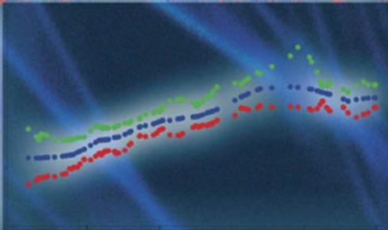

Peter Congdon

# Bayesian Statistical Modelling

Second Edition

# PETER CONGDON

Queen Mary, University of London, UK

# Bayesian Statistical Modelling

WILEY SERIES IN PROBABILITY AND STATISTICS ESTABLISHED BY WALTER A. SHEWHART AND SAMUEL S. WILKS

Editors  
David J. Balding, Peter Bloomfield, Noel A. C. Cressie, Nicholas I. Fisher, Iain M. Johnstone, J. B. Kadane, Geert Molenberghs, Louise M. Ryan, David W. Scott, Adrian F. M. Smith, Jozef L. Teugels  
Editors Emeriti  
Vic Barnett, J. Stuart Hunter, David G. Kendall

A complete list of the titles in this series appears at the end of this volume.

# Bayesian Statistical Modelling

Second Edition

# PETER CONGDON

Queen Mary, University of London, UK

Copyright © 2006 John Wiley & Sons Ltd, The Atrium, Southern Gate, Chichester, West Sussex PO19 8SQ, England Telephone (+44) 1243 779777

Email (for orders and customer service enquiries): cs-books@wiley.co.uk Visit our Home Page on www.wiley.com

All Rights Reserved. No part of this publication may be reproduced, stored in a retrieval system or transmitted in any form or by any means, electronic, mechanical, photocopying, recording, scanning or otherwise, except under the terms of the Copyright, Designs and Patents Act 1988 or under the terms of a licence issued by the Copyright Licensing Agency Ltd, 90 Tottenham Court Road, London W1T 4LP, UK, without the permission in writing of the Publisher. Requests to the Publisher should be addressed to the Permissions Department, John Wiley & Sons Ltd, The Atrium, Southern Gate, Chichester, West Sussex PO19 8SQ, England, or emailed to permreq@wiley.co.uk, or faxed to (+44) 1243 770620.

Designations used by companies to distinguish their products are often claimed as trademarks. All brand names and product names used in this book are trade names, service marks, trademarks or registered trademarks of their respective owners. The Publisher is not associated with any product or vendor mentioned in this book.

This publication is designed to provide accurate and authoritative information in regard to the subject matter covered. It is sold on the understanding that the Publisher is not engaged in rendering professional services. If professional advice or other expert assistance is required, the services of a competent professional should be sought.

# Other Wiley Editorial Offices

John Wiley & Sons Inc., 111 River Street, Hoboken, NJ 07030, USA

Jossey-Bass, 989 Market Street, San Francisco, CA 94103-1741, USA

Wiley-VCH Verlag GmbH, Boschstr. 12, D-69469 Weinheim, Germany

John Wiley & Sons Australia Ltd, 42 McDougall Street, Milton, Queensland 4064, Australia

John Wiley & Sons (Asia) Pte Ltd, 2 Clementi Loop #02-01, Jin Xing Distripark, Singapore 129809

John Wiley & Sons Canada Ltd, 6045 Freemont Blvd, Mississauga, Ontario, L5R 4J3, Canada

Wiley also publishes its books in a variety of electronic formats. Some content that appears in print may not be available in electronic books.

# British Library Cataloguing in Publication Data

A catalogue record for this book is available from the British Library

ISBN-13 978-0-470-01875-0 (HB)

ISBN-10 0-470-01875-5 (HB)

Typeset in 10/12pt Times by TechBooks, New Delhi, India

Printed and bound in Great Britain by Antony Rowe Ltd, Chippenham, Wiltshire

This book is printed on acid-free paper responsibly manufactured from sustainable forestry in which at least two trees are planted for each one used for paper production.

# Contents

# Preface

xiii

# Chapter 1 Introduction: The Bayesian Method, its Benefits and Implementation 1

1.1 The Bayes approach and its potential advantages 1   
1.2 Expressing prior uncertainty about parameters and Bayesian updating 2   
1.3 MCMC sampling and inferences from posterior densities 5   
1.4 The main MCMC sampling algorithms 9  
1.4.1 Gibbs sampling 12   
1.5 Convergence of MCMC samples 14   
1.6 Predictions from sampling: using the posterior predictive density 18   
1.7 The present book 18

References 19

# Chapter 2 Bayesian Model Choice, Comparison and Checking 25

2.1 Introduction: the formal approach to Bayes model choice and averaging 25   
2.2 Analytic marginal likelihood approximations and the Bayes information criterion 28   
2.3 Marginal likelihood approximations from the MCMC output 30   
2.4 Approximating Bayes factors or model probabilities 36   
2.5 Joint space search methods 38   
2.6 Direct model averaging by binary and continuous selection indicators 41   
2.7 Predictive model comparison via cross-validation 43   
2.8 Predictive fit criteria and posterior predictive model checks 46   
2.9 The DIC criterion 48   
2.10 Posterior and iteration-specific comparisons of likelihoods and penalised likelihoods 50   
2.11 Monte carlo estimates of model probabilities 52

References 57

# Chapter 3 The Major Densities and their Application 63

3.1 Introduction 63   
3.2 Univariate normal with known variance 64

3.2.1 Testing hypotheses on normal parameters 66

3.3 Inference on univariate normal parameters, mean and variance unknown 69   
3.4 Heavy tailed and skew density alternatives to the normal 71   
3.5 Categorical distributions: binomial and binary data 74  
3.5.1 Simulating controls through historical exposure 76   
3.6 Poisson distribution for event counts 79   
3.7 The multinomial and dirichlet densities for categorical and proportional data 82   
3.8 Multivariate continuous data: multivariate normal and $t$ densities 85

3.8.1 Partitioning multivariate priors 87   
3.8.2 The multivariate $t$ density 88

3.9 Applications of standard densities: classification rules 91   
3.10 Applications of standard densities: multivariate discrimination 98

Exercises 100

References 102

# Chapter 4 Normal Linear Regression, General Linear Models and Log-Linear Models 109

4.1 The context for Bayesian regression methods 109   
4.2 The normal linear regression model 111

4.2.1 Unknown regression variance 112

4.3 Normal linear regression: variable and model selection, outlier detection and error form 116   
4.3.1 Other predictor and model search methods 118

4.4 Bayesian ridge priors for multicollinearity 121   
4.5 General linear models 123   
4.6 Binary and binomial regression 123

4.6.1 Priors on regression coefficients 124   
4.6.2 Model checks 126

4.7 Latent data sampling for binary regression 129   
4.8 Poisson regression 132

4.8.1 Poisson regression for contingency tables 134   
4.8.2 Log-linear model selection 139

4.9 Multivariate responses 140

Exercises 143

References 146

# Chapter 5 Hierarchical Priors for Pooling Strength and Overdispersed Regression Modelling 151

5.1 Hierarchical priors for pooling strength and in general linear model regression 151   
5.2 Hierarchical priors: conjugate and non-conjugate mixing 152   
5.3 Hierarchical priors for normal data with applications in meta-analysis 153

5.3.1 Prior for second-stage variance 155

5.4 Pooling strength under exchangeable models for poisson outcomes 157

5.4.1 Hierarchical prior choices 158   
5.4.2 Parameter sampling 159

5.5 Combining information for binomial outcomes 162

5.6 Random effects regression for overdispersed count and binomial data 165   
5.7 Overdispersed normal regression: the scale-mixture student t model 169   
5.8 The normal meta-analysis model allowing for heterogeneity in study design or patient risk 173   
5.9 Hierarchical priors for multinomial data 176  
5.9.1 Histogram smoothing 177

Exercises 179

References 183

# Chapter 6 Discrete Mixture Priors 187

6.1 Introduction: the relevance and applicability of discrete mixtures 187   
6.2 Discrete mixtures of parametric densities 188

6.2.1 Model choice 190

6.3 Identifiability constraints 191   
6.4Hurdle and zero-inflated models for discrete data 195   
6.5 Regression mixtures for heterogeneous subpopulations 197   
6.6 Discrete mixtures combined with parametric random effects 200   
6.7 Non-parametric mixture modelling via dirichlet process priors 201   
6.8 Other non-parametric priors 207

Exercises 212

References 216

# Chapter 7 Multinomial and Ordinal Regression Models 219

7.1 Introduction: applications with categoric and ordinal data 219   
7.2 Multinomial logit choice models 221   
7.3 The multinomial probit representation of interdependent choices 224   
7.4 Mixed multinomial logit models 228   
7.5 Individual level ordinal regression 230   
7.6 Scores for ordered factors in contingency tables 235

Exercises 237

References 238

# Chapter 8 Time Series Models 241

8.1 Introduction: alternative approaches to time series models 241   
8.2 Autoregressive models in the observations 242

8.2.1 Priors on autoregressive coefficients 244   
8.2.2 Initial conditions as latent data 246

8.3 Trend stationarity in the AR1 model 248   
8.4 Autoregressive moving average models 250

8.5 Autoregressive errors 253   
8.6 Multivariate series 255   
8.7 Time series models for discrete outcomes 257

8.7.1 Observation-driven autodependence 257   
8.7.2 INAR models 258   
8.7.3 Error autocorrelation 259

8.8 Dynamic linear models and time varying coefficients 261

8.8.1 Some common forms of DLM 264   
8.8.2 Priors for time-specific variances or interventions 267   
8.8.3 Nonlinear and non-Gaussian state-space models 268

8.9 Models for variance evolution 273

8.9.1 ARCH and GARCH models 274   
8.9.2 Stochasticvolatilitymodels 275

8.10 Modelling structural shifts and outliers 277   
8.10.1 Markov mixtures and transition functions 279

8.11 Other nonlinear models 282

Exercises 285

References 288

# Chapter 9 Modelling Spatial Dependencies 297

9.1 Introduction: implications of spatial dependence 297   
9.2 Discrete space regressions for metric data 298   
9.3 Discrete spatial regression with structured and unstructured random effects 303

9.3.1 Proper CAR priors 306

9.4 Moving average priors 311   
9.5 Multivariate spatial priors and spatially varying regression effects 313   
9.6 Robust models for discontinuities and non-standard errors 317   
9.7 Continuous space modelling in regression and interpolation 321

Exercises 325

References 329

# Chapter 10 Nonlinear and Nonparametric Regression 333

10.1 Approaches to modelling nonlinearity 333   
10.2 Nonlinear metric data models with known functional form 335   
10.3 Box-Cox transformations and fractional polynomials 338   
10.4 Nonlinear regression through spline and radial basis functions 342

10.4.1 Shrinkage models for spline coefficients 345   
10.4.2 Modelling interaction effects 346

10.5 Application of state-space priors in general additive nonparametric regression 350

10.5.1 Continuous predictor space prior 351   
10.5.2 Discrete predictor space priors 353

Exercises 359

References 362

# Chapter 11 Multilevel and Panel Data Models 367

11.1 Introduction: nested data structures 367   
11.2 Multilevel structures 369

11.2.1 The multilevel normal linear model 369   
11.2.2 General linear mixed models for discrete outcomes 370   
11.2.3 Multinomial and ordinal multilevel models 372   
11.2.4 Robustness regarding cluster effects 373   
11.2.5 Conjugate approaches for discrete data 374

11.3 Heteroscedasticity in multilevel models 379   
11.4 Random effects for crossed factors 381   
11.5 Panel data models: the normal mixed model and extensions 387

11.5.1 Autocorrelated errors 390   
11.5.2 Autoregression in $y$ 391

11.6 Models for panel discrete (binary, count and categorical) observations 393

11.6.1 Binary panel data 393   
11.6.2 Repeated counts 395   
11.6.3 Panel categorical data 397

11.7 Growth curve models 400   
11.8 Dynamic models for longitudinal data: pooling strength over units and times 403

11.9 Area apc and spatiotemporal models 407

11.9.1 Age-period data 408   
11.9.2 Area-time data 409   
11.9.3 Age-area-period data 409   
11.9.4 Interaction priors 410

Exercises 413

References 418

# Chapter 12 Latent Variable and Structural Equation Models for Multivariate Data 425

12.1 Introduction: latent traits and latent classes 425   
12.2 Factor analysis and SEMS for continuous data 427

12.2.1 Identifiability constraints in latent trait (factor analysis) models 429

12.3 Latent class models 433   
12.3.1 Local dependence 437   
12.4 Factor analysis and SEMS for multivariate discrete data 441   
12.5 Nonlinear factor models 447

Exercises 450

References 452

# Chapter 13 Survival and Event History Analysis 457

13.1 Introduction 457   
13.2 Parametric survival analysis in continuous time 458

13.2.1 Censored observations 459   
13.2.2 Forms of parametric hazard and survival curves 460   
13.2.3 Modelling covariate impacts and time dependence in the hazard rate 461

13.3 Accelerated hazard parametric models 464   
13.4 Counting process models 466   
13.5 Semiparametric hazard models 469

13.5.1 Priors for the baseline hazard 470   
13.5.2 Gamma process prior on cumulative hazard 472

13.6 Competing risk-continuous time models 475   
13.7 Variations in proneness: models for frailty 477   
13.8 Discrete time survival models 482

Exercises 486

References 487

# Chapter 14 Missing Data Models 493

14.1 Introduction: types of missingness 493   
14.2 Selection and pattern mixture models for the joint data-missingness density 494   
14.3 Shared random effect and common factor models 498   
14.4 Missing predictor data 500   
14.5 Multiple imputation 503   
14.6 Categorical response data with possible non-random missingness: hierarchical and regression models 506

14.6.1 Hierarchical models for response and non-response by strata 506   
14.6.2 Regression frameworks 510

14.7 Missingness with mixtures of continuous and categorical data 516   
14.8 Missing cells in contingency tables 518

14.8.1 Ecological inference 519

Exercises 526

References 529

# Chapter 15 Measurement Error, Seemingly Unrelated Regressions, and Simultaneous Equations 533

15.1 Introduction 533   
15.2 Measurement error in both predictors and response in normal linear regression 533

15.2.1 Prior information on $X$ or its density 535   
15.2.2 Measurement error in general linear models 537

15.3 Misclassification of categorical variables 541   
15.4 Simultaneous equations and instruments for endogenous variables 546

15.5 Endogenous regression involving discrete variables 550

Exercises 554

References 556

# Appendix 1 A Brief Guide to Using WINBUGS 561

A1.1 Procedure for compiling and running programs 561

A1.2 Generating simulated data 562

A1.3 Other advice 563

# Index 565

# Preface

This book updates the 1st edition of Bayesian Statistical Modelling and, like its predecessor, seeks to provide an overview of modelling strategies and data analytic methodology from a Bayesian perspective. The book discusses and reviews a wide variety of modelling and application areas from a Bayesian viewpoint, and considers the most recent developments in what is often a rapidly changing intellectual environment.

The particular package that is mainly relied on for illustrative examples in this 2nd edition is again WINBUGS (and its parallel development in OPENBUGS). In the author's experience this remains a highly versatile tool for applying Bayesian methodology. This package allows effort to be focused on exploring alternative likelihood models and prior assumptions, while detailed specification and coding of parameter sampling mechanisms (whether Gibbs or Metropolis-Hastings) can be avoided - by relying on the program's inbuilt expert system to choose appropriate updating schemes.

In this way relatively compact and comprehensible code can be applied to complex problems, and the focus centred on data analysis and alternative model structures. In more general terms, providing computing code to replicate proposed new methodologies can be seen as an important component in the transmission of statistical ideas, along with data replication to assess robustness of inferences in particular applications.

I am indebted to the help of the Wiley team in progressing my book. Acknowledgements are due to the referee, and to Sylvia Fruhwirth-Schnatter and Nial Friel for their comments that helped improve the book.

Any comments may be addressed to me at p.congon@qmul.ac.uk. Data and programs can be obtained at ftp://ftp.wiley.co.uk/pub/books/congon/Congdon_BSM_2006.zip and also at Statlib, and at www.geog.qmul.ac.uk/staff/congon.html. Winbugs can be obtained from http://www.mrc-bsu.cam.ac.uk/bugs, and Openbugs from http://mathstat.helsinki.fi/openbugs/.

Peter Congdon

Queen Mary, University of London

November 2006

# CHAPTER 1

# Introduction: The Bayesian Method, its Benefits and Implementation

# 1.1 THE BAYES APPROACH AND ITS POTENTIAL ADVANTAGES

Bayesian estimation and inference has a number of advantages in statistical modelling and data analysis. For example, the Bayes method provides confidence intervals on parameters and probability values on hypotheses that are more in line with commonsense interpretations. It provides a way of formalising the process of learning from data to update beliefs in accord with recent notions of knowledge synthesis. It can also assess the probabilities on both nested and non-nested models (unlike classical approaches) and, using modern sampling methods, is readily adapted to complex random effects models that are more difficult to fit using classical methods (e.g. Carlin et al., 2001).

However, in the past, statistical analysis based on the Bayes theorem was often daunting because of the numerical integrations needed. Recently developed computer-intensive sampling methods of estimation have revolutionised the application of Bayesian methods, and such methods now offer a comprehensive approach to complex model estimation, for example in hierarchical models with nested random effects (Gilks et al., 1993). They provide a way of improving estimation in sparse datasets by borrowing strength (e.g. in small area mortality studies or in stratified sampling) (Richardson and Best 2003; Stroud, 1994), and allow finite sample inferences without appeal to large sample arguments as in maximum likelihood and other classical methods. Sampling-based methods of Bayesian estimation provide a full density profile of a parameter so that any clear non-normality is apparent, and allow a range of hypotheses about the parameters to be simply assessed using the collection of parameter samples from the posterior.

Bayesian methods may also improve on classical estimators in terms of the precision of estimates. This happens because specifying the prior brings extra information or data based on accumulated knowledge, and the posterior estimate in being based on the combined sources of information (prior and likelihood) therefore has greater precision. Indeed a prior can often be expressed in terms of an equivalent 'sample size'.

Bayesian analysis offers an alternative to classical tests of hypotheses under which $p$ -values are framed in the data space: the $p$ -value is the probability under hypothesis $H$ of data at least as extreme as that actually observed. Many users of such tests more naturally interpret $p$ -values as relating to the hypothesis space, i.e. to questions such as the likely range for a parameter given the data, or the probability of $H$ given the data. The Bayesian framework is more naturally suited to such probability interpretations. The classical theory of confidence intervals for parameter estimates is also not intuitive, saying that in the long run with data from many samples a $95\%$ interval calculated from each sample will contain the true parameter approximately $95\%$ of the time. The particular confidence interval from any one sample may or may not contain the true parameter value. By contrast, a $95\%$ Bayesian credible interval contains the true parameter value with approximately $95\%$ certainty.

# 1.2 EXPRESSING PRIOR UNCERTAINTY ABOUT PARAMETERS AND BAYESIAN UPDATING

The learning process involved in Bayesian inference is one of modifying one's initial probability statements about the parameters before observing the data to updated or posterior knowledge that combines both prior knowledge and the data at hand. Thus prior subject-matter knowledge about a parameter (e.g. the incidence of extreme political views or the relative risk of thrombosis associated with taking the contraceptive pill) is an important aspect of the inference process. Bayesian models are typically concerned with inferences on a parameter set $\theta = (\theta_{1},\dots,\theta_{d})$ of dimension $d$ , that includes uncertain quantities, whether fixed and random effects, hierarchical parameters, unobserved indicator variables and missing data (Gelman and Rubin, 1996). Prior knowledge about the parameters is summarised by the density $p(\theta)$ , the likelihood is $p(y|\theta)$ , and the updated knowledge is contained in the posterior density $p(\theta |y)$ . From the Bayes theorem

$$
p (\theta | y) = p (y | \theta) p (\theta) / p (y), \tag {1.1}
$$

where the denominator on the right side is the marginal likelihood $p(y)$ . The latter is an integral over all values of $\theta$ of the product $p(y|\theta)p(\theta)$ and can be regarded as a normalising constant to ensure that $p(\theta |y)$ is a proper density. This means one can express the Bayes theorem as

$$
p (\theta | y) \propto p (y | \theta) p (\theta).
$$

The relative influence of the prior and data on updated beliefs depends on how much weight is given to the prior (how 'informative' the prior is) and the strength of the data. For example, a large data sample would tend to have a predominant influence on updated beliefs unless the prior was informative. If the sample was small and combined with a prior that was informative, then the prior distribution would have a relatively greater influence on the updated belief: this might be the case if a small clinical trial or observational study was combined with a prior based on a meta-analysis of previous findings.

How to choose the prior density or information is an important issue in Bayesian inference, together with the sensitivity or robustness of the inferences to the choice of prior, and the possibility of conflict between prior and data (Andrade and O'Hagan, 2006; Berger, 1994).

Table 1.1 Deriving the posterior distribution of a prevalence rate $\pi$ using a discrete prior   

<table><tr><td>Possible π values</td><td>Prior weight given to different possible values of π</td><td>Likelihood of data given value for π</td><td>Prior times likelihood</td><td>Posterior probabilities</td></tr><tr><td>0.10</td><td>0.10</td><td>0.267</td><td>0.027</td><td>0.098</td></tr><tr><td>0.12</td><td>0.15</td><td>0.287</td><td>0.043</td><td>0.157</td></tr><tr><td>0.14</td><td>0.25</td><td>0.290</td><td>0.072</td><td>0.265</td></tr><tr><td>0.16</td><td>0.25</td><td>0.279</td><td>0.070</td><td>0.255</td></tr><tr><td>0.18</td><td>0.15</td><td>0.258</td><td>0.039</td><td>0.141</td></tr><tr><td>0.20</td><td>0.10</td><td>0.231</td><td>0.023</td><td>0.084</td></tr><tr><td>Total</td><td>1</td><td></td><td>0.274</td><td>1</td></tr></table>

In some situations it may be possible to base the prior density for $\theta$ on cumulative evidence using a formal or informal meta-analysis of existing studies. A range of other methods exist to determine or elicit subjective priors (Berger, 1985, Chapter 3; Chaloner, 1995; Garthwaite et al., 2005; O'Hagan, 1994, Chapter 6). A simple technique known as the histogram method divides the range of $\theta$ into a set of intervals (or 'bins') and elicits prior probabilities that $\theta$ is located in each interval; from this set of probabilities, $p(\theta)$ may be represented as a discrete prior or converted to a smooth density. Another technique uses prior estimates of moments along with symmetry assumptions to derive a normal $N(m,V)$ prior density including estimates $m$ and $V$ of the mean and variance. Other forms of prior can be reparameterised in the form of a mean and variance (or precision); for example beta priors $\mathrm{Be}(a,b)$ for probabilities can be expressed as $\mathrm{Be}(m\tau,(1-m)\tau)$ where $m$ is an estimate of the mean probability and $\tau$ is the estimated precision (degree of confidence in) that prior mean.

To illustrate the histogram method, suppose a clinician is interested in $\pi$ , the proportion of children aged 5-9 in a particular population with asthma symptoms. There is likely to be prior knowledge about the likely size of $\pi$ , based on previous studies and knowledge of the host population, which can be summarised as a series of possible values and their prior probabilities, as in Table 1.1. Suppose a sample of 15 patients in the target population shows 2 with definitive symptoms. The likelihoods of obtaining 2 from 15 with symptoms according to the different values of $\pi$ are given by $(^{15}_2)\pi^2 (1 - \pi)^{13}$ , while posterior probabilities on the different values are obtained by dividing the product of the prior and likelihood by the normalising factor of 0.274. They give highest support to a value of $\pi = 0.14$ . This inference rests only on the prior combined with the likelihood of the data, namely 2 from 15 cases. Note that to calculate the posterior weights attaching to different values of $\pi$ , one need use only that part of the likelihood in which $\pi$ is a variable: instead of the full binomial likelihood, one may simply use the likelihood kernel $\pi^2 (1 - \pi)^{13}$ since the factor $(^{15}_2)$ cancels out in the numerator and denominator of Equation (1.1).

Often, a prior amounts to a form of modelling assumption or hypothesis about the nature of parameters, for example, in random effects models. Thus small area mortality models may include spatially correlated random effects, exchangeable random effects with no spatial pattern or both. A prior specifying the errors as spatially correlated is likely to be a working model assumption, rather than a true cumulation of knowledge.

In many situations, existing knowledge may be difficult to summarise or elicit in the form of an 'informative prior', and to reflect such essentially prior ignorance, resort is made to non-informative priors. Since the maximum likelihood estimate is not influenced by priors, one possible heuristic is that a non-informative prior leads to a Bayesian posterior mean very close to the maximum likelihood estimate, and that informativeness of priors can be assessed by how closely the Bayesian estimate comes to the maximum likelihood estimate.

Examples of priors intended to be non-informative are flat priors (e.g. that a parameter is uniformly distributed between $-\infty$ and $+\infty$ , or between 0 and $+\infty$ ), reference priors (Berger and Bernardo, 1994) and Jeffreys' prior

$$
p (\theta) \propto | I (\theta) | ^ {0. 5},
$$

where $I(\theta)$ is the information $^1$ matrix. Jeffreys' prior has the advantage of invariance under transformation, a property not shared by uniform priors (Syverseen, 1998). Other advantages are discussed by Wasserman (2000). Many non-informative priors are improper (do not integrate to 1 over the range of possible values). They may also actually be unexpectedly informative about different parameter values (Zhu and Lu, 2004). Sometimes improper priors can lead to improper posteriors, as in a normal hierarchical model with subjects $j$ nested in clusters $i$ ,

$$
y _ {i j} \sim N (\theta_ {i}, \sigma^ {2}),
$$

$$
\theta_ {i} \sim N (\mu , \tau^ {2}).
$$

The prior $p(\mu, \tau) = 1 / \tau$ results in an improper posterior (Kass and Wasserman, 1996). Examples of proper posteriors despite improper priors are considered by Fraser et al. (1997) and Hadjicostas and Berry (1999).

To guarantee posterior propriety (at least analytically) a possibility is to assume just proper priors (sometimes called diffuse or weakly informative priors); for example, a gamma $\mathrm{Ga}(1,0.00001)$ prior on a precision (inverse variance) parameter is proper but very close to being a flat prior. Such priors may cause identifiability problems and impede Markov Chain Monte Carlo (MCMC) convergence (Gelfand and Sahu, 1999; Kass and Wasserman, 1996, p. 1361). To adequately reflect prior ignorance while avoiding impropriety, Spiegelhalter et al. (1996, p. 28) suggest a prior standard deviation at least an order of magnitude greater than the posterior standard deviation.

In Table 1.1 an informative prior favouring certain values of $\pi$ has been used. A noninformative prior, favouring no values above any other, would assign an equal prior probability of $1/6$ to each of the possible prior values of $\pi$ . A non-informative prior might be used in the genuine absence of prior information, or if there is disagreement about the likely values of hypotheses or parameters. It may also be used in comparison with more informative priors as one aspect of a sensitivity analysis regarding posterior inferences according to the prior. Often some prior information is available on a parameter or hypothesis, though converting it into a probabilistic form remains an issue. Sometimes a formal stage of eliciting priors from subject-matter specialists is entered into (Osherson et al., 1995).

If a previous study or set of studies is available on the likely prevalence of asthma in the population, these may be used in a form of preliminary meta-analysis to set up an informative prior for the current study. However, there may be limits to the applicability of previous studies to the current target population (e.g. because of differences in the socio-economic background or features of the local environment). So the information from previous studies, while still usable, may be downweighted; for example, the precision (variance) of an estimated relative risk or prevalence rate from a previous study may be divided (multiplied) by 10. If there are several parameters and their variance-covariance matrix is known from a previous study or a mode-finding analysis (e.g. maximum likelihood), then this can be downweighted in the same way (Birkes and Dodge, 1993). More comprehensive ways of downweighting historical/prior evidence have been proposed, such as power prior models (Ibrahim and Chen, 2000).

In practice, there are also mathematical reasons to prefer some sorts of priors to others (the question of conjugacy is considered in Chapter 3). For example, a beta density for the binomial success probability is conjugate with the binomial likelihood in the sense that the posterior has the same (beta) density form as the prior. However, one advantage of sampling-based estimation methods is that a researcher is no longer restricted to conjugate priors, whereas in the past this choice was often made for reasons of analytic tractability. There remain considerable problems in choosing appropriate neutral or non-informative priors on certain types of parameters, with variance and covariance hyperparameters in random effects models a leading example (Daniels, 1999; Gelman, 2006; Gustafson et al., in press).

To assess sensitivity to the prior assumptions, one may consider the effects on inference of a limited range of alternative priors (Gustafson, 1996), or adopt a 'community of priors' (Spiegelhalter et al., 1994); for example, alternative priors on a treatment effect in a clinical trial might be neutral, sceptical, and enthusiastic with regard to treatment efficacy. One might also consider more formal approaches to robustness based on non-parametric priors rather than parametric priors, or via mixture ('contamination') priors. For instance, one might assume a two-group mixture with larger probability $1 - q$ on the 'main' prior $p_1(\theta)$ , and a smaller probability such as $q = 0.2$ on a contaminating density $p_2(\theta)$ , which may be any density (Gustafson, 1996). One might consider the contaminating prior to be a flat reference prior, or one allowing for shifts in the main prior's assumed parameter values (Berger, 1990). In large datasets, inferences may be robust to changes in prior unless priors are heavily informative. However, inference sensitivity may be greater for some types of parameters, even in large datasets; for example, inferences may depend considerably on the prior adopted for variance parameters in random effects models, especially in hierarchical models where different types of random effects coexist in a model (Daniels, 1999; Gelfand et al., 1996).

# 1.3 MCMC SAMPLING AND INFERENCES FROM POSTERIOR DENSITIES

Bayesian inference has become closely linked to sampling-based estimation methods. Both focus on the entire density of a parameter or functions of parameters. Iterative Monte Carlo methods involve repeated sampling that converges to sampling from the posterior distribution. Such sampling provides estimates of density characteristics (moments, quantiles), or of probabilities relating to the parameters (Smith and Gelfand, 1992). Provided with

a reasonably large sample from a density, its form can be approximated via curve estimation (kernel density) methods; default bandwidths are suggested by Silverman (1986), and included in implementations such as the Stixbox Matlab library (pltdens.m from http://www.maths.lth.se/matstat/stixbox). There is no limit to the number of samples $T$ of $\theta$ that may be taken from a posterior density $p(\theta | y)$ , where $\theta = (\theta_{1}, \dots, \theta_{k}, \dots, \theta_{d})$ is of dimension $d$ . The larger is $T$ from a single sampling run, or the larger is $T = T_{1} + T_{2} + \dots + T_{J}$ based on $J$ sampling chains from the density, the more accurately the posterior density would be described.

Monte Carlo posterior summaries typically include posterior means and variances of the parameters. This is equivalent to estimating the integrals

$$
E \left(\theta_ {k} | y\right) = \int \theta_ {k} p (\theta | y) d \theta , \tag {1.2}
$$

$$
\begin{array}{l} \operatorname {V a r} \left(\theta_ {k} | y\right) = \int \theta_ {k} ^ {2} p (\theta | y) d \theta - \left[ E \left(\theta_ {k} | y\right) \right] ^ {2} \\ = E \left(\theta_ {k} ^ {2} | y\right) - \left[ E \left(\theta_ {k} | y\right) \right] ^ {2}. \tag {1.3} \\ \end{array}
$$

Which estimator $d = \theta_{e}(y)$ to choose to characterise a particular function of $\theta$ can be decided with reference to the Bayes risk under a specified loss function $L[d,\theta]$ (Zellner, 1985, p. 262),

$$
\min  _ {d} \int L [ d, \theta ] p (y | \theta) p (\theta) \mathrm {d} \theta ,
$$

or equivalently

$$
\min  _ {d} \int L [ d, \theta ] p (\theta | y) d \theta .
$$

The posterior mean can be shown to be the best estimate of central tendency for a density under a squared error loss function (Robert, 2004), while the posterior median is the best estimate when absolute loss is used, namely $L[\theta_e(y), \theta] = |\theta_e - \theta|$ . Similar principles can be applied to parameters obtained via model averaging (Brock et al., 2004).

A $100(1 - \alpha)\%$ credible interval for $\theta_{k}$ is any interval $[a, b]$ of values that has probability $1 - \alpha$ under the posterior density of $\theta_{k}$ . As noted above, it is valid to say that there is a probability of $1 - \alpha$ that $\theta_{k}$ lies within the range $[a, b]$ . Suppose $\alpha = 0.05$ . Then the most common credible interval is the equal-tail credible interval, using 0.025 and 0.975 quantiles of the posterior density. If one is using an MCMC sample to estimate the posterior density, then the $95\%$ CI is estimated using the 0.025 and 0.975 quantiles of the sampled output $\{\theta_{k}^{(t)}, t = B + 1, \dots, T\}$ where $B$ is the number of burn-in iterations (see Section 1.5). Another form of credible interval is the $100(1 - \alpha)\%$ highest probability density (HPD) interval, such that the density for every point inside the interval exceeds that for every point outside the interval, and is the shortest possible $100(1 - \alpha)\%$ credible interval; Chen et al. (2000, p. 219) provide an algorithm to estimate the HPD interval. A program to find the HPD interval is included in the Matlab suite of MCMC diagnostics developed at the Helsinki University of Technology, at http://www.lce.hut.fi/research/compinf/mcmcdiag/.

One may similarly obtain posterior means, variances and credible intervals for functions $\Delta = \Delta (\theta)$ of the parameters (van Dyk, 2002). The posterior means and variances of such functions obtained from MCMC samples are estimates of the integrals

$$
E [ \Delta (\theta) | y ] = \int \Delta (\theta) p (\theta | y) d \theta ,
$$

$$
\begin{array}{l} \operatorname {v a r} [ \Delta (\theta) | y ] = \int \Delta^ {2} p (\theta | y) d \theta - [ E (\Delta | y) ] ^ {2} \tag {1.4} \\ = E (\Delta^ {2} | y) - [ E (\Delta | y) ] ^ {2}. \\ \end{array}
$$

Often the major interest is in marginal densities of the parameters themselves. The marginal density of the $k$ th parameter $\theta_{k}$ is obtained by integrating out all other parameters

$$
p (\theta_ {k} | y) = \int p (\theta | y) d \theta_ {1} d \theta_ {2} \dots d \theta_ {k - 1} d \theta_ {k + 1} d \theta_ {d}.
$$

Posterior probability estimates from an MCMC run might relate to the probability that $\theta_{k}$ (say $k = 1$ ) exceeds a threshold $b$ , and provide an estimate of the integral

$$
\Pr \left(\theta_ {1} > b \mid y\right) = \int_ {b} ^ {\infty} \int_ {\cdot} \int p (\theta \mid y) d \theta . \tag {1.5}
$$

For example, the probability that a regression coefficient exceeds zero or is less than zero is a measure of its significance in the regression (where significance is used as a shorthand for 'necessary to be included'). A related use of probability estimates in regression (Chapter 4) is when binary inclusion indicators precede the regression coefficient and the regressor is included only when the indicator is 1. The posterior probability that the indicator is 1 estimates the probability that the regressor should be included in the regression.

Such expectations, density or probability estimates may sometimes be obtained analytically for conjugate analyses – such as a binomial likelihood where the probability has a beta prior. They can also be approximated analytically by expanding the relevant integral (Tierney et al., 1988). Such approximations are less good for posteriors that are not approximately normal, or where there is multimodality. They also become impractical for complex multiparameter problems and random effects models.

By contrast, MCMC techniques are relatively straightforward for a range of applications, involving sampling from one or more chains after convergence to a stationary distribution that approximates the posterior $p(\theta | y)$ . If there are $n$ observations and $d$ parameters, then the required number of iterations to reach stationarity will tend to increase with both $d$ and $n$ , and also with the complexity of the model (e.g. which depends on the number of levels in a hierarchical model, or on whether a nonlinear rather than a simple linear regression is chosen). The ability of MCMC sampling to cope with complex estimation tasks should be qualified by mention of problems associated with long-run sampling as an estimation method. For example, Cowles and Carlin (1996) highlight problems that may occur in obtaining and/or assessing convergence (see Section 1.5). There are also problems in setting neutral priors on certain types of parameters (e.g. variance hyperparameters in models with nested random effects), and certain types of models (e.g. discrete parametric mixtures) are especially subject to identifiability problems (Fruhwirth-Schnatter, 2004; Jasra et al., 2005).

A variety of MCMC methods have been proposed to sample from posterior densities (Section 1.4). They are essentially ways of extending the range of single-parameter sampling methods to multivariate situations, where each parameter or subset of parameters in the overall posterior density has a different density. Thus there are well-established routines for computer generation of random numbers from particular densities (Ahrens and Dieter, 1974; Devroye, 1986). There are also routines for sampling from non-standard densities such as non-log-concave densities (Gilks and Wild, 1992). The usual Monte Carlo method assumes a sample of independent simulations $u^{(1)}, u^{(2)}, \ldots, u^{(T)}$ from a target density $\pi(u)$ whereby $E[g(u)] = \int g(u)\pi(u)\mathrm{d}u$ is estimated as

$$
\overline {{g}} _ {T} = \sum_ {t = 1} ^ {T} g \left(u ^ {(t)}\right).
$$

With probability 1, $\overline{g}_T$ tends to $E_{\pi}[g(u)]$ as $T \to \infty$ . However, independent sampling from the posterior density $p(\theta | y)$ is not feasible in general. It is valid, however, to use dependent samples $\theta^{(t)}$ , provided the sampling satisfactorily covers the support of $p(\theta | y)$ (Gilks et al., 1996).

In order to sample approximately from $p(\theta | y)$ , MCMC methods generate dependent draws via Markov chains. Specifically, let $\theta^{(0)}, \theta^{(1)}, \ldots$ be a sequence of random variables. Then $p(\theta^{(0)}, \theta^{(1)}, \ldots, \theta^{(T)})$ is a Markov chain if

$$
p \left(\theta^ {(t)} \mid \theta^ {(0)}, \theta^ {(1)}, \dots , \theta^ {(t - 1)}\right) = p \left(\theta^ {(t)} \mid \theta^ {(t - 1)}\right),
$$

so that only the preceding state is relevant to the future state. Suppose $\theta^{(t)}$ is defined on a discrete state space $S = \{s_1, s_2, \ldots\}$ , with generalisation to continuous state spaces described by Tierney (1996). Assume $p(\theta^{(t)}|\theta^{(t-1)})$ is defined by a constant one-step transition matrix

$$
Q _ {i, j} = \Pr \left(\theta^ {(t)} = s _ {j} \mid \theta^ {(t - 1)} = s _ {i}\right),
$$

with $t$ -step transition matrix $Q_{i,j}(t) = \operatorname*{Pr}(\theta^{(t)} = s_j|\theta^{(0)} = s_i)$ . Sampling from a constant one-step Markov chain converges to the stationary distribution required, namely $\pi (\theta) = p(\theta |y)$ , if additional requirements<sup>2</sup> on the chain are satisfied (irreducibility, aperiodicity and positive recurrence) - see Roberts (1996, p. 46) and Norris (1997). Sampling chains meeting these requirements have a unique stationary distribution $\lim_{t\to \infty}Q_{i,j}(t) = \pi_{(j)}$ satisfying the full balance condition $\pi_{(j)} = \sum_{i}\pi_{(i)}Q_{i,j}$ . Many Markov chain methods are additionally reversible, meaning $\pi_{(i)}Q_{i,j} = \pi_{(j)}Q_{j,i}$ .

With this type of sampling mechanism, the ergodic average $\overline{g}_T$ tends to $E_{\pi}[g(u)]$ with probability 1 as $T \to \infty$ despite dependent sampling. Remaining practical questions include establishing an MCMC sampling scheme and establishing that convergence to a steady state has been obtained for practical purposes (Cowles and Carlin, 1996). Estimates of quantities such as (1.2) and (1.3) are routinely obtained from sampling output along with 2.5th and

97.5th percentiles that provide equal-tail credible intervals for the value of the parameter. A full posterior density estimate may also be derived (e.g. by kernel smoothing of the MCMC output of a parameter). For $\Delta (\theta)$ its posterior mean is obtained by calculating $\Delta^{(t)}$ at every MCMC iteration from the sampled values $\theta^{(t)}$ . The theoretical justification for this is provided by the MCMC version of the law of large numbers (Tierney, 1994), namely that

$$
\sum_ {t = 1} ^ {T} \frac {\Delta (\theta^ {(t)})}{T} \rightarrow E _ {\pi} [ \Delta (\theta) ],
$$

provided that the expectation of $\Delta (\theta)$ under $\pi (\theta) = p(\theta |y)$ , denoted by $E_{\pi}[\Delta (\theta)]$ , exists.

The probability (1.5) would be estimated by the proportion of iterations where $\theta_j^{(t)}$ exceeded $b$ , namely $\sum_{t=1}^{T} 1(\theta_j^{(t)} > b)/T$ , where $1(A)$ is an indicator function that takes value 1 when A is true, and 0 otherwise. Thus one might in a disease-mapping application wish to obtain the probability that an area's smoothed relative mortality risk $\theta_k$ exceeds zero, and so count iterations where this condition holds, avoiding the need to evaluate the integral

$$
\Pr (\theta_ {k} > 0 | y) = \int_ {\cdot} \int_ {0} ^ {\infty} \cdot \int p (\theta | y) d \theta
$$

where the $k^{\mathrm{th}}$ integral is confined to positive values.

This principle extends to empirical estimates of the distribution function, $F(\cdot)$ of parameters or functions of parameters. Thus the estimated probability that $\Delta \leq h$ for values of $h$ within the support of $\Delta$ is

$$
\hat {F} (d) = \sum_ {t = 1} ^ {T} \frac {1 (\Delta^ {(t)} \leq h)}{T}.
$$

The sampling output also often includes predictive replicates $y_{\mathrm{new}}^{(t)}$ that can be used in posterior predictive checks to assess whether a model's predictions are consistent with the observed data. Predictive replicates are obtained by sampling $\theta^{(t)}$ and then sampling $y_{\mathrm{new}}$ from the likelihood model $p(y_{\mathrm{new}}|\theta^{(t)})$ . The posterior predictive density can also be used for model choice and residual analysis (Gelfand, 1996, Sections 9.4-9.6).

# 1.4 THE MAIN MCMC SAMPLING ALGORITHMS

The Metropolis-Hastings (M-H) algorithm is the baseline for MCMC schemes that simulate a Markov chain $\theta^{(t)}$ with $p(\theta |y)$ as its stationary distribution. Following Hastings (1970), the chain is updated from $\theta^{(t)}$ to $\theta^{*}$ with probability

$$
\alpha \left(\theta^ {*} | \theta^ {(t)}\right) = \min  \left(1, \frac {p \left(\theta^ {*} | y\right) f \left(\theta^ {(t)} | \theta^ {*}\right)}{p \left(\theta^ {(t)} | y\right) f \left(\theta^ {*} | \theta^ {(t)}\right)}\right),
$$

where $f$ is known as a proposal or jumping density (Chib and Greenberg, 1995). $f(\theta^{*}|\theta^{(t)})$ is the probability (or density ordinate) of $\theta^{*}$ for a density centred at $\theta^{(t)}$ , while $f(\theta^{(t)}|\theta^{*})$ is the probability of moving back from $\theta^{*}$ to the original value. The transition kernel is $k(\theta^{(t)}|\theta^{*}) = \alpha (\theta^{*}|\theta^{(t)})f(\theta^{*}|\theta^{(t)})$ for $\theta^{*}\neq \theta^{(t)}$ , with a non-zero probability of staying in the current state,

namely $k(\theta^{(t)}|\theta^{(t)}) = 1 - \int \alpha (\theta^{*}|\theta^{(t)})f(\theta^{*}|\theta^{(t)})\mathrm{d}\theta^{*}$ . Conformity of M-H sampling to the Markov chain requirements discussed above is considered by Mengersen and Tweedie (1996) and Roberts and Rosenthal (2004).

If the proposed new value $\theta^{*}$ is accepted, then $\theta^{(t + 1)} = \theta^{*}$ , while if it is rejected, the next state is the same as the current state, i.e. $\theta^{(t + 1)} = \theta^{(t)}$ . The target density $p(\theta |y)$ appears in ratio form so it is not necessary to know any normalising constants. If the proposal density is symmetric, with $f(\theta^{*}|\theta^{(t)}) = f(\theta^{(t)}|\theta^{*})$ , then the M-H algorithm reduces to the algorithm developed by Metropolis et al. (1953), whereby

$$
\alpha \left(\theta^ {*} | \theta^ {(t)}\right) = \min  \left[ 1, \frac {p \left(\theta^ {*} | y\right)}{p \left(\theta^ {(t)} | y\right)} \right].
$$

If the proposal density has the form $f(\theta^{*}|\theta^{(t)}) = f(\theta^{(t)} - \theta^{*})$ , then a random walk Metropolis scheme is obtained (Gelman et al., 1995). Another option is independence sampling, when the density $f(\theta^{*})$ for sampling new values is independent of the current value $\theta^{(t)}$ . One may also combine the adaptive rejection technique with M-H sampling, with $f$ acting as a pseudo-envelope for the target density $p$ (Chib and Greenberg, 1995; Robert and Casella, 1999, p. 249). Scollnik (1995) uses this algorithm to sample from the Makeham density often used in actuarial work.

The M-H algorithm works most successfully when the proposal density matches, at least approximately, the shape of the target density $p(\theta | y)$ . The rate at which a proposal generated by $f$ is accepted (the acceptance rate) depends on how close $\theta^*$ is to $\theta^{(t)}$ , and this depends on the dispersion $\Sigma$ or variance $\sigma^2$ of the proposal density. For a normal proposal density a higher acceptance rate would follow from reducing $\sigma^2$ , but with the risk that the posterior density will take longer to explore. If the acceptance rate is too high, then autocorrelation in sampled values will be excessive (since the chain tends to move in a restricted space), while a too low acceptance rate leads to the same problem, since the chain then gets locked at particular values.

One possibility is to use a variance or dispersion estimate $V_{\theta}$ from a maximum likelihood or other mode finding analysis and then scale this by a constant $c > 1$ , so that the proposal density variance is $\Sigma = cV_{\theta}$ (Draper, 2005, Chapter 2). Values of $c$ in the range 2-10 are typical, with the proposal density variance $2.38^{2}V_{\theta} / d$ shown as optimal in random walk schemes (Roberts et al., 1997). The optimal acceptance rate for a random walk Metropolis scheme is obtainable as $23.4\%$ (Roberts and Rosenthal, 2004, Section 6). Recent work has focused on adaptive MCMC schemes whereby the tuning is adjusted to reflect the most recent estimate of the posterior covariance $V_{\theta}$ (Gilks et al., 1998; Pasarica and Gelman, 2005). Note that certain proposal densities have parameters other than the variance that can be used for tuning acceptance rates (e.g. the degrees of freedom if a Student $t$ proposal is used). Performance also tends to be improved if parameters are transformed to take the full range of positive and negative values $(-\infty, \infty)$ so lessening the occurrence of skewed parameter densities.

Typical random walk Metropolis updating uses uniform, standard normal or standard Student $t$ variables $W_{t}$ . A normal random walk for a univariate parameter takes samples $W_{t} \sim N(0,1)$ and a proposal $\theta^{*} = \theta^{(t)} + \sigma W_{t}$ , where $\sigma$ determines the size of the jump (and the acceptance rate). A uniform random walk samples $U_{t} \sim \mathrm{Unif}(-1,1)$ and scales this to form a proposal $\theta^{*} = \theta^{(t)} + \kappa U_{t}$ . As noted above, it is desirable that the proposal density approximately matches the shape of the target density $p(\theta |y)$ . The Langevin random walk scheme is an

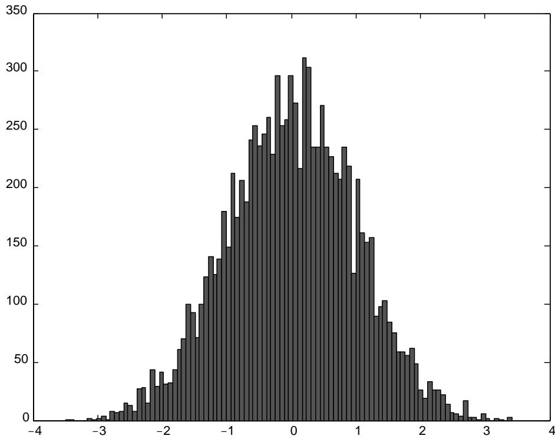  
Figure 1.1 Uniform random walk samples from a $N(0,1)$ density.

example of a scheme including information about the shape of $p(\theta |y)$ in the proposal, namely $\theta^{*} = \theta^{(t)} + \sigma (W_{t} + 0.5\nabla \log (p(\theta^{(t)}|y))$ where $\nabla$ denotes the gradient function (Roberts and Tweedie, 1996).

As an example of a uniform random walk proposal, consider Matlab code to sample $T = 10000$ times from a $N(0,1)$ density using a $U(-3,3)$ proposal density - see Hastings (1970) for the probability of accepting new values when sampling $N(0,1)$ with a uniform $U(-\kappa, \kappa)$ proposal density. The code is

```matlab
N = 10000; th(1) = 0; pdf = inline('exp(-x^2/2)'); acc=0;  
for i=2:n thstar = th(i-1) + 3*(1-2*rand);  
    alpha = min([1, pdf(thstar)/pdf(th(i-1))]);  
if rand <= alpha th(i)=thstar; acc=acc+1;  
else th(i)=th(i-1); end  
end  
sprintf('acceptance rate %4.0f',100*acc/n)  
hist(th,100); 
```

The acceptance rate is around $49\%$ (depending on the seed). Figure 1.1 contains a histogram of the sampled values.

While it is possible for the proposal density to relate to the entire parameter set, it is often computationally simpler in multi-parameter problems to divide $\theta$ into $D$ blocks or components,

and use componentwise updating. Thus let $\theta_{[j]} = (\theta_1,\theta_2,\dots ,\theta_{j - 1},\theta_{j + 1},\dots ,\theta_D)$ denote the parameter set omitting component $\theta_{j}$ and $\theta_j^{(t)}$ be the value of $\theta_{j}$ after iteration $t$ . At step $j$ of iteration $t + 1$ the preceding $j - 1$ parameter blocks are already updated via the M-H algorithm while $\theta_{j + 1},\ldots ,\theta_{D}$ are still at their iteration $t$ values (Chib and Greenberg, 1995). Let the vector of partially updated parameters be denoted by

$$
\theta_ {[ j ]} ^ {(t, t + 1)} = \left(\theta_ {1} ^ {(t + 1)}, \theta_ {2} ^ {(t + 1)}, \dots , \theta_ {j - 1} ^ {(t + 1)}, \theta_ {j + 1} ^ {(t)}, \dots , \theta_ {D} ^ {(t)}\right).
$$

The proposed value $\theta_t^*$ for $\theta_j^{(t + 1)}$ is generated from the $j$ th proposal density, denoted by $f(\theta_j^* | \theta_j^{(t)}, \theta_{[j]}^{(t,t + 1)})$ . Also governing the acceptance of a proposal are full conditional densities $p(\theta_j^{(t)} | \theta_{[j]}^{(t,t + 1)})$ specifying the density of $\theta_j$ conditional on other parameters $\theta_{[j]}$ . The candidate value $\theta_j^*$ is then accepted with probability

$$
\alpha \left(\theta_ {j} ^ {(t)}, \theta_ {[ j ]} ^ {(t, t + 1)}, \theta_ {j} ^ {*}\right) = \min  \left[ 1, \frac {p \left(\theta_ {j} ^ {*} \mid \theta_ {[ j ]} ^ {(t , t + 1)}\right) f \left(\theta_ {j} ^ {(t)} \mid \theta_ {j} ^ {*} , \theta_ {[ j ]} ^ {(t , t + 1)}\right)}{p \left(\theta_ {j} ^ {(t)} \mid \theta_ {[ j ]} ^ {(t , t + 1)}\right) f \left(\theta_ {j} ^ {*} \mid (\theta_ {j} ^ {(t)} , \theta_ {[ j ]} ^ {(t , t + 1)})\right)} \right].
$$

# 1.4.1 Gibbs sampling

The Gibbs sampler (Casella and George, 1992; Gelfand and Smith, 1990; Gilks et al., 1993) is a special componentwise M-H algorithm whereby the proposal density for updating $\theta_{j}$ equals the full conditional $p(\theta_j^* |\theta_{[j]})$ so that proposals are accepted with probability 1. This sampler was originally developed by Geman and Geman (1984) for Bayesian image reconstruction, with its potential for simulating marginal distributions by repeated draws recognised by Gelfand and Smith (1990). The Gibbs sampler involves parameter-by-parameter or block-by-block updating, which when completed forms the transition from $\theta^{(t)}$ to $\theta^{(t + 1)}$ :

1. $\theta_1^{(t + 1)}\sim f_1\big(\theta_1|\theta_2^{(t)},\theta_3^{(t)},\ldots ,\theta_D^{(t)}\big);$   
2. $\theta_2^{(t + 1)}\sim f_2\bigl (\theta_2|\theta_1^{(t + 1)},\theta_3^{(t)},\ldots ,\theta_D^{(t)}\bigr);$

D. $\theta_{D}^{(t + 1)}\sim f_{D}\bigl (\theta_{1}^{(t + 1)},\theta_{3}^{(t + 1)},\ldots ,\theta_{D - 1}^{(t + 1)}\bigr).$

Repeated sampling from M-H samplers such as the Gibbs sampler generates an autocorrelated sequence of numbers that, subject to regularity conditions (ergodicity, etc.), eventually 'forgets' the starting values $\theta^{(0)} = (\theta_1^{(0)},\theta_2^{(0)},\dots,\theta_D^{(0)})$ used to initialise the chain, and converges to a stationary sampling distribution $p(\theta |y)$ .

The full conditional densities may be obtained from the joint density $p(\theta, y) = p(y|\theta)p(\theta)$ and in many cases reduce to standard densities (normal, exponential, gamma, etc.) from which sampling is straightforward. Full conditional densities can be obtained by abstracting out from the full model density (likelihood times prior) those elements including $\theta_j$ and treating other components as constants (Gilks, 1996).

Consider a conjugate model for Poisson count data $y_{i}$ with exposures $t_i$ and means $\lambda_{i}$ that in turn are gamma distributed, $\lambda_{i}\sim \mathrm{Ga}(\alpha ,\beta)$

$$
p \left(\lambda_ {i} \mid \alpha , \beta\right) = \lambda_ {i} ^ {\alpha - 1} e ^ {- \beta \lambda_ {i}} \beta^ {\alpha} / \Gamma (\alpha).
$$

Assume priors $\alpha \sim E(a),\beta \sim \mathrm{Ga}(b,c)$ where $a,b$ and $c$ are preset constants (George et al., 1993). The posterior density of the $n + 2$ parameters $\theta = (\lambda_1,\dots ,\lambda_n,\alpha ,\beta)$ , given $y$ is proportional to

$$
\mathrm {e} ^ {- a \alpha} \beta^ {b - 1} \mathrm {e} ^ {- c \beta} \left\{\prod_ {i = 1} ^ {n} \exp (- t _ {i} \lambda_ {i}) \lambda_ {i} ^ {y _ {i}} \right\} \left\{\prod_ {i = 1} ^ {n} \lambda_ {i} ^ {\alpha - 1} \exp (- \beta \lambda_ {i}) \right\} \left[ \frac {\beta^ {\alpha}}{\Gamma (\alpha)} \right] ^ {n},
$$

where all constants (such as the denominator $y_{i}$ ! in the Poisson likelihood) are combined in the proportionality constant. The full conditional densities of $\lambda_{i}$ and $\beta$ are obtained as $\mathrm{Ga}(y_i + \alpha, \beta + t_i)$ and $\mathrm{Ga}(b + n\alpha, c + \sum_{i=1}^{n} \lambda_i)$ , respectively. The full conditional density of $\alpha$ is

$$
f (\alpha | y, \beta , \lambda) \propto \mathrm {e} ^ {- a \alpha} \left[ \frac {\beta^ {\alpha}}{\Gamma (\alpha)} \right] ^ {n} \left(\prod_ {i = 1} ^ {n} \lambda_ {i}\right) ^ {\alpha - 1}.
$$

This density cannot be sampled directly, though techniques such as adaptive rejection sampling (Gilks and Wild, 1992) may be used. Alternatively, a Metropolis step may be included to update $\alpha$ while other parameters are sampled from their full conditionals, an example of a Metropolis within Gibbs procedure (Brooks, 1999).

Figure 1.2 contains a Matlab code applying the latter approach to the well-known data on failures in 10 power plant pumps, also analysed by George et al. (1993). The number of failures is assumed to follow a Poisson distribution $y_{i} \sim \mathrm{Poisson}(\lambda_{i}t_{i})$ , where $\lambda_{i}$ is the failure rate, and $t_i$ is the length of pump operation time (in thousands of hours). Priors are $\alpha \sim E(1)$ , $\beta \sim \mathrm{Ga}(0.1, 1)$ . The code includes calls to a kernel-plotting routine, and a Matlab adaptation of the coda routine, both from Lesage (1999); coda is the suite of convergence tests originally developed in S-plus (Best et al., 1995). Note that the update for $\alpha$ is in terms of $\nu = g(\alpha) = \log (\alpha)$ , and so the prior for $\alpha$ has to be adjusted for the Jacobean $\partial g^{-1}(\nu) / \partial \nu = e^{\nu} = \alpha$ .

```matlab
\[ [time,y] = \text{textread('pumps.txt', '%f%f')} \]
\[ n=10; T=10000; B=1000; lam=ones(n,1); beta=0.9*ones(1,T); acc=0; \]
\[ scale=0.75; a.alpha=0.1; nu=-0.4*ones(1,T); a.beta=0.1; b.beta=1; \]
\[ alph(1)=exp(nu(1)); \]
\[ for t=1:T for i=1:n \]
\[ \loglam(i,t)=\log(\lambdaam(i,t)); \]
\[ P=exp(nu(t)-a.alpha*alph(t)+n*alph(t)*\log(\beta t))... \]
\[ -n*gammaln(alph(t))+(\alpha h(p)-1)*sum(\loglam(1:n,t))) \]
\[ nustar=nu(t)+scale*randn; \]
\[ alphstar=exp(nustar); \]
\[ Pstar=exp(nustar-a.alpha*alphstar+n*alphstar\log(\beta t))... \]
\[ -n*gammaln(alphstar)+(alphstar-1)*sum(\loglam(1:n,t)) \);
[if (rand <= Pstar/P) alpha(t+1)=exp(nustar); acc=acc+1;
else alpha(t+1)=alph(t); end 
```

```matlab
% update parameters from full conditionals  
for i=1:n  
lam(i,t+1)=gamrnd(alpha(t+1)+y(i),1/(beta(t)+time(i)));end  
beta(t+1)=gamrnd(a.beta+n*alpha(t+1),1/(b.beta+sum(lam(1:n,t+1))))  
% accumulate draws for coda input  
for i=1:n pars(t,i)=lam(i,t);end  
pars(t,n+1)=beta(t); pars(t,n+2)=alpha(t); end  
sprintf('acceptance rate alpha %5.1f',100*acc/T)  
hist(beta,100); pause; hist(alpha,100); pause;  
[hbeta,smbeta,xbeta] = pltdens(beta); plot(xbeta,smbeta); pause;  
[halph,smalph,xalph] = pltdens(alpha); plot(xalph,smalph); pause;  
for i=1:12 for t=B+1:T  
parsamp(t-B,i)=pars(t,i); end  
end  
coda(parsamp) 
```

Figure 1.2 Matlab code: nuclear pumps data Poisson-gamma model.

Figure 1.3 shows the histogram of $\beta$ obtained from a single-chain run of 10000 iterations, and its slight positive skew. Single-chain diagnostics (with 1000 burn-in iterations excluded) are satisfactory with lag 10 autocorrelations under 0.10 for all unknowns. The acceptance rate for $\alpha$ is $38\%$ .

# 1.5 CONVERGENCE OF MCMC SAMPLES

There are many unresolved questions around the assessment of convergence of MCMC sampling procedures (Brooks and Roberts, 1998; Cowles and Carlin, 1996). One view is that a single long chain is adequate to explore the posterior density, provided allowance is made for dependence in the samples (e.g. Bos, 2004; Geyer, 1992). Diagnostics in the coda routine include those obtainable from a single chain, such as the relative numerical efficiency (RNE) (Geweke, 1992; Kim et al., 1998), Raftery-Lewis diagnostics, which indicate the required sample to achieve a desired accuracy for parameters, and Geweke (1992) chi-square tests.

Relative numerical efficiency compares the empirical variance of the sampled values to a correlation-consistent variance estimator (Geweke, 1999; Geweke et al., 2003). Numerical approximations of functions such as (1.4) based on $T$ samples will have the same accuracy as $(T \times \mathrm{RNE})$ samples based on iid (independent, identically distributed) drawings directly from the posterior distribution. The method of Raftery and Lewis (1992) provides an estimate of the number of MCMC samples required to achieve a specified accuracy of the estimated quantiles of parameters or functions; for example, one might require the 2.5th percentile to be estimated to an accuracy $\pm 0.005$ , and with a certain probability of attaining this level of accuracy (say, 0.95). The Raftery-Lewis diagnostics include the minimum number of iterations needed to estimate the specified quantile to the desired precision if the samples in the chain were independent. This is a lower bound, and may tend to be conservative (Draper, 2006). The Geweke procedure considers different portions of MCMC output to determine whether they can be considered as coming from the same distribution; specifically, initial and final portions of a chain of sampled parameter values (e.g. the first $10\%$ and the last $50\%$ ) are compared, with tests using sample means and asymptotic variances (estimated using spectral density methods) in each portion.

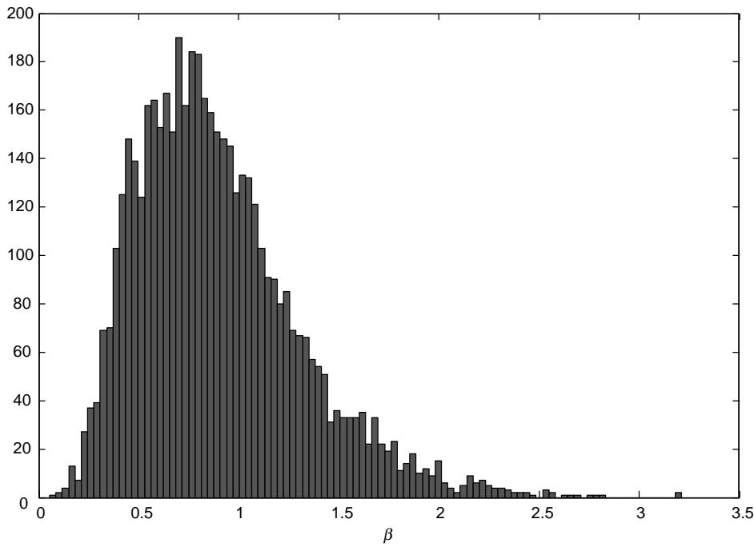  
Figure 1.3 Histograms of samples of beta.

Many practitioners prefer to use two or more parallel chains with diverse starting values to ensure full coverage of the sample space of the parameters, and so diminish the chance that the sampling will become trapped in a small part of the space (Gelman and Rubin, 1992, 1996). Single long runs may be adequate for straightforward problems, or as a preliminary to obtain inputs to multiple chains. Convergence for multiple chains may be assessed using Gelman-Rubin scale-reduction factors that compare variation in the sampled parameter values within and between chains. Parameter samples from poorly identified models will show wide divergence in the sample paths between different chains, and variability of sampled parameter values between chains will considerably exceed the variability within any one chain. To measure variability of samples $\theta_{j}^{(t)}$ within the $j$ th chain ( $j = 1, \dots, J$ ) define

$$
w _ {j} = \left(\theta_ {j} ^ {(t)} - \overline {{\theta}} _ {j}\right) ^ {2} / (T - 1),
$$

defined over $T$ iterations after an initial burn-in of $B$ iterations. Ideally the burn-in period is a short initial set of samples where the effect of the initial parameter values tails off; during the burn-in the parameter trace plots will show clear monotonic trends as they reach the region of the posterior.

Variability within chains $W$ is then the average of the $w_{j}$ . Between-chain variance is measured by

$$
B = \frac {T}{J - 1} \sum_ {j = 1} ^ {J} (\overline {{\theta}} _ {j} - \overline {{\theta}}) ^ {2}
$$

where $(\theta)$ is the average of the $\overline{\theta}_j$ . The potential scale reduction factor (PSRF) compares a pooled estimator of $\mathrm{var}(\theta)$ , given by $V = B / T + TW / (T - 1)$ with the within-sample estimate $W$ . Specifically the PSRF is $(V / W)^{0.5}$ with values under 1.2 indicating convergence.

Another multiple-chain convergence statistic is due to Brooks and Gelman (1998) and known as the Brooks-Gelman-Rubin (BGR) statistic. This is a ratio of parameter interval lengths, where for chain $j$ the length of the $100(1 - \alpha)\%$ interval for parameter $\theta$ is obtained, namely the gap between $0.5\alpha$ and $(1 - 0.5\alpha)$ points from $T$ simulated values. This provides $J$ within-chain interval lengths, with mean $I_U$ . For the pooled output of $TJ$ samples, the same $100(1 - \alpha)\%$ interval $I_P$ is also obtained. Then the ratio $I_P / I_U$ should converge to 1 if there is convergent mixing over different chains. Brooks and Gelman also propose a multivariate version of the original G-R ratio, which, a review by Sinharay (2004) indicates, may be better at detecting convergence in models where identifiability is problematic; this refers to practical identifiability of complex models for relatively small datasets, rather than mathematical identifiability. However, multiple-chain analysis can also be a useful check on unsuspected mathematical non-identifiability, or on model priors that are not constrained to produce unique labelling. Fan et al. (2006) consider diagnostics based on score statistics for parameters $\theta_k$ ; for likelihood $L = p(y \mid \theta)$ , or target density $\pi(\theta) = p(\theta | y)$ , define score functions $U_k = \partial \pi / \partial \theta_k$ , and then obtain means $m_k$ and variances $V_k$ of $U_{kj}$ statistics obtained from chains $j = 1, \ldots, J$ . Then $X^2 = J m_k^2 / V_k$ is asymptotically chi-squared with $d$ degrees of freedom under convergence.

The following Matlab program obtains univariate PSRFs and the multivariate PSRF for an augmented data probit analysis of the shopping data used in Example 4.9. Two chains are run for $T = 1000$ iterations with a burn-in of 50 iterations, with flat priors on the regression parameters. All scale factors obtained are very close to 1. The main program and the Gelman-Rubin functions called are as follows:

[y,Inc,Hsz,WW] $=$ textread('shop.txt'，%f %f %f %f')；n=84; for $\mathrm{i} = 1$ ：nX(i,1)=1;X(i,2)=Inc(i);X(i,3)=Hsz(i);X(i,4)=WW(i);end beta $=$ [0000]；Lo $=$ -10.\* (1-y);Hi $=$ 10.\*y;T=1000；burnin=50; for ch=1:2 for t=1:T   
%truncated normal sample between Lo and Hi Z $=$ rand_nort(X\*beta,ones(size(X\*beta)),Lo,Hi); sigma $\equiv$ inv(X'\*X);betaMLE $=$ inv(X'\*X)\*X'\*Z; beta $=$ rand_MVN(1,betaMLE,sigma)';   
for j=1:4 betas(t,j,ch)=beta(j); end   
end   
end   
[PSRF] $=$ GRpsrf(betas,T,4,2)   
[MPSRF] $=$ GRmpsrf(betas,T,4,2)   
function[PSRF] $=$ GRpsrf(th,T,d,J)   
W $=$ zeros(1,d);B $=$ zeros(1,d);mn $=$ mean(reshape(mean(th),d,J))；   
forj=1:J dw $=$ th(:,.,j)-repmat(mean(th(:,.,j)),T,1); db $=$ mean(th(:,.,j))- mn; W $=$ W + sum(dw.\*dw);B $=$ B+db.\*db;end

$\begin{array}{rl} & \texttt{W} = \texttt{W} /((\texttt{T - 1})^{\star}\texttt{J});\texttt{S} = (\texttt{T - 1}) / \texttt{T}^{\star}\texttt{W} +\texttt{B} /(\texttt{J - 1});\\ & \texttt{PSRF} = \texttt{sqrt} ((\texttt{J + 1}) / \texttt{J}^{\star}\texttt{S}. / \texttt{W} -(\texttt{T - 1}) / \texttt{J} /\texttt{T});\texttt{end}\\ & \texttt{function [MPSRF] = GRmpsrf(th,T,d,J)}\\ & \texttt{W} = \texttt{zeros} (\texttt{d});\texttt{B} = \texttt{zeros} (\texttt{d});\texttt{mn} = \texttt{mean} (\texttt{reshape} (\texttt{mean} (\texttt{th}),\texttt{d},\texttt{J}))^{\prime});\\ & \text{for j = 1:J}\\ & \quad \mathrm{dw} = \mathrm{th}(:,:,j) - \mathrm{repmat}(\mathrm{mean}(\mathrm{th}(:,:,j)),\mathrm{T},1);\mathrm{db} = \mathrm{mean}(\mathrm{th}(:,:,j)) - \mathrm{mn};\\ & \quad \mathrm{W} = \mathrm{W} + \mathrm{dw}'*\mathrm{dw};\mathrm{B} = \mathrm{B} + \mathrm{db}'*\mathrm{db};\mathrm{end}\\ & \mathrm{W} = \mathrm{W} / ((\mathrm{T - 1})^{\star}\mathrm{J});\mathrm{B} = \mathrm{B} / (\mathrm{J - 1});\mathrm{V} = \mathrm{sort}(\mathrm{abs}(\mathrm{eig}(\mathrm{W}\backslash \mathrm{B})));\\ & \mathrm{MPSRF} = \mathrm{sqrt}((\mathrm{T - 1}) / \mathrm{T} + \mathrm{V}(\mathrm{end})^{\star}(\mathrm{J + 1}) / \mathrm{J});\mathrm{end} \end{array}$

Parameter samples obtained by MCMC methods are correlated, which means extra samples are needed to convey the same information. The extent of correlation will depend on a number of factors including the form of parameterisation, the complexity of the model and the form of sampling (e.g. block or univariate sampling of parameters). Analysis of autocorrelation in sequences of MCMC samples amounts to an application of time series methods, in regard to issues such as assessing stationarity in an autocorrelated sequence. Autocorrelation at lags 1, 2 and so on may be assessed from the full set of sampled values $\theta^{(t)}$ , $\theta^{(t + 1)},\theta^{(t + 2)},\ldots$ or from subsamples $K$ steps apart $\theta^{(t)}$ , $\theta^{(t + K)}$ , $\theta^{(t + 2K)}$ , ..., etc. If the chains are mixing satisfactorily then the autocorrelations in the one-step apart iterates $\theta^{(t)}$ will fade to zero as the lag increases (e.g. at lag 10 or 20). Non-vanishing autocorrelations at high lags mean that less information about the posterior distribution is provided by each iterate and a higher sample size $T$ is necessary to cover the parameter space. Slow convergence will show in trace plots that wander, and that exhibit short-term trends rather than rapidly fluctuating around a stable mean.

Problems of convergence in MCMC sampling may reflect problems in model identifiability due to overfitting or redundant parameters. Running multiple chains often assists in diagnosing poor identifiability of models. This is illustrated most clearly when identifiability constraints are missing from a model, such as in discrete mixture models that are subject to 'label switching' during MCMC updating (Fruhwirth-Schnatter, 2001). One chain may have a different 'label' to others and so applying any convergence criterion is not sensible (at least for some parameters). Choice of diffuse priors tends to increase the chance of poorly identified models, especially in complex hierarchical models or small samples (Gelfand and Sahu, 1999). Elicitation of more informative priors or application of parameter constraints may assist identification and convergence.

Correlation between parameters within the parameter set $\theta = (\theta_{1},\theta_{2},\dots,\theta_{d})$ also tends to delay convergence and increase the dependence between successive iterations. Reparaterisation to reduce correlation - such as centring predictor variables in regression - usually improves convergence (Zuur et al., 2002). Robert and Mengersen (1999) consider a reparameterisation of discrete normal mixtures to improve MCMC performance. Slow convergence in random effects models such as the two-way model (e.g. repetitions $j = 1,\ldots ,J$ over subjects $i = 1,\dots,I)$

$$
y _ {i j} = \mu + \alpha_ {i} + u _ {i j}
$$

with $\alpha_{i}\sim N(0,\sigma_{\alpha}^{2})$ and $u_{ij}\sim N(0,\sigma_u^2)$ may be lessened by a centred hierarchical prior, namely $y_{ij}\sim N(\kappa_i,\sigma_u^2)$ and $\kappa_{i}\sim N(\mu ,\sigma_{\alpha}^{2})$ (Gelfand et al., 1995; Gilks and Roberts, 1996). For three-way nesting with

$$
y _ {i j k} = \mu + \alpha_ {i} + \beta_ {i j} + u _ {i j k}
$$

with $\beta_{ij} \sim N(0, \sigma_{\beta}^{2})$ , the centred version is $y_{ijk} \sim N(\zeta_{ij}, \sigma_{u}^{2}), \phi_{ij} \sim N(\kappa_{i}, \sigma_{\beta}^{2})$ , and $\kappa_{i} \sim N(\mu, \sigma_{\alpha}^{2})$ . Vines et al. (1996) suggest sweeping for the subject effects, so that

$$
y _ {i j} = \nu + \rho_ {i} + u _ {i j},
$$

where $\rho_{i} = \alpha_{i} - \overline{\alpha}$ , $\nu = \mu +\overline{\alpha}$ , so that $\sum_{i = 1}^{I}\rho_{i} = 0$ , with $\rho_{i}\sim N(0,\sigma (1 - 1 / I)$

Scollnik (2002) considers WINBUGS implementation of this prior.

# 1.6 PREDICTIONS FROM SAMPLING: USING THE POSTERIOR PREDICTIVE DENSITY

In classical statistics the prediction of out-of-sample data $z$ (for example, data at future time points or under different conditions and covariates) often involves calculating moments or probabilities from the assumed likelihood for $y$ evaluated at the selected point estimate $\theta_{m}$ , namely $p(y|\theta_m)$ . In the Bayesian method, the information about $\theta$ is contained not in a single point estimate but in the posterior density $p(\theta |y)$ and so prediction is correspondingly based on averaging $p(z|y,\theta)$ over this posterior density. Generally $p(z|y,\theta) = p(z|\theta)$ , namely that predictions are independent of the observations given $\theta$ . So the predicted or replicate data $z$ given the observed data $y$ is, for $\theta$ discrete, the sum

$$
p (z | y) = \sum_ {\theta} p (z | \theta) p (\theta | y)
$$

and is an integral over the product $p(z|\theta)p(\theta |y)$ when $\theta$ is continuous. In the sampling approach, with iterations $t = B + 1,\dots ,B + T$ after convergence, this involves iteration-specific samples of $z^{(t)}$ from the same likelihood form used for $p(y|\theta)$ , given the sampled value $\theta^{(t)}$ .

There are circumstances (e.g. in regression analysis or time series) where such out-of-sample predictions are the major interest; such predictions may be in circumstances where the explanatory variates take different values to those actually observed. In clinical trials comparing the efficacy of an established therapy as against a new therapy, the interest may be in the predictive probability that a new patient will benefit from the new therapy (Berry, 1993). In a two-stage sample situation where $m$ clusters are sampled at random from a larger collection of $M$ clusters, and then respondents are sampled at random within the $m$ clusters, predictions of populationwide quantities or parameters can be made to allow for the uncertainty attached to the unknown data in the $M - m$ non-sampled clusters (Stroud, 1994).

# 1.7 THE PRESENT BOOK

The chapters that follow review several major areas of statistical application and modelling with a view to implementing the above components of the Bayesian perspective, discussing worked

examples and providing source code that may be extended to similar problems by students and researchers. Any treatment of such issues is necessarily selective, emphasising particular methodologies rather than others, and particular areas of application. As in the first edition of Bayesian Statistical Modelling, the goal is to illustrate the potential and flexibility of Bayesian approaches to often complex statistical modelling and also the utility of the WINBUGS package in this context – though some Matlab code is included in Chapter 2.

WINBUGS is $S$ based and offers the basis for sophisticated programming and data manipulation but with a distinctive Bayesian functionality. WINBUGS selects appropriate MCMC updating schemes via an inbuilt expert system so that there is a blackbox element to some extent. However, respecifying or extending models can be done simply in WINBUGS without having to retune the MCMC sampling update schemes, as is necessary in more direct programming in (say) R, Matlab or GAUSS. The labour and checking required in direct programming increases with the complexity of the model. However, the programming flexibility offered by WINBUGS may be more favourable to some tastes than others - WINBUGS is not menu driven and pre-packaged, and does make greater demands on the researcher's own initiative. A brief guide to help new WINBUGS users is included in an appendix, though many online WINBUGS guides exist; extended discussion of how to use WINBUGS appears in Scollnik (2001), Fryback et al. (2001), and Woodworth (2004, Appendix B).

Issues around prior elicitation and sensitivity to alternative priors may to some viewpoints be downplayed in necessarily abbreviated worked examples. In most applications multiple chains are used with convergence assessed using Gelman-Rubin diagnostics, but without a detailed report of other diagnostics available in coda and similar routines. The focus is more towards illustrating Bayesian implementation of a range of modelling techniques including multilevel models, survival models, time series and dynamic linear models, structural equation models, and missing data models. Any comments on the programs, data interpretation, coding mistakes and so on would be appreciated at p.congdon@qmul.ac.uk. The reader is also referred to the website at the Medical Research Council Biostatistics Unit at Cambridge University, where a highly illuminating set of examples are incorporated in the downloadable software, and links exist to other collections of WINBUGS software.

# REFERENCES

Ahrens, J. and Dieter, U. (1974) Computer methods for sampling from gamma, beta, Poisson and binomial distributions. Computing, 12, 223-246.   
Andrade, J. and O'Hagan, A. (2006) Bayesian robustness modelling using regularly varying distributions. Bayesian Analysis, 1, 169-188.   
Berger, J. (1985) Statistical Decision Theory and Bayesian Analysis. Springer-Verlag: New York.   
Berger, J. (1990) Robust Bayesian analysis: sensitivity to the prior. Journal of Statistical Planning and Inference, 25, 303-328.   
Berger, J. (1994) An overview of robust Bayesian analysis. Test, 3, 5-124.   
Berger, J. and Bernardo, J. (1994) Estimating a product of means. Bayesian analysis with reference priors. Journal of American Statistical Association, 89, 200-207.   
Berry, D. (1993) A case for Bayesianism in clinical trials. Statistics in Medicine, 12, 1377-1393.   
Best, N., Cowles, M. and Vines, S. (1995) CODA: Convergence Diagnosis and Output Analysis Software for Gibbs Sampling Output, Version 0.3. MRC Biostatistics Unit: Cambridge.

Birkes, D. and Dodge, Y. (1993) Alternative Methods of Regression (Wiley Series in Probability and Mathematical Statistics. Applied Probability and Statistics). John Wiley & Sons, Ltd/Inc: New York.   
Bos, C. (2004) Markov Chain Monte Carlo methods: implementation and comparison. Working Paper, Tinbergen Institute & Vrije Universiteit, Amsterdam.   
Brock, W., Durlauf, S. and West, K. (2004) Model uncertainty and policy evaluation: some theory and empirics. Working Paper, No. 2004-19, Social Systems Research Institute, University of Wisconsin-Madison.   
Brooks, S. (1999) Bayesian analysis of animal abundance data via MCMC. In *Bayesian Statistics* 6, Bernardo, J., Berger, J., Dawid, A. and Smith, A (eds). Oxford University Press: Oxford, 723-731.   
Brooks, S. and Gelman, A. (1998) General methods for monitoring convergence of iterative simulations. Journal of Computational and Graphical Statistics, 7, 434-456.   
Brooks, S. and Roberts, G. (1998) Assessing convergence of Markov Chain Monte Carlo algorithms. Statistics and Computing, 8, 319-335.   
Carlin, J., Wolfe, R., Hendricks Brown, C. and Gelman, A. (2001) A case study on the choice, interpretation and checking of multilevel models for longitudinal binary outcomes. *Biostatistics*, 2, 397-416.   
Casella G. and George, E. (1992) Explaining the Gibbs sampler. The American Statistician, 46, 167-174.   
Chaloner, K. (1995) The elicitation of prior distributions. In *Bayesian Biostatistics*, Stangle, D. and Berry, D. (eds). Marcel Dekker: New York.   
Chen, M., Shao, Q. and Ibrahim, J. (2000) Monte Carlo Methods in Bayesian Computation. Springer-Verlag: New York.   
Chib, S. and Greenberg, E. (1994) Bayes inference in regression models with ARMA(p,q) errors. Journal of Econometrics, 64, 183-206.   
Chib, S. and Greenberg, E. (1995) Understanding the Metropolis-Hastings algorithm. The American Statistician, 49, 327-345.   
Cowles, M. and Carlin, B. (1996) Markov Chain Monte Carlo convergence diagnostics: a comparative review. Journal of the American Statistical Association, 91, 883-904.   
Daniels, M. (1999) A prior for the variance in hierarchical models. Canadian Journal of Statistics, 27, 567-578.   
Devroye, L. (1986) Non-Uniform Random Variate Generation. Springer-Verlag: New York.   
Draper, D. (in press) Bayesian Hierarchical Modeling. Springer-Verlag: New York.   
Fan, Y., Brooks, S. and Gelman, A. (2006) Output assessment for Monte Carlo simulations via the score statistic. Journal of Computational and Graphical Statistics, 15, 178-206.   
Fraser, D., McDunnough, P. and Taback, N. (1997) Improper priors, posterior asymptotic normality, and conditional inference. In Advances in the Theory and Practice of Statistics, Johnson, N. and Balakrishnan, N. (eds). John Wiley & Sons, Ltd/Inc.: New York, 563-569.   
Fruhwirth-Schnatter, S. (2001) MCMC estimation of classical and dynamic switching and mixture models, Journal of the American Statistical Association, 96, 194-209.   
Fruhwirth-Schnatter, S. (2004) Estimating marginal likelihoods for mixture and Markov switching models using bridge sampling techniques. *Econometrics Journal*, 7, 143-167.   
Fryback, D., Stout, N. and Rosenberg, M. (2001) An elementary introduction to Bayesian computing using WinBUGS. International Journal of Technology Assessment in Health Care, 17, 96-113.   
Garthwaite, P., Kadane, J. and O'Hagan, A. (2005) Statistical methods for eliciting probability distributions, Journal of the American Statistical Association, 100, 680-700.   
Gelfand, A. (1996) Model determination using sampling-based methods. In Markov Chain Monte Carlo in Practice, Gilks, W., Richardson, S. and Spiegelhalter, D. (eds). Chapman & Hall: London, 145-161.   
Gelfand A. and Sahu, S. (1999) Gibbs sampling, identifiability and improper priors in generalized linear mixed models. Journal of the American Statistical Association, 94, 247-253.

Gelfand, A. and Smith, A. (1990) Sampling based approaches to calculating marginal densities. Journal of the American Statistical Association, 85, 398-409.   
Gelfand, A., Sahu, S. and Carlin, B. (1995) Efficient parameterization for normal linear mixed effects models. Biometrika, 82, 479-488.   
Gelfand, A., Sahu, S. and Carlin, B. (1996) Efficient parametrization for generalized linear mixed models. In Bayesian Statistics 5, Bernardo, J., Berger, J., Dawid, A.P. and Smith, A.F.M. (eds). Clarendon Press: Oxford, 165-180.   
Gelman, A. (2006) Prior distributions for variance parameters in hierarchical models. Bayesian Analysis, 1, 515-533.   
Gelman, A. and Rubin, D. (1992) Inference from iterative simulation using multiple sequences. Statistical Science, 7, 457-511.   
Gelman, A. and Rubin, D. (1996) Markov chain Monte Carlo methods in biostatistics. Statistical Methods in Medical Research, 5, 339-355.   
Gelman, A., Carlin, J.B., Stern, H.S. and Rubin, D.B. (1995) Bayesian Data Analysis (1st edn) (Texts in Statistical Science Series). Chapman & Hall: London.   
Geman, S. and Geman, D. (1984) Stochastic relaxation, Gibbs distributions, and the Bayesian restoration of images. IEEE Transactions on Pattern Analysis and Machine Intelligence, 6, 721-741.   
George, E., Makov, U. and Smith, A. (1993) Conjugate likelihood distributions. Scandinavian Journal of Statistics, 20, 147-156.   
Geweke, J. (1992) Evaluating the accuracy of sampling-based approaches to calculating posterior moments. In *Bayesian Statistics* 4, Bernardo, J., Berger, J., Dawid, A. and Smith, A. (eds). Clarendon Press: Oxford.   
Geweke, J. (1999) Using simulation methods for Bayesian econometric models: inference, development and communication. *Econometric Reviews*, 18, 1-126.   
Geweke, J., Gowrisankaran, G. and Town, R. (2003) Bayesian inference for hospital quality in a selection model. *Econometrica*, **71**, 1215–1238.   
Geyer, C. (1992) Practical Markov Chain Monte Carlo. Statistical Science, 7, 473-511.   
Gilks, W. (1996) Full conditional distributions. In Markov Chain Monte Carlo in Practice, Gilks, W., Richardson, S. and Spiegelhalter, D. (eds). Chapman & Hall: London, 75-88.   
Gilks, W. and Roberts, G. (1996) Strategies for improving MCMC. In Markov Chain Monte Carlo in Practice, Gilks, W., Richardson, S. and Spiegelhalter, D. (eds). Chapman & Hall: London, 89-114.   
Gilks, W. and Wild, P. (1992) Adaptive rejection sampling for Gibbs sampling. Applied Statistics, 41, 337-348.   
Gilks, W., Clayton, D., Spiegelhalter, D., Best, N., McNeil, A., Sharples, L. and Kirby, A. (1993) Modelling complexity: applications of Gibbs sampling in medicine. Journal of the Royal Statistical Society, Series B, 55, 39-52.   
Gilks, W., Richardson, S. and Spiegelhalter, D. (1996) Introducing Markov chain Monte Carlo. In Markov Chain Monte Carlo in Practice, Gilks, W., Richardson, S. and Spiegelhalter, D. (eds). Chapman & Hall: London, 1-20.   
Gilks, W., Roberts, G. and Sahu, S. (1998) Adaptive Markov Chain Monte Carlo. Journal of the American Statistical Association, 93, 1045-1054.   
Gustafson, P. (1996) Robustness considerations in Bayesian analysis. Statistical Methods in Medical Research, 5, 357-373.   
Gustafson, P., Hossain, S. and MacNab, Y. (in press) Conservative priors for hierarchical models. Canadian Journal of Statistics.   
Hadjicostas, P. and Berry, S. (1999) Improper and proper posteriors with improper priors in a Poisson-gamma hierarchical model. Test, 8, 147-166.   
Hastings, W. (1970) Monte-Carlo sampling methods using Markov Chains and their applications. Biometrika, 57, 97-109.

Ibrahim, J. and Chen, M. (2000) Power prior distributions for regression models. Statistical Science, 15, 46-60.   
Jasra, A., Holmes, C. and Stephens, D. (2005) Markov Chain Monte Carlo Methods and the label switching problem in Bayesian mixture modeling. Statistical Science, 20, 50-67.   
Kass, R. and Wasserman, L. (1996) The selection of prior distributions by formal rules. Journal of the American Statistical Association, 91, 1343-1370.   
Kim, S., Shephard, N. and Chib, S. (1998) Stochastic volatility: likelihood inference and comparison with ARCH models. Review of Economic Studies, 64, 361-393.   
Lesage, J. (1999) Applied Econometrics using MATLAB. Department of Economics, University of Toledo: Toledo, OH. Available at: www.spatial-econometrics.com/html/mbook.pdf.   
Mengersen, K.L. and Tweedie, R.L. (1996) Rates of convergence of the Hastings and Metropolis algorithms. Annals of Statistics, 24, 101-121.   
Metropolis, N., Rosenbluth, A., Rosenbluth, M., Teller, A. and Teller, E. (1953) Equations of state calculations by fast computing machines. Journal of Chemical Physics, 21, 1087-1092.   
Norris, J. (1997) Markov Chains. Cambridge University Press: Cambridge.   
O'Hagan, A. (1994) Kendall's Advanced Theory of Statistics: Bayesian Inference (Vol. 2B). Edward Arnold: Cambridge.   
Osherson, D., Smith, E., Shafir, E., Gualtierotti, A. and Biolsi, K. (1995) A source of Bayesian priors. Cognitive Science, 19, 377-405.   
Pasarica, C. and Gelman, A. (2005) Adaptively scaling the Metropolis algorithm using expected squared jumped distance. Technical Report, Department of Statistics, Columbia University.   
Raftery, A. and Lewis, S. (1992) How many iterations in the Gibbs sampler? In Bayesian Statistics (Vol. 4), Bernardo, J., Berger, J., Dawid, A. and Smith, A. (eds). Oxford: Oxford University Press, 763-773.   
Richardson, S. and Best, N. (2003) Bayesian hierarchical models in ecological studies of health-environment effects. *Environmetrics*, 14, 129-147.   
Robert, C. (2004) Bayesian computational methods. In Handbook of Computational Statistics (Vol. I), Gentle, J., Hardle, W. and Mori, Y. (eds). Springer-Verlag: Heidelberg, Chap. 3.   
Robert C. and Casella, G. (1999) Monte Carlo Statistical Methods. Springer-Verlag: New York.   
Robert, C.P. and Mengersen, K.L. (1999) Reparametrization issues in mixture estimation and their bearings on the Gibbs sampler. Computational Statistics and Data Analysis, 325-343.   
Roberts, G. (1996) Markov chain concepts related to sampling algorithms. In Markov Chain Monte Carlo in Practice, Gilks, W., Richardson, S. and Spiegelhalter, D. (eds). Chapman & Hall: London, 45-59.   
Roberts, G. and Rosenthal, J. (2004) General state space Markov chains and MCMC algorithms. Probability Surveys, 1, 20-71.   
Roberts, G. and Tweedie, R. (1996) Exponential convergence of Langevin distributions and their discrete approximations. Bernoulli, 2, 341-363.   
Roberts, G., Gelman, A. and Gilks, W. (1997) Weak convergence and optimal scaling of random walk Metropolis algorithms. Annals of Applied Probability, 7, 110-120.   
Scollnik, D. (1995) Simulating random variates from Makeham's distribution and from others with exact or nearly log-concave densities. Transactions of the Society of Actuaries, 47, 41-69.   
Scollnik, D. (2001) Actuarial modeling with MCMC and BUGS. North American Actuarial Journal, 5, 96-124.   
Scollnik, D. (2002) Implementation of four models for outstanding liabilities in WinBUGS: a discussion of a paper by Ntzoufras and Dellaportas. North American Actuarial Journal, 6, 128-136.   
Silverman, B. (1986) Density Estimation for Statistics and Data Analysis. Chapman & Hall: London.   
Sinhaharay, S. (2004) Experiences with Markov Chain Monte Carlo Convergence assessment in two psychometric examples. Journal of Educational and Behavioral Statistics, 29, 461-488.   
Smith, A. and Gelfand, A. (1992) Bayesian statistics without tears: a sampling-resampling perspective. The American Statistician, 46(2), 84-88.

Spiegelhalter, D., Freedman, L. and Parmar, M. (1994) Bayesian approaches to randomized trials. Journal of the Royal Statistical Society, 157, 357-416.   
Spiegelhalter, D., Best, N., Gilks, W. and Inskip, H. (1996) Hepatitis: a case study in MCMC methods. In Markov Chain Monte Carlo in Practice, Gilks, W., Richardson, S. and Spiegelhalter, D. (eds). Chapman & Hall: London, 21-44.   
Stroud, T. (1994) Bayesian analysis of binary survey data. Canadian Journal of Statistics, 22, 33-45.   
Syverseen, A. (1998) Noninformative Bayesian priors. Interpretation and problems with construction and applications. Available at: http://www.math.ntnu.no/preprint/statistics/1998/S3-1998.ps   
Tierney, L. (1994) Markov chains for exploring posterior distributions. Annals of Statistics, 22, 1701-1762.   
Tierney, L. (1996) Introduction to general state-space Markov chain theory. In Markov Chain Monte Carlo in Practice, Gilks, W., Richardson, S. and Spiegelhalter, D. (eds). Chapman & Hall: London, 59-74.   
Tierney, L., Kass, R. and Kadane, J. (1988) Interactive Bayesian analysis using accurate asymptotic approximations. In Computer Science and Statistics: Nineteenth Symposium on the Interface, Heiberger, R. (ed). American Statistical Association: Alexandria, VA, 15-21.   
van Dyk, D. (2002) Hierarchical models, data augmentation, and MCMC. In Statistical Challenges in Modern Astronomy III, Babu, G. and Feigelson, E. (eds). Springer: New York, 41-56.   
Vines, S., Gilks, W. and Wild, P. (1996) Fitting Bayesian multiple random effects. models. Statistics and Computing, 6, 337-346.   
Wasserman, L. (2000) Asymptotic inference for mixture models by using data-dependent priors. Journal of the Royal Statistical Society, Series B, 62, 159-180.   
Woodworth, G. (2004) Biostatistics: A Bayesian Introduction. Chichester: John Wiley & Sons, Ltd/Inc.  
Zellner, A. (1985) Bayesian econometrics. Econometrica, 53, 253-270.   
Zhu, M. and Lu, A. (2004) The counter-intuitive non-informative prior for the Bernoulli family. Journal of Statistics Education, 12, 1-10.   
Zuur, G., Garthwaite, P. and Fryer, R. (2002) Practical use of MCMC methods: lessons from a case study. Biometrical Journal, 44, 433-455.

# CHAPTER 2

# Bayesian Model Choice, Comparison and Checking

# 2.1 INTRODUCTION: THE FORMAL APPROACH TO BAYES MODEL CHOICE AND AVERAGING

Model assessment has several components: checking that a model or models are plausible descriptions of the data, and then choosing between them or averaging inferences over them. In the formal Bayesian approach to model selection, a prior probability distribution on the models is chosen (usually uniform) and the Bayes theorem is used to derive the posterior probability distribution. Because this distribution is marginalised over the parameters, improper priors on the parameters cannot in general be adopted. The computation of the posterior probabilities of the models requires some effort, especially in complex models (Han and Carlin, 2001), but these difficulties have largely been overcome (Carlin and Chib, 1995; Chib, 1995; Green, 1995; Meng and Wong, 1996; Sinharay and Stern, 2002). Although alternative ways to assess models exist, such as predictive model selection (Barbieri and Berger, 2004; Meyer and Laud, 2002), we commence with the formal approach as a reference point for other methods.

One of the benefits of the formal Bayesian approach is its commonsense approach to testing hypotheses or selecting models. In the classical approach a hypothesis is accepted or rejected according to whether the test statistic falls in a prespecified critical region. Comparisons between models when one model is defined on the boundary of the parameter space (e.g. as in discrete mixture models or change point analysis in time series) are problematic, since likelihood ratios no longer have standard distributions (Self and Liang, 1987). Classical methods also face problems with comparison of non-nested models: an example would be ecological disease model (Chapter 9) involving only spatially correlated random effects compared to a model involving only unstructured random effects.

By contrast, Bayesian inference is aimed at computing a posterior probability distribution over a set of hypotheses or models, in terms of their relative support from the data. Inference, model choice and estimation are not impeded in parameter boundary situations such as change point analysis (e.g. Chu and Zhao, 2004), or in non-nested models. Posterior probabilities are the basis for model averaging, especially for closely competing models, thus acknowledging

model as well as parameter uncertainty. Model averaging in classical statistics is less clear foundationally though methods have been suggested (e.g. Burnham and Anderson, 2002). If a specific decision needs to be taken to reject or accept one or other hypothesis in a Bayesian analysis, then a loss function defined by the problem at hand may need to be established to express the costs of making the wrong choice. However, Bayesian model comparison and choice can proceed without a substantively based loss function.

The formal Bayesian model choice procedure rests on work by Jeffreys (1961). Let $m$ be a multinomial model index, with $m$ taking values between 1 and $K$ or between 0 and $K - 1$ . Formal Bayes model choice is based on prior model probabilities $\operatorname{Pr}(m = k)$ , marginal likelihoods $p(y|m = k)$ and posterior model probabilities $\operatorname{Pr}(m = k|y)$ . Consider the full Bayes formula,

$$
p \left(\theta_ {k} \mid y, m = k\right) = p \left(y \mid \theta_ {k}, m = k\right) p \left(\theta_ {k} \mid m = k\right) / p \left(y \mid m = k\right), \tag {2.1}
$$

where $\theta_{k}$ consists of unknowns in the likelihood $p(y|\theta_k,m = k)$ for model $k$ , and $p(\theta_k|m = k)$ is the prior on $\theta_{k}$ . Considering the marginal likelihood as a basis for preferring $\theta_{k}$ values may imply different choices than choosing $\theta$ that maximises the likelihood $L(\theta_k|y,m = k)\equiv p(y|\theta_k,m = k)$ . The marginal likelihood can be written as

$$
p (y | m = k) = p (y | \theta_ {k}, m = k) p (\theta_ {k} | m = k) / p (\theta_ {k} | y, m = k),
$$

or following a log transform as

$$
\log [ p (y | m = k) ] = \log [ p (y | \theta_ {k}, m = k) ] + \log [ p (\theta_ {k} | m = k) ] - \log [ p (\theta_ {k} | y, m = k) ].
$$

The term $\log[p(\theta_k|m = k)] - \log[p(\theta_k|y, m = k)]$ acts as a penalty to favour parsimonious models, whereas a more complex model virtually always leads to a higher log-likelihood $\log[p(y|\theta_k, m = k)]$ .

Choice between models, or at least ranking of their plausibility, involves comparison of marginal likelihoods. The marginal likelihood is the probability of the data $y$ given a model, and is obtained by averaging over the priors assigned to the parameters in that model. The comparison of two models is based on the ratio of marginal likelihoods, or Bayes factor, of model 1 against model 0, namely

$$
B _ {1 0} = p (y \mid m = 1) / p (y \mid m = 0).
$$

This resembles a likelihood ratio except that the densities $p(y|m = k)$ are obtained by integrating over parameters rather than maximising, with

$$
p (y | m = k) = \int p (y | \theta_ {k}, m = k) p (\theta_ {k} | m = k) \mathrm {d} \theta_ {k} \qquad k = 0, 1.
$$

There is no necessary constraint in such comparisons that models 0 and 1 are nested with respect to one another – an assumption often necessarily made in classical tests of goodness of model fit. The Bayes factor expresses the support given by the data for one or other of the models, in a similar way to the conventional likelihood ratio. However, unlike classical significance procedures the Bayes factor does not tend to reject the null hypothesis more frequently as sample sizes become large. Taking twice the log of the Bayes factor gives the same scale as the conventional deviance and likelihood ratio statistics. Approximate values for interpreting $B_{10}$ and $2\log_eB_{10}$ are as in Table 2.1 (Jeffreys, 1961; Kass and Raftery, 1995).

Table 2.1 Guidelines for Bayes factors   

<table><tr><td>B10</td><td>2logeB10</td><td>Interpretation</td></tr><tr><td>Under 1</td><td>Negative</td><td>Supports model 0</td></tr><tr><td>1–3</td><td>0–2</td><td>Weak support for model 1</td></tr><tr><td>3–20</td><td>2–6</td><td>Support for model 1</td></tr><tr><td>20–150</td><td>6–10</td><td>Strong evidence for model 1</td></tr><tr><td>Over 150</td><td>Over 10</td><td>Very strong support for model 1</td></tr></table>

For large datasets differences in the log marginal likelihoods are the natural measure of model comparison, as probabilities themselves become numerically intractable.

The posterior probability of a model can be obtained from the prior probability and the marginal likelihood via the formula

$$
\Pr (m = k | y) = \Pr (m = k) p (y | m = k) / p (y),
$$

where $\operatorname{Pr}(m = k)$ is the prior probability on model $k$ and

$$
p (y) = \Sigma_ {j} \Pr (m = j) p (y | m = j).
$$

For two models, it follows that

$$
\begin{array}{l} \Pr (m = 1 | y) / \Pr (m = 0 | y) \\ = [ p (y | m = 1) \Pr (m = 1) ] / [ p (y | m = 0) \Pr (m = 0) ], \\ = [ p (y \mid m = 1) / p (y \mid m = 0) ] [ \Pr (m = 1) / \Pr (m = 0) ], \\ \end{array}
$$

namely that the posterior odds on model 1 being correct equal the Bayes factor times the prior odds on model 1. Hence the Bayes factor is also obtained as the ratio of posterior to prior odds.

To compare and evaluate models, one may fit them separately and consider their relative fit in terms of summary statistics, such as the marginal likelihood. Alternatively one may search over the model space as well as over parameter values $\theta_{k}|m = k$ (Carlin and Chib, 1995; Green, 1995). For equal prior model probabilities, the best model is the one chosen most frequently (i.e. with highest posterior probability of being selected). Under a search model, the Bayes factor is obtained as the ratio of posterior to prior odds, not from marginal likelihood estimates.

Unless the posterior probability of one model alone is overwhelming, we may average over parameter or function values obtained from different models. Ideally this is carried out during Markov Chain Monte Carlo (MCMC) estimation via forms of model search, as in stochastic search variable selection (George and McCulloch, 1993; Yang et al., 2005), and in switching models in time series analysis. This involves averaging over different regression models, some of which include certain predictors, while others exclude them; see Yi et al. (2003) for one of several recent applications of stochastic search variable selection (SSVS) in genetic analysis. Using the same strategy one might average over links or variable transformations (Czado and Raftery, 2006).

If models are estimated one by one, one would estimate posterior model probabilities after an MCMC run is finished (using marginal likelihood estimators), and then average over posterior expectations or densities of parameters (Hoeting et al., 1999). Given equal prior model

probabilities, the weights in the average are

$$
\begin{array}{l} w _ {k} = \Pr (m = k | y) \\ = p (y \mid m = k) / [ (p (y \mid m = 1) + p (y \mid m = 2) + \dots + p (y \mid m = k) ]. \\ \end{array}
$$

The posterior mean for parameter $\Delta$ would thus be an average over models

$$
E (\Delta | y) = \Sigma w _ {k} E (\Delta_ {k} | y, m = k) = \Sigma_ {k} w _ {k} \delta_ {k},
$$

where $\delta_k = E(\Delta_k | y, m = k)$ is the posterior mean under model $k$ . The posterior variance is obtainable as

$$
\operatorname {v a r} (\Delta | y) = \Sigma_ {k} \big [ \operatorname {v a r} (\Delta_ {k} | y, m = k) + \delta_ {k} ^ {2} \big ] - \{E (\Delta | y) \} ^ {2}.
$$

In the case where there is model uncertainty, these results show that selecting a single model will overstate the precision of parameters and other functions derived from assuming that model is the only correct one (i.e. with weight $w_{k} = 1$ ).

# 2.2 ANALYTIC MARGINAL LIKELIHOOD APPROXIMATIONS AND THE BAYES INFORMATION CRITERION

The marginal likelihood may be problematic to estimate in practice. Analytic approximations include the Laplace approximation (Azevedo-Filho and Shachter, 1994; Kass and Raftery, 1995; Lewis and Raftery, 1997; Raftery, 1995; Tierney and Kadane, 1986) for a model of dimension $d$ . Specifically

$$
p (y) = (2 \pi) ^ {d / 2} | G _ {h} | p (y | \theta_ {h}) p (\theta_ {h}),
$$

where $\theta_h$ is a high-density point (e.g. a vector of posterior means), $p(\theta_h)$ is the set of prior densities evaluated at $\theta_h$ , and $G_h$ is minus the inverse of the Hessian matrix $\partial^2 h(\theta | y) / (\partial \theta \partial \theta')$ of $h(\theta | y) = \log [p(y | \theta)p(\theta)]$ evaluated at $\theta_h$ . $h(\theta | y)$ is the log of the unnormalised posterior density

$$
p ^ {*} (\theta | y) = p (y | \theta) p (\theta) = p (\theta | y) p (y).
$$

This approximation works best when the posterior $p(\theta | y)$ is approximately multivariate normal (MVN). $G_{h}$ can also be estimated via MCMC approximation to the posterior covariance matrix of $\theta$ .

Raftery (1996) and Raftery and Richardson (1996) review Laplace approximations to the Bayes factor using the maximum likelihood estimate of $\theta_{m}$ as $\theta_{h}$ . Thus, expand the log of the integrand

$$
p (y) = \int p (y | \theta) p (\theta) \mathrm {d} \theta , \tag {2.2}
$$

namely $h(\theta |y) = \log [p(y|\theta)p(\theta)]$ by a Taylor series about $\theta_{m}$ . Because $h^\prime (\theta_m) = 0$ , this expansion gives

$$
h (\theta) \approx h (\theta_ {m}) + ^ {1} / _ {2} (\theta - \theta_ {m}) h ^ {\prime \prime} (\theta_ {m}) (\theta - \theta_ {m}).
$$

Substituting in (2.2) and remembering $h(\theta_m)$ is constant gives

$$
p (y) \approx \exp \left(h \left(\theta_ {m}\right)\right) \int \exp \left[ ^ {1} / _ {2} \left(\theta - \theta_ {m}\right) h ^ {\prime \prime} \left(\theta_ {m}\right) \left(\theta - \theta_ {m}\right) \right] d \theta . \tag {2.3}
$$

The integrand in (2.3) is proportional to an MVN with precision matrix (inverse covariance matrix) $A = [-h''(\theta_m)]$ . This leads to the marginal likelihood approximation

$$
p (y) \approx \exp [ h (\theta_ {m}) ] (2 \pi) ^ {d / 2} | A | ^ {- 0. 5},
$$

or equivalently

$$
\log p (y) \approx \log p (y | \theta_ {m}) + \log p (\theta_ {m}) + (d / 2) \log (2 \pi) - ^ {1} / 2 \log | A |.
$$

This form demonstrates why taking diffuse priors leads to Lindleys' paradox (Shafer, 1982) whereby the simplest model tends to be selected. For any given $\theta_{m}$ , making $p(\theta_{m})$ more diffuse will reduce $p(y)$ . For $n$ large, $A\approx nI$ where $I$ is the expected information matrix for a single observation, which means $|A| = n^{d}|I|$ . Suppose also $p(\theta)$ is taken to be MVN with mean $\theta_{m}$ and precision $I$ (i.e. the prior is equivalent to a single extra observation); then

$$
\begin{array}{l} \log p (y) \approx \log p (y | \theta_ {m}) + [ ^ {1} / _ {2} \log | I | - (d / 2) \log (2 \pi) ] \\ + (d / 2) \log (2 \pi) - (d / 2) \log (n) - ^ {1} / _ {2} \log | I | \\ = \log p (y | \theta_ {m}) - (d / 2) \log (n). \\ \end{array}
$$

This quantity is known as the Bayes information criterion (BIC) and penalises model complexity according to the log of the sample size (Raftery, 1995); it has been argued to penalise overfitting more effectively than the Akaike information criterion (AIC) measure, though it is best applied when relatively informative priors are used. Although it does not explicitly depend on $p(\theta)$ , the BIC approximates $p(y)$ under the unit information prior (Kass and Wasserman, 1995), or under a normalised Jeffreys' prior (Wasserman, 2000), and may be used in regression selection when $p(y)$ is not known analytically (Chipman et al., 2001). The appropriate definition of the sample size $n$ is discussed by Raftery (1995). For example, in an $I \times J$ contingency table of counts $m_{ij}$ , the sample size would not be $IJ$ but the sum $\Sigma_i \Sigma_j m_{ij}$ . Weakliem (1999) and Burnham and Anderson (2002) provide further discussion on the utility of the BIC approximation and the appropriate definition of $n$ .

For large samples, the Laplace method can also be used to approximate the log Bayes factor as

$$
\begin{array}{l} \log \left(B _ {1 2}\right) = \log [ p (y | m = 1) ] - \log [ p (y | m = 2) ] \\ \approx \log [ p (y | \theta_ {1 m}, m = 1) ] - \log [ p (y | \theta_ {2 m}, m = 2) ] - \log (n) [ (d _ {1} - d _ {2}) / 2 ]. \\ \end{array}
$$

So

$$
2 \log \left(B _ {1 2}\right) \approx G ^ {2} - v \log (n), \tag {2.4}
$$

where $G^2$ is the likelihood ratio comparing the models for $\nu = d_1 - d_2$ degrees of freedom. When the comparison model is the saturated model then the test for model $k$ against the saturated model involves the GLM deviance for model $k$ :

$$
2 \log B _ {1 2} \approx \operatorname {D e v i a n c e} \left(M _ {k}\right) - v _ {k} \log n.
$$

The maximum likelihood solution $\theta_{m}$ may be approximated in an MCMC run (Gelman et al., 1996; Raftery, 1996) by that $\theta$ giving the maximum $L_{\mathrm{max}}^{(t)}$ of the log-likelihood values $L^{(t)} = \log p(y|\theta^{(t)})$ . A BIC approximation may use the average $\overline{L}$ of the sampled log-likelihoods, leading to the measure (Carlin and Louis, 1997, Chapter 6):

$$
\mathrm {B I C} ^ {\prime} = \bar {L} - (d / 2) \log (n). \tag {2.5}
$$

Approximations such as (2.4) and (2.5) have improved validity for large sample sizes, and are most straightforward in models containing only fixed effects, such as regression models where the only parameters are regression coefficients, and possibly residual variances. A problem with the Laplace and BIC approximations occurs in complex hierarchical models involving random effects with unknown model dimension, though the estimator $d_{e} = -2[\overline{L} - L(\overline{\theta})]$ proposed by Spiegelhalter et al. (2002) may be substituted into (2.5) (Pourahmadi and Daniels, 2002).

# 2.3 MARGINAL LIKELIHOOD APPROXIMATIONS FROM THE MCMC OUTPUT

The formula (2.1) implies that the marginal likelihood may be approximated by estimating the posterior ordinate $p(\theta_h|y)$ in the relation

$$
\log [ p (y) ] = \log [ p (y | \theta_ {h}) ] + \log [ p (\theta_ {h}) ] - \log [ p (\theta_ {h} | y) ],
$$

where $\theta_h$ is any point with high posterior density (Chib, 1995). Most generally, one may estimate $p(\theta_h|y)$ by kernel density methods or moment approximations (Bos, 2002; Sinharay and Stern, 2005). Alternatively Chib (1995) considers a marginal/conditional decomposition of $p(\theta | y)$ into $D \leq d$ blocks and then presents a method to estimate each of the ordinates in the decomposition. Thus

$$
p \left(\theta_ {h} \mid y\right) = p \left(\theta_ {1 h} \mid y\right) p \left(\theta_ {2 h} \mid \theta_ {1 h}, y\right) p \left(\theta_ {3 h} \mid \theta_ {1 h}, \theta_ {2 h}, y\right) \dots p \left(\theta_ {D h} \mid \theta_ {1 h}, \dots , \theta_ {D - 1, h}, y\right),
$$

with $p(\theta_h|y)$ , and thus $p(y)$ , estimated by using $D - 1$ subsidiary samples drawn from separate sampling chains. If $D = 2$ , namely $\theta_h = (\theta_{1h},\theta_{2h})$ , the posterior ordinate at $\theta_h|y$ is expressed as $p(\theta_{1h}|y)p(\theta_{2h}|y,\theta_{1h})$ . In the case when the full conditionals are in closed form, the first ordinate in this decomposition is estimated from the output of the main sample, e.g. as

$$
p \left(\theta_ {1 h} | y\right) = \sum_ {t = 1} ^ {T} p \left(\theta_ {1 h} | y, \theta_ {2} ^ {(t)}\right),
$$

or by an approximation technique (e.g. assuming univariate/multivariate posterior normality of $\theta_{1}$ or a kernel method). The second ordinate is available by inserting $\theta_{1h}$ and $\theta_{2h}$ in the usual full conditional density. When there are the three blocks, the first ordinate is estimated as for $D = 2$ , with

$$
p \left(\theta_ {1 h} \mid y\right) = \sum_ {t = 1} ^ {T} p \left(\theta_ {1 h} \mid y, \theta_ {2} ^ {(t)}, \theta_ {3} ^ {(t)}\right),
$$

but the second ordinate, $p(\theta_{2h}|y,\theta_{1h})$ , is estimated from the output of a subsidiary MCMC simulation with block $\theta_3$ free, but block $\theta_{1}$ held fixed at its value $\theta_{1h}$ within $\theta_h$ ; specifically

$$
p \left(\theta_ {2 h} \mid y, \theta_ {1 h}\right) = \sum_ {t = 1} ^ {T} p \left(\theta_ {2 h} \mid y, \theta_ {1 h}, \theta_ {3} ^ {(t)}\right).
$$

The ordinate for the third block is obtained by substituting $\theta_h = (\theta_{1h},\theta_{2h},\theta_{3h})$ in the usual conditional density of $\theta_3$ , given $y$ , $\theta_{1}$ and $\theta_{2}$ . The same principle extends to higher numbers of blocks, with

$$
p \left(\theta_ {d h} \mid y, \theta_ {1 h}, \dots \theta_ {d - 1, h}\right) = \sum_ {t = 1} ^ {T} p \left(\theta_ {d h} \mid y, \theta_ {1 h}, \dots , \theta_ {d - 1, h}, \theta_ {d + 1} ^ {(t)}, \dots \theta_ {D} ^ {(t)}\right).
$$

Chib and Jeliazkov (2001) extend this method to cases where full conditionals do not have a known normalising constant and have to be updated by Metropolis-Hastings (M-H) steps.

Several methods use importance sample approximations to $p(\theta | y)$ to produce estimates of the marginal likelihood using MCMC output. From the identity

$$
p (y) = \int \frac {p (y | \theta) p (\theta)}{g (\theta)} g (\theta) \mathrm {d} \theta ,
$$

one obtains $p(y) = E_g[\frac{p(y|\theta)p(\theta)}{g(\theta)}]$ , and so an estimate of $p(y)$ is based (Sinharay and Stern, 2005) on samples $\tilde{\theta}^{(t)}$ from the importance density $g$ giving

$$
\hat {p} (y) = \sum_ {t = 1} ^ {T} \left[ \frac {p \left(y \mid \tilde {\theta} ^ {(t)}\right) p \left(\tilde {\theta} ^ {(t)}\right)}{g \left(\tilde {\theta} ^ {(t)}\right)} \right]. \tag {2.6}
$$

Generally the importance function $g$ should be chosen to reduce the variance of $p(y|\theta)p(\theta) / g(\theta)$ , and so should be more heavily tailed than the unnormalised posterior $p^*(\theta|y) = p(y|\theta)p(\theta)$ as well as being a good approximation to $p(\theta|y)$ (Yuan and Druzdzel, 2005). Rossi et al. (2005, Chapter 6) consider the distribution and variance of the importance ratios $w^{(t)} = p^*(\theta^{(t)}|y) / g(\theta^{(t)})$ and show possible sensitivity to outliers of the estimator (2.6) and other common estimators of marginal likelihoods.

Another importance sampling estimate of $p(y)$ is based on the identity

$$
1 = \int g (\theta) \frac {p (y) p (\theta | y)}{p (y | \theta) p (\theta)} d \theta .
$$

$p(y)$ is a constant so can be moved to the left-hand side, giving

$$
p (y) = \left[ \int \frac {g (\theta)}{p (y | \theta) p (\theta)} p (\theta | y) d \theta \right] ^ {- 1}. \tag {2.7}
$$

Gelfand and Dey (1994) recommend $g$ to be an importance density approximation for $p(\theta | y)$ , such as an MVN, derived possibly as a moment estimator<sup>1</sup> from an MCMC sample of the components of $\theta$ , namely $\theta_1^{(t)}, \theta_2^{(t)}, \ldots, \theta_d^{(t)}$ . The values of $g^{(t)}, L^{(t)} = p(y | \theta^{(t)})$ and

$\pi^{(t)} = p(\theta^{(t)})$ , namely the importance density, likelihood and prior ordinate, are evaluated at each value $\theta^{(t)}$ sampled from $p(\theta | y)$ . From (2.7), the marginal likelihood is approximated as

$$
1 / \hat {p} (y) = T ^ {- 1} \sum_ {t = 1} ^ {T} \left[ \frac {g ^ {(t)}}{\left(L ^ {(t)} \pi^ {(t)}\right)} \right], \tag {2.8}
$$

namely the harmonic mean of the quantities $L^{(t)}\pi^{(t)} / g^{(t)}$ . In this estimator the $g$ function is analogous to the reciprocal of an importance function and so the estimator works best when the tails of $g$ are thin as compared to $p(\theta |y)$ . Note that this estimator implies that arithmetic mean of the ratios $L^{(t)}\pi^{(t)} / g^{(t)}$ - using samples $\theta^{(t)}$ from $p(\theta |y)$ - may be a satisfactory estimator of $p(y)$ when $g(\theta)$ has thick tails relative to $p(\theta |y)$ .

If $g$ is taken as the prior $p(\theta)$ , one obtains the harmonic mean of the likelihoods as an estimator for $p(y)$ , namely

$$
1 / \hat {p} (y) = T ^ {- 1} \sum_ {t = 1} ^ {T} \left\{\frac {1}{p \left(y | \theta^ {(t)}\right)} \right\}. \tag {2.9}
$$

This estimator may be unstable if by chance a few low likelihood values are present in the sampling output; the impact of such aberrant cases can be monitored by batching the MCMC output (e.g. in bands of 5000 iterations) to assess stability in the harmonic mean. One might then average over batches, or perhaps form some robust estimate of the mean. Newton and Raftery (1994) suggest an importance sampling function based on combined samples from prior $p(\theta)$ and posterior $p(\theta | y)$ to improve on the stability of the estimator (2.9). Thus define

$$
g (\theta) = \delta p (\theta) + (1 - \delta) p (\theta | y), \tag {2.10}
$$

with $0 < \delta < 1$ , and typically $\delta$ small for numeric stability (e.g. $\delta = 0.05$ ). They also propose a synthetic estimator based on (2.10) that avoids sampling from the prior density (see also Kass and Raftery, 1995, p. 780). Thus suppose $T$ values of the likelihood are available from an MCMC output. Then sampling from the prior can be avoided by imagining that $\delta T / (1 - \delta)$ further values of $\theta$ are notionally sampled from the prior with likelihood values exactly equalling their expectation $p(y)$ . The resulting estimator is obtained via a linear iterative scheme, as in the following Matlab code which sets $\delta = 0.01$ and assumes a scheme with 10 iterations:

```matlab
function [logML]=synthetic(T,L)  
% input data: sampled log-likelihoods L(t), t=1,..T  
% proportion from prior del=0.01; eps = del/(1-del); mL=mean(L);  
% centre log LKs before exponentiation for t=1:T f(t) = exp(L(t)-mean(L)); end gam(1)=1;  
% revised estimates of (centred) Marg LKD for j=2:10 A(j)=0; B(j)=0; for t=1:T A(j)=A(j)+f(t)/(del*gam(j-1)+(1-del)*f(t)); B(j)=B(j)+1/(del*gam(j-1)+(1-del)*f(t)); end 
```

```matlab
% revised estimate at iteration j  
gam(j) = (eps*T + A(j)) / (eps*T/gam(j-1) + B(j));  
end  
% final log ML estimate  
logML = log(gam(10)) + mL; 
```

Meng and Wong (1996) propose the bridge sampling method, under which the Gelfand-Dey and importance sampling estimators are special cases; see also Mira and Nicholls (2004) and Meng and Schilling (2002). Thus the marginal likelihood of model $k$ is the normalising constant $c_{k} = p(y|m = k)$ in the relation

$$
\begin{array}{l} p \left(\theta_ {k} \mid y, m = k\right) = p \left(y \mid \theta_ {k}, m = k\right) p \left(\theta_ {k} \mid m = k\right) / p \left(y \mid m = k\right) \\ = p ^ {*} \left(\theta_ {k} \mid y, m = k\right) / c _ {k}, \\ \end{array}
$$

where

$$
p ^ {*} (\theta_ {k} | y, m = k) = p (y | \theta_ {k}, m = k) p (\theta_ {k} | m = k)
$$

is the unnormalised posterior. Obtaining the Bayes factor $B_{jk} = p(y|m = j) / p(y|m = k)$ amounts to estimating a ratio $c_{j} / c_{k}$ of two normalising constants. Let $g(\theta)$ be an importance density approximation to $p(\theta |y)$ , which has a known normalising constant (e.g. if $g$ is MVN or a mixture of MVNs). Bridge sampling is based on the identity

$$
\begin{array}{l} 1 = \frac {\int [ \alpha (\theta) p (\theta | y) g (\theta) \mathrm {d} \theta ]}{\int [ \alpha (\theta) g (\theta) p (\theta | y) \mathrm {d} \theta ]} \\ = \frac {E _ {g} [ \alpha (\theta) p (\theta | y) ]}{E _ {p} [ \alpha (\theta) g (\theta) ]}, \\ \end{array}
$$

where $\alpha (\theta)$ is the bridge function, and $E_{g}[.]$ denotes expectation with regard to the density $g$ . Substituting $p^* (\theta_k|y,m = k) / p(y|m = k)$ for $p(\theta |y)$ in the relation

$$
1 = \frac {E _ {g} [ \alpha (\theta) p (\theta | y) ]}{E _ {p} [ \alpha (\theta) g (\theta) ]}
$$

givesthe result

$$
p (y | m = k) = E _ {g} [ \alpha (\theta_ {k}) p ^ {*} (\theta_ {k} | y, m = k) ] / E _ {p} [ \alpha (\theta_ {k}) g (\theta_ {k}) ].
$$

Given samples $\theta_k^{(t)}(t = 1,\dots ,M)$ and $\tilde{\theta}_k^{(t)}(t = 1,\dots ,L)$ from $p(\theta_k|y,m = k)$ and $g(\theta_{k})$ respectively, one may estimate $p(y|m = k)$ as

$$
\frac {L ^ {- 1} \sum_ {t = 1} ^ {L} \left[ \alpha \left(\tilde {\theta} _ {k} ^ {(t)}\right) p ^ {*} \left(\tilde {\theta} _ {k} ^ {(t)} | y , m = k\right) \right]}{M ^ {- 1} \sum_ {t = 1} ^ {M} \left[ \alpha \left(\theta_ {k} ^ {(t)}\right) g \left(\theta_ {k} ^ {(t)}\right) \right]}.
$$

Setting $\alpha (\theta) = 1 / g(\theta)$ gives the estimator considered above, namely

$$
L ^ {- 1} \sum_ {t = 1} ^ {L} \left[ \frac {p ^ {*} (\tilde {\theta} _ {k} ^ {(t)} | y , m = k)}{g (\tilde {\theta} _ {k} ^ {(t)})} \right]
$$

and uses only samples from the importance density. Setting $\alpha (\theta) = 1 / p^{*}(\theta |y)$ gives the estimate of Gelfand and Dey (1994), as in (2.7), namely the harmonic mean of the ratios

$p^{*}\big(\theta_{k}^{(t)}|y, m = k\big) / g\big(\theta_{k}^{(t)}\big)$ . Setting $\alpha (\theta) = 1 / [p^{*}(\theta |y)g(\theta)]^{0.5}$ gives the geometric estimator considered by Lopes and West (2004),

$$
\frac {L ^ {- 1} \sum_ {t = 1} ^ {L} \left[ p ^ {*} \left(\tilde {\theta} _ {k} ^ {(t)} | y , m = k\right) / g \left(\tilde {\theta} _ {k} ^ {(t)}\right) \right] ^ {0 . 5}}{M ^ {- 1} \sum_ {t = 1} ^ {M} \left[ g \left(\theta_ {k} ^ {(t)}\right) / p ^ {*} \left(\theta_ {k} ^ {(t)} | y , m = k\right) \right] ^ {0 . 5}}.
$$

Fruhwirth-Schnatter (2004) considers the estimation of optimal functions $\alpha (\theta)$ and hence marginal likelihoods in Markov switching models. Lopes and West (2004) compare model selection results obtained with several of the above approximations, and also with the reversible jump Markov Chain Monte Carlo (RJMCMC) method, for simulated Bayesian factor analyses. Sinharay and Stern (2005) consider warp transformations of $p^*$ based on the approach of Meng and Schilling (2002).

To illustrate the geometric estimator it was applied to model M9 of the binary data from Chib (1995, p. 1318), relating to clinical risk factors for probabilities $\pi_{i}$ of nodal involvement in 53 cancer patients. The estimation used the following WINBUGS code:

```r
model {for (i in 1:N) { y[i] ~ dbern(pi[i]); pi[i] <- phi(etaD[i])  
etaD[i] <- b[1] + b[2]*log(x1[i]) + b[3]*x2[i] + b[4]*x3[i] + b[5]*x4[i]  
etaN[i] <- b.g[1] + b.g[2]*log(x1[i]) + b.g[3]*x2[i] + b.g[4]*x3[i] + b.g[5]*x4[i]  
# log-likelihoods  
LD[i] <- y[i]*log(phi(etaD[i])) + (1-y[i])*log(1-phi(etaD[i]))  
LN[i] <- y[i]*log(phi(etaN[i])) + (1-y[i])*log(1-phi(etaN[i]))}  
# quantities for numerator & denominator of ML estimator  
Pstar.post <- sum(LN[]) + sum(PrN()); g.post <- sum(gN[])  
Pstar.IMP <- sum(LD[]) + sum(PrD()); g.IMP <- sum(gD[])  
mon[1] <- Pstar.post; mon[2] <- g.post;  
mon[3] <- Pstar.IMP; mon[4] <- g.IMP;  
# sample from priors and importance functions  
for (j in 1:5) {b[j] ~ dnorm(M[j],P[j])  
b.g[j]~dnorm(g.m[j],g.p[j]); g.p[j] <- 1/pow(g.se[j],2)  
PrD[j] <- 0.5*log(P[j]/6.28)-0.5*P[j]*pow(b[j]-M[j],2)  
gD[j] <- 0.5*log(g.p[j]/6.28)-0.5*g.p[j]*pow(b[j]-g.m[j],2)  
PrN[j] <- 0.5*log(P[j]/6.28)-0.5*P[j]*pow(b.g[j]-M[j],2)  
gN[j] <- 0.5*log(g.p[j]/6.28)-0.5*g.p[j]*pow(b.g[j]-g.m[j],2)} 
```

Univariate normal importance functions are used for the five probit regression coefficients and are based on posterior means $\mathfrak{g}.\mathfrak{m} = (0.68, 1.65, 1.06, 0.86, 0.66)$ and posterior standard deviations, $\mathfrak{g}.\mathfrak{se} = (0.41, 0.69, 0.49, 0.44, 0.45)$ of the coefficients from an earlier run. The prior means, $M[1:5]$ , and precisions, $P[1:5]$ , are as used by Chib (1995). The quantities in mon[1:4] in the above code are accumulated over a batch of 9000 iterations (after 1000 burn-in iterations in a single chain) and can be fed into a spreadsheet (or program such as Matlab) where relevant exponentiations are carried out. The resulting estimate of the log marginal likelihood

for this model is $-38$ compared to $-36.65$ for the simpler $^2$ model (M8) excluding predictor $x_4$ , giving a Bayes factor favouring the smaller model of 3.86 and a posterior probability on this model of 0.794. Very similar estimates of marginal likelihoods and $p(y|\mathrm{M8})$ are obtained using the iterative (optimal estimator) scheme mentioned by Lopes and West (2004, p. 54) and Fruhwirth-Schnatter (2004, Equation 8). For equal iteration totals (namely $T$ ) from the posterior and importance sample this procedure can be implemented using the following Matlab function:

function $\mathrm{[logML] = MW(T,Pstar\_post,g\_post,Pstar\_imp,g\_imp)}$ $\%$ initial estimate of Marg LKD $r(1) = 1$ for $t = 1:T$ W1(t) $=$ exp(Pstar_post(t)-g_post(t)); W2(t) $=$ exp(Pstar_imp(t)-g_imp(t)); end $\%$ revised estimates of Marg LKD for $j = 2:10$ A(j)=0; B(j)=0; for t=1:T A(j)=A(j)+W2(t)/(0.5\*W2(t)+0.5\*r(j-1)); $\mathbf{B}(\mathbf{j}) = \mathbf{B}(\mathbf{j}) + 1 / (0.5^{*}\mathbf{W1}(t) + 0.5^{*}\mathbf{r}(j - 1))$ end $\%$ revised estimate at iteration j $\mathrm{r(j) = A(j) / B(j)}$ end $\%$ final log ML estimate $\mathrm{logML = \log(r(10))};$

Marginal likelihood and Bayes factor estimates for random effects models with the above methods often require that the random effects be integrated out at each iteration. Thus let the complete data likelihood (for one level data $y_{i}$ ) be $P(y_{i}|b_{i},\alpha ,\Sigma) = P(y_{i}|b_{i},\alpha)$ , where $\Sigma$ are variance hyperparameters governing the distribution of random effects $b_{i}$ , and $\alpha$ are remaining parameters. Then most of the adaptations of the above methods considered by Sinharay and Stern (2005) involve integration out of the random effects to obtain the likelihood $P(y_{i}|\alpha ,\Sigma)$ and the above methods then applied with $\theta = (\alpha ,\Sigma)$ . The marginal likelihood is then $p(y) = \int \int p(y|\alpha ,\Sigma)p(\alpha ,\Sigma)\mathrm{d}\alpha \mathrm{d}\Sigma$ . In MCMC sampling the integration out of random effects would be done at each iteration (e.g. by Simpsons' rule, quadrature or importance sampling).

Taking the parameter set as $\theta = (\alpha, b, \Sigma)$ is feasible but involves developing relevant functions (e.g. importance functions) for individual random effects $b_i$ . The marginal likelihood is then $p(y) = \int \int \int p(y|\alpha, b)p(b|\Sigma)p(\alpha, \Sigma)\mathrm{d}b\mathrm{d}\alpha\mathrm{d}\Sigma$ . Chib (1995) considers the option $\theta = (\alpha, b, \Sigma)$ while Zijlstra et al. (2005) consider the Newton-Raftery synthetic method applied to complete data likelihoods $P(y_i|b_i, \alpha)$ . Alternative likelihood perspectives in random effects models are also discussed by Spiegelhalter et al. (2002) in relation to the deviance information criterion (DIC).

Finally, let $\theta_h = (\alpha_h, \Sigma_h)$ be parameter values at a high density point. Then Chen (2005) presents an estimator based on the identity

$$
\begin{array}{l} p (y | \theta_ {h}) = \int p (y | \theta_ {h}, b) p (b | \theta_ {h}) g (\theta | b) d \theta d b \\ = \int \frac {g (\theta | b)}{p (\theta)} \frac {p (y | \theta_ {h} , b) p (b | \theta_ {h})}{p (y | \theta , b) p (b | \theta)} p (y | \theta , b) p (b | \theta) p (\theta) d b d \theta \\ = p (y) E \left[ \frac {g (\theta | b)}{p (\theta)} \frac {p (y | \theta_ {h} , b) p (b | \theta_ {h})}{p (y | \theta , b) p (b | \theta)} | y \right], \\ \end{array}
$$

where the expectation is with respect to $p(\theta, b|y)$ . Taking $g(\theta | b) = p(\theta)$ is one possibility, giving a simulation-consistent estimator

$$
\log [ p (y) ] = \log [ p (y | \theta_ {h}) ] - \log \left[ \frac {1}{T} \sum_ {t = 1} ^ {T} \frac {p \left(b ^ {(t)} | \theta_ {h}\right)}{p \left(b ^ {(t)} | \theta^ {(t)}\right)} \frac {p \left(y | \theta_ {h} , b ^ {(t)}\right)}{p \left(y | \theta^ {(t)} , b ^ {(t)}\right)} \right].
$$

# 2.4 APPROXIMATING BAYES FACTORS OR MODEL PROBABILITIES

Some approximation methods used in formal Bayesian model choice produce posterior model probabilities or Bayes factors (Friel and Pettitt, 2006; Han and Carlin, 2001) rather than marginal likelihoods per se. Gelman and Meng (1998) suggest constructing a path to link two models being compared and estimating the Bayes factor as a ratio of normalising constants. To consider path sampling, from $p(\theta | y) = p(y, \theta) / p(y)$ , one may obtain for $s \in [0, 1]$

$$
p (\theta | y, m = s) = p (y, \theta | m = s) / p (y | m = s),
$$

where values of $s$ form a path linking models 0 and 1. Suppose the alternative models were

$$
\text {M o d e l} 0: \quad y _ {i} = \alpha_ {0} + x _ {1 i} \beta_ {1} + u _ {i 0},
$$

$$
\text {M o d e l} 1: \quad y _ {i} = \alpha_ {1} + x _ {1 i} \beta_ {1} + x _ {2 i} \beta_ {2} + u _ {i 1}
$$

The intermediate models are defined by

$$
\text {M o d e l s :} y _ {i} = \alpha_ {s} + x _ {1 i} \beta_ {1} + s x _ {2 i} \beta_ {2} + u _ {i s}
$$

with $u_{is}\sim N(0,\sigma_s^2)$

Let $Z(s) = p(y|m = s)$ be the marginal density of model $s$ , so that $Z(1) = p(y|m = 1)$ and $Z(0) = p(y|m = 0)$ . Then

$$
\log [ p (\theta | y, m = s) ] = \log [ p (y, \theta | m = s ] - \log [ Z (s) ].
$$

Differentiating with respect to $s$ , and interchanging integration with differentiation, gives (Dellaportas and Roberts, 2003, p. 33)

$$
\frac {\mathrm {d} (\log (Z (s))}{\mathrm {d} s} = \int \frac {1}{Z (s)} \frac {\mathrm {d}}{\mathrm {d} s} p (y, \theta | m = s) \mathrm {d} \theta = E _ {p} \left\{\frac {\mathrm {d}}{\mathrm {d} s} \log [ p (y, \theta | m = s) ] \right\},
$$

where the expectation is with respect to $p(\theta | y, m = s)$ . If $p(\theta)$ is independent of model $s$ , then

$$
\frac {\mathrm {d}}{\mathrm {d} s} \log [ p (y, \theta | m = s) ] = \frac {\mathrm {d}}{\mathrm {d} s} \log [ p (y | \theta , m = s) ].
$$

Denoting $R(\theta, s) = \frac{\mathrm{d}}{\mathrm{d}s} \log[p(y|\theta, m = s)]$ , then the logarithm of the Bayes factor is obtained as

$$
\log B _ {1 0} = \log \left[ \frac {Z (1)}{Z (0)} \right] = \int_ {0} ^ {1} R (\theta , u) \mathrm {d} u.
$$

To estimate the integral, define a grid $s_0 = 0$ , $s_1 < s_2 < s_3 < \dots < s_G < s_{G+1} = 1$ . One may then estimate $\log B_{10}$ by the trapezoid rule as

$$
\log \hat {B} _ {1 0} = 0. 5 \sum_ {j = 0} ^ {G} \left[ \bar {R} _ {j + 1} + \bar {R} _ {j} \right] \left[ s _ {j + 1} - s _ {j} \right],
$$

where $\overline{R}_j = \sum_{t=1}^T R(\theta^{(t)}, s_j) / T$ is an average over $T$ iterations from an MCMC chain of parameters $\theta^{(t)}$ sampled from $p(\theta | y, m = s_j)$ . In the above regression example

$$
\begin{array}{l} \log [ p (y | \theta , m = s) ] = - 0. 5 n \left[ \log (2 \pi) + \log \left(\sigma_ {s} ^ {2}\right) \right] \\ - 0. 5 \sum_ {i = 1} ^ {n} \frac {\left[ y _ {i} - \alpha_ {s} - \beta_ {1} x _ {i} - s \beta_ {2} x _ {2 1} \right] ^ {2}}{\sigma_ {s} ^ {2}}, \\ \end{array}
$$

and

$$
R (\theta , s) = \frac {\mathrm {d}}{\mathrm {d} s} \log [ p (y | \theta , m = s) ] = - \sum_ {i = 1} ^ {n} \frac {[ y _ {i} - \alpha_ {s} - \beta_ {1} x _ {i} - s \beta_ {2} x _ {2 i} ] [ - \beta_ {2} x _ {2 i} ]}{\sigma_ {s} ^ {2}}.
$$

We illustrate this method for the radiata pine data analysed by Song and Lee (2004), Carlin and Chib (1995) and Green and O'Hagan (1998). The observations are $y$ (maximum compression strength parallel to the grain), $x$ (density) and $w$ (resin-adjusted density) for 42 specimens of radiata pine. The alternative models are

$$
\begin{array}{l} \text {M o d e l} 0: \quad y _ {i} = \alpha_ {0} + \beta_ {1} (x _ {i} - \bar {x}) + u _ {i 0} \\ \text {M o d e l} 1: \quad y _ {i} = \alpha_ {1} + \beta_ {2} (w _ {i} - \bar {w}) + u _ {i 1} \\ \end{array}
$$

with

$$
\text {M o d e l} s: \quad y _ {i} = \alpha_ {s} + (1 - s) \beta_ {1} \left(x _ {i} - \bar {x}\right) + s \beta_ {2} \left(w _ {i} - \bar {w}\right) + u _ {i s}.
$$

The following WINBUGS code produces an estimate for $\mathrm{loge}B_{10}$ of 8.485 (with Monte Carlo s.e. of 0.004) from iterations 1000-10000 of a two-chain run with initial values as also listed, and with $G = 21$ . This corresponds to a Bayes factor of 4842, similar to that reported in the

above studies.

```txt
model {for (i in 1:42) {x[i] <- X[i]-mean(X[]); w[i] <- W[i]-mean(W[])}  
# grid for G equal subdivisions of [0,1]  
t[1] <- 0; for (s in 2:G) {t[s] <- (s-1)/(G-1) BF[s] <- (t[s]-t[s-1])*U[s]+U[s-1])}  
# log Bayes factor logBF <- 0.5*sum(BF[2:G])  
b[1] ~ dnorm(185,0.0001); b[2] ~ dnorm(185,0.0001);  
for (s in 1:G) { U[s] <- sum(u[,s])  
alph[s] ~ dnorm(3000,0.000001); tau[s] ~ dgamma(3,180000)  
for (i in 1:42) { Y[i,s] <- y[i]; Y[i,s] ~ dnorm(mu[i,s],tau[s]) u[i,s] <- (y[i] - alph[s] - (1-t[s])*b[1]*x[i] - t[s]*b[2]*w[i])*(-b[1]*x[i] + b[2]*w[i])*tau[s] mu[i,s] <- alph[s] + (1-t[s])*b[1]*x[i] + t[s]*b[2]*w[i])}  
Inits: list(alph=c(3000,3000,...), b=c(184.6,178.2), tau=c(1,1,...))  
list(alph=c(3000,3000,...), b=c(184.6,178.2), tau=c(0.001,0.001,...)) 
```

# 2.5 JOINT SPACE SEARCH METHODS

Model search methods consider the joint state space $\{\theta_k, k\}$ defined both by model parameters $\theta_k$ and the model index $m = k$ , where $k \in \{1, \dots, K\}$ where the posterior parameter-model index distribution can be factorised as

$$
p (k, \theta_ {k} | y) = p (\theta_ {k} | y, k) p (k | y).
$$

Two classes of search algorithm have been proposed for sampling from the joint state space: product space and RJMCMC algorithms. Both are special cases of a composite space M-H algorithm that considers moves from current state $(k,\theta)$ to a potential new state $(m,\theta^{*})$ where $\theta = (\theta_{1},\dots,\theta_{K})$ and $\theta * = (\theta_1^*,\dots,\theta_k^*)$ are parameter sets over the $K$ possible models (Chen et al., 2000, p. 301; Godsill, 2001).

The basic form of the RJMCMC algorithm (Green, 1995) generalises the M-H algorithm to include a model indicator. Moves from $(k,\theta_{k})$ to $(m,\theta_{m})$ are proposed according to a density $q(m,\theta_m|k,\theta_k)$ and the acceptance probability is the minimum of 1 and

$$
[ p (\theta_ {m}, m | y) q (k, \theta_ {k} | m, \theta_ {m}) / [ p (\theta_ {k}, k | y) q (m, \theta_ {m} | k, \theta_ {k}) ].
$$

In practice the proposal density will typically take account of nesting of models and relationships between parameters of different models, rather than proposing the entire new parameter vector (Godsill, 2001).

Suppose the current model is $j$ with parameters $\theta_{j}$ . The RJMCMC algorithm proposes a new model $k$ with probability $r_{jk}$ where $\sum_{k=1}^{K} r_{jk} = 1$ . If $k = j$ then an MCMC iteration within model $j$ is carried out. Otherwise an auxiliary variable $u_{j}$ is generated from a density $q_{jk}(u_{j} | \theta_{j}, j, k)$ and one sets $(\theta_{k}, u_{k}) = g_{jk}(\theta_{j}, u_{j})$ where $g_{jk}$ is a bijective or dimension-matching function ensuring $d_{j} + \dim(u_{j}) = d_{k} + \dim(u_{k})$ . The move is accepted with

probability $\min (1,\omega_{jk}J_j)$ where

$$
\omega_ {j k} = \left[ p ^ {*} \left(\theta_ {k} \mid y, k\right) \pi_ {k} r _ {k j} q _ {k j} \left(u _ {k} \mid \theta_ {k}, k, j\right) \right] / \left[ p ^ {*} \left(\theta_ {j} \mid y, j\right) \pi_ {j} r _ {j k} q _ {j k} \left(u \mid \theta_ {j}, j, k\right) \right]
$$

with $p^*$ the unnormalised posterior, $\pi_k = \operatorname{Pr}(m = k)$ denoting prior model probabilities and $J_j = \left| \frac{\partial g_{jk}(\theta_j, u_j)}{\partial (\theta_j, u_j)} \right|$ . Han and Carlin (2001, p. 1130) mention problems with RJMCMC in hierarchical random effects models. Possible solutions are to integrate out the random effects from $P(y|\theta, b_i)$ (e.g. by numerical integration) or, if random effects are not integrated out, to take the auxiliary variable $u_j$ to correspond to all the parameters of model $k$ , as in Sinharay and Stern (2005).

Carlin and Chib (1995) propose a simultaneous model selection procedure sampling over the joint space defined by model indicators $j \in \{1, \dots, K\}$ and the parameters of each model $\theta = \{\theta_1, \dots, \theta_K\}$ . Assume that parameters in different models are non-overlapping. The joint density of the data, the model parameter vector $\theta$ and the model index for a particular model $m = j$ is

$$
p (y, \theta , m = j) = p (y | \theta , m = j) p (\theta | m = j) \Pr (m = j).
$$

It is assumed that $m$ indicates which $\theta_{j}$ is relevant to $y$ , and so $y$ is independent of $\theta_{k}(k \neq j)$ given that $m = j$ . So

$$
p (y, \theta , j) = p (y | \theta_ {j}, j) p (\theta | j) \Pr (m = j).
$$

The second component in this joint density expansion is

$$
p (\theta | j) = \prod_ {k = 1} ^ {K} p (\theta_ {k} | j),
$$

where the prior $p(\theta_j|j)$ within this product is the usual one (the 'true' prior) specifying prior assumptions on the parameters of model $j$ when it is selected. The prior $p(\theta_k|j)$ for $k \neq j$ is termed a pseudo-prior by Carlin and Chib (1995) and specifies the prior assumptions made about the parameters of model $k$ , given that another model $(j)$ is selected. This prior is needed if the chain is to switch between models. The full conditional for parameter $\theta_j$ is then proportional to

$$
p (y | \theta_ {j}, m = j) p (\theta_ {j} | m = j)
$$

when model $j$ is chosen, but is defined as

$$
p (\theta_ {j} | m = k)
$$

when model $k$ is chosen. Usually common pseudo-priors $p(\theta_j|m = k)$ are assumed for all $k \neq j$ when $K > 2$ .

Carlin and Chib (1995) recommend using separate model estimates from pilot runs to provide appropriate parameters for the pseudo-priors. That is, pseudo-priors $\{p(\theta_j|k), k \neq j\}$ are equated to estimates of the 'own model' posterior density $p(\theta_j|y, m = j)$ . Godsill (2001, p. 234) mentions that this is a good choice for the pseudo-priors since when the estimate of $p(\theta_j|y, m = j)$ is exact, the sampling step for the model indicator is a draw from the model posterior, i.e. $j \sim \operatorname*{Pr}(m = j|y)$ .

An application of the joint space procedure in Chapter 10 involves choosing between Gompertz and logistic growth models for data on the growth of onion bulbs. Separate pilot runs are made to estimate Gompertz growth curve parameters $\theta_{G}$ and logistic parameters $\theta_{L}$ , with posterior precisions $P_{G}$ and $P_{L}$ . A precise (i.e. informative) pseudo-prior is based on these pilot estimates, and a (considerably) less precise prior centred on these estimates is used as the true prior. The true prior for the Gompertz (when the Gompertz model is selected, $m = G$ ) might be

$$
\theta | m = G \sim N \left(\theta_ {G}, C P _ {G} ^ {- 1}\right),
$$

with $C$ large (e.g. $C = 1000$ ), and the pseudo-prior for the Gompertz parameters when the logistic model is selected would be

$$
\theta | m = L \sim N \left(\theta^ {G}, P _ {G} ^ {- 1}\right).
$$

Katsis and Ntzoufras (in press) provide a related model search method that is generic for nested and non-nested models. Consider the case where model 0 is nested within model 1, with parameters $\theta_{1} = (\theta_{0},\theta_{\mathrm{a}})$ where $\theta_{\mathrm{a}}$ are the additional parameters present in model 1 but not in model 0. Define a binary index $\gamma$ that is 1 when $H_{1}\colon m = 1$ is true. Define the likelihood conditional on $m = \gamma$ and $\theta_{\gamma}$ (where $\gamma = 0$ or 1) as

$$
p (y | \theta_ {\gamma}, m = \gamma) = p (y | \theta_ {0}, m = 0) ^ {1 - \gamma} p (y | \theta_ {1}, m = 1) ^ {\gamma}.
$$

The prior distributions have the form $p(\theta_k, m = \gamma, \gamma) = p(\theta_k | m = \gamma) p(\gamma)$ where $k$ may or may not equal $\gamma$ . When $\gamma = k (k = 0 \text{ or } 1)$ , these are the usual priors, denoted by $p(\theta_1, m = 1, \gamma = 1)$ and $p(\theta_0, m = 0, \gamma = 0)$ . When $\gamma \neq k$ they are pseudo-priors, specifically $p(\theta_1, m = 0, \gamma = 0)$ and $p(\theta_0, m = 1, \gamma = 1)$ . One may write the first pseudo-prior, for sampling model 1 parameters when model 0 is selected, as

$$
\begin{array}{l} p \left(\theta_ {1}, m = 0, \gamma = 0\right) = p \left(\theta_ {1} \mid m = 0\right) \Pr (\gamma = 0) \\ = p \left(\theta_ {0}, \theta_ {\mathrm {a}} \mid m = 0\right) \Pr (\gamma = 0) \\ = p \left(\theta_ {0} \mid m = 0\right) p \left(\theta_ {\mathrm {a}} \mid \theta_ {0}, m = 0\right) \Pr (\gamma = 0), \\ \end{array}
$$

where $p(\theta_{\mathrm{a}}|\theta_0, m = 0)$ is a pseudo-prior for the additional parameters in model 1. The other pseudo-prior is $p(\theta_0, m = 1, \gamma = 1) = p(\theta_0|m = 1)\mathrm{Pr}(\gamma = 1)$ .

Including the parameter $\gamma$ in the sampling scheme means that when $\gamma = 0$ , then $\theta_0$ is sampled from $p(\theta_0|m = 0, y) \propto p(y|\theta_0, m = 0)p(\theta_0|m = 0)$ and $\theta_{\mathrm{a}}$ is sampled from $p(\theta_{\mathrm{a}}|\theta_0, m = 0)$ . When $\gamma = 1$ , one just samples $\theta_{1}$ from $p(\theta_1|m = 1, y) \propto p(y|\theta_1, m = 1)p(\theta_1|m = 1)$ . $\gamma$ is then Bernoulli with probability $\phi / (1 + \phi)$ where

$$
\phi = \mathrm {L R} _ {1 0} \mathrm {P R} _ {0} \mathrm {P R} _ {\mathrm {a}} [ \Pr (m = 1) / \Pr (m = 0) ],
$$

and where $\mathrm{LR}_{10} = p(y|\theta_1, m = 1) / p(y|\theta_0, m = 0)$ is the usual likelihood ratio, $\mathrm{PR}_0 = p(\theta_0|m = 1) / p(\theta_0|m = 0)$ is the ratio of the pseudo-prior ordinate for $\theta_0$ to the usual prior ordinate and $\mathrm{Pr_a} = p(\theta_a|\theta_0, m = 1) / p(\theta_a|\theta_0, m = 0)$ .

An M-H version of the Carlin and Chib (1995) algorithm is discussed by Dellaportas et al. (2002) and Han and Carlin (2001). Thus with current state $(\theta_{j}, j)$ , a new model $k$ is proposed with probability $r_{jk}$ , and $\theta_{k}$ needs to be generated from the pseudo-prior $p(\theta_{k} | m = j)$ . The

acceptance probability is then the minimum of 1 and

$$
[ p (y | \theta_ {k}, m = k) p (\theta_ {k} | m = k) p (\theta_ {j} | m = k) \Pr (m = k) r _ {k j} ] /
$$

$$
[ p (y | \theta_ {j}, m = j) p (\theta_ {j} | m = j) p (\theta_ {k} | m = j) \Pr (m = j) r _ {j k} ].
$$

To ensure smooth transitions between models it is necessary to assume the pseudo-prior $p(\theta_k|m = j) \approx p(\theta_k|m = k, y)$ , namely that the pseudo-prior is effectively a proposal density (Godsill, 2001), close to or equal to the posterior density of $\theta_{k}$ .

# 2.6 DIRECT MODEL AVERAGING BY BINARY AND CONTINUOUS SELECTION INDICATORS

When models involve shared rather than distinct parameters the composite parameter-model space procedure still applies (Godsill, 2001). Examples are the $2^{p}$ possible regression models with $p$ potential predictors, or models with multiple random effects that may vary in their relative importance for particular subjects. Model averaging in such situations can be carried out using either discrete (e.g. binary) or continuous (e.g. beta) densities (George and McCulloch, 1993; Lawson and Clark, 2002; Smith and Kohn, 1996).

For example, in linear regression binary indicators $\delta_{j}$ relating to the inclusion or exclusion of the $j$ th predictor can be included as part of the prior specification (Kuo and Mallick, 1998; Smith and Kohn, 1996), and so with metric responses $y_{i} \sim N(\mu_{i}, \sigma^{2})$ , one has

$$
\mu_ {i} = \alpha + \delta_ {1} \beta_ {1} x _ {i 1} + \delta_ {2} \beta_ {2} x _ {i 2} + \dots + \delta_ {p} \beta_ {p} x _ {i p}, \tag {2.11}
$$

with the constant included by default. Typically $\pi_j = \operatorname*{Pr}(\delta_j = 1)$ is set to 0.5, ensuring equal probabilities for all the $2^p$ possible models. An MCMC run of length $T$ provides marginal posterior probabilities that $\delta_j = 1$ (i.e. $x_j$ should be included in the regression model), while model averaged estimates of the regression parameters are provided by the posterior profiles of $\kappa_j = \delta_j\beta_j$ .

In nonlinear regressions involving sums of exponential or sinusoids, a selection indicator can be applied to an entire component, as in models for the concentration or intensity of a process with mean at time $t$

$$
\mu_ {t} = \sum_ {j = 1} ^ {K} \delta_ {j} [ \alpha_ {j} \exp (\beta_ {j} t) ]
$$

or

$$
\mu_ {t} = \sum_ {j = 1} ^ {p / 2} \delta_ {j} [ \alpha_ {j} \sin (\beta_ {j} t) + \phi_ {j} ].
$$

The selection of different regression models (and their posterior probabilities) will be affected by the priors placed on the fixed effects (e.g. $\beta$ coefficients) and precisions $\tau = 1 / \sigma^2$ (Fernandez et al., 2001, p. 387; George, 1999). This has led to the development of benchmark, possibly data-based priors, to ensure comparability in inferences between studies or produce similarity with formal Bayesian selection.

For example, Fernandez et al. (2001) propose a benchmark prior based on the $g$ -prior of Zellner, which assumes that the prior correlations for $\beta$ equal those observed between the sample predictor variables; so the prior precision for the $\beta$ coefficients is $(\tau / g)(X'X)$ and prior covariance is $g\sigma^2(X'X)^{-1}$ (Liang et al., 2005). In the normal linear regression case, the unit information prior of Kass and Wasserman (1995) corresponds to taking $g = n$ , resulting in model selection and posterior model probabilities similar to what would result from using the BIC; Fernandez et al. (2001) suggest $g = \max(n, p^2)$ . In fact, for certain choices of prior in the linear normal regression, predictor selection via binary indicators can be combined with formal model choice via Bayes factors, since the Bayes factors comparing all models can be calculated analytically (Fernandez et al., 2001; Liang et al., 2005).

In random effects models Shively et al. (1999) suggest a two-stage strategy to provide an informative prior on precisions of different types of effects. Exploratory model runs with diffuse priors are used to provide data-based priors to be used at a second stage. The second stage involves model selection using binary indicators on the variance components.

For example, consider choosing between a pure intrinsic conditional autoregression (ICAR) model and a convolution model for spatial counts $y_{i}$ (see Chapter 9). For areas that are discordant with their neighbours in terms of disease risk, pooling to the neighbourhood average may be inappropriate. Consider instead a discrete mixture model with binary indicators specific to each area. One might have a pure spatial model as the default (when $\delta_{i} = 0$ ) but allow an additional unstructured term (i.e. a full convolution model) for areas where the pure spatial effects model is inappropriate. So pooling to the neighbourhood average would be less when $\delta_{i} = 1$ and the relative risk for area $i$ then involves both a structured effect and an unstructured effect. This is somewhat similar to switching models used to model structural breaks in time series. Thus McCulloch and Tsay (1994) suggest a random level-shift autoregressive model

$$
y _ {t} = \mu_ {t} + \varepsilon_ {t},
$$

$$
\mu_ {t} = \mu_ {t - 1} + \delta_ {t} \eta_ {t},
$$

$$
\varepsilon_ {t} = \phi_ {1} \varepsilon_ {t - 1} + \phi_ {2} \varepsilon_ {t - 2} + \dots + u _ {t},
$$

where $\delta_t \sim \mathrm{Bern}(\gamma)$ , random effects $\eta_t \sim N(0, \xi^2)$ describe the level shifts, $\varepsilon_t$ are autoregressive errors and $u_t \sim N(0, \sigma^2)$ are unstructured. The shift variance $\xi^2$ is presumed to exceed the white noise variance $\sigma^2$ . The probability of a shift $\gamma$ is beta with parameters favouring low probabilities, for instance $\gamma \sim \mathrm{Beta}(5, 95)$ .

In a spatial application with populations or expected totals $E_{i}$ , suppose $y_{i} \sim \mathrm{Po}(E_{i},\rho_{i,\delta_{i}})$ with prior probability $\operatorname*{Pr}(\delta_i = 1) = \gamma$ , where $\gamma$ may be preset or taken as an extra unknown. Then a 'spatial switching' model specifies

$$
\log (\rho_ {i 0}) = X _ {i} \beta + s _ {i}
$$

$$
\log \left(\rho_ {i 1}\right) = X _ {i} \beta + u _ {i} + s _ {i}.
$$

Following Shively et al. (1999) one strategy might be to make initial runs of (a) the pure spatial model with a diffuse prior on $\tau_{s}$ (the conditional precision in the ICAR model), and of (b) the pure unstructured model with a diffuse prior on $\tau_{u}$ .

Long run of samples of $\varphi_s^{(t)} = \log (\tau_s^{(t)})$ and $\varphi_u^{(t)} = \log (\tau_u^{(t)})$ would then be obtained and provide the basis for lognormal priors on $\tau_{s}$ and $\tau_{u}$ at the second stage. Specifically as in Yau

et al. (2003, p. 34), the median of $\varphi_s^{(t)}$ provides the mean for the second-stage lognormal prior while the variance of that prior is provided by $n$ times the variance of $\varphi_s^{(t)}$ (where $n$ is the number of areas). Shively et al. (1999, pp. 779-780) argue that scaling by the sample size in this way leads to model selection that approximately replicates selection via the BIC.

Another possible mechanism for model averaging in random effects models is provided by beta or Dirichlet mixing over different types of random effects (Congdon, 2000, 2006a; Lawson and Clark, 2002). For example, in a spatial model with $y_{i} \sim \mathrm{Po}(E_{i}\rho_{i})$ one could mix over two spatial errors (e.g. one a normal ICAR, and the other a heavier tailed Laplace) as in

$$
\log (\rho_ {i}) = X _ {i} \beta + b _ {i} s _ {1 i} + (1 - b _ {i}) s _ {2 i},
$$

where $b_{i} \sim \mathrm{Beta}(c_{1}, c_{2})$ , with $c_{1}$ and $c_{2}$ known. One could also use continuous mixing to average over structured and unstructured errors as in

$$
\log (\rho_ {i}) = X _ {i} \beta + b _ {i} u _ {i} + (1 - b _ {i}) s _ {i}.
$$

Dirichlet mixing would apply if one were mixing over an unstructured error and two spatial errors as in

$$
\log \left(\rho_ {i}\right) = X _ {i} \beta + b _ {i 1} u _ {i} + b _ {i 2} s _ {1 i} + b _ {i 3} s _ {2 i},
$$

with $(b_{i1}, b_{i2}, b_{i3}) \sim \mathrm{Dir}(c_1, c_2, c_3)$ . This type of strategy is exemplified in Congdon (2006a) in a spatial disease model allowing for both nonlinear predictor effects and spatial variation in such nonlinear effects.

Models with beta/Dirichlet mixing over different forms of random effect could possibly be seen as an instance of continuous model expansion (Draper, 1995). Model expansion replaces the conditioning on a single structure $S^*$ regarding parameters by a broader continuous class of structures $S$ , with $S^*$ as a special case. Draper (1995) gives an example of the $S^*$ approach as the linear model $y_i = \mu + e_i$ , with $e_i \sim N(0, \sigma^2)$ , whereas an $S$ approach might take $e$ to follow a symmetric power exponential or epsilon-skew-normal density (Elsalloukh et al., 2005; Mudholkar and Hutson, 2000) which includes the normal as a special case. Discrete model expansion is exemplified by models with discrete binary selection on predictors or random effects, as above.

# 2.7 PREDICTIVE MODEL COMPARISON VIA CROSS-VALIDATION

Cross-validation methods are well established in frequentist statistics, and in Bayesian statistics involve predictions of a subset $y_{i}$ of $y$ (the validation data) when only the complement of $y_{i}$ , denoted as $y_{[i]}$ (the training data) is used to update the prior (Alqallaf and Gustafson, 2001; Dey et al., 1997; Gelfand et al., 1992). Thus if only a single observation, say $y_{1}$ , were omitted, $y_{[1]}$ would consist of observations $\{y_{2},\ldots ,y_{n}\}$ . One may regard the validation data $y_{i}$ as unknowns, just like parameters $\theta$ , and seek to estimate their posterior $p(y_{i}|y_{[i]})$ when only $y_{[i]}$ are used to update the prior $p(\theta)$ . Then even if $p(\theta)$ , and hence also $p(y)$ , is improper, the conditional predictive density or conditional predictive ordinate (CPO)

$$
p (y _ {i} | y _ {[ i ]}) = \int p (y _ {i} | \theta , y _ {[ i ]}) p (\theta | y _ {[ i ]}) d \theta
$$

is proper, provided the posterior based on $y_{[i]}$ , namely $p(\theta |y_{[i]})$ , is proper (Dey et al., 1997; Gelfand, 1996). Typically, the $y_{i}$ are conditionally independent of $y_{[i]}$ given the unknowns $\theta$ , possible exceptions being when there is explicit dependence on previous observations (time) or neighbouring observations (space). Then

$$
p \left(y _ {i} \mid y _ {[ i ]}\right) = \int p \left(y _ {i} \mid \theta\right) p \left(\theta \mid y _ {[ i ]}\right) d \theta .
$$

The CPO expresses the posterior probability of observing the value (or set of values) $y_{i}$ when the model is fitted to all data except $y_{i}$ , with a larger value implying a better fit of the model to $y_{i}$ , and very low CPO values suggesting that $y_{i}$ is an outlier with regard to the model being fitted (McNeil and Wendin, 2005).

The usual marginal likelihood $p(y)$ is defined equivalently by the set $p(y_i | y_{[i]})$ (Besag, 1974), and Geisser and Eddy (1979) suggest the product

$$
\hat {p} (y) = \prod_ {i = 1} ^ {n} p \left(y _ {i} \mid y _ {[ i ]}\right),
$$

of CPOs as an estimator for the marginal likelihood, sometimes called the pseudomarginal likelihood (PsML). A higher value of the PsML implies a better fit of a model to the observations. A related criterion is the average logarithm of the pseudomarginal likelihood (ALPML) as suggested by Ibrahim et al. (2001). The ratio of PsML for two models is then a surrogate for the Bayes factor, sometimes known as the pseudo Bayes factor (Gelfand, 1996; Sahu, 2004).

Vehtari and Lampinen (2002) consider estimates for the density $p(y_{\mathrm{new},n + h}|x_{n + h},D) = \int p(y_{\mathrm{new},n + h}|\theta ,x_{n + h},D)p(\theta |D)\mathrm{d}\theta$ of predictions $y_{\mathrm{new},n + h}$ given training data $D = \{y = (y_{1}, \dots, y_{n}), x = (x_{1}, \dots, x_{n})\}$ and updated predictor values $x_{n + h}$ . They also consider density estimates for case-specific utility functions $u_{h}$ under different models (and summary statistics such as expected utilities). They consider out-of-sample predictions based on single-case omission and $k$ -fold cross-validation. In this case, utility measures are based on comparing predictions against actual data, for example absolute differences $u_{h} = |E_{y}(y_{\mathrm{new},n + h}|D,x_{n + h}) - y_{n + h}|$ . Often the density of $u_{h}$ may be taken approximately Gaussian, in which case the significance of the difference in utility expectations under two models $\overline{u}_{M_1} - \overline{u}_{M_2} = E_h[u_{M_1,h} - u_{M_2,h}]$ can be computed analytically.

Cross-validation methods have a broader role in model checking as well as in assessing overall model fit, namely in terms of identifying influential cases, outliers and other model discrepancies (Stern and Cressie, 2000). Cases with very low CPO statistics suggest model discrepancies; that is the model is not reproducing certain data points effectively. Gelfand et al. (1992) propose a range of checking functions involving comparison of the actual observations with predictions $\hat{y}_i$ from $p(y_i|y_{[i]})$ .

The simplest is the prediction error $g_{1i} = y_i - \hat{y}_i$ with expectation

$$
d _ {1 i} = y _ {i} - E (y _ {i} | y _ {[ i ]}).
$$

If $\sigma_{i}^{2} = \mathrm{var}[y_{i}|y_{[i]}$ ] then a standardised checking function is

$$
e _ {1 i} = d _ {1 i} / \sigma_ {i},
$$

and $F_{1} = \sum_{i=1}^{n} e_{1i}^{2}$ can be used as an index of overall model fit. Under approximate posterior normality, $95\%$ of the $e_{1i}$ should be within -2 to +2, and systematic patterns (e.g. as revealed by plots against covariates) indicate model inadequacy. Another check $g_{2i} = I(\hat{y}_{i} \leq y_{i})$ is simply whether the prediction exceeds or is less than the actual observation $y_{i}$ . The expectation is $d_{2i} = \operatorname*{Pr}(\hat{y}_{i} \leq y_{i} | y_{[i]}$ ), and in an adequate model these are uniformly distributed with average around 0.5. An overall index of fit is then $F_{2} = \Sigma(d_{2i} - 0.5)^{2}$ . A third possible check involves assessing whether the prediction is contained in a small interval $(y_{i} - \varepsilon, y_{i} + \varepsilon)$ around the true value. The function

$$
g _ {3 i} = I \left(y _ {i} - \varepsilon \leq \hat {y} _ {i} \leq y _ {i} + \varepsilon\right) / 2 \varepsilon
$$

then has an expectation

$$
d _ {3 i} = p \left(y _ {i} \mid y _ {[ i ]}\right)
$$

(i.e. the CPO) when $\varepsilon$ tends to zero.

The statistics $d_{3i}$ can be estimated without needing to actually exclude case $i$ and carry out $n$ separate estimations (Gelfand and Dey, 1994). By monitoring the inverse likelihood of each case for $T$ iterations after a burn-in period, a Monte Carlo estimate of the CPO is obtained (Gelfand, 1996) as

$$
\mathrm {C P O} _ {i} = \frac {1}{T ^ {- 1} \sum_ {t = 1} ^ {T} [ p (y _ {i} | \theta^ {(t)}) ] ^ {- 1}}. \tag {2.12}
$$

This estimator follows by virtue of the relation

$$
\begin{array}{l} p \left(y _ {i} \mid y _ {[ i ]}\right) = p (y) / p \left(y _ {[ i ]}\right) = \frac {\int p (y \mid \theta) p (\theta) d \theta}{\int p \left(y _ {[ i ]} \mid \theta\right) p (\theta) d \theta} = \frac {p (y)}{\int \frac {p \left(y _ {[ i ]} \mid \theta\right)}{p (y \mid \theta)} p (y) p (\theta \mid y) d \theta} \\ = \frac {1}{\int \frac {1}{p (y _ {i} | \theta)} p (\theta | y) d \theta}. \\ \end{array}
$$

A log PsML estimate is obtained from multiplying over cases as

$$
\log (\mathrm {P s M L}) = \sum_ {i = 1} ^ {n} \log \left(\mathrm {C P O} _ {i}\right). \tag {2.13}
$$

Other estimators of the CPO, and hence the PsML, are obtainable by importance weighting or importance resampling (Stern and Cressie, 2000; Vehtari and Lampinen, 2002). This avoids expensive re-estimation of the model $n$ times based on omitting each case separately. If the goal is identification of poorly fit cases, various preliminary methods can be used to identify outliers (e.g. via $e_{1i}$ statistics), and such re-estimation might be confined to those (Stern and Cressie, 2000, p. 2388).

Importance sampling to estimate $p(y|y_{[i]})$ uses case-specific weights obtained as ratios of likelihood products over cases, with the numerator product excluding case $i$ . Thus at MCMC

iterations $t = 1,\dots ,T$

$$
w _ {i} ^ {(t)} = \frac {\prod_ {k \neq 1} ^ {n} L _ {k} ^ {(t)}}{\prod_ {k = 1} ^ {n} L _ {k} ^ {(t)}}.
$$

Usually $w_{i}^{(t)} = 1 / L_{i}^{(t)}$ unless expected values have to be recalculated when cases are omitted (Stern and Cressie, 2000). Consider count data $y_{i}$ ; and define

$$
q _ {1 i} ^ {(t)} = \Pr [ y _ {i, \mathrm {n e w}} = y _ {i} | \theta^ {(t)} ] w _ {i} ^ {(t)}
$$

Since $\operatorname*{Pr}[y_{i,\mathrm{new}} = y_i|\theta^{(t)}]$ is the probability that a replicate observation equals the actual observation, obtained using the likelihood $p(y|\theta)$ (e.g. Poisson) assumed for the model, the CPO is estimated as $\sum_{t=1}^{T} q_{1i}^{(t)} / \sum_{t=1}^{T} w_i^{(t)}$ . One may also calculate measures of compatibility between replicates and actual observations (similar to $d_{2i}$ ) by taking

$$
q _ {2 i} ^ {(t)} = \Pr \left[ y _ {i, \text {n e w}} > y _ {i} \mid \theta^ {(t)} \right] w _ {i} ^ {(t)}.
$$

Since leave-one-out cross-validation involves heavy computation if carried out directly, an alternative is repeated twofold or $k$ -fold cross-validation. Alqallaf and Gustafson (2001) consider cross-validatory checks based on repeatedtwofold data splits into training and validation samples. Let $\{y_1, \ldots, y_n\}$ be the data and for split $s$ , let $V_s$ be the validation sample (if $v_{is} = 0$ or 1, as observation $i$ is included in the validation data at split $s$ , $V_s$ contains all subjects with $v_{is} = 1$ ). For $s = 1, \ldots, S$ such splits let $\theta_s$ be the parameters based on the training data. Replicate data $y_{\mathrm{rep}}$ are sampled from $p(y_i | \theta_s)$ for all $n$ cases regardless of whether $v_{is} = 0$ or 1, but the focus is on comparing $y_{\mathrm{rep}}$ with $y_{\mathrm{obs}}$ for validation cases with $v_{is} = 1$ , e.g. via a statistic

$$
\sum_ {s = 1} ^ {S} \sum_ {i \in V _ {s}} ^ {n} \left\{E (y _ {i, \mathrm {r e p}}) - y _ {i, \mathrm {o b s}} \right\} ^ {2}.
$$

One may also apply posterior predictive checks (see Section 2.8), as in

$$
\sum_ {s = 1} ^ {S} I \left\{H \left(y _ {\text {r e p}, V _ {s}}\right) > H \left(y _ {\text {o b s}, V _ {s}}\right) \right\} ^ {2},
$$

where $H(y_{\mathrm{rep}},V_s)$ is a checking function calculated only for members of the validation sample; for example, a checking function might be a chi-square fit measure (Stern and Cressie, 2000, p. 2386). Another option is $k$ -fold validation where the data are split into a small number of groups (e.g. $k = 5$ ) of roughly equal size and cross-validation is applied to each of the $k$ partitions obtained by leaving each group out at a time. Kuo and Peng (2000) use this approach to obtain the predictive likelihood for the $s^{\mathrm{th}}$ validation group, and use a product of these likelihoods over the $k$ partitions as a marginal likelihood approximation.

# 2.8 PREDICTIVE FIT CRITERIA AND POSTERIOR PREDICTIVE MODEL CHECKS

Predictive cross-validation based on omission of cases may be difficult to implement in samples with many cases, or with missing data, or in models involving random effects or latent mixtures.

Model fit and model-checking procedures may also involve replicates $y_{\mathrm{new}}$ under the model without assuming omission of any sample members. Such procedures are based on the posterior predictive density

$$
\begin{array}{l} p \left(y _ {\text {n e w}} | y\right) = \int p \left(y _ {\text {n e w}} | y, \theta\right) p (\theta | y) d \theta \\ = \int p (y _ {\text {n e w}} | \theta) p (\theta | y) d \theta , \\ \end{array}
$$

where the second equality applies when $y_{\mathrm{new}}$ are conditionally independent of $y$ given $\theta$ .

Using new observations $y_{\mathrm{new}}^{(t)}$ given the current sampled value of a parameter set $\theta^{(t)}$ , one possibility is to obtain overall fit measures (sum of squares, deviances, etc.) comparing the actual and replicated observations. Laud and Ibrahim (1995) suggest these be used for model selection and argue that model selection criteria such as the AIC and BIC rely on asymptotic considerations, whereas the predictive density for a hypothetical replication $y_{\mathrm{new}}$ of the trial or observation process leads to a criterion free of asymptotic definitions. As they say, 'the replicate experiment is an imaginary device that puts the predictive density to inferential use'.

Denoting $\mu_{i} = E(y_{\mathrm{new},i}|y_{i})$ and $V_{i} = \operatorname {var}(y_{\mathrm{new},i}|y_i)$ , Laud and Ibrahim consider the measure

$$
C = [ \{\mu_ {i} - y _ {i} \} ^ {2} + V _ {i} ],
$$

taking account of both the match of predictions (replications) to actual data, and the variability of the predictions. These represent bias (goodness of fit) and complexity, respectively.

Gelfand and Ghosh (1998) generalise this procedure to deviance forms appropriate to discrete outcomes and to allow for various weights $k / (k + 1)$ on the fit component $\sum_{i = 1}^{n}\{\mu_i - y_i\}^2$ . Thus for continuous data and for any $k > 0$

$$
C (k) = \sum_ {i = 1} ^ {n} \left[ V _ {i} + \frac {k}{k + 1} \left\{\mu_ {i} - y _ {i} \right\} ^ {2} \right].
$$

Typical values of $k$ at which to compare models might be $k = 1, k = 10$ and $k = 100000$ . Larger values of $k$ put more stress on fit and downweight the precision of predictions.

Analogous criteria for non-normal data are based on other deviance types. Let $\tau_{i}$ be the posterior average of the deviance term based on the sampled new data at iteration $t$ , $y_{\mathrm{new},i}^{(t)}$ . For example, for Poisson distributed count data $\tau_{i}$ is the mean of sampled values of $d(y_{\mathrm{new},i}) = y_{\mathrm{new},i}\log (y_{\mathrm{new},i}) - y_{\mathrm{new},i}$ . The same formula is used for $d(\mu_i)$ and $d(y_{i})$ . Define $\Lambda_{i} = (\mu_{i} + ky_{i}) / (1 + k)$ ; then the Poisson deviance version of weighted predictive criterion is

$$
2 \sum_ {i} [ \tau_ {i} - d (\mu_ {i}) ] + 2 (k + 1) \sum_ {i} \left[ \frac {\{d (\mu_ {i}) + k y _ {i} \}}{\{1 + k \} - d (\Lambda_ {i})} \right].
$$

Continuing with the count data example, Carlin and Louis (2000) consider the standardised deviance measures

$$
D ^ {(t)} (y _ {\mathrm {n e w}, y}) = 2 \sum_ {i} \left\{y _ {i} \log \left(\frac {y _ {i}}{y _ {\mathrm {n e w} , i} ^ {(t)}}\right) - \left(y _ {i} - y _ {\mathrm {n e w}, i} ^ {(t)}\right) \right\},
$$

with the average of the $D^{(t)}(y_{\mathrm{new}}, y)$ providing an estimate of $D_1 = E[D(y_{\mathrm{new}}, y)|y]$ known as the expected predictive deviance. One may also derive a deviance $D_2 =$

$D(\mu, y) = D(E(y_{\mathrm{new}}|y), y)$ calculated at the average value of the $y_{i,\mathrm{new}}$ . Carlin and Louis (2000) show how the difference $D_1 - D_2$ may be interpreted as a predictive corrected fit measure, approximately equal (for Poisson data) to

$$
E \left\{\sum_ {i} \left[ y _ {i, \text {n e w}} - \mu_ {i} \right] ^ {2} / \mu_ {i} | y \right\}.
$$

A model-checking procedure based on the posterior predictive density $p(y_{\mathrm{new}}|y)$ is proposed by Gelman et al. (1996), developing the work by Rubin and Stern (1994). Model checks assess whether predictions $y_{\mathrm{new}}$ from the models being averaged over, or chosen from, effectively reproduce the observations $y_{\mathrm{obs}}$ . For a realised discrepancy measure $D(y_{\mathrm{obs}}; \theta)$ , such as the deviance or chi-square, a reference distribution $P_{\mathrm{R}}$ is derived from the joint distribution of $y_{\mathrm{new}}$ and $\theta$ :

$$
P _ {\mathrm {R}} (y _ {\text {n e w}}, \theta) = p (y _ {\text {n e w}} | \theta) p (\theta | y _ {\text {o b s}}).
$$

The realised value of the discrepancy $D(y_{\mathrm{obs}}; \theta)$ may then be located within its reference distribution by a tail probability analogous to a classical $p$ -value:

$$
p _ {b} \left(y _ {\text {o b s}}\right) = P _ {\mathrm {R}} \left[ D \left(y _ {\text {n e w}}; \theta\right) > D \left(y _ {\text {o b s}}; \theta\right) \mid y _ {\text {o b s}} \right].
$$

In practice this involves calculating $D(y_{\mathrm{new}}^{(t)}, \theta^{(t)})$ and $D(y_{\mathrm{obs}}, \theta^{(t)})$ in an MCMC run of length $T$ and then calculating the proportion of samples for which $D(y_{\mathrm{new}}^{(t)}, \theta^{(t)})$ exceeds $D(y_{\mathrm{obs}}, \theta^{(t)})$ .

Systematic differences in distributional characteristics (e.g. in percents of extreme values or in ratios of variances to means) between replicate and actual data indicate possible limitations in the model(s). Specifically, values of $p_b$ around 0.5 indicate a model consistent with the actual data, whereas extreme values (close to 0 or 1) suggest inconsistencies between model predictions and actual data. However, it is not true that values of the PPC criterion around 0.5 show a model is the 'correct' one for the data. Applications of the posterior predictive $p$ -value method are illustrated in the structural equation model of Scheines et al. (1999).

Another model-checking procedure based on replicate data is suggested by Gelfand (1996) and involves checking for all sample cases $i = 1, \dots, n$ whether observed $y$ are within $95\%$ intervals of $y_{\mathrm{new}}$ . In stratified models (e.g. area-age-cohort-period models) with several dimensions for the observations, this may be done both for all cells (providing a global predictive concordance) and for each dimension (e.g. age, area, cohort and prior) by aggregating over the model cells involving a specific age, area, cohort or period (Congdon, 2006b). An improved model should reduce the gap between maximum and minimum concordance rate within dimensions, as well as ensuring that the aggregate model predictive concordance is around $95\%$ (Gelfand, 1996, p. 158). Systematic model discrepancies will be apparent in patterning of unusually low predictive concordance over particular subsets of the dimensions (e.g. for younger ages or later periods). This procedure may also assist in pointing to possible overfitting, e.g. if all (i.e. $100\%$ ) of the observed $y$ are within $95\%$ intervals of $y_{\mathrm{new}}$ .

# 2.9 THE DIC CRITERION

Consider the unstandardised deviance defined as $D(y, \theta) = -2\log[p(y|\theta)]$ . The DIC criterion of Spiegelhalter et al. (2002) may be justified, in predictive terms, as the expected deviance

$E\{D(y_{\mathrm{new}},\theta_h)\}$ for replicate data $y_{\mathrm{new}}$ at a high-density parameter estimate $\theta_h$ such as the posterior mean $\overline{\theta}$ or posterior median (Gelman et al., 2003, p. 182). In developing this criterion, Spiegelhalter et al. (2002) propose an estimate for the effective total number of parameters or model dimension, denoted as $d_e$ , generally less than the nominal number of parameters $d_n$ in hierarchical random effects models where there is no way to count parameters. More generally this is a measure of model complexity, and may also reflect instability caused by particular parameterisations.

Let $L^{(t)} = \log[p(y|\theta^{(t)})]$ denote the log-likelihood obtained at the $t$ th iteration in a long sampling chain, and $D^{(t)} = -2L^{(t)}$ be the corresponding unstandardised deviances. Another definition of the deviance (the standardised or scaled deviance) is provided by McCullagh and Nelder (1989) and both definitions may be used to derive the DIC or the total of effective parameters. Then $d_{e}$ is estimated as the gap between the mean $\overline{D}$ of the sampled deviances $D^{(t)}$ , estimating $E(D|y,\theta)$ , and the 'reference deviance'. This term is used to define the deviance by which $d_{e}$ is obtained by subtraction from $\overline{D}$ , and is most commonly taken as $D\overline{\theta}|y$ , namely the deviance evaluated at the posterior mean $\overline{\theta}$ of the parameters, giving $d_{e} = \overline{D} - D(\overline{\theta}|y)$ . It might also be a deviance $D(\theta_h|Y)$ at some other high density point, such as the posterior median.

The reference deviance may also be estimated at the posterior means $\mu_{i}$ of the observations $i = 1,\dots ,n$ (Ohlssen et al., in press), with Spiegelhalter et al. (2002, Section 5) comparing resulting estimates of $d_{e}$ for exponential family densities. Spiegelhalter (2006) refers to this reference deviance as the 'direct parameters' estimate. The reference deviance $D(\overline{\mu} |y)$ based on posterior means (and possibly other direct parameters such as the variance in a normal regression) may be more easily obtainable than $D(\overline{\theta} |y)$ in certain complex (e.g. discrete mixture) models.

The DIC is then either

$$
D (\bar {\theta} | y) + 2 d _ {e} \tag {2.14.1}
$$

or

$$
D (\bar {\mu} | y) + 2 d _ {e}, \tag {2.14.1}
$$

where $d_{e}$ is the difference between $\overline{D}$ and the reference deviance.

An alternative estimate of complexity (effective parameters) is based relies on the asymptotic chi-square distribution of $D(\theta |y) - D(\theta_{\min}|y)$ where $\theta_{\mathrm{min}}$ is the value of $\theta$ minimising the deviance for a given model (Gelman et al., 2003). From the properties of the chi-square density,

$$
d _ {e} ^ {*} = 0. 5 \operatorname {v a r} \left(D ^ {(t)}\right),
$$

with $\mathrm{DIC}^* = \overline{D} + d_e^*$ .

Effective parameter estimates in practice include aspects of a model such as the precision of its parameters and predictions; for example, they may be inflated by poorly identified parameters in nonlinear models. Congdon (2005) shows how iteration-by-iteration comparison of the deviances of two models $\{m = 1, 2\}$ leads to an estimate of the total complexity $d_{e1}^{*} + d_{e2}^{*}$ of the models, after correcting for a small Monte Carlo correlation between the sampled deviances.

# 2.10 POSTERIOR AND ITERATION-SPECIFIC COMPARISONS OF LIKELIHOODS AND PENALISED LIKELIHOODS

A possibly controversial approach to model assessment involves direct consideration of posterior distributions of the data likelihoods $L(\theta_k|y) = p(y|\theta_k, m = k)$ and of log-likelihood ratios $\mathrm{LR} = L(\theta_0|y) / L(\theta_1|y)$ . Thus Dempster (1997) proposed an 'inferential pairs' $(\gamma, k)$ rule, involving comparisons of posterior likelihood ratios against a threshold $k$ , with $k$ small, e.g. $k = 0.1$ , or $k = 0.05$ . Thus model 1 is preferred if, under the posterior density of $\mathrm{LR}|y$ , the likelihood ratio is less than $k$ with a high probability $\gamma$ .

Aitkin (1997) proposes a development on this where $k$ is varied over a set of possible values (e.g. $k = 0.1, 0.2, 0.3, 0.4, 0.5, 1$ ) and resulting changes in the posterior probability $\pi_k$ that $\mathrm{LR} < k$ are obtained. This is similar in spirit to using penalised deviance criteria to compare models, especially if $k$ is related to the difference in model dimension $d_0 - d_1$ . The test that $\mathrm{LR} < 1$ is equivalent to a version of the standard $p$ test, and is the least conservative criterion, possibly leading to overstatement of the evidence against model 0. Obtaining stronger evidence against model 0 involves taking a small value such as $k = 0.1$ .

Aitkin (1997) cites the case of a mean of $\overline{y} = 0.4$ obtained from a sample of $n = 25$ cases from a normal population with known variance 1. The null model 0 specifies a normal mean $\mu_0 = 0$ . The probability $\mathrm{LR}(\mu_0) / \mathrm{LR}(\mu) < 1$ is 0.046, giving a high (possibly overstated) probability on the alternative (model 1) that $\mu \neq 0$ . By comparison the more stringent test

$$
\mathrm {L R} (\mu_ {0}) / \mathrm {L R} (\mu) <   0. 2
$$

leads to a probability on model $m = 0$ being true of 0.327. The posterior Bayes factor approach of Aitkin (1991) argues that likelihood ratio comparisons are less subject to distortion by prior assumptions than is the conventional Bayes factor.

One may also compare models based on posterior densities of penalised fit measures (Congdon, 2005, 2006c). An example is the density of the difference in AICs between models $j$ and $k$ ,

$$
\Delta \mathrm {A I C} _ {j k} = \mathrm {A I C} _ {j} - \mathrm {A I C} _ {k},
$$

where $\mathrm{AIC}_j = D_j + d_j$ . On exponentiation, this is also expressible as an 'evidence ratio' (Burnham and Anderson, 2002)

$$
E _ {j k} = (L _ {j} / L _ {k}) \exp (d _ {k} / d _ {j}).
$$

Similarly relevant to model comparisons are Akaike or AIC weights (Brooks, 2002) obtained by comparing $\mathrm{AIC}_j$ to the minimum AIC for model $m^*$ , giving differences $\Delta \mathrm{AIC}_j = \mathrm{AIC}_j - \mathrm{AIC}_{m^*}$ . Let $\overline{\mathrm{AIC}}_j$ be the posterior mean of the AIC for model $j$ . These means may be rescaled, namely

$$
\Delta \overline {{\mathrm {A I C}}} _ {j} = \overline {{\mathrm {A I C}}} _ {j} - \overline {{\mathrm {A I C}}} _ {m ^ {*}},
$$

where $m^{*}$ is the model with the lowest mean AIC. Then posterior model weights (summing to 1) may be used to prefer models or average over their parameters, namely

$$
\omega_ {j} = \frac {\exp (- 0 . 5 \Delta \overline {{\mathrm {A I C}}} _ {j})}{\sum_ {m} [ \exp (- 0 . 5 \Delta \overline {{\mathrm {A I C}}} _ {m}) ]}.
$$

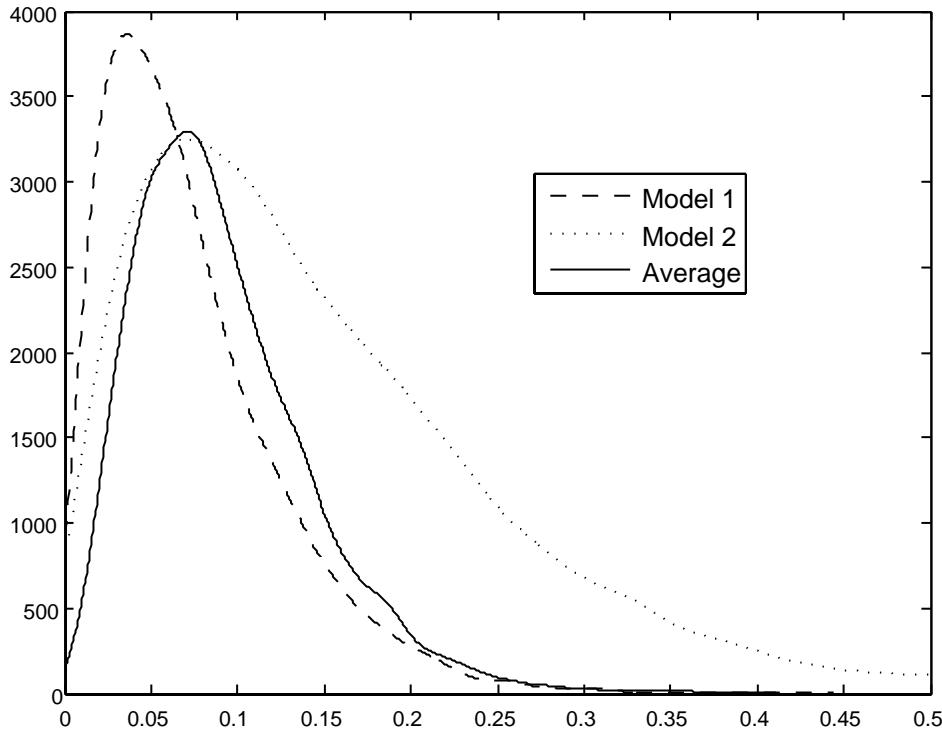  
Figure 2.1 Posterior density of involvement probability, patient 17.

Another option, based on Schwarz (1978), are BIC weights (Wintle et al., 2003). Comparison with the minimum BIC model $m^{***}$ gives $\Delta \mathrm{BIC}_j = \mathrm{BIC}_j - \mathrm{BIC}_{m^{***}}$ , and posterior weights

$$
\zeta_ {j} = \frac {\exp (- 0 . 5 \Delta \overline {{\mathrm {B I C}}} _ {j})}{\sum_ {m} [ \exp (- 0 . 5 \Delta \overline {{\mathrm {B I C}}} _ {m}) ]}.
$$

Rather than model choice based on posterior means of (penalised) likelihoods or corresponding weights, the fit measures of two or more models can be compared iteration by iteration within an MCMC run (Congdon, 2005, 2006c). Thus, likelihood ratios could be penalised for complexity, leading to AIC or BIC selection of models at each iteration. This type of procedure can be used for iteration-specific model averaging.

Suppose model $k \in 1, \ldots, K$ had the highest penalised likelihood at iteration $t$ from $K$ models being compared, then one option is that the model-averaged parameter at iteration $t$ is set to the best fitting model. An alternative is to form an average at each iteration that gives some weight to less well-fitting models. For example, consider an iteration-specific average of a function $Q(y, \theta_j^{(t)})$ of parameters and data over models $j = 1, \ldots, K$ . Then using AIC weights $\omega_j^{(t)}$ also specific to iteration, one obtains the weighted average

$$
q _ {\omega} \left(\theta^ {(t)}, y\right) = \sum_ {j = 1} ^ {K} w _ {j} ^ {(t)} Q \left(\theta_ {j} ^ {(t)}, y\right).
$$

Then the posterior mean

$$
E \left(q _ {\omega} (\theta , y) | y\right) = \sum_ {t = 1} ^ {T} q _ {\omega} \left(\theta^ {(t)}, y\right) / T
$$

provides a model-averaged estimate that takes account of both model and parameter uncertainty.

# 2.11 MONTE CARLO ESTIMATES OF MODEL PROBABILITIES

In this section a Monte Carlo method for estimating posterior model probabilities based on independent MCMC sampling of two (or more) different models is presented (Congdon, in press); this is a modified version of the approach suggested in Congdon (2006d) and has the advantage of allowing simple iteration-specific model averaging as compared to other approaches. Let $\theta = (\theta_{1},\dots,\theta_{K})$ denote the parameter set over all $K$ models, with dimension $(d_{1},\ldots ,d_{K})$ . Assume a model indicator $m\in (1,\dots,K)$ such that given $m = j$ , $\theta_{j}$ defines the likelihood for $y = (y_{1},\dots,y_{n})$ and $y$ is independent of parameters of other models $\theta_{k}, k\neq j$ (Carlin and Chib, 1995; Godsill, 2001). This means that the marginal likelihood given $m = j$ is

$$
\begin{array}{l} p (y | m = j) = \int p (y | \theta , m = j) p (\theta | m = j) d \theta \\ = \int p (y | \theta_ {j}, m = j) p (\theta | m = j) d \theta_ {j}. \\ \end{array}
$$

This framework replicates that of Section 2.1 in Carlin and Chib (1995). As these authors mention, the form of the cross-model priors $p(\theta_k|m = j, j \neq k)$ within the product $p(\theta|m = j) = \prod_k p(\theta_k|m = j)$ is arbitrary, though proper densities are required in order that $p(\theta|m = j)$ integrates to 1.

Here the assumption is made that $p(\theta_k|m = j_1) = p(\theta_k|m = j_2)$ for all $\{k \neq j_1, k \neq j_2\}$ , so there will be $K$ cross-model priors, rather than $K(K - 1)$ . So in a three-model situation $p(\theta_3|m = 1) = p(\theta_3|m = 2) = g_3$ , $p(\theta_2|m = 1) = p(\theta_2|m = 3) = g_2$ , and $p(\theta_1|m = 2) = p(\theta_1|m = 3) = g_1$ .

With this framework, one may use the output $\{\theta_j^{(t)}, t = 1, \dots, T; j = 1, \dots, K\}$ from the $K$ models to estimate iteration-specific model weights and overall posterior model weights. This involves a sample of the same length (say $T$ iterations) from the posteriors $p(\theta_j | y, m = j)$ of all $K$ models under consideration. Such samples might be obtained by running models in parallel or by running them separately and then pooling the output. This is conceptually distinct from product space search algorithms, such as that of Carlin and Chib (1995), when the model $j$ parameters are updated only when model $j$ is visited. To see how model weights are estimated from such output, first write

$$
p (m = j | y) = \int p (m = j, \theta | y) \mathrm {d} \theta = \int p (m = j | y, \theta) p (\theta | y) \mathrm {d} \theta .
$$

Then a Monte Carlo estimate of $P(m = j|y)$ is obtainable as

$$
\overline {{w}} _ {j} = \frac {\sum_ {t = 1} ^ {T} p \left(m = j | y , \theta^ {(t)}\right)}{T},
$$

where $\left\{\theta^{(t)} = \left(\theta_{1}^{(t)},\dots ,\theta_{2}^{(t)},\dots ,\theta_{K}^{(t)}\right),t = 1,T\right\}$ are $T$ samples of parameters in all models.

For obtaining weights at a particular iteration, let

$$
w _ {j} ^ {(t)} = p (m = j \mid y, \theta^ {(t)}) = \frac {p (m = j , y , \theta^ {(t)})}{p (y , \theta^ {(t)})} = \frac {p (y \mid m = j , \theta^ {(t)}) p (\theta^ {(t)} \mid m = j) p (m = j)}{p (y , \theta^ {(t)})}. \tag {2.15}
$$

The numerator in (2.15) contains the term

$$
p (\theta | m = j) = p \left(\theta_ {1} | m = j\right) p \left(\theta_ {2} | m = j\right) \dots p \left(\theta_ {j} | m = j\right) \dots p \left(\theta_ {K} | m = j\right).
$$

From above the cross-model prior is arbitrary and the simplifying assumption

$$
p \left(\theta_ {h} | m = j\right) = g _ {h} \quad (\text {a l l} j \neq h)
$$

is made, where $g_{h}$ is a proper density. So

$$
\begin{array}{l} p \left(\theta_ {h} \mid m = 1\right) = p \left(\theta_ {h} \mid m = 2\right) = \dots = p \left(\theta_ {h} \mid m = h - 1\right) \\ = p \left(\theta_ {h} | m = h + 1\right) = \dots = p \left(\theta_ {h} | m = K\right) = g _ {h}, \\ \end{array}
$$

and there are $K$ cross-model priors $\{g_1,\ldots ,g_K\}$

As in the model choice procedures of Gelfand and Dey (1994) and Carlin and Chib (1995), one might set $g_{h}$ to be an estimate of $p(\theta_h|m = h,y)$ , namely the posterior density of $\theta_h$ given $y$ and $m = h$ . This choice of cross-model prior contrasts with the simplification of taking $p(\theta_k|m = j,k\neq j)$ uniform, as considered by Congdon (2006d). It follows that

$$
p (\theta | m = j) = p (\theta_ {j} | m = j) \prod_ {h \neq j} ^ {K} p (\theta_ {h} | m = j) = p (\theta_ {j} | m = j) [ g _ {1} g _ {2} \dots g _ {j - 1} g _ {j + 1} \dots g _ {K} ].
$$

Then

$$
w _ {j} ^ {(t)} = \frac {p (y | m = j , \theta_ {j} ^ {(t)}) p (\theta_ {j} ^ {(t)} | m = j) \left[ \prod_ {h \neq j} g _ {h} ^ {(t)} \right] p (m = j)}{p (y , \theta^ {(t)})}. \tag {2.16}
$$

The denominator in (2.16) can be written as

$$
\begin{array}{l} p \left(y, \theta^ {(t)}\right) = \sum_ {k = 1} ^ {K} p \left(y, \theta^ {(t)}, m = k\right) \\ = \sum_ {k = 1} ^ {K} \left\{p (y | \theta^ {(t)}, m = k) p (\theta_ {k} ^ {(t)} | m = k) \left[ \prod_ {h \neq k} g _ {h} ^ {(t)} \right] p (m = k) \right\} \\ = \sum_ {k = 1} ^ {K} p \big (y | \theta_ {k} ^ {(t)}, m = k \big) p \big (\theta_ {k} ^ {(t)} | m = k \big) \left[ \prod_ {h \neq k} g _ {h} ^ {(t)} \right] p (m = k). \\ \end{array}
$$

Then

$$
w _ {j} ^ {(t)} = \frac {p \left(y | m = j , \theta_ {j} ^ {(t)}\right) p \left(\theta_ {j} ^ {(t)} | m = j\right) \left[ \prod_ {h \neq j} g _ {h} ^ {(t)} \right] p (m = j)}{\sum_ {k = 1} ^ {K} p \left(y | \theta_ {k} ^ {(t)}, m = k\right) p \left(\theta_ {k} ^ {(t)} | m = k\right) \left[ \prod_ {h \neq k} g _ {h} ^ {(t)} \right] p (m = k)}.
$$

One may divide through by the product of the $K$ cross-model priors $[g_1, g_2, \ldots, g_K]$ giving

$$
w _ {j} ^ {(t)} = \frac {\left\{\frac {p \left(y \mid m = j , \theta_ {j} ^ {(t)}\right) p \left(\theta_ {j} ^ {(t)} \mid m = j\right) p (m = j)}{g _ {j} ^ {(t)}} \right\}}{\sum_ {k = 1} ^ {K} \left\{\frac {p \left(y \mid \theta_ {k} ^ {(t)} , m = k\right) p \left(\theta_ {k} ^ {(t)} \mid m = k\right) p (m = k)}{g _ {k} ^ {(t)}} \right\}}. \tag {2.17}
$$

Consider the case $K = 2$ . Using the previous notation for the unnormalised posterior as

$$
p ^ {*} \left(\theta_ {j} ^ {(t)} | y, m = j\right) = p \left(y | m = j, \theta_ {j} ^ {(t)}\right) p \left(\theta_ {j} ^ {(t)} | m = j\right),
$$

one obtains

$$
w _ {j} ^ {(t)} = \frac {\left\{\frac {p ^ {*} \left(\theta_ {j} ^ {(t)} | y , m = j\right) p (m = j)}{g _ {j} ^ {(t)}} \right\}}{\left\{\frac {p ^ {*} \left(\theta_ {1} ^ {(t)} | y , m = 1\right) p (m = 1)}{g _ {1} ^ {(t)}} + \frac {p ^ {*} \left(\theta_ {2} ^ {(t)} | y , m = 2\right) p (m = 2)}{g _ {2} ^ {(t)}} \right\}}.
$$

Incorporating the above assumptions about cross-model priors and the division through by $\prod_{k=1}^{K} g_k$ as in (2.17) gives a posterior mean of $p(m = j|y)$ over all iterations

$$
w _ {j} = \sum_ {t = 1} ^ {T} \left\{\frac {\left[ \frac {p ^ {*} \left(\theta_ {j} ^ {(t)} | y , m = j\right) p (m = j)}{g _ {j} ^ {(t)}} \right]}{\left[ \frac {p ^ {*} \left(\theta_ {1} ^ {(t)} | y , m = 1\right) p (m = 1)}{g _ {1} ^ {(t)}} + \cdots + \frac {p ^ {*} \left(\theta_ {j} ^ {(t)} | y , m = j\right) p (m = j)}{g _ {j} ^ {(t)}} + \cdots + \frac {p ^ {*} \left(\theta_ {K} ^ {(t)} | y , m = K\right) p (m = K)}{g _ {K} ^ {(t)}} \right]} \right\}. \tag {2.18}
$$

The densities of the $w_{k}^{(t)}$ may be skewed in which case the posterior median of the $p(w_{k}|y)$ will be relevant as a Monte Carlo summary of location.

While the above development uses the framework of Carlin and Chib (1995) there are two main differences. First, the cross-model priors do not function here as linking densities in a model search algorithm, since there is no switching between models. Instead all models are sampled from at each iteration. This avoids the problems involved in tuning prior model probabilities or 'jump' proposal densities in product space algorithms to ensure that models are visited sufficiently often (Friel and Pettitt, 2006; Green and O'Hagan, 1998). The second main difference follows from the first. Switching between models under product space search implies a binary form of model averaging: if model 1 is selected at several successive iterations then the averaged parameters at these iterations are in fact the parameter values sampled from one model only. Under the approach here, averaging is on the basis of continuous quantities, namely the $w_{k}^{(t)}$ obtained for all models, so some weight in the average at each iteration is given to inferior models. This may be important when models are closely competing. Thus at

iteration $t$ , one obtains

$$
q _ {k} ^ {(t)} = \log \left\{p (y | \theta_ {k} ^ {(t)}, m = k) p (\theta_ {k} ^ {(t)} | m = k) \left[ \prod_ {a \neq k} g _ {a} \right] p (m = k) \right\},
$$

and deviations $\Delta q_k^{(t)} = q_k^{(t)} - \max_k(q_k^{(t)})$ , with $w_k^{(t)}$ obtained by exponentiating:

$$
w _ {k} ^ {(t)} = \frac {\exp \left(\Delta q _ {k} ^ {(t)}\right) _ {k}}{\sum_ {k} \exp \left(\Delta q _ {k} ^ {(t)}\right)}.
$$

This approach is illustrated with the nodal involvement dataset considered in Section 2.3. The cross-model priors $p(\theta_1|m = 2) = g_1$ and $p(\theta_2|m = 1) = g_2$ use the same parameters as the importance densities used there. A single-chain run of 10000 iterations is run (with burn-in of 1000, giving $T = 9000$ ) comparing models M8 (model 1) and M9 (model 2) of Chib (1995). The densities of the weights $w_k^{(t)}$ are slightly skewed, so posterior medians are used as summaries. The posterior medians of $w_1^{(t)}$ and $w_2^{(t)}$ are 0.778 and 0.222 (as compared to means 0.742 and 0.258). One therefore obtains 3.505 as the ratio of posterior median weights. This quantity is also the posterior median of the ratios $\left(w_1^{(t)} / w_2^{(t)}\right)$ , whereas the mean of this ratio is considerably higher (at 8.8). It may be noted that the arithmetic averages of the ratios $\left[\frac{p^*(\theta_j^{(t)}|y, m = j)}{g_j^{(t)}}\right]$ in (2.18) are -35.57 (model M8) and -36.87 (model M9), close to the estimates obtained using the bridge sampling method.

One may also use the iteration-specific weights $(w[k]$ in the code) to average over models at each iteration (e.g. predictions of patient-specific nodal involvement probabilities). For example, Figure 2.1 contains the posterior densities of the involvement probability $\pi_{ij}$ of patient $i = 17$ under models $j$ ; kernel plots are obtained using the Matlab code of Morgan (2000). These posterior densities are for models M8 (model $j = 1$ ), M9 (model $j = 2$ ) and the average model (model $j = a$ ) with the model averaged density obtained using the iteration-specific averages

$$
\pi_ {a} ^ {(t)} = \pi_ {1} ^ {(t)} w _ {1} ^ {(t)} + \pi_ {2} ^ {(t)} w _ {2} ^ {(t)}.
$$

The code is as follows:

```txt
model {for (i in 1:N) { y1[i] <- y[i]; y1[i] ~ dbern(pi[i,1])  
    y2[i] <- y[i]; y2[i] ~dbern(pi[i,2])  
    # two models  
    nu[i,1] <- b1[1] + b1[2]*log(x1[i]) + b1[3]*x2[i] + b1[4]*x3[i]  
    nu[i,2] <- b2[1] + b2[2]*log(x1[i]) + b2[3]*x2[i] + b2[4]*x3[i] + b2[5]*x4[i]  
    # averaged probability at each iteration  
    pi.a[i] <- w[1]*pi[i,1] + w[2]*pi[i,2]  
    for (j in 1:2) {pi[i,j] <- phi(nu[i,j])  
    # log-likelihoods  
    LL[i,j] <- y[i]*log(phi(nu[i,j])) + (1-y[i])*log(1-phi(nu[i,j]))}  
    # priors 
```

```r
for (j in 1:4) {bl[j] ~dnorm(M[j], P[j])  
PG1[j] <- 1/pow(seG1[j], 2)  
Pr[j, 1] <- 0.5*log(P[j]/6.28) - 0.5*P[j]*pow(b1[j] - M[j], 2)  
g[j, 1] <- 0.5*log(PGL[j]/6.28) - 0.5*PG1[j]*pow(b1[j] - MG1[j], 2)}  
for (j in 1:5) {b2[j] ~dnorm(M[j], P[j])  
PG2[j] <- 1/pow(seG2[j], 2)  
Pr[j, 2] <- 0.5*log(P[j]/6.28) - 0.5*P[j]*pow(b2[j] - M[j], 2)  
g[j, 2] <- 0.5*log(PG2[j]/6.28) - 0.5*PG2[j]*pow(b2[j] - MG2[j], 2)}  
# Ratio of Pstar to importance sample at each iteration  
for (k in 1:2) {SL[k] <- max(logR[k] - maxR, -500)  
log.Pstar[k] <- sum(LL[k]) + sum(Pr[1:p[k], k]) + log(PriorMod[k])  
logR[k] <- log.Pstar[k] - sum(g[1:p[k], k])  
logQ[k] <- sum(LL[k]) + sum(Pr[1:p[k], k]) - sum(g[1:p[k], k])  
expSL[k] <- exp(SL[k])  
# model weights at iteration t  
w[k] <- expSL[k]/sum(expSL[])}  
# maximum of model likelihoods at iteration t  
maxR <- ranked(logR[], 2)  
# quantities to monitor  
mon[1] <- w[1]; mon[2] <- w[2]; mon[3] <- w[1]/w[2]  
mon[4] <- log(w[1]/w[2])} 
```

Apart from the case study data, the other inputs in the data file are

(list $\mathrm{MG1} = \mathrm{c}(-0.59,1.42,1.06,1.00),\mathrm{MG2} = \mathrm{c}(-0.68,1.65,1.06,0.86,$

0.66),seG1=c(0.39,0.67,0.48,0.41),seG2=c(0.41,0.69,0.49,

0.44,0.445), $p = c(4,5)$ , PriorMod $= c(0.5,0.5)$ , $N = 53$ , $P = c(0.01,0.04$

0.04,0.04,0.04),M=c(0,0.75,0.75,0.75,0.75).

For models with subject-level random effects $b_{i}$ , let fixed effects parameters be denoted $\beta$ and hyperparameters for the random effects be denoted $\Phi$ , with $\theta = (\beta, \Phi)$ . Define the integrated likelihood

$$
p (y | m = k, \theta) = \int \prod_ {i = 1} ^ {N} p \left(y _ {i} \mid \beta , b _ {i}\right) p \left(b _ {i} \mid \Phi\right) d b _ {i}.
$$

Then the posterior mean model weight is $\overline{w}_j = \sum_{t=1}^{T} w_j^{(t)} / T$ , where

$$
w _ {j} ^ {(t)} = \frac {p (y | m = j , \theta_ {j} ^ {(t)}) p (\theta_ {j} ^ {(t)} | m = j) [ \prod_ {h \neq j} g _ {h} ^ {(t)} ] p (m = j)}{p (y , \theta^ {(t)})},
$$

and the cross-model priors $g_{h} = p(\theta_{j}|m = h), h \neq j$ , involve (proper density) approximations for $p(\theta_{j}|y, m = j) = p(\beta_{j}, \Phi_{j}|y, m = j)$ . In conjugate models (e.g. Poisson models with gamma random effects) the integrated likelihoods $p(y|m = k, \theta)$ are available analytically, whereas in general linear mixed models, devices such as numerical integration by Simpson's rule or quadrature (Aitkin and Alfô, 2003), or importance sampling (Geweke, 1989), are required, and are applied at each iteration to obtain $p(y|m = k, \theta^{(t)})$ . For example consider a scalar random effect in a Poisson lognormal model with $y_{i} \sim \mathrm{Po}(E_{i}\mu_{i})$ where $E_{i}$ are expected events, and $\log (\mu_i) = X_i\beta + b_i$ , where $b_{i} \sim N(0, 1 / \tau_{b})$ . Then an appropriate range for Simpson's integration over $b_{i}$ may be obtained from an earlier MCMC run.

# REFERENCES

Aitkin, M. (1991) Posterior Bayes factors. Journal of the Royal Statistical Society, Series B, 53, 111-142.   
Aitkin, M. (1997) The calibration of $P$ -values, posterior Bayes factors and the AIC from the posterior distribution of the likelihood. Statistics and Computing, 7, 253-261.   
Aitkin, M. and Alfo, M. (2003) Longitudinal analysis of repeated binary data using autoregressive and random effect modelling. Statistical Modelling, 3, 291-303.   
Alqallaf, F. and Gustafson, P. (2001) On cross-validation of Bayesian models. Canadian Journal of Statistics, 29, 333-340.   
Azevedo-Filho, A. and Shachter, R. (1994) Laplace's method approximations for probabilistic inference in belief networks with continuous variables. In Proceedings 10th Conference on Uncertainty in Artificial Intelligence, Seattle, de Mantaras, R. and Poole, D. (eds). Morgan Kaufmann: San Mateo, CA, 28-36.   
Barbieri, M. and Berger, J. (2004) Optimal predictive model selection. Annals of Statistics, 32, 870-897.   
Besag, J. (1974) Spatial interaction and the statistical analysis of lattice systems. Journal of the Royal Statistical Society, Series B, 36, 192-236.   
Bos, C. (2002) A comparison of marginal likelihood computation methods. In COMPSTAT 2002: Proceedings in Computational Statistics, Härdle, W. and Ronz, B. (eds). 111-117.   
Brooks, S. (2002) Discussion to Spiegelhalter et al. Journal of the Royal Statistical Society, Series B, 64, 616-618.   
Burnham, K. and Anderson, D. (2002) Model Selection and Multimodel Inference: A Practical Information-Theoretic Approach (2nd edn). Springer-Verlag: New York.   
Carlin, B. and Chib, S. (1995) Bayesian model choice via Markov chain Monte Carlo methods. Journal of the Royal Statistical Society, Series B, 57, 473-484.   
Carlin, B. and Louis, T. (1997) Bayes and Empirical Bayes Methods for Data Analysis. Chapman & Hall: London.   
Carlin, B. and Louis, T. (2000) Bayes and Empirical Bayes Methods for Data Analysis (2nd edn, Texts in Statistical Sciences). Chapman & Hall/CRC: Boca Raton, FL.   
Chen, M. (2005) Bayesian computation: from posterior densities to Bayes factors, marginal likelihoods, and posterior model probabilities. In *Bayesian Thinking, Modeling and Computation*, Dey, D. and Rao, C. (eds). Elsevier: Amsterdam.   
Chen, M.-H., Shao, Q.-M. and Ibrahim, J.G. (2000) Monte Carlo Methods in Bayesian Computation. Springer-Verlag: New York.   
Chib, S. (1995) Marginal likelihood from the Gibbs output. Journal of the American Statistical Association, 90, 1313-1321.   
Chib, S. and Jeliazkov, I. (2001) Marginal likelihood from the Metropolis-Hastings output. Journal of the American Statistical Association, 96, 270-281.   
Chipman, H., George, E. and McCulloch, R. (2001) The practical implementation of Bayesian model selection. In Model Selection, IMS Monograph 38, Lahiri, P. (ed). Institute of Mathematical Statistics: Beachwood, OH, 67-116.   
Chu, P. and Zhao, X. (2004) Bayesian change-point analysis of tropical cyclone activity: the Central North Pacific case. Journal of Climate, 17, 4893-4901.   
Congdon, P. (2000) A Bayesian approach to prediction using the gravity model, with an application to patient flow modelling. Geographical Analysis, 32, 205-224.   
Congdon, P. (2005) Bayesian predictive model comparison via parallel sampling. Computational Statistics and Data Analysis, 48, 735-753.   
Congdon, P. (2006a) A model for nonparametric spatially varying regression effects. Computational Statistics and Data Analysis, 50, 422-445.

Congdon, P. (2006b) A model framework for mortality and health data classified by age, area and time. Biometrics, 62, 269-278.   
Congdon, P. (2006c) Bayesian model comparison via parallel model output. Journal of Statistical Computation and Simulation, 76, 149-165.   
Congdon, P. (2006d) Bayesian model choice based on Monte Carlo estimates of posterior model probabilities. Computational Statistics and Data Analysis, 50, 346-357.   
Congdon, P. (in press) Weights for model choice and averaging. Statistical Methodology.   
Czado, C. and Raftery, A. (2006) Choosing the link function and accounting for link uncertainty in generalized linear models using Bayes Factors. Statistical Papers, 47, 419-442.   
Dellaportas, P. and Roberts, G. (2003) Introduction to MCMC. In Spatial Statistics and Computational Methods, Møller, J. (ed). Springer: New York, 1-42.   
Dellaportas, P., Forster, J. and Ntzoufras, I. (2002) On Bayesian model and variable selection using MCMC. Statistics and Computing, 12, 27-36.   
Dempster, A. (1997) The direct use of the likelihood ratio for significance testing. Statistics and Computing, 7, 247-252.   
Dey, D., Peng, F. and Gelfand, A. (1997) Overdispersed generalized linear models. Journal of Statistical Planning and Inference, 64, 93-107.   
Draper, D. (1995) Assessment and propagation of model uncertainty. Journal of the Royal Statistical Society, Series B, 57, 45-97.   
Elsalloukh, H., Young, D. and Guardiola, J. (2005) The epsilon-skew exponential power distribution family. Far East Journal of Theoretical Statistics, 16, 97-112.   
Fernandez, C., Ley, E. and Steel, M. (2001) Benchmark priors for Bayesian model averaging. Journal of Econometrics, 100, 381-427.   
Friel, N. and Pettitt, A. (2006) Marginal likelihood estimation via power posteriors. Working Paper, Department of Statistics, University of Glasgow.   
Fruhwirth-Schnatter, S. (2004) Estimating marginal likelihoods for mixture and Markov switching models using bridge-sampling techniques. *Econometrics Journal*, 7, 143-167.   
Geisser, S. and Eddy, W. (1979) A predictive approach to model selection. Journal of the American Statistical Association, 74, 153-160.   
Gelfand, A. (1996) Model determination using sampling based methods. In Markov Chain Monte Carlo in Practice, Gilks, W., Richardson, S. and Spiegelhalter, D. (eds). Chapman & Hall/CRC: Boca Raton, FL, Chap. 9.   
Gelfand, A. and Dey, D. (1994) Bayesian model choice: asymptotics and exact calculations. Journal of the Royal Statistical Society, Series B, 56 (3), 501-514.   
Gelfand, A. and Ghosh, S. (1998) Model choice: a minimum posterior predictive loss approach. Biometrika, 85, 1-11.   
Gelfand, A., Dey, D. and Chang, H. (1992) Model determination using predictive distributions with implementations via sampling-based methods. In *Bayesian Statistics* 4, Bernardo, J., et al. (eds). Oxford University Press: Oxford, 147-168.   
Gelman, A. and Meng, X. (1998) Simulating normalizing constants: from importance sampling to bridge sampling to path sampling. Statistical Science, 13, 163-185.   
Gelman, A., Meng, X. and Stern, H. (1996) Posterior predictive assessment of model fitness via realized discrepancies. Statistica Sinica, 6, 733-807.   
Gelman, A., Carlin, J.B., Stern, H.S. and Rubin, D.B. (2003) Bayesian Data Analysis. Chapman & Hall/CRC: Boca Raton, FL.   
George, E. (1999) Bayesian model selection. In Encyclopedia of Statistical Sciences Update (Vol. 3), Kotz, S., Read, C. and Banks, D. (eds). John Wiley & Sons, Ltd/Inc.: New York, 39-46.   
George, E. and McCulloch, R. (1993) Variable selection via Gibbs sampling. Journal of the American Statistical Association, 88, 881-889.

Godsill, S. (2001) On the relationship between MCMC model uncertainty methods. Journal of Computational and Graphical Statistics, 10, 230-248.   
Green, P. (1995) Reversible jump Markov chain Monte Carlo computation and Bayesian model determination. Biometrika, 82, 711-732.   
Green, P. and O'Hagan, A. (1998) Model choice with MCMC on product spaces without using pseudopriors. Technical Report 98-13, University of Nottingham.   
Han, C. and Carlin, B. (2001) Markov chain Monte Carlo methods for computing Bayes factors: a comparative review. Journal of the American Statistical Association, 96, 1122-1132.   
Ibrahim, J., Chen, M.-H. and Sinha, D. (2001) Bayesian Survival Analysis. Springer-Verlag: New York.   
Hoeting, J., Madigan, D., Raftery, A. and Volinsky, C. (1999) Bayesian model averaging: a tutorial. Statistical Science, 14, 382-401.   
Jeffreys, H. (1961) Theory of Probability (3rd edn). Oxford University Press: Oxford.   
Kass, R. and Raftery, A. (1995) Bayes factors. Journal of the American Statistical Association, 90, 773-779.   
Kass, R.E. and Wasserman, L. (1995) A reference Bayesian test for nested hypotheses with large samples. Journal of the American Statistical Association, 90, 928-934.   
Katsis, A. and Ntzoufras, I. (in press). Bayesian hypothesis testing for the distribution of insurance claim counts using the Gibbs sampler. Journal of Computational Methods in Science and Engineering.   
Kuo, L. and Mallick, B. (1998) Variable selection for regression models. Sankhya B, 60, 65-81.   
Kuo, L. and Peng, F. (2000) A mixture-model approach to the analysis of survival data. In Generalized Linear Models: A Bayesian Perspective, Dey, D., Ghosh, S. and Mallick, B. (eds). Marcel Dekker: New York, 255-270.   
Laud, P. and Ibrahim, J. (1995). Predictive model selection. Journal of the Royal Statistical Society, Series, B, 57, 247-262.   
Lawson, A. and Clark, A. (2002) Spatial mixture relative risk models applied to disease mapping. Statistics in Medicine, 21, 359-370.   
Lewis, S. and Raftery, A. (1997) Estimating Bayes factors via posterior simulation with the Laplace-Metropolis estimator. Journal of the American Statistical Association, 92, 648-655.   
Liang, F., Pauloy, R., Molinaz, G., Clyde, M. and Berger, J. (2005) Mixtures of g-priors for Bayesian variable selection. Duke University, ISDS Discussion Paper 05-12.   
Lopes, H. and West, M. (2004) Bayesian model assessment in factor analysis. Statistica Sinica, 14, 41-67.   
McCullagh, P. and Nelder, J. (1989) Generalized Linear Models. Chapman & Hall: London.   
McCulloch, R. and Tsay, R. (1994) Statistical analysis of economic time series via Markov switching models. Journal of Time Series Analysis, 15, 523-539.   
McNeil, A. and Wendin, J. (2005) Bayesian Inference for Generalized Linear Mixed Models of Portfolio Credit Risk. Manuscript, Department Mathematik, ETH Zurich.   
Meng, X. and Schilling, S. (2002) Warp bridge sampling. Journal of Computational and Graphical Statistics, 11, 552-586.   
Meng, X. and Wong, W. (1996) Simulating ratios of normalizing constants via a simple identity: a theoretical exploration. Statistica Sinica, 6, 831-860.   
Meyer, M. and Laud, P. (2002) Predictive variable selection in generalized linear models. Journal of the American Statistical Association, 97, 859-871.   
Mira, A. and Nicholls, G. (2004) Bridge estimation of the probability density at a point. Statistica Sinica, 14, 603-612.   
Morgan, B. (2000) Applied Stochastic Modelling. Arnold: London.   
Mudholkar, G. and Hutson, A. (2000) The epsilon-skew-normal distribution for analyzing near-normal data. Journal of Statistical Planning and Inference, 83, 291-309.   
Newton, M. and Raftery, A. (1994) Approximate Bayesian inference with the weighted likelihood bootstrap. Journal of the Royal Statistical Society, Series B, 56, 3-48.

Ohlssen, D., Sharples, L. and Spiegelhalter, D. (in press) Tutorial in Biostatistics: flexible random-effects models using Bayesian semi-parametric models: applications to institutional comparisons. Statistics in Medicine.   
Pourahmadi, M. and Daniels, M. (2002) Dynamic conditionally linear mixed models for longitudinal data. Biometrics, 58, 225-231.   
Raftery, A. (1995) Bayesian model selection in social research. In *Sociological Methodology*, Marsden, P. (ed). Blackwell: Oxford, 111-163.   
Raftery, A. (1996) Hypothesis testing and model selection. In Markov Chain Monte Carlo in Practice, Gilks, W., Richardson, S. and Spiegelhalter, D. (eds). Chapman & Hall: London, 163-187.   
Raftery, A. and Richardson, S. (1996) Model selection for generalized linear models via GLIB, with application to epidemiology. In Bayesian Biostatistics, Berry, D. and Stangl, D. (eds). Marcel Dekker: New York, 321-354.   
Rossi, P.E., Allenky, G. and McCulloch, R. (2005) Bayesian Statistics and Marketing. John Wiley & Sons Ltd/Inc.: Chichester.   
Rubin, D. and Stern, H. (1994) Testing in latent class models using a posterior predictive check distribution. In Latent Variables Analysis: Applications for Developmental Research, von Eye, A. and Clogg, C. (eds). Sage Publications: Thousand Oaks, CA, 420-438.   
Sahu, S. (2004) Applications of formal model choice to archaeological chronology building. In Tools for Constructing Chronologies: Crossing Disciplinary Boundaries, Buck, C. and Millard, A. (eds). Springer-Verlag: London, 111-127.   
Schwarz, G. (1978) Estimating the dimension of a model. Annals of Statistics, 6, 461-464.   
Scheines, R., Hoijtink, H. and Boomsma, A. (1999) Bayesian estimation and testing of structural equation models. Psychometrika, 64, 37-52.   
Self, S. and Liang, K. (1987) Large sample properties of the maximum likelihood estimator and the likelihood ratio test on the boundary of parameter space. Journal of the American Statistical Association, 82, 605-610.   
Shafer, G. (1982) Lindley's paradox. Journal of the American Statistical Association, 77, 325-351.   
Shively, T., Kohn, R. and Wood, S. (1999) Variable selection and function estimation in additive nonparametric regression using a data-based prior. Journal of the American Statistical Association, 94, 777-794.   
Sinharay, S. and Stern, H. (2002) On the sensitivity of Bayes factors to the prior distributions. The American Statistician, 56, 196-201.   
Sinharay, S. and Stern, H. (2005) An empirical comparison of methods for computing Bayes factors in generalized linear mixed models. Journal of Computational and Graphical Statistics, 14, 415-435.   
Smith, M. and Kohn, R. (1996) Nonparametric regression using Bayesian variable selection. Journal of Econometrics, 75, 317-343.   
Song, X. and Lee, S. (2004) A Bayesian model selection method with applications. Computational Statistics and Data Analysis, 40, 539-557.   
Spiegelhalter, D. (2006) Two brief topics on modelling with WinBUGS. ICEBUGS presentation, Hanko, Finland. http://www.math.helsinki.fi/openbugs/IceBUGS/IceBUGSA Abstracts.html.   
Spiegelhalter, D., Best, N., Carlin, B. and van der Linde, A. (2002) Bayesian measures of model complexity and fit. Journal of the Royal Statistical Society, Series B, 64, 583-639.   
Stern, H. and Cressie, N. (2000) Posterior predictive model checks for disease mapping models. Statistics in Medicine, 19, 2377-2397.   
Tierney, L. and Kadane, J. (1986) Accurate approximations for posterior moments and marginal densities. Journal of the American Statistical Association, 81, 82-86.   
Vehtari, A. and Lampinen, J. (2002) Bayesian model assessment and comparison using cross-validation predictive densities. *Neural Computation*, 14, 2439–2468.

Weakliem, D. (1999) A critique of the Bayesian information criterion for model selection. Sociological Methods and Research, 27, 359-397.   
Wasserman, L. (2000) Bayesian model selection and model averaging. Journal of Mathematical Psychology, 44, 92-107.   
Wintle, B., McCarthy, M., Volinsky, C. and Kavanagh, R. (2003) The use of Bayesian model averaging to better represent uncertainty in ecological models. Conservation Biology, 17, 1579-1590.   
Yang, X., Belin, T. and Boscardin, W. (2005) Imputation and variable selection in linear regression models with missing covariates. Biometrics, 61, 498-506.   
Yau, P., Kohn, R. and Wood, S. (2003) Bayesian variable selection and model averaging in high dimensional multinomial nonparametric regression. Journal of Computational and Graphical Statistics, 12, 23-54.   
Yi, N., George, V. and Allison, D. (2003) Stochastic search variable selection for identifying multiple quantitative trait loci. Genetics, 164, 1129-1138.   
Yuan, C. and Druzdzel, M. (2005) How heavy should the tails be? In Proceedings of the Eighteenth International FLAIRS Conference (FLAIRS-05), Russell, I. and Markov, Z. (eds). AAAI Press/The MIT Press: Menlo Park, CA, 799-804.   
Zijlstra, B., van Duijn, M. and Snijders, T. (2005) Model selection in random effects models for directed graphs using approximated Bayes factors. Statistica Neerlandica, 59, 107-118.

# CHAPTER 3

# The Major Densities and their Application

# 3.1 INTRODUCTION

The general principle of Bayesian updating is to combine prior knowledge about the density of the parameters $\theta = (\theta_{1},\dots,\theta_{d})$ with the information about the parameters provided by the sample data $y$ , to produce revised knowledge about parameters. Using Markov Chain Monte Carlo (MCMC) methods one may draw repeated samples of $\theta$ . Specifically, the posterior density $p(\theta |y)$ combines prior assumptions $p(\theta)$ on $\theta$ , with sampling distributions applicable to different types of observational data $y$ , $P(y|\theta)\equiv L(\theta |y)$ . This chapter considers the more important densities for continuous, count and categorical data and considers parameter estimation, assessment of hypotheses on parameters and some practical applications (e.g. to screening and classification).

Bayesian methods of estimation via sampling can be applied to estimating functions of parameters (e.g. differences in normal means or binomial probabilities between groups of observations) and testing hypotheses about them. An example would be finding the posterior probability that a parameter based on a particular dataset is within a particular distance of a reference parameter value $\theta_r$ , namely $\operatorname*{Pr}(-d \leq \theta - \theta_r \leq d|y)$ , or whether $\theta$ exceeds a particular threshold. MCMC sampling also applies to deriving densities of often-complex summary statistics that are partly functions of the data but also depend on the model parameters. An example considered below is the Gini coefficient of inequality of an income distribution or health index. One may also obtain posterior probabilities on hypotheses for such data, e.g. that the Gini index in period $t$ is greater than that in period $t - 1$ (Congdon and Southall, 2005).

Another facet of the Bayes method is that of prediction. Integrating the joint posterior density

$$
p \left(y _ {\text {n e w}}, \theta \mid y\right) = p \left(y _ {\text {n e w}} \mid \theta , y\right) p \left(\theta \mid y\right)
$$

over the parameters gives the posterior predictive density

$$
p (y _ {\mathrm {n e w}} | y) = \int p (y _ {\mathrm {n e w}}, \theta | y) \mathrm {d} \theta = \int p (y _ {\mathrm {n e w}} | \theta , y) p (\theta | y) \mathrm {d} \theta .
$$

This density represents the data that can typically be generated from the model and these can be compared with the actual data. If the comparison shows that the model provides a plausible data-generating process (DGP), namely one consistent with the actual data, then the replicate data can be taken to provide predictions for a new patient, clinical trial, etc. Basing model fit on the predictive density is helpful since further values of $y$ can be observed - whereas estimates of $\theta$ cannot be verified (Aitchison and Dunsmore, 1975).

The chapter commences with an outline of the fundamental densities of statistical analysis, especially in terms of Bayesian inference, prediction and hypothesis tests regarding their parameters. This includes the univariate normal and $t$ densities, and their multivariate equivalents; the binomial and multinomial and the conjugate beta and Dirichlet priors; and the Poisson and its gamma conjugate. However, robust alternatives to the standard densities are also discussed.

# 3.2 UNIVARIATE NORMAL WITH KNOWN VARIANCE

The normal distribution is central to statistical inference and modelling, and is relatively simple in being characterised by two parameters, the mean as a measure of location, and the variance measuring scatter around that central location. The central limit theorem of classical statistics and its Bayesian analogue (Berger, 1985, p. 224; Carlin and Louis, 2000, pp. 122-124) help justify the normal density as an approximation for the posterior distribution of many summary statistics, even those deriving from non-normal data. $^{1,2}$

Modifications of the normal distribution for more complex data (e.g. skewed, multimodal) include heavy tailed or asymmetric alternatives (Fernandez and Steel, 1999), or discrete mixtures of normal densities with differing means and variances (Richardson and Green, 1997). Draper (1995, p. 52) mentions embedding the normal model (for linear regression errors) in the symmetric power-exponential family. Hurdle methods have been suggested for cost data that are right skewed except for a significant proportion of zero observations (Cooper et al., 2003). Fully non-parametric methods are also an option (West, 1992). These may be applicable

<sup>1</sup> For continuous data y about which prior information provides both mean and variance but nothing else, the principle of maximum entropy also leads to the assignment of a normal density (Sivia, 1996, Chapter 5).   
2 The Bayesian version of the central limit theorem for a parameter vector $\theta$ of dimension $d$ is expressed in the multivariate normal approximation

$$
(\theta - \hat {\theta}) \sim N _ {d} (0, V),
$$

where $V$ is the $d \times d$ dispersion matrix for $\theta - \hat{\theta}$ , with $\hat{\theta}$ the maximum likelihood estimate. This is based on a Taylor series of the log-likelihood $\ell(\theta | y) = \log L(\theta | y)$ about $\hat{\theta}$ ,

$$
\ell (\theta | y) = \ell (\hat {\theta} | y) + (\theta - \hat {\theta}) ^ {T} S (\hat {\theta} | y) - 0. 5 (\theta - \hat {\theta}) ^ {\prime} I (\hat {\theta} | y) (\theta - \hat {\theta}) + r (\theta | y),
$$

where $S(\hat{\theta} |y)$ is the score function at $\hat{\theta}$ defined by

$$
S (\hat {\theta} | y) = \partial \ell (\hat {\theta} | y) / \delta \theta ,
$$

and $I(\hat{\theta} |y)$ is the observed information defined by

$$
I (\hat {\boldsymbol {\theta}} | \boldsymbol {y}) = \partial^ {2} \ell (\hat {\boldsymbol {\theta}} | \boldsymbol {y}) / \partial \theta^ {\prime} \partial \theta .
$$

The value of $\ell (\hat{\theta} |y)$ is fixed and $S(\hat{\theta} |y) = 0$ by definition. So, provided that the remainder term $r(\theta |y)$ is negligible and the prior for $\theta$ is flat in the region of $\hat{\theta}$ , $p(\theta |y)\propto \exp [-0.5(\theta -\hat{\theta})^T I(\hat{\theta} |y)(\theta -\hat{\theta})]$ . This has the form of a of multivariate normal density of dimension $p$ with $d\times d$ covariance matrix $V = I^{-1}(\hat{\theta} |y)$ .

as robust alternatives in the event of asymmetric or multimodal data, data with non-constant variance or data subject to distortions by outlying observations. The same is true for prior densities used to describe the distribution of non-normal hyperparameters or non-normal random effects.

For the moment, assume the normal to be a reasonable approximation to a sample of continuous measures. Suppose the data consist of a single observation $y$ from a univariate density with unknown mean $\mu$ but known variance $\sigma^2$ . Suppose uncertainty about (or prior knowledge concerning) the parameter $\mu$ can be represented in a normal form, $\mu \sim N(\mu_0, \sigma_0^2)$ , with $\mu_0$ and $\sigma_0^2$ both known. So the prior $p(\mu)$ on $\mu$ is proportional to

$$
\exp \left[ - 0. 5 \tau_ {0} (\mu - \mu_ {0}) ^ {2} \right],
$$

on omitting terms from the normal density not depending on $\mu$ , and with $\tau_0 = 1 / \sigma_0^2$ denoting the precision. Similarly the likelihood $p(y|\mu) \equiv L(\mu | y)$ of the single observation $y$ is proportional to

$$
\exp \left[ - 0. 5 \tau (y - \mu) ^ {2} \right],
$$

where $\tau = 1 / \sigma^2$ . Constant terms not depending on $\mu$ are omitted (this is known as the likelihood kernel). The posterior density of $\mu$ is then also the kernel of a normal likelihood

$$
p (\mu | y) \propto \exp \left[ - 0. 5 \left\{\tau_ {0} \left(\mu - \mu_ {0}\right) ^ {2} + \tau (y - \mu) ^ {2} \right\} \right] \tag {3.1}
$$

with mean

$$
\mu_ {1} = (n _ {0} \mu_ {0} + y) / (n _ {0} + 1)
$$

and variance

$$
\sigma_ {1} ^ {2} = 1 / \left[ \tau_ {0} + \tau \right] = \sigma^ {2} / \left(n _ {0} + 1\right),
$$

where $n_0 = \tau_0 / \tau$ is the ratio of precisions. This can be verified by rearrangement<sup>3</sup> of the exponent in (3.1). The mean of the posterior density is thus a weighted average of $y$ and $\mu_0$ with weights 1 and $n_0$ respectively. So the ratio of precisions $\tau_0 / \tau$ can be seen as a measure of the 'prior sample size'. Writing

$$
w = \frac {\tau_ {0}}{\tau_ {0} + \tau}
$$

3 The exponent of this expression may be rearranged as a sum of a quadratic function of $\mu$ , and terms not involving $\mu$ , namely as $-0.5$ times

$$
\mu^ {2} \left[ \tau_ {0} + \tau \right] - 2 \mu \left[ \mu_ {0} \tau_ {0} + y \tau \right] + \text {t e r m s n o t i n v o l v i n g} \mu .
$$

With the ratio of precisions denoted $n_0 = \tau_0 / \tau$ , the function of $\mu$ may in turn be expressed as

$$
\begin{array}{l} [ n _ {0} \tau + \tau ] \{\mu^ {2} - 2 \mu (n _ {0} \mu_ {0} \tau + y \tau) / (n _ {0} \tau + \tau) \} \\ = [ n _ {0} \tau + \tau ] \left\{\mu^ {2} - 2 \mu (n _ {0} \mu_ {0} + y) / (n _ {0} + 1) \right\}. \\ \end{array}
$$

The latter term is equivalent to

$$
[ 1 / \{\sigma^ {2} / (n _ {0} + 1) \} ] [ \mu - \{(n _ {0} \mu_ {0} + y) / (n _ {0} + 1) \} ] ^ {2} + \text {t e r m s n o t i n v o l v i n g} \mu ,
$$

and this provides the terms in the exponent of a normal density for $\mu$ .

namely as the ratio of prior precision to total precision, $\mu_{1}$ is equivalently a precision-weighted average

$$
\mu_ {1} = w \mu_ {0} + (1 - w) y
$$

of prior mean and data point.

Suppose one wanted to predict the value of a future observation $y_{\mathrm{new}}$ and its variability, using posterior knowledge regarding $\mu$ . The density of $y_{\mathrm{new}}$ conditional on the observed $y$ , $p(y_{\mathrm{new}}|y)$ , is based on integrating the product $p(y_{\mathrm{new}}|\mu ,y)p(\mu |y)$ over all values of $\mu$ , namely

$$
p (y _ {\mathrm {n e w}} | y) = \int p (y _ {\mathrm {n e w}} | \mu , y) p (\mu | y) \mathrm {d} \mu = \int p (y _ {\mathrm {n e w}} | \mu) p (\mu | y) \mathrm {d} \mu .
$$

Using MCMC methods this integral is approximated by sampling $y_{\mathrm{new}}^{(t)}$ from a normal density with sampled mean $\mu^{(t)}$ at iterations $t = 1, \dots, T$ (and variance assumed known). For a known variance, $y_{\mathrm{new}}$ will be normal with mean $\mu_1$ and variance $\sigma^2 + \sigma_1^2$ . The predictive distribution of a future observation therefore has two sources of variation: that due to sampling from a normal density for given $\mu$ , and that due to the posterior uncertainty in $\mu$ itself.

Consider now a sample of $n > 1$ observations $(y_{1},y_{2},\ldots ,y_{n})$ with observed mean $\overline{y}$ . The prior for the parametric mean $\mu$ is as above, namely $\mu \sim N(\mu_0,\sigma_0^2)$ . With unknown mean $\mu$ and known precision $\tau$ , the likelihood $p(y_{1},y_{2},\dots,y_{n}|\mu)$ is proportional to

$$
\prod_ {i = 1} ^ {n} [ \exp (- 0. 5 \tau (y _ {i} - \mu) ^ {2} ],
$$

which, from the viewpoint of estimating $\mu$ , reduces to

$$
\exp \left[ - 0. 5 n \tau (\bar {y} - \mu) ^ {2} \right]
$$

since viewed as a function of $\mu$ the other terms in the likelihood are constants. Thus all the information about $\mu$ in the sample is contained in the mean $\overline{y}$ . The mean is therefore a sufficient statistic for $\mu$ , in that the posterior density for $\mu$ depends on the data only through $\overline{y}$ . This illustrates a general result that if $t(y)$ is sufficient for a parameter $\theta$ then $P(\theta | y) = P(\theta | t(y))$ . Parallel to the single observation case, the posterior density for $\mu$ is normal with mean

$$
\mu_ {1} = (n _ {0} \mu_ {0} + n \bar {y}) / (n _ {0} + n)
$$

and variance $\sigma^2 /(n_0 + n)$ . $\mu_{1}$ can also be obtained as a weighted average of prior and observed means with weights proportional to total precision $\tau_0 + n\tau$

$$
\mu_ {1} = (\tau_ {0} \mu_ {0} + n \tau \overline {{y}}) / (\tau_ {0} + n \tau) = w \mu_ {0} + (1 - w) \overline {{y}}.
$$

# 3.2.1 Testing hypotheses on normal parameters

Often the intention in analysing sample data $y$ will be to assess one or more hypotheses regarding the parameters taken to summarise the data or residuals from the model (e.g. Albert and Chib, 1995; Chaloner, 1994; Smith and Spiegelhalter, 1981). Under formal Bayes selection, the choice between which of two or more hypotheses to accept involves specifying prior beliefs about their relative probability, and a comparison (after seeing the data) of their posterior probabilities, from which one can derive the posterior odds on and against each of the hypotheses.

Thus if $\operatorname{Pr}(H_0), \operatorname{Pr}(H_1), \ldots, \operatorname{Pr}(H_M)$ are the prior probabilities on the alternative hypotheses (totalling 1), then their respective posterior probabilities are, via the Bayes theorem,

$$
\Pr (H _ {i} | y) \propto p (y | H _ {i}) \Pr (H _ {i}) \quad i = 0, \dots , M.
$$

Let $M = 1$ , and suppose one were comparing two-interval hypotheses about a continuous parameter $\theta$ , namely $H_0$ specifying that $\theta$ lies in the interval $(a_0, b_0)$ , the other, $H_1$ , specifying $\theta$ lies in an interval $(a_1, b_1)$ that does not overlap the first interval. Further suppose these alternatives encompass all possible values of $\theta$ . For example, if $\theta$ was a scalar, the first interval might be all negative values on the real line, and the second all positive values. The prior odds on $H_0$ are $\operatorname{Pr}(H_0) / \operatorname{Pr}(H_1)$ . Since the alternatives cover all possible values of $\theta$ , $\operatorname{Pr}(H_0) + \operatorname{Pr}(H_1) = 1$ , and the prior odds on $H_0$ are equivalently $\operatorname{Pr}(H_0) / [1 - \operatorname{Pr}(H_0)]$ . The posterior odds are

$$
\Pr (H _ {0} | y) / \Pr (H _ {1} | y) = [ p (y | H _ {0}) / p (y | H _ {1}) ] [ P (H _ {0}) / P (H _ {1}) ],
$$

where the ratio of marginal likelihoods $p(y|H_0) / p(y|H_1)$ is the Bayes factor, denoted as $B_{01}$ .

This result is not applicable when the priors on the parameters $\theta_0$ and $\theta_{1}$ are improper, though Smith and Spiegelhalter (1981) develop Bayes factors for the improper priors case based on introducing imaginary data. The formal approach also needs modification if $H_{0}$ is a simple or point hypothesis, such as $H_{0}$ : $\theta = \theta_{0}$ with alternative $H_{1}$ : $\theta \neq \theta_{0}$ . In this case $p(y|H_0) = p(y|\theta_0)$ , while the marginal likelihood of $H_{1}$ is, as usual, the integral of the likelihood times prior. Specifically

$$
P (y | H _ {1}) = \int P (y | \theta) P (\theta) \mathrm {d} \theta = P (y),
$$

with integration over the entire space of $\theta$ , since the single point $\theta_0$ does not affect the value of this integral. Thus

$$
B _ {0 1} = P (y | \theta_ {0}) / P (y).
$$

For comparing two-point hypotheses $H_0$ : $\mu = M_0$ and $H_1$ : $\mu = M_1$ regarding a normal mean (with variance $\sigma^2$ known), and with a flat prior on $\mu$ , the Bayes factor reduces to a comparison of likelihoods evaluated at $M_0$ and $M_1$ . For example, disregarding constants, and with $\sigma^2 = 1$ , $B_{01}$ is the ratio of $\exp[-\sum_{i=1}^{n}(y_i - M_0)^2]$ to $\exp[-\sum_{i=1}^{n}(y_i - M_1)^2]$ . More generally, consider a point hypothesis that a normal mean equals a certain value, $H_0$ : $\mu = M$ , while $H_1$ denotes its complement $H_1$ : $\mu \neq M$ . Let $(y_1, \ldots, y_n)$ be a random sample of size $n$ from a distribution $N(\mu, \sigma^2)$ , where $\sigma^2$ is known. Assume the prior density of $\mu$ (equivalently of $\mu$ given $H_1$ ) is $\mu \sim N(\mu_0, \sigma_0^2)$ . Then it can be shown (Migon and Gamerman, 1999, p. 183) that

$$
B _ {0 1} = \left[ \left(\sigma^ {2} + n \sigma_ {0} ^ {2}\right) / \sigma^ {2} \right] ^ {0. 5} \exp [ - n D / 2 ],
$$

where $D = (\overline{y} - M)^2 / \sigma^2 - (\overline{y} - \mu_0)^2 / (\sigma^2 + n\sigma_0^2)$ . If one takes $\mu_0 = M$ , with prior for $\mu$ centred on the hypothesised mean, and also $\sigma_0^2 = \sigma^2$ (prior variance for $\mu$ equals the observational variance), then

$$
B _ {0 1} = (n + 1) ^ {0. 5} \exp \left[ - n Z ^ {2} / (2 n + 2) \right],
$$

where $Z = n^{0.5}(\overline{y} -M) / \sigma$

As mentioned above, the formal approach is usually problematic for improper or just-proper priors. Alternative approaches to comparing and choosing models have been considered in Chapter 2, such as predictive model selection (Gelfand and Ghosh, 1998; Laud and Ibrahim, 1995). Of particular relevance to testing normal parameters and their connection with classical significance tests are the methods discussed by Dempster (1997), Aitkin (1997) and Aitkin et al. (2005). These papers are also relevant to other comparisons or hypotheses involving parameters of standard densities, e.g. differences between two Poisson rates (Bratcher and Stamey, 2004), or two binomial proportions (Zelen and Parker, 1986). Thus Aitkin et al. (2005) consider the comparison of $H_0$ : $\mu = M$ versus $H_1$ : $\mu \neq M$ (with $\sigma^2$ unknown), and demonstrate that a classical significance probability equals the posterior probability that the likelihood ratio (LR) exceeds 1. This is the same as the posterior probability that the deviance exceeds zero. Taking the deviance as minus twice the log-likelihood, for the comparison mentioned the deviance is

$$
D = - 2 \log \left\{\frac {L (M , \sigma)}{L (\mu , \sigma)} \right\} = n / \sigma^ {2} [ (\overline {{y}} - M) ^ {2} - (\overline {{y}} - \mu) ^ {2} ].
$$

More stringent rules, such as $\operatorname{Pr}(LR > 10|y)$ , may be applied.

Example 3.1 Systolic blood pressure Consider a random sample of $n = 20$ systolic blood pressure readings $y_{i}$ from a diagnostic subpopulation of adult men and assume that population health survey data enable an assumption of a known variance of 169. In the case of human physical measures there might be information on which to base an informative prior regarding the mean of the group. We assume

$$
\mu \sim N (1 2 0, 1 0 0), \tag {3.2}
$$

but since blood pressure is a positive quantity, a prior restricted to the positive values such as $\mu \sim N(120, 100) I(0, \infty)$ might also be used. Hence $n_0 = 100^{-1} / 169^{-1} = 1.69$ . The posterior inferences of interest include credible intervals for the mean, assessments of alternative hypotheses on the mean and the credible interval for the blood pressure of a new patient in the group.

To illustrate the single observation case in (3.1) one may take the first observation only, $y_{1} = 98$ . In combination with (3.2), this gives a posterior mean of 112 (from a single-chain run of 5000 iterations) with variance 62.1, close to the expected value of $1 / (100^{-1} + 169^{-1})$ . For all 20 cases, output from the last 9000 of a two-chain run of 10000 iterations gives sample average and median of $\mu$ both at 127.3, with variance $7.79 \approx 169 / (20 + 1.69)$ . Predictions for a new individual in the group are centred at $E(y_{\mathrm{new}}|y) = 127.3$ , with variance 175.3, reflecting posterior uncertainty in $\mu$ as well as sampling variation in $y$ .

Suppose population surveys say that the typical blood pressure for all adult males is 125, so one might wish to test whether the particular group has above or below average pressure; so $H_0$ : $\mu \geq 125$ as against $H_1$ : $\mu < 125$ . From the MCMC samples, the proportion of iterations where the sampled $\mu$ exceeds 125 is 0.801, giving a Monte Carlo estimate for $p(H_0|y)$ . Under prior (3.2) on $\mu$ , the prior probability $p(H_0)$ is $1 - \Phi(5/10) = 0.31$ , where $\Phi$ is the cumulative standard normal. The Bayes factor reduces to a comparison of the ratio 0.801/0.199 to 0.31/0.69, namely $B_{01} = 8.96$ , thus giving some support to $H_0$ .

# 3.3 INFERENCE ON UNIVARIATE NORMAL PARAMETERS, MEAN AND VARIANCE UNKNOWN

In the case where both normal parameters are unknowns, one option is to assume that the mean and precision are a priori independent, $p(\mu, \tau) = p_1(\mu)p_2(\tau)$ . Suitable prior distributions for precision $\tau = 1 / \sigma^2$ may then be provided by any density confined to positive values: examples are a uniform truncated to an interval $\tau \sim U(0, A)$ , a gamma density and, less frequently, densities such as the Pareto. The gamma is here parameterised so that if $\tau \sim \mathrm{Ga}(a, b)$ , the expected value of $\tau$ is $a / b$ and its variance is $a / b^2$ . A $\mathrm{Ga}(a, b)$ prior on the precision is equivalent to an inverse gamma prior $\mathrm{IG}(a, b)$ on $\sigma^2$ , where the inverse gamma density for a variate $x$ is proportional to $x^{-(a + 1)}e^{-b / x}$ with mean $b / (a - 1)$ . It can also be expressed as an inverse chi-squared density for $\sigma^2$ with scale $b / a$ and $2a$ degrees of freedom.

A convenient parameterisation of an inverse gamma prior is as $\sigma^2 \sim \mathrm{IG}(\nu_0 / 2, \nu_0 S_0 / 2)$ , where $S_0$ is a prior guess at the variance and $\nu_0$ is the strength of this belief. Equivalently the precision $\tau = \sigma^{-2}$ is specified to have a gamma prior $\mathrm{Ga}(\nu_0 / 2, \nu_0 S_0 / 2) \equiv \mathrm{Ga}(\nu_0 / 2, \nu_0 / 2 \tau_0)$ , where $\tau_0 = 1 / S_0$ is a prior guess at the precision. So a Ga(5, 1) prior on $\tau$ is equivalent to a prior df of $\nu_0 = 10$ on the belief regarding precision, and gives an the expected precision of 5.

There has been considerable debate about appropriate priors for variance and precision parameters, especially when random effects in hierarchical models are assumed normal (Gelman, 2005). On the basis of importing little prior knowledge, a just-proper prior for the precision might be used. The most common option is a gamma with $a = b = \varepsilon$ and small $\varepsilon$ , such as $\varepsilon = 0.001$ . In this case, one has approximately

$$
p _ {2} (\tau) \propto 1 / \tau
$$

Another just-proper option (Besag et al., 1995) is to take $a = 1$ and $b$ small, so that $p_2(\tau)$ is approximately a uniform density over positive values. If the prior on $\tau$ is specified directly as $p_2(\tau) \propto 1 / \tau$ it provides an example of an improper 'reference prior' intended to correspond to ignorance about the scale parameter. A standard reference joint prior for the variance and mean is (Lee, 1997, p. 66)

$$
p (\mu , \sigma^ {2}) \propto 1 / \sigma^ {2}
$$

and equivalent to a density uniform over $(\mu, \log \sigma)$ (Gelman et al., 2004). Fernandez and Steel (1999) consider the reference prior

$$
p (\mu , \sigma^ {2}) \propto 1 / \sigma
$$

and show its applicability as a reference prior – in the sense of Bernardo (1979) – to a wider set of location-scale densities<sup>4</sup> than the normal. Improper priors are not necessarily inadmissible for drawing valid inferences, provided that the posterior density remains proper (Fraser et al., 1997). Such priors are suitable for simple density estimation and regression but are likely to be problematic in random effects models, especially when they lead to improper posteriors,

since then the posterior probability statements are not possible (Natarajan, 2001; Natarajan and McCulloch, 1999).

The reference prior $p(\mu, \sigma^2) \propto 1 / \sigma^2$ results in simplifications in posterior inferences for the normal parameters. Thus the marginal posterior density $p(\sigma^2 | y)$ is an inverse gamma with $a = (n - 1) / 2$ and $b = (n - 1)s^2 / 2$ where $s^2 = \sum_{i=1}^{n} (y_i - \overline{y})^2 / (n - 1)$ is the sample variance. It follows that $(n - 1)s^2 / \sigma^2 = (n - 1)\tau s^2$ is a chi-square with $n - 1$ degrees of freedom. Secondly, the posterior density of $(\mu - \overline{y})n^{0.5} / s$ is a $t$ density with $n - 1$ degrees of freedom, mean zero and scale 1. Similar simplifications hold in the general linear model $y = x\beta + e$ , where $e_i \sim N(0, \sigma^2)$ and the joint prior for $(\beta, \sigma^2)$ is proportional to $1 / \sigma^2$ (Tanner, 1996, p. 18).

Posterior densities for precisions (or variances) often show positive skew, so the posterior median precision or variance is a better summary of location than is the mean. Alternatively, one may adopt a normal prior on $\log (\tau)$ , since when the posterior density of $\tau$ shows positive skew, $\log (\tau)|y$ is often approximately normal. A multivariate normal (MVN) prior on more than one log precision term allows interdependence between variances in hierarchical models. Lognormal priors are also useful in time series with non-constant variances (Chapter 8). However, a uniform prior on the log of the higher stage variance in hierarchical models may lead to an improper posterior, as in the example considered by Gelman (2005).

Interdependent joint prior specifications for univariate normal parameters usually involve the densities $p(\tau)$ and $p(\mu|\tau)$ , with

$$
p (\mu , \tau) = p (\mu | \tau) p (\tau).
$$

The conjugate joint prior takes gamma $\mathrm{Ga}(a, b)$ for $\tau$ with $a = \nu_0 / 2$ and $b = \nu_0 / (2\tau_0) = \nu_0\sigma_0^2 / 2$ and average $\tau_0$ expressing prior beliefs about the precision in the data (Gelman et al., 2004; Paciorek, 2006). The degree of strength of the prior beliefs is contained in the parameter $\nu_0$ . Given a sampled value $\tau$ , that is $1 / \sigma^2$ , from its prior $\mathrm{Ga}(\nu_0 / 2, \nu_0 / (2\tau_0))$ , the prior for $\mu$ is of the form $N(\mu_0, \sigma^2 / m_0)$ . The 'prior sample size' $m_0$ expresses the strength of belief about the prior location $\mu_0$ . Setting $\nu = \nu_0 + n$ , and $r = m_0n / (m_0 + n)$ , the posterior density of the precision is

$$
\tau | y \sim \mathrm {G a} (\nu / 2, \nu \sigma_ {1} ^ {2} / 2),
$$

where $\nu \sigma_1^2 = \nu_0\sigma_0^2 +\sum_{i = 1}^{n}(y_i - \overline{y})^2 +r(\overline{y} -\mu_0)^2$ . The conditional posterior density of $\mu$ given the sampled $\sigma^2$ is then

$$
N (\kappa , \sigma^ {2} / (m _ {0} + n)),
$$

where $\kappa = (n\tau \overline{y} +m_0\tau \mu_0) / (n\tau +m_0\tau)$ is the precision-weighted average of the prior and data means, $\mu_0$ and $\overline{y}$ , respectively.

An example of a simple, though non-conjugate, option for allowing interdependence would be a bivariate normal (BVN) on $\log \tau$ and $\mu$ . This enables one to actually model covariance between precision and mean parameters.

Example 3.2 Survival times from carcinoma Aitchison and Dunsmore (1975) present data on survival times $z$ in weeks, after a combination of radiotherapy and surgery is applied to a particular carcinoma. Because of the skewed form of the original observations, a log transformation is applied, with $y = \log(z)$ assumed normal (i.e. $z$ is assumed to be lognormal).

Table 3.1 Posterior summary: carcinoma survival parameters   

<table><tr><td>Parameter</td><td>Average</td><td>St. devn</td><td>2.5th percentile</td><td>97.5th percentile</td><td>Median</td></tr><tr><td>μ</td><td>3.86</td><td>0.25</td><td>3.38</td><td>4.35</td><td>3.86</td></tr><tr><td>σ2</td><td>1.21</td><td>0.41</td><td>0.65</td><td>2.22</td><td>1.13</td></tr><tr><td>ynew</td><td>3.85</td><td>1.14</td><td>1.59</td><td>6.09</td><td>3.86</td></tr></table>

One question of interest is the length of survival expected for a new patient under this treatment. First, independent priors are assumed on the unknowns, namely $\tau \sim \mathrm{Ga}(1,0.001)$ and $\mu \sim N(0,1000)$ .

The second half of a two-chain run of 10 000 iterations gives posterior summaries as in Table 3.1 for the mean and variance of the log survival times and the new patient's log survival time. A slight positive skew in $\sigma^2 |y$ can be seen. To estimate the probability that the new patient has a survival time $z$ exceeding 150, namely that $y_{\mathrm{new}}$ exceeds $5.01 = \ln (150)$ , involves obtaining the proportion of iterations where the condition $y_{\mathrm{new}} > 5.01$ holds. The answer is 0.16, the same as obtained by Aitchison and Dunsmore using analytic methods.

To illustrate possible sensitivity to prior assumptions, an informative joint prior $p(\mu, \tau) = p(\mu | \tau) p(\tau)$ is then set. The variance of the log survival time has a prior mean $1 / \tau_0 = 2$ , with prior df $\nu_w = 10$ . A prior mean survival time of 30 days ( $\mu_0 = 3.4 = \ln(30)$ ) is assumed, with a prior sample size $m_0 = 10$ . This prior results in a lower posterior estimate for $\mu$ but higher estimate for $\sigma^2$ . This reflects the impact of both the discrepancy between $\mu_0 = 3.4$ and $\overline{y} = 3.86$ , and the relatively high $m_0 = 10$ , on the last term in $\nu \sigma_1^2 = \nu_0 \sigma_0^2 + \sum_{i=1}^{n} (y_i - \overline{y})^2 + r(\overline{y} - \mu_0)^2$ . The predictive density for a new survival time has a correspondingly lower mean and larger variance. The probability of a survival time over 150 days is accordingly lessened slightly to 0.152.

While one might proceed with formal model choice, it may be that neither of the models under consideration are plausible DGPs for the observations. Accordingly we assess whether skewness in the replicate data (as measured by the standardised excess of mean over median) checks against skewness in the observations. In fact both models check satisfactorily against the data: the proportion of samples where the replicate data skew exceeds the observed skew is 0.37 under both models. This amounts to a confirmation that the log transform removes skew in the original time observations.

# 3.4 HEAVY TAILED AND SKEW DENSITY ALTERNATIVES TO THE NORMAL

The $t$ density arises in the case of small samples $n_j < 50$ from a normal with mean $\mu$ . The means $\overline{y}_j$ of such samples have a distribution with a higher variance than applies for larger $n_j$ . Estimating $\operatorname{var}(\overline{y}_j)$ by $S_j / n_j$ , where $S_j = \sum_{i=1}^{n} (y_{ij} - \overline{y}_j)^2 / n_j$ , understates the variability in $\overline{y}_j$ because of variations from sample to sample in the value of $S_j$ . In particular, standardised deviates $(\overline{y}_j - \mu) / (S_j / n_j)^{0.5}$ are no longer standard normal.

The $t$ density is a heavier tailed or 'overdispersed' alternative to the normal. It provides a robust alternative to the normal in the event of suspected outliers in the data, especially if sample sizes are small and the symmetry assumption concerning residuals is still reasonable.

It may also be used as a prior density to describe sets of parameters (e.g. exchangeable random effects) with potential extreme values among them. The density has the form

$$
p (y | \mu , \tau , \nu) \propto (1 + \tau (y - \mu) ^ {2} / \nu) ^ {- (\nu + 1) / 2},
$$

where $\mu$ and $\tau$ are the mean and precision, and the degrees of freedom parameter $\nu$ determines the extent of overdispersion. Smaller values of $\nu$ allow for more marked departures from normality in the tails. Values of $\nu$ over 50 lead to a density indistinguishable from the normal. Congdon (2005) discusses a relatively effective prior for $\nu$ , based on taking $\nu \sim E(\omega)$ and $\omega \sim U(0.01, 1)$ . A lower limit of 0.01 for $\omega$ translates into a prior exponential mean of 100 (i.e. effective normality), whereas an upper $\omega$ limit implies a prior exponential mean of 1 (equivalent to a Cauchy density).

The $t$ density with $\nu$ df is obtainable as a scale (variance) mixture, namely $y_{i}\sim N(\mu ,V_{i})$ , with variances $V_{i}$ differing between individuals and obtained as $V_{i} = \sigma^{2} / \lambda_{i}$ , where $\sigma^2$ is the overall variance and $\lambda_{i}\sim \mathrm{Ga}(0.5\nu ,0.5\nu)$ (Andrews and Mallows, 1974). Other densities for the $\lambda_{i}$ are possible, provided that they have mean 1. Lower values of $\lambda_{i}$ correspond to cases less consistent with the population model (West, 1984).

An alternative heavy tailed alternative to the normal is provided by the logistic density

$$
p (y | \mu , \sigma) = \frac {\exp (z)}{\sigma [ 1 + \exp (z) ] ^ {2}},
$$

where $z = (y - \mu) / \sigma$ . The standard logistic is

$$
p (y | 0, 1) = \frac {\exp (y)}{[ 1 + \exp (y) ] ^ {2}},
$$

with cumulative density $P(y) = \exp(y) / [1 + \exp(y)]$ . This density can be approximated by particular forms of scale mixing of the normal, for example (Albert and Chib, 1993, p. 676),

$$
w _ {i} \sim N (\mu , 1 / \lambda_ {i}) \quad I (0, \infty) \qquad y _ {i} = 1,
$$

$$
w _ {i} \sim N (\mu , 1 / \lambda_ {i}) \quad I (- \infty , 0) \qquad y _ {i} = 0,
$$

$$
\lambda_ {i} \sim \operatorname {G a} (4, 4).
$$

There have been several proposals to generalise densities such as the normal and Student $t$ to take account of skewness and other irregularities (e.g. multiple modes) without adopting discrete mixtures; this amounts to continuous expansion (Draper, 1995). Let $y_{i} = \mu +\sigma \varepsilon_{i}$ where $\varepsilon \sim N(0,1)$ and $\varepsilon \sim t_{\nu}(0,1)$ denote the usual normal and Student $t$ models. Then Fernandez and Steel (1998) propose the following error models as skewed generalisations of the normal and Student $t$ , respectively

$$
\begin{array}{l} p (\varepsilon | \gamma) = \frac {2}{\gamma + 1 / \gamma} \frac {1}{(2 \pi) ^ {0 . 5}} \exp \left[ - \frac {\varepsilon_ {i} ^ {2}}{2} \left\{\frac {1}{\gamma^ {2}} I [ 0, \infty) \varepsilon_ {i} + \gamma^ {2} I (- \infty , 0) \varepsilon_ {i} \right\} \right], \\ p (\varepsilon | \gamma) = \frac {2}{\gamma + 1 / \gamma} \frac {\Gamma (0 . 5 \nu + 0 . 5)}{\Gamma (0 . 5 \nu) (\nu \pi) ^ {0 . 5}} \exp \left[ 1 + \frac {\varepsilon_ {i} ^ {2}}{\nu} \left\{\frac {1}{\gamma^ {2}} I [ 0, \infty) \varepsilon_ {i} + \gamma^ {2} I (- \infty , 0) \varepsilon_ {i} \right\} \right] ^ {- (\nu + 1) / 2}, \\ \end{array}
$$

where $\gamma > 1$ implies right skewness and $0 < \gamma < 1$ implies left skewness. Jones and Faddy (2003) propose the model

$$
p (\varepsilon | a, b) \propto \left[ 1 + \frac {\varepsilon_ {i}}{\left(a + b + \varepsilon_ {i} ^ {2}\right) ^ {0 . 5}} \right] ^ {a + 0. 5} \left[ 1 - \frac {\varepsilon_ {i}}{\left(a + b + \varepsilon_ {i} ^ {2}\right) ^ {0 . 5}} \right] ^ {b + 0. 5},
$$

which can be obtained by transformation of a beta variable. Sahu et al. (2003) consider a skew normal with mean $\mu +\delta (2 / \pi)^{0.5}$ and variance $\sigma^2 +(1 - 2 / \pi)\delta^2$ , where $\delta >0$ (or $<  0$ corresponds to positive (or negative) skewness.

The latter skew-normal model can be expressed in the additive form

$$
y _ {i} = \mu + \delta u _ {i} + \sigma \varepsilon_ {i},
$$

where $\varepsilon_{i} \sim N(0,1)$ and $u_{i}$ is truncated normal (positive values only), and the skewness parameter $\delta$ can have positive or negative values. Other positive densities (e.g. gamma) might also be used for $u_{i}$ . A skew $t$ density with $\nu$ degrees of freedom is obtained under the Sahu et al. (2003) scheme via

$$
y _ {i} = \mu + \delta u _ {i} + \sigma \varepsilon_ {i},
$$

where $\varepsilon_{i}\sim t(0,1,\nu)$ and $u_{i}$ is truncated $t(0,1,\nu)$ (positive values only).

Similarly a model similar to that of Fernandez and Steel is obtained by a threshold form of heterogeneity in the normal or Student $t$ densities - called the split normal or Student $t$ by Geweke (1989) and Kottas and Gelfand (2001) - namely

$$
y _ {i} \sim N (\mu , V _ {i})
$$

$$
V _ {i} = \sigma^ {2} \gamma^ {2} \quad (y _ {i} \geq \mu),
$$

$$
V _ {i} = \sigma^ {2} / \gamma^ {2} \quad (y _ {i} <   \mu).
$$

A possible generalisation allows for the axis of asymmetry to be located at a point $\kappa$ other than the mean, leading to

$$
V _ {i} = \sigma^ {2} \gamma^ {2} \quad (y _ {i} \geq \kappa),
$$

$$
V _ {i} = \sigma^ {2} / \gamma^ {2} \quad (y _ {i} <   \kappa),
$$

where $\kappa$ is typically close to but not necessarily coincident with the mean. One might also link heteroscedasticity to a squared discrepancy term as in

$$
\log (V _ {i}) = \varphi_ {0} + \varphi_ {1} (y _ {i} - \mu) ^ {2}
$$

or

$$
\log (V _ {i}) = \varphi_ {0} + \varphi_ {1} (y _ {i} - \kappa) ^ {2}.
$$

For the additive skew model, the shifted asymmetry model is

$$
y _ {i} \sim N (\mu + \delta u _ {i}, \sigma^ {2}) \quad y _ {i} \geq \kappa ,
$$

$$
y _ {i} \sim N (\mu , \sigma^ {2}) \quad y _ {i} <   \kappa .
$$

Example 3.3 Share prices This example applies some of the above options to data on changes in the daily share price of the Abbey National Building Society, as considered by Fernandez and Steel (1998). A series of 50 prices $p_i$ is observed and their percent relative changes $y_i = 100^* (p_{i+1} - p_i) / p_i$ ( $i = 1, \ldots, 49$ ) obtained.

We first apply the skewed Student $t$ density $p(\varepsilon |\gamma)$ of Fernandez and Steel (1998) using the BUGS option for non-standard likelihoods. Summaries are based on the second half of a two-chain run of 10 000 iterations. An $N(0,1)$ prior is assumed for $\mu$ , a $\mathrm{Ga}(1,1)$ prior adopted for $\gamma$ and the prior described above used for the Student $\nu$ . This gives evidence both of heavy tails, with $\nu$ having posterior mean 9 (median 4), and of skew, with $\gamma$ having mean 1.6. The extent of positive skew is not marked, however, with the $95\%$ interval for $\gamma$ from 1.03 to 2.4 just excluding 1. The mean $\sigma$ is 0.82, slightly lower than that reported by Fernandez and Steel who work with relative changes rather than percent relative changes.

Next, the model

$$
y _ {i} = \mu + \delta u _ {i} + \sigma \varepsilon_ {i}
$$

is applied with $\varepsilon_{i} \sim N(0,1)$ , $u_{i} \sim N(0,1)I(0,.)$ and $\delta \sim N(0,10)$ . Again positive skew is supported: the last 90 000 of a two-chain run of 100 thousand iterations show a $95\%$ CI for $\delta$ of (0.2, 2.5) with mean 1.75. This model is, however, not that well supported as a plausible DGP. With the same posterior predictive check to that in Example 3.2, the proportion of samples where the replicate data skew exceeds the observed skew is only 0.07.

Finally the shifted asymmetry additive model proposed above is applied, namely

$$
\begin{array}{l} y _ {i} \sim N (\mu + \delta u _ {i}, \sigma^ {2}) \quad y _ {i} \geq \kappa , \\ y _ {i} \sim N (\mu , \sigma^ {2}) \quad y _ {i} <   \kappa , \\ \end{array}
$$

with a $U(-2,2)$ prior on $\kappa$ . Iterations 1000-10 000 of a two-chain run give posterior means (CIs) on $\mu$ and $\kappa$ of $-0.71(-1.06, -0.39)$ and $0.03(-0.57, 0.62)$ . The posterior predictive check on skewness is now satisfactory, namely $\mathrm{P}_{\mathrm{R}}[D(y_{\mathrm{new}}; \theta) > D(y_{\mathrm{obs}}; \theta)|y_{\mathrm{obs}}] = 0.34$ where $D$ is the standardised excess of mean over median.

# 3.5 CATEGORICAL DISTRIBUTIONS: BINOMIAL AND BINARY DATA

With categorical rather than continuous data, the major baseline distributions are the binomial, multinomial, Poisson and negative binomial. While data may be measured as counts or in categorical form, often originally continuous data may be recorded in, or converted to, a discrete form to assist in tabulation, e.g. age recorded in single years of age is grouped into 10-year intervals, which are then treated as discrete categories. In epidemiological studies, conversion of a continuous predictor to a set of categories is often used to explore nonlinearities in regression (Woodward, 1999), while conversion to a binary scale may be used to provide simple effect measures for transmission to non-specialist audiences.

With binomial data there is a single parameter of interest, the probability of a certain outcome $\pi$ , and the density is proportional to the product of probability $\pi$ over $y$ subjects exhibiting the

outcome, and of $1 - \pi$ over the $n - y$ other subjects. Thus

$$
p (y | \pi) \propto \pi^ {y} (1 - \pi) ^ {n - y}.
$$

For a single subject $(n = 1)$ with binary outcome, the binomial reduces to a Bernoulli density, denoted by $y\sim \mathrm{Bern}(\pi)$ .

One way to represent prior beliefs about the size of $\pi$ is via a discrete prior as in Chapter 1, assigning probabilities to a small number of possible alternative values. But $\pi$ can have an infinity of values between 0 and 1, and so its prior may also be represented by a continuous density. The conjugate prior density for the binomial probability is the beta density with parameters $a$ and $b$ (both positive), denoted by $\mathrm{Be}(a,b)$ , such that

$$
p (\pi) \propto \pi^ {a - 1} (1 - \pi) ^ {b - 1}.
$$

The posterior density of $\pi$ is then also a beta with parameters $a + y$ and $b + n - y$ , specifically:

$$
p (\pi | y, n) \propto \pi^ {a + y - 1} (1 - \pi) ^ {b + n - y - 1}.
$$

So the parameters of the beta prior amount to a previous sample with $a$ successes and $b$ failures, with prior mean $E(\pi) = \mu = a / (a + b)$ and variance $\mathrm{var}(\pi) = V = \mu (1 - \mu) / (a + b + 1)$ . The beta prior is also expressible in the form involving the mean $\mu$ and total sample size $S = a + b$ , namely $\pi \sim \mathrm{Be}(\mu S,(1 - \mu)S)$ .

There are some uncertainties about a truly non-informative prior for $\pi$ . The uniform prior $\pi \sim \mathrm{Be}(1,1)$ leads to a posterior mean $(y + 1) / (n + 2)$ whereas taking $\varepsilon \rightarrow 0$ in $\pi \sim \mathrm{Be}(\varepsilon ,\varepsilon)$ leads to a posterior mean that tends to the maximum likelihood estimate $y / n$ . However, the prior $\mathrm{Be}(0,0)$ can be seen as informative in the sense that it reduces to point masses at 0 and 1 (Zhu and Lu, 2004). A less extreme prior bimodality applies also to Jeffreys' $\mathrm{Be}(0.5,0.5)$ prior (Agresti and Hitchcock, 2005), expressed analytically as

$$
p (\pi) \propto \frac {1}{\sqrt {\pi (1 - \pi)}}.
$$

If there is accumulated evidence about the mean value of $\pi$ and its spread about $\mu$ , suitable values of $a$ and $b$ can be obtained for incorporating in the beta prior $B(a, b)$ . Thus in Chapter 1, one might expect the mean prevalence of childhood asthma to be $\pi = 0.15$ , and that a $95\%$ credible interval for $\pi$ was between 0.1 and 0.2. So 0.05 (the difference between 0.1 and 0.15, and between 0.2 and 0.15) is approximately equivalent to two standard deviations. So $\mathrm{sd}(\pi) \approx 0.025$ and $V = \mathrm{var}(\pi)$ is 0.000625, and the beta density parameters are obtained via

$$
a = \mu \left[ \frac {\mu (1 - \mu)}{V} - 1 \right] \quad \text {a n d} \quad b = a [ 1 - \mu ] / \mu .
$$

So the prior for the childhood asthma example might take $a = 30.5$ , and $b = 172.5$ . This is a relatively informative prior, and since the 'successes' in the Chapter 1 example were $y = 2$ from a sample of $n = 15$ , the prior in this case overwhelms the data.

A non-conjugate prior for binomial proportions (often applied in more general applications of the binomial, e.g. random effects regression) uses a logit scale to convert the probability to the full real line. Thus with $c = \log(\pi) = \log[\pi/(1 - \pi)]$ , one could set a prior on $c$ , reflecting the same prior knowledge. Thus $\log(0.15) = -1.7$ and two standard deviations

(to the logits of 0.1 and 0.2) are approximately 0.4. So the prior for $c$ might be $N(-1.7, 0.04)$ . If a comparison is being made between two probabilities $\pi_A$ and $\pi_B$ , then the log of the odds ratio $\pi_A(1 - \pi_B) / [\pi_B(1 - \pi_A)]$ is often approximately normal (Woolf, 1955), and the joint prior for $\{\pi_A, \pi_B\}$ can be expressed using normal priors on the logit of one probability and on the log odds ratio (Agresti and Min, 2005).

Evidence in observational studies is often reduced to the form of multiway tables, often simply cross-classifying binary variables. In epidemiological studies, for example, one may wish to assess the enhanced disease incidence associated with a particular binary risk factor. In an epidemiological follow-up study, the outcome is the disease (yes/no) conditional on exposure (Zelen and Parker, 1986) and a commonly used effect measure is the relative risk $\pi_A / \pi_B$ comparing exposed group $A$ and non-exposed group $B$ . The outcomes may be described by the two binomials distributions, $y_{A} \sim \mathrm{Bin}(n_{A}, \pi_{A})$ and $y_{B} \sim \mathrm{Bin}(n_{B}, \pi_{B})$ , for given totals $n_{A}$ and $n_{B}$ of exposed and non-exposed cases. One possible null hypothesis is that $\pi_{A} = \pi_{B} = \pi$ , i.e. that the risk factor is not associated with an enhanced incidence rate. For case-control data, by contrast, the outcome is exposure (yes/no) conditional on disease state, and the standard effect measure is the odds ratio, since the disease rate (and hence relative risk) is not obtainable. Rothman (1986, p. 159) illustrates ambiguity in common measures of effect in these situations. However, ambiguity in the central estimate may be resolved by considering whether credible intervals for these association measures straddle null values and/or posterior probabilities that the effect is non-null (Congdon, 2001, Chapter 3).

# 3.5.1 Simulating controls through historical exposure

The facility for a Bayesian approach to incorporate existing knowledge extends to situations where data on cases only may be available. Usually the goal of a case-control study is to accumulate a set of cases and investigate whether their exposure to a suspected causal factor is unusual. The control group is used to derive the posterior distribution of exposure. Zelen and Parker (1986) argue that in some cases there may be extensive information about exposure levels in the population (e.g. on average levels of health behaviours) that can be used to set an informative prior for the exposure in the control group. So collecting data from a control group may be unnecessary, since the posterior distribution of exposure is typically very similar to the prior distribution. Let $y = 1$ for cases and zero for controls, and $x = 1$ for exposure to causal agent and 0 otherwise. The case-control study considers the probabilities

$$
p (x \mid y) = e ^ {\alpha x + \beta y x} / \left(1 + e ^ {\alpha + \beta y}\right), \tag {3.3}
$$

with $x$ and $y$ independent only if the log odds ratio $\beta = 0$ . Suppose the observed data are as follows:

<table><tr><td></td><td>Exposed</td><td>Non-exposed</td><td>Total</td></tr><tr><td>Cases</td><td>s</td><td>c-s</td><td>c</td></tr><tr><td>Controls</td><td>r</td><td>m-r</td><td>m</td></tr><tr><td>Total</td><td>e</td><td>n</td><td>T</td></tr></table>

Then the likelihood (3.3) is

$$
p (s, r, c, m | \alpha , \beta) = e ^ {(\alpha + \beta) s + \alpha r} / \{(1 + e ^ {\alpha}) ^ {m} (1 + e ^ {\alpha + \beta}) ^ {c} \}.
$$

The conjugate prior $p(\alpha, \beta)$ has the same form and relates to equivalent prior data $s', r', c'$ and $m'$ . Then the posterior is

$$
p (\alpha , \beta | s, r, c, m) \propto e ^ {(\alpha + \beta) S + \alpha R} / \{(1 + e ^ {\alpha}) ^ {M} (1 + e ^ {\alpha + \beta}) ^ {C} \},
$$

where $S = s + s'$ , $R = r + r'$ , $C = c + c'$ and $M = m + m'$ .

Zelen and Parker propose a method to elicit prior data for controls, namely $r'$ exposed individuals among $m'$ individuals without the disease or condition. These simulated control data constitute the entire control data in the analysis (i.e. $m = r = 0$ and $M = m', R = r'$ ) and are based solely on knowledge about population exposure. For example, suppose $\pi = 30\%$ of a nation's female population are smokers, then

$$
r ^ {\prime} / m ^ {\prime} = 0. 3. \tag {3.4.1}
$$

Suppose the probability that the exposure rate exceeds $\pi_h = 35\%$ is put at 0.05. Then using a normal approximation

$$
\log [ \pi / (1 - \pi) ] + 1. 6 4 \sigma = \log [ \pi_ {h} / (1 - \pi_ {h}) ]. \tag {3.4.2}
$$

The normal parameter $\sigma$ is also derivable from the formula

$$
\sigma^ {2} = \left[ 1 / r ^ {\prime} + 1 / \left(m ^ {\prime} - r ^ {\prime}\right) \right], \tag {3.4.3}
$$

and so using the value of $\sigma$ derived from (3.4.2), one can solve (3.4.1) and (3.4.3) to provide prior values for $r'$ and $m'$ .

Example 3.4 Presidential actions Wilcox (1996) presents data from a 1991 Gallup opinion poll about the morality of President Bush's not helping Iraqi rebel groups after the formal end of the first Gulf War. Of $n = 751$ adults responding, $y = 150$ thought that the President's actions were not moral. Consider a diffuse $\mathrm{Be}(0.01, 0.01)$ prior on the probability $\pi$ that a randomly sampled adult would respond 'immoral'; this is a 'one-off' situation that precludes an informative prior though there might be evidence from previous polls on the proportion of the population generally likely to consider a president's actions immoral. With this prior, a two-chain run of 10 000 iterations (omitting the first 1000) gives a $95\%$ posterior credible interval on $\pi$ of (0.172, 0.229). Using the alternative diffuse $U(0, 1)$ prior (equivalent to a $\mathrm{Be}(1, 1)$ ) leads to a virtually identical interval of (0.173, 0.230).

However, suppose the sample size was only $n = 8$ , with $y = 0$ adults considering the presidential action immoral. Work by Blyth (1986) into the case where $y = 0$ for binomial successes suggests that the $(1 - \alpha)\%$ classical confidence interval should have upper limit $1 - \alpha^{1/n}$ rather than near 0 as would result from using the usual approximation. For $n = 8$ , and $\alpha = 0.05$ this gives the upper limit of the $95\%$ classical confidence interval as 0.31. Here, under a uniform prior $U(0,1)$ on $\pi$ , its posterior mean is 0.10 with $95\%$ interval (0.003, 0.337). The $95\%$ credible interval for $y_{\mathrm{new}}$ in a new survey of size 8 ranges from 0 up to 4.

Example 3.5 Leukaemia case-control study In a case-control study the two binomial denominator populations are the numbers $n_A$ in the case series and $n_B$ in the control series. The number of subjects with positive exposure among the cases is $y_A \sim \mathrm{Bin}(p_A, n_A)$ , and total exposed among the controls is binomial $y_B \sim \mathrm{Bin}(p_B, n_B)$ . Ashby et al. (1993) consider a case-control study where cases have leukaemia following Hodgkin's disease. The exposure suspected of being causal is chemotherapy as sole or partial treatment, as against no exposure to chemotherapy. There are $n_A = 149$ leukaemia cases, of whom $y_A = 138$ had chemotherapy, and $n_B = 411$ controls, of whom 251 were exposed to chemotherapy.

The appropriate effect measure here is the odds ratio (of chemotherapy given leukaemia), and as mentioned above the log odds ratio is often approximately normal even when the odds ratio itself is skew. The empirical value of the log odds ratio is $g = \log \{138 \times [411 - 251] / (251 \times [149 - 138])\}$ , with precision $\tau = 1 / \mathrm{var}(g)$ , where the delta method gives

$$
\operatorname {v a r} (g) = 1 / 1 3 8 + 1 / (4 1 1 - 2 5 1) + 1 / 2 5 1 + 1 / (1 4 9 - 1 3 8).
$$

The observations $\{y_j, n_j - y_j\}$ in the cross-classification of exposure and caseness are such that the normal approximation will be adequate. We therefore assume that the empirical value of the log odds is a draw from a normal density with unknown mean $\gamma$ but known precision $\tau$ . This is a case of a single observation from a normal distribution as considered above.

With a diffuse prior on $\gamma$ , namely $\gamma \sim N(0, 100)$ , the posterior mean for the odds ratio $\mathrm{OR} = \exp(\gamma)$ is 8, from iterations 1000-10000 of a two-chain run. Exponentiating the $95\%$ credible interval estimates for $\gamma$ gives a $95\%$ interval on the odds ratio from 4.2 to 15.1.

A Bayesian analysis enables one to use informative prior information when it is available. Ashby et al. use results from a cohort study by Kaldor et al. (1990) which reported a value for $g = \log (\mathrm{OR})$ of 2.36 with variance 1/106. This is taken as an informative normal prior with no downweighting of precision. In this case the prior tends to dominate the data, and the posterior mean for $\mathrm{OR} = \exp (\gamma)$ is $\exp (2.34) = 10.4$ with a $95\%$ interval from 8.63 to 12.43.

Example 3.6 Adenocarcinoma in young women Herbst et al. (1971) report on cases of adenocarcinoma of the vagina in eight young US women, seven of whom had been exposed in utero to a drug (diethylstilbestrol or DES) intended to prevent pregnancy complications. Use of this drug was indicated for women who had experienced miscarriages or premature deliveries (see http://www.cdc.gov/des/consumers/about/index.html). Historical data indicated a maximum exposure rate of $10\%$ of the population: about $10\%$ of women were subject to such complications, so this provides a (maximal) possible exposure rate to DES. A prior mean exposure of $10\%$ with an upper limit of $20\%$ is assumed (i.e. $\pi = 10\%$ and $\pi_h = 20\%$ ) and using (3.4) gives $r' = 4.6$ and $m' = 45.7$ .

Using the actual case data and simulated control data (together with an $N(0,1000)$ prior on $\beta$ ) gives an estimated log odds ratio of 4.6 with $95\%$ interval from 2.58 to 6.45. This compares closely to the normal approximation, namely

$$
\beta_ {N A} = \log (S R) - \log \{(N - S) (M - R) \} = 4. 1 4
$$

with a standard deviation

$$
(1 / S + 1 / (C + M - S) + 1 / R + 1 / (C + M - R)) ^ {0. 5} = 1. 1 7.
$$

Zelen and Parker use the normal approximation to assess the strength of evidence in favour of $\beta = 0$ . The posterior probability ratio is based on comparing the probability of $\beta = 0$ against the probability that an observed value of $\beta_{NA}$ would occur if the actual value of $\beta$ were zero. A hypothesised value of $\beta = 0$ corresponds to a normal deviate of $Z = 4.14 / 1.17 = 3.54$ and an ordinate 0.00082. Therefore the posterior probability ratio is $0.399 / 0.00082 = 486$ . The numerator is simply $1 / (2\pi)^{0.5}$ , the ordinate corresponding to $\beta$ actually equalling 0. This provides overwhelming evidence in favour of an association between the outcome and exposure to DES in utero.

# 3.6 POISSON DISTRIBUTION FOR EVENT COUNTS

There are circumstances when the number of times an event occurs can be counted without there being any notion of counting when the event did not occur. Examples are the number of goals in a football match, the number of vehicles passing a checkpoint, the number of lightning flashes in a thunderstorm and so on. There are also many instances when there is a converse event (e.g. not being a new case of a disease) but if the event is rare then there may be a choice between a binomial or Poisson model: the less frequent the event, the more appropriate the Poisson becomes. The Poisson is the limiting distribution of a binomial as $\pi \to 0$ , as then $\mathrm{var}(y)\approx n\pi = E(y)$ . Under a Poisson with mean $\lambda$ the likelihood of $y$ events is

$$
p (y | \lambda) \propto e ^ {- \lambda} \lambda^ {y}.
$$

If event totals $y_{1}, y_{2}, y_{3}, \ldots, y_{n}$ are observed, then the likelihood over all observations is proportional to $e^{-n\lambda}\lambda^T$ where $T = \sum_{i=1}^{n}y_{i}$ . Often the number of events is set against an exposure of a certain extent (e.g. a population, a geographic area or time span). Then $y$ has mean $\mu = \lambda E$ , the product of an underlying rate $\lambda$ and an exposure $E$ . Usually $E$ is assumed known (i.e. a fixed constant). The Poisson likelihood is then proportional to $e^{-\lambda E}\lambda^y$ since $E^y$ is a constant. If event totals $y_{1}, y_{2}, y_{3}, \ldots, y_{n}$ are observed with fixed exposures $E_{1}, E_{2}, \ldots, E_{n}$ and common Poisson rate, the likelihood is proportional to $\exp(-\lambda \sum_{i=1}^{n}E_i)\lambda^T$ .

In all these cases the likelihood kernel is of gamma form and so a gamma prior $\mathrm{Ga}(a,b)$ for $\lambda$ leads to a conjugate analysis. In the absence of exposure totals, with $p(\lambda)\propto \lambda^{a - 1}e^{-b\lambda}$ , the posterior density for $\lambda$ will be gamma $\mathrm{Ga}(a + \sum_{i = 1}^{n}y_{i},b + n)$ . If exposures are relevant the posterior density for $\lambda$ will be of the form $\mathrm{Ga}(a + \sum_{i = 1}^{n}y_{i},b + \sum_{i = 1}^{n}E_{i})$ .

Often, count data exhibit overdispersion with respect to the Poisson distribution, with observed variability in the counts exceeding the mean (Cox, 1983). The extra variability can be modelled by a Poisson-lognormal model, namely

$$
y _ {i} \sim \mathrm {P o} (\mu_ {i})
$$

$$
\log (\mu_ {i}) = \beta_ {0} + u _ {i},
$$

where $u_{i}$ are random effects. Alternatively, using a conjugate gamma mixing distribution

$$
y _ {i} \sim \mathrm {P o} (\nu_ {i} \mu)
$$

$$
\nu_ {i} \sim \operatorname {G a} (\delta , \delta),
$$

leading either to the Poisson-gamma model or to a negative binomial model (Fahrmeir and Osuna, 2003). In the negative binomial model the parameter $\delta$ represents overdispersion and the gamma random effects are integrated out, with

$$
p \left(y _ {i} \mid \delta , \mu\right) = \frac {\Gamma \left(y _ {i} + \delta\right)}{\Gamma \left(y _ {i} + 1\right) \Gamma (\delta)} \left(\frac {\mu}{\mu + \delta}\right) ^ {y _ {i}} \left(\frac {\delta}{\mu + \delta}\right) ^ {\delta}, \tag {3.5}
$$

$\operatorname{var}(\mathbf{y}) = \mu + \mu^2 / \delta$ and $\delta \to \infty$ corresponding to the Poisson. Other mixing densities are possible (e.g. the inverse Gaussian).

Following the discussion in 3.2.1 one may approximate classical $p$ -values using the posterior density of the likelihood ratio. This suggests a way of replicating frequentist power calculations using densities of fit or test statistics, including but not limited to likelihood ratios. In frequentist terms, the power is the probability that a test statistic will reject a false null hypothesis at a given significance level. There is no consensus regarding Bayesian sample size determination, since this partly depends on whether a formal Bayesian approach is adopted or not; see for example Ashby (2001), Rubin and Stern (1998), Sahu and Smith (2006), and Smeeton and Adcock (1997).

In frequentist calculations, the power is determined by sample size, the actual difference or effect present (e.g. the ratio $\rho$ of one Poisson rate to another, or the survival time difference between two treatments), and the significance level $\alpha$ chosen. A high significance level corresponds to a type I error (the probability of rejecting a true hypothesis), while the complement of the power, $\beta = 1 - \rho$ , represents the chance of failing to reject a false null hypothesis (a type II error). For example, a significance level of $\alpha = 0.001$ combined with a power of only 0.10 means that the ratio of the two risks $\beta / \alpha$ is 900 to 1. This amounts to assuming that rejecting a null hypothesis when it is true is 900 times more serious than mistakenly accepting it. More typically power rates of 80 or $90\%$ may be combined with a type I error rate of $5\%$ to give risk ratios $\beta / \alpha$ of 4:1 and 2:1 respectively.

In terms of Poisson data, consider comparing event rates in two populations of sizes $n_1$ and $n_2$ units (e.g. airplane fleets of different sizes), with average exposures of $t_1$ and $t_2$ per unit (e.g. average flying hours per plane). One wishes to obtain the necessary sample size to give a power of $90\%$ at significance level $\alpha = 0.05$ of detecting that the ratio $\rho = \lambda_2 / \lambda_1$ of Poisson means exceeds 1. Let $y_1 \sim \mathrm{Po}(\lambda_1 n_1 t_1)$ and $y_2 \sim \mathrm{Po}(\lambda_2 n_2 t_2)$ be event counts in the two populations (e.g. $\lambda_j$ are rates of aircraft component failure and $y_j$ are observed failures). The false null hypothesis $H_0$ is that $\lambda_2 = \lambda_1 = \lambda$ , while the alternative true hypothesis is that $\lambda_2 > \lambda_1$ . Test statistics for this situation have been discussed by Thode (1997) and Ng and Tang (2005). In particular the latter authors propose the statistic

$$
W = (y _ {2} - d y _ {1}) / (y _ {2} + d ^ {2} y _ {1}) ^ {0. 5},
$$

where $d = n_{2}t_{2} / (n_{1}t_{1})$ . The power at $\alpha = 0.05$ is then given by the probability that $W > 1.645$ when $y_{1}$ and $y_{2}$ are random samples from Poissons with means $\lambda_{1}n_{1}t_{1}$ and $\lambda_{2}n_{2}t_{2}$ .

Following Thode (1997, Section 3), suppose a component failure rate is 2 per 100 flying hours $(\lambda_{1} = 0.02)$ in a fleet of 10 new planes $(n_{1} = 10)$ and 4 per 100 hours in a fleet of 20 older planes. Assume an average of $t_1 = t_2 = 90$ flying hours per plane. Then, sampling data

conditional on point mass priors $\{\lambda_1 = 0.02, \lambda_2 = 0.04\}$ and with known exposures $n_j t_j$ , the probability that $W > 1.645$ is obtained as 0.90. The relevant code is

model $\{\mathrm{y1}\sim$ dpois(mu1); y2 $\sim$ dpois(mu2)  
mu1 <- lam1*n1*t1; mu2 <- lam2*n2*t2; d <- n2*t2/(n1*t1)  
power <- step(W-1.645); W <- (y2-d*y1)/sqrt(y2+d*d*y1)}.

The required average of 90 flying hours per plane is more than that obtained by Thode (1997) but less than that obtained by Shiue and Bain (1982). One may also take a large number (e.g. $T = 1000$ ) of samples of $y_{1}$ and $y_{2}$ , treat these as observations and obtain a power rate conditional on these $T$ samples, with $\lambda_{1}$ and $\lambda_{2}$ taken as unknowns. Classical power calculations assume no prior information on parameters; by contrast in a Bayesian analysis, one might assess to what extent the power is affected, and possibly increased above 0.90, by using various levels of prior information on $\lambda_{1}$ and $\lambda_{2}$ , such as a prior constraint $\lambda_{2} > \lambda_{1}$ .

Example 3.7 Area mortality comparisons A common application of the Poisson is comparing mortality between areas, hospitals, etc., after standardising for age and perhaps other factors affecting risk. Suppose $(y_{i1},\ldots ,y_{iA})$ denotes a vector of observed deaths $y_{ia}$ in areas $i = 1,\dots ,n$ over $a = 1,\dots ,A$ ages, and $P_{ia}$ denotes populations for age groups $a$ in area $i$ . If death rates in a standard (comparison) population are $m_{a}$ , the expected deaths $E_{i}$ in the index population are just $\Sigma_{a = 1}^{A}m_{a}P_{ia}$ . If actual deaths are equal to expected deaths (or nearly so) then the mortality experience in area or hospital $i$ appears comparable to that in the standard population. A frequently used model assumes there are no age-area interactions such that observed deaths $y_{i} = \sum_{a = 1}^{A}y_{ia}$ are Poisson with mean $E_{i}\rho_{i}$ where $\rho_{i} = 1$ if the standard and index death rates are the same.

Silcocks (1994) presents data on male myeloid leukaemia deaths in 1989 in Derby, denoted as $y_{1}(= 30)$ , and in the remainder of the Trent region of England, namely $y_{2}$ , of which Derby is a part (i.e. $n = 2$ ). Here $m_{a}$ are based on deaths in the entire Trent region, and $E_{1} = 22.38$ . We assume $y_{1} \sim \mathrm{Po}(E_{1}\rho_{1})$ . A Ga(1, 0.001) prior on $\rho_{1}$ is adopted. A two-chain run of 10 000 iterations (with 1000 burn-in for convergence) gives a mean estimate of the standard mortality ratio (SMR) $\rho_{1}$ of 1.385, with $95\%$ credible interval of (0.94, 1.9).

While the death rates in the standard population are usually assumed fixed, they may sometimes be more appropriately considered subject to sampling variation. Under this option, age-specific deaths $y_{ia}$ are considered outcomes from a Poisson distribution with means $\lambda_{ia} = \theta_{ia} P_{ia}$ where $\theta_{ia}$ are the underlying death rates by age and area. Expected deaths at age a across the region are then $\lambda_{1a} + \lambda_{2a}$ and expected deaths in the index area are obtained as

$$
E _ {1} = \sum_ {a = 1} ^ {A} s _ {a} (\lambda_ {1 a} + \lambda_ {2 a}),
$$

where $s_a$ is the share of the total Trent population in age group $a$ located in the index area,

$$
s _ {a} = P _ {1 a} / \left(P _ {1 a} + P _ {2 a}\right).
$$

If the index population is a relatively large share of the standard population, then there will be covariation between $y_{1} = \sum_{a=1}^{A} y_{1a}$ and $E_{1}$ , and the credible interval of the SMR will be narrower than if the expected deaths are treated as fixed. $N(0, 1000)$ priors are assumed for $\log(\theta_{ia})$ . Under this approach, the credible interval for the Derby leukaemia SMR is narrower (and entirely above 1), namely from 1.12 to 1.65 with a mean of 1.36. Expected deaths average 22.2 with 95% interval from 18.2 to 26.8.

# 3.7 THE MULTINOMIAL AND DIRICHLET DENSITIES FOR CATEGORICAL AND PROPORTIONAL DATA

The binomial distribution with two possible categories of outcome can be extended to a multinomial density, with more than two discrete levels of the outcome. These may be naturally nominal categories (such as political party choice, diagnoses for different cancer types or religious affiliation), but may also result from categorisation of originally continuous outcomes. Combining continuous observations into categories may be useful in lessening the impact of outliers (Berry, 1996) or in the handling of large numbers of observations. For example, national population data on age structure are commonly presented for grouped ages, either just grouping into single years of age, or for 5-year or 10-year age groups. Similarly, national data on incomes are frequently grouped. Converting a continuous explanatory variable to a categorical variable may also be a relatively simple way of examining nonlinear relationships to an outcome with the predictor becoming a categorical 'factor'.

Let $y_{1},y_{2},\ldots ,y_{k}$ denote counts from $K > 2$ categories of the outcome. Then the multinomial likelihood specifies

$$
p \left(y _ {1}, y _ {2}, \dots , y _ {K} \mid \pi_ {1}, \pi_ {2}, \dots , \pi_ {K}\right) \propto \prod_ {j = 1} ^ {K} \pi_ {j} ^ {y _ {j}},
$$

where $\pi_{j}$ are probabilities of belonging to one (and only one) of the $K$ classes, with $\sum_{j=1}^{K} \pi_{j} = 1$ . Just as the binomial is conditioned on the sample size $n$ , with $y$ as the number of positive responses, and $n - y$ the number of negative responses, the multinomial is conditioned on the sum of the $y_{j}$ , denoted as $Y$ . The multinomial can be represented as the product of $K$ independent Poisson variables with $y_{1} \sim \mathrm{Po}(\mu_{1})$ , $y_{2} \sim \mathrm{Po}(\mu_{2})$ , $\ldots$ , $y_{K} \sim \mathrm{Po}(\mu_{K})$ , subject to the condition that $\sum_{j=1}^{K} y_{j} = Y$ , with the multinomial probabilities obtained as $\pi_{j} = \mu_{j} / \sum_{j=1}^{K} \mu_{j}$ .

$$
\begin{array}{l} p \left(y _ {1}, \dots , y _ {K}\right) / p (Y) \\ = \frac {\left\{\exp \left(- \Sigma \mu_ {j}\right) \prod_ {j = 1} ^ {K} \left(\mu_ {j} ^ {y j} / y _ {j}!\right) \right\}}{\left\{\exp \left(- \Sigma \mu_ {j}\right) \left(\Sigma \mu_ {j}\right) ^ {Y} / Y ! \right\}} \\ = Y! \prod_ {j = 1} ^ {K} \left(\frac {\theta_ {j} ^ {y j}}{y _ {j} !}\right), \\ \end{array}
$$

The conjugate prior density for the multinomial is the multivariate extension of the beta density, namely the Dirichlet density

$$
\begin{array}{l} p \left(\pi_ {1}, \dots , \pi_ {K} \mid \alpha_ {1}, \dots , \alpha_ {K}\right) = \\ \Gamma \left(\alpha_ {1} + \alpha_ {2} + \dots + \alpha_ {K}\right) / \left[ \Gamma \left(\alpha_ {1}\right) \Gamma \left(\alpha_ {2}\right) \dots \Gamma \left(\alpha_ {K}\right) \right] \\ \pi_ {1} ^ {\alpha_ {1} - 1} \pi_ {2} ^ {\alpha_ {2} - 1} \dots \pi_ {K} ^ {\alpha_ {K} - 1}, \\ \end{array}
$$

where the parameters $\alpha_{1},\alpha_{2},\ldots ,\alpha_{K}$ are positive. The Dirichlet is obtainable by sampling-independent gamma densities: if $u_{k}$ are drawn from gamma densities $\mathrm{Ga}(\alpha_k,\beta)$ with equal scale parameters (say $\beta = 1$ ), namely

$$
u _ {1} \sim \operatorname {G a} (\alpha_ {1}, \beta), u _ {2} \sim \operatorname {G a} (\alpha_ {2}, \beta), \dots , u _ {K} \sim \operatorname {G a} (\alpha_ {K}, \beta),
$$

then $y_{j} = u_{j} / \Sigma_{k}u_{k}$ are draws from the Dirichlet with prior weights vector $(\alpha_{1},\ldots ,\alpha_{K})$ . The Dirichlet may also be used to model proportion data directly (see Example 3.8).

One may assign known values $c_{1}, c_{2}, \ldots, c_{k}$ to the $\alpha_{1}, \ldots, \alpha_{k}$ representing prior knowledge regarding relative frequency of the categories; an alternative takes them as additional unknowns (e.g. Albert and Gupta, 1982; Nandram, 1998). The posterior density of the $\theta_{1}, \ldots, \theta_{K}$ is then also a Dirichlet with parameters $c_{1} + x_{1}, c_{2} + x_{2}, \ldots, c_{K} + y_{K}$ . So the total of the assigned values $\sum_{j=1}^{K} c_{j} = C$ is equivalent to a 'prior sample size' but is also known as a precision parameter (Agresti and Hitchcock, 2005, p. 307); the Dirichlet prior is sometimes written as Dirichlet(C, α) (Albert and Gupta, 1982, p. 1262). From the properties of the Dirichlet, the posterior means of the multinomial probabilities are obtained as

$$
(y _ {j} + c _ {j}) / (Y + C),
$$

or equivalently as weighted means of prior and observed proportions, namely

$$
\{Y / (Y + C) \} \left(y _ {j} / Y\right) + \{C / (Y + C) \} \eta_ {j},
$$

where $\eta_{j} = c_{j} / C$

Often the $c_{j}$ are assumed equal to each other, i.e. $c_{j} = C / K$ for all $j$ . The choice is then how to select an appropriate total $C$ . Bishop et al. (1975, Chapter 12) discusses estimating $C$ in this case, but using the observed data. This amounts to an empirical Bayes approach, since the prior is estimated from the data. Adcock (1987) presents an alternative method, based on the assumption that before the data are observed, there are two separate and independent vector 'estimates' $e_{1}$ and $e_{2}$ of the unknown $\theta_{1},\theta_{2},\ldots ,\theta_{K}$ , with the larger the value of $C$ , the closer together the two vectors. Suppose $K = 3$ for the outcome of a US presidential election, with Democrat, Republican and Independent Party candidates. On the basis of pre-election polls, one might set the Democrat share of the vote to be either 0.40 or 0.43, and the Republican share to be 0.47 or 0.45 respectively, so that the other candidate will receive 0.13 and 0.12 in each case. Then the averages of $e_{1i}$ and $e_{2i}$ are respectively 0.415, 0.46, and 0.125, and are taken as central prior estimates $\eta_{j}$ of each multinomial probability. The sum of the squares of the differences $0.43 - 0.40 = 0.03$ , $0.47 - 0.45 = 0.02$ and $0.13 - 0.12 = 0.01$ , namely $\Delta = 0.0014 = 0.0009 + 0.0004 + 0.0001$ has expectation

$$
\frac {2 \left(1 - \sum_ {j = 1} ^ {K} \eta_ {j} ^ {2}\right)}{(C + 1)}.
$$

Table 3.2 Distribution of personal incomes (households (hhlds) in thousands), 1991/92, UK   

<table><tr><td>Group</td><td>Mid-Income</td><td>No. of hhlds (in thousands)</td><td>% hhlds</td><td>Cumulative % hhlds (η)</td><td>Income received (billions)</td><td>Cumulative income (%)</td></tr><tr><td>1</td><td>3 398</td><td>258</td><td>0.010</td><td>0.010</td><td>0.88</td><td>0.002</td></tr><tr><td>2</td><td>3 750</td><td>621</td><td>0.024</td><td>0.034</td><td>2.33</td><td>0.008</td></tr><tr><td>3</td><td>4 250</td><td>813</td><td>0.031</td><td>0.065</td><td>3.46</td><td>0.017</td></tr><tr><td>4</td><td>4 750</td><td>838</td><td>0.032</td><td>0.098</td><td>3.98</td><td>0.028</td></tr><tr><td>5</td><td>5 250</td><td>945</td><td>0.036</td><td>0.134</td><td>4.96</td><td>0.041</td></tr><tr><td>6</td><td>5 750</td><td>776</td><td>0.030</td><td>0.164</td><td>4.46</td><td>0.053</td></tr><tr><td>7</td><td>6 500</td><td>1650</td><td>0.064</td><td>0.228</td><td>10.73</td><td>0.081</td></tr><tr><td>8</td><td>7 500</td><td>1710</td><td>0.066</td><td>0.294</td><td>12.83</td><td>0.114</td></tr><tr><td>9</td><td>9 000</td><td>3330</td><td>0.129</td><td>0.423</td><td>29.97</td><td>0.193</td></tr><tr><td>10</td><td>11 000</td><td>2990</td><td>0.115</td><td>0.538</td><td>32.89</td><td>0.279</td></tr><tr><td>11</td><td>13 500</td><td>3570</td><td>0.138</td><td>0.676</td><td>48.20</td><td>0.406</td></tr><tr><td>12</td><td>17 500</td><td>3920</td><td>0.151</td><td>0.827</td><td>68.60</td><td>0.586</td></tr><tr><td>13</td><td>25 000</td><td>2920</td><td>0.113</td><td>0.940</td><td>73.00</td><td>0.777</td></tr><tr><td>14</td><td>40 000</td><td>1120</td><td>0.043</td><td>0.983</td><td>44.80</td><td>0.895</td></tr><tr><td>15</td><td>75 000</td><td>326</td><td>0.013</td><td>0.996</td><td>24.45</td><td>0.959</td></tr><tr><td>16</td><td>150 000</td><td>104</td><td>0.004</td><td>1</td><td>15.60</td><td>1</td></tr><tr><td>Total</td><td></td><td>25 891</td><td>1</td><td></td><td>381.12</td><td></td></tr></table>

So the estimate of $C$ is $\{2(1 - \sum_{j=1}^{K} \eta_j^2) / \Delta\} - 1 = 857$ , and the prior on the multinomial parameters would be $(c_1, c_2, c_3) = (356, 394, 107)$ .

Example 3.8 Coefficients of income inequality The multinomial is useful for obtaining estimates or densities of inequality indicators based on grouped data from an underlying continuous variable or ranking, such as income or health (Wagstaff and Vandoorslaer, 1994). For income proportion data the Dirichlet density can be applied directly. This example considers household data from Bartholomew (1996) on UK incomes before tax in 1991/92, with $K = 16$ groups (Table 3.2). One inequality index, the Gini coefficient, measures the degree of departure from an even distribution of income, with values between 0 and 1 and greater inequality at higher values. Bayesian analysis of this and related inequality measures includes Chotikapanich and Griffiths (2001, 2002, 2003).

We consider a Lorenz curve model for the differences $\theta_{j} = L_{j} - L_{j-1}$ in successive model proportions $L_{j}$ ( $j = 1, 16$ ) of cumulative income received. The $\theta_{j}$ are modelling the differences $q_{j}$ between cumulative proportions $q_{1} + q_{2} + \dots + q_{j}$ which are given in the final column of Table 3.2. The approach adopted is gamma sampling of the observed income received totals $Q_{j}$ (penultimate column). Let $\eta_{j}$ be the observed accumulated proportions in the population (taken to be known and given in column 5). Following Kakwani (1980) one possible model for $L_{j}$ is

$$
L = \eta - a \eta^ {b} (1 - \eta) ^ {c},
$$

where $a$ is positive and $\{b, c\}$ lie between 0 and 1; then $\theta_{j} = L_{j} - L_{j-1}$ . The aim is to replicate Dirichlet sampling for the $q_{j}$ as in Chotikapanich and Griffiths (2002) but to use the household

frequency information. Thus instead of

$$
\left(q _ {1}, \dots , q _ {1 6}\right) \sim \operatorname {D i r} \left(\theta_ {1}, \dots , \theta_ {1 6}\right)
$$

we use gamma sampling for $Q_{j}$ , namely

$$
Q _ {j} \sim \operatorname {G a} (\lambda \theta_ {j}, 1),
$$

where $\lambda$ is an additional unknown, expected to be close to the total 381.12 of income received (in £ billion). In addition to the Gini index we monitor the Robin Hood index (Kennedy et al., 1996), the maximum gap between the Lorenz curve $L_{j}$ and $\eta_{j}$ .

A two-chain run of 10 000 iterations (last 9000 for summaries) gives a Gini coefficient of 0.353 (with $95\%$ interval from 0.301 to 0.403), and Robin Hood index of 0.26. $\lambda$ has a posterior mean of 388. The modelled Lorenz curve is close to the observed proportions in the last column, with successive means $\{0.0023, 0.0092, 0.0197, 0.0316, 0.0463, 0.0593, 0.0897, 0.125, 0.206, 0.294, 0.421, 0.601, 0.789, 0.9, 0.954\}$ .

# 3.8 MULTIVARIATE CONTINUOUS DATA: MULTIVARIATE NORMAL AND $t$ DENSITIES

The most commonly used multivariate distribution for continuous outcomes is the MVN $N_{q}(\mu, \Sigma)$ describing the association between a vector $y = (y_{1}, \ldots, y_{q})$ of $q$ continuous variates with likelihood

$$
p (y | \mu , \Sigma) = \frac {1}{\sqrt {(2 \pi) ^ {q} \mathrm {d e t} (\Sigma)}} \mathrm {e x p} [ - 0. 5 (y - \mu) ^ {\prime} \Sigma^ {- 1} (y - \mu) ],
$$

where $\mu$ is the vector of means, and $\Sigma$ is a covariance matrix of order $q\times q$ , symmetric and positive definite, with precision matrix $P = \Sigma^{-1}$ . For example, $q = 2$ leads to the BVN with covariance matrix

$$
\Sigma = \left[ \begin{array}{c c} \sigma_ {1} ^ {2} & \rho \sigma_ {1} \sigma_ {2} \\ \rho \sigma_ {1} \sigma_ {2} & \sigma_ {2} ^ {2} \end{array} \right],
$$

and $\rho$ is the correlation between the two variables. If the variates $y_{1},\ldots ,y_{q}$ are standardised, then $\Sigma$ reduces to the correlation matrix R between the variates. Such standardisation may assist in setting a sensible prior on $\Sigma$ . Skew versions of the MVN can be obtained (Sahu et al., 2003) using the model

$$
y _ {i} = \mu + \varepsilon_ {i} \Sigma + u _ {i} \Delta ,
$$

where $y_{i} = (y_{i1},\ldots ,y_{iq})$ , $\Delta$ is a diagonal matrix with elements $(\delta_1,\dots ,\delta_q)$ , each of which can be either positive or negative, $(u_{i1},\ldots ,u_{iq})\sim N(0,I)I(0,)$ and $(\varepsilon_{i1},\dots ,\varepsilon_{iq})\sim N(0,I)$ .

The conjugate prior for $\Sigma$ is the inverse Wishart density, the multivariate generalisation of the inverse gamma. Similarly, the multivariate analogue of the gamma is known as the Wishart density and is the conjugate prior for $P = \Sigma^{-1}$ . The Wishart density is specified in terms of two parameters, a degrees of freedom parameter $\nu$ , which must be equal to or greater than $q$ if

the prior is to be proper, and a scale matrix $B$ of order $q \times q$ , symmetric and positive definite. The Wishart density has alternative forms, but here, following De Groot (1970), it is taken as

$$
p (P \mid B, v) \propto | B | ^ {v / 2} | P | ^ {(\nu - q - 1) / 2} \exp^ {- 0. 5 \operatorname {t r} \left(B ^ {\prime} P\right)}, \tag {3.6.1}
$$

with tr() denoting the trace of the matrix product (i.e. the sum of its diagonal elements). Similarly the inverse Wishart has the form

$$
p (\Sigma | B, v) \propto | B | ^ {- v / 2} | \Sigma | ^ {- (v + q + 1) / 2} \exp^ {- 0. 5 \operatorname {t r} \left(B ^ {- 1} \Sigma^ {- 1}\right)}. \tag {3.6.2}
$$

The exponent to which the determinant of $P$ is taken in (3.6.1) makes it clear why $\nu$ must be at least equal to the order of $B$ . Then

$$
E (P) = v B ^ {- 1},
$$

and so $B / \nu$ amounts to a prior estimate $C$ of the dispersion matrix $\Sigma$ based on $\nu$ observations, and $B$ to an estimate of the sum-of-squares and cross-products matrix. Defaults for $B$ or $C$ are often used, such as the identity matrix, in which case $\nu$ typically takes the default value $\nu = q$ (e.g. Chib and Winkelmann, 2001, p. 431). A more informative estimate for $B$ or $C$ would assume a larger value for $\nu$ (e.g. see Press and Shigemasu, 1989, in the context of Bayesian factor analysis), though in large datasets one would expect the data to outweigh the prior unless it is fairly informative.

The Wishart density is restrictive in assuming the same degrees of freedom for the diagonal elements of $\Sigma$ , when there may be varying amounts of information regarding dispersion in their (marginal) densities. The Wishart density also does not allow for differential prior knowledge regarding off-diagonal elements (including possible structural zero covariances). Priors for covariance matrices that allow more flexible inclusion of prior knowledge regarding correlated effects have been proposed. One is based on the variance-correlation decomposition (Barnard et al., 2000). Thus one might provide a prior estimate of the covariance matrix $C$ in the form $C = \mathrm{DRD}$ where $D = \mathrm{diag}(\sigma_1, \dots, \sigma_q)$ is a diagonal matrix containing prior estimates of standard deviations $\sigma_j$ , and $R = [r_{\mathrm{km}}]$ is a prior estimate of the matrix of correlations. Other approaches to covariance matrix estimation include conditional partitioning (see below), spectral decomposition, Cholesky decomposition (Daniels and Zhao, 2003) and factor-analytic decomposition. In the Cholesky decomposition, $\Sigma^{-1} = \Lambda' \Lambda$ , where $\Lambda$ is an upper triangular matrix with positive diagonal elements. Alternatively, the decomposition may be applied to the precision matrix (Sun and Sun, 2005). If MVN priors are assumed on the off-diagonal elements of $\Lambda$ , and independent gamma priors on its diagonal elements, this provides a conditionally conjugate prior (Daniels and Pourahmadi, 2002).

The usual joint conjugate prior distribution for $[\mu, \Sigma] = [\mu|\Sigma][\Sigma]$ can be parameterised in terms of (a) a Wishart density prior for $\Sigma^{-1}$ with scale matrix $B_0$ and with $\nu_0 \geq q$ degrees of freedom, where larger values of $\nu_0$ represent stronger beliefs in the guess $B_0$ , and (b) for a given sampled $\Sigma$ , a mean generated from $\mu \sim N_q(m_0, \Sigma/\kappa_0)$ where $m_0$ is a known prior mean and $\kappa_0$ (analogous to the number of prior measurements) is a known measure of prior strength of belief about the mean. For vague prior knowledge, $\nu_0$ and $\kappa_0$ might be small integers.

Suppose $\overline{y}$ and $S$ are, respectively, an observed vector of means and a sum-of-squares and cross-products matrix. Let $w_0 = \kappa_0 / (\kappa_0 + n)$ denote the ratio of prior 'sample size' to total sample size, and $\nu = \nu_0 + n$ denote the total degrees of freedom for the dispersion matrix. The updated mean is $m = w_0\mu_0 + (1 - w_0)\overline{y}$ and the updated Wishart scale matrix is

$$
W = B + S + n w _ {0} (\overline {{y}} - \mu_ {0}) ^ {\prime} (\overline {{y}} - \mu_ {0}).
$$

To draw samples from the joint posterior density of $(\mu, \Sigma)$ , given observed data $y_{1}, \ldots, y_{n}$ (or $\overline{y}$ and $S$ as sufficient statistics), involves sampling $P^{(t)}$ from a Wishart with parameters $W$ and $\nu = \nu_{0} + n$ , and then drawing $\mu^{(t)}$ from a MVN with mean $m$ and precision $\nu P$ . Predictions (replicate data) $y_{\mathrm{rep}}^{(t)}$ may be drawn using currently sampled values $\mu$ and $P$ .

# 3.8.1 Partitioning multivariate priors

Just as knowledge of the mean and variance completely specifies a univariate normal distribution, similarly the knowledge of the means and variances of each of $q$ variables, and of the covariances between them, is sufficient to specify a MVN density, $y \sim N_q(\mu, \Sigma)$ . Further, the marginal distribution of a lower dimension subset of the $y_j$ , $j = 1, \ldots, q$ , has a MVN distribution with covariance defined by the appropriate submatrix of $\Sigma$ . Suppose $y$ is partitioned into two sets of variables $y_{(1)} = \{y_1, \ldots, y_r\}$ and $y_{(2)} = \{y_{r+1}, \ldots, y_q\}$ . Then $\mu$ and $\Sigma$ may be partitioned as follows:

$$
\left( \begin{array}{c} y _ {(1)} \\ y _ {(2)} \end{array} \right) \sim N _ {q} \left(\left[ \begin{array}{c} \mu_ {(1)} \\ \mu_ {(2)} \end{array} \right], \left( \begin{array}{c c} \Sigma_ {1 1} & \Sigma_ {1 2} \\ \Sigma_ {2 1} & \Sigma_ {2 2} \end{array} \right)\right),
$$

where $\Sigma_{11}$ is $r\times r$ , $\Sigma_{12}$ is $r\times (q - r)$ , $\Sigma_{21}$ is $(q - r)\times r$ and $\Sigma_{22}$ is $(q - r)\times (q - r)$ . $\Sigma_{12}$ is the matrix of covariances between the variables in the two subsets of $y$ . The conditional distribution of $y_{(1)}$ , when the marginal density $y_{(2)}\sim N(\mu_{(2)},\Sigma_{22})$ has a known value $A$ , is MVN with mean

$$
\mu_ {1} + B _ {1} (A - \mu_ {2})
$$

and $r\times r$ covariance matrix

$$
B _ {2} = \Sigma_ {1 1} - \Sigma_ {1 2} \Sigma_ {2 2} ^ {- 1} \Sigma_ {2 1},
$$

where $B_{1} = \Sigma_{12}\Sigma_{22}^{-1}$ . This property means that prior distributions of $\Sigma$ can be derived by considering the transformation of $\Sigma$ to the parameters of the conditional distribution $y_{(1)}|y_{(2)}$ , namely $B_{1}$ and $B_{2}$ , together with the parameter $\Sigma_{22}$ of the marginal normal of $y_{(2)}$ . Specifically, $\Sigma$ can be written as (Brown et al., 1994)

$$
\Sigma = \left[ \begin{array}{c c} B _ {2} + B _ {1} \Sigma_ {2 2} B _ {1} & B _ {1} \Sigma_ {2 2} \\ \Sigma_ {2 2} B _ {1} & \Sigma_ {2 2} \end{array} \right].
$$

This means that the prior on the elements of $(\mu, \Sigma)$ may be expressed in a series of conditional multivariate models, or as a sequence of conditional univariate models. Thus for $q = 3$ and

observations $\{y_{ij}, j = 1, q\}$ , a trivariate normal is obtained by a series of regression models,

$$
\begin{array}{l} y _ {i 1} \sim N \left(\mu_ {i 1}, V _ {1}\right), \\ y _ {i 2} \sim N \left(\mu_ {i 2}, V _ {2}\right), \\ y _ {i 3} \sim N \left(\mu_ {i 3}, V _ {3}\right), \\ \end{array}
$$

where $\mu_{i1} = \alpha_1$ , $\mu_{i2} = \alpha_2 + \beta_2(y_{i1} - \mu_{i1})$ and $\mu_{i3} = \alpha_3 + \beta_{31}(y_{i1} - \mu_{i1}) + \beta_{32}(y_{i2} - \mu_{i2})$ (see e.g. Spiegelhalter and Marshall, 1998).

# 3.8.2 The multivariate $t$ density

A robust alternative to the MVN density for multivariate data $y = (y_{1},\ldots ,y_{q})$ is provided by the multivariate $t$ density, with mean vector $\mu = (\mu_1,\dots ,\mu_q)$ , covariance $\Sigma$ and degrees of freedom $\nu$ ; for an application in asset pricing, see Kan and Zhou (2006). Thus, in an extension of the univariate $t$ density,

$$
f (y | \mu , \Sigma , \nu) \propto \left[ 1 + \frac {1}{\nu} (y - \mu) ^ {\prime} \Sigma^ {- 1} (y - \mu) \right] ^ {- 0. 5 (q + \nu)},
$$

with covariance for $y$ given by $\nu \Sigma / (\nu - 2)$ . A vector $y$ with a multivariate $t$ distribution can be obtained as $z / (u / \nu)^{0.5}$ where $z$ is a multivariate normal vector with covariance matrix $\Sigma$ and mean $\mu$ , and $u$ is a chi-square variable with $\nu$ degrees of freedom.

A parallel partitioning as above for the MVN may be applied to the Student $t$ . Thus suppose $y = (y_{1},\ldots ,y_{r},y_{r + 1},\ldots ,y_{q})$ is partitioned into subvectors $y_{(1)}$ and $y_{(2)}$ of dimension $r$ and $p = q - r$ , and $\Sigma$ and $P = \Sigma^{-1}$ correspondingly partitioned:

$$
\Sigma = \left[ \begin{array}{c c} \Sigma_ {1 1} & \Sigma_ {1 2} \\ \Sigma_ {2 1} & \Sigma_ {2 2} \end{array} \right] \quad P = \left[ \begin{array}{c c} P _ {1 1} & P _ {1 2} \\ P _ {2 1} & P _ {2 2} \end{array} \right].
$$

Then the marginal distribution of $y_{(1)}$ is also multivariate $t$ with degrees of freedom $\nu + r$ , mean $\mu_{(1)} = (\mu_1, \dots, \mu_r)$ and covariance

$$
\nu \Sigma_ {1 1} / (\nu - 2) = \nu (P _ {1 1} - P _ {1 2} P _ {2 2} ^ {- 1} P _ {2 1}) ^ {- 1} / (\nu - 2).
$$

The conditional distribution of $y_{(1)}$ given $y_{(2)}$ is also multivariate $t$ with mean

$$
\mu_ {(1)} + P _ {1 1} ^ {- 1} P _ {1 2} (y _ {(2)} - \mu_ {(2)})
$$

and degrees of freedom $\nu + p$ .

In addition to direct sampling from a multivariate $t$ , the scale mixture approach involves samples $\lambda_{i} \sim \mathrm{Ga}(0.5\nu, 0.5\nu)$ for each subject, and then a sample from a MVN

$$
\left(y _ {i 1}, \dots , y _ {i q}\right) \sim N _ {q} \left(\mu , \Sigma / \lambda_ {i}\right).
$$

This method is often useful in augmented data sampling when binary, multinomial or ordinal data are assumed to be produced by an underlying Student $t$ continuous scale (e.g. Holmes and Held, 2006).

Example 3.9 Bivariate normal data with partial missingness Tanner (1996) presents 12 data points from a BVN density $\{y_1, y_2\}$ with known mean $\mu_1 = \mu_2 = 0$ , but unknown

dispersion matrix $\Sigma$ . The data contain four fully observed pairs $\{y_{i1}, y_{i2}\}$ , with the remaining observations being partially missing: values on one or other of $y_{1}$ and $y_{2}$ are not available. Two of the fully observed pairs are consistent with a populationwide correlation $\rho$ of $-1$ , the other two with a correlation of 1. As noted by Tanner (1996, p. 96) the posterior density of $\rho$ is bimodal, with modes close to $+1$ and $-1$ . The true posterior of the correlation is obtainable analytically under the improper prior

$$
p (\Sigma) \propto | \Sigma | ^ {- (q + 1) / 2}
$$

with $q = 2$ . This prior is the limiting form of the inverse Wishart prior as $B^{-1}$ tends to zero and $\nu$ tends to $-1$ .

The information provided by the eight data points subject to missingness does not add directly to knowledge about the covariance $\sigma_{12}$ , but adds to knowledge of the variances $\sigma_1^2$ and $\sigma_2^2$ and so contributes to estimating $\rho$ . To estimate the dispersion matrix and values for the missing data, one may use sampling based on partitioning the BVN, rather than setting a prior on $\Sigma$ . Thus for cases with $y_{i1}$ observed but $y_{i2}$ missing, sample $y_{i2}$ from $p(y_{i2}|y_{i1})$ , which is univariate normal with mean

$$
\mu_ {2} + \left(\rho \sigma_ {2} / \sigma_ {1}\right) \left(y _ {i 1} - \mu_ {1}\right)
$$

and variance

$$
\sigma_ {2} ^ {2} - \sigma_ {1 2} ^ {2} / \sigma_ {1} ^ {2} = \sigma_ {2} ^ {2} - \rho^ {2} \sigma_ {2} ^ {2}.
$$

The term $\beta_{2,1} = \rho \sigma_2 / \sigma_1$ is the regression coefficient in a linear model relating $y_{2}$ to $y_{1}$ . Assuming $\mu_{1} = \mu_{2} = 0$ (as in Tanner, 1996), the mean of $(y_{i2}|y_{i1})$ reduces to $\rho \sigma_2 y_{i1} / \sigma_1$ . An analogous density is defined for cases where $y_{i2}$ is observed but $y_{i1}$ is missing.

Equivalently, one may define a marginal regression for $y_{1}$ , and then a conditional regression for $y_{2}$ given $y_{1}$ . The correlation may then be estimated from the observed and imputed data through its part in defining the regression coefficient $\beta_{2,1}$ . The parameter samples for $\rho$ cycle through positive and negative values, with long-run average zero, but two distinct modes. The posterior density for $\rho$ (Figure 3.1) is based on every hundredth sample in a two-chain run of 100 000 (1000 burn-in).

Example 3.10 Bivariate screening In medical and quality control applications, one may have two correlated measures $y$ and $x$ , with means $\mu_y$ and $\mu_x$ , and with $x$ less expensive to obtain. Under the quality scheme, $y$ must exceed a threshold $\tau_y$ , for example for a screened patient to be deemed at risk or not at risk, or for a product to be deemed defective or of acceptable quality. From the properties of the BVN, one may specify a limit on $x$ , say $\tau_x$ such that, with probability $\delta$ , $y$ exceeds $\tau_y$ given that $x$ exceeds $\tau_x$ . For a BVN $p(y, x | \mu_y, \mu_x, \rho, \sigma_y, \sigma_x)$ with dispersion matrix

$$
\Sigma = \left[ \begin{array}{c c} \sigma_ {y} ^ {2} & \rho \sigma_ {y} \sigma_ {x} \\ \rho \sigma_ {y} \sigma_ {x} & \sigma_ {x} ^ {2} \end{array} \right],
$$

the predictive density of a new $y$ value, $y_{\mathrm{new}}$ , given a new $x$ value, $x_{\mathrm{new}}$ , is found by sampling $y_{\mathrm{new}}$ from $p(y|x_{\mathrm{new}}, \mu_y, \mu_x, \rho, \sigma_y, \sigma_x)$ at each iteration and averaging over the samples. The

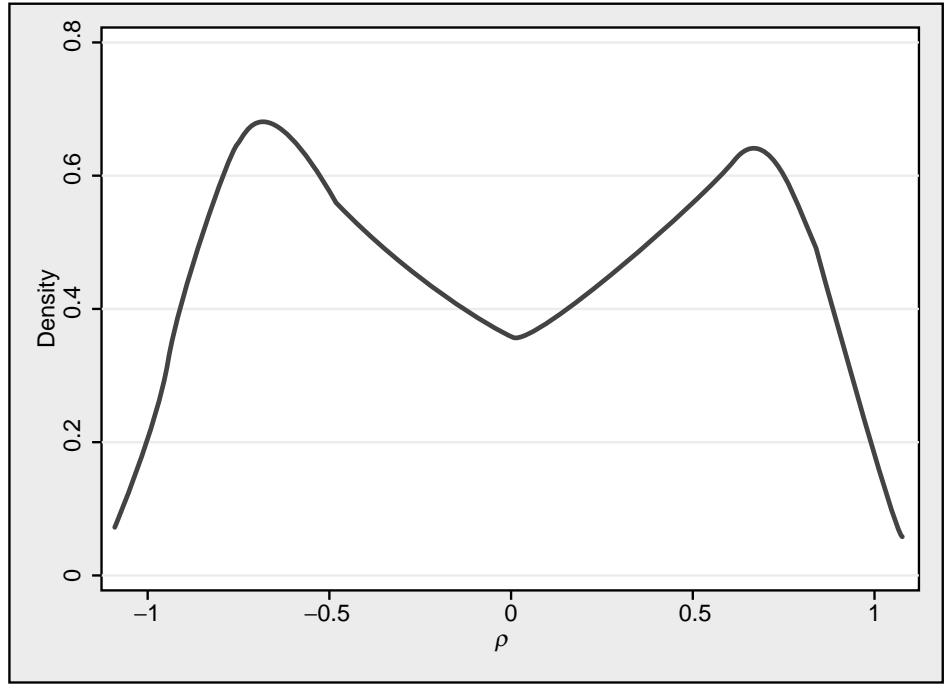  
Figure 3.1 Posterior density for $\rho$ ; bivariate normal model with missing data.

density $p(y|x_{\mathrm{new}}, \mu_y, \mu_x, \rho, \sigma_y, \sigma_x)$ is a univariate normal with mean $\mu_y + \rho \sigma_y(x_{\mathrm{new}} - \mu_x) / \sigma_x$ and variance $\sigma_y^2 (1 - \rho^2)$ .

Suppose, following Wong et al. (1985), dissolution testing is used to measure the active ingredient in a pharmaceutical product at times 1 and 2 (denoted by $x$ and $y$ ), where observations of both $y$ and $x$ are obtained for a small sample only. Quality testing requires that at time 2 the cumulative release of $y$ exceeds $\tau_y = 1500$ with probability $\delta = 0.99$ . If $x$ and $y$ are highly correlated, it is possible to avoid taking a full sample of repeated measurements $y$ at time 2 by using the complete first-wave data $x$ , and the sample data to model the association of $x$ and $y$ . From these data a threshold $\tau_x$ can be estimated which is expected to lead to $y_{\mathrm{new}}$ exceeding $\tau_y$ with high probability.

Samples of 10 measures of $y$ and $x$ are obtained at both times 1 and 2 (i.e. $n = 20$ ), giving $\overline{x} = 1256$ , $\overline{y} = 1969$ , $s_x = 133$ , $s_y = 177$ , and $r = 0.975$ . To obtain posterior estimates of the BVN parameters using these sufficient statistics, a conjugate joint prior is assumed, namely

$$
\Sigma^ {- 1} \sim W [ B _ {0}, v _ {0} ],
$$

with scale $B_0$ and $\nu_0$ degrees of freedom, and a BVN prior on $\mu_x$ and $\mu_y$ given $\Sigma$ ,

$$
N _ {2} \left(\mu_ {0}, \Sigma / \kappa_ {0}\right).
$$

Here $\mu_0$ is a vector of assumed prior means $\mu_{Y0}$ and $\mu_{X0}$ , and $\kappa_0$ is a measure of the quantity of prior certainty regarding these means. For comparability with Wong et al., $B_0$ is taken as a null matrix, and $\nu_0 = \kappa_0 = 0$ .

One may define a range of new values $x_{\mathrm{new}}$ and assess the breakpoint $\tau_x$ at which $y_{\mathrm{new}}$ exceeds $\tau_y$ with 99% certainty. With MCMC sampling in BUGS, the step() function is used to test whether $y_{\mathrm{new}}$ exceeds $\tau_y = 1500$ , given $x_{\mathrm{new}}$ and the current estimates of the BVN parameters. These tests are accumulated in the vector ExcTh[]. An initial run with nine values of $x_{\mathrm{new}}$ at intervals of 25 between 900 and 1100 inclusive narrows the likely range to between 975 and 1025. A second run then takes values of $x_{\mathrm{new}}$ at intervals of 5 between 975 and 1025. This yields a range of values from 96.7 to 99.8% of samples of $y_{\mathrm{new}}$ exceeding the threshold of 1500, with the threshold of 99% occurring between $x_{\mathrm{new}} = 995$ and $x_{\mathrm{new}} = 1000$ .

# 3.9 APPLICATIONS OF STANDARD DENSITIES: CLASSIFICATION RULES

Often it is necessary to determine whether a characteristic or condition $D$ exists in a subject on the basis of a binary screening procedure. The aim is to classify observed subjects into one or more categories of $D$ and establish a decision rule so that future subjects can be classified correctly; see, for example, Myles et al. (2003), Branscum et al. (2005) and Chen et al. (2005). Assume the characteristic is binary (e.g. does a person have a disease or not), with outcomes $D = 1$ and $D = 0$ , with the test result denoted by $T = 1$ or 0, where a positive result ( $T = 1$ ) indicates, usually with uncertainty, that the characteristic is present.

Let $\operatorname{Pr}(D = 1) = \pi$ denote the probability that an individual drawn at random from the population has the characteristic. For example, in epidemiology this would be known as the prevalence of the disease in the population. Then $\operatorname{Pr}(T = 1|D = 1) = \eta$ is the sensitivity of the test, namely the probability that the test will give a positive result given that the condition is present, and $\operatorname{Pr}(T = 1|D = 1)\operatorname{Pr}(D = 1) = \eta \pi$ is the joint probability of having the condition and being identified as such by a particular screening tool. Of interest also is the probability that the test correctly identifies that an individual is disease free. So given an individual is disease free, $\operatorname{Pr}(T = 0|D = 0) = \theta$ is the specificity - the probability that the test will say that the individual is disease free. The classification $(T = 1|D = 0)$ results in a false positive. The joint probability of a false positive and being disease free is then $\operatorname{Pr}(T = 1|D = 0)\operatorname{Pr}(D = 0) = (1 - \theta)(1 - \pi)$ .

Identification of the parameters $\{\pi, \theta, \eta\}$ is not possible when there is a possibility of classification error (i.e. when $\eta$ and/or $\theta$ are not 1), without informative priors or repeated tests for the same disease (Walter and Irwig, 1988). For n subjects and a single test, the number $n_1$ of subjects testing positive is

$$
n _ {1} | \eta , \theta , \pi \sim \operatorname {B i n} [ n, \pi \eta + (1 - \pi) (1 - \theta) ].
$$

Conversely, given that a test says an individual is diseased, the probability that the individual is actually diseased is $\operatorname*{Pr}(D = 1|T = 1) = \pi \eta / [\pi \eta + (1 - \theta)(1 - \pi)] = \psi$ , or the predictive value of a positive test, PVP. $\operatorname*{Pr}(D = 0|T = 0) = \Lambda$ is similarly the predictive value of a negative test (PVN). Thus Gastwirth et al. (1991) consider screening of donated blood for HIV (i.e. for antibodies to the HIV virus), where $1 - \Lambda$ is the probability that an individual classed as HIV free is in fact donating infected blood.

In the absence of a gold standard test, identification of $\pi$ , $\eta$ and $\theta$ requires additional information (e.g. from the joint accuracy of several tests or from informative priors regarding

prevalence and test performance). Following Dendukuri and Joseph (2001), informative priors are needed on at least as many parameters as are needed to be constrained when using the frequentist approach to ensure identification. For two tests, one may arrange the decisions according to a two-way table with $n_{11}$ denoting the number of patients classified as positive under both tests, $n_{10}$ as the number classified positive under test 1 but negative under test 2, $n_{01}$ as the number positive under test 2 but negative under test 1 and $n_{00}$ as the number negative under both tests. Among the $n_{11}$ patients positive under both tests, a certain unknown number $y_{11}$ will be true positives ( $T_1 = 1$ , $T_2 = 1$ given $D = 1$ ) and the remainder will be disease free. The total probability of the screening results ( $T_1 = 1$ , $T_2 = 1$ ) is

$$
\Pr (T _ {1} = 1, T _ {2} = 1) = \Pr (T _ {1} = 1, T _ {2} = 1 | D = 1) \Pr (D = 1) +
$$

$$
\Pr (T _ {1} = 1, T _ {2} = 1 | D = 0) \Pr (D = 0).
$$

Assuming the two tests are conditionally independent given disease status, this probability can be written as

$$
\begin{array}{l} \Pr (T _ {1} = 1, T _ {2} = 1) = \Pr (T _ {1} = 1 | D = 1) \Pr (T _ {2} = 1 | D) \Pr (D = 1) + \\ \Pr (T _ {1} = 1 \mid D = 0) \Pr (T _ {2} = 1 \mid D = 0) \Pr (D = 0) \\ = \eta_ {1} \eta_ {2} \pi + (1 - \theta_ {1}) (1 - \theta_ {2}) (1 - \pi). \\ \end{array}
$$

Hence the number of true positives $y_{11}$ is binomial among a total of $n_{11}$ with probability

$$
\pi \eta_ {1} \eta_ {2} / \left[ \pi \eta_ {1} \eta_ {2} + (1 - \pi) (1 - \theta_ {1}) (1 - \theta_ {2}) \right]. \tag {3.7.1}
$$

The total probability of being classified as positive under test 1 but negative under test 2 is

$$
\begin{array}{l} \Pr (T _ {1} = 1, T _ {2} = 0) = \Pr (T _ {1} = 1, T _ {2} = 0 | D = 1) \Pr (D = 1) + \\ \Pr (T _ {1} = 1, T _ {2} = 0 | D = 0) \Pr (D = 0). \\ \end{array}
$$

Under conditional independence this is

$$
\begin{array}{l} \Pr (T _ {1} = 1, T _ {2} = 0) = \Pr (T _ {1} = 1 | D = 1) \Pr (T _ {2} = 0 | D = 1) \Pr (D = 1) + \\ \Pr (T _ {1} = 1 | D = 0) \Pr (T _ {2} = 0 | D = 0) \Pr (D = 0) \\ = \pi \eta_ {1} (1 - \eta_ {2}) + (1 - \pi) (1 - \theta_ {1}) \theta_ {2}. \\ \end{array}
$$

Hence true positives $y_{10}$ among the set of $n_{10}$ patients are binomial with probability

$$
\pi \eta_ {1} (1 - \eta_ {2}) / \left[ \pi \eta_ {1} (1 - \eta_ {2}) + (1 - \pi) (1 - \theta_ {1}) \theta_ {2} \right]. \tag {3.7.2}
$$

Similarly true positives $y_{01}$ among the $n_{01}$ cell total are binomial with probability

$$
\pi \eta_ {2} (1 - \eta_ {1}) / \left[ \pi \eta_ {2} (1 - \eta_ {1}) + (1 - \pi) (1 - \theta_ {2}) \theta_ {1} \right]. \tag {3.7.3}
$$

Table 3.3 Costs under loss function   

<table><tr><td rowspan="2">Rule</td><td colspan="2">Condition</td></tr><tr><td>Present (D=1)</td><td>Absent (D=0)</td></tr><tr><td>Positive (R=1)</td><td>L11</td><td>L10</td></tr><tr><td>Negative (R=0)</td><td>L01</td><td>L00</td></tr></table>

while true positives $y_{00}$ among the $n_{00}$ cell total are binomial with probability

$$
\pi \left(1 - \eta_ {1}\right) \left(1 - \eta_ {2}\right) / \left[ \pi \left(1 - \eta_ {1}\right) \left(1 - \eta_ {2}\right) + (1 - \pi) \theta_ {1} \theta_ {2} \right]. \tag {3.7.4}
$$

Dendukuri and Joseph (2001) model conditional dependence by introducing test covariances $\rho_{1}$ and $\rho_{0}$ among the diseased and non-diseased subjects (this provides the correlated tests, one population scenario). The above four binomial probabilities become

$$
\pi \left(\eta_ {1} \eta_ {2} + \rho_ {1}\right) / \left[ \pi \left(\eta_ {1} \eta_ {2} + \rho_ {1}\right) + (1 - \pi) \left\{\left(1 - \theta_ {1}\right) \left(1 - \theta_ {2}\right) + \rho_ {0} \right\} \right], \tag {3.8.1}
$$

$$
\pi \left(\eta_ {1} \left\{1 - \eta_ {2} \right\} - \rho_ {1}\right) / \left[ \pi \left(\eta_ {1} \left\{1 - \eta_ {2} \right\} - \rho_ {1}\right) + (1 - \pi) \left\{\left(1 - \theta_ {1}\right) \theta_ {2} - \rho_ {0} \right\} \right], \tag {3.8.2}
$$

$$
\pi \left(\left\{1 - \eta_ {1} \right\} \eta_ {2} - \rho_ {1}\right) / \left[ \pi \left(\left\{1 - \eta_ {1} \right\} \eta_ {2} - \rho_ {1}\right) + (1 - \pi) \left\{\theta_ {1} \left(1 - \theta_ {2}\right) - \rho_ {0} \right\} \right] \tag {3.8.3}
$$

and

$$
\pi \left(\left\{1 - \eta_ {1} \right\} \left\{1 - \eta_ {2} \right\} + \rho_ {1}\right) / \left[ \pi \left(\left\{1 - \eta_ {1} \right\} \left\{1 - \eta_ {2} \right\} + \rho_ {1}\right) + (1 - \pi) \left\{\theta_ {1} \theta_ {2} + \rho_ {0} \right\} \right]. \tag {3.8.4}
$$

If interest is confined to positive covariances, one obtains the following constraints:

$$
0 \leq \rho_ {1} \leq \min  (\eta_ {1}, \eta_ {2}) - \eta_ {1} \eta_ {2},
$$

$$
0 \leq \rho_ {0} \leq \min  (\theta_ {1}, \theta_ {2}) - \theta_ {1} \theta_ {2}.
$$

Geisser (1993) also considers a situation with two tests in the context of developing decision rules that incorporate information (Table 3.3) regarding costs consequent on the four possible combinations of the rule and condition (e.g. in terms of costs of incorrect treatments following mistaken diagnosis). The rule is based on the outcomes $T_{1}$ and $T_{2}$ of two tests as described below. Extraneous information on prevalence is also assumed available.

Let $\eta_{11}$ be the probability $\operatorname{Pr}(T_1 = 1, T_2 = 1|D = 1)$ , namely the joint sensitivity of the tests. $\eta_{10}$ and $\eta_{01}$ are the probabilities that the first test alone and the second test alone are positive when the disease is actually present, while $\eta_{00}$ is the chance $\operatorname{Pr}(T_1 = 0, T_2 = 0|D = 1)$ that neither test detects the condition when it is present. Hence $\eta_{11} + \eta_{10} + \eta_{01} + \eta_{00} = 1$ . When the condition is absent, $\theta_{00}$ denotes the probability, $\operatorname{Pr}(T_1 = 0, T_2 = 0|D = 0)$ , that both tests yield a negative. Analogous notation follows where either one or both tests register the condition as present when it is not (i.e. give a false positive), with $\theta_{11}$ denoting the probability that both tests yield a false positive. Thus $\theta_{00} + \theta_{01} + \theta_{10} + \theta_{11} = 1$ (see Table 3.4).

Four possible decision rules, $R_{1}, \ldots, R_{4}$ , may be developed with regard to deciding whether $D$ is present on the basis of the two test results. Under rules $R_{1}, \ldots, R_{4}$ , $D$ is assumed present if

Table 3.4 Conditional probabilities for outcomes of two tests   

<table><tr><td rowspan="3">First test</td><td colspan="4">Second test</td></tr><tr><td colspan="2">Disease present (D = 1)</td><td colspan="2">Disease absent (D = 0)</td></tr><tr><td>Positive, T2 = 1</td><td>Negative, T2 = 0</td><td>Positive, T2 = 1</td><td>Negative, T2 = 0</td></tr><tr><td>Positive, T1 = 1</td><td>η11</td><td>η10</td><td>θ11</td><td>θ10</td></tr><tr><td>Negative, T1 = 0</td><td>η01</td><td>η00</td><td>θ01</td><td>θ00</td></tr></table>

$R_{1}$ : test 1 is positive, regardless of test 2 ( decision uses $T_{1}$ only)   
$R_{2}$ : test 2 is positive, regardless of test 1 (decision uses $T_{2}$ only)   
$R_{3}$ : both tests 1 and 2 are positive $(T_{1}\cap T_{2})$ (decision needs both positive)   
$R_4$ : either test 1 or 2 is positive ( $T_1 \cup T_2$ ) (decision needs one or other positive, or both).

The respective sensitivities and specificities under these rules, denoted as $S_{i}$ and $C_i$ ( $i = 1, \ldots, 4$ ), are then

<table><tr><td>Rule</td><td>Si</td><td>Ci</td></tr><tr><td>R1</td><td>Pr(R=1|D=1)=η11+η10</td><td>Pr(R=0|D=0)=θ00+θ01</td></tr><tr><td>R2</td><td>Pr(R=1|D=1)=η11+η01</td><td>Pr(R=0|D=0)=θ00+θ10</td></tr><tr><td>R3</td><td>Pr(R=1|D=1)=η11</td><td>Pr(R=0|D=0)=θ00+θ01+θ10</td></tr><tr><td>R4</td><td>Pr(R=1|D=1)=η11+η10+η01</td><td>Pr(R=0|D=0)=θ00</td></tr></table>

Let $A_{i}$ denote the administrative costs of each test administered separately ( $i = 1, 2$ ) and $A_{12}$ the cost of administering both. The total losses incurred given rule $R_{i}$ are then

$$
\pi S _ {i} \left(L _ {1 1} - L _ {0 1}\right) + (1 - \pi) C _ {i} \left(L _ {0 0} - L _ {1 0}\right) + \pi L _ {0 1} + (1 - \pi) L _ {1 0},
$$

so total costs consist of these losses plus administrative costs.

Example 3.11 Two tests for detecting AIDS antibodies Two commercial preparations were applied in tests of serum specimens to detect antibodies to the AIDS virus by Burkhardt et al. (1987) in a Canadian study. To evaluate costs as above requires information on the joint accuracy of the tests and on prevalence $\pi$ , namely the contemporary proportion of contaminated samples in Canadian blood donations available for transfusion. A survey by Nusbacher and Chiavetta (1986) found 14 out of 94 496 blood samples positive by the Western blot test. As to joint accuracy, Burkhardt et al. (1987) cite data (for known disease status) for two serum tests, ELISA-A and ELISA-D (Table 3.5).

The condition being tested for here, and its converse, are respectively $D = 1$ (blood contaminated) and $D = 0$ (blood safe). The largest loss ( $L01 = \$ 100000 \)) is for a false negative ( $T = 0|D = 1$ ), resulting in an individual having a transfusion of contaminated blood. The costs of a false positive (finding a sample to be contaminated when it is actually pure) are set at $L10 = \\(25$ . The other outcomes are assigned cost zero. Administrative costs are set at $A_{1} = A_{2} = 1$ and $A_{12} = 2$ .

Table 3.5 Serum test results   

<table><tr><td rowspan="3">First test</td><td colspan="4">Second test</td></tr><tr><td colspan="2">Condition present (D = 1)</td><td colspan="2">Condition absent (D = 0)</td></tr><tr><td>Positive, T2 = 1</td><td>Negative, T2 = 0</td><td>Positive, T2 = 1</td><td>Negative, T2 = 0</td></tr><tr><td>Positive, T1 = 1</td><td>92</td><td>0</td><td>8</td><td>9</td></tr><tr><td>Negative, T1 = 0</td><td>1</td><td>0</td><td>23</td><td>370</td></tr></table>

One seeks to assign costs to the above four rules, given the sample data in Table 3.5 and the loss costings. Given the relatively small sample in Table 3.5 the costs are expected to be imprecisely estimated. The two sets of probabilities $(\eta_{11}, \eta_{10}, \eta_{01}, \eta_{00})$ and $(\theta_{00}, \theta_{01}, \theta_{10}, \theta_{11})$ are assigned Dirichlet priors with total 'prior sample' size of 5 as follows:

$$
\left(\eta_ {1 1}, \eta_ {1 0}, \eta_ {0 1}, \eta_ {0 0}\right) \sim \operatorname {D i r} (3. 9, 0. 5, 0. 5, 0. 1),
$$

$$
\left(\theta_ {0 0}, \theta_ {0 1}, \theta_ {1 0}, \theta_ {1 1}\right) \sim \operatorname {D i r} (3. 9, 0. 5, 0. 5, 0. 1).
$$

These priors are relatively weak but do incorporate a belief that simultaneous correct screening results are more likely than incorrect results. A Be(1, 1) prior is assumed for the prevalence.

Estimates of the detection rates with two tests combined and costs of the four procedures are obtained from the second half of a two-chain run of 10 000 iterations (Table 3.6). The costs are conditional on the prevalence data and the relatively small samples involved in the ELISA tests results, and so exhibit wide variability. Relying on test 2 alone (rule R2) seems to be slightly preferred, this being mainly the consequence of test 1 recording one false negative, though test 2 has considerably more false positives (hence lower specificity). Moreover the rule based only on the second test has the lowest positive predictive value.

Example 3.12 Testing for strongyloides infection with no gold standard Joseph et al. (1995) and Dendukuri and Joseph (2001) consider the problem of using the results of one or more diagnostic tests to make inferences about test accuracy and prevalence in a situation where there is no gold standard diagnosis. They present results of stool and serologic tests of strongyloides infection on 162 Cambodian refugees to Canada between July 1982 and February 1983. The sample prevalence using the stool test is around $25\%$ (40 out of 162), while from serology alone it is considerably higher at $77\%$ . It is desired to estimate the sensitivity $(\eta)$ , specificity $\hat{\theta}$ and population prevalence $(\pi)$ from the results of each test separately, or from both test results combined.

In this situation, drawing useful inferences may require substantive prior information on these parameters to be introduced. There is in fact substantial accumulated knowledge about these two parasitological tests, in terms of their estimation of prevalence and their accuracy. Stool examination is known to understate population prevalence, and has lower sensitivity than serology, but to yield high specificity (over $90\%$ ). Serology results in overestimation of prevalence but has accordingly higher sensitivity.

Joseph et al. (1995) elicited priors on the accuracy parameters in terms of $95\%$ probability intervals and converted these to beta densities, here denoted by $\eta_j \sim \mathrm{Beta}(s_j, t_j)$ , $\theta_j \sim \mathrm{Beta}(c_j, d_j)$ of the two tests, $j = 1, 2$ . This prior information is presented together with observed test

Table 3.6 Costs, PVP, sensitivity and specificity by rule   

<table><tr><td></td><td>Mean</td><td>St devn</td><td>2.5%</td><td>97.5%</td></tr><tr><td>Cost(R1)</td><td>4.90</td><td>2.23</td><td>2.38</td><td>10.69</td></tr><tr><td>Cost(R2)</td><td>4.11</td><td>1.37</td><td>2.72</td><td>7.90</td></tr><tr><td>Cost(R3)</td><td>6.15</td><td>2.57</td><td>3.09</td><td>12.84</td></tr><tr><td>Cost(R4)</td><td>4.86</td><td>0.65</td><td>4.05</td><td>6.35</td></tr><tr><td>PVP[1]</td><td>0.0032</td><td>0.0011</td><td>0.0015</td><td>0.0057</td></tr><tr><td>PVP[2]</td><td>0.0019</td><td>0.0006</td><td>0.0010</td><td>0.0032</td></tr><tr><td>PVP[3]</td><td>0.0059</td><td>0.0024</td><td>0.0025</td><td>0.0117</td></tr><tr><td>PVP[4]</td><td>0.0015</td><td>0.0004</td><td>0.0008</td><td>0.0025</td></tr><tr><td>S1</td><td>0.984</td><td>0.013</td><td>0.951</td><td>0.999</td></tr><tr><td>S2</td><td>0.994</td><td>0.008</td><td>0.972</td><td>1.000</td></tr><tr><td>S3</td><td>0.978</td><td>0.015</td><td>0.942</td><td>0.997</td></tr><tr><td>S4</td><td>0.999</td><td>0.003</td><td>0.990</td><td>1.000</td></tr><tr><td>π</td><td>0.000159</td><td>0.000041</td><td>0.000089</td><td>0.000247</td></tr><tr><td>C1</td><td>0.948</td><td>0.011</td><td>0.925</td><td>0.968</td></tr><tr><td>C2</td><td>0.915</td><td>0.014</td><td>0.887</td><td>0.940</td></tr><tr><td>C3</td><td>0.971</td><td>0.008</td><td>0.953</td><td>0.985</td></tr><tr><td>C4</td><td>0.892</td><td>0.015</td><td>0.861</td><td>0.920</td></tr></table>

result counts $\{n_{11}, n_{01}, n_{10}, n_{00}\}$ in Table 3.7. A uniform prior is used for the unknown prevalence $\pi \sim \mathrm{Beta}(1,1)$ of the disease in the refugee population.

For a single test (say the first test, serology), let $y_{1}$ and $y_{0}$ be the unobserved numbers of true positives and false negatives among the totals with positive and negative test results, respectively, $n_{1} = n_{11} + n_{10} = 125$ and $n_{0} = n_{01} + n_{00} = 37$ . So, for example, $n_{0} - y_{0}$ is then

Table 3.7 Results for two tests of strongyloides infection and priors on diagnostic accuracy   

<table><tr><td rowspan="2">Data</td><td colspan="2">Stool test</td><td rowspan="2" colspan="2">Total</td></tr><tr><td>T2=1</td><td>T2=0</td></tr><tr><td>Serology</td><td></td><td></td><td></td><td></td></tr><tr><td>T1=1</td><td>38</td><td>87</td><td>125</td><td></td></tr><tr><td>T1=0</td><td>2</td><td>35</td><td>37</td><td></td></tr><tr><td>Total</td><td>40</td><td>122</td><td>162</td><td></td></tr><tr><td>Elicited priors</td><td colspan="2">Serology</td><td colspan="2">Stool</td></tr><tr><td></td><td>2.5%</td><td>97.5%</td><td>2.5%</td><td>97.5%</td></tr><tr><td>Sensitivity (%)</td><td>65</td><td>95</td><td>5</td><td>45</td></tr><tr><td>Specificity (%)</td><td>35</td><td>100</td><td>90</td><td>100</td></tr><tr><td>Beta parameters</td><td></td><td></td><td></td><td></td></tr><tr><td>Sensitivity (s, t)</td><td colspan="2">(22, 5.5)</td><td colspan="2">(4.4, 13.3)</td></tr><tr><td>Specificity (c, d)</td><td colspan="2">(4.1, 1.8)</td><td colspan="2">(71.2, 3.8)</td></tr></table>

Table 3.8 Screening parameters and prevalence   

<table><tr><td></td><td>Mean</td><td>St devn</td><td>2.5%</td><td>97.5%</td></tr><tr><td colspan="5">Serology only</td></tr><tr><td>θ</td><td>0.61</td><td>0.20</td><td>0.24</td><td>0.95</td></tr><tr><td>η</td><td>0.83</td><td>0.05</td><td>0.74</td><td>0.93</td></tr><tr><td>y1</td><td>108.9</td><td>22.4</td><td>38</td><td>125</td></tr><tr><td>y0</td><td>21.6</td><td>9.0</td><td>4</td><td>36</td></tr><tr><td>π</td><td>0.80</td><td>0.18</td><td>0.29</td><td>0.99</td></tr><tr><td colspan="5">Both tests</td></tr><tr><td>θ1</td><td>0.64</td><td>0.18</td><td>0.29</td><td>0.95</td></tr><tr><td>θ2</td><td>0.95</td><td>0.02</td><td>0.89</td><td>0.99</td></tr><tr><td>η1</td><td>0.84</td><td>0.05</td><td>0.74</td><td>0.93</td></tr><tr><td>η2</td><td>0.29</td><td>0.05</td><td>0.21</td><td>0.41</td></tr><tr><td>π</td><td>0.82</td><td>0.12</td><td>0.53</td><td>0.99</td></tr><tr><td>ρ</td><td>0.016</td><td>0.014</td><td>0.001</td><td>0.052</td></tr><tr><td>ρ1</td><td>0.028</td><td>0.014</td><td>0.003</td><td>0.058</td></tr></table>

the number of true negatives, namely correctly identified patients with a negative diagnosis. From above, the total probability of being identified by a single test as positive is $\pi \eta + (1 - \pi)(1 - \theta)$ , so $y_{1}$ is binomial from $n_{1}$ total positives with probability (the PVP)

$$
\pi \eta / \{\pi \eta + (1 - \pi) (1 - \theta) \}.
$$

The total probability of being identified negative is $\operatorname{Pr}(D = 1) \operatorname{Pr}(T = 0 | D = 1) + \operatorname{Pr}(D = 0) \operatorname{Pr}(T = 0 | D = 0) = \pi (1 - \eta) + (1 - \pi) \theta$ , so $y_0$ is binomial among $n_0$ total negatives with probability

$$
\pi (1 - \eta) / \{\pi (1 - \eta) + (1 - \pi) \theta \}.
$$

Given sampled values $y_{1}$ and $y_{0}$ at a given MCMC iteration the prevalence then has an updated full conditional density

$$
\pi \sim \operatorname {B e t a} \left(y _ {1} + y _ {0} + 1, n _ {1} + n _ {0} - y _ {1} - y _ {0} + 1\right),
$$

the sensitivity has an updated density

$$
\eta \sim \operatorname {B e t a} (y _ {1} + s, y _ {0} + t)
$$

and the specificity an updated density

$$
\theta \sim \operatorname {B e t a} \left(n _ {0} - y _ {0} + c, n _ {1} - y _ {1} + d\right).
$$

Estimates are obtained from the second half of a two-chain run of 20 000 iterations using only the serology test results and the prior beta densities in Table 3.7. The results reflect the higher prevalence obtained by using serology results (Table 3.8, top panel). Closely comparable results are obtained by Joseph et al. (1995).

To make use of results from both tests, the correlated tests model is used with the priors adopted by Dendukuri and Joseph (2001); the relevant binomial probabilities are as in

(3.8.1)-(3.8.4). Results are strongly influenced by the priors with prevalence still predominantly determined by the serology test data. The posterior density of $\rho_0$ indicates a high probability of a zero value, whereas that for $\rho_{1}$ is bounded away from zero.

# 3.10 APPLICATIONS OF STANDARD DENSITIES: MULTIVARIATE DISCRIMINATION

Classification and decision rule problems also occur with multiple metric indicators of an underlying condition or a mix of metric and discrete indicators. In the typical discrimination problem, data are collected on several variables of known relevance to the classification and combined to provide the likelihood that a patient, specimen or exhibit be assigned to a particular diagnostic class, or natural subpopulation such as a plant species. Parameters are estimated from retrospective samples (sometimes called training samples) of observations on $y_{i} = (y_{i1}, y_{i2}, \ldots, y_{iq})$ from each of the diagnostic classes. The goal is to identify an allocation rule from the fully observed retrospective data $\{y, G\}$ to predict classifications $G_{\mathrm{new}}$ in a test or validation dataset, on the basis of observed $y_{\mathrm{new}}$ (Brown et al., 1999; Buck et al., 1996; Lavine and West, 1992).

Under a normal discrimination approach, observations $\{y_{ik}, k = 1, \dots, q\}$ are typically taken to be exchangeably distributed as a mixture of $C$ MVN populations with indicators $\{G_i \in 1, \dots, C\}$ , prior probabilities $\operatorname*{Pr}(G_i = j) = \pi_j$ , $q$ -vector means $\mu_j$ and covariances $\Sigma_j$ . If the population class $G_i = j$ is known for the $i$ th subject then

$$
y _ {i} | G _ {i} = j \sim N _ {q} (\mu_ {j}, \Sigma_ {j}).
$$

Extensions to mixtures of Student $t$ densities (allowing heavy tails) or of densities allowing for skew are possible. Both these extensions and the usual mixture of MVNs may include categorical indicators if augmented data sampling for binary and ordinal outcomes is applied (Albert and Chib, 1993). Dellaportas (1998) uses truncated normal sampling for a mix of two metric variables and three binary variables to construct a $N_{5}$ metric variable density in an archaeological provenancing study involving a mixture of $C = 2$ subpopulations.

In the typical normal discrimination application, let $\Sigma_j^{-1} \sim W(B_{0j}, \nu_{0j})$ for the precision matrices of population $j$ , with conditional prior for $\mu_j$ , then $q$ -variate normal

$$
\mu_ {j} \sim N _ {q} (m _ {0 j}, \Sigma_ {j} / h _ {0 j}).
$$

Suppose $n_j$ subjects are allocated to population $j$ (i.e. have classifier $G_i = j$ ). The posterior for $\mu_j$ is $\mu_j | \Sigma_j, y \sim N_q(m_j, \Sigma_j / h_j)$ with $m_j = (h_{0j}m_{0j} + n_j\overline{y}) / h_j$ , where $\overline{y}_j$ is the vector of means for subjects in population $j$ , and $h_j = h_{0j} + n_j$ . The posterior for $\Sigma_j$ is Wishart with degrees of freedom $\nu_j = \nu_{0j} + n_j$ and scale matrix

$$
B _ {j} = B _ {0 j} + S _ {j} + (\overline {{y}} _ {j} - m _ {j}) (\overline {{y}} _ {j} - m _ {j}) ^ {\prime} n _ {j} h _ {0 j} / h _ {j},
$$

where $S_{j}$ are the matrices of observed sums of cross-products in subpopulation $j$

$$
S _ {j} = \Sigma (y _ {j} - \overline {{y}} _ {j}) (y _ {j} - \overline {{y}} _ {j}) ^ {\prime}.
$$

A Dirichlet prior is used for the allocation probabilities $\pi_{j}$ . The probabilities that $G_{\mathrm{new}} = j$ for the test sample $i = 1, \ldots, N_{\mathrm{new}}$ with data $y_{\mathrm{new}}$ are obtained as

$$
\Pr (G _ {\text {n e w}} = j | y, G, y _ {\text {n e w}}) \propto P (y _ {\text {n e w}} | y, G, G _ {\text {n e w}} = j) \Pr (G _ {\text {n e w}} = j | y, G),
$$

where $\{y,G\}$ are the training sample data (Lavine and West, 1992, p. 455).

For logistic discrimination with $C = 2$ , the focus is on the ratio of likelihoods $\log[\operatorname{Pr}(G = 1|y) / \operatorname{Pr}(G = 2|y)]$ rather than the full distributional form of the attributes $y$ within each subpopulation, giving more flexibility in dealing with a mixture of categorical and metric indicators (Press and Wilson, 1978). For Bayesian inference under this model, see for example, Fearn et al. (1999) and Yeung et al. (2005). If the populations occur at a ratio $\rho = \pi_1 / \pi_2$ , the logistic model is

$$
\Pr (G = 1 | y) = 1 - \Pr (G = 2 | y) = \exp \left[ \log \rho + \beta y \right] / \left(1 + \exp \left[ \log \rho + \beta y \right]\right),
$$

with the logit of $\operatorname{Pr}(G = 1|y)$ given by $\beta y + \log \rho$ . For classification purposes a cut-point other than zero can be used to achieve different sensitivities (Phillips et al., 1990). For $C > 2$ this generalises to a multiple logistic where

$$
\log [ \Pr (G = j | y) / \Pr (G = k | y) ] = (\beta_ {j} - \beta_ {k}) y + \log (\pi_ {j} / \pi_ {k}),
$$

where $\pi_{j}$ are prior proportions, and with $\beta_{C} = 0$ for identification.

Different sampling schemes may be envisaged as generating the $\{y, G\}$ . The first is sampling conditional on $y$ , which might occur in a drugs trial with a set regime of dosages $y$ . The second is known as mixture or joint sampling of $y$ and $G$ , with the sampled $y$ viewed as resulting from the joint interaction of $G$ and $y$ . The third scheme conditions on the response $G$ as when cases and controls are observed and the exposure $y$ then obtained.

The accuracy of the predicted classification in a new subject may be affected both by the mix of marker variables $y$ and by the form of the predictor in the logit model. Thus for $C = 2$ the usual relation is

$$
p _ {1} (y) = \exp (\log \rho + \beta y) p _ {2} (y) = \exp (\log \rho + \beta y) [ 1 - p _ {1} (y) ],
$$

where $p_j(y) = \operatorname*{Pr}(G = j|y)$ . More general forms might consider

$$
p _ {1} (y) = g (y; \beta , \rho) [ 1 - p _ {1} (y) ],
$$

which prevent the allocation to classes being distorted by outlying population 1 cases that stray into the sample space of the population 2 cases and vice versa. Cox and Ferry (1991) propose two alternatives to $g(y; \beta, \rho) = \exp(\log \rho + \beta y)$ , namely

$$
g (y; \beta , \rho) = e ^ {W _ {1}} \left(e ^ {W _ {2}} + e ^ {\log \rho + \beta y}\right) / \left(1 + e ^ {W _ {3}} e ^ {\log \rho + \beta y}\right)
$$

and

$$
g (y; \beta , \rho) = \left(e ^ {W} + e ^ {\log \rho + \beta y}\right) / \left(1 + e ^ {W} e ^ {\log \rho + \beta y}\right).
$$

Thus the second alternative reduces to the logit link when $W \to -\infty$ .

Predictive accuracy as certain predictors $y$ are included or excluded may be assessed by out-of-sample validation to cases where $G$ is known (e.g. Bhattacharjee and Dunsmore, 1991) or by validation within the observed sample. Multicollinearity among the observed $y$ within a

discriminant function $\beta y$ may adversely affect correct predictions of $G_{\mathrm{new}}$ (Feinstein, 1996), so variable selection (see Chapter 4) becomes relevant.

Example 3.13 Lung cancer cytology Data from Feinstein (1996) are a subsample of 200 patients from a larger sample of 1266 from a study aimed to improve prognostic staging for primary lung cancer. Feinstein considers discriminant analysis to predict cell type for these patients ( $C = 4$ classes, namely well differentiated; small; anaplastic cell type and cytology only). There are respectively 83, 24, 19 and 74 patients in these groups. The indicators are age and sex ( $M = 1$ , $F = 0$ ), and five clinical variables relating to the cancer progress: TNM-STAGE = anatomic extent (5 ordinal ranks); SXSTAGE = symptom stage (4 ordinal ranks); PCTWTLOS = percent weight loss; HCT = hematocrit; and PROGIN = progression interval in months and tenths.

Feinstein (1996, pp. 469-470) reports on the apparently poor performance of discriminant analysis, assuming equal prior class probabilities of 0.25, namely 89 correct predictions (predicted matching actual class) out of 200; this scarcely improves on allocating all patients to the largest class, which would yield 83 out of 200 correct. Altering the prior class probabilities to the actual relative frequencies (0.415, 0.12, 0.095, 0.37) raises the correct prediction count to 102.

Here we consider the reduced problem of predicting well-differentiated cells $(z = 1; G = 1)$ from the rest $(z = 0; G = 2)$ with $n_1 = 83$ , and $n_2 = 117$ patients in the two groups, and initially retaining all seven predictors. An exponential prior is assumed on the ratio $\rho = \pi_1 / \pi_2$ . The correct classification rate is obtained by monitoring the matrix of allocations (correct vs predicted) at each iteration and averaging over all iterations (namely the last 4000 iterations of a two-chain run of 5000 iterations).

This leads to a correct prediction count of 136 out of 200 (using posterior medians of correct allocations), namely 56/83 correct predictions among the well differentiated and 80/117 among the remaining types. The predictor variables SXSTAGE and TNMSTAGE have well-defined effects but the remaining predictors have effects $\beta_{k}$ straddling zero. The $G^{2}$ statistic for a binary outcome can be used to compare models and has a posterior median of 49.5.

We then introduce the second of the robust logit formulations proposed by Cox and Ferry (1991) with an initial value for $W$ , based on a exploratory analysis, set at -1.5. This extra parameter improves the correct prediction count to 139/200, with a worse prediction rate among the well differentiated (44/83) but a higher correct total of 95/117 among the remainder. The median $G^2$ is reduced to 46.3. The effect of PROGIN is somewhat clarified also, with 95% interval (-0.01, 0.17).

# EXERCISES

1. In Example 3.1 find the Bayes factor for $H_0$ : $\mu = 125$ as against $H_1$ : $\mu \neq 125$ .

2. Generate 25 observations from an $N(0.4,1)$ density and use the following code to obtain the probability that the likelihood ratio is under 1 (i.e. the deviance is zero) when $H_0$ : $\mu = 0$ and the alternative hypothesis is general. The lines to obtain these probabilities need to be added. Following Aitkin et al. (2005) the code uses flat priors on the parameters.

How is inference affected if a just-proper prior is assumed for the precision, e.g. $1 / \sigma^2 \sim \mathrm{Ga}(1, 0.001)$ ?

```r
model {for (i in 1:n) {y[i] ~ dnorm(mu,tau)}  
LogL1 <- log(L1); LogL0 <- log(L0)  
log(L1) <- -0.5*tau*(n*pow(ybar-mu,2) + (n-1)*s2) - 0.5*n*log(6.2832) - n*log(sig)  
log(L0) <- -0.5*tau*(n*pow(ybar-mu,2) + (n-1)*s2) - 0.5*n*log(6.2832) - n*log(sig)  
mu ~ dflat(); logtau ~ dflat()  
tau <- exp(logtau); sig <- 1/sqrt(tau)  
ybar <- mean(y[]) ; sig2 <- 1/tau  
D <- -2*(LogL0-LogL1) 
```

3. In Example 3.2, assess sensitivity in inferences under the independent priors case with $\mu \sim N(0,1000)$ but the following priors on the precision: $\tau \sim U(0,100)$ and $\log (\tau)\sim N(0,1)$ .   
4. In Example 3.3 try the additive skew model

$$
y _ {i} = \mu + \delta u _ {i} + \sigma \varepsilon_ {i}
$$

where $u_{i}$ is truncated Student $t$ (positive values only) with unknown degrees of freedom, and $\varepsilon$ is also Student $t$ with the same df. Compare the estimated $\delta$ with that obtained taking $u_{i}$ and $\varepsilon_{i}$ to be normal.

5. In Example 3.3 apply the scale mixture version of the Student $t$ skewed error model (Fernandez and Steel, 1998, Section 5) to the share price data.   
6. In Example 3.5 introduce an extra parameter (uniform between 0 and 1) to downweight the historical data from Kaldor et al. (1990). What is the resulting mean odds ratio? This is a simple instance of a power prior as proposed by Ibrahim and Chen (2000).   
7. The male and female populations aged 25-44 in Canada in 1996 were 4 629 975 and 4 730 640 respectively, while suicide deaths were 1390 and 380. Use negative binomial sampling to obtain the male-to-female suicide mortality rates per 100 000 and the $95\%$ credible interval for the ratio (relative risk) of male-to-female rates. For example, using WINBUGS, the parameterisation of the negative binomial distribution $y \sim NB(\pi, \delta)$ is as the number of failures $y$ before reaching $\delta$ successes with $\pi$ as the success probability. The term $\left(\frac{\delta}{\mu + \delta}\right)$ in (3.5) is therefore equivalent to $\pi$ . In terms of coding for the suicide deaths exercise, one could use the code

model{for（i in 1:2）{y[i] $\sim$ dnegbin(p[i],del[i]) p[i] $<  -$ del[i]/(del[i] $^+$ mu[i]);mu[i] $<  -$ （pop[i]/100000)*nu[i]}

where coding for the relative risk and priors on $\mathsf{del}[i]$ and nu[i] is to be completed. Although $\delta$ is notionally an integer, it can be assigned a prior (e.g. gamma) for any continuous positive value.

8. Consider data on the weights of cork borings in four directions (north, east, south, west) for 28 trees in a block of plantations (see Exercise 3.8.odc). These data were used by Mardia

et al. (1979) to illustrate possible departures from multivariate normality. Apply a multivariate normal model to these data and then use a posterior predictive check comparing Mardia's multivariate skew and kurtosis criteria for the replications to the same criteria calculated for the observations themselves. Does this check confirm that the MVN is a plausible DGP?

9. Consider data on Leptograpsus crabs dataset as used by Ripley (1996) - see Exercise 3.9.0dc. The objective is to classify the sex of the crabs from $P = 5$ scalar anatomical observations. The training set contains $N_{1} = 80$ examples (40 of each sex) and the test set includes $N_{2} = 120$ examples. Using MVN discrimination gives correct classification rates (training and test samples respectively) of 93.4 and $94.3\%$ . Adapt the following code (where $G = 1$ for males, and 2 for females) to assess the benefit of multivariate Student $t$ classification with differing degrees of freedom between subpopulations (McLachlan and Peel, 1998).

```r
model { # N1 training cases, N2=N-N1 test cases in C populations  
for (i in 1:N) { G[i] ~ dcat(pi[1:C]); y[i,1:P] ~ dmnorm(mu[G[i],], Pr[G[i,..])}  
    v1[1:P,1:P] <- inverse(Pr[1,..]); v2[1:P,1:P] <- inverse (Pr[2,..])  
# log determinants of dispersion matrices  
D[1] <- logdet(v1[.,]); D[2] <- logdet(v2[.,]); pi[1:C] ~ ddirch(alph[1:C])  
# Priors:  
    for (i in 1:C) { mu[i,1:P] ~ dmnorm(mn[i,], Pr.mu[i,..]);  
    Pr[i,1:P,1:P] ~ dwish(R[i,..],P)  
    for (k in 1:P) { mn[i,k] <- 0; Pr.mu[i,k,k] <- 0.000001;  
    for (l in (k+1):P) { Pr.mu[i,l,k] <- 0; Pr.mu[i,k,l] <- 0.0}  
    for (k in 1:P) { R[i,k,k] <- 0.01; for(l in (k+1):P) { R[i,k,l] <- 0.005; R[i,l,k] <- 0.005} }  
# residual calculations  
    for (m in 1:C) { for (i in 1:N1) { for (j in 1:P) { res[m,i,j] <- y[i,j]-mu[m,j];  
    resPr[m,i,j] <- inprod(Pr[m,j,], res[m,i,])}  
    sumsq[m,i] <- inprod(res[m,i,], resPr[m,i,])}  
# posterior classification proofs  
    for (i in 1:N) { for (m in 1:C) { rankL[i,m] <- rank(logL[i,], m)  
    logL[i,m] <- log(pi[m]) + D[m] - 0.5*sumsq[m,i]}}  
    for (i in 1:N1) { SensTRAIN[i] <- equals(2, rankL[i,G[i]])}  
    for (i in N1+1:N) { SensTEST[i-N1] <- equals(2, rankL[i,G[i]])}  
    Sens[1] <- sum(SensTEST[]) / N2; Sens[2] <- sum(SensTRAIN[]) / N1} 
```

# REFERENCES

Adcock, C. (1987) A Bayesian approach to calculating sample sizes for multinomial sampling. The Statistician, 36, 155-159.

Agresti, A. and Hitchcock, D. (2005) Bayesian inference for categorical data analysis. Statistical Methods and Applications, 14, 297-330.   
Agresti, A. and Min, Y. (2005) Frequentist performance of Bayesian confidence intervals for comparing proportions in $2 \times 2$ contingency tables. Biometrics, 61, 515-523.   
Aitchison, J. and Dunsmore, I. (1975) Statistical Prediction Analysis. Cambridge University Press: Cambridge.   
Aitkin, M. (1997) The calibration of $P$ -values, posterior Bayes factors and the AIC from the posterior distribution of the likelihood. Statistics and Computing, 7, 253-261.   
Aitkin, M., Boys, R. and Chadwick, T. (2005) Bayesian point null hypothesis testing via the posterior likelihood ratio. Statistics and Computing, 15, 217-230.   
Albert, J. and Chib, S. (1993) Bayesian analysis of binary and polychotomous response data. Journal of the American Statistical Association, 88, 669-679.   
Albert, J. and Chib, S. (1995) Bayesian residual analysis for binary response regression models. Biometrika, 82, 747-759.   
Albert, J. and Gupta, A. (1982) Mixtures of Dirichlet distributions and estimation in contingency tables. Annals of Statistics, 10, 1261-1268.   
Andrews, D. and Mallows, C. (1974) Scale mixtures of normal distributions. Journal of the Royal Statistical Society, Series B, 36, 99-102.   
Ashby, D. (2001) Bayesian methods. In Biostatistics in Clinical Trials, Redmond, C. and Colton, T. (eds). John Wiley & Sons, Ltd/Inc.: New York.   
Ashby, D., Hutton, J. and McGee, M. (1993) Simple Bayesian analysis for case-control studies. The Statistician, 42, 385-397.   
Barnard, J., McCulloch, R. and Meng, X. (2000) Modeling covariance matrices in terms of standard deviations and correlations, with applications to shrinkage. Statistica Sinica, 10, 1281-1312.   
Bartholomew, D. (1996) The Statistical Approach to Social Measurement. Academic Press: New York.   
Bartlett, M.S. (1933). On the theory of statistical regression. Proceedings of the Royal Society of Edinburgh, 53, 260-283.   
Berger, J. (1985) Statistical Decision Theory and Bayesian Analysis (2nd edn). Springer-Verlag: New York.   
Bernardo, J. (1979) Reference posterior distributions for Bayesian inference. Journal of the Royal Statistical Society, Series B, 41, 113-147.   
Berry, D. (1996) Statistics: A Bayesian Perspective. Belmont, CA: Duxbury Press.   
Besag, J., Green, P., Higdon, D. and Mengersen, K. (1995) Bayesian computation and stochastic systems. Statistical Science, 10, 3-41.   
Bhattacharjee, S. and Dunsmore, I. (1991) The influence of variables in a logistic model. Biometrika, 78, 851-856.   
Bishop, Y., Fienberg, S. and Holland, P. (1975) Discrete Multivariate Analysis : Theory and Practice. MIT Press: London.   
Blyth, C. (1986) Approximate binomial confidence limits. Journal of the American Statistical Association, 81, 843-855.   
Branscum, A., Gardner, I. and Johnson, W. (2005) Estimation of diagnostic test sensitivity and specificity through Bayesian modeling. Preventive Veterinary Medicine, 68, 145-163.   
Bratcher, T. and Stamey, J. (2004) A note on Bayesian interval estimation for comparing two Poisson rates. The Mathematical Scientist, 29, 54-60.   
Brown, P., Le, N. and Zidek, J. (1994) Inference for a covariance matrix. In *Aspects of Uncertainty: A Tribute to D. V. Lindley*. Smith, A. and Freeman, P. (eds). John Wiley & Sons, Ltd/Inc.: Chichester, 77-92.   
Brown, P., Fearn, T. and Haque, M. (1999) Discrimination with many variables. Journal of the American Statistical Association, 94, 1320-1329.

Buck, C., Cavanagh, W. and Litton, C. (1996) The Bayesian Approach to Interpreting Archaeological Data. John Wiley & Sons, Ltd/Inc.: Chichester.   
Burkhardt, U., Mertens, T. and Eggers, H. (1987) Comparison of two commercially available anti-HIV ELISAs. Journal of Medical Virology, 23, 217-224.   
Carlin, B. and Louis, T. (2000) Bayes and Empirical Bayes Methods for Data Analysis (2nd edn). Chapman & Hall/CRC: Boca Raton, FL.   
Chaloner, K. (1994) Residual analysis and outliers in Bayesian hierarchical models. In *Aspects of Uncertainty*, Smith, A. and Freeman, P. (eds). John Wiley & Sons, Ltd/Inc.: Chichester.   
Chen, S., Watson, P. and Parmigiani, G. (2005) Accuracy of MSI testing in predicting germline mutations of MSH2 and MLH1: a case study in Bayesian meta-analysis of diagnostic tests without a gold standard. Biostatistics, 6, 450-464.   
Chib, S. and Winkelmann, R. (2001) Markov Chain Monte Carlo analysis of correlated count data. Journal of Business & Economic Statistics, 19, 428-435.   
Chotikapanich, D. and Griffiths, W. (2001) On calculation of the extended Gini coefficient. Review of Income and Wealth, 47, 541-547.   
Chotikapanich, D. and Griffiths, W. (2002) Estimating Lorenz curves using a Dirichlet distribution. Journal of Business & Economic Statistics, 20, 290-295.   
Chotikapanich, D. and Griffiths, W. (2003) Averaging Lorenz curves. *Monash Econometrics and Business Statistics Working Papers*, 22/03.   
Congdon, P. (2001) Bayesian Statistical Modelling (1st edn). John Wiley & Sons: Chichester.   
Congdon, P. (2005) Bayesian Models For Categorical Data. John Wiley & Sons, Ltd/Inc.: Chichester.   
Congdon, P. and Southall, H. (2005) Trends in inequality in infant mortality in the North of England, 1921-1973 and their association with urban and social structure. Journal of the Royal Statistical Society, Series A, 168, 679-700.   
Cooper, N., Sutton, A., Mugford, M. and Abrams, K. (2003) Use of Bayesian Markov Chain Monte Carlo methods to model cost-of-illness data. Medical Decision Making, 23, 38-53.   
Cox, D. (1983) Some remarks on over-dispersion. Biometrika, 70, 269-274.   
Cox, T. and Ferry, G. (1991) Robust logistic discrimination. Biometrika, 78, 841-849.   
Daniels, M. and Pourahmadi, M. (2002) Bayesian analysis of covariance matrices and dynamic models for longitudinal data. Biometrika, 89, 553-566.   
Daniels, M. and Zhao, Y. (2003) Modelling the random effects covariance matrix in longitudinal data. Statistics in Medicine, 22, 1631-1647.   
De Groot, M. (1970) Optimal Statistical Decisions. McGraw-Hill: New York.   
Dellaportas, P. (1998) Bayesian classification of neolithic tools. Applied Statistics, 47, 279-297.   
Dempster, A. (1997) The direct use of the likelihood ratio for significance testing. Statistics and Computing, 7, 247-252.   
Dendukuri, N. and Joseph, L. (2001) Bayesian approaches to modeling the conditional dependence between multiple diagnostic tests. Biometrics, 57, 158-167.   
Draper, D. (1995) Assessment and propagation of model uncertainty. Journal of the Royal Statistical Society, Series B, 57, 45-97.   
Fahrmeir, L. and Osuna, L. (2003) Structured count data regression. SFB 386 Discussion Paper 334, University of Munich.   
Fearn, T., Brown, P. and Haque, M. (1999) Logistic discrimination with many variables. In Bayesian Methods in the Sciences, Bernardo, J. (ed.). Real Academia de Ciencias: Madrid.   
Feinstein, A. (1996) Multivariable Analysis - An Introduction. Yale University Press: New Haven, CT.   
Fernandez, C. and Steel, M. (1998) On Bayesian modeling of fat tails and skewness. Journal of the American Statistical Association, 93, 359-371.   
Fernandez, C. and Steel, M. (1999) Reference priors for the general location-scale model. Statistics & Probability Letters, 43, 377-384.

Fraser, D., McDunnough, P. and Taback, N. (1997) Improper priors, posterior asymptotic normality, and conditional inference. In Advances in the Theory and Practice of Statistics, Johnson, N. and Balakrishnan, N. (eds). John Wiley & Sons, Ltd/Inc.: New York, 563-569.   
Gastwirth, J., Johnson, W. and Reneau, D. (1991) Bayesian analysis of screening data: application to AIDS in blood donors. Canadian Journal of Statistics, 19, 135-150.   
Geisser, S. (1993) *Predictive Inference: An Introduction* (Monographs on Statistics and Applied Probability, No. 55). Chapman & Hall: London.   
Gelfand, A. and Ghosh, S. (1998) Model choice: A minimum posterior predictive loss approach. Biometrika, 85, 1-11.   
Gelman, A. (2005) Prior distributions for variance parameters in hierarchical models. Bayesian Analysis, 1, 1-19.   
Gelman, A., Carlin, J., Stern, H. and Rubin, D. (2004) Bayesian Data Analysis (2nd edn). CRC/Chapman & Hall.   
Geweke, J. (1989) Bayesian inference in econometric models using Monte Carlo integration. *Econometrica*, 57, 1317-1339.   
Herbst, A., Ulfelder, H. and Poskanzer, D. (1971) Adenocarcinoma of the vagina: association of maternal stilbestrol therapy with tumor appearance in young women. New England Journal of Medicine, 284, 878-881.   
Holmes, C. and Held, L. (2006) Bayesian auxiliary variable models for binary and multinomial regression. Bayesian Analysis, 1, 145-168.   
Ibrahim, J. and Chen, M. (2000) Power prior distributions for regression models. Statistical Science, 15, 46-60.   
Jeffreys, H. (1961) Theory of Probability (3rd edn) (The International Series of Monographs on Physics). Clarendon Press: Oxford.   
Jones, M. and Faddy, M. (2003) A skew extension of the $t$ distribution, with applications. Journal of the Royal Statistical Society, Series B, 65, 159-174.   
Joseph, L., Gyorkos, T. and Coupal, L. (1995) Bayesian estimation of disease prevalence and the parameters of diagnostic tests in the absence of a gold standard. American Journal of Epidemiology, 141, 263-272.   
Kakwani, N. (1980) On a class of poverty measures. *Econometrica*, 48, 437-446.   
Kaldor, J., Day, N. and Clarke, E. (1990) Leukemia following Hodgkin's disease. New England Journal of Medicine, 322, 7-13.   
Kan, R. and Zhou, G. (2006) Modeling non-normality using multivariate t: implications for asset pricing. Working Paper, Olin School of Business, Washington University.   
Kennedy, B., Kawachi, I. and Prothrow-Stith, D. (1996) Income distribution and mortality: cross-sectional ecological study of the Robin Hood Index in the United States. *British Medical Journal*, 312, 1004–1007.   
Kottas, A. and Gelfand, A. (2001) Bayesian semiparametric median regression modeling. Journal of the American Statistical Association, 96, 1458-1468.   
Laud, P. and Ibrahim, J. (1995) Predictive model selection. Journal of the Royal Statistical Society, Series B, 57, 247-262.   
Lavine, M. and West, M. (1992) A Bayesian method for classification and discrimination. Canadian Journal of Statistics, 20, 451-461.   
Lee, P. (1997) Bayesian Statistics: An Introduction (2nd edn). Arnold: London.   
Mardia, K., Kent, J. and Bibby, J. (1979) Multivariate Analysis. Probability and Mathematical Statistics. Academic Press: London.   
McLachlan, G. and Peel, D. (1998). Robust cluster analysis via mixtures of multivariate t-distributions. In Lecture Notes in Computer Science (Vol. 1451), Amin, A., Dori, D., Pudil, P. and Freeman, H. (eds). Springer-Verlag: Berlin, 658-666.

Migon, H. and Gamerman, D. (1999) Statistical Inference: An Integrated Approach. Arnold: London.   
Myles, J., Nixon, R. and Duffy, S. (2003) Bayesian evaluation of breast cancer screening using data from two studies. Statistics in Medicine, 22, 1661-1674.   
Nandram, B. (1998) A Bayesian analysis of the three-stage hierarchical multinomial model. Journal of Statistical Computation and Simulation, 61, 97-126.   
Natarajan, R. (2001) On the propriety of a modified Jeffreys's prior for variance components in binary random effects models. Statistics & Probability Letters, 51, 409-414.   
Natarajan, R. and McCulloch, C. (1999) Gibbs sampling with diffuse proper priors: a valid approach to data-driven inference? Journal of Computational and Graphical Statistics, 7, 267-277.   
Ng, H. and Tang, M. (2005) Testing the equality of two Poisson means using the rate ratio. Statistics in Medicine, 24, 955-965.   
Nusbacher, J. and Chiavetta, J. (1986) Evaluation of a confidential method of excluding blood donors exposed to human immunodeficiency virus. *Transfusion*, 26, 539-541.   
Paciorek, C. (2006) Misinformation in the conjugate prior for the linear model with implications for free-knot spline modelling. Bayesian Analysis, 1, 375-383.   
Phillips, A., Thompson, S. and Pocock, S. (1990) Prognostic scores for detecting a high risk group: estimating the sensitivity when applied to new data. Statistics in Medicine, 9, 1189-1198.   
Press, S. and Shigemasu, K. (1989) Bayesian inference in factor analysis. In Contributions to Probability and Statistics, Gleser, L., Perleman, M., Press, S. and Sampson, A. (eds). Springer-Verlag: New York, 271-287.   
Press, S. and Wilson, S. (1978) Choosing between logistic regression and discriminant analysis. Journal of the American Statistical Association, 73, 699-705.   
Richardson, S. and Green, P. (1997) On Bayesian analysis of mixtures with an unknown number of components. Journal of the Royal Statistical Society, Series B, 59, 731-792.   
Ripley, B. (1996) Pattern Recognition and Neural Networks. Cambridge University Press: Cambridge.   
Rothman, K. (1986) Modern Epidemiology. Little & Brown: Boston.   
Rubin, D. and Stern, H. (1998) Sample size determination using posterior predictive distributions. Sankhya A, 23, 161-175.   
Sahu, S. and Smith, T. (2006) A Bayesian method of sample size determination with practical applications. Journal of the Royal Statistical Society, Series A, 169, 235-253.   
Sahu, S., Dey, D. and Branco, M. (2003) A new class of multivariate skew distributions with applications to Bayesian regression models. Canadian Journal of Statistics, 31, 129-150.   
Shiue, W. and Bain, L. (1982) Experiment size and power comparisons for two-sample Poisson tests. Journal of the Royal Statistical Society, Series C, 31, 130-134.   
Silcocks, P. (1994) Estimating confidence-limits on a standardized mortality ratio when the expected number is not error-free. Journal of Epidemiology and Community Health, 48, 313-317.   
Sivia, D. (1996) Data Analysis: A Bayesian Tutorial. Oxford University Press: Oxford.   
Smeeton, N. and Adcock, C. (1997) Sample size determination. The Statistician, 46, 129-291 (special issue).   
Smith, A. and Spiegelhalter, D. (1981) Bayesian approaches to multivariate structure. In Interpreting Multivariate Data, Barnett, V. (ed.). John Wiley & Sons, Ltd/Inc.: Chichester, 335-348.   
Spiegelhalter, D. and Freedman, L. (1986) A predictive approach to selecting the size of a clinical trial, based on subjective clinical opinion. Statistics in Medicine, 5, 1-13.   
Spiegelhalter, D. and Marshall, E. (1998) Inference robust institutional comparisons: a case study of school examination results. In *Bayesian Statistics* 6, Bernardo, J., Berger, J., Dawid, A. and Smith, A. (eds). Oxford University Press: Oxford.   
Sun, D. and Sun, X. (2005) Estimation of the multivariate normal precision and covariance matrices in a star-shape model. Annals of the Institute of Statistical Mathematics, 57, 455-484.

Tanner, M. (1996) Tools for Statistical Inference: Methods for the Exploration of Posteriors & Likelihoods (2nd edn). Springer-Verlag: New York.   
Thode, H. (1997) Power and sample size requirements for tests of differences between two Poisson rates. The Statistician, 46, 227-230.   
Wagstaff, A. and Vandoorslaer, E. (1994) Measuring inequalities in health in the presence of multiple-category morbidity indicators. Health Economics, 3, 281-291.   
Wald, N. and Kennard, A. (1998) Routine ultrasound scanning for congenital abnormalities. Annals of the New York Academy of Sciences, 847, 173-180.   
Walter, S. and Irwig, L. (1988) Estimation of test error rates, disease prevalence and relative risk from misclassified data: a review. Journal of Clinical Epidemiology, 41, 923-937.   
West, M. (1984) Outlier models and prior distributions in Bayesian linear regression. Journal of the Royal Statistical Society, Series B, 46, 431-439.   
West, M. (1992) Modelling with mixtures. In *Bayesian Statistics* 4, Berger, J., Bernado, J., Dawid, A. and Smith, A. (eds). Oxford University Press: Oxford, 503-525.   
Wilcox, R. (1996) Statistics for the Social Sciences. Academic Press: San Diego, CA.   
Woodward, M. (1999) Epidemiology: Study Design and Data Analysis. Chapman & Hall: London.   
Woolf, B. (1955) On estimating the relationship between blood group and disease. Human Genetics, 19, 251-253.   
Wong, A., Meeker, J. and Selwyn, M. (1985) Screening on correlated variables: A Bayesian approach. Technometrics, 27, 423-431.   
Yeung, K., Bumgarner, R. and Raftery, A. (2005) Bayesian model averaging: development of an improved multi-class, gene selection and classification tool for microarray data. Bioinformatics, 21, 2394-2402.   
Zelen, M. and Parker, R. (1986) Case-control studies and Bayesian inference. Statistics in Medicine, 5, 261-269.   
Zhu, M. and Lu, A. (2004) The counter-intuitive non-informative prior for the Bernoulli family. Journal of Statistics Education [Electronic version], 12(2).

# Normal Linear Regression, General Linear Models and Log-Linear Models

# 4.1 THE CONTEXT FOR BAYESIAN REGRESSION METHODS

The Bayesian approach to univariate and multivariate linear regression with normal errors has long been of interest in areas such as econometrics (Koop, 2003; Poirier, 1995; Zellner, 1971). Bayesian methods have more recently played a major role in developments in general linear models with discrete or survival time outcomes (Dey et al., 2000), and in models with complex nonlinear structures, as in pharmacokinetics (Gelman et al., 1996). This chapter considers Bayesian regression applied to metric data, binary and binomial data, and count data. Issues relating to overdispersion (e.g. in count regression) and discrete mixture regression are considered in Chapters 5 and 6 respectively, while Chapter 7 considers the more complex questions involved in regression for ordinal and multinomial responses.

The application of regression methods involves a range of issues, including selection of an appropriate sampling density and error form, selecting a subset of significant predictors and checking for outlier or influential observations that distort the overall regression. Sometimes an outcome may be alternatively modelled by more than one sampling distribution or, for example, by adopting one of several different transformations of the outcome. Thus, a proportion based on large sample sizes may be modelled as normal as well as via a form (logit, probit, etc.) designed for proportions. For binary data, one may also model the data in its latent metric form (Albert and Chib, 1993).

Bayesian specification and Markov Chain Monte Carlo (MCMC) estimation in linear and general linear regression modelling have several advantages. These include the ease with which parameter restrictions or other prior knowledge about regression parameters is incorporated (e.g. Chen and Deely, 1996), the ready extension to robust regression methods, for example, via scale mixing in normal linear regression to achieve downweighting of aberrant cases (Fernandez and Steel, 1999), the availability of simple regression model choice methods involving the

selection of significant predictors (Chipman et al., 2001) and ability to monitor the densities of non-standard outputs such as functions of parameters and data.

In estimating a regression model, one usually specifies a probability distribution for the data $y_{1},\ldots ,y_{n}$ such as a member of the exponential family (normal, Poisson, etc.). The Bayesian approach additionally necessitates one to specify the prior distributions of the regression parameters and whatever extra parameters the chosen density involves: the error variance in linear regression, selection indices in model choice applications (George and McCulloch, 1993, 1997), degrees of freedom in Student $t$ regression (Geweke, 1993), etc. For example, consider a simple linear regression with a univariate normal outcome $y$ and $p - 1$ predictors apart from the constant $x_{i1} = 1$

$$
y _ {i} = \beta_ {1} + \beta_ {2} x _ {i 2} + \dots + \beta_ {p} x _ {i p} + e _ {i}, \tag {4.1}
$$

with homoscedastic errors, $e_i \sim N(0, \sigma^2)$ , or equivalently

$$
\begin{array}{l} y _ {i} \sim N \left(\mu_ {i}, \sigma^ {2}\right), \tag {4.2} \\ \mu_ {i} = \beta_ {1} + \beta_ {2} x _ {i 2} + \dots + \beta_ {p} x _ {i p}. \\ \end{array}
$$

With $\beta = (\beta_{1},\dots,\beta_{p})$ , priors then specify the form of density assumed for $\theta = (\beta ,\sigma^2)$ . A linear Student $t$ regression for continuous responses includes a degrees of freedom parameter $\nu$ , with $y_{i}\sim t$ $(\mu_i,\sigma^2,\nu)$ .

Many analyses assume reference or just-proper diffuse priors for the parameters of (4.1)-(4.2). However, a model building on prior knowledge might base priors on the regression parameters using elicitation procedures (Garthwaite and Dickey, 1988; Kadane et al., 1980; Kadane and Wolfson, 1988), or subject matter knowledge, for example, in specifying the sign of a regression effect or its range. This is often the case with economic analysis, for example with coefficients representing marginal propensities to consume or invest. One way of incorporating prior knowledge involves devising prior means for notional observations (Laud and Ibrahim, 1995). For example, in a logit regression with a single predictor

$$
\begin{array}{l} y _ {i} \sim \operatorname {B i n} \left(n _ {i}, \pi_ {i}\right), \\ \operatorname {l o g i t} \left(\pi_ {i}\right) = \beta_ {1} + \beta_ {2} x _ {i}, \\ \end{array}
$$

it may be easier than eliciting priors on the $\beta$ coefficients to specify prior expectations in terms of expected success probabilities $\widetilde{\pi}_1$ , $\widetilde{\pi}_2$ , specified for two different values of $x$ . This conditional means prior (CMP) amounts to specifying prior data points (Bedrick et al., 1996; Christensen, 1997). A related device when there is parallel or historical data closely resembling the sample data is to use power priors (Chen and Ibrahim, 2000); this approach can be seen as a form of meta-analysis but with downweighting of the parallel data.

A major question in regression, as in other statistical models, is that of empirical identifiability and robustness: namely, are the data sufficient to precisely identify a complex model involving several influences on the response, and are the estimates for that model robust to changes in prior specification or to the influence of particular sample observations. Poor identification may be apparent in slow convergence or low parameter precisions. Identifiability is also related to the information included in the priors on the model parameters. Thus a regression model with a flat likelihood over one or more parameters can be made more

identifiable by adding more information in the priors - ridge regression being a particular example of this (Hsaing, 1975; Lindley and Smith, 1972).

One source of weak identification is multicollinearity between multiple predictors ( $p > 2$ ) and consequent difficulty in selecting a parsimonious model based on a subset of regressors. Exact multicollinearity exists when the $X$ matrix of dimension $n \times p$ has rank less than $p$ , namely if there are exact linear relations between the explanatory variables: in this case the matrix $X'X$ has determinant zero and cannot be inverted. In practice what is often observed is that the matrix $X'X$ is close to singularity, and slight changes in the $X$ matrix, for example omitting one or two observations or an explanatory variable, can produce large changes in the regression coefficients.

Convergence in MCMC regression applications will be related to identifiability but may also depend on the form of the parameters and variables. Correlations between regression parameters may be reduced and MCMC convergence improved by taking centred forms of the independent variables; this is sometimes known as an orthogonalising transformation (Naylor and Smith, 1988; O'Hagan et al., 1990).

Regression results may also be affected by influential observations and outliers, which are aberrant in terms of the associations between outcome and predictors shown by the main part of the sample. Special techniques such as mixture regressions (see Chapter 6) may then be used. Alternatively, robust regression methods using heavier tailed densities than the normal may be used to identify such cases and reduce their influence on parameters (West, 1984).

When there are real departures from asymptotic normality in the distribution of regression parameters, the Bayesian sampling approach will better represent the actual or exact posterior density of the parameters. Thus Zellner and Rossi (1984) and Dellaportas and Smith (1993) show how the asymptotic normality assumption may be violated in small sample estimation of logit regression, so that the maximum likelihood standard errors will be incorrect.

# 4.2 THE NORMAL LINEAR REGRESSION MODEL

The linear regression model (4.1)-(4.2) describes the relation between a univariate metric outcome $y_{i}$ ( $i = 1, \dots, n$ ) and one or more predictors variables $x_{i} = (x_{i1}, x_{i2}, \dots, x_{ip})$ including an intercept $x_{i1} = 1$ . The $x$ variables are assumed fixed or, if they are stochastic, are assumed to follow a density with parameter $\omega$ independent of the regression model parameters $(\beta, \sigma^2)$ . Hence $p(y, X|\beta, \sigma^2, \omega) = p(y|X, \beta, \sigma^2)p(X|\omega)$ . The regression model therefore need only consider the conditional density $p(y|X, \beta, \sigma^2)$ . This model has wide applicability for situations where the predictors are either (a) levels, or functions of levels, of continuous variables such as height, income, etc., or (b) binary indicators taking the value 0 or 1 according to the presence of an attribute, or (c) categorical factors, indicating which of one of several categories case $i$ belongs to (e.g. of a medical treatment or political party). In this way applications, such as analysis of variance and covariance, amount to forms of regression model.

Major interest with normal linear regression focuses on updating prior knowledge about parameters with the evidence about such parameters provided by observations, and often on predicting future responses based on future values of $x$ , either known or hypothetical. The linear model is an approximation involving assumptions of linearity, normal errors and constant variance, and with the same effect of predictors across all subjects. In practice, departures such

as outlier points, nonlinear effects of predictors, non-constant error variances or heavy tailed or skewed errors will suggest modified models.

Suppose the variance $\sigma^2$ is known, with precision $\tau = 1 / \sigma^2$ . Also let $y$ denote the $n \times 1$ column vector of responses, $X$ the $n \times p$ matrix of predictors, $\beta$ the $p \times 1$ regression parameter vector, and set

$$
b = (X ^ {\prime} X) ^ {- 1} X ^ {\prime} y,
$$

namely the least squares regression estimate. Then (4.1) becomes $y = X\beta + e$ with likelihood proportional to

$$
\exp \left[ - 0. 5 \tau (y - X \beta) ^ {\prime} (y - X \beta) \right].
$$

Writing $y - X\beta = y - Xb + Xb - X\beta = y - Xb + X(b - \beta)$ , the likelihood is equivalently proportional to

$$
\exp \left[ - 0. 5 \tau \left\{\left(y - X b\right) ^ {\prime} \left(y - X b\right) + (\beta - b) X ^ {\prime} X (\beta - b) \right\} \right],
$$

since the cross-product term $(y - Xb)'(b - \beta)$ is zero from the definition of $b$ . Regarded as a function of the variable $\beta$ , the last expression is proportional to a multivariate normal density function for $\beta$ with mean $b$ and covariance $(X'X\tau)^{-1}$ .

Assuming a normal proper prior for $\beta$ with mean $b_{0}$ and covariance $B_{0}$ (precision $T_{0} = B_{0}^{-1}$ ), the product of prior and likelihood will be normal after regrouping terms in the exponent. This product has an exponent equal to $-0.5$ times

$$
\begin{array}{l} \tau (\beta - b) X ^ {\prime} X (\beta - b) + (\beta - b _ {0}) B _ {0} (\beta - b _ {0}) \\ = \beta \left(X ^ {\prime} X \tau\right) \beta - 2 \beta \left(X ^ {\prime} X \tau\right) b + b \left(X ^ {\prime} X \tau\right) b + \beta T _ {0} \beta - 2 \beta T _ {0} b _ {0} + b _ {0} T _ {0} b _ {0} \\ = \beta \left(X ^ {\prime} X \tau + T _ {0}\right) \beta - 2 \beta \left(X ^ {\prime} X \tau b + T _ {0} b _ {0}\right) + b \left(X ^ {\prime} X \tau\right) b + b _ {0} T _ {0} b _ {0} \\ = (\beta - \mu_ {\beta}) \left(X ^ {\prime} X \tau + T _ {0}\right) (\beta - \mu_ {\beta}) + \text {t e r m s n o t i n v o l v i n g} \beta , \\ \end{array}
$$

where

$$
\mu_ {\beta} = (X ^ {\prime} X \tau + T _ {0}) ^ {- 1} (X ^ {\prime} X \tau b + T _ {0} b _ {0})
$$

is a precision-weighted average of $b$ and $b_{0}$ . So the posterior density of $\beta$ is normal with mean $\mu_{\beta}$ and covariance $(X'X\tau + T_{0})$ . The form of $\mu_{\beta}$ suggests that multicollinearity may be reduced, either by incorporating prior information from previous studies or by using subject matter considerations, so that the matrix $X'X\tau + T_{0}$ is less subject to singularity.

# 4.2.1 Unknown regression variance

When $\tau$ is unknown, the likelihood $L(\beta ,\tau |y)$ is proportional to

$$
\begin{array}{l} (s ^ {2} \tau) ^ {n / 2} \exp [ - (y - X b) ^ {\prime} (y - X b) \tau / 2 ] \exp [ - (\beta - b) ^ {\prime} X ^ {\prime} X (\beta - b) \tau / 2 ] \\ = (s ^ {2} \tau) ^ {n / 2} \exp [ - (n - p) s ^ {2} \tau / 2 ] \exp [ - (\beta - b) ^ {\prime} X ^ {\prime} X (\beta - b) \tau / 2 ], \\ \end{array}
$$

where

$$
s ^ {2} = (y - X b) ^ {\prime} (y - X b) / (n - p)
$$

is the moment estimator of the residual variance. A possible reference prior for $(\beta, \sigma^2)$ is

$$
p (\beta , \sigma^ {2}) \propto 1 / \sigma^ {2},
$$

which is equivalent to a uniform (flat) prior on $\{\beta, \log(\sigma)\}$ (Gelman et al., 2003; Lee, 1997). The corresponding joint posterior distribution $p(\beta, \tau | y)$ is then proportional to

$$
\left\{\tau^ {(n + 1) / 2} \exp [ - (n - p) s ^ {2} \tau / 2 ] \right\} \left\{\exp [ - 0. 5 \tau (\beta - b) X ^ {\prime} X (\beta - b) ] \right\}. \tag {4.3}
$$

The second term in (4.3) shows that the conditional posterior $p(\beta | y, \tau)$ is multivariate normal with mean $b$ and precision $(X'X)\tau$ . The first term is a marginal posterior for $\tau$ which is a scaled chi-square $\nu s^2\chi_\nu^2$ with $\nu = n - p$ degrees of freedom. So the joint posterior can be factored

$$
p (\beta , \tau | y) = p (\tau | y) p (\beta | y, \tau).
$$

Integrating out $\tau$ , it can be shown that the marginal posterior density of $\beta$ is a multivariate $t$ with mean $b$ , precision $(X'X)\tau$ and $\nu = n - p$ degrees of freedom. A normal linear regression may therefore be implemented by sampling directly from this multivariate $t$ form, without involving MCMC estimation.

While reference priors are advantageous in 'letting the data speak for themselves' they will not be suitable when formal model choice via Bayes factors is required. A typical proper prior involves prior independence between $\beta$ and $\sigma^2$ , with multivariate normal $\beta \sim N_p(b_0, B_0)$ on the regression coefficients, with $b_0$ taken as known, and precision $T_0 = B_0^{-1}$ . The matrix $B_0$ may be assumed diagonal, equivalent to specifying separate univariate normal priors on the regression coefficients. There is considerable debate about suitable priors for $\tau$ or $\sigma^2$ . For example, the prior may be set on some transformation of $\tau$ , such as a uniform prior on $\log(\tau)$ or $\sigma$ (Gelman et al., 2003). Taking $\tau \sim \mathrm{Ga}(\nu_0 / 2, \nu_0 / [2\tau_0])$ where $\sigma_0^2 = 1 / \tau_0$ is a prior guess at the variance and $\nu_0$ measures the strength of belief in that guess, one has

$$
\begin{array}{l} p (\tau , \beta | y) \propto p (y | \tau , \beta) p (\beta) p (\tau) \\ \propto \tau^ {\left(n / 2 + v _ {0} / 2 - 1\right)} \exp \left(- \tau v _ {0} / \left[ 2 \tau_ {0} \right]\right) \tag {4.4} \\ \exp \left[ - 0. 5 \{\tau (y - X \beta) ^ {\prime} (y - X \beta) + (\beta - b _ {0}) T _ {0} (\beta - b _ {0}) \}, \right. \\ \end{array}
$$

from which full conditionals needed for MCMC sampling are obtained. Thus define $B_{u} = (T_{0} + \tau X'X)^{-1}$ and $\beta_{u} = B_{u}(T_{0}b_{0} + \tau X'y)$ , with $T_{u} = B_{u}^{-1}$ . Then the term in the second exponential in (4.4) becomes

$$
(\beta - \beta_ {u}) T _ {u} (\beta - \beta_ {u}) + R,
$$

where $R = \tau y' y + b_0' T_0 b_0 - \beta_u' T_u \beta_u$ is independent of $\beta$ . It follows that $p(\beta | \tau, y)$ is multivariate normal with mean $\beta_u$ and variance $B_u$ . Considering $p(\tau, \beta | y)$ as a function of $\tau$ shows

that

$$
p (\tau | y, \beta) \propto \tau^ {(n / 2 + \nu_ {0} / 2 - 1)} \exp (- 0. 5 \tau [ \nu_ {0} / \tau_ {0} + (y - X \beta) ^ {\prime} (y - X \beta) ]),
$$

namely, a gamma density with parameters $\nu_{u} / 2 = (n / 2 + \nu_{0} / 2)$ and $\nu_{u}\sigma_{u}^{2} / 2$ , where

$$
\sigma_ {u} ^ {2} = \left[ v _ {0} / \tau_ {0} + (y - X \beta) ^ {\prime} (y - X \beta) \right] / v _ {u}.
$$

Prior interdependence between $\beta$ and $\tau = 1 / \sigma^2$ with $p(\beta, \tau) = p(\beta|\tau)p(\tau)$ provides the conjugate multivariate normal prior of dimension $p$ (e.g. see Fernandez et al., 2001, p. 388; Raftery et al., 1997, p. 180), with prior mean $b_0$ for $\beta$ , and covariance $\sigma^2 B_0$ , where $B_0$ is known. Set $B_0 = T_0^{-1}$ and assume $\tau \sim \mathrm{Ga}(\nu_0 / 2, \nu_0 / [2\tau_0])$ . This is sometimes denoted as the normal-gamma prior joint density for $\beta$ and $\tau$ , namely $(\beta, \tau) \sim \mathrm{NG}(b_0, B_0, \tau_0, \nu_0)$ . Then the updated density is

$$
\beta , \tau | y \sim \operatorname {N G} \left(\beta_ {u}, B _ {u}, \tau_ {u}, v _ {u}\right),
$$

where

$$
\begin{array}{l} B _ {u} = \left(T _ {0} + \tau X ^ {\prime} X\right) ^ {- 1}, \\ \beta_ {u} = B _ {u} \left(T _ {0} b _ {0} + \tau X ^ {\prime} y\right), \\ \nu_ {u} = \nu_ {0} + n, \\ \nu_ {u} \sigma_ {u} ^ {2} = \nu_ {0} \sigma_ {0} ^ {2} + (n - p) s ^ {2} + (b - b _ {0}) ^ {\prime} T _ {u} (b - b _ {0}), \\ \end{array}
$$

where $b$ and $s^2$ are as above.

With the normal-gamma prior and posterior, marginal densities $p(\beta |y)$ , $p(\tau |y)$ , predictive densities $p(y_{\mathrm{new}}|X_{\mathrm{new}},y)$ and marginal likelihood

$$
p (y) = \int \int p (y | \beta , \tau) p (\beta , \tau) d \tau d \beta
$$

are all analytically defined. This has the advantage of facilitating model search and model averaging. Thus $\tau |y\sim \mathrm{Ga}(\nu_u / 2,\nu_u / [2\tau_u])$ and $\beta |y\sim t(\beta_u,\sigma_u^2 B_u,\nu_u)$ and

$$
\log [ p (y) ] = \log (k) + 0. 5 \left\{\log \left| B _ {u} \right| - \log \left| B _ {0} \right| - v _ {u} \log \left(v _ {u} \sigma_ {u} ^ {2}\right) \right\}, \tag {4.5}
$$

where

$$
k = \left\{\Gamma (0. 5 v _ {u}) \left(v _ {0} \sigma_ {u} ^ {2}\right) ^ {v _ {0} / 2} \right\} / \left\{\Gamma (0. 5 v _ {0}) \pi^ {n / 2} \right\}.
$$

For prediction of new responses $\{y_{1,\mathrm{new}},\dots,y_{m,\mathrm{new}}\}$ with new predictors in an $m\times p$ array $X_{\mathrm{new}}$ , the model analogous to (4.1) is

$$
y _ {\mathrm {n e w}} = X _ {\mathrm {n e w}} \beta + \varepsilon_ {\mathrm {n e w}},
$$

where $\varepsilon_{\mathrm{new}}$ is independent of the error terms in the observed data model $y = X\beta + \varepsilon$ . It follows that $p(y_{\mathrm{new}}|\beta, \tau, y) = p(y_{\mathrm{new}}|\beta, \tau)$ and that

$$
p (y _ {\mathrm {n e w}} | y) = \int \int p (y _ {\mathrm {n e w}} | \beta , \tau) p (\beta , \tau | y) \mathrm {d} \beta \mathrm {d} \tau .
$$

The first term after the integral signs is a normal with mean $X_{\mathrm{new}}\beta$ and precision $\tau$ while the second term is the normal-gamma posterior. Integration leads to $y_{\mathrm{new}}|y\sim t(X_{\mathrm{new}}\beta_u,\sigma_u^2 [I_m + X_{\mathrm{new}}'\bar{B}_uX_{\mathrm{new}}],\nu_u)$ .

Among options proposed for the prior covariance between predictors is the Zellner $g$ prior (Zellner, 1986), namely $B_0 = g(X'X)^{-1}$ , where $X$ may be specified with standardised predictor variables, and where $g$ is typically set large so that the prior does not outweigh the data. This is arguably not a data-based prior because the $X$ are known. Examples are $g$ between 10 and 100 (Smith and Kohn, 1996) or $g = \max ([p + 1]^2, n)$ as in Fernandez et al. (2001).

Another approach to specifying priors on regression coefficients in the normal linear model (and general linear models of all types) is to set them to ensure a Bayes factor that is insensitive to changes in the prior. Raftery et al. (1997) propose proper data-based priors for general linear models that are relatively flat over a range of plausible values for $\beta_{j}$ . For continuous predictors $X_{j}$ , the priors on each $\beta_{j}$ are independent, with the priors on predictors other than the intercept being of the form $\beta_{j} \sim N(0, \sigma^{2}\phi^{2} / V_{j})$ ( $j = 2, \dots, p$ ), where $V_{j}$ is the empirical variance of $X_{j}$ . So the priors on $\beta_{j}$ have increasing precision as the variance of $X_{j}$ increases. The prior on the intercept is

$$
\beta_ {1} \sim N (b _ {1}, V _ {y}),
$$

where $V_{y}$ is the observed variance of $y$ , and $b_{1}$ is the ordinary least squares estimate of the intercept under a null model. The prior on $\tau$ has the form $\nu_0\lambda_0\tau \sim \chi^2 (\nu_0)$ .

Raftery et al. establish default values $\{\lambda_0 = 0.28, \nu_0 = 2.58, \phi = 2.85\}$ for application in alternative model averaging strategies, one being the MCMC model composition (MC<sup>3</sup>) method of Madigan and York (1995). This is a stochastic process that moves through a space of several models $\{M_1, \dots, M_K\}$ , and relies on the availability of a simply computed estimate of the marginal likelihood $p(y|M_k)$ , such as in (4.5), to make moves between models. A Metropolis step is used under which the chain moves from the current model $M_j$ to new model $M_k$ with probability

$$
\alpha = \min  \{1, \Pr (M _ {k} | y) / \Pr (M _ {j} | y) \}.
$$

The chain remains at $M_{j}$ with probability $1 - \alpha$ . To reduce the range of new models, $M_{k}$ may be confined to models with one fewer or one more predictor than $M_{j}$ . Noble et al. (2004) consider the $\mathrm{MC}^3$ method using the Bayes information criterion (BIC) approximation to the marginal likelihood, namely

$$
\begin{array}{l} p (y \mid M _ {k}) \propto \exp (- 0. 5 \mathrm {B I C} _ {k}) \\ = \exp (- 0. 5 n \log_ {e} (1 - r _ {k} ^ {2}) + d _ {k} \log (n), \\ \end{array}
$$

where $d_{k}$ is the number of parameters in $M_{k}$ and $r_k^2$ can be represented by various possible association measures.

Example 4.1 York rain Lee (1997, p. 169) considers data on rainfall in successive months in York (England) over $n = 10$ years, 1971-1980. Specifically $y$ is December rainfall and $x$ is November rainfall in millimetres. Contrary to expectation, the association tends to be negative:

a wet November is typically followed by a dry December. So with $x$ centred,

$$
\begin{array}{l} y _ {i} \mid x _ {i} \sim N (\mu_ {i}, \tau^ {- 1}), \\ \mu_ {i} = \beta_ {1} + \beta_ {2} (x _ {i} - \bar {x}). \\ \end{array}
$$

Under the reference prior $p(\beta, \sigma^2) \propto 1 / \sigma^2$ , the posterior density of $\{\beta_1, \beta_2\}$ is bivariate $t_{n-2}$ around the least squares estimates. Here proper but diffuse $N(40, 1000)$ and $N(0, 1000)$ priors are adopted for $\beta_1$ and $\beta_2$ respectively and a just-proper gamma prior is assumed for $\tau$ , with $\tau \sim \mathrm{Ga}(1, 0.001)$ .

The second half of a two-chain run of 50000 iterations gives a $50\%$ credible interval (i.e. from lower to upper quartile) for $\sigma^2$ of (150, 302). This compares to an interval of (139, 277) obtained by Lee. Lee also considers a prediction for December given a new November observation $x_{\mathrm{new}}$ of $46.1~\mathrm{mm}$ . The prediction of December rainfall for the new November observation is 42.5 with a standard deviation of 16.7; Lee has a smaller standard deviation of the prediction, namely 14.6. By contrast, the $50\%$ interval for the slope is $(-0.246, -0.077)$ , the same as obtained by Lee.

# 4.3 NORMAL LINEAR REGRESSION: VARIABLE AND MODEL SELECTION, OUTLIER DETECTION AND ERROR FORM

Formal comparison between normal linear regression models using Bayes factors is possible, and simplifies under the conjugate normal prior with analytic marginal likelihood as in (4.5). However, MCMC methods offer ways of model choice and averaging based on stochastic search algorithms that may be combined with other regression choice mechanisms, e.g. outlier detection, different links (for binomial and count data) and response and predictor transformation choice (Clyde and George, 2004; George and McCullough, 1993; Hoeting et al., 1996). These methods can be extended to augmented data models, e.g. for binary outcomes (Lee et al., 2003), which become normal linear models for the augmented data.

Consider Bernoulli-distributed binary indicators $\delta_j$ , $j = 2, \ldots, p$ relating to the inclusion $(\delta_j = 1)$ or exclusion $(\delta_j = 0)$ of the $j$ th predictor (with the intercept always included). Kuo and Mallick (1998) and Smith and Kohn (1996) propose an unconditional priors approach whereby the prior for $\beta_j$ is independent of $\delta_j$ . Thus the linear regression model (4.1) becomes

$$
y _ {i} = \beta_ {1} + \delta_ {2} \beta_ {2} x _ {i 2} + \delta_ {3} \beta_ {3} x _ {i 3} + \dots + \delta_ {p} \beta_ {p} x _ {i p} + e _ {i}.
$$

The prior probability $\pi_{j} = P(\delta_{j} = 1)$ may be preset, with the choice $\pi_{j} = 0.5$ ensuring equal probabilities for the $2^{(p - 1)}$ possible models. Dellaportas et al. (2000) note possible problems under this approach if a prior for any $\beta_{j}$ is overly diffuse compared to the posterior, so prior runs might be used to select moderately informative priors.

An MCMC run of length $T$ provides marginal posterior probabilities that $\delta_{j} = 1$ (i.e. that $X_{j}$ should be included in the regression model), while model-averaged estimates of the regression parameters are provided by the posterior profiles of $\kappa_{j} = \delta_{j}\beta_{j}$ . If the 95% intervals for $\kappa_{j}$ straddle zero then the inclusion of a predictor is in doubt. Also obtained are posterior

probabilities on each of the $K = 2^{(p - 1)}$ regression models. If models $\{M_1, \ldots, M_K\}$ are visited $T_1, \ldots, T_K$ times, where $T = \Sigma_k T_k$ , then posterior model probabilities are estimated as $\operatorname*{Pr}(M_k | y) = T_k / T$ . An equivalent procedure selects a model indicator $\gamma \in 1, 2, \ldots, K$ (corresponding to a particular predictor subset) from a multinomial probability vector with equal prior probabilities $1 / K$ , or possibly with prior probabilities that take account of the size of the subset (Clyde and George, 2004; Wang and George, 2004). Thus model $\gamma = 1$ includes all predictors, model 2 excludes $X_1$ only, model 3 excludes $X_2$ only and so on till model $j$ excludes all predictors apart from the intercept.

George and McCullough (1993, 1997) propose a mixture prior as a basis for stochastic search over alternative predictor subsets (see Chapter 6 for more extensive examples of discrete mixture priors). This is known as the stochastic search variable selection (SSVS) strategy, with conditional prior

$$
P (\beta_ {j} | \delta_ {j}) = \delta_ {j} P (\beta_ {j} | \delta_ {j} = 1) + (1 - \delta_ {j}) P (\beta_ {j} | \delta_ {j} = 0),
$$

whereby $\beta_{j}$ has a relatively diffuse prior when $\delta_{j} = 1$ and $X_{j}$ is included in the usual way, but for $\delta_{j} = 0$ the prior is centred at zero with high precision, so that while $X_{j}$ is still in the regression, it is essentially irrelevant to that regression. For instance, if

$$
(\beta_ {j} | \delta_ {j} = 1) \sim N (0, V _ {j}),
$$

one might assume $V_{j}$ large, leading to a prior that allows a search among values that reflect the predictor's possible effect, whereas

$$
\left(\beta_ {j} \mid \delta_ {j} = 0\right) \sim N \left(0, c _ {j} V _ {j}\right),
$$

where $c_{j}$ is small and chosen so that the range of $\beta_{j}$ under $P(\beta_{j}|\delta_{j} = 0)$ is confined to substantively insignificant values. So the above prior becomes

$$
P \left(\beta_ {j} \mid \delta_ {j}\right) = \delta_ {j} N \left(0, V _ {j}\right) + \left(1 - \delta_ {j}\right) N \left(0, c _ {j} V _ {j}\right). \tag {4.6}
$$

Selecting predictors alone may be giving a partial view on the best model subset, as it is neglecting other aspects of the data. So predictor selection may be combined with outlier detection, link selection (in discrete general linear models), models for non-constant error variance, transformation selection and so on (Ntzoufras et al., 2003). For instance, outlier detection also often involves a mixture prior (the contaminated normal model) in which each observation is a potential outlier with a low probability $\omega$ , and outliers have inflated variances (Hoeting et al., 1996; Justel and Pena, 2001; Verdinelli and Wasserman, 1991), so that

$$
P (y _ {i} | \beta , \sigma^ {2}, \omega , \eta) = (1 - \omega) N (y _ {i} | \beta , \sigma^ {2}) + \omega N (y _ {i} | \beta , \eta^ {2} \sigma^ {2}),
$$

where $\eta > 1$ . Either $\omega$ or $\eta$ is preset (e.g. $\omega = 0.05$ , or $\eta = 10$ ), since they are difficult to identify if both are unknowns. An alternative may be informative priors on both. For example, taking $\omega$ to be small, e.g. $\omega \sim U(0, 0.1)$ and $\eta \sim U(2, 3)$ , allows protection against a low level of contamination (of up to $10\%$ of the observations) and variance inflation in that contaminated component of between four and nine times the overall level. Setting $\omega$ small, e.g. $\omega = 0.01$ , and $\eta$ to have an essentially unrestricted ceiling, allows for a small number of extreme outliers.

This may be combined with predictor selection (e.g. using SSVS), so that

$$
y _ {i} \sim N \left(\mu_ {i}, V _ {i}\right), \tag {4.7}
$$

$$
\mu_ {i} = \beta_ {1} + \delta_ {2} \beta_ {2} x _ {i 2} + \delta_ {3} \beta_ {3} x _ {i 3} + \dots + \delta_ {p} \beta_ {p} x _ {i p},
$$

$$
P (\beta_ {j} | \delta_ {j}) = \delta_ {j} N (0, W _ {j}) + (1 - \delta_ {j}) N (0, c _ {j} W _ {j}),
$$

$$
G _ {i} \sim \operatorname {B e r n} (\omega),
$$

$$
V _ {i} = \sigma^ {2} \quad \text {i f} G _ {i} = 0,
$$

$$
V _ {i} = \eta^ {2} \sigma^ {2} \quad \text {i f} G _ {i} = 1.
$$

Another possibility for outlier detection is to use Student $t$ regression, achieved via scale mixing, whereby unknown weight parameters $\lambda_{i}$ scale the overall variance or dispersion parameter(s) of the normal (see Chapter 5). Non-normality in regression errors due to skewness can be modelled in combination with modelling heavier tailed errors (see Chapter 5).

Heteroscedasticity may occur when the conditional variance is a function of the size of the fitted values (Boscardin and Gelman, 1996), so that

$$
y _ {i} = \mu_ {i} + w _ {i} \varepsilon_ {i},
$$

where $\varepsilon_{i} \sim N(0,1)$ and $w_{i}$ is a positive function of $\mu_{i}$ such as $w_{i} = \gamma_{1}|\mu_{i}|^{\gamma_{2}}$ . For heteroscedasticity related to predictors (Aitkin, 1997; Cepeda and Gamerman, 2000) consider $y_{i} \sim N(X_{i}\beta, V_{i})$ where $\log(V_{i}) = Z_{i}\gamma$ , where $Z_{ij}$ ( $j = 1, \ldots, q$ ) are predictors that may include some of the $X_{i}$ , and $Z_{i1} = 1$ . Homoscedasticity would be shown by values of $\{\gamma_{j}, j > 1\}$ , not clearly differing from zero.

# 4.3.1 Other predictor and model search methods

Regression variable selection may also be based on separately running all models and considering predictive summaries or criteria (Laud and Ibrahim, 1995; Meyer and Laud, 2002). Marriott et al. (2001) argue that a cross-validatory predictive approach (which they apply to normal linear regression) is most appropriate to an $M$ -open setting (the models being considered are not necessarily taken to include the true model) rather than to an $M$ -closed setting where the model set includes the true model - see also Bernardo and Smith (1994).

Joint parameter-model space procedures such as that of Carlin and Chib (1995) can also be applied to regression selection. With two models, one defines not only 'standard' priors, $\pi_1(\beta, \tau_1)$ and $\pi_2(\gamma, \tau_2)$ , (where $\tau_j$ are error precisions) but pseudo-priors $\psi_1(\beta, \tau_1)$ that are needed when model 2 is chosen, and $\psi_2(\gamma, \tau_2)$ on $(\gamma, \tau_2)$ when model 1 is chosen. These are linking densities needed to completely define the joint model, and ideally approximate the posterior densities $p(\beta, \tau_1|y)$ and $p(\gamma, \tau_2|y)$ ; so they might be estimated from initial single model runs. The standard priors may be taken as much less informative, but mildly informative priors are needed for sensible Bayes factor interpretation. Suppose a single model run provides estimates of a regression vector $\{\beta, \tau_1\}$ , namely mean $b_e$ , variances $B_e$ and precisions $T_e$ . To obtain the pseudo-prior $\psi_1(\beta)$ , one might scale $T_e$ by a factor $f$ set close to unity, while for the standard prior the precision is reduced by a factor $g \ll 1$ giving precisions $fgT_e$ in

$\pi_1(\beta, \tau_1)$ . The choices $(f, g)$ can be varied to identify sensitivity to prior specification, or taken as unknowns; a typical pair of values might be $\{1, 0.001\}$ .

Dellaportas et al. (2000, 2002) develop a Gibbs variable sampling (GVS) method combining the Carlin-Chib and unconditional priors approach to predictor selection, whereby $X_{j}$ is included when $\delta_{j} = 1$ and the conditional prior on $\beta_{j}$ is

$$
P (\beta_ {j} | \delta_ {j}) = \delta_ {j} N (0, V _ {j}) + (1 - \delta_ {j}) N (b _ {e j}, B _ {e j}),
$$

where $V_{j}$ is chosen to allow unrestricted parameter search and $\{b_e, B_e\}$ are obtained from a pilot run. For any particular MCMC iteration, let $\beta_{\delta}$ denote the parameters for included predictors, and $\beta_{[\delta]}$ the parameters for excluded predictors; similarly let $\delta_{[j]}$ be inclusion indicators other than $\delta_{j}$ . Then Dellaportas et al. (2002, p. 30) describe the links between the full conditionals $P(\beta_{\delta}|y, \delta, \beta_{[\delta]}), P(\beta_{[\delta]}|y, \delta, \beta_{\delta})$ and $\mathrm{Pr}(\delta_j = 1|\delta_{[j]}, \beta, y) / \mathrm{Pr}(\delta_j = 0|\delta_{[j]}, \beta, y)$ under the Kuo-Mallick, GVS and SSVS algorithms.

Example 4.2 Variable selection with simulated data This example follows George and McCulloch (1993) in generating a sample of 60 normal linear outcomes $y_{i}$ as follows:

$$
y _ {i} = x _ {4 i} + 1. 2 x _ {5 i} + e _ {i},
$$

where $x_{1}, x_{2}, x_{3}, x_{4}$ and $x_{5}$ are distributed as $N(0, 1)$ , and the $e_{i}$ are $N(0, 6.25)$ . A variable selection model, with all five predictors potentially included or excluded (and with no intercept), is then applied, namely

$$
\begin{array}{l} y _ {i} \sim N (\mu_ {i}, \sigma^ {2}), \\ \mu_ {i} = \delta_ {1} \beta_ {1} x _ {1 i} + \delta_ {2} \beta_ {2} x _ {2 i} + \delta_ {3} \beta_ {3} x _ {3 i} + \delta_ {4} \beta_ {4} x _ {4 i} + \delta_ {5} \beta_ {5} x _ {5 i}. \\ \end{array}
$$

Model selection is based on the SSVS discrete mixture form (4.6), with $V_{j} = 10$ (all $j$ ) and $c_{j} = 0.01$ , but instead of the full version with $2^{5} = 32$ possible choices, choice is confined to $K = 12$ options:

all included (i.e. $x_{1},x_{2},x_{3},x_{4},x_{5}$

none included;

$x_{4}$ and $x_{5}$ only;

$x_{4}$ only;

$x_{5}$ only;

$(x_{1},x_{2},x_{3})$ but neither $x_{4}$ nor $x_{5}$

and then the six options formed by retaining either one or two from $(x_{1}, x_{2}, x_{3})$ in addition to $(x_{4}, x_{5})$ . This is achieved by aligning the discrete model indicator with the subset of $\delta_{j} = 1$ appropriate to each particular one of the 12 models.

A prior probability of $1/12$ is adopted for each of these options. The second half of a two-chain run of 20000 iterations provides relative sampling frequencies on each of these options, which enable calculation of Bayes factors on the possible models. The relative frequencies in percent terms are (1.1, 0.6, 34.1, 11.9, 1.6, 0, 6.8, 5.6, 27.5, 1, 5, 4.9), so the combination $(x_3, x_4, x_5)$ is selected in $27\%$ of the iterations, the true model $(x_4, x_5)$ in $34\%$ and $x_4$ alone

in $12\%$ , though the model with $x_{5}$ alone is supported infrequently. The option $(x_{1}, x_{2}, x_{3})$ is selected only 4 times out of 20 000.

Example 4.3 Joint space model choice with the Hald data The Hald data on heat evolved in a chemical reaction are often used in studies of variable selection; they are reproduced in Draper and Smith (1980) who also give results on a range of possible models for the data. There are $n = 13$ cases, and four predictors (apart from the intercept) denoting inputs to the reaction. Draper and Smith identify two models with just two predictors that have high explanatory power. These are, with constant $x_{1}$ included, $(x_{1}, x_{2}, x_{3})$ and $(x_{1}, x_{2}, x_{5})$ . Here these form models 1 and 2 with respective regression parameters $\beta$ and $\gamma$ , and error precisions $\tau_{1}$ and $\tau_{2}$ .

Initial single model runs provide estimates of $\{b_{ej}, B_{ej}; j = 1, 2\}$ for defining the pseudopriors which assume independent priors for the parameters. A pilot run on model 1 gives the following estimates, with standard errors, for the regression parameters on $(x_1, x_3, x_3)$ : 53 (2.7), 1.47 (0.12) and 0.66 (0.05). So the standard prior $\pi_1(\beta_1)$ on $\beta_1$ is set as $\beta_1 \sim N(53, 1/\xi_{\mathrm{x}})$ where $\xi_{\mathrm{x}} = [\mathrm{fg} / (2.7*2.7)]$ . The pseudo-prior $\psi_1(\beta_1)$ on $\beta_1$ is $N(53, 1/\upsilon_1)$ where $\upsilon_1 = [f / (2.7*2.7)]$ ; a similar process is used for the other two $\beta$ coefficients and for the coefficients in $\gamma$ . Initially, $f$ is set to 1, and $g$ to 0.001.

The estimated means (sd) of the precisions $\tau_{j}$ from the pilot runs are 0.17 (0.07) and 0.13 (0.06), so pseudo-priors on the error precisions are set to be Ga(4.8, 28.7) and Ga(4.8, 35.7) densities. The standard priors on $\tau_{j}$ are Ga(1, 0.001) densities.

Taking equal prior model probabilities of 0.5 in a two-chain model choice run of 20000 iterations (and burn-in of 5000) results in a posterior probability on model 2 of 0.167. Changing the parameters $(f, g)$ successively to $(1, 0.002)$ , $(1, 0.01)$ and $(1, 0.02)$ gives model 2 probabilities of 0.168, 0.166 and 0.166. So there is slight evidence in favour of model 1 with $(x_2, x_3)$ as predictors. This is broadly consistent with the least squares evidence in Draper and Smith (1980), which gives model 1 an $R^2$ of $97.9\%$ and model 2 an $R^2$ of $97.2\%$ . The Monte Carlo standard deviation of the model 2 probability can be obtained from the binomial formula as $(0.167 \times 0.833 / 30000)^{0.5} = 0.0022$ .

Example 4.4 Stack loss data: model (predictor) selection and outlier detection These data, also much analysed, illustrate both predictor redundancy and observation outliers. They relate to percent of unconverted ammonia escaping from a plant during 21 days of operation in a stage in the production of nitric acid. The three predictors are as follows: $x_{2}$ , airflow, a measure of the rate of operation of the plant; $x_{3}$ , the inlet temperature of cooling water circulating through coils in a countercurrent absorption tower; and $x_{4}$ , which is proportional to the concentration of acid in the tower. Small values of y correspond to efficient absorption of the nitric oxides. Previous analysis suggests $x_{4}$ as most likely to be redundant and observations {3, 4, 21} as most likely to be outliers.

Here two methods for variable selection are considered and combined with outlier detection as in (4.7), with $\omega = 0.1$ and $\eta = 7$ . The assumed priors for $\beta_{j}$ are $N(0,1000)$ , while $\beta_{1} \sim N(20,1000)$ and $1 / \sigma^2 \sim \mathrm{Ga}(1,0.001)$ . The product of the selection indicator and the sampled value of the coefficient is denoted by $\kappa_{j} = \delta_{j}\beta_{j}$ .

In the first model, variable selection is based on binary indicators $\delta_{j} \sim \mathrm{Bern}(0.5), j = 2, \ldots, 4$ . A two-chain run of 10 000 iterations (1000 burn-in) shows highest posterior probabilities of outlier status for observations 4 and 21, namely 0.74 and 0.94, as compared to prior probabilities

of 0.10. The posterior probability that $\delta_{2} = 1$ is 1 (relating to the first predictor $x_{2}$ ), while those for the second and third predictors are 0.47 and 0.04. While the posterior density of $\kappa_{2}$ is clearly confined to positive values, those for $\kappa_{3}$ and $\kappa_{4}$ straddle zero. One may obtain Bayes factors on various models by considering the $K = 2^{3}$ models corresponding to combinations of $\delta_{j1}^{(t)} = 1$ and $\delta_{j2}^{(t)} = 0$ and accumulating over the iterations.

The other option is a re-expression of the first but differs in explicitly specifying a discrete prior over the eight possible models formed by including/excluding the three predictors, with a prior probability of $1/8$ on each. The posterior model probabilities are highest (0.55 and 0.45 respectively) on the models $1 + x_{2}$ and $1 + x_{2} + x_{3}$ .

# 4.4 BAYESIAN RIDGE PRIORS FOR MULTICOLLINEARITY

In observational studies, the data generated by uncontrolled mechanisms may be subject to biases not present in controlled experiments. The most common problem is interrelationships among the independent variables that hinder precise identification of their separate effects. In such circumstances, regression parameters will tend to exhibit large sampling variances, perhaps leading to incorrect inferences regarding their significance, and there will be high correlations between parameters. Possible solutions to multicollinearity include

- the introduction of extra information, for example via prior restrictions on the parameters based on subject matter knowledge;   
- the multivariate reduction of the set of covariates (e.g. by principal components analysis) to a smaller set of uncorrelated predictors;   
- ridge regression (e.g. Marquardt and Snee, 1975), in which the parameters are a function of a shrinkage parameter $k > 0$ , with least squares estimate

$$
b (k) = \left(X ^ {\prime} X + k I\right) ^ {- 1} X ^ {\prime} y.
$$

This will induce bias (which increases with $k$ ) but yield a more precise regression parameter estimate.

The ridge regression approach is closely related to a version of the standard posterior Bayes regression estimate, but with an exchangeable prior distribution on the elements of the regression vector. Thus in $y = X\beta + \varepsilon$ , with $\varepsilon \sim N(0, \sigma^2)$ , assume that the elements of $\beta$ are drawn from a common normal density

$$
\beta_ {j} \sim N (0, \sigma^ {2} / k) \quad j = 2, \dots , p,
$$

where a preliminary standardisation of the variables $x_{2}, \ldots, x_{p}$ may be needed to make this prior assumption more plausible. The mean of the posterior distribution of $\beta$ given $y$ is then (Hsaing, 1975)

$$
\beta = (X ^ {\prime} X + k I) ^ {- 1} X ^ {\prime} y.
$$

If the prior on $\beta$ specifies a location, as in

$$
\beta \sim N (\gamma , \sigma^ {2} / k)
$$

then the posterior mean of $\beta$ becomes

$$
\beta = (k / \sigma^ {2} + X ^ {\prime} X / \sigma^ {2}) ^ {- 1} (k \gamma / \sigma^ {2} + X ^ {\prime} y / \sigma^ {2}).
$$

One may set a prior on $k$ so that it is updated by the data, or on the ratio of $\sigma^2$ to $k$ , or assess sensitivity to prespecified fixed values. Estimates for $k$ may be based on the least squares regression coefficients $b_{s}$ of $y$ on standardised predictors (Birkes and Dodge, 1993), and might be used to form the basis for a prior on $k$ . The extremes $k \rightarrow 0$ and $k \rightarrow \infty$ correspond respectively to diffuse priors for $\beta_{j}$ , and $\beta_{j} = 0$ with certainty. So a SSVS variable selection ridge prior might be specified as

$$
\beta_ {j} | \delta_ {j} \sim \delta_ {j} N (0, \sigma^ {2} / k _ {1}) + (1 - \delta_ {j}) N (0, \sigma^ {2} / k _ {2}),
$$

with $k_{2} \gg k_{1}$ and at least one being a free parameter.

One might also, as in generalised ridge regression (Maruyama and Strawderman, 2005; Walker and Page, 2001), specify the ridge parameters to be different for each predictor but follow an exchangeable prior, e.g.

$$
\beta_ {j} \sim N (0, \sigma^ {2} / \exp (\xi_ {j})) \quad j = 2, \dots , p
$$

with $\xi_{j} = \log (k_{j})$ taken to be multivariate normal.

Example 4.5 US consumption and income Judge et al. (1988) present data originally analysed by Klein and Goldberger (1955) on the relation of total US domestic consumption $(y)$ to wage income $(x_{1})$ , non-wage-non-farm income $(x_{2})$ and farm income $(x_{3})$ . The time series spans 1921-1941 and 1945-1950. Assume

$$
y = X \beta + e,
$$

where $e \sim N(0, \sigma^2)$ . Least squares estimates of the regression coefficients show an incremental effect $\beta_{1}$ of wage income on consumption of 1.06, implying that a one-dollar rise in income generates more than one dollar extra spending, whereas on subject matter grounds a marginal propensity to consume is expected to be between 0 and 1. The effects of the other two variables appear non-significant, though subject matter knowledge would suggest otherwise.

One approach to obtaining more precise estimates is to introduce restrictions on the parameters. Thus Klein and Goldberger assumed that the wage effect on consumption $(\beta_{1})$ exceeds the other effects, and that $\beta_{2} > \beta_{3}$ . (In fact they assumed $\beta_{2} = 0.75\beta_{1}$ and $\beta_{3} = 0.625\beta_{1}$ ).

Introducing only the order constraint $\beta_{1} > \beta_{2} > \beta_{3}$ does not improve the estimation. In fact, the coefficient $\beta_{1}$ becomes more in excess of 1. However, introducing also the knowledge that income-consumption effects are positive and lie between 0 and 1 leads to posterior estimates

Table 4.1 US consumption and income; $\beta_{1}$ constrained   

<table><tr><td>Parameter</td><td>Mean</td><td>St. devn</td><td>2.5%</td><td>2.5%</td></tr><tr><td>β1</td><td>0.95</td><td>0.04</td><td>0.86</td><td>1.00</td></tr><tr><td>β2</td><td>0.71</td><td>0.18</td><td>0.29</td><td>0.95</td></tr><tr><td>β3</td><td>0.39</td><td>0.22</td><td>0.03</td><td>0.8</td></tr></table>

Table 4.2 US consumption and income; ridge regression   

<table><tr><td>Parameter</td><td>Mean</td><td>St. devn</td><td>2.5%</td><td>97.5%</td></tr><tr><td>β1</td><td>0.95</td><td>0.18</td><td>0.58</td><td>1.29</td></tr><tr><td>β2</td><td>0.64</td><td>0.68</td><td>-0.68</td><td>0.99</td></tr><tr><td>β3</td><td>0.71</td><td>1.10</td><td>-1.45</td><td>2.91</td></tr><tr><td>k</td><td>0.38</td><td>0.31</td><td>0.05</td><td>1.21</td></tr></table>

on all the coefficients (Table 4.1) in accordance with economic theory expectations (using the second half of a two-chain run of 10 000 iterations).

To introduce an exchangeable prior on the $\beta_{j}$ , it is assumed that $k\sim \mathrm{Ga}(1,1)$ and $1 / \sigma^2\sim$ $\mathrm{Ga}(1,0.0001)$ . Then the precision of $\beta_{j}$ is $k / \sigma^2$ . This model converges quickly and inferences are based on iterations 500-10 000 of a two-chain run. This also leads to substantively more sensible estimates for $\beta_{1}$ , but with low precision for $\beta_{2}$ and $\beta_{3}$ (Table 4.2). Judge et al. (1988, p. 882) find a similar result (in terms of low precisions except on $\beta_{1}$ ) though report a lower value of $k$ .

# 4.5 GENERAL LINEAR MODELS

The general linear model embeds the normal linear model within a framework that includes both metric and discrete outcomes. Assume that continuous or discrete outcome data $y_{1}, \ldots, y_{n}$ follow a distribution drawn from the exponential family (Chen et al., 1999; Dellaportas and Smith, 1993)

$$
f (y | \theta , \phi) = \exp \left\{\left[ y \theta - b (\theta) \right] / a (\phi) + c (y, \phi) \right\},
$$

where $a(\cdot), b(\cdot)$ and $c(\cdot)$ are monotonic, $\theta$ is the canonical parameter and $\phi$ is a non-negative scale parameter. The mean and variance functions are given by $b'(\theta)$ and $b''(\theta)$ respectively, with $\theta_i = h(\eta_i) = h(X_iB)$ , and $g = h^{-1}$ known as the link function. For example, a normal density with mean $\theta$ , variance $\phi$ and identity link can be written as

$$
\begin{array}{l} N (y | \theta , \phi) = (2 \pi \phi) ^ {- 0. 5} \exp [ - 0. 5 (y - \theta) ^ {2} / \phi ] \\ = \exp (- 0. 5 \log [ 2 \pi \phi ] - 0. 5 (y ^ {2} + \theta^ {2} - 2 \theta y) / \phi ] \\ = \exp \left\{\left[ y \theta - 0. 5 \theta^ {2} \right] / \phi - 0. 5 \left(y ^ {2} / \phi + \log [ 2 \pi \phi ]\right) \right\}, \\ \end{array}
$$

so that $b(\theta) = 0.5\theta^2$ , $a(\phi) = \phi$ and $c(y, \phi) = -0.5(y^2/\phi + \log[2\pi \phi])$ . Then the mean is $b'(\theta) = \theta$ and the variance function is $b''(\theta) = 1$ . For a Poisson density $y_i \sim \mathrm{Po}(e^{\theta_i})$ , a comparable procedure taking $\theta_i = \eta_i$ gives $b(\theta) = e^{\theta_i}$ , and $c(y, \phi) = -\ln(y!)$ , so that $b'(\theta) = e^{\theta_i}$ and also $\mathrm{var}(y) = e^{\theta_i}$ .

# 4.6 BINARY AND BINOMIAL REGRESSION

A major class of general linear model is for outcomes measured on a binary scale or aggregated over binary events to give binomial data. Suppose $y_{i}$ denotes a binary outcome for case $i$ , $i = 1, \ldots, n$ , with $\pi_{i} = \operatorname{Pr}(y_{i} = 1)$ . Alternatively, suppose the data $y_{i}$ are binomial among $t_{i}$

cases with common predictors $X_{i}$ , $y_{i} \sim \mathrm{Bin}(t_{i}, \pi_{i})$ . For both binary and binomial regression it is generally assumed that $\pi_{i} = F(X_{i}\beta)$ where $F(\cdot)$ is a cumulative distribution function (cdf) and so lies between 0 and 1. The inverse of $F$ , $g = F^{-1}$ , is the link function relating the probability of success to the regression term, namely $g(\pi_{i}) = X_{i}\beta$ . A frequently used form for $F$ is the standard normal cumulative density where

$$
\pi_ {i} = F (X _ {i} \beta) = [ 1 / (2 \pi) ^ {0. 5} ] \int_ {- \infty} ^ {X _ {i} \beta} \exp (- t ^ {2} / 2) \mathrm {d t} = \Phi (X _ {i} \beta),
$$

where $\Phi$ denotes the cumulative probability function of a standard normal variable. The coefficients $\beta_{j}$ represent the change in standard units of the normally distributed variable per unit change in $x_{ij}$ . The link function $g = F^{-1}$ is then the probit.

Also frequently used to model a binary outcome is the distribution function of the logistic density $F(t) = e^{t} / (1 + e^{t})$ , so that

$$
\pi_ {i} = F \left(X _ {i} \beta\right) = 1 / \left(1 + e ^ {- X _ {i} \beta}\right),
$$

with $g = F^{-1}$ being the logit, namely $\mathrm{logit}(\pi_i) = \log (\pi_i / \{1 - \pi_i\}) = X_i\beta$ . Dellaportas and Smith (1993) demonstrate log-concavity of the full conditionals on $\beta$ in this model, thus enabling Gibbs sampling via adaptive rejection.

Also sometimes used is the link function derived from the cdf of the extreme value distribution,

$$
F (u) = 1 - \exp (- \exp (u)).
$$

The inverse of $F$ is then the complementary log-log function

$$
\log \{- \log (1 - \pi_ {i}) \} = X _ {i} \beta .
$$

The probit and logit links are symmetric about $\pi = 0.5$ , and satisfy $g(\pi) = -g(1 - \pi)$ , whereas the complementary log-log link allows asymmetry, tending to 1 faster than it tends to zero. Where there is uncertainty about the best link, one may average over different links, which is relatively straightforward using the augmented data method (Albert and Chib, 1993)– see Section 4.7.

# 4.6.1 Priors on regression coefficients

Setting priors for binary regression parameters follows similar principles as for those in normal linear regression. Assuming flat priors may have analytic advantages (O'Hagan et al., 1990). Alternatively, separate univariate normals $\beta_{j} \sim N(0, V_{j})$ where $V_{j}$ are known may be assumed, or a multivariate normal prior on $(\beta_{1}, \ldots, \beta_{p})$ . Note that priors on regression parameters permitting a wide range of values may lead to numerical problems if a large change in value of the total regression term results from certain combinations of parameter and covariate values. In epidemiological and clinical applications, diffuse priors on $\beta_{j}$ may be incompatible with known (i.e. evidence-based) variations in relative risk associated with predictors.

Obtaining an impression of the relative risk may therefore be important in such applications. Consider a binary risk factor, and let $E$ and $\overline{E}$ represent exposed and non-exposed subjects and $D$ and $\overline{D}$ be those with and without a disease. The association between a risk factor and a

disease is most easily conveyed by the risk ratio or relative risk (RR), namely

$$
\frac {P (\text {D i s e a s e / E x p o s e d})}{P (\text {D i s e a s e / U n e x p o s e d})} = \frac {P (D / E)}{P (D / \overline {{E}})},
$$

whereas $\exp (\beta_j)$ in a logistic regression measures the odds ratio (OR), namely

$$
\frac {\left[ \frac {P (D / E)}{P (\overline {{D}} / E)} \right]}{\left[ \frac {P (D / \overline {{E}})}{P (\overline {{D}} / \overline {{E}})} \right]}.
$$

Prior information on risk is simpler to express in relative risk form, though for rare diseases, with $P(D) = \operatorname*{Pr}(y = 1)$ under 0.10, the two measures are similar, since $P(\overline{D}) \approx 1$ . A good approximation even for non-rare diseases is (Zhang and Yu, 1998)

$$
R R = O R / [ 1 - P (D | \overline {{E}}) + O R \times P (D | \overline {{E}}) ].
$$

Procedures have been suggested for providing a relative risk directly, for example using a binary regression with a log link (Nijem et al., 2005) or applying a Poisson regression to the binary data (Zou, 2004) (see Example 4.6).

One may also introduce prior evidence on relative risk by eliciting the likely success rate associated with various combinations of covariate values (Bedrick et al., 1996). Suppose there is a single covariate, and $r = 2$ indicative values are selected from within the observed range of the covariate. For each of these values the probabilities of success, $s_1$ and $s_2$ , and measures of certainty on these guesses (prior sample sizes), $C_1$ and $C_2$ , are elicited. This is equivalent to adding $C_1 + C_2$ prior data points. Suppose $\operatorname{Pr}(y = 1|x)$ is the annual risk of heart attack on the basis of a binary covariate for hypertension status, and the elicited risk is $s_1 = 0.1$ for $x = 1$ and $s_2 = 0.02$ for $x = 0$ , with these estimates rated as worth one data point each, $C_1 = C_2 = 1$ . This information is converted into a prior beta density for $r$ probabilities, with respective parameters $C_i s_i$ and $C_i (1 - s_i)$ , $i = 1, \ldots, r$ (see Example 4.7).

A related procedure (Meyer and Laud, 2002) involves a prior prediction for the mean response. In particular a conjugate prior for $\beta$ takes the form of a logit regression

$$
g \left(\beta_ {1}, \dots , \beta_ {p} \mid \gamma_ {0}, \pi_ {0}\right) \propto \exp \left\{\sum_ {i} \gamma_ {0} \left[ \pi_ {i 0} [ X _ {i} \beta ] - \log (1 + \exp [ X _ {i} \beta ]) \right] \right\},
$$

where $\pi_{i0}$ is an elicited probability for $\pi_i$ based on the predictor vector $X_{i}$ and $0 < \gamma_0\leq 1$ measures the strength of belief in the elicitation. The power prior method as applied to binary regression (Chen et al., 1999) may involve actual historical data $D_0 = \{y_0,X_0\}$ such that the prior for $\beta$ conditions on $D_0$ with

$$
g \left(\beta_ {1}, \dots , \beta_ {p} \mid D _ {0}, \gamma_ {0}, \pi_ {0}\right) \propto \exp \left\{\gamma_ {0} \sum_ {i} \left(\mathrm {y} _ {i 0} X _ {i 0} \beta - \log (1 + \exp \left[ X _ {i 0} \beta \right])\right) \right\} P (\beta),
$$

where $\gamma_0$ is an unknown with a beta prior that weights the prior data relative to the likelihood of the current study.

Predictor and outlier selection for binary and binomial regression may follow a similar process to that in Section 4.3. For example, a model allowing for predictor selection and

outlier detection in a logit binary regression could be based on shifted intercepts, as in

$$
y _ {i} \sim \operatorname {B e r n} \left(\pi_ {i}\right),
$$

$$
\operatorname {l o g i t} \left(\pi_ {i}\right) = b _ {G _ {i}} + \delta_ {2} \beta_ {2} x _ {i 2} + \delta_ {3} \beta_ {3} x _ {i 3} + \dots + \delta_ {p} \beta_ {p} x _ {i p},
$$

$$
P \left(\beta_ {j} \mid \delta_ {j}\right) = \delta_ {j} N \left(0, V _ {j}\right) + \left(1 - \delta_ {j}\right) N \left(0, c _ {j} V _ {j}\right),
$$

$$
G _ {i} \sim \text {C a t e g o r i c a l} (\omega_ {1}, \omega_ {2}, \omega_ {3}),
$$

$$
b _ {1} = \beta_ {1} - \eta \quad (\text {w h e n} G _ {i} = 1),
$$

$$
b _ {2} = \beta_ {1} \quad (\text {w h e n} G _ {i} = 2),
$$

$$
b _ {3} = \beta_ {1} + \eta \quad (\text {w h e n} G _ {i} = 3).
$$

If the tail selection probabilities are set, as in $\omega_{1} = \omega_{3} = 0.025$ (say), then $\eta$ may be an extra unknown parameter. The ratio of max $(P(G_{i} = 1|y)$ $P(G_{i} = 3|y)$ to 0.025 is a measure of outlier status.

# 4.6.2 Model checks

Gelman et al. (2000) consider posterior predictive checks to assess discrepancies between the model and the data - as distinct from detecting outliers from an otherwise acceptable model. This involves sampling replicate responses $y_{\mathrm{rep},i}$ and comparing discrepancy statistics $T(y_{\mathrm{rep}},\beta)$ and $T(y,\beta)$ . These include analysis of binned residuals where subjects are formed into groups (e.g. based on similar patterns of predictor values) and residuals averaged within groups to provide approximately symmetric distributions for residuals $y_{\mathrm{rep}} - X\beta$ and $y - X\beta$ .

The search for robust or resistant fits in general linear models extends to consider outlying points in the design space (of the $X$ variables), as well as outlying responses $(y)$ . Logistic models may be especially sensitive to such outliers, and regression coefficients may be sensitive to particular points with unusual configurations of design variables, $x_{i2},\ldots ,x_{ip}$ . To detect such points, estimates of the regression coefficients $\beta$ when all cases are included may be compared with the same coefficient estimate $\beta_{[i]}$ when case $i$ is excluded (Geisser, 1990; Weiss, 1994). The differences

$$
\Delta \beta_ {j [ i ]} = \beta_ {j} - \beta_ {j [ i ]} \quad j = 2, \dots , p
$$

may then be plotted in order of the observations. A cross-validatory approach to model assessment omitting a single case at a time therefore has the advantage not just of providing a pseudomarginal likelihood and pseudo Bayes factor (Gelfand, 1996), but of providing a measure of the sensitivity of the regression coefficients to exclusion of certain observations. One may obtain posterior summaries of the $\Delta \beta_{j[i]}$ , ascertain which are most clearly negative or positive, and so produce the most distortion as compared to the estimate of $\beta$ based on the entire sample.

Example 4.6 Diabetes control and complications subset This example uses the data considered by Zou (2004) to illustrate a modified Poisson regression to estimate relative risks as opposed to odds ratios. The exposure of interest is intensive treatment vs standard therapy $(x_{2} = 0$ and 1 respectively) in relation to the occurrence or otherwise of microalbuminuria after 6 years follow-up; the data are originally analysed by Lachin (2000). Other predictors

for the $n = 172$ diabetic patients are the percent of total hemoglobin that is glycosylated at baseline $(x_{3})$ , the prior duration of diabetes in months $(x_{4})$ , systolic blood pressure $(x_{5})$ and gender $(x_{6} = 1$ for female).

To compare odds ratios for microalbuminuria between treatments with relative risks, binary regression under both logit and log links is applied. $N(0, 1000)$ priors are assumed on the regression coefficients and predictors scaled to reduce the chance of numerical overflow. The posterior mean for the odds ratio for the control vs new treatment (from the last 4500 iterations of a two-chain run of 5000 iterations) is 5.85 with $95\%$ interval 2.3 - 13.3. The posterior density for this parameter shows positive skew, whereas that for the log odds ratio (the parameter $\beta_{2}$ ) is symmetric. By contrast, a log link provides a mean relative risk of 2.98 (median 2.81) with $95\%$ interval 1.61 - 5.23.

Example 4.7 O-ring failures by temperature Christensen (1997) presents an analysis of 23 binary observations of O-ring failures $y_{i}$ in relation to temperature $x_{i}$ in Fahrenheit (from 30, 32, 34, ..., up to $80^{\circ}$ ). The CMP proposed by Christensen takes $r = 2$ such that for a low temperature of $55^{\circ}$ the probability of failure is $\widetilde{\pi}_{1} \sim \mathrm{Be}(1, 0.577)$ . This gives an approximate probability of $2/3$ that the failure risk $\widetilde{\pi}_{1}$ exceeds 0.5. For a higher temperature of $75^{\circ}\mathrm{F}$ the prior probability is assumed to be $\widetilde{\pi}_{2} \sim \mathrm{Be}(0.577, 1)$ . These two prior probabilities are used to determine $\{\beta_{1}, \beta_{2}\}$ by solving the expression

$$
\operatorname {l o g i t} \left(\pi_ {i}\right) = \beta_ {1} + \beta_ {2} x _ {i}.
$$

If there were three regression parameters and another covariate $w_{i}$ then a CMP might involve three probabilities at different paired values of $x$ and $w$ .

Here less precise $\mathrm{Be}(0.1, 0.058)$ and $\mathrm{Be}(0.058, 0.1)$ priors are adopted on $\widetilde{\pi}_1$ and $\widetilde{\pi}_2$ respectively, since they lead to more variability about the mean prior probabilities of 0.63 and 0.37 and have the advantage that the modal prior probabilities are not at the extremes 0 and 1. With temperatures centred, estimates of $\beta_1$ and $\beta_2$ from the second half of a 10000-iteration two-chain run are as in Table 4.3. They show a fall in risk of O-ring failure at higher temperatures.

By contrast, a conventional logit regression with relatively diffuse priors, $\beta_{1} \sim N(0, 100)$ and $\beta_{2} \sim N(0, 10)$ , leads to a similar posterior summary as in Table 4.4.

The temperature below which the chance of an O-ring failure is at least $50\%$ (the median 'effective dose' in centred temperature) is estimated as the mean of the sampled ratios $-\beta_{1} / \beta_{2} = -4.3^{\circ}\mathrm{F}$ (Collett, 2003), or $65.2^{\circ}\mathrm{F}$ in terms of uncentred temperature. In general the formula for these 'effective dose' parameters at a particular percentile $\alpha$ is $ED_{\alpha} = [F^{-1}(\alpha) - \beta_{1}] / \beta_{2}$ where $\alpha$ is between 0 and 1.

Table 4.3 O-ring regression parameters, CMP prior   

<table><tr><td>Parameter</td><td>Mean</td><td>St. devn</td><td>2.5%</td><td>97.5%</td></tr><tr><td>β1</td><td>-1.23</td><td>0.62</td><td>-2.53</td><td>-0.10</td></tr><tr><td>β2</td><td>-0.28</td><td>0.12</td><td>-0.59</td><td>-0.08</td></tr></table>

Table 4.4 O-ring regression parameters, standard prior   

<table><tr><td>Parameter</td><td>Mean</td><td>St. devn</td><td>2.5%</td><td>97.5%</td></tr><tr><td>β1</td><td>-1.26</td><td>0.62</td><td>-2.58</td><td>-0.07</td></tr><tr><td>β2</td><td>-0.29</td><td>0.13</td><td>-0.59</td><td>-0.09</td></tr></table>

The sensitivity of inferences to particular observations can be examined from divergences in failure rate predictions resulting from deleting one case at a time from the full set of 23 observations. Thus we first estimate the model, and predict for $11x$ -values $(31, 33, \ldots, 51^{\circ}\mathrm{F})$ , omitting the first observation and using data $\{y_{2}, \ldots, y_{23}; x_{2}, \ldots, x_{23}\}$ . The predictions of O-ring failure (with case $k$ omitted) for the 11 new points are denoted by $P_{j}^{[k]}$ for $j = 1, \ldots, 11$ . Omitting case 2 gives predictions $P_{j}^{[2]}$ , and so on. These are compared with predictions based on retaining all 23 cases, denoted by $P_{j}(j = 1, \ldots, 11)$ via a Kullback-Leibler (K-L) diagnostic, which for case $i$ is

$$
D _ {i} = \sum_ {j = 1} ^ {1 1} K \left(P _ {j} ^ {[ i ]}, P _ {j}\right),
$$

where $K(r,s) = (r - s)[\log (r - rs) - \log (s - rs)]$ . This procedure is illustrated with statistics $D_{1}$ , $D_{10}$ and $D_{18}$ . Case 18 has a high temperature but an O-ring failure is observed. The $K-L$ divergence statistic (Table 4.5) confirms it as a potential outlier.

Table 4.5 Posterior mean predictions of O-ring failure at 11 new temperature values $(31^{\circ}, 33^{\circ}, \text{etc.}, \dots, 51^{\circ})$ retaining all cases and with single case deletion   

<table><tr><td rowspan="2">Predictions (all cases),Pj</td><td colspan="3">Predictions omitting cases 1, 10, and 18</td></tr><tr><td>Pj[1]</td><td>Pj[10]</td><td>Pj[18]</td></tr><tr><td>0.972</td><td>0.953</td><td>0.982</td><td>0.992</td></tr><tr><td>0.969</td><td>0.948</td><td>0.979</td><td>0.991</td></tr><tr><td>0.965</td><td>0.942</td><td>0.976</td><td>0.989</td></tr><tr><td>0.960</td><td>0.936</td><td>0.972</td><td>0.986</td></tr><tr><td>0.954</td><td>0.928</td><td>0.968</td><td>0.983</td></tr><tr><td>0.947</td><td>0.919</td><td>0.962</td><td>0.979</td></tr><tr><td>0.938</td><td>0.908</td><td>0.954</td><td>0.974</td></tr><tr><td>0.926</td><td>0.895</td><td>0.944</td><td>0.967</td></tr><tr><td>0.912</td><td>0.878</td><td>0.932</td><td>0.957</td></tr><tr><td>0.893</td><td>0.858</td><td>0.916</td><td>0.944</td></tr><tr><td>0.869</td><td>0.833</td><td>0.896</td><td>0.925</td></tr><tr><td>K–L divergence</td><td>0.128</td><td>0.059</td><td>0.341</td></tr></table>

# 4.7 LATENT DATA SAMPLING FOR BINARY REGRESSION

MCMC sampling of binary regression models is simplified by considering latent data $W$ (e.g. utilities, frailties) such that $y = 1$ when $W \geq 0$ and $y = 0$ when $W < 0$ (Albert and Chib, 1993). The introduction of augmented data may also assist in residual analysis. The underlying comparative utility may be derived by considering the choice-specific utilities $U_{i1}$ and $U_{i0}$ of options 1 and 0 with

$$
U _ {i j} = V _ {i j} + \varepsilon_ {i j} = X _ {i} \beta_ {j} ^ {*} + \varepsilon_ {i j},
$$

$$
W _ {i} = U _ {i 1} - U _ {i 0}.
$$

The probability that option 1 is selected is then

$$
\Pr (y _ {i} = 1) = \Pr (W _ {i} > 0) = \Pr (\varepsilon_ {i 0} - \varepsilon_ {i 1} <   V _ {i 1} - V _ {i 0}).
$$

Assume $\varepsilon_{ij}$ is normal with mean zero and variance $\sigma^2$ and define $\beta = \beta_1^* -\beta_0^*$ . Then the comparison of utilities leads to a probit link with

$$
\Pr (y _ {i} = 1) = \Phi (X _ {i} \beta / \sigma).
$$

$\beta$ and $\sigma$ cannot be separately identified and so typically it is assumed that $\sigma^2 = 1$ . It is then possible to sample the latent differences $W_{i}$ . Alternative forms for $\varepsilon$ lead to different links (e.g. a type 1 extreme value density for $\varepsilon$ leads to the logit link).

To replicate a probit regression, $W_{i}$ is constrained to be positive and sampled from a normal with mean $X_{i}\beta$ and variance 1. If $y_{i} = 0$ , $W_{i}$ is sampled from the same density but constrained to be negative:

$$
W _ {i} \sim N (X _ {i} \beta , 1) I (0, \infty) \quad y _ {i} = 1
$$

$$
W _ {i} \sim N (X _ {i} \beta , 1) I (- \infty , 0) \quad y _ {i} = 0.
$$

A sampling method to alleviate posterior correlation between $W$ and $\beta$ is proposed by Holmes and Held (2006).

Alternative links to the probit may be replicated by appropriate forms of sampling $W$ . The logit link may be sampled directly as

$$
W _ {i} \sim \operatorname {l o g i s t i c} \left(X _ {i} \beta , 1\right) I (0, \infty) \quad y _ {i} = 1, \tag {4.8}
$$

$$
W _ {i} \sim \operatorname {l o g i s t i c} (X _ {i} \beta , 1) I (- \infty , 0) \quad y _ {i} = 0,
$$

where the logistic density $\mathrm{logistic}(\mu, \tau)$ with mean $\mu$ and scale parameter $\tau$ is

$$
f (x | \tau , \mu) = \tau \exp (\tau [ x - \mu ]) / \{1 + \exp (\tau [ x - \mu ]) \} ^ {2},
$$

with variance $\kappa^2 /\tau^2$ , where $\kappa^2 = \pi^2 /3$ . Note that the standard logistic density with mean 0 and variance 1 has the form

$$
f (x) = \kappa \exp (\kappa x) / \{1 + \exp (\kappa x) \} ^ {2}.
$$

Groenewald and Mokgatthe (2005) suggest a sampling mechanism that takes $U_{i}$ uniform on $(0,1)$ with $y_{i} = 1$ if $\eta_{i} = X_{i}\beta$ exceeds the logit of $U_{i}$ .

Alternatively, the logit link may be approximated by sampling $W_{i}$ from a Student $t$ with eight degrees of freedom (Albert and Chib, 1993). This can be implemented by constrained

normal sampling, as for the probit, but with the precision of 1 replaced by subject-specific variances sampled from an inverse gamma density:

$$
W _ {i} \sim N (X _ {i} \beta , 1 / \lambda_ {i}) I (0, \infty) \quad y _ {i} = 1,
$$

$$
W _ {i} \sim N \left(X _ {i} \beta , 1 / \lambda_ {i}\right) I (- \infty , 0) \quad y _ {i} = 0, \tag {4.9}
$$

$$
\lambda_ {i} \sim \mathrm {G a} (4, 4).
$$

Other mixtures are possible; for example, taking $\lambda_{i} \sim \mathrm{Ga}(\nu, \nu)$ with $\nu$ as an unknown amounts to model averaging over an unknown link function. Fruhwirth-Schnatter and Kepler (2005) suggest augmented data sampling for the logit link using a 10-point discrete normal mixture to approximate the type 1 extreme value error density.

One useful diagnostic feature resulting from this latent variable approach is that the residuals $W_{i} - X_{i}\beta$ are nominally a random sample from the distribution $F$ (Johnson and Albert, 1999). There are certain problems with testing goodness of fit for binary outcome data with classical analysis of deviance: for Bernoulli data, the deviance reduces to a function of the posterior mode/maximum likelihood estimate (Collett, 2003). So this approach assists in assessing outliers or other aspects of poor fit (Albert and Chib, 1995). Thus for the augmented data probit, the residual

$$
\varepsilon_ {i} = W _ {i} - X _ {i} \beta
$$

is approximately $N(0,1)$ if the model is appropriate, whereas if the posterior distribution of $\varepsilon_{i}$ is significantly different from $N(0,1)$ then the model conflicts with the observed $y$ . For example, following Chaloner and Brant (1988) one may monitor the probability

$$
\Pr (| \varepsilon_ {i} |) > 2
$$

and compare it to its prior value, which is 0.045. For the augmented data version of the logit as in (4.8), one monitors

$$
\Pr \left(\left| \varepsilon_ {i} \right| / \kappa^ {0. 5}\right) > 2,
$$

while for the logistic approximation by constrained normal sampling (4.9), one monitors

$$
\Pr \left(\left| \varepsilon_ {i} \right| \lambda_ {i} ^ {0. 5}\right) > 2.
$$

The data augmentation method also facilitates application of the method of Chib (1995) for calculating marginal likelihoods via the relation $\log [P(y)] = \log [P(y|\beta)] + \log [P(\beta)] - \log [P(\beta |y)]$ . An estimate of $P(\beta_h|y)$ at a high density point such as the mean $\beta_{h} = \overline{\beta}$ uses the relation

$$
P (\beta | y) = \int P (\beta | y, W) P (W | y) \mathrm {d} W,
$$

where $W$ is a vector of normal latent data (under a probit link). Assuming a prior $\beta \sim N_p$ $(b, B)$ , the conditional posterior $P(\beta | y, W)$ may be estimated (Albert and Chib, 1993) as $\beta | y$ ,

$W\sim N(\hat{\beta}_w,V_W)$ where

$$
\begin{array}{l} \hat {\beta} _ {w} = \left(B ^ {- 1} + X ^ {\prime} X\right) ^ {- 1} \left(B ^ {- 1} b + X ^ {\prime} W\right), \\ V _ {w} = \left(B ^ {- 1} + X ^ {\prime} X\right) ^ {- 1}. \\ \end{array}
$$

Given $t = 1, \dots, T$ draws of the latent data vectors $W^{(t)}$ , a Monte Carlo estimator for $P(\hat{\beta} | y)$ is therefore provided by

$$
\hat {P} (\overline {{\beta}} | y) = \sum_ {t = 1} ^ {T} \phi (\overline {{\beta}} | \hat {\beta} _ {w} ^ {(t)}, V _ {w}),
$$

where $\phi$ is the normal density function.

Example 4.8 SAT scores for maths students An example of the latent variable approach to binary outcomes is provided by data from Johnson and Albert (1999) on grades obtained by 30 university students of maths. The grades are dichotomised such that success $(y_{i} = 1)$ corresponds to grade $C$ or higher, and failure $(y_{i} = 0)$ corresponds to grade $D$ or below. The binary outcomes are then related to a Math SAT score on college entry (SATM). It is assumed that each student is characterised by a continuous latent performance variable $W_{i}$ with a logistic or normal distribution centred on a linear function of the SATM score.

Johnson and Albert pay particular attention to outlier detection, with observation 5 identified as a potential outlier: the student failed despite having a relatively high SATM score. The latent variable form with both logistic and probit links is applied. Thus the logit model is

$$
\begin{array}{l} \pi_ {i} = \Pr (y _ {i} = 1) = \Pr (W _ {i} > 0) = 1 - F (- \mu_ {i}), \\ \mu_ {i} = \beta_ {1} + \beta_ {2} \mathrm {S A T M} _ {i}, \\ \end{array}
$$

where $F$ is the logistic distribution function and SATM scores are centred. Two options for sampling the latent data are used. One is a direct translation of the mechanism that produces a logit link for $\operatorname{Pr}(y = 1)$ by sampling $W_{i}$ from a standard logistic. The other follows Groenewald and Mokgatthe (2005). $N(0,100)$ priors are assumed on the regression coefficients.

These sampling options give similar results. The first gives (from the second half of a two-chain run of 100 000 iterations) $\beta_{1} = 1.4$ , and a SATM coefficient of $\beta_{2} = 0.067$ , with a standard error of 0.03. Examining the residuals $W_{i} - \mu_{i}$ shows observation 5 as having an average residual of $-3.92$ ( $\mathrm{sd} = 1.42$ ), and a 0.59 probability of being the lowest residual. The logistic regression sampling using uniform variables gives a more precise estimate of $\beta_{2}$ , with mean 0.07 and standard deviation 0.026.

The latent variable probit model based on truncated sampling according to the value of $y$ gives $\beta_0 = 0.74$ and $\beta_{1} = 0.038$ (second half of 100 000 iteration run). The probit residuals $W_{i} - \mu_{i}$ show observation 5 as having a 0.60 probability of being the lowest residual.

Example 4.9 City store use Wrigley and Dunn (1986) consider issues of resistant and robust logit regression for data on city store use, relating to 84 family households in Cardiff, with the response $y_{i}$ being whether or not the household used a city centre store during a particular week. The predictors are income (Inc, ordinal), household size (Hsz, for number of children) and whether the wife was working (WW = 1 for working). Positive effects of income and

working wife on central city shopping are expected, but a negative effect of household size. Wrigley and Dunn cite estimates from a maximum likelihood fit as follows (with standard errors in brackets):

$$
\operatorname {l o g i t} \left(\pi_ {i}\right) = - 0. 7 2 + 0. 1 4 \operatorname {I n c} - 0. 5 6 \mathrm {H s z} + 0. 8 3 \mathrm {W W}.
$$

$$
(0. 9 1) \quad (0. 2 3) \quad (0. 1 9) \quad (0. 5 4)
$$

So the significance of the 'working wife' variable is only marginal (i.e. income is significant at $5\%$ only if a one-tail test is used).

Here we adopt mildly informative priors in a logit link model: $N(0.75, 25)$ priors on $\beta_{\mathrm{Inc}}$ and $\beta_{\mathrm{WW}}$ are taken in line with an expected positive effect on central city shopping of income and female labour activity, while an $N(-0.75, 25)$ prior on $\beta_{\mathrm{Hsz}}$ reflects the expected negative impact of household size. From a 10000-iteration three-chain run the analogous equation to that above, with posterior standard deviations in brackets, is

$$
\operatorname {l o g i t} \left(\pi_ {i}\right) = - 0. 5 6 + 0. 3 9 \mathrm {I n c} - 0. 6 1 \mathrm {H s z} + 1. 0 7 \mathrm {W W}.
$$

$$
(0. 9 7) \quad (0. 2 5) \quad (0. 2 0) \quad (0. 5 9)
$$

The $90\%$ credible intervals on both the income and working wife variables are entirely confined to positive values, though this is not true for the $95\%$ intervals. The highest deviance components are obtained for observations 5, 55, 58, 71 and 83. These points account for about $20\%$ of the total deviance (minus twice the log-likelihood, which averages about $-50$ ). The highest deviance is for case 55. Monte Carlo estimates of conditional predictive ordinates (CPOs) are lowest for cases 55 and 71, and highest for cases 54 and 69.

A second analysis applies cross-validation methodology based on single case omission, for selected cases, namely 55, 71, 54 and 69. The differences between $\beta_{\mathrm{Inc}}$ and $\beta_{\mathrm{Inc}[i]}$ for income show that major changes in this coefficient are caused by exclusion of particular points. Exclusion of case 71 raises the posterior mean for $\beta_{\mathrm{Inc}}$ by over half its full data standard deviation, from 0.39 to 0.59. Exclusion of case 55 raises the posterior mean for $\beta_{\mathrm{WW}}$ from 1.07 to 1.30. (Case 71 has no store use but is high income with wife working, while case 55 uses a store but is medium income and has a non-working wife). There might therefore be grounds for excluding such cases, as they figure as possible outliers and are influential on the regression. Other options to assess robustness of inferences may be preferable, which retain the suspect case(s) but downweight them via contaminated priors, or scale mixing combined with augmented data sampling for each case, as in (4.9).

# 4.8 POISSON REGRESSION

As noted in Chapter 3, Poisson data may be in the form of observed counts in relation to expected counts $E_{i}$ , as in disease mapping or hospital mortality applications (Albert, 1999) or as counts observed for certain exposure times $t_i$ (McCullagh and Nelder, 1989, pp. 193-208). For Poisson count data with mean $\mu_{i}$ a link $g()$ is needed to convert the linear predictor

$\eta_{i} = \beta_{0} + \beta x_{i}$ onto a positive scale for $\mu_{i}$ . The link most commonly used is the log $_{e}$ transform, so that

$$
g \left(\mu_ {i}\right) = \log_ {e} \left(\mu_ {i}\right) = X _ {i} \beta ,
$$

since the inverse link $g^{-1} = \exp$ is analytically simple. For data with exposures or expected counts $E_{i}$ so that $y_{i}\sim \mathrm{Po}(\mu_{i})$ , one may specify $\mu_{i} = E_{i}\nu_{i}$ with regression

$$
\log (v _ {i}) = X _ {i} \beta ,
$$

or equivalently

$$
\log (\mu_ {i}) = \log (E _ {i}) + X _ {i} \beta .
$$

Commonly data are overdispersed with regard to the Poisson and random effects mixing is needed (see Section 5.6 in Chapter 5). For example, one may assume $y_{i} \sim \mathrm{Po}(\nu_{i}E_{i})$ and a conjugate prior $\nu_{i} \sim \mathrm{Ga}(\alpha, \alpha / \lambda_{i})$ where $\lambda_{i} = \exp(X_{i}\beta)$ . Conditional on $\alpha$ and $\beta$ , the posterior mean of $\nu_{i}$ is $(y_{i} + \alpha) / (E_{i} + \alpha / \lambda_{i})$ . Albert (1999) presents approximate marginal likelihoods for comparing such a hierarchical model against the Poisson alternative defined as $\alpha \rightarrow 0$ .

As for binary regression, diffuse proper priors, typically univariate or multivariate normal, are frequently adopted for Poisson coefficients. Ibrahim and Laud (1991) consider prior and posterior propriety for $\beta$ when flat and Jeffreys' priors are assumed in Poisson regression. Priors on coefficients $\beta_{j}$ can be combined with priors on indicator variables to achieve predictor selection: for example, George et al. (1996) consider adaptation of the SSVS procedure to discrete responses, while Clyde and DeSimone (1998) illustrate Poisson regression predictor selection using a reversible jump extension of the SSVS algorithm.

Methods have also been suggested to more directly include historical or elicited information. CMPs for Poisson coefficients involves eliciting a mean value $\mu_{jr}$ at $r = 1, \ldots, R$ values of the $j$ th predictor $X_j$ and then including this information as implicit 'prior data' in the form of a gamma density (Bedrick et al., 1996). For a large number of covariates the mean values might just be elicited for a given number (e.g. $p$ ) of predictor combinations. Consider the case $\mu_i = E_i \nu_i$ with $\log(\mu_i) = \beta_1 + \beta_2 x_i$ , where $x_i$ is standardised, and $\sum_i y_i = \sum_i E_i$ , so that the intercept $\beta_1 \approx 0$ . Taking $R = 2$ , the relative risk $\nu$ might be elicited as 1.5 for $x = 1$ but as 0.75 when $x = -1$ . If one is willing to assign five prior observations to each of these elicitations then the CMP for $\beta$ is Ga(7.5, 5) for $x = 1$ and Ga(3.75, 5) when $x = -1$ . If there were two predictors, both standardised and both factors that increase relative risk, then one might set a separate prior for $\beta_1$ , and consider just two combinations $(x_1, x_2) = (-1, -1)$ and $(1, 1)$ of the predictors at which to obtain elicitations for a CMP on $(\beta_2, \beta_3)$ .

In related work, Meyer and Laud (2002) propose conjugate priors for $\beta$ in Poisson regression of the form

$$
g \left(\beta_ {1}, \dots , \beta_ {p} \mid \gamma_ {0}, \mu_ {0}\right) \propto \exp \left\{\sum_ {i} \gamma_ {0} \left[ \mu_ {i 0} X _ {i} \beta - \exp \left(X _ {i} \beta\right) \right] \right\},
$$

where the $\mu_{i0}$ are elicited means and $\gamma_0$ measures strength of belief in the elicitation. This forms part of a model-selection strategy based on comparing replicate data predictions $P(y_{\mathrm{rep}}|y,X)$ and actual data.

# 4.8.1 Poisson regression for contingency tables

In social surveys or censuses, variables are typically categorical or in grouped form, even if originally metric (e.g. income bands). The interest then focuses on modelling counts accumulated in cross-classifications formed by two or more categorical variables. Consider a two-dimensional table with $I$ row categories and $J$ column categories, with $y_{ij}$ as the count of respondents having attribute $i$ of the row variable and attribute $j$ of the column variable, with $n = \sum \sum y_{ij}$ as the total sample size. In some situations there may also be an exposure $E_{ij}$ defined for each table cell, if say the $y_{ij}$ were cumulations of health events by age $i$ and sex $j$ over different lengths of exposure time or populations.

The aim is to model the structure of the $IJ$ counts without necessarily assuming that one variable is an outcome and the other a predictor. So, for $y_{ij} \sim \mathrm{Po}(\mu_{ij})$ , there are four types of influences on the means: the overall level of the counts, the differential effects of rows $(\alpha_i)$ , the effects of columns $(\beta_j)$ and the interaction effect $\gamma_{ij}$ of each combination $(i,j)$ . An alternative would be to condition on the grand total in the table, so that the $y_{ij}$ are multinomial with cell probabilities $\pi_{ij}$ :

$$
y _ {i j} \sim \operatorname {M u l t} (n, \pi_ {i j}),
$$

where $\sum_{i}\sum_{j}\pi_{ij} = 1$ . Row or column multinomial sampling may also be applicable. A saturated model (including all possible interactions and main effects) for a two-way table has $1 + I + J + IJ$ parameters, more than the total cells $IJ$ , and to identify the parameters, constraints must be imposed. The corner system imposes constraints by setting one row effect and one column effect to a known value, such as $\alpha_{1} = \beta_{1} = 0$ . Also fixed are the first row and first column of the interaction parameters so that $\gamma_{1j} = 0$ for all $j$ , and $\gamma_{i1} = 0$ for all $i$ , while interaction parameters in each separate row and in each separate column must sum to zero, $\sum_{i}\gamma_{ij} = \sum_{j}\gamma_{ij} = 0$ . In estimation via repeated sampling it is possible to estimate parameters subject to one form of constraint (e.g. the corner system), but calculate the equivalent parameters that would have been estimated had a centred system (the other possible form of constraint) been used.

For higher dimensional tables a saturated model, or a nearly saturated model with several sets of interactions included, may achieve a close fit at the expense of parameter redundancy ('overfitting') with a number of parameters being poorly identified (e.g. in terms of the ratio of posterior means to posterior standard deviations). A four-dimensional $I \times J \times K \times M$ table (e.g. political affiliation by sex by age by social class) would have four sets of main effects $\{\alpha_{1i}, \alpha_{2j}, \alpha_{3k}, \alpha_{4m}\}$ , six sets of two-way interactions $\{\beta_{1ij}, \beta_{2ik}, \beta_{3im}, \beta_{4jk}, \beta_{5jm}, \beta_{6km}\}$ , four sets of three-way interactions $\{\gamma_{1ijk}, \gamma_{2ijm}, \gamma_{3jkm}, \gamma_{4ikm}\}$ , and a four-way interaction term $\delta_{ijkm}$ . Several interaction schemes involving reduced parameter sets have been proposed.

In the two-way model the interaction term may be simplified to an 'intermediate' form, leading to 'quasi-independence' models - see Leonard (1975) and Laird (1979) for Bayesian treatments. For example $\gamma_{ij}$ might be expressed as the product of a row-and-column effects or scores (note that these are distinct from the main row-and-column effects), such as $\gamma_{ij} = \delta_i\varepsilon_j$ . For identifiability, one set of interacting parameters sums to zero and the other to 1, so that

instead of $(I - 1)(J - 1)$ free parameters describing the interaction pattern, there are only $I + J - 2$ .

Another scheme for off-diagonal patterns such as those in social mobility tables is the quasi-symmetry model (QSM) of Caussinus (1965) based on the observation that upward and downward status change tend to be parallel in the sense that short-distance moves outnumber longer distance moves; this would be expected to produce (approximate) symmetry in a square table, namely $\mu_{ij} \approx \mu_{ji}$ . Exact symmetry implies that row marginal totals $\mu_{i+}$ equal column marginal totals $\mu_{+i}$ , a pattern known as 'marginal homogeneity'.

The QSM retains interaction parameters $\gamma_{ij}$ but assumes that they are equal in off-diagonal cells, so that

$$
\log \left(\mu_ {i j}\right) = \delta + \alpha_ {i} + \beta_ {j} + \gamma_ {i j},
$$

with

$$
\gamma_ {i j} = \gamma_ {j i}
$$

and the usual corner or zero sum constraints applying to $\alpha_{i}$ and $\beta_{j}$ . The identification constraint on the interaction terms applies just to the rows of $\gamma_{ij}$ , for example that $\sum_{i} \gamma_{ij} = 0$ under a zero sum constraint. The QSM can also be stated in multiplicative form as

$$
\mu_ {i j} = a _ {i} b _ {j} c _ {i j} \quad i \neq j,
$$

where $c_{ij} = c_{ji}$ and

$$
\mu_ {i i} = a _ {i}.
$$

A particular QSM model is the diagonal parameters model (social distance model) for off-diagonal cells, namely

$$
\mu_ {i j} = a _ {i} b _ {j} d _ {k},
$$

where $k = i - j$ for $i \neq j$ , and $k$ would have values 1, 2, 3, 4, and $-1, -2, -3, -4$ in a $5 \times 5$ table. In the social mobility context, the $d_k$ would measure social distance impacts (i.e. expected declines in mobility as $k$ increases in absolute size). It is usually assumed that downward and upward effects are the same, i.e. that $d_k = d_{-k}$ ; also $d_1 = 1$ for identification. As in quasi-perfect mobility, the diagonal parameters are intended to exactly reproduce the cells $n_{ii}$ .

An epidemiological application of the QSM is to case-control data with equal numbers of controls for each case (Lovison, 1994). Suppose there are $n$ matched pairs (one control to each case) and a polytomous exposure variable with $I$ levels. Then the data can be represented as an $I \times I$ 'concordance' table with $y_{ij}$ the number of pairs in which a case is exposed to exposure level $i$ and a control is exposed to level $j$ . The expected frequencies $\mu_{ij}$ can be modelled as follows:

$$
\mu_ {i j} = n \pi_ {i j} \eta_ {i j} / (1 + \eta_ {i j}),
$$

where $\pi_{ij}$ is the probability that one member of a pair is exposed to risk level $i$ and the other to level $j$ , and where $\eta_{ij}$ is the $(i,j)$ th exposure odds ratio, namely

$$
\eta_ {i j} = \operatorname {P r o b} (\text {e x p o s u r e a t l e v e l} i | \text {c a s e}) \operatorname {P r o b} (\text {e x p o s u r e a t l e v e l} j | \text {c o n t r o l}) /
$$

Prob(exposure at level $j$ |case) Prob(exposure at level $i$ |control).

If the $\eta_{ij}$ terms are constant over the matching variables they satisfy the condition

$$
\eta_ {i j} = \eta_ {i b} / \eta_ {j b},
$$

where $b$ is the baseline exposure (Breslow and Day, 1980, p. 183). Hence the $I(I - 1) / 2$ odds ratios can be expressed as $(I - 1)$ parameters

$$
\psi_ {i} = \eta_ {i b} / \eta_ {1 b} \quad i = 2, \dots , I.
$$

So there is an effect of exposure on the disease outcome, and this effect depends on the level of exposure – this is to be expected if the matching variables are appropriate. The equivalent log-linear model is

$$
y _ {i j} \sim \operatorname {P o} \left(\mu_ {i j}\right),
$$

$$
\mu_ {i j} = M + \delta_ {i j} + \alpha_ {i} \quad i \neq j, \tag {4.10}
$$

$$
\mu_ {i i} = M + \gamma_ {i},
$$

with $\delta_{ij} = \delta_{ji}$ , $\psi_i = \exp (\alpha_i)$ and the corner constraints $\alpha_{1} = 0$ , $\gamma_{1} = 0$ . The hypotheses of no effect and constant effect, respectively, correspond to $\alpha_{i} = 0$ and $\alpha_{i} = \alpha$ .

Example 4.10 Social mobility In a social mobility table, the independence model (no interactions between social origin $i$ and respondent social group $j$ ) is known as the 'perfect mobility' model. Under this model

$$
\log \left(\mu_ {i j}\right) = M + \alpha_ {i} + \beta_ {j},
$$

or in multiplicative form $\mu_{ij} = a_ib_j$ , where $a_i = \exp (\alpha_i + 0.5M)$ and $b_{j} = \exp (\beta_{j} + 0.5M)$ . Consider data from Glass (1954), as in Table 4.6.

Assuming the data follow a Poisson density and fitting the independence model gives a likelihood ratio $G^2$ statistic averaging 808 as compared to 25 table cells. Fit along the main diagonal is not good, with status retention over generations underpredicted. The posterior mean for $\mu_{11}$ , or transition from high parental to high current status, is 37.6, and the other diagonal posterior means are 69.2, 68.0, 617.2 and 246. So a more satisfactory model might treat the main diagonal differently from the rest of the table.

Table 4.6 British intergenerational social mobility   

<table><tr><td rowspan="2">Father&#x27;s status</td><td colspan="5">Son&#x27;s status</td></tr><tr><td>1</td><td>2</td><td>3</td><td>4</td><td>5</td></tr><tr><td>1</td><td>50</td><td>45</td><td>8</td><td>18</td><td>8</td></tr><tr><td>2</td><td>28</td><td>174</td><td>84</td><td>154</td><td>55</td></tr><tr><td>3</td><td>11</td><td>78</td><td>110</td><td>223</td><td>96</td></tr><tr><td>4</td><td>14</td><td>150</td><td>185</td><td>714</td><td>447</td></tr><tr><td>5</td><td>0</td><td>42</td><td>72</td><td>320</td><td>411</td></tr></table>

This is the basis of the 'quasi-perfect mobility' (QPM) model of Goodman (1981) where

$$
\mu_ {i j} = a _ {i} b _ {j} \quad \text {i f} i \neq j,
$$

$$
\mu_ {i j} = n _ {i i} \quad \text {i f} i = j.
$$

The log-linear equivalent of this model involves $L = 2(I - 1) + (J - 1) + 2$ parameters, so that $IJ - L$ degrees of freedom remain, and has the form

$$
\log (\mu_ {i j}) = M + s _ {i} + t _ {j} \quad i \neq j,
$$

$$
\log (\mu_ {i i}) = u + v _ {i},
$$

where $v_{i}, s_{i}$ and $t_{j}$ are subject to corner constraints. Fitting this model gives an average $G^{2}$ of 258. The fit off the main diagonal is improved but discrepancies still remain, for example in the predicted pattern of downward mobility from origin status 1 to status 2, 3, 4 and 5. Longer distance downward mobility is overpredicted and short-distance mobility (from status 1 to 2) is underpredicted.

By contrast, the QSM gives an average $G^2$ of 28, while the 'social distance model' gives an average $G^2$ of 35.5, compared to a maximum likelihood value of 19.1 obtained by Bishop et al. (1975, p. 228). The $d_k$ parameters (with $95\%$ credible intervals from iterations 501-10000 of a two-chain run) are respectively $d_1 = 1$ , $d_2 = 0.59$ (0.53, 0.66), $d_3 = 0.26$ (0.21, 0.32) and $d_4 = 0.085$ (0.036, 0.157).

There is an expected decline with social distance, and in fact an approximately geometric progression. The fitted means under the quasi-symmetry and distance models are as in Table 4.7. The $G^2$ statistics for these two models suggest that there is no need to introduce an overdispersed model (e.g. see Poisson-gamma mixing in Chapter 5), and that a Poisson assumption is adequate when combined with a satisfactory model. This is not always true of this sort of contingency table modelling (Fitzmaurice and Goldthorpe, 1997).

Example 4.11 Matched pairs by blood group Lovison (1994) analyses data on 301 matched patient pairs classified by the risk variable blood group with four levels (groups O, A, B and AB), where group $O$ is the reference category. The resulting contingency (concordance) table is shown in Table 4.8.

The exposure odds ratios for groups A, B and AB are obtained assuming $\mu_{ij} = n\pi_{ij}\eta_{ij}/(1 + \eta_{ij})$ under the condition

$$
\eta_ {i j} = \eta_ {i b} / \eta_ {j b}.
$$

$N(0,1000)$ priors are assumed on all parameters in the corresponding model (4.10). Estimates obtained from the second half of a two-chain run of 50000 iterations are given in Table 4.9.

As can be seen from Table 4.9, skew in the densities leads to the mean odds ratios exceeding the medians. The posterior medians are close to classical estimates reported by Lovison (1994), namely $\psi_{2} = 3.50$ , $\psi_{3} = 0.56$ and $\psi_{4} = 4.67$ .

Table 4.7 Estimates under QSM and distance models   

<table><tr><td rowspan="2">Parameter</td><td colspan="4">Quasi-symmetry model diagonal parameters model</td></tr><tr><td>Mean</td><td>sd</td><td>Mean</td><td>sd</td></tr><tr><td>μ11</td><td>46.9</td><td>6.4</td><td>51.6</td><td>6.6</td></tr><tr><td>μ12</td><td>43.3</td><td>6.2</td><td>35.7</td><td>4.8</td></tr><tr><td>μ13</td><td>11.5</td><td>2.7</td><td>15.4</td><td>2.2</td></tr><tr><td>μ14</td><td>18.4</td><td>3.2</td><td>21.4</td><td>3.3</td></tr><tr><td>μ15</td><td>7.1</td><td>1.6</td><td>5.4</td><td>1.9</td></tr><tr><td>μ21</td><td>30.3</td><td>5.4</td><td>24.2</td><td>3.5</td></tr><tr><td>μ22</td><td>174</td><td>12.9</td><td>174.1</td><td>13.1</td></tr><tr><td>μ23</td><td>78.2</td><td>7.4</td><td>85.8</td><td>7.1</td></tr><tr><td>μ24</td><td>155.5</td><td>11.2</td><td>155.9</td><td>11.1</td></tr><tr><td>μ25</td><td>56.9</td><td>6.2</td><td>55.3</td><td>5.8</td></tr><tr><td>μ31</td><td>8.5</td><td>2.2</td><td>11.2</td><td>1.7</td></tr><tr><td>μ32</td><td>83.4</td><td>7.7</td><td>92.2</td><td>7.2</td></tr><tr><td>μ33</td><td>109.9</td><td>10.6</td><td>109.9</td><td>10.5</td></tr><tr><td>μ34</td><td>215.2</td><td>13.4</td><td>208.2</td><td>12.6</td></tr><tr><td>μ35</td><td>101.2</td><td>8.6</td><td>96.8</td><td>8</td></tr><tr><td>μ41</td><td>12.4</td><td>2.8</td><td>13.8</td><td>2.4</td></tr><tr><td>μ42</td><td>148.7</td><td>11</td><td>148.5</td><td>10.7</td></tr><tr><td>μ43</td><td>193</td><td>12.4</td><td>184.6</td><td>11.8</td></tr><tr><td>μ44</td><td>714.6</td><td>27.4</td><td>712.9</td><td>26.5</td></tr><tr><td>μ45</td><td>441.7</td><td>20.1</td><td>449.1</td><td>20.4</td></tr><tr><td>μ51</td><td>3.5</td><td>0.9</td><td>2.6</td><td>1</td></tr><tr><td>μ52</td><td>40</td><td>4.7</td><td>38.7</td><td>4.3</td></tr><tr><td>μ53</td><td>66.8</td><td>6.3</td><td>63</td><td>5.8</td></tr><tr><td>μ54</td><td>324.7</td><td>17.1</td><td>329.6</td><td>17</td></tr><tr><td>μ55</td><td>410.7</td><td>20.4</td><td>410.3</td><td>20</td></tr></table>

Table 4.8 Case-control totals by blood group   

<table><tr><td rowspan="2">Case</td><td colspan="4">Control</td></tr><tr><td>O</td><td>A</td><td>B</td><td>AB</td></tr><tr><td>O</td><td>64</td><td>18</td><td>8</td><td>3</td></tr><tr><td>A</td><td>66</td><td>74</td><td>14</td><td>6</td></tr><tr><td>B</td><td>4</td><td>2</td><td>4</td><td>2</td></tr><tr><td>AB</td><td>12</td><td>10</td><td>12</td><td>2</td></tr></table>

Table 4.9 Exposure odds ratios   

<table><tr><td></td><td>Mean</td><td>St. devn</td><td>2.5%</td><td>Mean</td><td>97.5%</td></tr><tr><td>\( \psi_2 \)</td><td>3.69</td><td>0.93</td><td>2.26</td><td>3.56</td><td>5.81</td></tr><tr><td>\( \psi_3 \)</td><td>0.59</td><td>0.26</td><td>0.22</td><td>0.54</td><td>1.23</td></tr><tr><td>\( \psi_4 \)</td><td>5.33</td><td>2.37</td><td>2.26</td><td>4.85</td><td>11.36</td></tr></table>

# 4.8.2 Log-linear model selection

In a log-linear model for a contingency table, certain terms such as global intercept and main effects may be taken as necessarily included, but the inclusion of others (such as second and higher order interactions) is subject to doubt. For example, let $y_{ij}$ denote counts in a two-way table of dimension $r_1 \times r_2$ , with $y_{ij} \sim \mathrm{Po}(\mu_{ij})$ , and

$$
\log \left(\mu_ {i j}\right) = u _ {0} + u _ {1 i} + u _ {2 j} + u _ {1 2 i j},
$$

with an independence model (model 1) compared to a model (model 2) including interactions. Albert (1996) proposes fixed effects priors for the main effects, with the corner constraint $u_{11} = u_{21} = 0$ , and $u_{1i} \sim N(0, T_1^{-1})$ , $i = 2, \dots, I$ , $u_{2j} \sim N(0, T_2^{-1})$ , $j = 2, \dots, J$ , where typically $T_1$ and $T_2$ are small. For the interaction terms, Albert proposes an exchangeable prior (see Chapter 5), $u_{12ij} \sim N(0, P_m^{-1})$ , where $P_m$ is the precision parameter under model $m$ ( $m = 1$ or 2). The independence model with $u_{12ij} = 0$ corresponds to $P_1 \to \infty$ , and in practice $P_1$ may be set large enough to make interactions effectively zero. The prior for model 2 with non-zero interaction terms has a relatively small precision $P_2$ on the value 0, allowing real non-zero effects to emerge. A prior may be set on $P_2$ , or Bayes factors $B_{12}$ compared for various preset values of $\{P_1, P_2\}$ .

As a more general approach to robust log-linear model selection, Albert proposes a scale mixture prior for the parameters whose inclusion is in doubt. Thus for a two-way table, $u_{12ij} \sim N(0, b^2 / \lambda_{ij})$ , with $\lambda_{ij}$ taken from a $\mathrm{Ga}(\nu / 2, \nu / 2)$ density. Equivalently, when $b$ is known, $u_{12ij} \sim N(0, 1 / \lambda_{ij})$ , with $\lambda_{ij}$ taken from a $\mathrm{Ga}(\nu / 2, b^2 \nu / 2)$ density. In particular, for the Cauchy $(\nu = 1)$ there is $75\%$ certainty that the density is between $-b$ and $+b$ (i.e. these amount to prior expectations about the location of the lower and upper quartile, respectively).

Albert investigates a dataset, also analysed by Raftery et al. (1993) and Raftery (1996), concerning the impact of oral contraceptive use and age, on a woman's chance of myocardial infarction (MI). The $2 \times 5 \times 2$ data consist of observations $y_{ijk}$ on contraceptive use $i$ (1 for No, 2 for Yes), age group $j$ (25-29, 30-34, up to 45-49) and infarction ( $k = 1$ for No, $k = 2$ for Yes). The terms in doubt are the second-order interactions, $u_{13ik}$ , between contraceptive use and infarction, and the third-order terms, $u_{123ijk}$ . The other second-order interactions are assumed to be necessary. So there are four possible hypotheses (models 1 to 4) to assess:

1. $u_{13ik} = u_{123ijk} = 0$ for all $i, j, k$ (i.e. no extra terms are needed in the model);   
2. $u_{13ik} \neq 0, u_{123ijk} = 0$ ;   
3. $u_{13ik} = 0, u_{123ijk} \neq 0$   
4. $u_{13ik} \neq 0, u_{123ijk} \neq 0$ .

The third hypothesis does not, of course, conform to the usual hierarchical assumptions made in testing log-linear models.

Example 4.12 Contraceptive use As a prior for the non-zero interaction alternative we adopt the scale mixture of Albert, but take $b$ as an unknown scale parameter (standard deviation) for non-zero second-order parameters under models 2 and 4, and under models 3 and 4 for the non-zero third-order interactions. Specifically $u_{12ij} \sim N(0, b^2 / \lambda_{ij})$ where a $\mathrm{Ga}(1, 0.01)$ prior is assumed on $1 / b^2$ and $\lambda_{ij} \sim \mathrm{Ga}(0.5, 0.5)$ in line with a Cauchy density. For the alternative

Table 4.10 Estimated log odds ratios (of MI by age group of woman   

<table><tr><td>Age band</td><td colspan="2">Unequal risks (ML) (Saturated model)</td><td>Equal risks (ML)</td><td>Albert (1996) prior (Bayes)</td></tr><tr><td>25–29</td><td colspan="2">1.98 (0.88)</td><td>1.38 (0.25)</td><td>1.33 (0.57)</td></tr><tr><td>30–34</td><td colspan="2">2.18 (0.48)</td><td>1.38 (0.25)</td><td>1.83 (0.44)</td></tr><tr><td>35–39</td><td colspan="2">0.43 (0.57)</td><td>1.38 (0.25)</td><td>0.71 (0.48)</td></tr><tr><td>40–44</td><td colspan="2">1.31 (0.54)</td><td>1.38 (0.25)</td><td>1.22 (0.45)</td></tr><tr><td>45–49</td><td colspan="2">1.36 (0.62)</td><td>1.38 (0.25)</td><td>1.16 (0.48)</td></tr><tr><td rowspan="2">Age band</td><td colspan="2">Prior N(0, 0.1) for zero interactions models</td><td colspan="2">Prior N(0, 0.05) for zero interactions models</td></tr><tr><td>Mean</td><td>St. devn</td><td>mean</td><td>St. devn</td></tr><tr><td>25–29</td><td>1.37</td><td>0.55</td><td>1.32</td><td>0.51</td></tr><tr><td>30–34</td><td>1.78</td><td>0.43</td><td>1.68</td><td>0.43</td></tr><tr><td>35–39</td><td>0.69</td><td>0.45</td><td>0.81</td><td>0.42</td></tr><tr><td>40–44</td><td>1.19</td><td>0.45</td><td>1.20</td><td>0.42</td></tr><tr><td>45–49</td><td>1.19</td><td>0.48</td><td>1.20</td><td>0.45</td></tr></table>

zero interaction hypothesis, we initially take $N(0, 0.05)$ as representing a prior effectively equivalent to zero effects, i.e. $P_{1} = 20$ . However, results on posterior model probabilities may be sensitive to the value assumed for $P_{1}$ .

A two-chain run of 50000 iterations (inferences based on the last 45000) with $P_{1} = 20$ shows posterior probabilities of 0.14, 0.42, 0.14 and 0.30. Albert adopts the approach outlined above where there is infinite precision $P_{1} = \infty$ on the models where one or both of u13 and u123 are 0. He obtains more support for models 2 and 4 (posterior probabilities of 0.49 and 0.44), and none for model 1. Nevertheless the estimated log odds ratios for different age groups of women obtained here are very close to those cited by Albert. With $P_{1} = 10$ the posterior model probabilities of (0.385, 0.36, 0.135, 0.12) favour model 1 more. The age effects given by this and the $N(0,20^{-1})$ option are shown in Table 4.10

# 4.9 MULTIVARIATE RESPONSES

For multivariate responses of continuous, binary or count data, several approaches are possible. For continuous multivariate data ( $K$ responses) with correlated errors but without endogenous dependence between responses, multivariate linear regression is a straightforward extension of normal linear regression with a multivariate error (e.g. multivariate normal or multivariate $t$ ) replacing a univariate error. Another option is factor analytic methods (Chapter 12). For multivariate discrete data (e.g. binomial and count responses) one may apply multivariate error distributions (of dimension $K$ ) within the log or logit link regression (see Chapter 5 for a worked example for count data) or apply common factor methods, also within the link

regression (this has been applied recently in several spatial analyses). For binary and ordinal data another option involves multivariate modelling of the latent continuous scales producing the outcome.

Consider the case of $K$ binary outcomes, $Y_{i} = \{y_{i1}, y_{i2}, \ldots, y_{iK}\}$ . Among possible frameworks for such data are $K$ separate Bernoulli likelihoods with correlations between outcomes modelled by additive multivariate normal errors $\varepsilon_{ij}$ in the logit or other link. The correlations between responses are obtained from the estimated covariance matrix $\Sigma$ of $\varepsilon_{i} = (\varepsilon_{i1}, \varepsilon_{i2}, \ldots, \varepsilon_{iK})$ . Alternatively a multivariate probit model may be estimated directly (by multivariate integration) or by augmenting the data with $K$ underlying latent continuous values $\{W_{i1}, W_{i2}, \ldots, W_{iK}\}$ (Chib and Greenberg, 1998). The correlations between responses may be modelled by assuming $\{W_{i1}, W_{i2}, \ldots, W_{iK}\}$ to be multivariate truncated normal of dimension $K$ , or a scale mixture of multivariate truncated normal (equivalent to multivariate Student $t$ ). A multivariate logit regression may also be achieved with suitable mixing strategies (Chen and Dey, 2003; O'Brien and Dunson, 2004).

Under the multivariate probit, identifiability is achieved by assuming the latent data to be multivariate normal with covariance matrix that is a correlation matrix $R = [r_{jk}]$ . There will also be outcome-specific regression parameter vectors $\beta_{k}$ of dimension $p$ , assuming that a common regression vector $x_{i} = (1, x_{i2}, x_{i3}, \ldots, x_{ip})$ is used to predict all outcomes. The probability of a particular pattern $y_{i} = \{y_{i1}, y_{i2}, \ldots, y_{iK}\}$ is, with $\theta = \{\beta_{j}, R\}$

$$
\operatorname {P r o b} \left(Y _ {i} = y _ {i} \mid \theta\right) = \int_ {D _ {i 1}} \int_ {D _ {i 2}} \dots \int_ {D _ {i K}} \phi_ {K} (u | 0, R) \mathrm {d} u,
$$

with the regions of integration $D_{ik}$ defined according to whether $y_{ik} = 1$ or $y_{ik} = 0$ . Thus $D_{ik}$ is between $-\infty$ and $X_{i}\beta_{k}$ when $y_{ik} = 0$ , but between $X_{i}\beta_{k}$ and $\infty$ when $y_{ik} = 1$ . If the data are augmented by latent normal variables $W_{i} = \{W_{i1}, W_{i2}, \dots, W_{iK}\}$ , then $W_{i}$ is truncated multivariate normal with mean $\mu_{i} = \{\mu_{i1}, \mu_{i2}, \dots, \mu_{iK}\}$ , where $\mu_{ik} = X_{i}\beta_{k}$ , and dispersion (correlation) matrix $R$ . Sampling of the constituent $W_{ik}$ of $W_{i}$ is confined to values above zero when $y_{ik} = 1$ and to values below zero when $y_{ik} = 0$ .

For cross-classifications in which the joint response is defined by more than one of the classifiers, a multinomial likelihood log-linear model can be applied; see Maddala (1983, Chapter 5), McCullagh and Nelder (1989, Chapter 6), and Morimune (1979). For example, Grizzle and Williams (1972) consider aggregated counts $y_{ijk}$ from an international study of atherosclerosis. The categories $i$ and $j$ are regarded as joint responses, both binary, namely infarct ( $i = 1$ for Yes/0 for No) and myocardial scar (Yes/No), while categories $k$ and $m$ are defined by predictor variables, with $k$ denoting population type (New Orleans White, Oslo, New Orleans Black) and $m$ denoting age (35-44, 45-54, 55-64 and 65-69). The two binary responses then define a four-category multinomial outcome, and a question of interest is whether the binary responses are independent within each of the 12 subtables formed by specific levels of $k$ and $m$ , with subtotals $n_{km} = \sum_{i} \sum_{j} y_{ijk}$ . A multinomial logit regression would involve parameters $\pi_{1km}$ , $\pi_{2km}$ , $\pi_{3km}$ and $\pi_{4km}$ in each subtable with $\sum_{h} \pi_{hkm} = 1$ and each $2 \times 2$ subtable regression involving a main effect, a three-parameter age effect and a two-parameter population-type effect. In a reduced model, one may set the six parameters equal over subtables as in Grizzle and Williams (1972), or possibly adopt an exchangeable prior for the three parameter sets over subtables.

A simplified analysis is obtained when the subtables are obtained by banding a continuous variable (e.g. age, income). For a pairwise binary outcome with values 1 (success) and 2 (failure) there is a multinomial with four categories in each subtable. Suppose there is a single predictor with values in $K$ bands (e.g. age bands), and covariate value $x_{2k}$ at each level (such as the middle age value of each age band). For subtable $k$ , the model for the joint outcome involves parameters $\pi_{ijk} = \phi_{ijk} / \Sigma_h\phi_{ijh}$ ( $i = 1, 2; j = 1, 2$ ) with

$$
\phi_ {1 1 k} = \exp \left(\alpha x _ {k} + \beta x _ {k} + \gamma x _ {k}\right),
$$

$$
\phi_ {1 2 k} = \exp (\alpha x _ {k}),
$$

$$
\phi_ {2 1 k} = \exp (\beta x _ {k}),
$$

$$
\phi_ {2 2 k} = 1,
$$

where $x_{k} = (x_{1k},x_{2k})$ with $x_{1k} = 1$ . So there are six unknowns, with $\theta = (\alpha_{1},\alpha_{2},\beta_{1},\beta_{2},\gamma_{1}, \gamma_{2})$ . To test for independence within each subtable, one may use the log odds ratios among the $\phi_{ijk}$ , which are proportional to $\pi_{ijk}$ , namely

$$
\log \left(\phi_ {1 1 k} \phi_ {2 2 k} / \phi_ {1 2 k} \phi_ {2 1 k}\right) = \log \left(\pi_ {1 1 k} \pi_ {2 2 k} / \pi_ {1 2 k} \pi_ {2 1 k}\right) = \gamma x _ {k}.
$$

Example 4.13 Troy survey Consider bivariate binary data on educational choice and school voting for 95 residents of Troy, Michigan, from Chib and Greenberg (1998). Thus $y_{1} = 1$ or 0 according to whether the parent sends at least one child to public school and $y_{2} = 1$ or 0 according as the parent votes in favour of the school budget. Predictors for the first response are logged household income in dollars (INC) and logged annual property taxes (TAX). These are also used for $y_{2}$ with an additional predictor being number of years lived in Troy.

Augmented data sampling is applied consistent with a bivariate probit model. $N(0,1000)$ priors are taken on the regression coefficients and a uniform $U(-1,1)$ prior on the only unknown in the dispersion (correlation) matrix of $\{W_{i1},W_{i2}\}$ . A two-chain run of 5000 iterations shows early convergence with $95\%$ intervals for INC and TAX confined to positive and to negative values respectively for the voting response. Other predictors have $95\%$ intervals straddling zero. The correlation coefficient has $95\%$ interval from -0.09 to 0.61, which suggests no significant association when predictors are included in the model.

Example 4.14 Respiratory symptoms among miners Ashford and Sowden (1970) consider a joint binary response (wheezing and breathlessness) among coal miners who smoked but were without radiological pneumoconiosis (Table 4.11), with $y_{1k} = 1$ and $y_{2k} = 1$ if both breathlessness and wheeze are present. The predictor variable is age group, so the covariate for each subtable can be taken as continuous (the midpoint of the age band).

The covariate $x_{2}$ is the centred midpoint of each age interval, namely

$$
x _ {2} = (\text {m i d a g e} - 4 2) / 5.
$$

Instead of the form $\phi_{11k} = \exp (\alpha x_k + \beta x_k + \gamma x_k)$ , the parameterisation

$$
\phi_ {1 1 k} = \exp (\delta x _ {k}),
$$

$$
\phi_ {1 2 k} = \exp (\alpha x _ {k}),
$$

$$
\phi_ {2 1 k} = \exp (\beta x _ {k})
$$

Table 4.11 Breathlessness and wheeze by age group   

<table><tr><td rowspan="2">Age group</td><td colspan="2">Breathless</td><td colspan="2">Not breathless</td><td rowspan="2">Total</td><td rowspan="2">Mid age-point</td></tr><tr><td>Wheeze</td><td>No wheeze</td><td>Wheeze</td><td>No wheeze</td></tr><tr><td>20–24</td><td>9</td><td>7</td><td>95</td><td>1841</td><td>1952</td><td>22</td></tr><tr><td>25–29</td><td>23</td><td>9</td><td>105</td><td>1654</td><td>1791</td><td>27</td></tr><tr><td>30–34</td><td>54</td><td>19</td><td>177</td><td>1863</td><td>2113</td><td>32</td></tr><tr><td>35–39</td><td>121</td><td>48</td><td>257</td><td>2357</td><td>2783</td><td>37</td></tr><tr><td>40–44</td><td>169</td><td>54</td><td>273</td><td>1778</td><td>2274</td><td>42</td></tr><tr><td>45–49</td><td>269</td><td>88</td><td>324</td><td>1712</td><td>2393</td><td>47</td></tr><tr><td>50–54</td><td>404</td><td>117</td><td>245</td><td>1324</td><td>2090</td><td>52</td></tr><tr><td>55–59</td><td>406</td><td>152</td><td>225</td><td>967</td><td>1750</td><td>57</td></tr><tr><td>60–64</td><td>372</td><td>106</td><td>132</td><td>526</td><td>1136</td><td>62</td></tr></table>

is used with $\gamma$ estimated using sampled values of $\delta -\alpha -\beta$ . $N(0,1000)$ priors are assumed on $\{\delta_1,\alpha_1,\beta_1\}$ and $N(0,10)$ priors on $\{\delta_2,\alpha_2,\beta_2\}$ . The second half of a two-chain run of 10 000 iterations leads to posterior means (95% intervals) of $\gamma_{1} = 3.1$ (2.9, 3.2), $\gamma_{2} = -0.17$ (-0.23, -0.12), so that the interaction effect declines with age. These values are close to those reported by McCullagh and Nelder (1989, p. 234). The log odds in age group $k$ is thus estimated as

$$
\log [ (\pi_ {1 1 k} \pi_ {2 2 k}) / (\pi_ {1 2 k} \pi_ {2 1 k}) ] = 3. 1 - 0. 1 7 x _ {2 k}
$$

and posterior estimates of odds ratios $\omega_{k} = (\pi_{11k}\pi_{22k}) / (\pi_{12k}\pi_{21k})$ for joint occurrence of symptoms are in Table 4.12. They show a clear pattern of a decline in odds ratio with age, though estimates for younger ages are less precise. Even though the association between the responses falls with age, it remains pronounced even for the oldest age group.

# EXERCISES

1. In Example 4.2, apply the same procedure, but with $K = 4$ , and with the included predictors under the four options being $\{x4, x5\}$ , $\{x4\}$ , $\{x5\}$ and $\{x4, x5, x4^* x5\}$ , where the last model includes the product of $x4$ and $x5$ .

Table 4.12 Odds ratios   

<table><tr><td>Odds ratio for age group k</td><td>Mean</td><td>St. devn</td><td>Median</td></tr><tr><td>ω1</td><td>43.4</td><td>7.3</td><td>42.9</td></tr><tr><td>ω2</td><td>36.5</td><td>5.2</td><td>36.1</td></tr><tr><td>ω3</td><td>30.6</td><td>3.6</td><td>30.5</td></tr><tr><td>ω4</td><td>25.8</td><td>2.4</td><td>25.7</td></tr><tr><td>ω5</td><td>21.7</td><td>1.6</td><td>21.7</td></tr><tr><td>ω6</td><td>18.3</td><td>1.1</td><td>18.3</td></tr><tr><td>ω7</td><td>15.4</td><td>0.9</td><td>15.4</td></tr><tr><td>ω8</td><td>13.0</td><td>0.9</td><td>13.0</td></tr><tr><td>ω9</td><td>11.0</td><td>1.0</td><td>11.0</td></tr></table>

2. In Example 4.3 (Hald data), compare the predictive least squares criterion (e.g. Gelfand and Ghosh, 1998) $\sum_{i}(y_{i} - y_{\mathrm{new},i})^{2}$ under models $(x_{1},x_{2},x_{3})$ and $(x_{1},x_{2},x_{5})$ when $y_{\mathrm{new}}$ are sampled under separate estimations of each model. Also obtain a pseudomarginal likelihood for each model from single case omission. How do these approaches compare in terms of model choice?   
3. In Example 4.3 (Hald data), consider the model $\{x_1, x_2, x_3, x_5\}$ as a potential third model, with the models $\{x_1, x_2, x_3\}$ and $\{x_1, x_2, x_5\}$ constituting models 1 and 2. Use a trial run in order to assess its standard priors and pseudo-priors when model 1 or model 2 is selected. Similarly set up pseudo-priors for models 1 and 2 when model 3 is selected. With equal prior probabilities what is the most likely posterior model?   
4. In Example 4.4 (stack loss data), assess the posterior probabilities of the eight alternative models when the parameters governing outlier selection under

$$
P (y _ {i} | \beta , \sigma^ {2}, \omega , \eta) = (1 - \omega) N (y _ {i} | \beta , \sigma^ {2}) + \omega N (y _ {i} | \beta , \eta \sigma^ {2})
$$

are changed to $\omega = 0.05$ and $\eta = 10$ .

5. Consider the acetylene data used by Marquardt and Snee (1975),

<table><tr><td>Reactor temperature, x1</td><td>Ratio of H2to n-heptone, x2</td><td>Contact time (s), x3</td><td>Conversion percent, y</td></tr><tr><td>1300</td><td>7.5</td><td>0.012</td><td>49</td></tr><tr><td>1300</td><td>9</td><td>0.012</td><td>50.2</td></tr><tr><td>1300</td><td>11</td><td>0.0115</td><td>50.5</td></tr><tr><td>1300</td><td>13.5</td><td>0.013</td><td>48.5</td></tr><tr><td>1300</td><td>17</td><td>0.0135</td><td>47.5</td></tr><tr><td>1300</td><td>23</td><td>0.012</td><td>44.5</td></tr><tr><td>1200</td><td>5.3</td><td>0.04</td><td>28</td></tr><tr><td>1200</td><td>7.5</td><td>0.038</td><td>31.5</td></tr><tr><td>1200</td><td>11</td><td>0.032</td><td>34.5</td></tr><tr><td>1200</td><td>13.5</td><td>0.026</td><td>35</td></tr><tr><td>1200</td><td>17</td><td>0.034</td><td>38</td></tr><tr><td>1200</td><td>23</td><td>0.041</td><td>38.5</td></tr><tr><td>1100</td><td>5.3</td><td>0.084</td><td>15</td></tr><tr><td>1100</td><td>7.5</td><td>0.098</td><td>17</td></tr><tr><td>1100</td><td>11</td><td>0.092</td><td>20.5</td></tr><tr><td>1100</td><td>17</td><td>0.086</td><td>29.5</td></tr></table>

and apply conventional normal linear regression of standardised $y$ values on standardised predictors $x_{1} - x_{3}$ . Then apply ridge regression with (a) $k$ set at 0.05 and (b) $k$ an unknown additional parameter, and compare inferences over the three approaches.

6. Consider the SSVS model (George and McCulloch, 1993, 1997) under the prior

$$
P (\beta_ {j} | \delta_ {j}) = \delta_ {j} N \left(0, c _ {j} ^ {2} \tau_ {j} ^ {2}\right) + (1 - \delta_ {j}) N \left(0, \tau_ {j} ^ {2}\right),
$$

where $\delta_j = 1$ corresponds to including $X_{j}$ , and $\{c_j^2,\tau_j^2\}$ are chosen so that $\delta_{j} = 0$ means that effectively $\beta_{j} = 0$ , whereas $c_{j}^{2}\tau_{j}^{2}$ is large and permits search for non-zero $\beta_{j}$ . Assume a preset prior probability $p_j = \operatorname *{Pr}(\delta_j = 1)$ . Then with $y = X\beta +\varepsilon$ , where $X[n\times p]$ includes an intercept, and $\varepsilon \sim N(0,\sigma^2)$ , the prior on $\beta$ has the form

$$
\beta | \Delta \sim N _ {p} (0, D _ {\Delta} R D _ {\Delta}),
$$

where $\Delta = (\delta_1, \dots, \delta_p)$ , $R$ is a prior correlation matrix and $D_{\Delta} = \mathrm{diag}(a_p \tau_p, \dots, a_p \tau_p)$ where $a_j = 1$ if $\delta_j = 0$ , and $a_j = c_j$ if $\delta_j = 1$ . Assume $\sigma^2 \sim \mathrm{IG}(\nu, \lambda)$ and

$$
P (\Delta) = \prod_ {j = 1} ^ {p} p _ {j} ^ {\delta_ {j}} (1 - p _ {j}) ^ {(1 - \delta_ {j}).}
$$

Obtain the joint posterior of $\beta, \sigma^2$ , and $\Delta$ given $y$ , and the conditional posteriors $(\beta | \sigma^2, \Delta, y)$ , $(\sigma^2 | \beta, \Delta, y)$ and $(\delta_j | \beta, \Delta_{[j]}, y)$ , where $\Delta_{[j]} = (\delta_1, \dots, \delta_{j-1}, \delta_{j+1}, \dots, \delta_p)$ .

7. In Example 4.6, assess predictive accuracy by sampling new binary data and assessing whether or not $y_{\mathrm{new}}$ equals the observed $y$ . This provides what is called the sensitivity for binary data and is an example of model checking based on comparing the match between actual and predicted data (see Gelfand, 1996). On this basis it can be determined which of the log or logit links provide the highest predictive accuracy.

8. Prosecution success probability. Hutcheson and Sofroniou (1999) consider logistic regression for the probability of a successful prosecution in a survey of 70 legal cases involving child evidence, but demonstrate lack of significant effect for any of six predictors (Hutcheson and Sofroniou, 1999, Table 4.19). These are age (binary, $= 1$ for age band 5-6, vs 0 for ages 8-9), coherence of evidence (a scale that is in fact higher for less coherent evidence), delay between witnessing the incident and recounting it, gender, location where evidence is given (home, school, formal interview room, specially designed interview room) and quality of evidence. So a full logit model would involve nine parameters. Consider the independent priors scheme of Kuo and Mallick (1998), namely

$$
\beta_ {j} \mid \delta_ {j} \sim \delta_ {j} N \left(0, \tau_ {j} ^ {2}\right) + (1 - \delta_ {j}) N \left(0, \tau_ {j} ^ {2}\right)
$$

to select among possible models; the file Exercise4.8.odc contains the data and a simple logit model. There are in fact $2^{8}$ possible models (remembering that the 'location' variable is expressed in terms of three binary predictors) and most will have negligible posterior probability. So Bayes factors can be expressed using posterior probabilities on the most frequently selected models. One strategy is to filter potential models by carrying out an initial run aiming to find predictors with $\operatorname{Pr}(\delta_j = 1|y)$ exceeding 0.5 or some other threshold. Then enumerate a restricted set of models based on this subset. Consider both the direct logit model and the augmented data approach of Albert and Chib (1993), either via logistic errors or scale mixing combined with normal errors.

9. In Example 4.9 (store use), introduce latent data via logistic sampling, namely

$$
W _ {i} \sim \operatorname {l o g i s t i c} (X _ {i} \beta , 1) I (0, \infty) \quad y _ {i} = 1,
$$

$$
W _ {i} \sim \operatorname {l o g i s t i c} (X _ {i} \beta , 1) I (- \infty , 0) \quad y _ {i} = 0,
$$

and introduce variable weights as in

$$
W _ {i} \sim \operatorname {l o g i s t i c} \left(X _ {i} \beta , 1 / \lambda_ {i}\right) I (0, \infty) \quad y _ {i} = 1,
$$

$$
W _ {i} \sim \operatorname {l o g i s t i c} \left(X _ {i} \beta , 1 / \lambda_ {i}\right) I (- \infty , 0) \quad y _ {i} = 0,
$$

$$
\lambda_ {i} \sim \mathrm {G a} (\nu / 2, \nu / 2)
$$

with $\nu = 4$ . Compare the pattern of weights $\lambda_{i}$ to that of the Monte Carlo estimates of the CPO. Also apply the shifted intercept model to these data, namely

$$
y _ {i} \sim \operatorname {B e r n} (\pi_ {i}),
$$

$$
\operatorname {l o g i t} \left(\pi_ {i}\right) = b _ {G _ {i}} + \delta_ {2} \beta_ {2} x _ {i 2} + \delta_ {3} \beta_ {3} x _ {i 3} \dots + \delta_ {p} \beta_ {p} x _ {i p},
$$

$$
G _ {i} \sim \text {C a t e g o r i c a l} (\omega_ {1}, \omega_ {2}, \omega_ {3}),
$$

$$
b _ {1} = \beta_ {1} - \eta \quad (\text {w h e n} G _ {i} = 1),
$$

$$
b _ {2} = \beta_ {1} \quad (\text {w h e n} G _ {i} = 2),
$$

$$
b _ {3} = \beta_ {1} + \eta \quad (\text {w h e n} G _ {i} = 3),
$$

with $\omega_{1} = \omega_{3} = 0.025$ , and $\eta > 0$ as an unknown parameter. The latter is best implemented with a mildly informative prior such as $\eta \sim \mathrm{Ga}(1,1)$ or

$$
\eta \sim N (0, 1) I (0,)
$$

in order to prevent numerical overflow in the regression.

10. In Example 4.12 (contraceptive use and MI), find the posterior model probabilities under the option $P_{1} = 30$ and under a discrete prior for $P_{1}$ with five (equal prior probability) values of 10, 20, 30, 40 and 50.

# REFERENCES

Aitkin, M. (1997) The calibration of $P$ -values, posterior Bayes factors and the AIC from the posterior distribution of the likelihood. Statistics and Computing, 7, 253-261.   
Albert, J. (1996) Bayesian selection of log-linear models. Canadian Journal of Statistics, 24, 327-347.   
Albert, J. (1999) Criticism of a hierarchical model using Bayes factors. Statistics in Medicine, 18, 287-305.   
Albert, J. and Chib, S. (1993) Bayesian analysis of binary and polychotomous response data. Journal of the American Statistical Association, 88, 669-679.   
Albert, J. and Chib, S. (1995) Bayesian residual analysis for binary response regression models. Biometrika, 82, 747-759.   
Ashford, J. and Sowden, R. (1970) Multivariate probit analysis. Biometrics, 26, 536-546.   
Bedrick, E. Christensen, R. and Johnson, W. (1996) A new perspective on priors for generalized linear models. Journal of the American Statistical Association, 91, 1450-1460.   
Bernardo, J. and Smith, A. (1994) Bayesian Theory. John Wiley & Sons, Ltd/Inc.: Chichester.   
Birkes, D. and Dodge, Y. (1993) Alternative Methods of Regression. John Wiley & Sons, Ltd/Inc.: New York.   
Bishop, Y., Fienberg, S. and Holland, P. (1975) Discrete Multivariate Analysis : Theory and Practice. MIT Press: London.

Boscardin, W.J. and Gelman, A. (1996) Bayesian regression with parametric models for heteroscedasticity. Advances in Econometrics, 11A, 87-109.   
Breslow, N. and Day, N. (1980). Statistical Methods in Cancer Research: Vol. 1 - The Analysis of Case-Control Studies. IARC Scientific Publications: Lyon, France.   
Carlin, B. and Chib, S. (1995) Bayesian model choice via Markov chain Monte Carlo methods. Journal of the Royal Statistical Society, Series B, 57, 473-484.   
Caussinus, H. (1965) Contribution à l'analyse statistique des tableaux de correlation. Annales de la Faculte des Sciences de L'Universite de Toulouse, 29, 77-183.   
Cepeda, E. and Gamerman, D. (2000) Bayesian modeling of variance heterogeneity in normal regression models. Brazilian Journal of Probability and Statistics, 14, 207-221.   
Chaloner, K. and Brant, R. (1988). A Bayesian approach to outlier detection and residual analysis. Biometrika, 75, 651-659.   
Chen, M.-H. and Deely, J. (1996) Bayesian analysis for a constrained linear multiple regression problem for predicting the new crop of apples. Journal of Agricultural, Biological, and Environmental Statistics, V.1, 467-489.   
Chen, M.-H. and Dey, D. (2003) Variable selection for multivariate logistic regression models. Journal of Statistical Planning and Inference, 111, 37-55.   
Chen, M.-H. and Ibrahim, J. (2000) Power prior distributions for regression models. Statistical Science, 15, 46-60.   
Chen, M.-H., Ibrahim, J. and Yiannoutsos, C. (1999) Prior elicitation, variable selection, and Bayesian computation for logistic regression models. Journal of the Royal Statistical Society, Series B, 61, 223-242.   
Chib, S. (1995) Marginal likelihood from the Gibbs output. Journal of the American Statistical Association, 90, 1313-1321.   
Chib, S. and Greenberg, E. (1998) Analysis of multivariate probit models. Biometrika, 85, 347-361.   
Chipman, H., George, E. and McCulloch, R. (2001) The practical implementation of Bayesian model selection. In Model Selection (Vol. 38). Institute of Mathematical Statistics: Hayward, CA, 65-134.   
Christensen, R. (1997) Log-linear models and logistic regression (2nd edn). Springer: New York.   
Clyde, M. and DeSimone, H. (1998) Accounting for model uncertainty in poisson regression models: particulate matter and mortality in Birmingham, Alabama. *Discussion Paper*, No. 97-06, Institute of Statistics and Decision Sciences, Duke University.   
Clyde, M. and George, E. (2004) Model uncertainty. Statistical Science, 19, 81-94.   
Collett, D. (2003) Sociological Methods & Research (2nd edn). Chapman & Hall/CRC: Boca Raton, FL.   
Dellaportas, P. and Smith, A. (1993) Bayesian inference for generalized linear and proportional hazards models via Gibbs sampling. Journal of the Royal Statistical Society, Series C, 42, 443-459.   
Dellaportas, P., Forster, J. and Ntzoufras, I. (2000) Bayesian variable selection using the Gibbs sampler. In Generalized Linear Models: A Bayesian Perspective, Dey, D., Ghosh, S. and Mallick, B. (eds). Marcel Dekker: New York, 271-286.   
Dellaportas, P., Forster, J. and Ntzoufras, I. (2002) On Bayesian model and variable selection using MCMC. Statistics and Computing, 12, 27-36.   
Dey, D., Ghosh, S. and Mallick, B. (2000) Generalized Linear Models: A Bayesian Perspective. Marcel Dekker: New York.   
Draper, N. and Smith, H. (1980) Applied Regression Analysis. John Wiley & Sons, Ltd/Inc.: New York.   
Fernandez, C. and Steel, M. (1999) Bayesian regression analysis with scale mixtures of normals. University of Bristol Research Report. Available at: Citeseer.ist.psu.edu/118447.html.   
Fernandez, C., Ley, E. and Steel, M. (2001) Benchmark priors for Bayesian model averaging. Journal of Econometrics, 100, 381-427.

Fitzmaurice, G. and Goldthorpe, J. (1997) Adjusting for overdispersion in an analysis of comparative social mobility. Sociological Methods & Research, 25, 267-283.   
Fruhwirth-Schnatter, S. and Kepler, J. (2005) Model choice and variable selection for discrete valued data using an auxiliary mixture sampler. In SFB 386 - Workshop on Model Choice and Validation, Munich, October 6-8, 2005.   
Garthwaite, P. and Dickey, J. (1988) Quantifying expert opinion in linear regression problems. Journal of the Royal Statistical Society, Series B, 50, 462-474.   
Geisser, S. (1990) On hierarchical Bayes procedures for predicting simple exponential survival. Biometrics, 46, 225-230.   
Gelfand, A. (1996) Model determination using sampling-based methods. In Markov Chain Monte Carlo in Practice, Gilks, W., Richardson, S. and Spiegelhalter, D. (eds). Chapman & Hall: London, 145-162.   
Gelfand, A. and Ghosh, S. (1998) Model choice: a minimum posterior predictive loss approach. Biometrika, 85, 1-11.   
Gelman, A. (2006) Prior distributions for variance parameters in hierarchical models. Bayesian Analysis, 1, 1-19.   
Gelman, A., Bois, F. and Jiang, J. (1996) Physiological pharmacokinetic analysis using population modelling and informative prior distributions. Journal of the American Statistical Association, 91, 1400-1412.   
Gelman, A., Goegebeur, Y., Tuerlinckx, F. and Van Mechelen, I. (2000) Diagnostic checks for discrete data regression models using posterior predictive simulations. Journal of the Royal Statistical Society, Series C, 49, 247-268.   
Gelman, A., Carlin, J., Stern, H. and Rubin, D. (2003) Bayesian Data Analysis (2nd edn). Chapman & Hall/CRC: Boca Raton, FL.   
George, E. and McCulloch, R. (1993) Variable selection via Gibbs sampling. Journal of the American Statistical Association, 88, 881-889.   
George, E. and McCulloch, R. (1997) Approaches for Bayesian variable selection. Statistica Sinica, 7, 339-373.   
George, E., McCulloch, R. and Tsay, R. (1996) Two approaches to Bayesian model selection with applications. In Bayesian Analysis in Statistics and Econometrics: Essays in Honor of Arnold Zellner, Berry, D., Chaloner, K. and Geweke, J. (eds). John Wiley & Sons, Ltd/Inc.: New York.   
Geweke, J. (1993) Bayesian treatment of the independent student-t linear model. Journal of Applied Econometrics, 8, S19-S40.   
Glass, D. (ed.) (1954) Social Mobility in Britain. Routledge: London.   
Goodman, L. (1981) Criteria for determining whether certain categories in a cross-classification table should be combined, with special reference to occupational categories in an occupational-mobility table. American Journal of Sociology, 87, 612-650.   
Grizzle, J. and Williams, O. (1972) Log linear models and tests of independence for contingency tables. Biometrics, 28, 137-156.   
Groenewald, P. and Mokgatlhe, L. (2005) Bayesian computation for logistic regression. Computational Statistics and Data Analysis, 48, 857-868.   
Hoeting, J., Raftery, A. and Madigan, D. (1996) A method for simultaneous variable selection and outlier identification in linear regression. Computational Statistics and Data Analysis, 22, 251-270.   
Holmes, C. and Held, L. (2006) Bayesian auxiliary variable models for binary and multinomial regression. Bayesian Analysis, 1, 145-168.   
Hsaing, T. (1975) A Bayesian view on ridge regression. The Statistician, 24, 267-268.   
Hutcheson, G. and Sofroniou, N. (1999) The Multivariate Social Scientist: Introductory Statistics Using Generalized Linear Models. Sage Publications: Thousand Oaks, CA.   
Ibrahim, J. and Laud, P. (1991) On Bayesian analysis of generalized linear models using Jeffrey's prior. Journal of the American Statistical Association, 86, 981-986.

Johnson, V. and Albert, J. (1999) Ordinal Data Modelling. Springer-Verlag: New York.   
Judge, G., Hill, R., Griffiths, W., Luetkepohl, H. and Lee, T. (1988) Introduction to the Theory and Practice of Econometrics (2nd edn). John Wiley & Sons, Ltd/Inc.: New York.   
Justel, A. and Pena, D. (2001) Bayesian unmasking in linear models. Computational Statistics and Data Analysis, 36, 69-84.   
Kadane, J. and Wolfson, L. (1998) Experiences in elicitation. The Statistician, 47, 3-19.   
Kadane, J., Dickey, J., Winkler, R., Smith, W. and Peters, S. (1980) Interactive elicitation of opinion for a normal linear model. Journal of the American Statistical Association, 75, 845-854.   
Klein, L. and Goldberger, A. (1955) An Econometric Model of the United States 1929-1952. North-Holland: Amsterdam.   
Koop, G. (2003) Bayesian Econometrics. John Wiley & Sons, Ltd/Inc.: Chichester.   
Kuo, L. and Mallick, B. (1998) Variable selection for regression models. Sankhya B, 60, 65-81.   
Lachin, J. (2000) Biostatistical Methods: The Assessment of Relative Risks. John Wiley & Sons: New York.   
Laird, N. (1979) Empirical Bayes methods for two way contingency tables. Biometrika, 65, 581-590.   
Laud, P. and Ibrahim, J. (1995) Predictive model selection. Journal of the Royal Statistical Society, Series B, 57, 247-262.   
Lee, P. (1997) Bayesian Statistics: An Introduction (2nd edn). Arnold: London.   
Lee, K., Sha, N., Doughtery, E., Vannucci, M. and Mallick, B. (2003) Gene selection: a Bayesian variable selection approach. Bioinformatics, 19, 90-97.   
Leonard, T. (1975) Bayesian estimation methods for two-way contingency tables. Journal of the Royal Statistical Society, Series B, 37, 23-37.   
Lindley, D. and Smith, A. (1972) Bayes estimates for the linear model. Journal of the Royal Statistical Society, Series B, 34, 1-44.   
Lovison, G. (1994) Log-linear modelling of data from matched case-control studies. Journal of Applied Statistics, 21, 125-141.   
Maddala, G. (1983) Limited Dependent and Qualitative Variables in Econometrics. Cambridge University Press: Cambridge.[K5].   
Madigan, D. and York, J. (1995) Bayesian graphical models for discrete data. International Statistical Review, 63, 215-232.   
Marquardt, D. and Snee, R. (1975) Ridge regression in practice. The American Statistician, 29, 3-20.   
Marriott, J., Spencer, N. and Pettitt, A. (2001) A Bayesian approach to selecting covariates for prediction. Scandinavian Journal of Statistics, 28, 87-97.   
Maruyama, Y. and Strawderman, W. (2005) A new class of generalized Bayes minimax ridge regression estimators. Annals of Statistics, 33, 1753-1770.   
McCullagh, P. and Nelder, J. (1989) Generalized Linear Models (2nd edn). Chapman & Hall: London.   
Meyer, M. and Laud, P. (2002) Predictive variable selection in generalized linear models. Journal of the American Statistical Association, 97, 859-871.   
Morimune, K. (1979) Comparisons of normal and logistic models in the bivariate dichotomous analysis. Econometrica, 47, 957-975.   
Naylor J. and Smith, A. (1988) Econometric illustrations of novel numerical integration strategies for Bayesian inference. Journal of Econometrics, 38, 103-125.   
Nijem, K., Kristensen, P., Al-Khatib, A. and Bjertness, E. (2005) Application of different statistical methods to estimate relative risk for self-reported health complaints among shoe factory workers exposed to organic solvents and plastic compounds. Norsk Epidemiologi, 15, 111-116.   
Noble, R., Smith, E. and Ye, K. (2004) Model selection in canonical correlation analysis (CCA) using Bayesian model averaging. *Environmetrics*, 15, 291-311.   
Ntzoufras, I., Dellaportas, P. and Forster, J. (2003) Bayesian variable selection and link determination for generalised linear models. Journal of Statistical Planning and Inference, 111, 165-180.

O'Brien, S. and Dunson, D. (2004) Bayesian multivariate logistic regression. Biometrics, 60, 739-746.   
O'Hagan, A., Woodward, E. and Moodaley, L. (1990). Practical Bayesian analysis of a simple logistic regression: predicting corneal transplants. Statistics in Medicine, 9, 1091-1101.   
Poirier, D. (1995) Intermediate Statistics and Econometrics: A Comparative Approach. MIT Press: Cambridge, MA.   
Raftery, A. (1996) Approximate Bayes factors and accounting for model uncertainty in generalised linear models. Biometrika, 83(2), 251-266.   
Raftery, A., Madigan, D. and Hoeting, J. (1993) Model selection and accounting for model uncertainty in linear regression models. Technical Report, No. 262, Department of Statistics, University of Washington.   
Raftery, A., Madigan, D. and Hoeting, J. (1997) Bayesian model averaging for linear regression models. Journal of the American Statistical Association, 92, 179-191.   
Smith, M. and Kohn, R. (1996) Nonparametric regression using Bayesian variable selection. Journal of Econometrics, 75(2), 317-334.   
Verdinelli, I. and Wasserman, L. (1991) Bayesian analysis of outlier problems using the Gibbs sampler. Statistics and Computing, 1, 105-117.   
Walker, S. and Page, C. (2001) Generalized ridge regression and a generalization of the $C_p$ statistic. Journal of Applied Statistics, 28, 911-922.   
Wang, X. and George, E. (2004) A hierarchical Bayes approach to variable selection for generalized linear models. Technical report, No. SMU-TR-321, Department of Statistics, Southern Methodist University.   
Weiss, R. (1994) Pediatric pain, predictive inference, and sensitivity analysis. Evaluation Review, 18, 651-677.   
West, M. (1984) Outlier models and prior distributions in Bayesian linear regression. Journal of the Royal Statistical Society, Series B, 46, 431-439.   
Wrigley, N. and Dunn, R. (1986) Diagnostics and resistant fits in logit choice models. In Spatial Pricing and Differentiated Markets (London Papers in Regional Science, No. 16), Norman, G. (ed.). Pion: London.   
Zellner, A. (1971) An Introduction to Bayesian Inference in Econometrics. John Wiley & Sons, Ltd/Inc.: New York.   
Zellner, A. (1986) On assessing prior distributions and Bayesian regression analysis with g-prior distributions. In Bayesian Inference and Decision Techniques: Essays in Honor of Bruno de Finetti, Goel, P. and Zellner, A. (eds). Elsevier/North-Holland: New York/Amsterdam, 233-243.   
Zellner, A. and Rossi, P. (1984) Bayesian analysis of dichotomous quantal response models. Journal of Econometrics, 25, 365-393.   
Zhang, J. and Yu, K. (1998) What's the relative risk? A method of correcting the odds ratio in cohort studies of common outcomes. Journal of the American Medical Association, 280, 1690-1691.   
Zou, G. (2004) A modified Poisson regression approach to prospective studies with binary data. American Journal of Epidemiology, 59, 702-706.

# Hierarchical Priors for Pooling Strength and Overdispersed Regression Modelling

# 5.1 HIERARCHICAL PRIORS FOR POOLING STRENGTH AND IN GENERAL LINEAR MODEL REGRESSION

Bayesian hierarchical random effects models facilitate the simultaneous estimation of several parameters $\theta_{i}$ over similar units (schools, areas, medical trials) in order to improve the precision of the estimated effects for each unit and enable inferences associated with an ensemble perspective on the collection of units. Such procedures may be distinguished from complete pooling or homogeneity, with units assumed identical, as in classical meta-analysis, and lack of any pooling (units assumed unrelated, as in fixed effects analysis of area mortality, e.g. Mollie, 1996). Random effects models imply an intermediate strategy in which the estimate for unit $i$ is some form of weighted average, combining the original data point with a pooled mean. Among goals may be the assessment of a global treatment effect, the mean of the $\theta_{i}$ (Hedges, 1997); comparisons between units, either pairwise, such as $\mathrm{Pr}(\theta_2 > \theta_1|y)$ , or comparing $\theta_{i}$ to all other effects (Deely and Smith, 1998; Morris and Normand, 1992, pp. 324-325); and institutional or performance rankings, since the posterior distribution of the ranks of the $\theta_{i}$ may be obtained as part of the MCMC output (Deely and Smith, 1998; Goldstein and Spiegelhalter, 1996). In such applications the prior on the random effects variance is important, and inferences may be sensitive to alternative priors, especially when the number of studies is small (Lambert et al., 2005). Sometimes the analysis would be for multivariate outcomes in which case the pooling strength exploits similarities between units as well as correlations between variables (van Houwelingen et al., 2002).

Pooling strength (or shrinkage) over a set of units towards a global mean depends on an exchangeability assumption between such units, with inference invariant to permutation of suffixes (Draper et al., 1993; Leonard, 1972). The notion of exchangeability also has relevance to prediction beyond the sample, i.e. to generalisation of the results to broader settings; for

example, Deely and Smith (1998) consider the predictive distribution of a health index in the coming year. Other types of shrinkage are also based on hierarchical priors, but imply structured smoothing towards a mean of adjacent points (under time series and spatially dependent priors, as discussed in Chapters 8 and 9).

Allowing for random effect variation between units may also be important for regression models for exponential family responses (e.g. Poisson, binomial). In fitting generalised linear models, data sets may show greater residual variability than expected under the exponential family (Albert and Pepple, 1989). Allowing for variability between units, for example, by taking prior and sampling density to be a conjugate mixture of exponential family distributions (e.g. gamma-Poisson), is one approach to overdispersion or extra-variation of this kind. Non-conjugate mixing is also often applied, for example using normally distributed errors in the log link (count data) or logit link (binomial data). Chib and Winkelmann (2001) consider this option for correlated count data. Without such procedures to model or correct for excess variation, inferences on fixed effects will be distorted. It may be noted that a regression with constant only is equivalent to exchangeable pooling as discussed above.

In both types of application (exchangeable smoothing and overdispersed regression), inferences may be distorted if heterogeneity is not allowed for (as in complete pooling) or there is no pooling of strength with units assumed unrelated. For example, in epidemiological comparisons between areas, tests involving fixed effects estimates of mortality ratios based on varying populations at risk may be misleading and simply identify areas with larger populations (Mollier, 1996). At the other extreme, classical meta-analysis based on complete homogeneity may overstate the significance of the global treatment effect. On the other hand, shrinkage towards the overall average under a random effects model allowing heterogeneity between units may introduce some bias, and pooling methods may be 'robustified' to allow for outliers, or modified to allow partial exchangeability within two or more groups of the original units, with shrinking towards a central value for each group (Albert and Chib, 1997). In regression analysis with observation level random effects, similar robust modelling may require Student $t$ errors or discrete mixture approaches to errors (see also Chapter 6).

# 5.2 HIERARCHICAL PRIORS: CONJUGATE AND NON-CONJUGATE MIXING

The general situation is as follows: the sequence of data points and underlying true values $(y_{i},\theta_{i}),i = 1,\dots ,n$ are identically distributed. The density of the observations $y_{i}$ , given $\theta_{i}$ is $P(y_{i}|\theta_{i})$ . At the second stage, the density governing the $\theta_{i}$ may specify a common mean (under exchangeability) or may involve differing means defined by a regression on predictors $X_{i}$ (Albert, 1999). The second-stage mixture density is governed by hyperparameters $\Lambda = (\lambda_1,\lambda_2,\ldots ,\lambda_L)$ , the density of which is specified at the third stage. More formally, a three-stage hierarchical model has the following components:

1. Conditionally on $\{\theta_1, \ldots, \theta_n\}$ , the data $y_i$ are independent, with densities $P(y_i | \theta_i)$ , which are independent of $\theta_j$ , for $j \neq i$ , and of $\Lambda$ .   
2. Conditionally on $\Lambda$ , the true values $\theta_{i}$ are drawn from the same density $g(\theta |\Lambda)$ .   
3. The hyperparameters $\Lambda$ have their own density $h(\Lambda)$ .

For example, the data may be counts $y_{i}$ with Poisson means $\theta_{i}$ , which under conjugacy and exchangeability are distributed as $\mathrm{Gamma}(\gamma, \gamma / \mu)$ , or as $\mathrm{Gamma}(\gamma, \gamma / \mu_{i})$ , where $\log(\mu_{i}) = X_{i}\beta$ defines a regression. Similarly, binomial data have probabilities $\theta_{i}$ , which are themselves $\mathrm{Beta}(\gamma\pi, \gamma(1 - \pi))$ under exchangeability or $\mathrm{Beta}(\gamma\pi_{i}, \gamma(1 - \pi_{i}))$ under a regression model where typically $\mathrm{logit}(\pi_{i}) = X_{i}\beta$ (Albert, 1988; Kahn and Raftery, 1996). For normal data the conjugate prior is also normal, with $y_{i} \sim N(\theta_{i}, \sigma^{2})$ and $\theta_{i} \sim N(\mu, \tau^{2})$ (Gelman et al., 2004, Ch. 5). For categorical data (e.g. voting for different parties) the conjugate density $g$ is the Dirichlet – the multivariate version of the beta density (Bolduc and Bonin, 1998). Parameterisation of the hyperparameters in terms of prior means/probabilities and prior precisions or prior sample size may facilitate the use of prior knowledge in framing informative priors; for instance, the $\gamma$ parameters in the Poisson-gamma and binomial-beta examples just cited can be viewed as precisions.

The advent of MCMC and other sampling techniques has, however, facilitated non-conjugate analysis. A frequent example is in the analysis of proportions $y_{i} / n_{i}$ where the data are assumed binomial, $y_{i} \sim \mathrm{Bin}(n_{i},\theta_{i})$ , and then the proportions are transformed to the real line via $\eta_{i} = \mathrm{logit}(\theta_{i})$ as in Leonard (1972) or via an arcsin transformation as in Efron and Morris (1975). The $\eta_{i}$ are then assumed to follow a Normal or Student density. Albert (1996) outlines a general MCMC sampling strategy using Metropolis sampling for first-stage and second-stage parameters, $\{\theta_1,\dots ,\theta_n\}$ and $\{\lambda_1,\ldots ,\lambda_L\}$ under both conjugate and non-conjugate prior structures.

MCMC methods also facilitate model fit and checking procedures. For conjugate mixtures (Poisson-gamma, binomial-beta), model assessment may be based on the marginal likelihoods (negative binomial and beta-binomial) when the gamma or beta random effects are integrated out (Albert, 1999). However, it is often of interest to obtain estimates of these random effects (Fahrmeir and Osuna, 2003) and so retain a Poisson or binomial likelihood while explicitly modelling the random effects. One may then assess probabilities that individual cases have significant random effects. For a simple example, suppose $y_{i} \sim \mathrm{Po}(\theta_{i})$ and $\log (\theta_i) = \alpha + u_i$ with $u_{i} \sim N(0,\sigma^{2})$ . One may assess (via repeated sampling) whether the posterior probabilities $\operatorname*{Pr}(u_i|y)$ indicate clearly positive or negative values, with $\operatorname*{Pr}(u_i|y) > 0.95$ , and $\operatorname*{Pr}(u_i|y) < 0.05$ respectively (Knorr-Held and Rainer, 2001). Another possibility (Albert and Chib, 1997) is a discrete prior on possible values of the random effects variance $(\sigma^2$ in the preceding example), but including a point in the discrete prior where random variability is non-existent $(\sigma^2 = 0)$ . In the latter case, a single Poisson mean or binomial probability is applicable across all units. Posterior predictive checks for hierarchical models are discussed by Berkhof et al. (2000).

# 5.3 HIERARCHICAL PRIORS FOR NORMAL DATA WITH APPLICATIONS IN META-ANALYSIS

Meta-analysis refers to methods for combining the results from independent studies of medical treatments or pharmacological interventions, with randomised trials the preferred design; the technique is also used in epidemiology, education and psychology. For normal responses, and without any adjustment for casemix (risk profile) of the units, meta-analysis is the Bayesian analogue of one way analysis of variance. Different effect measures may represent individual study or trial results, and with suitable transformation can be often be regarded as approximately

normal even if the original trial data are binary, counts or survival times. For example, if deaths $a_{i}$ and $b_{i}$ are observed among sample numbers $r_{i}$ and $t_{i}$ under new and old treatments, then the odds ratio is

$$
\frac {\left\{a _ {i} / \left(r _ {i} - a _ {i}\right) \right\}}{\left\{b _ {i} / \left(t _ {i} - b _ {i}\right) \right\}}. \tag {5.1}
$$

The log of this ratio may (for moderate sample sizes) be taken as approximately normal with variance given by

$$
s _ {i} ^ {2} = 1 / a _ {i} + 1 / \left(r _ {i} - a _ {i}\right) + 1 / b _ {i} + 1 / \left(t _ {i} - b _ {i}\right). \tag {5.2}
$$

Normal approximations for hazard ratios and rate ratios are discussed by Spiegelhalter et al. (2004).

In contrast to the classical fixed effects model for meta analysis, which amounts to treating the studies as identical replicates of each other, the Bayesian random effects approach recognises two sources of random variation: within study sampling error and between study effects (Hedges, 1997). The rationale for random effects approaches is that at least some of the variability in effects between studies is due to differences in study design, different measurement of exposures, or differences in the quality of the study (e.g. rates of attrition). These mean that the observed effects, or smoothed versions of them are randomly distributed around an underlying population mean.

Suppose (approximately) normal effect measures $y_{i}$ are available for a set of $n$ studies, together with estimated within sample standard errors $s_i$ of the effect measure, and variances $V_{i} = s_{i}^{2}$ . Under a fixed effects model, data of this form may be modelled as

$$
y _ {i} \sim N (\mu , V _ {i}) \qquad i = 1, \dots , n,
$$

where $\mu$ might be estimated by a weighted average of the $y_{i}$ and the inverses of the $V_{i}$ used as weights (since they are approximate precisions). Under a random effects model by contrast, the results of different trials are often still taken as approximately normal, but the underlying effects differ between trials, so that

$$
y _ {i} \sim N \left(v _ {i}, V _ {i}\right),
$$

where $\nu_{i} = \mu +\delta_{i}$ and the deviations $\delta_{i}$ from the overall mean $\mu$ , representing random variability between studies, have their own density. For example, if the $y_{i}$ are empirical log odds then $\mu$ is the underlying population log odds and the deviations around it might have prior density

$$
\delta_ {i} \sim N (0, \tau^ {2}).
$$

Alternative models (Morris and Normand, 1992) may involve an unknown first stage variance, as in

$$
\begin{array}{l} y _ {i} \sim N \left(v _ {i}, \sigma^ {2} V _ {i}\right) \quad i = 1, \dots , n \\ v _ {i} \sim N (\mu , \tau^ {2}). \\ \end{array}
$$

Of particular importance is the posterior probability of a significant overall effect size, namely $\operatorname*{Pr}(\mu >0|y)$ . The fixed effects model assumes $\tau^2 = 0$ and so may neglect an important source of uncertainty regarding the mean effect size $\mu$ (e.g. Morris and Normand, 1992,

p. 330). Also of potential interest are contrasts between studies (e.g. $\operatorname{Pr}(\theta_2 > \theta_1|y)$ , the maximum possible effect $\max (\theta_i)$ , and the likely effect in a hypothetical future trial (e.g. Gelman et al., 2004, p. 149).

# 5.3.1 Prior for second-stage variance

Deriving an appropriate prior for the smoothing variance $\tau^2$ may be problematic as flat priors may oversmooth, that is the true means $\nu_{i}$ are smoothed towards the global average to such an extent that the model approximates the fixed effects model. While not truly Bayesian, there are arguments to consider the actual variability in study effects as the basis for a sensible prior. DuMouchel (1996, p. 109) proposes a Pareto or log-logistic density

$$
\pi (\tau) = s _ {0} / \left(s _ {0} + \tau\right) ^ {2} \tag {5.3.1}
$$

where $s_0^2 = n / \sum_i(1 / V_i)$ is the harmonic mean of the empirical estimates of variance in the $n$ studies. This prior is proper but highly dispersed since though the median of the density is $s_0$ , its mean is infinity. The (1, 25, 75, 99) percentiles of $\tau$ are $s_0 / 99$ , $s_0 / 3$ , $3s_0$ and $99s_0$ . If the Pareto for a variable $T$ is parameterised as

$$
T \sim \alpha c ^ {\alpha} T ^ {- (\alpha + 1)} \tag {5.3.2}
$$

then obtaining a draw of $\tau$ under this prior involves setting $\alpha = 1$ , $c = s_0$ , drawing $T$ and then setting $\tau = T - s_0$ .

Other options focus on the shrinkage ratio (Cohen et al., 1998)

$$
B = \tau^ {2} / (\tau^ {2} + s _ {0} ^ {2}),
$$

with a uniform prior on $B$ being one possibility. This is equivalently a uniform prior on

$$
1 - B = s _ {0} ^ {2} / (\tau^ {2} + s _ {0} ^ {2}).
$$

The smaller is $\tau^2$ (and hence $B$ ) the closer the model approximates complete shrinkage to a common effect as in the classical fixed effects model. Larger values of $B$ (e.g. 0.8 or 0.9) might correspond to 'sceptical priors' in situations where exchangeability between studies, and hence the rationale for pooling under a meta-analysis, is in doubt. Dumouchel and Normand (2000) mention a uniform prior on

$$
B = s _ {0} / (\tau^ {2} + s _ {0})
$$

and a beta prior can also be set on the collection of study specific ratios $V_{i} / (\tau^{2} + V_{i})$ .

Gustafson et al. (2005) consider the model

$$
y _ {i} \sim N \left(v _ {i}, \sigma^ {2}\right)
$$

$$
v _ {i} \sim N (\mu , \tau^ {2})
$$

with $\sigma^2$ unknown, and propose a truncated inverse gamma for $Z$ , where $\tau^2 = Z - \sigma^2$ , namely

$$
Z \sim \operatorname {I G} (a, b) I \left(\sigma^ {2},\right).
$$

While $(a = 1, b = 0)$ gives a uniform shrinkage prior, they suggest larger values of a (e.g. $a = 5$ ) that discriminate against large values for $\tau^2$ .

One might also set a prior directly on $\tau^2$ directly without reference to the observed $s_i^2$ . Gelman et al. (2004) opt for a uniform prior on $\tau$ , or one may take the prior $\tau^{-2} \sim \chi^2(\nu) / \nu$ , with the degrees of freedom parameter at values $\nu = 1, 2$ or 3 being typical choices. Smith et al. (1995, p. 2689) describe how a particular view of likely variation in an outcome, say odds ratios, might translate into a prior for $\tau^2$ . If a tenfold variation in odds ratios between studies is plausible then the ratio of the 97.5th and 2.5th percentile of the odds ratios is 10, and the gap between the 97.5th and 2.5th percentiles for $\delta_i$ (underlying log odds) is then $\log_e(10) = 2.3$ . The prior mean for $\tau^2$ is then 0.34, namely $(0.5 \times 2.3 / 1.96)^2$ , so the prior mean for $1 / \tau^2$ is about 3. If a 20-fold variation in odds ratios is viewed as the upper possible variation in study results, then this is taken to define the 97.5th percentile of $\tau^2$ itself, namely $0.58 = (0.5 \times 3 / 1.96)^2$ since $\log(20) \approx 3$ . From this the expected variability in $\tau^2$ or $1 / \tau^2$ is obtained: the upper percentile of $\tau^2$ defines a 2.5th percentile for $1 / \tau^2$ of $1 / 0.58 = 1.72$ . A Ga(15, 5) prior for $1 / \tau^2$ has 2.5th percentile of 1.68 and mean 3 and might be taken as a prior for $1 / \tau^2$ . If a 100-fold variation in odds ratios is viewed as the upper possible variation in study outcomes, a Ga(3, 1) prior is obtained similarly.

Example 5.1 Survival after CABG Yusuf et al. (1994) compare coronary artery bypass graft (CABG) and conventional medical therapy in terms of follow-up mortality within 5 years. Patients are classified not only by study but by a threefold risk classification (low, middle, high). Verdinelli et al. (1996) present odds ratios of mortality and their confidence intervals for low-risk patients in four studies (where one is an aggregate of separate studies), namely 2.92 (1.01, 8.45), 0.56 (0.21, 1.50), 1.64 (0.52, 5.14) and 0.54 (0.04, 7.09)

The empirical log odds $y_{i}$ and their associated $s_i$ are obtained by transforming the above data on odds ratios and associated confidence limits. The model is then

$$
y _ {i} \sim N (v _ {i}, s _ {i} ^ {2})
$$

$$
v _ {i} \sim N (\mu , \tau^ {2}).
$$

The overall effect may be assessed via $\operatorname*{Pr}(\mu > 0|y)$ or $\operatorname*{Pr}(\exp(\mu) > 1|y)$ , where $\exp(\mu)$ is the pooled odds ratio.

With a random effects model, a flat prior on the parameter $\tau^2$ may lead to over-smoothing. To establish an appropriate level of smoothing towards the overall effect $\mu$ , an initial model adopts the data based prior (5.3) of DuMouchel (1996), with $\mu \sim N(0, 10)$ . A three chain run for the low risk patient data shows early convergence. From iterations 5, 000–100, 000 the estimated of the overall odds ratio in fact shows no clear benefit from CABG among the low risk patients (Table 5.1). The chance that the overall true effect is beneficial (i.e. that the pooled odds ratio $e^\mu$ exceeds 1) is 0.699. The deviance information criterion for this model, which partly measures the appropriateness of the prior assumptions, is 11.35.

A second analysis adopts a uniform prior on $\tau^2 / (\tau^2 + s_0^2)$ . This leads to a posterior mean for the overall odds ratio of 1.40 with $95\%$ credible interval $\{0.25, 3.24\}$ . The DIC is slightly improved to 10.9. Finally, as in DuMouchel (1990) the prior $1 / \tau^2 \sim \chi^2(\nu) / \nu$ is taken with $\nu = 3$ . This prior amounts to a $95\%$ chance that $\tau^2$ is between 0.32 and 13.3. This model yields a lower probability that the overall odds ratio exceeds 1, namely 0.6, but the posterior mean for the overall effect is slightly higher at 1.52, with $95\%$ interval $\{0.29, 4.74\}$ . The DIC is again 10.9. The posterior median of $\tau^2$ is 0.73.

Table 5.1 CABG effects in lowest risk patient group (pooled odds ratios)   

<table><tr><td>Study</td><td>Mean</td><td>SD</td><td>2.5%</td><td>Median</td><td>97.5%</td></tr><tr><td>1. VA</td><td>1.98</td><td>1.16</td><td>0.75</td><td>1.67</td><td>5.07</td></tr><tr><td>2. EU</td><td>0.99</td><td>0.45</td><td>0.32</td><td>0.92</td><td>2.05</td></tr><tr><td>3. CASS</td><td>1.53</td><td>0.77</td><td>0.59</td><td>1.36</td><td>3.50</td></tr><tr><td>4. OTHERS</td><td>1.34</td><td>1.06</td><td>0.23</td><td>1.15</td><td>3.70</td></tr><tr><td>Meta-analysis (overall Effect)</td><td>1.41</td><td>1.23</td><td>0.45</td><td>1.25</td><td>3.20</td></tr></table>

Note that a just proper prior such as $1 / \tau^2\sim \mathrm{Ga}(0.001,0.001)$ or $1 / \tau^2\sim \mathrm{Ga}(1,0.001)$ leads to an overall odds ratio estimate with very large variance and essentially no pooling of strength. Under the latter, the posterior $95\%$ intervals for the study odds ratios, namely $\{0.9,7.57\}$ , $\{0.23,1.65\}$ , $\{0.52,4.77\}$ and $\{0.07,6.06\}$ , are very similar to the original data. The DIC under this option worsens to 11.6.

# 5.4 POOLING STRENGTH UNDER EXCHANGEABLE MODELS FOR POISSON OUTCOMES

Consider a Poisson outcome $y_{i}$ defined by event totals in a small area or institution $i$ (e.g. incident cancer cases or surgical mortality) and with $o_{i}$ denoting a known offset. In health applications the offset is often a total of expected events $E_{i}$ calculated by demographic techniques, such as indirect standardisation (Newell, 1988) and in the case of internal standardisation one has $\Sigma_{i}E_{i} = \Sigma_{i}y_{i}$ . Then the model for this outcome is Poisson with means $\theta_{i}E_{i}$

$$
y _ {i} \mid \theta_ {i} \sim \operatorname {P o} \left(\theta_ {i} E _ {i}\right), \tag {5.4}
$$

where the $\theta_{i}$ represent relative risks which would average 1 if the sum of observed and expected events were the same. Many applications involve means of $\theta_{i}$ other than 1, for example where the exposures are times or populations at risk. An example where the offsets are times at risk include the well known data on pumps (Gaver and O'Muircheartaigh, 1987) where the offsets $o_{i}$ are total pump operation times, $t_i$ , with

$$
y _ {i} \mid \theta_ {i} \sim \operatorname {P o} \left(\theta_ {i} t _ {i}\right). \tag {5.5}
$$

In epidemiological applications, a population rate model may be used, especially if the analysis is for particular demographic groups $g$ , so that standardisation is not an issue. So for deaths by area $i$ and group $g$ (e.g. age-sex category), one might have

$$
y _ {i g} \sim \operatorname {P o} \left(\theta_ {i g} P _ {i g}\right), \tag {5.6}
$$

where the offsets $P_{ig}$ are populations at risk and $\theta_{ig}$ are death rates. Binomial sampling is an alternative here with

$$
y _ {i g} \sim \operatorname {B i n} \left(P _ {i g}, \pi_ {i g}\right).
$$

Comparison of binomial and Poisson sampling for the a health outcome with population denominator is considered by Schabenberger and Gotway (2005, p. 370 et seq).

In fixed effects models, the estimates for each group or area are based on the events and offset total for that case, without reference to other cases. Pooling information and enhanced precision of estimates rely instead on using a hierarchical model with the unknown latent rates $\theta_{i}$ drawn from a population of rates with the same parametric density.

# 5.4.1 Hierarchical prior choices

The conjugate prior for Poisson counts is a gamma population density with shape $\alpha$ and scale $\beta$ , mean $\mu = \alpha / \beta$ , and variance $\alpha / \beta^2$ . As well as ensuring conjugacy, this density has benefit in representing skewness in underlying rates that might be a source of overdispersion in the observed counts. If the $\theta_i$ have mean 1 (as would be appropriate when $\Sigma_i o_i = \Sigma_i y_i$ ), a gamma prior with precision $\alpha$ is used, $\theta_i \sim \mathrm{Ga}(\alpha, \alpha)$ .

The three stages in the likelihood-prior specification are as follows: at stage (1) conditional on $\theta_{i}$ , the $y_{i}$ are independent and $y_{i}|\theta_{i}\sim \mathrm{Poisson}(\theta_{i}o_{i})$ ; at stage (2), conditional on the hyperparameters $\alpha$ and $\beta$ , the $\theta_{i}$ are independently gamma, $\theta_{i}\alpha$ , $\beta \sim \mathrm{Ga}(\alpha ,\beta)$ ; and at stage (3), the hyperparameters $(\alpha ,\beta)$ of the gamma may themselves be given priors, $h(\alpha ,\beta)$ . For example, George et al. (1993) use an exponential E(1) prior on $\alpha$ , and a $\mathrm{Ga}(b,c)$ prior on $\beta$ where $b$ and $c$ are known (e.g. $b = c = 0.01$ ), while Cohen et al. (1998) place a uniform prior on $\Delta = \beta /(1 + \beta)$ and a flat prior on $\log (\mu)$ . In multiply classified data, as in (5.6), one might take the hyperparameters to apply to all groups, or as a form of partial exchangeability, take them specific to one or more of the classifications, e.g. gamma hyperparameters $\alpha_{g}$ and $\beta_{g}$ specific to group $g$ , to allow for varying group means and variances.

As well as estimating relativities in the current data, inferences beyond the sample may be made. Deely and Smith (1988) consider a model similar to (5.5), with $y_{i}$ being Poisson distributed conception counts for girls under 16, with means $\theta_{i}P_{i}$ , where $P_{i}$ are populations of 13-15-year-old girls in area $i$ . They are particularly interested in comparisons between areas; for example, the probability of a low rate in a particular area, measured by the probability $\operatorname{Pr}(\theta_i\leq b\theta_j|y)$ (all $j\neq i$ ), where $b$ is under 1. They also mention predictive comparisons relevant to future performance, based on sampling replicate data for each area.

A reparameterised version of the gamma may be used (Albert, 1999), namely $\theta_{i}\sim$ $\mathrm{Ga}(\zeta ,\zeta /\mu)$ , where the prior mean and variance of $\theta_{i}$ are $\mu$ and $\mu^2 /\zeta$ , so $\zeta \rightarrow \infty$ leads to the Poisson. For exchangeable data, this prior may be expressed in a log-linear regression involving a constant only, namely

$$
\theta_ {i} \sim \operatorname {G a} (\zeta , \zeta / \mu_ {i})
$$

$$
\log (\mu_ {i}) = \beta_ {1},
$$

where $\zeta$ governs the shrinkage. Another option is a uniform prior on the amount of shrinkage (Cohen et al., 1998), similar to that proposed for normal data meta-analysis. For an application where the offsets represent expected hospital deaths $E_{i}$ , with $\Sigma_{i}E_{i} = \Sigma_{i}y_{i}$ , and $B_{i} = \zeta / (\zeta + E_{i}\mu_{i})$ , where $0 \leq B_{i} \leq 1$ is the shrinkage ratio, the posterior mean for $\mu_{i}$ is

$$
B _ {i} \mu_ {i} + (1 - B _ {i}) \left(y _ {i} / E _ {i}\right)
$$

namely a weighted average of the fixed effect estimate and the prior mean. Larger values of $\zeta$ and/or smaller $E_{i}$ lead to greater shrinkage towards the prior structure.

Christiansen and Morris (1995) propose a uniform prior on $B = \zeta / (\zeta + z_0)$ , where $z_0 = e_0 m_0$ , $m_0$ is mean of the $\{y_i / E_i\}$ and $e_0 = \min(E_i)$ . This transforms to a prior on $\zeta$

$$
h (\zeta) = z _ {0} / (z _ {0} + \zeta) ^ {2}
$$

that may be used to prevent overshrinkage. Another option is to set $z_0$ to an expected number of deaths (usually small) where there is ambivalence concerning the prior weight to be attached to the observed rate $y_i / E_i$ and the prior on $\mu_i$ . Their analysis also illustrates how an important assumption underlying exchangeability may be violated, namely the assumption that the ratio of $y$ to $E$ is not systematically related to $y$ . If instead, one has (for example) higher ratios $y / E$ for lower values of $y$ , then the proportionality assumption implicit in (5.4) and (5.5) is not valid.

A common non-conjugate mixture model for counts $y_{i}$ and underlying means $\theta_{i}$ specifies a normal density $N(\Lambda, \sigma^2)$ for the logged means $\lambda_{i} = \log (\theta_{i})$ , with one possible hyperprior taking normal priors on $\Lambda$ and $\log (\sigma^2)$ . For robustness to outliers a student $t$ density $T(\Lambda, \sigma^2, \nu)$ for $\lambda_{i}$ may be adopted, either in its direct form or attained via scale mixing, so that

$$
\lambda_ {i} \sim N (\Lambda , \sigma^ {2} / \kappa_ {i}),
$$

where $\kappa_{i}$ are gamma, $\kappa_{i} \sim \mathrm{Ga}(\nu / 2, \nu / 2)$ . Other robust alternatives are achieved by discrete mixtures of normal densities (Chapter 6).

# 5.4.2 Parameter sampling

Having observed the outcomes $y$ , possibly over several strata, inferences about $\theta_{i}$ are based on the marginal posterior $P(\theta_i|y_i)$ , obtained by integrating the product

$$
P \left(\theta_ {i} \mid y _ {i}, \alpha , \beta\right) P (\alpha , \beta \mid y _ {i})
$$

over the full range of the bivariate density of $(\alpha, \beta)$ . The first term in the product is the posterior density of $\theta_{i}$ given $\alpha, \beta$ , and $y$ , while the second is the posterior density of the hyperparameters given the data. Before the advent of MCMC, empirical Bayes approximations to the marginal posterior were often made, namely

$$
\hat {P} (\theta_ {i} | y _ {i}) = P [ \theta_ {i} | y _ {i}, \hat {\alpha}, \hat {\beta} ]
$$

with $\hat{\alpha}$ and $\hat{\beta}$ being maximum likelihood estimates. However, for small sample sizes this approach to estimating the prior may understate the impact of the uncertainty about the hyperparameters $\alpha$ and $\beta$ .

For the conjugate prior case, with with $\theta_{i}\sim \mathrm{Ga}(\alpha ,\beta)$ and hyperpriors $\alpha \sim E(a),\beta \sim$ $\operatorname {Ga}(b,c)$ , Gibbs sampling is based on full conditional densities of standard form for $\beta$ and $\theta_{i}$ . Thus the posterior density of $(\theta_{1},\ldots \theta_{n},\alpha ,\beta)$ given $y$ is proportional to

$$
e ^ {- a \alpha} \beta^ {b - 1} e ^ {- c \beta} \prod_ {i = 1} ^ {n} \exp (- \theta_ {i}) \theta_ {i} ^ {y _ {i}} \left\{\prod_ {i = 1} ^ {n} \theta_ {i} ^ {\alpha - 1} \exp (- \beta \theta_ {i}) \right\} [ \beta^ {\alpha} / \Gamma (\alpha) ] ^ {n}
$$

and the conditional densities of $\theta_{i}$ and $\beta$ are $\mathrm{Ga}(y_i + \alpha, \beta + 1)$ and $\mathrm{Ga}(b + n\alpha, c + \Sigma \theta_i)$

Table 5.2 Deaths from childhood cancers 1951-1960 (Northumberland and Durham)   

<table><tr><td>Cytology</td><td>Age (yrs)</td><td>Place</td><td>Observed</td><td>Expected</td><td>Mid period population</td><td>Rate per million child years</td><td>Standard mortality ratio</td></tr><tr><td rowspan="4">Lymphoblastic</td><td>0–5</td><td>Rural</td><td>38</td><td>24.1</td><td>103857</td><td>36.6</td><td>158</td></tr><tr><td>6–14</td><td></td><td>13</td><td>36.1</td><td>155786</td><td>8.3</td><td>36</td></tr><tr><td>0–5</td><td>Urban</td><td>51</td><td>31.5</td><td>135943</td><td>37.5</td><td>162</td></tr><tr><td>6–14</td><td></td><td>37</td><td>47.3</td><td>203914</td><td>18.1</td><td>78</td></tr><tr><td rowspan="4">Myeloblastic</td><td>0–5</td><td>Rural</td><td>5</td><td>8</td><td>103857</td><td>4.8</td><td>63</td></tr><tr><td>6–14</td><td></td><td>8</td><td>12</td><td>155786</td><td>5.1</td><td>67</td></tr><tr><td>0–5</td><td>Urban</td><td>13</td><td>10.4</td><td>135943</td><td>9.6</td><td>125</td></tr><tr><td>6–14</td><td></td><td>20</td><td>15.6</td><td>203914</td><td>9.8</td><td>128</td></tr></table>

respectively. The full conditional density of $\alpha$ , namely,

$$
f (\alpha | y, \beta , \theta) \propto e ^ {- a \alpha} \left[ \frac {\beta^ {\alpha}}{\Gamma (\alpha)} \right] ^ {n} \prod_ {i = 1} ^ {n} \theta_ {i} ^ {\alpha - 1}
$$

is non-standard but log-concave and can be sampled using adaptive rejection sampling (Gilks and Wild, 1992).

An alternative MCMC sampling strategy to sample from the joint posterior of $\{\theta, \alpha, \beta\}$ in the conjugate case involves log transforms of both means $\eta_i = \log(\theta_i)$ and $\kappa_1 = \log(\alpha)$ , $\kappa_2 = \log(\beta)$ of hyperparameters. So with $f(y|\eta) = \exp(E\eta y - Ee^{\eta}) / y!$ and $g(\eta|\kappa_1, \kappa_2)$ being the density of $\eta$ , let $\{\eta_i^{(0)}, \kappa_1^{(0)}, \kappa_2^{(0)}\}$ be initial parameter values, and $\{\eta_i^{(t)}, \kappa_1^{(t)}, \kappa_2^{(t)}\}$ be current values. For each $\eta_i$ , a candidate value $\eta_i^*$ generated as $\eta_i^* = \eta_i^{(t)} + c_iZ$ , where $Z$ is $N(0, 1)$ and $c_i$ is a known constant calibrated to achieve a desired acceptance rate. Let $U$ be a draw from uniform density on $(0, 1)$ . Then calculate $\pi_i = f(y_i|\eta_i)g(\eta_i|\kappa_1^{(t)}, \kappa_2^{(t)})$ at both values of $\eta_i$ , namely $\eta_i^{(t)}$ and $\eta_i^*$ , giving $\pi_i^{(t)}$ and $\pi_i^*$ . If $U < \pi_i^* / \pi_i^{(t)}$ then $\eta_i^*$ is the next value of $\eta_i$ but otherwise $\eta_i^{(t+1)} = \eta_i^{(t)}$ . Similarly for $\kappa_1$ consider a candidate value $\kappa_1^* = \kappa_1^{(t)} + d_1Z$ where $Z$ is $N(0, 1)$ and $d_1$ is a known constant. Then calculate $\rho_1 = h(\kappa_1)\Pi_i g(\eta_i^{(t)}|\kappa_1, \kappa_2^{(t)})$ at both values of $\kappa_1$ , giving $\rho_1^{(t)}$ and $\rho_1^*$ . If $U < \rho_1^* / \rho_1^{(t)}$ then $\kappa_1^*$ is the next value of $\kappa_1$ but otherwise $\kappa_1^{(t+1)} = \kappa_1^{(t)}$ . The same applies to the update for $\kappa_2$ . Taking log transforms of the Poisson means and gamma parameters means that Metropolis sampling by a symmetric normal proposal density can be used.

Example 5.2 Smoothing of child cancer rates An example of Bayesian hierarchical estimation for count data sampled according to a population rate structure (see equation 5.6) with more than one classification stratum is provided by a case study of childhood leukaemia deaths in two English counties in the 1950s (Knox, 1964). Death rates are classified by cancer type, child age and by type of residence (Table 5.2). The paper by Knox (1964) demonstrated, using a fixed effects model, that overall mortality was higher in urban areas and that the age distributions of urban and rural lymphoblastic leukaemia mortality rates are different. Rural rates fall more at later ages.

Table 5.3 Fixed versus random effects, summary for rates per million   

<table><tr><td></td><td colspan="4">Fixed effects</td><td colspan="4">Random effects</td></tr><tr><td></td><td>Mean</td><td>SD</td><td>2.5%</td><td>97.5%</td><td>Mean</td><td>SD</td><td>2.5%</td><td>97.5%</td></tr><tr><td>θ(L, R, Y)</td><td>37.5</td><td>6.0</td><td>26.6</td><td>50.0</td><td>34.8</td><td>5.7</td><td>24.9</td><td>46.9</td></tr><tr><td>θ(L, R, O)</td><td>9.0</td><td>2.4</td><td>5.0</td><td>14.3</td><td>8.8</td><td>2.3</td><td>4.8</td><td>13.8</td></tr><tr><td>θ(L, U, Y)</td><td>38.3</td><td>5.3</td><td>28.5</td><td>49.2</td><td>36.0</td><td>5.1</td><td>26.9</td><td>46.7</td></tr><tr><td>θ(L, U, O)</td><td>18.6</td><td>3.0</td><td>13.3</td><td>24.9</td><td>18.1</td><td>3.0</td><td>12.7</td><td>24.3</td></tr><tr><td>θ(M, R, Y)</td><td>5.8</td><td>2.4</td><td>2.2</td><td>11.4</td><td>5.8</td><td>2.3</td><td>2.1</td><td>11.1</td></tr><tr><td>θ(M, R, O)</td><td>5.8</td><td>1.9</td><td>2.6</td><td>10.0</td><td>5.8</td><td>1.9</td><td>2.7</td><td>10.1</td></tr><tr><td>θ(M, U, Y)</td><td>10.3</td><td>2.8</td><td>5.5</td><td>16.3</td><td>10.0</td><td>2.6</td><td>5.5</td><td>15.9</td></tr><tr><td>θ(M, U, O)</td><td>10.3</td><td>2.3</td><td>6.4</td><td>15.1</td><td>10.1</td><td>2.2</td><td>6.3</td><td>14.8</td></tr></table>

Here the fixed effects analysis is reproduced using diffuse but proper priors on the death rates $\theta_{i}$ , similar to fixed effects maximum likelihood. The fixed effects model specifies $y_{i}|\theta_{i} \sim$ Poisson $(\theta_{i}o_{i})$ where $o_{i}$ is an exposed to risk total, namely child years (ten times the mid year population). In fact it is convenient to scale the denominator to obtain death rates per million child years. Each $\theta_{i}$ is assigned a vague Gamma prior, specifically $\theta_{i} \sim \mathrm{Ga}(1,0.001)$ . Note that this model is effectively equivalent to a log-linear fixed effects model including all interactions. The code for the fixed effect analysis (with $N = 8$ ) is

```awk
{ for (i in 1:N) { y[i] ~ dpois(mu[i]) th[Cancer[i], Place[i], Age[i]] ~ dgamma(1, 0.001); mu[i] <- th[Cancer[i], Place[i], Age[i]] * Pop[i]/100000} 
```

Summarising over the second half of a two chain run of 10,000 iterations gives the estimates of mortality rates by cancer type $(L,M)$ , place $(R,U)$ , and child age (Young, Old) shown in Table 5.3. This model has a DIC of 53.4 with $d_{e} = 7.5$ . Sampling new data shows that the model checks satisfactorily against the observed data.

The Poisson-gamma hierarchical model assumes priors $\alpha \sim E(1)$ and $\beta \sim \mathrm{Ga}(0.1, 0.1)$ on the gamma hyperparameters, with code

```txt
model for (i in 1:N) { y[i] ~ dpois(mu[i])  
th[Cancer[i], Place[i], Age[i]] ~ dgamma(alpha, beta);  
mu[i] <- th[Cancer[i], Place[i], Age[i]] * Pop[i]/100000}  
alpha ~ dexp(1); beta ~ dgamma(0.1, 0.1) 
```

This model produces a smoothing of posterior mean rates towards the overall average, especially for the two highest mortality rates. The posterior means of $\alpha$ and $\beta$ are 1.64 and 0.1 respectively. Neither model is conclusively better: the DIC is very similar to the fixed effects model. Replications from the hierarchical model are consistent with the observations; specifically, $95\%$ intervals for replicate data $y_{\mathrm{new}}$ contain all eight observations (Gelfand, 1996).

Other prior structures are possible, for example making the hyperparameters $\{\alpha, \beta\}$ specific to place or cancer type, with coding:

th[Cancer[i], Place[i], Age[i]] $\sim$ dgamma(alpha[Cancer[i]], beta[Cancer[i]].

This amounts to a partially exchangeable model.

# 5.5 COMBINING INFORMATION FOR BINOMIAL OUTCOMES

Assume binomial data $y_{i}$ in the form of aggregates resulting from a binary event, and with populations $N_{i}$ at risk

$$
P \left(y _ {i} \mid N _ {i}, p _ {i}\right) \propto p _ {i} ^ {y _ {i}} \left(1 - p _ {i}\right) ^ {N _ {i} - y _ {i}}.
$$

While some datasets may conform to a single population rate, with $p_i = p$ , in many cases the data may support variability in the probabilities $p_i$ . In this case, the conjugate prior for the $\{p_i\}$ under full exchangeability is a beta density with parameters $\varphi_1$ and $\varphi_2$ , namely

$$
g \left(p _ {i} \mid \alpha , \beta\right) \propto p _ {i} ^ {\varphi_ {1}} \left(1 - p _ {i}\right) ^ {\varphi_ {2}}
$$

so that the posterior samples of $\pi_{i}$ are drawn from a beta density with parameters $\varphi_{1} + y_{i}$ and $\varphi_{2} + N_{i} - y_{i}$ . In framing a beta prior it may be useful to reparameterise as $\varphi_{1} = \gamma \pi$ and $\varphi_{2} = \gamma (1 - \pi)$ (Albert, 1988; Stroud, 1994), where $\pi$ is the prior mean and $\gamma$ is the precision attached to that mean. An advantage of the conjugate prior is that the marginal likelihood is available so that formal model fit by Bayes factors is possible. The marginal density of $y$ is the betabinomial

$$
P (Y = y) = \binom {N} {y} \frac {\Gamma (\gamma \pi + y) \Gamma [ \gamma (1 - \pi) + N - y ] \Gamma (\gamma)}{\Gamma (\gamma \pi) \Gamma [ \gamma (1 - \pi) ] \Gamma (\gamma + N)},
$$

with mean $N\pi$ and variance $N\pi (1 - \pi)\left(\frac{\gamma + N}{\gamma + 1}\right)$ . In terms of a regression for exchangeable observations (involving a constant only) the binomial-beta model may be expressed as

$$
y _ {i} \sim \operatorname {B i n} \left(N _ {i}, p _ {i}\right)
$$

$$
p _ {i} \sim \operatorname {B e t a} \left(\gamma \pi_ {i}, \gamma \left(1 - \pi_ {i}\right)\right)
$$

$$
\operatorname {l o g i t} \left(\pi_ {i}\right) = \beta_ {1}
$$

with expectation $N_{i}\pi_{i}$ and variance

$$
\operatorname {v a r} \left(y _ {i} \mid \beta_ {1}, \gamma\right) = N _ {i} \pi_ {i} \left(1 - \pi_ {i}\right) \left(\frac {\gamma + N _ {i}}{\gamma + 1}\right).
$$

The multiplier $\left(\frac{\gamma + N_i}{\gamma + 1}\right)$ means this mixture is overdispersed compared to a simple binomial model (obtained when $\gamma \to \infty$ ), and so can be used to model heterogeneity due to clustering or excess zeroes. Albert and Gupta (1983) assume a $\mathrm{Beta}(\alpha, K - \alpha)$ prior on the $p_i$ , where $\alpha$ has an equal probability discrete prior on the values $1, 2, \ldots, K - 1$ and the size of $K$ determines the correlation among the $p_i$ . Kahn and Raftery (1996) present an example where the binomial-beta model adequately represents excess zeroes as compared to a zero inflated binomial (ZIB) model involving a point mass at zero. Albert (1988, p. 1041) presents an approximation to the joint posterior of $\eta = \beta_1 / (1 + \beta_1)$ and $\gamma$ for this model, while Kahn and Raftery consider a Laplace approximation using a normal prior for $\beta_1$ and taking $h(\gamma) \propto 1 / \gamma$ . Lindsey (1999) sets $\gamma = \exp(\psi)$ enabling normal priors on both hyperparameters.

Stroud (1994) shows how a beta-binomial mixture may be used to smooth survey proportions where the data is stratified or post-stratified by two or more classifier variables (e.g. religion,

social class, area type). Consider two stratifiers indexed by $r$ and $c$ ( $r = 1, \dots, R; c = 1, \dots, C$ ) and assume clusters $j, j = 1, \dots, m_{rc}$ are exchangeable within the RC strata formed by cross-classifying $(r, c)$ . Then assume

$$
y _ {j r c} \sim \operatorname {B i n} \left(n _ {j r c}, p _ {j r c}\right),
$$

where $n_{jrc}$ is the number of sampled units, and that the prior involves an unsaturated logit-linear model in stratum main effects as follows

$$
\begin{array}{l} p _ {j r c} \sim \operatorname {B e t a} (\gamma \pi_ {r c}, (1 - \gamma) \pi_ {r c}) \\ \operatorname {l o g i t} \left(\pi_ {r c}\right) = u _ {0} + u _ {1 r} + u _ {2 c}, \\ \end{array}
$$

with the usual corner constraints (Chapter 4). The $p_{jrc}$ will then borrow strength from other estimates in row $r$ and from other estimates in column $c$ . A three-way stratification would involve a logit-linear model with three main effects.

A non-conjugate hierarchical model for exchangeable binomial observations is provided by assuming logit-normal random effects, namely

$$
\begin{array}{l} y _ {i} \sim \operatorname {B i n} \left(N _ {i}, p _ {i}\right) \\ \theta_ {i} = \operatorname {l o g i t} \left(p _ {i}\right) \\ \theta_ {i} \sim N (\mu , \sigma^ {2}), \\ \end{array}
$$

where MCMC sampling may be based on normal and gamma full conditionals for $\mu$ and $1 / \sigma^2$ respectively. With priors $\mu \sim N(\mu_0,V_0)$ and $1 / \sigma^2\sim \mathrm{Ga}(c,d)$ , these are

$$
\begin{array}{l} \mu | y, \theta , \sigma^ {2} \sim N \left(\frac {\left(\frac {\bar {\theta} n}{\sigma^ {2}} + \frac {\mu_ {0}}{V _ {0}}\right)}{P _ {\mu}}, 1 / P _ {\mu}\right) \\ 1 / \sigma^ {2} | y, \theta , \mu \sim \mathrm {G a} \left(c + n / 2, d + \sum_ {i} \left(\theta_ {i} - \mu\right) ^ {2}\right) \\ \end{array}
$$

where $P_{\mu} = n / \sigma^{2} + 1 / V_{0}$

A logit-normal model is a frequently adopted choice when binomial sampling is assumed for meta-analysis. Thus Warn et al. (2002) mention that normal approximations often used for effect sizes in meta-analysis (implying a normal-normal hierarchical structure) may not be sensible when trials are small. They consider alternative comparison measures in $2 \times 2$ tables involving trial and control groups, with

$$
y _ {i} ^ {T} \sim \operatorname {B i n} (N _ {i} ^ {T}, p _ {i} ^ {T}) \qquad y _ {i} ^ {C} \sim \operatorname {B i n} (N _ {i} ^ {C}, p _ {i} ^ {C}).
$$

The prior on the control group probabilities $p_i^C$ , whether untransformed or transformed using logs or logits, may use either a fixed or random effects model - see also Parmigiani (2002, p. 133), Gelfand et al. (1995, p. 413), Liao (1999) and Carlin (1992). Consider the identity link case $\theta_i^C = p_i^C$ . Warn et al. (2002) set out the constrained sampling procedures needed to model the differences $\delta_i = \theta_i^T - \theta_i^C$ between trial and control group response rates as normal random variables (this is an absolute risk difference). If instead $\theta_i^C = \log(p_i^C)$ , and $\theta_i^T = \log(p_i^T)$ , then $\delta_i$ measures log relative risks which are often more clinically useful than log odds ratios, obtained using a logit transform of $p$ to $\theta$ .

Table 5.4 Priors on precision and variance   

<table><tr><td>σ</td><td>σ2</td><td>logσ2</td><td>1/σ2</td><td>Prior weight</td><td>kσ</td></tr><tr><td>0.0032</td><td>0.00001</td><td>-11.5</td><td>100,000</td><td>0.5</td><td>1</td></tr><tr><td>0.0082</td><td>0.00007</td><td>-9.6</td><td>14765</td><td>0.03846</td><td>2</td></tr><tr><td>0.012</td><td>0.0002</td><td>-8.8</td><td>6634</td><td>0.03846</td><td>3</td></tr><tr><td>0.018</td><td>0.0003</td><td>-8</td><td>2981</td><td>0.03846</td><td>4</td></tr><tr><td>0.027</td><td>0.0007</td><td>-7.2</td><td>1339</td><td>0.03846</td><td>5</td></tr><tr><td>0.041</td><td>0.0017</td><td>-6.4</td><td>602</td><td>0.03846</td><td>6</td></tr><tr><td>0.061</td><td>0.0037</td><td>-5.6</td><td>270</td><td>0.03846</td><td>7</td></tr><tr><td>0.091</td><td>0.0082</td><td>-4.8</td><td>121.5</td><td>0.03846</td><td>8</td></tr><tr><td>0.135</td><td>0.02</td><td>-4</td><td>54.6</td><td>0.03846</td><td>9</td></tr><tr><td>0.202</td><td>0.04</td><td>-3.2</td><td>24.5</td><td>0.03846</td><td>10</td></tr><tr><td>0.301</td><td>0.09</td><td>-2.4</td><td>11.0</td><td>0.03846</td><td>11</td></tr><tr><td>0.449</td><td>0.2</td><td>-1.6</td><td>4.95</td><td>0.03846</td><td>12</td></tr><tr><td>0.67</td><td>0.45</td><td>-0.8</td><td>2.23</td><td>0.03846</td><td>13</td></tr><tr><td>1</td><td>1</td><td>0</td><td>1</td><td>0.03846</td><td>14</td></tr></table>

Example 5.3 Stomach cancer death rates An example of a non-conjugate analysis for binomial data is provided by an analysis of stomach cancer deaths $y_{i}$ in 84 Missouri cities with widely differing populations $N_{i}$ . Albert and Chib (1997) assume the above non-conjugate logistic-normal random effects model with

$$
y _ {i} \sim \operatorname {B i n} \left(N _ {i}, p _ {i}\right)
$$

$$
\theta_ {i} = \operatorname {l o g i t} \left(p _ {i}\right)
$$

$$
\theta_ {i} \sim N (\mu , \sigma^ {2})
$$

though they include the single rate option $p_i = p$ (equal death rate for all areas) corresponding to $\sigma^2 = 0$ . They stipulate a discrete prior on a grid of eight values with equally spacing in terms of $\log(\sigma^2)$ . These eight values are assumed equal prior weight of 0.0625, while the value $\sigma^2 = 0$ is assigned a prior weight of 0.5. They find the option $\sigma^2 = 0$ to be selected in $6.9\%$ of the iterations in a run of 100000 iterations and so a Bayes factor is obtainable by comparing posterior probabilities for the eight nonzero values of $\sigma^2$ against that for the zero value. Here a discrete prior over integers $k_{\sigma} = 1, \ldots, 13$ is considered, corresponding to $\log(\sigma^2) = -11.5, -9.6, -8.8, -8, \ldots, -0.8$ (Table 5.4). The precision corresponding to $\log(\sigma^2) = -9.6$ is 14765, and a precision of 100,000 for $\log(\sigma^2) = -11.5$ is taken as effectively equivalent to $\sigma^2 = 0$ ; this point (the probability that $k_{\sigma} = 1$ ) has prior mass of 0.5. A N(0, 1000) prior is assumed for $\mu$ .

A two chain run of 20,000 iterations (with inferences based on iterations 5001-20000) shows the posterior density for $k_{\sigma}$ concentrated away from points corresponding to very low $\sigma^2$ . The lowest value selected is $\sigma = 0.041$ , for 30 of 30000 iterations. $91\%$ of the posterior density of $k_{\sigma}$ corresponds to $\sigma$ between 0.135 and 0.449. The posterior mean and median for $\sigma$ are respectively 0.248 and 0.202.

An alternative model prior for pooling over the areas assumes

$$
y _ {i} \sim \operatorname {B i n} \left(N _ {i}, p _ {i}\right)
$$

$$
\begin{array}{l} \operatorname {l o g i t} \left(p _ {i}\right) = \mu + \theta_ {i} \\ \theta_ {i} \sim N (0, \sigma^ {2}), \\ \end{array}
$$

with a gamma $\mathrm{Ga}(1,0.001)$ prior for $1 / \sigma^2$ . Iterations 5001-20000 of a two chain run give posterior mean and median for $\sigma$ of 0.114 and 0.093 respectively. It may be noted that assessing the need for random effects, under this model, in terms of individual effects having $\operatorname*{Pr}(\theta_i > 0|y)$ exceeding 0.95, or being under 0.05, produces extremes of 0.92 and 0.24. This assessment does not support the notion of variability being necessary (Knorr-Held and Rainer, 2001).

Finally an area level binary indicator ( $G_{i} = 1$ or 2) is introduced as follows:

$$
\begin{array}{l} y _ {i} \sim \operatorname {B i n} \left(N _ {i}, p [ i, G _ {i} ]\right) \\ \operatorname {l o g i t} \left(p _ {i 1}\right) = \mu \\ \operatorname {l o g i t} \left(p _ {i 2}\right) = \mu + \theta_ {i} \\ \theta_ {i} \sim N (0, \sigma^ {2}), \\ \end{array}
$$

with prior probabilities $\operatorname{Pr}(G_i = 2) = 1 - \operatorname{Pr}(G_i = 1) = \kappa$ and $\kappa \sim \mathrm{Beta}(1,1)$ . Iterations 5001-20000 of a two chain run give a posterior mean for $\kappa$ of 0.6, slightly favouring the random effects model. The posterior mean and median for $\sigma$ of 0.16 and 0.11 respectively. The posterior probabilities $\operatorname{Pr}(G_i = 1|y)$ are concentrated between 0.38 and 0.44 though for area 3, this probability falls to 0.16. This area has the third largest population (46 thousand) and a death rate of 1.72 per 1000 compared to the global death rate of 1.16 per 1000, and so is at odds with a homogenous rate model.

# 5.6 RANDOM EFFECTS REGRESSION FOR OVERDISPERSED COUNT AND BINOMIAL DATA

Outcome data in count form assumed to be generated from a Poisson model or proportions assumed to be binomial often show a residual variance larger than expected under these models, even after allowing for important predictors of the outcome. This will be evident for example, in scaled deviance statistics larger than expected under Poisson or binomial sampling (McCullagh and Nelder, 1989). This overdispersion may arise from omitted covariates, or some form of clustering in the original units (e.g. the data are for individuals but exhibit clustered effects because individuals are grouped by household). Another generic source of over-dispersion in behavioural and medical contexts arises from inter-subject variability in proneness or frailty. It is preferable to use a model accounting for such over-dispersion, especially if interest focuses on the significance of regression parameters. As Cox and Snell (1989) point out, standard errors in general linear regression models which do not account for overdispersion are likely to be too small and may result in misleading inferences. In log-linear models, tests of interaction that do not allow for overdispersion will be misleading (Paul and Bannerjee, 1998).

In a regression setting overdispersion may be remedied by the inclusion of additional covariates, or special terms for modelling outliers (Baxter, 1985). One may also generalise the

exponential family to include extra parameters (Dey et al., 1997). Another possibility, especially if overdispersion is attributable to variations in proneness between individuals or to unknown predictors, is to combine a regression with conjugate or non-conjugate mixing for the residual variation. Consider observations $y_{i}|X_{i}$ which are counts where $X_{i}$ are predictors. To account for individual level effects beyond those represented by $X_{i}$ , one may assume multiplicative random effects $\rho_{i}$ , so that

$$
y _ {i} \mid X _ {i}, \rho_ {i} \sim \operatorname {P o} (\rho_ {i} \mu_ {i})
$$

$$
\mu_ {i} = \exp (X _ {i} \beta)
$$

with conditional mean equalling conditional variance

$$
E \left(y _ {i} \mid X _ {i}, \rho_ {i}\right) = \operatorname {v a r} \left(y _ {i} \mid X _ {i}, \rho_ {i}\right) = \rho_ {i} \mu_ {i}.
$$

When $X_{i}$ includes an intercept, the Poisson-gamma model assumes a mean unity gamma mixture

$$
\rho_ {i} \sim \operatorname {G a} (\alpha , \alpha)
$$

$$
g \left(\rho_ {i} | \alpha\right) = \left[ \alpha^ {\alpha} / \Gamma (\alpha) \right] \rho_ {i} ^ {\alpha - 1} \exp \left(- \alpha \rho_ {i}\right).
$$

Integrating out the $\rho_{i}$ parameters from $P(y_{i}|X_{i},\rho_{i})$ leads to a negative binomial marginal density. Thus

$$
P (y _ {i} | X _ {i}, \alpha) = E _ {\rho i} [ P (y _ {i} | X _ {i}, \rho_ {i}) ] = \int_ {0} ^ {\infty} P (y _ {i} | X _ {i}, \rho_ {i}) g (\rho_ {i} | \alpha) d \rho_ {i}
$$

is equivalent to the negative binomial

$$
y _ {i} \mid \mu_ {i}, \alpha \sim N B (\mu_ {i}, \alpha).
$$

This density has form

$$
P (y _ {i} | \mu_ {i}, \alpha) = \frac {\Gamma (y _ {i} + \alpha)}{\Gamma (y _ {i} + 1) \Gamma (\alpha)} \left(\frac {\mu_ {i}}{\mu_ {i} + \alpha}\right) ^ {y _ {i}} \left(\frac {\alpha}{\mu_ {i} + \alpha}\right) ^ {\alpha}
$$

with

$$
E (y _ {i} | \mu_ {i}, \alpha) = \mu_ {i}
$$

$$
\operatorname {v a r} \left(y _ {i} \mid \mu_ {i}, \alpha\right) = \mu_ {i} + \mu_ {i} ^ {2} / \alpha .
$$

The negative binomial can also be expressed in terms of probability parameters $p_i = [\alpha / (\mu_i + \alpha)]$ , as in the form

$$
P (y _ {i} | p _ {i}, \alpha) = \left( \begin{array}{c} y _ {i} + \alpha - 1 \\ y _ {i} \end{array} \right) p _ {i} ^ {y _ {i}} (1 - p) _ {i} ^ {\alpha}.
$$

Fahrmeir and Osuna (2003) consider Bayesian estimation of the negative binomial via MCMC, assuming $\alpha \sim \mathrm{Ga}(a,b)$ , where $a = 1$ and $b\sim \mathrm{Ga}(c,d)$ . The full conditional for $\alpha$ is non-standard, with

$$
P (\alpha | \beta , b, y) \propto \prod_ {i = 1} ^ {n} \left\{\frac {\Gamma (y _ {i} + \alpha)}{(\mu_ {i} + \alpha) ^ {\alpha + y _ {i}}} \right\} [ \Gamma (\alpha) ] ^ {n} \alpha^ {n \alpha + a - 1} \exp (- b \alpha)
$$

Table 5.5 Pumps data   

<table><tr><td>y</td><td>t</td><td>Group</td></tr><tr><td>5</td><td>94.5</td><td>1</td></tr><tr><td>1</td><td>15.7</td><td>2</td></tr><tr><td>5</td><td>62.9</td><td>1</td></tr><tr><td>14</td><td>126</td><td>1</td></tr><tr><td>3</td><td>5.24</td><td>2</td></tr><tr><td>19</td><td>31.4</td><td>1</td></tr><tr><td>1</td><td>1.05</td><td>2</td></tr><tr><td>1</td><td>1.05</td><td>2</td></tr><tr><td>4</td><td>2.1</td><td>2</td></tr><tr><td>22</td><td>10.5</td><td>2</td></tr></table>

though the full conditional for $b$ is simply a Gamma with shape $c + a$ and scale $d + \alpha$ .

Alternatively, an overdispersed regression might be achieved by normal mixing in a transformed mean. Thus for count data with offsets $o_i$

$$
y _ {i} \sim \operatorname {P o} \left(\theta_ {i} o _ {i}\right),
$$

$$
\log (\theta_ {i}) = \lambda_ {i}
$$

$$
\lambda_ {i} \sim N \left(X _ {i} \beta , \sigma^ {2}\right)
$$

or equivalently

$$
\log (\theta_ {i}) = X _ {i} \beta + u _ {i},
$$

$$
u _ {i} \sim N (0, \sigma^ {2}).
$$

For example, Draper (1996) uses additional information on the group $G_{i}$ ( $\in 1, 2$ ) of the well known pumps data of Gaver and O'Muircheartaigh (1987), corresponding to either continuous or intermittent operation. The data are as in Table 5.5. Additionally instead of counts proportional to $t_{i}$ , namely taking $t_{i}$ as an offset as in (5.5), its impact is specifically modelled, so that

$$
y _ {i} \sim \operatorname {P o} \left(\theta_ {i}\right)
$$

$$
\log \left(\theta_ {i}\right) = \alpha_ {G _ {i}} + \beta_ {G _ {i}} \left(\log t _ {i} - \overline {{\log t}}\right) + u _ {i} \tag {5.7}
$$

$$
u _ {i} \sim N (0, \sigma^ {2}).
$$

For multivariate count data, one may model the correlation between errors (and also represent overdispersion) in the log link (Chib and Winkelmann, 2001). Thus counts $y_{ij}$ over $i = 1, \ldots, n$ cases and $j = 1, \ldots, J$ responses, are taken to be conditionally independent given a $J$ dimensional random error $u_i = (u_{i1}, u_{i2}, \ldots, u_{iJ})$ :

$$
y _ {i j} \mid u _ {i}, \beta_ {j} \sim \operatorname {P o} \left(o _ {i j} \theta_ {i j}\right)
$$

$$
\log \left(\theta_ {i j}\right) = X _ {i j} \beta_ {j} + u _ {i j}
$$

$$
\left(u _ {i 1}, u _ {i 2}, \dots , u _ {i J}\right) \sim N (0, \Sigma), \tag {5.8}
$$

where $\Sigma$ is an unrestricted covariance matrix, from which the correlations $r_{ij} = \Sigma_{ij} / \mathrm{sqrt}(\Sigma_{ii}\Sigma_{jj})$ may be monitored via MCMC sampling. If $X_{ij}$ contains only the intercept then these are correlations between responses, otherwise they represent correlations between residuals. Let $v_{ij} = \exp (u_{ij})$ , then $v_{i} = (v_{i1},v_{i2},\ldots ,v_{iJ})$ is a J-variate log-normal with mean vector $\nu = \exp [0.5\mathrm{diag}(\Sigma)]$ and covariance matrix $\Phi = \{\mathrm{diag}(\nu)[\exp (\Sigma) - 11']\mathrm{diag}(\nu)\}$ where 1 is a vector of ones. Defining $\lambda_{ij} = \exp (X_{ij}\beta_j)$ , the multivariate response can also be represented as a variant of the Poisson-lognormal models of Aitchison and Ho (1989) with

$$
y _ {i j} | v _ {i j}, \lambda_ {i j} \sim \mathrm {P o} (o _ {i j} \lambda_ {i j} v _ {i j}).
$$

Binomial regression with excess variation occurs in toxicological studies (e.g. when the unit is a litter of animals and litters differ in terms of unknown genetic factors) and in models for consumer purchasing (Kahn and Raftery, 1996; Williams, 1982). As for Poisson data, non-conjugate mixing is often adopted, with normal or $t$ errors in the regression link (whether logit, probit, or complementary log-log). An error term may also be introduced to facilitate regression variable selection using an analogue to the g-prior; thus Gerlach et al. (2002) propose

$$
\begin{array}{l} y _ {i} \sim \operatorname {B i n} \left(n _ {i}, p _ {i}\right) \\ \operatorname {l o g i t} \left(p _ {i}\right) = X _ {i} \beta + e _ {i} \\ e _ {i} \sim N (0, \sigma^ {2}) \\ \beta \sim N (0, \sigma^ {2} g (X ^ {\prime} X) ^ {- 1}). \\ \end{array}
$$

The conjugate mixture beta-binomial approach, as set out by Kahn and Raftery (1996) assumes

$$
\begin{array}{l} y _ {i} \sim \operatorname {B i n} \left(n _ {i}, p _ {i}\right), \\ p _ {i} \sim \operatorname {b e t a} \left(\gamma \pi_ {i}, (1 - \pi_ {i}) \gamma\right) \\ \operatorname {l o g i t} \left(\pi_ {i}\right) = X _ {i} \beta , \\ \end{array}
$$

where possible priors on the precision parameter $\gamma$ include $P(\gamma) \propto 1 / \gamma$ and (Albert, 1988)

$$
P (\gamma) = 1 / (1 + \gamma) ^ {2}.
$$

The variance of $y_{i}$ given $\{X_{i},\beta ,\gamma \}$ is then $n_i\pi_i(1 - \pi_i)(\gamma +n_i) / (\gamma +1)$ whereas under the binomial logit model (obtained as $\gamma \rightarrow \infty$ ) it is $n_i p_i(1 - p_i)$ , where $p_i = [1 + \exp (-X_i\beta)]^{-1}$ . An alternative beta-binomial parameterisation, likely to be better identified when there are repetitions $y_{ij}$ , $i = 1,\dots ,n_j$ at predictor value $X_{j}$ (e.g. a common dosage in toxicity studies), is suggested by Slaton et al. (2000), with $y_{ij}\sim \mathrm{Bin}(n_{ij},p_{ij})$

$$
\begin{array}{l} p _ {i j} \sim \operatorname {B e t a} \left(\tau_ {j}, \omega_ {j}\right) \\ \tau_ {j} = \exp (X _ {j} \beta_ {\tau}) \\ \omega_ {j} = \exp (X _ {j} \beta_ {\omega}) \\ \end{array}
$$

whereby $p_{ij} = [1 + \exp (\{\beta_{\omega} - \beta_{\tau}\} X_j)]^{-1}$

Example 5.4 Reverse mutagenicity assay Albert and Pepple (1989) present an analysis of overdispersed count data, based on an Ames Salmonella reverse-mutagenicity assay. The

data is also analysed by Breslow (1984). The response $y_{i}$ is the number of revertant colonies observed on a plate, while the predictor is a measure $x_{i}$ of dose level. Consider the standard log-linear model:

$$
y _ {i} \sim \mathrm {P o} (\mu_ {i})
$$

$$
\log (\mu_ {i}) = \beta_ {1} + \beta_ {2} x _ {i} / 1 0 0 0 + \beta_ {3} \log (x _ {i} + 1 0).
$$

Fitting this via a Poisson regression with $N(0, 1000)$ priors on the parameters involves a two chain run of 10000 iterations (with inferences based on the second half) gives a deviance averaging 46.7, indicating overdispersion for the data set of $n = 18$ counts. A Poisson-gamma mixture regression can be performed via the parameterisation

$$
y _ {i} \mid x _ {i}, \rho_ {i} \sim \operatorname {P o} (\rho_ {i} \mu_ {i})
$$

$$
\rho_ {i} \sim \operatorname {G a} (\alpha , \alpha)
$$

$$
\log (\mu_ {i}) = \beta_ {1} + \beta_ {2} x _ {i} / 1 0 0 0 + \beta_ {3} \log (x _ {i} + 1 0).
$$

A $\mathrm{Ga}(0.1, 1)$ prior on $\alpha$ is assumed (cf George et al., 1993). A two chain run of 10 000 (second half for inferences) reduces the mean deviance to a level in line with the available degrees of freedom (Table 5.6). The posterior standard deviations on the $\beta$ coefficients are increased and the significance of the linear effect thrown into doubt. To exemplify monitoring ranks, the median rank for observation 16 is found to be 18 (with corresponding posterior mean for $\rho_{16}$ of 1.67) while the median rank for observation 6 is only three. A formal coding of the equivalent negative binomial regression with the $\rho_{i}$ integrated out yields very similar results, with posterior mean on $\alpha$ of 4.44.

To demonstrate the necessity of random effects by formal criteria, Albert and Pepple consider a slightly different parameterisation, namely

$$
y _ {i} \mid x _ {i}, \alpha \sim \operatorname {P o} \left(\theta_ {i}\right)
$$

$$
\theta_ {i} \sim \operatorname {G a} (\alpha \mu_ {i}, \alpha)
$$

whereby $\log \alpha \to \infty$ is equivalent to the standard Poisson regression. They assume discrete prior on alternative values of $\log \alpha$ including the Poisson regression case. Here 21 alternative values are considered, from $\log \alpha = -5$ through to $\log \alpha = 5$ at intervals of 0.5. If there is essentially zero probability for larger values of $\log \alpha$ this indicates a Poisson regression to be inappropriate. Taking the second half of a run of 10 000 iterations gives posterior probabilities as in Table 5.6 on the alternative values of $\log \alpha$ , together with the Bayes factors (ratios of posterior to prior probabilities, which are all 1/21). Values of $\alpha$ between 0.22 and 1.6 have greater posterior than prior support, while large values of $\alpha$ have negligible posterior support.

# 5.7 OVERDISPERSED NORMAL REGRESSION: THE SCALE-MIXTURE STUDENT t MODEL

Linear regression based on the normal distribution is often the default option in regression with metric outcomes, or in overdispersed Poisson and binomial models including random effects in log or logit linked regressions. Instead of adopting normality and then seeking possible outlier observations inconsistent with normality, an alternative is model expansion involving

Table 5.6 Revertant colony count analysis   

<table><tr><td>Parameter</td><td>Mean</td><td>SD</td><td>2.5%</td><td>97.5%</td></tr><tr><td colspan="5">Poisson regression</td></tr><tr><td>β1</td><td>2.18</td><td>0.21</td><td>1.80</td><td>2.62</td></tr><tr><td>β2</td><td>-1.01</td><td>0.24</td><td>-1.46</td><td>-0.51</td></tr><tr><td>β3</td><td>0.32</td><td>0.06</td><td>0.20</td><td>0.42</td></tr><tr><td>Deviance</td><td>46.7</td><td>2.5</td><td>44.0</td><td>53.1</td></tr><tr><td>Parameter</td><td>Mean</td><td>SD</td><td>2.5%</td><td>97.5%</td></tr><tr><td colspan="5">Gamma mixture</td></tr><tr><td>β1</td><td>2.22</td><td>0.51</td><td>1.27</td><td>3.19</td></tr><tr><td>β2</td><td>-1.04</td><td>0.68</td><td>-2.37</td><td>0.15</td></tr><tr><td>β3</td><td>0.32</td><td>0.14</td><td>0.05</td><td>0.59</td></tr><tr><td>α</td><td>4.52</td><td>1.65</td><td>1.97</td><td>8.32</td></tr><tr><td>Deviance</td><td>16.7</td><td>5.5</td><td>7.8</td><td>29.2</td></tr></table>

Relative frequencies of different values of precision parameter   

<table><tr><td>log α</td><td>α</td><td>Frequency</td><td>Posterior probability</td><td>Bayes factor</td></tr><tr><td colspan="5">Discrete mixture on precision parameter</td></tr><tr><td>-5</td><td>0.007</td><td>0</td><td>0</td><td>0</td></tr><tr><td>-4.5</td><td>0.011</td><td>0</td><td>0</td><td>0</td></tr><tr><td>-4</td><td>0.018</td><td>0</td><td>0</td><td>0</td></tr><tr><td>-3.5</td><td>0.030</td><td>0</td><td>0</td><td>0</td></tr><tr><td>-3</td><td>0.050</td><td>2</td><td>0.0002</td><td>0.0042</td></tr><tr><td>-2.5</td><td>0.08</td><td>9</td><td>0.0009</td><td>0.0189</td></tr><tr><td>-2</td><td>0.14</td><td>144</td><td>0.0144</td><td>0.3024</td></tr><tr><td>-1.5</td><td>0.22</td><td>988</td><td>0.0988</td><td>2.0748</td></tr><tr><td>-1</td><td>0.37</td><td>2741</td><td>0.2741</td><td>5.7561</td></tr><tr><td>-0.5</td><td>0.61</td><td>3344</td><td>0.3344</td><td>7.0224</td></tr><tr><td>0</td><td>1.0</td><td>1808</td><td>0.1808</td><td>3.7968</td></tr><tr><td>0.5</td><td>1.6</td><td>605</td><td>0.0605</td><td>1.2705</td></tr><tr><td>1</td><td>2.7</td><td>160</td><td>0.0160</td><td>0.3360</td></tr><tr><td>1.5</td><td>4.5</td><td>54</td><td>0.0054</td><td>0.1134</td></tr><tr><td>2</td><td>7.4</td><td>42</td><td>0.0042</td><td>0.0882</td></tr><tr><td>2.5</td><td>12.2</td><td>34</td><td>0.0034</td><td>0.0714</td></tr><tr><td>3</td><td>20.1</td><td>43</td><td>0.0043</td><td>0.0903</td></tr><tr><td>3.5</td><td>33.1</td><td>20</td><td>0.0020</td><td>0.0420</td></tr><tr><td>4</td><td>54.6</td><td>5</td><td>0.0005</td><td>0.0105</td></tr><tr><td>4.5</td><td>90.0</td><td>0</td><td>0.0000</td><td>0.0000</td></tr><tr><td>5</td><td>148.4</td><td>1</td><td>0.0001</td><td>0.0021</td></tr><tr><td>Other parameters</td><td>Mean</td><td>SD</td><td>2.5%</td><td>97.5%</td></tr><tr><td>β1</td><td>2.17</td><td>0.46</td><td>1.22</td><td>3.00</td></tr><tr><td>β2</td><td>-1.01</td><td>0.51</td><td>-1.99</td><td>-0.02</td></tr><tr><td>β3</td><td>0.32</td><td>0.12</td><td>0.09</td><td>0.56</td></tr></table>

an extra parameter (or parameters) that afford resistance or robustness to non-normality, but where normality can be obtained as a limiting case. Under the Student $t$ density, resistance to outliers is accommodated by varying the degrees of freedom parameter (e.g. Paddock et al., 2004). As considered in Chapter 3, introducing this extra parameter is equivalent to retaining normal sampling but with a variable weight that adjusts the scale for each observation. This weight may be used to indicate outlier status in relation to the regression model.

Suppose the data consists of univariate metric outcomes $y_{i}, i = 1, \dots, n$ and an $n \times p$ matrix of predictors $X_{i}$ . Then consider a Student $t$ regression model for the means $\mu_{i} = X_{i}\beta$ with variance $\sigma^2$ and known degrees of freedom $\nu$ . Assuming the reference prior (Gelman et al., 2004)

$$
\pi (\beta , \sigma^ {2}) \propto \sigma^ {- 1}
$$

the posterior density is proportional to

$$
\sigma^ {- (n + 1)} \prod_ {i = 1} ^ {n} \left[ 1 + \frac {(y _ {i} - \mu_ {i}) ^ {2}}{\nu \sigma^ {2}} \right] ^ {- (\nu + 1) / 2}.
$$

Similarly if the outcome $y$ is multivariate Student $t$ of dimension $q$ with $q \times q$ dispersion matrix $\Sigma$ , and $\pi(\beta, \Sigma) \propto |\Sigma|^{-1}$ , the posterior is proportional to

$$
| \Sigma | ^ {- (n + 1)} \prod_ {i = 1} ^ {n} \left[ 1 + \frac {1}{\nu} \left(y _ {i} - \mu_ {i}\right) \Sigma^ {- 1} \left(y _ {i} - \mu_ {i}\right) \right] ^ {- (\nu + q) / 2}.
$$

The equivalent scale mixture specification in either case involves unknown positive weight parameters $\omega_{i}$ that scale the overall variance or dispersion matrix. For a univariate outcome, the Student $t_{\nu}$ model may be obtained by assuming gamma distributed weights, namely

$$
\begin{array}{l} y _ {i} = X _ {i} \beta + e _ {i} \\ e _ {i} \sim N (0, \sigma^ {2} / \omega_ {i}) \\ \omega_ {i} \sim \operatorname {G a} (\nu / 2, \nu / 2). \\ \end{array}
$$

Ideally the degrees of freedom is an unknown also (Geweke, 1993) though for small samples it may be effective to use a preset value such as $\nu = 4$ (Lange et al., 1989). If $\phi = 1 / \nu$ is a free parameter then one may assign an exponential prior to $\varphi$ with mean taken to be uniform between limits such as 0.02 and 0.5 (corresponding to a lower value $\nu = 2$ to $\nu = 50$ for effectively Normal errors). An alternative is to take $\phi = 1 / \nu$ and set a beta prior on $\phi$ to ensure that $\nu$ exceeds 30 or 50 (effective normality) with a low probability. Lower values of $\omega_{i}$ (especially those considerably under 1) indicate either outliers or bimodality. The bimodal interpretation would only be feasible if a large proportion of weights (e.g. over $20\%$ of all weights) were small (West, 1984).

The multivariate version of this takes again $\omega_{i}$ as $\mathrm{Ga}(\nu /2,\nu /2)$ , and takes the $i$ th vector observation $y_{i}$ to be sampled from a multivariate Normal with dispersion matrix

$$
\Sigma_ {i} = \Sigma / \omega_ {i}.
$$

Suspect observations (i.e. potential outliers) with small weights $\omega_{i}$ and hence large Mahalanobis distances $(y_{i} - X_{i}\beta)\Sigma_{i}^{-1}(y_{i} - X_{i}\beta)$ are down-weighted, with the degree of down-weighting

being enhanced for smaller values of $\nu$ (Lange et al., 1989). Compared to the contaminated normal model for outliers (which requires two extra parameters) the Student $t$ requires only one. Little (1988) in a missing data application reports that Student $t$ regression is as effective as the contaminated mixture model in downweighting outliers.

The scale mixture model also applies to augmented data sampling (ADS) for multivariate binary regression. For the multivariate probit, identifiability via ADS is achieved by assuming the latent data to be multivariate normal with covariance matrix that is a correlation matrix. For $K$ joint binary responses and observations augmented by latent variables $W_{i} = \{W_{i1}, W_{i2}, \ldots, W_{iK}\}$ , $W_{i}$ is truncated multivariate normal with mean $\mu_{i} = \{\mu_{i1}, \mu_{i2}, \ldots, \mu_{iK}\}$ , where $\mu_{ik} = X_{i}\beta_{k}$ , and with sampling of $W_{ik}$ is confined to values above zero when $y_{ik} = 1$ and to values below zero when $y_{ik} = 0$ . One may generalise the multivariate probit models to multivariate $t$ or other models by scale mixing, which amounts to dividing the correlation matrix $R$ by a weighting factor $\omega_{i}$ so that

$$
W _ {i} \sim \mathrm {T N} _ {K} (\mu_ {i}, R / \omega_ {i})
$$

$$
\omega_ {i} \sim \mathrm {G a} (\nu / 2, \nu / 2).
$$

Rather than non-normality described by approximately symmetric heavier tailed errors, modifications of the normal to accommodate skewness can be modelled by using an extra random effect $\delta_{i}$ , with known scale as for a latent trait in factor analysis (Sahu et al., 2003). This extra effect is constrained to be positive in the skewed normal model

$$
y _ {i} = X _ {i} \beta + \lambda \delta_ {i} + \varepsilon_ {i} \qquad i = 1, \dots , n,
$$

where

$$
\varepsilon_ {i} \sim N (0, \sigma^ {2}),
$$

$$
\delta_ {i} \sim N (0, 1) I (0,)
$$

and $\lambda$ is a loading that is positive when there is right skew in the data and negative when there is left skew; see Sahu & Chai (2006) for a multivariate extension. Other positive densities (e.g. gamma) might be used also for $\delta_{i}$ . Taking $\varepsilon_{i} \sim N(0, \sigma^{2} / \omega_{i})$ in this model with $\omega_{i} \sim \mathrm{Ga}(\nu / 2, \nu / 2)$ provides for both skewness and heavier tails than in the normal. Normality of errors then corresponds to $\nu \to \infty$ and $\lambda$ straddling zero.

Fernandez and Steel (1998) also propose a method for skewness and fat tails together. They adopt a method involving differential scaling of a baseline variance according to whether the regression error term $\varepsilon_{i} = y_{i} - \mu_{i}$ is negative or positive. For positive errors the precision is scaled by a positive factor $1 / \gamma^2$ , with $\gamma = 1$ corresponding to a symmetric density, and values of $\gamma$ exceeding (less than) 1 corresponding to positive (negative) skewness. For negative error terms the scaling is by a factor $\gamma^2$ . So for positively skewed errors $\varepsilon$ , values of $\gamma > 1$ are selected since they reduce the precision (i.e. increase variance) for positive $\varepsilon$ and increase it for negative $\varepsilon$ . This model for skewness is combined with a Student $t$ density for $y_{i}$ allowing both skewness and fat tails.

Other methods for obtaining approximately normal errors may involve transformations of the response(s) and predictors, leading to nonlinear regression (Chapter 10) unless a known transformation (e.g. logarithmic) is applied to response and or selected predictors.

Example 5.5 Troy voting Consider again the Troy educational choice and voting data from Chib and Greenberg (1998) and augmented data sampling. Untypical responses (in one or both binary responses), or heavier tailed errors than under the normal, may invalidate the standard bivariate probit in which augmented data are obtained by truncated multivariate normal sampling. To allow for heavier tailed errors one may retain truncated multivariate normal but introduce gamma scale mixing where the degrees of freedom $\nu$ is an additional unknown. Thus $\phi = 1 / \nu$ , where $\phi \sim E(\kappa)$ and $\kappa \sim U(0.02, 0.5)$ . The sets the prior mean for $\nu$ between 2 and 50. Other priors are as in Example 4.12.

The second half of a two chain run of 20000 iterations (run to allow convergence of $\nu$ ) shows posterior medians for $\omega_{i}$ under 0.5 for 10 subjects with the posterior median for $\nu$ of 3.1. So some departure from bivariate normality seems apparent. The correlation between the two variables has $95\%$ interval $(-0.18, 0.60)$ , so is biased towards a positive association.

# 5.8 THE NORMAL META-ANALYSIS MODEL ALLOWING FOR HETEROGENEITY IN STUDY DESIGN OR PATIENT RISK

In this section we consider the normal-normal hierarchical model including regressors in the context of clinical meta-analysis. For example, apparent treatment effects may occur because trials are not exchangeable in terms of the study design used or the risk level of patients in different studies. Other study level characteristics may be relevant to explaining heterogeneity between studies, e.g. an index of patient case-mix in the study of hospital mortality by Morris and Christansen (1996). This leads to what are sometimes called meta-regression models, with typical form

$$
y _ {i} \sim N \left(\theta_ {i}, s _ {i} ^ {2}\right)
$$

$$
\theta_ {i} \sim N (X _ {i} \beta , \tau^ {2}),
$$

where $X_{i}$ might be a mix of continuous and categorical predictors (van Houwelingen et al., 2002). The first- or second-stage prior may be framed as a Student $t$ regression to reduce the impact of untypical studies.

Alternatively, different study designs may be modelled using a partially exchangeable model whereby the overall treatment effects and/or the variances around them are specific to the design used. For example, if some of the studies were case control studies ( $g_{i} = 1$ ) and some were cohort studies ( $g_{i} = 2$ ) then one might assume both means and variances specific to case control as against cohort studies:

$$
y _ {i} \sim N \left(\theta_ {i}, s _ {i} ^ {2}\right)
$$

$$
\theta_ {i} \sim N (\mu [ g _ {i} ], \tau^ {2} [ g _ {i} ]).
$$

Rather than independent priors on the design specific means $\mu_{j}$ , one might additionally set an informative prior on the likely gap, $\delta = \mu_{2} - \mu_{1}$ .

If trials differ in their patient risk level, then treatment benefits may differ not only because of treatment effects, but according to whether patients in a particular study are relatively low or high risk. Suppose outcomes of trials are summarised by a mortality log odds $(z_{i})$ for the control group in each trial and by a similar log odds $(y_{i})$ for the treatment group. A measure such

as $y_{i} - z_{i}$ is typically used (assuming normal sampling) to assess whether the treatment was beneficial. Sometimes the death rate $m_{i}$ in the control group of a trial, or some transformation of it, is taken as a measure of the overall patient risk in that trial, and the benefits are regressed on $m_{i}$ in order to control for heterogeneity in risk. Thompson et al. (1997) show that such procedures induce biases due to inbuilt dependencies between $y_{i} - z_{i}$ and $m_{i}$ .

Suppose instead the underlying patient risk in trial $i$ is denoted $\rho_{i}$ , and the treatment benefits as $\nu_{i}$ , where these effects are independent. Assume also that the sampling errors $s_{i}^{2}$ are equal across studies and across treatment and control arms of trials, so that $\mathrm{var}(z_i) = \mathrm{var}(y_i) = \sigma^2$ . Then assuming normal errors one may specify the model

$$
y _ {i} = \rho_ {i} + v _ {i} + u _ {1 i}
$$

$$
z _ {i} = \rho_ {i} + u _ {2 i},
$$

where $u_{1i}$ and $u_{2i}$ are independent of one another and of $\rho_i$ and $\nu_i$ . The risks $\rho_i$ may be taken as random with mean $R$ and variance $\sigma_\rho^2$ .

Alternatively Thompson et al. (1997) take $\sigma_{\rho}^{2}$ as known (e.g. $\sigma_{\rho}^{2} = 10$ in their analysis of sclerotherapy trials), so that the $\rho_{i}$ are fixed effects. The $\nu_{i}$ may be taken as normally distributed around an average treatment effect $\mu$ , with variance $\tau^2$ . Another approach attempts to model interdependence between risk and treatment benefits. For example, a linear dependence might involve

$$
v _ {i} \sim N (\mu_ {i}, \tau^ {2})
$$

$$
\mu_ {i} = \alpha + \beta (\rho_ {i} - R),
$$

which is equivalent to assuming the $\nu_{i}$ and $\rho_{i}$ are bivariate normal.

Example 5.6 AMI and magnesium trials A meta-analysis adjusted for differences in patient risk is illustrated by trial data from McIntosh (1996) into the use of magnesium for treating acute myocardial infarction. For the nine trials considered, numbers of patients in the trial and control arms $N_{i}^{T}$ and $N_{i}^{C}$ vary considerably, with one trial containing a combined sample ( $N_{i} = N_{i}^{T} + N_{i}^{T}$ ) exceeding 50 000, another containing under 50 (Table 5.7).

It is necessary to allow for this wide variation in sampling precision for outcomes based on deaths $d_{i}^{T}$ and $d_{i}^{C}$ in each arm of each trial. McIntosh (1996) seeks to explain heterogeneity in treatment effects after taking account of variation in control group mortality rates, $y_{i2} = m_{i}^{C} = d_{i}^{C} / N_{i}^{C}$ . Treatment effects themselves are represented by the log mortality ratio

$$
y _ {i 1} = \log \left(m _ {i} ^ {T} / m _ {i} ^ {C}\right).
$$

To reflect sampling variation, McIntosh adopts a lower stage model with $y_{1}$ and $y_{2}$ taken as bivariate normal with unknown means $\theta_{i,1:2}$ but known dispersion matrices $\Sigma_{i}$ . The term $\sigma_{11i}$ in $\Sigma_{i}$ for the variance of $y_{i1}$ is provided by the estimate

$$
\frac {1}{\{N _ {i} ^ {T} m _ {i} ^ {T} (1 - m _ {i} ^ {T}) \}} + \frac {1}{\{N _ {i} ^ {C} m _ {i} ^ {C} (1 - m _ {i} ^ {C}) \}}
$$

while the variance for $y_{i2}$ is just the usual binomial variance. The covariance $\sigma_{12i}$ is approximated as $-1 / N_i^C$ , and hence the 'slope' relating $y_{i1}$ to $y_{i2}$ in trial $i$ is estimated as $\sigma_{12i} / \sigma_{22i}$ . Thus

$$
y _ {i, 1: 2} \sim N _ {2} \left(\theta_ {i, 1: 2}, \Sigma_ {i}\right),
$$

Table 5.7 Trial data summary: patients under magnesium treatment or control   

<table><tr><td rowspan="2"></td><td colspan="2">Magnesium</td><td colspan="2">Control</td><td colspan="2">Control group death rate (y2) and log mortality ratio (y1)</td><td>var(y2)</td><td>var(y1)</td><td>Slope (see text)</td></tr><tr><td>Deaths</td><td>Sample size NT</td><td>Deaths</td><td>Sample size NT</td><td>y2</td><td>y1</td><td></td><td></td><td></td></tr><tr><td>Morton</td><td>1</td><td>40</td><td>2</td><td>36</td><td>0.056</td><td>-0.83</td><td>1.56</td><td>0.00146</td><td>-19.06</td></tr><tr><td>Abraham</td><td>1</td><td>48</td><td>1</td><td>46</td><td>0.022</td><td>-0.043</td><td>2.04</td><td>0.00046</td><td>-47.02</td></tr><tr><td>Feldsted</td><td>10</td><td>50</td><td>8</td><td>48</td><td>0.167</td><td>0.223</td><td>0.24</td><td>0.00035</td><td>-19.56</td></tr><tr><td>Rasmussen</td><td>9</td><td>35</td><td>23</td><td>135</td><td>0.170</td><td>-1.056</td><td>0.17</td><td>0.00105</td><td>-7.07</td></tr><tr><td>Ceremuzynski</td><td>1</td><td>25</td><td>3</td><td>23</td><td>0.130</td><td>-1.281</td><td>1.43</td><td>0.00493</td><td>-8.82</td></tr><tr><td>Schechter I</td><td>1</td><td>59</td><td>9</td><td>56</td><td>0.161</td><td>-2.408</td><td>1.15</td><td>0.00241</td><td>-7.41</td></tr><tr><td>LIMIT2</td><td>90</td><td>1150</td><td>118</td><td>1150</td><td>0.103</td><td>-0.298</td><td>0.021</td><td>0.00008</td><td>-10.86</td></tr><tr><td>ISIS 4</td><td>1997</td><td>27413</td><td>1897</td><td>27411</td><td>0.069</td><td>0.055</td><td>0.0011</td><td>2.35E-06</td><td>-15.52</td></tr><tr><td>Schechter II</td><td>4</td><td>92</td><td>17</td><td>98</td><td>0.173</td><td>-1.53</td><td>0.33</td><td>0.00146</td><td>-6.97</td></tr></table>

where the $\theta_{i1} = \nu_{i}$ represent treatment benefits, and the $\theta_{i2} = \rho_{i}$ represent control group mortality rates. These are modelled as

$$
\begin{array}{l} v _ {i} \sim N (\mu_ {i}, \tau^ {2}) \\ \mu_ {i} = \alpha + \beta (\rho_ {i} - R) \\ \rho_ {i} \sim N (R, \sigma_ {p} ^ {2}). \\ \end{array}
$$

If $\beta$ is negative this means that treatment effectiveness declines as risk in the control group increases. The average underlying odds ratio $\phi$ for the treatment effect (controlling for the effect of risk) is obtained by exponentiating $\alpha$ ; a positive treatment effect would be demonstrated by a $95\%$ credible interval for $\phi$ entirely under 1.

With $\mathrm{Ga}(1,0.001)$ priors on $1 / \tau^2$ and $1 / \sigma_{\rho}^{2}$ , a two chain run showed convergence at around 10 000 iterations and summaries are based on iterations 10 000-20 000. The probability that $\beta$ is positive is $2\%$ so the treatment effect seems to be associated with risk in the control group. The treatment odds ratio has a mean of 0.75 {0.46, 1.09}.

An alternative analysis follows Thompson et al. (1997) in taking the observed $d_i^T$ and $d_i^C$ as binomial with rates $\pi_{ti}$ and $\pi_{ci}$ in relation to trial populations $N_i^T$ and $N_i^C$ . Thus

$$
\begin{array}{l} d _ {i} ^ {T} \sim \operatorname {B i n} \left(N _ {i} ^ {T}, \pi_ {t i}\right) \\ d _ {i} ^ {C} \sim \operatorname {B i n} \left(N _ {i} ^ {C}, \pi_ {c i}\right) \\ \end{array}
$$

with logit transforms $y_{i} = \mathrm{logit}(\pi_{ti})$ and $z_{i} = \mathrm{logit}(\pi_{ci})$ related via

$$
\begin{array}{l} y _ {i} = \rho_ {i} + v _ {i} \\ z _ {i} = \rho_ {i}. \\ \end{array}
$$

The average trial risks $\rho_{i}$ are random $N(R,\sigma_{\rho}^{2})$ with $1 / \sigma_{\rho}^{2}\sim \mathrm{Ga}(1,0.001)$ , and treatment benefits are normal with

$$
v _ {i} \sim N (\mu_ {i}, \tau^ {2})
$$

$$
\mu_ {i} = \alpha + \beta (\rho_ {i} - R).
$$

With $1 / \tau^2\sim \mathrm{Ga}(1,0.001$ , there is a $26\%$ chance that $\beta >0$ (from the second half of two chain runs of 20 000 iterations), So the first stage model seems to affect inferences. The overall treatment odds ratio $\phi$ again has a $95\%$ interval straddling 1.

# 5.9 HIERARCHICAL PRIORS FOR MULTINOMIAL DATA

Consider aggregate categorical or choice for cases $i = 1, \dots, n$ , and $J$ alternatives, and subject to the total $n_i = \Sigma_j y_{ij}$ . For example, Nelson (1984) considers crime victims $y_{ij}$ grouped by US city and subject to four possible types of personal crime (robbery, aggravated assault, simple assault, and larceny with contact). The cities differ both in their overall crime rate and the distribution of crimes among the four types and the heterogeneity may exceed that postulated by the standard multinomial. Similar issues occur in modelling recreation choices (Shonkwiler & Hanley, 2003).

One option for modelling this heterogeneity is to adopt a Dirichlet prior for the conditional probabilities with uncertainty beyond the second stage; this has the advantage of conjugacy when there is a multinomial likelihood and yields the Dirichlet-multinomial model (Leonard, 1977; Nandram, 1998). Thus $(y_{i1}, y_{i2}, \ldots, y_{ij})$ are multinomial with respective choice probabilities $\pi_{ij}$ , where $\Sigma_j \pi_{ij} = 1$ , which are Dirichlet with parameters $\alpha \varphi_j$ where $\alpha$ and $\varphi_j$ are additional unknowns. The $\varphi_j$ themselves follow a Dirichlet with known prior weights (e.g. $c_j = 1$ , all $j$ ). For instance assume a gamma prior on $\alpha$ , then

$$
\begin{array}{l} \left(y _ {i 1}, y _ {i 2}, \dots , y _ {i J}\right) \sim \operatorname {M u l t} \left(n _ {i}, \left[ \pi_ {i 1}, \pi_ {i 2}, \dots , \pi_ {i J} \right]\right) \\ \left(\pi_ {i 1}, \pi_ {i 2}, \dots , \pi_ {i J}\right) \sim \operatorname {D i r} \left(\alpha \varphi_ {1}, \alpha \varphi_ {2}, \dots , \alpha \varphi_ {J}\right) \\ \alpha \sim \operatorname {G a} (a, b) \\ \end{array}
$$

$$
(\varphi_ {1}, \varphi_ {2}, \dots , \varphi_ {J}) \sim \operatorname {D i r} (c _ {1}, \dots , c _ {J}),
$$

where the $c_{j}$ are known (e.g. $c_{j} = 1$ ). The quantity $\rho_{i} = (n_{i} + \alpha) / (1 + \alpha)$ is an overdispersion factor that increases with heterogeneity relative to the multinomial. Overdispersion increases as $\alpha \to 0$ , while as $\alpha \to \infty$ , the $\rho_{i}$ tend to 1 and the density converges to a multinomial.

One may assume instead the independent Poisson representation of the multinomial within subject or case $i$ , with conditional probabilities obtained from

$$
\pi_ {i j} = \frac {\exp \left(\theta_ {i j}\right)}{\Sigma_ {k} \exp \left(\theta_ {i k}\right)}. \tag {5.9}
$$

Suppose the parameters of the different multinomial distributions are exchangeable between subjects $i$ , and that given $\mu$ and covariance $C$ , the vectors $\theta_{i} = (\theta_{i1}, \theta_{i2}, \ldots, \theta_{iJ})$ are independently multivariate normal with common mean $\mu$ and covariance $C$ . For identifiability it is

necessary either that $\Sigma_{j}\mu_{j} = 0$ , or that one mean is set to zero, as in

$$
\theta_ {i 1} = \mu_ {1} + u _ {i 1} \tag {5.10}
$$

：

$$
\theta_ {i, J - 1} = \mu_ {J - 1} + u _ {i, J - 1}
$$

$$
\theta_ {i J} = u _ {i J}
$$

$$
(u _ {i 1}, u _ {i 2}, \dots , u _ {i J}) \sim N _ {J} (0, C).
$$

This specification arguably has more generality than the Dirichlet (Leonard and Hsu, 1994). A multivariate $t$ may be used instead for greater robustness, with scale mixing at subject level.

Example 5.7 Grades in high schools Leonard and Hsu (1994) present mathematics test results on student totals $y_{ij}$ by school $i = 1, \ldots, 40$ and grade $j$ , with six grades. The 'subjects' here are schools. The data are assumed to be drawn from 40 multinomial distributions, each with six outcomes. In the first model, it is assumed that the $\theta_{ij}$ are multivariate normal with mean $\mu = (\mu_1, \dots, \mu_6)$ , where $\Sigma_j\mu_j = 0$ , and with precision $P = C^{-1}$ . A Wishart prior for $P$ with 6 degrees of freedom and identity scale matrix is assumed.

A two chain run of 10 000 iterations (inferences from second half) gives a posterior mean for

$$
\pi = \frac {\exp [ \mu_ {1} ] , \exp [ \mu_ {2} ] , \dots , \exp [ \mu_ {6} ])}{\Sigma_ {j} \exp [ \mu_ {j} ]}
$$

of (0.088, 0.225, 0.259, 0.261, 0.060, 0.107). The DIC is 781.5 with $d_{e} = 95.4$ . The smoothed population proportions are similar to the estimates of Leonard and Hsu (1994). The highest absolute correlation between grades is $-0.66$ between grades 1 and 6. The correlation matrix has positive correlations for adjacent grades and negative correlations for widely separated grades.

A second model adopts a Dirichlet-multinomial mixture, with priors

$$
\alpha \sim \operatorname {G a} (1, 1)
$$

$$
(\varphi_ {1}, \varphi_ {2}, \dots , \varphi_ {J}) \sim \operatorname {D i r} (1, \dots , 1).
$$

A two chain run of 10 000 iterations (inferences from second half) shows a worse DIC than the multivariate logit-MVN model, namely 805.4 (with $d_{e} = 113.4$ ), though the deviance at the mean parameters is slightly lower. The smoothed population proportions under this model are (0.100, 0.216, 0.241, 0.243, 0.075, 0.124) and are more smoothed towards equality.

# 5.9.1 Histogram smoothing

Suppose values of an originally continuous variable $y$ are arranged in $J$ histogram intervals of equal width, $\{I_{j-1}, I_j\}$ , $j = 1, \dots, J$ (e.g. income bands or weight intervals), with frequencies $f_j$ in the $j$ th interval. Often the observed histogram of frequencies is irregular because of sampling variations when a priori more smoothness is expected. Leonard (1973) and Leonard and Hsu (1999) propose a method to smooth an observed histogram in line with an underlying density $q(y)$ . Suppose $\pi_j$ denotes the underlying probability of an observation lying in

interval $j$

$$
\pi_ {j} = \int_ {I _ {j - 1}} ^ {I _ {j}} q (u) d u
$$

The observed frequencies $y_{1}, \ldots, y_{J}$ are then multinomial with probability vector $(\pi_{1}, \ldots, \pi_{J})$ and index $n = \Sigma_{j} f_{j}$ . As above the probabilities the parameters may be expressed via a multiple logit as

$$
\pi_ {j} = \exp (\theta_ {j}) / \Sigma_ {k} \exp (\theta_ {k}),
$$

where $(\theta_{1},\ldots ,\theta_{J})$ are multivariate normal with mean $g_{1},\dots,g_{J}$ and $J\times J$ precision matrix $P$ . A neutral prior on the $\pi_j$ would assign them prior mass $1 / J$ , and this translates into the means $g_{j}$ having values $-\log (J)$ . For the covariance matrix $V = P^{-1}$ assume a smoothness structure

$$
V _ {i j} = \sigma^ {2} \rho^ {| i - j |}
$$

as in a time series autoregressive process of order 1 (Lee and Nelder, 2001). This prior expresses a prior belief that adjacent points in the histogram will have similar frequencies. Let

$$
\tau = \sigma^ {- 2} (1 - \rho^ {2}) ^ {- 1}.
$$

The precision matrix then has the form (see Box and Jenkins, 1970)

$$
P _ {1 1} = P _ {J J} = \tau
$$

$$
P _ {j j} = \tau \left(1 + \rho^ {2}\right) \quad j = 2, \dots , J - 1
$$

$$
P _ {j, j + 1} = P _ {j + 1, j} = - \rho \tau \quad j = 1, \dots , J - 1
$$

$$
P _ {i j} = P _ {j i} = 0, \text {f o r} i = 1, \dots , J - 2; j = 2 + i, J.
$$

Typically $\rho$ is expected to be positive though Leonard (1973) assigns it a normal prior $N(a, A)$ with sampled values constrained to be between $-1$ and $+1$ . Leonard assigns a gamma prior to $\tau \sim \mathrm{Ga}(b, bc)$ , where the prior value of $1 / \tau$ is $c$ and $b$ is the strength of belief in this prior estimate. For example, if $\sigma^2$ were expected to be 0.3, and $\rho$ to be 0.7, then the prior expectation of $\tau^{-1}$ is approximately 0.15 leading to a prior such as $\tau \sim \mathrm{Ga}(1, 0.15)$ or $\tau \sim \mathrm{Ga}(0.5, 0.075)$ .

Example 5.8 Pigs weight gain data Histogram smoothing is demonstrated using data on weight gains in weight among 522 pigs as presented in Leonard and Hsu (1999) and first analysed by Snedecor and Cochran (1989). The observed frequencies are cumulated into 21 intervals with weight gains (in lbs) 19, 20, 21, ..., 38, 39. The modal frequency is at 30 lbs, with $f_{12} = 72$ , but the data show irregularities in the tails: for example, the data show equal frequencies at weight gains 25 and 26 lbs, and more pigs at gain 35 lbs than at 34lbs.

Discrete priors are adopted on $\rho$ and $\tau$ , both with 20 bins. For $\rho$ the possible values are 0.05, 0.1, 0.15, ..., 0.9, 0.95, 0.99 and for $\tau$ they are 0.5, 1, 1.5, ..., 9.5, 10. These bin values were based on pilot analyses with broader ranges. The resulting estimates of the smoothed frequencies (Table 5.8) show less 'smoothing upwards' in the tails than the results of Leonard and Hsu (1999). The posterior mean for $\rho$ exceeds 0.9, as compared to a value of 0.7 assumed known by Leonard and Hsu. The implied variance $\sigma^2$ is around 6.9.

Table 5.8 Pig weight gains   

<table><tr><td rowspan="2">Weight gains (lbs)</td><td rowspan="2">Original frequency</td><td colspan="2">Smoothed frequency</td></tr><tr><td>Mean</td><td>SD</td></tr><tr><td>19</td><td>1</td><td>1.6</td><td>0.9</td></tr><tr><td>20</td><td>1</td><td>1.6</td><td>0.9</td></tr><tr><td>21</td><td>0</td><td>1.9</td><td>0.9</td></tr><tr><td>22</td><td>7</td><td>5.0</td><td>1.7</td></tr><tr><td>23</td><td>5</td><td>6.1</td><td>1.9</td></tr><tr><td>24</td><td>10</td><td>10.9</td><td>2.7</td></tr><tr><td>25</td><td>30</td><td>27.8</td><td>4.8</td></tr><tr><td>26</td><td>30</td><td>30.5</td><td>4.7</td></tr><tr><td>27</td><td>41</td><td>40.7</td><td>5.8</td></tr><tr><td>28</td><td>48</td><td>48.4</td><td>6.2</td></tr><tr><td>29</td><td>66</td><td>65.2</td><td>7.1</td></tr><tr><td>30</td><td>72</td><td>70.8</td><td>7.4</td></tr><tr><td>31</td><td>56</td><td>56.1</td><td>6.8</td></tr><tr><td>32</td><td>46</td><td>46.1</td><td>6.3</td></tr><tr><td>33</td><td>45</td><td>43.4</td><td>6.0</td></tr><tr><td>34</td><td>22</td><td>23.5</td><td>4.3</td></tr><tr><td>35</td><td>24</td><td>22.2</td><td>4.0</td></tr><tr><td>36</td><td>12</td><td>11.4</td><td>2.9</td></tr><tr><td>37</td><td>5</td><td>4.9</td><td>1.6</td></tr><tr><td>38</td><td>0</td><td>2.0</td><td>1.0</td></tr><tr><td>39</td><td>1</td><td>1.8</td><td>1.0</td></tr></table>

# 5.10 EXERCISES

1. Consider data from Morris & Normand (1992) and earlier analysed by Laird and Louis (1989) relating to 12 studies into chemical carcinogenicity.

<table><tr><td>Chemical No</td><td>Slope (yi)</td><td>Within sample SE (si)</td></tr><tr><td>13</td><td>0.291</td><td>0.205</td></tr><tr><td>5</td><td>1.12</td><td>0.243</td></tr><tr><td>22</td><td>1.62</td><td>0.253</td></tr><tr><td>24</td><td>-0.2</td><td>0.268</td></tr><tr><td>10</td><td>0.039</td><td>0.279</td></tr><tr><td>20</td><td>-0.73</td><td>0.285</td></tr><tr><td>14</td><td>-1.431</td><td>0.352</td></tr><tr><td>15</td><td>-0.437</td><td>0.355</td></tr><tr><td>3</td><td>0.098</td><td>0.362</td></tr><tr><td>7</td><td>-0.109</td><td>0.381</td></tr><tr><td>21</td><td>0.637</td><td>0.409</td></tr><tr><td>18</td><td>0.03</td><td>0.568</td></tr></table>

The effect measure is a slope $y$ expressing tumour response as a function of dose. Laird and Louis (1989) construct posterior intervals for the true slopes $\theta_{i}$ in order to classify the chemicals as carcinogenetic ( $\theta_{i} > 0$ ) or protective ( $\theta_{i} < 0$ ). Morris and Normand (1992) contrast fixed and random effects models to demonstrate that inferences on the overall effect $\mu$ may be affected. Letting $W_{i} = 1 / s_{i}^{2}$ , a simple chi square test using the criterion $\Sigma_{i}W_{i}(y_{i} - \bar{y})^{2}$ (with 11 degrees of freedom) suggests substantial heterogeneity. Obtain $\mu$ under a fixed effects model with prior $\mu \sim N(0,1000)$ and under a random effects model, again with $\mu \sim N(0,1000)$ , but with second stage random standard deviation, $\tau \sim U(0,10)$ . Note that if the analysis is undertaken in the WINBUGS package then the normal density for $\theta_{i}$ involves the precision $1 / \tau^{2}$ . Are there any changes in the ranking of the chemicals after the random effects analysis as compared with the raw data rankings. What are the posterior carcinogenicity probabilities $\operatorname*{Pr}(\theta_i > 0|y)$ ? Is any difference made if a uniform prior on $B = \tau^2 /(\tau^2 +s_0^2)$ is used instead of the uniform prior on $\tau$ ?

2. Consider data from a meta-analysis of 11 studies by the US Environmental Protection Agency into lung cancer risk from environmental tobacco smoke (Table 11.1 in Hedges, 1997). The studies were a mixture of cohort and case control studies, with effect sizes being log odds ratios and log risk ratios respectively. The observed effect sizes are $y = (0.405, -0.386, 0.698, 0.637, 0.247, 0.239, 0.148, 0.693, -0.236, -0.315, 0.278)$ with corresponding within study standard deviations $s = (0.695, 0.451, 0.730, 0.481, 0.134, 0.206, 0.163, 0.544, 0.246, 0.591, 0.487)$ . The USEPA analysis assumed $\tau^2 = 0$ in a classical fixed effects meta-analysis and estimate $\mu$ as 0.17 with $95\% CI$ from 0.01 to 0.33 (just significant at the $95\%$ level in classical terms). Apply an analysis parallel to that in Example 5.1 to assess the validity of the fixed effects assumption regarding $\tau^2$ . Also apply the Albert-Chib (1997) discrete prior methodology including the option where $\tau^2$ is effectively zero as one of the points (with prior mass 0.5). The third and seventh studies of the 11 were cohort studies, while the other nine used case-control designs. Apply a partially exchangeable meta-analysis with

$$
y _ {i} \sim N \left(v _ {i}, s _ {i} ^ {2}\right)
$$

$$
v _ {i} \sim N (\mu [ g _ {i} ], \tau^ {2} [ g _ {i} ]),
$$

where $g_{i} = 1$ for case-control studies and $g_{i} = 2$ for cohort studies. Assume $\mu_{1} \sim N(0,10)$ , but consider an informative $N(0,0.1)$ prior on the likely gap, $\delta = \mu_{2} - \mu_{1}$ . What are the posterior probabilities for $\operatorname{Pr}(\mu_1 > 0|y)$ and $\operatorname{Pr}(\mu_2 > 0|y)$ ?

3. In Example 5.2 apply a Poisson-gamma relative risk model using the expected deaths $E_{cpa}$ included in Table 5.2, so that $Y_{cpa} \sim \mathrm{Po}(E_{cpa}\mu_{cpa})$ and $\mu_{cpa} \sim \mathrm{Ga}(\alpha, \alpha)$ , where $c =$ cancer type, $p =$ place and $a =$ age group. Also apply a fixed effects model with diffuse priors, e.g. $\mu_{cpa} \sim \mathrm{Ga} (0.001, 0.001)$ , and compare inferences on relative risks over the eight cells. Assess sensitivity to alternative priors on $\alpha$ , e.g. $\alpha \sim E(1)$ vs $\alpha \sim LN(0,1)$ , where $LN$ denotes log-normal.   
4. Consider data from 14 trials into breast cancer recurrence under tamoxifen, with $y$ denoting numbers with recurrence after a year's treatment (EBCTCG, 1998). Compare inferences about the drug effect under a log odds ratio comparison using a normal-normal model and using a binomial sampling model. Under the normal approximation the empirical log odds

ratio may be obtained as

$$
r _ {i} = \log \left(\frac {[ y _ {i T} + 0 . 5 ] [ N _ {i C} - y _ {i C} + 0 . 5 ]}{[ y _ {i C} + 0 . 5 ] [ N _ {i T} - y _ {i T} + 0 . 5 ]}\right)
$$

<table><tr><td rowspan="2">Study</td><td colspan="2">Trial</td><td colspan="2">Control</td></tr><tr><td>y</td><td>N</td><td>Y</td><td>N</td></tr><tr><td>1</td><td>55</td><td>97</td><td>67</td><td>101</td></tr><tr><td>2</td><td>137</td><td>282</td><td>187</td><td>306</td></tr><tr><td>3</td><td>505</td><td>927</td><td>590</td><td>915</td></tr><tr><td>4</td><td>62</td><td>123</td><td>74</td><td>140</td></tr><tr><td>5</td><td>99</td><td>239</td><td>118</td><td>236</td></tr><tr><td>6</td><td>50</td><td>130</td><td>49</td><td>107</td></tr><tr><td>7</td><td>185</td><td>311</td><td>200</td><td>319</td></tr><tr><td>8</td><td>186</td><td>303</td><td>187</td><td>307</td></tr><tr><td>9</td><td>148</td><td>325</td><td>178</td><td>325</td></tr><tr><td>10</td><td>25</td><td>79</td><td>38</td><td>86</td></tr><tr><td>11</td><td>223</td><td>344</td><td>224</td><td>350</td></tr><tr><td>12</td><td>183</td><td>937</td><td>185</td><td>936</td></tr><tr><td>13</td><td>2</td><td>12</td><td>0</td><td>8</td></tr><tr><td>14</td><td>129</td><td>434</td><td>159</td><td>449</td></tr></table>

with variances

$$
s _ {i} ^ {2} = 1 / \left(y _ {i T} + 0. 5\right) + 1 / \left(y _ {i C} + 0. 5\right) + 1 / \left(N _ {i C} - y _ {i C} + 0. 5\right) + 1 / \left(N _ {i T} - y _ {i T} + 0. 5\right).
$$

5. Estimate the Poisson-lognormal regression model (5.7) for the data in Table 5.5, using a gamma prior on $1 / \sigma^2$ and taking the group intercept and time effects as fixed effects (see Draper, 1996).   
6. Exercise 5.6.odc contains a $10\%$ sample $(n = 441)$ of the 4406 observations on $J = 6$ count responses relating to health care use; these data are considered by Chib and Winkelmann (2001). The responses are $y1 =$ visits to physician in an office setting, $y2 =$ visits to a nonphysician in office setting, $y3 =$ visits to physician in hospital outpatient setting, $y4 =$ visits to nonphysician in hospital outpatient setting, $y5 =$ visits to an emergency room, $y6 =$ number of hospital stays. Correlations between the $u_{ij}$ as in the model set out in (5.7) might in this instance represent substitution effects between different forms of health demand. One possibility for the prior on the precision matrix is $\Sigma^{-1} \sim \mathrm{Wishart}(J, j\hat{\Sigma})$ , where $\hat{\Sigma}$ is a prior estimate of $\Sigma$ ; Chib and Winkelmann (2001) assume $\Sigma^{-1} \sim \mathrm{Wishart}(6, I)$ . Compare the model in (5.8) with one that assumes scale mixing and may better accommodate outlier subjects; thus

$$
y _ {i j} \mid u _ {i}, \beta_ {j} \sim \mathrm {P o} \left(o _ {i j} \theta_ {i j}\right)
$$

$$
\log (\theta_ {i j}) = x _ {i j} \beta_ {j} + u _ {i j}
$$

$$
(u _ {i 1}, u _ {i 2}, \dots , u _ {i J}) \sim N (0, \Sigma / \kappa_ {i})
$$

$$
\kappa_ {i} \sim \operatorname {G a} (0. 5 v, 0. 5 v)
$$

is equivalent to assuming $u_{i}$ follows a multivariate Student $t$ with $\nu$ degrees of freedom. In particular, compare inferences under the two models on the correlations $r_{56}$ , and $r_{26}$ ; the latter may be taken as representing the association between serious and less serious morbidity.

7. Set out the full conditionals for regression effects $\beta$ and precisions $\varphi = 1 / \tau^2$ in a hierarchical regression model where $y_{i}$ are binomial or Poisson with means $\eta_{i}$ , with $\mathrm{logit}(\eta_i) = \theta_i$ and $\log (\eta_i) = \theta_i$ respectively and $\theta_{i}\sim N(X_{i}\beta ,\tau^{2})$ . Assume a normal prior for $\beta$ , namely $\beta \sim N(b_0,P_0^{-1})$ and gamma prior for $\varphi$ , namely $\varphi \sim \mathrm{Ga}(a,b)$ .   
8. Consider the data in Example5_8.odc on religious affiliation for 133 small area populations in North East London (2001 UK Census). These are Christian, Buddhist, Hindu, Jewish, Muslim, Sikh, Other religion, No religion, Religion not stated. Compare the fit of the fixed effects multinomial, namely

$$
\left(y _ {i 1}, y _ {i 2}, \dots , y _ {i J}\right) \sim \operatorname {M u l t} \left(n _ {i}, \left[ \pi_ {i 1}, \pi_ {i 2}, \dots , \pi_ {i J} \right]\right)
$$

$$
\left(\pi_ {i 1}, \pi_ {i 2}, \dots , \pi_ {i J}\right) \sim \operatorname {D i r} \left(c _ {1}, \dots , c _ {J}\right)
$$

(with $c_{j} = 1$ all $j$ ) to that of the Dirichlet-multinomial and the multivariate logit-MVN model of (5.9)-(5.10) for multinomial smoothing. Consider both the DIC and posterior predictive checks.

9. Apply the normal approximation (5.1)-(5.2) to Aspirin trial data (deaths $d_{i}$ among myocardial infarction patients $n_i$ ) from Morris and Normand (1992, p. 334):

<table><tr><td rowspan="2">Study</td><td colspan="2">Aspirin</td><td colspan="2">Placebo</td></tr><tr><td>di</td><td>ni</td><td>di</td><td>ni</td></tr><tr><td>UK-1</td><td>49</td><td>615</td><td>67</td><td>624</td></tr><tr><td>CDPA</td><td>44</td><td>758</td><td>64</td><td>771</td></tr><tr><td>GAMS</td><td>27</td><td>317</td><td>32</td><td>309</td></tr><tr><td>UK-2</td><td>102</td><td>832</td><td>126</td><td>850</td></tr><tr><td>PARIS</td><td>85</td><td>810</td><td>52</td><td>406</td></tr><tr><td>AMIS</td><td>246</td><td>2267</td><td>219</td><td>2257</td></tr></table>

Compare the standard normal-normal model

$$
y _ {i} \sim N \left(v _ {i}, \sigma^ {2} V _ {i}\right) \quad i = 1, \dots , n
$$

$$
v _ {i} \sim N (\mu , \tau^ {2}),
$$

with a robust alternative, namely

$$
y _ {i} \sim N \left(v _ {i}, \sigma^ {2} V _ {i}\right) \quad i = 1, \dots , n
$$

$$
\nu_ {i} \sim t (\mu , \tau^ {2}, \nu),
$$

with $\nu = 4$ , and using the scale mixture approach of Section 5.7. Are any outlier trials apparent?

10. Apply Student $t$ regression (Section 5.7) to the stack loss data in Example 4.4, with degrees of freedom $\nu$ an unknown. Lange et al. (1989) consider these data under normal linear regression and Student regression and show support for the latter. In fact they report an estimate $\nu = 1.1$ .

# REFERENCES

Aitchison, J. and Ho, C. (1989) The multivariate Poisson log-normal distribution. Biometrika, 76, 643-653.   
Albert, J. (1988) Computational methods using a Bayesian hierarchical generalized linear model. Journal of the American Statistical Association, 83, 1037-1045.   
Albert, J. (1996) A MCMC algorithm to fit a general exchangeable model. Communications in Statistics - Simulation and Computation, 25, 575-592.   
Albert, J. (1999) Criticism of a hierarchical model using Bayes factors. Statistics in Medicine, 18, 287-305.   
Albert, J. and Gupta, A. (1983) Estimation in contingency tables using prior information. Journal of the Royal Statistical Society B, 45, 60-69.   
Albert, J. and Pepple, P. (1989) A Bayesian approach to some overdispersion models. Canadian Journal of Statistics, 17, 333-444.   
Albert J. and Chib S. (1997) Bayesian tests and model diagnostics in conditionally independent hierarchical models. Journal of the American Statistical Association, 92, 916-925.   
Baxter, M. (1985) Quasi-likelihood estimation and diagnostics in spatial interaction models. Environment and Planning, 17A, 1627-1635.   
Berkhof, J., van Mechelen, I. and Hoijtink, H. (2000) Posterior predictive checks: Principles and discussion. Computational Statistics, 15, 337-354.   
Bolduc, D. and Bonin, S. (1998) Bayesian analysis of road accidents: A general framework for the multinomial case. Cahiers de Recherche 9802, Université Laval - Département d'Economique.   
Breslow, N. (1984) Extra-Poisson variation in log-linear models. Applied Statistics, 33, 38-44.   
Carlin, J. (1992) Meta-analysis for $2 \times 2$ tables: A Bayesian approach. Statistics in Medicine, 11, 141-159.   
Chib, S. and Greenberg, E. (1998) Analysis of multivariate probit models. Biometrika, 85, 347-361.   
Chib, S. and Winkelmann, R. (2001) Markov chain Monte Carlo analysis of correlated count data. Journal of Business and Economic Statistics, 19, 428-435.   
Christiansen, C. and Morris, C. (1995) Fitting and checking a two-level Poisson model: Modeling patient mortality rates in heart transplant patients. In *Bayesian Biostatistics*, Berry, D. and Stangl, D. (eds). Dekker: New York.   
Cohen, J., Nagin, D., Wallstrom, G. and Wasserman, L. (1998) Hierarchical Bayesian analysis of arrest rates. Journal of the American Statistical Association, 93, 1260-1270.   
Cox, D.R. and Snell, E.J. (1989) Analysis of Binary Data. Chapman and Hall: London.   
Deely, J. and Smith, A. (1998) Quantitative refinements for comparisons of institutional performance. Journal of the Royal Statistical Society A, 161, 5-12.   
Dey, D., Gelfand, A. and Peng, F. (1997) Overdispersed generalized linear models. Journal of Statistical Planning and Inference, 64, 93-110.   
Draper, D. (1996). Discussion of the Paper by Lee and Nelder. Journal of the Royal Statistical Society B, 58, 662-663.   
Draper, D., Hodges, J. and Mallows, C. (1993) Exchangeability and data-analysis. Journal of the Royal Statistical Society A, 156, 9-37.

DuMouchel, W. (1990) Bayesian meta-analysis. In Statistical Methodology in the Pharmaceutical Sciences, Berry, D. (ed). Dekker: New York, 509-529.   
DuMouchel, W. (1996) Predictive cross-validation of Bayesian meta-analyses. In *Bayesian Statistics* 5, Bernardo, J.M., Berger, J.O., Dawid, A.P. and Smith, A.F.M. (eds). Oxford University Press: New York, 105-126.   
Early Breast Cancer Trialists' Collaborative Group (1998) Tamoxifen for early breast cancer: An overview of the randomised trials. The Lancet, 351, 1451-1467.   
Efron, B. and Morris, C. (1975) Data analysis using Stein's estimator and its generalizations. Journal of the American Statistical Association, 70, 311-331.   
Fahrmeir, L. and Osuna, L. (2003) Structured count data regression. SFB 386 Discussion Paper 334, University of Munich.   
Fernández, C. and Steel, M. (1998) On Bayesian modeling of fat tails and skewness. Journal of the American Statistical Association, 93, 359-371.   
Gaver, D. and O'Muircheartaigh, I. (1987) Robust empirical Bayes analyses of event rates. Technometrics, 29, 1-15.   
Gelfand, A. (1996) Model determination using sampling-based methods. In Markov Chain Monte Carlo in Practice, Gilks, W., Richardson, S. and Spiegelhalter, D. (eds). Chapman & Hall: London, 145-162.   
Gelfand, A., Sahu, S. and Carlin, B. (1995) Efficient Parameterization for Normal Linear Mixed Effects Models, Biometrika, 82, 479-488.   
Gelman, A., Carlin, J., Stern, H. and Rubin, D. (2004) Bayesian Data Analysis, 2n edn. CRC Press/Chapman & Hall: Boca Raton, FL.   
George, E., Makov, U. and Smith, A. (1993) Conjugate likelihood distributions. Scandinavian Journal of Statistics, 20, 147-156.   
Geweke, J. (1993). Bayesian treatment of the independent Student-t linear model. Journal of Applied Econometrics, 8(suppl), 19-40.   
Gilks, W. and Wild, P. (1992) Adaptive rejection sampling for Gibbs sampling. Applied Statistics, 41, 337-348.   
Goldstein, H. and Spiegelhalter, D. (1996). League tables and their limitations - statistical issues in comparisons of institutional performance. Journal of the Royal Statistical Society A, 159, 385-409.   
Gustafson, P., Hossain, S. and MacNab, Y. (2005) Conservative priors for hierarchical models. Working Paper, UBC Statistics Dept.   
Hedges, L. (1997) Bayesian meta-analysis. In Statistical Analysis of Medical Data, Everitt, B. and Dunn, G. (eds). Arnold: London, 251-275.   
Kahn, M.J. and Raftery, A.E. (1996). Discharge rates of Medicare stroke patients to skilled nursing facilities: Bayesian logistic regression with unobserved heterogeneity. Journal of the American Statistical Association, 91, 29-41.   
Knorr-Held, L. and Rainer, E. (2001) Prognosis of lung cancer mortality in West Germany: A case study in Bayesian prediction. *Biostatistics*, 2, 109-129.   
Knox, G. (1964) Epidemiology of childhood leukaemia in Northumberland and Durham. British Journal of Preventive and Socical Medicine, 18, 17-24.   
Laird, N. and Louis, T. (1989) Bayes and empirical Bayes ranking methods. Journal Educational Statistics, 14, 29-46.   
Lambert, P., Sutton, A., Burton, P., Abrams, K. and Jones, D. (2005) How vague is vague? A simulation study of the impact of the use of vague prior distributions in MCMC using WinBUGS. Statistics in Medicine, 24, 2401-2428.   
Lange, K., Little, R. and Taylor, J. (1989) Robust statistical modeling using the t-distribution. Journal of the American Statistical Association, 84, 881-896.   
Lee, Y. and Nelder, J. (2001) Modelling and analysing correlated non-normal data. Statistical Modelling, 1, 3-16.

Leonard, T. (1972) Bayesian methods for binomial data. Biometrika, 59, 581-589.   
Leonard, T. (1973) A Bayesian method for histograms. Biometrika, 60, 297-30.   
Leonard, T. (1977) Bayesian simultaneous estimation for several multinomial distributions. Communications in Statistical Theory & Methods, A6, 619-630.   
Leonard, T. and Hsu, J. (1994) The Bayesian analysis of categorical data - a selective review. In *Aspects of Uncertainty: A Tribute to DV Lindley*, Freeman, P. and Smith, A. (eds). Wiley: New York, 283-310.   
Leonard, T. and Hsu, J. (1999) Bayesian Methods: An Analysis for Statisticians and Interdisciplinary Researchers, Cambridge University Press: Cambridge, UK.   
Liao, J. (1999) A Bayesian hierarchical model for combining multiple 2 by 2 tables. Biometrics, 55, 268-272.   
Lindsey, J. (1999) Response surfaces for overdispersion in the study of the conditions for fish eggs hatching. Biometrics, 55, 149-15.   
McCullagh, P. and Nelder, J.A. (1989) Generalized Linear Models. Chapman & Hall: London.   
McIntosh, M. (1996) The population risk as an explanatory variable in research synthesis of clinical trials. Statistics in Medicine, 15, 1713-28.   
Mollie, A. (1996) Bayesian mapping of disease. In Markov Chain Monte Carlo in Practice, Gilks, W., Richardson, S. and Spiegelhalter, D. (eds). Chapman and Hall: London.   
Morris, C. and Normand, S. (1992) Hierarchical models for combining information and for meta-analyses. In Bayesian Statistics 4, Bernardo, J., Berger, J., Dawid, A. and Smith, A. (eds). Oxford University Press: New York, 321-344.   
Morris, C. and Christiansen, C. (1996) Hierarchical models for ranking and for identifying extremes, with applications. In Bayesian Statistics 5, Bernardo, J., Berger, J., Dawid, A. and Smith, A., (eds). Oxford University Press: New York, 277-298.   
Nandram, B. (1998) A Bayesian analysis of the three-stage hierarchical multinomial model. Journal of Statistical Computation and Simulation, 61, 97-126.   
Nelson, J. (1984) Modeling individual and aggregate victimization rates. Social Science Research, 13, 352-372.   
Newell, C. (1989) Methods and Models in Demography. Wiley: New York.   
Paddock, S., Wynn, B., Carter, G. and Buntin, M. (2004) Identifying and accommodating statistical outliers when setting prospective payment rates for inpatient rehabilitation facilities. Health Services Research, 39, 1859-1879.   
Parmigiani, G. (2002) Modeling in Medical Decision Making: A Bayesian Approach. Wiley: New York.   
Paul, S.R. and Banerjee, T. (1998). Analysis of two-way layout of count data involving multiple counts in each cell. Journal of the American Statistical Association, 93, 1419-1429.   
Sahu, S., Dey, D. and Branco, M. (2003) A new class of multivariate skew distributions with applications to Bayesian regression models. Canadian Journal of Statistics, 31 129-150.   
Sahu, S. and Chai, H. (2006) A new skew-elliptical distribution and its properties. Working paper, Southampton Statistical Sciences Research Institute.   
Schabenberger, O. and Gotway, C.A. (2005) Statistical Methods for Spatial Data Analysis. Chapman & Hall/CRC: Boca Raton, FL.   
Shonkwiler, J. and Hanley, N. (2003) A new approach to random utility modeling using the dirichlet multinomial distribution. Environmental and Resource Economics, 26, 401-416.   
Slaton, T., Piegorsch, W. and Durham, S. (2000) Estimation and testing with overdispersed proportions using the beta-logistic regression model of Heckman and Willis. Biometrics, 56, 125-133.   
Smith, T., Spiegelhalter, D. and Thomas, A. (1995) Bayesian approaches to random-effects meta-analysis: A comparative study. Statistics in Medicine, 14, 2685-2699.   
Snedecor, G. and Cochran, W. (1989) Statistical Methods. Iowa State University Press: Ames.

Spiegelhalter, D., Abrams, K. and Myles, J. (2004) Bayesian Approaches to Clinical Trials and Health-Care Evaluation. Wiley: Chichester, UK.   
Stroud, T. (1994) Bayesian analysis of binary survey data. Canadian Journal of Statistics, 22, 33-45.   
Thompson, S., Smith, T. and Sharp, S. (1997) Investigating underlying risk as a source of heterogeneity in meta-analysis. Statistics in Medicine, 16, 2741-2758.   
Tsutakawa, R. (1985) Estimation of cancer mortality rates: A Bayesian analysis of small frequencies. Biometrics 41, 69-79.   
van Houwelingen, H., Arends, L. and Stijnen, T. (2002) Advanced methods in meta-analysis: Multivariate approach and meta-regression. Statistics in Medicine, 21, 589-624.   
Verdinelli, I., Andrews, K., Detre, K. and Peduzzi, P. (1996) The Bayesian approach to meta-analysis: A case study. Carnegie Mellon, Dept of Statistics, Technical Report 641.   
Warn, D.E., Thompson, S.G. and Spiegelhalter, D.J. (2002) Bayesian random effects meta-analysis of trials with binary outcomes: Methods for the absolute risk difference and relative risk scales. Statistics in Medicine, 21, 1601-1623.   
West, M. (1984) Outlier models and prior distributions in Bayesian linear regression. Journal of the Royal Statistical Society B, 46, 431-439.   
Williams, D. (1982) Extra-binomial variation in logistic linear models. Applied Statistics, 31, 144-148.   
Yusuf, S., Zucker, D., Peduzzi, P., Fisher, L., Takaro, T., Kennedy, J., Davis, K., Killip, T., Passamani, E. and Norris, R. (1994) Effect of coronary artery bypass graft surgery on survival: Overview of 10-year results from randomised trials by the Coronary Artery Bypass Graft Surgery Trialists Collaboration, Lancet, 344, 563-570.

# CHAPTER 6

# Discrete Mixture Priors

# 6.1 INTRODUCTION: THE RELEVANCE AND APPLICABILITY OF DISCRETE MIXTURES

The previous chapters have considered unimodal data densities, regression modelling with a single error component and hierarchical models for pooling strength assuming a single underlying continuous random effects population model. In hierarchical random effects models, the units are supposed to belong to a single population, and the prior chosen for the population model has a specific parametric (e.g. conjugate) form. Often heterogeneity in regression effects or in model deviations (e.g. multimodality, overdispersion) is such that a discrete mixture of subpopulations may better reflect the density, regression effects or random mixture (Bouguila et al., 2006; Laird, 1982; Lavine and West, 1992; Leonard et al., 1994; Marin et al., 2005; McLachlan and Basford, 1988; West, 1992a). For example, in smoothing health outcomes over sets of small areas, especially when there may be different modes in subsets of areas, a non-parametric mixture may have advantages (Clayton and Kaldor, 1987). A non-parametric approach may be based on subpopulations following parametric densities (e.g. mixtures of a small number of normal densities) or more fully seek to avoid reference to parametric densities as in Dirichlet prior models.

New computing issues occur in such models. Markov Chain Monte Carlo (MCMC) applications of discrete mixture modelling can be framed in a hierarchical manner by using data augmentation for latent group indicators; this 'missing data' approach facilitates estimation (Marin et al., 2005, p. 462; Robert, 1997). The Bayesian formulation for a finite mixture model with known number of components and its MCMC implementation is set out by Diebolt and Robert (1994) and Robert (1996). Even for this relatively simple setup, identifiability issues occur in a repeated sampling framework due to label switching (Chung et al., 2004; Stephens, 2000), difficulties in determining the appropriate number of subgroups and in specifying priors that provide analytic and/or empirical identifiability (Viallefont et al., 2002; Wasserman, 2000).

The most common analysis assumes a known number of classes a priori and compares alternative possible categorisations via the Akaike information criterion (AIC) or Bayes information criterion (BIC) (Alston et al., 2004). Predictive criteria based on sampling new data are discussed by Mukhopadhyay and Gelfand (1997). The number of components $C$ can be taken

as unknown and methods such as the reversible jump MCMC (Green, 1995) used to estimate the number of components and to average over models with different numbers of components. An alternative broad methodology where the number of possible clusters is unknown a priori is provided by Dirichlet process priors (DPPs) (Section 6.7).

In all latent variable applications, subject matter knowledge may be important in guiding model choice and in specifying priors that improve identifiability. The problems of identifiability of mixture models due to flat likelihoods are discussed by Böhning (1999) and are especially likely near or beyond a certain ceiling value of $C$ . MCMC sampling also raises the question of unique labelling, whereas a maximum likelihood method such as EM converges to single labelling, MCMC sampling is subject to label switching (Fruhwirth-Schnatter, 2001; Stephens, 2000). One may impose prior constraints that prevent label switching, but these constraints may alter the inferences regarding the best discrete partition (Marin et al., 2005). For example, prior constraints such as ordered means may increase the number of groups selected in a Bayesian analysis.

In regression analysis, a discrete mixture approach may be applied when there are believed to be subpopulations with different regression effects. Finite regression mixtures may provide additional insights about behavioural patterns as sources of heterogeneity, for example, different impact of marketing variables on subpopulations in mixed Poisson models of purchasing behaviour (Wedel et al., 1993). The same rationalisation is present when discrete latent variables are postulated to underlie observed associations between several categorical variables, for example, in contingency tables.

It should be noted, though, that discrete latent mixtures and single population random effects models are best seen as particular choices in a broader set of finite mixture random effects models that allow for heterogeneity within the discrete classes (Lenk and Desarbo, 2000). Suppose a discrete regression mixture with $C$ groups but fixed regression effects within groups (i.e., not random over subjects) shows lack of fit. Then fit may be improved either by choosing more groups (with regression effects still constant within groups) or by allowing random heterogeneity in intercepts or regression effects within the $C$ group partition. The drawbacks of simple discrete mixture (latent class) models in representing the shape of unknown heterogeneity have to be borne in mind even if the subpopulation inferences from regression means are improved (Elrod and Keane, 1995, p. 4).

# 6.2 DISCRETE MIXTURES OF PARAMETRIC DENSITIES

As noted by Dempster et al. (1977) a discrete mixture model can be expressed in terms of the original data and missing data, with estimation of the latter amounting to a form of data augmentation. Let $H_{i}$ denote the missing group indicator data, with a known number, $C$ , of categories. The prior probabilities of the categories are $\pi = (\pi_1, \dots, \pi_C)$ where $\pi$ often has a Dirichlet prior $\pi \sim \mathrm{Dir}(\alpha_1, \alpha_2, \dots, \alpha_C)$ , though one can use regression modelling for class probabilities also. One common default under a Dirichlet prior sets equal prior masses on each subgroup, for example $\alpha_1 = \alpha_2 = \dots = \alpha_C = 1$ (equivalent to a prior sample of $C$ ). Alternatively if different values of $C$ are being compared, the prior sample size may be fixed at say $s_0$ and then $\alpha_1 = \alpha_2 = \dots = \alpha_C = s_0 / C$ . A multinomial logit prior may be used instead and may make it easier to express differences in means and variances between

subgroups or include predictors relevant to class membership. Thus $\pi_j = \exp (\eta_j) / \Sigma_j\exp (\eta_j)$ , when $\eta_j\sim N(m_j,V_j)$ and $\eta_C = 0$ . Then

$$
H _ {i} \sim \text {C a t e g o r i c a l} \left(\pi_ {1: C}\right)
$$

and conditional on $H_{i} = j$ and $\theta = (\theta_{1},\dots ,\theta_{C})$

$$
y _ {i} \sim f _ {j} \left(y _ {i} \mid \theta_ {H _ {i}}\right),
$$

where $\theta_{j}$ defines the parameters of component density $j$ . For example, for a Poisson mixture with means $(\theta_{1},\dots,\theta_{C})$ and prior probabilities $\operatorname*{Pr}(H_i = j) = \pi_j$

$$
P (y _ {i} | \theta , H _ {i} = j) = \operatorname {P o} (\theta_ {j}).
$$

Define binary indicators $w_{ij}$ equalling one when $H_{i} = j$ and zero otherwise. Then the 'complete data' likelihood for subject $i$ is defined as (Dey et al., 1995)

$$
\prod_ {j} \left[ \pi_ {j} f _ {j} \left(y _ {i} \mid \theta_ {j}\right) \right] ^ {w i j},
$$

whereas the marginal or unconditional likelihood has the form

$$
f (y _ {i}) = \sum_ {j} ^ {C} \pi_ {j} f _ {j} (y _ {i} | \theta_ {j}).
$$

Note that some elements of $\theta = (\theta_{1},\dots,\theta_{C})$ may have common values for all subpopulations. For example in a discrete normal mixture the means may vary, but variances are taken the same over the $C$ components. One may also have different densities for different subgroups.

Suppose $y$ is continuous but with a distribution subject to multimodality or skewness because of different subpopulations in the data, then a mixture model based on normal subpopulations might allow differing means $\mu_j$ , differing variances $\phi_j$ or both. Alternative models might then be

$$
\begin{array}{l} M 1: y _ {i} \mid H _ {i} \sim N \left(\mu_ {H _ {i}}, \phi\right) \\ M 2: y _ {i} \mid H _ {i} \sim N (\mu , \phi_ {H _ {i}}) \\ M 3: y _ {i} \mid H _ {i} \sim N \left(\mu_ {H _ {i}}, \phi_ {H _ {i}}\right). \\ \end{array}
$$

One may also have different discrete mixtures for each parameter, e.g. $\mu_{j}$ different for all $j$ according to an indicator $H_{1i}$ , but some $\phi_{j}$ possibly equal between groups according to an indicator $H_{2i}$ .

For count data, a discrete mixture may allow for clearly different subpopulations (e.g. high- and low-mortality groups) or be used to tackle overdispersion (e.g. Clayton and Kaldor, 1987; Congdon, 1996; Viallefont et al., 2002). A discrete Poisson mixture involves means $y_{i} \sim \mathrm{Po}(\mu_{H_{i}})$ and $\theta_{j} = \{\mu_{j}\}$ and

$$
f (y _ {i} | H _ {i} = j) = e ^ {- \mu_ {j}} \mu_ {j} ^ {y _ {i}} / y _ {i}!
$$

However, a discrete mixture of gamma-Poisson densities (see Section 6.5) allows for different types of continuous heterogeneity between subpopulations. This would have

$\theta_{ij} = \{\lambda_i,\alpha_j,\beta_j\}$ , with

$$
\begin{array}{l} f \left(y _ {i} \mid \lambda_ {i}\right) = e ^ {- \lambda_ {i}} \lambda_ {i} ^ {\gamma_ {i}} / y _ {i}! \\ g \left(\lambda_ {i} \mid H _ {i} = j\right) \sim \operatorname {G a} \left(\alpha_ {j}, \beta_ {j}\right). \\ \end{array}
$$

Full conditional updating is relatively simple in discrete mixture models. It involves alternating between updates on the augmented data (namely the categorical $H_{i}$ , or equivalently the binary $w_{ij}$ ) and the parameters of each component, as in the EM algorithm (Diebolt and Robert, 1994). Updating the categorisation $w_{ij}$ involves sampling

$$
w _ {i j} \sim \operatorname {B e r n} \left(\psi_ {i j}\right),
$$

where

$$
\psi_ {i j} = \frac {\pi_ {j} f _ {j} \left(y _ {i} \mid \theta_ {j}\right)}{\sum_ {k} \pi_ {k} f _ {k} \left(y _ {i} \mid \theta_ {k}\right)}.
$$

If $\mathrm{A}_j = \Sigma_i w_{ij}$ cases are allocated to group $j$ and the prior mass on group $j$ under a Dirichlet prior is $\alpha_j$ , then the subpopulation proportions are updated according to a Dirichlet

$$
\theta \sim D \left(A _ {1} + \alpha_ {1}, A _ {2} + \alpha_ {2}, \dots , A _ {C} + \alpha_ {C}\right).
$$

Suppose the density is from the exponential family (Marin et al., 2005, p. 482), with

$$
p (y | \theta) = h (y) \exp (r (\theta) t (y) - g (\theta))
$$

and conjugate prior

$$
p (\theta | a, b) \propto \exp (\operatorname {a r} (\theta) - b g (\theta)).
$$

Let $B_{j} = \Sigma_{i}w_{ij}t(y_{i})$ then the update involves an exponential density

$$
p \left(\theta_ {j} \mid \alpha , \beta , H, y\right) \propto \exp \left(r \left(\theta_ {j}\right) \left[ a + B _ {j} \right] - \left(b + A _ {j}\right) g \left(\theta_ {j}\right)\right).
$$

Thus for the means $\mu_{j}$ in a Poisson mixture, with respective gamma priors $\mathrm{Ga}(a_j,b_j)$ and with $B_{j} = \Sigma_{i}w_{ij}y_{i}$ , updating would be according to

$$
\begin{array}{l} \mu_ {1} \sim \operatorname {G a} \left(B _ {1} + a _ {1}, A _ {1} + b _ {1}\right) \\ \mu_ {2} \sim \operatorname {G a} \left(B _ {2} + a _ {2}, A _ {2} + b _ {2}\right) \\ \end{array}
$$

··

$$
\mu_ {C} \sim \operatorname {G a} \left(B _ {c} + a _ {C}, A _ {C} + b _ {C}\right).
$$

# 6.2.1 Model choice

Choosing the best-supported number $C$ of component populations is a major issue in parametric discrete mixture analysis. Selecting $C$ too large may mean that certain group means are very similar or one or more group proportions' $\pi_{j}$ are very small (e.g. under 0.01); however, selecting $C$ too small will mean that the data structure is not fully represented. For given $C$ , the number of parameters is known unless the discrete mixture is combined with random effects (Section 6.5) and so one may apply AIC or BIC selection (Alston et al., 2004). For example, a normal

mixture with $C$ components and both mean and variance different over subpopulations has $2C + (C - 1)$ parameters. Dey et al. (1995) use a pseudo-marginal likelihood estimate to compare different $C$ values, as in (2.13).

Marginal likelihood estimation adjusted for the possibility of label switching has been outlined by Fruhwirth-Schnatter (2004), so enabling formal Bayes model choice. Composite model-parameter space search produces posterior probabilities on different possible values of $C$ (but not marginal likelihoods) and involves reversible jump MCMC (Richardson and Green, 1997) or the algorithm of Carlin and Chib (1995).

Sahu and Cheng (2003) suggest comparing a $C$ group mixture with a $C - 1$ group mixture using two forms of Kullback-Leibler distance between the densities $f_{C}$ and $f_{C - 1}$ , where $f_{C} = \Sigma_{j}^{C}\pi_{j}f_{j}(y_{i}|\theta_{j})$ . This may be done (without refitting the $C - 1$ group model) by merging two of the groups in the $C$ group solution since if this solution is overparameterised, it will have redundant structure. There are $C(C - 1)/2$ possible mergers and the extent to which a $C - 1$ group solution improves over the $C$ group solution is based on the merger providing the minimum distance at each iteration. For exponential densities, a weighted KL distance (wKL distance) is obtainable. If the distance between a $C - 1$ and $C$ group solution is small (e.g. under 0.1) then there is little gain in adopting the more complex model.

# 6.3 IDENTIFIABILITY CONSTRAINTS

Mixture models pose problems of estimation not only in terms of selecting the appropriate number of categories, but also in obtaining well-identified solutions – though generally identification problems tend to increase as $C$ does. A major question is that of changing labels for different groups during MCMC sampling within a single chain and/or different chains having different labels so that it is impossible, for example, to diagnose convergence. In fact, some inferences are not affected by label switching, for example, the response means for individual subjects $g(\mu_i) = X_i\beta_{H_i}$ in a discrete mixture normal regression.

To improve identification, substantive (subjective) information may be elicited for the prior masses $\alpha_{j}$ or the priors on the subpopulation parameters $\theta_{j}$ . Some studies (e.g. Sahu and Cheng, 2003) use data-based priors, departing from the fully Bayes principle but on the pragmatic grounds of obtaining better identified solutions. Choice of starting values may be important, and constraints for identifiability and consistent labelling may be imposed. Thus in a Poisson mixture (without any regression) an ordered means constraint

$$
\mu_ {1} \sim G \left(a _ {1}, b _ {1}\right) I \left(\mu_ {2}\right) \tag {6.1}
$$

$$
\mu_ {2} \sim G (a _ {2}, b _ {2}) I (\mu_ {1}, \mu_ {3})
$$

中

$$
\mu_ {C - 1} \sim G \left(a _ {C - 1}, b _ {C - 1}\right) I \left(\mu_ {C - 2}, \mu_ {C}\right)
$$

$$
\mu_ {C} \sim G (a _ {C}, b _ {C}) I (\mu_ {C - 1},)
$$

would ensure unique labelling (Richardson and Green, 1997). However, for some densities alternative constraints are possible: for a normal mixture the constraint may be on the means or

variances but not both simultaneously (Fruhwirth-Schnatter, 2001), and a preliminary analysis without constraint may be used to assess which constraint is most sensible for the dataset. Robert and Mengersen (1999) and Marin et al. (2005, p. 476) suggest a discrete normal mixture model based on location-scale reference parameters $(\mu, \phi)$ subject to perturbations so that a two group mixture would be written as

$$
\pi_ {1} N (\mu , \phi) + \pi_ {2} N \left(\mu + \phi^ {0. 5} \theta , \phi \kappa^ {2}\right), \tag {6.2.1}
$$

where a uniform prior $\kappa \sim U(0,1)$ leads to a variance constraint, while $\theta \sim N(0,V_{\theta})$ . A $C$ group mixture can be expressed as

$$
\left. \pi_ {1} N (\mu , \phi) + \pi_ {2} \left\{\sum_ {j = 1} ^ {C - 1} q _ {j} N \left(\mu + \phi^ {0. 5} \theta_ {j}, \phi \kappa_ {j} ^ {2}\right) \right\}, \right. \tag {6.2.2}
$$

where $\Sigma_{j = 1}^{C - 1}q_{j} = 1$ and the identifiability constraint becomes $1\geq \kappa_{1}\geq \kappa_{2}\geq \dots ,\geq \kappa_{C - 1}$

An alternative to constrained priors involves reanalysis of the posterior MCMC sample, for example, by random or constrained permutation sampling (Fruhwirth-Schnatter, 2001). Consider a single predictor mixture regression model

$$
y _ {i} \sim \Sigma_ {j} \pi_ {j} N \left(\mu_ {i j}, \phi_ {j}\right) \tag {6.3}
$$

$$
\mu_ {i j} = \beta_ {1 j} + \beta_ {2 j} x _ {i}.
$$

In (6.3) possible prior constraints that produce identifiability are $\beta_{11} > \beta_{12}$ , or $\beta_{21} > \beta_{22}$ , or $\phi_1 > \phi_2$ or $\pi_1 > \pi_2$ . However, suppose unconstrained priors in model (6.3) are adopted, and parameter values $\theta_j^{(t)} = \{\beta_j^{(t)},\phi_j^{(t)}\}$ are sampled for the nominal group $j$ at iteration $t$ . One may investigate whether - after accounting for possible label switching - there are patterns in the parameter estimates which support the presence of subpopulations in the data. Frühwirth-Schnatter proposes random permutations of the nominal groups in the posterior sample from an unconstrained prior to assess whether there are any suitable parameter restrictions.

From the output of an unconstrained prior run with $C = 2$ groups, random permutation of the original sample labels at each iteration means that the parameters are relabelled with probability 0.5. Thus if relabelling occurs, then parameters at iteration $t$ originally labelled as 2 are relabelled as 1 and vice versa. Otherwise the original labelling holds. If $C = 3$ , nominal group samples ordered $\{1, 2, 3\}$ keep the same label with probability $1/6$ , change to $\{1, 3, 2\}$ with probability $1/6$ , etc.

Let $\tilde{\theta}_{jk}$ denote the samples for parameters $k = 1, \dots, K$ that are relabelled as group $j$ (with a suffix for iteration $t$ understood). The parameters relabelled as 1 (or any other single label among the $j = 1, \dots, C$ ) provide a complete exploration of the unconstrained parameter space. Scatter plots involving $\tilde{\theta}_{1k}$ against $\tilde{\theta}_{1m}$ for all pairs $k$ and $m$ are made and if some or all the plots involving $\tilde{\theta}_{1k}$ show separated clusters then an identifying constraint may be based on that parameter. To assess whether this is an effective constraint, the permutation method is applied based not on random reassignment but on the basis of reassignment to ensure that the constraint is satisfied at all iterations.

Celeux et al. (2000) and others apply clustering procedures to the MCMC output from an unconstrained prior. For example, one may first select a short run of iterations (say $T = 100$

iterations) where there is no label switching. The means $\theta_{jk} = \Sigma_t\theta_{jkt} / T$ on parameters of type $k$ in group $j$ are then obtained from this sample. For a normal mixture there will be three types of parameters $\theta_{j} = \{\pi_{j},\mu_{j},\phi_{j}\}$ , and for $C$ groups there will be $3C$ parameters. The initial run of sampled parameter values provides a reference labelling (any one arbitrarily selected labelling among the $C!$ possible), and $3C$ posterior means $\{\pi_j,\mu_j,\phi_j|y\}$ under all $C!$ possible (reference and non-reference) labelling schemes. In a subsequent run of $R$ iterations where label switching might occur, iteration $r$ is assigned to that scheme closest to it in distance terms and a relabelling applied if there has been a switch away from the reference scheme. Additionally, the means under the schemes are recalculated at each iteration (see Celeux et al., 2000, p. 965).

Example 6.1 Eye-tracking data Escobar and West (1998) present count data on eye-tracking anomalies in 101 schizophrenic patients. The data are obviously highly overdispersed to be fit by a single Poisson, and solutions with $C = 2$ , 3 and 4 groups are estimated here with an ordered means constraint.

Assuming a Dirichlet prior for the group probabilities, a prior sample size of $s_0 = 4$ is allocated equally between the $C$ groups so that the prior Dirichlet weights are $\alpha_j = 4 / C$ , $j = 1, \dots, C$ . Priors on the means are expressed as $\nu_j = \log(\mu_j)$ , where the $\nu_j$ are normal with variance 1000 and subject to an ordering constraint. Iterations 1001-5000 of a two chain run show that the two-group solution has means $\mu_1 = 0.7$ and $\mu_2 = 11.5$ with respective subpopulation proportions 0.73 and 0.27. The three-group solution has means 0.48, 6.7 and 19.2 with respective proportions 0.66, 0.24 and 0.10.

The four-group solution identifies the 46 observations with no anomalies as being from a subpopulation having mean of virtually zero (0.01) and a mass of 0.32. The remaining groups have means 1.3, 8.4 and 21.7. Smoothing, even for the 46 zero anomaly cases, is apparent in the posterior means for cases 1-46 which are estimated as 0.32. Smoothing is also apparent for higher count patients: for example, cases 92 and 93 have 12 observed anomalies but have posterior means under the four-group model of 10.1.

The 'splitting' prior of (6.2) is also applied for $C = 3$ , with likelihood and prior

$$
y _ {i} \sim \operatorname {P o} \left(\mu_ {H _ {i}}\right),
$$

$$
H _ {i} \sim \text {C a t e g o r i c a l} \left(\omega_ {1}, \omega_ {2}, \dots , \omega_ {C}\right),
$$

$$
\omega_ {1} = \pi_ {1}, \omega_ {2} = q _ {1} \pi_ {2}, \dots , \omega_ {C} = q _ {C - 1} \pi_ {2}
$$

and with priors for the logged means $\nu_{j}$

$$
\nu_ {1} \sim N (0, \phi)
$$

$$
v _ {j} = v _ {1} + \phi^ {0. 5} \theta_ {j},
$$

where $\phi \sim \mathrm{Ga}(1,1)$ and $\theta_{j}\sim N(0,1)$ are additional unknowns. The last 4000 of a two-chain 5000 iteration run gives means 0.52, 6.8 and 19.0 with respective proportions 0.68, 0.22 and 0.10. The trace plots show no label switching.

There may be scope for higher numbers of groups, as a DPP non-parametric mixture analysis of these data suggests later.

Example 6.2 Simulated Gaussian mixture Raftery (1996) compares model selection approaches to normal density latent mixture problems with a simulated data example involving $n = 100$ points $y_{i}$ from a normal mixture with two latent groups. The groups have respective means $\mu_j(j = 1,2)$ of 0 and 6, respective variances $\phi_j$ of 1 and 4 and equal prior masses $\pi_j$ of 0.5. Raftery compared a Laplace approximation to the marginal likelihood with the harmonic mean marginal likelihood estimator and a BIC approximation.

Here a constrained prior on the means is used to prevent label switching. Thus with $\pi = (\pi_1, \dots, \pi_C)$

$$
\begin{array}{l} y _ {i} \sim N \left(\mu_ {H _ {i}}, \phi_ {H _ {i}}\right), \\ H _ {i} \sim \operatorname {C a t e g o r i c} (\pi) \\ \mu_ {1} \sim N (0, 1 0 0) \\ \mu_ {k} = \mu_ {k - 1} + \delta_ {k} \quad k = 2, C \\ \delta_ {k} \sim N (0, 1 0) I (0,) \\ \end{array}
$$

The priors on the precisions follow the proper priors suggested by Raftery (1996). Two likelihoods can be obtained, the likelihood conditioning on all unknowns and the complete data likelihood which is obtained by considering the group indicators $H_{i}^{(t)}$ as known. The likelihood for case $i$ at iteration $t$ is

$$
L _ {i} (\theta) ^ {(t)} = \pi_ {1} ^ {(t)} N \left(y _ {i} | \mu_ {1} ^ {(t)}, \phi_ {1} ^ {(t)}\right) + \dots + \pi_ {C} ^ {(t)} N \left(y _ {i} | \mu_ {C} ^ {(t)}, \phi_ {C} ^ {(t)}\right),
$$

while the complete likelihood is

$$
L _ {i} (\theta , H) ^ {(t)} = N \big (y _ {i} | \mu_ {H _ {i} ^ {(t)}}, \phi_ {H _ {i} ^ {(t)}} \big).
$$

To compare the $C = 2$ and $C = 3$ models, a harmonic mean estimate of the marginal likelihood is obtained.

The log of the likelihood $L(\theta)^{(t)}$ is monitored in a 5000 iteration two chain run (convergent from 1000) followed by spreadsheet analysis to obtain likelihoods at each iteration by exponentiation, the inverse likelihood $1 / [L(\theta)^{(t)}]$ , the average of the inverse likelihoods over the 8000 sampled values and then the reciprocal of this quantity. The BIC can also be estimated using the posterior mean of the likelihoods $\overline{L}$ for different $C$ values and the known parameter totals, with

$$
\operatorname {B I C} = \bar {L} - 0. 5 d (\log [ n ]).
$$

An approximate alternative for the BIC would use the maximum sampled likelihood in place of $\overline{L}$ . The number of parameters $d$ in the two- and three-group mixtures are $d = 5$ and 8, namely different group means and variances and the free-group probabilities. Predictive choice provides an additional perspective and is based on the expected predictive deviance (EPD) measure of Carlin and Louis (1996), with the discrepancy between $y_{i,\mathrm{rep}}$ and $y_{i}$ being the total sum of squares.

The harmonic mean estimate of the marginal likelihood gives a slight edge to the true two-group model and the BIC clearly favours it (see Table 6.1; the downloadable spreadsheet for Example 6.2 contains the harmonic mean calculation when $C = 3$ ). The EPD measure, by contrast, favours a three-group solution.

Table 6.1 Gaussian mixture model fits   

<table><tr><td></td><td colspan="2">No. of groups</td></tr><tr><td></td><td>2</td><td>3</td></tr><tr><td>Mean likelihood</td><td>-246.5</td><td>-246.8</td></tr><tr><td>Maximum L(θ) (8000 values)</td><td>-243.7</td><td>-243.5</td></tr><tr><td>Mean complete data likelihood</td><td>-185.5</td><td>-182.5</td></tr><tr><td>Harmonic mean estimate of marginal likelihood</td><td>-249.7</td><td>-251.4</td></tr><tr><td>BIC(θ)</td><td>-258.1</td><td>-265.2</td></tr><tr><td>EPD(θ,H)</td><td>602.8</td><td>589.1</td></tr><tr><td>Parameters</td><td>5</td><td>8</td></tr></table>

The component merging approach of Sahu and Cheng (2003) was also applied and involves informative data-based priors (as in their paper). The wKL distance measure comparing $C = 3$ to $C = 2$ has a median of 0.053 and a spike at zero, tending to show redundancy in the $C = 3$ model. By comparison the wKL statistic comparing $C = 2$ to $C = 1$ has a median value of 0.83 with the density not including zero distance.

# 6.4 HURDLE AND ZERO-INFLATED MODELS FOR DISCRETE DATA

Hurdle and zero-inflated models are special discrete mixture models used for count or binomial data with excess zeroes. In the hurdle model, non-zero observations (counts of one, two or more) occur from crossing a threshold or hurdle (Mullahy, 1986). The probability of crossing this hurdle involves a binary sampling model, while the sampling of non-zero counts involves a truncated Poisson or binomial (sampling confined to values $y$ above zero).

Let $f_{1}$ and $f_{2}$ be probability densities appropriate to integer data. For count observations $y_{i}$ , $f_{1}$ might be Bernoulli and $f_{2}$ Poisson or negative binomial. Then the probability of the two stages is given by

$$
\begin{array}{l} P (y _ {i} = 0) = f _ {1} (0) \\ \Pr (y _ {i} = j | j > 0) = \frac {\{[ 1 - f _ {1} (0) ]}{[ 1 - f _ {2} [ 0 ] ] \} f _ {2} [ j ]} \quad j > 0 \\ = \kappa f _ {2} [ j ], \\ \end{array}
$$

where $\kappa = [1 - f_1(0)] / [1 - f_2(0)]$ (Cameron and Trivedi, 1998). The correction factor $1 - f_{2}[0]$ is needed to account for the truncated sampling at stage 2 (i.e. ensure the probabilities for density $f_{2}$ sum to unity). If $f_{1}$ were Bernoulli with $f_{1}(1) = \pi$ , $f_{1}(0) = (1 - \pi)$ and $f_{2}$ Poisson with mean $\mu$ , with $f_{2}[0] = \exp(-\mu)$ , the likelihood is defined by

$$
\begin{array}{l} y _ {i} \sim \operatorname {B e r n} (\pi) \quad y _ {i} = 0 \\ \Pr (y _ {i} = j) = \frac {[ \pi / (1 - e ^ {- \mu}) ] e ^ {- \mu} \mu_ {i} ^ {y _ {i}}}{y _ {i} !} \qquad y _ {i} > 0 \\ \end{array}
$$

The range $0 < \kappa < 1$ yields overdispersion with excess zeroes, while $\kappa > 1$ yields underdispersion (subject to the variance being defined) with zeroes less frequent than under the standard Poisson.

Under zero-inflated densities for count data, zero counts may result from two processes: they may be either true zeroes (e.g. when a manufacturing process is under control) or result from a stochastic mechanism (when the manufacturing process sometimes produces defective items but sometimes yields zero defectives). Another terminology is structural vs random zeroes (Martin et al., 2005). The random mechanism could be described by a Poisson or negative binomial density. Let $d_{i} = 1$ or 0 according to which regime is operating to produce the zero counts (true zeroes under the degenerate density when $d_{i} = 1$ , as against stochastic zeroes when $d_{i} = 0$ ). The inflation to the zero counts occurs under the degenerate option.

Then

$$
P \left(y _ {i} = 0\right) \quad = \Pr \left(d _ {i} = 1\right) + P \left(y _ {i} = 0 \mid d _ {i} = 0\right) \Pr \left(d _ {i} = 0\right)
$$

$$
P (y _ {i} = j \mid j > 0) = P (y _ {i} = j) \Pr (d _ {i} = 0),
$$

where $P(y_{i})$ is a standard density for count data, such as a Poisson or negative binomial. Under a zero-inflated Poisson (ZIP) model for $P(y|\mu)$ with mean $\mu$ and $\operatorname{Pr}(w_i = 1) = \omega$ , one has

$$
P (y _ {i} = 0) = \omega + (1 - \omega) e ^ {- \mu}
$$

$$
P \left(y _ {i} = j \mid j > 0\right) = (1 - \omega) e ^ {- \mu} \mu^ {y _ {i}} / y _ {i}! \quad j = 1, 2, \dots .
$$

The variance is then

$$
V \left(y _ {i} \mid \omega , \mu\right) = (1 - \omega) \left[ \mu + \omega \mu^ {2} \right] > \mu (1 - \omega) = E \left(y _ {i} \mid \omega , \mu\right)
$$

so the modelling of excess zeroes implies overdispersion. The zero-inflated approach is also applicable to binomial data with excess zeroes.

Let $Z = (y_{i} : y_{i} = 0, i = 1, \dots, n)$ denote the subset of observations with value zero and let $n_0 = \#(Z)$ be the total of zero observations. The likelihood under a ZIP model is then

$$
L (\mu , \omega | y) = [ \omega + (1 - \omega) e ^ {- \mu} ] ^ {n _ {0}} (1 - \omega) ^ {n - n _ {0}} \prod_ {y _ {i} \notin Z} P (y _ {i} | \mu).
$$

The $n_0$ zero observations belong to the degenerate density with probability

$$
\Pr (w _ {i} = 1 \mid y _ {i} = 0) = \theta = \omega / \Pr (y _ {i} = 0)
$$

which for a ZIP model becomes

$$
\Pr (w _ {i} = 1 | y _ {i} = 0) = \theta = \omega / [ \omega + (1 - \omega) e ^ {- \mu} ].
$$

Let $t_0$ be the unknown subtotal of true zeroes among the $n_0$ that are from the degenerate density and sampled according to

$$
t _ {0} \sim \operatorname {B i n} (n _ {0}, \theta).
$$

The complete data likelihood based on $d = (d_{1},\ldots ,d_{n_{0}})$ is then

$$
L (\mu , \omega | y, d) = L (\mu , \omega | y) \prod_ {i = 1} ^ {n _ {0}} \theta^ {d _ {i}} (1 - \theta) ^ {1 - d _ {i}}.
$$

Example 6.3 Computer disk errors Rodrigues (2006) considers statistical control process data from Xie et al. (2001) relating to read-write errors discovered in a computer hard disk in a manufacturing process. Out of the 208 observations, 180 are zero. With $\mathrm{Ga}(a_1, a_2)$ and $\mathrm{Be}(b_1, b_2)$ priors on $\mu$ and $\omega$ , respectively (and $b_1 = b_2 = a_1 = 1, a_2 = 0.001$ ), the full conditionals in a ZIP model are

$$
\begin{array}{l} \omega \sim \operatorname {B e} \left(t _ {0} + b _ {1}, n - t _ {0} + b _ {2}\right) \\ \mu \sim \operatorname {G a} \left(\sum_ {i = 1} ^ {n} y _ {i} + a _ {1}, n - t _ {0} + a _ {2}\right). \\ \end{array}
$$

The estimated parameters (using the last 9000 iterations from a two-chain run of 10 000) are $\omega = 0.862$ and $\mu = 8.67$ , close to the classical estimates cited by Xie et al. (2001). In fact, for these data $\theta \approx 1$ partly because the mean of the alternative Poisson density is inflated by two very large observations of 75.

The data can be modelled with an additional mixture component or outlier mechanism to reflect these observations. Model B is coded for individual observations (with the zeroes as the first $n_0$ observations) and introduces another discrete component and corresponding selection indicators (augmented data) $G_{i}$ for $i = n_0 + 1, \dots, n$ . This gives the model

$$
\begin{array}{l} \Pr (w _ {i} = 1 \mid y _ {i} = 0) = \omega / \Pr (y _ {i} = 0) \\ \Pr (y _ {i} = 0) = \omega + (1 - \omega) e ^ {- (\pi_ {1} \mu_ {1} + \pi_ {2} \mu_ {2})} \\ \Pr (y _ {i} = j \mid G _ {i} = k) = (1 - \omega) e ^ {- \mu_ {k}} \mu_ {k} ^ {y _ {i}} / y _ {i}! \quad j > 0 \\ G _ {i} \sim \operatorname {C a t e g o r i c} \left(\pi_ {1}, \pi_ {2}\right), \\ \end{array}
$$

with $(\pi_1, \pi_2)$ following a Dirichlet prior with equal prior masses 1. This model estimates $\pi_1$ to be 0.9 with $\mu_1 = 3.6$ , while $\mu_2 = 75.5$ . A very similar result is obtained under the alternative assumption

$$
\Pr (y _ {i} = 0) = \omega + (1 - \omega) e ^ {- \pi_ {1} \mu_ {1}}
$$

though here $\theta = 0.997$ does allow a small minority of zeroes to be generated stochastically.

# 6.5 REGRESSION MIXTURES FOR HETEROGENEOUS SUBPOPULATIONS

To reflect heterogeneity in the impacts of regressors, discrete mixtures of regression subpopulations may be used, as illustrated by (6.3). Conditional on the augmented group indicator $H_{i} = j$ , regression means are specific to both individuals and latent classes, $g(\mu_{ij}) = X_i\beta_j$ . For example, for a mixture of Poison regressions one might have

$$
\begin{array}{l} y _ {i} \sim \sum_ {j = 1} ^ {C} \pi_ {j} \mathrm {P o} (\mu_ {i j}) \\ \log (\mu_ {i j}) = X _ {i} \beta_ {j} \\ \end{array}
$$

while a mixture of normal regressions is

$$
y _ {i} \sim \sum_ {j = 1} ^ {C} \pi_ {j} N (X _ {i} \beta_ {j}, \phi_ {j}).
$$

More specific mixture models may apply for count or binomial data with excess zeroes. Thus in a ZIP regression, let $H_{i} = 1$ or 2 according to which latent state or regime is operating. If the probability for subject $i$ that $H_{i} = 1$ is denoted $\omega_{i}$ , then the overall density is

$$
\Pr (y _ {i} = j) = \omega_ {i} (1 - g _ {i}) + (1 - \omega_ {i}) P (y _ {i} | \mu_ {i}),
$$

where $g_{i} = \min (y_{i},1)$ and $P(y_{i}|\mu_{i})$ is Poisson with mean $\mu_{i} = \exp (X_{i}\beta)$ . A logit model with covariates $W_{i}$ might also be used to model the $\omega_{i}$ . The probabilities of zero and non-zero counts are as follows:

$$
\Pr (y _ {i} = 0) = \omega_ {i} + (1 - \omega_ {i}) e ^ {- \mu_ {i}}
$$

$$
\Pr (y _ {i} = j \mid j > 0) = (1 - \omega_ {i}) e ^ {- \mu_ {i}} \mu_ {i} ^ {y _ {i}} / y _ {i}!
$$

As mentioned in Chapter 4, discrete mixtures are also useful in modelling isolated or clumped outliers via the contaminated normal. An alternative for metric data if outliers are suspected is a discrete mixture of Student $t$ regressions, possibly with different degrees of freedom in each subpopulation. Thus

$$
y _ {i} \sim \sum_ {j = 1} ^ {C} \pi_ {j} t (X _ {i} \beta_ {j}, \phi_ {j}, \nu_ {j}),
$$

or

$$
y _ {i} | H _ {i} = j \sim N (X _ {i} \beta_ {j}, \phi_ {j} / \lambda_ {i})
$$

$$
\lambda_ {i} \sim \operatorname {G a} (0. 5 v _ {j}, 0. 5 v _ {j}).
$$

Example 6.4 Regression mixture of small area cardiac mortality This example involves a discrete mixture count regression where $y_{i}$ are deaths in 758 London electoral wards (small administrative areas) over 1990-1992. An offset of expected deaths $E_{i}$ is included in the analysis. So if $x_{i}$ denotes the covariate, the model is

$$
y _ {i} \sim \sum_ {j} ^ {C} \pi_ {j} \mathrm {P o} (E _ {i} \rho_ {i j})
$$

$$
\log \left(\rho_ {i j}\right) = \beta_ {0 j} + \beta_ {1 j} x _ {i}.
$$

Thus the relative risk $\rho_{ij}$ in area $i$ and group $j$ is modelled as a function of a deprivation score $d$ , previously transformed according to $x = \log (10 + \mathrm{Town})$ , where Town is the Townsend deprivation score. Initially assume $C = 2$ classes with identifiability obtained by constraining the group probabilities. Thus

$$
\pi_ {j} = \exp (\gamma_ {j}) / \Sigma_ {j} \exp (\gamma_ {j})
$$

$$
\gamma_ {1} = 0
$$

$$
\gamma_ {2} \sim N (0, 1) I (, 0).
$$

A two-group solution is based on iterations 501-2500 of a two-chain run with starting values based on an earlier single-chain trail run. This shows the major subpopulation of small areas $(\pi_{1} = 0.84)$ with a clearly identified deprivation effect, namely $\beta_{1} = 0.364$ with $95\%$ credible interval (0.29,0.44). This subpopulation has higher cardiac mortality on average (higher intercept $\beta_{01}$ ) than the other smaller subpopulation. In the latter, the deprivation effect is not well identified, though its upper 97.5 percentile in fact exceeds that in the major ward grouping of electoral wards. The mean deviance, which can be employed in a BIC or AIC type measure using the known parameter total of 5, is 32370. A three-group solution is based on the constraint

$$
\begin{array}{l} \pi_ {j} = \exp (\gamma_ {j}) / \Sigma_ {j} \exp (\gamma_ {j}) \\ \gamma_ {1} = 0 \\ \gamma_ {2} \sim N (0, 1) I (, 0) \\ \gamma_ {3} \sim N (0, 1) I (\gamma_ {2}). \\ \end{array}
$$

Using iterations 1000-2500 of a two chain run shows an average deviance of 30970, with respective group probabilities (0.56, 0.33, 0.11). The profile of intercepts (means and standard deviations of the $\beta_0$ parameters) is 0.022(0.042), 0.055(0.074) and -0.36 (0.08), while the same profile for the covariate effects is 0.39 (0.09), 0.33 (0.14) and 0.12 (0.25). So a reasonable interpretation is that in the higher mortality group 2, the deprivation effect is less well defined than that in the majority group 1 with average mortality.

Example 6.5 ZIP regression: DMFT counts in children To illustrate latent class regression when there are excess zeroes, consider two wave data from Böhning et al. (1999) on dental problems in 797 Brazilian children, specifically numbers of teeth decayed, missing or filled (DMFT). The children were subject to a dental health prevention trial involving various treatment options. To model the overdispersion, Böhning et al. (1999) propose a ZIP model, namely

$$
\begin{array}{l} \Pr (y _ {i} = 0) = \omega + (1 - \omega) e ^ {- \mu_ {i}} \\ \Pr (y _ {i} = j \mid j > 0) = (1 - \omega) e ^ {- \mu_ {i}} \mu_ {i} ^ {y _ {i}} / y _ {i}! \\ \end{array}
$$

with

$$
\Pr (d _ {i} = 1) = \theta_ {i} = \omega / [ \omega + (1 - \omega) e ^ {- \mu_ {i}} ].
$$

Predictors are sex, ethnicity and school (the latter being equivalent to a health prevention treatment variable, with random assignment to treatment or combined treatment. The variables are as follows:

1. dmftb - DMFT at beginning of the study   
2. dmfte - DMFT at end of the study (2 years later)   
3. sex (0 - female, 1 - male)   
4. ethnic (ethnic group; 1 - dark, 2 - white, 3 - black)   
5. school (kind of prevention)

- oral health education   
- all four methods together   
- control school (no prevention measure)

- enrichment of school diet with ricebran   
- mouthrinse with $0.2\%$ NaF-solution   
- oral hygiene

The response is dmfte and the impact of initial dental status modelled via a variable $\log (\mathrm{dmftb} + 0.5)$ . A Be(1,1) prior is assumed on $\omega$ and $N(0,1000)$ priors on the regression coefficients.

Iterations 501-5000 of a two-chain run show a mean probability $\omega$ of 0.05. Treatments 1, 2 and 5 have entirely negative $95\%$ credible intervals (i.e. reduces tooth decay), namely $-0.23$ $(-0.39, -0.05)$ , $-0.32(-0.52, -0.12)$ and $-0.23(-0.39, -0.07)$ . Böhning et al. (1999, p. 202) consider modelling the mixture weights for strata defined by school. Thus $\omega$ becomes a vector of six probabilities.

# 6.6 DISCRETE MIXTURES COMBINED WITH PARAMETRIC RANDOM EFFECTS

Discrete mixture models may identify subpopulations or outlying clusters of cases, whereas the random effects models of Chapter 5 often remove overdispersion. To fully model multimodality, isolated outliers, as well as overdispersion, one may consider discrete mixtures of the conjugate normal-normal, poisson-gamma or beta-binomial models (Moore et al., 2001) or discrete mixtures of poisson-lognormal or binomial-logitnormal models. That is, a discrete mixture strategy is combined with parametric random effects, rather than replacing it. Lenk and Desarbo (2000) advocate such a strategy for nested data models involving repeated observations over time or within clusters; they argue that an excessive number of classes $C$ will be used if allowance is not made for (parametric) heterogeneity within classes.

For an illustration with binomial data, let $y_{i}\sim \mathrm{Bin}(n_{i},\kappa_{i})$ , where

$$
\kappa_ {i} \sim \sum_ {j = 1} ^ {C} \pi_ {j} \operatorname {B e t a} \left(\alpha_ {i j}, \beta_ {i j}\right).
$$

A reparameterisation of the Beta in terms of $\alpha_{ij} = \rho_{ij}\gamma_j$ and $\beta_{ij} = (1 - \rho_{ij})\gamma_j$ facilitates regression modelling (e.g. a logit regression for predicting the mean probabilities $\rho_{ij}$ using predictors $X_i$ ). It also permits simple identifiability constraints (e.g. $\rho_1 > \rho_2 > \dots > \rho_C$ ). When predictors are not used, one has $\alpha_j = \rho_j\gamma_j$ , $\beta_j = (1 - \rho_j)\gamma_j$ .

Such a mixture strategy also characterises a class of outlier detection models (e.g. Albert, 1999). Consider a conjugate Poisson-gamma mixture model, with $y_{i} \sim \mathrm{Po}(\nu_{i})$ and $\nu_{i} \sim \mathrm{Ga}(\alpha, \alpha / \mu_{i})$ , where $\mu_{i} = \exp(X_{i}\beta)$ . The parameter $\alpha$ is a precision parameter - as $\alpha \to \infty$ the Poisson is approached. For outlier resistance one may assume the discrete mixture

$$
v _ {i} \sim \pi \operatorname {G a} (K \alpha , K \alpha / \mu_ {i}) + (1 - \pi) \operatorname {G a} (\alpha , \alpha / \mu_ {i}),
$$

where $\pi$ is small (e.g. $\pi = 0.05$ ) and $0 < K < 1$ (e.g. $K = 0.25$ ). The first component is 'precision deflated'. In a non-conjugate Poisson-lognormal mixture model with $y_{i} \sim \mathrm{Po}(\mu_{i})$ and $\log (\mu_i) = \beta X_i + u_i$ , one might similarly take

$$
u _ {i} \sim \pi N (0, K \varsigma) + (1 - \pi) N (0, \varsigma),
$$

where $K > 1$ (e.g. $K = 5$ or $K = 10$ ).

Example 6.6 Heart transplant mortality Albert (1999) considers variations in heart transplant mortality across 94 hospitals using Poisson-gamma mixture models, $y_{i} \sim \mathrm{Po}(e_{i}\nu_{i})$ , where $e_{i}$ are expected deaths. A single-component gamma-mixing model with $\nu_{i} \sim \mathrm{Ga}(\alpha, \alpha / \mu)$ is compared with a two-component model allowing for possible outliers. Thus

$$
\nu_ {i} \sim \pi \operatorname {G a} (K \alpha , K \alpha / \mu) + (1 - \pi) \operatorname {G a} (\alpha , \alpha / \mu)
$$

with prior outlier probability $\operatorname{Pr}(H_i = 1) = \pi = 0.1$ and with $K = 0.2$ . Iterations 1001-5000 of a two-chain run show the highest outlier probabilities, $\operatorname{Pr}(H_i = 1|y)$ are for hospitals 85 and 63, namely 0.144 and 0.129 compared to the prior probability of 0.10. These hospitals have zero deaths, despite expected deaths of 5.8 and 3.8, respectively.

# 6.7 NON-PARAMETRIC MIXTURE MODELLING VIA DIRICHLET PROCESS PRIORS

In applications of hierarchical models, including parametric mixture models, there are questions of sensitivity of inferences to the assumed forms (e.g. normal, gamma) for the higher stage priors. The distributions of parameters, including higher stage hyperparameters for random effects, are often uncertain, and not acknowledging this uncertainty may unwarrantedly raise the precision attached to posterior inferences. Alternatively inferences may be distorted by outlying points or by multimodality in random effects or regression errors (i.e. by inconsistencies with the assumed higher level prior). Instead of assuming a known higher stage prior density for random effects $\theta_{i}$ (e.g. MVN or gamma), the DP approach lets the form of the higher stage density $G$ itself be uncertain (West et al., 1994).

The DP strategy involves a baseline density $G_{0}$ , the prior expectation of $G$ , and a precision parameter $\alpha$ governing the concentration of the prior for $G$ about the mean $G_{0}$ . As $\alpha$ becomes larger, the concentration around the baseline prior increases, whereas small $\alpha$ (e.g. under 5) tends to result in relatively large departures from the form assumed by $G_{0}$ . The case $\alpha \rightarrow \infty$ means the DPP prior becomes equivalent to a parametric model with $G_{0}$ known. For any partition $B_{1},\ldots ,B_{M}$ on the support of $G_{0}$ the vector of probabilities $\{G(B_1),\dots ,G(B_M)\}$ follows a Dirichlet distribution with parameter vector $\{\alpha G_0(B_1),\dots ,\alpha G_0(B_M)\}$ .

Let $y_{i}, i = 1, \ldots, n$ be drawn from a distribution with unknown parameters $\theta_{i}, \varphi_{i}$

$$
f (y _ {i} \mid \theta_ {i}, \varphi_ {i})
$$

and suppose there is greater uncertainty about the prior for parameters $\theta_{i}$ than for parameters $\phi_{i}$ (Escobar and West, 1998). One may adopt a DPP for the $\theta_{i}$ , but a conventional parametric prior for $\phi_{i}$ . Under a DPP, a baseline prior $G_{0}$ is assumed from which candidate values for $\theta_{i}$ are drawn. So instead of a prior $\theta_{i} \sim G(\theta_{i}|\gamma)$ with $G$ a known density and $\gamma$ a hyperparameter, the uncertainty about the form of the prior is represented by introducing an extra step in the hierarchical specification

$$
\theta_ {i} | G \sim G
$$

$$
G | \alpha , \gamma \sim \mathrm {D P} (\alpha , G _ {0}),
$$

where $G_{0}$ has hyperparameters $\gamma$

There are several ways to implement a DPP. Following Sethuraman (1994), one way to generate the DPP is to regard the $\theta_{i}$ as iid with density function $q(\cdot)$ which is an infinite mixture of point masses or continuous densities (Hirano, 1998; Ohlssen et al., in press). This is also known as the 'constructive definition' of the Dirichlet process (Walker et al., 1999). If $G_{0}$ consists of a continuous density $f$ , then the DP forms a mixture of continuous densities

$$
q (\theta_ {i}) = \sum_ {j = 1} ^ {\infty} p _ {j} f (\theta_ {i} | \gamma).
$$

This structure is known as a mixed Dirichlet process (Walker et al., 1999, p. 489) and overcomes certain limitations of the original DPP of Ferguson (1973). For example, a DP mixture with normal base densities would be

$$
q (\theta_ {i}) = \sum_ {j = 1} ^ {\infty} p _ {j} N (\theta_ {i} | \mu_ {j}, \phi_ {j}).
$$

Ishwaran and Zarepour (2000) and Ishwaran and James (2002) suggest that this may be truncated at $M$ components with

$$
q (\theta_ {i}) = \sum_ {j = 1} ^ {M} p _ {j} N (\theta_ {i} | \mu_ {j}, \phi_ {j})
$$

and $\Sigma_{j=1}^{M} p_{j} = 1$ . This leads to an approximate or truncated DP which may be denoted

$$
\begin{array}{l} \theta_ {i} \mid G \sim G \\ G \mid M, \alpha , \gamma \sim \mathrm {T D P} (\alpha , G _ {0}). \\ \end{array}
$$

Ishwaran and James (2002, pp. 5-6) detail the usually close accuracy of this approximation to the infinite DP for typical $\alpha$ and $M$ values.

The most appropriate value $\theta_{m}^{*}$ for case $i$ is then selected using a Dirichlet vector of length $M$ with probabilities $p_m$ for each value determined by the precision parameter $\alpha$ . The mixture weights $p_j$ are constructed by 'stick-breaking' (Ishwaran and Zarepour, 2000, p. 384). Thus set $V_{M} = 1$ and draw $M - 1$ beta variables

$$
V _ {j} \sim \operatorname {B e} (1, \alpha) \quad j = 1, \dots , M
$$

and set

$$
\begin{array}{l} p _ {1} = V _ {1} \\ p _ {2} = V _ {2} \left(1 - V _ {1}\right) \\ p _ {3} = V _ {3} (1 - V _ {2}) (1 - V _ {1}) \\ \end{array}
$$

中 中

$$
p _ {M} = V _ {M} \left(1 - V _ {M - 1}\right) \left(1 - V _ {M - 2}\right) \dots \left(1 - V _ {1}\right).
$$

Alternative versions of the stick-breaking prior are discussed by Ishwaran and James (2001) and Ishwaran and Zarepour (2000). For example, one possible alternative (the Poisson-Dirichlet

process) has two parameters and assumes

$$
V _ {j} \sim \operatorname {B e t a} (1 - a, b + j a),
$$

where $0 \leq a < 1$ and $b > -a$ .

If the TDP approach is adopted, one may use the prior on the concentration parameter $\alpha$ to decide the maximum number of potential clusters. Ohlssen et al. (in press) present an approximation based on the size of the probability $\varepsilon$ of the final mass point $p_M$ , $\varepsilon = E(p_M)$ . Then

$$
M \approx 1 + \log (\varepsilon) / \log [ \alpha / (1 + \alpha) ]
$$

and the choice of the prior on $\alpha$ determines (or should be consistent with) the choice of $M$ . For example, taking $\varepsilon = 0.01$ and $\alpha \sim \mathrm{Unif}(0.5, 10)$ implies $M$ between 5.2 and 49.3, so $M$ might be taken as 50.

A sensible $M$ will also reflect the nature of the data. Suppose in a data smoothing context without predictors (e.g. ranking hospital death rates) that $\theta_{i}$ denote unknown means for each case $i = 1, \dots, n$ . Then a degree of clustering is anticipated in these values so that the data for similar groups of cases suggest that the same value of $\theta_{i}$ would be appropriate for them. In certain cases such as the eye-tracking anomaly data considered earlier, the maximum number of clusters is likely to be considerably less than the number of distinct observations. In that example, there were only 19 distinct values of the count of anomalies, even though there were 104 observations. In other cases heterogeneity in the data might be such that every single case might potentially be a cluster. Thus if every $y_{i}$ were distinct in value, or even though some $y_{i}$ were matching they had different predictors, then the maximum number of clusters could be $n$ .

In general, one draws $m = 1, \ldots, M$ values potential values $\theta_{m}^{*}$ for $\theta_{i}$ from the baseline density $G_{0}$ , where $M$ is the anticipated maximum possible number of clusters. This maximum may be $n$ or considerably less if there are repeat observations and no predictors are involved. In practice, only $M^{*} \leq M \leq n$ distinct values of the $M$ sampled will be allocated to one or more of the $n$ cases.

Another option is based on the Polya Urn representation of the Dirichlet process. Under this, $\theta_{1}$ is necessarily drawn from $G_{0}$ , while $\theta_{2}$ equals $\theta_{1}$ with probability $p_{1}$ and is from the base density with probability $p_{0} = 1 - p_{1}$ . Then $\theta_{3}$ equals $\theta_{1}$ with probability $p_{1}$ , equals $\theta_{2}$ with probability $p_{2}$ and is drawn from the base density with probability $p_{0} = 1 - p_{1} - p_{2}$ and so on. Finally $\theta_{N}$ equals each preceding $\theta_{i}$ with probability $p_{i}$ and is drawn from the base density with probability $p_{0} = 1 - (p_{1} + \dots + p_{N-1})$ . Conditional on $\theta_{[i]} = \{\theta_{j}, j \neq i\}$ , $\theta_{i}$ is drawn from the mixture

$$
p (\theta_ {i} | \theta_ {[ i ]}) \propto \sum_ {j \neq i} q _ {j} \delta (\theta_ {j}) + \alpha q _ {0} f (y _ {i} | \theta_ {i}) g (\theta_ {i} | \gamma),
$$

where $\delta(\theta_j)$ are discrete measures concentrated at $\theta_j$ , $q_j = f(y_i|\theta_j)$ , the sampling density of $y$ , and $p_j (j = 0, \dots, N-1)$ in the Polya Urn scheme are obtained by normalising the values $q_1, q_2, \ldots, \alpha q_0$ . The form of $q_0$ may be obtained analytically when $g$ , the density associated with $G_0$ , is conjugate with the likelihood $f(y|\theta)$ (Kleinman and Ibrahim, 1998). For example, if $G_0$ is $N(\mu, \sigma^2)$ then $g(\cdot)$ is $\phi(|\mu, \sigma^2)$ . Some problems with this prior are noted by Ishwaran and Zarepour (2000, p. 373).

Often the goal is to use the clusters to achieve a non-parametric smoothing of the data or random effects. Predictive inferences about the underlying population may then be based on sampling new values which may be drawn from different clusters than the observed data (Turner and West, 1993; West, 1992b). As an example, for an overdispersed Poisson outcome, $y_{i} \sim \mathrm{Po}(\mu_{i}), i = 1, \dots, n$ , one option might be

$$
\log (\mu_ {i}) = \beta + \varepsilon_ {i}
$$

with $\varepsilon_{i} \sim N(0, \tau)$ . To insert a DP stage, $N(0, \tau)$ is taken the baseline prior $G_{0}$ and $M \leq n$ candidate values $\varepsilon_{m}^{*}$ sampled from it. The cases $i = 1, \ldots, n$ are allocated to one of these candidate values according to the probabilities determined by the Dirichlet process. This procedure is repeated at each iteration in an MCMC chain. So if case $i$ is allocated to cluster $j$ (i.e. if the configuration indicator $H_{i} = j$ ) with candidate value $\varepsilon_{j}^{*}$ , then $\varepsilon_{i} = \varepsilon_{j}^{*}$ and $y_{i} \sim \mathrm{Po}(\mu_{j}^{*})$ , where

$$
\log \left(\mu_ {j} ^ {*}\right) = \beta + \varepsilon_ {j} ^ {*}.
$$

The posterior average error $\varepsilon_{i}$ will be based on averaging over the candidate values assigned at each iteration in the chain.

Alternatively, DP mixing may be used in regression applications and mixing over errors in general linear models is one approach to modelling overdispersion in exponential regression models. These are defined by

$$
f \left(y _ {i} \mid v _ {i}\right) = c \left(y _ {i}\right) \exp \left[ v _ {i} y _ {i} - b \left(v _ {i}\right) \right]
$$

$$
g (\mu_ {i}) = X _ {i} \beta
$$

with mean $\mu = b^{\prime}(\nu)$ and variance $V(\mu) = b''(\nu)$ , and where $\beta_{1}$ is the intercept. Set $X^{*}$ equal to $X$ excluding a constant $x_{i1} = 1$ and introduce errors $\varepsilon_{i}$

$$
g (\mu_ {i}) = \beta_ {1} + X _ {i} ^ {*} \beta + \varepsilon_ {i}
$$

then DP mixing over the errors is equivalent to modelling heterogeneity in intercepts $\alpha_{i} = \beta_{1} + \varepsilon_{i}$ . Mukhopadhyay and Gelfand (1997) refer to models that mix over the intercepts in this way as DP mixed GLMs, defined by the density

$$
f (y | X ^ {*}, \beta , G _ {0}) = \int f (y | X ^ {*}, \beta , \alpha) d G _ {0} (\alpha).
$$

Note that the DPP procedure has some apparent resemblance to standard discrete mixture analysis. Differences are that the number of clusters is random and the average number of clusters $M^{*}$ emerging from a particular data set, and the chances that a new observation will be drawn from existing or new cluster, depend crucially on the value or prior assumed or $\alpha$ . For large values of $\alpha$ the allocation will be such that most candidate values will be selected and the actual density of $\varepsilon$ will be close to the baseline. Selecting a large $\alpha$ leads to more clusters and may result in 'overfitting' or densities that seem implausibly smoothed in terms of prior beliefs about the appropriate number of subgroups (Hirano, 1998). For small $\alpha$ , the allocation is likely to be concentrated on a small number of the candidate values. In this case the DP model comes to resemble a finite (parametric) mixture model.

Appropriate priors, typically $\alpha \sim \mathrm{Ga}(a,b)$ or $\alpha \sim \mathrm{Ga}(k,k / c)$ , where $c$ is the prior mean for $\alpha$ , may be set on the precision parameter $\alpha$ . For example, West and Turner (1994) use

the relatively informative prior $\alpha \sim \mathrm{Ga}(10, 10 / c)$ . Ishwaran and James (2002) recommend $\alpha \sim \mathrm{Ga}(2, 2)$ , as it encourages both small and large values of $\alpha$ , and use the result that under the TDP approximation, $\alpha$ may be updated via Gibbs sampling using the conditional

$$
\alpha | V \sim \operatorname {G a} (M + a - 1, b - \log p _ {M}).
$$

Mukhopadhyay and Gelfand (1997) in their analysis of overdispersed binomial regression assume $\alpha \sim \mathrm{Ga}(1,1)$ . A form of data augmentation may also be used to sample $\alpha$ (see Escobar and West, 1998, p. 10). The prior on $\alpha$ in turn induces a prior on the actual number of clusters $M^{*}$ present at any iteration (Antoniak, 1974), with $M^{*}$ expected to approximately equal $\alpha \log_{e}(1 + n / \alpha)$ . It may be sufficient, however, to select a few trial values of $\alpha$ and assess the impact on the average number of actual clusters (Ibrahim and Kleinman, 1998; Turner and West, 1993). Some possible problems with the identifiability of this parameter are considered by Leonard (1996), especially in data without any ties in the outcome variable.

Example 6.7 Eye-tracking data Consider again the eye-tracking data and assume a Poisson-gamma mixture to model the heterogeneity. A standard approach to such overdispersed count data assumes Poisson sampling, with $y_{i} \sim \mathrm{Po}(\theta_{i})$ and gamma priors on the Poisson means, $\theta_{i} \sim \mathrm{Ga}(a, b)$ , where $a$ and $b$ are preset or themselves assigned priors. Following Escobar and West (1998), initially choose a baseline gamma prior for the $\theta_{i}$ with $a$ and $b$ having preset values, $a = b = 1$ . The insertion of a DPP stage means sampling $M \leq n$ candidate values $\theta_{m}^{*}$ from the baseline $\mathrm{Ga}(a, b)$ density and then allocating each of the $n = 104$ cases to one of these values. Because there are only 19 distinct count values in the sample, one may take $M = 19$ as the maximum possible number of clusters.

The data augmentation prior for $\alpha$ , as in Escobar and West (1998), is used in the code

```r
{ for(i in 1:n) {theta[i] <- theta-star[H[i]]; y[i] ~ dpois(theta[i])  
H[i] ~ dcat(p[]) ; for (j in 1:M) {SC[i,j] <- equals(j,H[i])}  
# Precision Parameter  
eta ~ dbeta(alphs,M); alphas <- alpha+1;  
al <- a + Mstar; b1 <- b - log(eta); a2 <- a + Mstar-1; b2 <- b1  
logit(p.alpha) <- log(a2) - log(M) - log(b - log(eta))  
alpha ~ dgamma(al,b1); alpha2 ~ dgamma(a2,b2);  
alpha <- p.alpha * alpha1 + (1 - p.alpha) * alpha2  
# Constructive prior  
p[1] <- V[1]; V[M] <- 1  
for (j in 2:M) {p[j] <- V[j] * (1 - V[j-1]) * p[j-1] / V[j-1]}  
for (k in 1:M-1) { V[k] ~ dbeta(1, alpha)}  
# theta_star prior, hyperparameters  
A ~ dexp(0.1) B ~ dgamma(0.1,0.1)  
for (m in 1:M) { theta_star[m] ~ dgamma(A,B)}  
# total clusters  
Mstar <- sum(CL[]); for (j in 1:M) { CL[j] <- step(sum(SC[,j]-1)} 
```

This example shows the ability of a non-parametric analysis to detect discrepancies between prior and data. A two-chain run of 5000 iterations (500 burn in) produces a bimodal posterior distribution for larger values of $y_{i}$ because the $G(1,1)$ prior on cluster effects $\theta_{m}^{*}$ ( $m = 1, \dots, M$ ) is too inflexible to accommodate them. Thus case 92 with $y_{i} = 12$ has

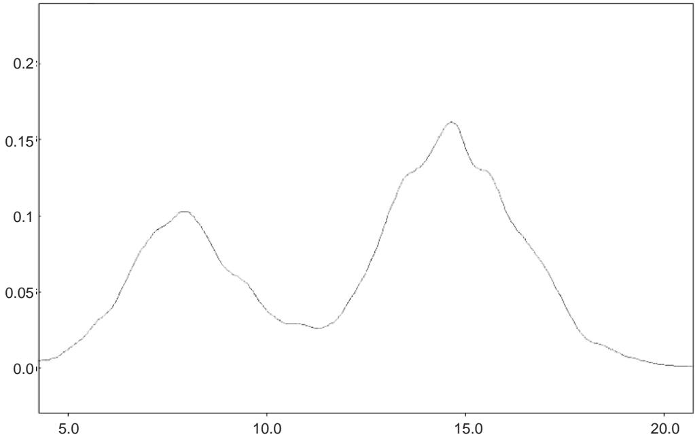  
Figure 6.1 Kernel density for $\theta_{92}$

posterior mean of 12.3 (and relatively large standard deviation 3.8) but the posterior density shows the conflict between prior and data (Figure 6.1). With a $\mathrm{Ga}(1,1)$ prior on the precision parameter $\alpha$ , the average number of clusters chosen is 14.6, and $\alpha$ has posterior mean 6.5.

Instead, let the baseline gamma prior for the $\theta_{i}$ involve unknown hyperparameters with priors $a\sim E(0.1)$ , $b\sim \mathrm{Ga}(0.1,0.1)$ . The posterior means are now $a = 0.4$ , $b = 0.08$ from a two-chain run of 5000 iterations. The posterior for $\theta_{92}$ is no longer bimodal but still has some skewness. The mean number of clusters is now 15.

Example 6.8 Galaxy velocities To illustrate Normal mixture analysis under a DPP, consider data on velocities (km/sec) for 82 galaxies from Roeder (1990). These are drawn from six well-separated conic sections of the Corona Borealis region. Thus with equal variances across components

$$
y _ {i} \mid H _ {i} \sim N \left(\mu_ {H _ {i}}, \phi\right)
$$

$$
\mu_ {j} \sim G
$$

$$
G | \alpha \sim \mathrm {D P} (\alpha G _ {0})
$$

$$
G _ {0} = N (\mu_ {0}, d \phi).
$$

A $\mathrm{Ga}(1.5, 1)$ prior for $\alpha$ is adopted, in line with a prior belief of six clusters when $n = 82$ and the maximum number of clusters taken as $M = 10$ . For the parameters $\phi^{-1}$ and $d$ , gamma priors are used, namely $\phi^{-1} \sim \mathrm{Ga}(1, 0.001)$ , $d \sim \mathrm{Ga}(2.5, 0.1)$ . West (1992b) discusses this model structure and appropriate priors on $\alpha$ , $d$ and $\phi^{-1}$ .

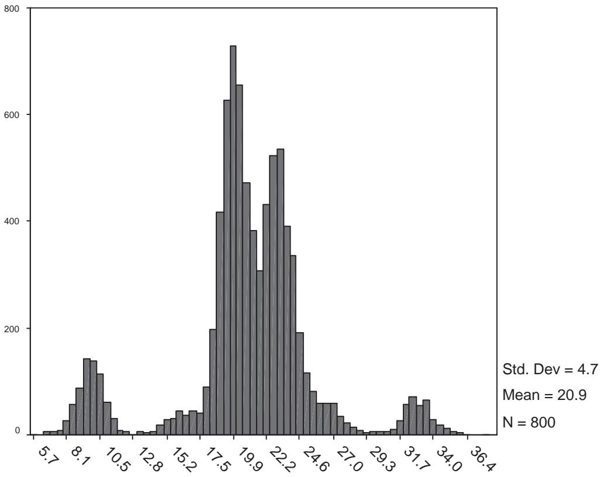  
Figure 6.2 Density of $y$ . new.

Predictions from the model are based on sampling a single replicate observation. This involves selecting a new cluster, not necessarily included in the clusters selected for the actual observations (Turner and West, 1993) and then sampling the density of the appropriate cluster mean. This predictive density may be used in various ways, but here it is used to assess whether the predictive velocity exceeds $25000\mathrm{km / sec}$ .

A two-chain run of 5000 iterations (convergent at 1000) gives a density for a new value as in Figure 6.2. This shows small subpopulations at approximately 9000 and $33000\mathrm{km / sec}$ as are apparent in the original data. The probability that the prediction exceeds $25000\mathrm{km / sec}$ is estimated at 0.092 and the parameter $d$ at around 42. The posterior for $\alpha$ has mean 2.7, with the average number of non-empty clusters $M^{*}$ at 8.7 and $95\%$ of non-empty clusters being between 6 and 10.

# 6.8 OTHER NON-PARAMETRIC PRIORS

Alternatives to DP priors have been proposed, such as stochastic process priors and partition priors (Walker et al., 1999). The latter include Polya Tree (PT) priors (Hanson et al., 2005,

p. 255; Walker and Mallick, 1997, 1999) and consist of a set of binary tree partitions to allocate a case to its appropriate cluster value selected from a baseline prior $G$ . Consider an unstructured error model for disease counts $y_{i}$ (and expected cases $E_{i}$ ) for areas $i = 1, \ldots, N$

$$
y _ {i} \sim \operatorname {P o} \left(E _ {i} \mu_ {i}\right)
$$

$$
\log (\mu_ {i}) = \beta_ {0} + \phi e _ {i}
$$

and adopt an $N(0,1)$ density as the baseline density (with distribution function $G$ ) for $e_i$ with $\phi$ an extra unknown. The simplest PT would have one level only and select candidate values $e_m^*$ from two possibilities. The choice would be between candidate values selected from the partition of the real line, either from $B_0 = (-\infty, G^{-1}(0.5))$ , or from $B_1 = (G^{-1}(0.5), \infty)$ . Thus the partitions of the parameter space at level 1 is based on the 50th percentile of $G$ ensuring that the selected effects are centred (not confounded with the regression intercept). The next binary partition would involve subdivisions of $B_0$ and $B_1$ so that $(B_{00}, B_{01}, B_{10}, B_{11})$ are the breaks at level 2. The choice would then be between candidate values selected from the intervals $B_{00} = \{-\infty, G^{-1}(0.25)\}$ , $B_{01} = \{G^{-1}(0.25), G^{-1}(0.5)\}$ , $B_{10} = \{G^{-1}(0.5), G^{-1}(0.75)\}$ or $B_{11} = (G^{-1}(0.75), \infty)$ .

The number of sets, namely ranges of bands from which candidate values (for parameter values or cluster random effects) are chosen, is thus $2^{m}$ at level $m$ . Most applications have considered finite Polya partitions to level $M$ (Hanson and Johnson, 2002, p. 1022). Candidate values in the lowest and uppermost bands are selected from truncated densities, with a form defined by $G$ . For intervening bands $j$ , they may be selected from a uniform density with $G^{-1}[(j - 1)/2^{m}]$ and $G^{-1}(j/2^{m})$ as the end points.

Walker and Mallick (1997, p. 849) liken the choice of an appropriate candidate value to a cascading particle. The choice between $B_{0}$ and $B_{1}$ is a Bernoulli choice governed by probabilities $C_{0}$ and $1 - C_{0}$ . The probability $C_{0}$ may be selected from a prior beta density but Walker and Mallick (1997, p. 851-852) suggest $C_{0} = 0.5$ on the basis that the first partition is centred at the median.

In general, if the option $B_{\varepsilon}$ is selected at a particular step, then the particle moves to either $B_{\varepsilon 0}$ or $B_{\varepsilon 1}$ at the next step with respective probabilities $C_{\varepsilon 0}$ and $C_{\varepsilon 1} = 1 - C_{\varepsilon 0}$ . These are random beta variables with

$$
\left(C _ {\varepsilon 0}, C _ {\varepsilon 1}\right) \sim \operatorname {B e t a} \left(\alpha_ {\varepsilon 0}, \alpha_ {\varepsilon 1}\right).
$$

The choice of values for $\alpha_{\varepsilon 0}$ and $\alpha_{\varepsilon 1}$ should reflect prior beliefs about the underlying smoothness of $F$ .

For $m$ large, one would set $\alpha_{\varepsilon 0} = \alpha_{\varepsilon 1} = c_m$ in such a way that $F(B_{\varepsilon 0})$ and $F(B_{\varepsilon 1})$ are close. This may be done by setting

$$
c _ {m} = c m ^ {d} \quad \text {f o r} c > 0, \quad d > 1, \tag {6.4}
$$

so that $c_{m}$ increases with $m$ (in line with prior expectations that some degree of pooling should be appropriate, based on the smoothness). For example, $c_{m} = cm^{2}$ or $c_{m} = cm^{3}$ may be used with $c = 0.5$ or $c = 0.1$ . Larger values of $c$ mean that the posterior will resemble the baseline prior $G$ more closely (Hanson et al., 2005, p. 256). The DPP corresponds to $c_{m} = 1 / 2^{m}$ . Taking

$$
c _ {m} = \gamma_ {1} m ^ {\gamma_ {2}},
$$

one may also set priors on the elements of the beta probabilities, with $\gamma_{2}$ perhaps restricted to small integer values.

The previous small area health example is in fact a mixed PT, analogous to the MDP model (Hanson and Johnson, 2002, p. 1022), since the centering density $G$ is random by virtue of the parameter $\phi$ . In this example, suppose $M = 4$ is taken as the maximum number of levels. Taking $c_{m} = 0.5m^{2}$ and $\tau = 1 / \phi$ would lead to the code

C<-0.5;tau2 \~ dgamma(1,1);phi<-1/sqrt(tau2)   
for (m in 2:M){c[m]<- C\*pow(m,2)}   
for (i in 1:N){V[1,i] \~dbern(0.5)   
for (m in 2:M){p[m,i] \~dbeta(c[m],c[m]) V[m,i] \~dbern(p[m,i])}   
# level 1 choice (convert $V = 0,1$ to $B = 1,2$ B[1,i]<-V[1,i]+1   
# choices at level 2 and above for (m in 2:M){B[m,i]<-sum(Vp[m,i,1:m-1))+V[m,i]+1 for(jin 1:m-1){Vp[m,i,j]<-V[m-j,i]\*pow(2,j)}   
# select from ordinates of baseline density estar[i]<-G.inv[B[M,i]];y[i] \~dpois(mu[i]); log(mu[i])<-log(E[i]) + beta0+phi\*estar[i]}

The options for the baseline density ordinates would then be based on the selected prior $G$ , for example with $G$ an $N(0,1)$ and $M = 4$ , these would be the 6.25th, 12.5th, 18.75th, ..., 93.75th percentiles of $G^{-1}$ .

Example 6.9 Seeds and extracts Walker and Mallick (1997) reanalyse the factorial layout data from Crowder (1978, Table 3). The original model of Crowder proposed variation of expected proportions within cell means

$$
y _ {i j} \sim \operatorname {B i n} \left(n _ {i j}, \pi_ {i j}\right) \quad i = 1, \dots , 4 \quad j = 1, \dots , n _ {i}
$$

with $\pi_{ij}$ then distributed according to four beta densities $\mathrm{Be}(a_i, b_i)$ . The index $i$ corresponds to combinations of two binary factors, seed type $(S)$ and extract type $(E)$ . Here the model is reformulated at the level of the $n = 21$ seeds, with $y_k \sim \mathrm{Bin}(\pi_k, n_k), k = 1, \ldots, n$ . Walker and Mallick propose a PT non-parametric prior for the overdispersion effects $e_k$ under a logit transform of the $\pi_k$ as in

$$
\operatorname {l o g i t} \left(\pi_ {k}\right) = \beta_ {1} + \beta_ {2} I \left(S _ {k} = 2\right) + \beta_ {3} I \left(E _ {k} = 2\right) + \beta_ {4} I \left(S _ {k} = 2, E _ {k} = 2\right) + e _ {k},
$$

where the base density $G$ for a PT prior with $M = 4$ levels is taken to be $N(0,1)$ . Beta weights are defined including unknowns

$$
c _ {m} = \gamma_ {1} m ^ {\gamma_ {2}}
$$

with priors $\gamma_{1}\sim \mathrm{Ga}(0.5,1)$ and $\gamma_{2}\sim \mathrm{Po}(2)$ assumed.

The estimated factorial effect parameters, from the second half of a run of 5000 iterations (two chains, convergent from 1000) are similar to those of Walker and Mallick. The means for $\gamma_{1}$ and $\gamma_{2}$ are 0.78 and 1.22, respectively. Only $\beta_{3}$ (the extract effect) is clearly different from

Table 6.2 Seeds and extracts data   

<table><tr><td>Parameter</td><td>Mean</td><td>2.5%</td><td>97.5%</td></tr><tr><td>β1</td><td>-0.62</td><td>-1.40</td><td>0.29</td></tr><tr><td>β2</td><td>-0.08</td><td>-1.37</td><td>1.26</td></tr><tr><td>β3</td><td>1.56</td><td>0.29</td><td>2.91</td></tr><tr><td>β4</td><td>-0.91</td><td>-2.80</td><td>0.93</td></tr><tr><td colspan="4">Germination rates</td></tr><tr><td>π(Extracts = 1, Seeds = 1)</td><td>0.38</td><td>0.32</td><td>0.44</td></tr><tr><td>π(Extracts = 2, Seeds = 1)</td><td>0.69</td><td>0.62</td><td>0.75</td></tr><tr><td>π(Extracts = 1, Seeds = 2)</td><td>0.36</td><td>0.28</td><td>0.45</td></tr><tr><td>π(Extracts = 2, Seeds = 2)</td><td>0.49</td><td>0.40</td><td>0.58</td></tr></table>

zero (Table 6.2). The probabilities of germination according to levels of each factor are also shown (cf. Crowder, 1978, Table 4).

Example 6.10 Diabetic hospitalisations Diabetic complication rates may be taken as an indicator of the performance of the primary health sector in providing timely and appropriate care. In England, two indicators of diabetes care are regularly monitored, namely (a) the incidence of diabetic ketoacidosis and coma and (b) lower limb amputations. Here, observed and expected cases of both events (for males and females combined over two financial years, 2000-2001 and 2001-2002) are considered for 354 English local authorities. A Poisson regression with log link is assumed. The total of observed and expected cases is the same so the mean of the log response is zero and an intercept is not strictly necessary.

We first consider lower limb amputations alone and contrast a DPP with a PT approach, though the latter actually includes DPP under appropriate settings of $c_{m}$ in (6.4). Under the DPP (model A), the data are taken as Poisson with

$$
y _ {i} \mid H _ {i} \sim \operatorname {P o} \left(E _ {i} v _ {i}\right),
$$

$$
\log (v _ {i}) = \phi e _ {H _ {i}}
$$

with $E_{i}$ being expected events, and $H_{i} \sim \mathrm{Categorical}(\mathbf{p})$ , $\mathbf{p} = (p_1, \dots, p_M)$ with $M = 30$ as the assumed maximum number of clusters and the $p_j$ defined by a stick-breaking prior. The DPP includes a $\mathrm{Ga}(1,1)$ prior on $\alpha$ , consistent with an expected prior cluster total of $M^{*} = 5.9$ . The baseline density $G_{0}$ is $N(0,1)$ , with $\phi^2$ a variance parameter and $1 / \phi^2$ is assigned a $\mathrm{Ga}(0.5,0.5)$ prior. The relative risks $\nu_{i}$ average 1 at least approximately (here the mean relative risk slightly exceeds 1) and indicate the quality of care; high values indicate lower quality care.

A two-chain run of 5000 iterations (1000 to convergence) is used to make posterior inferences. In particular, the estimated posterior relative risks of amputation over the 354 areas suggest some multimodality as well as outlying areas with very high rates (Figure 6.3). This would not have been so well represented by a unimodal parametric prior. The averages $M^{*}$ and $\alpha$ are 18.5 and 4.1.

A PT procedure (model B) with $2^{6}$ partitions (i.e. $M = 6$ ) is then applied with $c_{m} = cm^{2}$ , with $c = 0.5$ and a $N(0,1)$ baseline density. There are high correlations between the two sets of posterior risks (DPP vs PT priors) and in the area rankings. Nevertheless the plot of risks

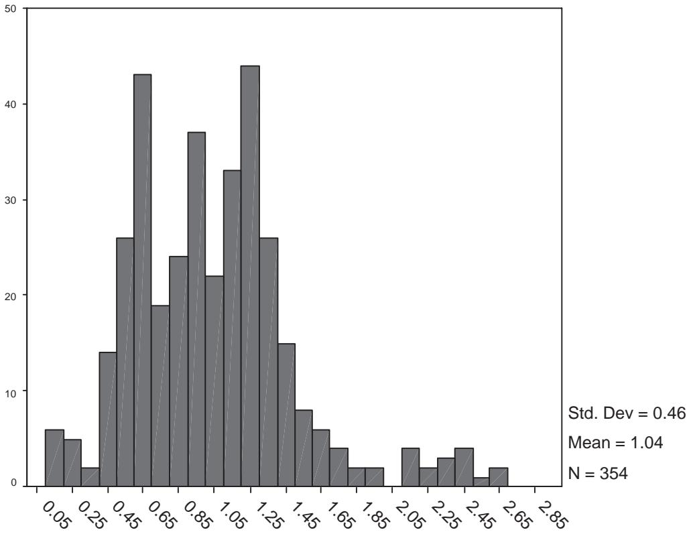  
Figure 6.3 Posterior relative risks under DPP.

under the PT prior (Figure 6.4, based on iterations 1001-5000 in a two-chain run) shows less departure from unimodality. This may be an artefact of the restriction to preset parameters in $c_{m}$ . Reducing $c$ (e.g. to 0.1 or 0.01) leads to a more bimodal plot.

As a final illustration of a non-parametric application, consider deriving an overall index of diabetic care, with higher values indicating less effective care in terms of avoiding undesirable outcomes (a common factor model). Thus with $y_{1}$ denoting diabetic amputations and $y_{2}$ denoting diabetic ketoacidosis and coma consider the following common factor DP model

$$
y _ {1 i} \sim \mathrm {P o} (E _ {1 i} \nu_ {1 i}), y _ {2 i} \sim \mathrm {P o} (E _ {2 i} \nu_ {2 i}),
$$

$$
\log (\nu_ {1 i}) = \phi_ {1} e _ {H _ {i}}
$$

$$
\log (\nu_ {2 i}) = \phi_ {2} e _ {H _ {i}},
$$

where $H_{i}$ are as under model A and the baseline density $G_{0}$ is again a standard normal density. The factor loading $\phi_{1}$ is set to 1 for identifiability, while $\phi_{2}$ is free and assigned a normal $N(1,1)$ prior. The plot of the scores (Figure 6.5) shows some multimodality with three outlying areas (285, 289, 148) having scores approaching 0.5, while a central cluster of areas (109 from 354) have scores between 0 and 0.10.

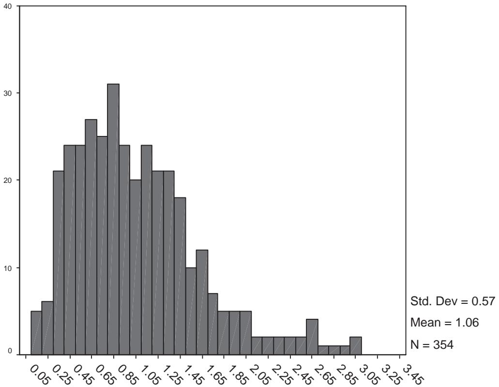  
Figure 6.4 Posterior relative risks under PT prior.

# EXERCISES

1. In Example 6.1 use a likelihood calculation and derive the posterior mean of the likelihood and deviance. Use the AIC and BIC criteria to compare solutions $C = 1, 2, 3, 4$ .   
2. In Example 6.1 obtain the posterior probabilities under $C = 3$ that individual cases belong to different groups. These are averages over iterations of indicator variables.   
3. In Example 6.2, extend the comparisons to $C = 4$ .   
4. For the data of Example 6.2 apply the splitting prior of (6.2) for the cases $C = 2$ and $C = 3$ .   
5. In Example 6.3, code the basic ZIP model using the individual data approach (as per Model $B$ in Example 6.3). Sample new data (predictions $y_{\mathrm{new}}$ ) and derive the EPDs for the basic ZIP model and the three group ZIP model as already described in Example 6.3. The BICs for both models can also be obtained since the number of parameters is known.   
6. In Example 6.5 (DMFT response), extend the model to allow the $\omega_{j}$ to be specific to school $(j = 1,\dots ,J,J = 6)$ .

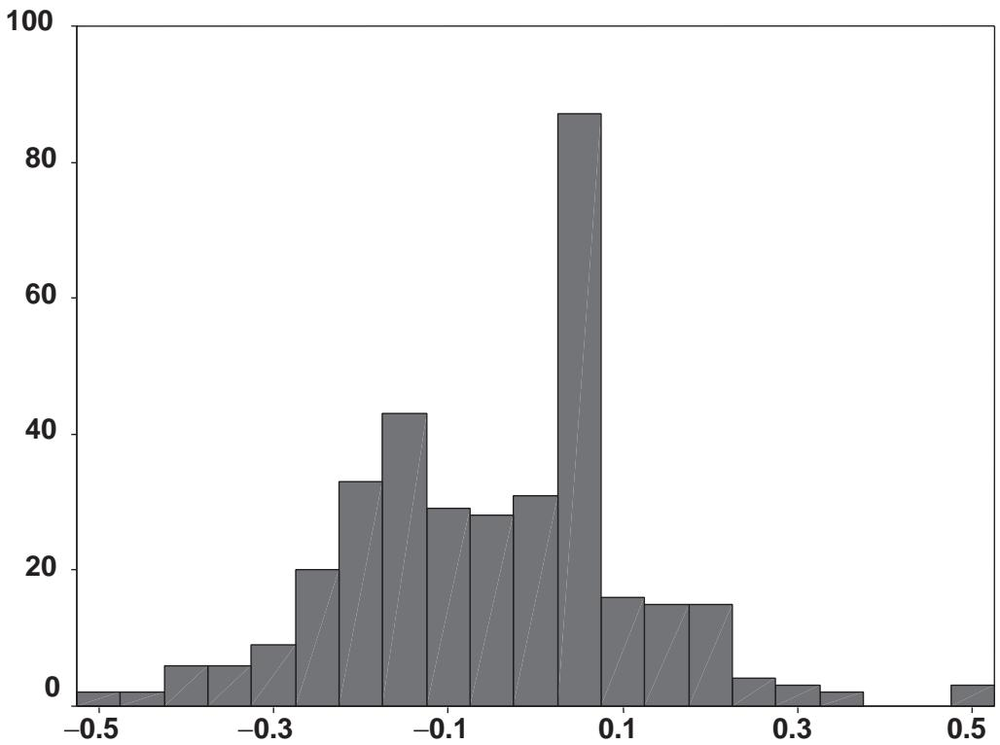  
Figure 6.5 Diabetic care index.

7. In Example 6.7 (DP analysis of eye-tracking anomalies) try monitoring the $\theta_{i}$ to obtain posterior means $(\overline{\theta}_i$ for each of the 101 subjects and so obtain the DIC using the definition $\overline{D} - D(\overline{\theta})$ . In BUGS this will also require including code to obtain the deviance at each iteration. Assume the hyperparameters of the gamma-mixing density are free. Does adopting a DPP (with $\alpha$ a free parameter) improve over the standard Poisson-gamma mixture (Chapter 5)? Is this conclusion affected by setting $\alpha$ at particular values, e.g. $\alpha = 1$ and $\alpha = 5$ rather than letting it be a free parameter?   
8. In Example 6.7 (DPP analysis of eye-tracking anomalies) try a $\mathrm{Ga}(0.01,0.01)$ prior on the concentration parameter $\alpha$ . Does this affect the posterior mean for clusters?   
9. In Example 6.8 (galaxy clusters) consider the ratio of posterior mean of $M^{*}$ to its prior mean, as defined by the prior on the DPP concentration parameter $\alpha$ . What is the impact on this ratio of increasing $M$ (the maximum clusters under a truncated DPP) to 20 and what is the impact of combining $M = 20$ with a $G(3,1)$ prior on $\alpha$ , consistent with a prior mean $M^{*} = 10$ ?   
10. Use the data from Gelfand et al. (1990) relating to growth for $n = 30$ rats at five ages and add a DPP as in West et al. (1994, p. 373) and Escobar and West (1998, p. 16). See also the birats example on the WINBUGS site. Thus the bivariate normal model for varying

intercepts and slopes is replaced by a DPP that allows clustering of intercepts and slopes. Specifically one could retain as $G_{0}$ the bivariate normal with a precision matrix distributed as Wishart(C, 2), where

$$
C = \left[ \begin{array}{c c} 1 0 0 & 0 \\ 0 & 0. 1 \end{array} \right]
$$

and take $M = 20$ . The Dirichlet parameter can be assigned either a $\mathrm{Ga}(1,1)$ prior or a $\mathrm{Ga}(0.01,0.01)$ prior as in Escobar and West (1998). Both studies applying a DPP to these data found multimodal posteriors for the predictive distribution of the slopes.

# REFERENCES

Albert, J. (1999) Criticism of a hierarchical model using Bayes factors. Statistics in Medicine, 18, 287-305.   
Alston, A., Mengersen, K., Thompson, J., Littlefield, P., Perry, D. and Ball, A. (2004) Statistical analysis of sheep CAT scans sing a Bayesian mixture model. Australian Journal of Agricultural Research, 55, 57-68.   
Antoniak, C. (1974) Mixtures of Dirichlet processes with applications to Bayesian nonparametric problems. Annals of Statistics, 2, 1152-1174.   
Böhning, D. (1999) Computer-Assisted Analysis of Mixtures and Applications: Meta-Analysis, Disease Mapping, and Other Applications. Chapman & Hall: London.   
Böhning, D., Dietz, E., Schlattmann, P., Mendonca, L. and Kirchner, U. (1999) The zero-inflated Poisson model and the decayed, missing and filled teeth index in dental epidemiology. Journal of the Royal Statistical Society A, 162, 195-209.   
Bouguila, N., Ziou, D. and Monga, E. (2006) Practical Bayesian estimation of a finite beta mixture through Gibbs sampling and its applications. Statistics and Computing, 16, 215-225.   
Cameron, C. and Trivedi, P. (1998) Regression Analysis of Count Data, Econometric Society Monograph No.30. Cambridge University Press: Cambridge, UK.   
Carlin, B. and Chib, S. (1995) Bayesian model choice via Markov chain Monte Carlo methods. Journal of the Royal Statistical Society B, 57, 473-484.   
Carlin, B.P. and Louis, T.A. (1996) Bayes and Empirical Bayes Methods for Data Analysis. Chapman and Hall, 1996.   
Celeux, G., Hurn, M. and Robert, C. (2000) Computational and inferential difficulties with mixture posterior distributions. Journal of the American Statistical Association, 95, 957-970.   
Chung, H., Loken, E. and Schafer, J. (2004) Difficulties in drawing inferences with finite-mixture models: A simple example with a simple solution. The American Statistician, 58, 152-158.   
Clayton, D. and Kaldor, J. (1987) Empirical Bayes estimates of age-standardised relative risks for use in disease mapping. Biometrics, 43, 671-681.   
Congdon, P. (1996) The epidemiology of suicide in London. Journal of the Royal Statistical Society A, 159, 515-533.   
Crowder, M. (1978) Beta-binomial Anova for proportions. Applied Statistics, 27, 34-37.   
Dempster, A., Laird, N. and Rubin, D. (1977) Maximum likelihood from incomplete data via the EM algorithm. Journal of the Royal Statistical Society B, 39, 1-38.   
Dey, D., Kuo, L. and Sahu, S. (1995) A Bayesian predictive approach to determining the number of components in a mixture distribution. Statistics and Computing, 5, 297-305.

Diebolt, J. and Robert, C. (1994) Estimation of finite mixture distributions through Bayesian sampling. Journal of the Royal Statistical Society B, 56, 363-375.   
Elrod, T. and Keane, M. (1995) A factor-analytic probit model for representing the market structure in panel data. Journal of Marketing Research, 32, 1-16.   
Escobar, M. and West, M. (1998) Computing nonparametric hierarchical models. In Practical Nonparametric and Semiparametric Bayesian Statistics, Dey, D. (ed). Springer: New York, 1-22.   
Ferguson, T. (1973) A Bayesian analysis of some non-parametric problems. The Annals of Statistics, 1, 209-230.   
Fruhwirth-Schnatter, S. (2001) MCMC estimation of classical and dynamic switching and mixture models. Journal of the American Statistical Association, 96, 194-209.   
Fruhwirth-Schnatter, S. (2004) Estimating marginal likelihoods for mixture and Markov switching models using bridge sampling techniques. *Econometrics Journal*, 7, 143-167.   
Green, P. (1995) Reversible jump Markov Chain Monte Carlo computation and Bayesian model determination. Biometrika, 82, 711-732.   
Gelfand, A.E., Hills, S.E., Racine-Poon, A. and Smith, A.F.M. (1990) Illustration of Bayesian inference in normal data models using Gibbs sampling. Journal of the America Statistical Society, 85, 972-985.   
Hanson, T. and Johnson, W. (2002) Modeling regression error with a mixture of Polya trees. Journal of the American Statistical Association, 97, 1020-1033.   
Hanson, T., Branscum, A. and Johnson, W. (2005) Bayesian nonparametric modeling and data analysis: an introduction. In *Bayesian Thinking: Modeling and Computation*, Handbook of Statistics, Volume 25, Dey, D.K. and Rao, C.R. (eds). Elsevier: Amsterdam, 245-278.   
Hirano, K., A Semiparametric model for labor earnings dynamics. In Practical Nonparametric and Semiparametric Bayesian Statistics, Dey, D., Mueller, P. and Sinha, D. (eds). Springer-Verlag: New York, 1998.   
Ibrahim, J. and Kleinman, K. (1998) Semiparametric Bayesian methods for random effects models. In Practical Nonparametric and Semiparametric Bayesian Statistics, Dey, D. (ed). Springer: New York, 89-114.   
Ishwaran, H. and James, L. (2001) Gibbs sampling methods for stick-breaking priors. Journal of the American Statistical Association, 96, 161-173.   
Ishwaran, H. and James, L. (2002) Approximate Dirichlet process computing in finite normal mixtures: smoothing and prior information. Journal of Computational and Graphical Statistics, 11, 508-532.   
Ishwaran, H. and Zarepour, M. (2000) Markov chain Monte Carlo in approximate Dirichlet and beta two-parameter process hierarchical models. Biometrika, 87, 371-339.   
Kleinman K. and Ibrahim, J.A. (1998) Semi-parametric Bayesian approach to generalized linear mixed models. Statistics in Medicine, 17, 2579-2596.   
Laird, N. (1982) Empirical Bayes estimates using the nonparametric maximum likelihood estimate for the prior. Journal of Statistical Computation and Simulation, 15, 211-220.   
Lavine, M. and West, M. (1992) A Bayesian method for classification and discrimination. Canadian Journal of Statistics, 20, 451-461.   
Lenk, P. and DeSarbo, W. (2000) Bayesian inference for finite mixtures of generalized linear models with random effects. Psychometrika, 65, 93-119.   
Leonard, T. (1996) On exchangeable sampling distributions for uncontrolled data. Statistics and Probability Letters, 26(1), 1-6.   
Leonard, T., Hsu, J., Tsui, K. and Murray, J. (1994) Bayesian and likelihood inference from equally weighted mixtures. Annals of the Institute of Statistical Mathematics, 46, 203-220.   
Marin, J-M., Mengersen, K. and Robert, C. (2005) Bayesian modelling and inference on mixtures of distributions. In Handbook of Statistics Volume 25, Dey, D. and Rao, C. (eds). Elsevier: Amsterdam.

Martin, T., Kuhnert, P. and Mengersen, K. (2005) The power of expert opinion in ecological models using Bayesian methods: impact of grazing on birds. Ecological Applications, 15, 266-280.   
McLachlan, G. and Basford, K. (1988) Mixture Models. Marcel Dekker: New York.   
D.F. Moore, C.K. Park, and W. Smith (2001) Exploring extra-binomial variation in teratology data using continuous mixtures. Biometrics 57, 490-494.   
Mukhopadhyay, S. and Gelfand, A. (1997) Dirichlet process mixed generalized linear models. Journal of the American Statistical Association, 92, 633-639.   
Mullahy, J. (1986) Specification and testing of some modified count data models. Journal of Econometrics, 33, 341-365.   
Ohlssen, D., Sharples, L. and Spiegelhalter, D. (in press) Flexible random effects models using Bayesian semi-parametric models. Statistics in Medicine.   
Raftery, A. (1996) Hypothesis testing and model selection. In Markov Chain Monte Carlo in Practice, Gilks, W., Richardson, S. and Spiegelhalter, D. (eds). Chapman & Hall: London, 163-187.   
Richardson, S. and Green, P. (1997) On Bayesian analysis of mixtures with an unknown number of components. Journal of the Royal Statistical Society B, 59, 731-792.   
Robert, C. (1996) Mixtures of distributions: inference and estimation. In Markov Chain Monte Carlo in Practice, Gilks, W., Richardson, S. and Spiegelhalter, D. (eds). Chapman & Hall: London, 441-464.   
Robert, C. P. (1997). Discussion of "On Bayesian analysis of mixtures with an unknown number of components," by S. Richardson and P.J. Green. Journal of the Royal Statistical Society B, 59, 758-764.   
Rodrigues, J. (2006) Full Bayesian significance test for zero-inflated distributions. Communications in Statistics: Theory and Methods, 35, 299-307.   
Roeder, K. (1990) Density estimation with confidence sets exemplified by superclusters and voids in the galaxies. Journal of the American Statistical Association, 85, 617-624.   
Sahu, S. and Cheng, R. (2003) A fast distance based approach for determining the number of components in mixtures. Canadian Journal of Statistics, 31, 3-22.   
Sethuraman, J. (1994) A constructive definition of Dirichlet priors. Statistica Sinica, 4, 639-650.   
Stephens, M. (2000) Dealing with label-switching in mixture models. Journal of the Royal Statistical Society B, 62, 795-809.   
Turner, D. and West, M. (1993) Bayesian analysis of mixtures applied to post-synaptic potential fluctuations. Journal of Neuroscience Methods, 47, 1-21.   
Viallefont, V., Richardson, S. and Green, P. (2002) Bayesian analysis of poisson mixtures. Journal of Nonparametric Statistics, 14, 181-202.   
Walker, S. and Mallick, B. (1997) Hierarchical generalized linear models and frailty models with Bayesian nonparametric mixing. Journal of the Royal Statistical Society B, 59, 845-860.   
Walker, S. and Mallick, B. (1999) A Bayesian semiparametric accelerated failure time model. Biometrics, 55, 477-483.   
Walker, S., Damien, P., Laud, P. and Smith, A. (1999) Bayesian nonparametric inference. Journal of the Royal Statistical Society B, 61, 485-528.   
Wasserman, L. (2000) Asymptotic inference for mixture models using data-dependent priors. Journal of the Royal Statistical Society B, 62, 159-180.   
Wedel, M., Desarbo, W. and Bult, J. (1993) A latent class Poisson regression-model for heterogeneous count data. Journal of Applied Econometrics, 8, 397-411.   
West, M. (1992a) Mixture models, Monte Carlo, Bayesian updating and dynamic Models. Journal of Statistical Planning and Inference, 24, 325-333.   
West, M. (1992b) Modelling with mixtures. In *Bayesian Statistics* 4, Bernardo, J., Berger, J., Dawid, A. and Smith, A. (eds). Oxford University Press: Oxford, 503-524.

West, M. and Turner, D. (1994) Deconvolution of mixtures in analysis of neural synaptic transmission. The Statistician, 43, 31-43.   
West, M., Muller, P. and Escobar, M. (1994) Hierarchical priors and mixture models, with applications in regression and density estimation. In *Aspects of Uncertainty*, Freeman, P. and Smith, A. (eds). Wiley: New York, 363-386.   
Xie, M., He, B. and Goh, T. (2001) Zero-inflated Poisson model in statistical process control. Computational Statistics and Data Analysis, 38, 191-201.

# Multinomial and Ordinal Regression Models

# 7.1 INTRODUCTION: APPLICATIONS WITH CATEGORIC AND ORDINAL DATA

Many outcomes relating to political or religious affiliation, labour force or social status, or choice (e.g. between consumer goods or travel to work modes) involve ordered or unordered polytomous variables (Amemiya, 1981). Usually such categorical data are defined in terms of mutually exclusive alternatives: $y_{i} = j$ if the $j$ th outcome of the $J$ possible outcomes occurs and zero otherwise. Equivalently $d_{ij} = 1$ , if $y_{i} = j$ and $d_{ik} = 0$ for $k \neq j$ . For data not involving ordered categories, the multinomial logit and multinomial probit models generalise their binomial equivalents (e.g. Chen and Kuo, 2002; Chib et al., 1998; Daganzo, 1979) but ordinal categorical data introduce extra features in modelling an underlying scale over the category breaks (Best et al., 1996). This chapter focuses mainly on individual data but contingency table data can also be analysed either as Poisson or multinomial (Agresti and Hitchcock, 2005), and Section 7.6 considers models for contingency tables with ordered row or column variables.

Just as binary regression has the negative response as reference, so a multinomial logit or probit involves stipulating a baseline category (say the first of $J$ possible outcomes) and comparing the probabilities $\pi_{ij}$ of outcomes $j = 2, 3, \ldots, J$ to that of the first. As for binary data the 'revealed' choice or allocation may be regarded as reflecting the operation of an underlying latent utility or frailty (Albert and Chib, 1993; Scott, 2005), and MCMC techniques are especially useful for data augmentation at the level of the individual introduced to facilitate estimation of the $\pi_{ij}$ .

As for binomial and count data, representations of heterogeneity in choice modelling may involve discrete or continuous mixture models (Wedel et al., 1999), with discrete approaches exemplified by discrete multinomial mixture regression (Chapter 6). For continuous mixing, the conjugate approach is the multinomial-Dirichlet mixture where the Dirichlet is the multivariate generalisation of the beta density (see Chapter 5). However, as for binary logit and Poisson data, it is often easier to model random interdependent choices and heterogeneity

within the regression link, as in random effects or mixed multinomial logit models. These are intended (especially in political science and econometrics) to include heterogeneity in choice behaviour between subjects, not just via intercept variation but by variation in regression coefficients on predictors (Glasgow, 2001; Train, 2003).

Categorical variables which are ordinal occur frequently in social and psychometric surveys and in applications such as the measurement of health functioning and quality of life, socioeconomic ranking, and market research. Such scales may be intrinsically categorical or arise through converting originally continuous scales into ordinal ones. For example, Best et al. (1996) convert continuous cognitive function scores from the Mini Mental State Evaluation instrument into a fivefold ordinal ranking, because using the scores as continuous would assume a constant effect across the whole scale, whereas a nonlinear effect is more likely. The usual approach to ordinal scales assumes a latent (continuous) variable $W_{i}$ underlying the ordered categories. This applies even if an ordinal scale arises from grouping an originally continuous scale, in which case a new continuous scale is in a sense being re-identified.

Suppose the states are ranked from 1 (lowest) to $J$ (highest), with cut-points $\theta_{j}$ from the continuous scale delineating the transition from one category to the next. So if $J = 4$ , there are three cut points, from 1 to 2, from 2 to 3 and from 3 to 4. If there are additional start and end points to the underlying scale, namely $\kappa_{0}$ and $\kappa_{4}$ , such as $\kappa_{0} = -\infty$ , $\kappa_{4} = +\infty$ , then $\kappa_{1}, \kappa_{2}$ , and $\kappa_{3}$ are free parameters to estimate subject to the constraint

$$
\kappa_ {0} <   \kappa_ {1} <   \kappa_ {2} <   \kappa_ {3} <   \kappa_ {4}.
$$

Other choices of end-point are possible according to context; for example one might, again for $J = 4$ , take $\{\kappa_1 = 1, k_4 = 4\}$ without specifying $\kappa_0$ and just estimate the intervening parameters subject to $\kappa_1 < \kappa_2 < \kappa_3 < \kappa_4$ (e.g. Chuang and Agresti, 1986, p. 16).

The probability $\pi_{ij}$ that an individual $i$ will be in state $j$ is then the same as the chance that the subject's underlying score is between $\kappa_{j-1}$ and $\kappa_j$ . So the cumulative probability $\gamma_{ij}$ that an individual $i$ with latent score $W_i$ will be classified in a state in state $j$ or below is $\gamma_{ij} = \operatorname{Prob}(W_i < \kappa_j) = \operatorname{Prob}(y_i \leq j)$ . Hence $\pi_{ij} = \gamma_{ij} - \gamma_{i,j-1}$ gives the chance of belonging to a specific category. Various link functions can be used for $\gamma_{ij}$ but the most common are the logit, namely $\log \{\gamma_{ij} / (1 - \gamma_{ij})\}$ and the complementary log-log, namely $\log \{-\log(1 - \gamma_{ij})\}$ (McCullagh, 1980). The proportional-odds or cumulative odds model uses the logit link for the cumulative probabilities with a parameterisation as follows:

$$
\operatorname {l o g i t} \left(\gamma_ {i j}\right) = \kappa_ {j} - \mu_ {i}, \tag {7.1}
$$

where $\mu_{i} = X_{i}^{\prime}\beta$ incorporates predictors such as treatment allocation, age, and income, and the regression effect is assumed invariant over categories $j$ . Usually a constant term is not included as the intercept effects are modelled by the $\kappa_{j}$ . Consider the ratio of odds of the event $W_{i} < \kappa_{j}$ at different values of $X$ , namely $X_{1}$ and $X_{2}$ . Under the proportional odds model (7.1) this ratio is

$$
\gamma_ {i j} \left(X _ {1}\right) / \left(1 - \gamma_ {i j} \left(X _ {1}\right)\right) / \left[ \gamma_ {i j} \left(X _ {2}\right) / \left(1 - \gamma_ {i j} \left(X _ {2}\right)\right) \right] = \exp \left[ - \left(X _ {1} - X _ {2}\right) ^ {\prime} \beta \right]
$$

and is independent of category $j$ . Another possibility is non-parallel effects of covariates (e.g. Peterson and Harrell, 1990) as expressed in a model such as $\mathrm{logit}(\gamma_{ij}) = \kappa_j - \mu_{ij}$ , where $\mu_{ij} = X_i'\beta_j$ . The negative sign on $\mu_{i}$ in the model ensures that larger values of $X^{\prime}\beta$ lead to

an increased chance of belonging to the higher categories. In a medical context, this would mean that higher levels of an adverse risk factor are associated with a more adverse outcome or more severe condition. Often it is relevant to introduce random effects specific to individuals, especially if the data are clustered (Chapter 11).

# 7.2 MULTINOMIAL LOGIT CHOICE MODELS

Consider first the case of an unordered choice response (e.g. travel mode) observed for a set of $n$ subjects and with covariates recorded relevant to the choice made. In multinomial logit regression, covariates may be defined either for individuals $i$ , for choices $j$ , or as particular features of choice $j$ that are unique to individual $i$ . In travel mode choice, the first type of variable might be individual income, the second a mode cost variable (specific to $j$ ), and the third might be the individual costs attached to different modes (specific to subject $i$ ). Consider a vector of covariates $X_{i}$ specific to individuals $i$ alone, and let $d_{ij} = 1$ if option $j$ is chosen and $d_{ij} = 0$ otherwise. Then for $J$ possible categories in the outcome the multiple or multinomial logit model (Scott, 2005), with the last category as reference and with only subject level predictors $X_{i}$ , has the form

$$
\Pr \left(d _ {i j} = 1\right) = \pi_ {i j} = \frac {\exp \left(\alpha_ {j} + X _ {i} \beta_ {j}\right)}{\left\{1 + \Sigma_ {k = 2} ^ {J} \exp \left(\alpha_ {k} + X _ {i} \beta_ {k}\right) \right\}} \quad j = 1, \dots , J - 1 \tag {7.2}
$$

$$
\Pr (d _ {i J} = 1) = \pi_ {i J} = \frac {1}{\{1 + \Sigma_ {k = 1} ^ {J - 1} \exp (\alpha_ {k} + X _ {i} \beta_ {k}) \}}
$$

or equivalently

$$
\log \left\{\pi_ {i j} / \pi_ {i J} \right\} = \alpha_ {j} + X _ {i} \beta_ {j}.
$$

This is sometimes called the multiple logit link. Also for $j$ and $k$ less than $J$

$$
\log \left\{\pi_ {i j} / \pi_ {i k} \right\} = \left(\alpha_ {j} - \alpha_ {k}\right) + X _ {i} \left(\beta_ {j} - \beta_ {k}\right)
$$

so that choice probabilities are governed by differences in coefficient values between alternatives. A corner constraint on parameters is used in (7.2) but a sum to zero constraint is also possible. Diffuse proper priors on regression parameters are the most common approach but a conditional means prior can be obtained by a Dirichlet extension of the beta CMP for binomial/binary regression. Madigan et al. (2005) suggest a Laplace prior to penalise dense parameter estimates from multinomial regression applied to author identification.

Considering instead prediction of choices using only known attributes $A_{ij}$ of the $j$ th alternative specific for individual $i$ , then what is sometimes termed a conditional logit model is obtained with

$$
\pi_ {i j} = \frac {\exp \left(A _ {i j} \gamma\right)}{\sum_ {k = 1} ^ {J} \exp \left(A _ {i k} \gamma\right)} \tag {7.3}
$$

with no reference category. Dividing through by $\exp (A_{ij}\gamma)$ gives

$$
\pi_ {i j} = \frac {1}{\Sigma_ {k = 1} ^ {J} \exp ([ A _ {i k} - A _ {i j} ] \gamma)}.
$$

In the conditional logit model, the coefficients $\gamma$ are usually constant across alternatives, and so choice probabilities are determined by differences in the attribute values of alternative choices. A general choice model would include both individual level attributes $X_{i}$ and alternative specific characteristics $A_{ij}$ . Thus

$$
\log \left(\pi_ {i j} / \pi_ {i k}\right) = \left(\alpha_ {j} - \alpha_ {k}\right) + X _ {i} \left(\beta_ {j} - \beta_ {k}\right) + \left(A _ {i j} - A _ {i k}\right) \gamma .
$$

with $\alpha$ and $\beta$ parameters set to zero for the reference category.

Multiple logit models can be expressed in terms of a model for individual choice behaviour and much debate has focused on appropriate MCMC techniques for this option, especially when the probit rather than multiple logit link is used (Section 7.3). Thus let $U_{ij}$ be the unobserved value or utility of choice $j$ to individual $i$ , with

$$
U _ {i j} = U (X _ {i}, S _ {j}, A _ {i j}, \varepsilon_ {i j})
$$

where $S_{j}$ are attributes of choice $j$ (e.g. climate in state $j$ for potential migrants to that state), and $\varepsilon_{ij}$ are random utility terms. Assuming additivity and separability of stochastic and systematic components leads to

$$
U _ {i j} = v _ {i j} + \varepsilon_ {i j} \tag {7.4.1}
$$

with a systematic component modelled as a linear function such as

$$
v _ {i j} = \alpha_ {j} + X _ {i} \beta_ {j} + A _ {i j} \gamma + S _ {j} \delta . \tag {7.4.2}
$$

Then the choice of option $j$ means

$$
U _ {i j} > U _ {i k} \quad \text {a l l} k \neq j
$$

and so

$$
\pi_ {i j} = \Pr (U _ {i j} > U _ {i k}) \quad \text {a l l} k \neq j.
$$

Equivalently

$$
d _ {i j} = 1 \quad \text {i f} U _ {i j} = \max  \left(U _ {i 1}, U _ {i 2}, \dots , U _ {i J}\right)
$$

Assume the $\varepsilon_{ij}$ follow a type I extreme value (double exponential) distribution with cdf

$$
F \left(\varepsilon_ {i j}\right) = \exp \left(- \exp \left(- \varepsilon_ {i j}\right)\right)
$$

and if the assumption in (7.4.1) holds also,

$$
\Pr \left(d _ {i j} = 1 \mid X _ {i}, A _ {i j}, S _ {j}\right) = \exp \left(v _ {i j}\right) / \Sigma_ {k} \exp \left(v _ {i k}\right)
$$

with $\beta_{J} = \alpha_{J} = 0$ as in (7.2) for identifiability.

Latent utilities $W_{ij} = U_{ij} - U_{iJ}$ under the MNL model may be generated by assuming $\varepsilon_{ij}$ are sampled from an extreme value density. Alternatively, consider the MNL model as

$$
\operatorname * {P r} (y _ {i} = j) = \pi_ {i j} = \frac {\lambda_ {i j}}{\{1 + \Sigma_ {k = 1} ^ {J - 1} \lambda_ {i k} \}} \propto \lambda_ {i j} \qquad j = 1, \ldots J - 1
$$

$$
\operatorname * {P r} (y _ {i} = J) = \pi_ {i J} = \frac {1}{\{1 + \Sigma_ {k = 1} ^ {J - 1} \lambda_ {i k} \}},
$$

where for example, $\lambda_{ij} = \exp (\alpha_j + X_i\beta_j + W_{ij}\gamma)$ (for $j < J$ ) and $\lambda_{iJ} = 1$ for identifiability. Scott proposed sampling exponential variables $W_{ij}\sim E(\lambda_{ij})$ with $W_{ij} = \min (W_{i1},\ldots ,W_{iJ})$ when $y_{i} = j$ . It is necessary to sample $W_{iJ}\sim E(1)$ to ensure the scale is defined. If $T_{i} = \min (W_{i1},\dots ,W_{iJ})$ , then $\operatorname*{Pr}(T_i = W_{ij}) = \lambda_{ij} / \Sigma_{k = 1}^{J}\lambda_{ik}$ and so the choice probabilities follow the MNL model (Scott, 2005).

In the multinomial and conditional logit models, the ratio $\pi_{ij} / \pi_{ik}$ , namely the probability of choosing the jth alternative as compared to the kth, can be seen to be independent of the presence or characteristics of other alternatives. This is known as the independence of irrelevant alternatives (IIA) assumption or axiom (Fry and Harris, 1996, 2005). However, assuming this property may be inconsistent with observed choice behaviour in that utilities over different alternatives may be correlated (e.g. there may be sets of similar alternatives with similar utilities between which substitution may be made). One way to correct for clustering is to assume subject or subject-choice errors in the generalised logit link, leading to mixed logit models or mixed MNL (MMNL) models (Section 7.4). Another option is the use multinomial probit models since these are not restricted to the IIA axiom (Section 7.3). Estimation of the latter by classical methods is complicated by the need to evaluate multidimensional normal integrals. However, MCMC sampling using data augmentation is relatively easy computationally. Other options to tackle departures from IIA include nested logit models (e.g. Lahiri and Gao, 2002) which group the choices into subsets such that error variances differ between subsets.

Example 7.1 Car ownership This example uses data from a 1980 survey of car ownership among 2820 Dutch households (Cramer, 2003). The options are 1) household owns no car, 2) household owns one used car, 3) household owns one new car, and 4) household owns two or more cars. The respective numbers in the four categories are 1010, 944, 691 and 175. Here the first 282 households only are used, containing 114, 92, 62, and 14 households, respectively.

Predictors used here are the log of household income and the log of household size. These variables are both standardised. $N(0,10)$ priors are assumed on the unknown coefficients. Iterations 501-2500 of a two chain run shows regression effects as in Table 7.1. The strongest effects of both income and household size are for the fourth category (2 or more car households). The average deviance is 605, with $d_{e} = 8.2$ , giving a DIC of 613.2. Cramer (2003) mentions that if household size is not included as a predictor the effect of income is reduced. The two variables are negatively correlated but both are positively related to car ownership of various kinds.

The predictive fit of the model can be assessed by sampling new multinomial variables and comparing whether they match the observed categories. On this basis there is around $39\%$

Table 7.1 Car ownership MNL model $(n = 282)$ parameter summary   

<table><tr><td></td><td></td><td>Mean</td><td>SD</td><td>2.5%</td><td>97.5%</td></tr><tr><td rowspan="4">1 used car</td><td>Predictive match rate</td><td>0.39</td><td>0.03</td><td>0.33</td><td>0.44</td></tr><tr><td>Intercept</td><td>-0.11</td><td>0.15</td><td>-0.38</td><td>0.20</td></tr><tr><td>Log Income</td><td>0.51</td><td>0.18</td><td>0.18</td><td>0.86</td></tr><tr><td>Log Hhld size</td><td>0.80</td><td>0.17</td><td>0.46</td><td>1.14</td></tr><tr><td rowspan="3">1 new car</td><td>Intercept</td><td>-0.60</td><td>0.18</td><td>-0.94</td><td>-0.24</td></tr><tr><td>Log Income</td><td>1.09</td><td>0.20</td><td>0.69</td><td>1.50</td></tr><tr><td>Log Hhld size</td><td>0.84</td><td>0.19</td><td>0.48</td><td>1.22</td></tr><tr><td rowspan="3">2 or more cars</td><td>Intercept</td><td>-2.58</td><td>0.39</td><td>-3.41</td><td>-1.81</td></tr><tr><td>Log Income</td><td>1.29</td><td>0.33</td><td>0.66</td><td>1.94</td></tr><tr><td>Log Hhld size</td><td>2.05</td><td>0.37</td><td>1.36</td><td>2.80</td></tr></table>

Table 7.2 Classification matrix, subject totals by actual versus predicted category   

<table><tr><td rowspan="2">Actual</td><td colspan="5">Predicted</td></tr><tr><td>1</td><td>2</td><td>3</td><td>4</td><td>Total</td></tr><tr><td>1</td><td>56.3</td><td>33.5</td><td>20.0</td><td>4.3</td><td>114</td></tr><tr><td>2</td><td>32.7</td><td>32.7</td><td>20.8</td><td>5.8</td><td>92</td></tr><tr><td>3</td><td>19.4</td><td>20.9</td><td>17.7</td><td>4.0</td><td>62</td></tr><tr><td>4</td><td>2.5</td><td>5.2</td><td>3.9</td><td>2.4</td><td>14</td></tr><tr><td>Total</td><td>111.0</td><td>92.2</td><td>62.3</td><td>16.4</td><td>282</td></tr></table>

predictive concordance. A more specific way of assessing the predictive fit involves a $4 \times 4$ classification matrix comparing actual and predicted categories; see Table 7.2 for posterior means on the elements of this matrix. The totals in each category are predicted satisfactorily and a posterior predictive check involving a chi square criterion over the four categories is satisfactory, with a probability of 0.49 that the chi square comparing new data and expected exceeds the chi square comparing actual and expected category totals.

Examination of the Monte Carlo CPOs estimated via (2.12) shows households 122 and 259 as most at odds with the model; these households own 2 cars despite a low income (case 122) and low household size (case 259).

# 7.3 THE MULTINOMIAL PROBIT REPRESENTATION OF INTERDEPENDENT CHOICES

Independence between choices is a feature of the fixed effects multinomial logit considered in Section 7.2 and is often not appropriate. Among the limitations of the multinomial logit forms for analysing individual choice data are inflexibility in the face of correlated choices (and substitutability between choices) and heterogeneity in predictor effects. The multinomial

probit (MNP) model seeks especially to reflect interdependent choices, but may be extended to reflect heterogeneity in intercepts and predictor effects (Glasgow, 2001; Nobile et al., 1997), or to allow varying scale effects (Chen and Kuo, 2002). It starts with a random utility model, with systematic and stochastic components as in (7.4), namely

$$
U _ {i j} = v _ {i j} + \varepsilon_ {i j}
$$

with a systematic component such as

$$
v _ {i j} = \alpha_ {j} + X _ {i} \beta_ {j} + A _ {i j} \gamma + S _ {j} \delta ,
$$

where $d_{ij} = 1$ if $U_{ij} = \max (U_{i1}, U_{i2}, \ldots, U_{iJ})$ . Since the density $y|X$ , $W$ , $S$ is unchanged by adding a scalar random variable to $U_{ij}$ , identifiability in terms of location requires differencing against the utility of a reference category, such as the $J$ th (Geweke et al., 1994; McCulloch and Rossi, 2000, p. 160). So the latent utilities which are modelled are differences

$$
W _ {i j} = U _ {i j} - U _ {i J}, \qquad j = 1, \dots , J - 1
$$

giving $J - 1$ unknown latent variables, with $W_{iJ} = 0$ by definition. So if category $J$ is the reference, and $d_{ij} = 1$ with $j \in \{1, \dots, J - 1\}$ , then both $W_{ij} = \max(W_{i1}, W_{i2}, \dots, W_{i,J - 1})$ and $W_{ij} > 0$ . If the observed choice is $J(d_{iJ} = 1)$ then all the $W_{ij}$ ( $j = 1, \dots, J - 1$ ) are negative since $W_{iJ} = 0$ is the maximum. If category 1 is the reference, then $d_{ij} = 1 (j \in \{2, \dots, J\})$ if both $W_{ij} = \max(W_{i2}, \dots, W_{iJ})$ and $W_{ij} > 0$ .

The augmented data $W_{ij}$ enable Gibbs sampling of the MNP unknowns since conditional on $W_{ij}$ , the analysis reduces to a multivariate linear normal model; see Geweke et al. (1994) and McCulloch and Rossi (1994, 2000) for discussion of MCMC sampling of the MNP model. The $W_{ij}$ are sampled in line with constraints imposed by the observations $d_{ij}$ . For example, suppose $J = 4$ and category 1 is the reference, then if $d_{i2} = 1$ , $W_{i2}$ must be the maximum, and $\{W_{i3}, W_{i4}\}$ have $W_{i2}$ as a ceiling. $W_{i2}$ itself will have a minimum defined by the maximum of $W_{i3}$ , $W_{i4}$ and $W_{i1}$ (which equals 0 when the reference category is 1). If $d_{i1} = 1$ , then $W_{i1} = 0$ is the maximum $W_{ij}$ , and the maximum possible value for $\{W_{i2}, W_{i3}, W_{i4}\}$ will be 0. The minimum for $\{W_{i2}, W_{i3}, W_{i4}\}$ in this case is $-\infty$ , but in practice can be defined by an extreme ordinate of the normal density (e.g. $-5$ or $-10$ ).

Under the multinomial probit, a multivariate normal prior is adopted for $W_{i} = (W_{i1},\ldots ,W_{i,J - 1})$ when $J$ is the reference; other links are achievable by scale mixing. For example, a regression with both chooser characteristics $X_{i}$ and subject specific choice attributes has the form

$$
W _ {i j} = \alpha_ {j} + X _ {i} \beta_ {j} + A _ {i j} \gamma + \varepsilon_ {i j}, \tag {7.5.1}
$$

where

$$
\varepsilon_ {i} \sim N _ {J - 1} (0, \Sigma) \tag {7.5.2}
$$

and $\varepsilon_{i} = (\varepsilon_{i1},\varepsilon_{i2},\dots,\varepsilon_{i,J - 1})$ . The correlation among the choices induced by this error structure means that the restrictive independence of irrelevant alternatives no longer holds. Scale mixing is achieved by options such as

$$
\varepsilon_ {i} \sim N _ {J - 1} (0, \Sigma / \lambda_ {i}).
$$

where $\lambda_{i} \sim \mathrm{Ga}(\nu / 2, \nu / 2)$ and $\nu$ is a degrees of freedom parameter. These models may suffer weak identiability as both the $W_{ij}$ and $\lambda_{i}$ are latent quantities.

There is still an issue of identifying the scale, since multiplying a model such as (7.5) through by a constant $c$ leaves the likelihood unchanged. Unique identification usually involves fixing at least one element of $\Sigma$ , leaving $[J(J - 1)/2] - 1$ free parameters at most (Albert and Chib, 1993; Glasgow, 2001). Setting the first diagonal term in $\Sigma$ to 1 is a common strategy. Let this first variance term be denoted $\sigma_{i1}$ , the variance for $\varepsilon_{i1}$ , with $\sigma_1 = \sigma_{11}^{0.5}$ .

McCulloch and Rossi (1994) propose a Gibbs sampling scheme that involves an unrestricted $\Sigma$ but monitors the identified parameters, such as the regression parameters, $\tilde{\beta}_j = \beta_j / \sigma_1$ and $\tilde{\gamma} = \gamma /\sigma_1$ , the scaled covariances

$$
\tilde {\Sigma} _ {j k} = \Sigma_ {j k} / \sigma_ {1}
$$

and hence the correlations between the errors. Specifying a prior on $\beta_{j},\gamma$ and the unrestricted error covariance matrix means that the prior on the identified parameters is induced rather than explicit. Nobile (1998) proposes an extra Metropolis step for the $c$ parameter that improves convergence under the unrestricted $\Sigma$ approach. Problems may occur with informative priors on the unidentified parameters, so McCulloch and Rossi (2000, p. 164) suggest proper but fairly diffuse priors on the unidentified parameters. They mention that the likelihood depends only on identified parameters and so there is a choice between (a) marginalizing the prior and analysing an identified parameter model and (b) marginalizing on the posterior of an unidentified parameter model.

Schemes with a fully identified covariance prior may involve the partitioned matrix

$$
\Sigma = \left[ \begin{array}{c c} \sigma_ {1 1} & \omega \\ \omega & \Phi \end{array} \right]
$$

where the $J - 2$ dimensional parameter $\omega$ defines the covariance between $\varepsilon_{i1}$ and the remaining errors $\eta_{i} = (\varepsilon_{i2},\varepsilon_{i3},\ldots ,\varepsilon_{i,J - 1})$ . Then for sampled $\varepsilon_{i1}$ , the $\eta_{i}$ are $N_{J - 2}$ with covariance $\Phi$ and means $(\omega /\sigma_{11})\varepsilon_{i1}$ . Taking $\sigma_{11} = 1$ leaves $J - 2$ unknowns in $\omega$ and $(J - 2)(J - 1) / 2$ in $\Phi$ .

Another method proposed by Chib et al. (1998) also sets $\sigma_{11} = 1$ , but uses a Choleski decomposition to represent free elements in $\Sigma$ . Thus let

$$
\Sigma = H H ^ {\prime},
$$

where $H$ is a $(J - 1) \times (J - 1)$ lower triangular matrix with $h_{11} = 1$ . For example, with $J = 3$ , $H$ would be a $2 \times 2$ matrix with first row [10], and with second row $[h_{21}, h_{22}]$ , so that $\sigma_{11} = 1$ , $\sigma_{12} = \sigma_{21} = h_{21}$ , and $\sigma_{22} = h_{21}^2 + h_{22}^2$ . Letting $\psi = (h_{21}, \log h_{22}, h_{31}, h_{32}, \log h_{33}, \dots, h_{J-1,1}, \dots, \log h_{J-1,J-1})$ priors may be in the form of unrestricted normal densities on $\psi_{jk}$ . Another approach to modelling the covariance matrix applicable to multinomial probit models is suggested by Barnard et al. (2000).

Example 7.2 MNP model for car ownership The data of Example 7.1 are now analysed using the MNP model and the Chib et al. (1998) method for constrained $\Sigma$ , with predictors again standardised. $N(0,1)$ priors are assumed on the five unknowns $\psi_{jk}$ involving parameters $(h_{21},\log h_{22},h_{31},h_{32},\log h_{33})$ , and also on regression parameters apart from the intercept,

Table 7.3 Car ownership MNP model $(n = 282)$ parameter summary   

<table><tr><td></td><td></td><td>Mean</td><td>SD</td><td>2.5%</td><td>97.5%</td></tr><tr><td rowspan="4">1 used car</td><td>Predictive match rate</td><td>0.39</td><td>0.03</td><td>0.34</td><td>0.45</td></tr><tr><td>Intercept</td><td>-0.28</td><td>0.09</td><td>-0.46</td><td>-0.10</td></tr><tr><td>Log Income</td><td>0.19</td><td>0.10</td><td>0.00</td><td>0.39</td></tr><tr><td>Log Hhld size</td><td>0.40</td><td>0.09</td><td>0.21</td><td>0.58</td></tr><tr><td rowspan="3">1 new car</td><td>Intercept</td><td>-1.53</td><td>0.29</td><td>-2.15</td><td>-1.02</td></tr><tr><td>Log Income</td><td>1.16</td><td>0.23</td><td>0.75</td><td>1.67</td></tr><tr><td>Log Hhld size</td><td>0.67</td><td>0.20</td><td>0.28</td><td>1.07</td></tr><tr><td rowspan="3">2 or more cars</td><td>Intercept</td><td>-2.70</td><td>0.31</td><td>-3.37</td><td>-2.18</td></tr><tr><td>Log Income</td><td>1.00</td><td>0.21</td><td>0.59</td><td>1.41</td></tr><tr><td>Log Hhld size</td><td>1.67</td><td>0.24</td><td>1.23</td><td>2.17</td></tr><tr><td rowspan="3">Correlations</td><td>r12</td><td>-0.35</td><td>0.13</td><td>-0.60</td><td>-0.09</td></tr><tr><td>r13</td><td>-0.05</td><td>0.22</td><td>-0.45</td><td>0.34</td></tr><tr><td>r23</td><td>-0.02</td><td>0.19</td><td>-0.41</td><td>0.37</td></tr></table>

Table 7.4 Classification matrix, subject totals by actual and predicted category   

<table><tr><td rowspan="2">Actual</td><td colspan="5">Predicted</td></tr><tr><td>1</td><td>2</td><td>3</td><td>4</td><td>Total</td></tr><tr><td>1</td><td>57.4</td><td>33.4</td><td>20.1</td><td>3.2</td><td>114</td></tr><tr><td>2</td><td>33.6</td><td>33.1</td><td>20.9</td><td>4.5</td><td>92</td></tr><tr><td>3</td><td>19.7</td><td>21.1</td><td>17.9</td><td>3.3</td><td>62</td></tr><tr><td>4</td><td>2.1</td><td>5.3</td><td>4.2</td><td>2.4</td><td>14</td></tr><tr><td>Total</td><td>112.7</td><td>92.9</td><td>63.0</td><td>13.4</td><td>282</td></tr></table>

where a $N(0,100)$ prior is used. Predictions of overall concordance and the cross-classification matrix are based on sampling new $W_{ij}$ values (and assigning the resulting $y_{i,\mathrm{new}}$ according to the maximum) but without the constraints imposed by the observed $d_{ij}$ .

Estimated regression effects show a similar pattern (Table 7.3) to those from the MNL model, though the income effect is now highest for new cars. Overall concordance is also similar at around $39\%$ as is the cross-classification of actual by predicted category (Table 7.4). The correlations $r_{jk} = \Sigma_{jk} / \mathrm{sqrt}(\Sigma_{jj}\Sigma_{kk})$ , $j \neq k$ show that owners of used cars have errors that are negatively correlated with those of new car owners. This reflects inter alia the contrasting effects of the two predictors for these two groups: income outweighs household size for new car owners, but the reverse is true for used car owners.

As for binary models introducing an augmented response means that residual analysis in multinomial models is facilitated (Albert and Chib, 1995). This involves standardising by the terms $\sigma_{jj}$ . Poorly fitting cases are again 259 and 122 with high positive residuals (propensity lower than expected for two car owners) while case 224 has a high negative residual on the fourth category (this household owns no car despite having high income and household size).

# 7.4 MIXED MULTINOMIAL LOGIT MODELS

As mentioned above, in observed choice behaviour there may be both (a) heterogeneity in intercepts or predictor effects and (b) interdependence between choices. Discrete or continuous mixture models may be applied to model such effects. The mixed multinomial logit model is an extension of the MNL model that includes heterogeneity between subjects, which is interpretable substantively as variations in tastes or choice behaviour, after accounting for known attributes of choosers or choices (Glasgow, 2001; Train, 2003). Mixed MNL models are arguably more general model than the MNP since fewer restrictions on the unobserved portions of utility are made (the MNP is limited to $\varepsilon$ being multivariate normal).

Heterogeneity may be defined in terms of random regression coefficients and intercepts. One may also group the options into subsets (e.g. a more expensive subset of goods vs. other brands) and assume a common random effect for subjects in that subset (McCulloch and Rossi, 2000, p. 167). Assuming several sources of random variation between subjects is likely to strain identifiability, and usually heterogeneity is confined to a small subset of predictors that may include the intercept.

Consider the multinomial logit, with

$$
\left(d _ {i 1}, d _ {i 2}, \dots , d _ {i J}\right) \sim \operatorname {M u l t} \left(1, \left[ \pi_ {i 1}, \pi_ {i 2}, \dots , \pi_ {i J} \right]\right)
$$

$$
\pi_ {i j} = \frac {\exp (\alpha_ {j} + X _ {i} \beta_ {j} + A _ {i j} \gamma)}{\{1 + \Sigma_ {k = 1} ^ {J - 1} \exp (\alpha_ {k} + X _ {i} \beta_ {k} + A _ {i j} \gamma) \}} \quad j = 1, \dots J - 1
$$

$$
\pi_ {i J} = \frac {1}{\left\{1 + \Sigma_ {k = 1} ^ {J - 1} \exp \left(\alpha_ {k} + X _ {i} \beta_ {k} + A _ {i j} \gamma\right) \right\}}.
$$

Suppose now that random variability is introduced in one or more coefficients. For example, this might be in the coefficient $\gamma$ for a predictor $A_{ij}$ , such that for subjects $i$

$$
Z _ {i j} = \alpha_ {j} + X _ {i j} \beta_ {j} + A _ {i j} \gamma_ {i},
$$

where the heterogeneity model itself may include regression on known subject attributes $H_{i}$ , for example.

$$
\gamma_ {i} = \Gamma + \eta H _ {i} + u _ {i}.
$$

While normal priors for varying regression effects $\gamma_{i}$ are possible, other options include triangular densities that are zero beyond end points $[\Gamma - a, \Gamma + a]$ and descend linearly to a peak at $\Gamma$ (Glasgow, 2001). If additionally there is heterogeneity in the intercepts this implies (with $j = J$ as reference) that

$$
W _ {i j} = \alpha_ {i j} + X _ {i} \beta_ {j} + A _ {i j} \gamma_ {i} = \alpha + X _ {i} \beta_ {j} + A _ {i j} \gamma_ {i} + e _ {i j} \quad j = 1, \dots , J - 1,
$$

where $(e_{i2}, e_{i2}, \ldots, e_{i,J-1})$ might be taken as multivariate normal with mean zero and covariance matrix $\Sigma$ , similar to the MNP. Other options are more general densities for $e_{ij}$ (e.g.

Table 7.5 Mode choice totals   

<table><tr><td></td><td colspan="5">Commuter income band</td></tr><tr><td></td><td>1</td><td>2</td><td>3</td><td>4</td><td>All</td></tr><tr><td>Arterial</td><td>9</td><td>12</td><td>7</td><td>5</td><td>33</td></tr><tr><td>Two lane</td><td>43</td><td>32</td><td>19</td><td>9</td><td>103</td></tr><tr><td>Freeway</td><td>3</td><td>8</td><td>2</td><td>2</td><td>15</td></tr></table>

Table 7.6 Average vehicle age (yrs) by mode and income band   

<table><tr><td rowspan="2">Mode</td><td colspan="5">Commuter income band</td></tr><tr><td>1</td><td>2</td><td>3</td><td>4</td><td>All</td></tr><tr><td>Arterial</td><td>2.4</td><td>4.0</td><td>3.0</td><td>1.8</td><td>3.0</td></tr><tr><td>Two lane</td><td>5.3</td><td>2.8</td><td>3.9</td><td>4.3</td><td>4.2</td></tr><tr><td>Freeway</td><td>9.3</td><td>5.8</td><td>4.0</td><td>3.0</td><td>5.9</td></tr><tr><td>All</td><td>5.0</td><td>3.6</td><td>3.7</td><td>3.4</td><td>4.1</td></tr></table>

allowing for skewed errors) or common factor models

$$
Z _ {i j} = \alpha_ {j} + X _ {i} \beta_ {j} + A _ {i j} \gamma_ {i} + \lambda_ {j} e _ {i} \quad j = 1, \dots , J - 1,
$$

where $e_i$ has a set scale (e.g. $u_i \sim N(0,1)$ and $\lambda_j$ , $j = 1, \dots, J - 1$ are unknown loadings).

Example 7.3 Commuting route choice A route choice survey of 151 Pennsylvania commuters illustrates mixed MNL estimation. Commuters started from a residential complex in State College, Pennsylvania, and commute to downtown State College. The $J = 3$ possible routes are a four-lane arterial (with $60\mathrm{km / h}$ speed limit), a two-lane highway (speed limit $= 60\mathrm{km / h}$ , one lane each direction) and a limited access four-lane freeway (speed limit $= 90\mathrm{km / h}$ , two lanes each direction). Predictors used in the analysis are either commuter specific (age of vehicle in years, and income group with four categories), or specific to both commuter and route (number of stop signals and distance). Both increased number of signals and distance might be expected to reduce choice of a route. Of the 151 commuters only 15 chose the freeway; see Table 7.5 including income group details. Of interest in the data are features such as lower average vehicle age among higher income groups (Table 7.6). In fact freeway commuters have the highest average vehicle age, namely 5.9 years, with the three low income commuters choosing the freeway having an average 9.3 vehicle age. Arterial route commuters have the lowest vehicle age.

A fixed effects MLN model (model 1) is here contrasted with a model with random intercepts. The third category (freeway) is the reference, though the regression includes effects for signals, $\mathrm{Sig}_{ij}$ , and distance, $\mathrm{Dis}_{ij}$ , for this category, since these predictors have constant coefficients over the categories, as in (7.3). Effects of income $H_{i}$ and vehicle age $\mathrm{VA}_i$ are mode specific; additionally since income is categorical, sets of parameters $\eta_{jk}$ by response $j = 1,\dots ,J - 1$

and income band $k = 1, 4$ are needed with corner constraint $\eta_{j1} = 0$ . So the MLN model is

$$
\pi_ {i j} = \frac {\exp (\nu_ {i j})}{\Sigma_ {k = 1} ^ {J} \exp (\nu_ {i k})},
$$

where

$$
v _ {i j} = \alpha_ {j} - \gamma \operatorname {D i s} _ {i j} + \delta \operatorname {S i g} _ {i j} + \beta_ {j} \mathrm {V A} _ {i} + \eta_ {j, H _ {i}} \quad j = 1, \dots , J - 1
$$

$$
v _ {i J} = - \gamma \operatorname {D i s} _ {i J} + \delta \operatorname {S i g} _ {i J}.
$$

The distance effect $\gamma$ is constrained to be positive (so that $-\gamma$ is negative) with

$$
\gamma \sim N (0, 1) I (0,)
$$

so that longer commuting distances under a particular route deter choice of that route.

The second half of a two chain run of 10000 iterations gives a deviance on model 1 of 244.1. There is a significantly negative signals effect, namely $\delta = -0.30$ and $95\%$ interval $(-0.49, -0.13)$ , with the distance parameter $\gamma$ estimated as 0.09 (0.005, 0.23). In line with the data in Table 7.6, increased vehicle age lowers the chance of choosing arterial or two lane, with posterior means on $\beta_{1}$ and $\beta_{2}$ of $-0.21$ and $-0.11$ .

The random effects model is bivariate normal in the intercepts so that

$$
\pi_ {i j} = \frac {\exp (v _ {i j} + e _ {i j})}{\Sigma_ {k = 1} ^ {J} \exp (v _ {i k} + e _ {i k})},
$$

where $(e_{i1}, e_{i2}) \sim N_2(0, \Pi^{-1})$ , $e_{i3} = 0$ , and $\Pi \sim \mathrm{Wish}(I, 2)$ , where $I$ is the identity matrix. Greene (2000, p. 874) interprets the $e_{ij}$ as representing coefficient heterogeneity (intercept heterogeneity) whereas the $\varepsilon$ in (7.4.1) represent stochastic error. The second half of a two chain run of 10 000 iterations gives a DIC of 228.3 with $d_e = 66$ . The negative signals effect is enhanced namely $\delta = -0.46(-0.77, -0.22)$ , with the distance parameter $\gamma$ now estimated as 0.15 (0.01, 0.38). The mean correlation (and $95\%$ credible interval) between $e_{i1}$ and $e_{i2}$ is $-0.62(-0.91, -0.31)$ , so intercepts for arterial and two lane are negatively correlated.

# 7.5 INDIVIDUAL LEVEL ORDINAL REGRESSION

Many of the above considered questions transfer over to ordinal responses, though the nature of the response means that latent variables are no longer category specific. Let $y_{i}$ be an ordinal response variable for individuals $i = 1, \dots, n$ and with levels $1, 2, \dots, J$ (though the same scheme applies for $I \times J$ contingency tables with ordered columns). Thus

$$
y _ {i} \sim \operatorname {C a t e g o r i c a l} (\pi_ {i})
$$

where $\pi_i = (\pi_{i1},\pi_{i2},\dots,\pi_{iJ})$ is the vector of model probabilities that subject $i$ will choose option $j$ or be otherwise located at level $j$ . As discussed above, a cumulative odds model usually refers to an underlying metric response $W_{i}$ with unknown cutpoints $\kappa_1,\ldots ,\kappa_{J - 1}$ $(\kappa_0 = -\infty ,\kappa_J = \infty)$ and

$$
\pi_ {i j} = \Pr (\kappa_ {j - 1} \leq W _ {i} <   \kappa_ {j})
$$

(Anderson and Phillips, 1981; Best et al., 1996; McCullagh, 1980). This model specifies cumulative probabilities

$$
\begin{array}{l} \gamma_ {i j} = \operatorname {P r o b} \left(\mathrm {W} _ {i} <   \kappa_ {j}\right) = \operatorname {P r o b} \left(\mathrm {y} _ {i} \leq j\right) \\ \pi_ {i 1} = \gamma_ {i 1} \\ \pi_ {i j} = \gamma_ {i j} - \gamma_ {i, j - 1} \\ \pi_ {i J} = 1 - \gamma_ {i, J - 1}. \\ \end{array}
$$

Given predictors $X_{i}$ (which exclude a constant term) the cumulative probability is specified in terms of the cumulative distribution function $F$ of the latent residual $\varepsilon_{i} = W_{i} - X_{i}\beta$ namely

$$
\Pr \left(y _ {i} \leq j \mid X _ {i}\right) = \Pr \left(W _ {i} <   \kappa_ {j} \mid X _ {i}\right) = \Pr \left(W _ {i} - X _ {i} \beta <   \kappa_ {j} - X _ {i} \beta\right) = F \left(\kappa_ {j} - X _ {i} \beta\right)
$$

(McCullagh and Nelder, 1989, p. 154). Note that if a constant term is included in $X_{i}$ and $\beta$ includes an intercept, then there are only $J - 2$ unknown cutpoints, with $\kappa_{1} = 0$ (e.g. see the example in Johnson and Albert, 1999, pp. 139-143); this option is often less complex for numeric stability in sampling.

Typical forms of $F$ include the cumulative standard normal $F = \Phi$ , or the logistic cdf

$$
F (\varepsilon) = \frac {\exp (\varepsilon)}{(1 + \exp (\varepsilon))}
$$

whereby a cumulative odds logit model specifies

$$
\operatorname {l o g i t} \left(\Pr \left(y _ {i} \leq j \mid X _ {i}\right) = \operatorname {l o g i t} \left(\gamma_ {i j}\right) = \kappa_ {j} - X _ {i} \beta_ {j}. \right.
$$

Another option is the complementary log-log, with

$$
\log \left[ - \log \left(1 - \gamma_ {i j}\right) \right] = \kappa_ {j} - X _ {i} \beta_ {j}.
$$

This link for $\gamma_{ij}$ is in fact equivalent to assuming the alternative continuation ratio model (Armstrong and Sloan, 1989), framed in terms of the probability of being in category $j$ conditional on being in category $j$ or above

$$
\begin{array}{l} \delta_ {i j} = \pi_ {i j} / (1 - \gamma_ {i, j - 1}) \\ \operatorname {l o g i t} \left(\delta_ {i j}\right) = \kappa_ {j} - X _ {i} \beta_ {j}. \\ \end{array}
$$

A complementary log-log link corresponds to a left or right skew distribution for the latent variable; the $W_{i}$ then follow a standard extreme value density with variance $\pi^2 /6$ . Lang (1999) suggests a procedure for averaging over link functions in ordinal regression, specifically mixing over the left skewed extreme value (LSEV), the logistic and the right skewed extreme value (RSEV).

A simplifying assumption (the proportional odds assumption) is that the effect of predictors is constant across ordered categories, $\beta_{j} = \beta$ . If $F$ is logistic and the predictors are respondent characteristics only, then under this assumption, the difference in cumulative logits between subjects $i$ and $k$ with responses both in the $j$ th category is $C_{ij} - C_{kj}$ where $C_{ij} = \mathrm{logit}(\gamma_{ij})$ . Then $C_{ij} - C_{kj} = -(X_i - X_k)\beta$ is independent of $j$ . Liu and Agresti (2005) mention that predictor effects under the proportional odds model are invariant to the scale assumed for the cutpoints (including setting them to known values). If it is not assumed that all the $\beta_{j}$ are equal

(e.g. only some covariates have differing regression coefficients according to $j$ ) then a partial proportional odds model is obtained (e.g. Peterson and Harrell, 1990).

An extension of the cumulative odds model introduces a dispersion parameter for the subject $i$ , or contingency table row $i$ as in McCullagh (1980, Sect. 6.1). This has the form (Cox, 1995)

$$
F ^ {- 1} (\gamma_ {i j}) = (\kappa_ {j} - X _ {i} \beta) / \tau_ {i},
$$

where $\tau_{1} = 1$ for identification. In terms of a regression (Agresti, 2002, p. 285)

$$
F ^ {- 1} (\gamma_ {i j}) = \left(\kappa_ {j} - X _ {i} \beta\right) / \exp \left(X _ {i} \gamma\right),
$$

e.g.

$$
\operatorname {l o g i t} \left(\gamma_ {i j}\right) = \left(\kappa_ {j} - X _ {i} \beta\right) / \exp \left(X _ {i} \gamma\right),
$$

where $X_{i}$ excludes a constant term. This model may be used to assess the proportional odds model against alternatives where the odds ratio increases with $j$ . Thus when $X$ is a categorical treatment indicator then

$$
\frac {\operatorname {o d d s} (Y _ {i} \leq j | X _ {i} = k - 1)}{\operatorname {o d d s} (Y _ {i} \leq j | X _ {i} = k)} = \exp \left[ \frac {\kappa_ {j} - \beta_ {k - 1}}{\exp (\gamma_ {k - 1})} - \frac {\kappa_ {j} - \beta_ {k}}{\exp (\gamma_ {k})} \right].
$$

This odds ratio is increasing in $j$ if $\exp(\gamma_{k-1})$ is less than $\exp(\gamma_k)$ .

Following Albert and Chib (1993), Koop (2003, p 218) and Johnson and Albert (1999), one may estimate the cumulative odds logit or probit model by constrained sampling of $W_{i}$ according to each individual's observed category, with scale mixing for greater robustness. Thus if $F = \Phi$ ,

$$
W _ {i} ^ {(t)} \mid y _ {i}, \beta , \lambda , \kappa \sim N \left(X _ {i} \beta , 1 / \lambda_ {i}\right) I \left(\kappa_ {y _ {i - 1}}, \kappa_ {y _ {i}}\right),
$$

where $\lambda_{i} \sim \mathrm{Ga}(0.5\nu, 0.5\nu)$ and $\nu$ may be unknown - allowing an implicit mixing over links. This includes an approximation to the logistic for $\nu = 8$ (Albert and Chib, 1993). For $F$ logistic, direct sampling is also possible since $W_{i}$ follows a standard logistic density.

The cut points are sampled in a way that takes account of the sampled $W$ as well as the other cut points. Thus, assuming a normal fixed effects prior

$$
\kappa_ {j} \sim N (0, V _ {\kappa}) I (a _ {j}, b _ {j}) \qquad j = 1, \dots , J - 1,
$$

where $V_{\kappa}$ is preset large (e.g. $V_{\kappa} = 10$ or $= 100$ ), $a_{j} = \max(\kappa_{j-1}, L_{j})$ , $b_{j} = \min(\kappa_{j+1}, U_{j})$ , and

$$
L _ {j} = \max _ {i} (W _ {i} ^ {(t)} | y _ {i} = j), U _ {j} = \min _ {i} (W _ {i} ^ {(t)}, y _ {i} = j + 1).
$$

Augmented data sampling may be extended to multivariate ordinal data. Thus for $K = 2$ variables with $J_{1}$ and $J_{2}$ response levels respectively

$$
W _ {i 1} = X _ {i 1} \beta_ {1} + \varepsilon_ {i 1}
$$

$$
W _ {i 2} = X _ {i 2} \beta_ {2} + \varepsilon_ {i 2},
$$

where $(\varepsilon_{i1},\varepsilon_{i2})\sim N(0,\Sigma)$ under a bivariate ordinal probit model, and $\boldsymbol{\Sigma}$ is unrestricted. However only the ratio $\sigma_2^2 /\sigma_1^2$ is identified. Full Gibbs sampling conditionals for this model are given by Biswas and Das (2002).

Example 7.4 Mental health status: This example considers the Lang (1999) model for mixing over links using data on mental health status from Agresti (2002). Health status $y$ has levels $1 = \text{well}$ , $2 = \text{mild impairment}$ , $3 = \text{moderate impairment and } 4 = \text{impaired}$ . It is related to a $x_{1} = \text{SES}$ (a binary measure of low socio-economic status) and $x_{2} = \text{LIFE}$ (an adverse life events total including factors such as divorce, bereavement, etc). The overall link is averaged over three options for the cumulative density, $F_{k}$ , $k = 1, 2, 3$ . $F_{1}$ is for the LSEV distribution, namely

$$
F _ {1} (t) = 1 - \exp (- \exp (\eta))
$$

while $F_{3}$ for the RSEV (or Gumbel) distribution is

$$
F _ {3} (t) = \exp (- \exp (- \eta))
$$

with $F_{2}$ being the logistic

$$
F _ {2} (t) = \frac {\exp (t)}{(1 + \exp (\eta))}.
$$

The link mixture is

$$
F _ {\lambda} (t) = \pi_ {1} (\lambda) F _ {1} (t) + \pi_ {2} (\lambda) F _ {2} (t) + \pi_ {3} (\lambda) F _ {3} (t),
$$

where probabilities on $F_{1}$ and $F_{3}$ depend on a parameter $\lambda \sim N(0,V_{\lambda})$ such that

$$
\pi_ {1} (\lambda) = \exp \left[ - \exp (3. 5 \lambda + 2) \right]
$$

$$
\pi_ {3} (\lambda) = \exp [ - \exp (- 3. 5 \lambda + 2) ] \tag {7.6}
$$

$$
\pi_ {2} (\lambda) = 1 - \pi_ {1} (\lambda) - \pi_ {3} (\lambda).
$$

A negative $\lambda$ means the LSEV link form is preferred, and positive $\lambda$ mean RSEV is preferred, while $\lambda \approx 0$ means $w_{1}(\lambda)$ and $w_{3}(\lambda)$ are both near zero and leads to selection of the logit link. A Dirichlet prior is another possibility for $(\pi_1,\pi_2,\pi_3)$ . Then the model averaged predictions are

$$
\gamma_ {i j} (x _ {i}) = \sum_ {k} \pi_ {k} (\lambda) \gamma_ {i j} ^ {(k)} (x _ {i}),
$$

where the cumulative probabilities $\gamma_{ij}^{(k)}$ in

$$
F _ {k} ^ {- 1} [ \gamma_ {i j} ^ {(k)} ] = \kappa_ {j} + X _ {i} \beta
$$

are obtained according to link $k = 1, \dots, 3$ and response category $j = 1, \dots, J - 1$ .

An extension of the Lang model is to make the cutpoints and/or regression effects specific to the link (though still proportional within each link) so that

$$
F _ {k} ^ {- 1} \left[ \gamma_ {i j} ^ {(k)} \right] = \eta_ {i j k} = \kappa_ {j k} + \beta_ {k} x _ {i}
$$

or take the parameter $\varphi = 3.5\lambda$ to differ between link probabilities so that

$$
\pi_ {1} (\varphi_ {1}) = \exp (- \exp (\varphi_ {1} + 2))
$$

$$
\pi_ {3} (\varphi_ {2}) = \exp (- \exp (- \varphi_ {2} + 2)).
$$

A further alternative model considered here averages over four possible links, namely the three considered by Lang plus the probit. A Dirichlet mixture is used

$$
\left(\pi_ {1}, \pi_ {2}, \pi_ {3}, \pi_ {4}\right) \sim \operatorname {D i r c h} \left(\alpha_ {1}, \alpha_ {2}, \alpha_ {3}, \alpha_ {4}\right),
$$

where $\alpha = (1, 1, 1, 1)$ . Hence the averaged link is

$$
F (t) = \pi_ {1} F _ {1} (t) + \pi_ {2} F _ {2} (t) + \pi_ {3} F _ {3} (t) + \pi_ {4} F _ {4} (t)
$$

with

$$
\begin{array}{l} F _ {1} (t) = 1 - \exp (- \exp (\eta)) \\ F _ {2} (t) = \exp (t) / (1 + \exp (\eta)) \\ F _ {3} (t) = \Phi (t) \\ F _ {4} (t) = \exp (- \exp (- \eta)). \\ \end{array}
$$

In model A, the mixture probabilities are as in (7.6), with a prior $\lambda \sim N(0,5)$ , and, as in Lang (1999), common cutpoints and regression effects for the links are assumed. Initial runs suggested that interaction between LIFE and SES was not an important predictor. Results from the second half of a two chain run of 20000 iterations show a credible interval for $\lambda$ straddling zero, namely $(-3.7,4.6)$ . The posterior mean on $\pi_2(\lambda)$ of 0.49, compared to 0.30 for $\pi_1(\lambda)$ and 0.21 for $\pi_3(\lambda)$ , confirms that the simple logit link is preferred, though there is clearly averaging over the three links. Both life events and low status are associated negatively with the lowest response category (being well), and so positively with impairment. The effect of life events is better defined (with $95\%$ interval entirely negative, namely $-0.48$ to $-0.07$ ), while the effect of SES straddles zero. The DIC is 115.1 and predictive concordance (the proportion of subjects correctly classified into one of the four grades when new data is sampled from the model) averages 0.315.

In a second model (model B), the cutpoints are allowed to differ between links, though the regression effects remain common, with

$$
F _ {k} ^ {- 1} \left[ \gamma_ {i j} ^ {(k)} \right] = \eta_ {i j k} = \kappa_ {j k} + X _ {i} \beta .
$$

Priors for the cutpoints $\kappa_{jk}$ are based on the posterior means and standard deviations of $\kappa_{j}$ from model $A$ , with a 10-fold downweighting of precision. Results from a 20 000 iteration run suggest the logit cut-points to differ from those of the skewed links, namely $\kappa_{2} = (0.5, 2.2, 3.6)$ compared to $\kappa_{1} = (-0.1, 1.9, 3.9)$ and $\kappa_{3} = (-0.2, 2, 4)$ . One feature of model $B$ is a more precise effect for SES, with posterior mean $-1.1$ and a $95\%$ interval $(-2.3, -0.1)$ confined to negative values. The DIC deteriorates under this model (to 118), but the concordancy index is 0.317.

In model $C$ , the Dirichlet mixture on four links is considered (with common link cutpoints as in model $A$ ). This shows the preference for the logit with $\pi_2 = 0.32$ but shows the probit has a weight comparable to the asymmetric options ( $\pi_3 = 0.21$ as against $\pi_1 = 0.26$ and $\pi_4 = 0.21$ ). The DIC and concordancy index are similar to model A, namely 114.9 and 0.316.

Example 7.5 Augmented data model for attitudes to working mothers Long (1997) presents maximum likelihood ordinal probit and ordinal logit analysis of data from two US

General Social Surveys (1977 and 1989). The response relates to the question 'A working mother can establish just as warm and secure a relationship with her children as a mother who does not work', with responses $y_{i} \in (1, \ldots, 4)$ , namely, $1 = \text{strongly disagree}, 2 = \text{disagree}, 3 = \text{agree}$ , and $4 = \text{strongly agree}$ . Predictors are $\text{yr89}(= 1$ for later survey), gender ( $1 = \text{male}$ ), ethnicity ( $1 = \text{white}, 0 = \text{other}$ ), age, years of education and occupational prestige.

Here an ordinal probit model using data augmentation is applied with a constant included in the regression and so only two free cutpoints. Priors on the latter are appropriately constrained to reflect sampled $W_{i}$ values. The input data are ordered by values of $y$ so that the constraints can be easily expressed. $N(0,10)$ priors are assumed on the intercept and binary predictor coefficients, but $N(0,1)$ priors taken on the coefficients of the continuous predictors (which are centred) to avoid numerical problems.

The second half of a two chain 5000 iteration run produces similar estimates to those reported by Long (1997, p. 127), except that there seems to be a only a small gap between the first two cutpoints. The negative intercept is equivalent to $\kappa_{1}$ and has posterior mean $-0.66(-0.86, -0.46)$ , while $\kappa_{2}$ has mean $-0.64(-0.83, -0.45)$ , and $\kappa_{3}$ has mean 2 (0.1, 4.0). Less favourable attitudes to mothers working occur among men and older people, while favourable attitudes increase with education and prestige. A significant effect for prestige of 0.0057 (0.0015, 0.01) contrasts with the marginally significant effect reported by Long (1997), while the effect of white ethnicity is not quite significant whereas Long (1997) finds it to be a significantly negative predictor of favourable attitude.

# 7.6 SCORES FOR ORDERED FACTORS IN CONTINGENCY TABLES

For aggregate data in contingency tables involving one or more ordinal dimensions, a generalisation of the log-linear models of Chapter 4 involves replacing the usual interaction term in the log-linear model with a particular multiplicative structure. Scores are attached to rows, columns or both, leading to 'row effect' models, 'column effect' models, and 'row and column effect' models respectively (Agresti et al., 1987; Chuang and Agresti, 1986; Evans et al., 1993; Liu and Agresti, 2005). Suppose $y_{ij}$ denote contingency table totals where the index $i$ is not necessarily ordinal but the column index $j$ is ordinal. Let $\pi_{ij}$ denote the multinomial probabilities of a response $j = 1, \ldots, J$ in each of the $I$ subpopulations (row categories), with

$$
\sum_ {j = 1} ^ {J} \pi_ {i j} = 1,
$$

for all $i$ , though many analyses condition on the total sample size so that $\Sigma_{i=1}^{I}\Sigma_{j=1}^{J}\pi_{ij} = 1$ . For example, the response might be socio-economic status and the row variable might be ethnic-gender combinations. A typical log-linear model for row multinomial data specifies $\pi_{ij} = \phi_{ij} / \Sigma_r\phi_{ir}$

$$
\log \left(\phi_ {i j}\right) = \mu + \alpha_ {i} + \beta_ {j} + \gamma_ {i j} \quad j <   J
$$

with $\phi_{iJ} = 1$ . If rows are not ordered but columns are, one might reparameterise the interactions (more economically) as

$$
\gamma_ {i j} = j \rho_ {i}
$$

with $\rho_{i}$ being unknown parameters which are subject to an identifying constraint $\Sigma \rho_{i} = 0$ . This is a row effects model, treating the column (ordinal response) as an equally spaced numerical scale with fixed scores, namely $1,2\dots ,J$ .

A generalisation of this model is to assign monotone and variable scores $\nu_{j}$ to category $j$ , i.e.

$$
\log \left(\phi_ {i j}\right) = \mu + \alpha_ {i} + \beta_ {j} + \rho_ {i} v _ {j}.
$$

The scaling of $\nu_{j}$ is arbitrary as discussed above. For example, the scale might be implicitly specified by setting minimum and maximum scores $\nu_{1}$ and $\nu_{J}$ , or by normalising the scores by centreing and ensuring standard deviation of 1 (Ritov and Gilula, 1993).

If the column scores are constrained to increase with their ordering then there is a stochastic order in the column response. Thus for a pair of rows $a$ and $b$ , the log odds of adjacent column (response) categories $j$ and $j + 1$ is

$$
\log \left(\frac {\pi_ {a j} \pi_ {b , j + 1}}{\pi_ {a , j + 1} \pi_ {b j}}\right) = (\rho_ {b} - \rho_ {a}) (\nu_ {j + 1} - \nu_ {j}).
$$

So if $\rho_{b} > \rho_{a}$ , these log odds ratios are non-negative for $j = 1,2,\ldots ,J - 1$ and hence (Chuang and Agresti, 1986)

$$
\sum_ {j = 1} ^ {h} \pi_ {b j} \geq \sum_ {j = 1} ^ {h} \pi_ {a j}
$$

for $h = 1, \ldots, J - 1$ . Furthermore, if $\rho_b > \rho_a$ then the mean scores for row b are greater than those for row a, $\Sigma_{j=1}^{J} \nu_j \pi_{bj} \geq \Sigma_{j=1}^{J} \nu_j \pi_{aj}$ .

Hence if increases in the column variable represent better health or treatment outcome and rows represent different drugs or treatments one may compare the mean scores to assess differential effectiveness. Alternatively for population studies, the rows might be social groups and the columns be health status (Wagstaff and van Doorslaer, 1994). Nandram (1997, 1998) considers different ratings of meal entrees and assigns scores to the best product. Letting

$$
S _ {i} = \sum_ {j = 1} ^ {J} v _ {j} \pi_ {i j}
$$

then Nandram (1997) considers scores $S_{i}$ for $i = 1, \ldots, 11$ entrees (the row category) based on the case $\nu_{j} = j$ when the interactions are modelled as $\gamma_{ij} = j \rho_{i}$ .

In fact in the original RC model the scores $\nu_{j}$ are variable but not necessarily monotone, while some studies have considered the case where both $\nu_{j}$ and $\rho_{i}$ are monotone (Agresti et al., 1987; Ritov and Gilula, 1991). One may introduce an overall association measure $\phi$

$$
\gamma_ {i j} = \phi v _ {j} \rho_ {i}
$$

restricted to non-negative values. The row and column variables are independent if and only if $\phi = 0$ . So if the $95\%$ credible interval for $\phi$ is entirely positive then there is strong support for dependence between row and column variables.

Example 7.6 Disturbed dreams Agresti et al. (1987) and Ritov and Gilula (1993) consider data on severity of disturbed dreams in boys by age (Table 7.7). Agresti et al. (1987)

Table 7.7 Disturbed dreams by age band (observed and estimated)   

<table><tr><td>Age</td><td colspan="3">Not severe</td><td>Very severe</td></tr><tr><td></td><td>1</td><td>2</td><td>3</td><td>4</td></tr><tr><td>5-7</td><td>7</td><td>4</td><td>3</td><td>7</td></tr><tr><td></td><td>6.5</td><td>4.4</td><td>4.7</td><td>5.3</td></tr><tr><td>8-9</td><td>10</td><td>15</td><td>11</td><td>13</td></tr><tr><td></td><td>11.8</td><td>10.7</td><td>12.1</td><td>14.4</td></tr><tr><td>10-11</td><td>23</td><td>9</td><td>11</td><td>7</td></tr><tr><td></td><td>23.2</td><td>9.6</td><td>9.1</td><td>8.1</td></tr><tr><td>12-13</td><td>28</td><td>9</td><td>12</td><td>10</td></tr><tr><td></td><td>27.5</td><td>11.3</td><td>10.8</td><td>9.5</td></tr><tr><td>14-15</td><td>32</td><td>5</td><td>4</td><td>3</td></tr><tr><td></td><td>31</td><td>5.7</td><td>4.4</td><td>2.9</td></tr></table>

assume known values for $\rho_{i}$ defined by mid age values (i.e. 6, 8.5, 10.5, 12.5, 14.5) and estimate monotonic $\nu_{j}$ parameters in terms of decreasing severity with category 1 (not severe) having the highest score so that $\nu_{1} \geq \nu_{2} \dots \geq \nu_{4}$ , and subject to a sum to zero constraint, giving $\nu = (0.189, -0.034, -0.034, -0.120)$ , with $G^{2} = 14.6$ in a maximum likelihood analysis. They report work by Anderson (1984) with $\nu_{j}$ scores not constrained to be ordered that found a reversal in the mid ranks with $\nu_{2} < \nu_{3}$ ; Anderson reports estimates (0.189, -0.061, -0.008, -0.120).

Here we take $\nu_{j}$ to be ordered in terms of increasing severity with $\nu_{4} \geq \nu_{3} \cdots \geq \nu_{1}$ . Also the $\rho_{i}$ scores are taken to be unknown, and subject to a sum to zero constraint. The $\nu_{j}$ are monotonic and subject to a normalization constraint. From the second half of a two chain run of 10 000 iterations, the average value of $G^{2}$ under this model is 12.6 with minimum 4.4, this being approximately equivalent to the maximum likelihood $G^{2}$ (Best et al., 1996). Ritov and Gilula (1993, p. 1384) report $G^{2} = 4.67$ under a monotonic constraint for $\nu_{j}$ .

The fitted values obtained here are shown in Table 7.7. The estimated $\nu$ scores are $-1.36(-1.5, -1.0)$ , $0.05(-0.44, 0.42)$ , $0.38(-0.02, 0.70)$ and $0.93$ (0.58, 1.32). The estimated $\rho_{i}$ scores suggest the age group 8-9 has the most dream disturbance. The posterior probabilities $\operatorname{Pr}(S_i = S_{\max} | y)$ confirm a 0.75 probability of highest disturbance score is for this group, compared to 0.25 for 5-7 year olds and virtually zero for the other age bands.

# EXERCISES

1. In Example 7.3 (commuter routes) try a random intercepts model combined with scale mixing using a $\mathrm{Ga}(2,2)$ density; this is equivalent to multivariate Student $t$ with 4 d.f. Identify commuters with low weights and assess the impact of this model on the correlation between the first two modes.   
2. Fit the data in Example 7.3 using a multinomial probit and compare the correlations obtained with those resulting from a mixed MLN model.

3. In Example 7.5 (attitudes to working mothers) compare inferences from the residuals $W_{i} - X_{i}\beta$ with those based on Monte Carlo estimates of the conditional predictive ordinates (harmonic means of the sampled normal likelihoods for each subject).   
4. In Example 7.5 apply an ordered logistic model by data augmentation by direct sampling from a logistic and by sampling from a normal using scale mixing with an appropriate degrees of freedom.   
5. In Example 7.6 apply the known age scores model (using a centred version of the values 6, 8.5, ..., 14.5) and compare the fitted values and mean $G^2$ with that of the full row-column effects model as estimated in the text. Sample new data from each model and apply a posterior predictive check using a chi square or $G^2$ criterion to assess whether the models are consistent with the data. Next use the Chuang and Agresti (1986) parameterisation of the row and column effects model with $\nu_{1}$ and $\nu_{4}$ preset and with $\nu_{3} \geq \nu_{2}$ ; there is no need to apply any normalisation to the column scores in this case though the sum to zero constraint on the age scores still applies. Does this reduced parameterisation improve the fit. Finally re-estimate the full row and column effects model with all $\nu_{j}$ unknown (so a normalisation constraint is needed again) but without a monotonicity constraint, and assess whether there is a reversal in the rankings.

# REFERENCES

Agresti, A. (2002) Categorical Data Analysis, 2nd edn. Wiley: New York.   
Agresti, A., Chuang, C. and Kezouh, A. (1987) Order-restricted score parameters in association models for contingency tables. Journal of the American Statistical Association, 82, 619-623.   
Agresti, A. and Hitchcock, D. (2005) Bayesian inference for categorical data analysis: A survey. Statistical Methods and Applications, 14, 297-330.   
Albert, J. and Chib, S. (1993) Bayesian analysis of binary and polychotomous response data. Journal of the American Statistical Association, 88, 669-679.   
Albert, J. and Chib, S. (1995) Bayesian residual analysis for binary response regression models. Biometrika, 82, 747-759.   
Amemiya, T. (1981) Qualitative response models: A survey. Journal of Economic Literature, 19, 481-536.   
Anderson, J. (1984) Regression and ordered categorical variables. Journal of the Royal Statistical Society B, 46, 1-30.   
Anderson, J. and Phillips, P. (1981) Regression, discrimination and measurement models for ordered categorical variables. Applied Statistics, 30, 22-31.   
Armstrong, B. and Sloan, M. (1989) Ordinal regression models for epidemiologic data. American Journal of Epidemiology, 129, 191-204.   
Barnard, J., McCulloch, R. and Meng, X-L (2000) Modeling covariance matrices in terms of standard deviations and correlations, with application to shrinkage. Statistica Sinica, 10, 1281-1311.   
Best, N., Spiegelhalter, D., Thomas, A. and Brayne, C. (1996) Bayesian analysis of realistically complex models. Journal of the Royal Statistical Society A, 159, 323-342.   
Biswas, A. and Das, K. (2002) A Bayesian analysis of bivariate ordinal data: Wisconsin epidemiologic study of diabetic retinopathy revisited. Statistics in Medicine, 21, 549-559.   
Chen, Z. and Kuo, L. (2002) Discrete choice models based on the scale mixtures of multivariate normal distributions. Sankhya, 64B, 192-213.

Chib, S., Greenberg, E. and Chen, Y. (1998) MCMC methods for fitting and comparing multinomial response models, Economics Working Paper Archive, No 9802001, Washington, University of St Louis.   
Chuang, C. and Agresti, A. (1986) A new model for ordinal pain data from a pharmaceutical study. Statistics in Medicine, 5, 15-20.   
Cox, C. (1995) Location scale cumulative odds models for ordinal data: A generalized nonlinear model approach. Statistics in Medicine, 14, 1191-1203.   
Cramer, J. (2003) Logit Models from Economics and Other Fields. Cambridge University Press: Cambridge, UK.   
Daganzo, C. (1979) Multinomial Probit: The Theory and Its Application to Demand Forecasting. Academic Press: New York.   
Evans, M., Gilula, Z. and Guttman, I. (1993) Computational issues in the Bayesian analysis of categorical data: Log-linear and Goodman's RC model. Statistica Sinica, 3, 391-406.   
Fry, T. and Harris, M. (1996) A Monte Carlo study of tests for the independence of irrelevant alternatives property. Transportation Research B, 30, 19-30.   
Fry, T. and Harris, M. (2005) The dogit ordered generalized extreme value model.   
Australian & New Zealand Journal of Statistics, 47, 531-542.   
Geweke, J., Keane, M. and Runkle, D. (1994). Alternative computational approaches to statistical inference in the multinomial probit model. Review of Economics and Statistics, 76, 609-632.   
Glasgow, G. (2001) Mixed logit models for multiparty elections. Political Analysis, 9, 116-136.   
Greene, W. (2000) Econometric Analysis, 4th ed. Prentice-Hall: Upper Saddle River, NJ.   
Johnson, V. and Albert, J. (1999) Ordinal Data Modelling. Springer-Verlag: New York.   
Koop, G. (2003) Bayesian Econometrics. Wiley: New York.   
Lahiri, K. and Gao, J. (2002) Bayesian analysis of nested logit model by Markov Chain Monte Carlo. Journal of Econometrics, 111, 103-133.   
Lang, J. (1999) Bayesian ordinal and binary regression models with a parametric family of mixture links. Computational Statistics and Data Analysis, 31, 59-87.   
Liu, I. and Agresti, A. (2005) The analysis of ordered categorical data: An overview and a survey of recent developments. *Test*, **14**, 1-73.   
Long, J. (1997) Regression Models for Categorical and Limited Dependent Variables. Sage Publications: Thousand Oaks, CA.   
McCullagh, P. (1980) Regression models for ordinal data. Journal of Royal Statistical Society B, 42, 109-142.   
McCullagh, P. and Nelder, J. (1989). Generalized Linear Models, 2nd edn. Chapman & Hall: London.   
McCulloch, R. and Rossi, P. (1994) An exact likelihood analysis of the multinomial probit model. Journal of Econometrics, 64, 207-240.   
McCulloch, R. and Rossi, P. (2000) Bayesian analysis of multinomial probit model. In Simulation-Based Inference in Econometrics, Mariano, R., Weeks, T. and Schuermann, M. (eds), Cambridge University Press: Cambridge, UK, 158-175.   
Madigan, D., Genkin, A., Lewis, D. and Fradkin, D. (2005) Bayesian multinomial logistic regression for author identification. In 25th International Workshop on Bayesian Inference and Maximum Entropy Methods in Science and Engineering, 2005.   
Nandram, B. (1997) Bayesian inference for the best ordinal multinomial population in a taste test. In Case Studies in Bayesian Statistics, Vol 3, Springer: New York.   
Nandram, B. (1998) A Bayesian analysis of the three stage hierarchical multinomial model. Journal of Statistical Computing and Simulation, 61, 97-126.   
Nobile, A. (1998) A hybrid Markov chain for the Bayesian analysis of the multinomial probit model. Statistics and Computing, 8, 229-242.   
Nobile, A., Bhat, C. and Pas, E. (1997) A random effects multinomial probit model of car ownership choice. In Case Studies in Bayesian Statistics, Vol 3, Gatsonis, C., Hodges, J., Kass, R. McCulloch, R.,

Rossi, P. and Singpurwalla, N. (eds). Springer: New York, 419-434. Peterson, B. and Harrell, F. (1990) Partial proportional odds models for ordinal response variables. Applied Statistics, 39, 205-217.   
Ritov, Y. and Gilula, Z. (1991) The order-restricted RC model for ordered contingency tables: Estimation and testing. Annals of Statistics, 19, 2090-2101.   
Ritov, Y. and Gilula, Z. (1993) Analysis of contingency tables by correspondence models subject to order constraints. Journal of the American Statistical Association, 88, 1380-1387.   
Scott, S. (2005) Data augmentation, frequentist estimation, and the bayesian analysis of multinomial logit models. Working Paper. University of Southern California.   
Train, K. (2003) Discrete Choice Methods with Simulation. Cambridge University Press: New York.   
Wagstaff, A. and van Doorslaer, E. (1994) Measurement of health inequalities in the presence of multiple-category morbidity indicators. *Health Economics*, 3, 1994, 281-291.   
Wedel, M., Kamakura, W., Arora, N., Bemmaor, A., Chiang, J., Elrod, T., Johnson, R., Lenk, P., Neslin, S. and Poulsen, C. (1999) Discrete and continuous representation of heterogeneity. Marketing Letters, 10, 217-230.

# CHAPTER 8

# Time Series Models

# 8.1 INTRODUCTION: ALTERNATIVE APPROACHES TO TIME SERIES MODELS

The goals of time series models include smoothing irregular series, forecasting series into the medium- or long-term future and causal modelling of variables moving in parallel through time. Dependency through time is the basis for extrapolation into the future, for example via autoregression of a metric variable $y_{t}$ on previous values of the series $y_{t - k} (k = 1,2,\dots)$ or based on known future values of predictor variables $x_{t}$ . Another goal of time series analysis is detecting changes in structure in the series – possibly as a result of an 'intervention' such as economic policy, pollution incident or medical treatment. For example, Gordon and Smith (1990), Wang and Zivot (2000) and Martin (2000) outline Bayesian approaches to structural shifts in biochemical, interest rate and spending time series, respectively. Recently, much development, especially from a Bayesian perspective, has occurred in discrete data time series (Cargnoni et al., 1997; Czado and Müller, 2004; Czado and Song, 2001), state-space models (Bass et al., in press; Godsill et al., 2004), multivariate time series (Brandt and Freeman, 2006; Waggoner and Zha, 1999) and model selection (Chen, 1999; Koop and Potter, 1999; Vermaak et al., 2004).

Stochastic dependence in consecutive observations themselves is widely observed (Cox et al., 1996), and observation-driven models are the most commonly used for longer term forecasting. For example, Helfenstein (1991) cites time dependencies in environmental medicine, while time series of economic indicators such as prices and output levels also usually show autocorrelation over time. Another sort of dependency takes the form of regular seasonal or cyclical fluctuations, as in many climatic or biomedical series. In other cases (parameter-driven models) a latent process generates the dependence in successive values of the outcome (Chib, 1993; Oh and Lim, 2001). An example is a $p$ th-order autoregression in the disturbances:

$$
\begin{array}{l} y _ {t} = X _ {t} \beta + e _ {t} \\ e _ {t} = \gamma_ {1} e _ {t - 1} + \dots + \gamma_ {p} e _ {t - p} + u _ {t}, \\ \end{array}
$$

where $u_{t}$ are uncorrelated white noise.

A major class of models for stationary time series data are the autoregressive integrated moving average models of Box and Jenkins (1970), where stationarity is based on removing trends, cyclical or seasonal regularities. Discrete data time series models may also try to replicate features of Box-Jenkins metric data models, as in integer-valued autoregressive models (McCabe and Martin, 2005). However, many observed series exhibit clear upward or downward trends, and require transformation or differencing to achieve stationarity, thus adding to model complexity. A Bayesian perspective may facilitate approaches not limited to stationarity, so that stationarity and non-stationarity are assessed as alternative models for the data series (Berger and Yang, 1994; Naylor and Marriott, 1996).

The alternative structural model approach focuses on the observed components of series, such as trends, seasonal cycles or changing impacts of predictors. Thus, a typical time series may consist of up to four components:

$$
y = \text {T r e n d} + \text {S e a s o n a l E f f e c t s} + \text {R e g r e s s i o n T e r m} + \text {I r r e g u l a r E f f e c t s}.
$$

One option for modelling these effects is by a set of fixed coefficients, e.g. a polynomial in time to describe the trend in the level of the series, and seasonal dummies to represent seasonal factors. Such a model places equal weight on all observations when predicting the future. A more flexible approach is provided by structural time series models that allow time-varying coefficients such that forecasts place more weight on recent observations (Harvey, 1989). The closely related Bayesian methodology for state-space time series modelling has been denoted dynamic linear modelling (West and Harrison, 1997), though such approaches readily extend to nonlinear and non-Gaussian data (Carlin et al., 1992b; Tanizaki, 2003; Tanizaki and Mariano, 1998).

Whatever approach is adopted in time series methods and whatever the nature of the response, the usual wider modelling issues are relevant. These include allowing for possible outliers perhaps using robust alternatives to the normal (in the case of continuous $y_{t}$ ). McCulloch and Tsay (1994) and Barnett et al. (1996) discuss Bayesian outlier models that allow for additive outliers (to be added to an outlier outcome $y_{t}$ ) and innovation outliers (to be added to outlying random shocks $u_{t}$ ). Bayesian methods have been widely applied in other time series contexts and have played a significant role in areas such as stochastic volatility (SV) models, nonlinear time series and in analysis of structural shifts in time series where likelihood methods may be either complex or inapplicable.

# 8.2 AUTOREGRESSIVE MODELS IN THE OBSERVATIONS

A starting point in time series and forecasting is to model dynamic structures conditional on previous outcomes, $P(y_{t}|y_{t - 1},y_{t - 2},\ldots)$ . The first-order autoregressive AR1 process $P(y_{t}|y_{t - 1})$ is the simplest such model, with

$$
y _ {t} = \rho_ {0} + \rho_ {1} y _ {t - 1} + u _ {t} \qquad t = 1, 2, \ldots , T,
$$

where $\rho_0$ and $\rho_{1}$ are parameters modelling, respectively, the overall level of the process and the dependence between successive observations. After accounting for observation-driven serial dependence, the errors $u_{t}$ are assumed to be unstructured, $u_{t} \sim N(0, \sigma^{2})$ with constant

variance, precision $\tau = 1 / \sigma^2$ and $\operatorname{cov}(u_s, u_t) = 0$ . If the data are centred, the simpler model may be estimated as

$$
y _ {t} = \rho_ {1} y _ {t - 1} + u _ {t},
$$

where $\rho_{1}y_{t - 1}$ is interpreted as the prediction for $y_{t}$ and $u_{t}$ as a random shock. Another representation for stationary series is in terms of deviations from a constant mean, so that an AR1 model is

$$
y _ {t} = \mu + \rho_ {1} \left(y _ {t - 1} - \mu\right) + u _ {t}. \tag {8.1}
$$

Lags in $y_{t-2}, y_{t-3}, \ldots, y_{t-p}$ lead to AR2, AR3, ..., AR $p$ processes. Defining $B(y_t) = y_{t-1}$ and with centred $y$ , the AR $p$ process can be written as

$$
y _ {t} - \rho_ {1} y _ {t - 1} - \rho_ {2} y _ {t - 2} - \dots - \rho_ {p} y _ {t - p} = y _ {t} \left(1 - \rho_ {1} B - \rho_ {2} B ^ {2} - \dots - \rho_ {p} B ^ {p}\right) = u _ {t},
$$

or simply as

$$
\rho (B) y _ {t} = u _ {t}. \tag {8.2}
$$

Many time series in practice are non-stationary, for instance showing persistent trends. A non-stationary time series can often be transformed to stationarity by differencing (of order d); for example, if $w_{t} = z_{t} - z_{t - 1} = (1 - B)z_{t} = (1 - B)^{2}y_{t}$ is stationary then $d = 2$ . The stationarity condition implies that the coefficients $\rho_1,\ldots ,\rho_p$ in (8.2) are confined to a region $C_p$ such that the roots of $\rho (B)$ lie outside the unit circle. For example, if $p = 1$ then $C_1$ consists of the interval $-1$ to $+1$ , while if $p = 2$ , $C_2$ is a triangle since stationarity requires $-2 < \rho_{1} < 2$ , $\rho_{1} < -1 - \rho_{2}$ and $\rho_{1} > \rho_{2} - 1$ . If $\rho (u)$ is written as $\prod_{j = 1}^{\rho}(1 - \alpha_ju)$ then the roots of $\rho (B)$ are the reciprocals of $\alpha_{j}$ and stationarity is equivalent to all moduli $|\alpha_{j}|$ being under 1.

The presence or not of stationarity governs the initial conditions of the series. The unconditional variance $V(y_{t}) = \phi$ for a centred series is obtained as

$$
\phi = E \left[ V \left(y _ {t} \mid y _ {t - 1}\right) \right] + V \left[ E \left(y _ {t} \mid y _ {t - 1}\right) \right] = \sigma^ {2} + \rho_ {1} ^ {2} \phi .
$$

So for a stationary AR1 observation-driven model with $\rho \in [-1, 1]$ , the first observation $y_{1}$ is taken to have variance $\phi = \sigma^2 / (1 - \rho_1^2)$ without needing to consider the latent pre-series value $y_{0}$ . Similarly, for a stationary AR2 series, $\{y_{1}, y_{2}\}$ is bivariate normal with covariance matrix $\sigma^2 \Sigma$ , where

$$
\Sigma = R \Sigma R ^ {\prime} + K _ {1} K _ {1} ^ {\prime},
$$

$K_{1} = (1,0)^{\prime}$ and

$$
R = \left[ \begin{array}{c c} \rho_ {1} & \rho_ {2} \\ 1 & 0 \end{array} \right].
$$

In a distributed lag regression, predictors $x_{t}$ , and their lagged values, are introduced in addition to the lagged observations $y_{t-1}, y_{t-2}$ , etc. A distributed lag model for centred data has the form

$$
y _ {t} = \sum_ {m = 0} \beta_ {m} x _ {t - m} + u _ {t},
$$

while a model with lags in both $y$ and $x$ may be called an autoregressive distributed lag (ADL or ARDL) model (see Bauwens et al., 2000; Greene, 2000):

$$
\rho (B) y _ {t} = \beta (B) x _ {t} + u _ {t}.
$$

The latter form leads into recent model developments in terms of error correction models (Strachan and Inder, 2004).

In most time series analyses, out-of-sample predictions are a major goal either by autoregression on previous values of the series itself, or by making forecasts including predictors $x_{t}$ . Consider successive one-step forecasting to future periods on the basis of an AR1 process applied to $y_{1},\ldots ,y_{T}$ . Such forecasts accumulate error. The forecast for $y_{T + 1}$ is based on sampling from $P(y_{T + 1}|y_T,\rho_0,\rho_1)$ , since, conditional on $y_{T}$ , the value of $y_{T + 1}$ is independent of previous values. The forecast for $y_{T + 2}$ will be sampled from $P(y_{T + 2}|y_{T + 1},\rho_0,\rho_1)$ , and so will accumulate errors both from the model fitted up to time $T$ and from the prediction error of $y_{T + 1}$ . Forecasts for successive periods follow recursively. Competing models may be compared by cross-validation within the observed series, namely fitting to periods $t = 1,\dots ,M$ , where $M < T$ , and obtaining a criterion such as the mean square error (Armstrong and Fildes, 1995; Brandt and Freeman, 2006) of the forecasts to $M + 1$ , $M + 2,\ldots ,T$ . If $f_{t}$ is the forecast (e.g. posterior mean) for period $t$ , and

$$
r _ {t} = \left(f _ {t} - y _ {t - 1}\right) / y _ {t - 1},
$$

$$
d _ {t} = \left(y _ {t} - y _ {t - 1}\right) / y _ {t - 1},
$$

then an MSE criterion is

$$
\mathrm {M S E} = \sum_ {t = M + 1} ^ {T} \frac {\left(r _ {t} - d _ {t}\right) ^ {2}}{(T - M)}.
$$

An example of within-sample model comparison (of models $j$ ) using one-step-ahead predictive densities $P(y_{t+1,j}|D_t)$ is a comparison over $M$ periods of

$$
\log (P (y _ {t + 1, j} | D _ {t}),
$$

where $D_{t}$ contains all observations to time $t$ (Vrontos et al., 2003, p. 442). It may be noted that forecasts beyond the data generally penalise complex models, especially when these are based on 'data mining' and estimated models that are too close to the sample data but unstable in out-of-sample predictions (Lin and Pourahmadi, 1998).

# 8.2.1 Priors on autoregressive coefficients

In contrast to classical methods, the Bayesian approach to estimation does not necessarily restrict $\rho_{1}$ in the AR1 process to be between $-1$ and $+1$ , and so applies to both explosive and non-explosive cases (Zellner, 1996). By monitoring the proportion of values of $\rho_{1}$ exceeding the stationarity bound, one may test for stationarity without necessarily imposing it a priori (Broemeling and Cook, 1993; Naylor and Marriott, 1996). Similarly for an AR $p$ process there need be no restriction of $\rho = (\rho_{1},\dots,\rho_{p})$ to the region $C_p$ defined by the roots of $\rho(B)$ . For general lag $p$ models, the roots of the polynomial in the lag operator

$\rho(B) = (1 - \rho_1 B - \rho_2 B^2 - \rho_3 B^3 - \dots - \rho_p B^p)$ can be evaluated at each sample of the $\rho_1, \ldots, \rho_p$ and the probability that the roots lie outside the unit circle monitored.

For $p > 1$ , an algorithm derived from Schur's theorem (Henrici, 1974) may be used to check on stationarity (e.g. within an Markov Chain Monte Carlo (MCMC) run) without solving the characteristic equation. Non-stationarity with estimated parameters $\rho = (\rho_{1},\dots,\rho_{p})$ occurs if any of the NS[ ] in the following BUGS program are unity rather than zero.

model $\{a[1,1] <   - - 1$ ; for (k in 1:p) $\{a[k + 1,1] <   -$ rho[k]   
for (j in 1:p+1-k) $\{b[j,k] <   - a[1,k]*a[j,k] - a[p + 2 - k,k]*a[p + 3 - k - j,k]$ $a[j,k + 1] <   - b[j,k]\}$ NS[k]<- step(-b[1,k])\}

Thus for $p = 2$ and $(\rho_1, \rho_2) = (1.5, -0.49)$ there is non-stationarity, but for $(\rho_1, \rho_2) = (1.5, -0.51)$ there is stationarity (Naylor and Marriott, 1996, p. 709).

In the absence of accumulated knowledge about stationarity, non-informative priors on $\sigma$ or $\sigma^2$ , and unconstrained priors on the elements of $\rho = (\rho_1,\dots ,\rho_p)$ , are sometimes used. For example, a prior

$$
p (\rho_ {1}, \sigma) \propto 1 / \sigma
$$

in an AR1 model leads to posterior densities of standard form on $\rho_{1}$ , and $\sigma^2$ (Broemeling and Cook, 1993; Zellner, 1996), thus permitting direct sampling from the full conditional densities of the parameters. A possible prior that favours stationary regions but allows values outside it is $\rho_{j} \sim N(0, \omega)$ , $j \geq 1$ , where $\omega$ is small, e.g. 1 or 0.5. To select out significant lags, one may use scale factors $\rho_{j} \sim N(0, \omega / \lambda_{j})$ where large weights ( $\lambda_{j}$ considerably exceeding 1) indicate a redundant lag. Another possibility is a mixture prior

$$
\rho_ {j} \sim \pi N (0, \omega) + (1 - \pi) N (0, \omega / M).
$$

If $M$ is taken large (e.g. $M = 100$ ), with an auxiliary indicator $\delta_j = 1$ or 0 according to whether the first or second mixture component is selected, then a high value for $\operatorname{Pr}(\delta_j = 0|y)$ indicates redundancy. Application of stochastic search variable selection (SSVS) methods is also possible (Chen, 1999).

One may assume a priori that the process is stationary: an expectation of a stationary rather than explosive process in an AR1 model would involve a prior constraint that $|\rho_1| < 1$ . This could be imposed by taking a prior on the real line (e.g. a normal) and then using rejection sampling. It could also involve assuming $\rho_1$ uniform between $-1$ and $+1$ , $U(-1, 1)$ , or adopting a reparameterisation $\zeta_1 = \log(1 + \rho_1) - \log(1 - \rho_1)$ so that the new parameter $\zeta_1$ covers the whole real line (Naylor and Smith, 1988). Berger and Yang (1994) consider the problems in devising a prior for the AR1 model which ascribes equal prior weight to the stationary and explosive options. For an AR $p$ model, stationarity can be imposed by retaining only draws of $\rho = (\rho_1, \ldots, \rho_p)$ that lie within $C_p$ (Chib, 1993).

Another option involves reparameterisation of the $\beta_{j}$ in terms of the partial correlations $r_j$ of the ARp process (Barndorff-Nielsen and Schou, 1973; Jones, 1987; Marriott et al., 1996; Marriott and Smith, 1992). In an ARp model, let

$$
\rho^ {(p)} = \left(\rho_ {1} ^ {(p)}, \rho_ {2} ^ {(p)}, \ldots , \rho_ {p} ^ {(p)}\right),
$$

with $\rho_{j}^{(p)}$ the jth coefficient in an AR $p$ model. Then the stationarity conditions that $\rho^{(p)}$ lies within $C_p$ become equivalent to restrictions that $|r_k| < 1$ for $k = 1,2,\ldots ,p$ . The transformations relating $r = (r_1,\dots,r_p)$ and $\rho$ for $k = 2,\dots,p$ and $i = 1,\dots,k - 1$ are

$$
\rho_ {k} ^ {(k)} = r _ {k}
$$

$$
\rho_ {i} ^ {(k)} = \rho_ {i} ^ {(k - 1)} - r _ {k} \rho_ {k - i} ^ {(k - 1)}.
$$

For example, for $p = 3$ the transformations would be

$$
\rho_ {3} ^ {(3)} = r _ {3}
$$

$$
\rho_ {1} ^ {(3)} = \rho_ {1} ^ {(2)} - r _ {3} \rho_ {2} ^ {(2)} = \rho_ {1} ^ {(2)} - r _ {3} r _ {2} \quad (\text {f o r} k = 3, i = 1),
$$

$$
\rho_ {2} ^ {(3)} = \rho_ {2} ^ {(2)} - r _ {3} \rho_ {1} ^ {(2)} = r _ {2} - r _ {3} \rho_ {1} ^ {(2)} \quad (\text {f o r} k = 3, i = 2),
$$

$$
\rho_ {1} ^ {(2)} = \rho_ {1} ^ {(1)} - r _ {2} \rho_ {1} ^ {(1)} = r _ {1} - r _ {2} r _ {1} \quad (\text {f o r} k = 2, i = 1).
$$

It may be noted that these partial correlations $r_j$ play a central role in identifying the order of an AR process, and one might apply Bayesian procedures to test their significance at various lags (see Box and Jenkins, 1970, Chapter 6). Thus, Barnett et al. (1996) outline procedures for selecting the order of an AR $p$ model, using the methods of George and McCulloch (1993) that may be applied either to the $r_j$ or directly to the $\rho_j$ .

As in Marriott and Smith (1992), the usual Fisher transformations for correlations may be used such that $r_j^*$ is a normal or uniform draw on the real line, so that the $r_j$ are obtained from $r_j^* = \log ([1 + r_j] / [1 - r_j])$ . Alternatively, Jones (1987) proposes that the partial correlations be generated using beta variables $r_1^*, r_2^*, r_3^*, \ldots, r_k^*$ , with beta priors $B(1, 1)$ , $B(1, 2)$ , $B(2, 2)$ and $B(\{(k + 1)/2\}, \{k/2\} + 1)$ , where $\{x\}$ here denotes the integer part of $x$ . These are then transformed to the interval $[-1, 1]$ via $r_1 = 2r_1^* - 1$ , $r_2 = 2r_2^* - 1$ , etc. An alternative prior structure proposed for AR models applies to the real and complex roots of the characteristic equation and has been applied to time series decomposition (Huerta and West, 1999), while for stationary AR models Johnson and Hoeting (2003) suggest suitably constrained priors in the decomposition $P(\rho_1, \dots, \rho_p) = P(\rho_p)P(\rho_1, \dots, \rho_{p-1}|\rho_p) \cdots P(\rho_1|\rho_2, \dots, \rho_p)$ . For example a stationary AR2 prior is obtained by taking $\rho_2 \sim U(-1, 1)$ , $\rho_1|\rho_2 \sim U(-(1 - \rho_2), 1 - \rho_2)$ .

# 8.2.2 Initial conditions as latent data

A remaining complication in the analysis of the AR $p$ process, particularly if stationarity is not assumed a priori, is the reference to latent (unobserved) quantities before the system started. With observations $y_{1},\ldots ,y_{T}$ , the first observation in an AR1 process is modelled as

$$
y _ {1} = \rho_ {1} y _ {0} + u _ {1},
$$

where $y_0$ is unknown, and for an ARp process the latent variables are $y_0, y_{-1}, \ldots, y_{1 - p}$ . If a stationarity assumption is made, then $\{y_0, y_{-1}, \ldots, y_{1 - p}\}$ may be modelled within the exact likelihood for an ARp process (Marriott et al., 1996; Newbold, 1974).

For non-stationary models, missing data points, such as $y_{0}$ in an AR1 model, become extra parameters. One option is to write the composite unknowns, such as $\rho_{1}y_{0}$ in the AR1 model, and $\rho_{1}y_{0} + \rho_{2}y_{-1}$ and $\rho_{2}y_{0}$ in the AR2 model, as new parameters that can be modelled as fixed

effects. For example, in the AR1 case, $y_{1}$ could be normal with mean $m_{1}(\equiv \rho_{1}y_{0})$ and variance $\sigma_1^2$ . One may also model the latent pre-series by a heavy-tailed version of the main data model; for example, if the main error series is normal with variance $\sigma^2$ , then the latent pre-series is Student $t$ with the same variance but low degrees of freedom (Naylor and Marriott, 1996). Another option is 'backcasting' to estimate the latent starting data (Pai et al., 1994).

Finally, for longer time series a pragmatic approach may be to condition on the initial observations (Chib, 1993). For example, the AR1 likelihood would be specified only for those $t$ when both $y_{t}$ and $y_{t-1}$ are known. This amounts to treating the initial observations as fixed (i.e. having zero variance). The conditional likelihood approach makes it easier to deal with models involving higher order lag dependence, but involves a loss of data in the likelihood. The importance of assumptions about initial observations diminishes with longer series of observed points.

Example 8.1 US unemployment Fuller (1976) considers classical estimation of an AR2 model

$$
y _ {t} = \rho_ {0} + \rho_ {1} y _ {t - 1} + \rho_ {2} y _ {t - 2} + u _ {t} \quad t = 1, 2, \dots , T
$$

$$
u _ {t} \sim N (0, \sigma^ {2}),
$$

for the quarterly US unemployment rate $y_{t}$ (uncentred) over the 25 years 1948-1972 (so $T = 100$ ), and then carries out predictions to the four quarters of 1973. Here stationarity is not assumed and $N(0,1)$ priors are adopted for $\rho_{1}$ and $\rho_{2}$ . Following Zellner (1996), an option for the pre-series unknowns $(y_0,y_{-1})$ involves two extra parameters $m_j\sim N(0,100)$ , so that the means for $y_{t}$ are:

$$
\mu_ {1} = \rho_ {0} + m _ {1} \quad (m _ {1} = \rho_ {1} y _ {0} + \rho_ {2} y _ {- 1}),
$$

$$
\mu_ {2} = \rho_ {0} + \rho_ {1} y _ {1} + m _ {2} \quad (m _ {2} = \rho_ {2} y _ {0}),
$$

$$
\mu_ {t} = \rho_ {0} + \rho_ {1} y _ {t - 1} + \rho_ {2} y _ {t - 2} \quad t = 3, \dots , T.
$$

Predictions for 1973 are generated recursively as follows:

$$
y _ {1 0 0 + t} \sim N \left(\rho_ {0} + \rho_ {1} y _ {1 0 0 + t - 1} + \rho_ {2} y _ {1 0 0 + t - 2}, \sigma^ {2}\right) \quad t = 1, \dots , 4.
$$

Assuming $\rho_0\sim N(0,1000)$ , the code is

```txt
for (t in 1:T){ y[t] ~ dnorm(mu[t], invsig2)} mu[1] <- rho.0 + m[1]; mu[2] <- rho.0 + rho[1]*y[1] + m[2] for (t in 3:T){ mu[t] <- rho.0 + rho[1]*y[t-1] + rho[2]*y[t-2]} # Predictions for (t in 1:4) {y[T+t] ~ dnorm(mu[T+t], tau); mu[T+t] <- rho.0 + rho[1]*y[T+t-1] + rho[2]*y[T+t-2]} # Priors rho.0 ~ dnorm(0,0.001); invsig2 ~ dgamma(1,0.001) for (j in 1:2) {rho[j] ~ dnorm(0,1); m[j] ~ dnorm(0,0.01)}}. 
```

As in Fuller (1976), the predictions (Table 8.1) from the second half of a two-chain run of 10 000 iterations are for a falling rate in 1973, though there is lower precision for the later forecasts.

Table 8.1 Posterior summary, forecasts AR2 model   

<table><tr><td>Parameter</td><td>Mean</td><td>St. devn</td><td>2.5%</td><td>Median</td><td>97.5%</td></tr><tr><td>ρ0</td><td>0.62</td><td>0.15</td><td>0.32</td><td>0.62</td><td>0.91</td></tr><tr><td>ρ1</td><td>1.56</td><td>0.08</td><td>1.40</td><td>1.56</td><td>1.71</td></tr><tr><td>ρ2</td><td>-0.69</td><td>0.08</td><td>-0.83</td><td>-0.69</td><td>-0.53</td></tr><tr><td>Y101</td><td>5.08</td><td>0.34</td><td>4.43</td><td>5.08</td><td>5.76</td></tr><tr><td>Y102</td><td>4.9</td><td>0.63</td><td>3.65</td><td>4.90</td><td>6.16</td></tr><tr><td>Y103</td><td>4.75</td><td>0.88</td><td>3.00</td><td>4.75</td><td>6.48</td></tr><tr><td>Y104</td><td>4.65</td><td>1.05</td><td>2.6</td><td>4.62</td><td>6.73</td></tr></table>

# 8.3 TREND STATIONARITY IN THE AR1 MODEL

There is a wide literature on the question of trend stationarity of $y_{t}$ in the AR1 model (8.1). If $|\rho_1| < 1$ then the process is stationary with marginal variance $\sigma^2 / (1 - \rho_1^2)$ and long run mean

$$
\mu = / (1 - \rho_ {1}).
$$

If $|\rho_1| < 1$ the series will tend to revert to its mean level after undergoing a shock. If $\rho_1 = 1$ , the process is a non-stationary random walk with mean and variance undefined by parameters in (8.1).

Tests for non-stationarity may compare the simple null hypothesis $H_0$ : $\rho_1 = 1$ with the composite alternative $H_1$ : $|\rho_1| < 1$ , or alternatively compare $H_0$ : $\rho_1 \geq 1$ with $H_1$ : $|\rho_1| < 1$ (Lubrano, 1995; Naylor and Marriott, 1996). Hoek et al. (1995) consider a prior for $\rho_1$ , but putting a mass of 0.5 on the unit root $\rho_1 = 1$ . If the hypothesis $\rho_1 = 1$ is not rejected, this implies that the differences $\Delta y_t = y_t - y_{t-1}$ are stationary (this is known as difference stationarity as opposed to trend stationarity in the undifferenced outcome).

If there is genuinely explosive behaviour in the series then artificially constraining the prior to exclude values of $\rho_{1}$ over 1 may be inconsistent with other aspects of appropriate specification. The posterior probability that $\rho_{1} \geq 1$ is then a test for non-stationarity. Hoek et al. (1995) show that Student $t$ , rather than normal innovations $u_{t}$ , provides robustness against outliers that cause a flatter estimate of $\rho_{1}$ than the true value, thus causing overfrequent rejection of non-stationarity. Marriott and Newbold (2000) discuss the problems involved in distinguishing stationarity from non-stationarity when there are one or more changes in mean (trend breaks). They consider distinguishing between four models defined by stationarity or not and trend break or not.

The simple model (8.1) may be extended (Schotman, 1994) by adding deterministic trends in $t$ (e.g. linear growth) and lags in increments $\Delta y_{t}$ rather than the $y_{t}$ themselves. These modifications are intended to improve specification and ensure that the $u_{t}$ are uncorrelated. For example, Hoek et al. (1995, p. 44) consider an AR3 model to model one of the widely analysed Nelson-Plosser datasets (Nelson and Plosser, 1982), namely

$$
y _ {t} = \mu + \rho y _ {t - 1} + \beta t + \phi_ {1} \Delta y _ {t - 1} + \phi_ {2} \Delta y _ {t - 2} + u _ {t}, \tag {8.3}
$$

where $\beta t$ models a linear trend. Bauwens et al. (2000) consider a nonlinear AR model derived by an autoregression in a process that includes a linear trend, namely $(1 - \rho B)(y_{t} - \mu -\beta t) = u_{t}$

or equivalently

$$
y _ {t} = \rho y _ {t - 1} + \rho \beta + (1 - \rho) (\mu + \beta t) + u _ {t}.
$$

This can be extended (Bauwens et al., 2000, p. 186) as

$$
y _ {t} = \rho y _ {t - 1} + \rho \beta + (1 - \rho) (\mu + \beta t) + \phi_ {1} \Delta y _ {t - 1} + \phi_ {2} \Delta y _ {t - 2} + u _ {t},
$$

and so can be reparameterised as (8.3), whereas the linear equivalent based on $(1 - \rho B)$ $(y_{t} - \mu) = u_{t}$ is

$$
y _ {t} = \rho y _ {t - 1} + (1 - \rho) \mu + u _ {t}.
$$

Bauwens et al. report differences in the behaviour of nonlinear and linear versions of the AR model under non-stationarity or unit root situations: the linear model is biased towards stationarity.

A different approach introduces a random AR1 coefficient in the stochastic unit root model (Godsill et al., 2004; Jones and Marriott, 1999), namely

$$
y _ {t} = \rho_ {t} y _ {t - 1} + u _ {t}
$$

with $u_{t} \sim N(0, \sigma^{2})$ and various possible priors on $\rho_{t}$ such as

(a) $\rho_t \sim N(\rho_\mu, \omega^2)$ ; this model is non-stationary when $\rho_\mu^2 + \omega^2 \geq 1$ ;   
(b) $\rho_{t} = \exp (\alpha_{t})$ where $\alpha_{t}$ is autoregressive of order $p$ , with

$$
\alpha_ {t} = \phi_ {0} + \phi_ {1} \alpha_ {t - 1} + \dots + \phi_ {p} \alpha_ {t - p} + \eta_ {t}
$$

(c) an autoregression in the $\rho$ themselves but confined to stationarity, as in (8.2) (Godsill et al., 2004) e.g. $\rho_{1t} \sim N(\alpha \rho_{1,t-1}, \omega^2)$ .

Under option (b), the mean of the AR process on $\alpha_{t}$ is

$$
\mu_ {\alpha} = \phi_ {0} / [ 1 - \phi_ {1} - \dots - \phi_ {p} ],
$$

and the posterior probability of stationarity is $\operatorname*{Pr}(\mu_{\alpha} < 0|y)$ . If this is high (e.g. over 0.95) then the series $y$ is predominantly non-explosive and can possibly be modelled by a simpler model (e.g. a constant coefficient AR model).

Example 8.2 Nelson-Plosser velocity series As an illustration of models for analysing possible non-stationarity, the velocity series from Nelson and Plosser (1982) is considered, updated to 1988 (spanning 1869-1988). The extended model in (8.3), including a deterministic trend, is the first approach considered. Following Hoek et al. (1995), $t_{\nu}$ innovation errors $u_{t}$ are assumed with variance $\sigma^2$ and with scaling weights $\lambda_{t}$ sampled from a $\mathrm{Ga}(0.5\nu, 0.5\nu)$ prior. An exponential prior $E(\kappa)$ for the degrees of freedom $\nu$ is assumed with parameter $\kappa$ that is itself $U(0.01, 1)$ . The pre-series values, $y_0, y_{-1}, y_{-2}$ are assumed to be Student $t$ with mean $\mu, \nu = 2$ and variance $\sigma^2$ .

Summaries are based on two chains with 10000 iterations and 1000 burn-in. The series is found to be predominantly stationary, with a 0.02 posterior probability that $\rho > 1$ . The posterior mean for $\rho$ is 0.95, with the innovations apparently heavier tailed than normal (the mean for $\nu$ is 7.7). Figure 8.1 plots one-step-ahead predictions, together with forecasts for 1989-1992. The lowest weights $\lambda_{t}$ are for 1881, 1918 and the depression year 1932.

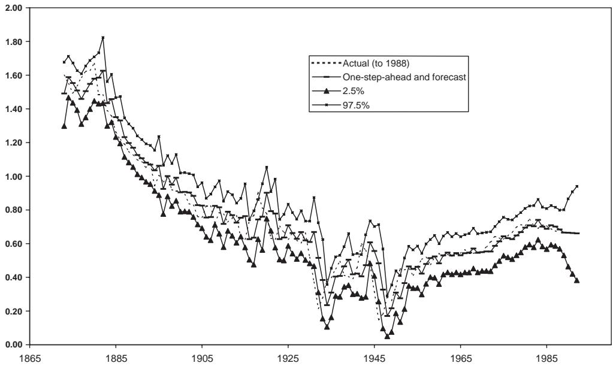  
Figure 8.1 Prediction and forecasts, velocity series.

As an alternative modelling approach explicitly designed to detect shifts in mean, an additive outlier model (see Section 8.10) is applied. This takes the form

$$
y _ {t} = (\mu + o _ {t}) + \rho \left(y _ {t - 1} - o _ {t - 1}\right) + \beta t + u _ {t},
$$

$$
o _ {t} = \delta_ {t} \eta_ {t},
$$

where $\delta_t$ is binary, $\delta_t \sim \mathrm{Bern}(\pi_\delta)$ , with $\pi_\delta = 0.05$ , and $\eta_t$ represents potential shifts in the mean with $\eta_t \sim N(0, k\sigma^2)$ where $k = 5$ . Since this model takes account of outliers, the innovations $u_t$ are taken as normal, $u_t \sim N(0, \sigma^2)$ . Following McCulloch and Tsay (1994), $o_t$ for years preceding (and after) the series are taken as zero. $N(0, 1)$ priors are assumed on $\beta$ and $\rho$ , while $\mu \sim N(0, 100)$ .

The mean for $\rho$ (from a two-chain run of 10 000 iterations with 1000 burn-in) is 0.962 with a 0.048 probability of non-stationarity. The probabilities $\operatorname{Pr}(\delta_t = 1|y)$ peak in 1918 and 1832 at 0.30 and 0.26, compared to a prior probability of 0.05. The one-step prediction errors of this model are better than under (8.3) with narrower intervals extending to forecasts.

# 8.4 AUTOREGRESSIVE MOVING AVERAGE MODELS

In the ARp model the observed value of an outcome is related to its past values and to a random innovation error. Moving average models allow for an impact of the innovation series that is not necessarily fully absorbed in the same period. For example, an MA1 error model for centred

data, with AR1 dependence in the data themselves, is

$$
y _ {t} = \rho_ {1} y _ {t - 1} + u _ {t} - \theta_ {1} u _ {t - 1} \quad t = 1, 2, \dots , T.
$$

A second-order moving average MA2 would involve a term $\theta_{2}u_{t - 2}$ . The number of lags $p$ in the data autoregression, the number of lags $q$ in the moving average and the order of differencing d determine an ARIMA $(p,d,q)$ model. If the data are undifferenced, an autoregressive lag $p$ and MA lag $q$ is denoted by ARMA $(p,q)$ . Thus an ARMA(3, 3) model would be

$$
y _ {t} - \rho_ {1} y _ {t - 1} - \rho_ {2} y _ {t - 2} - \rho_ {3} y _ {t - 3} = u _ {t} - \theta_ {1} u _ {t - 1} - \theta_ {2} u _ {t - 2} - \theta_ {3} u _ {t - 3}
$$

or as polynomials in the backward shift parameter

$$
\rho (B) y _ {t} = \theta (B) u _ {t}
$$

with $\rho(B) = 1 - \rho_1B - \rho_2B^2 - \rho_3B^3$ and $\theta(B) = 1 - \theta_1B - \theta_2B^2 - \theta_3B^3$ .

Since MA errors are a form of structured error, one may assume, for greater flexibility, an unstructured measurement error term $e_{t}$ specific to the $t$ th point (Berliner, 1996; West, 1996). For example, an ARMA(1, 1) model becomes

$$
y _ {t} = \rho_ {1} y _ {t - 1} + u _ {t} - \theta_ {1} u _ {t - 1} + e _ {t}, \tag {8.4}
$$

with $e_t \sim N(0, 1 / \tau_e)$ and $u_t \sim N(0, 1 / \tau_u)$ .

The constraint of invertibility for an MAq model can be achieved by online rejection of incompatible values or by subsequent selection only of samples satisfying invertibility. Alternatively, as for an ARp model, one may reparameterise the coefficients $\theta^{(q)} = (\theta_1^{(q)},\theta_2^{(q)},\dots,\theta_p^{(q)})$ in terms of partial autocorrelations $s_j$ , with $\theta_{j}^{(q)}$ the $j$ th MA coefficient in an MAq process. Then the invertibility conditions requiring that $\theta^{(q)}$ lie within a region $C_q$ become equivalent to restrictions that $|s_k| < 1$ for $k = 1,2,\ldots ,q$ . The transformations for $k = 2,\ldots ,q$ and $i = 1,\ldots ,k - 1$ are

$$
\begin{array}{l} \theta_ {k} ^ {(k)} = s _ {k} \\ \theta_ {i} ^ {(k)} = \theta_ {i} ^ {(k - 1)} - s _ {k} \theta_ {k - i} ^ {(k - 1)}. \\ \end{array}
$$

If both lag and moving average terms are included in an ARMA $(p,q)$ model then both sets of coefficients would be modelled via this parameterisation.

An ARMA $(p, q)$ model involves latent data $y_0, y_{-1}, \ldots, y_{1 - p}$ and the innovation errors $u_0, u_{-1}, \ldots, u_{1 - q}$ which initiate the process. Marriott et al. (1996) outline Gibbs sampling procedures for the exact ARMA likelihood, including both latent series. Their values may also be modelled as fixed effects or via 'backcasting', using duality between the backward and forward ARMA models under stationarity (Pai et al., 1994; Ravishanker and Ray, 1997). For instance, an ARMA(1, 1) model for centred observations

$$
y _ {t} = \rho y _ {t - 1} + u _ {t} - \theta u _ {t - 1}
$$

can also be generated by the corresponding backward model

$$
y _ {t} = \rho y _ {t + 1} + b _ {t} - \theta b _ {t + 1},
$$

Table 8.2 Posterior summary ARMA(3, 3) model   

<table><tr><td></td><td>Mean</td><td>St. devn</td><td>2.5%</td><td>97.5%</td></tr><tr><td>ρ1</td><td>1.70</td><td>0.24</td><td>1.23</td><td>2.19</td></tr><tr><td>ρ2</td><td>-1.18</td><td>0.37</td><td>-1.94</td><td>-0.47</td></tr><tr><td>ρ3</td><td>0.16</td><td>0.21</td><td>0.22</td><td>0.60</td></tr><tr><td>θ1</td><td>0.55</td><td>0.35</td><td>-0.37</td><td>1.13</td></tr><tr><td>θ2</td><td>0.08</td><td>0.28</td><td>-0.41</td><td>0.84</td></tr><tr><td>θ3</td><td>-0.52</td><td>0.26</td><td>-0.91</td><td>0.24</td></tr></table>

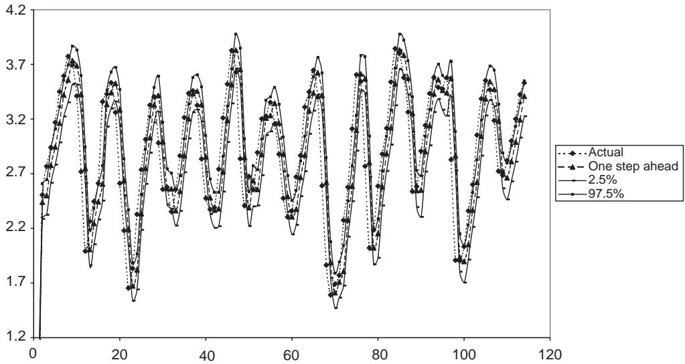  
Figure 8.2 Actual and one-step-ahead predictions.

where $b_{t}$ has the same distribution as $u_{t}$ . Starting with $b_{T} = 0$ , these equations can be used to generate $b_{T-1}, \ldots, b_{1}$ , and then $y_{0}$ and $u_{0}$ , the latent quantities needed for an ARMA (1, 1) model. Chib and Greenberg (1994) develop a different approach that does not require the presample observations $y_{0}, y_{-1}, \ldots, y_{1-p}$ . In their approach, presample errors are needed but only for models with MA components. Their approach also incorporates a regression structure.

Example 8.3 Trapped lynx, 1821-1934 A much analysed series is the number of lynx $y_{t}$ (subject to a log10 transform) trapped each year in the Mackenzie River district of northwest Canada between 1821 and 1934 ( $T = 114$ ). Among possible models applied, an ARMA(3, 3) process has been found to give a suitable fit.

Here constrained priors are applied (using partial correlations as above) to ensure stationarity and invertibility in an ARMA(3, 3) model. Additionally a measurement error is included as in (8.4). With centred $y_{t}$ , the model is

$$
y _ {t} - \rho_ {1} y _ {t - 1} - \rho_ {2} y _ {t - 2} - \rho_ {3} y _ {t - 3} = u _ {t} - \theta_ {1} u _ {t - 1} - \theta_ {2} u _ {t - 2} - \theta_ {3} u _ {t - 3} + e _ {t},
$$

where the precisions on $u_{t}$ and $e_{t}$ have $\operatorname{Ga}(1, 0.001)$ priors. Finally the latent pre-series $y$ values are sampled from a $t$ density with four degrees of freedom and unknown mean $\nu$ while the latent $u$ are sampled from a $t$ density version of the normal prior for $u_{t}, t = 1, \dots, T$ .

After a two-chain run of 20000 iterations (with second half for inferences), the autoregressive and MA parameters have posterior means similar to those reported by Marriott et al. (1996). Figure 8.2 shows a reasonable correspondence between actual data and one-step-ahead forecasts, though some points (e.g. $t = 10, 11, 15, 47, 66, 67, 76, 87$ and 97) are not well predicted. The posterior means of the standard deviations $\sigma_{e}$ and $\sigma_{u}$ are respectively 0.04 and 0.19, so the measurement error variance is relatively small though its density is bounded away from zero.

# 8.5 AUTOREGRESSIVE ERRORS

In the specifications above, the innovation errors $u_{t}$ are assumed temporally uncorrelated with diagonal covariance matrix, and autocorrelation is confined to the observations themselves. Consider instead a regression model with $r - 1$ predictors

$$
y _ {t} = \beta_ {1} + \beta_ {2} x _ {2 t} + \dots + \beta_ {r} x _ {r t} + \varepsilon_ {t},
$$

where errors $\varepsilon_{t}$ may be correlated over time and the covariance matrix is no longer diagonal (Ghosh and Heo, 2003). One context where this may be important is in non-parametric regression (Smith et al., 1998).

For example, an AR $p$ transformation of the $\varepsilon_{t}$

$$
\gamma (B) \varepsilon_ {t} = u _ {t}
$$

may be required in order that $u_{t}$ is uncorrelated with constant variance, where $\gamma (B) = 1 - \gamma_{1}B - \gamma_{2}B^{2} - \dots -\gamma_{p}B^{p}$ . More generally an ARMA(p,q) error scheme has the form

$$
\varepsilon_ {t} - \gamma_ {1} \varepsilon_ {t - 1} - \gamma_ {2} \varepsilon_ {t - 2} - \dots - \gamma_ {p} \varepsilon_ {t - p} = u _ {t} - \theta_ {1} u _ {t - 1} - \theta_ {2} u _ {t - 2} - \dots - \theta_ {q} u _ {t - q}.
$$

As an example, first-order autocorrelation, i.e. AR1 dependence, in the errors $\varepsilon_{t}$ would imply

$$
y _ {t} = X _ {t} \beta + \varepsilon_ {t},
$$

$$
\varepsilon_ {t} = \gamma \varepsilon_ {t - 1} + u _ {t}
$$

and

$$
\begin{array}{l} \operatorname {v a r} \left(\varepsilon_ {t}\right) = \gamma^ {2} \operatorname {v a r} \left(\varepsilon_ {t - 1}\right) + \sigma^ {2} + 2 \gamma \operatorname {c o v} \left(\varepsilon_ {t - 1}, u _ {t}\right) \\ = \gamma^ {2} \operatorname {v a r} \left(\varepsilon_ {t}\right) + \sigma^ {2}, \\ \end{array}
$$

so that

$$
\operatorname {v a r} \left(\varepsilon_ {I}\right) = \sigma^ {2} / \left(1 - \gamma^ {2}\right).
$$

Also $\operatorname{corr}(\varepsilon_t, \varepsilon_{t-1}) = \gamma$ , and $\operatorname{corr}(\varepsilon_t, \varepsilon_{t-k}) = \gamma^k$ .

Variation in the errors $\varepsilon_{t}$ will be understated if the model does not explicitly allow autocorrelation and credible intervals for the components of $\beta$ will be too narrow. The AR1 error

model may be re-expressed in nonlinear autoregressive form (for $t > 1$ ) with homoscedastic errors $u_{t}$ ,

$$
y _ {t} = X _ {t} \beta + \gamma (y _ {t - 1} - X _ {t - 1} \beta) + u _ {t}.
$$

This is known as the Cochrane-Orcutt transformation, and if stationarity is assumed it includes a special transformation for the first observation. An alternative scheme known as the Prais-Winstein transformation assumes that $\varepsilon_{t}$ is stationary (Fomby and Guilkey, 1978).

Bayesian estimation of the autoregressive AR $p$ error model is simplified by conditioning on the first $p$ observations when there is a $p$ th-order autoregressive dependence in the $\varepsilon_{t}$ (Chib, 1993). This avoids specifying a prior for the pre-series errors $\varepsilon_0, \varepsilon_{-1}, \ldots, \varepsilon_{1 - p}$ . Another option uses composite parameters for terms involving the pre-series errors. For example, for AR1 errors and without a stationarity assumption, the first observation can be modelled as

$$
y _ {1} = X _ {1} \beta + g + u _ {1},
$$

where $g = \gamma (y_0 - X_0\beta)$ is an unknown fixed effect (Zellner and Tiao, 1964). A full likelihood approach to the ARMA( $p, q$ ) errors regression model is developed by Chib and Greenberg (1994).

Bayesian regression with autoregressive errors does not a priori restrict $\gamma_{1},\ldots ,\gamma_{p}$ to satisfy the stationarity constraint. However, a model without such a constraint that involves regression on a covariate(s) may lead to identifiability problems if the changing level of $y_{t}$ could be due equally to changes in the level(s) of $X_{t}$ as to non-stationary errors. Zellner and Tiao (1964) illustrate the dependence that may occur between a non-stationary error process and the posterior density of the regression parameter $\beta$ in an AR1 error model with a single covariate.

Example 8.4 Cobb-Douglas production function Judge et al. (1988) analyse $T = 20$ observations from a series $\{y_{t}, x_{1t}, x_{2t}\}$ denoting the logarithms of output $Q_{t}$ , labour $L_{t}$ and capital $K_{t}$ , respectively. The Cobb-Douglas production relation is multiplicative

$$
Q _ {t} = \alpha L _ {t} ^ {\beta_ {1}} K _ {t} ^ {\beta_ {2}} \eta_ {t}
$$

with multiplicative error $\eta_t$ . A possible log-linear version is

$$
y _ {t} = \beta_ {1} + \beta_ {2} x _ {1 t} + \beta_ {3} x _ {2 t} + \varepsilon_ {t},
$$

with $\varepsilon_{t} = \gamma \varepsilon_{t - 1} + u_{t},u_{t}\sim N(0,\sigma^{2})$ . Economic theory suggests parameter constraints

$$
0 <   \beta_ {2} <   1, 0 <   \beta_ {3} <   1,
$$

though values outside this range are not absolutely excluded. Judge et al. obtain a Bayesian estimate $\gamma = 0.67$ (sd = 0.19), as compared to maximum likelihood of 0.56 (sd = 0.19). The ML estimates of the other parameters are $\beta_{1} = 4.06$ (5.77), $\beta_{2} = 1.67$ (0.28), $\beta_{3} = 0.76$ (0.14) and $\sigma^2 = 6.1$ (1.9).

An AR1 errors model can be expressed as

$$
y _ {t} = \beta_ {1} + \beta_ {2} x _ {1 t} + \beta_ {3} x _ {2 t} + \gamma \left(y _ {t - 1} - \beta_ {1} - \beta_ {2} x _ {1, t - 1} - \beta_ {3} x _ {2, t - 1}\right) + u _ {t}
$$

for $t = 2, \ldots, T$ . If stationarity is assumed with $-1 < \gamma < 1$ , the residual variance of $y_{1}$ is $\sigma^2 / (1 - \gamma^2)$ with mean $\mu_{1} = \beta_{1} + \beta_{2}x_{11} + \beta_{3}x_{21}$ , while subsequent observations have mean

$$
\mu_ {t} = \beta_ {1} + \beta_ {2} x _ {1 t} + \beta_ {3} x _ {2 t} + \gamma \left(y _ {t - 1} - \beta_ {1} - \beta_ {2} x _ {1, t - 1} - \beta_ {2} x _ {2, t - 1}\right)
$$

and variance $\sigma^2$ . $N_{3}(0,\Sigma)$ priors are assumed on $\beta_{j}(j = 1,3)$ , where $\Sigma = \mathrm{diag}(1000)$ . Additionally $\gamma \sim U[-1,1]$ in line with stationarity. A two-chain run of 10000 iterations (500 burn-in) gives $\rho = 0.66(\mathrm{sd} = 0.19)$ , $\beta_{1} = 4.9(5.6)$ , $\beta_{2} = 1.65(0.32)$ , $\beta_{3} = 0.77$ (0.16) and $\sigma^2 = 7.6$ (2.8). The autocorrelation parameter is similar to that cited by Judge et al.

Another approach, not restricted to stationarity, follows Zellner (1996) in modelling all the data together, i.e. $y_{t} \sim N(\mu_{t}, \sigma^{2})$ , $t = 1, \ldots, T$ , with $\mu_{t} = \beta_{1} + \beta_{2}x_{1t} + \beta_{3}x_{2t} + \gamma (y_{t-1} - \beta_{1} - \beta_{2}x_{1,t-1} - \beta_{3}x_{2,t-1})$ for $t > 1$ , but with $\mu_{1}$ involving latent data in a composite parameter $g$ , such that

$$
\mu_ {1} = \beta_ {1} + \beta_ {2} x _ {1 1} + \beta_ {3} x _ {2 1} + g - \gamma \beta_ {1}.
$$

A $N(0,1)$ prior on $\gamma$ is assumed, and $g$ modelled jointly with the $\beta$ parameters in a $N_{4}(0,\Sigma)$ prior with $\Sigma = \mathrm{diag}(1000)$ . A two-chain run of 10 000 iterations yields a higher value of $\gamma$ , namely 0.77 (0.21), with $15\%$ probability of non-stationarity. The labour structural parameter $\beta_{2}$ is elevated but has lower precision under this model, with mean 1.92 and standard deviation 0.59.

# 8.6 MULTIVARIATE SERIES

The above univariate methods may be extended to modelling multivariate dependence through time. For example, autoregressive observational dependence would mean each series depending both on its own past and on the past values of one or more of the other series (Sims, 1980; Sims and Zha, 1998), and often extends to panel data (Canova and Ciccarelli, 2001). One advantage of simultaneously modelling several series is the possibility of pooling information to improve precision and out-of-sample forecasts. Vector autoregressive (VAR) models have been used especially in economic forecasts for related units of observation, for example, of employment in industry sectors or across regions, and of jointly dependent series (unemployment and production), as well as in analyses of historic fluctuations (Ritschl and Woitek, 2000).

These models involve only predetermined variables as predictors, thus avoiding specification of endogenous dependence (Bauwens and Lubrano, 1995). However, they may originate as reduced forms of models that do incorporate endogenous dependence. For example, consider consumption $C_t$ as a function of income $Y_t$ and previous period consumption $C_{t-1}$ ; income $Y_t$ is also a function of previous income and consumption, so that

$$
\begin{array}{l} C _ {t} = \alpha_ {1} + \rho_ {1} C _ {t - 1} + \beta_ {1} Y _ {t} + u _ {1 t}, \\ Y _ {t} = \alpha_ {2} + \rho_ {2} Y _ {t - 1} + \beta_ {2} C _ {t - 1} + u _ {2 t}, \\ \end{array}
$$

Substituting $\alpha_{2} + \rho_{2}Y_{t - 1} + \beta_{2}C_{t - 1} + u_{2t}$ for $Y_{t}$ in the first equation gives a reduced form that involves only lagged predictors.

Bayesian developments have included the informative Minnesota prior approach (Doan et al., 1984; Litterman, 1986), more general priors in VAR models (Sims and Zha, 1998) and

vector ARMA models (Ravishanker and Ray, 1997). The Minnesota prior is one approach to possible overparameterisation and collinearity in such models (Zellner, 1985).

For example, one model for centred metric variables $y_{t} = (y_{1t}, y_{2t}, \ldots, y_{Kt})$ of dimension $K$ is a multivariate normal autoregression of order $p$ , denoted by VARp, with

$$
y _ {t} = y _ {t - 1} \Phi_ {1} + \dots + y _ {t - p} \Phi_ {p} + u _ {t},
$$

$$
u _ {t} \sim N _ {K} (0, \Sigma),
$$

where the matrices $\Phi_1, \ldots, \Phi_p$ are each $K \times K$ , and the covariance matrix is for exchangeable errors $u_t = (u_{1t}, u_{2t}, \ldots, u_{Kt})$ . Alternatively

$$
y _ {t} = X _ {t} \Phi + U _ {t},
$$

where $X_{t} = (y_{t - 1},\ldots ,y_{t - p})$ is $(1\times KP)$ , and $\Phi$ is $(KP\times K)$ . So, if $K = 2$ , $\Phi_1$ would consist of own-lag coefficients relating $y_{1t}$ and $y_{2t}$ to the lagged values $y_{1,t - 1}$ and $y_{2,t - 1}$ and cross-lag coefficients relating $y_{1t}$ to $y_{2,t - 1}$ and $y_{2t}$ to $y_{1,t - 1}$ . In many applications there are asymmetries on hypothesised economic linkages so that the predictors (lagged $y$ variables) are not the same in all equations and some equations may include trends and seasonal effects while others do not; for example

$$
y _ {1 t} = \phi_ {1 1 1} y _ {1, t - 1} + \phi_ {1 1 2} y _ {2, t - 1} + \phi_ {2 1 1} y _ {1, t - 2} + \phi_ {2 1 2} y _ {2, t - 2} + u _ {1 t},
$$

$$
y _ {2 t} = \phi_ {1 2 1} y _ {1, t - 1} + \phi_ {1 2 2} y _ {2, t - 1} + u _ {2 t},
$$

where $\Phi_1$ is $2\times 2$ , but $\Phi_{2}$ has entirely non-zero coefficients only in its first row.

In matrix form, obtained by stacking the observations for each of the $t = 1,\dots ,T$ time points, one has

$$
Y = X \Phi + U,
$$

where $U\sim N_{T\times K}(0,\Sigma \otimes I_T)$ .Under a non-informative prior,

$$
P (\Phi , \Sigma) \propto | \Sigma | ^ {- (T + 1) / 2},
$$

the posterior density of $\Phi$ is a multivariate $t$ with mean $(X'X)^{-1}X'Y$ . By contrast, under the informative Minnesota prior, the priors on $\Phi$ coefficients are normal with diagonal covariance matrices and means of zero except for the lag 1 own-variable coefficient with a prior mean of 1; standard deviations on the coefficients also depend on whether the coefficient is an own- or cross lag. If the prior standard deviation of the own-lag 1 coefficient, such as $\phi_{111}$ in

$$
y _ {1 t} = \phi_ {1 1 1} y _ {1, t - 1} + \phi_ {1 1 2} y _ {2, t - 1} + \phi_ {2 1 1} y _ {1, t - 2} + \phi_ {2 1 2} y _ {2, t - 2} + u _ {1 t}
$$

is $\zeta$ , then the prior standard deviation of the own-lag $k$ coefficients $\phi_{kjj}(k > 1)$ is $\zeta / k$ , reflecting a prior belief that higher order lags are expected to be closer to zero. For the cross-lag $k$ coefficients $\phi_{kjm}$ on variable $m$ in the $j$ th equation, the prior standard deviation is $\delta \zeta \sigma_j / (k\sigma_m)$ where $0 < \delta < 1$ and $(\sigma_j / \sigma_m)$ adjusts for different scales between the variables. The $\sigma_j$ are square roots of the diagonal terms of $\Sigma$ . Since this prior is modelling the coefficients as a collection, an extension is to take $\zeta$ and $\delta$ as unknowns (e.g. with exponential and beta priors respectively).

Example 8.5 US personal consumption and income This example considers the bivariate series from Judge et al. (1988, pp. 758-759) relating to 75 quarters (1951Q2 to 1969Q4) of personal consumption expenditures $(y_{1})$ and disposable personal income $(y_{2})$ , both at constant prices and seasonally adjusted. A lag 4 VAR4 model in each component of the bivariate outcome is adopted, and the $u_{kt}$ are taken as bivariate normal, with precision matrix $\Sigma^{-1}$ assumed Wishart with two degrees of freedom and scale matrix, diag(0.1). The likelihood is based on observations 5 to 71, with conditioning on the first four points. Forecasts are made for the remaining four periods.

Initially, $N(0,100)$ priors are assumed on the lag coefficients. With a two-chain run taken to 5000 iterations (and burn-in of 500), most of the lag coefficients are not significant in the sense of having $95\%$ credible intervals entirely negative or positive. The significant effects are the lag 1 effect of $y_{2}$ on $y_{1}$ with mean coefficient (and sd) of 0.50 (0.13) and the own-lag 1 effect of $y_{2}$ on itself, namely 0.32 (0.16). The cross-variable correlation in the errors $u_{kt}$ is estimated at around 0.56, with $95\%$ credible interval (0.36, 0.72). The forecasts for personal consumption in the 1969 quarters are 10, 14, 8 and 16 compared to the actual 21, 9, 9 and 16.

A Litterman prior with $\zeta \sim E(1)$ and $\delta \sim \mathrm{Be}(1,1)$ is then assumed on the $\phi$ coefficients but with prior cross-lag standard deviations specified as $N(0,\delta \zeta s_j / (ks_m))$ , where $\{s_j,s_m\}$ are observed variances. This gives very similar estimates both for the $\phi$ coefficients, and for the 1969 quarterly consumption forecasts, namely 10,14.5, 7.5 and 16.

# 8.7 TIME SERIES MODELS FOR DISCRETE OUTCOMES

# 8.7.1 Observation-driven autodependence

For discrete outcomes, dependence on past observations and predictors may often be handled by adapting metric variable methods within the appropriate regression link. For example, lags in the observations themselves are often used within logit or probit link models for binary or categorical data. For binary data $y_{t} \sim \mathrm{Bern}(\pi_{t})$ , an AR1 model in $y_{t}$ and a regression term $X_{t}\beta$ , such as

$$
\operatorname {l o g i t} \left(\pi_ {t}\right) = X _ {t} \beta + \rho y _ {t - 1}
$$

is a generalisation of a stationary first-order Markov chain represented by the model

$$
\operatorname {l o g i t} \left(\pi_ {t}\right) = \beta_ {1} + \rho y _ {t - 1}.
$$

Higher order lags in $y$ represent higher order Markov chain dependence. For multicategory data with $K$ categories there are $K - 1$ free category probabilities and these might be related to lagged values on up to $K - 1$ binary variables. This leads to models similar to VAR $p$ models for multivariate metric outcomes, in that there are 'own' and 'cross' lags (Pruscha, 1993).

An alternative approach for binary and categorical time series augments the model with a latent univariate or multivariate series $W_{t}$ according to the value of $y_{t}$ . For binary data, one might then assume an underlying true series or signal $f_{t}$ such that

$$
\begin{array}{l} W _ {t} \sim N (f _ {t}, 1) I \left(A _ {t 1}, A _ {t 2}\right), \\ f _ {t} = \rho f _ {t - 1} + u _ {t}, \\ \end{array}
$$

with $A_{t} = (-\infty, 0)$ or $(0, \infty)$ according as $y_{t} = 0$ or 1, and with $|\rho| < 1$ corresponding to stationarity (Carlin and Polson, 1992). Alternatively, an AR1 dependence on previous responses, either observed (y) or latent ( $W$ ), could be specified, as in

$$
W _ {t} \sim N (\mu_ {t}, 1) I (A _ {t 1}, A _ {t 2}),
$$

$$
\mu_ {t} = \rho_ {1} W _ {t - 1} + \rho_ {\mathrm {y}} y _ {t - 1} + X _ {t} \beta .
$$

For Poisson or binomial data, it makes sense for lagged value of the outcome to be in the same form as the transformed mean of the current outcome value (e.g. Zeger and Qaqish, 1988). Thus under a log link for count data, $y_{t} \sim \mathrm{Po}(\mu_{t})$ , a first lag dependence on $y_{t-1}$ would set

$$
\log \left(\mu_ {t}\right) = X _ {t} \beta + \rho \log \left(y _ {t - 1} ^ {\prime}\right),
$$

$$
y _ {t - 1} ^ {\prime} = \max  (c, y _ {t - 1}) \quad (0 <   c <   1),
$$

where the definition of $y_{t-1}^{\prime}$ is to avoid taking logs of zero lagged counts. Either $c$ can be an additional parameter or taken as a default value such as $c = 0.5$ or $c = 1$ . Fokianos (2001) presents a similar model for truncated Poisson data.

A further observation-driven option for count data (e.g. Grunwald et al., 2000; Jung and Tremayne, 2003) is a conditional linear autoregressive lag $p$ scheme or CLARp, whereby

$$
E \left(y _ {t} \mid y _ {t - 1}, \dots\right) = \mu_ {t} = \rho_ {1} y _ {t - 1} + \rho_ {2} y _ {t - 2} + \dots + \rho_ {p} y _ {t - p} + Z _ {t}
$$

where $Z_{t}$ is any positive series (e.g. gamma, lognormal). For example, one option sets $Z_{t} \sim \mathrm{Po}(\lambda_{t})$ with $\lambda_{t} = \exp(X_{t}\beta)$ where $X_{t}$ includes an intercept. To allow overdispersion in the time series, one may specify an additive gamma error

$$
Z _ {t} \sim \operatorname {G a} (\kappa , \kappa / \lambda_ {t}),
$$

which tends to the Poisson as $\kappa \to \infty$

To consider extended lags or moving average effects for frequent binomial events or counts, then unmodified ARMA methods - applied as if the outcomes were effectively metric, and using normal approximations to the binomial or Poisson - may be appropriate. However, there are potential problems in applying standard ARMA models to count data since the assumption of normality (or of any symmetric density) may not be appropriate, especially for rare events.

# 8.7.2 INAR models

Integer-valued autoregressive (INAR) schemes are designed to reproduce properties of ARMA models for metric outcomes, while also being adapted to discrete sampling mechanisms for counts (Freeland and McCabe, 2004; Jung and Tremayne, 2006; McCabe and Martin, 2005; McKenzie, 1988). They introduce dependence of the current count $y_{t}$ on previous counts $y_{t-1}, y_{t-2}, \ldots$ via binomial thinning and also include an integer-valued innovation series $w_{t}$ . Thus in an INAR1 model, one considers the chance $\rho$ that each of the $y_{t-1}$ particles from period $t-1$ survives through to the next period, so the autoregressive (observation-driven) component of the INAR1 model for $y_{t}(t > 1)$ is

$$
C _ {t} = \sum_ {k = 1} ^ {y _ {t - 1}} \operatorname {B e r n} (\rho) = \rho \circ y _ {t - 1},
$$

with $y_{1} \sim \mathrm{Po}(\theta)$ . Equivalently $C_t$ is binomial with $y_{t-1}$ subjects and $\rho$ the probability of success. McKenzie (1988) proposes the innovations $w_{t}$ to be Poisson with mean $\theta(1 - \rho)$ in order to ensure stationarity in the mean for $y$ , with

$$
y _ {t} = C _ {t} + w _ {t}.
$$

One may also adopt negative binomial innovations. One might consider Poisson densities for $w_{t}$ not tied to $\rho$ in an INAR1 model, especially if there is overdispersion. Thus Franke and Seligmann (1993) propose a mixed Poisson for $w_{t}$ with two possible means $\lambda_{1}$ and $\lambda_{2}$ in an analysis of epileptic seizure counts. Switching in the innovation process at time $t$ is determined by binary variables $Q_{t}$ .

An INAR2 process would refer to two preceding counts $y_{t-1}$ and $y_{t-2}$ and involve two survival probabilities, $\rho_1$ and $\rho_2$ . Note that for an INAR $p$ process stationarity is defined by $\Sigma_{k=1}^{\rho} \rho_k < 1$ (Cardinal et al., 1999). For overdispersed data, McKenzie (1986) suggested that the 'survival probabilities', such as $\rho_t$ in an INAR1 model, be time varying, possibly under a hierarchical prior such as $\rho_t \sim \mathrm{Be}(a, b)$ where $a, b$ are also unknown, or via autoregressive priors on preceding probabilities. The thinning probabilities may also be related to predictors $Z_t$ by logit regression (Kedem and Fokianos, 2002, Chapter 5).

The INAR model involves an identity link in seeking to replicate metric ARIMA features, but INAR-type mechanisms (e.g. binomial thinning, discrete innovations) can be used in conditional Poisson means and in non-identity links (Grunwald et al., 2000). For example, the CLAR models mentioned above may include features of the INAR approach, as in

$$
\begin{array}{l} y _ {t} \sim \operatorname {P o} \left(\mu_ {t}\right), \\ \mu_ {t} = \rho \circ y _ {t - 1} + \lambda_ {t}, \\ \end{array}
$$

with $\lambda_t = \exp(X_t\beta)$ . Other options include allowing the parameters generating the innovations to be time varying, as in $\mu_t = \rho \circ y_{t-1} + w_t$ , $w_t \sim \mathrm{Po}(\exp[\eta_t])$ , where $\eta_t$ follows a random walk prior, $\eta_t \sim N(\eta_{t-1}, \tau_\eta)$ .

# 8.7.3 Error autocorrelation

If autocorrelation (or moving average dependence) is postulated in the regression errors rather than in the lagged counts, events or latent data, one obtains parameter-driven models (e.g. see Jung et al., 2005 for a discussion of stochastic autoregressive mean models for counts). There are close connections between such models and dynamic general linear priors for discrete outcomes (Section 8.8) with random walk priors in parameters.

A common scheme for $\mathrm{ARMA}(p,q)$ error dependence in time series models for discrete data is the AR1 error model. For a Poisson outcome (Chan and Ledolter, 1995; Chen and Ibrahim, 2000; Oh and Lim, 2001) this has the form

$$
\begin{array}{l} y _ {t} \sim \operatorname {P o} \left(\mu_ {t}\right), \\ \log (\mu_ {t}) = X _ {t} \beta + \varepsilon_ {t}, \\ \varepsilon_ {t} = \gamma \varepsilon_ {t - 1} + u _ {t}, \\ \end{array}
$$

where $|\gamma| \leq 1$ and $u_t \sim N(0, \sigma^2)$ . Chen and Ibrahim (2000) set out sampling algorithms under a power prior approach for this model based on similar historic data, while Oh and Lim (2001)

and Jung et al. (2005) consider augmented data sampling for Poisson counts. A multiplicative error model (Davis et al., 2000; Zeger, 1988) has the form

$$
\mu_ {t} = \exp (X _ {t} \beta) \eta_ {t},
$$

where $\eta_t$ is gamma with mean 1 when $X_t$ includes an intercept. Houseman et al. (2004) present a public health application.

Similarly Zeger and Qaqish (1988) propose, for a Poisson outcome, the lagged regression error model

$$
\log \left(\mu_ {t}\right) = \beta x _ {t} + \phi \left(\log y _ {t - 1} ^ {\prime} - \beta x _ {t - 1}\right),
$$

while a lag 2 model would be

$$
\log \left(\mu_ {t}\right) = \beta x _ {t} + \phi_ {1} \left(\log y _ {t - 1} ^ {\prime} - \beta x _ {t - 1}\right) + \phi_ {2} \left(\log y _ {t - 2} ^ {\prime} - \beta x _ {t - 2}\right)
$$

and 'moving average' terms would compare $\log y_{t - j}^{\prime}$ with $\log \mu_{t - j}$ . This leads to $\mathrm{GARMA}(p,q)$ models (e.g. Benjamin et al., 2003) so that an ARMA(1, 1) type model would be

$$
\log (\mu_ {t}) = \beta x _ {t} + \phi (\log y _ {t - 1} ^ {\prime} - \beta x _ {t - 1}) + \theta (\log y _ {t - 1} ^ {\prime} - \log \mu_ {t - 1}).
$$

Davis et al. (2003) consider partially observation-driven models of the form $y_{t} \sim \mathrm{Po}(\exp [W_{t}])$ ,

$$
W _ {t} = X _ {t} \beta + Z _ {t},
$$

where $Z_{t}$ is a latent series

$$
Z _ {t} = \phi_ {1} \left(Z _ {t - 1} + e _ {t - 1}\right) + \dots + \phi_ {p} \left(Z _ {t - p} + e _ {t - p}\right) + \theta_ {1} e _ {t - 1} + \dots + \theta_ {q} e _ {t - q},
$$

$e_t$ are lagged regression errors,

$$
e _ {t} = \left(y _ {t} - \exp \left[ W _ {t} \right]\right) \exp \left(- \lambda W _ {t}\right)
$$

and where $\theta$ and $\phi$ coefficients are constrained to stationary values. This method is illustrated by data generated with $q = 1, \lambda = 1$ , and $p = 0$ , namely

$$
W _ {t} = X _ {t} \beta + \gamma \left(y _ {t - 1} - \exp \left(W _ {t - 1}\right) \exp \left(- W _ {t - 1}\right) \right.
$$

for $T = 15$ , $X_{t}$ containing only a constant, $\beta = 2$ , and $\gamma = 0.7$ . If WINBUGS is used as a computing medium, the non-standard likelihood is coded as follows:

```txt
model {beta \~ dnorm(0,1); gam \~ dunif(-1,1)   
for (t in 1:T){h[t]<-1; h[t] \~dbern(P[t])   
log(P[t])<- -mu[t]+y[t]*log(mu[t])-logfact(y[t])}   
log(mu[1])<- beta; W[1]<- log(mu[1])   
for (t in 2:T){log(mu[t])<-W[t]   
W[t]<- beta+gam\*(y[t-1]-exp(W[t-1]))\*exp(-W[t-1])} 
```

with posterior means from a single-chain run of 5000 iterations obtained as $\beta = 2.1(1.8, 2.4)$ , $\gamma = 0.76(0.45, 0.98)$ .

Table 8.3 AIDs deaths prediction model   

<table><tr><td></td><td>Mean</td><td>St. devn</td><td>2.5%</td><td>97.5%</td></tr><tr><td>Y15</td><td>45.4</td><td>7.6</td><td>31.0</td><td>61.0</td></tr><tr><td>Y16</td><td>45.8</td><td>10.7</td><td>26.0</td><td>68.0</td></tr><tr><td>Y17</td><td>46.4</td><td>13.3</td><td>22.0</td><td>74.0</td></tr><tr><td>Y18</td><td>47.0</td><td>15.5</td><td>20.0</td><td>80.0</td></tr><tr><td>Y19</td><td>47.7</td><td>17.3</td><td>18.0</td><td>85.0</td></tr><tr><td>μw</td><td>3.58</td><td>1.06</td><td>1.75</td><td>5.85</td></tr><tr><td>ρ</td><td>0.93</td><td>0.06</td><td>0.78</td><td>1.00</td></tr><tr><td>θ</td><td>1.00</td><td>1.00</td><td>0.03</td><td>3.67</td></tr></table>

Example 8.6 AIDS cases via dependent Poisson model Lag 1 INAR scheme models are illustrated using $\mathrm{T} = 14$ quarterly AIDS death totals in Australia in the mid 1980s (Dobson, 1984). The first model adopted here is specified for the conditional Poisson mean

$$
\begin{array}{l} y _ {t} \sim \operatorname {P o} \left(\mu_ {t}\right), \\ \mu_ {t} = C _ {t} + w _ {t} \quad t = 2, \ldots , T, \\ C _ {t} = \Sigma_ {k = 1} ^ {y _ {t - 1}} \operatorname {B e r n} (\rho) = \rho \circ y _ {t - 1}, \\ y _ {1} \sim \mathrm {P o} (\theta), \\ w _ {t} \sim \operatorname {P o} \left(\mu_ {w}\right), \\ \end{array}
$$

with $\rho \sim \mathrm{Be}(1,1)$ , $\theta \sim \mathrm{Ga}(1,0.001)$ and $\mu_w \sim \mathrm{Ga}(1,0.001)$ . A prediction for five more quarters is included. The total rose from 0 in early 1983 to 45 in mid-1986; Dobson (1984) proposes the growth model $y_{t} \sim \mathrm{Po}(\nu^{t})$ . The second half of a two-chain 10 000-iteration run gives the parameter estimates and one-step prediction as in Table 8.3.

The second model exactly replicates the model

$$
\begin{array}{l} y _ {t} = \rho \circ y _ {t - 1} + w _ {t} \quad t = 2, \dots , T, \\ y _ {1} \sim \operatorname {P o} (\mu_ {1}), \\ w _ {t} \sim \operatorname {P o} \left(\mu_ {w}\right), \\ \end{array}
$$

using the INAR1 likelihood (e.g. Freeland and McCabe, 2004). This is a stationary model not appropriate to this particular series but included for illustration. One finds means $\rho = 0.47(0.457, 0.472)$ and $\mu_w = 17.8$ . Forecasts beyond T eventually revert to a level consonant with the last three years' observed data.

# 8.8 DYNAMIC LINEAR MODELS AND TIME VARYING COEFFICIENTS

Whereas classical ARMA approaches rely on transformation and differencing to ensure that stationarity assumptions are met, dynamic linear models (DLMs) based on state-space priors seek to directly represent features of time series, such as trend, seasonality or regression effects, without using differencing. This may have advantages in interpreting regression relationships

that might be obscured by differencing in both the $y$ and $x$ series and in treating series subject to abrupt discontinuities or shifts, the impact of which cannot be simply removed by differencing (West and Harrison, 1997, p. 300). Autoregressive or moving average mechanisms might, however, still be components of a DLM. Applications of state-space models include models for the impact of advertising (Migon and Harrison, 1985), SV models for financial series (Meyer and Yu, 2000), forecasts of exports (Migon, 2000), modelling air pollution (Calder et al., 2002) and decomposition of geological series relating to climate change (West, 1997).

For metric univariate or multivariate outcomes a DLM describes the evolution of the observations $y_{t}$ in terms of unobserved continuous states $\theta_{t}$ . Covariates $X_{t}$ may also be used. The DLM consists of an observation equation and a state equation. The observation equation specifies the distribution of $y_{t}$ conditional on the states $\theta_{t}$ , while the state equation specifies how the states change dynamically, usually through a Markov model (Berliner, 1996; Meyer, 2000). For instance a first-order Markov dependence in $\theta_{t}$ leads to a model such as

$$
y _ {t} \mid \alpha , \theta_ {t} = X _ {t} f _ {1} (\theta_ {t}, \alpha) + \varepsilon_ {t},
$$

$$
\theta_ {t} | \beta = f _ {2} (\theta_ {t - 1}, \beta) + \omega_ {t},
$$

where $f_{1}$ and $f_{2}$ may be linear or nonlinear functions and typically the $\varepsilon_{t}$ and $\omega_{t}$ are normal. The final component of the DLM is the prior on the initial states, whose number depends on the order of the Markov dependence.

Linear forms for the two equations typically involve a known design matrix $F_{t}$ in the observation equation, specifying which latent states and covariates impact on the outcomes, and a known transition matrix $G_{t}$ in the state equation, describing how successive latent state values are related. Thus

$$
y _ {t} = F _ {t} \theta_ {t} + \varepsilon_ {t} \quad \varepsilon_ {t} \sim N (0, V _ {t}), \tag {8.5.1}
$$

$$
\theta_ {t} = G _ {t} \theta_ {t - 1} + \omega_ {t} \quad \omega_ {t} \sim N (0, W _ {t}). \tag {8.5.2}
$$

Suppose $y_{t}$ is multivariate of dimension $m$ and $\theta_{t}$ of dimension $d$ , so that $F_{t}$ is $m \times d$ and $G_{t}$ is $d \times d$ . Even though $y_{t}$ might be univariate ( $m = 1$ ), $\theta_{t}$ may be of dimension greater than 1; in this case, some of the design matrix elements will be zero. The errors $\varepsilon_{t}$ and $\omega_{t}$ are generally taken to be mutually uncorrelated and not correlated with the initial latent state values.

A normal errors model in (8.5) with $\varepsilon_t \sim N(0, V_t)$ , $\omega_t \sim N(0, W_t)$ , is the basis for Kalman updating (West et al., 1985; West and Harrison, 1997), whether in classical or Bayesian applications. Let $D_t$ denote all information available up to time $t$ including predictors and the form of $G_t$ . Then updating is based on the prior, predictive and posterior distributions at each time point, namely

$$
P \left(\theta_ {t} \mid D _ {t - 1}\right) = \int P \left(\theta_ {t} \mid \theta_ {t - 1}\right) P \left(\theta_ {t - 1} \mid D _ {t - 1}\right) d \theta_ {t - 1},
$$

$$
P \left(y _ {t} \mid D _ {t - 1}\right) = \int P \left(y _ {t} \mid \theta_ {t}\right) P \left(\theta_ {t} \mid D _ {t - 1}\right) \mathrm {d} \theta_ {t}
$$

and

$$
P \left(\theta_ {t} \mid D _ {t}\right) \propto P \left(\theta_ {t} \mid D _ {t - 1}\right) P \left(y _ {t} \mid D _ {t - 1}\right).
$$

Suppose the posterior for $\theta_{t - 1}$ , given data observed to time $t - 1$ , is

$$
\theta_ {t - 1} \mid D _ {t - 1} \sim N (m _ {t - 1}, C _ {t - 1}).
$$

Then the prior for the next state $\theta_t$ given $D_{t-1}$ operates via $\theta_t = G_t\theta_{t-1} + \omega_t$ and includes extra uncertainty from the state errors $\omega_t$ , namely

$$
\theta_ {t} | D _ {t - 1} \sim N (G _ {t} m _ {t - 1}, G _ {t} C _ {t - 1} G _ {t} ^ {\prime} + W _ {t}).
$$

A prediction for the next value of $y_{t}$ given $D_{t - 1}$ can then be made, operating via $y_{t} = F_{t}\theta_{t} + \varepsilon_{t}$ , namely

$$
y _ {\text {n e w}, t} \left| D _ {t - 1} \right. \sim N \left(F _ {t} G _ {t} m _ {t - 1}, F _ {t} R _ {t} F _ {t} ^ {\prime} + V _ {t}\right),
$$

where $R_{t} = G_{t}C_{t - 1}G_{t}^{\prime} + W_{t}$ . The posterior for $\theta_t$ , given an extra observation to form $D_{t} = (y_{t},D_{t - 1})$ , includes forecast error $e_t = y_t - F_tG_t m_{t - 1}$ . Writing $Q_{t} = F_{t}R_{t}F_{t}^{\prime} + V_{t}$ , one obtains

$$
\theta_ {t} \mid D _ {t} \sim N (m _ {t}, C _ {t})
$$

where

$$
m _ {t} = m _ {t - 1} + A _ {t} e _ {t},
$$

$$
C _ {t} = R _ {t} V _ {t} Q _ {t} ^ {- 1},
$$

$$
A _ {t} = F _ {t} R _ {t} Q _ {t} ^ {- 1}.
$$

So in a local-level model with $F_{t} = I$ , $G_{t} = I$ , $V_{t} = V$ and $W_{t} = W$ , namely

$$
y _ {t} = \theta_ {t} + \varepsilon_ {t},
$$

$$
\theta_ {t} = \theta_ {t - 1} + \omega_ {t},
$$

one obtains

$$
\theta_ {t} | D _ {t - 1} \sim N (m _ {t - 1}, C _ {t - 1} + W),
$$

$$
y _ {\text {n e w}, t} \mid D _ {t - 1} \sim N \left(m _ {t - 1}, C _ {t - 1} + W + V\right),
$$

$$
\theta_ {t} \mid D _ {t} \sim N \left(m _ {t - 1} + A _ {t} e _ {t}, V A _ {t}\right),
$$

$$
A _ {t} = \left(C _ {t - 1} + W\right) \left(C _ {t - 1} + W + V\right) ^ {- 1}.
$$

Unless the analysis conditions on some early observations, initialising prior assumptions are needed for the initial latent state values. In a first-order Markov scheme for $\theta_t$ these would consist of a single parameter $\theta_0$ which is usually assigned a diffuse prior, $\theta_0 \sim N(m_0, C_0)$ . In addition to prediction and filtering (updating from $t - 1$ to $t$ ) (e.g. West and Harrison, 1997, pp. 104-105), retrospective smoothing of the states $\theta_t$ given the full data $D_T$ can also be undertaken (Fruhwirth-Schnatter, 1994; West and Harrison, 1997, p. 570).

Models with state-space parameter updating are included within the class of dynamic generalised linear models (DGLM) for both discrete and metric responses (Gamerman, 1998; West et al., 1985). Let $y_{t}$ have a conditional density given state $\theta_{t}$ that belongs to the exponential family

$$
f \left(y _ {t} \mid v _ {t}, \phi_ {t}\right) = \exp \left[ \left\{y _ {t} v _ {t} - b \left(v _ {t}\right) \right\} / a \left(\phi_ {t}\right) + c \left(y _ {t}, \phi_ {t}\right) \right]
$$

with expectation $\mu_t = E[y_t|\nu_t,\phi_t]$ . Then with a $p$ -dimensional predictor vector $X_{t}$ including an intercept, the observation model includes the linked regression

$$
g (\mu_ {t}) = F _ {t} \beta_ {t}
$$

or

$$
g (\mu_ {t}) = F _ {t} \beta_ {t} + \varepsilon_ {t},
$$

where $\varepsilon_{t}$ is an optional random effect to model overdispersion. As for metric responses the state equation might specify first-order updating as in

$$
\beta_ {t} = G _ {t} \beta_ {t - 1} + \omega_ {t} \quad t = 2, \dots , T,
$$

where $\omega_{t}$ has mean zero and $p$ -dimensional covariance matrix $W$ , and the initial condition $\beta_{1}$ has a diffuse prior.

For instance, a DGLM approach to categorical time series is presented by Cargnoni et al. (1997), whereby

$$
\left(y _ {t 1}, y _ {t 2}, \dots , y _ {t K}\right) \sim \operatorname {M u l t} \left(n _ {t}, \left[ \pi_ {t 1}, \pi_ {t 2}, \dots , \pi_ {t K} \right]\right),
$$

$$
\pi_ {t k} = \exp (\eta_ {t k}) / \Sigma_ {k} \exp (\eta_ {t k}),
$$

$$
\eta_ {t k} = \alpha_ {t k} + X _ {t} \beta_ {k}, \quad k = 1, \dots , K - 1,
$$

$$
\eta_ {t K} = 0,
$$

with category-specific intercepts $\alpha_{tk}$ following multivariate random walk priors, for example $\alpha_{t} \sim N_{K-1}(\alpha_{t-1}, \Sigma_{\alpha})$ .

Different MCMC sampling schemes have been proposed for DLMs and DGLMs according to the form of outcome. Carlin et al. (1992b) suggest a Gibbs sampling scheme where states are updated individually, based on the conditional densities of the components $p(\theta_t|\theta_{[-t]},\phi ,y]$ where $\phi$ specifies the observation and state dispersion matrices. A more efficient Gibbs scheme for metric data is proposed by Carter and Kohn (1994) and Fruhwirth-Schnatter (1994), with block updating for the state vector based on the full conditional density $p(\theta_t|\phi ,y)$ - see Migon et al. (2005, p. 566). Gamerman (1998) proposes updating via the $\omega_{t}$ in (8.5.2) rather than the usually highly correlated $\theta_{t}$ . Thus setting $\omega_0 = \theta_0$ one obtains (when $G_{t} = I$ ), $\theta_{1} = \omega_{1} + \omega_{0}$ , $\theta_{2} = \omega_{2} + \omega_{1} + \omega_{0}$ , etc. Other computational considerations are relevant to identifiability of models involving state-space priors. For example, random walk priors do not usually specify a mean for the series $\theta_{t}$ , so if the level of the data is represented by another parameter, centring the $\theta_{t}$ at each MCMC iteration assists in stable convergence.

# 8.8.1 Some common forms of DLM

The model form (8.5) or its DGLM equivalent may be illustrated by some commonly used models for univariate outcomes. Thus an additive component or basic structural model (BSM) (Durbin and Koopman, 2001; Feder, 2001; Frühwirth-Schnatter, 1994, p. 187; Harvey, 1989, Section 2.3; Harvey et al., 2005) involves an underlying trend $\alpha_{t}(\equiv \theta_{1t})$ , a local trend slope $\kappa_{t}(\equiv \theta_{2t})$ , a seasonal component $\gamma_{t}(\equiv \theta_{3t})$ and an uncorrelated error $\varepsilon_{t}$ , as in

$$
y _ {t} = \alpha_ {t} + \gamma_ {t} + \varepsilon_ {t},
$$

$$
\alpha_ {t} = \alpha_ {t - 1} + \kappa_ {t - 1} + \omega_ {1 t},
$$

$$
\kappa_ {t} = \kappa_ {t - 1} + \omega_ {2 t},
$$

$$
\gamma_ {t} = - \gamma_ {t - 1} - \gamma_ {t - 2} - \gamma_ {t - 3} - \dots - \gamma_ {t - S} + \omega_ {3 t},
$$

where $S$ is the number of seasons (e.g. $S = 12$ for months, $S = 4$ for quarters) and the errors $\varepsilon_{t}, \omega_{1t}, \omega_{2t}$ and $\omega_{3t}$ are uncorrelated over time and independent of each other. The seasonal component specifies mutually cancelling effects $\gamma_{t}$ that are stochastic but sum to zero. If $\mathrm{var}(\omega_{3t}) = 0$ then deterministic seasonal effects are applicable. The seasonal component may be modelled in trigonometric form.

The full conditionals for this model when the errors are normal are set out by Frühwirth-Schnatter (1994). Explanatory variates may also be included, and their coefficients taken to vary over time. Thus for a $p$ -dimensional predictor, some or all of the coefficients $\beta_{t} = (\beta_{1t},\beta_{2t},\ldots ,\beta_{pt})$ may vary over time:

$$
y _ {t} = \alpha_ {t} + X _ {t} \beta_ {t} + \gamma_ {t} + \varepsilon_ {t}.
$$

For the levels $\alpha_{t}$ or regression coefficients $\beta_{t}$ , commonly used schemes are first- and second-order random walks, typically taken to be normal; these are sometimes referred to as smoothness priors (Fahrmeir and Knorr-Held, 2000; Fahrmeir and Lang, 2001).

A first-order random walk for $\alpha_{t}$ has conditional form

$$
\alpha_ {t} = \alpha_ {t - 1} + \omega_ {t},
$$

where $\omega_{t} \sim N(0, \tau_{\alpha})$ and penalises large differences $\alpha_{t} - \alpha_{t-1}$ , especially if the prior on $\tau_{\alpha}$ favours relatively small variances. A second-order random walk has conditional form

$$
\alpha_ {t} = 2 \alpha_ {t - 1} - \alpha_ {t - 2} + \omega_ {t}
$$

or equivalently

$$
\alpha_ {t} \sim N \left(2 \alpha_ {t - 1} - \alpha_ {t - 2}, \tau_ {\alpha}\right)
$$

and penalises large deviations from the linear trend $2\alpha_{t - 1} - \alpha_{t - 2}$ . These schemes can also be written in joint form as improper multivariate normals

$$
\alpha \sim N (0, \tau_ {\alpha} K ^ {-}),
$$

where $K$ is a penalty matrix with generalised inverse $K^{-}$ (Fahrmeir and Lang, 2001, p. 206). In RW1 and RW2 priors there are respectively one and two initial values to consider, namely $\theta_0 = \{\alpha_0\}$ and $\theta_0 = \{\alpha_0,\alpha_1\}$ . These are typically assigned diffuse fixed effects priors (e.g. Zuccolo et al., 2005), though see Carlin et al. (1992b) for an example of a more informative initial prior. In the RW1 model one might take $\alpha_0\sim N(0,V_0)$ with $V_{0}$ large and known (say $V_{0} = 1000$ ).

As an example of how $F_{t}$ and $G_{t}$ in (8.5) are specified in a BSM context, consider a model with $y_{t} = \alpha_{t} + \varepsilon_{t}$ , where $\alpha_{t} \sim N(2\alpha_{t - 1} - \alpha_{t - 2}, \tau_{\alpha})$ . Then

$$
\theta_ {t} = \left[ \begin{array}{c} \alpha_ {t} \\ \alpha_ {t - 1} \end{array} \right] = \left[ \begin{array}{c c} 2 & - 1 \\ 1 & 0 \end{array} \right] \left[ \begin{array}{c} \alpha_ {t - 1} \\ \alpha_ {t - 2} \end{array} \right] + \left[ \begin{array}{c} \omega_ {t} \\ 0 \end{array} \right],
$$

and $y_{t} = (1,0)\theta_{t} + \varepsilon_{t}$ , so that $G_{t} = G$ is $2\times 2$ and $F_{t} = F$ is $1\times 2$ .

While apparently asymmetric, RW priors may be written in undirected form, referring both forward and backward in time. For example assume normal errors $\omega_{t}$ and $\varepsilon_{t}$

$$
\begin{array}{l} y _ {t} = \alpha_ {t} + \varepsilon_ {t}, \\ \alpha_ {t} = \alpha_ {t - 1} + \omega_ {t}, \\ \end{array}
$$

with precisions $\psi = 1 / \sigma^2$ and $\psi_{\alpha} = 1 / \tau_{\alpha}$ . Then the full conditionals for $\alpha_{t}$ ( $t = 2, \dots, T - 1$ ) are normal with means

$$
(\psi_ {\alpha} (\alpha_ {t + 1} + \alpha_ {t - 1}) + \psi y _ {t}) (2 \psi_ {\alpha} + \psi) ^ {- 1}
$$

and variances $1 / (2\psi_{\alpha} + \psi)$ . The conditional for $\alpha_{1}$ has mean $(\psi_{\alpha}\alpha_{2} + \psi y_{t})(\psi_{\alpha} + \psi)^{-1}$ , and that for $\alpha_{T}$ has mean $(\psi_{\alpha}\alpha_{T - 1} + \psi y_{t})(\psi_{\alpha} + \psi)^{-1}$ .

For regression coefficients a multivariate version of the random walk might be used, allowing for correlated evolution through time, with a first-order model then being $\beta_{t} \sim N_{p}(\beta_{t-1}, \Sigma)$ . In all the preceding models autoregressive parameters may be added, and need not be confined to stationary schemes. For instance an RW1 prior for a single regression coefficient might be

$$
\beta_ {1 t} \sim N (\rho \beta_ {1, t - 1}, \tau_ {1}),
$$

where the prior for $\rho$ is centred at 1 or 0.

The assumption of normal errors in a DLM may not be robust to sudden shifts in the series or outlying observations. Alternatives include a Student $t$ density based on scale mixing or discrete mixtures of normals (Carter and Kohn, 1994; Knorr-Held, 1999). These options may be used for the observation equation, for some or all components of the state equation, or both. For example, under a scale mixture prior on the trend component of the state equation, an RW1 prior for $\alpha_{t}$ would become

$$
\alpha_ {t} = \alpha_ {t - 1} + \omega_ {t},
$$

where

$$
\omega_ {t} \sim N (0, \tau_ {\alpha} / \lambda_ {t}),
$$

$$
\lambda_ {t} \sim \operatorname {G a} (0. 5 \nu , 0. 5 \nu)
$$

and $\nu$ is the degrees of freedom parameter of the Student $t$ density. Another possibility is a discrete mixture with known probabilities on components, as for two groups

$$
\omega_ {t} \sim (1 - \pi) N \left(0, \tau_ {\alpha}\right) + \pi N \left(0, \varphi \tau_ {\alpha}\right), \tag {8.6}
$$

where $\pi = 0.05$ or 0.01 and $\varphi$ is large (say between 10 and 100) to accommodate outliers.

A major use for DLM state-space models is to construct a smooth 'signal' $f_{t}$ from data $y_{t}$ subject to measurement error. Consider a univariate metric series $y_{t}$ observed at equidistant points, $t = 1,2,3,\dots,T$ , with

$$
y _ {t} = f _ {t} + \varepsilon_ {t}, \varepsilon_ {t} \sim N (0, \sigma^ {2}), \tag {8.7.1}
$$

while the true series $f_{t}$ follows a random walk prior, RWk. If $k = 2$ ,

$$
f _ {t} = 2 f _ {t - 1} - f _ {t - 2} + \omega_ {t}, \tag {8.7.2}
$$

with $\omega_{t} \sim N(0, \tau^{2})$ . One may expect the conditional variance $\tau^2$ of the true series to be less than that of the noisy series $y_{t}$ , with the noise-to-signal ratio $\lambda^2 = \sigma^2 / \tau^2$ then exceeding 1, and $1 / \lambda^2$ being under 1. So a prior (e.g. gamma) on $1 / \lambda^2$ might be taken that favours small positive values. Higher values of $\lambda^2$ correspond to greater smoothing (as the variance $\tau^2$ of the smooth function becomes progressively smaller).

Instead of simple random walk priors for signal extraction models, autoregressive priors involving lag coefficients $\phi_1,\ldots ,\phi_p$ may be specified as smoothness priors. For example, an

AR $p$ prior in the true series would be, for $p = 2$

$$
f _ {t} \sim N \left(\phi_ {1} f _ {t - 1} + \phi_ {2} f _ {t - 2}, \tau^ {2}\right).
$$

Kitagawa and Gersch (1996) illustrate the use of such priors (with high-order $p$ ) to estimate the spectral distribution of a stationary time series.

# 8.8.2 Priors for time-specific variances or interventions

Subject to empirical identification, there may be greater flexibility if the state variances change through time. Ameen and Harrison (1985) suggest a discounting process to modify successive variance matrices; this avoids estimation of each time-specific variance but allows some flexibility through time. For univariate states, one may also use normal random walk or autoregressive priors in the log(variance) (Kitagawa and Gersch, 1996, Chapter 10), or gamma priors on successive precisions such as $P_{t} \sim \mathrm{Ga}(\delta, \delta / P_{t-1})$ with $0 < \delta \leq 1$ (West and Harrison, 1997, p. 360). Other approaches to stochastic variances involve ARCH-GARCH and structural shift models and are discussed in Sections 8.9 and 8.10.

Consider a model with time-varying intercept and time-varying regression coefficient

$$
y _ {t} = \beta_ {1, t} + \beta_ {2 t} x _ {t} + \varepsilon_ {t},
$$

$$
\beta_ {1 t} = \beta_ {1, t - 1} + \omega_ {1 t},
$$

$$
\beta_ {2 t} = \beta_ {2, t - 1} + \omega_ {2 t},
$$

with $\omega_{jt} \sim N(0, W_{jt})$ . One might specify a prior on the first-period precisions, but downweight this information in successive periods. Suppose first-period precisions on the state variances are $P_{11} = 1 / W_{11}$ and $P_{21} = 1 / W_{21}$ . Subsequent precisions are discounted by a factor $0 < \delta \leq 1$ . Thus

$$
P _ {j t} = \delta P _ {j t - 1} \quad j = 1, 2; \qquad t > 2.
$$

A discount factor of 0.95 is approximately equivalent to a $5\%$ increase in uncertainty in each time period. Pole et al. (1994) suggest a few standard values (0.9, 0.95, 0.99) be tried and fit compared, since the likelihood is often flat in terms of distinguishing between such values. Alternatively a discrete prior focusing on values between 0.9 and 1 could be assumed.

Often, instability will be caused by external events or 'interventions' (e.g. a competitor opening a new product line). Then one approach is to introduce an extra error term at the time of the intervention to accommodate the anticipated series shift. Following Pole et al. (1994) assume that sales $(S)$ of a commodity at time $t$ depend only on prices $(P)$ at $t$ . Assume also that evolution of the level $(L)$ and sales effect $(\beta)$ is confined to a random walk autoregressive prior with a fixed variance. Then the observation model is

$$
S _ {t} = L _ {t} + \beta_ {t} P _ {t} + \varepsilon_ {t},
$$

with state evolution $(t > 1)$ .

$$
L _ {t} = L _ {t - 1} + \omega_ {1 t} \quad \omega_ {1 t} \sim N (0, W _ {1}),
$$

$$
\beta_ {t} = \beta_ {t - 1} + \omega_ {2 t} \quad \omega_ {2 t} \sim N (0, W _ {2}),
$$

while initial conditions are specified as diffuse fixed effects, for example

$$
\beta_ {1} \sim N (0, 1 0 0); \quad L _ {1} \sim N (0, 1 0 0).
$$

If the intervention is at time $I$ and affects only the level of sales then the prior for the level may be extended with an additional effect $\eta_{1t}$ operating only from time $I$ . Thus

$$
L _ {t} = L _ {t - 1} + \omega_ {1 t} \quad t = 1, \dots , I - 1,
$$

$$
L _ {t} = L _ {t - 1} + \omega_ {1 t} + \eta_ {1 t} \quad t = I, \dots , T,
$$

$$
\eta_ {1 t} \sim N (0, H _ {1}) \quad t = I, \dots , T.
$$

If the intervention at time $I$ may affect the price-sales relationship (e.g. a government price control) then a similar modification could be made to the prior for $\beta_{t}$ to reflect the greater uncertainty about the parameter's future evolution. If it is not assumed that the variances of $\omega_{1t}$ and $\omega_{2t}$ are constant then discontinuities may also be modelled via a discounting mechanism. To allow for greater uncertainty about the smoothness of the process around a particular time point (when the intervention time is known) a larger than usual discount factor may be adopted (West et al., 1985). One may also model $I$ as unknown or adopt a change point prior for the discount factor (see Section 8.10).

# 8.8.3 Nonlinear and non-Gaussian state-space models

Greater flexibility in modelling-particular substantive problems or discontinuities may be gained by nonlinear regression in the observation equation or nonlinear updating of states in the transition equation (Carlin et al., 1992b; Tanizaki and Mariano, 1998). State and observation errors may also have non-Gaussian forms; discrete mixtures of normal errors in the observation equation are mentioned above, while for positive series (e.g. count data) a lognormal or gamma error term might be used. Among a range of applications involving nonlinear transitions, Mariano and Tanizaki (2000) consider testing the permanent income hypothesis, Meyer (2000) considers nonlinear chaotic dynamics in physics and Meyer and Millar (1999) and Clark (2003) consider biological and ecological population models.

Thus in Meyer and Millar (1999), fish biomass $B_{t}$ at time $t$ (the unknown state) is modelled as

$$
B _ {t} = f _ {2} \left(h \left[ B _ {t} \right], \omega_ {t}\right),
$$

$$
h \left[ B _ {t} \right] = B _ {t - 1} + r B _ {t - 1} \left(1 - B _ {t - 1} / K\right) - C _ {t - 1},
$$

where $C_{t-1}$ is the previous year's observed catch, $r$ is the rate of natural growth in the fish population and $K$ is equilibrium biomass. The observed abundance index, $y_t$ , a proxy for biomass (e.g. catch rates in fishery surveys) is modelled as

$$
y _ {t} = f _ {1} \left(g \left[ B _ {t} \right], \varepsilon_ {t}\right),
$$

$$
g \left[ B _ {t} \right] = q B _ {t}.
$$

Including multiplicative errors, the model is

$$
B _ {t} = \left[ B _ {t - 1} + r B _ {t - 1} \left(1 - B _ {t - 1} / K\right) - C _ {t - 1} \right] e ^ {\varepsilon_ {t}},
$$

$$
y _ {t} = q B _ {t} e ^ {\omega_ {t}},
$$

where $\omega$ and $\varepsilon$ are normal.

Discrete mixtures of latent class processes are used by Gordon and Smith (1990) to model discontinuities in medical time series. They extend a trend-slope model as follows:

$$
\begin{array}{l} y _ {t} = \beta_ {t} + \varepsilon_ {t} ^ {[ j ]}, \\ \beta_ {t} = \beta_ {t - 1} + \tau_ {t} + \omega_ {t} ^ {[ j ]}, \\ \tau_ {t} = \tau_ {t - 1} + \eta_ {t} ^ {[ j ]}, \\ \end{array}
$$

with $J = 4$ possible latent classes $j = 1, \dots, J$ . Here $y_{t}$ denotes the measured biochemical variable, $\beta_{t}$ its 'actual' or true level and $\tau_{t}$ is the trend or slope of the series. Thus for class $j = 3$ , say, the $\eta_{t}$ have a large variance, the $\omega_{t}$ have virtually no variance and the $\varepsilon_{t}$ have a 'typical' variance: $\varepsilon_{t}^{[3]} \sim N(0,1)$ , $\omega_{t}^{[3]} \sim N(0,0.01)$ , $\eta_{t}^{[3]} \sim N(0,100)$ . Choice of this class corresponds to a marked change in the slope of the series. Choice of other categories of $j$ at a particular time $t$ may refer to typical changes in observed level only (with no discontinuity in either slope or actual level), or marked changes in actual level but not in slope or measured level, or marked change in measured level.

Example 8.7 UK gas consumption As an example of the BSM of Section 8.8.1 applied to metric data, consider data on logged quarterly demand for gas in the United Kingdom from 1960 to 1986, $\{y_{t}, t = 1, 108\}$ from Durbin and Koopman (2001, p. 233). Durbin and Koopman propose a baseline normal error observation model with mean specified as a local linear trend and quarterly seasonal effect. Thus a baseline model is

$$
\begin{array}{l} y _ {t} = \gamma_ {t} + s _ {t} + \varepsilon_ {t}, \\ \gamma_ {t} = \gamma_ {t - 1} + \delta_ {t - 1} + \omega_ {1 t}, \\ \delta_ {t - 1} = \delta_ {t - 2} + \omega_ {2, t - 1}, \\ s _ {t} = - s _ {t - 1} - s _ {t - 2} - s _ {t - 3} + \omega_ {3 t}, \\ \end{array}
$$

with $\varepsilon_{t} \sim N(0, \sigma^{2})$ , $\tau = 1 / \sigma^{2}$ , $\omega_{jt} \sim N(0, W_{j})$ and $P_{j} = 1 / W_{j}$ . They demonstrate the greater effectiveness of an alternative observation model, with $\varepsilon_{t}$ taken as Student $t$ , in correcting for an outlier. Here the model options considered are (a) $\varepsilon_{t}$ and the errors $\omega_{1}, \omega_{2}$ and $\omega_{3}$ all taken as normal, and (b) a discrete mixture on $\varepsilon_{t}$ as in (8.6), with $\omega_{1}, \omega_{2}$ and $\omega_{3}$ still normal.

Convergence is obtained under option (a) only with an informative prior assuming the precision of the $\gamma_{t}$ series to be greater than that in the observation equation. So $P_{j} = \tau /\lambda$ where $\lambda \sim U(0,1)$ . A two-chain run of 20 000 iterations (burn-in of 2500) then gives posterior means of the variances as $\sigma^2 = 0.0009$ , $W_{1} = 0.00022$ , $W_{2} = 0.00015$ and $W_{3} = 0.0039$ . Figure 8.3 shows the estimated seasonal effects $s_t$ and suggests the variance of the seasonal component is higher from around 1971 ( $t = 45, \ldots, 48$ ), namely that $W_{3}$ should not be taken to be constant; see also Durbin and Koopman (2001, p. 235). Monte Carlo estimates of log conditional predictive ordinates (CPOs) show times 43 and 44 (-5.3 and -3.7 compared to a maximum log CPO over all 108 points of 1.96) to be most aberrant; these are quarters 3 and 4 of 1970 when there was disrupted gas supply.

A modified version of option (a) (left as an exercise) assumes a simple once-for-all increase in $W_{3}$ (reduction in precision $P_{3} = 1 / W_{3}$ ) after a quarter $t^{*}$ . That (unknown) quarter is sampled from a uniform density, $U(2, 107)$ , and $P_{3}$ is multiplied by a reduction factor $R$ subsequent to $t^{*}$ . $R$ has a $\mathrm{Ga}(1, 0.001)$ prior. Posterior means of $t^{*} = 39$ and $R = 0.06$ are obtained.

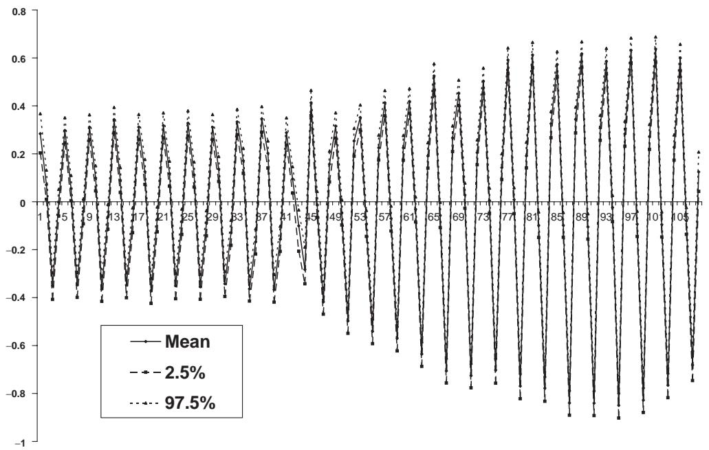  
Figure 8.3 Seasonal effects under normal irregular errors.

The discrete mixture model for $\varepsilon_{t}$ shows convergence in a two-chain run of 20 000 iterations after around 5000 iterations, and, as expected, the probability of belonging to the minority group with inflated variance is 0.9998 and 0.9725 for observations 43 and 44, whereas for most other observations the posterior probability is around 0.03.

Example 8.8 Reconstructing signal from noisy data This example illustrates the detection of a signal in noisy data when the form of the signal is exactly known. Thus Kitagawa and Gersch (1996, Chapter 4) simulate a time series according to the truncated and asymmetric form

$$
y _ {t} = f _ {t} + \varepsilon_ {t} \quad t = 1, 2 0 0,
$$

where the true series or signal is

$$
f _ {t} = (2 4 / 2 \pi) \exp (- [ t - 1 3 0 ] ^ {2} / 2 0 0 0)
$$

and $\varepsilon_t \sim N(0, 1)$ . The maximum value of the true series is just under 3.3 at $t = 130$ , with the true series being below 0.1 for $t$ under 45. Kitagawa and Gersch contrast different orders $k$ in random walk RW $k$ smoothness priors, and select $k = 2$ on the basis of an Akaike information criterion, so that

$$
f _ {t} = 2 f _ {t - 1} - f _ {t - 2} + \omega_ {t},
$$

with $\omega_{t} \sim N(0, \tau^{2})$ . The $k = 1$ model is found by Kitagawa and Gersch to be too ragged while the smoothing obtained with values $k = 2, 3, 4$ is visually indistinguishable. With conjugate

prriors $P_{j} \sim \mathrm{Ga}(a_{j}, b_{j})$ on precisions $P_{1} = 1 / \sigma^{2}$ and $P_{2} = 1 / \tau^{2}$ , direct sampling from the full conditionals may be simply applied:

$$
P _ {1} \sim \operatorname {G a} \left(a _ {1} + 0. 5 T, b _ {1} + 0. 5 \sum_ {t = 1} ^ {T} \varepsilon_ {t} ^ {2}\right),
$$

$$
P _ {2} \sim \operatorname {G a} \left(a _ {2} + 0. 5 (T - k), b _ {1} + 0. 5 \sum_ {t = k} ^ {T} \omega_ {t} ^ {2}\right).
$$

Here a $\mathrm{Ga}(1,0.001)$ prior on $1 / \sigma^2$ is adopted and two alternative priors assumed for $(\tau^2 |\sigma^2)$ , one a uniform prior $U(0,1)$ on $B = \sigma^2 /[ \sigma^2 +\tau^2 ]$ , the other a $\mathrm{Ga}(0.1,0.2)$ prior on $\tau /\sigma$ . The latter prior favours values under 1 in line with variability about the signal being expected to be less than that around the observations. $N(0,100)$ priors are assumed on the initial values $f_{1}$ and $f_{2}$ .

The median value of $\tau^2$ obtained under the first prior, from the second half of a two-chain run to 20000 iterations, stands at 1.03E-4, as compared to the value of 0.79E-4 cited by Kitagawa and Gersch using a series generated by the same process. The median observational variance $\sigma^2$ is estimated at 1.11. The true series is reproduced satisfactorily (Figure 8.4). This prior leads to convergence in under 5000 iterations.

Other priors, whether gamma or uniform on the ratios $\tau^2 / \sigma^2$ or $\tau / \sigma$ tend to converge more slowly. A Ga(0.1, 0.2) prior on $\tau / \sigma$ takes 100000 iterations to obtain $\sigma^2$ around 1.1 and a median on $\tau^2$ of 0.6E-4, and provides a slightly better fit to the high values of the series.

Example 8.9 Market share, promotion and prices Variance discounting and time-varying regression effects are illustrated by the sales model of Pole et al. (1994). They consider a weekly time series over 2 years (1990 and 1991) of the market share $S_{t}$ ( $t = 1, \dots, T$ ) of a consumer product. Fluctuations in market share are related to (a) the price of the product relative to the average for such products, denoted by $PRICE_{t}$ , (b) an index of the promotion level for the product, OWNPROM $_{t}$ , and (c) an index of promotions of alternative competing products, CPROM $_{t}$ . On economic grounds, the impact on the product's market share of increased competitor promotion activity or raised price should be negative, while promotion of the brand itself should enhance market share. The share variable is a percentage but varies within a narrow range (about $40 - 45\%$ ) and can be approximated by a normal. The predictors are in standardised form.

First a static model, with regression coefficients fixed through time (and measurement variance also fixed), is applied as

$$
S _ {t} = \beta_ {1} + \beta_ {2} \mathrm {P R I C E} _ {t} + \beta_ {3} \mathrm {O W N P R O M} _ {t} + \beta_ {4} \mathrm {C P R O M} _ {t} + \varepsilon_ {t},
$$

with $\varepsilon_t \sim N(0, V_\varepsilon)$ , $1 / V_\varepsilon \sim \mathrm{Ga}(0.5, 0.5)$ and priors on $\beta_j$ as suggested by Pole et al. (1994), namely $\beta_1 \sim N(42, 25)$ , $\beta_2 \sim N(0, 4)$ , $\beta_3 \sim N(0, 4)$ and $\beta_4 \sim N(0, 4)$ . A two-chain run of 10 000 iterations (with early convergence) shows $\beta_2 - \beta_4$ with signs as expected. However, forecasting market share 1 week ahead with this model gives evidence of autocorrelation in the forecast residuals (lag 1 correlation of 0.68). The forecasts tend to be high in the weeks 10-20 of 1990 and the last few weeks of 1990, but lower through 1991. The mean absolute deviation is 0.377. This may indicate insufficient temporal flexibility in the parameters describing the level of market share and the impact on market share of the three predictors.

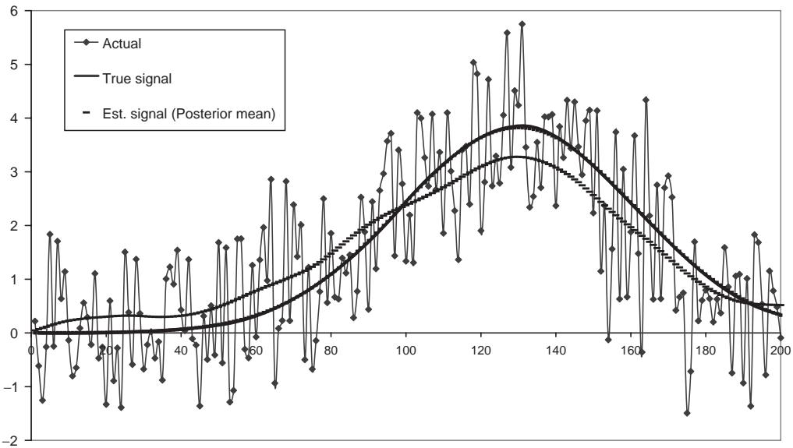  
Figure 8.4 Reconstructing signal.

A varying coefficient model is therefore applied:

$$
S _ {t} = \beta_ {1 t} + \beta_ {2 t} \text {P R I C E} _ {t} + \beta_ {3 t} \text {O W N P R O M} _ {t} + \beta_ {4 t} \text {C P R O M} _ {t} + \varepsilon_ {t}.
$$

The first-period regression effects are modelled as fixed effects with priors as in the static model above. Succeeding regression components $(t > 1)$ follow independent RW1 priors,

$$
\beta_ {j t} \sim N \left(\beta_ {j, t - 1}, W _ {j t}\right),
$$

with $\beta_{2t}$ and $\beta_{4t}$ constrained to be negative, and $\beta_{3t}$ constrained to be positive. The measurement variance and variance of the evolving regression parameters vary through time via discount factors. Thus if $P_{jt} = 1 / W_{jt}$ and $P_{j1}$ denotes the initial precisions $(j = 1,\dots ,4)$ , then

$$
P _ {j t} = (\delta_ {j}) ^ {t - 1} P _ {j 1}.
$$

The initial measurement precision is denoted by $P_{\varepsilon 1} = 1 / V_{\varepsilon 1}$ and subsequent precisions $P_{\varepsilon t} = 1 / V_{\varepsilon t}$ are discounted with a factor $\delta_{\varepsilon}$ . Gamma priors are assumed, $\mathrm{Ga}(0.5, 0.5)$ for $P_{\varepsilon 1}$ and $\mathrm{Ga}(1, 1)$ for $P_{j}(j = 1, \dots, 4)$ .

Following Pole et al., $\delta_{\varepsilon}$ is set to 0.99 but varying assumptions are made about $\delta_j, j = 1,\ldots ,4$ . As an example of the possibilities of varying the discounts to improve predictions, the mean absolute deviation is compared for two models:

(a) a fixed precision on the predictors $(\delta_{2} = \delta_{3} = \delta_{4} = 1)$ , but variable precision on the level $(\delta_{1} = 0.99)$ ;   
(b) a fixed precision on the level $(\delta_1 = 1)$ , but variable precision on the predictors $(\delta_2 = \delta_3 = \delta_4 = 0.99)$ .

One might also use selection indicators in such a situation.

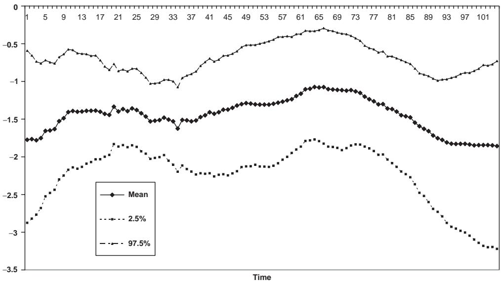  
Figure 8.5 Changing price effect.

Over the second half of two-chain runs of 10 000 iterations, the average mean absolute deviation of model (a) is 0.313 but for model (b) it is 0.320. The lag 1 correlation in the forecast residuals under model (a) is estimated at under 0.15. Figure 8.5 shows estimates of the price coefficient $\beta_{2t}$ under model (a). The mean of this coefficient varies from $-1.9$ to $-1.1$ , with a fall in the (absolute) impact of price in the first and second quarters of 1991 ( $t = 53$ to $t = 78$ ). Pole et al. attribute this to increased promotion activity on the brand (i.e. a rise in OWNPROM $_t$ ) in this period, and also to their being a relative price advantage for the product around this time. A suggested exercise is to apply the option $\delta_1 = \delta_2 = \delta_3 = \delta_4 = 0.99$ .

# 8.9 MODELS FOR VARIANCE EVOLUTION

In the dynamic coefficient models just discussed, it may be necessary to model observed time series $y_{t}$ or make forecasts, when the variance is not fixed, but itself stochastic over time. Such situations are exemplified by stock price and exchange rate series where large forecast errors tend to occur in clusters, when the series is changing rapidly. In many applications of such models the series is defined to have an effectively zero mean; for example, in many financial time series (e.g. exchange rates or stock returns $z_{t}$ ) the ratio of successive values $z_{t} / z_{t - 1}$ averages 1 and a series defined by the log of these ratios $y_{t} = \log (z_{t} / z_{t - 1})$ will then approximately average zero. Another change variable often used is $y_{t} = (z_{t} - z_{t - 1}) / z_{t - 1}$ also with average zero. Typically, there is strong autocorrelation between successive values of $y_{t}^{2}$ or of the squared errors when a regression mean is in the model; this is known as volatility clustering.

# 8.9.1 ARCH and GARCH models

Engle (1982) consider an autoregressive conditional heteroscedastic or ARCH1 model, namely

$$
y _ {t} = X _ {t} \beta + \varepsilon_ {t} = X _ {t} \beta + u _ {t} \sqrt {h _ {t}},
$$

where the $u_{t}$ are either $N(0,1)$ , or possibly $t_\nu (0,1)$ as in Bauwens and Lubrano (1998), and the $h_t$ depend on squared errors at lag 1

$$
h _ {t} = \gamma_ {t} + \alpha_ {1} \varepsilon_ {t - 1} ^ {2},
$$

with both $\gamma_{t}$ and $\alpha_{1}$ positive to ensure that the variance is positive, and with $\gamma_{t} = \gamma$ often assumed. Additionally the persistence parameter $\alpha_{1}$ is confined to values under 1, with values of $\alpha_{1}$ indistinguishable from zero, implying no SV. The variance is conditional in the sense of depending on preceding error terms

$$
V _ {t} = E \left(\varepsilon_ {t} ^ {2} \mid \varepsilon_ {t - 1}\right) = E \left(u _ {t} ^ {2}\right) \left[ \gamma_ {t} + \alpha_ {1} \varepsilon_ {t - 1} ^ {2} \right] = \gamma_ {t} + \alpha_ {1} \varepsilon_ {t - 1} ^ {2},
$$

and this dependence also means the errors are heteroscedastic. An $\mathrm{ARCH}p$ model has

$$
h _ {t} = \gamma_ {t} + \alpha_ {1} \varepsilon_ {t - 1} ^ {2} + \dots + \alpha_ {p} \varepsilon_ {t - p} ^ {2},
$$

where all the $\alpha_{j}$ are positive. To ensure the persistence parameter $\sum_{j}^{p}\alpha_{j}$ is under 1, a Dirichlet prior may be used for $\{\alpha_{1},\ldots ,\alpha_{p},1 - \sum_{j}^{p}\alpha_{j})$ . Kaufman and Fruhwirth-Schnatter (2002) present a Bayesian treatment of a switching ARCH model (see also Section 8.10) where

$$
h _ {t} = \gamma \{H _ {t} \} + \alpha_ {1} \varepsilon_ {t - 1} ^ {2} + \dots + \alpha_ {p} \varepsilon_ {t - p} ^ {2},
$$

where $H_{t}\in (1,\dots ,K)$ is a categorical indicator governed by a Markov switching mechanism, and constraints are placed on $\{\gamma_1,\ldots ,\gamma_K\}$ for uniqueness.

If the mean for $y_{t}$ series is effectively zero and there are no predictors, one may write (Politis, 2006)

$$
y _ {t} = \varepsilon_ {t} = u _ {t} \sqrt {h _ {t}}
$$

where $u_{t}$ are $N(0,1)$ or $t_{\nu}(0,1)$ , and for an ARCHp model

$$
h _ {t} = \gamma_ {t} + \alpha_ {1} y _ {t - 1} ^ {2} + \alpha_ {2} y _ {t - 2} ^ {2} + \dots + \alpha_ {p} y _ {t - p} ^ {2},
$$

so that the ARCH model can be classified as observation driven rather than parameter driven, with easy extension to forecasting (Shephard, 1996, p 12). If $y_{t}$ follows an ARCH1 model then, conditional on $y_{t-1}$ , $y_{t}$ is normal

$$
y _ {t} \mid y _ {t - 1} \sim N (0, \gamma_ {t} + \alpha_ {1} y _ {t - 1} ^ {2}),
$$

and estimation of the ARCH part of the model can take place for $\{y_{2},\ldots ,y_{n}\}$ conditional on $y_{1}$ (Shephard, 1996).

Another option is the unobserved ARCH model (Giakoumatos et al., 2005; Shephard, 1996), in which an ARCH model holds for the underlying signal rather than the observed series. For a centred $y$ series and no predictors, a measurement error model combined with an ARCH1

model leads to

$$
y _ {t} \sim N (f _ {t}, V),
$$

$$
f _ {t} \sim N (0, h _ {t}),
$$

$$
h _ {t} = \gamma_ {t} + \alpha_ {1} f _ {t - 1} ^ {2},
$$

where $\gamma_{t}$ and $\alpha_{1}$ are positive and $0\leq \alpha_{1}\leq 1$ ensures that the ARCH series is covariance stationary. If there are covariates, $f_{t}\sim N(\mu_{t},h_{t})$ where $\mu_t = X_t\beta$

In the GARCH model the conditional variance depends on previous values of $h_t$ as well as possibly on $\varepsilon_t^2$ or $y_t^2$ . Whereas lags in $\varepsilon_t^2$ or $y_t^2$ are analogous to moving average errors in an ordinary ARMA time series, lags in $h_t$ are parallel to autoregressive effects (Greene, 2000). A GARCH( $p, q$ ) model involves a lag of order $p$ in $h_t$ and one of order $q$ in $\varepsilon_t^2$ or $y_t^2$ and so a GARCH(1, 1) model for centred $y$ would be

$$
\begin{array}{l} y _ {t} = u _ {t} \sqrt {h _ {t}}, \\ h _ {t} = \gamma_ {t} + \alpha_ {1} y _ {t - 1} ^ {2} + \beta_ {1} h _ {t - 1}, \\ \end{array}
$$

where $u_{t} \sim N(0,1)$ , $\gamma_{t} > 0$ and for covariance stationarity $\alpha_{1} + \beta_{1} < 1$ . To ensure the latter constraint one may use a Dirichlet prior on $(\beta_{1},\alpha_{1},1 - \beta_{1} - \alpha_{1})$ . Miazhynskaia et al. (2003), instead monitor the proportion of iterations where the condition holds. Bauwens and Lubrano (1998) discuss a scale mixture version of the Student $t$ density for $u_{t}$ , namely $u_{t} \sim N(0,1 / \lambda_t), \lambda_t \sim \mathrm{Ga}(0.5\nu ,0.5\nu)$ and use Griddy Gibbs sampling on $\nu$ . Multivariate Bayesian ARCH and GARCH models are discussed by Vrontos et al. (2003), while Miazhynskaia et al. (2003) consider Bayesian model selection using GARCH(1, 1) models with Gaussian errors and Student $t$ errors.

Engle and Russell (1998) propose a GARCH-type autoregressive conditional mean model for count data, with an $\mathrm{ACM}(1,1)$ model being

$$
\begin{array}{l} y _ {t} \mid \mu_ {t} \sim \operatorname {P o} (\mu_ {t}), \\ \mu_ {t} = \gamma_ {t} + \alpha_ {1} y _ {t - 1} + \beta_ {1} \mu_ {t - 1}, \\ \end{array}
$$

which is stationary when $\alpha_{1} + \beta_{1} < 1$ .

# 8.9.2 Stochastic volatility models

Stochastic volatility models (or SV models) adopt a DLM framework for stochastic variances and are parameter rather than observation driven, with a state-space mechanism for the latent volatility. Meyer and Yu (2000) demonstrate WINBUGS codes for such models and point out possible advantages of the SV approach compared to ARCH and GARCH models in that two noise processes are typically involved, one for the data and one for the latent volatilities; comparisons are also made by Kim et al. (1998), Yu (2005) and Gerlach and Tuyl (2006). Berg et al. (2004) consider the deviance information criterion (DIC) for comparing Bayesian SV models, while Chib et al. (2002) obtain Bayes factors using the method of Chib (1995).

Several formulations for SV models have been proposed. For example, one may specify

$$
y _ {t} = X _ {t} \beta + \varepsilon_ {t},
$$

$$
\varepsilon_ {t} \sim N (0, \exp (g _ {t})),
$$

where $\Delta^k g_t$ follows a non-stationary random walk process (Harvey et al., 1994; Kitagawa and Gersch, 1996). So with $k = 1$ , $g_t \sim N(g_{t-1}, \sigma^2)$ . However, the main area of research has been in nonlinear state-space models (e.g. Harvey et al., 1994). For example, an ARp autoregressive SV model for a centred $y$ series with no regressors is

$$
y _ {t} = u _ {t} \exp (g _ {t}),
$$

$$
g _ {t} = \mu + \phi_ {1} \left(g _ {t - 1} - \mu\right) + \dots + \phi_ {p} \left(g _ {t - p} - \mu\right) + \eta_ {t}, \tag {8.8}
$$

where $u_{t} \sim N(0,1)$ , and $\eta_t \sim N(0,\sigma^2)$ . Stationarity is obtained by the usual constraints in ARMA models; so for an AR1 model in $g_{t}$ , the $g_{t}$ are stationary with variance $\sigma^2 /(1 - \phi_1^2)$ when $|\phi_1| < 1$ . There are then questions regarding the appropriate AR lag order and the density of $u_{t}$ , whether normal or heavier tailed, for example Student $t$ (Chib et al., 2002; Jacquier et al., 2004). To allow explicitly for discontinuities, the observation equation may include a jump component (Chib et al., 2002). Thus

$$
y _ {t} = s _ {t} q _ {t} + u _ {t} \exp (g _ {t}),
$$

where $q_{t}\sim \mathrm{Bern}(\kappa)$ and $\log (1 + s_t)\sim N(-\delta^2 /2,\delta^2)$

For multivariate series (e.g. of several exchange rates) subject to volatility clustering, common factor models have been proposed (Pitt and Shephard, 1999). For instance for two series $y_{tk}$ , $k = 1, 2$ , and one factor $F_{t}$ , one might have

$$
y _ {t 1} = \beta_ {1} F _ {t} + \omega_ {t 1},
$$

$$
y _ {t 2} = \beta_ {2} F _ {t} + \omega_ {t 2},
$$

with $F_{t}$ and the $\omega_{tk}$ both evolving via SV priors. Thus $F_{t} \sim N(0, \exp(g_{1t}))$ , $\omega_{t1} \sim N(0, \exp(g_{2t}))$ and $\omega_{t2} \sim N(0, \exp(g_{3t}))$ , where $g_{jt}(j = 1, 3)$ follow priors like (8.8).

Example 8.10 Pound-dollar exchange rate Meyer and Yu (2000), Durbin and Koopman (2001) and Harvey et al. (1994) apply SV models, with (8.8) as a baseline, to a series of length $T = 945$ on the pound-dollar exchange rate between October 1, 1981, and June 28, 1985. They define a model with no predictor term or constant, since the observations consist of differences in logged exchange rates $z_{t}$ , with $y_{t} = \Delta \log(z_{t})$ .

First consider a SV AR1 model, as in (8.8). Priors are as in Meyer and Yu (2000), namely $1 / \sigma^2 \sim \mathrm{Ga}(2.5, 0.025)$ , $\phi = 2\phi^{*} - 1$ , where $\phi^{*} \sim \mathrm{Be}(20, 1.5)$ and $N(0, 10)$ priors on $\mu$ and the initial condition $g_{0}$ . The second half of a two-chain run of 10 000 iterations gives a median estimate for $\sigma$ of 0.3, a lag coefficient $\phi$ with mean 0.979 and modal volatility with mean 0.45. The DIC is 1816 with $d_{e} = 43$ .

The variances are below 0.5 for most of the period but increase to over 1 in the spring of 1985 ( $t = 878$ to $t = 882$ ; see Figure 8.6), exceeding 2.5 for some days. Monte Carlo estimates of the log CPOs show some observations not well fitted (times $t = 878$ , 331, 862 and 656 have the lowest log CPOs). The log pseudomarginal likelihood (PsML) is $-912$ . Meyer and Yu also consider an SV model (8.8) with lag 2, and Student $t$ errors $\eta_t$ ; they also consider a model

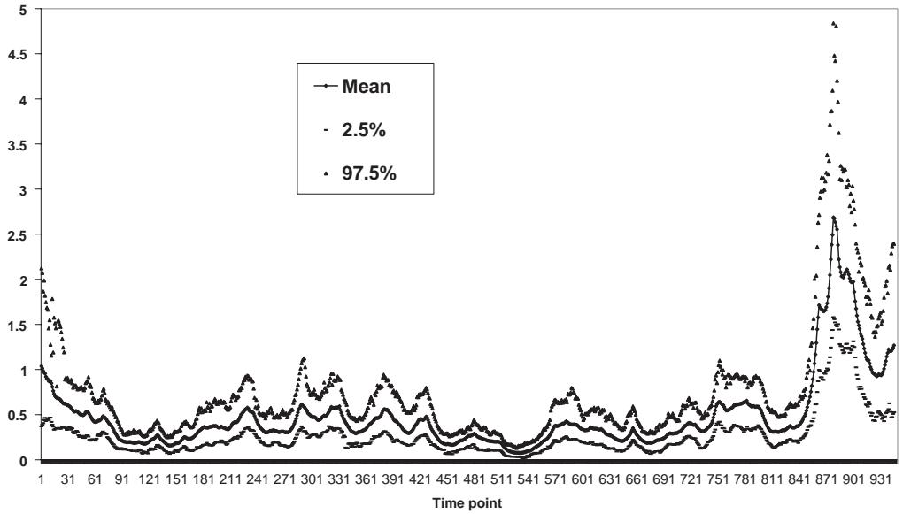  
Figure 8.6 Changing volatility.

including a leverage effect, such that changes in volatility reflect the sign and magnitude of price changes asymmetrically.

Here ARCH1 and GARCH(1, 1) models are illustrated for these data, with the ARCH model conditional on the first data point, namely

$$
y _ {t} \mid y _ {t - 1} \sim N \left(0, \gamma + \alpha_ {1} y _ {t - 1} ^ {2}\right).
$$

A $\mathrm{Ga}(1,1)$ prior is assumed on $\gamma$ and a $U(0,1)$ prior on $\alpha_{1}$ . This model converges rapidly and iterations 1000-2500 of a two-chain run give means (sd) on $\gamma$ and $\alpha_{1}$ of 0.41 (0.03) and 0.23 (0.06), respectively. However, the DIC and $\log (\mathrm{PsML})$ deteriorate (to 2013 and -1007 respectively). A GARCH(1,1) model, namely $y_{t} = u_{t}\sqrt{h_{t}}$

$$
h _ {t} = \gamma + \alpha_ {1} y _ {t - 1} ^ {2} + \beta_ {1} h _ {t - 1},
$$

where $u_{t} \sim N(0,1)$ , is then applied, where a $\mathrm{Ga}(1,1)$ prior is assumed on $\gamma$ , and $\alpha_{1}, \beta_{1}$ assumed to be $N(0,1)$ , constrained to positive values. This model, also run for 2500 iterations, gives some improvement over the ARCH model with the DIC reduced to 1874. The probability of stationarity $\operatorname*{Pr}(\alpha_1 + \beta_1 < 1|y)$ is 0.99, with posterior means (sd) on $\alpha_{1}$ and $\beta_{1}$ of 0.10 (0.02) and 0.87 (0.03).

# 8.10 MODELLING STRUCTURAL SHIFTS AND OUTLIERS

Standard ARMA and state-space models may not be sufficiently flexible in the face of temporary shifts or permanent structural breaks in time series parameters that occur as a consequence of 'interventions' such as government policy change, new sales strategies or natural disasters.

More appropriate model approaches may allow for changes in regression regimes and shifts in error structure. Switching regression models originate in classical statistics with Quandt (1958) and have received attention in Bayesian terms in works by Geweke and Terui (1993), Odejar and McNulty (2001) and Lubrano (1995). Time series model estimation and selection may also be affected by temporary outliers in observations or error series, though the detection of outliers and of shifts in series are closely interrelated (Zhou, 2005). This section considers models for different types of outliers, models for shifts in both the mean and variance of autoregressive errors, models for regime switching according to a latent Markov series and transition function models.

The simplest models for level shifts (or regime shifts) are discrete change point models; these cause problems for classical estimation because the likelihood is not differentiable at the change points, but their analysis is simplified by Monte Carlo simulation methods (Carlin et al., 1992a; Stephens, 1994). Note that change point models have affinities with non-parametric regression when the knot locations are unknown (see Chapter 10). Chib (1998) considers choice between multiple change point models and introduces a latent regime indicator following a unidirectional Markov transition scheme in which shift probabilities depend on the existing regime at point $t$ ; see also Chib (1996) and Section 8.10.1. Models for change points in the mean generalise readily to regression change point models – see Western and Kleykamp (2004) for a recent political application. A single change point at $\tau$ leads to a switching regression model (for metric outcome)

$$
y _ {t} = X \beta_ {1} + \varepsilon_ {t} \qquad t \leq \tau ,
$$

$$
y _ {t} = X \beta_ {2} + \varepsilon_ {t} \quad t > \tau ,
$$

with extension to multiple change points discussed by Maddala and Kim (1996). Similar change point models are applicable to variance shifts (De Pace, 2005).

Fluctuating-level models refer to temporary rather than permanent shifts in level or to alternations in level. Shumway and Stoffer (1991) describe a state-space model where the observation equation is subject to shifts in level (e.g. periods of negative and positive economic growth). Their model is for differenced $y_{t}$ and a signal $f_{t}$ , namely

$$
\Delta y _ {t} = \Delta f _ {t} + \alpha_ {0} + \alpha_ {1} S _ {t},
$$

where $S_{t}$ is binary, so that the level alternates between $\alpha_{0}$ and $(\alpha_{0} + \alpha_{1})$ . McCulloch and Tsay (1994) and Barnett et al. (1996) discuss outlier models that allow for additive outliers (in the response itself) and innovation outliers (in random shocks $u_{t}$ ). For example, consider an ARMA(1, 1) model

$$
y _ {t} - \rho y _ {t - 1} = u _ {t} - \theta u _ {t - 1}.
$$

To allow for additive outliers, an additional error term $o_{t}$ is introduced such that

$$
y _ {t} - \rho y _ {t - 1} = u _ {t} - \theta u _ {t - 1} + o _ {t},
$$

with $o_t \sim N(0, K_{1t}\sigma^2)$ , and $u_t \sim N(0, K_{2t}\sigma^2)$ . One possible approach involves specifying pairings of preset variance inflators $K_t = (K_{1t}, K_{2t})$ , with $K_{1t} > 0$ and/or $K_{2t} > 1$ when an outlier occurs. If $K_{1t}$ exceeds 0 then there is an additive outlier at point $t$ in the series, while if $K_{2t}$ exceeds 1 there is an innovation outlier. Selection between alternative pairings is made

according to a discrete prior. Prior choices on possible pairings of $(K_{1t}, K_{2t})$ are set, and for identifiability only an additive or an innovation outlier is allowed at a particular time $t$ . Thus Barnett et al. (1996) propose a seven-point discrete prior on $(K_1, K_2)$ , namely $(0, 1)$ , $(3.3, 1)$ , $(10, 1)$ , $(32, 1)$ , $(0, 3.3)$ , $(0, 10)$ and $(0, 32)$ with equal prior probability on each option.

McCulloch and Tsay (1994) consider models allowing for shifts in the mean of the series or in the variance of autoregressive errors. By allowing for variance shifts as well as changes in level, non-stationary trends that might otherwise have been attributed to changes in level may be seen as possibly due to heteroscedasticity. With $y_{t} = \mu_{t} + \varepsilon_{t}$ , a change in level is accommodated by the modified random walk

$$
\mu_ {t} = \mu_ {t - 1} + \delta_ {1 t} v _ {t}.
$$

The $\delta_{1t}$ are binary variables that equal 1 if a shift in mean occurs, and $\nu_{t}$ are random effects for the shift if it occurs (e.g. normal with low precision $\tau_{\nu}$ ). The autoregressive error follows an ARp scheme, namely

$$
\varepsilon_ {t} = \gamma_ {1} \varepsilon_ {t - 1} + \gamma_ {2} \varepsilon_ {t - 2} + \dots + \gamma_ {t - p} \varepsilon_ {t - p} + u _ {t}, \tag {8.9}
$$

where shifts in the $\mathrm{var}(u_t)$ are allowed. Thus let $u_{t}\sim N(0,V_{t})$ and let $\delta_{2t}$ be another binary series such that

$$
\begin{array}{l} V _ {t} = V _ {t - 1} \quad (\delta_ {2 t} = 0), \\ = V _ {t - 1} \omega_ {t} \quad (\delta_ {2 t} = 1), \\ \end{array}
$$

where $\omega_{t}$ models the proportional change in the variance at shift points. The probabilities that $\delta_{2t}$ and $\delta_{2t}$ equal 1 are known (e.g. $\eta_{1} = \eta_{2} = 0.05$ ), or may be assigned beta priors that favour low values.

# 8.10.1 Markov mixtures and transition functions

A different approach to discrete changes in regime involves state indicators where the probability of change depends on the existing state, as in the Markov switching models and hidden Markov models (HMMs) of Chib (1996), Billio et al. (1999), Ghysels et al. (1998), Bac et al. (2001), Kim and Nelson (1999), Spezia et al. (2004) and others. HMMs for count data (albeit from a classical perspective) are discussed by Leroux and Puterman (1992), Cooper and Lipsitch (2004) and Altman (2004). Thus, suppose for each time point the process is in one of $m$ states $\{s_t\} (t > 1)$ , as determined by an $m \times m$ stationary Markov chain $P = \{p_{ij}\}$ where

$$
p _ {i j} = \Pr [ s _ {t} = j | s _ {t - 1} = i ].
$$

The first state (namely $s_1$ ) is determined by drawing from a multinomial with $m$ categories. Given the underlying state $s_t = k$ the observation follows the $k$ th of $m$ possible densities, and these densities might differ in means, variances or regression parameters. It may be noted that this is a form of discrete mixture model and subject to the label-switching problem, so parameter constraints are an option (Munch et al., 2005), as well as postprocessing.

A model with both regression mean and variance shifts, which is based on a latent Markov series for $s_t$ , is suggested by Albert and Chib (1993). Their model has $m = 2$ states (so $s_t$

is binary with $s_t = 1$ corresponding to a shift) and order $p$ autoregressive errors. For metric response $y_t$ , the model can be expressed as

$$
\begin{array}{l} y _ {t} \left| s _ {t} = X _ {t} \beta + \psi s _ {t} + \gamma_ {1} \left(y _ {t - 1} - X _ {t - 1} \beta - \psi s _ {t - 1}\right) + \gamma_ {2} \left(y _ {t - 2} - X _ {t - 2} - \psi s _ {t - 2}\right) \right. \\ + \dots + \gamma_ {p} \left(y _ {t - p} - X _ {t - p} \beta - \psi s _ {t - p}\right) + u _ {t}, \\ \end{array}
$$

where $\psi$ models shifts in level, and $u_{t} \sim N(0, V_{t})$ . Variance shifts are produced according to the mechanism

$$
V _ {t} = \sigma^ {2} (1 + \omega s _ {t}),
$$

where $\omega > 0$ is the proportionate shift in variance when $s_t = 1$ .

In transition function models, shifts between regimes are determined by a transition formula $K_{t}$ that drives a step function $\Delta_{t}$ , either an abrupt step function (Tong, 1983) or a smooth transition function (Campbell, 2004; Lopes and Salazar, 2006; Pastor-Barriuso et al., 2003; Teräsvirta, 1994). The latter is typically a cumulative distribution function between 0 and 1, such as the logit (Bauwens et al., 2000). A binary step function $\Delta_{t}$ might be activated if a trend in time exceeds an unknown threshold $\tau$ and zero otherwise. If the trend were linear in $t$ then the switching regression mentioned above

$$
\begin{array}{l} K _ {t} = t - \tau <   0 \Rightarrow \Delta_ {t} = 0, \\ K _ {t} = t - \tau > 0 \Rightarrow \Delta_ {t} = 1 \\ \end{array}
$$

is obtained, with two regression regimes:

$$
y _ {t} = Z _ {t} \gamma + (1 - \Delta_ {t}) _ {t} \beta_ {1} + X _ {t} \beta_ {2} + u _ {t}
$$

where, for example, $u_{t} \sim N(0, \sigma^{2})$ . Bauwens et al. (2000) include a scale parameter $c$ in $K_{t}$ , namely $K_{t} = c(t - \tau)$ which requires preliminary standardisation of $y_{t}$ . The transition formula might also be defined by lags on the outcome, as in the step function

$$
\begin{array}{l} K _ {t} = y _ {t - 1} - d <   0 \Rightarrow \Delta_ {t} = 0, \\ K _ {t} = y _ {t - 1} - d > 0 \Rightarrow \Delta_ {t} = 1, \\ \end{array}
$$

where $d$ is unknown. Since the shift is generated according to a lagged value of $y$ , this type of model is called a self-exciting threshold autoregression (SETAR). A logit-based smooth transition function in these two cases might take the form

$$
\Delta_ {t} = \exp (\varphi \{t - \tau \}) / [ 1 + \exp (\varphi \{t - \tau \}) ],
$$

or

$$
\Delta_ {t} = \exp (\varphi \{y _ {t - 1} - d \}) / [ 1 + \exp (\varphi \{y _ {t - 1} - d \}) ],
$$

where $\varphi > 0$ governs the smoothness of the transition.

More generally the appropriate lag $p$ in $y_{t}$ , such that (for $\Delta$ abrupt)

$$
\Delta_ {t} = 1 \quad \text {i f} y _ {t - p} > d
$$

is an additional unknown (the delay parameter) as well as $d$ (the threshold parameter). Geweke and Terui (1993) consider joint prior specification for $\{p, d\}$ in models where the alternative regression regimes involve different order lags in $y$ , namely an $\mathrm{AR}p_1$ model if $\Delta_t = 1$ , and

an $\mathrm{AR}p_{2}$ model (with different coefficients throughout) if $\Delta_t = 0$ . Koop and Potter (1999) discuss formal Bayes model selection for comparing SETAR models (with $p$ and $d$ unknown) to HMMs.

Example 8.11 US unemployment As an illustration of models allowing mean and variance shifts, consider analysis by Rosenberg and Young (1995) of transformed unemployment rates $U_{t}$

$$
y _ {t} = 1 0 0 \times \log \left(1 + U _ {t + 1} / 1 0 0\right) - 1 0 0 \times \log \left(1 + U _ {t} / 1 0 0\right),
$$

with overall model

$$
y _ {t} = \mu_ {t} + \varepsilon_ {t} + e _ {t},
$$

where the level series $\mu_t$ is a first-order random walk subject to random shifts, namely

$$
\mu_ {t} = \mu_ {t - 1} + \delta_ {1 t} v _ {t}.
$$

$\varepsilon_{t}$ is an autoregressive error as in (8.9), and $e_t$ is an unstructured measurement error. The series spans 1954-1992 inclusive, providing 78 six-monthly averages, so $y_{t}$ has 77 values. Assume Bernoulli indicators $\delta_{1t}$ and $\delta_{2t}$ for shifts in the means $\mu_t$ and in $\mathrm{var}(u_t)$ respectively, with unknown probabilities $\eta_{1}$ and $\eta_{2}$ defined by $\operatorname {Be}(1,19)$ priors. Thus

$$
y _ {t} = \mu_ {t} + \varepsilon_ {t} + e _ {t},
$$

$$
e _ {t} \sim N (0, 1 / \tau_ {e}),
$$

$$
\mu_ {t} = \mu_ {t - 1} + \delta_ {1 t} v _ {t} \quad t > 1,
$$

$$
v _ {t} \sim N (0, 1 / \tau_ {v}),
$$

$$
\varepsilon_ {t} = \gamma_ {1} \varepsilon_ {t - 1} + \gamma_ {2} \varepsilon_ {t - 2} + \dots + \gamma_ {t - p} \varepsilon_ {t - p} + u _ {t},
$$

$$
u _ {t} \sim N (0, V _ {t}),
$$

$$
V _ {t} = V _ {t - 1} \omega_ {t} ^ {\delta_ {2 t}}.
$$

Fixed effects $N(0,1)$ priors may be assumed for the initial conditions $\varepsilon_0,\varepsilon_{-1},\ldots ,\varepsilon_{-(p - 1)}$ and $\mu_{1}$ .

Here the autoregressive series is taken as order $p = 1$ , and variance shifts $\omega_{t}$ are taken to have a gamma prior with average of $1$ , $\omega_{t} \sim \mathrm{Ga}(\alpha, \alpha)$ , where $\alpha = 1$ . As to the variance of the $\nu_{t}$ , Rosenberg and Young (1995) suggest using a large multiple (e.g. 10 times) of the residual variance from a standard ARMA model. Based on their paper, a preset value, namely $\mathrm{var}(\nu_{t}) = 0.1$ , is assumed.

A two-chain run of 5000 iterations (with inferences using the second half) shows the lag parameter $\gamma$ to have a mean (and $95\%$ credible interval) of 0.52 (0.31, 0.73). There is a higher probability $\eta_{2}$ of a variance shift than a mean shift (namely 0.098 vs 0.047). High posterior probabilities of a mean shift occur at $t = 8$ , 12 and 71) while high probabilities of a variance shift occur at $t = 18$ and $t = 61 - 62$ . Rosenberg and Young in their analysis of quarterly rather than 6-monthly series also found a higher probability $\eta_{2}$ of a variance shift than a mean shift, but with the excess of $\eta_{2}$ over $\eta_{1}$ (0.086 vs 0.015) more pronounced than under the model here. An adequate fit to all observations is obtained, with log CPOs varying from $-0.6$ to 1.3.

Example 8.12 Fetal lamb movements An example of the HMM is provided by a time series of lamb fetal movement counts $y_{t}$ from Leroux and Puterman (1992), where the presence in the mixture of more than one component leads to Poisson overdispersion. Suppose a two-class Markov mixture is applied, with shifts between two Poisson means determined by a Markov chain (i.e. $m = 2$ ). Dirichlet priors for the elements in each row are assumed, namely

$$
p _ {i, 1: m} \sim \operatorname {D i r} (1, 1, \dots , 1),
$$

although a beta prior can also be used for $m = 2$ . The same prior is used for the multinomial vector governing the choice of initial state. For the two Poisson means $\mathrm{Ga}(1,1)$ priors are stipulated, with an identifiability constraint that one is larger – an initial unconstrained run justified such a constraint, showing the means to be widely separated.

With this model, a two-chain run of 5000 iterations (1000 burn-in) shows the state occupied most of the periods (about 220 from 240) to have a low average fetal movement rate (around 0.23), and a minority state with a much higher rate, around 2.2-2.3. The majority state has a high retention rate (reflected in the transition parameter $p_{22}$ around 0.96) while movement out of the minority state is much more frequent.

The actual number of movements $y_{t}$ is predicted closely, though Leroux and Puterman show that using $m = 3$ components leads to even more accurate prediction of actual counts. The model with $m = 2$ shows relatively small CPOs for the movements at times 85 and 193 (counts of 7 and 4 respectively).

For comparison, and since the outcome is a count, model B consists of an INAR1-type model for the conditional mean. The 'innovation' process is governed by Bernoulli switching between means $\lambda_{1}$ and $\lambda_{2}$ (with $\lambda_{2} > \lambda_{1}$ to guarantee identifiability). Thus

$$
y _ {t} \sim \operatorname {P o} \left(\mu_ {t}\right),
$$

$$
\mu_ {t} = \pi \circ y _ {t - 1} + \lambda_ {1} \delta_ {t} + \lambda_ {2} (1 - \delta_ {t}) \quad t > 1,
$$

with the first observation having mean

$$
\mu_ {1} = \lambda_ {1} \delta_ {1} + \lambda_ {2} (1 - \delta_ {1}).
$$

The switching indicators have prior $\delta_t \sim \mathrm{Bern}(\eta)$ with $\eta$ itself assigned a beta prior. This model also identifies a subpopulation of periods with a much higher movement rate, around 4.5, than the main set of periods. It has a very similar marginal likelihood to the two-state Markov switching model $(-180\mathrm{vs} -179)$ .

# 8.11 OTHER NONLINEAR MODELS

Some of the above models are often characterised as nonlinear, such as the threshold autoregressive approaches. Here some other nonlinear methods are mentioned that bring greater flexibility in modelling certain time series features (e.g. changing volatility, discontinuities in level) but possibly at the cost of computing complexity or heavy parameterisation (Koop and Potter, 1999, p. 260). For instance, for large datasets a flexible but highly parameterised generalisation of the stochastic unit root model is the time-varying autoregression (TVAR)

model (Godsill et al., 2004, p. 160), with

$$
y _ {t} = \rho_ {1 t} y _ {t - 1} + \rho_ {2 t} y _ {t - 2} + \dots + \rho_ {p t} y _ {t - p} + \varepsilon_ {t},
$$

where $\varepsilon_t \sim N(0, \sigma^2)$ , and where each of the $\rho_{kt}$ follow random walk prior or autoregressive priors, e.g. $\rho_{kt} \sim N(\alpha_k \rho_{k,t-1}, \omega_k^2)$ . If the $\rho$ coefficients are to be stationary then RW or AR priors are applied to partial correlation coefficients with transformation back to $\rho$ coefficients as discussed in Section 8.2. An extension allows $\sigma^2$ to vary over time also (Godsill et al., 2004, p. 161).

Discrete mixture nonlinear models also seek to represent time series discontinuities. Wong and Li (2000) mention mixture autoregressions with $K$ components differing in lag order $p_k$ and with prior probabilities $\pi_k$ , so that

$$
P (y _ {t} | D _ {t - 1}) = \sum_ {k = 1} ^ {K} \pi_ {k} \Phi \left(\frac {y _ {t} - \rho_ {o k} - \rho_ {1 k} y _ {t - 1} - \cdots - \rho_ {p _ {k} k} y _ {t - p _ {k}}}{\sigma_ {k}}\right),
$$

where $D_{t - 1}$ is all data up to $t - 1$ . They denote these as $\mathrm{MAR}(K, p_1, p_2, \ldots, p_K)$ models and discuss their ability to represent changing conditional variances. Mueller et al. (1997) describe a discrete mixture model for nonlinear AR models that is similar to a TVAR model. For example, suppose there are $K$ possible AR1 models, each with their own intercept and lag coefficient on $y_{t - 1}$ and each with their own variance. If $G_t \sim \mathrm{Categorical}(q_{t,1:K})$ and $G_t = k$ , then

$$
y _ {t} \mid G _ {t} \sim N \left(\rho_ {0 k} + \rho_ {1 k} y _ {t - 1}, 1 / \tau_ {k}\right).
$$

The category selector $G_{t}$ is obtained using a time-varying Gaussian kernel prior, with

$$
\Pr (G _ {t} = k) = q _ {t k} \propto \exp (- 0. 5 (y _ {t - 1} - \mu_ {k}) ^ {2} / V),
$$

with $V$ an additional variance parameter. Parameters $\theta_{k} = \{\rho_{0k},\rho_{1k},\tau_{k}\}$ are selected from candidate values $\theta_k^* = \{\beta_{0k}^*,\beta_{1k}^*,\tau_k^*\}$ using a Dirichlet process (DP) prior with concentration parameter $\kappa$ , thus allowing for greater robustness when there are jumps in series or multimodality. A particular application is to harmonic process models (West, 1995) whereby periods $\lambda_{k} = 2\pi /\left[\mathrm{acos}(0.5\rho_{k})\right]$ are estimated from the model

$$
y _ {t} | G _ {t} = k \sim N (\rho_ {k} y _ {t - 1} - y _ {t - 2}, 1 / \tau_ {k}).
$$

For stationarity, the constraint $|\rho_k| < 2$ applies. The kernel prior is now multivariate with

$$
q _ {t k} \propto \exp (- 0. 5 (x _ {t} - \mu_ {k}) ^ {\prime} V ^ {- 1} (x _ {t} - \mu_ {k})),
$$

where $x_{t} = (y_{t - 1},y_{t - 2})$ and $\mu_{k} = (\mu_{1k},\mu_{2k})$ , and $V$ is a covariance matrix.

Example 8.13 Lynx data, AR mixtures Wong and Li (2000) consider the well-known lynx data $(T = 114)$ and detect a two-component mixture $(K = 2)$ with lags in $y$ at $t - 1$ and $t - 2$ in each component, namely a MAR(2, 2, 2) model. The analysis conditions on the first two data points. A two-component model is applied here with constraints on $\tau_{k} = 1 / \sigma_{k}^{2}$ for identifiability. Another possibility might be a constraint on $\pi_{k}$ . The lag parameters $\{\rho_{0k},\rho_{1k},\rho_{2k}\}$ , $k = 1,\dots ,K$ , are assigned $N(0,1)$ priors.

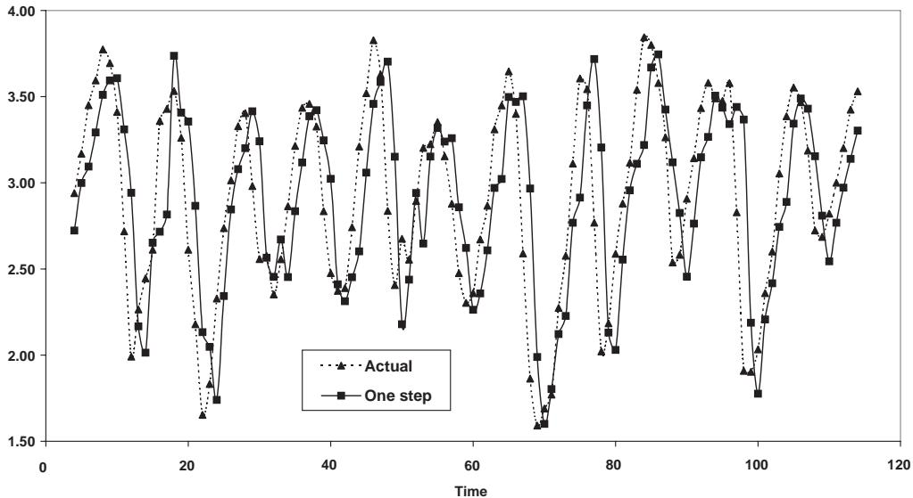  
Figure 8.7 One-step predictions (log10 lynx trappings) under discrete mixture AR.

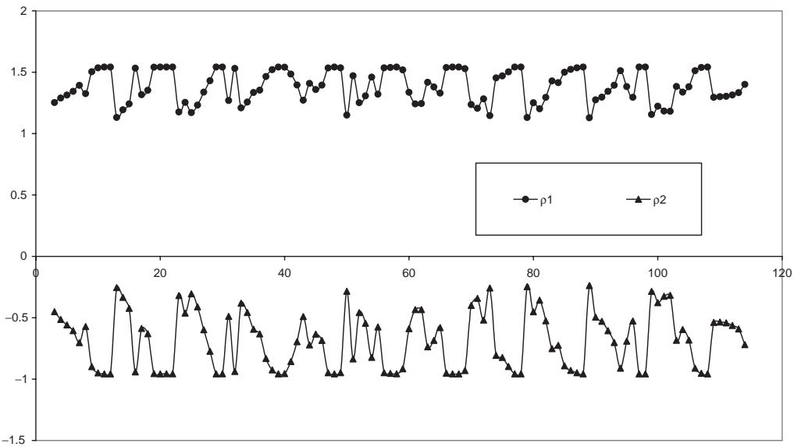  
Figure 8.8 Varying first- and second-order lag coefficients

The second half of a two-chain run of 10000 iterations shows a smaller component $(\pi_1 = 0.30)$ with $\sigma_{1} = (1 / \tau_{1})^{0.5} = 0.09$ . Means (sd) for the lag parameters are $\rho_{01} = 0.72(0.26)$ , $\rho_{11} = 1.07$ (0.16) and $\rho_{21} = -0.27(0.15)$ . For the larger component these parameters have means (sd) of 1.01 (0.16), 1.49 (0.10) and $-0.86$ (0.10), respectively. One-step predictions are made and have an MSE of 0.228 (see Figure 8.7), while the concurrent

predictive mean error sum of squares is 0.073. (This is the sum of squared differences between $y_{t}$ and $y_{\mathrm{new},t}$ divided by 112).

To apply a DP stage on the possible parameters in the components of the AR2 model, the maximum number of possible components is set at $M = 5$ . A Ga(0.1, 0.1) prior is assumed for the Dirichlet concentration parameter with small values excluded. It is assumed that $V$ is a correlation matrix with off-diagonal element $\rho$ , while the $\mu_{k}$ are uniform within the minimum and maximum of the observed data. To obtain the posterior density of the realised number of components $K$ , one can monitor a selected parameter and then via postprocessing obtain the number of distinct values obtained at each iteration.

A two-chain run of 10 000 iterations (with the second half for inferences) shows a posterior mean for $\kappa$ of 0.79, with a mean (95% interval) for $\rho$ of $-0.22(-0.80, 0.54)$ . The predictive MSE is 0.223, a slight improvement over the standard discrete mixture, with mean ESS of 0.070. Figure 8.8 plots the 112 posterior means of $\rho_{1t}$ and $\rho_{2t}$ (time-varying lags on $y_{t-1}$ and $y_{t-2}$ ) over times $t = 3, \ldots, T$ obtained by monitoring the category $G_t$ selected at each iteration for time $t$ .

# EXERCISES

1. In Example 8.2 (Real GNP series) apply the stochastic unit root model $y_{t} = \rho_{t}y_{t - 1} + \varepsilon_{t}$ with $\varepsilon_t\sim N(0,\sigma^2)$ , and $\exp (\alpha_{t}) = \rho_{t}$ . With $p = 1$ and $p = 2$ in the AR model for the $\alpha_{t}$ series, assess the probability $\mu_{\alpha}$ is below 0.   
2. In Example 8.3 (the trapped lynx series), try using priors on the AR and MA coefficients based on the maximum likelihood solution but with the precision downweighted by 10. The maximum likelihood estimates from SPSS are

<table><tr><td></td><td>Mean</td><td>s.e.</td></tr><tr><td>ρ1</td><td>2.07</td><td>0.126</td></tr><tr><td>ρ2</td><td>-1.77</td><td>0.200</td></tr><tr><td>ρ3</td><td>0.49</td><td>0.123</td></tr><tr><td>θ1</td><td>0.90</td><td>0.121</td></tr><tr><td>θ2</td><td>-0.09</td><td>0.141</td></tr><tr><td>θ3</td><td>-0.49</td><td>0.100</td></tr><tr><td>ν</td><td>2.90</td><td>0.064</td></tr></table>

Also consider estimation with the priors as in the worked example but conditioning on the first three data points. Finally consider the model as in the worked example, including modelling of latent pre-series values, but introduce an error outlier mechanism such that with probability 0.05, some $\varepsilon_{t}$ have variance 10 times $\sigma_{\varepsilon}^{2}$ . How do these options affect parameter estimates and one-step-ahead predictions?

3. In Example 8.5 (Consumption and income), try including binary predictor selection indicators in the VAR4 model (e.g. in an SSVS prior) and compare inferences on lag effects to a model without any form of predictor selection.

4. Consider data on monthly totals ( in thousands) of international airline passengers from January 1949 to December 1960 ( $T = 144$ ) (see Exercise 8_4.odc). Among features of the data are an increasing trend, seasonal effects (higher totals in summer months) and increasing variability. Consider a model with heteroscedastic seasonal effects and a growth trend, namely

$$
y _ {t} = \mu_ {t} + s _ {t} + \varepsilon_ {t},
$$

$$
\mu_ {t} = \mu_ {t - 1} + \beta_ {t} + \omega_ {1 t},
$$

$$
\beta_ {t} = \beta_ {t - 1} + \omega_ {2 t},
$$

$$
s _ {t} = - \sum_ {j = 1} ^ {1 1} s _ {t - j} + \omega_ {3 t},
$$

where $\varepsilon_{t}$ is normal white noise, and $\omega_{1t}$ and $\omega_{2t}$ have constant variances but $\omega_{3t}$ has an evolving variance. One option is to adapt the following code by introducing appropriate priors for the initial values (beta.init, logtaus.init, etc.).

```r
model {for (t in 1:T) {y[t] ~ dnorm(m.y[t], tau[4]) m.y[t] <- mu[t] +s[t]}  
for (t in 2:T) {mu[t] ~ dnorm(m(mu[t], tau[1]) m(mu[t] <- mu[t-1] + beta[t] beta[t] ~ dnorm(beta[t-1], tau[2])) beta[1] <- beta.init  
for (t in 12:T) {s[t] ~ dnorm(m.s[t], taus[t]) m.s[t] <- -sum(s[t-11:t-1]) taus[t] <- exp(logtaus[t]); logtaus[t] ~ dnorm(logtaus[t-1], tau[5])) logtaus[11] <- logtaus.init  
# initial seasonal conditions for (j in 1:11) {s[j] <- s.init[j]}  
# variances logtau[1:5] ~ dmnorm(nought[,T[,]) for (j in 1:5) {tau[j] <- exp(logtau[j]) var[j] <- 1/tau[j]} 
```

5. In Example 8.7 (gas demand), consider the option where $\varepsilon_{t}$ follows a Student $t$ obtained via a scale mixture with degrees of freedom $\nu$ set at 5. So weights $w_{t}$ (reducing the precision $1 / \sigma^2$ ) are obtained from a gamma density Ga(2.5, 2.5). Compare the predictive loss criterion $C(k)$ (see Section 2.6 and Equation (6) in Gelfand and Ghosh, 1998) for this model and the two models already considered. This criterion is

$$
C (k) = \sum_ {i = 1} ^ {n} \operatorname {v a r} \left(y _ {\text {n e w}, i}\right) + [ k / (k + 1) ] \sum_ {i = 1} ^ {n} \left\{E \left(y _ {\text {n e w}, i}\right) - y _ {i} \right\} ^ {2},
$$

where $\operatorname{var}(y_{\mathrm{new}})$ and $E(y_{\mathrm{new}})$ are obtained over a large number of MCMC iterations; try $k = 1$ and $k = 1000$ . Does allowing $\nu$ to be a free parameter improve $C(k)$ for the scale mixture option?

6. In Example 8.8 (reconstructing signal), compare the fit of an RW3 model with the RW2 normal errors model for the signal using a pseudomarginal likelihood method (based on MC estimates of log CPOs), the DIC or other model assessment approach. Also examine the fit compared to the true series. Finally consider whether a Student $t$ errors RW prior in $f_{t}$ (obtained via scale mixing with known degrees of freedom $\nu = 4$ ) improves estimation of the true series.   
7. Using the binary REM sleep data from Carlin and Polson (1992) (see Exercise 8_7.oded), apply a dynamic logistic model with scale mixing on the variance of the states, and with degrees of freedom assigned the prior used by Knorr-Held (1999). Thus

$$
\begin{array}{l} y _ {t} \sim \operatorname {B e r n} (\pi_ {t}), \\ \operatorname {l o g i t} \left(\pi_ {t}\right) = \theta_ {t}, \\ \end{array}
$$

$$
\begin{array}{l} \theta_ {t} \sim N \left(\theta_ {t - 1}, V / \lambda_ {t}\right) \quad t > 1, \\ \lambda_ {t} \sim \operatorname {G a} (0. 5 v, 0. 5 v), \\ \end{array}
$$

with appropriate priors for the initial value $\theta_{1}$ and with an equally weighted discrete prior on $\nu = 2^{k}$ , for $k = -1, -0.9, -0.8, \ldots, 6.9, 7$ . Consider the form of the density for the one-step-ahead state $\theta_{121}$ at $T = 120$ .

8. For the AIDS data (Example 8.6), apply the autoregressive conditional mean model

$$
\begin{array}{l} y _ {t} \mid \mu_ {t} \sim \operatorname {P o} (\mu_ {t}), \\ \mu_ {t} = \gamma + \alpha_ {1} y _ {t - 1} + \beta_ {1} \mu_ {t - 1}, \\ \end{array}
$$

with positive priors on all parameters and with and without stationarity assumed for $\{\alpha_{1},\beta_{1}\}$ . How do the forecasts for $t = 15, 16$ , etc., compare to those of the INAR model fitted in Example 8.6.

9. Consider the time series $y_{t}$ on $t = 1, \dots, T$ counts of coal-mining disasters from Carlin et al. (1992a). The series runs from 1851 to 1962, and a lower rate of disasters is suggested from the late nineteenth century by simple plots. Carlin et al. consider a change point model

$$
\begin{array}{l} y _ {t} \sim \operatorname {P o} (\gamma_ {1}) \qquad t \leq \tau , \\ y _ {t} \sim \operatorname {P o} (\gamma_ {2}) \qquad t > \tau , \\ \end{array}
$$

where $\gamma_{1} \neq \gamma_{2}$ with independent gamma priors on $\gamma_{1}$ and $\gamma_{2}$ and a discrete uniform prior for $\tau$ on $(1, \ldots, N)$ . So $\gamma_{1} \sim \mathrm{Ga}(a_{1}, b_{1})$ and $\gamma_{2} \sim \mathrm{Ga}(a_{2}, b_{2})$ where $a_{1}$ and $a_{2}$ are known constants and an additional gamma prior stage is put on $b_{1}$ and $b_{2}$ , namely $b_{1} \sim \mathrm{Ga}(g_{1}, h_{1})$ and $b_{2} \sim \mathrm{Ga}(g_{2}, h_{2})$ . One possible expression of such a model is as

$$
\begin{array}{l} y _ {t} \sim \operatorname {P o} (\mu_ {t}), \\ \log (\mu_ {t}) = \beta_ {1} + \beta_ {2} I (t \leq \tau), \\ \beta_ {j} \sim N (0, V _ {j}), j = 1, 2, \\ \tau \sim U (1, T), \\ \end{array}
$$

where the $V_{j}$ are known and $I(u) = 1$ if $u$ is true. Consider this model and a two change point model defined by

$$
\log \left(\mu_ {t}\right) = \beta_ {1} + \beta_ {2} I (t \leq \tau_ {1}) + \beta_ {3} I \left(\tau_ {1} <   t \leq \tau_ {2}\right).
$$

Does the latter improve over the single change point model?

10. In Example 8.11 (structural shifts in unemployment), assess the fit of a model assuming $\alpha$ and $\mathrm{var}(\nu_t)$ unknown whereas $\eta_{1}$ and $\eta_{2}$ are preset (e.g. at 0.05). Are inferences changed with regard to outlier time points?

# REFERENCES

Albert, J. and Chib, S. (1993) Bayes inference via Gibbs sampling of autoregressive time series subject to Markov mean and variance shifts. Journal of Business & Economic Statistics, 11, 1-15.   
Altman, R. (2004) Assessing the goodness-of-fit of hidden Markov models. Biometrics, 60, 444-450.   
Ameen, J. and Harrison, P. (1985) Normal discount Bayesian models. In *Bayesian Statistics* 2, Proceedings of the 2nd International Meeting, Valencia/Spain, 1983, 271-298.   
Armstrong, S. and Fildes, R. (1995) On the selection of error measures for comparisons among forecasting methods. Journal of Forecasting, 14, 67-71.   
Bac, C., Chevet, J. and Ghysels, E. (2001) Time-series model with periodic stochastic regime switching. *Macroeconomic Dynamics*, 5, 32-55.   
Barndorff-Nielsen, O. and Schou, G. (1973) On the parameterization of autoregressive models by partial autocorrelation. Journal of Multivariate Analysis, 3, 408-419.   
Barnett, G., Kohn, R. and Sheather, S. (1996) Bayesian estimation of an autoregressive model using Markov chain Monte Carlo. Journal of Econometrics, 74, 237-254.   
Bass, F., Bruce, N., Majumdar, S. and Murthi, B. (in press) A dynamic Bayesian model of advertising copy effectiveness in the telecommunications sector. Marketing Science.   
Bauwens, L. and Lubrano, M. (1995) Bayesian and classical econometric modeling of time series. Journal of Econometrics, 69, 1-4.   
Bauwens, L. and Lubrano, M. (1998) Bayesian inference on GARCH models using the Gibbs sampler. *Econometrics Journal*, 1, C23–C46.   
Bauwens, L., Lubrano, M. and Richard, J. (2000) Bayesian Inference in Dynamic Econometric Models. Oxford University Press: New York.   
Benjamin, M., Rigby, R. and Stasinopoulos, D. (2003) Generalized autoregressive moving average models. Journal of the American Statistical Association, 98, 214-223.   
Berg, A., Meyer, R. and Yu, J. (2004) Deviance information criterion for comparing stochastic volatility models. Journal of Business & Economic Statistics, 22, 107-120.   
Berger, J. and Yang, R. (1994) Noninformative priors for Bayesian testing for the AR(1) model. *Econometric Theory*, 10, 461-482.   
Berliner, L. (1996) Hierarchical Bayesian time series models. In *Maximum Entropy and Bayesian Methods*, Hanson, K. and Silver, R. (eds). Kluwer Academic: Dordrecht.   
Billio, M., Monfort, A. and Robert, C. (1999) Bayesian estimation of switching ARMA models. Journal of Econometrics, 93, 229-255.   
Box, G. and Jenkins, G. (1970) Time Series Analysis: Forecasting and Control. Holden-Day: New York.   
Brandt, P. and Freeman, J. (2006) Advances in Bayesian time series modeling and the study of politics: theory testing, forecasting, and policy analysis. Political Analysis, 14, 1-36.

Broemeling, D. and Cook, P. (1993) Bayesian estimation of the mean of an autoregressive process. Journal of Applied Statistics, 20, 25-38.   
Calder, C., Holloman, C. and Higdon, D. (2002) Exploring space-time structure in ozone concentration using a dynamic process convolution model. In Case Studies in Bayesian Statistics (Vol. 6), Carriquiry, A., Gelman, A. and Gatsonis, C. (eds). Springer: New York, 165-176.   
Campbell, E. (2004) Bayesian selection of threshold autoregressive models. Journal of Time Series Analysis, 25, 467-482.   
Canova, F. and Ciccarelli, M. (2001) Forecasting and turning-point predictions in a Bayesian panel VAR model. Discussion Paper Series, Centre For Economic Policy Research, London.   
Cardinal, M., Roy, R. and Lambert, J. (1999) On the application of integer-valued time series models for the analysis of disease incidence. Statistics in Medicine, 18, 2025-2039.   
Cargnoni, C., Müller, P. and West, M. (1997) Bayesian forecasting of multinomial time series through conditionally Gaussian dynamic models. Journal of the American Statistical Association, 92, 640-647.   
Carlin, B. and Polson, N. (1992) Monte Carlo Bayesian methods for discrete regression models and categorical time series. In *Bayesian Statistics* 4, Bernardo, J.M., Berger, J.O., David, A.P. and Smith, A.F.M. (eds). Clarendon Press: Oxford, 577-586.   
Carlin, B., Gelfand, A. and Smith, A. (1992a) Hierarchical Bayesian analysis of change-point problems. Applied Statistics, 41, 389-405.   
Carlin, B., Polson, N. and Stoffer, D. (1992b) A Monte Carlo approach to non-normal and nonlinear state space modeling. Journal of the American Statistical Association, 87, 493-500.   
Carter, C. and Kohn, R. (1994) On Gibbs sampling for state space models. Biometrika, 81, 541-553.   
Chan, K. and Ledolter, J. (1995) Monte Carlo EM estimation for time series models involving counts. Journal of the American Statistical Association, 90, 242-252.   
Chen, C. (1999) Subset selection of autoregressive time series models. Journal of Forecasting, 18, 505-516.   
Chen, M. and Ibrahim, J. (2000) Bayesian predictive inference for time series count data. Biometrics, 56, 678-668.   
Chib, S. (1993) Bayes regression with autoregressive errors: a Gibbs sampling approach. Journal of Econometrics, 58, 275-294.   
Chib, S. (1995) Marginal likelihood from the Gibbs output. Journal of the American Statistical Association, 90, 1313-1321.   
Chib, S. (1996) Calculating posterior distributions and modal estimates in Markov mixture models. Journal of Econometrics, 75, 79-98.   
Chib, S. (1998) Estimation and comparison of multiple change-point models. Journal of Econometrics, 86, 221-241.   
Chib, S. and Greenberg, E. (1994) Bayes inference in regression models with ARMA(p, q) errors. Journal of Econometrics, 64, 183-206.   
Chib, S., Nardari, F. and Shephard, N. (2002) Markov Chain Monte Carlo methods for stochastic volatility models. Journal of Econometrics, 108, 281-316.   
Clark, J. (2003) Uncertainty and variability in demography and population growth: a hierarchical approach. *Ecology*, 84, 1370-1381.   
Cooper, B. and Lipsitch, M. (2004) The analysis of hospital infection data using hidden Markov models. Biostatistics, 5, 223-237.   
Cox, D., Hinkley, D. and Barndorff-Nielsen, O. (1996) Time Series Models in Econometrics, Finance and Other Fields, Monographs on Statistics and Applied Probability, No. 65. Chapman & Hall: London.   
Czado, C. and Müller, G. (2004) An autoregressive ordered probit model with application to high frequency financial data. Journal of Computational and Graphical Statistics, 14, 320-338.   
Czado, C. and Song, P. (2001) State space mixed models for longitudinal observations with binary and binomial responses. Discussion Paper 232, SFB 386, University of Munich.

Davis, R., Dunsmuir, W. and Wang, Y. (2000) On autocorrelation in a Poisson regression model. Biometrika, 87, 491-506.   
Davis, R., Dunsmuir, W. and Streett, S. (2003) Observation-driven models for Poisson counts. Biometrika, 90, 777-790.   
De Pace, P. (2005) Grid-bootstrap methods vs. Bayesian analysis. Testing for structural breaks in the conditional variance of nominal interest rate spreads – four cases. *Econometrics*, 0509011, EconWPA.   
Doan, T., Litterman, R. and Sims, C. (1984) Forecasting and conditional projection using realistic prior distributions. *Econometric Reviews*, 3, 1-10'0.   
Dobson, A. (1984) An Introduction to Statistical Modelling. Chapman & Hall: London.   
Durbin, J. and Koopman, S. (2001) Time Series Analysis by State Space Methods (Oxford Statistical Series 24). Oxford University Press: Oxford.   
Engle, R. (1982) Autoregressive conditional heteroscedasticity with estimates of the variance of United Kingdom inflation. *Econometrica*, 50, 987-1007.   
Engle, R. and Russell, J. (1998) Autoregressive conditional duration: a new model for irregularly spaced transaction data. *Econometrica*, 66, 1127-1162.   
Fahrmeir, L. and Knorr-Held, L. (2000) Dynamic and semiparametric models. In Smoothing and Regression: Approaches, Computation and Application, Schimek, M. (ed.). John Wiley & Sons, Ltd/Inc.: New York, 513-544.   
Fahrmeir, L. and Lang, S. (2001) Bayesian inference for generalized additive mixed models based on Markov random field priors. Journal of the Royal Statistical Society, Series C, 50, 201-220.   
Feder, M. (2001) Time series analysis of repeated surveys: the state-space approach. Statistica Neerlandica, 55, 182-199.   
Fokianos, K. (2001) Truncated Poisson regression for time series of counts. Scandinavian Journal of Statistics, 28, 645-659.   
Fomby, T. and Guilkey, D. (1978) On choosing the optimal level of significance for the Durbin-Watson test and the Bayesian alternative. Journal of Econometrics, 8, 203-213.   
Franke, J. and Seligmann, T. (1993) Conditional maximum-likelihood estimates for INAR(1) processes and their application to modelling epileptic seizure counts. In *Developments in Time Series Analysis*, Subba Rao, T. (ed.). Chapman & Hall: London, 310–330.   
Freeland, R. and McCabe, B. (2004) Analysis of low count time series data by Poisson autoregression. Journal of Time Series Analysis, 25, 701-722.   
Fruhwirth-Schnatter, S. (1994) Data augmentation and dynamic linear models. Journal of Time Series Analysis, 15, 183-120.   
Fuller, W. (1976) Introduction to Statistical Time Series. John Wiley & Sons, Ltd/Inc.: New York.   
Giakoumatos, S., Dellaportas, P. and Politis, D. (2005) Bayesian analysis of the unobserved ARCH model. Statistics and Computing, 15, 103-111.   
Gamerman, D. (1998). Markov Chain Monte Carlo for dynamic generalized linear models. Biometrika, 85, 215-227.   
Gelfand, A. and Ghosh, S. (1998) Model choice: a minimum posterior predictive loss approach. Biometrika, 85, 1-11.   
George E. and McCulloch, R. (1993) Variable selection via Gibbs sampling. Journal of the American Statistical Association, 88, 881-889.   
Gerlach, R. and Tuyl, F. (2006) MCMC methods for comparing stochastic volatility and GARCH models. International Journal of Forecasting, 22, 91-10.   
Geweke, J. and Terui, N. (1993) Bayesian threshold auto-regressive models for nonlinear time series. Journal of Time Series Analysis, 14, 441-454.   
Ghosh, M. and Heo, J. (2003) Default Bayesian priors for regression models with first-order autoregressive residuals. Journal of Time Series Analysis, 24, 269-282.

Ghysels, E., McCulloch, R. and Tsay, R. (1998) Bayesian inference for periodic regime-switching models. Journal of Applied Econometrics, 13, 129-143.   
Giakoumatos, S., Dellaportas, P. and Politis, D. (2005) Bayesian analysis of the unobserved ARCH model. Statistics and Computing, 15, 103-111.   
Godsill, S., Doucet, A. and West, M. (2004) Monte Carlo smoothing for non-linear time series. Journal of the American Statistical Association, 99, 156-168.   
Gordon, K. and Smith, A. (1990) Modeling and monitoring biomedical time-series. Journal of the American Statistical Association, 85, 328-337.   
Greene, W. (2000) Econometric Analysis (4th edn). Prentice-Hall: Englewood Cliffs, NJ.   
Grunwald, G., Hyndman, R., Tedesco, L. and Tweedie, R. (2000) Non-Gaussian conditional linear AR(1) models. Australian and New Zealand Journal of Statistics, 42, 479-495.   
Harvey, A. (1989) Forecasting, Structural Time Series Models and the Kalman Filter. Cambridge University Press: Cambridge.   
Harvey, A., Ruiz, E. and Shephard, N. (1994) Multivariate stochastic variance models. Review of Economic Studies, 61, 247-264.   
Harvey, A., Trimbur, T. and van Dijk, H. (2005) Trends and cycles in economic time series: a Bayesian approach. Working Paper, University of Cambridge, UK.   
Helfenstein, U. (1991) The use of transfer-function models, intervention analysis and related time-series methods in epidemiology. International Journal of Epidemiology, 20, 808-815.   
Henrici, P. (1974) Applied and Computational Analysis (Vol. 1). John Wiley & Sons, Ltd/Inc.: New York.   
Hoek, H., Lucas, A. and van Dijk, H. (1995) Classical and Bayesian aspects of robust unit root inference. Journal of Econometrics, 69, 27-59.   
Houseman, A., Coull, B. and Shine, J. (2004) A nonstationary negative binomial time series with time-dependent covariates: enterococcus counts in Boston harbor. Working Paper Series, No. 17, Harvard University Biostatistics.   
Huerta, G. and West, M. (1999) Priors and component structures in autoregressive time series models. Journal of the Royal Statistical Society, Series B, 61, 881-899.   
Jacquier, E., Polson, N. and Rossi, P. (2004) Bayesian analysis of stochastic volatility models with fat tails and correlated errors. Journal of Econometrics, 122, 185-212.   
Johnson, D. and Hoeting, J. (2003) Autoregressive models for capture-recapture data: a Bayesian approach. Biometrics, 59, 341-350.   
Jones, M. (1987) Randomly choosing parameters from the stationarity and invertibility region of autoregressive-moving average models. Applied Statistics, 36, 134-138.   
Jones, C. and Marriott, J. (1999) A Bayesian analysis of stochastic unit root models. In Bayesian Statistics 6, Proceedings of the 6th Valencia International Meeting, Bernardo, J.M., Berger, J.O., David, A.P. and Smith, A.F.M. (ed.). Clarendon Press: Oxford, 785-794.   
Judge, G., Hill, R., Griffiths, W., Luetkepohl, H. and Lee, T. (1988) Introduction to the Theory and Practice of Econometrics (2nd edn). John Wiley & Sons, Ltd/Inc.: New York.   
Jung, R. and Tremayne, A. (2003) Testing for serial dependence in time series models of counts. Journal of Time Series Analysis, 24, 65-84.   
Jung, R. and Tremayne, A. (2006) Binomial thinning models for integer time series. Statistical Modelling, 6, 81-96.   
Jung, R., Kukuk, M. and Liesenfeld, R. (2005) Time series of count data: modelling and estimation. Economics Working Paper 2005-08, Christian-Albrechts-UniversitÄat.   
Kaufman, S. and Frühwirth-Schnatter, S. (2002) Bayesian analysis of switching ARCH Models. Journal of Time Series Analysis, 23, 425-458.   
Kedem, B. and Fokianos, K. (2002) Regression Models for Time Series Analysis. John Wiley & Sons, Ltd/Inc.: New York.

Kim, C. and Nelson, C. (1999) State-Space Models with Regime Switching: Classical and Gibbs-Sampling Approaches with Applications. MIT Press: Cambridge, MA.   
Kim, S., Shephard, N. and Chib, S. (1998). Stochastic volatility: likelihood inference and comparison with ARCH models. Review of Economic Studies, 65, 361-393.   
Kitagawa, G. and Gersch, W. (1996) Smoothness Priors Analysis of Time Series, Lecture Notes in Statistics 116. Springer: New York.   
Knorr-Held, L. (1999) Conditional prior proposals in dynamic models. Scandinavian Journal of Statistics, 26, 129-144.   
Koop, G. and Potter, S. (1999) Bayes factors and nonlinearity: evidence from economic time series. Journal of Econometrics, 88, 251-281.   
Leroux, B. and Puterman, M. (1992) Maximum penalised likelihood estimation for independent and Markov-dependent Poisson mixtures. Biometrics, 48, 545-558.   
Lin, T. and Pourahmadi, M. (1998) Nonparametric and non-linear models and data mining in time series: a case-study on the Canadian lynx data. Applied Statistics, 15, 187-201.   
Litterman, R. (1986) Forecasting with Bayesian vector autoregressions – five years of experience. Journal of Business & Economic Statistics, 4, 25–38.   
Lopes, H. and Salazar, E. (2006) Bayesian model uncertainty in smooth transition autoregressions. Journal of Time Series Analysis, 27, 99-117.   
Lubrano, M. (1995) Bayesian tests for cointegration in the case of structural breaks. Recherches Economiques de Louvain, 61, 479-507.   
Maddala, G. and Kim, I. (1996) Bayesian detection of structural changes. In Bayesian Analysis in Statistics and Econometrics, Berry, D., Chaloner, K., Geweke, J., Maddala, G. and Kim, I. (eds). John Wiley & Sons, Ltd/Inc.: New York, 359-370.   
Mariano, R. and Tanizaki, H. (2000) Simulation-based inference in non-linear state space models: application to testing the permanent income hypothesis. In *Simulation-Based Inference in Econometrics: Methods and Applications*, Mariano, R., Weeks, M. and Schuermann, T. (eds). Cambridge University Press: Cambridge, 218-234.   
Marriott, J. and Newbold, P. (2000) The strength of evidence for unit autoregressive roots and structural breaks: a Bayesian perspective. Journal of Econometrics, 98, 1-25.   
Marriott, J. and Smith, A. (1992) Reparametrisation aspects of numerical Bayesian methodology for ARMA models. Journal of Time Series Analysis, 13, 327-343.   
Marriott, J., Ravishanker, N., Gelfand, A. and Pai, J. (1996) Bayesian analysis of ARMA processes: complete sampling based inference under exact likelihoods. In *Bayesian Analysis in Statistics and Econometrics*, Berry, D., et al. (eds). John Wiley & Sons, Ltd/Inc.: New York, Chap. 20.   
Martin, G. (2000) US deficit sustainability: a new approach based on multiple endogenous breaks. Journal of Applied Economics, 15, 83-105.   
McCabe, B. and Martin, G. (2005) Bayesian predictions of low count time series. International Journal of Forecasting, 21, 315-330.   
McCulloch, R. and Tsay, R. (1994) Statistical analysis of economic time series via Markov switching models. Journal of Time Series Analysis, 15, 523-539.   
McKenzie, E. (1988) Some ARMA models for dependent sequences of Poisson counts. Advances in Applied Probability, 20, 822-835.   
Meyer, R. (2000) Applied Bayesian data analysis using state-space models. In Data Analysis: Scientific Modeling and Practical Applications, Springer Studies in Classification, Data Analysis, and Knowledge organization, Gaul, W., Opitz, O. and Schader, M. (eds). Springer: New York, 259-271.   
Meyer, R. and Millar, R. (1999) BUGS in Bayesian stock assessments. Canadian Journal of Fisheries and Aquatic Sciences, 56, 1078-1087.   
Meyer, R. and Yu, J. (2000) BUGS for a Bayesian analysis of stochastic volatility models. *Econometrics Journal*, 3, 198-215.

Miazhynskaia, T., Fruhwirth-Schnatter, S. and Dorffner, G. (2003) A comparison of Bayesian model selection based on MCMC with an application to GARCH-type models. Report No. 83, Vienna University of Economics and Business Administration.   
Migon, H. (2000) The prediction of Brazilian exports using Bayesian forecasting. Inverstigacion Operativa, 9, 95-106.   
Migon, H. and Harrison, P. (1985) An application of non-linear Bayesian forecasting to television advertising. In *Bayesian Statistics* 2, Bernardo, J., DeGroot, M., Lindley, D. and Smith, A (eds). North Holland: Amsterdam, 681-696.   
Migon, H., Gamerman, D., Lopes, H. and Ferreira, M. (2005) Dynamic models. In Handbook of Statistics (Vol. 25), Dey, D. and Rao, C.R. (eds). Elsevier: Amsterdam, 553-588.   
Mueller, P., West, M. and MacEachern, S. (1997) Bayesian models for non-linear auto-regressions. Journal of Time Series Analysis, 18, 593-614.   
Munch, S., Mangel, M. and Kottas, A. (2005) Environmental regimes and density-dependence: a Bayesian modeling approach for identifying recruitment regimes. *UCSC Department of Applied Math and Statistics Technical Reports*, AMS 2005–05. University of California.   
Naylor, J. and Marriott, J. (1996) A Bayesian analysis of non-stationary AR series. In *Bayesian Statistics* 5, Bernardo, J.M., Berger, J.O., David, A.P. and Smith, A.F.M. (eds). Oxford University Press: Oxford, 705-712.   
Naylor, J. and Smith, A. (1988) Econometric illustrations of novel numerical-integration strategies for Bayesian inference. Journal of Econometrics, 38, 103-125.   
Nelson, C. and Plosser, C. (1982) Trends and random walks in macroeconomic time series. Journal of Monetary Economics, 10, 139-162.   
Newbold, P. (1974) The exact likelihood function for a mixed autoregressive-moving average process. Biometrika, 61, 423-426.   
Odejar, M. and McNulty, M. (2001) Bayesian analysis of the stochastic switching regression model using Markov Chain Monte Carlo methods. Computational Economics, 17, 265-284.   
Oh, M.-S. and Lim, Y. (2001) Bayesian analysis of time series Poisson data. Journal of Applied Statistics, 28, 259-271.   
Pai, J., Ravishanker, N. and Gelfand, A. (1994) Bayesian-analysis of concurrent time-series with application to regional IBM revenue data. Journal of Forecasting, 13, 463-479.   
Pastor-Barriuso, R., Guallar, E. and Coresh, J. (2003) Transition models for change-point estimation in logistic regression. Statistics in Medicine, 22, 1141-1162.   
Pitt, M. and Shephard, N. (1999) Time varying covariances: a factor stochastic volatility approach. In *Bayesian Statistics* 6, Bernardo, J., Berger, J., Dawid, A. and Smith, A. (eds). Oxford University Press: Oxford, 547-570.   
Pole, A., West, M. and Harrison, P. (1994) Applied Bayesian Forecasting and Time Series Analysis. Chapman & Hall: London.   
Politis, D. (2006) A multivariate heavy-tailed distribution for ARCH/GARCH residuals. Advances in Econometrics, 20, 105-124.   
Pruscha, H. (1993) Categorical time series with a recursive scheme and with covariates. Statistics, 24, 43-57.   
Quandt, R. (1958) The estimation of the parameters of a linear regression system obeying two separate regimes. Journal of the American Statistical Association, 53, 873-880.   
Ravishanker, N. and Ray, B. (1997) Bayesian analysis of vector ARMA models using Gibbs sampling. Journal of Forecasting, 16, 177-194.   
Ritschl, A. and Woitek, U. (2000) Did monetary forces cause the great depression? A Bayesian VAR analysis for the US economy. Discussion Paper Series, Centre For Economic Policy Research, London.   
Rosenberg, M. and Young, V. (1995) A Bayesian approach to understanding time series data. North American Actuarial Journal, 3, 130-143.

Schotman, P. (1994) Priors for the AR(1) model – parameterization issues and time-series considerations. *Economic Theory*, 10, 579–595.   
Shephard, N. (1996) Statistical aspects of ARCH and stochastic volatility. In Time Series Models in Econometrics, Finance and Other Fields, Cox, D., Hinkley, D. and Barndorff-Nielson, O. (eds). Chapman & Hall: London, 1-67.   
Shumway, R. and Stoffer, D. (1991) Dynamic linear models with switching. Journal of the American Statistical Association, 86, 763-769.   
Sims, C. (1980) Macroeconomics and reality. *Econometrica*, 48, 1-48.   
Sims, C. and Zha, T. (1998) Bayesian methods for dynamic multivariate models. International Economic Review, 39, 949-968.   
Smith, M., Wong, C. and Kohn, R. (1998) Additive nonparametric regression with autocorrelated errors. Journal of the Royal Statistical Society, Series B, 60, 311-331.   
Spezia, L., Paroli, R. and Dellaportas, P. (2004) Periodic Markov switching autoregressive models for Bayesian analysis analysis and forecasting of air pollution. Statistical Modelling, 4, 19-38.   
Stephens, D. (1994) Bayesian retrospective multiple-changepoint identification. Applied Statistics, 43, 159-178.   
Strachan, R. and Inder, B. (2004) Bayesian analysis of the error correction model. Journal of Econometrics, 123, 307-325.   
Tanizaki, H. (2003) Nonlinear and non-gaussian state-space modeling with Monte Carlo techniques: a survey and comparative study. In Handbook of Statistics, Vol. 21: Stochastic Processes: Modeling and Simulation, Rao, C. and Shanbhag, D. (eds). North Holland: Amsterdam, 871-929.   
Tanizaki, H. and Mariano, R. (1998) Nonlinear and non-Gaussian state-space modeling with Monte Carlo simulations. Journal of Econometrics, 83, 263-290.   
Teräsvirta, T. (1994) Specification, estimation, and evaluation of smooth transition autoregressive models. Journal of the American Statistical Association, 89, 208-218.   
Tong, H. (1983) Threshold models in non-linear time series analysis. In Lecture Notes in Statistics (Vol. 21). Springer-Verlag: Berlin.   
Vermaak, J., Andrieu, C., Doucet, A. and Godsill, S. (2004) Reversible Jump Markov Chain Monte Carlo strategies for Bayesian model selection in autoregressive processes. Journal of Time Series Analysis, 25, 785-809.   
Vrontos, I., Dellaportas, P. and Politis, D. (2003) Inference for some multivariate ARCH and GARCH models. Journal of Forecasting, 22, 427-446.   
Waggoner, D. and Zha, T. (1999) Conditional forecasts in dynamic multivariate models. Review of Economics and Statistics, 81, 639-651.   
Wang, J. and Zivot, E. (2000) A time series model of multiple structural changes in level, trend and variance. Journal of Business & Economic Statistics, 18, 374-386.   
West, M. (1995) Bayesian inference in cyclical component dynamic linear models. Journal of the American Statistical Association, 90, 1301-1312.   
West, M. (1996) Bayesian time series. In *Maximum Entropy and Bayesian Methods*, Hanson, K. and Silver, R. (eds). Kluwer: Dordrecht, 23-34.   
West, M. (1997) Time series decomposition. Biometrika, 84, 489-494.   
West, M. and Harrison, J. (1997) Bayesian Forecasting and Dynamic Models (2nd edn). Springer-Verlag: New York.   
West, M., Harrison, J. and Migon, H. (1985) Dynamic generalised linear models and Bayesian forecasting. Journal of the American Statistical Association, 80, 73-83.   
Western, B. and Kleykamp, M. (2004) A Bayesian change point model for historical time series analysis. Political Analysis, 12, 354-374.   
Wong, C. and Li, W. (2000) On a mixture autoregressive model. Journal of the Royal Statistical Society, Series B, 62, 95-115.

Yu, J. (2005) On leverage in a stochastic volatility model. Journal of Econometrics, 127, 165-178.   
Zeger, S. (1988) A regression model for time-series of counts. Biometrika, 75, 621-629.   
Zeger, S. and Qaqish, B. (1988) Markov regression models for time series: a quasi-likelihood approach. Biometrics, 44, 1019-1031.   
Zellner, A. (1985) Bayesian econometrics. Econometrica, 53, 253-270.   
Zellner, A. (1996) An Introduction to Bayesian Inference in Econometrics. John Wiley & Sons, Ltd/Inc.: New York.   
Zellner, A. and Tiao, G. (1964) Bayesian analysis of the regression model with autocorrelated errors. Journal of the American Statistical Association, 59, 763-778.   
Zhou, H. (2005) Nonlinearity or structural break? - data mining in evolving financial data sets from a Bayesian model combination perspective. In Proceedings of the 38th Hawaii International Conference on System Sciences. Available at: http://doi.ieeeccomputersociety.org/10.1109/HICSS.2005.456.   
Zuccolo, L., Maule, M. and Gregori, D. (2005) An epidemiological application of a Bayesian nonparametric smoother based on a GLMM with an autoregressive error component. *Metodosolski Zvezki*, 2, 259-270.

# Modelling Spatial Dependencies

# 9.1 INTRODUCTION: IMPLICATIONS OF SPATIAL DEPENDENCE

Bayesian methods have played a major role in developing statistical perspectives for spatial data, with space viewed from both discrete and continuous perspectives. Many Bayesian applications have occurred in spatial epidemiology (see Elliott et al., 2000; Lawson et al., 1999), spatial econometrics (see Lesage, 1999; Parent and Riou, 2005) and geostatistics (see Banerjee et al., 2004; Diggle et al., 1998; Waller, 2005). While a discrete area framework predominates in disease mapping, in geostatistics a continuous spatial framework is typically adopted and the goal is often spatial prediction, namely interpolation between observed readings (e.g. of mineral concentrations) at sampled locations. In part, this difference in approaches is a response to observations in different forms: point pattern data leading to continuous approaches and data for ecological aggregates (e.g. irregular lattices based on administrative areas) leading to discrete space models.

Another important distinction in spatial modelling is between spatial interaction models (SIMs) and spatial error models. In spatial interaction models, the spatial pattern or space-time pattern in the response variable is the main focus of the analysis, e.g. in the analysis of 'focused' clustering of excess mortality or illness around pollution point sources (Wakefield and Morris, 2001), or in the detection of crime hotspots (Gesler and Albert, 2000). These kinds of models are also used in space–time disease diffusion models (e.g. Cliff and Ord, 1981, p. 32). By contrast, in causal modelling of, say, mortality or crime rates, spatial dependence often occurs because of omitted or unmeasured spatially correlated predictors, and so is reflected in regression errors. If regression errors are spatially correlated and the error structure in the model does not allow for this, then there will be overestimation of the significance of regression relationships (Richardson and Monfort, 2000, p. 211). In problems involving both space and time dimensions, errors may be correlated in both time and space simultaneously (Lagazio et al., 2001); see Chapter 11.

An additional issue raised clearly by writers such as Fotheringham et al. (2000) and Lesage (1999) is that of spatial heterogeneity, either in terms of regression relationships (regression coefficients varying over space) or as heteroscedasticity in a spatially unstructured error term. As in time series modelling another issue is discontinuities in the spatial pattern of responses

or residuals (Knorr-Held and Rasser, 2000). Assuming smooth spatial priors when in fact the data show localised irregular patterns calls for elaborations on the usual model structures to allow for robust inferences.

There may be identifiability problems in separating spatial dependence (e.g. correlation) from spatial heterogeneity (Anselin, 2001; de Graaff et al., 2001). There are also identifiability issues arising from using multiple random effects in the same model or priors that do not specify a level but only the form of interaction between neighbours (e.g. as pairwise differences between errors). Such problems occur in the widely used convolution model (Besag et al., 1991) for discrete spatial data. This involves two errors, one spatially structured and the other unstructured, whereas only the sum of the errors is identified by the data (Eberly and Carlin, 2000).

# 9.2 DISCRETE SPACE REGRESSIONS FOR METRIC DATA

Herein we first consider regression models with observed continuous outcomes though it may be noted that the ideas transfer to modelling latent continuous variables when the observations are discrete (e.g. binary or ordinal), using, for instance, the sampling methods of Albert and Chib (1993). A discrete spatial framework (e.g. area lattice) is also assumed. Consider a $n \times n$ matrix $C$ of contiguity measures. One option is based on adjacency, with $c_{ij} = 1$ if areas $i$ and $j$ are first-order neighbours, and $c_{ij} = 0$ otherwise (with $c_{ii} = 0$ ). Alternatively with inter-area distances denoted by $d_{ij}$ , a distance-based interaction scheme might involve elements such as $c_{ij} = 1 / d_{ij} (i \neq j)$ or $c_{ij} = 1 / d_{ij}^2$ , but again with $c_{ii} = 0$ . Then scale the elements to sum to unity in rows, with $W$ as the scaled matrix,

$$
W = \left[ w _ {i j} \right] = \left[ c _ {i j} / \Sigma_ {j} c _ {i j} \right].
$$

What is termed a spatial autoregressive error (SAR) model (Richardson et al., 1992) or a spatial error model (Lesage, 2000) takes the form

$$
y = X \beta + e, \tag {9.1}
$$

$$
e = \rho W e + u,
$$

where $\rho$ is an unknown correlation parameter, $y$ , $e$ and $u$ are column vectors of length $n$ and $X$ is of dimension $n \times p$ with rows $[x_{i1}, x_{i2}, \ldots, x_{ip}]$ , with $x_{i1} = 1$ . Here, $u$ denotes spatially unstructured errors, which are typically taken as homoscedastic $u_i \sim N(0, \sigma^2)$ . Defining $Q = I - \rho W$ , the precision matrix $\Sigma^{-1}$ of $e$ in (9.1) is

$$
\Sigma^ {- 1} = \tau Q ^ {\prime} Q,
$$

where $\tau = 1 / \sigma^2$ (Richardson et al., 1992). If interactions $c_{ij}$ are scaled within rows then the maximum possible value for $\rho$ is 1 (Anselin, 2001; Bailey and Gattrell, 1995, Chapter 7), and the minimum is the smallest eigenvalue of $W$ , which is greater than $-1$ but less than 0. Since spatial correlation is typically positive, a prior on $\rho$ constrained to [0, 1] is feasible in many applications.

One may also have a SIM, with spatial lags in the outcomes themselves (e.g. Anselin, 2001; Ord, 1975),

$$
y = \rho W y + X \beta + u, \tag {9.2}
$$

where $u$ is white noise. Spatial dependence in both response and regression errors may occur in the same model (e.g. Anselin, 1988a), for example

$$
y = \rho_ {1} W y + X \beta + e, \tag {9.3}
$$

$$
e = \rho_ {2} W e + u.
$$

It may be noted that the spatial error model (9.1) may be expressed as

$$
y - \rho W y = X \beta - \rho W X \beta + u, \tag {9.4}
$$

namely as a regression with unstructured errors of the spatially filtered response $y^{*} = y - \rho Wy$ on filtered predictors $X^{*} = X - \rho WX$ .

Lesage (1997, 2000) discusses Markov Chain Monte Carlo (MCMC) estimation of spatial models autoregressive in $e$ or in $y$ , as in (9.1) and (9.2), respectively. For example, assuming a flat prior $p(\rho, \beta, \sigma^2) \propto 1 / \sigma$ , the joint posterior for the SIM has the form

$$
p (\rho , \beta , \sigma^ {2} | y) \propto | Q | \sigma^ {- (n + 1)} \exp \left[ - \frac {1}{2 \sigma^ {2}} \left(e ^ {\prime} e\right) \right],
$$

where $e = y - \rho W y - X\beta = Qy - X\beta$ . For the spatial errors model the joint posterior is

$$
p (\rho , \beta , \sigma^ {2} | y) \propto | Q | \sigma^ {- (n + 1)} \exp \left[ - \frac {1}{2 \sigma^ {2}} \left(u ^ {\prime} u\right) \right],
$$

where $u = Q(y - X\beta)$ . Either model implies a non-standard conditional for $\rho$ , namely

$$
p (\rho | \beta , \sigma^ {2}, y) \propto | Q | \exp \left[ - \frac {1}{2 \sigma^ {2}} \left(e ^ {\prime} e\right) \right] \quad (\text {S I M}),
$$

$$
p (\rho | \beta , \sigma^ {2}, y) \propto | Q | \exp \left[ - \frac {1}{2 \sigma^ {2}} \left(u ^ {\prime} u\right) \right] \quad (\text {S A R}),
$$

whereas, for $\rho$ given, the full conditionals for $\sigma^2$ and $\beta$ are as in the normal linear regression model. The full conditional for $\beta$ has mean

$$
\beta_ {\mu} = (X ^ {\prime} X) ^ {- 1} (X ^ {\prime} Q y)
$$

in the SIM and

$$
\beta_ {\mu} = \left(X ^ {\prime} Q ^ {\prime} Q X\right) ^ {- 1} \left(X Q ^ {\prime} Q y\right)
$$

in the spatial errors model, and covariance matrices $\sigma^2 (X'X)^{-1}$ and $\sigma^2 (X'Q'QX)^{-1}$ in the SIM and SAR models, respectively.

The aforementioned setup extends to limited dependent variables, especially with the observed variable $y_{i}$ binary but the latent metric variable $z_{i}$ that gave rise to it assumed to be normal or logistic. As discussed in Chapter 4, the probit link corresponds to truncated normal sampling of the $z_{i}$ , on the right at zero if $y = 0$ , and on the left by zero if $y = 1$ . Then a model

with both forms of autoregressive correlation is

$$
z = \rho_ {1} W z + X \beta + e,
$$

$$
e = \rho_ {2} W e + u,
$$

where the variance of $u$ is 1 for identifiability.

MCMC schemes using the conditional rather than the joint prior for spatial errors may have benefits when the number of areas becomes large. Consider the model $y = X\beta + e$ where $e$ are spatially correlated. The conditional autoregressive (CAR) prior expresses the error $e_i$ for a particular area as a univariate density, conditional on other errors, for example

$$
e _ {i} \left| e _ {j \neq i} \right. \sim N \left(\rho \sum_ {j} c _ {i j} e _ {j}, \sigma^ {2}\right), \tag {9.5}
$$

where $\rho$ is bounded by the inverses of the minimum and maximum eigenvalues of $C$ (Bell and Broemeling, 2000). For this scheme $C$ must be symmetric. Conditions that ensure that the joint density is proper (so that the $e_i$ are identifiable) when the model specification starts with a conditional rather than the joint prior<sup>1</sup> are discussed by Wakefield et al. (2000) and Besag and Kooperberg (1995). The covariance of the vector $e$ in the joint prior corresponding to (9.5) is $\Sigma = \sigma^2 (I - C)^{-1}$ (Richardson, 1992; Wakefield et al., 2000).

Example 9.1 Agricultural subsistence and road access The first worked example considers spatial dependence in the errors of a regression model for a continuous outcome. Several studies have considered a dataset for the $i = 1, \dots, 26$ Irish counties relating the proportion $y_{i}$ of the county's agricultural output consumed by itself (i.e. its subsistence rate) to a measure $x_{i2}$ of its arterial road accessibility (ARA); a normal approximation is generally adopted to this binomial outcome. The data are discussed and analysed in Cliff and Ord (1981).

Here a linear model containing uncorrelated homoscedastic errors $u_{i} \sim N(0, \sigma_{u}^{2})$ , and hence no allowance for spatial dependence

$$
y _ {i} = X _ {i} \beta + u _ {i},
$$

with $x_{i1} = 1$ , serves as the baseline. As one model diagnostic (though not a model choice criterion) measures of spatial interaction such as Moran's I may be monitored or used in a posterior predictive check. Thus, denote regression residuals at iteration $t$ as $u_i^{(t)}$ . The posterior average of Moran's I statistic is then

$$
I = \frac {T ^ {- 1} \sum_ {t} \sum_ {i \neq j} w _ {i j} u _ {i} ^ {(t)} u _ {i} ^ {(t)}}{\sum_ {i} \left[ u _ {i} ^ {(t)} \right] ^ {2}},
$$

where in the present application, two definitions of row-standardised interactions $w_{ij}$ are considered. One is based on binary adjacency, and the other on contiguities $c_{ij} = B_{ij} / d_{ij}$ , where $B_{ij}$ is the proportion of the boundary of county $i$ in contact with county $j$ . The Moran statistic typically has a small negative expectation, when applied to regression residuals (Cliff and Ord, 1981, p. 202, Eq. 8.21). However, reductions in autocorrelation to approximately zero values

may be taken as controlling for spatial correlation (Haggett et al., 1977, p. 357), while posterior $95\%$ intervals for I with entirely positive values (excluding zero) indicate correlated residuals.

With the uncorrelated errors model, three chains are run for 15 000 iterations and posterior summaries are based on the last 14 000 of these. The monitoring includes Moran's statistics for the regression residuals as in Table 9.1. These are similar to those cited by Cliff and Ord (1981), for binary adjacency weights, namely 0.397 (s.e. = 0.12) and for distance-boundary weights, namely 0.436 (s.e. 0.14); so there is substantial spatial correlation in the errors. There is also underestimation of subsistence in the remoter counties, and overestimation of subsistence in the less isolated eastern counties, with better road and rail links. So one option would be to include measures of such transport access, e.g. whether a county is served by a direct freight link to the Irish capital, Dublin.

Table 9.1 Models for subsistence rates   

<table><tr><td></td><td>Mean</td><td>2.5%</td><td>97.5%</td></tr><tr><td colspan="4">Uncorrelated error model</td></tr><tr><td>Moran (distance-boundary weights)</td><td>0.45</td><td>0.21</td><td>0.69</td></tr><tr><td>Moran (contiguity)</td><td>0.35</td><td>0.09</td><td>0.63</td></tr><tr><td>β0(intercept)</td><td>-8.71</td><td>-15.62</td><td>-1.71</td></tr><tr><td>β1(ARA)</td><td>0.0053</td><td>0.0038</td><td>0.0069</td></tr><tr><td colspan="4">Spatial errors model (contiguity)</td></tr><tr><td>Moran (distance-boundary weights)</td><td>0.019</td><td>-0.101</td><td>0.324</td></tr><tr><td>β0(intercept)</td><td>0.46</td><td>-0.83</td><td>1.92</td></tr><tr><td>β1(ARA)</td><td>0.0021</td><td>0.0007</td><td>0.0037</td></tr><tr><td>ρ</td><td>0.913</td><td>0.700</td><td>0.997</td></tr><tr><td colspan="4">Spatial errors model (distance-boundary weights)</td></tr><tr><td>Moran (distance-boundary weights)</td><td>-0.174</td><td>-0.365</td><td>0.174</td></tr><tr><td>β0(intercept)</td><td>0.206</td><td>-1.27</td><td>1.63</td></tr><tr><td>β1(ARA)</td><td>0.0027</td><td>0.0013</td><td>0.0042</td></tr><tr><td>ρ</td><td>0.886</td><td>0.653</td><td>0.996</td></tr></table>

However, to make correct inferences about the regression estimate of subsistence on ARA (still as a single predictor), it is preferable to model spatial dependence in the regression errors. So model $B$ uses contiguity weights in the spatial errors model of Equation (9.1), with the regression means based on the transformed model in (9.4). For improved identification, the intercept parameter<sup>3</sup> is represented as $\beta_0' = \beta_0 - \beta_0\rho$ . Model $C$ uses distance-boundary weights.

Runs of 20000 iterations over two chains with 5000 burn-in ensure convergence in $\rho$ , with posterior density under model $B$ as in Figure 9.1. The median of 0.935 compares to a

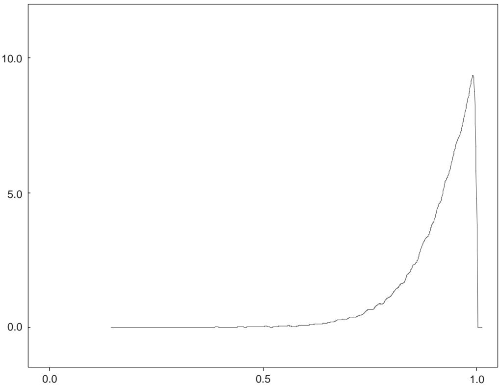  
Figure 9.1 Posterior density of spatial correlation parameter.

Bayes mode of 0.938 cited by Hepple (1995). Comparison of the expected predictive deviance (EPD) obtained by comparing actual and replicate data (Section 2.8) shows that using distance-boundary weights (model $C$ ) gives a better fit (EPD of 319, compared to 330 under model $B$ ). The impact of ARA is raised slightly as compared to model $B$ .

Example 9.2 Columbus crime data, binary response A spatial dataset originally provided by Anselin (1988b) relates to 49 neighbourhoods in Columbus, Ohio, and consists of observations on neighbourhood crime rates, with two predictors: average neighbourhood household income and house values. Lesage (2000) considers estimation of spatial interaction and spatial error models when the originally continuous crime incident data are converted to binary form, so $y = 1$ for crime rates exceeding $40\%$ , $y = 0$ otherwise.

Following the study by MacMillen (1995) on heteroscedasticity in the spatial probit model, Lesage investigates alternative priors on the degrees of freedom parameter $\nu$ in a scale mixture version of the limited dependent variable probit model. Thus a SIM has the form

$$
z _ {i} \sim N \left(\mu_ {i}, 1 / \lambda_ {i}\right) I (0,) \quad \text {w h e n} y _ {i} = 1,
$$

$$
z _ {i} \sim N (\mu_ {i}, 1 / \lambda_ {i}) I (, 0) \quad \text {w h e n} y _ {i} = 0,
$$

with $\lambda_{i}\sim \mathrm{Ga}(\nu /2,\nu /2)$ and with means

$$
\mu_ {i} = \rho W z + X \beta
$$

under a SIM model, and

$$
\mu_ {i} = \rho W z + X \beta - \rho W X \beta
$$

under a SAR model.

Here we consider probit models without scale mixing for SIM and SAR models; these models can be fitted in WINBUGS13 but not in WINBUGS14. Both models were estimated using two-chain runs of 10 000 iterations with convergence apparent by around 1000 iterations. While the effect of household income is to reduce crime under the SIM model (the $95\%$ credible interval on the income coefficient is $-0.28$ to $-0.02$ ), it has a non-significant effect under the SAR model. By contrast, house values have a significant negative effect on crime in both models.

To assess fit, new $z$ values are sampled (without truncation) and $y_{\mathrm{new}}$ is set to 1 or 0 according as $z_{\mathrm{new}}$ is positive or not. A tally is then made of the number of areas where $y$ and $y_{\mathrm{new}}$ are the same. The posterior mean of this tally is higher under the SIM (39.2 out of a maximum of 44) than the spatial error model (36.6).

# 9.3 DISCRETE SPATIAL REGRESSION WITH STRUCTURED AND UNSTRUCTURED RANDOM EFFECTS

Spatial dependence figures strongly in the analysis of disease maps, where event counts are the usual focus (e.g. Besag et al., 1991). In epidemiological analysis, the main object is often to estimate the underlying pattern of relative risk by 'pooling strength' over all areas or subpopulations. Conventional estimation of relative risks (e.g. by standard mortality ratios (SMRs) $r_i = y_i / E_i$ defined as ratios of observed to expected events) assumes a Poisson density with mortality risk constant over areas and individuals within areas. In practice, individual risks vary within areas and risks vary between areas so that area counts are more variable than the Poisson density stipulates.

This extra variation can be modelled by including random effects in a model for the relative risks of disease or mortality. Some effects may be spatially unstructured and have been denoted as 'excess heterogeneity' (e.g. Best et al., 1999). However, overdispersion may also occur due to spatially correlated effects; such spatial effects often proxy unobserved risk factors (e.g. environmental or cultural), which vary smoothly over space (Best, 1999).

For example, suppose a count of diseases or deaths $y_{i}$ is observed in a set of small areas and expected events are $E_{i}$ (derived using demographic methods). The outcomes may, subject to the necessity to take account of overdispersion, initially be taken as Poisson

$$
y _ {i} \sim \operatorname {P o} \left(E _ {i} \mu_ {i}\right),
$$

where $\mu_{i}$ is the relative risk of mortality in area $i$ . For relatively rare events Poisson sampling may be justified by considering binomial sampling of deaths by age $j$ in relation to populations by age $P_{ij}$ with death rates $\pi_{ij}$ , and by assuming that relative risks and age rates are proportional, namely $\pi_{ij} = \mu_i\pi_j$ (Wakefield et al., 2000). Then the spatial convolution model of

Besag et al. (1991) has the form

$$
\log \left(\mu_ {i}\right) = \beta_ {1} + \beta_ {2} x _ {i 2} + \dots + \beta_ {p} x _ {i p} + s _ {i} + u _ {i}, \tag {9.6}
$$

where $s_i$ are spatially structured effects and $u_i$ are spatially unstructured with possible prior, $u_i \sim N(0, \lambda)$ , where $\lambda$ is itself assigned an inverse gamma prior. Other options for $u$ might be a discrete mixture of normal densities or a single normal but with non-constant variances $\lambda_i$ (Lesage, 1999).

One possible joint density for the spatial effects $s = (s_1, \ldots, s_n)$ is in terms of pairwise differences in errors (Banerjee et al., 2004, p. 80) and a variance term $\kappa$

$$
P \left(s _ {1}, \dots , s _ {n}\right) \propto \exp \left[ - 0. 5 \kappa^ {- 1} \sum_ {i \sim j} c _ {i j} \left(s _ {i} - s _ {j}\right) ^ {2} \right], \tag {9.7}
$$

or equivalently (Gelfand and Vounatsou, 2003, p. 15)

$$
P \left(s _ {1}, \dots , s _ {n}\right) \propto \exp \left[ - 0. 5 \kappa^ {- 1} s ^ {\prime} (D - C) s \right], \tag {9.8}
$$

where $C = [c_{ij}]$ is a spatial interaction matrix and $D$ is diagonal with $(i,i)$ th element $c_{i+} = \sum_{j} c_{ij}$ . This joint density implies a normal conditional prior for $s_i$ conditioning on the effects $s_j$ in remaining areas $j \neq i$ . Letting such effects be denoted by $s_{[i]}$ , one has

$$
P \left(s _ {i} \mid s _ {[ i ]}, \kappa\right) \sim N \left(\omega_ {i}, \tau_ {i} ^ {- 1}\right), \tag {9.9}
$$

where $\omega_{i}$ is the weighted average

$$
\omega_ {i} = \frac {\sum_ {j} c _ {i j} s _ {j}}{\sum_ {j} c _ {i j}} = \sum_ {j} w _ {i j} s _ {j}
$$

and

$$
\tau_ {i} ^ {- 1} = \frac {\kappa}{\sum_ {j} c _ {i j}}
$$

are conditional variances. This is known as the intrinsic CAR (ICAR) prior and in contrast to (9.5) has a mean $\omega_{i}$ involving row-standardised weights.

Other pairwise difference priors are possible. Besag et al. (1991) mention a double exponential (Laplace) prior

$$
P \left(s _ {1}, \dots , s _ {n}\right) \propto \psi \exp \left[ - 0. 5 \psi \sum_ {i <   j} \left| s _ {i} - s _ {j} \right| ^ {2} \right],
$$

which, like the Student $t$ , is more robust to outliers or discontinuities in the risk surface. Here $\psi$ is a scaling parameter with smaller values implying less spatially correlated variability.

The conditional variance in (9.9) depends on the interaction structure represented by $c_{ij}$ . Typical forms for $c_{ij}$ are

(a) binary adjacency with $c_{ij} = 1$ if areas $i$ and $j$ are neighbours, $c_{ij} = 0$ otherwise (and $c_{ii} = 0$ ), in which case $\omega_i$ is the simple average of the spatial effects in the $L_i = c_{i+}$ neighbours of area $i$ and   
(b) distance decay with $c_{ij} = \exp(-\gamma d_{ij})$ where $\gamma > 0$ and $d_{ij}$ are distances between the area centres (and $c_{ii} = 0$ ).

The more the neighbours (definition (a)) or the closer they are (definition (b)), the more precisely is $s_i$ defined (in terms of higher precisions $\tau_i$ ).

To assess the relative strength of spatial and unstructured variation in (9.6) requires estimates of marginal rather than conditional variances. A moment estimator $\mathrm{var}(s) = \Sigma (s_i - \overline{s})^2 /(n - 1)$ of the marginal spatial variance may be compared (at each MCMC iteration) to the variance $\lambda$ of the $u_{i}$ , or to the moment estimator, $\mathrm{var}(u) = \Sigma (u_i - \overline{u})^2 /(n - 1)$ . The average ratio of the marginal spatial variance $\mathrm{var}(s)$ to the total $\mathrm{var}(u) + \mathrm{var}(s)$ then measures the relative importance of spatial correlation. Eberly and Carlin (2000) consider the alternative measure $\psi = \mathrm{sd}(s) / [\mathrm{sd}(s) + \mathrm{sd}(u)]$ .

The joint density (9.7)-(9.8) is improper with an undefined overall mean for the $s_i$ . This may lead to problems in convergence and identifiability in Bayesian estimation based on repeated sampling. One way of producing identifiability is to omit the constant $\beta_1$ in (9.6) so that the average of the $s_i$ defines the level. Assume priors $1 / \lambda \sim \mathrm{Ga}(a_{\lambda}, b_{\lambda}), 1 / \kappa \sim \mathrm{Ga}(a_{\kappa}, b_{\kappa})$ and Poisson data without predictors as in the 'pure smoothing' model, namely $y_i \sim \mathrm{Po}(E_i \mu_i)$ and

$$
\log \left(\mu_ {i}\right) = u _ {i} + s _ {i}. \tag {9.10}
$$

Then the full conditionals are

$$
s _ {i} \left| s _ {[ i ]}, u, y, \kappa , \lambda \propto \exp \left[ y _ {i} s _ {i} - E _ {i} \mu_ {i} - c _ {i +} \left(s _ {i} - \omega_ {i}\right) ^ {2} / 2 \kappa \right], \right.
$$

$$
u _ {i} \left| u _ {[ i ]}, s, y, \kappa , \lambda \propto \exp \left[ y _ {i} u _ {i} - E _ {i} \mu_ {i} - u _ {i} ^ {2} / 2 \lambda \right], \right.
$$

$$
1 / \lambda \sim \operatorname {G a} \left(a _ {\lambda} + 0. 5 n, b _ {\lambda} + 0. 5 \sum_ {i = 1} ^ {n} u _ {i} ^ {2}\right),
$$

$$
1 / \kappa \sim \operatorname {G a} \left(a _ {\kappa} + 0. 5 n, b _ {\kappa} + 0. 5 \sum_ {i = 1} ^ {n} \sum_ {j <   i} c _ {i j} \left(s _ {i} - s _ {j}\right) ^ {2}\right),
$$

(see Mollier, 1996, on the conditionals when predictors are included). Another identifying option is to constrain the $s_i$ to sum to zero, which in practice involves centring them at each MCMC iteration (Ghosh et al., 1998).

Inferences are also likely to be sensitive to the priors on the variances of the two error components. Bernardinelli et al. (1995, p. 2415) produce guidelines based on assumed normality in relative risks for a particular map (366 Sardinian communes) and show that the marginal variance $\mathrm{var}(s)\approx 2\kappa /\bar{L}$ , where, under a binary adjacency form for $c_{ij},\bar{L}$ is the average number of neighbours. One might therefore interlink the priors on the variances as follows:

$$
1 / \kappa \sim \operatorname {G a} \left(a _ {\kappa}, b _ {\kappa}\right), \tag {9.11}
$$

$$
\gamma = 2 \kappa / \bar {L} (\approx \operatorname {v a r} (s)),
$$

$$
\lambda = c ^ {2} \gamma ,
$$

and use a discrete prior on $c$ , with values centred at 1, for example the 19 points $\{0.1, 0.2, \dots, 0.9, 1, 2, \dots, 10\}$ . Then a Bayes factor is obtainable on alternative mixes

of unstructured and spatial variance under alternatives for the hyperparameters $(a_{\kappa}, b_{\kappa})$ . One may also obtain the probability that $\gamma > \lambda$ (marginal spatial variance exceeds marginal unstructured variance). Other options are possible: Mollié (1996) suggests a weakly data-based prior using the variance of the crude relative risks, namely $\mathrm{var}(r)$ , where $r_i = y_i / E_i$ . Then with $\Pi_r = 2 / \mathrm{var}(r)$ , $1 / \lambda \sim \mathrm{Ga}(c\Pi_r, c)$ and $1 / \kappa \sim \mathrm{Ga}(c\Pi_r\bar{L}, c)$ where $\bar{L}$ is the average number of neighbours and $c$ is a small constant (e.g. $c = 0.01$ ) that downweights the data-based information.

# 9.3.1 Proper CAR priors

Another option introduces an extra parameter to gain propriety. Following Sun et al. (1999, 2000) and Jin et al. (2005) propriety of the posterior is obtained by explicitly introducing a spatial dependence parameter $\rho$ absolutely less than 1, and replacing the precision matrix $D - C$ of $(s_1,\ldots ,s_n)$ in (9.8) by $D - \rho C$ , where $\rho$ is constrained to ensure $D - \rho C$ is nonsingular. This requires $\rho$ to be within the smallest and largest eigenvalues, $\psi_{\mathrm{min}}$ and $\psi_{\mathrm{max}}$ , of $D^{-0.5}CD^{-0.5}$ , where $\psi_{\mathrm{max}} = 1$ and $\psi_{\mathrm{min}} < 0$ (Gelfand and Vounatsou, 2003, p. 15). The conditional prior for this ICAR $\rho$ scheme may then be expressed as

$$
P \left(s _ {i} \mid s _ {[ i ]}\right) \sim N \left(\frac {\rho \sum_ {j} c _ {i j} s _ {j}}{\sum_ {j} c _ {i j}}, \tau_ {i} ^ {- 1}\right), \tag {9.12}
$$

with $\tau_{i}^{-1} = \kappa / \sum_{j} c_{ij}$ and the covariance between $s_i$ and $s_j$ given all other $s_k$ is obtained as

$$
\frac {\kappa^ {2} \rho c _ {i j}}{\left[ \sum_ {k} c _ {i k} \sum_ {k} c _ {j k} + \rho^ {2} c _ {i j} ^ {2} \right]}.
$$

The prior in (9.9) is then an ICAR1. By contrast, (9.12) reduces to an unstructured prior when $\rho = 0$ and so there is a degree of averaging over the extreme options under the convolution model, namely ICAR1 spatial errors on the one hand, and unstructured errors on the other. Hence one does not need to include $s_i$ (as in (9.12)) together with unstructured $u_i$ in a convolution model.

Another ICAR prior proposed to produce propriety (Leroux et al., 1999; MacNab, 2003) has a joint form

$$
s \mid \kappa , \omega \sim N _ {n} (0, \kappa R ^ {- 1}),
$$

where the precision matrix is $R = \omega K + (1 - \omega)I$ , with $\omega$ between 0 and 1, and $K$ an $n \times n$ structure matrix, with

$$
\begin{array}{l} K _ {i j} = - 1 \quad \text {i f a r e a s i a n d j a r e n e i g h b o u r s} \\ = 0 \quad \text {f o r n o n - a d j a c e n t a r e a s} \\ = c _ {i +} \quad \text {w h e n} i = j. \\ \end{array}
$$

The corresponding conditional form is

$$
P \left(s _ {i} \mid s _ {[ i ]}, \kappa , \omega\right) \sim N \left(\omega \sum_ {j \sim i} \frac {c _ {i j} s _ {j}}{d _ {i}}, \frac {\kappa}{d _ {i}}\right), \tag {9.13}
$$

where $j \sim i$ denotes that $j$ is a neighbour of area $i$ , and $d_{i} = 1 - \omega + \omega c_{i+}$ . This reduces to an ICAR1 prior when $\omega = 1$ , and to unstructured variation when $\omega = 0$ .

Pettitt et al. (2002) propose a proper joint prior

$$
s \mid \kappa , \varphi \sim N (0, \kappa R ^ {- 1}),
$$

with $\varphi > 0$ , $R_{ii} = 1 + \varphi c_{i+}$ , $R_{ij} = -\varphi$ when $j \sim i$ and $R_{ij} = 0$ otherwise. The conditional prior then has mean $\varphi \sum_{j \sim i} c_{ij} s_j / R_{ii}$ and variance $\kappa / R_{ii}$ . Czado and Prokopenko (2004) propose a modification whereby the conditional prior still has mean $\varphi \sum_{j \sim i} c_{ij} s_j / R_{ii}$ , but the variance is $\kappa(1 + \varphi) / R_{ii}$ . So, as $\varphi$ tends to infinity this tends to an ICAR1 prior.

Binomial sampling with a logit (or probit) link may be used when populations at risk, $N_{i}$ , are small, not just the event totals $y_{i}$ (e.g. MacNab, 2003, p. 306), with $y_{i} \sim \mathrm{Bin}(N_{i}, \pi_{i})$ and the mixed model is accordingly

$$
\operatorname {l o g i t} \left(\pi_ {i}\right) = \beta X _ {i} + u _ {i} + s _ {i}.
$$

Example 9.3 Farmer suicides Hawton et al. (1999) consider the number of suicides by farmers between 1981 and 1993 in 54 counties in England and Wales (Table 9.2). There were 719 suicides (634 suicide verdicts and 85 open verdicts), and as predictors they considered the overall population suicide rate in each county, the density of farmers (number of farmers in each county in 1987 divided by the total county population of both genders aged 15 years and over) and the percent of farming occurring in less favoured environments. Their model used linear regression of the suicide rates per 100 000. Here, expected suicides are calculated by multiplying person-years (farmers in 1987 times 13) by the average England-wide farmer suicide rate of 26.77 per 100 000 in the period 1981-1993.

A simple Poisson regression shows no predictor to be significant and has deviance information criterion (DIC) of 277. An ICAR1 model is applied with $\kappa^{-1} \sim \mathrm{Ga}(1,0.001)$ and identification achieved by centring on the fly (which is applied via the car.normal density in WINBUGS). This fails to improve the DIC (which increases slightly to 278), with $1 / \kappa$ estimated at 980 from a two-chain run of 10 000 iterations (1000 burn-in). The large precision parameter corresponds to small (near zero) estimates of $s_i$ , and so there is no great evidence of spatially dependent residuals.

To assess whether some degree of averaging over unstructured and spatial effects will improve fit, one of the aforementioned proper spatial priors is then applied. Thus the conditional prior of Czado and Prokopenko (2005) is used, whereby

$$
s _ {i} | s _ {[ i ]} \sim N \left(\varphi \sum_ {j \sim i} \frac {c _ {i j} s _ {j}}{[ 1 + | \varphi | c _ {i +} ]}\right), \frac {\kappa (1 + | \varphi |)}{[ 1 + | \varphi | c _ {i +} ]}.
$$

As $\varphi$ tends to infinity this tends to an ICAR1 prior, while near-zero $\varphi$ corresponds to unstructured errors. It is assumed that

$$
\varphi \sim N (0, 1 0 0 0) I (0,)
$$

Table 9.2 Suicides in farmers (1981-1993)   

<table><tr><td>County</td><td>Neighbours</td><td>y</td><td>E</td><td>Number of farmers</td><td>Person-years</td><td>Crude annual rate per 100 000</td><td>General suicide rate</td><td>Farmer density</td><td>Cattle and sheep farming less favoured areas</td></tr><tr><td>Avon</td><td>54, 42, 18</td><td>8</td><td>8.0</td><td>2 299</td><td>29 887</td><td>26.76</td><td>18.21</td><td>0.29</td><td>0.0</td></tr><tr><td>Bedfordshire</td><td>4, 5, 25, 35</td><td>2</td><td>5.3</td><td>1 530</td><td>19 890</td><td>10.05</td><td>14.29</td><td>0.38</td><td>0.0</td></tr><tr><td>Berkshire</td><td>23, 47, 54, 4, 39</td><td>4</td><td>3.2</td><td>924</td><td>12 012</td><td>33.3</td><td>13.9</td><td>0.16</td><td>0.0</td></tr><tr><td>Buckinghamshire</td><td>19, 25, 2, 35, 39, 3</td><td>4</td><td>7.5</td><td>2 153</td><td>27 989</td><td>14.29</td><td>17.5</td><td>0.43</td><td>0.0</td></tr><tr><td>Cambridgeshire</td><td>34, 46, 31, 2, 35, 17, 25</td><td>23</td><td>15.6</td><td>4 492</td><td>58 396</td><td>39.38</td><td>20.7</td><td>0.88</td><td>0.0</td></tr><tr><td>Cheshire</td><td>20, 32, 11, 41, 45, 8</td><td>18</td><td>17.6</td><td>5 045</td><td>65 585</td><td>27.44</td><td>17.66</td><td>0.66</td><td>2.9</td></tr><tr><td>Cleveland</td><td>14, 37</td><td>3</td><td>1.9</td><td>545</td><td>7 085</td><td>42.34</td><td>16.19</td><td>0.13</td><td>0.0</td></tr><tr><td>Clwyd</td><td>6, 41, 22, 40</td><td>14</td><td>15.2</td><td>4 365</td><td>56 745</td><td>24.67</td><td>24.52</td><td>1.31</td><td>31.1</td></tr><tr><td>Cornwall and Scilly</td><td>12</td><td>20</td><td>28.2</td><td>8 092</td><td>105 196</td><td>19.01</td><td>23.16</td><td>2.19</td><td>2.5</td></tr><tr><td>Cumbria</td><td>29, 37, 14, 36</td><td>29</td><td>27.1</td><td>7 797</td><td>101 361</td><td>28.61</td><td>25.65</td><td>2</td><td>26.8</td></tr><tr><td>Derbyshire</td><td>38, 44, 20, 6, 45, 30, 53</td><td>17</td><td>15.4</td><td>4 412</td><td>57 356</td><td>29.64</td><td>20.27</td><td>0.58</td><td>13.3</td></tr><tr><td>Devon</td><td>9, 42, 13</td><td>62</td><td>44.1</td><td>12 670</td><td>164 710</td><td>37.64</td><td>21.64</td><td>1.51</td><td>7.6</td></tr><tr><td>Dorset</td><td>54, 42, 23, 12</td><td>11</td><td>11.9</td><td>3 434</td><td>44 642</td><td>24.64</td><td>25</td><td>0.64</td><td>0.0</td></tr><tr><td>Durham</td><td>7, 48, 37, 10, 36</td><td>10</td><td>9.2</td><td>2 645</td><td>34 385</td><td>29.08</td><td>17.45</td><td>0.53</td><td>23.7</td></tr><tr><td>Dyfed</td><td>40, 22, 50</td><td>46</td><td>42.2</td><td>12 113</td><td>157 469</td><td>29.21</td><td>23.13</td><td>4.24</td><td>16.2</td></tr><tr><td>East Sussex</td><td>28, 52</td><td>9</td><td>8.6</td><td>2 461</td><td>31 993</td><td>28.13</td><td>20.82</td><td>0.42</td><td>0.0</td></tr><tr><td>Essex</td><td>19, 28, 25, 5, 46</td><td>15</td><td>14.9</td><td>4 289</td><td>55 757</td><td>26.9</td><td>16.47</td><td>0.34</td><td>0.0</td></tr><tr><td>Gloucestershire</td><td>39, 49, 54, 24, 1, 21</td><td>11</td><td>12.6</td><td>3 611</td><td>46 943</td><td>23.43</td><td>15.38</td><td>0.84</td><td>0.0</td></tr><tr><td>Greater London</td><td>28, 47, 4, 25, 17</td><td>1</td><td>1.8</td><td>531</td><td>6 903</td><td>14.48</td><td>20.34</td><td>0.01</td><td>0.0</td></tr><tr><td>Greater Manchester</td><td>53, 29, 32, 11, 6</td><td>6</td><td>6.1</td><td>1 746</td><td>22 698</td><td>26.42</td><td>22.87</td><td>0.09</td><td>11.0</td></tr><tr><td>Gwent</td><td>18, 24, 40, 33, 43</td><td>7</td><td>8.3</td><td>2 395</td><td>31 135</td><td>22.48</td><td>13.45</td><td>0.68</td><td>15.6</td></tr><tr><td>Gwynedd</td><td>8, 40, 15</td><td>16</td><td>17.5</td><td>5 029</td><td>65 377</td><td>24.47</td><td>23.08</td><td>2.49</td><td>36.4</td></tr><tr><td>Hampshire</td><td>13, 54, 3, 47, 52, 27</td><td>15</td><td>11.6</td><td>3 322</td><td>43 186</td><td>34.73</td><td>16.03</td><td>0.26</td><td>0.0</td></tr><tr><td>Hereford and Worcs</td><td>40, 51, 41, 49, 18, 21, 45</td><td>28</td><td>27.1</td><td>7 775</td><td>101 075</td><td>27.7</td><td>19.85</td><td>1.46</td><td>3.7</td></tr><tr><td>Hertfordshire</td><td>17, 5, 2, 4, 19</td><td>4</td><td>4.9</td><td>1 417</td><td>18 421</td><td>21.71</td><td>18.3</td><td>0.17</td><td>0.0</td></tr><tr><td>Humberside</td><td>31, 38, 37, 44</td><td>18</td><td>15.4</td><td>4 419</td><td>57 447</td><td>31.33</td><td>22.66</td><td>0.63</td><td>0.0</td></tr><tr><td>Isle o f Wight</td><td>23</td><td>4</td><td>2.0</td><td>566</td><td>7 358</td><td>54.35</td><td>23.4</td><td>0.57</td><td>0.0</td></tr></table>

<table><tr><td>Kent</td><td>17, 19, 16, 47</td><td>11</td><td>17.1</td><td>4910</td><td>63830</td><td>17.23</td><td>18.68</td><td>0.41</td><td>0.0</td></tr><tr><td>Lancashire</td><td>37, 10, 20, 53 ,32</td><td>19</td><td>23.9</td><td>6881</td><td>89453</td><td>21.24</td><td>24.77</td><td>0.62</td><td>10.2</td></tr><tr><td>Leicestershire</td><td>31, 38, 11, 35, 49</td><td>15</td><td>11.3</td><td>3258</td><td>42354</td><td>35.41</td><td>15.65</td><td>0.45</td><td>0.0</td></tr><tr><td>Lincolnshire</td><td>34, 5, 30, 38, 26</td><td>21</td><td>25.7</td><td>7372</td><td>95836</td><td>21.91</td><td>22.12</td><td>1.58</td><td>0.0</td></tr><tr><td>Merseyside</td><td>6, 20, 29</td><td>2</td><td>2.2</td><td>623</td><td>8099</td><td>24.68</td><td>18.74</td><td>0.05</td><td>0.0</td></tr><tr><td>Mid-Glamorgan</td><td>40, 43, 50, 21</td><td>2</td><td>3.7</td><td>1061</td><td>13793</td><td>14.49</td><td>24.63</td><td>0.25</td><td>38.3</td></tr><tr><td>Norfolk</td><td>5, 46, 31</td><td>17</td><td>20.6</td><td>5925</td><td>77025</td><td>22.07</td><td>19.39</td><td>0.97</td><td>0.0</td></tr><tr><td>Northamptonshire</td><td>39, 2, 4, 5, 30, 49</td><td>5</td><td>8.0</td><td>2290</td><td>29770</td><td>16.79</td><td>17.51</td><td>0.5</td><td>0.0</td></tr><tr><td>Northumberland</td><td>10, 48, 14</td><td>7</td><td>10.1</td><td>2890</td><td>37570</td><td>18.63</td><td>11.11</td><td>1.2</td><td>35.0</td></tr><tr><td>North Yorkshire</td><td>26, 44, 53, 29, 10, 14, 7</td><td>35</td><td>37.0</td><td>10641</td><td>138333</td><td>25.3</td><td>23.38</td><td>1.84</td><td>14.4</td></tr><tr><td>Nottinghamshire</td><td>31, 11, 30, 44, 26</td><td>9</td><td>8.2</td><td>2357</td><td>30641</td><td>29.37</td><td>21.05</td><td>0.29</td><td>0.0</td></tr><tr><td>Oxfordshire</td><td>3, 4, 35, 49, 18, 54</td><td>5</td><td>8.3</td><td>2371</td><td>30823</td><td>16.22</td><td>14.35</td><td>0.5</td><td>0.0</td></tr><tr><td>Powys</td><td>8, 15, 21, 22, 33, 50, 24, 41</td><td>33</td><td>22.3</td><td>6411</td><td>83343</td><td>39.59</td><td>18.18</td><td>6.71</td><td>68.6</td></tr><tr><td>Shropshire</td><td>24, 40, 45, 8, 6</td><td>19</td><td>20.2</td><td>5818</td><td>75634</td><td>25.12</td><td>17.5</td><td>1.81</td><td>9.6</td></tr><tr><td>Somerset</td><td>1, 54, 12, 13</td><td>17</td><td>22.6</td><td>6483</td><td>84279</td><td>20.17</td><td>18.99</td><td>1.78</td><td>4.7</td></tr><tr><td>South Glamorgan</td><td>33, 21</td><td>0</td><td>2.0</td><td>582</td><td>7566</td><td>0</td><td>17.95</td><td>0.18</td><td>0.2</td></tr><tr><td>South Yorkshire</td><td>11, 38, 53, 37, 26</td><td>4</td><td>5.9</td><td>1692</td><td>21996</td><td>18.18</td><td>17.25</td><td>0.16</td><td>3.0</td></tr><tr><td>Staffordshire</td><td>24, 41, 49, 51, 6, 11</td><td>17</td><td>18.1</td><td>5214</td><td>67782</td><td>25.08</td><td>16.71</td><td>0.63</td><td>3.8</td></tr><tr><td>Suffolk</td><td>17, 5, 34</td><td>19</td><td>14.8</td><td>4267</td><td>55471</td><td>34.25</td><td>19.28</td><td>0.84</td><td>0.0</td></tr><tr><td>Surrey</td><td>28, 19, 3, 52, 23</td><td>2</td><td>6.3</td><td>1809</td><td>23517</td><td>8.5</td><td>17.33</td><td>0.22</td><td>0.0</td></tr><tr><td>Tyne and Wear</td><td>14, 36</td><td>0</td><td>1.1</td><td>329</td><td>4277</td><td>0</td><td>18.28</td><td>0.03</td><td>0.0</td></tr><tr><td>Warwickshire</td><td>39, 30, 35, 51, 18, 24, 45</td><td>14</td><td>9.5</td><td>2736</td><td>35568</td><td>39.36</td><td>19.59</td><td>0.69</td><td>0.0</td></tr><tr><td>West Glamorgan</td><td>15, 40, 33</td><td>5</td><td>3.3</td><td>961</td><td>12493</td><td>40.01</td><td>21.28</td><td>0.33</td><td>26.1</td></tr><tr><td>West Midlands</td><td>49, 45, 24</td><td>3</td><td>1.9</td><td>557</td><td>7241</td><td>41.37</td><td>13.65</td><td>0.02</td><td>0.0</td></tr><tr><td>West Sussex</td><td>23, 16, 47</td><td>10</td><td>8.3</td><td>2381</td><td>30953</td><td>32.3</td><td>17.58</td><td>0.41</td><td>0.0</td></tr><tr><td>West Yorkshire</td><td>37, 44, 20, 29, 11</td><td>15</td><td>11.8</td><td>3383</td><td>43979</td><td>34.1</td><td>22.29</td><td>0.21</td><td>18.4</td></tr><tr><td>Wiltshire</td><td>23, 3, 39, 18, 1, 42, 13</td><td>8</td><td>11.6</td><td>3322</td><td>43186</td><td>18.52</td><td>15.91</td><td>0.74</td><td>0.0</td></tr></table>

while $\kappa^{-1} \sim \mathrm{Ga}(1, 0.001)$ . This model also fails to produce a gain in fit over a simple Poisson regression, with DIC of 278.4 and $d_{e} = 5.7$ . Here $\varphi$ has a mean of 25.

It may be noted that a significant predictor (with or without spatial effects in the model too) is based on the product of farmer density and the percent of less favoured farming, without main effects in either variable.

Example 9.4 London borough suicides This example also relates to suicide mortality, but to the 32 London boroughs specifically (male and female suicides combined over 1989-1993). We consider a model for suicides $y$ without predictors first and use the prior structure in (9.11) with a 19-point discrete prior for $c$ over $\{0.1, 0.2, 0.3, \ldots, 0.9, 1, 2, \ldots, 9, 10\}$ . Thus $y_i \sim \mathrm{Po}(\mu_i E_i)$ with

$$
\log (\mu_ {i}) = \beta_ {1} + s _ {i} + u _ {i},
$$

and the $s$ values centred at each iteration. To assess significance, the probabilities of positive $s$ and $u$ are obtained for each area. High probabilities (e.g. over 0.9) indicate extreme positive values, while low probabilities (e.g. under 0.1) indicate extreme negative values. Other analysis shows that suicide mortality in London is clearly spatially clustered with highest relative mortality in central London and low values in most of the suburban periphery.

A two-chain run of 50 000 iterations shows slow convergence with a long spell where one chain favours unstructured over structured effects. Starting from iteration 20000, Gelman-Rubin diagnostics are satisfactory and over iterations 25 000-50 000, $\operatorname{sd}(s)$ has a mean 0.24 compared to 0.08 for $\operatorname{sd}(u)$ . The average of

$$
\psi = \mathrm {s d} (s) / [ \mathrm {s d} (s) + \mathrm {s d} (u) ]
$$

is 0.75. There are six boroughs with $p(s_i > 0)$ exceeding 0.95, and also six boroughs with $p(s_i > 0)$ under 0.05. By contrast, the probabilities $p(u_i > 0)$ range from 0.29 to 0.78, so none are significant at area level.

Two predictors are then introduced, namely deprivation and social fragmentation. Several studies have shown that area social deprivation (meaning social and material hardship and represented by observed variables such as high unemployment, low car and home ownership) tends to be associated with higher suicide mortality (Gunnell et al., 1995). So also does social fragmentation, meaning relatively weak community ties associated with observed indices such as one-person households, high population turnover and many adults outside married relationships (Allardyce et al., 2005).

The spatial effects now are not representing clustering in the event itself but possible clustering in regression residuals. In this second regression model, the discrete mixture indicator for $c$ in (9.11) converges much earlier. However, two chains of 50 000 iterations are run for comparability (with summaries based on the last 40 000). There are significant effects for both deprivation (95% credible interval 0.06-0.16) and fragmentation (interval 0.13-0.23). The probabilities $p(s_i > 0)$ now range from 0.32 to 0.75, while the $p(u_i > 0)$ range from 0.09 to 0.94. The last mentioned reflects a relatively high suicide rate in Lambeth in inner south London (area 21) beyond what would be expected from the regression. Now $\mathrm{sd}(s)$ has a mean 0.035 compared to 0.075 for $\mathrm{sd}(u)$ , so the regression seems to have eliminated the need for a spatial effect. The average of $\psi$ is reduced to 0.31.

# 9.4 MOVING AVERAGE PRIORS

Alternative specifications for spatial random effects may be based on a moving average principle, where the average uses spatial weights. Leyland et al. (2000) assume that the spatial effect for area $i$ is a spatially weighted average of unstructured errors; see Feltblower et al. (2005) for a recent Bayesian application. This is an example of a multiple membership, multiple classification model (Browne et al., 2001, p. 117) where both classifications relate to the same set of units. For example with $u_{i}$ being random effects for the areas (first classification) and $\nu_{j}$ being random effects for the neighbours (multiple membership classification) one has

$$
\log \left(\mu_ {i}\right) = \beta_ {1} + u _ {i} + \sum_ {j = 1} ^ {n} w _ {i j} v _ {j}, \tag {9.14}
$$

where the $w_{ij}$ are row-standardised interactions. If the $w_{ij}$ are based on contiguity, then $w_{ij} = 1 / L_i$ if areas $i$ and $j$ are adjacent, with $L_i$ being the number of neighbours of area $i$ , so

$$
\log (\mu_ {i}) = \beta_ {1} + u _ {i} + \sum_ {j \varepsilon \partial_ {i}} v _ {j} / L _ {i},
$$

with $\partial_i$ denoting the neighbourhood of areas adjacent to $i$ . This structure has the benefit that the prior for $\nu$ is proper, but the same questions of identifiability of separate $u$ and $\nu$ effects occur as for the convolution model, since two sets of $\mathfrak{n}$ effects are being applied to $n$ data points. Assuming binary adjacency and setting $s_i = \sum_{j \in \partial_i} \nu_j / L_i$ one can see that the marginal variance of $s$ is approximately equal to the variance of $\nu$ divided by $\bar{L} = \sum_{i} L_i / n$ , and this enables one to set a discrete prior linking the structured and unstructured variances, analogous to (9.11). For example, let $\nu_i \sim N(0, \sigma_\nu^2)$ and $u_i \sim N(0, \sigma_u^2)$ ; then

$$
\begin{array}{l} 1 / \sigma_ {v} ^ {2} \sim \operatorname {G a} (a _ {v}, b _ {v}), \\ \gamma = \sigma_ {v} ^ {2} / \bar {L} (\approx \operatorname {v a r} (s)), \\ \sigma_ {u} ^ {2} = c ^ {2} \gamma , \\ \end{array}
$$

where $c$ is a grid of values centred at 1.

This approach extends to multivariate responses, spatially varying predictor effects models and non-parametric modelling of spatial effects (Section 9.6). For $K$ responses a multivariate normal prior of dimension $2K$ allows correlation between outcome-specific errors $u_{ik}$ and $s_{ik}$ and so expresses interdependence between the responses (Congdon, 2002).

Another possible spatial moving average model uses a single set of underlying effects $u_{i}$ rather than two sets as in the multiple membership model of Leyland et al. (2000). This involves a mixture of own-area effect and weighted average of neighbouring area effects

$$
\log \left(\mu_ {i}\right) = \beta_ {1} + q u _ {i} + (1 - q) \sum_ {j = 1} ^ {n} w _ {i j} u _ {j}, \tag {9.15}
$$

where the mixture weight $q$ might be assigned a uniform $U(0,1)$ prior, and $u_{i} \sim N(0,\sigma_{u}^{2})$ . More adaptiveness may be gained by variable (beta) weights $q_{i}$ as in

$$
\log (\mu_ {i}) = \beta_ {1} + q _ {i} u _ {i} + (1 - q _ {i}) \sum_ {j = 1} ^ {n} w _ {i j} u _ {j}.
$$

Best et al. (2000) suggest a moving average model for disease count data based on the identity link, rather than the log link. The moving average might be based on a different spatial partitioning of the region. So if disease counts are observed for areas $i = 1, \dots, n$ the spatial average might be based on another (possibly spatially misaligned) geographical configuration $j = 1, \dots, m$ . For example, let $i$ be called areas and $j$ be called subdivisions, and let $\gamma_j$ be positive latent effects for subdivision $j$ . Let $x_i$ be a risk factor in the form of a positive ratio measure (e.g. pollution or composite social structure measure) normalised to have mean 1. Then

$$
\mu_ {i} = \beta_ {1} + \beta_ {2} x _ {i} + \beta_ {3} \sum_ {j = 1} ^ {m} w _ {i j} \gamma_ {j}, \tag {9.16}
$$

where priors on the coefficients $\beta_{1},\beta_{2}$ and $\beta_{3}$ are constrained to ensure $\mu_{i}$ is positive. Best et al. (2000) assume gamma priors on all these unknowns. The spatial interactions might also include unknowns if they are distance based. Let $d_{ij}$ be the distance between the centre of area $i$ and subdivision $j$ . Then one might specify a Gaussian decay function

$$
w _ {i j} = c [ \exp (- d _ {i j} ^ {2} / 2 \varphi) ],
$$

with $\varphi$ being an extra parameter.

The model in (9.16) implies a decomposition of the observed area count into $m + 2$ latent Poisson variables, i.e. $y_{i} = \sum_{k = 1}^{m + 2}z_{ik}$ . Let $Z_{i} = (z_{i1},z_{i2},\ldots ,z_{i,m + 2})$ , $\pi_i = (\pi_{i1},\pi_{i2},\dots,\pi_{i,m + 2})$ . Then

$$
Z _ {i} \sim \operatorname {M u} \left(y _ {i}, \pi_ {i}\right),
$$

where $\pi_{i1} = \beta_1 / \mu_i$ , $\pi_{i2} = \beta_2x_i / \mu_i$ , ..., $\pi_{i,m + 2} = \beta_3w_{im}\gamma_m / \mu_i$ . This is a relatively heavily parameterised model and identifiability may require substantively based (informative) priors.

Example 9.5 London borough suicides, multiple membership prior This example applies the multiple membership model to the London borough suicide data, assuming a contiguity form for $c_{ij}$ , so that

$$
\log (\mu_ {i}) = \beta_ {1} + u _ {i} + \sum_ {j \varepsilon \partial_ {i}} v _ {j} / L _ {i}.
$$

$\mathrm{Ga}(1,0.001)$ priors are assumed for both $u$ and $\nu$ errors. A 10 000 two-chain run is used for inferences, with early convergence apparent.

In a demonstration of the identification issues that affect such models, this model places more stress on the unstructured errors, with four probabilities $p(u_{i} > 0)$ exceeding 0.95 (based on iterations 1000-10000). These four include two central boroughs (Westminster and Camden) with high suicide rates, so the central London high suicide cluster is being represented by unstructured rather than structured effects under the multiple membership prior. The mean for

$\psi = \mathrm{sd}(s) / [\mathrm{sd}(s) + \mathrm{sd}(u)]$ is 0.25 where $s_i = \sum_{j \in \partial i} v_j / L_i$ defines the total spatial effect and the standard deviation of the $s_i$ is obtained at each MCMC iteration.

The DIC for this model is 274 ( $d_{e} = 28.5$ ) and higher than that obtained (270 with $d_{e} = 26.3$ ) for the standard convolution model of Besag et al. (1991), as in (9.9), namely

$$
\begin{array}{l} \log (\mu_ {i}) = \beta_ {1} + s _ {i} + u _ {i}, \\ s _ {i} \left| s _ {[ i ]} \right. \sim \mathrm {N} \left(\omega_ {i}, \tau_ {i} ^ {- 1}\right), \\ \omega_ {i} = \frac {\sum_ {j} c _ {i j} s _ {j}}{\sum_ {j} c _ {i j}} = \sum_ {j} w _ {i j} s _ {j}, \\ \end{array}
$$

with $\mathrm{Ga}(1,0.001)$ priors for the precision of $u$ and the conditional precision of $s$ . For identifiability the $s_i$ are centred at each iteration. This model strongly favours spatial effects with posterior mean for $\psi$ of 0.83 (from iterations 1000-10000 of a two-chain run).

Finally, consider the model in (9.15) with only a single random effect, and precision $1 / \sigma_u^2 \sim \mathrm{Ga}(1,0.001)$ . This gives a DIC of 263.5 ( $d_e = 19.2$ ) and posterior mean for $q$ of 0.37 (from the last 9000 of a two-chain run of 10000 iterations), thus favouring the spatially filtered component as against the local component. Setting $s_i = \sum_{j=1}^{n} w_{ij} u_j$ , one finds five boroughs with $\operatorname*{Pr}(s_i > 0)$ exceeding 0.9, based on the last 9000 of a two-chain run of 10000 iterations. These include the three central boroughs (areas 6, 19 and 32 namely Camden, Kensington and Chelsea and Westminster with crude SMRs of 161, 146 and 170).

# 9.5 MULTIVARIATE SPATIAL PRIORS AND SPATIALLY VARYING REGRESSION EFFECTS

Suppose the observations for area $i$ , $y_{i} = (y_{i1}, \ldots, y_{iK})$ , consist of counts of $K$ interrelated outcomes (e.g. types of disease or mortality), so that

$$
y = \left(y _ {1}, \dots , y _ {n}\right) = \left(y _ {1 1}, y _ {1 2}, \dots , y _ {1 K}; y _ {2 1}, y _ {2 2}, \dots , y _ {2 K}; \dots , y _ {n 1}, y _ {n 2}, \dots , y _ {n K}\right).
$$

Assuming Poisson variation (e.g. Held et al., 2005) with expected events $E_{ik}$ , and $y_{ik} \sim \mathrm{Po}(E_{ik}\mu_{ik})$ , one might propose shared random effects models for the relative risks $\mu_{ik}$

$$
\log \left(\mu_ {i k}\right) = X _ {i} \beta_ {k} + u _ {i k} + s _ {i k}, \tag {9.17.1}
$$

where $X_{i}$ is the $i$ th row of the $n \times p$ predictor matrix, and both the unstructured effects $u_{ik}$ and the structured effects $s_{ik}$ are correlated between outcomes. This reflects the fact that when the risk of one disease is high (e.g. due to measured or unmeasured environmental or socioeconomic factors) so often is the risk of other diseases. To avoid excess parameterisation, a number of common spatial factor models have been proposed (e.g. Congdon, 2006; Knorr-Held and Best, 2001). For example, a typical such model might be

$$
\log \left(\mu_ {i k}\right) = X _ {i} \beta_ {k} + \lambda_ {1 k} u _ {i} + \lambda_ {2 k} s _ {i},
$$

where if the variances of $u_{i}$ and $s_i$ are retained as unknowns, one of the $\lambda_{1k}$ and one of the $\lambda_{2k}$ has to be set to a known value (e.g. $\lambda_{11} = \lambda_{21} = 1$ ) so that the model is identified.

However, retaining the full dimension random effect structure, the correlation between the $u_{ik}$ could involve a multivariate normal or Student $t$ . For modelling correlation between $s_{ik}$ and

$s_{im}(k \neq m)$ , Gelfand and Vounatsou (2003) generalise the ICAR $\rho$ model of Sun et al. (1999). Let $S_i = (s_{i1}, \ldots, s_{iK})$ . Then the MCAR $(\rho, \Omega)$ prior, with $\rho$ scalar, has a conditional prior form

$$
P \left(S _ {i} \mid S _ {[ i ]}, \rho , \Omega\right) = N _ {K} \left(\rho \sum_ {j \sim i} W _ {i j} S _ {j}, \frac {\Omega}{\sum_ {j} c _ {i j}}\right), \tag {9.17.2}
$$

where $S_{[i]}$ denotes spatial effects other than those in area $i$ , $\Omega$ is a $K \times K$ covariance matrix and $W_{ij} = w_{ij} I_{K \times K}$ is also $K \times K$ . The introduction of $\rho$ ensures that the corresponding joint prior is proper, with non-singular covariance matrix. Gelfand and Vounatsou (2003, p. 20) suggest a discrete prior on $\rho$ to avoid Metropolis sampling; all other updating uses Gibbs sampling. If $\rho$ is set to 1, as in

$$
P \left(S _ {i} \mid S _ {[ i ]}, \rho , \Omega\right) = N _ {K} \left(\sum_ {j \sim i} W _ {i j} S _ {j}, \frac {\Omega}{\sum_ {j} c _ {i j}}\right), \tag {9.17.3}
$$

then a propriety issue occurs as with the ICAR1. Identifiability may be achieved by centring each of the $K$ sets of effects at each iteration.

Multinomial data $\mathbf{y}_i = \{y_{i1},\dots ,y_{iJ}\}$ , such as party votes in constituencies or area deaths subdivided by cause, may be included in this structure. Thus setting $T_{i} = \sum_{i}y_{ij}$ and $\pi_i = (\pi_{i1},\ldots ,\pi_{iJ})$ , one might specify

$$
y _ {i} \sim \operatorname {M u} \left(T _ {i}, \pi_ {i}\right),
$$

$$
\pi_ {i j} = \frac {\exp (\eta_ {i j})}{\sum_ {k} \exp (\eta_ {i k})},
$$

$$
\eta_ {i J} = 0,
$$

$$
\eta_ {i j} = X _ {i} \beta_ {j} + u _ {i j} + s _ {i j} \quad j = 1, \dots , J - 1,
$$

with a zero mean multivariate normal model for $u_{ij}$ , and with spatially correlated errors $(s_{i1,\dots,s_{i,J-1}})$ following an MCAR $(\rho, \Omega)$ prior.

One application of multivariate spatial priors is in connection with spatially varying predictor effects. Instead of a constant regression effect across all areas, one may allow predictor effects to vary between them, though expecting covariate effects to show smooth variation over space, without pronounced and implausible differences between adjacent areas (Assuncao, 2003, p.454). Classical methods for this situation include geographically weighted regression (GWR) (Fotheringham et al., 2000) and there have been Bayesian adaptations of the GWR approach. However, MCMC sampling has particular benefits in the case of CAR priors, and these priors are readily adapted to varying predictor effects. This contrasts with the role of the $s_i$ in the smoothing model (9.10) as effectively modelling intercept variation. Congdon (1997) estimates an ICAR1 prior model for a single predictor with spatially varying effects, but a more typical situation is when there is both spatially patterned variation in risk (varying intercepts) and one or more predictors in a model show spatial variation in their impacts.

Gamerman et al. (2003) discuss a scheme similar to the MCAR(1, $\Omega$ ) prior for spatially varying predictor effects when $y$ is a univariate metric variable, and with a joint prior that is a

multivariate extension of (9.7). This prior specification extends to general linear models. For example, let $y_{i} \sim \mathrm{Po}(E_{i}\mu_{i})$ be a single disease or mortality count, and $X_{i}$ be a vector of $p$ predictors including $x_{i1} = 1$ . Then instead of a constant regionwide regression effect, as in $\log(\mu_i) = X_i\beta + s_i + u_i$ , instead, one might let

$$
\log (\mu_ {i}) = X _ {i} \beta_ {i} = \beta_ {i 1} + x _ {i 2} \beta_ {i 2} + \dots + x _ {i p} \beta_ {i p} + u _ {i},
$$

where $\beta_{i} = (\beta_{i1},\dots,\beta_{ip})$ is a vector of spatially varying and jointly dependent predictor effects. Since $x_{i1} = 1$ , this model still includes a random intercept, with $\beta_{i1}$ replacing $\beta_{1} + s_{i}$ in (9.6). The joint prior is

$$
P (\beta_ {1}, \ldots , \beta_ {n} | \Psi) \propto | \Psi | ^ {- n / 2} \exp [ - 0. 5 \sum_ {j \sim i} c _ {i j} (\beta_ {i} - \beta_ {j}) ^ {\prime} \Psi^ {- 1} (\beta_ {i} - \beta_ {j}) ],
$$

where $\Psi$ is a $p\times p$ covariance matrix, and the conditional prior is

$$
P \left(\beta_ {i} \mid \beta_ {[ i ]}, \Psi\right) = N \left(\sum_ {j \sim i} w _ {i j} \beta_ {j}, \frac {\Psi}{\sum_ {j} c _ {i j}}\right). \tag {9.18}
$$

Gamerman et al. (2003, p. 517) mention alternative parameter sampling schemes, either from the full conditionals $(\beta_{1},\ldots ,\beta_{n}|\Psi)$ and $(\Psi |\beta_{1},\dots,\beta_{n})$ , or from $(\beta_{1},\dots,\beta_{n},\Psi)$ jointly.

Assuncao (2003, p. 460) mentions the option of specifying a spatially varying predictor effect as a sum of a fixed effect and a zero mean random effect,

$$
\beta_ {i k} = b _ {k} + e _ {i k}, \tag {9.19}
$$

where all the $e_{ik}$ are centred to have mean zero at each MCMC iteration if an improper multivariate conditional prior is specified for them. This option enables the WINBUGS mv. car function to be used in modelling spatially varying coefficients. One may alternatively use proper spatial priors, such as multivariate equivalents of those considered in Section 9.3.1, to be used for $e_{ik}$ . Alternatively Gamerman et al. (2003, p. 531) propose a proper prior (for metric data with regression mean $\mu_i = X_i\beta_i$ ), which has the conditional form

$$
P (\beta_ {i} | \beta_ {[ i ]}, \Psi , \lambda) = N \left(q _ {i} \sum_ {j \sim i} w _ {i j} \beta_ {j} + (1 - q _ {i}) \mu_ {i}, \Psi / (c _ {i +} + \lambda)\right),
$$

with $\lambda$ being a positive parameter and $q_{i} = c_{i + } / (c_{i + } + \lambda)$ , where $c_{i + } = \sum_{j}c_{ij}$ .

Example 9.6 Spatially varying regressor effects on male and female suicide in England This example considers male and female suicide counts $\{y_{mi}, y_{fi}\}$ in 354 English local authorities over 1989-1993 and the impact of four conceptual factors on them: deprivation, social fragmentation, rurality and ethnicity. Scores on these are based on a total of standardised transforms of original census variables and then standardising that total. Deprivation scores from the 1991 UK census are based on social renting, routine manual workers (social classes 4/5), not owning a car and unemployment. Social fragmentation is based on unmarried adults, population turnover, private renting and one-person households. Rurality is positively loaded

on agricultural workers, and negatively on population density. Ethnicity is the standardised percentage of non-white groups in an area's population.

First of all a spatially homogenous predictor effect model is applied, with Poisson sampling, namely

$$
y _ {m i} \sim \mathrm {P o} \left(E _ {m i} \mu_ {m i}\right),
$$

$$
y _ {f i} \sim \mathrm {P o} (E _ {f i} \mu_ {f i}),
$$

where expected deaths $(E_{mi}$ and $E_{fi})$ use England and Wales 5-year age group death rates for 1991. Then with log links, the homogenous effects model is

$$
\log (\mu_ {m i}) = \alpha_ {m} + x _ {i 1} \beta_ {m 1} + \dots + x _ {i 4} \beta_ {m 4},
$$

$$
\log \left(\mu_ {f i}\right) = \alpha_ {f} + x _ {i 1} \beta_ {f 1} + \dots + x _ {i 4} \beta_ {f 4}.
$$

$N(0,1000)$ priors are assumed on the eight regression coefficients $\{\beta_{m1},\beta_{m2},\beta_{m3},\beta_{m4},$ $\beta_{f1},\beta_{f2},\beta_{f3},\beta_{f4}\}$ and the two intercepts. A two-chain run of 2500 iterations shows early convergence and the last 2000 iterations show only the fragmentation effect $\beta_{f1}$ to be significant for females with a $95\%$ interval (0.120, 0.175), whereas for males, only ethnicity is not significant: the $95\%$ intervals for fragmentation, deprivation and rurality effects on male suicide are (0.08, 0.115), (0.034, 0.066) and (0.04, 0.088). The DIC is 4690, using the minus twice likelihood definition of deviance, as in the WINBUGS package. There is an indication of overdispersion with the posterior mean of the scaled deviances for male and female suicides being 563 and 517, respectively, compared to 354 data points in each case. There are also some predictive inconsistencies between the data and new data sampled from the model: only $89.5\%$ of replicate data values sampled from the model have $95\%$ intervals that include the actual observations.

To allow spatially varying regression effects $\{\beta_{m1i},\beta_{m2i},\beta_{m3i},\beta_{m4i},\beta_{f1i},\beta_{f2i},\beta_{f3i},\beta_{f4i}\}$ the prior (9.18) is adopted, using the decomposition in (9.19). Thus with

$$
\beta_ {m k i} = b _ {m k} + e _ {m k i},
$$

$$
\beta_ {f k i} = b _ {f k} + e _ {f k i},
$$

a multivariate conditionally autoregressive (MCAR) is assumed on $\{e_{mk1},\ldots ,e_{fk4}\}$ , with a Wishart prior on the precision matrix, $\Psi^{-1}\sim W(I,8)$ , where $I$ is the identity matrix. The $e_{mki}$ and $e_{fki}$ are centred over areas $i$ at each iteration. $N(0,1000)$ priors are assumed on the $b_{mk}$ and $b_{fk}$ fixed effect parameters. The second half of a two-chain run of 2500 iterations gives mean scaled deviances for males and females of 324 and 340, respectively, so that overdispersion is dealt with. The effective parameter total is 333, using the method in (2.14.2) rather than (2.14.1), because the DIC is not obtainable under WINBUGS. The DIC is calculated as 3935. The model reproduces the data satisfactorily: in fact $99.7\%$ of replicate data values sampled from the model have $95\%$ intervals that include the actual observations.

The posterior means of $b_{mk}$ and $b_{fk}$ are similar to those under the homogenous regression effects model, but the credible intervals are wider – though the 95% intervals for the effects of fragmentation, deprivation and rurality on male suicide are still all positive. The model produces eight sets of coefficients and full assessment of substantive inferences includes examination of their mapped patterns.

# 9.6 ROBUST MODELS FOR DISCONTINUITIES AND NON-STANDARD ERRORS

While a smoothly varying outcome over contiguous areas is typically well represented by the convolution model of (9.6), alternative schemes may be needed when there are clear discontinuities in the spatial patterning of health events; for instance, a low-mortality area surrounded by high-mortality areas will have a distorted smoothed rate under a standard spatially correlated error model such as (9.6). This is especially the case for small event totals, as in the well-known lip cancer data; as discussed by Stern and Cressie (2000), certain areas in this dataset have extreme crude SMRs though small event totals $y$ and expected deaths $E$ are involved. When event totals are large, the data will outweigh the spatial prior and the morbidity in 'discontinuous' areas will generally be estimated reasonably, despite the spatially correlated prior, though some distortion may remain (see Example 9.7).

Where extreme crude relative risks are observed, then a robust model is suggested (even though such crude estimators cannot be relied on for any further inferences when event totals are small). One might adopt the ICAR1 or ICAR $\rho$ priors with heavier tailed densities, e.g. Student $t$ . Thus, instead of (9.12) one might take a scale mixture version of the Student $t$

$$
P \left(s _ {i} \mid s _ {j}, j \neq \mathrm {g}\right) \sim \mathrm {N} \left(\frac {\rho \sum_ {j} c _ {i j} s _ {j}}{\sum_ {j} c _ {i j}}, 1 / \left(\lambda_ {i} \tau_ {i}\right)\right), \tag {9.20}
$$

where $\lambda_{i} \sim \mathrm{Ga}(\nu / 2, \nu / 2)$ and low values of $\lambda_{i}$ correspond to spatial outliers. One might also model the $\lambda_{i}$ as $\lambda_{i} = \exp(f_{i})$ where the $f_{i}$ themselves follow a spatial CAR with mean zero enforced by iteration-specific centring.

Forms of discrete mixture have been proposed as more appropriate to modelling discontinuities in high disease risk (Militino et al., 2001). Knorr-Held and Rasser (2000) propose a scheme whereby at each iteration of an MCMC run, areas are allocated to clusters. These are defined by cluster centres and surrounding contiguous areas, and have identical risk within each of them. Clusters may be redefined at each iteration. The estimated relative risk for each area, averaged over all iterations, is then a form of non-parametric estimator, and may better reflect discontinuities.

Lawson and Clark (2002) propose a mixture of the ICAR1 and Laplace priors, with the mixture weights defined by a continuous (beta) density rather than binary variables. So (9.6) becomes

$$
\log (\mu_ {i}) = \beta_ {1} + \beta_ {2} x _ {i 2} + \dots + \beta_ {p} x _ {i p} + \eta_ {i} s _ {1 i} + (1 - \eta_ {i}) s _ {2 i} + u _ {i},
$$

where $s_{1i}$ is conditional normal, but $s_{2i}$ follows a heavier tailed alternative to the conditional normal prior (e.g. a conditional Laplace form). Any other density might be used for $s_{2i}$ (e.g. one allowing skewness). Typically one takes the beta prior on the $\eta_i$ to have known hyperparameters, for instance $\eta_i \sim \mathrm{Beta}(w, w)$ with $w = 1$ , since otherwise, identifiability is likely to be poor. However, results may be sensitive to alternative values of $w$ that can be applied in a profile analysis (e.g. one model assumes $w = 1$ , the next $w = 5$ , etc.). Analogous mixture forms can be applied to the errors in the convolution model itself, which allow more emphasis on the unstructured component in discontinuous areas:

$$
\log (\mu_ {i}) = \beta_ {1} + \beta_ {2} x _ {i 2} + \dots + \beta_ {p} x _ {i p} + \eta_ {i} u _ {i} + (1 - \eta_ {i}) s _ {i}.
$$

This type of representation may also be useful for modelling edge effects, with the $u$ effects taking a greater role on the peripheral areas where neighbours are fewer. Another possibility is a discrete mixture, allowing an unstructured term only for areas where the pure spatial effects model is inappropriate. Thus for a binomial outcome,

$$
y _ {i} \sim \operatorname {B i n} \left(N _ {i}, \pi [ i, G _ {i} ]\right),
$$

$$
G _ {i} \sim \operatorname {C a t e g o r i c a l} \left(\eta_ {1}, \eta_ {2}\right),
$$

$$
\left(\eta_ {1}, \eta_ {2}\right) \sim \operatorname {D i r} \left(w _ {1}, w _ {2}\right), \tag {9.21}
$$

$$
\operatorname {l o g i t} \left(\pi_ {i 1}\right) = \beta_ {1} + s _ {i},
$$

$$
\operatorname {l o g i t} \left(\pi_ {i 2}\right) = \beta_ {1} + u _ {i} + s _ {i},
$$

where the $w_{j}$ may be preset or taken as extra unknowns. The posterior estimates for the $\eta_{j}$ provide overall weights of evidence in favour of the pure spatial model vis-à-vis the convolution model, while high posterior probabilities $\operatorname*{Pr}(G_i = 2|y)$ for particular areas indicate that purely spatial smoothing is inappropriate for them.

While the ICAR form can be applied with any member of the exponential family, it does not adapt easily to mixture density modelling. By contrast, the multiple membership prior (9.14) and the simpler spatial moving average prior (9.15) are adapted to non-parametric priors for spatial effects. For example, one might take $u$ in (9.15) or $v$ in (9.14) to follow a Dirichlet process mixture model. Thus define categorical indicators for area $i$

$$
D _ {i} \sim \text {C a t e g o r i c a l} (\pi),
$$

where $\pi$ is of length $M(M\leq n)$ and updated using an appropriate prior such as the stick-breaking prior with concentration parameter $\kappa$ . Associated with each cluster $k$ is a value $V_{k}(k = 1,\dots ,M)$ drawn from the baseline prior $G_{0}$ (that might be normal or Student $t$ ). Then if at a particular iteration $D_j^{(t)} = k$ , for $j = 1,\ldots ,n$ , one obtains as a modified form of (9.15)

$$
\log (\mu_ {i}) = \beta_ {1} + q V _ {D _ {j} ^ {(t)}} + (1 - q) \sum_ {j = 1} ^ {n} w _ {i j} V _ {D _ {j} ^ {(t)}}.
$$

Greater flexibility may be gained by variable (beta) weights $q_{i}$ as in

$$
\log (\mu_ {i}) = \beta_ {1} + q _ {i} V _ {D _ {j} ^ {(t)}} + (1 - q _ {i}) \sum_ {j = 1} ^ {n} w _ {i j} V _ {D _ {j} ^ {(t)}}.
$$

Fernandez and Green (2002) use a discrete mixture model generated via mixing over several spatial priors. Thus for count data, assume $J$ possible components with area-specific probabilities $\pi_{ij}$ on each component

$$
y _ {i} \sim \sum_ {j = 1} ^ {J} \pi_ {i j} \operatorname {P o} \left(E _ {i} \mu_ {i j}\right), \tag {9.22.1}
$$

where the $\mu_{ij} = X_i\beta_j$ differ in intercepts or other regression effects. Then generate $J$ sets of $n$ underlying spatially correlated effects $s_{ij}$ from a spatial prior such as (9.9) or (9.12) and

convert them (possibly after centring) to area-specific mixture weights $\pi_{ij}$ via

$$
\pi_ {i j} = \frac {\exp \left(s _ {i j} / \phi\right)}{\sum_ {k = 1} ^ {J} \exp \left(s _ {i k} / \phi\right)}, \tag {9.22.2}
$$

where $\phi$ is a positive tuning parameter. Typically binary adjacency would be used to define the priors for $s_{ij}$ . As $\phi$ tends to infinity the $\pi_{ij}$ tend to $1 / J$ without any spatial patterning, whereas small values of $\phi$ act to reduce overshrinkage. Another mixture prior for spatial dependence uses the Potts prior (Green and Richardson, 2002). Thus let $D_{i} \in \mathbf{1}, \dots, M$ be unknown allocation indicators with $y_{i} \sim \mathrm{Po}(\lambda_{D_{i}} e^{Xi\beta})$ , where $\lambda_{1}, \dots, \lambda_{M}$ are distinct Poisson means. Then the joint prior for the allocation indicators incorporates spatial dependence with

$$
P (D | \psi) \propto \exp^ {\psi u (D)},
$$

where $u(D) = \sum_{k\in \partial_i}I(D_i = D_k)$ totals over matching allocations in the neighbourhood of area $i$ .

Another rationale for a discrete mixture in the response occurs in spatial health applications with sparse outcomes (e.g. deaths from a rare cause), when assumptions of standard densities (Poisson, binomial) regarding expected frequencies of zero events may not be realised. In particular the frequency of zero values may be inflated for count or binomial data. Thus Agarwal et al. (2002) and Ugarte et al. (2004) consider zero-inflated Poisson (ZIP) models for spatial count data $y_{i}$ . Let $Z_{i}$ denote a latent binary variable such that for $Z = 1$ , the joint density of $y$ and $Z$ is

$$
\Pr (y _ {i} = 0, Z _ {i} = 1 | \pi_ {i}, \nu_ {i}) = \pi_ {i},
$$

while for $Z = 0$

$$
\Pr (y _ {i} = y, Z _ {i} = 0 | \pi_ {i}, v _ {i}) = (1 - \pi_ {i}) f (y | v _ {i}) \quad y = 0, 1, 2, \dots ,
$$

where $f(y|\nu_i)$ is a Poisson density with mean $\nu_{i}$ and where $\pi_{i}$ are probabilities varying by area. Then the marginal density for $y$ depends on the observed value, namely

$$
\Pr (y _ {i} | \pi_ {i}, v _ {i}) = \pi_ {i} + (1 - \pi_ {i}) f (0 | v _ {i}) = \pi_ {i} + (1 - \pi_ {i}) \exp (- v _ {i}) \qquad y _ {i} = 0,
$$

$$
\Pr (y _ {i} | \pi_ {i}, v _ {i}) = (1 - \pi_ {i}) f (y | v _ {i}) = (1 - \pi_ {i}) \left(e ^ {- \mu i} \mu_ {i} ^ {y i} / y _ {i}!\right) \quad \quad \quad y _ {i} > 0.
$$

The $Z_{i}$ are unknown only when $y_{i} = 0$ , and for $y_{i} > 0$ are necessarily zero. Given $y_{i} = 0$ , the unknown $Z_{i}$ are binomial with probabilities

$$
\operatorname * {P r} (Z _ {i} = 1 | y _ {i} = 0, \pi_ {i}, \nu_ {i}) = \pi_ {i} / [ \pi_ {i} + (1 - \pi_ {i}) f (0 | \nu_ {i}) ].
$$

With $E_{P}$ and $\mathrm{var}_P$ denoting Poisson mean and variances, one obtains

$$
E \left(y _ {i} \mid \pi_ {i}, v _ {i}\right) = \left(1 - \pi_ {i}\right) E _ {P} \left(y _ {i} \mid v _ {i}\right) = \left(1 - \pi_ {i}\right) v _ {i},
$$

and

$$
\begin{array}{l} \operatorname {v a r} \left(y _ {i} \mid \pi_ {i}, v _ {i}\right) = \pi_ {i} \left(1 - \pi_ {i}\right) \left[ E _ {P} (y \mid v _ {i}) \right] ^ {2} + \left(1 - \pi_ {i}\right) \operatorname {v a r} _ {P} \left(y _ {i} \mid v _ {i}\right) \\ = (1 - \pi_ {i}) v _ {i} (1 + \pi_ {i} v _ {i}) > E _ {P} (y _ {i} | \pi_ {i}, v _ {i}). \\ \end{array}
$$

Hence the ZIP model has a larger variance than the Poisson.

One may model the Poisson means $\nu_{i}$ as previously mentioned, for example via a convolution model

$$
\log (\nu_ {i}) = X _ {i} \beta + s _ {i} + u _ {i},
$$

where the $s_i$ are ICAR normal or possibly a robust form such as (9.20). In principle one might also anticipate the location of zero events to show spatial patterns. However, Agarwal et al. (2002, pp. 344-345) argue that identifiability of spatial effects in the model for $\mathrm{logit}(\pi_i)$ may be impeded because the $Z_{i}$ are unknowns also. To pool information over the observed and latent outcomes and improve identifiability, one might assume a common factor in the models for $\nu_{i}$ and $\pi_i$ (see Chapter 12), so that

$$
\operatorname {l o g i t} \left(\pi_ {i}\right) = X _ {i} \gamma + \lambda_ {1} s _ {i} + \lambda_ {2} u _ {i},
$$

where $\lambda_{j}$ are loadings, typically positive. Another parameter-reducing measure (Agarwal et al., 2002) is to take $\gamma = \kappa \beta$ , where $\kappa$ is a scaling parameter.

Example 9.7 Long-term illness in London small areas This example illustrates how, under a spatial CAR but with large event totals, spatially discontinuous risk patterns (isolated low-risk areas surrounded by high-risk areas or vice versa) will be reproduced in the model estimates, but that model structure still plays a role. The data are from the 2001 UK census and relate to limiting long-term illness (LLTI) in 133 wards in NE London; specifically a binomial model is used with $y_{i}$ denoting long-term ill people aged 50-59 and $N_{i}$ denoting the total population in this age band. Then

$$
\begin{array}{l} y _ {i} \sim \operatorname {B i n} \left(N _ {i}, \pi_ {i}\right), \\ \operatorname {l o g i t} \left(\pi_ {i}\right) = \beta_ {1} + s _ {i}, \\ \end{array}
$$

where $s_i$ follows the ICAR1 prior (9.9), with the $s_i$ centred at each iteration so that $\beta_1$ is identified. This is a pure spatial smoothing model, not allowing, like (9.10) does, for spatially unstructured influences on the response.

Discontinuities in illness rates in NE London reflect past patterns of housing development, since different types of housing are associated with different socio-economic composition. Thus certain isolated wards containing localised high-status owner occupied housing are surrounded by wards with a preponderance of social rented housing, as in Longbridge ward in the borough of Barking and Dagenham ( $i = 11$ with crude LLTI rate of $21.7\%$ ). Other examples are the prosperous City of London area ( $i = 1$ ) and the riverside St Katherineines Dock ward ( $i = 109$ ) with exclusive private renting and owned housing, both with neighbours consisting of deprived inner city areas. The City of London crude rate of $14.5\%$ compares to rates of $30 - 45\%$ in most of adjacent Hackney and Tower Hamlets boroughs. Note that these rates are based on large observation totals: the City of London rate is based on 160 LLTI people among a population group of 1105. Other highly affluent areas with exceptionally low rates are areas 90 and 96 with rates of 13.5 and $16.6\%$ .

Under the aforementioned pure spatial smoothing a flat prior is assumed for $\beta_{1}$ and $1 / \kappa \sim$ $\mathrm{Ga}(1,0.001)$ for the conditional precision of the $s_i$ . A two-chain run of 10 000 iterations converges early; iterations 1000-10 000 show a posterior mean for $\pi_1$ (the City of London rate) of 0.162, though the $95\%$ credible interval $\{0.142,0.186\}$ just manages to include the

observed value. Two other areas ( $i = 11$ and $i = 90$ ) previously mentioned have posterior means (and $95\%$ CIs) of 0.228 (0.205, 0.252) and 0.142 (0.126, 0.16). So despite the pure spatial prior, the model still encompasses the extreme rates but shows some bias. The effective parameters are 120, with $\mathrm{DIC} = 253$ using the scaled deviance definition.

As one among several possibilities to accommodate the modest outlier problem in these data, the discrete mixture model in (9.21) is applied with $w_{1} = w_{2} = 1$ , $u_{i} \sim N(0, \lambda)$ and $1 / \lambda \sim \mathrm{Ga}(1, 0.001)$ . Inferences are based on the second half of a two-chain run of 10 000 iterations. Despite its greater total of nominal parameters, this model produces a slightly lower complexity estimate $(d_{e} = 118)$ and DIC (namely 248.6) than the spatial-error-only model. The posterior mean for the model City of London rate $\pi_{1}$ is now 0.151 with $95\%$ interval $\{0.130, 0.174\}$ , so the observed rate is better represented. The posterior probability that $G_{i} = 2$ for this area is 0.99, and other high probabilities that $G_{i} = 2$ are for areas 11 (0.57), 90 (0.46), 96 (0.99) and 109 (0.43). However, the posterior mean of $\eta_{1}$ is 0.898 indicating that for most areas in NE London a spatial-only model is appropriate.

# 9.7 CONTINUOUS SPACE MODELLING IN REGRESSION AND INTERPOLATION

The preceding sections have focused on continuous and discrete outcomes for discrete areas. There are many overlaps between these methods and geostatistical methods intended primarily for observations at points in continuous space. Under such models the focus is generally on the joint rather than conditional prior for the spatial effects, with a covariance matrix between points that models the influence of proximity and possibly other effects, such as direction (Banerjee et al., 2004, Chapter 2). Consider metric observations $y_{i}, i = 1,\dots ,n$ , observed at points $x_{i} = (x_{i1},x_{i2})$ in two-dimensional space, with interpoint distances $d_{ij} = |x_i - x_j|$ . To model the patterning in $y$ a baseline model, analogous to the discrete area convolution prior, has form

$$
y _ {i} = y \left(x _ {i}\right) = \alpha + s \left(x _ {i}\right) + u _ {i}, \tag {9.23}
$$

where $u_{i}$ are normal unstructured effects with mean zero and variance $\tau^2$ , while the joint prior governing the stationary Gaussian process, $s_{i} = s(x_{i})$ , is multivariate normal

$$
(s _ {1}, \dots , s _ {n}) \sim N _ {n} (0, \Sigma),
$$

such that the $n \times n$ positive definite dispersion matrix $\Sigma$ reflects the spatial interdependencies within the data. Similar to time series applications, $s(x)$ may be called the signal process (Diggle et al., 1998). The aforementioned model is equivalent to assuming the conditional distribution of $y$ , given $s(x)$ is normal with mean $\alpha + s(x_i)$ and 'nugget' variance $\tau^2$ .

The off-diagonal terms in $\Sigma$ model the correlation between the spatial effects at $x_{i} = (x_{i1}, x_{i2})$ and $x_{j} = (x_{j1}, x_{j2})$ , namely $s_{i} = s(x_{i})$ and $s_{j} = s(x_{j})$ . The $n \times n$ covariance matrix for $(s_{1}, \ldots, s_{n})$ typically takes the form

$$
\Sigma = \sigma^ {2} R,
$$

where $\sigma^2$ (the partial sill parameter) defines the variance terms along the diagonal $\Sigma_{ii}$ when $d_{ii} = 0$ . The total $\sigma^2 + \tau^2$ is called the sill. In the typical application, the

matrix $R = [r_{ij}] = r(d_{ij},\theta)$ models the correlations between the errors $s_i$ and $s_j$ in terms of the distances between the points. The function $r$ is defined in such a way that $r(d_{ii}) = r(0) = 1$ and $R$ is positive definite (Anselin, 2001; Fotheringham et al., 2000). The marginal density of $y$ is then

$$
y \sim N \left(\alpha 1, \sigma^ {2} R + \tau^ {2} I\right), \tag {9.24}
$$

where 1 is an $n$ -vector of 1s. Instead of a constant mean $\alpha$ , regression effects may be introduced, often in terms of trend surfaces, where $\alpha(x) = \sum_{j=1}^{P} \beta_j f_j(x)$ , where $f_j(x)$ are powers of the grid coordinates $x_{i1}$ and $x_{i2}$ .

The aforementioned distance-based joint prior model can also be applied to observations for discrete areas (regular or irregular lattice) with distances based on population or geographical centroids of the areas. However, MCMC sampling under geostatistical models is slower than for conditional (e.g. ICAR) priors, especially when the conditional priors are based on known forms for contiguity interactions $c_{ij}$ . A preliminary analysis for discrete areas might, however, take the parameters in $R$ to be known at particular trial values.

Outcomes may also be discrete (Diggle et al., 2003, p. 71) and then the spatial process would be included in a model for the conditional mean $\mu_{i}$ , with link $h(\mu_i)$ . The likelihood for this kind of model is then an integral

$$
P (y | \alpha , \theta) = \int \left[ \prod_ {i = 1} ^ {n} P (y | \mu_ {i}) \right] P (s _ {1}, \dots , s _ {n} | \theta) d s _ {1} \dots d s _ {n}.
$$

Thus one might have binomial data $y_{i}\sim \mathrm{Bin}(N_{i},\pi_{i}),i = 1,\ldots ,n$ , with

$$
\operatorname {l o g i t} \left(\pi_ {i}\right) = \alpha + s \left(x _ {i}\right) + u _ {i},
$$

or counts $y_{i}\sim \mathrm{Po}(\mathrm{E}_{i}\mu_{i})$ , with offset $E_{i}$ , and

$$
\log (\mu_ {i}) = \alpha + s (x _ {i}) + u _ {i},
$$

where the role of $u_{i}$ is to model overdispersion (if required). For binary data, a 'clipped Gaussian' model may be defined according as $y_{i} = 1$ or 0 (de Oliviera, 2000). Thus for $y = 1$ , the latent variable

$$
z _ {i} = \alpha + s (x _ {i}) + u _ {i}
$$

would be positive, while for $y = 0$ , $z_{i}$ would be negative. The unstructured $u$ are $N(0,1)$ for identifiability.

Relatively simple parametric forms for the spatial dependence between points $x_{i}$ and $x_{j}$ separated by distance $d_{ij}$ include the exponential

$$
r _ {i j} = \exp (- \phi d _ {i j}),
$$

where $\phi > 0$ controls the rate of decline of correlation with increasing distance between areas or points (smaller $\phi$ values lead to slower decay). The inverse parameter $\eta = 1 / \phi$ is called the range and defines the distance $d_{ij}$ where correlation between $x_i$ and $x_j$ is zero or effectively zero. This generalises to the power exponential

$$
r _ {i j} = \exp [ - (\phi d _ {i j}) ^ {\delta} ],
$$

where for $R$ to be positive definite, it is necessary that $0 < \delta < 2$ (Diggle et al., 1998, p. 310). Wakefield et al. (2000, p. 117) and Diggle et al. (2003, p. 68) discuss priors for $\phi$ under these models. The latter suggest a discrete prior while the former suggest a uniform prior based on reasonable ranges for the correlation $r_{ij}$ at the observed minimum distance $d_1 = \min(d_{ij})$ between observations, and at the observed maximum distance $d_2 = \max(d_{ij})$ . For instance, if $\delta = 1$ and if $(d_1, d_2) = (0.5\mathrm{km}, 5\mathrm{km})$ then a prior $\phi \sim U(0.2, 1)$ means the correlation at $d_2$ varies between 0.007 and 0.367 while that at $d_1$ varies between 0.606 and 0.905. Other spatial correlation functions include the Gaussian and spherical.

Most common functions assume isotropy, whereby $R$ is a function only of distance between points $x_{i}$ and $x_{j}$ , and not other features such as direction. By contrast, different kinds of anisotropy are possible, with Ecker and Gelfand (2003) considering range anisotropy (when the range depends on the direction). Other assumptions governing such processes include either strict stationarity where the density of $\{y(x_1),\ldots ,y(x_n)\}$ is the same as that of $\{y(x_1 + h),\dots ,y(x_n + h)\}$ , or second-order stationarity where the process has a constant mean and $\operatorname {cov}[y(x),y(x + h)] = C(h)$ for all points $x$ in the region being considered. A weaker condition is intrinsic stationarity, namely

$$
\begin{array}{l} E [ y (x + h) - y (x) ] = 0, \\ \operatorname {v a r} [ y (x + h) - y (x) ] = 2 \gamma (h), \\ \end{array}
$$

where $2\gamma(h)$ is known as the variogram. This implies an alternative formulation of the covariance between points in terms of the semivariogram $\gamma(h)$ , since $\gamma(h) = C(0) - C(h)$ . For example, for the exponential, $\gamma(h) = \tau^2 + \sigma^2 [1 - \exp(-\phi h)]$ , while for the power exponential, $\gamma(h) = \tau^2 + \sigma^2 [1 - \exp([-\phi h]^\delta)]$ .

The empirical variogram is based on moment estimates $\hat{\gamma}(h)$ of $\gamma(h)$ as $h$ varies over its range in a particular application, namely the minimum and maximum differences between points $(x_1, \ldots, x_n)$ . Typically it is obtained by averaging squared differences $(y_i - y_j)^2 / 2$ within bins defined by observed distances $d_{ij}$ . One may use the series $\hat{\gamma}(h)$ to estimate the $\theta$ parameters in alternative possible forms of ideal variogram $\gamma(h, \theta)$ (e.g. Bailey and Gatrell, 1995). Alternatively, the residuals from a linear regression with independent errors (or from a binomial or Poisson regression without spatial effects) may be analysed by empirical variogram techniques to explore the appropriate form for the parameters $\theta$ . For example, Cook and Pocock (1983) use variogram analysis to decide on the exponential decay form $r_{ij} = \exp(-\phi d_{ij})$ . Diggle et al. (2003, pp. 57-59) indicate possible drawbacks to this type of approach and advocate full likelihood methods.

In geostatistics the emphasis is on interpolation at locations $x_{\mathrm{new}}$ , on the basis of the observations $y_{i}$ , $i = 1, \dots, n$ , made at points $x_{i} = (x_{i1}, x_{i2})$ . Prediction of $y_{\mathrm{new}}$ at a new point $x_{\mathrm{new}}$ involves an $n \times 1$ vector $g$ of covariances $g_{i} = \operatorname{cov}(x_{\mathrm{new}}, x_{i})$ between the new point and the sampled sites $x_{1}, x_{2}, \ldots, x_{n}$ . For instance, if $\Sigma = \sigma^{2} e^{-\phi d}$ , estimates of the covariance vector are obtained by plugging in to this parametric form the distances $d_{1\mathrm{new}} = |x_{\mathrm{new}} - x_{1}|$ , $d_{2\mathrm{new}} = |x_{\mathrm{new}} - x_{2}|$ etc. The prediction $y_{\mathrm{new}}$ is a weighted combination of the existing points with weights $\lambda_{i}$ , $i = 1, \dots, n$ determined by

$$
\lambda = g \Sigma^ {- 1}.
$$

A point estimate of the spatial process at $x_{\mathrm{new}}$ under (9.24) is obtained (Diggle et al., 1998, p. 303) as

$$
s (x _ {\mathrm {n e w}}) = g \Sigma^ {- 1} (y - \alpha 1) = g (\tau^ {2} I + \sigma^ {2} R) ^ {- 1} (y - \alpha 1).
$$

An example of spatial interpolation or 'kriging' from a Bayesian perspective is provided by Handcock and Stein (1993) who consider the prediction of topological elevations $y_{\mathrm{new}}$ at unobserved locations on a hillside, given an observed sample of 52 elevations at two-dimensional grid locations.

Recent Bayesian approaches have focused on spatial interpolation consequent on direct estimation of the covariance matrix from the likelihood for $y_{i} = y(x_{i})$ (e.g. Diggle et al., 1998; Ecker and Gelfand, 1997). Define $r_{\mathrm{new},i} = r(d(x_{\mathrm{new}},x_i),\theta), i = 1,\dots ,n$ . Then $y_{\mathrm{new}}$ and $(y_{1},\ldots ,y_{n})$ are multivariate normal with covariance

$$
\left[ \begin{array}{c c} \sigma^ {2} & \sigma_ {r _ {\text {n e w}}} ^ {2} \\ \sigma_ {r _ {\text {n e w}}} ^ {2} & \tau^ {2} I + \sigma^ {2} R \end{array} \right],
$$

and by properties of the multivariate normal, a minimum square error prediction for $y_{\mathrm{new}}$ (Diggle et al., 2003) is

$$
m _ {\text {n e w}} = \alpha + \sigma^ {2} r _ {\text {n e w}} ^ {\prime} (\tau^ {2} I + \sigma^ {2} R) ^ {- 1} (y - \alpha 1),
$$

with variance

$$
v _ {\mathrm {n e w}} = \sigma^ {2} - \sigma^ {2} r _ {\mathrm {n e w}} ^ {\prime} (\tau^ {2} I + \sigma^ {2} R) ^ {- 1} \sigma^ {2} r _ {\mathrm {n e w}}.
$$

For $\tau^2$ and $\theta$ given, the predictive distribution of $y_{\mathrm{new}}$ is obtained by integration of a normal density with mean $m_{\mathrm{new}}$ and variance $\nu_{\mathrm{new}}$ over the posterior density of $\alpha$ and $\sigma^2$ . This leads to a Student $t$ predictive density. For prediction at several new sites, the density is multivariate Student $t$ . Diggle et al. (2003, p. 65) advocate discrete priors on $\tau^2 / \sigma^2$ and the components of $\theta$ so that the predictive distribution is obtainable by suitable weighting of the Student $t$ predictive density.

Example 9.8 Spatial kriging: London borough suicides This example uses the same data as in Example 9.5, but uses a joint prior based on the generalised exponential decay model (applied with the spatial.exp function in the WINBUGS package). Thus with $y_{i} \sim \mathrm{Po}(E_{i}\mu_{i})$ the model is

$$
\begin{array}{l} \log (\mu_ {i}) = \alpha + s _ {i} + u _ {i}, \\ (s _ {1}, \dots , s _ {n}) \sim N _ {n} (0, \Sigma), \\ \Sigma = \sigma^ {2} R, \\ r _ {i j} = \exp \left[ - \left(\phi d _ {i j}\right) ^ {\delta} \right], \\ u _ {i} \sim N (0, \tau^ {2}). \\ \end{array}
$$

$\mathrm{Ga}(1,0.001)$ priors are assumed on $1 / \sigma^2$ and $1 / \tau^2$ , with $\alpha \sim N(0,1000)$ . The centroids (eastings and northings) $x_{i1}$ and $x_{i2}$ are in units of $100\mathrm{m}$ , so dividing by 100 gives distances in units of $10\mathrm{km}$ . To decide on a prior for $\phi$ one may consider actual inter-area distances. The maximum inter-borough distance in London is $44\mathrm{km}$ (between Hillingdon in the extreme

west and Havering on the eastern periphery), and the minimum is around $4\mathrm{km}$ . So in units of $10\mathrm{km}$ , the minimum and maximum distances are 4.4 and 0.4, and with $\delta = 1$ , a value of $\phi$ of 0.1 corresponds to minimum and maximum correlations $\{r_{ij}\}$ of 0.75 and 0.96, while $\phi = 5$ corresponds to minimum and maximum correlations of 0 and 0.15. So a uniform prior on $\phi$ between 0.1 and 5 is assumed, while for $\delta$ it is assumed that $\delta \sim U(0,2)$ .

A two-chain run of 5000 iterations shows early convergence but is inconclusive in terms of spatial versus unstructured effects. The probabilities $\operatorname{Pr}(s_i > 0|y)$ (over iterations 1000-5000) range from 0.16 to 0.85, while $\operatorname{Pr}(u_i > 0|y)$ range from 0.16 to 0.88. The highest values for $\operatorname{Pr}(s_i > 0|y)$ are in the central London high suicide cluster (the boroughs of Camden, Islington, Kensington/Chelsea and Westminster, namely areas 6, 18,19 and 32). These boroughs are also among those with high values for $\operatorname{Pr}(u_i > 0|y)$ so the high suicide values in these boroughs are being attributed to both spatial and non-spatial effects. Posterior means of $\phi$ and $\delta$ are 3.04 and 0.74, respectively, corresponding to a quite rapid tailing-off of correlation at increasing distances (around 0.3 at the minimum distance of 0.4).

To illustrate spatial prediction, a model with only spatial errors is applied, namely

$$
\log (\mu_ {i}) = \alpha + s _ {i}.
$$

Posterior means of $\phi$ and $\delta$ are now 3.3 and 0.58. As might be expected, probabilities $\operatorname*{Pr}(s_i > 0|y)$ are now more distinct, especially for more central boroughs (6, 18, 19, 12 and 32) with high rates, and hence $\operatorname*{Pr}(s_i > 0|y)$ exceeding 0.95. The same applies for peripheral boroughs with low rates (areas 4, 14, 15 and 16), and hence $\operatorname*{Pr}(s_i > 0|y)$ under 0.05. Predictions of $s_i$ and hence relative risks $y / E$ are made at a central point and a point in outer west London. The median relative risk at the central point is 1.15, while in the outer location it is 1.02. Both predictions have $95\%$ credible intervals straddling zero.

A discrete prior that interlinks the precision of the $s_i$ and $u_{i}$ effects is then applied. The hope is that such a device will establish the priority of one or other effect by more clearly recognising their interdependence. Thus denote $\varphi_s = 1 / \sigma^2$ and $\varphi_u = 1 / \tau^2$ . Then with $\varphi_s\sim \mathrm{Ga}(1,0.001)$ , multipliers $\omega_{1},\ldots ,\omega_{19}$ are defined such that

$$
\varphi_ {u} = \omega \varphi_ {s},
$$

with $\omega$ ranging from $\{0.1, 0.2, \dots, 0.9, 1, 2, 3, \dots, 10\}$ . These values have equal prior probability. The second half of a two-chain run of 5000 iterations shows the posterior density of $\omega$ concentrating on values under 1, i.e. the variance of u exceeds that of s. As in the first model, the central London boroughs with high suicide levels have high values for both $\operatorname*{Pr}(s_i > 0)$ and $\operatorname*{Pr}(u_i > 0)$ , but the values of $\operatorname*{Pr}(u_i > 0)$ are now more conclusive, with five now exceeding 0.9. So under this form of spatial prior an unstructured error seems necessary to fully account for spatial mortality contrasts; there may however be sensitivity to the priors assumed on the parameters defining the $r_{ij}$ (see Exercise 6 in this chapter).

# EXERCISES

1. In Example 9.2 try scale mixing with $\nu$ unknown and assess whether the probit link is the most appropriate one.

Table 9.3 Low birth weight in New York counties   

<table><tr><td colspan="4">Census 2000</td><td colspan="4">2002 Births</td></tr><tr><td>No.</td><td>County</td><td>Households with public assistance income (%)</td><td>Non-white (%)</td><td>Total</td><td>Low birth weight</td><td>Low birth weight (%)</td><td>Neighbours</td></tr><tr><td>1</td><td>Albany</td><td>3.3</td><td>16.76</td><td>3226</td><td>273</td><td>8.5</td><td>46,47,48,42,20</td></tr><tr><td>2</td><td>Allegany</td><td>4.4</td><td>3.16</td><td>541</td><td>42</td><td>7.8</td><td>5,61,26,51</td></tr><tr><td>3</td><td>Bronx</td><td>14.6</td><td>70.09</td><td>22449</td><td>2057</td><td>9.2</td><td>31,41,60</td></tr><tr><td>4</td><td>Broome</td><td>3.6</td><td>8.51</td><td>2062</td><td>164</td><td>8.0</td><td>54,12,9,13</td></tr><tr><td>5</td><td>Cattaraugus</td><td>3.4</td><td>5.32</td><td>988</td><td>53</td><td>5.4</td><td>15,7,61,2</td></tr><tr><td>6</td><td>Cayuga</td><td>2.4</td><td>6.78</td><td>825</td><td>58</td><td>7.0</td><td>38,34,12,55,50,59</td></tr><tr><td>7</td><td>Chautauqua</td><td>3.9</td><td>6.08</td><td>1501</td><td>108</td><td>7.2</td><td>5,15</td></tr><tr><td>8</td><td>Chemung</td><td>3.4</td><td>9.33</td><td>1068</td><td>92</td><td>8.6</td><td>51,49,55,54</td></tr><tr><td>9</td><td>Chenango</td><td>2.4</td><td>2.34</td><td>551</td><td>34</td><td>6.2</td><td>4,12,27,39,13</td></tr><tr><td>10</td><td>Clinton</td><td>2.8</td><td>6.82</td><td>783</td><td>61</td><td>7.8</td><td>16,17</td></tr><tr><td>11</td><td>Columbia</td><td>2.2</td><td>7.70</td><td>598</td><td>37</td><td>6.2</td><td>42,56,20,14</td></tr><tr><td>12</td><td>Cortland</td><td>3.5</td><td>2.90</td><td>560</td><td>36</td><td>6.4</td><td>55,6,34,27,9,4,54</td></tr><tr><td>13</td><td>Delaware</td><td>2.4</td><td>3.77</td><td>417</td><td>29</td><td>7.0</td><td>4,9,39,48,20,56,53</td></tr><tr><td>14</td><td>Dutchess</td><td>2.1</td><td>16.45</td><td>3210</td><td>224</td><td>7.0</td><td>40,36,56,11</td></tr><tr><td>15</td><td>Erie</td><td>4.5</td><td>17.71</td><td>10667</td><td>926</td><td>8.7</td><td>32,19,61,5,7</td></tr><tr><td>16</td><td>Essex</td><td>3.1</td><td>5.45</td><td>331</td><td>21</td><td>6.3</td><td>17,10,21,57,58</td></tr><tr><td>17</td><td>Franklin</td><td>3.5</td><td>15.10</td><td>491</td><td>47</td><td>9.6</td><td>10,16,21,45</td></tr><tr><td>18</td><td>Fulton</td><td>3.6</td><td>4.01</td><td>592</td><td>38</td><td>6.4</td><td>21,46,29,22</td></tr><tr><td>19</td><td>Genesee</td><td>2.1</td><td>5.07</td><td>645</td><td>36</td><td>5.6</td><td>37,28,26,61,15,32</td></tr><tr><td>20</td><td>Greene</td><td>2.8</td><td>9.35</td><td>454</td><td>27</td><td>5.9</td><td>1,11,56,13,48</td></tr><tr><td>21</td><td>Hamilton</td><td>2.4</td><td>1.84</td><td>35</td><td>1</td><td>2.9</td><td>16,57,46,18,22,45,17</td></tr><tr><td>22</td><td>Herkimer</td><td>3.1</td><td>2.08</td><td>682</td><td>41</td><td>6.0</td><td>33,25,45,21,18,29,39</td></tr><tr><td>23</td><td>Jefferson</td><td>3.9</td><td>11.39</td><td>1545</td><td>103</td><td>6.7</td><td>25,45,38</td></tr><tr><td>24</td><td>Kings</td><td>9.2</td><td>58.79</td><td>39387</td><td>3465</td><td>8.8</td><td>43,41,31</td></tr><tr><td>25</td><td>Lewis</td><td>3.1</td><td>1.61</td><td>306</td><td>14</td><td>4.6</td><td>23,38,45,22,33</td></tr><tr><td>26</td><td>Livingston</td><td>2.8</td><td>5.83</td><td>665</td><td>43</td><td>6.5</td><td>61,19,28,35,51,2</td></tr><tr><td>27</td><td>Madison</td><td>2.0</td><td>3.88</td><td>710</td><td>53</td><td>7.5</td><td>34,38,33,39,9,12</td></tr><tr><td>28</td><td>Monroe</td><td>5.4</td><td>21.07</td><td>8883</td><td>688</td><td>7.7</td><td>59,35,26,19,37</td></tr><tr><td>29</td><td>Montgomery</td><td>2.7</td><td>4.95</td><td>572</td><td>38</td><td>6.6</td><td>46,18,22,39,48,47</td></tr><tr><td>30</td><td>Nassau</td><td>1.3</td><td>20.73</td><td>16336</td><td>1240</td><td>7.6</td><td>41,52</td></tr><tr><td>31</td><td>New York</td><td>5.5</td><td>45.66</td><td>19785</td><td>1593</td><td>8.1</td><td>41,24,3</td></tr><tr><td>32</td><td>Niagara</td><td>4.0</td><td>9.46</td><td>2405</td><td>206</td><td>8.6</td><td>15,37,19</td></tr><tr><td>33</td><td>Oneida</td><td>4.1</td><td>9.93</td><td>2488</td><td>196</td><td>7.9</td><td>39,27,38,25,22</td></tr><tr><td>34</td><td>Onondaga</td><td>3.4</td><td>15.29</td><td>5627</td><td>448</td><td>8.0</td><td>6,38,27,12</td></tr><tr><td>35</td><td>Ontario</td><td>2.3</td><td>4.74</td><td>1142</td><td>75</td><td>6.6</td><td>26,28,59,50,62,51</td></tr><tr><td>36</td><td>Orange</td><td>3.1</td><td>16.40</td><td>5041</td><td>308</td><td>6.1</td><td>53,56,14,40,44</td></tr><tr><td>37</td><td>Orleans</td><td>3.8</td><td>10.82</td><td>484</td><td>36</td><td>7.4</td><td>28,19,32</td></tr><tr><td>38</td><td>Oswego</td><td>2.8</td><td>2.98</td><td>1357</td><td>96</td><td>7.1</td><td>23,25,33,27,34,6</td></tr><tr><td>39</td><td>Otsego</td><td>1.9</td><td>3.97</td><td>572</td><td>49</td><td>8.6</td><td>22,29,48,13,9,27,33</td></tr><tr><td>40</td><td>Putnam</td><td>1.0</td><td>6.19</td><td>1195</td><td>85</td><td>7.1</td><td>36,14,60</td></tr><tr><td>41</td><td>Queens</td><td>4.3</td><td>55.93</td><td>30498</td><td>2394</td><td>7.8</td><td>24,3,31,30</td></tr><tr><td>42</td><td>Rensselaer</td><td>2.7</td><td>8.88</td><td>1671</td><td>127</td><td>7.6</td><td>11,1,58,46</td></tr><tr><td>43</td><td>Richmond</td><td>3.3</td><td>22.31</td><td>5820</td><td>450</td><td>7.7</td><td>24</td></tr><tr><td>44</td><td>Rockland</td><td>1.8</td><td>23.07</td><td>4532</td><td>302</td><td>6.7</td><td>36,60</td></tr><tr><td>45</td><td>Saratoga</td><td>1.1</td><td>4.19</td><td>2370</td><td>145</td><td>6.1</td><td>17,21,22,25,23</td></tr><tr><td>46</td><td>Schenectady</td><td>2.8</td><td>12.29</td><td>1740</td><td>143</td><td>8.2</td><td>58,57,42,47,18,21,29,1</td></tr><tr><td>47</td><td>Schoharie</td><td>2.2</td><td>3.63</td><td>307</td><td>18</td><td>5.9</td><td>1,48,29,46</td></tr><tr><td>48</td><td>Schuyler</td><td>2.8</td><td>3.68</td><td>199</td><td>16</td><td>8.0</td><td>1,20,13,39,29,47</td></tr><tr><td>49</td><td>Seneca</td><td>2.5</td><td>5.27</td><td>369</td><td>26</td><td>7.0</td><td>51,62,50,55,8</td></tr><tr><td>50</td><td>St Lawrence</td><td>3.8</td><td>5.44</td><td>1215</td><td>78</td><td>6.4</td><td>59,6,55,49,62,35</td></tr><tr><td>51</td><td>Steuben</td><td>3.1</td><td>3.39</td><td>1141</td><td>86</td><td>7.5</td><td>2,26,35,62,49,8</td></tr><tr><td>52</td><td>Suffolk</td><td>1.5</td><td>15.45</td><td>19853</td><td>1459</td><td>7.3</td><td>30</td></tr><tr><td>53</td><td>Sullivan</td><td>3.0</td><td>14.71</td><td>788</td><td>53</td><td>6.7</td><td>13,56,36</td></tr><tr><td>54</td><td>Tioga</td><td>2.9</td><td>2.83</td><td>605</td><td>42</td><td>6.9</td><td>8,55,12,4</td></tr><tr><td>55</td><td>Tompkins</td><td>1.9</td><td>14.50</td><td>831</td><td>54</td><td>6.5</td><td>54,8,49,50,6,12</td></tr><tr><td>56</td><td>Ulster</td><td>2.5</td><td>11.02</td><td>1793</td><td>124</td><td>6.9</td><td>53,13,20,11,14,36</td></tr><tr><td>57</td><td>Warren</td><td>2.3</td><td>2.68</td><td>662</td><td>47</td><td>7.1</td><td>16,58,46,21</td></tr><tr><td>58</td><td>Washington</td><td>3.1</td><td>5.22</td><td>603</td><td>40</td><td>6.6</td><td>42,46,57,16</td></tr><tr><td>59</td><td>Wayne</td><td>2.5</td><td>5.99</td><td>1099</td><td>67</td><td>6.1</td><td>6,50,35,28</td></tr><tr><td>60</td><td>Westchester</td><td>2.7</td><td>28.63</td><td>12807</td><td>1008</td><td>7.9</td><td>3,40,44</td></tr><tr><td>61</td><td>Wyoming</td><td>2.3</td><td>8.19</td><td>446</td><td>24</td><td>5.4</td><td>19,15,5,2,26</td></tr><tr><td>62</td><td>Yates</td><td>2.9</td><td>2.48</td><td>281</td><td>9</td><td>3.2</td><td>35,50,49,51</td></tr></table>

2. In Example 9.3 (farmer suicides) analyse the data without any predictors under a convolution prior, namely

$$
\begin{array}{l} y _ {i} \sim \operatorname {P o} \left(\mu_ {i} E _ {i}\right), \\ \log (\mu_ {i}) = \beta_ {1} + s _ {i} + u _ {i}. \\ \end{array}
$$

Use the discrete prior (9.11) on the variances of spatial and unstructured effects. Obtain the probabilities $p(s_i > 0|y)$ and $p(u_i > 0|y)$ , and assess the relative importance of the two forms of variation.

3. In Example 9.4 (London borough suicides) apply the proper priors in (9.12) and (9.13) to a model $\log (\mu_i) = \beta_1 + s_i$ without predictors and compare their fit (e.g. by DIC). Also compare their consistency with the data by sampling new data $y_{\mathrm{new}}$ and checking the extent to which the observed y are within $95\%$ intervals of $y_{\mathrm{new}}$ . How do these proper priors compare in fit and consistency with the data with the full convolution model namely $\log (\mu_i) = \beta_1 + s_i + u_i$ , with an improper CAR1 prior on $s$ .   
4. In Example 9.6 (spatially varying predictor effects) try instead a model with spatially fixed predictor effects, but a bivariate spatial error, as in (9.17.2) or (9.17.3), combined with spatially unstructured effects $u_{i1}$ for males and $u_{i2}$ for females, as in (9.17.1). The latter may be independent between the two outcomes or also follow a multivariate prior. How does this compare with the spatially varying predictor model in predictive compatibility with the data (replicate data reproducing the actual data) and in terms of fit as measured by the DIC?   
5. Apply the prior in (9.21) to the Scottish lip cancer data (with $y$ Poisson rather than binomial) and assess which areas have high relative mortality risks because of spatial effects (i.e. similarity of risk to neighbours assuming an ICAR1 prior), as compared to more localised factors.   
6. In the spatial kriging example for suicides (Example 9.8), try an $N(0,1)$ prior on $\log(\phi)$ . Note that the posterior mean of $\phi$ under this model may exceed the posterior median. How does adopting this prior affect the posterior probabilities $\operatorname{Pr}(s_i > 0|y)$ of distinctive spatial effects?   
7. Consider the data in Table 9.3 on low birth weight in New York counties and consider which of the two models is most appropriate: (a) a convolution model (9.6) with spatially constant effects of public assistance and non-white ethnicity or (b) a model with spatially varying effects of these predictors. This model could have the form (for $B_{i}$ denoting total births)

$$
\begin{array}{l} y _ {i} \sim \operatorname {P o} \left(B _ {i} r _ {i}\right), \\ \log (r _ {i}) = \alpha + x _ {i 1} \beta_ {i 1} + x _ {i 2} \beta_ {i 2}, \\ \end{array}
$$

with a multivariate CAR prior on the differences from the average (fixed effect) coefficients, as in (9.19).

# REFERENCES

Agarwal, D., Gelfand, A. and Citron-Pousty, S. (2002) Zero-inflated regression models for spatial count data. Environmental and Ecological Statistics, 9, 341-355.   
Albert, J. and Chib, S. (1993) Bayesian analysis of binary and polychotomous response data. Journal of the American Statistical Association, 88, 669-679.   
Allardyce, J., Gilmour, H., Atkinson, J., Rapson, T., Bishop, J. and McCreamie, R. (2005) Social fragmentation, deprivation and urbanicity: relation to first-admission rates for psychoses. *British Journal of Psychiatry*, 187, 401–406.   
Anselin, L. (1988a) Lagrange multiplier test diagnostics for spatial dependence and spatial heterogeneity. Geographical Analysis, 20, 1-17.   
Anselin, L. (1988b) Spatial Econometrics: Methods and Models. Kluwer Academic: Dordrecht.   
Anselin, L. (2001) Spatial econometrics. In A Companion to Theoretical Econometrics, Baltagi, B. (ed.). Basil Blackwell: Oxford, 310-330.   
Assuncao, R. (2003). Space varying coefficient models for small area data. *Environmetrics*, 14, 453-473.   
Bailey, T. and Gatrell, A. (1995) Interactive Spatial Data Analysis. Longman: Harlow.   
Banerjee, S., Carlin, B. and Gelfand, A. (2004) Hierarchical Modeling and Analysis for Spatial Data. CRC Press/Chapman & Hall: London.   
Bell, B. and Broemeling, L. (2000) A Bayesian analysis for spatial processes with application to disease mapping. Statistics in Medicine, 19, 957-974.   
Bernardinelli, L., Clayton, D. and Montomoli, C. (1995) Bayesian estimates of disease maps: how important are priors? Statistics in Medicine, 14, 2411-2432.   
Besag, J. and Kooperberg, C. (1995) On conditional and intrinsic autoregressions. Biometrika, 82, 733-746.   
Besag, J., York, J. and Mollieré, A. (1991) Bayesian image restoration, with two applications in spatial statistics. Annals of the Institute of Statistical Mathematics, 43, 1-20.   
Best, N. (1999) Bayesian ecological modelling. In *Disease Mapping and Risk Assessment for Public Health*, Lawson, A., Biggeri, A., Boehning, D., Lessafre, E., Viel, J. and Bertollini, R. (eds). John Wiley & Sons, Ltd/Inc.: New York, Chap. 14.   
Best, N., Arnold, R., Thomas, A., Waller, L. and Conlon, E. (1999) Bayesian models for spatially correlated disease and exposure data. In *Bayesian Statistics* 6, Bernardo, J., Berger, J., Dawid, A.P. and Smith, A.F.M. (eds). Oxford University Press: Oxford, 131-156.   
Best, N., Ickstadt, K. and Wolpert, R. (2000) Spatial Poisson regression for health and exposure data measured at disparate resolutions. Journal of the American Statistical Association, 95, 1076-1088.   
Browne, W., Goldstein, H. and Rasbash, J. (2001) Multiple membership multiple classification (MMM) models. Statistical Modelling, 1, 103-124.   
Cliff, A. and Ord, J. (1981) Spatial Processes: Models and Applications. Pion: London.   
Congdon, P. (1997) Bayesian models for the spatial structure of rare health outcomes: a study of suicide using the BUGS program. Journal of Health and Place, 3(4), 229-247.   
Congdon, P. (2002) A model for mental health needs and resourcing in small geographic areas: a multivariate spatial perspective. Geographical Analysis, 34(2), 168-186.   
Congdon, P. (2006) A model framework for mortality and health data classified by age, area, and time. Biometrics, 62, 269-278.   
Cook, D. and Pocock, S. (1983) Multiple regression in geographical mortality studies, with allowance for spatially correlated errors. Biometrics, 39, 361-371.   
Czado, C. and Prokopenko, S. (2004) Modeling transport mode decisions using hierarchical binary spatial regression models with cluster effects. Discussion Paper 406, SFB 386. Available at: http://www.stat.uni-muenchen.de/sfb386/.

De Graaff, T., Florax, R., Nijkamp, P. and Reggiani, A. (2001) A general misspecification test for spatial regression models: dependence, heterogeneity, and nonlinearity. Journal of Regional Science, 41, 255-276.   
De Oliveira, V. (2000) Bayesian prediction of clipped Gaussian random fields. Computational Statistics and Data Analysis, 34, 299-314.   
Diggle, P., Tawn, J. and Moyeed, R. (1998) Model-based geostatistics. Journal of the Royal Statistical Society, Series C, 47, 299-350.   
Diggle, P., Ribeiro, J. and Christensen, O. (2003) An introduction to model-based geostatistics. In Spatial Statistics and Computational Methods, Møller, J. (ed.). Springer: New York, 43-86.   
Eberly, L. and Carlin, B. (2000) Identifiability and convergence issues for MCMC fitting of spatial models. Statistics in Medicine, 19, 2279-2294.   
Ecker, M. and Gelfand, A. (1997) Bayesian variogram modeling for an isotropic spatial process. Journal of Agricultural, Biological, and Environmental Statistics, 2, 347-369.   
Ecker, M. and Gelfand, A. (2003) Spatial modeling and prediction under range anisotropy. Environmental and Ecological Statistics, 10, 165-178.   
Elliott, P., Wakefield, J., Best, N. and Briggs, D. (eds). (2000) Spatial Epidemiology; Methods and Applications. Oxford University Press: Oxford.   
Feltbower, R., Manda, S., Gilthorpe, M., Greaves, M., Parslow, R., Kinsey, S., Bodansky, J. and McKinney, P. (2005) Detecting small-area similarities in the epidemiology of childhood acute lymphoblastic leukemia and diabetes mellitus, type 1: a Bayesian approach. American Journal of Epidemiology, 161, 1168-1180.   
Fernandez, C. and Green, P. (2002) Modelling spatially correlated data via mixtures: a Bayesian approach. Journal of the Royal Statistical Society, Series B, 64, 805-826.   
Fotheringham, A., Brunsdon, C. and Charlton, M. (2000) Quantitative Geography. Sage: London.   
Gamerman, D., Moreira, A. and Rue, H. (2003) Space-varying regression models: specifications and simulation. Computational Statistics and Data Analysis, 42, 513-533.   
Gelfand, A. (1996) Model determination using sampling based methods. In Markov Chain Monte Carlo in Practice Gilks, W., Richardson, S. and Spiegelhalter, D. (eds). Chapman & Hall/CRC: Boca Raton, FL, 145-161.   
Gelfand, A. and Dey, D. (1994) Bayesian model choice: asymptotics and exact calculations. Journal of the Royal Statistical Society, Series B, 56(3), 501-514.   
Gelfand, A. and Vounatsou, P. (2003) Proper multivariate conditional autoregressive models for spatial data analysis. *Biostatistics*, 4, 11-25.   
Gesler, W. and Albert, D. (2000) How spatial analysis can be used in medical geography. In Spatial Analysis, GIS, and Remote Sensing Applications in the Heath Sciences, Albert, D., Gesler, W. and Levergood, B. (eds). Ann Arbor Press: Chelsea, MI.   
Ghosh, M., Natarajan, K., Stroud, T. and Carlin, B. (1998) Generalized linear models for small-area estimation. Journal of the American Statistical Association, 93, 273-282.   
Green, P. and Richardson, S. (2002) Hidden Markov models and disease mapping. Journal of the American Statistical Association, 97, 1055-1070.   
Gunnell, D., Peters, T., Kammerling, R. and Brooks, J. (1995) Relation between parasuicide, suicide, psychiatric admissions, and socioeconomic deprivation. *British Medical Journal*, 311, 226-230.   
Haggett, P., Cliff, A. and Frey, A. (1977) Locational Analysis in Human Geography (2nd edn). Edward Arnold: London.   
Handcock, M. and Stein, M. (1993) A Bayesian analysis of kriging. Technometrics, 35, 403-410.   
Hawton, K., Fagg, J., Simkin, S., Harriss, L., Malmberg, A. and Smith, D. (1999) The geographical distribution of suicides in farmers in England and Wales. Social Psychiatry Psychiatric Epidemiology, 34, 122-127.

Held, L., Natario, I., Fenton, S., Rue, H. and Becker, N. (2005) Towards joint disease mapping. Statistical Methods in Medical Research, 14, 61-82.   
Hepple, L. (1995) Bayesian techniques in spatial and network econometrics: model comparison and posterior odds. *Environment and Planning A*, 27, 447-469.   
Jin, X., Carlin, B. and Banerjee, S. (2005) Generalized hierarchical multivariate CAR models for a real data. Biometrics, 61, 950-961.   
Knorr-Held, L. and Best, N. (2001) A shared component model for detecting joint and selective clustering of two diseases. Journal of the Royal Statistical Society, Series A, 164, 73-85.   
Knorr-Held, L. and Rasser, G. (2000) Bayesian detection of clusters and discontinuities in disease maps. Biometrics, 56, 13-21.   
Lagazio, C., Dreassi, E. and Biggeri, A. (2001) A hierarchical Bayesian model for space-time variation of disease risk. Statistical Modelling, 1, 17-29.   
Lawson, A. and Clark, A. (2002) Spatial mixture relative risk models applied to disease mapping. Statistics in Medicine, 21, 359-370.   
Lawson, A., Biggeri, A., Böhning, D., Lesaffre, E., Viel, J. and Bertollini, B. (1999) Disease Mapping and Risk Assessment for Public Health. John Wiley & Sons, Ltd/Inc.: New York.   
Leroux, B., Lei, X. and Breslow, N. (1999) Estimation of disease rates in small areas: a new mixed model for spatial dependence. In Statistical Models in Epidemiology, the Environment and Clinical Trials, Halloran, M. and Berry, D. (eds). Springer-Verlag: New York, 135-178.   
Lesage, J. (1997) Bayesian estimation of spatial autoregressive models. International Regional Science Review, 20, 113-130.   
Lesage, J. (1999) The Theory and Practice of Spatial Econometrics (Web Manuscript). Available at: http://www.spatial-econometrics.com/. Department of Economics, University of Toledo: Toledo, OH.   
Lesage, J. (2000) Bayesian estimation of limited dependent variable spatial autoregressive models. Geographical Analysis, 32(1), 19-35.   
Leyland, A., Langford, I., Rasbash, J. and Goldstein, H. (2000) Multivariate spatial models for event data. Statistics in Medicine, 19, 2469-2478.   
MacMillen, D. (1995) Spatial effects in probit models, a Monte Carlo investigation. In New Directions in Spatial Econometrics, Anselin, L. and Florax, R. (eds). Springer-Verlag: Heidelberg, 189-228.   
MacNab, Y. (2003) Bayesian modeling of spatially correlated health service outcome and utilization rates. Biometrics, 59, 305-315.   
Militino, A., Ugarte, M. and Dean, C. (2001) The use of mixture models for identifying high risks in disease mapping. Statistics in Medicine, 20, 2035-2049.   
Mollier, A. (1996) Bayesian mapping of disease. In Markov Chain Monte Carlo in Practice, Gilks, W., Richardson, S. and Spiegelhalter, D. (eds). Chapman & Hall: London, Chap. 20.   
Ord, K. (1975) Estimation methods for models of spatial interaction. Journal of the American Statistical Association, 70, 120-126.   
Parent, O. and Riou, S. (2005) Bayesian analysis of knowledge spillovers in European regions. Journal of Regional Science, 45, 747-775.   
Pettitt, A., Weir, I. and Hart, A. (2002) A conditional autoregressive Gaussian process for irregularly spaced multivariate data with application to modelling large sets of binary data. Statistics and Computing, 12, 353-367.   
Richardson, S. (1992) Statistical methods for geographical correlation studies. In Geographical and Environmental Epidemiology: Methods for Small Area Studies, Elliott, P., Cuzick, J., English, D. and Stern, R. (eds). Oxford University Press: Oxford, Chap. 17.   
Richardson, S. and Monfort, C. (2000) Ecological correlation studies. In *Spatial Epidemiology; Methods and Applications*, Elliott, P., Wakefield, J., Best, N. and Briggs, D. (eds). Oxford University Press: Oxford, Chap. 11.

Richardson, S., Guihenneuc, C. and Lasserre, V. (1992) Spatial linear models with autocorrelated error structure. The Statistician, 41, 539-557.   
Stern, H. and Cressie, N. (2000) Posterior predictive model checks for disease mapping models. Statistics in Medicine, 19, 2377-2397.   
Sun, D., Tsutakawa, R. and Speckman, P. (1999) Posterior distribution of hierarchical models using CAR(1) distributions. Biometrika, 86(2), 341-350.   
Sun, D., Tsutakawa, R., Kim, H. and He, Z. (2000) Spatio-temporal interaction with disease mapping. Statistics in Medicine, 19 (15), 2015-2035.   
Ugarte, M., Ibanez, B. and Militino, A. (2004) Testing for Poisson zero inflation in disease mapping. Biometrical Journal, 46, 526-539.   
Wakefield, J. and Morris, S. (2001) The Bayesian modelling of disease risk in relation to a point source. Journal of the American Statistical Association, 96, 77-91.   
Wakefield, J., Best, N. and Waller, L. (2000) Bayesian approaches to disease mapping. In *Spatial Epidemiology; Methods and Applications*, Elliott, P., Wakefield, J.C., Best, N.G. and Briggs, D. (eds). Oxford University Press: Oxford, Chap. 7.   
Waller, L. (2005) Bayesian thinking in spatial statistics. In *Bayesian Thinking, Modeling and Computation*, Dey, D. and Rao, C. (eds). Elsevier: Amsterdam, 599-622.

# CHAPTER 10

# Nonlinear and Nonparametric Regression

# 10.1 APPROACHES TO MODELLING NONLINEARITY

The normal linear model

$$
y _ {i} = \beta_ {0} + \beta_ {1} x _ {i 1} + \beta_ {2} x _ {i 2} + \dots + \beta_ {p} x _ {i p} + \varepsilon_ {i} \tag {10.1}
$$

assumes additive and linear predictor effects. If one or more of the predictors, say $x_{ij}$ , has a nonlinear impact on $y$ of known form (e.g. involving exponential transformations of $x$ ) then identifiability and MCMC sampling typically become more complex. Suitable nonlinear functions with a known form ('parametric models') may sometimes be based on subject matter knowledge; see Wakefield (2004) for examples in pharmacokinetics and Rogers (1986) for examples in demography.

However, there is often little knowledge concerning an appropriate nonlinear function. One may instead simply assume the regression surface for $x_{ij}$ is smooth but try to estimate a function that adapts to the underlying true form. This is known as nonparametric regression in the sense that the functional form is unknown. In Bayesian applications, there are many commonalities with normal linear regression in the basic set up (e.g., see Denison et al., 2002, p 15), and in model selection techniques, such as choosing knots (Smith and Kohn, 1996), which are similar to those for predictor selection in linear regression. Hierarchical random effect models (e.g. Chapters 5 and 8) are also relevant.

Methods for modelling $y_{i}$ nonparametrically as a nonlinear function of one or more predictors typically assume linear combinations of basis functions $B(x_{j})$ of predictors (Section 10.5) or adopt a general additive model approach (Section 10.6). Examples of basis functions are truncated polynomial or spline functions (Friedman and Silverman, 1989) or more recent types of model discussed by Denison et al. (2002), such as multivariate linear splines, wavelets, and multivariate adaptive regression splines. If such functions are used for all predictors one obtains

$$
y _ {i} = \beta_ {0} + \sum_ {j = 1} ^ {p} B \left(x _ {i j}\right) + \varepsilon_ {i}, \tag {10.2}
$$

where $\varepsilon$ is typically parametric, though a fully robust model might consider discrete mixing on $\varepsilon$ to complement nonlinear regression via basis function. The plot of $B(x_{j})$ against $x$ becomes the nonparametric analogue of the usual linear regression plot. Another option is varying coefficient models (Biller and Fahrmeir, 2001) whereby the impacts of predictors $x$ are estimated nonparametrically using effect modifiers $r$ . Thus

$$
y _ {i} = \beta_ {0} + \sum_ {j = 1} ^ {p} x _ {i j} B (r _ {i j}) + \varepsilon_ {i}.
$$

Conventional polynomial terms may be included, as in spline models. These are either of the same degree as in the spline function (Ruppert et al., 2003), or reduce to a linear term in $x$ when $B(x_{i}) = \sum_{j=1}^{p} B(x_{ij})$ is appropriately specified (Shively et al., 1999).

Generalised additive models approximate the underlying nonlinear effect by using dynamic random effects in the predictor space. For a metric outcome $y_{1},\ldots ,y_{n}$ assume corresponding values of a single predictor $x_{1},\ldots ,x_{n}$ ordered such that

$$
x _ {1} <   x _ {2} <   \dots <   x _ {n}
$$

and let $s_t = s(x_t)$ be a smooth function representing the locally changing impact of $x$ on $y$ as it varies over its range. A convenient prior to model $s_t$ might then be provided by Normal or Student random walks in the first, second or higher differences of $s_t$ (Fahrmeir and Lang, 2001). Variances have to be adjusted for unequal spacing between successive predictor values, with wider spacing leading to increased variance.

Nonparametric regression models for metric outcomes may be extended to basis function or GAM models for discrete outcomes, such as binary or count dependent variables. Suppose $y_{i}$ is a discrete response and $\mu_{i} = E(y_{i}|x_{i})$ , then

$$
g (\mu_ {i}) = \beta_ {0} + \sum_ {j = 1} ^ {p} B (x _ {i j}) + u _ {i},
$$

where $g$ is the chosen link function, and $u_{i}$ (if present) may model particular features such as excess dispersion. For binary or ordinal data, nonparametric regression may be supplemented by data augmentation (e.g. Wood and Kohn, 1998). This leads to a form analogous to metric response nonparametric regression as in (10.2), for example

$$
y _ {i} ^ {*} = \beta_ {0} + \sum_ {j = 1} ^ {p} B (x _ {i j}) + \varepsilon_ {i},
$$

where $y_{i}^{*}$ is the latent response underlying an observed binary or ordinal outcome and the scale of $\varepsilon$ is set for identifiability (for binary $y$ ).

One may allow for adaptive smooth functions (allowing smoothness to vary across the predictor space) by discrete mixture approaches (Wood et al., 2002a). Alternatively under a spline basis approach adaptivity is gained by introducing an extra level of spline function (Ruppert and Carroll, 2000). In this way heteroscedasticity may be modelled (Ruppert et al., 2003; Yau and Kohn, 2003) as well as autocorrelation in the regression errors (Smith et al., 1998).

# 10.2 NONLINEAR METRIC DATA MODELS WITH KNOWN FUNCTIONAL FORM

The linearity or nonlinearity of a model is determined by the way a change in the value of a predictor operates via the regression parameter to alter the value of the response. In a normal linear model, with mean such as $\mu_{i} = \beta_{0} + \beta_{1}x_{i}$ , a unit change in the coefficient $\beta_{1}$ leads to the same change in $\mu$ whatever the original value of the parameters $\beta_{0}$ and $\beta_{1}$ . Thus if $\mu^{\prime} = \beta_{0} + (\beta_{1} + 1)x$ , then $\mu^{\prime} - \mu = x$ regardless of the original value of the parameters. However, consider the model for the mean response defined by

$$
\mu = \alpha + \beta e ^ {- \gamma x}. \tag {10.3}
$$

Suppose $\beta$ in (10.3) increases by one unit to give

$$
\mu^ {\prime} = \alpha + (\beta + 1) e ^ {- \gamma x}.
$$

Then $\mu' - \mu = e^{-\gamma x}$ which depends on the value of $\gamma$ . The change in mean response is not then independent of the original values of the parameters.

Such features of nonlinear models tend to reduce precision of parameter estimation or lead to delayed convergence in MCMC applications. Certain nonlinear models may be linearized by transforming: an example the Cobb-Douglas production function $y = \alpha x_{1}^{\beta_{1}}\ldots x_{k}^{\beta_{k}}\exp (\varepsilon)$ where $\varepsilon$ are normal. The same is not possible if the original model has additive errors, or for an intrinsically nonlinear model such as a constant elasticity of substitution (CES) production function<sup>1</sup>, namely

$$
\log y = \log \alpha + \left[ \beta_ {1} z _ {1} ^ {\delta} + \dots + \beta_ {k} z _ {k} ^ {\delta} \right] ^ {1 / \delta} + \varepsilon ,
$$

where $z_{i} = \log (x_{i})$ , which reduces to the Cobb-Douglas function when $\delta = 1$ . As noted by McCullagh and Nelder (1989), estimates of nonlinear parameters may be highly correlated with each other and with linear parameters, especially when the covariates themselves are correlated. An example is when the regression term includes sums of exponentials. For example, if $y_{i} \sim N(\mu_{i}, \sigma^{2})$ with

$$
\mu_ {i} = \alpha_ {0} + \alpha_ {1} e ^ {\beta_ {1} x _ {1 i}} + \alpha_ {2} e ^ {\beta_ {2} x _ {2 i}},
$$

then coefficient pairs $\alpha_{1}$ and $\beta_{1}$ and $\alpha_{2}$ and $\beta_{2}$ may tend to be correlated. This 'ill-conditioning' is a common difficulty in estimating models in pharmacokinetics (chemical absorption and metabolism) where decay times are defined by mixtures of exponentials (Gelman et al., 1996).

Ill-conditioning means the parameters are difficult to estimate simultaneously and stable identification may require (a) fixing some parameters at 'indicative' values obtained from subject matter knowledge, or (b) using informative priors, or (c) ensuring parameters have substantive meaning in relation to the process being modelled and can be assigned informative priors, or (d) some form of selection of the parameters in nonlinear models.

To illustrate the latter option, one may consider nonlinear models for age-specific migration schedules, as in Castro and Rogers (1981) and Rogers (1986) (see also Exercise 10.2). In their

full form these models are the sum of a constant $c$ , and of four exponential functions. These are (a) a negative exponential curve for pre-labor force migration, with descent parameter $\alpha_{1}$ , (b) a left-skewed curve for labor force migration with mean $\mu_{2}$ , ascent $\lambda_{2}$ and descent $\alpha_{2}$ , (c) a retirement migration curve with mean $\mu_{3}$ , ascent $\lambda_{3}$ and descent $\alpha_{3}$ , and (d) a post-retirement exponential curve, with ascent $\alpha_{4}$ . Thus with migrants $y_{x}$ by age $x$ ( $x = 0.5, 1.5, \ldots$ ) and populations $N_{x}$ and all parameters positive, an identity link may be used, so

$$
\begin{array}{l} y _ {x} \sim \operatorname {B i n} \left(N _ {x}, p _ {x}\right) \\ p _ {x} = c + a _ {1} \exp (- \alpha_ {1} x) + a _ {2} \exp \{- \alpha_ {2} (x - \mu_ {2}) - \exp [ - \lambda_ {2} (x - \mu_ {2}) ] \} \\ + a _ {3} \exp \left\{- \alpha_ {3} \left(x - \mu_ {3}\right) - \exp \left[ - \lambda_ {3} \left(x - \mu_ {3}\right) \right] \right\} + a _ {4} \exp \left(\alpha_ {4} x\right). \\ \end{array}
$$

Often either or both of the last two curves (retirement and post retirement) are not present in a particular migration flows (e.g. migration from less urban areas to cities is concentrated at younger ages and generally has no retirement peak). One form of regression selection in such circumstances involves not individual parameters but entire components, so one could include two binary indicators, $\mathrm{J}_k$ to model the necessity of the last two components in the above model. So

$$
\begin{array}{l} p _ {x} = c + a _ {1} \exp (- \alpha_ {1} x) + a _ {2} \exp \{- \alpha_ {2} (x - \mu_ {2}) - \exp [ - \lambda_ {2} (x - \mu_ {2}) ] \} \\ + J _ {1} a _ {3} \exp \left\{- \alpha_ {3} (x - \mu_ {3}) - \exp \left[ - \lambda_ {3} (x - \mu_ {3}) \right] \right\} + J _ {2} a _ {4} \exp (\alpha_ {4} x). \\ \end{array}
$$

Various types of nonlinearity in time series models were considered in Chapter 8. A particular application of parametric nonlinear models is to growth curve analysis. For example, Migon et al. (2005) consider the class of nonlinear growth models with means $\mu_t = [\alpha + \beta \exp(\gamma t)]^{1/\lambda}$ where $\lambda = -1$ gives the logistic curve and $\lambda \to 0$ gives the Gompertz. Guerrero and Sinha (2004) provide a recent application to penetration in a mandatory privatized pension market (see Exercise 10.1).

Example 10.1 Onion bulb growth This example considers nonlinear growth curve model comparison via cross validation and predictive criteria as well as joint space selection. Gelfand et al. (1992) present data on the evolution through time of the dry weight of onion bulbs. For times $x_{t} = 1, 2, \ldots, 15$ , the onion weights are $y = (16.1, 33.8, 65.8, 97.2, 191.5, 326.2, 386.9, 520.5, 590, 651.9, 724.9, 699.6, 689.9, 637.5, 717.4)$ . Alternative models considered for these data by Gelfand et al. were a Gompertz (model $j = 1$ ) and logistic (model $j = 2$ ) with respective forms

$$
y _ {t} = \alpha_ {1} \exp \left(- \alpha_ {2} \left[ \alpha_ {3} ^ {x _ {t}} \right]\right) + \varepsilon_ {1 t}
$$

$$
y _ {t} = \beta_ {1} \left(1 + \beta_ {2} \beta_ {3} ^ {x _ {t}}\right) ^ {- 1} + \varepsilon_ {2 t}
$$

with $\varepsilon_{jt}\sim N(0,1 / \tau_j)$

Complete cross-validation is feasible for this small sample for models involving relatively few unknowns. It entails running $n = 15$ submodels under a Gompertz assumption with the $k$ th submodel excluding case $k$ ; 15 more submodels are run under a logistic assumption. A prediction $y_{\mathrm{new},k}$ for the validation case $y_{k}$ is made by sampling from the $k$ th submodel and is compared to the actual observation. The first mandatory criterion is the absolute difference between $y_{t}$ and $y_{\mathrm{new},t}$ , and the second is whether $y_{\mathrm{new},t}$ overpredicts $y_{t}$

$$
\begin{array}{l} g _ {t 1} = \left| y _ {t} - y _ {\text {n e w}, t} \right| \\ g _ {t 2} = I \left(y _ {\text {n e w}, t} - y _ {t}\right), \\ \end{array}
$$

with the total discrepancies $D_{j}$ (for $j = 1$ Gompertz and $j = 2$ logistic) being the average of $g_{tj}$ . The third discrepancy is the CPO, the likelihood of $y_{t}$ for a model using $y_{[t]}$ only as the observation set. The total of log CPOs $(\mathrm{D}_3)$ is one possible pseudo-marginal likelihood.

For the two possible regression assumptions, two chain runs of 10000 iterations (running the 15 submodels) were made with early convergence obtained. The evidence supports the logistic model, with the Gompertz tending to overpredict. However, the pseudo Bayes factor in favour of the logistic is not decisive (Table 10.1). Individual CPO statistics show the largest discrepancies for cases 11 and 14 under the logistic.

Table 10.1 Onion bulb growth (summary fit measures)   

<table><tr><td></td><td>Gompertz</td><td>Logistic</td></tr><tr><td>D1</td><td>32.2</td><td>24.3</td></tr><tr><td>D2</td><td>0.645</td><td>0.45</td></tr><tr><td>D3</td><td>-82.85</td><td>-81.95</td></tr></table>

Next consider the Carlin and Chib (1995) product search approach to selection between these two models. This entails initial separate model estimations to develop appropriate pseudopriors. Following Gelfand, Dey and Chang, the parameter transforms

$$
A _ {1} = \alpha_ {1}, A _ {2} = \log (\alpha_ {2}), \quad A _ {3} = \operatorname {l o g i t} (\alpha_ {3})
$$

$$
B _ {1} = \beta_ {1}, B _ {2} = \log (\beta_ {2}), \quad B _ {3} = \operatorname {l o g i t} (\beta_ {3})
$$

are used. Then running the Gompertz model, with flat priors on the $A_{j}$ provides posterior means (with standard deviations)

$$
A _ {1} = 7 2 2 (2 1. 9), A _ {2} = 2. 5 7 (0. 2 9), A _ {3} = 0. 5 4 (0. 1 4), \tau_ {1} = 0. 0 0 0 8 8 (0. 0 0 0 3 6)
$$

with corresponding estimates for the logistic model parameters

$$
B _ {1} = 7 0 2 (1 4. 8), B _ {2} = 4. 5 (0. 3 7), B _ {3} = - 0. 0 0 8 (0. 2 9), \tau_ {2} = 0. 0 0 1 4 (0. 0 0 0 5 2).
$$

Given the pilot estimates of the precisions $\tau_{1}$ and $\tau_{2}$ , their pseudo-priors are set at $\mathrm{Ga}(6,6800)$ and $\mathrm{Ga}(7,5000)$ . As to the regression coefficients, consider parameter $A_{2}$ . With the Gompertz as model 1 and the logistic as model 2, the pseudo prior of $A_{2}$ under the logistic has mean 2.57 and precision $1 / (0.29^{2})$ ; the own model prior for $A_{2}$ has mean 2.57 but downweighted precision $G^{2} / (0.29^{2})$ , with $G \ll 1$ (e.g. $G = 0.01$ ).

Taking $(F, G) = (1, 0.05)$ , then $(F, G) = (1, 0.01)$ and finally $(F, G) = (1, 0.005)$ gives posterior probabilities $\operatorname{Pr}(j = 2|y)$ , over iterations 10001-20000 of two chain runs, favouring the logistic model, namely 0.958, 0.956, and 0.965. Trace plots on $j$ show a regular movement between models for these $G$ values, but lower values of $G$ , such as in $(F, G) = (1, 0.001)$ show less mixing between chains. A final option is to set a prior on $G$ ; here a $\mathrm{Ga}(1, 100)$ prior is adopted with a two chain run of 20000 iterations providing a posterior mean $G = 0.04$ . This is equivalent to a 600-fold downweighting $(1 / G^2 = 625)$ of the estimates from the prior runs. $\operatorname{Pr}(j = 2|y)$ in this case is 0.957.

# 10.3 BOX-COX TRANSFORMATIONS AND FRACTIONAL POLYNOMIALS

The Box-Cox and fractional polynomial (FP) transformations are common approaches to parametric nonlinear models with nonlinearity in responses, predictors, or both. The Box-Cox transformation is

$$
\begin{array}{l} z _ {i} = y _ {i} ^ {(\lambda)} = \left(y _ {i} ^ {\lambda} - 1\right) / \lambda \quad (\lambda \neq 0) \\ z _ {i} = y _ {i} ^ {(0)} = \log y _ {i} \quad (\lambda = 0). \\ \end{array}
$$

This is a general transformation scheme but most frequently adopted when the $y$ are subject to skewness, when logarithmic or square root transforms are commonly made by default. Box-Cox transformations of skewed predictors may also be required in a regression to produce approximate normality in the error term; they may also be used in modelling volatility (e.g. Zhang and King, 2004). Bayesian regression selection to include predictor selection and choice among a discrete set of possible powers under the Box-Cox approach has been considered by Hoeting et al. (2002). Priors for $\lambda$ when it is continuous are discussed by Perrichi (1981), who also discusses procedures for assessing additivity, normality and linearity after the transformation is applied. Heavier tailed densities may be required for outlying data points which otherwise affect estimates of $\lambda$ for the response or predictors (Aitkin et al., 2005, p. 153; Cook and Wang, 1983).

The likelihood<sup>2</sup> for the Box-Cox model with normal errors and only $y$ subject to transformation can be written

$$
f (y _ {i} | \lambda , \beta , \tau) = (\sigma^ {2} 2 \pi) ^ {- 0. 5} \exp \left[ - 0. 5 \left(z _ {i} - \beta x _ {i}\right) ^ {2} / \sigma^ {2} \right] y _ {i} ^ {\lambda - 1},
$$

where the last term comes from the Jacobian of the transformation, which has derivative $y^{\lambda -1}$ for all $\lambda$ . For $\lambda = 0$

$$
f (y _ {i} | \lambda , \beta , \tau) = (\sigma^ {2} 2 \pi) ^ {- 0. 5} \exp \left[ - 0. 5 \left(\log y _ {i} - \beta x _ {i}\right) ^ {2} / \sigma^ {2} \right] y _ {i} ^ {- 1}.
$$

Note that if an optimal transformation of $y$ is required when there are no predictors the likelihood can be written

$$
f (y _ {i} | \lambda , \tau) = (\tau / 2 \pi) ^ {0. 5} y _ {i} ^ {\lambda - 1} \exp \left[ - 0. 5 \tau \left(z _ {i} - \bar {z}\right) ^ {2} \right].
$$

As for any nonlinear model precise estimation and identification is an issue, with correlation likely between the exponent $\lambda$ on the one hand, and the intercept and the other regression parameters on the other.

Fractional polynomial models are used especially for modelling nonlinear impacts of (positive valued) predictors and have considerable flexibility, see Faes et al. (2003) on use of such models in toxicity studies. Instead of a conventional polynomial in a predictor $x$ ,

$$
P (x) = \beta_ {1} x + \beta_ {2} x ^ {2} + \beta_ {3} x ^ {3} + \dots
$$

a fractional polynomial in degree $m$ has the form

$$
F P (x, m) = \sum_ {j = 1} ^ {m} \beta_ {j} x ^ {p _ {j}},
$$

where $(p_1, \ldots, p_m)$ are taken from a set $(-2, -1, -0.5, 0, 0.5, 1, 2, \ldots, \max(3, m))$ , with repetition allowed. For $m = 2$ , the possible powers would be subsets of two values from $(-2, -1, -0.5, 0, 0.5, 1, 2, \ldots, 2)$ such as $(-2, 0), (0, 0)$ or $(0, 0.5)$ . For $m = 2$ , the repetition $(p_j, p_j)$ of a power generates $x^{p_j} \log x$ ; so the pair $(2, 2)$ generates $x^2 \log(x)$ , the pair $(1, 1)$ generates $x \log(x)$ , etc. Regression selection might be applied to the different possible power pairings under a fractional polynomial approach, with $\left[ \begin{array}{c}8 \\ 2 \end{array} \right] + 8$ possible models when $m = 2$ .

Nonlinear regression methods for discrete data that use power transform families have also been suggested. For binomial outcomes, Prentice (1976) suggested a generalised logit model with an extra power parameter. Thus with $y_{i} \sim \mathrm{Bin}(n_{i},\pi_{i})$ and $\eta_{i} = X_{i}\beta$ ,

$$
\log (\pi_ {i}) = m [ \eta_ {i} - \log (1 + e ^ {\eta_ {i}}) ]
$$

or equivalently,

$$
\pi_ {i} = [ e ^ {\eta_ {i}} / (1 + e ^ {\eta_ {i}}) ] ^ {m},
$$

where $m = 1$ gives the logit link. Breslow and Storer (1985) propose a general relative risk function in the logistic regression model

$$
\operatorname {l o g i t} (\pi_ {i}) = \eta_ {i},
$$

where $R(X) = \exp(\eta_i)$ expresses the total relative risk associated with exposure variables $x$ . A general relative risk function is obtained as

$$
\begin{array}{l} \log R (X) = \left[ \left(1 + \eta_ {i}\right) ^ {\lambda} - 1 \right] / \lambda \quad \text {f o r} \lambda \neq 0 \\ \log R (X) = \log (1 + \eta_ {i}) \qquad \text {f o r} \lambda = 0, \\ \end{array}
$$

where $\lambda$ describes the shape of the relative risk function; $\lambda = 1$ corresponds to the usual multiplicative model, while $\lambda = 0$ gives an additive model with $R(X) = 1 + \eta_{i}$ . For identifiability, the term $X_{i}\beta$ should exceed $-1$ for all values of $\lambda$ . Therefore the exposure factor level with the lowest risk should be selected as the baseline (i.e. with relative risk, $R(X)$ , equal to 1). A Bayesian approach allows substantively based priors constrained to ensure increased occurrence rates of the outcome as exposure to risk increases.

Czado (1997) and Czado and Raftery (2006) discuss also generalized link families for normal and discrete data, involving a shape parameter $\lambda$ in addition to the linear predictor $\eta = X\beta$ . Possible families of densities include

$$
\begin{array}{l} h (\eta , \lambda) = (1 + \eta \lambda) ^ {1 / \lambda} \\ h (\eta , \lambda) = \log (1 + \eta \lambda) / \lambda \\ h (\eta , \lambda) = [ \exp (\eta \lambda) - 1 ] / \lambda \\ h (\eta , \lambda) = [ (1 + \eta) ^ {\lambda} - 1 ] / \lambda . \\ \end{array}
$$

Czado (1994) uses the last of these in single parameter link functions which are appropriate to left and right tails of the link $F$ . For instance, taking $F[h(\eta, \lambda)] = \Phi[h(\eta, \lambda)]$ where $\Phi$ is the standard normal cdf, the option

$$
h (\eta , \lambda) = \left\{ \begin{array}{l l} \eta & \text {i f} \eta \geq 0 \\ - [ (- \eta + 1) ^ {\lambda} - 1 ] / \lambda & \text {o t h e r w i s e} \end{array} \right.
$$

is used the modify the left tail and

$$
h (\eta , \lambda) = \left\{ \begin{array}{l l} [ (\eta + 1) ^ {\lambda} - 1 ] / \lambda & \text {i f} \eta \geq 0 \\ \eta & \text {o t h e r w i s e} \end{array} \right.
$$

allows for modification of the right tail, with $\lambda = 1$ corresponding to the usual probit link. The canonical logit link for binomial or binary data would generalise to

$$
F (\eta , \lambda) = \exp \{h (\eta , \lambda) \} / [ 1 + \exp \{h (\eta , \lambda) \} ].
$$

while the canonical log link for Poisson data, with mean $\mu = \exp (\eta)$ generalises to $\mu = \exp [h(\eta ,\lambda)]$ . Czado and Raftery (2006) consider choice between tail modified models using the Bayes factor methods of Raftery (1996).

Example 10.2 Pediatric coping response Weiss (1994) considers data on response times by children to a pain exposure (hand immersion in cold water), and the impact on response times in seconds of the child's coping mechanism for pain (binary), and a treatment variable with three levels. Response times $y_{i}$ are considered in relation to a six level factor combining coping type and treatment, and to baseline response time $B_{i}$ obtained prior to the treatment being delivered. The coping types are attenders (A), corresponding to children who pay attention to the pain, and distracters (D), for children who tend to think of other things during the exposure. The treatments were a control (i.e. no treatment, $N$ ), counselling to attend (A) and counselling to distract (D). The six coping style-treatment groups, denoted $G_{i} \in \{1,\dots ,6\}$ for child $i$ , are here arranged as $AA$ , $AD$ , $AN$ , $DA$ , $DD$ and $DN$ .

Consider a Box-Cox transform for both $y_{i}$ and $B_{i}$ , with the same power $\lambda$ applied to both. So for $i = 1, \ldots, 61$ the mean is

$$
\mu_ {i} = \alpha + \beta_ {G _ {i}} + \gamma B _ {i} ^ {(\lambda)},
$$

where $\beta_{1} = 0$ and $\beta_{2},\ldots ,\beta_{6}$ are fixed effects measuring coping style-treatment impacts. The likelihood is as discussed above, namely

$$
P (y _ {i} | \theta^ {(t)}) = (\sigma^ {2} 2 \pi) ^ {- 0. 5} \exp [ - 0. 5 (z _ {i} - \mu_ {i}) ^ {2} / \sigma^ {2} ] y _ {i} ^ {\lambda - 1},
$$

where $\theta = (\alpha, \beta, \gamma, \lambda, \sigma^2)$ .

$\lambda$ is assigned a $N(0,1)$ prior though more diffuse priors might be tried. From the last 7500 iterations from a two chain run of 10000 (following convergence of $\lambda$ ), the posterior mean for $\lambda$ is obtained as 0.059 (95% CI from -0.17 to 0.30). Weiss investigates conditional predictive ordinates to assess outliers, here estimated as posterior harmonic mean likelihoods:

$$
\mathrm {C P O} _ {i} ^ {- 1} = T ^ {- 1} \sum_ {t = 1} ^ {T} \left[ P \left(y _ {i} \mid \theta^ {(t)}\right) \right] ^ {- 1}.
$$

Child 15 appears a possible outlier (subject 41 in the data input order), with an unusually high response time in relation to a less extreme baseline time. This subject has a CPO of 0.000028 as compared to the maximum CPO of 0.074.

Weiss also considers 18 predictive densities of response times for new cases defined by each of the six possible coping-treatment combination and by three 'new' baseline times of 6, 24 and 120 sec. These predictive densities are here obtained in the transformed $y$ scale (for $z = y^{(\lambda)}$ rather than $y$ ); predictions in the original scale are obtained by reverse transformation. The latter show that only a distracter coping style enhanced by a distracter treatment (as in the DD group) consistently increases response times over the baseline (Table 10.2).

Table 10.2 Predicted response times under new data   

<table><tr><td>Coping style/treatment combination (baseline response times)</td><td>Y (response times)</td><td>y(λ)</td><td>SD(y(λ))</td></tr><tr><td>AA(6)</td><td>13.3</td><td>2.65</td><td>0.99</td></tr><tr><td>AA(24)</td><td>31.2</td><td>3.72</td><td>1.17</td></tr><tr><td>AA(120)</td><td>91.1</td><td>5.23</td><td>1.80</td></tr><tr><td>AD(6)</td><td>12.3</td><td>2.55</td><td>0.98</td></tr><tr><td>AD(24)</td><td>29.5</td><td>3.64</td><td>1.16</td></tr><tr><td>AD(120)</td><td>84.3</td><td>5.11</td><td>1.73</td></tr><tr><td>AN(6)</td><td>11.6</td><td>2.47</td><td>0.97</td></tr><tr><td>AN(24)</td><td>27.5</td><td>3.56</td><td>1.14</td></tr><tr><td>AN(120)</td><td>79.5</td><td>5.04</td><td>1.73</td></tr><tr><td>DA(6)</td><td>10.7</td><td>2.36</td><td>0.96</td></tr><tr><td>DA(24)</td><td>25.6</td><td>3.46</td><td>1.11</td></tr><tr><td>DA(120)</td><td>74.6</td><td>4.94</td><td>1.69</td></tr><tr><td>DD(6)</td><td>24.1</td><td>3.45</td><td>1.29</td></tr><tr><td>DD(24)</td><td>54.4</td><td>4.54</td><td>1.53</td></tr><tr><td>DD(120)</td><td>154.6</td><td>6.04</td><td>2.20</td></tr><tr><td>DN(6)</td><td>8.2</td><td>2.04</td><td>0.93</td></tr><tr><td>DN(24)</td><td>19.6</td><td>3.13</td><td>1.07</td></tr><tr><td>DN(120)</td><td>57.3</td><td>4.61</td><td>1.60</td></tr></table>

Example 10.3 Case-control study of endometrial cancer Breslow and Storer (1985) illustrate a generalised relative risk approach with a case control study data for endometrial cancer in relation to replacement estrogens. The risk factors are a woman's weight, WT, with three categories based on grouped weights (under $57\mathrm{kg}$ , $57 - 75\mathrm{kg}$ , and over $75\mathrm{kg}$ ) and estrogen use, EST, arranged as no/yes. This ordering of categories (with 1 as baseline) provides the lower risk as baseline. Let EST(2) denote the yes response to estrogen use, and WT(2) and WT(3) the two higher weight bands. As Breslow and Storer note, the log-likelihood is distinctly non-normal.

Hence the regression function is

$$
R (X) = \beta_ {1} \mathrm {E S T} (2) + \beta_ {2} \mathrm {W T} (2) + \beta_ {3} \mathrm {W T} (3),
$$

where the are $\beta_{j}$ normally distributed with variance 1000 but constrained to positive values. A uniform prior $U(-2,2)$ is adopted for the exponent $\lambda$ .

A two chain run of 10 000 iterations is applied with inferences based on the last 9000. The posterior mean for $\lambda$ is $-0.52$ , and the $\beta$ coefficients show a greater risk attaching to estrogen use (especially at lower weights) as compared to the results from a multiplicative model with $\lambda = 1$ . See Table 10.3 for posterior summaries; positive skew is present in the densities for the $\beta$ coefficients. There are two degrees of freedom and the mean $\chi^2$ shows a close fit. A posterior predictive check comparing the true data $\chi^2$ with replicate data $\chi^2$ confirms a satisfactory model.

Table 10.3 Endometrial cancer (posterior parameters)   

<table><tr><td>Parameters</td><td>Mean</td><td>SD</td><td>2.5%</td><td>97.5%</td><td></td><td></td><td></td></tr><tr><td>β1</td><td>31.1</td><td>18.1</td><td>6.2</td><td>74.5</td><td></td><td></td><td></td></tr><tr><td>β2</td><td>1.7</td><td>1.4</td><td>0.1</td><td>5.3</td><td></td><td></td><td></td></tr><tr><td>β3</td><td>27.5</td><td>16.9</td><td>5.3</td><td>68.7</td><td></td><td></td><td></td></tr><tr><td>λ</td><td>-0.52</td><td>0.17</td><td>-0.90</td><td>-0.22</td><td></td><td></td><td></td></tr><tr><td>χ2</td><td>3.3</td><td>2.5</td><td>0.4</td><td>10.1</td><td></td><td></td><td></td></tr><tr><td>Weight</td><td>Estrogen use</td><td>Total</td><td>Cases observed</td><td>Fitted</td><td>SD</td><td>Relative risk</td><td>SD</td></tr><tr><td rowspan="2">&lt; 57</td><td>N</td><td>195</td><td>12</td><td>11.8</td><td>3.1</td><td>1</td><td></td></tr><tr><td>Y</td><td>81</td><td>20</td><td>19.2</td><td>2.0</td><td>5.22</td><td>1.76</td></tr><tr><td rowspan="2">57–75</td><td>N</td><td>423</td><td>45</td><td>47.5</td><td>6.6</td><td>2.13</td><td>0.74</td></tr><tr><td>Y</td><td>150</td><td>37</td><td>36.0</td><td>3.6</td><td>5.34</td><td>1.88</td></tr><tr><td rowspan="2">&gt; 75</td><td>N</td><td>182</td><td>42</td><td>42.1</td><td>4.5</td><td>5.07</td><td>1.71</td></tr><tr><td>Y</td><td>32</td><td>9</td><td>8.3</td><td>0.9</td><td>6.05</td><td>2.40</td></tr></table>

# 10.4 NONLINEAR REGRESSION THROUGH SPLINE AND RADIAL BASIS FUNCTIONS

Chapters 4 and 6 considered issues of regression robustness in terms of heavy tailed or nonnormal error assumptions. Questions of robustness also occur in the face of nonlinear impacts of unknown form, applicable to some or all of predictors. A wide class of nonparametric methods for modelling $y_{i}$ as a general nonlinear function of predictors assume linear combinations of basis functions $B(x_{ik})$ of predictor main effects and predictor interactions (Denison et al., 2002). Assume a single predictor with positive and ordered values

$$
x _ {1} \leq x _ {2} \leq \dots \leq x _ {n}
$$

and let the mean $\mu (x)$ of $y$ be represented as an intercept plus the function of $x$ , with a random error representing residual effects

$$
y _ {i} = \alpha + B \left(x _ {i}\right) + \varepsilon_ {i}
$$

If one or more predictors $w_{i1}, w_{i2}, \ldots, w_{im}$ have a conventional linear effect then a semiparametric model is obtained. For example, a linear term in a single $w$ predictor and an adaptive

regression in a single $x$ gives

$$
y _ {i} = \alpha_ {0} + \alpha_ {1} w _ {i} + B (x _ {i}) + \varepsilon_ {i}.
$$

Spline forms for $B(x_{i})$ refer to low degree (linear, quadratic, cubic) piecewise polynomials that interpolate $\mu (x)$ at $K$ selected knot points $t_1, t_2, \ldots, t_K$ within the range of the variable $x$ , such that $\min (x_i) < t_1 < t_2 < \dots < t_K < \max (x_i)$ . Radial basis functions (RBFs) are also used for interpolation and smoothing in unidimensional and multidimensional space (Powell, 1987). A radial basis function incorporates a distance criterion with respect to a centre. RBFs include a variety of forms with cubic and thin plate functions often used. As well as regression and interpolation and smoothing of ragged curves, another application of nonparametric regression involves recovering a true function or 'signal' from observations subject to large random errors (e.g. Smith and Kohn, 1996).

A cubic regression spline for metric $y$ and with homoscedastic normal errors has typical form

$$
y _ {i} \sim N (\mu_ {i}, \sigma^ {2})
$$

$$
\mu_ {i} = \gamma_ {0} + P (x _ {i}) + S (x _ {i})
$$

$$
P \left(x _ {i}\right) = \gamma_ {1} x _ {i} + \gamma_ {2} x _ {i} ^ {2} + \gamma_ {3} x _ {i} ^ {3} \tag {10.4}
$$

$$
S (x _ {i}) = \sum_ {k = 1} ^ {K} I (x _ {i} - t _ {k}) \beta_ {k} (x _ {i} - t _ {k}) ^ {3},
$$

where $I(x_{i} - t_{k})$ is 1 if $x_{i}$ exceeds the $k$ th knot $t_{k}$ , and zero otherwise. An alternative notation with the same meaning is

$$
S \left(x _ {i}\right) = \sum_ {k = 1} ^ {K} \beta_ {k} \left(x _ {i} - t _ {k}\right) _ {+} ^ {3}, \tag {10.5}
$$

where $(x_{i} - t_{k})_{+} = \max (0,x_{i} - t_{k})$ . Denison et al. (2002, p. 54) also suggest a model without the baseline standard polynomial as in

$$
y _ {i} = \gamma_ {0} + \sum_ {k = 1} ^ {K} \beta_ {k} (x _ {i} - t _ {k}) _ {+} ^ {q} + \varepsilon_ {i},
$$

where $q$ is typically a low integer. Denison et al. (2002, p. 74) also mention a two-sided cubic spline model

$$
S \left(x _ {i}\right) = \sum_ {k = 1} ^ {K} \alpha_ {k} \left(x _ {i} - t _ {k}\right) _ {+} ^ {3} + \sum_ {k = K + 1} ^ {2 K} \beta_ {k} \left(t _ {k} - x _ {i}\right) _ {+} ^ {3}.
$$

The generalisation of the two-sided model to multivariate splines (Section 10.5.2) is discussed by Sakamoto (2005a). Another approach is based on 'smoothing splines' whereby there is a knot, or potential knot, at each distinct value of $x_{i}$ so that the number of knots may equal the sample size. This method has been applied in demographic graduation, for example of mortality data (Benjamin and Pollard, 1980).

A further option (see Exercise 10.4) is to let the power in spline or polynomial functions be an unknown. For example a model with a term in $x$ with unknown power and a spline function

with unknown power would be

$$
\begin{array}{l} y _ {i} \sim N (\mu_ {i}, \sigma^ {2}) \\ \mu_ {i} = \gamma_ {0} + \gamma_ {1} x _ {i} ^ {\lambda} + \sum_ {k = 1} ^ {K} \beta_ {k} (x _ {i} - t _ {k}) _ {+} ^ {\kappa}, \\ \end{array}
$$

where $\lambda$ and $\kappa$ could be assigned priors favouring values between $-3$ and $+3$ , or $-2$ to $+3$ in line with the fractional polynomial approach.

A radial basis regression for metric data with a single predictor takes the form

$$
\begin{array}{l} y _ {i} \sim N (\mu_ {i}, \sigma^ {2}) \\ \mu_ {i} = \gamma_ {0} + \gamma_ {1} x _ {i} + \sum_ {k = 1} ^ {K} \beta_ {k} h (| | x _ {i} - t _ {k} | |), \\ \end{array}
$$

where $||\cdot ||$ is a distance function, $h$ is known as the profile function, and the $t_k$ are known as locations or centres. Options for the profile function include

$$
\begin{array}{l} h (u) = u \quad \text {(o n e d i m e n s i o n a l t h i n p l a t e)} \\ h (u) = u ^ {2} \quad (\text {q u a d r a t i c}) \\ h (u) = u \log (u) \quad (\text {q u a s i - l o g a r i t h m i c}) \\ h (u) = \exp (- u ^ {2}) \quad (\text {G a u s s i a n}). \\ \end{array}
$$

The Euclidean and absolute distance functions are most common (see Wood et al. (2002b) for a Euclidean distance application).

There is no certainty in such models on how many knots or centres to include or where to locate them. More knots are needed in regions where $B(x)$ is changing rapidly (Eubank, 1988). Knots may be based on selecting among the existing $x$ values (e.g. Friedman and Silverman, 1989), might be equally spaced within the range $[\min(x), \max(x)]$ , or be taken as unknowns. For example, Ruppert et al. (2003) suggest a maximum of $K = 35$ or 40, with knots located at every $k / (1 + K)$ th percentile, $k = 1, \ldots, K$ .

Using too few knots or poorly sited knots means the approximation to the true curve $B(x)$ will be degraded. By contrast, a spline using too many knots or basis functions can result in over-fitting (Kohn et al., 2001); therefore, selection among potential knots and/or basis functions is more likely to lead to a precisely identified model while simultaneously allowing for model uncertainty. Biller (2000) and Denison et al. (1998a) use RJMCMC to switch between models with different numbers and sitings of free knots. Denison et al. (1998a) make the simplification of calculating $\beta$ and $\gamma$ coefficients by standard least squares formulae rather than the full Bayesian prior/posterior updating procedure.

Starting with a relatively large number of candidate knot locations, regression selection by the methods of Chapter 4 may also be used to select significant knot points (Smith and Kohn, 1996; Smith et al., 2001). Thus Bernoulli indicator variables $\delta_{1k}(k = 1,\dots ,q)$ for $\gamma_1,\ldots ,\gamma_q$ in the polynomial function, and $\delta_{2k}$ (for the $k = 1,\dots ,K$ spline coefficients $\beta_{k}$ ) are introduced such that if, at a particular iteration, the indicator variables are zero (one) then the corresponding predictor is excluded (included). This implies averaging over a large number of possible smoothing models.

A more formal basis for model averaging in nonparametric regression is provided by Shively et al. (1999), who employ an integrated Weiner process prior (Section 10.6.1) partly as it permits simple tests of linearity as against nonlinearity. They suggest a two stage procedure: the first uses diffuse priors on the parameters in $P(x)$ and $B(x)$ , the second model averaging stage employs data-based priors based on the posterior means and covariances of parameters from the first stage. This procedure avoids the possibility of variable and variance component selection methods leading to underfitting (Wood et al., 2002b, p. 123).

# 10.4.1 Shrinkage models for spline coefficients

Berry et al. (2002) and Ruppert et al. (2003) avoid regression selection among fixed effects $\beta_{k}$ by applying a penalised likelihood approach. This involves treating the collection of $\beta_{k}$ coefficients as random effects, with the variance $\phi_{\beta}$ of the $\beta_{k}$ possibly linked to $\mathrm{var}(\varepsilon) = \sigma^{2}$ to induce varying degrees of constraint on the $\beta_{k}$ . Under this approach a linear spline is often appropriate except for highly nonlinear regression effects, though it may involve increasing the number of knots $K$ till a satisfactory fit is obtained. Let $M$ be the number of distinct $x$ values. Ruppert et al. (2003, page 126) recommend $K = \min(35, M/4)$ , though values such as $K = 80$ may occasionally be needed, for $n$ sufficiently large. Then a spline of degree $q$ is

$$
y _ {i} = \gamma_ {0} + \gamma_ {1} x _ {i} + \dots + \gamma_ {q} x _ {i} ^ {q} + \sum_ {k = 1} ^ {K} \beta_ {k} \left(x _ {i} - t _ {k}\right) _ {+} ^ {q} + \varepsilon_ {i}, \tag {10.6}
$$

where $\beta_{k}\sim N(0,\phi_{\beta})$ and $q = 1$ gives a linear spline. With priors $1 / \phi_{\beta}\sim \mathrm{Ga}(a_1,b_1),1 / \sigma^2\sim$ $\mathrm{Ga}(a_2,b_2)$ the full conditionals on the precisions are

$$
\begin{array}{l} \frac {1}{\phi_ {\beta}} \sim \operatorname {G a} \left(a _ {1} + 0. 5 K, b _ {1} + 0. 5 \sum_ {k = 1} ^ {K} \beta_ {k} ^ {2}\right) \\ \frac {1}{\sigma^ {2}} \sim \operatorname {G a} \left(a _ {2} + 0. 5 n, b _ {2} + 0. 5 \sum_ {i = 1} ^ {n} \varepsilon_ {i} ^ {2}\right). \\ \end{array}
$$

This approach may be extended to modelling heteroscedasticity (Yau and Kohn, 2003; Ruppert et al., 2003) and so provide a spatially adaptive nonlinear smooth. Thus let $\varepsilon_{i} \sim N(0, \sigma_{i}^{2})$ then where the logs $\xi_{i} = \log (\sigma_{i}^{2})$ of the non-constant variances are based on an additional spline model, with $M$ knots $\{s_1, \ldots, s_M\}$ ,

$$
\xi_ {i} = \varphi_ {0} + \varphi_ {1} x _ {i} + \dots + \varphi_ {q} x _ {i} ^ {q} + \dots + \sum_ {m = 1} ^ {M} \phi_ {k} (x _ {i} - s _ {m}) _ {+} ^ {q}
$$

with $M$ typically much less than $K$ , and with the constraint $s_1 = t_1, s_M = t_K$ (see Ruppert and Carroll, 2000).

Wood et al. (2002a) suggest a discrete mixture of splines model for spatial adaptive nonparametric regression. For $y$ metric and $M$ mixture components this takes the form

$$
p \left(y _ {i} \mid x _ {i}\right) \sim \sum_ {m = 1} ^ {M} \pi_ {m} \left(x _ {i}\right) N \left(S _ {m} \left(x _ {i}\right), \sigma^ {2}\right),
$$

where the weights $\pi_m(x_i)$ depend on the predictors and $\sum_{m=1}^{M} \pi_m(x_i) = 1$ . Each of the smoothing spline functions $S_m(x)$ has its own smoothing parameter $\phi_m$ . For consistent labelling one may specify $\phi_1 < \dots < \phi_M$ .

# 10.4.2 Modelling interaction effects

Let $C_i \in 1, \ldots, R$ be a categorical predictor and $x_i$ a single continuous predictor. Then a discrete by continuous interaction potentially implies a separate smooth $S_{C_i}(x_i)$ for each level of the categorical variable as well as separate polynomial functions $P_{C_i}(x_i)$ (Ruppert et al., 2003, Chapter 12). Then for $y$ metric, a quadratic spline model might be

$$
y _ {i} | C _ {i} = r \sim N (\mu_ {i r}, \sigma^ {2})
$$

$$
\mu_ {i r} = \gamma_ {0 r} + \gamma_ {1 r} x _ {i} + \gamma_ {1 r} x _ {i} ^ {2} + \sum_ {k = 1} ^ {K} \beta_ {k r} (x _ {i} - t _ {k}) _ {+} ^ {2}.
$$

where $\beta_{kr}\sim N(0,\phi_r)$

A more parsimonious model might introduce a latent discrete grouping such that the polynomial and smoothing functions are equated over subcategories of $C$ .

For modelling interactions between $p$ continuous variables (multivariate smoothing), one combines main effect and interaction terms in the polynomial part $P(X_{1},\ldots ,X_{p})$ of the smoothing function with multivariate basis terms which together constitute $S(X_{1},\dots,X_{p})$ . For example, bivariate smoothing using a spline of degree $(q_{1},q_{2})$ would first involve a polynomial function $P(X_{1},X_{2})$ with $q_{1}$ terms in powers of $X_{1}$ , $q_{2}$ terms in powers of $X_{2}$ , and terms in crossed powers $X_{1}^{r}X_{2}^{s}$ where $r + s$ ranges from 2 to $q_{1} + q_{2} - 1$ . The second feature would be bivariate spline $S(X_{1},X_{2})$ , with $K_{1}$ and $K_{2}$ knots, involving main effects in $(x_{i1} - t_{k_1})$ and $(x_{i2} - t_{k_2})$ separately, interaction terms between polynomial and spline terms, and full spline interactions

$$
B _ {1} \left(x _ {i 1}, x _ {i 2}\right) = \sum_ {k _ {1} = 1} ^ {K _ {1}} \sum_ {k _ {2} = 1} ^ {K _ {2}} \left(x _ {i 1} - t _ {k _ {1}}\right) _ {+} ^ {q _ {1}} \left(x _ {i 2} - t _ {k _ {2}}\right) _ {+} ^ {q _ {2}}
$$

for knots $\{t_{k_1}, k_1 = 1, \dots, K_1\}$ and $\{t_{k_2}, k_2 = 1, \dots, K_2\}$ . So for $q_1 = q_2 = 1$ and $y_i \sim N(\mu_i, \sigma^2)$ ,

$$
\begin{array}{l} \mu_ {i} = \gamma_ {0} + \gamma_ {1} x _ {i 1} + \gamma_ {2} x _ {i 2} + \gamma_ {3} x _ {i 1} x _ {i 2} + \sum_ {k _ {1} = 1} ^ {K _ {1}} \beta_ {1 k} \left(x _ {i 1} - t _ {k _ {1}}\right) _ {+} + \sum_ {k _ {2} = 1} ^ {K _ {2}} \beta_ {2 k} \left(x _ {i 2} - t _ {k _ {2}}\right) _ {+} \\ + \sum_ {k _ {1} = 1} ^ {K _ {1}} \varphi_ {1 k} x _ {i 2} \left(x _ {i 1} - t _ {k _ {1}}\right) _ {+} + \sum_ {k _ {2} = 1} ^ {K _ {2}} \varphi_ {2 k} x _ {i 1} \left(x _ {i 2} - t _ {k _ {2}}\right) _ {+} \\ + \sum_ {k _ {1} = 1} ^ {K _ {1}} \sum_ {k _ {2} = 1} ^ {K _ {2}} \eta_ {k _ {1} k _ {2}} \left(x _ {i 1} - t _ {k _ {1}}\right) _ {+} \left(x _ {i 2} - t _ {k _ {2}}\right) _ {+}. \\ \end{array}
$$

A linear form $(q_{1} = q_{2} = 1)$ is commonly used in the Bayesian MARS approach (Denison et al., 1998b, 2002).

Yau et al. (2003) consider thin plate basis functions for multivariate predictors $x_{i} = (x_{i1},\ldots ,x_{ip})$ for subjects i, using $K$ centres $(h_1,\dots,h_K)$ where each centre

$h_k = (h_{1k}, \ldots, h_{pk})$ is of dimension $p$ . These centres may be obtained from a preliminary cluster analysis, or be taken as extra unknowns. Different basis terms are used for main effects and interactions. Thus, following Wahba (1990, p. 31),

$$
B _ {k} \left(x _ {i}\right) = | | x _ {i} - h _ {k} | | ^ {(2 m - d)} \log \left(| | x _ {i} - h _ {k} |\right) \quad \text {f o r} k = 1, \dots K, 2 m - d \text {e v e n}
$$

$$
B _ {k} \left(x _ {i}\right) = | | x _ {i} - h _ {k} | | ^ {(2 m - d)} \quad \text {f o r} k = 1, \dots K, 2 m - d \text {o d d},
$$

where $||u||$ is a distance metric (e.g. absolute or Euclidean distance), $m$ is a preset constant, and $d$ is the dimension of the effect ( $d = 1$ for main effects, $d = 2$ for first-order interactions between predictors, etc). For $m = 2$ , main effects in a predictor $X_{j}$ would involve a linear term in $x_{ij}$ and $K$ cubic distance terms $\{x_{ij}, ||x_{ij} - h_{j1}||^3, ||x_{ij} - h_{jK}||^3\}$ while first-order interactions between $X_{j}$ and $X_{m}$ are modelled via $K$ terms

$$
\left| \left| \left(x _ {i j}, x _ {i m}\right) - \left(h _ {j k}, h _ {m k}\right) \right| \right| ^ {2} \log \left(\left| \left(x _ {i j}, x _ {i m}\right) - \left(h _ {j k}, h _ {m k}\right) \right|\right).
$$

Regression selection may be applied to the functional components, which number $n_p = p + \binom{p}{2}$ when the model is limited to $p$ main effects and $\binom{p}{2}$ first-order interactions. The regression coefficients $\beta_{jk}$ in each component are subject to a shrinkage prior with variance $\phi_j$ , $j = 1, \dots, n_p$ , as in Section 10.5.1. Yau et al. (2003) recommend a data based prior for $\phi_j$ to avoid selection of underfitted models.

Thus for $p = 3$ and $m = 2$ , there would be three main effects and three interactions ( $n_p = 6$ components) and selection can be at component level using binary indicators $J_{j}$ . Thus for $y_{i}$ binary, one might have

$$
\begin{array}{l} \operatorname {l o g i t} \left(\pi_ {i}\right) = \gamma_ {0} + \gamma_ {1} x _ {i 1} + \gamma_ {2} x _ {i 2} + \gamma_ {3} x _ {i 3} \\ + J _ {1} \sum_ {k = 1} ^ {K} \beta_ {1 k} | x _ {i 1} - h _ {1 k} | ^ {3} + J _ {2} \sum_ {k = 1} ^ {K} \beta_ {2 k} | x _ {i 2} - h _ {2 k} | ^ {3} + J _ {3} \sum_ {k = 1} ^ {K} \beta_ {3 k} | x _ {i 3} - h _ {3 k} | ^ {3} \\ + J _ {4} \sum_ {k = 1} ^ {K} \beta_ {4 k} \left| \left(x _ {i 1}, x _ {i 2}\right) - \left(h _ {1 k}, h _ {2 k}\right) \right| ^ {2} \log \left\{\left| \left(x _ {i 1}, x _ {i 2}\right) - \left(h _ {1 k}, h _ {2 k}\right) \right| \right\} \\ + J _ {5} \sum_ {k = 1} ^ {K} \beta_ {5 k} \left| \left(x _ {i 1}, x _ {i 3}\right) - \left(h _ {1 k}, h _ {3 k}\right) \right| ^ {2} \log \left\{\left| \left(x _ {i 1}, x _ {i 3}\right) - \left(h _ {1 k}, h _ {3 k}\right) \right| \right\} \\ + J _ {6} \sum_ {k = 1} ^ {K} \beta_ {6 k} | (x _ {i 2}, x _ {i 3}) - (h _ {2 k}, h _ {3 k}) | ^ {2} \log \{| (x _ {i 2}, x _ {i 3}) - (h _ {2 k}, h _ {3 k}) | \}. \\ \end{array}
$$

Example 10.4 Toxoplasmosis data Nonlinearity in the well known toxoplasmosis data has been noted by Hinkley et al. (1991) among others. Specifically a plot of the crude rates of a positive result (Figure 10.1) suggests a declining probability at first as rainfall $x$ increases from its minimum observed level of $1620 \, \mathrm{mm}$ per annum. The rainfall figures are divided by 1000 to avoid numerical overflow in the logit transform when powers of large rainfall totals are taken.

Here a cubic regression spline is applied, as in (10.4) and (10.5), with 9 knots based on the rainfall deciles (these are also divided by 1000). To illustrate variable selection in spline regression, one may specify dummy indicators $\delta_{2j}$ equal to 1 if the term associated with the $j$ th knot is selected for the regression; i.e. $\beta_j(x_i - t_j)_+^3$ is included in the regression if

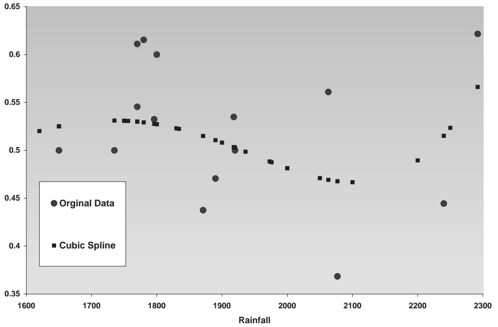  
Figure 10.1 Original data & cubic spine

$\delta_{2j} = 1$ . Bernoulli selection indicators $\delta_{1k}(k = 1, \ldots, 3)$ apply for $\gamma_1, \ldots, \gamma_3$ in the polynomial function. It is assumed that all terms are likely to be needed and so the prior favours inclusion:

$$
\delta_ {2 j} \sim \operatorname {B e r n o u l l i} (\pi_ {j})
$$

$$
\pi_ {j} \sim \operatorname {B e t a} (1 9, 1).
$$

One may then consider the posterior probabilities that $\beta_{k}$ is included against these prior odds. The resulting analysis (based on the last 10 000 iterations of a two chain run of 15 000) has a DIC of 166. The fitted probabilities (Figure 10.1) are located between 0.46 and 0.57, and some rates are considerably smoothed despite being based on large numbers (e.g. 53/75 at $1834\mathrm{mm}$ ). All the posterior means of the probabilities $\pi_{j}$ exceed 0.9.

A second analysis with these data uses a spline with an unknown power, namely

$$
y _ {i} \sim \operatorname {B i n} \left(N _ {i}, \pi_ {i}\right)
$$

$$
\mathrm {l o g i t} (\pi_ {i}) = \mu_ {i} = \gamma_ {0} + \gamma_ {1} x _ {i} ^ {\lambda} + \sum_ {k = 1} ^ {K} \beta_ {k} (x _ {i} - t _ {k}) _ {+} ^ {\kappa}.
$$

A two chain run of 5000 iterations (using the second half for inferences) gives mean $(95\%)$ CI) for $\kappa$ and $\lambda$ of 0.98 (0.69, 1.61) and $-1.95$ (-2.96, 0.91) with a DIC of 153.3 $(\bar{D} = 146.8, d_{e} = 6.5)$ . The plot of fitted probabilities for this model (Figure 10.2) is more

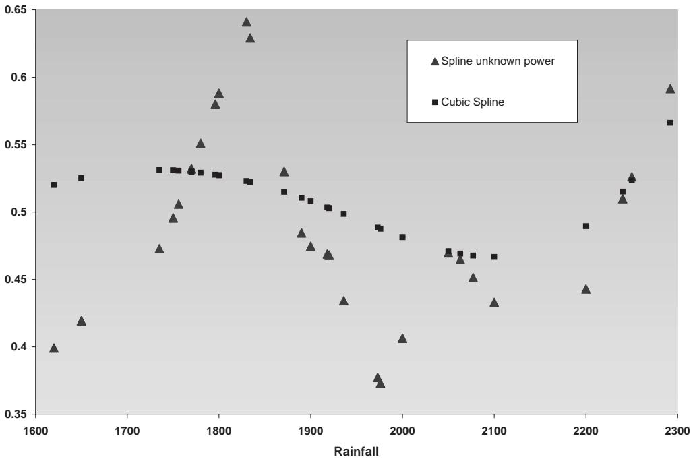  
Figure 10.2 Alternative Spine Fits

jagged but more closely resembles features of the raw data in Figure 10.1, and does not smooth the observation at $1834\mathrm{mm}$ so drastically.

Example 10.5 Toenail infection The penalised likelihood model of Ruppert et al. (2003) is illustrated by data relating to progress in reducing toenail infection according to treatment (see Molenberghs and Verbeker, 2005, Ch. 2, for a description of the study). The data are arranged by visit within patient but here the binary outcome by month of observation and treatment is the sole focus. Infection is coded as 0 (not severe) or 1 (severe) and the substantive question is whether a greater reduction in infection rates occurs under one or other treatment (treatment $A = 0$ , treatment $B = 1$ ). The impact of month on the probability of infection is modelled by treatment specific linear splines in $x =$ month of observation (ranging from 0 to 18.5 months, though observations at over 12 months are sparse).

Thus with $G_{i} = 1$ for treatment $A$ and $G_{i} = 2$ for treatment $B$ ,

$$
y _ {i} \sim \operatorname {B e r n} \left(\pi_ {i G i}\right)
$$

$$
\operatorname {l o g i t} \left(\pi_ {i G i}\right) = \gamma_ {0 G _ {i}} + \gamma_ {1 G _ {i}} x _ {i} + \sum_ {k = 1} ^ {K} \beta_ {\mathrm {k G} _ {i}} \left(x _ {i} - t _ {k}\right) _ {+},
$$

where

$$
\beta_ {k r} \sim N (0, \phi_ {r}), \qquad r = 1, 2, \qquad k = 1, \dots , K
$$

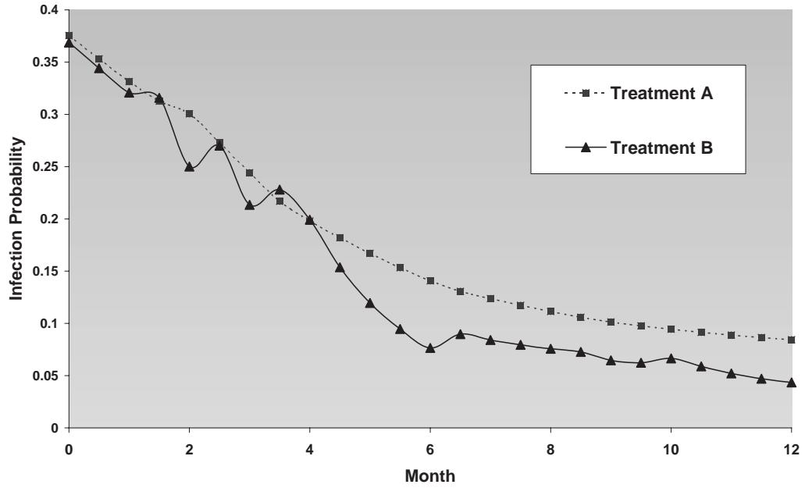  
Figure 10.3 Toenail infection treatments

and gamma priors on $1 / \phi_r$ are assumed. $K = 14$ knots are used, based on the first four deciles and spaced at every 5th percentile thereafter (45th percentile, 50th, 55th, etc). The reason for this spacing is that there are repeated values between the 5th and 10th, 15th and 20th, 25th and 30th and 35th and 40th percentiles.

Plots of the crude infection rates (by treatment) over months or half months show irregularities but suggest treatment $B$ to be more effective. They also suggest a nonlinear effect with faster declines in infection in the first 6 months. This is confirmed by the above linear spline smooth. Figure 10.3 shows the curve estimated from the second half of a two chain run of 2500 iterations. This still shows irregular features for treatment $B$ . The $\beta_{2}$ coefficients show greater variability, so as to accommodate the more pronounced fluctuations in the treatment $B$ curve by month.

# 10.5 APPLICATION OF STATE-SPACE PRIORS IN GENERAL ADDITIVE NONPARAMETRIC REGRESSION

The main alternative to spline and radial basis functions are general additive models based on state space priors. For a metric response $y_{i}$ with normal errors,

$$
y _ {i} \sim N (\mu_ {i}, \sigma^ {2})
$$

$$
\mu_ {i} = \gamma_ {0} + S _ {1} (x _ {i 1}) + S _ {2} (x _ {i 2}) + \dots + S _ {p} (x _ {i p}),
$$

where $S(x_{j})$ ( $j = 1, \dots, p$ ) are smoothly changing functions of their arguments. Following Wood and Kohn (1998) and Wecker and Ansley (1983) one seeks a prior for the smooth

functions $S_{j}$ ( $j = 1, \dots, p$ ) that is flexible in the face of widely varying nonlinear regression relationships. Typically it is necessary to center each of the $S_{j} = (S_{1j}, \dots, S_{nj})$ during MCMC updating to ensure identifiability (Sakamoto, 2005b), though Chib and Jeliazkov (2006) propose a proper random walk prior that obviates this. If there is a single smooth function, one might also omit the intercept and allow the basis function to model the level of the data.

# 10.5.1 Continuous predictor space priors

One form of state space prior assumes an underlying continuous process in time or more generally in predictor space (Biller and Fahrmeir, 1997; Carter and Kohn, 1994; Shively et al., 1999; Wahba, 1978; Wood and Kohn, 1998). For metric $y$ and univariate regressor $x_{i}$ ( $i = 1, \dots, n$ ) with cases arranged in ascending $x$ values

$$
x _ {1} <   \dots <   x _ {n}
$$

this prior assumes the observations are generated by a signal plus noise model

$$
y _ {i} = \gamma_ {0} + S (x _ {i}) + e _ {i},
$$

where the $e_i \sim N(0, \sigma^2)$ are white noise. The signal $S(x)$ is generated by the stochastic differential equation

$$
d ^ {m} S (x) / \mathrm {d} x ^ {m} = \tau d W (x) / \mathrm {d} x,
$$

where $W(x)$ denotes a Weiner process, namely an accumulation of independently distributed stochastic increments, with starting value $W(0) = 0$ and variance $\mathrm{var}[W(x)] = x$ . $\tau$ governs the degree of smoothing: large values mean the smooth is very close to reproducing the actual data, while $\tau = 0$ corresponds to complete smoothing (i.e. the posterior mean is linear). The initial condition at $x_{1}$ is assumed to be a diffuse fixed effect, with

$$
[ S (x _ {1}), \dots , S ^ {(m - 1)} (x _ {1}) ] \sim N (0, V _ {1}),
$$

where $V_{1}$ is large. Denoting $\varphi = \tau^{2} / \sigma^{2}$ as the signal to noise ratio, Wahba (1978) shows that the posterior mean $E[S(x_i)|y,\varphi ,V_1)]$ is the $m^{\mathrm{th}}$ order spline smoothing estimator for $S$ . Let $\delta_{i} = x_{i} - x_{i - 1}$ ( $i = 2,3,\ldots$ ), then the state space model is

$$
\begin{array}{l} y _ {i} = b ^ {\prime} f _ {i} + e _ {i} \\ f _ {i} = F _ {i} f _ {i - 1} + u _ {i} \quad i \geq 2, \\ \end{array}
$$

where $b = (1,0,\dots,0)'$ , $f_{i} = [S(x_{i}),\ldots ,S^{(m - 1)}(x_{i})]$ , and the $m\times m$ matrix $F_{i}$ has $(j,k)$ th element $\delta_i^{k - j} / (k - j)!$ when $k\geq j$ and zero otherwise. The $u_{i}$ are normal with mean 0 and variance $\tau^2 U_i$ where $U_{i}$ has $(j,k)$ th element $\delta_i^{2m - j - k + 1} / (m - j)!(m - k)!(2m - j - k + 1)!$

Consider the case $m = 2$ , such that for a metric normal outcome $\lambda = 1 / \varphi$ corresponds to the smoothing parameter in a cubic smoothing spline $S(x)$ with knots at each distinct value of $x$ . So the posterior mean of $S$ is cubic in the sub-intervals $(x_{i-1}, x_i)$ and linear for $x \leq x_1$ and $x \geq x_n$ . Then

$$
S (x) = \gamma_ {0} + \gamma_ {1} x + \tau \int_ {0} ^ {x} W (u) \mathrm {d} u
$$

Letting the nonlinear part of $S(x)$ be $f(x) = \tau \int_0^x W(u)\mathrm{d}u$ , the state-space evolution is based on $f$ and its first derivative, namely

$$
\{f (x _ {i}), f ^ {\prime} (x _ {i}) \}, i = 2, \dots , n.
$$

Denote this pair by $f_{i} = \{f_{i1}, f_{i2}\}$ , and as above define $\delta_{i} = x_{i} - x_{i-1}$ . The initial terms, $f_{11}$ and $f_{12}$ , are treated as unknown fixed effects. Successive terms for increasing values of $x$ are defined by

$$
f _ {i} = F _ {i} f _ {i - 1} + u _ {i} \quad i \geq 2,
$$

where

$$
\begin{array}{l} F _ {i} = \left[ \begin{array}{c c} 1 & \delta_ {i} \\ 0 & 1 \end{array} \right], \\ e _ {i} \sim N (0, \tau^ {2} U _ {i}), \\ U _ {i} = \left[ \begin{array}{c c} \delta_ {i} ^ {3} / 3 & \delta_ {i} ^ {2} / 2 \\ \delta_ {i} ^ {2} / 2 & \delta_ {i} \end{array} \right]. \\ \end{array}
$$

Carter and Kohn (1996) compare MCMC sampling strategies for this model. Carter and Kohn (1994, pp. 545-546) provide the conditional density for sampling $\tau^2$ .

Shively et al. (1999) suggest model averaging under this structure using a two-stage procedure. Suppose there are smooths in two variables, as in

$$
y _ {i} = \gamma_ {0} + \gamma_ {1} x _ {1 i} + \gamma_ {2} x _ {2 i} + \tau_ {1} \int_ {0} ^ {x _ {1 i}} W _ {1} (u) d u + \tau_ {2} \int_ {0} ^ {x _ {2 i}} W _ {2} (u) d u.
$$

At the second stage Shively et al. use binary selection indicators $J_{\gamma_j}$ and $J_{f_j}$ for the $\gamma_j$ regression coefficients and the nonlinear components $f_j = \tau_j \int_0^{x_{ji}} W_j(u) \, \mathrm{d}u$ . The first stage uses diffuse priors on the parameters $\gamma$ and $\tau$ parameters, and the second model averaging stage employs data based priors based on the posterior means and covariances of these parameters from the first stage. This procedure avoids the tendency to select the simplest model as would happen if diffuse priors were combined with selection of coefficients and components. Note that its application is not limited to this form of nonparametric regression.

A spectral (Fourier series) prior in continuous $x$ is discussed by Lenk (1999) and Kitagawa and Gersch (1996). Thus for the model

$$
y _ {i} = \gamma_ {0} + S (x _ {i}) + e _ {i}
$$

with $e_i \sim N(0, \sigma^2)$ and $x$ defined on the interval $[a, b]$ , the non-parametric component is represented by the series

$$
S (x) = \sum_ {k = 1} ^ {\infty} \theta_ {k} \omega_ {k} (x),
$$

where

$$
\omega_ {k} (x) = \left(\frac {2}{b - a}\right) ^ {0. 5} \cos \left\{\pi k \left(\frac {x - a}{b - a}\right) \right\}.
$$

Since a smooth $S$ will not have high frequency components, the $\theta_{k}$ are subject to decay as $k$ increases. A geometric smoother prior is

$$
\theta_ {k} \sim N (0, \tau^ {2} \exp [ - \psi k ]),
$$

where $\psi > 0$ determines the rate of decay of the Fourier coefficients, and thus the smoothness of S, has an appropriate prior for a positive parameter (e.g. an exponential density). An algebraic smoother is

$$
\theta_ {k} \sim N (0, \tau^ {2} \exp [ - \psi \log k ])
$$

with $\psi > 1$ . In practice the Fourier Series is truncated above at $L < n$ , so $S(x) = \sum_{k=1}^{L} \theta_k \varphi_k(x)$ .

# 10.5.2 Discrete predictor space priors

Random walk and autoregressive priors which for additive non-parametric regression effectively discretize $x$ are discussed by Kitagawa and Gersch (1996). These amount to an extension of state space time series methods and unifying perspectives (including spatial data applications) are provided by Fahrmeir and Lang (2001) and Fahrmeir and Osuna (2003). Let $t = 1, \ldots, n$ be the data points, arranged in ascending $x$ order. The simplest formulation of the state space model

$$
y _ {t} = \gamma_ {0} + S (x _ {t}) + e _ {t} \quad e _ {t} \sim N (0, \sigma^ {2})
$$

has equally spaced design points (e.g. when the $x$ series denotes successive years). RW1 and RW2 priors in $S_{t} = S(x_{t})$ are most frequently applied. For example, a second order random walk then specifies

$$
S _ {t} = 2 S _ {t - 1} - S _ {t - 2} + u _ {t}
$$

with $u_{t} \sim N(0, \tau^{2})$ , though scale mixing is possible for greater robustness (Knorr-Held, 1999). Providing $e_{t}$ and $u_{t}$ are normal, the posterior means of $S_{t}$ are equivalent to the estimated posterior modes of $S_{t}$ derived by minimising

$$
\sum_ {t = 1} ^ {n} \left[ y _ {t} - S _ {t} \right] ^ {2} + \frac {\sigma^ {2}}{\tau^ {2}} \sum_ {t = 1} ^ {n} \left[ S _ {t} - 2 S _ {t - 1} - S _ {t - 2} \right] ^ {2}.
$$

For $y_{t}$ observed on ordered values of a single covariate, $x_{1} < \dots < x_{N}$ , with unequal spaces between successive $x$ values, the variance of the random walk prior must be modified to take account of the step sizes $\delta_t = x_t - x_{t-1}$ . Thus a first-order random walk prior would have the form

$$
\begin{array}{l} S _ {t} = S _ {t - 1} + u _ {t} \\ u _ {t} \sim N (0, \delta_ {t} \tau^ {2}). \\ \end{array}
$$

For greater robustness to sudden shifts in the function or discrepant points one may again adopt scale mixing (Knorr-Held, 1999), so that to provide the equivalent of a Student $t$ RW1 prior

with $\nu$ degrees of freedom, one has

$$
S _ {t} \sim N (S _ {t - 1}, \delta_ {t} \tau^ {2} / \kappa_ {t})
$$

with $\kappa_{t} \sim \mathrm{Ga}(0.5\nu, 0.5\nu)$ . A normal second order random walk with unequally spaced $x$ values would be

$$
S _ {t} \sim N (\Omega_ {t}, \delta_ {t} \tau^ {2})
$$

where $\Omega_{t} = S_{t - 1}(1 + \delta_{t} / \delta_{t - 1}) - S_{t - 2}(\delta_{t} / \delta_{t - 1})$ (Fahrmeir and Lang, 2001).

Often values of $x$ are grouped: the numbers of the distinct values $M_1, \ldots, M_p$ on $X_1, X_2, \ldots, X_p$ in a sample of $n$ subjects may be less than $n$ . If smooths on two or more covariates are needed, one needs to define grouping indices $G_{ik} \{k = 1, \ldots, p; i = 1, \ldots, n\}$ for each predictor. So if $n = 50$ but there are only $M_1 = 15$ distinct values on $X_1$ , then $G_{i1}$ for $i = 1, \ldots, 50$ would range between 1 and 15, and the state space prior on $S_{1t}$ would involve 15 points, e.g. an RW1 prior would be

$$
S _ {1 t} \sim N \left(S _ {1, t - 1}, \tau_ {1} ^ {2}\right) \quad t = 2, 1 5.
$$

The specification of the mean for case $i$ would then refer to the relevant grouping index

$$
\mu_ {i} = \beta_ {0} + S _ {1} (G _ {i 1}) + S _ {2} (G _ {i 2}) + \dots + S _ {p} (G _ {i p}).
$$

For identifiability it is typically necessary to centre each of the sampled $S_{km}, k = 1, \dots, p, m = 1, \dots, M_k$ at each iteration in an MCMC chain. Otherwise each smooth will be confounded with the intercept. Alternatively one may combine all the smooths

$$
W _ {i} = S _ {1} (G _ {i 1}) + S _ {2} (G _ {i 2}) + \dots + S _ {p} G _ {i p})
$$

and centre the $W_{i}$ , at each iteration. Other options are a) to set the initial conditions in each smooth to zero or $b$ to centre the $x$ values around their mean, develop the smooth in the centred $x$ values, and define $S_{k}(0) = 0$ .

Example 10.6 Canadian prestige Fox (2000) presents data relating the prestige of 102 Canadian occupations to the average income and educational levels of people in those occupations. He compares linear regression with models including general additive functions in income or education or both, and finds strongest evidence of nonlinearity in the prestige-income association. Here two methods are considered: the first uses a discrete space RW1 prior (Section 10.6.2) allowing for differential spacing between successive income and education values; the second uses a quadratic spline model with a shrinkage prior (Section 10.5.1), and with 19 knots on both predictors placed at the 5th, 10th, ..., 95th percentiles.

For the first method, one finds that there are $M_{1} = 96$ distinct values of education ( $X_{1}$ ) and $M_{2} = 100$ distinct values of income ( $X_{2}$ ), and so the input data consists of a) differences between successive distinct values on these predictors, and b) group indicators $\{G_{i1}, G_{i2}\}$ for each observation that fall into one of 96 categories on $X_{1}$ and 100 categories on $X_{2}$ . Gamma $\mathrm{Ga}(0.5, 0.5)$ priors are assumed on the random walk precisions $1 / \tau_{1}^{2}$ and $1 / \tau_{1}^{2}$ . A 5000 two chain run with centering on the total smooth $S_{1} + S_{2}$ converges from 2500 iterations. Figures 10.4(a) and 10.4(b) suggest greater nonlinearity in the income effect but there is also some

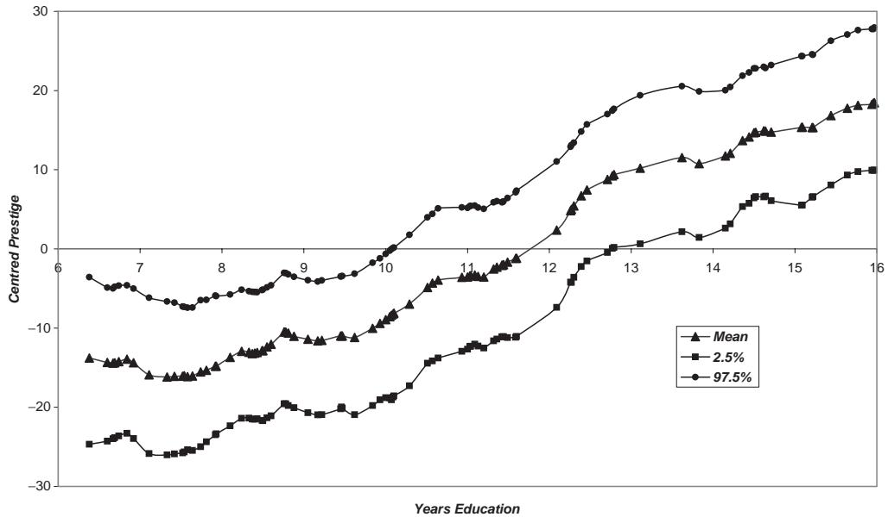  
Figure 10.4(a) Prestige smooth on education, RWI prior on distinct values

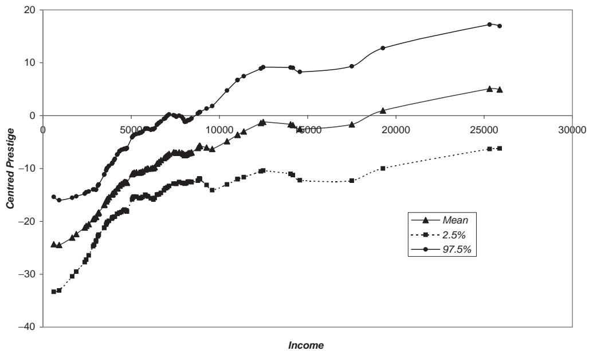  
Figure 10.4(b) Prestige smooth on income, RWI prior in distinct values

suggestion of a nonlinear education impact, with the steepest effect between 10 and 13 years of education. The DIC is 704 with complexity 22.

The quadratic shrinkage prior takes

$$
y _ {i} = \gamma_ {0} + B _ {1} (X _ {1}) + B _ {2} (X _ {2}) + \varepsilon_ {i}
$$

with

$$
B _ {j} (X _ {j}) = \gamma_ {1 j} x _ {j i} + \dots + \gamma_ {p j} x _ {j i} ^ {q} + \sum_ {k = 1} ^ {K _ {j}} \beta_ {k j} (x _ {j i} - t _ {j k}) _ {+} ^ {q},
$$

where $q = 2$ , $K_{1} = K_{2} = 19$ . The $\beta_{kj}$ are random with $\beta_{kj} \sim N(0, \phi_j)$ and $1 / \phi_j \sim \mathrm{Ga}(0.5, 0.5)$ . Identification is improved by centering the $\beta_{kj}$ at each iteration. The resulting smooths (Figures 10.5(a) and 10.5.(b)) also suggest some nonlinearity in the education effect. The DIC is lower at 693.5 and complexity 8.

Example 10.7 Prosecution success The data in Exercise 4.8 on prosecution success provide an example of non-parametric regression for a binary outcome. The predictors used are $X_{1} =$ coherence of evidence (higher for less coherent evidence), $X_{2} =$ delay between witnessing the incident and recounting it, and $X_{3} =$ quality of evidence. An initial analysis assumes shrinkage priors (e.g. Ruppert et al., 2003) and quadratic splines in the three predictors. All predictors are divided by 10 and a standard logit regression assumed. Knots are placed at deciles (so $K = 9$ for all three predictors) The impacts of cohort and quality appear linear (with negative and positive slopes respectively), but delay seems to have a curvilinear effect.

The next analysis applies a continuous time prior equivalent to a cubic smoothing spline. As in Wood and Kohn (1998) an augmented data approach (Albert and Chib, 1993) is used whereby an unknown continuous variable $y^{*}$ underlies the observed binary response $y_{i}$ . Only the impact of delay is modelled nonparametrically. Let the latent variables be related to three predictors as follows

$$
y _ {i} ^ {*} = \gamma_ {0} + \gamma_ {1} x _ {1 i} + \gamma_ {2} x _ {2 i} + S (x _ {2 i}) + \gamma_ {3} x _ {3 i} + e _ {i}
$$

with $e_i \sim N(0,1)$ and $y_i^* > 0$ if $y_i = 1$ .

It is necessary to allow for grouping of the values on the delay predictor: there are $n = 70$ observations but only $M_2 = 50$ distinct delay values. Because a constant is present, centering of the sampled $S_{2i} = S(x_{2i})$ that actually predict $y^*$ is necessary for identifiability. Also the scaling of the predictors applies in defining $\delta_{2i}$ . So with $D$ denoting delay in its original scale

$$
\delta_ {2 _ {i}} = (D _ {i} - D _ {i - 1}) / 1 0, \quad i = 1, \dots 5 0.
$$

The second half of a two chain run of 50 000 iterations shows a slightly more complex effect than simple curvilinearity: the smooth has a plateau at delays between 20 and 60 days (Figure 10.6). The same is true of the success probability since $\gamma_{2}$ is not significantly different from zero. The wide intervals around the median smooth may reflect the binary nature of $y_{i}$ and the relatively small sample will add to uncertainty. The fact that the $y^{*}$ are latent as well as $S_{2}$ may also reduce precision.

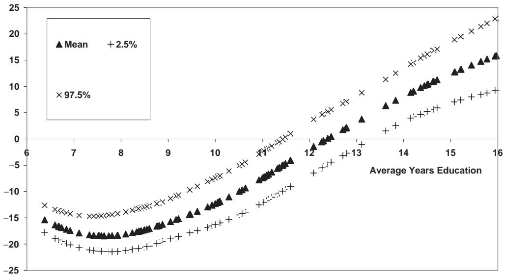  
Figure 10.5(a) Spline smooth, prestige on education

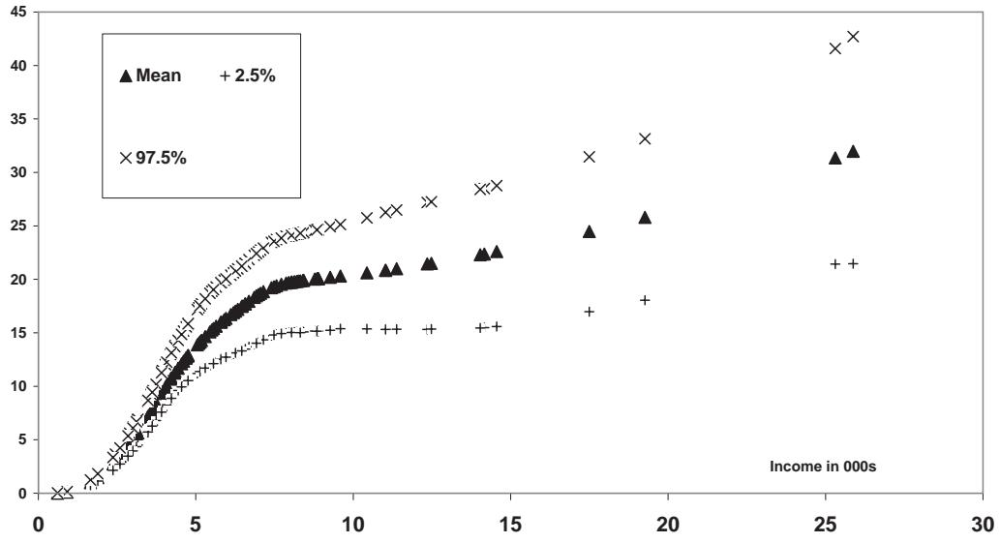  
Figure 10.5(b) Spline smooth, prestige on income

Example 10.8 Michigan road accidents Lenk (1999) analyses monthly data $(t = 1, \dots, 108)$ on road accidents in Michigan from the start of 1979 to the end of 1987. The monthly accident counts are large so that their logs are taken to be approximately normal. One influence on such accidents may be economic prosperity, as proxied by the (log of the) unemployment rate. Seasonal effects are also present in the data, together with a linear upward trend.

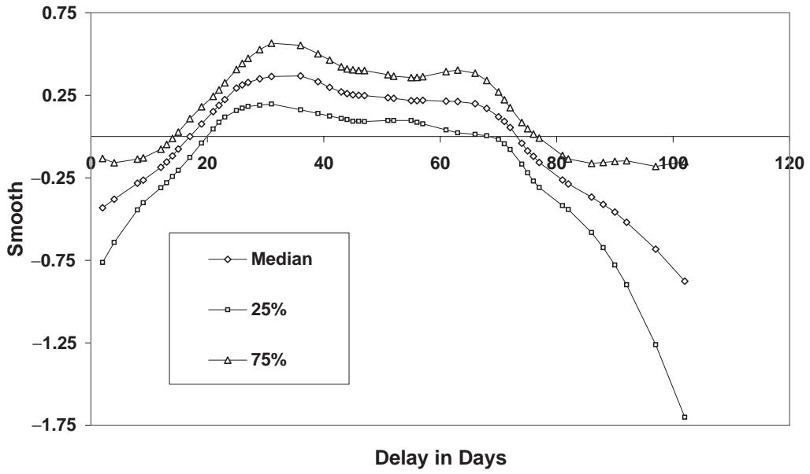  
Figure 10.6 Prosecution success and delay

The aim is then to assess nonlinearity in the total month effect $\gamma_0 + \gamma_1 t + S(t)$ , after allowing for seasonal effects and unemployment rate as summarised in the systematic regression term $X_t \beta$ . So

$$
y _ {t} = \gamma_ {0} + \gamma_ {1} t + X _ {t} \beta + S (t) + e _ {i},
$$

where $e_i \sim N(0, \sigma^2)$ and the linear growth over time in months is measured by $\gamma_1$ . Lenk considers the smooths (a) adjusting for seasonal effects only and (b) adjusting for both seasonal effects and unemployment.

A Fourier Series approach with geometric smoothing is applied so that $S(x) = \sum_{k=1}^{L} \theta_k \omega_k(x)$ , where $L = 10$ and

$$
\theta_ {k} \sim N (0, \tau^ {2} \exp [ - \psi k ]).
$$

An $E(1)$ prior is assumed on $\psi$ and $\mathrm{Ga}(0.5, 0.5)$ priors on $1 / \tau^2$ and $1 / \sigma^2$ . Summaries are based on the last 7500 iterations from two chain runs of 10000 iterations. It is confirmed that model (a) without log(unemployment) as a covariate shows a clear nonlinearity over time (Figure 10.7). Including unemployment eliminates the nonlinearity in the smooth on month. The regression coefficients $\beta$ in the full model are as in Table 10.4 and show significant summer and unemployment effects. The density of $\tau^2$ is highly skew.

Table 10.4 Road accidents parameter summary, model (b)   

<table><tr><td>Parameter</td><td>Mean</td><td>2.5%</td><td>Median</td><td>97.5%</td></tr><tr><td>σ2</td><td>0.035</td><td>0.027</td><td>0.035</td><td>0.046</td></tr><tr><td>τ2</td><td>24.78</td><td>0.16</td><td>0.99</td><td>34.82</td></tr><tr><td>ψ</td><td>2.17</td><td>0.62</td><td>2.00</td><td>4.63</td></tr><tr><td>Month (Linear)</td><td>0.0014</td><td>-0.0028</td><td>0.0014</td><td>0.0047</td></tr><tr><td>Spring</td><td>-0.055</td><td>-0.117</td><td>-0.055</td><td>0.003</td></tr><tr><td>Summer</td><td>-0.096</td><td>-0.158</td><td>-0.096</td><td>-0.034</td></tr><tr><td>Autumn</td><td>0.021</td><td>-0.042</td><td>0.021</td><td>0.084</td></tr><tr><td>Unemployment</td><td>-0.450</td><td>-0.678</td><td>-0.453</td><td>-0.245</td></tr></table>

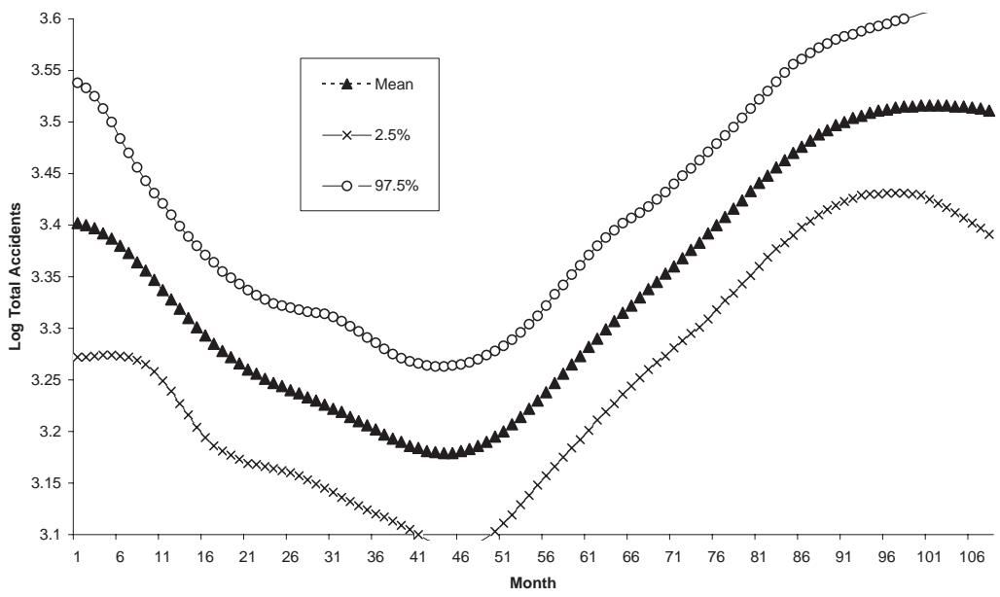  
Figure 10.7 Total month effect (mean and $95\%$ credible interval)

# EXERCISES

1. Apply the generalised logistic model of Guerrero and Sinha (2004) to the all companies series of Mexican pension fund investments under the Administradores de Fondos para el Retiro (AFORE) scheme – see Exercise10.1.0dc for the data. Their model specifies

$$
\begin{array}{l} \mu_ {t} = a / \left[ 1 + (\alpha + \beta t) ^ {- 1 / \lambda} \right] \quad \text {i f} \lambda > 0 \\ = a / \left[ 1 + \exp (- \alpha - \beta t) \right] \quad \text {i f} \lambda = 0 \\ = a / \left[ 1 + (- \alpha - \beta t) ^ {- 1 / \lambda} \right] \quad \text {i f} \lambda <   0. \\ \end{array}
$$

Here consider a model

$$
\mu_ {t} = a _ {1} + a _ {2} / \left[ 1 + (\alpha + \beta t) ^ {- 1 / \lambda} \right]
$$

with all parameters positive. A suitable starting value for $a_2$ and $\lambda$ are 20000 and 1 respectively. Consider a suitable generalisation taking $\lambda$ to vary over time.

2. Consider data from Johnson and Wichern (1998) on microwave radiation measurements:

<table><tr><td>0.15</td><td>0.09</td><td>0.18</td><td>0.10</td><td>0.05</td><td>0.12</td><td>0.08</td></tr><tr><td>0.05</td><td>0.08</td><td>0.10</td><td>0.07</td><td>0.02</td><td>0.01</td><td>0.10</td></tr><tr><td>0.10</td><td>0.10</td><td>0.02</td><td>0.10</td><td>0.01</td><td>0.40</td><td>0.10</td></tr><tr><td>0.05</td><td>0.03</td><td>0.05</td><td>0.15</td><td>0.10</td><td>0.15</td><td>0.09</td></tr><tr><td>0.08</td><td>0.18</td><td>0.10</td><td>0.20</td><td>0.11</td><td>0.30</td><td>0.02</td></tr><tr><td>0.20</td><td>0.20</td><td>0.30</td><td>0.30</td><td>0.40</td><td>0.30</td><td>0.05</td></tr></table>

Assuming a regression model with intercept only find the Box-Cox $\lambda$ parameter for these data using the WINBUGS zero or ones trick to express the likelihood.

3. Consider migration rates for single years of age (at mid ages 0.5,1.5,..., 84.5) from Rogers et al. (2004). The original rates $y_{x} / n_{x}$ are scaled to sum to 1 and the data consist of the resulting scaled rates $r_{x}$ . An exponential prior for $r_{x}$ with mean $1 / p_{x}$ is assumed here, with full model being

$$
\begin{array}{l} p _ {x} = c + a _ {1} \exp (- \alpha_ {1} x) + a _ {2} \exp \{- \alpha_ {2} (x - \mu_ {2}) - \exp [ - \lambda_ {2} (x - \mu_ {2}) ] \} \\ + a _ {3} \exp \{- \alpha_ {3} (x - \mu_ {3}) - \exp [ - \lambda_ {3} (x - \mu_ {3}) ] \} + a _ {4} \exp (\alpha_ {4} x) \\ \end{array}
$$

though other options are possible; for example, one might take the log or logit of $r_x$ to be normal. Castro and Rogers (1981) report that the parameters defining the model for $p_x$ tend to fall within predictable ranges: for the labor force component, typical values are

$$
\begin{array}{l} 0. 0 5 <   a _ {2} <   0. 1 0 \quad 1 7 <   \mu_ {2} <   2 2 \\ 0. 1 0 <   \alpha_ {2} <   0. 2 0 \quad 0. 2 5 <   \lambda_ {2} <   0. 6 0 \\ \end{array}
$$

Data are listed in Example 10.2.odc and a coding including the first two components in the above model for $p_x$ has the form

```txt
model{for (i in 1:85) {r[x] ~ dexp(invp[x])  
    invp[x] <- 1/p[x]  
    p[x] <- C1[x] + C2[x] + a0  
    C1[x] <- a[1]*exp(-alph[1]*(x-0.5))  
    C2[x] <- a[2]*exp(-alph[2]*d[x] - expshift[x]))  
    d[x] <- (x-0.5) - mu2  
    shift[x] <- exp(-lam2*d[x])}  
#priors based on Rogers and Castro (1981)  
a[1] ~ dgamma(0.05,1) I(0.001,)  
a[2] ~ dgamma(0.075,1) I(0.001,)  
mu2 ~ dgamma(20,1); lam2 ~ dgamma(0.425,1) I(0.1,)  
alph[1] ~ dgamma(0.1,1); alph[2] ~ dgamma(0.1,1)  
a0 ~ dgamma(0.001,1) I(0.0001,)} 
```

Consider a model which allows for a retirement component, namely

$$
\begin{array}{l} p _ {x} = c + a _ {1} \exp (- \alpha_ {1} x) + a _ {2} \exp \{- \alpha_ {2} (x - \mu_ {2}) - \exp [ - \lambda_ {2} (x - \mu_ {2}) ] \} \\ + J a _ {3} \exp \{- \alpha_ {3} (x - \mu_ {3}) - \exp [ - \lambda_ {3} (x - \mu_ {3}) ] \}, \\ \end{array}
$$

where $J \sim \operatorname{Bern}(\pi_J)$ is binary and $\pi_J \sim \operatorname{Be}(1, 1)$ , $a_3 \sim \operatorname{Ga}(0.05, 1)I(0.001, \cdot)$ , $\alpha_3 \sim \operatorname{Ga}(0.1, 1)$ , $\mu_3 \sim \operatorname{Ga}(60, 1)I(55, 70)$ , $\lambda_3 \sim \operatorname{Ga}(0.1, 1)I(0.1, \cdot)$ . Does the data favour inclusion of a retirement component?

4. Generate 100 points from the mixture

$$
f (x) = \phi (x | 0. 1 5, 0. 0 5) / 4 + \phi (x | 0. 6, 0. 2) / 4,
$$

where $\phi (x|\mu ,\kappa)$ is the normal density with mean $\mu$ and standard deviation $\kappa$ and add a normal random error with mean 0 and variance 1 to give a noisy version $y_{i} = f(x_{i}) + \varepsilon_{i}$ of the true function $f(x)$ . The true curve peaks at $f(0.175)\cong 2$ , and tails off rapidly being flat at $f(x)\cong 0.3$ after $x = 0.25$ .

Select $K = 19$ knots placed at the 5th, 10th, ..., 95th percentiles of the observed (i.e. sampled) $x$ . With a cubic spline model, first apply a regression selection to the coefficients at each knot, with

$$
\begin{array}{l} y _ {i} \sim N (\mu_ {i}, \sigma^ {2}) \\ \mu_ {i} = \gamma_ {0} + \gamma_ {1} x _ {i} + \gamma_ {2} x _ {i} ^ {2} + \gamma_ {3} x _ {i} ^ {3} + \sum_ {k = 1} ^ {K} g _ {k} \beta_ {k} (x _ {i} - t _ {k}) _ {+} ^ {3} \\ g _ {k} \sim \text {B e r n o u l l i} (0. 5), \\ \end{array}
$$

where $\beta_{k}$ as fixed effects. Second, apply the penalised random effects method for $\beta_{k}$ (Section 10.5.1) without coefficient selection. Which method better reproduces the underlying true series $f(x)$ and which is more complex?

5. Apply a RW1 prior in a general additive model (Section 10.6.2) for the binomial taxoplasmosis data. For identifiability in a model including the intercept the smooth must be centred. The code is then

```txt
model {for (i in 1:n) {y[i] ~ dbin(p[i], N[i])  
    logit(p[i]) < - gam0 + S[i] - mean(S[])  
    S[i] < - f[0[i]]}  
#prior on smooth  
for (t in 2:M) {f[t] ~ dnorm(f[t-1], P[t])  
    P[t] < - Pr/delta[t]}  
#initial value of smooth  
f[1] ~ dnorm(0, 0.01)  
#smooth precision  
Pr ~ dgamma(a, b)  
#intercept  
gam0 ~ dnorm(0, 0.001)} 
```

Obtain the number of distinct values $(M)$ from the dataset and also the categories $O[i](\in 1,\dots ,M)$ for each observation. How does the coding need to change in the line for $\mathrm{logit}(p[i])$ if the intercept is omitted? For the gamma parameters $(a,b)$ in the prior on the precision try $a = b = 0.5$ and $a = 2, b = 0.5$ . How do the smooths obtained under either case compare to the cubic spline in Figure 10.1 in terms of fit and precision (complexity)? Finally repeat the analysis using an RW2 prior for $f[t]$ .

6. Analyse the prosecution success data in relation to reporting delay (Example 10.7) but without using the augmented data approach. A logit link may be less prone to numeric overflow. Assess the precision of the smooths under this method as compared to those obtained when the latent $y^{*}$ is also sampled.

7. Apply the Fourier series prior (Section 10.6.1) to the Canadian prestige data using both geometric and algebraic smoothers. A possible code for the smooths $S_{1}$ and $S_{2}$ in education and income (with $M_{1} = 96$ , $M_{2} = 100$ and assuming equal $L$ for both series, e.g. $L = 10$ ) is

```r
for (i in 1:M1) {S1[i] <- sum(g1[i,])  
for (k in 1:L) {  
    gl[i,k] <- th1[k]*sqrt(2/range[1])*cos(3.1416*k*del1[i]/range[1])}  
for (i in 1:M2) {S2[i] <- sum(g2[i,])  
for (k in 1:L) {  
    g2[i,k] <- th2[k]*sqrt(2/range[2])*cos(3.1416*k*del2[i]/range[2])}  
for (k in 1:L) {  
    th1[k] ~ dnorm(0,tau1[k]); tau1[k] <- tau[1]*exp(gam[1]*k)  
th2[k] ~ dnorm(0,tau2[k]); tau2[k] <- tau[2]*exp(gam[2]*k)  
} 
```

where del1 and del2 are differences (compared to the minimum education and income values) for ascending distinct values on each variable.

# REFERENCES

Aitkin, M., Francis, B. and Hinde, J. (2005) Statistical Modelling in GLIM4, 2nd edn. Oxford University Press: New York.   
Albert, J. and Chib, S. (1993) Bayesian analysis of binary and polychotomous response data. Journal of the American Statistical Association, 88, 669-679.   
Benjamin, B. and Pollard, J. (1980) The Analysis of Mortality and Other Actuarial Statistics, 2nd edn. Heinemann: London.   
Berry, S., Carroll, R. and Ruppert, D. (2002) Bayesian smoothing and regression splines for measurement error problems, Journal of the American Statistical Association, 97, 160-169.   
Breslow, N. E. and Storer, B. (1985) General relative risk functions for case-control studies. American Journal of Epidemiology, 122, 149-162.   
Biller, C. (2000) Adaptive Bayesian regression splines in semiparametric generalized linear models. Journal of Computational and Graphical Statistics, 9, 122-140.   
Biller, C. and Fahrmeir, L. (1997) Bayesian spline-type smoothing in generalized regression models. Computational Statistics, 12, 135-151.

Biller, C. and Fahrmeir, L. (2001) Bayesian varying-coefficient models using adaptive regression splines. Statistical Modelling, 1, 195-211.   
Carlin, B. and Chib, S. (1995) Bayesian model choice via the Markov Chain Monte Carlo methods. Journal of the Royal Statistical Society B, 57, 473-484.   
Carter, C. and Kohn, R. (1994) On Gibbs sampling for state space models. *Biometrika*, 81, 541-553.   
Carter, C. and Kohn, R. (1996) Robust Bayesian nonparametric regression. In Statistical Theory and Computational Aspects of Smoothing, Hardle, W. and Schimek, M. (eds). Physica-Verlag: Heidelberg, 128-148.   
Castro, L. and Rogers, A. (1981) Model migration schedules: a simplified formulation and an alternative parameter estimation method. Working Paper-81-63. International Institute for Applied Systems Analysis, Laxenburg, Austria.   
Chib, S. and Jeliazkov, I. (2006) Inference in semiparametric dynamic models for binary longitudinal data. Journal of the American Statistical Association, 101, 685-700.   
Cook, R. and Wang, P. (1983) Transformations and influential cases in regression. Technometrics, 25, 337-343.   
Czado, C. (1994) Bayesian inference of binary regression models with parametric link. Journal of Statistical Planning and Inference, 41, 121-140.   
Czado, C. (1997) On selecting parametric link transformation families in generalized linear models. Journal of Statistical Planning and Inference, 61, 125-141.   
Czado, C. and Raftery, A. (2006) Choosing the link function and accounting for link uncertainty in generalized linear models using Bayes factors. Statistical Papers, 47, 419-442.   
Denison, D., Mallick, B. and Smith, A. (1998a) Automatic Bayesian curve fitting. Journal of Royal Statistical Society Series B, 60, 333-359.   
Denison, D., Mallick, B. and Smith, A. (1998b) Bayesian MARS. Statistics and Computing, 8, 337-346.   
Denison, D., Holmes, C., Mallick, B. and Smith, A. (2002) Bayesian Methods for Nonlinear Classification and Regression. Wiley: New York.   
Eubank, R. (1988) Spline Smoothing and Nonparametric Regression. Marcel Dekker: New York.   
Faes, C., Geys, H., Aerts, M. and Molenberghs, G. (2003) Use of fractional polynomials for dose response modelling and quantitative risk assessment in developmental toxicity studies. Statistical Modelling, 3, 109-125.   
Fahrmeir, L. and Lang, S. (2001) Bayesian inference for generalized additive mixed models based on Markov random field priors. Applied Statistics, 50, 201-220.   
Fahrmeir, L. and Osuna, L. (2003) Structured count data regression. SFB 386 Discussion Paper 334, University of Munich.   
Fox, J. (2000) Multiple and Generalized Nonparametric Regression. Sage: Thousand Oaks, CA.   
Friedman J. and Silverman, B. (1989) Flexible parsimonious smoothing and additive modeling. Technometrics, 31, 3-39.   
Gelfand, A., Dey, D. and Chang, H. (1992) Model determination using predictive distributions with implementations via sampling-based methods. In Bayesian Statistics, Vol 4, Bernardo, J. Berger, J., Dawid, A. and Smith, A. (eds). Oxford University Press, New York, 147-168.   
Gelman, A., Bois, F. and Jiang, J. (1996) Physiological pharmacokinetic analysis using population modeling and informative prior distributions. Journal of the American Statistical Association, 91, 1400-1412.   
Guerrero, V. and Sinha, T. (2004) Statistical analysis of market penetration in a mandatory privatized pension market using generalized logistic curves. Journal of Data Science, 2, 195-211.   
Hinkley, D., Reid, N. and Snell, E. (1991) Statistical Theory and Modelling. Chapman and Hall: New York.   
Hoeting, J. A., Raftery, A. E. and Madigan, D. (2002). Bayesian variable and transformation selection in linear regression. Journal of Computational and Graphical Statistics, 11, 485-507.

Johnson, R. and Wichern, D. (1998) Applied Multivariate Statistical Analysis, 4th edn. Prentice Hall: Upper River Saddle, NJ.   
Kitagawa, G. and Gersch, W. (1996) Smoothness Priors Analysis of Time Series. Springer: New York.   
Knorr-Held, L. (1999) Conditional prior proposals in dynamic models. Scandinavian Journal of Statistics, 26, 129-144.   
Kohn, R., Smith, M. and Chan, D. (2001) Nonparametric regression using linear combinations of basis functions. Statistics and Computing, 11, 301-301.   
Lenk, P. (1999) Bayesian inference for semiparametric regression using a Fourier representation. Journal of the Royal Statistical Society B, 61, 863-879.   
McCullagh, P. and Nelder, J. (1989) Generalized Linear Models. Chapman & Hall/CRC: London.   
Migon, H., Gamerman, D., Lopes, H. and Ferreira, M. (2005) Dynamic models. In Handbook of Statistics, Vol 25, Dey, D. and Rao, C. (eds). Elsevier: North Holland, Amsterdam.   
Molenberghs, G. and Verbeke, G. (2005) Models for Discrete Longitudinal Data. Springer: New York.   
Perrichi, L. 1981 A Bayesian approach to transformations to normality. Biometrika, 68, 35-43.   
Powell, M. (1987) Radial basis functions for multivariable interpolation: a review. In Algorithms for Approximation, Mason, J. C. and Cox, M. G. (eds). Clarendon Press: New York, 143-167.   
Prentice, R. L. (1976) A generalization of the probit and logit. models for dose response curves. Biometrics, 32, 761-768.   
Raftery, A. E. (1996) Approximate Bayes factors and accounting for model uncertainty in generalized linear models. Biometrika, 83, 251-266.   
Rogers, A. (1986) Parameterized multistate population dynamics and projections. Journal of American Statistical Association, 86, 48-61, 1986.   
Rogers, A. and Castro, L. (1981) Model Migration Schedules. International Institute for Applied Systems Analysis: Laxenburg, Austria.   
Rogers, A., Castro, L. and Lea, M. (2004) Model migration schedules: three alternative linear parameter estimation methods. Working Papers POP2004-04, IBS, University of Colorado.   
Royston, P. and Altman, D. (1997) Approximating statistical functions by using fractional polynomial regression. The Statistician, 46, 411-422.   
Ruppert, D. and Carroll, R. (2000) Spatially adaptive penalties for spline fitting. Australia and New Zealand Journal of Statistics, 42, 205-223.   
Ruppert, D., Wand, M. and Carroll, R. (2003) Semiparametric Regression, Cambridge University Press, Cambridge, UK.   
Sakamoto, W. (2005a) MARS: Selecting basis and knots with the empirical Bayes method. In Proceedings of the 5th IASC Asian Conference on Statistical Computing, 2005.   
Sakamoto, W. (2005b) Diagnosing non-linear regression structure with power additive smoothing splines. In Proceedings of the ISM/KIER Joint Conference on Nonparametric and Semiparametric Statistics, 2005, 249-262.   
Shively, T., Kohn, R. and Wood, S. (1999) Model selection for additive nonparametric regression using data-based priors. Journal of American Statistical Association, 94, 777-805.   
Smith, M. and Kohn, R. (1996) Nonparametric regression using Bayesian variable selection. Journal of Econometrics, 75, 317-344.   
Smith, M., Wong, C. and Kohn, R. (1998) Additive nonparametric regression with autocorrelated errors. Journal of Royal Statistical Society B, 60, 311-313.   
Wahba, G. (1978) Improper priors, spline smoothing and the problem of guarding against model errors in regression. Journal of Royal Statistical Society B, 40, 364-372.   
Wahba, G. (1990) Spline Models for Observational Data. SIAM: Philadelphia.   
Wakefield, J. (2004) Non-linear regression modelling. In Methods and Models in Statistics, (In Honor of Professor John Nelder, FRS), Adams, N., Crowder, M., Hand, D. and Stephens, D. (eds). Imperial College Press: London, 119-153.

Wecker, W. and Ansley, C. (1983) The signal extraction approach to nonlinear regression and spline smoothing. Journal of American Statistical Association, 78, 81-89.   
Weiss, R. (1994) Pediatric pain, predictive inference, and sensitivity analysis. Evaluation Review, 18, 651-77.   
Wood, S. and Kohn, R. (1998) A Bayesian approach to robust nonparametric binary regression. Journal of the American Statistical Association, 93, 203-213.   
Wood, S., Jiang, W. and Tanner, M. (2002a) Bayesian mixture of splines for spatially adaptive nonparametric regression. Biometrika, 89, 513-528.   
Wood, S., Kohn, R., Shively, T. and Jiang, W. (2002b) Model selection in spline non-parametric regression. Journal of the Royal Statistical Society B, 64, 119-139.   
Yau, P. and Kohn, R. (2003) Estimation and variable selection in nonparametric heteroscedastic regression. Statistics and Computing, 13, 191-208.   
Yau, P., Kohn, R. and Wood, S. (2003) Bayesian variable selection and model averaging in high dimensional multinomial nonparametric regression. Journal of Computational and Graphical Statistics, 12, 23-54.   
Zhang, X. and King, M. (2004) Box-Cox stochastic volatility models with heavy-tails and correlated errors. Monash Econometrics and Business Statistics Working Paper 26/04, Monash University.

# Multilevel and Panel Data Models

# 11.1 INTRODUCTION: NESTED DATA STRUCTURES

Multilevel models seek to represent datasets with an intrinsically hierarchical or clustered nature (e.g. pupils within schools, patients within hospitals, repeated observations on an individual's health status). Crossed data structures (e.g. patients classified both by their home area and by their general practitioner) raise similar modelling issues. In multilevel analysis, covariates may be defined at any level and the interest focuses on adjusting the impact of such covariates for the simultaneous operation of contextual and individual variability in the outcome (Liska, 1990; Wong and Mason, 1985). This is likely to involve random effects models defined over the clusters and possibly correlation between different types of cluster effects. For repeated observations (panel data), random effects structures are also relevant, but now typically defined over subjects as well as times.

A wide range of literature on clustered data analysis includes many fully and empirical Bayes applications, for example in health services research (Christiansen and Morris, 1996; Daniels and Gatsonis, 1999), econometrics (Hsiao et al., 1999) and political science (Beck et al., 1998; Calvo and Micozzi, 2005). Bayesian methods have advantages over classical and empirical Bayes approximations (e.g. penalised quasi-likelihood, iterative generalised least squares) for discrete outcomes when the number of observations within clusters is small (Carlin et al., 2001; Heo and Leon, 2005a,b), when the number of level 2 units is small (Browne and Draper, 2000) and for modelling error distributions and cluster effects non-parametrically (Kleinman and Ibrahim, 1998). They also incorporate all sources of uncertainty in estimating random effects; by neglecting such uncertainty, techniques such as iterative generalised least squares underestimate the variance of random effects (Browne and Draper, 2000).

Whether nested or crossed, the group variables define a contextual setting that mediates the effect of individual characteristics on the outcome. Contextual effects may have a substantive role of their own and are not necessarily just an aggregated form of the individual effects, that is they are not just 'compositional' (MacNab et al., 2004). League table comparisons of educational and health indicators illustrate contextual as well as individual level effects

(Goldstein and Spiegelhalter, 1996). For example, health outcomes at individual patient level are affected by that patient's characteristics or 'casemix' (age, severity of illness, etc.), and also vary by physician, and the quality of care provided by the hospital. Comparisons of performance between hospitals or physicians that do not allow for patient casemix suffer from an 'ecological fallacy'. However, comparisons of patients which do not allow for their contextual setting suffer from an 'atomistic fallacy' (Diez-Roux, 1998; Schwartz, 1994).

The simplest situation is for univariate outcome at a single time point (cross section) with a two-level nested structure: individual subjects at the lower level (patients, pupils, employees) classified by a grouping variable, or cluster at the higher level (hospitals, schools, firms, etc.). A nested representation for such data is $y_{ij}$ for cluster $j = 1, \dots, J$ and by individuals within clusters $i = 1, \dots, n_j$ . Equivalently the data may be in stacked form, consisting (a) of observations $Y_i$ with $\{Y_1 = y_{11}, Y_2 = y_{21}, \dots, Y_N = y_{Jn_j}\}$ for $N = \Sigma_j^J n_j$ cases and (b) of a subject-level grouping index $G_i$ , $i = 1, \dots, N$ , taking on values between 1 and $J$ . The level 2 clusters may be nested within a further categorisation, for example classes $j$ within schools $k$ (Raudenbush and Bryk, 2002). Here the nested notation is $y_{ijk}$ , $i = 1, \dots, n_{jk}$ , $j = 1, \dots, J_k$ , $k = 1, \dots, K$ . Again the data may be represented as a single string with indexing on two group variables, $G_{1i}$ with $K$ sets of $J_k$ levels, and $G_{2i}$ with $K$ levels. A single string structuring (stacked form) makes clear that crossed structures as well as nested structures can be modelled in broadly parallel ways.

While in cross-sectional hierarchical datasets, observations on individuals are clustered within organisational or other groupings, in longitudinal or panel data settings the observations are nested as repeated measures on the same subject. The measurement repetitions constitute the lowest level in this situation. So in a two-level model there are $t = 1,\dots ,T_{i}$ repeated observations $y_{it}$ at level 1 on individuals $i = 1,\ldots ,n$ at level 2. The effect of a regressor $x_{ti}$ may vary over individuals, times or even over both, the first two giving rise to $x_{ti}(\beta +b_i)$ and $x_{ti}(\beta +b_t)$ respectively, while variation over time and subjects might be achieved (see Hsiao and Pesaran, 2006) by a model such as $X_{ti}(\beta +b_{i1} + b_{t2})$ . In all these options the $b$ effects are either random with mean zero, or fixed effects with a corner constraint. A three-level panel model is defined when repeated data $y_{ijt}$ are for individuals nested in clusters $j = 1,\dots ,J$ (e.g. exam scores on pupils $i$ at time points $t$ by school $j$ ). Thum (2003) considers repetitions through time of scores over educational tests $k$ as well as over pupils $i$ and teachers $j$ with clusters and random effects defined by $(i,j)$ pairs.

Predictors in three-level panel data may be either at subject or at cluster level and either time varying or constant. This introduces a range of random effects modelling options. Similar choices occur for multinomial responses (see Section 11.2) or multivariate responses. So model choice becomes increasingly complex when combined with modelling features such as regression variable selection (on fixed effects regressors) which themselves may be at more than one level. For three-level panel data (times within subjects within clusters) one may introduce cluster-specific, subject-specific or time-specific intercepts, and cluster or time variability in the impact of individual-level covariates. Intercept variation might be over two levels combined (e.g. cluster- and time specific), since observational variation over the remaining level helps to identify the relevant parameters. Suppose the observations were disease counts $y_{ijt}$ by time $t$ , small area $i$ , and region $j$ , with expected counts $E_{ijt}$ , with predictors being a constant small area deprivation measure $w_{ij}$ , and an updated (time varying) small area unemployment rate $x_{ijt}$ . Then with $y_{ijt} \sim \mathrm{Po}(E_{ijt}\mu_{ijt})$ , one possible model for the means might specify

cluster-time random impacts of small area deprivation and unemployment, and area- and time-specific intercepts also:

$$
\log \left(\mu_ {i j t}\right) = u _ {1 j} + u _ {2 t} + b _ {t j} x _ {i j t} + c _ {t j} w _ {i j}.
$$

Possible additional random intercept effects are by region–time $u_{3jt}$ , area–region $u_{4ij}$ or even at observation level, $u_{5ijt}$ .

Various types of model assessments have been suggested in Bayesian multilevel and panel data analysis. The deviance information criterion (DIC) is advantageous in a situation with possibly multiple sets of random effects (e.g. MacNab et al., 2004; Thum, 2003), while Gelman and Pardoe (2006) suggest a form of $R^2$ calculated for each random effect. Formal marginal likelihood methods are discussed by Chib et al. (1998). Posterior predictive approaches are mentioned by Stangl (1995), in a context (hierarchical models for multicentre clinical trials) where predictions for new centres are important. Carlin et al. (2001) consider posterior predictive checks against observed sequences of binary behaviours, while predictive cross-validation against future periods is one potential model assessment and choice method in panel applications.

# 11.2 MULTILEVEL STRUCTURES

# 11.2.1 The multilevel normal linear model

With two- or more level observations on a metric response variable, the observations are likely only to be independent conditional on random effects modelling of clustering effects. For example, in the two-level normal linear mixed model (Laird and Ware, 1982), the terms $b_{j}$ denote level 2 random effects

$$
y _ {i j} = X _ {i j} \beta + Z _ {i j} b _ {j} + \varepsilon_ {i j}, \tag {11.1}
$$

with $\mathbf{X}_{ij}$ and $Z_{ij}$ of dimension $p$ and $q$ respectively, with $\mathbf{X}_{ij}$ including an intercept. The conjugate model assumes multivariate normal cluster effects

$$
(b _ {j 1}, \dots , b _ {j q}) \sim N ([ m _ {1}, \dots , m _ {q} ], \Sigma_ {b}),
$$

and measurement errors assumed independent given the cluster model, namely $\varepsilon_{ij} \sim N(0, \sigma^2 I)$ . If $Z_{ij1} = 1$ then $m_1 = 0$ . With a conjugate structure the posterior density of $\beta$ and the variance-covariance structure of the $b_j$ can be obtained analytically (Frees, 2004, p. 148). If Markov Chain Monte Carlo (MCMC) techniques are used with flat priors on non-zero elements of $(m_1, \ldots, m_q)$ , then the full conditionals $p(\beta | y, b_j, \Sigma_b, \sigma^2)$ , $p(\Sigma_b^{-1} | y, \beta, b_j, \sigma^2)$ , $p(b_j | y, \beta, \Sigma_b, \sigma^2)$ and $p(1 / \sigma^2 | y, \beta, b_j, \Sigma_b)$ are all closed form (normal, Wishart, normal and gamma, respectively) (Lange et al., 1992). When there is complete overlap in the $X$ and $Z$ predictors ( $p = q$ and $X_{ijk} = Z_{ijk}$ , $k = 1, \ldots, p$ ), then one possible parameterisation is

$$
y _ {i j} = (\beta_ {1} + b _ {j 1}) + (\beta_ {2} + b _ {j 2}) x _ {i j 2} + \dots + (\beta_ {p} + b _ {j p}) x _ {i j p} + \varepsilon_ {i j}, b _ {j} \sim N _ {p} ([ 0, 0, \ldots , 0 ], \Sigma_ {b}).
$$

Assume $1 / \sigma^2\sim \mathrm{Ga}(0.5\nu ,0.5\nu s^2),\Sigma_b^{-1}\sim \mathrm{Wish}(\nu_b,S_b)$ , and a flat prior on $\beta$ . Also set $\hat{V} = \sigma^{2}[\Sigma_{i}^{nj}\Sigma_{j}^{J})X_{ij}^{\prime})X_{ij}]^{-1},\hat{V}_{j} = \sigma^{2}[\Sigma_{i}^{nj}X_{ij}^{\prime}X_{ij} + \Sigma_{b}^{-1}]^{-1},u_{ij} = y_{ij} - X_{ij}(\beta +b_j),$

$e_{ij} = y_{ij} - X_{ij}b_j$ and $\nu_{ij} = y_{ij} - X_{ij}\beta$ . Then the full conditionals (e.g. Browne and Draper, 2000) are

$$
\begin{array}{l} (\beta | y, b _ {j}, \Sigma_ {b}, \sigma^ {2}) \sim N _ {p} \left([ \hat {V} / \sigma^ {2} ] \sum_ {i} ^ {n _ {j}} \sum_ {j} ^ {J} X _ {i j} ^ {\prime} e _ {i j}, \hat {V}\right), \\ (b _ {j} | y, \beta , \Sigma_ {b}, \sigma^ {2}) \sim N _ {p} \left([ \hat {V} / \sigma^ {2} ] \sum_ {i} ^ {n _ {j}} \sum_ {j} ^ {J} X _ {i j} ^ {\prime} v _ {i j}, \hat {V} _ {j}\right), \\ \left(\Sigma_ {b} ^ {- 1} | y, \beta , b _ {j}, \sigma^ {2}\right) \sim \operatorname {W i s h} \left(J + v _ {b}, \sum_ {j} ^ {J} b _ {j} ^ {\prime} b _ {j} + S _ {b}\right), \\ (1 / \sigma^ {2} | y, \beta , b _ {j}, \Sigma_ {b}) \sim \operatorname {G a} \left(0. 5 N + 0. 5 v, 0. 5 \sum_ {i} ^ {n _ {j}} \sum_ {j} ^ {J} u _ {i j} ^ {2} + v s ^ {2}\right). \\ \end{array}
$$

Often, diffuse priors are used on the variances/covariances at different levels. However, the issues mentioned in Chapter 5 with regard to identifying variance components at different levels pertain also to multilevel models, and may indicate use of non-conjugate or informative priors; for example, one may specify a joint prior on $\sigma^2$ and $\Sigma_b$ via a uniform shrinkage prior (Natarajan and Kass, 2000), use a half- $t$ family as a prior for standard deviations (Gelman, 2006) or use priors to influence whether $\sigma^2$ is large or small (Gelfand et al., 2001).

Explicit use of level 2 predictors $(w_{j1},\ldots ,w_{jr})$ (with $w_{j1} = 1$ ) to model random variation in intercepts and slopes $\beta_{jg} = \beta_g + b_{jg}$ leads to multivariate regression models at level 2. For example, again assuming $X_{ij} = Z_{ij}$

$$
\begin{array}{l} y _ {i j} = b _ {j 1} + b _ {j 2} x _ {i j 2} + \dots + b _ {j p} x _ {i j p} + \varepsilon_ {i j}, \\ (b _ {j 1}, b _ {j 2}, \dots , b _ {j p}) \sim N ([ m _ {j 1}, m _ {j 2}, \dots , m _ {j p} ], \Sigma_ {b}), \\ m _ {j g} = \delta_ {g 1} + \delta_ {g 2} w _ {j 2} + \dots \delta_ {g r} w _ {j r}. \\ \end{array}
$$

A useful incremental strategy for this form of model is suggested by MacNab et al. (2004), which commences with a simple variance components analysis (no predictors at all), then introduces level 1 predictors without random slopes and then considers random intercepts and slopes but without covariation between them in order to assess for which predictors there is significant slope variation. The next step considers a full random covariance model but only for the predictors showing significant slope variation at the previous stage. Finally intercept and slope variation is linked to level 2 predictors.

The above framework assumes unstructured (fully exchangeable) random cluster effects at level 2 and higher (e.g. McNab et al., 2004, p. 12). There are circumstances where structured variation is appropriate, as when subjects are clustered by neighbourhoods and $b_{j}$ are spatially correlated, then the multivariate conditional autoregressive (MCAR) or similar priors of Chapter 9 are relevant.

# 11.2.2 General linear mixed models for discrete outcomes

The general linear mixed model (GLMM) for discrete outcomes (e.g. Breslow and Clayton, 1993) retains the structure of (11.1) at the expense of non-conjugacy and more complex

MCMC techniques. For example, Browne and Draper (2000) consider hybrid Gibbs-Metropolis sampling for normal cluster effects in binomial logit multilevel regression, while Gamerman (1997) considers options such as blocked sampling and Metropolis-Hastings steps within Gibbs updating schemes for parameters in GLMMs. In general $y_{ij}$ follows an exponential form (Zeger and Karim, 1991), such that conditional on the cluster effects $b_{j}$

$$
P \left(y _ {i j} \mid b _ {j}\right) = \exp \left[ \left\{y _ {i j} \theta_ {i j} - a \left(\theta_ {i j}\right) + c \left(y _ {i j}\right) \right\} / \omega \right], \tag {11.2}
$$

with $\mu_{ij} = E(y_{ij}|b_j) = a'(\theta_{ij})$ and $V_{ij} = \mathrm{var}(y_{ij}|b_j) = a''(\theta_{ij})\omega$ specified via

$$
h (\mu_ {i j}) = X _ {i j} \beta + Z _ {i j} b _ {j},
$$

$$
V _ {i j} = g \left(\mu_ {i j}\right) \omega ,
$$

where $h$ and $g$ define link and variance functions, with vectors of possibly overlapping covariates $X_{ij}$ and $Z_{ij}$ .

Consider nested binomial or count data $y_{ij}(i = 1,\dots ,n_j,j = 1,\dots ,J)$ with an appropriate link to the regression model $X_{ij}\beta +Z_{ij}b_{j}$ . To model dependence within clusters, $J$ cluster-specific scalar parameters (e.g. random intercepts) or vector parameters (random intercepts and one or more regression slopes) may be included in the linear predictor of the mean outcome. An observation-specific (level 1) random effect may be added when overdispersion remains despite cluster-specific effects, as in the study of count outcomes in a longitudinal study of epileptic patients by Gamerman (1997). In MCMC estimation, identifiability may be improved by assuming that $X_{ij}$ and $Z_{ij}$ are distinct. So if a predictor $k$ has an effect varying over clusters, then it appears only among the $Z_{ij}$ and the corresponding cluster effect $b_{jk}$ has a non-zero mean equivalent to the average regression effect $\beta_{jk}$ (Chib et al., 1998; Gelfand et al., 1995).

It may be noted that the interpretation of fixed effect regression coefficients in a GLMM are conditional on the cluster effect. For example with $y_{ij} \sim \mathrm{Bern}(\pi_{ij})$ , a single predictor $x_{ij}$ , and varying intercepts with logit link, a hierarchical model represents

$$
\operatorname {l o g i t} \left(\pi_ {i j} \mid b _ {j}\right) = b _ {j} + \beta x _ {i j},
$$

and $\beta$ is the log odds of the outcome conditional on $b_{j}$ (i.e. on common membership of a cluster). A unit difference in $x_{ij}$ for two subjects in the same cluster is associated with a difference $\beta$ in their log odds of the outcome. Marginal or population-averaged effects of $x_{ij}$ (without conditioning on a particular cluster) can be obtained by MCMC sampling (Carlin et al., 2001) by averaging over draws of $b_{j}$ .

Assuming only random cluster intercepts, the model specification is completed by conditional independence assumptions: namely, for $b_{j}$ , given hyperparameters $\phi_{b}$ (e.g. mean $m_{b}$ and covariance $\Sigma_{b}$ under a multivariate normal prior for $b_{j}$ ), and for $y_{ij}$ , given $b_{j}$ and $\beta$ . The posterior density has the form

$$
P \left(b _ {1}, \dots , b _ {J}, \alpha , \beta , \phi_ {b} | y\right) \propto \left\{\prod_ {i = 1} ^ {n _ {j}} \prod_ {j = 1} ^ {J} P \left(y _ {i j} \mid \beta , b _ {j}, x _ {i j}\right) P (\beta) \right\} \left\{\prod_ {j = 1} ^ {J} P \left(b _ {j} \mid \phi_ {b}\right) P \left(\phi_ {b}\right) \right\},
$$

where $P(y_{ij}|)$ is as in (11.2), and the full conditionals are $P(\beta)| \propto \Pi_{i=1}^{n_j} \Pi_{j=1}^J P(y_{ij}|\beta, b_j, X_{ij})$ . $P(\beta), P(b_j|) \propto \Pi_{i=1}^{n_j} P(y_{ij}|\beta, b_j, x_{ij})P(b_j|\varphi)$ , and $P(\phi)| \propto \Pi_{j=1}^{J} P(b_j|\phi)P(\phi)$ , with the first

two not being log concave. Gamerman (1997) and Browne and Draper (2000) consider hybrid Metropolis-Gibbs sampling schemes for such models, as an alternative to adaptive rejection sampling. Browne and Draper use Metropolis updates on the fixed and cluster effects, $\beta$ and $b_{j}$ , with Gibbs updating on $\Sigma_{b}$ , while Gamerman suggests a scheme for $\beta$ based on the iterative-weighted least squares method used to obtain maximum likelihood estimates.

# 11.2.3 Multinomial and ordinal multilevel models

More complex GLMM hierarchical forms occur in multilevel multinomial models, with responses that may fall into one of $K$ categories (Daniels and Gatsonis, 1997; Hedeker, 2003, 2006; Skrondal and Rabe-Hesketh, 2004). Thus let $y_{ij}$ be unordered multinomial observations with probability $\pi_{ijk}$ that $y_{ij} = k, k \in 1, \ldots, K$ . Choice between goods or behaviours $k$ is often represented in econometric or psychometric applications as comparing latent utilities $U_{ijk}$ with

$$
\pi_ {i j k} = \Pr (y _ {i j} = k) = \Pr (U _ {i j k} > U _ {i j m}), m \neq k.
$$

In multilevel logistic models, $U_{ijk}$ typically includes a systematic component and a random error $\varepsilon_{ijk}$ following the Gumbel (extreme value type I) density, namely $P(\varepsilon) = \exp(-\varepsilon - \exp(-\varepsilon))$ . Thus

$$
U _ {i j k} = \alpha_ {k} + A _ {i j k} \beta + X _ {i j} \gamma_ {k} + \varepsilon_ {i j k},
$$

where the $\varepsilon_{ijk}$ are independent across subjects, clusters, and alternatives, and the regression component involves vectors of both subject-specific predictors $X_{ij}$ and predictors $A_{ijk}$ specific to both subjects and choices. The impact of subject-specific predictors $X_{ij}$ may vary between alternatives $k = 1,\ldots ,K$

Consider voters $i$ nested in constituencies $j$ and choosing between parties $k$ . Then $A_{ijk}$ might be political distances between the voter $i$ and party $k$ , and $X_{ij}$ might be voter age. In a consumer application $A_{ijk}$ might be individual/household-specific costs or valuations of brands $k$ that also vary between market zones or regions $j$ .

Differences between Gumbel errors follow a logistic distribution, and choice probabilities reduce to the multinomial logit

$$
\Pr (y _ {i j} = k) = \exp (\alpha_ {k} + A _ {i j k} \beta + X _ {i j} \gamma_ {k}) / \sum_ {m = 1} ^ {K} \exp (\alpha_ {k} + A _ {i j k} \beta + X _ {i j} \gamma_ {k}),
$$

with suitable constraints on the parameters of a reference choice (e.g. $k = 1$ or $k = K$ ). This model conforms to the sometimes dubious IIA assumption (Chapter 7). To modify this assumption, random variation in predictor effects across subjects and/or clusters may be introduced, subject to empirical identifiability. Some random effects might be in the form of factor loadings multiplying effects with known variance (see Chapter 12 and Skrondal and Rabe-Hesketh, 2003a). So the utilities of different choices might be expressed as

$$
U _ {i j k} = X _ {i j} b _ {1 i} + A _ {i j k} b _ {2 i} + B _ {i j k} \beta_ {j} + H _ {i j} \phi_ {j k} + v _ {k j} c _ {1 j} + \lambda_ {k} c _ {2 i j} + \varepsilon_ {i j k},
$$

where the regression now includes unobserved heterogeneity that indices dependence over alternatives. Thus random $b_{1i}$ and $b_{2i}$ allow effects of subject attributes or subject-choice

predictors to vary between subjects (e.g. effects of political distances varying between voters), and the $\beta_{j}$ allow the effect of alternative-specific predictors $B_{ijk}$ to vary between clusters $j$ . The $\phi_{jk}$ allow the effect of unit-specific predictors $H_{ij}$ to vary randomly between clusters and/or alternatives. The $c_{1j}$ and $c_{2ij}$ are common factors with known variance, one at cluster level and the other at unit level, and $\{\nu_k,\lambda_k\}$ are loadings (see Chapter 12).

For ordered choices $k = 1, \dots, K$ , one form of modelling framework compares utilities

$$
U _ {i j k} = A _ {i j k} \beta + X _ {i j} \gamma_ {k} + \varepsilon_ {i j k}
$$

to ordered cut-points $\kappa_{k}$ , where the distribution function $F$ of $\varepsilon$ is logistic, namely $F(\varepsilon < E) = 1 / [1 + \exp (-E)]$ , or standard normal (Das and Chattopadhyay, 2004; Qiu et al., 2002). Thus $y_{ij} = 1$ if $U_{ijk} \leq \kappa_{1}$ , $y_{ij} = 2$ if $\kappa_{1} < U_{ijk} \leq \kappa_{2}$ and so on, till $y_{ij} = K$ if $U_{ijk} > \kappa_{K-1}$ . So

$$
\Pr (y _ {i j} = k) = \Pr (\kappa_ {k - 1} <   U _ {i j k} \leq \kappa_ {k}) = F [ (\kappa_ {k} - U _ {i j k}) / \sigma ] - F [ (\kappa_ {k - 1} - U _ {i j k}) / \sigma ].
$$

If all cut-points are free parameters then the regression term excludes an intercept for identifiability. In multilevel applications, refinements might include cut-points differing by cluster. The proportional odds model also assumes $\gamma_{k} = \gamma$ , namely that effects of predictors $W$ relating to subjects (as opposed to subject-choice interactions $X$ ) do not vary across alternatives.

Setting $R_{ijk} = A_{ijk}\beta + X_{ij}\gamma_k$ , choice or allocation to categories is then determined by cumulative probabilities $\omega_{ijk} = \pi_{ij1} + \dots + \pi_{ijk}$ where, under a logistic $F$ ,

$$
\begin{array}{l} \Pr (y _ {i j} \leq k) = \omega_ {i j k} = \Pr (U _ {i j k} \leq \kappa_ {k}) \\ = \Pr (U _ {i j k} - R _ {i j k} \leq \kappa_ {k} - R _ {i j k}) \\ = 1 / \left[ 1 + \exp \left(R _ {i j k} - \kappa_ {k}\right) \right] \\ = \exp (\kappa_ {k} - R _ {i j k}) / [ 1 + \exp (\kappa_ {k} - R _ {i j k}) ]. \\ \end{array}
$$

Random subject or cluster effects may be included (Hartzel et al., 2001), for example, cluster-specific effects as in

$$
U _ {i j k} = H _ {i j} \phi_ {j k} + X _ {i j} \gamma_ {k} + \varepsilon_ {i j k} \quad k = 1, \dots , K - 1
$$

or

$$
U _ {i j k} = H _ {i j} \phi_ {j} + X _ {i j} \gamma + \varepsilon_ {i j k} \qquad k = 1, \ldots , K - 1
$$

under proportional odds.

# 11.2.4 Robustness regarding cluster effects

The analysis of hierarchical data structures is naturally associated with multivariate forms of random variation, since contextual differences in the impact of level 1 variables are likely to be correlated (i.e. correlations between varying slopes for predictors $x_{ih}$ and $x_{ik}$ , or between varying intercepts and slopes) (e.g. Shouls et al., 1996). Fully Bayes multilevel methods may improve on empirical Bayes methods in this situation by taking into account the uncertainty in (co)variances of higher level effects, and the influence this uncertainty has on estimates of fixed regression effects (Seltzer et al., 1996). On the other hand, a fully Bayes method may show

sensitivity to the prior density assumed to model the cluster-level covariance structure, with a flat prior on $\Sigma_{b}$ leading to bias in the estimated elements of the dispersion matrix (Browne and Draper, 2000). By contrast, a multivariate normal assumption may lead to overshrinkage in terms of outlying schools or hospitals, when in fact one of the substantive goals of multilevel applications is often to identify potential extreme performance. This is especially so when the number of clusters is small.

The question of robustness to outlier units at higher levels has been considered in interlaboratory trials, where $j = 1, \dots, J$ laboratories each conduct $T$ measurements on sets of $n_j$ specimens. Estimates of the precision and overall mean of the analyte may be distorted by large variability between replicates within one or two ('outlier') laboratories. In such cases more robust alternative for both cluster and observation random effects include multivariate Student $t$ or discrete mixtures of multivariate normals (Gamerman, 1997, p. 65). As Chib and Carlin (1999, p. 19) note, the multivariate $t$ density may be achieved by scale mixing, and this provides a cluster- or observation-level measure of outlier status. One may also use scale mixing to assess stability in the level 2 covariance matrix (MacNab et al., 2004).

Alternatives to normality may be needed to represent substantive features of the data. Discrete rather than continuous mixing at level 2 may be applicable: Langford and Lewis (1998, p. 139) report that random intercept variation disappears when a discrete (cluster) mixture is used, while Carlin et al. (2001) adopt a discrete mixture that allows a subgroup of subjects immune to a binary outcome ('smoking' in their application) while random variation exists only within the other or susceptible subgroup. Non-parametric mixing via Dirichlet processes (DP) may also be applied to such models. Unlike the $t$ density, DP mixing can allow for multiple modes and skew distributions (Van de Merwe and Pretorius, 2003). Hirano (1999) and Kleinman and Ibrahim (1998) demonstrate DP priors on random effects in panel models.

# 11.2.5 Conjugate approaches for discrete data

An alternative to GLMMs for count and binomial data is provided by conjugate mixing of random effects at various levels. For example, Van Duijn and Jansen (1995) suggest that a model for counts, based on the Goodman product interaction approach (Goodman, 1979), can be applied to repetitions (e.g. of educational tests $j$ ) within subjects $i$ , such that the Poisson means are specified as

$$
\mu_ {i j} = v _ {i} \delta_ {i j},
$$

where the subject effects $\nu_{i} \sim \mathrm{Ga}(c, s)$ , where $c$ and $s$ are additional parameters, and the $\delta_{ij}$ represent subject-specific difficulty parameters, with the identifiability constraint $\Sigma_{j} \delta_{ij} = 1$ . A Dirichlet prior is assumed on each subject's difficulty parameter vector $(\delta_{i1}, \ldots, \delta_{iJ}) \sim \mathrm{Dir}(b_1, \ldots, b_J)$ , where the $b_j$ are additional unknown parameters. If the subjects fall into known (or possibly unknown) groups $k = 1, \ldots, K$ with subject indicators $G_i \in (1, \ldots, K)$ then a more general model specifies $(\nu_{i}|G_{i} = k) \sim \mathrm{Ga}(c_k, s_k)$ .

The marginal likelihood here is the product of a negative binomial for the subject total $y_{i+} = \Sigma_t y_{it}$ (with parameters $c$ and $s$ ) and a Dirichlet-multinomial for $y_{ij}$ conditional on $y_{i+}$ with parameters $\delta_{ij} / \delta_{i+}$ . The posterior densities for $\nu_i$ and $\delta_{ij}$ follow from conjugacy as $(\nu_i | y) \sim \mathrm{Ga}(c + y_{i+}, s + 1)$ and $(\delta_{i1}, \ldots, \delta_{iJ} | y) \sim \mathrm{Dir}(b_1 + y_{i1}, \ldots, b_J + y_{iJ})$ .

This model represents overdispersion in the total counts $y_{i+}$ or the multinomial distribution of the $y_{ij}$ (Van Duijn and Jansen, 1995, p. 247). It can be tested against the equidispersed alternatives for $y_{i+}$ and $y_{ij}$ , namely a Poisson distribution for $y_{i+}$ with the $\nu_i$ as fixed effects and a multinomial distribution for the $\delta_{ij}$ where these parameters are fixed effects, possibly equated over subjects $\delta_{ij} = \delta_j$ .

Example 11.1 Poisson model for small area cancer deaths Congdon (1997) considers a Bayesian multilevel model for heart disease deaths in 758 small areas (electoral wards) in the Greater London area of England over the 3 years 1990-1992. These areas are grouped into $j = 1, \dots, 33$ boroughs (i.e. $J = 33$ clusters). There is a single regressor $x_{ij}$ at ward level, an index of socio-economic deprivation. The model assumed cluster (i.e. borough) level variation in the intercepts and the impacts of deprivation; this variation is linked to the category of borough ( $w_j = 1$ for inner London boroughs and 0 for outer suburban boroughs). Here a similar model is applied to all male cancer deaths (ages under 75) over the 5-year period 1999-2003, under a revised boundary configuration with 625 wards in London. The predictor $x$ is the log of a small area index of multiple deprivation (IMD).

Death totals are relatively low in relation to populations and so a Poisson model for counts $y_{ij}$ is adopted (though with an allowance for overdispersion). The means are $E_{ij}\mu_{ij}$ where $E_{ij}$ are expected deaths based on external standardisation using age-specific rates for England (1999-2003). Note that a stacked data arrangement is used in the WINBUGS code for analysing these data. However retaining a nested perspective,

$$
y _ {i j} \sim \operatorname {P o} \left(E _ {i j} \mu_ {i j}\right),
$$

$$
\log \left(\mu_ {i j}\right) = b _ {j 1} + b _ {j 2} \left(x _ {i j} - \bar {X}\right) + e _ {i j}, \tag {11.3.1}
$$

$$
(b _ {j 1}, b _ {j 2}) \sim N _ {2} ([ m _ {j 1}, m _ {j 2} ], \Sigma_ {b} ],
$$

and the cluster-level model for varying intercepts and slopes is

$$
m _ {j 1} = \delta_ {1 1} + \delta_ {1 2} w _ {j}, \tag {11.3.2}
$$

$$
m _ {j 2} = \delta_ {2 1} + \delta_ {2 2} w _ {j}.
$$

The errors $e_{ij} \sim N(0, 1 / \tau)$ model overdispersion in relation to the Poisson assumption that is not explained by the regression part of the model. From Chapter 6 an alternative prior for $e_{ij}$ might involve a discrete mixture of levels to model overdispersion, while the normality assumption on $b_j$ might also be assessed. A Wishart prior on $\Sigma_b^{-1}$ is assumed with two degrees of freedom and scale matrix with diagonal elements 0.001.

A two-chain run (5000 iterations, 500 to convergence) shows borough-level slopes $b_{j2}$ , representing the varying impact of deprivation within boroughs, to average 0.33. However, the outer London average is given by 0.24 (posterior mean of $\delta_{21}$ ) and the inner London average by $0.24 + 0.22 = 0.46$ (Table 11.1). There is support for varying intercepts and slopes with the square roots of $\Sigma_{b11}$ and $\Sigma_{b22}$ having $95\%$ intervals (0.06, 0.12) and (0.013, 0.087). However, correlation between slopes and intercepts $\Sigma_{b12} / (\Sigma_{b11}\Sigma_{b22})^{0.5}$ does not appear significant. The average scaled deviance is 659, broadly consistent with the expected value of 625 areas if the Poisson model were appropriate (and the DIC = 784). Without the observation-level

Table 11.1 Posterior estimates, cancer deprivation effects   

<table><tr><td></td><td>Mean</td><td>2.5%</td><td>97.5%</td></tr><tr><td>δ21</td><td>0.24</td><td>0.18</td><td>0.29</td></tr><tr><td>δ22</td><td>0.22</td><td>0.12</td><td>0.32</td></tr><tr><td>Corr(b1, b2)</td><td>0.16</td><td>-0.89</td><td>0.94</td></tr><tr><td>DIC</td><td>784</td><td colspan="2">(D=659, de=125)</td></tr></table>

effects $e_{ij}$ , the posterior standard deviations of the cluster-level effects $b_{j1}$ and $b_{j2}$ may be understated.

To assess robustness of the multivariate normal assumption for varying intercepts and slopes, a DP mixture approach may be adopted. There are two options, either modelling the coefficients $b_{jk}$ themselves non-parametrically, or modelling the deviations $u_{jk}$ from the central fixed effect non-parametrically, as in $b_{jk} = m_k + u_{jk}$ . In the former case the parameters have non-zero means, and in the latter they have zero means and the $m_k$ are modelled as fixed effects. Taking the first option, the baseline density $G$ for the $J = 33$ intercepts and slopes is assumed to be $N_2[m_s, \Sigma]$ , $s = 1, \dots, M$ , with a maximum of $M = 10$ possible clusters, with Wishart prior on $\Sigma^{-1}$ with two degrees of freedom and scale matrix with diagonal elements 0.001. Thus the intercept and deprivation slope $m_s = (m_{s1}, m_{s2})$ differ by cluster s but a constant covariance matrix is assumed. There is also no regression on borough category $w_j$ under this approach, but examining the posterior means of $b_{j2}$ over boroughs $j$ will confirm whether the regression on a known categorisation $w_j$ is sensible, or whether a latent categorisation is more appropriate.

The second half of a two-chain run of 5000 iterations provides a DIC of 791.3, using the approximation (2.14.2). The mean slopes under the non-parametric approach have a correlation 0.48 with those obtained under the model in (11.3); see Table 11.2. Hence the two models have similar fit but provide different inferences to some degree. The posterior mean for the DP concentration parameter, updated using the conditional of Ishwaran and Zarepour (2000, p. 387) is 0.7, with an average $M^{*} = 3$ non-empty clusters. A more formal comparison can be conducted by calculating marginal likelihoods and Bayes factors, following Basu and Chib (2003).

Example 11.2 Multilevel multinomial logit model for voting Skrondal and Rabe-Hesketh (2003b, p. 397) consider panel data from the British Election Study involving two elections (1987 and 1992), and 1344 voters in 249 constituencies. These data are clustered by time as well as involving choice between $S = 3$ alternatives ( $1 = \text{Conservative}$ , $2 = \text{Labour}$ , $3 = \text{Liberal}$ ). Thus a two-level model is indicated: elections (level 1), nested within voters (level 2). A further nesting in constituencies (level 3) is also considered subsequently. Because some voters appear only at one election and not the other the most convenient data structure is stacked in terms of 2458 'occasions', namely election-voter combinations. For example, subjects 1-7 are included at both elections, so occasions 1-14 involve them but subject 8 appears only in the 1992 election and so is present only at occasion 15.

The first model involves fixed effects parameters only (with no random effect pooling strength) and is a multinomial two-level model (elections within voters). The predictors are

Table 11.2 Posterior mean deprivation slopes by London borough   

<table><tr><td>Borough</td><td>Borough category (2 = Inner)</td><td>Model 1, slopes related to borough category</td><td>sd</td><td>Model 2, non-parametric</td><td>sd</td></tr><tr><td>City of London</td><td>2</td><td>0.459</td><td>0.056</td><td>0.273</td><td>0.093</td></tr><tr><td>Barking and Dagenham</td><td>1</td><td>0.253</td><td>0.047</td><td>0.258</td><td>0.026</td></tr><tr><td>Barnet</td><td>1</td><td>0.245</td><td>0.043</td><td>0.233</td><td>0.053</td></tr><tr><td>Bexley</td><td>1</td><td>0.237</td><td>0.039</td><td>0.253</td><td>0.029</td></tr><tr><td>Brent</td><td>1</td><td>0.250</td><td>0.053</td><td>0.480</td><td>0.118</td></tr><tr><td>Bromley</td><td>1</td><td>0.258</td><td>0.038</td><td>0.257</td><td>0.026</td></tr><tr><td>Camden</td><td>2</td><td>0.461</td><td>0.049</td><td>0.457</td><td>0.132</td></tr><tr><td>Croydon</td><td>1</td><td>0.244</td><td>0.036</td><td>0.245</td><td>0.036</td></tr><tr><td>Ealing</td><td>1</td><td>0.228</td><td>0.049</td><td>0.229</td><td>0.059</td></tr><tr><td>Enfield</td><td>1</td><td>0.228</td><td>0.045</td><td>0.226</td><td>0.054</td></tr><tr><td>Greenwich</td><td>1</td><td>0.250</td><td>0.039</td><td>0.258</td><td>0.028</td></tr><tr><td>Hackney</td><td>2</td><td>0.442</td><td>0.061</td><td>0.225</td><td>0.097</td></tr><tr><td>Hammersmith and Fulham</td><td>2</td><td>0.456</td><td>0.051</td><td>0.273</td><td>0.095</td></tr><tr><td>Haringey</td><td>2</td><td>0.456</td><td>0.052</td><td>0.406</td><td>0.137</td></tr><tr><td>Harrow</td><td>1</td><td>0.253</td><td>0.044</td><td>0.242</td><td>0.052</td></tr><tr><td>Havering</td><td>1</td><td>0.239</td><td>0.036</td><td>0.251</td><td>0.031</td></tr><tr><td>Hillingdon</td><td>1</td><td>0.246</td><td>0.037</td><td>0.254</td><td>0.028</td></tr><tr><td>Hounslow</td><td>1</td><td>0.249</td><td>0.041</td><td>0.263</td><td>0.069</td></tr><tr><td>Islington</td><td>2</td><td>0.461</td><td>0.050</td><td>0.327</td><td>0.130</td></tr><tr><td>Kensington and Chelsea</td><td>2</td><td>0.453</td><td>0.049</td><td>0.478</td><td>0.109</td></tr><tr><td>Kingston upon Thames</td><td>1</td><td>0.244</td><td>0.043</td><td>0.252</td><td>0.031</td></tr><tr><td>Lambeth</td><td>2</td><td>0.458</td><td>0.050</td><td>0.279</td><td>0.086</td></tr><tr><td>Lewisham</td><td>2</td><td>0.465</td><td>0.057</td><td>0.258</td><td>0.027</td></tr><tr><td>Merton</td><td>1</td><td>0.228</td><td>0.039</td><td>0.242</td><td>0.040</td></tr><tr><td>Newham</td><td>2</td><td>0.457</td><td>0.052</td><td>0.362</td><td>0.138</td></tr><tr><td>Redbridge</td><td>1</td><td>0.239</td><td>0.041</td><td>0.232</td><td>0.051</td></tr><tr><td>Richmond upon Thames</td><td>1</td><td>0.231</td><td>0.042</td><td>0.244</td><td>0.040</td></tr><tr><td>Southwark</td><td>2</td><td>0.470</td><td>0.052</td><td>0.301</td><td>0.123</td></tr><tr><td>Sutton</td><td>1</td><td>0.245</td><td>0.039</td><td>0.254</td><td>0.029</td></tr><tr><td>Tower Hamlets</td><td>2</td><td>0.454</td><td>0.052</td><td>0.337</td><td>0.125</td></tr><tr><td>Waltham Forest</td><td>1</td><td>0.244</td><td>0.041</td><td>0.340</td><td>0.137</td></tr><tr><td>Wandsworth</td><td>2</td><td>0.467</td><td>0.066</td><td>0.258</td><td>0.026</td></tr><tr><td>Westminster, City of</td><td>2</td><td>0.481</td><td>0.053</td><td>0.554</td><td>0.096</td></tr></table>

gender (GE = 1 for males) and age (AG) in 1987 which are fixed, but two predictors can vary between elections and are occasion specific: perceived inflation (PI) on a 5-point scale, and whether in manual class or not (CL = 1 for manual). Finally there is a predictor that varies across voters, elections and alternative parties, namely the distance $D$ between each voter and the parties on a right-left spectrum; so for each voter (and at each election), there is a distance between them and the Conservatives, the Labour party and the Liberals.

Thus for occasions $h, h = 1, \ldots, 2458$ we have

$$
y _ {h} \sim \operatorname {C a t e g o r i c a l} \left(\pi_ {h}\right),
$$

$$
\pi_ {h} = (\pi_ {h 1}, \pi_ {h 2}, \pi_ {h 3}),
$$

and for each occasion there is a voter identifier $\nu_h$ , and an election identifier $e_h$ . The Conservatives are taken as the reference category, and the effect of political distance is assumed constant across alternatives. Expressing the probabilities of choice between parties $s$ ( $s = 1$ for Conservatives) in terms of voter-election indices ( $\nu$ and $e$ respectively) leads to

$$
\pi_ {e v s} = \phi_ {e v s} / \sum_ {s = 1} ^ {S} \phi_ {e v s},
$$

$$
\phi_ {e v 1} = 1,
$$

$$
\log \left(\phi_ {e v s}\right) = \alpha_ {e s} + \beta_ {s 1} \mathrm {G E} _ {v} + \beta_ {s 2} \mathrm {A G} _ {v} + \beta_ {s 3} \mathrm {C L} _ {v e} + \beta_ {s 4} \mathrm {P I} _ {v e} + \gamma D _ {v e s} (s = 2, 3),
$$

where the fixed effects $\alpha_{es}$ represent average party shares in each election. $N(0,100)$ priors are assumed on all parameters. The last 2000 of a two-chain run of 2500 iterations show similar estimates to those reported by Skrondal and Rabe-Hesketh in terms of the impact of voter characteristics. For example, the coefficients (mean and sd) for manual class background are 0.66 (0.12) for Labour vs Conservative, and -0.18 (0.12) for Liberal vs Conservative. The impact of political distance is stronger though with mean -0.83.

A second model introduces an index $c_h$ for constituencies. A number of random effects models can be applied to model-correlated voting behaviour within voters or within constituencies or to allow predictor effects to vary randomly over voters or constituencies. Here random variation between alternatives at constituency level is introduced – this corresponds to differences between constituencies in voter allegiances that are persistent between the two elections. So for $s = 2, 3$ and $c$ denoting constituency

$$
\pi_ {e v c s} = \phi_ {e v c s} / \sum_ {s = 1} ^ {S} \phi_ {e v c s},
$$

$$
\phi_ {\mathrm {e v c l}} = 1,
$$

$$
\log \left(\phi_ {e v c s}\right) = \alpha_ {e s} + \beta_ {s 1} \mathrm {G E} _ {v} + \beta_ {s 2} \mathrm {A G} _ {v} + \beta_ {s 3} \mathrm {C L} _ {v e} + \beta_ {s 4} \mathrm {P I} _ {v e} + \gamma D _ {v e s} + \eta_ {c s} (s = 2, 3),
$$

where $\eta_c = (\eta_{c2},\eta_{c3})$ are bivariate normal with precision matrix $T_{\eta}$ assigned a $W(I,2)$ prior. Since the Conservative Party is the reference category, these errors amount to latent constituency preferences for Labour vs Conservative and Liberal vs Conservative. These preferences go beyond what can be explained by voter characteristics and may reflect particular aspects of constituencies (e.g. urban vs rural, prosperous or otherwise) or allegiances to particular personalities. The difference $\eta_{c2} - \eta_{c3}$ can be interpreted as a constituency-specific Labour vs Liberal preference. A two-chain run of 2500 iterations shows the DIC to fall from 4112 (fixed effects model) to 3736, so that significant variation in constituency allegiances unrelated to voter views or attributes is apparent. For example, $\eta_{c3}$ in constituency 123 has a $95\%$ interval (2.18, 3.63) implying loyalty to a Liberal candidate or other unusual factors favouring Liberal as against Conservative voting.

# 11.3 HETEROSCEDASTICITY IN MULTILEVEL MODELS

Regression models for continuous outcomes, whether single or multilevel, most frequently assume that the error variance at level 1 is constant. In a multilevel analysis, for instance, this means that the level 1 variance is independent of explanatory variables at this or higher levels. It is quite possible however that the variance is non-constant over the space of the predictors. In discrete data models (e.g. Poisson or binomial) random effects at level 1 may be introduced if there is overdispersion, and such errors may have a variance that depends on explanatory variates. Variances at level 2 and above may also be related to predictors at these levels (Snijders and Bosker, 1999, p. 119). Browne et al. (2002) argue that proper specification of the random part of a multilevel model (i.e. allowing for possible non-homogenous variances at one or more levels) may be important for inferences on regression coefficients. There may also be impacts on the extent of intercept or slope variability if heteroscedasticity is allowed for (Snijders and Bosker, 1999).

Therefore one way towards more robust inference in multilevel, and potentially better fit also, is to model the dependence of variation on relevant factors; these might well be, but are not necessarily, among the main set of regressors. It is possible that heteroscedasticity in relation to a particular predictor $x_{ij}$ reflects mis-specification: that the effect of $x_{ij}$ is nonlinear rather than linear, or that an interaction involving $x_{ij}$ has been omitted (see Example 11.3). Random variation in linear slopes on $x_{ij}$ may be much reduced when heteroscedasticity related to $x_{ij}$ is present and explicitly included in a model (Snijders and Bosker, 1999, p. 113).

It should be noted that a random slopes model in itself implies heteroscedasticity. Consider the random intercepts and slopes model for $y$ metric

$$
y _ {i j} = \beta_ {1} + \beta_ {2} x _ {i j} + b _ {j 1} + b _ {j 2} x _ {i j} + \varepsilon_ {i j},
$$

where $\operatorname{var}(\varepsilon_{ij}) = \sigma^2$ , $\operatorname{var}(b_{jk}) = \tau_k^2$ , $\operatorname{cov}(b_{j1}, b_{j1}) = \tau_{12}$ . Then

$$
\mathrm {v a r} (y _ {i j} | x _ {i j}) = \sigma^ {2} + \tau_ {1} ^ {2} + \tau_ {2} ^ {2} x _ {i j} ^ {2} + 2 \tau_ {1 2} x _ {i j}.
$$

By contrast, explicit heteroscedasticity models (for intercept variance) replace $\varepsilon_{ij}$ by an error $R_{ij}$ involving predictors, for example

$$
y _ {i j} = \beta_ {1} + \beta_ {2} x _ {i j} + b _ {j 1} + b _ {j 2} x _ {i j} + R _ {i j},
$$

$$
R _ {i j} = \varepsilon_ {i j 1} x _ {i j 1} + \varepsilon_ {i j 2} x _ {i j 2} + \varepsilon_ {i j 3} x _ {i j 3} + \dots + \varepsilon_ {i j p} x _ {i j p},
$$

where $x_{ij1} = 1$ , $\operatorname{var}(\varepsilon_{ijh}) = \sigma_h^2$ , $\operatorname{cov}(\varepsilon_{ijg}, \varepsilon_{ijh}) = \sigma_{gh}$ and

$$
\operatorname {v a r} \left(R _ {i j}\right) = \sum_ {h = 1} ^ {p} \sigma_ {h} ^ {2} x _ {i j h} ^ {2} + \sum_ {g = 1} ^ {p - 1} \sum_ {h = g + 1} ^ {p} \sigma_ {g h} x _ {i j g} x _ {i j h}. \tag {11.4}
$$

This is a quadratic form for the intercept variance. For a single predictor $(x_{ij2} = x_{ij})$ , the quadratic model is

$$
\mathrm {v a r} (R _ {i j}) = \sigma_ {1} ^ {2} + 2 \sigma_ {1 2} x _ {i j} + \sigma_ {2} ^ {2} x _ {i j} ^ {2},
$$

while a linear heteroscedasticity model is a reduced form of this, namely

$$
\operatorname {v a r} \left(R _ {i j}\right) = \sigma_ {1} ^ {2} + 2 \sigma_ {1 2} x _ {i j}.
$$

One might also relate variances to a general function of predictors or to the entire regression term. Thus for two-level data

$$
y _ {i j} = \beta_ {1} + \beta_ {2} x _ {i j 2} + \beta_ {3} x _ {i j 3} + \dots + R _ {i j},
$$

$$
R _ {i j} = \varepsilon_ {i j 1} + \varepsilon_ {i j 2} \eta_ {i j},
$$

and $\eta_{ij} = X_{ij}\beta$ is the total linear regression term. With $\mathrm{var}(\varepsilon_{ij1}) = \sigma_1^2$ , $\mathrm{var}(\varepsilon_{ij2}) = \sigma_2^2$ and $\mathrm{cov}(\varepsilon_{ij1},\varepsilon_{ij2}) = \sigma_{12}$ the level 1 intercept variance is

$$
\operatorname {v a r} \left(R _ {i j}\right) = \sigma_ {1} ^ {2} + 2 \sigma_ {1 2} \eta_ {i j} + \sigma_ {2} ^ {2} \eta_ {i j} ^ {2}.
$$

If different variances are specified according to levels of a categorical variable $C_{ij}$ at level 1, then one might simply take variances specific to the levels 1, ..., $M$ of $C_{ij}$ . For instance, if $\phi_{m}$ denotes the precision for the $m$ th level of $C_{ij}$ , then one might adopt a series of gamma priors $\phi_{m} \sim \mathrm{Ga}(a_{m}, b_{m})$ . Alternatively the logarithm of an individual-level precision $\log(\phi_{ij})$ can be regressed on a categorical factor defined by the levels 1, ..., $M$ of $C_{ij}$ . The log variance or log precision can also be related to predictors or to interactions between predictors (see Example 9 in Spiegelhalter et al., 1996). This approach has the advantage that it can be fitted using adaptive rejection sampling, whereas Browne et al. (2002) propose an adaptive Metropolis-Hastings scheme for heteroscedasticity as specified in (11.4).

Example 11.3 Language score variability by gender As an example of the two-level situation for continuous data, consider language scores in 131 Dutch elementary schools for $T_{n} = 2287$ pupils in grades 7 and 8, and aged 10 and 11 (Snijders and Bosker, 1999). In each school a single class is observed, so the nesting structure is of pupils within $J = 131$ classes. Language scores are related to pupil IQ and social status (SES) (Table 11.3); for IQs above 12 there is a lesser variability in test scores (as well as higher average attainment).

Table 11.3 Means and variances of scores by IQ group   

<table><tr><td>IQ group</td><td>Average language score</td><td>St devn of language score</td></tr><tr><td>4–5.99</td><td>28.3</td><td>8.1</td></tr><tr><td>6–7.99</td><td>28.8</td><td>8.5</td></tr><tr><td>8–9.99</td><td>32.3</td><td>7.7</td></tr><tr><td>10–11.99</td><td>37.7</td><td>8.1</td></tr><tr><td>12–13.99</td><td>43.9</td><td>6.8</td></tr><tr><td>14–15.99</td><td>48.5</td><td>5.5</td></tr><tr><td>16+</td><td>50.2</td><td>4.7</td></tr></table>

Also relevant to explaining differences in intercepts and slopes (on IQ and SES) are class-level variables: class size, the average IQ of all pupils in a class and whether the class is mixed over grades 7 and 8 (COMB = 1), with COMB = 0 if the class contains only grade 8 pupils.

Following Table 11.3, as well as considering a constant level 1 variance, we allow for possible heteroscedasticity according to pupil IQ. A two-level model for language scores is proposed with complex variation at level 1. Let $G_{ij}$ denote the gender of pupil $i$ in class $j$ (1 for girls, 0 for boys), and $\mathrm{IQCL}_j$ denote average class IQ. Variable slopes for the impact of pupil IQ are assumed, but a homogenous effect of SES and gender. The model may then be set out as follows:

$$
y _ {i j} \sim N \left(\mu_ {i j}, V _ {i j}\right) \quad i = 1, \dots , n _ {j} \quad j = 1, \dots , J,
$$

$$
\mu_ {i j} = b _ {j 1} + b _ {j 2} \left(\mathrm {I Q} _ {i j} - \overline {{\mathrm {I Q}}}\right) + \beta_ {1} \left(\mathrm {S E S} _ {i j} - \overline {{\mathrm {S E S}}}\right) + \beta_ {2} G _ {i j} + \beta_ {3} \mathrm {I Q C L} _ {j},
$$

$$
\left(b _ {j 1}, b _ {j 2}\right) \sim N _ {2} \left(\left[ m _ {1} m _ {2} \right], \Sigma_ {b}\right),
$$

$$
V _ {i j} = \theta_ {1} + \theta_ {2} \mathbf {I Q} _ {i j}.
$$

Informative priors for $\theta_{1}$ and $\theta_{2}$ are based on the results reported by Snijders and Bosker but with precision downweighted by 10. The prior for $m_{1}$ , namely $m_{1} \sim N(40, 1000)$ , is adjusted to the approximate mean of the $y$ scores but still diffuse, while a $W(I, 2)$ prior is assumed for $\Sigma_{b}^{-1}$ .

Analysis is based on 5000 iterations from two parallel chains (500-iteration burn-in). The correlation of $-0.51$ between intercepts and IQ slopes shows a contextual effect: classes with lower attainment have higher impacts of individual IQ. The coefficients $\theta_{1}$ and $\theta_{2}$ have posterior means (sd) of 47.3 (2.2) and $-0.48$ (0.10). Thus language scores also become more dispersed at lower IQ values, in line with Table 11.3. The coefficient on IQ in the model for $V_{ij}$ is lower than reported by Snijders and Bosker but still significant (95% CI entirely negative). The coefficients $m_{2},\beta_{1},\beta_{2}$ and $\beta_{3}$ are also significant with means (sd) of 2.28 (0.09), 0.150 (0.014), 2.61 (0.26) and 1.05 (0.33).

Snijders and Bosker report that the variance of the slopes $b_{j2}$ (0.25 in the preceding analysis) falls to zero when a two-sided quadratic spline model (see Chapter 10) with a single knot at the mean IQ, namely $\overline{IQ}$ , is used. Thus

$$
\begin{array}{l} \mu_ {i j} = b _ {j 1} + b _ {j 2} \left(\mathrm {I Q} _ {i j} - \overline {{\mathrm {I Q}}}\right) + \beta_ {1} \left(\mathrm {I Q} _ {i j} - \overline {{\mathrm {I Q}}}\right) _ {+} ^ {2} + \beta_ {2} \left(\overline {{\mathrm {I Q}}} - \mathrm {I Q} _ {i j}\right) _ {+} ^ {2} \\ + \beta_ {3} \left(\operatorname {S E S} _ {i j} - \operatorname {S} \bar {\operatorname {E S}}\right) + \beta_ {4} G _ {i j} + \beta_ {5} \mathrm {I Q C L} _ {j}. \\ \end{array}
$$

Analysis of this alternative is left as an exercise.

# 11.4 RANDOM EFFECTS FOR CROSSED FACTORS

The most common multilevel structure is when contextual variables are nested (clusters $j$ within higher level strata $k$ ), with random effects at level $j$ regressed on predictors at level $j$ and $k$ . However, in many situations, the context involves overlapping or crossed classifiers rather than nested levels. An example is when pupil attainment reflects both school and area of residence, or a patient's health event reflects both small area of residence and the primary care practice with which a patient is registered.

Let $h = [jk]$ denote the cross-hatched factor formed by crossing levels $j$ and $k$ , with $n_h$ subjects for $h = 1, \ldots, H$ . Often there may be no subjects in certain combinations of

contextual factors, but for the moment define $H = JK$ to cover all possible combinations. Rather than defining $i$ (for pupil or patient) in cell $h(= 1, \dots, H)$ to range from 1 to $n_h$ , it is simpler to use a stacked notation and define $i$ to range from 1 to $N$ where $N = \Sigma_h n_h$ . Also let $j = j[i]$ denote the level of the first factor (pupil's school) for subject $i$ , $k = k[i]$ denote the second factor (pupil's area of residence) and $h = h[i]$ denote the crossed index $jk[i]$ . As in ordinary nested models predictors can be of several kinds: $X$ at subject level, $W$ at the level of the first crossing factor, $Z$ at the level of the second crossing factor and possibly $U$ at the crossed level (e.g. average characteristics of pupils in school $j$ from area $k$ ).

Then for a binary outcome (say) with $y_{i} \sim \mathrm{Bern}(\pi_{i}), i = 1, \dots, N$ , with predictor vectors $(X, W, Z, U)$ of order $(p_{X}, p_{W}, p_{Z}, p_{U})$ , possible models include a single random effect $\varepsilon_{h}$ at the cross-hatched level

$$
\operatorname {l o g i t} \left(\pi_ {i}\right) = X _ {i} \beta + W _ {j [ i ]} \gamma + Z _ {k [ i ]} \delta + U _ {h [ i ]} \eta + \varepsilon_ {h [ i ]},
$$

or separate random effects $u_{1j}$ and $u_{2k}$ for the two crossed factors

$$
\operatorname {l o g i t} \left(\pi_ {i}\right) = X _ {i} \beta + W _ {j [ i ]} \gamma + Z _ {k [ i ]} \delta + U _ {h [ i ]} \eta + u _ {1 j [ i ]} + u _ {2 k [ i ]}.
$$

Random variation in predictor effects over one or both crossed factors is also possible, as when $p_X = 2$ and

$$
\operatorname {l o g i t} \left(\pi_ {i}\right) = \beta_ {1} + \left(\beta_ {2} + u _ {1 j [ i ]} + u _ {2 k [ i ]}\right) x _ {i j} + W _ {j [ i ]} \gamma + Z _ {k [ i ]} \delta + U _ {h [ i ]} \eta .
$$

Knorr-Held (2000) considers a crossed factor model arising from comparisons $i \neq j$ of $n$ subjects, sports teams, etc. In a sport application, $y_{ij}$ is the ordered response resulting from a 'comparison' between teams $i$ and $j$ , with $y_{ij} = 1$ if home team $i$ wins; 2 for a draw; 3 for home team $i$ losing. Then

$$
\Pr (y _ {i j} \leq k) = F (\kappa_ {k} + \alpha_ {i} - \alpha_ {j}),
$$

where $\alpha_{i}$ is the latent ability of team $i$ . The threshold parameters represent the home team advantage, since when $\alpha_{i} = \alpha_{j}$ (equal ability teams), then $\operatorname{Pr}(y_{ij} = 1) = \kappa_{1}$ and the larger is $\kappa_{1}$ the more likely it is that the home team wins. This model is estimated over whatever pairings occurred, e.g. if all $n$ teams met each of the other teams only once, then there would be $n(n - 1)$ terms in the likelihood. A restriction such as $\Sigma_{i}\alpha_{i} = 0$ is needed for identification because only the differences $\alpha_{i} - \alpha_{j}$ are identified by the likelihood. A somewhat analogous comparison, of (unordered) origin and destination regions, occurs in migration analysis (see Example 11.5).

Sometimes, data may be available only for factor combinations without individual information being available. For discrete data, this leads to log-linear or logit-linear random effects models. For example, deaths or hospital referrals may be recorded for area of residence $(j)$ and for the general practitioner practice $(k)$ the patient is registered with. Let $h$ range from 1 to $H$ and let $j[h]$ and $k[h]$ denote the factor levels at particular levels of the cross-hatched index $h = 1,\ldots ,H$ . Let $y_{h}$ be counts, $y_{h}\sim \mathrm{Po}(\mu_{h}E_{h})$ , $E_{h}$ being exposed to risk totals (e.g. populations that are both living in area $j$ and also registered with GP practice $k$ ). Then as above there are alternatives for modelling random effects, such as

$$
\log (\mu_ {h}) = \alpha + W _ {j [ h ]} \gamma + Z _ {k [ h ]} \delta + U _ {h} \eta + \varepsilon_ {h},
$$

where (for example) $\varepsilon_h\sim N(0,\sigma_\varepsilon^2)$ . Another option is separate random effects $u_{1}$ and $u_{2}$ for the two factors

$$
\log (\mu_ {h}) = \alpha + W _ {j [ h ]} \gamma + Z _ {k [ h ]} \delta + U _ {h} \eta + u _ {1 j [ h ]} + u _ {2 k [ h ]},
$$

where $u_{1j} \sim N(0, \sigma_1^2)$ and $u_{2k} \sim N(0, \sigma_2^2)$ . An additional possibility (Congdon and Best, 2000) is to define a bivariate effect $\varepsilon_h = (\varepsilon_{h1}, \varepsilon_{h2})$ , $\varepsilon_h \sim N_2(\nu_h, \Sigma)$ , where $\nu_{h1}$ changes when factor 1 changes and $\nu_{h2}$ changes when factor 2 changes, so

$$
\begin{array}{l} \log (\mu_ {h}) = \alpha + U _ {h} \eta + \varepsilon_ {h 1} + \varepsilon_ {h 2}, \\ \varepsilon_ {h} \sim N _ {2} (\nu_ {h}, \Sigma), \\ v _ {h 1} = W _ {j [ h ]} \gamma , \\ v _ {h 2} = Z _ {k [ h ]} \delta . \\ \end{array}
$$

This structure expresses correlations in the overlapping impact of the crossed factors and generalises to more than two factors. If one or more of the factors were spatially or temporally structured then one may introduce structured effects into the means. For example,

$$
\nu_ {h 1} = W _ {j [ h ]} \gamma + s _ {j [ h ]},
$$

where the $s_j, j = 1, \ldots, J$ are spatially structured. Unstructured effects specific to one or more factor may also be included in the means.

Example 11.4 Avoidable emergency admissions This analysis relates to emergency hospital admissions for residents of $H = 352$ English local authorities for conditions that are judged to be usually manageable in primary care, namely primary diagnosis which is an ear/nose/throat condition, a kidney/urinary tract infection or heart failure. The data are for persons in the financial year 2003-2004 (with the standard used to calculate expected admissions being England in 2001-2002). The local authorities are classified by two non-nested geographical factors, namely strategic health authority (there are 28 of these), and a socio-economic classification (the Office of National Statistics (ONS) Cluster scheme, with 12 clusters). An area-level deprivation score $U_{h}$ is also used in the analysis. The ONS scheme can be said to correct for the influence of social structure on morbidity as can the deprivation score. So effects at Strategic Health Authority (SHA) level (an administrative/organisational category) may reflect 'performance' in terms of managing avoidable admissions.

Poisson sampling is assumed, and to allow for overdispersion a gamma mixture is used rather than an additive error in the log link. So with $j_{h}$ and $k_{h}$ denoting SHA and ONS Cluster respectively

$$
\begin{array}{l} y _ {h} \sim \operatorname {P o} \left(E _ {h} \mu_ {h}\right), \\ \mu_ {h} \sim \operatorname {G a} (\alpha , \alpha / m _ {h}), \\ \log (m _ {h}) = \beta_ {1} + \beta_ {2} (U _ {h} - \bar {U}) + u _ {1 j _ {h}} + u _ {2 k _ {h}}, \\ \end{array}
$$

where $\mathfrak{u}_{1j} \sim N(0, 1 / \tau_1)$ , $j = 1, \dots, 28$ and $\mathfrak{u}_{2k} \sim N(0, 1 / \tau_2)$ , $k = 1, \dots, 12$ . A $E(1)$ prior is assumed for $\alpha$ and $\mathrm{Ga}(1, 0.001)$ priors for $\tau_j$ .

A two-chain run of 5000 iterations (1000 burn-in) shows relatively few conclusively significant SHA or cluster effects (Table 11.4), though two SHAs in NW England (namely Cheshire and Merseyside and Cumbria and Lancashire) have effects biased towards excess avoidable admissions.

Example 11.5 US interregional migration This analysis considers migration data for 1995-2000 from nine US regions (origins, $i$ ) to destinations $j$ constituted by the same regions $(i,j\in 1,\ldots ,R$ where $R = 9$ ). This constitutes the crossed effects feature of the observations. The data $y_{ijx}$ are also classified by age $x$ in 2000 ( $1 =$ age 0-4, $2 =$ age 5-9, etc., up to $16 =$ age 80-84 and $17 =$ age 85+), with $x = 1,\dots,X$ and $X = 17$ . The age decomposition is regarded as a nesting within each origin-destination flow total $y_{ij + }$ . Intraregional migrations are not modelled here (i.e. $y_{ii x} = 0$ are structural zeros) though it is possible to include them in a model framework. The data are highly overdispersed and an extended version of the Rasch count mixture model is applied.

The main origin and destination effects are represented by positive parameters $\nu_{1i}$ and $\nu_{2j}$ . In migration studies, these are variously called origin, push or expulsioniveness parameters and destination, pull or attractiveness parameters, respectively. In addition to the main effects migration, interaction parameters $\rho_{ij}$ are included. These have average 1 over all $R(R - 1)$ origin-destination pairs and in a log-linear model would be paralleled by random effects having mean zero. The $\rho_{ij}$ represent deviations from the average or expected flow $\nu_{1i}\nu_{2j}$ between regions implied by the main effects. So $\rho_{ij} >> 1$ for origin-destination pairs with higher interaction than expected, and $\rho_{ij} << 1$ for origin-destination pairs with distinctly lower interaction than expected (Raymer and Rogers, 2005). This may in part be related to contiguity between regions. Thus the first model specifies

$$
y _ {i j x} \sim \mathrm {P o} \left(\mu_ {i j x}\right),
$$

$$
\mu_ {i j x} = v _ {1 i} v _ {2 j} \rho_ {i j} \delta_ {i j x},
$$

where $\Sigma_x\delta_{ijx} = 1$ . The origin (push or expulsioniness) parameters and the destination (pull or attractiveness) parameters are distributed as $\nu_{1i}\sim \mathrm{Ga}(c_1,s_1)$ and $\nu_{2j}\sim \mathrm{Ga}(c_2,s_2)$ , respectively. The $\rho_{ij}$ are obtained via the prior $\rho_{ij} = \exp (\eta_{ij})$ , $\eta_{ij}\sim N(0,1 / \tau_\eta)$ where $\tau_{\eta}\sim \mathrm{Ga}(1,0.001)$ ; a gamma prior with mean 1, as in $\rho_{ij}\sim \mathrm{Ga}(r,r)$ , could also be used.

A Dirichlet prior is assumed on each origin-destination pair's age structure parameter vector $(\delta_{ij1},\ldots ,\delta_{ijX})\sim \mathrm{Dir}(b_1,\ldots ,b_X)$ with $b_{x}\sim \mathrm{Ga}(1,0.001)$ . The equivalent gamma version of the Dirichlet is used (Chapter 3). One would expect the pattern of the $b_{x}$ to follow the typical migration age shape: high rates at young childhood and young adult ages corresponding to job migration and early family-building migrations, whereas older children and adults have lower rates. Sometimes a retirement migration effect is observed centred on the ages 60-65 (Rogers and Raymer, 1999).

One thing that we seek is that overdispersion is satisfactorily modelled, and this entails monitoring the scaled deviance

$$
D (y | \theta) = 2 \left[ y _ {i j x} \log \left(y _ {i j x} / \mu_ {i j x}\right) - \left(y _ {i j x} - \mu_ {i j x}\right) \right],
$$

Table 11.4 Centred effects for crossed factors, ${u}_{1j}$ and ${u}_{2k}$   

<table><tr><td></td><td>Mean</td><td>2.5%</td><td>97.5%</td></tr><tr><td>SHA</td><td></td><td></td><td></td></tr><tr><td>Avon Gloucestershire and Wiltshire</td><td>-0.0163</td><td>-0.0843</td><td>0.0503</td></tr><tr><td>Bedfordshire and Hertfordshire</td><td>-0.0121</td><td>-0.0844</td><td>0.0555</td></tr><tr><td>Birmingham and The Black Country</td><td>0.0109</td><td>-0.0659</td><td>0.0952</td></tr><tr><td>Cheshire and Merseyside</td><td>0.0601</td><td>-0.0084</td><td>0.1502</td></tr><tr><td>County Durham and Tees Valley</td><td>0.0229</td><td>-0.0488</td><td>0.1034</td></tr><tr><td>Cumbria and Lancashire</td><td>0.0503</td><td>-0.0133</td><td>0.1253</td></tr><tr><td>Dorset and Somerset</td><td>-0.0096</td><td>-0.0789</td><td>0.0571</td></tr><tr><td>Essex</td><td>-0.0292</td><td>-0.1028</td><td>0.0354</td></tr><tr><td>Greater Manchester</td><td>0.0189</td><td>-0.0475</td><td>0.0995</td></tr><tr><td>Hampshire and Isle of Wight</td><td>0.0189</td><td>-0.0434</td><td>0.0898</td></tr><tr><td>Kent and Medway</td><td>0.0192</td><td>-0.0474</td><td>0.0895</td></tr><tr><td>Leicestershire and Northants</td><td>-0.0204</td><td>-0.0896</td><td>0.0412</td></tr><tr><td>Norfolk Suffolk and Cambridgeshire</td><td>0.0241</td><td>-0.0364</td><td>0.0957</td></tr><tr><td>North and East Yorkshire and N. Lincolnshire</td><td>0.0100</td><td>-0.0558</td><td>0.0800</td></tr><tr><td>North Central London</td><td>-0.0394</td><td>-0.1460</td><td>0.0396</td></tr><tr><td>North East London</td><td>-0.0116</td><td>-0.0930</td><td>0.0640</td></tr><tr><td>North West London</td><td>-0.0099</td><td>-0.0909</td><td>0.0647</td></tr><tr><td>Northumberland, Tyne and Wear</td><td>-0.0632</td><td>-0.1625</td><td>0.0107</td></tr><tr><td>Shropshire and Staffordshire</td><td>-0.0197</td><td>-0.0927</td><td>0.0461</td></tr><tr><td>South East London</td><td>0.0099</td><td>-0.0620</td><td>0.0926</td></tr><tr><td>South West London</td><td>0.0005</td><td>-0.0825</td><td>0.0808</td></tr><tr><td>South West Peninsula</td><td>0.0379</td><td>-0.0278</td><td>0.1174</td></tr><tr><td>South Yorkshire</td><td>0.0004</td><td>-0.0841</td><td>0.0854</td></tr><tr><td>Surrey and Sussex</td><td>-0.0331</td><td>-0.1030</td><td>0.0259</td></tr><tr><td>Thames Valley</td><td>0.0010</td><td>-0.0675</td><td>0.0653</td></tr><tr><td>Trent</td><td>-0.0209</td><td>-0.0844</td><td>0.0383</td></tr><tr><td>West Midlands South</td><td>-0.0010</td><td>-0.0697</td><td>0.0682</td></tr><tr><td>West Yorkshire</td><td>0.0012</td><td>-0.0781</td><td>0.0850</td></tr><tr><td>ONS Cluster</td><td></td><td></td><td></td></tr><tr><td>Regional centres</td><td>-0.0225</td><td>-0.1057</td><td>0.0596</td></tr><tr><td>Centres with industry</td><td>0.1048</td><td>0.0056</td><td>0.2096</td></tr><tr><td>Thriving London periphery</td><td>0.0025</td><td>-0.1134</td><td>0.1178</td></tr><tr><td>London suburbs</td><td>0.0484</td><td>-0.0456</td><td>0.1530</td></tr><tr><td>London centre</td><td>-0.1868</td><td>-0.3739</td><td>-0.0202</td></tr><tr><td>London cosmopolitan</td><td>-0.0340</td><td>-0.1667</td><td>0.0921</td></tr><tr><td>Prospering smaller towns</td><td>0.0116</td><td>-0.0481</td><td>0.0742</td></tr><tr><td>New and growing towns</td><td>0.0942</td><td>0.0170</td><td>0.1826</td></tr><tr><td>Prospering southern England</td><td>-0.1056</td><td>-0.2015</td><td>-0.0216</td></tr><tr><td>Coastal and countryside</td><td>0.0614</td><td>-0.0257</td><td>0.1638</td></tr><tr><td>Industrial hinterlands</td><td>0.0352</td><td>-0.0315</td><td>0.1079</td></tr><tr><td>Manufacturing towns</td><td>-0.0092</td><td>-0.0774</td><td>0.0569</td></tr></table>

where $\theta = (\nu, \rho, \delta, c, s, b)$ . One requires $\overline{D}$ to be approximately equal to $R(R - 1)X$ for a satisfactory model with overdispersion controlled for (Knorr-Held and Rainer, 2001). The DIC is then obtainable as $\overline{D} + d_{e}$ where $d_{e} = \overline{D} - D(\bar{\theta})$ . It is also required that the model checks satisfactorily against the data in terms of its predictions: the proportion of actual flows $y_{ijx}$ lying within the $95\%$ intervals of the predictions $y_{ijx,\mathrm{new}}$ serves as a predictive model check (Gelfand, 1996). Starting parameter values are based on exploratory runs. A two-chain run of 2500 iterations (1000 burn-in) gives $\overline{D} = 1222$ and $d_{e} = 1214$ , so $\mathrm{DIC} = 2436$ . Since $R(R - 1)K = 1224$ one can see that the model accounts for overdispersion. The predictive check shows all flows to lie in the $95\%$ intervals of the new data whereas in fact one would expect around $95\%$ of them to do so. So in fact the model may be overfitting the data - a simpler model may produce an acceptable $\overline{D}$ and involve less parameterisation.

An alternative modelling structure replicates features of the numerical decomposition method of Raymer and Rogers (2005). This is not framed as a stochastic model though can potentially be converted to various such models. They propose a multiplicative decomposition for origin-destination flows (without age disaggregation) as

$$
y _ {i j} = y _ {+ +} \left[ \frac {y _ {i +}}{y _ {+ +}} \right] \left[ \frac {y _ {+ j}}{y _ {+ +}} \right] \left[ \frac {y _ {i j}}{\left[ y _ {+ +} \left(\frac {y _ {i +}}{y _ {+ +}}\right) \left(\frac {y _ {+ j}}{y _ {+ +}}\right) \right.} \right].
$$

This is applied as a numerical decomposition but corresponds to the total migrations in the system times the proportions of outmigrants from region $i$ times the proportion of immigrants to region $j$ times an interaction effect averaging 1. This implies various possible model forms. For example, one option is $y_{ij} \sim \mathrm{Po}(\mu_{ij})$ with

$$
\mu_ {i j} = E _ {i j} \rho_ {i j},
$$

where

$$
E _ {i j} = y _ {+ +} \left[ \frac {y _ {i +}}{y _ {+ +}} \right] \left[ \frac {y _ {+ j}}{y _ {+ +}} \right]
$$

are known offsets and $\rho_{ij}$ are positive stochastic interaction parameters with mean 1. Application of this model is not described here but shows that the $E_{ij}$ have the role of effectively removing overdispersion, so that the Poisson assumption is merited.

Another option sets

$$
\mu_ {i j} = M \omega_ {1 i} \omega_ {2 j} \rho_ {i j},
$$

where $M$ is a positive parameter (e.g. gamma distributed) and $\omega_{1i}$ and $\omega_{2j}$ are proportions with Dirichlet priors with unknown parameters, while $\rho_{ij}$ are positive interaction parameters with mean 1. Including age-nesting, one has

$$
\begin{array}{l} y _ {i j x} \sim \operatorname {P o} \left(\mu_ {i j x}\right), \\ \mu_ {i j x} = M \omega_ {1 i} \omega_ {2 j} \rho_ {i j} \delta_ {i j x}, \\ \end{array}
$$

where $\Sigma_{x}\delta_{ijx} = 1, \Sigma_{i}\omega_{1i} = 1, \Sigma_{j}\omega_{2j} = 1,$

$$
\left(\delta_ {i j 1}, \dots , \delta_ {i j X}\right) \sim \operatorname {D i r} \left(b _ {1}, \dots , b _ {X}\right), b _ {x} \sim \mathrm {G a} (1, 0. 0 0 1),
$$

$$
\left(\omega_ {i 1}, \dots , \omega_ {i R}\right) \sim \operatorname {D i r} \left(c _ {1}, \dots , c _ {R}\right), c _ {i} \sim \operatorname {G a} (1, 0. 0 0 1),
$$

$$
\left(\omega_ {j 1}, \dots , \omega_ {j R}\right) \sim \operatorname {D i r} \left(d _ {1}, \dots , d _ {R}\right), d _ {j} \sim \mathrm {G a} (1, 0. 0 0 1).
$$

The $\rho$ and $\delta$ have the same interpretation and priors as above, with again $\rho_{ij} = \exp (\eta_{ij})$ , $\eta_{ij}\sim N(0,1 / \tau_{\eta})$ , where $\tau_{\eta}\sim \mathrm{Ga}(1,0.001)$ . For $M$ , it is assumed that $M = \exp (a)$ where $a\sim N(16,1000)$ . The prior mean parameter for $a$ of 16 follows exploratory analysis and corresponds to a total system migration of around 9 million over the 5 years 1995-2000.

This analysis (again using a two-chain run of 2500 iterations) shows a similar close fit with $\overline{D} = 1224$ and $d_{e} = 1219$ , so the DIC is slightly higher at 2443. Table 11.5 shows the posterior mean migration interactions resulting from this model.

Table 11.5 Posterior means of migration interaction parameters   

<table><tr><td></td><td>NE</td><td>MA</td><td>ENC</td><td>WNC</td><td>SA</td><td>ESC</td><td>WSC</td><td>MTN</td><td>PAC</td></tr><tr><td>NE</td><td>0.00</td><td>2.28</td><td>0.85</td><td>0.32</td><td>2.14</td><td>0.32</td><td>0.54</td><td>0.74</td><td>1.39</td></tr><tr><td>MA</td><td>1.44</td><td>0.00</td><td>1.31</td><td>0.37</td><td>3.72</td><td>0.49</td><td>0.66</td><td>0.87</td><td>1.26</td></tr><tr><td>ENC</td><td>0.40</td><td>1.06</td><td>0.00</td><td>2.04</td><td>2.34</td><td>1.87</td><td>1.42</td><td>1.65</td><td>1.61</td></tr><tr><td>WNC</td><td>0.24</td><td>0.51</td><td>2.92</td><td>0.00</td><td>1.05</td><td>0.69</td><td>2.12</td><td>2.11</td><td>1.57</td></tr><tr><td>SA</td><td>0.92</td><td>2.68</td><td>2.55</td><td>0.89</td><td>0.00</td><td>2.43</td><td>1.85</td><td>1.20</td><td>1.86</td></tr><tr><td>ESC</td><td>0.16</td><td>0.39</td><td>1.84</td><td>0.48</td><td>1.97</td><td>0.00</td><td>1.51</td><td>0.49</td><td>0.67</td></tr><tr><td>WSC</td><td>0.32</td><td>0.74</td><td>1.81</td><td>1.92</td><td>1.84</td><td>1.76</td><td>0.00</td><td>2.10</td><td>2.23</td></tr><tr><td>MTN</td><td>0.38</td><td>0.71</td><td>1.55</td><td>1.72</td><td>1.03</td><td>0.53</td><td>2.12</td><td>0.00</td><td>4.74</td></tr><tr><td>PAC</td><td>0.28</td><td>0.51</td><td>0.78</td><td>0.63</td><td>0.70</td><td>0.34</td><td>1.00</td><td>2.35</td><td>0.00</td></tr></table>

NE (New England), MA (Middle Atlantic), ENC (East North Central), WNC (West North Central), SA (South Atlantic), ESC (East South Central), WSC (West South Central), MTN (Mountain, PAC (Pacific).

# 11.5 PANEL DATA MODELS: THE NORMAL MIXED MODEL AND EXTENSIONS

Panel data without nesting of subjects are defined by $t = 1, \dots, T_i$ repeated responses $y_{it}$ for each subject $i$ ( $i = 1, \dots, n$ ), where the number of repetitions and the times of observations $v_{it}$ may differ between subjects. Panel data analysis includes many of the principles discussed in Chapter 8, such as observation- vs process-driven dependence, involving lagged dependence in observations as against process models for structured errors, or identifying discontinuities and change points (Joseph et al., 1997). As in Chapter 8, random effects over subject-times $\{i, t\}$ may employ state-space priors (typically non-stationary) for time-evolving parameters or autoregressive error sequences constrained to stationarity. However, replication of time paths over individuals introduces new features that draw on the general principles of multilevel modelling and affects inferences on parameters. It is possible to model permanent subject effects that are

often taken to measure omitted variables relevant to the outcome. As examples of permanent effects, in firm patent applications such effects might reflect unmeasured entrepreneurial and technical skills that affect patent applications and are difficult to operationalise with observable variables (Winkelmann, 2000). Partly for this reason, the analysis of time paths over several subjects has greater potential than cross-sectional data in assessing causal mechanisms in economic, health and social applications, and improves precision of fixed regression effects (Fitzmaurice et al., 2004). Longitudinal studies may also be used for predictions to future times of individual growth paths: Lee and Hwang (2000) consider the best choice of prior for the purposes of such extended prediction. The fact that $T$ is usually small weakens the need for constraints such as stationarity (Frees, 2004, Chapter 8).

In addition to modelling the mean response $\mu_{it}$ the covariance structure must also be modelled, involving choices with regard to modelling intercept and coefficient variation over subjects, as well as modelling possible autocorrelation in errors. As mentioned by Hsiao et al. (1999), neglect of coefficient heterogeneity in panel models causes correlation between predictors and the error term as well as causing serial correlation in disturbances. Coefficient variation might refer, for example, to different growth paths (coefficients on time $t$ , or on functions of time) between subjects.

Consider a model for univariate and metric $y$ , subjects $i = 1, \ldots, n$ and equal panel lengths $t = 1, \ldots, T$ , with coefficient variation confined to permanent subject-level effects, as in

$$
y _ {i t} = X _ {i t} \beta + b _ {i} + u _ {i t}, \tag {11.5}
$$

where $b_{i} \sim N(0, \sigma_{b}^{2})$ , the observation errors $u_{it}$ are independently $N(0, \sigma^2)$ , $X_{it} = (x_{it1}, \ldots, x_{itp})$ is $1 \times p$ with $x_{it1} = 1$ and $\beta$ is a $(p \times 1)$ vector of regression coefficients modelled as fixed effects. This model is equivalently written as

$$
y _ {i t} = b _ {i} ^ {*} + X _ {i t} ^ {*} \beta^ {*} + u _ {i t}, \tag {11.6}
$$

with $X_{it}^{*} = (x_{it2},\ldots ,x_{itp})$ excluding an intercept, and $b_{i}^{*}\sim N(\beta_{1},\sigma_{b}^{2})$ . Consider the form (11.5) and let $\tau = 1 / \sigma^2$ , $\tau_{b} = 1 / \sigma_{b}^{2}$ and $w_{it} = y_{it} - X_{it}\beta = b_{i} + u_{it}$ . Then with priors

$$
\beta | \sigma^ {2} \sim N _ {p} \left(g _ {0}, \sigma^ {2} G _ {0} ^ {- 1}\right),
$$

$$
\sigma_ {b} ^ {2} \sim \mathrm {G a} (e _ {b}, f _ {b}),
$$

$$
\sigma^ {2} \sim \mathrm {G a} (e _ {u}, f _ {u}),
$$

the full conditional for $b_{i}$ may be obtained (Chib, 1996) as

$$
\begin{array}{l} p \left(b _ {i} \mid b _ {[ i ]}, \sigma^ {2}, \sigma_ {b} ^ {2}, \gamma\right) \propto P \left(y _ {i} \mid b _ {i}, \sigma^ {2}, \gamma\right) P \left(b _ {i} \mid \sigma_ {b} ^ {2}\right) \\ \propto \exp \left[ - 0. 5 b _ {i} ^ {2} / \sigma_ {b} ^ {2} - 0. 5 \left(w _ {i} - b _ {i}\right) ^ {\prime} \left(w _ {i} - b _ {i}\right) / \sigma^ {2} \right] \\ = \exp \left\{- 0. 5 \left(\tau_ {b} + T \tau\right) \left[ b _ {i} - T \tau \bar {w} _ {i} / \left(\tau_ {b} + T \tau\right) \right] ^ {2} \right\}. \\ \end{array}
$$

So

$$
p \left(b _ {i} | b _ {[ i ]}, \sigma^ {2}, \sigma_ {b} ^ {2}, \gamma\right) = N (T \tau \bar {w} _ {i} / (\tau_ {b} + T \tau), (\tau_ {b} + T \tau) ^ {- 1}).
$$

Possible extensions to (11.5) include the two-way error component model

$$
y _ {i t} = X _ {i t} \beta + b _ {i} + c _ {t} + u _ {i t},
$$

with $c_{t}$ random, or with time-varying regression effects as in

$$
y _ {i t} = X _ {i t} \beta_ {t} + b _ {i} + c _ {t} + u _ {i t}.
$$

The sorts of questions that such models address are exemplified by stochastic frontier analysis in econometrics, which involve comparison against a maximum $b_{i}$ - see Griffin and Steel (2004) for a recent review. Thus (Horrace and Schmidt, 2000) consider multiple comparisons with the best (MCB), namely of $b_{i}$ against the maximum $b_{[n]}$ of sorted effects $b_{[i]}$ , resulting in the comparisons $\delta_{i} = b_{[n]} - b_{i}$ . When Equation (11.5) describes a logarithmic production function, one may define efficiency measures $E_{i} = \exp (-\delta_{i})$ , and Fernandez et al. (1997) describe the calculation of the marginal posteriors of $E_{i}$ .

There are possible caveats against random effects models in observational (non-experimental) panel studies, including frontier analysis. A fixed effects model may be more sensible if the analysis concerns a finite population (e.g. US states) rather than a sample of subjects from a larger population (Frees, 2004). Additionally a random effects model assumes permanent subject effects $b_{i}$ to be independent of observed characteristics $X_{it}$ . This may be justified in randomised designs but less likely in observational settings where selectivity effects operate (Allison, 1994). Fixed effects models may be less restrictive: as well as not assuming the independence of $b_{i}$ and $X_{it}$ , parametric assumptions are avoided when the $b_{i}$ are modelled as fixed effects. On the other hand, estimation and identifiability are problematic for large $N$ and small $T$ .

More general formulations than (11.5)-(11.6) are illustrated by the linear random effects model for continuous panel data, parallel to the multilevel model (11.1)

$$
Y _ {i} = X _ {i} \beta + Z _ {i} b _ {i} + u _ {i}, \tag {11.7}
$$

where $Y_{i} = (y_{i1},\ldots ,y_{iT_{i}})$ , $u_{i}$ is $T_{i}\times 1$ , $X_{i}$ is a $T_{i}\times p$ predictor matrix, $\beta$ is a vector of fixed varying regression effects and $Z_{i}$ is a $T_{i}\times q$ matrix of predictors, the varying impacts of which are expressed by the $q\times 1$ vector $b_{i}$ . This model extends to augmented data applications involving binary or multinomial data (see Section 11.6). A multivariate error structure, typically multivariate normal, is assumed for varying coefficients $b_{i}$ , though heavier tailed densities or discrete mixture densities may be used to assess the robustness of this default assumption.

If the observation-level errors $u_{it}$ are uncorrelated with variance $\sigma_u^2$ , then, for $q = 1$ , and with $\eta_{it} = u_{it} + b_i$ , there is a constant correlation between $\eta_{it}$ in different periods $s$ and $t$ , namely

$$
\rho_ {b} = \operatorname {c o v} \left(\eta_ {i t}, \eta_ {i s}\right) / \operatorname {v a r} \left(\eta_ {i t}\right) = \sigma_ {b} ^ {2} / \left(\sigma_ {b} ^ {2} + \sigma_ {u} ^ {2}\right). \tag {11.8}
$$

A common factor perspective on permanent effects in (11.5) is provided by Dagne (1999)

$$
y _ {i t} = \lambda_ {t} b _ {i} + X _ {i t} \beta + u _ {i t},
$$

with the variance of the $b_{i}$ predefined (e.g. $\sigma_b^2 = 1$ ) for identifiability (or one of the $\lambda_t$ set to a fixed value). This allows for a non-constant correlation

$$
\rho_ {s t} = \lambda_ {t} \lambda_ {s} \sigma_ {b} ^ {2} / \left[ \left(\lambda_ {t} ^ {2} \sigma_ {b} ^ {2} + \sigma_ {u} ^ {2}\right) ^ {0. 5} \left(\lambda_ {s} ^ {2} \sigma_ {b} ^ {2} + \sigma_ {u} ^ {2}\right) ^ {0. 5} \right]
$$

between periods $s$ and $t$ .

# 11.5.1 Autocorrelated errors

Alternatively, suppose the errors in (11.5) or (11.6) are autocorrelated. Consider an AR1 model with permanent effects as in (11.6), but with $b_{i}^{*}$ denoted instead by $b_{i}$ . Then

$$
y _ {i t} = b _ {i} + X _ {i t} \beta + \varepsilon_ {i t},
$$

$$
\varepsilon_ {i t} = \rho \varepsilon_ {i, t - 1} + u _ {i t}, \quad t > 1 \tag {11.9.1}
$$

$$
u _ {i t} \sim N \left(0, \sigma_ {u} ^ {2}\right); b _ {i} \sim N \left(\beta_ {1}, \sigma_ {b} ^ {2}\right); \varepsilon_ {i 1} \sim N \left(0, \sigma_ {1} ^ {2}\right),
$$

where in a stationary model $\sigma_1^2 = \sigma_u^2 / (1 - \rho^2)$ . As for time series data, the AR1 error model (11.9.1) may be restated for $t > 1$ as

$$
\begin{array}{l} y _ {i t} = \rho y _ {i, t - 1} + b _ {i} (1 - \rho) + X _ {i t} \beta - \rho X _ {i, t - 1} \beta + u _ {i t} \\ = \rho \left(y _ {i, t - 1} - X _ {i, t - 1} \beta\right) + b _ {i} (1 - \rho) + X _ {i t} \beta + u _ {i t}. \tag {11.9.2} \\ \end{array}
$$

Certain prior specifications on the permanent effects $b_{i}$ in (11.9) may improve identifiability. Following Chamberlain and Hirano (1999) one might link initial conditions $\varepsilon_{i1}$ and permanent effects $b_{i}$ via the prior

$$
b _ {i} \sim N \left(\beta_ {1} + \psi_ {1} \varepsilon_ {i 1}, \sigma_ {b} ^ {2}\right),
$$

where $\psi_{1}$ can be positive or negative. This amounts to assuming a bivariate density for $b_{i}$ and $\varepsilon_{i1}$ , with independence corresponding to $\psi$ being effectively zero.

An AR1 error model without permanent effects, and $X_{it}$ including an intercept, namely

$$
y _ {i t} = X _ {i t} \beta + \varepsilon_ {i t,} \tag {11.10.1}
$$

$$
\varepsilon_ {i t} = \rho \varepsilon_ {i, t - 1} + u _ {i t} \quad t > 1,
$$

is re-expressed for $t > 1$ as

$$
\begin{array}{l} y _ {i t} = \rho y _ {i, t - 1} + X _ {i t} \beta - \rho X _ {i, t - 1} \beta + u _ {i t} \tag {11.10.2} \\ = \rho \left(y _ {i, t - 1} - X _ {i, t - 1} \beta\right) + X _ {i t} \beta + u _ {i t}. \\ \end{array}
$$

Other forms of error structure are sometimes used (Verbeke and Molenberghs, 2000) such as MA1 with

$$
y _ {i t} = b _ {i} + X _ {i t} \beta + e _ {i t} - \theta e _ {i, t - 1}
$$

or ARMA(1, 1), with

$$
\begin{array}{l} y _ {i t} = b _ {i} + X _ {i t} \beta + \varepsilon_ {i t} + e _ {i t} - \theta e _ {i, t - 1}, \\ \varepsilon_ {i t} = \rho \varepsilon_ {i, t - 1} + u _ {i t} \quad t > 1. \\ \end{array}
$$

# 11.5.2 Autoregression in $y$

To exploit observation-driven dependencies, one may introduce AR lags on previous values of $y$ , possibly allowing lag coefficients to vary over subjects – thus pooling strength over series and possibly improving forecasts also (Hsiao et al., 1999; Nandram and Petrucelli, 1997). Nandram and Petrucelli (1997) consider a model

$$
y _ {i t} = \beta_ {1} + \phi_ {i 1} y _ {i, t - 1} + \phi_ {i 2} y _ {i, t - 2} + \dots + \phi_ {i p} y _ {i, t - p} + u _ {i t}, \tag {11.11}
$$

with errors in different series having different variances $V_{i}$

$$
u _ {i t} \sim N (c _ {t}, V _ {i})
$$

and

$$
c _ {t} \sim N (0, \psi).
$$

Correlation between series $i$ and $j$ at a given time point is then

$$
\rho_ {i j} = [ (1 + V _ {i} / \psi) (1 + V _ {j} / \psi) ] ^ {- 0. 5}.
$$

Unless stationarity is assumed latent pre-series values $(y_{i0},\dots ,y_{i,1 - p})$ are additional parameters, assumed to be multivariate normal. In their analysis, Nandram and Petrucelli show that restricting stationary series to be stationary provides no new information, while restricting non-stationary series to be stationary leads to different inferences. Bollen and Curran (2004) consider models combining autoregressive lags with permanent effects and varying growth paths, for example

$$
y _ {i t} = b _ {i 1} + b _ {i 2} t + \phi y _ {i, t - 1} + u _ {i t},
$$

where the $u_{it}$ are unstructured. It would be possible to make $\phi$ vary between subjects too. Other mechanisms for modelling observational dependence include hidden Markov models (Scott et al., 2005) and latent variable state-space models (for multivariate longitudinal data) (Molenaar, 1999).

Example 11.6 Multiple comparison with the best To illustrate a multiple comparison model where both fixed and random effects approaches to the permanent subject effect may be relevant, consider data from Horrace and Schmidt (2000) applied to loglinear production functions. The observations are rice outputs for $n = 171$ Indonesian farms over $T = 6$ seasons with inputs being

1. metric variables: seed in kg (KGS), urea (KGN) and trisodium phosphate (KGP), labour-hours (LAB) and land in hectares (LAND).

2. categorical variables: namely $BP = 1$ if pesticides used, 0 otherwise; VAR (1 if high-yield rice varieties planted, 2 if mixed varieties planted, 3 if traditional varieties planted); and BWS (1 for wet season).

The model is a Cobb-Douglas production function, with additional dummy variables. A random effects assumption is initially made for varying intercepts $b_{i}$ , namely

$$
y _ {i t} = b _ {i} + X _ {i t} \beta + u _ {i t},
$$

with $X_{it}$ excluding the intercept, so $b_{i} \sim N(\beta_{1}, \sigma_{b}^{2})$ . A uniform prior on $\rho_{b}$ in (11.8) is assumed, a lognormal prior on $(\sigma_{b}^{2} + \sigma_{u}^{2})$ and $N(0, 100)$ priors on the fixed regression effects $\beta_{j}$ . It is of particular substantive relevance to monitor the contrasts $\delta_{i} = b_{[n]} - b_{i}$ and the productive efficiency measures $E_{i} = \exp(-\delta_{i})$ .

A two-chain run of 10 000 iterations (1000 for convergence) gives posterior means on the $b_{i}$ ranging from 4.67 to 5.03, the $\delta_{i}$ ranging from 0.09 (farm 164) to 0.45 (farm 45), and $E_{i}$ from 0.64 (farm 45) to 0.92 (farm 164). Horrace and Schmidt consider upper bounds for $E_{i}$ . If these are 1 then evidence for inefficiency is inconclusive. This is equivalent to $\operatorname{Pr}(E_i = 1|y)$ exceeding zero and so the MCMC sequence can be monitored to assess whether there is at least one occasion when $E_{i} = 1$ (i.e. when $b_{i} = b_{[n]}$ ). On this basis, only 20 farms (16, 34, 42, 45, 53, 62, 65, 82, 86, 89, 90, 106-107, 113-114, 117, 142-145) have a zero probability that $\operatorname{Pr}(E_i = 1|y)$ .

A fixed effects approach may be applied to provide a sensitivity analysis on random effects multiple comparison analysis and the production function coefficients; this applies even though the fit is likely to deteriorate because of the large number of fixed effects parameters. Nonparametric methods (e.g. a discrete mixture model for the $b_{i}$ ) might also be applied. The fixed effects estimates of $b_{i}$ vary more widely than the random effects, from 4.36 to 5.32. However, now 104 farms have $\operatorname{Pr}(E_i = 1) = 0$ ; so only 67 farms are assessed as efficient. Five farms have $\operatorname{Pr}(E_i)$ above 0.10, with the highest being 0.33 (farm 164) and 0.17 (farm 118).

Comparing the fixed and random effects results confirms that shrinkage of the $b_{i}$ under the latter leads to fewer farms being assessed as inefficient. A predictive error sum of squares (comparing replicate to actual data) is the same as for fixed and random effects model (around 221), though the DIC is much worse under fixed than random effects $b_{i}$ (809 vs 709 with $d_{e} = 181$ vs $d_{e} = 79$ ). Regression coefficient estimates are similar under the two models except for the coefficient on the binary seasonal indicator.

Example 11.7 Firm investments This example illustrates autoregressive error modelling and predictive cross-validation, using the setup in (11.10). An exercise extends it to include a permanent effect (variable intercept) as in (11.9). A much analysed dataset, drawing on work by Grunfeld and Griliches (1960) considers investment levels by a set of $N = 10$ US firms over a 20-year period (1935-1954). The causal part of model relates investment $y_{it}$ by firm $i$ in year $t$ to lagged levels of firm value $x_{it2} = V_{i,t - 1}$ and capital stock $x_{it3} = C_{i,t - 1}$ , where $x_{it1} = 1$ . Maddala (2001) assumes AR1 dependence in the errors leading to a specification for years 1936-1954,

$$
y _ {i t} = \beta_ {1} + \beta_ {2} V _ {i, t - 1} + \beta_ {3} C _ {i, t - 1} + \varepsilon_ {i t},
$$

$$
\varepsilon_ {i t} = \rho \varepsilon_ {i, t - 1} + u _ {i t},
$$

with $u_{it} \sim N(0, \tau^{-1})$ being unstructured white noise. This model can be expressed in the form (11.10.2) giving the model

$$
y _ {i t} = \rho y _ {i, t - 1} + \beta_ {1} (1 - \rho) + \beta_ {2} \left(V _ {i, t - 1} - \rho V _ {i, t - 2}\right) + \beta_ {3} \left(C _ {i, t - 1} - \rho C _ {i, t - 2}\right) + u _ {i t}.
$$

The first prior specification assumes stationary errors $\varepsilon$ , and a uniform prior on the AR parameter is assumed, namely $\rho \sim U(-1, 1)$ . The model for the first year 1935 ( $t = 1$ ) can then be written as

$$
\begin{array}{l} y _ {i 1} = \beta_ {1} + \beta_ {2} V _ {i 0} + \beta_ {3} C _ {i 0} + \varepsilon_ {i 1}, \\ \varepsilon_ {i 1} \sim N (0, 1 / \tau_ {1}), \\ \end{array}
$$

where $\tau_{1} = (1 - \rho^{2})\tau$ . A flat prior for $\beta_{1}$ is assumed, and $N(0, 1000)$ on the other regression parameters. Cross-validatory predictions (via one-step-ahead forecasts to $t + 1$ ) are made using $y_{it}$ , $V_{it}$ and $C_{it}$ (i.e. currently observed indicators of investment, value and capital stock), and assessed using relative absolute deviations from the actual value.

The posterior estimates of the regression parameters (from a two-chain run of 5000 iterations with 1000 burn-in) are close to the maximum likelihood estimates cited by Maddala. $\beta_{2}$ and $\beta_{3}$ have means (sd) of 0.091 (0.001) and 0.295 (0.036), respectively. The autoregressive coefficient $\rho$ is estimated to have mean 0.92 with $95\%$ credible interval (0.87, 0.96). The DIC is 2140 $(d_{e} = 5)$ and total one step relative absolute deviations have an average of 353.

A second prior specification allows a non-stationary error process, possibly justified by the shortness of the panel series (Zellner and Tiao, 1964). Accordingly, $\rho$ is assumed normal with mean 0 and variance 1. The model for the first observation is now

$$
y _ {i 1} = \beta_ {1} (1 - \rho) + \beta_ {2} V _ {i 0} + \beta_ {3} C _ {i 0} + u _ {i},
$$

where $u_{i}$ is a composite random effect representing the term $\rho (y_{i0} - X_{i0}\beta)$ where $X_{i0} = (1, V_{i, - 1}, C_{i, - 1})$ with variance $1 / \tau_u$ unlinked to that of the $\varepsilon_{it}$ . With $\tau_u \sim \mathrm{Ga}(1, 0.001)$ and using the last 4000 of a 5000-iteration two-chain run, one finds posterior means (sd) of $\beta_{2}$ and $\beta_{3}$ virtually unchanged at 0.093 (0.007) and 0.289 (0.037), but with a 95% interval on $\rho$ now from 0.90 to 1.02, with an 8% chance of $\rho$ exceeding 1. The DIC and average total one step relative absolute deviations are both lower, at 2132 and 348 respectively. So non-stationarity is confirmed as a better model option.

# 11.6 MODELS FOR PANEL DISCRETE (BINARY, COUNT AND CATEGORICAL) OBSERVATIONS

# 11.6.1 Binary panel data

Panel data methods for binary observations are important in fields such as econometrics (e.g. in modelling histories of labour participation), demography (e.g. fertility histories) and clinical trials (e.g. are patients in remission or not). The structure of (11.5)-(11.7) transfers over to augmented data models for binary and other types of discrete data (e.g. multinomial and ordinal). For binary $y_{it}$ , the latent continuous data $W_{it}$ are obtainable by truncated sampling (Albert and

Chib, 1993, 1996). Then, subject to identifiability, one might allow for both unstructured and serially dependent errors (e.g. persistent impacts of unmeasured behavioural propensities) via

$$
W _ {i t} = S _ {i t} + u _ {i t} = X _ {i t} \beta_ {t} + \varepsilon_ {i t} + u _ {i t},
$$

$$
\varepsilon_ {i t} = \rho_ {\varepsilon} \varepsilon_ {i, t - 1} + v _ {i t},
$$

with $u_{it}$ and $v_{it}$ unstructured. A restriction such as $\sigma_u^2 = 1$ is needed for identification, with the variances of other random effects then being free parameters. The full random effects model analogous to (11.7) is

$$
W _ {i t} = X _ {i t} \beta_ {t} + Z _ {i t} b _ {i} + \varepsilon_ {i t} + u _ {i t}.
$$

True state dependence (e.g. Heckman, 1981) would involve a lag on $y_{it}$ itself, and both types of dependence are included in the model

$$
W _ {i t} = X _ {i t} \beta_ {t} + Z _ {i t} b _ {i} + \rho_ {y} y _ {i, t - 1} + \varepsilon_ {i t} + u _ {i t},
$$

$$
\varepsilon_ {i t} = \rho_ {\varepsilon} \varepsilon_ {i, t - 1} + v _ {i t},
$$

where $\rho_{y}$ measures the impact of preceding actual choice on the current propensity. One may also model binary panel data with a Bernoulli likelihood, and with appropriate parameterisation, a model involving a lag in observed outcome $y_{i,t-1}$ may be cast as a Markov chain model (Hamerle and Ronning, 1995). Including lags in the observations themselves raises issues about the implied initial condition: if $y_{i1}$ is the first observation then a model including a lag in the observations refers to latent data $y_{i0}$ (Aitkin and Alfo, 2003). One possibility is to assume $y_{i0} \sim \mathrm{Bern}(\pi_{i0})$ , where $\mathrm{logit}(\pi_{i0}) = u_{i0}$ , where $u_{i0}$ are random with unknown variance.

Under either approach, it is assumed that the probability of success is expressed as $\pi_{it} = F(\cdot)$ where $F(\cdot)$ is a distribution function. So a success occurs according to

$$
\Pr (y _ {i t} = 1) = \Pr (W _ {i t} > 0) = \Pr (u _ {i t} > - S _ {i t}) = 1 - F (- S _ {i t}).
$$

For forms of $F$ that are symmetric about zero, such as the cumulative normal distribution function, the last element of this expression equals $F(S_{it})$ . Then $W$ may be sampled from a truncated normal, with ceiling zero if the observation is $y_{it} = 0$ , and to the left by zero if $y_{it} = 1$ . To approximate a logit link, $W_{it}$ can be sampled from a Student $t$ density with eight degrees of freedom, since, following Albert and Chib (1993), a $t(8)$ variable is approximately 0.634 times a logistic variable. This sampling-based approach to the logit link additionally allows for outlier detection if the scale mixture version of the Student $t$ density is used, rather than the direct Student $t$ form. The scale mixture option retains truncated normal sampling but adds positive mixture variables $\lambda_{it}$ or $\lambda_i$ , as in

$$
W _ {i t} \sim T N \left(X _ {i t} \beta_ {t} + Z _ {i t} b _ {i} + \varepsilon_ {i t}, 1 / \left(0. 6 3 4 ^ {2} \lambda_ {i}\right)\right),
$$

with $\lambda_{i}$ most commonly sampled from a Gamma density $\mathrm{Ga}(\nu, \nu)$ with $\nu = 4$ to approximate the logit link. Taking $\nu$ to be a free parameter amounts to mixing over links.

Fitzmaurice and Lipsitz (1995) adopt a model for binary panels, which considers the interrelation between binary responses at times $s$ and $t$ . Assume a logit link with marginal probabilities $\pi_{is} = \operatorname{Pr}(y_{is} = 1)$ given by

$$
\operatorname {l o g i t} \left(\pi_ {i s}\right) = \theta_ {i s}.
$$

Define

$$
\pi_ {i s t} = \pi_ {i s} \pi_ {i t} + \rho_ {i s t} [ \pi_ {i s} (1 - \pi_ {i s}) \pi_ {i t} (1 - \pi_ {i t}) ] ^ {0. 5},
$$

where

$$
\rho_ {i s t} = \alpha^ {| t - s |} \quad 0 <   \alpha <   1
$$

represents the marginal correlation between periods $s$ and $t$ . Then the probabilities of joint events $\operatorname{Pr}(y_{is} = 1, y_{it} = 1)$ , $\operatorname{Pr}(y_{is} = 1, y_{it} = 0)$ , $\operatorname{Pr}(y_{is} = 0, y_{it} = 1)$ and $\operatorname{Pr}(y_{is} = 0, y_{it} = 0)$ are given by $\pi_{ist}, \pi_{is} - \pi_{ist}, \pi_{is} - \pi_{ist}$ and $1 - \pi_{it} - \pi_{is} + \pi_{ist}$ respectively. The likelihood is now multinomial using indicators $z_{it} = 1$ if $(y_{is} = 1, y_{it} = 1)$ , $z_{it} = 2$ if $(y_{is} = 1, y_{it} = 0)$ , $z_{it} = 3$ if $(y_{is} = 0, y_{it} = 1)$ , and $z_{it} = 4$ if $(y_{is} = 0, y_{it} = 0)$ .

The probability $\pi_{ist}$ can also be written in terms of the marginal odds ratio $\omega > 0$ . Defining

$$
\psi_ {i s t} = \pi_ {i s t} (1 - \pi_ {i s} - \pi_ {i t} + \pi_ {i s t}) / [ (\pi_ {i s} - \pi_ {i s t}) (\pi_ {i t} - \pi_ {i s t})) = \omega^ {1 / | t - s |},
$$

the probability $\pi_{ist}$ can be written as

$$
\pi_ {i s t} = \left\{a _ {i s t} - \left[ a _ {i s t} ^ {2} - 4 \psi_ {i s t} (\psi_ {i s t} - 1) \pi_ {i s} \pi_ {i t} \right] ^ {0. 5} \right\} / [ 2 (\psi_ {i s t} - 1) ],
$$

where $a_{ist} = 1 - (1 - \psi_{ist})(\pi_{is} + \pi_{it})$ . Both this 'serial odds' model and the above 'serial correlation' model might allow these parameters to vary between subjects, e.g.

$$
\rho_ {i s t} = \alpha_ {i} ^ {| t - s |} \quad 0 <   b _ {i} <   1.
$$

# 11.6.2 Repeated counts

For repeated count data, intercept variation is often modelled using Poisson-gamma and negative binomial models with random or fixed effects (Allison and Waterman, 2002; Hausman et al., 1984; Lee and Nelder, 2000; van Duijn and Jansen, 1995). Thus Lee and Nelder (2000) specify

$$
\mu_ {i t} = \exp \left(X _ {i t} \beta\right) v _ {i},
$$

$$
v _ {i} \sim \operatorname {G a} (r _ {1}, r _ {1}),
$$

with an observation level effect $\nu_{it} \sim \mathrm{Ga}(r_2, r_2)$ to model overdispersion if required, so that $\mu_{it} = \exp(X_{it}\beta)\nu_i\nu_{it}$ . The Rasch-type Poisson count model of Van Duijn and Jansen (1995) can similarly be applied to panel data, such that

$$
\mu_ {i t} = v _ {i} \delta_ {t},
$$

where the subject effects $\nu_{i}\sim \mathrm{Ga}(c,c / m)$ have mean $m$ . The occasion parameters $\delta_t$ might follow a structured prior (e.g. a random walk or AR prior in $\eta_t = \log \delta_t$ ) or involve a regression such as

$$
\eta_ {t} = \alpha_ {1} + \alpha_ {2} t.
$$

For identifiability it is necessary that $\Sigma_t\delta_t = 1$ . If the subjects fall into known groups, with indicators $G_{i}\in (1,\dots ,K)$ , then a more general model specifies $(\nu_{i}|G_{i} = k)\sim \mathrm{Ga}(c_{k},c_{k} / m_{k})$ . Variation between subjects in occasion parameters can be modelled via

$$
\mu_ {i t} = v _ {i} \delta_ {i t},
$$

with a Dirichlet prior on each subject's parameters $(\delta_{i1},\ldots ,\delta_{iT})\sim \mathrm{Dir}(b_1,\ldots ,b_T)$ . The marginal likelihood here is the product of a negative binomial for the subject total $y_{i + } = \Sigma_{t}y_{it}$ (with parameters $c$ and $c / m$ ) and a multinomial-Dirichlet for $y_{it}$ conditional on $y_{i + }$ with parameters $\delta_{it} / \delta_{i + }$ . The latter component is modelling how the total count for a subject is distributed between occasions. Hausman et al. (1984) consider a negative binomial model

$$
P (y _ {i t} | v _ {i}, \alpha_ {i t}) = \Gamma (y _ {i t} + \alpha_ {i t}) / [ \Gamma (y _ {i t} + 1) \Gamma (\alpha_ {i t}) ] \left(\frac {v _ {i}}{v _ {i} + \alpha_ {i t}}\right) ^ {y _ {i t}} \left(\frac {\alpha_ {i t}}{v _ {i} + \alpha_ {i t}}\right) ^ {\alpha_ {i t}},
$$

where $\log (\alpha_{it}) = X_{it}\beta$ . Allison and Waterman (2002) note problems regarding the $\nu_{i}$ as varying intercepts and instead propose

$$
P (y _ {i t} | \nu_ {i t}, \alpha_ {i}) = \Gamma (y _ {i t} + \alpha_ {i}) / [ \Gamma (y _ {i t} + 1) \Gamma (\alpha_ {i}) ] \left(\frac {\nu_ {i t}}{\nu_ {i t} + \alpha_ {i}}\right) ^ {y _ {i t}} \left(\frac {\alpha_ {i}}{\nu_ {i t} + \alpha_ {i}}\right) ^ {\alpha_ {i}},
$$

where $\log (\nu_{it}) = \delta_i + X_{it}\beta$ and $\alpha_{i}$ are fixed effects. Bockenholt (1993) also considers Poisson-multinomial models for $y_{i+}$ and $(y_{i1},\ldots,y_{iT})$ conditional on $y_{i+}$ but introduces a latent discrete mixture with $S$ states; so for $s_i\in 1,\dots,S$

$$
y _ {i +} \sim \operatorname {P o} \left(v _ {i, s _ {i}}\right),
$$

$$
\left(y _ {i 1}, \dots , y _ {i T}\right) \sim \operatorname {M u l t} \left(y _ {i +}, \left[ p _ {i, s _ {i}, 1}, p _ {i, s _ {i}, 2}, \dots , p _ {i, s _ {i}, T} \right]\right).
$$

The alternative to conjugate approaches is a generalised linear mixed model with random intercepts and slopes in a loglinear regression term

$$
\log \left(\mu_ {i t}\right) = X _ {i t} \beta + Z _ {i t} b _ {i},
$$

as in (11.7), or possibly including an observation-level error to account for any overdispersion. To model variation between subjects in slopes and intercepts one may assume

$$
b _ {i} \sim N _ {q} (W _ {i} \delta , \Sigma_ {b}),
$$

where $W_{i}$ are fixed subject attributes. Robust alternatives to normal subject effects might involve scale mixing or discrete mixtures. For example, a scale mixture would specify

$$
b _ {i} \sim N _ {q} \left(W _ {i} \delta , \Sigma_ {b} / \lambda_ {i}\right),
$$

where $\lambda_{i}$ are gamma (leading to multivariate $t$ or Cauchy distributed $b_{i}$ ). Weiss et al. (1999) suggest a contaminated mixture prior with a low-probability inflated dispersion component

$$
b _ {i} \sim (1 - \pi) N _ {q} \left(W _ {i} \delta , \Sigma_ {b}\right) + \pi N _ {q} \left(W _ {i} \delta , k \Sigma_ {b}\right),
$$

where $k \gg 1$ and $\pi = 0.05$ , say. An autocorrelated error structure in count models, namely

$$
\begin{array}{l} \log \left(\mu_ {i t}\right) = X _ {i t} \beta + \varepsilon_ {i t}, \\ \varepsilon_ {i t} = \rho \varepsilon_ {i, t - 1} + u _ {i t}, \\ \end{array}
$$

with $u$ unstructured is considered by Chan and Ledolter (1995), with Oh and Lim (2001) and Congdon et al. (2001) providing Bayesian treatments of this model.

# 11.6.3 Panel categorical data

Longitudinal multinomial responses are common in economics and marketing (panel brand choice data) and politics (panel data on voting choice), whereas repeated ordinal responses are quite common in health applications (Saei and McGilchrist, 1998). Models for aggregate multinomial data, for instance, successive voting patterns $(y_{it1},\ldots ,y_{itJ})$ for parties $j$ in constituencies $i$ , might be modelled via a multinomial logit link

$$
\begin{array}{l} \left(y _ {i t 1}, \dots , y _ {i t J}\right) \sim \operatorname {M u l t} \left(n _ {i t}, \left[ p _ {i t 1}, \dots , p _ {i t J} \right]\right), \\ \log \left(p _ {i t j} / p _ {i t J}\right) = a _ {i j} + \gamma_ {t j} + \delta_ {i t j} \quad j = 1, \dots , J - 1, \\ \end{array}
$$

where $a_{ij}$ (with non-zero means $\alpha_{j}$ ) represent permanent loyalty effects, $\gamma_{tj}$ are overall trend parameters specific to category $j$ (e.g. national party affiliation trends) and $\delta_{itj}$ represent constituency differences from the overall trend. Both $\gamma$ and $\delta$ parameters may follow autoregressive or RW priors in the time dimension (Cargnoni et al., 1997), and whether structured or unstructured, need to be centred during MCMC updating. For identification $\alpha_{J} = a_{iJ} = \gamma_{tJ} = \delta_{itJ} = 0$ . This model might be generalised to cross effects between choices, as occur in brand choice models (Chintagunta et al., 2001). Thus the probability that a consumer chooses brand $j$ in period $t$ might be modelled as

$$
\begin{array}{l} \pi_ {i j t} = \Pr (y _ {i t} = j) = \Pr (d _ {i j t} = 1) = \psi_ {i j t} / \sum_ {k = 1} ^ {J} \psi_ {i k t}, \\ \log (\psi_ {i j t}) = \sum_ {k = 1} ^ {J} \gamma_ {k j} d _ {i k, t - 1} + A _ {i t j} \beta + X _ {i j} \gamma_ {t} + a _ {i j} + \varepsilon_ {i t j}, \\ \end{array}
$$

where $A_{itj}$ are individual/brand-specific characteristics, and $a_{ij}$ are permanent individual/brand-specific taste effects. Autocorrelation in panel categorical data may also be modelled via a latent class-trait model with the class evolving via a Markov chain. Consider a latent category $C_{it} \in (1, \dots, K)$ following a Markov chain with

$$
\Pr (C _ {i t} = k) = q [ i, C _ {i, t - 1}, k ]
$$

for $t > 1$ , where

$$
\log \left(q _ {i j k} / q _ {i j K}\right) = \alpha_ {j k} + \beta_ {j k} F _ {i},
$$

where $\alpha_{jk}$ and $\beta_{jk}$ are fixed effects, the traits $F_{i}$ have known variance and $\alpha_{jK} = \beta_{jK} = 0$ . Also

$$
\Pr (y _ {i t} = j) = p [ i, C _ {i t}, t, j ],
$$

where

$$
\log \left(p _ {i k t j} / p _ {i k t J}\right) = a _ {1 k j} + a _ {2 i j} + a _ {3 t j},
$$

with $a_{ikJ} = a_{2iJ} = a_{3tJ} = 0$ for identification. The $a_{1kj}$ represent choice factors that vary according to the latent class, and the subject-choice random effects $a_{2ij}$ have dimension $J - 1$ . The initial conditions $C_{i1} \in (1,\dots ,K)$ might be modelled using a separate multinomial logit regression on known subject attributes.

For ordinal data, repeated observations raise additional issues in relation to modelling thresholds and the proportional odds assumption. Thresholds on a continuous scale, possibly time specific, may be assumed to underlie observed gradings, namely $\kappa_{1t},\kappa_{2t},\ldots ,\kappa_{J - 1,t}$ (Saei and McGilchrist, 1998). However, in applications involving latent traits – such as a mood factor as in Steyer and Partchev (1999) – attempts to measure whether the trait is changing over time (e.g. average levels falling) would be complicated by allowing changing scales. Under proportional odds with changing thresholds a cumulative odds logit model specifies

$$
\operatorname {l o g i t} \left(\Pr \left(y _ {i t} \leq j \mid X _ {i t}\right) = \operatorname {l o g i t} \left(\omega_ {i j t}\right) = \kappa_ {j t} - X _ {i t} \beta_ {t} - Z _ {i t} b _ {i}, \right.
$$

with $\omega_{ijt} = \pi_{i1t} + \dots +\pi_{ijt}$ and $\pi_{ijt} = \operatorname *{Pr}(y_{it} = j)$ . Departures from proportional odds would allow $\beta_{t}$ and/or $b_{i}$ to be rank specific, with

$$
\operatorname {l o g i t} \left(\Pr \left(y _ {i t} \leq j \mid X _ {i t}\right) = \operatorname {l o g i t} \left(\omega_ {i j t}\right) = \kappa_ {j t} - X _ {i t} \beta_ {j t} - Z _ {i t} b _ {i j}.\right.
$$

Example 11.8 Binary panel data, respiratory status Augmented data sampling (Section 11.6.1) is illustrated by binary $y_{it}$ from a clinical trial of patients with respiratory illness. The serial correlation model is also suitable for these data. Patients in two clinics (56 in one and 55 in the other) are randomised to receive either active treatment or placebo (Stokes et al., 1995). Their respiratory status (1 = good, 0 = poor) is assessed at baseline and at four subsequent visits. Apart from clinic $(x_1)$ and treatment $(x_2)$ further predictors are $x_3 =$ age at baseline (divided by 10) and $x_4 =$ gender $(1 = F, 0 = M)$ .

For augmented data sampling corresponding to the logit link, one possible data-generating mechanism is

$$
\begin{array}{l} \Pr (y _ {i t} = 1 | \beta , \lambda_ {i t}) = \Pr (W _ {i t} > 0 | \beta , \lambda_ {i t}), \\ W _ {i t} \sim N \left(X _ {i t} \beta , 1 / \left(0. 6 3 4 ^ {2} \lambda_ {i t}\right)\right), \\ \lambda_ {i t} \sim \mathrm {G a} (4, 4). \\ \end{array}
$$

Another assumes subject-level scaling

$$
\begin{array}{l} W _ {i t} \sim N \left(X _ {i t} \beta , 1 / \left(0. 6 3 4 ^ {2} \lambda_ {i}\right)\right), \\ \lambda_ {i} \sim \operatorname {G a} (4, 4). \\ \end{array}
$$

As it stands, this model allows only unstructured errors and the mean $X_{it}\beta$ . Introducing serially dependent errors involves taking

$$
\begin{array}{l} W _ {i t} \sim N \left(X _ {i t} \beta + \varepsilon_ {i t}, 1 / \left(0. 6 3 4 ^ {2} \lambda_ {i t}\right)\right), \\ \varepsilon_ {i t} = \rho \varepsilon_ {i, t - 1} + u _ {i t} \quad t > 1, \\ \end{array}
$$

where $\operatorname{var}(u) = \sigma^2$ . Since $\varepsilon_{i2} = \rho \varepsilon_{i1} + u_{i1}$ and $\operatorname{var}(\varepsilon_{i2}) = \operatorname{var}(\varepsilon_{i1})$ , one may specify

$$
\varepsilon_ {i 1} \sim N (0, \sigma^ {2} / (1 - \rho^ {2})),
$$

provided that $|\rho| < 1$ .

To assess predictive concordance, replicate $W_{it}$ values are sampled and compared to the observed $y$ : a match occurs if $W_{it,\mathrm{new}}$ is positive and $y_{it} = 1$ or $W_{it,\mathrm{new}}$ is negative and $y_{it} = 0$ . One may also assess predictive concordance for individual patients, and so assess possible outlier or poorly fitted patients. Individual observations (i.e. specific for both patients and times) can also be assessed via the $\lambda_{it}$ or via residuals $W_{it} - X_{it}\beta$ .

The second half of a two-chain run of 10 000 iterations provides posterior means (sd) for the four predictors, which are 1.88 (0.57), 1.36 (0.56), -0.30 (0.20) and -0.39 (0.70); so the first clinic has a higher success rate and the treatment appears effective. These regression effects have reduced precision because the error autocorrelation is included: there is a high autocorrelation (averaging 0.92 with $\mathrm{sd} = 0.03$ ) in the errors. The overall predictive concordance is $77\%$ , but patients vary widely in predictive concordance, from $55\%$ (patient 21) to $95\%$ (patient 85).

The alternative approach to intrasubject correlation is the serial correlation model where the joint probability that $y_{it} = 1$ and $y_{is} = 1$ for $t \neq s$ is

$$
\pi_ {i s t} = \pi_ {i s} \pi_ {i t} + \rho_ {i s t} \left[ \pi_ {i s} \left(1 - \pi_ {i s}\right) \pi_ {i t} \left(1 - \pi_ {i t}\right) \right] ^ {0. 5}
$$

and $\rho_{ist} = \alpha^{|t - s|}$ represents the marginal correlation between periods $s$ and $t$ . Then the probabilities of the other joint events $\operatorname{Pr}(y_{is} = 1, y_{it} = 0)$ , $\operatorname{Pr}(y_{is} = 0, y_{it} = 1)$ and $\operatorname{Pr}(y_{is} = 0, y_{it} = 0)$ are given by $\pi_{is} - \pi_{ist}$ , $\pi_{is} - \pi_{ist}$ and $1 - \pi_{it} - \pi_{is} + \pi_{ist}$ , respectively, where $\pi_{is}$ is modelled by a logit link.

Again from the second half of a two-chain run of 10000 iterations the mean effects (and sd) of the predictors under this model are 1.10 (0.11), 0.74 (0.11), -0.18 (0.04) and -0.21 (0.14). So now age reduces the chance of good respiratory status. The correlation parameter $\alpha$ has mean 0.59 with a standard deviation 0.03.

Example 11.9 Patent applications A number of studies (e.g. Allison and Waterman; 2002; Cameron and Trivedi, 1998; Chib et al., 1998; Hausman et al., 1984) consider data on patent applications by 346 technology firms over 1975-1979. Trends in patent activity may be partly explained by levels of current and past research inputs $R_{it}$ , $R_{i,t-1}$ , etc., by type of firm, and by time $t$ itself. However, unobserved variation is likely to remain between firms in terms of

factors such as entrepreneurial and technical skills – suggesting the need for a permanent firm effect. There remain possible overdispersion issues as the mean of the data (namely 35 patents) is considerably exceeded by the variance.

Among many possible models considered for these data a Poisson lognormal model is adopted with varying firm intercept $b_{i1}$ and slope $b_{i2}$ on $\log(R_{it})$ taken to be variable over firms, together with the intercept. Rather than assuming zero means for these parameters and retaining separate 'fixed effects' for the intercept and the coefficient on $\log R_{it}$ , it may be preferable for MCMC identifiability and convergence to take $(b_{i1}, b_{i2})$ to be bivariate with a mean $(\beta_1, \beta_2)$ corresponding to the central fixed effects. So with $y_{it} \sim \mathrm{Po}(\mu_{it})$ , and with a simple growth effect included also, one has

$$
\log \left(\mu_ {i t}\right) = b _ {i 1} + b _ {i 2} \log \left(R _ {i, t}\right) + \beta_ {3} \log \left(R _ {i, t - 1}\right) + \dots + \beta_ {7} \log \left(R _ {i, t - 5}\right) + \beta_ {8} t.
$$

Stationarity in the lag coefficients is not assumed and $N(0,1)$ priors are adopted for $\beta_{2}$ through to $\beta_{7}$ , with $\beta_{1}$ and $\beta_{8}$ taken as $N(0,1000)$ .

The last 1000 of a two-chain run of 4000 iterations show a mean deviance of 2725 compared to 1730 observations, so there is scope for an improved model; although Gelman-Rubin diagnostics indicate earlier convergence, there was still a downward trend in the average deviance till around 3000 iterations. Under this model, the coefficient on the contemporaneous research input $\log (R_{it})$ has a posterior mean (sd) 0.56 (0.05), with the sum of elasticities averaging 0.85 (0.05). The research lags at 1 to 5 years have means (sd) of $-0.01$ (0.03), 0.10 (0.04), 0.16 (0.04), 0.03 (0.04) and 0.08 (0.03). There is a correlation of $-0.72$ between the firm-specific slopes and intercepts, implying that research inputs have greater impacts when patent applications are relatively low.

# 11.7 GROWTH CURVE MODELS

In growth curve models the design matrix $X_{it}$ reduces to (or includes) functions of time or time gaps between observations (e.g. Lee and Lien, 2001). The most general models might include pupil or patient attributes (e.g. intelligence, treatment group, gender) and consider interactions between attributes and growth paths. As in multilevel models, a typical growth curve analysis includes intercept and/or coefficient variation over subjects. For example, in a linear growth curve model

$$
y _ {i t} = b _ {i 1} + b _ {i 2} t + \varepsilon_ {i t}, \tag {11.12}
$$

the $b_{i1}$ describe differences in baseline levels of the outcome (e.g. the underlying average attainment for subject $i$ ) and the $b_{i2}$ are varying linear growth rates. A multivariate normal prior for the subject effects would be

$$
\left(b _ {i 1}, b _ {i 2}\right) \sim N _ {2} (\beta , \Sigma_ {b}),
$$

where the mean values of $(b_{i1}, b_{i2})$ are the intercept $\beta_{1}$ and average linear growth rate $\beta_{2}$ . Extensions of linear growth models might include $K - 1$ functions of time, possibly using a

fractional polynomial approach

$$
y _ {i t} = b _ {i 1} + b _ {i 2} F _ {1} (t) + \dots + b _ {i K} F _ {K - 1} (t) + \varepsilon_ {i t}.
$$

For example, Congdon (2006a) considers fractional polynomial models of teenage conception trends in 32 London boroughs during the 1990s, allowing the $b_{ik}$ to follow a multivariate conditionally autoregressive (MCAR) density. More complex growth curve models include nonlinear and spline models (applying the methods of Chapter 10 to panel growth data), for example generalised logistic and Gompertz curves. Other options include latent growth curve and discrete mixture models; see, for example, Scaccia and Green (2002) and Pan and Fang (2002).

Given the role of $b_{i} = (b_{i1},\ldots ,b_{iK})$ in representing individual variations, including correlations between the growth paths and the levels of each subject, it may become more reasonable after introducing varying $b_{ik}$ to assume that the $\varepsilon_{it}$ are independent, with $\varepsilon_{it}\sim N(0,\sigma^2 I)$ . This conditional independence assumption can be assessed against assuming a general unstructured dispersion matrix $\varepsilon_{it}\sim N(0,\Sigma)$ , or correlated time dependence such as AR1 dependence in the $\varepsilon_{it}$ (Lee and Chang, 2000; Lee and Hwang, 2000). Other questions of interest might include establishing whether variations in growth rates $b_{ik}$ can be explained by fixed attributes $X_{i}$ of individuals: for example, whether differential declines in marital quality are related to initial spouse age, or to spouse education (Karney and Bradbury, 1995).

If individuals $i$ have different observation times, or are nested hierarchically within groups $j$ , then more complex growth curve models are defined. Diggle (1988) proposes a model for panel data with observation times $\nu_{it}$ varying between subjects, namely

$$
y _ {i} \left(v _ {i t}\right) = \mu_ {i} \left(v _ {i t}\right) + W _ {i} \left(v _ {i t}\right) + \varepsilon_ {i t} + b _ {i}, \tag {11.13}
$$

where $\varepsilon_{it}$ is an unstructured measurement error, and the $W_{i}(\nu_{it})$ are autoregressive errors. The prior for the latter would incorporate a model for correlation $\rho (\Delta)$ between successive observations according to the time difference $\Delta_{it} = \nu_{i,t + 1} - \nu_{it}$ between readings. The error association typically decreases in $\Delta$ , since measurements closer in time tend to be more strongly associated.

When individuals $i$ are classified by group $j = 1, \dots, J$ , the corresponding model to (11.12) contains measurement error, as well as possibly autoregressive dependence, at observation level (Diggle, 1988). Permanent effects $a_{ij}$ may now be specific both to subject $i$ and to group $j$ , and growth curve parameters may vary over group and/or over individuals. For common observation times, a model with group varying linear growth effects and intercepts, and permanent effects for subjects, might take the form

$$
y _ {i j t} = b _ {j 1} + b _ {j 2} t + a _ {i j} + e _ {i j t} + u _ {i j t}, \tag {11.14}
$$

$$
e _ {i j t} = \gamma e _ {i j, t - 1} + v _ {i j t},
$$

where both $v_{ijt}$ and $u_{ijt}$ are unstructured, and $\gamma$ not necessarily constrained to being stationary. Taking $b_{j1}$ to have a non-zero average requires the $a_{ij}$ to be centred during MCMC updating. Lee and Hwang (2000) consider alternative priors for out-of-sample prediction under this model, with particular focus on the variance ratios $\sigma_{\alpha}^{2} / \sigma_{v}^{2}$ and $\sigma_{u}^{2} / \sigma_{v}^{2}$ , while assuming a stationary

process with $\gamma \in (-1, 1)$ ; Lee and Lien (2001) consider a generalisation of (11.14) with permanent subject effects applying to elements of a design matrix.

Example 11.10 Hypertension trial Brown and Prescott (1999) present an example of a prospective clinical trial data that illustrates a time trend in a metric response combined with clustering of subjects (into clinics). Useful guidelines for such data are presented by Fitzmaurice et al. (2004, p. 174), namely that a model would typically include treatment effects, and treatment interactions with time. If available, a baseline proxy for subject frailty is relevant, despite randomisation, as well as latent variation in patient trends (e.g. linear effects that differ by patient). In the trial, 288 patients are randomly assigned to one of three drug treatments for hypertension $(\mathrm{C} = \mathrm{Carvedilol}, \mathrm{N} = \mathrm{Nifedipine}, \mathrm{A} = \mathrm{Atenolol})$ . Patients are also allocated to one of $j = 1, \dots, J$ clinics $(J = 29)$ . Treatment success is judged in terms of reducing blood pressure (BP).

The data are a baseline reading $B_{i}$ of diastolic BP, and four posttreatment BP readings $y_{it}$ at 2-weekly intervals (weeks 3, 5, 7 and 9 after treatment); one $B$ value is missing and modelled as missing at random (MAR) (see Chapter 14). Additionally, some patients are lost to follow-up but for simplicity the means of their BP are modelled for all $T = 4$ periods. A first analysis includes a random patient intercept and takes the new treatment Carvelidol as reference in the fixed effects comparison vector $\eta = (\eta_{\mathrm{C}}, \eta_{\mathrm{N}}, \eta_{\mathrm{A}})$ , so $\eta_{C} = 0$ . The first model applied is then

$$
y _ {i t} = b _ {i} + \beta_ {2} B _ {i} + \eta_ {\mathrm {N}} + \eta_ {\mathrm {A}} + u _ {i t},
$$

with $u_{it}$ uncorrelated. The variance of the subject effects $b_{i} \sim N(\beta_{1}, \sigma_{b}^{2})$ is determined by a uniform prior on the correlation $\rho_{b}$ in (11.8), with the inverse of $\sigma_{b}^{2} + \sigma_{u}^{2}$ assigned a Ga(1, 0.001) prior. Estimates from iterations 1001 - 10000 of a two-chain run of 10000 iterations (Table 11.6) show patients given existing drugs have lower BP readings than those given the new drug, though part of the density of $\eta_{\mathrm{N}}$ is above zero. The density of $\sigma_{b}^{2}$ is bounded away from zero so patient frailty beyond that present in the baseline readings is apparent.

Table 11.6 Hypertension trial   

<table><tr><td colspan="4">Normal subject effects, no clinic effect (DIC 9030, de = 231)</td></tr><tr><td></td><td>Mean</td><td>2.5%</td><td>97.5%</td></tr><tr><td>β1</td><td>34.7</td><td>25.7</td><td>43.4</td></tr><tr><td>β2</td><td>0.57</td><td>0.48</td><td>0.66</td></tr><tr><td>Nifedipine (ηN)</td><td>-1.21</td><td>-3.22</td><td>0.70</td></tr><tr><td>Atenolol (ηA)</td><td>-3.05</td><td>-5.04</td><td>-1.05</td></tr><tr><td>ρ</td><td>0.51</td><td>0.44</td><td>0.57</td></tr><tr><td>σb2</td><td>39.7</td><td>31.8</td><td>49.2</td></tr></table>

To introduce the information on clinics into the analysis one may adopt a form of the multilevel growth curve model in (11.14). Clinic effects express variations in quality of care, so a growth effect at clinic level measures differential trends in BP through time (the general trend is downwards). To control for differences in baseline frailty a clinic-specific slope on baseline readings is also added. As in (11.14) an autocorrelated error at patient level is included.

Thus with $j$ denoting clinic and patients denoted by $i = 1, \dots, n_j$ nested within clinics (so $\Sigma_j n_j = 288$ ), the revised model has the form

$$
y _ {i j t} = b _ {j 1} + b _ {j 2} t + b _ {j 3} B _ {i j} + \eta_ {\mathrm {N}} + \eta_ {\mathrm {A}} + a _ {i j} + e _ {i j t} + u _ {i j t},
$$

with

$$
e _ {i j t} = \rho e _ {i j, t - 1} + v _ {i j t},
$$

and with $w_{ij}, v_{ijt}$ and $u_{ijt}$ being unstructured normal errors. (Note that the worked analysis involves a stacking of data over clinics). The initial conditions $e_{ij1}$ have a distinct variance term $\sigma_v^2 / (1 - \rho^2)$ according to stationarity in $e$ , with a $U(-1, 1)$ prior for $\rho$ . The clinic effects $b_{jk}(k = 1, 3)$ are taken to be independent with means and variances $\{\beta_k, \phi_k\}$ .

The second half of a two-chain run of 10 000 iterations suggests that this model is overparameterised as the DIC rises to 9294 ( $d_{e} = 196$ ). This model confirms a significant linear decline in the BP readings with $95\%$ interval for $\beta_{2}$ between -1.63 and -0.64. It also confirms the apparently beneficial effect of the established drug Atenolol, with $95\%$ interval -4.5 to -1.1. The baseline regression parameter $\beta_{3}$ increases to 0.84 (sd 0.07). However, the posterior density for $\rho$ straddles zero, so $e_{ijt}$ may be subject to exclusion to achieve a better fitting model.

# 11.8 DYNAMIC MODELS FOR LONGITUDINAL DATA: POOLING STRENGTH OVER UNITS AND TIMES

In dynamic linear models for longitudinal data, one or more parameter sets describing slopes, growth rates or the impacts of subject attributes evolve through time via state-space priors. These parameters are drawn from a common hyperdensity leading to a pooling of strength over time and subjects. For example, whereas time series state-space models typically have fixed-effect initial conditions, a panel model may employ random effects for initial conditions due to replication over subjects. MCMC sampling frameworks for dynamic linear model priors applicable to discrete responses are considered by Gamerman (1997), with applications illustrated by Glickman and Stern (1998), Gamerman and Smith (1996) for metric data, Fruhwirth-Schnatter and Wagner (2004) for count data and Kao and Allenby (2004) for binary and categorical data.

Such models may be highly nonlinear, as in the Kao and Allenby model where a purchase decision model involves an observation process

$$
\begin{array}{l} y _ {i t} = 1 \quad \text {i f} [ (W _ {i t} + \beta) ^ {\rho} - W _ {i t} ^ {\rho} ] \geq \gamma \\ = 0 \quad \text {o t h e r w i s e} \\ \end{array}
$$

and state-space evolution for $W_{it}$ , namely

$$
W _ {i t} = \phi W _ {i, t - 1} + \beta y _ {i, t - 1} + \varepsilon_ {i t} \quad \varepsilon_ {i t} \sim N (0, 1) \quad t = 2, \dots , T,
$$

where $W_{it}$ are latent continuous data (representing the inventory of subject $i$ at time $t$ ), the $W_{i1}$ follow a separate random density, $\beta$ is the inventory equivalent of a particular good, $\rho$ reflects

diminishing marginal returns to holding inventory, $\phi$ reflects inventory depletion and $\gamma$ is a purchase threshold.

Multivariate linear random walk priors in regression effects for count data are illustrated by models for health events $y_{it}$ for area $i$ at time $t$ , with expected events $E_{it}$ , underlying relative risks $\theta_{it}$ and risk factors $X_{it}$ . With Poisson sampling $y_{it} \sim \mathrm{Po}(E_{it} \theta_{it})$ , first-order autoregressive time dependence in errors and autoregressive dependence in the observations may be combined with random evolution in the level (changing incidence) and time-varying regression effects (changing impacts of risk factors). So for $t > 1$ , with a lag on $\log(y_{i,t-1} + 1)$ and autoregressive errors,

$$
\begin{array}{l} \log \left(\theta_ {i t}\right) = b _ {t 1} + b _ {t 2} x _ {i t 1} + \dots + b _ {t p} x _ {i t, p - 1} + \rho_ {y} \log \left(y _ {i, t - 1} + 1\right) + e _ {i t}, \\ e _ {i t} = \rho e _ {i t} + v _ {i t}, \\ \end{array}
$$

with a multivariate RW1 prior for time-varying intercepts and slopes on $p - 1$ predictors

$$
[ b _ {t 1}, b _ {t 2}, \dots , b _ {t p} ] \sim N _ {p} ([ b _ {t - 1, 1}, b _ {t - 1, 2}, \dots , b _ {t - 1, p} ], \Sigma_ {b}) \quad t > 1.
$$

In this model the first period regression parameters $\{\mathsf{b}_{11},\mathsf{b}_{12},\ldots ,\mathsf{b}_{1p}\}$ would usually be assumed to be fixed effects. With spatially configured panel data (see Section 11.9), one could assume

$$
[ b _ {i t 1}, b _ {i t 2}, \dots , b _ {i t p} ] \sim N _ {p} ([ b _ {i t - 1, 1}, b _ {i t - 1, 2}, \dots , b _ {i t - 1, p} ], \Sigma_ {b}),
$$

where $\beta_{i1p}$ are spatially correlated.

Alternative approaches to discrete panel data use conjugate priors, e.g. Poisson-gamma mixing for count data. In the absence of fixed regression effects, Harvey (1991) proposes a scheme for count panel data whereby $y_{it} \sim \mathrm{Po}(\theta_{it})$ and

$$
\theta_ {i t} \sim \operatorname {G a} \left(c _ {i t}, d _ {i t}\right),
$$

with $c_{it} = wc_{i,t-1}$ and $d_{it} = wd_{i,t-1}$ for $t = 2, \ldots, T$ , and $w$ is a discount factor constrained to lie between 0 and 1. The initial conditions $(c_{i1}, d_{i1})$ may be modelled as separate random effects and $w$ might vary randomly between times or subjects. To include evolving regression coefficients one option is

$$
\theta_ {i t} \sim \mathrm {G a} \left(c _ {i t}, c _ {i t} / \mu_ {i t}\right),
$$

$$
\log \left(\mu_ {i t}\right) = b _ {t 1} + b _ {t 2} x _ {i t 1} + \dots + b _ {t p} x _ {i t, p - 1},
$$

with $c_{it} = wc_{i,t - 1}$ .

Sometimes, conjugate mixing might involve time-specific population means without regressors, with the goal in industrial settings being the monitoring of quality trends and possible adverse trends in particular processes or units. For example, Martz et al. (1999) consider trends in the scrap rate in US nuclear plants with scrams $y_{it} \sim \mathrm{Po}(H_{it}\theta_{it})$ , where $H_{it}$ are critical hours and $\theta_{it} \sim \mathrm{Ga}(c_t, c_t / \mu_t)$ or $\theta_{it} \sim \mathrm{Ga}(c_t, c_t / \mu_{it})$ . To assess adverse trends one may then define a time-smoothed transform of $\theta_{it}$ such as an exponentially weighted moving average

$$
z _ {i t} = \omega \theta_ {i t} + (1 - \omega) z _ {i, t - 1}.
$$

Martz et al. assume $z_{i1} = (\theta_{i1} + \theta_{i2}) / 2$ and adopt a preset smoothing parameter $0 < \omega \leq 1$ .

For growth curve data one may consider random walk priors at subject level, but with the option of referring to a population-level process (Camargo and Gamerman, 2000; Gamerman and Smith, 1996). For metric data $y_{it}$ , a baseline model with dynamic population variability in level and trend is $y_{it} \sim N(\mu_t, \sigma^2)$ with

$$
\mu_ {t} = \mu_ {t - 1} + \gamma_ {t} + u _ {1 t},
$$

$$
\gamma_ {t} = \gamma_ {t - 1} + u _ {2 t},
$$

where the average difference between successive $\gamma_{t}$ is analogous to the slope in a constant linear trend model. By contrast, individual variability in level and trend involves random walk priors specific to individuals, as in

$$
y _ {i t} \sim N \left(\lambda_ {i t}, \sigma^ {2}\right),
$$

$$
\lambda_ {i t} = \alpha_ {i t} + \gamma_ {i t} t,
$$

with population-level evolution in level and growth via

$$
\gamma_ {i t} = \varphi_ {t} + \zeta_ {1 i t} \quad \varphi_ {t} = \varphi_ {t - 1} + \eta_ {1 t},
$$

$$
\alpha_ {i t} = \alpha_ {t} + \zeta_ {2 i t} \quad \alpha_ {t} = \alpha_ {t - 1} + \eta_ {2 t}.
$$

Another way to combine individual variability in growth paths with dynamic evolution in population parameters is through a mixture specification, with probability $p$ on the population process and $(1 - p)$ on the individual process. The mixture process applies to individual-specific levels and trends:

$$
\alpha_ {i t} = (1 - p) \left(\alpha_ {i, t - 1} + \gamma_ {i t}\right) + p \mu_ {t} + v _ {1 i t},
$$

$$
\gamma_ {i t} = (1 - p) \gamma_ {i, t - 1} + p \gamma_ {t} + v _ {2 i t}, \tag {11.15}
$$

with $\mu_t$ and $\gamma_t$ evolving as above. A variation on this method is to allow the mixture to be in terms of distributions rather than means, so that

$$
\alpha_ {i t} \sim (1 - p) N \left(\alpha_ {i, t - 1} + \gamma_ {i t}, A _ {1}\right) + p N \left(\mu_ {t}, A _ {2}\right),
$$

$$
\gamma_ {i t} \sim (1 - p) N \left(\gamma_ {i, t - 1}, C _ {1}\right) + p N \left(\gamma_ {t}, C _ {2}\right). \tag {11.16}
$$

So the choice in the mixture is between an aggregate growth process described by parameters $\mu_t$ , $\gamma_t$ and an individual-level growth process with level and trend parameters $\alpha_{it}$ and $\gamma_{it}$ . The latter is obtained by setting $p = 0$ in Equation (11.15) or (11.16). This specification is most suitable to moderately large samples and observed growth processes with steady evolution in means and perhaps small variation between individuals around the average growth path. It may well need simplification in specific examples to avoid being overparameterised.

Example 11.11 Scram rates This example uses data from Martz et al. (1999) on annual scram rates at 66 US nuclear plants over $T = 10$ years (1984-1993) to illustrate smoothing

and forecasting with count data. The number of scams $y_{it}$ may be assumed Poisson-gamma distributed with

$$
\begin{array}{l} y _ {i t} \sim \operatorname {P o} \left(H _ {i t} \theta_ {i t}\right), \\ \theta_ {i t} \sim \mathrm {G a} \left(c _ {t}, c _ {t} / \mu_ {t}\right), \\ \mu_ {t} = \exp (b _ {t}), \\ c _ {t} = w c _ {t - 1}; b _ {t} \sim N \left(b _ {t - 1}, 1 / \tau_ {b}\right) \quad t = 2, \dots , T, \\ \end{array}
$$

where $H_{it}$ are critical hours, $w$ is between 0 and 1, and $b_{1}$ and $c_{1}$ are fixed effects. As $c_{t} \to \infty$ the Poisson density is approximated (i.e. all plants have the same scram rate in year $t$ ). A two-chain run of 5000 iterations shows early convergence with $w = 0.986$ and a clear downward trend in scram rates, with the successive means for $b_{t}$ being 0.05, -0.21, -0.42, -0.8, -1.1, -1.16, -1.23, -1.35, -1.42 and -1.56. The DIC is 2582 ( $d_{e} = 267$ ).

A form of exponential smoothing is then applied, combining a population-driven process with parameters $b_{t}$ , $c_{t}$ with a plant-level process with parameters $z_{it}$ . Thus

$$
\begin{array}{l} y _ {i t} \sim \operatorname {P o} \left(H _ {i t} z _ {i t}\right), \\ z _ {i t} = \omega \theta_ {t} + (1 - \omega) z _ {i, t - 1}, \\ \omega \sim U (0, 1), \\ \theta_ {t} \sim \operatorname {G a} \left(c _ {t}, c _ {t} / \mu_ {t}\right), \\ \mu_ {t} = \exp (b _ {t}), \\ c _ {t} = w c _ {t - 1}; b _ {t} \sim N \left(b _ {t - 1}, 1 / \tau_ {b}\right), \\ \end{array}
$$

with the pre-series latent data $z_{i0}$ being gamma distributed $z_{i0} \sim \mathrm{Ga}(r_1, r_2)$ , where $r_1$ and $r_2$ are themselves unknowns with gamma priors. With $\mathrm{Ga}(1, 1)$ priors on $r_1$ and $r_2$ , the second half of a 10 000-iteration two-chain run shows smoothing parameter $\omega$ estimated at 0.38 (sd 0.03). The DIC rises to 2595 though complexity is lower at $d_e = 57$ . The $z_{it}$ are considerably smoother in terms of total squared deviations $\Sigma_i \Sigma_{t=2}^T (z_{it} - z_{i,t-1})^2 = 17.8$ evaluated using the posterior means of the $z_{it}$ . This compares to $\Sigma_i \Sigma_{t=2}^T (\theta_{it} - \theta_{i,t-1})^2 = 48$ from the first model. One may retain this emphasis on smoothing each series while developing a model oriented to forecasting, for example by letting $\omega$ vary over time and taking $\{\log(\omega_t), b_t\}$ to follow a bivariate random walk (see Exercises section).

Example 11.12 Animal movements Jonsen et al. (2003) consider a nonlinear state-space model for meta-analysis of individual pathway information for a set of marine animals. Their analysis is for $n = 15$ such pathways over $T = 50$ time points (based on observed turtle behaviours) in which observed pathway data are longitude and latitude measurements $\{y_{it1}, y_{it2}\}$ subject to a small measurement error. In turn the true, but unknown, pathways $Z_{itm}$ , $m = 1, 2$ , evolve with a variance structure related to lagged sea temperatures experienced in the $i$ th animal pathway, $X_{it}$ . This reflects a behavioural assumption that movement variance

declines with increasing temperature. The latent series is initialised by the observed values. Thus

$$
\begin{array}{l} y _ {i t m} = Z _ {i t m} + u _ {i t m}, \\ Z _ {i t m} = Z _ {i, t - 1, m} + e _ {i t m}, \\ u _ {i t m} \sim N (0, 1 / \tau_ {i}), \\ e _ {i t m} \sim N \left(0, \phi_ {i t m} ^ {2}\right), \\ \phi_ {i t m} = \alpha_ {i} \exp \left(- \beta_ {i} X _ {i, t - 1}\right), \\ \end{array}
$$

where the $\alpha_{i}$ are assigned independent gamma or lognormal priors, but the $\beta_{i}$ are governed by a population model, for example $\beta_{i} \sim N(\mu_{\beta}, \sigma_{b}^{2})$ . Following Jonsen et al., informative LN(-1.39, 0.1) priors are used for animal precisions $\tau_{i}$ , while LN(0, 1) priors are assumed for $1 / \sigma_{b}^{2}$ and $\alpha_{i}$ . Fit is assessed using the DIC (based on the error sum of squares) and the expected predictive deviance (EPD). A two-chain run of 5000 iterations (convergent from 2000 on the basis of trend in the fit measures) provides a mean (sd) of 0.83 (0.09) for $\mu_{\beta}$ , with posterior means for $\alpha_{i}$ varying from 0.35 to 3.47 and those for $\beta_{i}$ varying from 0.43 to 1.20. The mean deviance is 4963, the DIC is $6280(d_{e} = 1340)$ , the EPD is 10 170 and $98.5\%$ of the observations are contained within $95\%$ intervals of replicate data $y_{itm,\mathrm{new}}$ sampled from the model.

Here a slightly different framework is considered as an alternative model (model 2). This involves a population model for both 'intercepts' and temperature coefficients in the state variance model, namely

$$
\phi_ {i t m} = \exp (\beta_ {i 0} - \beta_ {i 1} X _ {i, t - 1}),
$$

with a bivariate normal prior on $\beta_{i} = \{\beta_{i0},\beta_{i1}\}$ and a Wishart prior with identity scale on the precision matrix $\sum_{\beta}^{-1}$ . This model (run with 5000 iterations and two chains, 2000 to convergence) produces a similar mean for the $\beta_{i1}$ but reduces the mean deviance to 4932. The DIC falls slightly to 6255 ( $d_{e} = 1322$ ), and the EPD to 10 100. An additional step might be to make the $\beta$ parameters specific for latitude and longitude.

# 11.9 AREA APC AND SPATIOTEMPORAL MODELS

Death or disease data are often reported in terms of totals $y_{at}$ by age group $a(a = 1, \dots, A)$ and period $t(t = 1, \dots, T)$ . A typical arrangement of data is in terms of 5-year age groups totalled over periods of 5-year duration. Sometimes individual record data are available with year of birth recorded so that cohort of birth is known accurately (Robertson and Boyle, 1986). However, more frequently the cohort is obtained as $c = t - a + A$ and cohorts are overlapping in terms of the years of birth of their constituents. Defining cohort is simplest when age bands and periods are of the same width, though there are ways to define cohort when widths are unequal. Bayesian developments in age-period-cohort (APC) or the simpler options such as age-cohort (AC) and age-period (AP) models have thrown a new light on some of the identifiability issues raised by classical approaches. Some work has also been done on area APC models (AAPC models) where spatial correlation in time or cohort effects may be important (Lagazio et al., 2003; Schmid and Held, 2004).

# 11.9.1 Age-period data

Suppose the data are two-way totals by age and period (i.e. not three-way data based on individual records). Typical sampling assumptions reflect the sort of relatively rare mortality events that APC models are applied to (e.g. Bray, 2002), namely cause-specific deaths, with cancer mortality a common focus. Then one may take the $y_{at}$ as Poisson, in relation to person-years or expected events $E_{at}$ , or binomial in relation to at-risk populations $P_{at}$ . Suppose $y_{at} \sim \mathrm{Po}(E_{at} \mu_{at})$ when event totals are small in relation to populations at risk. A working assumption that mortality is declining at a similar rate across all age bands leads to a model with main effects in age and time only (the proportional age-period or AP model), with

$$
\begin{array}{l} \mu_ {a t} = \exp (\alpha_ {a}) \exp (\theta_ {t}), \\ \log (\mu_ {a t}) = \alpha_ {a} + \theta_ {t}. \\ \end{array}
$$

Typically the effects $\alpha_{a}$ and $\theta_{t}$ are modelled as Gaussian RW1 or RW2 (Berzuini and Clayton, 1994, p. 828), though serially correlated priors are also possible (Lee and Lin, 1996), and may alleviate identification problems. The difference $\alpha_{a} - \alpha_{b}$ is the logged relative risk for age $a$ compared to that for age $b$ .

Identifiability may be gained by one or other series (e.g. centring on the fly during MCMC iterations), or by setting one parameter to a fixed value, e.g. $\theta_{1} = 0$ . An alternative strategy (Besag et al., 1995) does not impose such constraints but monitors only identifiable contrasts such as $\alpha_{a} - \alpha_{b}$ and $\beta_{t} - \beta_{s}$ .

An AC model for AP data is

$$
\log (\mu_ {a t}) = \alpha_ {a} + \gamma_ {c},
$$

where the cohort effects $\gamma_{c}$ represent factors that influence the mortality or disease incidence of a particular birth cohort throughout their lives. An APC model including a mean and age, period and cohort effects is then

$$
\log (\mu_ {a t}) = M + \alpha_ {a} + \theta_ {t} + \gamma_ {c}.
$$

Identifiability in this model requires all sets of effects to be centred or the use of devices such as $\alpha_{1} = \theta_{1} = \gamma_{1} = 0$ to set the level of the three series. Additionally the relation $c = A - a + t$ introduces an extra identifiability issue, and an extra constraint is needed for full identification. Often early cohort effects are poorly identified and so one might set $\gamma_{1} = \gamma_{2}$ as well. Knorr-Held and Rainer (2001) suggest that RW1 priors introduce a stochastic constraint that obviates the requirement for an additional formal constraint. Again a possible alternative is to summarise the model – and gauge convergence – using only identifiable parameter subsets or contrasts. These include the means $\mu_{at}$ , projections to new years (Bray, 2002) and contrasts such $\alpha_{a} - \alpha_{b}$ and $\gamma_{c} - \gamma_{d}$ . Identification is often compromised by cohort or time effects that are virtually linear. Actually modelling time or cohort as linear trends or ‘drifts’ raises particular identification issues because of the relation $c = t - a + A$ (Clayton and Schifflers, 1987).

Possible interactions of substantive interest include AC interactions, for example when the age slope is changing between cohorts (e.g. lung cancer deaths at younger ages are less common in recent cohorts) (Robertson and Boyle, 1986). In demographic and actuarial mortality forecasting applications (Lee and Carter, 1992) age-time interactions are of interest. The product

interaction $\psi_{at} = \rho_{a}\lambda_{t}$ has been proposed as an interaction term in the equation for $\log (\mu_{at})$ , so that

$$
\log (\mu_ {a t}) = M + \alpha_ {a} + \theta_ {t} + \gamma_ {c} + \rho_ {a} \lambda_ {t},
$$

with $\rho_{a} \geq 0$ , and identifiability constraints $\Sigma_{t}\lambda_{t} = 0$ and $\Sigma_{a}\rho_{a} = 1$ . $\lambda_{t}$ might be a random walk, autoregressive moving average (ARMA) model, or polynomial in time. The $\rho_{a}$ parameters are highest for ages $a$ most sensitive to the trend $\lambda_{t}$ : for declining $\lambda_{t}$ larger $\rho_{a}$ indicate for which age groups mortality is declining most.

# 11.9.2 Area-time data

Models defined over space and time without an age dimension are often used and may simplify the model specification and avoid identification issues. These are a form of panel data (times within areas) and illustrate that the random effects prior governing the second level (areas) need not necessarily assume exchangeability. One possible framework might include constant spatial and unstructured effects for areas combined with area-specific linear growth rates. Thus for $y_{it} \sim \mathrm{Po}(E_{it}\mu_{it})$ the mixed model of Besag et al. (1991) might be extended as follows to include a spatially varying growth curve:

$$
\log \left(\mu_ {i t}\right) = M + \delta_ {i} t + \eta_ {1 i} + \eta_ {2 i},
$$

where the effects $\delta_{i}$ may be unstructured or spatially correlated (Bernardinelli et al., 1995), for example with ICAR form. More general or more heavily parameterised models may be proposed, for example: time-varying heterogeneity or spatial effects, $\eta_{li}^{(t)}$ or $\eta_{2i}^{(t)}$ (Carlin and Louis, 2000; Waller et al., 1997). Random effects specific to both area and time may be introduced to account for excess dispersion in relation to the Poisson or binomial. Sun et al. (2000) propose a model form adapted both to Poisson overdispersion and to correlated prediction errors, namely

$$
\log \left(\mu_ {i t}\right) = M + \eta_ {1 i} + \eta_ {2 i} + \delta_ {i} t + \varepsilon_ {i t},
$$

where $\varepsilon_{it}$ is autocorrelated in time with $\varepsilon_{it} = \rho \varepsilon_{it - 1} + v_{it}$ for $t > 1$ , where $v_{it} \sim N(0, \tau)$ , while $\varepsilon_{i1} \sim N(0, \tau / (1 - \rho^2))$ .

# 11.9.3 Age-area-period data

Consider area-age-period mortality or disease counts $y_{a i t}$ (areas $i = 1, \dots, n$ ), assumed to be Poisson, $y_{a i t} \sim \mathrm{Po}(E_{a i t} \mu_{a i t})$ . Lagazio et al. (2003) propose area APC (or AAPC) models focusing on area-cohort and area-time interactions, namely

$$
\log \left(\mu_ {a i t}\right) = M + \eta_ {1 i} + \eta_ {2 i} + \alpha_ {a} + \theta_ {t} + \gamma_ {c} + \psi_ {1 i c} + \psi_ {2 i t},
$$

where $\eta_{1i}$ is an unstructured area effect, and $\eta_{2i}$ follows an intrinsic spatial autoregressive model (the intrinsic conditionally autoregressive (ICAR) model of Chapter 9). Schmid and Held (2004) suggest a similar model except for adding a three-way unstructured error term $\psi_{3ait}$ . The substantive interpretation of $\psi_{2it}$ is reasonably clear: in developed societies where mortality decline is typical, more slowly declining effects than average might reflect deficiencies in

health policy and resource distribution. However, the terms $\psi_{1ic}$ will be affected by inter-area migration and a 'cohort' will be a heterogeneous mixture of people born in that area and immigrants from other areas. When time or cohort effects are close to linear, a choice between one or other form (rather than including both) is a possible strategy, as suggested by Schmid and Held (2004). Interaction priors (for $\psi$ terms) proposed in the APC literature include those using a Kronecker product of the structure matrices for the relevant dimensions (Knorr-Held, 2000; Lagazio et al., 2003; Schmid and Held, 2004).

# 11.9.4 Interaction priors

For AAPC models there are potentially five possible interactions to consider (area–time, area–age, area–cohort, age–cohort and age–time). Replication over areas alleviates identifiability problems associated with time drift in standard APC models (Clayton and Schifflers, 1987), and linear time paths varying over age and/or area might be considered. For example, Sun et al. (2000) propose a model with area and age-specific linear time effects

$$
\log \left(\mu_ {i a t}\right) = \alpha_ {a} + \eta_ {1 i} + \eta_ {2 i} + \left(\delta_ {i} + \phi_ {a}\right) t + \varepsilon_ {i a t}.
$$

Congdon (2004) considers age-period or area-period product interactions, whereby

$$
\log (\mu_ {i a t}) = \alpha_ {a} + \theta_ {t} + \eta_ {i} + \rho_ {a} \lambda_ {t},
$$

with $\eta_{i}$ of ICAR form, and age-period product interactions $\rho_{a}\lambda_{t}$ subject to identifying restrictions as discussed above. Space-time interactions might be modelled via

$$
\log \left(\mu_ {i a t}\right) = \alpha_ {a} + \theta_ {t} + \eta_ {i} + \rho_ {a} \lambda_ {t} + \phi_ {t} b _ {i},
$$

where $\phi_t$ are multinomial or Dirichlet and represent differences between periods in the extent of spatial clustering defined by the $b_i$ (e.g. clustering might be growing over time). Finally age-area interactions might be modelled as

$$
\log \left(\mu_ {i a t}\right) = \alpha_ {a} + \theta_ {t} + \eta_ {i} + \rho_ {a} \lambda_ {t} + \phi_ {t} b _ {i 1} + \zeta_ {a} b _ {i 2},
$$

where the $\zeta_{a}$ represent age group differences in adherence to the spatial mortality regime defined by $b_{i2}$ . If spatial relative risks $b_{i2}$ are higher in deprived areas than $\zeta_{a}$ would be higher in those age groups (e.g. middle-aged and children) where deprivation had the most marked mortality impact (Congdon, 2006b). One might also consider joint age–time loadings (summing to 1) multiplying a single area effect (constrained to sum to zero during MCMC sampling), as in

$$
\log (\mu_ {i a t}) = \alpha_ {a} + \theta_ {t} + \eta_ {i} + \rho_ {a} \lambda_ {t} + \phi_ {a t} b _ {i}.
$$

Clayton (1996, p. 291) suggests a prior for interactions in GLMMs (and the particular types of models considered here) based on multiplying the structure matrices underlying the joint priors in (say) cohort and area separately. Let the structure matrix of the separate area and cohort effects be denoted by $K_{\eta}$ and $K_{\gamma}$ respectively. Then the Kronecker product of these

structure matrices $K_{\eta \gamma} = K_{\eta} \otimes K_{\gamma}$ defines the structure matrix for the joint prior and the structure of the conditional prior on $\psi_{ic}$ can then be derived. Knorr-Held (2000) describes how different baseline priors (whether unstructured or structured, and whether for age, area, time or cohort) can be defined in this way. This presumes a model with paired 'main' random effects, one structured and one unstructured, in age, time, area, etc. Thus a full baseline model would be

$$
\log (\mu_ {i a t}) = M + \eta_ {1 i} + \eta_ {2 i} + \alpha_ {1 a} + \alpha_ {2 a} + \theta_ {1 t} + \theta_ {2 t} + \gamma_ {1 c} + \gamma_ {2 c},
$$

where the subscript 1 corresponds to an unstructured effect and the subscript 2 to a structured effect (usually an ICAR in space and a random walk in time, cohort and age). In practice this sort of model will tend to strain empirical identifiability since all effects are confounded with the mean $M$ , and various centring and constraining devices will be needed.

The second-order interactions are defined by crossing main effects in the above scheme. For example, an RW1 prior in cohort effects has a structure matrix with the form

$$
\begin{array}{l} K _ {\gamma [ c d ]} = - 1 \quad \text {i f c o h o r t s c a n d d a r e a d j a c e n t}, \\ 0 \quad \text {i f c o h o r t s} c \text {a n d} d \text {a r e n o t a d j a c e n t ,} \\ 1 \qquad \text {i f} c = d = 1 \text {o r} c = d = C, \\ 2 \quad \text {i f} c = d = k \text {w h e r e} k \neq 1 \text {a n d} k \neq C. \\ \end{array}
$$

while an RW2 prior has a structure matrix

$$
K _ {\gamma} = \left[ \begin{array}{c c c c c c c c c} 1 & - 2 & 1 & & & & & & \\ - 2 & 5 & - 4 & & & & & & \\ 1 & - 4 & 6 & - 4 & 1 & & & & \\ & 1 & - 4 & 6 & - 4 & 1 & & & \\ & & . & . & . & . & & & \\ & & & 1 & - 4 & 6 & - 4 & 1 & \\ & & & & 1 & - 4 & 6 & - 4 & 1 \\ & & & & & 1 & - 4 & 5 & - 2 \\ & & & & & & 1 & - 2 & 1 \end{array} \right].
$$

The prior for spatially structured errors $\eta = (\eta_{1},\dots,\eta_{n})$ based on adjacency is multivariate normal with precision matrix $\tau_{\eta}K_{\eta}$ where

$$
\begin{array}{l} K _ {\eta [ i j ]} = - 1 \quad \text {i f a r e a s} i \text {a n d} j \text {a r e n e i g h b o u r s}, \\ = 0 \quad \text {f o r n o n - a d j a c e n t a r e a s}, \\ = L _ {i} \quad \text {w h e n} i = j, \\ \end{array}
$$

and $L_{i}$ is the cardinality of area $i$ (its total number of neighbours). Then a Kronecker product prior for $\psi_{ic}$ (based on crossing RW1 cohort and ICAR1 spatial priors) has a conditional

variance $\sigma_{\psi}^{2} / L_{i}$ when $a = 1$ or $a = A$ , and $\sigma_{\psi}^{2} / (2L_{i})$ otherwise, while the conditional means $\bar{\psi}_{ic}$ are

$$
\begin{array}{l} \bar {\psi} _ {i 1} = \psi_ {i 2} + \sum_ {j 1} \psi / L _ {i} - \sum_ {j \sim i} \psi_ {j 2} / L _ {i}, \\ \bar {\psi} _ {i c} = 0. 5 \left(\psi_ {i, c - 1} + \psi_ {i, c + 1}\right) + \sum_ {j \sim i} \psi_ {j c} / L _ {i} \\ - \left(\sum_ {j \sim i} \psi_ {j, c + 1} + \sum_ {j \sim i} \psi_ {j, c - 1}\right) / (2 L _ {i}), \quad 1 <   c <   C \\ \end{array}
$$

$$
\bar {\psi} _ {i C} = \psi_ {i, C - 1} + \sum_ {j \sim i} \psi_ {j C} / L _ {i} - \sum_ {j \sim i} \psi_ {j, C - 1} / L _ {i}.
$$

Identifiability requires that the $\psi_{ic}$ be doubly centred at each iteration (over both areas for a given cohort $c$ , and over cohorts for a given area $i$ ). Lagazio et al. (2001) suggest, instead, contrasting against the first cohort effect. So if $\psi_{ic}$ is based on Kronecker crossing of $\gamma_{2c}$ and $\eta_{2i}$ then $\psi_{ic}^{*} = \psi_{ic} - \psi_{i1}$ , and

$$
\log \left(\mu_ {i a t}\right) = M + \eta_ {1 i} + \eta_ {2 i} + \alpha_ {1 a} + \alpha_ {2 a} + \theta_ {1 t} + \theta_ {2 t} + \gamma_ {1 c} + \gamma_ {2 c} + \psi_ {i c} ^ {*}.
$$

Crossed structure matrix priors for area-time, cohort-time, age-time and age-area interactions are similarly defined.

Example 11.13 Age-area models for London borough mortality This analysis considers male deaths $y_{ia}$ in $n = 33$ London boroughs during 2001 for $A = 19$ age groups, and with 2001 census populations $P_{ia}$ as denominators. The models for these data can be regarded interchangeably as area-age or as area-cohort models. Often age effects are taken to be proportional with area effects leading to models with expected deaths based on applying a standard schedule to populations by age. Congdon (2006b) shows how this assumption may need to be critically evaluated.

The first model for the data involves a Kronecker interaction between an RW1 age prior and an ICAR1 spatial main effect. The corresponding main effects in age and area are centred on the fly while unstructured area and age effects are contrasted with the first effect. So with $y_{ia} \sim \mathrm{Po}(\mu_{ia} P_{ia})$

$$
\begin{array}{l} \psi_ {i a} ^ {*} = \psi_ {i a} - \psi_ {i 1}, \\ \eta_ {1 i} ^ {*} = \eta_ {1 i} - \eta_ {1 1}, \\ \alpha_ {1 a} ^ {*} = \alpha_ {1 a} - \alpha_ {1 1}, \\ \log (\mu_ {i a}) = M + \eta_ {1 i} ^ {*} + \eta_ {2 i} + \alpha_ {1 a} ^ {*} + \alpha_ {2 a} + \psi_ {i a} ^ {*}, \\ \end{array}
$$

where $\eta_{2i}$ is an ICAR prior and $\alpha_{2a}$ follows a random walk. All precisions are assumed to follow $\mathrm{Ga}(1,1)$ priors. This model required exploratory runs to establish good starting values (e.g. for $M$ ) and even after 30 000 iterations of a two-chain run some parameters did not satisfy

Gelman-Rubin criteria (e.g. the GR statistics were around 1.5 for $\eta_{1,9}^{*}$ ). Poor convergence may reflect excess parameterisation. The second half of the 30 000-iteration run gave a DIC of 3793 with $d_{e} = 103$ and an average deviance (minus twice the likelihood) of 3690. The mean scaled deviance of 758 compares to $627 (= 33 \times 19)$ observations so the overdispersion is reasonably well modelled by the random effects structure.

The second model adopts the product interaction scheme defined above, with main spatial effects omitted to improve identification. So

$$
\log (\mu_ {i a}) = M + \alpha_ {1 a} + \alpha_ {2 a} + w _ {a} s _ {i},
$$

with the $s_i$ following an ICAR prior and constrained to sum to zero (by centring at each iteration), while

$$
w _ {a} = \exp (\eta_ {a}) / [ 1 + \sum_ {b} \exp (\eta_ {b}) ],
$$

with $\eta_{A} = 0$ , and $\eta_{a} \sim N(0,1 / \tau_{\eta})$ , with prior $\tau_{\eta} \sim \mathrm{Ga}(1,1)$ . The $\alpha_{1a}$ are also centred at each iteration rather than contrasted. The second half of a two-chain run of 10000 iterations (convergence obtained by 5000) gives a DIC (unscaled definition) of 3880 with $d_{e} = 63$ , while the scaled deviance $D_{s}$ averages 884.

The highest $s_i$ values are in socio-economically deprived areas (see Table 11.7 with deprivation index in last column). The highest $s_i$ values are in Islington and Lambeth (boroughs 19 and 22), while the most negative are in generally affluent suburban boroughs. The age weights $w_a$ peak for age groups 8-12 (ages 35-59) and group 1 (Figure 11.1), so the $s_i$ are identifying boroughs with relatively high middle age and infant mortality. It may be noted that an alternative definition for effective parameters (see Chapter 2 and Gelman et al., 2003) gives a more pronounced contrast between the models, with $d_e^* = 256$ for the first model and $d_e^* = 92$ for the second. Using these estimates in concert with a BIC criterion, namely $\mathrm{BIC} = \bar{D}_s + d_e^* \log(627)$ shows that the second model has a lower BIC (1348 vs 2535).

# EXERCISES

1. For the data in Example 11.1 consider a heteroscedastic model for the level 1 random effects (the overdispersion error $e_{ij}$ ) involving the binary borough group indicator $w_{j}$ ( $w_{j} = 1$ for inner boroughs). Thus

$$
\log \left(\mu_ {i j}\right) = b _ {j 1} + b _ {j 2} \left(x _ {i j} - \bar {x}\right) + e _ {i j},
$$

$$
\left(b _ {j 1}, b _ {j 2}\right) \sim N _ {2} \left(\left[ m _ {j 1}, m _ {j 2} \right], \Sigma_ {b}\right),
$$

$$
m _ {j 1} = \delta_ {1 1} + \delta_ {1 2} w _ {j},
$$

$$
m _ {j 2} = \delta_ {2 1} + \delta_ {2 2} w _ {j},
$$

$$
e _ {i j} \sim N (0, V _ {i j}),
$$

$$
V _ {i j} = \theta_ {1} + \theta_ {2} w _ {j}.
$$

Table 11.7 Posterior summary of spatial effects   

<table><tr><td>Borough</td><td>Mean</td><td>2.5%</td><td>97.5%</td><td>Index of multiple deprivation</td></tr><tr><td>City of London</td><td>0.91</td><td>-1.97</td><td>3.88</td><td>15.2</td></tr><tr><td>Barking and Dagenham</td><td>1.92</td><td>0.60</td><td>3.09</td><td>32.7</td></tr><tr><td>Barnet</td><td>-3.39</td><td>-4.58</td><td>-2.43</td><td>16.7</td></tr><tr><td>Bexley</td><td>-1.89</td><td>-3.09</td><td>-0.69</td><td>18.1</td></tr><tr><td>Brent</td><td>-0.86</td><td>-2.04</td><td>0.12</td><td>27.0</td></tr><tr><td>Bromley</td><td>-2.76</td><td>-3.93</td><td>-1.74</td><td>13.3</td></tr><tr><td>Camden</td><td>2.91</td><td>1.84</td><td>4.04</td><td>31.1</td></tr><tr><td>Croydon</td><td>-2.16</td><td>-3.19</td><td>-1.19</td><td>19.5</td></tr><tr><td>Ealing</td><td>-0.67</td><td>-1.74</td><td>0.40</td><td>24.3</td></tr><tr><td>Enfield</td><td>-2.43</td><td>-3.46</td><td>-1.41</td><td>25.4</td></tr><tr><td>Greenwich</td><td>1.61</td><td>0.50</td><td>2.63</td><td>31.3</td></tr><tr><td>Hackney</td><td>2.43</td><td>1.39</td><td>3.55</td><td>42.7</td></tr><tr><td>Hammersmith and Fulham</td><td>-0.11</td><td>-1.23</td><td>1.15</td><td>26.6</td></tr><tr><td>Haringey</td><td>0.44</td><td>-0.78</td><td>1.54</td><td>38.2</td></tr><tr><td>Harrow</td><td>-4.09</td><td>-5.36</td><td>-2.89</td><td>13.0</td></tr><tr><td>Havering</td><td>-1.71</td><td>-2.89</td><td>-0.67</td><td>14.7</td></tr><tr><td>Hillingdon</td><td>-1.43</td><td>-2.62</td><td>-0.23</td><td>19.3</td></tr><tr><td>Hounslow</td><td>0.28</td><td>-0.80</td><td>1.32</td><td>22.7</td></tr><tr><td>Islington</td><td>3.97</td><td>2.61</td><td>5.14</td><td>41.1</td></tr><tr><td>Kensington and Chelsea</td><td>-4.29</td><td>-5.75</td><td>-2.81</td><td>20.5</td></tr><tr><td>Kingston upon Thames</td><td>-1.46</td><td>-2.87</td><td>0.03</td><td>16.7</td></tr><tr><td>Lambeth</td><td>3.87</td><td>2.83</td><td>5.23</td><td>32.0</td></tr><tr><td>Lewisham</td><td>2.26</td><td>1.20</td><td>3.25</td><td>28.4</td></tr><tr><td>Merton</td><td>-1.36</td><td>-2.80</td><td>0.06</td><td>18.2</td></tr><tr><td>Newham</td><td>3.84</td><td>2.93</td><td>4.93</td><td>39.5</td></tr><tr><td>Redbridge</td><td>-1.38</td><td>-2.35</td><td>-0.52</td><td>18.0</td></tr><tr><td>Richmond upon Thames</td><td>-3.46</td><td>-4.90</td><td>-2.09</td><td>9.8</td></tr><tr><td>Southwark</td><td>2.86</td><td>1.70</td><td>3.99</td><td>36.5</td></tr><tr><td>Sutton</td><td>-1.23</td><td>-2.40</td><td>-0.10</td><td>13.0</td></tr><tr><td>Tower Hamlets</td><td>4.32</td><td>3.27</td><td>5.37</td><td>45.2</td></tr><tr><td>Waltham Forest</td><td>1.92</td><td>0.83</td><td>2.93</td><td>29.9</td></tr><tr><td>Wandsworth</td><td>1.43</td><td>0.37</td><td>2.66</td><td>19.0</td></tr><tr><td>Westminster</td><td>-0.32</td><td>-1.24</td><td>0.67</td><td>27.7</td></tr></table>

For example a possible code using a stacked data arrangement with borough indicators $G_{i}$ could be

```txt
for (i in 1:N) { y[i] ~ dpois(mu[i]); tIMD[i] <- log(IMD[i])  
    log(mu[i]) < -log(E[i]) + beta[G[i],1]  
    + beta[G[i],2]* (tIMD[i] - mean(tIMD[])) + e[i]  
    e[i] ~ dnorm(0, tau[i]); tau[i] <- 1/V[i];  
    V[i] <- th[1] + th[2]* w[G[i]]} 
```

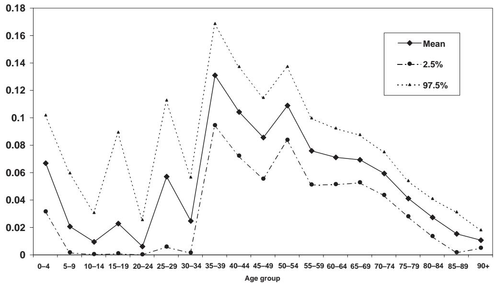  
Figure 11.1 Age weights $w_{a}$

Informative priors on $\theta_{j}$ (e.g. $\theta_{j} \sim N(0,1)$ ) are suggested, and initial values compatible with a positive variance (and precision).

2. In Example 11.2 re-estimate the model involving constituency-party random effects using a scale mixture model (equivalent to multivariate Student $t$ ). Assume four degrees of freedom and by monitoring the constituency-specific scaling factors identify constituencies with distinct party allegiances. Does fit improve by virtue of this model extension, despite the extra parameters?   
3. In Example 11.3 consider a model introducing a nonlinear IQ effect. Thus with $y_{ij} \sim N(\mu_{ij}, V_{ij})$

$$
\begin{array}{l} \mu_ {i j} = b _ {j 1} + b _ {j 2} (I Q _ {i j} - \overline {{I Q}}) + \beta_ {1} (I Q _ {i j} - \overline {{I Q}}) + \beta_ {2} (\overline {{I Q}} - I Q _ {i j}) _ {+} ^ {2} \\ + \beta_ {3} \left(\operatorname {S E S} _ {i j} - \operatorname {S} \overline {{\operatorname {E S}}}\right) + \beta_ {4} G _ {i j} + \beta_ {5} \operatorname {I Q C L} _ {j}, \\ \left(b _ {j 1}, b _ {j 2}\right) \sim N _ {2} \left(\left[ m _ {1}, m _ {2} \right], \Sigma_ {b}\right), \\ V _ {i j} = \theta_ {1} + \theta_ {2} I Q _ {i j}. \\ \end{array}
$$

What impact does this have on the level 2 variance of $IQ$ slopes (i.e. the parameter $\Sigma_{b22}$ )?

4. Analyse panel data on respiratory infections (Zeger and Karim, 1991), which involves a binary response, using a variable intercept and variable slope on time - see Exercise 11.4.0dc. There are 275 preschool age subjects with full or partial histories over six quarters, so there are 1200 observations in all, compared to $6 \times 275 = 1650$ points if no observations were missing. Some non-response occurs because children are no longer

in the age range, because of mortality, while some is through intermittent missingness or attrition. The random effects have means $(\beta_{1},\beta_{2})$ . Predictors apart from a linear time effect are age in months (centred at 36), presence of xerophthalmia (an indicator for vitamin A deficiency), seasonal cosine, seasonal sine, gender $(1 = F)$ , height for age, presence of stunting (below $85\%$ of expected height for age) and time (quarters 1-6) and quarter itself. Thus

$$
\begin{array}{l} y _ {i t} \sim \operatorname {B e r n} \left(\pi_ {i t}\right), \\ \operatorname {l o g i t} \left(\pi_ {i t}\right) = b _ {i 1} + b _ {i 2} t \\ + \beta_ {3} A g e + \beta_ {4} X e r o p + \beta_ {5} C o s + \beta_ {6} S i n + \beta_ {7} F e m + \beta_ {8} H t + \beta_ {9} S t u n t e d, \\ b _ {i} \sim N _ {2} (m _ {b}, \Sigma_ {b}), \\ m _ {b} = \left(\beta_ {1}, \beta_ {2}\right). \\ \end{array}
$$

The analysis can be performed using stacked data. Taking the likelihood to be independent of the missingness mechanism corresponds to a MAR (missing at random) model (Chapter 14). In addition to a model with varying intercepts and slopes on time, apply a model with varying intercepts only. Assess the predictive match between actual and replicate data under the two models. Repeat the analysis using the augmented data method (Albert and Chib, 1993), with $W$ as latent normal or latent logistic variables underlying the observed binary data. Assess predictive fit comparing replicate data ( $y_{\mathrm{rep}} = 1$ if $W_{\mathrm{rep}} > 0$ ) with actual data; this amounts to assessing how well the model classifies observations compared to actuality.

5. In the random intercept model

$$
y _ {i t} = \alpha + X _ {i t} \beta + b _ {i} + u _ {i t},
$$

with $b_{i} \sim N(0, \sigma_{b}^{2}), u_{it} \sim N(0, \sigma^{2})$ , let $\gamma = (\alpha, \beta), \tau = 1 / \sigma^{2}, \tau_{b} = 1 / \sigma_{b}^{2}$ . Then with $\gamma | \sigma^2 \sim N_{p+1}(g_0, \sigma^2 G_0^{-1}), \tau_b \sim \mathrm{Ga}(e_b, f_b), \tau \sim \mathrm{Ga}(e_u, f_u)$ obtain the full conditionals for $\gamma, \tau$ and $\tau_{b}$ .

6. In Example 11.6 (Indonesian rice farm data) assess gain from introducing AR1 errors (in addition to unstructured errors) in both random and fixed effects $b_{i}$ models. Also find the posterior probabilities that farms 1 to 171 are the best – in terms of having highest $b_{i}$ after allowing for inputs. Which farm has the highest probability of being best?   
7. In Example 11.7 (firm investments), does the conclusion that a non-stationary AR1 model is preferred still hold true when permanent random subject effects are added to the model. Thus

$$
\begin{array}{l} y _ {i t} = b _ {i} + \beta_ {2} V _ {i, t - 1} + \beta_ {3} C _ {i, t - 1} + \varepsilon_ {i t}, \\ \varepsilon_ {i t} = \rho \varepsilon_ {i, t - 1} + u _ {i t}, \\ \end{array}
$$

with $u_{it} \sim N(0, \tau^{-1})$ unstructured and $b_i$ centred at $\beta_1$ . There are only 10 firms, so a fixed subject effects approach may also be run to assess default assumptions such as $b_i$ normal.

8. In Example 11.8 apply the serial odds ratio model of Fitzmaurice and Lipsitz (1995). A possible partial code is

```txt
model{for (i in 1:N){ for (s in 1:T-1){ for (t in s+1:T) { z[i,s,t] <- equals(y[i,s],1)*equals(y[i,t],1) +2*equals(y[i,s],1)*equals(y[i,t],0) +3*equals(y[i,s],0)*equals(y[i,t],1) +4*equals(y[i,s],0)*equals(y[i,t],0) z[i,s,t] ~ dcat(p[i,s,t,1:4])   
for (j in 1:4){p[i,s,t,j] <- phi[i,s,t,j]/sum(phi[i,s,t,]) phi[i,s,t,1] <- pi[i,s,t] phi[i,s,t,2] <- pm[i,s]-pi[i,s,t] phi[i,s,t,3] <- pm[i,t]-pi[i,s,t] phi[i,s,t,4] <- 1-pm[i,s]-pm[i,t]+pi[i,s,t]   
pi[i,s,t] <- (a[i,s,t]-sqrt(a[i,s,t]*a[i,s,t] - 4*eps[i,s,t]*(eps[i,s,t]-1)*pm[i,s]*pm[i,t])) /(2*eps[i,s,t]-2)   
a[i,s,t] <- 1-(1-eps[i,s,t])*(pm[i,s]+pm[i,t])   
eps[i,s,t] <- pow(omega,1/abs(t-s))} 
```

where omega is a positive parameter.

9. In Example 11.8 apply the augmented data method with $\lambda_{i}$ constant over periods and assess fit as compared to using the subject- and time-specific scale parameters $\lambda_{it}$ . Also consider both models when the gamma parameter $\nu$ is unknown, i.e. $\lambda_{it} \sim \mathrm{Ga}(0.5\nu, 0.5\nu)$ and $\lambda_{i} \sim \mathrm{Ga}(0.5\nu, 0.5\nu)$ . Does this option favour a probit or logit link?   
10. In Example 11.9 extend the varying slope model to all research inputs (lags 1 to 5 as well as the contemporary effect), as in (11.11). Following the McNab et al. (2004) strategy, it may be preferable to model the varying lag effects without a full 6-by-6 covariance structure, but first select lags where lag variation between firms is significant and then adopt a full covariance structure for that subset of effects. Does this model extension move the average deviance closer to the observation total of 1730? Another option is to allow firm-varying linear slopes (on time itself).   
11. In Example 11.10 (second model) adopt a reduced model with autocorrelated $\mathbf{e}_{ijt}$ excluded, but with multivariate normal and multivariate $t$ (via scale mixing with unknown degrees of freedom) priors for the clinic effects $(\mathtt{b}_{j1},\mathtt{b}_{j2},\mathtt{b}_{j3})$ . Do these models improve on the fit of the independent prior model, and are any unusual clinic effects detected by the scale mixture approach? Finally consider the model

$$
y _ {i j t} = b _ {j 1} + b _ {j 2} t + b _ {j 3} B _ {i j} + \eta_ {\mathrm {N}} + \eta_ {\mathrm {A}} + w _ {i j} + u _ {i j t},
$$

where $b_{j2}$ have means $m_{j2}$ that are modelled in terms of patient treatment (so differential gain by treatment can be assessed).

12. Consider three-wave data on a skin treatment trial (Saei and McGilchrist, 1998), with the responses $y_{it}$ being on a 5-point ordinal scale and a categorical predictor namely clinic $C_i$ (1-6) - see Exercise 11.12.odc. Treatment (1 = test drug, 2 = placebo) is denoted by $G_i$ . Apply a constant (but treatment-specific) threshold model with random patient intercepts

$b_{i}$ , and fixed clinic effects $\gamma_{C_i}$ , namely

$$
\operatorname {l o g i t} \left(\Pr \left(y _ {i t} \leq j \mid G _ {i}, C _ {i}, b _ {i}\right) = \operatorname {l o g i t} \left(\omega_ {i j t}\right) = \kappa_ {j G _ {i}} - \gamma_ {C _ {i}} - b _ {i}. \right.
$$

For all the $\{\gamma_k, k = 1, 6\}$ to be identified, only $J - 2 = 3$ threshold parameters are estimated, while if $\gamma_1 = 0$ there are four free threshold parameters. Compare this model's predictive fit (the proportion of observations correctly classified on sampling new responses $y_{it,\mathrm{new}}$ ) with a model allowing changing thresholds $\kappa_{jm}$ ( $m = 1, 2$ ) over the $T = 3$ periods.

13. In Example 11.11 (scram rates) consider a model with $\omega$ varying over time, and taking $\{\mathrm{logit}(\omega_t), b_t\}$ to follow a bivariate normal random walk. Omit the 10th year's observations (namely replace $y_{i,10}$ by NA though keeping the offsets $H_{i,10}$ as they are). The actual data for the last year will then be a separate vector. Compare the predictions (e.g. posterior mean of absolute deviations between predictions and actual divided by 66) of the constant $\omega$ model (and RW1 prior in $b_t$ only) with the extended model.

# REFERENCES

Aitkin, M. and Alfo, M. (2003) Longitudinal analysis of repeated binary data using autoregressive and random effect modelling. Statistical Modelling, 3, 191-203.   
Albert, J. and Chib, S. (1993) Bayesian analysis of binary and polychotomous response data. Journal of the American Statistical Association, 88, 669-679.   
Albert, J. and Chib, S. (1996) Bayesian modeling of binary repeated measures data with application to crossover trials. In *Bayesian Biostatistics*, Berry, D.A. and Stangl, D.K (eds). Marcel Dekker: New York, 577-599.   
Allison, P. (1994) Using panel data to estimate the effects of events. Sociological Methods & Research, 23, 174-199.   
Allison, P. and Waterman, R. (2002) Fixed effects negative binomial regression models. In *Sociological Methodology*, Stolzenberg, R. (ed.).   
Basu, S. and Chib, S. (2003) Marginal likelihood and Bayes factors for Dirichlet process mixture models. Journal of the American Statistical Association, 98, 224-235.   
Beck, N., Katz, J. and Tucker, R. (1998) Taking time seriously: time-series-cross-section analysis with a binary dependent variable. American Journal of Political Science, 42, 1260-1288.   
Bernardinelli, L., Clayton, D., Pascutto, C., Montomoli, C., Ghislandi, M. and Songini, M. (1995) Bayesian analysis of space-time variation in disease risk. Statistics in Medicine, 14, 2433-2443.   
Berzuini, C. and Clayton, D. (1994) Bayesian survival analysis on multiple time scales. Statistics in Medicine, 13, 823-838.   
Besag, J., York, J. and Mollie, A. (1991) Bayesian image restoration, with two applications in spatial statistics. Annals of the Institute of Statistical Mathematics, 43, 1-20.   
Besag, J., Green, P., Higdon, D. and Mengersen, K. (1995) Bayesian computation and stochastic systems. Statistical Science, 10, 3-66.   
Bockenholt, U. (1993) A latent class regression approach for the analysis of recurrent choices. British Journal of Mathematical and Statistical Psychology, 46, 95-118.   
Bollen, K.A. and Curran, P.J. (2004) Autoregressive latent trajectory (ALT) models: a synthesis of two traditions. *Sociological Methods & Research*, 32, 336-383.

Bray, I. (2002) Application of Markov chain Monte Carlo methods to projecting cancer incidence and mortality. Applied Statistics, 51, 151-164.   
Breslow, N. and Clayton, D. (1993) Approximate inference in generalized linear mixed models. Journal of the American Statistical Association, 88, 9-25.   
Brown, H. and Prescott, R. (1999) Applied Mixed Models in Medicine. John Wiley & Sons, Ltd/Inc.: Chichester.   
Browne, W. and Draper, D. (2000) Implementation and performance issues in the Bayesian and likelihood fitting of multilevel models. Computational Statistics, 15, 391-420.   
Browne, W., Draper, D., Goldstein, H. and Rasbash, J. (2002) Bayesian and likelihood methods for fitting multilevel models with complex level 1 variation. Computational Statistics and Data Analysis, 39.   
Calvo, E. and Micozzi, J. (2005) The Governor's backyard: a seat-vote model of electoral reform for subnational multiparty races. The Journal of Politics, 67, 1050-1074.   
Camargo, E. and Gamerman, D. (2000) Discrete mixture alternatives to dynamic hierarchical models. Estadística, Buenos Aires, 52, 39-77.   
Cameron, A.C. and Trivedi, P.K. (1998) Regression Analysis of Count Data. Cambridge University Press: Cambridge.   
Cargnoni, C., Müller, P. and West, M. (1997) Bayesian forecasting of multinomial time series through conditionally Gaussian dynamic models. Journal of the American Statistical Association, 90, 1301-1312.   
Carlin, B. and Louis, T. (2000). Bayes and Empirical Bayes Methods for Data Analysis (2nd edn). Chapman & Hall: London.   
Carlin, J., Wolfe, R., Brown, H. and Gelman, A. (2001) A case study on the choice, interpretation and checking of multilevel models for longitudinal binary outcomes. *Biostatistics*, 2, 397-416.   
Chamberlain, G. and Hirano, K. (1999) Predictive distributions based on longitudinal earnings data. Annales d'Economie et de Statistique, 55-56, 211-242.   
Chan, K. and Ledolter, J. (1995) Monte Carlo EM estimation for time series models involving observations. Journal of the American Statistical Association, 90, 242-252.   
Chib, S. (1996) Inference in panel data models via Gibbs sampling. In The Econometrics of Panel Data, Matyas, L. and Sevestre, P. (eds). Springer: New York.   
Chib, S. and Carlin, B. (1999) On MCMC sampling in hierarchical longitudinal models. Statistics and Computing, 9, 17-26.   
Chib, S., Greenberg, E. and Winkelmann, R. (1998) Posterior simulation and Bayes factors in panel count data models. Journal of Econometrics, 86, 33-54.   
Chintagunta, P., Kyriazidou, E. and Perktold, J. (2001) Panel data analysis of household brand choices. Journal of Econometrics, 103, 111-153.   
Christiansen, C. and Morris, C. (1996) Fitting and checking a two level Poisson model: modeling patient mortality rates in heart transplant patients. In *Bayesian Biostatistics*, Berry, D. and Stangl, D. (eds). Marcel Dekker: New York, 467-501.   
Clayton, D. (1996) Generalized linear mixed models. In Markov Chain Monte Carlo in Practice, Gilks, W., Richardson, S. and Spiegelhalter, D. (eds). Chapman & Hall: London.   
Clayton, D. and Schifflers, E. (1987) Models for temporal variation in cancer rates. I. Age-period and age-cohort models. Statistics in Medicine, 6, 449-467.   
Congdon, P. (1997) Multilevel and clustering analysis of health outcomes in small areas. European Journal of Population, 13, 305-338.   
Congdon, P. (2004) Modelling trends and inequality in small area mortality. Journal of Applied Statistics, 31(6), 603-622.   
Congdon, P. (2006a) A spatio-temporal forecasting approach for health indicators. Journal of Data Science, 6(4).

Congdon, P. (2006b) A model framework for mortality and health data classified by age, area and time. Biometrics, 61, 269-278.   
Congdon, P. and Best, N. (2000) Small area variation in hospital admission rates: adjusting for referral and provider variation. Journal of the Royal Statistical Society, Series C, 49, 207-226.   
Congdon, P., Campos, R., Curtis, S., Southall, H., Gregory, I. and Jones, I. (2001) Quantifying and explaining changes in geographical inequality of infant mortality in England and Wales since the 1890s. International Journal of Population Geography, 7, 35-51.   
Dagne, G. (1999). Bayesian analysis of hierarchical Poisson models with latent variables. Communication in Statistical Theory and Methods, 28, 119-136.   
Daniels, M. and Gatsonis, C. (1997) Hierarchical polytomous regression models with applications to health services research. Statistics in Medicine, 16, 2311-2325.   
Daniels, M. and Gatsonis, C. (1999) Hierarchical generalized linear models in the in the analysis of variations in health care utilization. Journal of the American Statistical Association, 94, 29-42.   
Das, K. and Chattopadhyay, A. (2004) An analysis of clustered categorical data with an application in dental health. Statistics in Medicine, 23, 2895-2910.   
Diez-Roux, A. (1998) Bringing context back into epidemiology: variables and fallacies in multilevel analysis. American Journal of Public Health, 88, 216-222.   
Diggle, P.J. (1988) An approach to the analysis of repeated measurements. Biometrics, 44, 959-971.   
Fernandez, C., Osiewalski, J. and Steel, M.F.J. (1997) On the use of panel data in stochastic frontier models with improper priors. Journal of Econometrics, 79, 169-193.   
Fitzmaurice, G. and Lipsitz, S. (1995) A model for binary time series data with serial odds ratio patterns. Journal of the Royal Statistical Society, Series C, 44, 51-56.   
Fitzmaurice, G., Laird, N. and Ware, J. (2004) Applied Longitudinal Analysis. John Wiley & Sons, Ltd/Inc.: New York.   
Frees, E. (2004) Longitudinal and Panel Data: Analysis and Applications in the Social Sciences. Cambridge University Press: New York.   
Fruhwirth-Schnatter, S. and Wagner, H. (2004) Gibbs sampling for parameter-driven models of time series of small counts with applications to state space modelling. Research Report IFAS, http://www.ifas.jku.at/.   
Gamerman, D. (1997) Markov Chain Monte Carlo. Stochastic Simulation for Bayesian Inference, Texts in Statistical Science Series. Chapman & Hall: London.   
Gamerman, D. and Smith, A.F.M. (1996) Bayesian analysis of longitudinal data studies. In *Bayesian Statistics* 5, Bernardo, J.M., Berger, J.O., Dawid, A.P. and Smith, A.F.M. (eds). University Press: Oxford, 587-598.   
Gelfand, A. (1996) Model determination using sampling based methods. In Markov Chain Monte Carlo in Practice, Gilks, W., Richardson, S. and Spieglehalter, D. (eds). Chapman and Hall/CRC: Boca Raton, FL, 145-161.   
Gelfand, A., Carlin, B. and Trevisani, M. (2001) On computation using Gibbs sampling for multilevel models. Statistica Sinica, 11, 981-1003.   
Gelfand, A., Sahu, S. and Carlin, B. (1995) Efficient parameterizations for normal linear mixed models. Biometrika, 82, 479-488.   
Gelman, A. (2006) Prior distributions for variance parameters in hierarchical models. Bayesian Anal., 1, 515-533.   
Gelman, A. and Pardoe, I. (2006) Bayesian measures of explained variance and pooling in multilevel (hierarchical) models. Technometrics, 48, 241-251.   
Glickman, M. and Stern, H. (1998) A state-space model for national football league scores. Journal of the American Statistical Association, 93, 25-35.

Goldstein, H. and Spiegelhalter, D. (1996) League tables and their limitations: statistical issues in comparisons of institutional performance. Journal of the Royal Statistical Society, Series A, 159, 385-443.   
Goodman, L. (1979) Simple models for the analysis of association in cross-classifications having ordered categories. Journal of the American Statistical Association, 74, 537-551.   
Griffin, J. and Steel, M. (2004) Semiparametric Bayesian inference for stochastic frontier models. Journal of Econometrics, 123, 121-152.   
Grunfeld, Y. and Griliches, Z. (1960) Is aggregation necessarily bad? Review of Economics and Statistics, 42, 1-13.   
Hamerle, A. and Ronning, G. (1995) Panel analysis for qualitative variables. In Handbook of Statistical Modeling for the Social and Behavioral Sciences, Arminger, G., Clogg, C. and Sobel, M. (eds). Plenum: New York, Chap. 8.   
Hartzel, J., Agresti, A. and Caffo, B. (2001) Multinomial logit random effects models. Statistical Modelling, 1, 81-102.   
Harvey, A. (1991) Forecasting, Structural Time Series Models and the Kalman Filter. Cambridge University Press: Cambridge.   
Hausman, J., Hall, B. and Griliches, Z. (1984) Econometric models or count data with an application to the patents - R&D relationship. *Econometrica*, 52, 909-938.   
Heckman, J. (1981) Heterogeneity and state dependence. In Studies in Labor Markets, Rosen, S. (ed.). University of Chicago Press: Chicago, 91-139.   
Hedeker, D. (2003) A mixed-effects multinomial logistic regression model. Statistics in Medicine, 22, 1433-1446.   
Hedeker, D. (2006) Multilevel models for ordinal and nominal variables. In Handbook for Quantitative Multilevel Analysis, de Leeuw, J. and Kreft, I. (eds.), Kluwer: Dordrecht.   
Heo, M. and Leon, A. (2005a) Comparison of statistical methods for analysis of clustered binary observations. Statistics in Medicine, 24, 911-923.   
Heo, M. and Leon, A. (2005b) Performance of a mixed effects logistic regression model for binary outcomes with unequal cluster size. Journal of Biopharmaceutical Statistics, 15, 513-526.   
Hirano, K. (1999) A semiparametric model for labor earnings dynamics. In Practical Nonparametric and Semiparametric Bayesian Statistics, Dey, D. (ed.). SpringerVerlag: New York, 355-369.   
Horrace, W. and Schmidt, P. (2000) Multiple comparisons with the best, with economic applications. Journal of Applied Econometrics, 15, 1-26.   
Hsiao, C. and Pesaran, M. (2006) Random coefficient panel data models. In The Econometrics of Panel Data (3rd edn), Matyas, L. and Sevestre, P. (eds). Kluwer Academic Publishers: Dordrecht.   
Hsiao, C., Pesaran, M. and Tahmiscioglu, A. (1999) Bayes estimation of short-run coefficients in dynamic panel data models. In Analysis of Panels and Limited Dependent Variables Models, Hsiao, C., Lee, L., Lahiri, K. and Pesaran, M. (eds). Cambridge University Press: Cambridge, 268-296.   
Ishwaran, H. and Zarepour, M. (2000) Markov chain Monte Carlo in approximate Dirichlet and beta two-parameter process hierarchical models. Biometrika, 87, 371-390.   
Jonsen, I., Myers, R. and Flemming, J.M. (2003) Meta-analysis of animal movement using state-space models. Ecology, 84, 3055-3063.   
Kao, L. and Allenby, G. (2004) Estimating state-space models of consumer behavior: a hierarchical Bayes approach. Working Papers, Max M. Fisher College of Business, Ohio State University.   
Karney, B.R. and Bradbury, T.N. (1995) The longitudinal course of marital quality and stability: a review of theory, method, and research. Psychological Bulletin, 118, 3-34.   
Joseph, L., Wolfson, D.B., du Berger, R. and Lyle, R. (1997) Analysis of panel data with changepoints. Statistica Sinica, 7, 687-703.   
Kleinman, K. and Ibrahim, J. (1998) A semi-parametric Bayesian approach to generalized linear mixed models. Statistics in Medicine, 17, 2579-2596.

Knorr-Held, L. (2000) Bayesian modelling of inseparable space-time variation in disease risk. Statistics in Medicine, 19, 2555-2567.   
Knorr-Held, L. and Rainer, E. (2001) Projections of lung cancer mortality in West Germany: a case study in Bayesian prediction. *Biostatistics*, 2, 109–129.   
Lagazio, C., Dreassi, E. and Biggeri, A. (2001) A hierarchical Bayesian model for space-time variation of disease risk. Statistical Modelling, 1, 17-29.   
Lagazio, C., Biggeri, A. and Dreassi, E. (2003) Age-period-cohort models for disease mapping. *Environmental Metrics*, 14, 475-490.   
Laird, N. and Ware, J. (1982) Random effects models for longitudinal data. Biometrics, 38, 963-974.   
Lange, N., Carlin, B. and Gelfand, A. (1992) Hierarchical Bayes models for the progression of HIV infection using longitudinal CD4 T-cell numbers. Journal of the American Statistical Association, 87, 615-632.   
Langford, I. and Lewis, T. (1998) Outliers in multilevel data. Journal of the Royal Statistical Society, Series A, 161, 153-160.   
Lee, J. and Chang, C. (2000) Bayesian analysis of a growth curve model with a general autoregressive covariance structure. Scandinavian Journal of Statistics, 27, 703-713.   
Lee, J. and Hwang, R. (2000) On estimation and prediction for temporally correlated longitudinal data. Journal of Statistical Planning and Inference, 87, 87-104.   
Lee, J. and Lien, W. (2001) Bayesian analysis of a growth curve model with power transformation, random effects and AR(1) dependence. Journal of Applied Statistics, 28, 223-238.   
Lee, R. and Carter, L. (1992) Modeling and forecasting U.S. mortality. Journal of the American Statistical Association, 87, 659-671.   
Lee, W. and Lin, R. (1996) Autoregressive age period cohort models. Statistics in Medicine, 15, 273-281.   
Lee, Y. and Nelder, J. (2000) Two ways of modelling overdispersion in non-normal data. Applied Statistics, 49, 591-598.   
Liska, A. (1990) The significance of aggregate dependent variables and contextual independent variables for linking macro and micro theories. Social Psychology Quarterly, 53, 292-301.   
MacNab, Y., Qiu, Z., Gustafson, P., Dean, C., Ohlsson, A. and Lee, S. (2004) Hierarchical Bayes analysis of multilevel health services data: a Canadian neonatal mortality study. Health Services and Outcomes Research Methodology, 5, 5-26.   
Maddala, G. (2001) Introduction to Econometrics. John Wiley & Sons, Ltd/Inc.: New York.   
Martz, H.F., Parker, R.L. and Rasmuson, D.M. (1999) Estimation of trends in the scram rate at nuclear power plants. Technometrics, 41, 352-364.   
Molenaar, P. (1999) Longitudinal analysis. In Research and Methodology in the Social, Behavioural and Life Sciences, Ader, H. and Mellenbergh, G. (eds). Sage: London, 143-167.   
Nandram, B. and Petrucelli, J. (1997) A Bayesian analysis of autoregressive time series panel data. Journal of Business and Economic Statistics, 15, 328-334.   
Natarajan, R. and Kass, R. (2000) Reference Bayesian methods for generalized linear mixed models. Journal of the American Statistical Association, 95, 227-237.   
Oh, M.-S. and Lim, Y. (2001) Bayesian analysis of time series Poisson data. Journal of Applied Statistics, 28, 259-271.   
Pan, J. and Fang, K. (2002) Growth Curve Models and Statistical Diagnostics. Springer: New York.   
Qiu, Z., Song, P. and Tan, M. (2002) Bayesian hierarchical models for multi-level repeated ordinal data using Winbugs. Journal of Biopharmaceutical Statistics, 12, 121-135.   
Raudenbush, S.W. and Bryk, A.S. (2002) Hierarchical Linear Models: Applications and data analysis methods (2nd edn). Sage: Thousand Oaks, CA.   
Raymer, J. and Rogers, A. (2005) Using age and spatial flow structures in the indirect estimation of migration streams. S3RI Applications and Policy Working Paper, No. A05/07, Southampton Statistical Sciences Research Institute, University of Southampton.

Robertson, C. and Boyle, P. (1986) Age, period and cohort models: the use of individual records. Statistics in Medicine, 5, 527-538.   
Rogers, A. and Raymer, J. (1999) Fitting observed demographic rates with the multiexponential model schedule: an assessment of two estimation programs. Review of Urban & Regional Development Studies, 11, 1-10.   
Saei, A. and McGilchrist, C. (1998) Longitudinal threshold models with random components. Journal of the Royal Statistical Society, Series D, 47, 365-375.   
Scaccia, L. and Green, P. (2002) Bayesian growth curves using normal mixtures with nonparametric weights. Journal of Computational and Graphical Statistics, 12, 308-331.   
Schmid, V. and Held, L. (2004) Bayesian extrapolation of space-time trends in cancer registry data. Biometrics, 60, 1034-1042.   
Shouls, S., Congdon, P. and Curtis, S. (1996) Modelling inequality in reported long term illness in the UK: combining individual and area characteristics. Journal of Epidemiology and Community Health, 50, 366-376.   
Schwartz, S. (1994) The fallacy of the ecological fallacy: the potential misuse of a concept and the consequences. American Journal of Public Health, 84, 819-824.   
Scott, S., James, G. and Sugar, C. (2005) Hidden Markov models for longitudinal comparisons. Journal of the American Statistical Association, 100, 359-369.   
Seltzer, M., Wong, W. and Bryk, A. (1996) Bayesian analysis in applications of hierarchical models: issues and methods. Journal of Educational and Behavioral Statistics, 21(2), 131-167.   
Skrondal, A. and Rabe-Hesketh, S. (2003a) Multilevel logistic regression for polytomous data and rankings. Psychometrika, 68, 267-287.   
Skrondal, A. and Rabe-Hesketh, S. (2003b) Generalized linear mixed models for nominal data. In Proceedings of the American Statistical Association, Alexandria, VA, 3931-3936.   
Skrondal, A. and Rabe-Hesketh, S. (2004) Generalized Latent Variable Modeling: Multilevel, Longitudinal and Structural Equation Models. Chapman & Hall/CRC: Boca Raton, FL.   
Snijders, T. and Bosker, R. (1999) Multilevel Analysis: An Introduction to Basic and Advanced Multilevel Modeling. Sage: Thousand Oaks, CA.   
Spiegelhalter, D., Thomas, A., Best, N. and Gilks, W. (1996). BUGS 0.5 Examples (Version ii). Medical Research Council Biostatistics Unit: Cambridge.   
Stangl, D.K. (1995) Prediction and decision making using Bayesian hierarchical models. Statistics in Medicine, 14(20), 2173-2190.   
Steyer, R. and Partchev, I. (1999) Latent state-trait modelling with logistic item response models. In Structural Equation Modeling: Present and future, Cudeck, R., Du Toit, S. and Sorbom, D. (eds). Scientific Software International: Chicago, 481-520.   
Stokes, M., Davis, C. and Koch, G. (1995) Categorical Data Analysis Using the SAS System. SAS Institute, Inc.: Cary, NC.   
Sun, D., Tsutakawa, R., Kim, H. and He, Z. (2000) Spatio-temporal interaction with disease mapping. Statistics in Medicine, 19, 2015-2035.   
Thum, Y. (2003) Measuring progress toward a goal: estimating teacher productivity using a multivariate multilevel model for value-added analysis. Sociological Methods & Research, 32, 153-207.   
Van Der Merwe, A. and Pretorius, A. (2003) Bayesian estimation in animal breeding using the Dirichlet process prior for correlated random effects. Genetics Selection Evolution, 35, 137-158.   
Van Duijn, M. and Jansen, M. (1995) Modeling repeated count data: some extensions of the Rasch Poisson Counts Model. Journal of Educational and Behavioral Statistics, 20, 241-258.   
Verbeke, G. and Molenberghs, G. (2000) Linear Mixed Models for Longitudinal Data. Springer: New York.   
Waller, L., Carlin, B., Xia, H. and Gelfand, A. (1997) Hierarchical spatio-temporal mapping of disease rates. Journal of the American Statistical Association, 92, 607-617.

Weiss, R.E., Cho, M. and Yanuzzi, M. (1999) On Bayesian calculations for mixture priors and likelihoods. Statistics in Medicine, 18, 1555-1570.   
Winkelmann, R. (2000) Econometric Analysis of Count Data (3rd edn). Springer: Berlin.   
Wong, G. and Mason, W. (1985) The hierarchical logistic regression model for multilevel analysis. Journal of the American Statistical Association, 80, 513-524.   
Zeger, S. and Karim, M. (1991) Generalized linear-models with random effects - a Gibbs sampling approach. Journal of the American Statistical Association, 86, 79-86.   
Zellner, A. and Tiao, G.C. (1964) Bayesian analysis of the regression model with autocorrelated errors. Journal of the American Statistical Association, 59, 763-778.

# Latent Variable and Structural Equation Models for Multivariate Data

# 12.1 INTRODUCTION: LATENT TRAITS AND LATENT CLASSES

In the analysis of both continuous and discrete responses, the goal of introducing latent variables is to improve the understanding of multivariate collections of measured (i.e. observed) variables, by a parsimonious latent variable model that is of lesser intrinsic dimension, and also accounts for intercorrelations and other features in the observed data (Bartholomew and Knott, 1999; Wedel et al., 2003). The latent variables are unobserved constructs that summarise the set of observed indicators and are imperfectly measured by these indicators. These latent variables may be either continuous (as in latent trait factor analysis) or categorical, as in latent class analysis (Berkhof et al., 2003; Wilcox, 1983). The original variables might themselves be discrete or continuous and may measure either continuous or categorical latent variables. For example, in psychometrics the observations might be multiple binary items (right/wrong responses) and a latent metric variable might be assumed, reflecting a specific ability or general intelligence (Johnson and Albert, 1999). On the other hand a set of items measuring ability to perform certain coordination tasks might be taken to represent a discrete latent developmental category. A regression relationship between the latent variables leads to a broader class of structural equation models, abbreviated as SEMs (Dunson et al., 2005). Such models may involve latent classes and continuous latent traits for a single dataset (Guo et al., 2005).

Latent trait and latent class analysis are a particular form of the more general classes of random effects and discrete mixture models respectively, with Skrondal and Rabe-Hesketh (2004) and Muthen (2002) giving unified treatments. However, in terms of their implementation via MCMC techniques, such models may raise labelling and identification issues that are not present in simple random effects models. For latent class (i.e. discrete trait) analysis, the label-switching issues in MCMC analysis are well known and post-processing methods well established (e.g. Garrett and Zeger, 2000). For latent traits, a labelling issue occurs because the

direction in which most latent variables are measured is arbitrary (Bartholomew, 1987, p. 98), an example being the left-right political spectrum. For example, factor (latent trait) models are generically formed by products of a loading $\lambda$ and a subject level factor score $F$ and so the schemes $\lambda F$ and $(- \lambda)(-F)$ are equivalent. These are referred to as 'sign changes' by Everitt (1984, p. 16). It follows that non-informative unconstrained priors are not necessarily suitable, and formally constrained priors, preferably supported by subject matter knowledge, may be adopted. Alternatively methods of post-processing the MCMC output may be applied, for example, by considering rankings of factor scores over subjects at each iteration. The ranking might reverse its direction during a MCMC chain due to a switch in the direction of a continuous factor $F$ .

Formal mathematical identification of factor analysis or SEM models generally requires constraints on loadings or factor variances, even aside from the labelling issue (Stern and Jeon, 2004). These constraints are needed to avoid location, transformation and scale invariance (Wedel et al., 2003). Empirical identifiability (identifiability of a complex model from a given set of observations) is an additional issue to mathematical identification (Garrett and Zeger, 2000). Empirical identification of more complex structural equation models, especially with smaller sample sizes or greater measurement error, might require relatively informative priors (Guo et al., 2005). Lee and Song (2004, p. 143) suggest a preliminary run with non-informative priors to generate sensible values for more informative priors. Even classical maximum likelihood methods (Golob, 2003) set guidelines for identification in terms of sample size in relation to the number of parameters, especially when usual assumptions are in doubt (e.g. multivariate normality in linear metric factor analysis).

Prior information is also relevant in defining the model. The latent variables may be defined conceptually before an analysis, in which case only a subset of possible loadings would be free parameters (the rest being set to zero), as in confirmatory factor analysis (Lee and Shi, 2000) or constrained latent class analysis (Hoijtink, 1998). Alternatively there may be little preceding idea about the way a set of responses may be structured, leading to an exploratory analysis. The measured variables may fall naturally into dependent $Y_{1}, \ldots, Y_{P}$ and predictor variables $X_{1}, \ldots, X_{M}$ in which case the latent variables will fall into two categories (exogenous, endogenous) and figure as underlying responses and underlying predictors in a structural equation model.

While subject to possible labelling issues, Bayesian MCMC applications of factor analysis, SEMs and latent class analysis illustrates greater flexibility in certain settings as compared to classical estimation. Examples include models with nonlinear effects of factors (Song and Lee, 2002) and models introducing a latent scale for discrete data under the Abert and Chib (1993) model for binary or ordinal observations $Y$ or $X$ (Ansari et al., 2000; Lee and Song, 2003). Bayesian applications also demonstrate the potential of posterior predictive model checks, for example, by adapting the usual SEM measures of discrepancy between actual and predicted covariance matrices (Gelman et al., 1996; Rubin and Stern, 1994; Scheines et al., 1999; Stern and Jeon, 2004). Ansari et al. (2000, p. 481) suggest a posterior predictive check in binary variable factor analysis using an approximation to the tetrachoric correlation. Approximations to the Bayes factor for model choice via the BIC criterion are illustrated by Raftery (1993) and Song and Lee (2002). Lee and Song (2004) demonstrate path sampling to estimate log Bayes factors, while Ansari et al. (2000) employ pseudo Bayes factors based on Monte Carlo estimates of the cross-validation predictive density, and Lopes and West (2004) apply a metropolised version of the Carlin and Chib (1995) algorithm to jump between factor models of

different dimension. Finally Dunson (2006) considers a form of SSVS search adapted to factor analysis.

A range of extensions to the basic model types are possible. For example, repeated data on each subject as in longitudinal or multilevel studies allows one to consider heterogeneity in a SEM over subjects, namely subject specific loadings or measurement error variances (Ansari et al., 2000). One may also define latent traits for clusters (e.g. schools) as well as for subjects in multi-level factor analysis (Ansari and Jedidi, 2000; Goldstein and Browne, 2005). A related situation, multi-group factor analysis, is when variables $\{Y,X\}$ are observed for groups of subjects, and the goal is to assess whether the parameters of the factor model (e.g. loadings, measurement error variances) need to be distinguished between groups or whether they can be equated without loss of fit (Song and Lee, 2002). Factor and structural equation analysis for mixtures of metric and discrete variables have also been investigated from a Bayesian perspective (Lee and Song, 2004).

# 12.2 FACTOR ANALYSIS AND SEMS FOR CONTINUOUS DATA

Where the observations are continuous and consist of both responses $Y$ and predictors $X$ , a latent trait model often takes the LISREL form (Joreskog, 1973), with a linear structural regression model relating endogenous latent variables $F$ to one another and to exogenous latent variables $G$ , and a measurement model linking observed endogenous indicators $Y$ to $F$ and observed exogenous indicators $X$ to $G$ . Both $F$ and $G$ are continuous and usually assumed normal. With binary, ordinal or multinomial $Y$ or $X$ the LISREL form may also be used in conjunction with augmented data sampling of the latent metric variables underlying the observations (Albert and Chib, 1993; Lee and Song, 2004). There is then 'doubly missing data' in terms of, say, the latent continuous $z_{i1}, z_{i2}, \ldots, z_{iP}$ that generate $p$ binary observations $y_{i1}, y_{i2}, \ldots, y_{iP}$ , and the latent factors $F_{i1}, \ldots, F_{iQ}$ that explain the correlations between the $z$ variables, typically with $Q \ll P$ .

For subject $i$ , the structural model is a simultaneous equation system

$$
F _ {i} = \varphi + \beta F _ {i} + \gamma G _ {i} + e _ {i} \tag {12.1}
$$

where $F_{i}$ is a $Q \times 1$ vector of endogenous (response) latent variables, $G_{i}$ is a $V \times 1$ vector of exogenous constructs, $e_{i}$ is a $Q \times 1$ error vector with covariance $\Phi$ , and $\beta$ and $\gamma$ are $Q \times Q$ and $Q \times V$ regression coefficient matrices. The form of the covariance $\Sigma_{e}$ depends on whether factors are taken orthogonal or oblique (Fokoue, 2004). Assuming continuous observations, the links between observations and constructs are defined by the measurement model

$$
Y _ {i} = \alpha_ {Y} + \Lambda F _ {i} + u _ {i}
$$

$$
X _ {i} = \alpha_ {X} + K G _ {i} + v _ {i}, \tag {12.2}
$$

where $Y_{i}$ and $X_{i}$ are vectors of length $P$ and $M$ . The matrices $\Lambda$ and $K$ are $P \times Q$ and $M \times V$ matrices of loading coefficients, describing how the observed indicators determine the latent factor scores of an individual, $F_{i} = (F_{i1}, F_{i2}, \ldots, F_{iQ})$ and $G_{i} = (G_{i1}, \ldots, G_{iV})$ . The measurement errors $u$ and $v$ have diagonal covariance matrices $\Sigma_{Y}$ and $\Sigma_{X}$ under the assumption of conditional independence, namely that the constructs $F$ and $G$ explain all the covariation among the observed $Y$ and $X$ respectively. This is a common working assumption

but can be modified if need be. In this type of model, restrictions to ensure identifiability (and consistent labelling of the constructs) can be applied to either the loadings or to the scale of the factor scores (see Section 12.2.1).

Often the analysis may involve just a multivariate normal measurement model, sometimes called the normal linear factor model (Bartholomew et al., 2002, p. 149), namely

$$
Y _ {i} = \alpha + \Lambda F _ {i} + u _ {i} \tag {12.3}
$$

with $Y_{i}$ a $P\times 1$ vector, $\Lambda$ of dimension $P\times Q$ , $u_{i}\sim N_{P}(0,\Sigma)$ , and $F_{i}\sim N_{Q}(0,\Psi)$ . The $Q$ latent variables $F_{i1},\ldots ,F_{iQ}$ may be assumed uncorrelated or correlated, subject to the correlations being identifiable. Some of the loadings in $\Lambda$ may be preset to zero in line with a confirmatory approach (Stern and Jeon, 2004). While the standard presentation of the normal linear factor model assume the $F_{i}$ are independent over subjects, in fact they might be structured, e.g. correlated over space in a geographic application (Hogan and Tchernis, 2004; Wang and Wall, 2003). So for $Q > 1$ , and in an application admitting correlations in $F$ scores over both variables and areas, one might use a MCAR normal prior for $(F_{i1},\dots ,F_{iQ})$ (see Chapter 9). Several authors have noted that assumption that the $F_{i}$ are normal may need to be modified in certain applications (Wedel et al., 2003; Wedel and Kamakura, 2001); greater flexibility may also be obtained by discrete mixture SEMs or factor models (Arminger et al., 1999; Dolan and Van Der Maas, 1998; Temme et al., 2001; Utsugi and Kumagai, 2001; Yung, 1997).

The conditional density of $Y$ given $F$ under (12.3) is $N(\alpha + \Lambda F, \Sigma)$ , whereas the marginal distribution of $Y$ is $N(\alpha, \Lambda \Psi \Lambda' + \Sigma)$ . A factor model such as (12.3) is essentially a model for the covariance matrix $H = \Lambda \Psi \Lambda' + \Sigma$ of the combined random error $\Lambda F_i + u_i$ . The model's identifiability may be assessed by comparing the number of parameters in $\Lambda$ , $\Psi$ and $\Sigma$ against the $P(P + 1)/2$ elements that are contained in the empirical covariance matrix. It is possible to set constraints on $\Lambda$ such that some or all of elements of $\Psi$ can be identified (Lee and Shi, 2000); see Section 12.2.1 for alternative identification devices. However, assume identifiability is gained by assuming a known scale for the factor scores, as in $F_i \sim N_Q(0, I)$ . The marginal distribution of $Y$ is then $N(\alpha, \Lambda \Lambda' + \Sigma)$ . Stern and Jeon (2004) suggest using classical discrepancy functions in posterior predictive checks; these functions compare the modelled covariance matrix $H$ to the empirical covariance matrix $S$ (or its replicate data equivalent), as in the measure $T = \mathrm{tr}(SH^{-1})$ .

It may be noted that under Bayesian estimation via MCMC methods, one typically uses data augmentation in which the scores $F_{i}$ (the 'missing data') are sampled at each iteration to define the complete data likelihood. For given $F_{i}$ , (12.3) is then analogous to a multivariate normal regression; see Aitkin and Aitkin (2006), Fokoue (2004) and Song and Lee (2002, p. 528) for more on this missing data interpretation. Thus estimation involves alternation between a step to update the density $[F|\theta ,Y]$ of the $F$ scores given the data and the hyperparameters $\theta = \{\alpha ,\Lambda ,\Sigma ,\Psi \}$ , and a step to update the density of hyperparameters $[\theta |F,Y]$ , given the $F$ scores and $Y$ .

Gibbs sampler updates for the $\theta$ parameters are analogous to those for multivariate normal regression if conjugate priors are used, as discussed in Press and Shigemasu (1989), and subsequent papers (e.g. Song and Lee, 2002, pp. 530-533; Stern and Jeon, 2004, pp. 336-338; Zhu and Lee, 1999). Gibbs sampling can be extended to discrete mixture Bayesian factor analysis, e.g. Utsugi and Kumagai (2001). The particular form of full conditional depends on which identifiability constraints are adopted to define $F$ and $\Lambda$ , and which form of conditional independence is assumed for $Y$ given $F$ . The update of the loading matrix in a confirmatory

analysis is algebraically complicated by the fact that some loading are preset. If nonlinear effects of $F$ are allowed (Section 12.5) then Metropolis-Hastings sampling will be required for updating the $F$ scores.

# 12.2.1 Identifiability constraints in latent trait (factor analysis) models

Factor and latent trait models often assess the nature of constructs postulated by substantive theory, or on testing causal hypotheses based on theory. For example, confirmatory factor analysis specifies a loading structure in which only certain loadings are free parameters, and identification is achieved by reducing the parameters to be estimated as compared to the available degrees of freedom, the $P(P + 1) / 2$ elements in the covariance matrix of $Y$ (Stern and Jeon, 2004). However, in either confirmatory or exploratory factor analysis, the location and scale of the latent variables have to be set and this requires constraints either on the factor variances or loadings (Steiger, 2002).

As an example of alternative constraints to define the location and scale of the latent variables, suppose $P = 4$ indicators $Y_{1},\ldots ,Y_{4}$ are taken to be measures of $Q = 2$ constructs, $F_{1}$ and $F_{2}$ in a spatial application. Suppose area indicators $Y_{1}$ and $Y_{2}$ (e.g. square roots of percent rates of unemployment and of socially rented households) have loadings $\lambda_{1}$ and $\lambda_{2}$ on construct $F_{1}$ (social deprivation) while indicators $Y_{3}$ and $Y_{4}$ (e.g. square roots of percent rates of population turnover and of one person households) have loadings $\{\lambda_3,\lambda_4\}$ on $F_{2}$ (social fragmentation). In this hypothesised structure, four of eight possible loadings are assumed to be zero; there are no loadings of $Y_{1}$ and $Y_{2}$ on $F_{2}$ , or of $Y_{3}$ and $Y_{4}$ on $F_{1}$ . Note that the $F$ scores may be correlated over areas (Congdon, 2002; Hogan and Tchernis, 2004; Wang and Wall, 2003) whereas a typical assumption of factor analysis is that the $F$ scores are not correlated over subjects (see, e.g. Stern and Jeon, 2004, p. 333). Another question of substantive as well as modelling interest is whether the variables $F_{1}$ and $F_{2}$ are taken to be independent or whether correlation is allowed (as in 'oblique' factor analysis).

Since $F_{1}$ and $F_{2}$ have arbitrary location and scale, one option to set their location and scale is to define them to be in standardised form, with zero means and variances of unity; see Bentler and Weeks (1980), and Wang and Wall (2003) in a spatial application. This ensures that the variance of the generic loading-factor product $\lambda_{jk}F_{ik}$ is determined by $\lambda_{jk}$ and that the factors are not location invariant. If correlation between the two constructs is allowed, it follows that were they taken to be bivariate normal then the covariance matrix is a correlation matrix (so has only one unknown). Under the standardised factors option, all the loadings can be taken as free parameters, apart from those preset to zero under the confirmatory model. So, with spatially unstructured $F$ scores, one might have

$$
(F _ {i 1}, F _ {i 2}) \sim N \left(\left[ \begin{array}{c} 0 \\ 0 \end{array} \right], \left[ \begin{array}{c c} 1 & \rho \\ \rho & 1 \end{array} \right]\right)
$$

$$
y _ {i 1} = \alpha_ {1} + \lambda_ {1 1} F _ {i 1} + u _ {i 1}
$$

$$
y _ {i 2} = \alpha_ {2} + \lambda_ {2 1} F _ {i 1} + u _ {i 2}
$$

$$
y _ {i 3} = \alpha_ {3} + \lambda_ {3 2} F _ {i 2} + u _ {i 3}
$$

$$
y _ {i 4} = \alpha_ {4} + \lambda_ {4 2} F _ {i 2} + u _ {i 4}.
$$

Since the $F$ are standardised and the constructs are intended to summarise information in the indicators, relatively informative priors, e.g. $N(1,1)$ or $N(0,1)$ , may be used for the loadings (Johnson and Albert, 1999). Often a scaling of the observed indicators (e.g. centred or standardised $Y$ ) is also useful in empirical identification of a model and in setting priors on precisions (West, 2003).

An alternative parameterisation to fix the scale of the constructs involves selecting one loading corresponding to each factor – here one among the loadings $\{\lambda_{11},\lambda_{21}\}$ and one among $\{\lambda_{32},\lambda_{42}\}$ – and setting them to a predetermined non-zero value, usually 1 (e.g. see the example analysis in Stern and Jeon, 2004, p. 340). The variances of $F_{1}$ and $F_{2}$ are then free parameters. Suppose $\lambda_{11} = \lambda_{32} = 1$ , so that

$$
y _ {1 i} = \alpha_ {1} + F _ {i 1} + u _ {i 1}
$$

$$
y _ {2 i} = \alpha_ {2} + \lambda_ {2 1} F _ {i 1} + u _ {i 2}
$$

$$
y _ {3 i} = \alpha_ {3} + F _ {I 2} + u _ {3 i}
$$

$$
y _ {i 4} = \alpha_ {4} + \lambda_ {4 2} F _ {i 2} + u _ {i 4}
$$

with the $F$ now bivariate normal with zero means and with all parameters in the dispersion matrix free.

This form of constraint is sometimes known as 'anchoring' (Skrondal and Rabe-Hesketh, 2004, p. 66) and has utility in countering sign changes (i.e. relabelling) of the constructs $F_{1}$ and $F_{2}$ during MCMC sampling. Since $Y_{1} - Y_{2}$ are positive measures of deprivation in this example, setting $\lambda_{11} = 1$ means the construct $F_{1}$ will be a positive measure of deprivation. If, however, one fixed $\operatorname{var}(F)$ , so that the $F$ are not scale invariant and all $\lambda_{jk}$ are free parameters, it may be necessary, in order to prevent label switching (switching in the sign of the factor), to set a prior on one or possibly more loadings that constrains them to be positive, e.g.

$$
\begin{array}{l} \lambda_ {1 1} \sim N (m, C) I (0,) \\ \lambda_ {3 2} \sim N (m, C) I (0,) \tag {12.4} \\ \end{array}
$$

where $m$ and $C$ are known (cf. Treier and Jackman, 2002). If applied to more than one of the set of loadings $\lambda_{jk}$ tied to a particular factor $F_{ik}$ , such constraints would need to be justified by substantive knowledge. Sinharay (2004) uses a prior $\log (\lambda_j)\sim N(0,1)$ on the slopes in an item response analysis, so ensuring that univariate factor scores $F_{i}$ are measures of ability. The 2PL (two parameter logit) model for the probability $p_{ij}$ of a correct response by pupil $i$ to binary items $j$ is then $\mathrm{logit}(p_{ij}) = \lambda_jF_i - \alpha_j$ (see Section 12.4). A similar constraint is suggested by Albert and Ghosh (2000, p. 180) on the basis that the probability of a correct response is an increasing function of the latent ability trait.

When there are $Q > 1$ factors, additional constraints are needed so that the factor structure is not transformation invariant. Thus both $\Lambda$ and $F$ may be subject to transformation by an orthogonal matrix $M$ , namely $M^{\prime}M = I$ , giving new loadings $\Lambda M$ and new scores $M^{\prime}F$ , without affecting model predictions (Fokoue, 2004). Bartholomew et al. (2002, p. 218) suggest though that if a factor analysis gives loadings that can be interpreted without rotation, then extra constraints to avoid transformation invariance can be omitted.

Suppose the scores $F_{ik}$ are uncorrelated and have variance 1, and all possible identifiable loadings are of interest, as in an exploratory factor analysis. Then $Q(Q - 1) / 2 = 1$ restrictions

on the $PQ$ loadings are required to avoid transformation invariance (Everitt, 1984, p. 18). If $\Sigma$ is diagonal (with $P$ unknown variances), there are $P(P + 1)/2 - \{PQ - Q(Q - 1)/2 + P\} = 1/2[(P - Q)^2 - (P + Q)]$ degrees of freedom available for the loadings, and so $Q$ must not be too large to cause the degrees of freedom to be negative (Lopes and West, 2004). So, if $Q > 1$ , and $\lambda_{jk}$ is the loading on the $j$ th indicator on the $k$ th factor then one might for example impose zero, unity or equality constraints (e.g. for $Q = 2$ , set $\lambda_{12} = 0$ or $\lambda_{12} = 1$ or $\lambda_{12} = \lambda_{22}$ ). Lopes and West (2004) and Fokoue (2004) suggest constraining $\Lambda$ to be block lower triangular, with diagonal loadings constrained to be positive – this will have a similar effect to the constraint (12.4) in terms of preventing sign changes.

To improve empirical identifiability, West (2003) and Fokoue (2004) also use shrinkage priors for loadings that discourage small, marginally significant, loadings. Thus West (2003) considers principal component regression where $Y_{i} = X_{i}\beta + \varepsilon_{i}, i = 1, \dots, n$ ( $X$ of dimension $M \gg n$ ) is restated, using a singular value decomposition of $X$ , as

$$
Y = (F \Lambda) (\Lambda \beta) + \varepsilon = F \theta + \varepsilon
$$

where $F$ is of dimension $K \leq n$ , with $F'F = \mathrm{diag}(d_j)$ , and $\Lambda$ is a $K \times M$ loadings matrix with $\Lambda \Lambda' = I$ . Then Student $t$ priors on the coefficients $\theta_j$ have the form $\theta_j \sim N(0, c_j / \phi_j)$ where $\phi_j \sim \mathrm{Ga}(0.5\nu, 0.5\nu)$ and parameters $c_j = \rho / j^2$ penalise coefficients for higher order components.

Example 12.1 Alienation through time Following the classic study of Wheaton et al. (1977) consider a simple model with $P = 2$ endogenous variables (alienation at two time points) and $Q = 1$ exogenous construct (social status). Observed scales $y_{1}$ and $y_{2}$ measure alienation $F_{1}$ in 1967, and $\{y_{3}, y_{4}\}$ measure the same concept (denoted $F_{2}$ ) in 1971. Social status is based on $M = 2$ indicators years of education $(x_{1})$ , and Duncan's socio-economic index $(x_{2})$ . The structural model includes an autoregression in $F$ as well as a time-specific alienation-status link

$$
F _ {i 2} = \varphi_ {1} + \gamma_ {1} G _ {i} + \beta F _ {i 1} + e _ {i 1}
$$

$$
F _ {i 1} = \varphi_ {2} + \gamma_ {2} G _ {i} + e _ {i 2}.
$$

Since the scale and location of the latent constructs are arbitrary one option is to assume $\mathbf{e}_{ij} \sim N(0,1)$ and $G_{i} \sim N(0,1)$ which leaves all loadings in $\Lambda$ and $\omega = (\varphi, \gamma, \beta)$ as free parameters. An alternative is to use the $Y$ and $X$ scales to set the variance of the constructs. With the former option, the Wheaton et al. confirmatory measurement model for $Y$ is

$$
y _ {i 1} = \alpha_ {y _ {1}} + \lambda_ {1 1} F _ {i 1} + u _ {i 1}
$$

$$
y _ {i 2} = \alpha_ {y _ {2}} + \lambda_ {2 1} F _ {i 1} + u _ {i 2}
$$

$$
y _ {i 3} = \alpha_ {y _ {3}} + \lambda_ {3 2} F _ {i 2} + u _ {i 3}
$$

$$
y _ {i 4} = \alpha_ {y _ {4}} + \lambda_ {4 2} F _ {i 2} + u _ {i 4}
$$

with $\lambda_{12} = \lambda_{22} = \lambda_{31} = \lambda_{41} = 0$ , while social status $G_{i}$ is measured using

$$
x _ {i 1} = \alpha_ {x _ {1}} + \kappa_ {1 1} G _ {i} + v _ {i 1}
$$

$$
x _ {i 2} = \alpha_ {x _ {2}} + \kappa_ {2 1} G _ {i} + v _ {i 2}.
$$

Typically maximum likelihood could finish specification here, but in estimation via MCMC sampling a labelling issue occurs because products such as $\lambda_{11}F_{i1}$ in the equation for $y_{i1}$ can be achieved in two ways. Without further constraints the score $F_{i1}$ might emerge as a positive measure of alienation (with $\lambda_{11}$ also positive) or as a measure of non-alienation (with $\lambda_{11}$ negative). To avoid label switching we specify that loadings are constrained positive

$$
\lambda_ {j k} \sim N (1, 1) I (0, \mathrm {\Delta})
$$

$$
\kappa_ {j k} \sim N (1, 1) I (0, \quad).
$$

Since the $Y$ variables are positive measures of alienation, this ensures that the factor scores $F$ will increase as alienation does, and similarly for $X$ in terms of social status.

Gamma priors with index 1 and scale 0.001 (Besag et al., 1995) are assumed on $\tau_{1} = 1/\mathrm{var}(u_{1}),\ldots,\tau_{4} = 1/\mathrm{var}(u_{4}),\tau_{5} = 1/\mathrm{var}(v_{1})$ , and $\tau_{6} = 1/\mathrm{var}(v_{2})$ . Analysis in SEM packages usually assumes multivariate normality so that means and covariance matrices are sufficient statistics and so can constitute the input data. In a Bayesian analysis this approach may also be used (e.g. Lee, 1981; Scheines et al., 1999). However retaining a subject focus, with input data $Y_{i} = (y_{i1},\dots,y_{iP})'$ and $X_{i} = (x_{i1},\dots,x_{iQ})'$ , makes it easier to identify outliers or adopt robust modelling alternatives, such as scale mixing within a normal prior, leading to a heavier tailed (e.g. Student $t$ ) analysis.

Here the Wheaton et al. covariance matrix is used to 're-generate' the sample data on $Y_{i}$ and $X_{i}$ at individual level (and in centred form with mean zero). This involves obtaining the inverse covariance matrix $(T[.,]$ in the following) from the known covariance matrix (Cov[, ] in the following). To introduce some extreme observations we assume a multivariate Student $t$ model with four degrees of freedom:

```txt
model{ T[1:P, 1:P] <- inverse(Cov[,])  
for (i in 1:N) { Z[i, 1:6] ~ dmt(m[, T[, 4)]}  
Data: list(m=c(0, 0, 0, 0, 0, 0), N=932, P=6,  
Cov=structure(.Data=c(11.83, 6.94, 6.82, 4.78, -3.84, -21.9, 6.94, 9.36, 5.09, 5.03, -3.89, -18.83, 6.82, 5.09, 12.53, 7.49, -3.84, -21.75, 4.78, 5.03, 7.49, 9.99, -3.62, -18.77, -3.84, -3.89, -3.84, -3.62, 9.61, 35.52, -21.9, -18.83, -21.75, -18.77, 35.52, 450.2), .Dim=c(6, 6)) 
```

With the data so generated in a $932 \times 6$ matrix $Z$ , the coding for SEM estimation with two chains is

model{ for(i in 1:N) {y1[i] <- Z[i,1]; y2[i] <- Z[i,2]; y3[i] <- Z[i,3]; y4[i] <- Z[i,4]; x1[i] <- Z[i,5]; x2[i] <- Z[i,6]  
# structural model  
F1[i] ~ dnorm( $\mu$ .F1[i],1); $\mu$ .F1[i] <- c[1]*G[i]  
F2[i] ~ dnorm( $\mu$ .F2[i],1); $\mu$ .F2[i] <- b*F1[i] + c[2]*G[i]  
G[i] ~ dnorm(0,1)  
# endogenous construct measurement model  
y1[i] ~ dnorm( $\mu$ -1[i], $\tau$ [1]); y2[i] ~ dnorm( $\mu$ -2[i], $\tau$ [2]) $\mu$ -1[i] <- $\alpha[1]+\lambda[1]$ *F1[i]; $\mu$ -2[i] <- $\alpha[2]+\lambda[2]$ *F1[i]

y3[i] $\sim$ dnorm( $\mu 3[\mathrm{i}],\tau [3])$ ：y4[i] $\sim$ dnorm( $\mu 4[\mathrm{i}],\tau [4])$ $\mu 3[\mathrm{i}] <   - \alpha [3] + \lambda [3]*\mathrm{F2}[\mathrm{i}];\quad \mu 4[\mathrm{i}] <   - \alpha [4] + \lambda [4]*\mathrm{F2}[\mathrm{i}]$ #exogenous construct measurement model  
x1[i] $\sim$ dnorm( $\mu 5[\mathrm{i}],\tau [5])$ ：x2[i] $\sim$ dnorm( $\mu 6[\mathrm{i}],\tau [6])$ $\mu 5[\mathrm{i}] <   - \alpha [5] + \kappa [1]*G[\mathrm{i}];\quad \mu 6[\mathrm{i}] <   - \alpha [6] + \kappa [2]*G[\mathrm{i}]\}$ # priors on regression parameters & precisions (inverse variances) for(j in 1:6){α[j] $\sim$ dnorm(0,0.001); $\tau [\mathrm{j}]\sim$ dgamma(1,0.001)} for(j in 1:2){c[j] $\sim$ dnorm(0,0.001)}b $\sim$ dnorm(0,0.001)   
# priors on loadings   
for(i in 1:4）{λ[i] $\sim$ dnorm(1,1)I(0,)} for (i in 1:2) {κ[i] $\sim$ dnorm(1,1)I(0,)}   
Inits: list(τ=c(1,1,1,1,1,1), λ=c(1,1,1,1), κ=c(1,1), α=c(0,0,0,0,0), c=c(0,0), b=0) list(τ=c(0.2,0.3,0.2,0.3,5,0.02), λ=c(2,2,2,1.5), κ=c(3,9), α=c(0,0,0,0,0), c=c(-0.5,-0.2), b=0.9)

where the code uses a stacked notation on the loadings.

Convergence using Gelman-Rubin diagnostics is obtained after 1000 iterations in a 5000 iteration run. Among the inferences that can be made one may note that the lag coefficient $\beta$ in the structural model (showing the stability of alienation over time) has a posterior mean 0.90 with $95\%$ credible interval (0.75, 1.15), while higher socio-economic status has a negative though diminishing influence (via $\gamma_{1}$ and $\gamma_{2}$ ) on alienation.

Instead of a normal error assumption with a single scale, one might use Student $t$ sampling which is more robust to outliers. For example, a Student $t$ model with $\nu_{1}$ degrees of freedom for the $Y_{1}$ regression is obtainable via scale mixing, with

$$
y _ {i 1} \sim N \left(\alpha_ {Y _ {1}} + \lambda_ {1 1} F _ {i 1}, \sigma_ {1} ^ {2} / \zeta_ {i}\right),
$$

$$
\zeta_ {i} \sim \operatorname {G a m m a} (0. 5 \nu_ {1}, 0. 5 \nu_ {1}).
$$

To identify possible outliers, one may monitor the lowest weights $\zeta_{i}$ .

# 12.3 LATENT CLASS MODELS

In many applications there may be substantive reasons to assume the latent variable is categorical rather than continuous. Latent class analysis (LCA) is a generic term for models with categorical latent variables and applicable both to metric and discrete manifest variables, though typically more common for discrete responses. The choice between using categorical or metric latent variables is often not clearcut, and Bartholomew (1987) and Molenaar and von Eye (1994) explore connections between latent trait and latent class models. For a $P$ dimensional discrete response $Y = (Y_{1},\ldots ,Y_{P})$ , where $Y_{j}$ has $R_{j}$ levels, LCA explains the interdependence among the manifest variables by $Q < P$ latent categorical variables $L_{i1},\dots L_{iQ}$ , with $C_1,C_2,\ldots ,C_Q$ categories respectively (Goodman, 1974). The most common latent class models assume conditional or local independence (Formann, 1982): conditional on the level of the latent variables, the manifest variables are independent.

Frequently $Q = 1$ , as when $P$ clinical tests may represent morbidity or unknown true diagnosis $L_{i}$ (Castle et al., 1994; Rindskopf and Rindskopf, 1986), whereas $Q > 1$ would be appropriate when a small number of diagnostic subtypes are extracted from a large number of

items (Volk et al., 2005). The subject level latent class when $Q = 1$ may also be represented as the multinomial vector $\delta_{i} = (\delta_{i1},\dots,\delta_{iC})$ where $\delta_{ic} = 1$ if $L_{i} = c$ and all other $\delta_{ic}$ are zero. Even though the true diagnosis is unknown, one will be interested in the conditional or item probabilities $\pi_{cjm}$ that $y_{ij} = m$ given $L_{i} = c$ . In diagnostic applications when $L_{i}$ is typically binary, these probabilities estimate sensitivity when the latent class is viewed as the true diagnosis (e.g. Qu et al., 1996). As a social survey example, Tanner (1997) cites the example of $P = 3$ responses to dichotomous questions on abortion attitudes with binary latent class variable $L_{i}$ , namely pro or anti-abortion. The item probabilities give the probability of a positive response to a question given that $L_{i}$ is 1 or 2.

Under conditional independence, the manifest variables are independent of each other within a given category of the latent variable, namely

$$
\begin{array}{l} \Pr \left(Y _ {i} \mid L _ {i} = c\right) = \Pr \left(y _ {i 1} = m _ {1} \mid L _ {i} = c\right) \Pr \left(y _ {i 2} = m _ {2} \mid L _ {i} = c\right) \dots \Pr \left(y _ {i P} = m _ {P} \mid L _ {i} = c\right) \\ c = 1, \ldots , C; i = 1, \ldots , n \\ \end{array}
$$

The marginal probability of response profile $Y_{i} = (y_{i1},\dots ,y_{iP}) = (m_{1},\dots ,m_{P})$ under conditional independence is

$$
\begin{array}{l} \Pr (Y _ {i}) = \sum_ {c} \omega_ {c} \Pr (Y _ {i} | L _ {i} = c) \\ = \sum_ {c} \omega_ {c} \Pr (y _ {i 1} = m _ {1} \mid L _ {i} = c) \Pr (y _ {i 2} = m _ {2} \mid L _ {i} = c) \dots \Pr (y _ {i P} = m _ {P} \mid L _ {i} = c). \\ \end{array}
$$

Totalling over subjects the marginal likelihood is

$$
\prod_ {i = 1} ^ {n} \left[ \sum_ {c} \omega_ {c} \prod_ {p = 1} ^ {P} \prod_ {k = 1} ^ {R _ {p}} \{\operatorname * {P r} (y _ {i p} = k | L _ {i} = c) \} ^ {d _ {i p k}} \right],
$$

where $d_{ipk} = 1$ if $y_{ip} = k$ . The posterior probability that a given subject $i$ belongs to a class $c$ is (Everitt and Hand, 1981, p. 10),

$$
\rho_ {i c} = \frac {\omega_ {c} \Pr (Y _ {i} | L _ {i} = c)}{\sum_ {c} \omega_ {c} \Pr (Y _ {i} | L _ {i} = c)}. \tag {12.5}
$$

Consider a set of binary outcomes ( $y_{ij} = 0$ or $y_{ij} = 1$ ), with prior probabilities $\omega_1, \ldots, \omega_C$ for $C$ categories of a single latent variable ( $Q = 1$ ), and item probabilities $\pi_{cj}$ that $y_{ij} = 1$ for a subject in class $c$ ( $c = 1, \ldots, C; j = 1, \ldots, P$ ). Then under conditional independence

$$
\begin{array}{l} \eta_ {j} = \sum_ {c} \omega_ {c} \Pr (y _ {i j} = 1 | L _ {i} = c) = \omega_ {1} \pi_ {1 j} + \omega_ {2} \pi_ {2 j} + \dots + \omega_ {C} \pi_ {C j} \qquad j = 1, \ldots , P \\ \eta_ {k j} = \omega_ {1} \pi_ {1 k} \pi_ {1 j} + \omega_ {2} \pi_ {2 k} \pi_ {2 j} + \dots + \omega_ {C} \pi_ {C k} \pi_ {C j} \quad k, j = 1, \dots , P \\ \eta_ {k j m} = \omega_ {1} \pi_ {1 k} \pi_ {1 j} \pi_ {1 m} + \omega_ {2} \pi_ {2 k} \pi_ {2 j} \pi_ {2 m} + \dots + \omega_ {C} \pi_ {C k} \pi_ {C j} \pi_ {C m} \quad k, j, m = 1, \dots , P \\ \end{array}
$$

and so on. In the first expression $\eta_{j} = \operatorname{Pr}(y_{ij} = 1)$ is the marginal probability of a positive response to item $j$ , in the second $\eta_{kj}$ is the joint marginal probability of a positive response on items $k$ and $j$ , and so on. Over all subjects and items the conditional and marginal likelihoods of a set of binary observations $Y_{i} = (y_{i1}, \ldots, y_{iP})$ are then

$$
\prod_ {i = 1} ^ {n} \operatorname * {P r} (Y _ {i} | L _ {i} = c) = \prod_ {i = 1} ^ {n} \prod_ {j = 1} ^ {P} \pi_ {c j} ^ {y _ {i j}} (1 - \pi_ {c j}) ^ {(1 - y _ {i j})}
$$

and

$$
\prod_ {i = 1} ^ {n} \left[ \sum_ {c} \omega_ {c} \prod_ {j = 1} ^ {P} \quad \pi_ {c j} ^ {y _ {i j}} (1 - \pi_ {c j}) ^ {(1 - y _ {i j})} \right].
$$

As for metric data, Bayesian LCA estimation uses augmented data sampling whereby each subjects latent class $L_{i}^{(t)}\in (1,\dots ,C)$ (at any MCMC iteration $t$ ) is sampled and hence 'known', with complete data likelihood then having the form

$$
\prod_ {i = 1} ^ {n} \prod_ {j = 1} ^ {P} \pi \left[ L _ {i} ^ {(t)}, j \right] ^ {y _ {i j}} \left[ \left(1 - \pi \left[ L _ {i} ^ {(t)}, j \right]\right) ^ {(1 - y _ {i j})} \right].
$$

Let $N_{c}^{(t)}$ be the number of subjects allocated to class $c$ at the $t$ th iteration. Then with Dirichlet prior $(\omega_{1},\ldots ,\omega_{C})\sim \mathrm{Dir}(a_{1},\ldots ,a_{C})$ , the Gibbs update is $(\omega_1^{(t)},\dots,\omega_C^{(t)})\sim \mathrm{Dir}(N_1^{(t)} + a_1,\ldots ,N_C^{(t)} + a_C)$ . With binary measured variables, let $s_{cj}^{(t)}$ be the number of subjects in class $c$ with a positive response $y_{ij} = 1$ . Then with beta prior $\pi_{cj}\sim \mathrm{Be}(w,w)$ , the Gibbs update is $\mathrm{Be}(s_{cj}^{(t)} + w,N_c^{(t)} - s_{cj}^{(t)} + w)$ . From (12.5), the multinomial update on the probabilities that $L_{i} = c$ (i.e. $\delta_{ic} = 1$ ) involves probabilities

$$
\rho_ {i c} ^ {(t)} = \frac {\omega_ {c} ^ {(t)} \prod_ {j = 1} ^ {P} \left[ \pi_ {c j} ^ {(t)} \right] ^ {y _ {i j}} \left[ 1 - \pi_ {c j} ^ {(t)} \right] ^ {1 - y _ {i j}}}{\sum_ {c = 1} ^ {C} \omega_ {c} ^ {(t)} \prod_ {j = 1} ^ {P} \left[ \pi_ {c j} ^ {(t)} \right] ^ {y _ {i j}} \left[ 1 - \pi_ {c j} ^ {(t)} \right] ^ {1 - y _ {i j}}}.
$$

If $Y_{i}$ includes a categoric variable $y_{im}$ with $R$ categories, and $s_{cmr}^{(t)}$ is the number of subjects in class $c$ sampled to have a response $y_{im} = r$ , then the Gibbs update on $\pi_{cjm}$ involves a Dirichlet step using elements $s_{cmr}^{(t)}, r = 1, \ldots, R$ .

An alternative non-conjugate parameterisation is exemplified by Garrett and Zeger (2000), and earlier Formann (1982), in terms of $g_{cj} = \mathrm{logit}(\pi_{cj})$ and $h_j = \log (\omega_j / \omega_C)$ , typically with normal priors on $g_{cj}$ and $h_j$ , and with full-conditionals

$$
\begin{array}{l} P \left(g _ {c j} \mid L, Y\right) \propto P \left(g _ {c j}\right) \prod_ {i = 1} ^ {n} \left[ \exp \left(y _ {i j} g _ {c j}\right) / \left(1 + \exp \left(g _ {c j}\right)\right) \right] ^ {\delta_ {i c}} \\ P \left(h _ {c} \mid L\right) \propto P \left(h _ {c}\right) \prod_ {i = 1} ^ {n} \prod_ {c = 1} ^ {C} \left[ \frac {\exp \left(h _ {c}\right)}{\sum_ {k = 1} ^ {C} \exp \left(h _ {k}\right)} \right] ^ {\delta_ {i c}} \\ P \left(L _ {i} | h, g, Y\right) \propto \left[ \frac {\exp \left(h _ {L _ {i}}\right)}{\sum_ {k = 1} ^ {C} \exp \left(h _ {k}\right)} \right]\left[ \right. \prod_ {j = 1} ^ {P} \left[ \exp \left(y _ {i j} g _ {L _ {i j}}\right) / \left(1 + \exp \left(g _ {L _ {i j}}\right)\right.\right]. \\ \end{array}
$$

The latent class model raises issues of label switching during MCMC chains as in other types of discrete mixture model, and a Bayesian analysis will typically involve either post-processing to remove the effects from the output (Stephens, 2000) or specifying priors to ensure unique labelling. For example, a constraint on the prior density of a categorical latent variable with $C = 2$ classes would typically ensure that one class is always the more frequent. Additional constraints would be applied in confirmatory latent class analysis in line with relevant substantive theory; examples of such constraints and the truncated sampling that this requires are described by Hoijtink (1998).

Latent class analysis extends to joint distributions of several polytomous categorical outcomes or to broader SEM analysis. For example, consider a two-way table and let $Y_{1}$ and $Y_{2}$ denote $P = 2$ manifest variables with levels $i = 1, \ldots, R_{1}$ and $j = 1, \ldots, R_{2}$ respectively and aggregate counts $n_{ij}$ . Let $L$ be a discrete latent variable with levels $1, \ldots, C$ , with $\omega_{c} = \operatorname{Pr}(L = c)$ , and let item probabilities be denoted

$$
\alpha_ {i c} = \Pr (Y _ {1} = i | L = c)
$$

$$
\beta_ {j c} = \Pr (Y _ {2} = j | L = c).
$$

Under conditional independence, the joint marginal probabilities $\eta_{ij} = \operatorname*{Pr}(Y_1 = i, Y_2 = j)$ can therefore be written

$$
\eta_ {i j} = \sum_ {c = 1} ^ {C} \omega_ {c} \alpha_ {i c} \beta_ {j c}.
$$

The probability of an observation in cell $(i,j)$ belonging to category $c$ of $L$ is then

$$
\rho_ {i j c} = \omega_ {c} \alpha_ {i c} \beta_ {j c} / \left[ \omega_ {1} \alpha_ {i 1} \beta_ {j 1} + \omega_ {2} \alpha_ {i 2} \beta_ {j 2} + \dots + \omega_ {C} \alpha_ {i C} \beta_ {j C} \right]. \tag {12.6}
$$

Consider the case $C = 2$ , with $\eta_{ij} = \omega_1\alpha_{i1}\beta_{j1} + \omega_2\alpha_{i2}\beta_{j2}$ . Then one may assume $\omega_1 \sim \mathrm{Beta}(a,b)$ , $\omega_2 = 1 - \omega_1$ , and since each of the four sets of parameters $\{\alpha_{i1}\}$ , $\{\beta_{j1}\}$ , $\{\alpha_{i2}\}$ , and $\{\beta_{j2}\}$ sums to one, a Dirichlet prior may be adopted for each set. While it is possible to sample individual class membership indicators $\delta_{ic}$ one may also sample aggregates such as the unobserved count $r_{ij1}$ of subjects in cell $i$ , $j$ belonging to latent class 1, according to

$$
r _ {i j 1} \sim \operatorname {B i n} \left(n _ {i j}, \rho_ {i j}\right),
$$

where $\rho_{ij} = \omega_1\alpha_{i1}\beta_{j1} / [\omega_1\alpha_{i1}\beta_{j1} + \omega_2\alpha_{i2}\beta_{j2}]$ . For $C > 2$ and $P = 2$ , the $\omega$ parameters would be Dirichlet and the unobserved data would be sampled using multinomial sampling using the probabilities (12.6). A model for three way counts $n_{ijk}$ would use the conditional independence result

$$
\eta_ {i j k} = \sum_ {c = 1} ^ {C} \omega_ {c} \alpha_ {i c} \beta_ {j c} \gamma_ {k c},
$$

where $\gamma_{kc} = \operatorname*{Pr}(Y_3 = k|L = c)$ . Another aggregate level model for LCA involves a log-linear model approach (see Example 12.2).

To illustrate LCA as part of a broader SEM, Guo et al. (2005) describe a structural equation model for binary indicators $Y_{i} = (y_{i1},\dots ,y_{iP})$ that are measures of a latent behaviour category, $L_{i}\in 1,\ldots ,C$ (e.g. type of eating disorder). This is the latent response in the SEM. A set of $M$ metric indicators $X_{i} = (X_{i1},\dots ,X_{iM})$ are measures of $V$ continuous attitudinal scales $G_{i} = (G_{i1},\dots ,G_{iV})$ (e.g. relating to body perceptions). The latter are latent predictors in the SEM. There are additionally predictors $W_{i}$ measured without error (e.g. body mass index). So the marginal likelihood is

$$
P (Y _ {i}, X _ {i} | W _ {i}) = \sum_ {c = 1} ^ {C} \int P (Y _ {i}, X _ {i}, G _ {i}, L _ {i} = c | W _ {i}) \mathrm {d} G _ {i}.
$$

Guo et al. (2006) assume $Y_{i}$ to be independent of $G_{i}$ given $L_{i}$ , and $X_{i}$ to be independent of $L_{i}$ given $G_{i}$ . They also assume the sequence

$$
P \left(G _ {i}, L _ {i} = k \mid W _ {i}\right) = P \left(L _ {i} = k \mid G _ {i}, W _ {i}\right) P \left(G _ {i} \mid W _ {i}\right).
$$

So the complete data likelihood is

$$
\begin{array}{l} P \left(Y _ {i}, X _ {i}, G _ {i}, L _ {i} = k \mid W _ {i}\right) = P \left(Y _ {i}, X _ {i} \mid G _ {i}, L _ {i} = k, W _ {i}\right) P \left(G _ {i}, L _ {i} = k \mid W _ {i}\right) \\ = P \left(Y _ {i} \mid L _ {i} = k\right) P \left(X _ {i} \mid G _ {i}\right) P \left(G _ {i} \mid W _ {i}\right) P \left(L _ {i} = k \mid G _ {i}, W _ {i}\right). \\ \end{array}
$$

In fact Guo et al. (2005) assume $G_{i}$ independent of $W_{i}$ so the $G_{i}$ have mean zero for identifiability. What this means in practice is the sequence

$$
\begin{array}{l} y _ {i j} \sim \operatorname {B e r n} (\pi [ L _ {i}, j ]) \quad j = 1, \dots , P \\ (x _ {i 1}, \dots , x _ {i M}) \sim N _ {P} (\{\mu_ {i 1}, \dots , \mu_ {i M} \}, \Sigma) \\ \mu_ {i r} = \lambda_ {r 0} + \lambda_ {r 1} G _ {i 1} + \dots + \lambda_ {r V} G _ {i V} \\ G _ {i} \sim N _ {V} (0, \Psi) \\ \end{array}
$$

with the latent behaviour category determined using a generalised logit link, so

$$
\begin{array}{l} L _ {i} \sim \text {C a t e g o r i c a l} \left(\omega_ {i 1}, \dots , \omega_ {i C}\right) \\ \omega_ {i k} = \frac {\exp (\theta_ {i k})}{\sum_ {k = 1} ^ {C} \exp (\theta_ {i k})} \\ \theta_ {i k} = \alpha_ {k} + G _ {i} \beta_ {k} + W _ {i} \gamma_ {k}, \\ \end{array}
$$

where $\beta_{k}$ is of dimension $V$ , and parameters $\{\alpha_{k},\beta_{k},\gamma_{k}\}$ are set to zero in a reference category (e.g. $k = 1$ or $k = C$ ).

# 12.3.1 Local dependence

The assumption of conditional independence may need to be modified if the LCA is not adequately representing the covariation between manifest (observed) variables. Such covariation, if it is not fully removed, may be termed 'local dependence' (Hagenaars, 1988). The expedient of increasing the number of latent classes until the covariation is represented properly may lead to an over-parameterised model, whereas simply modifying the LCA to allow for limited local dependence is more parsimonious. Suppose replicates ('new data') $Z_{i} = (Z_{i1},\dots,Z_{iP})$ on the $P$ discrete responses are sampled at each iteration. One way to check for local dependence in a Bayesian framework involves accumulating the predicted two way table between each response variable: if there were four binary responses, $A$ , $B$ , $C$ and $D$ then there would be 6 cross tables. Then a posterior predictive check involves comparing the odds ratios, $\mathrm{OR}_{aj}$ and $\mathrm{OR}_{rj}$ for actual and replicate data respectively, for all $j = 1,\dots,J$ possible pairwise tables. Garrett and Zeger (2000) suggest checking whether $\log (\mathrm{OR}_{rj})$ lies within the empirical 95% interval of $\log (\mathrm{OR}_{aj})$ .

Model elaborations to encompass local dependence may add random effects $F_{i}$ to a baseline LCA model with discrete latent index $L_{i}$ (e.g. Qu et al., 1996; Uebersax, 1999). The rationale is that similarity among responses is caused by subject specific factors (e.g. frailty) operating together with the latent category (e.g. true disease status). Thus for binary outcomes $y_{ij}$ on

ability items or different diagnostic raters $(j = 1,\dots ,P)$ , Qu et al. propose the model

$$
\Pr \left(y _ {i j} = 1 \mid L _ {i} = c, F _ {i}\right) = \Phi \left(a _ {j c} + b _ {j c} F _ {i}\right) \tag {12.7}
$$

where $F_{i} \sim N(0,1)$ . So items are conditionally independent only given both $L$ and $F$ . Elaborations include making the random error density specific to the category of the discrete latent variable $L$ (though only $C - 1$ variances are identified), while simplifications include setting $b_{jc} = b_{c}$ for all items. If local dependence is suspected only between certain item pairs (e.g. $y_{ij}$ and $y_{ik}$ ), then one may use the standard LCA model

$$
\Pr (y _ {i h} = 1 \mid L _ {i} = c) = \Phi \left(a _ {h c}\right)
$$

for all items apart from these, but for items $j$ and $k$ specify (12.7) with $b_{kc} = b_{jc}$ .

Example 12.2 Latent class and trait analysis of abortion attitude data Haberman (1979) analyses $P = 3$ binary items relating to abortion attitudes from the General Social Surveys in three years (1972, 1973, 1974) and with three binary attitude questions. Let $n_{ijk_m}$ denote the totals of patients in year $i$ according to their answers to the attitude questions $(j = 1, 2$ of question $B$ ; $k = 1, 2$ of question $D$ ; $m = 1, 2$ of question $F$ ), where $2 =$ no to abortion eligibility in various circumstances. There are $N = 3181$ participants in all. Letting $L$ be a binary indicator of overall abortion views, one may represent a latent class analysis through a log-linear model with means $\mu_{ijkmc}$ incorporating $L$ as an extra classification.

Since the labelling of the two categories of $L$ is arbitrary, MCMC sampling is subject to label switching, so priors may be set that ensure consistent labelling; see also Tanner (1997, pp. 131-135) on the identifiability issue in these data. The likelihood is multinomial

$$
\left(n _ {i j k 1}, n _ {i j k 2}\right) \sim \operatorname {M u l t} \left(N, \left[ \pi_ {i j k 1}, \pi_ {i j k 2} \right]\right)
$$

with

$$
\pi_ {i j k m} = \frac {\sum_ {c} \mu_ {i j k m c}}{\sum_ {i j k m c} \mu_ {i j k m c}}.
$$

Under the conditional independence assumption, interactions between the observed classifications are ruled out once $L$ is known, so $\log (\mu_{ijkmc})$ is modelled in terms of

(a) main effects for each question and also the latent variable   
(b) interaction effects between the questions and the latent variable.

Specifically

$$
\log \left(\mu_ {i j k m c}\right) = \kappa + \beta_ {1 i} + \beta_ {2 j} + \beta_ {3 k} + \beta_ {4 m} + \beta_ {5 c} + \gamma_ {1 i c} + \gamma_ {2 j c} + \gamma_ {3 k c} + \gamma_ {4 m c}
$$

with corner constraints on the parameters (e.g. $\beta_{11} = \beta_{21} = \beta_{31} = \beta_{41} = \beta_{51} = 0$ ).

For identifiability in terms of consistent labelling of the two categories of $L$ one may impose one or more of the constraints $\gamma_{222} > 0$ , $\gamma_{322} > 0$ and $\gamma_{422} > 0$ . These are equivalent to the expectation that persons in category 2 of $L$ are more likely to be anti-abortion and to give answer 2 to questions $B$ , $D$ and $F$ respectively. This is a constraint based on substantive

Table 12.1 Abortion attitudes   

<table><tr><td rowspan="2">Year</td><td colspan="3">Configuration of responses (1 = yes, 2 = no regarding right to abortion)</td><td rowspan="2">Total responses (actual)</td><td colspan="3">Total responses (predicted under 2 class LCA)</td></tr><tr><td>Question B</td><td>Question D</td><td>Question F</td><td>Mean</td><td>2.5%</td><td>97.5%</td></tr><tr><td rowspan="8">1972</td><td>1</td><td>1</td><td>1</td><td>334</td><td>345</td><td>298</td><td>393</td></tr><tr><td>1</td><td>1</td><td>2</td><td>34</td><td>27</td><td>16</td><td>39</td></tr><tr><td>1</td><td>2</td><td>1</td><td>12</td><td>12</td><td>5</td><td>20</td></tr><tr><td>1</td><td>2</td><td>2</td><td>15</td><td>18</td><td>9</td><td>28</td></tr><tr><td>2</td><td>1</td><td>1</td><td>53</td><td>45</td><td>31</td><td>61</td></tr><tr><td>2</td><td>1</td><td>2</td><td>63</td><td>62</td><td>45</td><td>81</td></tr><tr><td>2</td><td>2</td><td>1</td><td>43</td><td>40</td><td>26</td><td>55</td></tr><tr><td>2</td><td>2</td><td>2</td><td>501</td><td>503</td><td>449</td><td>561</td></tr><tr><td rowspan="8">1973</td><td>1</td><td>1</td><td>1</td><td>428</td><td>416</td><td>367</td><td>468</td></tr><tr><td>1</td><td>1</td><td>2</td><td>29</td><td>32</td><td>20</td><td>46</td></tr><tr><td>1</td><td>2</td><td>1</td><td>13</td><td>14</td><td>7</td><td>23</td></tr><tr><td>1</td><td>2</td><td>2</td><td>17</td><td>16</td><td>8</td><td>26</td></tr><tr><td>2</td><td>1</td><td>1</td><td>42</td><td>54</td><td>38</td><td>72</td></tr><tr><td>2</td><td>1</td><td>2</td><td>53</td><td>56</td><td>40</td><td>73</td></tr><tr><td>2</td><td>2</td><td>1</td><td>31</td><td>36</td><td>23</td><td>50</td></tr><tr><td>2</td><td>2</td><td>2</td><td>453</td><td>445</td><td>393</td><td>497</td></tr><tr><td rowspan="8">1974</td><td>1</td><td>1</td><td>1</td><td>413</td><td>418</td><td>368</td><td>470</td></tr><tr><td>1</td><td>1</td><td>2</td><td>29</td><td>32</td><td>20</td><td>46</td></tr><tr><td>1</td><td>2</td><td>1</td><td>16</td><td>14</td><td>7</td><td>24</td></tr><tr><td>1</td><td>2</td><td>2</td><td>18</td><td>16</td><td>8</td><td>25</td></tr><tr><td>2</td><td>1</td><td>1</td><td>60</td><td>54</td><td>38</td><td>71</td></tr><tr><td>2</td><td>1</td><td>2</td><td>57</td><td>55</td><td>39</td><td>72</td></tr><tr><td>2</td><td>2</td><td>1</td><td>37</td><td>35</td><td>23</td><td>50</td></tr><tr><td>2</td><td>2</td><td>2</td><td>430</td><td>437</td><td>387</td><td>487</td></tr></table>

background and the form of the questions and does not extend in a natural way to survey year (the other observed classifier). One may assess the conditional independence assumption regarding questions $B$ , $D$ and $F$ , using the predictive check on $\mathrm{OR}_{aj}$ and $\mathrm{OR}_{rj}$ for actual and replicate data as mentioned above.

Since question $F$ corresponds to the most liberal circumstances for abortion (that entitlement should occur when a woman is not married and does not want to marry the man) the constraint $\gamma_{422} > 0$ is applied, so that $L = 2$ is identified with a negative view on entitlement. From the second half of a two chain run of 5000 iterations, the overall fit of the 2 class LCA appears satisfactory (Table 12.1), with a chi square comparing actual and posterior mean frequencies of 10.6. The average pro-abortion attitude probability, $\omega_{1} = \operatorname{Pr}(L = 1)$ , is 0.46, with some increase from 1972 (0.41) to 1973 (0.48) and 1974 (0.49). There is no evidence of conditional dependence between questions $B$ , $D$ and $F$ , with the predictive probabilities for the three odds ratio pairs being 0.56 ( $B$ vs. $D$ ), 0.47 ( $B$ vs. $F$ ) and 0.55 ( $D$ vs. $F$ ).

Table 12.2 Random effects LCA for AIDS tests   

<table><tr><td rowspan="2">Pattern</td><td rowspan="2">Observed</td><td colspan="2">Posterior</td></tr><tr><td>Mean</td><td>Median</td></tr><tr><td>0000</td><td>170</td><td>168.2</td><td>169</td></tr><tr><td>1000</td><td>4</td><td>5.0</td><td>5</td></tr><tr><td>0100</td><td>6</td><td>6.4</td><td>6</td></tr><tr><td>1100</td><td>1</td><td>0.2</td><td>0</td></tr><tr><td>0010</td><td>0</td><td>0.6</td><td>0</td></tr><tr><td>1010</td><td>0</td><td>0.3</td><td>0</td></tr><tr><td>0110</td><td>0</td><td>0.1</td><td>0</td></tr><tr><td>1110</td><td>0</td><td>0.4</td><td>0</td></tr><tr><td>0001</td><td>15</td><td>14.8</td><td>14</td></tr><tr><td>1001</td><td>17</td><td>17.1</td><td>17</td></tr><tr><td>0101</td><td>0</td><td>0.6</td><td>0</td></tr><tr><td>1101</td><td>4</td><td>4.1</td><td>4</td></tr><tr><td>0011</td><td>0</td><td>0.3</td><td>0</td></tr><tr><td>1011</td><td>83</td><td>82.5</td><td>82</td></tr><tr><td>0111</td><td>0</td><td>0.4</td><td>0</td></tr><tr><td>1111</td><td>128</td><td>127.0</td><td>127</td></tr></table>

Example 12.3 AIDS tests To illustrate an application where conditional independence is doubtful, consider data on AIDS diagnostic tests from Alvord et al. (1988). These authors use LCA on four tests to determine sensitivity and specificity for HIV antibodies in 428 subjects in the absence of a gold standard test. The first of the four tests involved radioiummuunoassay (RIA) using antigen ag121, the second and third involved RIA with purified HIV p24 and gp120 respectively, while the fourth was enzyme-linked immunosorbent assay (ELISA). The test results are represented as vectors of length 4 with entries $0 =$ negative result, $1 =$ positive result.

The fit of a conventional two class LCA was not that good as judged by a chi-square test, and the observed frequency (namely 17) of the pattern $(1,0,0,1)$ (negatives on tests 2 and 3, and positives on tests 1 and 4) was under-predicted. One option might be to add extra classes. We instead consider a random effects LCA model for $i = 1,\dots ,428$

$$
\Pr (y _ {i 1} = 1 \mid L _ {i} = c, F _ {i}) = \Phi \left(a _ {1 c}\right)
$$

$$
\Pr \left(y _ {i 2} = 1 \mid L _ {i} = c, F _ {i}\right) = \Phi \left(a _ {2 c} + b _ {c} F _ {i}\right)
$$

$$
\Pr \left(y _ {i 3} = 1 \mid L _ {i} = c, F _ {i}\right) = \Phi \left(a _ {3 c} + b _ {c} F _ {i}\right)
$$

$$
\Pr (y _ {i 4} = 1 \mid L _ {i} = c, F _ {i}) = \Phi \left(a _ {4 c}\right)
$$

where $F_{i} \sim N(0,1)$ , $L_{i} \sim \mathrm{Categorical}(\omega_{1},\omega_{2})$ , $\omega \sim \mathrm{Dir}(1,1)$ , and $b_{2}$ constrained to exceed $b_{1}$ to ensure a unique direction for $F$ . An expanded model for outcomes 1 and 4 could also be used. Table 12.2 shows the predicted array totals from the second half of a 5000 iteration two chain run, with a good fit apparent.

# 12.4 FACTOR ANALYSIS AND SEMS FOR MULTIVARIATE DISCRETE DATA

Section 12.2 focussed on the normal linear factor model (12.3) for $P$ continuous outcomes and $Q$ continuous factors $F$ , namely

$$
\begin{array}{l} y _ {i j} = \eta_ {i j} + u _ {i j} \quad j = 1, \dots , P \\ \eta_ {i j} = \alpha_ {j} + \lambda_ {j 1} F _ {i 1} + \lambda_ {j 2} F _ {i 2} + \dots + \lambda_ {j Q} F _ {i Q} \\ \end{array}
$$

for $i = 1, \dots, n$ subjects. For identifiability the usual options are to assume standardised factor scores, and/or to constrain loadings to fixed values. The residual error terms $u$ are usually taken to be independent. This structure is the template for general linear factor models for observations on $P$ discrete items (binary, count, multinomial or ordinal data) to be explained by $Q$ metric factors. For binary, multinomial or ordinal data one may additionally sample from a latent outcome model (e.g. Albert and Chib, 1993), so that the missing data consists not only of the factor scores but the metric $z_{ij}$ that underlie the observed $y_{ij}$ . Thus for $y_{ij}$ binary, and $y_{ij} = 1$ if $z_{ij} > 0$ ( $y_{ij} = 0$ otherwise) one might take $z_{ij}$ to be normal or logistic with variance known for identifiability, for instance $z_{ij} \sim N(\eta_{ij}, 1)$ ( $I(a_{ij}, b_{ij})$ ) where the truncation ranges are determined by the observed $y_{ij}$ (Lee and Song, 2003). Where the latent outcome approach is not possible or not well identified linked regression may be used.

As usual, a baseline assumption is that there is no association between the manifest variables once the latent variable or variables are known (local independence). The conditional probability that an individual $i$ with latent traits $F_{i} = (F_{i1},\dots ,F_{iQ})$ exhibits a particular pattern of manifest responses to $P$ categorical items is then

$$
\begin{array}{l} \Pr (y _ {i 1} = m _ {1}, y _ {i 2} = m _ {2}, \dots , y _ {i P = m _ {P}} | F _ {i}) \\ = \operatorname * {P r} (y _ {i 1} = m _ {1} | F _ {i}) \operatorname * {P r} (y _ {i 2} = m _ {2} | F _ {i}), \ldots , \operatorname * {P r} (y _ {i P} = m _ {P} | F _ {i}). \\ \end{array}
$$

Suppose $Y_{i}$ consists of $P$ binary ability tests, with 1 denoting a correct answer and 0 an incorrect answer, then under conditional independence the joint success probability given $F_{i}$ is

$$
\Pr (y _ {i 1} = 1, y _ {i 2} = 1, \dots , y _ {i P} = 1 | F _ {i}) = \Pr (y _ {i 1} = 1 | F _ {i}) \Pr (y _ {i 2} = 1 | F _ {i}), \dots , \Pr (y _ {i P} = 1 | F _ {i})
$$

If latent observations $z_{ij}$ are not introduced, the likelihood reduces to separate Bernoulli likelihoods $y_{ij} \sim \mathrm{Bern}(\pi_{ij})$ for outcomes $j$ and subjects $i$ with function $h$ linking $\pi_{ij}$ to $\eta_{ij}$ , e.g.

$$
h \left(\pi_ {i j}\right) = \eta_ {i j} = \alpha_ {j} + \lambda_ {j 1} F _ {i 1} + \lambda_ {j 2} F _ {i 2} + \dots + \lambda_ {j Q} F _ {i Q}. \tag {12.8}
$$

The most common assumption for the density of $F$ is normal with known scale, $F_{ik} \sim N(0,1)$ . If instead the assumption $F_{ik} \sim \mathrm{Logist}(0,1)$ is made, with loadings $\kappa_{jk}$ , then $\kappa_{jk} \approx (\sqrt{3 / \pi})\lambda_{jk}$ since the variance of a standard logistic is $\pi^2 / 3$ (Bartholomew, 1987). Another possibility involves $F$ scores linked (e.g. by probit or logit transforms) to uniform scores $z$ . For example

$$
\begin{array}{l} h \left(\pi_ {i j}\right) = \alpha_ {j} + \sum_ {k = 1} ^ {Q} \lambda_ {j} F _ {i} \\ F _ {i} = \operatorname {l o g i t} (z _ {i}) \\ z _ {i} \sim U (0, 1) \\ \end{array}
$$

corresponds to the $F_{i}$ being logistic. In the case of multivariate count responses Wedel et al. (2003) suggest gamma distributed factors in an identity link model as well as normal $F$ scores combined with a log link. Thus a gamma specification for $F_{i}$ could be

$$
y _ {i j} \sim \mathrm {P o} (\mu_ {i j})
$$

$$
\mu_ {i j} = \exp (\alpha_ {j}) F _ {i} ^ {\gamma_ {j}}
$$

either with the variance of the $F$ scores unknown as in

$$
F _ {i} \sim \operatorname {G a} (\varphi , \varphi)
$$

provided one of the $\gamma_{j}$ is set to a fixed value, or with the variance of $F$ preset, as in $F_{i} \sim \mathrm{Ga}(1, 1)$ . Factor models with $Q < P$ may be contrasted with full dimension error models for multivariate count data (e.g. Chib and Winkelmann, 2001).

If the items are positive criteria for ability and $Q = 1$ then the underlying scores $F$ will measure ability, provided the $\lambda_{jk}$ in (12.8) are suitably defined to prevent label switching (i.e. ensure a unique direction for $F$ ). This may mean constraining one or more of the $\lambda_{jk}$ to be positive, or using a positive prior on the loadings, as suggested for IRT models by Albert and Ghosh (2000). In the case $Q > 1$ , it is necessary to fix certain $\lambda_{jk}$ to ensure identifiability; without such a constraint an orthogonal transform of the $\lambda_{jk}$ leaves the likelihood unchanged (Bartholomew and Knott, 1999; Bock and Gibbons, 1996; Lopes and West, 2004). Thus if $Q = 2$ , it is sufficient to set one of the regression coefficients of item $j$ on the second latent variable to equal 0, 1, or some other quantity (e.g. $\lambda_{12} = 0$ ). Over-identified models may be defined to improve empirical identifiability of the model from sparse data and are justified by prior substantive knowledge in confirmatory factor analysis settings. For example, suppose $Q = 2$ with the first subset of $p_1$ variables loading only on the first factor, and the second subset of $p_2$ observed variables loading on the second factor; setting all but the first $p_1$ of the $\lambda_{j1}$ to zero and the last $p_2$ of the $\lambda_{j2}$ loadings to zero goes beyond what is required for formal identifiability (see Lee and Song, 2003, p. 3080, for a worked example with $P = 9$ and $Q = 3$ ).

The latent trait model (12.8) with probit link and $Q = 1$ corresponds to the generalised item response theory (IRT) model widely used in educational and psychological testing (Albert, 1992; Fox and Glas, 2005; Rupp et al., 2004). Item response models are frequently applied to batteries of $P$ test or attitude items which can be scored correct ( $y_{ij} = 1$ ) or incorrect ( $y_{ij} = 0$ ), or agree/disagree, and where all items can be conceived as representing a single continuous underlying trait. There are commonly two goals of such an analysis: first, to rank the ability, or other form of underlying trait, for each subject, and second to identify the effectiveness of different items in measuring the underlying dimension. An item response curve measures the probability that an individual answers correctly or affirmatively given their trait score, $F_{i}$ . The curve can be represented

$$
\Pr \left(y _ {i j} = 1 \mid F _ {i}\right) = \Phi \left(\beta_ {j} F _ {i} - \alpha_ {j}\right) \tag {12.9}
$$

with a negative sign on the intercepts in order that $\alpha_{j}$ can be interpreted as measures of difficulty of item $j$ , while $\beta_{j}$ measure an item's power to discriminate ability or trait between subjects. For two subjects separated by a given distance from each other on the $F$ scale, the bigger the absolute value of $\beta_{j}$ the greater is the difference in their probability of giving a positive

response. A model with all item slopes equal to 1

$$
\Pr (y _ {i j} = 1 | F _ {i}) = \Phi (F _ {i} - \alpha_ {j})
$$

was considered by Rasch (1960), with $F_{i}$ interpreted as subject ability. Fox and Glas (2005) describe Bayesian model choice analysis for IRT models allowing for differential item functioning (DIF) – when an item is not appropriate for measuring ability because the knowledge needed for a correct answer is culturally specific. Thus let $x_{i} = 0$ for a reference population and $x_{i} = 1$ for a focal group (e.g. disadvantaged or minority group); then DIF is indicated if the extended model

$$
\Pr (y _ {i j} = 1 \mid F _ {i}) = \Phi (\eta_ {i j})
$$

$$
\eta_ {i j} = \beta_ {j} F _ {i} - \alpha_ {j} + x _ {i} (\gamma F _ {i} - \delta)
$$

has better fit than the standard model without group differentiation.

The IRT model may involve sampling the latent metric variables underlying the observations (Albert and Chib, 1993), so there is 'doubly missing data' in terms of latent continuous $z_{i1}, z_{i2}, \ldots, z_{iP}$ that generate $P$ binary observations $y_{i1}, y_{i2}, \ldots, y_{iP}$ , and the latent traits $F_{i1}, \ldots, F_{iQ}$ that explain the correlations between the $z$ variables. The latent $z$ may be sampled from normal or logistic densities and one may additionally apply scale mixing if outliers are suspected. Lee and Song (2003) adopt this latent outcome approach to a structural equation model form for multiple binary observations, where a causal model relates endogenous traits $F$ to exogenous traits $G$ . These models pose possible identification problems because one type of latent variable $z$ is being modelled in terms of another, namely $F$ or $G$ scores.

Several modelling schemes are possible for multivariate multinomial outcomes. For example, suppose observations consist of $P = p_{1} + p_{2}$ variables, $p_{1}$ of which are continuous variables $y_{ij}$ , and $p_{2}$ are ordinal variables $w_{ij}(j = p_1 + 1,P)$ containing $R_{1},R_{2},\ldots ,R_{p_{2}}$ categories respectively with $P = p_{1} + p_{2}$ (e.g. Lee and Shi, 2001; Lee and Song, 2004; Lee and Tang, 2006). To model correlation among these variables or introduce regression effects one may define latent variables $z_{ij}$ with $R_{j} - 1$ cut points $\delta_{jm}$ such that

$$
\begin{array}{l} w _ {i j} = m \quad \text {i f} \quad \delta_ {j, m - 1} \leq z _ {i j} <   \delta_ {j m} \quad (m = 1, \dots , R _ {j}) \\ - \infty \leq \delta_ {j 1} \leq \dots \leq \delta_ {j, R _ {j} - 1} \leq \infty . \\ \end{array}
$$

Under a full dimension analysis the total set of responses $\{Y_{i},Z_{i}\}$ might be taken to be multivariate normal or Student $t$ of dimension $P$ . Alternatively under a common factor model they result from a smaller set $(Q\ll P)$ of metric factors $F_{ik}$ as in

$$
\begin{array}{l} y _ {i j} = \alpha_ {j} + \lambda_ {j 1} F _ {i 1} + \dots + \lambda_ {j Q} F _ {i Q} + \varepsilon_ {i j} \quad j = 1, \dots , p _ {1} \\ z _ {i j} = \alpha_ {j} + \lambda_ {j 1} F _ {i 1} + \dots + \lambda_ {j Q} F _ {i Q} + \varepsilon_ {i j} \quad j = p _ {1} + 1, \dots , P \\ \end{array}
$$

where the errors $\varepsilon_{ij}$ for $j > p_1$ have known variance to ensure identification of the scale of the $z$ .

By contrast, for unordered polytomous items with $R_{j}$ categories ( $j = 1, \dots, P$ ), intercept and loading parameters are typically specific to the category of each item – with one category (e.g. the first of the $R_{j}$ ) as reference. One may use the latent response approach with $z_{ij}$ exceeding zero for the observed option $w_{ij} = m$ and negative otherwise. Alternatively assume a multiple logit link (Bartholomew, 1987), with multinomial parameter $\pi_{ij} = (\pi_{ij1}, \dots, \pi_{ijR_j})$

for subject $i$ and outcome $j$ . Then

$$
y _ {i j} \sim \text {C a t e g o r i c} \left(\pi_ {i j 1}, \pi_ {i j 2}, \dots , \pi_ {i j R _ {j}}\right)
$$

$$
\pi_ {i j h} = \frac {\varphi_ {i j h}}{\sum_ {r = 1} ^ {R _ {j}} \varphi_ {i j r}} \quad h = 1, \ldots , R _ {j}
$$

$$
\log \left(\varphi_ {i j h}\right) = \kappa_ {j h} + \lambda_ {j h 1} F _ {i 1} + \dots + \lambda_ {j h Q} F _ {i Q}
$$

with $\kappa_{j1} = \lambda_{j11} = \dots = \lambda_{j1Q} = 0$ for identification, as well as the usual constraints to avoid scale and rotational invariance.

Example 12.4 Introductory statistics: Tanner (1997) presents binary data for $n = 39$ students on $P = 6$ test items ( $y_{ij} = 1$ for correct) on an Introductory Statistics course. One option for such data is the probit IRT model (12.9), with

$$
y _ {i j} \mid F _ {i} \sim \operatorname {B e r n} \left(p _ {i j}\right) \quad j = 1, \dots , 6 \quad i = 1, \dots , 3 9
$$

$$
p _ {i j} = \Phi \left(\beta_ {j} F _ {i} - \alpha_ {j}\right),
$$

where the difficulty and discrimination parameters, $\alpha_{j}$ and $\beta_{j}$ respectively, are assigned priors $\alpha_{j} \sim N(0,1)$ and $\beta_{j} \sim N(1,1)$ . The scores $F_{i}$ are assumed to be $N(0,1)$ . To ensure unique labelling one might impose constrained priors on one or more of the $\beta_{j}$ (e.g. if they were constrained to positive values, $F$ would be an ability factor). As an ad hoc device the scores on subjects with the most extreme observed profiles may be monitored; subjects 8, 24 and 38 have positive responses on all items and if $F$ is a positive ability measure the $F$ scores for these subjects will generally include the maximum $F$ score at a particular iteration. One might monitor the ranking of $F$ scores for sub-chains of, say, 50 or 100 iterations: if the score for a low ability subject (e.g. 31 with 1 only on item 1, 0 for the other five) exceeds the $F$ scores for 8, 24 and 38 then a label change would be apparent.

Monitoring the score for high ability subjects over the second half of a two chain run of 20 000 iterations suggests the labelling is stable and this is confirmed by subject level posterior probabilities of 0.2 that subjects 8, 24, and 38 have the highest $F$ scores. The estimated parameters suggest item 4 as the most difficult, with items 3, 5 and 6 as the most discriminating in terms of identifying ability (Table 12.3). These three loadings have entirely positive $95\%$ credible intervals. So to formally ensure a consistent direction in the $F$ scores, one option might be to set one among these three loadings to a fixed positive value (e.g. $\beta_{5} = 1$ ).

Default assumptions of normality, linearity etc in factor and latent trait analysis should be assessed for their robustness. So one might assume the $F$ scores to be Student $t$ , for example. A more comprehensive approach is to sample from the latent metric data $Z$ underlying the observed binary data. This facilitates assessment of residuals (Albert and Chib, 1995) and allows assessment of alternative links via scale mixing with unknown degrees of freedom. Scale mixing also highlights atypical datapoints which will receive lower weights. Here the following model is adopted

$$
y _ {i j} = I \left(z _ {i j} > 0\right)
$$

$$
z _ {i j} \sim N \left(\beta_ {j} F _ {i} - \alpha_ {j}, 1 / \kappa_ {i}\right)
$$

$$
\kappa_ {i} \sim \operatorname {G a} (0. 5 v, 0. 5 v)
$$

$$
v \sim E (\psi)
$$

$$
\psi \sim U (0. 0 1, 1).
$$

Table 12.3 Introductory statistics, posterior summary   

<table><tr><td>Parameter</td><td>Mean</td><td>SD</td><td>2.5%</td><td>Median</td><td>97.5%</td></tr><tr><td>α1</td><td>-0.11</td><td>0.21</td><td>-0.53</td><td>-0.10</td><td>0.30</td></tr><tr><td>α2</td><td>-0.18</td><td>0.22</td><td>-0.63</td><td>-0.18</td><td>0.25</td></tr><tr><td>α3</td><td>0.10</td><td>0.28</td><td>-0.45</td><td>0.10</td><td>0.67</td></tr><tr><td>α4</td><td>0.57</td><td>0.26</td><td>0.10</td><td>0.55</td><td>1.13</td></tr><tr><td>α5</td><td>0.29</td><td>0.31</td><td>-0.28</td><td>0.28</td><td>0.95</td></tr><tr><td>α6</td><td>-0.15</td><td>0.28</td><td>-0.73</td><td>-0.14</td><td>0.39</td></tr><tr><td>β1</td><td>0.25</td><td>0.36</td><td>-0.39</td><td>0.23</td><td>1.01</td></tr><tr><td>β2</td><td>0.42</td><td>0.41</td><td>-0.27</td><td>0.38</td><td>1.34</td></tr><tr><td>β3</td><td>0.95</td><td>0.59</td><td>0.06</td><td>0.85</td><td>2.39</td></tr><tr><td>β4</td><td>0.63</td><td>0.49</td><td>-0.15</td><td>0.57</td><td>1.80</td></tr><tr><td>β5</td><td>1.19</td><td>0.66</td><td>0.17</td><td>1.10</td><td>2.73</td></tr><tr><td>β6</td><td>1.02</td><td>0.66</td><td>0.03</td><td>0.92</td><td>2.61</td></tr></table>

It appears (again from the second half of a 20,000 iteration two chain run) that the latent $Z$ should be regarded as more heavily tailed than normal with $\nu$ estimated at around 3.1, and some $\kappa$ weights (subjects 2, 23 and 37) having posterior means around 0.6. The $\beta$ coefficients in this second analysis have means $\{0.18, 0.49, 1.04, 0.79, 1.09, 1.12\}$ so items 3, 5 and 6 remain the most discriminating.

Example 12.5 SEM for sexual attitudes: Bartholomew and Knott (1999) present a latent class analysis of data on sexual attitudes from the 1990 British Social Attitudes Survey. There are $P = 10$ binary items measuring such attitudes on $N = 1077$ subjects. They are as follows, with $y = 1$ corresponding to 'liberal' opinions:

1. Should divorce be easier? $(1 = \text{yes}, 0 = \text{no})$   
2. Do you support the law against sexual discrimination? $(1 = \mathrm{yes},0 = \mathrm{no})$   
3. Is premarital sex always wrong ( $0 =$ always, $1 =$ not always)   
4. Is extra-marital sex always wrong ( $0 =$ always, $1 =$ not always)   
5. Are sexual relationships among members of the same sex wrong ( $1 = \mathrm{no},0 = \mathrm{yes}$   
6. Should gays teach in schools ( $1 = \mathrm{yes},0 = \mathrm{no}$   
7. Should gays teach in higher education ( $1 = \mathrm{yes}$ $0 = \mathrm{no}$ )   
8. Should gays hold public positions ( $1 = \mathrm{yes},0 = \mathrm{no}$   
9. Should a gay female couple adopt children ( $1 = \mathrm{yes},0 = \mathrm{no}$   
10. Should a gay male couple adopt children ( $1 = \mathrm{yes}$ $0 = \mathrm{no})$

Positive responses $(y_{ij} = 1)$ on questions 1, 4 and 10 are less frequent than for the other variables.

Bartholomew and Knott (1999) suggest that a relatively complex LCA is needed to explain these data. Here we consider instead a latent metric variable model including a linear regression relating two hypothesised constructs, one being general liberalism in sexual outlook (measured by observed items 1 to 4) and the other being attitude to homosexuality (measured by items 5 to 10). A similar model is suggested by Lee and Song (2003) except for the

inclusion here of intercepts in the measurement model equations. Thus the measurement model specifies

$$
y _ {i j} = 1 \text {i f} z _ {i j} > 0
$$

$$
z _ {i j} = \alpha_ {j} + \lambda_ {j 1} F _ {i 1} + \lambda_ {j 2} F _ {i 2} + u _ {i j}
$$

with $u_{ij}\sim N(0,1)$ , while the structural model states

$$
F _ {i 2} = \gamma_ {1} + \gamma_ {2} F _ {i 1}.
$$

The prior specification allows the $F$ scores to have free variances while fixing certain loadings as follows:

$$
F _ {i 1} \sim N (0, 1 / \tau_ {1}), F _ {i 2} \sim N (0, 1 / \tau_ {2}),
$$

$$
\lambda_ {1 1} = 1,
$$

$$
\lambda_ {k 1} \sim N (1, 1), \quad k = 2, \dots , 4,
$$

$$
\lambda_ {k 1} = 0, \quad k = 5, \dots , 1 0
$$

$$
\lambda_ {k 2} = 0, \quad k = 1, \dots , 4
$$

$$
\lambda_ {5 2} = 1,
$$

$$
\lambda_ {k 2} \sim N (1, 1), \quad k = 6, \dots , 1 0,
$$

$$
\gamma_ {j} \sim N (0, 1) \qquad j = 1, 2.
$$

A bivariate Normal prior is assumed for $\phi_j = \log (\tau_j)$ . The alternative completely standardised scheme would take $\lambda_{11}$ and $\lambda_{52}$ to be free parameters but set $\tau_{1} = \tau_{2} = 1$ .

Inferences are based on the last 5000 iterations of a two chain run of 15000 iterations. Convergence is slowest for $\gamma_{2}$ and the factor score precisions $\tau_{1}$ and $\tau_{2}$ which have posterior means of 8.6 and 1.3 respectively. The impact $\gamma_{2}$ of $F_{i1}$ on $F_{i2}$ has a posterior mean of 1.9 (95% interval 1.3 to 2.6) so the two types of attitude do seem to be related. The model seems a reasonable description of the data as measured by the posterior predictive check suggested by Lee and Song (2003, Appendix C) which compares the error sum of squares $\sum_{i} \sum_{j} u_{ij}^{2}$ based on the $z_{ij}$ with one based on sampling replicate $z_{ij}$ . This check has an average value of 0.69.

Example 12.6 Ordinal variable factor analysis Bartholomew et al. (2002) consider ordinal factor analysis using cumulative response probabilities $\gamma_{ijs} = \operatorname*{Pr}(y_{ij} > s)$ where $y_{ij}$ is the original ordinal variable falling into 1 of $R_{j}$ categories. Then the model becomes a set of binary regressions, involving indicators $d_{ijs} = 1$ if $y_{ij} > s$ , $d_{ijs} = 0$ if $y_{ij} \leq s$ . Assume all $P$ items have $R$ categories, and let $\{F_{ik}, k = 1, \dots, Q\}$ be $Q < P$ factors. Then with a logit link and proportional odds, there are $(R - 1)P$ separate binary regressions defined by

$$
\begin{array}{l} d _ {i j s} \sim \operatorname {B e r n} \left(\pi_ {i j s}\right) \quad i = 1, \dots , n \quad j = 1, \dots , P \quad s = 1, \dots , R - 1 \\ \operatorname {l o g i t} \left(\gamma_ {i j s}\right) = \alpha_ {j s} + \sum_ {k = 1} ^ {Q} \lambda_ {j k} F _ {i k}. \\ \end{array}
$$

Bartholomew et al. (2002, pp. 217-219) consider responses to $P = 7$ items from a 1992 Eurobarometer Survey relating to attitudes regarding science and technology. The first four items are on a four-point scale (1 = strongly disagree, 2 = disagree to some extent, 3 = agree to some extent, 4 = strongly agree). They relate to (1) science and technology creating more comfortable and healthier lives, (2) science and technology not protecting the environment, (3) science and technology making work more interesting, and (4) science and technology creating chances for future generations. The remaining items, also on a four point scale, are summarised as (5) technology does not depend on research, (6) research does not benefit industry, and (7) the benefits of science outweigh harmful effects. Bartholomew et al. (2002) propose a two factor model and report the first factor to be positively loaded on questions 2, 5 and 6 corresponding to a negative view of the impact of science for the environment, and to the role of research in technology and industry. Holding this view does not necessarily imply a negative view on other impacts of science and technology (represented in questions 1, 3, 4 and 7).

Here we do not constrain the loadings to produce this pattern, or impose any rotational constraint. The scale of the factor scores is set to 1 and the loadings are assigned $\mathrm{N}(1, 10)$ priors. The last 1000 iterations of a two chain run of 2500 iterations show the first factor to have significantly positive loadings on items 2, 5 and 6, and mainly non-significant effects on the other items. So respondents with high positive $F_{i1}$ scores will have negative views regarding the environmental benefits of science and the role of research; an example is subject 29, with item profile $\{3, 4, 1, 3, 4, 4, 2\}$ . The second factor loads positively on the other items and represents people with positive views of science and technology in terms of implications for comfort, work, the future, and the balance of benefits against harm. The loadings (mean and sd) on the first factor are 0.44 (0.41), 2.20 (0.41), -0.21 (0.51), 0.12 (0.89), 1.69 (0.31), 1.47 (0.27) and 0.13 (0.44). For the second factor they are 1.06 (0.27), -0.28 (0.83), 1.36 (0.24), 2.28 (0.40), -0.20 (0.61), 0.25 (0.54) and 1.16 (0.21).

A predictive assessment of the model is based on sampling replicate response data and comparing predicted question category to actual question category. For the two factor model this shows very similar concordancy across the seven items (on average, around 200-202 of the 392 subjects have their category predicted correctly).

# 12.5 NONLINEAR FACTOR MODELS

Just as the LISREL model parallels normal linear regression, nonlinear factor models parallel nonlinear regression. The introduction of nonlinearity reflects substantive features that are likely such as quadratic effects of factors and interactions between latent constructs. The most general type of model would have nonlinear functions of factor scores in both the structural and measurement equations of (12.1)-(12.2), possibly combined with multi-level or multi-group analysis (Song and Lee, 2002). Thus one might have

$$
F _ {i} = \varphi + \gamma S _ {F} (G _ {i}) + e _ {i},
$$

where $F_{i}$ is a $Q \times 1$ vector of endogenous latent variables, and $S_{F}$ is a function of the $V$ exogenous constructs $G_{iv}$ . For example, if $S_{F}$ contained first and second powers of all $G_{iv}$ then $\gamma$ would be a $Q \times 2V$ loading matrix. Assuming continuous observations, the measurement

model would be

$$
Y _ {i} = \alpha_ {Y} + \Lambda_ {Y} S _ {Y} \left(F _ {i}\right) + u _ {i} ^ {Y}
$$

$$
X _ {i} = \alpha_ {X} + \Lambda_ {X} S _ {X} (G _ {i}) + u _ {i} ^ {X},
$$

where $Y_{i}$ and $X_{i}$ are of dimension $P_{Y}$ and $P_{X}$ respectively, $F_{i}$ and $G_{i}$ are of dimension $Q < P_{Y}$ and $V < P_{X}$ , but $S_{Y}(F_{i}) = [s_{1}(F_{i}), s_{2}(F_{i}), \ldots, s_{H_{Y}}(F_{i})]$ and $S_{X}(G_{i}) = [s_{1}(G_{i}), s_{2}(G_{i}), \ldots, s_{H_{X}}(G_{i})]$ are of dimension $H_{Y} \geq Q$ and $H_{X} \geq V$ and contain nonlinear transformations (e.g. squares, product interactions) of the elements of $F_{i}$ and $G_{i}$ .

Because $Y$ may be nonlinear in $F$ its marginal density is usually non-normal (Arminger and Muthen, 1998). Also in contrast to the standard model in Section 12.2, it is possible, subject to empirical identifiability, for $H_{Y}$ to exceed $P_{Y}$ as well as $Q$ (Song and Lee, 2002). The analysis of such models is complex under classical approaches, and may involve defining extra measured variables (products and interactions between measured variables) to represent nonlinear constructs (Lee et al., 2004). Bayesian analysis avoids such procedures, though parameter sampling involves Metropolis-Hastings updates when nonlinearity in the structural or measurement model is introduced (Lee and Song, 2004, p. 136).

A relatively simple structure assumes a linear measurement model with nonlinear effects confined to the structural equation or equations (Arminger and Muthen, 1998). For example, with two factors $G = (G_{1}, G_{2})$ and observations on continuous data $(Y, X_{1}, X_{2}, X_{3}, X_{4})$ , one might specify (with $y_{i} = F_{i}$ and assuming a confirmatory measurement model)

$$
y _ {i} = \alpha_ {1} + \beta_ {1} G _ {i 1} + \beta_ {2} G _ {i 2} + \beta_ {3} G _ {i 1} ^ {2} + \beta_ {4} G _ {i 2} ^ {2} + \beta_ {5} G _ {i 1} G _ {i 2} + u _ {i} \tag {12.10}
$$

$$
x _ {i 1} = \alpha_ {2} + \lambda_ {1 1} G _ {i 1} + v _ {i 1}
$$

$$
x _ {i 2} = \alpha_ {3} + \lambda_ {2 1} G _ {i 1} + v _ {i 2}
$$

$$
x _ {i 3} = \alpha_ {4} + \lambda_ {3 2} G _ {i 2} + v _ {i 3}
$$

$$
x _ {i 4} = \alpha_ {5} + \lambda_ {4 2} G _ {i 2} + v _ {i 4}.
$$

More complex options include nonlinear effects in the measurement model also as in

$$
y _ {i} = \alpha_ {1} + \beta_ {1} G _ {i 1} + \beta_ {2} G _ {i 2} + \beta_ {3} G _ {i 1} ^ {2} + \beta_ {4} G _ {i 2} ^ {2} + \beta_ {5} G _ {i 1} G _ {i 2} + u _ {i}
$$

$$
x _ {i 1} = \alpha_ {2} + \lambda_ {1} G _ {i 1} + \lambda_ {2} G _ {i 1} ^ {2} + v _ {i 1}
$$

$$
x _ {i 2} = \alpha_ {3} + \lambda_ {3} G _ {i 1} + \lambda_ {4} G _ {i 1} ^ {2} + v _ {i 2}
$$

$$
x _ {i 3} = \alpha_ {4} + \lambda_ {5} G _ {i 2} + \lambda_ {6} G _ {i 2} ^ {2} + v _ {i 3}
$$

$$
x _ {i 4} = \alpha_ {5} + \lambda_ {7} G _ {i 2} + \lambda_ {8} G _ {i 2} ^ {2} + v _ {i 4},
$$

where one of the $\lambda_{j}$ loadings must have a preset value, and the variances of $\{G_{i1}, G_{i2}\}$ must be set (e.g. to 1), to ensure parameter identification using the rules set out in Section 12.2.1 for the case $P = 4$ , and $Q = 2$ .

For spatial data, and with nonlinearity again only in the structural model, variations on common spatial factor models are possible. For example, let $X_{i} = (X_{i1},\ldots ,X_{iQ})$ , where $X_{ij} = N_{ij} / P_i$ are percentage census indicators with denominator populations $P_{i}$ . Let $Y_{i} = (Y_{i1},\dots ,Y_{iP})$ denote a vector of disease or mortality counts by area. Also let denote $x_{ij} = (X_{ij})^{0.5}$ , after applying a variance stabilising square root transformation (Hogan and Tchernis,

2004). Then with $Q = 4$ social indicators, $P$ health outcomes, and two social constructs $G_{1}$ and $G_{2}$ , correlated both over space and with one another, one might specify

$$
Y _ {i j} \sim \operatorname {P o} \left(\mathrm {E} _ {i j} \mu_ {i j}\right) \quad j = 1, \dots , P
$$

$$
\log \left(\mu_ {i j}\right) = \varphi_ {j} + \beta_ {j 1} G _ {i 1} + \eta_ {j 1} G _ {i 1} ^ {2} + \beta_ {j 2} G _ {i 2} + \eta_ {j 2} G _ {i 2} ^ {2}
$$

$$
x _ {i 1} = \alpha_ {2} + \lambda_ {1 1} G _ {i 1} + v _ {i 1}
$$

$$
x _ {i 2} = \alpha_ {3} + \lambda_ {2 1} G _ {i 1} + v _ {i 2}
$$

$$
x _ {i 3} = \alpha_ {4} + \lambda_ {3 2} G _ {i 2} + v _ {i 3}
$$

$$
x _ {i 4} = \alpha_ {5} + \lambda_ {4 2} G _ {i 2} + v _ {i 4}.
$$

In this model the bivariate factor scores $G_{i} = (G_{i1}, G_{i2})$ are distributed according to a multivariate CAR prior, the measurement errors are assumed normal with $v_{ij} \sim N(0, \phi_j / P_i)$ , and zero loadings are assumed (namely $\lambda_{12} = \lambda_{22} = \lambda_{31} = \lambda_{41} = 0$ ) under a confirmatory measurement model. To set the scale for the factors, one may either assume standardised factors, so that the covariance matrix for $(G_1, G_2)$ reduces to a correlation matrix, or assume $\lambda_{11} = \lambda_{32} = 1$ under an 'anchoring' prior. Additional constraints on the coefficients may be needed to ensure consistent labelling of the $G$ scores.

Example 12.7 Simulated nonlinear factor effects Arminger and Muthen (1998, p. 286) present a simulated data analysis of a simple SEM with nonlinear factor effects in the structural model, as in (12.10), but with linear and quadratic effects in only one factor, $G_{i1} = G_{i}$ . They consider varying numbers of subjects, and show how the precision of the estimated variance and loading parameters improves with sample size. Here, we assume $n = 250$ and $M = 4$ observed variables that measure the latent variable $G$ , with model form

$$
y _ {i} = \beta_ {1} + \beta_ {2} G _ {i} + \beta_ {3} G _ {i} ^ {2} + u _ {i}
$$

$$
x _ {i 1} = v _ {1} + \lambda_ {1} G _ {i} + v _ {i 1}
$$

$$
x _ {i 2} = v _ {2} + \lambda_ {2} G _ {i} + v _ {i 2}
$$

$$
x _ {i 3} = v _ {3} + \lambda_ {3} G _ {i} + v _ {i 3}
$$

$$
x _ {i 4} = v _ {4} + \lambda_ {4} G _ {i} + v _ {i 4}.
$$

The variances of $v_{ij}$ are 0.2, 0.2, 0.5 and 0.5, the variances of $u_i$ and $G_i$ are 0.5 and 1.4, the intercept parameters $\nu$ are $\{-0.4, -0.2, 0.2, 0.4\}$ , the coefficients $\{\beta_1, \beta_2, \beta_3\}$ in the structural model are 0.5, 1.0 and -0.6 and the loadings $\lambda_j$ in the measurement model are $\{1, 0.9, 0.8, 0.7\}$ .

We seek to re-estimate the model not knowing that the parameters conform to an 'anchoring' prior rather than a standardised factor prior. An initial model assumes however an anchoring prior with $\lambda_{1} = 1$ and the remaining $\lambda_{j}$ assigned normal $N(1,1)$ priors. The initial model also (incorrectly) assumes only a linear structural model $y_{i} = \beta_{1} + \beta_{2}G_{i1} + u_{i}$ . A $N(0,1000)$ prior is assumed for $\beta_{1}$ and a $N(0,1)$ prior for $\beta_{2}$ . Gamma $\mathrm{Ga}(1,0.001)$ priors are assumed for precisions of the $v_{ij},u_i$ and $G_{i}$ . Model fit is based on a predictive error sum squares criterion

(Gelfand and Ghosh, 1998), $E(k) = E(k,x) + E(k,y)$ , where

$$
E (k, y) = \sum_ {i = 1} ^ {n} V \left(y _ {i, \text {n e w}}\right) + \frac {k}{k + 1} \sum_ {i = 1} ^ {n} \left[ E \left(y _ {i, \text {n e w}}\right) - y _ {i, \text {o b s}} \right] ^ {2}
$$

$$
E (k, x) = \sum_ {i = 1} ^ {n} \sum_ {j = 1} ^ {Q} V \left(x _ {i j, \text {n e w}}\right) + \frac {k}{k + 1} \sum_ {i = 1} ^ {n} \sum_ {j = 1} ^ {Q} \left[ E \left(x _ {i j, \text {n e w}}\right) - x _ {i j, \text {o b s}} \right] ^ {2}
$$

and $k$ is a positive constant.

A two chain run of 5000 iterations shows no labelling problems despite negative starting values for $\{\lambda_2, \lambda_3, \lambda_4\}$ in one chain. Convergence is apparent from 1000 iterations using $G - R$ statistics, and the last 4000 iterations yield a mean PPL statistic $E(k)$ (for $k = 1000$ ) of 1574. The mean $(sd)$ of $\beta_{2}$ in the linear model is 1.21 (0.08).

For the nonlinear (quadratic structural) model, the priors are as above, except that $\beta_{3} \sim N(0,1)$ . Again there are no labelling problems and the last 4000 of a 5000 iterations two chain run show the predictive fit clearly favouring the nonlinear model with $E(1000) = 979$ . The posterior means $(sd)$ of $\beta_{2}$ and $\beta_{3}$ are 1.14 (0.10) and $-0.60$ (0.05).

# EXERCISES

12.1 In Example 12.1 estimate the six equations of the measurement model with scale mixing (equivalent to Student $t$ sampling) and degrees of freedom in each equation as additional unknowns in the model. Thus for the first measurement equation one would have

$$
\begin{array}{l} y _ {i 1} \sim N \left(\alpha_ {y 1} + \lambda_ {1 1} F _ {i 1}, \sigma_ {1} ^ {2} / \zeta_ {i}\right), \\ \zeta_ {i} \sim \operatorname {G a m m a} (0. 5 v _ {1}, 0. 5 v _ {1}). \\ \end{array}
$$

with $\nu_{1}$ unknown. How does adopting this approach affect the posterior estimates for the structural coefficients $\{\beta, \gamma_1, \gamma_2\}$ ? Apply a posterior predictive check to the measurement model based on the classical SEM test statistic comparing actual and model covariance matrices.

12.2 Consider the infant temperament study data of Rubin and Stern (1994), in the form of counts $n_{ijk}$ relating to three behaviour measures of $N = 93$ infants. These are motor activity at age 4 months ( $X$ ), with levels $i = 1, \ldots, 4$ , and higher categories denoting greater activity; fret/cry activity at 4 months ( $Y$ with levels $j = 1, 2, 3$ ), and fear level at 14 months ( $Z$ with levels $k = 1, 2, 3$ ). The data are

$$
\begin{array}{l} \operatorname {l i s t} (n = \text {s t r u c t u r e}. \mathrm {. D a t a} = c (5, 4, 1, 0, 1, 2, 2, 0, 2, 1 5, 4, 2, 2, 3, 1, 4, 4, 2, 3, \\ 3, 4, 0, 2, 3, 1, 1, 7, 2, 1, 2, 0, 1, 3, 0, 3, 3), \cdot \mathrm {D i m} = c (4, 3, 3)), I = 4, J = 3, K = 3) \\ \end{array}
$$

Consider latent class models in which $X, Y$ and $Z$ are imperfect measures of an underlying latent variable $L$ , such that within sub-populations defined by $L$ , the observed variables are independent. As mentioned in Section 12.3 one may estimate the model for individuals

or use an aggregate approach. This may be done via a loglinear model (see Example 12.2) or by exploiting the conditional independence result

$$
\pi_ {i j k} = \sum_ {c = 1} ^ {C} \omega_ {c} \alpha_ {i c} \beta_ {j c} \gamma_ {k c}
$$

where $\pi_{ijk} = \operatorname*{Pr}(X = i, Y = j, Z = k)$ is the joint marginal probability of a positive response on items $i$ , $j$ and $k$ , $\alpha_{ic} = \operatorname*{Pr}(X = i | L = c)$ , $\beta_{jc} = \operatorname*{Pr}(Y = j | L = c)$ , and $\gamma_{kc} = \operatorname*{Pr}(Z = k | L = c)$ . Then $(n_{111}, \ldots, n_{433}) \sim \mathrm{Mult}(N, [\pi_{111}, \ldots, \pi_{433}]$ .

The option $C = 1$ is equivalent to conventional independent factors log-linear model, while Rubin and Stern (1994) cite substantive basis for a two class model ( $C = 2$ ) distinguishing infants with low motor and fret activity and low fear (class $c = 1$ ) from infants with higher motor and fret activity, and also higher fear (class $c = 2$ ). The Dirichlet prior parameters relating to $\alpha_{ic}, \beta_{jc}$ , and $\gamma_{kc}$ used by Rubin and Stern are intended to ensure consistent labelling. Thus they assume $\alpha_{i1} \sim \mathrm{Dir}(0.45, 0.35, 0.15, 0.05), \beta_{j1} \sim \mathrm{Dir}(0.8, 0.15, 0.05), \gamma_{k1} \sim \mathrm{Dir}(0.8, 0.15, 0.05)$ , whereas $\alpha_{i2} \sim \mathrm{Dir}(0.05, 0.15, 0.35, 0.45), \beta_{j2} \sim \mathrm{Dir}(0.05, 0.15, 0.8), \gamma_{k2} \sim \mathrm{Dir}(0.05, 0.15, 0.8)$ together with a Dirichlet prior $\mathrm{Dir}(0.55, 0.45)$ on the latent class mixture probabilities $\omega_c$ .

One might also apply extra constraint(s) to ensure against label switching with regard to the latent classes. For example if an initial analysis without such constraints suggests clear differentiation in the class probabilities $\alpha_{ic}$ (for $c = 1$ as against $c = 2$ ), or in the mixture probabilities $\omega_{c}$ , then this differential may be used to set a constraint in a final analysis.

Fit the $C = 1$ and $C = 2$ models and use the criterion $L^2 = 2\sum_{ijk}n_{ijk}\log (n_{ijk} / \hat{n}_{ijk})$ in a posterior predictive check to assess whether the independence and two class models are compatible with the data; this involves sampling new data $n_{\mathrm{new},ijk}$ at each iteration. Finally apply the alternative log-linear model approach (e.g. as in Example 12.2) using priors consistent with a unique labelling.

12.3 Consider a latent class analysis of the sexual attitudes data in Example 12.5 and compare the options $C = 2$ and $C = 3$ using a posterior predictive $p$ test based on a simple chi-square criterion.   
12.4 Repeat the latent trait analysis in Example 12.5 but apply the posterior predictive check procedure proposed by Ansari and Jedidi (2000). This involves 45 correlations based on odds ratios $\omega = ad / (bc)$ where $a$ and $d$ are the diagonal frequencies and $b$ and $c$ are the off diagonal frequencies in the (all 1077 subjects) contingency table for each pair $(j,k)$ of the 10 binary items. A correlation coefficient based on the C-type distribution of Mardia (1967) is approximated by $T(j,k) = (\omega^{0.74} - 1) / (\omega^{0.74} + 1)$ . The $T$ statistics are compared between observed and replicated data. What implications are there from these pairwise comparisons regarding the conditional independence assumptions of the model?   
12.5 In Example 12.6 (attitudes to science and technology) try a one factor model and assess its fit against the two factor model fitted above.

12.6 Generate data according to the logit-logit latent trait model of Bartholomew (1987). There are 100 subjects and $P = 5$ binary items and $Q = 1$ factor. The generating program is

model{ for (h in 1:100) {for (j in 1:5){x[h,j]~dbern (p[h,j]) logit(p[h,j]) <- kappa[j] + lambda[j]*F[h]| F[h] <- logit(y[h]); y[h]~dunif(0,1)||

with parameter values list(kappa = c(-1, -1, 0, 1, 1), lambda = c(2, 2, 1, 0.5, 0.5)). Using only the $X[100, 5]$ binary values so generated, re-estimate the $\kappa$ and $\lambda$ parameters. This may involve constrained priors on $\lambda$ to ensure that the direction of $F$ is identified.

12.7 In Example 12.7 try a cubic structural model

$$
y _ {i} = \beta_ {1} + \beta_ {2} F _ {i 1} + \beta_ {3} F _ {i} ^ {2} + \beta_ {4} F _ {i} ^ {3} + u _ {i}
$$

and assess its predictive performance against the quadratic model. Try other values of $k$ apart from 1000 (e.g. $k = 1$ , $k = 10$ ); this means formally obtaining the posterior means and variances of $y_{i,\mathrm{new}}$ and $x_{ij,\mathrm{new}}$ (see Gelfand and Ghosh, 1998, pp. 4-5).

# REFERENCES

Albert, J. (1992) Bayesian estimation of normal Ogive item response curves using Gibbs sampling. Journal Education Statistics, 17, 251-269.   
Aitkin, M. and Aitkin, I. (2006) Bayesian inference for factor scores. In Contemporary Psychometrics, Maydeu-Olivares, A. and McArdle, J. (eds).. Lawrence Erlbaum: Mahwah, NJ.   
Albert, J. and Chib, S. (1993) Bayesian analysis of binary and polychotomous response data. Journal of the American Statistical Association, 88, 669-679.   
Albert, J. and Chib, S. (1995) Bayesian residual analysis for binary response regression models. Biometrika, 82, 747-759.   
Albert, J. and Ghosh, M. (2000) Item response modeling. In Generalized Linear Models: a Bayesian Perspective, Dey, D., Ghosh S. and Mallick, B. (eds). Marcel-Dekker, New York, 173-193.   
Alvord, W., Drummond, J., Arthur, L., Biggar, R., Goedert, J., Levine, P., Murphy, E., Weiss, S. and Blattner, W. (1988) A method for predicting individual HIV infection status in the absence of clinical information. AIDS Research and Human Retroviruses, 4, 295-304.   
Ansari A. and Jedidi K. (2000). Bayesian factor analysis for multilevel binary observations. Psychometrika, 65, 475-496.   
Ansari, A., Jedidi, K. and Jagpal, S. (2000) A hierarchical Bayesian methodology for treating heterogeneity in structural equation models. Marketing Science, 19, 328-347.   
Arminger, G. and Muthén, B. (1998) A Bayesian approach to nonlinear latent variable models using the Gibbs sampler and the Metropolis-Hastings algorithm. Psychometrika, 63, 271-300.   
Arminger, G., Stein, P. and Wittenberg, J. (1999) Mixtures of conditional mean- and covariance structure models. Psychometrika, 64, 475-494.   
Bartholomew, D. (1987) Latent Variable Models and Factor Analysis. Griffin: London.   
Bartholomew, D. and Knott, M. (1999) Latent Variable Models and Factor Analysis. Arnold: London.   
Bartholomew, D., Steel, F., Moustaki, I. and Galbraith, J. (2002) The Analysis and Interpretation of Multivariate Data for Social Scientists. Chapman & Hall: London.   
Bentler, P. and Weeks, D. (1980) Linear structural equations with latent variables. Psychometrika, 45, 289-308.

Berkhof, J., Van Mechelen, I. and Gelman, A (2003) A Bayesian approach to the selection and testing of latent class models. Statistica Sinica, 13, 423-442.   
Besag, J., Green, P, Higdon, D. and Mengersen, K. (1995) Bayesian computation and stochastic systems. Statistics in Medicine, 10, 3-6.   
Bock, R. and Gibbons, R. (1996) High-dimensional multivariate probit analysis. Biometrics, 52, 1183-1194.   
Carlin, B. and Chib, S. (1995) Bayesian model choice via Markov chain Monte Carlo methods. Journal of the Royal Statistical Society B, 57, 473-484.   
Castle D., Sham P, Wessely S. and Murray R. (1994) The subtyping of schizophrenia in men and women: A latent class analysis. Psychological Medicine, 24, 41-51.   
Chib, S. and Winkelmann, R. (2001) Markov Chain Monte Carlo analysis of correlated count data. Journal of Business and Economic Statistics, 19, 428-435.   
Congdon, P. (2002) A life table approach to small area health need profiling. Statistical Modelling, 2, 1-26.   
Dolan, C. and Van Der Maas, H. (1998) Fitting multivariate normal finite mixtures subject to structural equation modeling. Psychometrika, 63, 227-253.   
Dunson, D., Palomo, J. and Bollen, K. (2005) Bayesian structural equation modeling. SAMSI Technical Report #2005-5.   
Dunson, D. (2006) Efficient Bayesian Model Averaging in Factor Analysis. ISDS Discussion Paper 2006-03, Institute of Statistics and Decision Sciences, Duke University.   
Everitt, B. (1984) An Introduction to Latent Variable Models. Chapman & Hall: New York.   
Everitt, B. and Hand, D. (1981) Finite Mixture Distributions. Chapman & Hall: London.   
Fokoue, E. (2004) Stochastic determination of the intrinsic structure in Bayesian factor analysis. SAMSI TR 2004-17 (www.samsi.info).   
Formann A. (1982) Linear logistic latent class analysis. Biometrika Journal, 24, 171-190.   
Fox, J. and Glas, C. (2005). Bayesian modification indices for IRT models. Statistical Neerlandica, 59, 95-106.   
Garrett E. and Zeger S. (2000) Latent class model diagnosis. Biometrics, 56, 1055-1067.   
Gelfand, A. and Ghosh, S. (1998) Model choice: A minimum posterior predictive loss approach. Biometrika, 85, 1-11.   
Gelman, A., Meng, X. and Stern, H. (1996) Posterior predictive assessment of model fitness via realized discrepancies. Statistica Sinica, 6, 733-807.   
Goldstein, H. and Browne, W. (2005) Multilevel factor analysis models for continuous and discrete data. In Contemporary Psychometrics (a Festschrift to Roderick P. McDonald), Olivares, A. and McArdle, J. (eds). Lawrence Erlbaum: Mahwah, NJ.   
Golob, T. (2003) Structural equation modeling for travel behavior research. *Transportation Research B*, 37, 1-25.   
Goodman, L. (1974) Exploratory latent structure analysis using both identifiable and unidentifiable models. Biometrika, 61, 215-231.   
Guo, J., Wall, M. and Amemiya, Y. (2005) Latent class regression on latent factors. *Biostatistics*, 7, 145–163.   
Haberman, S. (1979) The Analysis of Qualitative Data. Academic Press: New York.   
Hagenaars J. (1988) Latent structure models with direct effects between indicators: Local dependence models. Sociological Methods and Research, 16, 379-405.   
Hogan, J. and Tchernis, R. (2004) Bayesian factor analysis for spatially correlated data, with application to summarizing area-level material deprivation from census data. Journal of the American Statistical Association, 99, 314-324.   
Hojtink, H. (1998) Constrained latent class analysis using the Gibbs sampler and posterior predictive p-values: Applications to educational testing. Statistica Sinica, 8, 691-712.

Johnson, V. and Albert, J. (1999) Ordinal Data Modeling. Springer-Verlag: New York.   
Joreskog, K. (1973) A general method for estimating a linear structural equation system. In Structural Equation Models in the Social Sciences, Goldberger, A. and Duncan, O. (eds). Seminar Press: New York.   
Lee, S. (1981). A Bayesian approach to confirmatory factor analysis. Psychometrika, 46, 153-160.   
Lee, S. and Shi, J. (2000) Joint Bayesian analysis of factor scores and structural parameters in the factor analysis model. Annals of the Institute of Statistical Mathematics, 52, 722-736.   
Lee, S. and Shi, J. (2001) Maximum likelihood estimation of two-level latent variable models with mixed continuous and polytomous data. Biometrics, 57, 787-794.   
Lee, S. and Song, X. (2003) Bayesian analysis of structural equation models with dichotomous variables. Statistics in Medicine, 22, 3073-3088.   
Lee, S. and Song, X. (2004) Bayesian model comparison of nonlinear latent variable models with missing continuous and ordinal categorical data. British Journal of Mathematical and Statistical Psychology, 57, 131-150.   
Lee, S. and Tang, N. (2006) Bayesian analysis of structural equation models with mixed exponential family and ordered categorical data. British Journal of Mathematical and Statistical Psychology, 59(1), 151-172.   
Lee, S., Song, X. and Poon W. (2004) Comparison of approaches in estimating interaction and quadratic effects of latent variables. Multivariate Behavioral Research, 39, 37-67.   
Lopes H. and West M. (2004) Bayesian model assessment in factor analysis. Statistica Sinica, 14, 41-67.   
Mardia, K. (1967) Some contributions to contingency-type bivariate distributions. Biometrika 54, 235-249.   
Molenaar, P. and von Eye, A. (1994) On the arbitrary nature of latent variables. In Latent Variables Analysis: Applications for Developmental Research, Von Eye, A. and Clogg, C. (eds). Sage: Newbury Park, CA, 226-242.   
Muthen, B. (2002) Beyond SEM: General latent variable modeling. *Behaviorometrika*, 29, 81-117.   
Press, S. J. and Shigemasu, K. (1989). Bayesian inference in factor analysis. In Contributions to Probability and Statistics, Gleser, L. J., Perlman, M. D., Press, S. J. and Sampson, A. R. (eds). Springer Verlag: New York, 271-287.   
Qu Y., Tan M. and Kutner M. (1996) Random effects models in latent class analysis for evaluating accuracy of diagnostic tests. Biometrics, 52, 797-810.   
Rasch G. (1960) Probabilistic Models for Some Intelligence and Attainment Tests. University of Chicago Press: Chicago.   
Rindskopf, D. and Rindskopf, W. (1986) The value of latent class analysis in medical diagnosis. Statistics in Medicine, 5, 21-27.   
Rubin, D. and Stern, H. (1994) Testing in latent class models: Using a posterior predictive check distribution. In Latent Variables Analysis: Applications for Developmental Research, von Eye, A. and Clogg, C. (eds). Sage: Thousand Oaks, CA, 420-438.   
Rupp, A., Dey, D. and Zumbo, B. (2004) To Bayes or not to Bayes, from whether to when: Applications of Bayesian methodology to modeling. Structural Equation Modeling, 11, 424-451.   
Scheines R., Hoijtink H. and Boomsma A. (1999) Bayesian estimation and testing of structural equation models, Psychometrika, 64, 37-52.   
Sinharay, S. (2004) Experiences with Markov Chain Monte Carlo convergence assessment in two psychometric examples. Journal of Educational and Behavioral Statistics, 29, 461-488.   
Skrondal, A. and Rabe-Hesketh, S. (2004) Generalized Latent Variable Modeling: Multilevel, Longitudinal and Structural Equation Models. Chapman & Hall/CRC: Boca Raton, FL.   
Song, X. and Lee, S. (2002) A Bayesian approach for multigroup nonlinear factor analysis. Structural Equation Modeling, 9, 523-553.

Steiger, J. (2002) When constraints interact: A caution about reference variables, identification constraints, and scale dependencies in structural equation modeling. *Psychological Methods*, 7, 210–227.   
M. Stephens (2000) Dealing with label-switching in mixture models. Journal of the Royal Statistical Society B, vol. 62, 795-809.   
Stern, H. and Jeon (2004) Applying structural equation models with incomplete data. In Applied Bayesian Modeling and Causal Inference from Incomplete-Data Perspectives, Gelman, A. and Meng, X.-L. (eds). Wiley: New York.   
Tanner, M. (1997) Tools for Statistical Inference. Methods for the Exploration of Posterior Distributions and Likelihood Functions, 3rd ed. Springer-Verlag: New York.   
Temme, D., Hildebrandt, L. and Williams, J. (2001) Structural equation models for finite mixtures - simulation evidence and an empirical application. In Rethinking European Marketing, Proceedings of the 30th EMAC Conference, Bergen, May 2001.   
Treier, S. and Jackman, S. (2002) Beyond factor analysis: Modern tools for social measurement. Paper prepared for the Annual Meeting of the Midwest Political Science Association. http://www.arches.uga.edu/\~satreier/.   
Uebersax, J. (1999) Probit latent class analysis: Conditional independence and conditional dependence models. Applied Psychological Measurement, 23, 283-297.   
Utsugi, A. and Kumagai, T. (2001) Bayesian analysis of mixtures of factor analyzers. *Neural Computation*, 13, 993-1002.   
Volk, H., Neuman, R. and Todd, R. (2005) A systematic evaluation of ADHD and comorbid psychopathology in a population-based twin sample. Journal of the American Academy of Child and Adolescent Psychiatry, 44, 768-775.   
Wang, F. and Wall, M. (2003) Generalized common spatial factor model. *Biostatistics* 4, 569-582.   
Wedel, M. and Kamakura, W. (2001) Factor analysis with mixed observed and latent variables in the exponential family. Psychometrika 66, 515-530.   
Wedel, M., Bockenholt, U. and Kamakura, W. (2003) Factor models for multivariate count data. Journal of Multivariate Analysis, 87, 356-369.   
West, M. (2003) Bayesian factor regression models in the "large $p$ , small $n$ " paradigm. *Bayesian Statistics*, 7, 723-732.   
Wheaton, B., Muthén, B., Alwin, D. and Summers, G. (1977). Assessing reliability and stability in panel models. In *Sociological Methodology*, Heise, D. (ed.). Jossey-Bass: San Francisco, 84-136.   
Wilcox, R. (1983) Measuring mental abilities with latent state models. American Journal of Mathematical and Management Sciences, 3, 313-345.   
Yung, Y. (1997) Finite mixtures in confirmatory factor-analysis models. Psychometrika, 62, 297-330.   
Zhu, H. and Lee, S. (1999). Statistical analysis of nonlinear factor analysis models. *British Journal of Mathematical and Statistical Psychology*, 52, 225-242.

# Survival and Event History Analysis

# 13.1 INTRODUCTION

Social, health and engineering sciences frequently involve analysis of durations or survival times. Such times may be up to a single non-recurring (absorbing) event, such as mortality or age at first marriage, or may be times between repeatable or recurrent events (e.g. job mobility). Thus event history analysis generally refers to recurrent events with more than one spell possible on each individual (Tuma et al., 1979). By contrast, survival analysis generally refers to the duration till a single event (Chiang, 1968). In many applications, changes of state may include transitions to several alternative states. Major application areas include reliability analysis, human lifetime studies, human behaviours (e.g. migration) and clinical trials.

Central to the analysis of survival and event history data is the hazard rate, namely the probability of the event within a short interval given survival to the beginning of the interval (Hougaard, 1999). Essentially the rate at which the event occurs and the length of survival times are different views of the same process. In some processes, it is possible to never experience the event, leading to models including cure rate or permanent stayer fractions. Also central to such data is a form of missing data (see Chapter 14) where observations are incomplete in the sense that the terminating event is not observed within the sampling period. This is usually known as censoring and in terms of missing data analysis, it is usually assumed that the missingness is not related to the time that would have been observed (i.e. that censoring is non-informative).

Among the questions that occur in survival and event history analysis are (a) the impact of covariates on the length of survival or, equivalently, on the rate of changing states, and (b) the shape of the hazard function, for example, whether it increases or decreases monotonically with time spent in the current state. The question of time dependence is often of secondary interest, and the Cox regression model (Cox, 1972; Cox and Oakes, 1984) and other developments involve semi- and non-parametric treatment of the hazard function. These include seminal papers that reframe the Cox model in Bayesian terms (e.g. Kalbfleisch, 1978; Sinha et al., 2003). Recent papers including Bayesian semiparametric treatments of the hazard function

include Gustafson et al. (2003), Yin and Ibrahim (2005a), Beamonte and Bermudez (2003), Campolieti (2001) and Ghosh and Ghosal (2006).

Additional issues occur concerning first, the possibility of multiple types of exit, or choices of new state, leading to multiple decrement or competing risk models (Gasbarra and Karia, 2000; Salinas-Torres et al., 2002; Wang and Ghosh, 2000), and second, the impact that unobserved differences in frailty between subjects may have on survival chances or duration times, and how allowing for them may change the estimates of the survival curve and of the impacts of observed covariates (Hougaard, 2001; Pennell and Dunson, in press; Sahu and Dey, 2000; Shaban and Mostafa, 2005). Frailty differences raise issues analogous to those of Chapters 5 and 6 in terms of suitable random effects or mixture models for variability in proneness or frailty, but in the context of event times. There is some debate regarding sensitivity of inferences to the method (for example, whether parametric or non-parametric) adopted for modelling unobserved heterogeneity (Paserman, 2004). Frailty models are often applied in situations with multivariate outcomes or nested data structures (Sahu and Dey, 2004).

Often survival times are recorded only for grouped time units (e.g. in days or months) even though the timing of the event is theoretically available to much greater accuracy (Fahrmeir and Knorr-Held, 1997; Lewis and Raftery, 1999). Among several Bayesian treatments of discrete time frames, Fahrmeir and Knorr-Held (1997) demonstrate dynamic linear model (state-space) priors for discrete time hazard and regression parameters, while Manda and Meyer (2005) consider multilevel discrete survival data, raising questions regarding frailty at two or more levels. If survival times are grouped into discrete intervals, then the natural framework for analysis is provided by life tables defined on each of the discrete intervals (or possibly groupings of the original intervals). These may be used to compare the survival experiences of two or more samples in terms of expected lifetimes or proportions surviving to certain times. So within the scope of survival analysis are actuarial life tables when survival time is replaced by age, and large human populations are compared, for example in terms of life expectancies at different ages.

# 13.2 PARAMETRIC SURVIVAL ANALYSIS IN CONTINUOUS TIME

A number of papers discuss Bayesian estimation of parametric survival models (e.g. Delloportas and Smith, 1993) and the facility with which standard Markov Chain Monte Carlo (MCMC) estimation techniques (e.g. Gibbs sampling) may be applied to all model unknowns (Kuo and Smith, 1992; Yoo and Lee, 2004). Let $T$ denote a random variable in continuous time representing a survival time or length of stay. Let the survival time for individuals in a sample follow a density $f(t|\theta)$ where $\theta$ denotes parameters defining how the event rate changes with time. From $f$ is obtained the distribution function, or proportion of the population having changed state by time $t$ . Thus the distribution, or cumulative incidence function (e.g. Gilbert et al., 2004), of $T$ is

$$
F (t | \theta) = \Pr (T <   t | \theta) = \int_ {0} ^ {t} f (u | \theta) d u,
$$

and the complement of this function is the probability that the lifetime exceeds $t$ ,

$$
S (t | \theta) = l - F (t | \theta) = \Pr (T \geq t | \theta).
$$

This is the fraction of the population that has still not died or changed state by time $t$ , known as the survival or stayer rate. Consider a short interval $(t, t + \Delta t)$ . The hazard function, $h(t|\theta)$ , which is analogous to the death rate in discrete time, is the limit as $\Delta t \to 0$ of the ratio of the probability of an event (e.g. death, component failure) in that interval, conditional on surviving to time $t$ , namely $\operatorname*{Pr}(t \leq T < t + \Delta t | T \geq t, \theta)$ , to the length of the interval. Thus

$$
h (t | \theta) = \lim  _ {\Delta t \rightarrow 0} \Pr (t \leq T <   t + \Delta t | T \geq t, \theta) / \Delta t.
$$

Because

$$
\Pr (t \leq T <   t + \Delta t | T \geq t, \theta) = \Pr (t \leq T <   t + \Delta t | \theta) / \Pr (T \geq t, \theta)
$$

in the limit as $\Delta t\to 0$

$$
\begin{array}{l} h (t | \theta) = \lim  _ {\Delta t \rightarrow 0} \Pr (t \leq T <   t + \Delta t | \theta) / \Pr (T \geq t, \theta) \\ = \lim  _ {\Delta t \rightarrow 0} \frac {F (t + \Delta t | \theta) - F (t | \theta)}{\Delta t} \frac {1}{S (t | \theta)} \\ = f (t | \theta) / S (t | \theta), \\ \end{array}
$$

since the limit term is just the derivative of $F(t|\theta)$ . Equivalently the limit term is the derivative of $1 - S(t|\theta)$ , so

$$
\begin{array}{l} h (t | \theta) = - S ^ {\prime} (t | \theta) / S (t | \theta) \\ = - \mathrm {d} / \mathrm {d} t [ \log S (t | \theta) ]. \\ \end{array}
$$

It follows that

$$
S (t | \theta) = \exp [ - H (t | \theta) ],
$$

where $H(t|\theta) = \int_0^t h(u|\theta)\mathrm{d}u$ is the integrated or cumulative hazard rate.

# 13.2.1 Censored observations

A distinguishing feature of survival and event history analysis is censoring: an individual's lifetime or length of stay is only partially observed and not followed through to its completion. This would be the case in a clinical trial if some individuals withdrew from observation or were (say) still alive at the end of the trial. In some applications (e.g. models for marital status or job change) it is possible that a move never occurs and censoring is also present then. Bayesian analysis of censored waiting times is facilitated by considering them as extra unknowns. The full conditionals for the remaining parameters are then updated as if all the missing $t_i$ were in fact observed (Kuo and Smith, 1992).

Right censoring occurs when the sampling period (e.g. the duration of a clinical trial) finishes before an event is observed; the censored survival time is less than the actual (unobserved) complete survival time. Less frequently, survival data may be truncated from above (left censoring), when the observed time is greater than the actual time when the state commenced. For

example, population census data may record long-term illness status by current age but not by age when illness commenced. Interval censoring may occur when the times of onset of disease are unknown and disease is recorded only when screening occurs (e.g. in the onset of HIV or AIDS) (Kim et al., 1993; Zhou, 2004).

For right-censored data, the likelihood consists of $S(t_{i})$ for censored cases and of $f(t_{i}) = h(t_{i})S(t_{i})$ for observed failures. With a censoring indicator $\delta_{i} = 1$ for observed failures and $\delta_{i} = 0$ for censored cases, the likelihood is the product

$$
\prod_ {i = 1} ^ {n} \left[ h \left(t _ {i}\right) \right] ^ {\delta_ {i}} S \left(t _ {i}\right).
$$

Equivalently the likelihood may be written as a product of terms over the subpopulations of censored and non-censored subjects, namely

$$
\prod_ {\delta_ {i} = 1} f (t _ {i}) \prod_ {\delta_ {i} = 0} S (t _ {i}).
$$

# 13.2.2 Forms of parametric hazard and survival curves

To avoid specification errors in estimating the hazard parametrically, it is useful to estimate the survival function $S(t)$ non-parametrically, for example using the Kaplan-Meier or Altschuler-Nelson methods (Harrell, 2001), or piecewise constant hazard rates. Observed survival times and cumulative densities will typically be jagged with respect to time, and non-parametric methods for plotting and analysing survival reflect this.

However, parametric lifetime models are also often applied for reasons of model parsimony, to smooth the observed survival curve, and to test whether certain basic features of time dependence are supported by the data. The first and most obvious is whether the exit or hazard rate is in fact a clear function of time. In the exponential model, the leaving rate is constant, defining a stationary process, with a hazard

$$
h (t | \mu) = \lambda ,
$$

mean failure rate

$$
\mu = 1 / \lambda ,
$$

a survival function

$$
S (t | \mu) = \exp (- \lambda t)
$$

and a density

$$
f (t | \mu) = \lambda \exp (- \lambda t).
$$

Commonly used parametric forms for lifetime distributions that exhibit time dependence include the Weibull, Gompertz and log-logistic densities (Hougaard, 1999; Washington et al., 2003).

The slope $\frac{\mathrm{d}h(t)}{\mathrm{d}t}$ of the hazard rate determines the nature of any 'duration dependence' whereby the probability of ending a duration depends on that duration (Aaberge, 2002; Cockx and Dejemeppe, 2002). Under a Weibull model, the hazard rate is monotonic in time and

governed by shape parameter $\alpha > 0$ and scale parameter $\lambda$ ,

$$
h (t | \eta , \alpha) = \lambda \alpha t ^ {\alpha - 1},
$$

with $S(t|\lambda, \alpha) = \exp(-\lambda t^{\alpha})$ , $f(t|\lambda, \alpha) = \lambda \alpha t^{\alpha - 1} \exp(-\lambda t^{\alpha})$ , and mean $\Gamma(1 + 1 / \alpha) \mu^{1 / \alpha}$ where $\mu = 1 / \lambda$ . This density is obtained from an exponential variable $u \sim E(\lambda)$ and taking $t = u^{1 / \alpha}$ . Here values of $\alpha$ exceeding 1 correspond to positive duration dependence and values between 0 and 1 to negative duration dependence (sometimes called 'cumulative inertia' in job and residential mobility applications). While any positive density can be used as a prior for $\alpha$ , Mostert et al. (2000) propose a discrete prior based on substantive prior knowledge. The Gompertz has hazard $h(t|\eta, \varphi) = \mu \varphi^t$ , with $\eta > 0$ and $\varphi \geq 1$ , and is distinguished from the Weibull in having a non-zero density at 0, an important feature in human mortality applications. Similarly, Sinha et al. (2003) consider the situation in reliability analysis where there is a positive permanent survival fraction so that $F(t|p, \theta) = pF_0(t|\theta)$ where $0 < p < 1$ , and $F_0(t|\theta)$ is a standard lifetime density (e.g. Weibull), with $F_0(\infty |\theta) = 1$ . Data where a positive survival rate is possible are also called cure rate models; for example, in follow-up to cancer therapy. These models typically necessitate sampling of latent risk events (Ibrahim et al., 2001, Chapter 5).

The log-logistic density, $t\sim \mathrm{LL}(\mu ,\kappa)$ has hazard

$$
h (t | \mu , \kappa) = (\kappa / \mu) (t / \mu) ^ {\kappa - 1} [ 1 / (1 + (t / \mu) ^ {\kappa} ] \tag {13.1}
$$

and is sometimes used (e.g. Bennett, 1983) to allow for non-monotonic hazards, or for marked right skewness in survival times (Li, 1999; Wu et al., 2005). Here $\mu$ is the scale parameter and $\kappa$ the shape parameter. The log-logistic can be obtained by taking log survival times to be logistic. Thus $u = \log(t)$ , and $u \sim L(\eta, 1/\kappa)$ , where $\mu = e^{\eta}$ , with survivor function in the $u$ scale, $S(u) = 1 / [1 + \exp\{\kappa(u - \eta)\}]$ , and in the original scale $S(t) = 1 / [1 + (t/\mu)^{\kappa}]$ . The logistic can be applied to left-censored as well as right-censored data (Aitkin et al., 2005, p. 388), as it can be expressed in terms of failure probabilities

$$
\operatorname {l o g i t} \left(p _ {i}\right) = \kappa \left(u _ {i} - \eta\right),
$$

with $F(t) = p_{i}$ , $S(t) = 1 - p_{i}$ and $f(t) = p_{i}(1 - p_{i})\kappa$ . These are the likelihood components for left-censored, right-censored and failing subjects respectively. Among other options for non-monotonic hazards are discrete mixtures of the same or different parametric survival models, an example being the poly-Weibull model (Berger and Sun, 1993). Congdon (2001) also considers the sickle model (Blossfeld and Rohwer, 2002).

# 13.2.3 Modelling covariate impacts and time dependence in the hazard rate

Often the hazard will depend both on time $t$ itself and on covariates $X$ , which may be fixed throughout the observation period or may be time varying. The question then is whether interactions exist between time and covariate effects and if so, how to model them. Alternatively stated, one may ask whether the hazard model parameters are independent of the predictors or not. A simplifying assumption, analytically applicable to most survival densities (though still an empirical assumption), is known as proportional hazards, under which the mean function

of covariates, $B(X) = \exp (X\beta)$ is multiplicatively independent of the time function. Thus

$$
h (t | X, \theta , \beta) = h _ {0} (t | \theta) \exp (X \beta),
$$

where $h_0(t|\theta)$ is the baseline hazard rate as a function of time only. Another possible framework distinguishing time and predictor effects is the additive model (Beamonte and Bermudez, 2003; Dunson and Herring, 2005), namely

$$
h (t | X, \theta) = h _ {0} (t) + \exp (X \beta).
$$

As usual in Bayesian models, there is a choice between relatively diffuse priors on regression coefficients or full exploitation of historical findings. Examples of the latter approach include Abrams et al. (1996); they consider priors on treatment effect parameters in clinical trial survival analysis, and suggest meta-analysis of previous findings on the treatment effect to establish a prior for the current survival study. Ibrahim and Chen (2000) consider the power prior strategy for hazard regression, whereby a weight below 1 is allocated to the likelihood of data from a previous study to control that study's impact on the current study. By contrast, Kim and Ibrahim (2000) consider conditions for posterior propriety in Weibull hazard regression when the Weibull parameter is assigned a proper prior but the regression parameters have flat priors.

Under proportional hazards, the hazard ratio comparing two individuals will be constant over time, provided that their relevant attributes $X$ do not change. The exponential, Weibull and gamma models are all compatible with proportional hazards forms, whereas the logistic hazard

$$
h (t | \kappa , \eta) = \kappa e ^ {D} / \left(1 + e ^ {D}\right),
$$

where $D = \kappa (t - \eta)$ is an example of a non-proportional model.

Example 13.1 Veterans lung cancer survival To illustrate a Weibull survival analysis and possible modelling options vis-à-vis the simpler exponential model, consider survival times on 137 lung cancer patients from a Veterans' Administration Lung Cancer Trial. The available covariates are treatment (standard or test), cell type (1 squamous, 2 small, 3 adeno and 4 large), the Karnofsky health status score (higher for less ill patients), age, months from diagnosis and prior therapy ( $1 = \text{No}$ , $2 = \text{Yes}$ ).

Aitkin et al. (1989) apply a Weibull hazard to these data, because of an apparent positive relationship between log hazard and log time under a piecewise exponential model. They estimate the Weibull parameter as $\alpha = 1.08$ , suggesting that an exponential distribution for survival times is in fact suitable. Their final model includes the Karnofsky score, cell type, prior therapy and an interaction between the Karnofsky score and prior therapy. Aitkin et al. (2005, p. 395) note that the form of Weibull time dependence appears to differ between cell types, with the 'squamous shape' parameter differing from the others; including this feature leads to a non-proportional model (see Exercise 1 in this chapter).

Here a proportional model is estimated with diffuse priors on the covariate effects and a gamma prior $\mathrm{Ga}(1,0.001)$ on the Weibull parameter. In addition to initial values on these parameters, one may also supply initial values for the censored survival times (greater than or equal to the recorded times). With a two-chain run of 10 000 iterations (convergent from 500), one finds an average for the Weibull parameter of 1.11 with posterior standard deviation 0.074

Table 13.1 Posterior summary, veterans survival model   

<table><tr><td>Parameter</td><td>Mean</td><td>St devn</td><td>2.5%</td><td>97.5%</td></tr><tr><td>Deviance</td><td>1451</td><td>7</td><td>1439</td><td>1466</td></tr><tr><td>Median survival high risk</td><td>2.8</td><td>1.6</td><td>0.9</td><td>7.0</td></tr><tr><td>Median survival low risk</td><td>42.7</td><td>15.1</td><td>21.5</td><td>78.3</td></tr><tr><td>Weibull shape</td><td>1.11</td><td>0.07</td><td>0.97</td><td>1.26</td></tr><tr><td>Constant</td><td>-4.29</td><td>0.54</td><td>-5.35</td><td>-3.26</td></tr><tr><td>Karnofsky</td><td>-0.26</td><td>0.06</td><td>-0.36</td><td>-0.14</td></tr><tr><td>Prior therapy (PT)</td><td>1.96</td><td>0.70</td><td>0.52</td><td>3.25</td></tr><tr><td>Cell type 2</td><td>0.72</td><td>0.25</td><td>0.24</td><td>1.21</td></tr><tr><td>Cell type 3</td><td>1.17</td><td>0.29</td><td>0.60</td><td>1.75</td></tr><tr><td>Cell type 4</td><td>0.30</td><td>0.27</td><td>-0.23</td><td>0.83</td></tr><tr><td>Karnofsky-PT interaction</td><td>-0.32</td><td>0.12</td><td>-0.55</td><td>-0.10</td></tr></table>

and $95\%$ interval from 0.97 to 1.26 (Table 13.1). There is a $94\%$ chance that the parameter exceeds 1. The choice between exponential and Weibull is therefore not clear-cut.

The predictor effects show that mortality is lower (survival is longer) for patients with higher health status scores, those with squamous cell type and those without prior therapy. Suppose a low (high) risk patient is one with Karnofsky score 80 (30), squamous (adeno) cell type and without (with) prior therapy. The median predicted survival time for such patients are 40 days and 2.3 days respectively.

A second analysis seeks to estimate relative support for exponential vs Weibull survival. This involves setting a discrete prior on two options, $\alpha = 1$ and a constrained lognormal

$$
\log (\alpha) \sim N (0, 1) I (0,)
$$

The prior probabilities governing these options have a $\mathrm{Dir}(1,1)$ prior. This structure results in satisfactory mixing over the options, and shows a 0.59 probability on the exponential model and 0.41 on the Weibull (after running two chain of 10 000 iterations with 500 burn-in).

Example 13.2 Commuter delay in work-to-home trips Washington et al. (2003) consider the durations of delay in work-to-home trips for 96 Seattle area commuters. For such workers, the home trip is postponed to varying degrees to avoid evening rush-hour congestion. The hazard rate is effectively modelling early as against late departures for home. There is no censoring. The predictors are gender, $X_{1}(M = 1, F = 0)$ , $X_{2} =$ ratio of actual travel time (at expected departure time) to free-flow travel time, $X_{3} =$ distance from work to home (km) and $X_{4} =$ resident population density in workplace zone (divided by 10 000). One might expect early departure to be negatively associated with $X_{2}$ and $X_{4}$ .

Actual delay times vary from 4 to $240\mathrm{min}$ . A non-monotonic hazard is suggested when the Kaplan-Meier survival curve is used to provide estimates of $H(t)$ and hence $h(t)$ . The hazard is low at first (durations under $20\mathrm{min}$ ), has a plateau at values of 0.017 to 0.031 per minute for durations between 20 and $100\mathrm{min}$ and has a late peak between 120 and $140\mathrm{min}$ . Here we compare a Weibull with single-component and two-component log-logistic models.

For the Weibull, a two-chain run of 5000 iterations (convergent from 1000) shows a log-likelihood of $-453$ and mean $\alpha$ of 1.75. Predictors $X_{2}$ , $X_{3}$ and $X_{4}$ all have negative effects (95% credible intervals entirely negative). Males are also less likely to leave early (i.e. are more likely to delay till congestion clears) though the effect is not significant.

Shifting to a log-logistic increases the average log-likelihood to $-451.5$ with the same number of parameters. Predictor effects are consistent with the Weibull, though parameterised in line with the probabilities defined by $\mathrm{logit}(p_i) = \kappa (u_i - X_i\beta)$ , and so differently signed. The shape parameter $\kappa$ has $95\%$ interval $\{2.3, 3.2\}$ from iterations 500-5000 of a two-chain run.

Because of the unusual features of the empirical hazard a two-component log-logistic is also fitted, with components differing in shape parameters. Priors $\kappa_{1} = \exp (\varphi_{1})$ and $\kappa_{2} = \kappa_{1} + \exp (\varphi_{2})$ are adopted, with $\varphi_j\sim N(0,1)$ , and with prior probabilities $\pi_j\sim \mathrm{Dir}(1,1)$ on the components. The second half of a two-chain run of 10000 iterations shows a small gain in average log-likelihood (to $-450.7$ ) but at the expense of two extra parameters. The two $\kappa$ parameters have means 2.3 and 3.2 with very similar component probabilities (0.51 and 0.49). Aberrant cases (e.g. subject 94) with low conditional predictive ordinates (CPOs) still remain poorly fitted, and an unequivocal choice between different survival models is unclear. Simulating replicate times from this model shows two widely separated modes, so perhaps a more elaborate mixture model for the shape parameter could be investigated. The fact that subject 94 has a delay of $240\mathrm{min}$ (the next highest delay is $150\mathrm{min}$ ) possibly suggests the need for variable scales to downweight aberrant cases, for example, via

$$
u _ {i} \sim L (\eta_ {i}, 1 / (\kappa \theta_ {i})),
$$

where $\mathbf{u}_i$ are log times and $\theta_{i}$ are gamma with mean 1.

# 13.3 ACCELERATED HAZARD PARAMETRIC MODELS

In an accelerated failure time (AFT) model the explanatory variates act multiplicatively on time, and so affect the 'rate of passage' to the event. For example, in a clinical example, they might influence the speed of progression of a disease. This results from a model for $t$ of the form

$$
t _ {i} = \exp (- X _ {i} \beta) V _ {i},
$$

where $V_{i}$ is a multiplicative positive error, or in the log scale

$$
\log \left(t _ {i}\right) = - X _ {i} \beta + \sigma \varepsilon_ {i} = X _ {i} \gamma + \sigma \varepsilon_ {i} = \gamma_ {0} + \gamma_ {1} x _ {i 1} + \dots + \gamma_ {p} x _ {i p} + \sigma \varepsilon_ {i}. \tag {13.2}
$$

For Weibull survival $\varepsilon$ follows the Gumbel density, while taking $\varepsilon$ as logistic leads to the log-logistic model for $t$ (e.g. Collett, 1994). A positive $\gamma_{k}$ coefficient means that $x_{ik}$ leads to longer survival or length of stay; a positive $\beta_{k}$ means $x_{ik}$ is a risk factor causing earlier mortality or failure.

The survivor function $S(t_{i}) = \operatorname*{Pr}(T_{i} \geq t_{i}) = \operatorname*{Pr}(\log T_{i} \geq \log t_{i})$ , so

$$
S \left(t _ {i} \mid X _ {i}\right) = P r \left(\varepsilon_ {i} \geq \left[ \log \left(t _ {i}\right) - \gamma_ {0} - \gamma_ {1} x _ {i 1} - \dots - \gamma_ {p} x _ {i p} \right] / \sigma\right).
$$

If, for example, $\varepsilon$ is logistic with $f(\varepsilon) = e^{\varepsilon} / [1 + e^{\varepsilon}]^{2}$ , with $S(\varepsilon) = 1 / [1 + e^{\varepsilon}]$ then

$$
S \left(t _ {i} \mid X _ {i}\right) = \left[ 1 + \exp \left\{\left(\log \left(t _ {i}\right) - X _ {i} \gamma\right) / \sigma \right\} \right] ^ {- 1}. \tag {13.3}
$$

Let $\eta_{i} = \beta_{1}x_{i1} + \beta_{2}x_{i2} + \dots +\beta_{p}x_{ip}$ (excluding the intercept), then the AFT hazard function is

$$
h (t | x) = e ^ {\eta_ {i}} h _ {0} \left(e ^ {\eta_ {i}} t\right).
$$

For example, for Weibull survival times,

$$
h _ {0} (t) = \lambda \alpha t ^ {\alpha - 1},
$$

and under an AFT model,

$$
\begin{array}{l} h (t, x) = e ^ {\eta_ {i}} \lambda \alpha (t e ^ {\eta_ {i}}) ^ {\alpha - 1} \\ = \left(e ^ {\eta_ {i}}\right) ^ {\alpha} [ \lambda \alpha t ^ {\alpha - 1} ]. \\ \end{array}
$$

Hence the durations under an accelerated Weibull model have a density

$$
W (\lambda e ^ {\alpha \eta_ {i}}, \alpha),
$$

whereas under proportional hazards the density is

$$
W (\lambda e ^ {\eta_ {i}}, \alpha).
$$

If there is a single dummy covariate (e.g. $p = 1$ , with $x_{i} = 1$ for treatment group, 0 otherwise) then $\eta_{i} = \beta$ when $x_{i} = 1$ . Setting $\phi = e^{\beta}$ , the hazard for a treated patient is

$$
\phi h _ {0} (\phi t)
$$

and the survivor function is $S_0(\phi t)$ . The multiplier $\phi$ is often termed the acceleration factor.

The median survival time under a Weibull AFT model is

$$
t _ {5 0} = \left[ \log 2 / \left\{\lambda e ^ {\alpha \eta_ {i}} \right\} \right] / \alpha .
$$

In an example of a Bayesian perspective on the AFT model, Bedrick et al. (2000) consider priors for the regression parameters expressed in terms of their impact on median survival times rather than directly on the $\beta_{k}$ . Thurmond et al. (2005) consider multimodal AFT models in a veterinary application, for times $t_{ij}$ to abortion in cows $i$ clustered in herds $j$ . Their model includes cows that progress to normal births for which a survival model is not needed. The model also includes a logistic regression for the probability $p_{ij}$ of an abortion event, $y_{ij} = 1$ or 0. The abortion event and time models share random cluster (herd) and individual (cow) effects. This framework has obvious potential for other applications. Thus for $g = 1,\dots,G$ modal groups and latent categories $L_{ij}\in \mathbf{1},\ldots ,G$

$$
\log \left(t _ {i j}\right) = \alpha \left[ L _ {i j} \right] + X _ {i j} \beta + b _ {j 1} + c _ {i j 1},
$$

$$
\varepsilon_ {i j} \sim N (0, \phi [ L _ {i j} ]),
$$

$$
\operatorname {l o g i t} (p _ {i j}) = X _ {i j} \delta + b _ {j 2} + c _ {i j 2},
$$

where $b$ and $c$ are random and the $\alpha_{j}$ might have an order constraint for identification. Core WINBUGS code for this scheme (adapted from Thurmond et al., 2005), with a single predictor and stacked data arrangement, is

$$
\begin{array}{l} \text {m o d e l} \left\{\text {f o r} (k \text {i n} 1: \text {N a b o r t}) \left\{t [ k ] \sim d l n o r m (m [ k ], \Pr [ L [ k ] ]) \right. \right. \\ \left. m [ k ] <   - \alpha p h [ L [ k ] ] + b e t a ^ {*} x [ k ] + b [ c l u s [ k ], 1 ] + c [ s u b j [ k ], 1 ] \right. \end{array}
$$

$\begin{array}{rl} & {\mathrm{L}[k]\sim \mathrm{dcat}(P[])}\end{array}$ $\mathrm{P}[1:\mathrm{G}]\sim \mathrm{ddirch}(\mathrm{d}[1:\mathrm{G}])$ for (g in 1:G) {Pr[g] ~ dgamma(a.g,b.g); mu[g] ~ dnorm(a[g],T(mu)}   
for(k in 1:Nclus) {b[k,1:2] ~ dmnorm(m.b[1:2], tau.b[1:2,1:2])}   
tau.b[1:2,1:2] ~ dwish(R[1:2,1:2],2)   
for(k in 1:Nsubj) {c[k,1:2] ~ dmnorm(m.c[1:2], tau.c[1:2,1:2])}   
tau.c[1:2,1:2] ~ dwish(R[1:2,1:2],2)   
for (k in 1:Npred) {r[k] ~ dbern(p[k])   
logit(pr[k]) < del0 + del1\*x[k] + b[clus[k],2] + c[subj[k],2]}}.

Example 13.3 Log-logistic AFT For survival times or durations following a log-logistic density, consider the baseline hazard in (13.1) reparameterised with $\mu = \exp(-\theta)$ , so that

$$
h _ {0} (t | \theta , \kappa) = e ^ {\theta} \kappa t ^ {\kappa - 1} \left[ 1 + e ^ {\theta} t ^ {\kappa} \right] ^ {- 1,} \tag {13.4}
$$

with $S_0(t|\theta, \kappa) = [1 + e^\theta t^\kappa]^{-1}$ . Under an AFT model, the hazard at time $t$ for subject $i$ with regression term $\eta_i = X_i\beta$ is

$$
\begin{array}{l} h (t | X _ {i}) = e ^ {\eta_ {i}} h _ {0} \left(e ^ {\eta_ {i}} t\right) \\ = e ^ {\theta + \kappa \eta_ {i}} \kappa t ^ {\kappa - 1} [ 1 / (1 + e ^ {\theta + \kappa \eta_ {i}} t ^ {\kappa} ], \\ \end{array}
$$

namely a log-logistic, as in (13.4), with parameters $\theta +\kappa \eta_{i}$ and $\kappa$ . Comparing this with (13.3) shows that $\theta = \gamma_0 / \sigma$ , $\kappa = 1 / \sigma$ and $\beta_{j} = -\gamma_{j}$ , $j = 1,\dots ,p$ . The median survival time under an AFT log-logistic model for a subject with predictors $X^{*}$ and predictor effect $\eta^{*}$ is $\exp [-(\theta +\kappa \eta^{*}) / \kappa ]$ , so, for example, one can compare median survival for those under treatment or placebo.

Collett (1994) considers breast cancer survival times for 45 women according to whether the tumour was positively stained $(x_{i} = 1)$ or negatively stained. A logistic regression for the log survival times is adopted, with constrained sampling when such times are censored. So

$$
\log (t _ {i}) \sim \mathrm {L} (\gamma_ {0} + \gamma_ {1} x _ {i}, 1 / \kappa) I (t _ {i} ^ {*},),
$$

where priors $\gamma_{j} \sim N(0, 1000)$ and $\kappa \sim \mathrm{Ga}(1, 0.001)$ are assumed and where $t^{*} = 0$ for known death times, but equals the censored survival time otherwise. The estimated $\kappa$ from the second half of a two-chain run of 10 000 iterations is 1.21, while $\gamma_{1}$ has a negative posterior mean of $-1.21$ (and $95\%$ interval from $-2.35$ to $-0.18$ ), meaning that subjects with positive staining have shorter survival times. Monitoring the median survival formulae $\exp [-(\theta + \kappa \eta^{*}) / \kappa]$ , with $\eta^{*}$ defined according as $x^{*} = 1$ or $x^{*} = 0$ , shows that the median survival time for positively stained tumour subjects has posterior mean 79, compared to 298 days for negatively stained subjects.

# 13.4 COUNTING PROCESS MODELS

The counting process approach to survival data has certain advantages in classical estimation in terms of the properties of the (Martingale) residuals obtained under this approach; see Kpozehouen et al. (2005), Kim (1999) and Watson et al. (2001) for Bayesian applications. It is also useful in analysis of repeat or multivariate events, for example in the facility with

which the current event intensity can be related to the previous event history (Lindsey, 1995). Consider a time $W$ until the event of interest, and a time $Z$ to anything other than the event of interest, whether another type of event, or loss to follow-up. Then the observations for a case consist of a duration or survival time $T = \min(W, Z)$ , and an event-type indicator, with $\delta = 1$ if $T = W$ and $\delta = 0$ if $T = Z$ . A counting process is defined by a function $N(t)$ that counts failure events up to $t$

$$
N (t) = I (T \leq t, \delta = 1)
$$

and an at-risk function

$$
Y (t) = I (T \geq t),
$$

where $I()$ is the indicator function. These functions re-express the information contained in the survival times $T_{i}$ and censoring indicator $\delta_{i}$ . So the observed event history for subject $i$ is $N_{i}(t)$ , denoting the number of events (failures) that have occurred up to continuous time $t$ . If only a single absorbing event (e.g. mortality) can be observed, then $N_{i}(t)$ has value 0 until the event is observed and value 1 thereafter.

Let $\mathrm{d}N_{i}(t)$ be the increase in $N_{i}(t)$ over a very small interval $(t,t + \mathrm{d}t)$ , such that $\mathrm{d}N_{i}(t)$ is (at most) 1 when an event occurs and zero otherwise. The expectation of the increment in $N(t)$ is given by the intensity function

$$
\lambda (t) \mathrm {d} t = Y (t) h (t) \mathrm {d} t,
$$

where $h(t)$ is the usual hazard rate defined by

$$
h (t) \mathrm {d} t = \Pr (t \leq T \leq t + \mathrm {d} t, \delta = 1 | T \geq t).
$$

In the counting process approach, it is the intensity function that is modelled as a function of possibly time-specific covariates, rather than the conditional hazard. The intensity process is analogous to an expected number of events at time $t$ , with $Y(t)$ the number at risk and $h(t)$ as the event rate. The predicted total of events to time $t$ is obtained by integrating the intensity process, giving a cumulative intensity process $\Lambda$ :

$$
\Lambda (t) = \int_ {0} ^ {t} \lambda (u) \mathrm {d} u.
$$

This is used in defining Martingale residuals $M(t) = N(t) - \Lambda (t)$ between actual and predicted cumulative events.

If there are covariates then the proportional hazards assumption gives the intensity model

$$
\lambda \left(t _ {i}\right) = Y \left(t _ {i}\right) h _ {0} \left(t _ {i}\right) \exp \left(X _ {i} \beta\right).
$$

Denoting the integrated hazard by

$$
H _ {0} (t) = \int_ {0} ^ {t} h _ {0} (u) \mathrm {d} u,
$$

the intensity may be written as

$$
\lambda \left(t _ {i}\right) = Y \left(t _ {i}\right) \mathrm {d} H _ {0} (t) \exp \left(X _ {i} \beta\right). \tag {13.5}
$$

The hazard may be expressed parametrically (e.g. in Weibull form) or non-parametrically and may be combined with models for frailty, especially in multivariate count process models (Manda et al., 2005). Thus for variate $k$ with times $t_{ik}$ , one might specify

$$
\lambda_ {k} \left(t _ {i k}\right) = Y \left(t _ {i k}\right) h _ {0 k} \left(t _ {i k}\right) \exp \left(X _ {i k} \beta_ {k} + u _ {i k}\right),
$$

with parameter differentiation in the hazard, regression terms and in the parameterisation of random effects $u_{ik}$ .

Lindsey (1995) points out that in empirical situations, an event history or survival process is observable only at discrete intervals and there is no information about how the intensity would change within intervals. Hence the appropriate likelihood is a step function with mass points at observed event times, leading effectively to a discrete time model. Thus define $J$ intervals $(a_0, a_1], \ldots, (a_{J-1}, a_J]$ by knots $a_0, a_1, \ldots, a_J$ where $a_J$ exceeds the largest observed time, censored or uncensored, and $a_0 = 0$ . If additionally, censoring is confined to right censoring, the counting process likelihood is equivalent to a Poisson distribution for indicators

$$
z _ {i j} = \mathrm {d} N _ {i} \left(a _ {j - 1}, a _ {j}\right) = Y _ {i j} I \left(a _ {j} > t _ {i} \geq a _ {j - 1}\right) \delta_ {i}
$$

defined for each interval for each subject, where $\delta_{i} = 1$ for failures exiting in interval $j$ (0 for censored cases exiting in interval $j$ ), $\Upsilon_{ij} = 1$ if the subject is still at risk and with means $\mu_{ij} = Y_{ij}h_0(t_i)\exp (X_i\beta)$ . If the time grid is based on distinct failure times then the $z_{ij}$ are binary.

The counting process model also allows for hazard non-proportionality to be assessed by defining suitable time-varying regressors in hazard models, for example

$$
h \left(t _ {i} \mid X _ {i}\right) = h _ {0} (t) \exp \left[ X _ {i} \beta + \delta w _ {i} (t) \right].
$$

So $w_{i}(t) = x_{ik}g(t)$ could be the product of a covariate $x_{ik}$ with a time function such as $g(t) = t$ , or a function $g(t) = 1$ up to time $t^{*}$ and zero thereafter. This is equivalent to proportional hazards if $\delta = 0$ . Cox (1972) proposed a function $g(t) = \ln (t)$ , the power of which was investigated by Quantin et al. (1996).

Example 13.4 Leukaemia remissions As an illustration of counting process approach, consider the data from Gehan (1965) on completed or censored remission times for 42 leukaemia patients, some under a drug treatment and some a placebo. A censored time means that the patient is still in remission. Here the observation interval is a week, and of the 42 observed times, 12 are censored (all in the drug group). There are 17 distinct completed remission times, with termination of remission more common in the placebo group. An intercept is included in the regression term and the effect of placebo $(x_{i} = 1)$ vs treatment $(x_{i} = 0)$ on exits from remission is expected to be positive.

The hazard is modelled parametrically, and for a Weibull hazard this is achieved by including the natural log of survival times in the log-linear model for the Poisson mean (e.g. Aitkin and Clayton, 1980; Lindsey, 1995). Thus

$$
\mu (t) = Y (t) \exp \left(\beta_ {0} + \beta_ {1} x _ {i} + \alpha^ {*} \log t\right),
$$

Table 13.2 Leukaemia treatment effect, Weibull and extreme value models   

<table><tr><td></td><td>Mean</td><td>St devn</td><td>2.5%</td><td>97.5%</td></tr><tr><td colspan="5">Weibull</td></tr><tr><td>Intercept</td><td>-4.70</td><td>0.64</td><td>-6.06</td><td>-3.52</td></tr><tr><td>Placebo</td><td>1.52</td><td>0.41</td><td>0.74</td><td>2.37</td></tr><tr><td>Shape</td><td>1.64</td><td>0.25</td><td>1.16</td><td>2.15</td></tr><tr><td colspan="5">Extreme value</td></tr><tr><td>Intercept</td><td>-4.31</td><td>0.49</td><td>-5.30</td><td>-3.40</td></tr><tr><td>Placebo</td><td>1.56</td><td>0.42</td><td>0.76</td><td>2.39</td></tr><tr><td>Shape</td><td>0.090</td><td>0.030</td><td>0.029</td><td>0.147</td></tr></table>

where $\alpha^{*} = \alpha - 1$ and $\alpha$ is the Weibull shape parameter. Taking a function in time itself

$$
\mu (t) = Y (t) \exp \left(\beta_ {0} + \beta_ {1} x _ {i} + \zeta t\right)
$$

corresponds to the extreme value (EV) distribution. For the Weibull a prior for $\alpha$ confined to positive values is appropriate, while for $\zeta$ a prior allowing positive and negative values may be adopted.

Here $\alpha \sim \mathrm{Ga}(1,0.001)$ prior, and $\zeta \sim N(0,1)$ . Three-chain runs of 5000 iterations show early convergence on the three unknowns in each model. We find (excluding the first 500 iterations) a Weibull parameter clearly above 1 (Table 13.2). The $95\%$ credible interval for the EV parameter is similarly confined to positive values. The EV model has a slightly higher pseudomarginal likelihood than the Weibull model $(-101.8$ vs $-102.8)$ . This is based on logged CPO estimates aggregated over subject-interval pairs where $Y(t) = 1$ . The exit rate from remission is higher in the placebo group, with the coefficient on $x_{i}$ being entirely positive, and with median hazard ratio, for placebo vs drug group, of 4.6 under the EV model.

# 13.5 SEMIPARAMETRIC HAZARD MODELS

In the proportional hazards model

$$
h (t | x) = h _ {0} (t) \exp (X \beta)
$$

the focus is often on predictor effects rather than the shape of the hazard function. The above worked examples show the possible difficulties entailed in choosing a parametric form for the hazard. To avoid specifying the time dependence parametrically, and possibly mis-specifying it by the wrong parametric form, a semiparametric approach to specifying the hazard is often preferable (Sinha and Dey, 1997). Semiparametric options are taken here to include piecewise exponential models. In addition to flexible modelling of the baseline hazard, these approaches facilitate modelling non-proportional regression effects, as in

$$
h (t | X) = h _ {0} (t) \exp (X \beta (t)).
$$

As mentioned above, semiparametric priors have been suggested on the cumulative hazard, and implemented in counting process models (Clayton, 1991; Kalbfleisch, 1978). However, a semiparametric approach may also be specified for the baseline hazard $\mathrm{h}_0$ itself (e.g. Gamerman, 1991; Sinha and Dey, 1997).

# 13.5.1 Priors for the baseline hazard

Consider a discrete partition of the time variable, based on the profile of observed times $\{t_1,\ldots ,t_n\}$ whether censored or not, but with the partitioning also possibly referring to wider subject matter considerations. Suppose the partition specifies $J$ intervals $(a_0,a_1],\dots,(a_{J - 1},a_J]$ , with breakpoints or knots at $a_1,a_2,\ldots ,a_{J - 1}$ , where $a_{J}$ equals or exceeds the largest observed time, censored or uncensored, and $a_0 = 0$ . Let

$$
\phi_ {j} = h _ {0} \left(a _ {j}\right) - h _ {0} \left(a _ {j - 1}\right) \quad j = 1, \dots , J
$$

denote the increment in the hazard for the $j$ th interval. Gamerman (1991) gives an example for gastric cancer survival times where the grid is defined either by the observed death times or by a more aggregated partition, ideally such that each interval includes a balance of events among intervals (see also Yin, 2005). Both approaches may be applied to a particular dataset and resulting fit assessed. It is also possible to search over alternative sitings for knots or the total number of knots (Sahu et al., 1997). Gustfason et al. (2003) suggest knots $a_{j}$ located at the $\{(j - 1) / J\}$ th quantiles of observed failure times, with $a_1 = 0$ and $a_{J}$ equal to the maximum failure time.

Under the approach taken by Dykstra and Laud (1981) the $\phi_j$ are taken to be gamma variables with scale $\kappa$ and shape

$$
g (a _ {j}) - g (a _ {j - 1}),
$$

where $g$ is monotonic transform (e.g. square root, logarithm, identity). Note that this prior strictly implies an increasing hazard, though Ibrahim et al. (2001) cite evidence that this does not distort analysis in applications where a decreasing or flat hazard is more reasonable for the data at hand. Larger values of $\kappa$ reflect more informative beliefs about the increments in the hazard.

The likelihood is piecewise constant, using information only on the intervals in which a failure or censored exit occurs. Let grouped times $s_i$ be based on the observed times $t_i$ after grouping into $J$ intervals. The cumulative distribution function is

$$
F (s) = 1 - \exp \left\{- e ^ {B _ {i}} \int_ {0} ^ {t} h _ {0} (u) \mathrm {d} u \right\},
$$

where $B_{i}$ is a function of covariates $X_{i}$ . Assuming $h_0(0) = 0$ , the cdf for subject $i$ is approximated as

$$
F (s _ {i}) = 1 - \exp \left\{- e ^ {B _ {i}} \sum_ {j = 1} ^ {M} \phi_ {j} (s _ {i} - a _ {j - 1}) ^ {+} \right\},
$$

where $(u)^{+} = u$ if $u > 0$ and is zero otherwise.

A wide class of semiparametric models can also be defined by the piecewise exponential assumption (Ibrahim et al., 2001, p. 106), with

$$
h _ {0} \left(t _ {i} \mid X _ {i}\right) = \lambda_ {j} \exp \left(X _ {i} \beta\right), \tag {13.6}
$$

for $t_i \in (a_{j-1}, a_j]$ , $j = 1, \dots, J$ , with $a_J$ equal to or exceeding the largest observed time, censored or not. Thus the baseline hazard is constant within each interval. Under this approach generally one may also straightforwardly specify time-varying (i.e. interval-specific) predictor effects

$$
h _ {0} (t _ {i} | X _ {i}) = \lambda_ {j} \exp (X _ {i} \beta_ {j}).
$$

For a subject failing $(\delta_{i} = 1)$ or censored (but exiting) in the $j$ th interval the likelihood contribution is

$$
[ \lambda_ {j} \exp (X _ {i} \beta_ {j}) ] ^ {\delta_ {i}} \exp \left[ - \sum_ {k = 1} ^ {j} \lambda_ {k} d _ {i k} \exp (X _ {i} \beta_ {k}) \right],
$$

where $d_{ik} = \min (t_i, a_k) - a_{k-1}$ is the time spent in the $k$ th interval. For a subject censored (but exiting), or actually failing, in interval $j$ , $d_{ik}$ is therefore $t_i - a_{k-1}$ . Let $z_{ik} = 1$ for a subject failing in interval $k$ . The likelihood contribution can then be written as

$$
\prod_ {k = 1} ^ {j} \left[ \lambda_ {k} \exp \left(X _ {i} \beta_ {k}\right) \right] ^ {z _ {i k}} \exp \left[ - \lambda_ {k} \exp \left(X _ {i} \beta_ {k}\right) d _ {i k} \right],
$$

which is proportional to the likelihood of $k$ Poisson variables $z_{ik}$ with means $\lambda_k \exp(X_i \beta_k) d_{ik}$ , and with $\mathrm{d}_{ik}$ as an offset.

The non-parametric model is approached as $J$ increases (Sahu et al., 1997). To avoid excess parameterisation (as when the $\lambda_{j}$ or $\beta_{j}$ are separate fixed effects), one may assume a random effects model linking the $\lambda_{j}$ or $\gamma_{j} = \log (\lambda_{j})$ ; these are known as correlated prior processes for the baseline hazard (Sahu and Dey, 2004). For example, Sahu et al. (1997) suggest a Martingale prior

$$
\gamma_ {j} \sim N (\gamma_ {j - 1}, \tau_ {\gamma}),
$$

with $\gamma_{1} = 0$ , while Sinha and Ghosh (2005, p. 900) mention a local linear trend model in $\gamma_{j}$ , namely

$$
\lambda_ {j + 1} = \lambda_ {j} + \omega_ {j} + e _ {1 j},
$$

$$
\omega_ {j + 1} = \omega_ {j} + e _ {2 j},
$$

where $e_1$ and $e_2$ are independent. Gustafson et al. (2003) propose a prior adapted to unequally spaced grid points; see also Chapter 11 and Fahrmeir and Lang (2001). Thus with $w_j = 0.5(a_j + a_{j+1})$ , $\Delta_j = w_j - w_{j-1}$ , and $(\bar{\Delta})$ as the mean of the $\Delta_j$

$$
\gamma_ {j} \sim N (\gamma_ {j - 1} + (\gamma_ {j - 1} - \gamma_ {j - 2}) \Delta_ {j} / \Delta_ {j - 1}, \tau^ {2} (\Delta_ {j} / (\bar {\Delta})) ^ {2}).
$$

Arjas and Gasbarra (1994) suggest the prior

$$
\lambda_ {j} \sim \operatorname {G a} (\alpha , \alpha / \lambda_ {j - 1}),
$$

with $\lambda_0 = 1$ , where $\alpha$ controls the degree of smoothness in the $\lambda_{j}$ (larger values of $\alpha$ lead to smoothly changing $\lambda_{j}$ ). Such priors may also be used to model non-constant predictor effects (i.e. to model non-proportional hazards), as in Gamerman (1991), who suggests a variation of (13.6), namely

$$
h _ {0} \left(t _ {i} \mid X _ {i}\right) = \exp \left(\gamma_ {j} + \beta_ {j} X _ {i}\right),
$$

where $\{\gamma_j,\beta_j\}$ may evolve according to a multivariate state-space prior. Fahrmeir and Hennerfeind (2003) and Cai et al. (2000) consider more general non-parametric regression methods for estimating non-constant intercepts and predictor effects.

# 13.5.2 Gamma process prior on cumulative hazard

As in the Cox model, Kalbfleisch (1978) considers a baseline hazard consisting of a number of disjoint time intervals, the hazard being constant within each interval, while Clayton (1991) considers frailty effects in such models.

A non-parametric approach to specifying the cumulative hazard in a counting process model is possible via (13.5). With $\beta$ and $H_0$ a priori independent, the joint posterior, with data $D = (N_{i}(t),Y_{i}(t),X_{i})$ is

$$
P (\beta , H _ {0} | D) \propto P (D | \beta , H _ {0}) P (\beta) P (H _ {0}).
$$

Since the conjugate prior for the Poisson mean is the gamma, it is convenient to adopt a prior for $\mathrm{d}H_0$ as follows:

$$
\mathrm {d} H _ {0} (t) \sim \operatorname {G a} (c [ \mathrm {d} H ^ {*} (t) ], c),
$$

where $\mathrm{d}H^{*}(t)$ can be thought of as a guess at the unknown hazard rate per unit time and $c > 0$ is higher for stronger belief in this guess. Equivalently

$$
H _ {0} (t _ {2}) - H _ {0} (t _ {1}) \sim \operatorname {G a} (c \left[ H ^ {*} (t _ {2}) - H ^ {*} (t _ {1}) \right], c),
$$

where possibly $H^{*}(t) = rt$ with $r$ an extra unknown (Burridge, 1981).

Conditional on $\beta$ , the posterior for $H_0$ is again of independent increments form on $\mathrm{d}H_0$ rather than $H_0$ itself, namely

$$
\mathrm {d} H _ {0} (t) \sim \operatorname {G a} (c [ \mathrm {d} H ^ {*} (t) ] + \sum_ {j = 1} ^ {C} \mathrm {d} N _ {i} (t), c + \sum_ {j = 1} ^ {C} Y _ {i} (t) \exp (X _ {i} \beta)).
$$

This model may be adapted to allow for unobserved sources of heterogeneity ('frailty') (see Section 13.7). This frailty effect may be at the level of observations or for some form of grouping variable. For example, the observations $i$ might in fact denote repetitions for a smaller number of individuals, e.g. if $i = 1,2,3$ for three repeated events for individual 1, $i = 4,5$ for two

repeated events for individual 1, and so on. Alternatively the grouping variable might be institutional (patient survival times grouped by hospital).

Example 13.5 Gastric cancer Gamerman (1991) considers a modification of the proportional hazard model $h(t|X_i) = \exp(\beta_0 + \beta_1 x_{i1} + \dots + \beta_p x_{ip})$ to allow non-constant regression effects, as in $h(t|X_i) = \exp(X_i \beta_t) = h_0(t) \exp(\beta_{0t} + \beta_{1t} x_{i1} + \dots + \beta_{pt} x_{ip})$ . The baseline exponential hazard $h_0(t)$ is represented by the intercept $\beta_0$ , possibly time varying, with an equivalent representation being $h(t|X_i) = \lambda_t \exp(\beta_{1t} x_{i1} + \dots + \beta_{pt} x_{ip})$ with $\lambda_t$ positive. A dataset to exemplify this approach involves 90 gastric cancer patients with $p = 1, 45$ in a treatment group ( $x_i = 1$ , namely chemotherapy plus radiation, CR) and 45 in a control group ( $x_i = 0$ , namely chemotherapy only, C). Earlier study of these data had suggested a non-constant treatment effect – the CR group has initially worse survival but better survival in the long term, with a cross-over at around 1000 days.

A piecewise exponential model is adopted (e.g. Ibrahim et al., 2001, pp. 47 and 106), with a constant intercept $\beta_0$ but a time-varying treatment effect $\beta_{1t}$ (model 1). This is equivalently expressed as $h(t|X_i) = \lambda \exp (\beta_tx_i)$ where $\beta_{t} = \beta_{1t}$ . This follows Gamerman (1991, p. 71) who found a loss of fit in taking both treatment and intercepts to have varying effects. It is possible to define a grid using the 77 distinct failure times, but here we follow a grid suggested by Gamerman, namely a $J = 30$ knot grid with $a = \{0, 20, 40, 60, \dots, 200, 250, 300, \dots, 600, 700, \dots, 1800\}$ .

For comparison, an alternative model (model 2) involves a varying baseline hazard and constant treatment effect,

$$
h _ {0} \left(t _ {i} \mid X _ {i}\right) = \lambda_ {j} \exp \left(X _ {i} \beta\right),
$$

with $X_{i}$ excluding a constant term. The time grid has $J = 30$ as above, with prior $\lambda_{j} \sim \mathrm{Ga}(\alpha, \alpha / \lambda_{j-1})$ where $\alpha \sim \mathrm{Ga}(1, 0.1)$ (cf. Arjas and Gasbarra, 1994).

For model 1, a mildly informative $\mathrm{Ga}(1,0.1)$ prior is applied to the precision $\tau_{\beta}$ of the evolving treatment effects $\beta_{j} \sim N(\beta_{j-1}, 1 / \tau_{\beta})$ (cf. Sargent, 1997). This is in line with beliefs that while the treatment effect may change through time it will do so in a smooth fashion. The posterior mean for $\tau_{\beta}$ , namely 12.9, is higher than the prior mean (based on the second half of a 5000-iteration run of two chains), in line with such a belief. Treatment effects $\beta_{j}$ switch from positive to negative at $j = 19$ . The resulting cross-over in survival chances is shown in Figure 13.1, resulting from negative treatment effects at later stages in the trial. The average deviance is 744.7, with complexity $d_{e}^{*} = 9.7$ (see Section 2.9), and $\mathrm{DIC}^{*} = 754.4$ .

Application of model 2 reveals (from the second half of a two-chain run of 5000 iterations) a rather erratic but trendless hazard (Figure 13.2). Here, $\alpha$ has a mean of 20, tending to support an essentially flat baseline hazard. The treatment parameter $\beta$ has a $95\%$ interval $\{-0.3, 0.6\}$ , which is not significant, but in fact more in line with an adverse treatment effect (higher hazard for those under CR), as the predicted survival plots show. The average deviance is 749.6, with $d_{e}^{*} = 9.5$ .

Example 13.6 Trial of liver disease drug Fleming and Harrington (1991) present a counting process analysis of clinical trial data concerning a drug treatment for primary biliary cirrhosis (PBC). A total of 312 patients were randomized between treatments, and interest is in the

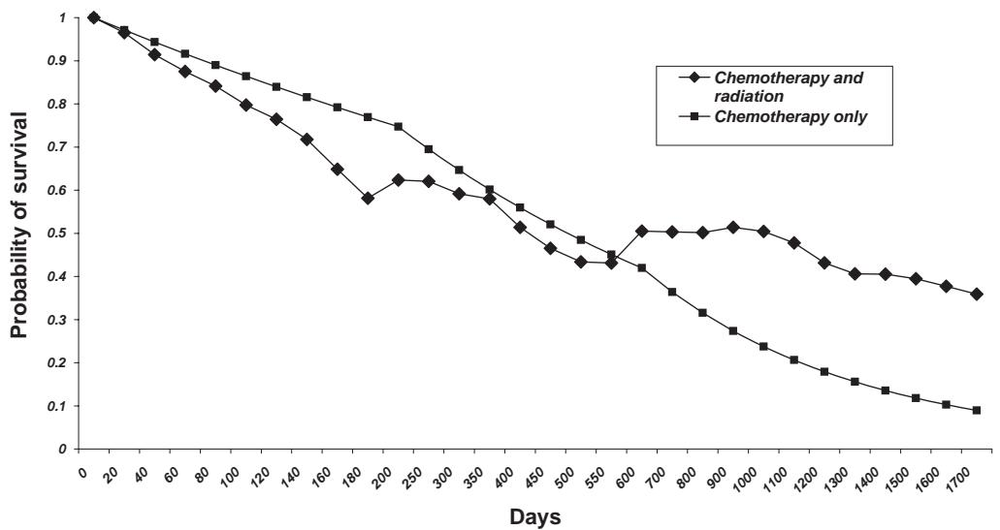  
Figure 13.1 Survival curves under varying treatment effect model.

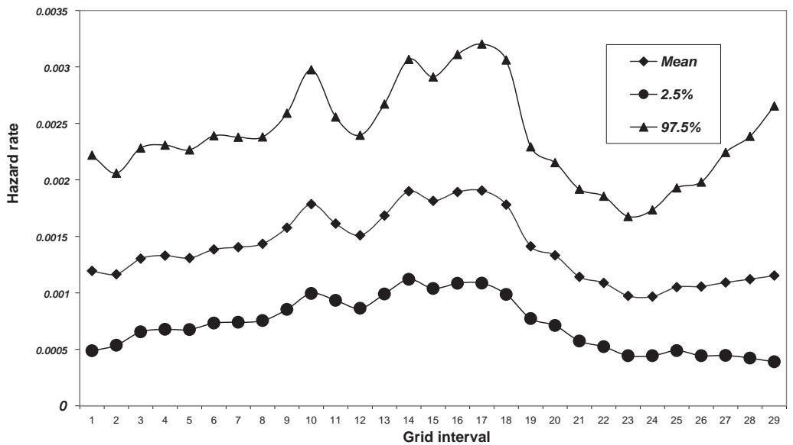  
Figure 13.2 Hazard with constant treatment effect.

impact of the drug treatment in improving survival chances. Survival times are in days, with the number of distinct and uncensored survival times being 122.

Rather than using the full set of failure times to define the grid of intervals $(a_{j-1}, a_j]$ , grid points are based on the 0.05, 0.10, ..., 0.95 percentiles of the failure times. Additionally a knot at 365 days is included to assess the relative 1-year survival rates of different risk groups.

Table 13.3 PBC survival analysis, posterior summary   

<table><tr><td></td><td>Mean</td><td>St devn</td><td>2.5%</td><td>97.5%</td></tr><tr><td>Age</td><td>0.83</td><td>0.22</td><td>0.43</td><td>1.28</td></tr><tr><td>Log(Albumin)</td><td>-2.54</td><td>0.79</td><td>-4.01</td><td>-1.07</td></tr><tr><td>Log(Bilirubin)</td><td>0.78</td><td>0.09</td><td>0.60</td><td>0.97</td></tr><tr><td>Oedema</td><td>0.69</td><td>0.29</td><td>0.10</td><td>1.25</td></tr><tr><td>Log(Prothrombin time)</td><td>2.13</td><td>0.86</td><td>0.89</td><td>4.39</td></tr><tr><td>Treatment group</td><td>0.17</td><td>0.18</td><td>-0.18</td><td>0.52</td></tr><tr><td>One year survival rate, high-risk patient</td><td>0.521</td><td>0.089</td><td>0.345</td><td>0.690</td></tr><tr><td>Five year survival rate, low-risk patient</td><td>0.967</td><td>0.008</td><td>0.948</td><td>0.981</td></tr></table>

Risk variables are $X1 =$ patient age in days (divided by 10000), $X2 = \log(\text{Albumin}), X3 = \log(\text{Bilirubin}), X4 = \text{presence of Oedema and } X5 = \log(\text{Prothrombin time})$ . The Oedema variable is coded as follows:

$0 = \mathrm{no}$ Oedema and no diuretic therapy for Oedema;

$0.5 = \mathrm{Oedema}$ present without diuretics, or Oedema resolved by diuretics;

$1 =$ Oedema despite diuretic therapy.

$N(0,1000)$ priors are assumed on predictor effects while the prior on the cumulative hazard is

$$
H _ {0} \left(a _ {j + 1}\right) - H _ {0} \left(a _ {j}\right) \sim \operatorname {G a} \left(0. 0 0 1 \left[ r a _ {j + 1} - r a _ {j} \right], 0. 0 0 1\right)
$$

with $r = 0.1$ . A two-chain run of 2500 iterations converges from 500, with covariate effects (based on iterations 501-2500) generally reproducing those found by Fleming and Harrington (Table 13.3). There does not appear to be a significant treatment effect. The number of parameters is $d = J + p + 1$ where $J = 21$ and $p = 5$ is the number of predictors. Hence criteria such as the DIC (deviance at posterior mean of parameters plus twice the model dimension) can be obtained directly.

One may define as high risk a patient at the 90th percentiles on predictors $X1$ , $X3$ , $X5$ , and at the 10th percentile on $X2$ and with $X4 = 1$ . Similarly a low-risk patient is at the 10th percentiles of predictors $X1$ , $X3$ , $X5$ , at the 90th percentile on $X2$ , and has $X4 = 0$ . The survival rate of the low-risk patient at 5 years (using the knot $a_9 = 1822$ ) is estimated as 0.97, but the high-risk patient is estimated to have only a 0.52 survival probability at 1 year.

# 13.6 COMPETING RISK-CONTINUOUS TIME MODELS

The modelling of survival or event times can be extended to processes with several possible causes of exit, failure or death. In human mortality applications we may be interested in competing causes of death (e.g. cardiovascular diseases, cancers and other causes) (Lai and Hardy, 1999). For example, Kulathinal and Gasbarra (2002) consider termination of intrauterine device use according to (1) pregnancy, (2) expulsion, (3) amenorrhea, (4) bleeding and pain and (5) hormonal disturbances. More generally in event histories one may frequently be interested in

rates of movement of different types or change of state to several different destinations (Hachen, 1988). In applications to human behaviour (e.g. migration, job mobility) the destinations may be alternative distance bands, occupation groups and so on. In this case it may be possible to effectively never move (i.e. be a permanent 'stayer').

Let $J_{i} \in 1, \ldots, C$ be the cause of exit or type of move, where the $C$ causes are mutually exclusive and exhaustive. Then the survival process governing transitions to states $j = 1, \ldots, C$ for individual $i$ is specified by a destination-specific hazard

$$
h _ {j} \left(t _ {i}\right) \mathrm {d} t = \Pr \left(t _ {i} \leq T <   t _ {i} + \mathrm {d} t, J _ {i} = j \mid T \geq t _ {i}\right),
$$

with the total hazard, assuming independence between destinations, given by

$$
h (t _ {i}) = \sum_ {j = 1} ^ {C} h _ {j} (t _ {i}).
$$

As noted by Gasbarra and Karia (2000) estimation may consider either cause-specific hazards, or the total hazard and the probabilities $\pi_{j}(t_{i}) = \operatorname*{Pr}(J_{i} = j|T = t_{i})$ . Proportionality of cause-specific hazards is then equivalent to failure time and the cause of failure being independent, i.e. $\pi(t) = [\pi_1(t), \dots, \pi_C(t)]$ is constant over $t$ .

The survivor or stayer function is then

$$
\begin{array}{l} S (t _ {i}) = \exp \left[ - \int_ {0} ^ {t _ {i}} h (u) d u \right] \\ = \exp \left[ - \int_ {0} ^ {t _ {i}} h _ {1} (u) \mathrm {d} u - \int_ {0} ^ {t _ {i}} h _ {2} (u) \mathrm {d} u - \dots - \int_ {0} ^ {t _ {i}} h _ {C} (u) \mathrm {d} u \right]. \\ \end{array}
$$

The density $f_{j}(t_{i})$ governing waiting times till the $j$ th type of exit or destination is therefore

$$
\begin{array}{l} f _ {j} \left(t _ {i}\right) \mathrm {d} t = \Pr \left(t _ {i} \leq T <   t _ {i} + \mathrm {d} t, J _ {i} = j \mid T \geq t _ {i}\right) \Pr (T \geq t _ {i}) \\ = h _ {j} \left(t _ {i}\right) S \left(t _ {i}\right). \\ \end{array}
$$

The likelihood is taken over both individuals and all possible causes, with censoring indicators $\delta_{ij} = 1$ if individual $i$ exits for cause $j$ , and $\delta_{ij} = 0$ otherwise. For an individual with $\delta_{ij} = 1$ survival times on other possible causes than $j$ are regarded as censored. A 'stayer' is censored on all possible causes. Extra unknowns follow from a latent failure time interpretation where the observed waiting time is the minimum of $C$ possible latent failure times (e.g. Dignam et al., in press), though the latent failure time concept is not relevant in all applications (Fahrmeir and Wagenpfeil, 1996). Kulathinal and Gasbarra (2002) consider the counting process version of the competing risk model.

If covariates are available their effects may be differentiated according to type of move or exit, as well as the parameters of the hazard function (Davies, 1983). For example, a Weibull model would be parameterised as

$$
h _ {j} \left(t _ {i} \mid X _ {i}\right) = \alpha_ {j} t _ {i} ^ {\alpha_ {j} - 1} \exp \left(X _ {i} \beta_ {j}\right).
$$

In behavioural applications, a competing risk model is most sensible when the decision to leave the current state $j$ and the choice of the future state $k$ are interdependent – for example, in voluntary job exits (Hachen, 1988). For example, predictor effects on the rate of job mobility

Table 13.4 Competing risk model for job moves   

<table><tr><td rowspan="2">Node</td><td colspan="3">Upward</td><td colspan="3">Lateral</td><td colspan="3">Downwards</td></tr><tr><td>Mean</td><td>2.5%</td><td>97.5%</td><td>Mean</td><td>2.5%</td><td>97.5%</td><td>Mean</td><td>2.5%</td><td>97.5%</td></tr><tr><td>Constant</td><td>-2.8</td><td>-4.1</td><td>-1.0</td><td>-4.1</td><td>-4.7</td><td>-3.4</td><td>-3.1</td><td>-4.3</td><td>-2.2</td></tr><tr><td>Education</td><td>0.20</td><td>0.10</td><td>0.30</td><td>-0.07</td><td>-0.12</td><td>-0.01</td><td>-0.11</td><td>-0.21</td><td>-0.02</td></tr><tr><td>Cohort 2</td><td>0.35</td><td>-0.19</td><td>0.83</td><td>0.47</td><td>0.18</td><td>0.76</td><td>0.37</td><td>-0.03</td><td>0.73</td></tr><tr><td>Cohort 3</td><td>0.50</td><td>0.00</td><td>1.01</td><td>0.46</td><td>0.12</td><td>0.78</td><td>0.41</td><td>-0.02</td><td>0.80</td></tr><tr><td>LFEX</td><td>-0.0033</td><td>-0.0078</td><td>0.0006</td><td>-0.0037</td><td>-0.0065</td><td>-0.0011</td><td>-0.0043</td><td>-0.0078</td><td>-0.0012</td></tr><tr><td>PNOJ</td><td>0.128</td><td>-0.069</td><td>0.308</td><td>0.026</td><td>-0.098</td><td>0.148</td><td>0.039</td><td>-0.120</td><td>0.189</td></tr><tr><td>Pres</td><td>-0.149</td><td>-0.172</td><td>-0.125</td><td>0.009</td><td>-0.003</td><td>0.023</td><td>-0.015</td><td>-0.031</td><td>0.006</td></tr><tr><td>Weibull shape</td><td>0.84</td><td>0.72</td><td>0.96</td><td>0.82</td><td>0.76</td><td>0.90</td><td>0.86</td><td>0.75</td><td>0.97</td></tr></table>

LFEX, labour force experience; PNOJ, previous number of jobs; Pres, current prestige.

from low status to high status occupations may differ from predictor effects on moves from intermediate to high status occupations. In that case the hazard or regression parameters may be specific to both $j$ and $k$ .

Example 13.7 Competing risks in occupational mobility Blossfeld and Rohwer (2002, pp. 101-109) report on a competing risks analysis of occupational history data obtained in the German Life History Study, involving 600 job episodes for 201 respondents. Here, $C = 3$ types of move are considered: 84 upward moves involving a prestige gain of $20\%$ or more, 155 downward moves involving any loss of prestige and 219 lateral moves (any other job change). There are 142 episodes that are right censored (no job change). Covariates used to predict mobility are education in years, cohort 2 (born 1939-1948), cohort 3 (born 1949-1951), labour force experience (time in 'century months' at start of episode minus time on entry to labour force), previous number of jobs and current prestige. Although Blossfeld and Rohwer apply an exponential model, they show elsewhere that job mobility declines with duration, so a Weibull model

$$
h _ {j} \left(t _ {i} \mid X _ {i}\right) = \alpha_ {j} t _ {i} ^ {\alpha_ {j} - 1} \exp \left(X _ {i} \beta_ {j}\right) \quad j = 1, \dots , C
$$

is appropriate. $N(0,1000)$ priors are assumed on the 21 regression parameters and $E(1)$ priors on the $\alpha_{j}$ .

A two-chain run of 3000 iterations (convergent from 1000) gives estimates as in Table 13.4. As might be expected from human capital and vacancy competition theory, upward mobility is related to education and negatively to current prestige (the higher up the occupational pyramid, the more opportunities contract); greater labour market experience protects against lateral and downward moves. All types of move show the hazard declining with duration (with $95\%$ intervals for the Weibull shapes entirely under 1).

# 13.7 VARIATIONS IN PRONENESS: MODELS FOR FRAILTY

Comparison of event histories and survival times between members of a population may well suggest heterogeneity among them in their underlying risk (Box-Steffensmeier and De Boef,

in press). The latter source of variability is variously known as proneness, susceptibility or frailty; for recent Bayesian perspectives see Locatelli et al. (2003), Yin and Ibrahim (2005a,b) and Yin (2005). Thus in medical studies with death or relapse as an endpoint, some patients will survive or stay healthy relatively long despite adverse observable risk factors whereas some will survive shorter than expected. Unobserved frailty can be modelled by discrete mixtures on the intercept or by assuming a continuous density for frailty. However, there may also be heterogeneity over subjects in the impact of predictors.

One possible form of model to address heterogeneity in both intercepts and predictors is analogous to the mixed model as in Chapter 11, namely

$$
h \left(t _ {i} \mid X _ {i}, \theta , b _ {i}\right) = h _ {0} \left(t _ {i}\right) \exp \left(X _ {i} \beta + Z _ {i} b _ {i}\right), \tag {13.7}
$$

where $Z_{i}$ is of dimension $q$ , and $b_{i} \sim N_{q}(\mu_{b}, \Sigma_{b})$ is a vector of random effects. Zero mean random effects are appropriate when the $Z_{i}$ are a subset of the $X_{i}$ . When $q = 1$ and $Z_{i} = 1$ , then for identification, either a zero mean for $b_{i}$ is assumed or $X_{i}$ omits an intercept (Sahu et al., 1997). Another possibility is for a mean zero random effect and the hazard level to be modelled by $h_0$ .

Similarly, multiplicative frailty models include positive (e.g. gamma) random effects $w_{i}$ with mean 1 for identification, when $X_{i}$ includes a constant, for example

$$
h \left(t _ {i} \mid X _ {i}, \beta , \eta , w _ {i}, \theta\right) = h _ {0} \left(t _ {i} \mid \theta\right) \exp \left(X _ {i} \beta\right) w _ {i}.
$$

$$
w _ {i} \sim \operatorname {G a} (1 / \eta , 1 / \eta),
$$

with $\eta$ being the frailty variance (e.g. Yin, 2005, p. 554).

One impact of neglected heterogeneity is that covariate effects may be both understated (in absolute terms) and estimated too precisely. Another is that in mortality and failure applications, the overall hazard rate may decline even though hazard rates for subpopulations with different frailty levels are constant; the more frail will tend to undergo the event earlier, so that with increasing time the overall hazard rate will descend to that of the subgroup with the lowest frailty. Consider a population with two subgroups, hazard rates $h_j(t)$ and survivorship rates

$$
S _ {j} (t) = \exp \left[ - \int_ {0} ^ {t} h _ {j} (u) \mathrm {d} u \right] \quad j = 1, 2.
$$

Let $p_1(0)$ and $p_2(0)$ denote the initial subgroup proportions, with $p_1(0) + p_2(0) = 1$ . The proportion of the surviving cohort at time $t$ that comes from the first subgroup is then

$$
p _ {1} (t) = p _ {1} (0) S _ {1} (t) / \left[ p _ {1} (0) S _ {1} (t) + p _ {2} (0) S _ {2} (t) \right],
$$

and the hazard rate for the entire cohort at time $t$ is

$$
h _ {e} (t) = p _ {1} (t) h _ {1} (t) + p _ {2} (t) h _ {2} (t).
$$

If the first subgroup is more robust then it will come to dominate the population hazard rate.

Frailty models are commonly used for modelling correlated processes with multivariate survival outcomes or repeated events (Sahu and Dey, 2004), and hence for joint modelling of survival and longitudinal data (Ratcliffe et al., 2004). They are also used for nested outcomes, for example, survival of patients by hospital. For example, Gustafson (1995) considers

multiplicative frailty for multivariate nested data with the hazard for patient $i$ , hospital $j$ and outcome $k$ . A typical model for this type of data might be

$$
h _ {j k} \left(t _ {i j k} \mid X _ {i j}, \zeta_ {j}, w _ {i k}\right) = h _ {0 j k} \left(t _ {i j k} \mid \theta_ {j k}\right) \exp \left(X _ {i j} \beta_ {j k}\right) w _ {i k} \zeta_ {j},
$$

where the $\beta_{j}$ model hospital effects on each outcome, $\zeta_{j}$ are gamma hospital frailties and $w_{ik}$ are patient frailties specific to outcomes.

A semiparametric form of the AFT model provides opportunities for modelling frailty. Consider the AFT model

$$
t _ {i} = \exp (X _ {i} \beta) V _ {i},
$$

or in the log scale

$$
\log (t _ {i}) = X _ {i} \beta + \varepsilon_ {i}.
$$

Instead of standard assumptions regarding $V$ or $\varepsilon$ , one may model their density nonparametrically, for example via a Dirichlet process or Polya tree prior (Walker and Mallick, 1999). This amounts to semiparametric intercept variation. A discrete mixture with known small number of groups is also possible, with a two-group mixture representing high- and low-frailty subjects.

Example 13.8 Veterans lung cancer survival To allow for heterogeneity in survival in the data from Example 13.1, a discrete mixture of parametric hazards (with known number of components) is one possible approach. This allows ready extension to include mixing on the hazard and regression parameters, as well as just the level, whereas a continuous mixture is most flexible for intercept variation only. Here only the intercept (i.e. the overall level of frailty) is allowed to vary between groups, and a two-group mixture is adopted. Extension to varying Weibull slopes is left as an exercise. A Dirichlet prior on the mixing proportions $\pi_{1}$ and $\pi_{2}$ is used with equal prior weights of 1 on each group.

The last 9000 of a two-chain run of 10000 iterations leads to estimates of $\pi_1 = 0.26$ and $\pi_2 = 0.74$ with means $\beta_{01} = -6.39$ and $\beta_{02} = -4.36$ (Table 13.5). So a small low-mortality group is distinguished. The Weibull parameter becomes more clearly above 1, with an average of 1.51 and $95\%$ interval from 1.12 to 1.76. Among the covariate effects, the impact of the Karnofsky score in particular is enhanced.

Example 13.9 Small cell lung cancer Ying et al. (1995) consider survival times for 121 small cell lung cancer patients involving a cross-over trial for two drugs (etoposide E and cisplatin C); 62 patients are randomised to arm A (C followed by E), whereas arm B has E followed by C. Apart from treatment ( $X_{1} = 1$ for arm B patients, $X_{1} = 0$ for arm A), patient age at entry to trial ( $X_{2}$ ) is another predictor – which a Cox regression suggests significantly enhances mortality (i.e. that age is negatively related to survival time). A Cox regression also shows a negative effect of arm B on survival.

As a baseline for these data, a logistic model is here adopted for natural logs of the survival times (Ying et al. consider log10 transformed times), in line with an AFT log-logistic survival

Table 13.5 Veterans cancer data, parameter estimates   

<table><tr><td></td><td>Mean</td><td>St devn</td><td>2.5%</td><td>97.5%</td></tr><tr><td colspan="5">Single group model</td></tr><tr><td>Constant</td><td>-4.26</td><td>0.55</td><td>-5.35</td><td>-3.13</td></tr><tr><td>Karnofsky score</td><td>-0.26</td><td>0.06</td><td>-0.37</td><td>-0.14</td></tr><tr><td>Prior therapy (PT)</td><td>1.95</td><td>0.65</td><td>0.65</td><td>3.21</td></tr><tr><td>Small cell type</td><td>0.72</td><td>0.25</td><td>0.23</td><td>1.20</td></tr><tr><td>Adeno cell type</td><td>1.16</td><td>0.29</td><td>0.58</td><td>1.73</td></tr><tr><td>Large cell type</td><td>0.30</td><td>0.27</td><td>-0.24</td><td>0.81</td></tr><tr><td>PT × Karnofsky</td><td>-0.32</td><td>0.11</td><td>-0.53</td><td>-0.10</td></tr><tr><td>α (Weibull parameter)</td><td>1.11</td><td>0.07</td><td>0.96</td><td>1.25</td></tr><tr><td colspan="5">Two group model</td></tr><tr><td>Probability (group 1)</td><td>0.26</td><td>0.12</td><td>0.10</td><td>0.59</td></tr><tr><td>Probability (group 2)</td><td>0.74</td><td>0.12</td><td>0.41</td><td>0.90</td></tr><tr><td>Constant (group 1)</td><td>-6.39</td><td>1.01</td><td>-8.16</td><td>-4.07</td></tr><tr><td>Constant (group 2)</td><td>-4.36</td><td>0.77</td><td>-5.90</td><td>-2.82</td></tr><tr><td>Karnofsky score</td><td>-0.48</td><td>0.08</td><td>-0.65</td><td>-0.31</td></tr><tr><td>Prior therapy (PT)</td><td>1.97</td><td>0.61</td><td>0.83</td><td>3.22</td></tr><tr><td>Small cell type</td><td>0.86</td><td>0.35</td><td>0.10</td><td>1.50</td></tr><tr><td>Adeno cell type</td><td>1.05</td><td>0.42</td><td>0.19</td><td>1.84</td></tr><tr><td>Large cell type</td><td>0.14</td><td>0.38</td><td>-0.64</td><td>0.87</td></tr><tr><td>PT × Karnofsky</td><td>-0.32</td><td>0.10</td><td>-0.53</td><td>-0.14</td></tr><tr><td>α (Weibull parameter)</td><td>1.51</td><td>0.12</td><td>1.29</td><td>1.76</td></tr></table>

mechanism (Collett, 1994). So

$$
\log \left(t _ {i}\right) \sim L \left(\gamma_ {0} + \gamma_ {1} x _ {1 i} + \gamma_ {2} x _ {2 i}, 1 / \kappa\right) I \left(t _ {i} ^ {*},\right),
$$

with priors $\gamma_{j} \sim N(0, 1000)$ , and $\kappa \sim \mathrm{Ga}(1, 0.001)$ , and where $t^{*}$ represents times at censoring, or 0 when failure times are observed. The median survival formulae are monitored for patients aged 62 (cf. Ying et al. who find a median survival time of 603 days in arm A for patients of this age). Iterations 1001-10000 of a two-chain run show posterior means on $\{\gamma_0, \gamma_1, \gamma_2\}$ of $\{7.47, -0.42, -0.015\}$ with the $95\%$ intervals for treatment and age being $(-0.71, -0.14)$ and $(-0.033, 0.001)$ respectively. So age is strictly not significant in diminishing survival times, but assignment to arm B does significantly reduce survival time. The median survival times under arms A and B (for patients aged 62) are estimated as 686 and 450 days.

A non-parametric frailty effect is first introduced in the form of a two-group discrete mixture for $\gamma_0$ . A monotonicity constraint $\gamma_{02} > \gamma_{01}$ is used for identification, with the increment $\delta = \gamma_{02} - \gamma_{01}$ assumed to be $N(0,1)$ . A Dirichlet prior on the probabilities $\pi_k$ of each intercept is assumed, with prior weight of 1 on each probability. The average intercept (required for obtaining median survival times) is estimated at each iteration as $\gamma_0 = \pi_1\gamma_{01} + \pi_2\gamma_{02}$ . Age and treatment effects are similar to the first model, with posterior means $-0.014$ $(-0.030, 0.0006)$ and $-0.41$ $(-0.67, -0.16)$ . The estimated median survival times are, however, increased to 476

(arm B) and 721 (arm A). This method detects a minority population with extended survival $(\pi_{2} = 0.26$ and $\gamma_{02} = 8.38)$

A third model draws on the principles of the analysis of these data by Walker and Mallick (1999), who use a Polya tree prior on the errors $\varepsilon$ in

$$
\log (t _ {i}) = \gamma_ {0} + \gamma_ {1} x _ {1 i} + \gamma_ {2} x _ {2 i} + \varepsilon_ {i}.
$$

Here a Dirichlet process prior (DPP) is adopted on varying intercepts rather than the errors directly, with

$$
\log \left(t _ {i}\right) \sim L \left(\gamma_ {0 L _ {i}} + \gamma_ {1} x _ {1 i} + \gamma_ {2} x _ {2 i}, 1 / \kappa\right) I \left(t _ {i} ^ {*},\right),
$$

$$
L _ {i} \sim \operatorname {C a t e g o r i c a l} \left(p _ {1}, p _ {2}, \dots , p _ {M}\right),
$$

where $M = 20$ , and $p = (p_1, p_2, \dots, p_M)$ is generated using a stick-breaking prior. With $r_1, r_2, \dots, r_{M-1}$ being $\mathrm{Beta}(1, \lambda)$ random variables (and $r_M = 1$ ), this involves setting $p_1 = r_1$ , $p_2 = r_2(1 - r_1)$ , $p_3 = r_3(1 - r_2)(1 - r_1)$ , ..., $p_M = r_M(1 - r_{M-1})(1 - r_{M-2}) \dots (1 - r_1)$ . $\lambda$ is assigned a $\mathrm{Ga}(5, 1)$ prior but sensitivity analysis to assuming different preset $\lambda$ values, or other priors on $\lambda$ can be adopted. The baseline density for the intercepts is

$$
\gamma_ {0 j} \sim N (\mu_ {g}, 1 / \tau_ {g}), j = 1, \dots , M,
$$

where $\mu_g \sim N(7, 1)$ and $\tau_g \sim \mathrm{Ga}(1, 1)$ . The relatively informative prior for $\mu_g$ is based on the earlier standard parametric analysis.

The resulting plot of the posterior means of the intercepts, based on iterations 1000-20000 of a two-chain run, suggests positive skew or even bimodality, namely, some individuals with unusually high survival chances (Figure 13.3). The median number of clusters is 15. The median survival times for the two arms are estimated as 489 (arm B) and 723 (arm A), very close to the estimates under the simpler two-group discrete mixture model.

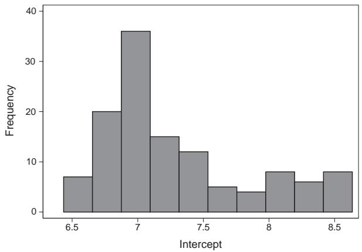  
Figure 13.3 Histogram of varying intercepts (DPP model).

Another possibility for a non-parametric approach (analysis left to the reader) involves a DPP on multiplicative factors to produce varying scale (non-parametric scale mixing) with

$$
\log (t _ {i}) \sim L \left(\gamma_ {0} + \gamma_ {1} x _ {1 i} + \gamma_ {2} x _ {2 i}, 1 / [ \kappa v _ {i} ]\right) I \left(t _ {i} ^ {*},\right),
$$

$$
v _ {i} = \eta [ L _ {i} ],
$$

$$
L _ {i} \sim \operatorname {C a t e g o r i c a l} \left(p _ {1}, p _ {2}, \dots , p _ {M}\right).
$$

The baseline density for the scale-mixing parameters is

$$
\eta_ {j} \sim \operatorname {G a} (\phi , \phi), \qquad j = 1, \dots , M,
$$

where $\phi \sim E(1)$ . This approach may be relevant in the case outlier points were suspected.

# 13.8 DISCRETE TIME SURVIVAL MODELS

Even when events occur in continuous time, many event histories actually record only the nearest month or year (e.g. marital or job histories). Adopting a continuous time analysis in the presence of many tied failure times would give inconsistent estimates (Prentice and Gloeckler, 1978). Sometimes durations may be grouped by definition – for example the number of menstrual cycles to conception after marriage, or number of school years before removal (Muthen and Masyn, 2005).

Suppose the time scale is partitioned into $J$ intervals $(a_{j - 1},a_j], j = 1,\dots ,J$ , not necessarily of equal length, with $a_0 = 0$ , and $a_J$ equalling the maximum observed time, censored or failure. Censoring (an individual exits in an interval without failure being recorded, e.g. due to dropout) is assumed to occur at the end of intervals. The observed survival times $T_{i}$ define a discrete value $j$ in the range $\{1,\ldots ,J\}$ if $a_{j - 1}\leq T < a_{j}$ (written as $T_{i} = j$ ), with failure occurring in the $j$ th interval if $a_{j - 1}\leq T_i < a_j$ and $\delta_i = 1$ . The actual location of the failure during the interval is usually not known.

Conditional on time constant and time-varying predictors, $X_{i}$ and $Z_{ij}$ respectively, the discrete hazard of failure in interval $j$ given survival till then is the conditional probability

$$
h \left(T _ {i} = j \mid X _ {i}, Z _ {i j}\right) = \Pr (T = j \mid T \geq j, X _ {i}, Z _ {i j}) = F \left(\alpha_ {j} + X _ {i} \beta_ {j} + Z _ {i j} \gamma_ {j}\right) \tag {13.8}
$$

where $F$ is a distribution function. A common approach to modelling this probability (Kalbfleisch and Prentice, 1980) assumes an EV distribution function

$$
F (\eta) = 1 - \exp \left\{- \exp (\eta) \right\},
$$

leading to a complementary log-log link for $h$ . This can be obtained from assuming an underlying continuous survival process and proportional hazard effects. Another possibility (Thompson, 1977) is a logit link for $h$ , with

$$
F (\eta) = \exp (\eta) / [ 1 + \exp (\eta) ]. \tag {13.9}
$$

The impact of time can be modelled flexibly within the regression term $\eta$ , for example via a random walk (Fahrmier, 1994), via a polynomial function (Efron, 1988) or via any time series prior, for example a hidden Markov chain (Kozumi, 2000). If a distinct intercept or regression

parameter is assumed for each interval, a random walk prior should adjust for any differential spacing between intervals; e.g. in an RW1 prior, the variance $V_{j}$ of $\alpha_{j}$ or $\beta_{j}$ is proportional to $\mathbf{a}_{j} - \mathbf{a}_{j-1}$ , as in

$$
\alpha_ {j} \sim N \left(\alpha_ {j - 1}, V _ {j}\right), \tag {13.10}
$$

$$
V _ {j} = \tau_ {\alpha} (a _ {j} - a _ {j - 1}),
$$

$$
1 / \tau_ {\alpha} \sim \operatorname {G a} \left(g _ {\alpha}, h _ {\alpha}\right).
$$

It is apparent from (13.8) that non-proportional regression effects are modelled relatively simply. Sometimes, assuming a separate $\beta_{j}$ or $\gamma_{j}$ for each interval may lead to excess parameterisation and not improve on the fit of a constant effect (proportional hazard) model with

$$
h _ {i} (j \mid X _ {i}, Z _ {i j}) = \Pr (T = j \mid T \geq j, X _ {i}, Z _ {i j}) = F (\alpha_ {j} + X _ {i} \beta + Z _ {i j} \gamma).
$$

Singer and Willett (2003, Chapter 12) consider less heavily parameterised but still nonproportional regression effects, for example, a quadratic effect

$$
\beta_ {j} = \phi_ {1} j + \phi_ {2} j ^ {2},
$$

or a change point model

$$
\beta_ {j} = \phi_ {1} + \phi_ {2} I (j \geq J _ {0}).
$$

The survival function (the probability of surviving beyond the $j$ th interval) is a cumulated product of the probabilities of not failing,

$$
S _ {j} = \operatorname * {P r} (T > j) = \prod_ {k = 1} ^ {j} [ 1 - h _ {i} (k | X _ {i}, Z _ {i k}) ].
$$

Someone exiting in the $j$ th interval due to censoring (with no events observed) has likelihood

$$
\prod_ {k = 1} ^ {j} [ 1 - h _ {i} (k | X _ {i}, Z _ {i k}) ],
$$

while a first failure during the $j$ th interval has likelihood

$$
h _ {i} (j | X _ {i}, Z _ {i j}) \prod_ {k = 1} ^ {j - 1} [ 1 - h _ {i} (k | X _ {i}, Z _ {i k}) ].
$$

Suppose subject $i$ is observed for $J_{i}$ intervals. The above likelihoods are for single events, but the likelihood may be defined for repeatable events, e.g. $k$ events may be observed at $T = j_{1},\ldots ,T = j_{k}$ , but the individual is censored (does not undergo a further event) when observation on him/her ceases at $J_{i}$ .

Hence the likelihood involves Bernoulli sampling over individuals $i$ and intervals $j = 1, \ldots, J_i$ , with probabilities $h_{ij} = h_i(j|X_i, Z_{ij})$ or $1 - h_{ij}$ modelled via complementary log-log or logit links. So an individual undergoing a first event at time $J_i$ will have $y_{ij} = 0$ for $j = 1, \ldots, J_{i-1}$ , and $y_{i, J_i} = 1$ . Augmented data sampling is another possibility (Albert and Chib, 1993).

The Bernoulli likelihood is appropriate when there is only one type of risk or failure. Suppose there are competing risks with $C$ possible destinations from the current state (e.g. $C = 3$ if options are full-time job, part-time job, or retire, when current state is unemployment). When a move takes place then the binary observation is replaced by a categorical observation, $y_{ijk} \in (1, \dots, C)$ , and a multiple logit model is relevant (Fahrmeir and Wagenpfeil, 1996). Note that regression and hazard parameters are identified for all $C$ causes as the current state is the reference.

Frailty effects can be included in the regression term $\eta$ or possibly multiplicatively via a beta prior. This is especially relevant in multilevel applications of discrete hazard regression (Lewis and Raftery, 1999; Manda and Meyer, 2005) or models for multiple events (Sinha and Ghosh, 2005), but is also used in single-level models to counter selection effects: those most at risk of the event make an early exit leaving an at-risk population disproportionately composed of lower risk subjects. Including a frailty term makes more sense when there are several covariates available as frailty variation emerges in the contrast between attributes and failure (or state change) behaviour.

Example 13.10 Head and neck cancer Efron (1988) considered hazard functions $h(T = j|X)$ as in (13.8) for 96 patients with head and neck cancer, randomized to radiation-only treatment (arm A, 51 patients) or chemotherapy and radiation (arm B, 45 patients). The data were originally in days of survival but are recoded to months, where $j = 1$ for a survival time under 30.44 days, $j = 2$ for survival times 30.44-60.88, etc. The maximum time observed in group A is 47 months and in group B, 76 months. Here the time partition $\{0, 1, 2, \dots, 43, 44, 45, 50, 55, 60, 65, 75, 80\}$ is assumed with $J = 51$ intervals, six of which are of length 5 months.

Efron (1988) fits a cubic spline with a logit link, namely

$$
\operatorname {l o g i t} [ h (t) ] = \beta_ {0} + \beta_ {1} t + \beta_ {2} (t - 1 1) _ {-} ^ {2} + \beta_ {3} (t - 1 1) _ {-} ^ {3}
$$

where $(t - 11)_{-} = \min (0, t - 11)$ . This model is applied here with a complementary log-log link, and with coefficients $\{\beta_0, \dots, \beta_3\}$ differentiated by treatment group (model A). $N(0, 1000)$ priors are assumed on the coefficients. The second half of a 10 000-iteration run shows excess mortality in group A (see Figure 13.4) with a DIC of 548 ( $d_e = 6.7$ ).

Fahrmeir and Wagenpfeil (1996) argue that greater flexibility in parameterising piecewise exponential and discrete time hazards is achieved by random effects modelling. Fahrmeir (1994) assumes random walks, as in (13.10), differentiated by treatment group. Here (model B) we assume a common random walk for both treatment arms and take $\alpha_{1} \sim N(0, 1000)$ and $1 / \tau_{\alpha} \sim \mathrm{Ga}(1, 1)$ ; allowing a different random walk for each treatment group is left as an exercise. So

$$
F \left(\eta_ {i j}\right) = 1 - \exp \left\{- \exp \left(\eta_ {i j}\right) \right\} \quad i = 1, n; j = 1, \dots , J _ {i},
$$

$$
\eta_ {i j} = \alpha_ {j} + \beta_ {G _ {i}},
$$

where $G_{i}$ denotes treatment group. If both $\beta_{\mathrm{A}}$ and $\beta_{\mathrm{B}}$ are taken as unknowns, the level of the random walk is not identified, and so the $\alpha_{j}$ parameter estimates are recentred at each iteration.

Here the second half of a 5000-iteration two-chain run shows a better fit for a random walk model - a DIC of 544 ( $\mathrm{d}_e = 11.5$ ). Figure 13.5 shows the excess mortality (extra deaths per month) under the radiation-only treatment.

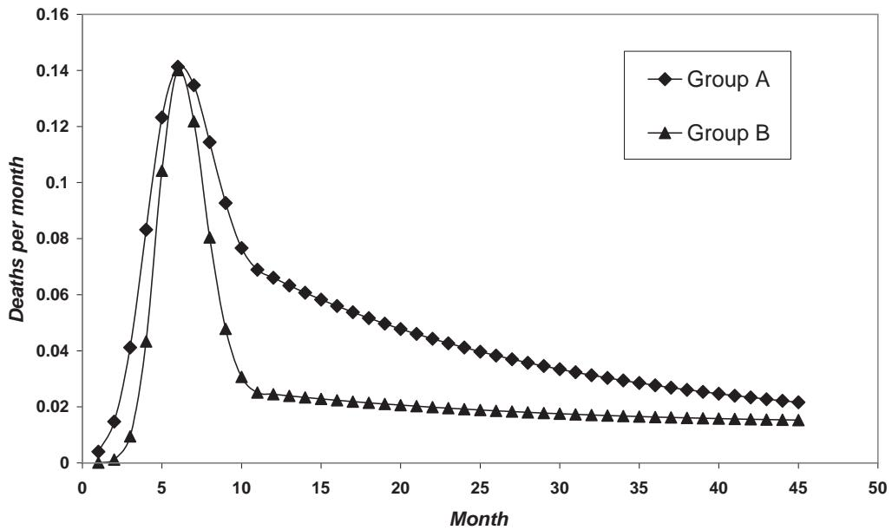  
Figure 13.4 Spline hazard by treatment group.

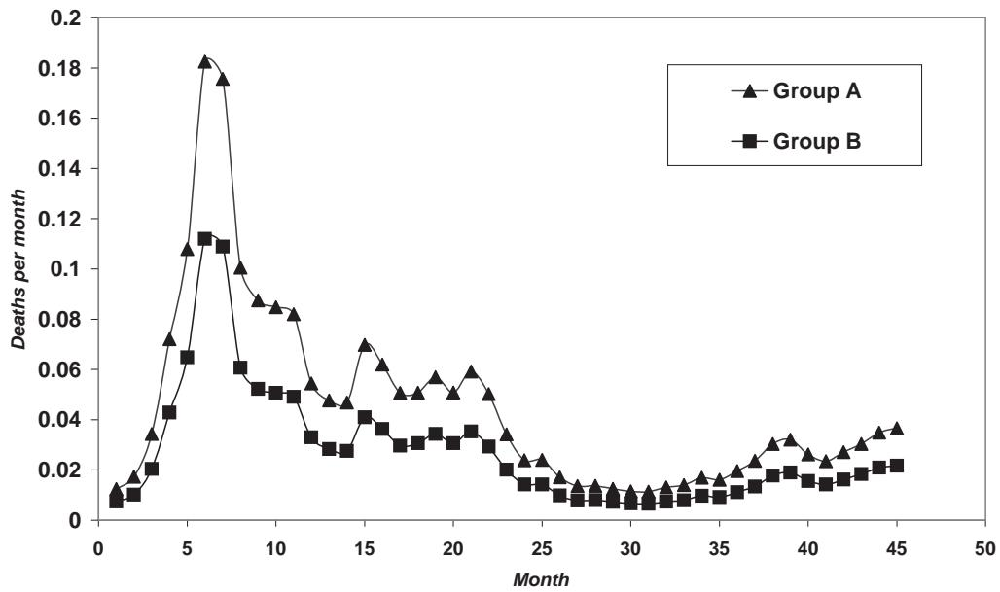  
Figure 13.5 Random walk hazard by treatment group.

Example 13.11 Math dropout Non-proportional regression effects in discrete hazard modelling may be illustrated by data from Singer and Willett (2003) on dropout from mathematics courses among 3790 high-school students followed through 11th grade, 12th grade and the first three semesters of college. A single constant predictor is student gender ( $X = 1$ for females, $X = 0$ for males). Singer and Willett report that female students were more likely to quit and that this differential seemed to grow over time. A logit link as in (13.9) is used, with model structure

$$
h (j | X _ {i}) = F (\alpha_ {j} + X _ {i} \beta_ {j}).
$$

There are only five time points, so a random effects model for varying intercept or regression effects is not necessarily preferred to a fixed effects model. Instead a simplification of the $\{\alpha_{j},\beta_{j}\}$ series (e.g. as linear or quadratic functions in time) may achieve a better fit.

A model with constant effect of female gender has DIC of 9816 ( $d_{e} = 6$ ), with the last 1500 of a two-chain run of 2000 iterations giving posterior means (sd) for the parameters as follows: $\alpha = (-2.13(0.06), -0.94(0.05), -1.45(0.06), -0.62(0.08), -0.78(0.14)$ and $\beta = 0.38(0.05)$ . By contrast, a general time-varying effect of gender (via period-specific fixed effects) gives no improvement in fit, namely a DIC of 9816.5 with $d_{e} = 10.1$ . It is apparent that the first period effect in this model is not significant, namely $\beta_{1} = 0.16$ with $95\%$ interval $(-0.04, 0.35)$ , whereas those for later periods show an (irregular) increase, with the mean for $\beta_{5}$ being 0.61. Hence a linear trend in the $\beta_{j}$ via a model with $\beta_{j} = \phi \times j$ or $\beta_{j} = \phi \times (j - 1)$ might be tried.

# EXERCISES

1. In Example 13.1, fit a non-proportional model where the Weibull shape parameter differs between squamous $(\alpha_{1})$ and the other cell types (a common parameter $\alpha_{2}$ for all three other types) (Aitkin et al., 2005). Obtain the posterior probability that $\alpha_{1} > \alpha_{2}$ .   
2. In Example 13.1, assess the health status score effect for nonlinearity using one of the techniques from Chapter 10, for example a quadratic spline with knots at 25, 35, 45, 55, 65, 75 and 85. How does this affect the estimate of the Weibull shape parameter or the formal model choice assessment against the exponential option via the discrete prior on $\alpha$ ?   
3. In Example 13.2 compare a 5-point discrete mixture on the log-logistic shape parameter with the variable scale model to downweight aberrant cases, namely $u_{i} \sim L(\eta_{i}, 1 / (\kappa \theta_{i}))$ where $\theta_{i}$ are gamma with mean 1, and $u_{i} = \log (t_{i})$ .   
4. Fit the gastric cancer data in Example 13.5 using a grid ( $J = 78$ intervals) defined using every distinct failure time.   
5. In Example 13.8 include a two-component discrete model varying on the Weibull slope as well as the regression intercept. Sample replicate times from this model to ascertain whether the $95\%$ intervals of replicate data $t_{i,\mathrm{rep}}$ contain the actual times (observed failures only). Also include code to obtain Monte Carlo estimates of CPOs and assess any subjects not well fitted by the model. Finally consider the predictive criterion $C$ of Ibrahim et al. (2001), adapted to allow for latent failure times $t_{\mathrm{cens}}$ of censored cases, as well as observed failure times $t_{\mathrm{obs}}$ . Let $D = (t_{\mathrm{obs}}, t^{*})$ where $t^{*}$ are the censoring times. This is best implemented by

obtaining posterior means $\nu_{i} = E(t_{i,\mathrm{rep}}|D)$ and $\xi_{i} = E(t_{i,\mathrm{rep}}^{(2)}|D)$ for the replicate data $t_{i,\mathrm{rep}}$ from an initial run. Then a second run is made sampling $t_{\mathrm{cens}}^{(r)}$ for iterations $r = 1, \ldots, R$ and obtaining

$$
C = \sum_ {i = 1} ^ {n} \left(\xi_ {i} - v _ {i} ^ {2}\right) + \frac {k}{(k + 1)} \left[ \sum_ {t _ {i}} \left(v _ {i} - t _ {i}\right) ^ {2} + \sum_ {t _ {i}} \sum_ {\text {c e n s o r e d}} \sum_ {r = 1} ^ {R} \left(v _ {i} - t _ {\text {c e n s}} ^ {(r)}\right) ^ {2} / R \right],
$$

with $k > 0$ defining the balance between precision and bias in $C$ .

6. In Example 13.9 (small cell lung cancer), find the median survival times under each group in the two-group discrete mixture model (i.e. four possible median survival times, one for each group and each arm). Also assess by any suitable procedure (e.g. the posterior predictive loss method used by Sahu et al., 1997) whether adding a third group improves fit.   
7. In Example 13.10 (head and neck cancer), retaining the existing time partition, fit a random walk intercept model with the prior differentiated by treatment group. Second, redefine the partition to have equal intervals (e.g. of length 1 month or 2 months) and use a conditionally autoregressive (CAR) prior to fit the RW1 model. This avoids the need to re-centre the random walk parameters at each iteration.   
8. In Example 13.11 (math dropout), try a linear trend model for the effect of female gender and compare its fit to the general time-varying regression effect model $h(T = j|X_i) = F(\alpha_j + X_i\beta_j)$ .

# REFERENCES

Aaberge, R. (2002) Characterization and measurement of duration dependence in hazard rates models. Memorandum 7/2002, Frisch Centre, University of Oslo.   
Abrams, K., Ashby, D. and Errington, D. (1996) A Bayesian approach to Weibull survival models: an application to a cancer clinical trial. *Lifetime Data Analysis* 2, 159-174.   
Aitkin, M. and Clayton, D. (1980) The fitting of exponential, Weibull and extreme value distributions to complex censored survival data using GLIM. Journal of the Royal Statistical Society, Series C, 29, 156-163.   
Aitkin, M., Anderson, D., Francis, B. and Hinde, J. (1989) Statistical Modelling in GLIM. Oxford University Press: Oxford.   
Aitkin, M., Francis, B. and Hinde, J. (2005) Statistical Modelling in GLIM4 (2nd edn). Oxford University Press: Oxford.   
Albert, J. and Chib, S. (1993) Bayesian analysis of binary and polychotomous response data. Journal of the American Statistical Association, 88, 669-679.   
Arjas, E. and Gasbarra, D. (1994) Nonparametric Bayesian inference for right-censored survival data, using the Gibbs sampler. Statistica Sinica, 4, 505-524.   
Beamonte, E. and Bermudez, J. (2003) A Bayesian semiparametric analysis for additive hazard models with censored observations. *Test*, 12, 347–363.   
Bedrick, E., Christensen, R. and Johnson, W. (2000) Bayesian accelerated failure time analysis with application to veterinary epidemiology. Statistics in Medicine, 19, 221-237.   
Bennett, S. (1983) Log-logistic regression models for survival data. Applied Statistics, 32, 165-171.

Berger, J.O. and Sun, D. (1993) Bayesian analysis for the poly-Weibull distribution. Journal of the American Statistical Association, 88, 1412-1418.   
Blossfeld, H. and Rohwer, G. (2002) Techniques of Event History Modeling: New Approaches to Causal Analysis (2nd edn). Lawrence Erlbaum: Majwah, NJ.   
Box-Steffensmeier, J. and De Boef, S. (in press) Repeated events survival models: the conditional frailty model. Statistics in Medicine.   
Burridge, J. (1981). Empirical Bayes analysis of survival time data. Journal of the Royal Statistical Society, Series B, 43, 65-75.   
Cai, T., Hyndman, R. and Wand, M. (2000) Mixed model-based hazard estimation. Journal of Computational and Graphical Statistics, 11, 784-798.   
Campolieti, M. (2001) Bayesian semiparametric estimation of discrete duration models: an application of the Dirichlet process prior model. Journal of Applied Econometrics, 16, 1-22.   
Chiang, C. (1968) Introduction to Stochastic Processes in Biostatistics. John Wiley & Sons, Ltd/Inc.: New York.   
Clayton, D. (1991) A Monte Carlo method for Bayesian inference in frailty models. Biometrics, 47, 467-485.   
Cockx, B. and Dejemeppe, M. (2002) Duration dependence in the exit rate out of unemployment in Belgium: is it true or spurious? IZA Discussion Papers, No. 632, Université Catholique de Louvain.   
Collett, D. (1994) Modelling Survival Data in Medical Research. Chapman & Hall: London.   
Congdon, P. (2001) Bayesian Statistical Modeling (1st edn). John Wiley & Sons, Ltd/Inc.: Chichester.   
Cox, D.R. (1972) Regression models and life-tables. Journal of the Royal Statistical Society, Series B, 34, 187-220.   
Cox, D. and Oakes, D. (1984) Analysis of Survival Data. Chapman & Hall: London.   
Davies, R. (1983) Destination dependence: a re-evaluation of the competing risk approach. *Environment and Planning*, 15A, 1057–1065.   
Dellaportas, P. and Smith, A. (1993) Bayesian inference for generalized linear and proportional hazards models via Gibbs sampling. Journal of the Royal Statistical Society, Series C, 42, 443-460.   
Dignam, J., Wieand, K. and Rathouz, P. (in press) A missing data approach to semi-competing risks problems. Statistics in Medicine.   
Dunson, D. and Herring, A. (2005) Bayesian model selection and averaging in additive and proportional hazards. *Lifetime Data Analysis*, 11, 213-232.   
Dykstra, R. and Laud, P. (1981) A Bayesian nonparametric approach to reliability. Annals of Statistics, 9, 356-367.   
Efron, B. (1988) Logistic regression, survival analysis, and the Kaplan-Meier curve. Journal of the American Statistical Association, 83, 414-425.   
Fahrmeir, L. (1994) Dynamic modelling and penalised likelihood estimation for discrete time survival data. Biometrika, 81, 317-330.   
Fahrmeir, S. and Wagenpfeil, S. (1996) Smoothing hazard functions and time-varying effects in discrete duration and competing risks models. Journal of the American Statistical Association, 91, 1584-1594.   
Fahrmeir, L. and Knorr-Held, L. (1997) Dynamic discrete-time duration models: estimation via Markov Chain Monte Carlo. Sociological Methodology, 27, 417-452.   
Fahrmeir, L. and Lang, S. (2001) Bayesian inference for generalized additive mixed models based on Markov random field priors. Applied Statistics, 50, 201-220.   
Fahrmeir, L. and Hennerfeind, A. (2003) Nonparametric Bayesian hazard rate models based on penalised splines. Discussion Paper, No. 361, SFB Munich.   
Fleming, T., Harrington, D. (1991) Counting Processes and Survival Analysis. New York: Wiley.   
Gamerman, D. (1991) Dynamic Bayesian models for survival data. Applied Statistics, 40, 63-79.   
Gasbarra, D. and Karia, S.R. (2000).

Gehan, E. (1965) A generalized Wilcoxon test for comparing arbitrarily singly-censored samples. Biometrika, 52, 203-223.   
Ghosh, S. and Ghosal, S. (2006) Semiparametric accelerated failure time models for censored data. In Bayesian Statistics and Its Applications, Upadhyay, S., Singh, U. and Dey, D. (eds). Anamaya Publishers: New Delhi, India.   
Gilbert, P.B., McKeague, I.W. and Sun, Y. (2004) Tests for comparing mark-specific hazards and cumulative incidence functions. *Lifetime Data Analysis*, **10**, 5–28.   
Gustafson, P. (1995) A Bayesian analysis of bivariate survival data from a multicentre cancer clinical trial. Statistics in Medicine, 14, 2523-2535.   
Gustafson, P., Aeschliman, D. and Levy, A. (2003) A simple approach to fitting Bayesian survival models. *Lifetime Data Analysis*, 9, 5-19.   
Hachen, D. (1988) The competing risks model. Sociological Methods and Research, 17, 21-54.   
Harrell, F.E. (2001) Regression Modeling Strategies with Applications to Linear Models, Logistic Regression, and Survival Analysis. Springer: New York.   
Hougaard, P. (1999) Fundamentals of survival data. Biometrics, 55, 13-22.   
Hougaard, P. (2001) Analysis of Multivariate Survival Data. Springer: New York.   
Ibrahim, J., Chen, M. and Sinha, D. (2001) Bayesian Survival Analysis. Springer: New York.   
Ibrahim, J. and Chen, M. (2000). Power prior distributions for regression models. Statistical Science, 15, 46-60.   
Kalbfleisch, J. (1978) Nonparametric Bayesian analysis of survival time data. Journal of the Royal Statistical Society, Series B, 40, 214-221.   
Kalbfleisch, J. and Prentice, R. (1980) The Statistical Analysis of Failure Time Data. John Wiley & Sons, Ltd/Inc.: New York.   
Kim, Y. (1999) Nonparametric Bayesian estimators for counting processes. Annals of Statistics, 27, 562-588.   
Kim, M.Y., De Gruttola, V.G. and Lagakos, S.W. (1993) Analyzing doubly censored data with covariates, with application to AIDS. Biometrics, 49, 13-22.   
Kim, S.W. and Ibrahim, J.G. (2000) On Bayesian inference for parametric proportional hazards models using noninformative priors. *Lifetime Data Analysis*, 6, 331-341.   
Kozumi, H. (2000) Bayesian analysis of discrete survival data with a hidden Markov chain. Biometrics, 56, 1002-1006.   
Kpozèhouen, A., Alioum, A., Anglaret, X., Van de Perre, P., Chène, G. and Salamon, R. (2005) Use of a Bayesian approach to decide when to stop a therapeutic trial: the case of a chemoprophylaxis trial in human immunodeficiency virus infection. American Journal of Epidemiology, 161, 595-603.   
Kulathinal, S. and Gasbarra, D. (2002) Testing equality of cause-specific hazard rates corresponding to m competing risks among K groups. *Lifetime Data Analysis*, 8, 147-161.   
Kuo, L. and Smith, A. (1992) Bayesian computations in survival models via the Gibbs sampler. In Survival Analysis: State of the Art, Klein, J.P. and Goel, P.K. (eds). Kluwer: Amsterdam, 11-24.   
Lai, D. and Hardy, R. (1999) Potential gains in life expectancy or years of potential life lost: impact of competing risks of death. International Journal of Epidemiology, 28, 894-898.   
Lewis, S. and Raftery, A. (1999) Bayesian analysis of event history models with unobserved heterogeneity via Markov Chain Monte Carlo: application to the explanation of fertility decline. Sociological Methods & Research, 28, 35-60.   
Li, K. (1999) Bayesian analysis of duration models: an application to Chapter 11 bankruptcy. Economics Letters, 63, 305-312.   
Lindsey, J. (1995) Fitting parametric counting processes by using log linear models. Journal of the Royal Statistical Society, Series C, 44, 201-212.

Locatelli, I., Lichtenstein, P. and Yashin, A. (2003) A Bayesian correlated frailty model applied to Swedish breast cancer data. MPIDR Working Papers, No. WP-2003-025, Max Planck Institute for Demographic Research, Rostock, Germany.   
Manda, S. and Meyer, R. (2005) Age at first marriage in Malawi: a Bayesian multilevel analysis using a discrete time-to-event model. Journal of the Royal Statistical Society, Series A, 168, 439-455.   
Manda, S., Gilthorpe, M., Tu, Y., Blance, A. and Mayhew, T. (2005) A Bayesian analysis of amalgam restorations in the Royal Air Force using the counting process approach with nested frailty effects. Statistical Methods in Medical Research, 14, 567-578.   
Mostert, P., Roux, J. and Bekker, A. (2000) A Bayesian method to analyse cancer survival times using the Weibull model. In Proceedings of ISBA 2000 – Bayesian Methods with Applications to Science, Policy and Official Statistics. Eurostat: Brussels, 371–380.   
Muthen, B. and Masyn, K. (2005). Discrete-time survival mixture analysis. Journal of Educational and Behavioral Statistics, 30, 27-58.   
Paserman, M. (2004) Bayesian inference for duration data with unobserved and unknown heterogeneity: Monte Carlo evidence and an application. IZA Discussion Papers, No. 996, Institute for the Study of Labor.   
Pennell, M. and Dunson, D. (2006) Bayesian semiparametric dynamic frailty models for multiple event time data. Biometrics (forthcoming).   
Prentice, R. and Gloeckler, L. (1978) Regression analysis of grouped survival data with application to breast cancer data. Biometrics, 34, 57-67.   
Quantin, C., Moreau, T., Asselain, B., Maccario, J. and Lellouch, J. (1996) A regression survival model for testing the proportional hazards hypothesis. Biometrics, 52, 874-885.   
Ratcliffe, S.J., Guo, W. and Ten Have, T. (2004) Joint modeling of longitudinal and survival data via a common frailty. Biometrics, 60, 892-899.   
Sahu, S., Dey, D., Aslanidou, H. and Sinha, D. (1997) A Weibull regression model with gamma frailties for multivariate survival data. *Lifetime Data Analysis*, 3, 123-137.   
Sahu, S. and Dey, D. (2000) A comparison of frailty and other models for bivariate survival data. *Lifetime Data Analysis*, 6, 207-228.   
Sahu, S. and Dey, D. (2004) On a Bayesian multivariate survival models with a skewed frailty. In Skew-Elliptical Distributions and Their Applications: A Journey Beyond Normality, Genton, M. (ed.). CRC/Chapman & Hall: Boca Raton, FL, 321-338.   
Salinas-Torres, V., Pereira, C. and Tiwari, R. (2002) Bayesian nonparametric estimation in a series system or a competing-risks model. Journal of Nonparametric Statistics, 14, 449-458.   
Sargent, D. (1997) A flexible approach to time-varying coefficients in the Cox regression setting. *Lifetime Data Analysis*, 3,13-25.   
Shaban, S. and Mostafa, A. (2005) Shared frailty survival analysis using semiparametric Bayesian method. Interstat Nov 2005.   
Sinha, D. and Dey, D. (1997) Semiparametric Bayesian analysis of survival data. Journal of the American Statistical Association, 92, 1195-1212.   
Sinha, D., Ibrahim, J. and Chen, M.-H. (2003) A Bayesian justification of Cox's partial likelihood. Biometrika, 90, 629-641.   
Sinha, D. and Ghosh, S. (2005) Multiple events time data: A Bayesian recourse. In *Bayesian Thinking, Modeling and Computation*, Dey, D. and Rao, C. (eds). Elsevier: North Holland.   
Singer, J. and Willett, J. (2003) Applied Longitudinal Data Analysis: Modeling Change and Event Occurrence. Oxford University Press: New York.   
Thompson, R. (1977) On the treatment of grouped observations in survival analysis. Biometrics, 33, 463-470.   
Thurmond, M., Branscum, A., Johnson, W., Bedrick, E. and Hanson, T. (2005) Predicting the probability of abortion in dairy cows: a hierarchical Bayesian logistic-survival model using sequential pregnancy data. Preventive Veterinary Medicine, 68, 223-239.

Tuma, N., Hannan, M.T. and Groeneveld, L.P. (1979) Dynamic analysis of event histories. American Journal of Sociology, 84, 820-854.   
Walker, S. and Mallick, B. (1999) A Bayesian accelerated failure time model. Biometrics, 55, 477-483.   
Wang, C. and Ghosh, M. (2000) Bayesian analysis of bivariate competing risks models. Sankhya, Series B, 62, 388-401.   
Washington, S., Karlaftis, M. and Mannering, F. (2003) Statistical and Econometric Methods for Transportation Data Analysis. Taylor & Francis/CRC Press. Boca Raton, FL.   
Watson, T., Christian, C., Mason, A. and Smith, M. (2001) Maintenance of water distribution systems. In Proceedings of the 36th Annual Conference of the Operational Research Society of New Zealand. University of Canterbury: Canterbury, New Zealand, 57-66.   
Wu, D., Rosner, G. and Broemeling, L. (2005) MLE and Bayesian inference of age-dependent sensitivity and transition probability in periodic screening. Biometrics, 61, 1056-1063.   
Yin, G. (2005) Bayesian cure rate frailty models with application to a root canal therapy study. Biometrics, 61, 552-558.   
Yin, G. and Ibrahim, J. (2005a) A class of Bayesian shared gamma frailty models with multivariate failure time data. Biometrics, 61, 208-216.   
Yin, G. and Ibrahim, J. (2005b) Bayesian frailty models based on Box-Cox transformed hazards. Statistica Sinica, 15, 781-794.   
Ying, Z., Jung, S. and Wei, L. (1995) Survival analysis with median regression models. Journal of the American Statistical Association, 90, 178-184.   
Yoo, H. and Lee, J. (2004) Regression analysis of doubly censored data using Gibbs sampler for the incubation period. In Proceedings of the Autumn 2004 Conference, Korean Statistical Society. Available at: http://www.kss.or.kr/.   
Zhou, M. (2004) Nonparametric Bayes estimator of survival functions for doubly/interval censored data. Statistica Sinica, 14, 533-546.

# Missing Data Models

# 14.1 INTRODUCTION: TYPES OF MISSINGNESS

A frequent characteristic of many surveys and longitudinal studies is non-response among a subset of subjects, or non-response after a certain stage in the study due to attrition (Diggle and Kenward, 1994; Engels and Diehr, 2003; Hogan et al., 2004; Rubin, 2004; Twisk and de Vente, 2002). In cross-sectional datasets this may be either unit non-response, meaning a failure to obtain any responses from certain subjects, or item non-response, with answers missing to certain questions in a battery of such questions. Common techniques to deal with missing data are to exclude subjects with totally or partially missing data, leading to 'complete case analysis'. However, this may lead to bias in estimating population parameters, if there is differential non-response in subpopulations (e.g. low response among low-income minorities) (Von Hippel, 2004). By contrast, missing data models seek to model the mechanism producing the missingness and to generate plausible values for the missing data themselves; in a Bayesian approach the missing data become extra parameters. Common approaches to missing data are multiple imputation methods, and full likelihood modelling methods (Little and Rubin, 2002, Chapter 6 et seq) that consider a joint density $f(Y, R)$ between the response $Y$ and the dropout mechanism represented usually by a categorical (usually binary) variable $R$ . Depending on how $R$ is related to observed and possibly missing components of $Y$ , dropout may be termed informative or otherwise.

A frequently used division is between missingness completely at random (MCAR), missingness at random (MAR) and missingness not at random (MNAR). In the first category, the probability of a missing response is not related to other data in the study, observed or missing; only in this case is complete case analysis valid (Allison, 2000). In the second category, missingness may be related to observed variables only (e.g. some occupation groups are less likely to provide income details and occupation is measured). If missingness is random, then a valid analysis is provided by a likelihood model for $Y$ that ignores the dropout mechanism $R$ , provided the parameters describing the likelihood are independent of the parameters describing the dropout process – the ignorability condition (Little and Rubin, 2002). In the third category, missingness on an item may depend on the unobserved missing value, as in case–control studies where the probability that exposure is missing depends on whether a person is exposed

(Lyles and Allen, 2002), or when early exit in a clinical trial is due to adverse consequences of the treatment (Diggle and Kenward, 1994).

Particular patterns of missing data may be relevant to forming a model. In longitudinal studies, permanent withdrawal results in monotonic missingness: if $y_{it}$ is observed then $y_{i,t-1}, y_{i,t-2}, \ldots$ are necessarily also observed while if $y_{it}$ is missing then subsequent data points $y_{i,t+1}, y_{i,t+2}, \ldots$ are necessarily also missing. For cross-sectional survey data, models for non-response may simplify when non-response is monotonic: if $Y_1$ is observed for all units but $Y_2$ is not observed for everyone, one can factor the joint distribution as $P(Y_1, Y_2) = P(Y_1)P(Y_2|Y_1)$ with inferences on the marginal density of $Y_1$ based on all the data (Little and Rubin, 2002, Chapter 6). Even for unit non-response some information may be relevant to modelling missingness, as survey design variables may be available. Stasny (1991) considers data on crime victimisation ( $Y = 1$ or 0) and missingness status ( $R = 1$ or 0) from the US National Crime Survey. The subjects are classified by survey domain (urban vs rural, poverty level, type of incorporation), thus allowing an informative missingness model for estimating for each domain the proportion of non-respondents who are victims.

Another type of missing data pattern occurs when marginal totals in contingency tables are known but none of the cells. When confined to a single table, the technique of iterative proportional fitting is often applied (Willekens, 1999), and can be expressed in terms of a likelihood on the observed marginal sums. The missing cells scenario extends to multiple observed tables, possibly containing partial information from different sources. For example, one may know, from electoral data, the proportions of the electorate voting for different political parties in a set of constituencies, and from census data, the proportions of the voting age populations in different ethnic groups. Ecological inference methods seek to model the missing information on party voting patterns according to ethnic group (King et al., 2004).

The following sections consider different types of missingness and ways of defining the joint density of $Y$ and $R$ . This includes survey data, panel data and multivariate panel data, and considers when missingness may be modelled by shared random effects (e.g. by a form of common factor). Subsequent sections consider multiple imputation and applications involving possibly non-random missingness in survey tabulations. The final two sections consider missingness for mixtures of categorical and continuous outcomes and in partially observed contingency tables.

# 14.2 SELECTION AND PATTERN MIXTURE MODELS FOR THE JOINT DATA-MISSINGNESS DENSITY

Full likelihood methods introduce binary indicators for response present $(R_{ij} = 1)$ or missing $(R_{ij} = 0)$ for subjects $i = 1, \dots, N$ and items $j = 1, \dots, J$ , in a cross-sectional survey. Similarly for univariate panel data, the response mechanism is usually represented by binary indicators $R_{it} = 1$ for response present at time $t$ , and $R_{it} = 0$ for response missing. So if a subject drops out permanently at time $T_i$ (so $y_{iT_i}$ and subsequent responses are missing) they contribute to the likelihood at that point with the indicator value $R_{iT_i} = 0$ but not subsequently. For multivariate panel data, indicators $R = \{R_{ijt}\}$ are defined according to whether response was made $(R_{ijt} = 1)$ or missing $(R_{ijt} = 0)$ for subjects $i = 1, \dots, N$ , at times $t = 1, \dots, T_i$ , and for variables $j = 1, \dots, J$ . The missing data indicators are regarded as additional

observations to the full set $Y = \{Y_{\mathrm{obs}}, Y_{\mathrm{mis}}\}$ of outcome data, observed and missing. Sometimes other random variables summarising missingness are used. An example in panel studies is the total $S_{i} = \sum_{T_{i}}^{T_{1}} R_{it}$ of complete (non-missing) observations (e.g. Alfo and Aitkin, 2000). Alternatively, missingness might be represented by a categorical variable, as for longitudinal studies when $R_{it} = 2$ , 1 or 0 according as the response is present, intermittently missing or a permanent dropout (Albert et al., 2002).

Suppose $\{X, W\}$ denotes covariates not subject to missing values or measurement error for all respondents, including stratifying variables in a survey. Under a selection model for missing data, the joint distribution of the response indicators $R$ and outcomes $Y$ is

$$
P (R, Y | \eta , \theta , X, W) = P (R | Y, W, \eta) P (Y | X, \theta), \tag {14.1}
$$

where assuming $R$ is binary, $P(R|Y,W,\eta)$ is a Bernoulli density. Under MCAR, none of the data collected or missing is relevant to explaining the chance of missingness, and $P(R|Y,W,\eta) = \eta_0$ , a parameter fixed over all $Y$ and $W$ values. The response mechanism will be missing at random if

$$
P (R | Y, W, \eta) = P (R | Y _ {\mathrm {o b s}}, Y _ {\mathrm {m i s}}, W, \eta) = P (R | Y _ {\mathrm {o b s}}, W, \eta).
$$

So in a cross-sectional survey, the probability of non-response on an item can depend on known responses to other items, but not on the possibly missing value itself. For panel data subject to attrition (permanent dropout), MAR would mean $\operatorname{Pr}(R_{it} = 1)$ could depend on preceding and observed $y$ values $(y_{i,t-1}, y_{i,t-2}$ , etc.), but not on the values of possibly missing variables such as $y_{it}$ itself. If the MAR assumption holds, and the parameters $\theta$ and $\eta$ are distinct, with their joint prior factoring into independent marginal priors (Schafer, 1997, Chapter 2), there is no need to explicitly model the response mechanism when making inferences about $\theta$ .

If, however, missingness on an item depends on the missing value of that outcome, namely $P(R|Y_{\mathrm{obs}}, Y_{\mathrm{mis}}, W, \eta)$ cannot be simplified to $P(R|Y_{\mathrm{obs}}, W, \eta)$ , then non-response is said to be non-random (MNAR). For example, a question on recent sexual activity may be less likely to be answered for those who were inactive (Raab and Donnelly, 1999), or overweight people may be less likely to provide details on their weight. Similarly, Carpenter et al. (2002) argue that a selection model is often the most natural for modelling non-random dropout in clinical trials, since dropout may be explained by a steady decline in a patient's condition to a level at which they do not wish to participate any more. If non-response is incorrectly assumed to be random (with respect to the unobserved outcomes) then the procedures used to adjust for non-response may produce biased estimates of the distribution of the outcome across the full set of survey cases.

For the MNAR case, a missing data model is required for valid inferences, typically involving logit or probit links for $\pi_{ij} = \operatorname*{Pr}(R_{ij} = 1|W_{ij},y_{ij})$ in cross-sectional data, or $\pi_{it} = \operatorname*{Pr}(R_{it} = 1|W_{it},W_{i,t - 1},\ldots ,y_{it},y_{i,t - 1},\ldots)$ for panel data. For example, possible predictors for $\mathrm{logit}(\pi_{it})$ in a panel data setting under a selection approach would include $y_{it}$ itself (to model possible non-random missingness), and lagged responses $y_{i,t - s}(s = 1,2,\dots)$ . For intermittent non-response (Ibrahim et al., 2001), lagged missingness indicators $R_{i,t - s}$ or total number of previous non-responses become relevant. With intermittent non-response the joint distribution of the missingness indicators may be considered (instead of taking them independent by default) and Ibrahim et al. (2001,

p. 557) suggest a one-dimensional conditioning sequence $\operatorname*{Pr}(R_{i1} = 1|W_{i1},y_{i1}),\operatorname*{Pr}(R_{i2} = 1|R_{i1},W_{i2},W_{i1},y_{i2},y_{i1}),\operatorname*{Pr}(R_{i3} = 1|R_{i1},R_{i2},W_{i3},W_{i2},W_{i1},y_{i3},y_{i2},y_{i1})$ , etc.

It is sometimes advised to include a wide range of observed predictors in the model for $\operatorname{Pr}(R = 1|W,Y)$ in order to model out dependence on possibly missing $Y$ . Scharfstein and Irizarry (2003) consider non-parametric regression impacts of $W$ on $\log \mathrm{it}[\operatorname{Pr}(R_i = 1)]$ in a cross-sectional situation, and rather than estimating a free parameter $\alpha$ on possibly missing $Y$ values, they conduct sensitivity analysis over alternative fixed values. Thus with $Y$ a metric measure of morbidity, they assume $\log \mathrm{it}[\operatorname{Pr}(R_i = 1)] = \beta_0 + S_1(w_{i1}) + \dots + S_p(w_{ip}) + \alpha \log(y_i)$ , where $S(w)$ denotes a smooth function, and $\alpha$ is the log odds ratio of response for subjects differing by one unit on $\log(Y)$ ; $\alpha < 0$ if sicker subjects are more likely to be non-respondents.

An alternative conditioning sequence for the probability of missingness occurs under pattern mixture models (Daniels and Hogan, 2000; Little, 1993). Instead of a model involving the marginal density of $Y$ and the conditional density of $R$ given $Y$ , the joint density of $Y$ and $R$ is factored as the marginal density of $R$ and the conditional density of $Y$ given $R$ , namely

$$
P (R, Y | \eta , \theta) = P (Y | R, \theta) P (R | \eta). \tag {14.2.1}
$$

Suppose predictors $X$ and $W$ are fully observed, then a pattern mixture model might take the form

$$
P (Y, R | \eta , \theta) = P (Y | R, X, \theta \mathrm {p}) p (R | W, \eta) \tag {14.2.2}
$$

where the regression model for $Y$ involves the missingness indicators $R$ , and the substantive influences $X$ which are the focus of interest, and possibly interactions $X^{*}R$ between them. Pattern mixture modelling typically involve simplifying identifiability constraints (Hedeker and Gibbons, 1997; Molenberghs et al., 2002) such as defining a small number of non-response patterns. For example, for $T = 3$ observation points in a panel data problem, the possible sequences are OOO (all three values of $Y$ observed), OOM, OMO, MOO, OMM, MOM, MMM and MMM. While it is possible to include subjects with the complete non-response pattern MMM given information on some predictors, they are often excluded. Hence the regression model for $Y|R$ , $X$ , $\theta$ involves a categorical predictor for missingness status (with six associated parameters if the model has an intercept). The model for $R$ itself might be a multinomial logit model (with six free categories in the example just quoted) with a regression on predictors $W$ that may partially overlap with $X$ .

In the pattern mixture method, parameters for level or variance (e.g. means and variances for normal data, or variance/dispersion matrices for permanent subject effects in general linear mixed models (GLMMs)) can also be distinguished by subject response category. Such parameterisations are more likely to be empirically identifiable if non-response patterns are considerably simplified, e.g. a trichotomy distinguishing full response from monotone missingness (OOM and OMM), and from intermittent non-monotone missingness (MOM, MOO, OMO and MMO). For a normal response and no predictors, one might then assume (Little and Rubin, 2002, Chapter 1)

$$
y _ {i} \mid R _ {i} \sim N (\mu [ R _ {i} ], \tau [ R _ {i} ],)
$$

where $R_{i}$ here denotes type of missingness (possibly multinomial with several categories). The data are MCAR if all $\mu$ and $\tau$ parameters are equal (Little and Rubin, 2002, p. 327).

If $\mu_{i}$ is modelled in terms of predictors $X$ as well as $R$ , a simplified missingness pattern facilitates inclusion in the regression model of interactions $X^{*}R$ between substantive factors (e.g. treatment status) and missingness (Hedeker and Gibbons, 1997). Michiels et al. (2002, p. 1034) show how to incorporate the missingness type into GLMMs for $Y$ .

Example 14.1 Psychotic drug trial In this example we demonstrate the pattern mixture approach to longitudinal data. The data $y_{it}$ come from a panel study of 437 psychiatric patients allocated either to a placebo or to an anti-psychotic drug (Hedeker and Gibbons, 1997). The responses are derived using the 7-point Inpatient Multidimensional Psychiatric Scale (IMPS) and here treated as metric; higher values indicate greater illness severity. Most observations were taken at weeks 0, 1, 3 and 6, but there is considerable dropout (and some intermittent response also) (Table 14.1).

Table 14.1 Response levels by week   

<table><tr><td rowspan="2">Treatment</td><td colspan="7">Week</td><td rowspan="2">Total in study</td></tr><tr><td>0</td><td>1</td><td>2</td><td>3</td><td>4</td><td>5</td><td>6</td></tr><tr><td>Placebo</td><td>107</td><td>105</td><td>5</td><td>87</td><td>2</td><td>2</td><td>70</td><td>108</td></tr><tr><td>Drug</td><td>327</td><td>321</td><td>9</td><td>287</td><td>9</td><td>7</td><td>265</td><td>329</td></tr><tr><td>All</td><td>434</td><td>426</td><td>14</td><td>374</td><td>11</td><td>9</td><td>335</td><td>437</td></tr></table>

Defining completion as being measured at week 6, completion rates stand at $65\%$ (70/108) and $81\%$ (265/329) among placebo and drug groups respectively. The data frame is complicated by the small numbers of observations at weeks 2, 4 and 5 leading to an unbalanced analysis even without dropout (note also that a few of the 437 patients have their initial observation at week 1 rather than week 0).

Hedeker and Gibbons note from graphical analysis that the improvement rate of drug as compared to placebo is greater among subjects who dropped out, relative to the completers. This may be because for placebo subjects, dropouts were those experiencing the least gain from their 'treatment', while for the drug group the dropouts had an earlier and more pronounced gain from treatment. They suggest a model for $y_{it}$ with main effects in drug, time (in weeks) and dropout status (1 for persons not present at week 6). The model also includes three two-way interactions (drug*time), (drug*dropout) and (dropout*time), and a three-way interaction (drug*time*dropout), as well as random subject intercepts and time effects.

The model of form (14.2.2) is then

$$
\begin{array}{l} y _ {i t} = \beta_ {0} + \beta_ {1} \text {W e e k} _ {i t} + \beta_ {2} \text {D r u g} _ {i} + \beta_ {3} (\text {D r u g} _ {i} \times \text {W e e k} _ {i t}) \\ + \beta_ {4} \text {D r o p o u t} _ {i} + \beta_ {5} (\text {D r o p o u t} _ {i} \times \text {W e e k} _ {i t}) \\ + \beta_ {6} (\text {D r o p o u t} _ {i} \times \text {D r u g} _ {i}) + \beta_ {7} (\text {D r o p o u t} _ {i} \times \text {D r u g} _ {i} \times \text {W e e k} _ {i t}) \\ + u _ {i 1} + u _ {i 2} \text {W e e k} _ {i t} + \varepsilon_ {i \tau} \\ \end{array}
$$

Note that the missingness model $P(R|W,\eta)$ reduces to the subdivision between completers and non-completers. A two-chain run of 5000 iterations is made with inferences from the last 4000. One can estimate the initial IMPS effect (intercept) and time effect (improvement rate) for each

of the four groups defined by treatment and completion status according to sums of relevant coefficients. For example, for drug completers the relevant coefficients are $(\beta_0 + \beta_2)$ for the intercept and $(\beta_{1} + \beta_{3})$ for the time effect. The improvement rate is greatest (posterior mean of $-0.75$ ) for dropouts receiving drug treatment, and least for dropouts in the placebo treatment. The fact that there is a significant improvement effect for placebo completers $(-0.149$ with standard deviation 0.032) suggests a genuine 'placebo effect'.

# 14.3 SHARED RANDOM EFFECT AND COMMON FACTOR MODELS

Models for missingness that are consistent with either selection or pattern mixture approaches may account for informative non-response by using random effects shared between outcome and missingness models (e.g. Albert et al., 2002; Follmann and Wu, 1995; Roy and Lin, 2002). Consider a GLMM for panel responses with subject-specific random effects $b_{i} = (b_{i1},\dots,b_{iq})'$ applied to predictors $Z_{it} = (Z_{it1},\dots,Z_{itq})$ . For example, with a univariate normal outcome

$$
y _ {i t} \sim N \left(\mu_ {i t}, \sigma^ {2}\right),
$$

$$
\mu_ {i t} = X _ {i t} \beta + Z _ {i t} b _ {i},
$$

where $b_{i}$ might be multivariate normal. Missingness models may exclude dependence on $b_{i}$ , as in Ibrahim et al. (2001, p. 558), so that (under a selection scheme), $\operatorname{Pr}(R_{it} = 1|y_{it}, X_{it}, Z_{it}, b_{i}, \eta) = \operatorname{Pr}(R_{it} = 1|y_{it}, X_{it}, Z_{it}, \eta)$ . Alternatively the random effect may be shared, and used to model both possibly missing $Y$ and to predict $R$ , so that the distribution of $R_{it}$ depends on $b_{i}$ but not on $y_{it}$ . For example, if $q = 1$ , $Z_{it1} = 1$ and $\pi_{it} = \operatorname{Pr}(R_{it} = 1)$ , then

$$
y _ {i t} \sim N \left(\mu_ {i t}, \sigma^ {2}\right),
$$

$$
\mu_ {i t} = X _ {i t} \beta + \eta_ {1} b _ {i},
$$

$$
\operatorname {l o g i t} \left(\pi_ {i t}\right) = W _ {i t} \eta_ {1} + \eta_ {2} b _ {i},
$$

where setting $\eta_{1} = 1$ means the variance of $b_{i}$ is unknown, and $W_{it}$ are predictors relevant to explaining missingness. An alternative is a pattern mixture sequence involving a shared factor, with $P(Y,R|b,X,Z,\beta) = P(Y|R,Z,b,X,\beta)P(R|b,Z,W,\eta)$ , and some or all $b_{i}$ are included in the model for $R_{it}$ .

One may also take $S_{it} = \sum_{u=1}^{t} R_{iu}$ (i.e. number of non-missing observations) as the dependent variable in the missingness model (Follman and Wu, 1995, p. 154); under monotone attrition with dropout at $T_i$ , $S_i = \sum_{u=1}^{T_i} R_{iu}$ contains the same information as the sequence of binary indicators $R_{it}$ (Alfo and Aitkin, 2000). Then for $q = 1$ , a pattern mixture model for $E(y_{it}|S_{it}, b_i)$ might take the form

$$
\mu_ {i t} = X _ {i t} \beta + b _ {i} + \gamma [ h (S _ {i t}) ],
$$

where $h$ might be an identity or log function (Follmann and Wu, 1995). The model for the mean of $S_{it}$ involves the shared random effect $b_{i}$ , and could take a form such as

$$
E (S _ {i t} | b _ {i}) = W _ {i t} \eta_ {1} + \eta_ {2} b _ {i},
$$

so $S_{it}$ (i.e. the missingness variable) is conditionally independent of $y_{it}$ given $b_{i}$ . Alfo and Aitkin (2000, p. 282) consider a model including lags in $y_{it}$ , with conditioning sequence

$$
P \left(y _ {i t} \mid y _ {i, t - 1}, X _ {i t}, S _ {i t}, b _ {i}\right) P \left(S _ {i t} \mid W _ {i t}, b _ {i}\right) P \left(b _ {i} \mid y _ {i 1}\right).
$$

One possible model for the response mean might be

$$
\mu_ {i t} = X _ {i t} \beta + \rho y _ {i, t - 1} + Z _ {i t} b _ {i} + \gamma_ {1} y _ {i 1} + \gamma_ {2} S _ {i t} + \gamma_ {3} S _ {i t} y _ {i 1}.
$$

Albert et al. (2002) propose a more heavily parameterised shared effects model for panel data (subject to both dropout and intermittent missingness) with time-varying autocorrelated random effects $b_{it}$ . They consider binary responses $y_{it} \sim \mathrm{Bern}(\omega_{it})$ , and use a multinomial logit model for trichotomous missingness indicators $R_{it}$ (2 for observed, 1 for intermittent, 0 for dropout) conditional on $b_{it}$ and $R_{i,t-1} \neq 0$ . Assume instead binary missingness, with $R = 1$ for observed $Y$ , and $R = 0$ for intermittent missing data. Then with $q = 1$ , an example of this form of model is

$$
\operatorname {l o g i t} \left(\omega_ {i t}\right) = X _ {i t} \beta + b _ {i t},
$$

$$
\operatorname {l o g i t} \left(\pi_ {i t}\right) = W _ {i t} \eta_ {1} + \eta_ {2} b _ {i t},
$$

$$
\operatorname {c o v} \left(b _ {i t}, b _ {i s}\right) = \sigma^ {2} \exp (- \phi | t - s |) \quad \phi \geq 0,
$$

which reduces to $b_{it} = b_i$ when $\phi = 0$ .

For multivariate panel observations $\{y_{itm}, m = 1, \dots, M\}$ , one might propose latent traits or discrete latent classes, both to model the correlation between the observations $y_{itm}$ , and to include in a less heavily parameterised missingness model – that would otherwise involve own lags and cross lags in $y_{itm}$ and $y_{itk}$ , $k \neq m$ (Lin et al., 2004; Roy and Lin, 2002). Consider metric or discrete outcomes $y_{itm}$ following an exponential family density, with link $g_{Y}$ to means $\mu_{itm}$ , and with a single time-varying latent trait $F_{it}$ . Then one might set

$$
g _ {Y} \left(\mu_ {i t m}\right) = \alpha_ {m} + \lambda_ {m} F _ {i t} + u _ {i m},
$$

$$
R _ {i t m} \sim \operatorname {B e r n} \left(\pi_ {i t m}\right)
$$

$$
g _ {R} \left(\pi_ {i t m}\right) = \eta_ {m 1} + \eta_ {m 2} F _ {i t},
$$

where $u_{im}$ are random subject-outcome effects. The factor scores $F_{it}$ are defined in terms of time-specific fixed effects applied to a $1 \times p$ covariate vector $X_{it}$ and random subject effects $b_{i}$ applied to $1 \times q$ covariate vector $Z_{it}$ . For example,

$$
F _ {i t} = X _ {i t} \gamma_ {t} + Z _ {i t} b _ {i} + v _ {i t},
$$

with $v_{it} \sim N(0,1)$ , where to ensure identifiability, $X_{it}$ and $Z_{it}$ exclude a constant since there are already constants $\alpha_{m}$ in $g_{Y}(\mu_{itm})$ . The $F_{it}$ model cross-correlation between outcomes at each time $t$ , while the $u_{im}$ and $b_{i}$ model within-outcome correlations through time. The missingness model is non-ignorable due to dependence on $F_{it}$ , which is in turn modelling possibly missing $y_{itm}$ (Roy and Lin, 2002, p. 43).

For multivariate cross-sectional data $y_{ij}$ involving $J$ outcomes or items, the corresponding technique involves a common factor shared between the likelihood for $Y$ and the missing data model. A common factor approach may be advantageous even when a missing data model is not included, since for data assumed to be MAR and with $J$ large, it may assist

in multiple imputation (Song and Belin, 2004). A model allowing for MNAR shares $K < J$ factors between response and missingness models. Thus for continuous outcomes

$$
y _ {i j} \sim N (\mu_ {i j}, \tau_ {j}), j = 1, \dots , J,
$$

let

$$
\mu_ {i j} = \alpha_ {j} + F _ {i} \lambda_ {j},
$$

where $F_{i} = (F_{i1},\dots ,F_{iK})$ is a vector of factor scores, and $\lambda_{j}$ is a $(K\times 1)$ vector of factor loadings. In matrix form

$$
Y _ {i} = \alpha + F _ {i} \lambda_ {Y} + u _ {i},
$$

where $Y_{i}$ is $1\times J$ and $\lambda_{Y}$ is $K\times J$ , and $u_{i}\sim N_{J}(0,T)$ where $T$ is diagonal. The model for missing data indicators also involves the factors, as in $R_{ij}\sim \mathrm{Bern}(\pi_{ij})$ ,

$$
\operatorname {l o g i t} \left(\pi_ {i j}\right) = W _ {i} \gamma_ {j} + F _ {i} \eta_ {j},
$$

where $\eta_{j}$ is $K\times 1$ . Song and Belin (2004) also consider cross-variable non-ignorable missingness, as (for $J = 3$ ) when $\pi_{i1}$ is related to $Y_{2}$ and $Y_{3}$ , and $\pi_{i2}$ is related to $Y_{1}$ and $Y_{3}$ .

Holman and Glas (2005) consider models with two shared random effects $\theta$ and $\xi$ , with a limiting case when $\theta = \xi$ . They consider multivariate polytomous responses $y_{ij} \in (0, \dots, m_j)$ with ordered categories, and use a generalised partial credit model

$$
\Pr (y _ {i j} = k) = \exp (k \alpha_ {j} \theta_ {i} - \beta_ {j k}) / \left[ \sum_ {k = 0} ^ {m _ {j}} \exp (k \alpha_ {j} \theta_ {i} - \beta_ {j k}) \right],
$$

with $\beta_{j0} = 0$ . The latent factor $\theta_{i}$ might be considered as ability or attitude depending on the application. The missingness model is

$$
\operatorname * {P r} (R _ {i j} = 1) = \delta_ {j} \xi_ {i} - \gamma_ {j},
$$

where $\xi$ is a latent factor governing tendency to respond. Holman and Glas (2005, p. 4) consider pattern mixture models such as

$$
P \left(y _ {i j} \mid R _ {i j}, \theta_ {i}, \alpha , \beta\right) P \left(R _ {i j} \mid \xi_ {i}, \delta , \gamma\right) P \left(\xi_ {i}, \theta_ {i} \mid \phi\right).
$$

Non-ignorable models are obtained in several ways. For example, the joint prior $P(\xi_i, \theta_i | \phi)$ could allow $\theta$ and $\xi$ to be correlated, or they might be assumed independent a priori, but the likelihood for the observations might involve $\xi$ as well as $\theta$ , namely $P(y_{ij} | R_{ij}, \theta_i, \xi_i, \alpha, \beta)$ .

# 14.4 MISSING PREDICTOR DATA

Consider cross-sectional data with p covariates $X = (X_{\mathrm{mis}}, X_{\mathrm{obs}})$ , some of which $X_{\mathrm{mis}}$ are subject to missingness. If $Y$ is also possibly missing, the joint density under a selection model could be

$$
P (Y, X, R _ {Y}, R _ {X} | \eta , \beta , \theta) = P (R _ {X}, R _ {Y} | Y, X, \eta) P (Y | X, \beta) P (X _ {\mathrm {m i s}} | \theta , X _ {\mathrm {o b s}}).
$$

One might model joint missingness $\operatorname*{Pr}(R_X = 1, R_Y = 1)$ by a sequence $\operatorname*{Pr}(R_Y = 1|R_X)\operatorname*{Pr}(R_X = 1)$ . Instead of direct dependence of $R_{X}$ and $R_{Y}$ on $Y$ and $X$ , one might use a shared factor model as discussed in the previous section. With multiple items $Y_{i}(1\times J)$ and predictors $X_{i}(1\times p)$ , both subject to missingness, and with $F_{i} = (F_{i1},\ldots ,F_{iK})$ for $K < \max(J,p)$ , one might specify

$$
P \left(Y _ {i}, X _ {i} \mid F _ {i}\right) = P \left(Y _ {i} \mid X _ {i}, F _ {i}\right) P \left(X _ {\text {o b s}, i}, X _ {\text {m i s}, i} \mid F _ {i}\right),
$$

where the $F_{i}$ model interdependence between all the predictors, including those fully observed. The models for missingness could also involve a common factor $G_{i}$

$$
R _ {Y i j} \sim \operatorname {B e r n} \left(\pi_ {i j}\right),
$$

$$
\operatorname {l o g i t} \left(\pi_ {i j}\right) = \kappa_ {1 j} + G _ {i} \eta_ {1 j},
$$

$$
R _ {X i m} \sim \operatorname {B e r n} \left(\rho_ {i m}\right),
$$

$$
\operatorname {l o g i t} \left(\rho_ {i m}\right) = \kappa_ {2 m} + G _ {i} \eta_ {2 m}.
$$

$F_{i}$ and $G_{i}$ might be taken as correlated and non-ignorability assessed as in Holman and Glas (2005).

Assume for simplicity that only the predictors $X_{i}$ are subject to missing values, so $R = R_{X}$ ; specifically that values on $q$ out of $p$ predictors are possibly missing. Then a selection model proposed by Ibrahim et al. (1999, p. 175) has the form,

$$
p (Y, X, R | \eta , \beta , \theta) = p (R | Y, X, \eta) p (Y | X, \beta) p (X _ {\mathrm {m i s}} | \theta , X _ {\mathrm {o b s}}).
$$

The fully observed covariates are $X_{i,\mathrm{obs}} = \{X_{i,q + 1},\ldots ,X_{ip}\}$ . The incompletely observed covariates $X_{i,\mathrm{mis}} = (X_{i1},\dots,X_{iq})$ may be categorical $\{X_{i1},\dots,X_{iq_1}\}$ and continuous $(X_{i,q_1 + 1},\dots ,X_{iq})$ . Allowing for MNAR missingness involves specifying both the joint distribution of $X_{i,\mathrm{mis}} = \{X_{i1},\dots X_{iq}\}$ and the joint density of the covariate missingness indicators $R_{i} = \{R_{i1},\dots,R_{iq}\}$ .

Ibrahim et al. (1999) suggest a sequence of one-dimensional conditional distributions to model $P(X_{\mathrm{mis}}|\theta)$ , such as

$$
p \left(X _ {i 1}, \dots , X _ {i q} \mid \theta \right\rbrace = p \left(X _ {i q} \mid X _ {i, q - 1}, \dots , X _ {i 1}, \theta_ {q}\right) \dots p \left(X _ {i 2} \mid X _ {i 1}, \theta_ {2}\right) p \left(X _ {i 1} \mid \theta_ {1}\right) \tag {14.3}
$$

Alternative conditioning sequences may be tried as part of a sensitivity analysis. Possible approaches for modelling the $R_{i} = \{R_{i1},\dots,R_{iq}\}$ include a joint log-linear model for $p(R_i|Y_i,X_i,\eta)$ with $X_{i} = (X_{i,\mathrm{mis}},X_{i,\mathrm{obs}})$ as predictors, or equivalently a multinomial model with all possible classifications of non-response as categories (Schafer, 1997, Chapter 9). For example, if $X_{\mathrm{mis}}$ contains two variables, there are four possible combinations of $R_{1}$ and $R_{2}$ . However, the joint density for $\{R_{i1},\ldots ,R_{iq}\}$ can also be specified (Ibrahim et al., 1999) as a series of conditional distributions

$$
p \left(R _ {i 1}, \dots , R _ {i q} | \eta , X _ {i}, Y _ {i} \right\} = p \left(R _ {i q} | R _ {i, q - 1}, \dots , R _ {i 1}, \eta_ {q}, X _ {i}, Y _ {i}\right) \dots \tag {14.4}
$$

$$
p \left(R _ {i 2} \mid R _ {i 1}, \eta_ {2}, X _ {i}, Y _ {i}\right) p \left(R _ {i 1} \mid \eta_ {1}, X _ {i}, Y _ {i}\right)
$$

What (14.3) and (14.4) mean in practice may be illustrated with the case of two incompletely observed continuous variables $\{X_{i1}, X_{i2}\}$ , $X_{i3}$ fully observed (continuous or binary), and two incompletely observed binary variables $X_{i4}, X_{i5}$ . Suppose also that $Y$ is fully observed. The

conditioning sequence might start with the joint density for the continuous variables $X_{1}$ and $X_{2}$ (Ibrahim et al., 1999, p. 180), namely

$$
p \left(X _ {i 2} \mid X _ {i 1}, \theta_ {2}\right) P \left(X _ {i 1} \mid \theta_ {1}\right).
$$

Conditional on imputed values $\{X_{i1}, X_{i2}\}$ and the fully observed $X_{i3}$ , a binary regression may be used for $\pi_{4i} = \operatorname*{Pr}(X_{i4} = 1 | X_{i1}, X_{i2}, X_{i3}, \theta_4)$ with

$$
\operatorname {l o g i t} \left(\pi_ {4 i}\right) = \theta_ {4 0} + \theta_ {4 1} X _ {i 1} + \theta_ {4 2} X _ {i 2} + \theta_ {4 3} X _ {i 3}.
$$

Note that it is not necessary to model the distribution of $X_{i3}$ , since it is always observed and hence can be conditioned on. Finally, a regression for $\operatorname{Pr}(X_{i5} = 1 \mid X_{i1}, X_{i2}, X_{i3}, X_{i4}, \theta_5)$ would be of the form

$$
\operatorname {l o g i t} \left(\pi_ {5 i}\right) = \theta_ {5 0} + \theta_ {5 1} X _ {i 1} + \theta_ {5 2} X _ {i 2} + \theta_ {5 3} X _ {i 3} + \theta_ {5 4} X _ {i 4}.
$$

Note that other orders of conditioning are possible: one might also start with $p(X_{i4}|\theta_1)$ , then model $p(X_{i5}|\theta_2, X_{i4})$ and then $p(X_{i1}|X_{i5}, X_{i4}, \theta_3)$ more in line with a general location model (see Section 14.7). A sensitivity analysis would assess the impact of alternative sequences on the $\beta$ parameters in the regression of $Y$ on $X$ .

For non-ignorable non-response, one allows the probability of missingness, such as $\operatorname{Pr}(R_{i5} = 1)$ , to depend on missing values of the same variable $(X_{i5})$ , the response and fully observed covariates, other variables subject to missingness $(X_{i1}, X_{i2}, X_{i4})$ as well as earlier $R_{ik}$ in the conditional sequence. In practice the missingness model may show many such effects to be non-significant. So a full model for the missingness of $X_{i1}$ might be

$$
\begin{array}{l} \operatorname {l o g i t} \left(\Pr \left[ R _ {i 1} = 1 \right]\right) = \eta_ {1 1} + \eta_ {1 2} X _ {i 1} + \eta_ {1 3} X _ {i 2} + \eta_ {1 4} X _ {i 3} \\ + \eta_ {1 5} X _ {i 4} + \eta_ {1 6} X _ {i 5} + \eta_ {1 7} Y _ {i}, \tag {14.5} \\ \end{array}
$$

and the model for $R_{i2}$ given $R_{i1}$ , $p(R_{i2}|R_{i1},\eta_2)$ , is then

$$
\begin{array}{l} \operatorname {l o g i t} \left(\Pr \left[ R _ {i 2} = 1 \right]\right) = \eta_ {2 1} + \eta_ {2 2} X _ {i 1} + \eta_ {2 3} X _ {i 2} + \eta_ {2 4} X _ {i 3} \\ + \eta_ {2 5} X _ {i 4} + \eta_ {2 6} X _ {i 5} + \eta_ {2 7} Y _ {i} + \eta_ {2 8} R _ {i 1}, \\ \end{array}
$$

and so on, for $\operatorname*{Pr}(R_{i4} = 1)$ conditional on $R_{i1}$ and $R_{i2}$ , and $\operatorname*{Pr}(R_{i5} = 1)$ conditional on $R_{i1}$ , $R_{i2}$ and $R_{i4}$ . Note though that such models may be poorly identified and that parsimonious models (and/or informative priors) may be needed for identifiability in practice (Fitzmaurice et al., 1996; Ibrahim et al., 2001, p. 558). The usual predictor selection methods may be used to obtain parsimonious missingness models, with missingness judged to be random or non-ignorable depending on which predictors are found to be significant.

Example 14.2 Multilevel educational attainment This example applies a common factor model for a multilevel dataset from the WinMICE package http://web.inter.nl.net/users/S.van.Buuren/mi/html/winmice.htm. This package applies Gibbs sampling to generate multiple imputations. In the dataset considered, there are 600 pupils nested in 30 classes, one class-level predictor (teacher skills, $X_{1}$ ), and two child-level predictors (child gender, $X_{2}$ , and teacher relation, $X_{3}$ ), with final grade as the response, $Y$ . Both teacher relation and final grade are subject to extensive missingness (averaging 35 and $44\%$ respectively), with the rate of missingness varying widely between classes, while $X_{1}$ and $X_{2}$ are fully observed. Correlated

class level factors $(F_{j1}, F_{j2})$ , with unknown dispersion matrix, are taken to underlie final grade $x_{ij3}$ , $y_{ij}$ , and the probabilities of missingness on $y_{ij}$ and $x_{ij3}$ .

Let $i$ denote pupil and $j$ denote class, then we assume

$$
y _ {i j} = \delta_ {Y} + \lambda_ {1 1} F _ {j 1} + X _ {i j} \beta + u _ {i j 1},
$$

where $X_{ij} =$ (teacher skill, gender and teacher relation). Also

$$
x _ {i j 3} = \delta_ {X} + \lambda_ {2 1} F _ {j 1} + u _ {i j 2},
$$

while the missingness models are

$$
R _ {Y i j} \sim \operatorname {B e r n} \left(\pi_ {i j}\right),
$$

$$
\operatorname {l o g i t} \left(\pi_ {i j}\right) = \kappa_ {Y} + \lambda_ {1 2} F _ {j 2},
$$

$$
R _ {X i j} \sim \operatorname {B e r n} \left(\rho_ {i j}\right),
$$

$$
\operatorname {l o g i t} \left(\rho_ {i j}\right) = \kappa_ {X} + \lambda_ {2 2} F _ {j 2}.
$$

To ensure the dispersion matrix of $F$ is identified, $\lambda_{11} = \lambda_{12} = 1$ .

Iterations 1000-5000 of a two-chain run show an effectively zero correlation (mean $-0.12$ with $95\%$ interval from $-0.53$ to $0.33$ ) between the two sets of factors. The WINMICE package adopts a multiple imputation approach, and the lack of correlation between the two factors detected here suggests MAR imputation is justified. In fact, estimated impacts of $X_{1}$ to $X_{3}$ on final grade are similar to those reported by Jacobusse (2005, p. 18) using a multiple imputation approach based on MAR missingness (see Section 14.5). With a $N(1,1)$ prior, the posterior coefficient $\lambda_{21}$ is not conclusively positive, with a $95\%$ credible interval from $-0.12$ to $0.49$ , but suggests common class-level influences underlying the omitted responses.

# 14.5 MULTIPLE IMPUTATION

The full likelihood modelling approach may become computationally prohibitive in datasets with missingness in both response(s) and covariates, or with multiple outcomes (Lavori et al., 1995). A selection approach would need a model for $Y$ and for the response mechanism $\operatorname{Pr}(R^Y = 1)$ , while each partially observed covariate $X_j$ would need a separate likelihood model, and possibly a model for the missing data mechanism $\operatorname{Pr}(R^{Xj} = 1)$ . Pattern mixture models might be applied with simplified missingness patterns (e.g. $R_i = 3$ for both $Y$ and all $X$ present, $R_i = 2$ for $Y$ present and some $X$ missing, $R_i = 1$ for $X$ all present and $Y$ missing, and $R_i = 0$ for $Y$ missing and some $X$ also missing). Alternatively in situations with missingness extending over several variables, multiple imputation provides an adaptable strategy (with several computer implementations available on the Web).

Multiple imputation (MI) involves sampling the missing values in a dataset to create an imputed complete dataset. This is done several times over to create $K$ complete datasets, usually under a missing-at-random assumption. The complete datasets are then analysed by any sort of likelihood model $P(Y|\beta)$ , and the resulting different parameter estimates $\beta_{1},\ldots ,\beta_{K}$ are pooled over the $K$ separate analyses to form a combined estimate. Sometimes the imputation may use a hierarchical model (e.g. imputations for the same questions over subjects in different surveys) (Gelman et al., 1999). The number $K$ of imputed samples needed is typically under

$K = 10$ because Monte Carlo error is small compared to the overall uncertainty about $Y_{\mathrm{mis}}$ (Schafer, 1997, Chapter 4). However, $K$ will need to be larger when there is a higher percent of missing data.

Let $Y$ generically represent a mix of predictors and response variables. Then Markov Chain Monte Carlo (MCMC) sampling can be used to generate $K$ samples of the missing data $\{Y_{\mathrm{mis},k}, k = 1, \dots, K\}$ from the predictive distribution $P(Y_{\mathrm{mis}} | Y_{\mathrm{obs}})$ (Fridley et al., 2003). In the case of data missing at random the predictive density of $Y_{\mathrm{mis}}$ (Schafer, 1997, pp. 105-106). is

$$
P \left(Y _ {\mathrm {m i s}} \mid Y _ {\mathrm {o b s}}\right) = \int p \left(Y _ {\mathrm {m i s}} \mid Y _ {\mathrm {o b s}}, \theta\right) p (\theta \mid Y _ {\mathrm {o b s}}) \mathrm {d} \theta
$$

As for other instances of data augmentation this involves alternating draws $\theta^{(t)}$ from $p(\theta |Y_{\mathrm{obs}})$ and $Y_{\mathrm{mis}}^{(t)}$ from $p(Y_{\mathrm{mis}}|Y_{\mathrm{obs}},\theta^{(t)})$ (Sinharay et al., 2001).

Models based on assuming $Y$ to be multivariate normal, and subject to arbitrary missingness patterns (e.g. non-monotone and in both response and predictors), have been presented by Schafer (1997). MCMC sampling is used to generate either all missing values or enough missing values to make the imputed data have a monotone missing pattern. Such an approach applies even when $Y$ includes discrete data (e.g. binary, ordinal) (King et al., 2001). This might involve rounding off a continuous multivariate normal sample to the nearest integer (for an ordinal response), or using an extra sampling step (e.g. Bernoulli) with mean equal to the continuous imputation – though see Horton et al. (2003) for a cautionary discussion on such procedures. In certain MI applications, more complicated sampling models may be needed to reproduce certain features of the data (e.g. correlations over time or space, or seasonal effects) (Hopke et al., 2001).

Another MI technique involves the Bayesian bootstrap, assuming MAR (Parzen et al., 2005; Rubin and Schenker, 1986). Suppose the sample size is $n$ where $r$ values are observed, and $n - r$ are missing. Then $r$ potential values (for filling in the missing data) are selected at random and with replacement from $y_{1},\ldots ,y_{r}$ . At the next stage, imputed values $y_{r + 1}^{*},\ldots ,y_{n}^{*}$ are drawn with replacement from the $r$ potential values.

Once the $K$ datasets are assembled, $K$ separate analyses (of any kind) are carried out. Suppose the analysis is a linear regression with a single predictor with coefficient $\beta$ . Denote the posterior variances of $\beta_{1}, \ldots, \beta_{K}$ from $K$ separate MCMC estimations as $V_{1}, \ldots, V_{K}$ respectively. Then the within-imputation variance of the $\beta_{k}$ is estimated as

$$
W _ {\beta} = \sum_ {k = 1} ^ {k} V _ {k} / K,
$$

the between imputation variance as

$$
B _ {\beta} = \sum_ {k = 1} ^ {k} \left(\beta_ {k} - \bar {\beta}\right) ^ {2} / (K - 1)
$$

and the total variance of the combined estimate $(\bar{\beta})$ as

$$
T _ {\beta} = B _ {\beta} (1 + 1 / K) + W _ {\beta}.
$$

Then $\bar{\beta} / T_{\beta}^{0.5} \sim t_{\nu}$ , where $\nu = (K - 1)[1 + WB^{-1}(1 + 1 / K)^{-1}]$ . If the imputations carry no information about the unknown $\beta$ then the separate estimates $\beta_{k}$ would be equal and $T_{\beta}$ would

be equal to $W_{\beta}$ . Therefore the ratio $r = (1 + 1 / K)B_{\beta} / W_{\beta}$ measures the increase in variance associated with the missing data, and $\varepsilon = r / (1 + r)$ is the estimated proportion of missing information. The relative efficiency of $K$ imputations compared to an infinite number is

$$
(1 + \varepsilon / K) ^ {- 1},
$$

which falls off rapidly with $K$ for even large proportions of missing data (e.g. $\varepsilon = 0.5$ , equivalent to $50\%$ missingness) (Sinharay et al., 2001).

A stratification-based form of multiple imputation uses a propensity score approach (Lavori et al., 1995). This involves estimating propensities $\pi_i = \operatorname{Pr}(R_i = 1)$ using a logistic regression on fully observed variables (or already imputed variables), whether responses $Y$ or predictors $X$ . Suppose $R_i = 1$ for a subject with $X_2$ present, and $R_i = 0$ with $X_2$ missing; also suppose $X_1$ and $Y$ are fully observed and assist in predicting $\operatorname{Pr}(R_i = 1)$ , e.g. in a logistic regression for $\pi_i = \operatorname{Pr}(R_i = 1|X_1,Y)$ . Then one would make multiple imputations of $X_2$ within strata formed using the scores $\pi_i$ . Suppose the sample were split into $g = 1,\dots,G$ groups according to the deciles of $\pi_i$ , and within group $g$ there were $s_g$ respondents on $X_2$ and $n_g - s_g$ non-respondents. Using the Bayesian bootstrap procedure (Rubin, 1987) one randomly selects $s_g$ potential values of $X_2$ (with replacement) from among the $s_g$ subjects with $X_2$ observed. Then values for the $n_g - s_g$ non-respondents are drawn with replacement from this sample of potential values. This process would be repeated $K$ times.

Example 14.3 Bivariate normal simulated data, missing at random One hundred bivariate normal (BVN) observations $\{Y_{i1}, Y_{i2}\}$ were generated with mean $\mu = (\mu_1, \mu_2) = (0, 0)$ , variances $\sigma_1^2 = \sigma_2^2 = 1$ and correlation 0.9. Here $Y_1$ is completely observed but $Y_2$ subject to around $50\%$ non-response. Missing values in $Y_2$ are generated via a missing data mechanism

$$
R _ {i} \sim \operatorname {B e r n} \left(\pi_ {i}\right),
$$

$$
\operatorname {P r o b i t} \left(\pi_ {i}\right) = \eta_ {0} + \eta_ {1} Y _ {i 1},
$$

where $\eta_0 = 0$ , $\eta_{1} = 1$ . The MAR assumption is reflected in the dependence of $\pi_{i}$ on fully observed $Y_{1}$ but not on $Y_{2}$ , which is subject to missingness. Applying this mechanism here yields a dataset with $R_{i} = 0$ (response missing on $Y_{2}$ ) for 49 of the 100 cases.

In the imputation stage, the input data are the $Y_{i1}$ just generated, and complete $Y_{i2}$ for 51 cases, but $Y_{i2}$ are (treated as) unknown when $R_i = 0$ . Since the $Y_{i2}$ are in fact known, one can use this sort of approach to validate different kinds of missingness models. The multiple imputation strategy adopted here involves simple linear regression to generate $K = 5$ sets of the missing $Y_{2}$ values (equivalent to BVN imputation). Missingness at random is assumed. Alternatives might include using the approximate Bayesian bootstrap.

Thus five sets of $Y_{2}$ are generated from the model

$$
Y _ {i 2} \sim N \left(\eta_ {M I, i}, 1 / \tau_ {M I}\right) \quad i = 1, \dots , 1 0 0,
$$

where $\eta_{MI,i} = \alpha_{MI} + \beta_{MI}Y_{i1}$ . $N(0,100)$ priors are adopted on the fixed effects and a Ga(1, 0.001) prior on $\tau_{MI}$ . Including a model for the missing data mechanism at the imputation stage involves a simple extension, with non-ignorable imputation if $Y_{i2}$ rather than $Y_{i1}$ , or in addition to $Y_{i1}$ , is used in the mean $\eta_{MI,i}$ for the imputation model. The imputations are made from a single-chain run at successive iterations 2001, 2002, ..., 2005.

In the third pooled inference stage the $K$ complete datasets $\{Y_{i1}, Y_{i2}\}$ , $i = 1, 100$ , are used to undertake $K$ separate linear regressions, with parameters $\{\alpha_k, \beta_k, \tau_k\}$ , namely

$$
Y _ {i 2 [ k ]} \sim N \left(\alpha_ {k} + \beta_ {k} Y _ {i 1}, 1 / \tau_ {k}\right), \quad i = 1, 1 0 0, \quad k = 1, K.
$$

From the second half of a two-chain run of 15 000 iterations we obtain posterior mean estimates $\alpha_{k}$ varying from $-0.062$ to 0.036, and of $\beta_{k}$ varying from 0.845 to 0.953, with means $\bar{\alpha} = -0.032$ and $\bar{\beta} = 0.891$ . Denote the between-imputation variances of $\bar{\alpha} = \sum_{k} \alpha_{k} / K$ and $\bar{\beta} = \sum_{k} \beta_{k} / K$ as $B_{1}$ and $B_{2}$ respectively, and the within-imputation variances as $W_{j} = \sum_{k} V_{jk} / K (j = 1, 2)$ where $\{V_{1k}, V_{2k}\}$ are the posterior variances of $\alpha_{k}$ and $\beta_{k}$ . The estimated total variances of $\bar{\alpha}$ and $\bar{\beta}$ are then $T_{j} = W_{j} + (1 + 1 / K) B_{j}$ , giving $T_{1} = 0.0107$ , and $T_{2} = 0.0132$ . So $\bar{\alpha}$ and $\bar{\beta}$ have estimated standard errors 0.113 and 0.115, and $95\%$ intervals including the true values of 0 and 0.9.

# 14.6 CATEGORICAL RESPONSE DATA WITH POSSIBLY NON-RANDOM MISSINGNESS: HIERARCHICAL AND REGRESSION MODELS

Several approaches are possible for missing values in datasets consisting entirely of discrete data. With appropriate modifications one may apply the methods of Sections 14.2-14.4 to subject-level data. However, it is often less computationally demanding to retain the data in aggregated tabular form. As in other settings, inferences may be strengthened by exploiting similarities between groups of subjects. Hierarchical models for non-response are appropriate for categorical data defined over survey domains or population subgroups, both for the outcome of interest (e.g. respondent obese or not), and for the probabilities of response within the subgroups. These subgroups may be defined by known covariates (Park and Brown, 1994), or by variables used to determine a survey design, such as urban or rural stratum of residence (Stasny, 1991). Alternatively, regression (e.g. log-linear) models may be adopted to assess whether differential non-response is related to observed stratum variables or covariates, so that MAR missingness is a reasonable assumption, or whether a non-random missingness mechanism is necessary (Molenberghs et al., 1999). The latter would involve interactions between observed and missingness classifiers.

# 14.6.1 Hierarchical models for response and non-response by strata

Under hierarchical models, information from the entire sample or survey is used to improve estimates of the outcome and response probabilities in separate subgroups. In line with a selection approach, one may allow differential probability of response according to the outcome (Little and Gelman, 1998) – for example, a different chance of response regarding smoking habits between smokers and non-smokers. Suppose the outcome is binary and that a population has been subdivided into $i = 1, \ldots, I$ groups defined by variables expected to be associated with the probability of response. Within subgroup $i$ all individuals are assumed to have the same prevalence $p_i$ of the binary outcome. Let $R_{ij}$ be a dummy variable defined as 1 if the $j$ th individual in the $i$ th group is a responder and 0 otherwise. Also set $y_{ij} = 1$ or 0 according to whether the same individual has the behaviour, characteristic or attitude of interest.

For example, consider the outcome (e.g. a survey question) on whether a subject is a smoker or otherwise. Let $\pi_{i1} = \operatorname*{Pr}(R_{ij} = 1|y_{ij} = 1)$ denote the conditional probability of response given that a subject $j$ in stratum $i$ is a smoker, and $\pi_{i0} = \operatorname*{Pr}(R_{ij} = 1|y_{ij} = 0)$ denote the probability of response when a subject is a non-smoker. Then the total probability of a response under a selection model is the sum over the two possible combinations of outcome and non-response conditional on outcome:

$$
\Pr (R _ {i j} = 1) = \Pr (R _ {i j} = 1 | y _ {i j} = 0) \Pr (y _ {i j} = 0) + \Pr (R _ {i j} = 1 | y _ {i j} = 1)
$$

$$
\Pr (y _ {i j} = 1) = \pi_ {i 0} (1 - p _ {i}) + \pi_ {i 1} p _ {i}.
$$

Similarly the total probability of non-response under a selection model is

$$
\Pr \left(R _ {i j} = 0\right) = \Pr \left(R _ {i j} = 0 \mid y _ {i j} = 0\right) \Pr \left(y _ {i j} = 0\right) + \Pr \left(R _ {i j} = 0 \mid y _ {i j} = 1\right) \tag {14.6}
$$

$$
\operatorname * {P r} (y _ {i j} = 1) = (1 - \pi_ {i 0}) (1 - p _ {i}) + (1 - \pi_ {i 1}) p _ {i}.
$$

There may be prior information about the chance of response according to the outcome of interest, e.g. that non-response is more likely for smokers, implying $\pi_{i1} > \pi_{i0}$ . It is possible to include such constraints in hierarchical priors for $\pi_{i0}$ and $\pi_{i1}$ , such as

$$
\pi_ {i 0} \sim \operatorname {B e t a} \left(a _ {0}, b _ {0}\right), \pi_ {i 1} \sim \operatorname {B e t a} \left(a _ {1}, b _ {1}\right),
$$

via a mean-precision parameterisation, with $a = m\tau$ , $b = (1 - m)\tau$ , rather than using default values such as $a_0 = b_0 = a_1 = b_1 = 1$ . Another piece of information that may strengthen inferences is when correlation between the $\pi_{i0}$ and $\pi_{i1}$ is judged likely (Little and Gelman, 1998). This might be modelled using logit transformation of the $\pi_{ik}$ and BVN stratum effects. If the groups $i$ are areas, one might consider spatial priors as another way to pool strength (Oleson and He, 2004). For example a mixed intrinsic conditionally autoregressive (ICAR) model could be

$$
\operatorname {l o g i t} \left(\pi_ {i 0}\right) = \alpha_ {0} + u _ {i 0} + v _ {i 0},
$$

$$
\operatorname {l o g i t} \left(\pi_ {i 1}\right) = \alpha_ {1} + u _ {i 1} + v _ {i 1},
$$

where the two sets of unstructured errors $u_{ij}$ have mean zero and could be independent of one another, or be correlated in a BVN prior. Similarly the $v_{ij}$ could follow a multivariate ICAR model.

Suppose there are $U_{i}$ non-respondents in the $i$ th group, as well as $S_{i}$ respondents with the observation $Y = 1$ , and $T_{i}$ respondents with observation $Y = 0$ . The likelihood contributions for the latter two groups under a selection model are respectively

$$
\Pr \left(R _ {i j} = 1 \mid y _ {i j} = 1\right) \Pr \left(Y _ {i j} = 1\right) = \pi_ {i 1} p _ {i} \tag {14.7}
$$

and

$$
\Pr \left(R _ {i j} = 1 \mid y _ {i j} = 0\right) \Pr \left(Y _ {i j} = 0\right) = \pi_ {i 0} \left(1 - p _ {i}\right). \tag {14.8}
$$

The likelihood contribution for non-responders is the probability (14.6) above, so the total likelihood involves terms (14.6)-(14.8).

To continue with the smoking example, the $U_{i}$ non-responders will be made up of two latent groups, $V_{i}$ non-responders who smoke, and $U_{i} - V_{i}$ non-responders who do not smoke. The

probability that $V_{i}$ of the $U_{i}$ non-responders are smokers is binomial, $V_{i} \sim \mathrm{Bin}(U_{i},\rho_{i})$ , where

$$
\rho_ {i} = (1 - \pi_ {i 1}) p _ {i} / \{(1 - \pi_ {i 0}) (1 - p _ {i}) + (1 - \pi_ {i 1}) p _ {i} \}.
$$

With prior $p_i \sim \mathrm{Be}(c_1, c_2)$ , the conditional densities of the outcome prevalence (smoking rate) and the probabilities of response can be written as

$$
p _ {i} \left| V _ {i}, \pi_ {i 0}, \pi_ {i 1} \right. \sim \operatorname {B e} \left(S _ {i} + V _ {i} + c _ {1}, T _ {i} + U _ {i} - V _ {i} + c _ {2}\right),
$$

$$
\pi_ {i 1} \mid p _ {i}, V _ {i} \sim \operatorname {B e} \left(S _ {i} + a _ {1}, V _ {i} + b _ {1}\right),
$$

$$
\pi_ {i 0} | p _ {i}, V _ {i} \sim \mathrm {B e} (T _ {i} + a _ {0}, U _ {i} - V _ {i} + b _ {0}).
$$

In an ignorable response model, the steps are the same, but with $\pi_{i0} = \pi_{i1} = \pi_i$ , and so a common beta prior for $\pi_{i0}$ and $\pi_{i1}$ would be adopted.

Suppose $Y$ is multinomial (with $K > 2$ categories) rather than binomial, and that the observations in group or domain $i$ are $(S_{i1},\ldots ,S_{iK},U_i)$ . The subtotals of stratum-specific non-respondents $U_{i}$ who are latent positives in cells $1,2,\dots ,K$ are now updated according to

$$
(V _ {i 1}, \dots , V _ {i K}) \sim \operatorname {M u l t} (U _ {i}, [ \rho_ {i 1}, \dots , \rho_ {i K} ]),
$$

where

$$
\rho_ {i k} = (1 - \pi_ {i k}) p _ {i k} / \sum_ {j} (1 - \pi_ {i j}) p _ {i j}.
$$

The response probabilities $\pi_{ik} = \operatorname*{Pr}(R_{ijk} = 1)$ to item $k$ for subject $j$ in group $i$ are updated according to

$$
\pi_ {i k} \sim \operatorname {B e t a} \left(S _ {i k} + a _ {k}, V _ {i k} + b _ {k}\right),
$$

while cell probabilities for the outcome itself are updated via

$$
\left(p _ {i 1}, \dots , p _ {i K}\right) \sim \operatorname {D i r} \left(A _ {i 1}, \dots , A _ {i K}\right),
$$

where $A_{ik} = V_{ik} + S_{ik} + c_k$ and $c_k$ are prior weights.

The multinomial hierarchical approach applies also to situations with joint categorical outcomes subject to missingness. For $h = 1, \ldots, H$ original questions or items, with $L_{h}$ levels, the complete data model is expressible as a single multinomial variable combining the original items, and containing $K = \prod_{h} L_{h}$ categories with probabilities $(p_{1}, \ldots, p_{K})$ . There are $K^{*} = \prod_{h} (L_{h} + 1)$ possible observation patterns involving incomplete data on one or more of the $H$ items. For example, if there were $H = 3$ original binary items, the completely observed data can be modelled as a multinomial with $K = 8$ cells, but there will be $K^{*} = 27$ possible observation patterns involving missingness on one or more of the $H$ items. Allocation of subjects with missing responses to one or more of the $H$ items will involve all possible cells among that set of $K$ that the subject could belong to. Under non-ignorable missingness, and with $I$ strata, the response probabilities $\pi_{ik} = \operatorname{Pr}(R_{ijk} = 1)$ for subject $j$ in stratum $i$ would therefore be specific to categories of the $K$ -dimensional multinomial outcome.

For example if the completely classified cells with $Y = (Y_{1}, Y_{2}, Y_{3})$ binary are (111, 211, 121, 112, 221, 212, 122, 222) then a subject with responses $(Y_{1} = 1, Y_{2} = 1, Y_{3}$ missing) can be allocated to either 111 or 112. If the allocation allows for non-ignorable response, and there

were $U_{11M}$ subjects with response (11M), then allocation to 111 would be binomial with

$$
V _ {1 1 1} \sim \operatorname {B i n} \left(U _ {1 1 M}, \rho_ {1 1 1}\right),
$$

$$
\rho_ {1 1 1} = p _ {1} \left(1 - \pi_ {1}\right) / \left(p _ {1} \left(1 - \pi_ {1}\right) + p _ {4} \left(1 - \pi_ {4}\right)\right),
$$

where $\pi_1$ and $\pi_4$ are the probabilities of response for sequences (1, 1, 1) and (1, 1, 2) respectively. For example, suppose answers on age, drug taking and frequency were young/old, yes/no and every day/every week/less frequently. Then there may be different response probabilities for young daily drug takers as opposed to young weekly drug takers, or older non-drug takers.

Little and Gelman (1998) consider a reparameterisation of the differential non-response model where the outcome is binary. For strata $i = 1, \dots, I$ they consider the ratios

$$
Q _ {i} = \pi_ {i 1} / \left(\pi_ {i 1} + \pi_ {i 0}\right), \tag {14.9}
$$

and the overall non-response rate by stratum

$$
\pi_ {i} = \left(\pi_ {i 0} + \pi_ {i 1}\right) / 2. \tag {14.10}
$$

So the parameter set $\{\pi_{i1},\pi_{i0},p_i\}$ is replaced by the set $\{\pi_i,Q_i,p_i\}$ . This reparameterisation is useful when only the totals $S_{i}$ and $T_{i}$ are known, but the number of non-responders $U_{i}$ is unknown, as in telephone surveys (Brady and Orren, 1992). Despite this lack of information, allowance for non-ignorable response is required for valid inferences on $p_i$ . Let $M_{i} = S_{i} + T_{i}$ , then

$$
S _ {i} \sim \operatorname {B i n} \left(M _ {i}, \zeta_ {i}\right),
$$

where

$$
\begin{array}{l} \zeta_ {i} = p _ {i} \pi_ {i 1} / [ (1 - p _ {i}) \pi_ {i 0} + p _ {i} \pi_ {i 1} ], \\ = p _ {i} Q _ {i} / \left[ \left(1 - p _ {i}\right) \left(1 - Q _ {i}\right) + p _ {i} Q _ {i} \right]. \\ \end{array}
$$

Choice of a preset common value for all $i$ such as $Q_{i} = 0.5$ corresponds to a missing completely at random assumption, while a prior on the $Q_{i}$ , such as a beta with mean 0.5, amounts to a non-ignorable response model. Following Kadane (1993), inferences about $p_{i}$ are sensitive to assumptions on the $Q_{i}$ . In fact a diffuse prior on $Q_{i}$ , such as the default $\operatorname{Be}(1,1)$ , leads to oversmoothing of the $p_{i}$ . Little and Gelman argue that in most surveys the $Q_{i}$ should vary less than the $p_{i}$ on the basis that relative non-response probabilities are unlikely to vary more than the average prevalence of the outcome. They assume $p_{i} \sim \operatorname{Be}(a_{1},b_{1})$ where $a_{1}$ and $b_{1}$ are updated by the data, and $Q_{i} \sim \operatorname{Be}(a_{2},b_{2})$ where $(a_{2},b_{2})$ are set a priori or based on historical data.

Another reparameterisation of the hierarchical binary model (Nandram and Choi, 2002) is obtained by setting

$$
\pi_ {i 1} = \gamma_ {i} \pi_ {i} \quad \text {a n d} \quad \pi_ {i 0} = \pi_ {i}.
$$

Since $\gamma_{i} = 1$ for an ignorable model, letting $\gamma_{i}$ be free parameters centred at 1 amounts to a continuous model expansion (Draper, 1995) that allows for non-ignorable missingness. Nandram and Choi propose a truncated gamma prior for $\gamma_{i}$ with mean 1 and upper limit $1 / \pi_{i}$ . They also suggest using the posterior probabilities $\operatorname*{Pr}(\gamma_i < 1|Y)$ to assess ignorability.

# 14.6.2 Regression frameworks

More explicit regression models can be used to represent the interrelation between categorical responses and predictors (including survey strata) and the missingness mechanism. Let $Y_{1}$ be a fully observed categorical variable with levels $i = 1, \ldots, I$ and possibly combining several original variables, and $Y_{2}$ with levels $j = 1, \ldots, J$ be subject to incomplete response (e.g. Park and Brown, 1994). The observations can be represented by an incompletely observed contingency table $n_{ijk}$ where levels of $k$ represent response ( $k = 1$ ) or non-response ( $k = 2$ ) on $Y_{2}$ . The fully observed data are the $I \times J$ subtable $n_{ij1}$ (when $Y_{2}$ is observed and $k = 1$ ), and a vector $n_{i+2}$ of length $I$ contains data subject to non-response on $Y_{2}$ . The distribution of the $n_{ijk}$ among the total population of size $N = \sum_{i} \sum_{j} \sum_{k} n_{ijk}$ subjects is governed by multinomial sampling with probabilities

$$
\rho_ {i j k} = \phi_ {i j k} \Big / \sum_ {i} \sum_ {j} \sum_ {k} \phi_ {i j k},
$$

where the $\phi_{ijk}$ are positive. Under MAR, $\phi_{ijk}$ may be estimated by a log-linear model

$$
\log \left(\phi_ {i j k}\right) = M + \gamma_ {i} + \delta_ {j} + \eta_ {k} + \alpha_ {i j} + \beta_ {i k}, \tag {14.11}
$$

which includes no parameters subscripted by $k$ and $j$ jointly, namely interrelating response, and the variable $Y_{2}$ subject to missingness. However, there are parameters $\beta_{ik}$ linking missingness to the fully observed variable $Y_{1}$ . Omitting $\beta_{ik}$ leads to a MCAR model. The main effect and interaction parameters in (14.11) are subject to the usual identifying restrictions (e.g. $\gamma_{1} = \delta_{1} = \eta_{1} = 0$ ) if they are treated as fixed effects. To include non-ignorable missingness $(j,k)$ interactions may be added, either as standard effects $\omega_{jk}$ , subject to the usual corner constraints, or as product interactions, e.g.

$$
\log \left(\phi_ {i j k}\right) = M + \gamma_ {i} + \delta_ {j} + \eta_ {k} + \alpha_ {i j} + \beta_ {i k} + \omega_ {j} \xi_ {k},
$$

where for identifiability $\sum_{j}\omega_{j} = 1$ and $\sum_{k}\xi_{k} = 0$ . Since there is often little information in the data regarding the parameters, one might apply constraints on the $\omega$ and $\xi$ parameters and assess any changes in fit or inferences. So for $Y_{2}$ binary with $Y_{2} = 2$ for smoking and $Y_{2} = 1$ for non-smoking, one might assume $\xi_{2} > \xi_{1}$ and $\omega_{2} > \omega_{1}$ so that non-response is more likely among smokers. Even if a double constraint is not applied, one or other of the parameter sets will need to be constrained to ensure identification, in the sense of unique labelling; e.g. either $\omega_{j + 1} > \omega_j$ for any $j < J$ , or $\xi_2 > \xi_1$ . A further possibility is an extended product interaction, as in

$$
\log \left(\phi_ {i j k}\right) = M + \gamma_ {i} + \delta_ {j} + \eta_ {k} + \alpha_ {i j} + \omega_ {i j} \xi_ {k}, \tag {14.12}
$$

with $\sum_{i}\sum_{j}\omega_{ij} = 1$ and $\sum_{k}\xi_{k} = 0$ .

Another regression scheme (Jansen et al., 2003; Molenberghs et al., 1999) more clearly produces an explicit selection model. Still assuming only one variable $(Y_{2})$ subject to missingness, consider the multinomial probabilities $\rho_{ijk}$ of belonging to a particular category of the unobserved full data, with denominator $N = \sum_{i}\sum_{j}\sum_{k}n_{ijk}$ . Then set

$$
\rho_ {i j k} = q _ {k \mid i j} \pi_ {i j} \tag {14.13.1}
$$

where $\sum_{i}\sum_{j}\sum_{k}\rho_{ijk} = 1$ . The model for the joint response $\{Y_1,Y_2\}$ is multinomial with probabilities

$$
\pi_ {i j} = \theta_ {i j} \Big / \sum_ {i} \sum_ {j} \theta_ {i j},
$$

with $\theta_{IJ} = 1$ for identification, while the probabilities

$$
q _ {k \mid i j} = \exp \left[ \beta_ {i j} I (k = 2) \right] / \left[ 1 + \exp \left(\beta_ {i j}\right) \right] \tag {14.13.2}
$$

specify the chance of missingness given $Y_{1} = i$ and $Y_{2} = j$ .

Suppose $Y_{1}$ (binary) is fully observed, and $Y_{2}$ (binary) is possibly missing. The observations would consist of a $2 \times 2$ cross tabulation $n_{ij1}$ and of two counts $n_{i+2}$ . The multinomial probabilities of the six observed counts $(n_{111}, n_{121}, n_{211}, n_{221}, n_{1+2}, n_{2+2})$ , are given by $\{\rho_{111}, \rho_{121}, \rho_{211}, \rho_{221}, \rho_{112} + \rho_{122}, \rho_{212} + \rho_{222}\}$ . As another example, the obesity data in Park and Brown (1994, Table 1) has $Y_{1}$ multinomial rather than binary (with categories young male, young female, older male and older female), so the $n_{ij1}$ subtable is of dimension $4 \times 2$ and the $n_{i+2}$ vector is of length 4.

Parameterisation of $\beta_{ij}$ reflects different missingness assumptions: setting the $\beta_{ij}$ equal to each other $(\beta_{ij} = \beta)$ corresponding to MCAR, while setting them equal for all $i$ $(\beta_{ij} = \beta_i)$ corresponds to MAR (i.e. depending on the observed $Y_{1}$ variable). This is equivalent to (14.11) above. If $\beta_{ij}$ is not simplified and $I$ is reasonably large, a pooling random effects model, such as $\beta_{ij} \sim N(\mu_{\beta}, 1 / \tau_{\beta})$ , is one possibility (similar to the hierarchical strategy in section 14.6.1), since the parameters are not well identified as fixed effects. Another less heavily parameterised option is a product interaction model $\beta_{ij} = \beta_{1i}\beta_{2j}$ .

Suppose now that survey variables $Y_{1}$ and $Y_{2}$ are both subject to non-response with $k = 1, 2$ according as $Y_{1}$ is observed or missing, and $m = 1, 2$ according as $Y_{2}$ is observed or missing. Then the partially observed data $n_{ijkm}$ consists of a fully observed contingency table $n_{ij11}$ when both $Y_{1}$ and $Y_{2}$ are observed, $n_{+j21}$ when $Y_{1}$ is missing, $n_{i+12}$ when $Y_{2}$ is missing and a single count $n_{++22}$ when both responses are missing. Following the scheme (14.13), the multinomial probabilities for allocating the total $N = \sum_{i}\sum_{j}\sum_{k}\sum_{m}n_{ijkm}$ to the relevant cells are (Molenberghs et al., 1999, p. 111)

$$
\rho_ {i j k m} = q _ {k m \mid i j} \pi_ {i j}, \tag {14.14}
$$

where the missing data model is

$$
\begin{array}{l} q _ {k m \mid i j} = \exp \left[ \alpha_ {i j} I (k = 2) + \beta_ {i j} I (m = 2) \right. \\ + \gamma I (k = 2, m = 2) ] / [ 1 + \exp (\alpha_ {i j}) + \exp (\beta_ {i j}) + \exp (\alpha_ {i j} + \beta_ {i j} + \gamma) ]. \\ \end{array}
$$

In the absence of relevant predictors of the survey variable cell membership probabilities $\pi_{ij}$ , one may assume

$$
\begin{array}{l} \left(\pi_ {1 1}, \pi_ {1 2}, \dots , \pi_ {1 J}, \pi_ {2 1}, \pi_ {2 2}, \dots , \pi_ {2 J}, \dots , \pi_ {I 1}, \pi_ {I 2}, \dots , \pi_ {I J}\right) \\ \sim \operatorname {D i r} \left(c _ {1 1}, c _ {1 2}, \dots , c _ {1 J}, c _ {2 1}, c _ {2 2}, \dots , c _ {2 J}, \dots , c _ {I 1}, c _ {I 2}, \dots , c _ {I J}\right), \\ \end{array}
$$

where the $c_{ij}$ are known constants (e.g. $c_{ij} = 1$ for all $i$ and $j$ ). If there are predictors, one has a multiple logit model (see Chapter 7 and Jansen et al., 2003, p. 412). As to the missing data

model, the parameterisations $\{\alpha_{ij} = \alpha, \beta_{ij} = \beta_i\}$ and $\{\alpha_{ij} = \alpha_j, \beta_{ij} = \beta\}$ both mean missingness on one variable is ignorable, but that missingness on the other variable depends on the outcome of the former. The parameterisations $\alpha_{ij} = \alpha, \beta_{ij} = \beta_j$ and $\alpha_{ij} = \alpha_i, \beta_{ij} = \beta$ mean missingness on one variable is ignorable, but that missingness on the other variable depends on its own outcome (i.e. missingness is non-random).

The data presented by Molenberghs et al. (1999, p. 110) are for two binary variables ( $I = J = 2$ ) both subject to non-response. They can be seen either as a cross-classification of two survey variables, e.g. smoking (yes/no) by income (high/low), or as observations on the same binary variable at times 1 and 2. The observed data consists of an $I \times J$ subtable $n_{ij11}$ for subjects fully observed at both times, namely

$$
\left[ \begin{array}{c c} 1 0 0 & 5 0 \\ 7 5 & 7 5 \end{array} \right],
$$

a $1 \times J$ subtable $(n_{+121}, n_{+221}) = (30, 60)$ of subjects observed at time 2 only (as $Y_1$ is missing), an $I \times 1$ subtable of subjects observed at time 1 only, namely $\binom{n_{1+12}}{n_{2+12}} = \binom{28}{60}$ as $Y_2$ is missing and a count of individuals observed neither at time 1 nor time 2, this count being zero in the case of the data presented by Molenberghs et al. So $N = 478$ and the nine counts (100, 50, 75, 75, 30, 60, 28, 60, 0) have multinomial probabilities $(\rho_{111}, \rho_{121}, \rho_{211}, \rho_{221}, \rho_{1121} + \rho_{2121}, \rho_{1221} + \rho_{2221}, \rho_{1112} + \rho_{1212}, \rho_{2112} + \rho_{2212}, \rho_{1122} + \rho_{2122} + \rho_{2222})$ .

The scheme represented by models (14.13) and (14.14) includes other models in the literature for missing data. Thus let $R_{s1} = 1$ or 0 for subject s according as $Y_{1}$ is present or missing, and $R_{s2} = 1$ or 0 according as $Y_{2}$ is present or missing. Then the conditional missingness sequence of Fay (1986) for the joint density of $R_{s1}$ and $R_{s2}$ can be expressed as

$$
p _ {1} (i, j) = \Pr \left(R _ {s 1} = 1 \mid Y _ {s 1} = i, Y _ {s 2} = j\right),
$$

$$
p _ {2 1} (i, j) = \Pr \left(R _ {s 2} = 1 \mid R _ {s 1} = 1, Y _ {s 1} = i, Y _ {s 2} = j\right),
$$

$$
p _ {2 0} (i, j) = \Pr \left(R _ {s 2} = 1 \mid R _ {s 1} = 0, Y _ {s 1} = i, Y _ {s 2} = j\right),
$$

and in terms of (14.14)

$$
q _ {1 1 | i j} = p _ {1} (i, j) p _ {2 1} (i, j),
$$

$$
q _ {1 2 \mid i j} = p _ {1} (i, j) (1 - p _ {2 1} (i, j)),
$$

$$
q _ {2 1 \mid i j} = (1 - p _ {1} (i, j)) p _ {2 0} (i, j),
$$

$$
q _ {2 2 | i j} = (1 - p _ {1} (i, j)) (1 - p _ {2 0} (i, j)).
$$

Molenberghs et al. (1999, p. 112) consider various parameterisations for the logits of $p_1(i,j)$ , $p_{21}(i,j)$ and $p_{20}(i,j)$ . Similarly, the model of Baker et al. (1992, p. 645) can be expressed as

$$
\rho_ {i j 1 1} = \pi_ {i j},
$$

$$
\rho_ {i j 2 1} = \pi_ {i j} \alpha_ {i j},
$$

$$
\rho_ {i j 1 2} = \pi_ {i j} \beta_ {i j},
$$

$$
\rho_ {i j 2 2} = \pi_ {i j} \alpha_ {i j} \beta_ {i j} \gamma .
$$

Identifiable models are obtained by constraining the $\alpha_{ij}$ and $\beta_{ij}$ parameters. For example $\alpha_{ij} = \alpha$ , $\beta_{ij} = \beta_j$ means missingness on $Y_{1}$ is constant, while missingness on $Y_{2}$ depends on its own value (i.e. an MNAR scheme). The scheme $\alpha_{ij} = \alpha$ , $\beta_{ij} = \beta_i$ means missingness on $Y_{2}$ depends on the value of $Y_{1}$ .

Example 14.4 Obesity in children Park and Brown (1994) consider data from a coronary risk factor study on obesity in children (yes, no or don't know, DK) in relation to their age group and gender; see also Woolson and Clarke (1984). Age and gender are completely observed (obtained from administrative sources) but the obesity measure depended on children's participation in the study. There are $I = 4$ groups for the fully observed variable $Y_{1}$ defined by combining sex and age group (Table 14.2). However the binary variable $Y_{2}$ ( $Y_{2} = 1$ for non-obese, $Y_{2} = 2$ for obese) is subject to missingness. It is not known a priori whether missingness is random or not, but it is possible that overweight children are less likely to participate in a study including a measure of weight status; it is also apparent that younger children are less willing or interested to participate (i.e. that missingness is related to the fully observed variable $Y_{1}$ ).

Here we first apply a MAR log-linear regression as in (14.11), assuming $N(0, 100)$ priors on the unknowns. The last 15 000 iterations of a two-chain run of 20 000 iterations show posterior mean percent obese among young males and females of 15.2 and $15.7\%$ respectively. At older ages, the corresponding percentages are 21.5 and $24\%$ , compared to $27.7\%$ for boys and girls combined that is reported (for an ignorable model) by Park and Brown (1994, p. 47). The mean numbers of non-respondents who are obese are (71.2, 65.5, 69.7, 72.7) for (YM, YF, OM, OF). Under a MAR model, the expected proportions of the DK group who are obese are the same as for the response observed group; thus the ratio of 71.2 to 470 is similar to the ratio of 82 to $(82 + 463)$ .

Table 14.2 Numbers of children by age, sex and obesity   

<table><tr><td rowspan="2">Age</td><td rowspan="2">Sex</td><td colspan="3">Obese</td><td rowspan="2">% Missing</td></tr><tr><td>N</td><td>Y</td><td>DK</td></tr><tr><td rowspan="2">Young</td><td>M</td><td>463</td><td>82</td><td>470</td><td>46</td></tr><tr><td>F</td><td>435</td><td>81</td><td>418</td><td>45</td></tr><tr><td rowspan="2">Old</td><td>M</td><td>900</td><td>247</td><td>324</td><td>22</td></tr><tr><td>F</td><td>861</td><td>272</td><td>303</td><td>21</td></tr></table>

An explicitly non-ignorable model is applied here using model (14.13) and with a random effects prior on the $\beta_{ij}$ , namely $\beta_{ij} \sim N(\mu_{\beta}, 1 / \tau_{\beta})$ , with $\mu_{\beta} \sim N(0, 1)$ , and $\tau_{\beta} \sim \mathrm{Ga}(1, 1)$ . Basing inferences on last 90000 iterations of a two-chain run of 100000 iterations, the estimated numbers of non-respondents who are obese are not precisely estimated (and have skew posteriors); the averages (medians) for young children are 76 (46) for males, and 86 (50) for females, while for older children they are 114 (100) and 105 (94). The mean percent obese over the age-gender groups are generally higher as compared to the MAR model except for younger boys, namely (15.6, 17.9, 24.5, 26.2) for (YM, YF, OM, OF). The posterior CI for $\tau_{\beta}$ is (0.27, 3.45) with median 1.35, while the mean for $\mu_{\beta}$ is $-0.76$ (with $95\%$ interval from $-1.51$ to $0.02$ ). The $\beta$ coefficients suggest that at older ages obese

children are more likely not to participate than non-obese children, whereas at younger ages the reverse applies. The posterior means for $\{\beta_{11},\beta_{12},\beta_{21},\beta_{22},\beta_{31},\beta_{32},\beta_{41},\beta_{42}\}$ are $(-0.2, - 0.6, - 0.36, - 0.5, - 1.5, - 1, - 1.55, - 1.2)$ .

Finally, a log-linear model with an extended product interaction between age and obesity $(i,j)$ and missingness $(k = 1,2)$ is applied,

$$
\log \left(\phi_ {i j k}\right) = M + \gamma_ {i} + \delta_ {j} + \eta_ {k} + \alpha_ {i j} + \omega_ {i j} \xi_ {k}
$$

as in (14.12), with the constraint $\xi_2 > \xi_1$ . So higher values of $\omega_{i2}$ than $\omega_{i1}$ for a given age-sex group $i$ would imply that obese children within that age-sex group are more likely not to participate. Iterations 12500-25000 of a two-chain run give lower percent obese at younger ages, namely (11.5, 11.7, 22.0, 24.5) for (YM, YF, OM, OF), than other models. However, as in the preceding model, the $\omega$ coefficients suggest that at older ages, obese children are more likely not to participate ( $k = 2$ ), with the reverse true for younger children. With $i = 1, \ldots, 4$ for YM, YF, OM and OF respectively, the posterior means for $\{\omega_{11}, \omega_{12}, \omega_{21}, \omega_{22}, \omega_{31}, \omega_{32}, \omega_{41}, \omega_{42}\}$ are (0.325, 0.110, 0.313, 0.069, 0.041, 0.060, 0.031, 0.052).

Example 14.5 Telephone survey of voting intentions Here telephone opinion poll data from Little and Gelman (1998) with $U_{i}$ unknown are analysed using the reparameterisation of the differential non-response model in (14.9)-(14.10) above. The response is binary (intend to vote for Bush in the 1988 presidential election). For strata $i = 1, \dots, I$ (48 US states excluding Hawaii, Alaska and District of Columbia) consider the ratios

$$
Q _ {i} = \pi_ {i 1} / (\pi_ {i 1} + \pi_ {i 0})
$$

and use only the expectation that $\mathrm{var}(Q_i) < \mathrm{var}(p_i)$ to specify priors. The logits of $Q_{i}$ and $p_i$ are defined by

$$
\operatorname {l o g i t} \left(Q _ {i}\right) = u _ {i 1},
$$

$$
\operatorname {l o g i t} \left(p _ {i}\right) = \beta_ {0} + u _ {i 2},
$$

where $\beta_0$ is the average level for the binary voting intention outcome, and the $Q_{i}$ have prior mean 0.5 when the $u_{i1}$ have prior mean 0. It is assumed that

$$
u _ {i 1} \sim N (0, V _ {1}),
$$

where $V_{1}$ is known, and that

$$
u _ {i 2} \sim N (0, V _ {2})
$$

where $V_{2} > V_{1}$ . Equivalently $\Pi_2 < \Pi_1$ where $\Pi_j = 1 / V_j$ are precisions. Specifically two alternative preset values for $V_{1}$ (namely $V_{1} = 0.05$ and $V_{1} = 1$ ) are considered, corresponding approximately to $\mathrm{Be}(2.7, 2.7)$ and $\mathrm{Be}(41, 41)$ priors on the $Q_{i}$ themselves, and then

$$
\Pi_ {2} = \Pi_ {1} / (1 + \tau),
$$

where $\tau \sim \mathrm{Ga}(1, 1)$ so that the precision of the $u_{i2}$ is less than that of the $u_{i1}$ . Under this approach the smoothed posterior means of $p_i$ are relatively robust to changing values of $V_1$ , but as $V_1$ is increased the posterior $p_i$ become correspondingly less precisely estimated. The crude rates $p_i$ of Bush support range from $80\%$ in Utah (49 out of 61 surveyed) to $27\%$ in

Rhode Island (18 from 67 surveyed). The smoothed rates with $V_{1} = 0.05$ range from 0.67 (with standard deviation 0.05) to 0.44 (0.06), again for these two states. Under the option $V_{1} = 1$ they vary from 0.68 (0.15) in Indiana to 0.41 (0.16) in Rhode Island.

Example 14.6 Survey on voting intentions in Slovenian plebiscite Rubin et al. (1995) present results from a 1990 survey of 2074 Slovenians regarding their views on Slovenian independence, to be assessed via a full plebiscite later on in the same year. The potential voters were asked (a) whether they were in favour of independence from Yugoslavia, (b) whether they were in favour of succession and (c) whether they would attend the plebiscite (abbreviated to I, S and A). There is no pattern of monotonic non-response to simplify the analysis. The goal is to make inferences about the Yes to Independence vote in the full plebiscite.

Following Rubin et al. (1995), one may assume that the non-response on $H = 3$ questions is MAR. The 2074 subjects can be allocated to one of $K^{*} = 27$ cells according to their patterns of response and non-response to the questions. Of the 27 cells, $K = 8$ are for completely observed data, with answers Yes or No on all three questions. There are 18 partially observed cells: with at least one question answered yes or no, but one or both of the remaining questions not answered (denoted by M). There is one cell (with 96 cases in it) with response missing on all three questions.

Suppose answers to the questions are arranged in the order ISA, and Y denotes Yes, and N denotes No. The fully observed cells are YYY, YYN, YNY, YNN, NYY, NYN, NNY and NNN with totals (1191, 8, 158, 7, 8, 0, 68, 14). Their distribution among the eight cells is governed by a multinomial parameter vector $(p_1, p_2, \ldots, p_8)$ . The respondents in the 18 partially classified cells need to be allocated to one of the completely classified cells to make inferences about the Yes to Independence vote in the full plebiscite. (The completely unclassified cell adds nothing to inference on this parameter.)

A different procedure applies according to whether one question or two questions are not answered (M for short). There are 12 cells with one M. The first of these (containing 107 people) is Yes to Independence and Secession, but with Attendance missing, (Y, Y, M). Persons in this cell fall in one of the first two completely classified cells, either YYY or YYN. Since (by assumption) the probability of response is not related to the outcome, the choice involves the ratio $p_1 / (p_1 + p_2)$ . Then the latent total of $V_{1}$ positive responses in the YYY cell is binomial with probability

$$
p _ {1} / \left(p _ {1} + p _ {2}\right)
$$

from a population of $U_{1} = 107$ cases. If response were related to outcome then the binomial probability would be of the form

$$
p _ {1} \left(1 - \pi_ {1}\right) / \left(p _ {1} \left(1 - \pi_ {1}\right) + p _ {2} \left(1 - \pi_ {2}\right)\right),
$$

where $\pi_1$ and $\pi_2$ are the response rates for the outcomes YYY and YYN. The last of the 12 partially classified cells with only one M contains three people with the pattern (M, N, N). These can be allocated either to cell 4 (i.e. YNN) or to cell 8 (i.e. NNN). So the latent positive total $V_{12}$ is a binomial with total $U_{12} = 3$ , and probability of success $p_4 / (p_4 + p_8)$

The first of the six cells with two Ms consists of 19 people with the pattern (Y, M, M). These are allocated to one of the first four completely classified cells (namely YYY, YYN, YNY and YNN) using a multinomial model and augmented variables $V_{13,1}$ , $V_{13,2}$ , $V_{13,3}$ and $V_{13,4}$ . These

variables have probabilities

$$
p _ {1} / \left(p _ {1} + p _ {2} + p _ {3} + p _ {4}\right), p _ {2} / \left(p _ {1} + p _ {2} + p _ {3} + p _ {4}\right),
$$

and so on. The last of the six cells with two Ms consists of 25 people with the pattern (M, M, N). These can be allocated to any one of the four completely classified cells 2, 4, 6 or 8. The multinomial choice probabilities are defined correspondingly.

Iterations 1000-5000 of a two-chain run show a symmetric posterior density of the parameter of interest, namely $p_1 + p_3$ , with mean 0.882 and $95\%$ credible interval (0.867, 0.897). The actual plebiscite vote had $88.5\%$ of the population attending and favouring independence.

# 14.7 MISSINGNESS WITH MIXTURES OF CONTINUOUS AND CATEGORICAL DATA

Suppose the observations contain a mixture of $C$ continuous and $D$ discrete variables, combined in vectors $X_{i}$ and $Y_{i}$ respectively for cases $i = 1, \dots, n$ , and with some or all variables containing missing values for some subjects. This type of data structure occurs frequently in certain methodological contexts (e.g. analysis of variance and discriminant analysis), and sample survey data often contains a mixture of the two types of data. Then a general location model for the joint distribution $\{X_{i}, Y_{i}\}$ often forms a basis for modelling both the data and the missingness (Belin et al., 1999; Peng et al., 2004; Schafer and Ripley, 2003). This model specifies the marginal distribution of the categorical variables $Y_{i}$ , and the conditional distribution of the continuous variables $X_{i}$ given $Y_{i}$ . Specifically, suppose the categorical variables have levels $L_{1}, \ldots, L_{D}$ respectively and we form the multinomial variable $W$ with $K = \prod_{d} L_{d}$ cells. Thus for $D = 2$ binary variables $Y_{1}$ and $Y_{2}$ , $W$ would have cells $\{1, 1\}, \{1, 2\}, \{2, 1\}$ and $\{2, 2\}$ formed by crossing $Y_{1}$ and $Y_{2}$ . Allocation of subjects with missing values on one or more $Y$ variables to one of the cells of $W$ could proceed as in Section 14.6.

Given the classification of case $i$ in one of the $K$ cells of $W$ , the density of $X_{i}$ is multivariate normal or Student $t$ . Under a fairly common model, the mean but not the dispersion of $X$ is determined by the cell of $W_{i}$ (Schafer, 1997, p. 335). Thus

$$
\Pr (W _ {i} = j \} = p _ {j} \quad j = 1, \dots K,
$$

with $\sum_{j}p_{j} = 1$ , and either

$$
X _ {i} \mid W _ {i} \sim N _ {C} (\mu_ {W _ {i}}, \Phi)
$$

or possibly

$$
X _ {i} \mid W _ {i} \sim t _ {C} (\mu_ {W _ {i}}, \Phi , \nu),
$$

where $\mu$ is a vector of dimension $K$ by $C$ , and $\nu$ is a degrees of freedom parameter. This model was applied to missing data problems by Little and Schluchter (1985), and its use in this context is considered further by Little and Rubin (2002, Chapter 14) and Schafer (1997). As noted by (Schafer, 1997, p. 342) the model is expressible as a multivariate regression of $X = (X_{1},\ldots ,X_{C})$ on $Y_{1},\ldots ,Y_{D}$ allowing for main effects and interactions between all the $Y$ variables, and so is equivalent to a multivariate analysis of variance.

Given the wide range of possible regression models for typically extensive sets of variables, and the additional complications if there is missing data (e.g. whether to assume MAR or otherwise), inferences from modelling and imputation may be strongly dependent on prior assumptions. A simplification of the dependence of the means of the $X_{c}$ on the $Y_{d}$ is likely to be better identified than the full main effects and interactions model. For example, one may just allow for main effects of $Y_{1},\ldots ,Y_{D}$ in modelling the means of $X_{1},\ldots ,X_{C}$ (Little and Rubin, 2002, p. 300; Schafer, 1997, p. 344), when $n$ is not large in relation to $K$ .

Example 14.7 St Louis study of psychological symptoms in children Both Little and Schluchter (1985) and Little and Rubin (2002, p. 295) consider data on psychological disorders in children in $i = 1,\ldots ,69$ families. Thus the discrete variables are two binary psychological symptom indicators, namely $Y_{1i} = 1$ and $Y_{2i} = 1$ if a disorder was present in the first and second child in family $i$ respectively, and a trinomial variable, family risk of disorder $Y_{3i}\in 1,2,3$ (namely low, medium and high). The metric response is $X_{i} = \{X_{1i},X_{2i},X_{3i},X_{4i}\}$ , where $X_{1} =$ reading score of child 1, $X_{2} =$ comprehension score of child 1, $X_{3} =$ reading score of child 2 and $X_{4} =$ comprehension score of child 2. The data are subject to extensive missingness (with only risk group $Y_{3i}$ being recorded for all 69 children).

From a substantive point of view the interest is likely to be in ability scores given psychological symptoms, or the impact of family risk on child symptoms. The data can be modelled in several ways, for example including or excluding intrafamily correlations, and allowing or not for non-ignorable missingness. Thus the chance that $Y_{1}$ and/or $Y_{2}$ are missing may differ according to whether one or both children shows symptoms of disorder (i.e. missingness depends on outcome). Here a model allowing for non-ignorable missingness of $Y_{1}$ and $Y_{2}$ is considered, with $X_{i}$ multivariate normal given $Y_{i} = (Y_{1i}, Y_{2i}, Y_{3i})$ .

A multinomial variable $W_{i} \in 1, \ldots, 4$ categories is based on crossing $Y_{1}$ and $Y_{2}$ . Consider its binary equivalent $Z_{ij} = 1$ if $W_{i} = j$ , such that

$$
Z _ {i 1} = 1 \text {i f} Y _ {1 i} = 1, Y _ {2 i} = 1 \quad \text {g i v i n g a v e c t o r} \quad Z = (1, 0, 0, 0),
$$

$$
Z _ {i 2} = 1 \text {i f} Y _ {1 i} = 1, Y _ {2 i} = 0 \quad \text {g i v i n g a v e c t o r} \quad Z = (0, 1, 0, 0),
$$

$$
Z _ {i 3} = 1 \text {i f} Y _ {1 i} = 0, Y _ {2 i} = 1 \quad \text {g i v i n g a v e c t o r} \quad Z = (0, 0, 1, 0),
$$

$$
Z _ {i 4} = 1 \text {i f} Y _ {1 i} = 0, Y _ {2 i} = 0 \quad \text {g i v i n g a v e c t o r} \quad Z = (0, 0, 0, 1).
$$

The means of $X_{k}, k = 1, \ldots, 4$ are then specific for combinations of risk group $Y_{3i}$ and $Z_{ij}$ .

There are 29 children with both disorder indicators $(Y_{1}, Y_{2})$ observed, and for this group, $Z$ is sampled as

$$
\left(Z _ {i 1}, Z _ {i 2}, Z _ {i 3}, Z _ {i 4}\right) \sim \operatorname {M u l t} \left(1, \left[ p _ {i 1}, p _ {i 2}, p _ {i 3}, p _ {i 4} \right]\right),
$$

where $p_{ij} = p_j$ and $(p_1, \ldots, p_4)$ follows a Dirichlet prior. The next four types of pattern are partially observed responses on $Y_1$ and $Y_2$ . Let $\pi_k$ denote the probability of response according to the four possible $Z$ outcomes. To illustrate sampling for such children, consider the five children with $Y_{i1} = 1$ but $Y_{i2}$ not known, so that the child may belong to cells 1 or 2 of $W$ . The total probability of non-response for these children is

$$
(1 - \pi_ {i 1}) p _ {i 1} + (1 - \pi_ {i 2}) p _ {i 2},
$$

and the probability of the outcome $(Y_{1i} = 1, Y_{2i} = 1)$ , conditional on non-response, is

$$
\rho_ {i 1} = (1 - \pi_ {i 1}) p _ {i 1} / [ (1 - \pi_ {i 1}) p _ {i 1} + (1 - \pi_ {i 2}) p _ {i 2} ].
$$

For complete non-response on symptoms $(Y_{i1}, Y_{i2})$ the total probability of non-response is

$$
(1 - \pi_ {i 1}) p _ {i 1} + (1 - \pi_ {i 2}) p _ {i 2} + (1 - \pi_ {i 3}) p _ {i 3} + (1 - \pi_ {i 4}) p _ {i 4},
$$

and the multinomial outcome can be modelled as

$$
\left(Z _ {i 1}, Z _ {i 2}, Z _ {i 3}, Z _ {i 4}\right) \sim \operatorname {M u l t} \left(1, \left[ \rho_ {i 1}, \rho_ {i 2}, \rho_ {i 3}, \rho_ {i 4} \right]\right),
$$

where

$$
\begin{array}{l} \rho_ {i j} = (1 - \pi_ {i j}) p _ {i j} / \{(1 - \pi_ {i 1}) p _ {i 1} + (1 - \pi_ {i 2}) p _ {i 2} + (1 - \pi_ {i 3}) p _ {i 3} \\ + (1 - \pi_ {i 4}) p _ {i 4} \} \quad j = 1, \dots , 4. \\ \end{array}
$$

The means of the four continuous ability variables $X_{ic}$ are then taken to be regression functions of family risk category $Y_{3i} \in (1, 2, 3)$ and of the own child problem indicator (namely $Y_{i1}$ for variables $X_{i1}$ and $X_{i2}$ , and $Y_{i2}$ for $X_{i3}$ and $X_{i4}$ ). One might also include interactions between symptom and risk category, or a problem total (2 if both children record $Y = 1$ , 1 if only one does and 0 otherwise). A common $4 \times 4$ dispersion matrix for the $\mathbf{X}$ variables is assumed across all 12 cells formed by crossing the three discrete variables. $N(0, 1000)$ priors are taken on regression effects except for the intercepts that have $N(100, 100000)$ priors; a Wishart prior with identity scale matrix is assumed for the precision matrix of the $\mathbf{X}_i$ .

Iterations 1000-5000 of a two-chain run show the ability scores to be significantly lower in medium- and high-risk families, a pattern also detected by Little and Rubin (2002). The highest correlations among the metric variables are between $X_{1}$ and $X_{2}$ (mean 0.79) and between $X_{3}$ and $X_{4}$ (mean 0.77). Little and Rubin found the highest correlation to be between the two comprehension scores $X_{2}$ and $X_{4}$ (here having a mean of 0.72). Regression coefficients on the problem indicator are more notably negative for comprehension than reading scores but even then straddle zero.

The probabilities of non-response $(1 - \pi_{j})$ according to the four cells of $Z$ show the highest non-response (a mean probability of 0.71) to occur for the intermediate outcome $\{Y_{i1} = 1, Y_{i2} = 0\}$ . The mean frequencies in the four cells of $Z$ (aggregating over risk groups $Y_{3i}$ ) are estimated as (21.4, 12.3, 20.2, 15.1), compared to model $B$ estimates from Little and Rubin (2002) of (24.7, 9.5, 22.5, 12.3).

# 14.8 MISSING CELLS IN CONTINGENCY TABLES

The classic imputation situation in $R \times C$ or higher dimensional tables is when the marginal totals are known but not the table cells. Classical methods include the iterative proportional fitting (IPF) algorithm of Deming and Stephan (1940) and its E-M (expectation-maximisation) equivalents (Dempster et al., 1977). A log-linear regression approach to such a situation involves a likelihood for the marginal observations but a model defined for cells. So for a two-way table totals $n_{i+}$ and $n_{+j}$ are observed while the log-linear model would be defined for cell parameters $\lambda_{ij}$ defined in terms of main row and column effects. Thus $n_{i+} \sim \mathrm{Po}(\sum_j \lambda_{ij})$ and

$n_{+j}\sim \mathrm{Po}(\sum_i\lambda_{ij})$ while

$$
\log (\lambda_ {i j}) = M + \alpha_ {i} + \beta_ {j},
$$

where $\alpha_{1} = \beta_{1} = 0$ is one possible identifying constraint. In the case of historically recurring tables (e.g. interregional migration tables observed at successive censuses), improved estimates may be obtained by the power prior method (Ibrahim and Chen, 2000), or using historic data as offsets (Willekens, 1999). This is a method for combining the information from two or more sets of data (Bishop et al., 1975, p. 97). So if $n_{ij2}$ denotes the later data and $n_{ij1}$ the earlier data, then

$$
\begin{array}{l} n _ {i + 2} \sim \operatorname {P o} \left(\sum_ {j} \lambda_ {i j 2}\right), \\ n _ {+ j 2} \sim \operatorname {P o} \left(\sum_ {i} \lambda_ {i j 2}\right), \\ \log \left(\lambda_ {i j 2}\right) = \log \left(n _ {i j 1}\right) + M + \alpha_ {i} + \beta_ {j}. \\ \end{array}
$$

Similar regression techniques may also be applied to impute population-wide totals using survey data from multiway stratified designs, including the case of clusters within strata, even when certain cells formed by multiway stratification contain no sampled data. Specifically, a non-saturated model in terms of fixed effects on the stratifying variables may be used. Fixed effects at the (interaction) level at which the cells are empty are not included, unless perhaps they are assigned informative priors. Random effects at this level may be used however. For a two-way stratification with categorical variables $r$ with $R$ categories and $c$ with $C$ categories, let $N_{rc}$ be the total population, $n_{rc}$ be the number sampled from that population and $y_{rc}$ the number showing a particular response. Sampling is such that for a subset of cells $(r^{*}, c^{*})$ , there were no subjects sampled, namely $n_{r^{*}c^{*}} = 0$ .

Assuming $y_{rc} \sim \mathrm{Bin}(n_{rc}, p_{rc})$ , one may be interested in population-level inferences on totals exhibiting the response, namely

$$
Y _ {r c} = y _ {r c} + W _ {r c},
$$

where

$$
W _ {r c} \sim \operatorname {B i n} \left(N _ {r c} - n _ {r c}, p _ {r c}\right).
$$

A suitable logit-linear model in such circumstances might be

$$
\operatorname {l o g i t} \left(p _ {r c}\right) = M + \alpha_ {r} + \beta_ {c} + \varepsilon_ {r c}.
$$

A corner constraint on the fixed effects $\alpha_{r}$ and $\beta_{c}$ is applied, so that $\alpha_{1} = \beta_{1} = 0$ , while the $\varepsilon_{rc}$ are typically normal random effects. Stroud (1994) outlines the same approach within a beta-binomial structure.

# 14.8.1 Ecological inference

Rosen et al. (2001) and King et al. (1999) consider a situation that often occurs in political science, namely inference about the cell totals in a cross-tabulation (most typically two way)

from information only on marginal totals. Since the cells within the cross-tabulations provide more information on individual behaviour than do the marginal totals, they can be seen as relevant to ecological inference (EI), namely inferring individual behaviour from aggregate data. Consider observations for a set of $i = 1, \dots, n$ electoral areas on voting and ethnicity: the total electorate $N_{i}$ eligible to vote is the grand total in the table, broken down into numbers actually voting, $S_{i}$ , as against those not voting, $N_{i} - S_{i}$ . From another source (e.g. census) there are data on percent black $x_{i}$ , generally taken as known (non-stochastic). The probability of voting in area $i$ , $p_{i}$ , can then be written as

$$
\Pr (\text {v o t e}) = \Pr (\text {v o t e} \mid \text {b l a c k}) \Pr (\text {b l a c k}) + \Pr (\text {v o t e} \mid \text {w h i t e}) \Pr (\text {w h i t e}),
$$

or

$$
p _ {i} = \pi_ {i} ^ {b} x _ {i} + \pi_ {i} ^ {w} (1 - x _ {i}),
$$

where $p_i$ can be estimated from $\{S_i, N_i\}$ , but $\pi_i^b$ and $\pi_i^w$ are unknown probabilities from the underlying $2 \times 2$ cross-tabulation. Moreover, $\pi_i^b$ and $\pi_i^w$ are linearly dependent by virtue of

$$
\pi \frac {w}{i} = p _ {i} / (1 - x _ {i}) + \pi \frac {b}{i} x _ {i} / (1 - x _ {i}).
$$

There are identification issues with this model which typically involve informative priors (e.g. Haneuse and Wakefield, 2004) or introducing predictors (King et al., 1999; Rosen et al., 2001). One might follow a hierarchical strategy as in Section 14.6 and assume beta priors on the unknown probabilities, $\pi_i^b\sim \mathrm{Be}(a_b,b_b),\pi_i^w\sim \mathrm{Be}(a_w,b_w)$ , where $\{a_{b},b_{b},a_{w},b_{w}\}$ may themselves be assigned priors. Thus King et al. (1999, p. 72) use $E(2)$ priors for these parameters. If predictors $Z_{i}$ are available, one could specify $\pi_i^b\sim \mathrm{Beta}(a_b\exp (Z_i\delta_b),b_b),\pi_i^w\sim$ $\mathrm{Beta}(a_w\exp (Z_i\delta_w),b_w)$ where $Z_{i}$ excludes an intercept. Another option allows $\pi_i^b$ and $\pi_i^w$ to be correlated, via a truncated BVN (TBVN), or by change of variable methods, via a TBVN prior on $p_i$ and $\pi_i^b$ (King, 1997; Lewis, 2004).

Assuming beta priors with $\{a_{b}, b_{b}, a_{w}, b_{w}\}$ known (e.g. set to default values), the observed data are $S_{i} \sim \mathrm{Bin}(N_{i}, p_{i})$ while the posterior density of all parameters is proportional to

$$
\begin{array}{l} \prod_ {i = 1} ^ {n} \left\{\left[ \pi_ {i} ^ {b} x _ {i} + \pi_ {i} ^ {w} (1 - x _ {i}) \right] ^ {S _ {i}} \left[ 1 - \pi_ {i} ^ {b} x _ {i} - \pi_ {i} ^ {w} (1 - x _ {i}) \right] ^ {N _ {i} - S _ {i}}, \right. \\ \frac {\Gamma (a _ {b} + b _ {b})}{\Gamma (a _ {b}) \Gamma (b _ {b})} \big [ \pi_ {i} ^ {b} \big ] ^ {a _ {b} - 1} \big (1 - \pi_ {i} ^ {b} \big) ^ {b _ {b} - 1} \frac {\Gamma (a _ {w} + b _ {w})}{\Gamma (a _ {w}) \Gamma (b _ {w})} \big [ \pi_ {i} ^ {w} \big ] ^ {a _ {w} - 1} \big (1 - \pi_ {i} ^ {w} \big) ^ {b _ {w} - 1} \Bigg \}. \\ \end{array}
$$

The full conditional densities of $\pi_i^b$ and $\pi_i^w$ are proportional to

$$
\left[ \pi_ {i} ^ {b} x _ {i} + \pi_ {i} ^ {w} (1 - x _ {i}) \right] ^ {S _ {i}} \left[ 1 - \pi_ {i} ^ {b} x _ {i} - \pi_ {i} ^ {w} (1 - x _ {i}) \right] ^ {N _ {i} - S _ {i}} \left[ \pi_ {i} ^ {b} \right] ^ {a _ {b} - 1} \left(1 - \pi_ {i} ^ {b}\right) ^ {b _ {b} - 1}
$$

and

$$
\left[ \pi_ {i} ^ {b} x _ {i} + \pi_ {i} ^ {w} (1 - x _ {i}) \right] ^ {S _ {i}} \left[ 1 - \pi_ {i} ^ {b} x _ {i} - \pi_ {i} ^ {w} (1 - x _ {i}) \right] ^ {N _ {i} - S _ {i}} \left[ \pi_ {i} ^ {w} \right] ^ {a _ {w} - 1} \left(1 - \pi_ {i} ^ {w}\right) ^ {b _ {w} - 1},
$$

respectively. These are non-standard and require Metropolis or Metropolis-Hastings samples to update them (Rosen et al., 2001, p. 139).

Lewis (2004) considers a longitudinal version of the $2 \times 2$ EI model, geared to modelling turnout rates by ethnic group. The model ensures racial turnout rates are tied not only across precincts $(i)$ within elections $(t)$ , but also across elections within precincts, with area-time voting probabilities expressed as

$$
p _ {i t} = \pi_ {i t} ^ {b} x _ {i t} + \pi_ {i} ^ {w} (1 - x _ {i t}).
$$

The $\{\pi_{it}^{b},\pi_{it}^{b}\}$ are taken to be TBVN with means

$$
\mu_ {i t} ^ {w} = \beta_ {t} ^ {w} + \pi_ {i} ^ {w},
$$

$$
\mu_ {i t} ^ {b} = \beta_ {t} ^ {b} + \pi_ {i} ^ {b},
$$

respectively, and with time (but not precinct) specific covariance matrices.

In more general cross-classifications, each marginal of the table can have more than two categories (Rosen et al., 2001). For example, for each of $i = 1, \dots, n$ electoral regions, the numbers $S_{ic}$ voting for parties $c = 1, \dots, C$ ( $C > 2$ ) are provided by electoral returns, while fractions $x_{ir}$ of the voting age population who are in social classes or ethnic groups $r = 1, \dots, R$ ( $R > 2$ ) are from the census. The interest is in unobserved quantities such as the proportions $\pi_{irc}$ of people in social class $r$ and area $i$ who vote for different parties $c$ . Assume that predictors $\{Z_{ij}, j = 1, \dots, p\}$ are available for each region that are relevant to the voting choice (for example, local unemployment rates). Then the sampling model for the observed data is

$$
S _ {i, 1: C} \sim \operatorname {M u l t} \left(N _ {i}, p _ {i, 1: C}\right),
$$

where $N_{i}$ is the total of voters, and

$$
p _ {i c} = \sum_ {r = 1} ^ {R} \pi_ {i r c} x _ {i r}
$$

with $x_{ir}$ as known constants. A Dirichlet prior on the $\pi_{irc}$ is assumed with parameters $\alpha_{irc}$ that may involve a regression on relevant covariates. With one such covariate $(p = 1)$ , the Dirichlet weights may be modelled via

$$
\alpha_ {i r 1} = d _ {r} \exp \left(\gamma_ {r 1} + Z _ {i} \delta_ {r 1}\right),
$$

$$
\alpha_ {i r 2} = d _ {r} \exp \left(\gamma_ {r 2} + Z _ {i} \delta_ {r 2}\right),
$$

中

$$
\alpha_ {i r, C - 1} = d _ {r} \exp \left(\gamma_ {r, C - 1} + Z _ {i} \delta_ {r, C - 1}\right),
$$

$$
\alpha_ {i r C} = d _ {r}.
$$

The parameters $d_r$ will typically be assigned gamma or exponential priors.

Missing data for sets of areas may also be explained in part by their spatial structure in terms of adjacency or area centroids. The work of Haneuse and Wakefield (2004) focuses on $2 \times 2$ tables for a set of constituencies and on the marginal totals, namely Democrat and Republican votes (columns) and black vs white voters (rows). Another possibility is registrations by party as the columns. Only the marginal totals are known (and possibly taken from different sources). Letting $x_{i}$ be the percent black in area $i$ , the probability $p_{i}$ of voting Republican (Rep) can be

written as

$$
\Pr (\text {v o t e R e p}) = \Pr (\text {v o t e R e p} | \text {b l a c k}) \Pr (\text {b l a c k}) + \Pr (\text {v o t e R e p} | \text {w h i t e}) \Pr (\text {w h i t e})
$$

or

$$
p _ {i} = \pi_ {i} ^ {b} x _ {i} + \pi_ {i} ^ {w} (1 - x _ {i}),
$$

where, as above, $\pi_i^w$ and $\pi_i^b$ are unknown race-specific probabilities of voting Republican from the underlying $2 \times 2$ cross-tabulation. Haneuse and Wakefield follow King et al. (1999) in taking the $x_i$ as known constants (not stochastic); this assists in identification of the unknown $\pi_i$ . They estimate $\{\pi_i^w, \pi_i^b\}$ using the spatial structure of the areas in a mixed model (see Chapter 9), which in its fullest form would imply

$$
\operatorname {l o g i t} \left(\pi_ {i} ^ {w}\right) = \mu_ {w} + u _ {w i} + s _ {w i},
$$

$$
\operatorname {l o g i t} \left(\pi_ {i} ^ {b}\right) = \mu_ {b} + u _ {b i} + s _ {b i},
$$

where $u$ are unstructured, and $s$ are spatial errors, e.g. $s_i \sim \mathrm{ICAR1}$ . In practice this structure may not be identifiable without simplification and/or informative priors.

Example 14.8 Missing data in migration tables Consider data on flows between nine US regional divisions in 1985-1990 and 1995-2000 (Table 14.3). Flows within regions (comprising intradivisional migrants and non-movers) are excluded; so diagonal cells are structural zeroes. Sometimes, total migration inflows to regions, and total outflows from them, are known but not the actual interregional migration flows. However, flow data from previous censuses may be available. Let $n_{ij1}$ denote the earlier period flow data, and assume that for the latter period only marginal totals are known, but not the full set of flows $n_{ij2}$ . One may rely on the regression equivalent of the IPF algorithm. However, considerably improved estimates may be obtained by using historic interaction data.

Thus suppose that for 1995-2000 only the marginal row totals and column totals are known (namely 771 277, etc., and 695 530, etc.) but not the tabular cells. The earlier period flows are used as offsets in the model

$$
n _ {i + 2} \sim \operatorname {P o} \left(\sum_ {j} \lambda_ {i j 2}\right),
$$

$$
n _ {+ j 2} \sim \operatorname {P o} \left(\sum_ {i} \lambda_ {i j 2}\right),
$$

$$
\log \left(\lambda_ {i j 2}\right) = \log \left(n _ {i j 1}\right) + M + \alpha_ {i} + \beta_ {j}.
$$

Without such offsets the data are obviously considerably overdispersed and a negative binomial likelihood preferable. However, much of the overdispersion is removed by the offsets and the deviance not at odds with a Poisson density.

Iterations 1000-5000 of a two-chain run show most later period flows (65 out of 72) to have predicted means within $10\%$ of the actual flows $n_{ij2}$ . The most marked exception is WNC-MTN $(n_{482})$ where the actual flow is 215000 but the prediction is 255200.

Example 14.9 Sexual behaviour by religion and urban stratum Stroud (1994) presents survey data on frequency of sexual behaviour from a school-based study into AIDS and Youth

Table 14.3 Interdivisional migration flows   

<table><tr><td rowspan="2"></td><td colspan="9">1985-1990</td><td rowspan="2">Total</td></tr><tr><td>NE</td><td>MA</td><td>ENC</td><td>WNC</td><td>SA</td><td>ESC</td><td>WSC</td><td>MTN</td><td>PAC</td></tr><tr><td>NE</td><td>0</td><td>178359</td><td>64722</td><td>21663</td><td>317515</td><td>19483</td><td>31315</td><td>43805</td><td>99994</td><td>776856</td></tr><tr><td>MA</td><td>271640</td><td>0</td><td>193751</td><td>49711</td><td>1079361</td><td>61446</td><td>94631</td><td>103620</td><td>221865</td><td>2076025</td></tr><tr><td>ENC</td><td>82176</td><td>177150</td><td>0</td><td>271250</td><td>773952</td><td>249486</td><td>209306</td><td>217795</td><td>312751</td><td>2293866</td></tr><tr><td>WNC</td><td>32060</td><td>52534</td><td>258316</td><td>0</td><td>192200</td><td>54274</td><td>193196</td><td>214729</td><td>201720</td><td>1199029</td></tr><tr><td>SA</td><td>154245</td><td>380036</td><td>379562</td><td>103556</td><td>0</td><td>325615</td><td>219538</td><td>133739</td><td>290276</td><td>1986567</td></tr><tr><td>ESC</td><td>19153</td><td>39911</td><td>175349</td><td>45801</td><td>406608</td><td>0</td><td>134350</td><td>36914</td><td>73286</td><td>931372</td></tr><tr><td>WSC</td><td>58328</td><td>108625</td><td>249031</td><td>226747</td><td>480341</td><td>216422</td><td>0</td><td>234176</td><td>353650</td><td>1927320</td></tr><tr><td>MTN</td><td>40706</td><td>69749</td><td>152572</td><td>153106</td><td>172669</td><td>42018</td><td>182512</td><td>0</td><td>574590</td><td>1387922</td></tr><tr><td>PAC</td><td>87971</td><td>141316</td><td>212301</td><td>140302</td><td>348536</td><td>78211</td><td>228823</td><td>524401</td><td>0</td><td>1761861</td></tr><tr><td>Total</td><td>746279</td><td>1147680</td><td>1685604</td><td>1012136</td><td>3771182</td><td>1046955</td><td>1293671</td><td>1509179</td><td>2128132</td><td></td></tr></table>

1995-2000   

<table><tr><td></td><td>NE</td><td>MA</td><td>ENC</td><td>WNC</td><td>SA</td><td>ESC</td><td>WSC</td><td>MTN</td><td>PAC</td><td>Total</td></tr><tr><td>NE</td><td>0</td><td>166773</td><td>61260</td><td>22327</td><td>297686</td><td>22929</td><td>41077</td><td>59174</td><td>100051</td><td>771277</td></tr><tr><td>MA</td><td>245157</td><td>0</td><td>199045</td><td>53789</td><td>1083888</td><td>74148</td><td>105332</td><td>144995</td><td>190629</td><td>2096983</td></tr><tr><td>ENC</td><td>68127</td><td>161106</td><td>0</td><td>296592</td><td>674220</td><td>280181</td><td>223381</td><td>273176</td><td>240516</td><td>2217299</td></tr><tr><td>WNC</td><td>25259</td><td>47514</td><td>269726</td><td>0</td><td>185403</td><td>63207</td><td>205405</td><td>215214</td><td>144870</td><td>1156598</td></tr><tr><td>SA</td><td>167862</td><td>437298</td><td>413250</td><td>139496</td><td>0</td><td>392613</td><td>314486</td><td>214785</td><td>300561</td><td>2380351</td></tr><tr><td>ESC</td><td>17679</td><td>39562</td><td>185076</td><td>46887</td><td>378768</td><td>0</td><td>158747</td><td>53849</td><td>66622</td><td>947190</td></tr><tr><td>WSC</td><td>36504</td><td>75805</td><td>183749</td><td>188302</td><td>358459</td><td>178577</td><td>0</td><td>235104</td><td>225587</td><td>1482087</td></tr><tr><td>MTN</td><td>42747</td><td>71598</td><td>154221</td><td>165736</td><td>197258</td><td>52732</td><td>222262</td><td>0</td><td>472236</td><td>1378790</td></tr><tr><td>PAC</td><td>92195</td><td>150640</td><td>229926</td><td>179681</td><td>397163</td><td>100942</td><td>310144</td><td>766057</td><td>0</td><td>2226748</td></tr><tr><td>Total</td><td>695530</td><td>1150296</td><td>1696253</td><td>1092810</td><td>3572845</td><td>1165329</td><td>1580834</td><td>1962354</td><td>1741072</td><td></td></tr></table>

NE = New England; MA = Mid Atlantic; ENC = East North Central; WNC = West North Central; SA = South Atlantic; ESC = East South Central; WSC = West South Central; MTN = Mountain; PAC = Pacific.

in Canada (Table 14.4). Thirteen schools were the PSUs and drawn from a two-way stratified design based on Catholic/Protestant denomination, and a Rural/Town/Small City division. In the Catholic/Small City stratum no schools were sampled (i.e., $n_{r^*c^*} = 0$ for $r^* = 1$ and $c^* = 3$ ). A logit-linear model

$$
\operatorname {l o g i t} \left(p _ {r c}\right) = M + \alpha_ {r} + \beta_ {c} + \varepsilon_ {r c}
$$

is assumed with $N(0,100)$ priors on the fixed effects, and $\mathrm{Ga}(1,0.001)$ prior on the precision of the $\varepsilon_{rc}$ .

From iterations 1000-10000 of a two-chain run, predicted population totals $y_{rc}$ reporting frequent sexual intercourse on the basis of the sampled data are presented in the lower subtable of Table 14.4.

Table 14.4 Youth and AIDS study. Frequency of sexual intercourse   

<table><tr><td></td><td></td><td>Rural</td><td>Town</td><td>Small city</td></tr><tr><td rowspan="3">Catholic</td><td>‘Often’ in sample y1c</td><td>7</td><td>8</td><td>0</td></tr><tr><td>Total sample n1c</td><td>140</td><td>104</td><td>0</td></tr><tr><td>Total children N1c</td><td>2523</td><td>937</td><td>2324</td></tr><tr><td rowspan="3">Protestant</td><td>‘Often’ in sample y2c</td><td>24</td><td>19</td><td>11</td></tr><tr><td>Total sample n2c</td><td>292</td><td>174</td><td>278</td></tr><tr><td>Total children N2c</td><td>4452</td><td>1391</td><td>1698</td></tr><tr><td></td><td colspan="4">Predicted ‘Often’ Yrcamong total children</td></tr><tr><td></td><td></td><td>Rural</td><td>Town</td><td>Small city</td></tr><tr><td rowspan="3">Catholic</td><td>Mean</td><td>133</td><td>69</td><td>61</td></tr><tr><td>2.5%</td><td>70</td><td>37</td><td>20</td></tr><tr><td>97.5%</td><td>214</td><td>111</td><td>131</td></tr><tr><td rowspan="3">Protestant</td><td>Mean</td><td>361</td><td>155</td><td>67</td></tr><tr><td>2.5%</td><td>245</td><td>103</td><td>37</td></tr><tr><td>97.5%</td><td>501</td><td>217</td><td>109</td></tr></table>

The populationwide predictions are comparable to those of Stroud (1994), obtained via a beta-binomial model, though his mean for the missing cell is 68 (in a total group of size 2324). The precision of the prediction is less for this cell than the others. The posterior mean of the probability of frequent intercourse is also predicted to be lowest in the Small City-Catholic cell, namely 0.0265, compared to 0.112 among Town-Protestant children.

Example 14.10 Voter registration in Louisiana Haneuse and Wakefield (2004) consider data voter registration rates $p_i$ for the Republican party, and percent black $x_i$ among the voting population in 64 parishes in Louisiana. Data for one parish (St Martins) aggregate over two subdivisions. Thus

$$
p _ {i} = \pi_ {i} ^ {b} x _ {i} + \pi_ {i} ^ {w} (1 - x _ {i}),
$$

where $\pi_i^b$ and $\pi_i^w$ are unknown race-specific probabilities of Republican registration. In fact data are available on the actual race-specific registration rates, denoted by $r_i^w$ and $r_i^b$ , so

that cross-validation for different models can be undertaken. Due to identifiability problems, Haneuse and Wakefield were able to estimate only the full spatial model, namely

$$
\operatorname {l o g i t} \left(\pi_ {i} ^ {w}\right) = \mu_ {w} + u _ {w i} + s _ {w i},
$$

$$
\operatorname {l o g i t} \left(\pi_ {i} ^ {b}\right) = \mu_ {b} + u _ {b i} + s _ {b i},
$$

using a strongly informative prior. They found that the best model (in terms of predicting the actual registration rates) was a restricted version of the above spatial model, namely

$$
\operatorname {l o g i t} \left(\pi_ {i} ^ {w}\right) = \mu_ {w} + u _ {w i} + s _ {w i},
$$

$$
\operatorname {l o g i t} \left(\pi_ {i} ^ {b}\right) = \mu_ {b} + u _ {b i}.
$$

Here we consider two model frameworks, one a beta-binomial model without spatial effects and the other a common spatial factor model. In the first model $\pi_i^b\sim \mathrm{Be}(a_b,b_b)$ $\pi_i^w\sim \mathrm{Be}(a_w,b_w)$ with the $\{a_{b},b_{b},a_{w},b_{w}\}$ initially assigned $E(2)$ priors. A single chain of 100 000 iterations is used to provide informative data-based priors, using the posterior means of $\{a_b,b_b,a_w,b_w\}$ namely $a_{b}\sim E(4),b_{b}\sim E(0.5),a_{w}\sim E(0.6)$ and $b_{w}\sim E(0.15)$

The second half of a two-chain run with the revised priors then provides final posterior means for $\{a_{b}, b_{b}, a_{w}, b_{w}\}$ of 0.23, 3.7, 4.7 and 16.1. Predictive accuracy is assessed using the total squared deviations $\mathrm{TSD} = \sum_{i} (\pi_{i} - r_{i})^{2}$ (race subscripts omitted for simplicity) between posterior means of $\{\pi_{i}^{b}, \pi_{i}^{w}\}$ and actual rates $\{r_{i}^{b}, r_{i}^{w}\}$ . The total for black voters only is $\mathrm{TSD}_{b} = 0.053$ . The largest discrepancy (actual rate $3.5\%$ vs predicted $15.5\%$ ) is in parish 9 (Caddo) with a high overall Republican registration rate of $27.2\%$ (compared to an average of $14.6\%$ ) but due entirely to a high white Republican registration rate ( $38.6\%$ vs average $19.6\%$ ).

A variant of the beta-binomial model uses the mean-precision parameterisation, namely $\pi_l^b\sim \mathrm{Be}(m_b\tau_b,(1 - m_b)\tau_b),\pi_l^w\sim \mathrm{Be}(m_w\tau_w,(1 - m_w)\tau_w)$ . This parameterisation simplifies setting constraints on the mean probabilities. Accordingly, $\mathrm{Be}(1,1)$ priors are assumed on the mean probabilities, with the subject matter based constraint $m_b < m_w$ , while $\tau_{b}\sim \mathrm{Ga}(1,0.001)$ and $\tau_w\sim \mathrm{Ga}(1,0.001)$ . Despite the constraint this model has a slightly worse fit (second half of two-chain run of 25 000 iterations) than the first, with $\mathrm{TSD}_b = 0.086$ .

The spatial common factor model includes a more informative assumption with regard to expected registration behaviour contrasts. With the unknown response probabilities modelled as

$$
\log \mathrm {i t} \left(\pi_ {i} ^ {b}\right) = A _ {i},
$$

$$
\operatorname {l o g i t} \left(\pi_ {i} ^ {w}\right) = B _ {i},
$$

this model includes a parish-level sampling constraint, namely

$$
A _ {i} \sim N \left(\mu_ {b} + \lambda s _ {i}, 1 / \tau_ {A}\right) I (, B _ {i}),
$$

$$
B _ {i} \sim N \left(\mu_ {w} + s _ {i}, 1 / \tau_ {B}\right) I \left(A _ {i},\right)
$$

while the $s_i$ follow an ICAR1 prior with precision $1 / \tau_s$ . Thus the black Republican registration rate is assumed lower than the white Republican registration rate at parish level. The prior on the loading $\lambda$ is $N(1,1)$ , while the means $\{\mu_b,\mu_w\}$ are assigned $N(0,1)$ priors, and the precisions of the random effects are assigned $\mathrm{Ga}(1,1)$ priors. This formulation improves identifiability since unstructured parish effects are not explicit. The second half of a two-chain run of 20 000

iterations gives $\mathrm{TSD}_b = 0.012$ . The largest discrepancy is for parish 28 (Lafayette) with an unusually high black Republican registration rate of $7.9\%$ compared with a predicted mean rate $\pi_{28}^{b} = 0.043$ .

# EXERCISES

1. In Example 14.1, adapt the procedure suggested by Hedeker and Gibbons (1997) to obtain populationwide estimates of the fixed effects (Intercept, Time, Drug, and Drug $\times$ Time), averaging over the dropout and completer groups. This involves weights based on the relative sizes of the totals completing (335) and dropping out (102). Note that MCMC avoids the need for delta methods to obtain standard errors on these pooled effects.

2. In Example 14.1, consider the generalisation to taking the residual variance specific to dropout status and assess changes in inference regarding drug efficacy.

3. In Example 14.2, try a trivariate factor model with

$$
Y _ {i j} = \delta_ {Y} + F _ {j 1} + X _ {i j} \beta + u _ {i j},
$$

$$
X _ {i j 3} = \delta_ {X} + F _ {j 2} + e _ {i j},
$$

$$
R _ {Y i j} \sim \operatorname {B e r n} \left(\pi_ {i j}\right),
$$

$$
\operatorname {l o g i t} \left(\pi_ {i j}\right) = \kappa_ {Y} + F _ {j 3},
$$

$$
R _ {X i j} \sim \operatorname {B e r n} \left(\rho_ {i j}\right),
$$

$$
\operatorname {l o g i t} \left(\rho_ {i j}\right) = \kappa_ {X} + \lambda_ {3 2} F _ {j 3},
$$

where $\lambda_{32}$ is unknown and the factors have an unknown covariance matrix. Does this modification affect model conclusions regarding correlations between the factors?

4. In Example 14.3, use the approximate Bayesian bootstrap to generate $K = 5$ imputed datasets and compare inferences on the pooled slope $\beta$ .   
5. In Example 14.3, use an MNAR model to generate missing values in $y_{2}$ , namely

$$
R _ {i} \sim \operatorname {B e r n} (\pi_ {i}),
$$

$$
\operatorname {P r o b i t} \left(\pi_ {i}\right) = \eta_ {0} + \eta_ {1} Y _ {i 2},
$$

where $\eta_0 = 0$ , $\eta_{1} = 1$ . At the imputation stage generate five complete datasets in two ways, first with the MAR MI approach used in Example 14.3, and second using an MNAR MI model

$$
Y _ {i 2} \sim N \left(\alpha_ {M I} + \beta_ {M I} Y _ {i 1}, 1 / \tau_ {M I}\right),
$$

$$
\operatorname {P r o b i t} \left[ \Pr \left(R _ {i} = 1\right) \right] = \eta_ {0, M 1} + \eta_ {1, M 1} Y _ {i 2}.
$$

How does using the alternative imputation datasets affect results from the final pooled inference stage?

6. In Example 14.4 consider the following variant on (14.12), namely

$$
\log \left(\phi_ {i j k}\right) = M + \gamma_ {i} + \delta_ {j} + \eta_ {k} + \alpha_ {i j} + \left(\omega_ {1 i} + \omega_ {2 j}\right) \xi_ {k}
$$

where $\xi_{2} > \xi_{1}$ for unique labelling and each set of $\omega$ parameters sum to 1.

7. Consider 2001 census data on religious adherence in the 33 London boroughs with $K = 5$ categories (Christian, Hindu and Sikh, Muslim, Other religion, No religion). The totals $S_{ik}$ by borough $i$ , and the total $U_i$ with religion not stated, are in Table 14.5. The non-response rate averages around $9\%$ .

Consider the coding (for $I = 33$ , $K = 5$ )

```txt
model { for (i in 1:I) { M[i] <- sum(S[i,1:K]) + U[i];  
# Latent members of cells 1:K  
    V[i,1:K] ~ dmulti(rho[i,],U[i]);  
for (k in 1:K) { rho[i,k] <- p[i,k]*(1-pi[i,k]) / sum(Div[i,])  
    Div[i,k] <- p[i,k]*(1-pi[i,k])}  
# proofs of response by borough and religion  
for (k in 1:K) { for (i in 1:I) { f.alpha[i,k] <- alpha[k] + S[i,k];  
    f.beta[i,k] <- beta[k] + V[i,k];  
# update proofs of response in different boroughs  
    pi[i,k] ~ dbeta(f.alpha[i,k],f.beta[i,k])}  
# multinomial cell proofs for outcome  
# use set of gamma's instead of Dirichlet  
for (i in 1:I) { for (k in 1:K) { p[i,k] <- B[i,k]/sum(B[i,1:K])  
    B[i,k] ~ dgamma(gam.B[i,k],1)  
    gam.B[i,k] <- V[i,k] + S[i,k] + a[k]}} 
```

Elicit suitable values for the prior Dirichlet weights $a[1:K]$ , and prior beta weights alpha[1:K] and beta[1:K]. Provide suitable initial values to obtain posterior probabilities of response $\pi_{ik}$ specific to borough $i$ and religion $k$ . Is the fit improved by allowing response probabilities to be specific for religion only? How are inferences affected if the $a[k]$ are allowed to be free parameters?

8. Modify the analysis in Example 14.6 to allow for non-ignorable missingness – namely the probability of response varying over the eight complete cells.   
9. In Example 14.10, apply a model with two sets of spatial effects and a constraint on the overall means, namely $\mu_b < \mu_w$ , rather than the individual parish values. Thus

$$
\begin{array}{l} \operatorname {l o g i t} \left(\pi_ {i} ^ {b}\right) = A _ {i}, \\ A _ {i} \sim N \left(\mu_ {b} + s _ {i 1}, 1 / \tau_ {A}\right), \\ \end{array}
$$

$$
\begin{array}{l} \operatorname {l o g i t} \left(\pi_ {i} ^ {w}\right) = B _ {i}, \\ B _ {i} \sim N \left(\mu_ {w} + s _ {i 2}, 1 / \tau_ {B}\right), \\ \end{array}
$$

where $s_{i1}$ and $s_{i2}$ follow ICAR1 priors and are centred at each iteration.

Table 14.6 Religion in the London boroughs, 2001 census   

<table><tr><td></td><td>Christian</td><td>Hindu and Sikh</td><td>Muslim</td><td>Other religion</td><td>No religion</td><td>Not stated</td><td>Total population</td></tr><tr><td>City of London</td><td>3950</td><td>113</td><td>397</td><td>304</td><td>1767</td><td>617</td><td>7148</td></tr><tr><td>Barking and Dagenham</td><td>113111</td><td>3613</td><td>7159</td><td>1239</td><td>25075</td><td>13768</td><td>163965</td></tr><tr><td>Barnet</td><td>148844</td><td>22123</td><td>19361</td><td>53305</td><td>40321</td><td>30580</td><td>314534</td></tr><tr><td>Bexley</td><td>159234</td><td>4918</td><td>3088</td><td>1580</td><td>32147</td><td>17308</td><td>218275</td></tr><tr><td>Brent</td><td>125702</td><td>46996</td><td>32290</td><td>11956</td><td>26252</td><td>20316</td><td>263512</td></tr><tr><td>Bromley</td><td>212871</td><td>3977</td><td>4935</td><td>3000</td><td>48279</td><td>22580</td><td>295642</td></tr><tr><td>Camden</td><td>93259</td><td>3505</td><td>22906</td><td>14854</td><td>43609</td><td>19866</td><td>197999</td></tr><tr><td>Croydon</td><td>215124</td><td>18062</td><td>17653</td><td>4365</td><td>48615</td><td>26706</td><td>330525</td></tr><tr><td>Ealing</td><td>152716</td><td>49007</td><td>31035</td><td>5778</td><td>40438</td><td>21994</td><td>300968</td></tr><tr><td>Enfield</td><td>172836</td><td>10064</td><td>26296</td><td>8345</td><td>33777</td><td>22200</td><td>273518</td></tr><tr><td>Greenwich</td><td>131924</td><td>8912</td><td>9206</td><td>3073</td><td>41365</td><td>19883</td><td>214363</td></tr><tr><td>Hackney</td><td>94431</td><td>3354</td><td>27906</td><td>14215</td><td>38607</td><td>24315</td><td>202828</td></tr><tr><td>Hammersmith and Fulham</td><td>105169</td><td>2108</td><td>11306</td><td>3302</td><td>29148</td><td>14196</td><td>165229</td></tr><tr><td>Haringey</td><td>108404</td><td>5168</td><td>24358</td><td>9144</td><td>43249</td><td>26184</td><td>216507</td></tr><tr><td>Harrow</td><td>97799</td><td>42609</td><td>14910</td><td>18643</td><td>18674</td><td>14095</td><td>206730</td></tr><tr><td>Havering</td><td>170725</td><td>2641</td><td>1776</td><td>1936</td><td>29567</td><td>17552</td><td>224197</td></tr><tr><td>Hillingdon</td><td>155775</td><td>22226</td><td>11230</td><td>3971</td><td>32486</td><td>17330</td><td>243018</td></tr><tr><td>Hounslow</td><td>110657</td><td>34326</td><td>19384</td><td>3380</td><td>28576</td><td>16060</td><td>212383</td></tr><tr><td>Islington</td><td>95305</td><td>2350</td><td>14252</td><td>4396</td><td>41691</td><td>17796</td><td>175790</td></tr><tr><td>Kensington and Chelsea</td><td>98466</td><td>1945</td><td>13353</td><td>6342</td><td>24240</td><td>14627</td><td>158973</td></tr><tr><td>Kingston-upon-Thames</td><td>95110</td><td>6197</td><td>5776</td><td>2749</td><td>26506</td><td>10877</td><td>147215</td></tr><tr><td>Lambeth</td><td>156558</td><td>3797</td><td>14346</td><td>4721</td><td>57751</td><td>28957</td><td>266130</td></tr><tr><td>Lewisham</td><td>152460</td><td>4600</td><td>11498</td><td>4522</td><td>50780</td><td>25025</td><td>248885</td></tr><tr><td>Merton</td><td>119002</td><td>9252</td><td>10904</td><td>2898</td><td>31100</td><td>14755</td><td>187911</td></tr><tr><td>Newham</td><td>114247</td><td>23808</td><td>59293</td><td>2734</td><td>21978</td><td>21838</td><td>243898</td></tr><tr><td>Redbridge</td><td>121067</td><td>31675</td><td>28483</td><td>16906</td><td>22952</td><td>17561</td><td>238644</td></tr><tr><td>Richmond-upon-Thames</td><td>113444</td><td>3636</td><td>3877</td><td>3462</td><td>33667</td><td>14254</td><td>172340</td></tr><tr><td>Southwark</td><td>150781</td><td>3216</td><td>16770</td><td>4492</td><td>45325</td><td>24228</td><td>244812</td></tr><tr><td>Sutton</td><td>126663</td><td>3961</td><td>4107</td><td>1905</td><td>29971</td><td>13208</td><td>179815</td></tr><tr><td>Tower Hamlets</td><td>75783</td><td>2228</td><td>71398</td><td>4277</td><td>27823</td><td>14591</td><td>196100</td></tr><tr><td>Waltham Forest</td><td>124015</td><td>5226</td><td>32906</td><td>3230</td><td>33541</td><td>19402</td><td>218320</td></tr><tr><td>Wandsworth</td><td>160946</td><td>6549</td><td>13522</td><td>4404</td><td>52043</td><td>22823</td><td>260287</td></tr><tr><td>Westminster, City of</td><td>99797</td><td>3846</td><td>21351</td><td>11071</td><td>29300</td><td>15877</td><td>181242</td></tr><tr><td>Greater London</td><td>4176175</td><td>396008</td><td>607032</td><td>240499</td><td>1130620</td><td>621369</td><td>7171703</td></tr></table>

# REFERENCES

Albert, C., Follmann, D., Wang, S. and Suh, E. (2002) A latent autoregressive model for longitudinal binary data subject to informative missingness. Biometrics, 58, 631-642.   
Alfo, M. and Aitkin, M. (2000) Random coefficient models for binary longitudinal responses with attrition. Statistics and Computing, 10, 279-287.   
Allison, C. (2000) Missing Data. Sage Publications: Thousand Oaks, CA.   
Baker, S., Rosenberger, W. and DerSimonian, R. (1992) Closed form estimates for missing counts in two-way contingency tables. Statistics in Medicine, 11, 643-657.   
Belin, T., Hu, M.-Y., Young, A. and Grusky, O. (1999) Performance of a general location model with an ignorable missing-data assumption in a multivariate mental health services study. Statistics in Medicine, 18, 3123-3135.   
Bishop, Y., Fienberg, S. and Holland, P. (1975) Discrete Multivariate Analysis. MIT Press: Cambridge, MA.   
Brady, H. and Orren, G. (1992) Polling pitfalls: sources of error in public opinion surveys. In *Media Polls in American Politics*, Mann, T. and Orren, G. (eds). Brookings Institution: Washington, 55-94.   
Carpenter, J., Pocock, S. and Lamm, C. (2002) Coping with missing data in clinical trials: a model based approach applied to asthma trials. Statistics in Medicine, 21, 1043-1066.   
Daniels, M. and Hogan, J. (2000) Reparameterizing the pattern mixture model for sensitivity analysis under informative dropout. Biometrics, 56, 1241-1248.   
Deming, W. and Stephan, F. (1940) On a least square adjustment of a sampled frequency table when the expected marginal totals are known. Annals of Mathematical Statistics, 11, 427-444.   
Dempster, A., Laird, N. and Rubin, D. (1977) Maximum likelihood from incomplete data via the EM algorithm. Discussion. Journal of the Royal Statistical Society, Series B, 39, 1-38.   
Diggle, C. and Kenward, M. (1994) Informative drop-out in longitudinal data analysis. Applied Statistics, 43, 49-93.   
Draper, D. (1995) Assessment and propagation of model uncertainty. Journal of the Royal Statistical Society, Series B, 57, 45-97.   
Engels, J. and Diehr, C. (2003) Imputation of missing longitudinal data: a comparison of methods. Journal of Clinical Epidemiology, 56, 968-976.   
Fay, R. (1986) Causal model for patterns of nonresponse. Journal of the American Statistical Association, 81, 354-365.   
Fitzmaurice, G.M., Heath, A.F. and Clifford, P. (1996) Logistic regression models for binary panel data with attrition. Journal of the Royal Statistical Society, Series A, 159, 249-263.   
Follmann, D. and Wu, M. (1995) An approximation generalized linear model with random effects for informative missing data. Biometrics, 51, 151-168.   
Fridley, B., Rabe, K. and de Andrade, M. (2003) Imputation methods for missing data for polygenic models. *BioMed Central*, *BMC Genetics*, 4(Suppl. 1):S42.   
Gelman, A., King, G. and Liu, C. (1999) Not asked and not answered: multiple imputation for multiple surveys. Journal of the American Statistical Association, 93, 846-857.   
Haneuse, S. and Wakefield, J. (2004) Ecological inference incorporating spatial dependence. In *Ecological Inference: New Methodological Strategies*, King, G., Rosen, O. and Tanner, M. (eds). Cambridge University Press: New York.   
Hedeker, D. and Gibbons, R. (1997) Application of random-effects pattern-mixture models for missing data in longitudinal studies. Psychological Methods, 2, 64-78.   
Hopke, C., Liu, C. and Rubin, D. (2001) Multiple imputation for multivariate data with missing and below-threshold measurements: time-series concentrations of pollutants in the Arctic. Biometrics, 57, 22-33.

Hogan, J., Roy, J. and Korkontzelou, C. (2004). Biostatistics tutorial: handling dropout in longitudinal studies. Statistics in Medicine, 23, 1455-1497.   
Holman, R. and Glas, C. (2005) Modelling non-ignorable missing data mechanisms with item response theory models. *British Journal of Mathematical and Statistical Psychology*, 58, 1–17.   
Horton, N., Lipsitz, S. and Parzen, M. (2003) A potential for bias when rounding in multiple imputation. The American Statistician, 57, 229-232.   
Ibrahim, J. and Chen, M.-H. (2000) Power prior distributions for regression models. Statistical Science, 15, 46-60.   
Ibrahim, J., Lipsitz, S. and Chen, M. (1999) Missing covariates in generalized linear models when the missing data mechanism is nonignorable. Journal of the Royal Statistical Society, Series B, 61, 173-190.   
Ibrahim, J., Chen, M. and Lipsitz, S. (2001) Missing responses in generalized linear mixed models when the missing data mechanism is nonignorable. Biometrika, 88, 551-564.   
Jacobusse, G. (2005) WinMICE User's Manual. TNO Quality of Life. Available at: http://www.ethologie.nl/gertjacobusse/.   
Jansen, I., Molenberghs, G., Aerts, M., Thijs, H. and Van Steen, K. (2003) A local influence approach applied to binary data from a psychiatric study. Biometrics, 59, 410-419.   
Kadane, J.B. (1993) Subjective Bayesian analysis for surveys with missing data. Journal of the Royal Statistical Society, Series D, 42, 415-426.   
King, G. (1997) A Solution to the Problem of Ecological Inference: Reconstructing Individual Behavior from Aggregate Data. Princeton University Press: Princeton, NJ.   
King, G., Tanner, M. and Rosen, O. (1999) Binomial-beta hierarchical models for ecological inference. Sociological Methods and Research, 28, 61-90.   
King, G., Honaker, J., Josech, A. and Scheve, K. (2001) Analyzing incomplete political science data: an alternative algorithm for multiple imputation. American Political Science Review, 95, 49-69.   
King, G., Rosen, O. and Tanner, M. (eds) (2004) Ecological Inference: New Methodological Strategies. Cambridge University Press: New York.   
Lavori, C., Dawson, R. and Shera, D. (1995) A multiple imputation strategy for clinical trials with truncation of patient data. Statistics in Medicine, 14, 1913-1925.   
Lewis, J. (2004) Extending King's ecological inference model to multiple elections using Markov Chain Monte Carlo. In Ecological Inference: New Methodological Strategies, King, G., Rosen, O. and Tanner, M. (eds). Cambridge University Press: New York.   
Lin, H., McCulloch, C. and Rosenheck, R. (2004) Latent pattern mixture models for informative intermittent missing data in longitudinal studies. Biometrics, 60, 295-305.   
Little, R. (1993) Pattern-mixture models for multivariate incomplete data. Journal of the American Statistical Association, 88, 125-134.   
Little, R. and Rubin, D. (2002) Statistical Analysis with Missing Data (2nd edn). John Wiley & Sons, Ltd/Inc.: New York.   
Little, R. and Schluchter, M. (1985) Maximum likelihood estimation for mixed continuous and categorical data with missing values. Biometrika, 72, 497-512.   
Little, T. and Gelman, A. (1998) Modeling differential nonresponse in sample surveys. Sankhya, 60, 101-126.   
Lyles, R. and Allen, A. (2002) Estimating crude or common odds ratios in case-control studies with informatively missing exposure data. American Journal of Epidemiology, 155, 274-281.   
Michiels, B., Molenberghs, G., Bijnens, L., Vangeneugden, T. and Thijs, H. (2002) Selection models and pattern-mixture models to analyze longitudinal quality of life data subject to dropout. Statistics in Medicine, 21, 1023-1041.   
Molenberghs, G., Goetghebeur, E., Lipsitz, S. and Kenward, M. (1999) Non-random missingness in categorical data: strengths and limitations. The American Statistician, 53, 110-118.

Molenberghs, G., Michiels, B., Verbeke, G. and Curran, D. (2002) Strategies to fit pattern-mixture models. Biostatistics, 3, 245-265.   
Nandram, B. and Choi, J. (2002) Hierarchical Bayesian nonresponse models for binary data from small areas with uncertainty about ignorability. Journal of the American Statistical Association, 97, 381-388.   
Oleson, J. and He, C. (2004) Hierarchical Bayesian modeling in dichotomous processes in the presence of nonresponse. Biometrics, 60, 50-59.   
Park, T. and Brown, M. (1994) Model for categorical data with nonignorable response. Journal of the American Statistical Association, 89, 44-52.   
Parzen, B., Lipsitz, S. and Fitzmaurice, G. (2005) A note on reducing the bias of the approximate Bayesian bootstrap imputation variance estimator. Biometrika, 92, 971-974.   
Peng, Y., Little, R. and Raghunathan, T. (2004) An extended general location model for causal inferences from data subject to noncompliance and missing values. Biometrics, 60, 598-607.   
Raab, G. and Donnelly, C. (1999) Information on sexual behaviour when some data are missing. Applied Statistics, 48, 117-133.   
Rosen, O., Jiang, W., King, G. and Tanner, M. (2001) Bayesian and frequentist inference for ecological inference: the $R \times C$ case. Statistica Neerlandica, 55, 134-156.   
Roy, J. and Lin, X. (2002) Analysis of multivariate longitudinal outcomes with non-ignorable dropouts and missing covariates: changes in methadone treatment practices. Journal of the American Statistical Association, 97, 40-52.   
Rubin, D. (1987) Multiple imputation for nonresponse in surveys. John Wiley & Sons, Ltd/Inc.: New York.   
Rubin, D. (2004) Multiple Imputation for Nonresponse in Surveys. John Wiley & Sons, Ltd/Inc.: New York.   
Rubin, D. and Schenker, N. (1986) Multiple imputation for interval estimation from simple random samples with ignorable nonresponse. Journal of the American Statistical Association, 81, 366-374.   
Rubin, D., Stern, H. and Vehovar, V. (1995) Handling 'Don't Know' Survey Responses: The case of the Slovenian plebiscite. Journal of the American Statistical Association, 90, 822-828.   
Schafer, J. (1997) Analysis of Incomplete Multivariate Data. Chapman & Hall: London.   
Schafer, J. and Ripley, R. (2003) The mix package. Version 1.0-4. Estimation/multiple imputation for mixed categorical and continuous data in the R package. Available at: http://www.stat.psu.edu/~jls/misoftwa.html.   
Scharfstein, D. and Irizarry, R. (2003) Generalized additive selection models for the analysis of nonignorable missing data. Biometrics, 59, 601-613.   
Sinharay, S., Stern, H. and Russell, D. (2001) The use of multiple imputation for the analysis of missing data. Psychological Methods, 6, 317-329.   
Song, J. and Belin, T. (2004) Imputation for incomplete high-dimensional multivariate normal data using a common factor model. Statistics in Medicine, 23, 2827-2843.   
Stasny, E. (1991) Hierarchical models for the probabilities of a survey classification and nonresponse - an example from the National Crime Survey. Journal of the American Statistical Association, 86, 296-303.   
Stroud, T. (1994) Bayesian analysis of binary survey data. Canadian Journal of Statistics, 22, 33-45.   
Twisk, J. and de Vente, W. (2002) Attrition in longitudinal studies. How to deal with missing data. Journal of Clinical Epidemiology, 55, 329-337.   
Von Hippel, C. (2004) Biases in SPSS 12.0 missing value analysis. The American Statistician, 58, 160-164.   
Willekens, F. (1999) Modeling approaches to the indirect estimation of migration flows: from entropy to EM. Mathematical Population Studies, 7, 239-278.   
Woolson, R. and Clarke, W. (1984) Analysis of categorical incomplete longitudinal data. Journal of the Royal Statistical Society, Series A, 147, 87-99.

# Measurement Error, Seemingly Unrelated Regressions and Simultaneous Equations

# 15.1 INTRODUCTION

Linear and general linear models generally assume predictor variables to be measured without error, and not correlated with the regression error. In practice, measurement error in predictors is frequently present, and can attenuate effects and change the shapes of polynomial and non-parametric regression (for reviews see Chesher, 2000, and Schennach, 2004; Zeger et al., 2000). Measurement error in categorical variables through misclassification is important in medical applications, in diagnosis and screening for disease (Gustafson, 2003; Savoca, 2004). Measurement error may be incorporated in techniques discussed in earlier chapters, for example in multilevel regression as well as in more standard regression problems (Browne et al., 2001; Fox and Glas, 2002).

In equation systems there may be stochastic dependence between several responses. Endogeneity in recursive models, as in endogenous switching models for count data (Kozumi, 2002), or in recursive systems for normal metric data (Zellner, 1971), may require relatively minor modifications to standard regression assumptions. Allowing for full simultaneity raises more complex issues regarding identification and specification of priors for error terms correlated over equations and with endogenous predictors (Rothenberg, 1973). In all such models a Bayesian analysis allows identifiability constraints in the form of stochastic prior information, rather than exact (deterministic) constraints (Dreze and Richard, 1983; Zellner, 1971, p. 117).

# 15.2 MEASUREMENT ERROR IN BOTH PREDICTORS AND RESPONSE IN NORMAL LINEAR REGRESSION

Measurement error regression techniques apply when one or more of the true predictors, denoted by $X_{1},\ldots ,X_{p}$ , are measured with error. There are also likely to be exogenous predictors

$Z_{1},\ldots ,Z_{q}$ that are accurately measured. Consider a linear model with a single true predictor $X_{i1} = X_{i}$ and a true response $Y$

$$
Y _ {i} = \beta_ {0} + \beta_ {1} X _ {i}. \tag {15.1.1}
$$

The true values are assumed to be related to the observed values $\{y_{i},x_{i}\}$ with additive zero-mean errors:

$$
y _ {i} = Y _ {i} + \varepsilon_ {i}, \tag {15.1.2}
$$

$$
x _ {i} = X _ {i} + \delta_ {i},
$$

where $\varepsilon_{i}\sim N(0,\sigma_{\varepsilon}^{2}),\delta_{i}\sim N(0,\sigma_{\delta}^{2})$ are uncorrelated with each other. Since the predictor $X$ is measured with error, a model for the true $X$ values is also specified. The 'structural approach' assumes a parametric model for the $X$ , e.g.

$$
X _ {i} = \mu_ {X} + \eta_ {i},
$$

with $\eta_i \sim N(0, \sigma_\eta^2)$ , and with $X_i$ independent of $\varepsilon_i$ and $\delta_i$ . Then $\operatorname{cov}(X, \delta) = 0$ and

$$
\operatorname {v a r} (x) = \operatorname {v a r} (X) + \operatorname {v a r} (\delta) = \sigma_ {\eta} ^ {2} + \sigma_ {\delta} ^ {2}.
$$

The true regression (15.1.1) can be rewritten in terms of observable data as

$$
\begin{array}{l} y _ {i} = \beta_ {0} + \beta_ {1} x _ {i} + \varepsilon_ {i} - \beta_ {1} \delta_ {i} \\ = \beta_ {0} + \beta_ {1} x _ {i} + w _ {i}, \\ \end{array}
$$

where $w_{i} = \varepsilon_{i} - \beta_{1}\delta_{i}$ . This relation cannot be estimated by standard regression of $y$ on $x$ , because $x$ and $w$ are correlated, with

$$
\operatorname {c o v} (x, w) = \operatorname {c o v} (X + \delta , \varepsilon - \beta_ {1} \delta) = \operatorname {c o v} (X + \delta , - \beta_ {1} \delta) = - \beta_ {1} \sigma_ {\delta} ^ {2}.
$$

Let $Z$ be exogenous, with a regression of $y$ on $x$ and $Z$ having mean $\tilde{\beta}_0 + \tilde{\beta}_1x_i + \tilde{\beta}_2Z_i$ . Gustafson (2003, p. 62) provides the posterior densities $P(y|x,Z)$ and $P(x|Z)$ for a 'collapsed model' with $X$ integrated out. Thus

$$
y | x, Z \sim N (\tilde {\beta} _ {0} + \tilde {\beta} _ {1} x _ {i} + \tilde {\beta} _ {2} Z _ {i}, \tilde {\sigma} ^ {2}),
$$

where $\tilde{\beta}_{1} = \beta_{1} / [1 + \sigma_{\eta}^{2} / \sigma_{\delta}^{2}]$ illustrates attenuation of the true regression effect $\beta_{1}$ in a model using inaccurate $x$ rather than true $X$ .

The above measurement model is non-differential in the sense that $Y$ and $y$ are conditionally independent of $x$ , given the true predictor $X$ . If the observations include predictors measured without error, non-differential measurement error requires $P(Y|X,x,Z) = P(Y|X,Z)$ (Buzas et al., 2004). Hence

$$
P (Y, X, x, Z) = P (Y | X, x, Z) P (X, x, Z) = P (Y | X, Z) P (x | X, Z) P (X | Z)
$$

since $Z$ is known. These independence assumptions are typical also of measurement error general linear models for discrete outcomes (Aitkin and Rocci, 2002).

The specification in (15.1.2) is known as the classical measurement model. Alternatively, a Berkson measurement error model (Wang, 2004) has

$$
\begin{array}{l} y _ {i} = Y _ {i} + \varepsilon_ {i}, \\ X _ {i} = x _ {i} + \delta_ {i}, \\ \end{array}
$$

where the $x$ are known with certainty and the $X$ fluctuate around known $x$ – see Stephens and Dellaportas (1992) who outline Gibbs sampling under Berkson errors. The Berkson model may be appropriate in experiments with preset levels of a dose or treatment input. Administered quantities of an injected drug, say, are at levels $x = 1, 2, 3, \ldots, \mathrm{cm}^3$ but actual concentrations $X$ in a patient will depend on the patient's physiology. Thus $x$ is no longer random and a more appropriate model for the latent variable $X$ is that its values are centred on the fixed series of experimental values of $x$ .

A slightly different specification to (15.1.1) is the 'errors in equation' model where the relation between the true variables is subject to error

$$
Y _ {i} = \beta_ {0} + \beta_ {1} X _ {i} + u _ {i},
$$

with zero-mean random effects $u_{i}$ independent of $X_{i}$ with $x_{i} = X_{i} + \delta_{i}$ and $y_{i} = Y_{i} + \varepsilon_{i}$ as above. For example, under Friedman's model relating permanent income $Y_{i}$ and permanent consumption $X_{i}$ , the true regression is one of simple proportionality:

$$
Y _ {i} = \beta_ {0} + \beta_ {1} X _ {i} + u _ {i},
$$

where the errors $u_{i}$ are mutually uncorrelated, and uncorrelated with $X$ . However, observed totals of consumption and income $x_{i}$ and $y_{i}$ include randomly distributed 'transitory' components, $\varepsilon_{i}$ and $\delta_{i}$ , respectively.

# 15.2.1 Prior information on $X$ or its density

Information on the distribution of $X_{i}$ may consist of knowledge about parameters (e.g. about the typical level $m_{X}$ of $X$ ) or the form of its density, as in a normal model $X_{i} \sim N(\mu_{X},\sigma_{\eta}^{2}), \mu_{X} \sim N(m_{X},V_{X})$ . Information on $X$ may also include relationships to ancillary causal influences $Z$ measured without error. Then a modified version of (15.1) has three components, namely a (non-differential) measurement error model,

$$
x _ {i} = X _ {i} + \delta_ {i}, \tag {15.2.1}
$$

a response model,

$$
y _ {i} = \beta_ {0} + \beta_ {1} X _ {i} + \beta_ {2} Z _ {i} + \varepsilon_ {i}, \tag {15.2.2}
$$

and a model interrelating $X$ or $x$ to accurately measured predictors, such as

$$
X _ {i} = \alpha_ {0} + \alpha_ {1} Z _ {i} + \eta_ {i}. \tag {15.2.3}
$$

This can be reframed (Aitkin and Rocci, 2002; Rabe-Hesketh et al., 2003) as a model involving a regression of $x$ on $Z$ .

In epidemiological applications, the relationship $P[X_i|Z_i, \theta_E]$ between accurately measured risk factors or demographic attributes $Z_i$ , and latent risk variables $X_i$ , is known as the exposure model (Gustafson, 2003; Richardson, 1996). The exposure model might model $X$ by regression on $Z$ or by stratifying on $Z$ . The measurement model describes the relationship $P[x_i|X_i, \theta_M]$ between observed $x_i$ and true $X_i$ , while the response model specifies the impact of $X_i$ , or both $X_i$ and $Z_i$ , on probabilities of the disease, $P[y_i|X_i, Z_i, \theta_R]$ . In econometric applications regressing $x$ and/or $y$ on $Z$ produces an instrument for $X$ (Judge et al., 1988, pp. 585-591). For example, in an income-consumption model, latent 'permanent consumption' $X$ may be related to accurately known investment and government expenditure totals $Z_1$ and $Z_2$ .

Let $\theta = (\theta_{M},\theta_{R},\theta_{E})$ so that the totality of unknowns is $(\theta ,X)$ . Posterior updating, including the density assumed for $X$ , takes the form (Dellaportas and Stephens, 1995; Gustafson, 2003):

$$
P (\theta , X | y, x) \propto P (y | X, \theta_ {R}, x) P (x | X, \theta_ {M}) P (X | \theta_ {E}) P (\theta_ {R}, \theta_ {M}, \theta_ {E}),
$$

where the form of (15.1.1) implies

$$
P (y | X, \theta_ {R}, x) = P (y | X, \theta_ {R}).
$$

If accurate predictors $Z$ are included in the model, the posterior has the form

$$
P (\theta , X | y, x, Z) \propto P (y | X, Z, \theta_ {R}) P (x | X, \theta_ {M}) P (X | Z, \theta_ {E}) P (\theta_ {R}, \theta_ {M}, \theta_ {E}).
$$

It may be noted that identifiability of $X$ is affected by the form (e.g. normal or non-normal) assumed for the density of $X$ , and in fact identification may be improved if $X$ is non-normal (Reiersøl, 1950; Roy and Banerjee, 2006). Aitkin and Rocci (2003) present an example from Fuller (1987) where $x$ (and hence $X$ ) is best modelled as a discrete mixture and is clearly non-normal. Rabe-Hesketh et al. (2003) adopt non-parametric mixture modelling of $X$ as a general strategy, and Gustafson (2003, p. 81) describes a discrete grid mixture approach. Zellner (1971, p. 133) suggests a conditional analysis for the normal linear measurement error model, whereby $X_{i}$ is set to its estimated mean, for $\lambda = \sigma_{\varepsilon}^{2} / \sigma_{\delta}^{2}$ given, under a maximum likelihood model, namely

$$
X _ {i} \left| \lambda = \left[ \lambda x _ {i} + \beta_ {1} \left(y _ {i} - \beta_ {0}\right) \right] / \left[ \lambda + \beta_ {1} ^ {2} \right]. \right.
$$

Identifiability may also be improved by including nonlinear impacts of $X$ in the true regression model, i.e.

$$
y = \beta_ {0} + \beta_ {1} X + \beta_ {2} X ^ {2} + \varepsilon ,
$$

since then $\operatorname{var}(y|x)$ is no longer constant, but a quadratic in $x$ (Gustafson, 2005; Huang and Huwang, 2001).

Consider the linear measurement model for metric variables (15.1) and let $\theta = (\beta_0, \beta_1, \mu_X, \sigma_\eta^2, \sigma_\varepsilon^2, \sigma_\delta^2)$ . There are six unknowns but five parameters that are identified by the data (Aitkin and Rocci, 2002; Gustafson, 2005; Zellner, 1971, p. 128). Whereas classical analysis typically involves deterministic identifying restrictions, in a Bayesian analysis identification may be based on stochastic restrictions or prior information. Informative prior assumptions that provide identifiability include the cases when

(a) $\sigma_{\delta}^{2}$ or $\sigma_{\varepsilon}^{2}$ is known or has a known density;   
(b) the variance ratio $\lambda = \sigma_{\varepsilon}^{2} / \sigma_{\delta}^{2}$ is known or follows an informative density (Zellner, 1971);   
(c) $\beta_0$ , the intercept, is known (Zellner, 1971, p. 128);   
(d) the ratio $\operatorname{var}(x|X) / \operatorname{var}(X) = \sigma_{\delta}^{2} / \sigma_{\eta}^{2}$ is assumed to be known or to be under 1, and possibly follow a beta density (Gustafson, 2005, p. 124);   
(e) the 'reliability coefficient'

$$
\kappa = \sigma_ {\eta} ^ {2} / \left[ \sigma_ {\eta} ^ {2} + \sigma_ {\delta} ^ {2} \right] = \left[ \operatorname {v a r} (x) - \sigma_ {\delta} ^ {2} \right] / \operatorname {v a r} (x)
$$

is known or follows an informative prior.

Note that when the analysis includes an exogenous variable $Z$ , $1 - \kappa = \sigma_{\delta}^{2} / \mathrm{var}(x)$ has an upper limit $1 - r^2$ where $r = \operatorname{corr}(x, Z)$ . Maddala (2001) gives an example with $y$ imports, $x$ gross domestic product (measured with error) and $Z$ consumption (accurately measured), with $r(x, Z)^2 = 0.99789$ . So the variance of the measurement error in $x$ cannot exceed $0.211\%$ of the variance of $x$ .

Sometimes there may be repeated observations $x_{it}$ , $t = 1, \dots, T$ , that improve the estimate of $X$ , provided $X$ is assumed constant, for example

$$
x _ {i t} = X _ {i} + \delta_ {i t} \quad \delta_ {i t} \sim N \big (0, \sigma_ {\delta} ^ {2} \big).
$$

In some circumstances the relationship between $x$ and $X$ may be estimable from a calibration or validation subsample in which both measures (the 'true' measure and its proxy) are obtained. Alternatively, information on $X$ may be improved by pooling information over several manifest variables all assumed to reflect the same underlying $X$ (Richardson, 1996), as in structural equation models (Chapter 12). An illustration of this approach to predictor measurement error for multilevel models is provided by Fox and Glas (2003), with the multiple surrogates $x$ being binary test items but $X$ being continuous ability. For their level 1 model they assume

$$
y _ {i j} = \beta_ {0 j} + \gamma_ {1 j} Z _ {1 i j} + \gamma_ {2 j} Z _ {2 i j} + \dots + \gamma_ {q j} Z _ {q i j} + \beta_ {1 j} X _ {1 i j} + \beta_ {2 j} X _ {2 i j} + \dots + \beta_ {p j} X _ {p i j},
$$

with the measurement model for $X_{k}$ involving $m = 1, \ldots, K_{k}$ observed level 1 binary items in a data-augmented binary regression

$$
\begin{array}{l} \Pr (x _ {i j m} = 1) = \Pr (x _ {i j m} ^ {*} > 0), \\ x _ {i j m} ^ {*} = \delta_ {0 m k} + \delta_ {1 m k} X _ {k i j} + u _ {i j m}, \\ \end{array}
$$

with $u$ normal corresponding to a probit link (Albert and Chib, 1993). They propose a similar measurement error model at level 2 involving predictors $W_{j}$ measured with error and proxied by a set of level 2 binary items.

# 15.2.2 Measurement error in general linear models

In general linear models with count or binomial data, measurement error results in overdispersion, and adopting standard remedies to overdispersion (e.g. negative binomial rather than Poisson regression for count data) may result in mis-specification (Guo and Li, 2002). In multilevel or panel generalised linear mixed models, the model relating true $X$ to accurate predictors $Z$ may involve random cluster intercepts or slopes. For panel data, suppose $y_{it} \sim \mathrm{Po}(\mu_{it}), i = 1,\dots ,n, t = 1,\dots ,T$ , with $X_{it}$ being unobserved true values on a predictor, imperfectly measured by $x_{it}$ , and $Z_{it}$ a covariate measured without error; then the 'heterogeneous case' of Wang et al. (1997) is

$$
\begin{array}{l} \log \left(\mu_ {i t}\right) = \alpha + \beta_ {x} X _ {i t} + \beta_ {Z} Z _ {i t} + b _ {i} + \varepsilon_ {i t}, \\ x _ {i t} = X _ {i t} + \delta_ {i t}, \\ X _ {i t} = \mu_ {X} + \alpha_ {i} + \kappa Z _ {i t} + \eta_ {i t}, \\ \end{array}
$$

where $b_{i}$ and $\alpha_{i}$ are random cluster effects and $\varepsilon_{it}$ represents remaining overdispersion.

For spatial health data, extra information on an ecological risk factor $X$ is provided by spatial correlation in risk and in the disease itself rather than repetition over time. Thus in Bernardinelli et al. (1997), the interest is in the relation of insulin-dependent diabetes mellitus (IDDM) incidence counts $y$ in 366 Sicilian communes (over 1989-1992) to $X$ , population resistance to IDDM based on historic exposure to malaria. Resistance cannot be measured directly but is related to an accurately measured variable, $Z_{i}$ , namely geographic patterns of malaria cases in a year prior to the World War II (1938), when malaria was last widespread. The exposure part of the model assumes that historic case counts $Z_{i}$ are binomial in terms of known populations $N_{i}$ and incidence rates $\theta_{i}$

$$
Z _ {i} \sim \operatorname {B i n} \left(\theta_ {i}, N _ {i}\right),
$$

and that logits of the malaria incidence rates are centred at the unknown resistances $X_{i}$ as follows:

$$
\operatorname {l o g i t} \left(\theta_ {i}\right) \sim N \left(X _ {i}, \rho\right).
$$

Bernardinelli et al. (1997) justify informative choices of the variance $\rho$ , as the data supply no information on this parameter. The underlying true risks $X_{i}$ are assumed to be spatially correlated according to an intrinsic conditional autoregressive (ICAR) prior (Chapter 9). The disease model is Poisson with expected counts $E_{i}$ based on known age/sex structures of populations in 1989-1992. Thus

$$
Y _ {i} \sim \operatorname {P o} \left(E _ {i} \phi_ {i}\right),
$$

$$
\log (\phi_ {i}) = \beta_ {0} + \beta_ {1} X _ {i} + s _ {i},
$$

where variation in IDDM incidence, $s_i$ , beyond that due to historic resistance $X$ , also follows an ICAR prior.

Example 15.1 Single predictor regression with asymmetric true $X$ Cheng and Van Ness (1998, p. 123) present $n = 36$ points for a univariate regression in which the true predictor $X$ is generated as a chi-square with four degrees of freedom (i.e. with $E(X) = 4$ and $\operatorname{var}(X) = 8$ ). The observed predictors are generated according to $x_{i} = X_{i} + \delta_{i}, \delta_{i} \sim N(0, \sigma_{\delta}^{2})$ . The observed responses are generated according to $y_{i} = Y_{i} + \varepsilon_{i}$ where $\varepsilon_{i} \sim N(0, \sigma_{\varepsilon}^{2})$ and the true regression model is $Y_{i} = \beta_{0} + \beta_{1}X_{i}$ . The underlying parameters are $\sigma_{\varepsilon}^{2} = \sigma_{\delta}^{2} = 1$ , $\beta_{0} = 0$ and $\beta_{1} = 1$ . The observations, presented by Cheng and Van Ness, are then $\{y, x\}$ , with $X$ being among the unknowns.

Here we seek to estimate the regression of $y$ on $X$ , knowing only these observations but not the generating mechanism. The assumed exposure model for the true $X$ assumes $X$ positive and allows for uncertainty about $\operatorname{var}(X)$ . Thus $X \sim \mathrm{Ga}(\mu_X b, b)$ where $\mu_X \sim \mathrm{Ga}(1, 0.001)$ and $b \sim \mathrm{Ga}(1, 0.001)$ . Similarly, although it is known that $\lambda = \sigma_{\varepsilon}^2 / \sigma_{\delta}^2 = 1$ , one can allow for uncertainty in this ratio in a gamma prior, $\lambda \sim \mathrm{Ga}(1, 1)$ . This provides relatively little information on the relationship between error variances except to centre $\lambda$ at 1. Diffuse proper priors are assumed for $\{\beta_0, \beta_1\}$ and $1 / \sigma_{\varepsilon}^2$ .

The second half of a two-chain run of 20 000 iterations suggests the six unknowns to be at least weakly identified, partly in line with $X$ being taken to follow a known (albeit non-normal) density and $\lambda$ taken to be mildly informative (Table 15.1).

Table 15.1 Chi-squared true $X$ , posterior summary   

<table><tr><td>Parameter</td><td>Mean</td><td>St. devn</td><td>2.5%</td><td>97.5%</td></tr><tr><td>β0</td><td>0.31</td><td>0.38</td><td>-0.39</td><td>1.12</td></tr><tr><td>β0</td><td>0.99</td><td>0.08</td><td>0.83</td><td>1.16</td></tr><tr><td>λ</td><td>0.39</td><td>0.70</td><td>0.00</td><td>2.54</td></tr><tr><td>μX</td><td>4.16</td><td>0.65</td><td>3.03</td><td>5.59</td></tr><tr><td>var(X)</td><td>13.55</td><td>7.34</td><td>5.79</td><td>30.32</td></tr><tr><td>σ2ε</td><td>0.36</td><td>0.45</td><td>0.00</td><td>1.51</td></tr><tr><td>σ2δ</td><td>1.73</td><td>0.65</td><td>0.50</td><td>3.08</td></tr></table>

The analysis reproduces the regression parameter $\beta_{1}$ with mean 0.99, though $\beta_{0}$ is overestimated with mean 0.31. By contrast, standard normal regression of $y$ on $x$ estimates $\beta_{1}$ as 0.85 and $\beta_{0}$ as 0.87. As one would expect $E(X) = \mu$ is estimated well with mean 4.1 but $\operatorname{var}(X)$ is overestimated with mean 13.5 and median 12. The posterior profile on $\lambda$ puts more weight on the lower values than the prior mean of 1. The posterior means (medians) of $\sigma_{\varepsilon}^{2}$ and $\sigma_{\delta}^{2}$ are 0.36 (0.14) and 1.7 (1.7). A more informative $\mathrm{Ga}(1,1)$ prior on $\sigma_{\varepsilon}^{2}$ leads to posterior estimates of $\{\lambda, \sigma_{\varepsilon}^{2}, \sigma_{\delta}^{2}\}$ closer to the true values but the posterior mean of 0.93 for $\beta_{1}$ is less close to the true mean.

Example 15.2 Zellner sample and shifted gamma prior for $X$ As another instance of non-normal modelling of the underlying $X$ , consider data generated by Zellner (1971, p. 137). Zellner generates data for $i = 1, \dots, 20$ points, assuming

$$
y _ {i} = \beta_ {0} + \beta_ {1} X _ {i} + \varepsilon_ {i},
$$

$$
x _ {i} = X _ {i} + \delta_ {i},
$$

with $\beta_0 = 2$ , $\beta_{1} = 1$ , $\varepsilon_{i}\sim N(0,1)$ , $X_{i}\sim N(5,16)$ and $\delta_i\sim N(0,4)$ (so $\lambda = 0.25$ ). The resulting $x$ and $y$ vectors are

$$
\begin{array}{c} x = (1. 4 2, 6. 2 7, 8. 8 5, 8. 5 3, - 5. 4, 1 3. 7 8, 5. 2 8, 6. 3, 9. 8 7, 1 1. 3 6, 1. 9 6, 1. 4 1, 0, 3. 2 1, 9. 0 4, \\ \qquad \qquad \qquad \qquad \qquad \qquad \qquad \qquad \qquad \qquad \qquad \qquad \qquad \qquad \qquad \qquad \qquad \qquad \qquad \qquad \qquad \qquad \qquad \qquad \qquad \qquad \qquad \qquad \qquad \qquad \qquad \qquad \qquad \qquad 1. 4 7, 8. 5 3, 7. 3 5, 6. 6 9, 5. 8) \end{array}
$$

and

$$
\begin{array}{l} y = (3. 7, 6. 9 3, 8. 9 2, 1 4. 0 4, - 0. 8 4, 1 6. 6 1, 4. 4 1, 9. 8 2, 1 2. 6 1, 1 0. 1 7, 4. 9 9, 6. 6 5, 2. 8 7, 4. 0 2, \\ \qquad \qquad \qquad \qquad \qquad \qquad \qquad \qquad \qquad \qquad \qquad \qquad \qquad \qquad \qquad \qquad \qquad \qquad \qquad \qquad \qquad \qquad \qquad \qquad \qquad \qquad \qquad \qquad \qquad \qquad \qquad \qquad \qquad \qquad 1 0. 2,   1. 9 5,   1 0. 6 7,   9. 1 6,   8. 5 5,   1 0. 2 5). \end{array}
$$

Informative priors (weakly based on the observed $x$ ) are used to establish a non-normal prior for $X$ , namely

$$
X _ {i} ^ {*} \sim \operatorname {G a} (a _ {1}, a _ {2}),
$$

$$
X _ {i} = X _ {i} ^ {*} - a _ {3},
$$

Table 15.2 Shifted gamma model for true $X$   

<table><tr><td>Parameter</td><td>Mean</td><td>2.5%</td><td>97.5%</td></tr><tr><td>a1</td><td>10.62</td><td>5.75</td><td>16.63</td></tr><tr><td>a2</td><td>0.73</td><td>0.42</td><td>1.13</td></tr><tr><td>a3</td><td>8.95</td><td>5.93</td><td>13.16</td></tr><tr><td>β0</td><td>1.83</td><td>0.27</td><td>3.21</td></tr><tr><td>β1</td><td>1.06</td><td>0.87</td><td>1.29</td></tr></table>

where $a_1, a_2, a_3$ are positive unknowns. This model takes account of the observed negative $x$ values and so allows negative $X$ values. An alternative would be to add a known constant to the observed $x$ values to ensure they are clearly positive.

We take $a_1 \sim \mathrm{Ga}(10, 1)$ , $a_2 \sim \mathrm{Ga}(1, 1)$ and $a_3 \sim \mathrm{Ga}(10, 1)$ . A two-chain run of 20000 iterations (convergent from 5000) gives estimates as in Table 15.2 and reproduces the generating mechanism reasonably effectively, with the difference between $a_1 / a_2$ and $a_3$ close to the mean of $X$ . $\lambda$ is assigned a $\mathrm{Ga}(1, 1)$ prior and has a posterior mean of 0.17.

Example 15.3 CHD and fibre in diet To illustrate an application of a three-component exposure/measurement/response model, consider a dietary disease link with binary response; dietary data are well known to contain measurement errors (Michels et al., 2004). Morris et al. (1977) investigate the relationship between $Y$ (a binary indicator of CHD) and $X$ , dietary fibre, with positive observations $x_{i}$ subject to error; see also Skrondal and Rabe-Hesketh (2003). The 333 respondents are a mixture of office workers and transport staff (drivers and conductors), with $Z_{1} = 1$ for transport staff and $Z_{2} =$ age (centred), both predictors being measured without error. Moreover for a subsample of 76 respondents, there are two records $x_{it}, t = 1, 2$ , so that replication improves the estimate of $X$ for some subjects.

As described above, the exposure component of a measurement error model may relate $X$ to risk factors or attributes measured without error. Here $X$ is modelled as a function of $Z_{1}, Z_{2}$ and an interaction $Z_{1}Z_{2}$ while the disease model uses the same predictors and the latent $X$ also. So

$$
Y _ {i} \sim \operatorname {B e r n} (\pi_ {i}),
$$

$$
\operatorname {l o g i t} \left(\pi_ {i}\right) = \beta_ {0} + \beta_ {1} Z _ {1} + \beta_ {2} Z _ {2} + \beta_ {3} Z _ {1} Z _ {2} + \beta_ {4} X _ {i},
$$

$$
X _ {i} \sim N (\xi_ {i}, \sigma_ {\eta} ^ {2}),
$$

$$
\xi_ {i} = \eta_ {0} + \eta_ {1} Z _ {1} + \eta_ {2} Z _ {2} + \eta_ {3} Z _ {1} Z _ {2}.
$$

The measurement model, including a missing at random (MAR) assumption for missing $x_{i2}$ , is

$$
x _ {i t} \sim N \left(m _ {i t}, \sigma_ {\delta} ^ {2}\right), t = 1, 2,
$$

$$
m _ {i t} = \delta_ {0} + \delta_ {1} I (t = 2) + X _ {i},
$$

where $\delta_{1}$ measures drift in the fibre records. This model effectively makes $X$ into centred measures of true fibre intake.

Table 15.3 CHD and dietary fibre   

<table><tr><td>Parameter</td><td>Mean</td><td>St. devn</td><td>2.5%</td><td>97.5%</td></tr><tr><td>σ2δ</td><td>7.22</td><td>1.13</td><td>5.35</td><td>9.73</td></tr><tr><td>σ2η</td><td>23.54</td><td>2.51</td><td>18.85</td><td>28.78</td></tr><tr><td>β0</td><td>-1.27</td><td>0.48</td><td>-2.15</td><td>-0.28</td></tr><tr><td>β1</td><td>0.04</td><td>0.06</td><td>-0.07</td><td>0.16</td></tr><tr><td>β2</td><td>-0.32</td><td>0.32</td><td>-0.96</td><td>0.30</td></tr><tr><td>β3</td><td>-0.03</td><td>0.07</td><td>-0.16</td><td>0.10</td></tr><tr><td>β4</td><td>-0.14</td><td>0.05</td><td>-0.25</td><td>-0.04</td></tr><tr><td>η0</td><td>4.72</td><td>2.78</td><td>-1.40</td><td>9.34</td></tr><tr><td>η1</td><td>-0.21</td><td>0.10</td><td>-0.41</td><td>-0.02</td></tr><tr><td>η2</td><td>-1.80</td><td>0.62</td><td>-3.01</td><td>-0.60</td></tr><tr><td>η3</td><td>0.17</td><td>0.11</td><td>-0.04</td><td>0.39</td></tr><tr><td>δ0</td><td>13.35</td><td>2.76</td><td>8.94</td><td>19.65</td></tr><tr><td>δ1</td><td>0.18</td><td>0.41</td><td>-0.64</td><td>0.98</td></tr></table>

Diffuse priors are assumed for all coefficients except $\beta_{4}$ , with the prior on $x_{it}$ specifying non-negative values. For $\beta_{4}$ , a $N(0,1)$ prior is specified for numeric stability given that the $x$ measures average 17. The second half of a two-chain run of 5000 iterations shows a negative effect of $X$ on the chance of coronary heart disease (CHD), with $95\%$ interval $(-0.25, -0.04)$ ; Table 15.3 gives a posterior summary for the main parameters.

# 15.3 MISCLASSIFICATION OF CATEGORICAL VARIABLES

If categorisation of binary or multinomial outcomes is subject to error, then one obtains misclassification models (e.g. see Copas, 1988, from a classical perspective, and Rekaya et al., 2001, Winkler and Gaba, 1990, Paulino et al., 2003, Swartz et al., 2004, and Evans et al., 1996, from a Bayesian perspective). For binary data, the misclassification probabilities relate to the chances that (a) the observed response $y = 1$ , given that the true response $Y = 1$ (a 'true' positive), and (b) the observation is $y = 0$ , when the true classification is also $Y = 0$ (a true negative). This scheme might be relevant if $y$ is based on fallible judgement (e.g. $y = 1$ for positive diagnosis under a screening tool with low sensitivity), or for survey responses that relate to questionable behaviours (Winkler and Gaba, 1990). Count data can also be subject to misclassification with false negatives resulting in counts that are understated and false positives resulting in exaggerated counts (Stamey et al., 2004).

For binary data, let $Y_{i}$ be the true status and $\pi_{i}$ be the probability that $Y_{i} = 1$ (or true prevalence rate), which might be modelled in a logit or probit regression on predictors (Paulino et al., 2003). Also let $\alpha_{1}$ be the probability that a $Y = 1$ is misrecorded as $y = 0$ (false negative) and $\alpha_{0}$ the probability that $Y = 0$ is misrecorded as $y = 1$ (false positive). Then the probabilities of the actually observed $y_{i}$ are

$$
\begin{array}{l} \Pr \left(y _ {i} = 1\right) = \Pr \left(y _ {i} = 1 \mid Y _ {i} = 1\right) \Pr \left(Y _ {i} = 1\right) + \Pr \left(y _ {i} = 1 \mid Y _ {i} = 0\right) \Pr \left(Y _ {i} = 0\right) \tag {15.3.1} \\ = (1 - \alpha_ {1}) \pi_ {i} + \alpha_ {0} (1 - \pi_ {i}), \\ \end{array}
$$

and similarly

$$
\begin{array}{l} \Pr (y _ {i} = 0) = \Pr (y _ {i} = 0 | Y _ {i} = 1) \Pr (Y _ {i} = 1) + \Pr (y _ {i} = 0 | Y _ {i} = 0) \Pr (Y _ {i} = 0) \\ = \alpha_ {1} \pi_ {i} + (1 - \alpha_ {0}) (1 - \pi_ {i}). \tag {15.3.2} \\ \end{array}
$$

The likelihood cannot identify $\pi_{i}$ separately from $\{\alpha_0,\alpha_1\}$ because various combinations of true prevalence and misclassification rates are compatible with the observed success rates. However, a Bayesian analysis allows identification using informative priors on the $\alpha_{j}$ ; for example, misclassification rates are typically small in practice and there may be substantive reason to expect one error to be smaller than the other.

Consider the simplification $\alpha_{1} = \alpha_{0} = \alpha$ in (15.3), so that

$$
\Pr (y _ {i} = 1) = (1 - \alpha) \pi_ {i} + \alpha (1 - \pi_ {i}),
$$

$$
\Pr (y _ {i} = 0) = \alpha \pi_ {i} + (1 - \alpha) (1 - \pi_ {i}),
$$

and let $M_{i}$ be an unknown subject level index equalling 1 when there is misclassification. Then with prior $M_{i} \sim \mathrm{Bern}(\alpha)$ , the full conditional is

$$
M _ {i} | \alpha , \pi_ {i} \sim \operatorname {B e r n} (q _ {i}),
$$

where (Rekaya et al., 2001),

$$
\frac {q _ {i} = \left[ \alpha \pi_ {i} ^ {1 - y _ {i}} (1 - \pi_ {i}) ^ {y _ {i}} \right]}{\left[ \alpha \pi_ {i} ^ {1 - y _ {i}} (1 - \pi_ {i}) ^ {y _ {i}} + (1 - \alpha) \pi_ {i} ^ {y _ {i}} (1 - \pi_ {i}) ^ {1 - y _ {i}} \right]}.
$$

For Poisson data, let $y_{i}$ be the observed counts and consider the true unobserved counts $Y_{i}$ . With exposures $E_{i}$ (e.g. times, populations) suppose $Y_{i} \sim \mathrm{Po}(E_{i}\lambda)$ so that false negatives $F_{i}^{N}$ are a subset of $Y_{i}$ . Specifically

$$
F _ {i} ^ {N} \sim \operatorname {B i n} (Y _ {i}, \theta).
$$

Also false positives $F_{i}^{P}$ are included in the actual counts $y_{i}$ at a rate $\phi$ . The observed counts $y_{i} = Y_{i} - F_{i}^{N} + F_{i}^{P}$ are subject to exaggeration through false positives and depletion though false negatives, with

$$
y _ {i} \sim \operatorname {P o} \left(E _ {i} \mu\right),
$$

$$
\mu = \lambda (1 - \theta) + \phi .
$$

The misclassification approach can be applied to multivariate data (i.e. a form of latent class analysis). Much work has been done on plural binary indicators $\{y_{ij}, j = 1, P\}$ of a binary true status $Y_i$ , especially on binary diagnostic tests (or results on the same test but from different assessors) in the absence of a gold standard. Let $S_j = \operatorname*{Pr}(y_{ij} = 1 | Y_i = 1)$ be the sensitivity of the $j$ th test, i.e. the probability that it gives a positive result when a patient in fact has the disease; also let $C_j = \operatorname*{Pr}(y_{ij} = 0 | Y_i = 0)$ be the specificity of the $j$ th test. Fully identified classical estimation of these parameters and the prevalence $\pi = \operatorname*{Pr}(Y_i = 1)$ depends on having at least four diagnostic items $y_{ij}$ (Dendukuri and Joseph, 2001). Identifiability may also be improved by introducing risk factors $Z$ with known role in causing excess risk, so that informative priors can be used on the link between $Y$ and $Z$ (Gustafson, 2005; Paulino et al., 2003).

In a Bayesian analysis, identifiability may be gained even for the case of two tests by using prior information on $S_{j}$ and $C_{j}$ (Joseph et al., 1995). Gustafson (2005) demonstrates the importance of informative priors on these classification probabilities for a partially non-identified model (such as that for two tests only). For two tests, arrange the observed disease classifications, $y_{1}$ and $y_{2}$ , according to a two-way table. Thus $n_{11}$ denotes the number of patients classified as positive (i.e. as having the disease) under both tests (i.e. $y_{1} = y_{2} = 1$ ); $n_{10}$ is the number classified positive under test 1 but negative under test 2, and $n_{01}$ is the number classified positive under test 2 but negative under test 1. Finally $n_{00}$ is the number classed negative under both tests. Among the $n_{11}$ patients positive under both tests, a certain number $r_{11}$ will be true positives and the remainder will be disease free. Assuming the two tests are conditionally independent given true disease status (as in latent class analysis), the total probability can be written as

$$
\begin{array}{l} \Pr \left(y _ {1} = 1, y _ {2} = 1 | Y\right) = \Pr (Y = 1) \Pr \left(y _ {1} = 1 | Y = 1\right) \Pr \left(y _ {2} = 1 | Y = 1\right) \\ + \Pr (Y = 0) \Pr \left(y _ {1} = 1 \mid Y = 0\right) \Pr \left(y _ {2} = 1 \mid Y = 0\right) \\ = \pi S _ {1} S _ {2} + (1 - \pi) (1 - C _ {1}) (1 - C _ {2}). \\ \end{array}
$$

Hence the true positive total $T_{1}$ will be binomial from $n_{11}$ with probability

$$
\pi S _ {1} S _ {2} / \left[ \pi S _ {1} S _ {2} + (1 - \pi) \left(1 - C _ {1}\right) \left(1 - C _ {2}\right) \right].
$$

Under conditional independence of tests given disease status, the total probability of being classified as positive under test 1 but negative by test 2 is

$$
\begin{array}{l} \Pr (y _ {1} = 1, y _ {2} = 0 | Y) = \Pr (Y = 1) \Pr (y _ {1} = 1, y _ {2} = 0 | Y = 1) \\ + \Pr (Y = 0) \Pr \left(y _ {1} = 1, y _ {2} = 0 \mid Y = 0\right) \\ = \pi S _ {1} (1 - S _ {2}) + (1 - \pi) (1 - C _ {1}) C _ {2}. \\ \end{array}
$$

Hence true positives $T_{2}$ among the set of $n_{10}$ patients are binomial with probability

$$
\pi S _ {1} (1 - S _ {2}) / [ \pi S _ {1} (1 - S _ {2}) + (1 - \pi) (1 - C _ {1}) C _ {2} ].
$$

Similarly, true positives $T_{3}$ and $T_{4}$ among the $n_{01}$ and $n_{00}$ subtotals are binomial with probabilities

$$
\pi (1 - S _ {1}) S _ {2} / \left[ \pi (1 - S _ {1}) S _ {2} + (1 - \pi) C _ {1} (1 - C _ {2}) \right]
$$

and

$$
\pi (1 - S _ {1}) (1 - S _ {2}) / [ \pi (1 - S _ {1}) (1 - S _ {2}) + (1 - \pi) C _ {1} C _ {2} ].
$$

The beta conditionals for $\pi$ , $S_{1}$ , $S_{2}$ , $C_{1}$ and $C_{2}$ are updated using relevant $T_{j}$ . For example if the prior for $S_{1}$ is $\mathrm{Beta}(a_{S_1}, b_{S_1})$ then the full conditional is

$$
\operatorname {B e t a} \left(T _ {1} + T _ {2} + a _ {S _ {1}}, T _ {3} + T _ {4} + b _ {S _ {1}}\right).
$$

Gustafson (2003) considers the possible gain in identifiability by stratifying on a single binary risk factor $Z$ , with possibly different prevalences according to the level of $Z$ , $\pi_1 = \operatorname*{Pr}(Y = 1|Z = 1)$ and $\pi_0 = \operatorname*{Pr}(Y = 1|Z = 0)$ . Then for $c = 0, 1$

$$
\begin{array}{l} \Pr (y _ {1} = a, y _ {2} = b | Y, Z = c) \\ = \pi_ {c} \Pr (y _ {1} = a | Y = 1) \Pr (y _ {2} = b | Y = 1) \\ + \left(1 - \pi_ {c}\right) \Pr \left(y _ {1} = a \mid Y = 0\right) \Pr \left(y _ {2} = b \mid Y = 0\right) \\ = \pi_ {c} S _ {1} ^ {a} (1 - S _ {1}) ^ {1 - a} S _ {2} S _ {2} ^ {b} (1 - S _ {2}) ^ {1 - b} \\ + \left(1 - \pi_ {c}\right) C _ {1} ^ {1 - a} \left(1 - C _ {1}\right) ^ {a} C _ {2} ^ {1 - b} \left(1 - C _ {2}\right) ^ {b}. \\ \end{array}
$$

Dendukuri and Joseph (2001) consider the case where tests are not independent given status (see Chapter 12 on local dependence), since $y_{1}$ and $y_{2}$ are likely to be positively correlated: borderline subjects susceptible to misclassification by one test are likely to be similarly susceptible under other tests. Let $\rho_{\mathrm{D}}$ be the correlation among diseased subjects and $\rho_{\mathrm{U}}$ among the undiseased. Then the preceding scheme is modified to produce

$$
\Pr \left(y _ {1} = 1, y _ {2} = 1 | Y = 1\right) = S _ {1} S _ {2} + \rho_ {\mathrm {D}},
$$

$$
\Pr (y _ {1} = 1, y _ {2} = 0 | Y = 1) = S _ {1} \left(1 - S _ {2}\right) - \rho_ {\mathrm {D}},
$$

$$
\Pr (y _ {1} = 0, y _ {2} = 1 | Y = 1) = (1 - S _ {1}) S _ {2} - \rho_ {\mathrm {D}},
$$

$$
\Pr (y _ {1} = 0, y _ {2} = 0 | Y = 1) = (1 - S _ {1}) (1 - S _ {2}) + \rho_ {\mathrm {D}},
$$

$$
\Pr (y _ {1} = 1, y _ {2} = 1 | Y = 0) = (1 - C _ {1}) (1 - C _ {2}) + \rho_ {\mathrm {U}},
$$

$$
\Pr (y _ {1} = 1, y _ {2} = 0 | Y = 0) = (1 - C _ {1}) C _ {2} - \rho_ {\mathrm {U}},
$$

$$
\Pr (y _ {1} = 0, y _ {2} = 1 | Y = 0) = C _ {1} (1 - C _ {2}) - \rho_ {\mathrm {U}},
$$

$$
\Pr \left(y _ {1} = 0, y _ {2} = 0 | Y = 0\right) = C _ {1} C _ {2} + \rho_ {\mathrm {U}}.
$$

With three tests or readers $\{y_{1}, y_{2}, y_{3}\}$ , there are eight possible diagnosis combinations $n_{000}, n_{001}, n_{010}, n_{011}, n_{100}, n_{101}, n_{110}$ and $n_{111}$ . Assuming conditional independence given true disease status $Y$ , the true positives are binomial among the $n_{abc}$ with probabilities

$$
[ \Pr (Y = 1) \Pr (y _ {1} = a, y _ {2} = b, y _ {3} = c | Y = 1 ]
$$

$$
\overline {{[ \Pr (Y = 1) \Pr (y _ {1} = a , y _ {2} = b , y _ {3} = c | Y = 1) + \Pr (Y = 0) \Pr (y _ {1} = a , y _ {2} = b , y _ {3} = c | Y = 0) ]}}. \tag {15.4}
$$

In terms of the model parameters these probabilities are given by

$$
= \frac {[ \pi S _ {1} ^ {a} (1 - S _ {1}) ^ {1 - a} S _ {2} S _ {2} ^ {b} (1 - S _ {2}) ^ {1 - b} S _ {3} ^ {c} (1 - S _ {3}) ^ {1 - c})}{[ \pi S _ {1} ^ {a} (1 - S _ {1}) ^ {1 - a} S _ {2} S _ {2} ^ {b} (1 - S _ {2}) ^ {1 - b} ] S _ {3} ^ {c} (1 - S _ {3}) ^ {1 - c} + (1 - \pi) C _ {1} ^ {1 - a} (1 - C _ {1}) ^ {A} C _ {2} ^ {1 - b} (1 - C _ {2}) ^ {b} C _ {3} ^ {1 - c} (1 - C _ {3}) ^ {c} ]}.
$$

Example 15.4 HPV infection Paulino et al. (2003) consider a single, possibly misclassified, binary diagnostic measures $y_{i}$ of human papillomavirus infection (HPV) among $i = 1, \dots, 104$ women attending family planning clinics. They gain identifiability by using informative prior information on the false negative and false positive rates of this test, together with information

Table 15.4 Classification rates and prevalence   

<table><tr><td>Parameter</td><td>Mean</td><td>St. devn</td><td>2.5%</td><td>97.5%</td></tr><tr><td>C1</td><td>0.989</td><td>0.004</td><td>0.981</td><td>0.996</td></tr><tr><td>C2</td><td>0.964</td><td>0.005</td><td>0.954</td><td>0.974</td></tr><tr><td>C3</td><td>0.990</td><td>0.004</td><td>0.983</td><td>0.997</td></tr><tr><td>S1</td><td>0.748</td><td>0.066</td><td>0.609</td><td>0.868</td></tr><tr><td>S2</td><td>0.630</td><td>0.066</td><td>0.499</td><td>0.754</td></tr><tr><td>S3</td><td>0.733</td><td>0.067</td><td>0.595</td><td>0.854</td></tr><tr><td>π</td><td>0.057</td><td>0.008</td><td>0.043</td><td>0.074</td></tr></table>

on the links between HPV and three accurately measured binary risk factors. These are $Z_{1} =$ history of vulvar warts, $Z_{2} =$ whether had a new sexual partner in the last 2 months at baseline and $Z_{3} =$ history of herpes simplex. They use the method of Bedrick et al. (1996) to assign informative priors to each of four vector combinations $Z_{k} = (Z_{1k}, Z_{2k}, Z_{3k})$ of predictor values, namely $Z_{1} = (1, 1, 1)$ , $Z_{2} = c(1, 0, 0)$ , $Z_{3} = c(0, 1, 0)$ and $Z_{4} = c(0, 0, 1)$ . Here a logit link is used with

$$
\pi_ {i} = \frac {\exp \left(\beta_ {0} + \beta_ {1} Z _ {1 i} + \beta_ {2} Z _ {2 i} + \beta_ {3} Z _ {3 i}\right)}{\left[ \left(1 + \exp \left(\beta_ {0} + \beta_ {1} Z _ {1 i} + \beta_ {2} Z _ {2 i} + \beta_ {3} Z _ {3 i}\right) \right] \right.},
$$

with prior information on predictor effects expressed as odds relative to a median of 0.25 for the baseline risk of $\pi_B = \exp (\beta_0) / [(1 + \exp (\beta_0)]$ , when $Z_{1} = Z_{2} = Z_{3} = 0$ .

Thus $\beta_0\sim N(-1.1,1)$ , while each risk factor has a prior $\beta_{k}\sim N(0.3,1)$ , implying a prior median relative risk of 1.2 (the ratio of $\pi (Z_k = 1,Z_j = 0,\forall j\neq k)$ to $\pi_B$ ) for each risk factor $Z_{k}$ . This is broadly consistent with the excess risk pattern under different covariate combinations specified in Paulino et al. (2003, Table 2). Informative beta priors on $\alpha_0$ and $\alpha_{1}$ (false positive and false negative rates) follow those used by Paulino et al.

Iterations 1000-5000 of a two-chain run replicate those in Paulino et al. in showing only $Z_{2}$ (new sexual partner) as a significant risk factor, but show a higher false negative rate (mean 0.075) than false positive rate (mean 0.05) whereas Paulino et al. report them as approximately equal at around 0.057-0.059.

Example 15.5 Pleural thickening Walter and Irwig (1988) present binary assessments of pleural thickening for 1692 males obtained from three independent radiologists. The totals $n_{000}, n_{001}, n_{010}, n_{011}, n_{100}, n_{101}, n_{110}$ and $n_{111}$ are given by 1513, 21, 59, 11, 23, 19, 12 and 34. Identification of the classification probabilities and prevalence with three items is less problematic than for the two-item case described above, and Beta(1, 1) priors are assumed on the sensitivities and specificities $S_j$ and $C_j$ of the three radiologists. Conditionals for the true positives (with which the conditionals for $S_j$ , $C_j$ and $\pi$ are then updated) are as in Section 15.3.

A two-chain run of 20 000 iterations (with 1000 burn-in) shows similar specificities for the three radiologists but different sensitivities (Table 15.4).

# 15.4 SIMULTANEOUS EQUATIONS AND INSTRUMENTS FOR ENDOGENOUS VARIABLES

The standard assumption of regression is that predictors are independent of the error term. One situation in which this assumption is violated is when there are measurement errors in the predictors, as described above. Another is in a multiple equation system with reciprocal dependence between two or more endogenous variables. Predetermined predictors independent of these feedbacks are known as exogenous and are independent of the error terms.

Endogeneity between two or more responses causes no major issues in recursive systems in which the coefficients of the endogenous variables form a triangular pattern and the errors in different equations are independently distributed (Maddala, 2001, p. 373; Zellner, 1971, p. 250). More problematic is the case where the errors are correlated, where for a single predictor $x$

$$
y _ {i} = \alpha + \beta x _ {i} + e _ {i 1}, \tag {15.5.1}
$$

$$
x _ {i} = \gamma + \delta z _ {i} + e _ {i 2}, \tag {15.5.2}
$$

where $(e_1, e_2)$ are bivariate normal with non-zero covariance so that $x$ is not independent of $e_1$ . In this situation, $z$ functions as an instrument, related to $x$ but independent of $e_1$ (Bound et al., 1995).

An example involves the income return to education (Lancaster, 2004). It is likely that education $x$ is endogenous in the equation for wages $y$ , since it is correlated with unmeasured factors (e.g. ambition, ability) that also affect wages. The same situation occurs for binary data $\{y_{i1}, y_{i2}\}$ analysed using latent metric $\{y_{i1}^*, y_{i2}^*\}$ (Li, 1998; Li and Poirier, 2003). Thus one might specify (for several $x$ predictors)

$$
y _ {i 1} ^ {*} = a _ {1} + b y _ {i 2} + X _ {i} \eta_ {1} + e _ {i 1},
$$

$$
y _ {i 2} ^ {*} = a _ {2} + X _ {i} \eta_ {2} + e _ {i 2},
$$

where $\binom{e_1}{e_2} \sim N_2(0, \Sigma)$ , with $\Sigma = \begin{pmatrix} \sigma_{11} & \sigma_{12} \\ \sigma_{12} & 1 \end{pmatrix}$ . There is simultaneity between the endogenous responses $\{y_{i1}, y_{i2}\}$ when $\sigma_{12} \neq 0$ , but a simple recursive system when $\sigma_{12} = 0$ .

One way to estimate the parameters in the structural model (15.5) is via the reduced form that substitutes (15.5.2) in (15.5.1); see van Dijk (2003) and Lancaster (2004). Thus

$$
y _ {i} = \alpha^ {\prime} + \pi z _ {i} + v _ {i 1}, \tag {15.6.1}
$$

$$
x _ {i} = \gamma + \delta z _ {i} + v _ {i 2}, \tag {15.6.2}
$$

where $\pi = \beta \delta$ , $\alpha' = (\alpha + \beta \gamma)$ , $v_{i2} = e_{i2}$ and $v_{i1} = e_{i1} + \beta e_{i2}$ . Estimating $\alpha$ , $\beta$ and $\delta$ from (15.6) involves a nonlinear multivariate regression, with $v_{1}$ and $v_{2}$ taken as correlated.

Lancaster (2004, p. 317) assumes a bivariate normal prior for $v_{i1}$ and $v_{i2}$ , independent of the prior on the $\beta$ coefficients. Rossi et al. (2005, p. 189) instead analyse (15.5) directly and provide the necessary full conditionals. They apply a bivariate normal prior on $(e_{i1}, e_{i2})$ that reflects the dependence between $\{v_{i1}, v_{i2}\}$ and $\beta$ , namely

$$
\left( \begin{array}{c} v _ {1} \\ v _ {2} \end{array} \right) = \left[ \begin{array}{c c} 1 & \beta \\ 0 & 1 \end{array} \right] \left( \begin{array}{c} e _ {1} \\ e _ {2} \end{array} \right).
$$

There are potential problems with posterior inferences in the reduced form model when $z$ is a 'weak instrument' for $x$ , since $\beta$ is obtained by dividing $\pi(= \beta \delta)$ by $\delta$ . This would occur if $z$ explained relatively little variation in $x$ , so that the credible interval for $\delta$ included zero (Lancaster, 2004; Rossi et al., 2005).

An example of a fully simultaneous system involves supply and demand for a product as determined by price. In market equilibrium, the quantity demanded $q_{\mathrm{d}}$ equals the quantity produced $q_{\mathrm{s}}$ . Suppose, however, there was an increase in demand so that $q_{\mathrm{d}} > q_{\mathrm{s}}$ . This disequilibrium causes an increase in price, which may curtail demand and encourage greater production until equilibrium is restored. A demand function might also include exogenous factors (e.g. income $Y_{t}$ ) and a supply equation might include factor costs (e.g. wages $F_{t}$ ). If prices and quantities are observed over times $t = 1, \ldots, T$ , this system is represented by two structural equations

$$
q _ {t} = a _ {1} + b _ {1} p _ {t} + c _ {1} Y _ {t} + e _ {t 1}, \tag {15.7.1}
$$

$$
q _ {t} = a _ {2} + b _ {2} p _ {t} + c _ {2} F _ {t} + e _ {t 2}. \tag {15.7.2}
$$

Because of the simultaneous determination of $q_{t}$ and $p_{t}$ , the errors $e_{t1}$ and $e_{t2}$ are correlated. Note that in this form, both equations are normalised with respect to $\mathbf{q}$ (i.e. the coefficient of $q_{t}$ is unity). The instrumental variable approach to this problem would be to define $Z = (1, Y, F)$ and to regress $q$ on $P_Z X$ where $X$ in the first equation is $(1, p, Y)$ and in the second is $(1, p, F)$ , and where $P_Z = Z(Z'Z)^{-1} Z'$ is the projection matrix for $Z$ . Another possible approach (for small, exactly identified systems) involves estimating the coefficients of the reduced form. Solving Equations (15.7) leads to restricted reduced form equations (omitting time subscripts)

$$
q = \left(a _ {1} b _ {2} - a _ {2} b _ {1}\right) / \left(b _ {2} - b _ {1}\right) + c _ {1} b _ {2} Y / \left(b _ {2} - b _ {1}\right) - c _ {2} b _ {1} F / \left(b _ {2} - b _ {1}\right) + v _ {1},
$$

$$
p = \left(a _ {1} - a _ {2}\right) / \left(b _ {2} - b _ {1}\right) + c _ {1} Y / \left(b _ {2} - b _ {1}\right) - c _ {2} F / \left(b _ {2} - b _ {1}\right) + v _ {2},
$$

with reduced form coefficients $\pi_1 = (a_1b_2 - a_2b_1) / (b_2 - b_1),\pi_2 = c_1b_2 / (b_2 - b_1),\ldots ,\pi_6 = c_2 / (b_2 - b_1)$ . While the reduced form coefficients $\pi$ are always identifiable, the structural parameters $(a_{1},b_{1},c_{1},a_{2},b_{2}$ and $c_{2}$ in this example) may not necessarily be uniquely obtainable from them.

A simultaneous equation system may be more generally specified via the structural equations,

$$
Y B + X \Gamma = e,
$$

where $Y$ is an $n \times M$ matrix of values on endogenous variables, and $X$ is an $n \times K$ matrix of all the exogenous variables in the system. $B$ and $\Gamma$ are parameter vectors (likely to include identically zero cells) summarising the feedbacks in the system, and $e$ is an $n \times M$ matrix of errors. Solving for $Y$ gives the reduced form

$$
Y = X \Pi + \eta ,
$$

where $\Pi = -\Gamma B^{-1}$ . Whereas $\Pi$ contains $MK$ parameters, $B$ and $\Gamma$ may contain up to $M^2 + MK$ parameters. Identifying restrictions must therefore be imposed where normalisation constitutes one form of restriction. The simplest rule for identifiability is the order condition on variables of all types (endogenous or exogenous) missing from an equation as compared to $M - 1$ . Thus in (15.7.1), $F_t$ is missing and in (15.7.2) $Y_t$ is missing, so both

equations are just identified. Overidentification occurs if there are more parameters in the reduced form of an equation than in its original structural form. A necessary and sufficient identification rule is based on the rank condition (Maddala, 2001, Chapter 9).

Stochastic constraints on parameters, as expressed in priors on them, may ensure identifiability and in a Bayesian analysis can substitute for exact a priori constraints (Dreze and Richard, 1983). Another advantage of a Bayesian approach is greater robustness in small sample size examples where there are potentially asymmetric posterior parameter densities (e.g. see the simulated analysis in Zellner, 1971). The review by Zellner (1998) confirms the advantages of Bayesian estimates of simultaneous equations in small sample datasets.

An instrumental variable estimation technique involves a two-stage estimation which starts by regressing each endogenous variable on all the exogenous variables. The predictions $\hat{y}_j$ obtained from this stage constitute estimated instruments (since they are unrelated to error terms in the structural model). These predictions replace the original endogenous variables $y_1, \ldots, y_M$ when they appear on the right-hand side of a structural equation. In the supply-demand model, instruments $\hat{p}$ and $\hat{q}$ would be estimated by regressing $p$ and $q$ on both income $Y$ and factor costs $F$ . Then at the second stage, the structural equations are estimated using unrelated regressions involving the estimated instruments

$$
\begin{array}{l} p = f 1 (Y, \hat {q}) + u _ {1}, \\ q = f 2 (F, \hat {p}) + u _ {2}, \\ \end{array}
$$

where $u_{1}$ and $u_{2}$ are independent. This is known as a limited information approach. By contrast, three-stage methods are full information methods as they allow correlated errors in the redefined structural equations, as in seemingly unrelated regression (SUR).

Bayesian likelihood approaches, whether full or limited information (e.g. Chao and Phillips, 1998; Drez, 1976; Drez and Richard, 1983; Radchenko and Tsurumi, 2006), are computationally complex, involving sampling from matric-variate normal and $t$ densities. Zellner (1998) proposed a Bayesian method of moments estimator for simultaneous equation models. This method along with the approaches of Chao and Phillips (1998) and Kleibergen and van Dijk (1998) are compared for simulated data in the 'weak instrument' case by Gao and Lahiri (2003). Kleibergen and Zivot (2003) develop a Bayesian two-stage approach constructed to mimic two-stage least squares.

Example 15.6 Kleins model for a national economy This example uses separate Markov Chain Monte Carlo (MCMC) runs to estimate instruments, and then estimates the parameters of a structural model for economic fluctuations in the United States in 1921-1941. Specifically (a) instruments $\hat{y}_1, \hat{y}_2, \dots, \hat{y}_M$ are estimated as posterior means from regression on all exogenous variables, and (b) in a subsequent analysis, these estimated instruments are used in a system regression that corresponds to the structural model. The structural model involves the following as endogenous variables: consumption $C_t$ , investment $I_t$ , private sector wages $W_t$ , public sector wages $W_t'$ , income net of taxes $Y_t$ , profits $P_t$ and capital stock $K_t$ . Also endogenous are total wages $W + W'$ , and the total $X = Y + T - W'$ because one of its constituents, $Y$ , is endogenous. Exogenous variables are government spending $G_t$ , taxes $T_t$ , time $t$ itself and lagged values of endogenous variables. The time subscript is omitted in the following three

structural equations (with the subscript $-1$ then denoting $t - 1$ ) and three identities:

$$
C = \beta_ {1} + \beta_ {2} P + \beta_ {3} \left(W + W ^ {\prime}\right) + \beta_ {4} P _ {- 1} + u _ {1},
$$

$$
I = \beta_ {5} + \beta_ {6} P + \beta_ {7} P _ {- 1} + \beta_ {8} K _ {- 1} + u _ {2},
$$

$$
W = \beta_ {9} + \beta_ {1 0} X + \beta_ {1 1} X _ {- 1} + \beta_ {1 2} t + u _ {3},
$$

$$
Y + T = C + I + G,
$$

$$
Y = W + W ^ {\prime} + P,
$$

$$
K = K _ {- 1} + I.
$$

Instruments are needed for the endogenous variables in the form they appear on the right-hand side in the three structural equations, namely $E_1 = P$ , $E_2 = W + W'$ and $E_3 = X$ . These are obtained in a first-stage regression of $E_1, E_2, E_3$ on the exogenous variables $\{P_{-1}, K_{-1}, X_{-1}, t, T, G\}$ .

The subsequent model includes the posterior means $E_{j}^{p}$ for the instruments and assumes trivariate normal errors $v$ in the model

$$
C = \beta_ {1} + \beta_ {2} E _ {1} ^ {P} + \beta_ {3} E _ {2} ^ {P} + \beta_ {4} P _ {- 1} + v _ {1},
$$

$$
I = \beta_ {5} + \beta_ {6} E _ {1} ^ {P} + \beta_ {7} P _ {- 1} + \beta_ {8} K _ {- 1} + v _ {2},
$$

$$
W = \beta_ {9} + \beta_ {1 0} E _ {3} ^ {P} + \beta_ {1 1} X _ {- 1} + \beta_ {1 2} t + v _ {3}.
$$

A Wishart prior for the inverse variance-covariance matrix of $v$ is assumed, with diagonal scale matrix and three degrees of freedom. The second half of a two-chain run of 100 000 iterations of the second-stage model yields the parameter estimates given in Table 15.5.

These are similar to those cited by Maddala (2001) from a two-stage least squares estimation, except that Maddala's coefficients on $P_{-1}$ in the consumption equation and on $X_{-1}$ in the private wage equation are smaller. Maddala's two-stage least squares estimation results are

$$
C = 1 6. 4 5 + 0. 0 2 P + 0. 8 1 \left(W + W ^ {\prime}\right) + 0. 2 1 P _ {- 1},
$$

(1.46) (0.13) (0.04) (0.12)

$$
I = 2 0. 2 8 + 0. 1 5 P + 0. 6 2 P _ {- 1} - 0. 1 6 K _ {- 1},
$$

(8.36) (0.19) (0.18) (0.04)

$$
W = 0. 0 6 + 0. 4 4 X + 0. 1 5 X _ {- 1} + 0. 1 3 t.
$$

(1.89) (0.06) (0.07) (0.05)

Example 15.8 Consumption function This system consists of (a) a stochastic structural equation

$$
C _ {t} = \alpha + \beta Y _ {t} + e _ {t}
$$

linking consumption expenditure $C$ to disposable personal income $Y$ , with a coefficient $\beta$ , the marginal propensity to consume; and (b) an identity, $Y_{t} = C_{t} + I_{t}$ , where $I_{t}$ stands for investment and government expenditure. In this model, investment is assumed exogenous.

Table 15.5 Klein model I structural parameter estimates   

<table><tr><td>Parameter</td><td>Mean</td><td>St. devn</td><td>2.5%</td><td>97.5%</td></tr><tr><td>β1</td><td>15.90</td><td>2.03</td><td>11.92</td><td>19.85</td></tr><tr><td>β2</td><td>-0.11</td><td>0.19</td><td>-0.49</td><td>0.26</td></tr><tr><td>β3</td><td>0.81</td><td>0.05</td><td>0.71</td><td>0.90</td></tr><tr><td>β4</td><td>0.39</td><td>0.18</td><td>0.06</td><td>0.74</td></tr><tr><td>β5</td><td>24.75</td><td>5.18</td><td>15.76</td><td>34.94</td></tr><tr><td>β6</td><td>-0.06</td><td>0.09</td><td>-0.24</td><td>0.13</td></tr><tr><td>β7</td><td>0.87</td><td>0.10</td><td>0.65</td><td>1.05</td></tr><tr><td>β8</td><td>-0.18</td><td>0.03</td><td>-0.23</td><td>-0.14</td></tr><tr><td>β9</td><td>-2.18</td><td>1.95</td><td>-6.16</td><td>1.56</td></tr><tr><td>β10</td><td>0.40</td><td>0.06</td><td>0.28</td><td>0.51</td></tr><tr><td>β11</td><td>0.24</td><td>0.06</td><td>0.12</td><td>0.35</td></tr><tr><td>β12</td><td>0.09</td><td>0.04</td><td>0.01</td><td>0.18</td></tr></table>

Data on $C$ , $Y$ and $I$ for the United States for 1955-1986 are presented by Griffiths et al. (1993, p. 592), and are in billion dollars (divided by 1000 for numerical convenience).

Here we regress $C_t$ on $P_{Z_t}X_t$ where $P_{Z_t} = Z_t(Z_t'Z_t)^{-1}Z_t'$ is the projection matrix for $Z_t = (1, I_t)$ , and $X_t = (1, Y_t)$ (Bound et al., 1995). The analysis seeks to estimate the investment multiplier $\lambda = 1 / (1 - \beta)$ as well as the coefficients themselves. A beta prior is used for $\beta$ reflecting economic expectations. Using the last 9000 of a two-chain run of 10 000 iterations, the posterior mean and median for $\beta$ (namely 0.876 and 0.882) are similar to those cited by Griffiths et al. A point estimate of $\lambda$ could use either the mean or the median of $\beta$ , giving multipliers of around 8.3. However, allowing for the uncertainty in $\beta$ (especially in its upper range) implies a highly skewed density for $\lambda$ , with mean of 28.7 as against a median of 8.44.

# 15.5 ENDogenous REGRESSION INVOLVING DISCRETE VARIABLES

For simultaneous and recursive models involving discrete variables, those that have received most attention, including Bayesian treatments, are simultaneous probit and tobit models (e.g. Chib, 2003; Chib and Hamilton, 2002; Li, 1998; Li and Poirier, 2003; Smith et al., 2004). Bayesian estimation improves on two-stage procedures for estimating the simultaneous probit (e.g. Alvarez and Glasgow, 1999; Keshk, 2003) or full information maximum likelihood methods (Stratmann, 1992). Both Li (1998) and Smith et al. (2004) focus on a triangular two-equation system, which for both $y_{1}$ and $y_{2}$ binary is

$$
y _ {i 1} ^ {*} = \gamma y _ {i 2} + X _ {i 1} \beta_ {1} + u _ {i 1},
$$

$$
y _ {i 2} ^ {*} = X _ {i 2} \beta_ {2} + u _ {i 2},
$$

with $y_{1i} = 1$ if $y_{i1}^* > 0$ , and $y_{i1} = 0$ otherwise, and similarly for $y_{i2}^*$ . Li (1998) considers the tobit-probit case where $y_{i1} = y_{i1}^*$ if $y_{i1}^* > 0$ , and $y_{i1} = 0$ otherwise. With augmentation in this way (Albert and Chib, 1993; Chib, 1992), the system is equivalent to the metric data triangular recursive system of Zellner (1971, p. 252). The bivariate normal for $(u_{i1}, u_{i2})$ has dispersion

matrix

$$
\Sigma = \left( \begin{array}{c c} \sigma_ {1 1} & \sigma_ {1 2} \\ \sigma_ {1 2} & 1 \end{array} \right).
$$

Li decomposes the joint density as $(u_{i1}|u_{i2})(u_{i2})$ , so that

$$
y _ {i 1} ^ {*} = \gamma y _ {i 2} + X _ {i 1} \beta_ {1} + \sigma_ {1 2} \left(y _ {i 2} ^ {*} - X _ {i 2} \beta_ {2}\right) + e _ {i},
$$

$$
y _ {i 2} ^ {*} = X _ {i 2} \beta_ {2} + u _ {2 i},
$$

where $u_{i2}$ is $N(0,1)$ , and $e_i \sim N(0, \sigma_{11} - \sigma_{12}^2)$ . Simultaneous logit and simultaneous multinomial models have also been proposed (Schmidt and Strauss, 1975), while Berkhout and Plug (2004) consider a recursive model for Poisson data.

A specific type of recursive model occurs in what are termed endogenous treatment models. These involve assessing the causal effect of a categorical treatment or exposure variable (usually binary) on a metric or discrete response such as a health behaviour that it is sought to modify. The treatment variable is non-randomly assigned but subject to selection bias, and is therefore endogenous with the response. This is typically the case in observational situations (rather than experimental trials) where treatment is to some degree self-selected, and may be correlated with unobserved patient factors (e.g. compliance, susceptibility to health messages) that also affect the main response. Although called endogenous treatment models, one may include a variety of analogous applications, examples being wage returns to union membership (the 'treatment') as in Chib and Hamilton (2002), and health utilisation according to whether privately insured (Munkin and Trivedi, 2003).

As an example, let $y_{i}$ be a count of adverse health behaviours (number of alcoholic drinks in previous week), let $T_{i} = 1$ (or 0) for participation (non-participation) in a treatment, where 'treatment' might include medical advice to change behaviours, and let $X_{i}$ and $W_{i}$ be observed influences on the health behaviour itself and on the allocation to treatment. Then $Y_{i} \sim \mathrm{Po}(\mu_{i})$ ,

$$
\log \left(\mu_ {i}\right) = X _ {i} \beta + \delta T _ {i} + u _ {i 1}, \tag {15.8.1}
$$

where $u_{i1}$ represents unobserved influences on the health response. For the treatment allocation, an augmented data model is assumed, based on the equivalence $\operatorname{Pr}(T_i = 1) = \operatorname{Pr}(T_i^* > 0)$ , namely

$$
T _ {i} ^ {*} = W _ {i} \gamma + u _ {i 2}, \tag {15.8.2}
$$

where $u_{i2}$ represents unobserved influences on treatment allocation. The correlation between treatment and response is modelled via a bivariate normal or some other bivariate model for $u_i = (u_{i1}, u_{i2})$ . Kozumi (2002) considers bivariate Student $t$ models for $u_i$ involving normal scale mixing with gamma-distributed scaling factors, $\lambda_i \sim \mathrm{Ga}(\nu / 2, \nu / 2)$ , while Jochmann (2003) and Chib and Hamilton (2002) sample the $\lambda_i$ semiparametrically using a Dirichlet process prior. With multivariate normal errors,

$$
\left(u _ {i 1}, u _ {i 2}\right) \sim N \left(0, \Sigma_ {u}\right), \tag {15.9.1}
$$

where

$$
\Sigma_ {u} = \left[ \begin{array}{c c} \sigma^ {2} & \rho \sigma \\ \rho \sigma & 1 \end{array} \right], \tag {15.9.2}
$$

with the variance of $u_{i2}$ set to 1 for identifiability. This model may also be expressed with (15.8.1) as

$$
\log (\mu_ {i}) = X _ {i} \beta + \delta T _ {i} + \sigma u _ {i 1},
$$

with $(u_{i1}, u_{i2}) \sim N(0, R_u)$ , where $R_u$ is a correlation matrix.

A 'common factor' model is also possible, and again assuming a count response with mean $\mu_{i}$ ,

$$
\log (\mu_ {i}) = X _ {i} \beta + \delta T _ {i} + \lambda \zeta_ {i},
$$

$$
T _ {i} ^ {*} = W _ {i} \gamma + \zeta_ {i} + u _ {i},
$$

where $\zeta_i \sim N(0, \phi)$ and $u_i \sim N(0, 1)$ , with $\phi$ a free parameter, and $\lambda$ interpreted as a factor loading.

Jochmann (2003) and Chib and Hamilton (2002) demonstrate the switching regime version of the endogenous treatment model whereby each subject has a partially latent bivariate observation $\{y_{i0}, y_{i1}\}$ , one observed, the other missing according to their observed $T_i$ . If $T_i$ is 1 then $y_{i1} = y_i$ and $y_{i0}$ is missing, while if $T_i$ is 0, then $y_{i0} = y_i$ and $y_{i1}$ is missing. Then for $y_i$ metric and normality assumed

$$
y _ {i 0} = X _ {i} \beta_ {0} + u _ {i 0},
$$

$$
y _ {i 1} = X _ {i} \beta_ {1} + u _ {i 1},
$$

$$
T _ {i} ^ {*} = W _ {i} \gamma + u _ {i 2},
$$

where

$$
(u _ {i 0}, u _ {i 1}, u _ {i 2}) \sim N \left(0, \left( \begin{array}{c c c} \sigma_ {0} ^ {2} & 0 & \sigma_ {0} \rho_ {0 2} \\ 0 & \sigma_ {1} ^ {2} & \sigma_ {1} \rho_ {1 2} \\ \sigma_ {0} \rho_ {0 2} & \sigma_ {1} \rho_ {1 2} & 1 \end{array} \right)\right).
$$

The difference $y_{i1} - y_{i0}$ is taken as a measure of the impact of the treatment. Recently, Chib (2004) shows how this model can be analysed without involving the joint distribution of the $y_{i0}$ and $y_{i1}$ . This simplifies the model analysis considerably.

Rossi et al. (2005) and Manchanda et al. (2004) consider a shared factor model for two related longitudinal count responses, with a direct effect of one response on the other also present. The responses are sales $y_{it}$ of prescription drugs to physician $i$ at period $t$ , and 'detailing' totals $D_{it}$ (i.e. numbers of sales calls) made to the same physicians. Physicians vary in their overall prescribing rates and in responsiveness to sales promotion, so with $Y_{it} \sim \mathrm{Po}(\mu_{it})$ , one may specify

$$
\log \left(\mu_ {i t}\right) = \beta_ {i 1} + \beta_ {i 2} D _ {i t} + \beta_ {i 3} \log \left(y _ {i, t - 1} + d\right),
$$

where $d = 1$ , $\beta_{i1}$ denotes variation in prescribing regardless of detailing levels, $\beta_{i2}$ measures physician responsiveness to sales promotion and $\beta_{i3}$ denotes varying lag effects. The random physician effects are possibly related to observed physician attributes $\mathbf{W}_i$ (e.g. type of

Table 15.6 Endogenous treatment model, posterior summary   

<table><tr><td></td><td>Mean</td><td>2.5%</td><td>97.5%</td></tr><tr><td>Σ11</td><td>4.45</td><td>3.89</td><td>5.08</td></tr><tr><td>Σ12</td><td>1.65</td><td>1.40</td><td>1.92</td></tr><tr><td>δ</td><td>-2.04</td><td>-2.47</td><td>-1.62</td></tr><tr><td>β0</td><td>2.24</td><td>2.06</td><td>2.43</td></tr><tr><td>β1</td><td>-0.25</td><td>-0.43</td><td>-0.07</td></tr><tr><td>β2</td><td>0.05</td><td>-0.21</td><td>0.32</td></tr><tr><td>γ0</td><td>-0.59</td><td>-0.72</td><td>-0.43</td></tr><tr><td>γ1</td><td>-0.22</td><td>-0.33</td><td>-0.11</td></tr><tr><td>γ2</td><td>0.32</td><td>0.17</td><td>0.47</td></tr><tr><td>γ3</td><td>-0.21</td><td>-0.32</td><td>-0.09</td></tr><tr><td>γ4</td><td>0.22</td><td>0.12</td><td>0.32</td></tr><tr><td>γ5</td><td>0.28</td><td>0.16</td><td>0.40</td></tr></table>

physician), so

$$
\left(\beta_ {i 1}, \beta_ {i 2}, \beta_ {i 3}\right) \sim N _ {3} \left(W _ {i} \Delta , \Sigma_ {\beta}\right).
$$

Moreover, detailing efforts (e.g. allocations of sales staff or other marketing promotion directed to different physicians) are related to latent physician effects, via a model such as $D_{it} \sim \mathrm{Po}(\lambda_i)$ where

$$
\log (\lambda_ {i}) = \gamma_ {0} + \gamma_ {1} \beta_ {i 1} + \gamma_ {2} \beta_ {i 2}.
$$

For example, $\gamma_{2} < 0$ would mean that less responsive physicians are detailed at higher levels.

Example 15.9 Drinking and physician advice Kenkel and Terza (2001) consider observational data for 2467 hypertensive subjects relating to a count $y_{i}$ of alcoholic beverages consumed in past fortnight, and physician advice on the medical risks of excess alcohol use $(T, \text{binary})$ . The model is as in (15.8)-(15.9),

$$
\log (\mu_ {i}) = X _ {i} \beta + \delta T _ {i} + u _ {i 1},
$$

$$
T _ {i} ^ {*} = W _ {i} \gamma + u _ {i 2},
$$

$$
(u _ {i 1}, u _ {i 2}) \sim N (0, \Sigma_ {u})
$$

$$
\Sigma_ {u} = \left[ \begin{array}{c c} \sigma^ {2} & \rho \sigma \\ \rho \sigma & 1 \end{array} \right],
$$

with additional predictors in the Poisson regression $X_{1}$ (binary, $1 =$ education over 12 years, $0 = 12$ years or less) and $X_{2}$ (binary, 1 for black ethnicity, $0 =$ non-black). In the treatment regression $W_{1} = X_{1}$ , $W_{2} = X_{2}$ , $W_{3}$ (binary, $1 =$ has health insurance, $0 =$ uninsured), $W_{4}$ (binary, $1 =$ receiving registered medical care), and $W_{5}$ (binary, $1 =$ heart condition).

A $\mathrm{Ga}(1,0.001)$ prior is assumed for the unknown variance in $\Sigma$ and an $N(0,1)$ prior for the covariance $\rho \sigma$ , and $\mathrm{N}(0,100)$ priors for the treatment and other fixed effects. The second half of a two-chain run of 20 000 iterations shows a clear treatment effect that reduces alcohol use (Table 15.6). Alcohol use also falls with longer education, and this variable also reduces

the chance of receiving the treatment. The negative treatment effect does not occur under a standard univariate Poisson for $y$ .

# EXERCISES

1. Consider the normal measurement error model for $(y,X,x|Z)$ with

$$
y _ {i} \mid X _ {i}, Z _ {i} \sim N \left(\alpha + \beta X _ {i} + \gamma Z _ {i}, \sigma_ {\varepsilon} ^ {2}\right),
$$

$$
x _ {i} \mid X _ {i} \sim N \left(X _ {i}, \sigma_ {\delta} ^ {2}\right),
$$

$$
X _ {i} | Z _ {i} \sim N \left(\mu_ {X} + \kappa Z _ {i}, \sigma_ {\eta} ^ {2}\right),
$$

where $Z$ is error free. Show how with transformed $X$ and $\gamma$ this model can be converted to a specification for $(y, X, x)$ involving a regression of $x$ on $Z$ , namely

$$
y _ {i} \left| X _ {i} ^ {*}, Z _ {i} \sim N \left(\alpha + \beta X _ {i} ^ {*} + \gamma^ {*} Z _ {i}, \sigma_ {\varepsilon} ^ {2}\right), \right.
$$

$$
x _ {i} \mid X _ {i} ^ {*} \sim N \left(X _ {i} ^ {*} + \kappa Z _ {i}, \sigma_ {\delta} ^ {2}\right),
$$

$$
X _ {i} \sim N \left(\mu_ {X}, \sigma_ {\eta} ^ {2}\right).
$$

Obtain the joint marginal density of the observations $y$ and $x$ given the parameters $\{\alpha, \beta, \gamma^*, X*_i, \kappa, \mu_X, \sigma_\varepsilon^2, \sigma_\delta^2, \sigma_\eta^2\}$ .

2. Data on corn yield $y$ and nitrogen $x$ are analysed by Fuller (1987, p. 18) who applies the identifiability restriction $\sigma_{\delta}^{2} = 57$ in a normal linear measurement error model

$$
y _ {i} = \beta_ {0} + \beta_ {1} X _ {i} + \varepsilon_ {i},
$$

$$
X _ {i} = \mu_ {X} + \eta_ {i},
$$

$$
x _ {i} = X _ {i} + \delta_ {i},
$$

$$
\varepsilon_ {i} \sim N \left(0, \sigma_ {\varepsilon} ^ {2}\right), \delta_ {i} \sim N \left(0, \sigma_ {\delta} ^ {2}\right), \eta_ {i} \sim N \left(0, \sigma_ {\eta} ^ {2}\right).
$$

Instead consider modelling the apparent clustering in $x$ (and hence $X$ ) values by adopting a discrete mixture model for $X$ . Consider the change in fit (e.g. deviance information criterion) by using one, two and three groups. A two-group model with one possible informative prior on $1 / \sigma_{\delta}^{2}$ , namely $1 / \sigma_{\delta}^{2} \sim \mathrm{Ga}(10,513)$ may be coded as follows,

model{for (i in 1:11) {y[i] $\sim$ dnorm(mu[i],tau) mu[i]<-beta[1]+beta[2]*X[i] x[i] $\sim$ dnorm(X[i],tau.delta) #discrete mixture for X X[i] $\sim$ dnorm(muX[G[i]],tauX) G[i] $\sim$ dcat(pi[1:2])} pi[1:2] $\sim$ ddirch(alpha[1:2]) #measurement error variance tau.delta $\sim$ dgamma(10,513)

tau $\sim$ dgamma(1,0.001); VarY<-1/tau tauX $\sim$ dgamma(1,0.001); VarX<-1/tauX   
# regression parameters beta[1] $\sim$ dnorm(60,0.0001); beta[2] $\sim$ dnorm(0,0.001)   
# cluster means of X muX[1] $\sim$ dnorm(60,0.00001); muX[2] $<  -$ nu[1]+del[1] del[1] $\sim$ dnorm(0,0.00001) I(0,)

The data are

```txt
list(x=c(50,51,53,64,64,69,70,70,94,95,97), y=c(99,96,90,86,91,104,86,96,99,110,115), alpha=c(1,1)). 
```

3. Generate data following the scheme used by Zellner (1971, p. 137) for $i = 1, \ldots, 20$ points, namely

$$
\begin{array}{l} y _ {i} = \alpha + \beta X _ {i} + \varepsilon_ {i}, \\ X _ {i} \sim N \left(\mu_ {X}, \sigma_ {\eta} ^ {2}\right), \\ x _ {i} = X _ {i} + \delta_ {i}, \\ \end{array}
$$

with $\alpha = 2$ , $\beta = 1$ , $\mu_{X} = 5$ , $\sigma_{\eta}^{2} = 16$ and $\{\varepsilon, \delta\}$ have zero means with $\sigma_{\varepsilon}^{2} = 1$ , $\sigma_{\delta}^{2} = 4$ (i.e. $\lambda = \sigma_{\varepsilon}^{2} / \sigma_{\delta}^{2} = 0.25$ ). Using the $\{x, y\}$ series thus generated, try the conditional likelihood approach of Zellner (1971) whereby

$$
X _ {i} = \left[ \lambda x _ {i} + \beta_ {1} \left(y _ {i} - \beta_ {0}\right) \right] / \left[ \lambda + \beta_ {1} ^ {2} \right],
$$

so that it is not necessary to set a prior density for $X$ . Compare inferences about $\beta_{1}$ under three priors on $\lambda$ , namely (a) $\lambda = 0.25$ , (b) $\lambda \sim \mathrm{Ga}(2.5, 10)$ (very similar to the informative prior given by Zellner, 1971, p. 139) and (c) $\lambda \sim \mathrm{Ga}(0.25, 1)$ . Note that $\lambda = \tau_{\delta} / \tau_{\varepsilon}$ when $\tau_{\varepsilon} = 1 / \sigma_{\varepsilon}^{2}$ and $\tau_{\delta} = 1 / \sigma_{\delta}^{2}$ are precisions. Also consider inferences on $\beta_{1}$ in the case when $\lambda \to \infty$ , which occurs when there is assumed to be no measurement error.

4. Consider the normal linear non-differential measurement error model for $i = 1, \dots, n$

$$
\begin{array}{l} x _ {i} \sim N \left(X _ {i}, 1 / \tau_ {\delta}\right), \\ y _ {i} \sim N \left(\beta_ {0} + \beta_ {1} X _ {i} + \beta_ {2} Z _ {i}, 1 / \tau_ {\varepsilon}\right), \\ X _ {i} \sim N \left(\alpha_ {0} + \alpha_ {1} Z _ {i}, 1 / \tau_ {\eta}\right). \\ \end{array}
$$

Assume flat priors for $\{\alpha_0, \alpha_1, \beta_0, \beta_1, \beta_2\}$ , namely $P(\alpha_0) \propto 1$ , etc. Also assume $\mathrm{Ga}(1,1)$ priors on $\tau_{\delta}, \tau_{\varepsilon}$ and $\tau_{\eta}$ . The posterior density of these parameters and the unknown $X$ are proportional to

$$
\begin{array}{l} \left(\tau_ {\delta} \tau_ {\varepsilon} \tau_ {\eta}\right) ^ {n / 2} \exp \left[ - 0. 5 \tau_ {\delta} \sum_ {1} \left(x _ {i} - X _ {i}\right) ^ {2} \right] \exp \left[ - 0. 5 \tau_ {\varepsilon} \sum_ {1} \left(y _ {i} - \beta_ {0} - \beta_ {1} X _ {i} - \beta_ {2} Z _ {i}\right) ^ {2} \right] \\ \exp \left[ - 0. 5 \tau_ {\eta} \sum_ {1} \left(X _ {i} - \alpha_ {0} - \alpha_ {1} Z _ {i}\right) ^ {2} \right] \exp \left(- \tau_ {\delta} - \tau_ {\varepsilon} - \tau_ {\eta}\right). \\ \end{array}
$$

Obtain the full conditional densities for the regression and precision parameters and the true $X$ values. Also derive these densities for informative priors on $\{\alpha_0, \alpha_1, \beta_0, \beta_1, \beta_2\}$ , e.g. normal priors $\alpha_0 \sim N(A_0, V_{a0})$ , and general gamma priors on the precisions, e.g. $\tau_\delta \sim \mathrm{Ga}(0.5\nu_\delta, 0.5S_\delta)$ .

5. Suppose a binary response has true prevalence $\operatorname{Pr}(Y = 1) = \pi$ but that observed responses are subject to misclassification with probabilities $\alpha_0 = \operatorname{Pr}(y = 1|Y = 0)$ , and $\alpha_1 = \operatorname{Pr}(y = 0|Y = 1)$ . Assuming $\alpha_0 = \alpha_1 = \alpha$ , state the total probability $P(y_i = 1)$ in terms of the true prevalence probabilities $P(Y = 1)$ and $P(Y = 0)$ and the conditional probabilities $P(y = 1|Y = 1)$ and $p(y = 1|Y = 0)$ . Winkler and Gaba (1990, p. 307) note that high values of $\alpha$ are unlikely and provide observed data on a juvenile survey question 'have you beaten up on someone', with $r = 21$ and $n = 104$ . They assume $\pi \sim \mathrm{Beta}(2,8)$ and $\alpha \sim \mathrm{Beta}(2,18)$ consistent with a prior misclassification rate of $10\%$ . Find the posterior mean for $\alpha$ and $\pi$ by using the formula for the total probability $P(y_i = 1)$ .

6. Following Kozumi (2002), simulate data under an endogenous switching model with

$$
y _ {i} \sim \mathrm {P o} (x _ {i} + T _ {i} + u _ {i 1}),
$$

$$
T _ {i} ^ {*} = 1 + 2 z _ {i} + u _ {i 2},
$$

$$
x _ {i} \sim N (0, 1); z _ {i} \sim N (0, 1); u _ {i, 1: 2} \sim N (0, \Sigma_ {u}),
$$

with (see Equation 15.9) $\sigma^2 = 0.3$ , and $\rho = 0.75$ . Using the simulated data, estimate the treatment effect (with true value unity) via a standard Poisson regression (without the endogenous treatment feature, that is with $\rho = 0$ ) and via the full model allowing correlated errors.

# REFERENCES

Albert, J. and Chib, S. (1993) Bayesian analysis of binary and polychotomous response data. Journal of the American Statistical Association, 88, 669-679.   
Aitkin, M. and Rocci, R. (2002) A general maximum likelihood analysis of measurement error in generalized linear models. Statistics and Computing, 12, 163-174.   
Alvarez, R. and Glasgow, G. (1999) Two-stage estimation of nonrecursive choice models. Political Analysis, 8, 147-165.   
Bedrick, E., Christensen, R. and Johnson, W. (1996) A new perspective on priors for generalized linear models. Journal of the American Statistical Association, 91, 1450-1460.   
Berkhout, P. and Plug, E. (2004) A bivariate Poisson count data model using conditional probabilities. Statistica Neerlandica, 58, 349-364.   
Bernardinelli, L., Pascutto, C., Best, N. G. and Gilks, W. R. (1997) Disease mapping with errors in covariates. Statistics in Medicine, 16, 741-752.   
Bound, J., Jaeger, D. and Baker, R. (1995) Problems with instrumental variables estimation when the correlation between the instruments and the endogenous explanatory variables is weak. Journal of the American Statistical Association, 90, 443-450.   
Browne, W., Goldstein, H., Woodhouse, G. and Yang, M. (2001) An MCMC algorithm for adjusting for errors in variables in random slopes multilevel models. Multilevel Modelling Newsletter, 13, 4-10.

Buzas, J., Stefanski, L. and Tosteson, T. (2004) Measurement error. In Handbook of Epidemiology, Ahrens, W. and Pigeot, I. (eds). Springer: Heidelberg, 730-765.   
Chao, J. and Phillips, P. (1998) Posterior distributions in limited information analysis of the simultaneous equations model using the Jeffreys prior. Journal of Econometrics, 87, 49-86.   
Cheng, C. and Van Ness, J. (1998) Statistical Regression with Measurement Error. Arnold: London.   
Chesher, A. (2000) Polynomial regression with normal covariate measurement error. *Econometric Society World Congress* 2000 Contributed Papers. Available at: http://ideas.repec.org/p/ecm/wc2000/1911.html.   
Chib, S. (1992) Bayes inference in the tobit censored regression model. Journal of Econometrics, 51, 79-99.   
Chib, S. (2003) On inferring effects of binary treatments with unobserved confounders. In Bayesian Statistics 7, Bernardo, J. M., Bayarri, M., Berger, J., Dawid, A., Heckerman, D., Smith, A. and West, M. (eds). Oxford University Press: Oxford, 66-84.   
Chib, S. (2004) Analysis of treatment response data without the joint distribution of potential outcomes. Technical Report, Washington University, St. Louis.   
Chib, S. and Hamilton, B. (2002) Semiparametric Bayes analysis of longitudinal data treatment models. Journal of Econometrics, 110, 667-689.   
Copas, J. B. (1988) Binary regression models for contaminated data. Journal of the Royal Statistical Society, Series B, 50, 225-265.   
Dellaportas, P. and Stephens, D. (1995) Bayesian analysis of errors-in-variables regression models. Biometrics, 51, 1085-1095.   
Dendukuri, N. and Joseph, L. (2001) Bayesian approaches to modeling the conditional dependence between diagnostic tests. Biometrics, 57, 158-167.   
Dreze, J. (1976) Bayesian limited information analysis of the simultaneous equations model. Econometrica, 44, 1045-1075.   
Dreze, J. and Richard, J. (1983) Bayesian analysis of simultaneous equation systems. In Handbook of Econometrics, Griliches, Z. and Intriligator, M. (eds). North-Holland: Amsterdam, 369-377.   
Evans, M., Guttman, I., Haitovsky, Y. and Swartz, T. (1996) Bayesian analysis of binary data subject to misclassification. In Bayesian Analysis in Statistics and Econometrics: Essays in Honor of Arnold Zellner, Berry, D., Chaloner, K. and Geweke, J. (eds). North Holland: New York, 67-77.   
Fox, J. and Glas, C. (2002) Modeling measurement error in structural multilevel models. In Latent Variable and Latent Structure Models, Marcoulides, G. and Moustaki, I. (eds). Lawrence Erlbaum: London, 245-269.   
Fox, J. and Glas, C. (2003) Bayesian modeling of measurement error in predictor variables using item response theory. Psychometrika, 68, 169-191.   
Fuller, W. (1987) Measurement Error Models. John Wiley & Sons, Ltd/Inc.: New York.   
Gao, C. and Lahiri, K. (2003) A comparison of some recent Bayesian and classical procedures for simultaneous equation models with weak instruments. Manuscript, Department of Economics, State University of New York at Albany.   
Griffiths, W., Hill, R. and Judge, G. (1993) Learning and Practicing Econometrics. John Wiley & Sons, Ltd/Inc.: New York.   
Guo, J. and Li, T. (2002) Poisson regression models with errors-in-variables: implication and treatment. Journal of Statistical Planning and Inference, 104, 391-401.   
Gustafson, P. (2003) Measurement Error and Misclassification in Statistics and Epidemiology: Impacts and Bayesian Adjustments. Chapman & Hall/CRC: London.   
Gustafson, P. (2005) On model expansion, model contraction, identifiability, and prior information: two illustrative scenarios involving mismeasured variables. Statistical Science, 20, 111-140.   
Huang, Y. and Huwang, L. (2001) On the polynomial structural relationship. Canadian Journal of Statistics, 29, 495-512.

Jochmann, M. (2003) Semiparametric Bayesian inference for count data treatment models. *Unveröffentliches Diskussionspapier*, Universität Konstanz.   
Joseph, L., Gyorkos, T. and Coupal, L. (1995) Bayesian estimation of disease prevalence and the parameters of diagnostic tests in the absence of a gold standard. American Journal of Epidemiology, 141, 263-272.   
Judge, G., Hill, R., Griffiths, W., Lutkepohl, H. and Lee, T. (1988) Introduction to the Theory and Practice of Econometrics (3rd edn). John Wiley & Sons, Ltd/Inc.: New York.   
Kenkel, D. and Terza, J. (2001) The effect of physician advice on alcohol consumption: count regression with an endogenous treatment effect. Journal of Applied Econometrics, 16, 165-184.   
Keshk, O. (2003) CDSIMEQ: a program to implement two-stage probit least squares. The Stata Journal, 3(2), 1-11.   
Kleibergen, F. and van Dijk, H. (1998) Bayesian simultaneous equation analysis using reduced rank structures. *Econometric Theory*, 14, 701-743.   
Kleibergen, F. and Zivot, E. (2003) Bayesian and classical approaches to instrumental variable regression. Journal of Econometrics, 114, 29-72.   
Kozumi, H. (2002) A Bayesian analysis of endogenous switching models for count data. Journal of the Japan Statistical Society, 32, 141-154.   
Lancaster, T. (2004) An Introduction to Modern Bayesian Econometrics. Blackwell: Oxford.   
Li, K. (1998) Bayesian inference in a simultaneous equation model with limited dependent variables. Journal of Econometrics, 85, 387-400.   
Li, K. and Poirier, D. (2003) Bayesian analysis of an econometric model of birth inputs and outputs. Journal of Population Economics, 16, 597-625.   
Maddala, G. (2001) Introduction to Econometrics (3rd edn). Prentice-Hall: Englewood Cliffs, NJ.   
Manchanda, P., Chintagunta, P. and Rossi, P. (2004) Response modeling with non-random marketing mix variables. Journal of Marketing Research, 41, 467-478.   
Michels, K., Bingham, S., Luben, R., Welch, A. and Day, N. (2004) The effect of correlated measurement error in multivariate models of diet. American Journal of Epidemiology, 160, 59-67.   
Morris, J., Marr, J. and Clayton, D. (1977) Diet and heart: postscript. *British Medical Journal*, 2, 1307-1314.   
Munkin, M. and Trivedi, P. (2003) Bayesian analysis of a self-selection model with multiple outcome using simulation-based estimation: An application to the demand for healthcare. Journal of Econometrics, 114, 197-120.   
Paulino, C., Soares, P. and Neuhaus, J. (2003) Binomial regression with misclassi?cation. Biometrics, 59, 670-675.   
Rabe-Hesketh, S., Skrondal, A. and Pickles, A. (2003) Maximum likelihood estimation of generalized linear models with covariate measurement error. The Stata Journal, 3, 386-411.   
Radchenko, S. and Tsurumi, H. (2006) Limited information Bayesian analysis of a simultaneous equation with an autocorrelated error term and its application to the US gasoline market. Journal of Econometrics, 133, 31-49.   
Rekaya, R., Weigel1, K. and Gianola, D. (2001) Threshold model for misclassified binary responses with applications to animal breeding. Biometrics, 57, 1123-1129.   
Richardson, S. (1996) Measurement error. In Markov Chain Monte Carlo in Practice, Gilks, W., Richardson, S. and Spiegelhalter, D. (eds). Chapman & Hall: London, 401-417.   
Reiersøl, O. (1950) Identifiability of a linear relation between variables which are subject to error. *Econometrica*, 18, 375-389.   
Rossi, P., Allenby, G. and McCulloch, R. (2005) Bayesian Statistics and Marketing (1st edn). John Wiley & Sons, Ltd/Inc.: New York.   
Rothenberg, T. (1973) Efficient Estimation with A Priori Information (Cowles Foundation Monograph No. 23). Yale University Press: New Haven, CT.

Roy, S. and Banerjee, T. (2006) A flexible model for generalized linear regression with measurement error. Annals of the Institute of Statistical Mathematics, 58, 153-169.   
Savoca, E. (2004) Sociodemographic correlates of psychiatric diseases: accounting for misclassification in survey diagnoses of major depression, alcohol and drug use disorders. Health Services and Outcomes Research Methodology, 5, 175-191.   
Schennach, S. (2004) Nonparametric regression in the presence of measurement error. Econometric Theory, 20, 1046-1093.   
Schmidt, P. and Strauss, R. (1975) Estimation of models with jointly dependent qualitative variables: a simultaneous logit approach. *Econometrica*, 43, 745-755.   
Skrondal, A. and Rabe-Hesketh, S. (2003) Some applications of generalized linear latent and mixed models in epidemiology: repeated measures, measurement error and multilevel modeling. Norsk Epidemiologi, 13 265-278.   
Smith, M., Cottet, R. and Fiebig, D. (2004) Bayesian estimation of an endogenous bivariate semiparametric probit model for health practitioner utilization in Australia. Report No. ECMT2004-4, School of Economics and Political Science, Sydney University.   
Stamey, J., Young, D. and Bratcher, T. (2004) Bayesian predictive probability functions for count data that are subject to misclassification. Biometrical Journal, 46(5), 572-578.   
Stephens, D. and Dellaportas, P. (1992) Bayesian analysis of generalised linear models with covariate measurement error. In *Bayesian Statistics* 4, Bernardo, J., Berger, J., Dawid, A. and Smith, A. (eds). Oxford University Press: Oxford, 813-820.   
Stratmann, T. (1992) The effects of logrolling on Congressional voting. *The American Economic Review*, 82, 1162-1176.   
Swartz, T., Haitovsky, Y., Vexler, A. and Yang, T. (2004) Bayesian identifiability and misclassification in multinomial data. Canadian Journal of Statistics, 32, 1-18. van Dijk, H. (2003) On Bayesian structural inference in a simultaneous equation model. In Econometrics and the Philosophy of Economics, Stigum, B. (ed.). Princeton University Press: Princeton, NJ, Chap. 25, 642-683.   
Walter, S. and Irwig, L. (1988) Estimation of test error rates, disease prevalence and relative risk from misclassified data: a review. Journal of Clinical Epidemiology, 41, 923-937.   
Wang, C., Wang, S., Zhao, L. and Ou, S. (1997) Weighted semiparametric estimation in regression analysis with missing covariate data. Journal of the American Statistical Association, 92, 512-525.   
Wang, L. (2004) Estimation of nonlinear models with Berkson measurement errors. Annals of Statistics, 32, 2559-2579.   
Winkler, R. and Gaba, A. (1990) Inference with imperfect sampling from Bernoulli process. In Bayesian and Likelihood Methods in Statistics and Econometrics: Essays in Honor of George A. Barnard, Geisser, S., Hodges, J., Press, S.J. and Zellner, A. (eds). North-Holland: Amsterdam, 303-317.   
Zeger, S., Thomas, D., Dominici, F., Samet, J., Schwartz, J., Dockery, D. and Cohen, A. (2000) Exposure measurement error in time-series studies of air pollution: concepts and consequences. *Environmental Health Perspectives*, 108, 419-426   
Zellner, A. (1971) An Introduction to Bayesian Econometrics. John Wiley & Sons, Ltd/Inc.: New York.  
Zellner, A. (1998) The finite sample properties of simultaneous equations' estimates and estimators: Bayesian and non-Bayesian approaches. Journal of Econometrics, 83, 185-212.

# APPENDIX 1

# A Brief Guide to Using WINBUGS

# A1.1 PROCEDURE FOR COMPILING AND RUNNING PROGRAMS

(1) Open the program document using 'file' then 'open'. Select 'model' then 'specification' from the main menu. If there are several model codes in a document, highlight the word model (or just the first letter or two of the word model) for the relevant code. Alternatively, select and highlight the entire relevant program code. Then select 'check model'. If there is only one model code in a document then it is not necessary to highlight the code or part code at all, just select 'check model'.   
(2) Then data must be loaded. Two data formats are possible: s-files and ascii (formatted column) files. For s-data files (starting with the word list) highlight the whole data file or just the word list itself, or even just the first letter or two of the word list. Then select 'load data'. For ascii files one may select the whole file or just the first few letters of the name of the variable in the first column. Then select 'load data'. Note that it is possible to have several data files, either s-files or ascii files. Note that 'NA' means missing data, which implies that the model must include a mechanism to generate it.   
(3) Reset the number of chains if multiple chains are to be run.   
(4) Select 'compile'.   
(5) If compilation is successful highlight the entire inits file or just the first letter or two of the actual word inits. Then select 'load inits'. If more than one inits file is required then repeat the procedure.   
(6) An inits value is set to NA when the parameter is preset or obtained from free parameters. Examples are tau[2] = tau[1] * lam; tau[1] ~ dgamma(), lam ~ dgamma(), where the inits could be tau = c(1, NA), lam = 1, or where a parameter is preset, as in a corner constraint in a log-linear model with beta[1] = 0. Then the inits might be beta = c (NA, 0, 0, ...).   
(7) If there are any parameters not initialised then one may press 'gen inits' to generate them from the priors set in the code. This can often work but can generate extreme values (when

prriors are diffuse), which can sometimes cause numeric problems or impede convergence for complex models.

(8) Then select 'model' from the main menu and then 'update'. An 'update tool' icon appears. Often (e.g. in complex models) the default 'refresh' of 100 will need to be reset to a smaller value (e.g. just 5 or 1). Also usually more than 1000 iterations are needed for a model to converge and produce sensible estimates; so resetting 'updates' from 1000 to at least 5000 or 10000 is advisable. Then select the stippled light-blue 'update' icon.   
(9) Only at the refresh point can the model run be stopped (by selecting the now stippled update box), e.g. to list out current parameter estimates or assess convergence. Controlbreak can also be used to interrupt updating. To set the model running again, select the stippled light-blue update box again.   
(10) Either when the model is stopped in this way, or before selecting 'model' and 'update', it is usually necessary to select which parameters or 'nodes' are to be monitored. So select 'inference' from the main menu and then 'samples'. In the 'node' box enter the name of the parameter to be monitored. The word parameter is here used generically to include vectors and matrices. Then press 'set'. If more than one chain is running it is useful also to select the 'trace' option.   
(11) To obtain the current summary posterior statistics and/or density profile, select the stippled 'update' button on the update icon to temporarily halt the run and select the appropriate node name and press 'stats' or 'density'. If more than one chain is running one may also select `bgr diag' to check on convergence of that parameter or parameter set. The 'history' button will also indicate the degree of mixing over chains.   
(12) To monitor large parameter sets (e.g. theta[1:N] where $N = 1000$ ) it is better to use the 'inference' then 'summary' option rather than the 'inference/samples' option. Otherwise the memory may become overloaded. The inference/summary option however provides only summary posterior statistics, not features like density plots.

# A1.2 GENERATING SIMULATED DATA

This is best illustrated with an example, which relates to the Samejima IRT model with graded (ordinal) response, with $n = 100$ subjects, and five items with five grades. For background, one can see the examples at http://work.psych.uiuc.edu/irt/modeling_poly1.asp

Thus consider the following code:

model{for（i in 1:N）{t[i] $\sim$ dnorm(0,1)   
for(jin1:M){for（k in 1:LEV-1）{ logit(Q[i,j,k])<- -b[j]\*（t[i]-a[j,k]）} p[i,j,1]<-Q[i,j,1]; for(kin2:LEV-1）{p[i,j,k]<-Q[i,j,k]-Q[i,j,k-1]} p[i,j,LEV]<-1-Q[i,j,LEV-1]; y[i,j] $\sim$ dcat(p[i,j,])}}

Data 1

list $(\mathrm{N} = 100,\mathrm{M} = 5,\mathrm{LEV} = 5)$

# Data 2

b[] a[,1] a[,2] a[,3] a[,4]  
0.4 -1.5 -0.5 0.7 1.2  
0.8 -1.5 -0.5 0.7 1.2  
1.2 -1.5 -0.5 0.7 1.2  
1.6 -1.5 -0.5 0.7 1.2  
2.0 -1.5 -0.5 0.7 1.2 END

One needs to 'check model', feed in the data then compile, then 'gen inits' and then go 'info/node info' and type in the name of the variables (e.g. y and t) that are of interest. Alternatively after 'gen inits' one may 'save state' and pick out the variables of interest (i.e. the ones that are meant to be observations in the simulated data).

# A1.3 OTHER ADVICE

(1) Different versions of WINBUGS may be tried in the event of compilation failures or inexplicable execution problems. For example, WINBUGS13 allows binomial data with zero denominators, and WINBUGS14 is more informative than OPENBUGS on certain compilation errors. An example is the error 'NIL dereference (read)'   
(2) OPENBUGS allows direct pasting of data from WINBUGS (e.g. using the info/node info facility) into EXCEL, whereas WINBUGS14 does not.   
(3) Runs interrupted by occasional numeric overflow can be restarted using the update tool.   
(4) Ascii data input files can be created by selecting columns of data in a spreadsheet and using edit/paste special/plain text in WINBUGS.

# Index

AAPC (area age-period-cohort) models 407-13   
abortion attitude data, latent class and trait analysis 438-9   
accelerated failure time (AFT) model 464-6, 479   
accelerated hazard parametric models 464-6   
additive nonparametric regression 350-9   
additive skew model 73   
adenocarcinoma and exposure to DES in utero 78-9   
ADS see augmented data sampling   
AFT (accelerated failure time) model 464-6, 479   
age-area-period data 409-10   
age-area models for London borough mortality 412-13   
age-period-cohort (APC) models 407-10   
age-period data 408-9   
agricultural subsistence and road access 300-2   
AIC (Akaike information criterion) 29, 50-2, 187   
AIDS antibodies, tests for detecting 94-5   
AIDS deaths prediction model 261   
AIDS study of sexual behaviour 522-4   
AIDS tests, latent class analysis 440   
Akaike information criterion (AIC) 29, 50-2, 187   
alcohol use and medical advice 553-4   
alienation through time 431-3   
animal movements, nonlinear state-space model 406-7   
anisotropy 323   
APC (age-period-cohort) models 407-10   
AR1 (first-order autoregression) model 242-9 error model 253-5   
AR2 (second-order autoregression) model 247-8   
ARCH (autoregressive conditional heteroscedastic) model 274-7   
ARDL (autoregressive distributed lag model) 244   
area age-period-cohort (AAPC) models 407-13   
area mortality comparisons 81-2   
area-time data 409   
ARMA (autoregressive moving average) models 250-3 error scheme 253-4

augmented data sampling (ADS) 142, 172, 173, 232, 260, 398-9, 435   
autocorrelated errors   
panel data models 390-1, 397   
time series models 259-61   
autocorrelation 17, 253-5, 259-60   
autoregressive distributed lag (ARDL) model 244   
autoregressive errors 253-5   
autoregressive models, observation-driven 242-8   
autoregressive moving average (ARMA) models 250-3   
autoregressive (AR) lags 391   
average logarithm of the pseudomarginal likelihood (ALPML) 44   
averaging model inferences 25-8   
baseline hazard priors 470-2   
basic structural model (BSM) 264-5, 269-70   
Bayes factor 26-7, 67, 426-7   
approximation 28-9, 36-8   
posterior 50   
pseudo 44, 126, 301, 337   
Bayes information criterion (BIC) 28-30, 51, 115, 194-5, 413   
Bayes theorem 2, 67   
Bayesian inference, principles of 2-5   
Bayesian method, advantages of 1-2   
Bayesian model choice and comparison 25-56   
Bayesian regression methods 109-43   
Bayesian ridge priors 121-3   
Bayesian updating 2-5, 63   
benchmark priors 41-2   
Bernoulli density 75, 495   
Bernoulli indicators 116, 281, 344, 348   
Bernoulli likelihood 141, 394, 441, 483-4   
beta-binomial mixture 162-3, 168   
beta-binomial model 525   
BIC see Bayes information criterion

binary adjacency 300-1, 304-5, 311, 319

binary data 74-9, 142

crime rates in Columbus 302-3

factor analysis 444-5

misclassification 541-2

multivariate responses 140-3

simultaneous equations 546

time series models 257-8

binary panel data 393-4, 398-9

binary regression 123-4

failure probability 127-8

latent data sampling 129-32

model checks 126

relative risk estimation 126-7

setting priors 124-6

binary selection, model averaging 41-3

binomial data

categorical distributions 74-9

conjugate approaches 374-5

with excess zeros 195-6, 198

measurement error 537

non-conjugate analysis 164-5

random effects regression 165-9

binomial outcomes 162-5

binomial probability 93, 515

binomial regression 123-8, 168

bivariate normal (BVN) data

density 85, 88-91

partial missingness 88-9

random missingness 505-6

bivariate screening 89-91

blood pressure readings 68, 402-3

Box-Cox transformations 338-42

breast cancer survival times 466

bridge sampling method 33

British Election study 376-7

Brooks-Gelman-Rubin (BGR) statistic 16

BSM (basic structural model) 264-5, 269-70

cancer deaths

fixed effects model 160-1

non-conjugate analysis 164-5

Poisson model 375-6

see also endometrial cancer; lung cancer

cancer survival times 70-1

breast cancer 466

gastric cancer 470, 473, 474

head and neck cancer 484-5

lung cancer 462-3, 479-82

car ownership

MNL model 223-4

MNP model 226-7

CAR (conditional autoregressive) priors 300, 306-7, 314

carcinoma survival times 70-1

categorical data

applications 219-21

hierarchical models 506-9

with missing values 516-18

multinomial and Dirichlet densities 82-5

panel data 397-8

regression models 510-13

categorical distributions 74-9

censoring 457, 459-60, 470-1, 476, 482, 483

central limit theorem, Bayesian version of 64

change point models 278

child cancer rates, smoothing of 160-1

Choleski decomposition 226

city store use, binary regression 131-2

classification rules, epidemiology 91-8

cluster effects, multilevel data 369-76

clustered data 200-8,367-9

Cobb-Douglas production function 392

Cochrane-Orcutt transformation 254

coefficients of income inequality 84-5

Columbus crime data, binary response 302-3

common factor models 499-500, 501, 502-3, 525

commuter delay 463-4

commuting route choice 229-30

competing risk-continuous time models 475-7

computer disk errors 197

conditional autoregressive (CAR) priors 300, 306-7, 317

conditional means prior (CMP) 110, 127, 133

conditional predictive ordinate (CPO) 43-6, 301, 337, 340-1

conditional probability 94, 176, 441, 482, 507

conditional variance 166, 243, 266, 275, 283, 304-5

conjugate mixing 152-3, 168, 374-5, 404-5

conjugate Poisson-gamma model 13-14, 79-80, 200-1

conjugate prior 77, 85-6, 125, 133-4, 158, 159, 162, 190

conjugate prior density 75, 83

consumption expenditure and disposable income 549-50

contextual effects 367-8, 381

contingency tables

missing cells in 518-26

Poisson regression 134-8

scores for ordered factors 235-7

continuous data

factor analysis and SEMs 427-33

missingness in 516-18

multivariate normal and t densities 85-91

multivariate responses 140-3

continuous predictor space prior 351-3

continuous selection indicators, model averaging 41-3

continuous space modelling in regression and interpolation 321-5

continuous time, parametric survival models 458-64

contraceptive use 139-40

control data, simulation of 76-7

convolution model 298, 303-4, 306, 311, 313, 317-18, 320

coronary heart disease and dietary fibre 540-1

count data

Bayesian hierarchical estimation 160-1

forecasting and smoothing 406-7

models for repeated 395-7

multivariate responses 140-3

overdispersion 165-9

counting process models, survival data 466-9

covariate impact on survival 461-2

crime rates, spatial dependencies 302-3

cross-tabulations with missing data 519-22

cross-validation methods 43-6, 132

crossed factors, random effects for 381-7

cumulative distribution function 470

cumulative hazard, gamma process prior 472-3

cumulative incidence function 458-9

cumulative odds logit model 231, 232

data augmentation 130, 188, 205, 235, 334, 428, 504, 537

data-generating process (DGP) 63-4

dental health in children, ZIP regression 199-200

deviance information criterion (DIC) 48-9

diabetes control 126-7

diabetic hospitalisation 210-12

differential item functioning (DIF) 443

Dirichlet-multinomial model 176-7, 374-5, 396

Dirichlet density 82-5

Dirichlet mixture 43, 234, 318, 374

Dirichlet priors 95, 99, 176, 188, 190, 197, 233, 274, 282, 374, 384, 435, 521

Dirichlet process prior (DPP) 201-7, 283, 481-2, 551-2

discontinuous data, robust models 317-21

discrete change point models 278

discrete data

conjugate approaches 374-5

factor analysis and SEMs 441-7

missingness 516-18

nonlinear regression methods 339

panel data 393-400

time series models 241-2

discrete mixtures 187-8, 318

combined with parametric random effects 200-1

hurdle and zero-inflated models 195-7

identifiability constraints 191-5

of parametric densities 188-91

regression subpopulations 197-200

discrete predictor space priors 353-4

discrete priors 3, 75, 121, 153, 162, 164, 166, 178

discrete spatial regression 303-10

for metric data 298-303

discrete time survival models 482-6

discrete variables, endogenous regression 550-4

discriminant analysis 98-100

disease incidence testing 76, 91-8

distributed lag model 243

disturbed dreams in boys 236-7

drinking and physician advice 553-4

dropout from mathematics courses 486

dynamic generalised linear models (DGLMs) 263-4

dynamic linear models (DLMs)

for longitudinal data 403-7

and time varying coefficients 261-73

ecological inference (EI) 519-22

educational attainment, missing predictor data 502-3

emergency hospital admissions, avoiding 383-4, 385

empirical identifiability 372, 411, 426, 431, 442, 448

endogenous regression 550-4

endogenous treatment models 551

endogenous variables

estimated instruments 548-9

simultaneous equations 546-8

endometrial cancer 341-2

event history analysis 457-86

exchangeable models 157-61

extreme value (EV) 469, 482

eye-tracking data 193, 203, 205-6

factor analysis 427-9

identifiability constraints 429-31

Introductory statistics course 444-5

for multivariate discrete data 441-7

for ordinal variables 446-7

fibre in the diet and coronary heart disease 540-1

firm investments 392-3

first-order autoregressive (AR1) model 242-4 error models for 253-5

fixed effects analysis 160-1

forecasting economic trends 249-50

fractional polynomial (FP) models 338-9, 401

frailty models 477-82

galaxy velocities 206-7

gamma process prior on cumulative hazard 472-3

GARCH (generalised autoregressive conditional heteroscedasticity) model 275-7

gastric cancer survival times 470, 473, 474

Gelman-Rubin diagnostics 19, 310, 400, 413, 433

general additive models (GAMs) 334, 350-9

general linear factor models 441

general linear mixed models (GLMMs) 370-2, 396, 496-7, 498

general linear models (GLMs) 70, 109, 115, 123, 126

DP mixing 204

measurement error 537-8

prior specification 315

regression 151-2

generalised exponential decay model 324

generalisedlogitmodel339,437

generalised partial credit model 500

generalised ridge regression 122

geostatistical models 321-4

Gibbs sampling 12-14, 159, 226, 251, 264, 428-9

Gibbs updating 371, 435

Gibbs variable sampling (GVS) method 119

Gini coefficient of inequality 63, 84-5

Gompertz model 336-7

grades in high schools 177

growth curve models 400-3

Hald data, variable selection 120

harmonic mean, marginal likelihood 32, 194-5

hazard function 457-8, 459, 465, 469, 476, 484

hazard rate 457, 459, 460-2, 463, 467, 472, 478

head and neck cancer, survival times 484-5

heart surgery survival rates, meta-analysis 156-7

heavy tailed density 71-4

heteroscedasticity 73, 118, 274-7, 302, 345

multilevel models 379-81

hidden Markov models (HMMs) 279, 282, 391, 482-3

hierarchical models

random effects 39, 49, 69

for response and non-response 506-9

hierarchical priors 18

choosing 158-9

conjugate and non-conjugate mixing 152-3

formultinomialdata176-9

for normal data 153-7

for pooling strength 151-2, 157-61

high school grades, multinomial data 177

histogram method 3

histogram smoothing 177-9

homogenous effects model 316

homoscedastic errors 110, 254, 298, 300, 343

hospital admissions, avoiding unnecessary 383-4, 385

HPV (human papillomavirus) infection 544-5

hurdle model for discrete data 195

hypertension trial data 402-3

hypothesis testing on normal parameters 66-8

ICAR (intrinsic conditional autoregression) 304, 306-7, 314, 317-18, 320, 409-13

identifiability 16, 17, 110-11, 134-5, 141, 176-7, 428, 438, 441

age-period data 408

empirical 372, 411, 426, 431, 442, 448

MCMC estimation 371, 400

repeated counts 396

identifiability constraints 191-5, 429-31

identifiability problems 4, 254, 298, 410, 525

ignorability in missing data 493, 509, 512

illness rates, spatial discontinuities 320-1

INAR (integer-valued autoregressive) models 258-9

index of multiple deprivation (IMD) 375

individual level ordinal regression 230-5

inequality index 63, 84-5

inference on univariate normal parameters 69-71

informative priors 4, 5, 539, 543, 544-5

interaction effects, modelling 346-7

interaction priors 410-12

interdependent choices 224-7

intrinsic conditional autoregression (ICAR) 304, 306-7, 314, 317-18, 320, 409-13

isotropy 323

item response theory (IRT) model 442-3, 444

iterative proportional fitting (IPF) 494, 518, 522

Jeffreys' prior 4, 29, 133

job mobility, competing risks in 476-7

joint density 304-5, 319, 494-8, 500-2, 512, 551

joint space model selection, Hald data 120

joint space search methods 38-41, 336-7

Kleins model for a national economy 548-9

knot locations 343-4

labelling issues 425-6, 432, 438, 444

lamb fetal movements 282

Langevin random walk scheme 11

language score variability by gender 380-1

Laplace approximation 28-30

Laplace prior 221, 304, 317

latent class analysis (LCA) 425-6, 433-40

latent class models 433-40

latent data sampling 129-32

latent trait analysis 425-7, 444, 447-9

latent trait models, identifiability constraints 429-31

latent variable models for multivariate data 425-50

left skewed extreme value (LSEV) 231, 233

leukaemia case-control study 78

leukaemia remissions 468-9

likelihoods, comparisons of 50-2

linear regression 41-2

general models 123

hierarchical priors 152

normal model 111-21

LISREL (linear structural relationships) model 427

liver disease drug trial 473-5

local dependence, latent class analysis 437-8

log-likelihood 26,30,49,50,64,68,341,464

log-linear fixed effects model 161

log-linear model 136, 169, 235-6, 436, 438, 468-9

missing data 501, 510, 514

selection 139-40

log-linear random effects model 382-3

log-linear regression 158, 513, 518-19

log-logistic AFT model 466, 479-80

log-logistic density 461

logistic model 336-7,479-82

logit-linear model 524

logit link 99, 124, 129-32, 220-3, 233-4

logit regression 110, 125, 127-8, 131-2

logit transformation 507

lognormal priors 70

long-term illness in London 320-1

longitudinal data

dynamic linear models for 403-7

pattern mixture approach to 497-8

loss functions 6, 26, 93

lung cancer

cytology, discriminant analysis 100

survival times 462-3, 479-82

lynx data

AR mixtures 283-5

ARMA model 252-3

malaria risk, predicting 538

MAR (missingness at random) 493, 495, 503, 505, 510, 513

marginal homogeneity 135

marginal likelihood 26-7

approximations 28-9

approximations from MCMC output 30-6

harmonic mean estimate 194-5

marine animal movements, effect of temperature 406-7

market share of consumer products 271-3

Markov Chain Monte Carlo (MCMC) 63

conjugate mixtures 153

convergence 14-18, 111, 335, 400

discrete mixture modelling 187-8

estimates of model probabilities 52-6

missing data generation 504

non-conjugate analysis 153

output 30-6

regression models 109, 116, 129

sampling algorithms 9-14

sampling methods 8-9

sampling-based estimation 5-7

time series shifts 278

Markov mixtures 279-80, 282

maximum likelihood 4, 10

analysis 236-7

estimate 28-9,64,75,132,159

model 536

MCAR (missingness completely at random) 493, 495, 510

MCMC see Markov Chain Monte Carlo

measurement error, normal linear regression 533-41

mental health status 233-4

meta-analysis

animal movements 406-7

heart attack magnesium trials 174-6

hierarchical priors 153-7

metric data

nonlinear models 335-7

regression models 111, 123, 298-303

Metropolis-Gibbs sampling 372

Metropolis-Hastings (M-H) algorithm 9-10

Gibbs sampler 12-14

Metropolis-Hastings (M-H) updates 31, 448, 520

Metropolis step 13, 115, 226

Michigan road accidents 357-9

migration data

crossed factors 384-7

missing values in 522, 523

misclassification of categorical variables 541-5

missing data models

contingency tables 518-26

hierarchical 506-9

missing predictor data 500-3

mixtures of continuous and discrete data 516-18

multiple imputation 503-6

pattern mixture 496-8

regression 510-16

selection 494-6

shared common factor 499-500

shared random effect 498-9

types of missingness 493-4

missingness

bivariate normal model 88-9

non-ignorable 499-500, 502, 508-10, 517

types of 493-4

missingness at random (MAR) 493, 495, 503, 505, 510, 513

missingness completely at random (MCAR) 493, 495, 510

missingness not at random (MNAR) 493, 495, 500, 501

mixed Dirichlet process 202

mixed multinomial logit (MMNL) models 223, 228-30

MNAR (missingness not at random) 493, 495, 500, 501

MNL (multinomial logit) choice models 221-4

model averaging 25-8, 41-3, 345, 352

model-checking procedures 46-8

model choice 25-56

model probabilities

approximating 36-8

MCMC estimates 52-6

model search methods 38-41, 118-19

model selection 120-1

monotone missingness 494, 496, 504

Moran's I statistic 300-1

mortality

age-area models 412-13

comparisons between areas 81-2

heart transplant patients 201

in London electoral wards 198-9

see also cancer deaths

moving average priors 311-13

multicollinearity 111, 121-3

multilevel data 367-8

language score variability by gender 380-1

multinomial logit model for voting 376-8

small area cancer deaths 375-6

US interregional migration 384-7

multilevel educational attainment 502-3

multilevel models

heteroscedasticity in 379-81

nested data structures 367-9

random effects for crossed factors 381-7

structures of 369-78

multilevel structures

conjugate approaches, discrete data 374-5

GLMM for discrete outcomes 370-2

multinomial models 372-3

normal linear model 369-70

ordinal models 373

robustness of cluster effects 373-4

multinomial data, hierarchical priors for 176-9

multinomial density 82-5

multinomial logit (MNL) choice models 221-4

multinomial probit (MNP) models 223, 224-7

multiple comparisons with the best (MCB) 389, 391-2

multiple imputation, missing data 503-6

multivariate conditionally autoregressive (MCAR) prior 314, 401

multivariate continuous data 85-91

multivariate discrete data, factor analysis and SEMs 441-7

multivariate discrimination 98-100

multivariate normal (MVN) density 87-8, 112

multivariate normal (MVN) distribution 85

multivariate normal (MVN) prior 70, 87-8, 114, 124, 133, 225-6

multivariate responses, regression models 140-3

multivariate series 255-7

multivariate spatial priors 313-16

multivariate $t$ density 88, 374

Nelson-Plosser velocity series 249-50

nested data structures 367-9

noisy data, reconstructing signal from 270-1, 272

non-conjugate analysis, binomial data 164-5

non-conjugate logistic-normal random effects model 164

non-conjugate mixing 152-3, 159, 166, 168

non-conjugate Poisson-lognormal mixture model 200

non-ignorable missingness 499-500, 502, 508-10, 517

non-informative priors 4, 5, 75, 256

non-monotonic hazard 461, 463

non-parametric mixture modelling 201-7

non-parametric priors 207-12

non-proportional regression effects 469, 483, 486

non-random missingness, categorical response data 506-18

non-response see missingness

non-standard errors, spatial discontinuities 317-21

non-stationarity 243, 245, 246-7, 248-50, 254

nonlinear factor models 447-50

nonlinear regression 41, 333-7, 347-9, 354-6

nonlinear state-space models 268-9, 406-7

nonparametric regression 333-4, 342-3, 345, 356-7

normal-normal hierarchical model 173-4

normal distribution 64

normal errors model 262

normal linear factor model 428, 441

normal linear model 115, 333

multilevel 369-70

normal linear regression 109-11

measurement error 533-41

model 111-16

outlier detection 116-18, 120-1

variable selection 117-22

O-ring failures by temperature, binary regression 127-8

obesity in children, missing data 513-14

observation-driven autodependence 257-8

observation-driven dependencies 391

observation-driven models 241, 242-61

occupational mobility, competing risks 476-7

occupational prestige in Canada 354-6

odds ratio 76, 78, 125, 127, 135-40, 143, 154, 156-7, 232, 395

one-step-ahead predictions 244-5, 249-50, 284

onion bulb growth, nonlinear growth curve model 336-7

opinion polls 77, 514-15

ordinal data

applications 219-21

contingency tables 235-7

factor analysis 446-7

working mothers survey 234-5

ordinal regression 230-5

outlier detection 116-18, 120-1, 125-6, 131

out-of-sample predictions 18, 44, 244, 401-2

overdispersion

and measurement error 537

normal regression 169-73

random effects regression 165-9

pain exposure response times 340-1

panel data 367-9

binary respiratory status clinical trial 398-9

British Election Study 376-8

with missing values 495-6

patent applications 399-400

shared effects model 499

subject to attrition 495

panel data models

for binary panel data 393-5

for categorical data 397-8

discrete observations 393-400

nomal mixed models 387-93

for repeated counts 395-8

parameter sampling 159-61

parametric densities 188-91

parametric hazards 460-1

parametric random effects and discrete mixtures 200-1

parametric survival analysis in continuous time 458-64

partial missingness, bivariate normal data 88-9

partitioning multivariate priors 87-8

patent applications 399-400

patient risk, meta-analysis 173-6

pattern mixture models 496-8, 500, 503

pediatric coping response 340-1

penalised likelihoods 51-2, 345-6, 349-50

'perfect mobility' model 136

pig weight gain data 178-9

pleural thickening 545

Poisson distribution for event counts 79-82

Poisson-gamma mixture 169, 200-1

Poisson-gamma model 13-14, 79-80, 161, 166

Poisson lognormal model 56, 79, 79-80, 200, 400

Poisson model

AIDS deaths 261

small area cancer deaths 375-6

Poisson outcomes, exchangeable models 157-61

Poisson regression 132-40, 169, 197-8, 307

Polya Tree (PT) priors 207-12

polynomial functions 343-4, 346

pooling strength 151, 157-61, 403-7

posterior mean 6-7, 9

posterior model probabilities 26, 27-8, 36, 42, 52-6, 116-17, 140

posterior predictive checks 9, 46-8, 126

posterior predictive density 9, 18, 47, 48, 63-4

posterior probability 7, 27-8, 41, 44, 169-70, 337, 348, 434

posterior probability distribution 25-6

posterior probability ratio 79

pound-dollar exchange rate 276-7

predictive fit criteria 46-8

predictive model comparison 43-6

predictordata

measurement error in 533-41

missing values 500-3

predictor selection 117-19, 120-1, 125-6, 133

presidential actions, morality of 77

price variations in consumer products 271-3

prior density, choosing 2-3

prior information 4-5, 535-7, 543, 544-5

prior model probabilities 26, 27, 39, 54, 120

prior uncertainty 2-5

probit link 124, 129-31, 222

probit models 219, 224-7, 232, 234-5, 444

probit regression 129

proneness, variations in 477-82

proper CAR priors 306-7

proportional data 82-5

proportional hazards 461-2, 465, 467-8, 469

prosecution success, nonparametric regression 356-7

pseudo-priors 39-41, 118-19, 120

pseudomarginal likelihood (PsML) 44, 126

psychological symptoms in children 517-18

psychotic drug trial, pattern mixture model 497-8

pure spatial smoothing model 305, 320-1

'quasi-perfect mobility'(QPM) model 137

quasi-symmetry model (QSM) 135, 137, 138

radial basis functions 342-50

rainfall prediction 115-16

random effects

for crossed factors 381-7

and discrete mixtures 200-1

discrete spatial regression 303-10

missingness 498-500

moving average priors 311-13

overdispersed regression 165-73

random effects models 4, 35, 42

averaging 43

for discrete data 382-3

hierarchical 5, 39, 49, 151, 187

likelihoods 35

for meta-analysis 154

single population 188

slow convergence in 17-18

for voting behaviour 378

random walk 484-5

first-order 265, 281, 353

Metropolis scheme 10-11

non-stationary 248, 276

priors 248, 264, 266-7, 270, 353, 404-5, 482-3

second-order 265, 353

Student 334

recurrent events 457, 466-9

recursive models

discrete variables 550-1

endogenous variables 546

regime shifts, models allowing for changes in 278-9

regression effects, spatially varying 313-16

regression mixtures for heterogeneous subpopulations 197-200

regression models 510-13

Bayesian approach 109-11

binary 123-32

general linear 123

missing data 510-13

multinomial 221-30

multivariate responses 140-3

nonlinear 335-6

nonparametric 333-4, 342-3, 356-7

normal linear regression 111-21

ordinal responses 230-7

Poisson regression 132-40

ridge regression 121-3

selection of 41-2, 116-21

relative risks 124-7, 210-12, 303-6, 313, 317, 341-2

repeated observations see panel data

respiratory status, binary panel data 398-9

respiratory symptoms in miners 142-3

reverse mutagenicity assay, overdispersed count data 168-9, 170

reversible jump Markov Chain Monte Carlo

(RJMCMC) method 34, 38-9, 188, 191

ridge regression approach 121-3

right skewed extreme value (RSEV) 231, 233

road accident data 357-9

robustness

and cluster effects 373-4

in general linear models 126

latent trait analysis 444

models for spatial discontinuities 317-21

multilevel models 376, 379

nonlinear models 283, 342

to outliers 159, 248, 304, 433

in regression 110-11, 131-2

scale mixing 353-4

SAR (spatial autoregressive error) model 298, 299, 303

SAT scores, binary regression 131

scale-mixture Student t model 88, 169-72, 275, 317, 394-5

scram rates at US nuclear plants 405-6

seasonal effects 242, 256, 265, 269-70, 357-8

second-orderinteractions139,411

second-order moving average (MA2) 251

second-order random walk 265, 353, 354

seeds and extracts data 209-10

selection model for missing data 494-5

self-exciting threshold autoregression (SETAR) model 280-1

semiparametric hazard models 469-75

SEMs see structural equation models

sexual attitudes, SEMs 445-6

sexual behaviour study, missing cells 522-4

share prices, heavy tailed and skew density 74

shared random effects, missingness models 498-500

shifted asymmetry additive model 73-4

shrinkage 151-2, 155, 158-9, 345-6

shrinkage prior 347, 354, 356

SIMs (spatial interaction models) 297, 299-303

simulated Gaussian mixture 194-5

simultaneous equations 546-50

single predictor regression with asymmetric true X 538-9

skew density 71-4

Slovenian independence survey, missing data 515-16

small area mortality, regression mixture 198-9

smoothing 155, 305, 343, 346, 351, 358, 405-6

social mobility 136-7

spatial autoregressive error (SAR) model 298, 299, 303

spatial dependencies 297-8

continuous space modelling 321-5

discrete space regression

for metric data 298-303

with random effects 303-10

moving average priors 311-13

multivariate spatial priors 313-16

robust models 317-21

spatial heterogeneity 297, 298

spatial interaction models (SIMs) 297, 299-303

spatial interpolation 323-5

spatial kriging 324-5

spatial prediction 316, 325

spatiotemporal models 407-13

spline functions 342-50

spline smoothing 343, 351, 357

stack loss data, outlier detection 120-1

standard densities, applications of 91-100

state space priors 350-9

stationarity 242-3

testing for 244-5

trend stationarity 248-50

stochastic search variable selection (SSVS) strategy 117, 118, 119, 122

stochastic volatility (SV) models 275-6

stomach cancer death rates 164-5

strongyloides infection, testing for 95-8

structural equation models (SEMs) 425-7

continuous data 427-33

discrete data 441-7

latent class analysis 436

nonlinear factor effects 447-50

sexual attitudes data 445-6

structural shifts in time series, models for 277-82

Student $t$ density 72-4,88,98,159,171,266,275,394

Student $t$ regression 110, 118

study design, allowing for heterogeneity in 173

subpopulations, discrete mixture models 187-8, 189-91, 197-200

subsistence rates, models for 300-2

suicide

multiple membership prior 312-13

spatial dependencies 307-10

spatial effects 310

spatial kriging 324-5

spatially varying regressor effects 315-16

survival curves 460-1, 474

survival models 457-8

competing risks 475-7

continuous time 458-64, 475-7

discrete time 482-6

frailty models 477-82

parametric 458-64

AFT (accelerated failure time) 464-6

recurrent events 466-9

semiparametric 469-75

SV (stochastic volatility) models 275-6

$t$ density 71-3

multivariate 88

see also Student $t$ density

time-varying autoregression (TVAR) model 282-3

time-varying coefficients, dynamic linear models 261-73

time series models

alternative approaches 241-2

ARMA models 250-3

autoregressive errors 253-5

autoregressive models 242-8

for discrete outcomes 257-61

dynamic linear models 261-73

multivariate series 255-7

other nonlinear models 282-5

structural shifts 277-82

trend stationarity 248-50

for variance changes 273-7

toenail infection 349-50

total probability 92, 97, 507, 517-18, 543

toxoplasmosis data 347-9

transition function models 280-1

trend stationarity, ARI model 248-50

Troy voting 142, 173

truncated BVN (TBVN) 520-1

truncated Dirichlet process (TDP) 202-3

TVAR (time-varying autoregression) model 282-3

UK gas consumption 269-70

univariate normal density with known variance 64-8

univariate normal parameters 69-71

univariate outcomes 171

US consumption and income 122-3, 257

US interregional migration data 384-7

US unemployment 247-8

VAR models 255-6

variable selection methods 117-22

variance evolution models 273-7

variations in proneness, frailty models 477-82

variogram analysis and isotropy 323

veterans lung cancer survival 462-3, 479, 480

volatility clustering 273, 276

voting studies

voter registration in Louisiana 524-6

voting in Britain, panel data 376-8

voting intentions surveys, missing data 514-16

Weibull survival models 460-5, 468-9, 476-7

WINBUGS 19,561-3

Wishart density 85-7

Wishart prior 89, 177, 375, 549

working mothers survey, augmented data model

234-5

York rainfall prediction 115-16

Zellner g-prior 42,115,539-40

zero-inflated Poisson (ZIP) model 195-7, 199-200

# WILEY SERIES IN PROBABILITY AND STATISTICS ESTABLISHED BY WALTER A. SHEWHART AND SAMUEL S. WILKS

Editors

David J. Balding, Peter Bloomfield, Noel A. C. Cressie, Nicholas I. Fisher, Iain M. Johnstone, J.B. Kadane, Geert Molenberghs, Louise M. Ryan, David W. Scott, Adrian F.M. Smith

Editors Emeriti

Vic Barnett, J. Stuart Hunter, David G. Kendall, Jozef L. Teugels

The Wiley Series in Probability and Statistics is well established and authoritative. It covers many topics of current research interest in both pure and applied statistics and probability theory. Written by leading statisticians and institutions, the titles span both state-of-the-art developments in the field and classical methods.

Reflecting the wide range of current research in statistics, the series encompasses applied, methodological and theoretical statistics, ranging from applications and new techniques made possible by advances in computerized practice to rigorous treatment of theoretical approaches.

This series provides essential and invaluable reading for all statisticians, whether in academia, industry, government, or research.

ABRAHAM AND LEDOLTER $\cdot$ Statistical Methods for Forecasting

AGRESTI $\cdot$ Analysis of Ordinal Categorical Data

AGRESTI $\cdot$ An Introduction to Categorical Data Analysis

AGRESTI $\cdot$ Categorical Data Analysis, Second Edition

ALTMAN, GILL, AND MCDONALD $\cdot$ Numerical Issues in Statistical Computing for the Social Scientist

AMARATUNGA AND CABRERA $\cdot$ Exploration and Analysis of DNA Microarray and Protein Array Data ANDEL $\cdot$ Mathematics of Chance

ANDERSON $\cdot$ An Introduction to Multivariate Statistical Analysis, Third Edition

*ANDERSON · The Statistical Analysis of Time Series

ANDERSON, AUQUIER, HAUCK, OAKES, VANDAELE, AND WEISBERG $\cdot$ Statistical Methods for Comparative Studies

ANDERSON AND LOYNES $\cdot$ The Teaching of Practical Statistics

ARMITAGE AND DAVID (EDITORS) $\cdot$ Advances in Biometry

ARNOLD, BALAKRISHNAN, AND NAGARAJA $\cdot$ Records

* ARTHANARI AND DODGE · Mathematical Programming in Statistics

*BAILEY · The Elements of Stochastic Processes with Applications to the Natural Sciences

BALAKRISHNAN AND KOUTRAS $\cdot$ Runs and Scans with Applications

BALAKRISHNAN AND NG $\cdot$ Precedence-Type Tests and Applications

BARNETT $\cdot$ Comparative Statistical Inference, Third Edition

BARNETT $\cdot$ Environmental Statistics: Methods & Applications

BARNETT AND LEWIS $\cdot$ Outliers in Statistical Data, Third Edition

BARTOSZYNSKI AND NIEWIADOMSKA-BUGAJ $\cdot$ Probability and Statistical Inference

BASILEVSKY $\cdot$ Statistical Factor Analysis and Related Methods: Theory and Applications

BASU AND RIGDON $\cdot$ Statistical Methods for the Reliability of Repairable Systems

BATES AND WATTS $\cdot$ Nonlinear Regression Analysis and Its Applications

BECHHOFER, SANTNER, AND GOLDSMAN $\cdot$ Design and Analysis of Experiments for Statistical Selection, Screening, and Multiple Comparisons

BELSLEY $\cdot$ Conditioning Diagnostics: Collinearity and Weak Data in Regression

BELSLEY, KUH, AND WELSCH $\cdot$ Regression Diagnostics: Identifying Influential Data and Sources of Collinearity

BENDAT AND PIERSOL $\cdot$ Random Data: Analysis and Measurement Procedures, Third Edition

BERNARDO AND SMITH · Bayesian Theory

BERRY, CHALONER, AND GEWEKE $\cdot$ Bayesian Analysis in Statistics and Econometrics: Essays in Honor of Arnold Zellner

BHAT AND MILLER $\cdot$ Elements of Applied Stochastic Processes, Third Edition

BHATTACHARYA AND JOHNSON $\cdot$ Statistical Concepts and Methods

BHATTACHARYA AND WAYMIRE $\cdot$ Stochastic Processes with Applications

BIEMER, GROVES, LYBERG, MATHIOWETZ, AND SUDMAN $\cdot$ Measurement Errors in Surveys

BILLINGSLEY $\cdot$ Convergence of Probability Measures, Second Edition

BILLINGSLEY $\cdot$ Probability and Measure, Third Edition

BIRKES AND DODGE $\cdot$ Alternative Methods of Regression

BLISCHKE AND MURTHY (EDITORS) $\cdot$ Case Studies in Reliability and Maintenance

BLISCHKE AND MURTHY $\cdot$ Reliability: Modeling, Prediction, and Optimization

BLOOMFIELD $\cdot$ Fourier Analysis of Time Series: An Introduction, Second Edition

BOLLEN $\cdot$ Structural Equations with Latent Variables

BOLLEN AND CURRAN $\cdot$ Latent Curve Models: A Structural Equation Perspective

BOROVKOV $\cdot$ Ergodicity and Stability of Stochastic Processes

BOULEAU $\cdot$ Numerical Methods for Stochastic Processes

BOX $\cdot$ Bayesian Inference in Statistical Analysis

BOX $\cdot$ R. A. Fisher, the Life of a Scientist

BOX AND DRAPER $\cdot$ Empirical Model-Building and Response Surfaces

*BOX AND DRAPER · Evolutionary Operation: A Statistical Method for Process Improvement

BOX, HUNTER, AND HUNTER $\cdot$ Statistics for Experimenters: An Introduction to Design, Data Analysis, and Model Building

BOX, HUNTER, AND HUNTER $\cdot$ Statistics for Experimenters: Design, Innovation and Discovery, Second Edition

BOX AND LUCENO $\cdot$ Statistical Control by Monitoring and Feedback Adjustment

BRANDIMARTE $\cdot$ Numerical Methods in Finance: A MATLAB-Based Introduction

BROWN AND HOLLANDER $\cdot$ Statistics: A Biomedical Introduction

BRUNNER, DOMHOF, AND LANGER $\cdot$ Nonparametric Analysis of Longitudinal Data in Factorial Experiments

BUCKLEW $\cdot$ Large Deviation Techniques in Decision, Simulation, and Estimation

CAIROI AND DALANG $\cdot$ Sequential Stochastic Optimization

CASTILLO, HADI, BALAKRISHNAN AND SARABIA $\cdot$ Extreme Value and Related Models with Applications in Engineering and Science

CHAN $\cdot$ Time Series: Applications to Finance

CHATTERJEE AND HADI $\cdot$ Regression Analysis by Example, Fourth Edition

CHATTERJEE AND HADI $\cdot$ Sensitivity Analysis in Linear Regression

CHATTERJEE AND PRICE $\cdot$ Regression Analysis by Example, Third Edition

CHERNICK $\cdot$ Bootstrap Methods: A Practitioner's Guide

CHERNICK AND FRIIS $\cdot$ Introductory Biostatistics for the Health Sciences

CHILES AND DELFINER $\cdot$ Geostatistics: Modeling Spatial Uncertainty

CHOW AND LIU $\cdot$ Design and Analysis of Clinical Trials: Concepts and Methodologies, Second Edition

CLARKE AND DISNEY $\cdot$ Probability and Random Processes: A First Course with Applications, Second Edition

*COCHRAN AND COX · Experimental Designs, Second Edition

CONGDON $\cdot$ Applied Bayesian Modelling

CONGDON $\cdot$ Bayesian Models for Categorical Data

CONGDON $\cdot$ Bayesian Statistical Modelling

CONGDON $\cdot$ Bayesian Statistical Modelling, Second Edition

CONOVER $\cdot$ Practical Nonparametric Statistics, Second Edition

COOK $\cdot$ Regression Graphics

COOK AND WEISBERG $\cdot$ An Introduction to Regression Graphics

COOK AND WEISBERG $\cdot$ Applied Regression Including Computing and Graphics

CORNELL $\cdot$ Experiments with Mixtures, Designs, Models, and the Analysis of Mixture Data, Third Edition COVER AND THOMAS $\cdot$ Elements of Information Theory

COX $\cdot$ A Handbook of Introductory Statistical Methods

$^*$ COX $\cdot$ Planning of Experiments

CRESSIE $\cdot$ Statistics for Spatial Data, Revised Edition

CSÖRGÖ AND HORVÁTH · Limit Theorems in Change Point Analysis

DANIEL $\cdot$ Applications of Statistics to Industrial Experimentation

DANIEL $\cdot$ Biostatistics: A Foundation for Analysis in the Health Sciences, Sixth Edition

* DANIEL · Fitting Equations to Data: Computer Analysis of Multifactor Data, Second Edition

DASU AND JOHNSON $\cdot$ Exploratory Data Mining and Data Cleaning

DAVID AND NAGARAJA $\cdot$ Order Statistics, Third Edition

*DEGROOT, FIENBERG, AND KADANE $\cdot$ Statistics and the Law

DEL CASTILLO $\cdot$ Statistical Process Adjustment for Quality Control

DEMARIS $\cdot$ Regression with Social Data: Modeling Continuous and Limited Response Variables

DEMIDENKO $\cdot$ Mixed Models: Theory and Applications

DENISON, HOLMES, MALLICK, AND SMITH $\cdot$ Bayesian Methods for Nonlinear Classification and Regression

DETTE AND STUDDEN $\cdot$ The Theory of Canonical Moments with Applications in Statistics, Probability, and Analysis

DEY AND MUKERJEE $\cdot$ Fractional Factorial Plans

DILLON AND GOLDSTEIN $\cdot$ Multivariate Analysis: Methods and Applications

DODGE $\cdot$ Alternative Methods of Regression

* DODGE AND ROMIG · Sampling Inspection Tables, Second Edition

*DOOB $\cdot$ Stochastic Processes

DOWDY, WEARDEN, AND CHILKO $\cdot$ Statistics for Research, Third Edition

DRAPER AND SMITH $\cdot$ Applied Regression Analysis, Third Edition

DRYDEN AND MARDIA $\cdot$ Statistical Shape Analysis

DUDEWICZ AND MISHRA · Modern Mathematical Statistics

DUNN AND CLARK $\cdot$ Applied Statistics: Analysis of Variance and Regression, Second Edition

DUNN AND CLARK $\cdot$ Basic Statistics: A Primer for the Biomedical Sciences, Third Edition

DUPUIS AND ELLIS $\cdot$ A Weak Convergence Approach to the Theory of Large Deviations

EDLER AND KITSOS (EDITORS) $\cdot$ Recent Advances in Quantitative Methods in Cancer and Human Health Risk Assessment

*ELANDT-JOHNSON AND JOHNSON $\cdot$ Survival Models and Data Analysis

ENDERS $\cdot$ Applied Econometric Time Series

ETHIER AND KURTZ $\cdot$ Markov Processes: Characterization and Convergence

EVANS, HASTINGS, AND PEACOCK $\cdot$ Statistical Distribution, Third Edition

FELLER $\cdot$ An Introduction to Probability Theory and Its Applications, Volume I, Third Edition, Revised;

Volume II, Second Edition

FISHER AND VAN BELLE $\cdot$ Biostatistics: A Methodology for the Health Sciences

FITZMAURICE, LAIRD, AND WARE $\cdot$ Applied Longitudinal Analysis

*FLEISS · The Design and Analysis of Clinical Experiments

FLEISS $\cdot$ Statistical Methods for Rates and Proportions, Second Edition

FLEMING AND HARRINGTON $\cdot$ Counting Processes and Survival Analysis

FULLER $\cdot$ Introduction to Statistical Time Series, Second Edition

FULLER $\cdot$ Measurement Error Models

GALLANT $\cdot$ Nonlinear Statistical Models.

GEISSER $\cdot$ Modes of Parametric Statistical Inference

GELMAN AND MENG (EDITORS) $\cdot$ Applied Bayesian Modeling and Casual Inference from Incomplete-data Perspectives

GEWEKE $\cdot$ Contemporary Bayesian Econometrics and Statistics

GHOSH, MUKHOPADHYAY, AND SEN $\cdot$ Sequential Estimation

GIESBRECHT AND GUMPERTZ $\cdot$ Planning, Construction, and Statistical Analysis of Comparative Experiments  
GIFI $\cdot$ Nonlinear Multivariate Analysis

GIVENS AND HOETING $\cdot$ Computational Statistics

GLASSERMAN AND YAO $\cdot$ Monotone Structure in Discrete-Event Systems

GNANADESIKAN $\cdot$ Methods for Statistical Data Analysis of Multivariate Observations, Second Edition

GOLDSTEIN AND LEWIS $\cdot$ Assessment: Problems, Development, and Statistical Issues

GREENWOOD AND NIKULIN $\cdot$ A Guide to Chi-Squared Testing

GROSS AND HARRIS $\cdot$ Fundamentals of Queueing Theory, Third Edition

*HAHN AND SHAPIRO · Statistical Models in Engineering

HAHN AND MEEKER $\cdot$ Statistical Intervals: A Guide for Practitioners

HALD $\cdot$ A History of Probability and Statistics and their Applications Before 1750

HALD $\cdot$ A History of Mathematical Statistics from 1750 to 1930

HAMPEL $\cdot$ Robust Statistics: The Approach Based on Influence Functions

HANNAN AND DEISTLER · The Statistical Theory of Linear Systems

HEIBERGER $\cdot$ Computation for the Analysis of Designed Experiments

HEDAYAT AND SINHA $\cdot$ Design and Inference in Finite Population Sampling

HEDEKER AND GIBBONS $\cdot$ Longitudinal Data Analysis

HELLER $\cdot$ MACSYMA for Statisticians

HINKELMANN AND KEMPTHORNE $\cdot$ Design and Analysis of Experiments, Volume 1: Introduction to Experimental Design

HINKELMANN AND KEMPTHORNE $\cdot$ Design and analysis of experiments, Volume 2: Advanced Experimental Design

HOAGLIN, MOSTELLER, AND TUKEY $\cdot$ Exploratory Approach to Analysis of Variance

HOAGLIN, MOSTELLER, AND TUKEY $\cdot$ Exploring Data Tables, Trends and Shapes

*HOAGLIN, MOSTELLER, AND TUKEY · Understanding Robust and Exploratory Data Analysis

HOCHBERG AND TAMHANE $\cdot$ Multiple Comparison Procedures

HOCKING $\cdot$ Methods and Applications of Linear Models: Regression and the Analysis of Variance, Second Edition

HOEL $\cdot$ Introduction to Mathematical Statistics, Fifth Edition

HOGG AND KLUGMAN $\cdot$ Loss Distributions

HOLLANDER AND WOLFE $\cdot$ Nonparametric Statistical Methods, Second Edition

HOSMER AND LEMESHOW $\cdot$ Applied Logistic Regression, Second Edition

HOSMER AND LEMESHOW $\cdot$ Applied Survival Analysis: Regression Modeling of Time to Event Data

HUBER $\cdot$ Robust Statistics

HUBERTY $\cdot$ Applied Discriminant Analysis

HUNT AND KENNEDY · Financial Derivatives in Theory and Practice, Revised Edition

HUSKOVA, BERAN, AND DUPAC $\cdot$ Collected Works of Jaroslav Hajek—with Commentary

HUZURBAZAR $\cdot$ Flowgraph Models for Multistate Time-to-Event Data

IMAN AND CONOVER $\cdot$ A Modern Approach to Statistics

JACKSON $\cdot$ A User's Guide to Principle Components

JOHN $\cdot$ Statistical Methods in Engineering and Quality Assurance

JOHNSON $\cdot$ Multivariate Statistical Simulation

JOHNSON AND BALAKRISHNAN · Advances in the Theory and Practice of Statistics: A Volume in Honor of Samuel Kotz

JOHNSON AND BHATTACHARYYA $\cdot$ Statistics: Principles and Methods, Fifth Edition

JUDGE, GRIFFITHS, HILL, LU TKEPOHL, AND LEE · The Theory and Practice of Econometrics, Second Edition

JOHNSON AND KOTZ $\cdot$ Distributions in Statistics

JOHNSON AND KOTZ (EDITORS) $\cdot$ Leading Personalities in Statistical Sciences: From the Seventeenth Century to the Present

JOHNSON, KOTZ, AND BALAKRISHNAN · Continuous Univariate Distributions, Volume 1, Second Edition

JOHNSON, KOTZ, AND BALAKRISHNAN · Continuous Univariate Distributions, Volume 2, Second Edition

JOHNSON, KOTZ, AND BALAKRISHNAN $\cdot$ Discrete Multivariate Distributions

JOHNSON, KOTZ, AND KEMP. Univariate Discrete Distributions, Second Edition

JURECKOVÁ AND SEN · Robust Statistical Procedures: Asymptotics and Interrelations

JUREK AND MASON $\cdot$ Operator-Limit Distributions in Probability Theory

KADANE $\cdot$ Bayesian Methods and Ethics in a Clinical Trial Design

KADANE AND SCHUM $\cdot$ A Probabilistic Analysis of the Sacco and Vanzetti Evidence

KALBFLEISCH AND PRENTICE $\cdot$ The Statistical Analysis of Failure Time Data, Second Edition

KARIYA AND KURATA · Generalized Least Squares

KASS AND VOS $\cdot$ Geometrical Foundations of Asymptotic Inference

KAUFMAN AND ROUSSEEUW $\cdot$ Finding Groups in Data: An Introduction to Cluster Analysis

KEDEM AND FOKIANOS $\cdot$ Regression Models for Time Series Analysis

KENDALL, BARDEN, CARNE, AND LE $\cdot$ Shape and Shape Theory

KHURI $\cdot$ Advanced Calculus with Applications in Statistics, Second Edition

KHURI, MATHEW, AND SINHA $\cdot$ Statistical Tests for Mixed Linear Models

*KISH $\cdot$ Statistical Design for Research

KLEIBER AND KOTZ $\cdot$ Statistical Size Distributions in Economics and Actuarial Sciences

KLUGMAN, PANJER, AND WILLMOT $\cdot$ Loss Models: From Data to Decisions

KLUGMAN, PANJER, AND WILLMOT $\cdot$ Solutions Manual to Accompany Loss Models: From Data to Decisions

KOTZ, BALAKRISHNAN, AND JOHNSON $\cdot$ Continuous Multivariate Distributions, Volume 1, Second Edition

KOTZ AND JOHNSON (EDITORS) $\cdot$ Encyclopedia of Statistical Sciences: Volumes 1 to 9 with Index

KOTZ AND JOHNSON (EDITORS) $\cdot$ Encyclopedia of Statistical Sciences: Supplement Volume

KOTZ, READ, AND BANKS (EDITORS) $\cdot$ Encyclopedia of Statistical Sciences: Update Volume 1

KOTZ, READ, AND BANKS (EDITORS) $\cdot$ Encyclopedia of Statistical Sciences: Update Volume 2

KOVALENKO, KUZNETZOV, AND PEGG $\cdot$ Mathematical Theory of Reliability of Time-Dependent Systems with Practical Applications

KUROWICKA AND COOKE $\cdot$ Uncertainty Analysis with High Dimensional Dependence Modelling

LACHIN $\cdot$ Biostatistical Methods: The Assessment of Relative Risks

LAD $\cdot$ Operational Subjective Statistical Methods: A Mathematical, Philosophical, and Historical Introduction

LAMPERTI $\cdot$ Probability: A Survey of the Mathematical Theory, Second Edition

LANGE, RYAN, BILLARD, BRILLINGER, CONQUEST, AND GREENHOUSE $\cdot$ Case Studies in Biometry

LARSON $\cdot$ Introduction to Probability Theory and Statistical Inference, Third Edition

LAWLESS $\cdot$ Statistical Models and Methods for Lifetime Data, Second Edition

LAWSON $\cdot$ Statistical Methods in Spatial Epidemiology, Second Edition

LE $\cdot$ Applied Categorical Data Analysis

LE $\cdot$ Applied Survival Analysis

LEE AND WANG $\cdot$ Statistical Methods for Survival Data Analysis, Third Edition

LEPAGE AND BILLARD $\cdot$ Exploring the Limits of Bootstrap

LEYLAND AND GOLDSTEIN (EDITORS) $\cdot$ Multilevel Modelling of Health Statistics

LIAO $\cdot$ Statistical Group Comparison

LINDVALL $\cdot$ Lectures on the Coupling Method

LINHART AND ZUCCHINI $\cdot$ Model Selection

LITTLE AND RUBIN $\cdot$ Statistical Analysis with Missing Data, Second Edition

LLOYD $\cdot$ The Statistical Analysis of Categorical Data

LOWEN AND TEICH $\cdot$ Fractal-Based Point Processes

MAGNUS AND NEUDECKER $\cdot$ Matrix Differential Calculus with Applications in Statistics and Econometrics, Revised Edition

MALLER AND ZHOU $\cdot$ Survival Analysis with Long Term Survivors

MALLOWS $\cdot$ Design, Data, and Analysis by Some Friends of Cuthbert Daniel

MANN, SCHAFER, AND SINGPURWALLA $\cdot$ Methods for Statistical Analysis of Reliability and Life Data

MANTON, WOODBURY, AND TOLLEY $\cdot$ Statistical Applications Using Fuzzy Sets

MARCHETTE $\cdot$ Random Graphs for Statistical Pattern Recognition

MARDIA AND JUPP $\cdot$ Directional Statistics

MARONNA, MARTIN, AND YOHAI · Robust Statistics: Theory and Methods

MASON, GUNST, AND HESS. Statistical Design and Analysis of Experiments with Applications to Engineering and Science, Second Edition

MCCULLOCH AND SERLE $\cdot$ Generalized, Linear, and Mixed Models

MCFADDEN $\cdot$ Management of Data in Clinical Trials

MCLACHLAN $\cdot$ Discriminant Analysis and Statistical Pattern Recognition

MCLACHLAN, DO, AND AMBROISE $\cdot$ Analyzing Microarray Gene Expression Data

MCLACHLAN AND KRISHNAN $\cdot$ The EM Algorithm and Extensions

MCLACHLAN AND PEEL $\cdot$ Finite Mixture Models

MCNEIL $\cdot$ Epidemiological Research Methods

MEEKER AND ESCOBAR $\cdot$ Statistical Methods for Reliability Data

MEERSCHAERT AND SCHEFFLER $\cdot$ Limit Distributions for Sums of Independent Random Vectors: Heavy Tails in Theory and Practice

MICKEY, DUNN, AND CLARK $\cdot$ Applied Statistics: Analysis of Variance and Regression, Third Edition

* MILLER · Survival Analysis, Second Edition

MONTGOMERY, PECK, AND VINING. Introduction to Linear Regression Analysis, Fourth Edition

MORGENTHALER AND TUKEY $\cdot$ Configural Polysampling: A Route to Practical Robustness

MUIRHEAD $\cdot$ Aspects of Multivariate Statistical Theory

MULLER AND STEWART $\cdot$ Linear Model Theory: Univariate, Multivariate, and Mixed Models

MURRAY $\cdot$ X-STAT 2.0 Statistical Experimentation, Design Data Analysis, and Nonlinear Optimization

MURTHY, XIE, AND JIANG. Weibull Models

MYERS AND MONTGOMERY $\cdot$ Response Surface Methodology: Process and Product Optimization Using Designed Experiments, Second Edition

MYERS, MONTGOMERY, AND VINING $\cdot$ Generalized Linear Models. With Applications in Engineering and the Sciences

†NELSON $\cdot$ Accelerated Testing, Statistical Models, Test Plans, and Data Analysis

†NELSON $\cdot$ Applied Life Data Analysis

NEWMAN $\cdot$ Biostatistical Methods in Epidemiology

OCHI $\cdot$ Applied Probability and Stochastic Processes in Engineering and Physical Sciences

OKABE, BOOTS, SUGIHARA, AND CHIU $\cdot$ Spatial Tesselations: Concepts and Applications of Voronoi Diagrams, Second Edition

OLIVER AND SMITH $\cdot$ Influence Diagrams, Belief Nets and Decision Analysis

PALTA $\cdot$ Quantitative Methods in Population Health: Extentions of Ordinary Regression

PANJER $\cdot$ Operational Risks: Modeling Analytics

PANKRATZ $\cdot$ Forecasting with Dynamic Regression Models

PANKRATZ $\cdot$ Forecasting with Univariate Box-Jenkins Models: Concepts and Cases

*PARZEN · Modern Probability Theory and Its Applications

PENA, TIAO, AND TSAY $\cdot$ A Course in Time Series Analysis

PIANTADOSI $\cdot$ Clinical Trials: A Methodologic Perspective

PORT $\cdot$ Theoretical Probability for Applications

POURAHMADI $\cdot$ Foundations of Time Series Analysis and Prediction Theory

PRESS $\cdot$ Bayesian Statistics: Principles, Models, and Applications

PRESS $\cdot$ Subjective and Objective Bayesian Statistics, Second Edition

PRESS AND TANUR $\cdot$ The Subjectivity of Scientists and the Bayesian Approach

PUKELSHEIM $\cdot$ Optimal Experimental Design

PURI, VILAPLANA, AND WERTZ $\cdot$ New Perspectives in Theoretical and Applied Statistics

PUTERMAN $\cdot$ Markov Decision Processes: Discrete Stochastic Dynamic Programming

QIU $\cdot$ Image Processing and Jump Regression Analysis

*RAO $\cdot$ Linear Statistical Inference and its Applications, Second Edition

*Now available in a lower priced paperback edition in the Wiley Classics Library.

†Now available in a lower priced paperback edition in the Wiley - Interscience Paperback Series.

RAUSAND AND HØYLAND $\cdot$ System Reliability Theory: Models, Statistical Methods and Applications, Second Edition

RENCHER $\cdot$ Linear Models in Statistics

RENCHER $\cdot$ Methods of Multivariate Analysis, Second Edition

RENCHER $\cdot$ Multivariate Statistical Inference with Applications

RIPLEY $\cdot$ Spatial Statistics

RIPLEY $\cdot$ Stochastic Simulation

ROBINSON $\cdot$ Practical Strategies for Experimenting

ROHATGI AND SALEH $\cdot$ An Introduction to Probability and Statistics, Second Edition

ROLSKI, SCHMIDLI, SCHMIDT, AND TEUGELS $\cdot$ Stochastic Processes for Insurance and Finance

ROSENBERGER AND LACHIN $\cdot$ Randomization in Clinical Trials: Theory and Practice

ROSS $\cdot$ Introduction to Probability and Statistics for Engineers and Scientists

ROSSI, ALLENBY, AND MCCULLOCH $\cdot$ Bayesian Statistics and Marketing

ROUSSEEUW AND LEROY $\cdot$ Robust Regression and Outline Detection

RUBIN $\cdot$ Multiple Imputation for Nonresponse in Surveys

RUBINSTEIN $\cdot$ Simulation and the Monte Carlo Method

RUBINSTEIN AND MELAMED · Modern Simulation and Modeling

RYAN $\cdot$ Modern Regression Methods

RYAN $\cdot$ Statistical Methods for Quality Improvement, Second Edition

SALEH $\cdot$ Theory of Preliminary Test and Stein-Type Estimation with Applications

SALTELLI, CHAN, AND SCOTT (EDITORS) $\cdot$ Sensitivity Analysis

*SCHEFFE · The Analysis of Variance

SCHIMEK $\cdot$ Smoothing and Regression: Approaches, Computation, and Application

SCHOTT $\cdot$ Matrix Analysis for Statistics

SCHOUTENS $\cdot$ Levy Processes in Finance: Pricing Financial Derivatives

SCHUSS $\cdot$ Theory and Applications of Stochastic Differential Equations

SCOTT $\cdot$ Multivariate Density Estimation: Theory, Practice, and Visualization

*SEARLE $\cdot$ Linear Models

SEARLE $\cdot$ Linear Models for Unbalanced Data

SEARLE $\cdot$ Matrix Algebra Useful for Statistics

SEARLE AND WILLETT $\cdot$ Matrix Algebra for Applied Economics

SEBER $\cdot$ Multivariate Observations

SEBER AND LEE $\cdot$ Linear Regression Analysis, Second Edition

SEBER AND WILD $\cdot$ Nonlinear Regression

SENNOTT $\cdot$ Stochastic Dynamic Programming and the Control of Queueing Systems

*SERFLING $\cdot$ Approximation Theorems of Mathematical Statistics

SHAFER AND VOVK $\cdot$ Probability and Finance: Its Only a Game!

SILVAPULLE AND SEN $\cdot$ Constrained Statistical Inference: Inequality, Order, and Shape Restrictions

SINGPURWALLA $\cdot$ Reliability and Risk: A Bayesian Perspective

SMALL AND MCLEISH $\cdot$ Hilbert Space Methods in Probability and Statistical Inference

SRIVASTAVA $\cdot$ Methods of Multivariate Statistics

STAPLETON $\cdot$ Linear Statistical Models

STAUDTE AND SHEATHER · Robust Estimation and Testing

STOYAN, KENDALL, AND MECKE $\cdot$ Stochastic Geometry and Its Applications, Second Edition

STOYAN AND STOYAN $\cdot$ Fractals, Random and Point Fields: Methods of Geometrical Statistics

STYAN $\cdot$ The Collected Papers of T. W. Anderson: 1943-1985

SUTTON, ABRAMS, JONES, SHELDON, AND SONG $\cdot$ Methods for Meta-Analysis in Medical Research

TANAKA $\cdot$ Time Series Analysis: Nonstationary and Noninvertible Distribution Theory

THOMPSON $\cdot$ Empirical Model Building

THOMPSON $\cdot$ Sampling, Second Edition

THOMPSON $\cdot$ Simulation: A Modeler's Approach

THOMPSON AND SEBER $\cdot$ Adaptive Sampling

THOMPSON, WILLIAMS, AND FINDLAY $\cdot$ Models for Investors in Real World Markets

TIAO, BISGAARD, HILL, PÑA, AND STIGLER (EDITORS) $\cdot$ Box on Quality and Discovery: with Design, Control, and Robustness

TIERNEY $\cdot$ LISP-STAT: An Object-Oriented Environment for Statistical Computing and Dynamic Graphics

TSAY $\cdot$ Analysis of Financial Time Series

UPTON AND FINGLETON $\cdot$ Spatial Data Analysis by Example, Volume II: Categorical and Directional Data

VAN BELLE $\cdot$ Statistical Rules of Thumb

VAN BELLE, FISHER, HEAGERTY, AND LUMLEY $\cdot$ Biostatistics: A Methodology for the Health Sciences, Second Edition

VESTRUP $\cdot$ The Theory of Measures and Integration

VIDAKOVIC $\cdot$ Statistical Modeling by Wavelets

VINOD AND REAGLE · Preparing for the Worst: Incorporating Downside Risk in Stock Market Investments

WALLER AND GOTWAY $\cdot$ Applied Spatial Statistics for Public Health Data

WEERAHANDI $\cdot$ Generalized Inference in Repeated Measures: Exact Methods in MANOVA and Mixed Models

WEISBERG $\cdot$ Applied Linear Regression, Second Edition

WELISH $\cdot$ Aspects of Statistical Inference

WESTFALL AND YOUNG $\cdot$ Resampling-Based Multiple Testing: Examples and Methods for $p$ -Value Adjustment

WHITTAKER $\cdot$ Graphical Models in Applied Multivariate Statistics

WINKER $\cdot$ Optimization Heuristics in Economics: Applications of Threshold Accepting

WONNACOTT AND WONNACOTT $\cdot$ Econometrics, Second Edition

WOODING $\cdot$ Planning Pharmaceutical Clinical Trials: Basic Statistical Principles

WOOLSON AND CLARKE $\cdot$ Statistical Methods for the Analysis of Biomedical Data, Second Edition

WU AND HAMADA $\cdot$ Experiments: Planning, Analysis, and Parameter Design Optimization

WU AND ZHANG $\cdot$ Nonparametric Regression Methods for Longitudinal Data Analysis: Mixed-Effects Modeling Approaches

YANG $\cdot$ The Construction Theory of Denumerable Markov Processes

YOUNG, VALERO-MORA, AND FRIENDLY $\cdot$ Visual Statistics: Seeing Data with Dynamic Interactive Graphics

*ZELLNER · An Introduction to Bayesian Inference in Econometrics

ZELTERMAN $\cdot$ Discrete Distributions: Applications in the Health Sciences

ZHOU, OBUCHOWSKI, AND MCCLISH $\cdot$ Statistical Methods in Diagnostic Medicine