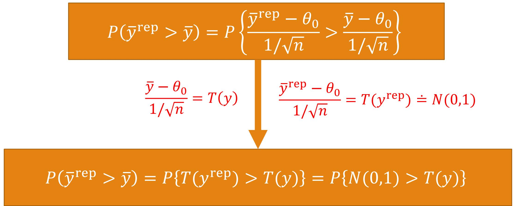

# p值补充

# $p$ 值的定义

# CLASSICAL $p$ -VALUES

The classical $p$ -value for the test statistic $T(y)$ is

$$
p _ {C} = \Pr \left(T (y ^ {\text {r e p}}) \geq T (y) | \theta\right).
$$

The probability is taken over the distribution of $y^{\mathrm{rep}}$ with $\theta$ fixed.

# NOTE

The distribution of $y^{\mathrm{rep}}$ given $y$ and $\theta$ is the same as its distribution given $\theta$ alone.

# 经典检验问题的 $p$ 值计算公式

已知 $y_{1}, \ldots, y_{n} \sim N(\theta , 1)$ , 检验 $\mathrm{H}_{0}$ : $\theta = \theta_{0}$ 。

$$
\triangleright y = \left(y _ {1}, \dots , y _ {n}\right)
$$

$\succ$ 统计量为 $T(y) = \frac{\bar{y} - \theta_{0}}{1 / \sqrt{n}}$

# 经典检验问题的 $p$ 值计算公式

$p$ 值计算公式:

$$
\begin{array}{l} \triangleright H _ {1} \colon \theta > \theta_ {0} \colon p _ {c} = P \{N (0, 1) > T (y) \} \\ \triangleright H _ {1} \colon \theta <   \theta_ {0} \colon p _ {c} = P \{N (0, 1) <   T (y) \} \\ \triangleright H _ {1} \colon \theta \neq \theta_ {0} \colon p _ {c} = P \{| N (0, 1) | > | T (y) | \} = 2 P \{N (0, 1) > | T (y) | \} \\ \end{array}
$$

若 $p_{c}< \alpha$ （接近0），则拒绝 $\mathrm{H}_{0}$

# 从 $y^{\mathrm{rep}}$ 角度看 $p$ 值

假设 $\mathrm{H}_{0}$ 成立, 即 $\theta = \theta_{0}$ , 亦即 $y_{1}, \ldots, y_{n} \sim N\left(\theta_{0}, 1\right)$ 。

现从 $N(\theta_0, 1)$ 中生成的重复数据（replicated data），记为 $y^{\mathrm{rep}} = (y_1^{\mathrm{rep}}, \ldots, y_n^{\mathrm{rep}})$ 。

由于 $y ^{\mathrm {r e p}}$ 与 $y$ 来自同一分布, 所谓 “同源”, 因此由 $y ^{\mathrm {r e p}}$ 与 $y$ 应该 “相差无几”。

# 从 $y^{\mathrm{rep}}$ 角度看 $p$ 值

考虑 $\bar{y}^{\mathrm{rep}}$ 与 $\bar{y}$ 的大小关系：由于 $\bar{y}^{\mathrm{rep}}$ 是 $\theta_0$ 的“代表值”， $\bar{y}$ 是 $\theta$ 的“代表值”。

若 $\mathrm{H}_{0}$ 成立（ $\theta = \theta_{0}$ ），则可以预计： $P(\overline{y}^{\mathrm{rep}} > \overline{y})$ 应该接近 0.5。  
反之，若 $P(\bar{y}^{\mathrm{rep}} > \bar{y})$ 接近 0 或接近 1；则认为 $\mathrm{H}_{0}$ 不成立。

# 统计量的引入

# 单边检验

若此概率接近0，则拒绝 $\mathrm{H}_{0}$ 。进一步， $P\{N(0,1) > T(y)\} \approx 0$ ，由于 $\bar{y}^{\mathrm{rep}} > \bar{y}$ 为小概率事件，故认为 $\theta_{0}< \theta$ ，即 $\mathrm{H}_{1}: \theta > \theta_{0}$ 成立。  
若此概率接近1，则拒绝 $\mathrm{H}_{0}$ 。进一步， $P\{N(0,1) > T(y)\} \approx 1$ 等价于 $P\{N(0,1) < T(y)\} \approx 0$ 。由于 $\bar{y}^{\mathrm{rep}} < \bar{y}$ 为小概率事件，故认为 $\theta_{0} > \theta$ ，即 $\mathrm{H}_{1}: \theta < \theta_{0}$ 成立。

$p$ 值计算公式:

$$
\begin{array}{l} \triangleright H _ {1} \colon \theta > \theta_ {0} \colon p _ {c} = P \{N (0, 1) > T (y) \} \\ \triangleright H _ {1} \colon \theta <   \theta_ {0} \colon p _ {c} = P \{N (0, 1) <   T (y) \} \\ \end{array}
$$

若 $p_{c}< \alpha$ （接近0），则拒绝 $\mathrm{H}_{0}$

# 双边检验

对 $H_{1}: \theta \neq \theta_{0}$ , 则需要

$$
P \{N (0, 1) > T (y) \} \approx 0 \quad {\text {或}} \quad P \{N (0, 1) <   T (y) \} \approx 0
$$

注：两者只能其中一个发生

# 双边检验

1. 若 $P\{N(0,1) > T(y)\} \approx 0$ , 则可知 $T(y) > 0$ , 因此

$$
0 \approx P \{N (0, 1) > T (y) \} = P \{N (0, 1) > | T (y) | \}
$$

2. 若 $P\{N(0,1) < T(y)\} \approx 0$ ，则可知 $T(y) < 0$ ，因此

$$
0 \approx P \{N (0, 1) <   T (y) \} = P \{N (0, 1) > - T (y) \} = P \{N (0, 1) > | T (y) | \}
$$

# 双边检验

综合1.和2.可得： $p = 2P\{N(0,1) > |T(y)|\}$

$p$ 值计算公式:

$$
\triangleright H _ {1} \colon \theta \neq \theta_ {0} \colon p _ {c} = P \{| N (0, 1) | > | T (y) | \} = 2 P \{N (0, 1) > | T (y) | \}
$$

若 $p_{c}< \alpha$ （接近0），则拒绝 $\mathrm{H}_{0}$

# 概率的另一个方向

$\succ$ 若 $\mathrm{H}_{0}$ 成立（ $\theta = \theta_{0}$ ），则可以预计： $P(\bar{y}^{\mathrm{rep}} < \bar{y})$ 应该接近 0.5。  
反之，若 $P(\bar{y}^{\mathrm{rep}} < \bar{y})$ 接近 0 或接近 1；则认为 $\mathrm{H}_{0}$ 不成立。

思考: 根据 $P\left(\bar{y}^{\text {rep}} < \bar{y}\right)$ 是否可以得到如上的推导?