# 离散数学

左孝凌 李为镒 刘永才 编著

LISAN SHUXUE

# 目录

# 第一篇 数理逻辑

# 第一章 命题逻辑 2

1-1 命题及其表示法 2  
1-2 联结词 3  
1-3 命题公式与翻译 9  
1-4 真值表与等价公式 … 12  
1-5 重言式与蕴含式 ………………………………………… 19  
1-6 其他联结词 24  
1-7 对偶与范式 29  
1-8 推理理论 40  
*1-9 应用 … 47

# 第二章 谓词逻辑· 54

2-1 谓词的概念与表示 … 54  
2-2 命题函数与量词 56  
2-3 谓词公式与翻译 60  
2-4 变元的约束 63   
2-5 谓词演算的等价式与蕴含式 … 66  
2-6 前束范式 73  
2-7 谓词演算的推理理论 75

# 第二篇 第合论 81

# 第三章 集合与关系 … 82

3-1 集合的概念和表示法 … 82  
3-2 集合的运算 … 87

\*3-3 包含排斥原理· 95  
3-4 序偶与笛卡尔积 … 100   
3-5 关系及其表示 … 105  
3-6 关系的性质 … 110   
3-7 复合关系和逆关系 ………………………………………… 114  
3-8 关系的闭包运算 ………………………………………… 119

3-9 集合的划分和覆盖 … 128  
3-10 等价关系与等价类 ………………………………………… 131   
3-11 相容关系 … 135  
3-12 序关系 ………………………………………… 139

# 第四章 函数 … 147

4-1 函数的概念 … 147   
4-2 逆函数和复合函数 …………………………………………151

4-3 特征函数与模糊子集 156

4-4 基数的概念 …………………………………………161   
4-5 可数集与不可数集 … 164  
4-6 基数的比较 ………………………………………… 170

# 第三篇 代数系统 ………………………………………… 175

# 第五章 代数结构 …………………………………………176

5-1 代数系统的引入 ………………………………………… 176  
5-2 运算及其性质 ………………………………………… 178  
5-3 半群 … 135  
5-4 群与子群 ………………………………………… 190  
5-5 阿贝尔群和循环群 ………………………………………… 197

*5-6 置换群与伯恩赛德定理 ……………………201  
5-7 陪集与拉格朗日定理 ……………………208  
5-8 同态与同构 212  
5-9 环与域 222

# 第六章 格与布尔代数 ……………………231

6-1 格的概念 231  
6-2 分配格 243  
6-3 有补格 249  
6-4 布尔代数 252  
6-5 布尔表达式 261

# 第四篇 图论 … 271

# 第七章 图论 … 272

7-1 图的基本概念 272  
7-2 路与回路 ………………………………………… 280

7-3 图的矩阵表示 287  
7-4 欧拉图与汉密尔顿图 …………………… 301  
7-5 平面图 … 312  
7-6 对偶图与着色 317  
7-7 树与生成树 322   
7-8 根树及其应用 328

# 第五篇 计算机科学中的应用 … 339

# 第八章 形式语言与自动机 ……………………340

8-1 串和语言 ……………………340   
8-2 形式文法 … 349  
8-3 有限状态自动机 …………………… 359  
8-4 两类自动机的转换 ……………………371   
8-5 有限状态机的简化 ……………………378  
8-6 有限状态机与正则语言 ……………………386

# 第九章 纠错码初步 …………………… 396

9-1 通讯模型和纠错的基本概念 ……………………396  
9-2 线性分组码的纠错能力 401  
9-3 海明码 406  
9-4查表译码法 415

# 符号表 419

# 参考文献 425

# 第一篇 数理逻辑

逻辑学是一门研究思维形式及思维规律的科学。逻辑规律就是客观事物在人的主观意识中的反映。

逻辑学分为辩证逻辑与形式逻辑两种，前者是以辩证法认识论的世界观为基础的逻辑学，而后者主要是对思维的形式结构和规律进行研究的类似于语法的一门工具性学科。思维的形式结构包括了概念，判断和推理之间的结构和联系，其中概念是思维的基本单位，通过概念对事物是否具有某种属性进行肯定或否定的回答，这就是判断；由一个或几个判断推出另一判断的思维形式，就是推理。研究推理有很多方法，用数学方法来研究推理的规律称为数理逻辑。这里所指的数学方法，就是引进一套符号体系的方法，所以数理逻辑又称作符号逻辑，它是从量的侧面来研究思维规律的。

现代数理逻辑可分为证明论、模型论、递归函数论、公理化集合论等，这里介绍的是数理逻辑最基本的内容：命题逻辑和谓词逻辑。

# 第一章 命题逻辑

# 1-1 命题及其表示法

在数理逻辑中，为了表达概念，陈述理论和规则，常常需要应用语言进行描述，但是日常使用的自然语言，往往叙述时不够确切，也易产生二义性，因此就需要引入一种目标语言，这种目标语言和一些公式符号，就形成了数理逻辑的形式符号体系。所谓目标语言就是表达判断的一些语言的汇集，而判断就是对事物有肯定或否定的一种思维形式，因此能表达判断的语言是陈述句，它称作命题。一个命题，总是具有一个“值”，称为真值。真值只有“真”和“假”两种；记作True（真）和False（假），分别用符号 $\pmb{T}$ 和 $\pmb{F}$ 表示。只有具有确定真值的陈述句才是命题，一切没有判断内容的句子，无所谓是非的句子，如感叹句，疑问句，祈使句等都不能作为命题。命题有两种类型：第一种类型是不能分解为更简单的陈述语句，称作原子命题；第二种类型是由联结词，标点符号和原子命题复合构成的命题，称作复合命题。所有这些命题，都应具有确定的真值。下面给出实例，说明命题的概念。

(1) 中国人民是伟大的。  
(2) 雪是黑的。  
(3) $1 + 101 = 110$   
(4) 别的星球上有生物。  
(5) 全体立正！  
(6) 明天是否开大会？  
(7) 天气多好啊！  
(8) 我正在说谎。  
(9) 我学英语, 或者我学日语。

(10) 如果天气好, 那么我去散步。

在上面这些例子中，(1)、(2)、(4)、(9)、(10)是命题。其中(9)、(10)是复合命题，(4)在目前可能无法决定真值，但从事物的本质而论，它本身是有真假可言的，所以我们承认这也是一个命题。(5)、(6)、(7)都不是命题。(8)是悖论。(3)在二进制中为真，在十进制中为假，故需根据上下文才能确定真值。

在数理逻辑中，我们将使用大写字母 $A, B, \cdots, P, Q, \cdots$ 或用带下标的大写字母或用数字，如 $A_{i}$ [12] 等表示命题，例如

$P_{\bullet}$ 今天下雨。

$\pmb{P}$ 可表示“今天下雨”这个命题的名。亦可用数字表示命题，例如

[12]: 今天下雨。

表示命题的符号称为命题标识符， $P$ 和[12]就是标识符。

一个命题标识符如表示确定的命题，就称为命题常量，如果命题标识符只表示任意命题的位置标志，就称为命题变元。因为命题变元可以表示任意命题，所以它不能确定真值，故命题变元不是命题。当命题变元 $P$ 用一个特定命题取代时， $P$ 才能确定真值，这时也称对 $P$ 进行指派。当命题变元表示原子命题时，该变元称为原子变元。

# 1-2 联结词

在自然语言中，常常使用“或”，“与”，“但是”等一些联结词，对于这种联结词的使用，一般没有很严格的定义，因此有时显得不很确切。在数理逻辑中，复合命题是由原子命题与逻辑联结词组合面成，联结词是复合命题中的重要组成部分，为了便于书写和进行推演，必须对联结词作出明确规定并符号化。下面介绍各个联结词。

(1) 否定

定义1-2.1 设 $P$ 为一命题, $P$ 的否定是一个新的命题, 记作 $\neg P$ 。若 $P$ 为 $T$ , $\neg P$ 为 $F$ ; 若 $P$ 为 $F$ , $\neg P$ 为 $T$ 。联结词

“”表示命题的否定。否定联结词有时亦可记作“一”。

命题 $P$ 与其否定 $\neg P$ 的关系如表1-2.1所示。

表1-2.1  

<table><tr><td>P</td><td>7P</td></tr><tr><td>T</td><td>F</td></tr><tr><td>F</td><td>T</td></tr></table>

例 $P$ ：上海是一个大城市。

$\neg P_{1}$ 上海并不是一个大城市。

或 $\neg P$ ：上海是一个不大的城市。

这两个命题用同一符号 $\neg P$ 表示，因为在汉语中这两个命题具有相同的意义。

“否定”的意义仅是修改了命题的内容，我们仍把它看作为联结词，它是一个一元运算。

# (2） 合取

定义1-2.2 两个命题 $P$ 和 $Q$ 的合取是一个复合命题，记作 $P \wedge Q$ 。当且仅当 $P, Q$ 同时为 $T$ 时， $P \wedge Q$ 为 $T$ ，在其他情况下， $P \wedge Q$ 的真值都是 $F$ 。

联结词“ $\wedge$ ”的定义如表1-2.2所示。

表1-2.2  

<table><tr><td>P</td><td>Q</td><td>P ∧ Q</td></tr><tr><td>T</td><td>T</td><td>T</td></tr><tr><td>T</td><td>F</td><td>F</td></tr><tr><td>F</td><td>T</td><td>F</td></tr><tr><td>F</td><td>F</td><td>F</td></tr></table>

例如 $P$ ：今天下雨。

$Q_{\bullet}$ 明天下雨。

上述命题的合取为

$P \wedge Q$ : 今天下雨而且明天下雨。

$P \wedge Q$ : 今天与明天都下雨。

$P \wedge Q$ : 这两天都下雨。

显然只有当“今天下雨”与“明天下雨”都是真时，“这两天都下雨”才是真的。

合取的概念与自然语言中的“与”意义相似，但并不完全相同。例如

$P_{\tau}$ 我们去看电影。

$Q_{\bullet}$ 房间里有十张桌子。

上述命题的合取为

$P \wedge Q$ : 我们去看电影与房间里有十张桌子。

在自然语言中，上述命题是没有意义的，因为 $P$ 与 $Q$ 没有内在联系，但作为数理逻辑中 $P$ 和 $Q$ 的合取 $P \wedge Q$ 来说，它仍可成为一个新的命题，只要按照定义，在 $P, Q$ 分别取真值后， $P \wedge Q$ 的真值也必确定。

命题联结词“合取”甚至可以将两个互为否定的命题联结在一起。这时，其真值永为 $\pmb{F}$ 。

命题联结词“合取”也可以将若干个命题联结在一起。

“合取”是一个二元运算。

# (3) 析取

定义1-2.8 两个命题 $P$ 和 $Q$ 的析取是一个复合命题，记作 $P \vee Q$ 。当且仅当 $P'Q$ 同时为 $F$ 时， $P \vee Q$ 的真值为 $F$ ，否则 $P \vee Q$ 的真值为 $T$ 。

联结词“V”的定义如表1-2.3所示。

表1-2.3  

<table><tr><td>P</td><td>Q</td><td>PVQ</td></tr><tr><td>T</td><td>T</td><td>T</td></tr><tr><td>T</td><td>F</td><td>T</td></tr><tr><td>F</td><td>T</td><td>T</td></tr><tr><td>F</td><td>F</td><td>F</td></tr></table>

从析取的定义可以看到，联结词 $\mathbf{V}$ 与汉语中的“或”的意义也不全相同，因为汉语中的“或”，可表示“排斥或”，也可表示“可兼或”。

例1 今天晚上我在家看电视或去剧场看戏。

例2 他可能是100米或400米赛跑的冠军。

在例1中的“或”是“排斥或”，例2中的“或”是“可兼或”，而析取指的是“可兼或”。还有一些汉语中的“或”字，实际不是命题联结词。

例3 他昨天做了二十或三十道习题。

这个例子中的“或”字，只表示了习题的近似数目，不能用联结词“析取”表达，例3是个原子命题。

# (4) 条件

定义1-2.4 给定两个命题 $P$ 和 $Q$ , 其条件命题是一个复合命题, 记作 $P \rightarrow Q$ , 读作“如果 $P$ , 那末 $Q$ ”或“若 $P$ 则 $Q$ ”。当且仅当 $P$ 的真值为 $T$ , $Q$ 的真值为 $F$ 时, $P \rightarrow Q$ 的真值为 $F$ , 否则 $P \rightarrow Q$ 的真值为 $T$ 。我们称 $P$ 为前件, $Q$ 为后件。

联结词“ $\rightarrow$ ”的定义如表1-2.4所示。

表1-2.4  

<table><tr><td>P</td><td>Q</td><td>P→Q</td></tr><tr><td>T</td><td>T</td><td>T</td></tr><tr><td>T</td><td>F</td><td>F</td></tr><tr><td>F</td><td>T</td><td>T</td></tr><tr><td>F</td><td>F</td><td>T</td></tr></table>

例1 如果某动物为哺乳动物，则它必胎生。

例2 如果我得到这本小说, 那末我今夜就读完它。

例3如果雪是黑的，那末太阳从西方出。

上述三个例子都可用条件命题 $P \rightarrow Q$ 表达。

在自然语言中，“如果…”与“那末…”之间常常是有因果联系

的，否则就没有意义，但对条件命题 $P \rightarrow Q$ 来说，只要 $P, Q$ 能够分别确定真值， $P \rightarrow Q$ 即成为命题。此外，自然语言中对“如果…、则…”这样的语句，当前提为假时，结论不管真假，这个语句的意义，往往无法判断。而在条件命题中，规定为“善意的推定”，即前提为 $F$ 时，条件命题的真值都取为 $T$ 。

在数学上和有些逻辑学的书籍中，“若 $P$ 则 $Q$ ”亦可叫作 $P$ 蕴含 $Q$ ，而本书在条件命题中将避免使用“蕴含”一词，因为在以后将另外定义“蕴含”这个概念。

命题联结词“→”亦可记作“ $\supset$ ”。条件联结词亦是二元运算。

# (5) 双条件

定义1-2.5 给定两个命题 $P$ 和 $Q$ , 其复合命题 $P \rightleftarrows Q$ 称作双条件命题, 读作“ $P$ 当且仅当 $Q$ ”, 当 $P$ 和 $Q$ 的真值相同时, $P \rightleftarrows Q$ 的真值为 $T$ , 否则 $P \rightleftarrows Q$ 的真值为 $F$ 。

联结词 $\overleftrightarrow{\mathbf{\Pi}}$ 的定义可如表1-2.5所示。

表1-3.5  

<table><tr><td>P</td><td>Q</td><td>P/Q</td></tr><tr><td>T</td><td>T</td><td>T</td></tr><tr><td>T</td><td>F</td><td>F</td></tr><tr><td>F</td><td>T</td><td>F</td></tr><tr><td>F</td><td>F</td><td>T</td></tr></table>

例1 两个三角形全等, 当且仅当它们的三组对应边相等。

例2燕子飞回南方，春天来了。

例3 $2 + 2 = 4$ 当且仅当雪是白的。

上面三个例子都可用双条件命题 $P \xrightarrow{<} Q$ 来表示。与前面的联结词一样，双条件命题也可以不顾其因果联系，面只根据联结词定义确定真值。双条件联结词亦可记作“ $\leftrightarrow$ ”或“iff”。它亦是二元运算。

# 1-1, 1-2 习题

(1) 指出下列语句哪些是命题, 哪些不是命题, 如果是命题, 指出它的真值。

a）离散数学是计算机科学系的一门必修课。

b) 计算机有空吗？

c）明天我去看电影。

d）请勿随地吐痰！

e）不存在最大质数。

f）如果我掌握了英语、法语，那么学习其他欧洲语言就容易得多。

g） $9 + 5\leqslant 12$

h） $x = 3$

i）我们要努力学习。

(2) 举例说明原子命题和复合命题。

(3）设 $P$ 表示命题“天下雪” $Q$ 表示命题“我将去镇上” $R$ 表示命题“我有时间”

以符号形式写出下列命题。

a）如果天不下雪和我有时间，那么我将去镇上。  
b) 我将去镇上, 仅当我有时间时。  
c）天不下雪。  
d)天下雪，那么我不去镇上。

(4) 用汉语写出一句子, 对应下列每一个命题。

a) $\overrightarrow{Q_{\leftarrow}} (R\wedge \neg P)$   
b) $R\wedge Q$   
c) $(Q\to R)\wedge (R\to Q)$

(5) 将下列命题符号化。

a）王强身体很好，成绩也很好。  
b）小李一边看书，一边听音乐。  
$\mathfrak{a}$ 气候很好或很热。  
d）如果 $a$ 和 $b$ 是偶数，则 $a + b$ 是偶数。  
e）四边形ABCD是平行四边形，当且仅当它的对边平行.  
f）停机的原因在于语法错误或程序错误。   
(6) 将下列复合命题分成若干原子命题。  
a）天气炎热且正在下雨。

b) 天气炎热但湿度较低。  
c）天正在下雨或湿度很高。  
d) 刘英与李进上山,  
e）老王或小李是革新者。  
f）如果你不看电影，那么我也不看电影。  
g）我既不看电视也不外出，我在睡觉。  
b）控制台打字机既可作输入设备，又可作输出设备。

# 1-3 命题公式与翻译

前面已经提到，不包含任何联结词的命题叫做原子命题，至少包含一个联结词的命题称作复合命题。

设 $P$ 和 $Q$ 是任意两个命题，则 $\neg P, P \vee Q, (P \vee Q) \vee (P \rightarrow Q), P \overleftarrow{\rightarrow} (Q \vee \neg P)$ 等都是复合命题。

若 $P$ 和 $Q$ 是命题变元, 则上述各式均称作命题公式。 $P$ 和 $Q$ 称作命题公式的分量。

必须注意：命题公式是没有真假值的，仅当在一个公式中命题变元用确定的命题代入时，才得到一个命题。这个命题的真值，依赖于代换变元的那些命题的真值。此外，并不是由命题变元，联结词和一些括号组成的字符串都能成为命题公式。

定义1-3.1 命题演算的合式公式(wff)，规定为：

(1) 单个命题变元本身是一个合式公式。  
(2) 如果 $A$ 是合式公式, 那么 $\neg A$ 是合式公式。  
(3) 如果 $A$ 和 $B$ 是合式公式, 那么 $(A \wedge B)$ , $(A \vee B)$ , $(A \rightarrow B)$ 和 $(A \overline{\rightarrow} B)$ 都是合式公式。  
(4) 当且仅当能够有限次地应用 (1)、(2)、(3) 所得到的包含命题变元, 联结词和括号的符号串是合式公式。

这个合式公式的定义，是以递归形式给出的，其中(1)称为基础，(2)(3)称为归纳，(4)称为界限。

按照定义，下列公式都是合式公式：

$$
\begin{array}{l} \lnot (P \land Q), \lnot (P \rightarrow Q), (P \rightarrow (P \lor \lnot Q)), \\ \left(\left((P \rightarrow Q) \wedge (Q \rightarrow R)\right) \overleftarrow {\rightarrow} (S \overrightarrow {\rightarrow} T)\right) \\ \end{array}
$$

而

$$
(P \rightarrow Q) \rightarrow (\wedge Q), (P \rightarrow Q, (P \wedge Q) \rightarrow Q)
$$

等都不是合式公式。

为了减少使用圆括号的数量，约定最外层圆括号可以省略。

如果我们规定了联结词运算的优先次序为： $\neg, \land, \lor, \rightarrow, \overline{\rightarrow}$ ，则 $P \wedge Q \rightarrow R$ 也是合式公式。

有了联结词的合式公式概念，我们可以把自然语言中的有些语句，翻译成数理逻辑中的符号形式。

例题1 试以符号形式写出命题: 我们要做到身体好、学习好、工作好, 为祖国四化建设而奋斗。

解找出各原子命题，并用命题符号表示：

A: 我们要做到身体好。  
$B$ ：我们要做到学习好。  
$c_{\bullet}$ 我们要做到工作好。  
$P$ ：我们要为祖国四化建设而奋斗。

故命题可形式化为： $(A\wedge B\wedge C)\overrightarrow{z} P$

例题2 上海到北京的14次列车是下午五点半或六点开。

解 $P_{\bullet}$ 上海到北京的14次列车是下午五点半开。

$Q$ ：上海到北京的14次列车是下午六点开。

在本例中, 汉语的“或”是不可兼或, 而逻辑联结词 V 是“可兼或”, 因此不能直接对两命题析取。构造表如表 1-3.1 所示。

表1-3.1  

<table><tr><td>P</td><td>Q</td><td>原命题</td><td>P←Q</td><td>¬(P←Q)</td></tr><tr><td>T1</td><td>T</td><td>F</td><td>T</td><td>F</td></tr><tr><td>T</td><td>F</td><td>T</td><td>F</td><td>T</td></tr><tr><td>F</td><td>T</td><td>T</td><td>F</td><td>T</td></tr><tr><td>F</td><td>F</td><td>F</td><td>T</td><td>F</td></tr></table>

从表中可看出原命题不能用前述五个联结词单独写出，但是如用命题和联结词组合，可以把本命题表达为： $\neg (P \xrightarrow{\sim} Q)$ 。

例题3 他既聪明又用功。

解 若设

$P$ ：他聪明。 $Q$ ：他用功。

在自然语言中这个“既……又……”显然与“且”的意义一样，故本例可记为：

例题4 他虽聪明但不用功。

解这里“虽……但……”这个词不能用前述联结词表达，但其实际意义是：他聪明且不用功。若设

$P_{\bullet}$ 他聪明。 $Q_{\bullet}$ 他用功。

本例可表示为：

$$
P A \neg Q
$$

例题5 除非你努力，否则你将失败。

解这个命题的意义，亦可理解为：如果你不努力则你将失败。若设

$P_{1}$ 你努力。 $Q_{1}$ 你失败。

本例可表示为：

$$
\neg P \rightarrow Q
$$

例题6 张三或李四都可以做这件事。

解这个命题的意义是：张三可以做这件事，并且李四也可以做这件事。若设

$P_{1}$ 张三可以做这事。 $Q_{2}$ 李四可以做这事。

本例可表示为：

$$
P \wedge Q
$$

从上面的例子中可以看到, 自然语言中的一些联结词, 如: “与”“且”“或”“除非…则…”等等都各有其具体含义, 因此需分别不同情况翻译成适当的逻辑联结词。为了便于正确表达命题间的相互关系, 有时也常常采用列出“真值表”的方法, 进一步分析各原命题, 以此寻找逻辑联结词, 使原来的命题能够正确地用形式符号予以表达。

# 1-3 习题

(1) 判别下列公式哪些是合式公式, 哪些不是合式公式。

a) $(Q\to R\land S)$   
b) $(P\rightarrow (R\rightarrow S))$   
c） $((\neg P\to Q)\to (Q\to P)))$

d) $(RS\rightarrow T^{\prime})$   
e） $((P\to (Q\to R))\to ((P\to Q)\to (P\to R)))$

(2) 根据合式公式的定义, 说明下列公式是合式公式。

a) $(A\to (A\lor B))$   
b) $(\neg A \wedge B) \wedge A)$   
c） $((A\to B)\to (B\to A))$   
d) $((A\to B)\lor (B\to A))$

(3) 对下列各式用指定的公式进行代换。

a) $((A \rightarrow B) \rightarrow E) \rightarrow A)$ , 用 $(A \rightarrow C)$ 代换 $A$ , 用 $((B \wedge C) \rightarrow A)$ 代换 $B$ 。  
b） $((A\to B)\lor (B\to A))$ ，用 $B$ 代换 $A_{0}$

(4) 下列几个式子中有哪几个是别的式子经过代换得到的。

a) $(P\rightarrow (Q\rightarrow P))$   
b) $((((P\to Q)\land (R\to S))\land (P\lor R))\to (Q\lor S))$   
c） $(Q\to ((P\to P)\to Q))$   
d) $(P\rightarrow ((P\rightarrow (Q\rightarrow P))\rightarrow P))$   
e） $((R\to S)\wedge (Q\to P))\wedge (R\vee Q))\rightarrow (S\vee P))$

(5) 试把原子命题表示为 $P, Q, R$ 等, 然后用符号译出下列各句子。

a）或者你没有给我写信，或者它在途中丢失了。  
b）如果张三和李四都不去，他就去。  
c）我们不能既划船又跑步。  
d）如果你来了，那末他唱不唱歌将看你是否伴奏而定。

(6) 一个人起初说, “占据空间的、有质量的而且不断变化的叫做物质”; 后来他改说, “占据空间的有质量的叫做物质, 而物质是不断变化的。”问他前后主张的差异在什么地方, 试以命题形式进行分析。

（7）用符号形式写出下列命题。

a）假如上午不下雨，我去看电影，否则就在家里读书或看报。  
b）我今天进城，除非下雨。  
c）仅当你走我将留下。

# 1-4 真值表与等价公式

定义1-4.1 在命题公式中，对于分量指派真值的各种可能组合，就确定了这个命题公式的各种真值情况，把它汇列成表，就

是命题公式的真值表。

现举例说明如下：

例题1 构造 $\neg P \vee Q$ 的真值表。

解

表1-4.1  

<table><tr><td>P</td><td>Q</td><td>\( \neg P \)</td><td>\( \neg P \lor Q \)</td></tr><tr><td>T</td><td>T</td><td>F</td><td>T</td></tr><tr><td>T</td><td>F</td><td>F</td><td>F</td></tr><tr><td>F</td><td>T</td><td>T</td><td>T</td></tr><tr><td>F</td><td>F</td><td>T</td><td>T</td></tr></table>

例题2 给出 $(P \wedge Q) \wedge P$ 的真值表。

解

表1-4.2  

<table><tr><td>P</td><td>Q</td><td>P ∧ Q</td><td>\( \neg P \)</td><td>\( \left( {P \land  Q}\right)  \land  \neg P \)</td></tr><tr><td>T</td><td>T</td><td>T</td><td>F</td><td>F</td></tr><tr><td>T</td><td>F</td><td>F</td><td>F</td><td>F</td></tr><tr><td>F</td><td>T</td><td>F</td><td>T</td><td>F</td></tr><tr><td>F</td><td>F</td><td>F</td><td>T</td><td>F</td></tr></table>

例题3 给出 $(P \wedge Q) \vee (\neg P \wedge \neg Q)$ 的真值表。

解

表1-4.3  

<table><tr><td>P</td><td>Q</td><td>\( \neg P \)</td><td>\( \neg Q \)</td><td>\( P \land Q \)</td><td>\( \neg P \land \neg Q \)</td><td>\( (P \land Q) \lor ( \neg P \land \neg Q ) \)</td></tr><tr><td>T</td><td>T</td><td>F</td><td>F</td><td>T</td><td>F</td><td>T</td></tr><tr><td>T</td><td>F</td><td>F</td><td>T</td><td>F</td><td>F</td><td>F</td></tr><tr><td>F</td><td>T</td><td>T</td><td>F</td><td>F</td><td>F</td><td>F</td></tr><tr><td>F</td><td>F</td><td>T</td><td>T</td><td>F</td><td>T</td><td>T</td></tr></table>

例题4给出 $\neg (P\land Q)\rightleftarrows (\neg P\lor \neg Q)$ 的真值表。

解

表1-4.4  

<table><tr><td>P</td><td>Q</td><td>P ∧ Q</td><td>¬(P ∧ Q)</td><td>¬P</td><td>¬Q</td><td>¬P ∨ ¬Q</td><td>¬(P ∧ Q)∉¬P ∨ ¬Q</td></tr><tr><td>T</td><td>T</td><td>T</td><td>F</td><td>F</td><td>F</td><td>F</td><td>T</td></tr><tr><td>T</td><td>F</td><td>F</td><td>T</td><td>F</td><td>T</td><td>T</td><td>T</td></tr><tr><td>F</td><td>T</td><td>F</td><td>T</td><td>T</td><td>F</td><td>T</td><td>T</td></tr><tr><td>F</td><td>F</td><td>F</td><td>T</td><td>T</td><td>T</td><td>T</td><td>T</td></tr></table>

由表1-4.4(表1-4.2)可以看出，有一类公式不论命题变元作何种指派，其真值永为真(假)，我们把这类公式记为 $\pmb{T}(\pmb{F})$ 。

在真值表中，命题公式真值的取值数目，决定于分量的个数。例如，由2个命题变元组成的命题公式共有四种可能的真值，由3个命题变元组成的命题公式共有八种真值。一般说来， $n$ 个命题变元组成的命题公式共有 $2^{n}$ 种真值情况。

从真值表中可以看到, 有些命题公式在分量的不同指派下, 其对应的真值与另一命题公式完全相同, 如 $\neg P \lor Q$ 与 $P \rightarrow Q$ 的对应真值相同, 如表1-4.5所示。

表1-4.5  

<table><tr><td>P</td><td>Q</td><td>\( \neg P \lor Q \)</td><td>\( P \rightarrow Q \)</td></tr><tr><td>T</td><td>T</td><td>T</td><td>T</td></tr><tr><td>T</td><td>F</td><td>F</td><td>F</td></tr><tr><td>F</td><td>T</td><td>T</td><td>T</td></tr><tr><td>F</td><td>F</td><td>T</td><td>T</td></tr></table>

同理 $(P \wedge Q) \vee (\neg P \wedge \neg Q)$ 与 $I \rightleftarrows Q$ 对应的真值相同，如表1-4.6所示。

表1-4.6  

<table><tr><td>P</td><td>Q</td><td>P→Q</td><td>(P ∧ Q) ∨ (¬P ∧ ¬Q)</td></tr><tr><td>T</td><td>T</td><td>T</td><td>T</td></tr><tr><td>T</td><td>F</td><td>F</td><td>F</td></tr><tr><td>F</td><td>T</td><td>F</td><td>F</td></tr><tr><td>F</td><td>F</td><td>T</td><td>T</td></tr></table>

定义1-4.2 给定两个命题公式 $A$ 和 $B$ , 设 $P_{1}, P_{2}, \cdots, P_{n}$ 为所有出现于 $A$ 和 $B$ 中的原子变元, 若给 $P_{1}, P_{2}, \cdots, P_{n}$ 任一组真值指派, $A$ 和 $B$ 的真值都相同, 则称 $A$ 和 $B$ 是等价的或逻辑相等。记作 $A \Leftrightarrow B$ 。

例题5 证明 $P \xrightarrow{\leftarrow} Q \Leftrightarrow (P \to Q) \land (Q \to P)$

证明 列出真值表

表1-4.7  

<table><tr><td>P</td><td>Q</td><td>P→Q</td><td>Q→P</td><td>P←Q</td><td>(P→Q) ∧ (Q→P)</td></tr><tr><td>T</td><td>T</td><td>T</td><td>T</td><td>T</td><td>T</td></tr><tr><td>T</td><td>F</td><td>F</td><td>T</td><td>F</td><td>F</td></tr><tr><td>F</td><td>T</td><td>T</td><td>F</td><td>F</td><td>F</td></tr><tr><td>F</td><td>F</td><td>T</td><td>T</td><td>T</td><td>T</td></tr></table>

由表1-4.7可知 $P \rightarrow Q$ 与 $(P \rightarrow Q) \land (Q \rightarrow P)$ 真值相同，命题得证。

表1-4.8列出的命题定律，都可以用真值表予以验证。

表1-4.8  

<table><tr><td>对合律</td><td>¬¬P↔P</td><td>1</td></tr><tr><td>幂等律</td><td>P∨P↔P, P ∧ P↔P</td><td>2</td></tr><tr><td>结合律</td><td>(P∨Q)∨B↔PV(Q∨B)
(P∧Q)∧B↔PA(Q∧B)</td><td>3</td></tr><tr><td>交换律</td><td>P∨Q↔Q∨P
P∧Q↔Q∧P</td><td>4</td></tr><tr><td>分配律</td><td>P∨(Q∧E)↔(P∨Q)∧(P∨B)
P∧(Q∨E)↔(P∧Q)∨(P∧E)</td><td>5</td></tr><tr><td>吸收律</td><td>PV(P∧Q)↔P
P∧(P∨Q)↔P</td><td>6</td></tr><tr><td>德·摩根律</td><td>¬(PVQ)↔¬P∧¬Q
¬(P∧Q)↔¬PV¬Q</td><td>7</td></tr><tr><td>同一律</td><td>P∨F↔P, P ∧ T↔P</td><td>8</td></tr><tr><td>零律</td><td>P∨T↔T, P ∧ F↔F</td><td>9</td></tr><tr><td>否定律</td><td>P∨¬P↔T, P ∧ ¬P↔F.</td><td>10</td></tr></table>

例题6 验证吸收律 $P \vee (P \wedge Q) \Leftrightarrow P$

$$
P \wedge (P \vee Q) \Leftrightarrow P
$$

证明 列出真值表

表1-4.9  

<table><tr><td>P</td><td>Q</td><td>(P ∧ Q)</td><td>PV(P ∧ Q)</td><td>(PVQ)</td><td>PA(PVQ)</td></tr><tr><td>T</td><td>T</td><td>T</td><td>T</td><td>T</td><td>T</td></tr><tr><td>T</td><td>F</td><td>F</td><td>T</td><td>T</td><td>T</td></tr><tr><td>F</td><td>T</td><td>F</td><td>F</td><td>T</td><td>F</td></tr><tr><td>F</td><td>F</td><td>F</td><td>F</td><td>F</td><td>F</td></tr></table>

由表1-4.9可知吸收律成立。

在一个命题公式中，如果用公式置换命题的某个部分，一般地将会产生某种新的公式，例如 $Q \rightarrow (P \vee (P \wedge Q))$ 中以 $(\neg P \rightarrow Q)$ 取代 $(P \wedge Q)$ ，则 $Q \rightarrow (P \vee (\neg P \rightarrow Q))$ 就与原式不同。为了保证取代后的公式与原始公式是等价的，故需对置换作出一些规定。

定义1-4.3 如果 $X$ 是合式公式 $\pmb{A}$ 的一部分，且 $\pmb{x}$ 本身也是一个合式公式，则称 $\pmb{x}$ 为公式 $\pmb{A}$ 的子公式。

定理1-4.1 设 $X$ 是合式公式 $A$ 的子公式, 若 $X \Leftrightarrow Y$ , 如果将 $A$ 中的 $X$ 用 $Y$ 来置换, 所得到公式 $B$ 与公式 $A$ 等价, 即 $A \Leftrightarrow B$ 。

证明因为在相应变元的任一种指派情况下， $X$ 与 $\pmb{Y}$ 的真值相同，故以 $\pmb{Y}$ 取代 $\pmb{X}$ 后，公式 $\pmb{B}$ 与公式 $\pmb{A}$ 在相应的指派情况下，其真值亦必相同，故 $A\Leftrightarrow B$ □

满足定理1-4.1条件的置换称为等价置换(等价代换)。

例题7 证明 $Q \to (P \vee (P \wedge Q)) \leftrightarrow Q \to P$

证明 设 $A: Q \to (P \vee (P \wedge Q))$

因为 $P \vee (P \wedge Q) \Leftrightarrow P$

故 $B: Q \to P,$ 即 $A \leftrightarrow B$

对 $A \leftrightarrow B$ 亦可用表1-4.10予以验证：

表1-4.10  

<table><tr><td>P</td><td>Q</td><td>P ∧ Q</td><td>P ∨ (P ∧ Q)</td><td>Q → (P ∨ (P ∧ Q))</td><td>Q → P</td></tr><tr><td>T</td><td>T</td><td>T</td><td>T</td><td>T</td><td>T</td></tr><tr><td>T</td><td>F</td><td>F</td><td>T</td><td>T</td><td>T</td></tr><tr><td>F</td><td>T</td><td>F</td><td>F</td><td>F</td><td>F</td></tr><tr><td>F</td><td>F</td><td>F</td><td>F</td><td>T</td><td>T</td></tr></table>

我们有了最基本的命题公式的等价关系，再利用定理1-4.1，就可以推证一些更为复杂的命题等价公式。现举例说明如下：

例题8 证明 $(P \wedge Q) \vee (P \wedge \neg Q) \Leftrightarrow P$

证明 $(P\wedge Q)\vee (P\wedge \neg Q)\Leftrightarrow P\wedge (Q\vee \neg Q)\Leftrightarrow P\wedge T\Leftrightarrow P$

例题9 证明 $P \to (Q \to R) \leftrightarrow Q \to (P \to R) \leftrightarrow \neg R \to (Q \to \neg P)$

证明 $P \rightarrow (Q \rightarrow R) \Leftrightarrow \neg P \vee (\neg Q \vee R) \Leftrightarrow \neg Q \vee (\neg P \vee R)$

$$
\Leftrightarrow Q \rightarrow (P \rightarrow R)
$$

又， $P\rightarrow (Q\rightarrow R)\leftrightarrow \neg P\lor (\neg Q\lor R)\leftrightarrow R\lor (\neg Q\lor \neg P)$

$$
\Leftrightarrow \neg R \rightarrow (Q \rightarrow \neg P)
$$

例题10 证明 $((P \vee Q) \wedge \neg (\neg P \wedge (\neg Q \vee \neg R)))$

$$
\vee (\neg P \wedge \neg Q) \vee (\neg P \wedge \neg R) \leftrightarrow T
$$

证明 原式左边 $\leftrightarrow ((P \vee Q) \wedge \neg (\neg P \wedge \neg (Q \wedge R)))$

$$
\begin{array}{l} \vee \neg (P \vee Q) \vee \neg (P \vee R) \\ \Leftrightarrow ((P \vee Q) \wedge (P \vee (Q \wedge R))) \vee \neg (P \vee Q) \vee \neg (P \vee R) \\ \Leftrightarrow ((P \vee Q) \wedge ((P \vee Q) \wedge (P \vee R))) \\ \vee \neg ((P V Q) \wedge (P V R)) \\ \Leftrightarrow ((P \vee Q) \wedge (P \vee R)) \vee \neg ((P \vee Q) \wedge (P \vee R)) \\ \Leftrightarrow T \\ \end{array}
$$

# 1-4 习题

(1) 求下列各复合命题的真值表。

a) $P\rightarrow (Q\lor R)$   
b) $(P \vee R) \wedge (P \rightarrow Q)$   
c) $(P \vee Q) \overleftarrow{=} (Q \vee P)$   
d) $(PV\neg Q)\wedge R$   
e) $(P\rightarrow (Q\rightarrow R))\rightarrow ((P\rightarrow Q)\rightarrow (P\rightarrow R))$   
(2) 试求下列各命题的真值表并解释其结果。

a) $(P\to Q)\land (Q\to P)$   
b) $(P \wedge Q) \rightarrow P$   
c) $Q \to (P \vee Q)$   
d) $(P\to Q)\overleftarrow{\left(\neg P\vee Q\right)}$   
e) $(\neg P \vee Q) \wedge (\neg (P \wedge \neg Q))$

(3) 作出下列命题的真值表: 并非“室内很冷或很乱”也不是“室外暖和且室内太脏”。  
(4) 试以真值表证明下列命题。  
a）合取运算之结合律；  
b) 析取运算之结合律;   
c）合取（A）对析取（V）之分配律；  
d）德·摩根律.  
(5) 由下表求出公式 $F_{1}, F_{2}, F_{3}, F_{4}, F_{5}, F_{6}$ 。在表上有问号（?）的地方以 $\pmb{F}$ 或 $\pmb{T}$ 代入都可以，只要所求的公式形式较为简单。

表1-4.11  

<table><tr><td>P</td><td>Q</td><td>R</td><td>F1</td><td>F2</td><td>F3</td><td>F4</td><td>F5</td><td>F6</td></tr><tr><td>T</td><td>T</td><td>T</td><td>T</td><td>F</td><td>T</td><td>T</td><td>F</td><td>?</td></tr><tr><td>T</td><td>T</td><td>F</td><td>F</td><td>F</td><td>T</td><td>F</td><td>F</td><td>?</td></tr><tr><td>T</td><td>F</td><td>T</td><td>T</td><td>F</td><td>F</td><td>T</td><td>T</td><td>?</td></tr><tr><td>T</td><td>F</td><td>F</td><td>F</td><td>T</td><td>F</td><td>T</td><td>?</td><td>?</td></tr><tr><td>F</td><td>T</td><td>T</td><td>T</td><td>F</td><td>F</td><td>T</td><td>T</td><td>F</td></tr><tr><td>F</td><td>T</td><td>F</td><td>T</td><td>F</td><td>F</td><td>F</td><td>T</td><td>F</td></tr><tr><td>F</td><td>F</td><td>T</td><td>T</td><td>F</td><td>T</td><td>T</td><td>?</td><td>F</td></tr><tr><td>F</td><td>F</td><td>F</td><td>F</td><td>T</td><td>F</td><td>T</td><td>?</td><td>T</td></tr></table>

(6) 下表为含有两个变元的命题公式的各种情况真值表, 对于每一列, 试写出一个至多包含此两个变元的命题公式。

表1-4.12  

<table><tr><td>P</td><td>Q</td><td>1</td><td>2</td><td>3</td><td>4</td><td>5</td><td>6</td><td>7</td><td>8</td><td>9</td><td>10</td><td>11</td><td>12</td><td>13</td><td>14</td><td>15</td><td>16</td></tr><tr><td>F</td><td>F</td><td>F</td><td>T</td><td>F</td><td>T</td><td>F</td><td>T</td><td>F</td><td>T</td><td>F</td><td>T</td><td>F</td><td>T</td><td>F</td><td>T</td><td>F</td><td>T</td></tr><tr><td>F</td><td>T</td><td>F</td><td>F</td><td>T</td><td>T</td><td>F</td><td>F</td><td>T</td><td>T</td><td>F</td><td>F</td><td>T</td><td>T</td><td>F</td><td>F</td><td>T</td><td>T</td></tr><tr><td>T</td><td>F</td><td>F</td><td>F</td><td>F</td><td>F</td><td>T</td><td>T</td><td>T</td><td>T</td><td>F</td><td>F</td><td>F</td><td>F</td><td>T</td><td>T</td><td>T</td><td>T</td></tr><tr><td>T</td><td>T</td><td>F</td><td>F</td><td>F</td><td>F</td><td>F</td><td>F</td><td>F</td><td>F</td><td>T</td><td>T</td><td>T</td><td>T</td><td>T</td><td>T</td><td>T</td><td>T</td></tr></table>

(7) 证明下列等价式。

a) $A \to (B \to A) \leftrightarrow \neg A \to (A \to \neg B)$

b) $\neg (A\overleftarrow{\rightarrow} B)\Leftrightarrow (A\lor B)\land \neg (A\land B)$

c） $\neg (A\to B)\Leftrightarrow A\land \neg B$

d) $\neg (A\overrightarrow{\varepsilon} B)\Leftrightarrow (A\wedge \neg B)\vee (\neg A\wedge B)$

e) $((A \wedge B \wedge O) \rightarrow D) \wedge (C \rightarrow (A \vee B \vee D))) \Leftrightarrow ((C \wedge (A \overline{\rightarrow} B)) \rightarrow D)$

f) $A \to (B \lor O) \Leftrightarrow (A \land \neg B) \to C$

g) $(A\to D)\wedge (B\to D)\Leftrightarrow (A\lor B)\to D$

b） $((A\wedge B)\to C)\wedge (B\to (D\vee C))\Leftrightarrow (B\wedge (D\to A))\to C$

(8) 化简以下各式。

a） $((A\to B)\overleftarrow{\rightarrow} (\neg B\to \neg A))\land C$

b) $\Delta V(\neg \Delta V(B\land \neg B))$

c） $(A\wedge B\wedge C)\vee (\neg A\wedge B\wedge C)$

(9) 如果 $A \vee C \leftrightarrow B \vee C$ , 是否有 $A \leftrightarrow B$ ? 如果 $A \wedge C \leftrightarrow B \wedge C$ 是否有 $A \leftrightarrow B$ ? 如果 $\neg A \leftrightarrow \neg B$ 是否有 $A \leftrightarrow B$ ?

# 1-5 重言式与蕴含式

从上节真值表和命题的等价公式推证中可以看到，有些命题公式，无论对分量作何种指派，其对应的真值都为 $\pmb{T}$ 或都为 $\pmb{F}$ ，这两类特殊的命题公式在今后的命题演算中极为有用。为此，下面作较详细的讨论。

定义1-5.1 给定一命题公式, 若无论对分量作怎样的指派, 其对应的真值永为 $\pmb{T}$ , 则称该命题公式为重言式或永真公式。

定义1-5.2 给定一命题公式，若无论对分量作怎样的指派，其对应的真值永为 $\pmb{F}$ ，则称该命题为矛盾式或永假公式。

定理1-5.1 任何两个重言式的合取或析取，仍然是一个重言式。

证明 设 $A$ 和 $B$ 为两个重言式，则不论 $A$ 和 $B$ 的分量指派任何真值，总有 $A$ 为 $\pmb{T}, B$ 为 $\pmb{T}$ ，故 $A \wedge B \Leftrightarrow T, A \vee B \Leftrightarrow T$ 。□

定理1-5.2 一个重言式，对同一分量都用任何合式公式置

换, 其结果仍为一重言式。

证明 由于重言式的真值与分量的指派无关，故对同一分量以任何合式公式置换后，重言式的真值仍永为 $\pmb{T}$ □

对于矛盾式也有类似于定理1-5.1和定理1-5.2的结果。

例题1 证明 $((P \vee S) \wedge R) \vee \neg ((P \vee S) \wedge R)$ 为重言式。

证明 因为 $P \vee \neg P \Leftrightarrow T$ ，如以 $((P \vee S) \wedge R)$ 置换 $P$ 即得

$$
((P \vee S) \wedge R) \vee \neg ((P \vee S) \wedge R) \leftrightarrow T
$$

定理1-5.8 设 $A, B$ 为两个命题公式， $A \Leftrightarrow B$ 当且仅当 $A \supseteq B$ 为一个重言式。

证明 若 $A \Leftrightarrow B$ , 则 $A, B$ 有相同真值, 即 $A \overrightarrow{=} B$ 永为 $\pmb{T}$ 。

若 $A \nrightarrow B$ 为重言式，则 $A \nrightarrow B$ 永为 $\pmb{T}$ ，故 $A, B$ 的真值相同，即 $A \Leftrightarrow B$ 。

例题2 证明 $\neg (P \wedge Q) \Leftrightarrow (\neg PV \neg Q)$

证明 由上节例题4中表1-4.4可知， $\neg (P \wedge Q) \rightarrow (\neg P \vee \neg Q)$ 为重言式，故据定理1-5.3：

$$
\lnot (P \land Q) \Leftrightarrow (\lnot P \lor \lnot Q)
$$

我们知道，联结词 $\supseteq$ 可以用 $\rightarrow$ 来表达。即：

$$
A \overleftrightarrow {\Rightarrow} B \Leftrightarrow (A \rightarrow B) \wedge (B \rightarrow A)
$$

下面讨论 $A \rightarrow B$ 的重言式。

定义1-5.3 当且仅当 $P \rightarrow Q$ 是一个重言式时，我们称“ $P$ 蕴含 $Q$ ”，并记作 $P \Rightarrow Q$ 。

因为 $P \to Q$ 不是对称的，即 $P \to Q$ 与 $Q \to P$ 不等价，对 $P \to Q$ 来说， $Q \to P$ 称作它的逆换式； $\neg P \to \neg Q$ 称为它的反换式； $\neg Q \to \neg P$ 称它的逆反式，它们之间的关系如表1-5.1所示。

从表1-5.1中看出： $(P\to Q)\Leftrightarrow (\neg Q\to \neg P)$

$$
(Q \rightarrow P) \Leftrightarrow (\neg P \rightarrow \neg Q)
$$

因此要证明 $P \Rightarrow Q$ , 只需证明 $\neg Q \Rightarrow \neg P$ , 反之亦然。要证 $P \Rightarrow Q$ , 即证 $P \rightarrow Q$ 是重言式。对于 $P \rightarrow Q$ 来说, 除 $P$ 的真值取 $\pmb{T}, Q$ 的真值取 $\pmb{F}$ 这样一种指派时, $P \rightarrow Q$ 的真值为 $\pmb{F}$ 外, 其余情

表1-5.1  

<table><tr><td>P</td><td>Q</td><td>\( \neg P \)</td><td>\( \neg Q \)</td><td>\( P \rightarrow Q \)</td><td>\( \neg Q \rightarrow \neg P \)</td><td>\( Q \rightarrow P \)</td><td>\( \neg P \rightarrow \neg Q \)</td></tr><tr><td>T</td><td>T</td><td>F</td><td>F</td><td>T</td><td>T</td><td>T</td><td>T</td></tr><tr><td>T</td><td>F</td><td>F</td><td>T</td><td>F</td><td>F</td><td>T</td><td>T</td></tr><tr><td>F</td><td>T</td><td>T</td><td>F</td><td>T</td><td>T</td><td>F</td><td>F</td></tr><tr><td>F</td><td>F</td><td>T</td><td>T</td><td>T</td><td>T</td><td>T</td><td>T</td></tr></table>

况， $P \to Q$ 的真值为 $\pmb{T}$ 。故要证 $P \Rightarrow Q$ ，只需对条件命题 $P \to Q$ 的前件 $P$ ，指定真值为 $\pmb{T}$ ，若由此推出 $Q$ 的真值亦为 $\pmb{T}$ ，则 $P \to Q$ 是重言式，即 $P \Rightarrow Q$ 成立；同理，如对条件命题 $P \to Q$ 中，假定后件 $Q$ 的真值取 $\pmb{F}$ ，若由此推出 $P$ 的真值为 $\pmb{F}$ ，即推证了 $\neg Q \Rightarrow \neg P$ ，故 $P \Rightarrow Q$ 成立。

例题1 推证 $\neg Q \wedge (P \rightarrow Q) \Rightarrow \neg P$

证法1 假定 $\neg Q \wedge (P \rightarrow Q)$ 为 $T$ ，则 $\neg Q$ 为 $T$ ，且 $(P \rightarrow Q)$ 为 $T$ 。由 $Q$ 为 $F, P \rightarrow Q$ 为 $T$ ，则必须 $P$ 为 $F$ ，故 $\neg P$ 为 $T$ 。

证法2 假定 $\neg P$ 为 $F_{\bullet}$ 则 $P$ 为 $\pmb{\tau}_{\circ}$

(a): 若 $Q$ 为 $\pmb{F}$ , 则 $P \rightarrow Q$ 为 $\pmb{F}, \neg Q \wedge (P \rightarrow Q)$ 为 $\pmb{F}$ 。  
(b): 若 $Q$ 为 $\pmb{T}$ , 则 $\neg Q$ 为 $\pmb{F}, \neg Q \wedge (P \rightarrow Q)$ 为 $\pmb{F}_{\bullet}$

所以 $\neg Q \wedge (P \rightarrow Q) \Rightarrow \neg P$ 成立。

表1-5.2所列各蕴含式都可如上述推理方法证明：

表1-5.2  

<table><tr><td>P ∧ Q ⇒ P</td><td>1</td></tr><tr><td>P ∧ Q ⇒ Q</td><td>2</td></tr><tr><td>P ⇒ P ∨ Q</td><td>3</td></tr><tr><td>¬P ⇒ P → Q</td><td>4</td></tr><tr><td>Q ⇒ P → Q</td><td>5</td></tr><tr><td>¬(P → Q) ⇒ P</td><td>6</td></tr><tr><td>¬(P → Q) ⇒ ¬Q</td><td>7</td></tr><tr><td>P ∧ (P → Q) ⇒ Q</td><td>8</td></tr><tr><td>¬Q ∧ (P → Q) ⇒ ¬P</td><td>9</td></tr><tr><td>¬P ∧ (P ∨ Q) ⇒ Q</td><td>10</td></tr><tr><td>(P → Q) ∧ (Q → R) ⇒ P → R</td><td>11</td></tr><tr><td>(P ∨ Q) ∧ (P → R) ∧ (Q → R) ⇒ R</td><td>12</td></tr><tr><td>(P → Q) ∧ (R → S) ⇒ (P ∧ E) → (Q ∧ S)</td><td>13</td></tr><tr><td>(P ← Q) ∧ (Q ← R) ⇒ (P ← E)</td><td>14</td></tr></table>

就象联结词 $\rightleftarrows$ 和 $\rightarrow$ 的关系一样，等价式与蕴含式之间也有紧密的联系。

定理1-5.4 设 $P, Q$ 为任意两个命题公式， $P \Leftrightarrow Q$ 的充分必要条件是 $P \Rightarrow Q$ 且 $Q \Rightarrow P$ 。

证明 若 $P \Leftrightarrow Q$ , 则 $P \nless Q$ 为重言式, 因为 $P \nless Q \Leftrightarrow (P \to Q) \land (Q \to P)$ , 故 $P \to Q$ 为 $\pmb{T}$ 且 $Q \to P$ 为 $\pmb{T}$ , 即 $P \Rightarrow Q$ , $Q \Rightarrow P$ 成立。反之, 若 $P \Rightarrow Q$ 且 $Q \Rightarrow P$ , 则 $P \to Q$ 为 $\pmb{T}$ 且 $Q \to P$ 为 $\pmb{T}$ , 因此 $P \nless Q$ 为 $\pmb{T}$ , $P \nless Q$ 是重言式, 即 $P \Leftrightarrow Q$ 。

这个定理也可作为两个公式等价的定义。

蕴含有下面几个常用的性质：

(1) 设 $A, B, C$ 为合式公式，若 $A \Rightarrow B$ 且 $A$ 是重言式，则 $B$ 必是重言式。

证明 因为 $A \rightarrow B$ 永为 $\pmb{T}$ , 所以, 当 $\pmb{A}$ 为 $\pmb{T}$ 时, $B$ 必永为 $\pmb{T}$ 。

(2) 若 $A \Rightarrow B, B \Rightarrow C$ , 则 $A \Rightarrow C$ , 即蕴含关系是传递的。

证明 由 $A \Rightarrow B, B \Rightarrow O$ ，即 $A \rightarrow B, B \rightarrow O$ 为重言式。所以 $(A \rightarrow B) \wedge (B \rightarrow O)$ 为重言式。

由表1-5.2的(11)式， $(A\rightarrow B)\wedge (B\rightarrow O)\Rightarrow A\rightarrow O,$ 故由性质(1)， $A\to 0$ 为重言式，即 $A\Rightarrow O_{\circ}$

(3) 若 $A \Rightarrow B$ , 且 $A \Rightarrow C$ , 那末 $A \Rightarrow (B \land C)$ 。

证明 由假设 $A \rightarrow B, A \rightarrow C$ 为重言式。设 $A$ 为 $\pmb{T}$ ，则 $B, C$ 为 $\pmb{T}$ ，故 $B \wedge C$ 为 $\pmb{T}$ 。因此， $A \rightarrow (B \wedge C)$ 为 $\pmb{T}$ 。

若 $\pmb{A}$ 为 $\pmb{F}$ , 则 $B \wedge C$ 不论有怎样的真值, $A \rightarrow (B \wedge C)$ 为 $\pmb{T}$ 。所以,

$$
A \Rightarrow (B \wedge C)
$$

(4) 若 $A \Rightarrow B$ 且 $C \Rightarrow B$ , 则 $A \lor O \Rightarrow B$ 。

证明 因为 $A \to B$ 为 $\pmb{T}, C \to B$ 为 $\pmb{T}$ , 故 $(\neg A \lor B) \land (\neg C \lor B)$ 为 $\pmb{T}$ 。

即 $(\neg A \wedge \neg O) \vee B$ 为 $T$ 或 $A \vee O \rightarrow B$ 为 $T_{\bullet}$

所以

$$
A \vee O \Rightarrow B
$$

# 1-5 习题

(1) 试证下列各式为重言式。

a) $(P \wedge (P \rightarrow Q)) \rightarrow Q$   
b) $\neg P \rightarrow (P \rightarrow Q)$   
c） $((P\to Q)\land (Q\to R))\to (P\to R)$   
d) $((a \wedge b) \vee (b \wedge c) \vee (c \wedge a)) \overrightarrow{=} (a \vee b) \wedge (b \vee c) \wedge (c \vee a)$

(2) 不构造真值表证明下列蕴含式。

a) $(P\to Q)\Rightarrow P\to (P\land Q)$   
b) $(P\to Q)\to Q\to P\lor Q$   
0) $(Q\rightarrow (P\land \neg P))\rightarrow (R\rightarrow (R\rightarrow (P\land \neg P)))\Rightarrow R\rightarrow Q$

(3) 设 $P$ 表示命题“8是偶数”， $Q$ 表示命题“糖果是甜的”。试以句子写出

a) $P\rightarrow Q$   
b）a)的逆换式  
c）a)的反换式  
d）a)的逆反式

(4) 叙述下列各个命题的逆换式和逆反式, 并以符号写出。

a）如果天下雨，我不去。  
b）仅当你走我将留下。  
c）如果我不能获得更多帮助，我不能完成这个任务。  
(5) 试证明 $P \stackrel{\rightarrow}{\leftarrow} Q, Q$ 逻辑蕴含 $P$ 。  
(6) 检验下述论证的有效性。

如果我学习，那么我数学不会不及格。

如果我不热衷于玩扑克，那么我将学习。

但我数学不及格。

因此我热衷于玩扑克。

(7) 用符号写出下列各式并且验证论证的有效性。

如果6是偶数，则7被2除不尽。

或5不是素数，或7被2除尽。

但5是素数。

所以6是奇数。

(8) 逻辑推证以下各式。

a) $P \Rightarrow (\neg P \rightarrow Q)$   
b) $\neg A \wedge B \wedge A \Rightarrow C$

c） $C\Rightarrow A\lor B\lor \neg R$   
d) $\neg (A \wedge B) \Rightarrow \neg A \vee \neg B$   
e) $\neg A\to (B\lor C),D\lor E,(D\lor E)\to \neg A\Rightarrow B\lor C$   
f) $(A\wedge B)\to C,\neg D,\neg C\vee D\Rightarrow \neg A\vee \neg B$

(9) 求与下列命题等价的逆反式。  
a）如果他有勇气，他将得胜。  
b）仅当他不累他将得胜。

# 1-6 其他联结词

我们已经定义了联结词 $\neg, \wedge, \vee, \rightarrow$ 和 $\supseteq$ , 但这些联结词还不能很广泛地直接表达命题间的联系, 为此我们再定义一些命题联结词。

定义1-6.1 设 $P$ 和 $Q$ 是两个命题公式，复合命题 $P \overline{\vee} Q$ 称作 $P$ 和 $Q$ 的不可兼析取。 $P \overline{\vee} Q$ 的真值为 $T$ ，当且仅当 $P$ 与 $Q$ 的真值不相同时为 $T$ ，否则， $P \overline{\vee} Q$ 的真值为 $F$ 。

联结词“ $\overline{\vee}$ ”的定义如表1-6.1所示。

表1-6.1  

<table><tr><td>P</td><td>Q</td><td>P ∨ Q</td></tr><tr><td>T</td><td>T</td><td>F</td></tr><tr><td>T</td><td>F</td><td>T</td></tr><tr><td>F</td><td>T</td><td>T</td></tr><tr><td>F</td><td>F</td><td>F</td></tr></table>

从上述定义可知联结词“ $\overline{\mathbf{V}}$ ”有以下性质：

设 $P, Q, R$ 为命题公式，则有

(1) $P \overline{\vee} Q \Leftrightarrow Q \overline{\vee} P$   
(2) $(P\overline{\nabla} Q)\overline{\nabla} R\Leftrightarrow P\overline{\nabla}(Q\overline{\nabla} R)$   
(3) $P \wedge (Q \overline{\vee} R) \Leftrightarrow (P \wedge Q) \overline{\vee} (P \wedge R)$   
(4) $(P\overline{\vee} Q)\Leftrightarrow (P\wedge \neg Q)\vee (\neg P\wedge Q)$   
(5) $(P\overline{\nabla} Q)\Leftrightarrow \neg (P\stackrel {\rightharpoonup}{<  }Q)$

(6) $P \overline{\vee} P \Leftrightarrow F, F \overline{\vee} P \Leftrightarrow P, T \overline{\vee} P \Leftrightarrow \neg P_{\circ}$

定理1-6.1设 $P, Q, R$ 为命题公式。如果 $P \overline{\vee} Q \Leftrightarrow R,$ 则 $P \overline{\vee} R \Leftrightarrow Q, Q \overline{\vee} R \Leftrightarrow P,$ 且 $P \overline{\vee} Q \overline{\vee} R$ 为一矛盾式。

证明 如果 $P \overline{\vee} Q \Leftrightarrow R,$

则 $P\overline{\nabla} R\Leftrightarrow P\overline{\nabla} P\overline{\nabla} Q\Leftrightarrow F\overline{\nabla} Q\Leftrightarrow Q$

$$
Q \bar {\vee} R \Leftrightarrow Q \bar {\vee} P \bar {\vee} Q \Leftrightarrow F \bar {\vee} P \Leftrightarrow P
$$

$$
P \bar {\vee} Q \bar {\vee} R \Leftrightarrow R \bar {\vee} R \Leftrightarrow F
$$

定义1-6.2 设 $P$ 和 $Q$ 是两个命题公式，复合命题 $P \xrightarrow{c} Q$ 称作命题 $P$ 和 $Q$ 的条件否定， $P \xrightarrow{c} Q$ 的真值为 $T$ ，当且仅当 $P$ 的真值为 $T$ ， $Q$ 的真值为 $F$ ，否则， $P \xrightarrow{c} Q$ 的真值为 $F$ 。

联结词 $\rightarrow$ 的定义如表1-6.2所示。

表1-6.2  

<table><tr><td>P</td><td>Q</td><td>P→Q</td></tr><tr><td>T</td><td>T</td><td>F</td></tr><tr><td>T</td><td>F</td><td>T</td></tr><tr><td>F</td><td>T</td><td>F</td></tr><tr><td>F</td><td>F</td><td>F</td></tr></table>

从定义可知 $P \stackrel{\circ}{\rightarrow} Q \Leftrightarrow \neg (P \rightarrow Q)$ 。

在计算机设计中，经常应用另外二个联结词。

定义1-6.3 设 $P$ 和 $Q$ 是两个命题公式，复合命题 $P \uparrow Q$ 称作 $P$ 和 $Q$ 的“与非”。当且仅当 $P$ 和 $Q$ 的真值都是 $\pmb{T}$ 时， $P \uparrow Q$ 为 $\pmb{F}$ ，否则 $P \uparrow Q$ 的真值都为 $\pmb{T}$ 。

联结词“↑”的定义如表1-6.3所示。

表1-6.3  

<table><tr><td>P</td><td>Q</td><td>P↑Q</td></tr><tr><td>T</td><td>T</td><td>F</td></tr><tr><td>T</td><td>F</td><td>T</td></tr><tr><td>F</td><td>T</td><td>T</td></tr><tr><td>F</td><td>F</td><td>T</td></tr></table>

从上表可以看出 $P \uparrow Q \Leftrightarrow \neg (P \wedge Q)$ , 故联结词“↑”可称为“与非”。

联结词“↑”有如下几个性质：

(1) $P \uparrow P \Leftrightarrow \neg (P \land P) \Leftrightarrow \neg P$   
(2) $(P \uparrow Q) \uparrow (P \uparrow Q) \Leftrightarrow \neg (P \uparrow Q) \Leftrightarrow P \wedge Q$   
(3) $(P \uparrow P) \uparrow (Q \uparrow Q) \Leftrightarrow \neg P \uparrow \neg Q \Leftrightarrow \neg (\neg P \wedge \neg Q) \Leftrightarrow P \vee Q$

定义1-6.4 设 $P$ 和 $Q$ 是两个命题公式，复合命题 $P \downarrow Q$ 称作 $P$ 和 $Q$ 的“或非”，当且仅当 $P$ 和 $Q$ 的真值都为 $F$ 时。 $P \downarrow Q$ 的真值为 $T$ ，否则 $P \downarrow Q$ 的真值都为 $F$ 。

联结词“↓”的定义如表1-6.4所示。

表1-6.4  

<table><tr><td>P</td><td>Q</td><td>P↓Q</td></tr><tr><td>T</td><td>T</td><td>F</td></tr><tr><td>T</td><td>F</td><td>F</td></tr><tr><td>F</td><td>T</td><td>F</td></tr><tr><td>F</td><td>F</td><td>T</td></tr></table>

从上表可以看出 $P \downarrow Q \Leftrightarrow \neg (P \lor Q)$ , 故联结词“ $\downarrow$ ”可称作“或非”。

联结词“↓”有如下几个性质：

(1) $P \downarrow P \Leftrightarrow \neg (P \lor P) \Leftrightarrow \neg P$   
(2) $(P\downarrow Q)\downarrow (P\downarrow Q)\Leftrightarrow \neg (P\downarrow Q)\Leftrightarrow P\lor Q$   
(3) $(P\downarrow P)\downarrow (Q\downarrow Q)\Leftrightarrow \neg P\downarrow \neg Q\Leftrightarrow P\wedge Q$

对于包含 $\overline{\mathbf{V}}$ ， $\rightarrow$ ，↑，↓的复合命题，其合式公式类似于定义1-3.1。

至此, 我们一共介绍了九个联结词, 是否还需要定义其它联结词呢?

我们知道，命题联结词在命题演算中是通过真值表定义的，两个命题变元，恰可构成 $2^{4}$ 个不等价的命题公式，如表1-6.5所示。

表1-6.5  

<table><tr><td>P</td><td>Q</td><td>联结词1</td><td>联结词2</td><td>联结词3</td><td>联结词4</td><td>联结词5</td><td>联结词6</td><td>联结词7</td><td>联结词8</td></tr><tr><td>T</td><td>T</td><td>T</td><td>F</td><td>T</td><td>T</td><td>F</td><td>F</td><td>T</td><td>F</td></tr><tr><td>T</td><td>F</td><td>T</td><td>F</td><td>T</td><td>F</td><td>F</td><td>T</td><td>F</td><td>T</td></tr><tr><td>F</td><td>T</td><td>T</td><td>F</td><td>F</td><td>T</td><td>T</td><td>F</td><td>F</td><td>T</td></tr><tr><td>F</td><td>F</td><td>T</td><td>F</td><td>F</td><td>F</td><td>T</td><td>T</td><td>F</td><td>T</td></tr><tr><td>P</td><td>Q</td><td>联结词9</td><td>联结词10</td><td>联结词11</td><td>联结词12</td><td>联结词13</td><td>联结词14</td><td>联结词15</td><td>联结词16</td></tr><tr><td>T</td><td>T</td><td>T</td><td>F</td><td>T</td><td>F</td><td>T</td><td>F</td><td>T</td><td>F</td></tr><tr><td>T</td><td>F</td><td>T</td><td>F</td><td>F</td><td>T</td><td>F</td><td>T</td><td>T</td><td>F</td></tr><tr><td>F</td><td>T</td><td>T</td><td>F</td><td>T</td><td>F</td><td>F</td><td>T</td><td>F</td><td>T</td></tr><tr><td>F</td><td>F</td><td>F</td><td>T</td><td>T</td><td>F</td><td>T</td><td>F</td><td>T</td><td>F</td></tr></table>

从上表中可以看出：

第1、2列分别表示永真 $\pmb{T}$ 及永假 $\pmb{F}$

第3、4列分别表示命题变元 $P, Q_{i}$

第5、6列分别表示命题变元的否定： $\neg P$ ， $\neg Q_{i}$

第7列表示“合取”命题： $P\wedge Q;$

第8列表示“与非”命题： $P \uparrow Q$

第9列表示“析取”命题： $P \vee Q$

第10列表示“或非”命题： $P\downarrow Q;$

第11、15列分别表示条件命题： $P\rightarrow Q,Q\rightarrow P;$

第12、16列分别表示逆条件命题： $P\stackrel {c}{\rightarrow}Q,Q\stackrel {c}{\rightarrow}P;$

第13列表示双条件命题： $P\overleftrightarrow{\geq} Q;$

第14列表示不可兼析取命题： $P\overline{\vee} Q$

由上述分析，除常量 $\pmb{T},\pmb{F}$ 及命题变元本身外，命题联结词一共有九个就够了。

虽然我们定义了上述九个联结词，但这些联结词并非都是必要的，因为包含某些联结词的公式可以用另外一些联结词的公式

等价代换。现在考虑最小联结词组, 对于任何一个命题公式, 都能由仅含这些联结词的命题公式等价代换。这是因为

(1) 由 $(P \xrightarrow{\leftarrow} Q) \Leftrightarrow (P \rightarrow Q) \wedge (Q \rightarrow P)$ , 故可把包含“ $\xrightarrow{\leftarrow}$ ”的公式等价变换为包含“ $\wedge$ ”和“ $\rightarrow$ ”的公式。  
(2) 由 $P \to Q \Leftrightarrow \neg P \lor Q$ , 说明包含“ $\rightarrow$ ”的公式可以变换为包含“ $\neg$ ”和“ $\lor$ ”的公式。  
(3) 由 $P \wedge Q \Leftrightarrow \neg (\neg P \vee \neg Q), P \vee Q \Leftrightarrow \neg (\neg P \wedge \neg Q)$ ，说明“ $\wedge$ ”和“ $\vee$ ”可以相互代换。

故由“ $\neg$ ”、“ $\land$ ”、“ $\lor$ ”、“ $\rightarrow$ ”、“ $\leftarrow$ ”这五个联结词组成的命题公式，必可由 $\{\neg, \vee\}$ 或 $\{\neg, \land\}$ 组成的命题公式所替代。

对于其他一些联结词，根据定义及有关性质有：

$$
\begin{array}{l} (P \overline {{\vee}} Q) \Leftrightarrow \neg (P \overleftarrow {\vDash} Q) \\ P \stackrel {e} {\rightarrow} Q \Leftrightarrow \neg (P \rightarrow Q) \\ P \uparrow Q \Leftrightarrow \neg (P \wedge Q) \\ P \downarrow Q \Leftrightarrow \neg (P \lor Q) \\ \end{array}
$$

故任意命题公式都可由仅包含 $\{\neg, \vee\}$ 或 $\{\neg, \wedge\}$ 的命题公式等价代换。所需注意的是上述联结词组 $\{\neg, \vee\}$ 和 $\{\neg, \wedge\}$ 不能再归为 $\{\neg\}, \{\vee\}, \{\wedge\}$ 或 $\{\vee, \wedge\}$ 。因为从合式公式定义可以看出包含二元联结词的命题公式不能用仅包含一元联结词的命题公式等价代换，同时如有

$$
\neg P \Leftrightarrow (\dots (P \wedge R) \vee \dots \wedge \dots)
$$

的形式, 则对该等价式右边所出现的变元, 都指派真值 $\pmb{T}$ , 由于 $\wedge$ 和 $\vee$ 的各次复合结果, 其真值必为 $\pmb{T}$ , 而该式的左边的真值为 $\pmb{F}$ , 产生矛盾, 说明“ $\neg$ ”是不能由“ $\vee$ ”或“ $\wedge$ ”的复合所替代, 故最小联结词组应为 $\{\neg, \vee\}$ 或 $\{\neg, \wedge\}$ 。

当然，由联结词“↑”和联结词“↓”的性质，可知联结词“门”、“∧”和“∨”可分别用“↑”或“↓”所替代，故最小联结词组亦可为{↑}或{↓}。

# 1-6 习题

(1) 把下列各式用只含 $V$ 和 $\neg$ 的等价式表达, 并要尽可能的简单。

a) $(P\wedge Q)\wedge \neg P$   
b) $(P\to (Q\lor \neg R))\land \neg P\land Q$   
e） $\neg P\wedge \neg Q\wedge (\neg R\to P)$

(2）对下列各式仅用“或非”（↓）表达。

a)7P   
b) PVQ   
e)PAQ

(3) 把 $P \rightarrow (\neg P \rightarrow Q)$ 表示为只含有“↑”的等价公式, 把同样的公式表示为只含有“↓”的等价公式。  
(4) 把 $P \uparrow Q$ 表示为只含有“↓”的等价公式。  
(5) 证明 $\neg (B \uparrow C) \Leftrightarrow \neg B \downarrow \neg C$

$$
\neg (B \downarrow C) \Leftrightarrow \neg B \uparrow \neg C
$$

(6) 联结词“↑”和“↓”服从结合律吗？  
*（7）证明 $\{\overrightarrow{c},\overrightarrow{v}\}$ 和 $\{\overline{v},\overline{v}\}$ 不是最小联结词组。  
(8) 证明 $\{V\}, \{\Lambda\}$ 和 $\{\rightarrow\}$ 不是最小联结词组。  
(9) 证明 $\{\neg, \rightarrow\}$ 和 $\{\neg, \rightarrow\}$ 是最小联结词组。

# 1-7 对偶与范式

从上节可看到命题公式的最小联结词组为 $\{\neg, \vee\}$ 或 $\{\neg, \wedge\}$ ，但实际上为了使用方便，命题公式常常同时包含 $\{\neg, \vee, \wedge\}$ 。我们从表 1-4.8 可以看到命题定律除对合律外都是成对出现的，其不同的只是 $\vee$ 和 $\wedge$ 互换。我们把这样的公式称作具有对偶规律。

定义1-7.1 在给定的命题公式中，将联结词 $\vee$ 换成 $\wedge$ ，将 $\wedge$ 换成 $\vee$ ，若有特殊变元 $F$ 和 $T$ 亦相互取代，所得公式 $A^{*}$ 称为 $A$ 的对偶式。

显然 $\pmb{A}$ 也是 $A^{*}$ 的对偶式。

例题1 写出下列表达式的对偶式

(a) $(P \vee Q) \wedge R$

(b) $(P\wedge Q)\vee T$   
(c) $\neg (PVQ)\wedge (PV\neg (QA\wedge \neg S))$

解 这些表达式的对偶式是：

(a) $(P\wedge Q)\vee R$   
(b) $(P \vee Q) \wedge F$   
(c) $\neg (P \land Q) \lor (P \land \neg (Q \lor \neg S))$

例题2 求 $P \uparrow Q, P \downarrow Q$ 的对偶式。

解 因为 $P \uparrow Q \Leftrightarrow \neg (P \wedge Q)$ , 故 $P \uparrow Q$ 的对偶式为 $\neg (P \vee Q)$ , 即 $P \downarrow Q$ . 同理 $P \downarrow Q$ 的对偶式是 $P \uparrow Q$ .

定理1-7.1 设 $A$ 和 $A^{*}$ 是对偶式， $P_{1}, P_{2}, \cdots, P_{n}$ 是出现在 $A$ 和 $A^{*}$ 中的原子变元，则

$$
\begin{array}{l} \lnot A \left(P _ {1}, P _ {2}, \dots , P _ {n}\right) \Leftrightarrow A ^ {*} (\lnot P _ {1}, \lnot P _ {2}, \dots , \lnot P _ {n}) \\ A (\neg P _ {1}, \neg P _ {2}, \dots , \neg P _ {n}) \Leftrightarrow \neg A ^ {*} (P _ {1}, P _ {2}, \dots , P _ {n}) \\ \end{array}
$$

证明 由德·摩根定律

$$
P \wedge Q \Leftrightarrow \neg (\neg P \vee \neg Q), P \vee Q \Leftrightarrow \neg (\neg P \wedge \neg Q)
$$

故

$$
\lnot A \left(P _ {1}, P _ {2}, \dots , P _ {n}\right) \Leftrightarrow A ^ {*} \left(\lnot P _ {1}, \lnot P _ {2}, \dots , \lnot P _ {n}\right)
$$

同理

$$
\lnot A ^ {*} \left(P _ {1}, P _ {2}, \dots , P _ {n}\right) \Leftrightarrow A (\lnot P _ {\perp}, \lnot P _ {2}, \dots , \lnot P _ {n}) \quad \square
$$

例题3 设 $A^{*}(S, W, R)$ 是 $\neg SA \wedge (\neg WVR)$ ，证明

$$
A ^ {*} (\neg S, \neg W, \neg R) \leftrightarrow \neg A (S, W, R)
$$

证明 由于 $A^{*}(S, W, R)$ 是 $\neg S \wedge (\neg W \vee R)$ ，则 $A^{*}(\neg S, \neg W, \neg R)$ 是 $S \wedge (W \vee \neg R)$ 。但 $A(S, W, R)$ 是 $\neg S \vee (\neg W \wedge R)$ ，故 $\neg A(S, W, R)$ 是 $\neg (\neg S \vee (\neg W \wedge R)) \Leftrightarrow S \wedge (W \vee \neg R)$ 。

所以 $A^{*}(\neg S, \neg W, \neg R) \Leftrightarrow \neg A(S, W, R)$

定理1-7.2 设 $P_{1}, P_{2}, \cdots, P_{n}$ 是出现在公式 $A$ 和 $B$ 中的所有原子变元，如果 $A \Leftrightarrow B$ ，则 $A^{*} \Leftrightarrow B^{*}$ 。

证明 因为 $A\Leftrightarrow B$ ，即

$$
A \left(P _ {1}, P _ {2}, \dots , P _ {n}\right) \overleftrightarrow {\rightarrow} B \left(P _ {1}, P _ {2}, \dots , P _ {n}\right)
$$

是一个重言式，故

$$
A (\neg P _ {1}, \neg P _ {2}, \dots , \neg P _ {n}) \xrightarrow {\neg B} B (\neg P _ {1}, \neg P _ {2}, \dots , \neg P _ {n})
$$

也是一个重言式。即

$$
A (\neg P _ {1}, \neg P _ {2}, \dots , \neg P _ {n}) \Leftrightarrow B (\neg P _ {1}, \neg P _ {2}, \dots , \neg P _ {n})
$$

由定理1-7.1得

$$
\lnot | A ^ {*} (P _ {1}, P _ {2}, \dots , P _ {n}) \Leftrightarrow \lnot B ^ {*} (P _ {1}, P _ {2}, \dots , P _ {n})
$$

因此

$$
A ^ {*} \Leftrightarrow B ^ {*}
$$

□

例题4 如果 $A(P, Q, R)$ 是 $P \uparrow (Q \wedge \neg (R \downarrow P))$ ，求它的对偶式 $A^{*}(P, Q, R)$ 。并求与 $A$ 及 $A^{*}$ 等价，但仅包含联结词“ $\wedge$ ”、“ $\vee$ ”及“ $\neg$ ”的公式。

解因 $A(P,Q,R)$ 是 $\pmb{P}\uparrow (Q\wedge \neg (R\downarrow P))$

故 $A^{*}(P, Q, R)$ 是 $P \downarrow (Q \vee \neg (R \uparrow P))$

但 $P \uparrow (Q \wedge \neg (R \downarrow P)) \Leftrightarrow \neg (P \wedge (Q \wedge (R \vee P)))$

所以 $P\downarrow (Q\vee \neg (R\uparrow P))\Leftrightarrow \neg (P\vee (Q\vee (R\land P)))$

从真值表和对偶律等可以简化或推证一些命题公式。同一命题公式可以有各种相互等价的表达形式，为了把命题公式规范化，下面讨论命题公式的范式问题。

定义1-7.2 一个命题公式称为合取范式，当且仅当它具有型式：

$$
A _ {1} \wedge A _ {2} \wedge \dots \wedge A _ {n}, \quad (n \geqslant 1)
$$

其中 $A_{1}, A_{2}, \cdots, A_{n}$ 都是由命题变元或其否定所组成的析取式。

例如 $(P \vee \neg Q \vee R) \wedge (\neg P \vee Q) \wedge \neg Q$ 是一个合取范式。

定义1-7.3 一个命题公式称为析取范式，当且仅当它具有型式：

$$
A _ {1} \vee A _ {2} \vee \dots \vee A _ {n}, \quad (n \geqslant 1)
$$

其中 $A_{1}, A_{2}, \cdots, A_{n}$ 都是由命题变元或其否定所组成的合取式。

例如 $\neg P \vee (P \wedge Q) \vee (P \wedge \neg Q \wedge R)$ 是析取范式。

任何一个命题公式, 求它的合取范式或析取范式, 可以通过下面三个步骤进行:

(1) 将公式中的联结词化归成 $\Lambda, \vee$ 及 $\neg$ 。  
(2) 利用德·摩根律将否定符号 $\neg$ 直接移到各个命题变元之前。  
(3) 利用分配律、结合律将公式归约为合取范式或析取范式。

例题5 求 $(P \wedge (Q \rightarrow R)) \rightarrow S$ 的合取范式。

解 $(P\wedge (Q\to R))\to S\Leftrightarrow (P\wedge (\neg Q\lor R))\to S$

$$
\begin{array}{l} \Leftrightarrow \neg (P \wedge (\neg Q \vee R)) \vee S \Leftrightarrow \neg P \vee (Q \wedge \neg R) \vee S \\ \Leftrightarrow (\neg_ {1} P \vee S) \vee (Q \wedge \neg R) \\ \Leftrightarrow (\neg P \vee S \vee Q) \wedge (\neg P \vee S \vee \neg B) \\ \end{array}
$$

例题6 求 $\neg (P \vee Q) \rightleftarrows (P \wedge Q)$ 的析取范式。

解 因为有公式

$$
(A \overleftarrow {\rightarrow} B) \Leftrightarrow (A \wedge B) \vee (\neg A \wedge \neg B)
$$

故 $\neg (P \vee Q) \rightarrow (P \wedge Q) \leftrightarrow (\neg (P \vee Q) \wedge (P \wedge Q)) \vee ((P \vee Q) \wedge \neg (P \wedge Q))$

$$
\begin{array}{l} \Leftrightarrow (\neg P A \neg Q \wedge P A Q) \vee ((P V Q) \wedge (\neg P V \neg Q)) \\ \Leftrightarrow (\neg P \wedge \neg Q \wedge P \wedge Q) \vee (P \wedge \neg P) \vee (Q \wedge \neg P) \\ \vee (P \wedge \neg Q) \vee (Q \wedge \neg Q) \\ \end{array}
$$

一个命题公式的合取范式或析取范式并不是唯一的。例如 $P \vee (Q \wedge R)$ 是一个析取范式，但它亦可以写成

$$
\begin{array}{l} P \vee (Q \wedge R) \Leftrightarrow (P \vee Q) \wedge (P \vee R) \\ \Leftrightarrow (P \wedge P) \vee (P \wedge R) \vee (Q \wedge P) \vee (Q \wedge R) \\ \end{array}
$$

为了使任意一个命题公式，化成唯一的等价命题的标准形式，下面介绍主范式的有关概念。

定义1-7.4 $n$ 个命题变元的合取式，称作布尔合取或小项，其中每个变元与它的否定不能同时存在，但两者必须出现且仅出现一次。

例如，两个命题变元 $P$ 和 $Q$ ，其小项为： $P \wedge Q, P \wedge \neg Q, \neg P \wedge Q, \neg P \wedge \neg Q$ 。

三个命题变元 $P, Q, R$ ，其小项为： $P \wedge Q \wedge R, P \wedge Q \wedge \neg R, P \wedge \neg Q \wedge R, P \wedge \neg Q \wedge \neg R, \neg P \wedge Q \wedge R, \neg P \wedge Q \wedge \neg R, \neg P \wedge \neg Q \wedge R, \neg P \wedge \neg Q \wedge \neg R$ 。

一般说来， $n$ 个命题变元共有 $2^n$ 个小项。

表1-7.1列出两个变元 $\pmb{P}$ 和 $\pmb{Q}$ 及其小项的真值表。

从这个真值表中可以看到，没有两个小项是等价的，且每个小项都只对应 $P$ 和 $Q$ 的一组真值指派，使得该小项的真值为 $\pmb{T}$ 。

这个结论可以推广到三个以上的变元情况，并且由此可以作

表1-7.1  

<table><tr><td>P</td><td>Q</td><td>PAQ</td><td>PA7Q</td><td>\( \neg {PA} \land  Q \)</td><td>\( \neg {PA} \land  \neg Q \)</td></tr><tr><td>T</td><td>T</td><td>T</td><td>F</td><td>F</td><td>F</td></tr><tr><td>T</td><td>F</td><td>F</td><td>T</td><td>F</td><td>F</td></tr><tr><td>F .</td><td>T</td><td>F</td><td>F</td><td>T</td><td>F</td></tr><tr><td>F</td><td>F</td><td>F</td><td>F</td><td>F</td><td>T</td></tr></table>

表1-7.2  

<table><tr><td>P</td><td>Q</td><td>R</td><td>\( \neg P ∧ \neg Q ∧ \neg R \)</td><td>\( \neg P ∧ \neg Q ∧ R \)</td><td>\( \neg P ∧ Q ∧ \neg E \)</td><td>\( \neg P ∧ Q ∧ R \)</td></tr><tr><td>0</td><td>0</td><td>0</td><td>1</td><td>0</td><td>0</td><td>0</td></tr><tr><td>0</td><td>0</td><td>1</td><td>0</td><td>1</td><td>0</td><td>0</td></tr><tr><td>0</td><td>1</td><td>0</td><td>0</td><td>0</td><td>1</td><td>0</td></tr><tr><td>0</td><td>1</td><td>1</td><td>0</td><td>0</td><td>0</td><td>1</td></tr><tr><td>1</td><td>0</td><td>0</td><td>0</td><td>0</td><td>0</td><td>0</td></tr><tr><td>1</td><td>0</td><td>1</td><td>0</td><td>0</td><td>0</td><td>0</td></tr><tr><td>1</td><td>1</td><td>0</td><td>0</td><td>0</td><td>0</td><td>0</td></tr><tr><td>1</td><td>1</td><td>1</td><td>0</td><td>0</td><td>0</td><td>0</td></tr><tr><td>P</td><td>Q</td><td>R</td><td>\( \neg P ∧ \neg Q ∧ \neg R \)</td><td>\( \neg P ∧ \neg Q ∧ R \)</td><td>\( \neg P ∧ Q ∧ \neg R \)</td><td>\( \neg P ∧ Q ∧ R \)</td></tr><tr><td>0</td><td>0</td><td>0</td><td>0</td><td>0</td><td>0</td><td>0</td></tr><tr><td>0</td><td>0</td><td>1</td><td>0</td><td>0</td><td>0</td><td>0</td></tr><tr><td>0</td><td>1</td><td>0</td><td>0</td><td>0</td><td>0</td><td>0</td></tr><tr><td>0</td><td>1</td><td>1</td><td>0</td><td>0</td><td>0</td><td>0</td></tr><tr><td>1</td><td>0</td><td>0</td><td>1</td><td>0</td><td>0</td><td>0</td></tr><tr><td>1</td><td>0</td><td>1</td><td>0</td><td>1</td><td>0</td><td>0</td></tr><tr><td>1</td><td>1</td><td>0</td><td>0</td><td>0</td><td>1</td><td>0</td></tr><tr><td>1</td><td>1</td><td>1</td><td>0</td><td>0</td><td>0</td><td>1</td></tr></table>

$$
m _ {0 0 0} = \neg P \wedge \neg Q \wedge \neg R \quad m _ {1 0 0} = P \wedge \neg Q \wedge \neg R
$$

$$
m _ {0 0 1} = \neg P A \neg Q \wedge R \quad m _ {1 0 1} = P A \neg Q \wedge R
$$

$$
m _ {0 1 0} = \neg P \wedge Q \wedge \neg R \quad m _ {1 1 0} = P \wedge Q \wedge \neg R
$$

$$
m _ {0 1 1} = \neg P \wedge Q \wedge R \quad m _ {1 1 1} = P \wedge Q \wedge R
$$

出一种编码，使 $n$ 个变元的小项可以很快地写出来。现按三个变元为例说明如下。

设 $P, Q, R$ 为三个命题变元，其真值 $\pmb{T}$ 和 $\pmb{F}$ 分别记为“1”和“0”，则小项的真值表如表1-7.2所示。

小项有如下几个性质：

(1) 每一个小项当其真值指派与编码相同时, 其真值为 $\pmb{T}$ , 在其余 $2^{n} - 1$ 种指派情况下均为 $\pmb{F}$ 。

(2) 任意两个不同小项的合取式永假。例如

$$
\begin{array}{l} m _ {0 0 1} \wedge m _ {1 0 0} = (\neg P \wedge \neg Q \wedge R) \wedge (P \wedge \neg Q \wedge \neg R) \\ \Leftrightarrow \neg P \wedge P \wedge \neg Q \wedge R \wedge \neg R \Leftrightarrow F \\ \end{array}
$$

(3) 全体小项的析取式永为真, 记为:

$$
\sum_ {i = 0} ^ {2 ^ {n} - 1} m _ {i} = m _ {0} \vee m _ {1} \vee \dots \vee m _ {2 ^ {n} - 1} \Leftrightarrow T
$$

定义1-7.5 对于给定的命题公式，如果有一个等价公式，它仅由小项的析取所组成，则该等价式称作原式的主析取范式。

一个公式的主析取范式可用构成真值表的方法予以写出。

定理1-7.3 在真值表中，一个公式的真值为 $\pmb{T}$ 的指派所对应的小项的析取，即为此公式的主析取范式。

证明 设给定公式为 $A$ , 其真值为 $\pmb{T}$ 的指派所对应的小项为 $m_1^!$ , $m_2^!$ , $\cdots$ , $m_k^!$ , 这些小项的析取式记为 $B$ , 为此要证 $A \Leftrightarrow B$ , 即要证 $A$ 与 $B$ 在相应指派下具有相同真值。

首先对 $\pmb{A}$ 为 $\pmb{T}$ 的某一指派，其对应的小项为 $m_{i}^{\prime}$ ，则因为 $m_{i}^{\prime}$ 为 $\pmb{T}$ ，而 $m_{1}^{\prime}, m_{2}^{\prime}, \dots, m_{i-1}^{\prime}, m_{i+1}^{\prime}, \dots, m_{2}^{\prime}$ 均为 $\pmb{F}$ ，故 $\pmb{B}$ 为 $\pmb{T}$ 。

其次，对 $\pmb{A}$ 为 $\pmb{F}$ 的某一指派，其对应的小项不包含在 $\pmb{B}$ 中，即 $m_1', m_2', \dots, m_k'$ 均为 $\pmb{F}$ ，故 $\pmb{B}$ 为 $\pmb{F}$ 。因此， $\pmb{A} \Leftrightarrow \pmb{R}$ 。

例题6 给定 $P \to Q, P \vee Q$ 和 $\neg (P \wedge Q)$ , 求这些公式的主析取范式。

解 三公式的真值表如表1-7.3所示。故

$$
\begin{array}{l} P \rightarrow Q \leftrightarrow (\neg P \wedge \neg Q) \vee (\neg P \wedge Q) \vee (P \wedge Q) \\ P \vee Q \leftrightarrow (\neg P \wedge Q) \vee (P \wedge \neg Q) \vee (P \wedge Q) \\ \lnot (P \land Q) \Leftrightarrow (\lnot P \land \lnot Q) \lor (\lnot P \land Q) \lor (P \land \lnot Q) \\ \end{array}
$$

表1-7.3  

<table><tr><td>P</td><td>Q</td><td>P→Q</td><td>P∨Q</td><td>\( \neg (P\land Q) \)</td></tr><tr><td>T</td><td>T</td><td>T</td><td>T</td><td>F</td></tr><tr><td>T</td><td>F</td><td>F</td><td>T</td><td>T</td></tr><tr><td>F</td><td>T</td><td>T</td><td>T</td><td>T</td></tr><tr><td>F</td><td>F</td><td>T</td><td>F</td><td>T</td></tr></table>

例题7 设一公式 $A$ 的真值表如表1-7.4所示。

表1-7.4  

<table><tr><td>P</td><td>Q</td><td>R</td><td>A</td></tr><tr><td>T</td><td>T</td><td>T</td><td>T</td></tr><tr><td>T</td><td>T</td><td>F</td><td>F</td></tr><tr><td>T</td><td>F</td><td>T</td><td>F</td></tr><tr><td>T</td><td>F</td><td>F</td><td>T</td></tr><tr><td>F</td><td>T</td><td>T</td><td>F</td></tr><tr><td>F</td><td>T</td><td>F</td><td>F</td></tr><tr><td>F</td><td>F</td><td>T</td><td>F</td></tr><tr><td>F</td><td>F</td><td>F</td><td>T</td></tr></table>

求公式 $\pmb{A}$ 的主析取范式。

解：公式 $\pmb{A}$ 的主析取范式为：

$$
A \leftrightarrow (P \wedge Q \wedge R) \vee (P \wedge \neg Q \wedge \neg R) \vee (\neg P \wedge \neg Q \wedge \neg R)
$$

除了用真值表方法外，也可利用等价公式构成主析取范式。

例题8 求 $(P \wedge Q) \vee (\neg P \wedge R) \vee (Q \wedge R)$ 的主析取范式。

解 原式 $\Leftrightarrow (P\land Q\land (R\lor \neg R))\lor (\neg P\land R\land (Q\lor \neg Q))$

$$
\begin{array}{l} \vee (Q \wedge R \wedge (P \vee \neg P)) \\ \Leftrightarrow (P \wedge Q \wedge R) \vee (P \wedge Q \wedge \neg R) \vee (\neg P \wedge R \wedge Q) \\ \vee (\neg P A R A \neg Q) \\ \end{array}
$$

例题9 试求 $P \rightarrow ((P \rightarrow Q) \land \neg (\neg Q \lor \neg P))$ 的主析取范式。

解 $P \rightarrow ((P \rightarrow Q) \land \neg (\neg Q \lor \neg P))$

$$
\begin{array}{l} \Leftrightarrow \neg P \vee ((\neg P \vee Q) \wedge (Q \wedge P)) \\ \Leftrightarrow \neg P \vee ((\neg P \wedge Q \wedge P) \vee (Q \wedge Q \wedge P)) \\ \Leftrightarrow \neg P \vee (\neg P \wedge Q \wedge P) \vee (Q \wedge P) \\ \Leftrightarrow \neg P \vee (Q \wedge P) \\ \Leftrightarrow (\neg P \wedge (Q \vee \neg Q)) \vee (Q \wedge P) \\ \Leftrightarrow (\neg P \wedge Q) \vee (\neg P \wedge \neg Q) \vee (P \wedge Q) \\ \end{array}
$$

由上述各例我们看到，一个命题公式的主析取范式，可由两种方法构成。一是由公式的真值表得出，另一是由基本等价公式推出。其推演步骤可归纳为：

(1) 化归为析取范式。  
(2）除去析取范式中所有永假的析取项。  
(3) 将析取式中重复出现的合取项和相同的变元合并。  
(4) 对合取项补入没有出现的命题变元, 即添加 $(P \wedge \neg P)$ 式, 然后, 应用分配律展开公式。

对于一个命题公式的主析取范式，如将其命题变元的个数及出现次序固定后，则此公式的主析取范式便是唯一的，因此，给定任两个公式，由主析取范式可以方便地看出两个公式是否等价。

与主析取范式类似的是主合取范式。

定义1-7.6 $n$ 个命题变元的析取式，称作布尔析取或大项。其中每个变元与它的否定不能同时存在，但两者必须出现且仅出现一次。例如：

$$
P \vee Q, P \vee \neg Q, \neg P \vee Q, \neg P \vee \neg Q
$$

又如 $P \vee Q \vee R, P \vee Q \vee \neg R, \dots, \neg P \vee \neg Q \vee \neg R$

每个大项可用 $n$ 位二进制予以编码：

若 $n = 2$

$$
M _ {0 0} = P \vee Q, \quad M _ {0 1} = P \vee \neg Q
$$

$$
M _ {1 0} = \neg P \vee Q, \quad M _ {1 1} = \neg P \vee \neg Q
$$

若 $n = 3$

$$
M _ {0 0 0} = P \vee Q \vee R, \quad M _ {1 0 0} = \neg P \vee Q \vee R
$$

$$
\begin{array}{l} M _ {0 0 1} = P \vee Q \vee \neg R, \quad M _ {1 0 1} = \neg P \vee Q \vee \neg R \\ M _ {0 1 0} = P \vee \neg Q \vee R, \quad M _ {1 1 0} = \neg P \vee \neg Q \vee R \\ M _ {0 1 1} = P \vee \neg Q \vee \neg R, \quad M _ {1 1 1} = \neg P \vee \neg Q \vee \neg R \\ \end{array}
$$

大项有如下性质：

(1) 每个大项当其真值指派与编码相同时, 其真值为 $\pmb{F}$ , 在其余 $2^{n} - 1$ 种指派情况下均为 $\pmb{T}$ 。

(2) 任意两个不同大项的析取式为永真。

$$
M _ {i} \vee M _ {j} \Leftrightarrow T \quad (i \neq j)
$$

(3) 全体大项的合取式必为永假, 记为:

$$
\prod_ {i = 0} ^ {2 ^ {n} - 1} M _ {i} = M _ {0} \wedge M _ {1} \wedge \dots \wedge M _ {2 ^ {n} - 1} \Leftrightarrow F
$$

定义1-7.7 对于给定的命题公式，如果有一个等价公式，它仅由大项的合取所组成，则该等价式称作原式的主合取范式。

一个公式的主合取范式亦可用真值表的方法予以写出。

定理1-7.4 在真值表中，一个公式的真值为 $\pmb{F}$ 的指派所对应的大项的合取，即为此公式的主合取范式。

证法与定理1-7.3相同。

例题10 利用真值表技术求 $(P \wedge Q) \vee (\neg P \wedge R)$ 的主合取范式与主析取范式。

解 公式 $(P \wedge Q) \vee (\neg P \wedge R)$ 的真值表如表 1-7.5 所示。

表1-7.5  

<table><tr><td>P</td><td>Q</td><td>R</td><td>P ∧ Q</td><td>\( \neg P \land R \)</td><td>\( (P \land Q) \lor ( \neg P \land R \)</td></tr><tr><td>T</td><td>T</td><td>T</td><td>T</td><td>F</td><td>T</td></tr><tr><td>T</td><td>T</td><td>F</td><td>T</td><td>F</td><td>T</td></tr><tr><td>T</td><td>F</td><td>T</td><td>F</td><td>F</td><td>F</td></tr><tr><td>T</td><td>F</td><td>F</td><td>F</td><td>F</td><td>F</td></tr><tr><td>F</td><td>T</td><td>T</td><td>F</td><td>T</td><td>T</td></tr><tr><td>F</td><td>T</td><td>F</td><td>F</td><td>F</td><td>F</td></tr><tr><td>F</td><td>F</td><td>T</td><td>F</td><td>T</td><td>T</td></tr><tr><td>F</td><td>F</td><td>F</td><td>F</td><td>F</td><td>F</td></tr></table>

故主合取范式为：

$$
\begin{array}{l} (P \wedge Q) \vee (\neg P \wedge R) \Leftrightarrow (\neg P \vee Q \vee \neg R) \wedge (\neg P \vee Q \vee R) \\ \wedge (P \vee \neg Q \vee R) \wedge (P \vee Q \vee R) \\ \end{array}
$$

主析取范式为：

$$
\begin{array}{l} (P \wedge Q) \vee (\neg P \wedge R) \leftrightarrow (P \wedge Q \wedge R) \vee (P \wedge Q \wedge \neg R) \\ \vee (\neg P \wedge Q \wedge R) \vee (\neg P \wedge \neg Q \wedge R) \\ \end{array}
$$

一个公式的主合取范式, 亦可用基本等价式推出, 其推演步骤为:

(1) 化归为合取范式。  
(2) 除去合取范式中所有为永真的合取项。  
(3) 合并相同的析取项和相同的变元。  
(4) 对析取项补入没有出现的命题变元, 即添加 $(P \vee \neg P)$ 式, 然后, 应用分配律展开公式。

例题11 化 $(P\wedge Q)\vee (\neg P\wedge R)$ 为主合取范式。

解 $(P\wedge Q)\vee (\neg P\wedge R)\Leftrightarrow ((P\wedge Q)\vee \neg P)\wedge ((P\wedge Q)\vee R)$

$$
\begin{array}{l} \Leftrightarrow (P \vee \neg P) \wedge (Q \vee \neg P) \wedge (P \vee R) \wedge (Q \vee R) \\ \Leftrightarrow (Q \vee \neg P) \wedge (P \vee R) \wedge (Q \vee R) \\ \Leftrightarrow (Q \vee \neg P \vee (R \wedge \neg R)) \wedge (P \vee R \vee (Q \wedge \neg Q)) \\ \wedge (Q \vee R \vee (P \wedge \neg P)) \\ \Leftrightarrow (Q \vee \neg P \vee R) \wedge (Q \vee \neg P V \neg R) \wedge (P \vee R \vee Q) \\ \wedge (P \vee R V \neg Q) \wedge (Q \vee R \vee P) \wedge (Q \vee R V \neg P) \\ \Leftrightarrow (\neg P \vee Q \vee R) \wedge (\neg P \vee Q \vee \neg R) \\ \wedge (P \vee \neg Q \vee R) \wedge (P \vee Q \vee R) \\ \end{array}
$$

为了使主析取范式和主合取范式表达简洁，我们今后用 $\Sigma$ 表示小项的折取， $\Sigma i, j, k,$ 即表示 $m_{i} \vee m_{j} \vee m_{k}$ ；用 $\Pi$ 表示大项的合取， $\Pi i, j, k$ 表示 $M_{i} \wedge M_{j} \wedge M_{k}$ ，由这样的约定，例题10可以表达为：

$$
\begin{array}{l} (P \wedge Q) \vee (\neg P \wedge R) \Leftrightarrow m _ {0 0 1} \vee m _ {0 1 1} \vee m _ {1 1 0} \vee m _ {1 1 1} = \sum_ {1, 3, 6, 7} \\ (P \wedge Q) \vee (\neg P \wedge R) \Leftrightarrow M _ {0 0 0} \wedge M _ {0 1 0} \wedge M _ {1 0 0} \wedge M _ {1 0 1} = \Pi_ {0, 2, 4, 5} \\ \end{array}
$$

可以证明，如果命题公式 $P$ 的主析取范式为：

$$
\sum i _ {1}, i _ {2}, \dots , i _ {n}
$$

则 $P$ 的主合取范式为：

$$
\pi_ {0}, 1, 2, \dots , i _ {1} - 1, i _ {1} + 1, \dots , i _ {k} - 1, i _ {k} + 1, \dots , 2 ^ {n} - 1
$$

# 1-7 习题

(1) 求公式 $P \wedge (P \rightarrow Q)$ 的析取范式和合取范式。

(2) 把下列各式化为析取范式。

a) $(\neg P \land Q) \rightarrow R$   
b) $P \rightarrow ((Q \wedge R) \rightarrow S)$   
c) $\neg (P \vee \neg Q) \wedge (S \rightarrow T)$   
d) $(P\to Q)\to R$   
e) $\neg (P\land Q)\land (PVQ)$

(3) 把下列各式化为合取范式。

a) PV (P ∧ Q ∧ R)   
b) $\neg (P\to Q)\lor (P\lor Q)$   
c) $\neg (P\rightarrow Q)$   
d) $(P\to Q)\to R$   
e) $(\neg P \wedge Q) \vee (P \wedge \neg Q)$

(4) 求下列各式的主析取范式及主合取范式, 并指出下列各式哪些是重言式。

a) $(\neg P \vee \neg Q) \rightarrow (P \overline{\rightarrow} \neg Q)$   
b) $QA(P \vee \neg Q)$   
c) PV $(\neg P \rightarrow (QV(\neg Q \rightarrow R)))$   
d) $(P\to (Q\land R))\land (\neg P\to (\neg Q\land \neg R))$   
e) $P \to (P \land (Q \to P))$   
f) $(Q\to P)\wedge (\neg P\wedge Q)$

(5) 用将合式公式化为范式的方法证明下列各题中两式是等价的。

a) $(A\to B)\wedge (A\to C),A\to (B\wedge C)$   
b) $(A\to B)\to (A\land B),(\neg A\to B)\land (B\to A)$   
c) $A \wedge B \wedge (\neg A \vee \neg B)$ , $\neg A \wedge \neg B \wedge (A \vee B)$   
d) $A \vee (A \to (A \wedge B))$ , $\neg A \vee \neg B \vee (A \wedge B)$

(6) 如果 $A(P, Q, R)$ 由 $R \uparrow (Q \wedge \neg (R \downarrow P))$ 给出，求它的对偶 $A^{*}(P, Q, R)$ ，并求出与 $A$ 及 $A^{*}$ 等价且仅包含联结词“ $\wedge$ ”，“ $\vee$ ”及“ $\neg$ ”的公式。  
(7) $A, B, C, D$ 四个人中要派两个人出差，按下述三个条件有几种派法？如何派？

① 若 $A$ 去则 $C$ 和 $D$ 中要去一人；

② $B$ 和 $C$ 不能都去；

③ $C$ 去则 $\pmb{D}$ 要留下。

(8) 三人估计比赛结果, 甲说 “ $A$ 第一, $B$ 第二”。乙说 “ $C$ 第二, $D$ 第四”。丙说 “ $A$ 第二, $D$ 第四”。结果三人估计得都不全对, 但都对了一个, 问 $A, B, C, D$ 的名次。

# 1-8 推理理论

在数学和其它自然科学中, 经常要考虑从某些前提 $A_{1}, A_{2}, \cdots, A_{n}$ 能够推导出什么结论。例如从分子学说, 原子学说, 能够得到什么结论, 从光的波动学说, 能得到什么结论等等。我们一般地要对“假设”的内容作深入分析, 并推究其间的关系, 从而得到结论。但也有一些推理, 只需分析假设中的真值和联结词, 便可获得结论。

在实际应用的推理中，我们常常把本门学科的一些定律、定理和条件，作为假设前提，尽管这些前提在数理逻辑中实非永真，但在推理过程中，却总是假设这些命题为 $\pmb{T}$ ，并使用一些公认的规则，得到另外的命题，形成结论，这种过程就是论证。

定义1-8.1 设 $A$ 和 $C$ 是两个命题公式, 当且仅当 $A \rightarrow C$ 为一重言式, 即 $A \Rightarrow C$ , 称 $C$ 是 $A$ 的有效结论。或 $C$ 可由 $A$ 逻辑地推出。

这个定义可以推广到有 $n$ 个前提的情况。

设 $H_{1}, H_{2}, \dots, H_{n}, C$ 是命题公式，当且仅当

$$
H _ {1} \wedge H _ {2} \wedge \dots \wedge H _ {n} \Rightarrow C \tag {A}
$$

称 $C$ 是一组前提 $H_{1}, H_{2}, \dots, H_{n}$ 的有效结论。

判别有效结论的过程就是论证过程, 论证方法千变万化, 但基本方法是真值表法、直接证法和间接证法。

# (1) 真值表法

设 $P_{1}, P_{2}, \cdots, P_{n}$ 是出现于前提 $H_{1}, H_{2}, \cdots, H_{m}$ 和结论 $C$ 中的全部命题变元，假定对 $P_{1}, P_{2}, \cdots, P_{n}$ 作了全部的真值指派，

这样就能对应地确定 $H_{1}, H_{2}, \cdots, H_{m}$ 和 $C$ 的所有真值，列出这个真值表，即可看出(A)式是否成立。

因为若从真值表上找出 $H_{1}, H_{2}, \cdots, H_{m}$ 真值均为 $\pmb{T}$ 的行，对于每一个这样的行，若 $\pmb{c}$ 也有真值 $\pmb{T}$ ，则(A)式成立，或者看 $\pmb{c}$ 的真值为 $\pmb{F}$ 的行，在每一个这样的行中， $H_{1}, H_{2}, \cdots, H_{m}$ 的真值中至少有一个为 $\pmb{F}$ ，则(A)式也成立。现举例说明如下。

例题1 一份统计表格的错误或者是由于材料不可靠，或者是由于计算有错误；这份统计表格的错误不是由于材料不可靠，所以这份统计表格是由于计算有错误。

解 设各命题变元为

$P_{1}$ 统计表格的错误是由于材料不可靠。  
$Q_{\bullet}$ 统计表格的错误是由于计算有错误。

本例可译为： $Q$ 是前提 $P \vee Q, \neg P$ 的有效结论，即

$$
\lnot P \land (P \lor Q) \Rightarrow Q
$$

我们列出真值表1-8.1如下：

表1-8.1  

<table><tr><td>F</td><td>Q</td><td>PVQ</td><td>\( \neg P \)</td></tr><tr><td>T</td><td>T</td><td>T</td><td>F</td></tr><tr><td>T</td><td>F</td><td>T</td><td>F</td></tr><tr><td>F</td><td>T</td><td>T</td><td>T</td></tr><tr><td>F</td><td>F</td><td>F</td><td>T</td></tr></table>

从表上看到只有在第三行 $P \vee Q$ 和 $\neg P$ 的真值都为 $T$ , 这时 $Q$ 的真值亦为 $T$ 。故

$$
(P \vee Q) \wedge (\neg P) \Rightarrow Q
$$

成立。

或者考察 $Q$ 的真值为 $\pmb{F}$ 的情况，在第二行和第四行，其相应的 $PVQ$ 或 $\neg P$ 中至少有一真值为 $\pmb{F}$ ，故亦说明 $(PVQ)\wedge (\neg P)\Rightarrow Q$ 成立。

例题2 如果张老师来了, 这个问题可以得到解答, 如果李老师来了, 这个问题也可以得到解答, 总之张老师或李老师来了, 这个问题就可得到解答。

解 若设

$P_{1}$ 张老师来了。

$Q_{\bullet}$ 李老师来了。

$R_{\bullet}$ 这个问题可以得到解答。

上述语句可翻译成下述命题关系式

$$
(P \rightarrow R) \wedge (Q \rightarrow R) \wedge (P \vee Q) \Rightarrow R
$$

列出真值表1-8.2如下

表1-8.2  

<table><tr><td>P</td><td>Q</td><td>R</td><td>P→R</td><td>Q→R</td><td>PVQ</td></tr><tr><td>T</td><td>T</td><td>T</td><td>T</td><td>T</td><td>T</td></tr><tr><td>T</td><td>T</td><td>F</td><td>F</td><td>F</td><td>T</td></tr><tr><td>T</td><td>F</td><td>T</td><td>T</td><td>T</td><td>T</td></tr><tr><td>T</td><td>F</td><td>F</td><td>F</td><td>T</td><td>T</td></tr><tr><td>F</td><td>T</td><td>T</td><td>T</td><td>T</td><td>T</td></tr><tr><td>F</td><td>T</td><td>F</td><td>T</td><td>F</td><td>T</td></tr><tr><td>F</td><td>F</td><td>T</td><td>T</td><td>T</td><td>F</td></tr><tr><td>F</td><td>F</td><td>F</td><td>T</td><td>T</td><td>F</td></tr></table>

从真值表看到， $P \rightarrow R, Q \rightarrow R, P \vee Q$ 的真值都为 $\pmb{T}$ 的情况为第一行、第三行和第五行，而在这三行中 $\pmb{R}$ 的真值均为 $\pmb{T}$ 。故

$$
(P \rightarrow R) \wedge (Q \rightarrow R) \wedge (P \vee Q) \Rightarrow R
$$

# (2) 直接证法

直接证法就是由一组前提, 利用一些公认的推理规则, 根据已知的等价或蕴含公式, 推演得到有效的结论。

$P$ 规则 前提在推导过程中的任何时候都可以引入使用。

$\pmb{T}$ 规则在推导中，如果有一个或多个公式、重言蕴含着公式 $s$ 则公式 $\pmb{S}$ 可以引入推导之中。

现将常用的蕴含式和等价式列入表1-8.3和表1-8.4中。

例题1 证明 $(P \vee Q) \wedge (P \rightarrow R) \wedge (Q \rightarrow S) \Rightarrow S \vee R$

证法1 (1) $P \vee Q$

(2) $\neg P \rightarrow Q$

P

(3) $Q \rightarrow S$

T(1) E

(4) $\neg P \rightarrow S$

P

T(2)，(3)I

表1-8.3  

<table><tr><td>I1</td><td>P ∧ Q ⇒ P</td></tr><tr><td>I2</td><td>P ∧ Q ⇒ Q</td></tr><tr><td>I3</td><td>P ⇒ P ∨ Q</td></tr><tr><td>I4</td><td>Q ⇒ P ∨ Q</td></tr><tr><td>I5</td><td>¬P ⇒ P → Q</td></tr><tr><td>I6</td><td>Q ⇒ P → Q</td></tr><tr><td>I7</td><td>¬(P → Q) ⇒ P</td></tr><tr><td>I8</td><td>¬(P → Q) ⇒ ¬Q</td></tr><tr><td>I9</td><td>P, Q ⇒ P ∧ Q</td></tr><tr><td>I10</td><td>¬P, P ∨ Q ⇒ Q</td></tr><tr><td>I11</td><td>P, P → Q ⇒ Q</td></tr><tr><td>I12</td><td>¬Q, P → Q ⇒ ¬P</td></tr><tr><td>I13</td><td>P → Q, Q → R ⇒ P → R</td></tr><tr><td>I14</td><td>P ∨ Q, P → E, Q → R ⇒ R</td></tr><tr><td>I15</td><td>A → B ⇒ (A ∨ C) → (B ∨ C)</td></tr><tr><td>I16</td><td>A → B ⇒ (A ∧ C) → (B ∧ C)</td></tr></table>

表1-8.4  

<table><tr><td>E1</td><td>¬ ¬ P ⇔ P</td></tr><tr><td>E2</td><td>P ∧ Q ⇔ Q ∧ P</td></tr><tr><td>E3</td><td>P ∨ Q ⇔ Q ∨ P</td></tr><tr><td>E4</td><td>(P ∧ Q) ∧ R ⇔ P ∧ (Q ∧ R)</td></tr><tr><td>E5</td><td>(P ∨ Q) ∨ R ⇔ P ∨ (Q ∨ R)</td></tr><tr><td>E6</td><td>P ∧ (Q ∨ R) ⇔ (P ∧ Q) ∨ (P ∧ R)</td></tr><tr><td>E7</td><td>P ∨ (Q ∧ R) ⇔ (P ∨ Q) ∧ (P ∨ R)</td></tr><tr><td>E8</td><td>¬ (∑ P ∧ Q) ⇔ ¬ P ∨ ¬ Q</td></tr><tr><td>E9</td><td>¬ (∑ P ∨ Q) ⇔ ¬ P ∧ ¬ Q</td></tr><tr><td>E10</td><td>P ∨ P ⇔ P</td></tr><tr><td>E11</td><td>P ∧ P ⇔ P</td></tr><tr><td>E12</td><td>R ∨ (P ∧ ¬ P) ⇔ E</td></tr><tr><td>E13</td><td>R ∧ (P ∨ ¬ P) ⇔ E</td></tr><tr><td>E14</td><td>R ∨ (P ∨ ¬ P) ⇔ T</td></tr><tr><td>E15</td><td>R ∧ (P ∧ ¬ P) ⇔ F</td></tr><tr><td>E16</td><td>P → Q ⇔ ¬ P ∨ Q</td></tr><tr><td>E17</td><td>¬ (∑ P → Q) ⇔ P ∧ ¬ Q</td></tr><tr><td>E18</td><td>P → Q ⇔ ¬ Q → ¬ P</td></tr><tr><td>E19</td><td>P → (Q → E) ⇔ (P ∧ Q) → E</td></tr><tr><td>E20</td><td>P ← Q ⇔ (P → Q) ∧ (Q → P)</td></tr><tr><td>E21</td><td>P ← Q ⇔ (P ∧ Q) ∨ (¬ P ∧ ¬ Q)</td></tr><tr><td>E22</td><td>¬ (∑ P ← Q) ⇔ P ← ¬ Q</td></tr></table>

(5) $\neg |S \rightarrow P$ （20 $T(4) E$   
(6) $P \rightarrow R$   
(7) $\neg |S \rightarrow R$ （20 $T(5), (6) I$   
(8) $S \vee R$ （204

证法2 (1) $P \rightarrow R$

(2) $P \vee Q \rightarrow R \vee Q$ （204 T(1)  
(3) $Q \rightarrow S$   
(4) $Q \vee R \rightarrow S \vee R$ （20 $T(3)I$   
(5) $P \vee Q \rightarrow S \vee R$ （204 T(2)，(4)1  
(6) PVQ P   
(7)SVR T(5)，(6)I

例题3 证明

$$
(W \vee R) \rightarrow V, V \rightarrow C \vee S, S \rightarrow U, \neg C \wedge \neg U \Rightarrow \neg W
$$

证明 (1) $\neg C \wedge \neg D$

(2) $\neg \upsilon$ （20 $T(1)I$   
(3) $S \to V$   
(4) $\neg S$ （20 $T(2),(3)\pmb{I}$   
(5) $\neg c$ （20 $T(\mathbf{1})I$   
(6) $\neg C \wedge \neg S$ $T(4), (5) I$   
(7) $\neg (C \vee S)$ T(6) E   
(8) $(W \vee R) \rightarrow V$   
(9) $\pmb{\nu} \rightarrow (\pmb{C} \vee \pmb{S})$   
(10) $(W \vee R) \rightarrow (C \vee S)$ $T(8), (9) I$   
(11) $\neg (W \vee R)$ T(7), (10) I   
(12) $\neg W \wedge \neg R$ T(11) E   
(13) W T(12)I

(3) 间接证法

定义1-8.2 假设公式 $H_{1}, H_{2}, \cdots, H_{m}$ 中的命题变元为 $P_{1}, P_{2}, \cdots, P_{n}$ ，对于 $P_{1}, P_{2}, \cdots, P_{n}$ 的一些真值指派，如果能使 $H_{1} \wedge H_{2} \wedge \cdots \wedge H_{m}$ 的真值为 $\pmb{T}$ ，则称公式 $H_{1}, H_{2}, \cdots, H_{m}$ 是相容的。如果对于 $P_{1}, P_{2}, \cdots, P_{n}$ 的每一组真值指派使得 $H_{1} \wedge H_{2} \wedge \cdots \wedge H_{m}$ 的真值均为 $\pmb{F}$ ，则称公式 $H_{1}, H_{2}, \cdots, H_{m}$ 是不相容的。

现在可把不相容的概念应用于命题公式的证明。

设有一组前提 $H_{1}, H_{2}, \cdots, H_{m}$ , 要推出结论 $C$ , 即证 $H_{1} \wedge H_{2} \wedge \cdots \wedge H_{m} \Rightarrow C$ , 记作 $S \Rightarrow C$ , 即 $\neg C \rightarrow \neg S$ 为永真, 或 $C \vee \neg S$ 为永真, 故 $\neg C \wedge S$ 为永假。因此要证明 $H_{1} \wedge H_{2} \wedge \cdots \wedge H_{m} \Rightarrow C$ , 只要证明 $H_{1}, H_{2}, \cdots, H_{m}$ 与 $\neg C$ 是不相容的。

例题3 证明 $A \to B$ ， $\neg (B \lor C)$ 可逻辑推出 $\neg A$

证明(1) $A\to B$   
(2) $A$ （附加前提）  
(3) $\neg (B \lor C)$   
(4) $\neg B \land \neg O$ $T(3)E$   
(5) $B$ （20 $\pmb {T}(\mathbf{1}),\mathbf{(2)}\pmb{I}$   
(6) $\neg B$ （20 $T(4)I$   
(7) $B \wedge \neg B$ (矛盾) $\pmb{T}(5), (6)\pmb{I}$   
例题4 证明 $(P \vee Q) \wedge (P \rightarrow R) \wedge (Q \rightarrow S) \Rightarrow S \vee R$   
证明(1) $\neg (S \vee R)$ $P$ （附加前提）  
(2) $\neg S \wedge \neg R$ （20 $T(1)E$   
(3) PVQ P   
(4) $\neg P \rightarrow Q$ （20 $T(3)E$   
(5) $Q \rightarrow S$   
(6) $\neg P \rightarrow S$ $T(4), (5)I$   
(7) $\neg S \rightarrow P$ （204 T(6) E  
(8) $(\neg S \wedge \neg R) \rightarrow (P \wedge \neg R)$   
(9) $P \wedge \neg R$ （20 $T(2), (8) I$   
(10) $P \rightarrow R$   
(11) $\neg P \vee R$ （20 $T(10) E$   
(12) $\neg (P \wedge \neg E)$ （204 T(11) E  
(13) $(P\wedge \neg R)\wedge \neg (P\wedge \neg R)($ 矛盾）T(9)，(12)

间接证法的另一种情况是：若要证 $H_{1} \wedge H_{2} \wedge \cdots \wedge H_{m} \Rightarrow (R \rightarrow C)$ 。设 $H_{1} \wedge H_{2} \wedge \cdots \wedge H_{m}$ 为 $S$ ，即证 $S \Rightarrow (R \rightarrow C)$ 或 $S \Rightarrow (\neg R \vee C)$ ，故 $S \rightarrow (\neg R \vee C)$ 为永真式。因为 $S \rightarrow (\neg R \vee C) \Leftrightarrow \neg S \vee (\neg R \vee C) \Leftrightarrow (\neg S \vee \neg R) \vee C \Leftrightarrow (\neg (S \wedge R) \vee C \Leftrightarrow (S \wedge R) \rightarrow C$ ，所以若将 $R$ 作附加前提，如有 $(S \wedge R) \Rightarrow C$ ，即证得 $S \Rightarrow (R \rightarrow C)$ 。由 $(S \wedge R) \Rightarrow C$ ，证得 $S \Rightarrow (R \rightarrow C)$ 称为 $OP$ 规则。

例题5 证明 $A \to (B \to C)$ , $\neg D \lor A$ , $B$ 重言蕴含 $D \to C$

证明(1) $D$ $\pmb{P}$ （附加前提）

(2) $\neg D \vee A$   
(3) A T(1), (2) I   
(4) $A \rightarrow (B \rightarrow C)$   
(5) $B \rightarrow C$ （204 $\pmb{T}(3), (4)\pmb{I}$   
(6) B P   
(7) $C$ （20 $\pmb{T}(\pmb {5}),\pmb {(6)}\pmb{I}$   
(8) $D \rightarrow C$ CP

例题6 设有下列情况，结论是否有效？

(a) 或者是天晴, 或者是下雨。  
(b) 如果是天晴, 我去看电影。  
(c) 如果我去看电影, 我就不看书。

结论：如果我在看书则天在下雨。

解若设 M：天晴。 Q：下雨。S：我看电影。 R：我看书。

故本题即证： $M\overline{\vee} Q,M\rightarrow S,S\rightarrow \neg R,$ 推出 $R\to Q$ 因为 $(M\overline{\vee} Q)\Leftrightarrow \neg (M\overleftarrow{\cdot} Q)$

(1) $\pmb{R}$ （附加前提）  
(2) $S \rightarrow \neg R$   
(3) $B \rightarrow \neg S$ （204  
(4) $\neg S$ （20 $T(1)(3)I$   
(5) $M \rightarrow S$   
(6) $\neg M$ （20 $T(4),(5)I$   
(7) $\neg (M \xrightarrow{c} Q)$   
(8) M→7Q T(7) E   
(9) $(M \to \neg Q) \land (\neg Q \to M)$ $T(8) E$   
(10) $\neg Q \rightarrow M$ （20 $T(9)I$   
(11) $\neg M \rightarrow Q$ （20 $T(10)E$   
(12) Q T(6), (11) I   
(13) R→Q CP

# 1-8 习题

(1) 用推理规则证明以下各式。  
a) $\neg (P \land \neg Q), \neg Q \lor R, \neg R \Rightarrow \neg P$

b) $J \rightarrow (M \vee N), (H \vee G) \rightarrow J, H \vee G \rightarrow M \vee N$   
c) $B \wedge C, (B \overline{\rightarrow} C) \rightarrow (H \vee G) \Rightarrow G \vee H$   
d) $P \to Q, (\neg Q \lor R) \land \neg R, \neg (\neg P \land S) \Rightarrow \neg S$

(2) 仅用规则 $P$ 和 $T$ , 推证以下公式。  
a) $\neg A \vee B, C \rightarrow \neg B \Rightarrow A \rightarrow \neg C$   
b) $A \to (B \to C), (C \wedge D) \to E, \neg F \to (D \wedge \neg E) \Rightarrow A \to (B \to F)$   
c) $A \vee B \to C \wedge D, D \vee E \to F \Rightarrow A \to F$   
d) $A \to (B \wedge C)$ , $\neg B \vee D$ , $(E \to \neg F) \to \neg D$ , $B \to (A \wedge \neg E) \Rightarrow B \to E$   
e) $(A\to B)\wedge (C\to D),(B\to E)\wedge (D\to F),\neg (E\wedge F),A\to C\Rightarrow \neg A$   
(3) 用 $CP$ 规则推证上题中的 a), b), c), d) 各式。  
(4) 证明下列各式。（如果必要，可用间接证法。）  
a) $(R\to \neg Q),R\lor S,S\to \neg Q,P\to Q\Rightarrow \neg P$   
b) $S \rightarrow \neg Q, S \vee R, \neg R, \neg E \leftrightarrow Q \Rightarrow \neg P$   
c) $\neg (P \rightarrow Q) \rightarrow \neg (R \vee S), ((Q \rightarrow P) \vee \neg R), R \Rightarrow P \overline{\subset} Q$   
(5) 对下面的每一组前提, 写出可能导致的结论以及所应用的推理规则。  
a）如果我跑步，那么，我很疲劳。我没有疲劳。  
b) 如果他犯了错误, 那么, 他神色慌张。他神色慌张。  
c）如果我的程序通过，那么，我很快乐。如果我快乐，那么，阳光很好。现在是晚上十一点，天很暖。

# \*1-9 应 用

我们可以将学过的命题逻辑知识应用于日常生活和工程技术中，特别是在电路设计中应用更广。为了今后组合电路逻辑设计的需要，现将与命题逻辑联结词相对应的门电路汇总于图1-9.1。

下面给出一些综合应用例题。

例题1 一家航空公司，为了保证安全，用计算机复核飞行计划。每台计算机能给出飞行计划正确或有误的回答。由于计算机也可能发生故障，因此采用三台计算机同时复核。由所给答案，再根据“少数服从多数”的原则作出判断，试将结果用命题公式表示，并加以简化，画出电路图。

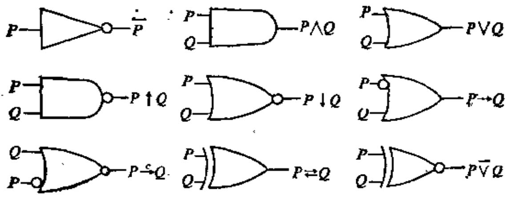  
图1-9.1

解：设 $C_1, C_2, C_3$ 分别表示三台计算机的答案。 $S$ 表示判断结果。根据题意有 1-9.1 表的真值表。

表1-9.1  

<table><tr><td>C1</td><td>C2</td><td>C3</td><td>S</td></tr><tr><td>F</td><td>F</td><td>F</td><td>F</td></tr><tr><td>F</td><td>F</td><td>T</td><td>F</td></tr><tr><td>F</td><td>T</td><td>F</td><td>F</td></tr><tr><td>F</td><td>T</td><td>T</td><td>T</td></tr><tr><td>T</td><td>F</td><td>F</td><td>F</td></tr><tr><td>T</td><td>F</td><td>T</td><td>T</td></tr><tr><td>T</td><td>T</td><td>F</td><td>T</td></tr><tr><td>T</td><td>T</td><td>T</td><td>T</td></tr></table>

$$
\begin{array}{l} S \leftrightarrow (\neg C _ {1} \wedge C _ {2} \wedge C _ {3}) \vee (C _ {1} \wedge \neg C _ {2} \wedge C _ {3}) \\ \vee \left(C _ {1} \wedge C _ {2} \wedge \neg C _ {3}\right) \vee \left(C _ {1} \wedge C _ {2} \wedge C _ {3}\right) \\ \Leftrightarrow \left(\left(\neg C _ {1} \vee C _ {1}\right) \wedge C _ {2} \wedge C _ {3}\right) \vee \left(C _ {1} \wedge \left(\neg C _ {2} \vee C _ {2}\right) \wedge C _ {3}\right) \\ \vee \left(C _ {1} \wedge C _ {2} \wedge \left(C _ {3} \vee \neg C _ {3}\right)\right) \\ \Leftrightarrow \left(C _ {2} \wedge C _ {9}\right) \vee \left(C _ {1} \wedge C _ {3}\right) \vee \left(C _ {1} \wedge C _ {2}\right) \\ \end{array}
$$

电路图如图1-9.2所示。

例题2 有一会议室，四周都有出入门，门旁装有开关（双态开关）。为了控制全室的照明，要求设计一个线路，使得改变任一只开关的状态，就能改

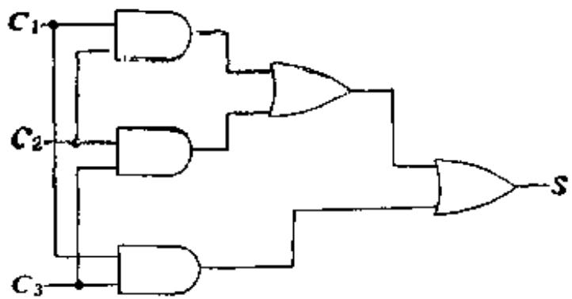

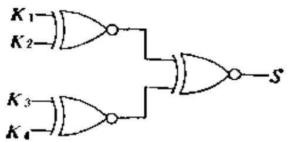  
图1-9.2  
图1-9.3

变全室的明暗。假设，室中无人时灯暗，有人时灯亮。写出控制电路的逻辑表达式并画出电路图。

解 会议室四扇门旁的开关表示为 $K_{1}, K_{2}, K_{3}, K_{4}$ 。“0”表示开关断开，“1”表示开关接通。S表示会议室的照明状态，“1”表示全室灯亮，“0”表示全室灯暗。

假设开始时,室内无人,灯暗,四只开关都处于“0”状态。有人进入室内时,随手改变门旁的开关状态,则会议室灯亮, $S$ 为“1”。此时四只开关中有三只(奇数)处于“0”状态。最后一个人离开会议室时,随手改变门旁的开关状态,会议室灯暗, $S$ 为“0”。如果该门恰是首次进入的门,则四只(偶数)开关都处于“0”状态。如果该门是另一扇门,则有两只(偶数)处于“0”状态。以此类推,总之,当有偶数只开关处于“0”状态时, $S$ 为“0”。有奇数只开关处于“0”状态,则 $S$ 为“1”,所以,我们有:

$$
\begin{array}{l} S \leftrightarrow (\neg K _ {1} \wedge \neg K _ {2} \wedge \neg K _ {3} \wedge K _ {4}) \vee (\neg K _ {1} \wedge \neg K _ {2} \wedge K _ {3} \wedge \neg K _ {4}) \\ V (\neg K _ {1} \wedge K _ {2} \wedge \neg K _ {3} \wedge \neg K _ {4}) V (K _ {1} \wedge \neg K _ {2} \wedge K _ {3} \wedge \neg K _ {4}) \\ \vee (\neg K _ {1} \wedge K _ {2} \wedge K _ {3} \wedge K _ {4}) \vee (K _ {1} \wedge \neg K _ {2} \wedge K _ {3} \wedge K _ {4}) \\ \vee \left(K _ {1} \wedge K _ {2} \wedge \neg K _ {3} \wedge K _ {4}\right) \vee \left(K _ {1} \wedge K _ {2} \wedge K _ {3} \wedge \neg K _ {4}\right) \\ \Leftrightarrow (\neg K _ {1} \wedge \neg K _ {2} \wedge (K _ {3} \overline {{\vee}} K _ {4})) \vee (\neg K _ {3} \wedge \neg K _ {4} \wedge (K _ {1} \overline {{\vee}} K _ {2})) \\ \vee \left(K _ {3} \wedge K _ {4} \wedge \left(K _ {1} \overline {{\vee}} K _ {2}\right)\right) \vee \left(K _ {1} \wedge K _ {2} \wedge \left(K _ {3} \overline {{\vee}} K _ {4}\right)\right) \\ \Leftrightarrow (\neg (K _ {1} \overline {{\vee}} K _ {2}) \wedge (K _ {3} \overline {{\vee}} K _ {4})) \vee ((K _ {1} \overline {{\vee}} K _ {2}) \wedge \neg (K _ {3} \overline {{\vee}} K _ {4})) \\ \Leftrightarrow \left(K _ {1} \bar {\vee} K _ {2}\right) \bar {\vee} \left(K _ {3} \bar {\vee} K _ {4}\right) \\ \end{array}
$$

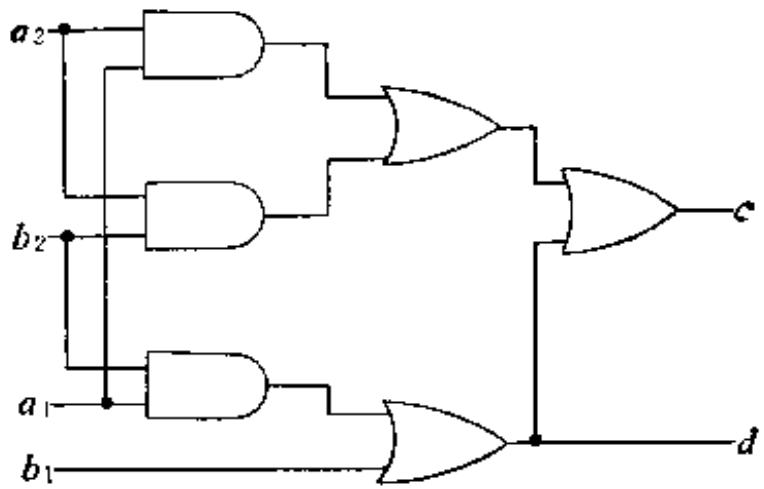  
图1-9.4

电路图如图1-9.3所示。

例题3 设计一台自动售货机，它只能接受一分和二分硬币，当投入硬币总值超过三分时，给出一根棒糖，并找回余额。

解 将投入硬币的情况分别表示为：

$$
\boldsymbol {A} = \left[ a _ {1}, a _ {2} \right]
$$

[0, 0]

[0,1]

[1,0]

[1, 1]

$$
\mathcal {B} = \left[ b _ {1}, b _ {2} \right]
$$

[0, 0]

[0,1]

[1,0]

[1, 1]

$$
C = [ c ]
$$

[0]

[1]

$$
D = [ d ]
$$

[0]   
[1]

投入0个一分硬币   
投入1个一分硬币   
投入2个一分硬币   
投入3个一分硬币

投入0个二分硬币   
投入1个二分硬币   
投入2个二分硬币   
投入3个二分硬币

投入硬币总额不满三分，不给棒糖  
投入硬币总额超过三分，给出一根棒糖

无余额找  
要找余额

根据题意，有真值表1-9.2。

$$
\begin{array}{l} c \leftrightarrow (\neg a _ {1} \wedge \neg a _ {2} \wedge b _ {1} \wedge \neg b _ {2}) \vee (\neg a _ {1} \wedge \neg a _ {2} \wedge b _ {1} \wedge b _ {2}) \\ V (\neg a _ {1} \wedge a _ {2} \wedge \neg b _ {1} \wedge b _ {2}) V (\neg a _ {1} \wedge a _ {2} \wedge b _ {1} \wedge \neg b _ {2}) \\ \end{array}
$$

表1-9.2  

<table><tr><td>\( a_1 \)</td><td>\( a_2 \)</td><td>\( b_1 \)</td><td>\( b_2 \)</td><td>c</td><td>d</td></tr><tr><td>0</td><td>0</td><td>0</td><td>0</td><td>0</td><td>0</td></tr><tr><td>0</td><td>0</td><td>0</td><td>1</td><td>0</td><td>0</td></tr><tr><td>0</td><td>0</td><td>1</td><td>0</td><td>1</td><td>1</td></tr><tr><td>0</td><td>0</td><td>1</td><td>1</td><td>1</td><td>1</td></tr><tr><td>0</td><td>1</td><td>0</td><td>0</td><td>0</td><td>0</td></tr><tr><td>0</td><td>1</td><td>0</td><td>1</td><td>1</td><td>0</td></tr><tr><td>0</td><td>1</td><td>1</td><td>0</td><td>1</td><td>1</td></tr><tr><td>0</td><td>1</td><td>1</td><td>1</td><td>1</td><td>1</td></tr><tr><td>1</td><td>0</td><td>0</td><td>0</td><td>0</td><td>0</td></tr><tr><td>1</td><td>0</td><td>0</td><td>1</td><td>1</td><td>1</td></tr><tr><td>1</td><td>0</td><td>1</td><td>0</td><td>1</td><td>1</td></tr><tr><td>1</td><td>0</td><td>1</td><td>1</td><td>1</td><td>1</td></tr><tr><td>1</td><td>1</td><td>0</td><td>0</td><td>1</td><td>0</td></tr><tr><td>1</td><td>1</td><td>0</td><td>1</td><td>1</td><td>1</td></tr><tr><td>1</td><td>1</td><td>1</td><td>0</td><td>1</td><td>1</td></tr><tr><td>1</td><td>1</td><td>1</td><td>1</td><td>1</td><td>1</td></tr></table>

$$
\begin{array}{l} V (\neg a _ {1} \wedge a _ {2} \wedge b _ {1} \wedge b _ {2}) V (a _ {1} \wedge \neg a _ {2} \wedge \neg b _ {1} \wedge b _ {2}) \\ V \left(a _ {1} \wedge \neg a _ {2} \wedge b _ {1} \wedge \neg b _ {2}\right) V \left(a _ {1} \wedge \neg a _ {2} \wedge b _ {1} \wedge b _ {2}\right) \\ V \left(a _ {1} \wedge a _ {2} \wedge \neg b _ {1} \wedge \neg b _ {2}\right) V \left(a _ {1} \wedge a _ {2} \wedge \neg b _ {1} \wedge b _ {2}\right) \\ V \left(a _ {1} \wedge a _ {2} \wedge b _ {1} \wedge \neg b _ {2}\right) V \left(a _ {1} \wedge a _ {2} \wedge b _ {1} \wedge b _ {2}\right) \\ \Leftrightarrow (a _ {1} \wedge a _ {2}) \vee (a _ {2} \wedge b _ {2}) \vee (a _ {1} \wedge b _ {2}) \vee b _ {1} \\ d \leftrightarrow (\neg a _ {1} \wedge \neg a _ {2} \wedge b _ {1} \wedge \neg b _ {2}) \vee (\neg a _ {1} \wedge \neg a _ {2} \wedge b _ {1} \wedge b _ {2}) \\ V (\neg a _ {1} \wedge a _ {2} \wedge b _ {1} \wedge \neg b _ {2}) \dot {V} (\neg a _ {1} \wedge a _ {2} \wedge b _ {1} \wedge b _ {2}) \\ V (a _ {1} \wedge \neg a _ {2} \wedge \neg b _ {1} \wedge b _ {2}) V (a _ {1} \wedge \neg a _ {2} \wedge b _ {1} \wedge \neg b _ {2}) \\ V \left(a _ {1} \wedge \neg a _ {2} \wedge b _ {1} \wedge b _ {2}\right) V \left(a _ {1} \wedge a _ {2} \wedge \neg b _ {1} \wedge b _ {2}\right) \\ \vee \left(a _ {1} \wedge a _ {2} \wedge b _ {1} \wedge \neg b _ {2}\right) \vee \left(a _ {1} \wedge a _ {2} \wedge b _ {1} \wedge b _ {2}\right) \\ \Leftrightarrow (a _ {1} \wedge b _ {2}) \vee b _ {1} \\ \end{array}
$$

对应的电路图如图1-9.4所示。

例题4 有一逻辑学家误入某部落，被拘于牢狱，首长意欲放行，他对逻辑学家说：“今有两门，一为自由，一为死亡，你可任意开启一门。为协助你脱逃，今加派两名战士负责解答你所提的任何问题。惟可虑者，此两战士中一名天性诚实，一名说谎成性，今后生死由你自己选择。”逻辑学家沉思片刻，即向一战士发问，然后开门从容离去。该逻辑学家应如何发问？

解 逻辑学家手指一门问身旁一名战士说：“这扇门是死亡门，他（指另一名战士）将回答‘是’，对吗？”

当被问战士回答“对”，则逻辑学家开启所指的门从容离去。当被问战士回答“否”，则逻辑学家开启另一门从容离去。

分析：如果被问者是诚实战士，他回答“对”。则另一名战士是说谎战士，他回答“是”，那么，这扇门不是死亡门。

如果被问者是诚实战士，他回答“否”。则另一名是说谎战士，他回答“不是”，那么，这扇门是死亡门。

如果被问者是说谎战士，可以类似分析。

设 $P_{1}$ 被问战士是诚实人。

$Q_{\bullet}$ 被问战士的回答是“是”。

R: 另一战士的回答是“是”。

$S_{1}$ 这扇门是死亡门。

我们有真值表1-9.3。

表1-9.3  

<table><tr><td>P</td><td>Q</td><td>R</td><td>S</td></tr><tr><td>T</td><td>T</td><td>T</td><td>F</td></tr><tr><td>T</td><td>F</td><td>F</td><td>T</td></tr><tr><td>F</td><td>T</td><td>F</td><td>F</td></tr><tr><td>F</td><td>F</td><td>T</td><td>T</td></tr></table>

$$
\begin{array}{l} R \leftrightarrow P \xrightarrow {\leftarrow} Q \\ S \leftrightarrow (P \wedge \neg Q) \vee (\neg P \wedge \neg Q) \\ \Leftrightarrow (P \vee \neg P) \wedge \neg Q \Leftrightarrow \neg Q \\ \end{array}
$$

因此，当被问人回答“是”时，此门不是死亡门，逻辑学家可开此门从容离去。当被问人回答“否”时，此门是死亡门，逻辑学家可另开一扇门从容离去。

# 1-9 习题

(1) 银行的金库装有自动报警装置。仅当总经理室的一个人工控制开

关合上时，它才能动作。如果这个人工开关合上，那么当金库的门被撬或者当工作人员尚未切断监视器电源且通向金库的通道上有人时，就要发出警报。试设计这个控制线路。

(2) 设计一个控制盥洗室照明的电路, 使得分别装在卧室和盥洗室的两只开关都能控制照明。  
(3) 设计一个二进制半加器的电路, 它的功能如表 1-9.4 所示。其中 $x$ 和 $y$ 是被加数, $S$ 是和, $C$ 是进位。

表1-9.4  

<table><tr><td>x</td><td>y</td><td>S</td><td>C</td></tr><tr><td>0</td><td>0</td><td>0</td><td>0</td></tr><tr><td>0</td><td>1</td><td>1</td><td>0</td></tr><tr><td>1</td><td>0</td><td>1</td><td>0</td></tr><tr><td>1</td><td>1</td><td>0</td><td>1</td></tr></table>

(4) 设计红绿灯自动控制线路。要求传感器中计数器内容 $Z_{1}$ 当 $Z \geqslant 5$ 时, 亮绿灯, 当 $Z \leqslant 2$ 时, 亮红灯, 当 $2 < Z < 5$ 时, 亮黄灯.

# 第二章 谓词逻辑

在命题逻辑中, 主要研究命题和命题演算, 其基本组成单位是原子命题, 并把它看作不可再分解的。

但是原子命题, 实际上还是可以作进一步分析的, 特别是两个原子命题间, 常常有一些共同特征, 为了刻划命题内部的逻辑结构, 就需要研究谓词逻辑。

此外，命题逻辑的推证中有着很大的局限性，有些简单的论断也不能用命题逻辑进行推证。

例如，所有的人都是要死的，苏格拉底是人，所以苏格拉底是要死的。

这个简单而有名的苏格拉底三段论，都无法用命题逻辑予以推证。这些都使我们要对命题的内部关系进行深入地研究。

# 2-1 谓词的概念与表示

命题是反映判断的句子，不反映判断的句子不是命题。一般地说，反映判断的句子是由主语和谓语两部份组成。例如，电子计算机是科学技术的工具。其中“电子计算机”是主语，“是科学技术的工具”是谓语。主语一般是客体，客体可以独立存在，它可以是具体的，也可以是抽象的。例如：小王、老师、3、4、××代表团、唯物主义等。用以刻划客体的性质或关系的即是谓词。例如：张三是个大学生，李四是个大学生，这两个命题可能用不同的符号P、Q表示，但是P和Q的谓语有同样的属性：“是个大学生”。因此引入一个符号表示“是个大学生”，再引入一种方法表示客体的名称，这样就能把“××是个大学生”这个命题的本质属性刻划出来。又例如：

(a) 他是三好学生。  
(b) 7 是质数。  
(c) 每天早晨做广播操是好习惯。  
(d) $\pmb{\delta}$ 大于3。  
(e) 哥白尼指出地球绕着太阳转。

在上述语句中“是三好学生”、“是质数”、“是好习惯”、“大于”、“指出”都是谓词。前三个是指明客体性质的谓词，后两个是指明两个客体之间关系的谓词。

我们将用大写字母表示谓词，用小写字母表示客体名称，例如 $\pmb{A}$ 表示“是个大学生”， $\pmb{c}$ 表示张三， $\pmb{\theta}$ 表示李四，则 $\pmb{A}(\pmb{c})$ ， $\pmb{A}(\pmb{\theta})$ 分别表示“张三是个大学生”，“李四是个大学生”。

用谓词表达命题, 必须包括客体和谓词字母两个部份, 一般地说, “ $b$ 是 $A$ ”类型的命题可用 $A(b)$ 表达。对于“ $a$ 是小于 $b$ ”这种两个客体之间关系的命题, 可表达为 $B(a, b)$ , 这里 $B$ 表示“是小于”。又如命题“点 $a$ 在 $b$ 与 $c$ 之中”可以表示为 $L: \cdots$ 在…和…之中, 故可记为 $L(a, b, c)$ 。

我们把 $A(b)$ 称作一元谓词， $B(a, b)$ 称作二元谓词， $L(a, b)$ 称作三元谓词，依次类推。

注意, 代表客体名称的字母, 它在多元谓词表示式中出现的次序与事先约定有关, 因此未经约定前, 上例记作 $L(a, b, c)$ 或 $L(b, c, a)$ 等都可以, 但一经约定, $L(a, b, c)$ 与 $L(b, c, a)$ 就代表两个不同的命题。

单独一个谓词不是完整的命题，我们把谓词字母后填以客体所得的式子称为谓词填式，这样谓词和谓词填式应该是两个不同的概念。

一般地说， $n$ 元谓词需要 $n$ 个客体名称插入到固定的位置上，如果 $A$ 为 $n$ 元谓词， $a_1, a_2, \cdots, a_n$ 是客体的名称，则 $A(a_1, a_2, \cdots, a_n)$ 就可成为一个命题。

通常，一元谓词表达了客体的“性质”，而多元谓词表达了客体之间的“关系”。

# 2-2 命题函数与量词

为了说明命题函数的概念，下面先举例解释命题与谓词的关系。

设 $H$ 是谓词“能够到达山顶”， $l$ 表示客体名称李四， $t$ 表示老虎， $c$ 表示汽车，那么 $H(l), H(t), H(c)$ 等分别表示各个不同的命题，但它们有一个共同的形式，即 $H(x)$ 。当 $x$ 分别取 $l, t, c$ 时就表示“李四能够到达山顶”，“老虎能够到达山顶”，“汽车能够到达山顶”。

同理，若 $L(x, y)$ 表示“ $x$ 小于 $y$ ”，那么 $L(2, 3)$ 表示了一个真命题：“2小于3”。而 $L(5, 1)$ 表示假命题：“5小于1”。

又如 $A(x, y, z)$ 表示一个关系“ $x$ 加上 $y$ 等于 $z$ ”。则 $A(3, 2, 5)$ 表示了真命题“ $3 + 2 = 5$ ”，面 $A(1, 2, 4)$ 表示了一个假命题“ $1 + 2 = 4$ ”。

从上述三个例子中可以看到 $H(x), L(x, y), A(x, y, z)$ 本身不是一个命题，只有当变元 $x, y, z$ 等取特定的客体时，才确定了一个命题。

定义2-2.1 由一个谓词，一些客体变元组成的表达式称为简单命题函数。

根据这个定义可以看到， $n$ 元谓词就是有 $n$ 个客体变元的命题函数，当 $n = 0$ 时，称为 0 元谓词，它本身就是一个命题，故命题是 $n$ 元谓词的一个特殊情况。

由一个或 $n$ 个简单命题函数以及逻辑联结词组合而成的表达式称复合命题函数。

逻辑联结词 $\neg, \land, \lor, \rightarrow, \rightleftarrows$ 的意义与命题演算中的解释完全类同。

例1 设 $S(x)$ 表示“ $x$ 学习根好”，用 $W(x)$ 表示“ $x$ 工作很好”。则 $\neg S(x)$ 表示“ $x$ 学习不是很好”。 $S(x) \wedge W(x)$ 表示“ $x$ 的工作，学习都很好”。 $S(x) \rightarrow W(x)$ 表示“若 $x$ 的学习很好，则 $x$ 工作

得很好。”

例2 用 $H(x, y)$ 表示“ $x$ 比 $y$ 长得高”。设 $l$ 表示李四， $c$ 表示张三。

则 $\neg H(l, c)$ 表示“李四不比张三长得高”。 $\neg H(l, c) \wedge \neg H(c, l)$ 表示“李四不比张三长得高”且“张三不比李四长得高”即“张三与李四同样高”。

例3 设 $Q(x, y)$ 表示“ $x$ 比 $y$ 重”，当 $x, y$ 指人或物时，它是一个命题，但若 $x, y$ 指实数时， $Q(x, y)$ 就不是一个命题。

命题函数不是一个命题, 只有客体变元取特定名称时, 才能成为一个命题。但是客体变元在哪些范围内取特定的值, 对是否成为命题及命题的真值极有影响。

例4 $R(x)$ 表示“ $x$ 是大学生”，如果 $x$ 的讨论范围为某大学里班级中的学生，则 $R(x)$ 是永真式。

如果 $\pmb{x}$ 的讨论范围为某中学里班级中的学生，则 $R(x)$ 是永假式。

如果 $x$ 的讨论范围为一个剧场中的观众，观众中有大学生也有非大学生，那么，对某些观众， $R(x)$ 为真，对另一些观众， $R(x)$ 为假。

例5 $(P(x,y)\wedge P(y,z))\to P(x,z)$

若 $P(x, y)$ 解释为“ $x$ 小于 $y$ ”，当 $x, y, z$ 都在实数域中取值，则这个式子表示为：“若 $x$ 小于 $y$ 且 $y$ 小于 $z$ ，则 $x$ 小于 $z$ ”。这是一个永真式。

如果 $P(x, y)$ 解释为“ $x$ 为 $y$ 的儿子”，当 $x, y, z$ 都指人，则“若 $x$ 为 $y$ 的儿子且 $y$ 是 $z$ 的儿子则 $x$ 是 $z$ 的儿子”。这个式子表达的是一个永假公式。

如果 $P(x, y)$ 解释为“ $x$ 距离 $y$ 10米”，若 $x, y, z$ 表示地面上的房子，那么“ $x$ 距离 $y$ 10米且 $y$ 距离 $z$ 10米则 $x$ 距离 $z$ 10米”。这个命题的真值将由 $x, y, z$ 的具体位置而定，它可能为 $\pmb{T}$ ，也可能为 $\pmb{F}$ 。

从上述两例可以看到, 命题函数确定为命题, 与客体变元的论述范围有关。在命题函数中, 命题变元的论述范围称作个体域。个体域可以是有限的, 也可以是无限的, 把各种个体域综合在一起作为论述范围的域称全总个体域。

使用上面所讲的一些概念，还不能用符号很好地表达日常生活中的各种命题。例如： $S(x)$ 表示 $x$ 是大学生，而 $x$ 的个体域为某单位的职工。那么 $S(x)$ 可以表示某单位职工都是大学生，也可以表示某单位存在一些职工是大学生。为了避免这种理解上的混乱，因此需要引入量词，以刻划“所有的”和“存在一些”的不同概念。

例如 (a) 所有的人都是要呼吸的。

(b) 每个学生都要参加考试。  
(3) 任何整数或是正的或是负的。

这三个例子都需要表示“对所有的 $x$ ”这样的概念，为此，引入符号 $(\forall x)$ 或 $(x)$ ，表示“对所有的 $x$ ”。

若设 $M(x):x$ 是人， $H(x):x$ 要呼吸。

$P(x):x$ 是学生， $Q(x):x$ 要参加考试。

$I(x):x$ 是整数， $R(x):x$ 是正数， $N(x):x$ 是负数。

则上述三例就记为：

(a) $(\forall x)(M(x)\rightarrow H(x))$   
(b) $(\forall x)(P(x)\rightarrow Q(x))$   
(0) $(\forall x)(I(x)\rightarrow (R(x)\lor N(x)))$

符号“ $\forall$ ”称为全称量词，用来表达“对所有的”“每一个”“对任一个”等。

另外还有一类量词记作 $(\exists x)$ , 表示“存在一些 $x$ ”。

例如 (a) 存在一个数是质数。

(b) 一些人是聪明的。  
(3) 有些人早饭吃面包。

设 $P(x): x$ 是质数。

$M(x)$ ： $\pmb{x}$ 是人。

$\pmb{R}(\pmb{x})$ ： $\pmb{x}$ 是聪明的。

$E(x)$ ： $\pmb{x}$ 早饭吃面包。

则上述三例可表示为：

(a) $(\exists x)(P(x))$   
(b) $(\exists x)(M(x)\wedge R(x))$   
（c） $(\exists x)(M(x)\wedge E(x))$

符号“ $\exists$ ”称为存在量词，可用来表达“存在一些”“至少有一个”“对于一些”等。

全称量词与存在量词统称为量词，在上述有关量词的例子中可以看出，每个由量词确定的表达式，都与个体域有关。例如： $(\forall x)(M(x) \rightarrow H(x))$ 表示所有的人都要呼吸，如果把个体域限制在“人类”这个范围内，那么亦可简单地表示为 $(\forall x)(H(x))$ 。在这个例子中指定论域，不仅与表达形式有关，而且不同的指定论域会有不同的问题真值。如设论域为“人类”则这个命题的真值为 $T$ ，如果论域为自然数，则命题的真值为 $F$ 。为此，在讨论带有量词的命题函数时，必须确定其个体域。为了方便，我们将所有命题函数的个体域全部统一，使用全总个体域。用了这个全总个体域后，对每一个客体变元的变化范围，用特性谓词如以限制。一般地，对全称量词，此特性谓词常作蕴含的前件，对存在量词，此特性谓词常作合取项。例如：在全总个体域中 $(\forall x)(H(x))$ 可写成 $(\forall x)(M(x) \rightarrow H(x))$ ，其中 $M(x)$ 为 $H(x)$ 的特性谓词。对 $(\exists x)(H(x))$ 可写成 $(\exists x)(M(x) \land H(x))$ ，特性谓词 $M(x)$ 限定了 $H(x)$ 中变元的范围。

# 2-1, 2-2 习题

(1) 用谓词表达式写出下列命题。

a）小张不是工人。  
b）他是田径或球类运动员。  
c）小莉是非常聪明和美丽的。  
d）若 $m$ 是奇数，则 $2m$ 不是奇数。  
e）每一个有理数是实数。

f）某些实数是有理数。  
g）并非每一个实数都是有理数。  
h）直线 $A$ 平行于直线 $B$ ，当且仅当直线 $A$ 不相交于直线 $B$ 。

(2) 找出以下十二个句子所对应的谓词表达式。

a）所有教练员是运动员。 $(J(x),L(x))$   
b）某些运动员是大学生。（S(x))  
c）某些教练是年老的，但是健壮的。（ $O(x),V(x))$   
d）金教练既不老但也不是健壮的。（j）  
e）不是所有运动员都是教练。  
f）某些大学生运动员是国家选手。（C（x））  
g）没有一个国家选手不是健壮的。  
h）所有老的国家选手都是运动员。  
i）没有一位女同志既是国家选手又是家庭妇女。（W(x)，H（x))  
j）有些女同志既是教练员又是国家选手。  
k）所有运动员都钦佩某些教练。（ $A(x,y)$ ）  
1）有些大学生不钦佩运动员。

# 2-3 谓词公式与翻译

我们知道，简单命题函数与逻辑联结词可以组合成一些谓词表达式。有了谓词与量词的概念，谓词表达式所能刻划的日常命题就能广泛而深入得多了。但是，怎样的谓词表达式才能成为谓词公式并能进行谓词演算呢？下面先介绍谓词的合式公式。

我们把 $A(x_{1}, x_{2}, \cdots, x_{n})$ 称作谓词演算的原子公式，其中 $x_{1}, x_{2}, \cdots, x_{n}$ 是客体变元，因此原子谓词公式包括下述形式的各种特例。如： $Q, A(x), A(x, y), A(f(x), y), A(x, y, z), A(a, y)$ 等。

定义2-3.1 谓词演算的合式公式，可由下述各条组成：

(1) 原子谓词公式是合式公式。  
(2) 若 $\pmb{A}$ 是合式公式, 则 $\neg A$ 是一个合式公式。

(3) 若 $A$ 和 $B$ 都是合式公式, 则 $(A \wedge B)$ , $(A \vee B)$ , $(A \rightarrow B)$ 和 $(A \overline{\rightarrow} B)$ 是合式公式。  
(4) 如果 $A$ 是合式公式, $\pmb{x}$ 是 $A$ 中出现的任何变元, 则 $(\forall x) A$ 和 $(\exists x) A$ 都是合式公式。  
(5) 只有经过有限次地应用规则 (1)、(2)、(3)、(4) 所得到的公式是合式公式。

在讨论命题公式时，曾用了关于圆括号的某些约定，即最外层的括号可以省略，在谓词合式公式中亦将遵守同样的约定，但需注意，量词后面若有括号则不能省略。

谓词合式公式，今后简称谓词公式。

下面举例说明如何用谓词公式表达自然语言中一些有关命题。

例题1 并非每个实数都是有理数。（ $R(x), Q(x))$ ）

解 $\neg (\forall x)(R(x)\rightarrow Q(x))$

例题3 没有不犯错误的人。（ $F(x), M(x))$ ）

解 $\neg (\exists x(M(x) \land \neg F(x)))$

例题3 尽管有人聪明，但未必一切人都聪明。（ $P(x), M(x)$ ）

解 $\exists x(M(x) \wedge P(x)) \wedge \neg (\forall x(M(x) \rightarrow P(x)))$ 。

例题4 这只大红书柜摆满了那些古书。

解法1 设 $F(x, y)$ ： $x$ 摆满了 $y$

$R(x)$ ： $\pmb{x}$ 是大红书柜

$Q(y)$ ： $\pmb{y}$ 是古书

$a_{1}$ 这只 $b_{2}$ 那些

$$
R (a) \wedge Q (b) \wedge F (a, b)
$$

解法2 设 $A(x)$ ： $\pmb{x}$ 是书柜

$B(x)$ ： $\pmb{x}$ 是大的

$C(x)$ ： $\pmb{x}$ 是红的

$D(y)$ ： $\pmb{y}$ 是古老的

$E(y)$ ： $\pmb{y}$ 是图书

$F(x, y)$ ： $x$ 摆满了 $y$

$a$ 这只 $b$ 那些

$$
A (a) \wedge B (a) \wedge C (a, \wedge D (b) \wedge E (b) \wedge F (a, b)
$$

由本例可知，对于命题翻译成谓词演算公式，机动性很大，由于对个体描述性质的刻划深度不同，就可翻译成不同形式的谓词公式。本例中 $R(x)$ 表示 $\pmb{x}$ 是大红书柜，而 $A(x) \wedge B(x) \wedge C(x)$ 也可表示大红书柜，但后一种将更方便于对书柜的大小颜色进行讨论，这样对个体刻划深度的不同就可翻译成不同的谓词公式。

例题5 在数学分析中极限定义为：任给小正数 $\varepsilon$ ，则存在一个正数 $\delta$ ，使得当 $0 < |x - a| < \delta$ 时有 $|f(x) - b| < \varepsilon$ 。此时即称 $\lim_{\delta \to 0} f(x) = b$ 。

解 $P(x, y)$ 表示“ $x$ 大于 $y$ ”， $Q(x, y)$ 表示“ $x$ 小于 $y$ ”，故 $\lim_{a \to a} f(x) = b$ 可表示为：

$$
\begin{array}{l} (\forall \varepsilon) (\exists \delta) (\forall x) ((\langle P (\varepsilon , 0) \rightarrow P (\delta , 0) \rangle) \wedge Q (| x - a |, \delta) \wedge P (| x - a |, \\ 0)) \rightarrow Q (| f (x) - b |, s)) \\ \end{array}
$$

# 2-3 习题

(1) 令 $P(x)$ 为“ $x$ 是质数”； $E(x)$ 为“ $x$ 是偶数”； $O(x)$ 为“ $x$ 是奇数”； $D(x, y)$ 为“ $x$ 除尽 $y$ ”。

把以下各式译成汉语：

a) $\mathcal{P}(5)$   
b) $E(2)\wedge P(2)$   
c) $(\forall x)(D(2, x) \rightarrow E(x))$   
d) $(\exists x)(E(x)\wedge D(x,6))$   
e) $(\forall x)(\neg E(x)\rightarrow \neg D(2,x))$   
f) $(\forall x)(E(x)\rightarrow (\forall y)(D(x,y)\rightarrow E(y)))$   
g) $(\forall x)(P(x)\rightarrow (\exists y)(E(y)\land D(x,y)))$   
h) $(\forall x)(O(x)\rightarrow (\forall y)(P(y)\rightarrow \neg D(x,y)))$

(2) 令 $P(x), L(x), R(x, y, z)$ 和 $E(x, y)$ 分别表示“ $x$ 是一个点”，“ $x$ 是一条直线”，“ $z$ 通过 $x$ 和 $y$ ”和“ $x = y$ ”。符号化下面的句子。

对每两个点有且仅有一条直线通过该两点。

(3) 利用谓词公式翻译下列命题。

a）如果有限个数的乘积为零，那么至少有一个因子等于零。  
b）对于每一个实数 $x$ ，存在一个更大的实数 $y$ 。  
c）存在实数 $x, y$ 和 $z$ ，使得 $x$ 与 $y$ 之和大于 $x$ 与 $z$ 之积。  
（4）用谓词公式写出下式。

若 $x < y$ 和 $s < 0$ , 则 $xz > yz$ .

(5) 自然数一共有三条公理。

a）每个数都有唯一的一个数是它的后继数。  
b) 没有一个数使数 1 是它的后继数。  
c）每个不等于1的数都有唯一的一个数是它的直接先行者。

用两个谓词表达上述三条公理。

(6) 用谓词公式刻划下述命题。

那位戴眼镜的用功的大学生在看这本大而厚的巨著。

(7) 取个体域为实数集 $R$ , 函数 $f$ 在 $a$ 点连续的定义是: $f$ 在点 $a$ 连续, 当且仅当对每个 $\varepsilon > 0$ , 存在一个 $\delta > 0$ , 使得对所有 $x$ , 若 $|x - a| < \delta$ , 则 $|f(x) - f(a)| < \varepsilon$ 。把上述定义用符号化的形式表达。

# 2-4 变元的约束

给定 $\alpha$ 为一个谓词公式, 其中有一部份公式形式为 $(\forall x)P(x)$ 或 $(\exists x)P(x)$ 。这里 $\forall, \exists$ 后面所跟的 $x$ 叫做量词的指导变元或作用变元, $P(x)$ 叫做相应量词的作用域或辖域。在作用域中 $x$ 的一切出现, 称为 $x$ 在 $a$ 中的约束出现, $x$ 亦称为被相应量词中的指导变元所约束。在 $a$ 中除去约束变元以外所出现的变元称作自由变元。自由变元是不受约束的变元, 虽然它有时也在量词的作用域中出现, 但它不受相应量词中指导变元的约束, 故我们可把自由变元看作是公式中的参数。

例题1 说明以下各式的作用域与变元约束的情况。

a) $(\forall x)(P(x)\rightarrow Q(x))$   
b) $(\forall x)(P(x)\rightarrow (\exists y)R(x,y))$   
c) $(\forall x)(\forall y)(P(x,y)\land Q(y,z))\land (\exists x)P(x,y)$   
d) $(\forall x)(P(x)\land (\exists x)Q(x,\varepsilon)\rightarrow (\exists y)R(x,y))\lor Q(x,y)$

解a） $(\forall x)$ 的作用域是 $P(x)\rightarrow Q(x),x$ 为约束变元。

b) $(\forall x)$ 的作用域是 $(P(x) \rightarrow (\exists y)R(x, y))$ ， $(\exists y)$ 的作用域是 $R(x, y)$ ， $x, y$ 都是约束变元。

c） $(\forall x)$ 和 $(\forall y)$ 的作用域是 $(P(x,y)\land Q(y,s))$ ，其中 $x,y$ 是约束变元， $s$ 是自由变元。（20号 $(\exists x)$ 的作用域是 $P(x,y)$ ，其中 $x$ 是约束变元， $y$ 是自由变元。在整个公式中， $x$ 是约束出现， $y$ 既是约束出现又是自由出现， $s$ 是自

由出现。

d) $(\forall x)$ 的作用域是 $(P(x) \land (\exists x) Q(x, z) \rightarrow (\exists y) R(x, y))$ ， $x$ 和 $y$ 都是约束变元，但 $Q(x, z)$ 中的 $x$ 是受 $\exists x$ 的约束，而不是受 $\forall x$ 的约束。 $Q(x, y)$ 中的 $x, y$ 是自由变元。

从约束变元的概念可以看出， $P(x_{1},x_{2},\dots ,x_{n})$ 是 $\pmb{n}$ 元谓词，它有 $\pmb{n}$ 个相互独立的自由变元，若对其中 $\pmb{k}$ 个变元进行约束则成为 $n - k$ 元谓词，因此，谓词公式中如果没有自由变元出现，则该式就成为一个命题。例如， $(\forall x)P(x,y,z)$ 是二元谓词。（ $\exists y)(\forall x)$ $P(x,y,z)$ 是一元谓词。

为了避免由于变元的约束与自由同时出现，引起概念上的混乱，故可对约束变元进行换名。使得一个变元在一个公式中只呈一种形式出现，即呈自由出现或呈约束出现。

我们知道，一个公式的约束变元所使用的名称符号是无关紧要的。故： $(\forall x)P(x)$ 与 $(\forall y)P(y)$ 具有相同的意义。设 $A(x)$ 表示 $x$ 不小于0，那么

$(\forall x)A(x)$ 表示一切 $x$ 都使得 $x$ 不小于0;

$(\forall y)A(y)$ 表示一切 $y$ 都使得 $y$ 不小于0；

$(\forall t)A(t)$ 表示一切 $t$ 都使得 $t$ 不小于0。

这三个命题在实数域中都表示假命题“一切实数均不小于 $0$ ”。同理 $(\exists x)P(x)$ 与 $(\exists y)P(y)$ 意义亦相同。

为此，我们可以对公式 $\alpha$ 中的约束变元更改名称符号，这种遵守一定规则的更改，称为约束变元的换名。其规则为：

(1) 对于约束变元可以换名, 其更改的变元名称范围是量词中的指导变元, 以及该量词作用域中所出现的该变元, 在公式的其余部份不变。

(2) 换名时一定要更改为作用域中没有出现的变元名称。

例题2 对 $(\forall x)(P(x) \rightarrow R(x, y)) \land Q(x, y)$ 换名。

解 可换名为： $(\forall z)(P(z) \rightarrow R(z, y)) \land Q(x, y)$ ，但不能改名为： $(\forall y)(P(y) \rightarrow R(y, y)) \land Q(x, y)$ 以及 $(\forall z)(P(z) \rightarrow R(x, y)) \land Q(x, y)$ 。因为后两种更改都将使公式中量词的约束范围有所变动。

对于公式中的自由变元，也允许更改，这种更改叫做代入。自

由变元的代入，亦需遵守一定的规则，这个规则叫做自由变元的代入规则，现说明如下：

(1) 对于谓词公式中的自由变元, 可以作代入, 代入时需对公式中出现该自由变元的每一处进行。  
(2) 用以代入的变元与原公式中所有变元的名称不能相同。

例题3 对 $(\exists x)(P(y) \land R(x, y))$ 代入。

解 对 $y$ 施行代入，经代入后公式为

$$
(\exists x) (P (z) \wedge R (x, z))
$$

但是 $(\exists x)(P(x) \land R(x, x))$ 与 $(\exists x)(P(z) \land R(x, y))$

这两种代入都是与规则不符的。

需要指出，量词作用域中的约束变元，当论域的元素是有限时，客体变元的所有可能的取代是可枚举的。

设论域元素为 $a_1, a_2, \dots, a_{n_0}$

则 $(\forall x)A(x)\Leftrightarrow A(a_{1})\wedge A(a_{2})\wedge \dots \wedge A(a_{n})$

$$
(\exists x) A (x) \Leftrightarrow A \left(a _ {1}\right) \vee A \left(a _ {2}\right) \vee \dots \vee A \left(a _ {n}\right)
$$

量词对变元的约束, 往往与量词的次序有关。

例如 $(\forall y)(\exists x)(x < (y - 2))$ 表示任何 $y$ 均有 $x$ ，使得 $x < y - 2$ 。 $(\exists y)(\exists x)(x < (y - 2))$ 表示存在 $y$ 有 $x$ ，使得 $x < y - 2$ 。

这些命题中的多个量词，我们约定从左到右的次序读出。需要注意的是量词次序不能颠倒，否则将与原命题意义不符。

# 2-4 习题

(1) 对下面每个公式指出约束变元和自由变元。

a) $(\forall x)P(x)\rightarrow P(y)$   
b) $(\forall x)(P(x)\land Q(x))\land (\exists x)S(x)$   
c） $(\exists x)(\forall y)(P(x)\land Q(y))\rightarrow (\forall x)R(x)$   
d) $(\exists x)(\exists y)(P(x,y)\land Q(z))$

(2) 如果论域是集合 $\{a, b, c\}$ , 试消去下面公式中的量词。

a) $(\forall x)P(x)$   
b) $(\forall x)R(x)\land (\forall x)S(x)$   
c) $(\forall x)(P(x)\rightarrow Q(x))$   
d) $(\forall x)\neg P(x)\lor (\forall x)P(x)$

(3) 寻求下列各式的真假值。

a) $(\forall x)(P(x)\lor Q(x))$ 其中 $P(x):x = 1,Q(x):x = 2$ 而且论域是 $\{1,2\}$

b) $(\forall x)(P \rightarrow Q(x)) \vee R(a)$ 其中 $P: 2 > 1, Q(x): x \leqslant 3, R(x): x > 5$ 而 $a: 5,$ 论域是 $\{-2, 3, 6\}$ 。

(4) 对下列谓词公式中的约束变元进行换名。

a) $\forall x\equiv y(P(x,z)\rightarrow Q(y))\stackrel {\sim}{\longrightarrow}S(x,y)$   
b) $(\forall x(P(x)\rightarrow (R(x)\lor Q(x)))\land \exists xR(x))\rightarrow \exists sS(x,s)$

(5) 对下列谓词公式中的自由变元进行代入。

a) $(\exists yA(x,y)\rightarrow \forall xB(x,s))\land \exists x\forall sC(x,y,s)$   
b) $(\forall yP(x,y)\land \exists zQ(x,z))\lor \forall xR(x,y)$

# 2-5 谓词演算的等价式与蕴含式

在谓词公式中常包含命题变元和客体变元，当客体变元由确定的客体所取代，命题变元用确定的命题所取代时，就称作对谓词公式赋值。一个谓词公式经过赋值以后，就成为具有确定真值 $\pmb{T}$ 或 $\pmb{F}$ 的命题。

定义2-5.1 给定任何两个谓词公式wff $A$ 和wff $B$ , 设它们有共同的个体域 $E$ , 若对 $A$ 和 $B$ 的任一组变元进行赋值, 所得命题的真值相同, 则称谓词公式 $A$ 和 $B$ 在 $E$ 上是等价的, 并记作: $A \Leftrightarrow B$ .

定义2-5.2 给定任意谓词公式wff $A$ ，其个体域为 $\pmb{E}$ ，对于 $\pmb{A}$ 的所有赋值，wff $\pmb{A}$ 都为真，则称wff $\pmb{A}$ 在 $\pmb{E}$ 上是有效的（或永真的）。

定义2-5.3 一个谓词公式wff $A$ ，如果在所有赋值下都为假，则称该wff $A$ 为不可满足的。

定义2-5.4 一个谓词公式wff $A$ ，如果至少在一种赋值下为真，则称该wff $A$ 为可满足的。

有了谓词公式的等价和永真等概念，就可以讨论谓词演算的一些等价式和蕴含式。

(1) 命题公式的推广

在命题演算中，任一永真公式，其中同一命题变元，用同一公式取代时，其结果也是永真公式，我们可以把这个情况推广到谓词公式之中，当谓词演算中的公式代替命题演算中永真公式的变元时，所得的谓词公式即为有效公式，故命题演算中的等价公式表和蕴含式表都可推广到谓词演算中使用。例如

$$
\begin{array}{l} (\forall x) (P (x) \rightarrow Q (x)) \Leftrightarrow (\forall x) (\neg P (x) \vee Q (x)) \\ (\forall x) P (x) \vee (\exists y) R (x, y) \\ \Leftrightarrow \neg (\neg (\forall x) P (x) \wedge \neg (\exists y) R (x, y)) \\ (\exists x) H (x, y) \wedge \neg (\exists x) H (x, y) \Leftrightarrow F \\ \end{array}
$$

(2) 量词与联结词之间的关系

为了说明这个问题，我们先举例讨论。

例1 设 $P(x)$ 表示 $x$ 今天来校上课，则 $\neg P(x)$ 表示 $x$ 今天没有来校上课。

故不是所有人今天来上课与存在一些人今天没有来上课在意义上相同，即 $\neg (\forall x)P(x)\Leftrightarrow (\exists x)\neg P(x)$ 。又，不是存在一些人今天来上课与所有的人今天都没有来上课在意义上相同，即 $\neg (\exists x)P(x)\Leftrightarrow (\forall x)\neg P(x)$ 。

为此我们得到公式：

$$
\begin{array}{l} \lnot (\forall x) P (x) \Leftrightarrow (\exists x) \lnot P (x) \\ \lnot (\exists x) P (x) \Leftrightarrow (\forall x) \lnot P (x) \\ \end{array}
$$

这里约定，出现在量词之前的否定，不是否定该量词，而是否定被量化了的整个命题。

对于量词的转化律，可在有限个体域上证明。

设个体域中的客体变元为 $a_1, a_2, \dots, a_n$ ，则

$$
\begin{array}{l} \lnot (\forall x) A (x) \Leftrightarrow \lnot (A (a _ {1}) \wedge A (a _ {2}) \wedge \dots \wedge A (a _ {n})) \\ \Leftrightarrow \neg A (a _ {1}) \vee \neg A (a _ {2}) \vee \dots \vee \neg A (a _ {n}) \\ \Leftrightarrow (\exists x) \neg A (x) \\ \end{array}
$$

$$
\begin{array}{l} \lnot (\exists x) A (x) \Leftrightarrow \lnot (A (a _ {1}) \vee A (a _ {2}) \vee \dots \vee A (a _ {n})) \\ \Leftrightarrow \neg A (a _ {1}) \wedge \neg A (a _ {2}) \wedge \dots \wedge \neg A (a _ {n}) \\ \Leftrightarrow (\forall x) \neg A (x) \\ \end{array}
$$

对于无穷个体域的情况，量词转化律也能作相应的推广。

可以看到，当我们将量词前面的 $\neg$ 移到量词的后面去时，存在量词改为全称量词，全称量词改为存在量词，反之，如将量词后面的 $\neg$ 移到量词前面去时，也要作相应的改变，这种量词与 $\neg$ 的关系是普遍成立的。

(3) 量词作用域的扩张与收缩

量词的作用域中，常有合取或析取项，如果其中为一个命题，则可将该命题移至量词作用域之外。如：

$$
\begin{array}{l} (\forall x) (A (x) \vee B) \Leftrightarrow ((\forall x) A (x) \vee B) \\ (\forall x) (A (x) \wedge B) \Leftrightarrow ((\forall x) A (x) \wedge B) \\ (\exists x) (A (x) \vee B) \Leftrightarrow ((\exists x) A (x) \vee B) \\ (\exists x) (A (x) \wedge B) \Leftrightarrow ((\exists x) A (x) \wedge B) \\ \end{array}
$$

这是因为在 $B$ 中不出现约束变元 $\pmb{x}$ ，故它属于或不属于量词的作用域均有同等意义。

从上述几个式子，我们还可推得如下几个式子。

$$
\begin{array}{l} ((\forall x) A (x) \rightarrow B) \Leftrightarrow (\exists x) (A (x) \rightarrow B) \\ ((\exists x) A (x) \rightarrow B) \Leftrightarrow (\forall x) (A (x) \rightarrow B) \\ (B \rightarrow (\forall x) A (x)) \Leftrightarrow (\forall x) (B \rightarrow A (x)) \\ (B \rightarrow (\exists x) A (x)) \Leftrightarrow (\exists w) (B \rightarrow A (x)) \\ \end{array}
$$

例2 证明 $((\forall x)A(x)\rightarrow B)\Leftrightarrow (\exists x)(A(x)\rightarrow B)$

证明 $(\forall x)A(x)\rightarrow B)\Leftrightarrow \neg (\forall x)A(x)\vee B$

$$
\begin{array}{l} \Leftrightarrow (\exists x) (\neg A (x)) \vee B \\ \Leftrightarrow (\exists x) \left(\square A (x) \vee B\right) \\ \Leftrightarrow (\exists x) (A (x) \rightarrow B) \\ \end{array}
$$

当谓词的变元与量词的指导变元不同时，亦能有类似于上述的公式。例如

$$
(\forall x) (P (x) \vee Q (y)) \Leftrightarrow ((\forall x) P (x) \vee Q (y))
$$

$$
(\forall x) ((\forall y) P (x, y) \wedge Q (z)) \Leftrightarrow ((\forall x) (\forall y) P (x, y) \wedge Q (z))
$$

(4) 量词与命题联结词之间的一些等价式

量词与命题联结词之间存在不同的结合情况，下面举例说明

一些等价公式。

例如联欢会上所有人既唱歌又跳舞和联欢会上所有人唱歌且所有人跳舞。这两个语句意义相同。故有

$$
(\forall x) (\Lambda (x) \wedge B (x)) \Leftrightarrow (\forall x) A (x) \wedge (\forall x) B (x)
$$

根据上式亦有：

$$
(\forall x) (\neg A (x) \wedge \neg B (x)) \Leftrightarrow (\forall x) (\neg A (x)) \wedge (\forall x) (\neg B (x))
$$

故 $\neg (\exists x)(A(x)\lor B(x))\Leftrightarrow \neg ((\exists x)A(x)\lor (\exists x)B(x))$

即 $(\exists x)(A(x)\lor B(x))\Leftrightarrow (\exists x)A(x)\lor (\exists x)B(x)$

(5) 量词与命题联结词之间的一些蕴含式

量词与命题联结词之间存在一些不同的结合情况，有些是蕴含公式。

例如 这些学生都聪明或这些学生都努力，可以推出这些学生都聪明或努力。但是这些学生都聪明或努力却不能推出这些学生都聪明或这些学生都努力。故有

$$
(\forall x) A (x) \vee (\forall x) B (x) \Rightarrow (\forall x) (A (x) \vee B (x))
$$

由上式可得

$$
(\forall x) (\neg A (x)) \vee (\forall x) (\neg B (x)) \Rightarrow (\forall x) (\neg A (x) \vee \neg B (x))
$$

即 $\neg ((\exists x)A(x)\wedge (\exists x)B(x))$

$$
\Rightarrow \neg (\exists x) (A (x) \wedge B (x))
$$

因此有

$$
(\exists x) (A (x) \wedge B (x)) \Rightarrow (\exists x) A (x) \wedge (\exists x) B (x)
$$

类似地有

$$
(\forall x) (A (x) \rightarrow B (x)) \Rightarrow (\forall x) A (x) \rightarrow (\forall x) B (x)
$$

$$
(\forall x) (A (x) \overleftarrow {\rightarrow} B (x)) \Rightarrow (\forall x) A (x) \overleftarrow {\rightarrow} (\forall x) B (x)
$$

上述这些等价式或蕴含式, 很多可以互相推导, 现将常用的式子列入表 2-5.1 中。

(6) 多个量词的使用

为了方便, 我们只举两个量词的情况, 更多量词的使用方法和它们类似。对于二元谓词如果不考虑自由变元, 可以有以下八种情况。

表2-5.1  

<table><tr><td>E25</td><td>(∃x) (A(x) ∨ B(x)) ⇌ (∃x) A(x) ∨ (∃x) B(x)</td></tr><tr><td>E26</td><td>(∀x) (A(x) ∧ B(x)) ⇌ (∀x) A(x) ∧ (∀x) B(x)</td></tr><tr><td>E27</td><td>¬(∃x) A(x) ⇌ (∀x) ¬A(x)</td></tr><tr><td>E28</td><td>¬(∀x) A(x) ⇌ (∃x) ¬A(x)</td></tr><tr><td>E29</td><td>(∀x) (A ∨ B(x)) ⇌ A ∨ (∀x) B(x)</td></tr><tr><td>E30</td><td>(∃x) (A ∧ B(x)) ⇌ A ∧ (∃x) B(x)</td></tr><tr><td>E31</td><td>(∃x) (A(x) → B(x)) ⇌ (∀x) A(x) → (∃x) B(x)</td></tr><tr><td>E32</td><td>(∀x) A(x) → B ⇌ (∃x) (A(x) → B)</td></tr><tr><td>E33</td><td>(∃x) A(x) → B ⇌ (∀x) (A(x) → B)</td></tr><tr><td>E34</td><td>A→(∀x) B(x) ⇌ (∀x) (A→B(x))</td></tr><tr><td>E35</td><td>A→(∃x) B(x) ⇌ (∃x) (A→B(x))</td></tr><tr><td>I16</td><td>(∀x) A(x) ∨ (∀x) B(x) ⇌ (∀x) (A(x) ∨ B(x))</td></tr><tr><td>I16</td><td>(∃x) (A(x) ∧ B(x)) ⇌ (∃x) A(x) ∧ (∃x) B(x)</td></tr><tr><td>I17</td><td>(∃x) A(x) → (∀x) B(x) ⇌ (∀x) (A(x) → B(x))</td></tr></table>

$$
(\forall x) (\forall y) A (x, y) \quad (\forall y) (\forall x) A (x, y)
$$

$$
(\exists x) (\exists y) A (x, y) \quad (\exists y) (\exists x) A (x, y)
$$

$$
(\forall x) (\exists y) A (x, y) \quad (\exists y) (\forall x) A (x, y)
$$

$$
(\forall y) (\exists x) A (x, y) \quad (\exists x) (\forall y) A (x, y)
$$

例如设 $A(x, y)$ 表示 $\pmb{x}$ 和 $\pmb{y}$ 同姓，论域 $\pmb{x}$ 是甲村的人， $\pmb{y}$ 是乙村的人，则

$(\forall x)(\forall y)A(x,y)$ ：甲村与乙村所有的人都同姓。

$(\forall y)(\forall x)A(x,y)$ ：乙村与甲村所有的人都同姓。

显然上述两个语句的含义是相同的。故

$$
(\forall x) (\forall y) A (x, y) \Leftrightarrow (\forall y) (\forall x) A (x, y)
$$

同理 $(\exists x)(\exists y)A(x,y)$ 甲村与乙村有人同姓。

$(\exists y)(\exists x)A(x,y)$ ：乙村与甲村有人同姓。

这两个语句的含义也相同。故

$$
(\exists x) (\exists y) A (x, y) \Leftrightarrow (\exists y) (\exists x) A (x, y)
$$

但是， $(\forall x)(\exists y)A(x, y)$ 表示对于甲村所有人，乙村都有人和他同姓。

$(\exists y)(\forall x)A(x,y)$ 表示存在一个乙村的人，甲村的人和他同姓。  
$(\forall y)(\exists x)A(x,y)$ 表示对于乙村所有的人，甲村都有人与他同姓。  
$(\exists x)(\forall y)A(x,y)$ 表示存在一个甲村的人，乙村的人都和他同姓。

上述四种语句, 表达的情况各不相同, 故全称量词与存在量词在公式中出现的次序, 不能随意更换。具有两个量词的谓词公式, 有如下一些蕴含关系。

$$
\begin{array}{l} (\forall x) (\forall y) A (x, y) \Rightarrow (\exists y) (\forall x) A (x; y) \\ (\forall y) (\forall x) A (x, y) \Rightarrow (\exists x) (\forall y) A (x, y) \\ (\exists y) (\forall x) A (x, y) \Rightarrow (\forall x) (\exists y) A (x, y) \\ (\exists x) (\forall y) A (x, y) \Rightarrow (\forall y) (\exists x) A (x, y) \\ (\forall x) (\exists y) A (x, y) \Rightarrow (\exists y) (\exists x) A (x, y) \\ (\forall y) (\exists x) A (x, y) \Rightarrow (\exists x) (\exists y) A (x, y) \\ \end{array}
$$

# 2-5 习题

(1) 考虑以下赋值,

论域 $D = \{1,2\}$

指定常数 $a$ 和 $\pmb{b}$

<table><tr><td>a</td><td>b</td></tr><tr><td>1</td><td>2</td></tr></table>

指定函数 $\pmb{f}$

<table><tr><td>f(1)</td><td>f(2)</td></tr><tr><td>2</td><td>1</td></tr></table>

指定谓词 $\pmb{P}$

<table><tr><td>P(1, 1)</td><td>P(1, 2)</td><td>P(2, 1)</td><td>P(2, 2)</td></tr><tr><td>T</td><td>T</td><td>F</td><td>F</td></tr></table>

求以下各公式的真值。

a) $P(a, f(a)) \wedge P(b, f(b))$   
b) $(\forall x)(\exists y)P(y,x)$   
c) $(\forall x)(\forall y)(P(x, y) \rightarrow P(f(x), f(y)))$

(2）对以下各公式赋值后求真值。

a) $(\forall x)(P(x)\rightarrow Q(f(x),a))$   
b) $(\exists x)(P(f(x))\land Q(x,f(a)))$   
c） $(\exists x)(P(x)\land Q(x,a))$   
d) $(\forall x)(\exists y)(P(x)\land Q(x,y))$

其中，论域 $D = \{1,2\}$ ， $a = 1$

<table><tr><td>f(1)</td><td>f(2)</td></tr><tr><td>2</td><td>1</td></tr></table>

<table><tr><td>P(1)</td><td>P(2)</td></tr><tr><td>F</td><td>T</td></tr></table>

<table><tr><td>Q(1, 1)</td><td>Q(1, 2)</td><td>Q(2, 1)</td><td>Q(2, 2)</td></tr><tr><td>T</td><td>T</td><td>F</td><td>F</td></tr></table>

(3) 举例说明下列各蕴含式。

a) $\neg ((\exists x)P(x)\land Q(a))\Rightarrow (\exists x)P(x)\rightarrow \neg Q(a)$   
b) $(\forall x)(\neg P(x)\rightarrow Q(x)),(\forall x)\neg Q(x)\Rightarrow P(a)$   
c) $(\forall x)(P(x)\rightarrow Q(x)),(\forall x)(Q(x)\rightarrow R(x))\Rightarrow (\forall x)(P(x)\rightarrow R(x))$   
d) $(\forall x)(P(x)\lor Q(x)),(\forall x)\neg P(x)\Rightarrow (\exists x)Q(x)$   
e) $(\forall x)(P(x)\lor Q(x)),(\forall x)\neg P(x)\Rightarrow (\forall x)Q(x)$   
(4) 求证 $(\exists x)(A(x) \rightarrow B(x)) \Leftrightarrow (\forall x) A(x) \rightarrow (\exists x) B(x)$   
(5) 求证 $(\forall x) A(x) \vee (\forall x) B(x) \Rightarrow (\forall x) (A(x) \vee B(x))$   
(6) 判断下列推证是否正确。

$$
\begin{array}{l} (\forall x) (A (x) \rightarrow B (x)) \Leftrightarrow (\forall x) (\neg A (x) \vee B (x)) \\ \Leftrightarrow (\forall x) \neg (A (x) \wedge \neg B (x)) \\ \Leftrightarrow \neg (\exists x) (A (x) \wedge \neg B (x)) \\ \Leftrightarrow \neg ((\exists x) A (x) \wedge (\exists x) \neg B (x)) \\ \Leftrightarrow \neg (\exists x) A (x) \vee \neg (\exists x) \neg B (x) \\ \Leftrightarrow \neg (\exists x) A (x) \vee (\forall x) B (x) \\ \Leftrightarrow (\exists x) A (x) \rightarrow (\forall x) B (x) \\ \end{array}
$$

(7) 求证 $(\forall x)(\forall y)(P(x) \rightarrow Q(y)) \Leftrightarrow (\exists x) P(x) \rightarrow (\forall y) Q(y)$

# 12-6 前束范式

在命题演算中，常常要将公式化成规范形式，对于谓词演算，也有类似情况，一个谓词演算公式，可以化为与它等价的范式。

定义2-6.1 一个公式，如果量词均在全式的开头，它们的作用域，延伸到整个公式的末尾，则该公式叫做前束范式。

前束范式可记为下述形式：

$(\square v_{1})(\square v_{2}) \cdots (\square v_{n}) A$ ，其中□可能是量词 $\forall$ 或量词 $\exists$ ， $v_{i} (i = 1, 2, \cdots, n)$ 是客体变元， $A$ 是没有量词的谓词公式。

例如 $(\forall x)(\forall y)(\exists z)(Q(x,y)\rightarrow R(z)),(\forall y)(\forall x)(\neg P(x,y)\rightarrow Q(y))$ 等都是前束范式。

定理2-6.1 任意一个谓词公式，均和一个前束范式等价。

证明 首先利用量词转化公式，把否定深入到命题变元和谓词填式的前面，其次利用 $(\forall x)(A \lor B(x)) \Leftrightarrow A \lor (\forall x)B(x)$ 和 $(\exists x)(A \land B(x)) \Leftrightarrow A \land (\exists x)B(x)$ 把量词移到全式的最前面，这样便得到前束范式。

例题1 把公式 $(\forall x)P(x)\rightarrow (\exists x)Q(x)$ 转化为前束范式。

解 $(\forall x)P(x)\rightarrow (\exists x)Q(x)\Leftrightarrow (\exists x)\neg P(x)\vee (\exists x)Q(x)$

$$
\Leftrightarrow (\exists x) (\neg P (x) \vee Q (x))
$$

例题2 化公式 $(\forall x)(\forall y)((\exists z)(P(x,z)\land P(y,z))$

$\rightarrow (\exists u)Q(x,y,u))$ 为前束范式。

解 原式 $\Leftrightarrow (\forall x)(\forall y)(\neg (\exists z)(P(x, s) \land P(y, s)) \lor (\exists u) Q(x, y, u))$

$$
\begin{array}{l} \Leftrightarrow (\forall x) (\forall y) ((\forall z) (\neg P (x, z) \vee \neg P (y, z)) \vee (\exists u) Q (x, y, u)) \\ \Leftrightarrow (\forall x) (\forall y) (\forall z) (\exists u) (\neg P (x, z) \vee \neg P (y, z) \vee Q (x, y, u)) \\ \end{array}
$$

例题3 把公式 $\neg (\forall x)\{(\exists y)A(x,y)\}$

$$
\begin{array}{l} \rightarrow (\exists x) (\forall y) [ B (x, y) \wedge (\forall y) (A (y, x) \\ \rightarrow B (x, y)) ] \} \text {化 为 前 束 范 式} _ {\bullet} \\ \end{array}
$$

解 第一步否定深入

原式 $\Leftrightarrow (\exists x) \neg \{\neg (\exists y) A(x, y) \vee (\exists x) (\forall y) [B(x, y) \wedge$

$$
(\forall y) (A (y, x) \rightarrow B (x, y)) ] \}
$$

$$
\begin{array}{l} \Leftrightarrow (\exists x) \left\{\left(\exists y\right) A (x, y) \wedge (\forall x) (\exists y) [ \neg B (x, y) \vee \right. \\ (\exists y) \neg (A (y, x) \rightarrow B (x, y)) ] \} \\ \end{array}
$$

第二步改名，以便把量词提到前面。

$$
\begin{array}{l} \Leftrightarrow (\exists x) \{(\exists y) A (x, y) \wedge (\forall u) (\exists R) [ \neg B (u, R) \vee \\ (\exists z) \neg (A (z, u) \rightarrow B (u, z)) ] \} \\ \Leftrightarrow (\exists x) (\exists y) (\forall u) (\exists R) (\exists z) \{A (x, y) \wedge [ \neg B (u, R) \\ \left. \vee \neg (A (z, u) \rightarrow B (u, z)) ] \right\} \\ \end{array}
$$

定义2-6.2 一个wff $\pmb{A}$ 如果具有如下形式称为前束合取范式。

$$
\begin{array}{l} (\square v _ {1}) (\square v _ {2}) \dots (\square v _ {n}) (A _ {1 1} \vee A _ {1 2} \vee \dots \vee A _ {1 n}) \wedge (A _ {2 1} \vee A _ {2 2} \\ \vee \dots \vee A _ {2 l _ {1}}) \wedge \dots \wedge (A _ {m 1} \vee A _ {m 2} \vee \dots \vee A _ {m l _ {m}}) \\ \end{array}
$$

其中 $\square$ 可能是量词 $\forall$ 或 $\exists, v_{i}(i = 1,2,\dots,n)$ 是客体变元， $A_{ij}$ 是原子公式或其否定。

例如公式

$(\forall x)(\exists z)(\forall y)\{[\neg P \vee (x \neq a) \vee (z = b)] \wedge [Q(y) \vee (a = b)]\}$ 是前束合取范式。

定理2-6.2 每一个wff $A$ 都可转化为与其等价的前束合取范式。（证明略） □

我们用一个例子来说明这个定理。

例题4 将 $\operatorname{wff} D: (\forall x)[(\forall y)P(x) \vee (\forall z)q(z, y) \rightarrow \neg (\forall y)R(x, y)]$ 化为与它等价的前束合取范式。

解 第一步取消多余量词

$$
D \leftrightarrow (\forall x) [ P (x) \vee (\forall z) q (z, y) \rightarrow \neg (\forall y) R (x, y) ]
$$

第二步换名

$$
D \Leftrightarrow (\forall x) [ P (x) \vee (\forall z) q (z, y) \rightarrow \neg (\forall w) R (x, w) ]
$$

第三步消去条件联结词

$$
D \Leftrightarrow (\forall x) [ \neg (P (x) \vee (\forall z) q (z, y)) \vee \neg (\forall w) R (x, w) ]
$$

第四步将 $\text{门}$ 深入

$$
D \Leftrightarrow (\forall x) [ (\neg P (x) \wedge (\exists z) \neg q (z, y)) \vee (\exists w) \neg R (x, w) ]
$$

第五步将量词推到左边

$$
\begin{array}{l} D \Leftrightarrow (\forall x) (\exists z) (\exists w) [ (\neg P (x) \wedge \neg q (s, y)) \vee \neg R (x, w) ] \\ \Leftrightarrow (\forall x) (\exists z) (\exists w) [ (\neg P (x) \vee \neg R (x, w)) \cdot A \\ (\neg q (x, y) \vee \neg R (x, w) ] \\ \end{array}
$$

定义2-6.3 一个wff $A$ 如具有如下形式则称为前束析取范式。

$$
\begin{array}{l} (\square v _ {1}) (\square v _ {2}) \dots (\square v _ {m}) [ A _ {1 1} \wedge A _ {1 2} \wedge \dots \wedge A _ {1 i _ {1}} ] \vee [ A _ {2 1} \wedge A _ {2 2} \\ \Lambda \dots \Lambda A _ {2 l _ {2}} ] \vee \dots \vee [ A _ {m 1} \wedge A _ {m 2} \wedge \dots \wedge A _ {m l _ {m}} ] \\ \end{array}
$$

其中 $\square, v_{i}$ 与 $A_{ij}$ 的概念与定义2-6.2中相同。

定理2-6.8 每一个wff $\pmb{A}$ 都可以转换为与它等价的前束析取范式。（证明略）

任一个wff $\pmb{A}$ 转换为等价的前束析取范式的步骤与例题4类同。

# 2-6 习题

(1) 把以下各式化为前束范式。  
a) $(\forall x)(P(x)\rightarrow (\exists y)Q(x,y))$   
b） $(\exists x)(\neg ((\exists y)P(x,y))\rightarrow ((\exists z)Q(z)\rightarrow R(x)))$   
c) $(\forall x)(\forall y)(((\exists z)P(x,y,z)\land (\exists u)Q(x,u))\rightarrow (\exists v)Q(y,v)))$   
(2) 求等价于下面 wff 的前束合取范式与前束析取范式。  
a） $(\exists x)P(x)\vee (\exists x)Q(x))\rightarrow (\exists x)(P(x)\vee Q(x))$   
b) $(\forall x)(P(x)\rightarrow (\forall y)((\forall z)Q(x,y)\rightarrow \neg (\forall z)R(y,x)))$   
c) $(\forall x)P(x)\rightarrow (\exists x)((\forall z)Q(x,\varepsilon)\vee (\forall z)R(x,y,\varepsilon))$   
d) $(\forall x)(P(x)\rightarrow Q(x,y))\rightarrow ((\exists y)P(y)\land (\exists z)Q(y,z))$

# 2-7 谓词演算的推理理论

谓词演算的推理方法, 可以看作是命题演算推理方法的扩张。因为谓词演算的很多等价式和蕴含式, 是命题演算有关公式的推广, 所以命题演算中的推理规则, 如 $P, T$ 和 $CP$ 规则等亦可在谓词的推理理论中应用, 但是在谓词推理中, 某些前提与结论可能是受量词限制的, 为了使用这些等价式和蕴含式, 必须在推理过程中有消去和添加量词的规则, 以便使谓词演算公式的推理过程可类似于命题演算中推理理论那样进行。现介绍如下规则。

(1) 全称指定规则, 它表示为 $US$

$$
\frac {(\forall x) P (x)}{\therefore P (c)}
$$

这里 $P$ 是谓词，而 $\sigma$ 是论域中某个任意的客体。例如设论域为全人类。 $P(x)$ 表示“ $x$ 总是要死的”，如果我们有 $(\forall x)P(x)$ 即是“所有人总是要死的”，那么全称指定规则可有结论“苏格拉底总是要死的”。

(2) 全称推广规则, 它表示为 $UG$

$$
\frac {P (x)}{\therefore (\forall x) P (x)}
$$

这个规则是要对命题量化，如果能够证明对论域中每一个客体 $\pmb{\sigma}$ 断言 $P(c)$ 都成立，则全称推广规则可得到结论 $(\forall x)P(x)$ 成立。在应用本规则时，必须能够证明前提 $P(x)$ 对论域中每一可能的 $\pmb{x}$ 是真。

(3) 存在指定规则, 它可表示为 $ES$

$$
\frac {(\exists x) P (x)}{\therefore P (c)}
$$

这里 $\pmb{o}$ 是论域中的某些客体，必须注意，应用存在指定规则，其指定的客体 $\pmb{o}$ 不是任意的。例如 $(\exists x)P(x)$ 和 $(\exists x)Q(x)$ 都真，则对于某些 $\pmb{c}$ 和 $d$ ，可以断定 $P(c)\wedge Q(d)$ 必定为真，但不能断定 $P(c)\wedge Q(c)$ 是真。

(4) 存在推广规则, 它表示为 $EG$

$$
\frac {P (c)}{\therefore (\exists x) P (x)}
$$

这里 $\pmb{\sigma}$ 是论域中的一个客体，这个规则比较明显，对于某些客体 $\pmb{c}$ ，若 $P(c)$ 为真，则在论域中必有 $(\exists x)P(x)$ 为真。

例题1 证明 $(\forall x)(H(x) \rightarrow M(x)) \land H(s) \Rightarrow M(s)$ 这是著名的苏格拉底论证。

其中 $E(x):x$ 是一个人。

$M(x)$ ： $\pmb{x}$ 是要死的。

苏格拉底。

证明(1) $(\forall x)(H(x)\rightarrow M(x))$   
(2) $H(s) \rightarrow M(s)$ US(1)   
(3) $H(s)$ P   
(4) $M(s)$ （20 $\pmb{T}(\pmb{2})(\pmb{3})\pmb{I}$

例题2 证明 $(\forall x)(C(x) \rightarrow W(x) \land R(x)) \land (\exists x)(C(x) \land Q(x))$

$$
\Rightarrow (\exists x) (Q (x) \wedge R (x))
$$

证明(1) $(\forall x)(C(x)\rightarrow W(x)\land R(x))$

(2) $(\exists x)(C(x)\land Q(x))$   
(3) $C(a)\wedge Q(a)$ ES(2)   
(4) $C(a) \to W(a) \wedge R(a)$ US(1)   
(5) $C(a)$ （20 $\pmb {T}(3)\pmb{I}$   
(6) $W(a)\wedge R(a)$ （20 $\pmb {T}(4)(5)\pmb{I}$   
(7) $Q(a)$ （20 $\pmb{T}(3)\pmb{I}$   
(8) $R(a)$ （20 $\pmb{T}(6)$   
(9) $Q(a)\wedge R(a)$ （20 $\pmb {T}(7)(8)\pmb{I}$   
(10) $(\exists x)(Q(x)\land R(x))$ EG

注意本例推导过程中第(3)与(4)两条次序不能颠倒，若先用 $US$ 规则得到 $C(a) \rightarrow W(a) \wedge R(a)$ ，则再用 $ES$ 规则时，不一定得到 $C(a) \wedge Q(a)$ ，一般地应为 $C(b) \wedge Q(b)$ ，故无法推证下去。

例题3 证明 $(\forall x)(P(x) \vee Q(x)) \Rightarrow (\forall x)P(x) \vee (\exists x)Q(x)$

证法1把 $\neg ((\forall x)P(x)\lor (\exists x)Q(x))$ 作为附加前提

(1) $\neg ((\forall x)P(x)\lor (\exists x)Q(x))$   
(2) $\neg (\forall x) P(x) \land \neg (\exists x) Q(x)$   
(3) $\neg (\forall x)P(x)$ （20 $T(2)I$   
(4) $(\exists x)\neg P(x)$ （20 $T(3)E$   
(5) $\neg (\exists x)Q(x)$ $T(2)I$   
(6) $(\forall x)\neg Q(x)$ （20 $T(5)E$   
(7) $\neg P(c)$ ES(4)   
(8) $\neg Q(c)$ US(6)   
(9) $\neg P(c) \land \neg Q(c)$ $T(7)(8)I$   
(10) $\neg (P(c) \lor Q(c))$ （204  
(11) $(\forall x)(P(x)\lor Q(x))$   
(12) $P(c)\vee Q(c)$ US

(13) $\neg (P(c) \lor Q(c)) \land (P(c) \lor Q(c))$ $T(10)(12)I$ 矛盾

证法2本题可用 $CP$ 规则，原题为

$$
(\forall x) (P (x) \vee Q (x)) \Rightarrow \neg (\forall x) P (x) \rightarrow (\exists x) Q (x)
$$

(1) $\neg (\forall x) P(x)$ $P$ (附加前提)   
(2) $(\exists x)\neg P(x)$ （20 $T(1)E$   
(3) $\neg P(c)$ ES(2)   
(4) $\langle \forall x\rangle (P(x)\lor Q(x))$   
(5) $P(c)\vee Q(c)$ US(4)   
(6) $Q(c)$ （20 $\pmb {T}(3)(5)\pmb{I}$   
(7) $(\exists x)Q(x)$ EG(6)   
(8) $\neg (\forall x)P(x)\rightarrow (\exists x)Q(x)$

例题4 任何人违反交通规则，则要受到罚款，因此，如果没有罚款，则没有人违反交通规则。

解设 $S(x,y)$ ： “ $\pmb{x}$ 违反 $\pmb{y}_{\bullet}$ ” $\pmb{x}$ 的论域为”人”。

$M(y)$ ： “y是交通规则。”

$P(z)$ “是罚款。”

$R(x,z)$ ： “x受到 $\pmb {z}_0$

故假设与结论可符号化地表示为：

$$
H: (\forall x) \left\langle \right. (\exists y) (S (x, y) \wedge M (y)) \rightarrow (\exists z) (P (z) \wedge R (x, z))\left. \right)
$$

$$
C: \neg (\exists \varepsilon) P (s) \rightarrow (\forall x) (\forall y) (S (x, y) \rightarrow \neg M (y))
$$

因为结论是条件式，故我们可用 $CP$ 规则进行推理，下面推导是否严格？

(1) $(\forall x)((\exists y)(S(x, y) \land M(y)) \rightarrow (\exists z)(P(z) \land R(x, z)))$   
(2) $(\exists y)(S(b, y) \land M(y)) \rightarrow (\exists z)(P(z) \land R(b, z))$ US(1)   
(3) $\neg (\exists z)P(z)$ $P$ (附加前提)   
(4) $(\forall z)\neg P(z)$ （20 $T(3)E$   
(5) $\neg P(a)$ US(4)   
(6) $\neg P(a) \lor \neg R(b, a)$   
(7) $(\forall z)(\neg P(z)\lor \neg R(b,z))$ UG(6)   
(8) $\neg (\exists z)(P(z)\land R(b,z))$ （20 $T(\neg)E$   
(9) $\neg (\exists y)(S(b, y) \land M(y))$ $T(2)(8)I$   
(10) $(\forall y)(\neg S(b, y) \lor \neg M(y))$   
(11) $(\forall y)(S(b, y) \rightarrow \neg M(y))$ （20 $T(10)\pmb{E}$   
(12) $(\forall x)(\forall y)(S(x, y) \rightarrow \neg M(y))$ UG(11)   
(13) $\neg (\exists z)P(z)\rightarrow (\forall x)(\forall y)(S(x,y)\rightarrow \neg M(y))$ CP

# 2-7 习题

(1) 证明下列各式。

a) $(\forall x)(\neg A(x)\rightarrow B(x)),(\forall x)\neg B(x)\Rightarrow (\exists x)A(x)$   
b) $(\exists x)A(x)\rightarrow (\forall x)B(x)\Rightarrow (\forall x)(A(x)\rightarrow B(x))$   
c) $(\forall x)(A(x)\rightarrow B(x)),(\forall x)(C(x)\rightarrow \neg B(x))$

$$
\Rightarrow (\forall x) (C (x) \rightarrow \neg A (x))
$$

d) $(\forall x)(A(x)\lor B(x)),(\forall x)(B(x)\rightarrow \neg C(x)),(\forall x)C(x)$

$$
\Rightarrow (\forall x) A (x)
$$

(2）用 $CP$ 规则证明

a) $(\forall x)(P(x)\rightarrow Q(x))\Rightarrow (\forall x)P(x)\rightarrow (\forall x)Q(x)$   
b) $(\forall x)(P(x)\lor Q(x))\Rightarrow (\forall x)P(x)\lor (\exists x)Q(x)$

(3) 符号化下列命题并推证其结论。

a）所有有理数是实数，某些有理数是整数，因此某些实数是整数。  
b）任何人如果他喜欢步行，他就不喜欢乘汽车，每一个人或者喜欢乘汽车或者喜欢骑自行车。有的人不爱骑自行车，因而有的人不爱步行。  
c）每个大学生不是文科学生就是理工科学生，有的大学生是优等生，小张不是理工科学生，但他是优等生，因而如果小张是大学生，他就是文科学生。

# 第二篇 集合论

集合论是现代各科数学的基础，它的起源可以追溯到十六世纪末期。开始时为了追寻微积分的坚实的基础，人们仅进行了有关数集的研究。直到1876~1883年，康托尔(Georg Cantor)发表了一系列有关集合论的文章，对任意元素的集合进行了深入的探讨，提出了关于基数，序数和良序集等理论，奠定了集合论的深厚基础。但是随着集合论的发展，以及它与数学哲学密切联系所作的讨论，在1900年前后出现了各种悖论，使集合论的发展一度陷入僵滞的局面。1904~1908年，策墨罗(Zermelo)列出了第一个集合论的公理系统，他的公理，使数学哲学中产生的一些矛盾基本上得到统一，在此基础上以后就逐步形成了公理化集合论和抽象集合论，使该学科成为在数学中发展最为迅速的一个分支。现在集合论观点已渗透到古典分析、泛函、概率、函数论以及信息论、排队论等现代数学各个领域。本篇介绍集合论的基础知识如集合运算、性质、序偶、关系、函数、基数等。

# 第三章 集合与关系

# 3-1 集合的概念和表示法

集合是一个不能精确定义的基本概念。一般地说，把具有共同性质的一些东西，汇集成一个整体，就形成一个集合。例如：教室内的桌椅；图书馆的藏书；全国的高等学校；自然数的全体；直线上的点子等，均分别构成一个集合。通常用大写英文字母表示集合的名称；用小写英文字母表示组成集合的事物，即元素。若元素 $a$ 属于集合 $A$ ，记作 $a \in A$ ，亦称 $A$ 包含 $a$ ，或 $a$ 在 $A$ 之中，或 $a$ 是 $A$ 的成员。若元素 $a$ 不属于 $A$ ，记作 $a \notin A$ ，亦称 $A$ 不包含 $a$ ，或 $a$ 不在 $A$ 中，或 $a$ 不是 $A$ 的成员。一个集合，若其组成集合的元素个数是有限的，则称作有限集，否则就称作无限集。

说明集合的方法有两种：一种是将某集合的元素列举出来，称作列举法；例如： $A = \{a, b, c, d\}$ ， $B = \{1, 2, 3, \dots\}$ ， $D = \{\text{桌子}, \text{灯泡}, \text{自然数}, \text{老虎}\}$ ， $O = \{2, 4, 6, \dots, 2n\}$ ， $S = \{a, a^3, a^3, \dots\}$ 等。

另一种是利用一项规则，以便决定某一物体是否属于该集合，称作叙述法，例如：

$S_{1} = \{x\mid x$ 是正奇数},

$S_{2} = \{x\mid x$ 是中国的省},

$S_{3} = \{y \mid y = a$ 或 $y = b\}$ 。

如果我们用 $p(x)$ 表示任何谓词，则 $\{x|p(x)\}$ 可表示集合。

设集合为 $A = \{x | p(x)\}$ ，如果 $p(b)$ 为真，那么 $b \in A$ ，否则 $b \notin A$ 。

两个集合相等是按照下述原理定义的。

外延性原理：两个集合是相等的，当且仅当它们有相同的

成员。

两个集合 $A$ 和 $B$ 相等, 记作 $A = B$ , 两个集合不相等, 则记作 $A \neq B$ 。

集合的元素还可以允许是一个集合。例如：

$$
S = \{a, \{1, 2 \}, p, \{q \} \}
$$

必须指出： $q\in \{q\}$ ，但 $q\notin S$ ，同理 $\mathbf{1}\in \{1,2\}$ ，但 $\mathbf{1}\notin S$ 。

例如：设 $A$ 是小于10的素数集合，即 $A = \{2, 3, 5, 7\}$ ，又设代数方程 $x^4 - 17x^3 + 101x^2 - 247x + 210 = 0$ 的所有根可组成的集合为 $B$ ，则 $B$ 正好也是 $\{2, 3, 5, 7\}$ ，因此这两个集合是相等的。

又如： $\{1,2,4\} = \{1,2,2,4\}$

$$
\{1, 2, 4 \} = \{1, 4, 2 \}
$$

但 $\{\{1,2\} ,4\} \neq \{1,4,2\}$

$\{1,3,5,\dots \} = \{x|x$ 是正奇数}

定义3-1.1 设 $A, B$ 是任意两个集合，假如 $A$ 的每一个元素是 $B$ 的成员，则称 $A$ 为 $B$ 的子集，或 $A$ 包含在 $B$ 内，或 $B$ 包含 $A$ 。记作 $A \subseteq B$ ，或 $B \supseteq A$ 。

$$
A \subseteq B \Leftrightarrow \forall x (x \in A \rightarrow x \in B)
$$

例如： $A = \{1,2,3\}$ ， $B = \{1,2\}$ ， $C = \{1,3\}$ ， $D = \{3\}$ ，则 $B\subseteq A$ ， $O\subseteq A$ ， $D\subseteq A$ ， $D\subseteq O_{\circ}$

根据子集的定义，显然有：

$$
A \sqsubseteq A
$$

自反性

$$
(A \subseteq B) \wedge (B \subseteq O) \Rightarrow (A \subseteq O)
$$

传递性

定理8-1.1 集合 $A$ 和集合 $B$ 相等的充分必要条件是这两个集合互为子集。

证明 设任意两集合相等, 则根据定义, 有相同的元素。故 $(\forall x)(x \in A \rightarrow x \in B)$ 为真, 且 $(\forall x)(x \in B \rightarrow x \in A)$ 也为真, 即 $A \subseteq B$ 且 $B \subseteq A$ 。

反之, 若 $A \subseteq B$ 且 $B \subseteq A$ , 假设 $A \neq B$ , 则 $A$ 与 $B$ 的元素不完全相同, 设有某一元素 $x \in A$ 但 $x \notin B$ , 这与 $A \subseteq B$ 条件相矛盾; 或设某一元素 $x \in B$ 但 $x \notin A$ , 这就与 $B \subseteq A$ 条件相矛盾。故 $A, B$

的元素必须相同，即 $A = B$ 。

#

这个定理很重要, 今后证明两个集合相等, 主要利用这个互为子集的判定条件。

定义3-1.2 如果集合 $A$ 的每一个元素都属于 $B$ ，但集合 $B$ 中至少有一个元素不属于 $A$ ，则称 $A$ 为 $B$ 的真子集，记作 $A \subset B$ 。

$$
\begin{array}{l} A \subset B \Leftrightarrow (\forall x) (x \in A \rightarrow x \in B) \wedge (\exists x) (x \in B \wedge x \notin A) \\ A \subset B \Leftrightarrow A \subseteq B \wedge A \neq B \\ \end{array}
$$

例如，整数集是有理数集的真子集。

定义8-1.8 不包含任何元素的集合是空集，记作 $\varnothing$ 。

$\varnothing = \{x|p(x)\wedge \neg p(x)\}$ ， $p(x)$ 是任意谓词

注意： $\varnothing \neq \{\varnothing \}$ ，但 $\varnothing \in \{\varnothing \}$ 。

定理3-1.2 对于任意一个集合 $A, \emptyset \subseteq A$ 。

证明 假设 $\varnothing \subseteq A$ 是假, 则至少有一个元素 $x$ , 使 $x \in \varnothing$ 且 $x \notin A$ , 因为空集 $\varnothing$ 不包含任何元素, 所以这是不可能的。

根据空集和子集的定义，可以看到，对于每个非空集合 $A$ ，至少有两个不同的子集， $A$ 和 $\varnothing$ ，即 $A \subseteq A$ 和 $\varnothing \subseteq A$ ，我们称 $A$ 和 $\varnothing$ 是 $A$ 的平凡子集。一般地说， $A$ 的每个元素都能确定 $A$ 的一个子集，即若 $a \in A$ ，则 $\{a\} \subseteq A$ 。

定义8-1.4 在一定范围内，如果所有集合均为某一集合的子集，则称该集合为全集，记作 $E$ 。对于任一 $x \in A$ ，因 $A \subseteq E$ ，故 $x \in E$ ，即

$(\forall x)(x \in E)$ 恒真

故 $E = \{x|p(x)\vee \neg p(x)\} ,\quad p(x)$ 为任何谓词

全集的概念相当于论域，如在初等数论中，全体整数组成了全集。在考虑某大学的部分学生组成的集合(如系，班级等)时，该大学的全体学生组成了全集。

设全集 $E = \{a, b, c\}$ , 它的所有可能的子集计有: $S_{0} = \emptyset, S_{1} = \{a\}, S_{2} = \{b\}, S_{3} = \{c\}, S_{4} = \{a, b\}, S_{5} = \{b, c\}, S_{6} = \{c, a\}, S_{7} = \{a, b, c\}$ , 这些子集都包含在 $B$ 中, 即 $S_{i} \subseteq E (i = 0, 1, 2, \cdots, 7)$ , 但是 $S_{i} \notin E$ 。如果把 $S_{i}$ 作为元素, 将可以另外组成一种集合。

定义3-1.5 给定集合 $A$ ，由集合 $A$ 的所有子集为元素组成的集合，称为集合 $A$ 的幂集，记为 $\mathcal{P}(A)$ 。

例如 $A = \{a, b, c\}$

$$
\begin{array}{l} \mathcal {P} (A) = \{\emptyset , \{a \}, \{b \}, \{c \}, \{a, b \}, \{b, c \}, \{c, a \}, \\ \{a, b, c \} \} \\ \end{array}
$$

定理3-1.3 如果有限集合 $A$ 有 $\pmb{n}$ 个元素，则其幂集 $\mathcal{P}(A)$ 有 $2^{n}$ 个元素。

证明 $\pmb{A}$ 的所有由 $\pmb{k}$ 个元素组成的子集数为从 $\pmb{n}$ 个元素中取 $\pmb{k}$ 个的组合数。

$$
C _ {n} ^ {k} = \frac {n (n - 1) (n - 2) \cdots (n - k + 1)}{k !}
$$

另外，因 $\varnothing \subseteq A$ ，故 $\mathcal{P}(A)$ 的总数 $N$ 可表示为

$$
N = 1 + C _ {n} ^ {1} + C _ {n} ^ {2} + \dots + C _ {n} ^ {k} + \dots + C _ {n} ^ {n} = \sum_ {k = 0} ^ {n} C _ {n} ^ {k}
$$

但又因

令 $x = y = 1,$ $2^{n} = \sum_{k = 0}^{n}C_{n}^{k}$

故 $\mathcal{P}(A)$ 的元素个数是 $2^{n}$ 。

现在我们引进一种编码，用来唯一地表示有限集幂集的元素，现以上面 $S = \{a, b, c\}$ 这个集合为例。

$\mathcal{P}(S) = \{S_i | i \in J\}$ $J = \{i | i$ 是二进制数且

$$
0 0 0 \leqslant i \leqslant 1 1 1 \}
$$

例如 $S_{3} = S_{011} = \{b, c\}$ , $S_{6} = S_{110} = \{a, b\}$ 等。一般地 $\mathcal{P}(S) = \{S_{0}, S_{1}, \dots, S_{2^{n-1}}\}$ ，即 $\mathcal{P}(S) = \{S_{i} | i \in J\}$ , $J = \{i | i$ 是二进制数且 $\overline{000 \cdots 0} \leqslant i \leqslant \overline{111 \cdots 1}\}$ 。

# 3-1 习题

(1) 写出下列集合的表示式  
a）所有一元一次方程的解组成的集合。  
b) $x^6 - 1$ 在实数域中的因式集。

c）直角坐标系中，单位圆内（不包括单位圆周）的点集。

d）极坐标系中，单位圆外（不包括单位圆周）的点集。

e）能被5整除的整数集。

(2) 设有某电视台, 拟制定一项为时半小时的节目, 其中包含戏剧、音乐与广告。每项节目都定为五分钟的倍数, 试求

a）各种时间分配情况的集合。

b）戏剧所分配的时间较音乐多的集合。

c）广告所分配的时间与音乐或戏剧所分配的时间相等的集合。

d）音乐所分配的时间恰为五分钟的集合。

(3) 给出集合 $A, B$ 和 $C$ 的例子，使得 $A \in B, B \in C,$ 和 $A \notin C$ 。

(4) 对任意集合 $A, B, C$ , 确定下列各命题是否为真, 并证明之。

a）如果 $A\in B$ 及 $B\subseteq C,$ 则 $A\in C$

b) 如果 $A \in B$ 及 $B \subseteq C$ , 则 $A \subseteq C$

c）如果 $A\subseteq B$ 及 $B\in C,$ 则 $A\in C$

d）如果 $A \subseteq B$ 及 $B \in C$ ，则 $A \subseteq C$

e）如果 $A\in B$ 及 $B\not\equiv C,$ 则 $A\not\in C$

f）如果 $A \subseteq B$ 及 $B \in C$ ，则 $A \notin C$

(5) $A \subseteq B, A \in B$ 是可能的吗？予以说明。

(6) 确定下列集合的幂集

a) $\{a,\{a\}\}$   
b) $\{\{1, \{2, 3\}\}\}$   
c）{a，{b}   
d) $\wp (\emptyset)$   
c） $\mathcal{P}(\mathcal{P}(\emptyset))$

(7) 设 $A = \{\emptyset\}$ , $B = \wp(\mathcal{P}(A))$ 。  
a）是否 $\varnothing \in B?$ 是否 $\varnothing \subseteq B?$   
b）是否 $\{\emptyset\} \in B$ ？是否 $\{\emptyset\} \subseteq B$ ？  
c）是否 $\{\{\emptyset\}\} \in B?$ 是否 $\{\{\emptyset\}\} \subseteq B?$

(8) 证明若 $a, b, c$ 和 $d$ 是任意客体，则 $\{\{a\}, \{a, b\}\} = \{\{c\}, \{c, a\}\}$ 当且仅当 $a = c$ 和 $b = d$ 。

(9) 设某集合有 101 个元素。试问

a）可构成多少个子集？  
b）其中有多少个子集的元素为奇数？  
c）是否会有102个元素的子集？

(10) 设 $S = \{a_{1}, a_{2}, \dots, a_{8}\}$ , $B_{i}$ 是 $S$ 的子集, 由 $B_{17}$ 和 $B_{31}$ 所表达的子集是什么? 应如何规定子集 $\{a_{2}, a_{3}, a_{7}\}$ 和 $\{a_{1}, a_{8}\}$ 。

# 3-2 集合的运算

集合的运算, 就是以给定集合为对象, 按照确定的规则得到另外一些集合。

(1) 集合的交

定义3-2.1 设任意两个集合 $A$ 和 $B$ , 由集合 $A$ 和 $B$ 的所有共同元素组成的集合 $S$ , 称为 $A$ 和 $B$ 的交集, 记作 $A \cap B$ 。

$$
S = A \cap B = \{x \mid (x \in A) \wedge (x \in B) \}
$$

交集的定义如图3-2.1（文氏图）所示。

例1 $A = \{0,2,4,6,8,10,$ 12}

$$
\begin{array}{l} B = \{1, 2, 3, 4, 5, 6 \} \\ A \cap B = \{2, 4, 6 \} \\ \end{array}
$$

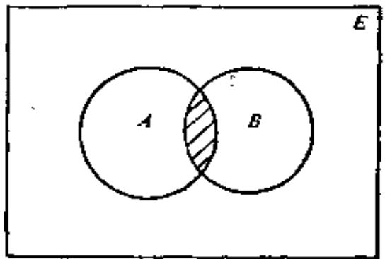  
图3-2.1

例2 设 $A$ 是所有矩形的集

合， $B$ 是平面上所有菱形的集合， $A\cap B$ 是所有正方形的集合。

例3 设 $A$ 是所有被 $K$ 除尽的整数的集合, $B$ 是所有被 $L$ 除尽的整数的集合, 则 $A \cap B$ 是被 $K$ 与 $L$ 最小公倍数除得尽的整数的集合。

例题1 设 $A \subseteq B$ , 求证 $A \cap C \subseteq B \cap C$

证明 若 $x \in A$ 则 $x \in B$ , 对任一 $x \in A \cap C$ , 则 $x \in A$ 且 $x \in C$ 即 $x \in B$ 且 $x \in C$ , 故 $x \in B \cap C$ 。因此, $A \cap C \subseteq B \cap C$ 。

集合的交运算具有以下性质：

a) $A \cap A = A$   
b) $A\cap \varnothing = \varnothing$   
c) $A \cap E = A$   
d) $A \cap B = B \cap A$

e) $(A\cap B)\cap C = A\cap (B\cap O)$

现对 $\mathfrak{e}$ 证明如下：

证明 $(A\cap B)\cap C = \{x\mid (x\in A\cap B)\land (x\in C)\}$

$$
\begin{array}{l} A \cap (B \cap C) = \{x \mid (x \in A) \wedge (x \in B \cap C) \} \\ (x \in A \cap B) \wedge (x \in C) \Leftrightarrow [ (x \in A) \wedge (x \in B) ] \wedge (x \in C) \\ \Leftrightarrow (x \in A) \wedge [ (x \in B) \wedge (x \in C) ] \\ \Leftrightarrow (x \in A) \wedge (x \in B \cap C) \\ \end{array}
$$

因此， $(A\cap B)\cap C\Leftrightarrow A\cap (B\cap C)$

此外，从交的定义还可以得到 $A \cap B \subseteq A, A \cap B \subseteq B$ 。

若集合 $A, B$ 没有共同的元素，则可写为 $A \cap B = \emptyset$ ，此时亦称 $A$ 与 $B$ 不相交。

因为集合交的运算满足结合律，故 $n$ 个集合 $A_{1}, A_{2}, \cdots, A_{n}$ 的交可记为：

$$
P = A _ {1} \cap A _ {2} \cap \dots \cap A _ {n} = \bigcap_ {i = 1} ^ {n} A _ {i}
$$

例 $A_{1} = \{1,2,8\}$ ， $A_{3} = \{2,8\}$ ， $A_{3} = \{4,8\}$ 。则

$$
\bigcap_ {i = 1} ^ {3} A _ {i} = \{8 \}
$$

# (2) 集合的并

定义3-2.2 设任意两个集合 $A$ 和 $B$ , 所有属于 $A$ 或属于 $B$ 的元素组成的集合 $S$ , 称为 $A$ 和 $B$ 的并集, 记作 $A \cup B$ 。

$$
S = A \cup B = \{x \mid (x \in A) \vee (x \in B) \}
$$

并集的定义如图3-2.2所示。

例如，设 $A = \{1,2,3,4\}$ ， $B = \{2,4,5\}$ 。则

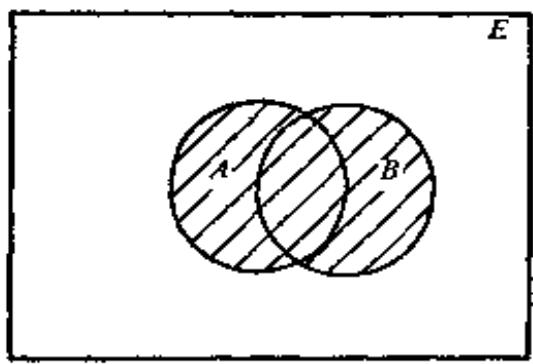  
图3-2.2

$A\cup B = \{1,2,3,4,5\}$

集合并的运算具有以下性质：

a) $A \cup A = A$   
b) $A \cup E = E$   
o) $A\cup \emptyset = A$   
d) $A\bigcup B = B\bigcup A$

e) $(A\cup B)\cup C = A\cup (B\cup C)$

此外从并的定义还可以得到 $A \subseteq A \cup B, B \subseteq A \cup B$ 。

例题2 设 $A \subseteq B, C \subseteq D$ ，则 $A \cup C \subseteq B \cup D$

证明 对任意 $x \in A \cup C$ ，则有 $x \in A$ 或 $x \in C$ 。若 $x \in A$ ，由 $A \subseteq B$ 则 $x \in B$ ，故 $x \in B \cup D$ ；若 $x \in C$ ，由 $C \subseteq D$ ，则 $x \in D$ ，故 $x \in B \cup D$ ，因此， $A \cup C \subseteq B \cup D$ 。

同理可证 $A \subseteq B \Rightarrow A \cup O \subseteq B \cup O$ 。

因为集合的并运算满足结合律，故对于 $n$ 个集合 $A_{1}, A_{2}, \cdots, A_{n}$ 的并可记为：

$$
W = A _ {1} \cup A _ {2} \cup \dots \cup A _ {n} = \bigcup_ {i = 1} ^ {n} A _ {i}
$$

例如，设 $A_{1} = \{1,2,3\}$ ， $A_{2} = \{3,8\}$ ， $A_{3} = \{2,6\}$ ，则

$$
\bigcup_ {i = 1} ^ {3} A _ {i} = \{1, 2, 3, 6, 8 \}
$$

定理3-2.1 设 $A, B, C$ 为三个集合，则下列分配律成立。

a) $A \cap (B \cup C) = (A \cap B) \cup (A \cap C)$   
b) $A \cup (B \cap C) = (A \cup B) \cap (A \cup C)$

证明 a) 设 $S = A \cap (B \cup C), T = (A \cap B) \cup (A \cap C)$ ，若 $x \in S$ ，则 $x \in A$ 且 $x \in B \cup C$ ，即 $x \in A$ 且 $x \in B$ 或 $x \in A$ 且 $x \in C, x \in A \cap B$ 或 $x \in A \cap C$ 即 $x \in T$ ，所以 $S \subseteq T$ 。

反之，若 $x \in T$ ，则 $x \in A \cap B$ 或 $x \in A \cap C$ ， $x \in A$ 且 $x \in B$ 或 $x \in A$ 且 $x \in C$ ，即 $x \in A$ 且 $x \in B \cup C$ ，于是 $x \in S$ ，所以 $T \subseteq S$ 。因此 $T = S$ 。

b）其证明完全与a)类似。

定理8-2.2 设 $A, B$ 为任意两个集合，则下列关系式成立。

a) $A \cup (A \cap B) = A$   
b) $A \cap (A \cup B) = A$

证明 a) $A \cup (A \cap B) = (A \cap E) \cup (A \cap B)$

$$
= A \cap (E \cup B) = A
$$

b) $A \cap (A \cup B) = (A \cup A) \cap (A \cup B)$

$$
= A \cup (A \cap B) = A
$$

这就是著名的吸收律。

定理3-2.8 $A \subseteq B$ , 当且仅当 $A \cup B = B$ 或 $A \cap B = A$

证明 若 $A \subseteq B$ , 对任意 $x \in A$ 必有 $x \in B$ , 对任意 $x \in A \cup B$ 则 $x \in A$ 或 $x \in B$ , 即 $x \in B$ , 所以 $A \cup B \subseteq B$ 。又 $B \subseteq A \cup B$ , 故得到 $A \cup B = B$ 。反之, 若 $A \cup B = B$ , 因为 $A \subseteq A \cup B$ , 故 $A \subseteq B$ 。

同理可证 $A \subseteq B$ , iff $A \cap B = A$ 。

# (3) 集合的补

定义3-2.8 设 $A$ 、 $B$ 为任意两个集合，所有属于 $A$ 而不属于 $B$ 的一切元素组成的集合 $S$ 称为 $B$ 对于 $A$ 的补集，或相对补，记作 $A - B$ 。

$$
S = A - B = \{x \mid x \in A \wedge x \notin B \} = \{x \mid x \in A \wedge \neg (x \in B) \}
$$

$A - B$ 也称集合 $A$ 和 $B$ 的差，定义如图3-2.3所示。

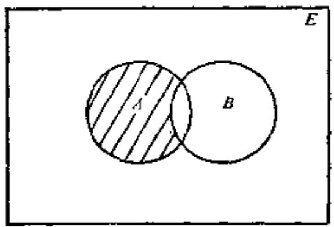  
图3-2.3

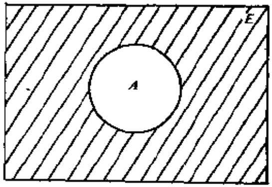  
图3-2.4

例题3 设 $A = \{2, 5, 6\}$ , $B = \{1, 2, 4, 7, 9\}$ , 求 $A - B$ 。

解 $A - B = \{5,6\}$

例题4 设 $\pmb{A}$ 是素数集合, $B$ 是奇数集合, 求 $A - B$ 。

解 $A - B = \{2\}$

定义3-2.4 设 $\pmb{E}$ 为全集，对任一集合 $A$ 关于 $\pmb{E}$ 的补 $\pmb{E} - \pmb{A}$ ，称为集合 $A$ 的绝对补，记作 $\sim A$ 。

$$
\sim A = E - A = \{x \mid x \in E \wedge x \notin A \}
$$

$\sim A$ 的定义如图3-2.4所示。

由补的定义可知：

a) $\sim (\sim A) = A$   
b) $\sim E = \emptyset$

0） $\sim \emptyset = E$   
d) $A \cup \sim A - E$   
e) $A\cap \sim A = \emptyset$

定理8-2.4 设 $A, B$ 为任意两个集合，则下列关系式成立。

a) $\sim (A \cup B) = \sim A \cap \sim B$   
b). $\sim (A\cap B) = \sim A\cup \sim B$

证明 a) $\sim (A \cup B) = \{x \mid x \in \sim (A \cup B)\}$

$$
\begin{array}{l} = \{x \mid x \notin A \cup B \} \\ = \{x \mid (x \notin A) \wedge (x \notin B) \} \\ = \{x \mid (x \in \sim A) \wedge (x \in \sim B) \} \\ = \sim A \cap \sim B \\ \end{array}
$$

b）其证法与a）类似，

□

定理3-2.5 设 $A, B$ 为任意两个集合，则下列关系式成立。

a) $A - B = A \cap \sim B$   
b) $A - B = A - (A \cap B)$

证明 a）从略。

b) 设 $x \in (A - B)$ ，即 $x \in A$ 且 $x \notin B$ 。因 $x \notin B$ 必有 $x \notin (B \cap A)$ ，故 $x \in [A - (B \cap A)]$ ，即 $A - B \subseteq [A - (B \cap A)]$ 。

又设 $x \in [A - (B \cap A)]$ , 则 $x \in A$ 且 $x \notin (B \cap A)$ , 即 $x \in A$ 且 $x \in \sim (A \cap B)$ , $x \in A$ 且 $x \in \sim A$ 或 $x \in \sim B$ , 但 $x \in A$ 且 $x \in \sim A$ 是不可能的, 故 $x \in A$ 且 $x \in \sim B$ , $x \in A - B$ , 得到 $A - (A \cap B) \subseteq A - B$ 。因此 $A - B = A - (A \cap B)$ 。

定理3-2.6 设 $A, B, C$ 为三个集合，则

$$
A \cap (B - C) = (A \cap B) - (A \cap C)
$$

证明 $A \cap (B - C) = A \cap (B \cap \sim C) = A \cap B \cap \sim C$

又 $(A\cap B) - (A\cap C) = (A\cap B)\cap \sim (A\cap C)$

$$
\begin{array}{l} = (A \cap B) \cap (\sim A \cup \sim C) \\ = (A \cap B \cap \sim A) \cup (A \cap B \cap \sim C) \\ = \emptyset \cup (A \cap B \cap \sim C) = A \cap B \cap \sim C \\ \end{array}
$$

因此， $A\cap (B - C) = (A\cap B)\to (A\cap C)$

定理8-2.7 设 $A, B$ 为两个集合，若 $A \subseteq B$ ，则

a) $\sim B\subseteq \sim A$   
b) $(B - A)\cup A = B$

证明 a) 若 $x \in A$ ，则 $x \in B$ ，因此 $x \notin B$ 必有 $x \notin A$ ，故 $x \in \sim B$ 必有 $x \in \sim A$ ，即 $\sim B \subseteq \sim A$ 。

b) $(B - A)\cup A = (B\cap \sim A)\cup A = (B\cup A)\cap (\sim A\cup A)$

$$
= (B \cup A) \cap E = B \cup A
$$

因为 $A \subseteq B$ , 就有 $B \cup A = B$ 。因此

$$
(B - A) \cup A = B
$$

(4) 集合的对称差

定义3-2.5 设 $A, B$ 为任意两个集合， $A$ 和 $B$ 的对称差为集合 $S$ ，其元素或属于 $A$ ，或属于 $B$ ，但不能既属于 $A$ 又属于 $B$ ，记作 $A \oplus B$ 。

$$
S = A \oplus B = (A - B) \cup (B - A) = \{x | x \in A \bar {\vee} x \in B \}
$$

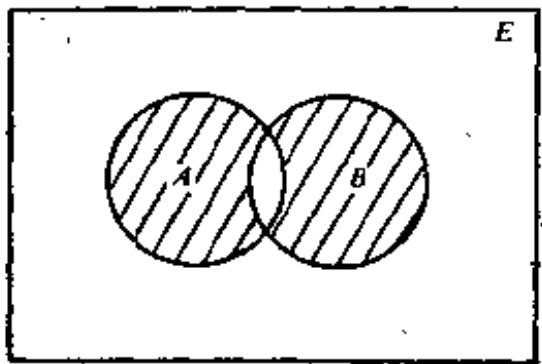  
图3-2.5

对称差的定义如图3-2.5所示。

由对称差的定义很易推得如下性质：

a) $A \oplus B = B \oplus A$   
b) $A\oplus \emptyset = A$   
0) $A\oplus A = \emptyset$

d) $A \oplus B = (A \cap \sim B) \cup (\sim A \cap B)$   
e) $(A\oplus B)\oplus C = A\oplus (B\oplus O)$

证明 e) $(A \oplus B) \oplus C$

$$
\begin{array}{l} = ((A \oplus B) \cap \sim C) \cup (\sim (A \oplus B) \cap O) \\ = \left[ \left(\left(A \cap \sim B\right) \cup \left(\sim A \cap B\right)\right) \cap \sim C \right] \\ \cup [ \sim ((A \cap \sim B) \cup (\sim A \cap B)) \cap O) \\ = (A \cap \sim B \cap \sim C) \cup (\sim A \cap B \cap \sim O) \\ \cup \lceil ((\sim A \cup B) \cap (A \cup \sim B)) \cap C ] \\ \end{array}
$$

但 $[(A\cup B)\cap (A\cup \sim B)]\cap C$

$$
\begin{array}{l} = \left[ \left(\left(\sim A \cup B\right) \cap A\right) \cup \left(\left(\sim A \cup B\right) \cap \sim B\right) \right] \cap O \\ = \left(\left(\sim A \cap A\right) \cup (A \cap B) \cup (\sim A \cap \sim B) \right. \\ \cup (B \cap \sim B)) \cap C \\ = (\varnothing \cup (A \cap B) \cup (\sim A \cap \sim B) \cup \emptyset) \cap O \\ = (A \cap B \cap C) \cup (\sim A \cap \sim B \cap C) \\ \end{array}
$$

故 $(A\oplus B)\oplus C$

$$
\begin{array}{l} = (A \cap \sim B \cap \sim C) \cup (\sim A \cap B \cap \sim O) \\ \cup (A \cap B \cap C) \cup (\sim A \cap \sim B \cap C) \\ \end{array}
$$

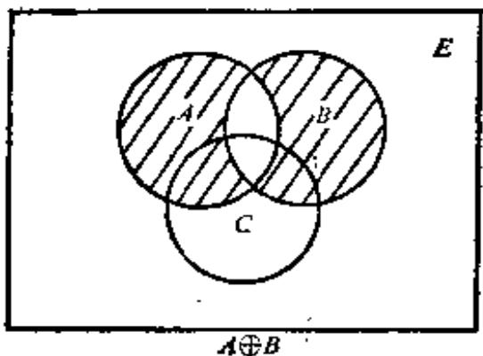

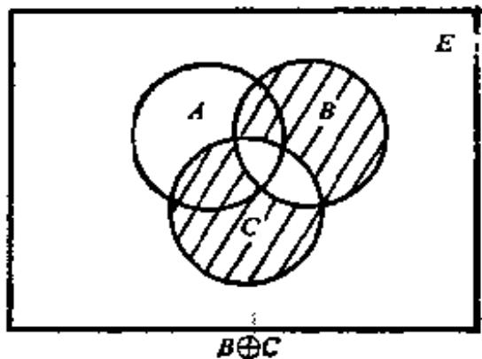

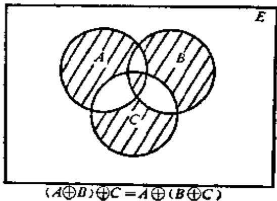  
图3-2.6

又 $A\oplus (B\oplus O)$

$$
\begin{array}{l} = [ A \cap \sim (B \oplus C) ] \cup [ \sim A \cap (B \oplus C) ] \\ = [ A \cap \sim ((B \cap \sim C) \cup (\sim B \cap C)) ] \\ \cup [ \sim A \cap ((B \cap \sim C) \cup (\sim B \cap C)) ] \\ = [ A \cap ((\sim B \cup C) \cap (B \cup \sim C) ] \\ \cup [ (\sim A \cap B \cap \sim C) \cup (\sim A \cap \sim B \cap C) ] \\ \end{array}
$$

因为 $A \cap ((\sim B \cup C) \cap (B \cup \sim C))$

$$
\begin{array}{l} = A \cap [ (\sim B \cap B) \cup (\sim B \cap \sim O) \\ \cup (O \cap B) \cup (O \cap \sim O) ] \\ = A \cap [ (\sim B \cap \sim C) \cup (C \cap B) ] \\ = (A \cap \sim B \cap \sim O) \cup (A \cap O \cap B) \\ \end{array}
$$

故 $A \oplus (B \oplus C)$

$$
\begin{array}{l} = (A \cap \sim B \cap \sim O) \cup (A \cap B \cap O) \\ \cup (\sim A \cap B \cap \sim O) \cup (\sim A \cap \sim B \cap O) \\ \end{array}
$$

因此 $(A\oplus B)\oplus C = A\oplus (B\oplus C)$

对称差集的结合性亦可用图3-2.6说明。

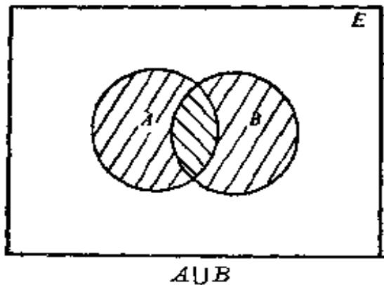  
图3-2.7

从图3-2.7的文氏图亦可以看出下列关系式成立。

$$
\begin{array}{l} A \cup B = (A \cap \sim B) \cup (B \cap \sim A) \cup (A \cap B) \\ A \cup B = (A \oplus B) \cup (A \cap B) \\ \end{array}
$$

# 3-2 习题

(1) 设 $A = \{x \mid x < 5, x \in N\}, B = \{x \mid x < 7, x \text{ 是正偶数}\}$ , 求 $A \cup B, A \cap B$ 。  
(2) 设 $A = \{x \mid x$ 是 book 中的字母\}, $B = \{x \mid x$ 是 black 中的字母\}, 求 $A \cup B, A \cap B$ 。  
(3) 给定自然数集合 $N$ 的下列子集:

$$
\begin{array}{l} A = \{1, 2, 7, 8 \}, B = \{i | i ^ {2} <   5 0 \} \\ C = \{i \mid i \text {可 被} 3 \text {整 除}, 0 \leqslant i \leqslant 3 0 \} \\ D = \{i \mid i = 2 ^ {k}, k \in I _ {+}, 0 \leqslant k \leqslant 6 \} \\ \end{array}
$$

求下列集合：

a) $A\cup (B\cup (C\cup D))$

b) $A \cap (B \cap (C \cap D))$   
c) $B - (A\cup O)$   
d) $(\sim A\cap B)\cup D$

(4) 证明对所有集合 $A, B$ 和 $C$ , 有

$$
(A \cap B) \cup C = A \cap (B \cup C) \text {i f} C \subseteq A
$$

(5) 证明对任意集合 $A, B, C$ , 有

a) $(A - B) - C = A - (B \cup C)$   
b) $(A - B) - C = (A - C) - B$   
c) $(A - B) - C = (A - C) - (B - C)$

(6) 确定以下各式:

$\varnothing \cap \{\emptyset \} ,\{\emptyset \} \cap \{\emptyset \} ,\{\emptyset ,\{\emptyset \} \} -\emptyset ,\{\emptyset ,\{\emptyset \} \} -\{\emptyset \} ,\{\emptyset ,\{\emptyset \} \} -\{\{\emptyset \} \}$

(7) 假定 $A$ 和 $B$ 是 $E$ 的子集, 证明以下各式中每个关系式彼此等价。

a) $A \subseteq B, \sim A \supseteq \sim B, A \cup B = B, A \cap B = A$   
b) $A \cap B = \emptyset, A \subseteq \sim B, B \subseteq \sim A$   
c) $A \cup B = E, \sim A \subseteq B, \sim B \subseteq A$   
d) $A = B, A \oplus B = \emptyset$

(8) a) 已知 $A \cup B = A \cup C$ , 是否必须 $B = C$ ?  
b）已知 $A \cap B = A \cap C$ ，是否必须 $B = C$ ？  
c）已知 $A\oplus B = A\oplus C,$ 是否必须 $B = C?$

(9) 设 $A, B, C$ 是集合，在什么条件下，下列命题是真的？

a) $(A - B)\cup (A - C) = A$   
b) $(A - B)\cup (A - C) = \emptyset$   
c) $(A - B)\cap (A - C) = \emptyset$   
d) $(A - B)\oplus (A - C) = 0$

(10) 借助于文氏图考察以下各命题的正确性:

a）若 $A, B$ 和 $C$ 是 $E$ 的子集，使得 $A \cap B \subseteq \sim C$ 和 $A \cup C \subseteq B$ 则 $A \cap C = \emptyset$   
b) 若 $A, B$ 和 $C$ 是 $\pmb{E}$ 的子集，使得 $A \subseteq \sim (B \cup C)$ 和 $B \subseteq \sim (A \cup C)$ ，则 $B = \emptyset$

(11) 证明:

a) $A \cap (B \oplus C) = (A \cap B) \oplus (A \cap C)$   
b) $A \cup (B \oplus C) \neq (A \cup B) \oplus (A \cup C)$

# *3-3. 包含排斥原理

集合的运算，可用于有限个元素的计数问题。设 $A_{1}, A_{2}$ 为有

限集合，其元素个数分别记为 $|A_1|, |A_2|$ ，根据集合运算的定义，显然以下各式成立。

$$
\begin{array}{l} \left| A _ {1} \cup A _ {2} \right| \leqslant \left| A _ {1} \right| + \left| A _ {2} \right| \\ \left| A _ {1} \cap A _ {2} \right| \leqslant \min  \left(\left| A _ {1} \right|, \left| A _ {2} \right|\right) \\ \left| A _ {1} - A _ {2} \right| \geqslant \left| A _ {1} \right| - \left| A _ {2} \right| \\ \left| A _ {1} \oplus A _ {2} \right| = \left| A _ {1} \right| + \left| A _ {2} \right| - 2 \left| A _ {1} \cap A _ {2} \right| \\ \end{array}
$$

这些公式可由图3-3.1的文氏图上直接得到说明。但是在有限集

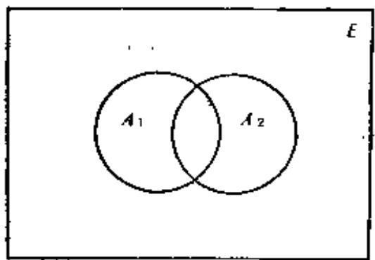  
图3-3.1

的元素计数问题中，下述定理有着更广泛的应用。

定理3-3.1 设 $A_{1}, A_{2}$ 为有限集合，其元素个数分别为 $\left|A_{1}\right|$ , $\left|A_{2}\right|$ ，则

$$
\begin{array}{l} \left| A _ {1} \cup A _ {2} \right| = \left| A _ {1} \right| + \left| A _ {2} \right| \\ - \left| A _ {1} \cap A _ {2} \right| \\ \end{array}
$$

证明 a) 当 $A_{1}$ 与 $A_{2}$ 不相交, 即 $A_{1} \cap A_{2} = \emptyset$ , 则

$$
\left| A _ {1} \cup A _ {2} \right| = \left| A _ {1} \right| + \left| A _ {2} \right|
$$

b) 若 $A_{1} \cap A_{2} \neq \emptyset$ , 则

$$
\begin{array}{l} \left| A _ {1} \right| = \left| A _ {1} \cap \sim A _ {2} \right| + \left| A _ {1} \cap A _ {2} \right| \\ \left| A _ {2} \right| = \left| \sim A _ {1} \cap A _ {2} \right| + \left| A _ {1} \cap A _ {2} \right| \\ \end{array}
$$

所以 $|A_{1}| + |A_{2}| = |A_{1} \cap \sim A_{3}| + |\sim A_{1} \cap A_{3}| + 2|A_{1} \cap A_{2}|$

但 $|A_{1} \cap \sim A_{2}| + |\sim A_{1} \cap A_{2}| + |A_{1} \cap A_{2}| = |A_{1} \cup A_{2}|$

故 $\left|A_{1} \cup A_{2}\right| = \left|A_{1}\right| + \left|A_{2}\right| - \left|A_{1} \cap A_{2}\right|$

这个定理，常称作包含排斥原理。

例题1 假设在10名青年中有5名是工人，7名是学生，其中兼具有工人与学生双重身份的青年有3名，问既不是工人又不是学生的青年有几名。

解设工人的集合为 $W$ ，学生的集合为 $\mathcal{S}$ 则根据题设有： $|W| = 5, |S| = 7, |W \cap S| = 3$ 。又因为 $|\sim W \cap \sim S| + |W \cup S| = 10$ ，则

$$
\begin{array}{l} \mid \sim W \cap \sim S \mid = 1 0 - \mid W \cup S \mid = 1 0 - (\mid W \mid + \mid S \mid - \mid W \cap S \mid) \\ = 1 0 - (5 + 7 - 3) = 1 \\ \end{array}
$$

所以既不是工人又不是学生的青年有一名。

对于任意三个集合 $A_{1}, A_{2}$ 和 $A_{3}$ , 我们可以推广定理 3-3.1 的结果为:

$$
\begin{array}{l} \left| A _ {1} \cup A _ {2} \cup A _ {3} \right| = \left| A _ {1} \right| + \left| A _ {2} \right| + \left| A _ {3} \right| - \left| A _ {1} \cap A _ {2} \right| \\ - \left| A _ {1} \cap A _ {3} \right| - \left| A _ {2} \cap A _ {3} \right| + \left| A _ {1} \cap A _ {2} \cap A _ {3} \right| \\ \end{array}
$$

这个公式可以通过图3-3.2予以验证。

例题2 在某工厂装配三十辆汽车，可供选择的设备是收音机，空气调节器和对讲机。已知其中15辆汽车有收音机，8辆有空气调节器，6辆有对讲机，而且其中3辆汽车这三样设备都有。我们希望知道至少有多少辆汽车没有提供任何设备。

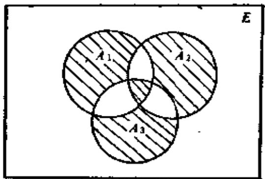  
图3-3.2

解设 $A_{1}, A_{2}, A_{3}$ 分别表示配有收音机、空气调节器和对讲机的汽车集合。因此

$$
\left| A _ {1} \right| = 1 5, \left| A _ {2} \right| = 8, \left| A _ {3} \right| = 6
$$

并且 $|A_{1} \cap A_{2} \cap A_{3}| = 3$

故 $|A_{1} \cup A_{2} \cup A_{3}| = 15 + 8 + 6 - |A_{1} \cap A_{2}| - |A_{1} \cap A_{3}|$

$$
\begin{array}{l} - \left| A _ {2} \cap A _ {3} \right| + 3 \\ = 3 2 - \left| A _ {1} \cap A _ {2} \right| - \left| A _ {1} \cap A _ {3} \right| - \left| A _ {2} \cap A _ {3} \right| \\ \end{array}
$$

因为 $|A_{1} \cap A_{2}| \geqslant |A_{1} \cap A_{2} \cap A_{3}|$

$$
\left| A _ {1} \cap A _ {3} \right| \geqslant \left| A _ {1} \cap A _ {2} \cap A _ {3} \right|
$$

$$
\left| A _ {2} \cap A _ {3} \right| \geqslant \left| A _ {1} \cap A _ {2} \cap A _ {3} \right|
$$

我们得到 $|A_{1} \cup A_{2} \cup A_{3}| \leqslant 32 - 3 - 3 - 3 = 23$

即至多有23辆汽车有一个或几个供选择的设备，因此至少有7辆汽车不提供任何可选择的设备。

对于包含排斥原理，可以推广到 $n$ 个集合的情况。

定理3-3.2 设 $A_{1}, A_{2}, \cdots, A_{n}$ 为有限集合，其元素个数分别为 $|A_{1}|, |A_{2}|, \cdots, |A_{n}|$ ，则

$$
\begin{array}{l} \left| A _ {1} \cup A _ {2} \cup \dots \cup A _ {n} \right| = \sum_ {i = 1} ^ {n} \left| A _ {i} \right| - \sum_ {1 <   i <   j <   n} \left| A _ {i} \cap A _ {j} \right| \\ + \sum_ {1 <   i <   j <   k <   n} | A _ {i} \cap A _ {j} \cap A _ {k} | \\ + \dots + (- 1) ^ {n - 1} \left| A _ {1} \cap A _ {2} \cap A _ {3} \cap \dots \cap A _ {n} \right| (I) \\ \end{array}
$$

证明 用归纳法证明。

(1) 归纳基础 $|A_{1} \cup A_{2}| = |A_{1}| + |A_{2}| - |A_{1} \cap A_{2}|$   
(2）归纳步骤

设对于 $r - 1$ 个集合等式成立。（归纳假设）

对于 $r$ 个集合 $A_{1}, A_{2}, \dots, A_{r-1}, A_{r}$ ，由归纳基础可得

$$
\begin{array}{l} \left| A _ {1} \cup A _ {2} \cup \dots \cup A _ {r - 1} \cup A _ {r} \right| = \left| A _ {1} \cup A _ {2} \cup \dots \cup A _ {r - 1} \right| \\ + \left| A _ {r} \right| - \left| A _ {r} \cap \left(A _ {1} \cup A _ {2} \cup \dots \cup A _ {r - 1}\right) \right| \\ = \left| A _ {1} \cup A _ {2} \cup \dots \cup A _ {r - 1} \right| + A _ {r} \\ - \left| \left(A _ {r} \cap A _ {1}\right) \cup \left(A _ {r} \cap A _ {2}\right) \cup \dots \cup \left(A _ {r} \cap A _ {r - 1}\right) \right| \tag {II} \\ \end{array}
$$

对于 $r - 1$ 个集合 $A_{i} \cap A_{i} (i = 1, 2, \dots, r - 1)$ , 由归纳假设

$$
\begin{array}{l} \left| \left(A _ {r} \cap A _ {1}\right) \cup \left(A _ {r} \cap A _ {2}\right) \cup \dots \cup \left(A _ {r} \cap A _ {r - 1}\right) \right| \\ = \sum_ {i = 1} ^ {r - 1} \left| A _ {r} \cap A _ {i} \right| - \sum_ {1 <   i <   j <   r - 1} \left| \left(A _ {r} \cap A _ {i}\right) \cap \left(A _ {r} \cap A _ {j}\right) \right| \\ + \dots + (- 1) ^ {r - 2} | (A _ {r} \cap A _ {1}) \cap (A _ {r} \cap A _ {2}) \cap \dots \cap (A _ {r} \cap A _ {r - 1}) | \\ = \sum_ {i = 1} ^ {r - 1} | A _ {r} \cap A _ {i} | - \sum_ {1 <   i <   j <   r - 1} | A _ {r} \cap A _ {i} \cap A _ {j} | \\ + \dots + (- 1) ^ {r - 2} \left| A _ {1} \cap A _ {2} \cap \dots \cap A _ {r - 1} \cap A _ {r} \right| \tag {III} \\ \end{array}
$$

另外对 $r - 1$ 个集合 $A_{i}(i = 1,2,\dots ,r - 1)$ ，由归纳假设有

$$
\begin{array}{l} \left| A _ {1} \cup A _ {2} \cup \dots \cup A _ {r - 1} \right| = \sum_ {i = 1} ^ {r - 1} \left| A _ {i} \right| - \sum_ {1 <   i <   j <   r - 1} \left| A _ {i} \cap A _ {j} \right| \\ + \sum_ {1 <   i <   j <   k <   r - 1} | A _ {i} \cap A _ {j} \cap A _ {k} | \\ + \dots + (- 1) ^ {r - 2} \left| A _ {1} \cap A _ {2} \cap \dots \cap A _ {r - 1} \right| \tag {IV} \\ \end{array}
$$

将(III)、(IV)代入(II)得

$$
\begin{array}{l} \left| A _ {1} \cup A _ {2} \cup \dots \cup A _ {r} \right| = \sum_ {i = 1} ^ {r - 1} \left| A _ {i} \right| - \sum_ {1 <   i <   j <   r - 1} \left| A _ {i} \cap A _ {j} \right| \\ + \sum_ {1 <   i <   j <   k <   r - 1} | A _ {i} \cap A _ {j} \cap A _ {k} | \\ + \dots + (- 1) ^ {r - 2} \left| A _ {1} \cap A _ {2} \cap \dots \cap A _ {r - 1} \right| + \left| A _ {r} \right| \\ - \left(\sum_ {i = 1} ^ {r - 1} \left| A _ {r} \cap A _ {i} \right| - \sum_ {1 <   i <   j <   r - 1} \left| A _ {r} \cap A _ {i} \cap A _ {j} \right| + \dots \right. \\ + (- 1) ^ {r - 3} \left| A _ {1} \cap A _ {2} \cap \dots \cap A _ {r} \right|) \\ \end{array}
$$

整理后得

$$
\begin{array}{l} \left| A _ {1} \cup A _ {2} \cup \dots \cup A _ {r} \right| = \sum_ {i = 1} ^ {r} \left| A _ {i} \right| - \sum_ {1 <   i <   j <   r} \left| A _ {i} \cap A _ {j} \right| \\ + \sum_ {1 \leq i <   j <   k \leq r} | A _ {i} \cap A _ {j} \cap A _ {k} | \\ + \dots + (- 1) ^ {r - 1} | A _ {1} \cap A _ {2} \cap \dots \cap A _ {r - 1} \cap A _ {r} | \\ \end{array}
$$

例题3 求1到250之间能被2, 3, 5和7任何一个整除的整数个数。

解设 $A_{1}$ 表示1到250间能被2整除的整数集合，

$A_{2}$ 表示1到250间能被3整除的整数集合，

$A_{3}$ 表示1到250间能被5整除的整数集合，

$A_{4}$ 表示1到250间能被7整除的整数集合，

$\{x\}$ 表示小于或等于 $x$ 的最大整数。

$$
\begin{array}{l} \left| A _ {1} \right| = \left\lfloor \frac {2 5 0}{2} \right\rfloor = 1 2 5 \quad \left| A _ {2} \right| = \left\lfloor \frac {2 5 0}{3} \right\rfloor = 8 3 \\ \left| A _ {3} \right| = \left\lfloor \frac {2 5 0}{5} \right\rfloor = 5 0 \quad \left| A _ {4} \right| = \left\lfloor \frac {2 5 0}{7} \right\rfloor = 3 5 \\ \left| A _ {1} \cap A _ {2} \right| = \left\lfloor \frac {2 5 0}{2 \times 3} \right\rfloor = 4 1 \quad \left| A _ {1} \cap A _ {3} \right| = \left\lfloor \frac {2 5 0}{2 \times 5} \right\rfloor = 2 5 \\ \left| A _ {1} \cap A _ {4} \right| = \left\lfloor \frac {2 5 0}{2 \times 7} \right\rfloor = 1 7 \quad \left| A _ {2} \cap A _ {3} \right| = \left\lfloor \frac {2 5 0}{3 \times 5} \right\rfloor = 1 6 \\ \left| A _ {2} \cap A _ {4} \right| = \left\lfloor \frac {2 5 0}{3 \times 7} \right\rfloor = 1 1 \quad \left| A _ {3} \cap A _ {4} \right| = \left\lfloor \frac {2 5 0}{5 \times 7} \right\rfloor = 7 \\ \left| A _ {1} \cap A _ {2} \cap A _ {3} \right| = \left\lfloor \frac {2 5 0}{2 \times 3 \times 5} \right\rfloor = 8 \quad \left| A _ {1} \cap A _ {2} \cap A _ {4} \right| = \left\lfloor \frac {2 5 0}{2 \times 3 \times 7} \right\rfloor = 5 \\ \left| A _ {1} \cap A _ {3} \cap A _ {4} \right| = \left\lfloor \frac {2 5 0}{2 \times 5 \times 7} \right\rfloor = 3 \quad \left| A _ {2} \cap A _ {3} \cap A _ {4} \right| = \left\lfloor \frac {2 5 0}{3 \times 5 \times 7} \right\rfloor = 2 \\ \left| A _ {1} \cap A _ {2} \cap A _ {3} \cap A _ {4} \right| = \left\lfloor \frac {2 5 0}{2 \times 3 \times 5 \times 7} \int = 1 \right. \\ \end{array}
$$

我们得到

$$
\begin{array}{l} \left| A _ {1} \cup A _ {2} \cup A _ {3} \cup A _ {4} \right| = 1 2 5 + 8 3 + 5 0 + 3 5 - 4 1 - 2 5 - 1 7 - 1 6 \\ - 1 1 - 7 + 8 + 5 + 3 + 2 - 1 = 1 9 3 \\ \end{array}
$$

# 3-3 习题

(1) 设某校足球队有球衣 38 件, 篮球队有球衣 15 件, 棒球队有球衣 20 件, 三队队员的总数为 58 人, 且其中只有三人同时参加三队, 试求同时参加二队的队员共有几人。

(2) 设由某项调查, 发现学生阅读杂志的情况如下:

百分之六十阅读甲类杂志，

百分之五十阅读乙类杂志，

百分之五十阅读丙类杂志，

百分之三十阅读甲类杂志与乙类杂志，

百分之三十阅读乙类杂志与丙类杂志，

百分之三十阅读甲类杂志与丙类杂志，

百分之十阅读三类杂志。

问 a) 试求确实阅读两类杂志的学生百分比?

b）试求不读任何杂志的学生的百分比？

(3) 75个儿童到公园游乐场, 他们在那里可以骑旋转木马, 坐滑行铁道, 乘宇宙飞船, 已知其中20人这三种东西都乘坐过, 其中55人至少乘坐过其中的两种。若每样乘坐一次的费用是0.50元, 公园游乐场总共收人70元, 试确定有多少儿童没有乘过其中任何一种。  
(4) a) 在一个班级的 50 个学生中, 有 26 人在第一次考试中得到 A, 21 人在第二次考试中得到 A, 假如有 17 人两次考试都没有得到 A, 问有多少学生两次考试中都得到 A。  
b）在这些学生中，如果第一次考试中得到A的人数等于第二次考试中得到A的人数，如果仅仅在一次考试中得到A的学生总数是40，并且如果有4个学生两次考试都没有得到A，问有多少学生仅在第一次考试中取得A？问

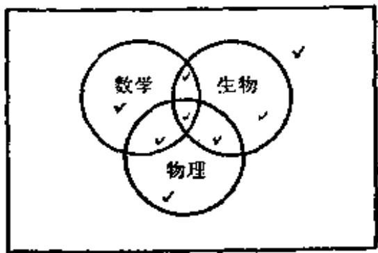  
图3-3.3

有多少学生仅在第二次考试中取得 $A$ ? 又问有多少学生在两次考试中都得 $A$ ?

(5) 对200名大学一年级的学生进行调查的结果是: 其中67人学数学, 47人学物理, 95人学生物, 26人既学数学又学生物, 28人既学数学又学物理, 27人既学物理又学生物, 50人这三门课都不学。

a）求出对三门课都学的学生人数，  
b) 在文氏图(图3-3.3)中以正确的学生人数填入其中8个区域。

# 3-4 序偶与笛卡尔积

在日常生活中, 有许多事物是成对出现的, 而且这种成对出现的事物, 具有一定的顺序。例如, 上、下; 左、右; $3 < 4$ ; 张华高于李

明；中国地处亚洲；平面上点的坐标等。一般地说，两个具有固定次序的客体组成一个序偶，它常常表达两个客体之间的关系。记作 $\langle x, y \rangle$ 。上述各例可分别表示为 $\langle \text{上、下} \rangle$ ； $\langle \text{左、右} \rangle$ ； $\langle 3, 4 \rangle$ ； $\langle \text{张华、李明} \rangle$ ； $\langle \text{中国、亚洲} \rangle$ ； $\langle a, b \rangle$ 等。

序偶可以看作是具有两个元素的集合。但它与一般集合不同的是序偶具有确定的次序。在集合中 $\{a, b\} = \{b, a\}$ ，但对序偶 $\langle a, b \rangle \neq \langle b, a \rangle$ 。

定义3-4.1 两个序偶相等， $\langle x, y \rangle = \langle u, v \rangle$ ，iff $x = u, y = v$ 。

应该指出，序偶 $\langle a, b \rangle$ 中两个元素不一定来自同一个集合，它们可以代表不同类型的事物。例如， $a$ 代表操作码， $b$ 代表地址码，则序偶 $\langle a, b \rangle$ 就代表一条单地址指令；当然亦可将 $a$ 代表地址码， $b$ 代表操作码， $\langle a, b \rangle$ 仍代表一条单地址指令；但上述这种约定，一经确定，序偶的次序就不能再予以变化了。在序偶 $\langle a, b \rangle$ 中， $a$ 称第一元素， $b$ 称第二元素。

序偶的概念可以推广到三元组的情况。

三元组是一个序偶, 其第一元素本身也是一个序偶, 可形式化表示为 $\langle \langle x, y \rangle, z \rangle$ 。由序偶相等的定义, 可以知道 $\langle \langle x, y \rangle, z \rangle = \langle \langle u, v \rangle, w \rangle$ , iff $\langle x, y \rangle = \langle u, v \rangle$ , $z = w$ , 即 $x = u$ , $y = v$ , $z = w$ 。今后约定三元组可记作 $\langle x, y, z \rangle$ 。应该注意的是: 当 $x \neq y$ 时, $\langle x, y, z \rangle \neq \langle y, x, z \rangle$ 。 $\langle \langle x, y \rangle, z \rangle \neq \langle x, \langle y, z \rangle \rangle$ , 因为 $\langle x, \langle y, z \rangle \rangle$ 不是三元组。同理四元组被定义为一个序偶, 其第一元素为三元组, 故四元组有形式为 $\langle \langle x, y, z \rangle, w \rangle$ 且

$$
\langle \langle x, y, z \rangle , w \rangle = \langle \langle p, q, r \rangle , s \rangle
$$

$$
\Leftrightarrow (x = p) \wedge (y = q) \wedge (z = r) \wedge (w = s)
$$

这样， $n$ 元组可写为 $\langle \langle x_1, x_2, \dots, x_{n-1} \rangle, x_n \rangle$ 且

$$
\langle \langle x _ {1}, x _ {2}, \dots , x _ {n - 1} \rangle , x _ {n} \rangle = \langle \langle y _ {1}, y _ {2}, \dots , y _ {n - 1} \rangle , y _ {n} \rangle
$$

$$
\Leftrightarrow (x _ {1} = y _ {1}) \wedge (x _ {2} = y _ {2}) \wedge \dots \wedge (x _ {n - 1} = y _ {n - 1}) \wedge (x _ {n} = y _ {n})
$$

一般地， $n$ 元组可简写为 $\langle x_1, x_2, \dots, x_n \rangle$ ，第 $i$ 个元素 $x_i$ 称作 $n$ 元

组的第 $i$ 个坐标。

序偶 $\langle x, y \rangle$ 其元素可以分别属于不同的集合，因此任给两个集合 $A$ 和 $B$ ，我们可以定义一种序偶的集合。

定义3-4.2 令 $A$ 和 $B$ 是任意两个集合，若序偶的第一个成员是 $A$ 的元素，第二个成员是 $B$ 的元素，所有这样的序偶集合，称为集合 $A$ 和 $B$ 的笛卡尔乘积或直积。记作 $A \times B$ 。

$$
A \times B = \{\langle x, y \rangle | (x \in A) \wedge (y \in B) \}
$$

例题1 若 $A = \{\alpha, \beta\}, B = \{1, 2, 3\}$ , 求 $A \times B, B \times A, A \times A, B \times B,$ 以及 $(A \times B) \cap (B \times A)$ 。

解 $A \times B = \{\langle \alpha, 1 \rangle, \langle \alpha, 2 \rangle, \langle \alpha, 3 \rangle, \langle \beta, 1 \rangle, \langle \beta, 2 \rangle, \langle \beta, 3 \rangle\}$

$$
\begin{array}{l} B \times A = \{\langle 1, a \rangle , \langle 1, \beta \rangle , \langle 2, a \rangle , \langle 2, \beta \rangle , \langle 3, a \rangle , \langle 3, \beta \rangle \} \\ A \times A = \{\langle \alpha , \alpha \rangle , \langle \alpha , \beta \rangle , \langle \beta , \alpha \rangle , \langle \beta , \beta \rangle \} \\ B \times B = \{\langle 1, 1 \rangle , \langle 1, 2 \rangle , \langle 1, 3 \rangle , \langle 2, 1 \rangle , \langle 2, 2 \rangle , \\ \langle 2, 3 \rangle , \langle 3, 1 \rangle , \langle 3, 2 \rangle , \langle 3, 3 \rangle \} \\ (A \times B) \cap (B \times A) = \emptyset \\ \end{array}
$$

由例题1可以看出 $A \times B \neq B \times A$ 。

我们约定若 $A = \emptyset$ 或 $B = \emptyset$ , 则 $A \times B = \emptyset$ 。

由笛卡尔积定义可知：

$$
\begin{array}{l} (A \times B) \times C = \{\langle \langle a, b \rangle , c \rangle | (\langle a, b \rangle \in A \times B) \wedge (c \in C) \} \\ = \{\langle a, b, c \rangle | (a \in A) \wedge (b \in B) \wedge (c \in C) \} \\ \end{array}
$$

$$
A \times (B \times C) = \{\langle a, \langle b, c \rangle \rangle | (a \in A) \wedge (\langle b, c \rangle \in B \times C) \}
$$

由于 $\langle a, \langle b, c \rangle \rangle$ 不是三元组，所以

$$
(A \times B) \times C \neq A \times (B \times C)
$$

定理3-4.1 设 $A, B, C$ 为任意三个集合，则有

a) $A \times (B \cup C) = (A \times B) \cup (A \times C)$   
b) $A \times (B \cap C) = (A \times B) \cap (A \times C)$   
0) $(A \cup B) \times C = (A \times C) \cup (B \times C)$   
d) $(A \cap B) \times C = (A \times C) \cap (B \times C)$

证明 a) 设 $\langle x, y \rangle \in A \times (B \cup C)$ , 则 $x \in A$ , $y \in (B \cup C)$ , 即 $x \in A$ 且 $(y \in B$ 或 $y \in C)$ 。

故 $(x\in A,y\in B)$ 或 $(x\in A,y\in C)$

得到 $\langle x, y \rangle \in A \times B$

或 $\langle x, y \rangle \in A \times C, \langle x, y \rangle \in [(A \times B) \cup (A \times C)]$

所以 $A \times (B \cup C) \subseteq (A \times B) \cup (A \times C)$

又设 $\langle x, y \rangle \in [(A \times B) \cup (A \times C)]$

则 $\langle x, y \rangle \in A \times B$

或 $\langle x, y \rangle \in A \times C$ ，即 $x \in A, y \in B$ 或 $x \in A, y \in C$ ，即 $x \in A$ 且 $(y \in B$ 或 $y \in C)$ 。

故 $x \in A$ 且 $y \in (B \cup C)$

得到 $\langle x, y \rangle \in A \times (B \cup O)$

所以 $(A\times B)\cup (A\times C)\subseteq A\times (B\cup C)$

因此 $A \times (B \cup C) = (A \times B) \cup (A \times C)$

0）若 $\langle x,y\rangle \in (A\cup B)\times C\Leftrightarrow (x\in (A\cup B)\wedge y\in C)$

$$
\begin{array}{l} \Leftrightarrow (x \in A \vee x \in B) \wedge (y \in C) \\ \Leftrightarrow (x \in A \wedge y \in C) \vee (x \in B \wedge y \in C) \\ \Leftrightarrow (\langle x, y \rangle \in A \times C) \vee (\langle x, y \rangle \in B \times C) \\ \Leftrightarrow \langle x, y \rangle \in ((A \times C) \cup (B \times C)) \\ \end{array}
$$

因此 $(A\cup B)\times C = (A\times C)\cup (B\times C)$

定理3-4.2 若 $C \neq \emptyset$ , 则

$$
A \sqsubseteq B \Leftrightarrow (A \times C \sqsubseteq B \times C) \Leftrightarrow (C \times A \sqsubseteq C \times B)
$$

证明 若 $y \in C$ , 假定 $A \subseteq B$ , 有

$$
\begin{array}{l} \langle x, y \rangle \in A \times C \Rightarrow (x \in A \wedge y \in C) \Rightarrow (x \in B \wedge y \in C) \\ \Rightarrow \langle x, y \rangle \in B \times C \\ \end{array}
$$

因此 $A \times C \subseteq B \times C$

反之，若 $C \neq \emptyset, A \times C \subseteq B \times C,$ 取 $y \in C$ ，则有

$$
\begin{array}{l} x \in A \Rightarrow (x \in A) \wedge (y \in C) \\ \Leftrightarrow (\langle x, y \rangle \in A \times O) \\ \Rightarrow (\langle x, y \rangle \in B \times O) \\ \Leftrightarrow (x \in B) \wedge (y \in C) \\ \Rightarrow x \in B \\ \end{array}
$$

因此

$$
A \subseteq B
$$

同样，定理的第二部分 $A \subseteq B \Leftrightarrow (C \times A \subseteq C \times B)$ 可以类似地证明。

定理3-4.3 设 $A, B, C, D$ 为四个非空集合，则

$A \times B \subseteq C \times D$ 的充要条件为 $A \subseteq C, B \subseteq D$ 。

证明 若 $A \times B \subseteq C \times D$ , 对任意 $\pmb{x} \in A$ 和 $\pmb{y} \in B$ 有

$$
\begin{array}{l} (x \in A) \wedge (y \in B) \Rightarrow (\langle x, y \rangle \in A \times B) \\ \Rightarrow (\langle x, y \rangle \in C \times D) \\ \Rightarrow (x \in C) \wedge (y \in D) \\ \end{array}
$$

即 $A \subseteq C$ 且 $B \subseteq D$ 。

反之，若 $A \subseteq C$ 且 $B \subseteq D$ ，设任意 $x \in A$ 和 $y \in B$ ，我们有

$$
\begin{array}{l} \langle x, y \rangle \in A \times B \Leftrightarrow (x \in A \wedge y \in B) \Rightarrow (x \in C \wedge y \in D) \\ \Leftrightarrow (\langle x, y \rangle \in C \times D) \\ \end{array}
$$

因此 $A \times B \subseteq C \times D$

□

因为两集合的笛卡尔积仍是一个集合，故对于有限集合可以进行多次的笛卡尔积运算。

为了与 $n$ 元组一致，我们约定：

$$
A _ {1} \times A _ {2} \times A _ {3} = (A _ {1} \times A _ {2}) \times A _ {3}
$$

$$
\begin{array}{l} A _ {1} \times A _ {2} \times A _ {3} \times A _ {4} = (A _ {1} \times A _ {2} \times A _ {3}) \times A _ {4} \\ = \left(\left(A _ {1} \times A _ {2}\right) \times A _ {3}\right) \times A _ {4} \\ \end{array}
$$

一般地， $A_{1} \times A_{2} \times \dots \times A_{n} = (A_{1} \times A_{2} \times \dots \times A_{n - 1}) \times A_{n}$

$$
\begin{array}{l} = \left\{\left\langle x _ {1}, x _ {2}, \dots , x _ {n} \right\rangle \mid \left(x _ {1} \in A _ {1}\right) \wedge \left(x _ {2} \in A _ {2}\right) \wedge \dots \wedge \right. \\ \left(x _ {n} \in A _ {n}\right) \} \\ \end{array}
$$

故 $A_{1} \times A_{2} \times \cdots \times A_{n}$ 是有关 $n$ 元组构成的集合。特别地， $A \times A$ 可以写成 $A^{2}$ ，同样地 $A \times A \times A = A^{3}, \cdots, \overbrace{A \times A \times \cdots \times A}^{n} = A^{n}$ 。

# 3-4 习题

(1) 设 $A = \{0, 1\}, B = \{1, 2\}$ , 确定下面集合。

a) $A \times \{1\} \times B$

b) $A^2\times B$   
c) $(B\times A)^{2}$

(2) 设 $A = \{a, b\}$ , 构成集合 $\mathcal{F}(A) \times A$ 。  
(3) 下列各式中哪些成立? 哪些不成立? 为什么?  
a) $(A \cup B) \times (C \cup D) = (A \times C) \cup (B \times D)$   
b) $(A - B)\times (C - D) = (A\times C) - (B\times D)$   
c) $(A \oplus B) \times (C \oplus D) = (A \times C) \oplus (B \times D)$   
d) $(A - B)\times C = (A\times C) - (B\times C)$   
e) $(A\oplus B)\times C = (A\times C)\oplus (B\times C)$   
(4) 证明: 若 $X \times X = Y \times Y$ , 则 $X = Y$ 。  
(5) 证明: 若 $X \times Y = X \times Z$ , 且 $X \neq \emptyset$ , 则 $Y = Z$ 。

# 3-5 关系及其表示

关系是一个基本概念，在日常生活中我们都熟悉关系这词的含义，例如兄弟关系；上下级关系；位置关系等。在数学上关系可表达集合中元素间的联系。如“3小于5”；“ $x$ 大于 $y$ ”；“点 $a$ 在 $b$ 与 $c$ 之间”等。我们又知道，序偶可以表达两个客体、三个客体或 $n$ 个客体之间的联系，因此用序偶表达关系这个概念是非常自然的，下面先以实例说明。

例如，电影票与座位之间有对号关系。设 $X$ 表示电影票的集合， $Y$ 表示座位的集合，则对于任意的 $x \in X$ 和 $y \in Y$ ，必有 $x$ 与 $y$ 有“对号”关系和 $x$ 与 $y$ 没有“对号”关系两种情况的一种，令 $R$ 表示“对号”关系，则上述问题可表达为 $xRy$ 或 $xRy$ ，亦可记为 $\langle x, y \rangle \in R$ 或 $\langle x, y \rangle \notin R$ ，因此我们看到对号关系 $R$ 是序偶的集合。

定义3-5.1 任一序偶的集合确定了一个二元关系 $R, R$ 中任一序偶 $\langle x, y \rangle$ 可记作 $\langle x, y \rangle \in R$ 或 $xRy$ 。不在 $R$ 中的任一序偶 $\langle x, y \rangle$ 可记作 $\langle x, y \rangle \notin R$ 或 $xRy$ 。

例如，在实数中关系 $>$ 可记作 $> = \{\langle x, y \rangle | x, y$ 是实数且 $x > y\}$ 。

定义8-5.2 令 $\pmb{R}$ 为二元关系，由 $\langle x, y \rangle \in R$ 的所有 $x$ 组成的集合 $\operatorname{dom} R$ 称为 $\pmb{R}$ 的前域，即

$$
\operatorname {d o m} R = \{x | (\exists y) (\langle x, y \rangle \in R) \}
$$

使 $\langle x, y \rangle \in R$ 的所有 $y$ 组成的集合 $\operatorname{ran} R$ 称作 $R$ 的值域，即

$$
\operatorname {r a n} R = \{y | (\exists x) (\langle x, y \rangle \in R) \}
$$

$\pmb{R}$ 的前域和值域一起称作 $\pmb{R}$ 的域，记作FLD $\pmb{R}$ ，即

$$
\mathrm {F L D} ^ {\prime} R = \operatorname {d o m} R \cup \operatorname {r a n} R
$$

例题1 设 $A = \{1,2,3,5\}$ , $B = \{1,2,4\}$

$$
H = \{\langle 1, 2 \rangle , \langle 1, 4 \rangle , \langle 2, 4 \rangle , \langle 3, 4 \rangle \},
$$

求domH,ranH,FLD $\pmb{H}_{\circ}$

解 $\operatorname{dom} H = \{1, 2, 3\}$ , $\operatorname{ran} H = \{2, 4\}$ , $\operatorname{FLD} H = \{1, 2, 3, 4\}$ 。

由于关系是序偶的集合，如果序偶的第一元素和第二元素分别属于不同的集合，那么关系就是两集合直积的子集。

定义8-5.3 令 $X$ 和 $Y$ 是任意两个集合，直积 $X \times Y$ 的子集 $R$ 称作 $X$ 到 $Y$ 的关系。

$\pmb{x}$ 到 $\pmb{Y}$ 的关系 $\pmb{R}$ ，可以图3-5.1所示。

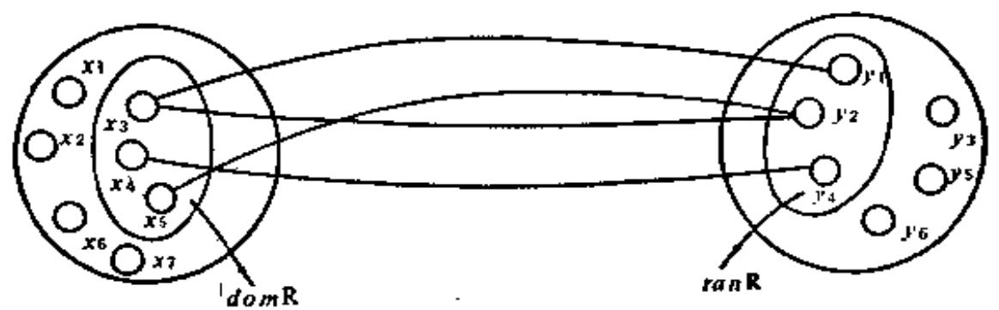  
图3-5.1

从关系的定义可以看到 $\operatorname{dom} R \subseteq X$ , $\operatorname{ran} R \subseteq Y$ , 由例题1表明 $H \subseteq A \times B$ , $\operatorname{dom} H \subseteq A$ , $\operatorname{ran} H \subseteq B$ , $\operatorname{FLD} H = \operatorname{dom} H \cup \operatorname{ran} H \subseteq A \cup B$ 。

我们今后把 $X \times Y$ 的两个平凡子集 $X \times Y$ 和 $\varnothing$ , 分别称为 $X$ 到 $Y$ 的全域关系和空关系。

当 $X = Y$ 时, 关系 $\pmb{R}$ 是 $X \times X$ 的子集, 这时称 $\pmb{R}$ 为在 $X$ 上的二元关系。

例题2 设 $X = \{1, 2, 3, 4\}$ , 求 $X$ 上的关系 $\succ$ 及 $\operatorname{dom} >$ , $\operatorname{ran} >$ 。

解 $> = \{\langle 2,1\rangle ,\langle 3,1\rangle ,\langle 4,1\rangle ,\langle 3,2\rangle ,\langle 4,2\rangle ,\langle 4,3\rangle \}$

$$
\mathrm {d o m} > = \{2, 3, 4 \}, \mathrm {r a n} > = \{1, 2, 3 \} 。
$$

例题8 若 $H = \{f, m, s, d\}$ 表示一个家庭中父、母、子、女四个人的集合，确定 $H$ 上的全域关系和空关系，另外再确定 $H$ 上的一个关系，指出该关系的值域和前域。

解设 $H$ 上的同一家庭成员的关系为 $H_{1}$

$$
\begin{array}{l} H _ {1} = \{\langle f, m \rangle , \langle f, s \rangle , \langle f, d \rangle , \langle m, f \rangle , \langle m, s \rangle , \langle m, d \rangle , \\ \langle s, f \rangle , \langle s, m \rangle , \langle s, d \rangle , \langle d, f \rangle , \langle d, m \rangle , \langle d, s \rangle , \\ \langle f, f \rangle , \langle m, m \rangle , \langle s, s \rangle , \langle d, d \rangle \} \\ \end{array}
$$

设 $H$ 上的互不相识的关系为 $H_{2}, H_{2} = \emptyset$ ，则 $H_{1}$ 为全域关系， $H_{2}$ 为空关系。

设 $\pmb{H}$ 上的长幼关系为 $H_{3}$

$$
\begin{array}{l} H _ {3} = \{\langle f, s \rangle , \langle f, d \rangle , \langle m, s \rangle , \langle m, d \rangle \} \\ \operatorname {d o m} H _ {3} = \{f, m \}, \operatorname {r a n} H _ {3} = \{s, d \} 。 \\ \end{array}
$$

定义8-5.4 设 $I_{X}$ 是 $X$ 上的二元关系且满足 $I_{X} = \{\langle x, x \rangle | x \in X\}$ ，则称 $I_{X}$ 是 $X$ 上的恒等关系。

例如， $A = \{1,2,3\}$ ，则 $I_{A} = \{\langle 1,1\rangle ,\langle 2,2\rangle ,\langle 3,3\rangle \}$ 。

因为关系是序偶的集合，故同一域上的关系，可以进行集合的所有运算。

例题4 设 $X = \{1, 2, 3, 4\}$ , 若 $H = \{\langle x, y \rangle \mid \frac{x - y}{2} \text{ 是整数}\}$ , $S = \{\langle x, y \rangle \mid \frac{x - y}{3} \text{ 是正整数}\}$ , 求 $H \cup S, H \cap S, \sim H, S - H$ 。

解 $H = \{\langle 1,1\rangle ,\langle 1,3\rangle ,\langle 2,2\rangle ,\langle 2,4\rangle ,\langle 3,3\rangle ,$

$$
\langle 3, 1 \rangle , \langle 4, 4 \rangle , \langle 4, 2 \rangle \}
$$

$$
S = \{\langle 4, 1 \rangle \}
$$

$$
\begin{array}{l} E \cup S = \{\langle 1, 1 \rangle , \langle 1, 3 \rangle , \langle 2, 2 \rangle , \langle 2, 4 \rangle , \langle 3, 3 \rangle , \langle 3, 1 \rangle , \\ \langle 4, 4 \rangle , \langle 4, 2 \rangle , \langle 4, 1 \rangle \} \\ \end{array}
$$

$$
H \cap S = \emptyset
$$

$$
\begin{array}{l} \sim H = \{\langle 1, 2 \rangle , \langle 2, 1 \rangle , \langle 2, 3 \rangle , \langle 3, 2 \rangle , \langle 3, 4 \rangle , \langle 4, 3 \rangle , \\ \langle 1, 4 \rangle , \langle 4, 1 \rangle \} \\ \end{array}
$$

$$
S - H = \{\langle 4, 1 \rangle \}
$$

定理8-5.1 若 $Z$ 和 $S$ 是从集合 $X$ 到集合 $Y$ 的两个关系，

则 $Z, S$ 的并、交、补、差仍是 $\overline{X}$ 到 $Y$ 的关系。

证明 因为 $Z \subseteq X \times Y, S \subseteq X \times Y$

故 $Z \cup S \subseteq X \times Y, Z \cap S \subseteq X \times Y$

$$
\begin{array}{l} \sim S = (X \times Y - S) \subseteq X \times Y \\ Z - S = Z \cap \sim S \subseteq X \times Y \\ \end{array}
$$

从上面我们可以知道， $X$ 到 $Y$ 的关系 $\pmb{R}$ 是 $X\times Y$ 的子集，如果令 $X$ 和 $Y$ 为有限集，则二元关系 $\pmb{R}$ 除了可用序偶集合的形式表达以外，亦可用矩阵或图形表示。

设给定两个有限集合 $X = \{x_{1}, x_{2}, \dots, x_{m}\}$ , $Y = \{y_{1}, y_{2}, \dots, y_{n}\}$ , $R$ 为从 $X$ 到 $Y$ 的一个二元关系。则对应于关系 $R$ 有一个关系矩阵 $M_{R} = [r_{ij}]_{m \times n}$ , 其中

$$
\begin{array}{l} r _ {i j} = \left\{ \begin{array}{l l} 1 & \text {当} \langle x _ {i}, y _ {j} \rangle \in R \\ 0 & \text {当} \langle x _ {i}, y _ {j} \rangle \notin R \end{array} \right. \\ (i = 1, 2, \dots , m; j = 1, 2, \dots , n) \\ \end{array}
$$

例题 $\pmb{\delta}$ 设 $X = \{x_{1}, x_{2}, x_{3}, x_{4}\}$ , $y = \{y_{1}, y_{2}, y_{3}\}$ ,

$$
R = \{\langle x _ {1}, y _ {1} \rangle , \langle x _ {1}, y _ {3} \rangle , \langle x _ {2}, y _ {2} \rangle , \langle x _ {2}, y _ {3} \rangle , \langle x _ {3}, y _ {1} \rangle , \langle x _ {4}, y _ {1} \rangle ,
$$

$\langle x_4, y_2 \rangle \rangle$ , 写出关系矩阵 $M_{R_0}$

解

$$
M _ {R} = \left[ \begin{array}{l l l} 1 & 0 & 1 \\ 0 & 1 & 1 \\ 1 & 0 & 0 \\ 1 & 1 & 0 \end{array} \right]
$$

例题6 设 $A = \{1, 2, 3, 4\}$ , 写出集合 $A$ 上大于关系 $\succ$ 的关系矩阵。

解 $> = \{\langle 2,1\rangle ,\langle 3,1\rangle ,\langle 3,2\rangle ,\langle 4,1\rangle ,\langle 4,2\rangle ,\langle 4,3\rangle \}$

故

$$
M _ {>} = \left[ \begin{array}{c c c c} 0 & 0 & 0 & 0 \\ 1 & 0 & 0 & 0 \\ 1 & 1 & 0 & 0 \\ 1 & 1 & 1 & 0 \end{array} \right]
$$

有限集的二元关系亦可用图形来表示，设集合 $X = \{x_{1}, x_{2}, \dots, x_{m}\}$ 到 $Y = \{y_{1}, y_{2}, \dots, y_{n}\}$ 上的一个二元关系为 $R$ ，首先我们在平面上作出 $m$ 个结点分别记作 $x_{1}, x_{2}, \dots, x_{m}$ ，然后另外作 $n$ 个结点分别记作 $y_{1}, y_{2}, \dots, y_{n}$ 。如果 $x_{i}Ry_{j}$ ，则可自结点至结

点 $y_{j}$ 处作一有向弧，其箭头指向 $y_{j}$ ，如果 $x_{i} \notin y_{j}$ ，则 $x_{i}$ 与 $y_{j}$ 间没有线段联结。这种方法联结起来的图就称为 $R$ 的关系图。

例题7 画出例题5的关系图。

解 例题5的关系图如图3-5.2所示：

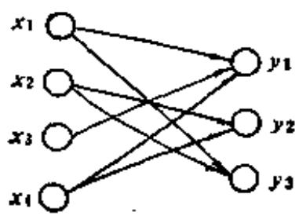  
图3-5.2

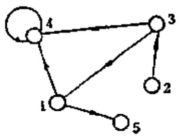  
图3-5.3

例题8 设 $A = \{1, 2, 3, 4, 5\}$ , 在 $A$ 上的二元关系 $R$ 给定为: $R = \{\langle 1, 5 \rangle, \langle 1, 4 \rangle, \langle 2, 3 \rangle, \langle 3, 1 \rangle, \langle 3, 4 \rangle, \langle 4, 4 \rangle\}$ 画出 $R$ 的关系图。

解 因为 $R$ 是 $\pmb{A}$ 上的关系，故只需画出 $\pmb{A}$ 中的每个元素即可。如果 $a_{i}Ra_{j}$ ，就画一条由 $a_{i}$ 到 $a_{j}$ 的有向弧，本题的关系图如图3-5.3所示。

由于关系图主要表达结点与结点之间的邻接关系，故关系图中对结点位置和线段的长短无关，本例的关系 $\pmb{R}$ 亦可表达为如图3-5.4所示。

我们需要指出，从 $X$ 到 $Y$ 的关系 $\pmb{R}$ 是 $X\times Y$ 的子集，即 $R\subseteq X\times Y$ ，而 $X\times$ $Y\subseteq (X\cup Y)\times (X\cup Y)$ ，所以 $R\subseteq (X$

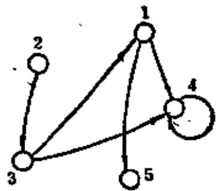  
图3-5.4

$\cup Y) \times (X \cup Y)$ 。令 $Z = X \cup Y$ ，则 $R \subseteq Z \times Z$ ，因此，我们今后通常限于讨论同一集合上的关系。

# 3-5 习题

(1) 列出所有从 $X = \{a, b, c\}$ 到 $Y = \{S\}$ 的关系。  
(2) 在一个有 $n$ 个元素的集合上, 可以有多少种不同的关系。  
(3) 设 $A = \{6:00, 6:30, 7:00, \dots, 9:30, 10:00\}$ 表示在晚上每隔半小时的九个时刻的集合，设 $B = \{3, 12, 15, 17\}$ 表示本地四个电视频道的集合，设 $R_{1}$ 和 $R_{2}$ 是从 $A$ 到 $B$ 的两个二元关系。对于二元关系 $R_{1}, R_{2}$ ，

$R_{1} \cup R_{2}, R_{1} \cap R_{2}, R_{1} \oplus R_{2}$ 和 $R_{1} - R_{2}$ 分别可以得出怎样的解释。

（4）设 $L$ 表示关系“小于或等于”， $D$ 表示整除， $L$ 和 $D$ 均定义于 $\{1, 2, 3, 6\}$ ，分别写出 $L$ 和 $D$ 的所有元素，并求出 $L \cap D$ 。

(5) 对下列每一式所给出 $A$ 上的二元关系, 试给出关系图。

a) $\{\langle x, y \rangle | 0 \leqslant x \wedge y \leqslant 3\}, A = \{0, 1, 2, 3, 4\}$   
b) $\{\langle x, y \rangle | 2 \leqslant x, y \leqslant 7 \wedge x$ 除尽 $y\}$ , 这里 $A = \{n | n \in N \wedge n \leqslant 10\}$ .  
c） $\{\langle x,y\rangle |0\leqslant x - y <   3\}$ ，这里 $A = \{0,1,2,3,4\}$   
d） $\{\langle x,y\rangle |x$ 和 $y$ 是互质的}，这里 $A = \{2,3,4,5,6\}$   
(6) 对 $\{0, 1, 2, 3, 4, 5, 6\}$ 上的二元关系， $\{\langle x, y \rangle | x < y \vee x$ 是质数\}, 写出关系矩阵。  
(7) 设 $P = \{\langle 1,2\rangle ,\langle 2,4\rangle ,\langle 3,3\rangle \}$ 和 $Q = \{\langle 1,3\rangle ,\langle 2,4\rangle ,\langle 4,2\rangle \}$ 找出 $P\cup Q,P\cap Q,\operatorname {dom}P,\operatorname {dom}Q,\operatorname {ran}P,\operatorname {ran}Q,\operatorname {dom}(P\cap Q),\operatorname {ran}(P\cap Q)$   
(8) 证明集合 $A$ 是一个关系, 当且仅当 $A \subseteq \operatorname{dom} A \times \operatorname{ran} A$ 。

# 3-6 关系的性质

有了表达关系的各种方法，下面就可以对关系作进一步的讨论。我们特别注意的是在集合 $X$ 上的二元关系 $\pmb{R}$ 的一些特殊性质。

定义3-6.1 设 $R$ 为定义在集合 $X$ 上的二元关系, 如果对于每个 $x \in X$ , 有 $xRx$ , 则称二元关系 $R$ 是自反的。

$$
R \text {在} X \text {上 自 反} \Leftrightarrow (\forall x) (x \in X \rightarrow x R x)
$$

例如，在实数集合中，“ $\leqslant$ ”是自反的，因为对于任意实数 $x \leqslant x$ 成立。又如平面上三角形的全等关系是自反的。

定义8-6.2 设 $R$ 为定义在集合 $X$ 上的二元关系, 如果对于每个 $x, y \in X$ , 每当 $xRy$ , 就有 $yRx$ , 则称集合 $X$ 上关系 $R$ 是对称的。

$$
R \text {在} X \text {上 对 称} \Leftrightarrow (\forall x) (\forall y) (x \in X \wedge y \in X \wedge x R y \rightarrow y R x)
$$

例如，平面上诸三角形集合中三角形的相似关系是对称的，因为若三角形 $A$ 相似三角形 $B$ ，则三角形 $B$ 必相似三角形 $A$ 。同理，在同一街道居住的邻居关系也是对称的。有些集合 $X$ 上的关系，既是自反的，又是对称的。

例题1 设 $A = \{2, 3, 5, 7\}$ , $R = \left\{\langle x, y \rangle \mid \frac{x - y}{2} \text{ 是整数}\right\}$ , 验证 $R$ 在 $A$ 上是自反和对称的。

证 因为对于任意 $x \in A, \frac{x - x}{2} = 0$ 即 $\langle x, x \rangle \in R,$ 故 $R$ 是自反的。

又设 $x, y \in A$ ，如果 $\langle x, y \rangle \in R$ ，即 $\frac{x - y}{2}$ 是整数，则 $\frac{y - x}{2}$ 也必是整数，即 $\langle y, x \rangle \in R$ ，因此 $R$ 是对称的。

定义8-6.3 设 $R$ 为定义在集合 $X$ 上的二元关系, 如果对于任意 $x, y, z \in X$ , 每当 $xRy, yRz$ 时就有 $xRz$ , 称关系 $R$ 在 $X$ 上是传递的。

$\pmb{R}$ 在 $\pmb{x}$ 上传递

$$
\begin{array}{l} \Leftrightarrow (\forall x) (\forall y) (\forall z) (x \in X \wedge y \in X \wedge z \in X \wedge \\ x R y \wedge y R z \rightarrow x R z) \\ \end{array}
$$

例如, 在实数集合中关系 $\leqslant, <$ 和 $= ,$ 都是传递的。又如, 设 $A$ 是人的集合, $R$ 是 $A$ 上的二元关系, 若 $\langle a, b \rangle \in R$ 当且仅当 $a$ 是 $b$ 的祖先, 显然祖先关系 $R$ 是传递的。

例题2 设 $X = \{1, 2, 3\}$ , $R_1 = \{\langle 1, 2 \rangle, \langle 2, 2 \rangle\}$ , $R_2 = \{\langle 1, 2 \rangle\}$ , $R_3 = \{\langle 1, 2 \rangle, \langle 2, 3 \rangle, \langle 1, 3 \rangle, \langle 2, 1 \rangle\}$ , $R_1, R_2$ 和 $R_3$ 都是传递关系吗？

解 根据传递的定义， $R_{1}$ 和 $R_{2}$ 是传递的。但对于 $R_{3}$ ，因为 $\langle 1, 2 \rangle \in R_{3}, \langle 2, 1 \rangle \in R_{3}$ ，但 $\langle 1, 1 \rangle \notin R_{3}, \langle 2, 2 \rangle \notin R_{3}$ ，故 $R_{3}$ 不是传递的。

定义8-6.4 设 $R$ 为定义在集合 $X$ 上的二元关系, 如果对于每一个 $x \in X$ , 都有 $\langle x, x \rangle \notin R$ , 则 $R$ 称作反自反的。

$\pmb{R}$ 在 $\pmb{x}$ 上反自反 $\Leftrightarrow (\forall x)(x\in X\rightarrow \langle x,x\rangle \notin R)$

例如，数的大于关系，日常生活中的父子关系等都是反自反的。应该注意：一个不是自反的关系，不一定就是反自反的。

例题3 $A = \{1,2,3\}$ ， $S = \{\langle 1,1\rangle ,\langle 1,2\rangle ,\langle 3,2\rangle ,\langle 2,3\rangle ,\langle 3,3\rangle \}$ 验证 $s$ 不是自反也不是反自反的。

证明 因为 $2 \in A$ ，但 $\langle 2, 2 \rangle \notin S$ ，故 $S$ 不是自反的，又 $1 \in A, 3 \in A$ 但 $\langle 1, 1 \rangle \in S, \langle 3, 3 \rangle \in S$ ，故 $S$ 也不是反自反的。

定义3-6.5 设 $R$ 为定义在集合 $X$ 上的二元关系, 对于每一个 $x, y \in X$ , 每当 $xRy$ 和 $yRx$ 必有 $x = y$ , 则称 $R$ 在 $X$ 上是反对

称的, 即是

$$
(\forall x) (\forall y) (x \in X \wedge y \in X \wedge x R y \wedge y R x \rightarrow x = y)
$$

例如实数集合中 $\leqslant$ 是反对称的，集合的 $\subseteq$ 关系是反对称的。因为

$$
\begin{array}{l} (x R y) \wedge (y R x) \rightarrow (x = y) \Leftrightarrow \neg (x = y) \rightarrow \neg ((x R y) \wedge (y R x)) \\ \Leftrightarrow \neg (x = y) \rightarrow (x R y) \vee (y R x) \\ \Leftrightarrow (x = y) \vee (x P _ {y}) \vee (y P _ {x}) \\ \Leftrightarrow \neg ((x \neq y) \wedge (x R y)) \vee (y R x) \\ \Leftrightarrow (x \neq y) \wedge (x R y) \rightarrow y R x \\ \end{array}
$$

故关系 $\pmb{R}$ 的反对称的定义亦可表示为

$$
(\forall x) (\forall y) (x \in X \wedge y \in X \wedge x \neq y \wedge x R y \rightarrow y R x)
$$

注意：可能有某种关系，既是对称的，又是反对称的。

例如， $A = \{1,2,3\}$ ， $S = \{\langle 1,1\rangle ,\langle 2,2\rangle ,\langle 3,3\rangle \}$ ，则 $s$ 在 $A$ 上是对称的也是反对称的。但如， $A = \{a,b,c\}$ ， $N = \{\langle a,b\rangle ,$ $\langle a,c\rangle ,\langle c,a\rangle \}$ ，则 $N$ 既不是对称关系，又不是反对称关系。

例题4 设某人有三个儿子，组成集合 $A = \{T, G, H\}$ ，在 $A$ 上的兄弟关系具有哪些性质。

解 在 $A$ 上的兄弟关系是反自反的和对称的。

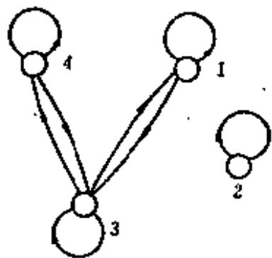  
图3-6.1

注意：兄弟关系并不具有传递性，这是因为若 $TRG$ ，根据对称必有 $GRT$ ，但 $\langle T,T\rangle \notin R,$ 故 $\pmb{R}$ 不是传递的。

例题5 集合 $I = \{1, 2, 3, 4\}$ , $I$ 上的关系 $R = \{\langle 1, 1 \rangle, \langle 1, 3 \rangle, \langle 2, 2 \rangle, \langle 3, 3 \rangle, \langle 3, 1 \rangle, \langle 3, 4 \rangle, \langle 4, 3 \rangle, \langle 4, 4 \rangle\}$ 讨论 $R$ 的性质。

解 写出 $\pmb{R}$ 的关系矩阵并画出关系图如图3-6.1所示。关系矩阵

$$
\left[ \begin{array}{c c c c} 1 & 0 & 1 & 0 \\ 0 & 1 & 0 & 0 \\ 1 & 0 & 1 & 1 \\ 0 & 0 & 1 & 1 \end{array} \right]
$$

从例题5的关系矩阵和关系图容易看出， $\pmb{R}$ 是自反的，对称的。一般地说：

(1) 若关系 $R$ 是自反的, 当且仅当在关系矩阵中, 对角线上的所有元素都是 1, 在关系图上每个结点都有自回路。  
(2) 若关系 $R$ 是对称的，当且仅当关系矩阵是对称的，且在关系图上，任两个结点间若有定向弧线，必是成对出现的。  
(3) 若关系 $\pmb{R}$ 是反自反的, 当且仅当关系矩阵对角线的元素皆为零, 关系图上每个结点都没有自回路。  
(4) 若关系 $R$ 是反对称的, 当且仅当关系矩阵中以主对角线对称的元素不能同时为 1 , 在关系图上两个不同结点间的定向弧线不可能成对出现。

传递的特征较复杂, 不易从关系矩阵和关系图中直接判断。

# 8-6 习题

(1) 分析集合 $A = \{1, 2, 3\}$ 上的下述五个关系。

$$
\begin{array}{l} R = \{\langle 1, 1 \rangle , \langle 1, 2 \rangle , \langle 1, 3 \rangle , \langle 3, 3 \rangle \} \\ S = \{\langle 1, 1 \rangle , \langle 1, 2 \rangle , \langle 2, 1 \rangle , \langle 2, 2 \rangle , \langle 3, 3 \rangle \} \\ T = \{\langle 1, 1 \rangle , \langle 1; 2 \rangle , \langle 2, 2 \rangle , \langle 2, 3 \rangle \} \\ \varnothing = \text {空 关 系} \\ A \times A = \text {全 域 关 系} \\ \end{array}
$$

判断 $A$ 中的上述关系是不是a)自反的，b)对称的，c)可传递的，d)反对称的。

(2) 给定 $A = \{1, 2, 3, 4\}$ , 考虑 $\pmb{\Lambda}$ 上的关系 $\pmb{R}$ , 若

$$
R = \{\langle 1, 3 \rangle , \langle 1, 4 \rangle , \langle 2, 3 \rangle , \langle 2, 4 \rangle , \langle 3, 4 \rangle \}
$$

a）在 $A \times A$ 的坐标图中标出 $R$ ，并绘出它的关系图；  
b) $R$ 是 i) 自反的, ii) 对称的, iii) 可传递的, iv) 反对称的吗?

(3) 举出 $A = \{1,2,3\}$ 上关系 $\pmb{R}$ 的例子，使它有下述性质。

a）既是对称的又是反对称的；

b) $\mathbb{R}$ 既不是对称的, 又不是反对称的;

c） $\pmb{R}$ 是可传递的。

(4) 如果关系 $R$ 和 $S$ 是自反的, 对称的和可传递的, 证明 $R \cap S$ 亦是自反、对称和可传递的。  
(5) 给定 $S = \{1, 2, 3, 4\}$ 和 $S$ 上关系 $R = \{\langle 1, 2 \rangle, \langle 4, 3 \rangle, \langle 2, 2 \rangle, \langle 3, 1 \rangle, \langle 3, 1 \rangle\}$ , 说明 $R$ 不是可传递的。找出关系 $R_1 \supseteq R_2$ , 使得 $R_1$ 是可传递的, 还能找出另外一个 $R_2 \supseteq R_1$ , 也是可传递的吗?

(6) 设 $R$ 是集合 $X$ 上的一个自反关系。求证： $R$ 是对称和传递的，当且仅当 $\langle a, b \rangle$ 和 $\langle a, c \rangle$ 在 $R$ 之中则有 $\langle b, c \rangle$ 在 $R$ 之中。

# 3-7 复合关系和逆关系

二元关系是以序偶为元素的集合，因此对它可以进行集合的运算，如并、交、补等而产生新的集合。对于关系还可以进行一种新的运算，那就是关系的复合。

定义8-7.1 设 $\pmb{R}$ 为 $X$ 到 $Y$ 的关系， $\pmb{S}$ 为从 $Y$ 到 $Z$ 的关系，则 $R \circ S$ 称为 $\pmb{R}$ 和 $\pmb{S}$ 的复合关系，表示为

$$
\begin{array}{l} R \circ S = \{\langle x, z \rangle | x \in X \wedge z \in Z \wedge (\exists y) (y \in Y \wedge \\ \langle x, y \rangle \in R \wedge \langle y, z \rangle \in S) \} \\ \end{array}
$$

从 $R$ 和 $S_{i}$ 求 $\pmb{R} \circ \pmb{S}$ 称为关系的合成运算。

例如，如果 $R_{1}$ 是关系“是…的兄弟”， $R_{2}$ 是关系“是…的父亲”，那么 $R_{1} \circ R_{2}$ 是关系“是…的叔伯”。

又如, 如果 $R_{1}$ 是关系“是…的父亲”, 那么 $R_{1} \circ R_{1}$ 是关系“是…的祖父”。

合成运算是对关系的二元运算，它能够由两个关系生成一个新的关系，并可以以此类推。

例如 $R$ 是从 $X$ 到 $Y$ 的关系， $S$ 是从 $Y$ 到 $Z$ 的关系， $P$ 是从 $Z$ 到 $W$ 的关系，于是 $(R \circ S) \circ P$ 和 $R \circ (S \circ P)$ 都是从 $X$ 到 $W$ 的关系。容易证明 $(R \circ S) \circ P = R \circ (S \circ P)$ ，因此关系的合成运算是可结合的。

例题1 令 $R = \{\langle 1,2\rangle ,\langle 3,4\rangle ,\langle 2,2\rangle \}$ 和 $S = \{\langle 4,2\rangle ,\langle 2,5\rangle ,\langle 3,1\rangle ,\langle 1,3\rangle \}$ , 试求 $R\circ S,S\circ R,R\circ (S\circ R),(R\circ S)\circ R,R\circ R,S\circ S,R\circ R$

解 $R\circ S = \{\langle 1,5\rangle ,\langle 3,2\rangle ,\langle 2,5\rangle \}$

$$
\begin{array}{l} S \circ R = \{\langle 4, 2 \rangle , \langle 3, 2 \rangle , \langle 1, 4 \rangle \} \neq R \circ S \\ (R \circ S) \circ R = \{\langle 3, 2 \rangle \} \\ R o (S o R) = \{\langle 3, 2 \rangle \} \\ R \circ R = \{\langle 1, 2 \rangle , \langle 2, 2 \rangle \} \\ S \circ S = \{\langle 4, 5 \rangle , \langle 3, 3 \rangle , (1, 1) \} \\ \end{array}
$$

$$
R \circ R \circ R = \{\langle 1, 2 \rangle , \langle 2, 2 \rangle \}
$$

例题2 设 $R_{1}$ 和 $R_{2}$ 是集合 $X = \{0, 1, 2, 3\}$ 上的关系，

$$
R _ {1} = \{\langle i, j \rangle | j = i + 1 \quad \text {或} \quad j = \frac {1}{2} i \},
$$

$$
R _ {2} = \{\langle i, j \rangle | i = j + 2 \},
$$

求 $R_{1} \circ R_{2}, R_{2} \circ R_{1}, R_{1} \circ R_{2} \circ R_{1}, R_{1} \circ R_{1}, R_{1} \circ R_{1} \circ R_{1}$

解 $R_{1} = \{\langle 0,1\rangle ,\langle 1,2\rangle ,\langle 2,3\rangle ,\langle 0,0\rangle ,\langle 2,1\rangle \}$

$$
\begin{array}{l} R _ {2} = \{\langle 2, 0 \rangle , \langle 3, 1 \rangle \} \\ R _ {1} \circ R _ {2} = \{\langle 1, 0 \rangle , \langle 2, 1 \rangle \} \\ R _ {2} \circ R _ {1} = \{\langle 2, 1 \rangle , \langle 2, 0 \rangle , \langle 3, 2 \rangle \} \\ R _ {1} \circ R _ {2} \circ R _ {1} = \{\langle 1, 1 \rangle , \langle 1, 0 \rangle , \langle 2, 2 \rangle \} \\ R _ {1} \circ R _ {1} = \{\langle 0, 2 \rangle , \langle 1, 3 \rangle , \langle 1, 1 \rangle , \langle 0, 1 \rangle , \langle 0, 0 \rangle , \langle 2, 2 \rangle \} \\ R _ {1} \circ R _ {1} \circ R _ {1} = \{\langle 0, 3 \rangle , \langle 0, 1 \rangle , \langle 1, 2 \rangle , \langle 0, 2 \rangle , \langle 0, 0 \rangle , \\ \langle 2, 3 \rangle , \langle 2, 1 \rangle \} \\ \end{array}
$$

由关系合成的结合律可以知道关系 $\pmb{R}$ 本身所组成的复合关

m 系可以写成：R=R,R=R,，R=R···R，分别记作R(3), $R^{(3)},\dots ,R^{(m)}$ ，一般地， $\overline{R\circ R\circ\cdots\circ R}\circ R = R^{(m - 1)}\circ R = R^{(m)}$ 。

因为关系可用矩阵表示，故复合关系亦可用矩阵表示。已知从集合 $X = \{x_{1}, x_{2}, \dots, x_{m}\}$ 到集合 $Y = \{y_{1}, y_{2}, \dots, y_{n}\}$ 有关系 $R$ 则 $M_{R} = [u_{ij}]$ 表示 $R$ 的关系矩阵，其中，

$$
u _ {i j} = \left\{ \begin{array}{l l} 1 & \text {当} \langle x _ {i}, y _ {j} \rangle \in R \\ 0 & \text {当} \langle x _ {i}, y _ {j} \rangle \notin R \end{array} \right.
$$

$$
(i = 1, 2, \dots , m; j = 1, 2, \dots , n)
$$

同理从集合 $Y = \{y_{1}, y_{2}, \dots, y_{n}\}$ 到集合 $Z = \{z_{1}, z_{2}, \dots, z_{p}\}$ 的关系 $S$ , 可用矩阵 $M_{S} = [v_{jk}]$ 表示, 其中,

$$
v _ {j k} = \left\{ \begin{array}{l l} 1 & \text {当} \langle y _ {j}, z _ {k} \rangle \in S \\ 0 & \text {当} \langle y _ {j}, z _ {k} \rangle \notin S \end{array} \right.
$$

$$
(j = 1, 2, \dots , n; k = 1, 2, \dots , p)
$$

表示复合关系 $R \circ S$ 的矩阵 $M_{R \circ S}$ 可构造如下：

如果 $Y$ 至少有一个这样的元素 $y_{j}$ ，使得 $\langle x_i, y_j \rangle \in R$ 且 $\langle y_j, x_i \rangle \in R$

$z_{k} \in S$ ，则 $\langle x_{i}, z_{k} \rangle \in R \circ S$ 。在集合 $Y$ 中能够满足这样条件的元素可能不止 $y_{j}$ 一个，例如另有 $y_{j}'$ 也满足 $\langle x_{i}, y_{j}' \rangle \in R$ 且 $\langle y_{j}', z_{k} \rangle \in S$ 。在所有这样情况下， $\langle x_{i}, z_{k} \rangle \in R \circ S$ 都是成立的。这样，当我们扫描 $M_{R}$ 的第 $i$ 行和 $M_{S}$ 的第 $k$ 列时，如若发现至少有一个这样的 $j$ ，使得此行第 $j$ 个位置上的记入值和第 $k$ 列的第 $j$ 个位置上的记入值都是1时，则在 $M_{R \circ S}$ 的第 $i$ 行和第 $k$ 列 $(i, k)$ 上的记入值亦是1；否则为0。扫描过 $M_{R}$ 的一行和 $M_{S}$ 的每一列，就能给出 $M_{R \circ S}$ 的一行，再继续类似的方法就能得到 $M_{R \circ S}$ 的其它各行，因此 $M_{R \circ S}$ 就可用类似于矩阵乘法的方法得到，即

$$
M _ {R \circ S} = M _ {R} \circ M _ {S} = [ w _ {0 k} ],
$$

其中 $w_{ik} = \bigvee_{j=1}^{n} (u_{ij} \wedge v_{jk})$ 。

式中 $\vee$ 代表逻辑加，满足 $0\vee 0 = 0,0\vee 1 = 1,1\vee 0 = 1,1\vee 1 = 1,$

$\wedge$ 代表逻辑乘，满足 $0 \wedge 0 = 0, 0 \wedge 1 = 0, 1 \wedge 0 = 0, 1 \wedge 1 = 1_{\circ}$

例题3 给定集合 $A = \{1, 2, 3, 4, 5\}$ ，在集合 $A$ 上定义两种关系。 $R = \{\langle 1, 2 \rangle, \langle 3, 4 \rangle, \langle 2, 2 \rangle\}$ ， $S = \{\langle 4, 2 \rangle, \langle 2, 5 \rangle, \langle 3, 1 \rangle, \langle 1, 3 \rangle\}$ ，求 $R \circ S$ 和 $S \circ R$ 的矩阵。

解

$$
\begin{array}{l} M _ {R o s} = \left[ \begin{array}{l l l l l} 0 & 1 & 0 & 0 & 0 \\ 0 & 1 & 0 & 0 & 0 \\ 0 & 0 & 0 & 1 & 0 \\ 0 & 0 & 0 & 0 & 0 \\ 0 & 0 & 0 & 0 & 0 \end{array} \right] \circ \left[ \begin{array}{l l l l l} 0 & 0 & 1 & 0 & 0 \\ 0 & 0 & 0 & 0 & 1 \\ 1 & 0 & 0 & 0 & 0 \\ 0 & 1 & 0 & 0 & 0 \\ 0 & 0 & 0 & 0 & 0 \end{array} \right] \\ = \left[ \begin{array}{c c c c c} 0 & 0 & 0 & 0 & 1 \\ 0 & 0 & 0 & 0 & 1 \\ 0 & 1 & 0 & 0 & 0 \\ 0 & 0 & 0 & 0 & 0 \\ 0 & 0 & 0 & 0 & 0 \end{array} \right] \\ M _ {S O R} = \left[ \begin{array}{l l l l l} 0 & 0 & 1 & 0 & 0 \\ 0 & 0 & 0 & 0 & 1 \\ 1 & 0 & 0 & 0 & 0 \\ 0 & 1 & 0 & 0 & 0 \\ 0 & 0 & 0 & 0 & 0 \end{array} \right] \circ \left[ \begin{array}{l l l l l} 0 & 1 & 0 & 0 & 0 \\ 0 & 1 & 0 & 0 & 0 \\ 0 & 0 & 0 & 1 & 0 \\ 0 & 0 & 0 & 0 & 0 \\ 0 & 0 & 0 & 0 & 0 \end{array} \right] = \left[ \begin{array}{l l l l l} 0 & 0 & 0 & 1 & 0 \\ 0 & 0 & 0 & 0 & 0 \\ 0 & 1 & 0 & 0 & 0 \\ 0 & 1 & 0 & 0 & 0 \\ 0 & 0 & 0 & 0 & 0 \end{array} \right] \\ \end{array}
$$

关系是序偶的集合，由于序偶的有序性，关系还有一些特殊的运算。

定义3-7.2 设 $R$ 为 $X$ 到 $Y$ 的二元关系，如将 $R$ 中每一序偶的元素顺序互换，所得到的集合称为 $R$ 的逆关系。记作 $R^{\prime}$ ，即 $R^{\prime} = \{\langle y, x \rangle | \langle x, y \rangle \in R\}$ 。

如在集合 $I$ 上，关系“<”的逆关系是“>”。而在集合 $X = \{1, 2, 3, 4\}$ 到 $Y = \{a, b, c\}$ 上的关系 $R = \{\langle 1, a \rangle, \langle 2, b \rangle, \langle 3, c \rangle\}$ ，其逆关系为

$$
R ^ {c} = \{\langle a, 1 \rangle , \langle b, 2 \rangle , \langle c, 3 \rangle \}
$$

从逆关系的定义，我们容易看出 $(R^{\circ})^{\circ} = R$ ，这是因为 $\langle x,y\rangle$ $\in R\Leftrightarrow \langle y,x\rangle \in R^{\circ}\Leftrightarrow \langle x,y\rangle \in (R^{c})^{c}$ 。

定理3-7.1 设 $R, R_{1}$ 和 $R_{2}$ 都是从 $\pmb{A}$ 到 $\pmb{R}$ 的二元关系，则下列各式成立。

a) $(R_{1} \cup R_{2})^{o} = R_{1}^{c} \cup R_{2}^{c}$   
b) $(R_{1} \cap R_{2})^{c} = R_{1}^{c} \cap R_{2}^{c}$   
0) $(A\times B)^{0} = B\times A$   
d) $(\overline{R})^{\alpha} = \overline{R}^{\alpha}$ 这里 $\overline{R} = A\times B - R$   
e) $(R_{1} - R_{2})^{c} = R_{1}^{c} - R_{2}^{c}$

证明 a) $\langle x, y \rangle \in (R_1 \cup R_3)^c \Leftrightarrow \langle y, x \rangle \in R_1 \cup R_3$

$$
\begin{array}{l} \Leftrightarrow \langle y, x \rangle \in R _ {1} \vee \langle y, x \rangle \in R _ {2} \\ \Leftrightarrow \langle x, y \rangle \in R _ {1} ^ {c} \vee \langle x, y \rangle \in R _ {2} ^ {c} \\ \Leftrightarrow \langle x, y \rangle \in R _ {1} ^ {*} \cup R _ {2} ^ {*} \\ \end{array}
$$

d) $\langle x, y \rangle \in (\overline{R})^{\circ} \Leftrightarrow \langle y, x \rangle \in \overline{R} \Leftrightarrow \langle y, x \rangle \notin B \Leftrightarrow \langle x, y \rangle \notin R^{\circ}$

$$
\Leftrightarrow \langle x, y \rangle \in \bar {R} ^ {c}
$$

e）因为 $R_{1} - R_{2} = R_{1}\cap \overline{R}_{2},$ 故有

$$
\begin{array}{l} (R _ {1} - R _ {2}) ^ {\circ} = (R _ {1} \cap \bar {R} _ {3}) ^ {\circ} = R _ {1} ^ {c} \cap (\bar {R} _ {2}) ^ {\circ} \\ = R _ {1} ^ {c} \cap \bar {R} _ {2} ^ {c} = R _ {1} ^ {c} - R _ {2} ^ {c} \\ \end{array}
$$

□

定理3-7.2 设 $T$ 为从 $\pmb{x}$ 到 $\pmb{Y}$ 的关系， $\pmb{S}$ 为从 $\pmb{Y}$ 到 $\pmb{Z}$ 的关系，证明 $(T^{\prime} \circ S)^{c} = S^{c} \circ T^{c}$ 。

证明 $\langle z, x \rangle \in (T \circ S)^{\circ} \Leftrightarrow \langle x, z \rangle \in T \circ S$

$$
\begin{array}{l} \Leftrightarrow (\exists y) (y \in Y \wedge \langle x, y \rangle \in T \wedge \langle y, z \rangle \in S) \\ \Leftrightarrow (\exists y) (y \in Y \wedge \langle y, x \rangle \in T ^ {n} \wedge \langle z, y \rangle \in S ^ {c}) \\ \Leftrightarrow \langle z, x \rangle \in S ^ {n} \circ T ^ {n} \\ \end{array}
$$

定理3-7.3 设 $R$ 为 $X$ 上的二元关系, 则

a） $\pmb{R}$ 是对称的，当且仅当 $R = R^{\circ}$   
b） $R$ 是反对称的，当且仅当 $R \cap R^{\times} \subseteq I_{X}$

证明 a) 因为 $R$ 是对称的，故 $\langle x, y \rangle \in R \Leftrightarrow \langle y, x \rangle \in R \Leftrightarrow \langle x, y \rangle \in R^{\circ}$ 所以 $R = R^{\circ}$ 。

反之，若 $R^{\circ} = R$ 。因为 $\langle x, y \rangle \in R \Leftrightarrow \langle y, x \rangle \in R^{\circ} \Leftrightarrow \langle y, x \rangle \in R$ ，所以 $R$ 是对称的。

b）其证明留作练习。

关系 $R^{\circ}$ 的图形, 是关系 $\pmb{R}$ 图形中将其弧的箭头方向反置。关系 $\pmb{R}^{\circ}$ 的矩阵 $M_{\pmb{R}^{\circ}}$ 是 $M_R$ 的转置矩阵。

例题4 给定集合 $X = \{a, b, c\}$ ， $R$ 是 $X$ 上的二元关系， $R$ 的关系矩阵

$$
M _ {R} = \left[ \begin{array}{c c c} 1 & 0 & 1 \\ 1 & 1 & 0 \\ 1 & 1 & 1 \end{array} \right],
$$

求 $R^{\circ}$ 和 $R \circ R^{\circ}$ 的关系矩阵。

解

$$
M _ {R c} = \left[ \begin{array}{c c c} 1 & 1 & 1 \\ 0 & 1 & 1 \\ 1 & 0 & 1 \end{array} \right]
$$

$$
M _ {R O R ^ {c}} = \left[ \begin{array}{l l l} 1 & 0 & 1 \\ 1 & 1 & 0 \\ 1 & 1 & 1 \end{array} \right] \circ \left[ \begin{array}{l l l} 1 & 1 & 0 \\ 0 & 1 & 1 \\ 1 & 0 & 1 \end{array} \right] = \left[ \begin{array}{l l l} 1 & 1 & 1 \\ 1 & 1 & 1 \\ 1. & 1 & 1 \end{array} \right]
$$

# 3-7 习题

(1) 设 $R_{1}$ 和 $R_{2}$ 是 $\pmb{A}$ 上的任意关系，说明以下命题的真假，并予以证明。

a）若 $R_{1}$ 和 $R_{2}$ 是自反的，则 $R_{1} \circ R_{2}$ 也是自反的；  
b）若 $R_{1}$ 和 $R_{2}$ 是反自反的，则 $R_{1} \circ R_{2}$ 也是反自反的；  
c）若 $R_{1}$ 和 $R_{2}$ 是对称的，则 $R_{1} \circ R_{2}$ 也是对称的；

d）若 $\pmb{R}_{1}$ 和 $\pmb{R}_{2}$ 是传递的，则 $R_{1} \circ R_{2}$ 也是传递的。

(2) 证明若 $\pmb{S}$ 为集合 $X$ 上的二元关系。

a） $S$ 是传递的，当且仅当 $(S\circ S)\subseteq S$

b) $S$ 是自反的, 当且仅当 $I_{X} \subseteq S$ .

c）证明定理3-7.3(b)

(3) 设 $S$ 为 $X$ 上的关系, 证明若 $S$ 是自反的和传递的, 则 $S \circ S = S$ , 其逆为真吗?  
(4) 令 $S$ 为从 $\pmb{x}$ 到 $\pmb{Y}$ 的关系， $\pmb{T}$ 为从 $\pmb{Y}$ 到 $\pmb{Z}$ 的关系。对于 $A \subseteq X$ ，定义 $S(A) = \{y | \langle x, y \rangle \in S \wedge x \in A\}$ 。

证明：

a) $S(A)\subseteq X$   
b) $(S\circ T)(A) = T(S(A))$   
c) $S(A \cup B) = S(A) \cup S(B)$   
d) $S(A \cap B) \subseteq S(A) \cap S(B)$   
(5) $R$ 是 $\pmb{A}$ 上的一个二元关系，如果 $\pmb{R}$ 是自反的，则 $R^{\circ}$ 一定是自反的吗？如果 $\pmb{R}$ 是对称的，则 $R^{\circ}$ 一定是对称的吗？如果 $\pmb{R}$ 是传递的，则 $R^{\circ}$ 一定是传递的吗？  
(6) 设 $R$ 为集合 $X$ 上的二元关系, $R$ 在 $X$ 上反传递 $\Leftrightarrow (\forall x)(\forall y)(\forall z)$ $(x \in X \land y \in X \land z \in X \land x R y \land y R z \rightarrow x R z)$ ,

证明 $\pmb{R}$ 是反传递的，当且仅当 $(R\circ R)\cap R = \emptyset$

(7) 如果 $R$ 是反对称的关系, 则在 $R \cap R^{\circ}$ 的关系矩阵中有多少非零值。  
(8) 设 $R, S, T$ 为集合 $X$ 上关系, 证明 $R \circ (S \cup T) = R \circ S \cup^{\prime} R \circ T$ .

# 3-8 关系的闭包运算

上面所讲的关系的合成和关系的逆都可以构成新的关系。我们还可对给定的关系用扩充一些序偶的办法得到具有某些特殊性质的新关系，这就是闭包运算。

定义3-8.1 设 $R$ 是 $X$ 上的二元关系，如果有另一个关系 $\mathcal{K}$ 满足：

a） $R^{\prime}$ 是自反的(对称的，可传递的)；  
b）R' ⊆ R;   
0）对于任何自反的（对称的，可传递的)关系 $R^{\prime \prime}$ ，如果有 $R^{\prime \prime}$

$\supseteq R,$ 就有 $R^{\prime \prime}\supseteq R^{\prime}$ 。则称关系 $\pmb{R^{\prime}}$ 为 $\pmb{R}$ 的自反(对称，传递)闭包。记作

$$
\boldsymbol {r} (R), (s (R), t (R))
$$

对于 $X$ 上的二元关系 $R$ , 我们能够用扩充序偶的方法来形成它的自反(对称, 传递)闭包, 但必须注意, 自反(对称, 传递)闭包应是包含 $R$ 的最小自反(对称, 传递)关系。

定理3-8.1 设 $R$ 是 $X$ 上的二元关系, 那么

a） $\pmb{R}$ 是自反的，当且仅当 $r(R) = R$   
b） $\pmb{R}$ 是对称的，当且仅当 $s(R) = R$   
c） $\pmb{R}$ 是传递的，当且仅当 $t(R) = R$

证明 a) 如果 $R$ 是自反的, 因为 $R \supseteq R$ , 且任何包含 $R$ 的自反关系 $R''$ , 有 $R'' \supseteq R$ , 故 $R$ 就满足自反闭包的定义, 即

$$
\boldsymbol {r} (R) = R
$$

反之，如果 $r(R) = R$ ，根据定义3-8.1a)， $R$ 必是自反的。

b) 和 $\pmb{\sigma}$ ) 的证明完全类似。

下面几个定理介绍了由给定关系 $R$ ，求 $r(R), s(R)$ 和 $t(R)$ 的方法。

定理3-8.2 设 $\pmb{R}$ 是集合 $X$ 上的二元关系, 则

$$
r (R) = R \cup I _ {X}
$$

证明 令 $R' = R \cup I_{X}$ , 对任意 $x \in X$ , 因为有 $\langle x, x \rangle \in I_{X}$ , 故 $\langle x, x \rangle \in R'$ , 于是 $R'$ 在 $X$ 上是自反的。

又 $R \subseteq R \cup I_{X}$ 即 $R \subseteq R'$ 。若有自反关系 $R''$ 且 $R'' \supseteq R$ ，显然有 $R'' \supseteq I_{X}$ ，于是

$$
R ^ {\prime \prime} \supseteq I _ {X} \cup R = R ^ {\prime}
$$

故 $r(R) = R \cup I_{X}$

定理8-8.8 设 $\pmb{R}$ 是集合 $X$ 上的二元关系, 则

$$
s (R) = R \cup R ^ {c}
$$

证明 令 $R' = R \cup R^c$ ，因为 $R \subseteq R \cup R^c$ 即 $R' \supseteq R$ ，又设 $\langle x, y \rangle \in R'$ ，则 $\langle x, y \rangle \in R$ 或 $\langle x, y \rangle \in R^c$ ，即 $\langle y, x \rangle \in R^c$ 或 $\langle y, x \rangle \in R$ ，故 $\langle y, x \rangle \in R \cup R^c$ ，所以 $R'$ 是对称的。

设 $R''$ 是对称的且 $R'' \supseteq R$ ，对任意 $\langle x, y \rangle \in R'$ ，则 $\langle x, y \rangle \in R$ 或 $\langle x, y \rangle \in R'$ 。当 $\langle x, y \rangle \in R$ 则 $\langle x, y \rangle \in R''$ ，当 $\langle x, y \rangle \in R^0$ 时， $\langle y, x \rangle \in R$ ， $\langle y, x \rangle \in R''$ ，因为 $R''$ 对称，所以 $\langle x, y \rangle \in R''$ ，因此 $R' \subseteq R''$ ，故

$$
s (R) = R \cup R ^ {\circ}.
$$

定理3-8.4 设 $R$ 是 $X$ 上的二元关系, 则

$$
t (R) = \bigcup_ {i = 1} ^ {\infty} R ^ {i} = R \cup R ^ {2} \cup R ^ {3} \cup \dots
$$

证明 a) 先证 $\bigcup_{i=1}^{\infty} R^{i} \subseteq t(R)$ , 用归纳法。

(1) 根据传递闭包定义 $R \subseteq t(R)$ ;

(2) 假定 $n \geqslant 1$ 时, $R^n \subseteq t(R)$ , 设 $\langle x, y \rangle \in R^{n+1}$ 。因为 $R^{n+1} = R^n \circ R$ , 故必有某个 $c \in X$ , 使 $\langle x, c \rangle \in R^n$ 和 $\langle c, y \rangle \in R$ , 故有 $\langle x, c \rangle \in t(R)$ 和 $\langle c, y \rangle \in t(R)$ 即 $\langle x, y \rangle \in t(R)$ , 所以

$$
R ^ {2 + 1} \subseteq t (R)
$$

故 $\bigcup_{i = 1}^{\infty}R^{i}\subseteq t(R)$

b）再证 $t(R)\subseteq \bigcup_{i = 1}^{\infty}R^{i}$

设 $\langle x, y \rangle \in \bigcup_{i=1}^{\infty} R^{n}$ , $\langle y, z \rangle \in \bigcup_{i=1}^{\infty} R^{i}$ , 则必存在整数 $s$ 和 $t$ , 使得 $\langle x, y \rangle \in R^{s}, \langle y, z \rangle \in R^{t}$ , 这样 $\langle x, z \rangle \in R^{s} \circ R^{i}$ , 即 $\langle x, z \rangle \in \bigcup_{i=1}^{\infty} R^{o}$ , 所以 $\bigcup_{i=1}^{\infty} R^{i}$ 是传递的。

由于包含 $\pmb{R}$ 的可传递关系都包含 $t(R)$ , 故

$$
t (R) \subseteq \bigcup_ {i = 1} ^ {\infty} R ^ {i}
$$

由a）和b）可得 $t(R) = \bigcup_{i=1}^{\infty} R^{i}$ ，通常，将 $\bigcup_{i=1}^{\infty} R^{i}$ 记作 $R^{+}$ 。

□

例题1. 设 $A = \{a, b, c\}$ , $R$ 是 $A$ 上的二元关系, 且给定 $R = \{\langle a, b \rangle, \langle b, c \rangle, \langle c, a \rangle\}$ , 求 $r(R), s(R), t(R)$ 。

解 $r(R) = R \cup I_{A}$

$$
= \{\langle a, b \rangle , \langle b, c \rangle , \langle c, a \rangle , \langle a, a \rangle , \langle b, b \rangle , \langle c, c \rangle \}
$$

$$
s (R) = R \cup R ^ {c} = \{\langle a, b \rangle , \langle b, a \rangle , \langle b, c \rangle , \langle c, b \rangle , \langle c, a \rangle , \langle a, c \rangle \}
$$

为了求得 $t(R)$ ，先写出

$$
M _ {E} = \left[ \begin{array}{c c c} 0 & 1 & 0 \\ 0 & 0 & 1 \\ 1 & 0 & 0 \end{array} \right]
$$

$$
M _ {R ^ {2}} = \left[ \begin{array}{l l l} 0 & 1 & 0 \\ 0 & 0 & 1 \\ 1 & 0 & 0 \end{array} \right] \circ \left[ \begin{array}{l l l} 0 & 1 & 0 \\ 0 & 0 & 1 \\ 1 & 0 & 0 \end{array} \right] = \left[ \begin{array}{l l l} 0 & 0 & 1 \\ 1 & 0 & 0 \\ 0 & 1 & 0 \end{array} \right]
$$

即 $E^2 = \{\langle a,c\rangle ,\langle b,a\rangle ,\langle c,b\rangle \}$

$$
M _ {R ^ {2}} = M _ {R ^ {2}} \circ M _ {R} = \left[ \begin{array}{l l l} 0 & 0 & 1 \\ 1 & 0 & 0 \\ 0 & 1 & 0 \end{array} \right] \circ \left[ \begin{array}{l l l} 0 & 1 & 0 \\ 0 & 0 & 1 \\ 1 & 0 & 0 \end{array} \right] = \left[ \begin{array}{l l l} 1 & 0 & 0 \\ 0 & 1 & 0 \\ 0 & 0 & 1 \end{array} \right]
$$

$$
R ^ {3} = \{\langle a, a \rangle , \langle b, b \rangle , \langle c, c \rangle \}
$$

$$
M _ {R s} = M _ {R s} \circ M _ {R} = \left[ \begin{array}{l l l} 1 & 0 & 0 \\ 0 & 1 & 0 \\ 0 & 0 & 1 \end{array} \right] \circ \left[ \begin{array}{l l l} 0 & 1 & 0 \\ 0 & 0 & 1 \\ 1 & 0 & 0 \end{array} \right] = \left[ \begin{array}{l l l} 0 & 1 & 0 \\ 0 & 0 & 1 \\ 1 & 0 & 0 \end{array} \right]
$$

$$
R ^ {4} = \{\langle a, b \rangle , \langle b, c \rangle , \langle c, a \rangle \} = R
$$

继续这个运算有： $R = R^{4} = \dots = R^{3n + 1}$

$$
R ^ {2} = R ^ {5} = \dots = R ^ {3 n + 2}
$$

$$
R ^ {3} = R ^ {6} = \dots = R ^ {3 n + 3} (n = 1, 2, \dots)
$$

故 $t(R) = \bigcup_{i=1}^{n} R^{i} = R \cup R^{2} \cup R^{3} \cup \dots = R \cup R^{2} \cup R^{3}$

$$
\begin{array}{l} = \{\langle a, a \rangle , \langle b, b \rangle , \langle c, c \rangle , \langle a, b \rangle , \langle b, c \rangle , \langle c, a \rangle , \\ \langle a, c \rangle , \langle b, a \rangle , \langle c, b \rangle \} \\ M _ {s (R)} = \left[ \begin{array}{l l l} 1 & 1 & 1 \\ 1 & 1 & 1 \\ 1 & 1 & 1 \end{array} \right] \\ \end{array}
$$

从例题1中看到给定 $X$ 上关系 $\pmb{R}$ 求 $t(R)$ ，有时不必求出每一 $R^i$ ，下面定理指出了计算 $t(R)$ 与集合 $X$ 中元素个数的联系。

定理8-8.5 设 $X$ 是含有 $n$ 个元素的集合， $R$ 是 $X$ 上的二元关系，则存在一个正整数 $k \leqslant n$ ，使得

$$
t (R) = R \cup R ^ {3} \cup R ^ {3} \cup \dots \cup R ^ {k}
$$

证明 设有 $x_{i}, x_{j} \in X$ ，记 $t(R) = R^{+}$ ，如果 $x_{i}R^{+}x_{j}$ 成立则

存在整数 $p > 0$ ，使得 $x_{i}R^{p}x_{j}$ 成立，即存在序列 $e_1, e_2, \dots, e_{p-1}$ 有 $x_{i}Re_{1}, e_{1}Re_{2}, \dots, e_{p-1}Rx_{j}$ ，设满足上述条件的最小 $p$ 大于 $n$ ，则在上述序列中必有 $0 \leqslant t < q \leqslant p$ ，使 $e_{t} = e_{q}$ ，因此序列就成为

$$
x _ {i} \underbrace {R e _ {1} , e _ {1} R e _ {2} , \cdots , e _ {t - 1} R e _ {t}} _ {t \text {个}}, \underbrace {e _ {i} R e _ {q + 1} , \cdots , e _ {p - 1} R x _ {j}} _ {(p - q) \text {个}}
$$

这表明 $x_{i}R^{k}x_{j}$ 存在，其中 $k = t + p - q = p - (q - t) < p$ ，这与 $p$ 是最小的假设矛盾，故 $p > n$ 不成立。

从本定理可以知道，在 $n$ 个元素的有限集上关系 $\pmb{R}$ 的传递闭包不妨写为 $t(R) = R \cup R^{2} \cup \dots \cup R^{n}$ 。

例题2 设 $A = \{a, b, c, d\}$ , 给定 $A$ 上的关系 $R$ 为 $R = \{\langle a, b \rangle, \langle b, a \rangle, \langle b, c \rangle, \langle c, d \rangle\}$ , 求 $t(R)$ 。

解 $M_{R} = \left[ \begin{array}{cccc}0 & 1 & 0 & 0\\ 1 & 0 & 1 & 0\\ 0 & 0 & 0 & 1\\ 0 & 0 & 0 & 0 \end{array} \right]$

$$
M _ {R ^ {*}} = \left[ \begin{array}{l l l l} 0 & 1 & 0 & 0 \\ 1 & 0 & 1 & 0 \\ 0 & 0 & 0 & 1 \\ 0 & 0 & 0 & 0 \end{array} \right] \circ \left[ \begin{array}{l l l l} 0 & 1 & 0 & 0 \\ 1 & 0 & 1 & 0 \\ 0 & 0 & 0 & 1 \\ 0 & 0 & 0 & 0 \end{array} \right] = \left[ \begin{array}{l l l l} 1 & 0 & 1 & 0 \\ 0 & 1 & 0 & 1 \\ 0 & 0 & 0 & 0 \\ 0 & 0 & 0 & 0 \end{array} \right]
$$

$$
\boldsymbol {M} _ {\mathrm {R}} = \left[ \begin{array}{l l l l} 1 & 0 & 1 & 0 \\ 0 & 1 & 0 & 1 \\ 0 & 0 & 0 & 0 \\ 0 & 0 & 0 & 0 \end{array} \right] \circ \left[ \begin{array}{l l l l} 0 & 1 & 0 & 0 \\ 1 & 0 & 1 & 0 \\ 0 & 0 & 0 & 1 \\ 0 & 0 & 0 & 0 \end{array} \right] = \left[ \begin{array}{l l l l} 0 & 1 & 0 & 1 \\ 1 & 0 & 1 & 0 \\ 0 & 0 & 0 & 0 \\ 0 & 0 & 0 & 0 \end{array} \right]
$$

$$
M _ {R ^ {*}} = \left[ \begin{array}{l l l l} 0 & 1 & 0 & 1 \\ 1 & 0 & 1 & 0 \\ 0 & 0 & 0 & 0 \\ 0 & 0 & 0 & 0 \end{array} \right] \circ \left[ \begin{array}{l l l l} 0 & 1 & 0 & 0 \\ 1 & 0 & 1 & 0 \\ 0 & 0 & 0 & 1 \\ 0 & 0 & 0 & 0 \end{array} \right] = \left[ \begin{array}{l l l l} 1 & 0 & 1 & 0 \\ 0 & 1 & 0 & 0 \\ 0 & 0 & 0 & 0 \\ 0 & 0 & 0 & 0 \end{array} \right]
$$

所以 $\pmb{M}_{\mathfrak{u}(R)} = \left[ \begin{array}{cccc}1 & 1 & 1 & 1\\ 1 & 1 & 1 & 1\\ 0 & 0 & 0 & 1\\ 0 & 0 & 0 & 0 \end{array} \right]$

当有限集 $X$ 的元素较多时，对关系 $\pmb{R}$ 的传递闭包 $\pmb{R}^{+}$ 进行矩

阵运算, 显得很为繁琐, 为此 Warshall 在 1962 年提出了 $R^{+}$ 的一个有效算法如下:

(1) 置新矩阵 $A: = M$ ;   
(2) 置 $i: = 1$ ;   
(3) 对所有 $j$ 如果 $A[j, i] = 1$ , 则对 $k = 1, 2, \dots, n$

$$
A [ j, k ] := A [ j, k ] + A [ \dot {i}, k ];
$$

(4) $\pmb{i}$ 加1;  
(5) 如果 $i \leqslant n$ , 则转到步骤 (3), 否则停止。

例题3

已知 $M = \left[ \begin{array}{ccccccc}1 & 1 & 0 & 0 & 0 & 0 & 0\\ 0 & 0 & 0 & 1 & 0 & 0 & 0\\ 0 & 0 & 0 & 0 & 1 & 0 & 0\\ 0 & 1 & 0 & 0 & 0 & 0 & 0\\ 0 & 0 & 0 & 0 & 0 & 0 & 0\\ 0 & 0 & 0 & 0 & 0 & 0 & 0\\ 0 & 0 & 0 & 0 & 0 & 0 & 0 \end{array} \right]$ 求 $t(R)$

解

$$
A := M = \left[ \begin{array}{c c c c c c c} 1 & 1 & 0 & 0 & 0 & 0 & 0 \\ 0 & 0 & 0 & 1 & 0 & 0 & 0 \\ 0 & 0 & 0 & 0 & 1 & 0 & 0 \\ 0 & 1 & 0 & 0 & 0 & 0 & 0 \\ 0 & 0 & 0 & 0 & 0 & 0 & 0 \\ 0 & 0 & 0 & 0 & 0 & 0 & 0 \\ 0 & 0 & 0 & 0 & 0 & 0 & 0 \end{array} \right]
$$

$i = 1$ 时，第一列中只有 $A[1,1] = 1$ ，将第一行与第一行各对应元素进行逻辑加，仍记于第一行得：

$$
A := \left[ \begin{array}{c c c c c c c} 1 & 1 & 0 & 0 & 0 & 0 & 0 \\ 0 & 0 & 0 & 1 & 0 & 0 & 0 \\ 0 & 0 & 0 & 0 & 1 & 0 & 0 \\ 0 & 1 & 0 & 0 & 0 & 0 & 0 \\ 0 & 0 & 0 & 0 & 0 & 0 & 0 \\ 0 & 0 & 0 & 0 & 0 & 0 & 0 \\ 0 & 0 & 0 & 0 & 0 & 0 & 0 \end{array} \right]
$$

$i = 2$ 时，第二列中 $A[1,2] = 1,A[4,2] = 1,$ 分别将第一行、第四行各元

素和第二行各对应元素逻辑相加，仍分别记于第一行和第四行得：

$$
A := \left[ \begin{array}{c c c c c c c} 1 & 1 & 0 & 1 & 0 & 0 & 0 \\ 0 & 0 & 0 & 1 & 0 & 0 & 0 \\ 0 & 0 & 0 & 0 & 1 & 0 & 0 \\ 0 & 1 & 0 & 1 & 0 & 0 & 0 \\ 0 & 0 & 0 & 0 & 0 & 0 & 0 \\ 0 & 0 & 0 & 0 & 0 & 0 & 0 \\ 0 & 0 & 0 & 0 & 0 & 0 & 0 \end{array} \right]
$$

$i = 3$ 时，第三列中没有不等于零的元素， $A$ 的赋值不动。

$i = 4$ 时，第四列中 $\Delta[1,4] = \Delta[2,4] = \Delta[4,4] = 1$ 将一、二、四这三行和第四行对应元素逻辑相加，仍分别记于一、二、四这三行得：

$$
A := \left[ \begin{array}{c c c c c c c} 1 & 1 & 0 & 1 & 0 & 0 & 0 \\ 0 & 1 & 0 & 1 & 0 & 0 & 0 \\ 0 & 0 & 0 & 0 & 1 & 0 & 0 \\ 0 & 1 & 0 & 1 & 0 & 0 & 0 \\ 0 & 0 & 0 & 0 & 0 & 0 & 0 \\ 0 & 0 & 0 & 0 & 0 & 0 & 0 \\ 0 & 0 & 0 & 0 & 0 & 0 & 0 \end{array} \right]
$$

$i = 5$ 时， $A[3,5] = 1$ ，将第三行与第五行的对应元素逻辑相加，仍记于第三行，由于第五行的元素都等于零， $\pmb{A}$ 的赋值不变。

$i = 6, i = 7$ 时，由于第六、七列各元素均为零， $A$ 的赋值不变。

$$
M _ {R ^ {+}} = \left[ \begin{array}{c c c c c c c} 1 & 1 & 0 & 1 & 0 & 0 & 0 \\ 0 & 1 & 0 & 1 & 0 & 0 & 0 \\ 0 & 0 & 0 & 0 & 1 & 0 & 0 \\ 0 & 1 & 0 & 1 & 0 & 0 & 0 \\ 0 & 0 & 0 & 0 & 0 & 0 & 0 \\ 0 & 0 & 0 & 0 & 0 & 0 & 0 \\ 0 & 0 & 0 & 0 & 0 & 0 & 0 \end{array} \right]
$$

传递闭包 $\pmb{R}^{+}$ 在语法分析中有很多应用，现以下例说明。

例题4 设有一字母表 $V = \{A, B, C, D, e, d, f\}$ 并给定下面六条规则。

$$
A \rightarrow A f, B \rightarrow D d e, C \rightarrow e
$$

$$
A \rightarrow B, B \rightarrow D e, D \rightarrow B f
$$

$\pmb{R}$ 为定义在 $\pmb{\nu}$ 上的二元关系且 $x_{i}Rx_{j}$ ，即是从 $\pmb{x}_{i}$ 出发用一条规则推出一串字符，使其第一个字符恰为 $x_{j}$ 。说明每个字母连续应用上述规则可能推出的头字符。

解 $\pmb{B}$ 的关系矩阵为：

$$
M _ {R} = D \left[ \begin{array}{c c c c c c c} A & B & C & D & e & d & f \\ 1 & 1 & 0 & 0 & 0 & 0 & 0 \\ 0 & 0 & 0 & 1 & 0 & 0 & 0 \\ 0 & 0 & 0 & 0 & 1 & 0 & 0 \\ 0 & 1 & 0 & 0 & 0 & 0 & 0 \\ 0 & 0 & 0 & 0 & 0 & 0 & 0 \\ 0 & 0 & 0 & 0 & 0 & 0 & 0 \\ 0 & 0 & 0 & 0 & 0 & 0 & 0 \end{array} \right]
$$

则 $x_{i}R^{+}x_{j}$ 表示从 $x_{i}$ 出发，经过多次连续推导而得的字符串，其第一个字符恰为 $x_{j}$ 的关系，此关系即是上例中计算的 $M_{R^{+}}$ 。

$$
M _ {R ^ {*}} = \left[ \begin{array}{c c c c c c c} 1 & 1 & 0 & 1 & 0 & 0 & 0 \\ 0 & 1 & 0 & 1 & 0 & 0 & 0 \\ 0 & 0 & 0 & 0 & 1 & 0 & 0 \\ 0 & 1 & 0 & 1 & 0 & 0 & 0 \\ 0 & 0 & 0 & 0 & 0 & 0 & 0 \\ 0 & 0 & 0 & 0 & 0 & 0 & 0 \\ 0 & 0 & 0 & 0 & 0 & 0 & 0 \end{array} \right]
$$

因此 $R^{+} = \{\langle A, A\rangle, \langle A, B\rangle, \langle A, D\rangle, \langle B, B\rangle, \langle B, D\rangle, \langle C, e\rangle, \langle D, E\rangle, \langle D, D\rangle\}$ 。

这说明应用给定的六条规则，从 $A$ 出发推导的头字符有 $A, B, D$ 三种可能，而从 $B$ 出发推导的头字符有 $B, D$ 两种可能，而从 $D$ 推出的头字符有 $B, D$ 两种可能，从 $C$ 出发推导的头字符只可能为 $\pmb{\varepsilon}_{\bullet}$

关系 $R$ 的自反(对称，传递)闭包还可以进一步复合成自反（对称、传递)等闭包，它们之间有如下定理：

定理8-8.6 设 $X$ 是集合, $\pmb{R}$ 是 $X$ 上的二元关系, 则

a) $rs(R) = sr(R)$   
b) $\hat{r} t(R) = tr(R)$   
0) ts(R) st(R)

证明 令 $I_{X}$ 表示 $\pmb{x}$ 上的恒等关系。

a) $sr(R) = s(I_X \cup R) = (I_X \cup R) \cup (I_X \cup R)^{\bullet}$

$$
\begin{array}{l} = \left(I _ {X} \cup R\right) \cup \left(I _ {X} ^ {c} \cup R ^ {c}\right) = I _ {X} \cup R \cup R ^ {a} \\ = I _ {x} \cup s (R) = r s (R) \\ \end{array}
$$

b) $tr(R) = t(I_X \cup R) = \bigcup_{i=1}^{\infty} (I_X \cup R)^i = \bigcup_{i=1}^{\infty} \left( I_X \cup \bigcup_{j=1}^{i} R^j \right)$

$$
\begin{array}{l} = I _ {x} \cup \bigcup_ {i = 1} ^ {\infty} \bigcup_ {j = 1} ^ {i} R ^ {j} = I _ {x} \cup \bigcup_ {i = 1} ^ {\infty} R ^ {i} \\ = I _ {x} \cup t (R) = r t (R) \\ \end{array}
$$

0）其证明并不困难，留作练习请读者自证。

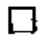

# 3-8 习题

(1) 根据图3-8.1中的有向图, 写出邻接矩阵和关系 $R_{2}$ 并求出 $\pmb{B}$ 的自反闭包和对称闭包。  
(2) 设集合 $A = \{a, b, c, d\}$ , $A$ 上的关系

$$
R = \{\langle a, b \rangle , \langle b, a \rangle , \langle b, c \rangle , \langle c, d \rangle \}
$$

a）用矩阵运算和作图方法求出 $\pmb{R}$ 的自反闭包，对称闭包和传递闭包；  
b）用 Warshall 算法求出 $\pmb{R}$ 的传递闭包。  
(3) 归纳出用矩阵和作图方法求出自反（对称，传递）闭包的一般方法。  
(4) 设 $R$ 是有限集 $X$ 上的一个二元关系, 证明:

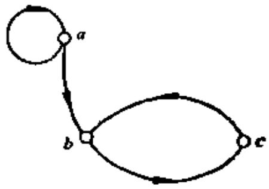  
图3-8.1

a）对于任意在 $X$ 上的二元关系 $R$ ，有 $R^{+}$ 是可传递的；  
b）若有 $X$ 上任何其它传递关系 $P_{\star}$ 使得 $P\supseteq R,$ 则必有 $\pmb{B}^{+}\subseteq \pmb{P}_{\star}$   
c） $R^{+}$ 就是定义3-8.1中所说的传递闭包。

(5) 设 $R_{1}$ 和 $R_{2}$ 是集合 $A$ 上的关系且 $R_{1} \supseteq R_{2}$ , 求证

a) $r(R_1)\supseteq r(R_2)$   
b) $s(R_1) \supseteq s(R_2)$   
c） $t(R_1)\supseteq t(R_2)$

(6) 证明定理3-9.6的 $\mathbf{c})$ 。

(7) 设 $R_{1}$ 和 $R_{2}$ 是 $\pmb{A}$ 上的关系, 证明

a) $r(R_{1} \cup R_{2}) = r(R_{1}) \cup r(R_{2})$   
b) $s(R_1 \cup R_2) = s(R_1) \cup s(R_2)$   
c) $t(R_{1} \cup R_{2}) \supseteq t(R_{1}) \cup t(R_{2})$

(8) 设 $R$ 是集合 $A$ 上的一个任意关系, $R^{*} = \operatorname{tr}(R)$ , 证明下列各式:

a) $(R^{+})^{+} = R^{+}$   
b) $R \cdot R^{*} = R^{+} = R^{*} \cdot R$   
c） $(R^{*})^{*} = R^{*}$

# 3-9 集合的划分和覆盖

在集合的研究中，除了常常把两个集合相互比较之外，有时也要把一个集合分成若干子集加以讨论。

定义3-9.1 若把一个集合 $A$ 分成若干个叫做分块的非空子集，使得 $A$ 中每个元素至少属于一个分块，那么这些分块的全体构成的集合叫做 $A$ 的一个覆盖。如果 $A$ 中每个元素属于且仅属于一个分块，那么这些分块的全体构成的集合叫做 $A$ 的一个划分（成分划）。

上述定义与下面的定义是等价的。

定义3-9.1' 令 $A$ 为给定非空集合， $S = \{S_1, S_2, \dots, S_m\}$ 其中 $S_i \subseteq A$ ， $S_i \neq \emptyset (i = 1, 2, \dots, m)$ 且 $\bigcup_{i=1}^{m} S_i = A$ ，集合 $S$ 称作集合 $A$ 的覆盖。

如果除以上条件外，另有 $S_{i} \cap S_{j} = \emptyset (i \neq j)$ 则称 $S$ 是 $A$ 的划分(或分划)。

例如， $A = \{a,b,c\}$ ，考虑下列子集：

$$
\begin{array}{l} S = \{\{a, b \}, \{b, c \} \}, Q = \{\{a \}, \{a, b \}, \{a, c \} \} \\ D = \{\{a \}, \{b, c \} \}, \quad G = \{\{a, b, c \} \} \\ E = \{\{a \}, \{b \}, \{c \} \}, F = \{\{a \}, \{a, c \} \} \\ \end{array}
$$

则 $S, Q$ 是 $A$ 的覆盖， $D, G, E$ 是 $A$ 的划分， $F$ 既不是划分也不是覆盖。显然，若是划分则必是覆盖，其逆不真。任一个集合的最小划分，就是由这个集合的全部元素组成的一个分块的集合。如上例中， $G$ 是 $A$ 的最小划分。

任一个集合的最大划分是由每个元素构成一个单元素分块的集合, 如上例中, $E$ 是 $A$ 的最大划分。

需要注意：

给定集合 $A$ 的划分并不是唯一的。但是已知一个集合却很容易构造出一种划分。

定义3-9.2 若 $\{A_{1}, A_{2}, \dots, A_{r}\}$ 与 $\{B_{1}, B_{2}, \dots, B_{s}\}$ 是同一集合 $A$ 的两种划分，则其中所有 $A_{i} \cap B_{j}$ 组成的集合，称为是原来两种划分的交叉划分。

例如，所有生物的集合 $X$ ，可分割成 $\{P, A\}$ ，其中 $P$ 表示所有植物的集合， $A$ 表示所有动物的集合，又 $X$ 也可构成 $\{E, F\}$ ，其中 $E$ 表示史前生物， $F$ 表示史后生物，则其交叉划分为 $Q = \{P \cap E, P \cap F, A \cap E, A \cap F\}$ ，其中 $P \cap E$ 表示史前植物， $P \cap F$ 表示史后植物， $A \cap E$ 表示史前动物， $A \cap F$ 表示史后动物。

定理3-9.1 设 $\{A_{1}, A_{2}, \dots, A_{r}\}$ 与 $\{B_{1}, B_{2}, \dots, B_{s}\}$ 是同一集合 $X$ 的两种划分，则其交叉划分亦是原集合的一种划分。

证明 因为题设的交叉划分是：

$$
\begin{array}{l} \{A _ {1} \cap B _ {1}, A _ {1} \cap B _ {2}, \dots , A _ {1} \cap B _ {s}, \\ A _ {2} \cap B _ {1}, A _ {2} \cap B _ {2}, \dots , A _ {2} \cap B _ {s}, \dots , \\ A _ {r} \cap B _ {1}, A _ {r} \cap B _ {2}, \dots , A _ {r} \cap B _ {s} \}, \\ \end{array}
$$

在交叉划分中，任取两元素， $A_{i}\cap B_{k},A_{j}\cap B_{k},$ 考察 $(A_{i}\cap B_{k})\cap$ $(A_{j}\cap B_{k}),$

I: 若 $i \neq j$ 且 $h = k$ , 因为 $A_{i} \cap A_{j} = \emptyset$ 故

$$
A _ {i} \cap B _ {h} \cap A _ {j} \cap B _ {k} = \emptyset \cap B _ {h} \cap B _ {k} = \emptyset
$$

II: 若 $i \neq j$ 且 $h \neq k$ , 因为 $A_{i} \cap A_{j} = \emptyset, B_{k} \cap B_{k} = \emptyset$ , 故

$$
A _ {i} \cap B _ {k} \cap A _ {j} \cap B _ {k} = \varnothing \cap \varnothing = \varnothing
$$

III: $i = j$ 且 $h \neq k$ , 情况与 I 相同。

综上所述，在交叉划分中，任取两元素，其交为

$$
A _ {i} \cap B _ {k} \cap A _ {j} \cap B _ {k} = \varnothing
$$

其次，交叉划分中所有元素的并为

$$
\begin{array}{l} (A _ {1} \cap B _ {1}) \cup (A _ {1} \cap B _ {2}) \cup \dots \cup (A _ {1} \cap B _ {s}) \cup \dots \\ \cup \left(A _ {r} \cap B _ {1}\right) \cup \left(A _ {r} \cap B _ {2}\right) \cup \dots \cup \left(A _ {r} \cap B _ {s}\right) \\ = \left(A _ {1} \cap \left(B _ {1} \cup B _ {2} \cup \dots \cup B _ {s}\right)\right) \cup \left(A _ {2} \cap \left(B _ {1} \cup B _ {2} \cup \dots \right. \right. \\ \left. \cup B _ {3}\right)) \dots \left(A _ {r} \cap \left(B _ {1} \cup B _ {2} \cup \dots \cup B _ {3}\right)\right) \\ = \left(\left(A _ {1} \cup A _ {2} \cup \dots \cup A _ {r}\right) \cap \left(B _ {1} \cup B _ {2} \cup \dots \cup B _ {s}\right)\right) \\ = X \cap X = X \\ \end{array}
$$

定义3-9.3 给定 $X$ 的任意两个划分 $\{A_1, A_2, \dots, A_r\}$ 和 $\{B_1, B_2, \dots, B_s\}$ ，若对于每一个 $A_j$ 均有 $B_k$ 使 $A_j \subseteq B_k$ ，则 $\{A_1, A_2, \dots, A_r\}$ 称为是 $\{B_1, B_2, \dots, B_s\}$ 的加细。

定理8-9.2 任何两种划分的交叉划分，都是原来各划分的一种加细。

证明 设 $\{A_{1}, A_{2}, \dots, A_{r}\}$ 与 $\{B_{1}, B_{2}, \dots, B_{s}\}$ 的交叉划分为 $T$ ，对 $T$ 中任意元素 $A_{i} \cap B_{j}$ 必有 $A_{i} \cap B_{j} \subseteq A_{i}$ 和 $A_{i} \cap B_{j} \subseteq B_{j}$ ，故 $T$ 必是原划分的加细。

# 3-9 习题

(1) 4个元素的集合共有多少个不同的划分？  
(2) 设 $\{A_{1}, A_{2}, \dots, A_{k}\}$ 是集合 $A$ 的一个划分; 我们定义 $A$ 上的一个二元关系 $\mathbf{R}$ , 使 $\langle a, b \rangle \in \mathbb{R}$ 当且仅当 $a$ 和 $b$ 在这个划分的同一块中, 证明: $\mathbf{R}$ 是自反的、对称的和传递的。  
(3) 设 $\pi_1$ 和 $\pi_2$ 是非空集合 $A$ 的划分, 说明下列各式哪些是 $A$ 的划分, 哪些可能是 $A$ 的划分, 哪些不是 $A$ 的划分, 并给予证明。

a) $\alpha_{1} \cup \alpha_{2}$   
b) $\pi_1\cap \pi_2$   
c）σ1-σ2

(4) 设 $R$ 是集合 $A$ 上的一个自反、对称和传递的关系。若 $\{A_1, A_2, \dots, A_k\}$ 是 $A$ 的子集的集合，当 $i \neq j$ 时， $A_i \nsubseteq A_j$ ，使 $a$ 和 $b$ 在一个子集中当且仅当 $\langle a, b \rangle \in R$ ，求证 $\{A_1, A_2, \dots, A_k\}$ 是 $A$ 的一个划分。  
(5) 设 $\{A_{1}, A_{2}, \cdots, A_{n}\}$ 是集合 $A$ 的划分，若 $A_{i} \cap B \neq \emptyset, 1 \leqslant i \leqslant n,$ 试证明 $\{A_{1} \cap B, A_{2} \cap B, \cdots, A_{n} \cap B\}$ 是集合 $A \cap B$ 的划分。

# 3-10 等价关系与等价类

下面介绍具有特别重要意义的一类二元关系，等价关系。

定义3-10.1 设 $\pmb{R}$ 为定义在集合 $\pmb{A}$ 上的一个关系，若 $\pmb{R}$ 是自反的，对称的和传递的，则 $\pmb{R}$ 称为等价关系。

例如平面上三角形集合中, 三角形的相似关系是等价关系; 上海市的居民的集合中, 住在同一区的关系也是等价关系。

例题1 设集合 $T = \{1, 2, 3, 4\}$ ， $R = \{\langle 1, 1 \rangle, \langle 1, 4 \rangle, \langle 4, 1 \rangle, \langle 4, 4 \rangle, \langle 2, 2 \rangle, \langle 2, 3 \rangle, \langle 3, 2 \rangle, \langle 3, 3 \rangle\}$ 。

验证 $\pmb{R}$ 是 $\pmb{T}$ 上的等价关系。

解 画出 $\mathbb{R}$ 的关系矩阵与关系图3-10.1

$$
\left[ \begin{array}{l l l l} 1 & 0 & 0 & 1 \\ 0 & 1 & 1 & 0 \\ 0 & 1 & 1 & 0 \\ 1 & 0 & 0 & 1 \end{array} \right]
$$

每一结点都有自回路，说明 $\pmb{R}$ 是自反的。任意两结点间或没有弧线连接，或有成对弧出现，故 $\pmb{R}$ 是

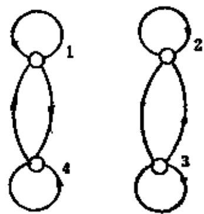  
图3-10.1

对称的。从 $R$ 的序偶表示式中，可以看出 $R$ 是传递的，逐个检查序偶，如 $\langle 1, 1 \rangle \in R, \langle 1, 4 \rangle \in R,$ 有 $\langle 1, 4 \rangle \in R$ 。同理 $\langle 1, 4 \rangle \in R, \langle 4, 1 \rangle \in R,$ 有 $\langle 1, 1 \rangle \in R, \dots$ 。故 $R$ 是 $T$ 上的等价关系。

同样地，从关系矩阵亦可验证 $R$ 是等价关系。

例题2 设 $I$ 为整数集, $R = \{\langle x, y \rangle | x \equiv y (\bmod k)\}$ , 证明 $R$ 是等价关系. 证明设任意 $a, b, c \in I$

I. 因为 $a - a = k \cdot 0$ , 所以 $\langle a, a \rangle \in R$

II: 若 $a \equiv b (\bmod k), a - b = kt (t$ 为整数), 则 $b - a = -kt$ , 所以

$$
\boldsymbol {b} \equiv \boldsymbol {a} (\mathrm {m o d} k)
$$

III. 若 $a \equiv b (\bmod k)$ , $b \equiv c (\bmod k)$ , 则 $a - b = kt$ , $b - c = ks (t, s$ 为整数), $a - c = a - b + b - c = k(t + s)$ , 所以 $a \equiv c (\bmod k)$

因此 $\pmb{E}$ 是等价关系。

定义3-10.2 设 $R$ 为集合 $A$ 上的等价关系，对任何 $a \in A$ 集合 $[a]_R = \{x \mid x \in A, aRx\}$ 称为元素 $a$ 形成的 $R$ 等价类。

由等价类的定义可知 $[a]_R$ 是非空的，因为 $a \in [a]_R$ ，因此任给集合 $\pmb{A}$ 及其上的等价关系 $\pmb{R}$ ，必可写出 $\pmb{A}$ 上各个元素的等价类，例如在例题1中， $\pmb{T}$ 的各个元素的等价类为：

$$
\begin{array}{l} [ 1 ] _ {R} = [ 4 ] _ {R} = \{1, 4 \} \\ [ 2 ] _ {R} = [ 3 ] _ {R} = \{2, 3 \} \\ \end{array}
$$

例题3 设 $I$ 是整数集合, $\pmb{R}$ 是同余模3的关系, 即

$$
R = \{\langle x, y \rangle | x \in I, y \in I, x \equiv y (\mathrm {m o d} 3) \}
$$

确定由 $I$ 的元素所产生的等价类。

解 由例题2中已证明整数集合上的同余模 $k$ 的关系是等价关系，故本例中由 $I$ 的元素所产生的等价类是

$$
\begin{array}{l} [ 0 ] _ {R} = \{\dots , - 6, - 3, 0, 3, 6, \dots \} \\ [ 1 ] _ {R} = \{\dots , - 5, - 2, 1, 4, 7, \dots \} \\ [ 2 ] _ {R} = \{\dots , - 4, - 1, 2, 5, 8, \dots \} \\ \end{array}
$$

从例题3可以看到，在集合 $I$ 上同余模3等价关系 $\pmb{R}$ 所构成的等价类有：

$$
\begin{array}{l} [ 0 ] _ {R} = [ 3 ] _ {R} = [ - 3 ] _ {R} = \dots \\ [ 1 ] _ {R} = [ 4 ] _ {R} = [ - 2 ] _ {R} = \dots \\ [ 2 ] _ {R} = [ 5 ] _ {R} = [ - 1 ] _ {R} = \dots \\ \end{array}
$$

定理3-10.1 设给定集合 $A$ 上的等价关系 $R$ , 对于 $a, b \in A$ 有 $aRb$ iff $[a]_R = [b]_R$ .

证明 假定 $[a]_R = [b]_R,$ 因为 $a\in [a]_R,$ 故 $a\in [b]_R,$ 即 $aRb_{0}$ 反之，若 $aRb$ ，设

$$
c \in [ a ] _ {R} \Rightarrow a R c \Rightarrow c R a \Rightarrow c R b \Rightarrow c \in , [ b ] _ {R}
$$

即 $[a]_R \subseteq [b]_R$

同理，若 $c \in [b]_R \Rightarrow bRc \Rightarrow aRc \Rightarrow c \in [a]_R$ 故 $[b]_R \subseteq [a]_R,$

由此证得若 $aRb$ ，则 $[a]_R = [b]_R$ 。

定义8-10.3 集合 $A$ 上的等价关系 $\pmb{R}$ , 其等价类集合 $\{[a]_R | a \in A\}$ 称作 $A$ 关于 $\pmb{R}$ 的商集, 记作 $A / R$ 。

如例题1中商集 $T / R = \{[1]_{R}, [2]_{R}\}$ ，例题3中商集

$$
I / R = \left\{\left[ 0 \right] _ {R}, \left[ 1 \right] _ {R}, \left[ 2 \right] _ {R} \right\} 。
$$

我们注意到商集 $I / R$ 中， $[0]_R \cup [1]_R \cup [2]_R = I,$ 且任意两个等价类的交为 $\varnothing_{\circ}$ 于是我们有下述重要定理。

定理3-10.2 集合 $A$ 上的等价关系 $R$ ，决定了 $A$ 的一个划分，该划分就是商集 $A / R$ 。

证明 设集合 $A$ 上有一个等价关系 $R_{\gamma}$ 把与 $\pmb{A}$ 的固定元 $\pmb{\alpha}$ 有等价关系的元素放在一起作成一个子集 $[\alpha]_{R}$ ，则所有这样的子集做成商集 $A / R_{\circ}$

I: 在 $A / R = \{[a]_R | a \in A\}$ 中, $\bigcup_{a \in A} [a]_R = A$ 。

II: 对于 $A$ 的每一个元素 $a$ , 由于 $\pmb{R}$ 是自反的, 故必有 $aRa$ 成立, 即 $a \in [a]_{R}$ , 故 $A$ 的每个元素的确属于一个分块。

III: $A$ 的每个元素只能属于一个分块。

反证 若 $a \in [b]_R, a \in [c]_R$ ，且 $[b]_R \neq [c]_R$ ，则 $bRa, cRa$ 成立，由对称性得 $aRc$ 成立，再由传递性得 $bRc$ ，据定理 3-10.1 必有 $[b]_R = [c]_R$ ，这与题设矛盾。故 $A / R$ 是 $A$ 上对应于 $R$ 的一个划分。

定理8-10.3 集合 $A$ 的一个划分确定 $A$ 的元素间的一个等价关系。

证明 设集合 $A$ 有一个划分 $S = \{S_{1}, S_{2}, \dots, S_{m}\}$ ，现定义一个关系 $R, aRb$ 当且仅当 $a, b$ 在同一分块中。可以证明这样规定的关系 $R$ 是一个等价关系。因为

I. $\pmb{a}$ 与 $\pmb{a}$ 在同一分块中, 故必有 $aRa$ 。即 $\pmb{R}$ 是自反的。

II: 若 $a$ 与 $b$ 在同一分块, $b$ 与 $a$ 也必在同一分块中, 即 $aRb \Rightarrow bRa$ , 故 $R$ 是对称的。

III: 若 $a$ 与 $b$ 在同一分块中, $b$ 与 $c$ 在同一分块中, 因为

$$
S _ {i} \cap S _ {j} = \varnothing (i \neq j)
$$

即 $b$ 属于且仅属于一个分块, 故 $\alpha$ 与 $c$ 必在同一分块中, 故有

$$
(a R b) \wedge (b R c) \Rightarrow (a R c)
$$

即 $R$ 是传递的。 $R$ 满足上述三个条件，故 $R$ 是等价关系，由 $R$ 的定义可知， $S$ 就是 $A / R$ 。

例题4 设 $A = \{a, b, c, d, e\}$ , 有一个划分 $S = \{\{a, b\}, \{c\}, \{d, e\}\}$ , 试由划分 $S$ 确定 $A$ 上的一个等价关系 $R_{0}$

解 我们用如下办法产生一个等价关系 $R$

$$
\begin{array}{l} R _ {1} = \{a, b \} \times \{a, b \} = \{\langle a, a \rangle , \langle a, b \rangle , \langle b, a \rangle , \langle b, b \rangle \} \\ R _ {2} = \{c \} \times \{c \} = \{\langle c, c \rangle \} \\ R _ {3} = \{d, e \} \times \{d, e \} = \{\langle d, d \rangle , \langle d, e \rangle , \langle e, d \rangle , \langle e, e \rangle \} \\ R = R _ {1} \cup R _ {2} \cup R _ {3} = \left\{\langle a, a \rangle , \langle b, b \rangle , \langle c, c \rangle , \langle d, d \rangle , \langle e, e \rangle , \right. \\ \langle a, b \rangle , \langle b, a \rangle , \langle d, e \rangle , \langle e, d \rangle \} \\ \end{array}
$$

从 $\pmb{R}$ 的序偶表示式中，容易验证 $\pmb{R}$ 是等价关系。

应该注意，本例中确定 $R$ 的方法与定理3-10.3中所述确定等价关系方法实质相同。

定理3-10.4 设 $R_{1}$ 和 $R_{2}$ 为非空集合 $\pmb{A}$ 上的等价关系，则 $R_{1} = R_{2}$ 当且仅当 $A / R_1 = A / R_2$

证明 因为 $A / R_{1} = \{[a]_{R_{1}} | a \in A\}$

$$
A / R _ {2} = \left\{\left[ a \right] _ {R _ {2}} \mid a \in A \right\}
$$

若 $R_{1} = R_{2}$ ，对任意 $\pmb {a}\in \pmb{A}$ 则

$$
[ a ] _ {R _ {1}} = \{x | x \in A, a R _ {1} x \} = \{x | x \in A, a R _ {2} x \} = [ a ] _ {R _ {1}}
$$

故 $\{[a]_{R_1} | a \in A\} = \{[a]_{R_1} | a \in A\}$ ，即 $A / R_1 = A / R_2$

反之，假设 $\{[a]_{R_1}|a\in A\} = \{[a]_{R_1}|a\in A\}$

对任意 $[a]_{R_1} \in A / R_1$ ，必存在 $[c]_{R_1} \in A / R_2$ ，使得 $[a]_{R_1} = [c]_{R_1}$ ，故

$$
\begin{array}{l} \langle a, b \rangle \in R _ {1} \Leftrightarrow a \in [ a ] _ {R _ {1}} \wedge b \in [ a ] _ {R _ {1}} \Leftrightarrow a \in [ c ] _ {R _ {2}} \wedge b \in [ c ] _ {R _ {1}} \\ \Rightarrow \langle a, b \rangle \in R _ {2} \\ \end{array}
$$

所以， $R_{1} \subseteq R_{2}$ ，类似地有 $R_{3} \subseteq R_{1}$ ，因此， $R_{1} = R_{2}$ 。

# 3-10 习题

(1) 设 $R$ 和 $R'$ 是集合 $A$ 上的等价关系, 用例子证明 $R \cup R'$ 不一定是等价关系。  
(2) 试问由4个元素组成的有限集上所有的等价关系的个数为多少？  
(3) 给定集合 $S = \{1, 2, 3, 4, 5\}$ , 找出 $S$ 上的等价关系 $R$ , 此关系 $R$ 能够产生划分 $\{\{1, 2\}, \{3\}, \{4, 5\}\}$ 并画出关系图。  
(4) 设 $R$ 是一个二元关系, 设 $S = \{\langle a, b \rangle\}$ 对于某一 $c$ , 有 $\langle a, c \rangle \in R$ 且

$\{c, b\} \in R\}$ ，证明若 $R$ 是一个等价关系，则 $S$ 也是一个等价关系。

(5) 设正整数的序偶集合 $A$ , 在 $A$ 上定义的二元关系 $\pmb{R}$ 如下: $\langle \langle x, y \rangle, \langle u, v \rangle \rangle \in R$ , 当且仅当 $xv = yu$ , 证明 $\pmb{R}$ 是一个等价关系。

(6) 设 $R$ 是集合 $A$ 上的对称和传递关系, 证明如果对于 $A$ 中的每一个元素 $a$ , 在 $A$ 中同时也存在一个 $b$ , 使 $\langle a, b \rangle$ 在 $R$ 之中, 则 $R$ 是一个等价关系。

(7) 设 $R_{1}$ 和 $R_{2}$ 是非空集合 $A$ 上的等价关系, 确定下述各式, 哪些是 $A$ 上的等价关系, 对不是的提供反例证明。

a) $(A\times A) - R_{\mathbf{I}}$

b) $R_{1} - R_{2}$

c）R

d） $r(R_{1} - R_{2})$ （即 $R_{1} - R_{2}$ 的自反闭包）

(8) 设 $C^*$ 是实数部分非零的全体复数组成的集合, $C^*$ 上关系 $\pmb{R}$ 定义为: $(a + b_i)R(c + d_i) \Leftrightarrow ac > 0$ , 证明 $\pmb{R}$ 是等价关系, 并给出关系 $\pmb{R}$ 的等价类的几何说明。

(9) 设 $\pi$ 和 $\pi'$ 是非空集合 $A$ 上的划分，并设 $R$ 和 $R'$ 是分别由 $\pi$ 和 $\pi'$ 诱导的等价关系，那么， $\pi'$ 细分 $\pi$ 的充要条件是 $R' \subseteq R$ 。

(10) 设 $R_{j}$ 表示 $\pmb{I}$ 上的模 $\pmb{j}$ 等价关系, $R_{k}$ 表示 $\pmb{I}$ 上的模 $\pmb{k}$ 等价关系, 证明 $I / R_{k}$ 细分 $I / R_{j}$ 当且仅当 $\pmb{k}$ 是 $\pmb{j}$ 的整数倍。

# 3-11 相容关系

与等价关系一样，另一类应用非常广泛的关系，就是相容关系。

定义3-11.1 给定集合 $A$ 上的关系 $r$ , 若 $r$ 是自反的, 对称的, 则称 $r$ 是相容关系。

例如，设 $A$ 是由下列英文单词组成的集合。

$$
\begin{array}{l} A = \{\text {c a t}, \text {t e a c h e r}, \text {c o l d}, \text {d e s k}, \\ \quad \text {k n i f e , b y} \} \end{array}
$$

定义关系：

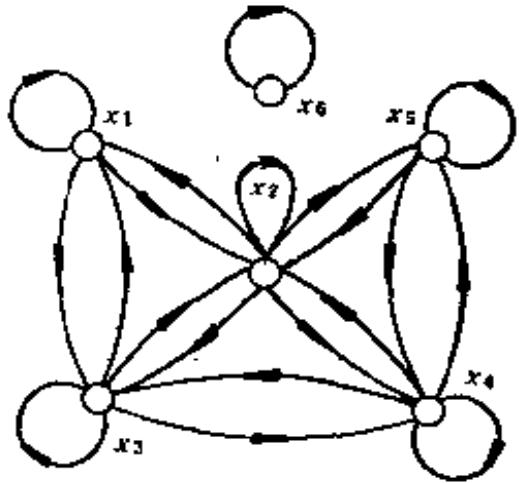  
图3-11.1

$\pmb{\tau} = \{\langle x,y\rangle |x,y\in A$ 且 $\pmb{x}$ 和 $\pmb{y}$ 有相同的字母}。显然， $\pmb{\tau}$ 是一个

相容关系。

令 $x_{1} = \mathrm{cat}, x_{2} = \mathrm{teacher}, x_{3} = \mathrm{cold}, x_{4} = \mathrm{desk}, x_{5} = \mathrm{knife},$ $x_{6} = \mathrm{by}_{\circ}$

$\pmb{\tau}$ 的关系图可由图3-11.1表示。

$$
\pmb {r} \text {的 关 系 矩 阵 为} M _ {r} = \left[ \begin{array}{c c c c c c} \frac {1}{1}, & 1 & 1 & 0 & 0 & 0 \\ 1 & 1 & 1 & 1 & 1 & 0 \\ 1 & 1 & 1 & 1 & 0 & 0 \\ 0 & 1 & 1 & 1 & 1 & 0 \\ 0 & 1 & 0 & 1 & 1 & 0 \\ 0 & 0 & 0 & 0 & 0 & 1 \end{array} \right]
$$

由于相容关系是自反和对称的，因此其关系矩阵的对角线元素都是1，且矩阵是对称的。为此我们可将矩阵用梯形表示。

同理，在相容关系的关系图上，每个结点处都有自回路且每两个相关结点间的弧线都是成对出现的。为了简化图形，我们今后对相容关系图，不画自回路，并用单线代替来回弧线，因此上例的关系矩阵和关系图可简化为表3-11.1和图3-11.2。

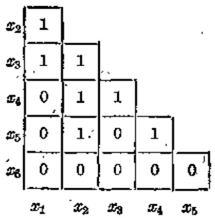  
表3-11.1

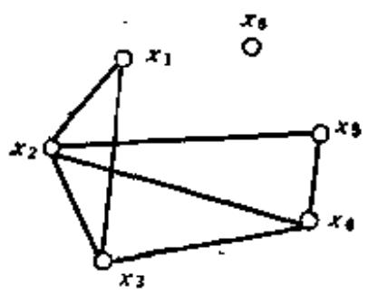  
图3-11.2

定义3-11.2 设 $r$ 是集合 $A$ 上的相容关系，若 $C \subseteq A$ ，如果对于 $C$ 中任意两个元素 $a_1, a_2$ 有 $a_1 r a_2$ ，称 $C$ 是由相容关系 $r$ 产生的相容类。

例如上例的相容关系 $\pmb{r}$ 可产生相容类 $\{x_{1}, x_{3}\}, \{x_{1}, x_{3}\}, \{x_{3}, x_{3}\}, \{x_{6}\}, \{x_{2}, x_{4}, x_{5}\}$ 等等。

对于前三个相容类, 都能加进新的元素组成新的相容类; 而后

两个相容类, 加入任一新元素, 就不再组成相容类, 我们称它为最大相容类。

定义3-11.8 设 $r$ 是集合 $\pmb{A}$ 上的相容关系，不能真包含在任何其它相容类中的相容类，称作最大相容类。记作 $C_{r}$ 。

若 $C_r$ 为最大相容类, 显然它是 $\pmb{A}$ 的子集, 对于任意 $\pmb{x} \in C_r$ , $\pmb{x}$ 必与 $C_r$ 中所有元素有相容关系。而在 $A - C_r$ 中没有任何元素与 $C_r$ 所有元素有相容关系。

在相容关系图中, 最大完全多边形的顶点集合, 就是最大相容

类。所谓完全多边形，就是其每个顶点都与其它顶点连接的多边形。例如一个三角形是完全多边形，一个四边形加上两条对角线就是完全多边形。

此外，在相容关系图中，一个孤立结点，以及不是完

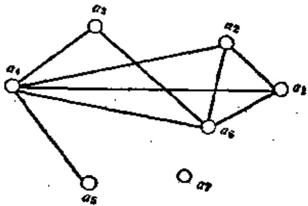  
图3-11.3

全多边形边的两个结点的连线，也是最大相容类。

例题1 设给定相容关系图如图3-11.3, 写出最大相容类。

解最大相容类为：

$$
\left\{a _ {1}, a _ {2}, a _ {4}, a _ {6} \right\}, \left\{a _ {3}, a _ {4}, a _ {6} \right\}, \left\{a _ {4}, a _ {5} \right\}, \left\{a _ {7} \right\}
$$

定理3-11.1 设 $r$ 是有限集 $\pmb{A}$ 上的相容关系, $\pmb{C}$ 是一个相容类, 那么必存在一个最大相容类 $C_{r}$ , 使得 $C \subseteq C_{r}$ 。

证明 设 $A = \{a_{1}, a_{2}, \dots, a_{n}\}$ , 构造相容类序列

$$
C _ {0} \subset C _ {1} \subset C _ {2} \subset \dots , \quad \text {其 中} \quad C _ {0} = C
$$

且 $C_{i+1} = C_i \cup \{a_j\}$ , 其中 $j$ 是满足 $a_j \notin C_i$ 而 $a_j$ 与 $C_i$ 中各元素都有相容关系的最小足标。

由于 $\pmb{A}$ 的元素个数 $|A| = n$ ，所以至多经过 $n - |C|$ 步，就使这个过程终止，而此序列的最后一个相容类，就是所要找的最大相容类。

从定理3-11.1中可以看到， $\pmb{A}$ 中任一元素 $a_{i}$ 它可以组成相

容类 $\{a\}$ , 因此必包含在一个最大相容类 $O_r$ 中, 因此如由所有最大相容类作出一个集合, 则 $A$ 中每一元素至少属于该集合的一个成员之中, 所以最大相容类集合必覆盖集合 $A$ 。

定义8-11.4 在集合 $A$ 上给定相容关系 $\tau$ ，其最大相容类的集合称作集合 $A$ 的完全覆盖，记作 $C_{\tau}(A)$ 。

我们注意到集合 $A$ 的覆盖不是唯一的，因此给定相容关系 $\pmb{r}$ 可以作成不同的相容类的集合，它们都是 $\pmb{A}$ 的覆盖。但给定相容关系 $\pmb{r}$ ，只能对应唯一的完全覆盖。如例题1中，给定 $\pmb{A}$ 上相容关系则有唯一的完全覆盖： $\{\{a_{1}, a_{2}, a_{4}, a_{5}\}, \{a_{3}, a_{4}, a_{0}\}, \{a_{4}, a_{5}\}, \{a_{7}\}\}$ 。

定理3-11.2 给定集合 $A$ 的覆盖 $\{A_{1}, A_{2}, \dots, A_{n}\}$ ，由它确定的关系 $R = A_{1} \times A_{1} \cup A_{2} \times A_{2} \cup \dots \cup A_{n} \times A_{n}$ 是相容关系。

证明 因为 $A = \bigcup_{i=1}^{n} A_{i}$ , 对于任意 $x \in A$ , 必存在某个 $j > 0$ 使得 $x \in A_{j}$ , 所以 $\langle x, x \rangle \in A_{j} \times A_{j}$ , 即 $\langle x, x \rangle \in R$ , 因此 $R$ 是自反的。

其次，若有任意 $x, y \in A$ 且 $\langle x, y \rangle \in R$ ，则必存在某个 $h > 0$ 使 $\langle x, y \rangle \in A_h \times A_k$ ，故必有 $\langle y, x \rangle \in A_h \times A_k$ ，即 $\langle y, x \rangle \in R$ ，所以 $R$ 是对称的。

因此证得 $\pmb{R}$ 是 $\pmb{A}$ 上的相容关系。

从上述定理可以看到，给定集合 $\pmb{A}$ 上的任意一个覆盖，必可在 $\pmb{A}$ 上构造对应于此覆盖的一个相容关系，但是不同的覆盖却能构造相同的相容关系。

例如，设 $A = \{1, 2, 3, 4\}$ ，集合 $\{\{1, 2, 3\}, \{3, 4\}\}$ 和 $\{\{1, 2\}, \{2, 3\}, \{1, 3\}, \{3, 4\}\}$ 都是 $A$ 的覆盖，但它们可以产生相同的相容关系。

$$
\begin{array}{l} r = \{\langle 1, 1 \rangle , \langle 1, 2 \rangle , \langle 2, 1 \rangle , \langle 2, 2 \rangle , \\ \langle 2, 3 \rangle , \langle 3, 2 \rangle , \langle 1, 3 \rangle , \langle 3, 1 \rangle , \\ \langle 3, 3 \rangle , \langle 4, 4 \rangle , \langle 3, 4 \rangle , \langle 4, 3 \rangle \} \\ \end{array}
$$

定理3-11.8 集合 $A$ 上相容关系 $\pmb{r}$ 与完全覆盖 $C_{\mathbf{r}}(A)$ 存在

一一对应。

这个定理的证明留作习题。

#

# 3-11 习题

(1) 设 $R$ 是 $X$ 上的二元关系, 试证明 $\alpha = I_{\overline{X}} \cup R \cup R^{\mathrm{c}}$ 是 $X$ 上的相容关系。  
(2) 给定集合 $X = \{x_{1}, x_{2}, \dots, x_{6}\}$ , $R$ 是 $X$ 上的相容关系且 $M_{R}$ 简化矩阵为:

$$
\begin{array}{c c c c c c} x _ {2} & 1 & & & \\ x _ {3} & 1 & 1 & & \\ x _ {4} & 0 & 0 & 1 & & \\ x _ {5} & 0 & 0 & 1 & 1 & \\ x _ {6} & 1 & 0 & 1 & 0 & 1 \\ \hline & x _ {1} & x _ {2} & x _ {3} & x _ {4} & x _ {5} \end{array}
$$

试求出 $X$ 的完全覆盖，并画出相容关系图。

(3) 给定 $X$ 上的相容关系 $R_{\lambda}$ 证明 $\bigcup_{i=1}^{\infty} R^{i}$ 为 $X$ 上的等价关系。

(4) 设 $C = \{A_{1}, A_{2}, \dots, A_{n}\}$ 为集合 $A$ 的覆盖，试由此覆盖确定 $A$ 上的一个相容关系。并说明在什么条件下，此相容关系为等价关系。  
(5) 设 $A = \{1, 2, 3, 4, 5, 6\}$ 上有关系 $\beta = \{\langle 1, 2 \rangle, \langle 1, 3 \rangle, \langle 2, 3 \rangle, \langle 2, 4 \rangle, \langle 3, 4 \rangle, \langle 2, 5 \rangle, \langle 4, 5 \rangle, \langle 3, 6 \rangle, \langle 4, 6 \rangle\}$ 。

证明至少有 $\pmb{A}$ 的两个不同覆盖可以产生

$$
\alpha = I _ {x} \cup \beta \cup \beta^ {\circ}
$$

(6) 设 $\alpha$ 和 $\beta$ 是 $A$ 上的相容关系。

a) 复合关系 $\alpha \circ \beta$ 是 $A$ 上的相容关系吗？  
b) $\pmb{\alpha} \cup \pmb{\beta}$ 是 $\pmb{A}$ 上的相容关系吗？  
c) $\alpha \cap \beta$ 是 $A$ 上的相容关系吗？  
(7) 证明定理3-11.3。

# 3-12 序关系

在一个集合上, 我们常常要考虑元素的次序关系, 其中很重要的一关关系称作偏序关系。

定义3-12.1 设 $A$ 是一个集合, 如果 $A$ 上的一个关系 $\pmb{R}$ , 满足自反性, 反对称性和传递性, 则称 $\pmb{R}$ 是 $A$ 上的一个偏序关系, 并把它记为“ $\leqslant$ ”。序偶 $\langle A, \leqslant \rangle$ 称作偏序集。

例题1 在实数集 $\pmb{R}$ 上，证明小于等于关系“ $\leqslant$ ”是偏序关系。

证明1.对于任何实数 $a\in R,$ 有 $a\leqslant a$ 成立，故 $\pmb{R}$ 是自反的。

2. 对任何实数 $a, b \in R$ ，如果 $a \leqslant b$ 且 $b \leqslant a$ ，则必有 $a = b$ ，故 $R$ 是反对称的。

3. 如果 $a \leqslant b, b \leqslant c,$ 那么必有 $a \leqslant c,$ 故 $R$ 是传递的。

因此， $\pmb{R}$ 是个偏序关系。

例题2 给定集合 $A = \{2, 3, 6, 8\}$ ，令“ $\leqslant$ ”= $\{\langle x, y \rangle | x \text{ 整除 } y\}$ ，验证“ $\leqslant$ ”是偏序关系。

解 $\because = \{\langle 2,2\rangle ,\langle 3,3\rangle ,\langle 6,6\rangle ,\langle 8,8\rangle ,\langle 2,6\rangle ,\langle 2,8\rangle ,\langle 3,6\rangle \}$

写出关系矩阵和关系图如图3-12.1所示。

$$
\boldsymbol {M} _ {\approx} = \left[ \begin{array}{c c c c} 1 & 0 & 1 & 1 \\ 0 & 1 & 1 & 0 \\ 0 & 0 & 1 & 0 \\ 0 & 0 & 0 & 1 \end{array} \right]
$$

从关系矩阵和关系图可以看出“ $\leqslant$ ”是自反、反对称和传递的。

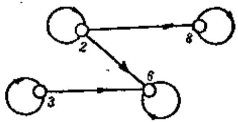  
图3-12.1

为了更清楚地描述偏序集合中元素间的层次关系，我们先介绍“盖住”的概念。

定义3-12.2 在偏序集合 $\langle A, \leqslant \rangle$ 中，如果 $x, y \in A, x \leqslant y, x \neq y$ 且没有其他元素 $z$ 满足 $x \leqslant z, z \leqslant y$ ，则称元素 $y$ 盖住元素 $x$ 。并且记 $\mathrm{COVA} = \{\langle x, y \rangle | x, y \in A; y$ 盖住 $x\}$ 。

例题3 设 $A$ 是正整数 $m = 12$ 的因子的集合, 并设 $\precsim$ 为整除关系, 求 $\operatorname{COV} A$ 。

解 $m = 12$ 其因子集合 $A = \{1,2,3,4,6,12\}$

$$
\begin{array}{l} \left. \left. \left. \left. \left. \left. \left. \left. \left. \left. \left. \left. \left. \left. \left. \left. \langle 1, 2 \rangle , \langle 1, 3 \rangle , \langle 1, 4 \rangle , \langle 1, 6 \rangle , \langle 1, 12 \rangle , \langle 2, 4 \rangle , \langle 2, 6 \rangle , \right. \right. \right. \right. \right. \right. \right. \right. \right. \right. \right. \right. \right. \right. \right. \right. \\ \langle 2, 1 2 \rangle , \langle 3, 6 \rangle , \langle 3, 1 2 \rangle , \langle 4, 1 2 \rangle , \langle 6, 1 2 \rangle , \langle 1, 1 \rangle , \langle 2, 2 \rangle , \\ \langle 3, 3 \rangle , \langle 4, 4 \rangle , \langle 6, 6 \rangle , \langle 1 2, 1 2 \rangle \} \\ \end{array}
$$

$$
\operatorname {C O V} A = \{\langle 1, 2 \rangle , \langle 1, 3 \rangle , \langle 2, 4 \rangle , \langle 2, 6 \rangle , \langle 3, 6 \rangle , \langle 4, 1 2 \rangle , \langle 6, 1 2 \rangle \}
$$

对于给定偏序集 $\langle A, \preccurlyeq \rangle$ ，它的盖住关系是唯一的，所以可用

盖住的性质画出偏序集合图, 或称哈斯图, 其作图规则为:

(1) 用小圆圈代表元素。  
(2) 如果 $x \leqslant y$ 且 $x \neq y$ , 则将代表 $y$ 的小圆圈画在代表 $x$ 的小圆圆之上。  
(3) 如果 $\langle x, y \rangle \in \mathrm{COV} A$ ，则在 $x$ 与 $y$ 之间用直线连接。根据这个作图规则，例题3中偏序集的哈斯图如图3-12.2所示。

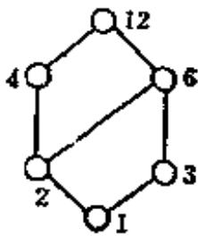  
图3-12.2

定义3-12.8 设 $\langle A, \leqslant \rangle$ 是一个偏序集合，在 $A$ 的一个子集中，如果每两个元素都是有关系的，则称这个子集为链。在 $A$ 的一个子集中，如果每两个元素都是无关的，则称这个子集为反链。

我们约定，若 $\pmb{A}$ 的子集只有单个元素，则这个子集既是链又是反链。

例如 $A$ 表示一个单位里所有工作人员的集合， $\precsim$ 表示领导关系，则 $\langle A, \precsim \rangle$ 为一偏序集，其中部份工作人员之间有领导关系的组成一个链。还有部份工作人员没有领导关系的组成一个反链。

例题4 设集合 $A = \{a, b, c, d, e\}$ 上的二元关系为

$$
\begin{array}{l} R = \{\langle a, a \rangle , \langle a, b \rangle , \langle a, c \rangle , \langle a, d \rangle , \langle a, e \rangle , \langle b, b \rangle , \langle b, c \rangle , \\ \langle b, e \rangle , \langle c, c \rangle , \langle c, e \rangle , \langle d, d \rangle , \langle d, e \rangle , \langle e, e \rangle \} \\ \end{array}
$$

验证 $\langle A, B \rangle$ 为偏序集，画出哈斯图，举例说明链及反链。

解 写出 $R$ 的关系矩阵

$$
\left[ \begin{array}{c c c c c} 1 & 1 & 1 & 1 & 1 \\ 0 & 1 & 1 & 0 & 1 \\ 0 & 0 & 1 & 0 & 1 \\ 0 & 0 & 0 & 1 & 1 \\ 0 & 0 & 0 & 0 & 1 \end{array} \right]
$$

其关系图如图3-12.3，从关系矩阵看到对角线都为1,且 $r_{ij}$ 与 $\pmb{r}_{ji}$ 不同时为1,故 $\pmb{R}$ 是自反的和反对称的。

从关系图容易验证 $\pmb{R}$ 是传递的，因此 $\pmb{R}$ 是偏序关系。

$$
\operatorname {C O V} A = \{\langle a, b \rangle , \langle b, c \rangle , \langle c, e \rangle , \langle a, d \rangle , \langle d, e \rangle \}
$$

故哈斯图可画成图3-12.4所示。

集合 $\{a, b, c, e\}, \{a, b, c\}, \{b, c\}$ 和 $\{a\}, \{a, d, e\}$ 等都是 $A$ 的子集也是链。

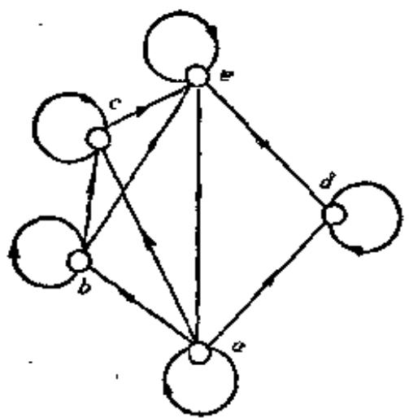  
图3-12.3

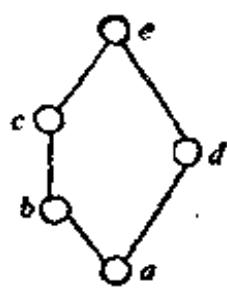  
图3-12.4

而 $\{b,d\} ,\{c,d\} ,\{a\}$ 等都是反链。

从例题4的哈斯图上容易看出，在每个链中总可从最高结点出发沿着盖住方向遍历该链中所有结点。每个反链中任两结点间均无连线。

定义3-12.4 在偏序集 $\langle A, \leqslant \rangle$ 中，如果 $A$ 是一个链，则称 $\langle A, \leqslant \rangle$ 为全序集合或称线序集合，在这种情况下，二元关系 $\leqslant$ 称为全序关系或称线序关系。

全序集 $\langle A, \preccurlyeq \rangle$ 就是对任意 $x, y \in A$ ，或者有 $x \leqslant y$ 或者有 $y \preccurlyeq x$ 成立。

例如，定义在自然数集合 $N$ 上的“小于等于”关系 $\leqslant$ 是偏序关系，且对任意 $i, j \in N$ ，必有：

$(i \leqslant j)$ 或 $(j \leqslant i)$ 成立, 故也是全序关系。

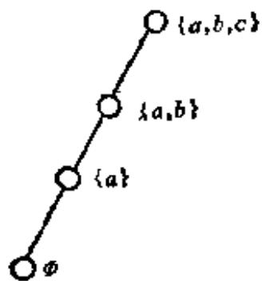  
图3-12.5

例题5 给定 $P = \{\emptyset, \{a\}, \{a, b\}, \{a, b, c\}\}$ 上的包含关系 $\subseteq$ ，证明 $\langle P, \subseteq \rangle$ 是个全序集合。

证明 因为 $\emptyset \subseteq \{a\} \subseteq \{a, b\} \subseteq \{a, b, c\}$ , 故 $P$ 中任意两元素都有包含关系。如图 3-12.5 所示。

从哈斯图中可以看到偏序集 $\pmb{A}$ 中各个元素，处于不同层次的位置，下面我们讨论偏序集中具有一些特殊位置的元素。

定义3-12.5 设 $\langle A, \preccurlyeq \rangle$ 是一个偏序集合，且 $B$ 是 $A$ 的子

集, 对于 $B$ 中的一个元素 $b$ , 如果 $B$ 中没有任何元素 $x$ , 满足 $b \neq x$ 且 $b \leqslant x$ , 则称 $b$ 为 $B$ 的极大元。同理, 对于 $b \in B$ , 如果 $B$ 中没有任何元素 $x$ , 满足 $b \neq x$ 且 $x \leqslant b$ , 则称 $b$ 为 $B$ 的极小元。

例题6 设 $A = \{2, 3, 5, 7, 14, 15, 21\}$ , 其偏序关系

$$
\begin{array}{l} R = \{\langle 2, 1 4 \rangle , \langle 3, 1 5 \rangle , \langle 3, 2 1 \rangle , \\ \langle 5, 1 5 \rangle , \langle 7, 1 4 \rangle , \langle 7, 2 1 \rangle , \langle 2, \\ 2 \rangle , \langle 3, 3 \rangle , \langle 5, 5 \rangle , \langle 7, 7 \rangle , \langle 1 4, \\ \left. \left. 1 4 \right\rangle , \langle 1 5, 1 5 \rangle , \langle 2 1, 2 1 \rangle \right\} \\ \end{array}
$$

求 $B = \{2,7,3,21,14\}$ 的极大元与极小元。

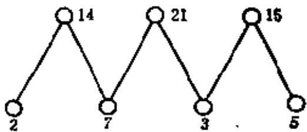  
图3-12.6

解 COV $B = \{\langle 2,14\rangle ,\langle 3,15\rangle ,\langle 3,21\rangle ,\langle 5,15\rangle ,\langle 7,14\rangle ,\langle 7,21\rangle \}$ $\langle A,R\rangle$ 的哈斯图为图3-12.6所示。

故 $\pmb{B}$ 的极小元集合是 $\{2,7,3\}, B$ 的极大元集合为 $\{14,21\}$ 。

从例题6中可以看到极大元和极小元不是唯一的。

从定义3-12.5中可以知道，当 $B = A$ 时，则偏序集 $\langle A, \leqslant \rangle$ 的极大元即是哈斯图中最顶层的元素，其极小元是哈斯图中最低层的元素，不同的极小元素或不同的极大元素之间是无关的。

定义3-12.6 令 $\langle A, \leqslant \rangle$ 是一个偏序集，且 $B$ 是 $A$ 的子集，若有某个元素 $b \in B$ ，对于 $B$ 中每一个元素 $x$ 有 $x \leqslant b$ ，则称 $b$ 为 $\langle B, \leqslant \rangle$ 的最大元。同理，若有某个元素 $b \in B$ ，对每一个 $x \in B$ 有 $b \leqslant x$ ，则称 $b$ 为 $\langle B, \leqslant \rangle$ 的最小元。

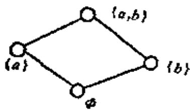  
图3-12.7

例如，考虑偏序集 $\langle \mathcal{P}(\{a, b\}), \subseteq \rangle$ 其哈斯图为图3-12.7所示。

a) 若 $B = \{\{a\}, \emptyset\}$ , 则 $\{a\}$ 是 $B$ 的最大元, $\emptyset$ 是 $B$ 的最小元。

b) 若 $B = \{\{a\}, \{b\}\}$ , 则 $B$ 没有最

大元和最小元，因为 $\{a\}$ 和 $\{b\}$ 是不可比较的。

定理3-12.1 令 $\langle A, \leqslant \rangle$ 为偏序集且 $B \subseteq A$ , 若 $B$ 有最大 (最小) 元, 则必是唯一的。

证明 假定 $a$ 和 $b$ 两者都是 $\pmb{B}$ 的最大元素，则 $a \leqslant b$ 和 $b \leqslant a$ ，从 $\precsim$ 的反对称性，得到 $a = b$ 。 $B$ 的最小元情况与此类似。

在最大(最小)元的定义中，当子集 $\pmb{B}$ 与 $\pmb{A}$ 相等时， $\pmb{B}$ 的最大（最小）元就是偏序集 $\langle A, \preccurlyeq \rangle$ 的最大（最小）元。如例题3的图3-12.2中， $\langle A, \preccurlyeq \rangle$ 的最大元为12，最小元为1。

定义3-12.7 设 $\langle A, \leqslant \rangle$ 为一偏序集，对于 $B \subseteq A$ ，如有 $a \in A$ ，且对 $B$ 的任意元素 $x$ ，都满足 $x \leqslant a$ ，则称 $a$ 为子集 $B$ 的上界。同样地，对于 $B$ 的任意元素 $x$ ，都满足 $a \leqslant x$ ，则称 $a$ 为 $B$ 的下界。

例如，给定偏序集 $\langle A, \leqslant \rangle$ 的哈斯图如图3-12.8所示。 $h, i$ 分别是 $B = \{a, b, c, d, e, f, g\}$ 的上界。而 $f, g$ 分别是 $B' = \{h, i, j, k\}$ 的下界。当然， $a, b, c, d, e$ 也可以分别是 $B' = \{h, i, j, k\}$ 的下界。但 $b, c, d, e$ 都不是 $\{h, i, f, g\}$ 的下界。

从本例可以看到上界和下界不是唯一的。

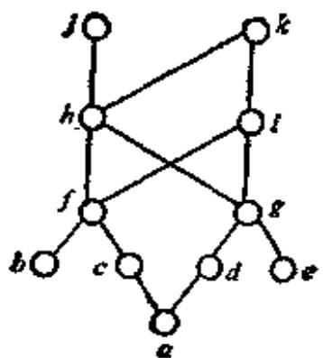  
图3-12.8

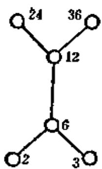  
图3-12.9

定义3-12.8 设 $\langle A, \preccurlyeq \rangle$ 为偏序集且 $B \subseteq A$ 为一子集， $a$ 为 $B$ 的任一上界，若对 $B$ 的所有上界 $y$ 均有 $a \preccurlyeq y$ ，则称 $a$ 为 $B$ 的最小上界（上确界），记作 LUB $B$ 。同样，若 $b$ 为 $B$ 的任一下界，若对 $B$ 的所有下界 $z$ ，均有 $z \preccurlyeq b$ ，则称 $b$ 为 $B$ 的最大下界（下确界），记作 GLB $B$ 。

例如图3-12.8中， $a$ 是 $\{f, h, j, i, g\}$ 的最大下界，在图3-12.9中，子集 $\{2, 3, 6\}$ 的最小上界为6，但没有最大下界。对子集 $\{12, 6\}$ 来说，最小上界为12，最大下界是6。

定义3-12.9 任一偏序集合，假如它的每一个非空于集存在

最小元素, 这种偏序集称为良序的。

例如， $I_{*} = \{1, 2, \dots, n\}$ 及 $N = \{1, 2, 3, \dots\}$ ，对于小于等于关系来说是良序集合，即 $\langle I_{*}, \leqslant \rangle, \langle N, \leqslant \rangle$ 是良序集合。

定理3-12.2 每一个良序集合，一定是全序集合。

证明 设 $\langle A, \preccurlyeq \rangle$ 为良序集合，则对任意两个元素 $x, y \in A$ 可构成子集 $\{x, y\}$ ，必存在最小元素，这个最小元素不是 $x$ 就是 $y$ ，因此一定有 $x \leqslant y$ 或 $y \leqslant x$ 。所以 $\langle A, \preccurlyeq \rangle$ 为全序集。

#

定理8-12.3 每一个有限的全序集合，一定是良序集合。

证明 设 $A = \{a_{1}, a_{2}, \dots, a_{n}\}$ , 令 $\langle A, \preccurlyeq \rangle$ 是全序集合, 现在假定 $\langle A, \preccurlyeq \rangle$ 不是良序集合, 那么必存在一个非空子集 $B \subseteq A$ , 在 $B$ 中不存在最小元素, 由于 $B$ 是一个有限集合, 故一定可以找出两个元素 $x$ 与 $y$ 是无关的, 由于 $\langle A, \preccurlyeq \rangle$ 是全序集, $x, y \in A$ , 所以 $x, y$ 必有关系, 得出矛盾, 故 $\langle A, \preccurlyeq \rangle$ 必是良序集合。

上述结论对于无限的全序集合不一定成立。

例如, 大于零小于 1 的全部实数, 按大小次序关系是一个全序集合, 但不是良序集合, 因为集合本身就不存在最小元素。

# 3-12 习题

(1) 设集合为 $\{3, 5, 15\}, \{1, 2, 3, 6, 12\}, \{3, 9, 27, 54\}$ ，偏序关系为整除，画出这些集合的偏序关系图，并指出哪些是全序关系。  
(2) 设 $R$ 是 $\Delta$ 上的二元关系, 如果 $R$ 是传递的和反自反的, 称 $R$ 是拟序关系。证明:  
a）如果 $\pmb{R}$ 是 $\pmb{A}$ 上拟序关系，则 $r(R) = R\cup I_{A}$ 是偏序关系。  
b) 如果 $R$ 是一偏序关系, 则 $R - I_{A}$ 是一拟序关系。  
(3) 设 $R$ 是集合 $S$ 上的关系, $S''$ 是 $S$ 的子集, 定义 $S''$ 上的关系 $R'$ 如下: $R' = R \cap (S' \times S'')$ .  
确定下述每一断言是真还是假。  
a）如果 $\pmb{R}$ 在 $s$ 上是传递的，那么 $\pmb{R^{\prime}}$ 在 $S^{\prime}$ 上是传递的。  
b）如果 $R$ 是 $S$ 上的偏序关系，那么 $R'$ 是 $S'$ 上的偏序关系。  
c）如果 $R$ 是 $\mathcal{S}$ 上的拟序关系，那么 $R^{\prime}$ 是 $S^{\prime}$ 上的拟序关系。  
d）如果 $\pmb{R}$ 是 $s$ 上的线序关系，那么 $\pmb{R^{\prime}}$ 是 $s^{\prime}$ 上的线序关系。

e）如果 $\pmb{R}$ 是 $s$ 上的良序关系，那么 $\pmb{R^{\prime}}$ 是 $S^{\prime}$ 上的良序关系。

(4) 找出在集合 $\{0, 1, 2, 3\}$ 上包含序偶 $\langle 0, 3 \rangle$ 和 $\langle 2, 1 \rangle$ 的线序关系。

(5) 构造下述集合的例子。

a）非空线序集，其中某些子集没有最小元素。

b) 非空偏序集, 它不是线序集, 其中某些子集没有最大元。

0）一偏序集有一子集，它存在一最大下界，但没有最小元素。

d) 一偏序集有一子集，它存在一上界但没有最小上界。

(6) 设集合 $P = \{x_{1}, x_{2}, x_{3}, x_{4}, x_{5}\}$ 上的偏序关系如图 3-12.10 所示。找出 $P$ 的最

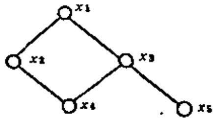  
图3-12.10

大元素, 最小元素, 极小元素, 极大元素。找出子集 $\{x_{2}, x_{3}, x_{4}\}, \{x_{3}, x_{4}, x_{5}\}$ 和 $\{x_{1}, x_{2}, x_{3}\}$ 的上界、下界, 上确界、下确界。

(7) 图3-12.11给出了集合 $\{1, 2, 3, 4\}$ 上的四个偏序关系图，画出它们的哈斯图，并说明哪一个是全序关系，哪一个是良序关系。

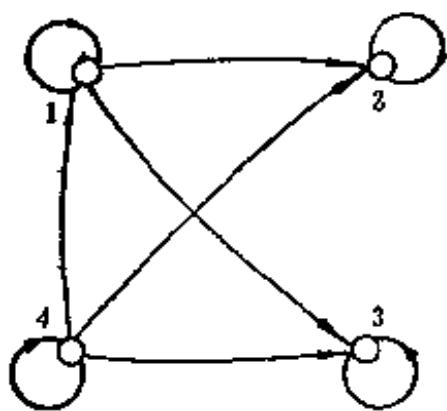  
（a）

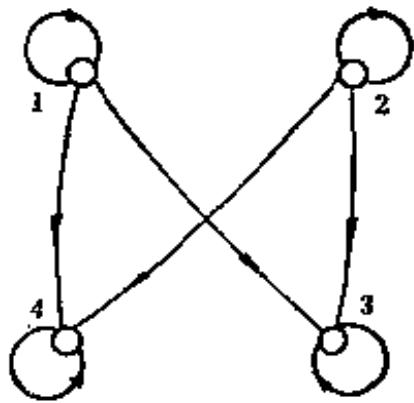  
(b)

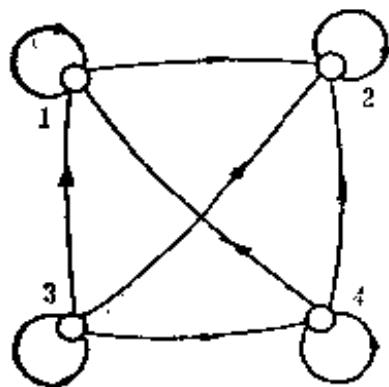  
(c）

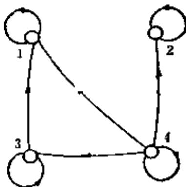  
(d)   
图3-12.11

# 第四章 函数

函数是一个基本的数学概念，在通常的函数定义中， $y = f(x)$ 是在实数集合上讨论，我们这里把函数概念予以推广，把函数看作是一种特殊的关系。例如，计算机中把输入、输出间的关系看成是一种函数；类似地，在开关理论、自动机理论和可计算性理论等领域中，函数都有着极其广泛的应用。

# 4-1 函数的概念

定义4-1.1 设 $X$ 和 $Y$ 是任何两个集合, 而 $f$ 是 $X$ 到 $Y$ 的一个关系, 如果对于每一个 $x \in X$ , 有唯一的 $y \in Y$ , 使得 $\langle x, y \rangle \in f$ , 称关系 $f$ 为函数, 记作:

$$
f _ {:} X \rightarrow Y \text {或} X \stackrel {f} {\rightarrow} Y
$$

假如 $\langle x, y \rangle \in f$ ，则 $x$ 称为自变元， $y$ 称为在 $f$ 作用下 $x$ 的象， $\langle x, y \rangle \in f$ 亦可记作 $y = f(x)$ ，且记

$$
f (X) = \{f (x) | x \in X \}
$$

从函数的定义可以知道它与关系有别于如下两点。

a. 函数的定义域是 $X$ , 而不能是 $X$ 的某个真子集。

b. 一个 $x \in X$ 只能对应于唯一的一个 $y$ 。即如果 $f(x) = y$ 且 $f(x) = z$ ，那么， $y = z$ 。从 $X$ 到 $Y$ 的函数往往也叫做从 $X$ 到 $Y$ 的映射。

在 $\langle x, y \rangle \in f$ 中， $f$ 的前域就是函数 $y = f(x)$ 的定义域记作 $\operatorname{dom} f = X$ ， $f$ 的值域 $\operatorname{ran} f \subseteq Y$ ，有时也记为 $R_f$ ，即

$$
R _ {f} = \{y \mid (\exists x) (x \in X) \wedge (y = f (x)) \}
$$

集合 $Y$ 称为 $f$ 的共域, $\operatorname{ran} f$ 亦称为函数的象集合。

例1设 $X = \{1,5,p,$ 张明}， $Y = \{2,q,7,9,G\}$

$$
f = \{\langle 1, 2 \rangle , \langle 5, q \rangle , \langle p, 7 \rangle , \langle \text {张 明}, G \rangle \}
$$

即 $f(1) = 2, f(5) = q, f(p) = 7, f(\text{张明}) = G,$ 故

$$
\operatorname {d o m} f = X, R _ {j} = \{2, q, 7, G \}
$$

例2设 $\pmb{A}$ 是房子的集合， $\pmb{B}$ 是不同颜色油漆的集合，那么，油漆房子的一种颜色的分配方案是 $\pmb{A}$ 到 $\pmb{B}$ 的一个函数，即

$$
A \xrightarrow {f} B
$$

其中 $\operatorname{dom} f = A, \operatorname{ran} f \subseteq B$ 。

例3 判别下列关系中哪个能构成函数。

a. $f = \{\langle x_1, x_2 \rangle | x_1, x_2 \in N$ , 且 $x_1 + x_2 < 10\}$

因为 $x_{1}$ 不能取定义域中所有的值，且 $x_{1}$ 对应很多 $x_{2}$ ，故这个关系不能构成函数。

b. $f = \{\langle y_1, y_2 \rangle | y_1, y_2 \in R, y_2^2 = y_1\}$

因为一个 $y_{1}$ 对应两个 $y_{2}$ ，故也不是函数。

0. $f = \{\langle x_1, x_2 \rangle | x_1, x_3 \in N, x_2$ 为小于 $x_1$ 的素数个数\}

能够成为函数。

因为函数是序偶的集合，故两个函数相等可用集合相等的概念予以定义。

定义4-1.2 设函数 $f: A \to B, g: C \to D,$ 如果 $A = C, B = D,$ 且对于所有 $x \in A$ 和 $x \in C$ 有 $f(x) = g(x)$ , 则称函数 $f$ 和 $g$ 相等, 记作 $f = g$ 。

从函数的定义可以知道， $X \times Y$ 的子集并不能都成为 $X$ 到 $Y$ 的函数。

例如，设 $X = \{a, b, c\}, Y = \{0, 1\}, X \times Y = \{\langle a, 0 \rangle, \langle b, 0 \rangle, \langle c, 0 \rangle, \langle a, 1 \rangle, \langle b, 1 \rangle \langle c, 1 \rangle\}$ ， $X \times Y$ 有 $2^{6}$ 个可能的子集，但其中只有 $2^{3}$ 个子集定义为从 $X$ 到 $Y$ 的函数。

$$
\begin{array}{l} f _ {0} = \{\langle a, 0 \rangle , \langle b, 0 \rangle , \langle a, 0 \rangle \} \\ f _ {1} = \{\langle a, 0 \rangle , \langle b, 0 \rangle , \langle o, 1 \rangle \} \\ f _ {2} = \{\langle a, 0 \rangle , \langle b, 1 \rangle , \langle c, 0 \rangle \} \\ f _ {3} = \{\langle a, 0 \rangle , \langle b, 1 \rangle , \langle a, 1 \rangle \} \\ \end{array}
$$

$$
\begin{array}{l} f _ {4} = \{\langle a, 1 \rangle , \langle b, 0 \rangle , \langle c, 0 \rangle \} \\ f _ {5} = \{\langle a, 1 \rangle , \langle b, 0 \rangle , \langle c, 1 \rangle \} \\ f _ {6} = \{\langle a, 1 \rangle , \langle b, 1 \rangle , \langle c, 0 \rangle \} \\ f _ {7} = \{\langle a, 1 \rangle , \langle b, 1 \rangle , \langle c, 1 \rangle \} \\ \end{array}
$$

设 $X$ 和 $Y$ 都为有限集，分别有 $m$ 个和 $n$ 个不同元素，由于从 $X$ 到 $Y$ 任意一个函数的定义域是 $X$ ，在这些函数中每一个恰有 $m$ 个序偶。另外任何元素 $x \in X$ ，可以有 $Y$ 的 $n$ 个元素中的任何一个作为它的象，故共有 $n^{m}$ 个不同的函数。在上例中 $n = 2, m = 3$ ，故应有 $2^{3}$ 个不同的函数。今后我们用符号 $Y^{X}$ 表示从 $X$ 到 $Y$ 的所有函数的集合，甚至当 $X$ 和 $Y$ 是无限集时，也用这个符号。

下面，我们讨论函数的几类特殊情况。

定义4-1.3 对于 $X \xrightarrow{f} Y$ 的映射中，如果 $\operatorname{ran} f = Y$ ，即 $Y$ 的每一个元素是 $X$ 中一个或多个元素的象点，则称这个映射为满射（或到上映射）。

设 $f: X \to Y$ 是满射，即是对于任意 $y \in Y$ ，必存在 $x \in X$ 使得 $f(x) = y$ 成立。

例如， $A = \{a,b,c,d\}$ ， $B = \{1,2,3\}$ ，如果 $A\xrightarrow{f} B$ 为：

$$
f (a) = 1, f (b) = 1, f (c) = 3, f (d) = 2
$$

则 $\pmb{f}$ 是满射的。

定义4-1.4 从 $X$ 到 $Y$ 的映射中， $X$ 中没有两个元素有相同的象，则称这个映射为入射（或一对一映射）。设 $f: X \to Y$ 是入射，即是对于任意 $x_1, x_2 \in X$ ，如果

$$
x _ {1} \neq x _ {2} \Rightarrow f (x _ {1}) \neq f (x _ {2})
$$

或者

$$
f ^ {\prime} \left(x _ {1}\right) = f \left(x _ {2}\right) \Rightarrow x _ {1} = x _ {2}
$$

例如，函数 $f: \{a, b\} \rightarrow \{2, 4, 6\}$ 为 $f(a) = 2$ ， $f(b) = 6$ ，则这个函数是入射，但不是满射。

定义4-1.5 从 $X$ 到 $Y$ 的一个映射，若既是满射又是入射

的, 则称这个映射是双射的。

例如，令 $[a, b]$ 表示实数的闭区间，即 $[a, b] = \{x \mid a \leqslant x \leqslant b\}$ ，令 $f: [0, 1] \rightarrow [a, b]$ ，这里 $f(x) = (b - a)x + a$ ，这个函数是双射的。

例如在图4-1.1中， $(a)$ ，(0)是满射， $(b)$ ，(0)是入射，(0)是双射。

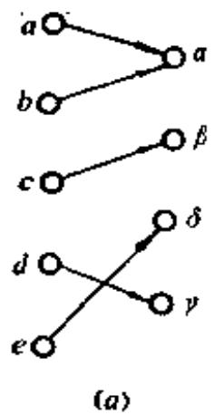

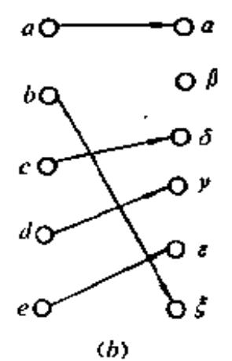

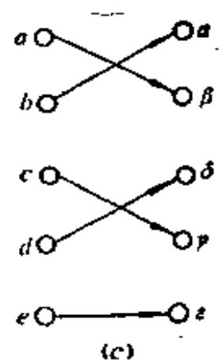  
图4-1.1

映射的概念在日常生活中也有很多应用。如设 $X$ 是工人的集合， $Y$ 表示工作的集合，从 $X$ 到 $Y$ 的满射是工人做工作的一种分配方案，使每项工作至少分配有一个工人。从 $X$ 到 $Y$ 的入射，也是一种分配方案，使得没有两个工人做同一项工作。从 $X$ 到 $Y$ 的双射，同样是一种分配方案，使每一项工作都分配有工人，而且没有两个工人分配相同的工作。

定理4-1.1 令 $X$ 和 $Y$ 为有限集，若 $X$ 和 $Y$ 的元素个数相同，即 $|X| = |Y|$ ，则 $f: X \to Y$ 是入射的，当且仅当它是一个满射。

证明 a. 若 $f$ 是入射，则 $|X| = |f(X)|$ ，因为 $|f(X)| = |Y|$ ，从 $f$ 的定义我们有 $f(X) \subseteq Y$ ，而 $|f(X)| = |Y|$ ，又因为 $|Y|$ 是有限的，故 $f(X) = Y$ ；因此 $f$ 是一个入射推出 $f$ 是满射。  
b. 若 $f$ 是一个满射，根据满射定义 $f(X) = Y$ ，于是 $|X| = |Y| = |f(X)|$ 。因为 $|X| = |f(X)|$ 和 $|X|$ 是有限的，故 $f$ 是一个入射，因此 $f$ 是满射推出 $f$ 是一个入射。

这个定理必须在有限集情况下才能成立，在无限集上不一定有效，如 $f: I \to I$ ，这里 $f(x) = 2x$ ，在这种情况下整数映射到偶整数，显然这是一个入射，但不是满射。

# 4-1 习题

(1) 下列函数中哪些是入射的, 满射的或双射的。  
(a) $f: I \to I, f(j) = j (\bmod 3)$   
(b) $f: N \to N, f(j) = \left\{ \begin{array}{ll} 1 & j \text{是奇数} \\ 0 & j \text{是偶数} \end{array} \right.$   
（c） $f_{\bullet}$ $\mathbb{N}\to \{0,1\} ,f(j) = \left\{ \begin{array}{ll}0 & j\text{是奇数}\\ 1 & j\text{是偶数} \end{array} \right.$   
(d) $f: I \to N, f(i) = |2i| + 1$   
(e) $f: R \to R$ $f(r) = 2r - 15$   
(2) 令 $f: A \to B$ , 这里 $C \subseteq A$ , 证明

$$
f (A) - f (C) \subseteq f (A - C)
$$

(3) 假设 $f$ 和 $g$ 是函数, 且有 $f \subseteq g$ 和 $\operatorname{dom} g \subseteq \operatorname{dom} f$ , 证明

$$
f = g
$$

(4) 假设 $f$ 和 $g$ 是函数, 证明 $f \cap g$ 也是函数。

(5) 假定 $X$ 和 $Y$ 是有穷集合, 找出从 $X$ 到 $Y$ 存在入射的必要条件是什么?  
(6) 设 $A$ 和 $B$ 是有穷集合, 有多少不同入射函数和多少不同的双射函数。  
(7) 试证明 $f(A \cup B) = f(A) \cup f(B)$

$$
f (A \cap B) \subseteq f (A) \cap f (B)
$$

(8) 假设 $f: A \to B$ 并定义一个函数 $G: B \to \mathcal{P}(A)$ , 对于 $b \in B$

$$
G (b) = \{x \in A | f (x) = b \}
$$

证明，如果 $f$ 是 $\pmb{A}$ 到 $\pmb{B}$ 的满映射，则 $\pmb{G}$ 是入射的；其逆成立吗？

# 4-2 逆函数和复合函数

在关系的定义中曾提到，从 $X$ 到 $Y$ 的关系 $\pmb{R}$ ，其逆关系 $\pmb{R}^{\bullet}$ 是 $\pmb{Y}$ 到 $\pmb{x}$ 的关系。 $\langle y,x\rangle \in R^{c}\Leftrightarrow \langle x,y\rangle \in R_{\circ}$ 但是对于函数就不能用简单的交换序偶的元素而得到逆函数，这是因为若有函数

$f: X \to Y$ ，但 $f$ 的值域 $R_f$ 可能只是 $y$ 的一个真子集，即 $R_f \subset Y$ ，因为 $\operatorname{dom} f^{\alpha} = R_{f} \subset Y$ ，这不符函数定义域的要求。此外，若 $X \to Y$ 的映射是一个多一对应，即有 $\langle x_1, y \rangle \in f, \langle x_2, y \rangle \in f$ ，其逆关系将有 $\langle y, x_1 \rangle \in f^{\alpha}, \langle y, x_2 \rangle \in f^{\alpha}$ ，这就违反函数值唯一性的要求。为此，我们对函数求逆需规定一些条件。

定理4-2.1 设 $f: X \to Y$ 是一双射函数，那么 $f^{\circ}$ 是 $Y \to X$ 的双射函数。

证明 设 $f = \{\langle x, y \rangle | x \in X \land y \in Y \land f(x) = y\}$

$$
f ^ {o} = \{\langle y, x \rangle | \langle x, y \rangle \in f \}
$$

因为 $f$ 是满射的，故每一 $y \in Y$ 必存在 $\langle x, y \rangle \in f$ ，因此必有 $\langle y, x \rangle \in f^{\circ}$ ，即 $f^{\circ}$ 的前域为 $Y$ 。又因为 $f$ 是入射，对每一个 $y \in Y$ 恰有一个 $x \in X$ ，使 $\langle x, y \rangle \in f$ ，因此仅有一个 $x \in X$ ，使 $\langle y, x \rangle \in f^{\circ}$ ，即 $y$ 对应唯一的 $x$ ，故 $f^{\circ}$ 是函数。

又因 $\operatorname{ran} f^c = \operatorname{dom} f = X$ ，故 $f^c$ 是满射。又若 $y_1 \neq y_2$ 有

$$
f ^ {c} \left(y _ {1}\right) = f ^ {c} \left(y _ {2}\right)
$$

因为 $f^{a}(y_{1}) = x_{1}, f^{c}(y_{2}) = x_{2}$ ，即 $x_{1} = x_{2}$ ，故 $f(x_{1}) = f(x_{2})$ ，即 $y_{1} = y_{2}$ ，得出矛盾。因此 $f^{c}$ 是一个双射函数。

定义4-2.1 设 $f: X \to Y$ 是一双射函数，称 $Y \to X$ 的双射函数 $f^{\circ}$ 为 $f$ 的逆函数，记作 $f^{-1}$ 。

例如，设 $A = \{1,2,3\}$ ， $B = \{a,b,c\}$ ， $f_{:}A\to B$ 为

$$
f = \{\langle 1, a \rangle , \langle 2, e \rangle , \langle 3, b \rangle \}
$$

则 $f^{-1} = \{\langle a, 1 \rangle, \langle c, 2 \rangle, \langle b, 3 \rangle\}$

若 $f = \{\langle 1,a\rangle ,\langle 2,b\rangle ,\langle 3,b\rangle \}$

则 $f$ 的逆关系

$$
f ^ {c} = \{\langle a, 1 \rangle , \langle b, 2 \rangle , \langle b, 3 \rangle \}
$$

就不是一个函数。

定义4-2.2 设函数 $f: X \to Y, g: W \to Z$ ，若 $f(X) \subseteq W$ ，则 $g \circ f = \{\langle x, z \rangle | x \in X \land z \in Z \land (\exists y)(y \in Y \land y = f(x) \land z = g(y))\}$ ，称 $g$ 在函数 $f$ 的左边可复合。

定理4-2.2 两个函数的复合是一个函数。

证明 设 $g: W \to Z, f: X \to Y$ 为左复合，即 $f(X) \subseteq W$ 。

a）对于任意 $x \in X$ ，因为 $f$ 为函数，故必有唯一的序偶 $\langle x, y \rangle$ 使 $y = f(x)$ 成立，而 $f(x) \in f(X)$ 即 $f(x) \in W$ ，又因为 $g$ 是函数，故必有唯一序偶 $\langle y, z \rangle$ 使 $z = g(y)$ 成立，根据复合定义， $\langle x, z \rangle \in g \circ f$ ，即 $X$ 中每个 $x$ 对应 $Z$ 中某个 $z$ 。

b）假定 $g \circ f$ 中包含序偶 $\langle x, z_1 \rangle$ 和 $\langle x, z_2 \rangle$ 且 $z_1 \neq z_2$ ，这样在 $Y$ 中必存在 $y_1$ 和 $y_2$ ，使得在 $f$ 中有 $\langle x, y_1 \rangle$ 和 $\langle x, y_2 \rangle$ 在 $g$ 中有 $\langle y_1, z_1 \rangle$ 和 $\langle y_2, z_2 \rangle$ 。因为 $f$ 是一个函数，故 $y_1 = y_2$ 。于是 $g$ 中有 $\langle y, z_1 \rangle$ 和 $\langle y, z_2 \rangle$ ，但 $g$ 是一个函数，故 $z_1 = z_2$ ，即每个 $x \in X$ 只能有唯一的 $\langle x, z \rangle \in g \circ f$ 。

由a)，b)可知 $g\circ f$ 是一个函数。

□

在定义4-2.2中，当 $W = Y$ 时，则函数 $f_{:}X\to Y,g_{:}Y\to Z_{\circ}$

$$
\begin{array}{l} g \circ f = \{\langle x, z \rangle | x \in X \wedge z \in Z \wedge (\exists y) (y \in Y \wedge y \\ = f (x) \wedge z = g (y)) \} \\ \end{array}
$$

称为复合函数，或称 $g \circ f$ 为 $g$ 对 $f$ 的左复合。

注意：在上述定义中，假定 $\operatorname{ran} f \subseteq \operatorname{dom} g$ ，如果不满足这个条件，则定义 $g \circ f$ 为空。

根据复合函数的定义，显然有 $g \circ f(x) = g(f(x))$ 。

例题1 设 $X = \{1, 2, 3\}$ , $Y = \{p, q\}$ , $Z = \{a, b\}$ , $f = \{\langle 1, p \rangle, \langle 2, p \rangle, \langle 3, q \rangle\}$ , $g = \{\langle p, b \rangle, \langle q, b \rangle\}$ 求 $g \circ f$ 。

解 $\dot{g} \circ f = \{\langle 1, b \rangle, \langle 2, b \rangle, \langle 3, b \rangle\}$

定理4-2.3 令 $g \circ f$ 是一个复合函数。

a）若 $g$ 和 $f$ 是满射的，则 $g \circ f$ 是满射的。  
b) 若 $g$ 和 $f$ 是入射的, 则 $g \circ f$ 是入射的。  
o）若 $g$ 和 $f$ 是双射的，则 $g\circ f$ 是双射的。

证明 a) 设 $f: X \to Y, g: Y \to Z,$ 令 $z$ 为 $Z$ 的任意一个元素，因 $g$ 是满射，故必有某个元素 $y \in Y$ 使得 $g(y) = z,$ 又因为 $f$ 是满射，故必有某个元素 $x \in X,$ 使得 $f(x) = y,$ 故

$$
g \circ f (x) = g (f (x)) = g (y) = z
$$

因此， $R_{g,f} = Z$ ， $g\circ f$ 是满射的。

b) 令 $x_{1}, x_{2}$ 为 $X$ 的元素, 假定 $x_{1} \neq x_{2}$ , 因为 $f$ 是入射的, 故 $f(x_{1}) \neq f_{1}(x_{2})$ 。又因 $g$ 是入射的且 $f(x_{1}) \neq f(x_{2})$ , 故 $g(f(x_{1})) \neq g(f(x_{2}))$ , 于是 $x_{1} \neq x_{2} \Rightarrow g \circ f(x_{1}) \neq g \circ f(x_{2})$ , 因此, $g \circ f$ 是入射的。

0）因为 $g$ 和 $f$ 是双射，故根据a)与b）， $g\circ f$ 为满射和入射的，即 $g\circ f$ 是双射的。

由于函数的复合仍然是一个函数，故可求三个函数的复合。

例题2 设 $R$ 为实数集合, 对 $x \in R$ 有 $f(x) = x + 2$ , $g(x) = x - 2$ , $h(x) = 3x$ . 求 $g \circ f$ 与 $h \circ (g \circ f)$ .

解 $g\circ f = \{\langle x,x\rangle |x\in R\}$

$$
h \circ (g \circ f) = \{\langle x, \exists x \rangle | x \in R \}
$$

一般地, 我们有 $h \circ (g \circ f) = (h \circ g) \circ f$ 。函数的复合是可结合的, 故我们可以去掉上式中的括号。它的证明如图 4-2.1 所示。

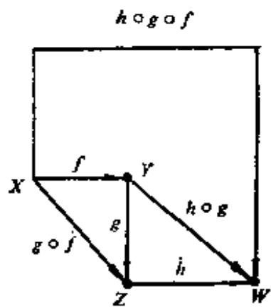  
图4-2.1

定义4-2.3 函数 $f: X \to Y$ 叫做常函数，如果存在某个 $y_0 \in Y$ ，对于每个 $x \in X$ 都有 $f(x) = y_0$ ，即 $f(X) = \{y_0\}$ 。

定义4-2.4 如果

$$
I _ {x} = \{\langle x, x \rangle | x \in X \}
$$

则称函数 $I_{X}$ ： $X\to X$ 为恒等函数。

定理4-2.4 设函数 $f: X \to Y$ ，则

$$
f = f \circ I _ {X} = I _ {Y} \circ f
$$

这个定理的证明可以由定义直接得到。

定理4-2.5 如果函数 $f: X \to Y$ 有逆函数 $f^{-1}: Y \to X$ , 则

$$
f ^ {- 1} \circ f = I _ {X}
$$

且 $f \circ f^{-1} = I_{Y}$

证明 a) $f^{-1} \circ f$ 与 $I_{X}$ 的定义域均是 $X$ 。

b）因为 $f$ 为一一对应的函数，故 $f^{-1}$ 也是一一对应的函数。

若 $f: x \to f(x)$ 则 $f^{-1}(f(x)) = x,$ 由a),b)得 $f^{-1} \circ f = I_{X}$ , 故 $x \in X \Rightarrow (f^{-1} \circ f)(x) = f^{-1}(f(x)) = x$ □

例题3 令 $f: \{0,1,2\} \to \{a,b,c\}$ , 其定义如图4-2.3(a)所示, 求 $f^{-1} \circ f$ 和 $f \circ f^{-1}$ 。

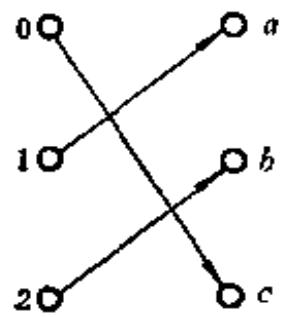  
(a)

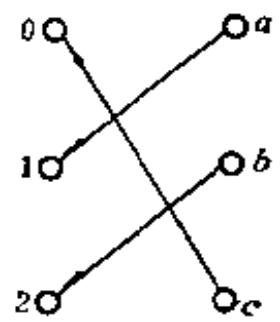  
(b)   
图4-2.2

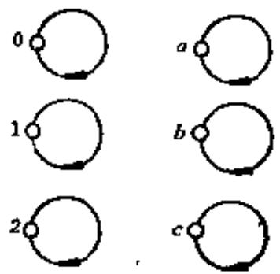  
图4-2.3

解 $f^{-1} \circ f$ 和 $f \circ f^{-1}$ 可表示为如图4-2.3所示。

定理4-2.6 若 $f: X \to Y$ 是一一对应的函数, 则 $(f^{-1})^{-1} = f$ 。

证明 a) 因 $f: X \to Y$ 是一一对应的, 故 $f^{-1}: Y \to X$ 也是一一对应的函数, 因此 $(f^{-1})^{-1}: X \to Y$ 又为一一对应, 显然

$$
\operatorname {d o m} f = \operatorname {d o m} (f ^ {- 1}) ^ {- 1} = X
$$

b) $x \in X \Rightarrow f: x \rightarrow f(x) \Rightarrow f^{-1}: f(x) \rightarrow x \Rightarrow (f^{-1})^{-1}: x \rightarrow f(x)$ 。

由a)，b)可知

$$
(f ^ {- 1}) ^ {- 1} = f
$$

定理4-2.7 若 $f: X \to Y, g: Y \to Z$ 均为一一对应函数，则 $(g \circ f)^{-1} = f^{-1} \circ g^{-1}$ 。

证明 a) 因 $f: X \to Y, g: Y \to Z$ 均为一一对应函数，故 $f^{-1}$ 和 $g^{-1}$ 均存在，且 $f^{-1}: Y \to X, g^{-1}: Z \to Y,$ 所以 $f^{-1} \circ g^{-1}: Z \to X$ 。

根据定理4-2.2, $g \circ f: X \to Z$ 是双射的, 故 $(g \circ f)^{-1}$ 存在且 $(g \circ f)^{-1}: Z \to X$ 。

$$
\operatorname {d o m} \left(f ^ {- 1} \circ g ^ {- 1}\right) = \operatorname {d o m} \left(g \circ f\right) ^ {- 1} = Z
$$

b）对任意 $z \in Z \Rightarrow$ 存在唯一 $y \in Y$ ，使得 $g(y) = z \Rightarrow$ 存在唯一 $x \in X$ ，使得 $f(x) = y$ ，故

$$
\left(f ^ {- 1} \circ g ^ {- 1}\right) (z) = f ^ {- 1} \left(g ^ {- 1} (z)\right) = f ^ {- 1} (y) = x
$$

但 $(g\circ f)(x) = g(f(x)) = g(y) = z$

故 $(g\circ f)^{-1}(z) = \varpi$

因此对任一 $z \in Z$ 有：

$$
(g \circ f) ^ {- 1} (z) = (f ^ {- 1} \circ g ^ {- 1}) (z)
$$

由a)，b)可知

$$
f ^ {- 1} \circ g ^ {- 1} = (g \circ f) ^ {- 1}
$$

#

# 4-2 习题

(1) 设 $X = \{1, 2, 3, 4\}$ , 确定出这样的函数 $f: X \to X$ 使得 $f \neq I_{\alpha}$ , 并且是入射的, 求出 $f \circ f = f^{2}, f^{3} = f \circ f^{2}, f^{-1}$ 和 $f \circ f^{-1}$ 。是否能够找出另外一个入射函数 $g: X \to X$ 使得 $g \neq I_{\alpha}$ 但是 $g \circ g = I_{x_0}$   
(2) 设 $f: A \to B, B' \subseteq B, A' \subseteq A,$ 证明  
a） $f(f^{-1}(B'))\subseteq B'$   
b）如果 $f$ 是满射的，那末 $f(f^{-1}(B')) = B'$   
c） $f^{-1}(f(A'))\supseteq A'$   
d）如果 $f$ 是入射的，那末 $f^{-1}(f(A')) = A'$   
(3) 设 $f \circ g$ 是复合函数,  
a) 如果 $f \circ g$ 是满射的, 那末 $f$ 是满射的。  
b) 如果 $f \circ g$ 是入射的, 那末 $g$ 是入射的。  
c）如果 $f \circ g$ 是双射的，那末 $f$ 是满射的而 $g$ 是入射的。  
(4) 试证 若 $f: A \to B, g: B \to A$ , 且 $g \circ f = I_A, f \circ g = I_B$ , 则 $g = f^{-1}$ , 且 $f = g^{-1}$ 。  
(5) 证明 若 $(g \circ f)^{-1}$ 是一个函数, 则 $f$ 和 $g$ 是入射不一定成立。  
(6) 一个函数 $g: S \to T$ 是称作函数 $f: T \to S$ 的左逆, 若对每个 $t \in T$ , $g(f(t)) = t$ , 若 $g$ 是 $f$ 的左逆, 则 $f$ 是 $g$ 的右逆。  
a) $f: T \to S$ 有一个左逆, 当且仅当它是入射的。  
b). $f: T \to S$ 有一个右逆，当且仅当它是满射的。  
c) 若 $g: S \to T$ 是 $f: T \to S$ 的左逆和右逆, 则 $f$ 是一个双射, 且 $g = f^{-1}$ 。

# 4-3 特征函数与模糊子集

有些函数与集合之间可以建立一些特殊的联系，借助于这些函数，可对集合进行运算，并能以此推广表达模糊集合的概念。

定义4-3.1 令 $\pmb{E}$ 是全集， $\pmb{A}$ 是 $\pmb{E}$ 的子集， $A \subseteq E$ ，由

$$
\psi_ {A} (x) = \left\{ \begin{array}{l l} 1 & \text {如 果} x \in A \\ 0 & \text {其 他} \end{array} \right.
$$

定义的函数 $\psi_{\Delta}: E \to \{0, 1\}$ , 称为集合 $\Delta$ 的特征函数。

例如， $E$ 是某班级全体学生的集合， $A$ 是全体女学生的集合，则 $\psi_A$ 为女学生的特征函数。

设 $A$ 和 $B$ 是全集 $E$ 的任何两个子集，对于所有 $x \in E$ ，特征函数有如下一些性质。

$$
\psi_ {A} (x) = 0 \Leftrightarrow A = \phi \tag {1}
$$

$$
\psi_ {A} (x) = 1 \Leftrightarrow A = E \tag {2}
$$

$$
\psi_ {A} (x) \leqslant \psi_ {B} (x) \Leftrightarrow A \sqsubseteq B \tag {3}
$$

$$
\psi_ {A} (x) = \psi_ {B} (x) \Leftrightarrow A = B \tag {4}
$$

$$
\psi_ {A \cap B} (x) = \psi_ {A} (x) * \psi_ {B} (x) \tag {5}
$$

$$
\psi_ {A \cup B} (x) = \psi_ {A} (x) + \psi_ {B} (x) - \psi_ {A \cap B} (x) \tag {6}
$$

$$
\psi_ {\sim A} (x) = 1 - \psi_ {A} (x) \tag {7}
$$

$$
\psi_ {A - B} (x) = \psi_ {A \cap \sim B} = \psi_ {A} (x) - \psi_ {A \cap B} (x) \tag {8}
$$

其中特征函数两的运算 $+$ , $-, *$ 就是通常的算术运算 $+$ , $-, \times$ 。用于集合间的相等，就是通常所定义的集合相等。

上述几个性质可以从特征函数的定义给予证明。如(5)式可证明如下：

设 $x \in A \cap B$ ，因为 $x \in A \cap B \Leftrightarrow x \in A \wedge x \in B$ ，因此

$$
\psi_ {A} (x) = 1, \psi_ {B} (x) = 1
$$

所以 $\psi_{A\cap B}(\pmb {x}) = \psi_A(\pmb {x})*\psi_B(\pmb {x}) = 1,$

设 $x \notin A \cap B$ ，因为

$$
x \notin A \cap B \Leftrightarrow x \notin A \vee x \notin B
$$

因此 $\psi_A(x) = 0$

或 $\psi_{B}(x) = 0$

$$
\psi_ {A \cap B} (x) = \psi_ {A} (x) * \psi_ {B} (x) = 0
$$

应用特征函数的一些性质，也可以证明一些集合恒等式。

例题1 证明 $A \cap (B \cup C) = (A \cap B) \cup (A \cap C)$

解

$$
\begin{array}{l} \psi_ {\Delta n (B \cup O)} (x) = \psi_ {A} (x) * \psi_ {B \cup O} (x) \\ = \psi_ {A} (x) * (\psi_ {B} (x) + \psi_ {O} (x) - \psi_ {B O O} (x)) \\ = \psi_ {A} (x) * \psi_ {B} (x) + \psi_ {A} (x) * \psi_ {O} (x) - \psi_ {A} (x) * \psi_ {B n O} (x) \\ = \psi_ {A \cap B} (x) + \psi_ {A \cap O} (x) - \psi_ {A \cap B O O} (x) \\ = \psi_ {A \cap B} (x) + \psi_ {A \cap O} (x) - \psi_ {(A \cap B) \cap (A \cap O)} (x) \\ = \psi_ {(A _ {0} B) \cup (A _ {0} O)} (x) \\ \end{array}
$$

例题2 设 $E = \{a, b, c\}$ , $E$ 的子集是: $\emptyset, \{a\}, \{b\}, \{c\}, \{a, b\}, \{a, c\}, \{b, c\}$ 和 $\{a, b, c\}$ 。试给出 $E$ 的所有子集的特征函数且建立特征函数与二进制之间的对应关系。

解 $E$ 的任何子集 $A$ 的特征函数的值由表4-3.1列出。

表4-3.1  

<table><tr><td rowspan="2">x\psi_A(x)</td><td colspan="8">A</td></tr><tr><td>∅</td><td>{a}</td><td>{b}</td><td>{c}</td><td>{a, b}</td><td>{a, c}</td><td>{b, c}</td><td>{a, b, c}</td></tr><tr><td>a</td><td>0</td><td>1</td><td>0</td><td>0</td><td>1</td><td>1</td><td>0</td><td>1</td></tr><tr><td>b</td><td>0</td><td>0</td><td>1</td><td>0</td><td>1</td><td>0</td><td>1</td><td>1</td></tr><tr><td>c</td><td>0</td><td>0</td><td>0</td><td>0</td><td>0</td><td>1</td><td>1</td><td>1</td></tr></table>

如果规定元素的次序为 $a, b, c$ ，则每个子集 $A$ 的特征函数与一个三位二进制数相对应。如 $\psi_{\{a, b\}}(x) \leftrightarrow 101$ 。令 $B = \{000, 001, 010, 011, 100, 101, 110, 111\}$ ，那么表4-3.1亦可以看作从 $E$ 的幂集到 $B$ 的一个双射。

对于特征函数进行推广可以导出模糊子集的概念。

设 $E = \{x_{1}, x_{2}, \dots, x_{n}\}$ , 我们可以将 $E$ 的任一子集 $A$ 表示为:

$$
\underset {\sim} {A}: \{\langle x _ {1}, \psi_ {A} (x _ {1}) \rangle , \langle x _ {2}, \psi_ {A} (x _ {2}) \rangle , \dots , \langle x _ {n}, \psi_ {A} (x _ {n}) \rangle \}
$$

当 $\psi_A(x_i) = 1$ 时 $x_{i}\in A$

$$
\psi_ {A} (x _ {i}) = 0 \text {时} x _ {i} \notin A
$$

如果我们将 $\psi_A(x_i)$ 的取值范围不局限于 0 和 1，而是取 0 和 1 之间的任何数，例如：

$$
\mathcal {A} ^ {*}: \{\langle x _ {1}, 0. 2 \rangle , \langle x _ {2}, 0 \rangle , \langle x _ {3}, 0. 3 \rangle , \langle x _ {4}, 1 \rangle , \langle x _ {5}, 0 8 \rangle \}
$$

那么，对 $A^{*}$ 可以作如下理解：它表示 $\pmb{x_{1}}$ 是少量地属于 $A^{*}, x_{2}$ 是

不属于 $A^{*}$ , $x_{3}$ 也是少量地属于 $A^{*}$ (但是比 $x_{1}$ 稍多), $x_{4}$ 是必定属于 $A^{*}$ , $x_{5}$ 则基本上属于 $A^{*}$ 。这样的一个集合 $\Delta^{*}$ 就是一个模糊子集, 其中 0.2, 0.3, 0.8, …分别称为该集合中对应元素的隶属程度。

定义4-3.2 给定论域 $E$ ，指定 $\pmb{E}$ 上的一个模糊子集 $\pmb{A}$ 是指对任意 $x \in E$ 都有一个隶属程度 $\mu = \psi_{\mathcal{A}}(x) (0 \leqslant \mu \leqslant 1)$ 与它对应，称 $\psi_{\mathcal{A}}(x)$ 为 $\pmb{A}$ 的隶属函数。

从模糊子集的定义可以看出，当 $\psi_{\mathcal{A}}(x)$ 只取0，1两值时， $\mathcal{A}$ 便成为普通子集。

例1 如图4-3.1所示，给定几个物体的集合。

$$
U = \{a, b, c, d, e \}
$$

对每个元素指定一个隶属程度。

$$
\begin{array}{l} \psi_ {A} (a) = 1, \\ \psi_ {A} (b) = 0. 9 \\ \psi_ {A} (0) = 0. 4 \\ \psi_ {\frac {4}{2}} (d) = 0. 2, \\ \psi_ {A} (e) = 0 \\ \end{array}
$$

于是可确定 $U$ 的模糊子集 $\mathcal{A}$ 若 $\pmb{A}$ 表示“圆块”这个概念，则可记模糊子集

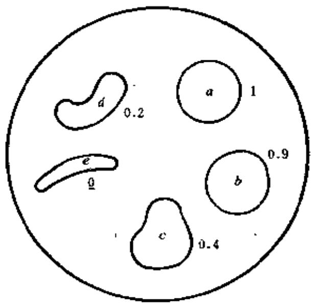  
图4-3.1

$$
\mathbf {A} = 1 / a + 0. 9 / b + 0. 4 / c + 0. 2 / d + 0 / e
$$

注意在这种记法中，上式右端不是分式求和，该式中分母表示元素，分子表示隶属程度。

例2 以年龄作论域，取 $U = [0,100]$ ，“年老”与“年轻”这样两个模糊概念可以分别用两个模糊于集 $\mathcal{Q}$ 与 $\mathcal{Y}$ 来表示，它们的隶属函数可分别定义为：

$$
\psi_ {Q} (u) = \left\{ \begin{array}{l l} 0 & (0 \leqslant u \leqslant 5 0) \\ {\left[ 1 + \left(\frac {u - 5 0}{5}\right) ^ {- 2} \right] ^ {- 1}} & (5 0 <   u \leqslant 1 0 0) \end{array} \right.
$$

$$
\psi_ {Y} (u) = \left\{ \begin{array}{l l} 1 & (0 \leqslant u \leqslant 2 5) \\ {\left[ 1 + \left(\frac {u - 2 5}{5}\right) ^ {2} \right] ^ {- 1}} & (2 5 <   u \leqslant 1 0 0) \end{array} \right.
$$

从这两个例子, 可以看到在论域上确定模糊子集, 主要的是需定出隶属函数, 即是要确定恰当的表示模糊特征的那个特征函数 (参见图 4-3.2)。

  
图4-3.2

有关模糊子集的其他理论，这里就不再讨论了。

# 4-3 习题

(1) 试证明, 对子所有的 $x \in E$   
a) $\psi_A(x) \leqslant \psi_B(x)$ 当且仅当 $A \subseteq B$   
b) $\psi_{\Delta nB}(x) = \min (\psi_{A}(x),\psi_{E}(x))$   
c) $\psi_{A\cup B}(x) = \max (\psi_A(x),\psi_B(x))$   
d) $\psi_{A-B}(\dot{x}) = \psi_A(x) - \psi_{A\cap B}(x)$   
(2) 设 $E = [0,1], A = \left[\frac{1}{2}, 1\right]$ 画出 $\psi_{A}$ 的图。  
(3) 设 $S = (A \cap B) \cup (\sim A \cap C) \cup (B \cap C)$ , 这里 $A, B, C$ 是全集 $E$ 的子集, 对于 $\psi_A(x), \psi_B(x)$ 和 $\psi_C(x)$ 的值的所有可能组合, 试求出 $\psi_S(x)$ 的值, 并构成集的成员表。  
(4) 设 $A, B$ 是 $\cup$ 上的两个模糊子集，它们的并集 $A \cup B$ 和交集 $A \cap B$ 都仍然是模糊子集，它们的隶属函数分别定义为：

$$
\mathcal {G} = \underset {\sim} {A} \cup \mathcal {B} \Leftrightarrow \mu_ {\underline {{\mathrm {G}}}} = \max  (\mu_ {\underline {{\mathrm {A}}}}, \mu_ {\underline {{\mathrm {B}}}})
$$

$$
Q = \underset {\sim} {A} \cap B \Leftrightarrow \mu_ {Q} = \min  \left(\mu_ {\underset {\sim} {A}}, \mu_ {\underset {\sim} {B}}\right)
$$

证明 模糊集的U和 $\cap$ 运算满足幂等律、交换律、结合律、吸收律、分配律、德·摩根律等。

# 4-4 基数的概念

为了比较两个集合的“大小”，确定有限集和无限集的概念，这里首先需要引进自然数集合。

定义4-4.1 给定集合 $\pmb{A}$ 的后继集定义为集合：

$$
A ^ {+} = A \cup \{A \} _ {\circ}
$$

若 $\pmb{A}$ 为空集 $\varnothing$ ，则后继集为 $\phi^{+}, (\phi^{+})^{+}, ((\phi^{+})^{+})^{+}, \dots$ 这些集合可写成如下形式：

$$
\varnothing \cup \{\varnothing \}, \varnothing \cup \{\varnothing \} \cup \{\varnothing \cup \{\varnothing \} \},
$$

$$
\varnothing \cup \{\varnothing \} \cup \{\varnothing \cup \{\varnothing \} \} \cup \{\varnothing \cup \{\varnothing \} \cup \{\varnothing \cup \{\varnothing \} \}, \dots_ {\circ}
$$

可简化为：

$$
\{\varnothing \}, \{\varnothing , \{\varnothing \} \}, \{\varnothing , \{\varnothing \}, \{\varnothing , \{\varnothing \} \} \}, \dots
$$

若我们命名集合 $\varnothing$ 为0，那么，

$$
\varnothing^ {+} = 0 ^ {+} = \{\varnothing \} = 1
$$

$$
1 ^ {+} = \{\emptyset , \{\emptyset \} \} = 2
$$

$$
2 ^ {+} = \{\emptyset , \{\emptyset \}, \{\emptyset , \{\emptyset \} \} \} = 3
$$

···

这样就得到了自然数集合 $\{0, 1, 2, 3, \dots\}$ ，这个集合亦能概括为如下公理形式（G.Peano公理）。

1) $0 \in N$ （其中 $0 = 0$ ）。

2）如果 $n \in N$ ，那么 $n^{+} \in N$ （其中 $n^{+} = n \cup \{n\}$ ）。

3）如果一个子集 $S \subseteq N$ 具有性质：

a) $0 \in S_{\circ}$

b）如果 $n \in S$ ，有 $n^+ \in S$ ，则 $S = N$ 。

性质3)称极小性质，它指明了自然数系统的最小性，即自然数系统是满足公理1)和2)的最小集合。

当然，自然数集，亦可不从0开始，这只需定义 $\varnothing$ 为1则自然数集就从1开始。

从上述定义可以看到任意一个自然数可看作是一个集合的

名。此外，从实际生活中我们知道任意自然数，例如3这个概念是从观察许多只含三个元素的集合的共同特点而加以抽象概括出来的，这个共同特点就是体现于这些被观察的任意一个集合的元素都可与集合 $\{\emptyset, \{\emptyset\}, \{\emptyset, \{\emptyset\}\}\}$ 中元素存在一一对应，且其任意两个集合的元素之间也存在一一对应。由此可见，“对应”是集合之间进行比较的一个非常重要的概念。

定义4-4.2 给定两个集合 $P$ 与 $Q$ ; 如果我们对 $P$ 中每个不同元素, 与 $Q$ 中每个不同元素, 可以分别两两成对, 那么我们说 $P$ 的元素与 $Q$ 的元素间, 存在着一一对应。

例如， $\{2, 4, 6, 8, \cdots, 2n, \cdots\}$ 与 $\{1, 3, 5, \cdots, 2n-1, \cdots\}$ 之间存在着一一对应的。

定义4-4.3 当且仅当集合 $A$ 的元素与集合 $B$ 的元素之间存在着一一对应，集合 $A$ 与集合 $B$ 称为是等势的（或称同浓的）。记作 $A \sim B$ 。

例题1 验证自然数集 $N$ 与非负偶数集合 $M$ 是等势的。

证明 因为 $N$ 与 $\pmb{M}$ 的元素之间可作一一对应的映射，即

$$
f (n) = 2 n
$$

例题2 设 $P$ 为实数集合, $S$ 是 $P$ 的子集, 即 $S \subseteq P$ , 且

$$
S = \{x \mid x \in P \land 0 <   x <   1 \},
$$

证明

$$
S \sim P
$$

证明 令 $f: P \to S$

$$
f (x) = \frac {1}{\pi} \operatorname {t g} ^ {- 1} x + \frac {1}{2} (- \infty <   x <   \infty)
$$

显然 $f$ 的值域是 $\mathcal{S}$ 且 $f$ 是双射函数。

定理4-4.1 在集合族上等势关系是一个等价关系。

证明 设集合族为 $S$

a）对任意 $A \in S$ ，必有 $A \sim A$ 。  
b) 若 $A, B \in S$ , 如果 $A \sim B$ , 必有 $B \sim A$ 。  
o) 若 $A, B, C \in S$ , 如果 $A \sim B$ 且 $B \sim C$ , 必有 $A \sim C$ 。

定义4-4.1 如果有一个从集合 $\{0, 1, \dots, n - 1\}$ 到 $A$ 的双

射函数, 那么称集合 $A$ 是有限的; 如果集合 $A$ 不是有限的, 则它是无限的。

定理4-4.2 自然数集合 $N$ 是无限的。

证明 设 $n$ 是 $N$ 的任意元素, $f$ 是任意的从 $\{0,1,\dots,n-1\}$ 到 $N$ 的函数。设 $k=1+\max \{f(0), f(1), \cdots, f(n-1)\}$ , 那么 $k \in N$ , 但对每一个 $x \in\{0,1,\cdots,n-1\}$ , 有 $f(x) \neq k$ 。因此 $f$ 不能是入射函数, 即 $f$ 也不是双射函数。因为 $n$ 和 $f$ 都是任意的, 故 $N$ 是无限的。

对于有限集的大小概念很易理解，对于无限集的度量要考虑到集合的等势关系。

设有集合 $A$ ，一切与该集合等势的集合，其元素之间可以一一对应，若以此作为度量标准，我们可有如下定义。

定义4-4.5 所有与集合 $\pmb{A}$ 等势的集合所组成的集合，叫做集合 $\pmb{A}$ 的基数，记为 $K[A]$ （或 $\overrightarrow{A}$ ）。

从基数的定义可以看到，有限集合的基数就是其元素的个数。

例如， $A = \{a, b, c\}$ ， $B = \{\emptyset, \{\emptyset\}, \{\emptyset, \{\emptyset\}\}\}$ ， $C = \{\text{桌、灯泡，教室}\}, \dots$ ，因为 $A \sim B \sim C$ ，即 $K[A] = K[B] = K[C]$ 。

$$
K [ A ] = \{A, B, C, \dots \}
$$

可以看到, 如果两个集合能够建立双射函数, 则两集合元素间必一一对应, 从基数的定义可以知道, 该两集合应具有相同的基数。

例题3 证明区间 $[0,1]$ 与 $(0,1)$ 基数相同。

证明 设集合 $A = \{0, 1, \frac{1}{2}, \dots, \frac{1}{n}, \dots\}$ , $A \subseteq [0, 1]$

定义 $f_{\bullet}$ $[0,1]\to (0,1)$ 使得：

$$
\left\{ \begin{array}{l l} f (0) = \frac {1}{2} \\ f \left(\frac {1}{n}\right) = \frac {1}{n + 2} & \text {对} n \geqslant 1 \\ f (x) = x & \text {对} x \in [ 0, 1 ] - A \end{array} \right.
$$

则 $f$ 是双射函数，如图4-4.1所示。

  
图4-4.1

# 4-4 习题

(1) 对下述每组集合 $A$ 和 $B$ , 构造一个从 $A$ 到 $B$ 的双射函数, 说明 $A$ 和 $B$ 具有相同的势。  
a) $A = (0,1), B = (0,2)$   
b) $A = N, B = N \times N$   
c) $A = I \times I, B = N$   
d) $A = R, B = (0, \infty)$   
e) $A = [0,1), B = \left(\frac{1}{4},\frac{1}{2}\right]$   
(2) 证明 $(0,1)$ 与 $[0,1)$ 等势， $[0,1)$ 与 $[0,1]$ 等势。  
(3) 若 $X_{1} \sim X_{2}$ , 和 $Y_{1} \sim Y_{2}$ , 且 $X_{1} \cap Y_{1} = X_{2} \cap Y_{2} = \emptyset$ , 证明 $X_{1} \cup Y_{1} \sim X_{2} \cup Y_{2}$ .  
(4) 若 $A \sim C$ 和 $B \sim D$ , 证明 $A \times B \sim C \times D$ 。

# 4-5 可数集与不可数集

在上节中，我们提到自然数集 $N$ 是无限的。但是并非所有无限集都可与自然数集建立一一对应。

定义4-5.1，与自然数集合等势的任意集合称为可数的，可数集合的基数用 $\aleph_0$ 表示。

例如， $A = \{1,4,9,16,\dots ,n^{2},\dots \}$

$$
B = \{1, 8, 2 7, 6 4, \dots , n ^ {3}, \dots \}
$$

$$
C = \{3, 1 2, 2 7, \dots , 3 n ^ {2}, \dots \}
$$

$$
D = \left\{1, \frac {1}{2}, \frac {1}{3}, \dots , \frac {1}{n}, \dots \right\}
$$

均为可数集。

我们把有限集和可数集统称为至多可数集。

定理4-5.1 $A$ 为可数集的充分必要条件是可以排列成

$$
A = \left\{a _ {1}, a _ {2}, \dots , a _ {n}, \dots \right\}
$$

的形式。

证明 若 $\pmb{A}$ 可排成上述形式, 那么将 $\pmb{A}$ 的元素 $a_{n}$ 与足标 $\pmb{n}$ 对应, 就得到 $\pmb{A}$ 与 $\pmb{N}$ 之间的一一对应, 故 $\pmb{A}$ 是可数集。

反之, 若 $\pmb{A}$ 为可数集, 那么在 $\pmb{A}$ 与 $\pmb{N}$ 之间存在一种一一对应关系 $f$ , 由 $f$ 得到 $n$ 的对应元素 $a_{n}$ , 即 $\pmb{A}$ 可写为 $\{a_{1}, a_{2}, \dots, a_{n}, \dots\}$ 的形式。

定理4-5.2 任一无限集，必含有可数子集。

证明 设 $\pmb{A}$ 为无限集合, 从 $\pmb{A}$ 中取出一个元素 $a_{1}$ , 因为 $\pmb{A}$ 是无限的, 它不因取出 $a_{1}$ 而耗尽, 所以从 $A - \{a_{1}\}$ 中可取元素 $a_{2}$ , 则 $A - \{a_{1}, a_{2}\}$ 也是非空集, 所以又可取一元素 $a_{3}$ , 如此继续下去, 就得到 $\pmb{A}$ 的可数子集。

定理4-5.3 任一无限集合必与其某一真子集等势。

证明 设无限集合 $M$ ，按定理4-5.2，必含有可数子集 $A = \{a_{1}, a_{2}, \dots, a_{n}, \dots\}$ ，设 $M - A = B$ ，我们定义集合 $M$ 到其自身的映象， $f: M \to M - \{a_{1}\}$ ，使得 $f(a_{n}) = a_{n+1} (n = 1, 2, \dots)$ 且对

于任何 $b \in B$ ，有 $f(b) = b$ 。这个 $f$ 是双射的。

这个定理亦可用图4-5.1所示。

设线段 $AB$ ，其上有线段 $CD,$ 则线段 $AB$ 与 $CD$ 上所有的点，可作成一一对应。其作法是：把 $CD$ 移出与 $AB$ 平行，联 $AC, BD$ 延长

  
图4-5.1

交于 $G$ ，则 $\pmb{AB}$ 上任意点 $\pmb{E}$ 与 $\pmb{G}$ 的联线 $\pmb{EG}$ 必与 $\pmb{CD}$ 交于 $\pmb{F}$ 。

反之， $CD$ 上任意点 $\pmb{F}$ ，与 $\pmb{G}$ 的联线 $FG$ 延长必交 $AB$ 于 $\pmb{E}$ 上述 $\pmb{E},\pmb{F}$ 的对应作法，即说明 $AB\sim CD_{\circ}$ □

定理4-5.4 可数集的任何无限子集是可数的。

证明 设 $A$ 为可数集合， $B \subseteq A$ 为一无限子集，如将 $A$ 的元素排成 $a_1, a_2, \cdots, a_n, \cdots$ ，从 $a_1$ 开始，向后检查，不断地删去不在 $B$ 中的元素，则得到新的一列 $a_i, a_j, \cdots, a_{i_n}, \cdots$ ，它与自然数一一对应，所以 $B$ 是可数的。

定理4-5.6 可数个两两不相交的可数集合的并集，仍然是一可数集。

证明 设可数个可数集分别表示为：

$$
S _ {1} = \left\{a _ {1 1}, a _ {1 2}, a _ {1 3}, \dots , a _ {1 n}, \dots \right\}
$$

$$
S _ {2} = \left\{a _ {2 1}, a _ {2 2}, a _ {2 3}, \dots , a _ {2 n}, \dots \right\}
$$

$$
S _ {3} = \left\{a _ {3 1}, a _ {3 2}, a _ {3 3}, \dots , a _ {3 n}, \dots \right\}
$$

中

令 $S = S_{1} \cup S_{2} \cup S_{3} \cup \dots$ ，即 $S = \bigcup_{k=1}^{\infty} S_{k}$ ，对 $S$ 的元素作如下排列：

在上述元素的排列中，由左上端开始，其每一斜线上的每一元素的两足码之和都相同，依次为2,3,4,…，各斜线上元素的个数依次为1,2,3,4,…，故

$$
S = \bigcup_ {k = 1} ^ {\infty} S _ {k}
$$

的元素可排列为：

$$
a _ {1 1}, a _ {2 1}, a _ {1 3}, a _ {3 1}, a _ {2 2}, a _ {1 3}, \dots
$$

定理4-5.6 设自然数集合 $N$ ，则 $N \times N$ 是可数集。

证明 首先我们把 $N \times N$ 的元素足码按表4-5.1的次序排列，并对表中每个序偶注以标号。

表4-5.1  

<table><tr><td>0</td><td>1</td><td>3</td><td>6</td><td>10</td><td></td></tr><tr><td>&lt;0, 0&gt;</td><td>&lt;0, 1&gt;</td><td>&lt;0, 2&gt;</td><td>&lt;0, 3&gt;</td><td>&lt;0, 4&gt;</td><td>...</td></tr><tr><td>2</td><td>4</td><td>7</td><td>11</td><td></td><td></td></tr><tr><td>&lt;1, 0&gt;</td><td>&lt;1, 1&gt;</td><td>&lt;1, 2&gt;</td><td>&lt;1, 3&gt;</td><td>&lt;1, 4&gt;</td><td>...</td></tr><tr><td>5</td><td>8</td><td>12</td><td></td><td></td><td></td></tr><tr><td>&lt;2, 0&gt;</td><td>&lt;2, 1&gt;</td><td>&lt;2, 2&gt;</td><td>&lt;2, 3&gt;</td><td>&lt;2, 4&gt;</td><td>...</td></tr><tr><td>9</td><td>13</td><td></td><td></td><td></td><td></td></tr><tr><td>&lt;3, 0&gt;</td><td>&lt;3, 1&gt;</td><td>&lt;3, 2&gt;</td><td>&lt;3, 3&gt;</td><td>&lt;3, 4&gt;</td><td>...</td></tr><tr><td>14</td><td></td><td></td><td></td><td></td><td></td></tr><tr><td>&lt;4, 0&gt;</td><td>&lt;4, 1&gt;</td><td>&lt;4, 2&gt;</td><td>&lt;4, 3&gt;</td><td>&lt;4, 4&gt;</td><td>...</td></tr></table>

我们可以作 $f: N \times N \to N$ 如下：

$$
f (m, n) = \frac {1}{2} (m + n) (m + n + 1) + m
$$

若把 $f(m, n)$ 看作表4-5.1中序偶 $\langle m, n \rangle$ 的标号，则

$$
f: N \times N \rightarrow N
$$

是个双射函数。这是因为：

a) $f(0,1) - f(0,0) = 1$

$$
f (0, 2) - f (0, 1) = 2
$$

$$
f (0, 3) - f (0, 2) = 3
$$

+ ￥ 中

$$
f (0, n) - f (0, n - 1) = n
$$

则 $f(0, n) - f(0, 0) = \frac{n(n + 1)}{2}$

因为 $f(0,0) = 0$

故 $f(0, n) = \frac{n(n + 1)}{2}$

又 $f(1, n) - f(0, n) = n + 2$

$$
f (2, n) - f (1, n) = n + 3
$$

中

$$
f (m, n) - f (m - 1, n) = m + n + 1
$$

所以 $f(m, n) - f(0, n) = mn + \frac{m(m + 3)}{2}$

$$
f (m, n) = \frac {n (n + 1)}{2} + \frac {m (m + 3)}{2} + m n
$$

经整理得：

$$
f (m, n) = \frac {1}{2} (\dot {m} + n) (m + n + 1) + m \tag {A}
$$

b) 若给出 $f(m, n) \in N$ , 可由(A)式确定唯一序偶 $\langle m, n \rangle$ 。

因 $f(m, n) = \frac{1}{2} (m + n)(m + n + 1) + m$

其中 $m, n \in N$ 。

令 $u = f(m, n)$

则 $u \geqslant \frac{1}{2} (m + n)(m + n + 1)$

$$
\begin{array}{l} u <   \frac {1}{2} (m + n) (m + n + 1) + (m + n) + 1 \\ = \frac {1}{2} (m + n) (m + n + 3) + 1 \\ \end{array}
$$

令 $m + n = A$ ，则

$$
\frac {1}{2} A (A + 1) \leqslant u <   \frac {1}{2} A (A + 3) + 1
$$

即 $A^2 + A - 2u \leqslant 0$

$$
\begin{array}{l} A ^ {2} + 3 A - 2 (u - 1) > 0 \\ - 1 \div \frac {- 1 + \sqrt {1 + 8 u}}{2} <   A \leqslant \frac {- 1 + \sqrt {1 + 8 u}}{2} \\ \end{array}
$$

因为 $\pmb{A}$ 是自然数，故可取

$$
A = \left[ \frac {- 1 + \sqrt {1 + 8 u}}{2} \right] ^ {[ \text {注} ]}
$$

因此， $\left\{ \begin{array}{l}m = u - \frac{1}{2} A(A + 1)\\ n = A - m \end{array} \right.$

由a)，b)可知 $N\times N$ 是可数的。

□

定理4-5.7 有理数的全体组成的集合是可数集。

证明 由定理4-5.6中可知 $N \times N$ 是可数的，在 $N \times N$ 集合中删除所有 $m$ 和 $n$ 不是互为质数的序偶 $\langle m, n \rangle$ ，得集合 $S \subseteq N \times N$ ， $S = \{\langle m, n \rangle | m \in N, n \in N$ 且 $m$ 和 $n$ 互质\}。因为 $S$ 是 $N \times N$ 的无限子集，故据定理4-5.4可知， $S$ 是可数的。

令 $g: S \to Q_{+}$ 即 $g: \langle m, n \rangle \to m / n$ (其中 $m, n$ 互质), 因为 $g$ 是双射, 故 $Q_{+}$ 是可数集。又因为 $Q_{+} \sim Q^{-}$ , 故

$$
Q = Q _ {+} \cup \{0 \} \cup Q ^ {-}
$$

是可数集。

□

定理4-5.8 全体实数构成的集合 $R$ 是不可数的。

证明 因为 $f: (0,1) \to R$ 是双射函数，令

$$
S = \{x \mid x \in R \wedge (0 <   x <   1) \}
$$

若能证 $S$ 是不可数集, 则 $\pmb{R}$ 也必为不可数集。

用反证法。

假设 $S$ 是可数的，则 $S$ 必可表示为： $S = \{S_1, S_2, \dots\}$ ，其中 $S_i$ 是 $(0, 1)$ 间的任一实数。

设 $S_{i} = 0.y_{1}y_{2}y_{3}\dots$ ，其中 $y_{i}\in \{0,1,2,\dots ,9\}$ （如0.2和0.123可记为0.1999…和0.12999…），

设

$$
S _ {1} = 0. a _ {1 1} a _ {1 2} a _ {1 3} \dots a _ {1 n} \dots
$$

$$
S _ {2} = 0. a _ {2 1} a _ {2 2} a _ {2 3} \dots a _ {2 n} \dots
$$

$$
S _ {3} = 0. a _ {3 1} a _ {3 2} a _ {3 3} \dots a _ {3 n} \dots
$$

#

其次，我们构造一个实数 $r = 0, b_{1}b_{2}b_{3}\dots$ 使

$$
b _ {j} = \left\{ \begin{array}{l l} 1 & a _ {j j} \neq 1 \\ 2 & a _ {j j} = 1 \end{array} \quad j = 1, 2, \dots \right.
$$

这样， $\pmb{\tau}$ 与所有实数 $S_{1}, S_{2}, \dots, S_{n}, \dots$ 不同，因为它与 $S_{1}$ 在位置1不同，与 $S_{2}$ 在位置2不同，…，等等。这证明了 $r \notin S$ ，产生矛盾，因此 $S$ 是不可数的，即 $R$ 是不可数集。

我们把集合 $(0,1)$ 的基数记为“ $\aleph$ ”，因为 $(0,1) \sim R$ ，故 $K[R] = \aleph$ 。“ $\aleph$ ”也称作连续统的势。

# 4-5 习题

(1) 下列集合 $A$ 的势是什么？

a) $A = \{\langle p, q \rangle | p, q$ 都是整数\};

b) $A = \{\langle p, q \rangle | p, q$ 都是有理数\};

c） $A$ 是由所有半径为1，圆心在 $\pmb{x}$ 轴上的圆周所组成的集合；

d) $\pmb{A}$ 是由实数轴上所有两两不相交的有限开区间组成的集合。

(2) 如果 $A$ 是不可数无穷集, $B$ 是 $A$ 的可数子集, 则 $(A - B) \sim A$ .

(3) 如果 $\pmb{A}$ 是任意无限集, $\pmb{M}$ 是一个可数集, 则 $(A \cup M) \sim A$ 。

(4) 如果两集合 $A_{1}$ 和 $A_{2}$ 都是可数的, 证明 $A_{1} \times A_{2}$ 也是可数的。

(5) 有限集和可数集 $B$ 的笛卡尔积集 $A \times B$ 是可数集。

(6) 若 $S$ 为无理数集, 证明 $K[S] = \aleph_{\circ}$

(7) 令 $E[A] = \aleph, E[B] = \aleph, E[D] = \aleph_0$ , 这里 $A, B, D$ 为互不相交集合, 证明以下各式:

(a) $K[A \cup B] = \aleph$

(b) $L[A \cup D] = \aleph$

# 4-6 基数的比较

在上一节我们论述了可数集和一些不可数集的基数概念。为了证明两个集合的基数相等，我们必须构造两个集合之间的双射函数，这常常是非常困难的工作。下面将介绍证明基数相等的一个较为简单的方法，为此先说明基数是如何比较大小的。

定义4-6.1 若从集合 $A$ 到集合 $B$ 存在一个入射，则称 $A$ 的基数不大于 $B$ 的基数，记作 $K[A] \leqslant K[B]$ 。若从 $A$ 到 $B$ 存在一个入射，但不存在双射，则称 $A$ 的基数小于 $B$ 的基数，记作 $K[A] < K[B]$ 。

下面二个定理限于篇幅，不予证明，但可以举例说明其广泛的应用。

定理4-6.1（Zermelo定理）令 $A$ 和 $B$ 是任意集合，则以下三条中恰有一条成立。

a) $K[A] < K[B]$ .   
b) $K[B] < K[A]$

0) $K[A] = K[B]$

定理4-6.2(Cantor-Schroder-Bernstein定理）设 $A$ 和 $B$ 是集合，如果 $K[A] \leqslant K[B]$ ， $K[B] \leqslant K[A]$ ，则

$$
K [ A ] = K [ B ]
$$

这个定理对证明集合有相同的基数提供了有效方法，如果我们能够构造一入射函数 $f: A \to B$ ，即说明有 $K[A] \leqslant K[B]$ ，另外，如能够构造入射函数 $g: B \to A$ ，即有 $K[B] \leqslant K[A]$ ，因此根据本定理就得到 $K[A] = K[B]$ 。

例题1 证明 $[0,1]$ 与 $(0,1)$ 有相同的基数。

证明 作入射函数：

$$
\begin{array}{l} f _ {1} (0, 1) \rightarrow [ 0, 1 ], f (x) = x \\ g: [ 0, 1 ] \rightarrow (0, 1), g (x) = \frac {x}{2} + \frac {1}{4} \\ \end{array}
$$

例题2 设 $A = N, B = (0,1), K[A] = \aleph_0, K[B] = \aleph_1$ 求证

$$
K [ A \times B ] = \aleph
$$

证明 定义一个从 $A \times B$ 到正实数的函数 $f$ 。

$$
\begin{array}{l} f: A \times B \rightarrow \{x | x \in R _ {+} \} \\ f (n, x) = n + x \\ \end{array}
$$

因为 $f$ 是入射函数，且 $\kappa [R_{+}] = \aleph_{1}$ 所以 $\kappa [A\times R]\leqslant \aleph_{0}$ 此外，作映射 $\pmb {g}\colon (0,1)\to A\times B$

$$
g (x) = \langle 0, x \rangle
$$

因为 $g$ 是入射的，故 $\aleph \leqslant K[A \times B]$ 。因此

$$
K [ A \times B ] = 8
$$

定理4-6.3 设 $A$ 是有限集合, 则 $K[A] < \aleph_0 < \aleph_{\circ}$

证明 设 $K[A] = n$ ，则 $A \sim \{0, 1, 2, \dots, n-1\}$ 。定义函数 $f: \{0, 1, 2, \dots, n-1\} \rightarrow N, f(x) = x; f$ 是入射函数，故

$$
K [ A ] \leqslant K [ N ]
$$

在定理4-4.2中已证得 $N$ 到 $\pmb{A}$ 之间不存在双射函数，所以

$$
K [ A ] \neq K [ N ]
$$

故 $K[A] < K[N]$ ，即 $K[A] < \aleph_0$ 。

又作映射 $g: N \to [0, 1]$ , $g(n) = \frac{1}{n + 1}$ , $g$ 是入射函数, 故 $\aleph_0 \leqslant \aleph_0$ .

因为 $N$ 与 $[0,1]$ 间不能一一对应，故 $\aleph_0 \neq \aleph_1$ ，因此 $\aleph_0 < \aleph_1$ 。

□

定理4-6.4 如果 $\pmb{A}$ 是无限集, 那么 $\aleph_0 \leqslant K[A]$ 。

证明 因为 $\pmb{A}$ 是无限集合，故 $\pmb{A}$ 必包含一个可数无限子集 $A^{\prime}$ ，作函数 $f: A^{\prime} \to A$ ，使得 $f(x) = x$ ，对 $x \in A^{\prime}, f$ 是入射函数，故 $K[A^{\prime}] \leqslant K[A]$ 。

但 $K[A^{\prime}] = \aleph_{0}$ ，因此 $\aleph_0\leqslant K[A]$ 。

尽管我们证明了 $\aleph_0 < \aleph_1$ 以及 $\aleph_0 \leqslant K[A]$ 。但是直到目前为止还没有人能够证明是否有一无限集，其基数严格介于 $\aleph_0$ 与 $\aleph_1$ 之间。

假定 $\aleph$ 是大于 $\aleph_0$ 的最小基数，即不存在任何基数 $K[S]$ ，使 $\aleph_0 < K[S] < \aleph$ 成立，这就是著名的连续统假设。

最后我们指出，没有最大的基数和没有最大的集合。

定理4-6.5 (Cantor定理) 设 $M$ 是一个集合, $T = \mathcal{P}(M)$

则 $K[M] < K[T]$

证明 a) 首先证明 $K[M] \leqslant K[T]$ 。为此作函数 $f: M \to \mathcal{P}(M)$ ，使得 $f(a) = \{a\}$ ，则 $f$ 是入射函数，故 $K[M] \leqslant K[T]$ 。

b）其次我们证明 $K[M] \neq K[T]$ 。

反之，若 $K[M] = K[T]$ ，则必有函数 $\varphi: M \to T$ 是双射函数。对于任意 $m \in M$ ，必有 $T$ 中唯一的 $\varphi(m)$ 与之对应，即 $m \to \varphi(m)$ 。

若 $m \in \varphi(m)$ 称 $m$ 为 $M$ 的内部元素, 若 $m \notin \varphi(m)$ 称 $m$ 为 $M$ 的外部元素。

设 $S = \{x \mid x \in M, x \notin \varphi(x)\}$ ，即 $S$ 为 $M$ 的外部元素集合，则有 $S \subseteq M$ ，故 $S \in T$ 。

因为 $\varphi$ 是双射函数, 故必有一个元素 $b \in M$ , 使

$$
\varphi (b) = S
$$

若 $b \in S$ ，因为 $\varphi(b) = S$ ，此时 $b$ 为 $M$ 的内部元素，得出矛盾。

若 $b \notin S$ , 因为 $\varphi(b) = S$ , 此时 $b$ 为 $M$ 的外部元素, 也得出矛盾。

故 $K[M] \neq K[T]$ ，由a),b)得到 $K[M] < K[T]$ 。

# 4-6 习题

(1) 用定理4-6.2证明 $[0,1],[0,1],[0,1],[0,1]$ 是等势的。  
(2) 证明若从 $A$ 到 $B$ 存在一个满射, 则 $\kappa[B] \leqslant \kappa[A]$ 。  
(3) 设 $N$ 为自然数集, 证明 $\kappa[\mathcal{P}(N)] = \aleph_{\circ}$   
(4) 证明 $\mathbb{K}[N^{n}] = \aleph_{\bullet}$   
(5) 设 $A, B, D$ 都是集合且 $A \cap B = \phi, K[A] = a, K[B] = b, K[D] = d$ , 若定义 $a + b = K[A \cup B], a \cdot b = K[A \times B]$ ,

求证：

a）+x0=  
b) 如果 $a \leqslant b$ , 则 $a + d \leqslant b + d$   
a）如果 $a\leqslant b,$ 则 $ad\leqslant bd$

# 第三篇 代数系统

人们研究和考察现实世界中的各种现象或过程，往往要借助某些数学工具。譬如，在微积分学中，可以用导数来描述质点运动的速度，可以用定积分来计算面积、体积等；在代数学中，可以用正整数集合上的加法运算来描述工厂产品的累计数，可以用集合之间的“并”、“交”运算来描述单位与单位之间的关系等。针对某个具体问题选用适宜的数学结构去进行较为确切的描述，这就是所谓的“数学模型”。可见，数学结构在数学模型中占有极为重要的位置。我们这里所要研究的是一类特殊的数学结构——由集合上定义若干个运算而组成的系统。我们通常称它为代数系统。它在计算机科学中有着广泛的应用。

# 第五章 代数结构

本章将从一般代数系统的引入出发，研究一些特殊的代数系统，而这些代数系统中的运算具有某些性质，从而确定了这些代数系统的数学结构。

# 5-1 代数系统的引入

在介绍代数系统之前，先引进在一个集合 $A$ 上的运算概念。例如，将实数集合 $R$ 上的每一个数 $a \neq 0$ 映射成它的倒数 $\frac{1}{a}$ ，或者将 $R$ 上的每一个数 $y$ 映射成 $\lceil y \rceil$ ，就可以将这些映射称为在集合 $R$ 上的一元运算；而在集合 $R$ 上，对任意两个数所进行的普通加法和乘法，都是集合 $R$ 上的二元运算，也可以看作是将 $R$ 上的二个数映射成 $R$ 中的一个数；至于对集合 $R$ 上的任意三个数 $x, y, z, \text{ALGOL}$ 算法语言中的条件算术表达式 if $x = 0$ then $y \text{else} z$ ，就是集合 $R$ 上的三元运算。上述一些例子，有一个共同的特征，那就是其运算结果都是在原来的集合 $R$ 中，我们称那些具有这种特征的运算是封闭的，简称闭运算。相反地，没有这种特征的运算就是不封闭的。

很容易举出不封闭运算的例子：一架自动售货机，能接受一角硬币和二角伍分硬币，而所对应的商品是桔子水（瓶）、可口可乐（瓶）和冰淇淋（杯）。当人们投入上述硬币的任何两枚时，自动售货机将按表5-1.1所示的供应相应的商品。

表格左上角的记号 $\clubsuit$ 可以理解为一个二元运算的运算符。这个例子中的二元运算 $\clubsuit$ 就是集合{一角硬币，三角伍分硬币}上的不封闭运算。

表5-1.1  

<table><tr><td>*</td><td>一角硬币</td><td>三角伍分硬币</td></tr><tr><td>一角硬币</td><td>桔子水</td><td>可口可乐</td></tr><tr><td>三角伍分硬币</td><td>可口可乐</td><td>冰淇淋</td></tr></table>

定义5-1.1 对于集合 $A$ ，一个从 $A^n$ 到 $B$ 的映射，称为集合 $A$ 上的一个 $n$ 元运算。如果 $B \subseteq A$ ，则称该 $n$ 元运算是封闭的。

定义5-1.2 一个非空集合 $A$ 连同若干个定义在该集合上的运算 $f_{1}, f_{2}, \cdots, f_{k}$ 所组成的系统就称为一个代数系统，记作 $\langle A, f_{1}, f_{2}, \cdots, f_{k} \rangle$ 。

如正整数集合 $I_{+}$ 以及在该集合上的普通加法运算“+”组成一个代数系统 $\langle I_{+}, + \rangle$ 。又如，一个有限集 $S$ ，由 $S$ 的幂集 $\mathcal{P}(S)$ 以及在该幂集上的集合运算“U”、“∩”、“~”组成一个代数系统 $\langle \mathcal{P}(S), U, \cap, \sim \rangle$ 。虽然，有些代数系统具有不同的形式，但是，它们之间可能有一些共同的运算规律。

例如，考察代数系统 $\langle I, + \rangle$ ，这里 $I$ 是整数集合，+是普通的加法运算。很明显，在这个代数系统中，关于加法运算，具有以下三个运算规律，即对于任意的 $x^{\prime}, y, z\in I,$ 有

(1) $x + y \in I$

（封闭性）

(2) $x + y = y + x$

(交换律)

(3) $(x + y) + z = x \div (y + z)$

(结合律)

容易找到与 $\langle I, + \rangle$ 具有相同运算规律的一些代数系统，如表5-1.2所示。

表5-1.2  

<table><tr><td></td><td>(I,·)</td><td>(R,+&gt;</td><td>(P(S),U)&gt;</td><td>(P(S),∩)</td></tr><tr><td>集合运算封闭性交换律结合律</td><td>I为整数集合·为普通乘法x·y∈Ix·y=y·x(x·y)·z=x·(y·z)</td><td>R为实数集合+为普通加法x+y∈Rx+y=y+x(x+y)+z=x+(y+z)</td><td>P(S)是S的幂集∪为集合的“并”AUB∈P(S)AUB=BUA(AUB)∪C=AUB(BUC)</td><td>P(S)是S的幂集∩为集合的“交”A∩B∈P(S)A∩B=B∩A(A∩B)∩C=A∩(B∩C)</td></tr></table>

# 5-1 习题

(1) 设集合 $A = \{1, 2, 3, \dots, 10\}$ , 问下面定义的二元运算 $\cdot$ 关于集合 $A$ 是否封闭?

a) $x*y = \max (x,y)$   
b) $x^{*}y = \min (x,y)$   
c） $x\ast y = \operatorname {GCD}(x,y)$   
d) $x*y = \operatorname{LCM}(x, y)$   
e） $x\neq y =$ 质数 $\pmb{P}$ 的个数，使得 $x\leqslant p\leqslant y$

(2) 在下表所列出的集合和运算中，请根据运算的是否封闭，在相应的位置上填写“是”或“否”（其中， $N$ 是自然数集合）。

<table><tr><td rowspan="2">是否封闭
集合</td><td>运算</td></tr><tr><td>+ - |x-y| max min |x|</td></tr><tr><td>I
N
{x|0≤x≤10}
{x|-10≤x≤10}
{2x|x∈I}</td><td></td></tr></table>

(3) 试列举你所熟悉的一些代数系统。

# 5-2 运算及其性质

在前面考察几个具体的代数系统时，已经涉及到我们所熟知的运算的某些性质。下面，着重讨论一般二元运算的一些性质。

定义5-2.1 设 $\clubsuit$ 是定义在集合 $A$ 上的二元运算，如果对于任意的 $x, y \in A$ ，都有 $x*y \in A$ ，则称二元运算 $\clubsuit$ 在 $A$ 上是封闭的。

例题1 设 $A = \{x \mid x = 2^n, n \in \mathbb{N}\}$ , 问乘法运算是否封闭? 对加法运算呢?

解 对于任意的 $2^r, 2^s \in A, r, s \in N,$ 因为 $2^r \cdot 2^s = 2^{r + s} \in A$ 所以乘法运算是封闭的。而对于加法运算是不封闭的，因为至少有 $2 + 2^2 = 6 \notin A$ 。

定义5-2.2 设 $\pmb{\text{串}}$ 是定义在集合 $A$ 上的二元运算，如果对于任意的 $x, y \in A$ ，都有 $x*y = y*x,$ 则称该二元运算 $\pmb{\text{串}}$ 是可交换的。

例题2 设 $Q$ 是有理数集合， $\triangle$ 是 $Q$ 上的二元运算，对任意的 $a, b \in R, a \triangle b = a + b - a \cdot b,$ 问运算 $\triangle$ 是否可交换。

解 因为

$$
a \triangle b = a + b - a \cdot b = b + a - b \cdot a = b \triangle a
$$

所以运算 $\triangle$ 是可交换的。

定义5-2.3 设 $\star$ 是定义在集合 $A$ 上的二元运算，如果对于任意的 $x, y, z \in A$ 都有 $(x*y)*z = x*(y*z)$ ，则称该二元运算 $\star$ 是可结合的。

例题3 设 $A$ 是一个非空集合， $\star$ 是 $A$ 上的二元运算，对于任意 $a, b \in A$ ，有 $a \star b = b$ ，证明 $\star$ 是可结合运算。

证明 因为对于任意的 $a, b, c \in A$

$$
(a \star b) \star c = b \star c = c
$$

而 $a\star (b\star c) = a\star c = c$

所以 $(a\star b)\star c = a\star (b\star c)$

定义5-2.4 设 $*, \triangle$ 是定义在集合 $A$ 上的两个二元运算，如果对于任意的 $x, y, z \in A$ ，都有

$$
x * (y \triangle z) = (x * y) \triangle (x * z)
$$

$$
(y \triangle z) * x = (y * x) \triangle (z * x)
$$

则称运算 $\clubsuit$ 对于运算 $\triangle$ 是可分配的。

例题4 设集合 $A = \{\alpha, \beta\}$ ，在 $A$ 上定义两个二元运算 $\ast$ 和 $\triangle$ 如表5-2.1所示。运算 $\triangle$ 对于运算 $\ast$ 可分配吗？运算 $\ast$ 对于运算 $\triangle$ 呢？

表5-2.1  

<table><tr><td>*</td><td>α</td><td>β</td></tr><tr><td>α</td><td>α</td><td>β</td></tr><tr><td>β</td><td>β</td><td>α</td></tr></table>

<table><tr><td>Δ</td><td>α</td><td>β</td></tr><tr><td>α</td><td>α</td><td>α</td></tr><tr><td>β</td><td>α</td><td>β</td></tr></table>

解，容易验证运算 $\triangle$ 对于运算 $\star$ 是可分配的。但是运算 $\star$ 对于运算 $\triangle$ 是不可分配的，因为

$$
\beta * (\alpha \triangle \beta) = \beta * \alpha = \beta
$$

而 $(\beta * \alpha) \triangle (\beta * \beta) = \beta \triangle a = a_{0}$

定义5-2.5 设 $*, \triangle$ 是定义在集合 $A$ 上的两个可交换二元运算，如果对于任意的 $x, y \in A$ 都有

$$
\begin{array}{l} x * (x \triangle y) = x \\ x \triangle (x * y) = x \\ \end{array}
$$

则称运算 $\clubsuit$ 和运算 $\triangle$ 满足吸收律。

例题5 设集合 $N$ 为自然数全体，在 $N$ 上定义两个二元运算 $\star$ 和 $\star$ ，对于任意 $x, y \in N$ ，有

$$
\begin{array}{l} x * y = \max  (x, y) \\ x \star y = \min  (x, y) \\ \end{array}
$$

验证运算 $\star$ 和 $\star$ 的吸收律。

解对于任意 $a, b \in N$

$$
\begin{array}{l} a * (a \star b) = \max  (a, \min  (a, b)) = a \\ a \star (a * b) = \min  (a, \max  (a, b)) = a \\ \end{array}
$$

因此， $\star$ 和 $\star$ 满足吸收律。

定义5-2.6 设 $\star$ 是定义在集合 $\pmb{A}$ 上的一个二元运算，如果对于任意的 $x\in A,$ 都有 $x*x = x,$ 则称运算 $\star$ 是等幂的。

例题6 设 $\mathcal{F}(S)$ 是集合 $S$ 的幂集，在 $\mathcal{F}(S)$ 上定义的两个二元运算，集合的“并”运算 $\cup$ 和集合的“交”运算 $\cap$ ，验证 $\cap$ ， $\cup$ 是等幂的。

解 对于任意的 $A \in \mathcal{P}(S)$ , 有 $A \cup A = A$ 和 $A \cap A = A$ , 因此运算 $\cup$ 和 $\cap$ 都满足等幂律。

定义5-2.7 设 $\pmb{\text{喜}}$ 是定义在集合 $\pmb{A}$ 上的一个二元运算，如果有一个元素 $e_i\in A$ ，对于任意的元素 $x\in A$ 都有 $e_i*x = x,$ 则称 $\pmb{e_{i}}$ 为 $\pmb{A}$ 中关于运算 $\clubsuit$ 的左幺元；如果有一个元素 $e_r\in A$ ，对于任意的元素 $x\in A$ 都有 $x*e_r = x,$ 则称 $e_r$ 为 $\pmb{A}$ 中关于运算 $\clubsuit$ 的右幺元；如果 $\pmb{A}$ 中的一个元素 $\pmb{e}_{r}$ 它既是左幺元又是右幺元，则称 $\pmb{e}$ 为 $\pmb{A}$ 中关于运算 $\clubsuit$ 的幺元。显然，对于任一 $x\in A$ ，有 $e^{*}x = x*e = x_{0}$

例题7 设集合 $S = \{\alpha, \beta, \gamma, \delta\}$ ，在 $S$ 上定义的两个二元运算 $\star$ 和 $\star$ 如表5-2.2所示。试指出左幺元或右幺元。

表6-2.2  

<table><tr><td>(a)</td><td>α</td><td>β</td><td>γ</td><td>δ</td></tr><tr><td></td><td>α</td><td>δ</td><td>α</td><td>β</td></tr><tr><td></td><td>β</td><td>α</td><td>β</td><td>γ</td></tr><tr><td></td><td>γ</td><td>α</td><td>β</td><td>γ</td></tr><tr><td></td><td>δ</td><td>α</td><td>β</td><td>γ</td></tr></table>

<table><tr><td>(b)</td><td>α</td><td>β</td><td>γ</td><td>δ</td></tr><tr><td></td><td>α</td><td>β</td><td>δ</td><td>γ</td></tr><tr><td></td><td>β</td><td>β</td><td>γ</td><td>δ</td></tr><tr><td></td><td>γ</td><td>γ</td><td>δ</td><td>β</td></tr><tr><td></td><td>δ</td><td>δ</td><td>δ</td><td>γ</td></tr></table>

解 由表5-2.2可知 $\beta, \delta$ 都是 $S$ 中关于运算 $*$ 的左幺元，而 $\alpha$ 是 $S$ 中关于运算 $\star$ 的右幺元。

定理5-2.1 设 $\clubsuit$ 是定义在集合 $A$ 上的一个二元运算，且在 $A$ 中有关于运算 $\clubsuit$ 的左幺元 $e_i$ 和右幺元 $e_r$ ，则 $e_i = e_r = e$ ，且 $A$ 中的幺元是唯一的。

证明 因为 $e_i$ 和 $e_r$ 分别是 $\pmb{A}$ 中关于运算 $*$ 的左幺元和右幺元, 所以

$$
e _ {i} = e _ {i} * e _ {r} = e _ {r} = e
$$

设另有一幺元 $e_1 \in A$ ，则

$$
e _ {1} = e _ {1} * e = e _ {0}
$$

定义5-2.8 设 $\clubsuit$ 是定义在集合 $A$ 上的一个二元运算，如果有一个元素 $\theta_{i} \in S$ ，对于任意的元素 $x \in A$ 都有 $\theta_{i} * x = \theta_{i}$ ，则称 $\theta_{i}$ 为 $A$ 中关于运算 $\clubsuit$ 的左零元；如果有一个元素 $\theta_{r} \in A$ ，对于任意的元素 $x \in A$ 都有 $x * \theta_{r} = \theta_{r}$ ，则称 $\theta_{r}$ 为 $A$ 中关于运算 $\clubsuit$ 的右零元；如果 $A$ 中的一个元素 $\theta_{i}$ ，它既是左零元又是右零元，则称 $\theta$ 为 $A$ 中关于运算 $\clubsuit$ 的零元。显然，对于任一 $x \in A$ ，有

$$
\theta * x = x * \theta = \theta
$$

例题8 设集合 $S = \{\text{浅色}, \text{深色}\}$ , 定义在 $S$ 上的一个二元运算 $\star$ 如表5-2.3所示。

表5-2.3  

<table><tr><td colspan="2">*</td><td>浅色</td><td>深色</td></tr><tr><td>浅</td><td>色</td><td>浅色</td><td>深色</td></tr><tr><td>深</td><td>色</td><td>深色</td><td>深色</td></tr></table>

试指出零元和幺元。

解 深色是 $S$ 中关于运算 $\clubsuit$ 的零元, 浅色是 $S$ 中关于运算 $\clubsuit$ 的幺元。

定理5-2.2 设 $\star$ 是定义在集合 $A$ 上的一个二元运算，且在 $A$ 中有关于运算 $\star$ 的左零元 $\theta_{i}$ 和右零元 $\theta_{r}$ ，那么， $\theta_{i} = \theta_{r} = \theta$ ，且 $A$ 中的零元是唯一的。

这个定理的证明与定理5-2.1相仿。

定理5-2.3 设 $\langle A, * \rangle$ 是一个代数系统，且集合 $A$ 中元素的个数大于1。如果该代数系统中存在幺元 $e$ 和零元 $\theta$ ，则 $\theta \neq e$ 。

证明 用反证法。设 $\theta = e$ ，那么对于任意的 $x \in A$ ，必有

$$
x = e * x = \theta * x = \theta = e
$$

于是， $A$ 中的所有元素都是相同的，这与 $A$ 中含有多个元素相矛盾。

定义5-2.9 设代数系统 $\langle A, * \rangle$ ，这里 $*$ 是定义在 $A$ 上的一个二元运算，且 $e$ 是 $A$ 中关于运算 $*$ 的幺元。如果对于 $A$ 中的一个元素 $a$ 存在着 $A$ 中的某个元素 $b$ ，使得 $b * a = e$ ，那么称 $b$ 为 $a$ 的左逆元；如果 $a * b = e$ 成立，那么称 $b$ 为 $a$ 的右逆元；如果一个元素 $b$ ，它既是 $a$ 的左逆元又是 $a$ 的右逆元，那么就称 $b$ 是 $a$ 的一个逆元。

很明显，如果 $b$ 是 $\pmb{a}$ 的逆元，那么 $\pmb{a}$ 也是 $\pmb{b}$ 的逆元，简称为 $\pmb{a}$ 与 $\pmb{b}$ 互为逆元。今后，一个元素 $\pmb{x}$ 的逆元记为 $\pmb{x}^{-1}$ 。

一般地说，一个元素的左逆元不一定等于该元素的右逆元。而且，一个元素可以有左逆元而没有右逆元，甚至一个元素的左（右）逆元还可以不是唯一的。

例题9 设集合 $S = \{a, \beta, \gamma, \delta, \zeta\}$ , 定义在 $S$ 上的一个二元运算 $\star$ 如表5-2.4所示。

试指出代数系统 $\langle S, * \rangle$ 中各个元素的左、右逆元情况。

解 $\alpha$ 是么元； $\beta$ 的左逆元和右逆元都是 $\gamma$ ；即 $\beta$ 和 $\gamma$ 互为逆元； $\delta$ 的左逆元是 $\gamma$ 而右逆元是 $\beta$ ； $\beta$ 有两个左逆元 $\gamma$ 和 $\delta$ ； $\zeta$ 的右逆元是 $\gamma$ ，但 $\zeta$ 没有左逆元。

表5-2.4  

<table><tr><td>*</td><td>α</td><td>β</td><td>γ</td><td>δ</td><td>ζ</td></tr><tr><td>α</td><td>α</td><td>β</td><td>γ</td><td>δ</td><td>ζ</td></tr><tr><td>β</td><td>β</td><td>δ</td><td>α</td><td>γ</td><td>δ</td></tr><tr><td>γ</td><td>γ</td><td>α</td><td>β</td><td>α</td><td>β</td></tr><tr><td>δ</td><td>δ</td><td>α</td><td>γ</td><td>δ</td><td>γ</td></tr><tr><td>ζ</td><td>ζ</td><td>δ</td><td>α</td><td>γ</td><td>ζ</td></tr></table>

定理5-2.4 设代数系统 $\langle A, * \rangle$ ，这里 $*$ 是定义在 $A$ 上的一个二元运算， $A$ 中存在幺元 $e$ ，且每一个元素都有左逆元。如果 $*$ 是可结合的运算，那么，这个代数系统中任何一个元素的左逆元必定也是该元素的右逆元，且每个元素的逆元是唯一的。

证明 设 $a, b, c \in A$ ，且 $b$ 是 $a$ 的左逆元， $c$ 是 $b$ 的左逆元。因为

$$
(b * a) * b = e * b = b
$$

所以

$$
\begin{array}{l} e = c * b - c * ((b * a) * b) \\ = (0 * (b * a)) * b \\ = ((a * b) * a) * b \\ = (e * a) * b \\ = a * b \\ \end{array}
$$

因此， $\pmb{b}$ 也是 $\pmb{\alpha}$ 的右逆元。

设元素 $\pmb{a}$ 有两个逆元 $\pmb{b}$ 和 $\pmb{c}$ , 那么

$$
\begin{array}{l} b = b * e = b * (a * c) \\ = (b * a) * 0 \\ = e * 0 \\ = c \\ \end{array}
$$

因此， $\pmb{a}$ 的逆元是唯一的。

例题10 试构造一个代数系统, 使得其中只有一个元素具有逆元。

解：设 $m, n \in I, T = \{x | x \in I, m \leqslant x \leqslant n\}$ ，那么，代数系统 $\langle T, \max \rangle$ 中有一个幺元是 $m$ ，且只有 $m$ 有逆元，因为 $m = \max(m, m)$ 。

例题11 对于代数系统 $\langle R, \cdot \rangle$ ，这里 $R$ 是实数的全体，是普通的乘法运算，是否每个元素都有逆元。

解 该代数系统中的幺元是1，除了零元素0外，所有的元素都有逆元。

例题12 对于代数系统 $\langle N_{k}, +_{k} \rangle$ ，这里 $N_{k} = \{0, 1, 2, \dots, k - 1\}, +_{k}$ 是定义在 $N_{k}$ 上的模 $k$ 加法运算，定义如下：

对于任意 $x, y \in N_{k}$

$$
x + _ {k} y = \left\{ \begin{array}{l l} x + y & \text {若} x + y <   k \\ x + y - k & \text {若} x + y \geqslant k \end{array} \right.
$$

试问是否每个元素都有逆元。

解 可以验证， $+_{k}$ 是一个可结合的二元运算， $N_{k}$ 中关于运算 $+_{k}$ 的幺元是 0， $N_{k}$ 中的每一个元素都有唯一的逆元，即 0 的逆元是 0，每个非零元素 $\pmb{x}$ 的逆元是 $\pmb{k} - \pmb{x}$ 。

可以指出： $\langle A, * \rangle$ 是一个代数系统，* 是 $A$ 上的一个二元运算，那么该运算的有些性质可以从运算表中直接看出。那就是：

1. 运算 $\clubsuit$ 具有封闭性, 当且仅当运算表中的每个元素都属于 $A_{\circ}$

2. 运算 * 具有可交换性, 当且仅当运算表关于主对角线是对称的。

3. 运算 $\clubsuit$ 具有等幂性, 当且仅当运算表的主对角线上的每一元素与它所在行(列)的表头元素相同。

4. $A$ 关于 $*$ 有零元, 当且仅当该元素所对应的行和列中的元素都与该元素相同。

5. $A$ 中关于 $*$ 有幺元，当且仅当该元素所对应的行和列依次与运算表的行和列相一致。

6. 设 $A$ 中有幺元, $\alpha$ 和 $b$ 互逆, 当且仅当位于 $\alpha$ 所在行, $b$ 所在列的元素以及 $b$ 所在行, $\alpha$ 所在列的元素都是幺元。

# 5-2 习题

(1) 对于实数集合 $R$ , 下表所列的二元运算是否具有左边一列中的那些性质, 请在相应的位置上填写“是”或“否”。

<table><tr><td></td><td>+ - max min |x-y|</td></tr><tr><td>可结合性</td><td></td></tr><tr><td>可交换性</td><td></td></tr><tr><td>存在幺元</td><td></td></tr><tr><td>存在零元</td><td></td></tr></table>

(2) 设代数系统 $\langle A, * \rangle$ , 其中 $A = \{a, b, c\}$ , * 是 $A$ 上的一个二元运算。对于由以下几个表所确定的运算, 试分别讨论它们的交换性、等幂性以及在 $A$ 中关于 * 是否有幺元。如果有幺元, 那么 $A$ 中的每个元素是否有逆元。

a)

b)

c)

）

(3) 证明定理5-2.2。  
（4）举日常生活的例子，分别说明幺元，零元和逆元。  
(5) 定义 $I_{+}$ 上的两个二元运算为:

$$
a * b = a ^ {b}
$$

$$
a \Delta b = a \cdot b \quad a, b \in I _ {+}
$$

试证明 $\clubsuit$ 对 $\triangle$ 是不可分配的。

# 5-3 半群

半群是一种特殊的代数系统，它在形式语言、自动机等领域中，都有具体的应用。

定义5-8.1 一个代数系统 $\langle S, * \rangle$ ，其中 $S$ 是非空集合，* 是 $S$ 上的一个二元运算，如果运算 * 是封闭的，则称代数系统 $\langle S, * \rangle$ 为广群。

定义5-8.2 一个代数系统 $\langle S, * \rangle$ , 其中 $S$ 是非空集合, * 是 $S$ 上的一个二元运算。如果:

(1) 运算 $\star$ 是封闭的。

(2) 运算 $\clubsuit$ 是可结合的, 即对任意的 $x, y, z \in S$ , 满足

$$
(x * y) * z = x * (y * z)
$$

则称代数系统 $\langle S, * \rangle$ 为半群。

例题1 设集合 $S_{k} = \{x \mid x \in I \land x \geqslant k\}$ ， $k \geqslant 0$ ，那么 $\langle S_{k}, + \rangle$ 是一个半群，其中 $+$ 是普通的加法运算。

解 因为运算 $+$ 在 $S_{k}$ 上是封闭的，而且普通加法运算是可结合的。所以， $\langle S_{k}, + \rangle$ 是一个半群。

在例题1中， $k \geqslant 0$ 这个条件是重要的，否则，如果 $k < 0$ ，则运算 $+$ 在 $S_{k}$ 上将是不封闭的。

例题2 设 $S = \{a, b, c\}$ , 在 $S$ 上的一个二元运算 $\triangle$ 定义如表5-3.1所示。

表 5-8.1  

<table><tr><td>△</td><td>a</td><td>b</td><td>c</td></tr><tr><td>a</td><td>a</td><td>b</td><td>c</td></tr><tr><td>b</td><td>a</td><td>b</td><td>c</td></tr><tr><td>c</td><td>a</td><td>b</td><td>c</td></tr></table>

验证 $\langle S, \Delta \rangle$ 是一个半群。

解 从表5-3.1中可知运算 $\triangle$ 是封闭的，同时 $a, b$ 和 $c$ 都是左幺元。所以，对于任意的 $x, y, z \in S$ ，都有

$$
x \Delta (y \Delta z) = x \Delta z = z = y \Delta z = (x \Delta y) \Delta z
$$

因此， $\langle S,\Delta \rangle$ 是半群。

明显地, 代数系统 $\langle I_{+}, - \rangle$ 和 $\langle R, / \rangle$ 都不是半群, 这里, 一和/分别是普通的减法和除法。

定理5-3.1 设 $\langle S, * \rangle$ 是一个半群， $B \subseteq S$ 且 $*$ 在 $B$ 上是封闭的，那么 $\langle B, * \rangle$ 也是一个半群。通常称 $\langle B, * \rangle$ 是半群 $\langle S, * \rangle$ 的于半群。

证明因为 $\clubsuit$ 在 $s$ 上是可结合的，而 $B\subseteq S$ 且 $\clubsuit$ 在 $\pmb{B}$ 上封闭，所以 $\clubsuit$ 在 $\pmb{B}$ 上也是可结合的，因此， $\langle B,\ast \rangle$ 是一个半群。

□

例题3 设 $\cdot$ 表示普通的乘法运算，那么 $\langle [0,1],\cdot \rangle ,\langle [0,1),\cdot \rangle$ 和 $\langle I,\cdot \rangle$ 都是 $\langle R,\cdot \rangle$ 的子半群。

解 首先, 运算 $\cdot$ 在 $R$ 上是封闭的, 且是可结合的, 所以 $\langle R, \cdot \rangle$ 是一个半群。其次, 运算 $\cdot$ 在 $[0,1], [0,1)$ 和 $I$ 上都是封闭的, 且 $[0,1] \subset R, [0,1) \subset R, I \subset R$ 。因此, 由定理5-3.1可知 $\langle [0,1], \cdot \rangle, \langle [0,1], \cdot \rangle$ 和 $\langle I, \cdot \rangle$ 都是 $\langle R, \cdot \rangle$ 的子半群。

定理5-3.2 设 $\langle S, * \rangle$ 是一个半群，如果 $S$ 是一个有限集，则必有 $a \in S$ ，使得 $a * a = a$ 。

证明 因为 $\langle S, * \rangle$ 是半群。对于任意的 $b \in S$ ，由 $*$ 的封闭性可知

$$
b * b \in S, \text {记} b ^ {2} = b * b
$$

$$
b ^ {2} * b = b * b ^ {2} \in S, \text {记} b ^ {3} = b ^ {2} * b = b * b ^ {3}
$$

中

因为 $S$ 是有限集, 所以必定存在 $j > i$ , 使得

$$
\boldsymbol {b} ^ {i} = \boldsymbol {b} ^ {j}
$$

令

$$
p = j - i
$$

便有

$$
\overline {{b}} ^ {i} = \overline {{b}} ^ {p} * \overline {{b}} ^ {i}
$$

所以

$$
b ^ {q} = b ^ {p} * b ^ {q} \quad q \geqslant i
$$

因为 $p \geqslant 1$ , 所以总可以找到 $k \geqslant 1$ , 使得

$$
k p \geqslant i
$$

对于 $S$ 中的元素 $b^{kp}$ , 就有

$$
\begin{array}{l} b ^ {k p} = b ^ {p} * b ^ {k p} \\ = b ^ {p} * \left(b ^ {p} * b ^ {k p}\right) \\ = b ^ {2 p} * b ^ {k p} \\ = b ^ {2 p} * \left(b ^ {p} * b ^ {k p}\right) \\ \mathrm {品} \dots \\ = b ^ {k p} * b ^ {k p} \\ \end{array}
$$

这就证明了在 $S$ 中存在元素 $a = b^{kp}$ , 使得

$$
a * a * a
$$

□

定义5-8.3 含有幺元的半群称为独异点。

例如，代数系统 $\langle R, + \rangle$ 是一个独异点，因为， $\langle R, + \rangle$ 是一个半群，且0是 $R$ 中关于运算 $+$ 的幺元。另外，代数系统 $\langle I_{1}, \cdot \rangle, \langle I_{+}, \cdot \rangle, \langle R, \cdot \rangle$ 都是具有幺元1的半群，因此它们都是独异点。

可是，代数系统 $\langle N - \{0\}, + \rangle$ 虽是一个半群，但关于运算 $+$ 不存在幺元，所以，这个代数系统不是独异点。

定理5-3.3 设 $\langle S, * \rangle$ 是一个独异点，则在关于运算 $*$ 的运算表中任何两行或两列都是不相同的。

证明. 设 $S$ 中关于运算 $\star$ 的幺元是 $e$ 。因为对于任意的 $a, b \in S$ 且 $a \neq b$ 时，总有

和

$$
e * a = a \neq b = e * b
$$

$$
a * e = a \neq b = b * e
$$

所以，在 $\clubsuit$ 的运算表中不可能有两行或两列是相同的。

□

例题4 设 $I$ 是整数集合， $m$ 是任意正整数， $Z_{m}$ 是由模 $m$ 的同余类组成的同余类集，在 $Z_{m}$ 上定义两个二元运算 $+$ 和 $\times_{m}$ 分别如下：

对于任意的 $[i],[j]\in Z_{m}$

$$
[ i ] + _ {m} [ j ] = [ (i + j) (\mod m) ]
$$

$$
[ i ] \times_ {m} [ j ] = [ (i \times j) (\mod m) ]
$$

试证明在这两个二元运算的运算表中任何两行或两列都不相同。

证明 考察代数系统 $\langle Z_m, +_m \rangle$ 和 $\langle Z_m, \times_m \rangle$ 。

(1) 由运算 $+\mathbf{m}$ 和 $\times_{\bullet}$ 的定义, 可知它们在 $Z_{n}$ 上都是封闭的。

(2）对于任意 $[i],[j],[k]\in Z_m$

$$
\begin{array}{l} ([ i ] + _ {m} [ j ]) + _ {m} [ k ] = [ i ] + _ {m} ([ j ] + _ {m} [ k ]) \\ = [ (i + j + k) (\mod m) ] \\ \end{array}
$$

$$
\begin{array}{l} ([ i ] \times_ {m} [ j ]) \times_ {m} [ k ] = [ i ] \times_ {m} ([ j ] \times_ {m} [ k ]) \\ = \left[ (i \times j \times k) (\mathrm {m o d} m) \right] \\ \end{array}
$$

即 $+\mathbf{\mu}_{\mathrm{m}},\times_{\mathrm{m}}$ 都是可结合的。

（3）因为 $[0] + _{m}[i] = [i] + _{m}[0] = [i]$ ，所以，[0]是 $\langle Z_{m}, + _{m}\rangle$ 中的幺元。因为 $[1]\times_{m}[i] = [i]\times_{m}[1] = [i]$ ，所以[1]是 $\langle Z_m,\times_m\rangle$ 中的幺元。

因此，代数系统 $\langle Z_{m}, +_{m} \rangle, \langle Z_{m}, \times_{m} \rangle$ 都是独异点。由定理5-3.3可知，这两个运算的运算表中任何两行或两列都不相同。

上例中，如果给定 $m = 5$ ，那么， $+_{5}$ 和 $\times_{5}$ 的运算表分别如表5-3.2和表5-3.3所示。

表5-3.2  

<table><tr><td>+5</td><td>[0]</td><td>[1]</td><td>[2]</td><td>[3]</td><td>[4]</td></tr><tr><td>[0]</td><td>[0]</td><td>[1]</td><td>[2]</td><td>[3]</td><td>[4]</td></tr><tr><td>[1]</td><td>[1]</td><td>[2]</td><td>[3]</td><td>[4]</td><td>[0]</td></tr><tr><td>[2]</td><td>[2]</td><td>[3]</td><td>[4]</td><td>[0]</td><td>[1]</td></tr><tr><td>[3]</td><td>[3]</td><td>[4]</td><td>[0]</td><td>[1]</td><td>[2]</td></tr><tr><td>[4]</td><td>[4]</td><td>[0]</td><td>[1]</td><td>[2]</td><td>[3]</td></tr></table>

表5-3.3  

<table><tr><td>×6</td><td>[0]</td><td>[1]</td><td>[2]</td><td>[3]</td><td>[4]</td></tr><tr><td>[0]</td><td>[0]</td><td>[0]</td><td>[0]</td><td>[0]</td><td>[0]</td></tr><tr><td>[1]</td><td>[0]</td><td>[1]</td><td>[2]</td><td>[3]</td><td>[4]</td></tr><tr><td>[2]</td><td>[0]</td><td>[2]</td><td>[4]</td><td>[1]</td><td>[3]</td></tr><tr><td>[3]</td><td>[0]</td><td>[3]</td><td>[1]</td><td>[4]</td><td>[2]</td></tr><tr><td>[4]</td><td>[0]</td><td>[4]</td><td>[3]</td><td>[2]</td><td>[1]</td></tr></table>

显然，上述运算表中没有两行或两列是相同的。

定理5-8.4 设 $\langle S, * \rangle$ 是独异点，对于任意 $a, b \in S$ ，且 $a, b$ 均有逆元，则

a） $(a^{-1})^{-1} = a$   
b） $a * b$ 有逆元，且 $(a * b)^{-1} = b^{-1} * a^{-1}$

证明 a) 因为 $a^{-1}$ 是 $\pmb{a}$ 的逆元, 即

$$
a * a ^ {- 1} = a ^ {- 1} * a = e
$$

所以 $(a^{-1})^{-1} = a$

b）因为

$$
\begin{array}{l} (a * b) * (b ^ {- 1} * a ^ {- 1}) = a * (b * b ^ {- 1}) * a ^ {- 1} \\ = a * e * a ^ {- 1} = a * a ^ {- 1} = e \\ \end{array}
$$

同理可证 $(b^{-1} * a^{-1}) * (a * b) = e$

所以

$$
(a * b) ^ {- 1} = b ^ {- 1} * a ^ {- 1}
$$

□

# 5-3 习题

(1) 对于正整数 $k, N_{k} = \{0, 1, 2, \dots, k - 1\}$ , 设 $*_{k}$ 是 $N_{k}$ 上的一个二元运算, 使得 $a *_{k} b =$ 用 $k$ 除 $a \cdot b$ 所得的余数, 这里 $a, b \in N_{k}$ 。

a）当 $k = 4$ 时，试造出 $\ast_{k}$ 的运算表。

b) 对于任意正整数 $k$ , 证明 $\langle N_{k}, *_{k} \rangle$ 是一个半群。

(2) 设 $\langle S, * \rangle$ 是一个半群， $a \in S$ ，在 $S$ 上定义一个二元运算 $\square$ ，使得对于 $S$ 中的任意元素 $x$ 和 $y$ ，都有

$$
x \square y = x * a * y
$$

证明二元运算 $\square$ 是可结合的。

(3) 设 $\langle R, * \rangle$ 是一个代数系统，* 是 $R$ 上的一个二元运算，使得对于 $R$ 中的任意元素 $a, b$ 都有

$$
a \cdot b = a + b + a \cdot b
$$

证明0是幺元且 $\langle R, * \rangle$ 是独异点。

(4) 设 $X \neq \phi$ , 令 $S = t(X) = \bigcup_{n=0}^{\infty} X^n$ , 在 $S$ 上定义二元运算 $\Delta$ , 对任意 $\alpha = (x_1, x_2, \dots, x_n) \in X^n$ , $\beta = (y_1, y_2, \dots, y_q) \in X^q$ , 有

$$
\alpha \triangle \beta = (x _ {1}, x _ {2}, \dots , x _ {p}, y _ {1}, y _ {2}, \dots , y _ {q}) \in X ^ {p + q}
$$

证明 $\langle S, \Delta \rangle$ 是一个独异点。

(5) 设 $\langle A, * \rangle$ 是一个半群，而且对于 $A$ 中的元素 $a$ 和 $b$ ，如果 $a \neq b$ 必有 $a \neq b \neq a$ ，试证明

a) 对于 $A$ 中每个元素 $a$ , 有 $a*a = a$

b) 对于 $A$ 中任何元素 $a$ 和 $b$ , 有 $a * b * a = a$

c）对于 $\pmb{A}$ 中任何元素 $a,b$ 和 $c,$ 有 $a*b*c = a*c$

(6) 如果 $\langle S, * \rangle$ 是半群，且 $^*$ 是可交换的，称 $\langle S, * \rangle$ 为可交换半群。证明：如果 $S$ 中有元素 $a, b$ ，使得 $a*a = a$ 和 $b*b = b$ ，则 $(a*b)*(a*b) = a*b$ 。

# 5-4 群与子群

定义5-4.1 设 $\langle G, * \rangle$ 是一个代数系统，其中 $G$ 是非空集合，*是 $G$ 上一个二元运算，如果

(1) 运算 $\clubsuit$ 是封闭的。

(2) 运算 * 是可结合的。  
(3) 存在幺元 $e$ 。  
(4) 对于每一个元素 $x \in G$ , 存在着它的逆元 $x^{-1}$ 。

则称 $\langle G, * \rangle$ 是一个群。

例如， $\langle R - \{0\} ,\times \rangle ,\langle \mathcal{P}(S),\oplus \rangle$ 等都是群。

例题1 设 $R = \{0^{\circ}, 60^{\circ}, 120^{\circ}, 180^{\circ}, 240^{\circ}, 300^{\circ}\}$ 表示在平面上几何图形绕形心顺时针旋转角度的六种可能情况，设 $\star$ 是 $R$ 上的二元运算，对于 $R$ 中任意两个元素 $a$ 和 $b$ ， $a \star b$ 表示平面图形连续旋转 $a$ 和 $b$ 得到的总旋转角度。并规定旋转 $360^{\circ}$ 等于原来的状态，就看作没有经过旋转。验证 $\langle R, \star \rangle$ 是一个群。

解 由题意， $R$ 上二元运算 $\star$ 的运算表如表5-4.1所示。

表5-4.1  

<table><tr><td>★</td><td>0°</td><td>60°</td><td>120°</td><td>180°</td><td>240°</td><td>300°</td></tr><tr><td>0°</td><td>0°</td><td>60°</td><td>120°</td><td>180°</td><td>240°</td><td>300°</td></tr><tr><td>60°</td><td>60°</td><td>120°</td><td>180°</td><td>240°</td><td>300°</td><td>0°</td></tr><tr><td>120°</td><td>120°</td><td>180°</td><td>240°</td><td>300°</td><td>0°</td><td>60°</td></tr><tr><td>180°</td><td>180°</td><td>240°</td><td>300°</td><td>0°</td><td>60°</td><td>120°</td></tr><tr><td>240°</td><td>240°</td><td>300°</td><td>0°</td><td>60°</td><td>120°</td><td>180°</td></tr><tr><td>300°</td><td>300°</td><td>0°</td><td>60°</td><td>120°</td><td>180°</td><td>240°</td></tr></table>

由表5-4.1可见，运算 $\star$ 在 $R$ 上是封闭的。

对于任意的 $a, b, c \in R, (a \star b) \star c$ 表示将图形依次旋转 $a, b$ 和 $c$ , 而 $a \star (b \star c)$ 表示将图形依次旋转 $b, c$ 和 $a$ , 而总的旋转角度都等于 $a + b + c \pmod{360^\circ}$ , 因此, $(a \star b) \star c = a \star (b \star c)$ .

$0^{\circ}$ 是幺元。

$60^{\circ}, 180^{\circ}, 120^{\circ}$ 的逆元分别是 $300^{\circ}, 180^{\circ}, 240^{\circ}$ 。因此， $\langle R, \star \rangle$ 是一个群。

定义5-4.2 设 $\langle G, * \rangle$ 是一个群。如果 $G$ 是有限集，那么称 $\langle G, * \rangle$ 为有限群， $G$ 中元素的个数通常称为该有限群的阶数，记为 $|G|$ ；如果 $G$ 是无限集，则称 $\langle G, * \rangle$ 为无限群。

例题1中所述的 $\langle R, \star \rangle$ 就是一个有限群，且 $|R| = 6$ 。

例题2 试验证代数系统 $\langle I, + \rangle$ 是一个群，这里 $I$ 是所有整数的集合， $+$ 是普通加法运算。

解 明显地, 二元运算 $+$ 在 $\pmb{I}$ 上是封闭的且是可结合的。幺元是 $0$ 。对于任一 $a \in A$ , 它的逆元是 $-a$ 。所以 $\langle I, + \rangle$ 是一个群, 且是一个无限群。

至此, 我们可以概括地说: 广群仅仅是一个具有封闭二元运算的非空集合; 半群是一个具有结合运算的广群; 独异点是具有幺元的半群; 群是每个元素都有逆元的独异点。即有:

{群} $\subset$ {独异点} $\subset$ {半群} $\subset$ {广群}

亦可由图5-4.1说明。

  
图5-4.1

由定理5-2.4可知，群中任何一个元素的逆元必定是唯一的。由群中逆元的唯一性，我们可以有以下几个定理。

定理5-4.1 群中不可能有零元。

证明 当群的阶为1时，它的唯一元素视作幺元。

设 $|G| > 1$ 且群 $\langle G, * \rangle$ 有零元 $\theta$ 。那么群中任何元素 $x \in G$ 都有 $x * \theta = \theta * x = \theta \neq e$ ，所以，零元 $\theta$ 就不存在逆元，这与 $\langle G, * \rangle$ 是群相矛盾。

定理5-4.2 设 $\langle G, * \rangle$ 是一个群，对于 $a, b \in G$ ，必存在唯一的 $x \in G$ ，使得 $a * x = b$ 。

证明 设 $a$ 的逆元是 $a^{-1}$ , 令

$$
x = a ^ {- 1} * b
$$

则 $a*x = a*(a^{-1}*b)$

$$
\begin{array}{l} = (a * a ^ {- 1}) * b \\ = e * \bar {b} \\ = b \\ \end{array}
$$

若另有一解 $x_{1}$ ，满足 $a*x_{1} = b$ ，则

$$
a ^ {- 1} * (a * r _ {1}) = a ^ {- 1} * b
$$

即

$$
x _ {1} = a ^ {- 1} * b _ {\circ}
$$

定理5-4.3 设 $\langle G, * \rangle$ 是一个群，对于任意的 $a, b, c \in G$ 如果有 $a * b = a * c$ 或者 $b * a = c * a$ ，则必有 $b = c$ （消去律）。

证明 设 $a * b = a * c$ ，且 $a$ 的逆元是 $a^{-1}$ ，则有

$$
\begin{array}{l} a ^ {- 1} * (a * b) = a ^ {- 1} * (\dot {a} * c) \\ (a ^ {- 1} * a) * \bar {b} = (a ^ {- 1} * a) * c \\ e * \bar {b} = e * 0 \\ \boldsymbol {b} = \boldsymbol {c} \\ \end{array}
$$

当 $b * a = c * a$ 时，可同样证得 $b = c$ 。

由定理5-3.3 可知：群的运算表中没有两行（或两列）是相同的。为了进一步考察群的运算表所具有的性质，现在引进置换的概念。

定义5-4.3 设 $S$ 是一个非空集合，从集合 $S$ 到 $S$ 的一个双射称为 $S$ 的一个置换。

譬如，对于集合 $S = \{a, b, c, d\}$ ，将 $a$ 映射到 $b$ ， $b$ 映射到 $d$ ， $c$ 映射到 $d$ ， $d$ 映射到 $c$ 是一个从 $S$ 到 $S$ 上的一个一对一映射，这个置换可以表示为

$$
\left( \begin{array}{c c c c} a & b & c & d \\ b & d & a & c \end{array} \right)
$$

即上一行中按任何次序写出集合中的全部元素，而在下一行中写每个对应元素的象。

定理5-4.4群 $\langle G,\star \rangle$ 的运算表中的每一行或每一列都是 $G$ 的元素的一个置换。

证明 首先，证明运算表中的任一行或任一列所含 $G$ 中的一个元素不可能多于一次。用反证法，如果对应于元素 $a \in G$ 的那一行中有两个元素都是 $c_{x}$ ，即有

$$
a * b _ {1} = a * b _ {2} = c, \quad \text {且} b _ {1} \neq b _ {2}
$$

由可约性可得 $b_{1} = b_{2}$ ，这与 $b_{1} \neq b_{2}$ 矛盾。

其次，要证明 $G$ 中的每一个元素都在运算表的每一行和每一列中出现。考察对应于元素 $a \in G$ 的那一行，设 $b$ 是 $G$ 中的任一元素，由于 $b = a * (a^{-1} * b)$ ，所以 $b$ 必定出现在对应于 $a$ 的那一行中。

再由运算表中没有两行(或两列)相同的事实，便可得出： $\langle G, * \rangle$ 的运算表中每一行都是 $G$ 的元素的一个置换，且每一行都是不相同的。同样的结论对于列也是成立的。

定义5-4.4 代数系统 $\langle G, * \rangle$ 中，如果存在 $a \in G$ ，有 $a*a = a$ ，则称 $a$ 为等幂元。

定理5-4.5 在群 $\langle A, * \rangle$ 中，除幺元 $e$ 外，不可能有任何别的等幂元。

证明 因为 $e * e = e$ ，所以 $e$ 是等幂元。

现设 $a \in A, a \neq e$ 且 $a * a = a$

则有

$$
\begin{array}{l} a = e * a = (a ^ {- 1} * a) * a = a ^ {- 1} * (a * a) \\ = a ^ {- 1} \cdot a = e \\ \end{array}
$$

与假设 $a \neq e$ 相矛盾。

□

下面介绍子群的概念。

定义5-4.5 设 $\langle G, * \rangle$ 是一个群， $S$ 是 $G$ 的非空子集，如果 $\langle S, * \rangle$ 也构成群，则称 $\langle S, * \rangle$ 是 $\langle G, * \rangle$ 的一个子群。

定理5-4.6 设 $\langle G, * \rangle$ 是一个群， $\langle S, * \rangle$ 是 $\langle G, * \rangle$ 的一个子群，那么， $\langle G, * \rangle$ 中的幺元 $e$ 必定也是 $\langle S, * \rangle$ 中的幺元。

证明 设 $\langle S, * \rangle$ 中的幺元为 $e_1$ , 对于任一 $x \in S \subseteq G$ , 必有

$$
e _ {1} * x = x = e * x, \text {故} e _ {1} = e _ {0}
$$

定义5-4.6 设 $\langle G, * \rangle$ 是一个群， $\langle S, * \rangle$ 是 $\langle G, * \rangle$ 的子群，如果 $S = \{e\}$ ，或者 $S = G$ ，则称 $\langle S, * \rangle$ 为 $\langle G, * \rangle$ 的平凡子群。

例题3 $\langle I, + \rangle$ 是一个群，设 $I_{\pi} = \{x|x = 2n,n\in I\}$ ，证明 $\langle I_{\pi}, + \rangle$ 是 $\langle I, + \rangle$ 的一个子群。

证明 (1) 对于任意的 $x, y \in I_{2}$ , 不妨设 $x = 2n_{1}, y = 2n_{2}, n_{1}, n_{2} \in I$ , 则

$$
x + y = 2 n _ {1} + 2 n _ {2} = 2 \left(n _ {1} + n _ {2}\right)
$$

而

$$
n _ {1} + n _ {2} \in I
$$

所以

$$
x + y \in I _ {n}
$$

即 $+$ 在 $\pmb{I}_{\pmb{\pi}}$ 上封闭。

(2) 运算 $+$ 在 $I_{\pi}$ 上保持可结合性。  
(3) $\langle I, + \rangle$ 中的幺元0也在 $I_{\mathbb{E}}$ 中。  
(4) 对于任意的 $x \in I_{\mathbb{B}}$ 必有 $\pmb{n}$ 使得 $x = 2n$ 而

$$
- x = - 2 n = 2 (- n), - n \in I
$$

所以 $-x \in I_{\mathcal{B}}$ 而 $x + (-x) = 0,$ 因此， $\langle I_{\mathcal{B}}, + \rangle$ 是 $\langle I, + \rangle$ 的一个子群。

定理5-4.7 设 $\langle G, * \rangle$ 是一个群， $B$ 是 $G$ 的非空子集，如果 $B$ 是一个有限集，那么，只要运算 $*$ 在 $B$ 上封闭， $\langle B, * \rangle$ 必定是 $\langle G, * \rangle$ 的子群。

证明 设 $b$ 是 $B$ 中的任一个元素。若 $*$ 在 $B$ 上封闭，则元素 $b^{2} = b * b, b^{3} = b^{2} * b, \cdots$ 都在 $B$ 中。由于 $B$ 是有限集，所以必存在正整数 $i$ 和 $j$ ，不妨假设 $i < j$ ，使得

$$
b ^ {i} = b ^ {j}
$$

即

$$
b ^ {i} = b ^ {i} * b ^ {j - i} 。
$$

这就说明 $b^{j - i}$ 是 $\langle G, * \rangle$ 中的幺元，且这个幺元也在子集 $B$ 中。

如果 $j - i > 1$ ，那么由 $b^{i - 1} = b * b^{i - 1}$ 可知 $b^{j - i - 1}$ 是 $b$ 的逆元，且 $b^{j - i - 1} \in B$ ；如果 $j - i = 1$ ，那么由 $b^i = b^i * b$ 可知 $b$ 就是幺元，而幺元是以自身为逆元的。

因此， $\langle B, * \rangle$ 是 $\langle A, * \rangle$ 的一个子群。

例题4 设 $G_{4} = \{p = \langle p_{1}, p_{2}, p_{3}, p_{4} \rangle | p_{i} \in \{0, 1\}\}$ , $\oplus$ 是 $G_{4}$ 上的二元运算, 定义为, 对任意 $X = \langle x_{1}, x_{2}, x_{3}, x_{4} \rangle, Y = \langle y_{1}, y_{2}, y_{3}, y_{4} \rangle \in G_{4}$

$$
X \oplus Y = \left\langle x _ {1} \bar {\vee} y _ {1}, x _ {2} \bar {\vee} y _ {2}, x _ {3} \bar {\vee} y _ {3}, x _ {4} \bar {\vee} y _ {4} \right\rangle
$$

其中 $\overline{V}$ 的运算表如表5-4.2所示。

证明 $\langle \{\langle 0,0,0,0\rangle ,\langle 1,1,1,1\rangle \} ,\oplus \rangle$ 是群 $\langle G_4,\oplus \rangle$ 的子群。

表5-4.2  

<table><tr><td>V</td><td>0</td><td>1</td></tr><tr><td>0</td><td>0</td><td>1</td></tr><tr><td>1</td><td>1</td><td>0</td></tr></table>

证明 首先对于任意的 $X = \langle x_1, x_2, x_3, x_4 \rangle$ , $Y = \langle y_1, y_2, y_3, y_4 \rangle$ , $Z = \langle z_1, z_2, z_3, z_4 \rangle \in G_{10}$

因为 $x_{i}\nabla y_{i}\in \{0,1\}$

所以 $X\oplus Y\in G_{4}$

因为 $(x_{i}\overline{\vee} y_{i})\overline{\vee} s_{i} = x_{i}\overline{\vee} (y_{i}\overline{\vee} s_{i})$

所以 $(X\oplus Y)\oplus Z = X\oplus (Y\oplus Z)$

$\langle 0,0,0,0\rangle$ 是幺元。

$X \oplus X = \langle 0, 0, 0, 0 \rangle$ ，即任一 $X$ ，以它自身为逆元。

所以， $\langle G_4,\oplus \rangle$ 是一个群。

其次，由于 $\{\langle 0,0,0,0\rangle ,\langle 1,1,1,1\rangle \} \subset G_{4}$ ，且 $\oplus$ 在 $\{\langle 0,0,0,0\rangle ,$ $\langle 1,1,1,1\rangle \}$ 上是封闭的，由定理5-4.7可知 $\langle \{\langle 0,0,0,0\rangle ,\langle 1,1,1,1\rangle \} ,$ $(\oplus)$ 是 $\langle G_4,\oplus \rangle$ 的子群。

定理5-4.8 设 $\langle G, \triangle \rangle$ 是群， $S$ 是 $G$ 的非空子集，如果对于 $S$ 中的任意元素 $a$ 和 $b$ 有 $a \triangle b^{-1} \in S$ ，则 $\langle S, \triangle \rangle$ 是 $\langle G, \triangle \rangle$ 的子群。

证明 首先证明, $G$ 中的幺元 $\pmb{e}$ 也是 $S$ 中的幺元。

任取 $S$ 中的元素 $a, a \in S \subset G$ , 所以 $e = a \triangle a^{-1} \in S$ 且 $a \triangle e = e \triangle a = a$ , 即 $e$ 也是 $S$ 中的幺元。

其次证明， $S$ 中的每一元素都有逆元。

对任 $\cdots a \in S$ ，因为 $e \in S$ ，所以， $e \triangle a^{-1} \in S$ 即 $a^{-1} \in S$ 。

最后证明， $\triangle$ 在 $S$ 上是封闭的。

对任意的 $a, b \in S$ ，由上可知 $b^{-1} \in S$

面 $b = (b^{-1})^{-1}$

所以 $a\triangle b = a\triangle (b^{-1})^{-1}\in S$

至于，运算 $\triangle$ 在 $S$ 上的可结合性是保持的。因此， $\langle S, \triangle \rangle$ 是 $\langle G, \triangle \rangle$ 的子群。

例题5 设 $\langle H, * \rangle$ 和 $\langle K, * \rangle$ 都是群 $\langle G, * \rangle$ 的子群，试证明 $\langle H \cap K, * \rangle$ 也是 $\langle G, * \rangle$ 的子群。

证明 设任意的 $a, b \in H \cap K$ ，因为 $\langle H, * \rangle$ 和 $\langle K, * \rangle$ 都是子群，所以 $b^{-1} \in H \cap K$ ，由于 $a$ 在 $H$ 和 $K$ 中的封闭性，所以 $a * b^{-1} \in H \cap K$ ，由定理 5-4.8 即得 $\langle H \cap K, * \rangle$ 是 $\langle G, * \rangle$ 的子群。

# 5-4 习题

(1) 设 $X = R - \{0, 1\}$ , 在 $X$ 上定义6个函数如下:

对于任意 $x \in X$

$$
f _ {1} (x) = x; f _ {2} (x) = x ^ {- 1}; f _ {3} (x) = 1 - x
$$

$$
f _ {4} (x) = (1 - x) ^ {- 1}; f _ {5} (x) = (x - 1) x ^ {- 1}; f _ {6} (x) = x (x - 1) ^ {- 1}
$$

试证明 $\langle F, \circ \rangle$ 是一个群。其中 $F = \{f_{1}, f_{2}, f_{3}, f_{4}, f_{5}, f_{6}\}$ ， $\circ$ 是函数的复合运算。

(2) 设 $\langle A, * \rangle$ 是半群， $e$ 是左幺元且对每一个 $x \in A$ ，存在 $\hat{x} \in A$ ，使得 $\hat{x} * x = e$ 。

a）证明：对于任意的 $a, b, c \in A$ ，如果 $a * b = a * c$ ，则 $b = c$ 。

b）通过证明 $\pmb{e}$ 是 $\pmb{A}$ 中的幺元，证明 $\langle A, * \rangle$ 是群。

(3) 设 $\langle G, * \rangle$ 是群，对任一 $a \in G$ ，令 $H = \{y | y * a = a * y, y \in G\}$ ，试证明 $\langle H, * \rangle$ 是 $\langle G, * \rangle$ 的子群。

(4) 设 $\langle H, \cdot \rangle$ 和 $\langle K, \cdot \rangle$ 都是群 $\langle G, \cdot \rangle$ 的子群，令

$$
H K = \{h \cdot k | h \in H, k \in K \}
$$

证明： $\langle HK, \cdot \rangle$ 是 $\langle G, \cdot \rangle$ 的子群的充要条件是 $HK = KH$ 。

(5) 设 $\langle A, * \rangle$ 是群，且 $|A| = 2n, n \in \mathbb{N}$ 。证明：在 $A$ 中至少存在 $a \neq e$ ，使得 $a * a = e$ 。其中 $e$ 是幺元。

# 5-5 阿贝尔群和循环群

定义5-5.1 如果群 $\langle G, * \rangle$ 中的运算 $*$ 是可交换的，则称该群为阿贝尔群，或称交换群。

例题1 设 $S = \{a, b, c, d\}$ ，在 $S$ 上定义一个双射函数 $f: f(a) = b, f(b) = c, f(c) = d, f(d) = a,$ 对于任一 $x \in S$ ，构造复合函数

$$
f ^ {2} (x) = f \circ f (x) = f (f (x))
$$

$$
f ^ {3} (x) = f \circ f ^ {2} (x) = f (f ^ {2} (x))
$$

$$
f ^ {4} (x) = f \circ f ^ {2} (x) = f \left(f ^ {3} (x)\right)
$$

如果用 $f^3$ 表示 $s$ 上的恒等映射，即

$$
f ^ {2} (x) = x \quad x \in S
$$

很明显地有 $f^4(x) = f^2(x)$ ，记 $f^2 = f$ ，构造集合 $F = \{f^0, f^1, f^2, f^3\}$ ，那么 $\langle F, \circ \rangle$ 是一个阿贝尔群。

解 对于 $F$ 中任意两个函数的复合，可以由表5-5.1给出。

表5-5.1  

<table><tr><td>。</td><td>f0</td><td>f</td><td>f2</td><td>f0</td></tr><tr><td>f0</td><td>f0</td><td>f</td><td>f2</td><td>f0</td></tr><tr><td>f2</td><td>f</td><td>f0</td><td>f2</td><td>f0</td></tr><tr><td>f0</td><td>f2</td><td>f</td><td>f2</td><td>f1</td></tr><tr><td>f3</td><td>f3</td><td>f2</td><td>f</td><td>f0</td></tr></table>

可见，复合运算 $\circ$ 关于 $F$ 是封闭的，并且是可结合的。

$f^0$ 是关于复合运算 $\circ$ 的幺元。

$f^0$ 的逆元就是它自身， $f^1$ 和 $f^3$ 互为逆元， $f^0$ 的逆元也是它自身。

由表5-5.1的对称性，可知复合运算 $\circ$ 是可交换的。因此， $\langle F, \circ \rangle$ 是一个阿贝尔群。

例题2 设 $G$ 为所有 $n$ 阶非奇(满秩)矩阵的集合, 矩阵乘法运算。作为定义在集合 $G$ 上的二元运算, 则 $\langle G, \circ \rangle$ 是一个不可交换群。

解 任意两个 $n$ 阶非奇矩阵相乘后，仍是一个非奇矩阵，所以运算 $\circ$ 是封闭的。

矩阵乘法运算是可结合的。

$\pmb{n}$ 阶单位阵 $\pmb{E}$ 是 $\pmb{G}$ 中的幺元。

任意一个非奇阵 $\pmb{A}$ 存在着唯一的逆阵 $A^{-1}$ , 使

$$
A ^ {- 1} \circ A = A \circ A ^ {- 1} = E _ {\circ}
$$

但矩阵乘法是不可交换的，因此， $\langle G,\circ \rangle$ 是一个不可交换群。

定理5-5.1 设 $\langle G, * \rangle$ 是一个群， $\langle G, * \rangle$ 是阿贝尔群的充要条件是对任意的 $a, b \in G$ ，有 $(a * b) * (a * b) = (a * a) * (b * b)$ 。

证明 充分性

设对任意 $a, b \in G$ ，有

$$
(a * b) * (a * b) = (a * a) * (b * b)
$$

因为 $a*(a*b)*b = (a*a)*(b*b)$

$$
\begin{array}{l} = (a * b) * (a * b) \\ = a * (b * a) * b \\ \end{array}
$$

所以 $a^{-1}*(a*(a*b)*b)*b^{-1} = a^{-1}*(a*(b*a)*b)*b^{-1}$

即得 $a * b = b * a$

因此，群 $\langle G, * \rangle$ 是阿贝尔群。

必要性

设 $\langle G, * \rangle$ 是阿贝尔群，则对任意的 $a, b \in G$ ，有

$$
a * b = b * a
$$

因此 $(a*a)*(b*b) = a*(a*b)*b$

$$
\begin{array}{l} = a * (b * a) * b \\ = (a * b) * (a * b) \\ \end{array}
$$

定义5-5.2 设 $\langle G, * \rangle$ 为群，若在 $G$ 中存在一个元素 $a$ ，使得 $G$ 中的任意元素都由 $a$ 的幂组成，则称该群为循环群，元素 $a$ 称为循环群 $G$ 的生成元。

例如， $60^{\circ}$ 就是群 $\langle \{0^{\circ}, 60^{\circ}, 120^{\circ}, 180^{\circ}, 240^{\circ}, 300^{\circ}\}, \star \rangle$ 的生成元，因此，该群是循环群。

定理5-5.2. 任何一个循环群必定是阿贝尔群。

证明 设 $\langle G, * \rangle$ 是一个循环群，它的生成元是 $a$ ，那么，对于任意的 $x, y \in G$ ，必有 $r, s \in I$ ，使得

$x = a^{r}$ 和 $y = a^{s}$

而且 $a * y = a^{r} * a^{s} = a^{r + s} = a^{s + r} = a^{s} * a^{r} = y * x$

因此， $\langle G,x\rangle$ 是一个阿贝尔群。

对于有限循环群, 有下面的定理。

定理5-5.3 设 $\langle G, * \rangle$ 是一个由元素 $a \in G$ 生成的有限循环群。如果 $G$ 的阶数是 $n$ ，即 $|G| = n$ ，则 $a^{*} = e$ ，且

$$
G = \left\{a, a ^ {2}, a ^ {3}, \dots , a ^ {n - 1}, a ^ {n} = e \right\}
$$

其中， $e$ 是 $\langle G, * \rangle$ 中的幺元， $n$ 是使 $a^{*} = e$ 的最小正整数（称 $n$ 为元素 $a$ 的阶）。

证明 假设对于某个正整数 $m, m < n$ , 有 $a^{m} = e_{0}$ 。那么，由于 $\langle G, * \rangle$ 是一个循环群，所以 $G$ 中的任何元素都能写为 $a^{k}(k \in I)$ ，而且 $k = mq + r$ ，其中， $q$ 是某个整数， $0 \leqslant r < m$ 。这就有

$$
a ^ {k} = a ^ {m q + r} = \left(a ^ {m}\right) ^ {q} * a ^ {r} = a ^ {r}
$$

这就导致 $G$ 中每一个元素都可表示成 $a^r (0 \leqslant r < m)$ ，这样， $G$ 中最多有 $m$ 个不同的元素，与 $|G| = n$ 相矛盾。所以 $a^n = e(m < n)$ 是不可能的。

进一步证明 $a, a^3, \cdots, a^n$ 都不相同。用反证法。假设 $a^i = a^j$ ，其中 $1 \leqslant i < j \leqslant n$ ，就有 $a^{i - j} = e_j$ ，而且 $1 \leqslant j - i < n$ ，这已经由上面证明是不可能的。所以， $a, a^3, \cdots, a^n$ 都不相同，因此

$$
G = \{a, a ^ {2}, a ^ {3}, \dots , a ^ {*} = e \}
$$

例题3 设 $G = \{a, \beta, \gamma, \delta\}$ ，在 $G$ 上定义二元运算 $\star$ 如表5-5.2所示。表5-6.2

<table><tr><td>*</td><td>α</td><td>β</td><td>γ</td><td>δ</td></tr><tr><td>α</td><td>α</td><td>β</td><td>γ</td><td>δ</td></tr><tr><td>β</td><td>β</td><td>α</td><td>δ</td><td>γ</td></tr><tr><td>γ</td><td>γ</td><td>δ</td><td>β</td><td>α</td></tr><tr><td>δ</td><td>δ</td><td>γ</td><td>α</td><td>β</td></tr></table>

说明 $\langle G, * \rangle$ 是一个循环群。

解 由运算表5-5.2可知运算 $\clubsuit$ 是封闭的， $\alpha$ 是幺元。 $\beta, \gamma$ 和 $\delta$ 的逆元分别是 $\beta, \delta$ 和 $\gamma$ 。可以验证运算 $\clubsuit$ 是可结合的。所以 $\langle G, * \rangle$ 是一个群。

在这个群中，由于

$$
\gamma^ {*} \gamma = \gamma^ {2} = \beta , \quad \gamma^ {3} = \delta , \quad \gamma^ {4} = a
$$

以及 $\delta * \delta = \delta^2 = \beta, \delta^3 = \gamma, \delta^4 = a$

故群 $\langle G, * \rangle$ 是由 $\gamma$ 或 $\delta$ 生成的，因此 $\langle G, * \rangle$ 是一个循环群。

从例题3中可以看到：一个循环群的生成元可以不是唯一的。

# 6-5 习题

(1) 设 $\langle G, * \rangle$ 是一个独异点，并且对于 $G$ 中的每一个元素 $x$ 都有 $x * x = e$ ，其中 $e$ 是幺元，证明 $\langle G, * \rangle$ 是一个阿贝尔群。  
(2) 证明任何阶数分别为1, 2, 3, 4的群都是阿贝尔群。并举一个6阶群，它不是阿贝尔群。  
(3) 设 $\langle G, * \rangle$ 是一个群，证明：如果对任意的 $a, b \in G$ 都有 $a^3 * b^3 = (a * b)^3, a^4 * b^4 = (a * b)^4$ 和 $a^5 * b^5 = (a * b)^5$ ，则 $\langle G, * \rangle$ 是一个阿贝尔群。  
(4) 设 $G = \{[1], [2], [3], [4], [5], [6]\}$ , $G$ 上的二元运算 $\times_{7}$ 如表 5-5.3 所示。

问 $\langle G, \cdot \times_{1} \rangle$ 是循环群吗？若是，试找出它的生成元。

(5) 证明: 循环群的任何子群必定也是循环群。

表 6-5.3  

<table><tr><td>xη</td><td>[1]</td><td>[2]</td><td>[3]</td><td>[4]</td><td>[5]</td><td>[6]</td></tr><tr><td>[1]</td><td>[1]</td><td>[2]</td><td>[3]</td><td>[4]</td><td>[5]</td><td>[6]</td></tr><tr><td>[2]</td><td>[2]</td><td>[4]</td><td>[6]</td><td>[1]</td><td>[3]</td><td>[5]</td></tr><tr><td>[3]</td><td>[3]</td><td>[6]</td><td>[2]</td><td>[5]</td><td>[1]</td><td>[4]</td></tr><tr><td>[4]</td><td>[4]</td><td>[1]</td><td>[5]</td><td>[2]</td><td>[6]</td><td>[3]</td></tr><tr><td>[5]</td><td>[5]</td><td>[3]</td><td>[1]</td><td>[6]</td><td>[4]</td><td>[2]</td></tr><tr><td>[6]</td><td>[6]</td><td>[5]</td><td>[4]</td><td>[3]</td><td>[2]</td><td>[1]</td></tr></table>

# *5-6 置换群与伯恩赛德定理

在这一节中，我们将讨论另一类重要的群——置换群。

对于一个具有 $n$ 个元素的集合 $S_{i}$ 将 $S$ 上所有 $n!$ 个不同置换所组成的集合记作 $S_{n}$ 。

定义5-6.1 设 $\pi_1, \pi_2 \in S_n, S_n$ 上的二元运算 $\diamond$ 和 $\diamond_r$ 使得 $\pi_1 \circ \pi_2$ 和 $\pi_2 \diamond \pi_1$ 都表示对 $S$ 的元素先应用置换 $\pi_2$ 接着再应用置换 $\pi_1$ 所得到的置换。二元运算 $\diamond$ 和 $\diamond$ 分别称为左复合和右复合。

例1设 $S = \{a,b,o,d\}$ ， $S_{4}$ 中的两个元素

$$
\pi_ {1} = \left( \begin{array}{c c c c} a & b & c & d \\ a & d & b & 0 \end{array} \right), \quad \pi_ {2} = \left( \begin{array}{c c c c} a & b & o & d \\ b & a & c & d \end{array} \right)
$$

则

$$
\begin{array}{l} \pi_ {1} \circ \pi_ {2} = \pi_ {2} \diamond \pi_ {1} = \left( \begin{array}{c c c c} a & b & c & d \\ a & d & b & c \end{array} \right) \circ \left( \begin{array}{c c c c} a & b & c & d \\ b & a & c & d \end{array} \right) \\ = \left( \begin{array}{c c c c} a & b & c & d \\ d & a & b & c \end{array} \right) \\ \end{array}
$$

为确定起见, 我们在下面只对左复合进行讨论。

定理5-6.1 $\langle S_{\bullet},\circ \rangle$ 是一个群，其中 $\circ$ 是置换的左复合运算。

证明 首先证明二元运算。在 $S_{n}$ 上的封闭性。

对于任意的 $\pi_1, \pi_2 \in S_n$ ，如果 $a, b \in S$ 且 $a \neq b$ ，那么，当 $\pi_2$ 将 $a, b$ 分别映照成 $c, d \in S$ 时，必定有 $c \neq d$ ；同样地，当 $\pi_1$ 将 $c, d$ 分别映照成 $e, f \in S$ 时，必定有 $e \neq f$ ，于是， $\pi_1 \circ \pi_2$ 必定将 $S$ 中任意两个不同元素映照到 $S$ 中的两个不同元素。因此， $\pi_1 \circ \pi_2 \in S_n$ 。

其次，证明二元运算。在 $S_{n}$ 上是可结合的。

对于任意的 $\pi_1, \pi_2, \pi_3 \in S_n$ ，如果对任一 $x \in S$ ，有 $\pi_3(x) = y, \pi_2(y) = z, \pi_1(z) = \omega$ ，那么，由于

$$
\pi_ {1} \circ \pi_ {2} (y) = \pi_ {1} (\pi_ {2} (y)) = \pi_ {1} (z) = \omega
$$

所以 $(\pi_1 \circ \pi_2) \circ \pi_3(x) = (\pi_1 \circ \pi_2)(\pi_3(x)) = (\pi_1 \circ \pi_2)(y) = \omega$

同样地，由于 $\pi_2\circ \pi_3(x) = \pi_2(\pi_3(x)) = \pi_2(y) = z$

所以 $\pi_1\circ (\pi_2\circ \pi_3)(x) = \pi_1(\pi_2\circ \pi_3(x)) = \pi_1(z) = \omega$

因此 $\pi_1\circ (\pi_2\circ \pi_3) = (\pi_1\circ \pi_2)\circ \pi_3$

如果将 $S$ 中的每个元素映照到它自身的那个置换，记作 $\pi_{\bullet}$ 那么对于任一 $\pi_{\pi} \in S_{n}$ 都有， $\pi_{\bullet} \circ \pi_{\pi} = \pi_{\pi} \circ \pi_{\bullet} = \pi_{\pi}$ ，因此， $S_{n}$ 中存在幺元 $\pi_{\bullet}$ ，称它为幺置换。

最后，对于任意的 $\pmb{\alpha} \in S_{n}$ ，必定存在着对应的 $\pi^{-1} \in S_{n}$ ，使得如果 $\pmb{\pi}$ 将 $\pmb{\alpha} \in S$ 映照到 $\pmb{y}$ ，那么 $\pi^{-1}$ 将 $\pmb{y}$ 映照到 $\pmb{x}$ ，因此

$$
\pi \circ \pi^ {- 1} = \pi^ {- 1} \circ \pi = \pi_ {s}
$$

□

定义5-6.2 $\langle S_{n},\circ \rangle$ 的任何一个子群，称为集合 $s$ 上的一个置换群。特别地，置换群 $\langle S_{n},\circ \rangle$ 称为集合 $s$ 的对称群。

例题1 设 $S = \{1, 2, 3\}$ , 写出 $S$ 的对称群以及 $S$ 上的置换群。

解 $S$ 的对称群为 $\langle S_3, \circ \rangle$ 。

$$
\hat {S} _ {3} = \left\{\pi_ {e}, \pi_ {1}, \pi_ {2}, \pi_ {3}, \pi_ {4}, \pi_ {5} \right\}
$$

其中， $\pi_1, \pi_2, \pi_3, \pi_4, \pi_5$ 如图5-6.1所示。 $S_3$ 上的复合运算·如表5-6.1所示。

容易看出， $\langle \{\pi_{\epsilon}, \pi_{1}\}, \circ \rangle, \langle \{\pi_{\epsilon}, \pi_{2}\}, \circ \rangle, \langle \{\pi_{\epsilon}, \pi_{3}\}, \circ \rangle$ 和 $\langle \{\pi_{\epsilon}, \pi_{4}, \pi_{5}\}, \circ \rangle$ 都是 $\langle S_{8}, \circ \rangle$ 的子群，即都是 $S$ 上的置换群。

$$
\begin{array}{l} i o - - o i \\ 2 0 - - - - 0 2 \\ 3 0 - - 0 3 \\ \pi_ {t} = \left( \begin{array}{l l l} 1 & 2 & 3 \\ 1 & 2 & 3 \end{array} \right) \\ \end{array}
$$

$$
x _ {1} = \left( \begin{array}{l l l} 1 & 2 & 3 \\ 2 & 1 & 3 \end{array} \right)
$$

$$
\pi_ {2} = \left( \begin{array}{l l l} 1 & 2 & 3 \\ 3 & 2 & 1 \end{array} \right)
$$

$$
1 0 \longrightarrow 0 1
$$

$$
x _ {3} = \left( \begin{array}{l l l} 1 & 2 & 3 \\ 1 & 3 & 2 \end{array} \right)
$$

$$
x _ {4} = \left( \begin{array}{l l l} 1 & 2 & 3 \\ 2 & 3 & 1 \end{array} \right)
$$

  
图5-6.1

$$
x _ {5} = \left( \begin{array}{l l l} 1 & 2 & 3 \\ 3 & 1 & 2 \end{array} \right)
$$

表5-6.1  

<table><tr><td>∅</td><td>x₀</td><td>x₁</td><td>x₂</td><td>x₃</td><td>x₄</td><td>x₅</td></tr><tr><td>x₀</td><td>x₀</td><td>x₁</td><td>x₂</td><td>x₃</td><td>x₄</td><td>x₅</td></tr><tr><td>x₁</td><td>x₁</td><td>x₀</td><td>x₅</td><td>x₄</td><td>x₈</td><td>x₂</td></tr><tr><td>x₂</td><td>x₂</td><td>x₄</td><td>x₀</td><td>x₅</td><td>x₁</td><td>x₃</td></tr><tr><td>x₃</td><td>x₃</td><td>x₅</td><td>x₄</td><td>x₀</td><td>x₃</td><td>x₁</td></tr><tr><td>x₄</td><td>x₄</td><td>x₃</td><td>x₃</td><td>x₁</td><td>x₅</td><td>x₀</td></tr><tr><td>x₅</td><td>x₅</td><td>x₃</td><td>x₁</td><td>x₂</td><td>x₀</td><td>x₄</td></tr></table>

定义5-6.3 设 $\langle G, \circ \rangle$ 是 $S$ 的一个置换群，称

$$
R = \{\langle a, b \rangle | \pi (a) = b, \pi \in G \}
$$

为由 $\langle G, \circ \rangle$ 所诱导的 $S$ 上的二元关系。

例2设 $S = \{a,b,0,d\}$ ， $G = \{\pi_{e},\pi_{1},\pi_{2},\pi_{3}\}$ ，其中

$$
\pi_ {a} = \left( \begin{array}{c c c c} a & b & o & d \\ a & b & c & d \end{array} \right), \quad \pi_ {1} = \left( \begin{array}{c c c c} a & b & o & d \\ b & a & o & d \end{array} \right)
$$

$$
\pi_ {2} = \left( \begin{array}{c c c c} a & b & c & d \\ a & b & d & c \end{array} \right), \quad \pi_ {3} = \left( \begin{array}{c c c c} a & b & o & d \\ b & a & d & c \end{array} \right)
$$

容易验证 $\langle G, \circ \rangle$ 是 $S$ 的一个置换群。而由 $\langle G, \circ \rangle$ 诱导的 $S$ 上的二元关系可以由图 5-6.2 所示。

  
图5-6.2

定理6-6.2 由置换群 $\langle G, \circ \rangle$ 诱导的 $S$ 上的二元关系是一个等价关系。

证明 $\langle G, \circ \rangle$ 诱导的 $S$ 上的二元关系为

$$
R = \{\langle a, b \rangle | \pi (a) = b, \pi \in G \}
$$

因为幺置换 $\pi_{0} \in G$ ，所以对任一 $x \in S$ ，必有 $\langle x, x \rangle \in R$ ；设 $\langle a, b \rangle \in R$ ，则必有 $\pi \in G$ ，使得 $\pi(a) = b$ ，由于 $\langle G, \circ \rangle$ 是一个群，所以 $\pi^{-1} \in G$ ，即有 $\langle b, a \rangle \in R$ ；设 $\langle a, b \rangle \in R$ 和 $\langle b, c \rangle \in R$ ，则必有 $\pi_{1}$ 和 $\pi_{2} \in G$ ，使得 $\pi_{1}(a) = b$ 和 $\pi_{2}(b) = c$ ，因为 $\pi_{2} \circ \pi_{1} \in G$ ，而 $\pi_{2} \circ \pi_{1}(a) = \pi_{2}(\pi_{1}(a)) = \pi_{2}(b) = c$ ，即有 $\langle a, c \rangle \in R$ 。因此， $R$ 是 $S$ 上的一个等价关系。

我们知道，一个集合上的等价关系可以确定该集合的一个划分，这个划分中的每一块都是一个等价类。

给定一个集合 $S$ 以及 $S$ 上的一个置换群 $\langle G, \circ \rangle$ , 由 $\langle G, \circ \rangle$ 诱导的 $S$ 上的等价关系 $R$ 必将产生 $S$ 的一个划分, 我们常常要计算划分中等价类的数目。伯恩赛德(Burnside)提出了一种计算等价类数目的方法。为此, 我们先介绍有关置换作用下不变元的概念。

定义5-6.4 如果一个置换将一个元素映照到它自身，那么，这个元素就称为在这个置换作用下的不变元。用 $\psi(\pi)$ 表示在置换 $\pi$ 作用下的不变元个数。

例如，置换

$$
\pi_ {e} = \left( \begin{array}{c c c c} a & b & c & d \\ a & b & c & d \end{array} \right)
$$

作用下的不变元为 $a, b, c, d, \psi(\pi_a) = 4$ 。

$$
\pi_ {1} = \left( \begin{array}{c c c c} a & b & c ^ {\prime} & d \\ b & a & o & d \end{array} \right)
$$

作用下的不变元为 $c, d, \psi(\pi_1) = 2$ 。

定理5-6.3（伯恩赛德定理）由 $S$ 的置换群 $\langle G, \circ \rangle$ 诱导的等价关系将 $S$ 划分所得的等价类数目等于

$$
\frac {1}{| G |} \sum_ {\pi \in G} \psi (\pi)
$$

证明 首先, 对于任一 $s \in S$ , 设 $\eta(s)$ 表示 $G$ 中使 $s$ 不变的置换个数。由于 $\sum_{\pi \in G} \psi(\pi)$ 和 $\sum_{s \in S} \eta(s)$ 都是 $G$ 中置换作用下的不变元总数, 因此

$$
\sum_ {\pi \in G} \psi (\pi) = \sum_ {s \in S} \eta (s)
$$

其次，设 $a$ 和 $b$ 是属于同一等价类的 $S$ 中的两个元素，则可证明在 $G$ 中恰存在 $\eta(a)$ 个将 $a$ 映照到 $b$ 的置换。为此，我们设

$$
X _ {a} = \{\pi_ {x} | \pi_ {x} (a) = a \text {且} \pi_ {x} \in G \}
$$

显然， $|X_{a}| = \eta (a)$ 。因为 $a, b$ 在同一等价类中，所以必存在一个置换 $\pi_t\in G$ ，使得

$$
\pi_ {t} (a) = b
$$

构造集合 $X_{t} = \{\pi_{t}\circ \pi_{x}|\pi_{x}\in X_{a}\}$ ，那么， $X_{i}$ 中的每一个元素都是将元素 $\alpha$ 映照到元素 $\textit{\textbf{b}}$ 的置换。对于任意的 $\pi_{i},\pi_{j}\in X_{a}$ ，如果

$$
\pi_ {1} \circ \pi_ {i} = \pi_ {t} \circ \pi_ {j},
$$

必有 $\pi_{t}^{-1} \circ (\pi_{t} \circ \pi_{t}) = \pi_{t}^{-1} \circ (\pi_{t} \circ \pi_{j})$ ，即 $\pi_{i} = \pi_{j}$ ，所以， $X_{t}$ 中的置换都不相同；故有 $|X_{t}| = |X_{a}| = \eta(a)$ 。还可证明，除了 $X_{t}$ 中的置换外，在 $G$ 中不可能有别的置换能将 $a$ 映照到 $b$ 了，这是因为：假设另有一个置换 $\pi_{y} \in G$ 且 $\pi_{y}(a) = b$ ，那么由

$$
\pi_ {i} ^ {- 1} \left(\pi_ {y} (a)\right) = \pi_ {i} ^ {- 1} (b) = a
$$

可知， $\pi_t^{-1} \circ \pi_y \in X_a$ ，就有

$$
\pi_ {t} \circ (\pi_ {t} ^ {- 1} \circ \pi_ {y}) \in X _ {t} \quad \text {即} \quad \pi_ {y} \in X _ {t}
$$

因此, 在 $G$ 中恰有 $\eta(a)$ 个置换将 $a$ 映照到 $b$ 。

最后，设 $a, b, c, \cdots, h$ 是 $S$ 中属于同一等价类的元素，于是在 $G$ 的每一个置换中， $a$ 只能映照到其所属等价类中的某一个元素，因此，我们只能将 $G$ 中的所有置换分为以下各类：将 $a$ 映照

到 $\pmb{\alpha}$ 的类；将 $\pmb{\alpha}$ 映照到 $\pmb{b}$ 的类；…；将 $\pmb{\alpha}$ 映照到 $\pmb{h}$ 的类。每一类中恰有 $\eta (\pmb {\alpha})$ 个置换，所以，我们有

$$
\eta (a) = \frac {| G |}{\text {包 含} a \text {的 等 价 类 中 元 素 的 个 数}}
$$

同理可得

$$
\eta (b) - \eta (c) = \dots = \eta (h) = \frac {| G |}{\text {包 含} a \text {的 等 价 类 中 元 素 的 个 数}}
$$

因此，对于 $S$ 中的任何一个等价类，我们有

$$
\sum_ {s \in \text {该 等 价 类}} \eta (s) = | G |
$$

由此可得

$$
\sum_ {s \in B} \eta (s) = (\text {划 分} S \text {所 得 的 等 价 类 数 目}) \times | G |
$$

因此

划分 $S$ 所得的等价类数目 $= \frac{1}{|G|} \sum_{s \in S} \eta(s) = \frac{1}{|G|} \sum_{\pi \in G} \psi(\pi)$ □

例题2 在一张卡片上打印一个十进制的5位数，对于小于10000的数，前面用零补足5位。如果一个数可以倒转过来读，例如89166，倒转过来读就是99168，就合用一张卡片。问共需多少张卡片才能打印所有的十进制5位数？

解设 $S$ 是所有十进制5位数的集合。根据题意，构造 $S$ 的一个置换群 $\langle \{\pi_1, \pi_2\}, \circ \rangle$ ，其中 $\pi_1$ 是幺置换； $\pi_2$ 是这样的一个置换：当一个数倒转过来不可读时，这个置换将该数映照到它自身，例如，将数16764映照成16764；当一个数倒转过来可读时， $\pi_2$ 就将该数映照成倒转过来的数，例如，将数89198映照成86168。

因为，仅含有0,1,6,8,9的5位数是倒转可读的。共有 $5^{5}$ 个，而其中还有那些以0,1,8居中，第一位数与第五位数互为倒转，第二位数与第四位数互为倒转的5位数，它们倒转过来还是自身，共有 $3 \times 5^{2}$ 个。所以，

$$
\psi \left(\pi_ {2}\right) = 1 0 ^ {5} - 5 ^ {5} + 3 \times 5 ^ {2}
$$

另外 $\psi (\pi_1) = 10^5$

因此，共需卡片的张数为：

$$
\frac {1}{2} (1 0 ^ {5} + 1 0 ^ {5} - 5 ^ {5} + 3 \times 5 ^ {3}) = 1 0 ^ {5} - \frac {1}{2} \times 5 ^ {5} + \frac {3}{2} \times 5 ^ {2}
$$

例题8 考察从蓝、黄、白三种颜色的珠子中造取5粒串成的手镯，如果将一只手镯经过顺时针旋转而得到另一只手镯看作是没有区别的手镯，并称

这两只手镯是旋转等价的，那么，在考虑旋转等价的条件下，不同手镯的数目是多少？

解设 $s$ 是不考虑旋转等价时所有用5粒珠子串成的手镯的集合，显然

$$
\left| S \right| = 3 ^ {5} = 2 4 3
$$

手镯的旋转方式可以有：不旋转，顺时针旋转1粒珠子、2粒珠子、3粒珠子、4粒珠子。旋转5粒珠子看作是没有旋转。

设 $S_{1} = \{\pi_{e},\pi_{1},\pi_{2},\pi_{3},\pi_{4}\}$ ，构造一个代数系统 $\langle S_1,\circ \rangle$ ，其中 $\pmb{\pi}_{e}$ 是么置换； $\pmb{\pi}_{1}$ 这个置换是将一只手映照为按顺时针旋转1粒珠子而得到的手镯。

例如，将手镯 $\left\{ \begin{array}{l}b\\ w\\ b \end{array} \right\}$ 映照为手镯

至于 $\pi_2, \pi_3$ 和 $\pi_4$ 是这样一些置换，它们分别将一只手镯映照为按顺时针旋转 2、3 和 4 粒珠子而得到的手镯。是置换的复合，因为 $S_1$ 对运算 $\circ$ 是封闭的，所以，代数系统 $\langle S_1, \circ \rangle$ 构成 $S$ 的置换群。

我们知道，对于任何的手镯，当珠子颜色相同时，任意旋转都是保持不变的。当手镯中珠子粒数是质数时，那么，不可能有不同色的手镯保持旋转不变。本例中5是质数，所以只有全白、全蓝、全黄这三种手镯是旋转不变的，故 $\psi (\pi_4) = \psi (\pi_3) = \psi (\pi_2) = \psi (\pi_1) = 3$ ，另外， $\psi (\pi_{\bullet}) = 243$ 。

因此，在考虑旋转等价的条件下，不同手镯的数目应是

$$
\frac {1}{5} (2 4 3 + 3 + 3 + 3 + 3) = 5 1
$$

利用不同手镯数目的计算结果，可以直接地获得数论中有名的费尔马(Fermat)小定理的一个很有趣的证明。

对于质数 $p$ , 考察从 $\alpha$ 种不同颜色的珠子中选取 $\pmb{p}$ 粒串成的手镯, 在考虑旋转等价的条件下, 不同手镯的数目应是

$$
\frac {1}{p} (a ^ {p} + \overbrace {a + a + \cdots + a} ^ {p - 1}) = \frac {1}{p} (a ^ {p} + (p - 1) a)
$$

由于手镯的数目总是整数，所以 $p$ 必须整除 $a^p - a$ ，即 $p$ 必定能或者整除 $a$ 或者整除 $a^{p-1} - 1$ ，这正是费尔马小定理的结论。

# 5-6 习题

(1) 设有 $\{a, b, c, d, e\}$ 的置换如下：

$$
\begin{array}{l} \alpha = \left( \begin{array}{c c c c c} a & b & c & d & e \\ b & c & a & d & e \end{array} \right) \quad \beta = \left( \begin{array}{c c c c c} a & b & c & d & e \\ a & b & c & e & d \end{array} \right) \\ \gamma = \left( \begin{array}{c c c c c} a & b & c & d & e \\ e & d & c & b & a \end{array} \right) \quad \delta = \left( \begin{array}{c c c c c} a & b & c & d & e \\ c & b & a & e & d \end{array} \right) \\ \end{array}
$$

试求 $\alpha \circ \beta, \beta \circ \alpha, \alpha \circ \alpha, \gamma \circ \beta, \delta^{-1}, \alpha \circ \beta \circ \gamma,$ 并解方程 $a \circ x = \beta, y \circ \gamma = \delta$ 。

(2) 设 $p$ 是质数，证明从 $a$ 种颜色不同的珠子中选取 $p$ 粒串成手镯，只有同色手镯保持旋转不变。  
(3) 哪些对称群是阿贝尔群?  
(4) 用 4 种不同颜色中的一种或几种来涂一根六节的棍棒, 问有多少种不同的涂法?  
(5) a) $2 \times 2$ 的棋盘, 用白色或黑色涂在每一个方格内, 在考虑旋转等价的条件下, 试确定每个方格涂上颜色的不同棋盘的数目。

\*b）对于 $4\times 4$ 的棋盘呢？

# 5-7 陪集与拉格朗日定理

现在, 我们来讨论群理论中的又一重要内容: 群 $\langle G, * \rangle$ 的任意子群 $\langle H, * \rangle$ 将 $G$ 分解成 $H$ 在 $G$ 中的陪集。

定义5-7.1 设 $\langle G, * \rangle$ 是一个群， $A, B \in \mathcal{P}(G)$ 且 $A \neq \emptyset, B \neq \emptyset,$ 记

$$
A B = \{a * b | a \in A, b \in B \}
$$

和 $A^{-1} = \{a^{-1}|a\in A\}$

分别称为 $A, B$ 的积和 $A$ 的逆。

定义5-7.2 设 $\langle H, * \rangle$ 是群 $\langle G, * \rangle$ 的一个子群， $a \in G$ ，则集合 $\{a\} H(H\{a\})$ 称为由 $a$ 所确定的 $H$ 在 $G$ 中的左陪集（右陪集），简称为 $H$ 关于 $a$ 的左陪集（右陪集），记为 $aH(Ha)$ 。元素 $a$ 称为陪集 $aH(Ha)$ 的代表元素。

为确定起见，我们下面只对左陪集进行讨论。

例1 设 $G = R \times R, R$ 为实数集， $G$ 上的一个二元运算+定义为

$$
\langle x _ {1}, y _ {1} \rangle + \langle x _ {2}, y _ {2} \rangle = \langle x _ {1} + x _ {2}, y _ {1} + y _ {2} \rangle
$$

显然， $\langle G, + \rangle$ 是一个具有幺元 $\langle 0,0\rangle$ 的阿贝尔群。

设 $H = \{\langle x, y \rangle | y = 2x\}$

那么，很容易验证 $\langle H, + \rangle$ 是 $\langle G, + \rangle$ 的子群。对于 $\langle x_0, y_0 \rangle \in$

$G,H$ 关于 $\langle x_0,y_0\rangle$ 的左陪集为 $\langle x_0,y_0\rangle H$ 。这个例子的几何意义为： $G$ 是笛卡尔平面， $H$ 是通过原点的直线 $\pmb {y} = 2\pmb{x}$ ，陪集 $\langle x_0,y_0\rangle H$ 是通过点 $\langle x_0,y_0\rangle$ 且平行于 $H$ 的直线。如图5-7.1所示：

对于有限群，有下面一个很重要的结论。

  
图5-7.1

定理5-7.1（拉格朗日

定理）设 $\langle H, * \rangle$ 是群 $\langle G, * \rangle$ 的一个子群，那么

(a) $R = \{\langle a, b \rangle | a \in G, b \in G \text{ 且 } a^{-1} * b \in H\}$ 是 $G$ 中的一个等价关系。对于 $a \in G$ ，若记 $[a]_{2} = \{x | x \in G \text{ 且 } \langle a, x \rangle \in R\}$ 则

$$
[ a ] _ {R} = a H
$$

(b) 如果 $G$ 是有限群, $|G| = n$ , $|H| = m$ , 则 $m \mid n$ 。

证明 (a) 对于任一 $\alpha \in G$ ，必有 $a^{-1} \in G$ ，使 $a^{-1} * a = e \in H$ ，所以 $\langle a, a \rangle \in R$ 。

若 $\langle a, b \rangle \in R,$ 则 $a^{-1} * b \in H,$ 因为 $H$ 是 $G$ 的子群，故

$$
(a ^ {- 1} * b) ^ {- 1} = b ^ {- 1} * a \in H
$$

所以， $\langle b,a\rangle \in R_{\circ}$

若 $\langle a, b \rangle \in R, \langle b, c \rangle \in R,$ 则 $a^{-1} * b \in H, b^{-1} * c \in H,$ 所以 $a^{-1} * b * b^{-1} * c = a^{-1} * c \in H, \langle a, c \rangle \in R.$ 这就证明了 $R$ 是 $G$ 中的一个等价关系。

对于 $a \in G$ ，我们有： $b \in [a]_R$ 当且仅当 $\langle a, b \rangle \in R$ ，即当且仅当 $a^{-1} * b \in H$ ，而 $a^{-1} * b \in H$ 就是 $b \in aH$ 。因此， $[a]_R = aH$ 。

(b) 由于 $R$ 是 $G$ 中的一个等价关系，所以必定将 $G$ 划分成不同的等价类 $[a_1]_R, [a_2]_R, \dots, [a_k]_R,$ 使得

$$
G = \bigcup_ {i = 1} ^ {k} [ a _ {i} ] _ {R} = \bigcup_ {i = 1} ^ {k} a _ {i} H
$$

又因， $H$ 中任意两个不同的元素 $h_1, h_2, a \in G$ ，必有 $a * h_1 \neq a * h_2$ ，所以 $|a_i H| = |H| = m, i = 1, 2, \dots, k$ 。因此

$$
n = | G | = \left| \bigcup_ {i = 1} ^ {k} a _ {i} H \right| = \sum_ {i = 1} ^ {k} | a _ {i} H | = m k
$$

根据拉格朗日定理，可直接得到以下几个推论。

推论1 任何质数阶的群不可能有非平凡子群。

这是因为，如果有非平凡子群，那么该子群的阶必定是原来群的阶的一个因子，这就与原来群的阶是质数相矛盾。□

推论2 设 $\langle G, * \rangle$ 是 $n$ 阶有限群，那么对于任意的 $a \in G$ ， $a$ 的阶必是 $n$ 的因子且必有 $a^n = e$ ，这里 $e$ 是群 $\langle G, * \rangle$ 中的幺元。如果 $n$ 为质数，则 $\langle G, * \rangle$ 必是循环群。

这是因为，由 $\dot{G}$ 中的任意元素 $\pmb{\alpha}$ 生成的循环群

$$
H = \{a ^ {i} | i \in I, a \in G \}
$$

一定是 $G$ 的一个子群。如果 $\pmb{H}$ 的阶是 $m$ ，那么由定理5-5.3可知 $a^{m} = e$ ，即 $\pmb{\alpha}$ 的阶等于 $m$ 。由拉格朗日定理必有 $n = mk, k \in \mathbb{N}$ ，因此， $\pmb{\alpha}$ 的阶 $m$ 是 $n$ 的因子，且有

$$
a ^ {n} = a ^ {m k} = \left(a ^ {m}\right) ^ {k} = e ^ {k} = e
$$

因为质数阶群只有平凡子群，所以，质数阶群必定是循环群。必须注意，群的阶与元素的阶这两个概念的不同。

例题1 设 $K = \{e, a, b, c\}$ ，在 $K$ 上定义二元运算 $\star$ 如表5-7.1所示。

表 5-7.1  

<table><tr><td>*</td><td>e</td><td>a</td><td>b</td><td>c</td></tr><tr><td>e</td><td>e</td><td>a</td><td>b</td><td>c</td></tr><tr><td>a</td><td>a</td><td>e</td><td>c</td><td>b</td></tr><tr><td>b</td><td>b</td><td>c</td><td>e</td><td>a</td></tr><tr><td>c</td><td>c</td><td>b</td><td>a</td><td>e</td></tr></table>

证明 $\langle E, * \rangle$ 是一个群，但不是循环群。

证明 由表5-7.1可知，运算 $\clubsuit$ 是封闭的和可结合的。幺元是 $e$ ，每个元

素的逆元是自身，所以， $\langle K, * \rangle$ 是群。因为 $a, b, c$ 都是二阶元，故 $\langle K, * \rangle$ 不是循环群。我们称 $\langle K, * \rangle$ 为Klein四元群。

例如， $S = \{1,2,3,4\}$ ，置换群

$$
\left\langle \left\{\left( \begin{array}{l l l l} 1 & 2 & 3 & 4 \\ 1 & 2 & 3 & 4 \end{array} \right), \left( \begin{array}{l l l l} 1 & 2 & 3 & 4 \\ 2 & 1 & 4 & 3 \end{array} \right), \right. \right.
$$

$$
\left( \begin{array}{l l l l} 1 & 2 & 3 & 4 \\ 4 & 3 & 2 & 1 \end{array} \right), \left( \begin{array}{l l l l} 1 & 2 & 3 & 4 \\ 3 & 4 & 1 & 2 \end{array} \right) \}, \circ \bigg)
$$

就是一个Klein四元群。

例题2 任何一个四阶群只可能是四阶循环群或者Klein四元群。

证明 设四阶群为 $\langle \{e, a, b, c\}, * \rangle$ 。其中 $e$ 是幺元。当四阶群含有一个四阶元素时，这个群就是循环群。

当四阶群不含有四阶元素时，则由推论2可知，除幺元 $e$ 外， $a, b, c$ 的阶一定都是 2。 $a \star b$ 不可能等于 $a, b$ 或 $e$ ，否则将导致 $b = e, a = e$ 或 $a = b$ 的矛盾，所以 $a \star b = e$ 。同样地有 $b \star a = c$ 以及 $a \star c = c \star a = b, b \star c = c \star b = a$ 。因此，这个群是 Klein 四元群。

# 5-7 习题

(1) 设 $G = \{\varphi | \varphi : x \rightarrow ax + b$ 其中 $a, b \in R$ 且 $a \neq 0, x \in R\}$ 二元运算 $\circ$ 是映射的复合。

a）证明 $\langle G,\circ \rangle$ 是一个群。

b) 若 $S$ 和 $T$ 分别是由 $G$ 中 $a = 1$ 和 $b = 0$ 的所有映射构成的集合, 证明 $\langle S, \circ \rangle$ 和 $\langle T, \circ \rangle$ 都是子群。

c）写出 $S$ 和 $\pmb{T}$ 在 $\pmb{G}$ 中所有的左陪集。

(2) 设 $\langle Z_{6}, +\rangle$ 是一个群, 这里 $+$ 是模 6 加法, $Z_{6} = \{[0], [1], [2], [3], [4], [5]\}$ , 试写出 $\langle Z_{6}, +\rangle$ 中每个子群及其相应的左陪集。

(3) 设 $\langle G, * \rangle$ 是任一群，定义 $R \subseteq G \times G$ 为

$$
R = \{\langle \sigma , \varphi \rangle | \text {存 在} \theta \in G \text {使 得} \varphi = \theta * \sigma * \theta^ {- 1} \}
$$

验证 $\pmb{R}$ 是 $G$ 上的等价关系。

(4) 设 $S_{n}$ 是一个对称群, $G$ 是保持某一个元素不变的置换群, 求出 $G$ 在 $S_{n}$ 中的所有左陪集。

(5) 设 $\langle H, * \rangle$ 是群 $\langle G, * \rangle$ 的子群，如果

$$
A = \{x | x \in G, x * H * x ^ {- 1} = E \}
$$

证明 $\langle A, * \rangle$ 是 $\langle G, * \rangle$ 的一个子群。

(6) 证明, 在由群 $\langle G, * \rangle$ 的一个子群 $\langle S, * \rangle$ 所确定的陪集中, 只有一个陪集是子群。  
(7) 设 $aH$ 和 $bH$ 是 $H$ 在 $G$ 中的两个左陪集, 证明: 要求 $aH \cap bH = \phi$ , 要求 $aH = bH$ 。  
(8) 设 $p$ 是质数, 证明: $p^{m}$ 阶群中一定包含着一个 $p$ 阶子群。  
(9) 设 $\langle S, * \rangle$ 和 $\langle T, * \rangle$ 分别是群 $\langle G, * \rangle$ 的 $s$ 阶和 $t$ 阶子群，并且 $S \cap T$ 和 $S \cup T$ 的阶分别为 $\mu$ 和 $\nu$ ，证明 $st \geqslant \mu \nu$ 。

# 5-8 同态与同构

这一节，我们将讨论两个代数系统之间的联系。着重研究两个代数系统之间的同态关系和同构关系。

定义5-8.1 设 $\langle A, \star \rangle$ 和 $\langle B, * \rangle$ 是两个代数系统， $\star$ 和 $*$ 分别是 $A$ 和 $B$ 上的二元（ $n$ 元）运算，设 $f$ 是从 $A$ 到 $B$ 的一个映射，使得对任意的 $a_1, a_2 \in A$ ，有

$$
f \left(a _ {1} \star a _ {3}\right) = f \left(a _ {1}\right) * f \left(a _ {2}\right)
$$

则称 $f$ 为由 $\langle A, \star \rangle$ 到 $\langle B, * \rangle$ 的一个同态映射，称 $\langle A, \star \rangle$ 同态于 $\langle B, * \rangle$ ，记作 $A \sim B$ 。把 $\langle f(A), * \rangle$ 称为 $\langle A, \star \rangle$ 的一个同态象。其中

$$
f (A) = \{x \mid x = f (a), a \in A \} \sqsubseteq B
$$

两个代数系统在同态意义下的相互联系可以由图5-8.1来描述。

例1 考察代数系统 $\langle I, \bullet \rangle$ ，这里 $I$ 是整数集， $\bullet$ 是普通乘法运算。如果我们对运算结果只感兴趣于正、负、零之间的特征区别，那么，代数系统 $\langle I, \bullet \rangle$ 中运算结果的特征就可以用另一个代数系统 $\langle B, \odot \rangle$ 的运算结果来描述，其中 $B = \{\text{正}, \text{负}, \text{零}\}$ ， $\odot$ 是定义在 $B$ 上的二元运算，如表5-8.1所示。

作映射 $f_{:}I\rightarrow B$ 如下：

$$
f (n) = \left\{ \begin{array}{l l} \text {正} & \text {若} n > 0 \\ \text {负} & \text {若} n <   0 \\ \text {零} & \text {若} n = 0 \end{array} \right.
$$

  
图5-8.1

表5-8.1  

<table><tr><td>①</td><td>正</td><td>负</td><td>零</td></tr><tr><td>正</td><td>正</td><td>负</td><td>零</td></tr><tr><td>负</td><td>负</td><td>正</td><td>零</td></tr><tr><td>零</td><td>零</td><td>零</td><td>零</td></tr></table>

很明显，对于任意的 $a, b \in I$ ，有

$$
f (a \cdot b) = f (a) \odot f (b)
$$

因此，映射 $f$ 是由 $\langle I, \cdot \rangle$ 到 $\langle B, \odot \rangle$ 的一个同态。

例1告诉我们，在 $\langle I, \cdot \rangle$ 中研究运算结果的正、负、零的特征就等于在 $\langle B, \odot \rangle$ 中的运算特征，可以说，代数系统 $\langle B, \odot \rangle$ 描述了 $\langle I, \cdot \rangle$ 中运算结果的这些基本特征。而这正是研究两个代数系统之间是否存在同态的重要意义。

应该指出，由一个代数系统到另一个代数系统可能存在着多于一个的同态。

定义5-8.2 设 $f$ 是由 $\langle A, \star \rangle$ 到 $\langle B, * \rangle$ 的一个同态，如果 $f$ 是从 $A$ 到 $B$ 的一个满射，则 $f$ 称为满同态；如果 $f$ 是从 $A$ 到 $B$ 的一个入射，则 $f$ 称为单一同态；如果 $f$ 是从 $A$ 到 $B$ 的一个双射，则 $f$ 称为同构映射，并称 $\langle A, \star \rangle$ 和 $\langle B, * \rangle$ 是同构的，记作 $A \cong B$ 。

例2 设 $f: R \to R$ 定义为对任意 $x \in R$

$$
f (x) = 5 ^ {x}
$$

那么， $f$ 是从 $\langle R, + \rangle$ 到 $\langle R,\cdot \rangle$ 的一个单一同态。

例3 设 $f: N \to N_k$ 定义为对任意的 $x \in N$

$$
f (x) = x \bmod k
$$

那么， $f$ 是从 $\langle N, + \rangle$ 到 $\langle N_{k}, + k \rangle$ 的一个满同态。

例4设 $H = \{x|x = dn,d$ 是某一个正整数， $n\in I\}$ ，定义映射 $f_{:}I\to H$ 为对任意 $n\in I$

$$
f (n) = d n
$$

那么， $f$ 是 $\langle I, + \rangle$ 到 $\langle H, + \rangle$ 的一个同构。所以 $I \cong H$ 。

例题1 设 $A = \{a, b, c, d\}$ , 在 $A$ 上定义一个二元运算如表5-8.2所示。又设 $B = \{\alpha, \beta, \gamma, \delta\}$ , 在 $B$ 上定义一个二元运算如表5-8.3所示。证明 $\langle A, \star \rangle$ 和 $\langle B, * \rangle$ 是同构的。

表5-8.2  

<table><tr><td>★</td><td>a</td><td>b</td><td>c</td><td>d</td></tr><tr><td>a</td><td>a</td><td>b</td><td>c</td><td>d</td></tr><tr><td>b</td><td>b</td><td>a</td><td>a</td><td>c</td></tr><tr><td>c</td><td>b</td><td>d</td><td>d</td><td>c</td></tr><tr><td>d</td><td>a</td><td>b</td><td>c</td><td>d</td></tr></table>

表5-8.3  

<table><tr><td>*</td><td>α</td><td>β</td><td>γ</td><td>δ</td></tr><tr><td>α</td><td>α</td><td>β</td><td>γ</td><td>δ</td></tr><tr><td>β</td><td>β</td><td>α</td><td>α</td><td>γ</td></tr><tr><td>γ</td><td>β</td><td>δ</td><td>δ</td><td>γ</td></tr><tr><td>δ</td><td>α</td><td>β</td><td>γ</td><td>δ</td></tr></table>

证明 考察映射 $f_{\bullet}$ 使得

$$
f (a) = a \quad f (b) = \beta
$$

$$
f (c) = \gamma \quad f (d) = \delta
$$

显然， $f$ 是一个从 $A$ 到 $B$ 的双射，由表5-8.2和表5-8.3容易验证 $f$ 是由 $\langle A, \star \rangle$ 到 $\langle B, \star \rangle$ 的一个同态。因此， $\langle A, \star \rangle$ 和 $\langle B, \star \rangle$ 是同构的。

如果考察映射 $g$ ，使得

$$
g (a) = \delta \quad g (b) = \gamma
$$

$$
g (c) = \beta \quad g (d) = \alpha
$$

那么， $g$ 也是由 $\langle A, \star \rangle$ 到 $\langle B, * \rangle$ 的一个同构。

例题1告诉我们，当两个代数系统是同构的话，它们之间的同构映射可以是不唯一的。

例5 表5-8.4中的代数系统 $\langle B, \oplus \rangle$ ，和 $\langle C, * \rangle$ 都是与代数系统 $\langle A, \star \rangle$ 同构的。

表5-8.4  

<table><tr><td>★</td><td>a</td><td>b</td></tr><tr><td>a</td><td>a</td><td>b</td></tr><tr><td>b</td><td>b</td><td>a</td></tr></table>

(A,★)   

<table><tr><td>⊕</td><td>偶</td><td>奇</td></tr><tr><td>偶</td><td>偶</td><td>奇</td></tr><tr><td>奇</td><td>奇</td><td>偶</td></tr></table>

(B, ⊕)   
<G\*>   

<table><tr><td>*</td><td>0°</td><td>180°</td></tr><tr><td>0°</td><td>0°</td><td>180°</td></tr><tr><td>180°</td><td>180°</td><td>0°</td></tr></table>

同构这个概念很重要。从上例中可以看到，形式上不同的代数系统，如果它们是同构的话，那么，就可抽象地把它们看作是本质上相同的代数系统，所不同的只是所用的符号不同。并且，容易看出同构的逆仍是一个同构。

定义5-8.3 设 $\langle A, \star \rangle$ 是一个代数系统，如果 $f$ 是由 $\langle A, \star \rangle$ 到 $\langle A, \star \rangle$ 的同态，则称 $f$ 为自同态。如果 $g$ 是由 $\langle A, \star \rangle$ 到 $\langle A, \star \rangle$ 的同构，则称 $g$ 为自同构。

定理5-8.1 设 $G$ 是代数系统的集合, 则 $G$ 中代数系统之间

的同构关系是等价关系。

证明 因为任何一个代数系统 $\langle A, \star \rangle$ 可以通过恒等映射与它自身同构，即自反性成立。关于对称性，设 $\langle A, \star \rangle \cong \langle B, * \rangle$ 且有对应的同构映射 $f$ ，因为 $f$ 的逆是由 $\langle B, * \rangle$ 到 $\langle A, \star \rangle$ 的同构映射，即 $\langle B, * \rangle \cong \langle A, \star \rangle$ 。最后，如果 $f$ 是由 $\langle A, \star \rangle$ 到 $\langle B, * \rangle$ 的同构映射， $g$ 是由 $\langle B, * \rangle$ 到 $\langle C, \triangle \rangle$ 的同构映射，那么 $g \circ f$ 就是 $\langle A, \star \rangle$ 到 $\langle C, \triangle \rangle$ 的同构映射。因此，同构关系是等价关系。

定理6-8.2 设 $f$ 是从代数系统 $\langle A, \star \rangle$ 到代数系统 $\langle B, * \rangle$ 的同态映射。

(a) 如果 $\langle A, \star \rangle$ 是半群，那么在 $f$ 作用下，同态象 $\langle f(A), * \rangle$ 也是半群。  
(b) 如果 $\langle A, \star \rangle$ 是独异点，那么在 $f$ 作用下，同态象 $\langle f(A), * \rangle$ 也是独异点。  
(0) 如果 $\langle A, \star \rangle$ 是群, 那么在 $f$ 作用下, 同态象 $\langle f(A), * \rangle$ 也是群。

证明 (a) 设 $\langle A, \star \rangle$ 是半群且 $\langle B, * \rangle$ 是一个代数系统，如果 $f$ 是由 $\langle A, \star \rangle$ 到 $\langle B, * \rangle$ 的一个同态映射，则 $f(A) \subseteq B$ 。

对于任意的 $a, b \in f(A)$ , 必有 $x, y \in A$ 使得

$$
f (x) = a, f (y) = b
$$

在 $\pmb{A}$ 中，必有 $z = x\star y,$ 所以

$$
a * b = f (x) * f (y) = f (x \star y) = f (z) \in f (A)
$$

最后， $\clubsuit$ 在 $f(A)$ 上是可结合的，这是因为：对于任意的 $a, b, c \in f(A)$ ，必有 $x, y, z \in A$ ，使得

$$
f (x) = a, f (y) = b, f (z) = c
$$

因为 $\star$ 在 $\pmb{A}$ 上是可结合的，所以

$$
\begin{array}{l} a * (b * c) = f (x) * (f (y) * f (z)) = f (x) * f (y \star z) \\ = f (x \star (y \star z)) = f ((x \star y) \star z) \\ = f (x \star y) * f (z) = (f (x) * f (y)) * f (z) \\ = (a * b) * c \\ \end{array}
$$

因此， $\langle f(A), * \rangle$ 是半群。

(b) 设 $\langle A, \star \rangle$ 是独异点， $e$ 是 $A$ 中的幺元，那么 $f(e)$ 是 $f(A)$ 中的幺元。这是因为对于任意的 $a \in f(A)$ 必有 $x \in A$ 使

$$
f (x) = a
$$

所以

$$
\begin{array}{l} a * f (e) = f (x) * f (e) = f (x \star e) = f (x) = a \\ = f (e \star x) = f (e) * f (x) = f (e) * a \\ \end{array}
$$

因此， $\langle f(A), * \rangle$ 是独异点。

（0）设 $\langle A, \star \rangle$ 是群。

对于任意的 $a \in f(A)$ 必有 $x \in A$ 使

$$
f (x) = a
$$

因为 $\langle A, \star \rangle$ 是群，故 $x$ 有逆元 $x^{-1}$ ，且 $f(x^{-1}) \in f(A)$ ，而

$$
\begin{array}{l} f (x) * f \left(x ^ {- 1}\right) = f \left(x \star x ^ {- 1}\right) = f (e) = f \left(x ^ {- 1} \star x\right) \\ = f (x ^ {- 1}) * f (x) \\ \end{array}
$$

所以， $f(x^{-1})$ 是 $f(x)$ 的逆元。即

$$
f (x ^ {- 1}) = f (x) ^ {- 1} 。
$$

因此， $\langle f(A), * \rangle$ 是群。

定义5-8.4 设 $f$ 是由群 $\langle G, \star \rangle$ 到群 $\langle G', * \rangle$ 的同态映射， $e'$ 是 $G'$ 中的幺元，记 $\operatorname{Ker}(f) = \{x | x \in G \text{ 且 } f(x) = e'\}$ ，称 $\operatorname{Ker}(f)$ 为同态映射 $f$ 的核，简称 $f$ 的同态核。

定理5-8.3 设 $f$ 是由群 $\langle G, \star \rangle$ 到群 $\langle G', * \rangle$ 的同态映射，则 $f$ 的同态核 $K$ 是 $G$ 的子群。

证明 由定理5-8.2可知， $e^{\prime} = f(e)$ 。设 $k_{1}, k_{2} \in K$ ，则

$$
f \left(k _ {1} \star k _ {2}\right) = f \left(k _ {1}\right) * f \left(k _ {2}\right) = e ^ {\prime} * e ^ {\prime} = e ^ {\prime}
$$

故 $k_{1} \star k_{2} \in K$ 。

对任意的 $k \in K$ , 由定理5-8.2可知

$$
f (k ^ {- 1}) = f (k) ^ {- 1} = e ^ {\prime - 1} = e ^ {\prime}
$$

故 $k^{-1} \in K$ 。因此， $\langle K, \star \rangle$ 是 $\langle G, \star \rangle$ 的子群。

下面，我们进一步讨论同态与同余关系的对应。为此先介绍同余关系的概念。

定义5-8.5 设 $\langle A, \star \rangle$ 是一个代数系统，并设 $R$ 是 $A$ 上的一个等价关系。如果当 $\langle a_1, a_2 \rangle, \langle b_1, b_2 \rangle \in R$ 时，蕴涵着 $\langle a_1 \star b_1, a_2 \star b_2 \rangle \in R$ ，则称 $R$ 为 $A$ 上关于 $\star$ 的同余关系。由这个同余关系将 $A$ 划分成的等价类就称为同余类。

例6 设 $A = \{a, b, c, d\}$ , 对于由表5-8.5所确定的代数系统 $\langle A, \star \rangle$ 以及由表5-8.6所定义的在 $A$ 上的等价关系 $R_{\circ}$ 容易

表5-8.5  

<table><tr><td>★</td><td>a</td><td>b</td><td>c</td><td>d</td></tr><tr><td>a</td><td>a</td><td>a</td><td>d</td><td>c</td></tr><tr><td>b</td><td>b</td><td>a</td><td>c</td><td>d</td></tr><tr><td>c</td><td>c</td><td>d</td><td>a</td><td>b</td></tr><tr><td>d</td><td>d</td><td>d</td><td>b</td><td>a</td></tr></table>

(A,★)

表5-8.6  

<table><tr><td></td><td>a</td><td>b</td><td>c</td><td>d</td></tr><tr><td>a</td><td>✓</td><td>✓</td><td></td><td></td></tr><tr><td>b</td><td>✓</td><td>✓</td><td></td><td></td></tr><tr><td>c</td><td></td><td></td><td>✓</td><td>✓</td></tr><tr><td>d</td><td></td><td></td><td>✓</td><td>✓</td></tr></table>

R

验证， $\pmb{R}$ 是 $\pmb{A}$ 上的同余关系。这个同余关系将 $\pmb{A}$ 划分成同余类为 $\{a, b\}$ 和 $\{c, d\}$ 。

例7 设 $A = \{a, b, c, d\}$ ，对于由表5-8.7所确定的代数系统 $\langle A, \star \rangle$ 以及由表5-8.6所定义的在 $A$ 上的等价关系 $\pmb{R}$ 。

表5-8.7  

<table><tr><td>★</td><td>a</td><td>b</td><td>c</td><td>d</td></tr><tr><td>a</td><td>a</td><td>a</td><td>d</td><td>c</td></tr><tr><td>b</td><td>b</td><td>a</td><td>d</td><td>a</td></tr><tr><td>c</td><td>c</td><td>b</td><td>a</td><td>b</td></tr><tr><td>d</td><td>c</td><td>d</td><td>b</td><td>a</td></tr></table>

(A,★)

由于对 $\langle a, \dot{b} \rangle, \langle c, d \rangle \in \mathbb{R}$ 有

$$
\langle a \star c, b \star d \rangle = \langle d, a \rangle \notin R
$$

因此，由表5-8.6所定义的在 $\pmb{A}$ 上的等价关系 $\pmb{R}$ 不是一个同余关系。

由上述两例可知：在 $\pmb{A}$ 上定义的等价关系 $R$ ，不一定是 $\pmb{A}$ 上的同余关系，这是因为同余关系必须与定义在 $\pmb{A}$ 上的二元运算密切相关。

定理5-8.4 设 $\langle A, \star \rangle$ 是一个代数系统， $R$ 是 $A$ 上的一个同余关系， $B = \{A_1, A_2, \dots, A_r\}$ 是由 $R$ 诱导的 $A$ 的一个划分，那么，必定存在新的代数系统 $\langle B, * \rangle$ ，它是 $\langle A, \star \rangle$ 的同态象。

证明 在 $B$ 上定义二元运算 $*$ 为：对于任意的 $A_{i}, A_{j} \in B$ ，任取 $a_{1} \in A_{i}, a_{2} \in A_{j}$ ，如果 $a_{1} \star a_{2} \in A_{k}$ ，则 $A_{i} * A_{j} = A_{k}$ 。由于 $R$ 是 $A$ 上的同余关系，所以，以上定义的 $A_{i} * A_{j} = A_{k}$ 是唯一的。

作映射 $f(a) = A_{i}\qquad a\in A_{i}$

显然， $f$ 是从 $\pmb{A}$ 到 $\pmb{B}$ 的满映射。

对于任意的 $x, y \in A, x, y$ 必属于 $B$ 中的某两个同余类，不妨设 $x \in A_i, y \in A_j, 1 \leqslant i, j \leqslant r$ ；同时， $x \star y$ 必属于 $B$ 中某个同余类，不妨设 $x \star y \in A_k$ ，于是，就有

$$
f (x \star y) = A _ {k} = A _ {i} * A _ {j} = f (x) * f (y)
$$

因此， $f$ 是由 $\langle A, \star \rangle$ 到 $\langle B, * \rangle$ 的满同态，即 $\langle B, * \rangle$ 是 $\langle A, \star \rangle$ 的同态象。

定理6-8.5 设 $f$ 是由 $\langle A, \star \rangle$ 到 $\langle B, * \rangle$ 的一个同态映射，如果在 $A$ 上定义二元关系 $R$ 为： $\langle a, b \rangle \in R$ 当且仅当

$$
f (a) = f (b)
$$

那么， $\pmb{R}$ 是 $\pmb{A}$ 上的一个同余关系。

证明 因为 $f(a) = f(a)$ ，所以 $\langle a, a \rangle \in R$ 。若 $\langle a, b \rangle \in R$ ，则 $f(a) = f(b)$ 即 $f(b) = f(a)$ ，所以 $\langle b, a \rangle \in R$ 。若 $\langle a, b \rangle \in R$ ， $\langle b, c \rangle \in R$ 则 $f(a) = f(b) = f(c)$ ，所以 $\langle a, c \rangle \in R$ 。

最后，又因为若 $\langle a, b \rangle \in R, \langle c, d \rangle \in R,$ 则有

$$
f (a \star c) = f (a) * f (c) = f (b) * f (d) = f (b \star d)
$$

所以， $\langle a\star c,b\star d\rangle \in R_{\circ}$

因此， $\pmb{R}$ 是 $\pmb{A}$ 上的同余关系。

#

形象地说，一个代数系统的同态象可以看作是当抽去该系统中某些元素的次要特性的情况下，对该系统的一种粗糙描述。如果我们把属于同一个同余类的元素看作是没有区别的，那么原系统的性态可以用同余类之间的相互关系来描述。现在，用一个例子来说明这一点。

例8如表5-8.8所确定的两个代数系统 $\langle A, \star \rangle$ 和 $\langle B, * \rangle$ 。

表5-8.8  

<table><tr><td></td><td>α</td><td>β</td><td>γ</td><td>δ</td><td>ε</td><td>ζ</td></tr><tr><td>α</td><td>α</td><td>β</td><td>α</td><td>α</td><td>γ</td><td>δ</td></tr><tr><td>β</td><td>β</td><td>α</td><td>γ</td><td>β</td><td>γ</td><td>ε</td></tr><tr><td>γ</td><td>α</td><td>γ</td><td>α</td><td>β</td><td>γ</td><td>ε</td></tr><tr><td>δ</td><td>α</td><td>β</td><td>β</td><td>δ</td><td>ε</td><td>ζ</td></tr><tr><td>ε</td><td>γ</td><td>γ</td><td>γ</td><td>ε</td><td>ε</td><td>ζ</td></tr><tr><td>ζ</td><td>δ</td><td>ε</td><td>ε</td><td>ζ</td><td>ζ</td><td>ζ</td></tr></table>

(A,★)

<table><tr><td>*</td><td>1</td><td>0</td><td>-1</td></tr><tr><td>1</td><td>1</td><td>1</td><td>0</td></tr><tr><td>0</td><td>1</td><td>0</td><td>-1</td></tr><tr><td>-1</td><td>0</td><td>-1</td><td>-1</td></tr></table>

(B,*)

映射 $f(\alpha) = 1\quad f(\beta) = 1\quad f(\gamma) = 1$

$$
f (\delta) = 0 \quad f (\varepsilon) = 0 \quad f (\zeta) = - 1
$$

明显地是由代数系统 $\langle A, \star \rangle$ 到 $\langle B, * \rangle$ 的一个同态映射。假如把代数系统 $\langle A, \star \rangle$ 看作是对六个带电粒子 $\alpha, \beta, \gamma, \delta, \varepsilon, \zeta$ 相互作用的详尽描述。如果 $\alpha, \beta, \gamma$ 是带正电荷的粒子； $\delta, \varepsilon$ 是中性粒子； $\zeta$ 是带负电荷的粒子，那么，我们就可用 $1, 0, -1$ 分别表示这三类粒子，这就是映射 $f$ 所具有的特性。若记

$$
B = \{1, 0, - 1 \}
$$

那么，代数系统 $\langle B, * \rangle$ 描述了这三类粒子的相互作用，它正好是代数系统 $\langle A, \star \rangle$ 的粗糙描述。

# 5-8 习题

(1) 证明: 如果 $f$ 是由 $\langle A, \star \rangle$ 到 $\langle B, * \rangle$ 的同态映射, $g$ 是由 $\langle B, * \rangle$ 到 $\langle C, \triangle \rangle$ 的同态映射, 那么, $g \circ f$ 是由 $\langle A, \star \rangle$ 到 $\langle C, \triangle \rangle$ 的同态映射。  
(2) 设 $\langle G, * \rangle$ 是一个群，而 $a \in G$ ，如果 $f$ 是从 $G$ 到 $G$ 的映射，使得对于每一个 $x \in G$ ，都有

$$
f (x) = a * x * a ^ {- 1}
$$

试证明 $f$ 是一个从 $\pmb{G}$ 到 $\pmb{G}$ 上的自同构。

(3) 试证由表5-8.9所给出的两个群 $\langle G, \star \rangle$ 和 $\langle S, * \rangle$ 是同构的。

表5-8.9  

<table><tr><td>★</td><td>p1</td><td>p2</td><td>p3</td><td>p4</td></tr><tr><td>p1</td><td>p1</td><td>p2</td><td>p3</td><td>p4</td></tr><tr><td>p2</td><td>p2</td><td>p1</td><td>p4</td><td>p3</td></tr><tr><td>p3</td><td>p3</td><td>p4</td><td>p1</td><td>p2</td></tr><tr><td>p4</td><td>p4</td><td>p3</td><td>p2</td><td>p1</td></tr></table>

$\langle G,\star \rangle$   
$\langle S, * \rangle$   

<table><tr><td>*</td><td>q1</td><td>q2</td><td>q3</td><td>q4</td></tr><tr><td>q1</td><td>q3</td><td>q4</td><td>q1</td><td>q2</td></tr><tr><td>q2</td><td>q4</td><td>q3</td><td>q2</td><td>q1</td></tr><tr><td>q3</td><td>q1</td><td>q2</td><td>q3</td><td>q4</td></tr><tr><td>q4</td><td>q2</td><td>q1.</td><td>q4</td><td>q3</td></tr></table>

(4) 设 $f_{1}, f_{2}$ 都是从代数系统 $\langle A, \star \rangle$ 到代数系统 $\langle B, \bullet \rangle$ 的同态。设 $g$ 是从 $A$ 到 $B$ 的一个映射，使得对任意 $a \in A$ ，都有

$$
g (a) = f _ {1} (a) * f _ {2} (a)
$$

证明：如果 $\langle B, * \rangle$ 是一个可交换半群，那么 $g$ 是一个由 $\langle A, \star \rangle$ 到 $\langle B, * \rangle$ 的同态。

(5) $\langle B, + \rangle$ 是实数集上的加法群，设

$$
f _ {x} \rightarrow e ^ {2 x i \varepsilon}, x \in R
$$

$f$ 是同态否？如果是，请写出同态象和同态核。

(6) 证明: 循环群的同态象必定是循环群。

(7) $\langle R - \{0\}, x \rangle$ 与 $\langle R, + \rangle$ 同构吗？  
(8) 证明: 一个集合上任意两个同余关系的交也是一个同余关系。  
(9) 证明定理5-8.4中在 $B$ 上所定义的二元运算 $\star$ 是唯一确定的。

(10) 考察代数系统 $\langle I, + \rangle$ ，以下定义在 $I$ 上的二元关系 $\pmb{R}$ 是同余关系吗？

a) $\langle x, y \rangle \in R$ 当且仅当 $(x < 0 \land y < 0) \lor (x \geqslant 0 \land y \geqslant 0)$   
b) $\langle x, y \rangle \in R$ 当且仅当 $|x - y| < 10$   
c) $\langle x, y \rangle \in R$ 当且仅当 $(x = y = 0) \vee (x \neq 0 \wedge y \neq 0)$   
d) $\langle x, y \rangle \in R$ 当且仅当 $x \geqslant y$

(1.1) 设 $f$ 和 $g$ 都是群 $\langle G_1, \star \rangle$ 到群 $\langle G_2, * \rangle$ 的同态，证明 $\langle C, \star \rangle$ 是 $\langle G_1, \star \rangle$ 的一个子群，其中

$$
C = \{x | x \in G _ {1} \text {且} f (x) = g (x) \}
$$

(12) 设 $f$ 为从群 $\langle G_1, * \rangle$ 到 $\langle G_2, \Delta \rangle$ 的同态映射, 则 $f$ 为入射当且仅当 $\operatorname{Ker}(f) = \{e\}$ 。其中, $e$ 是 $G_1$ 中的幺元。

# 5-9 环与域

以上，我们已初步研究了具有一个二元运算的代数系统——半群、独异点、群。接着，我们将讨论具有两个二元运算的代数系统。对于给定的两个代数系统 $\langle A, \star \rangle$ 和 $\langle A, * \rangle$ ，容易将它们组合成一个具有两个二元运算的代数系统 $\langle A, \star, * \rangle$ 。我们感兴趣于两个二元运算 $\star$ 和 $^*$ 之间有联系的代数系统 $\langle A, \star, * \rangle$ ，通常，我们把第一个二元运算 $\star$ 称为“加法”，把第二个运算 $^*$ 称为“乘法”。

例如，具有加法和乘法这两个二元运算的实数系统 $\langle R, +, \times \rangle$ 和整数系统 $\langle I, +, \times \rangle$ 都是我们很熟悉的代数系统。对于任意的 $a, b, c \in R$ （或 $I$ ），都有 $a \times (b + c) = (a \times b) + (a \times c)$ 以及 $(b + c) \times a = (b \times a) + (c \times a)$ ，这种联系就是乘法运算对于加法运算是可分配的。

定义5-9.1 设 $\langle A, \star, * \rangle$ 是一个代数系统，如果满足：

(1) $\langle A, \star \rangle$ 是阿贝尔群。  
(2) $\langle A, * \rangle$ 是半群。

(3) 运算 $\star$ 对于运算 $\star$ 是可分配的。

则称 $\langle A, \star, * \rangle$ 是环。

根据定义可以清楚地看到，整数集合、有理数集合、偶数集合、复数集合以及定义在这些集合上的普通加法和乘法运算都是可构成环的例子。

例1 系数属于实数的所有 $x$ 的多项式所组成的集合记作 $R[x]$ ，那么， $R[x]$ 关于多项式的加法和乘法构成一个环。

例2 元素属于实数的所有 $n$ 阶矩阵所组成的集合记作 $(R)_n$ ，那么， $(R)_n$ 关于矩阵的加法和乘法构成一个环。

例题1 设 $\langle K, * \rangle$ 是Klein四元群，其中 $K = \{e, a, b, c\}, * \rangle$ 的运算见表5-7.1。如果再定义 $K$ 上的二元运算·如表5-9.1所示。

表5-9.1  

<table><tr><td>a</td><td>e</td><td>a</td><td>b</td><td>c</td></tr><tr><td>e</td><td>e</td><td>e</td><td>e</td><td>e</td></tr><tr><td>a</td><td>e</td><td>a</td><td>e</td><td>a</td></tr><tr><td>b</td><td>e</td><td>b</td><td>e</td><td>b</td></tr><tr><td>c</td><td>e</td><td>c</td><td>e</td><td>c</td></tr></table>

则 $\langle K, *, \cdot \rangle$ 是一个环。

证明 先证 $\langle K, \cdot \rangle$ 是半群。

由表5-9.1可知，对于任意的 $x \in K$ 都有 $x \cdot e = e \cdot x = e$ ； $a$ 和 $c$ 都是关于运算·的右幺元；对于任意的 $x \in K$ 都有 $x \cdot b = e$ 。

对于任意的 $x, y, z \in K$ ，可以证明必有 $(x \cdot y) \cdot z = x \cdot (y \cdot z)$ ，这是因为：

如果 $z = e$ 或 $z = b$ ，那么， $(x \cdot y) \cdot z = e = x \cdot (y \cdot z)$

如果 $z = a$ 或 $z = c$ ，那么， $(x \cdot y) \cdot z = x \cdot y = x \cdot (y \cdot z)$

其次证明·关于 $\clubsuit$ 是可分配的。

先证等式 $(y * z) \cdot x = (y \cdot x) * (z \cdot x)$

如果 $x = e$ 或 $x = b$ ，那么， $(y * z) \cdot x = e = e * e = (y \cdot x) * (z \cdot x)$

如果 $x = a$ 或 $x = c$ ，那么， $(y * z) \cdot x = (y \cdot x) * (z \cdot x)$

再证等式 $x \cdot (y * z) = (x \cdot y) * (x \cdot z)$

如果 $y = z$ 则 $y^{*}z = e,$ 所以

$$
\begin{array}{l} x \cdot (y * z) = x \cdot e = e \\ (x \cdot y) * (x \cdot z) = (x \cdot y) * (x \cdot y) = e \\ \end{array}
$$

如果 $y$ 与 $z$ 中有一个等于 $e$ , 则等式 $x \cdot (y * z) = (x \cdot y) * (x \cdot z)$ 成立。

如果 $y, z$ 均不等于 $e$ , 且 $y \neq z$ , 那么有以下三种情况:

(1) $x \cdot (a * b) = x$ 且 $(x \cdot a) * (x \cdot b) = x * e = x$   
(2) $x \cdot (a \cdot c) = x \cdot b = e$ 且 $(x \cdot a)*(x \cdot c) = x * x = e$   
(3) $x \cdot (b * c) = x \cdot a = x$ 且 $(x \cdot b) * (x \cdot c) = e * x = x$

所以，在代数系统 $\langle K, *, \cdot \rangle$ 中运算 $\cdot$ 对于运算 $\star$ 是可分配的。因此， $\langle K, *, \cdot \rangle$ 是一个环。

定理5-9.1 设 $\langle A, +, \cdot \rangle$ 是一个环，则对任意的 $a, b, c \in A$ ，有

(1) $a \cdot \theta = \theta \cdot a = \theta$   
(2) $a \cdot (-b) = (-a) \cdot b = -(a \cdot b)$   
(3) $(-a) \cdot (-b) = a \cdot b$   
(4) $a \cdot (b - c) = a \cdot b - a \cdot c$   
(5) $(b - c)\cdot a = b\cdot a - c\cdot a$

其中， $\theta$ 是加法幺元， $-a$ 是 $a$ 的加法逆元，并将 $a + (-b)$ 记为 $a - b$ 。

证明 (1) 因为

$$
\theta \cdot a = (\theta + \theta) \cdot a = \theta \cdot a + \theta \cdot a
$$

由消去律，即得

$$
\theta \cdot a = \theta
$$

同理可证

$$
\alpha \cdot \theta = \theta
$$

(2) 因为

$$
a \cdot b + a \cdot (- b) = a \cdot [ b + (- b) ] = a \cdot \theta = \theta
$$

所以 $a \cdot (-b) = -(a \cdot b)$

同理可证 $(-\pmb {a})\cdot \pmb {b} = -(\pmb {a}\cdot \pmb {b})$

(3）因为

$$
\begin{array}{l} a \cdot (- b) + (- a) \cdot (- b) = [ a + (- a) ] \cdot (- b) \\ = \theta \cdot (- b) = \theta \\ \end{array}
$$

和 $a\cdot (-b) + a\cdot b = a\cdot [(-b) + b] = a\cdot \theta = \theta .$

所以 $(-a) \cdot (-b) = a \cdot b$

(4) $a \cdot (b - c) = a \cdot [b + (-c)] = a \cdot b + a \cdot (-c)$

$$
= a \cdot b + (- a \cdot c) = a \cdot b - a \cdot c
$$

(5) $(b - c)\cdot a = [b + (-c)]\cdot a = b\cdot a + (-c)\cdot a$

$$
= b \cdot a + (- c \cdot a) = b \cdot a - c \cdot a
$$

我们还可以根据 $\langle A, \cdot \rangle$ 的结构来定义一些常见的特殊环。

定义5-9.2 设 $\langle A, +, \cdot \rangle$ 是环。如果 $\langle A, \cdot \rangle$ 是可交换的，则称 $\langle A, +, \cdot \rangle$ 是交换环。如果 $\langle A, \cdot \rangle$ 含有幺元，则称 $\langle A, +, \cdot \rangle$ 是含幺环。

例3 设 $S$ 是一个集合, $\mathcal{P}(S)$ 是它的幂集, 如果在 $\mathcal{P}(S)$ 上定义二元运算 + 和 $\cdot$ 如下: 对于任意的 $A, B \in \mathcal{P}(S)$

$$
\begin{array}{l} A + B = \{x | (x \in S) \wedge (x \in A \vee x \in B) \wedge (x \notin A \cap B) \} \\ A \cdot B = A \cap B \\ \end{array}
$$

容易证明 $\langle \mathcal{P}(S), +, \cdot \rangle$ 是一个环，称它为 $S$ 的子集环。

由于集合运算 $\cap$ 是可交换的，且 $\langle \mathcal{P}(S),\bullet \rangle$ 含有幺元 $s$ ，因此子集环是含幺交换环。

定义5-9.3 设 $\langle A, +, \cdot \rangle$ 是一个代数系统，如果满足：

1. $\langle A, + \rangle$ 是阿贝尔群。  
2. $\langle A, \cdot \rangle$ 是可交换独异点，且无零因子，即对任意的 $a, b \in A, a \neq \theta, b \neq \theta$ 必有 $a \cdot b \neq \theta$ 。  
3. 运算 $\cdot$ 对于运算 $+$ 是可分配的。则称 $\langle A, +, \cdot \rangle$ 是整环。

例4 因为 $\langle I, + \rangle$ 是一个具有加法幺元0，且对任意 $n$ 有逆元 $-n$ 的阿贝尔群； $\langle I, \cdot \rangle$ 是可交换独异点，且满足无零因子条件；运算 $\cdot$ 对于运算 $+$ 是可分配的，故 $\langle I, +, \cdot \rangle$ 是整环。

定理5-9.2 在整环 $\langle A, +, \cdot \rangle$ 中的无零因子条件等价于乘法消去律，即对于 $c \neq \theta$ 和 $c \cdot a = c \cdot b$ ，必有 $a = b$ 。

证明 若无零因子并设 $c \neq \theta$ 和 $c \cdot a = c \cdot b$ , 则有

$$
o \cdot a - c \cdot b = o \cdot (a - b) = \theta
$$

所以，必有 $a = b$ 。

反之，若消去律成立，设 $a \neq \theta, a \cdot b = \theta$ 则 $a \cdot b = a \cdot \theta$ 消去 $a$ 即得 $b = \theta$ 。

定义5-9.4 设 $\langle A, +, \cdot \rangle$ 是一个代数系统，如果满足：

1. $\langle A, + \rangle$ 是阿贝尔群。  
2. $\langle A - \{\theta\}, \cdot \rangle$ 是阿贝尔群。  
3. 运算·对于运算 $+$ 是可分配的。

则称 $\langle A, +, \cdot \rangle$ 是域。

例如， $\langle Q, +, \cdot \rangle, \langle R, +, \cdot \rangle, \langle C, +, \cdot \rangle$ 都是域，这里， $Q$ 为有理数集合， $R$ 是实数集合， $C$ 是复数集合，而 $+, \cdot$ 分别是各数集上的加法和乘法运算。

必须指出， $\langle I, +, \cdot \rangle$ 是整环，但不是域，因为 $\langle I - \{0\}, \cdot \rangle$ 不是群。这说明，整环不一定是域。

定理5-9.3 域一定是整环。

证明 设 $\langle A, +, \cdot \rangle$ 是任一域。对于 $a, b, c \in A$ 且 $a \neq \theta$ ，如果有 $a \cdot b = a \cdot c$ ，（而1是乘法幺元）则

$$
\begin{array}{l} b = 1 \cdot b = (a ^ {- 1} \cdot a) \cdot b = a ^ {- 1} \cdot (a \cdot b) = a ^ {- 1} \cdot (a \cdot c) \\ = (a ^ {- 1} \cdot a) \cdot c = 1 \cdot c = 0 \\ \end{array}
$$

因此， $\langle A, +, \cdot \rangle$ 是一个整环。

定理5-9.4 有限整环必定是域。

证明 设 $\langle A, +, \cdot \rangle$ 是一个有限整环。

所以，对于 $a, b, c \in A$ 且 $c \neq \theta$ ，若 $a \neq b$ 则 $a \cdot c \neq b \cdot c$ 。再由运算·的封闭性，就有 $A \cdot c = A$ 。

对于乘法幺元1，由 $A \cdot c = A$ ，必有 $d \in A$ ，使得 $d \cdot c = 1$ 故 $d$ 是 $c$ 的乘法逆元。

因此, 有限整环 $\langle A, +, \cdot \rangle$ 是一个域。

接着，我们将讨论具有两个二元运算的代数系统之间的同态。

定义5-9.5 设 $\langle A, +, \cdot \rangle$ 和 $\langle B, \triangle, \triangle \rangle$ 是两个代数系统，如果一个从 $A$ 到 $B$ 的映射 $f$ ，满足如下条件：

对于任意的 $a, b \in A$ ，有

1. $f(a + b) = f(a)\triangle f(b)$   
2. $f(a \cdot b) = f(a) \triangle f(b)$

则称 $f$ 为由 $\langle A, +, \cdot \rangle$ 到 $\langle B, \triangle, \triangle \rangle$ 的一个同态映射，并称 $\langle f(A), \triangle, \triangle \rangle$ 是 $\langle A, +, \cdot \rangle$ 的同态象。

类似于5-8节中所讨论，设 $\langle A, +, \cdot \rangle$ 是一个代数系统，并设 $R$ 是一个在 $A$ 上同时关于运算 $+$ 和 $\cdot$ 的同余关系，即 $R$ 是 $A$ 上的一个等价关系，并且，若 $\langle a_1, a_2 \rangle, \langle b_1, b_2 \rangle \in R$ ，则 $\langle a_1 + b_1, a_2 + b_2 \rangle, \langle a_1 \cdot b_1, a_2 \cdot b_2 \rangle \in R$ 。设 $B = \{A_1, A_2, \dots, A_r\}$ 是由同余关系 $R$ 诱导的 $A$ 的划分，其中， $A_i (i = 1, 2, \dots, r)$ 都是同余类。我们在 $B$ 上定义两个二元运算 $\triangle$ 和 $\triangle$ 如下：

$$
\begin{array}{l} A _ {i} \triangle A _ {j} = A _ {k} \quad a _ {1} + a _ {2} \in A _ {k} \\ A _ {i} \triangle A _ {j} = A _ {l} \quad a _ {1} \cdot a _ {2} \in A _ {l} \\ \end{array}
$$

其中， $a_1\in A_i,a_2\in A_{j_o}$

如果我们定义一个由 $A$ 到 $B$ 的映射 $f$ :

对于 $a \in A$ ，使得

$$
f (a) = A _ {i} \quad a \in A _ {i}
$$

那么，对于任意的 $x, y \in A$ 必有 $x \in A_i, y \in A_j$ 以及

$$
f (x + y) = A _ {k} \quad x + y \in A _ {k}
$$

而 $A_{k} = A_{i}\triangle A_{j} = f(x)\triangle f(y)$

所以 $f(x + y) = f(x)\triangle f(y)$

类似地可有 $f(x\cdot y) = f(x)\triangle f(y)$

因此， $f$ 是一个由 $\langle A, +, \cdot \rangle$ 到 $\langle B, \triangle, \triangle \rangle$ 的同态映射，故 $\langle B, \triangle, \triangle \rangle$ 是 $\langle A, +, \cdot \rangle$ 的一个同态象。

例5 设 $\langle N, +, \cdot \rangle$ 是一个代数系统， $N$ 是自然数集，+和·是普通的加法和乘法运算，并设代数系统 $\langle \{\text{偶}, \text{奇}\}, \triangle, \triangle \rangle$ ，其运算表如表5-9.2所示。

容易验证映射

$$
f (n) = \left\{ \begin{array}{l l} \text {偶} & \text {若} n = 2 k, k = 0, 1, 2, \dots \\ \text {奇} & \text {若} n = 2 k + 1, k = 0, 1, 2, \dots \end{array} \right.
$$

是由 $\langle N, +, \cdot \rangle$ 到 $\langle \{\text{偶}, \text{奇}\}, \triangle, \triangle \rangle$ 的同态映射，因此

表5-9.2  

<table><tr><td>A</td><td>偶</td><td>奇</td></tr><tr><td>偶</td><td>偶</td><td>奇</td></tr><tr><td>奇</td><td>奇</td><td>偶</td></tr></table>

<table><tr><td>△</td><td>偶</td><td>奇</td></tr><tr><td>偶</td><td>偶</td><td>偶</td></tr><tr><td>奇</td><td>偶</td><td>奇</td></tr></table>

$\langle \{\text{偶}, \text{奇}\}, \triangle, \triangle \rangle$ 是 $\langle N, +, \cdot \rangle$ 的一个同态象。

定理5-9.5 任一环的同态象是一个环。

证明 设 $\langle A, +, \cdot \rangle$ 是一个环且 $\langle B, \triangle, \triangle \rangle$ 是关于同态映射 $f$ 的同态象。

由 $\langle A, + \rangle$ 是阿贝尔群，容易证明 $\langle B, \triangle \rangle$ 也是阿贝尔群。

由 $\langle A, \cdot \rangle$ 是半群容易证明 $\langle B, \triangle \rangle$ 也是半群。

对于任意的 $b_{1}, b_{2}, b_{3} \in B$ , 必有相应的 $a_{1}, a_{2}, a_{3}$ , 使得

$$
f \left(a _ {i}\right) = b _ {i} \quad (i = 1, 2, 3)
$$

于是 $b_{1} \triangle (b_{2} \triangle b_{3}) = f(a_{1}) \triangle (f(a_{2}) \triangle f(a_{3}))$

$$
\begin{array}{l} = f \left(a _ {1}\right) \triangle f \left(a _ {2} + a _ {3}\right) \\ = f \left(a _ {1} \cdot \left(a _ {2} + a _ {3}\right)\right) \\ = f \left(\left(a _ {1} \cdot a _ {2}\right) + \left(a _ {1} \cdot a _ {3}\right)\right) \\ = f \left(a _ {1} \cdot a _ {2}\right) \triangleq f \left(a _ {1} \cdot a _ {3}\right) \\ = \left(f \left(a _ {1}\right) \triangle f \left(a _ {2}\right)\right) \triangle \left(f \left(a _ {1}\right) \triangle f \left(a _ {3}\right)\right) \\ = \left(b _ {1} \triangle b _ {2}\right) \triangle \left(b _ {1} \triangle b _ {3}\right) \\ \end{array}
$$

同理可证 $(b_{2} \triangle b_{3}) \triangle b_{1} = (b_{2} \triangle b_{1}) \triangle (b_{3} \triangle b_{1})$ 因此， $\langle B, \triangle, \triangle \rangle$ 也是一个环。

# 5-9 习题

(1) 已知一个环 $\langle \{a, b, c, d\}, +, \cdot \rangle,$ 它的运算由表 5-9.3 给出:

表5-93  

<table><tr><td>+</td><td>a</td><td>b</td><td>c</td><td>d</td></tr><tr><td>a</td><td>a</td><td>b</td><td>c</td><td>d</td></tr><tr><td>b</td><td>b</td><td>c&#x27;</td><td>d</td><td>a</td></tr><tr><td>c</td><td>c</td><td>d</td><td>a</td><td>b</td></tr><tr><td>d</td><td>d</td><td>a</td><td>b</td><td>c</td></tr></table>

<table><tr><td>a</td><td>a</td><td>b</td><td>c</td><td>d</td></tr><tr><td>a</td><td>a</td><td>a</td><td>a</td><td>a</td></tr><tr><td>b</td><td>a</td><td>c</td><td>a</td><td>c</td></tr><tr><td>c</td><td>a</td><td>a</td><td>a</td><td>a</td></tr><tr><td>d</td><td>a</td><td>c</td><td>a</td><td>a</td></tr></table>

它是一个交换环吗？它有乘法幺元吗？这个环中的零元是什么？并求出每个元素的加法逆元。

(2) 试证 $\langle I, \Delta, \Delta \rangle$ 是有幺元的交换环，其中，运算 $\Delta$ 和 $\Delta$ 分别定义为：对任意的 $a, b \in I, a\Delta b = a + b - 1, a\Delta b = a + b - a\cdot b_{\circ}$

(3) 设 $\langle R, +, \cdot \rangle$ 是一个环，证明：

如果 $a, b \in \mathbb{R}$ , 则 $(a + b)^2 = a^2 + a \cdot b + b \cdot a + b^2$ 。其中， $x^2 = x \cdot x$ 。

(4) 设 $\langle A, +, \cdot \rangle$ 是一个代数系统，其中 $+$ , $\cdot$ 为普通的加法和乘法运算， $A$ 为下列集合：

a) $A = \{x|x = 2n,n\in I\}$   
b) $A = \{x\mid x = 2n + 1,n\in I\}$   
e) $A = \{x\mid x\geqslant 0$ 且 $x\in I\}$   
d) $A = \{x|x = a + b\sqrt[4]{5},a,b\in R\}$   
e) $A = \{x|x = a + b\sqrt{3},a,b\in R\}$

问 $\langle A, +, \cdot \rangle$ 是整环吗？为什么？

(5) 证明 $\langle \{0,1\}, \oplus, \odot \rangle$ 是一个整环，其中运算 $\oplus$ 和 $\odot$ 由表5-9.4定义。

表5-9.4  

<table><tr><td>⊕</td><td>0</td><td>1</td></tr><tr><td>0</td><td>0</td><td>1</td></tr><tr><td>1</td><td>1</td><td>0</td></tr></table>

<table><tr><td></td><td>0</td><td>1</td></tr><tr><td>0</td><td>0</td><td>0</td></tr><tr><td>1</td><td>0</td><td>1</td></tr></table>

(6) 设 $\langle A, +, \cdot \rangle$ 是一个环，并且对于任意的 $a \in A$ 都有 $a \cdot a = a$ ，证明：

a）对于任意的 $a \in A$ ，都有 $a + a = 0$ ，其中 $\theta$ 是加法幺元。

b) $\langle A, +, \cdot \rangle$ 是可交换环。

（7）设 $\langle A, +, \cdot \rangle$ 是一个代数系统，其中 $+$ 、·为普通的加法和乘法运算，A为下列集合：

a) $A = \{x\mid x\geqslant 0,x\in I\}$   
b) $A = \{x \mid x = a + b\sqrt{3}, a, b$ 均为有理数\}   
c） $A = \{x|x = a + b\sqrt[8]{5},a,b$ 均为有理数}  
d) $A = \{\pmb {x}|\pmb {x} = a + b\sqrt{5},a,b$ 均为有理数}   
e) $A = \{x \mid x = \frac{a}{b}, a, b \in I_{+}$ 且 $a \neq k \cdot b\}$

问 $\langle A, +, \cdot \rangle$ 是域否？为什么？

(8) 设 $\langle F, +, \cdot \rangle$ 是一个域， $S_1 \subseteq F, S_2 \subseteq F$ ，且 $\langle S_1, +, \cdot \rangle, \langle S_2, +, \cdot \rangle$ 都构成域，证明 $\langle S_1 \cap S_2, +, \cdot \rangle$ 也构成一个域。

*(9) 设 $\langle A, \star, * \rangle$ 是一个关于运算 $\star$ 和 $*$ 分别具有幺元 $e_1$ 和 $e_2$ 的代数系统，并且运算 $\star$ 和 $*$ 彼此之间是可分配的，证明对于 $A$ 中所有的 $x$ ，成立着 $x \star x = x * x = x$ 。

(10) 设 $\langle A, \star, * \rangle$ 是一个代数系统，且对于任意的 $a \in A$ ，有

$$
a \star b = a
$$

证明二元运算 $\clubsuit$ 对于 $\star$ 是可分配的。

# 第六章 格和布尔代数

这一章将介绍另一类代数系统，这就是格。格论大体上是在1935年左右形成的，它不仅是代数学的一个分支，而且在近代解析几何，半序空间等方面也都有重要的作用。我们在这里只介绍格的一些基本知识以及几个具有特别性质的格——分配格、有补格，在此基础上再介绍布尔代数，而布尔代数在计算机科学中有很多直接应用。

# 6-1 格的概念

在第三章中, 我们介绍了偏序集的概念, 偏序集就是由一个集合 $A$ 以及 $A$ 上的一个偏序关系 “ $\leqslant$ ” 所组成的一个代数系统 $\langle A, \leqslant \rangle$ 。我们知道, 对于偏序集来说, 它的任一子集不是必定存在最小上界或最大下界的。例如, 在由图 6-1.1 所示的偏序集中,

$\{a, b\}$ 的最小上界是 $c$ ，但没有最大下界； $\{e, f\}$ 的最大下界是 $d$ ，但没有最小上界。

今后，我们把 $\{a, b\}$ 的最小上界（最大下界）称为元素 $a, b$ 的最小上界（最大下界）。

然而，由图6-1.2所示的那些偏序集却都有这样一个共同的特性，那就是在这些偏序集中，任何两个元素都有最

  
图6-1.1

小上界和最大下界。我们把具有这种性质的偏序集称作格。

定义6-1.1 设 $\langle A, \preccurlyeq \rangle$ 是一个偏序集，如果 $A$ 中任意两个元素都有最小上界和最大下界，则称 $\langle A, \preccurlyeq \rangle$ 为格。

  
图6-1.2

例1 设 $I_{+}$ 是所有正整数的集合，在 $I_{+}$ 上定义一个二元关系 $\mid$ ，对于 $a, b \in I_{+}, a \mid b$ 当且仅当 $a$ 整除 $b$ 。容易验证是 $I_{+}$ 上的一个偏序关系，故 $\langle I_{+}, \mid \rangle$ 是偏序集。由于该偏序集中任意两个元素的最小公倍数、最大公约数就是这两个元素的最小上界和最大下界，因此， $\langle I_{+}, \mid \rangle$ 是格。

例2 设 $\mathcal{P}(S)$ 是给定集合 $S$ 的幂集, $\langle \mathcal{P}(S), \subseteq \rangle$ 是一个偏序集。由于 $\mathcal{P}(S)$ 中的任意两个元素 $S_{1}, S_{2}$ , 它们的最大下界为 $S_{1} \cap S_{2}$ , 最小上界为 $S_{1} \cup S_{2}$ , 所以 $\langle \mathcal{P}(S), \subseteq \rangle$ 是格。

定义6-1.2 设 $\langle A, \preccurlyeq \rangle$ 是一个格，如果在 $A$ 上定义两个二元运算 $\vee$ 和 $\wedge$ ，使得对于任意的 $a, b \in A, a \vee b$ 等于 $a$ 和 $b$ 的

  
图6-1.3

最小上界， $a\wedge b$ 等于 $\pmb{a}$ 和 $\textit{\textbf{b}}$ 的最大下界，那么，就称 $\langle A,\vee ,\wedge \rangle$ 为由格 $\langle A,\preccurlyeq \rangle$ 所诱导的代数系统。二元运算 $\mathbb{V}$ 和 $\wedge$ 分别称为并运算和交运算。

例3 给定 $S = \{a, b\}$ , $\mathcal{P}(S) = \{\phi, \{a\}, \{b\}, \{a, b\}\}$ , 那么, 格 $\langle \mathcal{P}(S), \subseteq \rangle$ 如图6-1.3所示。

而由格 $\langle \mathcal{P}(S), \subseteq \rangle$ 所诱导的代数系统为 $\langle \mathcal{P}(S), \vee, \wedge \rangle$ , 其中运算 $\vee$ 是集合的并, 运算 $\wedge$ 是集合的交。故 $\vee$ 和 $\wedge$ 的运算表可分别由表 6-1.1 的 $(a)$ 和 $(b)$ 所示。

定义6-1.3 设 $\langle A, \preccurlyeq \rangle$ 是一个格，由 $\langle A, \preccurlyeq \rangle$ 诱导的代数系统为 $\langle A, \vee, \wedge \rangle$ ，设 $B \subseteq A$ 且 $B \neq \phi$ ，如果 $A$ 中的这两个运算 $\vee$ 和 $\wedge$ 关于 $B$ 是封闭的，则称 $\langle B, \preccurlyeq \rangle$ 是 $\langle A, \preccurlyeq \rangle$ 的子格。

可以证明子格必成为格。

(a)

表6-1.1  

<table><tr><td>V</td><td>∅</td><td>{a}</td><td>{b}</td><td>{a, b}</td></tr><tr><td>∅</td><td>∅</td><td>{a}</td><td>{b}</td><td>{a, b}</td></tr><tr><td>{a}</td><td>{a}</td><td>{a}</td><td>{a, b}</td><td>{a, b}</td></tr><tr><td>{b}</td><td>{b}</td><td>{a, b}</td><td>{b}</td><td>{a, b}</td></tr><tr><td>{a, b}</td><td>{a, b}</td><td>{a, b}</td><td>{a, b}</td><td>{a, b}</td></tr></table>

(b)

<table><tr><td>A</td><td>∅</td><td>{a}</td><td>{b}</td><td>{a, b}</td></tr><tr><td>∅</td><td>∅</td><td>∅</td><td>∅</td><td>∅</td></tr><tr><td>{a}</td><td>∅</td><td>{a}</td><td>∅</td><td>{a}</td></tr><tr><td>{b}</td><td>∅</td><td>∅</td><td>{b}</td><td>{b}</td></tr><tr><td>{a, b}</td><td>∅</td><td>{a}</td><td>{b}</td><td>{a, b}</td></tr></table>

例4 例1给出了一个具体的格 $\langle I_{+}, | \rangle$ ，由它诱导的代数系统为 $\langle I_{+}, \vee, \wedge \rangle$ ，其中 $a \vee b$ 就是 $a, b$ 的最小公倍数， $a \wedge b$ 就是 $a, b$ 的最大公约数。因为任何两个偶数的最大公约数和最小公倍数都是偶数，所以，如果取 $E_{+}$ 是正偶整数的全体，那么 $\vee$ 和 $\wedge$ 关于 $E_{+}$ 是封闭的，因此 $\langle E_{+}, | \rangle$ 是 $\langle I_{+}, | \rangle$ 的子格。

必须指出，对于格 $\langle A, \preccurlyeq \rangle$ ，设 $B$ 是 $A$ 的非空子集，尽管 $\langle B, \preccurlyeq \rangle$ 必定是一个偏序集，然而 $\langle B, \preccurlyeq \rangle$ 不一定是格，而且即使

$\langle B, \preccurlyeq \rangle$ 是格，也不一定是 $\langle A, \preccurlyeq \rangle$ 的子格。

例5 设 $\langle S, \leqslant \rangle$ 是一个格，其中

$$
S = \{a, b, c, d, e, f, g, h \},
$$

如图6-1.4所示。取

$$
\begin{array}{l} S _ {1} = \{a, b, d, f \} \\ S _ {2} = \{c, e, g, h \} \\ S _ {3} = \{a, b, c, d, e, g, h \} \\ \end{array}
$$

从图6-1.4上容易看出， $\langle S_{1},\preccurlyeq \rangle$ 和 $\langle S_3,\leqslant \rangle$

都是 $\langle S, \leqslant \rangle$ 的子格，而 $\langle S_{3}, \leqslant \rangle$ 虽然是格，但它不是 $\langle S, \leqslant \rangle$

  
图6-1.4

的子格, 这是因为

$$
b \wedge d = f \notin S _ {3}
$$

例题1 设 $\langle S, \leqslant \rangle$ 是一个格，任取 $a \in S$ ，构造 $S$ 的子集 $T$ 为：

$$
T = \{x | x \in S \quad \text {且} \quad x \leqslant a \}
$$

则 $\langle T, \preccurlyeq \rangle$ 是 $\langle S, \preccurlyeq \rangle$ 的一个子格。

解 对于任意的 $x, y \in T$ , 必有 $x \leq a$ 和 $y \leq a$ ,

所以 $x \vee y \leqslant a, x \wedge y \leqslant a$

故 $x \vee y \in T, x \wedge y \in T$

因此， $\langle T, \preccurlyeq \rangle$ 是 $\langle S, \preccurlyeq \rangle$ 的一个子格。

同样地，可以证明，如果取 $Q = \{x \mid x \in S \text{ 且 } a \leqslant x\}$ ，则 $\langle Q, \preccurlyeq \rangle$ 也是 $\langle S, \preccurlyeq \rangle$ 的一个子格。

在讨论格以及格所诱导的代数系统的一些性质之前，先介绍格的对偶原理。对偶这个概念在日常生活中也是屡见不鲜的，譬如，在不同国家的交通规则可能不同，但基本上是两种，一种是以左为准，另一种是以右为准，那么，在以左为准的交通规则中，如果将左换成右，右换成左就可得到另一种以右为准的交通规则，这里，左和右就是一种对偶概念。设 $\langle A, \preccurlyeq \rangle$ 是一个偏序集，在 $A$ 上定义一个二元关系 $\preccurlyeq_R$ ，使得对于 $A$ 中的两个元素 $a, b$ 有关系 $a \preccurlyeq_R b$ 当且仅当 $b \preccurlyeq a$ ，不难看出 $\langle A, \preccurlyeq_R \rangle$ 也是一个偏序集。我们把偏序集 $\langle A, \preccurlyeq \rangle$ 和 $\langle A, \preccurlyeq_R \rangle$ 称为是彼此对偶的（互为对偶的），显然，它们所对应的哈斯图是互为颠倒的。容易证明：若 $\langle A, \preccurlyeq \rangle$ 是一个格，则 $\langle A, \preccurlyeq_R \rangle$ 也是一个格。我们把二元关系 $\preccurlyeq_R$ 称为二元关系 $\preccurlyeq$ 的逆关系，为简单起见，用记号 $\succ$ 表示 $\prec_{R\circ}$ 因为由格 $\langle A, \preccurlyeq \rangle$ 所定义的代数系统的并(交)运算正好是由格 $\langle A, \succ \rangle$ 所定义的代数系统的交(并)运算，所以，关于格的对偶原理可以表述如下：

设 $P$ 是对任意格都为真的命题，如果在命题 $P$ 中把 $\preccurlyeq$ 换成 $\succcurlyeq$ ， $\vee$ 换成 $\wedge$ ， $\wedge$ 换成 $\vee$ ，就得到另一个命题 $P'$ ，我们把 $P'$ 称为 $P$ 的对偶命题，则 $P'$ 对任意格也是真的命题。

下面，讨论一些格的基本性质。

定理6-1.1 在一个格 $\langle A, \leqslant \rangle$ 中，对任意的 $a, b \in A$ 都有 $a \leqslant a \vee b, \quad b \leqslant a \vee b$

$$
a \wedge b \preceq a, \quad a \wedge b \preceq b
$$

证明 因为 $a$ 和 $b$ 的并是 $a$ 的一个上界, 所以

$$
a \leqslant a \vee b
$$

同理 $b \leqslant a \vee b$

由对偶原理，即得

$$
a \wedge b \leqslant a, a \wedge b \leqslant b
$$

□

定理6-1.2 在一个格 $\langle A, \leqslant \rangle$ 中，对于 $a, b, c, d \in A$ ，如果

$$
a \leqslant b \quad \text {和} \quad c \leqslant d
$$

则 $a \vee c \leq b \vee d$

$$
a \wedge c \leqslant b \wedge d
$$

证明 因为 $b \leqslant b \vee d, d \leqslant b \vee d,$ 所以，由传递性可得

$$
a \leqslant b \vee d, c \leqslant b \vee d
$$

这就表明 $b \vee d$ 是 $\pmb{\alpha}$ 和 $\pmb{c}$ 的一个上界，而 $a \vee c$ 是 $\pmb{\alpha}$ 和 $\pmb{c}$ 的最小上界，所以，必有

$$
a \vee c \preceq b \vee d
$$

类似地可以证明 $a\wedge c\leqslant b\wedge d$

推论 在一个格 $\langle A, \leqslant \rangle$ 中，对于 $a, b, c \in A$ ，如果 $b \leqslant c$ ，则 $a \vee b \leqslant a \vee c, a \wedge b \leqslant a \wedge c$ 。这个性质称为格的保序性。

证明 只要在定理6-1.2中将 $a$ 代替 $b$ , $b$ 代替 $c$ , $c$ 代替 $d$ , 即可得证。

定理6-1.3 设 $\langle A, \preccurlyeq \rangle$ 是一个格，由格 $\langle A, \preccurlyeq \rangle$ 所诱导的代数系统为 $\langle A, \vee, \wedge \rangle$ ，则对任意的 $a, b, c, d \in A$ ，有

(1) $\left. \begin{array}{l} a \vee b = b \vee a \\ a \wedge b = b \wedge a \end{array} \right\}$ (交换律)   
(2) $\left. \begin{array}{l} a \vee (b \vee c) = (a \vee b) \vee c \\ a \wedge (b \wedge c) = (a \wedge b) \wedge c \end{array} \right\}$ （结合律）  
(3) $\left. \begin{array}{l} a \vee a = a \\ a \wedge a = a \end{array} \right\}$ (幂等律)

(4) $\left. \begin{array}{l} a \vee (a \wedge b) = a \\ a \wedge (a \vee b) = a \end{array} \right\}$ （吸收律）

证明 (1) 格中任何两个元素 $a, b$ 的最小上界(最大下界)当然等于 $b, a$ 的最小上界(最大下界), 故

$$
a \vee b = b \vee a \quad (a \wedge b = b \wedge a)
$$

(2）由定理6-1.1可知

$$
b \leqslant b \vee c \leqslant a \vee (b \vee c) \quad {\text {和}} \quad a \leqslant a \vee (b \vee c)
$$

由定理6-1.2，就有

$$
(a \vee b) \preccurlyeq a \vee (b \vee c)
$$

又因 $c \leqslant b \vee c \leqslant a \vee (b \vee c)$

再由定理6-1.2，即得

$$
(a \vee b) \vee c \leqslant a \vee (b \vee c)
$$

类似地可以证明

因此 $a \vee (b \vee c) \leqslant (a \vee b) \vee c$

利用对偶原理，即得

$$
a \wedge (b \wedge c) = (a \wedge b) \wedge c
$$

(3) 由定理6-1.1可得 $a \leqslant a \vee a$

由自反性可知 $a \leqslant a$

由此可得 $a \vee a \leqslant a$

因此 $a \vee a = a$

利用对偶原理, 即得

$$
a \wedge a = a
$$

(4) 由定理6-1.1可得

$$
a \leqslant a \vee (a \wedge b)
$$

因为 $a \leqslant a$ 和 $a \wedge b \leqslant a$

所以 $a \vee (a \wedge b) \preceq a$

因此 $a \vee (a \wedge b) = a$

利用对偶原理, 即得

$$
a \wedge (a \vee b) = a
$$

□

例6 设 $\langle N, \leqslant \rangle$ 是一个偏序集合，这里 $N$ 是自然数集， $\leqslant$ 是普通的数与数之间的“小于等于”关系，因为对于任意的 $a, b \in N$ ，有

$$
\begin{array}{l} a \vee b = \max  (a, b) \\ a \wedge b = \min  (a, b) \\ \end{array}
$$

所以， $\langle N, \leqslant \rangle$ 是一个格，由这个格所诱导的代数系统是 $\langle N, \vee, \wedge \rangle$ 。

在此代数系统中，任意两个数 $a$ 和 $b$ 的最大值（最小值）与 $b$ 和 $a$ 的最大值（最小值）是相等的，因此，并运算和交运算都是可交换的；又因为 $\max (\max (a, b), c)$ 和 $\max (a, \max (b, c))$ 都是三个数 $a, b, c$ 中的最大值，所以在 $\langle N, \vee, \wedge \rangle$ 中并运算是可结合的，同理， $\min (\min (a, b), c) = \min (a, \min (b, c))$ ，说明交运算的可结合性；由于 $\max (a, a) = \min (a, a) = a$ ，所以幂等性成立；又由于 $\max (a, \min (a, b)) = a$ 和 $\min (a, \max (a, b)) = a$ ，因此，吸收性也成立。

引理6-1.1 设 $\langle A, V, \wedge \rangle$ 是一个代数系统，其中 $V, \wedge$ 都是二元运算且满足吸收性，则 $V$ 和 $\wedge$ 都满足幂等性。

证明 因为运算 $\vee$ 和 $\wedge$ 满足吸收性，即对任意的 $a, b \in A$ 有

$$
\begin{array}{l} a \vee (a \wedge b) = a (1) \\ a \wedge (a \vee b) = a (2) \\ \end{array}
$$

将(1)式中的 $\pmb{b}$ 取为 $a\vee b$ ，便得

$$
a \vee (a \wedge (a \vee b)) = a
$$

再由(2)，即得

$$
a \vee a = a
$$

同理可证

$$
a \wedge a = a
$$

□

定理6-1.4 设 $\langle A, V, \wedge \rangle$ 是一个代数系统，其中 $V$ 和 $\wedge$ 都是二元运算且满足交换性、结合性和吸收性，则 $A$ 上存在偏序关系 $\preccurlyeq$ ，使 $\langle A, \preccurlyeq \rangle$ 是一个格。

证明 设在 $A$ 上定义二元关系 $\precsim$ 为：对于任意 $a, b \in A$

$a \leqslant b$ 当且仅当

$$
a \wedge b = a
$$

首先证明二元关系 $\precsim$ 是一个偏序关系。

由引理6-1.1可知 $\wedge$ 必满足幂等性，即对任一 $a\in A$ 有 $a\wedge a = a,$ 所以 $a\leqslant a,$ 故 $\preccurlyeq$ 是自反的。

设 $a \leqslant b$ ，则 $a = a \wedge b$ ，再设 $b \leqslant a$ ，则

$$
b = b \wedge a
$$

因为 $\wedge$ 满足交换律，因此， $a = b$ ，故 $\preccurlyeq$ 是反对称的。

设 $a \leqslant b, b \leqslant c,$ 则 $a \wedge b = a, b \wedge c = b,$ 因为

$$
\begin{array}{l} a \wedge c = (a \wedge b) \wedge c \\ = a \wedge (b \wedge c) \\ = a \wedge b \\ = a \\ \end{array}
$$

所以， $a \leqslant c$ ，故 $\preccurlyeq$ 是传递的。因此， $\preccurlyeq$ 是偏序关系。

其次证明 $a \wedge b$ 是 $a$ 和 $b$ 的最大下界。

由于 $(a\wedge b)\wedge a = a\wedge b$

$$
(a \wedge b) \wedge b = a \wedge b
$$

所以， $a\wedge b\leqslant a,a\wedge b\leqslant b,$ 即 $a\wedge b$ 是 $\pmb{a}$ 和 $\textit{\textbf{b}}$ 的下界。

设 $\pmb{c}$ 是 $\pmb{\alpha}$ 和 $\textit{\textbf{b}}$ 的任一下界，即 $c\leqslant a,c\leqslant b,$ 那么就有

$$
c \wedge a = c, c \wedge b = c
$$

而 $c\wedge (a\wedge b) = (c\wedge a)\wedge b = c\wedge b = c$

所以 $c \leqslant a \wedge b$

这就证明了 $a \wedge b$ 是 $a$ 和 $b$ 的最大下界。

最后，根据交换性和吸收性，由 $\pmb{\alpha} \wedge \pmb{b} = \pmb{\alpha}$ 可得

$$
(a \wedge b) \vee b = a \vee b
$$

即 $b = a \vee b$

反之，由 $a \vee b = b$ 可得

$$
a \wedge (a \vee b) = a \wedge b
$$

即 $a = a \wedge b$

因此 $a \wedge b = a \Leftrightarrow a \vee b = b$

由此可知， $A$ 上偏序关系即为：对任意的 $\pmb{a},\pmb {b}\in A;\pmb {a}\leqslant \pmb{b}$ 当且仅当 $a\vee b = b$ ，那么，就可以用类似的方法证明 $a\vee b$ 是 $\pmb{\alpha}$ 和 $\pmb{b}$ 的最小上界。

因此， $\langle A, \leqslant \rangle$ 是一个格。

定理6-1.5 在一个格 $\langle A, \leqslant \rangle$ 中，对任意的 $a, b, c \in A$ 都有

$$
a \vee (b \wedge c) \leqslant (a \vee b) \wedge (a \vee c)
$$

$$
(a \wedge b) \vee (a \wedge c) \leqslant a \wedge (b \vee c)
$$

证明 由定理6-1.1可知 $a \leqslant a \vee b$ 和 $a \leqslant a \vee c$ , 由定理6-1.2和幂等性可得

$$
a = a \wedge a \preccurlyeq (a \vee b) \wedge (a \vee c) \tag {1}
$$

另外, 由于 $b \wedge c \leqslant b \leqslant a \vee b$ 和 $b \wedge c \leqslant c \leqslant a \vee c$

所以

$$
b \wedge c = (b \wedge c) \wedge (b \wedge c) \leqslant (a \vee b) \wedge (a \vee c) \tag {2}
$$

对于(1)式和(2)式，应用定理6-1.2即得

$$
a \vee (b \wedge c) \leqslant (a \vee b) \wedge (a \vee c)
$$

利用对偶原理, 即得

$$
(a \wedge b) \vee (a \wedge c) \leqslant a \wedge (b \vee c)
$$

定理6-1.6 设 $\langle A, \preccurlyeq \rangle$ 是一个格，那么，对于任意的 $a, b \in A$ ，有

$$
a \leqslant b \Leftrightarrow a \wedge b = a \Leftrightarrow a \vee b = b
$$

证明 首先证明 $a \leqslant b \Leftrightarrow a \wedge b = a$

由 $a \leqslant b$ 和 $a \leqslant a$ , 就有 $a \leqslant a \wedge b$ , 但根据 $a \wedge b$ 的定义应有 $a \wedge b \leqslant a$ , 由反对称性, 得 $a \wedge b = a$ , 这就证明了 $a \leqslant b \Rightarrow a \wedge b = a$ .

反之，假定 $a \wedge b = a$ ，则 $a = a \wedge b \leqslant b$ ，这就证明了

$$
a \wedge b = a \Rightarrow a \leqslant b
$$

因此

$$
a \leqslant b \Leftrightarrow a \wedge b = a
$$

用同样的方法，可以证明 $a \leqslant b \Leftrightarrow a \vee b = b$ ，而 $a \wedge b = a \Leftrightarrow a \vee b = b$ 已经在定理6-1.4的证明过程中证过，这里不再重述。

定理6-1.7 设 $\langle A, \leqslant \rangle$ 是一个格，那么，对于任意的

$a, b, c \in A,$ 有

$$
a \preccurlyeq c \Leftrightarrow a \vee (b \wedge c) \preccurlyeq (a \vee b) \wedge c
$$

证明 由定理6-1.6有

$$
a \leqslant c \Leftrightarrow (a \vee c) = c
$$

由定理6-1.5有

$$
a \vee (b \wedge c) \leqslant (a \vee b) \wedge (a \vee c)
$$

用 $\pmb{c}$ 去代替上式中的 $(a\lor c)$ ，即得

$$
a \vee (b \wedge c) \leqslant (a \vee b) \wedge c
$$

所以 $a \leqslant c \Rightarrow a \vee (b \wedge c) \leqslant (a \vee b) \wedge c$

另外，若 $a \vee (b \wedge c) \leqslant (a \vee b) \wedge c,$ 则明显地有

$$
a \preccurlyeq a \vee (b \wedge c) \preccurlyeq (a \vee b) \wedge c \preccurlyeq c
$$

即有 $a \leqslant c$

所以 $a \vee (b \wedge c) \preccurlyeq (a \vee b) \wedge c \Rightarrow a \preccurlyeq c$

因此 $a \leqslant c \Leftrightarrow a \vee (b \wedge c) \leqslant (a \vee b) \wedge c$

推论 在一个格 $\langle A, \leqslant \rangle$ 中，对任意的 $a, b, c \in A$ 必有

$$
(a \wedge b) \vee (a \wedge c) \leqslant a \wedge (b \vee (a \wedge c))
$$

和 $a \vee (b \wedge (a \vee c)) \leqslant (a \vee b) \wedge (a \vee c)$

证明 利用 $a \wedge c \leqslant a$ 和 $a \leqslant a \vee c$ , 便可分别得证。

定义6-1.4 设 $\langle A_1, \preccurlyeq_{1} \rangle$ 和 $\langle A_2, \preccurlyeq_{2} \rangle$ 是两个格，由它们分别诱导的代数系统为 $\langle A_1, \vee_1, \wedge_1 \rangle$ 和 $\langle A_2, \vee_2, \wedge_2 \rangle$ ，如果存在着一个从 $A_1$ 到 $A_2$ 的映射 $f$ ，使得对于任意的 $a, b \in A_1$ ，有

$$
f (a \vee_ {1} b) = f (a) \vee_ {2} f (b)
$$

$$
f (a \wedge_ {1} b) = f (a) \wedge_ {2} f (b)
$$

则称 $f$ 为从 $\langle A_1, \vee_1, \wedge_1 \rangle$ 到 $\langle A_2, \vee_2, \wedge_2 \rangle$ 的格同态，亦可称 $\langle f(A_1), \preccurlyeq_2 \rangle$ 是 $\langle A_1, \preccurlyeq_1 \rangle$ 的格同态象。此外，当 $f$ 是双射时，则称 $f$ 为从 $\langle A_1, \vee_1, \wedge_1 \rangle$ 到 $\langle A_2, \vee_2, \wedge_2 \rangle$ 的格同构，亦称 $\langle A_1, \preccurlyeq_1 \rangle$ 和 $\langle A_2, \preccurlyeq_2 \rangle$ 这两个格是同构的。

定理6-1.8 设 $f$ 是格 $\langle A_1, \preccurlyeq_1 \rangle$ 到 $\langle A_2, \preccurlyeq_2 \rangle$ 的格同态，则对任意的 $x, y \in A_1$ ，如果 $x \leqslant_1 y$ ，必有 $f(x) \leqslant_2 f(y)$ 。

证明 因为 $x \leqslant_{1} y$ , 所以 $\dot{x} \wedge_{1} y = x$

$$
f (x \wedge_ {1} y) = f (x)
$$

$$
f (x) \wedge_ {2} f (y) = f (x)
$$

故 $f(x) \leqslant_{2} f(y)$

定理6-1.8告诉我们格同态是保序的。但是定理6-1.8的逆命题是不一定成立的。如下例所述。

例7 设 $\langle S, \preccurlyeq \rangle$ 是一个格，其中

$$
S = \{a, b, c, d, e \}
$$

如图6-1.5所示。

我们知道， $\langle \mathcal{P}(S),\subseteq \rangle$ 也是一个格，作映射 $f_{:}S\to \mathcal{P}(S)$ ，对任一 $x\in S,$ 使得

$$
f (x) = \{y | y \in S, y \leqslant x \}
$$

即有

  
图6-1.5

$$
f (a) = S, f (b) = \{b, e \}, f (c) = \{c, e \}
$$

$$
f (d) = \{d, e \}, f (e) = \{e \}
$$

显然，当 $x, y \in S$ 且 $x \leqslant y$ 时，有 $f(x) \subseteq f(y)$ ，所以 $f$ 是保序的。但是，对于 $b, d \in S$ ，有

$$
b \vee d = a
$$

$$
f (b \vee d) = f (a) = S
$$

而 $f(b)\cup f(d) = \{b,d,\theta \}$

所以 $f(b\vee d)\neq f(b)\cup f(d)$

定理6-1.9 设两个格为 $\langle A_1, \preccurlyeq_1 \rangle$ 和 $\langle A_2, \preccurlyeq_2 \rangle$ , $f$ 是从 $A_1$ 到 $A_2$ 的双射, 则 $f$ 是 $\langle A_1, \preccurlyeq_1 \rangle$ 到 $\langle A_2, \preccurlyeq_2 \rangle$ 的格同构, 当且仅当对任意的 $a, b \in A_1$ , $a \preccurlyeq_1 b \Leftrightarrow f(a) \preccurlyeq_2 f(b)$ 。

证明 设 $f$ 是 $\langle A_{1}, \leqslant_{1} \rangle$ 到 $\langle A_{2}, \leqslant_{2} \rangle$ 的格同构。由定理 6-1.8 可知，如果对任意的 $a, b \in A_{1}, a \leqslant_{1} b$ 则 $f(a) \leqslant_{2} f(b)$ ，反之，设 $f(a) \leqslant_{2} f(b)$ ，则 $f(a) \wedge_{2} f(b) = f(a \wedge_{1} b) = f(a)$ ，由于 $f$ 是双射，所以 $a \wedge_{1} b = a$ ，故 $a \leqslant_{1} b$ 。

设对任意的 $a, b \in A_1, a \leqslant_1 b \Leftrightarrow f(a) \leqslant_2 f(b)$ ，设 $a \wedge_1 b = c$ 则 $c \leqslant_1 a, c \leqslant_1 b$ ，于是，

$$
f (a \wedge_ {1} b) = f (c), f (c) \leqslant_ {2} f (a), f (c) \leqslant_ {2} f (b)
$$

故有 $f(c) \leqslant_{2} f(a) \wedge_{2} f(b)$

设 $f(a)\wedge_{2}f(b) = f(d)$

则 $f(c) \leqslant_{2} f(d), f(d) \leqslant_{2} f(a), f(d) \leqslant_{2} f(b)$

故有 $d \leqslant_{1} a, d \leqslant_{1} b,$ 于是， $d \leqslant_{1} a \wedge_{1} b$ 即 $d \leqslant_{1} c,$ 所以

$$
f (d) \preccurlyeq_ {2} f (c)
$$

因此 $f(c) = f(d)$

即 $f(a \wedge_{1} b) = f(a) \wedge_{2} f(b)$

类似地可证 $f(a \vee_{1} b) = f(a) \vee_{2} f(b)$

因此， $f$ 是 $\langle A_{1},\leqslant_{1}\rangle$ 到 $\langle A_2,\preceq_{2}\rangle$ 的格同构。

# 6-1 习题

(1) 由图6-1.6所示的偏序集, 哪一个是格? 为什么?

  
(a)

  
(b)

  
(c）

  
(d)   
图6-1.6

(2) 由下列集合 $L$ 构成的偏序集 $\langle A, \preccurlyeq \rangle$ , 其中 $\preccurlyeq$ 定义为: 对于 $n_1, n_2 \in L, n_1 \preccurlyeq n_2$ 当且仅当 $n_1$ 是 $n_2$ 的因子。问其中哪几个偏序集是格。

a) $L = \{1,2,3,4,6,12\}$   
b) $L = \{1,2,3,4,6,8,13,14\}$   
c) $L = \{1,2,3,4,5,6,7,8,9,10,11,12\}$

(3) 验证以整除关系“|”为偏序关系的正整数格 $\langle I^{+}, | \rangle$ 所诱导的代数系统 $\langle I^{+}, V, A \rangle$ 满足 $V, A$ 的交换性、结合性、等幂性以及吸收性。

(4) 设 $\langle A, \preccurlyeq \rangle$ 是一个格，任取 $a, b$ 且 $a < b^{[2]}$ ，构造集合

$$
B = \{x \mid x \in A \quad \text {且} \quad a = \leqslant x = \leqslant b \}
$$

则 $\langle B, \preccurlyeq \rangle$ 也是一个格。

(5) 设 $A, B$ 是两个集合， $f$ 是 $A$ 到 $B$ 的映射，证明 $\langle S, \subseteq \rangle$ 是 $\langle \wp(B), \subseteq \rangle$ 的一个子格，其中

$$
S = \{y \mid y = f (x), x \in \mathcal {P} (A) \}.
$$

(6) 设 $\langle A, V, A \rangle$ 是一个代数系统, 其中 $V, A$ 都是二元运算且分别满足幂等性. 试举例说明吸收性不一定成立.

（7）设 $a$ 和 $b$ 是格 $\langle A, \preccurlyeq \rangle$ 中的两个元素，证明

a), $a \wedge b = b$ 当且仅当 $a \vee b = a$ .

b) $a \wedge b \prec b$ 和 $a \wedge b \prec a$ 当且仅当 $a$ 与 $b$ 是不可比较的。

(8) 证明在格中若 $a \leq b \leq c$ , 则

$$
a \vee b = b \wedge c
$$

$$
(a \wedge b) \vee (b \wedge c) = b = (a \vee b) \wedge (a \vee c)
$$

(9) 证明在格中成立

$(a \wedge b) \vee (c \wedge d) \leqslant (a \vee c) \wedge (b \vee d)$ 和 $(a \wedge b) \vee (b \wedge c) \vee (c \wedge a) \leqslant (a \vee b) \wedge (b \vee c) \wedge (c \vee a)$

(10) 用对偶原理证明定理6-1.2中的后一个结论, 即在格中若 $a \leqslant b$ 和 $c \leqslant d$ , 则 $a \wedge c \leqslant b \wedge d$ .

(11) 设 $\langle A, \preccurlyeq \rangle$ 是一个格, 证明 $\langle A, \preccurlyeq_{R} \rangle$ 也是一个格。

# 6-2分配格

在定理6-1.5中我们已经证明，在格 $\langle A, \leqslant \rangle$ 中的任意元素 $a, b, c,$ 必有 $a \vee (b \wedge c) \leqslant (a \vee b) \wedge (a \vee c)$

和 $(a\wedge b)\vee (a\wedge c)\leqslant a\wedge (b\vee c)$

成立。当上述两个式子中的等号成立的时候，我们就得到一类特殊的格。

定义6-2.1 设 $\langle A, \vee, \wedge \rangle$ 是由格 $\langle A, \leqslant \rangle$ 所诱导的代数系统。如果对任意的 $a, b, c \in A$ ，满足

$$
a \wedge (b \vee c) = (a \wedge b) \vee (a \wedge c)
$$

（交运算对于并运算可分配）

和 $a \vee (b \wedge c) = (a \vee b) \wedge (a \vee c)$

（并运算对于交运算可分配）

则称 $\langle A, \leqslant \rangle$ 是分配格。

  
图6-2.1

  
图6-2.2

例1 设 $S = \{a, b, c\}$ , 则 $\langle \mathcal{P}(S), U, \cap \rangle$ 是由格 $\langle \mathcal{P}(S), \subseteq \rangle$ 所诱导的代数系统。这个格所对应的哈斯图如图6-2.1所示。

容易验证, 对于任意的 $P, Q, R \in \mathcal{P}(S)$ , 有

$$
P \cap (Q \cup R) = (P \cap Q) \cup (P \cap R)
$$

$$
P \cup (Q \cap R) = (P \cup Q) \cap (P \cup R)
$$

成立。所以， $\langle \mathcal{P}(S), \subseteq \rangle$ 是一个分配格。

例2 如图6-2.2中所示的两个格都不是分配格。

这是因为，在图6-2.2(a)中， $b\wedge (c\vee d) = b\wedge a = b$

而 $(b\wedge c)\vee (b\wedge d) = e\vee e = e$

所以 $b\wedge (c\vee d)\neq (b\wedge c)\vee (b\wedge d)$

在图6-2.2(b)中，

$$
c \wedge (b \vee d) = c \wedge a = c
$$

而 $(c\wedge b)\vee (c\wedge d) = e\vee d = d$

所以 $c\wedge (b\vee d)\neq (c\wedge b)\vee (c\wedge d)$

必须指出，在分配格的定义中，必须是对任意的 $a, b, c \in A$ 都要满足分配等式，因此，决不能验证格中的某些元素满足分配等式就断定该格是分配格。譬如，在例2中，图6-2.2(b)所示的格中，尽管有

$$
d \wedge (b \vee c) = d \wedge a = d = e \vee d = (d \wedge b) \vee (d \wedge c)
$$

$$
b \wedge (c \vee d) = b \wedge c = e = e \vee e = (b \wedge c) \vee (b \wedge d)
$$

但它不是分配格。

例2中给出的两个具有五个元素的格是很重要的，因为有一个定理证明了如下的结论：一个格是分配格的充要条件是在该格中没有任何子格与这两个五元素格中的任一个同构。这个定理的

证明已超出了本书的范围。

例3 如图6-2.3中所示的格中，因为 $\langle \{a, b, d, g, c\}, \leqslant \rangle$ 是格 $\langle \{a, b, c, d, e, f, g\}, \leqslant \rangle$ 的子格，而这个子格是与图6-2.2(b)同构的，所以，图6-2.3所示的格不是分配格。

应该指出，在分配格的定义中，条件还可减弱，这就是两个分配等式是等价的。

  
图6-2.3

定理6-2.1 如果在一个格中交运算对于并运算可分配，则并运算对交运算也一定是可分配的。反之亦然。

证明 设格中任意元素 $a, b, c$ ，如果

$$
a \wedge (b \vee c) = (a \wedge b) \vee (a \wedge c)
$$

那么

$$
\begin{array}{l} (a \vee b) \wedge (a \vee c) = ((a \vee b) \wedge a) \vee ((a \vee b) \wedge c) \\ = a \vee ((a \vee b) \wedge c) \\ = a \vee ((a \wedge c) \vee (b \wedge c)) \\ = (a \vee (a \wedge c)) \vee (b \wedge c) \\ = a \vee (b \wedge c) \\ \end{array}
$$

用类似的方法可证, 若

$$
a \vee (b \wedge c) = (a \vee b) \wedge (a \vee c)
$$

则 $a \wedge (b \vee c) = (a \wedge b) \vee (a \wedge c)$

从例2中，我们已经看到一个格不一定是分配格，但是某些格一定是分配格，如以下的定理所述。

定理6-2.2 每个链是分配格。

证明 设 $\langle A, \leqslant \rangle$ 是一个链，所以， $\langle A, \leqslant \rangle$ 一定是格。

对于任意的 $a, b, c \in A$ ，只要讨论以下两种可能的情况：

(1) $a \leqslant b$ 或 $a \leqslant c$

(2) $b \leqslant a$ 且 $c \leqslant a$

对于情况(1)，无论是 $b \leqslant c$ 还是 $c \leqslant b$ ，都有

$$
a \wedge (b \vee c) = a \quad {\text {和}} \quad (a \wedge b) \vee (a \wedge c) = a
$$

对于情况(2)，总有 $b \vee c \leqslant a$

所以 $a \wedge (b \vee c) = b \vee c$

而由 $b \leqslant a$ 和 $c \leqslant a$ , 应有

$$
(a \wedge b) \vee (a \wedge c) = b \vee c
$$

故 $a \wedge (b \vee c) = (a \wedge b) \vee (a \wedge c)$ 总成立。

因此， $\langle A, \leqslant \rangle$ 是一个分配格。

□

定理6-2.3 设 $\langle A, \preccurlyeq \rangle$ 是一个分配格，那么，对于任意的 $a, b, c \in A$ ，如果有

$$
a \wedge b = a \wedge c \quad {\text {和}} \quad a \vee b = a \vee c
$$

成立，则必有 $b = c$

证明 因为

$$
(a \wedge b) \vee c = (a \wedge c) \vee c = 0
$$

而

$$
\begin{array}{l} (a \wedge b) \vee c = (a \vee c) \wedge (b \vee c) = (a \vee b) \wedge (b \vee c) \\ = b \vee (a \wedge c) = b \vee (a \wedge b) = b \\ \end{array}
$$

所以 $b = c$

定义6-2.2 设 $\langle A, \preccurlyeq \rangle$ 是一个格，由它诱导的代数系统为 $\langle A, \vee, \wedge \rangle$ ，如果对于任意的 $a, b, c \in A$ ，当 $b \leqslant a$ 时，有

$$
a \wedge (b \vee c) = b \vee (a \wedge c)
$$

则称 $\langle A, \preccurlyeq \rangle$ 是模格。

定理6-2.4 格 $\langle A, \preccurlyeq \rangle$ 是模格，当且仅当在 $A$ 中不含有适合下述条件的元素 $u, v, w$

$$
v \prec u \quad \text {且} \quad u \vee w = v \vee w, u \wedge w = v \wedge w
$$

证明 若 $A$ 中含有满足上述条件的三个元素 $u, v, w$ , 因为 $v \prec u$ 且

$$
u \wedge (w \vee v) = u \wedge (w \vee u) = u
$$

$$
(u \wedge w) \vee v = (v \wedge w) \vee v = v
$$

故有

$$
(u \wedge w) \vee v <   u \wedge (w \vee v)
$$

所以， $\langle A, \leqslant \rangle$ 不是模格。

反之，若 $\langle A, \preccurlyeq \rangle$ 不是模格，则有适合

$$
b \preceq a \quad \text {且} \quad b \vee (c \wedge a) \prec (b \vee c) \wedge a
$$

的 $a, b, c$ 。

令

$$
v = b \vee (c \wedge a), u = (b \vee c) \wedge a, w = c
$$

有

$$
\begin{array}{l} u \wedge w = ((b \vee c) \wedge a) \wedge c \\ = a \wedge ((b \vee c) \wedge c) \\ = a \wedge c \\ = (a \wedge c) \wedge c \\ \end{array}
$$

因此

$$
u \wedge w \leqslant v \wedge w
$$

另外，由于

$$
v \prec u
$$

故有

$$
v \wedge w \leqslant u \wedge w
$$

所以

$$
u \wedge w = v \wedge w
$$

同理可证

$$
u \vee w = v \vee w
$$

由此可见，若 $\langle A, \leqslant \rangle$ 不是模格，就一定存在 $u, v, w \in A$ 使得 $v < u$ 且

$$
u \vee w = v \vee w, u \wedge w = v \wedge w _ {\circ}
$$

我们知道，在一般的格中，对于任意的 $a, b, c$ ，有以下三个式子成立：

$$
a \vee (b \wedge c) \leqslant (a \vee b) \wedge (a \vee c) \tag {1}
$$

$$
(a \wedge b) \vee (a \wedge c) \preccurlyeq a \wedge (b \vee c) \tag {2}
$$

$$
(a \wedge b) \vee (b \wedge c) \vee (c \wedge a) \leqslant (a \vee b) \wedge (b \vee c) \wedge (c \vee a) \tag {3}
$$

定理6-2.5 对于模格，若有三个元素 $a, b, c$ ，使得上述三个式子的任何一个式子中把“ $\leq$ ”换成“ $=$ ”成立，则另外两个式子中把“ $\leq$ ”换成“ $=$ ”也必成立。

证明 设(1)的等号成立，则由对偶原理(2)的等号也成立。又因

$$
\begin{array}{l} (a \vee b) \wedge (b \vee c) \wedge (c \vee a) = ((a \wedge c) \vee b) \wedge (c \vee a) \\ = ((c \vee a) \wedge b) \vee (a \wedge c) \\ = (a \wedge b) \vee (b \wedge c) \vee (c \wedge a) \\ \end{array}
$$

即(3)的等号也成立。

若(3)的等号成立，则有

$$
\begin{array}{l} a \vee (b \wedge c) = a \vee (a \wedge b) \vee (c \wedge a) \vee (b \wedge c) \\ = a \vee ((a \vee b) \wedge (b \vee c) \wedge (c \vee a)) \\ = a \vee ((b \vee c) \wedge ((a \vee b) \wedge (c \vee a)) \\ = (a \vee b \vee c) \wedge (a \vee b) \wedge (c \vee a) \\ = (a \vee b) \wedge (a \vee c) \\ \end{array}
$$

定理6-2.6 分配格必定是模格。

证明 设 $\langle A, \preccurlyeq \rangle$ 是一个分配格，对于任意的 $a, b, c \in A$ ，如果 $b \preceq a$ ，则 $a \wedge b = b$ 。因此，

$$
a \wedge (b \vee c) = (a \wedge b) \vee (a \wedge c) = b \vee (a \wedge c)
$$

# 6-2 习题

(1) 试举两个含有6个元素的格，其中一个是分配格，另一个不是分配格。  
(2) 在图6-2.4中给出的几个格, 哪个是分配格?

  
(a)

  
(b)

  
(c)   
图6-2.4

(3) 证明格 $\langle l, \max, \min \rangle$ 是分配格。  
(4) 证明在分配格中, 可把分配式更一般地写成

$$
a \wedge (b _ {1} \vee b _ {2} \vee \dots \vee b _ {n}) = (a \wedge b _ {1}) \vee (a \wedge b _ {2}) \vee \dots \vee (a \wedge b _ {n})
$$

$$
a \vee (b _ {1} \wedge b _ {2} \wedge \dots \wedge b _ {n}) = (a \vee b _ {1}) \wedge (a \vee b _ {2}) \wedge \dots \wedge (a \vee b _ {n})
$$

(5) 设 $\langle A, \leqslant \rangle$ 是一个分配格， $a, b \in A$ 且 $a < b$ ，证明

$$
f (x) = (x \vee a) \wedge b
$$

是一个从 $\pmb{A}$ 到 $\pmb{B}$ 的同态映射。其中

$$
B = \{x | x \in A \quad \text {且} \quad a \leqslant x \leqslant b \}
$$

(6) 试举例说明模格不一定是分配格。

\*（7）证明：一个格 $\langle A,\leqslant \rangle$ 是分配格当且仅当对任意的 $a,b,c\in A,$ 有 $(a\wedge b)\vee (b\wedge c)\vee (c\wedge a) = (a\vee b)\wedge (b\vee c)\wedge (c\vee a)$

(8) 举出两个含有6个元素的格, 其中一个是模格, 另一个不是模格。

(9) 证明: 一个格是模格当且仅当对于任意的 $a, b, c$ , 有

$$
a \vee (b \wedge (a \vee c)) = (a \vee b) \wedge (a \vee c)
$$

（10）设 $\langle A, \leqslant \rangle$ 是模格， $x, y, a \in A$ ，且 $x, y$ 分别盖住 $a$ ，证明 $x \vee y$ 盖住 $x$ 和 $y$ 。

*(11) 设 $\langle S, \preccurlyeq \rangle$ 是模格， $a, b \in S$ ，作 $X = \{x \mid x \in S \text{ 且 } a \wedge b \preccurlyeq x \preccurlyeq a\}$ ， $Y = \{y \mid y \in S \text{ 且 } b \preccurlyeq y \preccurlyeq a \vee b\}$ ，则下面的互逆映射

$$
x \rightarrow x \vee b \quad (x \in X)
$$

$$
y \rightarrow y \wedge a \quad (y \in Y)
$$

是 $X$ 和 $Y$ 之间的同构。

# 6-3 有补格

在介绍有补格之前, 先要介绍有界格。

定义6-3.1 设 $\langle A, \preccurlyeq \rangle$ 是一个格，如果存在元素 $a \in A$ ，对于任意的 $x \in A$ ，都有

$$
a \preccurlyeq x
$$

则称 $\pmb{a}$ 为格 $\langle A, \leqslant \rangle$ 的全下界，记格的全下界为 $\mathbf{0}$ 。

定理6-3.1 一个格 $\langle A, \leqslant \rangle$ 若有全下界，则是唯一的。

证明 用反证法。

如果有两个全下界 $a$ 和 $b, a, b \in A$ 且 $a \neq b$ , 因为 $a$ 是全下界, $b \in A$ , 所以 $a \leqslant b$ 。同样地, 因为 $b$ 是全下界, $a \in A$ , 所以 $b \leqslant a$ 。

由此可得 $a = b$ ，这与假设相矛盾。

定义6-3.2 设 $\langle A, \leqslant \rangle$ 是一个格，如果存在元素 $b \in A$ ，对于任意的 $x \in A$ ，都有

$$
x \neq b
$$

则称 $\pmb{b}$ 为格 $\langle A, \preccurlyeq \rangle$ 的全上界。记格的全上界为1。

定理6-3.2 一个格 $\langle A, \leqslant \rangle$ 若有全上界，则是唯一的。

证明 与定理6-3.1的证法相类似。

例1 设有限集合 $S$ ，那么在格 $\langle \mathcal{P}(S), \subseteq \rangle$ 中，空集 $\phi$ 就是该格的全下界，集合 $S$ 就是该格的全上界。

例2 在图6-3.1所示的格中， $h$ 是全下界， $a$ 是全上界。

定义6-3.3 如果一个格中存在全下界和全上界，则称该格为有界格。

定理6-3.8 设 $\langle A, \preccurlyeq \rangle$ 是一个有界格，则对任意的 $a \in A$ 必有

$$
a \vee 1 = 1 \quad a \wedge 1 = a
$$

$$
a \vee 0 = a \quad a \wedge 0 = 0
$$

证明 因为 $a \vee 1 \in A$ 且 1 是全上界，所以 $a \vee 1 \leqslant 1$ ，又因 $1 \leqslant a \vee 1$ ，因此， $a \vee 1 = 1$ 。

因为 $a \leqslant a, a \leqslant 1$ ，所以 $a \leqslant a \wedge 1$ ，又因 $a \wedge 1 \leqslant a$ ，因此

$$
a \wedge 1 = a
$$

  
图6-3.1

  
图6-3.2

$a \vee 0 = a$ 和 $a \wedge 0 = 0$ 可以类似地进行证明。

由 $a \vee 0 = 0 \vee a = a$ 和 $a \wedge 1 = 1 \wedge a = a$ 说明 0 和 1 分别是关于运算 $\vee$ 和 $\wedge$ 的幺元。另外，0 和 1 分别是关于运算 $\wedge$ 和 $\vee$ 的零元。

定义6-3.4 设 $\langle A, \leqslant \rangle$ 是一个有界格，对于 $A$ 中的一个元素 $a$ ，如果存在 $b \in A$ ，使得 $a \vee b = 1$ 和 $a \wedge b = 0$ ，则称元素 $b$ 是元素 $a$ 的补元。

显然，上述定义中， $a$ 和 $\pmb{b}$ 是对称的，即如果 $\pmb{\alpha}$ 是 $\pmb{b}$ 的补元，则 $\textit{\textbf{b}}$ 也是 $\pmb{a}$ 的补元，因此，可以说， $a$ 和 $\pmb{b}$ 这两个元素是互补的。必须注意的是：对于元素 $a\in A$ ，可以存在多个补元，也可以不存在补元。

例3 在图6-3.2所示的有界格中，因为 $d \vee c = 1$ 和 $d \wedge c = 0$ 所以， $d$ 和 $c$ 是互补的。但是 $b$ 是没有补元的。此外， $a$ 和 $d$ 都是 $e$ 的补元； $c$ 和 $e$ 都是 $d$ 的补元。

显然, 在有界格中, 0 是 1 的唯一补元, 1 是 0 的唯一补元。

定义6-3.5 在一个有界格中，如果每个元素都至少有一个补元素，则称此格为有补格。

例4 图6-3.3中给出了一些有补格。

  
图6-3.3

定理6-3.4 在有界分配格中，若有一个元素有补元素，则必是唯一的。

证明 设 $\alpha$ 有两个补元素 $b$ 和 $c$ , 即有

$$
a \vee b = 1 \quad a \wedge b = 0
$$

$$
a \vee c = 1 \quad a \wedge c = 0
$$

由定理6-2.3即得 $b = c_{\circ}$

这就证明了 $\pmb{\alpha}$ 的补元素是唯一的。

定义6-8.6 一个格如果它既是有补格，又是分配格，则称它为有补分配格。我们把有补分配格中任一元素 $a$ 的唯一补元记为 $\bar{a}$ 。

# 6-3 习题

(1) 试根据图6-3.4所示的有界格，回答以下问题。

  
图6-3.4

a） $a$ 和 $f$ 的补元素分别是哪些元素？  
b）该有界格是分配格吗？  
c）该有界格是有补格吗？  
(2) 证明: 在有界格中 0 是 1 的唯一补元, 1 是 0 的唯一补元。  
(3) 证明具有两个或更多个元素的格中不存在以自身为补元的元素。  
(4) 在有界分配格中, 证明具有补元的那些元素组成一个子格。  
(5) 试证明: 具有三个或更多个元素的链不是有补格。

(6) 设 $\langle A, \preccurlyeq \rangle$ 是一个有界格，对于 $x, y \in A$ ，证明

a) 若 $x \vee y = 0$ 则 $x = y = 0$   
b) 若 $x \wedge y = 1$ 则 $x = y = 1$

# 6-4布尔代数

一个非空集 $S$ 的幂集 $\mathcal{P}(S), \langle \mathcal{P}(S), \subseteq \rangle$ 作为一个格，已经在以前的讨论中多次出现。在这一节中，我们引进布尔代数，并将证明：任何一个有限布尔代数必定与一个格 $\langle \mathcal{P}(S), \subseteq \rangle$ 所诱导的代数系统同构。

定义6-4.1 一个有补分配格称为布尔格。

设 $\langle A, \preccurlyeq \rangle$ 是一个布尔格，因为布尔格中的每一个元素 $a$ 都有唯一的补元 $\bar{a}$ ，所以，我们就可以在 $A$ 上确定一个一元运算，记为“ $\sim$ ”，使得 $\bar{a}$ 为 $a$ 的补元。我们把这个一元运算称为补运算，并把 $a$ 和 $b$ 的并(交)的补记为 $\overline{a \vee b (\overline{a} \wedge \overline{b})}$ 。

定义6-4.2 由布尔格 $\langle A, \preccurlyeq \rangle$ , 可以诱导一个代数系统 $\langle A, \vee, \wedge, \neg \rangle$ , 这个代数系统称为布尔代数。

例1 设 $S$ 是一个非空有限集， $\langle \mathcal{P}(S), \subseteq \rangle$ 是一个格，因为集合的交(并)对于并(交)是可分配的； $\langle \mathcal{P}(S), \sqsubseteq \rangle$ 的全上界是 $S$ ，全下界是 $\varnothing$ ；对于任一集合 $T \subseteq S$ ，即任一 $T \in \mathcal{P}(S)$ 都有一个补元素 $S - T \in \mathcal{P}(S)$ ，所以 $\langle \mathcal{P}(S), \sqsubseteq \rangle$ 是一个布尔格。由这个布尔格所诱导的代数系统 $\langle \mathcal{P}(S), \cup, \cap, \sim \rangle$ 是一个布尔代数。譬如，取 $S = \{a, b\}$ ，则 $\mathcal{P}(S) = \{\emptyset, \{a\}, \{b\}, \{a, b\}\}$ ，由格 $\langle \{\emptyset, \{a\}, \{b\}, \{a, b\}\}, \sqsubseteq \rangle$ 所诱导的代数系统为 $\langle \{\emptyset, \{a\}, \{b\}, \{a, b\}\}, \cup, \cap, \sim \rangle$ ，其运算如表6-4.1所示。

表6-4.1  

<table><tr><td>U</td><td>∅</td><td>{a}</td><td>{b}</td><td>{a, b}</td></tr><tr><td>∅</td><td>∅</td><td>{a}</td><td>{b}</td><td>{a, b}</td></tr><tr><td>{a}</td><td>{a}</td><td>{a}</td><td>{a, b}</td><td>{a, b}</td></tr><tr><td>{b}</td><td>{b}</td><td>{a, b}</td><td>{b}</td><td>{a, b}</td></tr><tr><td>{a, b}</td><td>{a, b}</td><td>{a, b}</td><td>{a, b}</td><td>{a, b}</td></tr></table>

<table><tr><td>∩</td><td>∅</td><td>{a}</td><td>{b}</td><td>{a, b}</td></tr><tr><td>∅</td><td>∅</td><td>∅</td><td>∅</td><td>∅</td></tr><tr><td>{a}</td><td>∅</td><td>{a}</td><td>∅</td><td>{a}</td></tr><tr><td>{b}</td><td>∅</td><td>∅</td><td>{b}</td><td>{b}</td></tr><tr><td>{a, b}</td><td>∅</td><td>{a}</td><td>{b}</td><td>{a, b}</td></tr></table>

<table><tr><td></td><td>~</td></tr><tr><td>∅</td><td>{a, b}</td></tr><tr><td>{a}</td><td>{b}</td></tr><tr><td>{b}</td><td>{a}</td></tr><tr><td>{a, b}</td><td>∅</td></tr></table>

定理6-4.1 对于布尔代数中任意两个元素 $a, b$ ，必定有

$$
\overline {{(\bar {a})}} = \bar {a}
$$

$$
\overline {{a \vee b}} = \bar {a} \wedge \bar {b}
$$

$$
\overline {{a \wedge b}} = \overline {{a}} \vee \overline {{b}}
$$

证明 由补元的定义可知， $a$ 和 $\overline{a}$ 是互补的，就是说 $\overline{a}$ 的补元

是 $\pmb{\alpha}$ ，所以 $(\overline{\alpha}) = \alpha_{0}$ 由

$$
\begin{array}{l} (a \vee b) \vee (\bar {a} \wedge \bar {b}) = ((a \vee b) \vee \bar {a}) \wedge ((a \vee b) \vee \bar {b}) \\ = (b \vee (a \vee \bar {a})) \wedge (a \vee (b \vee \bar {b})) \\ = (b \vee 1) \wedge (a \vee 1) = 1 \wedge 1 = 1 \\ \end{array}
$$

和

$$
\begin{array}{l} (a \vee b) \wedge (\bar {a} / \bar {b}) = (a \wedge (\bar {a} \wedge \bar {b})) \vee (b \wedge (\bar {a} \wedge \bar {b})) \\ = ((a \wedge \bar {a}) \wedge \bar {b}) \vee ((b \wedge \bar {b}) \wedge \bar {a}) \\ = (0 \wedge \bar {b}) \vee (0 \wedge \bar {a}) = 0 \vee 0 = 0 \\ \end{array}
$$

可知 $a \vee b$ 的补元为 $\overline{a} \wedge \overline{b}$ 。因为布尔代数中任一元素的补元是唯一的，所以

$$
(\overline {{a \vee b}}) = \bar {a} \wedge \bar {b}
$$

同理可知

$$
(\overline {{a \wedge b}}) = \overline {{a}} \vee \overline {{b}}
$$

#

定义6-4.3 具有有限个元素的布尔代数称为有限布尔代数。

定义6-4.4 设 $\langle A, \vee, \wedge, \neg \rangle$ 和 $\langle B, \vee, \wedge, \neg \rangle$ 是两个布尔代数，如果存在着 $A$ 到 $B$ 的双射 $f$ ，对于任意的 $a, b \in A$ ，都有

$$
\begin{array}{l} f (a \vee b) = f (a) \vee f (b) \\ f (a \wedge b) = f (a) \wedge f (b) \\ f (\overline {{a}}) = \overline {{f (a)}} \\ \end{array}
$$

则称 $\langle A, \vee, \wedge, \neg \rangle$ 和 $\langle B, \vee, \wedge, \neg \rangle$ 同构。

对于有限布尔代数，我们将证明以下的结论：对于每一正整数 $n$ ，必存在含有 $2^n$ 个元素的布尔代数；反之，任一有限布尔代数，它的元素个数必为 2 的幂次。对于元素个数相同的布尔代数都是同构的。

为了证明这些结论，先介绍一些有关概念。

定义6-4.5 设 $\langle A, \leqslant \rangle$ 是一个格，且具有全下界0，如果有元素 $a$ 盖住0，则称元素 $a$ 为原子。

很明显，在格中若有原子 $a, b$ 且 $a \neq b$ ，则必有 $a \wedge b = 0$ 。

例2 在图6-4.1所示的格中， $d, e$ 都是原子且 $d \wedge e = 0$ ，说明原子不是唯一的。1盖住 $a, b, c; a$ 盖住 $d; c$ 盖住 $e; b$ 盖住

$d, e,$ 这说明一个元素可以盖住多个元素。

定理6-4.2 设 $\langle A, \leqslant \rangle$ 是一个具有全下界0的有限格，则

对于任何一个非零元素 $b$ （即不等于全下界0的元素)至少存在一个原子 $\pmb{a}$ ，使得 $a\leqslant b_{\circ}$

证明 如果 $b$ 本身就是一个原子，那么，由 $b \leqslant b$ 就得证。

如果 $\pmb{b}$ 不是原子，那么必有 $b_{1}$ ，存在使得

$$
0 <   b _ {1} <   b
$$

  
图6-4.1

如果 $b_{1}$ 是原子, 那么, 定理得证。否则, 必存在 $b_{2}$ 使得

$$
0 - <   b _ {2} - <   b _ {1} - <   b
$$

由于 $\langle A, \preccurlyeq \rangle$ 是一个有下界的有限格，所以通过有限的步骤总可找到一个原子 $b_{i}$ ，使得

$$
0 <   b _ {i} <   \dots <   b _ {2} <   b _ {1} <   b
$$

它是 $\langle A, \preccurlyeq \rangle$ 中的一条链，其中 $b_i$ 是原子，且 $b_i < b_o$ 。

上述定理中的 $b_{i}$ 不一定是唯一的。如图6-4.1中所示的有限格，对 $\pmb{\alpha}$ 有唯一的原子 $d$ ，使 $d = a$ ；对 $\pmb{\sigma}$ 有唯一的原子 $\pmb{e}$ ，使 $e = c$ ；对 $\textit{\textbf{b}}$ 就有两个原子 $\pmb{d}$ 和 $\pmb{e}$ ，使 $d = b$ 和 $e = b$ ；对1同样有两个原子 $\pmb{d}$ 和 $\pmb{e}$ ，使 $d = a <   1,d = b <   1,e = c <   1,e = b <   1,$

引理6-4.1 在一个布尔格中， $b\wedge \bar{c} = 0$ 当且仅当 $b\leqslant c_{\bullet}$

证明 如果 $b \wedge \bar{c} = 0$ , 因 $0 \vee c = c$ , 所以

$$
(\boldsymbol {b} \wedge \bar {\boldsymbol {c}}) \vee \boldsymbol {c} = \boldsymbol {c}
$$

根据分配性, 就有

$$
(b \vee c) \wedge (\bar {c} \vee c) = c
$$

即

$$
(b \vee c) \wedge 1 = c
$$

所以

$$
\boldsymbol {b} \vee \boldsymbol {c} = \boldsymbol {c}
$$

又因

$$
b \leqslant b \vee c
$$

因此

$$
b \leqslant c
$$

反之，如果 $b \leqslant c$ 则

$$
b \wedge \bar {c} \leqslant c \wedge \bar {c}
$$

即 $b\wedge \bar{c}\leqslant 0$

因此 $b\wedge \overline{c} = 0$

引理6-4.2 设 $\langle A, \vee, \wedge, \neg \rangle$ 是一个有限布尔代数，若 $b$ 是 $A$ 中任意非零元素， $a_1, a_2, \dots, a_k$ 是 $A$ 中满足 $a_j \leq b$ 的所有原子 $(j = 1, 2, \dots, k)$ ，则

$$
b = a _ {1} \vee a _ {2} \vee \dots \vee a _ {k}
$$

证明 记 $a_1 \vee a_2 \vee \cdots \vee a_k = c,$ 因为 $a_j \leq b (j = 1, 2, \cdots, k)$ , 所以 $c \leq b$ 。

进一步证明 $b \precsim c$ 。由引理6-4.1可知，只要设法证明 $b \wedge \bar{c} = 0$ 就可以了。为此，我们用反证法。

设 $b \wedge \bar{c} \neq 0$ , 于是必有一个原子 $a$ , 使得 $a \leqslant b \wedge \bar{c}$ 。

又因 $b\wedge \bar{c}\leqslant b$ 和 $b\wedge \bar{c}\leqslant \bar{c},$

所以，由传递性可得

$$
a \leqslant b \quad \text {和} \quad a \leqslant \bar {c}
$$

因为 $\pmb{\alpha}$ 是原子，且满足 $a\leq b$ ，所以 $\pmb{a}$ 必是原子 $a_1,a_2,\dots ,a_k$ 中的一个，因此

$$
a \leqslant c
$$

而由 $\alpha \leqslant c$ 和 $\alpha = \sum_{i = 1}^{n}\frac{1}{i^2}$ 便可得

$$
a \leqslant c \wedge \bar {c} \quad \text {即} \quad a \leqslant 0
$$

这就与 $\pmb{\alpha}$ 是原子相矛盾。因此，只能有 $b\wedge \bar{c} = 0_{\circ}$

最后，由 $c \leqslant b$ 和 $b \leqslant c$ ，便得

$$
\boldsymbol {b} = \boldsymbol {c}
$$

即 $b = a_{1} \vee a_{2} \vee \dots \vee a_{k}$

引理6-4.3 设 $\langle A, \vee, \wedge, \dashrangle$ 是一个有限布尔代数， $b \in A$ ，且 $b \neq 0, a_1, a_2, \dots, a_k$ 是满足 $a_i \leq b (i = 1, 2, \dots, k)$ 的 $A$ 中的所有原子，则 $b = a_1 \vee a_2 \vee \dots \vee a_k$ 是将 $b$ 表示为原子的并的唯一形式。

证明 设有另一种表示式为 $b = a_{j1} \vee a_{j2} \vee \dots \vee a_{jt}$ ，其中 $a_{j1}, a_{j2}, \dots, a_{jt}$ 是 $A$ 中的原子。

因为 $b$ 是 $a_{f1}, a_{f2}, \dots, a_{ft}$ 的最小上界，所以必有 $a_{f1} \leq b,$

$a_{f2} \leqslant b, \cdots, a_{f1} \leqslant b$ 。而 $a_1, a_2, \cdots, a_k$ 是 $A$ 中所有满足

$$
a _ {i} \leqslant b \quad (i = 1, 2, \dots , k)
$$

的不同原子。

所以必有

$$
t \leqslant k
$$

如果 $t < k$ ，那么在 $a_1, a_2, \dots, a_k$ 中必有 $a_{j0}$ 且

$$
a _ {j 0} \neq a _ {j l} \quad (1 \leqslant l \leqslant t),
$$

于是，由

$$
a _ {j 0} \wedge (a _ {j 1} \vee a _ {j 2} \vee \dots \vee a _ {j t}) = a _ {j 0} \wedge (a _ {1} \vee a _ {2} \vee \dots \vee a _ {k})
$$

便得

$$
\begin{array}{l} (a _ {j 0} \wedge a _ {j 1}) \vee (a _ {j 0} \wedge a _ {j 2}) \vee \dots \vee (a _ {j 0} \wedge a _ {j t}) \\ = \left(a _ {j 0} \wedge a _ {1}\right) \vee \left(a _ {j 0} \wedge a _ {2}\right) \vee \dots \vee \\ (a _ {j 0} \wedge a _ {j 0}) \vee \dots \vee (a _ {j 0} \wedge a _ {k}) \\ \end{array}
$$

这就导致 $0 = a_{j0}$ 的矛盾。

所以，只能有 $t = k$

引理6-4.4 在一个布尔格 $\langle A, \leqslant \rangle$ 中，对 $A$ 中的任意一个原子 $a$ 和另一个非零元素 $b$ ， $a \leqslant b$ 和 $a \leqslant b$ 两式中有且仅有一式成立。

证明 由 $a \leqslant b$ 和 $a \leqslant \overline{b}$ , 就有 $a \leqslant b \wedge \overline{b} = 0$ , 这就与 $a$ 是原子相矛盾。所以, 两式不可能同时成立。

因为 $a \wedge b \leqslant a$ ，而 $a$ 是原子，所以只可能有 $a \wedge b = 0$ 或者

$$
a \wedge b = a _ {\circ}
$$

如果 $a \wedge b = 0$ ，即 $a \wedge (\overline{b}) = 0$ ，于是由引理6-4.1便得 $a \leqslant b$ ；如果 $a \wedge b = a$ ，由定理6-1.6便得 $a \leqslant b$ 。

定理6-4.3(Stone表示定理）设 $\langle A, \vee, \wedge, \neg \rangle$ 是由有限布尔格 $\langle A, \preccurlyeq \rangle$ 所诱导的一个有限布尔代数， $\mathcal{S}$ 是布尔格 $\langle A, \preccurlyeq \rangle$ 中的所有原子的集合，则 $\langle A, \vee, \wedge, \neg \rangle$ 和 $\langle \mathcal{P}(\mathcal{S}), \cup, \cap, \sim \rangle$ 同构。

证明 前已证明, 对于任何一个非零元素 $a \in A$ , 必有 $a$ 的一种唯一表示形式

$$
a = a _ {1} \vee a _ {2} \vee \dots \vee a _ {k}
$$

其中 $a_{i}(i = 1,2,\dots ,k)$ 是所有满足条件 $\alpha_{i}\leqslant a$ 的原子的全体。如果记 $S_{1} = \{a_{1},a_{2},\dots ,a_{k}\}$ ，并作映射

$$
f (a) = S _ {1}
$$

那么，这个映射 $f$ 是一个从 $\pmb{A}$ 到 $\mathcal{P}(S)$ 的一个双射，这是因为

(1) 特别地, 对于 $0 \in A$ , 规定 $f(0) = \phi$ 。  
(2) 如果 $S_{1} = \{a_{1}, a_{2}, \dots, a_{k}\} \in \mathcal{P}(S)$ , 而有 $a, b \in A$ , 使得 $f(a) = f(b) = S_{1}$ , 则 $a = a_{1} \vee a_{2} \vee \dots \vee a_{k} = b$ , 所以 $f$ 是从 $A$ 到 $\mathcal{P}(S)$ 的入射。  
(3) 对于任一个 $S_{1} \in \mathcal{P}(S)$ , 若 $S_{1} = \{a_{1}, a_{2}, \dots, a_{k}\}$ , 则由于运算 $\vee$ 的封闭性, 所以

$$
a _ {1} \vee a _ {2} \vee \dots \vee a _ {k} = a \in A
$$

这就说明 $\mathcal{P}(S)$ 中任一元素，必是 $A$ 中某个元素的象，所以 $f$ 是从 $A$ 到 $\mathcal{P}(S)$ 的满射。

进一步证明 $\langle A, V, \Lambda, \neg \rangle$ 和 $\langle \mathcal{P}(S), U, \cap, \sim \rangle$ 是同构的。这就要求证明：

若 $a, b \in A, f(a) = S_1, f(b) = S_2, S_1, S_2 \in \mathcal{P}(S)$ 则

1. $f(a \wedge b) = f(a) \cap f(b)$   
2. $f(a \vee b) = f(a) \cup f(b)$   
3. $f(\overline{a}) = \widetilde{f(a)}$

现分别证明如下：

1. 设 $f(a \wedge b) = S_{3}$ , 若 $x \in S_{3}$ , 则 $x$ 必是满足 $x \leqslant a \wedge b$ 的原子, 因为 $a \wedge b \leqslant a$ 和 $a \wedge b \leqslant b$ , 所以 $x \leqslant a$ 且 $x \leqslant b$ , 可推得 $x \in S_{1}$ 且 $x \in S_{2}$ , 即 $x \in S_{1} \cap S_{2}$ , 这就证明了 $S_{3} \subseteq S_{1} \cap S_{2}$ ;

反之, 若 $x \in S_{1} \cap S_{2}$ , 则 $x \in S_{1}$ 且 $x \in S_{2}$ , 所以 $x$ 是满足 $x \leqslant a$ 和 $x \leqslant b$ 的原子, 由此可推得 $x$ 是满足 $x \leqslant a \wedge b$ 的原子, 所以 $x \in S_{3}$ , 这就证明了 $S_{1} \cap S_{2} \subseteq S_{3}$ .

综上所述，就有 $S_{3} = S_{1}\cap S_{2}$ ，即

$$
f (a \wedge b) = f (a) \cap f (b)
$$

2. 设 $f(a \vee b) = S_{3}$ ，若 $x \in S_{3}$ ，则 $x$ 是满足 $x \leq a \vee b$ 的原子，

那么必有 $x \leqslant a$ 或 $x \leqslant b$ , 这是因为:

若 $x \neq a$ 且 $x \neq b$ , 则由引理 6-4.4 可知必有 $x \leqslant \overline{a}$ 且 $x \leqslant \overline{b}$ , 所以, $x \leqslant \overline{a} \wedge \overline{b} = \overline{a \vee b}$ 。再由条件 $x \leqslant a \vee b$ , 便得

$$
x \leqslant (a \vee b) \wedge (\overline {{a \vee b}}) = 0,
$$

这与 $\pmb{x}$ 是原子相矛盾。

因此，若 $x \leqslant a$ 则 $x \in S_{1}$ 或者若 $x \leqslant b$ 则 $x \in S_{2}$ ，所以

$$
x \in S _ {1} \cup S _ {2}
$$

这就证明了 $S_{3} \subseteq S_{1} \cup S_{2}$ 。

反之, 若 $x \in S_{1} \cup S_{2}$ , 则 $x \in S_{1}$ 或 $x \in S_{2}$ , 如果 $x \in S_{1}$ 则

$$
x \leqslant a \leqslant a \vee b
$$

所以 $x \in S_{30}$ 同理，如果 $x \in S_{2}$ 则可推得 $x \in S_{3}$ ，可见

$$
S _ {1} \cup S _ {2} \subseteq S _ {3}
$$

因此， $S_{3} = S_{1}\cup S_{2}$ 即 $f(a\vee b) = f(a)\vee f(b)$ 。

3. 最后证明 $f(\overline{a}) = \widetilde{f(a)}$ 。将 $S$ 看作全集，令 $f(a) = S_{1}$ ，则 $\widetilde{f(a)} = S - S_{1} = S - f(a)$ ，可以证明 $x \in f(\overline{a})$ 当且仅当 $x \leq a$ ，这是因为，如果 $x \in f(\overline{a})$ ，必有 $x \leq \overline{a}$ ，那么由引理 6-4.4，必有 $x \leq a$ ，反之，如果原子 $x$ 满足 $x \leq a$ ，则必有 $x \leq \overline{a}$ ，所以 $x \in f(\overline{a})$ 。

还可以证明，对于原子 $x, x \nleq a$ 当且仅当 $x \notin f(a)$ ，这是因为，若 $x \nleq a$ 而 $x \in f(a)$ 将导致 $x \leq a$ 的矛盾，所以 $x \notin f(a)$ 。反之，若 $x \notin f(a)$ 而 $x \leq a$ 也将导致 $x \in f(a)$ 的矛盾，所以 $x \nleq a$ 。

另外，容易证明， $x \notin f(a)$ 当且仅当 $x \in f(a)$ ，所以，对于原子 $x, x \in f(\bar{a})$ 当且仅当 $x \in f(\bar{a})$ ，因此， $f(\bar{a}) = f(\bar{a})$ 。

这就证明了 $\langle A, \vee, \wedge, \neg \rangle$ 和 $\langle \mathcal{P}(S), \cup, \cap, \sim \rangle$ 是同构的，其中 $S$ 是布尔格 $\langle A, \preccurlyeq \rangle$ 中所有原子所组成的集合。□

由定理6-4.3可以有以下的推论。

推论6-4.1 有限布尔格的元素个数必定等于 $2^{n}$ , 其中 $n$ 是该布尔格中所有原子的个数。

推论6-4.2 任何一个具有 $2^{n}$ 个元素的有限布尔代数都是同构的。

# 6-4 习题

(1) 证明在布尔代数中, 有

$$
a \vee (\bar {a} \wedge b) = a \vee b
$$

$$
a \wedge (\bar {a} \vee b) = a \wedge b
$$

(2) 设 $\langle S, \vee, \wedge, \neg \rangle$ 是一个布尔代数， $x, y \in S$ ，证明 $x \leqslant y$ 当且仅当 $\overline{y} \leqslant \overline{x}$ 。

(3) 设 $\langle A, V, A, -\rangle$ 是一个布尔代数，如果在 $A$ 上定义二元运算 ④ 为：

$$
a \oplus b = (a \wedge b) \vee (\bar {a} \wedge b)
$$

证明 $\langle A, \oplus \rangle$ 是一个阿贝尔群。

(4) 设 $\langle A, V, A, -\rangle$ 是一个布尔代数，如果在 $A$ 上定义二元运算 $+$ , $-$ 为：

$$
a + b = (a \wedge \bar {b}) \vee (\bar {a} \wedge b)
$$

$$
a \cdot b = a \wedge b
$$

证明 $\langle A, +, \cdot \rangle$ 是以1为幺元的环。

(5) 对于题(4)中的二元运算 $+$ 和 $\cdot$ , 证明

a） $(a + b) + b = a$   
b) $a \cdot (b + c) = (a \cdot b) + (a \cdot c)$   
c） $a + a = 0$   
d） $a + 0 = a$   
e） $a + 1 = \overline{a}$

(6) 设 $K = \{1, 2, 5, 10, 11, 22, 55, 110\}$ 是 110 的所有整因子的集合，证明：具有全上界 110 和全下界 1 的代数系统 $\langle K, \mathbf{LCM}, \mathbf{GCD}, \prime \rangle$ 是一个布尔代数，这里，对于任意的 $x \in K, x' = 110 / x$ 。  
(7) 设 $\langle K, \forall, \land, \rangle$ 和 $\langle L, \cup, \cap, \neg \rangle$ 是两个布尔代数，并设 $f$ 是从 $K$ 到 $L$ 的同态，即对于任意的 $x, y \in K$ ，有

$$
f (x \wedge y) = f (x) \cap f (y), \quad f (x \vee y) = f (x) \cup f (y), \quad f (x ^ {\prime}) = \overline {{f (x)}}
$$

试证明：

$$
f (0 _ {k}) = 0 _ {i}
$$

$$
f (1 _ {k}) = 1 _ {2}
$$

这里， $0_{k}, 0_{l}$ 和 $1_{k}, 1_{l}$ 分别是相应的布尔代数中的全下界和全上界。

(8) 设 12 和 24 的整因子集合分别为 $K_{1} = \{1, 2, 3, 4, 6, 12\}$ 和 $K_{2} = \{1, 2, 3, 4, 6, 8, 12, 24\}$ ，试问 $\langle K_{1}, \mathrm{LCM}, \mathrm{GCD}, ' \rangle$ 和 $\langle K_{2}, \mathrm{LCM}, \mathrm{GCD}, ' \rangle$ 是布尔代数吗？

(9) 设 $a, b_1, b_2, \cdots, b_r$ 都是布尔代数 $\langle A, V, A, \neg \rangle$ 的原子，那么， $a \leqslant (b_1 \vee b_2 \vee \cdots \vee b_r)$ 当且仅当存在着 $i (1 \leqslant i \leqslant r)$ 使得 $a = b_i$ 。  
(10) 设 $b_{1}, b_{2}, \cdots, b_{r}$ 是有限布尔代数 $\langle A, V, \Lambda, - \rangle$ 中的所有原子，那么 $y = 0$ 当且仅当对每一个 $i$ 都有 $y \wedge b_{i} = 0$ ，这里， $1 \leqslant i \leqslant r$ 。

# 6-5 布尔表达式

设 $\langle A, V, \Lambda, \neg \rangle$ 是一个布尔代数，现考虑一个从 $A^n$ 到 $A$ 的函数。

例1 设 $A = \{0, 1\}$ ，那么表6-5.1表示了一个从 $A^3$ 到 $A$ 的函数 $f$ ；设 $B = \{0, 1, 2, 3\}$ ，那么表6-5.2表示了一个从 $B^2$ 到 $B$ 的函数 $g$ 。

以上这种表示函数的方法通常称为列表法。

下面，我们试图用别的方法来描述函数，使之具有紧凑的形式。

定义6-5.1 设 $\langle A, \vee, \wedge, \sim \rangle$ 是一个布尔代数，并在这个布尔代数上定义布尔表达式如下：

1. $A$ 中任何元素是一个布尔表达式。  
2. 任何变元是一个布尔表达式。  
3. 如果 $e_1$ 和 $e_2$ 是布尔表达式，那么， $\overline{e}_1, (e_1 \vee e_2)$ 和 $(e_1 \wedge e_2)$ 也都是布尔表达式。

表6-5.1  

<table><tr><td></td><td>f</td></tr><tr><td>{0, 0, 0}</td><td>0</td></tr><tr><td>{0, 0, 1}</td><td>0</td></tr><tr><td>{0, 1, 0}</td><td>1</td></tr><tr><td>{0, 1, 1}</td><td>0</td></tr><tr><td>{1, 0, 0}</td><td>1</td></tr><tr><td>{1, 0, 1}</td><td>1</td></tr><tr><td>{1, 1, 0}</td><td>0</td></tr><tr><td>{1, 1, 1}</td><td>1</td></tr></table>

表6-5.2  

<table><tr><td></td><td>g</td></tr><tr><td>{0, 0}</td><td>1</td></tr><tr><td>{0, 1}</td><td>0</td></tr><tr><td>{0, 2}</td><td>0</td></tr><tr><td>{0, 3}</td><td>3</td></tr><tr><td>{1, 0}</td><td>1</td></tr><tr><td>{1, 1}</td><td>1</td></tr><tr><td>{1, 2}</td><td>0</td></tr><tr><td>{1, 3}</td><td>3</td></tr><tr><td>{2, 0}</td><td>2</td></tr><tr><td>{2, 1}</td><td>0</td></tr><tr><td>{2, 2}</td><td>1</td></tr><tr><td>{2, 3}</td><td>1</td></tr><tr><td>{3, 0}</td><td>3</td></tr><tr><td>{3, 1}</td><td>0</td></tr><tr><td>{3, 2}</td><td>2</td></tr><tr><td>{3, 3}</td><td>2</td></tr></table>

4. 只有通过有限次运用规则 2 和 3 所构造的符号串是布尔表达式。

例2设 $\langle \{0,1,2,3\} ,\vee ,\wedge ,\neg \rangle$ 是一个布尔代数，那么， $0\wedge x_{1},(1\vee \overline{x}_{1})\wedge x_{2},((2\vee 3)\wedge (\overline{x}_{1}\vee x_{3}))\wedge (\overline{x_{1}\wedge x_{3}})$ 都是布尔表达式，并且分别称为含有单个变元 $x_{1}$ 的布尔表达式，含有两个变元 $x_{1},x_{3}$ 的布尔表达式和含有三个变元 $x_{1},x_{3},x_{3}$ 的布尔表达式。

定义6-5.2 一个含有 $n$ 个相异变元的布尔表达式，称为含有 $n$ 元的布尔表达式。记为 $E(x_{1}, x_{2}, \cdots, x_{n})$ ，其中 $x_{1}, x_{2}, \cdots, x_{n}$ 为变元。

定义6-5.8 布尔代数 $\langle A, \vee, \wedge, \neg \rangle$ 上的一个含有 $n$ 元的布尔表达式 $E(x_{1}, x_{2}, \dots, x_{n})$ 的值是指：将 $A$ 中的元素作为变元 $x_{i} (i = 1, 2, \dots, n)$ 的值来代替表达式中相应的变元（即对变元赋值），从而计算出表达式的值。

例3设布尔代数 $\langle \{0,1\} ,\vee ,\wedge ,\neg \rangle$ 上的布尔表达式为

$$
E \left(x _ {1}, x _ {2}, x _ {3}\right) = \left(x _ {1} \vee x _ {2}\right) \wedge \left(\bar {x} _ {1} \vee \bar {x} _ {2}\right) \wedge \left(\overline {{x _ {2} \vee x _ {3}}}\right)
$$

如果变元的一组赋值为 $x_{1} = 1, x_{2} = 0, x_{3} = 1$ ，那么便可求得

$$
E (1, 0, 1) = (1 \vee 0) \wedge (\overline {{1}} \vee \overline {{0}}) \wedge (\overline {{0 \vee 1}}) = 1 \wedge 1 \wedge 0 = 0
$$

定义6-5.4 设布尔代数 $\langle A, \vee, \wedge, \neg \rangle$ 上两个 $n$ 元的布尔表达式为 $E_{1}(x_{1}, x_{2}, \dots, x_{n})$ 和 $E_{2}(x_{1}, x_{2}, \dots, x_{n})$ , 如果对于 $n$ 个变元的任意赋值 $x_{i} = \widetilde{x}_{i}$ , $\widetilde{x}_{i} \in A$ 时均有

$$
E _ {1} \left(\tilde {x} _ {1}, \tilde {x} _ {2}, \dots , \tilde {x} _ {n}\right) = E _ {2} \left(\tilde {x} _ {1}, \tilde {x} _ {2}, \dots , \tilde {x} _ {n}\right)
$$

则称这两个布尔表达式是等价的。记作

$$
E _ {1} \left(x _ {1}, x _ {2}, \dots , x _ {n}\right) = E _ {2} \left(x _ {1}, x _ {2}, \dots , x _ {n}\right)
$$

例4 在布尔代数 $\langle \{0,1\}, \forall, \land, \neg \rangle$ 上的两个布尔表达式

$$
E _ {1} \left(x _ {1}, x _ {2}, x _ {3}\right) = \left(x _ {1} \wedge x _ {2}\right) \vee \left(x _ {1} \wedge \bar {x} _ {3}\right)
$$

和 $E_{2}(x_{1}, x_{2}, x_{2}) = x_{1} \wedge (x_{2} \vee \bar{x}_{3})$

容易验证, 它们是等价的。譬如:

$$
\begin{array}{l} \left\{ \begin{array}{l} E _ {1} (0, 1, 1) = (0 \wedge 1) \vee (0 \wedge 0) = 0 \vee 0 = 0 \\ E _ {2} (0, 1, 1) = 0 \wedge (1 \vee 0) = 0 \wedge 1 = 0 \end{array} \right. \\ \left\{ \begin{array}{l} E _ {1} (1, 1, 1) = (1 \wedge 1) \vee (1 \wedge 0) = 1 \vee 0 = 1 \\ E _ {2} (1, 1, 1) = 1 \wedge (1 \vee 0) = 1 \wedge 1 = 1 \end{array} \right. \\ \end{array}
$$

等等。

事实上, 由于布尔代数是有补分配格, 所以当我们对布尔表达式赋值后, 表达式中运算 $\vee$ 对于运算 $\wedge$ 是可分配的, 运算 $\wedge$ 对于运算 $\vee$ 也是可分配的。因此, 如果将布尔表达式中的变元看作是已经赋值的, 那么, 上例中的 $E_{1}$ 和 $E_{2}$ 的等价性可以直接写为

$$
\begin{array}{l} E _ {2} \left(x _ {1}, x _ {2}, x _ {3}\right) = x _ {1} \wedge \left(x _ {2} \vee \bar {x} _ {3}\right) = \left(x _ {1} \wedge x _ {2}\right) \vee \left(x _ {1} \wedge \bar {x} _ {3}\right) \\ = E _ {1} \left(x _ {1}, x _ {2}, x _ {2}\right) \\ \end{array}
$$

对于布尔代数 $\langle A, \vee, \wedge, \neg \rangle$ 上的任何一个布尔表达式， $E(x_{1}, x_{2}, \dots, x_{n})$ 。由于运算 $\vee, \wedge, \neg$ 在 $A$ 上的封闭性，所以对于任何一个有序 $n$ 元组 $\langle x_{1}, x_{2}, \dots, x_{n} \rangle, x_{i} \in A$ ，可以对应着一个表达式 $E(x_{1}, x_{2}, \dots, x_{n})$ 的值，这个值必属于 $A$ 。由此可见，我们可以说布尔表达式 $E(x_{1}, x_{2}, \dots, x_{n})$ 确定了一个由 $A^{n}$ 到 $A$ 的函数。

容易验证, 在布尔代数 $\langle \{0,1\}, \vee, \wedge, \neg \rangle$ 上的布尔表达式

$$
E \left(x _ {1}, x _ {2}, x _ {3}\right) = \left(\ddot {x} _ {1} \wedge x _ {2} \wedge \bar {x} _ {3}\right) \vee \left(x _ {1} \wedge \bar {x} _ {2}\right) \vee \left(x _ {1} \wedge x _ {2}\right)
$$

定义了表6-5.1中的从 $\{0,1\}^3$ 到 $\{0,1\}$ 的函数。

然而, 是否任意一个从 $A^n$ 到 $A$ 的函数都一定能列出一个在 $\langle A, \vee, \wedge, \sim \rangle$ 上的布尔表达式呢? 这个问题的回答将是否定的。

定义6-5.5 设 $\langle A, V, \wedge, \dashrangle$ 是一个布尔代数，一个从 $A^n$ 到 $A$ 的函数，如果它能够用 $\langle A, V, \wedge, \dashrangle$ 上的 $n$ 元布尔表达式来表示，那么，这个函数就称为布尔函数。

定理6-5.1 对于两个元素的布尔代数 $\langle \{0, 1\}, \vee, \wedge, \neg \rangle$ ，任何一个从 $\{0, 1\}$ 到 $\{0, 1\}$ 的函数都是布尔函数。

证明 含有 $n$ 个变元 $x_{1}, x_{2}, \cdots, x_{n}$ 的布尔表达式，如果它有形式 $\tilde{x}_{1} \wedge \tilde{x}_{2} \wedge \cdots \wedge \tilde{x}_{n}$ ，其中 $\tilde{x}_{i}$ 是 $x_{i}$ 或 $\bar{x}_{i}$ 中的任一个，则我们称这个布尔表达式为小项。一个在 $\langle \{0, 1\}, \wedge, \vee, \neg \rangle$ 上的布尔表达式，如果它能表示成小项的并，则我们就称这个布尔表达式为析取范式。对于一个从 $\{0, 1\}$ 到 $\{0, 1\}$ 的函数，先用那些使函数值为 1 的有序 $n$ 元组分别构造小项 $\tilde{x}_{1} \wedge \tilde{x}_{2} \wedge \cdots \wedge \tilde{x}_{n}$ ，其中

$$
\tilde {x} _ {i} = \left\{ \begin{array}{l l} x _ {i}, & \text {若} n \text {元 组 中 第} i \text {个 分 量 为} 1 \\ \ddot {x} _ {i}, & \text {若} n \text {元 组 中 第} i \text {个 分 量 为} 0 \end{array} \right.
$$

然后，再由这些小项所组成析取范式，它就是原来函数所对应的布尔表达式。

例5 讨论表6-5.3所给的函数 $f$ 的析取范式和合取范式。

因为函数值为1所对应的有序三元组分别为 $\langle 0,0,0\rangle$ $\langle 0,1,0\rangle$ 和 $\langle 1,1,1\rangle$ ，于是可分别构造小项为 $\bar{x}_1\wedge \bar{x}_2\wedge \bar{x}_3,$ $\bar{x}_1\wedge x_2\wedge \bar{x}_3$ 和 $x_{1}\wedge x_{2}\wedge x_{3}$ 。因此，函数 $f$ 所对应的析取范式为

$$
\left(\bar {x} _ {1} \wedge \bar {x} _ {2} \wedge \bar {x} _ {3}\right) \vee \left(\bar {x} _ {1} \wedge x _ {2} \wedge \bar {x} _ {3}\right) \vee \left(x _ {1} \wedge x _ {2} \wedge x _ {3}\right)
$$

它是一个含有三个小项的析取范式的布尔表达式。

类似地，含有 $n$ 个变元 $x_{1}, x_{2}, \cdots, x_{n}$ 的布尔表达式，如果它有形式 $\tilde{x}_{1} \vee \tilde{x}_{2} \vee \cdots \vee \tilde{x}_{n}$ ，其中 $\tilde{x}_{i}$ 是 $x_{i}$ 或 $\bar{x}_{i}$ 中的任一个，则我们称这个布尔表达式为大项。一个在 $\langle \{0, 1\}, \vee, \wedge, \neg \rangle$ 上的布尔表达式，如果它能表示成大项的交，则我们就称这个布尔表达式为合

表6-5.3  

<table><tr><td></td><td>f</td></tr><tr><td>{0, 0, 0}</td><td>1</td></tr><tr><td>{0, 0, 1}</td><td>0</td></tr><tr><td>{0, 1, 0}</td><td>1</td></tr><tr><td>{0, 1, 1}</td><td>0</td></tr><tr><td>{1, 0, 0}</td><td>0</td></tr><tr><td>{1, 0, 1}</td><td>0</td></tr><tr><td>{1, 1, 0}</td><td>0</td></tr><tr><td>{1, 1, 1}</td><td>1</td></tr></table>

取范式。那么，对于一个从 $\{0,1\}^n$ 到 $\{0,1\}$ 的函数，我们可以用那些使函数值为 0 的有序 $n$ 元组分别构造大项 $\widetilde{x}_1 \vee \widetilde{x}_2 \vee \dots \vee \widetilde{x}_n$ 其中

$$
\widetilde {x} _ {i} = \left\{ \begin{array}{l l} x _ {i}, & \text {若} n \text {元 组 中 第} i \text {个 分 量 为} 0 \\ \bar {x} _ {i}, & \text {若} n \text {元 组 中 第} i \text {个 分 量 为} 1 \end{array} \right.
$$

那么，由这些大项所组成的合取范式，就是原来函数所对应的布尔表达式。

因此，对于表6-5.3中的函数 $f$ ，如果用合取范式来表示，就应该是

$$
\begin{array}{l} (x _ {1} \vee x _ {2} \vee \bar {x} _ {3}) \wedge (x _ {1} \vee \bar {x} _ {2} \vee \bar {x} _ {3}) \wedge (\bar {x} _ {1} \vee x _ {2} \vee x _ {3}) \\ \wedge \left(\bar {x} _ {1} \vee x _ {2} \vee \bar {x} _ {3}\right) \wedge \left(\bar {x} _ {1} \vee \bar {x} _ {2} \vee x _ {3}\right) \\ \end{array}
$$

它是一个含有五个大项的合取范式。

正因为任何一个从 $\{0,1\}$ 到 $\{0,1\}$ 的函数，它的函数值只可能是 1 或 0，因此，总可以用上述方法得到该函数所对应的析取范式、合取范式。

下面, 我们将布尔代数 $\langle \{0,1\}, \vee, \wedge, \neg \rangle$ 上的布尔表达式的析取范式和合取范式的概念扩充到一般的布尔代数上。假如 $E(x_{1}, x_{2}, \dots, x_{n})$ 是布尔代数 $\langle A, \vee, \wedge, \neg \rangle$ 上的一个布尔表达式。如果这个布尔表达式能够表示成形如

$$
C _ {\delta_ {1} \delta_ {2} \dots \delta_ {n}} \wedge \widetilde {x} _ {1} \wedge \widetilde {x} _ {2} \wedge \dots \wedge \widetilde {x} _ {n}
$$

的并, 其中 $C_{\delta_1 \delta_2 \dots \delta_n}$ 是 $A$ 中的一个元素, $\tilde{x}_i$ 是 $x_i$ 或 $\bar{x}_i$ 中任一个, 则

称这种布尔表达式为析取范式。

定理6-5.2 设 $E(x_{1},x_{2},\dots ,x_{n})$ 是布尔代数 $\langle A,\vee ,\wedge ,\neg \rangle$ 上的任意一个布尔表达式, 则它一定能写成析取范式。

证明 令 $E(x_{i} = a) = E(x_{1}, x_{2}, \dots, x_{i-1}, a, x_{i+1}, \dots, x_{n})$ , $a \in A$ 。表达式 $E(x_{1}, x_{2}, \dots, x_{n})$ 的长度定义为该表达式中出现的 $A$ 的元素个数、变元的个数以及 $\vee, \wedge, \neg$ 的个数的总和（如果重复出现就要重复计数）。记 $E(x_{1}, x_{2}, \dots, x_{n})$ 的长度为 $|E_{i}$ 。

首先证明：对于任何 $x_{i}$ ，必有

$$
E \left(x _ {1}, x _ {2}, \dots , x _ {n}\right) = \left(\bar {x} _ {i} \wedge E \left(x _ {i} = 0\right)\right) \vee \left(x _ {i} \wedge E \left(x _ {i} = 1\right)\right)
$$

对 $|E|$ 用归纳证明。

若 $|E| = 1$ ，则 $E = a$ 或 $E = x_{j}$ ，如果 $\pmb {E} = \pmb{a}$ ，则有

$$
E (x _ {i} = 0) = E (x _ {i} = 1) = a
$$

所以 $E = a = (\overline{x}_i \vee x_i) \wedge a = (\overline{x}_i \wedge a) \vee (x_i \wedge a)$

$$
= \left(\bar {x} _ {i} \wedge E \left(x _ {i} = 0\right)\right) \vee \left(x _ {i} \wedge E \left(x _ {i} = 1\right)\right)
$$

如果 $j = i,$ 显然有 $E(x_{i} = 0) = 0,E(x_{i} = 1) = 1,$ 所以

$$
\begin{array}{l} E = x _ {j} = \left(\bar {x} _ {i} \wedge 0\right) \vee \left(x _ {i} \wedge 1\right) \\ = \left(\bar {x} _ {i} \wedge E (x _ {i} = 0)\right) \vee \left(x _ {i} \wedge E (x _ {i} = 1)\right) \\ \end{array}
$$

如果 $j \neq i$ , 显然有 $E(x_{i} = 0) = E(x_{i} = 1) = x_{j}$ , 所以

$$
\begin{array}{l} E = x _ {j} = \left(\bar {x} _ {i} \vee x _ {i}\right) \wedge x _ {j} = \left(\bar {x} _ {i} \wedge x _ {j}\right) \vee \left(\bar {x} _ {i} \wedge x _ {j}\right) \\ = \left(\bar {x} _ {i} \wedge E \left(x _ {i} = 0\right)\right) \vee \left(x _ {i} \wedge E \left(x _ {i} = 1\right)\right) \\ \end{array}
$$

因此， $|E| = 1$ 时， $E = (\bar{x}_i\wedge E(x_i = 0))\vee (x_i\wedge E(x_i = 1))$ 成立。

设 $|E| \leq n$ 时, 结论成立。当 $|E| = n + 1$ 时, 有以下三种情况:

1. 如果 $E = E_{1} \vee E_{2}$ , 则必有 $|E_{1}| \leq n, |E_{2}| \leq n$ , 因此由归纳假设, 就有

$$
E _ {1} = \left(\bar {x} _ {i} \wedge E _ {1} \left(x _ {i} = 0\right)\right) \vee \left(x _ {i} \wedge E _ {1} \left(x _ {i} = 1\right)\right)
$$

$$
E _ {2} = \left(\bar {x} _ {i} \wedge E _ {2} \left(x _ {i} = 0\right)\right) \vee \left(x _ {i} \wedge E _ {2} \left(x _ {i} = 1\right)\right)
$$

所以 $E = E_{1} \vee E_{2} = \left[(\vec{x}_{i} \wedge E_{1}(x_{i} = 0)) \vee (x_{i} \wedge E_{2}(x_{i} = 1))\right]$

$$
\begin{array}{l} \vee \left[ \left(\bar {x} _ {i} \wedge E _ {2} \left(x _ {i} = 0\right)\right) \vee \left(x _ {i} \wedge E _ {2} \left(x _ {i} = 1\right)\right) \right] \\ = \left[ \bar {x} _ {1} \wedge \left(E _ {2} \left(x _ {4} = 0\right) \vee E _ {2} \left(x _ {4} = 0\right)\right) \right] \\ \end{array}
$$

$$
\begin{array}{l} \vee \left[ x _ {i} \wedge \left(E _ {1} \left(x _ {i} = 1\right) \vee E _ {2} \left(x _ {i} = 1\right)\right) \right] \\ = \left(\bar {x} _ {i} \wedge E \left(x _ {i} = 0\right)\right) \vee \left(x _ {i} \wedge E \left(x _ {i} = 1\right)\right) \\ \end{array}
$$

2. 如果 $E = E_{1} \wedge E_{2}$ , 则必有 $|E_{1}| \leq n, |E_{2}| \leq n$ , 同样由归纳假设, 就有

$$
\begin{array}{l} E = E _ {1} \wedge E _ {2} = \left[ \left(\bar {x} _ {i} \wedge E _ {1} \left(x _ {i} = 0\right)\right) \vee \left(x _ {i} \wedge E _ {1} \left(x _ {i} = 1\right)\right) \right] \\ \bigwedge \left[ \left(\bar {x} _ {i} \wedge E _ {2} \left(x _ {i} = 0\right)\right) \vee \left(x _ {i} \wedge E _ {2} \left(x _ {i} = 1\right)\right) \right] \\ = \left[ \left(\bar {x} _ {i} \wedge E _ {1} \left(x _ {i} = 0\right)\right) \wedge \left(\bar {x} _ {i} \wedge E _ {2} \left(x _ {i} = 0\right)\right) \right] \\ \vee \left[ \left(x _ {i} \wedge E _ {1} \left(x _ {i} = 1\right)\right) \wedge \left(\bar {x} _ {i} \wedge E _ {2} \left(x _ {i} = 0\right)\right) \right] \\ \vee \left[ \left(\bar {x} _ {i} \wedge E _ {1} \left(x _ {i} = 0\right)\right) \wedge \left(x _ {i} \wedge E _ {2} \left(x _ {i} = 1\right)\right) \right] \\ \vee \left[ \left(x _ {i} \wedge E _ {1} \left(x _ {i} = 1\right)\right) \wedge \left(x _ {i} \wedge E _ {2} \left(x _ {i} = 1\right)\right) \right] \\ = \left[ \bar {x} _ {i} \wedge \left(E _ {1} \left(x _ {i} = 0\right) \wedge E _ {2} \left(x _ {i} = 0\right)\right) \right] \\ \vee \left[ x _ {i} \wedge \left(E _ {1} \left(x _ {i} = 1\right) \wedge E _ {2} \left(x _ {i} = 1\right)\right) \right] \\ = \left(\bar {x} _ {i} \wedge E \left(x _ {i} = 0\right)\right) \vee \left(x _ {i} \wedge E \left(x _ {i} = 1\right)\right) \\ \end{array}
$$

3. 如果 $E = \overline{E}_1$ , 则必有 $|E_1| = n$ , 由归纳假设, 即有

$$
\begin{array}{l} E = \overrightarrow {E} _ {1} = \left(\bar {x} _ {i} \wedge E _ {1} \left(x _ {i} = 0\right)\right) \vee \left(x _ {i} \wedge E _ {1} \left(x _ {i} = 1\right)\right) \\ = \overline {{\left(\bar {x} _ {i} \wedge E _ {1} \left(x _ {i} = 0\right)\right)}} \wedge \overline {{\left(x _ {i} \wedge E _ {2} \left(x _ {i} = 1\right)\right)}} \\ = \left(x _ {i} \vee \bar {E} _ {1} \left(x _ {i} = 0\right)\right) \wedge \left(\bar {x} _ {i} \vee \bar {E} _ {1} \left(x _ {i} = 1\right)\right) \\ = \left[ \left(x _ {i} \vee \bar {E} _ {1} \left(x _ {i} = 0\right)\right) \wedge \bar {x} _ {i} \right] \\ \vee \left[ \left(x _ {i} \vee \bar {E} _ {1} \left(x _ {i} = 0\right)\right) \wedge \bar {E} _ {1} \left(x _ {i} = 1\right) \right] \\ = \left[ \left(x _ {i} \wedge \bar {x} _ {i}\right) \vee \left(\bar {E} _ {1} \left(x _ {i} = 0\right) \wedge \bar {x} _ {i}\right) \right] \\ \vee \left[ \left(x _ {i} \wedge \bar {E} _ {1} \left(x _ {i} = 1\right)\right) \vee \left(\bar {E} _ {1} \left(x _ {i} = 0\right) \wedge \bar {E} _ {1} \left(x _ {i} = 1\right)\right) \right] \\ = \left(\bar {x} _ {i} \wedge E \left(x _ {i} = 0\right)\right) \vee \left(x _ {i} \wedge E \left(x _ {i} = 1\right)\right) \\ \vee \left[ \left(\bar {x} _ {i} \vee x _ {i}\right) \wedge \left(E \left(x _ {i} = 0\right) \wedge E \left(x _ {i} = 1\right)\right) \right] \\ = \left(\bar {x} _ {i} \wedge E \left(x _ {i} = 0\right)\right) \vee \left(x _ {i} \wedge E \left(x _ {i} = 1\right)\right) \\ \vee \left(\bar {x} _ {i} \wedge E \left(x _ {i} = 0\right) \wedge E \left(x _ {i} = 1\right)\right) \\ \vee \left(x _ {i} \wedge E \left(x _ {i} = 0\right) \wedge E \left(x _ {i} = 1\right)\right) \\ = \left[ \left(\bar {x} _ {i} \wedge E (x _ {i} = 0)\right) \wedge (1 \vee E (x _ {i} = 1)) \right] \\ \vee \left[ \left(x _ {i} \wedge E \left(x _ {i} = 1\right)\right) \wedge (1 \vee E \left(x _ {i} = 0\right)) \right] \\ = \left(\bar {x} _ {i} \wedge E \left(x _ {i} = 0\right)\right) \vee \left(x _ {i} \wedge E \left(x _ {i} = 1\right)\right) \\ \end{array}
$$

由上面证明的结果

可得

$$
\begin{array}{l} E \left(x _ {1}, x _ {2}, \dots , x _ {n}\right) = \left(\bar {x} _ {i} \wedge E \left(x _ {i} = 0\right)\right) \vee \left(x _ {i} \wedge E \left(x _ {i} = 1\right)\right) \\ E \left(x _ {1}, x _ {2}, \dots , x _ {n}\right) = \left(\bar {x} _ {1} \wedge E (0, x _ {2}, \dots , x _ {n})\right) \\ \vee \left(x _ {1} \wedge E \left(1, x _ {2}, \dots , x _ {n}\right)\right) \\ = \left\{\bar {x} _ {1} \wedge \left[ \left(\bar {x} _ {2} \wedge E (0, 0, x _ {3}, \dots , x _ {n})\right) \right. \right. \\ \left. \vee \left(x _ {2} \wedge E (0, 1, x _ {3}, \dots , x _ {n})\right) \right] \rbrace \\ \vee \left\{x _ {1} \wedge \left[ \left(\bar {x} _ {2} \wedge E (1, 0, x _ {3}, \dots , x _ {n})\right) \right. \right. \\ \left. \left. \left. \vee \left(x _ {3} \wedge E (1, 1, x _ {3}, \dots , x _ {n})\right) \right] \right\} \right. \\ = \left[ \bar {x} _ {1} \wedge \bar {x} _ {2} \wedge E (0, 0, x _ {3}, \dots , x _ {n}) \right] \\ \vee \left[ \bar {x} _ {1} \wedge x _ {2} \wedge E (0, 1, x _ {3}, \dots , x _ {n}) \right] \\ \vee \left[ x _ {1} \wedge \bar {x} _ {2} \wedge E (1, 0, x _ {3}, \dots , x _ {n}) \right] \\ \vee \left[ x _ {1} \wedge x _ {2} \wedge E (1, 1, x _ {3}, \dots , x _ {n}) \right] \\ \equiv \dots \\ = \left[ \bar {x} _ {1} \wedge \bar {x} _ {2} \wedge \dots \wedge \bar {x} _ {n} \wedge E (0, 0, \dots , 0) \right] \\ \vee \left[ \bar {x} _ {1} \wedge \bar {x} _ {2} \wedge \dots \wedge \bar {x} _ {n - 1} \wedge x _ {n} \right. \\ \wedge E (0, 0, \dots , 0, 1) ] \\ \vee \dots \vee [ x _ {1} \wedge x _ {3} \wedge \dots \wedge x _ {n - 1} \wedge \bar {x} _ {n} \\ \left. \wedge E (1, 1, \dots , 1, 0) \right] \\ \vee \left[ x _ {1} \wedge x _ {2} \wedge \dots \wedge x _ {n} \wedge E (1, 1, \dots , 1) \right] \\ \end{array}
$$

其中每一个方括号里的布尔表达式可以写成统一形式

$$
O _ {d _ {1} d _ {2} - d _ {n}} \wedge \widetilde {x} _ {1} \wedge \widetilde {x} _ {2} \wedge \dots \wedge \widetilde {x} _ {n}
$$

而 $C_{\delta_1\delta_2\dots \delta_n}\in A,\tilde{x}_i$ 是 $\pmb {x_i}$ 或 $\bar{x}_i$ 中的一个。

类似地，我们可以通过证明

$$
E \left(x _ {1}, x _ {2}, \dots , x _ {n}\right) = \left(x _ {i} \vee E \left(x _ {i} = 0\right)\right) \wedge \left(\bar {x} _ {i} \vee E \left(x _ {i} = 1\right)\right)
$$

来证明任何布尔表达式能够写成形如

$$
D _ {1 \delta_ {2} \dots \delta_ {n}} \vee \widetilde {x} _ {1} \vee \widetilde {x} _ {2} \vee \dots \vee \widetilde {x} _ {n}
$$

的交, 其中 $D_{\delta_1 \delta_2 \dots \delta_n} \in A$ , $\widetilde{x}_i$ 表示 $x_i$ 或 $\bar{x}_i$ 中的一个。即表示成合取范式, 这里就不再赘述了。

例题1 表6-5.2中所确定的从 $B^{2}$ 到 $\pmb{B}$ 的函数 $\pmb{g}$ , 其中

$$
B = \{0, 1, 2, 3 \}
$$

证明 $g$ 不是布尔函数。

证明 用反证法。

如果是布尔函数，那么它的布尔表达式必可表示成析取范式为：

$$
\begin{array}{l} g \left(x _ {1}, x _ {2}\right) = \left(C _ {1 1} \wedge x _ {1} \wedge x _ {2}\right) \vee \left(C _ {1 2} \wedge x _ {1} \wedge \bar {x} _ {2}\right) \\ \vee \left(C _ {2 1} \wedge \bar {x} _ {1} \wedge x _ {2}\right) \vee \left(C _ {2 2} \wedge \bar {x} _ {1} \wedge \bar {x} _ {2}\right) \\ \end{array}
$$

从表6-5.2可知

$$
\begin{array}{l} C _ {1 1} = g (1, 1) = 1 \\ C _ {1 2} = g (1, 0) = 1 \\ C _ {2 1} = g (0, 1) = 0 \\ C _ {2 2} = g (0, 0) = 1 \\ \end{array}
$$

所以

$$
\begin{array}{l} g \left(x _ {1}, x _ {2}\right) = \left(x _ {1} \wedge x _ {2}\right) \\ \vee \left(x _ {1} \wedge \bar {x} _ {2}\right) \vee \left(\bar {x} _ {1} \wedge \bar {x} _ {2}\right) \\ \end{array}
$$

  
图6-5.1

对于布尔格 $\langle \{0,1,2,3\} ,\leqslant \rangle$ 可用图6-5.1的哈斯图来表示。

由图6-5.1可知

$$
\begin{array}{l} g (3, 3) = (3 \wedge 3) \vee (3 \wedge 2) \vee (2 \wedge 2) \\ = 3 \vee 0 \vee 2 = 1 \\ \end{array}
$$

这就与表6-5.2中的 $g(3, 3) = 2$ 相矛盾，所以表6-5.2中的函数不是布尔函数。

作为布尔代数的直接应用，我们可以确认：

命题逻辑可以用布尔代数 $\langle \{F, T\}, \vee, \wedge, \neg \rangle$ 来描述，一个原子命题就是一个变元，它的取值为 $T$ 或 $F$ ，因此，任一复合命题都可以用代数系统 $\langle \{F, T\}, \vee, \wedge, \neg \rangle$ 上的一个布尔函数来表示。

开关代数可以用布尔代数 $\langle \{\text{断开、闭合}\}$ , 并联, 串联, 反向 $\rangle$ 来描述, 一个开关就是一个变元, 它的取值为“断开”或“闭合”, 因此, 任一开关线路都可以用代数系统 $\langle \{\text{断开, 闭合}\}$ , 并联, 串联, 反向 $\rangle$ 上的一个布尔函数来表示。

# 6-5 习题

(1) 设 $E(x_{1}, x_{2}, x_{3}) = (x_{1} \wedge x_{2}) \vee (x_{2} \wedge x_{3}) \vee (\overline{x}_{2} \wedge x_{3})$ 是布尔代数 $\langle \{0, 1\}, \forall, \wedge, -\rangle$ 上的一个布尔表达式。试写出 $E(x_{1}, x_{2}, x_{3})$ 的析取范

式和合取范式。

(2) 设 $E(x_{1}, x_{2}, x_{3}, x_{4}) = (x_{1} \wedge x_{2} \wedge \overline{x}_{3}) \vee (x_{1} \wedge \overline{x}_{2} \wedge x_{4}) \vee (x_{2} \wedge \overline{x}_{3} \wedge \overline{x}_{4})$ 是布尔代数 $\langle \{0, 1\}, \vee, \wedge, -\rangle$ 上的一个布尔表达式。试写出 $E(x_{1}, x_{2}, x_{3}, x_{4})$ 的析取范式和合取范式。

(3) 对于表 6-5.4 中的函数 $f$ ，试分别用析取范式和合取范式来表示。

表6-5.4  

<table><tr><td></td><td>f</td></tr><tr><td>{0, 0, 0}</td><td>1</td></tr><tr><td>{0, 0, 1}</td><td>0</td></tr><tr><td>{0, 1, 0}</td><td>1</td></tr><tr><td>{0, 2, 1}</td><td>0</td></tr><tr><td>{1, 0, 0}</td><td>0</td></tr><tr><td>{1, 0, 1}</td><td>1</td></tr><tr><td>{1, 1, 0}</td><td>0</td></tr><tr><td>{1, 1, 1}</td><td>1</td></tr></table>

# 第四篇. 图论

图论是近年来发展迅速而又应用广泛的一门新兴学科。它最早起源于一些数学游戏的难题研究，如1736年欧拉(L. Euler)所解决的哥尼斯堡(Königsberg)七桥问题，以及在民间广泛流传的一些游戏难题，如迷宫问题，匿门博奕问题，棋盘上马的行走路线问题等。这些古老的难题，当时吸引了很多学者的注意，在这些问题研究的基础上又继续提出了著名的四色猜想，汉密尔顿(环游世界)数学难题。

1847年，克希霍夫(Kirchhoff)用图论分析电路网络，这是图论最早应用于工程科学，以后随着科学的发展，图论在解决运筹学，网络理论，信息论，控制论，博奕论以及计算机科学等各个领域的问题时，显示出越来越大的效果。图论在各种物理学科，工程领域，社会科学和经济问题的广泛应用，使它受到数学和工程界的特别重视。对于这样一门应用广泛的学科，其包含的内容当然是浩瀚如海，我们这里只准备介绍一些基本概念和定理，以及一些典型的应用实例，目的是在今后对计算机有关学科的学习研究时，可以图论的基本知识作为工具。

# 第七章 图论

# 7-1 图的基本概念

现实世界中许多状态是由图形来描述的。一个图是由一些结点和连接两个结点之间的连线所组成，至于连线的长度及结点的

  
(a)

  
(b)   
图7-1.1

位置是无关紧要的。如图7-1.1(a)和(b)表示了同一个图形。

定义7-1.1 一个图是一个三元组 $\langle V(G), E(G), \varphi_G \rangle$ ，其中 $V(G)$ 是一个非空的结点集合， $E(G)$ 是边集合， $\varphi_G$ 是从边集合 $E$ 到结点无序偶（有序偶）集合上的函数。

例1 $G = \langle V(G), E(G), \varphi_G \rangle$

其中 $V(G) = \{a, b, c, d\}$ , $E(G) = \{e_1, e_2, e_3, e_4, e_5, e_6\}$ , $\varphi_G(e_1) = (a, b)$ , $\varphi_G(e_2) = (a, c)$ , $\varphi_G(e_3) = (b, d)$ , $\varphi_G(e_4) = (b, c)$ , $\varphi_G(e_5) = (d, c)$ , $\varphi_G(e_6) = (a, d)$ 。

一个图可用一个图形表示，例1可表示为图7-1.1(a)或(b)。

若把图中的边 $e_i$ 看作总是与两个结点关联，那么一个图亦可简记为 $G = \langle V, E \rangle$ ，其中 $V$ 是非空结点集， $E$ 是连接结点的边集。

若边 $\pmb{\theta}_{i}$ 与结点无序偶 $(v_{f}, v_{k})$ 相关联，则称该边为无向边。

若边 $\pmb{\theta}_{k}^{\prime}$ 与结点有序偶 $\langle v_{j},v_{k}\rangle$ 相关联，则称该边为有向边。

  
图7-1.2

其中 $v_{j}$ 称为 $\pmb{\theta}_{i}^{\prime}$ 的起始结点； $\pmb{v_{k}}$ 称为 $\pmb{\theta}_{i}^{\prime}$ 的终止结点。

每一条边都是无向边的图称无向图，如图7-1.2(a)所示。

每一条边都是有向边的图称有向图，如图7-1.2(b)所示。

如果在图中一些边是有向边，另一些边是无向边，则称这个图是混合图，如图7-1.2(c)所示。这些图可分别表示为：

$$
\begin{array}{l} G = \langle V, E \rangle = \langle \left\{v _ {1}, v _ {2}, v _ {3}, v _ {4}, v _ {5} \right\}, \left\{\left(v _ {1}, v _ {3}\right), \right. \\ (v _ {2}, v _ {3}), (v _ {3}, v _ {4}), (v _ {2}, v _ {4}) \} > \\ G ^ {\prime} = \langle V ^ {\prime}, E ^ {\prime} \rangle = \langle \left\{v _ {1} ^ {\prime}, v _ {2} ^ {\prime}, v _ {3} ^ {\prime}, v _ {4} ^ {\prime} \right\}, \left\{\langle v _ {1} ^ {\prime}, v _ {2} ^ {\prime} \rangle , \langle v _ {2} ^ {\prime}, v _ {3} ^ {\prime} \rangle , \right. \\ \langle v _ {3} ^ {\prime}, v _ {1} ^ {\prime} \rangle , \langle v _ {1} ^ {\prime}, v _ {4} ^ {\prime} \rangle , \langle v _ {4} ^ {\prime}, v _ {2} ^ {\prime} \rangle \rbrace > \\ G ^ {\prime \prime} = \left\langle V ^ {\prime \prime}, E ^ {\prime \prime} \right\rangle = \left\langle \left\{v _ {1} ^ {\prime \prime}, v _ {2} ^ {\prime \prime}, v _ {3} ^ {\prime \prime}, v _ {4} ^ {\prime \prime} \right\}, \left\{\left(v _ {1} ^ {\prime \prime}, v _ {4} ^ {\prime \prime}\right), \left(v _ {2} ^ {\prime \prime}, v _ {4} ^ {\prime \prime}\right), \right. \right. \\ \left. \left\langle v _ {1} ^ {\prime \prime}, v _ {3} ^ {\prime \prime} \right\rangle , \left\langle v _ {3} ^ {\prime \prime}, v _ {4} ^ {\prime \prime} \right\rangle \right\rangle \\ \end{array}
$$

今后我们只讨论有向图和无向图。

在一个图中, 若两个结点由一条有向边或一条无向边关联, 则这两个结点称为是邻接点。

在一个图中不与任何结点相邻接的结点，称为孤立结点，如图7-1.2(a)中的结点 $v_{5}$ 。仅由孤立结点组成的图称为零图，仅由一个孤立结点构成的图称为平凡图。

类似于邻接点的概念, 关联于同一结点的两条边称为邻接边。关联于同一结点的一条边称为自回路或环。如图7-1.3中(c，c)是环。环的方向是没有意义的，它既可作为有向边，也可作无向边。

  
图7-1.3

  
图7-1.4

定义7-1.2 在图 $G = \langle V, E \rangle$ 中，与结点 $v(v \in V)$ 关联的边数，称作是该结点的度数，记作 $\deg(v)$ 。

例如在图7-1.4中，结点 $A$ 的度数为2，结点 $B$ 的度数为3，我们约定：每个环在其对应结点上度数增加2。故图7-1.4中结点 $E$ 的度数为5。

此外，我们记 $\Delta(G) = \max \{\deg v | v \in V(G)\}$ ， $\delta(G) = \min \{\deg v | v \in V(G)\}$ ，分别称为 $G = \langle V, E \rangle$ 的最大度和最小度。如图7-1.4中 $\Delta(G) = 5$ ， $\delta(G) = 2$ 。

定理7-1.1 每个图中，结点度数的总和等于边数的两倍。

$$
\sum_ {v \in V} \deg (v) = 2 | E |
$$

证明 因为每条边必关联两个结点，而一条边给予关联的每个结点的度数为 1。因此在一个图中，结点度数的总和等于边数的两倍。

定理7-1.2 在任何图中，度数为奇数的结点必定是偶数个。

证明 设 $V_{1}$ 和 $V_{2}$ 分别是 $\pmb{G}$ 中奇数度数和偶数度数的结点集, 则由定理7-1.1, 有

$$
\sum_ {v \in V _ {1}} \deg (v) + \sum_ {v \in V _ {2}} \deg (v) = \sum_ {v \in V} \deg (v) - 2 | E |
$$

由于 $\sum_{v\in V_1}\deg (v)$ 是偶数之和，必为偶数，而 $2|E|$ 是偶数，故得 $\sum_{v\in V_1}\deg (v)$ 是偶数，即 $|V_{1}|$ 是偶数。

定义7-1.8 在有向图中，射入一个结点的边数称为该结点的入度，由一个结点射出的边数称为该结点的出度。结点的出度

与入度之和就是该结点的度数。

定理7-1.3 在任何有向图中，所有结点的入度之和等于所有结点的出度之和。

证明 因为每一条有向边必对应一个入度和一个出度，若一个结点具有一个入度或出度，则必关联一条有向边，所以，有向图中各结点入度之和等于边数，各结点出度之和也等于边数，因此，任何有向图中，入度之和等于出度之和。

在上面所讲图的概念中，一个结点的度数可能大于1，但是任何一对结点间常常不多于一条边。我们把连接于同一对结点间的多条边称为是平行的。

定义7-1.4 含有平行边的任何一个图称为多重图。

例如图7-1.5所示的均为多重图。在图7-1.5(a)中结点 $\pmb{a}$ 和 $b$ 之间有两条平行边，结点 $b$ 和 $c$ 之间有三条平行边，在结点 $b$ 有两个平行的环。结点 $\pmb{a}$ 的度数为3，结点 $\pmb{c}$ 的度数为4，结点 $b$ 的度数为9。在图7-1.5(b)中，只有结点 $v_{1}$ 和 $v_{2}$ 之间有两条平行边。这是因为该有向图中， $\langle v_{1}, v_{2} \rangle$ 与 $\langle v_{2}, v_{1} \rangle$ 认为是不同的结点对。

  
(a)

  
(b)   
图7-1.5

今后我们把不含有平行边和环的图称作简单图。

定义7-1.5 简单图 $G = \langle V, E \rangle$ 中，若每一对结点间都有边相连，则称该图为完全图。

有 $n$ 个结点的无向完全图记作 $K_{n_0}$

定理7-1.4 $n$ 个结点的无向完全图 $K_{n}$ 的边数为 $\frac{1}{2} n(n - 1)$ 。

证明 在 $K_{n}$ 中，任意两点间都有边相连， $n$ 个结点中任取两点的组合数为：

$$
C _ {n} ^ {2} = \frac {1}{2} n (n - 1)
$$

故 $K_{n}$ 的边数为

$$
| E | = \frac {1}{2} n (n - 1)
$$

如果在 $K_{n}$ 中，对每条边任意确定一个方向，就称该图为 $\pmb{n}$ 个结点的有向完全图。显然，它的边数也为 $\frac{1}{2} n(n - 1)$ 。

给定任意一个含有 $n$ 个结点的图 $G$ ，总可以把它补成一个具有同样结点的完全图，方法是把那些没有联上的边添加上去。

定义7-1.6 给定一个图 $G$ ，由 $G$ 中所有结点和所有能使 $G$ 成为完全图的添加边组成的图，称为 $G$ 的相对于完全图的补图，或简称为 $G$ 的补图，记作 $\overline{G}$ 。

如图7-1.6中 $(a)$ 和 $(b)$ 互为补图。

  
(a)

  
(b)   
图7-1.6

定义7-1.7 设图 $G = \langle V, E \rangle$ ，如果有图 $G' = \langle V', E' \rangle$ ，且

  
G:   
(a)

  
G   
(b)

  
G   
（c）  
图7-1.7

$E^{\prime} \subseteq E, V^{\prime} \subseteq V,$ 则称 $G^{\prime}$ 为 $G$ 的子图。

如图7-1.7中 $(b)$ 和 $(c)$ 都是 $(a)$ 的子图。

如果 $G$ 的子图包含 $G$ 的所有结点，则称该子图为 $G$ 的生成子图。如图7-1.8中 $G'$ 和 $G''$ 都是 $G$ 的生成子图。

  
(a)

  
(b)

  
(c)   
图7-1.8

定义7-1.8 设 $G' = \langle V', E' \rangle$ 是图 $G = \langle V, E \rangle$ 的子图，若给定另外一个图 $G'' = \langle V'', E'' \rangle$ 使得 $E'' = E - E'$ ，且 $V''$ 中仅包含 $E''$ 的边所关联的结点。则称 $G''$ 是子图 $G'$ 的相对于图 $G$ 的补图。

例如图7-1.7中图 $(c)$ 是图 $(b)$ 相对于图 $(a)$ 的补图。而图 $(b)$ 不是图 $(c)$ 相对于图 $(a)$ 的补图，因为图 $(b)$ 中有结点 $c$ 。

在上面一些图的基本概念中，一个图由一个图形表示，由于图形的结点位置和连线长度都可任意选择，故一个图的图形表示并不是唯一的。下面我们讨论图的同构的概念。

定义7-1.9 设图 $G = \langle V, E \rangle$ 及图 $G' = \langle V', E' \rangle$ , 如果存在一一对应的映射 $g: v_i \to v_i'$ 且 $\theta = (v_i, v_j)$ （或 $\langle v_i, v_j \rangle$ ）是 $G$ 的一条边, 当且仅当 $\theta' = (g(v_i), g(v_j))$ （或 $\langle g(v_i), g(v_j) \rangle$ ）是 $G'$ 的一条边, 则称 $G$ 与 $G'$ 同构, 记作 $G \simeq G'$ 。

从这个定义可以看到，若 $G$ 与 $G'$ 同构，它的充要条件是：两个图的结点和边分别存在着一一对应，且保持关联关系，例如图7-1.9中，(a)与(b)是同构的，(c)与(d)也是同构的。

从图7-1.9的 $(c)$ 与 $(d)$ 中可以看到此两图在结点间存在着一一对应映射 $g: g(a) = u_3, g(b) = u_1, g(c) = u_4, g(d) = u_2$ ，且有： $\langle a, c \rangle, \langle a, b \rangle, \langle b, d \rangle, \langle c, d \rangle$ 分别与 $\langle u_3, u_4 \rangle, \langle u_3, u_1 \rangle, \langle u_1, u_2 \rangle,$

$\langle u_4, u_2 \rangle$ ——对应。

  
(a)

  
(b)

  
(c)

  
（）  
图7-1.9

分析本例还可以知道，此两图的结点度数也分别对应相等，如表7-1.1所示。

表7-1.1  

<table><tr><td rowspan="2">数 度 目 名</td><td colspan="4">结 点</td></tr><tr><td>a</td><td>b</td><td>c</td><td>d</td></tr><tr><td>出度</td><td>2</td><td>1</td><td>1</td><td>0</td></tr><tr><td>入度</td><td>0</td><td>1</td><td>1</td><td>2</td></tr></table>

<table><tr><td rowspan="2">数 度 目 名</td><td colspan="4">结 点</td></tr><tr><td>u1</td><td>u2</td><td>u3</td><td>u4</td></tr><tr><td>出度</td><td>1</td><td>0</td><td>2</td><td>1</td></tr><tr><td>入度</td><td>1</td><td>2</td><td>0</td><td>1</td></tr></table>

综上所述，可以得到两图同构的一些必要条件：

1. 结点数目相同；  
2. 边数相等；  
3. 度数相同的结点数目相等。

需要指出的是这几个条件不是两个图同构的充分条件，例如图7-1.10中 $(a)$ 和 $(b)$ 满足上述三个条件，但此两个图并不同构。

  
(a)

  
(b)   
图7-1.10

# 7-1 习题

(1) 证明在任何有向完全图中, 所有结点入度的平方之和等于所有结点的出度平方之和。  
(2) 写出图7-1.11相对于完全图的补图。  
(3) 证明图7-1.12中两个图不同构。  
(4) 证明图7-1.13中两个图是同构的。

  
图7-1.11

  
图7-1.12

  
(a)

  
(b)   
图7-1.13

(5) 一个图如果同构于它的补图, 则该图称为自补图。

a）试给出一个五个结点的自补图。  
b) 是否有三个结点或六个结点的自补图。  
c）一个图是自补图，其对应的完全图的边数必为偶数。  
(6) 证明简单图的最大度小于结点数。

# 7-2 路与回路

在现实世界中，常常要考虑这样的问题：如何从一个图 $G$ 中的给定结点出发，沿着一些边连续移动而到达另一指定结点，这种依次由点和边组成的序列，就形成了路的概念。

定义7-2.1 给定图 $G = \langle V, E \rangle$ ，设 $v_0, v_1, \dots, v_n \in V, e_1, e_2, \dots, e_n \in E$ ，其中 $e_i$ 是关联于结点 $v_{i-1}, v_i$ 的边，交替序列 $v_0 e_1 v_1 e_2 \dots e_n v_n$ 称为联结 $v_0$ 到 $v_n$ 的路。

$v_{0}$ 和 $v_{n}$ 分别称作路的起点和终点，边的数目 $n$ 称作路的长度。当 $v_{0} = v_{n}$ 时，这条路称作回路。

若一条路中所有的边 $e_1, e_2, \cdots, e_n$ 均不相同，称作迹。若一条路中所有的结点 $v_0, v_1, \cdots, v_n$ 均不相同，则称作通路。闭的通路，即除 $v_0 = v_n$ 外，其余的结点均不相同的路，就称作圈。

  
图7-2.1

例如在图7-2.1中有：

路：v1e2v3e3v2e3v3e4v2e6v5e7v3

迹：v58v4e5v2e6v5e7v3e4v2

通路： $v_{4}e_{5}v_{6}e_{6}v_{2}e_{1}v_{1}e_{2}v_{3}$

圈：v2ε1v1ε2v3ε7v5ε6v2

在简单图中一条路 $v_{0}e_{1}v_{1}e_{2}\dots e_{n}v_{n},$ 由它的结点序列 $\pmb{v_0}$ 等确定，所以简单图的路，可由其结点序列表示。在有向图中，结点数大于一的一条路亦可由边序列 $\theta_{1}\theta_{2}\dots \theta_{n}$ 表示。

定理7-2.1 在一个具有 $n$ 个结点

的图中，如果从结点 $v_{j}$ 到结点 $v_{k}$ 存在一条路，则从结点 $v_{j}$ 到结点 $v_{k}$ 必存在一条不多于 $n - 1$ 条边的路。

证明 如果从结点 $v_{j}$ 到结点 $v_{k}$ 存在一条路, 该路上的结点序列是 $v_{j} \cdots v_{i} \cdots v_{k}$ , 如果在这条路中有 $l$ 条边, 则序列中必有 $l + 1$ 个结点, 若 $l > n - 1$ , 则必有结点 $v_{0}$ , 它在序列中不止一次出现, 即必有结点序列 $v_{j} \cdots v_{k} \cdots v_{2} \cdots v_{k}$ , 在路中去掉从 $v_{0}$ 到 $v_{k}$ 的这些边, 仍是 $v_{j}$ 到 $v_{k}$ 的一条路, 但此路比原来的路边数要少, 如此重复进行下去, 必可得到一条从 $v_{j}$ 到 $v_{k}$ 的不多于 $n - 1$ 条边的路。

推论 在一个具有 $n$ 个结点的图中，若从结点 $v_{j}$ 到 $v_{k}$ 存在一条路，则必存在一条从 $v_{j}$ 到 $v_{k}$ 而边数小于 $n$ 的通路。

定义7-2.2 在无向图 $G$ 中, 结点 $\pmb{u}$ 和 $\pmb{v}$ 之间若存在一条路, 则称结点 $\pmb{u}$ 和结点 $\pmb{v}$ 是连通的。

不难证明, 结点之间连通性是结点集 $V$ 上的等价关系, 因此对应这个等价关系, 必可对结点集 $V$ 作出一个划分, 把 $\dot{V}$ 分成非空子集 $V_{1}, V_{2}, \ldots, V_{m}$ , 使得两个结点 $v_{j}$ 和 $v_{k}$ 是连通的, 当且仅当它们属于同一个 $V_{i}$ 。我们把子图 $G(V_{1}), G(V_{2}), \ldots, G(V_{m})$ 称为图 $G$ 的连通分支(图), 今后我们把图 $G$ 的连通分支数记作 $W(G)$ 。

定义7-2.3 若图 $G$ 只有一个连通分支，则称 $G$ 是连通图。

显然在连通图中，任意两个结点之间必是连通的。例如图7-2.2中 $(a)$ 是连通图， $(b)$ 是具有三个连通分支的非连通图。

对于连通图，常常由于删除了图中的点或边，而影响了图的连通性，所谓在图中删除结点 $v$ ，即是把 $v$ 以及与 $v$ 关联的边都删去，例如，在图7-2.3(a)中删除 $v_1$ ，即由图(a)变为图(b)。所谓在

  
(a)

  
0

  
(b)   
图7-2.2

  
(a)

  
(b)

  
（c）  
图7-2.3

图中删除某边，仅需把该边删去。例如，在图7-2.3(a)中删除边 $e$ ，即由图(a)变为图(c)。

定义7-2.4 设无向图 $G = \langle V, E \rangle$ 为连通图，若有点集 $V_{1} \subset V$ ，使图 $G$ 删除了 $V_{1}$ 的所有结点后，所得的子图是不连通图，而删除了 $V_{1}$ 的任何真子集后，所得到的子图仍是连通图，则称 $V_{1}$ 是 $G$ 的一个点割集。若某一个结点构成一个点割集，则称该结点为割点。

如图7-2.4(a)中移去割点 $s$ 后，成为有两个连通分支的非连通图 $(b)$ 。

  
(a)

  
(b)

  
图7-2.4

若 $G$ 不是完全图, 我们定义 $k(G) = \min \{|V_1|\mid V_1$ 是 $G$ 的点割集}为 $G$ 的点连通度(或连通度)。连通度 $k(G)$ 是为了产生一个不连通图需要删去的点的最少数目。于是一个不连通图的连通度等于0, 存在割点的连通图其连通度为1。完全图 $K_{p}$ 中, 删去任何 $m$ 个 $(m < p - 1)$ 点后仍是连通图, 但是删去了 $p - 1$ 个点后产生

了一个平凡图, 故定义 $k(K_{p}) = p - 1$ 。

定义7-2.5 设无向图 $G = \langle V, E \rangle$ 为连通图，若有边集 $E_1 \subset E_2$ ，使图 $G$ 中删除了 $E_1$ 中的所有边后得到的子图是不连通图，而删除了 $E_2$ 的任一真子集后得到的子图是连通图，则称 $E_1$ 是 $G$ 的一个边割集。若某一个边构成一个边割集，则称该边为割边（或桥）。

$G$ 的割边也就是 $G$ 的一条边 $\pmb{e}$ 使 $W(G - e) > W(G)$ 。与点连通度相似，我们定义非平凡图 $G$ 的边连通度为： $\lambda (G) = \min$ $\left\{\left|E_1\right|\right|E_1$ 是 $G$ 的边割集}，边连通度 $\lambda (G)$ 是为了产生一个不连通图需要删去的边的最少数目。对平凡图 $G$ 可定义 $\lambda (G) = 0,$ 此外一个不连通图也有 $\lambda (G) = 0$ 。

定理7-2.2 对于任何一个图 $G$ ，有

$$
k (G) \leqslant \lambda (G) \leqslant \delta (G)
$$

证明 若 $G$ 不连通，则 $k(G) = \lambda (G) = 0$ ，故上式成立。

若 $G$ 连通，

1）证明 $\lambda (G)\leqslant \delta (G)$

如果 $G$ 是平凡图，则 $\lambda(G) = 0 \leqslant \delta(G)$ ，若 $G$ 是非平凡图，则因每一结点的所有关联边构成一个边割集，故 $\lambda(G) \leqslant \delta(G)$ 。

2）再证 $k(G) \leqslant \lambda(G)$

(a) 设 $\lambda(G) = 1$ ，即 $G$ 有一割边，显然这时 $k(G) = 1$ ，上式成立。

(b) 设 $\lambda(G) \geqslant 2$ , 则必可删去某 $\lambda(G)$ 条边, 使 $G$ 不连通, 而删去其中 $\lambda(G) - 1$ 条边, 它仍是连通的, 且有一条桥 $e = (u, v)$ 。对 $\lambda(G) - 1$ 条边中的每一条边都选取一个不同于 $u, v$ 的端点, 把这些端点删去则必至少删去 $\lambda(G) - 1$ 条边。若这样产生的图是不连通的, 则 $k(G) \leqslant \lambda(G) - 1 < \lambda(G)$ , 若这样产生的图是连通的, 则 $e$ 仍是桥, 此时再删去 $u$ 或 $v$ , 就必产生一个不连通图, 故 $k(G) \leqslant \lambda(G)$ 。

由1）和2)得 $k(G)\leqslant \lambda (G)\leqslant \delta (G)$

  
图7-2.5

这个定理的证明可用图7-2.5来予以说明。这里： $k(G) = 2,$ $\lambda (G) = 3,\delta (G) = 4_{\circ}$

定理7-2.3 一个连通无向图 $G$ 中的结点 $\pmb{v}$ 是割点的充分必要条件是存在两个结点 $\pmb{u}$ 和 $\pmb{w}$ ，使得结点 $\pmb{u}$ 和 $\pmb{w}$ 的每一条路都通过 $\pmb{v}$ 。

证明 若结点 $v$ 是连通图 $G = \langle V, E \rangle$ 的一个割点，设删去 $v$ 得到子图 $G'$ ，则 $G'$ 至少包含两个连通分支。设其为 $G_1 = \langle V_1, E_1 \rangle$ ， $G_2 = \langle V_2, E_2 \rangle$ ，任取 $u \in V_1, w \in V_2$ ，因为 $G$ 是连通的，故在 $G$ 中必有一条连结 $u$ 和 $w$ 的路 $O$ ，但 $u$ 和 $w$ 在 $G'$ 中属于两个不同的连通分支，故 $u$ 和 $w$ 必不连通，因此 $O$ 必须通过 $v$ ，故 $u$ 和 $w$ 之间的任意一条路都通过 $v$ 。

反之，若连接图 $G$ 中某两个结点的每一条路都通过 $\pmb{v}$ ，删去 $\pmb{v}$ 得到子图 $G'$ ，在 $G'$ 中这两个结点必然不连通，故 $\pmb{v}$ 是图 $G$ 的割点。

无向图的连通性，不能直接推广到有向图。在有向图 $G = \langle V, E \rangle$ 中，从结点 $u$ 到 $v$ 有一条路，称从 $u$ 可达 $v$ 。可达性是有向图结点集上的二元关系，它是自反和传递的，但一般来说它不是对称的，因为如果从 $u$ 到 $v$ 有一条路，不一定必有 $v$ 到 $u$ 的一条路，故可达性不是等价关系。

如果 $\pmb{u}$ 可达 $\pmb{\nu}$ ，它们之间可能不止一条路，在所有这些路中，最短路的长度称为结点 $\pmb{u}$ 和 $\pmb{\nu}$ 之间的距离（或短程线），记作 $d\langle u, v \rangle$ ，它满足下列性质：

$$
\begin{array}{l} d \langle u, v \rangle \geqslant 0 \\ d \langle u, u \rangle = 0 \\ \end{array}
$$

$$
d \langle u, v \rangle + d \langle v, w \rangle \geqslant d \langle u, w \rangle
$$

如果从 $u$ 到 $v$ 是不可达的，则通常写成 $d\langle u, v \rangle = \infty$ 。注意当 $u$ 可达 $v$ ，且 $v$ 也可达 $u$ 时， $d\langle u, v \rangle$ 不一定等于 $d\langle v, u \rangle$ 。有关距离的概念对无向图亦适用，今后我们把 $D = \max_{u, v \in V} d\langle u, v \rangle$ 称作图的直径。

定义7-2.6 在简单有向图 $G$ 中，任何一对结点间，至少有一个结点到另一个结点是可达的，则称这个图是单侧连通的。如果对于图 $G$ 中的任何一对结点两者之间是相互可达的，则称这个图是强连通的。如果在图 $G$ 中略去边的方向，将它看成无向图后，图是连通的，则称该图为弱连通的。

例如图7-2.6中分别给出了强连通图 $(a)$ ，单侧连通图 $(b)$ ，弱连通图 $(c)$ 。

  
图7-2.6

从上述定义可以看出，若图 $G$ 是强连通的，则必是单侧连通的；若图 $G$ 是单侧连通的，则必是弱连通的。这两个命题，其逆不真。

定理7-2.4 一个有向图是强连通的，当且仅当 $\pmb{G}$ 中有一个回路，它至少包含每个结点一次。

证明 充分性

如果 $G$ 中有一个回路，它至少包含每个结点一次，则 $G$ 中任两个结点都是相互可达的，故 $G$ 是强连通图。

必要性

如果有向图 $\pmb{G}$ 是强连通的，则任两个结点都是相互可达。故必可作一回路经过图中所有各点。若不然则必有一回路不包含某

一结点 $\pmb{v}$ ，因此， $\pmb{\nu}$ 与回路上的各结点就不是相互可达，与强连通条件矛盾。

定义7-2.7 在简单有向图中，具有强连通性质的最大子图，称为强分图；具有单侧连通性质的最大子图，称为单侧分图；具有弱连通性质的最大子图，称为弱分图。

例如在图7-2.7(a)中，由 $\{v_{1}, v_{2}, v_{3}, v_{4}\}$ 或 $\{v_{5}\}$ 导出的子图都是强分图，由 $\{v_{1}, v_{2}, v_{3}, v_{4}, v_{5}\}$ 导出的子图是单侧分图也是弱分图。

  
图7-2.7

又如在图7-2.7(b)中，强分图可由 $\{v_{1}\}, \{v_{2}\}, \{v_{3}\}, \{v_{4}\}$ 导出，单侧分图可由 $\{v_{1}, v_{2}, v_{3}\}, \{v_{1}, v_{3}, v_{4}\}$ 导出，弱分图可由 $\{v_{1}, v_{2}, v_{3}, v_{4}\}$ 导出。

定理7-2.5 在有向图 $G = \langle V, E \rangle$ 中，它的每一个结点位于且只位于一个强分图中。

证明 1) 假设 $v \in V$ , 令 $S$ 是 $G$ 中所有与 $v$ 相互可达的结点的集合, 当然 $v$ 也在 $S$ 之中, 而 $S$ 是 $G$ 的一个强分图, 因此 $G$ 的每一结点必位于一个强分图中。

2）假设 $\pmb{\nu}$ 位于两个不同的强分图 $S_{1}$ 与 $S_{2}$ 之中，因为 $S_{1}$ 中每个结点与 $\pmb{\nu}$ 相互可达，而 $\pmb{\nu}$ 与 $S_{2}$ 中每个结点也相互可达，故 $S_{1}$ 中任何一结点与 $S_{2}$ 中任何一个结点通过 $\pmb{\nu}$ 都相互可达，这与题设 $S_{1}$ 为强分图矛盾。故 $\pmb{G}$ 的每一结点只能位于一个强分图之中。

# 7-2 习题

(1) 在无向图 $G$ 中, 从结点 $\pmb{u}$ 到结点 $\pmb{v}$ 有一条长度为偶数的通路, 从结点 $\pmb{u}$ 到结点 $\pmb{v}$ 又有一条长度为奇数的通路, 则在 $G$ 中必有一条长度为奇数的

回路。

(2) 若无向图 $G$ 中恰有两个奇数度的结点, 则这两结点间必有一条路。  
(3) 若图 $G$ 是不连通的, 则 $G$ 的补图 $\overline{G}$ 是连通的。  
（4）当且仅当 $\pmb{G}$ 的一条边 $\pmb{e}$ 不包含在 $\pmb{G}$ 的回路中时， $\pmb{e}$ 才是 $\pmb{G}$ 的割边。  
(5) 分析图7-2.8, 求:  
a）从 $\pmb{A}$ 到 $\pmb{F}$ 的所有通路。  
b) 从 $\pmb{A}$ 到 $\pmb{F}$ 的所有迹。  
c） $\pmb{A}$ 和 $\pmb{F}$ 之间的距离。  
d) $k(G), \lambda(G)$ 和 $\delta(G)$ 。  
(6) 令 $G$ 是一个至少有三个结点的连通图, 下列命题是等价的.

a) $G$ 没有桥.  
b) $G$ 的每二个结点在一条公共的闭迹上。  
c) $G$ 的每一个结点和一条边在一条公共的闭迹上。  
d) $G$ 的每二条边在一条公共的闭迹上。  
e）对 $G$ 的每一对结点和每一条边，有一条联结这两个结点而且含有这条边的迹。  
f）对 $G$ 的每一对结点和每一条边，有一条联结这两个结点而不含有这条边的通路。  
g）对每三个结点，有一条联结任何两个结点而且含第三个结点的迹。

（7）在图7-2.9中给出了一个有向图，试求 $d\langle v_1, v_4 \rangle, d\langle v_2, v_5 \rangle$ 及 $d\langle v_3, v_6 \rangle$ 。此有向图对应的关系是否可传递的？如果不是可传递的，试求此图的传通闭包。

  
图7-2.9

(8) 试求图7-2.9中的有向图的强分图, 单侧分图和弱分图。  
(9) 一个有向图 $D$ 是单侧迹通的，当且仅当它有一条经过每一结点的路。  
(10) 试证明图的每一个结点和每一条边, 都只包含于一个弱分图中.

# 7-3 图的矩阵表示

在第三章中，对于给定集合 $A$ 上的关系 $R$ ，可用一个有向图

表示，这种图形表示了集合 $A$ 上元素之间的关系，关系图亦表示了集合中元素间的邻接关系。对于关系图，可用一个矩阵表示，一个矩阵也必对应于一个标定结点序号的关系图。

定义7-3.1 设 $G = \langle V, E \rangle$ 是一个简单图，它有 $n$ 个结点 $V = \{v_{1}, v_{2}, \dots, v_{n}\}$ ，则 $n$ 阶方阵 $A(G) = (a_{ij})$ 称为 $G$ 的邻接矩阵。

其中 $a_{ij} = \left\{ \begin{array}{ll}1 & v_i\quad \mathrm{adj}v_j\\ 0 & v_i\quad \mathrm{nad}j\quad v_j\text{或} i = j \end{array} \right.$

adj 表示邻接，nadj 表示不邻接。

例如图7-3.1，它的邻接矩阵为：

$$
A (G) = \left[ \begin{array}{c c c c c} 0 & 1 & 1 & 1 & 1 \\ 1 & 0 & 1 & 0 & 0 \\ 1 & 1 & 0 & 1 & 0 \\ 1 & 0 & 1 & 0 & 1 \\ 1 & 0 & 0 & 1 & 0 \end{array} \right]
$$

  
图7-3.1

  
图7-3.2

当给定的简单图是无向图时，邻接矩阵为对称的，当给定图是有向图时，邻接矩阵并不一定对称。图 $G$ 的邻接矩阵显然与 $\pmb{n}$ 个结点的标定次序 $\{v_{1}, v_{2}, \dots, v_{n}\}$ 有关。例如图7-3.2中，若将结点 $v_{1}$ 和 $v_{2}$ 的次序调换一下，那么新的邻接矩阵将是原邻接矩阵第一、二行对调，第一、二列对调而得到。

$$
\boldsymbol {A} \left(G _ {1}\right) - \left[ \begin{array}{l l l l} 0 & 1 & 0 & 0 \\ 0 & 0 & 1 & 1 \\ 1 & 1 & 0 & 1 \\ 1 & 0 & 0 & 0 \end{array} \right] \quad \boldsymbol {A} \left(G _ {2}\right) = \left[ \begin{array}{l l l l} 0 & 0 & 1 & 1 \\ 1 & 0 & 0 & 0 \\ 1 & 1 & 0 & 1 \\ 0 & 1 & 0 & 0 \end{array} \right]
$$

一般地说，我们把一个 $n$ 阶方阵 $\pmb{A}$ 的某些列作一置换，再把相应的行作同样置换，得到一个新的 $n$ 阶方阵 $A^{\prime}$ ，我们称 $A^{\prime}$ 与 $\pmb{A}$ 置换等价。显然置换等价是 $n$ 阶布尔矩阵集合上的一个等价关系。有向图的结点，按不同次序所写出的邻接矩阵是彼此置换等价的，今后我们略去这种元素次序的任意性，可取图的任意一个邻接矩阵作为该图的矩阵表示。

从邻接矩阵 $\pmb{A}$ 中，我们看到，第 $i$ 行元素是由结点 $\pmb{v}_{i}$ 出发的边所决定，第 $i$ 行中值为1的元素数目等于 $\pmb{v}_{i}$ 的出度。同理，在第 $j$ 列中值为1的元素数目是 $\pmb{v}_{j}$ 的入度。

如果给定的一个图是零图，则其对应的矩阵中，所有元素都为零，即它是一个零矩阵，反之亦然。

从图 $G$ 的邻接矩阵中，我们还可以得到图的很多重要性质：

设有向图 $G$ 的结点集合 $V = \{v_{1}, v_{2}, \dots, v_{n}\}$ ，它的邻接矩阵为： $A(G) = (\alpha_{ij})_{n \times n}$ ，现在我们想计算从结点 $v_{i}$ 到结点 $v_{j}$ 的长度为 2 的路的数目。注意到每条从 $v_{i}$ 到 $v_{j}$ 的长度为 2 的路，中间必须经过一个结点 $v_{k}$ ，即 $v_{i} \rightarrow v_{k} \rightarrow v_{j} (1 \leqslant k \leqslant n)$ ，如果图 $G$ 中有路 $v_{i} v_{k} v_{j}$ 存在，那么 $a_{ik} = a_{kj} = 1$ 即 $a_{ik} \cdot a_{kj} = 1$ ，反之如果图 $G$ 中不存在路 $v_{i} v_{k} v_{j}$ ，那么 $a_{ik} = 0$ 或 $a_{kj} = 0$ ，即 $a_{ik} \cdot a_{kj} = 0$ 。于是从结点 $v_{i}$ 到结点 $v_{j}$ 的长度为 2 的路的数目等于：

$$
a _ {i 1} \cdot a _ {1 j} + a _ {i 2} \cdot a _ {2 j} + \dots + a _ {i n} \cdot a _ {n j} = \sum_ {k = 1} ^ {n} a _ {i k} \cdot a _ {k j}
$$

按照矩阵的乘法规则, 这恰好等于矩阵 $(A(G))^2$ 中第 $i$ 行, 第 $j$ 列的元素。

$$
\left(a _ {i j} ^ {(2)}\right) _ {n \times n} = (A (G)) ^ {2} = \left[ \begin{array}{l l l l} a _ {1 1} & a _ {1 2} & \dots & a _ {1 n} \\ a _ {2 1} & a _ {2 2} & \dots & a _ {2 n} \\ \vdots & & & \\ a _ {n 1} & a _ {n 2} & \dots & a _ {n n} \end{array} \right] \cdot \left[ \begin{array}{l l l l} a _ {1 1} & a _ {1 2} & \dots & a _ {1 n} \\ a _ {2 1} & a _ {2 2} & \dots & a _ {2 n} \\ \vdots & & & \\ a _ {n 1} & a _ {n 2} & \dots & a _ {n n} \end{} \right]
$$

$a_{ij}^{(2)}$ 表示从 $\pmb{v_i}$ 到 $v_j$ 的长度为2的路的数目。

$a_{ii}^{(2)}$ 表示从 $\pmb{v}_{i}$ 到 $\pmb{v}_{4}$ 的长度为2的回路数目。

从 $v_{i}$ 到 $v_{j}$ 的长度为3的路，可以看作是由 $\pmb{v}_{i}$ 到 $\pmb{v}_{k}$ 的一条长度为1的路，再联结 $\pmb{v}_{k}$ 到 $\pmb{v}_{j}$ 的一条长度为2的路，故 $\pmb{v}_{i}$ 到 $\pmb{v}_{j}$ 的长

度为3的路的数目：

$$
a _ {i j} ^ {(3)} = \sum_ {k = 1} ^ {n} a _ {i k} \cdot a _ {k j} ^ {(2)}
$$

即 $(a_{ij}^{(3)})_{n\times n} = (A(G))^3 = (A(G))\bullet (A(G))^3$ 。

一般地有：

$$
\left(a _ {i j} ^ {(l)}\right) _ {n \times n} = (A (G)) ^ {l} = \left[ \begin{array}{c c c c} a _ {1 1} & a _ {1 2} & \dots & a _ {1 n} \\ a _ {2 1} & a _ {2 2} & \dots & a _ {2 n} \\ \vdots & & & \\ a _ {n 1} & a _ {n 2} & \dots & a _ {n n} \end{array} \right] \dots \left[ \begin{array}{c c c c} a _ {1 1} & a _ {1 2} & \dots & a _ {1 n} \\ a _ {2 1} & a _ {2 2} & \dots & a _ {2 n} \\ \vdots & & & \\ a _ {n 1} & a _ {n 2} & \dots & a _ {n n} \end{} \right]
$$

上述这个结论对无向图也成立。

定理7-3.1 设 $(AG)$ 是图 $G$ 的邻接矩阵，则 $(A(G))^t$ 中的 $i$ 行， $j$ 列元素 $a_{ij}^{(l)}$ 等于 $G$ 中联结 $\pmb{v}_i$ 与 $\pmb{v}_j$ 的长度为 $l$ 的路的数目。

证明 对 $\pmb{\ell}$ 用数学归纳法

当 $l = 2$ 时，由上可知显然成立。

设命题对 $\pmb{l}$ 成立，由

$$
(A (G)) ^ {i + 1} = A (G) \cdot (A (G)) ^ {i}
$$

故 $a_{ij}^{(l + 1)} = \sum_{k = 1}^{n}a_{ik}\cdot a_{kj}^{(1)}$

根据邻接矩阵定义 $a_{ik}$ 表示联结 $v_{i}$ 与 $v_{k}$ 的长度为1的路的数目， $a_{kj}^{(l)}$ 是联结 $v_{k}$ 与 $v_{j}$ 的长度为 $l$ 的路的数目，故上式右边的每一项表示由 $v_{i}$ 经过一条边到 $v_{k}$ ，再由 $v_{k}$ 经过一条长度为 $l$ 的路到 $v_{j}$ 的总长度为 $l + 1$ 的路的数目。对所有 $k$ 求和，即得 $a_{ij}^{(l + 1)}$ 是所有从 $v_{i}$ 到 $v_{j}$ 的长度为 $l + 1$ 的路的数目，故命题对 $l + 1$ 成立。

例1 给定一图 $G = \langle V, E \rangle$ 如图7-3.3所示。

$$
A = \left[ \begin{array}{l l l l l} 0 & 1 & 0 & 0 & 0 \\ 1 & 0 & 1 & 0 & 0 \\ 0 & 1 & 0 & 0 & 0 \\ 0 & 0 & 0 & 0 & 1 \\ 0 & 0 & 0 & 1 & 0 \end{array} \right] \quad A ^ {2} = \left[ \begin{array}{l l l l l} 1 & 0 & 1 & 0 & 0 \\ 0 & 2 & 0 & 0 & 0 \\ 1 & 0 & 1 & 0 & 0 \\ 0 & 0 & 0 & 1 & 0 \\ 0 & 0 & 0 & 0 & 1 \end{array} \right]
$$

  
图7-3.3

从上述矩阵中我们可以得到一些结论，如 $v_{1}$ 与 $v_{2}$ 之间有 2 条长度为 3 的路，结点 $v_{1}$ 与 $v_{3}$ 之间有一条长度为 2 的路，在结点 $v_{3}$ 有四条长度为 4 的回路，但没有长度为 3 的回路。

在许多实际问题中，常常要判断有向图的一个结点 $v_{i}$ 到另一结点 $v_{j}$ 是否存在路的问题。如果利用图 $G$ 的邻接矩阵 $A$ ，则可计算 $A, A^{2}, \dots, A^{n}, \dots$ ，当发现其中某个 $A^{i}$ 的 $a_{ij}^{(i)} \geqslant 1$ ，就表明结点 $v_{i}$ 到 $v_{j}$ 可达。但这种计算比较繁琐且 $A^{i}$ 不知计算到何时为止，根据定理7-2.1的推论可知，如果有向图 $G$ 有 $n$ 个结点

$$
V = \left\{v _ {1}, v _ {2}, \dots , v _ {n} \right\},
$$

$v_{i}$ 到 $v_{j}$ 有一条路，则必然有一条长度不超过 $\pmb{n}$ 的通路，因此只要考察 $a_{ij}^{(l)}$ 就可以了，其中 $1\leqslant l\leqslant n$ 。对于有向图 $\pmb{G}$ 中任意两个结点之间的可达性，亦可用矩阵表达。

定义7-8.2 令 $G = \langle V, E \rangle$ 是一个简单有向图， $|V| = n$ ，假定 $G$ 的结点已编序，即 $V = \{v_1, v_2, \dots, v_n\}$ ，定义一个 $n \times n$ 矩阵 $P = (p_{ij})'$ 。

其中 $p_{ij} = \left\{ \begin{array}{ll}1 & \text{从} v_i\text{到} v_j\text{至少存在一条路}\\ 0 & \text{从} v_i\text{到} v_j\text{不存在路} \end{array} \right.$

称矩阵 $\pmb{P}$ 是图 $\pmb{G}$ 的可达性矩阵。

可达性矩阵表明了图中任意两个结点间是否至少存在一条路

以及在任何结点上是否存在回路。

一般地讲，可由图 $G$ 的邻接矩阵 $\pmb{A}$ 得到可达性矩阵 $P$ ，即令 $B_{n} = A + A^{2} + \dots +A^{n}$ ，再从 $B_{n}$ 中将不为零的元素均改换为1，而为零的元素不变，这个改换的矩阵即为可达性矩阵 $P_{\circ}$

例题1 设图 $G$ 的邻接矩阵为 $A = \begin{bmatrix} 0 & 1 & 0 & 0 \\ 0 & 0 & 1 & 1 \\ 1 & 1 & 0 & 1 \\ 1 & 0 & 0 & 0 \end{bmatrix}$ , 求 $G$ 的可达性矩阵。

解 $A^2 = \left[ \begin{array}{rrrr}0 & 0 & 1 & 1\\ 2 & 1 & 0 & 1\\ 1 & 1 & 1 & 1\\ 0 & 1 & 0 & 0 \end{array} \right]$ $A^3 = \left[ \begin{array}{rrrr}2 & 1 & 0 & 1\\ 1 & 2 & 1 & 1\\ 2 & 2 & 1 & 2\\ 0 & 0 & 1 & 1 \end{array} \right]$

$$
A ^ {4} = \left[ \begin{array}{l l l l} 1 & 2 & 1 & 1 \\ 2 & 2 & 2 & 3 \\ 3 & 3 & 2 & 3 \\ 2 & 1 & 0 & 1 \end{array} \right]
$$

故 $B_{4} = A + A^{2} + A^{3} + A^{4} = \left[ \begin{array}{cccc}3 & 4 & 2 & 3\\ 5 & 5 & 4 & 6\\ 7 & 7 & 4 & 7\\ 3 & 2 & 1 & 2 \end{array} \right]$

$$
P = \left[ \begin{array}{l l l l} 1 & 1 & 1 & 1 \\ 1 & 1 & 1 & 1 \\ 1 & 1 & 1 & 1 \\ 1 & 1 & 1 & 1 \end{array} \right]
$$

由此可知图 $G$ 中任两结点间均是可达的，并且任一结点均有回路，因而此图是个连通图。

上述计算可达性矩阵的方法还是比较复杂，因为可达性矩阵是一个元素为1或0的布尔矩阵，由于在每个 $\pmb{A}^{i}$ 矩阵中，对于两个结点间具有路的数目不感兴趣，它所关心的是该两结点间是否有路存在，因此我们可将矩阵 $A, A^2, \dots, A^n$ ，分别改为布尔矩阵 $A^{(1)}, A^{(2)}, \dots, A^{(n)}$ ，故 $P = A^{(1)} \vee A^{(2)} \vee \dots \vee A^{(n)}$ ，其中 $A^{(i)}$ 表示在布尔运算意义下 $\pmb{A}$ 的 $i$ 次方。

例题2 设图 $G$ 如图7-3.4所示，求可达性矩阵 $P_{\bullet}$

解 $A = \left[ \begin{array}{cccccc}0 & 1 & 0 & 0 & 0\\ 0 & 0 & 0 & 1 & 0\\ 1 & 0 & 0 & 0 & 0\\ 0 & 0 & 0 & 0 & 1\\ 0 & 1 & 0 & 0 & 0 \end{array} \right]$

  
图7-3.4

$$
\begin{array}{l} A ^ {(2)} = \left[ \begin{array}{l l l l l} 0 & 1 & 0 & 0 & 0 \\ 0 & 0 & 0 & 1 & 0 \\ 1 & 0 & 0 & 0 & 0 \\ 0 & 0 & 0 & 0 & 1 \\ 0 & 1 & 0 & 0 & 0 \end{array} \right] \left[ \begin{array}{l l l l l} 0 & 1 & 0 & 0 & 0 \\ 0 & 0 & 0 & 1 & 0 \\ 1 & 0 & 0 & 0 & 0 \\ 0 & 0 & 0 & 0 & 1 \\ 0 & 1 & 0 & 0 & 0 \end{array} \right] = \left[ \begin{array}{l l l l l} 0 & 0 & 0 & 1 & 0 \\ 0 & 0 & 0 & 0 & 1 \\ 0 & 1 & 0 & 0 & 0 \\ 0 & 1 & 0 & 0 & 0 \\ 0 & 0 & 0 & 0 & 1 \end{array} \right]. \\ A ^ {(3)} = \left[ \begin{array}{l l l l l} 0 & 0 & 0 & 1 & 0 \\ 0 & 0 & 0 & 0 & 1 \\ 0 & 1 & 0 & 0 & 0 \\ 0 & 1 & 0 & 0 & 0 \\ 0 & 0 & 0 & 0 & 1 \end{array} \right] \left[ \begin{array}{l l l l l} 0 & 1 & 0 & 0 & 0 \\ 0 & 0 & 0 & 1 & 0 \\ 1 & 0 & 0 & 0 & 0 \\ 0 & 0 & 0 & 0 & 1 \\ 0 & 1 & 0 & 0 & 0 \end{array} \right] = \left[ \begin{array}{l l l l l} 0 & 0 & 0 & 0 & 1 \\ 0 & 1 & 0 & 0 & 0 \\ 0 & 0 & 0 & 1 & 0 \\ 0 & 0 & 0 & 1 & 0 \\ 0 & 0 & 0 & 0 & 1 \end{array} \right] \\ \end{array}
$$

同理可得：

$$
\begin{array}{l} \boldsymbol {A} ^ {(4)} = \left[ \begin{array}{c c c c c} 0 & 1 & 0 & 0 & 0 \\ 0 & 0 & 0 & 1 & 0 \\ 0 & 0 & 0 & 0 & 1 \\ 0 & 0 & 0 & 0 & 1 \\ 0 & 1 & 0 & 0 & 0 \end{array} \right] \\ A ^ {(5)} = \left[ \begin{array}{c c c c c} 0 & 0 & 0 & 1 & 0 \\ 0 & 0 & 0 & 0 & 1 \\ 0 & 1 & 0 & 0 & 0 \\ 0 & 1 & 0 & 0 & 0 \\ 0 & 0 & 0 & 1 & 0 \end{array} \right] \\ P = A \vee A ^ {(2)} \vee A ^ {(3)} \vee A ^ {(4)} \vee A ^ {(5)} = \left[ \begin{array}{l l l l l} 0 & 1 & 0 & 1 & 1 \\ 0 & 1 & 0 & 1 & 1 \\ 0 & 1 & 0 & 1 & 1 \\ 0 & 1 & 0 & 1 & 1 \\ 0 & 1 & 0 & 1 & 1 \end{array} \right] \\ \end{array}
$$

从本例的运算可以看到，如果把邻接矩阵看作是结点集 $\pmb{V}$ 上关系 $\pmb{R}$ 的关系矩阵，则可达性矩阵 $\pmb{P}$ 即为 $M_{R^{\pm}}$ ，因此可达性矩阵 $\pmb{P}$ 亦可用Warshall算法计算。

上述可达性矩阵等概念，可以很容易地推广到无向图中，只要

将无向图中每条无向边看成是具有相反方向的两条边, 这样, 一个无向图就可看成一个有向图。无向图的邻接矩阵是一个对称矩阵, 其可达性矩阵称为连通矩阵, 也是对称的。

对于一个无向图 $G$ ，除了可用邻接矩阵表示外，还对应着一个称为图 $G$ 的完全关联矩阵，假定图 $G$ 无自回路，如因某种运算得到了自回路，则将它删去。

定义7-3.3 给定无向图 $G$ ，令 $v_{1}, v_{2}, \cdots, v_{p}$ 和 $e_{1}, e_{2}, \cdots, e_{q}$ 分别记为 $G$ 的结点和边，则矩阵 $M(G) = (m_{ij})$ ，其中

$$
m _ {i j} = \left\{ \begin{array}{l l} 1 & \text {若} v _ {i} \text {关 联} e _ {j} \\ 0 & \text {若} v _ {i} \text {不 关 联} e _ {j} \end{array} \right.
$$

称 $\pmb{G}$ 为完全关联矩阵。

例如对于图7-3.5，可写出其关联矩阵：

  
图7-3.5

<table><tr><td></td><td>e1</td><td>e2</td><td>e3</td><td>e4</td><td>e5</td><td>e6</td></tr><tr><td>v1</td><td>1</td><td>1</td><td>0</td><td>0</td><td>1</td><td>1</td></tr><tr><td>v2</td><td>1</td><td>1</td><td>1</td><td>0</td><td>0</td><td>0</td></tr><tr><td>v3</td><td>0</td><td>0</td><td>1</td><td>1</td><td>0</td><td>1</td></tr><tr><td>v4</td><td>0</td><td>0</td><td>0</td><td>1</td><td>1</td><td>0</td></tr><tr><td>v5</td><td>0</td><td>0</td><td>0</td><td>0</td><td>0</td><td>0</td></tr></table>

从关联矩阵中可以看出图形的一些性质：

1）图中每一边关联两个结点，故 $M(G)$ 的每一列中只有两个 $\mathbf{1}$ 。

2）每一行中元素的和数是对应结点的度数。

3）一行中元素全为0，其对应的结点为孤立结点。

4）两个平行边其对应的两列相同。

b）同一个图当结点或边的编序不同时，其对应的 $M(G)$ 仅有行序，列序的差别。

当一个图是有向图时，亦可用结点和边的关联矩阵表示。

定义7-3.4 给定简单有向图

$$
G = \langle V, E \rangle , V = \left\{v _ {1}, v _ {2}, \dots , v _ {p} \right\}, E = \left\{e _ {1}, e _ {2}, \dots , e _ {q} \right\},
$$

$p \times q$ 阶矩阵 $M(G) = (m_{ij})$ , 其中

$$
m _ {i j} = \left\{ \begin{array}{l l} 1 & \text {若 在} G \text {中} v _ {i} \text {是} e _ {j} \text {的 起 点} \\ - 1 & \text {若 在} G \text {中} v _ {i} \text {是} e _ {j} \text {的 终 点} \\ 0 & \text {若} v _ {i} \text {与} e _ {j} \text {不 关 联} \end{array} \right.
$$

称 $M(G)$ 为 $G$ 的完全关联矩阵。

例如由图7-3.6可写出其关联矩阵：

  
图7-3.6

<table><tr><td></td><td>e1</td><td>e2</td><td>e3</td><td>e4</td><td>e5</td><td>e6</td><td>e7</td></tr><tr><td>v1</td><td>1</td><td>0</td><td>0</td><td>0</td><td>1</td><td>1</td><td>1</td></tr><tr><td>v2</td><td>-1</td><td>1</td><td>0</td><td>0</td><td>0</td><td>0</td><td>0</td></tr><tr><td>v3</td><td>0</td><td>-1</td><td>1</td><td>0</td><td>0</td><td>-1</td><td>0</td></tr><tr><td>v4</td><td>0</td><td>0</td><td>-1</td><td>1</td><td>0</td><td>0</td><td>-1</td></tr><tr><td>v5</td><td>0</td><td>0</td><td>0</td><td>-1</td><td>-1</td><td>0</td><td>0</td></tr></table>

有向图的完全关联矩阵也有类似于无向图的一些性质，读者可试予归纳。

对图 $G$ 的完全关联矩阵中两个行相加定义如下：若记 $\pmb{v}_{i}$ 对应的行为 $\vec{v}_i$ 将第 $\dot{\pmb{i}}$ 行与第 $\pmb{j}$ 行相加，规定为：对有向图是指对应分量的普通加法运算，对无向图是指对应分量的模2加法运算，把这种运算记作 $\vec{v}_i\oplus \vec{v}_j = \vec{v}_g$ 。施行这种运算，实际上就是相应于把 $G$ 的结点 $\pmb{v_{i}}$ 与 $\pmb{v_{j}}$ 合并。

设图 $G$ 的结点 $\pmb{v}_{i}$ 与 $\pmb{v}_{j}$ 合并得到图 $G^{\prime}$ ，那么 $M(G^{\prime})$ 是将 $M(G)$ 中 $\vec{v}_i$ 与 $\vec{v}_j$ 相加而得到。因为若有关项中第 $\pmb{\tau}$ 个对应分量有 $a_{ir} \oplus a_{jr} = \pm 1$ ，则说明 $\pmb{v}_{i}$ 和 $\pmb{v}_{j}$ 两者之中只有一个结点是边 $\pmb{\sigma}_{\pmb{r}}$ 的端点，且将两个结点合并后的结点 $\pmb{v}_{i,j}$ 仍是 $\pmb{\sigma}_{\pmb{r}}$ 的端点。

若 $a_{ir} \oplus a_{jr} = 0,$ 则有两种情况：

a） $v_{i_j}v_j$ 都不是 $\pmb{e_r}$ 的端点，那么 $\pmb {v}_{i,j}$ 也不是 $\pmb{e_r}$ 的端点。

b) $v_{i}, v_{j}$ 都是 $\pmb{e}_{r}$ 的端点，那么合并后在 $G'$ 中 $\pmb{e}_{r}$ 成为 $v_{i,j}$ 的自回路，按规定应删去。

此外，在 $M(G^{\prime})$ 中若有某些列，其元素全为零，说明由 $\pmb{G}$ 中的一些结点合并后，消失了一些对应边。

  
图7-3.7

例1 图7-3.7(a)中使 $v_{4}$ 与 $v_{5}$ 合并得到图7-3.7(b) 其关联矩阵 $M(G')$ 是由 $M(G)$ 中将第4行加到第5行而得到。

<table><tr><td rowspan="6">M(G):</td><td colspan="7">e1 e2 e3 e4 e5 e6 e7</td></tr><tr><td>v1</td><td>0</td><td>0</td><td>0</td><td>0</td><td>1</td><td>1</td></tr><tr><td>v2</td><td>0</td><td>0</td><td>0</td><td>1</td><td>1</td><td>0</td></tr><tr><td>v3</td><td>0</td><td>1</td><td>1</td><td>1</td><td>0</td><td>0</td></tr><tr><td>v4</td><td>1</td><td>1</td><td>0</td><td>0</td><td>0</td><td>0</td></tr><tr><td>v5</td><td>1</td><td>0</td><td>1</td><td>0</td><td>1</td><td>0</td></tr><tr><td rowspan="5">M(G&#x27;):</td><td colspan="7">e1 e2 e3 e4 e5 e6 e7</td></tr><tr><td>v1</td><td>0</td><td>0</td><td>0</td><td>0</td><td>1</td><td>1</td></tr><tr><td>v2</td><td>0</td><td>0</td><td>0</td><td>1</td><td>1</td><td>0</td></tr><tr><td>v3</td><td>0</td><td>1</td><td>1</td><td>1</td><td>0</td><td>0</td></tr><tr><td>v4,5</td><td>0</td><td>1</td><td>1</td><td>0</td><td>1</td><td>0</td></tr></table>

例2 图7-3.8(a)合并结点 $v_{2}$ 和 $v_{3}$ , 删去自回路得图7-3.8(b)。

  
(a)

  
图7-3.8

其关联矩阵 $M(G^{\prime})$ 是由 $M(G)$ 中将第2行加到第3行而得到。

$\pmb{M}(\pmb{G})$

<table><tr><td></td><td>e1</td><td>e2</td><td>e3</td><td>e4</td><td>e5</td><td>e6</td><td>e7</td><td>e8</td><td>e9</td></tr><tr><td>v1</td><td>1</td><td>1</td><td>0</td><td>0</td><td>0</td><td>0</td><td>0</td><td>0</td><td>0</td></tr><tr><td>v2</td><td>-1</td><td>0</td><td>1</td><td>0</td><td>0</td><td>0</td><td>1</td><td>0</td><td>0</td></tr><tr><td>v3</td><td>0</td><td>0</td><td>-1</td><td>1</td><td>0</td><td>0</td><td>0</td><td>-1</td><td>1</td></tr><tr><td>v4</td><td>0</td><td>-1</td><td>0</td><td>0</td><td>0</td><td>1</td><td>-1</td><td>1</td><td>0</td></tr><tr><td>v5</td><td>0</td><td>0</td><td>0</td><td>0</td><td>1</td><td>-1</td><td>0</td><td>0</td><td>-1</td></tr><tr><td>v6</td><td>0</td><td>0</td><td>0</td><td>-1</td><td>-1</td><td>0</td><td>0</td><td>0</td><td>0</td></tr></table>

$M(G^{\prime})$

<table><tr><td></td><td>e1</td><td>e2</td><td>e8</td><td>e4</td><td>e5</td><td>e6</td><td>e7</td><td>e8</td><td>e9</td></tr><tr><td>v1</td><td>1</td><td>1</td><td>0</td><td>0</td><td>0</td><td>0</td><td>0</td><td>0</td><td>0</td></tr><tr><td>v2,3</td><td>-1</td><td>0</td><td>0</td><td>1</td><td>0</td><td>0</td><td>1</td><td>-1</td><td>1</td></tr><tr><td>v4</td><td>0</td><td>-1</td><td>0</td><td>0</td><td>0</td><td>1</td><td>-1</td><td>1</td><td>0</td></tr><tr><td>v5</td><td>0</td><td>0</td><td>0</td><td>0</td><td>1</td><td>-1</td><td>0</td><td>0</td><td>-1</td></tr><tr><td>v6</td><td>0</td><td>0</td><td>0</td><td>-1</td><td>-1</td><td>0</td><td>0</td><td>0</td><td>0</td></tr></table>

下面应用这种运算，可求关联矩阵的秩。

定理7-8.2 如果一个连通图 $G$ 有 $\pmb{\tau}$ 个结点，则其完全关联矩阵 $M(G)$ 的秩为 $\pmb{r} - 1$ ，即 $\operatorname{rank} M(G) = r - 1$ 。

证明 这里对无向图进行证明。

(1) 由于矩阵 $M(G)$ 的每一列恰有两个 1, 若把 $M(G)$ 的其余所有行加到最后一行上 (模 2 加法), 得到矩阵 $\overline{M}(G)$ , 它的最后一行全为零, 因为 $\overline{M}(G)$ 的秩与 $M(G)$ 相同, 故 $M(G)$ 的秩应小于行数, 即 $\operatorname{rank} M(G) \leqslant r - 1$ 。  
(2) 设 $M(G)$ 的第一列对应边 $\pmb{e}$ , 且 $\pmb{e}$ 的端点为 $\pmb{v}_{i}$ 和 $\pmb{v}_{j}$ , 调整行序使第 $\pmb{i}$ 行成为第一行, 这时 $M(G)$ 的首列仅在第一行和第 $\pmb{j}$ 行为1, 其余各元素均为0, 再把第一行加到第 $\pmb{j}$ 行上去, 则得矩阵 $M^{\prime}(G)$ 。

$$
M ^ {\prime} (G) = \left[ \begin{array}{c c c c} 1 & \dots & \dots & \dots \\ \hline 0 & & & \\ \vdots & M ^ {\prime} (G _ {1}) & & \\ 0 & & & \end{array} \right]
$$

其中 $M^{\prime}(G_{\perp})$ 是 $M^{\prime}(G)$ 删去第一行和第一列所得的矩阵。

由于 $M^{\prime}(G_{1})$ 是 $G_{1}$ 的完全关联矩阵，而 $G_{1}$ 系将 $G$ 的两个结点 $\pmb{v}_{i}$ 和 $\pmb{v}_{j}$ 合并而得。由于 $G$ 是连通的，故 $G_{1}$ 也必为连通， $M^{\prime}(G_{1})$ 也具有连通图的完全关联矩阵的所有性质，故 $M^{\prime}(G_{1})$ 没有全零的行。如果 $M^{\prime}(G_{1})$ 的第一列全为零，则可将 $M^{\prime}(G_{1})$ 中的非零列与第一列对换，而不影响完全关联矩阵的秩数。因此，我们必可通过调整行的次序以及把一行加到另一行上这两种运算，使 $M^{\prime}(G_{1})$ 的第一列的首项元素为1，得到：

$$
\boldsymbol {M} ^ {\prime \prime} (G) = \left[ \begin{array}{c c c c} 1 & \dots & \dots & \dots \\ \vdots & 1 & \dots & \dots \\ \vdots & 0 & M ^ {\prime} (G _ {2}) \\ 0 & 0 & \end{array} \right]
$$

继续进行上述两种运算，并不改变矩阵的秩，经过 $r - 1$ 次，最后将 $M(G)$ 变换成，

$$
\boldsymbol {M} ^ {(r - 1)} (G): = \left[ \begin{array}{l l l l l l l l} 1 & & & & & \\ 0 & 1 & & & & \\ 0 & 0 & 1 & & & \\ \vdots & \vdots & \ddots & & \\ 0 & 0 & \dots & \dots & 1 & & \\ 0 & 0 & \dots & \dots & 0 & 0 & \dots & 0 \end{array} \right]
$$

显然 $M^{(r-1)}(G)$ 有一个 $(r-1)$ 阶子阵，其行列式的值不为零，故 $M^{(r-1)}(G)$ 的秩至少为 $r-1$ 。

由(1)和(2)可知

$$
\operatorname {r a n k} M (G) = r - 1
$$

对于有向图的关联矩阵可以仿此证明。

例3 计算图7-3.7(a)中其对应的完全关联矩阵的秩数，以验证定理7-3.2。

设有完全关联矩阵 $M(G)$ ，以 $(k)$ 记第 $k$ 行，以 $\widehat{m}$ 记第 $m$ 列，以 $\widehat{k} \leftrightarrow \widehat{m}$ 表示第 $k$ 列与第 $m$ 列对调， $(k) \leftrightarrow (m)$ 表示第 $k$ 行与第 $m$ 行对调，图7-3.7(a)的完全关联矩阵为

$M(G)$

<table><tr><td></td><td>e1</td><td>e2</td><td>e3</td><td>e4</td><td>e5</td><td>e6</td><td>e7</td></tr><tr><td>v1</td><td>0</td><td>0</td><td>0</td><td>0</td><td>0</td><td>1</td><td>1</td></tr><tr><td>v2</td><td>0</td><td>0</td><td>0</td><td>1</td><td>1</td><td>1</td><td>0</td></tr><tr><td>v3</td><td>0</td><td>1</td><td>1</td><td>1</td><td>0</td><td>0</td><td>0</td></tr><tr><td>v4</td><td>1</td><td>1</td><td>0</td><td>0</td><td>0</td><td>0</td><td>0</td></tr><tr><td>v5</td><td>1</td><td>0</td><td>1</td><td>0</td><td>1</td><td>0</td><td>1</td></tr></table>

$$
\begin{array}{l} \xrightarrow {(4) \leftrightarrow (1)} \left( \begin{array}{l l l l l l} 1 & 1 & 0 & 0 & 0 & 0 \\ 0 & 0 & 0 & 1 & 1 & 0 \\ 0 & 1 & 1 & 1 & 0 & 0 \\ 0 & 0 & 0 & 0 & 0 & 1 \\ 1 & 0 & 1 & 0 & 1 & 0 \end{array} \right) \xrightarrow {(1) \oplus (5)} \left( \begin{array}{l l l l l l} 1 & 1 & 0 & 0 & 0 & 0 \\ 0 & 0 & 0 & 1 & 1 & 0 \\ 0 & 1 & 1 & 1 & 0 & 0 \\ 0 & 0 & 0 & 0 & 0 & 1 \\ 0 & 1 & 1 & 0 & 1 & 0 \end{array} \right) \\ \xrightarrow {(2) \leftrightarrow (3)} \left( \begin{array}{l l l l l l} 1 & 1 & 0 & 0 & 0 & 0 \\ 0 & 1 & 1 & 1 & 0 & 0 \\ 0 & 0 & 0 & 1 & 1 & 1 \\ 0 & 0 & 0 & 0 & 0 & 1 \\ 0 & 1 & 1 & 0 & 1 & 0 \end{array} \right) \xrightarrow {(2) \oplus (5)} \left( \begin{array}{l l l l l l} 1 & 1 & 0 & 0 & 0 & 0 \\ 0 & 1 & 1 & 1 & 0 & 0 \\ 0 & 0 & 0 & 1 & 1 & 1 \\ 0 & 0 & 0 & 0 & 0 & 1 \\ 0 & 0 & 0 & 1 & 1 & 0 \end{array} \right) \\ \xrightarrow {\widehat {3} \leftrightarrow \widehat {4}} \left( \begin{array}{l l l l l l} 1 & 1 & 0 & 0 & 0 & 0 \\ 0 & 1 & 1 & 1 & 0 & 0 \\ 0 & 0 & 1 & 0 & 1 & 1 \\ 0 & 0 & 0 & 0 & 0 & 1 \\ 0 & 0 & 1 & 0 & 1 & 0 \end{array} \right) \xrightarrow {(3) \oplus (5)} \left( \begin{array}{l l l l l l} 1 & 1 & 0 & 0 & 0 & 0 \\ 0 & 1 & 1 & 1 & 0 & 0 \\ 0 & 0 & 1 & 0 & 1 & 1 \\ 0 & 0 & 0 & 0 & 0 & 1 \\ 0 & 0 & 0 & 0 & 0 & 1 \end{array} \right) \\ \end{array}
$$

$$
\xrightarrow {\widehat {4} \leftrightarrow \widehat {6}} \left( \begin{array}{l l l l l l l} 1 & 1 & 0 & 0 & 0 & 0 & 0 \\ 0 & 1 & 1 & 0 & 0 & 1 & 0 \\ 0 & 0 & 1 & 1 & 1 & 0 & 0 \\ 0 & 0 & 0 & 1 & 0 & 0 & 1 \\ 0 & 0 & 0 & 1 & 0 & 0 & 1 \end{array} \right) \xrightarrow {(4) \oplus (5)} \left( \begin{array}{l l l l l l l} 1 & 1 & 0 & 0 & 0 & 0 & 0 \\ 0 & 1 & 1 & 0 & 0 & 1 & 0 \\ 0 & 0 & 1 & 1 & 1 & 0 & 0 \\ 0 & 0 & 0 & 1 & 0 & 0 & 1 \end{array} \right)
$$

最后一个矩阵其秩为4，即 $\operatorname{rank} M(G) = 5 - 1 = 4$ 。

推论 设图 $G$ 有 $r$ 个结点, $w$ 个最大连通子图, 则图 $G$ 完全关联矩阵的秩为 $r - w$ 。

# 7-3 习题

(1) 求出图7-3.9中有向图的邻接矩阵 $A$ ，找出从 $\pmb{v_{1}}$ 到 $\pmb{v_{4}}$ 长度为2和4的路，用计算 $A^{2}, A^{3}$ 和 $A^{4}$ 来验证这结论。  
(2) 对于邻接矩阵 $A$ 的简单有向图 $G$ , 它的距离矩阵定义如下:

$$
d _ {i j} = \infty \quad \text {如 果} d \langle v _ {i}, v _ {j} \rangle = \infty
$$

$$
d _ {i i} = 0 \qquad {\text {对 所 有 的}} i = 1, 2, \dots , n
$$

$$
d _ {i j} = k \quad \text {这 里} k \text {是 使} a _ {i j} ^ {(k)} \neq 0 \text {的 最 小 正 整 数}
$$

确定由图7-3.9所示的有向图的距离矩阵，并指出 $d_{ij} = 1$ 是什么意义？

  
图7-3.9

(3) 在图 7-3.10 中给出了一个有向图, 试求该图的邻接矩阵, 并求出可达性矩阵和距离矩阵。

  
图7-3.10

  
图7-3.11

(4) 写出如图 7-3.11 所示的图 $G$ 的完全关联矩阵，并验证其秩如定理 7-3.2 所述。  
(5) 证明定理7-3.2的推论。

# 7-4 欧拉图与汉密尔顿图

1736年瑞士数学家列昂哈德·欧拉(Leonhard Euler)发表了图论的第一篇论文“哥尼斯堡七桥问题”。这个问题是这样的：哥尼斯堡（Königsberg）城市有一条横贯全城的普雷格尔(Pregel)河，

城的各部分用七座桥联接，每逢假日，城中居民进行环城逛游，这样就产生了一个问题，能不能设计一次“遍游”，使得从某地出发对每座跨河桥只走一次，而在

  
图7-4.1

遍历了七桥之后却又能回到原地。在图7-4.1中画出了哥尼斯堡

  
图7-4.2

城图，城的四个陆地部分分别标以 $A, B, C, D$ 。将陆地设想为图的结点，而把桥画成相应的连接边，这样城图可简化成如图7-4.2所示，于是遍过哥尼斯堡城中每座桥一次且仅一次的问题，等价于在图

7-4.2中从某一结点出发找一条通路，通过它的每条边一次且仅一次，并回到原结点。

欧拉在1786年的论文中提出了一条简单的准则，确定了哥尼斯堡七桥问题是不能解的。下面将讨论这个问题的证明。

定义7-4.1 给定无孤立结点图 $G$ ，若存在一条路，经过图中每边一次且仅一次，该条路称为欧拉路；若存在一条回路，经过图中每边一次且仅一次，该回路称为欧拉回路。

具有欧拉回路的图称作欧拉图。

定理7-4.1 无向图 $G$ 具有一条欧拉路，当且仅当 $G$ 是连通的，且有零个或两个奇数度结点。

证明 必要性

设 $G$ 具有欧拉路, 即有点边序列 $\mathbf{v}_0\mathbf{e}_1\mathbf{v}_1\mathbf{e}_2\mathbf{v}_2\dots \mathbf{e}_i\mathbf{v}_i\mathbf{e}_{i + 1}\dots \mathbf{e}_k\mathbf{v}_k,$ 其中结点可能重复出现, 但边不重复, 因为欧拉路经过所有图 $G$ 的结点, 故图 $G$ 必是连通的。

对任意一个不是端点的结点 $v_{i}$ ，在欧拉路中每当 $v_{i}$ 出现一次，必关联两条边，故 $v_{i}$ 虽可重复出现，但 $\deg(v_{i})$ 必是偶数。对于端点，若 $v_{0} = v_{k}$ ，则 $d(v_{0})$ 为偶数，即 $G$ 中无奇数度结点，若端点 $v_{0}$ 与 $v_{k}$ 不同，则 $d(v_{0})$ 为奇数， $d(v_{k})$ 为奇数， $G$ 中就有两个奇数度结点。

充分性

若图 $G$ 连通，有零个或两个奇欧度结点，我们构造一条欧拉路如下：

(1) 若有两个奇数度结点, 则从其中的一个结点开始构造一条迹, 即从 $v_{0}$ 出发经关联边 $e_{1}$ “进入” $v_{1}$ , 若 $\deg(v_{1})$ 为偶数, 则必可由 $v_{1}$ 再经关联边 $e_{2}$ 进入 $v_{2}$ , 如此进行下去, 每边仅取一次。由于 $G$ 是连通的, 故必可到达另一奇数度结点停下, 得到一条迹 $L_{2} v_{0} e_{1} v_{1} e_{2} \cdots v_{i} e_{i+1} \cdots v_{k}$ 。若 $G$ 中没有奇数度结点则从任一结点 $v_{0}$ 出发, 用上述方法必可回到结点 $v_{0}$ , 得到上述一条闭迹 $L_{1}$ 。  
(2) 若 $L_{1}$ 通过了 $G$ 的所有边, 则 $L_{1}$ 就是欧拉路。  
(3) 若 $G$ 中去掉 $L_{1}$ 后得到子图 $G^{\prime}$ , 则 $G^{\prime}$ 中每个结点度数为偶数, 因为原来的图是连通的, 故 $L_{1}$ 与 $G^{\prime}$ 至少有一个结点 $\pmb{v}_{i}$ 重合, 在 $G^{\prime}$ 中由 $\pmb{v}_{i}$ 出发重复(1)的方法, 得到闭迹 $L_{20}$ .  
(4) 当 $L_{1}$ 与 $L_{2}$ 组合在一起, 如果恰是 $G$ , 则即得欧拉路, 否则重复 (3) 可得到闭迹 $L_{3}$ , 以此类推直到得到一条经过图 $G$ 中所有边的欧拉路。

推论 无向图 $G$ 具有一条欧拉回路，当且仅当 $G$ 是连通的，并且所有结点度数全为偶数。

由于有了欧拉路和欧拉回路的判别准则，因此哥尼斯堡七桥问题立即有了确切的否定答案，因为从图7-4.2中可以看到 $\deg(A) = 5$ ， $\deg(B) = \deg(C) = \deg(D) = 3$ ，故欧拉回路必不存在。

与七桥问题类似的还有一笔画的判别问题，要判定一个图 $G$ 是否可一笔画出，有两种情况：一是从图 $G$ 中某一结点出发，经过图 $G$ 的每一边一次仅一次到达另一结点。另一种就是从 $G$ 的某个结点出发，经过 $G$ 的每一边一次仅一次再回到该结点。上述两种情况分别可以由欧拉路和欧拉回路的判定条件予以解决。如图7-4.3(a)中，因为 $\deg(v_2) = \deg(v_3) = 3, \deg(v_1) = \deg(v_4) = \deg(v_5) = 2$ ，故必有从 $v_3$ 到 $v_3$ 的一笔画。在图7-4.3(b)中所有结点度数均为偶数，所以可以从任一结点出发，一笔画回到原出发点。

  
图7-4.3

欧拉路和欧拉回路的概念, 很易推广到有向图中去。

定义7-4.2 给定有向图 $G$ ，通过图中每边一次且仅一次的一条单向路(回路)，称作单向欧拉路(回路)。

定理7-4.2 有向图 $G$ 具有一条单向欧拉回路，当且仅当是连通的，且每个结点入度等于出度。一个有向图 $G$ 具有单向欧拉路，当且仅当它是连通的，而且除两个结点外，每个结点的入度等于出度，但这两个结点中，一个结点的入度比出度大1，另一个结点的入度比出度小1。

这个定理的证明，可以看作是无向图的欧拉路的推广，因为对

  
图7-4.4

于有向图的任意一个结点来说，如果入度与出度相等，则该点的总度数为偶数，若入度与出度之差为1时，其总度数为奇数，因此定理7-4.2的证明与定理7-4.1的证明类似。□

例1 计算机鼓轮的设计。设有旋转鼓轮其表面被等分成 $2^{4}$

个部分，如图7-4.4所示。

其中每一部分分别用绝缘体或导体组成，绝缘体部分给出信号0，导体部分给出信号1，在图7-4.4中阴影部分表示导体，空白部分表示绝缘体，根据鼓轮的位置，触点将得到信息1101，如果鼓轮沿顺时针方向旋转一个部分，触点将有信息1010。问鼓轮上16个部分怎样安排导体及绝缘体，才能使鼓轮每旋转一个部分，四个触点能得到一组不同的四位二进制数信息。

  
图7-4.5

设有一个八个结点

的有向图（图7-4.5），其结点分别记为三位二进制数{000，001，

010, 011, 100, 101, 110, 111}, 设 $a_{4} \in \{0, 1\}$ , 从结点 $a_{1}a_{2}a_{3}$ 可引出两条有向边, 其终点分别是 $a_{3}a_{3}0$ 以及 $a_{2}a_{8}1$ 。该两条边分别记为 $a_{1}a_{2}a_{3}0$ 和 $a_{1}a_{2}a_{3}1$ 。按照上述方法, 对于八个结点的有向图共有 16 条边, 在这种图的任一条路中, 其邻接的边必是 $a_{1}a_{2}a_{3}a_{4}$ 和 $a_{2}a_{3}a_{4}a_{5}$ 的形式, 即是第一条边标号的后三位数与第二条边标号的头三位数相同。因为图中 16 条边被记成不同的二进制数, 可见前述鼓轮转动所得到 16 个不同位置触点上的二进制信息, 即对应于图中的一条欧拉回路。在图 7-4.5 中, 每个结点的入度等于 2 , 出度等于 2 , 故在图中必可找到一条欧拉回路如 $(e_{0}e_{1}e_{2}e_{4}e_{9}e_{3}e_{6}e_{13}e_{10}e_{5}e_{11}e_{7}e_{15}e_{14}e_{13}e_{8})$ , 根据邻接边的标号记法, 这 16 个二进制数可写成对应的二进制数序列 0000100110101111 。把这个序列排成环状, 即与所求的鼓轮相对应, 如图 7-4.4 所示。

上面的例子，我们可以把它推广到鼓轮具有 $n$ 个触点的情况。为此我们只要构造 $2^{n-1}$ 个结点的有向图，设每个结点标记为 $n-1$ 位二进制数，从结点 $a_{1}a_{2}\cdots a_{n-1}$ 出发，有一条终点为 $a_{2}a_{3}\cdots a_{n-1}0$ 的边，该边记为 $a_{1}a_{2}\cdots a_{n-1}0$ ；还有一条边的终点为 $a_{3}a_{5}\cdots a_{n-1}1$ 的边，该边记为 $a_{1}a_{2}\cdots a_{n-1}1$ 。这样构造的有向图，其每一结点的出度和入度都是 2，故必是欧拉图。由于邻接边的标记是第一条边的后 $n-1$ 位二进制数与第二条边的前 $n-1$ 位二进制数相同，为

此就有一种 $2^{n}$ 个二进制数的环形排列与所求的鼓轮相对应。

与欧拉回路非常类似的问题是汉密尔顿回路的问题。1859年，威廉·汉密尔顿爵士(Sir Willian Hamilton)在给他朋友的一封信中，首先谈到关于十二面体的一个数学游戏：能不能在图7-4.6中找到一条回路，使它含有这个图的所有结

  
图7-4.6

点？他把每个结点看成一个城市，联结两个结点的边看成是交通线，于是他的问题就是能不能找到旅行路线，沿着交通线经过每个

城市恰好一次，再回到原来的出发地？他把这个问题称为周游世界问题。

按图7-4.6中所给的编号，可以看出这样一条回路是存在的。

对于任何连通图也有类似的问题。

定义7-4.3 给定图 $G$ ，若存在一条路经过图中的每个结点恰好一次，这条路称作汉密尔顿路。若存在一条回路，经过图中的每个结点恰好一次，这条回路称作汉密尔顿回路。

具有汉密尔顿回路的图称作汉密尔顿图。

定理7-4.8 若图 $G = \langle V, E \rangle$ 具有汉密尔顿回路，则对于结点集 $V$ 的每个非空子集 $S$ 均有 $W(G - S) \leqslant |S|$ 成立。其中 $W(G - S)$ 是 $G - S$ 中连通分支数。

证明 设 $C$ 是 $G$ 的一条汉密尔顿回路，则对于 $V$ 的任何一个非空子集 $S$ 在 $C$ 中删去 $S$ 中任一结点 $a_{1}$ ，则 $C - a_{1}$ 是连通的非回路，若再删去 $S$ 中另一结点 $a_{2}$ ，则 $W(C - a_{1} - a_{2}) \leqslant 2$ ，由归纳法可得：

$$
\boldsymbol {W} (C - S) \leqslant | S |
$$

同时 $C - S$ 是 $G - S$ 的一个生成子图，因而

$$
W (G - S) \leqslant W (C - S)
$$

所以 $W(G - S)\leqslant |S|$

利用定理7-4.3可以证明某些图是非汉密尔顿图。如图7-4.7中若取 $S = \{v_{1}, v_{4}\}$ ，则 $G - S$ 中有三个分图，故 $G$ 不是汉密尔顿图。

需要指出，用定理7-4.3来证明某一特定图是非汉密尔顿图，

  
图7-4.7

  
图7-4.8

这个方法并不是总是有效的。例如，著名的彼得森(Petersen)图，如图7-4.8中所示，在图中删去任一个结点或任意两个结点，不能使它不连通；删去3个结点，最多只能得到有两个连通分支的子图；删去4个结点，只能得到最多三个连通分支的子图；删去5个或5个以上的结点，余下子图的结点数都不大于5，故必不能有5个以上的连通分支数。所以该图满足 $W(G - S) \leqslant |S|$ ，但是可以证明它是非汉密尔顿图(此证明留作习题)。

虽然汉密尔顿回路问题与欧拉回路问题在形式上极为相似，但对图 $G$ 是否存在汉密尔顿回路还无充要的判别准则。下面我们给出一个无向图具有汉密尔顿路的充分条件。

定理7-4.4 设 $G$ 具有 $\pmb{n}$ 个结点的简单图，如果 $G$ 中每一对结点度数之和大于等于 $n - 1$ ，则在 $G$ 中存在一条汉密尔顿路。

证明 我们首先证明 $G$ 是连通图。若 $G$ 有两个或更多个互不连通的分图，设一个分图中有 $n_1$ 个结点，任取一个结点 $v_1$ 。设另一个分图中有 $n_2$ 个结点，任取一个结点 $v_2$ ，因为 $d(v_1) \leqslant n_1 - 1$ ， $d(v_2) \leqslant n_2 - 1$ ，故 $d(v_1) + d(v_2) \leqslant n_1 + n_2 - 2 < n - 1$ ，这与题设矛盾，故 $G$ 必连通。

其次，我们从一条边出发构成一条路，证明它是汉密尔顿路。

设在 $G$ 中有 $p - 1$ 条边的路， $p < n$ ，它的结点序列为 $v_{1}, v_{2}, \cdots, v_{p}$ 。如果有 $v_{1}$ 或 $v_{p}$ 邻接子不在这条路上的一个结点，我们立刻可扩展这条路，使它包含这一个结点，从而得到 $p$ 条边的路。否则， $v_{1}$ 和 $v_{p}$ 都只邻接于这条路上的结点，我们证明在这种情况下，存在一条回路包含结点 $v_{1}, v_{2}, \cdots, v_{p}$ 。若 $v_{1}$ 邻接子 $v_{p}$ ，则 $v_{1}, v_{2}, \cdots, v_{p}, v_{1}$ 即为所求的回路。假设与 $v_{1}$ 邻接的结点集是

$\{v_{l}, v_{m}, \cdots, v_{j}, \cdots, v_{t}\}$ ，这里 $2 \leqslant l, m, \cdots, j, \cdots, t \leqslant p - 1$ ，如果 $v_{p}$ 是邻接于 $v_{l-1}, v_{m-1}, \cdots, v_{j-1}, \cdots, v_{t-1}$ 中之一，譬如说 $v_{j-1}$ ，如图7-4.9(a)所示， $v_{1} v_{2} v_{3} \cdots v_{i-1} v_{p} v_{p-1} \cdots v_{j} v_{1}$ 是所求的包含结点 $v_{1}, v_{2}, \cdots, v_{p}$ 的回路。

如果 $v_{p}$ 不邻接于 $v_{l - 1}, v_{m - 1}, \dots, v_{t - 1}$ 中任一个，则 $v_{p}$ 至多邻接于 $p - k - 1$ 个结点， $\deg(v_{p}) \leqslant p - k - 1, \deg(v_{1}) = k,$ 故 $\deg(v_{p}) + \deg(v_{1}) \leqslant p - k - 1 + k = p - 1 < n - 1,$ 即 $v_{l}$ 与 $v_{p}$ 度数之和至多为 $n - 2$ ，得到矛盾。

  
图7-4.9

至此，我们有包含所有结点 $v_{1}, v_{2}, \cdots, v_{p}$ 的一条回路，因为 $G$ 是连通的，所以在 $G$ 中必有一个不属于该回路的结点 $v_{x}$ 与 $v_{1}v_{2}\cdots v_{p}$ 中的某一个结点 $v_{k}$ 邻接，如图7-4.9(b)所示，于是就得到一条包含 $p$ 条边的路 $(v_{x}, v_{k}, v_{k+1}, \cdots, v_{j-1}, v_{p}, v_{p-1}, \cdots, v_{j}, v_{1}, v_{3}, \cdots, v_{k-1})$ 。如图7-4.9(c)所示，重复前述构造法，直到得到 $n-1$ 条边的路。

容易看出定理7-4.4的条件对于图中汉密尔顿路的存在性只

  
图7-4.10

是充分的，但并不是必要条件。设 $G$ 是 $\pmb{n}$ 边形，如图7-4.10,其中 $\pmb {n} = \pmb{6}$ ，虽然任何两个结点度数之和是 $4 < 6 - 1$ ，但在 $G$ 中有一条汉密尔顿路。

例题1 考虑在七天内安排七门课程的考试，使得同一位教师所任的两门课程考试不排在接连的两天

中，试证明如果没有教师担任多于四门课程，则符合上述要求的考试安排总

是可能的。

证明 设 $G$ 为具有七个结点的图, 每个结点对应于一门课程考试, 如果这两个结点对应的课程考试是由不同教师担任的, 那么这两个结点之间有一条边, 因为每个教师所任课程数不超过 4, 故每个结点的度数至少是 3, 任两个结点的度数之和至少是 6, 故 $G$ 总是包含一条汉密尔顿路, 它对应于一个七门考试课目的一个适当的安排。

定理7-4.5 设 $G$ 是具有 $\pmb{n}$ 个结点的简单图，如果 $G$ 中每一对结点度数之和大于等于 $\pmb{n}$ ，则在 $G$ 中存在一条汉密尔顿回路。

证明 由定理7-4.4可知必有一条汉密尔顿路，设为 $v_{1}v_{2}\cdots v_{n}$ ，如果 $v_{1}$ 与 $v_{n}$ 邻接，则定理得证。

如果 $v_{1}$ 与 $v_{n}$ 不邻接, 假设 $v_{1}$ 邻接于 $\{v_{i_1}, v_{i_2}, \dots, v_{i_{k+1}}\} 2 \leqslant i_j \leqslant n-1$ , 可以证明 $v_{n}$ 必邻接于 $v_{i_1-1}, v_{i_2-1}, \dots, v_{i_k-1}$ 中之一。如果不邻接于 $v_{i_2-1}, v_{i_3-1}, \dots, v_{i_k-1}$ 中任一结点, 则 $v_{n}$ 至多邻接于 $n-k-1$ 个结点, 因而

$$
d (v _ {n}) \leqslant n - k - 1, \quad \text {而} \quad d (v _ {1}) = k
$$

故 $d(v_{1}) + d(v_{n}) \leqslant n - k - 1 + k = n - 1$ ，与题设矛盾，所以必有汉

  
图7-4.11

密尔顿回路 $v_{1} v_{2} \cdots v_{j-1} v_{n} v_{n-1} \cdots v_{j} v_{1}$ , 如图 7-4.11 所示。

定义7-4.4 给定图 $G = \langle V, E \rangle$ 有 $n$ 个结点，若将图 $G$ 中度数之和至少是 $n$ 的非邻接结点连接起来得图 $G'$ ，对图 $G'$ 重复上述步骤，直到不再有这样的结点对存在为止，所得到的图，称为是原图 $G$ 的闭包，记作 $O(G)$ 。

例如图7-4.12给出了对六个结点的一个图 $G$ ，构造它的闭包的过程。在这个例子中 $C(G)$ 是完全图。一般情况下， $C(G)$ 也可能不是完全图。

定理7-4.6 当且仅当一个简单图的闭包是汉密尔顿图时，

  
(a)

  
(b)

  
(c)

  
(d)   
图7-4.12

这个简单图是汉密尔顿图。

证明略。

□

关于图中没有汉密尔顿路的判别尚没有确定的方法，下面介绍一个说明性的例子。

例题2 指出图7-4.13(a)所示的图 $G$ 中没有汉密尔顿路。

  
(a)

  
(b)   
图7-4.13

解 用 $\pmb{A}$ 标记任意一个结点 $a_{j}$ 所有与 $\pmb{a}$ 邻接的结点均标记 $\pmb{B}$ ，继续不断地用 $\pmb{A}$ 标记所有邻接于 $\pmb{B}$ 的结点，用 $\pmb{B}$ 标记所有邻接于 $\pmb{A}$ 的结点，直到所有结点标记完毕。这个有标记的图如图7-4.13(b)所示，如果在图 $\pmb{G}$ 中有一

  
图7-4.14

条汉密尔顿路，那么它必交替通过结点 $A$ 和结点 $B$ ，然而本例中共有九个 $A$ 结点和七个 $B$ 结点，所以不可能存在一条汉密尔顿路。

注意：如果在标记过程中，遇到相邻结点出现相同标记时，可在此对应边上增加

一个结点，并标上相异标记。如图7-4.14所示。请读者考虑用这种方法能否判断汉密尔顿路的存在性。

# 7-4 习题

(1) 判定图7-4.15的图形是否能一笔画。

  
(a)

  
(b)   
图7-4.15

(2) 构造一个欧拉图, 其结点数 $v$ 和边数 $e$ 满足下述条件

a） $\pmb{v},\pmb{e}$ 的奇偶性一样。  
b) $v, e$ 的奇偶性相反。

如果不可能，说明原因。

(3) 确定 $n$ 取怎样的值, 完全图 $K_{n}$ 有一条欧拉回路。  
(4) a) 图7-4.16中的边能剖分为两条路(边不相重), 试给出这样的剖分。  
b）设 $G$ 是一个具有 $\pmb{k}$ 个奇数度结点 $(k > 0)$ 的连通图，证明在 $G$ 中的边能剖分为 $k / 2$ 条路(边不相重)。  
e）设 $G$ 是一个具有 $\pmb{k}$ 个奇数度结点的图，问最少加几条边到 $G$ 中，而使所得的图有一条欧拉回路，说明对于图7-4.16如何能做到这一点。  
d）在 $\mathfrak{c})$ 中如果只允许加平行于 $G$ 中已存在的边，问

最少加几条边到 $G$ 中，使所得的图有一条欧拉回路，这事总能做到吗？叙述能做到这事的充分必要条件。

(5) 找一种 9 个 $a, 9$ 个 $b, 9$ 个 $c$ 的圆形排列, 使由字母 $\{a, b, c\}$ 组成的长度为 3 的 27 个字的每个字仅出现一次。

(6) a) 画一个有一条欧拉回路和一条汉密尔顿回路的图。  
b）画一个有一条欧拉回路，但没有一条汉密尔顿回路的图。  
c）画一个没有一条欧拉回路，但有一条汉密尔顿回路的图。  
(7) 判断图 7-4.17 所示的图中是否有汉密尔顿回路。

  
图7-4.16

(8) 设 $G$ 是一个具有 $n$ 个结点的简单无向图, $n \geqslant 3$ , 设 $G$ 的结点表示 $n$ 个人, $G$ 的边表示他们间的友好关系, 若两个结点被一条边连结, 当且仅当对应的人是朋友。

a）结点的度数能作怎样的解释。  
b) $G$ 是连通图能作怎样的解释。  
c）假定任意两人合起来认识所留下的 $n - 2$ 个人，证明 $n$ 个人能站成一排，使得中间每个人

  
图7-4.17

两旁站着自己的朋友，而两端的两个人，他们每个人旁边只站着他的一个朋友。

d）证明对于 $n \geqslant 4, c$ 中条件保证 $n$ 个人能站成一圈，使每一个人的两旁站着自己的朋友。  
(9) 证明如 $G$ 具有汉密尔顿路, 则对于 $V$ 的每一个真子集 $S$ 有

$$
W (G - S) \leqslant | S | + 1
$$

(10) 一个简单图是汉密尔顿图的充要条件是其闭包是汉密尔顿图。

（11）设简单图 $G = \langle V, E \rangle$ 且 $|\mathcal{V}| = v, |E| = e,$ 若有 $e \geqslant C_{v-1}^2 + 2,$ 则 $G$ 是汉密尔顿图。

# 7-5平面图

在现实生活中，常常要画一些图形，希望边与边之间尽量减少相交的情况，例如印刷线路板上的布线，交通道的设计等。

定义7-5.1 设 $G = \langle V, E \rangle$ 是一个无向图，如果能够把 $G$ 的所有结点和边画在平面上，且使得任何两条边除了端点外没有其

  
（2）

  
(b)   
图7-5.1

他的交点，就称 $G$ 是一个平面图。

应该注意, 有些图形从表面看有几条边是相交的, 但是不能就此肯定它不是平面图, 例如图7-5.1(a), 表面看有几条边相交, 但如把它画成图7-5.1(b), 则可看出它是一个平面图。

有些图形不论怎样改画, 除去结点外, 总有边相交。如有三间房子 $A_{1}A_{2}A_{3}$ , 拟分别连接水、煤气和电三个接口, 如图7-5.2(a)所示, 这个图不论怎样, 改画后至少有一条边与其他边相交, 如图7-5.2(b)所示, 故它是非平面图。

  
(a)

  
(b)   
图7-5.2

定义7-5.2 设 $G$ 是一连通平面图，由图中的边所包围的区域，在区域内既不包含图的结点，也不包含图的边，这样的区域称为 $G$ 的一个面，包围该面的诸边所构成的回路称为这个面的边界。

例如图7-5.3，具有六个结点及九条边，它把平面划分为五个面。其中 $r_1, r_2, r_3, r_4$ 四个面是由回路构成边界，如 $r_1$ 由回路BADB所围， $r_3$ 可看作从 $O$ 点开始

  
图7-5.3

围绕 $r_{3}$ 按反时针走，得到一个回路CDEFEC所围。另外还有一个面 $\pmb{r}_{5}$ 在图形之外，不受边界约束，称作无限面。如果我们把图形看作包含在比整个平面还大的一个矩形之内，那么在计算图形面的数目时，就不会遗漏无限面了。今后我们把面的边界的回路长

度称作是该面的次数，记为 $\deg (r)$ 。如图7-5.3中， $\deg (r_1) = 3,$ $\deg (r_2) = 3,\mathrm{deg}(r_8) = 5,\mathrm{deg}(r_4) = 4,\mathrm{deg}(r_5) = 3,$

定理7-5.1 一个有限平面图，面的次数之和等于其边数的两倍。

证明 因为任何一条边, 或者是二个面的公共边, 或者在一个面中作为边界被重复计算两次, 故面的次数之和等于其边数的两倍。

如图7-5.3中， $\sum_{i = 1}^{k}\deg (r_i) = 18$ ，正好是边数9的两倍。

在三维空间中, 关于凸多面体有一个著名的欧拉定理, 设凸多面体有 $v$ 个顶点 $e$ 条棱 $r$ 块面, 则 $v - e + r = 2$ 。我们可以把这个定理推广到平面图上来。

定理7-5.2（欧拉定理）设有一个连通的平面图 $G$ ，共有 $\pmb{\vartheta}$ 个结点 $\pmb{e}$ 条边和 $\pmb{\tau}$ 个面，则欧拉公式

$$
v - e + r = 2
$$

或立。

证明 (1) 若 $G$ 为一个孤立结点, 则 $v = 1, e = 0, r = 1$ , 故 $v - e + r = 2$ 成立。

(2) 若 $G$ 为一条边, 即 $v = 2, e = 1, r = 1$ , 则 $v - e + r = 2$ 成立。  
(3) 设 $G$ 为 $k$ 条边时, 欧拉公式成立。即 $v_{k} - e_{k} + r_{k} = 2$ 。下面考察 $G$ 为 $k + 1$ 条边时的情况。

  
(a)

  
(b)   
图7-5.4

因为在 $k$ 条边的连通图上增加一条边，使它仍为连通图，只有下述两种情况：

a）加上一个新结点 $Q_{2}$ ， $\bar{Q}_{3}$ 与图上的一点 $\bar{Q}_{1}$ 相连，（如图7-5.4(a)所示），此时 $v_{k}$ 和 $e_{k}$ 两者都增加1，而面数 $r_{k}$ 未变，故

$$
(v _ {k} + 1) - (e _ {k} + 1) + r _ {k} = v _ {k} - e _ {k} + r _ {k} = 2
$$

b）用一条边连接图上的两已知点 $Q_{1}$ 和 $Q_{2}$ ，如图7-5.4(b)所示，此时 $\pmb{e}_{k}$ 和 $r_k$ 都增加1而结点数 $\pmb{v_{k}}$ 未变，故

$$
v _ {k} - \left(e _ {k} + 1\right) + \left(r _ {k} + 1\right) = v _ {k} - e _ {k} + r _ {k} = 2
$$

#

定理7-5.3 设 $G$ 是一个有 $\pmb{v}$ 个结点 $\pmb{e}$ 条边的连通简单平面图, 若 $v \geqslant 3$ 则 $e \leqslant 3v - 6$ 。

证明 设连通平面图 $G$ 的面数为 $r$ , 当 $v = 3, e = 2$ 时上式显然成立, 除此以外, 若 $e \geqslant 3$ , 则每一面的次数不小于 3, 由定理 7-5.1 各面次数之和为 $2e$ , 因此

$$
2 e \geqslant 3 r, \quad r \leqslant \frac {2}{3} e
$$

代入欧拉定理：

$$
\begin{array}{l} 2 = v - e + r \leqslant v - e + \frac {2}{3} e \\ 2 \leqslant v - \frac {e}{3} \\ 6 \leqslant 3 v - e \\ e \leqslant 3 v - 6 \\ \end{array}
$$

应用本定理可以判定某些图是非平面图。

例1 设图 $G$ 如图7-5.5所示，该图是 $K_{5}$ 图。因为有5个结点10条边，故 $3 \times 5 - 6 < 10$ 即 $3v - 6 \geqslant e$ ，对本图不成立，故 $K_{5}$ 是非平而图。

需要注意定理7-5.3的条件并不充分，如图7-5.2中所示的图，常称作 $K_{3,3}$ 图，由于有6个结点9条边，故 $3 \times 6 - 6 \geqslant 9$ ，即满足 $3v - 6 \geqslant e,$ 但可以证明 $K_{3,3}$ 也是非平面图。

  
图7-5.5

例2 证明 $K_{3,3}$ 图不是平面图。

如果 $K_{3,8}$ 是平面图，因为在 $K_{3,3}$ 中任取三个结点，其中必有

两个结点不邻接, 故每个面的次数都不小于 4, 由 $4r \leqslant 2e$ , $r \leqslant \frac{\phi}{2}$ , 即 $v - e + \frac{e}{2} \geqslant v - e + r = 2$ , $2v - 4 \geqslant e$ 。在 $K_{3,3}$ 中有 6 个结点 9 条边, 故 $2 \times 6 - 4 < 9$ , 即 $K_{3,3}$ 不是平面图。

虽然欧拉公式有时能用来判定某一个图是非平面图，但是还没有简便的方法可以确定某个图是平面图。下面介绍库拉托夫斯基(Kuratowski)定理。

我们可以看到在给定图 $G$ 的边上，插入一个新的度数为 2 的结点，使一条边分成两条边，或者对于关联于一个度数为 2 的结点的两条边，去掉这个结点，使两条边化成一条边，这些都不会影响图的平面性，如图 7-5.6(a) 与 (b)。

  
(a.)

  
（b）  
图7-5.6

定义7-5.8 给定两个图 $G_{1}$ 和 $G_{2}$ , 如果它们是同构的, 或者通过反复插入或除去度数为 2 的结点后, 使 $G_{1}$ 与 $G_{2}$ 同构, 则称该两图是在 2 度结点内同构的。

定理7-5.4（Kuratowski定理）一个图是平面图，当且仅当它不包含与 $K_{3,3}$ 或 $K_{5}$ 在2度结点内同构的子图。

  
(a)

  
(b)   
图7-5.7

$K_{3,3}$ 和 $K_{5}$ (如图7-5.7) 常称作库拉托夫斯基图，这个定理虽然很基本，但证明很长，故从略。

# 7-5 习题

(1) 证明: 若 $G$ 是每一个面至少由 $k (k \geqslant 3)$ 条边围成的连通平面图, 则 $e \leqslant \frac{k(v - 2)}{k - 2}$ , 这里 $e, v$ 分别是图 $G$ 的边数和结点数。  
(2) 证明: 小于30条边的平面简单图有一个结点度数小于等于4。  
(3) 证明: 在 6 个结点 12 条边的连通平面简单图中, 每个面用 3 条边围成。  
(4) 设 $G$ 是有 11 个或更多结点的图, 证明 $G$ 或 $\overline{G}$ 是非平面图。  
(5) 如果可能的话, 画出图7-5.8各图的平面图象, 否则说明它包含一个与 $K_{5}$ 或 $K_{3,3}$ 在2度结点内同构的子图。

  
（a）

  
(b)

  
(c)   
图7-5.8

(6) 证明彼得森(Petersen)图是非平面图。（图7-4.8）  
(7) 证明:   
a）对于 $K_{5}$ 的任意边 $\pmb{e}, K_{5} - \pmb{e}$ 是平面图。  
b) 对于 $K_{3,3}$ 的任意边 $e, K_{3,2} - e$ 是平面图。

# 7-6 对偶图与着色

与平面图有密切关系的一个图论的应用是图形的着色问题，这个问题最早起源于地图的着色。一个地图中相邻国家着以不同颜色，那么最少需用多少种颜色？一百多年前，英国格色里(Guthrie)提出了用四种颜色即可对地图着色的猜想，1879年肯普(Kempo)给出了这个猜想的第一个证明，但到1890年希伍德(Hewood)发现肯普证明是错误的，但他指出肯普的方法，虽不能证明地图着色用四种颜色就够了，但可证明用五种颜色就够了，

此后四色猜想一直成为数学家感兴趣而未能解决的难题。直到1976年美国数学家阿佩尔和黑肯宣布：他们用电子计算机证明了四色猜想是成立的。所以从1976年以后就把四色猜想这个名词改成“四色定理”了。为了叙述图形着色的有关定理，下面先介绍对偶图的概念。

定义7-6.1 给定平面图 $G = \langle V, E \rangle$ ，它具有面 $F_{1}, F_{2}, \dots, F_{n}$ ，若有图 $G^{*} = \langle V^{*}, E^{*} \rangle$ 满足下述条件：

(a) 对于图 $G$ 的任一个面 $F_{i}$ , 内部有且仅有一个结点 $\pmb{v}_{i}^{*} \in V^{*}$ 。  
(b) 对于图 $G$ 的面 $F_{i}, F_{j}$ 的公共边界 $e_{k}$ , 存在且仅存在一条边 $e_{k}^{*} \in E^{*}$ , 使 $e_{k}^{*} = (v_{i}^{*}, v_{j}^{*})$ , 且 $e_{k}^{*}$ 与 $e_{k}$ 相交。  
（0）当且仅当 $e_k$ 只是一个面 $F_i$ 的边界时， $v_i^*$ 存在一个环

  
图7-6.1

$e_k^*$ 和 $e_k$ 相交。则称图 $G^*$ 是图 $G$ 的对偶图。

例如图7-6.1中， $G$ 的边和结点分别用实线和 $" " "$ 表示。而它的对偶图 $G^{*}$ 的边和结点分别用虚线和“·”表示。

从对偶图的定义，容易看到如果 $G^{*}$ 是 $G$ 的对偶图，则 $G$ 也是 $G^{*}$ 的对偶图。一个连通的平面图 $G$ 的对偶图也必是平面图。

定义7-6.2 如果图 $G$ 的对偶图 $G^{*}$ 同构于 $G$ , 则称 $G$ 是自对偶图。

例如图7-6.2给出了一个自对偶图。

从对偶图的概念，我们可以看到，对于地图的着色问题，可以归纳为对于平面图的结点的着色问题，因此四色问题可以归结为要证明对于任何一个平面图，一定可以用四种颜色，对它

  
图7-6.2

的结点进行着色，使得邻接的结点都有不同的颜色。

图 $G$ 的正常着色（或简称着色）是指对它的每一个结点指定

一种颜色, 使得没有两个邻接的结点有同一种颜色。如果图 $\pmb{G}$ 在着色时用了 $n$ 种颜色, 我们称 $\pmb{G}$ 为 $n$ -色的。

对于图 $G$ 着色时，需要的最少颜色数称为 $G$ 的着色数，记作 $\pmb{x}(\pmb{G})$ 。

虽然到现在还没有一个简单的方法，可以确定任一图 $G$ 是否是 $n$ -色的。但我们可用韦尔奇·鲍威尔法（Welch Powell）对图 $G$ 进行着色，其方法是：

a）将图 $G$ 中的结点按照度数的递减次序进行排列。（这种排列可能并不是唯一的，因为有些点有相同度数。）  
b）用第一种颜色对第一点着色，并且按排列次序，对与前面着色点不邻接的每一点着上同样的颜色。  
a）用第二种颜色对尚未着色的点重复b)，用第三种颜色继

续这种做法，直到所有的点全部着上色为止。

例题1 用韦尔奇·鲍威尔法对图7-6.3着色。

解a）根据递减次序排列各点 $A_{3}, A_{3}, A_{7}, A_{1}, A_{2}, A_{4}, A_{6}, A_{8}$ 。

b）第一种颜色对 $A_{5}$ 着色，并对不相邻结点 $A_{1}$ 也着第一种色。

  
图7-6.3

c）对结点 $A_{3}$ 和它不邻接的 $A_{4}, A_{8}$ 着第二种颜色。  
d）对结点 $A_{7}$ 和它不邻接的 $A_{2}, A_{6}$ 着第三种颜色。

因此 $G$ 是三色的。注意 $G$ 不可能是二色的，因为 $A_{1}, A_{2}, A_{3}$ 相互邻接，故必须着三种颜色。所以 $x(G) = 3$ 。

定理7-6.1 对于 $n$ 个结点的完全图 $K_{n}$ ，有 $x(K_{n}) = n_{0}$

证明 因为完全图的每一个结点与其他各个结点都邻接，故 $n$ 个结点的着色数不能少于 $n$ ，又 $n$ 个结点的着色数至多为 $n$ ，故 $\pmb{x}(K_n) = n$ 。

定理7-6.2 设 $G$ 为一个至少具有三个结点的连通平面图, 则 $G$ 中必有一个结点 $u$ , 使得 $\deg(u) \leqslant \delta$ 。

证明 设 $G = \langle V, E \rangle$ , $|V| = v$ , $|E| = e$ , 若 $G$ 的每一个结

点 $u$ ，都有 $\deg(u) \geqslant 6$ ，但因

$$
\sum_ {i = 1} ^ {v} \deg (v _ {i}) = 2 e
$$

故 $2e \geqslant 6v$ ，所以 $e \geqslant 3v > 3v - 6$ ，与定理7-5.3矛盾。

*定理7-6.3 任意平面图 $G$ 最多是5—色的。

证明 给定平面图 $G = \langle V, E \rangle$ ，对结点数 $v$ 用归纳法

a）当 $v = 1,2,3,4,5$ 时显然成立。  
b) 设 $v = k$ 时成立, 现考察 $v = k + 1$ , 由定理7-6.2可知, 必存在结点 $u$ , 使 $\deg(u) \leqslant 5$ , 在图 $G$ 中删去 $u$ , 得到 $G - \{u\}$ , 由归纳假设知此时定理成立。现将 $u$ 加入到 $G - \{u\}$ 中, 若 $\deg(u) < 5$ , 则与 $u$ 邻接的结点数不超过4, 故必可对 $u$ 正常着色, 得到一个最

  
图7-6.4

多是五色的图 $G$ 。

若 $\deg (u) = 5$ ，设与 $\pmb{u}$ 邻接的结点，按逆时针排列为 $v_{1}, v_{2}, v_{3}, v_{4}, v_{5},$ 它们分别着不同的颜色 $C_1, C_2, C_3, C_4, C_5,$ 如图7-6.4所示。令 $\pmb{H}$ 为 $G - \{u\}$ 中所有着 $C_1$ 与 $C_3$ 色的结点集合， $\pmb{F}$ 为 $G - \{u\}$ 中着 $C_2$ 与 $C_4$ 的所有结点的集合。

I. 若 $v_{1}$ 与 $v_{3}$ 属于结点集 $\pmb{H}$ 所导出子图的两个不同的连通分支中，将 $v_{1}$ 所在分图中的 $C_{1}, C_{3}$ 两种颜色对调，并不影响图 $G - \{u\}$ 的正常着色，然后在 $\pmb{u}$ 上着 $O_{1}$ 色，即得图 $G$ 是五色的。  
II. 若 $v_{1}$ 与 $v_{3}$ 属于结点集 $\pmb{H}$ 所导出子图的同一个连通分支中，那么从 $v_{1}$ 到 $v_{3}$ 必有一条路 $P, P$ 上的各个结点都是着 $C_{1}$ 或 $C_{3}$ 色。路 $P$ 与边 $(u, v_{1})$ 、 $(u, v_{3})$ 一起构成了一条回路 $L$ ，它包围了 $v_{2}$ 或 $v_{4}$ ，但不能同时包围 $v_{2}$ 和 $v_{4}$ ，故 $v_{2}$ 和 $v_{4}$ 分别属于结点集 $\pmb{F}$ 所导出子图的两个不同连通分支中。因此在包含 $v_{2}$ 的连通分支中将 $C_{2}$ 和 $C_{4}$ 颜色对调并不会影响 $G - \{u\}$ 的正常着色，那样，点 $v_{2}$ 与 $v_{4}$ 都着了 $C_{4}$ 色，故对 $u$ 着 $C_{2}$ 色，即可得到五色图 $G_{0}$ □

# 7-6 习题

(1) 画出图7-6.5中各图的对偶图。

  
(a)

  
(b)

  
(c)

  
(d)   
图7-6.5

(2) 求出上题中对各图的面着色的最少色数。  
(3) 用韦尔奇·鲍威尔法对图7-6.6各图着色, 求图的着色数 $n_{\star}$

  
(a)

  
(b)   
图7-6.6

(4) 证明若图 $G$ 是自对偶的, 则 $e = 2v - 2$ 。  
(5) 假设图 $G$ 中各结点的度数最大为 $n$ , 证明 $x(G) \leqslant n + 1$ , 其中 $x(G)$ 是图 $G$ 的着色数。  
(6) 证明一个无向图能被两种颜色正常着色, 当且仅当它不包含长度为奇数的回路。  
(7) a) 一个完全图 $K_{6}$ 的边涂上红色或蓝色。证明对于任何一种随意涂边的方法，总有一个完全图 $K_{3}$ 的所有边被涂上红色，或者一个 $K_{3}$ 的所有边被涂上蓝色。  
b）证明六个人的人群中，或者有三个人相互认识或者有三个人彼此陌生。  
c) 对于 $n$ 个结点的完全图 $K_{n}$ 的边, 随意涂上红色或蓝色, 证明如果有

6条或更多条红色的边关联于一个结点，则存在着一个各边都是红色的 $K_{4}$ 或者一个蓝色的 $K_{30}$ 。证明如果有4条或更多条蓝色的边关联于一个结点，则存在一个红色的 $K_{4}$ 或者存在一个蓝色的 $K_{30}$ 。

# 7-7 树与生成树

树是图论中重要的概念之一，它在计算机科学中应用非常广泛，这里将介绍树的一些基本性质和应用。

定义7-7.1 一个连通且无回路的无向图称为树。树中度数为1的结点称为树叶，度数大于1的结点称为分枝点或内点。一个无回路的无向图称作森林，它的每个连通分图是树。

定理7-7.1 给定图 $T$ ，以下关于树的定义是等价的。

(1) 无回路的连通图。  
(2) 无回路且 $e = v - 1$ , 其中 $\pmb{e}$ 是边数, $\pmb{v}$ 是结点数。  
(3) 连通且 $e = v - 1$ 。  
(4) 无回路, 但增加一条新边, 得到一个且仅有一个回路。  
(5) 连通, 但删去任一边后便不连通。  
(6) 每一对结点之间有一条且仅有一条路。

证明 $(1) \Rightarrow (2)$

设在图 $T$ 中，当 $v = 2$ 时，连通无回路， $T$ 中边数 $e = 1$ ，因此 $e = v - 1$ 成立。

假设 $v = k - 1$ 时命题成立，当 $v = k$ 时，因为无回路且连通，故至少有一条边其一个端点 $u$ 的度数为1。设该边为 $(u, w)$ ，删去结点 $u$ ，便得到一个 $k - 1$ 个结点的连通无回路图 $T'$ ，由归纳假设，图 $T'$ 的边数 $e' = v' - 1 = (k - 1) - 1 = k - 2$ ，于是再将结点 $u$ 以及关联边 $(v, w)$ 加到图 $T'$ 中得到原图 $T$ ，此时 $T$ 的边数为 $e = e' + 1 = (k - 2) + 1 = k - 1$ ，结点数 $v = v' + 1 = (k - 1) + 1 = k$ 故 $e = v - 1$ 成立。

$(2)\Rightarrow (3)$

若 $\pmb{T}$ 不连通，并且有 $k$ 个连通分枝 $T_{1},\dots ,T_{k}(k\geqslant 2)$ 因为每

个分图是连通无回路, 故它们是树。设 $\bar{T}_i$ 有 $v_i$ 个结点, 这里 $v_i < v$ , $T_i$ 有 $v_i - 1$ 条边, 而

$$
\boldsymbol {v} = \boldsymbol {v} _ {1} + \boldsymbol {v} _ {2} + \dots + \boldsymbol {v} _ {k}
$$

$$
e = (v _ {1} - 1) + (v _ {2} - 1) + \dots + (v _ {k} - 1) = v - k
$$

但 $e = v - 1$ ，故 $k = 1$ ，这与假设 $G$ 是不连通即 $k \geqslant 2$ 相矛盾。

$(3)\Rightarrow (4)$

若 $\pmb{T}$ 连通且有 $\pmb{\nu} - 1$ 条边。

当 $v = 2$ 时， $e = v - 1 = 1$ ，故 $\pmb{T}$ 必无回路。如增加一边得到且仅得到一个回路。

设 $v = k - 1$ 时命题成立。

考察 $v = k$ 时的情况，因为 $\pmb{T}$ 是连通的， $e = v - 1_{0}$ 故每个结点 $\pmb{u}$ 有 $\deg (u)\geqslant 1$ ，可以证明至少有一个结点 $\pmb{u_0}$ ，使 $\deg (u_0) = 1,$ 若不然，即所有结点 $\pmb{u}$ 有 $\deg (u)\geqslant 2$ 则 $2e\geqslant 2v$ 即 $e\geqslant v$ ，与假设 $e = v - 1$ 矛盾。删去 $\pmb{u_0}$ 及其关联的边，而得到新图 $T^{\prime}$ ，由归纳假设可知 $T^{\prime \prime}$ 无回路，在 $T^{\prime \prime}$ 中加入 $\pmb{u_0}$ 及其关联边又得到 $T^{\prime}$ ，故 $T^{\prime}$ 是无回路的，若在连通图 $\pmb{T}$ 中增加新的边 $(u_i,u_j)$ ，则该边与 $\pmb{T}$ 中 $\pmb{u_i}$ 到 $u_{j}$ 的一条路构成一个回路，则该回路必是唯一的，否则若删去此新边， $\pmb{T}$ 中必有回路，得出矛盾。

$(4)\Rightarrow (5)$

若图 $T$ 不连通，则存在结点 $\pmb{u}_{i}$ 与 $\pmb{u}_{j}$ ，在 $\pmb{u}_{i}$ 与 $\pmb{u}_{j}$ 之间没有路，显然若加边 $\{\pmb{u}_i,\pmb{u}_j\}$ 不会产生回路，与假设矛盾。又由于 $T$ 无回路，故删去任一边，图就不连通。

$(5)\Rightarrow (6)$

由连通性可知，任两结点间有一条路，若存在两点，在它们之间有多于一条的路，则 $T$ 中必有回路，删去该回路上任一条边，图仍是连通的，与(5)矛盾。

$(6)\Rightarrow (1)$

任意两结点间有唯一条路，则图 $T'$ 必连通，若有回路则回路上任两点间有两条路，与(6)矛盾。

定理7-7.2 任一棵树中至少有两片树叶。

证明 设树 $T = \langle V, E \rangle$ , $|\dot{V}| = v$ , 因为 $T$ 是连通图, 对于任意 $v_i \in T$ , 有 $\deg(v_i) \geqslant 1$ 且 $\sum \deg(v_i) = 2(|V| - 1) = 2v - 2$ 若 $T$ 中每个结点度数大于等于 2, 则 $\sum \deg(v_i) \geqslant 2v$ , 得出矛盾。若 $T$ 中只有一个结点度数为 1, 其它结点度数大于等于 2, 则

$$
\sum \deg (v _ {i}) \geqslant 2 (v - 1) + 1 = 2 v - 1
$$

得出矛盾。故 $T$ 中至少有两个结点度数为 1。

有一些图, 本身不是树, 但它的子图却是树, 一个图可能有许多子图是树, 其中很重要的一类是生成树。

定义7-7.2 若图 $G$ 的生成子图是一棵树，则该树称为 $G$ 的

  
图7-7.1

生成树。

设图 $\pmb{G}$ 有一棵生成树 $T$ ，则 $T$ 中的边称作树枝。

图 $\pmb{G}$ 的不在生成树中的边称作弦。所有弦的集合称作生成树 $T$ 的补。在图7-7.1中，可以看到该图的生

成树 $T$ 为粗线所表达。其中 $\theta_{1}, \theta_{7}, \theta_{5}, \theta_{8}, \theta_{3}$ 都是 $T$ 的树枝， $\theta_{2}, \theta_{4}, \theta_{6}$ 是 $T$ 的弦， $\{\theta_{3}, \theta_{4}, \theta_{6}\}$ 是生成树 $T$ 的补。

定理7-7.8 连通图至少有一棵生成树。

证明 设连通图 $G$ 没有回路，则 $G$ 本身就是一棵生成树。若 $G$ 至少有一个回路，我们删去 $G$ 的回路上的一条边，得到图 $G_{1}$ ，它仍是连通的并与 $G$ 有同样的结点集。若 $G_{1}$ 没有回路，则 $G_{1}$ 就是生成树。若 $G_{1}$ 仍有回路，再删去 $G_{1}$ 回路上的一条边，重复上述步骤，直至得到一个连通图 $H$ ，它没有回路。但与 $G$ 有同样的结点集，因此 $H$ 是 $G$ 的生成树。

由定理7-7.3的证明过程可以看出，一个连通图可以有许多生成树。因为在取定一个回路后，就可以从中去掉任一条边，去掉的边不一样，故可能得到不同的生成树。

例如在图7-7.2(a)中，相继删去边2、3和5，就得到生成树 $\dot{T}_{1}$ 如图7-7.2(b)，若相继删去边2、4和6，可得到生成树 $T_{2}$ 如图7-7.2(c)。

  
图7-7.2

假定 $G$ 是一个有 $n$ 个结点和 $m$ 条边的连通图, 则 $G$ 的生成树正好有 $n - 1$ 条边。因此要确定 $G$ 的一棵生成树, 必须删去 $G$ 的 $m - (n - 1) = m - n + 1$ 条边。数 $m - n + 1$ 称为连通图 $G$ 的秩。

定理7-7.4 一条回路和任何一棵生成树的补至少有一条公共边。

证明 若有一条回路和一棵生成树的补没有公共边，那么这回路包含在生成树中，然而这是不可能的，因为一棵生成树不能包含回路。

定理7-7.5 一个边割集和任何生成树至少有一条公共边。

证明 若有一个边割集和一棵生成树没有公共边，那么删去这个边割集后，所得子图必包含该生成树，这意味着删去边割集后仍是连通图，与边割集定义矛盾。

下面我们讨论带权的生成树。

设图 $G$ 中结点表示一些城市，各边表示城市间道路的连接情况，边的权表示道路的长度，如果我们要用通讯线路把这些城市联系起来，要求沿道路架设线路时，所用的线路最短，这就是要求一棵生成树，使该生成树是图 $G$ 的所有生成树中边权的和为最小。

现在讨论一般的带权图情况。

假定 $G$ 是具有 $n$ 个结点的连通图。对应子 $G$ 的每一条边 $\pmb{\theta}$ 指定一个正数 $C(e)$ ，把 $C(e)$ 称为边 $\pmb{\theta}$ 的权，（可以是长度、运输量、费用等）。 $G$ 的生成树 $T$ 也有一个树权 $O(T)$ ，它是 $T$ 的所有

边权的和。

定义7-7.3 在图 $G$ 的所有生成树中，树权最小的那棵生成树，称作最小生成树。

定理7-7.6(Kruskal) 设图 $G$ 有 $\pmb{n}$ 个结点，以下算法产生的是最小生成树。

a）选取最小权边 $e_1$ ，置边数 $i \gets 1$

b) $i = n - 1$ 结束, 否则转 o);

c）设已选择边为 $e_1, e_2, \cdots, e_i$ ，在 $G$ 中选取不同于 $e_1, e_2, \cdots, e_i$ 的边 $e_{i+1}$ ，使 $\{e_1, e_2, \cdots, e_i, e_{i+1}\}$ 中无回路且 $e_{i+1}$ 是满足此条件的最小边。

d) $\pmb {i}\gets \pmb {i} + 1,$ 转b）

证明 设 $T_{0}$ 为由上述算法构造的一个图，它的结点是图 $G$ 的 $n$ 个结点， $T_{0}$ 的边是 $e_{1}, e_{2}, \cdots, e_{n-1}$ 。根据构造， $T_{0}$ 没有回路，由定理7-7.1可知 $T_{0}$ 是一棵树，且为图 $G$ 的生成树。

下面证明 $T_{0}$ 是最小生成树。

设图 $G$ 的最小生成树是 $T$ , 若 $T$ 与 $T_{0}$ 相同, 则 $T_{0}$ 是 $G$ 的最小生成树。若 $T$ 与 $T_{0}$ 不同, 则在 $T_{0}$ 中至少有一条边 $\mathbf{e}_{i+1}$ , 使得 $\mathbf{e}_{i+1}$ 不是 $T$ 的边, 但 $\mathbf{e}_{1}, \mathbf{e}_{2}, \cdots, \mathbf{e}_{i}$ 是 $T$ 的边。因为 $T$ 是树, 我们在 $T$ 中加上边 $\mathbf{e}_{i+1}$ , 必有一条回路 $r$ , 而 $T_{0}$ 是树, 所以 $r$ 中必存在某个边 $f$ 不在 $T_{0}$ 中。对于树 $T$ , 若以边 $\mathbf{e}_{i+1}$ 置换 $f$ , 则得到新的一棵树 $T'$ , 但树 $T'$ 的权 $C(T') = C(T) + C(\mathbf{e}_{i+1}) - C(f)$ 因为 $T$ 是最小生成树, 故 $C(T) \leqslant C(T')$ 即

$$
C (e _ {i + 1}) - C (f) \geqslant 0 \quad \text {或} \quad C (e _ {i + 1}) \geqslant C (f)
$$

因为 $e_1, e_2, \dots, e_i, f$ 是 $T''$ 的边，且在 $\{e_1, e_2, \dots, e_i, f\}$ 中没有回路，故 $C(e_{i+1}) > C(f)$ 不可能成立，因为否则在 $T_0$ 中，自 $e_1, e_2, \dots, e_i$ 之后将取 $f$ 而不能取 $e_{i+1}$ ，与题设矛盾。于是 $C(e_{i+1}) = C(f)$ ，因此 $T'$ 也是 $G$ 的一棵最小生成树，但是 $T''$ 与 $T_0$ 的公共边比 $T'$ 与 $T_0$ 的公共边数多 1，用 $T''$ 置换 $T$ ，重复上面论证直至得到与 $T_0$ 有 $n-1$ 条公共边的最小生成树，这时我们断定 $T_0$ 是最小生成树。

例如图7-7.3中给出一个赋权连通图，粗线表示按上述算法得到的最小生成树。

以上算法中假设 $G$ 中边权全不相同，实际上，这种算法完全适用于任意边权的情况，若有两条边权数相同，我们可以让其中的一条的权改变一个很小的量，因为 $G$ 中边数有限，总可选择这个改变量而不影响最小生成树的最小性。

  
图7-7.3

  
图7-7.4

例如图7-7.4给出一个赋权连通图 $T_{0}$ ， $C(x_{1}, x_{2}) = 1$ ， $C(x_{2}, x_{3}) = 2$ ， $C(x_{3}, x_{4}) = 2$ ， $C(x_{4}, x_{5}) = 3$ ， $C(x_{1}, x_{6}) = 2$ ， $C(x_{2}, x_{5}) = 1$ ， $C(x_{1}, x_{4}) = 3$ ， $C(x_{2}, x_{4}) = 2$ ，最小生成树有边 $(x_{1}, x_{2}), (x_{2}, x_{5}), (x_{3}, x_{4}), (x_{2}, x_{4})$ ，以粗线表示。 $T_{0}$ 的权 $C(T_{0}) = 6$ 。

# 7-7 习题

(1) 当且仅当连通图的每条边均为割边时, 该连通图才是一棵树。  
(2) 一棵树有两个结点度数为 2, 一个结点度数为 3, 三个结点度数为 4, 问它有几个度数为 1 的结点。  
(3) 一棵树有 $n_2$ 个结点度数为 2, $n_3$ 个结点度数为 3…， $n_k$ 个结点度数为 $k$ ，问它有几个度数为 1 的结点。  
(4) 设 $T_{1}$ 和 $T_{2}$ 是连通图 $G$ 的两棵生成树, $a$ 是在 $T_{1}$ 中但不在 $T_{2}$ 中的一条边, 证明存在边 $b$ , 它在 $T_{2}$ 中但不在 $T_{1}$ 中, 使得 $(T_{1} - \{a\}) \cup \{b\}$ 和 $(T_{2} - \{b\}) \cup \{a\}$ 都是 $G$ 的生成树。  
(5) 设 $G = \langle V, E \rangle$ 为连通图，且 $e \in E$ 。证明：当且仅当 $e$ 是 $G$ 的割边时， $e$ 才在 $G$ 的每棵生成树中。  
(6) 对于图 7-7.5, 利用 Kruskal 算法求一棵最小生成树。

  
（a）

  
(b)   
图7-7.5

# 7-8 根树及其应用

前面我们讨论的树, 都是无向图中的树, 下面我们简单地讨论有向图中的树。

定义7-8.1 如果一个有向图在不考虑边的方向时是一棵树, 那么, 这个有向图称为有向树。

例如图7-8.1所示为一棵有向树。

  
图7-8.1

  
图7-8.2

定义7-8.2 一棵有向树，如果恰有一个结点的入度为0，其余所有结点的入度都为1，则称为根树。入度为0的结点称为根，出度为0的结点称为叶，出度不为0的结点称为分枝点或内点。

例如图7-8.2表示一棵根树，其中 $v_{1}$ 为根， $v_{1}, v_{2}, v_{4}, v_{8}, v_{9}$ 为分枝点，其余结点为叶。

在根树中，任一结点 $v$ 的层次，就是从根到该结点的单向通路长度，例如图7-8.2中有三个结点层次为1，有五个结点层次为2，有三个结点层次为3。

从根树的结构中还可以看到，树中每一个结点都可看作是原来树中的某一棵子树的根，由此可知，根树亦可递归定义为：

定义7-8.3 根树包含一个或多个结点，这些结点中某一个称为根，其他所有结点被分成有限个子根树。

这个定义把 $n$ 个结点的根树用结点数少于 $n$ 的根树来定义，最后得到每一棵都是一个结点的根树，它们就是原来那棵树的叶。

对于一棵根树, 可以有树根在下或树根在上的两种不同画法, 如图7-8.3所示。

  
图7-8.3

图7-8.3(a)是根树的自然表示法，即树从它的根向上生长。图7-8.3(b)和图7-8.3(c)都是由树根向下生长，它们是同构图，其差别仅在每一层上的结点从左到右出现的次序不同，为此，今后要用明确的方式，指明根树中结点或边的次序，这种树称为有序树。

设 $a$ 是一棵根树的分枝点, 假若从 $a$ 到 $b$ 有一条边, 则结点 $b$ 称为 $a$ 的“儿子”, 或称 $a$ 为 $b$ 的“父亲”。假若从 $a$ 到 $c$ 有一条单向通路, 称 $a$ 为 $c$ 的“祖先”或 $c$ 是 $a$ 的“后裔”。同一个分枝点的“儿子”称为“兄弟”。

定义7-8.4 在根树中，若每一个结点的出度小于或等于 $m$ 则称这棵树为 $m$ 叉树。如果每一个结点的出度恰好等于 $m$ 或零，

则称这棵树为完全 $m$ 叉树，若其所有树叶层次相同，称为正则 $m$

叉树。当 $m = 2$ 时，称为二叉树。

  
图7-8.4

有很多实际问题可用二叉树或 $m$ 叉树表示。

例如 $M$ 和 $\pmb{E}$ 两人进行网球比赛，如果一人连胜两盘或共胜三盘就获胜，比赛结束。图7-8.4表示了比赛可能进行的各种情况，它有十片树叶，从根到树叶的每一条路对应比赛中可能发生的一种情况，即：MM, MEMM, MEMEM, MEMEE, MEE, EMM, EMEMM, EMEME, EMEE, EE。

我们要指出，任何一棵有序树都可以把

它改写为一棵对应的二叉树。如图7-8.5(a)中的 $m$ 叉树可用下述方法改写为二叉树。

  
图7-8.5

(I) 除了最左边的分枝点外, 删去所有从每一个结点长出的分枝。在同一层次中, 兄弟结点之间用从左到右的有向边连接, 如图7-8.5(b)所示。  
（II）选定二叉树的左儿子和右儿子如下：直接处子给定结点下面的结点，作为左儿子，对子同一水平线上与给定结点右邻的结点，作为右儿子，以此类推，如图7-8.5(c)所示。

用二叉树表示有序根树的方法，可以推广到有序森林上去，如图7-8.6所示。

  
(a)   
(b)

  
(c)   
图7-8.6

在树的实际应用中，我们经常研究完全 $m$ 叉树。

定理7-8.1 设有完全 $m$ 叉树，其树叶数为 $t$ ，分枝点数为 $i$ ，则 $(m - 1)i = t - 1$ 。

证明 若把 $m$ 叉树看作是每局有 $m$ 位选手参加比赛的单淘汰赛计划表, 树叶数 $t$ 表示参加比赛的选手数, 分枝点数 $i$ 表示比赛的局数, 因为每局比赛将淘汰 $(m-1)$ 位选手, 故比赛结果共淘汰 $(m-1)i$ 位选手, 最后剩下一位冠军, 因此 $(m-1)i+1=t$ , 即 $(m-1)i=t-1$ 。

例题1 设有28盏电灯，拟公用一个电源插座，问需用多少块具有四插座的接线板。

解 将四叉树的每个分枝点看作是具有四插座的接线板，树叶看作电灯，则有 $(4 - 1)i = 28 - 1, i = 9,$ 所以，需要九块具有四插座的接线板。

例题2 假设有一台计算机, 它有一条加法指令, 可计算三个数的和, 如果要计算九个数的和, 至少要执行几次加法指令。

解 若把这几个数看作是完全二叉树的九片树叶，则有 $(3 - 1)i = 9 - 1,$ $i = 4$ 。所以，需要执行四次加法指令。

在计算机的应用中，还常常要考虑二叉树的通路长度问题。

定义7-8.5 在根树中，一个结点的通路长度，就是从树根到此结点的通路中的边数。我们把分枝点的通路长度称为内部通路长度，树叶的通路长度称为外部通路长度。

定理7-8.2 若完全二叉树有 $n$ 个分枝点，且内部通路长度的总和为 $I$ ，外部通路长度的总和为 $E$ ，则

$$
E = I + 2 n
$$

证明 对分枝点数目 $n$ 进行归纳。

当 $n = 1$ 时， $E = 2, I = 0$ 故 $E = I + 2n$ 成立。

假设 $n = k - 1$ 时成立，即 $E' = I' + 2(k - 1)$ 。

当 $n = k$ 时。若删去一个分枝点 $\pmb{v}$ ，该分枝点与根的通路长度为 $l$ ，且 $\pmb{v}$ 的两个儿子是树叶，得到新树 $T^{\prime}$ 。将 $T^{\prime}$ 与原树比较，它减少了二片长度为 $l + 1$ 的树叶和一个长度为 $l$ 的分枝点，因为 $T^{\prime}$ 有 $(k - 1)$ 个分枝点，故 $E^{\prime} = I^{\prime} + 2(k - 1)$ 。但在原树中，有 $E = E^{\prime} + 2(l + 1) - l = E^{\prime} + l + 2, I = I^{\prime} + l,$ 代入上式得 $E - l - 2 = I - l + 2(k - 1)$ ，即 $E = I + 2k$ 。

二叉树的一个重要应用就是最优树问题。

给定一组权 $w_{1}, w_{2}, \cdots, w_{t}$ ，不妨设 $w_{1} \leqslant w_{2} \leqslant \cdots \leqslant w_{t}$ 。设有一棵二叉树，共有 $t$ 片树叶，分别带权 $w_{1}, w_{2}, \cdots, w_{t}$ ，该二叉树称为带权二叉树。

定义7-8.6 在带权二叉树中，若带权为 $w_{i}$ 的树叶，其通路长度为 $\pmb{L}(\pmb{w}_{i})$ ，我们把 $\pmb {w}(T) = \sum_{i = 1}^{t}\pmb {w}_{i}L(\pmb{w}_{i})$ 称为该带权二叉树的

权。在所有带权 $w_{1}, w_{2}, \dots, w_{t}$ 的二叉树中， $w(T)$ 最小的那棵树，称为最优树。

假若给定了一组权 $w_{1}, w_{2}, \cdots, w_{t}$ , 为了找最优树, 我们先证明下面定理:

定理7-8.3 设 $T$ 为带权 $w_{1} \leqslant w_{2} \leqslant \cdots \leqslant w_{t}$ 的最优树, 则

a）带权 $w_{\perp}, w_{2}$ 的树叶 $v_{w_{1}}, v_{w_{2}}$ 是兄弟。

b）以树叶 $v_{w_1}, v_{w_2}$ 为儿子的分枝点，其通路长度最长。

证明 设在带权 $w_{1}, w_{2}, \cdots, w_{t}$ 的最优树中， $v$ 是通路长度最长的分枝点， $v$ 的儿子分别带权 $w_{x}$ 和 $w_{y}$ ，故有

$$
\begin{array}{l} L \left(w _ {t}\right) \geqslant L \left(w _ {1}\right) \\ L \left(w _ {y}\right) \geqslant L \left(w _ {2}\right) \\ \end{array}
$$

若 $L(w_{x}) > L(w_{1})$ ，将 $\pmb{w}_{\pmb{x}}$ 与 $\pmb{w}_{1}$ 对调，得到新树 $T^{\prime}$ ，则

$$
\begin{array}{l} w (T ^ {\prime}) - w (T) = \left(L \left(w _ {x}\right) \cdot w _ {1} + L \left(w _ {1}\right) \cdot w _ {x}\right) \\ - \left(L \left(w _ {x}\right) \cdot w _ {x} + L \left(w _ {1}\right) \cdot w _ {1}\right) \\ = L \left(w _ {x}\right) \left(w _ {1} - w _ {x}\right) + L \left(w _ {1}\right) \left(w _ {x} - w _ {1}\right) \\ = \left(w _ {e} - w _ {1}\right) \left(L \left(w _ {1}\right) - L \left(w _ {x}\right)\right) <   0 \\ \end{array}
$$

即 $w(T^{\prime}) <   w(T)$ ，与 $\pmb{T}$ 是最优树的假定矛盾。故 $L(w_{*}) = L(w_{1})$ 。

同理可证 $L(w_{x}) = L(w_{2})$ 。因此

$$
L \left(w _ {1}\right) = L \left(w _ {2}\right) = L \left(w _ {x}\right) = L \left(w _ {y}\right)
$$

分别将 $w_{1}, w_{2}$ 与 $w_{x}, w_{y}$ 对调得到一棵最优树，其中带权 $w_{1}$ 和 $w_{2}$ 的树叶是兄弟。

定理7-8.4 设 $T$ 为带权 $w_{1} \leqslant w_{2} \leqslant \cdots \leqslant w_{t}$ 的最优树, 若将以带权 $w_{1}$ 和 $w_{2}$ 的树叶为儿子的分枝点改为带权 $w_{1} + w_{2}$ 的树叶, 得到一棵新树 $T'$ , 则 $T'$ 也是最优树。

证明 根据题设, 有

$$
w (T) = w \left(T ^ {\prime}\right) + w _ {1} + w _ {2 0}
$$

若 $T''$ 不是最优树，则必有另一棵带权 $w_{1} + w_{2}, w_{3}, \cdots, w_{t}$ 的最优树 $T'''$ 。对 $T''$ 中带权 $w_{1} + w_{2}$ 的树叶 $v_{w_{1} + w_{2}}$ 生成两个儿子，得到新树 $\hat{T}$ ，则

$$
w (\widehat {T}) = w \left(T ^ {\prime \prime}\right) + w _ {1} + w _ {2 0}
$$

因为 $T''$ 是带权 $w_{1} + w_{2}, w_{3}, \dots, w_{t}$ 的最优树，故

$$
w \left(T ^ {\prime \prime}\right) \leqslant w \left(T ^ {\prime \prime}\right) 。
$$

如果 $w(T^{\prime \prime}) < w(T^{\prime})$ ，则 $w(\hat{T}) < w(T)$ ，与 $\pmb{T}$ 是带权 $w_{1},w_{2},\dots ,w_{k}$ 最优树的假设矛盾，因此，

$$
w \left(T ^ {\prime \prime}\right) = w \left(T ^ {\prime}\right),
$$

$\pmb{T^{\prime}}$ 是带权 $w_{1} + w_{3},w_{3},\dots ,w_{t}$ 的最优树。

根据上述两条定理, 要画一棵带有 $t$ 个权的最优树, 可简化为画一棵带有 $t - 1$ 个权的最优树, 而这又可简化为画一棵带有 $t - 2$ 个权的最优树, 依此类推。具体做法是: 首先找出两个最小的 $w$ 值, 设为 $w_{1}$ 和 $w_{2}$ , 然后对 $t - 1$ 个权 $w_{1} + w_{2}, w_{3}, \cdots, w_{t}$ 求作一棵最

优树，并且将这棵最优树中的结点 $\boxed{w_1 + w_2}$ 代之以

依此类推。

例题8 设有一组权 $2, 3, 5, 7, 11, 13, 17, 19, 23, 29, 31, 37, 41$ 。求相应的最优树。

解 首先组合 $2 + 3$ ，并寻找5、5、7、11、…、41的最优树；然后组合 $5 + 5$ ，依此类推。这个过程综合为：

<table><tr><td>2</td><td>3</td><td>5</td><td>7</td><td>11</td><td>13</td><td>17</td><td>19</td><td>23</td><td>29</td><td>31</td><td>37</td><td>41</td></tr><tr><td></td><td>5</td><td>5</td><td>7</td><td>11</td><td>13</td><td>17</td><td>19</td><td>23</td><td>29</td><td>31</td><td>37</td><td>41</td></tr><tr><td></td><td></td><td>10</td><td>7</td><td>11</td><td>13</td><td>17</td><td>19</td><td>23</td><td>29</td><td>31</td><td>37</td><td>41</td></tr><tr><td></td><td></td><td></td><td>17</td><td>11</td><td>13</td><td>17</td><td>19</td><td>23</td><td>29</td><td>31</td><td>37</td><td>41</td></tr><tr><td></td><td></td><td>17</td><td></td><td>24</td><td>17</td><td>19</td><td>23</td><td>29</td><td>31</td><td>37</td><td>41</td><td></td></tr><tr><td></td><td></td><td></td><td></td><td>24</td><td>34</td><td>19</td><td>23</td><td>29</td><td>31</td><td>37</td><td>41</td><td></td></tr><tr><td></td><td></td><td></td><td></td><td>24</td><td>34</td><td></td><td>42</td><td>29</td><td>31</td><td>37</td><td>41</td><td></td></tr><tr><td></td><td></td><td></td><td></td><td></td><td>34</td><td></td><td>42</td><td>53</td><td>31</td><td>37</td><td>41</td><td></td></tr><tr><td></td><td></td><td></td><td></td><td></td><td></td><td></td><td>42</td><td>53</td><td>65</td><td>37</td><td>41</td><td></td></tr><tr><td></td><td></td><td></td><td></td><td></td><td></td><td></td><td>42</td><td>53</td><td>65</td><td></td><td>78</td><td></td></tr><tr><td></td><td></td><td></td><td></td><td></td><td></td><td></td><td></td><td>95</td><td>65</td><td></td><td>78</td><td></td></tr><tr><td></td><td></td><td></td><td></td><td></td><td></td><td></td><td></td><td>95</td><td></td><td></td><td>143</td><td></td></tr><tr><td></td><td></td><td></td><td></td><td></td><td></td><td></td><td></td><td></td><td></td><td></td><td>238</td><td></td></tr></table>

它对应的最优树如图7-8.7所示。

  
图7-8.7

二叉树的另一个应用, 就是前缀码问题。

我们知道，在远距离通讯中，常常用0和1的字符串作为英文字母的传送信息，因为英文字母共有26个，故如用不等长的二进制序列表示26个英文字母时，由于长度为1的序列有2个，长度为2的二进制序列有 $2^{2}$ 个，长度为3的有 $2^{3}$ 个，依此类推，我们有

$$
\begin{array}{l} 2 + 2 ^ {2} + \dots + 2 ^ {i} \geqslant 2 6 \\ 2 ^ {i + 1} - 2 \geqslant 2 6, i \geqslant 4 \\ \end{array}
$$

因此，用长度不超过四的二进制序列就可表达26个不同英文字母。但是由于字母使用的频繁程度不同，为了减少信息量，人们希望用较短的序列去表示频繁使用的字母。当使用不同长度的序列表示字母时，我们要考虑的另一个问题是如何对接收到的字符串进行译码？

定义7-8.7 给定一个序列的集合，若没有一个序列是另一个序列的前缀，该序列集合称为前缀码。

例如 $\{000, 001, 01, 10, 11\}$ 是前缀码，而 $\{1, 0001, 000\}$ 就不是前缀码。

定理7-8.5 任意一棵二叉树的树叶可对应一个前缀码。

证明 给定一棵二叉树, 从每一个分枝点引出两条边, 对左侧边标以 0 , 对右侧边标以 1 , 则每片树叶将可标定一个 0 和 1 的序列, 它是由树根到这片树叶的通路上各边标号所组成的序列, 显然, 没有一片树叶的标定序列是另一片树叶标定序列的前缀, 因此, 任何一棵二叉树的树叶可对应一个前缀码。

定理7-8.6 任何一个前缀码都对应一棵二叉树。

证明 设给定一个前缀码, $h$ 表示前缀码中最长序列的长度。我们画出一棵高度为 $h$ 的正则二叉树, 并给每一分枝点射出的两条边标以 0 和 1, 这样, 每个结点可以标定一个二进制序列, 它是由树根到该结点通路上各边的标号所确定, 因此, 对于长度不超过 $h$ 的每一二进制序列必对应一个结点。对应于前缀码中的每一序列的结点, 给予一个标记, 并将标记结点的所有后裔和射出的边全部删去, 这样得到一棵二叉树, 再删去其中未加标记的树叶, 得到一棵新的二叉树, 它的树叶就对应给定的前缀码。

例如图7-8.8给出了与前缀码 $\{000, 001, 01, 1\}$ 对应的完全二叉树，其中图 $(a)$ 是高度为3的正则二叉树，对应前缀码中序

  
图7-8.8

列的结点用方框标记, 图 $(b)$ 是经删剪后得到的对应二叉树。

通过前缀码和二叉树的对应关系，我们可知，如果给定前缀码对应的二叉树是完全二叉树，则此前缀码可进行译码。

例如图7-8.8(b)中所对应的前缀码 $\{000, 001, 01, 1\}$ ，可对任意二进制序列进行译码。设有二进制序列 $00010011011101001$ 可译为 $000, 1, 001, 1, 01, 1, 1, 01, 001$ 。

如果被译的信息最后部分不能成为前缀码中的序列，可约定添加0或1，直至能够译出为止。

# 7-8 习题

(1) 从简单有向图的邻接矩阵怎样去决定它是否为根树。如果是根树, 怎样定出它的树根和树叶。  
(2) 求出对应于图7-8.9所给出的树的二叉树。  
(3) 证明在完全二叉树中，边的总数等于 $2(n_{i} - 1)$ ，式中 $n_{i}$ 是树叶数。  
（4）在一棵 $t$ 叉树中，其外部通路长度与内部通路长度之间有什么关系。  
(5) 给定权 1, 4, 9, 16, 25, 36, 49, 64, 81, 100   
a）构造一棵最优二叉树。  
b）构造一棵最优三叉树。  
c）说明如何构造一棵最优 $t$ 又树。

(6) 构造一个与英文字母 $b, d, g, o, y, e$

  
图7-8.9

对应的前缀码，并画出该前缀码对应的二叉树，再用此六个字母构成一个英文短语，写出此短语的编码信息。

(7) 设 $A$ 是二进制序列的集合。我们将 $A$ 划分成两个子集 $A_{0}$ 和 $A_{1}$ ，这里 $A_{0}$ 是 $A$ 中第一个数字是 0 的序列的集合， $A_{1}$ 是 $A$ 中第一个数字是 1 的序列的集合。然后我们根据序列中的第二个数字将 $A_{0}$ 划分成两个子集，对 $A_{1}$ 也用同样方法加以划分。运用不断地将序列的集合划分成子集的方法来证明：如果 $A$ 是前缀码，则存在一棵二叉树，其中从每个分枝点射出的两条边分别标号 0 和 1，使得赋于树叶的 0 和 1 的序列是 $A$ 中的序列。

(8) 给出公式 $(P \vee (\neg P \wedge Q)) \wedge ((\neg P \vee Q) \wedge \neg E)$ 的根树表示。

# 第五篇 计算机科学中的应用

离散数学所涉及的各个课题，已在数据结构、形式语言与自动机理论、可计算理论、编码、容错诊断、人工智能、算法分析等各个领域得到广泛应用。本篇就形式语言与自动机，编码这两个专题作一个概要介绍。

# 第八章 形式语言与自动机

自动机的概念在1936年首先由图灵（A.M.Turing）提出，他设计的自动机称为图灵机。以后，丘奇(Church)提出了一个假设：图灵机的计算能力代表着可实现的计算装置的基本范围。可以证明，任何能在电子计算机上实现的计算都能用图灵机进行描述。

形式语言大约于1956年问世，N·乔姆斯基(Noam Chomsky)给出一种文法的数学模型。到了1959年，乔欧斯基又将文法分为四类，即0型(无限止)文法、1型(上下文有关)文法、2型(上下文无关)文法和3型(正则)文法。现在已可以证明，它们分别和图灵机、不确定的线性界限自动机、不确定的下推自动机和有限自动机等价。随着计算机高极语言的发展，人们发现ALGOL语言可由上下文无关语言定义。因此，形式语言与编译理论有着密切的联系。此外，形式语言作为一个广泛的数学模型，它描述了科学技术和各种工程中的变化过程。从此之后，研究工作相当活跃，形式语言和自动机理论相互渗透，紧密结合，使它成为计算机科学的一个重要分支。

这些理论在编译程序理论、人工智能、可计算性和时序电路设计等领域中有着广泛的应用。

本章主要介绍最简单的形式语言——正则语言以及有限自动机, 给出化简有限自动机的方法。

# 8-1 串和语言

自然语言，例如英语，其任一单词和任一句子都是由26个英文字母和一些必要的符号连接而成，如：A language might be a given sequence of 0's and 1's.

字符串(串)就是“单词”，“句子”的抽象。

定义8-1.1 任意个符号组成的集合称为字母表。字母表中的元素称为字母。一般用大写英文字母表示字母表，用小写英文字母表示字母。字母表可以是无限集，这里只考虑有限集。

定义8-1.2 由字母表 $V$ 中有限个字母组成的序列称为字母表 $V$ 上的串(行)。常用小写希腊字母表示串，串 $\omega$ 中所含的字母个数称为串的长度，记作 $|\omega|$ 。

例如， $\omega = a_{1}a_{2}\dots a_{k},a_{i}\in V,1\leqslant i\leqslant k,$ 是 $V$ 上的串，且 $|\omega | = k_{0}$

不含任何字母的串称为空串，记作 $\lambda$ ，它的长度 $|\lambda| = 0$ 。

例1大写英文字母表 $V_{1} = \{A,B,C,\dots ,Z\}$ ，小写英文字母表 $V_{2} = \{a,b,o,\dots ,z\}$ ，二进制字母表 $V_{3} = \{0,1\}$ 及符号集 $V_{4} = \{\triangle ,\odot ,*,\dots ,\# \}$ 都是字母表。computer是 $V_{3}$ 上的串，长度是8。1100100010是 $V_{3}$ 上的串，长度是10。λ是任一字母表上长度为0的唯一串。

给定字母表 $V$ ，我们曾将笛卡尔积 $\overbrace{V \times V \times \cdots \times V}^{k}$ 记为 $V^k$ 。显然

$$
V ^ {k} = \{\langle v _ {1}, v _ {2}, \dots , v _ {k} \rangle | v _ {i} \in V, 1 \leqslant i \leqslant k \}
$$

令 $\omega = v_{1}v_{2}\dots v_{k},\omega$ 是 $V$ 上长度为 $\pmb{k}$ 的串，因此， $V^{\text{出}}$ 中每一元素与一个长度为 $\pmb{k}$ 的串一一对应，这样，就可用 $V^{k}$ 表示所有长度为 $\pmb{k}$ 的串组成的集合，即

$$
V ^ {k} = \{\omega | | \omega | = k \}
$$

特别地，把 $V^0$ 看作是只包含空串的集合，用大写希腊字母 $\pmb{A}$ 表示。

$$
\Delta = V ^ {0} = \{\lambda \}
$$

集合 $V^{+} = \bigcup_{i = 1}^{\infty}V^{i} = \{\omega ||\omega |\geqslant 1\}$

是字母表 $V$ 上所有非空串的集合。

集合 $V^{*} = \bigcup_{i = 0}^{\infty}V^{i} = \{\omega ||\omega |\geqslant 0\}$

是字母表 $V$ 上所有串的集合。

例题1 (a) 已知 $V = \{a\}$ , 求 $V^{+}, V^{*}$ ;

(b) 已知 $W = \{0, 1\}$ , 求 $W^0, W^1$ 和 $W^2$ ;  
(c) 求 $\varnothing^{*}$ 和 $\varnothing^{+}$ 。

解 (a) $V = \{a\}, V^2 = \{aa\}, V^3 = \{aaa\}, \dots, V^n = \{\overbrace{a a \cdots a}^n\}$

$$
V ^ {+} = \{a \} \cup \{a a \} \cup \{a a a \} \cup \dots \cup \{\overline {{a a \cdots a}} \} \cup \dots = \{a ^ {n} | n \geqslant 1 \}
$$

其中

$V^{*} = \Delta \cup V^{+} = \{a^{n}|n\geqslant 0\}$ 其中 $a^0 = \lambda$

(b) $W^{0} = \{\lambda\} = \Delta$

$$
W ^ {1} = \{0, 1 \}
$$

$$
\mathbb {W} ^ {2} = \{0 0, 0 1, 1 0, 1 1 \}
$$

（c） $\varnothing^{*} = \Delta \cup \emptyset \cup \emptyset^{2}\cup \emptyset^{3}\cup \dots = \Delta$

$$
\varphi^ {+} = \varnothing \cup \varnothing^ {2} \cup \varnothing^ {3} \cup \dots = \varnothing
$$

对于有限字母表 $V$ ，因为 $V^0, V^1, V^2, \dots, V^k$ 是有限集，而 $V^+$ ， $V^*$ 都是可列个有限集的并，所以，它们是可列集。

$V^{*}$ 上有一个基本的二元运算——连接。

定义8-1.3 给定代数系统 $\langle V^{*},\circ\rangle$ ，其中 $\circ$ 是 $V^{*}$ 上的一个二元运算。对于 $V^{*}$ 上的任意两个串 $\omega = u_{1}u_{2}\dots u_{m}$ 和 $\varphi = v_{1}v_{2}\dots v_{n}$ ， $\omega \circ \varphi$ 也是一个串，它前面是 $\omega$ 的符号串，紧接着是 $\varphi$ 的符号串，即

$$
\omega \circ \varphi = u _ {1} u _ {2} \dots u _ {m} v _ {1} v _ {2} \dots v _ {n}
$$

二元运算。称为串的连接运算。我们可以将 $\omega \circ \varphi$ 简写为 $\omega \varphi$ 。 $\omega$ 称为 $\omega \varphi$ 的前缀，当 $\varphi \neq \lambda$ 时， $\omega$ 称为真前缀。 $\varphi$ 称为 $\omega \varphi$ 的后缀，当 $\omega \neq \lambda$ 时， $\varphi$ 称为真后缀。

定理8-1.1 代数系统 $\langle V^{*},\circ \rangle$ 是一个独异点，且

$$
| \omega \varphi | = | \omega | + | \varphi |
$$

证明 a）对任意非空串 $\omega, \varphi \in V^{*}$ ，设

$$
\omega = u _ {1} u _ {2} \dots u _ {m}, \quad \varphi = v _ {1} v _ {2} \dots v _ {n}
$$

那么 $\omega \circ \varphi = u_1u_2\dots u_mv_1v_2\dots v_n\in V^*$

即 $V^{*}$ 关于运算 $\circ$ 是封闭的，且 $|\omega \circ \varphi| = m - n = |\omega| + |\varphi|$ 。

如果 $\omega, \varphi$ 中有一个是空串 $\lambda_{i}$ 例如设 $\omega = \lambda_{i}$ 显然

$$
\omega \circ \varphi = \lambda \circ \varphi = \varphi \in V ^ {\bullet}
$$

且 $|\omega \circ \varphi| = |\varphi| = |\omega| + |\varphi|$

当 $\varphi = \lambda$ 时，也有 $\omega \circ \varphi \in V^{*}$ ， $|\omega \circ \varphi | = |\omega | + |\varphi |,$

b）对任意的 $\omega, \varphi, \psi \in V^{*}$ ，显然， $\omega \circ (\varphi \circ \psi) = (\omega \circ \varphi) \circ \psi$ ，即 $V^{*}$ 关于运算 $\circ$ 是可结合的。  
0) 对于每一 $\omega \in V^{*}$ , 显然, $\omega \circ \lambda = \lambda \circ \omega = \omega$ , 因此, 空串 $\lambda$ 是幺元。

所以，代数系统 $\langle V^{*},\circ \rangle$ 是一个独异点，此独异点是不可交换的。

例题2 给定代数系统 $\langle V^{*}, \circ \rangle$ 和 $\langle N, + \rangle$ ，对于任一串 $\alpha \in V^{*}$ ，建立从 $V^{*}$ 到 $N$ 的映射 $f, f(\alpha) = |\alpha|$ 。证明 $f$ 是 $\langle V^{*}, \circ \rangle$ 到 $\langle N, + \rangle$ 的一个满同态，且当 $|V| = 1$ 时， $f$ 是同构映射。

证明 对于 $V^{*}$ 中任意两个串 $\alpha$ 和 $\beta$ , 由定理8-1.1可知

$$
\left| \alpha \circ \beta \right| = | \alpha | + | \beta |
$$

所以 $f(\alpha \circ \beta) = |\alpha | + |\beta | = f(\alpha) + f(\beta)$

此外， $f(\lambda) = 0,$ 对于任一正整数 $\pmb {n}\in \mathbb{N},$ 如果 $a\in V,$ 则 $\{\overline{a a\dots a}\} = n,$ 所以， $f(\overline{aa\cdots a}) = n,f$ 是 $\langle V^*,\circ \rangle$ 到 $\langle N, + \rangle$ 的一个满同态。

当 $|V| = 1$ 时，设 $V = \{a\}$ ， $f(a a \cdots a) = n$ ， $f(\lambda) = 0$ ， $f$ 是一个双射，因此， $f$ 是一个同构映射。

连接运算 $\circ$ 是可结合的，故而我们可用 $\omega^k = \overbrace{\omega\circ\omega\circ\cdots\circ\omega}^k$ 表示 $\pmb{\omega}$ 的 $\pmb{k}$ 次重复连接。当 $k = 0$ 时，定义 $\omega^0 = \lambda_0$

定义8-1.4 对于 $V^{*}$ 中任意一个串 $\omega = v_{1}v_{2}\dots v_{n}$ ，称串 $v_{n}\dots v_{2}v_{1}$ 为串 $\omega$ 的逆，记为 $\omega^{\prime}$ 。

求逆运算是一个一元运算，不难证明它有下面三条性质：

1) $\lambda' = \lambda$   
2) $(\omega')' = \omega$   
3）当 $\omega = \varphi \circ \psi$ 时， $\omega^{\prime} = \psi^{\prime}\circ \varphi^{\prime}$

一个串 $\omega$ ，当 $\omega = \omega'$ 时，称为回文，例如英语中的 deed，法语中的 elle 等都是回文。

定义8-1.5 设 $V$ 是一个有限字母表。 $V^{*}$ 的任意一个子集称为 $V$ 上的一个语言。

我们常用大写字母 $L$ 表示语言。字母表 $V$ 上所有语言组成的集合是 $V^{*}$ 的所有子集组成的集合，即幂集 $\mathcal{P}(V^{*})$ ，因此， $V$ 上的一个语言 $L$ 也是 $\mathcal{P}(V^{*})$ 的一个元素， $L \in \mathcal{P}(V^{*})$ 。因为 $V^{*}$ 是可数集，故 $K[V^{*}] = \aleph_{0}$ ，所以， $L$ 或是有限集或是可数集。当 $V \neq \emptyset$ 时， $K[\mathcal{P}(V^{*})] = 2^{\aleph_{0}} = \aleph_{1}$ ，故 $V$ 上所有语言组成的集合是不可数集。当 $V = \emptyset$ 时， $V$ 上的语言只有一个，即 $\Phi_{1}$ 称为空语言。

例2设 $V = \{a\}$ 是单字母表。那么，语言

$$
L = \{a ^ {k} | k \geqslant 0 \}
$$

包含所有由 $\pmb{a}$ 组成的串，即 $L = \{\lambda ,a,a\alpha ,aa,\dots \}$ 。

例3 设 $V = \{0,1\}$ 。那么，

$$
\begin{array}{l} L _ {1} = \{(0 1) ^ {n} | n \geqslant 0 \} = \{\lambda , 0 1, 0 1 0 1, 0 1 0 1 0 1, \dots \} \\ L _ {2} = \{0 ^ {n} 1 ^ {n} [ n \geqslant 0 \} = \{\lambda , 0 1, 0 0 1 1, 0 0 0 1 1 1, \dots \} \\ L _ {3} = \{0 ^ {*} 1 0 ^ {n} | n \geqslant 0 \} = \{1, 0 1 0, 0 0 1 0 0, 0 0 0 1 0 0 0, \dots \} \\ \end{array}
$$

都是 $V$ 上的语言，它们都是可数集。

因为语言是集合, 所以, 集合上的运算, 如并、交、补、差都可作为语言的基本运算。语言是由串组成的, 串的连接运算亦可推广到语言上去。

定义8-1.6 设 $L_{1}, L_{2}$ 是字母表 $\pmb{V}$ 上的两个语言。将 $L_{1}$ 中每一个串后面连接上 $L_{2}$ 中的一个串，所有这种串组成的集合，称为语言 $L_{1}$ 和 $L_{2}$ 经连接运算。而得到的语言，记为 $L_{1} \circ L_{2}$ ，或简写为 $L_{1} L_{2}$ ，即

$$
L _ {1} \circ L _ {2} = \{\omega \varphi | \omega \in L _ {1} \wedge \varphi \in L _ {1} \}
$$

例4设 $V = \{a,b\}$ ， $L_{1} = \{\lambda ,a,ab\}$ ， $L_{2} = \{a,bb\}$ 。那么，

$$
\begin{array}{l} L _ {1} \cup L _ {2} = \{\lambda , a, a b, b b \} \\ L _ {2} \cap L _ {2} = \{a \} \\ \end{array}
$$

$$
L _ {1} L _ {2} = \{a, b b, a a, a \dot {b} \dot {b}, a b a, a \dot {b} b \dot {b} \}
$$

$$
L _ {2} L _ {1} = \{a, a a, a a b, b b, b b a, b b a b \}
$$

注意，一般说来， $L_{1}L_{2}\neq L_{2}L_{1}$ ，即语言的连接运算是不可交换的。

定理8-1.2 设 $V$ 是任意非空有限字母表，代数系统 $\langle \mathcal{P}(V^{\bullet}),\circ \rangle$ 是一个独异点。

证明 它的证明类似于定理8-1.1， $\langle \mathcal{P}(V^{\bullet}), \circ \rangle$ 的幺元是 $A = \{\lambda\}$ ，其余从略。

定理8-1.3 设 $A, B, C$ 和 $\pmb{D}$ 是 $\pmb{\nu}$ 上任意语言，那么有

(a) $AA = AA = A$   
(b) 如果 $A \subseteq B, C \subseteq D$ , 那么, $AC \subseteq BD$   
(0) $A(B \cup C) = AB \cup AC$   
(d) $(B\cup C)A = BA\cup CA$   
(e) $A(B \cap C) \subseteq AB \cap AC$   
(f) $(B\cap C)A\subseteq BA\cap CA$

证明 (b) 设 $\psi \in AC$ ，则有 $\psi = \omega \varphi$ ，其中 $\omega \in A, \varphi \in C$ 。而 $A \subseteq B, C \subseteq D$ ，所以， $\omega \in B, \varphi \in D$ ，即 $\psi = \omega \varphi \in BD$ ，因此 $AC \subseteq BD$ 。

（c）先证 $AB\cup AC\subseteq A(B\cup C)$

因为 $A \subseteq A, B \subseteq B \cup C, C \subseteq B \cup C,$ 由(b)可知

$$
A B \subseteq A (B \cup O), A C \subseteq A (B \cup O)
$$

所以 $AB\cup AC\subseteq A(B\cup C)$

再证 $A(B\cup C)\subseteq AB\cup AC$

设 $\psi \in A(B \cup C)$ ，则有 $\psi = \omega \varphi$ ，其中 $\omega \in A$ ， $\varphi \in B \cup C$ ，当 $\varphi \in B$ 时，有 $\psi \in AB$ ；当 $\varphi \in C$ 时，有 $\psi \in AC$ ，所以，

$$
A (B \cup C) \subseteq A B \cup A C
$$

由上可知 $A(B \cup C) = AB \cup AC$

(a), (d), (e), (f) 的证明留作练习。

我们约定 $A\varnothing = \varnothing A = \varnothing$

注意：空集 $\varnothing$ 和以空串 $\lambda$ 为唯一元素的集合 $\Lambda$ 不能混为一谈，空

集 $\varnothing$ 是一个不包含任意元素的集合，而 $\pmb{A}$ 是以空串 $\lambda$ 作为唯一元素的集合。

例5 设 $A = \{a\}$ , $B = \{ba\}$ , $C = \{c, cb\}$ 是 $V = \{a, b, c\}$ 上的三个语言。那么， $A \cap B = \emptyset$ , $C(A \cap B) = C\emptyset = \emptyset$ ，而

$$
C A = \{c a, c b a \}, C B = \{c b a, c b b a \}
$$

所以 $CA\cap CB = \{aba\}$

因此 $C(A \cap B) \neq C A \cap C B$

与串的逆运算一样，我们也可定义语言的逆运算。

定义8-1.7 设 $L$ 是字母表 $V$ 上的一个语言, $L$ 中每一个串的逆组成的语言, 称为语言 $L$ 的逆, 记作 $L'$ , 即

$$
L ^ {\prime} = \{\varphi^ {\prime} | \varphi \in L \}
$$

当 $L = L^{\prime}$ 时， $\pmb{L}$ 称为镜象语言。

显然，由回文组成的语言是镜象语言，但其逆不真。例如， $L = \{01, 10\}$ ， $L$ 是镜象语言，但 $L$ 中任一串都不是回文。

语言的连接运算是可结合的，我们可用 $L^{k} = \overbrace{L\circ L\circ\cdots\circ L}^{k}$ 表示语言 $L$ 的 $k$ 次重复连接。当 $k = 0$ 时， $L^{0} = A_{0}$

因为字母表 $V$ 上语言的连接运算是封闭的，所以 $L^{k}(k \geqslant 0)$ 仍是 $V$ 上的语言。

$$
L ^ {*} = \bigcup_ {k = 0} ^ {\infty} L ^ {k} = A \cup L \cup L ^ {2} \cup L ^ {3} \cup \dots
$$

称为 $L$ 的 $*^{[\text{注}]}$ 闭包。

$$
L ^ {+} = \bigcup_ {k = 1} ^ {\infty} L ^ {k} = L \cup L ^ {2} \cup L ^ {3} \cup \dots
$$

称为 $L$ 的十闭包。

显然， $L^{*}$ 与 $\pmb{L}^{+}$ 有下列关系

$$
L ^ {*} = L ^ {+} \cup A
$$

定理8-1.4 设 $\pmb{A}$ 和 $\pmb{B}$ 是 $V$ 上的语言, $n \in N$ 。那么有

(a) $A^{*} \subseteq A^{*}, n \geqslant 0$

(b) $A^{n}\subseteq A^{+},n\geqslant 1$   
(c) $A \subseteq AB^{*}$   
(d) $A \subseteq B^{*}A$   
(e) $(A\subseteq B)\Rightarrow (A^{*}\subseteq B^{*})$   
(f) $(A \subseteq B) \Rightarrow (A^{+} \subseteq B^{+})$   
(g) $AA^{*} = A^{*}A = A^{+}$   
(h) $\lambda \in A \Leftrightarrow A^{+} = A^{*}$   
(i) $(A^{*})^{*} = A^{*}A^{*} = A^{*}$   
(j) $(A^{*})^{+} = (A^{+})^{*} = A^{*}$   
(k) $A^{*}A^{+} = A^{+}A^{*} = A^{+}$   
(1) $(A^{*}B^{*})^{*} = (A\bigcup B)^{*} = (A^{*}\bigcup B^{*})^{*}$

证明 (a), (b), (c), (d) 的证明都是显然的, 从略。

(e) 因为 $A \subseteq B$ , 所以 $A^{2} \subseteq B^{2}, A^{3} \subseteq B^{3}, \cdots, A^{n} \subseteq B^{n}, \cdots$ , 可证 $\bigcup_{n=0}^{\infty} A^{n} \subseteq \bigcup_{n=0}^{\infty} B^{n}$ , 即 $A^{*} \subseteq B^{*}$ .  
(f) 与 (e) 一样可证。  
(h) 因为 $A^{*} = A^{+}\cup \{\lambda \}$ , 所以

$$
A ^ {*} = A ^ {+} \Leftrightarrow \lambda \in A ^ {+} \Leftrightarrow \lambda \in A ^ {n} \Leftrightarrow \lambda \in A
$$

其中 $n$ 是一个正整数。

(1) 证明 $(A^{*}B^{*})^{*} = (A\bigcup B)^{*}$   
① 先证 $(A^{*}B^{*})^{*}\subseteq (A\bigcup B)^{*}$

$$
A \subseteq A \cup B, \quad A ^ {*} \subseteq (A \cup B) ^ {*}
$$

同理 $B^{*} \subseteq (A \cup B)^{*}, A^{*}B^{*} \subseteq (A \cup B)^{*}(A \cup B)^{*}$

由（i）可得 $A^{*}B^{*}\subseteq (A\bigcup B)^{*},(A^{*}B^{*})^{*}\subseteq ((A\bigcup B)^{*})^{*}$

由(i)可知 $(\left(A \cup B\right)^{*})^{*} = (A \cup B)^{*}$

所以， $(A^{*}B^{*})^{*}\subseteq (A\cup B)^{*}$

② 再证 $(A \cup B)^{*} \subseteq (A^{*}B^{*})^{*}$

由(a)可知 $A \subseteq A^{*}$ , 由(e)可知 $A^{*} \subseteq A^{*}B^{*}$ , 因而 $A \subseteq A^{*}B^{*}$ . 同样有 $B \subseteq A^{*}B^{*}, A \cup B \subseteq A^{*}B^{*}$ . 由(e)可知

$$
(A \cup B) ^ {*} \subseteq (A ^ {*} B ^ {*}) ^ {*}
$$

其它证明留作习题。

□

例题3 设 $V = \{a\}$ , 试找出 $V$ 上语言 $A$ , 使 $A^{+} \neq A^{*} - \{\lambda\}$ 。

解 因为 $A^{*} = A^{+} \cup \{\lambda\}$ 。若 $A^{+} \neq A^{*} - \{\lambda\}$ ，就有 $\lambda \in A^{+}$ ，即 $\lambda \in A$ 。所以， $A = \{\lambda, a\}$ 。此时

$$
A ^ {+} = \{a ^ {n} | n \geqslant 0 \}, A ^ {*} = \{a ^ {n} | n \geqslant 0 \}
$$

而 $A^{*} - \{\lambda\} = \{a^{n} | n \geqslant 1\} \neq A^{*}$

# 8-1 习题

(1) 设 $V = \{a, b, c\}$ , 求 $V^2, V^3$ 。  
(2) 给出有限字母表 $V$ ，求 $|V^k|$ 。  
(3) 设 $V$ 是有限字母表, $|V| = n$ 。建立映射

其中

$$
f: V ^ {*} \rightarrow N
$$

$$
\begin{array}{l} f (\lambda) = 0 \\ f (\omega \circ a) = n f (\omega) + h (a) \left\{ \begin{array}{l l} \omega \in V ^ {*} \\ \alpha \in V \\ h: V \to I _ {n} \text {是 一 个 双 射 函 数} \end{array} \right. \\ \end{array}
$$

证明： $f$ 是双射函数，由此可知 $\pmb{\nu}^{*}$ 是可列集。

（4）简化下列式子

a）A0\*  
b) $\varDelta^{*}\varnothing^{*}$   
c) $A^{*}\cup \varnothing^{*}$   
d) $(\emptyset \cup A)^{*}$   
e) $(A\cup A)^{*}$

(5) 设 $V$ 是字母表, $L$ 是 $V$ 上的一个语言。定义 $V^{*}$ 上的一个关系 $\sim: \alpha \sim \beta$ 当且仅当对所有 $\omega, \varphi \in V^{*}$ , 有

$$
(\omega \alpha \varphi \in L) \Leftrightarrow (\omega \beta \varphi \in L)
$$

证明 $\sim$ 是一个等价关系。

(6) 证明定理8-1.3中未证部分。  
(7) 设 $A = \{\lambda, 0\}, B = \{0, 1\}$ 。列出下列集合的所有元素：

a) $A^2$ ; b) $B^3$ ; c) $AB$ ; d) $A^+$ ; e) $B^*$ .   
(8) 设 $L$ 是字母表 $V$ 上的语言。证明

a） $L^{m}L^{n} = L^{m + n}$ 其中 $m,n\geqslant 0$   
b) $(L^{m})^{n} = L^{mn}$ , 其中 $m, n \geqslant 0$

(9) 证明: 如果 $A \neq \emptyset, A^{2} = A$ , 那么 $A^{*} = A$ 。反之成立吗?

(10) 证明定理8-1.4中未证部分。  
(11) 证明: 如果 $L$ 是镜象语言, 那么, $L'$ 也是镜象语言。  
(12) 给定语言 $L$ , 令 $\hat{L} = L \cap L'$ 。如果 $L$ 是镜象语言, $\hat{L}$ 必是镜象语言吗? 反之, 如果 $\hat{L}$ 是镜象语言, $L$ 必是镜象语言吗?

# 8-2 形式文法

形式语言中任一句子类似于自然语言中的句子，可逐次应用文法规则构造而成。

例1 英语中句子

Jack and Jill ran up the hill.

它由两个短语组成

<主语>

<谓语>

Jack and Jill

ran up the bill

该句子是应用下列规则而构成的：

1. <句子>→<主语><谓语>  
2. <主语> $\rightarrow$ <名词短语>  
3. <名词短语>→<名词>  
4. <名词短语> $\rightarrow$ <名词><连接词><名词短语>  
5. <连接词 $\rightarrow$ and   
6. <名词 $\rightharpoonup$ Jack  
7. <名词 $\rangle \rightarrow$ Jill  
8. <谓语>→<动词><前置词短语>  
9. <动词>→ran   
10. <前置词短语>→<前置词> <冠词> <名词>  
11. <前置词 $\rightharpoonup$ up  
12. <冠词 $\rightarrow$ the   
13. <名词 $\rightharpoonup$ bill

规则1到13构成了一个文法。我们给出的句子是此文法产生的句子之一。它的结构，可由一棵树来描述，如图8-2.1所示。

  
图8-2.1

此文法也能产生

Jill and Jack ran up the hill.

Jack and Jack and Jill ran up the hill.

Hill ran up the Jack.

等句子。其中有些句子在英语中是无意义的，但在形式文法中，我们并未要求保证只生成有意义的句子。

例2 考察ALGOL中的赋值语句 $x := (1 + (0 + x))$ 组成此语句的字母表是 $\{x, 0, 1, +, :=, ()\}$ ，它的文法规则是

1. <语句>→<左部><表达式>

$$
x := (1 + (0 + x))
$$

2. $\langle$ 左部 $\rangle \rightarrow \langle$ 标识符 $\rangle : =$   
3. <标识符 $\rangle \rightarrow x$   
4. <表达式 $\rightarrow$ <算术量>  
5. <算术量>→<项>  
6. $\langle$ 项 $\rangle \rightarrow (\langle$ 表达式 $\rangle)$   
7. <算术量>→<项>+<算术量>  
8. $\langle$ 项 $\rangle \rightarrow 1$

9. <项 $\rightarrow 0$

10. <项 $\rightarrow$ <标识符>

如果引进一些记号， $S$ 表示<语句>， $L$ 表示<左部>， $E$ 表示<表达式>， $I$ 表示<标识符>， $A$ 表示<算术量>， $T$ 表示<项>，那

么，上述十条规则可写成

1. $S \rightarrow LE$   
2. $L \rightarrow I: =$   
3. $I\rightarrow x$   
4. $E \to A$   
5. $A\to T$   
6. $T \rightarrow (E)$   
7. $A \to T + A$   
8. $T\rightarrow 1$   
9. $T\to 0$   
10. $T\to I$

规则1到10构成了一个文法。我们给出的赋值语句是此文法产生的句子之一。它的结构，可由一棵树来描述，如图8-2.2所示。

此文法还可产生其他赋值语句，例如 $x:=1, x:=x, x:=\left(0+\left(1+\left(0+\left(1+x\right)\right)\right)\right)$ 等。

  
图8-2.2

从上面例子可以看到, 一个文法必须要有三个主要部分:

1. 字母表：表中的字母称为终结符，因为通过文法规则，最终得到的句子只能含有这些字母，这种字母表称为终结符集。  
2. 一个中间字母集, 称为非终结符集。  
3. 文法规则或生成式集合。

定义8-2.1 一个形式文法是四有序组

$$
G = \left(V _ {N}, V _ {T}, P, \sigma\right)
$$

其中 $V_{N}$ 是非终结符集；

$V_{\mathbf{T}}$ 是终结符集；

$P$ 是生成式集；

$\sigma$ 是开始符。

$V_{N} \cap V_{T} = \emptyset, \sigma \in V_{N}, P$ 中每一生成式形为

$$
\alpha \rightarrow \beta
$$

其中 $\alpha = \varphi A\psi$

$$
\beta = \varphi \omega \beta
$$

$\varphi, \psi, \omega$ 是字母表 $(V_{N} \cup V_{T})$ 上的一个串，它们也可能是空串。 $A$ 是一个非终结符。

定义8-2.2 令 $G = (V_{N}, V_{T}, P, \sigma)$ 。集合 $(V_{N} \cup V_{T})^{*}$ 中的符号串称为句型。如果 $\alpha \rightarrow \beta$ 是 $G$ 的一个生成式， $\omega = \varphi \alpha \psi$ 及 $\widetilde{\omega} = \varphi \beta \psi$ 是句型，称 $\widetilde{\omega}$ 是 $\omega$ 的直接派生，记作 $\omega \Rightarrow \widetilde{\omega}$ 。如果 $\omega_{1}, \omega_{2}, \dots, \omega_{n}$ 是一串句型，其中 $\omega_{1} \Rightarrow \omega_{2} \Rightarrow \omega_{3} \Rightarrow \dots \Rightarrow \omega_{n}$ ，称 $\omega_{n}$ 可由 $\omega_{1}$ 派生得到或称 $\omega_{n}$ 是 $\omega_{1}$ 的派生，记作 $\omega_{1} \Rightarrow \omega_{n}$ 。

定义8-2.3 文法 $G$ 生成的语言记作 $L(G)$ ，它是由 $\sigma$ 派生得到的所有终结符串集，即

$$
L (G) = \left\{\omega \in V _ {T} ^ {*} \mid \sigma \stackrel {*} {\Rightarrow} \omega \right\}
$$

例3 $G_{1} = (V_{X}, V_{T}, P, \sigma)$

$$
V _ {N} = \{\sigma \}, V _ {T} = \{0, 1 \}
$$

$$
P: \sigma \rightarrow 0 \sigma 1, \sigma \rightarrow 0 1
$$

那么 $L(G_{1}) = \{0^{n}1^{n}|n\geqslant 1\}$

例4 $G_{2} = (V_{N}, V_{T}, P, \sigma)$

$$
V _ {N} = \{\sigma , A \}, V _ {T} = \{0, 1 \}
$$

$$
P: \sigma \rightarrow 1, \sigma \rightarrow 1 A, A \rightarrow 0 \sigma
$$

那么 $L(G_{2}) = \{(10)^{n}1|n\geqslant 0\}$

例5 $\smile G_{3} = (V_{R}, V_{T}, P, \sigma)$

$$
V _ {N} = \{\sigma , A \}, V _ {T} = \{0, 1 \}
$$

$$
P: \sigma \rightarrow 1, \sigma \rightarrow A 1, A \rightarrow \sigma 0
$$

那么

$$
L \left(G _ {3}\right) = \left\{1 (0 1) ^ {n} \mid n \geqslant 0 \right\} = \{(1 0) ^ {n} 1 \mid n \geqslant 0 \} = L \left(G _ {3}\right)
$$

例题1 已知 $G_{4} = (V_{\pi}, V_{\pi}, P, \sigma), V_{\pi} = \{\sigma, B, O\}, V_{\pi} = \{a, b, c\}$

(1) $\sigma \rightarrow a\sigma BC$   
(2) $\sigma \rightarrow aBC$   
(3) $CB \rightarrow BC$   
(4) $aB \rightarrow ab$   
(5) $bB \rightarrow bb$   
(6) $bC \rightarrow bc$   
(7) $c\mathcal{O}\rightarrow cc$

求证

证明 $\sigma \stackrel{*}{\Rightarrow} a^{n-1} \sigma (BC)^{n-1}$ （用生成式(1))

$$
\begin{array}{l} \Rightarrow a ^ {n} (B C) ^ {n} \quad (\text {用 生 成 式} (2)) \\ \Rightarrow a ^ {n} E ^ {n} C ^ {n} \quad (\text {用 生 成 式 (3)}) \\ \Rightarrow u ^ {n} \dot {b} B ^ {n - 1} C ^ {n} \quad (\text {用 生 成 式 (4)}) \\ \Rightarrow a ^ {n} b ^ {n} C ^ {n} \quad (\text {用 生 成 式} (5)) \\ \Rightarrow a ^ {n} b ^ {n} c C ^ {n - 1} \quad (\text {用 生 成 式} (6)) \\ \Rightarrow a ^ {n} b ^ {n} c ^ {n} \quad (\text {用 生 成 式 (7)}) \\ \end{array}
$$

例如 $n = 3$ 的派生过程是

$$
\begin{array}{l} \sigma \Rightarrow a \sigma B C \Rightarrow a ^ {3} \sigma B C B C \Rightarrow a ^ {3} B C B C B C \\ \Rightarrow a ^ {3} B B C C B C \Rightarrow a ^ {3} B B C B C C \Rightarrow a ^ {3} B B B C C C \\ \Rightarrow a ^ {3} b B B C C C \Rightarrow a ^ {8} b ^ {3} B C C C \Rightarrow a ^ {3} b ^ {3} C C C \\ \Rightarrow a ^ {3} b ^ {3} c C C \Rightarrow a ^ {3} b ^ {3} c ^ {2} C \Rightarrow a ^ {3} b ^ {3} c ^ {3} \\ \end{array}
$$

例题2 已知 $G_{5} = (V_{N}, V_{4}, P, \sigma), V_{N} = \{\sigma, A, B\}, V_{T} = \{0, 1\}$

$$
P: \quad \sigma \rightarrow 0 B \quad A \rightarrow 1 A A
$$

$$
\sigma \rightarrow 1 A \quad B \rightarrow 1
$$

$$
A \rightarrow 0 \quad B \rightarrow 1 \sigma
$$

$$
A \rightarrow 0 \sigma \quad B \rightarrow 0 B B
$$

求证 $L(G_{\delta})$ 是由相同个数的0和1所组成的 $V_{\mathbb{T}}^{\pm}$ 中所有串的集合。

证明 令 $N_{0}(\omega)$ 表示串 $\omega$ 中0的个数， $N_{1}(\omega)$ 表示串 $\omega$ 中1的个数。我

们对 $V_{T}^{*}$ 中的 $\omega$ 长度作归纳证明。

(1) $\sigma \stackrel{*}{\Rightarrow} \omega$ 当且仅当 $N_{3}(\omega) = N_{1}(\omega)$   
(2) $A \Rightarrow \omega$ , 当且仅当 $N_{0}(\omega) = N_{1}(\omega) + 1$   
(3) $B \stackrel{*}{\Rightarrow} \omega$ 当且仅当 $N_{0}(\omega) + 1 = N_{1}(\omega)$

若 $\{\omega\} = 1$ ，因有 $A \Rightarrow 0, B \Rightarrow 1$ ，且从 $\sigma$ 不能派生出长度为 1 的终结符串，同样，从 $A$ 和 $B$ 不可能派生出除 0 和 1 之外长度为 1 的串来，所以归纳基成立。

设 $|\omega| \leqslant k - 1$ 时成立, 当 $|\omega| = k$ 时。

(1) 若 $\sigma \Rightarrow \omega$ , 则派生是以 $\sigma \Rightarrow 0B$ 或 $\sigma \Rightarrow 1A$ 开始, 若 $\sigma \Rightarrow 0B$ , 则 $\omega = 0\omega_{2}$ , $|\omega_{1}| = k - 1$ , $B \Rightarrow \omega_{1}$ , 由归纳假设可知, $N_{0}(\omega_{1}) + 1 = N_{1}(\omega_{1})$ , 所以

$$
N _ {0} (\omega) = N _ {0} \left(\omega_ {1}\right) + 1 = N _ {1} \left(\omega_ {1}\right) = N _ {1} (\omega)
$$

若 $\sigma \Rightarrow 1A_{j}$ 可以类似证明。

反之，若 $|\omega| = k$ 且 $N_{0}(\omega) = N_{1}(\omega)$ 。若 $\omega = 0\omega_{1}, |\omega_{1}| = k - 1, N_{0}(\omega_{1}) + 1 = N_{1}(\omega_{1})$ ，由归纳假设有 $B \Rightarrow \omega_{1}$ ，故我们有 $\sigma \Rightarrow 0B \Rightarrow 0\omega_{1} = \omega_{0}$ 。若 $\omega = 1\omega_{1}$ ，可以类似证明。

(2) 若 $A \Rightarrow \omega$ , 则派生是以 $A \Rightarrow 0\sigma$ 或 $A \Rightarrow 1AA$ 开始。若 $A \Rightarrow 0\sigma$ , 则 $\omega = 0\omega_{1}$ , $|\omega_{1}| = k - 1$ , 且 $\sigma \Rightarrow \omega_{1}$ ; 由归纳假设可知, $N_{0}(\omega_{1}) = N_{1}(\omega_{1})$ , 所以 $N_{0}(\omega) = N_{0}(\omega_{1}) + 1 = N_{1}(\omega_{1}) + 1 = N_{1}(\omega) + 1$ . 若 $A \Rightarrow 1AA$ , 则 $\omega = 1\omega_{1}\omega_{2}$ , $|\omega_{1}| < k - 1$ , $|\omega_{2}| < k - 1$ , 且 $A \Rightarrow \omega_{1}, A^{*} \Rightarrow \omega_{2}$ , 由归纳假设可知,

$$
N _ {0} (\omega_ {1}) = N _ {1} (\omega_ {1}) + 1, N _ {0} (\omega_ {2}) = N _ {1} (\omega_ {2}) + 1,
$$

所以

$$
N _ {0} (\omega) = N _ {0} \left(\omega_ {1}\right) + N _ {0} \left(\omega_ {2}\right) = N _ {1} \left(\omega_ {1}\right) + 1 + N _ {1} \left(\omega_ {2}\right) + 1 = N _ {1} (\omega) + 1 _ {\circ}
$$

反之，若 $|\omega| = k$ ，且 $N_{0}(\omega) = N_{1}(\omega) + 1$ 。若 $\omega = 0\omega_{1}$ ， $|\omega_{1}| = k - 1$ ， $N_{0}(\omega_{1}) = N_{0}(\omega) - 1 = N_{1}(\omega) = N_{1}(\omega_{1})$ ，由归纳假设有 $\sigma \Rightarrow \omega_{1}$ ，故我们有 $A \Rightarrow 0\sigma \Rightarrow 0\omega_{1} = \omega_{0}$ 。

若 $\omega = 1\omega_{1}$ , $N_{0}(\omega_{1}) = N_{0}(\omega) = N_{1}(\omega) + 1 = N_{1}(\omega_{1}) + 2$ , 必有 $\omega_{1} = \omega_{2}\omega_{3}$ , $N_{0}(\omega_{2}) = N_{1}(\omega_{2}) + 1$ , $N_{0}(\omega_{3}) = N_{1}(\omega_{3}) + 1$ , $|\omega_{2}| < k - 1$ , $|\omega_{3}| < k - 1$ , 由归纳假设有 $A \stackrel{*}{\Rightarrow} \omega_{2}, A \stackrel{*}{\Rightarrow} \omega_{3}$ , 故我们有 $A \Rightarrow 1AA \Rightarrow 1\omega_{2}A \Rightarrow 1\omega_{2}\omega_{3} = 1\omega_{1} = \omega_{0}$ .

(3)的证明与(2)类似。

从上面的讨论可知，一个文法所产生的语言，主要由生成式来决定。

下面讨论文法的分类，形式文法可以分为四类：

# (A) 无限止文法(0型)

无限止文法是最普遍的一类文法，在它的生成式 $\varphi A\psi \rightarrow \varphi \omega \psi$ 中， $\omega$ 可以是 $\lambda$ ，因此，如果句型 $\beta$ 是由句型 $\alpha$ 应用 $\varphi A\psi \rightarrow \varphi \lambda \psi$ 生成式而得到的派生，那么， $|\alpha| > |\beta|$ ，这种规则称为缩减规则，只有0型文法能缩减。由0型文法产生的语言称为0型语言。

# (B) 上下文有关文法(1型)

此文法要求所有的生成式 $\varphi A\psi \rightarrow \varphi \omega \psi$ 中， $\omega \neq \lambda$ ，即要求所有生成式是非缩减的。因此，在1型文法中，如有

$\omega_{1} \Rightarrow \omega_{2} \Rightarrow \cdots \Rightarrow \omega_{n}$ 则

由此可知，如果 $G$ 是上下文有关文法， $\lambda \in L(G)$ 当且仅当 $G$ 包含 $\sigma \rightarrow \lambda$ 生成式。由1型文法产生的语言称为1型语言。

在例题1中，将生成式(3) $CB \rightarrow BC$ 改写为 $CB \rightarrow DB$ ， $DB \rightarrow DE$ ， $DE \rightarrow BE$ ， $BE \rightarrow BC$ ，那么，它就是1型文法。

# （C）上下文无关文法(2型)

此文法要求所有的生成式 $\varphi A\psi \rightarrow \varphi \omega \psi$ 中， $\varphi = \psi = \lambda$ 且 $\omega \neq \lambda$ 即它的生成式形为

$$
A \rightarrow \omega \quad (\omega \neq \lambda)
$$

在此文法中，所有生成式左端是一个非终结符。与上下文有关文法一样， $\lambda \in L(G)$ 当且仅当 $G$ 包含生成式 $\sigma \rightarrow \lambda$ 。由2型文法产生的语言称为2型语言。

上面例3和例题2中的文法都是2型文法。

# (D) 正则文法 (3 型)

正则文法是上下文无关文法的一种特殊情况，它要求所有生成式 $A \rightarrow \omega$ 中， $\omega$ 至多含有一个非终结符。

所有生成式形为

$$
A \rightarrow a B \quad {\text {或}} \quad A \rightarrow a
$$

其中 $A, B \in V_{N}, a \in V_{T}$ 的文法称为右线性文法。

所有生成式形为

$$
A \rightarrow B a \quad {\text {或}} \quad A \rightarrow a
$$

其中 $A, B \in V_{N}, a \in V_{T}$ 的文法称为左线性文法。

右线性文法，左线性文法都是正则文法。由正则文法产生的

语言称为正则语言。 $\lambda \in L(G)$ 当且仅当 $G$ 包含生成式 $\sigma \rightarrow \lambda$ 。

上面例4的文法是右线性文法，例5的文法是左线性文法。

以上讨论的四类文法，它们相互之间的关系可如图8-2.3所示。

前面已经提到，可以用树将某些语言中句子的派生过程清楚地显示出来。

  
图8-2.3

下面讨论上下文无关文法和正则文法的派生树。

  
图3-2.4

用开始符标识树根, 派生过程中的非终结符标识树的分枝点, 最后得到的终结符串中的字母标识树叶, 这样得到的树称为派生树。派生树的构造是按照派生过程逐步得到, 如果已有 $\sigma^{*} \Rightarrow \varphi A \psi$ , 其中 $\varphi, \psi \in (V_{N} \cup V_{T})^{*}$ , 它的派生树如图 8-2.4(a) 所示。接着使用生成式 $A \rightarrow B_{1}B_{2}\dots B_{n}$ , 其中 $A \in V_{N}, B_{i} \in (V_{N} \cup V_{T}), (1 \leqslant i \leqslant n)$ , 并用图 8-2.4(b) 所示的子树代替标识为 $A$ 的叶, 得到新的派生树, 如图 8-2.4(o) 所示。

按照这种方法构造下去，直到所有叶都是以终结符标识为止。

例题3 给出上下文无关文法 $G = (V_{P}, V_{T}, P, \sigma)$ 其中 $V_{N} = \{\sigma, T\}$ ,

$$
\begin{array}{l}V _ {T} = \{(, \}) \text {,} P: \sigma \rightarrow \sigma T, \sigma \rightarrow T, T \rightarrow (\sigma),\\T \rightarrow (\quad) _ {\circ}\end{array}
$$

求串（）（）的派生过程及派生树。

解串（）（）的派生过程为：

$$
\begin{array}{l} \sigma \Rightarrow \sigma T \Rightarrow T T \Rightarrow (\quad) T \Rightarrow (\quad) (\sigma) \\ \Rightarrow (\quad) (T) \Rightarrow (\quad) ((\quad)) _ {\circ} \\ \end{array}
$$

它所对应的派生树如图8-2.5所示。

串（）（）的派生过程不是唯一的，下面是它的另一派生过程：

$$
\begin{array}{l} \sigma \Rightarrow \sigma T \Rightarrow \sigma (\sigma) \Rightarrow c (T) \Rightarrow \sigma (()) \\ \Rightarrow T (()) \Rightarrow (()) \\ \end{array}
$$

它对应的派生树与图8-2.5相同。

对于正则文法，派生树的形式更为简单。右线性文法所对应的派生树只能在右面衍生。左线性文法所对应的派生树只能在左面衍生。

例题4构造例4和例5中文法所对应的派生树。

解 例4和例5分别是右线性文法和左线性文法，它们对应的派生树分别如图8-2.6(a)和(b)所示。

  
图8-2.6

# 8-2 习题

(1) 给定文法 $G = (\{\sigma, A\}, \{0, 1\}, P, \sigma)$ , 其中

$$
P _ {1} \sigma \rightarrow 0 \sigma , \sigma \rightarrow 1 A, \sigma \rightarrow 0
$$

$$
A \rightarrow 0 A, A \rightarrow 1 \sigma , A \rightarrow 1
$$

描述 $L(G)$ ，写出00101的派生过程并画出派生树。

(2）考察下列文法

$$
G _ {1} = (\{\sigma \}, \{\sigma \}, P _ {2}, \sigma)
$$

其中 $P_{2}:\sigma \rightarrow \lambda ,\sigma \rightarrow \sigma \sigma ,\sigma \rightarrow \sigma$

$$
G _ {2} = (\{\sigma \}, \{c \}, P _ {2}, \sigma)
$$

其中 $P_{2:} \sigma \rightarrow \lambda, \sigma \rightarrow \sigma c\sigma, \sigma \rightarrow c$

a）描述 $L(G_{i})(i = 1,2)$   
b) 对每一语言, 给出一个长度为 5 的终结符串的派生, 并构造派生树。  
(3) 证明串 $a^n b^n c^n, n \geqslant 1$ 是例题 1 中 $L(G_4)$ 中仅有的终结符串。由此

可知， $L(G_{d}) = \{a^{n}b^{n}c^{n}|n\geqslant 1\}$

(4) a) 构造一个左线性文法 $G$ , 使 $L(G) = \{10^n | n \geqslant 0\}$ ;  
b）构造一个右线性文法 $G$ ，使 $L(G) = \{ab^{m} | m \geqslant 0\} \cup \{c^{n} | n \geqslant 0\}$ 。  
(5) 设 $G$ 为一文法, 且它的所有生成式的形式都是 $A \rightarrow \varphi B$ 和 $A \rightarrow \varphi$ , 其中 $A, B \in V_{\pi}, \varphi \in V_{T}^{*}$ 。试证 $G$ 产生的语言 $L(G)$ 能由右线性文法产生。  
(6) 给出一个产生下列语言

$L = \{\omega | \omega \in \{0, 1\}^*$ 且 $\omega$ 不含有两个相邻的 $1\}$ 的正则文法。

(7) 给出一个产生下列语言 $L = \{\omega \omega' | \omega \in \{0, 1\}^*\}$ 的上下文有关文法。  
(8) 考察下列 0 型文法:

其中

$$
G = (\{\sigma , A, B, C, D, E \}, \{0, 1 \}, P, \sigma)
$$

$$
\begin{array}{l} \begin{array}{l l l l}\text {：}&\sigma \rightarrow A B C&A B \rightarrow 0 A D&A B \rightarrow 1 A E\end{array} \\ A B \rightarrow \lambda \quad D 0 \rightarrow 0 D \quad D 1 \rightarrow 1 D \\ E 0 \rightarrow 0 E \quad E 1 \rightarrow 1 E \quad C \rightarrow \lambda \\ D C \rightarrow B O C \quad E C \rightarrow B 1 C \quad 0 B \rightarrow B 0 \\ 1 B \rightarrow B 1 \\ \end{array}
$$

描述 $L(G)$ ，并写出01100110的派生过程。

# 8-3 有限状态自动机

上面我们用文法表示了语言，从本节起将用另一种方法——识别器来描述语言，为此，现在我们先介绍有限状态自动机。

考察一台信号转换器，如图8-3.1所示

  
图8-3.1

假设机器 $M$ 在时间 $t = t_0, t_1, t_2, \cdots$ 工作，其中初始时间 $t_0$ 及时间间隔 $\Delta t_i = t_i - t_{i-1}$ 都是任意的。为了简化起见，常把它们表示为 $t = 0, 1, 2, \cdots$ 。在 $t = 0$ 时，将已知的初始条件作为初值，在以

后每一瞬间 $t_{1}$ 通过输入信道，机器 $\pmb{M}$ 收到一个输入信号 $\pmb{s}(t)$ ，它就产生一个输出信号 $\pmb{r}(t)$ ，通过输出信道输出。提供给机器的一串输入信号 $\pmb{s}(1)\pmb{s}(2)\dots \pmb{s}(t)$ 称为一个激励；所产生的输出符号串称为 $\pmb{M}$ 对于此激励的响应。

所有输入符号组成的集合称为输入符号集(输入字母表)，记作 $S$ 。所有输出符号组成的集合称为输出符号集(输出字母表)，记作 $R$ 。

现实世界中的机器都可认为由有限个部件组成，且每个部件都有有限个状态。假设机器 $M$ 由 $N$ 个部件组成， $q^{(i)}(t)$ 表示第 $i$ 个部件在瞬间 $t$ 的状态，那么，在时间 $t$ ， $M$ 的状态是一个 $\dot{N}$ 有序组

$$
\langle q ^ {(1)} (t), q ^ {(2)} (t), \dots , q ^ {(N)} (t) \rangle
$$

故， $M$ 总状态的最大可能数是所有部件状态数的积。若每一部件的状态数不超过 $K$ ，则 $M$ 的状态数不超过 $K^{N}$ 。我们用 $q(t)$ 表示 $M$ 在时间 $t$ 的状态，即 $q(t) = \langle q^{(1)}(t), q^{(2)}(t), \dots, q^{(N)}(t) \rangle$ 所有不同的 $q(t)$ 组成的集合称为状态集，记作 $Q_{\circ}$ 机器 $M$ 在 $t = 0$ 所处的状态称为初始状态（初态），记作 $q_{I}$ 即 $q_{I} = q(0)$ 。

机器 $M$ 在接收到输入信号 $s(t)$ 时，它将产生一个输出 $\pmb{r}(t)$ ，同时，状态从 $q(t-1)$ 转换到 $q(t)$ 。 $r(t)$ 和 $q(t)$ 不仅与 $s(t)$ 有关，而且与机器在前一瞬间的状态 $q(t-1)$ 有关。因此，存在一个函数 $f$ ，用它来描述机器的状态：

$$
q (t) = f (q (t - 1), s (t)) \quad t \geqslant 1
$$

它称为状态转换函数。它的定义域是状态集 $Q$ 与输入符号集 $S$ 的笛卡尔积，值域是状态集的子集，即

$$
f: Q \times S \rightarrow Q
$$

还存在一个函数 $g$ ，用它来描述机器的输出：

$$
r (t) = g (q (t - 1), s (t)) \cdot t \geqslant 1
$$

它称为输出函数。它的定义域也是 $Q \times S$ ，值域是输出字母表 $R_{j}$ 即

$$
g: Q \times S \rightarrow R
$$

这类机器当它处于状态 $q(t - 1)$ 时且接收到输入信号 $\pmb{s}(t)$ ，状态就转向唯一确定的下一状态 $q(t)$ ，且产生一个确定的输出信号 $\pmb{r}(t)$ ，称这类机器是确定型的。

状态数是有限的机器称为有限状态机。它由下面四个部分组成。

1. 三个有限集 $S, R$ 和 $Q$ 。  
2. 状态转换函数 $f_{\circ}$   
3. 输出函数 $g$ 。  
4. 初态 $q_{t}$ 。

定义8-3.1一台转换赋值有限状态机是一个六有序组

$$
M = (Q, S, R, f, g, q _ {I})
$$

其中： $Q$ 是状态的有限集合

$S$ 是有限输入字母表

$\pmb{R}$ 是有限输出字母表

$f$ 是状态转换函数

$$
f: Q \times S \rightarrow Q
$$

$\pmb{g}$ 是输出函数

$$
g: Q \times S \rightarrow R
$$

$q_{r} \in Q$ 是初态

这类自动机, 又称米兰(Melay)机, 它的输出符号不仅与机器所处的状态有关, 而且与输入字母有关, 即需考虑状态 $q(t)$ 是从哪一状态转换而来, 因此就称为转换赋值有限状态机。

描述有限状态机有两种方法：状态表和状态图。

状态表可同时表示两个函数，表的左端从上到下标记所有状态，常把 $q_{t}$ 放在最上面，表的上方从左到右标记所有输入符号，因此，表的行数是 $|Q|$ ，表的列数是 $|S|$ 。相应于状态 $q$ 的行与相应于输入符号 $s$ 的列的交错处，写上下一状态 $q' = f(q, s)$ 和输出符号 $r = g(q, s)$ ，如图8-3.2(a)所示。

状态图是一个有向图, 其中每一结点表示机器的一个状态, 每一有向弧指出从一个状态到另一个状态的转换, 此有向弧上加以

  
图8-3.2

标记 $s / r$ ，其中 $\pmb{r}$ ，s分别表示相应的输出符号和输入符号，对于初态 $\pmb{q}_{\mathrm{I}}$ ，用一个指向它的箭头来标明，如图8-3.2(b)所示。

在图8-3.2中都表示， $q^{\prime} = f(q,s),r = g(q,s)$ ，我们经常也将它们记为

$$
q \xrightarrow {s / r} q ^ {\prime}
$$

这样，对于激励 $s(1)s(2)\dots s(t)$ 产生响应 $r(1)r(2)\dots r(t)$ 和状态序列 $q(0)q(1)\dots q(t)$ ，可以记为

$$
\begin{array}{l} q (0) \xrightarrow {s (1) / r (1)} q (1) \xrightarrow {s (2) / r (2)} q (2) \rightarrow \dots \\ \rightarrow q (t - 1) \xrightarrow {s (t) / r (t)} q (t) \\ \end{array}
$$

如果令 $\omega = s(1)s(2)\dots s(t)$ 表示激励， $\varphi = r(1)r(2)\dots r(t)$ 表示响应，那么，机器的动作可以用更紧凑的记号表示为

$$
q \Rightarrow q ^ {\prime} \left\{ \begin{array}{l} q = q (0) \\ q ^ {\prime} = q (t) \end{array} \right.
$$

下面考察几个例子。

例题1（模3计数器）设计一台有限状态机 $M_{1}$ ，它的输出是已经输入符号数的模3数。

解 由于输出是输入符号数的模3数，而与具体的输入符号无关，所以，可以认为输入字母集是单字母集，即 $S = \{a\}$ 。而输出字母集 $R$ 应包括三个元素0,1和2，即 $R = \{0,1,2\}$ 。要求机器的状态能“记住”已经输入符号数

的模3数，所以，状态集也应有三个状态，即 $Q = \{A, B, C\}$ ，设 $\pmb{\varepsilon}$ 表示激励 $\omega$ 最末符号所对应的瞬间，状态 $\pmb{q}(t)$ 的解释为

$$
q (t) = \left\{ \begin{array}{l l} A & \text {当} | \omega | \bmod 3 = 0 \\ B & \text {当} | \omega | \bmod 3 = 1 \\ C & \text {当} | \omega | \bmod 3 = 2 \end{array} \right.
$$

它的状态转换函数应为

$$
f (A, a) = B, f (B, a) = C, f (C, a) = A
$$

它的输出函数应为

$g(A,a) = 1,g(B,a) = 2,g(C,a) = 0$ 因此 $M_{1} = (\{A,B,C\} ,\{a\} ,\{0,1,2\} ,f,g,A)$

它的状态图和状态表如图8-3.3所示。

  
(a)状态图

  
(b)状态表  
图8-3.3

对于激励 $a a a a, M_{1}$ 的动作是

$$
A \xrightarrow {a / 1} B \xrightarrow {a / 2} C \xrightarrow {a / 0} A \xrightarrow {a / 1} B
$$

所以，它的响应是1201，状态序列是 $ABCAB$ 。

例题2（奇偶校验器）设计一台有限状态机 $M_{2}$ ，它的输入是 $\{0,1\}$ 上的符号串，要求输入串有奇数个1时输出1，输入串有偶数个1时输出0。

解 显然 $S = R = \{0,1\}$ 。

给定输入串 $\omega$ ，令 $\omega = \omega_{1} s$ ，其中 $\omega_{1} \in \{0, 1\}^{*}, s \in \{0, 1\}$ 。如果 $s = 0$ 则 $\omega$ 中所含 1 个数的奇偶性与 $\omega_{1}$ 相同。如果 $s = 1$ ，则 $\omega$ 中所含 1 个数的奇偶性与 $\omega_{1}$ 相反。由此可知， $M_{2}$ 只需要两个状态，状态 $A$ 表示已输入的串中 1 的个数为偶数，状态 $B$ 表示已输入的串中 1 的个数为奇数，所以， $Q = \{A, B\}$ 。它的状态转换函数为

$$
f (A, 0) = A, f (A, 1) = B
$$

$$
f (B, 0) = B, f (B, 1) = A
$$

它的输出函数为

$$
g (A, 0) = 0, \quad g (A, 1) = 1
$$

$$
g (B, 0) = 1, \quad g (B, 1) = 0
$$

因此 $M_2 = (\{A, B\}, \{0, 1\}, \{0, 1\}, f, g, A)$

它的状态图和状态表如图8-3.4所示。

  
(a)状态图

  
(b)状态表  
图8-3.4

对于激励010011， $M_2$ 的动作是

$$
A \xrightarrow {0 / 0} A \xrightarrow {1 / 1} B \xrightarrow {0 / 1} B \xrightarrow {0 / 1} B \xrightarrow {1 / 0} A \xrightarrow {1 / 1} B
$$

因此，响应是011101，状态序列是 $AABBAB$ 。

例题8（二单位延迟器）设计一台有限状态机 $M_{3}$ ，它的输入字母表是 $\{0,1\}$ ，要求输出串是输入串延迟两个时间单位的重复，即

$$
r (t) = s (t - 2) \quad t \geqslant 3
$$

解 显然 $S = R = \{0, 1\}$ 。按照题意， $r(t)$ 只有当 $t \geqslant 3$ 时才由输入决定，不妨规定 $r(1) = r(2) = 0$ 。由于 $M_3$ 的状态依赖于最后两个输入符号 $s(t - 2)s(t - 1)$ ，所以，它应有 $2^2 = 4$ 个状态，故可规定

<table><tr><td>s(t-2)s(t-1)</td><td>M3的状态</td></tr><tr><td>0 0</td><td>A</td></tr><tr><td>1 0</td><td>B</td></tr><tr><td>1 1</td><td>C</td></tr><tr><td>0 1</td><td>D</td></tr></table>

所以 $Q = \{A, B, C, D\}$

它的状态转换函数是

$$
\begin{array}{l} f (A, 0) = A, f (B, 0) = A, f (C, 0) = B, f (D, 0) = B \\ f (A, 1) = D, f (B, 1) = D, f (C, 1) = C, f (D, 1) = C \\ \end{array}
$$

它的输出函数是

$$
\begin{array}{l} g (A, 0) = 0, g (B, 0) = 1, g (C, 0) = 1, g (D, 0) = 0 \\ g (A, 1) = 0, g (B, 1) = 1, g (C, 1) = 1, g (D, 1) = 0 \\ \end{array}
$$

因此 $M_{3} = (\{A, B, C, D\}, \{0, 1\}, \{0, 1\}, f, g, A)$

它的状态图和状态表如图8-3.5所示。

  
(a)状态图

  
(b)状态表  
图3-3.5

对于激励000110100， $M_3$ 的动作是

$$
\begin{array}{l} A \xrightarrow {0 / 0} A \xrightarrow {0 / 0} A \xrightarrow {0 / 0} A \xrightarrow {1 / 0} D \xrightarrow {1 / 0} \dot {C} \\ \xrightarrow {0 / 1} B \xrightarrow {1 / 1} D \xrightarrow {0 / 0} B \xrightarrow {0 / 1} A \\ \end{array}
$$

因此，响应是000001101，状态序列是AAAAADCBDBA。

还有一类有限状态机, 其输出只与到达状态有关, 而与从哪个状态转换来的无关。如例题2的奇偶校验器, 只要转向状态 $A$ , 输出就是0, 只要转向状态 $B$ , 输出就是1。象这类有限状态机, 称为状态赋值机, 又称摩尔(Moore)机。

定义8-3.2 一台状态赋值有限状态机是六有序组

$$
M = (Q, S, R, f, h, q _ {I})
$$

其中： $Q$ 是状态的有限集合

$\pmb{S}$ 是有限输入字母表

$\pmb{R}$ 是有限输出字母表

$f$ 是状态转换函数

$$
f: Q \times S \rightarrow Q
$$

$\pmb{h}$ 是输出函数

$$
h: Q \rightarrow R
$$

$q_{t} \in Q$ 是初态

状态赋值机的状态表和状态图如图8-3.6所示。

状态表中，相应于状态 $q$ 的行与相应于输入字母 $\pmb{s}$ 的列的交错处，写上下一状态 $q^{\prime} = f(q, s)$ ，表的最右一列写上各状态的对

  
图8-3.6

应输出。状态图中，每一结点，用一个状态和它相应的输出来标识，每一有向弧指出从一个状态到另一状态的转换，此有向弧上，加以标记如 $\pmb{s}$ 作为相应的输入符号。图8-3.6(a)和(b)都表示 $q^{\prime} = f(q,s),h(q) = r,h(q^{\prime}) = r^{\prime}$ 。用状态序列也可表示为

$$
\langle q, r \rangle \xrightarrow {\varepsilon} \langle q ^ {\prime}, r ^ {\prime} \rangle
$$

例题4（模4往返计数器）设计一台有限状态机 $M_{4}$ ，它的输入字母表 $\mathcal{S} = \{0,1\}$ ，要求输出

$$
r (t) = \left[ N _ {1} (\omega) - N _ {0} (\omega) \right] \bmod 4
$$

其中 $\omega = s(1)s(2)\dots s(t)$ 是输入串， $N_{0}(\omega)$ 是 $\pmb{\omega}$ 中0的个数， $N_{1}(\omega)$ 是 $\pmb{\omega}$ 中1的个数。

解 根据输出的要求, 有 $R = \{0,1,2,3\}$ 。 $\pmb{M}_{4}$ 应有四个状态, 状态 $\pmb{A}$ 表示 $\pmb{r}(t) = 0$ , $\pmb{B}$ 表示 $\pmb{r}(t) = 1$ , $\pmb{C}$ 表示 $\pmb{r}(t) = 2$ , $\pmb{D}$ 表示 $\pmb{r}(t) = 3$ 。这是一台状态赋值机。它的状态转换函数为

$$
f (A, 0) = D, f (B, 0) = A, f (C, 0) = B, f (D, 0) = C
$$

$$
f (A, 1) = B, f (B, 1) = C, f (C, 1) = D, f (D, 1) = A
$$

它的输出函数是

$$
h (A) = 0, h (B) = 1, h (C) = 2, h (D) = 3
$$

因此 $M_{4} = (\{A,B,C,D\} ,\{0,1\} ,\{0,1,2,3\} ,f,h,A)$

它的状态图和状态表如图8-3.7所示。

  
(a) 状态图

  
(b)状态表  
图8-3.7

例题6（语言识别器）设计一台有限状态机 $M_5$ ，它接受一个二进制串，当且仅当此串由1开始，且其中恰含一个0，这种串可表示为 $11^{*}01^{*}$ 。

解 我们可用输出0,1表示输入串 $\omega$ 是否被 $M_{5}$ 接受，如果输入串 $\omega$ 使 $M_{5}$ 从初态最后转向一个状态，它的输出是1，则表示 $\omega$ 被 $M_{5}$ 接受；它的输出是0，则表示 $\omega$ 被 $M_{5}$ 拒绝。

下面考察 $M_{6}$ 至少需要多少个状态。

(1) 初态 $A$ , 输出 0;

$M_5$ 从状态 $\pmb{A}$ 出发。

(2）陷阱状态B，输出0；

如果输入串的第一个字母是0, 此串必被 $M_{5}$ 拒绝, 此时 $M_{5}$ 进入状态 $B, M_{5}$ 一旦进入状态 $B$ , 无论输入什么字母, 不再能转向其他状态。

(3) 可能接受状态 $C$ , 输出 0;

如果输入串的第一个字母是 $1, M_5$ 进入状态 $C_3$ 表示此输入串可能被接受。

(a) 继续输入 1, 则 $M_{5}$ 仍处于状态 $C_{0}$   
(b) 继续输入 0, 则 $M_{5}$ 进入状态 $D$ 。  
(4) 接受状态 $D_{1}$ 输出 1;

$M_{5}$ 进入状态 $D$ ，表示此输入串被 $M_{5}$ 接受，输出 1。

(a) 继续输入 $1, M_{5}$ 仍处于状态 $D_{0}$   
(b) 继续输入 0, 此输入串中已经有两个 0, 这种串必被 $M_{5}$ 拒绝, 故 $M_{8}$ 再次进入陷阱状态 $B_{0}$ 所以,

$$
M _ {5} = (\{A, B, C, D \}, \{0, 1 \}, \{0, 1 \}, f, h, A)
$$

其中状态转换函数 $f$ 是

$$
f (A, 0) = B, f (B, 0) = B, f (C, 0) = D, f (D, 0) = B,
$$

$$
f (A, 1) = C, f (B, 1) = B, f (C, 1) = C, f (D, 1) = D
$$

它的输出函数 $\pmb{h}$ 是

$$
h (A) = 0, h (B) = 0, h (C) = 0, h (D) = 1
$$

它的状态图和状态表如图8-3.8所示。

  
(a)状态图

  
(b)状态表  
图8-3.8

# 8-3 习题

(1) 构造有限状态机 $M = (Q, S, R, f, g, q_1)$ , 其中 $S = R = \{0, 1, 2, 3\}$ , 对于 $t > 2$ , 有 $r(t) = m(t) + n(t)$ , 这里

$$
m (t) = \left\{ \begin{array}{l l} 2 & \text {如 果} s (t - 1) \text {是} 0 \text {或} 2 \\ 0 & \text {其 它} \end{array} \right.
$$

$$
n (t) = \left\{ \begin{array}{l l} 1 & \text {如 果} s (t - 2) \text {是} 1 \text {或} 3 \\ 0 & \text {其 它} \end{array} \right.
$$

如果 $s(-1) = s(0) = 0$ ，确定 $\pmb{r}(1)$ 和 $\pmb{r}(2)$ 。

(2) 设 $S = \{a, b, c\}$ , 对于 $S$ 中每一符号 $s$ 和 $S^{*}$ 中每一串 $\omega$ , 定义: $N_{k}(\omega) = \omega$ 中 $s$ 出现的次数。给出转换赋值机 $M = (Q, S, R, f, g, q_{I})$ 的状态图, 对于输入串 $\omega$ , 它的最终输出是

$$
r = \left(N _ {a} (\omega) + 2 N _ {b} (\omega) - 3 N _ {c} (\omega)\right) \mod 5
$$

求激励是 $abbcbaabc$ 的响应。

(3) 已知有限状态机的状态图, 写出相应的状态表。

  
图8-3.9

  
图8-3.10

  
图8-3.11

（4）给定有限状态机的状态表，画出相应的状态图。

  
a)

  
b)

(5) 设 $M$ 是 $n$ 个状态的有限状态机, 如果有一个激励, 将 $M$ 从状态 $q_{1}$ 转向状态 $q_{2}$ , 证明必存在一个长度小于 $n$ 的激励, 使 $M$ 从状态 $q_{1}$ 转向状态 $q_{2}$ .  
(6) 设计一台有限状态机 $M$ ，其中 $S = R = \{0,1\}$ ，当输入串中有三个连续的 0 或 1 时，它输出 1，其它均输出 0。  
（7）设计一台有限状态机，其中 $S = \{a, b\}$ ，当且仅当输入符号串中包含两个连续的 $a$ 或两个连续的 $b$ 时，输出为 1，否则为 0。  
* (8) 给定有限状态机 $M_{1}$ 和 $M_{2}$ 的状态图。

  
图8-3.12

证明

a) 当且仅当输入串是能被 3 整除的二进制数时, 有限状态机 $M_{1}$ 输出为 1, 其它为 0。  
b）当且仅当输入串是能被4整除的二进制数时，有限状态机 $M_2$ 输出为1, 其它为0。

# 8-4 两类自动机的转换

在8-3节例题2提到的奇偶校验器是一台转换赋值机，但它

  
图8-4.1

有这样一个特点，只要转换到状态 $A$ 输出就是0，只要转换到状态 $B$ ，输出就是1，它与图8-4.1所示的状态赋值机 $M_2^{\prime}$ 的功能相同。

下面讨论两类自动机的转换问题。

定义8-4.1 设 $M$ 是有限状态机, 状态函数

$$
f: Q \times S \rightarrow Q
$$

如果 $f(q, s) = q'$ ，称 $q'$ 是状态 $q$ 的 $\mathfrak{s}$ ——后继，记为

$$
q \xrightarrow {s} q ^ {\prime [ \text {注} ]}
$$

如果输入串 $\omega = s(1)s(2)\dots s(t)$ 将 $M$ 从状态 $q = q(0)$ 转向 $q^{\prime} = q(t)$ ，即

$$
q = q (0) \xrightarrow {s (1)} q (1) \xrightarrow {s (2)} q (2) \xrightarrow {s (3)} \dots \xrightarrow {s (t)} q (t) = q ^ {\prime}
$$

称状态 $q^{\prime}$ 是状态 $\pmb{q}$ 的 $\omega$ 后继，记为

$$
q \stackrel {\omega} {\Rightarrow} q ^ {\prime}
$$

并称 $q(0)q(1)q(2)\dots q(t)$ 是 $\omega$ 的可接受状态序列。

在上节例题2中，状态 $B$ 是状态 $A$ 的00100-后继，状态 $B$ 也是状态 $A$ 的010011-后继，可以分别记为

$$
\begin{array}{l l} 0 0 1 0 0 & 0 1 0 0 1 1 \\ A \Rightarrow B, & A \Rightarrow B \end{array}
$$

00100的可接受状态序列是 $AAAABB$ , 010011的可接受状态序列是 $AABBAB$ 。

下面考察两类自动机对应于激励 $\omega = s(1)s(2)\dots s(t)$ 的可接受状态序列 $q_{r}q(1)q(2)\dots q(t)$ 和响应 $r(1)r(2)\dots r(t)$ 。

(A) 可接受状态序列

$$
q (1) = f \left(q _ {I}, s (1)\right) = f _ {1} \left(q _ {I}, s (1)\right)
$$

$$
\begin{array}{l} q (2) = f (q (1), s (2)) = f \left(f _ {1} \left(q _ {I}, s (1)\right), s (2)\right) \\ = f _ {2} \left(q _ {1}, s (1) s (2)\right) = f \left(q _ {I}, s (1) s (2)\right) \\ \end{array}
$$

$$
\begin{array}{l} q (3) = f (q (2), s (3)) = f \left(f _ {2} \left(q _ {I}, s (1) s (2)\right), s (3)\right) \\ = f _ {3} \left(q _ {I}, s (1) s (2) s (3)\right) = f \left(q _ {I}, s (1) s (2) s (3)\right) \\ \end{array}
$$

$$
\dagger \dagger \dagger \dagger
$$

$$
\begin{array}{l} q (t) = f (q (t - 1), s (t)) \\ = f \left(f _ {t - 1} \left(q _ {l}, s (1) s (2) \dots s (t - 1)\right), s (t)\right) \\ = f _ {t} \left(q _ {1}, s (1) s (2) \dots s (t)\right) \\ = f \left(q _ {I}, s (1) s (2) \dots s (t)\right) \\ \end{array}
$$

在上述各式的最后一步删去了 $f$ 的下标，不会引起误解，这样，我们将状态函数 $f: Q \times S \to Q$ 推广为 $f: Q \times S^{+} \to Q$ ，且有 $f(q, \omega a) = f(f(q, \omega), a)$ ，其中 $\omega \in S^{+}, a \in S_{\circ}$

(B) 响应

(1) 对于转换赋值机

$$
r (1) = g \left(q _ {I}, s (1)\right) = g _ {1} \left(q _ {I}, s (1)\right)
$$

$$
\begin{array}{l} r (2) = g (q (1), s (2)) = g \left(f \left(q _ {I}, s (1)\right), s (2)\right) \\ = g _ {2} \left(q _ {I}, s (1) s (2)\right) = g \left(q _ {I}, s (1) s (2)\right) \\ \end{array}
$$

$$
\begin{array}{l} r (3) = g (q (2), s (3)) = g \left(f \left(q _ {I}, s (1) s (2)\right), s (3)\right) \\ = g _ {3} \left(q _ {I}, s (1) s (2) s (3)\right) = g \left(q _ {I}, s (1) s (2) s (3)\right) \\ \end{array}
$$

$$
\clubsuit \clubsuit \clubsuit \clubsuit
$$

$$
\begin{array}{l} \boldsymbol {r} (t) = g (q (t - 1), s (t)) \\ = g \left(f \left(q _ {I}, s (1) s (2) \dots s (t - 1)\right), s (t)\right) \\ = g _ {t} \left(q _ {I}, s (1) s (2) \dots s (t)\right) = g \left(q _ {I}, s (1) s (2) \dots s (t)\right) \\ \end{array}
$$

(2) 对于状态赋值机, 我们有

$$
\boldsymbol {r} (0) = h \left(q _ {I}\right)
$$

$$
\begin{array}{l} r (1) = h (q (1)) = h \left(f \left(q _ {I}, s (1)\right)\right) = h _ {1} \left(q _ {I}, s (1)\right) \\ = h \left(q _ {l}, s (1)\right) \\ \end{array}
$$

$$
\begin{array}{l} r (2) = h (q (2)) = h \left(f \left(q _ {I}, s (1) s (2)\right)\right) \\ = h _ {2} \left(q _ {I}, s (1) s (2)\right) = h \left(q _ {I}, s (1) s (2)\right) \\ \end{array}
$$

$$
\begin{array}{l} r (3) = h (q (3)) = h \left(f \left(q _ {I}, s (1) s (2) s (3)\right)\right) \\ = h _ {3} \left(q _ {I}, s (1) s (2) s (3)\right) = h \left(q _ {I}, s (1) s (2) s (3)\right) \\ \end{array}
$$

#

$$
\begin{array}{l} \boldsymbol {r} (t) = h (\boldsymbol {q} (t)) = h \left(f \left(\boldsymbol {q} _ {I}, \mathbf {s} (1) \mathbf {s} (2) \dots \mathbf {s} (t)\right)\right) \\ = h _ {t} \left(q _ {1}, s (1) s (2) \dots s (t)\right) = h \left(q _ {1}, s (1) s (2) \dots s (t)\right) \\ \end{array}
$$

因此, 对于两类自动机, 它的输出可统一记为

$$
r (t) = O \left(q _ {I}, s (1) s (2) \dots s (t)\right) \quad (t \geqslant 1)
$$

我们约定，以后讨论的结果如果对两类自动机都适用时，输出函数就用 $O$ 来表示。这样，输出函数就推广为 $O: Q \times S^{+} \rightarrow R$ ，且有 $O(q_{I}, \omega a) = O(f(q_{I}, \omega), a)$ ，其中 $\omega \in S^{+}$ ， $a \in S$ 。

由于状态赋值机有 $r(0) = h(q_{I})$ 的存在，所以，转换赋值机与状态赋值机有一个本质的区别：对于空串，前者无响应，后者有一个确定的响应 $h(q_{I})$ 。

定理8-4.1 对于有限状态机 $M$ ，我们有

$$
\begin{array}{l} f (q, \omega \varphi) = f (f (q, \omega), \varphi) \\ O (q, \omega \varphi) = O (f (q, \omega), \varphi) \\ \end{array}
$$

其中， $q$ 是 $q_{I}$ 的 $\psi$ 后继， $\omega ,\varphi \in S^{+},\psi \in S^{*}$

证明 先证 $f(q_{I},\omega \varphi) = f(f(q_{I},\omega),\varphi)$

对 $|\varphi|$ 进行归纳证明

当 $|\varphi| = 1$ 时, $\varphi$ 是一个输入字母 $a$ , 故有

$$
f \left(q _ {I}, \omega a\right) = f \left(f \left(q _ {I}, \omega\right), a\right)
$$

设 $|\varphi| = k$ 时, 上式成立。

当 $|\varphi| = k + 1$ 时, 此时, 令 $\varphi = \varphi' a$ , 其中 $|\varphi'| = k$ .

$$
\begin{array}{l} f \left(q _ {I}, \omega \varphi\right) = f \left(q _ {I}, \omega \varphi^ {\prime} a\right) = f \left(f \left(q _ {I}, \omega \varphi^ {\prime}\right), a\right) \\ = f \left(f \left(f \left(q _ {I}, \omega\right), \varphi^ {\prime}\right), a\right) = f \left(f \left(q ^ {\prime}, \varphi^ {\prime}\right), a\right) \\ = f \left(q ^ {\prime}, \varphi^ {\prime} a\right) = f \left(q ^ {\prime}, \varphi\right) = f \left(f \left(q _ {I}, \omega\right), \varphi\right) \\ \end{array}
$$

所以，我们有 $f(q_{I},\omega \varphi) = f(f(q_{I},\omega),\varphi)$

设 $q$ 是 $q_{I}$ 的 $\psi-$ 后继，即 $q = f(q_{I},\psi)$ ，此时

$$
\begin{array}{l} f (q, \omega \varphi) = f (f (q _ {I}, \psi), \omega \varphi) = f (q _ {I}, \psi \omega \varphi) \\ = f \left(f \left(q _ {I}, \psi \omega\right), \varphi\right) = f \left(f \left(f \left(q _ {I}, \psi\right), \omega\right), \varphi\right) \\ = f (f (q, \omega), \varphi) \\ \end{array}
$$

因此，我们有 $f(q, \omega \varphi) = f(f(q, \omega), \varphi)$

对于输出函数可以类似证明，留作习题。

定理8-4.1具有下列实际意义， $f(q, \omega \varphi)$ 是自动机 $M$ 处于状态 $q$ ，输入字符串 $\omega \varphi$ 后的状态，而 $f(f(q, \omega), \varphi)$ 是自动机 $M$ 处于状态 $q$ ，先输入字符串 $\omega$ ，它处于状态 $f(q, \omega)$ ，然后再输入字符串 $\varphi$ 后的状态，它们应该是一样的。对于输出函数也有类似的解释。

例如8-3节中奇偶校验器 $M_{2}$ , 输入00100, $M_{2}$ 处于状态 $B$ , 如果先输入001, $M_{2}$ 处于状态 $B$ , 再输入00, $M_{2}$ 仍处于状态 $B$ 。

定义8-4.2 给定状态赋值机 $M_{s}$ 和转换赋值机 $M_{t}$ ，如果对每一激励， $M_{s}$ 的响应恰等于 $M_{t}$ 的响应前面加一任意且确定的输

出符号，称 $M_{\bullet}$ 和 $M_{t}$ 是相似的。

图8-4.2给出定义8-4.2的图解。对自动机 $M_{t}$ 和 $M_{s}$ 提供相同的激励 $\omega$ ，那么， $M_{t}$ 的响应是 $\varphi ,M_{s}$ 的响应是 $r_0\varphi ,$ 这

  
图8-4.2

里 $\pmb{\tau_0}$ 是一固定的输出字母，与激励 $\omega$ 无关。事实上 $\pmb{\tau_0}$ 就是状态赋值机 $M_{\lambda}$ 对于空串 $\lambda$ 的响应，即对应初态 $q_{I}$ 的输出。

例如，图8-4.1的状态赋值机与图8-3.4的转换赋值机是相似的。

定理8-4.2 对于每一台状态赋值机 $M_{s}$ , 存在一台相似的转换赋值机 $M_{t}$ 。反之, 对于每一台转换赋值机 $M_{t}$ , 也存在一台相似的状态赋值机 $M_{s}$ 。

证明

(A) 从 $M_{s}$ 构造相似的 $M_{t_0}$

我们将 $M_{s}$ 的状态集 $Q$ ，输入字母表 $S$ ，输出字母表 $R$ ；初始状态 $q_{I}$ 和状态转换函数 $f$ 分别作为 $M_{s}$ 的状态集 $Q$ ，输入字母表 $S$ ，输出字母表 $R$ ，初始状态 $q_{I}$ 和状态转换函数 $f$ 。定义 $M_{s}$ 的输出函数 $g$ ：当 $M_{s}$ 中状态 $q$ 有输出 $r$ 时，那么，在 $M_{s}$ 中所有转向 $q$ 的转换就赋值输出 $r$ 。具体构造如下：

如果 $M_{s} = (Q, S, R, f, h, q_{I})$

那么 $M_{t} = (Q, S, R, f, g, q_{I})$

其中 $g(q, s) = h(f(q, s)), q \in Q, s \in S$

显然，对于激励 $\omega, M_{\ddagger}$ 的响应是 $M_{s}$ 的响应中除去第一个字母所剩下的输出字符串，因此， $M_{\ddagger}$ 相似于 $M_{\bullet \circ}$

(B) 从 $M_{t}$ 构造相似的 $M_{s}$ 。

它比较复杂，我们不能简单地将上面的构造过程逆转。因为 $M_{t}$ 中可能有一个状态 $q$ ，对于 $q$ 来说，存在多个输入转换，它们标以不同的输出符号。例如图8-3.5中状态 $\pmb{A}$ ，如果它是从 $\pmb{A}$ 自身转换来，输出就是0，从 $\pmb{R}$ 转换来，输出就是1。为了克服此困难，我们将 $M_{t}$ 中的状态和输出符号组成的序偶，作为 $M_{s}$ 的状态。我们规定若 $M_{t}$ 进入状态 $q$ 且产生输出符号 $r$ ，那么， $M_{t}$ 就进入状态 $\langle q, r\rangle$ 。对于状态 $\langle q, r\rangle$ ，它的输出是 $r$ 。具体构造如下：

如果 $M_{t} = (Q_{t},S,R,f_{t},g,q_{t})$

那么 $M_{s} = (Q_{s},S,R,f_{s},h,\langle q_{I},r_{0}\rangle)$

其中 $Q_{s} = Q_{t}\times R$

函数 $f_{s}, h$ 定义如下：当 $M_{t}$ 有 $q \xrightarrow{s / \tau} q'$ 那么， $M_{s}$ 有

$$
\langle \langle q, r ^ {\prime} \rangle , r ^ {\prime} \rangle \xrightarrow {s} \langle \langle q ^ {\prime}, r \rangle , r \rangle
$$

其中 $r' \in R, r'$ 取遍 $R$ 中所有字母。即

$$
\begin{array}{l} f _ {s} (\langle q, r ^ {\prime} \rangle , s) = \langle q ^ {\prime}, r \rangle \quad r ^ {\prime} \in R \\ h \left(\langle q ^ {\prime}, r \rangle\right) = r \\ \end{array}
$$

对于所有 $\langle q_{\mathrm{f}}, r \rangle$ 中可任取一个 $\langle q_{\mathrm{f}}, r_{0} \rangle$ 作为 $M_{\mathrm{s}}$ 的初态。显然，对于激励 $\omega$ ，当 $M_{\mathrm{f}}$ 的响应是 $\varphi$ 时， $M_{\mathrm{s}}$ 的响应必是 $r_{0} \varphi$ ，因此， $M_{\mathrm{s}}$ 相似于 $M_{\mathrm{f0}}$ □

显然，与图8-3.7所示的模4往返计数器 $M_4$ 相似的转换赋值机 $M_4'$ 如图8-4.3所示。

  
图8-4.3

  
图8-4.4

例题1 给定 $M_{i} = (\{A, B\}, \{0, 1\}, \{0, 1\}, f_{i}, g, A)$ ，构造一台与它相似的 $M_{i}$ 。 $M_{i}$ 的状态图如图8-4.4所示。

解 $M_{1} = (Q_{1},\{0,1\},\{0,1\},f_{1},h,\langle A,r_{0}\rangle)$

其中 $Q_{\bullet} = Q_{\bullet}\times R = \{\langle A,0\rangle ,\langle A,1\rangle ,\langle B,0\rangle ,\langle B,1\rangle \}$

表8-4.1给出由 $M_{t}$ 的转换所构造的相应的 $M_{*}$ 中的转换。

表8-4.1  

<table><tr><td></td><td>M1</td><td>M2</td></tr><tr><td rowspan="2">1</td><td rowspan="2">A0/1A</td><td>⟨{A,0},0⟩0⟨{A,1},1⟩</td></tr><tr><td>⟨{A,1},1⟩0⟨{A,1},1⟩</td></tr><tr><td rowspan="2">2</td><td rowspan="2">A1/1B</td><td>⟨{A,0},0⟩1⟨{B,1},1⟩</td></tr><tr><td>⟨{A,1},1⟩1⟨{B,1},1⟩</td></tr><tr><td rowspan="2">3</td><td rowspan="2">B0/0B</td><td>⟨{B,0},0⟩0⟨{B,0},0⟩</td></tr><tr><td>⟨{B,1},1⟩0⟨{B,0},0⟩</td></tr><tr><td rowspan="2">4</td><td rowspan="2">B1/0A</td><td>⟨{B,0},0⟩1⟨{A,0},0⟩</td></tr><tr><td>⟨{B,1},1⟩1⟨{A,0},0⟩</td></tr></table>

因此， $M_{\bullet}$ 的状态函数 $f_{\bullet}$ 定义为

$$
f _ {2} (\langle A, 0 \rangle , 0) = \langle A, 1 \rangle
$$

$$
f _ {1} (\langle A, 0 \rangle , 1) = \langle B, 1 \rangle
$$

$$
f _ {s} (\langle A, 1 \rangle , 0) = \langle A, 1 \rangle
$$

$$
f _ {s} (\langle A, 1 \rangle , 1) = \langle B, 1 \rangle
$$

$$
f _ {1} (\langle B, 0 \rangle , 0) = \langle B, 0 \rangle
$$

$$
f _ {i} (\langle B, 0 \rangle , 1) = \langle A, 0 \rangle
$$

$$
f _ {s} (\langle B, 1 \rangle , 0) = \langle B, 0 \rangle
$$

$$
f _ {1} (\langle B, 1 \rangle , 1) = \langle A, 0 \rangle
$$

  
图8-4.5

$\langle A,0\rangle$ 作为初态，响应是0100100。1100100。

$M_{\bullet}$ 的输出函数 $\pmb{h}$ 定义为

$$
h (\langle A, 0 \rangle) = 0
$$

$$
h (\langle A, 1 \rangle) = 1.
$$

$$
h (\langle B, 0 \rangle) = 0
$$

$$
h (\langle B, 1 \rangle) = 1
$$

$M_{\bullet}$ 的状态图如图8-4.5所示。

状态 $\langle A,0\rangle$ 和 $\langle A,1\rangle$ 都可作为 $M_{\bullet}$ 的初态。

对于激励101101， $M_{i}$ 的响应是100100。在 $M_{i}$ 中，如果以

如果以 $\langle A,1\rangle$ 作为初态，响应是

# 8-4 习题

(1) 给定有限状态机 $M = (Q, S, R, f, h, A)$ ，它的状态图如图8-4.6所示。

a）求状态 $A$ 的01110的后继以及可接受状态序列。  
b) 求状态 $E$ 的 100101 的后继以及可接受状态序列。  
e）验证

$$
f (f (A, 0 1 0), 1 1 0) = f (A, 0 1 0 1 1 0)
$$

$$
h (f (A, 0 1 0), 1 1 0) = h (A, 0 1 0 1 1 0)
$$

d）求 $\pmb{M}$ 对于激励010110的响应。

  
图8-4.6

e）构造一台与 $M$ 相似的转换赋值机，并求它对于激励010110的响应。  
(2) 完成定理8-4.1的证明。

(3) 给定有限状态机 $M = (Q, S, R, f, g, q_1)$ , 它的状态图如图 8-4.7 所示。

a）求状态 $q_{2}$ 的 $aabb\alpha$ 的后继以及可接受状态序列。  
b）求状态 $q_{3}$ 的bbaba的后继以及可接受状态序列。  
e）验证

$$
\begin{array}{l} f (f (q _ {2}, a b a), a b a) = f (q _ {2}, a b a a b a) \\ g (f (q _ {2}, a b a), a b a) = g (q _ {2}, a b a a b a) \\ \end{array}
$$

d) 求 $M$ 对于激励 $aba$ 的响应。

e）构造一台与 $M$ 相似的状态赋值机，并求它对于激励abaaba的响应。

  
图8-4.7

(4) 构造一台与图8-4.5相似的转换赋值机。

(5) 设 $M_{s}$ 是与给定的转换赋值机 $M_{t}$ 相似的状态赋值机，对于同一激励， $M_{s}$ 的响应比 $M_{t}$ 的响应多一个首字母，请对 $M_{t}$ 稍作修改，使它们的响应相同。

# 8-5 有限状态机的简化

从上节中知道, 给定一台转换赋值机

$$
M _ {t} = (Q, S, R, f, g, q _ {I})
$$

它的状态数是 $|Q|$ ，设 $M_{s}$ 是与 $M_{t}$ 相似的状态赋值机，那么， $M_{s}$ 的状态数是 $|Q| \times |R|$ ，若再构造一台与 $M_{s}$ 相似的转换赋值机 $M_{t'}$ ，那么， $M_{t'}$ 的状态数将与 $M_{s}$ 的状态数一样，为 $|Q| \times |R|$ 。显然，对于任一激励， $M_{t}$ 与 $M_{t'}$ 的响应是一样的，即它们的功能相同。这样继续下去，可得一串状态数不断递增的转换赋值机，它们具有相同的功能。

给定一台自动机，是否可以构造出一台功能相同但状态数最少的自动机呢？这个问题对于有限状态机可予以解决。

定义8-5.1 两台有限状态机 $M_{1} = (Q_{1}, S_{1}, R_{1}, f_{1}, O_{1}, q_{i}^{\prime})$ 和 $M_{2} = (Q_{2}, S_{2}, R_{2}, f_{2}, O_{2}, q_{i}^{\prime \prime})$ ，如果满足

1. $S_{1} = S_{2}, R_{1} = R_{20}$

2. 对于任一非空激励 $\omega$ ，有 $O_{1}(q_{I}^{\prime}, \omega) = O_{2}(q_{I}^{\prime \prime}, \omega)$ 。称 $M_{1}$ 与 $M_{2}$ 是等价的，记作 $M_{1} \sim M_{2}$ 。

可以验证有限状态机之间的关系 $\sim$ 是有限状态机集合上的等价关系。

定义8-5.2 有限状态机 $M = (Q, S, R, f, O, q_{I})$ 的两个状态 $q_{a}$ 和 $q_{b}$ 称为是等价的，当且仅当

$$
M _ {a} = (Q, S, R, f, O, q _ {a})
$$

和 $M_{b} = (Q, S, R, f, O, q_{b})$

是等价的，记为 $q_{a} \sim q_{b}$ 。

同理，可以验证，状态之间的关系～是状态集合上的等价关系。

例如图8-4.5的状态赋值机 $M_{s}$ 中，状态 $\langle A,0\rangle \sim \langle A,1\rangle$ $\langle B,0\rangle \sim \langle B,1\rangle$ 。

当 $\pmb{M}$ 是转换赋值机时， $q_{a} \sim q_{b}$ 表示对于任意激励 $\omega$ ，它们的响应是相同的。

当 $M$ 是状态赋值机时， $q_{a} \sim q_{b}$ 表示对于任意激励 $\omega$ ，它们的响应中除去第一个字母外，应该是相同的。

定理8-5.1 给定有限状态机 $M = (Q, S, R, f, O, q_{I})$ ，如果两个状态 $q_{a} \sim q_{b}$ ，那么，对于任意激励 $\omega$ ，有

$$
f \left(q _ {a}, \omega\right) \sim f \left(q _ {b}, \omega\right)
$$

即等价状态的 $\omega$ 后继也是等价的。

证明 因为 $q_{a} \sim q_{b}$ , 对于任意的 $\omega \varphi \in S^{*}$ , 有

$$
O (q _ {a}, \omega \varphi) = O (q _ {b}, \omega \varphi)
$$

由定理8-4.1可知

$$
O \left(q _ {a}, \dot {\omega} \varphi\right) = O \left(f \left(q _ {a}, \omega\right), \varphi\right)
$$

$$
O (q _ {b}, \omega \varphi) = O (f (q _ {b}, \omega), \varphi)
$$

所以 $O(f(q_{a},\omega),\varphi) = O(f(q_{b},\omega),\varphi)$

因此 $f(q_{a},\omega)\sim f(q_{b},\omega)$

虽然输入字母表 $S$ 是有限集，但输入字符串集合是无限集，因此，由定义出发判别两个状态是否等价是不可行的。为了解决

这个问题，先讨论状态之间一个较弱的关系—— $k$ 等价。

定义8-5.3 给定有限状态机 $M = (Q, S, R, f, O, q_{I})$ ，如果对于任意激励 $\omega$ ，当 $|\omega| \leqslant k$ 时，有

$$
O (q _ {a}, \omega) = O (q _ {b}, \omega)
$$

称状态 $q_{a}$ 与 $q_{b}$ 是 $\pmb{k}$ 等价的，记作 $q_{a} \stackrel{k}{\sim} q_{b}$ 。

显然， $\stackrel{k}{\sim}$ 也是状态集 $Q$ 上一个等价关系。

我们已经知道，集合上的一个等价关系诱导该集合的一个划分。对于状态集 $Q$ 上的 $k$ 等价关系 $\stackrel{k}{\sim}$ ，诱导出划分 $P_{k}$

$$
P _ {k} = \{[ q ] _ {k} | q \in Q \}
$$

其中 $[q]_{\kappa} = \{q^{\prime}|q^{\prime}\in Q,q^{\prime}\sim q\}$ 。 $Q$ 上的等价关系 $\sim$ ，诱导出划分

$$
P = \{[ q ] | q \in Q \}
$$

其中 $[q] = \{q' | q' \in Q, q' \sim q\}$ 。

由定义8-5.2和定义8-5.3可知，当 $q_{a} \sim q_{b}$ 时，必有 $q_{a}^{\frac{k}{k}} q_{b}$ ，其中 $k$ 为任意正整数。当 $q_{a}^{\frac{k + 1}{k}} q_{b}$ 时，必有 $q_{a}^{\frac{k}{k}} q_{b}$ 。因此，划分 $P_{k + 1}$ 是划分 $P_{k}$ 的加细，划分 $P$ 是所有划分 $P_{k}$ 的加细。

定理8-5.2 如果对于某一正整数 $k$ ， $P_{k} = P_{k+1}$ 当且仅当 $P_{k} = P_{0}$ 。

证明 a）用反证法

若 $P_{k} = P$ , 而 $P_{k+1} \neq P_{k}$ , 则 $P_{k+1}$ 必是 $P_{k}$ 的真加细, 又因 $P$ 是 $P_{k+1}$ 的加细, 所以, $P$ 是 $P_{k}$ 的真加细, 与题设矛盾, 因此 $P_{k+1} = P_{k}$ 。

b) 也用反证法

设 $P_{k} = P_{k + 1}$ 而 $P_{k} \neq P$ ，则必有 $q_{a}, q_{b} \in Q, q_{a} \stackrel{k}{\sim} q_{b}$ 而 $q_{a} \neq q_{b}$ 。令 $j$ 是使 $q_{a}$ 与 $q_{b}$ 不是 $j$ 等价的最小正整数，显然 $j > k$ 。

当 $j = k + 1$ 时，那么 $q_{a}^{k + 1} q_{b}$ 但 $q_{a}^{k} q_{b}$ 与 $P_{k} = P_{k + 1}$ 矛盾。

当 $j > k + 1$ 时，因为 $q_{a} \stackrel{j}{\sim} q_{b}$ ，必存在一个长度为 $j$ 的字符串 $\omega$ ，其中 $\omega = \varphi \psi, |\psi| = k + 1, |\varphi| = |\omega| - |\psi| = j - (k + 1) \geqslant 1,$ 即 $\varphi$ 非空，使得

$$
O (q _ {a}, \varphi \psi) \neq O (q _ {b}, \varphi \psi)
$$

即

$$
O (f (q _ {a}, \varphi), \psi) \neq O (f (q _ {b}, \varphi), \psi)
$$

令 $q_{a}^{\prime} = f(q_{a},\varphi),q_{b}^{\prime} = f(q_{b},\varphi)$ ，那么 $q_{a}^{\prime}\stackrel {k + 1}{\sim}q_{b}^{\prime}$ 。但对于任意长度不超过 $\pmb{k}$ 的字符串 $\mu$

$$
\left| \varphi \mu \right| = \left| \varphi \right| + \left| \mu \right| \leqslant j - (k + 1) + k = j - 1
$$

因为 $j$ 是使 $q_{a}$ 与 $q_{b}$ 不是 $j$ 等价的最小正整数，所以 $q_{a} \stackrel{j-1}{\sim} q_{b}$

$$
O \left(q _ {a}, \varphi \mu\right) = O \left(q _ {b}, \varphi \mu\right)
$$

即

$$
O (f (q _ {a}, \varphi), \mu) = O (f (q _ {b}, \varphi), \mu)
$$

$$
O \left(q _ {a} ^ {\prime}, \mu\right) = O \left(q _ {b} ^ {\prime}, \mu\right)
$$

因此， $q_{\alpha}^{\prime}\stackrel {k}{\sim}q_{b}^{\prime},$ 与 $P_{k} = P_{k + 1}$ 矛盾。

对状态集 $Q$ 构造等价划分 $P$ ，首先要构成 $P_{1}$ ，然后由 $P_{1}$ 构造 $P_{2}, P_{3}$ 构造 $P_{3}, \cdots$ ，直到 $P_{k} = P_{k+1}$ 为止。为了由 $P_{i}$ 构造 $P_{i+1}$ ，我们给出下列定理。

定理8-5.8 设 $q_{a}, q_{b} \in Q$ ，那么， $q_{a}^{k+1} q_{b}$ 的充要条件是 $q_{a}^{k} q_{b}$ ，且对所有输入字母 $s \in S$ ，有 $f(q_{a}, s) \sim f(q_{b}, s)$ 。

证明 因为 $q_{a} \stackrel{k+1}{\sim} q_{b}$ 必有 $q_{a} \stackrel{k}{\sim} q_{b}$ 。此外，对所有长度不超过 $k+1$ 的字符串 $s \omega \in S^{*}$ ，其中 $s \in S, \omega \in S^{*}, |\omega| \leqslant k,$ 有

$$
O (q _ {0}, s \omega) = O (q _ {b}, s \omega)
$$

即

$$
O (f (q _ {a}, s), \omega) = O (f (q _ {b}, s), \omega)
$$

因此

$$
f (q _ {a}, s) \stackrel {k} {\sim} f (q _ {b}, s)
$$

充分性的证明留作习题。

例题1 给定有限状态机

$M = (\{A, B, C, D, E, F, G, H, J\}, \{0, 1\}, \{0, 1\}, f, g, q_{I})$ 它的状态表如表8-5.1所示。

表8-5.1  

<table><tr><td colspan="2">0</td><td>1</td></tr><tr><td>A</td><td>B, 0</td><td>C, 0</td></tr><tr><td>B</td><td>C, 1</td><td>D, 1</td></tr><tr><td>C</td><td>D, 0</td><td>E, 0</td></tr><tr><td>D</td><td>C, 1</td><td>B, 1</td></tr><tr><td>E</td><td>F, 1</td><td>E, 1</td></tr><tr><td>F</td><td>G, 0</td><td>C, 0</td></tr><tr><td>G</td><td>F, 1</td><td>G, 1</td></tr><tr><td>H</td><td>J, 1</td><td>B, 0</td></tr><tr><td>J</td><td>H, 1</td><td>D, 0</td></tr></table>

构造等价划分 $P$ 。

解 从表8-5.1知道

$$
\begin{array}{l} g (A, 0) = g (C, 0) = g (F, 0) = 0 \\ g (A, 1) = g (C, 1) = g (F, 1) = 0 \\ A \stackrel {1} {\sim} C \stackrel {1} {\sim} F \\ \end{array}
$$

$$
\begin{array}{l} g (B, 0) = g (D, 0) = g (E, 0) = g (G, 0) = 1 \\ g (B, 1) = g (D, 1) = g (E, 1) = g (G, 1) = 1 \\ B \stackrel {1} {\sim} D \stackrel {1} {\sim} E \stackrel {1} {\sim} G \\ \end{array}
$$

$$
\begin{array}{l} g (H, 0) = g (J, 0) = 1 \\ g (H, 1) = g (J, 1) = 0 \\ H \stackrel {1} {\sim} J \\ \end{array}
$$

$$
P _ {1} = \{\{A, C, F \}, \{B, D, E, G \}, \{H, J \} \}
$$

因为 $f(A, 0) = B$ , $f(C, 0) = D$ , $f(F, 0) = G$ , 它们都在 $P_{1}$ 的同一等价类中, 而 $f(A, 1) = f(F, 1) = C$ , $f(C, 1) = E$ , 状态 $A, F$ 的 1-后继在 $P_{1}$ 的同一等价类中, 而状态 $C$ 的 1-后继在 $P_{1}$ 的另一等价类中, 因此 $P_{1}$ 中的等价类 $\{A, C, F\}$ 应加细为 $\{A, F\}$ 和 $\{C\}$ 。

状态 $B, D, E, G$ 的0-后继都在 $P_{1}$ 的等价类 $\{A, C, F\}$ 中，1-后继都在 $P_{1}$ 的等价类 $\{B, D, E, G\}$ 中，所以，它们仍在 $P_{2}$ 的同一等价类中。

状态 $\pmb{H},\pmb{J}$ 的0-后继都在 $P_{1}$ 的等价类 $\{H,J\}$ 中，1-后继都在 $P_{1}$ 的等

价类 $\{B, D, E, G\}$ 中，所以，不再需要加细。因此

$$
P _ {2} = \{\{A, F \}, \{C \}, \{B, D, E, G \}, \{H, J \} \}
$$

同理可得 $P_{3} = \{\{A,F\} ,\{C\} ,\{B,D\} ,\{E,G\} ,\{H,J\} \}$

$$
P _ {4} = \{\{A \}, \{F \}, \{C \}, \{B, D \}, \{E, G \}, \{H, J \} \}
$$

$$
P _ {5} = P _ {4}
$$

因此 $P = \{\{A\} ,\{F\} ,\{C\} ,\{B,D\} ,\{E,G\} ,\{H,J\} \}$

例题2 对于上例中状态 $A, F$ ，构造有不同响应的激励。

解 状态 $A$ 和 $F$ 在 $P_{4}$ 的不同等价类中，所以可设它们有不同响应的激励是 $s(1)s(2)s(3)s(4)$ 。

1. 状态 $A$ 和 $F$ 的 $s(1)$ 后继必在 $P_{3}$ 的不同等价类中，只能取 $s(1) = 0,$ 且 $A \xrightarrow{0/0} B, F \xrightarrow{0/0} G$ 。  
2. 状态 $B$ 和 $G$ 的 $s(2)$ -后继必须在 $P_{2}$ 的不同等价类中，只能取 $s(2) = 0$ ，且 $B \xrightarrow{0/1} C, G \xrightarrow{0/1} F$ 。  
3. 状态 $C$ 和 $F$ 的 $s(3)$ -后继必须在 $P_{1}$ 的不同等价类中，只能取 $s(3) = 1$ ，且 $C \xrightarrow{1/0} E, F \xrightarrow{1/0} C$ 。  
4. 状态 $E$ 和 $C$ 必须对应不同的输出，因为 $g(E, 0) = 1, g(C, 0) = 0,$ $g(E, 1) = 1, g(C, 1) = 0,$ 可取 $s(4) = 0$ 或 $s(4) = 1$ 。

因而有不同响应的激励是

$$
\omega_ {1} = 0 0 \dot {1} 0 \quad \text {或} \quad \omega_ {2} = 0 0 1 1
$$

对于 $\omega_{1} = 0010$ ，有

$$
A \xrightarrow {0 / 0} B \xrightarrow {0 / 1} C \xrightarrow {\mathbf {1} / 0} E \xrightarrow {0 / 1} F
$$

$$
F \xrightarrow {0 / 0} G \xrightarrow {0 / 1} F \xrightarrow {1 / 0} C \xrightarrow {0 / 0} D
$$

所以，从状态 $A$ 出发，响应是0101，从状态 $\pmb{F}$ 出发，响应是0100。

对于 $\omega_{2} = 0011$ ，有

$$
A \xrightarrow {0 / 0} B \xrightarrow {0 / 1} C \xrightarrow {1 / 0} E \xrightarrow {1 / 1} E
$$

$$
E \xrightarrow {0 / 0} G \xrightarrow {0 / 1} F \xrightarrow {1 / 0} C \xrightarrow {1 / 0} E
$$

所以，从状态 $A$ 出发，响应是0101，从状态 $\pmb{F}$ 出发，响应是0100。由此可知，有不同响应的激励不是唯一的。

有了上面一些结果，就可以将一台有限自动机简化。

定义8-5.4 给定一台有限状态机 $M = (Q, S, R, f, O, q_{t})$ ，如果对于任意 $q_{a}, q_{b} \in Q$ ，当 $q_{a} \sim q_{b}$ 时，必有 $q_{a} = q_{b}$ ，就称 $M$ 是简化机。

在简化机 $M$ 中，不存在不同的等价状态，因此，简化机的 $\pmb{P}$ 划分中每一等价类只含一个状态。

给定一台有限状态机 $M$ ，希望构造一台等价的简化机 $M'$ ，我们可以这样进行： $M'$ 的状态对应机器 $M$ 的划分 $P$ 中一个等价类， $M'$ 的初态对应机器 $M$ 的划分 $P$ 中含有 $M$ 初态的等价类。 $M'$ 的输入字母表，输出字母表分别与 $M$ 的输入字母表，输出字母表相同。 $M'$ 的状态表由下面两条规则得到：

1. 为了找 $M'$ 中状态 $q'$ 的 $s$ -后继, 先在机器 $M$ 的划分 $P$ 中找出对应 $q'$ 的等价类, 在此等价类中任取一状态, 求出此状态的 $s$ -后继, 而包含此 $s$ -后继的等价类所对应的 $M'$ 中的状态, 就是 $q'$ 的 $s$ -后继。  
2. 对于转换赋值机，状态 $q'$ 的 $s$ 转换输出就是对应 $q'$ 的等价类中任一状态的 $s$ 转换输出。

对于状态赋值机, 状态 $q'$ 的输出是对应 $q'$ 的等价类中任一状态的输出。

例题3 构造与例题1中的转换赋值机等价的简化机。

解 (a) $P_{1}\{A\}, \{F\}, \{C\}, \{B, D\}, \{E, G\}, \{H, J\}$ $M^{\prime}$ 中的新名：

<table><tr><td>(b) 新名</td><td>等价类</td><td>0</td><td>1</td></tr><tr><td>U</td><td>{A}</td><td>{B}, 0</td><td>{C}, 0</td></tr><tr><td>V</td><td>{F}</td><td>{G}, 0.</td><td>{C}, 0</td></tr><tr><td>W</td><td>{C}</td><td>{D}, 0</td><td>{E}, 0</td></tr><tr><td>X</td><td>{B, D}</td><td>{C}, 1</td><td>{D, B}, 1</td></tr><tr><td>Y</td><td>{E, G}</td><td>{F}, 1</td><td>{E, G}, 1</td></tr><tr><td>Z</td><td>{H, J}</td><td>{J, H}, 1</td><td>{B, D}, 0</td></tr></table>

(c) $M^{\prime}$

<table><tr><td>U</td><td>X,0</td><td>W,0</td></tr><tr><td>V</td><td>Y,0</td><td>W,0</td></tr><tr><td>W</td><td>X,0</td><td>Y,0</td></tr><tr><td>X</td><td>W,1</td><td>X,1</td></tr><tr><td>Y</td><td>V,1</td><td>Y,1</td></tr><tr><td>Z</td><td>Z,1</td><td>X,0</td></tr></table>

# 8-5 习题

(1) 完成定理 8-5.3 的证明。  
（2）证明，如果有限自动机 $M$ 有 $\pmb{n}$ 个状态，其中 $n\geqslant 2,$ 则存在一个整数 $k\leqslant n - 1,$ 使得 $P_{k} = P_{0}$   
（3）设 $M$ 是有 $n$ 个状态的有限状态机， $q$ 是 $M$ 中一个状态。如有一个激励 $\omega$ ，使 $f(q_{I},\omega) = q,$ 则必有 $\omega^{\prime}\in S^{*},|\omega^{\prime}|\leqslant n - 1,$ 使 $f(q_{I},\omega^{\prime}) = q$ 。  
（4）试简化（如果有可能）转换赋值机 $M$ ，它的状态如表8-5.2所示。

表8-5.2  

<table><tr><td>0</td><td>1</td></tr><tr><td>s1, 0</td><td>s7, 0</td></tr><tr><td>s7, 0</td><td>s0, 1</td></tr><tr><td>s3, 0</td><td>s7, 1</td></tr><tr><td>s7, 0</td><td>s5, 1</td></tr><tr><td>s3, 0</td><td>s2, 0</td></tr><tr><td>s6, 0</td><td>s7, 0</td></tr><tr><td>s8, 0</td><td>s5, 1</td></tr><tr><td>s2, 0</td><td>s7, 1</td></tr><tr><td>s2, 0</td><td>s0, 1</td></tr></table>

(5) 简化转换赋值机 $M$ ，它的状态表如表 8-5.3 所示。

表8-5.3  

<table><tr><td>a</td><td>b</td><td>c</td><td>d</td></tr><tr><td>s1, 1</td><td>s2, 0</td><td>s1, 1</td><td>s4, 1</td></tr><tr><td>s2, 0</td><td>s5, 1</td><td>s4, 1</td><td>s1, 0</td></tr><tr><td>s1, 1</td><td>s0, 0</td><td>s3, 1</td><td>s5, 1</td></tr><tr><td>s6, 0</td><td>s5, 1</td><td>s4, 1</td><td>s1, 0</td></tr><tr><td>s2, 0</td><td>s5, 1</td><td>s3, 1</td><td>s4, 0</td></tr><tr><td>s2, 1</td><td>s5, 1</td><td>s3, 0</td><td>s7, 0</td></tr><tr><td>s3, 1</td><td>s0, 0</td><td>s1, 1</td><td>s5, 1</td></tr><tr><td>s1, 1</td><td>s2, 0</td><td>s4, 1</td><td>s5, 1</td></tr></table>

画出简化机的状态图, 对于状态 $s_0, s_7$ , 求出有不同响应的激励。

(6) 证明, 如果 $P_{k} \neq P$ , 则 $|P| \geqslant k + 2$ 。

# 8-6 有限状态机与正则语言

给定有限状态机 $M = (Q, S, R, f, O, q_{I})$ ，对于任一激励 $\omega \in S^{+}$ ，能产生一个响应 $r \in \mathbb{R}^{+}$ ，因此， $M$ 就是一台将输入字符串 $\omega$ 转换为输出字符串 $r$ 的转换器。如果给定 $S$ 上一个语言 $L$ 为了判别任一输入字符串 $\omega$ 是否在 $L$ 中，只要考察 $O(q_{I}, \omega)$ ，约定当 $\omega \in L$ 时， $O(q_{I}, \omega) = 1$ ，当 $\omega \notin L$ 时， $O(q_{I}, \omega) = 0$ 。由于 $O(q_{I}, \omega)$ 与 $q_{I}$ 的 $\omega$ -后继状态有关，因此可在状态集 $Q$ 中构造一个子集 $F$ ，使得当 $\omega \in L$ 时， $f(q_{I}, \omega) \in F$ ， $O(q_{I}, \omega) = 1$ ；当 $\omega \notin L$ 时， $f(q_{I}, \omega) \notin F$ 时， $O(q_{I}, \omega) = 0$ ；这样就可用 $q_{I}$ 的 $\omega$ -后继是否在 $F$ 中来判别 $\omega$ 是否在 $L$ 中，这个状态子集 $F$ 称为终态集，其中每一状态称为终态，在状态图中用双圈来表示。至此，有限状态机 $M$ 可看成一台语言 $L$ 的识别器。

例1 给定有限状态机 $M_{1}$ , 它的状态表如图8-6.1(a)所示, 状态图如图8-6.1(b)所示, 终态集 $F = \{S_{0}\}$ 。

显然，当 $\omega = (11)^{*}$ 时， $f(S_0,\omega) = S_0\in F,$ 反之亦然。故 $M_{1}$

  
(a) 状态表

  
(b) 状态图  
图8-6.1

接受的语言为

$$
L _ {1} = \{(1 1) ^ {n} | n \geqslant 0 \}
$$

例2 给定有限状态机 $M_2$ ，它的状态表如图8-6.2(a)所示，状态图如图8-6.2(b)所示，终态集 $F = \{S_1\}$ 。

  
(a) 状态表

  
(b) 状态图  
图8-6.2

显然，当 $\omega = (0^{*}10^{*}1)^{*}0^{*}10^{*}$ 时， $f(S_{0},\omega) = S_{1}\in F$ ，因此 $M_2$ 接受的语言 $L_{2}$ 是由那些含有奇数个1的二进制串所组成。

在上述两例中，可以看到 $R, O$ 对判别 $\omega$ 是否属于 $L$ 无关紧要，但 $F$ 却起决定作用。

定义8-6.1 一个有限状态接收器是五有序组

$$
\boldsymbol {M} = (Q, S, \delta , I, F)
$$

其中： $Q$ 是有限状态集；

$\pmb{S}$ 是有限输入字母集；

$I \subseteq Q$ 是初态集；

$F \subseteq Q$ 是终态集；

$\delta$ 是 $Q \times S \rightarrow Q$ 的关系，称为 $M$ 的转换关系，当 $q' \in \delta(q, s)$ 时，就有

$$
q \stackrel {s} {\rightarrow} q ^ {\prime}
$$

定义8-6.2 给定有限状态接收器 $M = (Q, S, \delta, I, F)$ ，若存在 $q_{I} \in I$ ，使得

$$
\delta (q _ {I}, \omega) \cap F \neq \varnothing
$$

则称 $\omega$ 被 $M$ 接受。所有被 $M$ 接受的输入字符串所组成的集合称为 $M$ 可接受的语言，记为 $L(M)$ 。

例3 有限状态接收器 $M_3$ 的状态图如图8-6.3所示。

其中： $Q = \{A,B,C\}$

$$
I = \{A \}
$$

$$
F = \{0 \}
$$

$$
S = \{0, 1 \}
$$

$$
\delta (A, 0) = \{A, C \}, \delta (A, 1) = \{B \}
$$

$$
\delta (B, 0) = \{C \}, \delta (B, 1) = \emptyset , \delta (C, 0) = \emptyset
$$

$$
\delta (C, 1) = \{C \}
$$

$M_{3}$ 接受的语言是

$$
L \left(M _ {3}\right) = \left\{0 ^ {*} 0 1 ^ {*}, 0 ^ {*} 1 0 1 ^ {*} \right\}
$$

  
图8-6.3

  
图8-6.4

例4 有限状态接收器 $M_4$ 的状态图如图8-6.4所示。

其中： $Q = \{A,B,C,D\}$

$$
I = \{A, D \}
$$

$$
F = \{0, D \}
$$

$$
S = \{0, 1 \}
$$

$$
\delta (A, 0) = \{B \}, \delta (A, 1) = \{C \}, \delta (B, 0) = \{A, B \}
$$

$$
\delta (B, 1) = \{C, D \}, \delta (C, 0) = \{A, D \}, \delta (C, 1) = \emptyset
$$

$$
\delta (D, 0) = \emptyset , \delta (D, 1) = \{D \}
$$

显然 $L(M_4) = \{1, 1000^*1, 00^*11^*, 00^*101^*, \dots\}$ 。

我们从例3和例4可以看到有限状态接收器和有限状态机有下面三点不同：

1. 有限状态机的初态只是一个状态 $q_{t}$ ，而有限状态接收器有一个非空初态集，其中每一状态都可作为初态。  
2. 对于有限状态机我们主要考虑对于激励 $\omega$ 的响应，而有限状态接收器我们考虑的是对于激励 $\omega$ 的后继是否在终态集中，以便决定此激励是否被接受。  
3. 有限状态机中 $f$ 是 $Q \times S \rightarrow Q$ 的一个状态转换函数，因此对于任一 $q \in Q, s \in S$ 都有唯一的 $q'$ ，使 $q \stackrel{s}{\rightarrow} q'$ ，这种转换称为是确定的转换。

有限状态接收器中， $\delta$ 是 $Q \times S \rightarrow Q$ 的一个状态转换关系，故可以有 $q \in Q, s \in S$ ，使得 $q \xrightarrow{s} q_1', q \xrightarrow{s} q_2', \cdots, q \xrightarrow{s} q_k' (k \geqslant 1)$ ，此时 $\delta(q, s) = \{q_1', q_2', \cdots, q_k'\}$ 。另外，还可能有 $q \in Q, s \in S$ ，使得 $q$ 的 $s$ -后继不存在，此时 $\delta(q, s) = \emptyset$ 。这些转换都称为不确定的转换。

如例3中有 $\delta(A, 0) = \{A, C\}$ , $\delta(B, 1) = \delta(C, 0) = \emptyset$ 。例4中有 $\delta(B, 0) = \{A, B\}$ , $\delta(B, 1) = \{C, D\}$ , $\delta(C, 0) = \{A, D\}$ , $\delta(C, 1) = \delta(D, 0) = \emptyset$ 。

定义8-6.3 有限状态接收器 $M = (Q, S, \delta, I, F)$ ，如果 $\delta$ 是 $Q \times S \rightarrow Q$ 的一个函数且 $I$ 集合中只有一个状态，称 $M$ 是确定的有限状态接收器。否则，称 $M$ 是不确定的有限状态接收器。

例1和例2是确定的有限状态接收器，例3和例4是不确定的有限状态接收器。

确定的有限状态接收器是不确定的有限状态接收器的特殊情形。反之，我们有下列定理。

定理8-6.1 对每一台有限状态接收器 $M$ ，可以构造一台确

定的有限状态接收器 $M^{\prime}$ ，使 $\pmb {L}(\pmb {M}) = \pmb {L}(\pmb{M}^{\prime})$ 。

这个定理，我们不再证明。

#

下面我们讨论3型文法产生的正则语言与由有限状态接收器所接受的语言之间的关系。

定理8-6.2 设 $G = (V_{N}, V_{T}, P, \sigma)$ 是一个3型文法，则存在一台有限状态接收器 $M = (Q, S, \delta, I, F)$ ，使得

$$
\boldsymbol {L} (\boldsymbol {M}) = \boldsymbol {L} (\boldsymbol {G})
$$

证明 只对 $G$ 是右线性文法加以证明。当 $G$ 是左线性文法时，可以类似证明。

令 $M$ 的输入字母集 $S = V_{T_0}M$ 中的状态集 $Q = V_{N}\cup \{A\}$ 。其中 $A\notin V_{N}$ 。 $M$ 的初始状态集 $I = \{\sigma \}$ 。如果 $G$ 的生成式中含有 $\sigma \rightarrow \lambda$ ，则 $M$ 的终态集 $F = \{\sigma ,A\}$ ，否则 $F = \{A\}$ 。我们这样来构造 $\delta$ ，如果在 $G$ 的生成式中含有 $B\to a$ ，那么，就有 $A\in \delta (B,a)$ 。如果在 $G$ 的生成式中含有 $B\to aC$ ，那么，就有 $C\in \delta (B,a)$ 。

对所有 $a \in V_{T}$ , 令 $\delta(A, a) = \emptyset$ 。这样构造出来的有限状态接收器 $M$ , 一般将是不确定的。下面我们证明

$$
L (M) = L (G)
$$

设 $\omega \in L(G)$ , $\omega = a_{1}a_{2}\dots a_{n}$ , $(n\geqslant 1)$ , 那么, 在 $L(G)$ 中有某个非终结符序列 $A_{1}, A_{2}, \cdots, A_{n-1}$ , 使得 $\sigma \Rightarrow a_{1}A_{1} \Rightarrow a_{1}a_{2}A_{2} \Rightarrow \cdots \Rightarrow a_{1}a_{2}\cdots a_{n-1}A_{n-1} \Rightarrow a_{1}a_{2}\cdots a_{n-1}a_{n}$ , 从 $\delta$ 的构造, 可知

$$
A _ {1} \in \delta (\sigma , a _ {1}), A _ {2} \in \delta (A _ {1}, a _ {2}), \dots , A \in \delta (A _ {n - 1}, a _ {n})
$$

因为 $A \in F$ ，即 $\sigma$ 的 $\omega$ -后继在 $\pmb{F}$ 中，而此 $\omega \in L(M)$ 。

如果 $\omega = \lambda \in L(G)$ ，则在 $P$ 中，有生成式 $\sigma \rightarrow \lambda$ ，因此， $\sigma \in F$ ，即 $\sigma$ 的 $\lambda$ -后继也在 $F$ 中，因此 $\lambda \in L(M)$ 。

综上所述，有

$$
L (G) \subseteq L (M)
$$

设 $\omega = a_{1}a_{2}\dots a_{n}\in L(M)$ ， $n\geqslant 1$ ，即 $s$ 的 $\omega -$ 后继在 $\pmb{F}$ 中，于是，存在状态序列 $\sigma ,A_{1},A_{2},\dots ,A_{n - 1}$ ，使得 $A_{1}\in \delta (\sigma ,a_{1})$

$A_{2} \in \delta(A_{1}, a_{3}), \cdots, A_{n-1} \in \delta(A_{n-2}, a_{n-1}), A \in \delta(A_{n-1}, a_{n})$ 。所以， $P$ 中有生成式 $\sigma \rightarrow a_{1}A_{1}, A_{1} \rightarrow a_{2}A_{2}, \cdots, A_{n-1} \rightarrow a_{n}$ ，因此

$$
\begin{array}{l} S \Rightarrow a _ {1} A _ {1} \Rightarrow a _ {1} a _ {2} A _ {2} \Rightarrow \dots \Rightarrow a _ {1} a _ {2} \dots a _ {n - 1} A _ {n - 1} \Rightarrow a _ {1} a _ {2} \dots a _ {n - 1} a _ {n} \\ \omega \in L (G) \\ \end{array}
$$

如果 $\omega = \lambda \in L(M)$ ，则 $\sigma \in F$ ，即 $P$ 中有生成式 $\sigma \rightarrow \lambda$ ，因此， $\sigma \Rightarrow \lambda, \lambda \in L(G)$ 。

综上所述, 有

$$
\boldsymbol {L} (\boldsymbol {M}) \subseteq \boldsymbol {L} (G)
$$

因此 $L(M) = L(G)$

例题1 给定正则文法 $G = (\{\sigma, B\}, \{0, 1\}, P, \sigma)$ ，其中 $P$ 含有：

$$
\sigma \rightarrow 0 B, B \rightarrow 0 B, B \rightarrow 1 \sigma , B \rightarrow 0
$$

试构造一台接受相同语言的有限状态接收器，并画出状态图。

解 令 $M = (Q, S, \delta, I, F)$ ，其中 $Q = \{\sigma, B, A\}$ ， $S = \{0, 1\}$ ， $I = \{\sigma\}$ ， $F = \{A\}$ ， $\delta$ 定义如下：

1. 因为 $\sigma \rightarrow 0B$ 是 $\sigma$ 在左边, 0 在右边的 $P$ 中的唯一生成式, 故

$$
\delta (\sigma , 0) = \{B \}
$$

2. 因为 $P$ 中不包含 $\sigma$ 在左边, 1 在右边的生成式, 故 $\delta(\sigma, 1) = \emptyset$ 。  
3. 因为 $B \to 0B$ 和 $B \to 0$ 都在 $P$ 中, 故 $\delta(B, 0) = \{B, A\}$ 。  
4. 因为 $B \to 1\sigma$ 是 $B$ 在左边, 1 在右边的 $P$ 中的唯一生成式, 故

$$
\delta (B, 1) = \{\sigma \}
$$

5. $\delta(A, 0) = \delta(A, 1) = \emptyset$ 。

$M$ 的状态图如图8-6.5所示。

  
图8-6.5

  
图8-6.6

例题2 给定正则文法 $G = (\{\sigma, B, C\}, \{b, c\}, P, \sigma)$ ，其中 $P$ 含有：

$$
\sigma \rightarrow b C, \sigma \rightarrow c B, \sigma \rightarrow \lambda , B \rightarrow b \sigma , C \rightarrow c \sigma , B \rightarrow b, C \rightarrow c
$$

试构造一台接受相同语言的有限状态接收器，并画出状态图。

解 令 $M = (Q, S, \delta, I, F)$ , 其中

$$
Q = \{\sigma , B, C, A \}, S = \{b, c \}, I = \{\sigma \}
$$

因为 $P$ 中含有生成式 $\sigma \rightarrow \lambda$ , 所以 $F = \{\sigma, A\}$ 。 $\delta$ 定义如下:

1. 因为 $P$ 中含有 $\sigma \rightarrow bC$ , 所以 $\delta(\sigma, b) = \{C\}$ 。  
2. 因为 $P$ 中含有 $\sigma \rightarrow \sigma B$ , 所以 $\delta(\sigma, \sigma) = \{B\}$ 。  
3. 因为 $P$ 中含有 $B \rightarrow b\sigma, B \rightarrow b,$ 所以 $\delta(B, b) = \{\sigma, A\}$ 。  
4. 因为 $P$ 中含有 $C \rightarrow c\sigma, C \rightarrow c,$ 所以 $\delta(C, c) = \{\sigma, A\}$ 。  
5. $\delta(A, b) = \delta(A, c) = \emptyset$ 。  
$\pmb{M}$ 的状态图如图8-6.6所示。

定理8-6.3 设 $M = (Q, S, \delta, I, F)$ 是一台有限状态接收器，则存在一个3型文法 $G$ ，使 $L(G) = L(M)$ 。

证明 我们构造一个右线性文法 $G$ ，使 $L(G) = L(M)$ 。也可类似地构造一个左线性文法 $G'$ ，使 $L(G) = L(M)$ 。

令 $G = (V_{N}, V_{T}, P, \sigma)$ ，这里 $V_{T}$ 是 $M$ 的输入字母集 $S$ 。

(1) 当 $I$ 只包含一个状态时: 将 $\pmb{M}$ 的初态作为 $\pmb{G}$ 的初始符 $\sigma$ , $\pmb{M}$ 的状态集 $\pmb{Q}$ 作为 $\pmb{G}$ 的非终结符集 $V_{N}$ , 且 $\pmb{P}$ 是这样来构造:

1. 若 $\delta(B, a) = \{C_{1}, C_{2}, \dots, C_{k}\}$ , 则 $P$ 中含有生成式

$$
B \rightarrow a C _ {1}, B \rightarrow a C _ {2}, \dots , B \rightarrow a C _ {k}
$$

2. 若 $C_i \in \delta(B, a)$ ，且 $C_i \in F$ ，则 $P$ 中含有生成式 $B \to a$ 。

3. 如果 $I \cap F \neq \emptyset$ , 则 $P$ 中含有生成式 $\sigma \rightarrow \lambda_{0}$

(2) 当 $I$ 包含多个状态时：

我们增加一个不在 $Q$ 中的字符 $\sigma$ , 作为 $G$ 的初始符。 $P$ 的构造与上面类似, 同时再增加下列生成式 $\sigma \rightarrow A$ , 这里 $A \in I$ 。

由上述方法构成的文法，还不是右线性文法，因为对任意初态 $A$ 有生成式 $\sigma \rightarrow A$ 。为了构造生成相同语言的右线性文法，我们将形如 $\sigma \rightarrow A$ 生成式删去，并在剩下的生成式中，将所有出现初态 $A$ 的地方用 $\sigma$ 代替，这样所得的文法就是所需的右线性文法，这里 $V_{N} = (Q - I) \cup \{\sigma\}$ 。

我们可以用与证明定理8-6.2一样的方法来证明它，留作习题。

例题3 给定有限状态接收器

$$
M = \left(\left\{S _ {0}, S _ {1} \right\}, \left\{a, b \right\}, \delta , \left\{S _ {0} \right\}, \left\{S _ {1} \right\}\right)
$$

其中

$$
\begin{array}{l} \delta \left(S _ {0}, a\right) = \left\{S _ {0} \right\} \\ \delta \left(S _ {0}, b\right) = \left\{S _ {1} \right\} \\ \delta \left(S _ {1}, a\right) = \left\{S _ {1} \right\} \\ \delta (g _ {1}, b) = \{S _ {0} \} \\ \end{array}
$$

试构造一个右线性文法 $G$ ，使 $L(G) = L(M)$ 。

解 令 $G = (V_{N}, V_{T}, P, \sigma)$ ，则 $V_{T} = \{a, b\}$ 。因为 $I$ 中只包含一个状态 $S_{0}$ ，所以，取 $S_{0}$ 作为 $\sigma$ 。

$V_{N} = \{S_{0}, S_{1}\}$ , 构造 $P$

1. 因为 $\delta(S_0, \alpha) = \{S_0\}$ ，所以 $P$ 中有生成式 $S_0 \to \alpha S_0$ 。  
2. 因为 $\delta(S_0, b) = \{S_1\}$ 且 $S_1 \in F$ ，所以， $P$ 中有生成式

$$
S _ {0} \rightarrow b S _ {1}, \quad S _ {2} \rightarrow b
$$

3. 因为 $\delta(S_{1}, \alpha) = \{S_{1}\}$ 且 $S_{1} \in F$ , 所以, $P$ 中有生成式

$$
S _ {1} \rightarrow a S _ {1}, \quad S _ {1} \rightarrow a
$$

4. 因为 $\delta(S_1, b) = \{S_0\}$ , 所以, $P$ 中有生成式 $S_1 \rightarrow bS_0$ .

因此

P:

$$
\begin{array}{l} S _ {0} \rightarrow a S _ {0}, S _ {0} \rightarrow b S _ {1}, S _ {0} \rightarrow b \\ S _ {1} \rightarrow a S _ {1}, S _ {1} \rightarrow b S _ {0}, S _ {1} \rightarrow a \\ \end{array}
$$

例题4 给定有限状态接收器

$$
M = \left(\left\{S _ {0}, S _ {1}, S _ {2} \right\}, \{0, 1 \}, \delta , \left\{S _ {0}, S _ {1} \right\}, \left\{S _ {0} \right\}\right)
$$

其中

$$
\begin{array}{l} \delta \left(S _ {0}, 0\right) = \left\{S _ {2} \right\} \\ \delta \left(S _ {0}, 1\right) = \left\{S _ {0}, S _ {1} \right\} \\ \delta (S _ {1}, 0) = \{S _ {2} \} \\ \delta \left(S _ {2}, 0\right) = \left\{S _ {2}, S _ {1} \right\} \\ \delta \left(S _ {2}, 1\right) = \left\{S _ {2} ^ {\prime} \right\} \\ \end{array}
$$

试构造一个右线性文法 $G$ ，使 $L(G) = L(M)$ 。

解 令 $G = (V_{N}, V_{T}, P, \sigma)$ ，则 $V_{T} = \{0, 1\}$ ；因为 $\pmb{\mathcal{L}}$ 包含两个状态 $S_{0}$ 和 $S_{1}$ ，引进字符 $\sigma \notin Q$ 作为 $G$ 的初始符，生成式 $\pmb{\mathcal{P}}$ 这样来构造：

1. 由 $\delta$ 可知, $P$ 中含有 $S_{0} \rightarrow 0 S_{2}, S_{0} \rightarrow 1 S_{0}, S_{0} \rightarrow 1, S_{0} \rightarrow 1 S_{1}, S_{1} \rightarrow 0 S_{2}, S_{2} \rightarrow 0 S_{3}, S_{2} \rightarrow 0, S_{2} \rightarrow 0 S_{1}, S_{2} \rightarrow 1 S_{2}$ 。  
2. 因为 $S_{0} \in I, S_{0} \in F$ , 所以, $P$ 中含有 $\sigma \rightarrow \lambda$ ,  
3. $P$ 中还含有生成式 $\sigma \rightarrow S_0, \sigma \rightarrow S_1$ 。  
4. 删去 $\sigma \rightarrow S_0, \sigma \rightarrow S_1$ ，将余下的生成式中出现 $S_0$ 和 $S_1$ 的地方换为 $\sigma$ ，则可得 $P$ 为：

$$
\sigma \rightarrow 0 S _ {2}, \sigma \rightarrow 1 \sigma , \sigma \rightarrow 1, S _ {2} \rightarrow 0 \sigma , S _ {2} \rightarrow 0, S _ {2} \rightarrow 1 S _ {2}, \sigma \rightarrow \lambda
$$

# 习题

(1) 给定有限状态接收器, $M = (Q, S, \delta, I, F)$ 的状态图 a)

  
图8-6.7

b)

  
图8-6.8

c）

  
图8-6.9

分别写出 $Q, S, \xi, I, F,$ 说明它们是确定的还是不确定的。

(2) 写出下列有限状态接收器接受的语言。

  
a)   
图8-6.10

  
b)   
图8-6.11

(3) 完成定理 8-6.3 的证明。  
(4) 对于图8-6.12所示的有限状态接收器 $M$ , 构造文法 $G$ , 使

$$
L (G) = L (M)
$$

  
图8-6.12

(5) 给定正则文法 $G = (\{0,1\}, \{\sigma, A, B\}, P, \sigma)$ , 其中

$$
P: \sigma \rightarrow 1 A, A \rightarrow 1 B, B \rightarrow 1 B, B \rightarrow 0 \sigma , B \rightarrow 0
$$

试描述 $L(G)$ 并给出接受该语言的有限状态接收器。

# 第九章 纠错码初步

纠错编码技术是五十年代提出, 六十年代发展起来的。近来, 由于数字通讯, 特别是卫星通讯的发展, 以及在数字计算机和数据处理等新兴科学技术中广泛应用, 给纠错码开拓了新的发展前景。

本章主要讨论线性分组码，并给出构造能纠单错的群码的方法。

# 9-1 通讯模型和纠错的基本概念

人类社会中，为了加强交往，需要交换各种信息，于是产生了交换信息的各种方法，例如写一封信，通一次电话，发一份电报，通过广播等多种手段。上述这些通讯方法，除了写信外，其它三种通讯手段都要经过三个必要步骤：

1. 在发送端将所要传送的信息转换成电信号。  
2. 通过可靠的信道, 传输电信号。  
3. 在接收端将接收到的电信号还原成原来的信息。

电信号可分为模拟信号和数字信号两种。例如电话机话筒输出的电压，其幅值随说话人的语言连续变化，它与信息直接对应，且可取无限多个值，这种信号称为模拟信号。又如电报，是以四个数字代表一个汉字，且代表每个数字的脉冲信号，其高度只取两个值分别表示空号和传号，（通常用0和1表示）这种信号不仅在取值上有限和离散，而且在时间上也是离散的，它称为离散信号或数字信号。这里，我们限于讨论数字信号。

在现代数字通讯系统和计算机中，信号都采用二进制，即用一个由“0”或“1”组成的符号串来表示传输的信息。例如，五位二进

制：00000，00001，00010，…，1111可表示32个不同的符号，因此，26个英文字母及六个附加的必要符号就可用它们来表示。例如，“北京”的拼音“BEIJING”，其电传码是：

$$
1 0 0 1 1 (B), 1 0 0 0 (E), 0 1 1 0 0 (I), 1 1 0 1 0 (J),
$$

$$
0 1 1 0 0 (I), 0 0 1 1 0 (N), 0 1 0 1 1 (G)
$$

“北京”的英语“PEKING”，其电传码为：

$$
0 1 1 0 1 (P), 1 0 0 0 0 (E), 1 1 1 1 0 (K), 0 1 1 0 0 (I)
$$

$$
0 0 1 1 0 (N), 0 1 0 1 1 (G)
$$

表9-1.1给出了五单位电传码和3:4等重码。

表9-1.1  

<table><tr><td>号 码</td><td>字母</td><td>5 单 位 码</td><td>3:4 码</td></tr><tr><td>-</td><td>A</td><td>11000</td><td>0011010</td></tr><tr><td>?</td><td>B</td><td>10011</td><td>0011001</td></tr><tr><td rowspan="2">你是谁</td><td>C</td><td>01110</td><td>1001100</td></tr><tr><td>D</td><td>10010</td><td>0011100</td></tr><tr><td>3</td><td>E</td><td>10000</td><td>0111000</td></tr><tr><td>%</td><td>F</td><td>10110</td><td>0010011</td></tr><tr><td rowspan="2">%</td><td>G</td><td>01011</td><td>1100001</td></tr><tr><td>H</td><td>00101</td><td>1010010</td></tr><tr><td>8</td><td>I</td><td>01100</td><td>1110000</td></tr><tr><td rowspan="2">K</td><td>J</td><td>11010</td><td>0100011</td></tr><tr><td>K</td><td>11110</td><td>0001011</td></tr><tr><td rowspan="2">(</td><td>L</td><td>01001</td><td>1100010</td></tr><tr><td>M</td><td>00111</td><td>1010001</td></tr><tr><td rowspan="2">9</td><td>N</td><td>00110</td><td>1010100</td></tr><tr><td>O</td><td>00011</td><td>1000110</td></tr><tr><td>0</td><td>P</td><td>01101</td><td>1001010</td></tr><tr><td>1</td><td>Q</td><td>11101</td><td>0001101</td></tr><tr><td rowspan="2">4</td><td>R</td><td>01010</td><td>1100100</td></tr><tr><td>S</td><td>10100</td><td>0101010</td></tr><tr><td>5</td><td>T</td><td>00001</td><td>1000101</td></tr><tr><td>7</td><td>U</td><td>11100</td><td>0110010</td></tr><tr><td>-</td><td>V</td><td>01111</td><td>1001001</td></tr><tr><td>2</td><td>W</td><td>11001</td><td>0100101</td></tr><tr><td>/</td><td>X</td><td>10111</td><td>0010110</td></tr><tr><td>6</td><td>Y</td><td>10101</td><td>0010101</td></tr><tr><td>”</td><td>Z</td><td>10001</td><td>0110001</td></tr><tr><td colspan="2">回行)</td><td>00010</td><td>1000011</td></tr><tr><td colspan="2">换行=</td><td>01000</td><td>1011000</td></tr><tr><td colspan="2">字母键</td><td>11111</td><td>0100110</td></tr><tr><td colspan="2">数学键</td><td>11011</td><td>0001110</td></tr><tr><td colspan="2">间隔</td><td>00100</td><td>1101000</td></tr><tr><td colspan="2"></td><td>00000</td><td>0000111</td></tr><tr><td>RQ</td><td></td><td></td><td>0110100</td></tr><tr><td>α</td><td></td><td></td><td>0101001</td></tr><tr><td>β</td><td></td><td></td><td>0101100</td></tr></table>

下面讨论信息传输中纠错的概念。

一个典型的通讯系统模型如图9-1.1所示。

  
图9-1.1

此系统的第一单元是信源, 它可以是人或机器 (例如电子计算机)。信源的输出可以是一个连续波形, 或者是离散的符号序列。信源编码器将信源的输出信号 $s$ 变换成二进制序列 $m$ , 它称为信息序列。信道编码器将信息序列 $m$ 变换成比 $m$ 更长的二进制序列 $c$ , $c$ 称为码字。二进制码不能在实际信道上传输, 调制器将二进制码 $o$ 的每位数字编码成持续时间为 $T$ 的正、负脉冲。调制器输出信号通过信道传输并被噪声干扰。解调器对每个持续时间为 $T$ 的换收信号进行判决, 以确定发送的是 1 还是 0 。于是, 解调器的输出是二进制序列 $r$ , $r$ 称为接收序列。由于信道噪声的干扰, 接收序列 $r$ 与码字 $c$ 可能不一致。例如, 若发送的是 $c = 000110$ , 收到的是 $r = 100010$ , 那么, 在第一位和第四位发生了错误。信道译码器就是要试图纠正 $r$ 中的传输错误, 并产生真正发送的码字 $c$ 的估值 $c^*$ , 并将 $c^*$ 转换为 $m$ 的估值 $m^*$ 。面信源译码器将 $m^*$ 转换成真正信源输出 $s$ 的估值 $s^*$ , 并送至用户。如果信道无噪声干扰, 则 $c^*, m^*, s^*$ 分别是 $c, m, s$ 的重现。如果噪声很大, $s^*$ 可能与真正信源输出 $s$ 差别十分大。

数字通信中一个重要的问题是设计信道的编码器——译码器

对，使得信道译码器的输出端能够可靠地重现信息序列 $m$ 。信道编码器通常是将信源编码器输出的二进制数据 $m$ 变换成一个更长的二进制码，使它具备对付噪声干扰的能力，上述设计方法的根据是1948年Shannon所提出的编码定理。该定理指出，在一定的条件下，只要码的长度充分大时，一定存在一种编码、译码方法，使得错误译码的概率充分小。

定义9-1.1 任一由0,1字母组成的字符串称为字。一些字的集合称为码。码中的字称为码字，不在码中的字称为废码。码字中的每一个字母0或1称为码元。

例如，长度为2的字集 $S_{2} = \{00, 01, 10, 11\}$ 有 $2^{2}$ 个不同的字，它们可用一个正方形表示，如图9-1.2(a)所示。其中，每一个字占据正方形的一个顶点，两个字之间如果只有一个字母不同，它们就在一条边的两端。两个字如果两个字母都不同，它们就在对角线的两端，反之亦然。由此可知，两个字中不同字母的个数恰等于从一个字出发沿着正方形边到另一个字所经过的最少边数。 $S_{2}$ 的任一非空子集都是一个码，故共有 $2^{4} - 1$ 个码。

又如长度为3的字集 $S_{3} = \{000, 001, 010, 011, 100, 101, 110, 111\}$ 有 $2^{2}$ 个不同的字，它们可用一个立方体表示出来，如图9-1.2(b)所示。每个字占据立方体的一个顶点，两个字之间如果

  
图9-1.2

只有一个字母不同，它们就在一条棱的两端。两个字如果有两个字母不同，它们就在正方形的一条对角线的两端，如果三位都不同，它们就在正方体的对角线的两端，反之亦然。同样，两个字中不同字母的个数恰等于从一个字出发沿着立方体棱到另一个字所经过的最少棱数。 $V_{3}$ 的任一非空子集都是一个码，共有 $2^{8} - 1$ 个码。

一般，字长为 $n$ 的不同字共有 $2^n$ 个，它们分别是 $n$ 立方的顶点。两个字中不同字母的个数恰等于从一个字出发沿着 $n$ 立方棱

到另一个字所经过的最少棱数。

例1 考察2立方中的一个编码 $C_1 = \{00, 01, 10, 11\}$ ，如果在信息传送过程中，由于噪声的干扰，可能产生一位信息错误，那么，码字00在第一位出错就变成10，在第二位出错就变为01，它们仍是码字。一般地，码 $C_1$ 中任一码字一位出错后仍是码字。它们的关系如图

  
图9-1.3

9-1.3 所示。由于一个码字出现单错后仍是码字，因此这种编码根本无法查错。

例2 考察2立方中的另一个编码 $C_{2} = \{00, 11\}$ , 码字00在第一位出错或码字11在第二位出错都变为10, 码字00在第二位出错或码字11在第一位出错都变为01, 而01, 10是废码。所以, 当接收到01或10时, 就可知道传输中发生了单错, 但不能判别是00出错还是11出错, 因此, 对于这种编码, 虽然我们可以检查出单错, 但不能纠错。

例3 考察3立方中的一个编码 $C_8 = \{001, 110\}$ ，码字001出现单错后将变为000，011，101。而110出现单错后将变为111，100，010。由于这两个码字出现单错后，废码是不同的，因此，从接收到的字就可以确定发送字。例如，接收到010，就可决定发送字是110。对于这种编码，我们不仅可以检查出单错，还可以纠单错。

现在来考察信息传送的出错概率。

设 $p$ 表示一个字母在信道中正确传送的概率，那么，由于噪声干扰，产生错误传送的概率是 $q = 1 - p$ 。假设各位字母的传送是相互独立的。那么，一个 $n$ 位的码字中出现 $r$ 个错误的概率是 $C_{n}^{r}p^{n-r}q^{r}$ 。其中

$$
C _ {n} ^ {r} = \frac {n !}{(n - r) ! r !}
$$

是从 $\pmb{n}$ 位中任取 $\pmb{\tau}$ 位的不同组合数。

# 9-1 习题

(1) 构造出所有长度为 2 的二进制编码。找出能检查出单错的编码, 是否存在能纠正单错的编码, 为什么?

(2) 写出下列单词的五单位电传码和 3:4 码：

$$
C H I N A, S H A N G H A I _ {\bullet}
$$

(3) 已知字母 0,1 正确传送的概率是 0.98, 试求

a) CHINA 的五单位电传码只在前三位出错的概率；

b) CHINA 的五单位电传码中有一位出错的概率。

(4) 一个字长十位的码字在传送过程中要求两位出错的概率不超过 $10^{-3}$ , 试求字母正确传送的概率。

# 9-2 线性分组码的纠错能力

在讨论线性码的纠错能力之前, 先来看一个例子。

例1 对于长度为2的二进制编码 $C_{1} = \{00, 01, 10, 11\}$ ，在上节已讨论过，它不能发现单错。将每一码字增加一位，使每一码字中所含1的个数为偶数，它们分别变成000，011，101，110，如果在传送过程中有码字发现单错，那么，它就变成含有奇数个1的废码。如011发生单错，就变成111，001或010。同样，如果在传送过程中一个码字出现三个错，那么，它也变成含有奇数个1的废码。因此，对于这种码，我们很易发现奇数个错误。但由于011在第二位出错，000在第三位出错，101在第一位出错都变成001，所以不能纠正单错。

类似地, 若每一码字增加一位, 使每一码字中所含 1 的个数为奇数, 它们分别变成 001, 010, 100, 111, 则也能发现奇数个错误, 但不能纠正。

象这种增加奇偶校验位的码称为奇偶校验码，增加的位称为校验位，校验位是信息位的模2和，且每一码字都是等长的，这种码称为线性分组码。

为了进一步讨论编码的查错和纠错能力，下面再引进一些基本概念。

定义9-2.1 设 $S_{n}$ 是长度为 $n$ 的二进制串组成的集合， $S_{n} = \{x_{1}x_{2}x_{3}\dots x_{n}|x_{i}\in \{0,1\}, 1\leqslant i\leqslant n\}$ 。定义 $S_{n}$ 上的一个二元运算 $\oplus$ ，使得对任意 $X, Y\in S_{n}, X = x_{1}x_{2}\dots x_{n}, Y = y_{1}y_{2}\dots y_{n}$ 。

$X \oplus Y = z_{1}z_{2}\dots z_{n}$ , 其中 $z_{i} = x_{i} + y_{i}$ , 集合 $\{0,1\}$ 上运算 + 是按位加, 如表9-2.1所示。

表9-2.1  

<table><tr><td>+</td><td>0</td><td>1</td></tr><tr><td>0</td><td>0</td><td>1</td></tr><tr><td>1</td><td>1</td><td>0</td></tr></table>

定理9-2.1 代数系统 $\langle S_{n},\oplus \rangle$ 是群。

证明 由于 $\{0,1\}$ 上二元运算 $+$ 是封闭和可结合的，所以， $S_{n}$ 上二元运算 $\oplus$ 是封闭和可结合的。

00…0是幺元。 $S_{n}$ 中任一元素的逆元是自身。因此 $\langle S_{n},\oplus \rangle$ 是群。

定义9-2.2 $S_{n}$ 的任一子集 $O$ ，如果 $\langle C, \oplus \rangle$ 是群，称码 $O$ 是群码。

定义9-2.3 对于 $S_{n}$ 中任两元素 $X = x_{1}x_{2}\dots x_{n}, Y = y_{1}y_{2}\dots$ $y_{n}, X$ 和 $Y$ 中对应位字母不同的个数，称为 $X$ 和 $Y$ 的海明(Hamming)距，记作 $H(X,Y)$ ，即

$$
H (X, Y) = \sum_ {i = 1} ^ {n} \left(x _ {i} + y _ {i}\right)
$$

例2 设 $n = 3$ , 码 $\{000, 111\}$ 对运算 $\oplus$ 构成群, 它是群码, 000与111三个字母都不同, 它们的海明距是3。

例3 设 $n = 4, X = 1001, Y = 0100, Z = 1000$ 。集合 $\{X, Y, Z\}$ 对运算 $\oplus$ 不构成群，因为在此集合中无幺元。 $H(X, Y) = 3, H(Y, Z) = 2, H(Z, X) = 1$ 。

定理9-2.2 设 $X, Y, Z \in S_{n}$ , 那么

a) $H(X, X) = 0$   
b) $H(X, Y) = H(Y, X)$   
c) $H(\pmb{X}, \pmb{Y}) + H(\pmb{Y}, \pmb{Z}) \geqslant H(\pmb{X}, \pmb{Z})$

证明 令 $X = x_{1}x_{2}\dots x_{n}, Y = y_{1}, y_{2}\dots y_{n}, Z = z_{1}z_{2}\dots z_{n}$

a）因为 $x_{i} + x_{i} = 0$ ，所以

$$
H (X, X) = \sum_ {i = 1} ^ {n} \left(x _ {i} + x _ {i}\right) = 0
$$

b）因为 $x_{i} + y_{i} = y_{i} + x_{i}$ ，所以

$$
H (X, Y) = \sum_ {i = 1} ^ {n} \left(x _ {i} + y _ {i}\right) = \sum_ {i = 1} ^ {n} \left(y _ {i} + x _ {i}\right) = H (Y, X)
$$

0）因为 $(x_{i} + y_{i}) + (y_{i} + z_{i})\geqslant x_{i} + z_{i}$ [注]，所以

$$
\begin{array}{l} H (X, Y) + H (Y, Z) = \sum_ {i = 1} ^ {n} \left(x _ {i} + y _ {i}\right) + \sum_ {i = 1} ^ {n} \left(y _ {i} + z _ {i}\right) \\ = \sum_ {i = 1} ^ {n} \left(\left(x _ {i} + y _ {i}\right) + \left(y _ {i} + z _ {i}\right)\right) \\ \geqslant \sum_ {i = 1} ^ {n} \left(x _ {i} + z _ {i}\right) = H (X, Z) \quad \square \\ \end{array}
$$

定义9-2.4 一个码 $C$ 中所有不同码字的海明距的极小值称为码 $C$ 的极小距，记作 $d_{\min}(C)$ 。

$$
d _ {\min } (O) = \min  _ { \begin{array}{c} X, Y \in \mathbf {C} \\ X \neq Y \end{array} } H (X, Y)
$$

例2中的码的极小距是3, 例3中的码的极小距是1。

下面两条定理，分别说明一个码的查错和纠错的能力。

定理9-2.3 一个码 $C$ 能查出不超过 $\pmb{k}$ 个错误的充要条件是

此码的极小距至少是 $k + 1$ 。

证明 充分性

设码 $C$ 的极小距 $d_{\min}(C) \geqslant k + 1, X \in C$ 是任一码字，经过传送后，接收字为 $X'$ ，如果传送过程中，产生了错误且错误的位数 $\leqslant k$ ，那么 $0 < H(X, X') =$ 错误的位数 $\leqslant k, X' \neq X$ 。又 $C$ 中任一不同于 $X$ 的码字 $Y$ ，有 $H(X, Y) \geqslant d_{\min}(C) \geqslant k + 1 > H(X, X')$ ，所以， $X'$ 不能是码 $C$ 中不同于 $X$ 的码字，即 $X' \notin C, X'$ 是废码。因此，能查出不超过 $k$ 个错误。

必要性

设码 $C$ 能查出不超过 $\pmb{k}$ 个错误，这表示与一个码字的海明距不超过 $\pmb{k}$ （且 $\rightharpoondown 0$ 的所有字都是废码，故码 $c$ 中任两个码字的海明距至少是 $\pmb {k} + \pmb{1}$ ，即

$$
d _ {\min } (C) \geqslant k + 1,
$$

由上述定理可知例2中的码，极小距是3，所以能查出单错和两个错。例3中的码，极小距是1，所以不能查出单错。如码字1001在第四位出错，就成为另一码字1000，不是废码。

接着讨论纠错，为此先建立一条译码准则：

最小距离译码准则：给定码 $C$ ，设接收字为 $X'$ ，在 $C$ 中找一个码字 $X$ ，使 $X'$ 与 $X$ 的海明距是 $X'$ 与 $C$ 中所有码字海明距的极小值，即

$$
H (X, X ^ {\prime}) = \min  _ {Y \in C} H (Y, X ^ {\prime})
$$

则我们将 $X^{\prime}$ 译为码字 $\pmb{x}$

定理9-2.4 一个码能纠 $k$ 个错的充要条件是此码的极小距至少是 $2k + 1$ 。

证明 充分性

设 $d_{\min}(C) \geqslant 2k + 1$ 。发送字是 $X$ ，接收字是 $X'$ ，且 $H(X, X') = k$ 。对 $C$ 中任一码字 $Y \neq X$ ，因为

$$
H (X, Y) \geqslant d _ {\min } (C) \geqslant 2 k + 1
$$

所以 $H(X', Y) \geqslant H(X, Y) - H(X, X') \geqslant (2k + 1) - k = k + 1,$ 根据最小距离译码准则， $X'$ 只能译成 $X$ ，不能译成其它码字，所

以能纠正 $\pmb{k}$ 个错。

必要性

设码 $C$ 能纠正 $k$ 个错。用反证法。如果 $d_{\min}(C) \leqslant 2k$ ，那么，存在码字 $X, Y \in C, H(X, Y) \leqslant 2k$ 。由定理9-2.3可知， $H(X, Y) \geqslant k + 1$ ， $X$ 与 $Y$ 中至少有 $k + 1$ 位不同，设发送字 $X$ 经传送后，得接收字 $X'$ ，而 $X'$ 与 $X$ 中有 $k$ 位不同，且这 $k$ 位恰是 $X$ 与 $Y$ 不同位的一部分。又因为 $H(X, Y) \leqslant 2k$ ，故 $X'$ 与 $Y$ 的不同位数 $\leqslant k$ ，即 $H(X', Y) \leqslant k$ 。根据最小距离译码准则，如果 $H(X', Y) < k$ ，则 $X'$ 将被误译为 $Y$ 。如果 $H(X', Y) = k$ ，则 $X'$ 既可译为 $X$ ，又可译为 $Y$ 。因此，不能纠正 $k$ 个错，与假设矛盾。□

根据这条定理可以知道，例2中的码可以纠正单错。

例3 给定码 $C = \{000000, 001101, 010011, 011110, 100110, 101011, 110101, 111000\}$ ，那么 $d_{\min}(C) = 3$ ，可以纠单错。如接收字是 110001，应译为 110101。设接收字 001001 是由发送字 000000 在第三和第六位出错而得到，但按照最小距离译码准则将误译为 001101，因此码 $C$ 不能纠两个错。

定理9-2.3和定理9-2.4有个简单的几何解释。以任一码字 $X$ 为球心，以 $k$ 为半径，作 $\pmb{n}$ 维空间中的球。当 $d_{\min}(C) \geqslant k + 1$ 时，说明 $C$ 中所有其它码字都落在这种球的外面，如图9-2.1(a)

  
图9-2.1

所示。设码字 $X$ 在传送过程中，产生的错误不超过 $\pmb{k}$ 个，它的接

收字 $X^{\prime}$ 必在此球内，所以，我们可以查出 $\pmb{k}$ 个或少于 $\pmb{k}$ 个错。此外，若接收字 $X^{\prime}$ 落在分别以 $\pmb{x}$ 和 $\pmb{Y}$ 为球心， $\pmb{k}$ 为半径的两个球的公共部分，如图9-2.1(b)所示。若 $H(X^{\prime},Y) <   H(X^{\prime},X)$ ，根据最小距离译码准则， $X^{\prime}$ 将误译为 $\pmb{Y}$ 因此，在这种情况下，码 $c$ 不能纠 $\pmb{k}$ 个错。

  
图9-2.2

如果 $d_{\min}(C) \geqslant 2k + 1$ ，那么，以

任意码字为球心, 半径为 $k$ 的球都不相交, 如图9-2.2所示, 此时, 如有传送错误 $\leqslant k$ 的接收字, 它只能落在一个球内, 根据最小距离译码准则, 此接收字只能译为此球的球心码字, 即它能纠 $k$ 个错。

# 9-2 习题

(1) 给定码 $C = \{00000, 10001, 01100, 10101\}$ , 试求码 $C$ 中任两个码字的海明距和 $d_{\min}(C)$ 。  
(2) 设 $X, Y, Z$ 是线性码 $C$ 中三个不同的码字，写出 $H(X, Y) + H(Y, Z) = H(X, Z)$ 的充要条件，并加以证明。  
(3) 证明字长不超过 $2k$ 的码不能纠 $k$ 个错。字长不超过 $k$ 的码不能查 $k$ 个错。  
(4) 给定线性码 $C$ ，如果 $d_{\min}(C) \geqslant k + k' + 1 (k' \geqslant k)$ ，则码 $C$ 能查 $k'$ 个错且能纠 $k$ 个错。请构造一个能纠单错且能查出两个错的线性码。

# 9-3 海明码

海明在1950年提出了一种能纠单错的线性分组码，称为海明码，这种编码很简单、直观、易于实现，目前在计算机系统中经常使用。在讨论如何构造海明码之前，先看一个例子。

例1 对于 $S_{4}$ 中每一字 $a_{1}a_{2}a_{3}a_{4}$ ，若增加三位校验位 $a_{5}, a_{6}, a_{7}$ ，使其成为字长为 7 的码字 $a_{1}a_{2}a_{3}a_{4}a_{5}a_{6}a_{7}$ ，其中校验位 $a_{6}, a_{6}, a_{7}$ 满足下列方程组

$$
a _ {1} + a _ {2} + a _ {3} + a _ {5} = 0 \tag {1}
$$

$$
a _ {1} + a _ {2} + a _ {4} + a _ {5} = 0 \tag {2}
$$

$$
a _ {1} + a _ {3} + a _ {4} + a _ {7} = 0 \tag {3}
$$

它等价于下列方程组

$$
a _ {5} = a _ {1} + a _ {2} - a _ {3}
$$

$$
a _ {0} = a _ {1} + a _ {2} + a _ {4}
$$

$$
a _ {7} = a _ {1} + a _ {3} + a _ {4}
$$

故当 $a_1, a_2, a_3, a_4$ 给定后，就可唯一确定校验位 $a_5, a_6, a_7$ 。这样，就构成了一个字长为 7 的码 $C$ ，如表 9-3.1 所示。

表9-3.1  

<table><tr><td>a1</td><td>a2</td><td>a3</td><td>a4</td><td>a5</td><td>a6</td><td>a7</td></tr><tr><td>0</td><td>0</td><td>0</td><td>0</td><td>0</td><td>0</td><td>0</td></tr><tr><td>0</td><td>0</td><td>0</td><td>1</td><td>0</td><td>1</td><td>1</td></tr><tr><td>0</td><td>0</td><td>1</td><td>0</td><td>1</td><td>0</td><td>1</td></tr><tr><td>0</td><td>0</td><td>1</td><td>1</td><td>1</td><td>1</td><td>0</td></tr><tr><td>0</td><td>1</td><td>0</td><td>0</td><td>1</td><td>1</td><td>0</td></tr><tr><td>0</td><td>1</td><td>0</td><td>1</td><td>1</td><td>0</td><td>1</td></tr><tr><td>0</td><td>1</td><td>1</td><td>0</td><td>0</td><td>1</td><td>1</td></tr><tr><td>0</td><td>1</td><td>1</td><td>1</td><td>0</td><td>0</td><td>0</td></tr><tr><td>1</td><td>0</td><td>0</td><td>0</td><td>1</td><td>1</td><td>1</td></tr><tr><td>1</td><td>0</td><td>0</td><td>1</td><td>1</td><td>0</td><td>0</td></tr><tr><td>1</td><td>0</td><td>1</td><td>0</td><td>0</td><td>1</td><td>0</td></tr><tr><td>1</td><td>0</td><td>1</td><td>1</td><td>0</td><td>0</td><td>1</td></tr><tr><td>1</td><td>1</td><td>0</td><td>0</td><td>0</td><td>0</td><td>1</td></tr><tr><td>1</td><td>1</td><td>0</td><td>1</td><td>0</td><td>1</td><td>0</td></tr><tr><td>1</td><td>1</td><td>1</td><td>0</td><td>1</td><td>0</td><td>0</td></tr><tr><td>1</td><td>1</td><td>1</td><td>1</td><td>1</td><td>1</td><td>1</td></tr></table>

考察方程(1)到(3)。显然，对于 $C$ 中任一码字，如果在传送过程中，发生了单错，那么，这些方程中必有一个或几个不满足。为

了根据出错的方程决定码字的出错位。先建立三个谓词：

$$
P _ {1} \left(a _ {1}, a _ {2}, \dots , a _ {7}\right): a _ {1} + a _ {2} + a _ {3} + a _ {5} = 0
$$

$$
P _ {2} \left(a _ {1}, a _ {2}, \dots , a _ {7}\right): a _ {1} + a _ {2} + a _ {4} + a _ {6} = 0
$$

$$
P _ {3} \left(a _ {1}, a _ {2}, \dots , a _ {7}\right): a _ {1} + a _ {3} + a _ {4} + a _ {7} = 0
$$

对任一字 $a_{1}a_{2}a_{3}a_{4}a_{5}a_{6}a_{7}$ ，当右端方程满足时，则 $P_{i}$ 为真，否则为假。例如对于字0001101， $P_{1}(0,0,0,1,1,0,1)$ 为假， $P_{2}(0,0,0,1,1,0,1)$ 为假， $P_{3}(0,0,0,1,1,0,1)$ 为真。

令 $S_{i}$ 是 $P_{i}$ 中所出现的变元组成的集合，即 $S_{1} = \{a_{1}, a_{2}, a_{3}, a_{5}\}$ ， $S_{2} = \{a_{1}, a_{2}, a_{4}, a_{6}\}$ ， $S_{3} = \{a_{1}, a_{3}, a_{4}, a_{7}\}$ 。因为 $S_{i}$ 中任一元素是字 $a_{1}a_{2}a_{3}a_{4}a_{5}a_{6}a_{7}$ 中的一个字母，显然 $S_{i}$ 就是使 $P_{i}$ 为假的所有可能出错字母的集合。上述三个集合可组成七个互不相交的非空集合如下：

$$
\begin{array}{l} S _ {1} \cap S _ {2} \cap S _ {3} = \left\{a _ {1} \right\}, \quad S _ {1} \cap S _ {2} \cap \sim S _ {3} = \left\{a _ {2} \right\} \\ S _ {1} \cap \sim S _ {2} \cap S _ {3} = \{a _ {3} \}, \quad S _ {1} \cap \sim S _ {2} \cap \sim S _ {3} = \{a _ {5} \} \\ \sim S _ {1} \cap S _ {2} \cap S _ {3} = \left\{a _ {4} \right\}, \quad \sim S _ {1} \cap S _ {2} \cap \sim S _ {3} = \left\{a _ {6} \right\} \\ \sim S _ {1} \cap \sim S _ {2} \cap S _ {3} = \{a _ {i} \} \\ \end{array}
$$

从这七个集合, 我们可决定出错位。例如 $\sim S_{1} \cap S_{2} \cap S_{3} = \{a_{4}\}$ , 即 $a_{4} \notin S_{1}, a_{4} \in S_{2}, a_{4} \in S_{3}$ , 所以, 如果 $a_{4}$ 位出错, 则 $P_{1}$ 为真, 而 $P_{2}, P_{3}$ 为假, 反之亦然, 以此类推, 我们就可得到译码表如表9-3、2所示。

表9-3.2  

<table><tr><td>P1</td><td>P2</td><td>P3</td><td>出错字母</td></tr><tr><td>T</td><td>T</td><td>T</td><td>尤</td></tr><tr><td>T</td><td>T</td><td>F</td><td>a7</td></tr><tr><td>T</td><td>F</td><td>T</td><td>a6</td></tr><tr><td>T</td><td>F</td><td>F</td><td>a4</td></tr><tr><td>F</td><td>T</td><td>T</td><td>a5</td></tr><tr><td>F</td><td>T</td><td>F</td><td>a3</td></tr><tr><td>F</td><td>F</td><td>T</td><td>a2</td></tr><tr><td>F</td><td>F</td><td>F</td><td>a1</td></tr></table>

例如, 接收字是 1000011, 代入方程(1), (2) 和 (3), 可知方程 (1) 不满足, 方程 (2) 和 (3) 满足, $P_{1}$ 为 $\pmb{F}, P_{2}$ 和 $P_{3}$ 为 $\pmb{T}$ , 由表 9-3.2 可知出错字母是 $a_{5}$ , 因此, 发送字是 1000111。又如接收字是 0111111, 代入方程 (1), (2) 和 (3), 可知这些方程都不满足, $P_{1}, P_{2}, P_{3}$ 都为 $\pmb{F}$ , 由表 9-2.3 可知出错字母是 $a_{1}$ , 因此发送字是 1111111。

例1所构造的单错可纠码，它由方程(1)，(2)和(3)决定。这三个方程的矩阵形式为

$$
\vec {X} \cdot H ^ {T} = 0
$$

其中， $\vec{X} = (a_{1}, a_{2}, \dots, a_{7})$ ，它是码字 $X = a_{1}a_{2}\dots a_{7}$ 所对应的向量。

$$
H = \left( \begin{array}{c c c c c c c} 1 & 1 & 1 & 0 & 1 & 0 & 0 \\ 1 & 1 & 0 & 1 & 0 & 1 & 0 \\ 1 & 0 & 1 & 1 & 0 & 0 & 1 \end{array} \right)
$$

$\pmb{H}^{\pmb{T}}$ 是 $\pmb{H}$ 的转置矩阵。

因此，一个线性分组码就由矩阵 $H$ 确定，而它的纠错能力可由 $H$ 的特性来决定。下面就来讨论矩阵 $H$ 的构造。

定义9-8.1 一个码字 $X$ 中所含1的个数，称为此码字的重量，记作 $W(X)$ 。

例如码字11010和01100的重量分别为3和2。又如码字 $000\dots 0$ 的重量是0,为了方便起见,将码字 $000\dots 0$ 记作 $\mathbf{0}$ 。

定理9-3.1 给定码 $C$ ，对于任两个码字 $X, Y \in C$ ，有

$$
H (X, Y) = H (X \oplus Y, 0) = W (X \oplus Y)
$$

证明 设 $X = x_{1}x_{2}\dots x_{n}, Y = y_{1}y_{2}\dots y_{n}, Z = X \oplus Y = z_{1}z_{2}\dots z_{n},$ $z_{i} = x_{i} + y_{i}(1 \leqslant i \leqslant n), H(X, Y) = \sum_{i=1}^{n} (x_{i} + y_{i}) = \sum_{i=1}^{n} z_{i} = \sum_{i=1}^{n} (z_{i} + 0) = H(X \oplus Y, 0)$ ，因为 $\sum_{i=1}^{n} z_{i} = W(Z)$ ，所以 $H(X, Y) = H(X \oplus Y, 0) = W(X \oplus Y)$ 。

定理9-3.2 群码 $C$ 中非零码字的最小重量等于此群码的最小距。即

$$
\min  _ {\substack {Z \in C \\ Z \neq \theta}} W (Z) = d _ {\min } (O)
$$

证明 因为 $\langle C, \oplus \rangle$ 是群，幺元 $0 \in C$ 。

对于任一非零码字 $Z$

$$
\begin{array}{l} W (Z) = W (Z \oplus \mathbf {0}) = H (Z, \mathbf {0}) \\ \geqslant \min  _ {\substack {X, Y \in C \\ X \neq Y}} H (X, Y) = d _ {\min } (C) \\ \end{array}
$$

所以 $\min_{\substack{Z\in \sigma \\ Z\neq \mathbf{0}}}W(Z)\geqslant d_{\min}(O)$

此外，对于 $C$ 中任两个不同码字 $X, Y$ ，由于 $\oplus$ 封闭性， $X \oplus Y \in O$ ，且 $X \oplus Y \neq 0$ ，有

$$
H (X, Y) = W (X \oplus Y) \geqslant \min  _ {\substack {Z \in \mathbb {C} \\ Z \neq \theta}} W (Z)
$$

所以 $d_{\min}(C) = \min_{\substack{X,Y\in C\\ X\neq Y}}H(X,Y)\geqslant \min_{\substack{Z\in C\\ Z\neq \theta}}W(Z)$

因此 $\min_{\substack{Z \in C \\ Z + \theta}} W(Z) = d_{\min}(C)$

例2 a) $C_1 = \{0000, 1111\}$ 是群码，

$$
\begin{array}{l} \min  _ {\substack {Z \in C _ {1} \\ Z \neq 0}} W (Z) = W (1111) = 4 = H (0000, 1111) \\ = d _ {\min } (C) \\ \end{array}
$$

b) $O_{2} = \{001, 010, 100\}$ 不是群码，而

$$
\min  _ {\substack {Z \in C _ {1} \\ Z + \theta}} W (Z) = 1, d _ {\min } (C _ {2}) = 2
$$

所以 $\min_{\substack{Z \in C_1 \\ Z \neq \theta}} W(Z) < d_{\min}(C_2)$

c) $C_{8} = \{110, 111\}$ 不是群码，而

$$
\min  _ {\substack {Z \in C _ {2} \\ Z + 0}} W (Z) = 2, d _ {\min } \left(C _ {3}\right) = 1
$$

所以 $\min_{\substack{Z \in C_1 \\ Z \neq \theta}} W(Z) > d_{\min}(C_3)$

定理9-3.3 设 $H$ 是 $k$ 行 $n$ 列矩阵， $X = x_{1}x_{2}\dots x_{n}$ 是 $n$ 位二进制串，那么集合

$$
G = \{X | \overrightarrow {X} \cdot H ^ {T} = \dot {0} \}
$$

对于运算 $\oplus$ 构成群，即 $G$ 是群码。

证明 因为 $\langle S_{n}, \oplus \rangle$ 是有限群, 设 $X, Y \in G$ , 那么, $\overrightarrow{X} \cdot H^{T} = 0$ , $\overrightarrow{Y} \cdot H^{T} = 0$ , $(\overrightarrow{X} \oplus \overrightarrow{Y}) \cdot H^{T} = (\overrightarrow{X} \cdot H^{T}) \oplus (\overrightarrow{Y} \cdot H^{T}) = 0 \oplus 0 = 0$ 所以, $X \oplus Y \in G$ , 由定理5-4.7可知 $\langle G, \oplus \rangle$ 是子群, 即 $G$ 是群码。

由本定理可知例1的码是群码。

定义9-3.2 群码 $G = \{X|\overrightarrow{X}\cdot H^T = 0\}$ 称为由 $\pmb{H}$ 生成的群码， $G$ 中每一码字，称为由 $\pmb{H}$ 生成的码字，矩阵 $\pmb{H}$ 称为一致校验矩阵。

矩阵 $\pmb{H}$ 的 $n$ 个列向量分别记为 $h_1, h_2, \dots, h_n$ , 其中 $h_i$ 是第 $i$ 个列向量, 即

$$
H = \left(h _ {1} h _ {2} \dots h _ {n}\right)
$$

其中 $h_i = \left( \begin{array}{c} h_{1i} \\ h_{2i} \\ \vdots \\ h_{ki} \end{array} \right)$

定义列向量 $h_i$ 与 $h_j$ 的和 $h_i \oplus h_j$ 为

$$
h _ {i} \oplus h _ {j} = \left( \begin{array}{c} h _ {1 i} + h _ {1 j} \\ h _ {2 i} + h _ {2 j} \\ \vdots \\ h _ {k i} + h _ {k j} \end{array} \right)
$$

定理9-8.4 一致校验矩阵 $H$ 生成一个重量为 $q$ 的码字的充要条件是在 $H$ 中存在 $q$ 个列向量, 它们的和为 $\mathbf{0}$ 。

证明 充分性

如果在 $H$ 中有 $\pmb{q}$ 个列向量 $h_{i_1}, h_{i_2}, \dots, h_{i_j}$ ，满足

$$
h _ {i _ {1}} \oplus h _ {i _ {2}} \oplus \dots \oplus h _ {i _ {q}} = 0
$$

构造一个字 $X = x_{1}x_{2}\dots x_{n}$ ，其中 $x_{i_1} = x_{i_2} = \dots = x_{i_q} = 1$ ，其它为0,显然，对此字 $X$

$$
\overrightarrow {X} \cdot H ^ {T} = \left(h _ {i _ {1}} \oplus h _ {i _ {2}} \oplus \dots \oplus h _ {i _ {2}}\right) ^ {T} = 0
$$

所以， $X$ 是由 $\pmb{H}$ 生成的重量为 $\pmb{q}$ 的码字。

必要性

如果 $H$ 生成重量为 $q$ 的码字 $X$ , $X = x_{1}x_{2}\dots x_{n}$ , 其中 $x_{i_{1}} = x_{i_{2}} = \dots = x_{i_{q}} = 1$ , 其余为 0, 那么, 由 $X \cdot H^{T} = 0$ 得到

$$
h _ {i _ {1}} \oplus h _ {i _ {2}} \oplus h _ {i _ {3}} \oplus \dots \oplus h _ {i _ {n}} = 0
$$

因此， $q$ 个列向量 $h_{i_1}, h_{i_2}, \dots, h_{i_q}$ ，它们的和为 $\mathbf{0}$ 。

推论：由 $H$ 生成的群码中非零码字的最小重量等于矩阵 $H$ 中列向量和为 0 的最小向量数。

如果矩阵 $\pmb{H}$ 中列向量和为 $\pmb{0}$ 的最小向量数是1，则在 $\pmb{H}$ 中恰存在一个列向量为零向量。

如果矩阵 $\pmb{H}$ 中列向量和为 0 的最小向量数是 2，则在 $\pmb{H}$ 中恰存在两个相同的列向量。

例1中矩阵 $H$ 没有零向量且各个列向量互不相同，但它的第二、三、四列向量之和为0，所以，列向量和为0的最小向量数是3，由推论可知，此 $H$ 生成的群码的非零码字最小重量是3，因此，由定理9-3.2可知，此群码的最小距是3，再由定理9-2.4可知，此群码必可纠单错。

此外，线性分组码 $C$ 中每一码字 $\pmb{x}$ 形式为：

$$
X = \underbrace {x _ {1} x _ {2} \cdots x _ {m}} _ {\text {信 息 位}} \underbrace {x _ {m + 1} \cdots x _ {m + k}} _ {\text {校 验 位}}
$$

$k$ 位校验位与 $m$ 位信息位之间有如下关系：

$$
x _ {m + 1} = q _ {i _ {1}} x _ {1} + q _ {i _ {2}} x _ {2} + \dots + q _ {i m} x _ {m} \quad (1 \leqslant i \leqslant k)
$$

其中 $q_{ij} \in \{0, 1\}, 1 \leqslant j \leqslant m$ 。

令 $H = \left(\boxed{Q}\bigg|_{k\times m}\quad \boxed{I_k}\bigg|_{k\times k}\right)$

其中 $Q = \left( \begin{array}{ccc}q_{11} & \dots & q_{1m}\\ \vdots & & \vdots \\ q_{k1} & \dots & q_{km} \end{array} \right)_{k\times m},$ $I_{k} = \left( \begin{array}{ll}1 & 0\\ \ddots & \\ 0 & 1 \end{array} \right)_{k\times k}$

那么，码 $C$ 中任一码字满足方程

$$
X \cdot H ^ {T} = 0
$$

记 $n = m + k$ ，这种码简称为 $(n,m)$ 码。

为了要使码 $C$ 能纠正单错，由定理9-2.4，9-3.3及定理9-3.4的推论可知，要求 $H$ 中的列向量均不相同且无零向量，即矩阵 $Q$ 的列向量不能为0且不能出现 $I_{k}$ 中的 $\pmb{k}$ 个列向量。因为 $Q$ 的每一列向量都是 $\pmb{k}$ 维的，可有 $2^{k}$ 个不同的列向量，因此，可从 $2^{k} - 1 - k$ 个列向量中任取 $\pmb{m}$ 个来组成 $Q_{\circ}$

故必须满足 $m \leqslant 2^k - 1 - k$ 或 $2^k \geqslant (m + k) + 1 = n + 1$ 。

例3. $n = 7$ ，则 $2^{k} \geqslant 7 + 1 = 8, k \geqslant 3,$ 如取 $k = 3$ ，则 $m = n - k = 4$ ，即每一码字中四位是信息位，三位是校验位，且一致校验矩阵为

$$
H = \left( \begin{array}{c c c c} & 1 & 0 & 0 \\ Q _ {3 \times 4} & 0 & 1 & 0 \\ & 0 & 0 & 1 \end{array} \right)
$$

其中矩阵 $Q$ 有四个列向量，而 $2^{k} - 1 - k = 2^{3} - 1 - 3 = 4,$ 因此 $Q$ 的四个列向量是唯一决定的，它们只能是

$$
\left( \begin{array}{l} 1 \\ 1 \\ 1 \end{array} \right), \left( \begin{array}{l} 1 \\ 1 \\ 0 \end{array} \right), \left( \begin{array}{l} 1 \\ 0 \\ 1 \end{array} \right), \left( \begin{array}{l} 0 \\ 1 \\ 1 \end{array} \right)
$$

如果选取

$$
Q = \left( \begin{array}{l l l l} 1 & 1 & 1 & 0 \\ 1 & 1 & 0 & 1 \\ 1 & 0 & 1 & 1 \end{array} \right)
$$

此时 $H = \left( \begin{array}{ccccccc}1 & 1 & 1 & 0 & 1 & 0 & 0\\ 1 & 1 & 0 & 1 & 0 & 1 & 0\\ 1 & 0 & 1 & 1 & 0 & 0 & 1 \end{array} \right)$

就是例1中的矩阵。

此外，若将上述矩阵 $Q$ 中列向量作交换，则也不能构成新的码，因此，例1中的(7,4)码是唯一的。

如取 $k = 4$ ，则 $m = n - k = 3$

$$
H = \left( \begin{array}{c c c c c} & 1 & 0 & 0 & 0 \\ Q _ {4 \times 3} & 0 & 1 & 0 & 0 \\ & 0 & 0 & 1 & 0 \\ & 0 & 0 & 0 & 1 \end{array} \right)
$$

矩阵 $Q$ 有三个列向量，而 $2^4 - 1 - 4 - 11$ ，可有 $C_{11}^3 = 165$ 种组成 $Q$ 的方法，即可有 165 个不同的 (7, 8) 码。

例如，下面都是一致校验矩阵：

$$
\begin{array}{l} H _ {1} = \left( \begin{array}{c c c c c c c} 1 & 0 & 0 & 1 & 0 & 0 & 0 \\ 1 & 1 & 0 & 0 & 1 & 0 & 0 \\ 0 & 1 & 1 & 0 & 0 & 1 & 0 \\ 0 & 0 & 1 & 0 & 0 & 0 & 1 \end{array} \right) \\ H _ {2} = \left( \begin{array}{c c c c c c c} 1 & 0 & 1 & 1 & 0 & 0 & 0 \\ 1 & 1 & 0 & 0 & 1 & 0 & 0 \\ 0 & 1. & 0 & 0 & 0 & 1 & 0 \\ 0 & 0 & 1 & 0 & 0 & 0 & 1 \end{array} \right) \\ H _ {3} = \left( \begin{array}{c c c c c c c} 1 & 0 & 1 & 1 & 0 & 0 & 0 \\ 1 & 1 & 0 & 0 & 1 & 0 & 0 \\ 1 & 1 & 1 & 0 & 0 & 1 & 0 \\ 0 & 1 & 1 & 0 & 0 & 0 & 1 \end{array} \right) \\ \end{array}
$$

矩阵 $H_{1}$ 中第一列，第四列，第五列三个列向量之和为零向量，所以，它对应的码只能纠单错。同样，矩阵 $H_{2}, H_{3}$ 对应的码也只能纠单错。

例4 $n = 9, 2^k \geqslant 9 + 1 = 10, k \geqslant 4$ 。如取 $k = 4$ ，则 $m = 9 - 4 = 5$ 。一致校验矩阵 $H$ 中 $Q$ 有 5 个列向量，而 $2^k - 1 - k = 2^4 - 1 - 4 = 11$ ，构成 $Q$ 就可有 $C_{11}^5 = 462$ 种组成 $Q$ 的方法，即可有 462 个不同的 (9,5) 码。

# 9-3 习题

(1) 构造一个可纠单错的(9,5)码。  
(2) 设 $C$ 是一个线性分组码, 它同时具有偶数重量和奇数重量的码字。

证明：偶数重是码字的数目等于奇数重量码字的数目。

(3) 考察一个 $(8, 4)$ 码 $C$ , 它的校验位 $a_{6}, a_{6}, a_{7}, a_{8}$ 满足下列方程

$$
a _ {5} = a _ {1} + a _ {2} + a _ {4}
$$

$$
a _ {6} = a _ {1} + a _ {3} + a _ {4}
$$

$$
a _ {7} = a _ {1} + a _ {2} + a _ {3}
$$

$$
a _ {3} = a _ {2} + a _ {3} + a _ {4}
$$

其中 $a_1, a_2, a_3, a_4$ 为信息位。

求出这个码的一致校验矩阵。证明 $\min_{\substack{\mathbf{X}\in \mathcal{C}\\ \mathbf{X}\neq \mathbf{0}}}W(\mathbf{X}) = 4$

(4) 写出例3中一致校验矩阵 $H_{1}$ 的(7,3)码中所有码字，并求出此码中非零码字的最小重量。

(5) 求出海明码中校验位数不超过信息位数的最小信息位数。

# 9-4 查表译码法

在上节例1中给出了纠单错的方法，但这个方法比较繁琐，现介绍查表译码法。

给定海明码 $C$ ，它的每一码字，信息位长度为 $m$ ，校验位长度为 $k = n - m$ ， $\langle C, \oplus \rangle$ 是 $\langle S_{n}, \oplus \rangle$ 的子群。

设发送字是 $X$ ，且传送过程中在第 $i$ 位发生错误，接收字是 $X'$ 。令 $\theta_{i} = \overbrace{0\cdots 010\cdots 0}_{n}$ ，其中 1 恰在第 $i$ 位，显然， $X' = X \oplus \theta_{i}$ ， $X = X' \oplus \theta_{i}$ ， $H(X, X') = W(X \oplus X') = W(\theta_{i}) = 1$ ，根据最小距离译码准则接收字 $X'$ 应被译为 $X$ 。

因为海明码 $C$ 可纠单错， $\min_{\substack{X \in C \\ X \neq 0}} W(X) \geqslant 3$ 。即 $C$ 中除零码字 $(00 \cdots 0)$ 外，不包含重量不超过2的字，所以 $e_i \notin C (1 \leqslant i \leqslant n)$ 。在群 $\langle S_n, \oplus \rangle$ 中，确定 $C$ 关于 $e_i$ 的左陪集 $e_i \oplus C$ ，这种左陪集共有 $n$ 个。

由拉格朗日定理可知， $C$ 在 $S_{n}$ 中的左陪集应有 $\left|S_{n}\right| / \left|C\right| = 2^{n - m} = 2^{k}$ 个。因为 $2^{k} \geqslant n + 1$ 。

当 $2^{k} = n + 1$ 时，

$$
\bigcup_ {i = 1} ^ {n} (e _ {i} \oplus C) \cup C = S _ {n}
$$

当 $2^{k} > n + 1$ 时，

$$
\bigcup_ {i = 1} ^ {n} \left(\theta_ {i} \oplus C\right) \cup C \subset S _ {n}
$$

所以还须继续构造陪集。

具体构造可以这样进行：

1. 将 $C$ 中所有码字组成第一行, 零码字作为首项。  
2. 构造所有陪集 $e_1 \oplus C, e_2 \oplus C, \dots, e_n \oplus C$ 分别组成第二行，第三行，…，第 $n + 1$ 行，使得陪集 $e_i \oplus C$ 中元素 $e_i \oplus c_j (c_j \in C)$ ，与元素 $c_j$ 在同一列。  
3. 如果 $2^{k} = n + 1$ , 过程结束。如果 $2^{k} > n + 1$ , 则取一个不在 $C$ 且不在已有陪集中的字 $z_{i}$ 构造陪集 $z \oplus C$ , 使元素 $z \oplus c_{j}$ 与元素 $c_{j}$ 在同一列, 以此类推; 直至 $2^{k}$ 个陪集构造完毕。如表9-4.1所示。其中

$$
p = 2 ^ {k} - (n + 1)
$$

表9-4.1  

<table><tr><td>C:</td><td>c1(零码字)</td><td>c2</td><td>c3</td><td>...</td><td>c2m</td></tr><tr><td>e1⊕C:</td><td>e1⊕c1</td><td>e1⊕c2</td><td>e1⊕c3</td><td>...</td><td>e1⊕C2m</td></tr><tr><td>e2⊕C:</td><td>e2⊕c1</td><td>e2⊕c2</td><td>e2⊕c3</td><td>...</td><td>e2⊕C2m</td></tr><tr><td></td><td>...</td><td>...</td><td>...</td><td></td><td></td></tr><tr><td>e_n⊕C:</td><td>e_n⊕c1</td><td>e_n⊕c2</td><td>e_n⊕c3</td><td>...</td><td>e_n⊕C2m</td></tr><tr><td>z_1⊕C:</td><td>z_1⊕c1</td><td>z_1⊕c2</td><td>z_1⊕c3</td><td>...</td><td>z_1⊕C2m</td></tr><tr><td></td><td>...</td><td>...</td><td>...</td><td></td><td></td></tr><tr><td>z_p⊕C:</td><td>z_p⊕c1</td><td>z_p⊕c2</td><td>z_p⊕c3</td><td>...</td><td>z_p⊕C2m</td></tr></table>

利用上表，我们就可以进行译码。

设接收字为 $X^{\prime}$ ，它在 $\pmb{i}$ 行 $\pmb{j}$ 列，那么， $X^{\prime}$ 的发送字为 $c_{j}$ ，且 $\pmb{i}$ 行首项元素中字母1的所在位就是传送过程中的出错位，这种译码方法称为查表译码法。

例1设 $m = 3, n = 6,$ 一致校验矩阵是

$$
H = \left( \begin{array}{c c c c c c} 1 & 1 & 0 & 1 & 0 & 0 \\ 1 & 0 & 1 & 0 & 1 & 0 \\ 1 & 1 & 1 & 0 & 0 & 1 \end{array} \right)
$$

则它的校验位满足下列方程

$$
a _ {4} = a _ {1} + a _ {2}
$$

$$
a _ {5} = a _ {1} + a _ {3}
$$

$$
a _ {6} = a _ {1} + a _ {2} + a _ {3}
$$

因为 $H$ 中的列向量都不相同且无零向量， $h_1 \oplus h_2 \oplus h_5 = 0$ ，所以， $H$ 对应的线性分组码 $C$ 可以纠单错。

$$
C = \{0 0 0 0 0 0, 0 0 1 0 1 1, 0 1 0 1 0 1, 0 1 1 1 1 0, 1 0 0 1 1 1,
$$

$$
1 0 1 1 0 0, 1 1 0 0 1 0, 1 1 1 0 0 1 \}
$$

它的译码表如表9-4.2所示。

表9-4.2  

<table><tr><td>000000</td><td>001011</td><td>010101</td><td>-011110</td><td>100111</td><td>101100</td><td>[110010]</td><td>111001</td></tr><tr><td>100000</td><td>101021</td><td>110101</td><td>111110</td><td>000111</td><td>001100</td><td>010010</td><td>011001</td></tr><tr><td>010000</td><td>011031</td><td>000101</td><td>001110</td><td>110111</td><td>111100</td><td>100010</td><td>[101001]</td></tr><tr><td>001000</td><td>[0000.1]</td><td>011101</td><td>010110</td><td>101111</td><td>100100</td><td>111010</td><td>110001</td></tr><tr><td>000100</td><td>001111</td><td>010001</td><td>011010</td><td>100011</td><td>101000</td><td>110110</td><td>111101</td></tr><tr><td>000010</td><td>001001</td><td>010111</td><td>011100</td><td>100101</td><td>101110</td><td>210000</td><td>111011</td></tr><tr><td>000001</td><td>001010</td><td>010100</td><td>011111</td><td>[100110]</td><td>101101</td><td>210011</td><td>111000</td></tr><tr><td>[000110]</td><td>001101</td><td>010011</td><td>011000</td><td>100001</td><td>101010</td><td>210100</td><td>111111</td></tr></table>

如果以表9-4.2中打方框的字为接收字，则它们对应的发送字和出错位可用表9-4.3所示。

表9-4.3  

<table><tr><td>接收字</td><td>接收字所在行,列</td><td>发送字</td><td>出错位</td></tr><tr><td>000110</td><td>[8,1]</td><td>000000</td><td>4,5</td></tr><tr><td>000011</td><td>[4,2]</td><td>001011</td><td>3</td></tr><tr><td>100110</td><td>[7,5]</td><td>100111</td><td>6</td></tr><tr><td>110010</td><td>[1,7]</td><td>110010</td><td>无</td></tr><tr><td>101001</td><td>[3,8]</td><td>111001</td><td>2</td></tr></table>

综上所述，当译码表为表9-4.2时，码 $C$ 不仅能纠单错且在第四、五位同时出错时也能纠正。

# 9-4 习题

(1) 给定字长 $n$ 位的海明码 $C$ , 证明 $e_j \notin C \cup (e_1 \oplus C) \cup (e_2 \oplus C) \cup \cdots \cup (e_{j-1} \oplus C)$ , 其中 $e_i = \overbrace{0 \cdots 010 \cdots 0}_{n}$ , 1 恰在第 $i$ 位, $1 \leqslant i \leqslant n$ 。

(2) 给定 $(7, 4)$ 码, 它的一致校验矩阵是

$$
H = \left( \begin{array}{c c c c c c c} 1 & 1 & 1 & 0 & 1 & 0 & 0 \\ 1 & 1 & 0 & 1 & 0 & 1 & 0 \\ 1 & 0 & 1 & 1 & 0 & 0 & 1 \end{array} \right)
$$

构造译码表并求接收字1000111, 0110010和1111111的发送字。

(3) 给定码 $C = \{00000, 11111\}$ , 证明它是一个群码。并能纠两个传送错误。构造译码表, 确定接收字为 00101, 01110, 11011, 01011 和 11111 的发送字。

(4) 考察一个(8, 4)码, 它的校验位 $a_{6}, a_{6}, a_{7}, a_{8}$ 满足下列方程。

$$
\begin{array}{l} a _ {5} = a _ {1} + a _ {2} + a _ {3} + a _ {4} \\ a _ {6} = a _ {1} + a _ {3} \\ a _ {7} = a _ {2} + a _ {3} \\ a _ {8} = a _ {3} + a _ {4} \\ \end{array}
$$

构造译码表，并求接收字00011010，11110000，10000111的发送字。

# 符号表

# 数理逻辑

$\neg P$ $P$ 的否定

$P\wedge Q$ $P$ 与 $\pmb{Q}$ 的合取

$P \vee Q$ $P$ 与 $Q$ 的析取

$P\rightarrow Q$ 如 $\pmb{P}$ 则 $Q$

$P \rightarrow Q$ $P$ 当且仅当 $Q$

$P \uparrow Q$ $P$ 与 $Q$ 的与非

$P\downarrow Q$ $P$ 与 $Q$ 的或非

$P\vee Q$ $P$ 与 $Q$ 的不可兼析取

$P \stackrel{c}{\rightarrow} Q$ $P$ 与 $Q$ 的条件否定

$\pmb{T}$ 真;重言式

$\pmb{F}$ 假; 矛盾式

$P\Rightarrow Q$ $P$ 蕴含 $\pmb{Q}$

$P\Leftrightarrow Q$ $P$ 与 $\mathbb{Q}$ 等价

$A^{*}$ （20 $A$ 的对偶式

$\forall$ 全称量词

存在量词

wffA 合式公式 $\pmb{A}$

# 集合论

$a \in A$ $a$ 属于 $A$

$a \notin A$ $a$ 不属于 $A$

$A\subseteq B$ （20 $A$ 包含于 $\pmb{B}$ 中

$A\subset B$ （20 $A$ 真包含于 $\pmb{B}$ 中

$\varnothing$ （20 空集

E 全集

$\mathcal{P}(A)$ （20 $A$ 的幂集

$A\cap B$ （204 $A$ 与 $\pmb{B}$ 的交

$A\cup B$ （20 $A$ 与 $\pmb{B}$ 的并

$A - B$ （20 $A$ 与 $\pmb{B}$ 的差

$\sim A$ （20 $A$ 的绝对补

$A\oplus B$ （20 $A$ 与 $\pmb{B}$ 的对称差

$|A|$ 有限集 $\pmb{A}$ 的元素个数

$\lfloor x \rfloor$ 小于或等于 $x$ 的最大整数

$A \times B$ 集合 $A$ 和 $B$ 的笛卡尔乘积

$\operatorname{dom} R(\operatorname{dom} f)$ 关系 $R$ 的前域（函数 $f$ 的定义域）

$\operatorname{ran} R(\operatorname{ran} f)$ 关系 $R$ 的值域（函数 $f$ 的值域）

FLDR 关系 $\pmb{R}$ 的域

$I_{x}$ 集合 $X$ 上的恒等关系

$A\sim B$ 集合 $\pmb{A}$ 与集合 $\pmb{B}$ 等势

$B\circ S$ 关系 $\pmb{R}$ 和 $s$ 的复合

$A^n$ 个集合 $A$ 的笛卡尔积

$R^{(n)}$ 关系 $R$ 的 $\pmb{n}$ 次复合

$R^{\circ}$ 关系 $\pmb{R}$ 的逆关系

$\pmb{r}(\pmb{R})$ 关系 $\pmb{R}$ 的自反闭包

$\pmb {s}(\pmb {R})$ 关系 $\pmb{R}$ 的对称闭包

$R^{+}, t(R)$ 关系 $R$ 的传递闭包

$R^{*},tr(R)$ 关系 $\pmb{R}$ 的自反传递闭包

$A / R$ 集合 $\pmb{A}$ 关于 $\pmb{R}$ 的商集

$C_{\mathbf{r}}$ 最大相容类

$O_{r}(A)$ 4

偏序关系

$x \equiv y (\bmod m)$ $x - y$ 被 $m$ 整除

LUBA A的最小上界

GLBA A的最大下界

$f^{-1}$ 函数 $\pmb{f}$ 的逆函数

$g\circ f$ 函数 $f$ 和 $\pmb{g}$ 的复合

$\psi_{A}$ 集合 $\pmb{A}$ 的特征函数

$\psi_{\Delta}$ 模糊子集 $\pmb{A}$ 的隶属函数

$A^{+}$ 集合 $\pmb{A}$ 的后继集

$k[A] \setminus \overline{A}$ 集合 $A$ 的基

$\aleph_0$ 可数集的基

连续统的势

代数系统

I 整数集合

$\pmb{I}_{+}$ 正整数集合

$I_{E}$ 偶数集合

$\pmb{N}$ 自然数集合

有理数集合

实数集合

$C$ 复数集合

$N_{k}$ 集合 $\{0,1,2,\dots ,k - 1\}$

$Z_{m}$ $I$ 上模 $\pmb{m}$ 的同余类集合

$\operatorname{GCD}(x, y)$ $x, y$ 的最大公约数

$\operatorname{LCM}(x, y)$ $x, y$ 的最小公倍数

$+_{k}$ 模 $\pmb{k}$ 的加法运算

$x_{k}$ 模 $k$ 的乘法运算

$S_{n}$ 个元素的集合 $s$ 上所有置换构成的对称群

$\psi (\pi)$ 在置换 $\pmb{\pi}$ 作用下不变元的个数

$\eta(s)$ 使元素 $s$ 保持不变的置换个数

$\pmb{a}\pmb{H}$ $H$ 关于 $\pmb{\alpha}$ 的左陪集

$H$ 关于 $\pmb{\alpha}$ 的右陪集

$\operatorname{Ker}(f)$ $f$ 的同态核

$a \leq b$ 且 $a \neq b$

$a \vee b$ $a$ 与 $b$ 的最小上界

$a \wedge b$ $a$ 与 $b$ 的最大下界

$\overline{a}$ $\pmb{\alpha}$ 的补元素

图论

$V(G)$ 图 $G$ 的结点集合

$\pmb{E}(\pmb{G})$ 图 $\pmb{G}$ 的边集合

$K_{n}$ 个结点的完全图

$\deg (v)$ 结点 $\pmb{\nu}$ 的度数

$\pmb{\Delta}(\pmb{G})$ $\max \{\deg v|v\in V(G)\}$ ，图 $G$ 的最大度

$\delta (G)$ $\min \{\mathrm{dog}\pmb {v}|\pmb {v}\in V(G)\} ,$ 图 $G$ 的最小度

$W(G)$ 图 $G$ 的连通分支数

$k(G)$ $\min \{|V_1|\mid V_1$ 是 $G$ 的点割集 $\} ,G$ 的点连通度

$\lambda (G)$ $\min \{|E_1|\big|E_1$ 是 $G$ 的边割集 $\} ,G$ 的边连通度

$d\langle u.v\rangle$ 结点 $\pmb{u}$ 和 $\pmb{\nu}$ 之间的距离

$D = \max_{u\cdot v\in V}d\langle u,v\rangle$ 图的直径

$\deg (r)$ 面的次数

$A^{*}$ 布尔矩阵 $\pmb{A}$ 的 $n$ 次积

$A^{(n)}$ 布尔矩阵 $\pmb{A}$ 的 $n$ 次布尔积

$M(G)$ 无向图 $G$ 的完全关联矩阵

有向图 $G$ 的完全关联矩阵

$C(G)$ 图 $G$ 的闭包

$G^{*}$ 图 $G$ 的对偶图

$x(G)$ 图 $G$ 的着色数

$C(e)$ 边 $\pmb{e}$ 的权

$C(T)$ 树 $\pmb{T}$ 的所有权之和

自动机和编码

$V$ 字母表

$\lambda$ （20 空串

$\pmb{\varDelta}$ （20 空串组成的集合

$V^{*}$ 字母表 $V$ 上所有串的集合

$V^{+}$ 字母表 $\pmb{V}$ 上所有非空串的集合

$\omega \circ \varphi$ 串 $\omega$ 与串 $\varphi$ 连接而成的串

$\omega^{\prime}$ 串 $\pmb{\omega}$ 的逆

$\Phi$ （20 空语言

$L$ 字母表 $\pmb{V}$ 上的一个语言

$L_{1} \circ L_{2}$ $L_{1}$ 中任一串与 $L_{2}$ 中任一串连接组成的语言

$L^{\prime}$ 语言 $L$ 中每一个串的逆组成的语言

$V_{N}$ 非终结符集

$V_{\tau}$ 终结符集

$P$ 生成式集

$\sigma$ 开始符

$\alpha \rightarrow \beta$ 生成式

$\omega \Rightarrow \hat{\omega}$ $\hat{\omega}$ 是 $\omega$ 的直接派生

$\omega \stackrel{*}{\Rightarrow} \hat{\omega}$ $\hat{\omega}$ 是 $\omega$ 的派生

状态的有限集

有限输入字母表

$\pmb{R}$ 有限输出字母表

$q_{1}$ 初态

$f:Q\times S\to Q$ 状态转换函数

$g:Q\times S\to R$ 转换赋值机的输出函数

状态赋值机的输出函数

$Q \times S^{k} \rightarrow R$ 两类自动机通用的输出函数

$M_{1} \sim M_{2}$ 有限状态机 $M_{1}$ 与 $M_{2}$ 等价

$q_{a} \sim q_{b}$ 状态 $q_{a}$ 与 $q_{b}$ 等价

状态 $q_{a}$ 与 $q_{b}k$ -等价

I 初态集

$\pmb{F}$ 终态集

$\delta_{:}Q\times S\rightarrow Q$ 转换关系

$H(X,Y)$ $X$ 与 $\pmb{Y}$ 的海明距

$d_{\min}(C)$ 码 $c$ 的极小距

$\overrightarrow{X}$ 码字 $X$ 对应的向量

$W(X)$ 码字 $X$ 的重量

# 参考文献

[1] Abbott, J. C., “Set, lattices, and Boolean Algebras”, Allyn and Bacon, Inc., Boston, 1969.   
[2] Aho, A. V., J. E. Hopcroft, and J. D. Ullman, “The Design and Analysis of Computer Algorithms”, Reading, Mass.: Addison-Wesley, 1974.   
[3] Bellman, Richard, Kenneth L. Cooke, and Jo Ann Lockett, “Algorithms, Graphs and Computers”, New York: Academic Press, 1970.   
[4] Bondy, J. A., and U. S. R. Murty, “Graph Theory with Applications”, Am. Elsevier New York, 1976.   
[5] Brualdi, Richard A., “Introduction to Error-Correcting Codes”, Prentice-Hall, Inc., 1970.   
[6] Denning, Peter J., Jack B. Dennis, Joseph E. Qualitz, "Machines, Languages, and Computation", Prentice-Hall, Inc., Englewood Cliffs, New Jersey, 1978.   
[7] Deo, Narsingh, “Graph Theory with Applications to Engineering and Computer Science”, Englewood Cliffs, N. J.: Prentice-Hall, Inc., 1974.   
[8] Gilbert, William J., “Mordern Algebra with Applications”, John Wiley & Sons. Inc., 1976.   
[9] Gill, Arthur, “Applied Algebra for the Computer Sciences”, Englewood Cliffs, N. J.: Prentice-Hall, Inc., 1976.   
[10] Harary Frank, “Graph Theory”, New York Addison-Wesley, 1969.   
[11] Hennie, Fred, "Introduction to Computability", Addison-Wesley Publishing Company, Inc., 1977.   
[12] Hopcroft, J. E., J. D. Ullman, “Introduction to Automata Theory, Languages, and Computation”, Addison-Wesley Publishing Company, Inc., 1979.   
[13] Kohavi, Zvi, and Azaria Paz, “Theory of Machines and Computations”, Academic Press New York and London, 1971.   
[14] Lin, Shu., "An Introduction to Error-Correcting Codes", Prentice-Hall, In., 1970.   
[15] Liu, C. L., “Elements of Discrete Mathematics”, McGraw-Hill Book Company, New York, 1968.   
[16] Malitz, Jerome, “Introduction to Mathematical Logic”, Springer-Verlag New York, Inc., 1979.   
[17] Manna, Zohar, “Mathematical Theory of Computation”, McGraw-Hill, 1974.   
[18]. Marcus, Marvin, “Introduction to Modern Algebra”, Marcel Dekker, Inc., 1973.

[19] Preparata, Franco P., Raymond T. Yeh, “Introduction to Discrete Structures for Computer Science and Engineering”, Addison-Wesley Publishing Company, 1973.   
[20] Stoll, Robert R., "Set Theory and Logic", San Fransisco: W. H. Freeman and Co., 1963.   
[21] Stone, Harold S., "Discrete Mathematical Structures", Chicago: Science Research Associates, 1973.   
[22] Trembley, J. P., and R. Manohar, "Discrete Mathematical Structures with Applications to Computer Science", McGraw-Hill Book Company, New York, 1975.   
[23]希尔柏脱，阿克曼著：“数理逻辑基础”，莫绍揆译，科学出版社。  
[24] F. 豪斯道夫著: “集论”, 张义良、颜家驹译, 科学出版社。