Shun-ichi Amari

# Information Geometry and Its Applications

# Applied Mathematical Sciences

Volume 194

# Editors

S.S. Antman, Institute for Physical Science and Technology, University of Maryland, College Park, MD, USA

ssa@math.umd.edu

Leslie Greengard, Courant Institute of Mathematical Sciences, New York University, New York, NY, USA

Greengard@cims.nyu.edu

P.J. Holmes, Department of Mechanical and Aerospace Engineering, Princeton University, Princeton, NJ, USA

pholmes@math.princeton.edu

# Advisors

J. Bell, Lawrence Berkeley National Lab, Center for Computational Sciences and Engineering, Berkeley, CA, USA

P. Constantin, Department of Mathematics, Princeton University, Princeton, NJ, USA

J. Keller, Department of Mathematics, Stanford University, Stanford, CA, USA

R. Kohn, Courant Institute of Mathematical Sciences, New York University, New York, USA

R. Pego, Department of Mathematical Sciences, Carnegie Mellon University, Pittsburgh, PA, USA

L. Ryzhik, Department of Mathematics, Stanford University, Stanford, CA, USA

A. Singer, Department of Mathematics, Princeton University, Princeton, NJ, USA

A. Stevens, Department of Applied Mathematics, University of Munster, Munster, Germany

A. Stuart, Mathematics Institute, University of Warwick, Coventry, United Kingdom

S. Wright, Computer Sciences Department, University of Wisconsin, Madison, WI, USA

# Founding Editors

Fritz John, Joseph P. LaSalle and Lawrence Sirovich

More information about this series at http://www.springer.com/series/34

Shun-ichi Amari

# Information Geometry and Its Applications

Shun-ichi Amari

Brain Science Institute

RIKEN

Wako, Saitama

Japan

ISSN 0066-5452

ISSN 2196-968X (electronic)

Applied Mathematical Sciences

ISBN 978-4-431-55977-1

DOI 10.1007/978-4-431-55978-8

ISBN 978-4-431-55978-8 (eBook)

Library of Congress Control Number: 2015958849

# $\odot$ Springer Japan 2016

This work is subject to copyright. All rights are reserved by the Publisher, whether the whole or part of the material is concerned, specifically the rights of translation, reprinting, reuse of illustrations, recitation, broadcasting, reproduction on microfilms or in any other physical way, and transmission or information storage and retrieval, electronic adaptation, computer software, or by similar or dissimilar methodology now known or hereafter developed.

The use of general descriptive names, registered names, trademarks, service marks, etc. in this publication does not imply, even in the absence of a specific statement, that such names are exempt from the relevant protective laws and regulations and therefore free for general use.

The publisher, the authors and the editors are safe to assume that the advice and information in this book are believed to be true and accurate at the date of publication. Neither the publisher nor the authors or the editors give a warranty, express or implied, with respect to the material contained herein or for any errors or omissions that may have been made.

Printed on acid-free paper

This Springer imprint is published by SpringerNature

The registered company is Springer Japan KK

# Preface

Information geometry is a method of exploring the world of information by means of modern geometry. Theories of information have so far been studied mostly by using algebraic, logical, analytical, and probabilistic methods. Since geometry studies mutual relations between elements such as distance and curvature, it should provide the information sciences with powerful tools.

Information geometry has emerged from studies of invariant geometrical structure involved in statistical inference. It defines a Riemannian metric together with dually coupled affine connections in a manifold of probability distributions. These structures play important roles not only in statistical inference but also in wider areas of information sciences, such as machine learning, signal processing, optimization, and even neuroscience, not to mention mathematics and physics.

It is intended that the present monograph will give an introduction to information geometry and an overview of wide areas of application. For this purpose, Part I begins with a divergence function in a manifold. We then show that this provides the manifold with a dually flat structure equipped with a Riemannian metric. A highlight is a generalized Pythagorean theorem in a dually flat information manifold. The results are understandable without knowledge of differential geometry.

Part II gives an introduction to modern differential geometry without tears. We try to present concepts in a way which is intuitively understandable, not sticking to rigorous mathematics. Throughout the monograph, we do not pursue a rigorous mathematical basis but rather develop a framework which gives practically useful and understandable descriptions.

Part III is devoted to statistical inference, where various topics will be found, including the Neyman-Scott problem, semiparametric models, and the EM algorithm. Part IV overviews various applications of information geometry in the fields of machine learning, signal processing, and others.

Allow me to review my own personal history in information geometry. It was in 1958, when I was a graduate student on a master's course, that I followed a seminar on statistics. The text was "Information Theory and Statistics" by S. Kullback, and

a professor suggested to me that the Fisher information might be regarded as a Riemannian metric. I calculated the Riemannian metric and curvature of the manifold of Gaussian distributions and found that it is a manifold of constant curvature, which is no different from the famous Poincaré half-plane in non-Euclidean geometry. I was enchanted by its beauty. I believed that a beautiful structure must have important practical significance, but I was not able to pursue its consequences further.

Fifteen years later, I was stimulated by a paper by Prof. B. Efron and accompanying discussions by Prof. A.P. Dawid, and restarted my investigation into information geometry. Later, I found that Prof. N.N. Chentsov had developed a theory along similar lines. I was lucky that Sir D. Cox noticed my approach and organized an international workshop on information geometry in 1984, in which many active statisticians participated. This was a good start for information geometry.

Now information geometry has been developed worldwide and many symposia and workshops have been organized around the world. Its areas of application have been enlarged from statistical inference to wider fields of information sciences.

To my regret, I have not been able to introduce many excellent works by other researchers around the world. For example, I have not been able to touch upon quantum information geometry. Also I have not been able to refer to many important works, because of my limited capability.

Last but not least, I would like to thank Dr. M. Kumon and Prof. H. Nagaoka, who collaborated in the early period of the infancy of information geometry. I also thank the many researchers who have supported me in the process of construction of information geometry, Profs. D. Cox, C.R. Rao, O. Barndorff-Nielsen, S. Lauritzen, B. Efron, A.P. Dawid, K. Takeuchi, and the late N.N. Chentsov, among many many others. Finally, I would like to thank Ms. Emi Namioka who arranged my handwritten manuscripts in the beautiful TeX form. Without her devotion, the monograph would not have appeared.

April 2015

Shun-ichi Amari

# Contents

# Part I Geometry of Divergence Functions: Dually Flat Riemannian Structure

# 1 Manifold, Divergence and Dually Flat Structure 3

1.1 Manifolds 3

1.1.1 Manifold and Coordinate Systems 3   
1.1.2 Examples of Manifolds 5

1.2 Divergence Between Two Points 9

1.2.1 Divergence 9   
1.2.2 Examples of Divergence 11

1.3 Convex Function and Bregman Divergence 12

1.3.1 Convex Function 12   
1.3.2 Bregman Divergence 13

1.4 Legendre Transformation. 16   
1.5 Dually Flat Riemannian Structure Derived from Convex Function 19

1.5.1 Affine and Dual Affine Coordinate Systems. 19   
1.5.2 Tangent Space, Basis Vectors and Riemannian Metric 20   
1.5.3 Parallel Transport of Vector. 23

1.6 Generalized Pythagorean Theorem and Projection Theorem 24

1.6.1 Generalized Pythagorean Theorem 24   
1.6.2 Projection Theorem 26   
1.6.3 Divergence Between Submanifolds: Alternating Minimization Algorithm 27

# 2 Exponential Families and Mixture Families of Probability Distributions 31

2.1 Exponential Family of Probability Distributions 31

2.2 Examples of Exponential Family: Gaussian and Discrete Distributions 34

2.2.1 Gaussian Distribution 34   
2.2.2 Discrete Distribution 35

2.3 Mixture Family of Probability Distributions. 36   
2.4 Flat Structure: $e$ -flat and $m$ -flat. 37   
2.5 On Infinite-Dimensional Manifold of Probability Distributions 39   
2.6 Kernel Exponential Family 42   
2.7 Bregman Divergence and Exponential Family 43   
2.8 Applications of Pythagorean Theorem 44

2.8.1 Maximum Entropy Principle 44   
2.8.2 Mutual Information. 46   
2.8.3 Repeated Observations and Maximum Likelihood Estimator. 47

# 3 Invariant Geometry of Manifold of Probability Distributions 51

3.1 Invariance Criterion 51   
3.2 Information Monotonicity Under Coarse Graining 53

3.2.1 Coarse Graining and Sufficient Statistics in $S_{n}$ 53   
3.2.2 Invariant Divergence. 54

3.3 Examples of $f$ -Divergence in $S_{n}$ 57

3.3.1 KL-Divergence 57   
3.3.2 $\chi^2$ -Divergence 57   
3.3.3 $\alpha$ -Divergence. 57

3.4 General Properties of $f$ -Divergence and KL-Divergence 59

3.4.1 Properties of $f$ -Divergence. 59   
3.4.2 Properties of KL-Divergence 60

3.5 Fisher Information: The Unique Invariant Metric 62   
3.6 $f$ -Divergence in Manifold of Positive Measures 65

# 4 $\alpha$ -Geometry, Tsallis $q$ -Entropy and Positive-Definite Matrices. 71

4.1 Invariant and Flat Divergence 71

4.1.1 KL-Divergence Is Unique 71   
4.1.2 $\alpha$ -Divergence Is Unique in $R_{+}^{n}$ 72

4.2 $\alpha$ -Geometry in $S_{n}$ and $R_{+}^{n}$ 75

4.2.1 $\alpha$ -Geodesic and $\alpha$ -Pythagorean Theorem in $R_{+}^{n}$ 75   
4.2.2 $\alpha$ -Geodesic in $S_{n}$ 76   
4.2.3 $\alpha$ -Pythagorean Theorem and $\alpha$ -Projection Theorem in $S_{n}$ 76   
4.2.4 Apportionment Due to $\alpha$ -Divergence 77   
4.2.5 $\alpha$ -Mean. 77   
4.2.6 $\alpha$ -Families of Probability Distributions 80   
4.2.7 Optimality of $\alpha$ -Integration 82   
4.2.8 Application to $\alpha$ -Integration of Experts 83

4.3 Geometry of Tsallis $q$ -Entropy 84

4.3.1 $q$ -Logarithm and $q$ -Exponential Function. 85   
4.3.2 $q$ -Exponential Family ( $\alpha$ -Family) of Probability Distributions 86   
4.3.3 $q$ -Escort Geometry 87   
4.3.4 Deformed Exponential Family: $\chi$ -Escort Geometry. 89   
4.3.5 Conformal Character of $q$ -Escort Geometry 91

4.4 $(u,v)$ -Divergence: Dually Flat Divergence in Manifold of Positive Measures. 92

4.4.1 Decomposable $(u,v)$ -Divergence 92   
4.4.2 General $(u,v)$ Flat Structure in $R_{+}^{n}$ 95

4.5 Invariant Flat Divergence in Manifold of Positive-Definite Matrices 96

4.5.1 Bregman Divergence and Invariance Under $Gl(n)$ 96   
4.5.2 Invariant Flat Decomposable Divergences Under $O(n)$ 98   
4.5.3 Non-flat Invariant Divergences 101

4.6 Miscellaneous Divergences 102

4.6.1 $\gamma$ -Divergence. 102   
4.6.2 Other Types of $(\alpha ,\beta)$ -Divergences 102   
4.6.3 Burbaea-Rao Divergence and Jensen-Shannon Divergence 103   
4.6.4 $(\rho ,\tau)$ -Structure and $(F,G,H)$ -Structure. 104

# Part II Introduction to Dual Differential Geometry

5 Elements of Differential Geometry 109

5.1 Manifold and Tangent Space 109   
5.2 Riemannian Metric 111   
5.3 Affine Connection 112   
5.4 Tensors. 114   
5.5 Covariant Derivative. 116   
5.6 Geodesic 117   
5.7 Parallel Transport of Vector. 118   
5.8 Riemann-Christoffel Curvature 119

5.8.1 Round-the-World Transport of Vector. 120   
5.8.2 Covariant Derivative and RC Curvature 122   
5.8.3 FlatManifold. 123

5.9 Levi-Civita (Riemannian) Connection 124   
5.10 Submanifold and Embedding Curvature 126

5.10.1 Submanifold 126   
5.10.2 Embedding Curvature 127

# 6 Dual Affine Connections and Dually Flat Manifold 131

6.1 Dual Connections. 131   
6.2 Metric and Cubic Tensor Derived from Divergence 134   
6.3 Invariant Metric and Cubic Tensor 136   
6.4 $\alpha$ -Geometry 136   
6.5 Dually Flat Manifold 137   
6.6 Canonical Divergence in Dually Flat Manifold. 138   
6.7 Canonical Divergence in General Manifold of Dual Connections. 141   
6.8 Dual Foliations of Flat Manifold and Mixed Coordinates 143

6.8.1 $k$ -cut of Dual Coordinate Systems: Mixed Coordinates and Foliation 144   
6.8.2 Decomposition of Canonical Divergence 145   
6.8.3 A Simple Illustrative Example: Neural Firing. 146   
6.8.4 Higher-Order Interactions of Neuronal Spikes 148

6.9 System Complexity and Integrated Information 150   
6.10 Input-Output Analysis in Economics 157

# Part III Information Geometry of Statistical Inference

# 7 Asymptotic Theory of Statistical Inference 165

7.1 Estimation. 165   
7.2 Estimation in Exponential Family 166   
7.3 Estimation in Curved Exponential Family 168   
7.4 First-Order Asymptotic Theory of Estimation. 171   
7.5 Higher-Order Asymptotic Theory of Estimation 173   
7.6 Asymptotic Theory of Hypothesis Testing 175

# 8 Estimation in the Presence of Hidden Variables. 179

8.1 EM Algorithm 179

8.1.1 Statistical Model with Hidden Variables 179   
8.1.2 Minimizing Divergence Between Model Manifold and Data Manifold 182   
8.1.3 EM Algorithm 184   
8.1.4 Example: Gaussian Mixture 184

8.2 Loss of Information by Data Reduction. 185   
8.3 Estimation Based on Misspecified Statistical Model 186

# 9 Neyman-Scott Problem: Estimating Function and Semiparametric Statistical Model 191

9.1 Statistical Model Including Nuisance Parameters 191   
9.2 Neyman-Scott Problem and Semiparametrics. 194   
9.3 Estimating Function 197   
9.4 Information Geometry of Estimating Function 199

9.5 Solutions to Neyman-Scott Problems 206

9.5.1 Estimating Function in the Exponential Case 206   
9.5.2 Coefficient of Linear Dependence 208   
9.5.3 Scale Problem 209   
9.5.4 Temporal Firing Pattern of Single Neuron 211

10 Linear Systems and Time Series 215

10.1 Stationary Time Series and Linear System. 215   
10.2 Typical Finite-Dimensional Manifolds of Time Series 217   
10.3 Dual Geometry of System Manifold 219   
10.4 Geometry of AR, MA and ARMA Models 223

# Part IV Applications of Information Geometry

11 Machine Learning 231

11.1 Clustering Patterns 231

11.1.1 Pattern Space and Divergence 231   
11.1.2 Center of Cluster 232   
11.1.3 $k$ -Means: Clustering Algorithm 233   
11.1.4 Voronoi Diagram 234   
11.1.5 Stochastic Version of Classification and Clustering. 236   
11.1.6 Robust Cluster Center. 238   
11.1.7 Asymptotic Evaluation of Error Probability in Pattern Recognition: Chernoff Information 240

11.2 Geometry of Support Vector Machine 242

11.2.1 Linear Classifier. 242   
11.2.2 Embedding into High-Dimensional Space 245   
11.2.3 Kernel Method. 246   
11.2.4 Riemannian Metric Induced by Kernel 247

11.3 Stochastic Reasoning: Belief Propagation and CCCP Algorithms 249

11.3.1 Graphical Model 250   
11.3.2 Mean Field Approximation and $m$ -Projection 252   
11.3.3 Belief Propagation 255   
11.3.4 Solution of BP Algorithm 257   
11.3.5 CCCP (Convex-Concave Computational Procedure). 259

11.4 Information Geometry of Boosting 260

11.4.1 Boosting: Integration of Weak Machines 261   
11.4.2 Stochastic Interpretation of Machine 262   
11.4.3 Construction of New Weak Machines 263   
11.4.4 Determination of the Weights of Weak Machines. 263

11.5 Bayesian Inference and Deep Learning 265

11.5.1 Bayesian Duality in Exponential Family 266   
11.5.2 Restricted Boltzmann Machine 268   
11.5.3 Unsupervised Learning of RBM. 269   
11.5.4 Geometry of Contrastive Divergence. 273   
11.5.5 Gaussian RBM 275

12 Natural Gradient Learning and Its Dynamics in Singular Regions 279

12.1 Natural Gradient Stochastic Descent Learning 279

12.1.1 On-Line Learning and Batch Learning 279   
12.1.2 Natural Gradient: Steepest Descent Direction in Riemannian Manifold 282   
12.1.3 Riemannian Metric, Hessian and Absolute Hessian. 284   
12.1.4 Stochastic Relaxation of Optimization Problem 286   
12.1.5 Natural Policy Gradient in Reinforcement Learning 287   
12.1.6 Mirror Descent and Natural Gradient 289   
12.1.7 Properties of Natural Gradient Learning 290

12.2 Singularity in Learning: Multilayer Perceptron 296

12.2.1 Multilayer Perceptron 296   
12.2.2 Singularities in $M$ 298   
12.2.3 Dynamics of Learning in $M$ 302   
12.2.4 Critical Slowdown of Dynamics 305   
12.2.5 Natural Gradient Learning Is Free of Plateaus 309   
12.2.6 Singular Statistical Models 310   
12.2.7 Bayesian Inference and Singular Model. 312

13 Signal Processing and Optimization 315

13.1 Principal Component Analysis 315

13.1.1 Eigenvalue Analysis 315   
13.1.2 Principal Components, Minor Components and Whitening 316   
13.1.3 Dynamics of Learning of Principal and Minor Components 319

13.2 Independent Component Analysis. 322

13.2.3 Estimating Function of ICA: Semiparametric Approach 330

13.3 Non-negative Matrix Factorization 333

13.4 Sparse Signal Processing 336

13.4.1 Linear Regression and Sparse Solution 337   
13.4.2 Minimization of Convex Function Under $L_{1}$ Constraint 338   
13.4.3 Analysis of Solution Path 341   
13.4.4 Minkovskian Gradient Flow. 343   
13.4.5 Underdetermined Case 344

13.5 Optimization in Convex Programming 345

13.5.1 Convex Programming 345   
13.5.2 Dually Flat Structure Derived from Barrier Function 347   
13.5.3 Computational Complexity and $m$ -curvature. 348

13.6 Dual Geometry Derived from Game Theory 349

13.6.1 Minimization of Game-Score 349   
13.6.2 Hyvarinen Score 353

References 359

Index 371

Part I

# Geometry of Divergence Functions: Dually Flat Riemannian Structure

# Chapter 1
Manifold, Divergence and Dually Flat Structure

The present chapter begins with a manifold and a coordinate system within it. Then, a divergence between two points is defined. We use an intuitive style of explanation for manifolds, followed by typical examples. A divergence represents a degree of separation of two points, but it is not a distance since it is not symmetric with respect to the two points. Here is the origin of dually coupled asymmetry, leading us to a dual world. When a divergence is derived from a convex function in the form of the Bregman divergence, two affine structures are induced in the manifold. They are dually coupled via the Legendre transformation. Thus, a convex function provides a manifold with a dually flat affine structure in addition to a Riemannian metric derived from it. The dually flat structure plays a pivotal role in information geometry, as is shown in the generalized Pythagorean theorem. The dually flat structure is a special case of Riemannian geometry equipped with non-flat dual affine connections, which will be studied in Part II.

# 1.1 Manifolds

# 1.1.1 Manifold and Coordinate Systems

An $n$ -dimensional manifold $M$ is a set of points such that each point has $n$ -dimensional extensions in its neighborhood. That is, such a neighborhood is topologically equivalent to an $n$ -dimensional Euclidean space. Intuitively speaking, a manifold is a deformed Euclidean space, like a curved surface in the two-dimensional case. But it may have a different global topology. A sphere is an example which is locally equivalent to a two-dimensional Euclidean space, but is curved and has a different global topology because it is compact (bounded and closed).

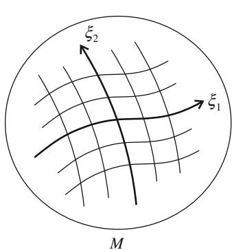

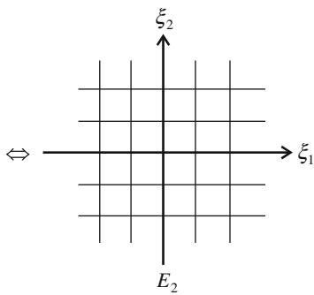  
Fig. 1.1 Manifold $M$ and coordinate system $\xi$ . $E_2$ is a two-dimensional Euclidean space

Since a manifold $M$ is locally equivalent to an $n$ -dimensional Euclidean space $E_{n}$ , we can introduce a local coordinate system

$$
\boldsymbol {\xi} = \left(\xi_ {1}, \dots , \xi_ {n}\right) \tag {1.1}
$$

composed of $n$ components $\xi_1, \ldots, \xi_n$ such that each point is uniquely specified by its coordinates $\pmb{\xi}$ in a neighborhood. See Fig. 1.1 for the two-dimensional case. Since a manifold may have a topology different from a Euclidean space, in general we need more than one coordinate neighborhood and coordinate system to cover all the points of a manifold.

The coordinate system is not unique even in a coordinate neighborhood, and there are many coordinate systems. Let $\zeta = (\zeta_1,\dots ,\zeta_n)$ be another coordinate system. When a point $P\in M$ is represented in two coordinate systems $\xi$ and $\zeta$ , there is a one-to-one correspondence between them and we have relations

$$
\boldsymbol {\xi} = \boldsymbol {f} (\zeta_ {1}, \dots , \zeta_ {n}), \tag {1.2}
$$

$$
\zeta = f ^ {- 1} \left(\xi_ {1}, \dots , \xi_ {n}\right), \tag {1.3}
$$

where $f$ and $f^{-1}$ are mutually inverse vector-valued functions. They are a coordinate transformation and its inverse transformation. We usually assume that (1.2) and (1.3) are differentiable functions of $n$ coordinate variables. $^{1}$

# 1.1 Manifolds

# 1.1.2 Examples of Manifolds

# A. Euclidean Space

Consider a two-dimensional Euclidean space, which is a flat plane. It is convenient to use an orthonormal Cartesian coordinate system $\xi = (\xi_{1},\xi_{2})$ . A polar coordinate system $\zeta = (r,\theta)$ is sometimes used, where $r$ is the radius and $\theta$ is the angle of a point from one axis (see Fig. 1.2). The coordinate transformation between them is given by

$$
r = \sqrt {\xi_ {1} ^ {2} + \xi_ {2} ^ {2}}, \quad \theta = \tan^ {- 1} \left(\frac {\xi_ {2}}{\xi_ {1}}\right), \tag {1.4}
$$

$$
\xi_ {1} = r \cos \theta , \quad \xi_ {2} = r \sin \theta . \tag {1.5}
$$

The transformation is analytic except for the origin.

# B. Sphere

A sphere is the surface of a three-dimensional ball. The surface of the earth is regarded as a sphere, where each point has a two-dimensional neighborhood, so that we can draw a local geographic map on a flat sheet. The pair of latitude and longitude gives a local coordinate system. However, a sphere is topologically different from a Euclidean space and it cannot be covered by one coordinate system. At least two

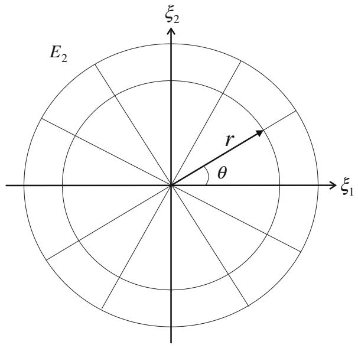  
Fig.1.2 Cartesian coordinate system $\pmb {\xi} = (\xi_1,\xi_2)$ and polar coordinate system $(r,\theta)$ in $E_{2}$

coordinate systems are required to cover it. If we delete one point, say the north pole of the earth, it is topologically equivalent to a Euclidean space. Hence, at least two overlapping coordinate neighborhoods, one including the north pole and the other including the south pole, for example, are necessary and they are sufficient to cover the entire sphere.

# C. Manifold of Probability Distributions

# C1. Gaussian Distributions

The probability density function of Gaussian random variable $x$ is given by

$$
p (x; \mu , \sigma^ {2}) = \frac {1}{\sqrt {2 \pi} \sigma} \exp \left\{- \frac {(x - \mu) ^ {2}}{2 \sigma^ {2}} \right\}, \tag {1.6}
$$

where $\mu$ is the mean and $\sigma^2$ is the variance. Hence, the set of all the Gaussian distributions is a two-dimensional manifold, where a point denotes a probability density function and

$$
\boldsymbol {\xi} = (\mu , \sigma), \quad \sigma > 0 \tag {1.7}
$$

is a coordinate system. This is topologically equivalent to the upper half of a two-dimensional Euclidean space. The manifold of Gaussian distributions is covered by one coordinate system $\xi = (\mu, \sigma)$ .

There are other coordinate systems. For example, let $m_1$ and $m_2$ be the first and second moments of $x$ , given by

$$
m _ {1} = \mathrm {E} [ x ] = \mu , \quad m _ {2} = \mathrm {E} \left[ x ^ {2} \right] = \mu^ {2} + \sigma^ {2}, \tag {1.8}
$$

where $\mathrm{E}$ denotes the expectation of a random variable. Then,

$$
\zeta = \left(m _ {1}, m _ {2}\right) \tag {1.9}
$$

is a coordinate system (the moment coordinate system).

It will be shown later that the coordinate system defined by $\theta$

$$
\theta_ {1} = \frac {\mu}{\sigma^ {2}}, \quad \theta_ {2} = - \frac {1}{2 \sigma^ {2}}, \tag {1.10}
$$

is referred to as the natural parameters, and is convenient for studying properties of Gaussian distributions.

# 1.1 Manifolds

# C2. Discrete Distributions

Let $x$ be a discrete random variable taking values on $X = \{0, 1, \dots, n\}$ . A probability distribution $p(x)$ is specified by $n + 1$ probabilities

$$
p _ {i} = \operatorname {P r o b} \{x = i \}, \quad i = 0, 1, \dots , n, \tag {1.11}
$$

so that $p(x)$ is represented by a probability vector

$$
\boldsymbol {p} = \left(p _ {0}, p _ {1}, \dots , p _ {n}\right). \tag {1.12}
$$

Because of the restriction

$$
\sum_ {i = 0} ^ {n} p _ {i} = 1, \quad p _ {i} > 0, \tag {1.13}
$$

the set of all probability distributions $\pmb{p}$ forms an $n$ -dimensional manifold. Its coordinate system is given, for example, by

$$
\boldsymbol {\xi} = \left(p _ {1}, \dots , p _ {n}\right) \tag {1.14}
$$

and $p_0$ is not free but is a function of the coordinates,

$$
p _ {0} = 1 - \sum \xi_ {i}. \tag {1.15}
$$

The manifold is an $n$ -dimensional simplex, called the probability simplex, and is denoted by $S_{n}$ . When $n = 2$ , $S_{2}$ is the interior of a triangle and when $n = 3$ , it is the interior of a 3-simplex, as is shown in Fig. 1.3.

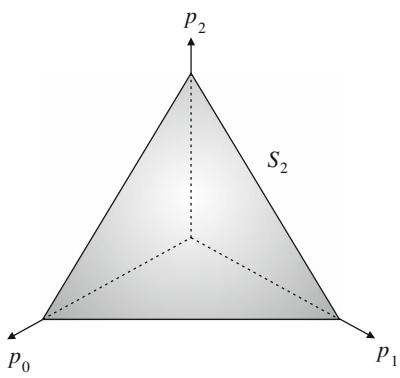

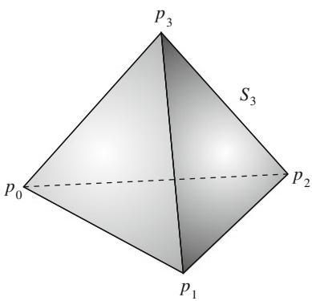  
Fig. 1.3 Probability simplex: $S_{2}$ and $S_{3}$

Let us introduce $n + 1$ random variables $\delta_{i}(x), i = 0, 1, \dots, n$ , such that

$$
\delta_ {i} (x) = \left\{ \begin{array}{l} 1, x = i, \\ 0, x \neq i. \end{array} \right. \tag {1.16}
$$

Then, a probability distribution of $x$ is denoted by

$$
p (x, \xi) = \sum_ {i = 1} ^ {n} \xi_ {i} \delta_ {i} (x) + p _ {0} (\xi) \delta_ {0} (x) \tag {1.17}
$$

in terms of coordinates $\xi$ .

We shall use another coordinate system $\theta$ later, given by

$$
\theta_ {i} = \log \frac {p _ {i}}{p _ {0}}, \quad i = 1, \dots , n, \tag {1.18}
$$

which is also very useful.

# C3. Regular Statistical Model

Let $x$ be a random variable which may take discrete, scalar or vector continuous values. A statistical model is a family of probability distributions $M = \{p(x,\xi)\}$ specified by a vector parameter $\xi$ . When it satisfies certain regularity conditions, it is called a regular statistical model. Such an $M$ is a manifold, where $\xi$ plays the role of a coordinate system. The family of Gaussian distributions and the family of discrete probability distributions are examples of the regular statistical model. Information geometry has emerged from a study of invariant geometrical structures of regular statistical models.

# D. Manifold of Positive Measures

Let $x$ be a variable taking values in set $N = \{1, 2, \dots, n\}$ . We assign a positive measure (or a weight) $m_i$ to element $i$ , $i = 1, \dots, n$ . Then

$$
\boldsymbol {\xi} = \left(m _ {1}, \dots , m _ {n}\right), \quad m _ {i} > 0 \tag {1.19}
$$

defines a distribution of measures over $N$ . The set of all such measures sits in the first quadrant $\mathbf{R}_{+}^{n}$ of an $n$ -dimensional Euclidean space. The sum

$$
m = \sum_ {i = 1} ^ {n} m _ {i} \tag {1.20}
$$

is called the total mass of $\pmb{m} = (m_1, \dots, m_n)$ .

# 1.1 Manifolds

When $m$ satisfies the constraint that the total mass is equal to 1,

$$
\sum m _ {i} = 1, \tag {1.21}
$$

it is a probability distribution belonging to $S_{n - 1}$ . Hence, $S_{n - 1}$ is included in $\mathbf{R}_{+}^{n}$ as its submanifold.

A positive measure (unnormized probability distribution) appears in many engineering problems. For example, image $s(x,y)$ drawn on the $x - y$ plane is a positive measure when the brightness is positive,

$$
s (x, y) > 0. \tag {1.22}
$$

When we discretize the $x - y$ plane into $n^2$ pixels $(i,j)$ , the discretized pictures $\{s(i,j)\}$ form a positive measure belonging to $\pmb{R}_{+}^{n^{2}}$ . Similarly, when we consider a discretized power spectrum of a sound, it is a positive measure. The histogram of observed data defines a positive measure, too.

# E. Positive-Definite Matrices

Let $\mathbf{A}$ be an $n\times n$ matrix. All such matrices form an $n^2$ -dimensional manifold. When $\mathbf{A}$ is symmetric and positive-definite, they form a $\frac{n(n + 1)}{2}$ -dimensional manifold. This is a submanifold embedded in the manifold of all the matrices. We may use the upper right elements of $\mathbf{A}$ as a coordinate system. Positive-definite matrices appear in statistics, physics, operations research, control theory, etc.

# F. Neural Manifold

A neural network is composed of a large number of neurons connected with each other, where the dynamics of information processing takes place. A network is specified by connection weights $w_{ji}$ connecting neuron $i$ with neuron $j$ . The set of all such networks forms a manifold, where matrix $\mathbf{W} = (w_{ji})$ is a coordinate system. We will later analyze behaviors of such networks from the information geometry point of view.

# 1.2 Divergence Between Two Points

# 1.2.1 Divergence

Let us consider two points $P$ and $Q$ in a manifold $M$ , of which coordinates are $\xi_{P}$ and $\xi_{Q}$ . A divergence $D[P:Q]$ is a function of $\xi_{p}$ and $\xi_{Q}$ which satisfies certain

criteria. See Basseville (2013) for a detailed bibliography. We may write it as

$$
D [ P: Q ] = D \left[ \xi_ {P}: \xi_ {Q} \right]. \tag {1.23}
$$

We assume that it is a differentiable function of $\pmb{\xi}_P$ and $\pmb{\xi}_Q$ .

Definition 1.1 $D[P:Q]$ is called a divergence when it satisfies the following criteria:

(1) $D[P:Q]\geq 0$   
(2) $D[P:Q] = 0$ , when and only when $P = Q$ .   
(3) When $P$ and $Q$ are sufficiently close, by denoting their coordinates by $\xi_{P}$ and $\xi_{Q} = \xi_{P} + d\xi$ , the Taylor expansion of $D$ is written as

$$
D \left[ \boldsymbol {\xi} _ {P}: \boldsymbol {\xi} _ {P} + d \boldsymbol {\xi} \right] = \frac {1}{2} \sum g _ {i j} \left(\boldsymbol {\xi} _ {P}\right) d \xi_ {i} d \xi_ {j} + O \left(| d \boldsymbol {\xi} | ^ {3}\right), \tag {1.24}
$$

and matrix $\mathbf{G} = (g_{ij})$ is positive-definite, depending on $\xi_P$ .

A divergence represents a degree of separation of two points $P$ and $Q$ , but it or its square root is not a distance. It does not necessarily satisfy the symmetry condition, so that in general

$$
D [ P: Q ] \neq D [ Q: P ]. \tag {1.25}
$$

We may call $D[P:Q]$ divergence from $P$ to $Q$ . Moreover, the triangular inequality does not hold. It has the dimension of the square of distance, as is suggested by (1.24). It is possible to symmetrize a divergence by

$$
D _ {S} [ P: Q ] = \frac {1}{2} (D [ P: Q ] + D [ Q: P ]). \tag {1.26}
$$

However, the asymmetry of divergence plays an important role in information geometry, as will be seen later.

When $P$ and $Q$ are sufficiently close, we define the square of an infinitesimal distance $ds$ between them by using (1.24) as

$$
d s ^ {2} = 2 D [ \xi : \xi + d \xi ] = \sum g _ {i j} d \xi_ {i} d \xi_ {j}. \tag {1.27}
$$

A manifold $M$ is said to be Riemannian when a positive-definite matrix $\mathbf{G}(\pmb{\xi})$ is defined on $M$ and the square of the local distance between two nearby points $\pmb{\xi}$ and $\pmb{\xi} + d\pmb{\xi}$ is given by (1.27). A divergence $D$ provides $M$ with a Riemannian structure.

# 1.2.2 Examples of Divergence

# A. Euclidean Divergence

When we use an orthonormal Cartesian coordinate system in a Euclidean space, we define a divergence by a half of the square of the Euclidean distance,

$$
D [ P: Q ] = \frac {1}{2} \sum \left(\xi_ {P i} - \xi_ {Q i}\right) ^ {2}. \tag {1.28}
$$

The matrix $\mathbf{G}$ is the identity matrix in this case, so that

$$
d s ^ {2} = \sum (d \xi_ {i}) ^ {2}. \tag {1.29}
$$

# B. Kullback-Leibler Divergence

Let $p(x)$ and $q(x)$ be two probability distributions of random variable $x$ in a manifold of probability distributions. The following is called the Kullback-Leibler (KL) divergence:

$$
D _ {K L} [ p (x): q (x) ] = \int p (x) \log \frac {p (x)}{q (x)} d x. \tag {1.30}
$$

When $x$ is discrete, integration is replaced by summation. We can easily check that it satisfies the criteria of divergence. It is asymmetric in general and is useful in statistics, information theory, physics, etc. Many other divergences will be introduced later in a manifold of probability distributions.

# C. KL-Divergence for Positive Measures

A manifold of positive measures $\mathbf{R}_+^n$ is a subset of a Euclidean space. Hence, we can introduce the Euclidean divergence (1.28) in it. However, we can extend the KL-divergence to give

$$
D _ {K L} \left[ \boldsymbol {m} _ {1}: \boldsymbol {m} _ {2} \right] = \sum m _ {1 i} \log \frac {m _ {1 i}}{m _ {2 i}} - \sum m _ {1 i} + \sum m _ {2 i}. \tag {1.31}
$$

When the total masses of two measures $\pmb{m}_1$ and $\pmb{m}_2$ are 1, they are probability distributions and $D_{KL}[\pmb{m}_1:\pmb{m}_2]$ reduces to the KL-divergence $D_{KL}$ in (1.30).

# D. Divergences for Positive-Definite Matrices

There is a family of useful divergences introduced in the manifold of positive-definite matrices. Let $\mathbf{P}$ and $\mathbf{Q}$ be two positive-definite matrices. The following are typical examples of divergence:

$$
D [ \mathbf {P}: \mathbf {Q} ] = \operatorname {t r} \left(\mathbf {P} \log \mathbf {P} - \mathbf {P} \log \mathbf {Q} - \mathbf {P} + \mathbf {Q}\right), \tag {1.32}
$$

which is related to the Von Neumann entropy of quantum mechanics,

$$
D [ \mathbf {P}: \mathbf {Q} ] = \operatorname {t r} \left(\mathbf {P Q} ^ {- 1}\right) - \log | \mathbf {P Q} ^ {- 1} | - n, \tag {1.33}
$$

which is due to the KL-divergence of multivariate Gaussian distribution, and

$$
D [ \mathbf {P}: \mathbf {Q} ] = \frac {4}{1 - \alpha^ {2}} \operatorname {t r} \left(- \mathbf {P} ^ {\frac {1 - \alpha}{2}} \mathbf {Q} ^ {\frac {1 + \alpha}{2}} + \frac {1 - \alpha}{2} \mathbf {P} + \frac {1 + \alpha}{2} \mathbf {Q}\right), \tag {1.34}
$$

which is called the $\alpha$ -divergence, where $\alpha$ is a real parameter. Here, $\operatorname{tr} \mathbf{P}$ denotes the trace of matrix $\mathbf{P}$ and $|\mathbf{P}|$ is the determinant of $\mathbf{P}$ .

# 1.3 Convex Function and Bregman Divergence

# 1.3.1 Convex Function

A nonlinear function $\psi (\pmb {\xi})$ of coordinates $\pmb{\xi}$ is said to be convex when the inequality

$$
\lambda \psi (\boldsymbol {\xi} _ {1}) + (1 - \lambda) \psi (\boldsymbol {\xi} _ {2}) \geq \psi \left\{\lambda \boldsymbol {\xi} _ {1} + (1 - \lambda) \boldsymbol {\xi} _ {2} \right\} \tag {1.35}
$$

is satisfied for any $\pmb{\xi}_1, \pmb{\xi}_2$ and scalar $0 \leq \lambda \leq 1$ . We consider a differentiable convex function. Then, a function is convex if and only if its Hessian

$$
\mathbf {H} (\boldsymbol {\xi}) = \left(\frac {\partial^ {2}}{\partial \xi_ {i} \partial \xi_ {j}} \psi (\boldsymbol {\xi})\right) \tag {1.36}
$$

is positive-definite.

There are many convex functions appearing in physics, optimization and engineering problems. One simple example is

$$
\psi (\boldsymbol {\xi}) = \frac {1}{2} \sum \xi_ {i} ^ {2} \tag {1.37}
$$

which is a half of the square of the Euclidean distance from the origin to point $\xi$ . Let $p$ be a probability distribution belonging to $S_{n}$ . Then, its entropy

$$
H (\boldsymbol {p}) = - \sum p _ {i} \log p _ {i} \tag {1.38}
$$

is a concave function, so that its negative, $\varphi (\pmb {p}) = -H(\pmb {p})$ , is a convex function.

We give one more example from a probability model. An exponential family of probability distributions is written as

$$
p (\boldsymbol {x}, \boldsymbol {\theta}) = \exp \left\{\sum \theta_ {i} x _ {i} + k (\boldsymbol {x}) - \psi (\boldsymbol {\theta}) \right\}, \tag {1.39}
$$

where $p(\boldsymbol{x}, \boldsymbol{\theta})$ is the probability density function of vector random variable $\boldsymbol{x}$ specified by vector parameter $\boldsymbol{\theta}$ and $k(\boldsymbol{x})$ is a function of $\boldsymbol{x}$ . The term $\exp\{-\psi(\boldsymbol{\theta})\}$ is the normalization factor with which

$$
\int p (\boldsymbol {x}, \boldsymbol {\theta}) d \boldsymbol {x} = 1 \tag {1.40}
$$

is satisfied. Therefore, $\psi (\pmb {\theta})$ is given by

$$
\psi (\boldsymbol {\theta}) = \log \int \exp \left\{\sum \theta_ {i} x _ {i} + k (\boldsymbol {x}) \right\} d \boldsymbol {x}. \tag {1.41}
$$

$M = \{p(\boldsymbol{x},\boldsymbol{\theta})\}$ is regarded as a manifold, where $\boldsymbol{\theta}$ is a coordinate system. By differentiating (1.41), we can prove that its Hessian is positive-definite (see the next subsection). Hence, $\psi (\boldsymbol {\theta})$ is a convex function. It is known as the cumulant generating function in statistics and free energy in statistical physics. The exponential family plays a fundamental role in information geometry.

# 1.3.2 Bregman Divergence

A graph of a convex function is shown in Fig. 1.4. We draw a tangent hyperplane touching it at point $\xi_0$ (Fig. 1.4). It is given by the equation

$$
z = \psi (\boldsymbol {\xi} _ {0}) + \nabla \psi (\boldsymbol {\xi} _ {0}) \cdot (\boldsymbol {\xi} - \boldsymbol {\xi} _ {0}), \tag {1.42}
$$

where $z$ is the vertical axis of the graph. Here, $\nabla$ is the gradient operator such that $\nabla \psi$ is the gradient vector defined by

$$
\nabla \psi = \left(\frac {\partial}{\partial \xi_ {i}} \psi (\boldsymbol {\xi})\right), \quad i = 1, \dots , n \tag {1.43}
$$

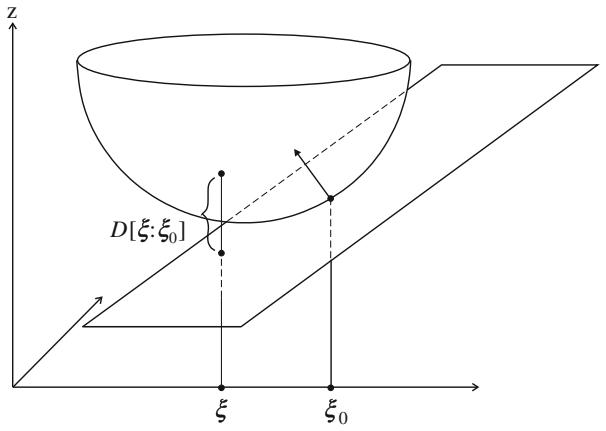  
Fig. 1.4 Convex function $z = \psi (\xi)$ , its supporting hyperplane with normal vector $\pmb {n} = \nabla \psi$ $(\xi_0)$ and divergence $D[\xi :\xi_0]$

in the component form. Since $\psi$ is convex, the graph of $\psi$ is always above the hyperplane, touching it at $\xi_0$ . Hence, it is a supporting hyperplane of $\psi$ at $\xi_0$ (Fig. 1.4).

We evaluate how high the function $\psi (\xi)$ is at $\pmb{\xi}$ from the hyperplane (1.42). This depends on the point $\xi_0$ at which the supporting hyperplane is defined. The difference from (1.42) is written as

$$
D _ {\psi} \left[ \boldsymbol {\xi}: \boldsymbol {\xi} _ {0} \right] = \psi (\boldsymbol {\xi}) - \psi \left(\boldsymbol {\xi} _ {0}\right) - \nabla \psi \left(\boldsymbol {\xi} _ {0}\right) \cdot \left(\boldsymbol {\xi} - \boldsymbol {\xi} _ {0}\right). \tag {1.44}
$$

Considering it as a function of two points $\xi$ and $\xi_0$ , we can easily prove that it satisfies the criteria of divergence. This is called the Bregman divergence [Bregman (1967)] derived from a convex function $\psi$ .

We show examples of Bregman divergence.

Example 1.1 (Euclidean divergence) For $\psi$ defined by (1.37) in a Euclidean space, we easily see that the divergence is

$$
D [ \boldsymbol {\xi}: \boldsymbol {\xi} _ {0} ] = \frac {1}{2} | \boldsymbol {\xi} - \boldsymbol {\xi} _ {0} | ^ {2}, \tag {1.45}
$$

that is, the same as a half of the square of the Euclidean distance. It is symmetric.

Example 1.2 (Logarithmic divergence) We consider a convex function

$$
\psi (\boldsymbol {\xi}) = - \sum_ {i = 1} ^ {n} \log \xi_ {i} \tag {1.46}
$$

in the manifold $R_{+}^{n}$ of positive measures. Its gradient is

$$
\nabla \psi (\boldsymbol {\xi}) = \left(- \frac {1}{\xi_ {i}}\right). \tag {1.47}
$$

Hence, the Bregman divergence is

$$
D _ {\psi} \left[ \boldsymbol {\xi}: \boldsymbol {\xi} ^ {\prime} \right] = \sum_ {i = 1} ^ {n} \left(\log \frac {\xi_ {i} ^ {\prime}}{\xi_ {i}} + \frac {\xi_ {i}}{\xi_ {i} ^ {\prime}} - 1\right). \tag {1.48}
$$

For another convex function

$$
\varphi (\xi) = \sum \xi_ {i} \log \xi_ {i}, \tag {1.49}
$$

the Bregman divergence is the same as the KL-divergence (1.31), given by

$$
D _ {\varphi} \left[ \boldsymbol {\xi}: \boldsymbol {\xi} ^ {\prime} \right] = \sum \left(\xi_ {i} \log \frac {\xi_ {i}}{\xi_ {i} ^ {\prime}} - \xi_ {i} + \xi_ {i} ^ {\prime}\right). \tag {1.50}
$$

When $\sum \xi_{i} = \sum \xi_{i}^{\prime} = 1$ , this is the KL-divergence from probability vector $\pmb{\xi}$ to another $\pmb{\xi}^{\prime}$ .

Example 1.3 (Free energy of exponential family) We calculate the divergence given by the normalization factor $\psi(\pmb{\theta})$ (1.41) of an exponential family. To this end, we differentiate the identity

$$
1 = \int p (\boldsymbol {x}, \boldsymbol {\theta}) d \boldsymbol {x} = \int \exp \left\{\sum \theta_ {i} x _ {i} + k (\boldsymbol {x}) - \psi (\boldsymbol {\theta}) \right\} d \boldsymbol {x} \tag {1.51}
$$

with respect to $\theta_{i}$ . We then have

$$
\int \left\{x _ {i} - \frac {\partial}{\partial \theta_ {i}} \psi (\boldsymbol {\theta}) \right\} p (\boldsymbol {x}, \boldsymbol {\theta}) d \boldsymbol {x} = 0 \tag {1.52}
$$

or

$$
\frac {\partial}{\partial \theta_ {i}} \psi (\boldsymbol {\theta}) = \int x _ {i} p (\boldsymbol {x}, \boldsymbol {\theta}) d \boldsymbol {x} = \mathbf {E} [ x _ {i} ] = \bar {x} _ {i}, \tag {1.53}
$$

$$
\nabla \psi (\boldsymbol {\theta}) = \operatorname {E} [ \boldsymbol {x} ], \tag {1.54}
$$

where $\mathrm{E}$ denotes the expectation with respect to $p(\pmb{x},\pmb{\theta})$ and $\bar{x}_i$ is the expectation of $x_i$ . We then differentiate (2.12) again with respect to $\theta_j$ and, after some calculations, obtain

$$
- \frac {\partial^ {2} \psi (\boldsymbol {\theta})}{\partial \theta_ {i} \partial \theta_ {j}} + \mathrm {E} \left[ \left(x _ {i} - \bar {x} _ {i}\right) \left(x _ {j} - \bar {x} _ {j}\right) \right] = 0 \tag {1.55}
$$

or

$$
\nabla \nabla \psi (\boldsymbol {\theta}) = \operatorname {E} \left[ (\boldsymbol {x} - \bar {\boldsymbol {x}}) (\boldsymbol {x} - \bar {\boldsymbol {x}}) ^ {T} \right] = \operatorname {V a r} [ \boldsymbol {x} ], \tag {1.56}
$$

where $\boldsymbol{x}^T$ is the transpose of column vector $\boldsymbol{x}$ and $\operatorname{Var}[\boldsymbol{x}]$ is the covariance matrix of $\boldsymbol{x}$ , which is positive-definite. This shows that $\psi(\theta)$ is a convex function. It is useful to see that the expectation and covariance of $\boldsymbol{x}$ are derived from $\psi(\theta)$ by differentiation.

The Bregman divergence from $\theta$ to $\theta^{\prime}$ derived from $\psi$ of an exponential family is calculated from

$$
D _ {\psi} \left[ \boldsymbol {\theta}: \boldsymbol {\theta} ^ {\prime} \right] = \psi (\boldsymbol {\theta}) - \psi \left(\boldsymbol {\theta} ^ {\prime}\right) - \nabla \psi \left(\boldsymbol {\theta} ^ {\prime}\right) \cdot \left(\boldsymbol {\theta} - \boldsymbol {\theta} ^ {\prime}\right), \tag {1.57}
$$

proving that it is equal to the KL-divergence from $\theta^{\prime}$ to $\theta$ after careful calculations,

$$
D _ {K L} \left[ p \left(\boldsymbol {x}, \boldsymbol {\theta} ^ {\prime}\right): p (\boldsymbol {x}, \boldsymbol {\theta}) \right] = \int p \left(\boldsymbol {x}, \boldsymbol {\theta} ^ {\prime}\right) \log \frac {p \left(\boldsymbol {x} , \boldsymbol {\theta} ^ {\prime}\right)}{p (\boldsymbol {x} , \boldsymbol {\theta})} d \boldsymbol {x}. \tag {1.58}
$$

# 1.4 Legendre Transformation

The gradient of $\psi (\pmb {\xi})$

$$
\boldsymbol {\xi} ^ {*} = \nabla \psi (\boldsymbol {\xi}) \tag {1.59}
$$

is equal to the normal vector $\pmb{n}$ of the supporting tangent hyperplane at $\pmb{\xi}$ , as is easily seen from Fig. 1.4. Different points have different normal vectors. Hence, it is possible to specify a point of $M$ by its normal vector. In other words, the transformation between $\pmb{\xi}$ and $\pmb{\xi}^{*}$ is one-to-one and differentiable. This shows that $\pmb{\xi}^{*}$ is used as another coordinate system of $M$ , which is connected with $\pmb{\xi}$ by (1.59).

The transformation (1.59) is known as the Legendre transformation. The Legendre transformation has a dualistic structure concerning the two coupled coordinate systems $\pmb{\xi}$ and $\pmb{\xi}^{*}$ . To show this, we define a new function of $\pmb{\xi}^{*}$ by

$$
\psi^ {*} (\boldsymbol {\xi} ^ {*}) = \boldsymbol {\xi} \cdot \boldsymbol {\xi} ^ {*} - \psi (\boldsymbol {\xi}), \tag {1.60}
$$

where

$$
\boldsymbol {\xi} \cdot \boldsymbol {\xi} ^ {*} = \sum_ {i} \xi_ {i} \xi_ {i} ^ {*} \tag {1.61}
$$

and $\xi$ is not free but is a function of $\xi^{*}$

$$
\boldsymbol {\xi} = f \left(\boldsymbol {\xi} ^ {*}\right), \tag {1.62}
$$

which is the inverse function of $\pmb{\xi}^{*} = \nabla \psi (\pmb {\xi})$ . By differentiating (1.60) with respect to $\pmb{\xi}^{*}$ , we have

$$
\nabla \psi^ {*} (\boldsymbol {\xi} ^ {*}) = \boldsymbol {\xi} + \frac {\partial \boldsymbol {\xi}}{\partial \boldsymbol {\xi} ^ {*}} \boldsymbol {\xi} ^ {*} - \nabla \psi (\boldsymbol {\xi}) \frac {\partial \boldsymbol {\xi}}{\partial \boldsymbol {\xi} ^ {*}}. \tag {1.63}
$$

# 1.4 Legendre Transformation

Since the last two terms of (1.63) cancel out because of (1.59), we have a dualistic structure

$$
\boldsymbol {\xi} ^ {*} = \nabla \psi (\boldsymbol {\xi}), \quad \boldsymbol {\xi} = \nabla \psi^ {*} \left(\boldsymbol {\xi} ^ {*}\right). \tag {1.64}
$$

$\psi^{*}$ is called the Legendre dual of $\psi$ . The dual function $\psi^{*}$ satisfies

$$
\psi^ {*} (\boldsymbol {\xi} ^ {*}) = \max  _ {\boldsymbol {\xi} ^ {\prime}} \left\{\boldsymbol {\xi} ^ {\prime} \cdot \boldsymbol {\xi} ^ {*} - \psi (\boldsymbol {\xi} ^ {\prime}) \right\}, \tag {1.65}
$$

which is usually used as the definition of $\psi^{*}$ . Our definition (1.60) is direct. We need to show $\psi^{*}$ is a convex function. The Hessian of $\psi^{*}(\pmb{\xi}^{*})$ is written as

$$
\mathbf {G} ^ {*} (\boldsymbol {\xi} ^ {*}) = \nabla \nabla \psi^ {*} (\boldsymbol {\xi} ^ {*}) = \frac {\partial \boldsymbol {\xi}}{\partial \boldsymbol {\xi} ^ {*}}, \tag {1.66}
$$

which is the Jacobian matrix of the inverse transformation from $\pmb{\xi}^{*}$ to $\pmb{\xi}$ . This is the inverse of the Hessian $\mathbf{G} = \nabla \nabla \psi (\pmb {\xi})$ , since it is the Jacobian matrix of the transformation from $\pmb{\xi}$ to $\pmb{\xi}^{*}$ . Hence, it is a positive-definite matrix. This shows that $\psi^{*}\left(\pmb{\xi}^{*}\right)$ is a convex function of $\pmb{\xi}^{*}$ .

A new Bregman divergence is derived from the dual convex function $\psi^{*}\left(\xi^{*}\right)$

$$
D _ {\psi^ {*}} \left[ \boldsymbol {\xi} ^ {*}: \boldsymbol {\xi} ^ {* ^ {\prime}} \right] = \psi^ {*} (\boldsymbol {\xi} ^ {*}) - \psi^ {*} (\boldsymbol {\xi} ^ {* ^ {\prime}}) - \nabla \psi^ {*} (\boldsymbol {\xi} ^ {* ^ {\prime}}) \cdot (\boldsymbol {\xi} ^ {*} - \boldsymbol {\xi} ^ {* ^ {\prime}}), \tag {1.67}
$$

which we call the dual divergence. However, by calculating carefully, one can easily derive

$$
D _ {\psi^ {*}} \left[ \boldsymbol {\xi} ^ {*}: \boldsymbol {\xi} ^ {* ^ {\prime}} \right] = D _ {\psi} \left[ \boldsymbol {\xi} ^ {\prime}: \boldsymbol {\xi} \right]. \tag {1.68}
$$

Hence, the dual divergence is equal to the primal one if the order of two points is exchanged. Therefore, the divergences derived from the two convex functions are substantially the same, except for the order.

It is convenient to use a self-dual expression of divergence by using the two coordinate systems.

Theorem 1.1 The divergence from $P$ to $Q$ derived from a convex $\psi (\pmb {\xi})$ is written as

$$
D _ {\psi} [ P: Q ] = \psi (\boldsymbol {\xi} _ {P}) + \psi^ {*} (\boldsymbol {\xi} _ {Q} ^ {*}) - \boldsymbol {\xi} _ {P} \cdot \boldsymbol {\xi} _ {Q} ^ {*}, \tag {1.69}
$$

where $\xi_{P}$ is the coordinates of $P$ in $\pmb{\xi}$ coordinate system and $\pmb{\xi}_{Q}^{*}$ is the coordinates of $Q$ in $\pmb{\xi}^{*}$ coordinate system.

Proof From (1.57), we have

$$
\psi^ {*} \left(\boldsymbol {\xi} _ {Q} ^ {*}\right) = \boldsymbol {\xi} _ {Q} \cdot \boldsymbol {\xi} _ {Q} ^ {*} - \psi (\boldsymbol {\xi} _ {Q}). \tag {1.70}
$$

Substituting (1.70) in (1.69) and using $\nabla \psi (\xi_Q) = \xi_Q^*$ , we have the theorem.

We give examples of dual convex functions. For convex function (1.37) in Example 1.1, we easily have

$$
\psi^ {*} (\boldsymbol {\xi} ^ {*}) = \frac {1}{2} | \boldsymbol {\xi} ^ {*} | ^ {2} \tag {1.71}
$$

and

$$
\boldsymbol {\xi} ^ {*} = \boldsymbol {\xi}. \tag {1.72}
$$

Hence, the dual convex function is the same as the primal one, implying that the structure is self-dual.

In the case of Example 1.2, the duals of $\psi$ and $\varphi$ in (1.46) and (1.49) are

$$
\psi^ {*} (\xi^ {*}) = - \sum \left\{1 + \log (- \xi_ {i} ^ {*}) \right\}, \tag {1.73}
$$

$$
\varphi^ {*} (\xi^ {*}) = \sum \exp \left\{\xi_ {i} ^ {*} - 1 \right\}, \tag {1.74}
$$

by which

$$
\nabla \psi^ {*} (\boldsymbol {\xi} ^ {*}) = \boldsymbol {\xi}, \quad \nabla \varphi^ {*} (\boldsymbol {\xi} ^ {*}) = \boldsymbol {\xi} \tag {1.75}
$$

hold, respectively.

In the case of the free energy $\psi (\pmb {\theta})$ in Example 1.3, its Legendre transformation is

$$
\boldsymbol {\theta} ^ {*} = \nabla \psi (\boldsymbol {\theta}) = \mathrm {E} _ {\boldsymbol {\theta}} [ \boldsymbol {x} ], \tag {1.76}
$$

where $\mathrm{E}_{\theta}$ is the expectation with respect to $p(\boldsymbol{x}, \boldsymbol{\theta})$ . Because of this, $\boldsymbol{\theta}^*$ is called the expectation parameter in statistics. The dual convex function $\psi^*(\boldsymbol{\theta}^*)$ derived from (1.65) is calculated from

$$
\psi^ {*} (\boldsymbol {\theta} ^ {*}) = \boldsymbol {\theta} ^ {*} \cdot \boldsymbol {\theta} - \psi (\boldsymbol {\theta}), \tag {1.77}
$$

where $\pmb{\theta}$ is a function of $\pmb{\theta}^*$ given by $\pmb{\theta}^* = \nabla \psi(\pmb{\theta})$ . This proves that $\psi^*$ is the negative entropy,

$$
\psi^ {*} (\boldsymbol {\theta} ^ {*}) = \int p (\boldsymbol {x}, \boldsymbol {\theta}) \log p (\boldsymbol {x}, \boldsymbol {\theta}) d \boldsymbol {x}. \tag {1.78}
$$

The dual divergence derived from $\psi^{*}\left(\pmb{\theta}^{*}\right)$ is the KL-divergence

$$
D _ {\psi^ {*}} \left[ \boldsymbol {\theta} ^ {*}: \boldsymbol {\theta} ^ {* ^ {\prime}} \right] = D _ {K L} \left[ p (\boldsymbol {x}, \boldsymbol {\theta}): p \left(\boldsymbol {x}, \boldsymbol {\theta} ^ {\prime}\right) \right], \tag {1.79}
$$

where $\pmb {\theta} = \nabla \psi^{*}(\pmb{\theta}^{*})$ and $\pmb {\theta}' = \nabla \psi^{*}\big(\pmb{\theta}^{*'}\big)$

# 1.5 Dually Flat Riemannian Structure Derived from Convex Function

# 1.5.1 Affine and Dual Affine Coordinate Systems

When a function $\psi(\theta)$ is convex in a coordinate system $\theta$ , the same function expressed in another coordinate system $\xi$ ,

$$
\tilde {\psi} (\boldsymbol {\xi}) = \psi \left\{\boldsymbol {\theta} (\boldsymbol {\xi}) \right\}, \tag {1.80}
$$

is not necessarily convex as a function of $\xi$ . Hence, the convexity of a function depends on the coordinate system of $M$ . But a convex function remains convex under affine transformations

$$
\theta^ {\prime} = \mathbf {A} \theta + b, \tag {1.81}
$$

where $\mathbf{A}$ is a non-singular constant matrix and $b$ is a constant vector.

We fix a coordinate system $\theta$ in which $\psi(\theta)$ is convex and introduce geometric structures to $M$ based on it. We consider $\theta$ as an affine coordinate system, which provides $M$ with an affine flat structure: $M$ is a flat manifold and each coordinate axis of $\theta$ is a straight line. Any curve $\theta(t)$ of $M$ written in the linear form of parameter $t$ ,

$$
\boldsymbol {\theta} (t) = \boldsymbol {a} t + \boldsymbol {b}, \tag {1.82}
$$

is a straight line, where and $\mathbf{a}$ and $\mathbf{b}$ are constant vectors. We call it a geodesic of an affine manifold. Here, the term "geodesic" is used to represent a straight line and does not mean the shortest path connecting two points. A geodesic is invariant under affine transformations (1.81), but this is not true under nonlinear coordinate transformations.

Dually, we can define another coordinate system $\theta^{*}$ by the Legendre transformation,

$$
\boldsymbol {\theta} ^ {*} = \nabla \psi (\boldsymbol {\theta}), \tag {1.83}
$$

and consider it as another type of affine coordinates. This defines another affine structure. Each coordinate axis of $\theta^{*}$ is a dual straight line or dual geodesic. A dual straight line is written as

$$
\boldsymbol {\theta} ^ {*} (t) = \boldsymbol {a} t + \boldsymbol {b}. \tag {1.84}
$$

This is the dual affine structure derived from the convex function $\psi^{*}\left(\theta^{*}\right)$ . Since the coordinate transformation between the two affine coordinate systems $\theta$ and $\theta^{*}$ is not linear in general, a geodesic is not a dual geodesic and vice versa. This implies that we have introduced two different criteria of straightness or flatness in $M$ , namely primal and dual flatness. $M$ is dually flat and the two flat coordinates are connected by the Legendre transformation.

# 1.5.2 Tangent Space, Basis Vectors and Riemannian Metric

When $d\theta$ is an (infinitesimally) small line element, the square of its length $ds$ is given by

$$
d s ^ {2} = 2 D _ {\psi} [ \theta : \theta + d \theta ] = \sum g _ {i j} d \theta^ {i} d \theta^ {j}. \tag {1.85}
$$

Here, we use the upper indices $i,j$ to represent components of $\pmb{\theta}$ . It is easy to see that the Riemannian metric $g_{ij}$ is given by the Hessian of $\psi$

$$
g _ {i j} (\boldsymbol {\theta}) = \frac {\partial^ {2}}{\partial \theta^ {i} \partial \theta^ {j}} \psi (\boldsymbol {\theta}). \tag {1.86}
$$

Let $\{\pmb{e}_i, i = 1, \dots, n\}$ be the set of tangent vectors along the coordinate curves of $\theta$ (Fig. 1.5). The vector space spanned by $\{\pmb{e}_i\}$ is the tangent space of $M$ at each point. Since $\theta$ is an affine coordinate system, $\{\pmb{e}_i\}$ looks the same at any point. A tangent vector $\pmb{A}$ is represented as

$$
\boldsymbol {A} = \sum A ^ {i} \boldsymbol {e} _ {i}, \tag {1.87}
$$

where $A^i$ are the components of $\mathbf{A}$ with respect to the basis vectors $\{\pmb{e}_i\}, i = 1, \dots, n$ . The small line element $d\theta$ is a tangent vector expressed as

$$
d \theta = \sum d \theta^ {i} e _ {i}. \tag {1.88}
$$

Dually, we introduce a set of basis vectors $\left\{e^{*i}\right\}$ which are tangent vectors of the dual affine coordinate curves of $\theta^*$ (Fig. 1.6). The small line element $d\theta^{*}$ is expressed as

$$
d \theta^ {*} = \sum d \theta_ {i} ^ {*} e ^ {* i} \tag {1.89}
$$

in this basis. A vector $A$ is represented in this basis as

$$
A = \sum A _ {i} e ^ {* i}. \tag {1.90}
$$

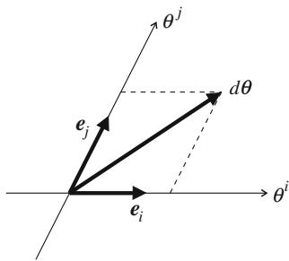  
Fig. 1.5 Basis vectors $\pmb{e}_i$ and small line element $d\theta$

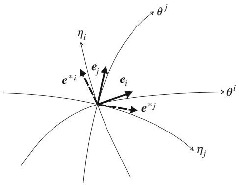  
Fig. 1.6 Two dual bases $\{e_i\}$ and $\{e^{*i}\}$

In order to distinguish affine and dual affine bases, we use the lower index as in $e_i$ for the affine basis and the upper index as in $e^{*i}$ for the dual affine basis. Then, by using the lower and upper indices as in $A^i$ and $A_i$ in the two bases, the components of a vector are naturally expressed without changing the letter $A$ but by changing the position of the index to upper or lower. Since they are the same vector expressed in different bases,

$$
\boldsymbol {A} = \sum A ^ {i} \boldsymbol {e} _ {i} = \sum A _ {i} \boldsymbol {e} ^ {* i}, \tag {1.91}
$$

and $A_{i}\neq A^{i}$ in general.

It is cumbersome to use the summation symbol in Eqs. (1.87)-(1.91) and others. Even if the summation symbol is discarded, the reader may consider from the context that it has been omitted by mistake. In most cases, index $i$ appearing twice in one term, once as an upper index and the other time as a lower index, is summed over from 1 to $n$ . A. Einstein introduced the following summation convention:

Einstein Summation Convention: When the same index appears twice in one term, once as an upper index and the other time as a lower index, summation is automatically taken over this index even without the summation symbol.

We use this convention throughout the monograph, unless specified otherwise. Then, (1.91) is rewritten as

$$
\boldsymbol {A} = A ^ {i} \boldsymbol {e} _ {i} = A _ {i} \boldsymbol {e} ^ {* i}. \tag {1.92}
$$

Since the square of the length $ds$ of a small line element $d\theta$ is given by the inner product of $d\theta$ , we have

$$
d s ^ {2} = \langle d \theta , d \theta \rangle = g _ {i j} d \theta^ {i} d \theta^ {j}, \tag {1.93}
$$

which is rewritten as

$$
d s ^ {2} = \left\langle d \theta^ {i} \boldsymbol {e} _ {i}, d \theta^ {j} \boldsymbol {e} _ {j} \right\rangle = \left\langle \boldsymbol {e} _ {i}, \boldsymbol {e} _ {j} \right\rangle d \theta^ {i} d \theta^ {j}. \tag {1.94}
$$

Therefore, we have

$$
g _ {i j} (\boldsymbol {\theta}) = \langle \boldsymbol {e} _ {i}, \boldsymbol {e} _ {j} \rangle . \tag {1.95}
$$

This is the inner product of basis vectors $\pmb{e}_i$ and $\pmb{e}_j$ , which depends on position $\pmb{\theta}$ .

A manifold equipped with $\mathbf{G} = (g_{ij})$ , by which the length of a small line element $d\theta$ is given by (1.93), is a Riemannian manifold. In the case of a Euclidean space with an orthonormal coordinate system, $g_{ij}$ is given by

$$
g _ {i j} = \delta_ {i j}, \tag {1.96}
$$

where $\delta_{ij}$ is the Kronecker delta, which is equal to 1 for $i = j$ and 0 otherwise. This is derived from convex function (1.37). A Euclidean space is a special case of the Riemannian manifold in which there is a coordinate system such that $g_{ij}$ does not depend on position, in particular, written as (1.96). A manifold induced from a convex function is not Euclidean in general.

The Riemannian metric can also be represented in the dual affine coordinate system $\theta^{*}$ . From the representation of a small line element $d\theta^{*}$ as

$$
d \boldsymbol {\theta} ^ {*} = d \theta_ {i} ^ {*} \boldsymbol {e} ^ {* i}, \tag {1.97}
$$

we have

$$
d s ^ {2} = \left\langle d \boldsymbol {\theta} ^ {*}, d \boldsymbol {\theta} ^ {*} \right\rangle = g ^ {* i j} d \theta_ {i} ^ {*} d \boldsymbol {\theta} _ {j} ^ {*}, \tag {1.98}
$$

where $g^{*ij}$ is given by

$$
g ^ {* i j} = \langle e ^ {* i}, e ^ {* j} \rangle . \tag {1.99}
$$

From (1.66), we see that the components of the small line elements $d\theta$ and $d\theta^{*}$ are related as

$$
d \boldsymbol {\theta} ^ {*} = \mathbf {G} d \boldsymbol {\theta}, \quad d \boldsymbol {\theta} = \mathbf {G} ^ {- 1} d \boldsymbol {\theta} ^ {*}, \tag {1.100}
$$

$$
d \theta_ {i} ^ {*} = g _ {i j} d \theta^ {j}, \quad d \theta^ {j} = g ^ {* j i} d \theta_ {i} ^ {*}, \tag {1.101}
$$

where $\mathbf{G} = \mathbf{G}^{* - 1}$ . So the two Riemannian metric tensors are mutually inverse.

This also implies that the two bases are related as

$$
\boldsymbol {e} ^ {* i} = g ^ {i j} \boldsymbol {e} _ {j}, \quad \boldsymbol {e} _ {i} = g _ {i j} \boldsymbol {e} ^ {* j}. \tag {1.102}
$$

Hence, the inner product of two basis vectors $\pmb{e}_i$ and $\pmb{e}_j^*$ satisfies

$$
\left\langle \boldsymbol {e} _ {i}, \boldsymbol {e} ^ {* j} \right\rangle = \delta_ {i} ^ {j} \tag {1.103}
$$

because $\mathbf{G} = \mathbf{G}^{* - 1}$ . So the two bases $\{\pmb {e}_i\}$ and $\left\{\pmb {e}^{*i}\right\}$ are mutually dual or reciprocal (Fig. 1.6). Neither of the bases is orthonormal by itself in general, but the two together are complementarily orthogonal. Such a set of bases is useful, because the

components of a vector $A$ are given by the inner product,

$$
A ^ {i} = \langle \boldsymbol {A}, \boldsymbol {e} ^ {* i} \rangle , \quad A _ {i} = \langle \boldsymbol {A}, \boldsymbol {e} _ {i} \rangle . \tag {1.104}
$$

The two components are connected by

$$
A _ {i} = g _ {i j} A ^ {j}, \quad A ^ {j} = g ^ {* i j} A _ {i}. \tag {1.105}
$$

# 1.5.3 Parallel Transport of Vector

A tangent vector $A = A^i \pmb{e}_i$ defined at a point $\theta$ is transported to another point $\theta'$ without changing the components $A^i$ , because $\pmb{e}_i$ are the same everywhere in a dually flat manifold. This is a special case of parallel transport of a vector in a general non-flat manifold. As will be seen in Part II, the parallel transport of a vector needs to use an affine connection in the general case. But in our case of a dually flat manifold derived from a convex function $\psi(\theta)$ , the parallel transport is very simple.

The dual parallel transport of $A$ is different from the parallel transport of $A$ . When $A$ is represented in the dual basis as

$$
\boldsymbol {A} = A _ {i} \boldsymbol {e} ^ {* i}, \tag {1.106}
$$

the dual transport does not change the components $A_{i}$ . However, it changes the components $A^{i}$ , because the relation between $A_{i}$ and $A^{i}$ depends on position $\theta$ or $\pmb{\theta}^{*}$ , as is seen from (1.105), where $g_{ij}$ and $g^{*ij}$ depend on $\pmb{\theta}$ and $\pmb{\theta}^{*}$ .

Since $M$ is Riemannian and is not Euclidean in general, even though the parallel transport is defined easily, the length of a vector changes by the parallel transport and the dual parallel transport. The square of the magnitude of $A$ is written as

$$
\left| \boldsymbol {A} \right| ^ {2} = \left\langle \boldsymbol {A}, \boldsymbol {A} \right\rangle = g _ {i j} (\boldsymbol {\theta}) A ^ {i} A ^ {j} = A ^ {i} A _ {i}. \tag {1.107}
$$

Therefore, it depends on the position $\theta$ , even though the components of $A^i$ do not change by parallel transport. The inner product of vectors $\mathbf{A}$ and $\mathbf{B}$ is represented by various forms,

$$
\langle \boldsymbol {A}, \boldsymbol {B} \rangle = g _ {i j} A ^ {i} B ^ {j} = g ^ {* i j} A _ {i} B _ {j} = A _ {i} B ^ {i}. \tag {1.108}
$$

Two vectors $A$ and $B$ are orthogonal when $\langle A, B \rangle = 0$ . However, when both $A$ and $B$ are parallelly transported from $\theta$ to $\theta'$ , the orthogonality does not hold in general at $\theta'$ even when it holds at $\theta$ . However, when $A$ is transported in parallel and $B$ is transported in dual parallel, the orthogonality is kept invariant, because $A^i B_i$ is invariant. This is an important property of two dually coupled parallel transports.

# 1.6 Generalized Pythagorean Theorem and Projection Theorem

# 1.6.1 Generalized Pythagorean Theorem

Two curves $\theta_{1}(t)$ and $\theta_{2}(t)$ intersect orthogonally when their tangent vectors

$$
\dot {\theta} _ {1} (t) = \frac {d}{d t} \theta_ {1} (t), \tag {1.109}
$$

$$
\dot {\theta} _ {2} (t) = \frac {d}{d t} \theta_ {2} (t) \tag {1.110}
$$

are orthogonal, that is,

$$
\left\langle \dot {\boldsymbol {\theta}} _ {1} (t), \dot {\boldsymbol {\theta}} _ {2} (t) \right\rangle = g _ {i j} \dot {\theta} _ {1} ^ {i} (t) \dot {\theta} _ {2} ^ {j} (t) = 0 \tag {1.111}
$$

at the intersection point $t = 0$ , $\theta_{1}(0) = \theta_{2}(0)$ and $\cdot$ denotes $d / dt$ .

Even though a manifold is flat from the point of view of affine structures, it is different from a Euclidean space. A dually flat manifold is a generalization of the Euclidean space. A generalized Pythagorean theorem holds in a dually flat manifold $M$ .

Let us consider three points $P, Q, R$ in a dually flat manifold $M$ , which form a triangle. We call it an orthogonal triangle when the dual geodesic connecting $P$ and $Q$ is orthogonal to the geodesic connecting $Q$ and $R$ (Fig. 1.7).

Theorem 1.2 (Generalized Pythagorean Theorem) When triangle $PQR$ is orthogonal such that the dual geodesic connecting $P$ and $Q$ is orthogonal to the geodesic connecting $Q$ and $R$ , the following generalized Pythagorean relation holds:

$$
D _ {\psi} [ P: R ] = D _ {\psi} [ P: Q ] + D _ {\psi} [ Q: R ]. \tag {1.112}
$$

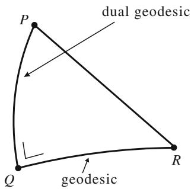  
Fig. 1.7 Generalized orthogonal triangle $\Delta PQR$ and Pythagorean theorem

Proof By using the relation

$$
D _ {\psi} [ P: Q ] = \psi \left(\boldsymbol {\theta} _ {P}\right) + \psi^ {*} \left(\boldsymbol {\theta} _ {Q} ^ {*}\right) - \boldsymbol {\theta} _ {P} \cdot \boldsymbol {\theta} _ {Q} ^ {*}, \tag {1.113}
$$

we have

$$
D _ {\psi} [ P: Q ] + D _ {\psi} [ Q: R ] - D _ {\psi} [ P: R ] = \left(\boldsymbol {\theta} _ {P} ^ {*} - \boldsymbol {\theta} _ {Q} ^ {*}\right) \cdot \left(\boldsymbol {\theta} _ {Q} - \boldsymbol {\theta} _ {R}\right) \tag {1.114}
$$

after some calculations. The dual geodesic connecting $P$ and $Q$ is written as

$$
\boldsymbol {\theta} _ {P Q} ^ {*} (t) = (1 - t) \boldsymbol {\theta} _ {P} ^ {*} + t \boldsymbol {\theta} _ {Q} ^ {*}, \tag {1.115}
$$

in the parametric form. Its tangent vector is given by

$$
\dot {\boldsymbol {\theta}} _ {P Q} ^ {*} (t) = \boldsymbol {\theta} _ {Q} ^ {*} - \boldsymbol {\theta} _ {P} ^ {*}. \tag {1.116}
$$

Dually, the geodesic connecting $Q$ and $R$ is

$$
\boldsymbol {\theta} _ {Q R} (t) = (1 - t) \boldsymbol {\theta} _ {Q} + t \boldsymbol {\theta} _ {R} \tag {1.117}
$$

and its tangent vector is

$$
\dot {\theta} _ {Q R} (t) = \theta_ {R} - \theta_ {Q}. \tag {1.118}
$$

Since the two tangent vectors are orthogonal, we have

$$
\left(\boldsymbol {\theta} _ {P} ^ {*} - \boldsymbol {\theta} _ {Q} ^ {*}\right) \cdot \left(\boldsymbol {\theta} _ {Q} - \boldsymbol {\theta} _ {R}\right) = 0. \tag {1.119}
$$

The Pythagorean relation is proved from (1.114).

Since the divergence is asymmetric, we have the dual statement.

Theorem 1.3 (Dual Pythagorean Theorem) When triangle $PQR$ is orthogonal such that the geodesic connecting $P$ and $Q$ is orthogonal to the dual geodesic connecting $Q$ and $R$ , the dual of the generalized Pythagorean relation holds,

$$
D _ {\psi^ {*}} [ P: R ] = D _ {\psi^ {*}} [ P: Q ] + D _ {\psi^ {*}} [ Q: R ]. \tag {1.120}
$$

In the special case of convex function (1.37), the divergence is exactly a half of the square of the Euclidean distance. Moreover, the affine coordinate system is exactly the same as the dual affine coordinate system, because the affine structure is self-dual. Hence, a geodesic is a dual geodesic at the same time. In this case, the generalized Pythagorean relation reduces to the Pythagorean relation in a Euclidean space. The theorems are indeed a generalization of the Pythagorean theorem of a Euclidean space to a dually flat manifold.

# 1.6.2 Projection Theorem

Consider a point $P$ and a smooth submanifold $S$ in a dually flat manifold $M$ . Then, the divergence from a point $P$ to submanifold $S$ is defined by

$$
D _ {\psi} [ P: S ] = \min  _ {R \in S} D _ {\psi} [ P: R ]. \tag {1.121}
$$

We study the problem of finding the point in $S$ that is closest to $P$ in the sense of divergence. This gives an approximation of $P$ by using a point inside $S$ . The Pythagorean theorem is useful for solving various approximation problems.

We define the geodesic projection and the dual geodesic projection of $P$ to $S \subset M$ . A curve $\theta(t)$ is said to be orthogonal to $S$ when its tangent vector $\dot{\theta}(t)$ is orthogonal to any tangent vectors of $S$ at the intersection (Fig. 1.8).

Definition 1.2 $\hat{P}_S$ is the geodesic projection of $P$ to $S$ when the geodesic connecting $P$ and $\hat{P}_S \in S$ is orthogonal to $S$ . Dually, $\hat{P}_S^*$ is the dual geodesic projection of $P$ to $S$ , when the dual geodesic connecting $P$ and $\hat{P}_S^* \in S$ is orthogonal to $S$ . See Fig. 1.8.

We then have the projection theorem:

Theorem 1.4 (Projection Theorem) Given $P \in M$ and a smooth submanifold $S \subset M$ , the point $\hat{P}_S^*$ that minimizes the divergence $D_{\psi}[P:R]$ , $R \in S$ , is the dual geodesic projection of $P$ to $S$ . The point $\hat{P}_S$ that minimizes the dual divergence $D_{\psi^*}[P:R]$ , $R \in S$ , is the geodesic projection of $P$ to $S$ .

Proof Let $\hat{P}_S^*$ be the dual geodesic projection of $P$ to $S$ . Consider a point $Q \in S$ which is (infinitesimally) close to $\hat{P}_S^*$ . Then, three points $P$ , $\hat{P}_S^*$ and $Q$ form an orthogonal triangle, because the small line element connecting $\hat{P}_S^*$ and $Q$ is orthogonal to the dual geodesic connecting $P$ and $\hat{P}_S^*$ . Hence, the Pythagorean theorem shows

$$
D _ {\psi} [ P: Q ] = D _ {\psi} \left[ P: \hat {P} _ {S} ^ {*} \right] + D _ {\psi} \left[ \hat {P} _ {S} ^ {*}: Q \right] \tag {1.122}
$$

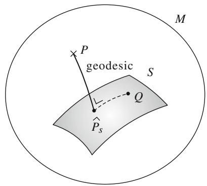  
Fig. 1.8 Geodesic projection of $P$ to $S$

for any neighboring $Q$ . This shows that $\hat{P}_S^*$ is a critical point of $D_{\psi}[P:Q]$ , $Q \in S$ , proving the theorem. The dual part is proved similarly.

It should be noted that the projection theorem gives a necessary condition for the point $\hat{P}_S^*$ to minimize the divergence, but is not sufficient. The projection or dual projection can give the maximum or saddle point of the divergence. The following theorem gives a sufficient condition for the minimality of the projection and its uniqueness.

Theorem 1.5 When $S$ is a flat submanifold of a dually flat manifold $M$ , the dual projection of $P$ to $S$ is unique and minimizes the divergence. Dually, when $S$ is a dual flat submanifold of a dually flat manifold $M$ , the projection of $P$ to $S$ is unique and minimizes the dual divergence.

Proof The Pythagorean relations (1.112), (1.120) hold for any $Q \in S$ . Hence the projection (dual projection) is unique and minimizes the dual divergence (divergence).

# 1.6.3 Divergence Between Submanifolds: Alternating Minimization Algorithm

When there are two submanifolds $K$ and $S$ in a dually flat $M$ , we define a divergence between $K$ and $S$ by

$$
D [ K: S ] = \min  _ {P \in K, Q \in S} D [ P: Q ] = D \left[ \bar {P}: \bar {Q} \right]. \tag {1.123}
$$

The two points $\bar{P} \in K$ and $\bar{Q} \in S$ are the closest pair between $K$ and $S$ . In order to obtain the closest pair, the following iterative algorithm, the alternating minimization algorithm, is proposed. See Fig. 1.9.

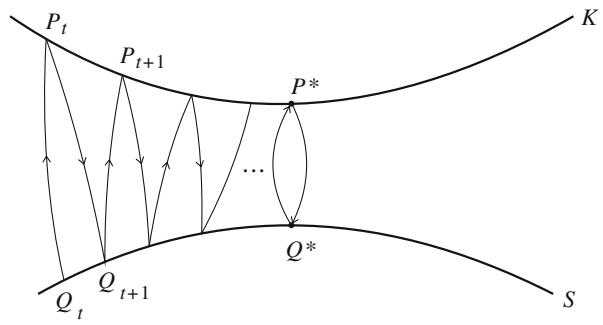  
Fig. 1.9 Iterated dual geodesic projections (em algorithm)

Begin with an arbitrary $Q_{t} \in S, t = 0, 1, \ldots$ , and search for $P \in K$ that minimizes $D[P:Q_t]$ . This is given by the geodesic projection of $Q_{t}$ to $K$ . Let it be $P_{t} \in K$ . Then search for the point in $S$ that minimizes $D[P_{t}:Q]$ . Let it be $Q_{t+1}$ . This is given by the dual geodesic projection of $P_{t}$ to $S$ . Since we have

$$
D \left[ P _ {t - 1}: Q _ {t} \right] \geq D \left[ P _ {t}: Q _ {t} \right] \geq D \left[ P _ {t}: Q _ {t + 1} \right], \tag {1.124}
$$

the procedure converges. It is unique when $S$ is flat and $K$ is dual flat. Otherwise, the converging point is not necessarily unique.

In later sections, the geodesic projection is called the $e$ -projection, signifying the exponential projection, and the dual geodesic projection is called the $m$ -projection, signifying the mixture projection. By this reason, this alternating primal and dual geodesic projection algorithm is called the $em$ algorithm.

# Remarks

A dually flat Riemannian structure is derived from the Bregman divergence by using a convex function. It has a dualistic structure. However, not all divergences are Bregman divergences, that is, not necessarily derived from convex functions. An interesting question is what type of geometry is induced from such a general divergence. This question will be studied in Part II. Briefly speaking, it gives a Riemannian manifold with a dual pair of affine connections which are not flat. There are no affine coordinate systems in such cases.

A dually flat manifold is a generalization of a Euclidean space, inheriting useful properties from it. A general non-flat manifold is regarded as a curved submanifold of a dually flat manifold, as a Riemannian manifold is a curved submanifold of a Euclidean space with higher dimensions. Therefore, it is important to study the properties of a dually flat manifold.

The Pythagorean theorem and related projection theorem are highlights of a dually flat manifold, proposed in Nagaoka and Amari (1982). However, this work was not published in a journal, because, unfortunately, it was rejected by major journals. These theorems play important roles in most applications of information geometry. The Pythagorean theorem has been known for many years in the case of the KL-divergence. It is information geometry that has generalized the Pythagorean relation applicable to any Bregman divergence. Conversely, when a manifold is dually flat from the geometrical point of view, we can prove that there is a convex function from which the dually flat structure is derived. This will be explained later.

We add a comment on the notation. There are many coordinate systems in a coordinate neighborhood of a manifold, because when $\xi$ is a coordinate system, its transform $\zeta = (\zeta_1,\dots ,\zeta_n)$

$$
\zeta = f (\xi); \zeta_ {\kappa} = f _ {\kappa} (\xi_ {1}, \dots , \xi_ {n}), \quad \kappa = 1, \dots , n \tag {1.125}
$$

is another coordinate system, provided $\pmb{f}$ is differentiable and invertible. The Jacobian matrix $\mathbf{J} = (J_{\kappa i})$ of the coordinate transformation

$$
J _ {\kappa i} = \frac {\partial f _ {\kappa}}{\partial \xi_ {i}}, \quad i = 1, \dots , n \tag {1.126}
$$

is non-degenerate, that is, matrix $\mathbf{J}$ is invertible.

Here we use indices $i, j, \ldots$ to represent components in the coordinate system $\xi = (\xi_i), i = 1, \ldots, n$ and Greek indices $\kappa, \lambda, \nu, \ldots$ for the coordinate system $\zeta = (\zeta_{\kappa}), \kappa = 1, \ldots, n$ . This is a convenient way of distinguishing coordinate systems. For example, a small line element connecting $P$ and $P + dP$ is $d\xi = (d\xi_i)$ in coordinate system $\xi$ and $d\zeta = (d\zeta_{\kappa})$ in coordinate system $\zeta$ , and they are linearly connected by

$$
d \zeta_ {\kappa} = \sum_ {i} J _ {\kappa i} d \xi_ {i}. \tag {1.127}
$$

When $ds$ is a local distance written as

$$
d s ^ {2} = \sum g _ {i j} d \xi_ {i} d \xi_ {j} \tag {1.128}
$$

in the coordinate system $\xi$ , it can be written as

$$
d s ^ {2} = \sum g _ {\kappa \lambda} d \zeta_ {\kappa} d \zeta_ {\lambda} \tag {1.129}
$$

in coordinate system $\zeta$ . Here, $\left(g_{ij}\right)$ and $(g_{\kappa \lambda})$ are different matrices connected by

$$
g _ {i j} = \sum_ {\kappa , \lambda} J _ {\kappa i} J _ {\lambda j} g _ {\kappa \lambda}. \tag {1.130}
$$

Such a quantity is called a tensor. We use the same letter $g$ for the Riemannian metric tensor, but indices $i$ , $j$ or $\kappa$ , $\lambda$ distinguish the coordinate system in which it is represented. In general, we may use the same letter for a quantity even if it is represented in different coordinate systems, distinguishing them by the letter types of indices. This is convenient for the index notation, introduced by Schouten (1954). We mainly follow this idea.

We may choose any coordinate system. The geometry should be the same whichever coordinate system we use. Mathematicians often do not like to use a coordinate system, because geometry should not depend on it. They say that the index notation is an ugly classic method of differential geometry, where tensors are represented by quantities having indices. So they use the coordinate-free method of abstract description. This is sometimes elegant. However, it is wiser to choose an adequate coordinate system, because the geometry is the same in whichever coordinate system it is analyzed. For Euclidean geometry, an orthonormal coordinate system is usually preferable. However, when we analyze a boundary value problem of the

heat equation in a Euclidean space, if the boundary is a circle, the polar coordinate system makes the boundary condition very simple. So in such a case, we use this.

Any coordinate system is permissible, but it is advisable to use a convenient one, instead of rejecting the usage of a coordinate system. This is the way in which engineers and physicists work.

# Chapter 2 Exponential Families and Mixture Families of Probability Distributions

The present chapter studies the geometry of the exponential family of probability distributions. It is not only a typical statistical model, including many well-known families of probability distributions such as discrete probability distributions $S_{n}$ , Gaussian distributions, multinomial distributions, gamma distributions, etc., but is associated with a convex function known as the cumulant generating function or free energy. The induced Bregman divergence is the KL-divergence. It defines a dually flat Riemannian structure. The derived Riemannian metric is the Fisher information matrix and the two affine coordinate systems are the natural (canonical) parameters and expectation parameters, well-known in statistics. An exponential family is a universal model of dually flat manifolds, because any Bregman divergence has a corresponding exponential family of probability distributions (Banerjee et al. 2005).

We also study the mixture family of probability distributions, which is the dual of the exponential family. Applications of the generalized Pythagorean theorem demonstrate how useful this is.

# 2.1 Exponential Family of Probability Distributions

The standard form of an exponential family is given by the probability density function

$$
p (x, \theta) = \exp \left\{\theta^ {i} h _ {i} (x) + k (x) - \psi (\theta) \right\}, \tag {2.1}
$$

where $x$ is a random variable, $\theta = (\theta^{1},\dots,\theta^{n})$ is an $n$ -dimensional vector parameter to specify a distribution, $h_i(x)$ are $n$ functions of $x$ which are linearly independent, $k(x)$ is a function of $x$ , $\psi$ corresponds to the normalization factor and the Einstein summation convention is working. We introduce a new vector random variable $\boldsymbol{x} = (x_{1},\ldots ,x_{n})$ by

$$
x _ {i} = h _ {i} (x). \tag {2.2}
$$

We further introduce a measure in the sample space $X = \{x\}$ by

$$
d \mu (x) = \exp \{k (x) \} d x. \tag {2.3}
$$

Then, (2.1) is rewritten as

$$
p (x, \boldsymbol {\theta}) d x = \exp \left\{\boldsymbol {\theta} \cdot \boldsymbol {x} - \psi (\boldsymbol {\theta}) \right\} d \mu (\boldsymbol {x}). \tag {2.4}
$$

Hence, we may put

$$
p (\boldsymbol {x}, \boldsymbol {\theta}) = \exp \left\{\boldsymbol {\theta} \cdot \boldsymbol {x} - \psi (\boldsymbol {\theta}) \right\}, \tag {2.5}
$$

which is a probability density function of $x$ with respect to measure $d\mu(x)$ .

The family of distributions

$$
M = \{p (\boldsymbol {x}, \boldsymbol {\theta}) \} \tag {2.6}
$$

forms an $n$ -dimensional manifold, where $\theta$ is a coordinate system. From the normalization condition

$$
\int p (\boldsymbol {x}, \boldsymbol {\theta}) d \mu (\boldsymbol {x}) = 1, \tag {2.7}
$$

$\psi$ is written as

$$
\psi (\boldsymbol {\theta}) = \log \int \exp (\boldsymbol {\theta} \cdot \boldsymbol {x}) d \mu (\boldsymbol {x}). \tag {2.8}
$$

We proved in Chap. 1 that $\psi(\theta)$ is a convex function of $\theta$ , known as the cumulant generating function in statistics and free energy in physics. A dually flat Riemannian structure is introduced in $M$ by using $\psi(\theta)$ . The affine coordinate system is $\theta$ , which is called the natural or canonical parameter of an exponential family. The dual affine parameter is given by the Legendre transformation,

$$
\boldsymbol {\theta} ^ {*} = \nabla \psi (\boldsymbol {\theta}), \tag {2.9}
$$

which is the expectation of $x$ denoted by $\pmb {\eta} = (\eta_{1},\dots ,\eta_{n})$

$$
\boldsymbol {\eta} = \mathbf {E} [ \boldsymbol {x} ] = \int \boldsymbol {x} p (\boldsymbol {x}, \theta) d \mu (\boldsymbol {x}). \tag {2.10}
$$

This $\eta$ is called the expectation parameter in statistics. Since the dual affine parameter $\theta^{*}$ is nothing other than $\eta$ , we hereafter use $\eta$ , instead of $\theta^{*}$ , to represent the dual affine parameter in an exponential family. This is a conventional notation used in Amari and Nagaoka (2000), avoiding the cumbersome * notation. So we have

$$
\boldsymbol {\eta} = \nabla \psi (\boldsymbol {\theta}). \tag {2.11}
$$

Hence, $\theta$ and $\eta$ are two affine coordinate systems connected by the Legendre transformation.

We use $\varphi (\pmb {\eta})$ to denote the dual convex function $\psi^{*}\left(\theta^{*}\right)$ , the Legendre dual of $\psi$ , which is defined by

$$
\varphi (\boldsymbol {\eta}) = \max  _ {\boldsymbol {\theta}} \left\{\boldsymbol {\theta} \cdot \boldsymbol {\eta} - \psi (\boldsymbol {\theta}) \right\}. \tag {2.12}
$$

In order to obtain $\varphi (\pmb {\eta})$ , we calculate the negative entropy of $p(x,\theta)$ , obtaining

$$
\operatorname {E} \left[ \log p (\boldsymbol {x}, \boldsymbol {\theta}) \right] = \int p (\boldsymbol {x}, \boldsymbol {\theta}) \log p (\boldsymbol {x}, \boldsymbol {\theta}) d \mu (\boldsymbol {x}) = \boldsymbol {\theta} \cdot \boldsymbol {\eta} - \psi (\boldsymbol {\theta}). \tag {2.13}
$$

Given $\pmb{\eta}$ , the $\pmb{\theta}$ that maximizes the right-hand side of (2.12) is given by the solution of $\pmb{\eta} = \nabla \psi(\pmb{\theta})$ . Hence, the dual convex function $\psi^{*}$ of $\psi$ , which we hereafter denote as $\varphi$ , is given by the negative entropy,

$$
\varphi (\boldsymbol {\eta}) = \int p (\boldsymbol {x}, \boldsymbol {\theta}) \log p (\boldsymbol {x}, \boldsymbol {\theta}) d \boldsymbol {x}, \tag {2.14}
$$

where $\pmb{\theta}$ is regarded as a function of $\pmb{\eta}$ through $\pmb{\eta} = \nabla \psi(\pmb{\theta})$ . The inverse transformation is given by

$$
\boldsymbol {\theta} = \nabla \varphi (\boldsymbol {\eta}). \tag {2.15}
$$

The divergence from $p(\boldsymbol{x}, \boldsymbol{\theta}')$ to $p(\boldsymbol{x}, \boldsymbol{\theta})$ is written as

$$
\begin{array}{l} D _ {\psi} \left[ \boldsymbol {\theta} ^ {\prime}: \boldsymbol {\theta} \right] = \psi (\boldsymbol {\theta} ^ {\prime}) - \psi (\boldsymbol {\theta}) - \boldsymbol {\eta} \cdot (\boldsymbol {\theta} ^ {\prime} - \boldsymbol {\theta}) \\ = \int p (\boldsymbol {x}, \boldsymbol {\theta}) \log \frac {p (\boldsymbol {x} , \boldsymbol {\theta})}{p \left(\boldsymbol {x} , \boldsymbol {\theta} ^ {\prime}\right)} d \mu (\boldsymbol {x}) = D _ {K L} \left[ \boldsymbol {\theta}: \boldsymbol {\theta} ^ {\prime} \right]. \tag {2.16} \\ \end{array}
$$

The Riemannian metric is given by

$$
g _ {i j} (\boldsymbol {\theta}) = \partial_ {i} \partial_ {j} \psi (\boldsymbol {\theta}), \tag {2.17}
$$

$$
g ^ {i j} (\boldsymbol {\eta}) = \partial^ {i} \partial^ {j} \varphi (\boldsymbol {\eta}), \tag {2.18}
$$

for which we hereafter use the abbreviation

$$
\partial_ {i} = \frac {\partial}{\partial \theta^ {i}}, \quad \partial^ {i} = \frac {\partial}{\partial \eta_ {i}}. \tag {2.19}
$$

Here, the position of the index $i$ is important. If it is lower, as in $\partial_i$ , the differentiation is with respect to $\theta^i$ , whereas, if it is upper as in $\partial^i$ , the differentiation is with respect to $\eta_i$ .

The Fisher information matrix plays a fundamental role in statistics. We prove the following theorem which connects geometry and statistics.

Theorem 2.1 The Riemannian metric in an exponential family is the Fisher information matrix defined by

$$
g _ {i j} = \operatorname {E} \left[ \partial_ {i} \log p (\boldsymbol {x}, \boldsymbol {\theta}) \partial_ {j} \log p (\boldsymbol {x}, \boldsymbol {\theta}) \right]. \tag {2.20}
$$

Proof From

$$
\partial_ {i} \log p (\boldsymbol {x}, \boldsymbol {\theta}) = x _ {i} - \partial_ {i} \psi (\boldsymbol {\theta}) = x _ {i} - \eta_ {i}, \tag {2.21}
$$

we have

$$
\mathbf {E} \left[ \partial_ {i} \log p (\boldsymbol {x}, \boldsymbol {\theta}) \partial_ {j} \log p (\boldsymbol {x}, \boldsymbol {\theta}) \right] = \mathbf {E} \left[ \left(x _ {i} - \eta_ {i}\right) \left(x _ {j} - \eta_ {j}\right) \right], \tag {2.22}
$$

which is equal to $\nabla \nabla \psi (\pmb {\theta})$ . This is the Riemannian metric derived from $\psi (\pmb {\theta})$ , as is shown in (1.56).

# 2.2 Examples of Exponential Family: Gaussian and Discrete Distributions

There are many statistical models belonging to the exponential family. Here, we show only two well-known, important distributions.

# 2.2.1 Gaussian Distribution

The Gaussian distribution with mean $\mu$ and variance $\sigma^2$ has the probability density function

$$
p (x, \mu , \sigma) = \frac {1}{\sqrt {2 \pi} \sigma} \exp \left\{- \frac {(x - \mu) ^ {2}}{2 \sigma^ {2}} \right\}. \tag {2.23}
$$

We introduce a new vector random variable $\pmb{x} = (x_{1}, x_{2})$ ,

$$
x _ {1} = h _ {1} (x) = x, \tag {2.24}
$$

$$
x _ {2} = h _ {2} (x) = x ^ {2}. \tag {2.25}
$$

Note that $x$ and $x^2$ are dependent, but are linearly independent. We further introduce new parameters

$$
\theta^ {1} = \frac {\mu}{\sigma^ {2}}, \tag {2.26}
$$

$$
\theta^ {2} = - \frac {1}{2 \sigma^ {2}}. \tag {2.27}
$$

Then, (2.23) is written in the standard form,

$$
p (x, \boldsymbol {\theta}) = \exp \left\{\boldsymbol {\theta} \cdot \boldsymbol {x} - \psi (\boldsymbol {\theta}) \right\}. \tag {2.28}
$$

The convex function $\psi (\pmb {\theta})$ is given by

$$
\begin{array}{l} \psi (\boldsymbol {\theta}) = \frac {\mu^ {2}}{2 \sigma^ {2}} + \log \left(\sqrt {2 \pi} \sigma\right) \\ = - \frac {\left(\theta^ {1}\right) ^ {2}}{4 \theta^ {2}} - \frac {1}{2} \log (- \theta^ {2}) + \frac {1}{2} \log \pi . \tag {2.29} \\ \end{array}
$$

Since $x_{1}$ and $x_{2}$ are not independent but satisfy the relation

$$
x _ {2} = \left(x _ {1}\right) ^ {2}, \tag {2.30}
$$

we use the dominating measure of

$$
d \mu (\boldsymbol {x}) = \delta \left(x _ {2} - x _ {1} ^ {2}\right) d x, \tag {2.31}
$$

where $\delta$ is the delta function.

The dual affine coordinates $\eta$ are given from (2.10) as

$$
\eta_ {1} = \mu , \quad \eta_ {2} = \mu^ {2} + \sigma^ {2}. \tag {2.32}
$$

# 2.2.2 Discrete Distribution

Distributions of discrete random variable $x$ over $X = \{0, 1, \dots, n\}$ form a probability simplex $S_{n}$ . A distribution $p = (p_0, p_1, \dots, p_n)$ is represented by

$$
p (x) = \sum_ {i = 0} ^ {n} p _ {i} \delta_ {i} (x). \tag {2.33}
$$

We show that $S_{n}$ is an exponential family. We have

$$
\begin{array}{l} \log p (x) = \sum_ {i = 0} ^ {n} (\log p _ {i}) \delta_ {i} (x) = \sum_ {i = 1} ^ {n} (\log p _ {i}) \delta_ {i} (x) + (\log p _ {0}) \delta_ {0} (x) \\ = \sum_ {i = 1} ^ {n} \left(\log \frac {p _ {i}}{p _ {0}}\right) \delta_ {i} (x) + \log p _ {0}, \tag {2.34} \\ \end{array}
$$

because of

$$
\delta_ {0} (x) = 1 - \sum_ {i = 1} ^ {n} \delta_ {i} (x). \tag {2.35}
$$

We introduce new random variables $x_{i}$

$$
x _ {i} = h _ {i} (x) = \delta_ {i} (x), \quad i = 1, \dots , n \tag {2.36}
$$

and new parameters

$$
\theta^ {i} = \log \frac {p _ {i}}{p _ {0}}. \tag {2.37}
$$

Then, a discrete distribution $\pmb{p}$ is written from (2.34) as

$$
p (x, \boldsymbol {\theta}) = \exp \left\{\sum_ {i = 1} ^ {n} \theta^ {i} x _ {i} - \psi (\boldsymbol {\theta}) \right\}, \tag {2.38}
$$

where the cumulant generating function is

$$
\psi (\boldsymbol {\theta}) = - \log p _ {0} = \log \left\{1 + \sum_ {i = 1} ^ {n} \exp \left(\theta^ {i}\right) \right\}. \tag {2.39}
$$

The dual affine coordinates $\eta$ are

$$
\eta_ {i} = E \left[ h _ {i} (x) \right] = p _ {i}, \quad i = 1, \dots , n. \tag {2.40}
$$

The dual convex function is the negative entropy,

$$
\varphi (\eta) = \sum \eta_ {i} \log \eta_ {i} + \left(1 - \sum \eta_ {i}\right) \log \left(1 - \sum \eta_ {i}\right). \tag {2.41}
$$

By differentiating it, we have $\theta = \nabla \varphi (\pmb {\eta})$

$$
\theta^ {i} = \log \frac {\eta_ {i}}{1 - \sum \eta_ {i}}. \tag {2.42}
$$

# 2.3 Mixture Family of Probability Distributions

A mixture family is in general different from an exponential family, but family $S_{n}$ of discrete distributions is an exponential family and a mixture family at the same time. We show that the two families play a dual role.

Given $n + 1$ probability distributions $q_{0}(x), q_{1}(x), \ldots, q_{n}(x)$ which are linearly independent, we compose a family of probability distributions given by

2.3 Mixture Family of Probability Distributions

$$
p (x, \boldsymbol {\eta}) = \sum_ {i = 0} ^ {n} \eta_ {i} q _ {i} (x), \tag {2.43}
$$

where

$$
\sum_ {i = 0} ^ {n} \eta_ {i} = 1, \quad \eta_ {i} > 0. \tag {2.44}
$$

This is a statistical model called a mixture family, where $\eta = (\eta_1,\dots ,\eta_n)$ is a coordinate system and $\eta_0 = 1 - \sum \eta_i$ . (We sometimes consider the closure of the above family, where $\eta_{i}\geq 0$ .)

As is easily seen from (2.33), a discrete distribution $p(x) \in S_n$ is a mixture family, where

$$
q _ {i} (x) = \delta_ {i} (x), \quad \eta_ {i} = p _ {i}, \quad i = 0, 1, \dots , n. \tag {2.45}
$$

Hence, $\eta$ is a dual affine coordinate system of the exponential family $S_{n}$ . We consider a general mixture family (2.43) which is not an exponential family. Even in this case, the negative entropy

$$
\varphi (\eta) = \int p (x, \eta) \log p (x, \eta) d x \tag {2.46}
$$

is a convex function of $\eta$ . Therefore, we regard it as a dual convex function and introduce the dually flat structure to $M = \{p(x,\eta)\}$ , having $\eta$ as the dual affine coordinate system. Then, the primary affine coordinates are given by the gradient,

$$
\boldsymbol {\theta} = \nabla \varphi (\boldsymbol {\eta}). \tag {2.47}
$$

It defines the primal affine structure dually coupled with $\eta$ , although $\theta$ is not the natural parameter of an exponential family, except for the case of $S_{n}$ where $\theta$ is the natural parameter.

The divergence given by $\varphi (\pmb {\eta})$ is the KL-divergence

$$
D _ {\varphi} \left[ \boldsymbol {\eta}: \boldsymbol {\eta} ^ {\prime} \right] = \int p (x, \boldsymbol {\eta}) \log \frac {p (x , \boldsymbol {\eta})}{p (x , \boldsymbol {\eta} ^ {\prime})} d x. \tag {2.48}
$$

# 2.4 Flat Structure: $e$ -flat and $m$ -flat

The manifold $M$ of exponential family is dually flat. The primal affine coordinates which define straightness or flatness are the natural parameter $\theta$ in an exponential family. Let us consider the straight line, that is a geodesic, connecting two distributions $p(x,\theta_1)$ and $p(x,\theta_2)$ . This is written in the $\theta$ coordinate system as

$$
\boldsymbol {\theta} (t) = (1 - t) \boldsymbol {\theta} _ {1} + t \boldsymbol {\theta} _ {2}, \tag {2.49}
$$

where $t$ is the parameter. The probability distributions on the geodesic are

$$
p (\boldsymbol {x}, t) = p \left\{\boldsymbol {x}, \boldsymbol {\theta} (t) \right\} = \exp \left\{t \left(\boldsymbol {\theta} _ {2} - \boldsymbol {\theta} _ {1}\right) \cdot \boldsymbol {x} + \boldsymbol {\theta} _ {1} \boldsymbol {x} - \psi (t) \right\}. \tag {2.50}
$$

Hence, a geodesic itself is a one-dimensional exponential family, where $t$ is the natural parameter.

By taking the logarithm, we have

$$
\log p (\boldsymbol {x}, t) = (1 - t) \log p \left(\boldsymbol {x}, \boldsymbol {\theta} _ {1}\right) + t \log p \left(\boldsymbol {x}, \boldsymbol {\theta} _ {2}\right) - \psi (t). \tag {2.51}
$$

Therefore, a geodesic consists of a linear interpolation of the two distributions in the logarithmic scale. Since (2.51) is an exponential family, we call it an $e$ -geodesic, $e$ standing for "exponential". More generally, a submanifold which is defined by linear constraints in $\theta$ is said to be $e$ -flat. The affine parameter $\theta$ is called the $e$ -affine parameter.

The dual affine coordinates are $\eta$ , and define the dual flat structure. The dual geodesic connecting two distributions specified by $\eta_{1}$ and $\eta_{2}$ is given by

$$
\boldsymbol {\eta} (t) = (1 - t) \boldsymbol {\eta} _ {1} + t \boldsymbol {\eta} _ {2} \tag {2.52}
$$

in terms of the dual coordinate system. Along the dual geodesic, the expectation of $\pmb{x}$ is linearly interpolated,

$$
\mathbf {E} _ {\eta (t)} [ \boldsymbol {x} ] = (1 - t) \mathbf {E} _ {\eta_ {1}} [ \boldsymbol {x} ] + t \mathbf {E} _ {\eta_ {2}} [ \boldsymbol {x} ]. \tag {2.53}
$$

In the case of discrete probability distributions $S_{n}$ , the dual geodesic connecting $\pmb{p}_1$ and $\pmb{p}_2$ is

$$
\boldsymbol {p} (t) = (1 - t) \boldsymbol {p} _ {1} + t \boldsymbol {p} _ {2}, \tag {2.54}
$$

which is a mixture of two distributions $p_1$ and $p_2$ . Hence, a dual geodesic is a mixture of two probability distributions. We call a dual geodesic an $m$ -geodesic and, by this reasoning, $\eta$ is called the $m$ -affine parameter, where $m$ stands for "mixture". A submanifold which is defined by linear constraints in $\eta$ is said to be $m$ -flat. The linear mixture

$$
(1 - t) p \left(\boldsymbol {x}, \boldsymbol {\eta} _ {1}\right) + t p \left(\boldsymbol {x}, \boldsymbol {\eta} _ {2}\right) \tag {2.55}
$$

is not included in $M$ in general, but $p\left(x,(1 - t)\eta_1 + t\eta_2\right)$ is in $M$ , where we used the abuse of notation $p(\boldsymbol{x},\boldsymbol{\eta})$ to specify the distribution of $M$ of which dual coordinates are $\boldsymbol{\eta}$ .

Remark An $m$ -geodesic (2.52) is not a linear mixture of two distributions specified by $\eta_{1}$ and $\eta_{2}$ in the case of a general exponential family. However, we use the term $m$ -geodesic even in this case.

# 2.5 On Infinite-Dimensional Manifold of Probability Distributions

We have shown that $S_{n}$ of discrete probability distributions is an exponential family and a mixture family at the same time. It is a super-manifold, in which any statistical model of a discrete random variable is embedded as a submanifold. When $x$ is a continuous random variable, we are apt to consider the geometry of the manifold $F$ of all probability density functions $p(x)$ in a similar way. It is a super-manifold including all statistical models of a continuous random variable. It is considered to be an exponential family and a mixture family at the same time. However, the problem is not mathematically easy, since it is a function space of infinite dimensions. We show a naive idea of studying the geometry of $F$ . This is not mathematically justified, although it works well in most cases, except for "pathological" situations.

Let $p(x)$ be a probability density function of real random variable $x \in \mathbb{R}$ , which is mutually absolutely continuous with respect to the Lebesgue measure. We put

$$
F = \left\{p (x) \mid p (x) > 0, \int p (x) d x = 1 \right\}. \tag {2.56}
$$

Then, $F$ is a function space consisting of $L_{1}$ functions. For two distributions $p_1(x)$ and $p_2(x)$ , the exponential family connecting them is written as

$$
p _ {\exp} (x, t) = \exp \left\{(1 - t) \log p _ {1} (x) + t \log p _ {2} (x) - \psi (t) \right\}, \tag {2.57}
$$

provided it exists in $F$ . Also the mixture family connecting them

$$
p _ {\text {m i x}} (x, t) = (1 - t) p _ {1} (x) + t p _ {2} (x) \tag {2.58}
$$

is assumed to belong to $F$ . Then, $F$ is regarded as an exponential and a mixture family at the same time as $S_{n}$ is. Mathematically, there is a delicate problem concerning the topology of $F$ . The $L_{1}$ -topology and $L_{2}$ -topology of the function space $F$ are different. Also the topology induced by $p(x)$ is different from that induced by $\log p(x)$ .

Disregarding such mathematical problems, we discretize the real line $\mathbf{R}$ into $n + 1$ intervals, $I_0, I_1, \ldots, I_n$ . Then, the discretized version of $p(x)$ is given by the discrete probability distribution $\pmb{p} = (p_0, p_1, \dots, p_n)$ ,

$$
p _ {i} = \int_ {I _ {i}} p (x) d x, \quad i = 0, 1, \dots , n. \tag {2.59}
$$

This gives a mapping from $F$ to $S_{n}$ , which approximates $p(x)$ by $\pmb{p} \in S_{n}$ . When the discretization is done in such a way that $p_i$ in each interval converges to 0 as $n$ tends to infinity, the approximation looks fine. Then, the geometry of $F$ would be defined by the limit of $S_{n}$ consisting of discretized $\pmb{p}$ . However, we have difficulty in this approach. The limit $n \to \infty$ of the geometry of $S_{n}$ might not be unique, depending on the method of discretization. Moreover, an admissible discretization would be different for different $p(x)$ .

Forgetting about the difficulty, by using the delta function $\delta(x)$ , let us introduce a family of random variables $\delta(s - x)$ indexed by a real parameter $s$ , which plays the role of index $i$ in $\delta_i(x)$ of $S_n$ . Then, we have

$$
p (x) = \int p (s) \delta (x - s) d s, \tag {2.60}
$$

which shows that $F$ is a mixture family generated by the delta distributions $\delta(s - x)$ , $s \in \mathbb{R}$ . Here, $p(s)$ are mixing coefficients. Similarly, we have

$$
p (x) = \exp \left\{\int \theta (s) \delta (s - x) d x - \psi \right\}, \tag {2.61}
$$

where

$$
\theta (s) = \log p (s) + \psi \tag {2.62}
$$

and $\psi$ is a functional of $\theta(s)$ formally given by

$$
\psi [ \theta (s) ] = \log \left\{\int \exp \left\{\theta (s) \right\} d s \right\}. \tag {2.63}
$$

Hence, $F$ is an exponential family where $\theta(s) = \log p(s) + \psi$ is the $\theta$ affine coordinates and $\eta(s) = p(s)$ is the dual affine coordinates $\eta$ . The dual convex function is

$$
\varphi [ \eta (s) ] = \int \eta (s) \log \eta (s) d s. \tag {2.64}
$$

Indeed the dual coordinates are given by

$$
\eta (s) = \mathbf {E} _ {p} [ \delta (s - x) ] = p (s) \tag {2.65}
$$

and we have

$$
\eta (s) = \nabla \psi [ \theta (s) ], \tag {2.66}
$$

where $\nabla$ is the Fréchet-derivative with respect to function $\theta(s)$ . The $e$ -geodesic connecting $p(x)$ and $q(x)$ is (2.57) and the $m$ -geodesic (2.58). The tangent vector of an $e$ -geodesic is

# 2.5 On Infinite-Dimensional Manifold of Probability Distributions

$$
\frac {d}{d t} \log p (x, t) = \dot {l} (x, t) = \log q (x) - \log p (x) \tag {2.67}
$$

in the $e$ -coordinates, and that of an $m$ -geodesic is

$$
\dot {p} (x, t) = q (x) - p (x) \tag {2.68}
$$

in the $m$ -coordinates.

The KL-divergence is

$$
D _ {K L} [ p (x): q (x) ] = \int p (x) \log \left\{\frac {p (x)}{q (x)} \right\} d x, \tag {2.69}
$$

which is the Bregman divergence derived from $\psi[\theta]$ and it gives $F$ a dually flat structure. The Pythagorean theorem is written, for three distributions $p(x), q(x)$ and $r(x)$ , as

$$
D _ {K L} [ p (x): r (x) ] = D _ {K L} [ p (x): q (x) ] + D _ {K L} [ q (x): r (x) ], \tag {2.70}
$$

when the mixture geodesic connecting $p$ and $q$ is orthogonal to the exponential-geodesic connecting $q$ and $r$ , that is, when

$$
\int \left\{p (x) - q (x) \right\} \left\{\log r (x) - \log q (x) \right\} d x = 0. \tag {2.71}
$$

It is easy to prove this directly. The projection theorem follows similarly.

The KL-divergence between two nearby distributions $p(x)$ and $p(x) + \delta p(x)$ is expanded as

$$
\begin{array}{l} D _ {K L} [ p (x): p (x) + \delta p (x) ] = \int p (x) \log \left\{1 - \frac {\delta p (x)}{p (x)} \right\} d x \\ = \frac {1}{2} \int \frac {\left\{\delta p (x) \right\} ^ {2}}{p (x)} d x. \tag {2.72} \\ \end{array}
$$

Hence, the squared distance of an infinitesimal deviation $\delta p(x)$ is

$$
d s ^ {2} = \int \frac {\left\{\delta p (x) \right\} ^ {2}}{p (x)} d x, \tag {2.73}
$$

which defines the Riemannian metric given by the Fisher information.

Indeed, the Riemannian metric in $\theta$ -coordinates are given by

$$
g (s, t) = \nabla \nabla \psi = p (s) \delta (s - t) \tag {2.74}
$$

and its inverse is

$$
g ^ {- 1} (s, t) = \frac {1}{p (s)} \delta (s - t) \tag {2.75}
$$

in $\eta$ -coordinates.

It appears that most of the results we have studied in $S_{n}$ hold well even in the function space $F$ with naive treatment. They are practically useful even though no mathematical justification is given. Unfortunately, we are not free from mathematical difficulties. We show some examples.

The pathological nature in the continuous case has long been known. The following fact was pointed out by Csiszár (1967). We define a quasi- $\varepsilon$ -neighborhood of $p(x)$ based on the KL-divergence,

$$
N _ {\varepsilon} = \left\{q (x) \mid D _ {K L} [ p (x): q (x) ] <   \varepsilon \right\}. \tag {2.76}
$$

However, the set of the quasi- $\varepsilon$ -neighborhoods does not satisfy the axiom of the topological subbase. Hence, we cannot use the KL-divergence to define the topology. More simply, it is demonstrated that the entropy functional

$$
\varphi [ p (x) ] = \int p (x) \log p (x) d x \tag {2.77}
$$

is not continuous in $F$ , whereas it is continuous and differentiable in $S_{n}$ (Ho and Yeung 2009).

G. Pistone and his co-workers studied the geometrical properties of $F$ based on the theory of Orlicz space, where $F$ is not a Hilbert space but a Banach space. See Pistone and Sempi (1995), Gibilisco and Pistone (1998), Pistone and Rogathin (1999), Cena and Pistone (2007). This was further developed by Grasselli (2010). See recent works by Pistone (2013) and Newton (2012), where trials for mathematical justification using innocent ideas have been developed.

# 2.6 Kernel Exponential Family

Fukumizu (2009) proposed a kernel exponential family, which is a model of probability distributions of function degrees of freedom. Let $k(x,y)$ be a kernel function satisfying positivity,

$$
\int k (x, y) f (x) f (y) d x d y > 0 \tag {2.78}
$$

for any $f(x)$ not equal to 0. A typical example is the Gaussian kernel

$$
k _ {\sigma} (x, y) = \frac {1}{\sqrt {2 \pi} \sigma} \exp \left\{- \frac {1}{2 \sigma^ {2}} (x - y) ^ {2} \right\}, \tag {2.79}
$$

where $\sigma$ is a free parameter.

# 2.6 Kernel Exponential Family

A kernel exponential family is defined by

$$
p (x, \theta) = \exp \left\{\int \theta (y) k (x, y) d x - \psi [ \theta ] \right\} \tag {2.80}
$$

with respect to suitable measure $d\mu (x)$ ,e.g.,

$$
d \mu (x) = \exp \left\{- \frac {x ^ {2}}{2 \tau^ {2}} \right\} d x. \tag {2.81}
$$

The natural or canonical parameter is a function $\theta(y)$ indexed by $y$ instead of $\theta^i$ and the dual parameter is

$$
\eta (y) = \operatorname {E} [ k (x, y) ], \tag {2.82}
$$

where expectation is taken by using $p(x, \theta)$ . $\psi[\theta]$ is a convex functional of $\theta(y)$ . This exponential family does not cover all $p(x)$ of probability density functions. So there are many such models, depending on $k(x, y)$ and $d\mu(x)$ . The naive treatment in Sect. 2.5 may be regarded as the special case where the kernel $k(x, y)$ is put equal to the delta function $\delta(x - y)$ .

# 2.7 Bregman Divergence and Exponential Family

An exponential family induces a Bregman divergence $D_{\psi}[\theta : \theta']$ given in (2.16). Conversely, when a Bregman divergence $D_{\psi}[\theta : \theta']$ is given, is it possible to find a corresponding exponential family $p(\pmb{x}, \pmb{\theta})$ ? The problem is solved positively by Banerjee et al. (2005). Consider a random variable $\pmb{x}$ . It specifies a point $\pmb{\eta}' = \pmb{x}$ in the $\pmb{\eta}$ -coordinates of a dually flat manifold given by $\psi$ . Let $\pmb{\theta}'$ be its $\pmb{\theta}$ -coordinates. The $\psi$ -divergence from $\pmb{\theta}$ to $\pmb{\theta}'$ , the latter of which is the $\pmb{\theta}$ -coordinates of $\pmb{\eta}' = \pmb{x}$ , is written as

$$
D _ {\psi} \left[ \boldsymbol {\theta}: \boldsymbol {\theta} ^ {\prime} (\boldsymbol {x}) \right] = \psi (\boldsymbol {\theta}) + \varphi (\boldsymbol {x}) - \boldsymbol {\theta} \cdot \boldsymbol {x}. \tag {2.83}
$$

Using this, we define a probability density function written in terms of the divergence as

$$
p (\boldsymbol {x}, \boldsymbol {\theta}) = \exp \left\{- D _ {\psi} \left[ \boldsymbol {\theta}: \boldsymbol {\theta} ^ {\prime} \right] + \varphi (\boldsymbol {x}) \right\} = \exp \left\{\boldsymbol {\theta} \cdot \boldsymbol {x} - \psi (\boldsymbol {\theta}) \right\}, \tag {2.84}
$$

where $\theta'$ is determined from $x$ as the $\theta$ -coordinates of $\eta' = x$ . Thus, we have an exponential family derived from $D_{\psi}$ .

The problem is restated as follows: Given a convex function $\psi(\theta)$ , find a measure $d\mu(x)$ such that (2.8), or equivalently

$$
\exp \left\{\psi (\boldsymbol {\theta}) \right\} = \int \exp \left\{\boldsymbol {\theta} \cdot \boldsymbol {x} \right\} d \mu (\boldsymbol {x}), \tag {2.85}
$$

is satisfied. This is the inverse of the Laplace transform. A mathematical theory concerning the one-to-one correspondence between (regular) exponential families and (regular) Bregman divergences is established in Banerjee et al. (2005).

# Theorem 2.2 There is a bijection between regular exponential families and regular Bregman divergences.

The theorem shows that a Bregman divergence has a probabilistic expression given by an exponential family of probability distributions. A Bregman divergence is always written in the form of the KL-divergence of the corresponding exponential family.

Remark A mixture family $M = \{p(x, \boldsymbol{\eta})\}$ has a dually flat structure, where the negative entropy $\varphi(\boldsymbol{\eta})$ is a convex function. We can define an exponential family of which the convex function is $\varphi(\boldsymbol{\theta})$ . However, this is different from the original $M$ . Hence, Theorem 2.2 does not imply that a mixture family is an exponential family, even though it is dually flat.

# 2.8 Applications of Pythagorean Theorem

A few applications of the generalized Pythagorean Theorem are shown here to illustrate its usefulness.

# 2.8.1 Maximum Entropy Principle

Let us consider discrete probability distributions $S_{n} = \{p(x)\}$ , although the following arguments hold even when $x$ is a continuous vector random variable. Let $c_{1}(x),\ldots ,c_{k}(x)$ be $k$ random variables, that is, $k$ functions of $x$ . Their expectations are

$$
\operatorname {E} \left[ c _ {i} (x) \right] = \sum p (x) c _ {i} (x), \quad i = 1, 2, \dots , k. \tag {2.86}
$$

We consider a probability distribution $p(x)$ for which the expectations of $c_{i}(x)$ take prescribed values $\pmb{a} = (a_{1},\dots,a_{k})$ ,

$$
\operatorname {E} \left[ c _ {i} (x) \right] = a _ {i}, \quad i = 1, 2, \dots , k. \tag {2.87}
$$

There are many such distributions and they form an $(n - k)$ -dimensional submanifold $M_{n - k}(\pmb{a}) \subset S_n$ specified by $\pmb{a}$ , because $k$ restrictions given by (2.87) are imposed. This $M_{n - k}$ is $m$ -flat, because any mixtures of distributions in $M_{n - k}$ belong to the same $M_{n - k}$ .

When one needs to choose a distribution from $M_{n - k}(a)$ , if there are no other considerations, one would choose the distribution that maximizes the entropy. This is called the maximum entropy principle.

Let $P_0$ be the uniform distribution that maximizes the entropy in $S_n$ . The dual divergence between $P \in S_n$ and $P_0$ is written as

$$
D _ {\psi} \left[ P _ {0}: P \right] = \psi \left(\boldsymbol {\theta} _ {0}\right) + \varphi (\boldsymbol {\eta}) - \boldsymbol {\theta} _ {0} \cdot \boldsymbol {\eta}, \tag {2.88}
$$

where the $e$ -coordinates of $P_0$ are given by $\theta_0$ , $\pmb{\eta}$ is the $m$ -coordinates of $P$ and $\varphi(\pmb{\eta})$ is the negative entropy. This is the KL-divergence $D_{KL}[P:P_0]$ from $P$ to $P_0$ . Since $P_0$ is the uniform distribution, $\theta_0 = 0$ . Hence, maximizing the entropy $\varphi(\pmb{\eta})$ is equivalent to minimizing the divergence. Let $\hat{P} \in M_{n-k}$ be the point that maximizes the entropy. Then, triangle $P\hat{P}P_0$ is orthogonal and the Pythagorean relation

$$
D _ {K L} [ P: P _ {0} ] = D _ {K L} \left[ P: \hat {P} \right] + D _ {K L} \left[ \hat {P}: P _ {0} \right] \tag {2.89}
$$

holds (Fig. 2.1). This implies that the entropy maximizer $\hat{P}$ is given by the $e$ -projection of $P_0$ to $M_{n - k}(\pmb{a})$ .

Each $M_{n - k}(a)$ includes the entropy maximizer $\hat{P} (a)$ . By changing $a$ , all of these $\hat{P} (a)$ form a $k$ -dimensional submanifold $E_{k}$ which is an exponential family, where the natural coordinates are specified by $\theta = a$ (Fig. 2.1),

$$
\hat {p} (\boldsymbol {x}, \boldsymbol {\theta}) = \exp \left\{\boldsymbol {\theta} \cdot \boldsymbol {c} (x) - \psi (\boldsymbol {\theta}) \right\}. \tag {2.90}
$$

It is easy to obtain this result by the variational method that maximizes the entropy $\varphi (\pmb {\eta})$ under constraints (2.87).

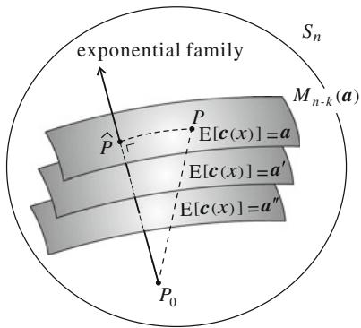  
Fig.2.1 The family maximizing entropy under linear constraints is an exponential family

# 2.8.2 Mutual Information

Let us consider two random variables $x$ and $y$ and the manifold $M$ consisting of all $p(x, y)$ . When $x$ and $y$ are independent, the probability can be written in the product form as

$$
p (x, y) = p _ {X} (x) p _ {Y} (y), \tag {2.91}
$$

where $p_X(x)$ and $p_Y(y)$ are respective marginal distributions.

Let the family of all the independent distributions be $M_I$ . Since the exponential family connecting two independent distributions is again independent, the $e$ -geodesic connecting them consists of independent distributions. Therefore, $M_I$ is an $e$ -flat submanifold.

Given a non-independent distribution $p(x, y)$ , we search for the independent distribution which is closest to $p(x, y)$ in the sense of KL-divergence. This is given by the $m$ -projection of $p(x, y)$ to $M_I$ (Fig. 2.2). The projection is unique and given by the product of the marginal distributions

$$
\hat {p} (x, y) = p _ {X} (x) p _ {Y} (y). \tag {2.92}
$$

The divergence between $p(x,y)$ and its projection is

$$
D _ {K L} [ p (x, y): \hat {p} (x, y) ] = \int p (x, y) \log \frac {p (x , y)}{\hat {p} (x , y)} d x d y, \tag {2.93}
$$

which is the mutual information of two random variables $x$ and $y$ . Hence, the mutual information is a measure of discrepancy of $p(x,y)$ from independence.

The reverse problem is also interesting. Given an independent distribution (2.92), find the distribution $p(x, y)$ that maximizes $D_{KL}[p : \hat{p}]$ in the class of distributions having the same marginal distributions as $\hat{p}$ . These distributions are the inverse image of the $m$ -projection. This problem is studied by Ay and Knauf (2006) and Rauh (2011). See Ay (2002), Ay et al. (2011) for applications of information geometry to complex systems.

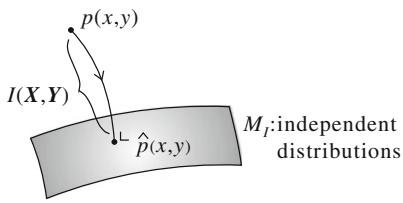  
Fig. 2.2 Projection of $p(x, y)$ to the family $M_I$ of independent distributions is the $m$ -projection. The mutual information $I(X, Y)$ is the KL-divergence $D_{KL}[p(x, y): p_X(x)p_Y(y)]$

# 2.8.3 Repeated Observations and Maximum Likelihood Estimator

Statisticians use a number of independently observed data $\boldsymbol{x}_1, \ldots, \boldsymbol{x}_N$ from the same probability distribution $p(\boldsymbol{x}, \boldsymbol{\theta})$ in an exponential family $M$ for estimating $\boldsymbol{\theta}$ . The joint probability density of $\boldsymbol{x}_1, \ldots, \boldsymbol{x}_N$ is given by

$$
p \left(\boldsymbol {x} _ {1}, \dots , \boldsymbol {x} _ {N}; \boldsymbol {\theta}\right) = \prod_ {i = 1} ^ {N} p \left(\boldsymbol {x} _ {i}, \boldsymbol {\theta}\right) \tag {2.94}
$$

having the same parameter $\theta$ . We see how the geometry of $M$ changes by multiple observations.

Let the arithmetic average of $x_{i}$ be

$$
\bar {\boldsymbol {x}} = \frac {1}{N} \sum_ {i = 1} ^ {N} \boldsymbol {x} _ {i}. \tag {2.95}
$$

Then, (2.94) is rewritten as

$$
p _ {N} (\bar {\boldsymbol {x}}, \boldsymbol {\theta}) = p \left(\boldsymbol {x} _ {1}, \dots , \boldsymbol {x} _ {N}; \boldsymbol {\theta}\right) = \exp \left\{N \boldsymbol {\theta} \cdot \bar {\boldsymbol {x}} - N \psi (\boldsymbol {\theta}) \right\}. \tag {2.96}
$$

Therefore, the probability density of $\bar{x}$ has the same form as $p(x,\theta)$ , except that $x$ is replaced by $\bar{x}$ and the term $\theta \cdot x - \psi(\theta)$ becomes $N$ times larger.

This implies that the convex function becomes $N$ times larger and hence the KL-divergence and Riemannian metric (Fisher information matrix) also become $N$ times larger. The dual affine structure of $M$ does not change. Hence, we may use the original $M$ and the same coordinates $\theta$ even when multiple observations take place for statistical inference. The binomial distributions and multinomial distributions are exponential families derived from $S_{2}$ and $S_{n}$ by multiple observations.

Let $M$ be an exponential family and consider a statistical model $S = \{p(\boldsymbol{x},\boldsymbol{u})\}$ included in it as a submanifold, where $S$ is specified by parameter $\boldsymbol{u} = (u_{1},\dots,u_{k})$ , $k < n$ . Since it is included in $M$ , the $e$ -coordinates of $p(\boldsymbol{x},\boldsymbol{u})$ in $M$ are determined by $\boldsymbol{u}$ in the form of $\theta(\boldsymbol{u})$ . Given $N$ independent observations $\boldsymbol{x}_1,\ldots,\boldsymbol{x}_N$ , we estimate the parameter $\boldsymbol{u}$ based on them.

The observed data specifies a distribution in the entire $M$ , such that its $m$ -coordinates are

$$
\bar {\eta} = \frac {1}{N} \sum x _ {i} = \bar {x}. \tag {2.97}
$$

This is called an observed point. The KL-divergence from the observed $\bar{\eta}$ to a distribution $p(\boldsymbol{x},\boldsymbol{u})$ in $S$ is written as $D_{KL}\left[\bar{\theta}:\theta(\boldsymbol{u})\right]$ , where $\bar{\theta}$ is the $\theta$ -coordinates of the observed point $\bar{\eta}$ . We consider a simple case of $S_n$ , where the observed point is given by the histogram

$$
\bar {p} (x) = \frac {1}{N} \sum_ {i = 1} ^ {N} \delta \left(x - x _ {i}\right). \tag {2.98}
$$

Then, except for a constant term, minimizing $D_{KL}[\bar{p}(x) : p(x, \boldsymbol{u})]$ is equivalent to maximizing the log-likelihood

$$
L = \sum_ {i = 1} ^ {N} \log p (x _ {i}, \boldsymbol {u}). \tag {2.99}
$$

Hence, the maximum likelihood estimator that minimizes the divergence is given by the $m$ -projection of $\bar{p}(x)$ to $S$ . See Fig. 2.3. In other words, the maximum likelihood estimator is characterized by the $m$ -projection.

# Remarks

An exponential family is an ideal model to study the dually flat structure and also statistical inference. The Legendre duality between the natural and expectation parameter was pointed out by Barndorff-Nielsen (1978). It is good news that the family $S_{n}$ of discrete distributions is an exponential family, because any statistical model having a discrete random variable is regarded as a submanifold of an exponential family. Therefore, it is wise to study the properties of the exponential family first and then see how they are transferred to curved subfamilies.

Unfortunately, this is not the case with continuous random variable $x$ . There are many statistical models which are not subfamilies of exponential families, even though many are curved-exponential families, that is, submanifolds of exponential families. Again, the study of the exponential family is useful. In the case of a truly non-exponential model, we use its local approximation by using a larger exponential family. This gives an exponential fibre-bundle-like structure to statistical models. This is useful for studying the asymptotic theory of statistical inference. See Amari (1985).

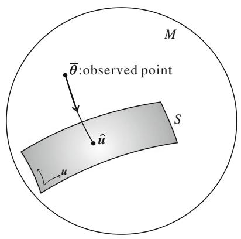  
Fig. 2.3 The maximum likelihood estimator is the $m$ -projection of observed point to $S$

It should be remarked that a generalized linear model provides a dually flat structure, although it is not an exponential family. See Vos (1991). A mixture model also has remarkable characteristics from the point of view of geometry. See Marriott (2002), Critchley et al. (1993).

# Chapter 3 Invariant Geometry of Manifold of Probability Distributions

We have introduced a dually flat Riemannian structure in the manifolds of the exponential family and the mixture family based on the convexity of the cumulant generating function (free energy) and the negative entropy, respectively. The KL-divergence is derived from these convex functions. However, we need justification for this selection of convex function and divergence. Moreover, such a convex function does not exist for a general statistical model. Therefore, a reasonable criterion is needed for introducing a geometrical structure to a manifold of probability distributions. It is invariance that justifies the above selection.

Invariance requires that a geometrical structure should be invariant when random variable $x$ is represented in a different form $y = y(x)$ , provided $y(x)$ is invertible. This is an idea introduced by Chentsov (1972). We begin with a simpler idea of information monotonicity by coarse graining, due to Csiszár (1974), a simplified version of Chentsov's invariance. There exists a unique class of decomposable invariant divergences, known as $f$ -divergences.

# 3.1 Invariance Criterion

We treat a statistical model

$$
M = \{p (x, \xi) \}, \tag {3.1}
$$

parameterized by $\xi$ , which forms a manifold with coordinate system $\xi$ . Here, $x$ may take discrete, continuous and vector values. What is a natural divergence $D[\pmb{\xi} : \pmb{\xi}')$ between two probability distributions $p(x, \pmb{\xi})$ and $p(x, \pmb{\xi}')$ ? In answering this question, we consider the invariance criterion, which states that the geometry is the same when random variable $x$ is transformed into $y$ without losing information. We consider a mapping of $x$ to $y$

$$
y = k (x), \tag {3.2}
$$

which is in general many-to-one, so we cannot recover $x$ from $y$ . Then, information is lost by this mapping. Let the probability distribution of $y$ be $\bar{p}(y, \xi)$ ,

$$
\bar {p} (y, \xi) = \sum_ {x: k (x) = y} p (x, \xi), \tag {3.3}
$$

in the discrete case, which is induced from $p(x,\xi)$ by the mapping $y = k(x)$ . In the continuous case, the probability density $\bar{p}(y,\xi)$ is given by integration. The divergence $D[\xi : \xi']$ between $p(x,\xi)$ and $p(x,\xi')$ changes to $\bar{D}[\xi : \xi']$ between $\bar{p}(y,\xi)$ and $\bar{p}(y,\xi')$ . Since divergence $D[\xi : \xi']$ represents the dissimilarity of two distributions $p(x,\xi)$ and $p(x,\xi')$ , it is postulated that it decreases in general by this mapping,

$$
\bar {D} \left[ \boldsymbol {\xi}: \boldsymbol {\xi} ^ {\prime} \right] \leq D \left[ \boldsymbol {\xi}: \boldsymbol {\xi} ^ {\prime} \right]. \tag {3.4}
$$

We call this relation information monotonicity.

Obviously, when $k$ is one-to-one, that is invertible, there is no loss of information and the equality is required to hold in (3.4). However, there is a case when information is not lost even when $k$ is not invertible. This is the case when $x$ includes a redundant part, the distribution of which does not depend on $\xi$ . We may abandon this part without losing information concerning $\xi$ . The remaining part retains full information. Statisticians call such a part a sufficient statistic. Its definition is given below.

A function

$$
s = k (x) \tag {3.5}
$$

is called a sufficient statistic when the probability density function $p(x, \xi)$ is decomposed as

$$
p (x, \xi) = \bar {p} (s, \xi) r (x). \tag {3.6}
$$

This implies that the probability $p(x, \xi)$ is written as a function of $s$ , except for a multiplicative term $r(x)$ which does not depend on $\xi$ . The equality is required to hold in (3.4) when and only when $y$ is a sufficient statistic.

We formally state the invariance criterion, for which the basic idea was originally due to Chentsov (1972) and which was formulated in this way by Amari and Nagaoka (2000).

Invariance Criterion: A geometrical structure of $M$ is invariant when it satisfies the monotonicity (3.4), where the equality holds if and only if $y = k(x)$ is a sufficient statistic.

We study the class of invariant divergences and invariant Riemannian metrics. The invariant metric is unique, given by the Fisher information matrix except for a scale constant (Chentsov 1972).

# 3.2 Information Monotonicity Under Coarse Graining

# 3.2.1 Coarse Graining and Sufficient Statistics in $S_{n}$

We consider a family $S_{n}$ of discrete probability distributions, where random variable $x$ takes on values $X = \{0, 1, \ldots, n\}$ . Let us denote a probability distribution by an $(n + 1)$ -dimensional probability vector $\pmb{p}$ . We divide $X$ into $m + 1$ subsets $X_{0}, X_{1}, \ldots, X_{m}$ such that

$$
\cup X _ {a} = X, \quad X _ {a} \cap X _ {b} = \emptyset , \quad a \neq b, \tag {3.7}
$$

where $\phi$ is the empty set. This is a partition of $X$ (Fig. 3.1).

Assume that we cannot observe $x$ directly, but know the subset to which $x$ belongs. This is the case when $X$ is coarse-grained. We then introduce a coarse-grained random variable $y$ , taking on values $\{0, 1, \dots, m\}$ , where $y = a$ implies that $x$ belongs to $X_a$ . Let its distribution be denoted by $(m + 1)$ -dimensional probability vector $\bar{\boldsymbol{p}} = (\bar{p}_0, \dots, \bar{p}_m)$ . Coarse graining leads to a new distribution $\bar{\boldsymbol{p}}$ in $S_m$ given by

$$
\bar {p} _ {a} = \sum_ {i \in X _ {a}} p _ {i}. \tag {3.8}
$$

Let $D[p : q]$ be a divergence between two distributions $p$ and $q$ . It is said to be additive or decomposable when it is written in an additive form of componentwise divergences,

$$
D [ \boldsymbol {p}: \boldsymbol {q} ] = \sum_ {i = 0} ^ {n} d \left(p _ {i}, q _ {i}\right) \tag {3.9}
$$

for some function $d(p, q)$ . The divergence $D[p : q]$ changes to $\bar{D}[\bar{p} : \bar{q}]$ by coarse graining,

$$
\bar {D} \left[ \bar {\boldsymbol {p}}: \bar {\boldsymbol {q}} \right] = \sum_ {a = 0} ^ {m} d \left(\bar {p} _ {a}, \bar {q} _ {a}\right). \tag {3.10}
$$

The information monotonicity criterion requires

$$
D [ \boldsymbol {p}: \boldsymbol {q} ] \geq \bar {D} [ \bar {\boldsymbol {p}}: \bar {\boldsymbol {q}} ]. \tag {3.11}
$$

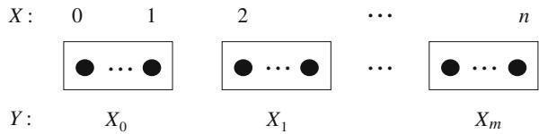  
Fig. 3.1 Partition of $X$ into $m + 1$ subsets

When does the equality hold in (3.11)? This occurs in the case when there is no loss of information by coarse graining. Since $y$ is a function of $x$ , we have the following decomposition:

$$
p (x, \xi) = p (x, y, \xi) = p (y, \xi) p (x | y, \xi), \tag {3.12}
$$

where $\pmb{\xi}$ is a coordinate system of $S_{n}$ . We see that $y$ is a sufficient statistic when $p(x|y,\pmb {\xi})$ does not depend on $\pmb{\xi}$ . In this case, the conditional distributions of $p(x|y,\pmb {\xi})$ and $q(x|y,\pmb{\xi}^{\prime})$ are equal for two distributions $p(x) = p(x,\pmb {\xi})$ and $q(x) = p(x,\pmb{\xi}^{\prime})$ , that is,

$$
p (x = j \mid y = a, \xi) = p (x = j \mid y = a, \xi^ {\prime}). \tag {3.13}
$$

# 3.2.2 Invariant Divergence

When a divergence is written in the form

$$
D _ {f} [ \boldsymbol {p}: \boldsymbol {q} = \sum p _ {i} f \left(\frac {q _ {i}}{p _ {i}}\right), \tag {3.14}
$$

where $f$ is a differentiable convex function satisfying

$$
f (1) = 0, \tag {3.15}
$$

it is called an $f$ -divergence. The $f$ -divergence was introduced by Morimoto (1963), Ali and Silvey (1966) and Csiszár (1967). It is easy to prove that this satisfies the criteria of divergence, by expanding $D_{f}[\pmb{p}:\pmb{p} + dp]$ in the Taylor series, although it is not a Bregman divergence in general.

Theorem 3.1 An $f$ -divergence is invariant and decomposable. Conversely an invariant and decomposable divergence is an $f$ -divergence, except for the case of $n = 1$ .

Proof We first prove that an $f$ -divergence satisfies the criterion of information monotonicity. Consider a simple partition where $X_0 = \{1, 2\}$ and all the other $X_a$ are singleton sets. That is, $x = 1, 2$ are put in a subset $X_0$ but all the other $x$ remain as they are. We prove only this case, but other cases can be proved similarly. We need to prove

$$
p _ {1} f \left(\frac {q _ {1}}{p _ {1}}\right) + p _ {2} f \left(\frac {q _ {2}}{p _ {2}}\right) \geq \left(p _ {1} + p _ {2}\right) f \left(\frac {q _ {1} + q _ {2}}{p _ {1} + p _ {2}}\right). \tag {3.16}
$$

By introducing

$$
u _ {1} = \frac {q _ {1}}{p _ {1}}, \quad u _ {2} = \frac {q _ {2}}{p _ {2}}, \tag {3.17}
$$

the right-hand side of (3.16) is written as

$$
\left(p _ {1} + p _ {2}\right) f \left(\frac {p _ {1}}{p _ {1} + p _ {2}} u _ {1} + \frac {p _ {2}}{p _ {1} + p _ {2}} u _ {2}\right). \tag {3.18}
$$

Since $f$ is convex,

$$
\left(p _ {1} + p _ {2}\right) f \left(\frac {p _ {1}}{p _ {1} + p _ {2}} u _ {1} + \frac {p _ {2}}{p _ {1} + p _ {2}} u _ {2}\right) \leq p _ {1} f \left(u _ {1}\right) + p _ {2} f \left(u _ {2}\right), \tag {3.19}
$$

which proves the information monotonicity.

Conversely, assume that the information monotonicity holds for a decomposable divergence (3.9). Then, the equality holds when (3.13) is satisfied, that is, $u_{1} = u_{2}$ in the present case. The equality is written as

$$
d \left(p _ {1}, q _ {1}\right) + d \left(p _ {2}, q _ {2}\right) = d \left(p _ {1} + p _ {2}, q _ {1} + q _ {2}\right). \tag {3.20}
$$

By putting

$$
k (p, u) = d (p, u p), \tag {3.21}
$$

we have

$$
k \left(p _ {1}, u\right) + k \left(p _ {2}, u\right) = k \left(p _ {1} + p _ {2}, u\right) \tag {3.22}
$$

for $u > 0$ , and hence $k(p, u)$ is linear in $p$ . So we have

$$
k (p, u) = f (u) p, \tag {3.23}
$$

implying

$$
d (p, q) = p f \left(\frac {q}{p}\right). \tag {3.24}
$$

This proves the theorem.

Remark 1 The above proof is not valid when $n = 1$ , because coarse graining causes $m = 0$ . The following is shown by Jiao et al. (2015): There exists a class of invariant divergences which are not necessarily $f$ -divergences when $n = 1$ . So the case with $n = 1$ is special and Jiao et al. (2015) derived a general class of invariant divergences when $n = 1$ .

Remark 2 When we treat non-decomposable divergences, there are invariant divergences which are not $f$ -divergences. A function of $f$ -divergence is invariant but is not decomposable in general. A simple example is

$$
D [ \boldsymbol {p}: \boldsymbol {q} ] = D _ {f} [ \boldsymbol {p}: \boldsymbol {q} ] + \left\{D _ {f} [ \boldsymbol {p}: \boldsymbol {q} ] \right\} ^ {2}. \tag {3.25}
$$

Further, an adequate nonlinear function of two $f$ -divergences $D_{f_1}$ and $D_{f_2}$ is invariant but is not an $f$ -divergence.

We will show in Part II that any invariant divergence gives the same geometry called the $\alpha$ -structure.

When a linear term is added to a convex function $f$ ,

$$
\bar {f} (u) = f (u) + c (u - 1), \tag {3.26}
$$

where $c$ is a constant, $\bar{f}$ is also convex. It is easy to see

$$
D _ {\bar {f}} [ \boldsymbol {p}: \boldsymbol {q} ] = D _ {f} [ \boldsymbol {p}: \boldsymbol {q} ], \tag {3.27}
$$

so (3.26) does not change the divergence. Hence, without loss of generality, we can always use a convex function satisfying

$$
f (1) = 0, \quad f ^ {\prime} (1) = 0. \tag {3.28}
$$

Moreover, since

$$
D _ {c f} [ \boldsymbol {p}: \boldsymbol {q} ] = c D _ {f} [ \boldsymbol {p}: \boldsymbol {q} ] \tag {3.29}
$$

holds for another constant $c > 0$ , the constant $c$ determines the scale of divergence. To fix the scale, we use $f$ that satisfies

$$
f ^ {\prime \prime} (1) = 1. \tag {3.30}
$$

Definition 3.1 A convex function $f$ satisfying (3.28) and (3.30) is said to be standard. An $f$ -divergence derived from a standard $f$ is a standard $f$ -divergence.

When $D_f[\pmb{p} : \pmb{q}]$ is a standard $f$ -divergence, its dual $D_f^*[\pmb{p} : \pmb{q}] = D_f[\pmb{q} : \pmb{p}]$ is also a standard $f$ -divergence. To show this, define

$$
f ^ {*} (u) = u f \left(\frac {1}{u}\right). \tag {3.31}
$$

Then, $f^{*}$ is a standard convex function when $f$ is, and we have

$$
D _ {f ^ {*}} [ \boldsymbol {p}: \boldsymbol {q} ] = D _ {f} [ \boldsymbol {q}: \boldsymbol {p} ]. \tag {3.32}
$$

# 3.3 Examples of $f$ -Divergence in $S_{n}$

# 3.3 Examples of $f$ -Divergence in $S_{n}$

# 3.3.1 KL-Divergence

For

$$
f (u) = - \log u, \tag {3.33}
$$

the derived divergence is the KL-divergence

$$
D _ {f} [ \boldsymbol {p}: \boldsymbol {q} ] = \sum p _ {i} \log \frac {p _ {i}}{q _ {i}}. \tag {3.34}
$$

The dual of $f$ is

$$
f ^ {*} (u) = u \log u. \tag {3.35}
$$

The derived divergence is the dual of the KL-divergence

$$
D _ {f ^ {*}} [ \boldsymbol {p}: \boldsymbol {q} ] = D _ {K L} [ \boldsymbol {q}: \boldsymbol {p} ], \tag {3.36}
$$

which coincides with the divergence derived from the cumulant generating function $\psi$ .

# 3.3.2 $\chi^2$ -Divergence

For

$$
f (u) = \frac {1}{2} (u - 1) ^ {2}, \quad D _ {f} [ \boldsymbol {p}: \boldsymbol {q} ] = \frac {1}{2} \sum \frac {\left(p _ {i} - q _ {i}\right) ^ {2}}{p _ {i}}. \tag {3.37}
$$

This is known as the Pearson $\chi^2$ -divergence.

# 3.3.3 $\alpha$ -Divergence

Let $\alpha$ be a real parameter. We define the $\alpha$ -function by

$$
f _ {\alpha} (u) = \frac {4}{1 - \alpha^ {2}} \left(1 - u ^ {\frac {1 + \alpha}{2}}\right), \quad \alpha \neq \pm 1. \tag {3.38}
$$

The derived divergence is the $\alpha$ -divergence (Amari 1985; Amari and Nagaoka 2000) given by

$$
D _ {\alpha} [ \boldsymbol {p}: \boldsymbol {q} ] = \frac {4}{1 - \alpha^ {2}} \left(1 - \sum p _ {i} ^ {\frac {1 - \alpha}{2}} q _ {i} ^ {\frac {1 + \alpha}{2}}\right), \quad \alpha \neq \pm 1. \tag {3.39}
$$

The dual of the $\alpha$ -function is the $-\alpha$ -function. Hence, the dual of the $\alpha$ -divergence is the $-\alpha$ -divergence,

$$
D _ {\alpha} [ \boldsymbol {p}: \boldsymbol {q} ] = D _ {- \alpha} [ \boldsymbol {q}: \boldsymbol {p} ]. \tag {3.40}
$$

When $\alpha = 0$ , we have

$$
f (u) = 4 \left(1 - \sqrt {u}\right), \quad D _ {f} [ \boldsymbol {p}: \boldsymbol {q} ] = 2 \sum \left(\sqrt {p _ {i}} - \sqrt {q _ {i}}\right) ^ {2}, \tag {3.41}
$$

which is known as the square of the Hellinger distance.

We extend the $\alpha$ -function (3.38) to the case of $\alpha = \pm 1$ , by taking the limit $\alpha \to \pm 1$ . Then,

$$
f _ {\alpha} (u) = \left\{ \begin{array}{l} u \log u, \alpha = 1, \\ - \log u, \alpha = - 1. \end{array} \right. \tag {3.42}
$$

The derived divergences are

$$
D _ {\alpha} [ \boldsymbol {p}: \boldsymbol {q} ] = \left\{ \begin{array}{l} \sum q _ {i} \log \frac {q _ {i}}{p _ {i}}, \alpha = 1, \\ \sum p _ {i} \log \frac {p _ {i}}{q _ {i}}, \alpha = - 1. \end{array} \right. \tag {3.43}
$$

Hence, the KL-divergence is $-1$ -divergence and its dual is 1-divergence.

For

$$
f (u) = | 1 - u | \tag {3.44}
$$

which is not differentiable, and hence $D_f$ is not a divergence by our definition, $D_f$ is a symmetric function of $p$ and $q$ ,

$$
D _ {f} [ \boldsymbol {p}: \boldsymbol {q} ] = \frac {1}{2} \sum \left| p _ {i} - q _ {i} \right|, \tag {3.45}
$$

known as the variational distance.

The square of the Euclidean distance,

$$
D [ \boldsymbol {p}: \boldsymbol {q} ] = \sum \left(p _ {i} - q _ {i}\right) ^ {2}, \tag {3.46}
$$

is a divergence. But it is not an $f$ -divergence and is not invariant.

# 3.4 General Properties of $f$ -Divergence and KL-Divergence

# 3.4.1 Properties of $f$ -Divergence

The following properties hold in $S_{n}$

(1) An $f$ -divergence $D_{f}[\pmb{p}:\pmb{q}]$ is convex with respect to both $\pmb{p}$ and $\pmb{q}$ .   
(2) It is bounded from above as

$$
\begin{array}{l} 0 \leq D _ {f} [ \boldsymbol {p}: \boldsymbol {q} ] \leq \lim  _ {u \rightarrow 0} \left\{f (u) + u f \left(\frac {1}{u}\right)\right\}, (3.47) \\ 0 \leq D _ {f} [ \boldsymbol {p}: \boldsymbol {q} ] \leq \sum \left(p _ {i} - q _ {i}\right) f ^ {\prime} \left(\frac {p _ {i}}{q _ {i}}\right). (3.48) \\ \end{array}
$$

(3) For $\alpha \geq 1$

$$
D _ {\alpha} [ \boldsymbol {p}: \boldsymbol {q} ] = \infty , \tag {3.49}
$$

when $p(x) = 0$ and $q(x) \neq 0$ hold for some $x$ .

(4) For $\alpha \leq -1$

$$
D _ {\alpha} [ \boldsymbol {p}: \boldsymbol {q} ] = \infty , \tag {3.50}
$$

when $p(x) \neq 0$ and $q(x) = 0$ hold for some $x$ .

Properties (3) and (4) hold for the KL-divergence and its dual, because they are $\pm 1$ -divergences. They lead to the following results of approximation of a probability distribution by using the $\alpha$ -divergence. Given $\pmb{p} \in S_{n}$ , we search for the distribution $\hat{\pmb{p}}_S$ that minimizes the divergence from $\pmb{p}$ to a smooth submanifold $S \subset S_{n}$ ,

$$
\hat {\boldsymbol {p}} _ {S} = \underset {\boldsymbol {q} \in S} {\arg \min } D _ {\alpha} [ \boldsymbol {p}: \boldsymbol {q} ]. \tag {3.51}
$$

Then, the following holds:

(5) Zero-forcing: When $\alpha \geq 1$ , the best approximation $\hat{\pmb{p}}_S$ in the closure of $S$ satisfies

$$
\hat {p} _ {S} (x) = 0 \tag {3.52}
$$

for $x$ at which $p(x) = 0$ .

(6) Zero-avoidance: When $\alpha \leq -1$ , the best approximation $\hat{p}_S$ in the closure of $S$ satisfies

$$
\hat {p} _ {S} (x) \neq 0 \tag {3.53}
$$

for $x$ at which $p(x)\neq 0$

# 3.4.2 Properties of KL-Divergence

# A. Large deviation

Let $\pmb{p}$ be a distribution in $S_{n}$ from which $N$ independent data $x(1),\dots ,x(N)$ are generated. The empirical distribution of the observed data is given by $\hat{\pmb{p}}$

$$
\hat {p} _ {i} = \frac {1}{N} \sum_ {t = 1} ^ {N} \delta_ {i} \{x (t) \} = \frac {N _ {i}}{N}, \tag {3.54}
$$

where $N_{i}$ is the number that $x = i$ is observed among $N$ data. This is the maximum likelihood estimator. How far is $\hat{\pmb{p}}$ from the true $\pmb{p}$ ? The probability distribution of $\hat{\pmb{p}}$ is evaluated by the KL-divergence asymptotically when $N$ is large.

Sanov Lemma. The probability of $\hat{\pmb{p}}$ is asymptotically given by

$$
\operatorname {P r o b} \left\{\hat {\boldsymbol {p}}; \boldsymbol {p} \right\} = \exp \left\{- N D _ {K L} [ \hat {\boldsymbol {p}}: \boldsymbol {p} ] \right\}, \tag {3.55}
$$

that is, the probability decays exponentially as $N$ increases where the exponent of decay is $D_{KL}\left[\hat{p} : p\right]$ .

The proof is given by evaluating the distribution of $\hat{\pmb{p}}$ , a multinomial distribution, when $N$ is large, which we omit. When $\hat{\pmb{p}}$ is close to $\pmb{p}$ , by putting

$$
\varepsilon = \frac {1}{\sqrt {N}} (\hat {\boldsymbol {p}} - \boldsymbol {p}) \tag {3.56}
$$

and expanding $N D_{KL}\left[\hat{p} : p\right]$ , we have the central limit theorem.

Central Limit Theorem The distribution of $\hat{p}$ is asymptotically Gaussian with mean $p$ and covariance

$$
E \left[ \left(\hat {p} _ {i} - p _ {i}\right) \left(\hat {p} _ {j} - p _ {j}\right) \right] = \frac {1}{N} g _ {i j}. \tag {3.57}
$$

Let $A$ be a region in $S_{n}$ . Then, we have the theorem of large deviation, which is useful in information theory and statistics (Fig. 3.2).

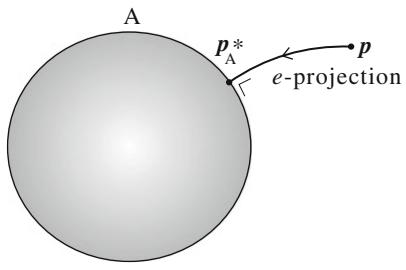  
Fig. 3.2 $e$ -projection of $\pmb{p}$ to $A$

Large Deviation Theorem The probability that $\hat{\pmb{p}}$ is included in $A$ is given asymptotically by

$$
\operatorname {P r o b} \left\{\hat {\boldsymbol {p}} \in A \right\} = \exp \left\{- N D _ {K L} \left[ \boldsymbol {p} _ {A} ^ {*}: \boldsymbol {p} \right] \right\}, \tag {3.58}
$$

where

$$
\boldsymbol {p} _ {A} ^ {*} = \underset {\boldsymbol {q} \in A} {\arg \min } D _ {K L} [ \boldsymbol {q}: \boldsymbol {p} ]. \tag {3.59}
$$

When $A$ is a closed set having a boundary, $p_A^*$ is given by $e$ -projecting $p$ to the boundary of $A$ .

# B. Symmetrized KL-divergence and Fisher information

The Riemannian distance between two points $\pmb{p}$ and $\pmb{q}$ is given by the minimum of the distance along all curves $\xi(t)$ connecting $\pmb{p}$ and $\pmb{q}$ such that $\xi(0) = \pmb{p}, \xi(1) = \pmb{q}$ , that is,

$$
s = \min  \int_ {0} ^ {1} \sqrt {g _ {i j} (t) \dot {\xi} ^ {i} \dot {\xi} ^ {j}} d t. \tag {3.60}
$$

Since the KL-divergence is

$$
D _ {K L} [ \boldsymbol {\xi} (t): \boldsymbol {\xi} (t + d t) ] = \frac {1}{2} g _ {i j} \dot {\xi} ^ {i} \dot {\xi} ^ {j} d t ^ {2}, \tag {3.61}
$$

there would be some relation between the KL-divergence and the integration of the Fisher information along a curve. Let us consider the $e$ -geodesic and the $m$ -geodesic connecting two points $p$ and $q$ ,

$$
\gamma_ {e}: \boldsymbol {\xi} _ {e} (t) = \exp \left\{\left(1 - t\right) \log \boldsymbol {p} + t \log \boldsymbol {q} - \psi (t) \right\}, \tag {3.62}
$$

$$
\gamma_ {m}: \boldsymbol {\xi} _ {m} (t) = (1 - t) \boldsymbol {p} + t \boldsymbol {q}. \tag {3.63}
$$

They are exponential and mixture families, respectively. Let $g_{e}(t)$ and $g_{m}(t)$ be the Fisher information along the curves,

$$
g _ {e} (t) = g _ {i j} \dot {\xi} _ {e} ^ {i} (t) \dot {\xi} _ {e} ^ {j} (t), \tag {3.64}
$$

$$
g _ {m} (t) = g _ {i j} \dot {\xi} _ {m} ^ {i} (t) \dot {\xi} _ {m} ^ {j} (t). \tag {3.65}
$$

Then, we have the following theorem.

Theorem 3.2 The symmetrized KL-divergence is given by the integration of the Fisher information along the $e$ -geodesic and the $m$ -geodesic,

$$
\begin{array}{l} \frac {1}{2} \left\{D _ {K L} [ \boldsymbol {p}: \boldsymbol {q} ] + D _ {K L} [ \boldsymbol {q}: \boldsymbol {p} ] \right\} \\ = \int_ {0} ^ {1} g _ {e} (t) d t = \int_ {0} ^ {1} g _ {m} (t) d t. \tag {3.66} \\ \end{array}
$$

The proof is technical and is omitted.

# 3.5 Fisher Information: The Unique Invariant Metric

Since an $f$ -divergence is invariant, the Riemannian metric derived from it is invariant. We can easily calculate the metric $g_{ij}$ from an $f$ -divergence by the Taylor expansion,

$$
D _ {f} [ p (x, \boldsymbol {\xi}): p (x: \boldsymbol {\xi} + d \boldsymbol {\xi}) ] = \int p (x, \boldsymbol {\xi}) f \left\{\frac {p (x , \boldsymbol {\xi} + d \boldsymbol {\xi})}{p (x , \boldsymbol {\xi})} \right\} d x = \frac {1}{2} g _ {i j} (\boldsymbol {\xi}) d \xi^ {i} d \xi^ {j}. \tag {3.67}
$$

A simple calculation gives the following lemma.

Lemma Any standard $f$ -divergence gives the same Riemannian metric which is the Fisher information matrix

$$
g _ {i j} = E \left[ \partial_ {i} \log p (\boldsymbol {x}, \boldsymbol {\xi}) \partial_ {j} \log p (\boldsymbol {x}, \boldsymbol {\xi}) \right], \tag {3.68}
$$

where

$$
\partial_ {i} = \frac {\partial}{\partial \xi_ {i}}. \tag {3.69}
$$

Chentsov (1972) proved a stronger theorem that the Fisher information matrix is the unique invariant metric of $S_{n}$ . He used the framework of category theory. We show a simpler proof due to Campbell (1986).

Consider a series of $S_{n}$ , $n = 1,2,3,\ldots$ , and reformulate the invariance criterion. We consider coarse graining of $S_{n}$ by a partition of $X = \{0,1,2,\dots ,n\}$ to $Y = \{A_0,A_1,\dots ,A_m\}$ , where $n\geq m$ . Random variable $x$ taking on values $0,1,\dots ,n$ is reduced to random variable $y$ taking on values $0,1,\dots ,m$ , such that $y = i$ when $x$ is included in $A_{i}$ . Obviously, probability distribution $\pmb {p}\in S_n$ is mapped to $q\in S_{m}$ by this coarse graining. It defines a mapping $f$ from $S_{n}$ to $S_{m}$

$$
f: \boldsymbol {p} \mapsto \boldsymbol {q}; q _ {i} = \sum_ {j \in A _ {i}} p _ {j}. \tag {3.70}
$$

Conversely, we consider a mapping $h$ from $S_{m}$ to $S_{n}$ , which is determined by an arbitrary conditional probability distribution,

$$
r _ {i j} = \operatorname {P r o b} \left\{x = i \mid y = j \right\}. \tag {3.71}
$$

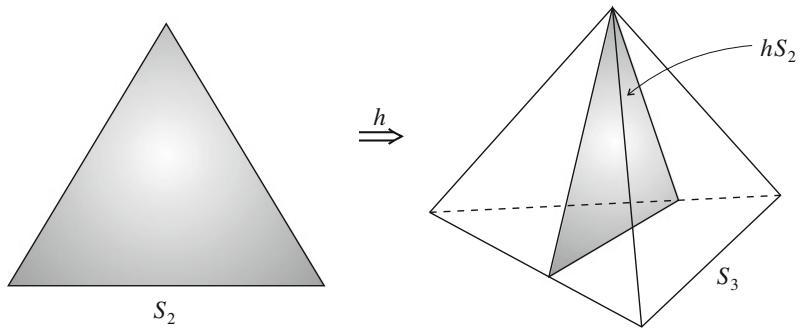  
Fig. 3.3 Embedding of $S_{2}$ in $S_{3}$ $(\mathrm{m} = 2, \mathrm{n} = 3)$

Given $y = j$ , it generates $x = i$ stochastically based on $r_{ij}$ . We define a mapping by

$$
h: \boldsymbol {q} \mapsto \boldsymbol {p}; p _ {i} = r _ {i j} q _ {j}. \tag {3.72}
$$

Given $y$ of which the probability is $\pmb{q}$ , the probability distribution $\pmb{p} = h\pmb{q}$ of $x$ is given by (3.72). The mapping $h$ which depends on $r_{ij}$ embeds $S_{m}$ in $S_{n}$ and it satisfies

$$
f \circ h = \operatorname {I d}, \tag {3.73}
$$

where $\mathrm{Id}$ is the identity mapping (see Fig. 3.3).

Consider a problem of estimation of $\pmb{q} \in S_{m}$ by observing random variable $y$ . When $S_{m}$ is embedded in a larger manifold $S_{n}$ by (3.72), the random variable is $x$ . However, $x$ includes a redundant part for estimating $\pmb{q}$ . $y$ is a sufficient statistic for estimating $\pmb{q}$ .

The invariance criterion claims that the geometry of $S_{m}$ is the same as the geometry of embedded $hS_{m}$ in the larger manifold $S_{n}$ . In particular, the inner product of two basis vectors in $S_{m}$ should be the same as that in the embedded image. Now we state the theorem of Chentsov.

Theorem 3.3 The invariant metric is unique, given by the Fisher information to within a constant factor.

Proof We use $\mathbf{R}_{+}^{n}$ to prove the theorem, considering $S_{n-1}$ as its subspace constrained by $\sum p_{i} = 1$ . When $m = n$ , the mapping $f$ is only a permutation of indices. We consider the center of $S_{n-1}$ ,

$$
\bar {\boldsymbol {p}} = \left(\frac {1}{n}, \dots , \frac {1}{n}\right) \in \boldsymbol {R} _ {+} ^ {n}. \tag {3.74}
$$

It is invariant under the permutation group of index $i$ . So the inner product of two basis vectors $\pmb{e}_i$ and $\pmb{e}_j$ in $\mathbf{R}_n^+$ is invariant under the permutation of indices. Hence, we put

$$
g _ {i j} ^ {n} (\bar {\boldsymbol {p}}) = B (n), \text {f o r a n y i , j ; i} \neq j, \tag {3.75}
$$

$$
g _ {i i} ^ {n} (\bar {\boldsymbol {p}}) = A (n) + B (n), \text {f o r a n y} i, \tag {3.76}
$$

or

$$
g _ {i j} ^ {n} (\bar {\boldsymbol {p}}) = A (n) \delta_ {i j} + B (n). \tag {3.77}
$$

When $\pmb{p}$ is in $S_{n - 1}$ , its small deviation $\delta p$ inside $S_{n - 1}$ satisfies

$$
\sum_ {i = 1} ^ {n} \delta p _ {i} = 0. \tag {3.78}
$$

Since $\delta p$ is a tangent vector of $S_{n - 1}$

$$
\sum Z ^ {i} = 0 \tag {3.79}
$$

holds for any tangent vector $Z = Z^{i}\pmb{e}_{i}$ of $S_{n - 1}$ .

Therefore, we may put $B(n) = 0$ when calculating the inner product of two tangent vectors of $S_{n-1}$ . $B(n)$ is responsible only for the normal direction to $S_{n-1}$ . So, we put

$$
g _ {i j} ^ {n} (\bar {\boldsymbol {p}}) = A (n) \delta_ {i j}. \tag {3.80}
$$

Let us consider a point

$$
\boldsymbol {q} = \left(\frac {k _ {1}}{n}, \frac {k _ {2}}{n}, \dots , \frac {k _ {m}}{n}\right) \in S _ {m - 1}, \tag {3.81}
$$

where $k_{i}$ are integers, satisfying $\sum k_{i} = n$ . We then consider the following embedding of $S_{m - 1}$ in $S_{n - 1}$ given by the conditional distributions

$$
r _ {i j} = \left\{ \begin{array}{l} \frac {1}{k _ {j}}, i \in A _ {j}, \\ 0, \text {o t h e r w i s e}, \end{array} \right. \tag {3.82}
$$

where $\{A_j\}$ is a partition of $\{0, 1, \dots, n\}$ such that $A_j$ includes $k_j$ elements. Then, $\pmb{q}$ is mapped to the center of $S_{n-1}$ ,

$$
h \boldsymbol {q} = \bar {\boldsymbol {p}} = \left(\frac {1}{n}, \dots , \frac {1}{n}\right). \tag {3.83}
$$

The basis vector $e_1^m \in R_+^m$ is mapped to

$$
\tilde {\boldsymbol {e}} _ {1} ^ {n} = \frac {1}{k _ {1}} \left(\boldsymbol {e} _ {1} ^ {n} + \dots \boldsymbol {e} _ {k _ {1}} ^ {n}\right) \tag {3.84}
$$

in $\mathbf{R}_+^n$ by this embedding. Similar equations hold for other $e_i^n, i = 2,3,\ldots,m$ . The inner product is equal to

$$
g _ {1 1} ^ {m} (\boldsymbol {q}) = \left\langle \boldsymbol {e} _ {1} ^ {m}, \boldsymbol {e} _ {1} ^ {m} \right\rangle = \left\langle \tilde {\boldsymbol {e}} _ {1} ^ {n}, \tilde {\boldsymbol {e}} _ {1} ^ {n} \right\rangle = \left\langle \frac {1}{k _ {1}} \sum_ {i = 1} ^ {k _ {1}} \boldsymbol {e} _ {i} ^ {n}, \frac {1}{k _ {1}} \sum_ {i = 1} ^ {k _ {1}} \boldsymbol {e} _ {i} ^ {n} \right\rangle = \frac {1}{k _ {1}} g _ {1 1} ^ {n} (\bar {\boldsymbol {p}}) = \frac {A (n)}{k _ {1}}. \tag {3.85}
$$

Hence, we have

$$
g _ {1 1} ^ {m} (\boldsymbol {q}) = \frac {n c}{k _ {1}} = \frac {c}{q _ {1}}. \tag {3.86}
$$

Since the constant $c$ is used only to determine the scale of the Fisher information, we may put $c = 1$ . Similarly,

$$
g _ {i i} ^ {m} (\boldsymbol {q}) = \frac {n}{k _ {i}} = \frac {1}{q _ {i}}. \tag {3.87}
$$

This holds only at the points where $q_{i}$ are rational numbers, but because of the continuity, it holds for any $\pmb{q}$ . This proves the theorem.

Remark We can prove the uniqueness of the cubic tensor $T_{ijk}$ defined by

$$
T _ {i j k} = \mathrm {E} \left[ \partial_ {i} \log p (x, \xi) \partial_ {j} \log p (x, \xi) \partial_ {k} \log p (x, \xi) \right] \tag {3.88}
$$

under the invariance criterion in a similar way. This will be used to study the uniqueness of the $\alpha$ -connection in Part II.

# 3.6 $f$ -Divergence in Manifold of Positive Measures

We extend the notion of invariance from $S_{n}$ to $\pmb{R}_{+}^{n}$ by using the information monotonicity under coarse graining. We can prove that the only invariant decomposable divergence is an $f$ -divergence, since the proof of Theorem 4.1 is also valid for $\pmb{R}_{+}^{n}$ . An $f$ -divergence is

$$
D _ {f} [ \boldsymbol {m}: \boldsymbol {n} ] = \sum m _ {i} f \left(\frac {n _ {i}}{m _ {i}}\right), \tag {3.89}
$$

$m, n \in \mathbb{R}_{+}^{n}$ , for a manifold of positive measures $\mathbf{R}_{+}^{n}$ , where $f$ is a standard convex function satisfying (3.28) and (3.30). We need to use a standard convex function to define a divergence in $\mathbf{R}_{+}^{n}$ , because (3.89) does not satisfy the criteria of divergence for a general convex $f$ . The criteria are satisfied when a standard convex function $f$ is used.

We can calculate the invariant Riemannian metric induced in $\mathbf{R}_{+}^{n}$ by an $f$ -divergence.

Theorem 3.4 The Riemannian metric in $\mathbf{R}_+^n$ induced by an invariant divergence is the Euclidean metric

$$
g _ {i j} (\boldsymbol {m}) = \frac {1}{m _ {i}} \delta_ {i j}. \tag {3.90}
$$

Proof It is easy to derive (3.90) by the Taylor expansion of (3.89)

$$
\begin{array}{l} D _ {f} [ \boldsymbol {m}: \boldsymbol {m} + d \boldsymbol {m} ] = \sum m _ {i} f \left(1 + \frac {d m _ {i}}{m _ {i}}\right) \\ = \sum \frac {f ^ {\prime \prime} (1)}{2 m _ {i}} d m _ {i} ^ {2}, \tag {3.91} \\ \end{array}
$$

where $f^{\prime \prime}(1) = 1$ . By using a new coordinate system given by

$$
\xi^ {i} = 2 \sqrt {m _ {i}}, \tag {3.92}
$$

the square of an infinitesimal distance is given as

$$
d s ^ {2} = \sum \left(d \xi^ {i}\right) ^ {2}, \tag {3.93}
$$

showing that the manifold is Euclidean and the coordinate system is orthonormal.

It should be noted that manifold $S_{n}$ is a submanifold of $R_{n + 1}^{+}$ . The constraint $\sum p_{i} = 1$ becomes

$$
\sum \left(\xi^ {i}\right) ^ {2} = 4 \tag {3.94}
$$

in the new coordinate system. Hence, $S_{n}$ is a sphere in a Euclidean space, so it is curved.

As an important special case of $f$ -divergence, we introduce the $\alpha$ -divergence, which is previously defined in $S_{n}$ , to $\pmb{R}_{+}^{n}$ . It is defined by using the standard $\alpha$ -function,

$$
f _ {\alpha} (u) = \left\{ \begin{array}{l l} \frac {4}{1 - \alpha^ {2}} \left(1 - u ^ {\frac {1 + \alpha}{2}}\right) - \frac {2}{1 - \alpha} (u - 1), & \alpha \neq \pm 1, \\ u \log u - (u - 1), & \alpha = 1, \\ - \log u + (u - 1), & \alpha = - 1. \end{array} \right. \tag {3.95}
$$

Definition The $\alpha$ -divergence is defined in $R_{+}^{n}$ by

$$
D _ {\alpha} [ \boldsymbol {m}: \boldsymbol {n} ] = \left\{ \begin{array}{l l} \frac {4}{1 - \alpha^ {2}} \sum \left\{\frac {1 - \alpha}{2} m _ {i} + \frac {1 + \alpha}{2} n _ {i} - m _ {i} ^ {\frac {1 - \alpha}{2}} n _ {i} ^ {\frac {1 + \alpha}{2}} \right\}, & \alpha \neq \pm 1, \\ \sum \left\{m _ {i} - n _ {i} + n _ {i} \log \frac {n _ {i}}{m _ {i}} \right\}, & \alpha = 1, \\ \sum \left\{n _ {i} - m _ {i} + m _ {i} \log \frac {m _ {i}}{n _ {i}} \right\}, & \alpha = - 1. \end{array} \right. \tag {3.96}
$$

When both $m$ and $n$ satisfy the normalization condition,

$$
\sum m _ {i} = \sum n _ {i} = 1, \tag {3.97}
$$

they are probability distributions and the $\alpha$ -divergence is equal to that in a manifold of probability distributions.

# Remarks

There is a long history of studies on geometry of manifolds of probability distributions. C.R. Rao is believed to have been the first who introduced a Riemannian metric by using the Fisher information matrix (Rao 1945). This was work he did at the age of twenty-four, and the famous Crámer-Rao theorem was presented in the same seminal paper. It is a monumental work from which Information Geometry has emerged. Jeffreys (1946) used the square root of the determinant of the Fisher metric, which is the Riemannian volume element, as an invariant prior distribution over the manifold in Bayesian statistics. However, there was no such concept in the first edition of his famous book, "Probability Theory", published in 1939 (Jeffreys 1939). It appeared in the second edition (Jeffreys 1948; see also Jeffreys 1946).

It was a big surprise that a hidden prehistory was uncovered by Stigler (2007) (Frank Nielsen kindly let me know of this paper). In 1929, Harold Hotelling spent nearly half a year at Rothamsted working with R.A. Fisher on establishing a foundation for mathematical statistics. He submitted a paper entitled "Spaces of statistical parameters" to the American Mathematical Society Meeting in 1929 (which, in his absence, was read by O. Ore). The paper has never been published, so his idea has become entombed and remains unknown. He stated in the paper that the Riemannian metric is given by the Fisher information matrix in a statistical manifold. Moreover, he remarked that the manifold of a location-scale statistical model has a constant negative curvature. Incidentally, I discovered this fact in 1958 when I was a master's student, and this was the origin of my study of information geometry.

After Rao, there appeared a number of works using the Riemannian structure, e.g., James (1973). It was Chentsov (1972) who introduced the invariance criterion for defining the geometry of a statistical manifold. He proved that the Fisher information matrix is the only invariant metric in $S_{n}$ . Moreover, he obtained the class of invariant affine connections ( $\alpha$ -connections studied in Part II). Unfortunately, his work was published only in Russian, so his contributions did not become popular in the western world until an English translation appeared in 1982. Later, Efron (1975) investigated old unpublished calculations by R.A. Fisher and elucidated the results by defining the

statistical curvature of a statistical model. He showed that the higher-order efficiency of statistical estimation is given by the statistical curvature which is the $e$ -curvature defined in Part II. This work was commented on by A.P. Dawid in discussions of Efron's paper, where the $e$ - and $m$ -connections were suggested.

Following Efron's and Dawid's works, Amari (1982) further developed the differential geometry of statistical models and elucidated its dualistic nature. It was applied to statistical inference to establish a higher-order statistical theory (Amari 1982, 1985; Kumon and Amari 1983). The formal theory of a dually flat manifold was first proposed by Nagaoka and Amari (1982), which included the Pythagorean theorem and projection theorem. However, it was not published as a journal paper, because it was rejected by major journals. The editor of the Annals of Probability asked me to withdraw the paper, because he had approached seven reviewers but none reviewed it seriously. So he concluded that most probabilists would not have any interest in the direction of this research. A reviewer for the Zeitschrift für Wahrscheinlichkeitstheorie und Verwandte Gebiete (Theory of Probability and its Applications) sent me a letter stating that the paper was useless, because no essential relation exists between statistics and differential geometry. He also pointed out that the differential geometry of this paper is different from that in textbooks so it would be dubious. (We proposed a new framework of duality in differential geometry.) So it was rejected. Several years passed and thirdly a reviewer in IEEE Transactions on Information Theory wrote that the theory was now well known around the world and the paper submitted included few new ideas. This was because a workshop on this subject was organized in London in 1984 by Sir D. Cox, and my "Springer Lecture Notes" (Amari 1985) were published. Since then, information geometry has become widely known and a number of competent researchers have joined from the fields of statistics, vision, optimization, machine learning, etc. Many international conferences have been organized on this subject.

However, a mathematically rigorous foundation involves difficulty in the case of the function space of probability density functions. This is because the topology of the space of $p(x)$ is different from that of the space of $\log p(x)$ . There is a series of studies given by Pistone and his coworkers (Pistone and Sempi 1995; Pistone and Rogatin 1999; Cena and Pistone 2007; Pistone 2013). See also Grasselli (2010). Newton (2012) gave a theory based on a Hilbert space, in the framework that $p(x)$ has finite entropy. Here, $p(x)$ , a probability density function with respect to measure $\mu(x)$ , is mapped onto a Hilbert space by using the following representation of $p(x)$ :

$$
\Phi [ p ] = p (x) + \log p (x), \tag {3.98}
$$

where

$$
E _ {\mu} \left[ \left\{p (x) \right\} ^ {2} \right] <   \infty , \quad E _ {\mu} \left[ \log^ {2} p (x) \right] <   \infty \tag {3.99}
$$

are presumed. J. Jost and his coworkers are developing a rigorous theory in Leipzig, preparing a monograph. See Ay et al. (2013).

Information geometry uses the $e$ - and $m$ -geodesic connecting two distributions $p(x)$ and $q(x)$ , KL-divergence $D_{KL}[p(x):q(x)]$ , the Pythagorean and projection theorems and the orthogonality of two curves. Therefore, we want to have a framework in which the above structures are guaranteed. We need to search for mild regularity conditions which give such a framework (cf. Pistone 2013; Newton 2012). Fukumizu (2009) proposed a novel idea of the kernel exponential family for treating statistical manifolds with function degrees of freedom.

# Chapter 4 $\alpha$ -Geometry, Tsallis $q$ -Entropy and Positive-Definite Matrices

An $f$ -divergence is not necessarily of the Bregman type. Hence, the invariant geometry induced from an $f$ -divergence does not necessarily give a dually flat structure. It is proved that the KL-divergence, which is an $f$ -divergence, is the unique class of decomposable divergences that are invariant and flat in $S_{n}(n > 1)$ . However, when we study a manifold $\mathbf{R}_{+}^{n}$ of positive measures, there are other invariant, flat and decomposable divergences. They are $\alpha$ -divergences, including the KL-divergence as a special case. The present chapter studies the invariant $\alpha$ -structure originating from the $\alpha$ -divergence. It includes the $\alpha$ -geodesic, $\alpha$ -mean, $\alpha$ -projection, $\alpha$ -optimization and $\alpha$ -family of probability distributions.

We also remark that the geometry originating from Tsallis $q$ -entropy (Tsallis 1988, 2009; Naudts 2011) is nothing other than the $\alpha$ -geometry, where $\alpha = 2q - 1$ . We show another type of flat structure, called conformal flattening, induced from the Tsallis $q$ -entropy. It is related to the escort probability distribution. Extending it, we identify a universal class of dually flat divergences in $\pmb{R}_{+}^{n}$ . We further study a general invariant flat structure of the manifold of positive-definite matrices, which is important in its own right.

# 4.1 Invariant and Flat Divergence

# 4.1.1 KL-Divergence Is Unique

A divergence is flat when it induces a flat structure in the underlying manifold. A Bregman divergence is flat. We begin with the following well-known result in $S_{n}$ . See Csiszar (1991) for the characterization of the KL-divergence.

Theorem 4.1 The KL-divergence and its dual are the only decomposable, flat and invariant divergences, except for the special case of $n = 1$ .

A proof of the present theorem is given as a corollary of Theorem 4.2 in the next subsection. It will be shown in Part II without assuming the decomposability that the KL-divergence is the unique canonical divergence in a dually flat manifold of probability distributions.

# 4.1.2 $\alpha$ -Divergence Is Unique in $R_{+}^{n}$

We begin with a theorem due to Amari (2009).

Theorem 4.2 The $\alpha$ -divergences form the unique class of decomposable, flat and invariant divergences of $R_{+}^{n}$ .

Proof We first prove that an $\alpha$ -divergence is a Bregman divergence in the manifold $\pmb{R}_{+}^{n}$ . This does not imply that its affine coordinate system is the measure vector $\pmb{m} = (m_{i}) \in \pmb{R}_{+}^{n}$ itself. We define a new coordinate system $\theta = (\theta^i)$ by

$$
\theta^ {i} = h _ {\alpha} \left(m _ {i}\right) = m _ {i} ^ {\frac {1 - \alpha}{2}}, \quad \alpha \neq 1 \tag {4.1}
$$

and call $\theta^i$ the $\alpha$ -representation of a positive measure $m_i$ . Then,

$$
m _ {i} = h _ {\alpha} ^ {- 1} \left(\theta^ {i}\right) = \left(\theta^ {i}\right) ^ {\frac {2}{1 - \alpha}} \tag {4.2}
$$

is a convex function of $\theta^i$ when $|\alpha| < 1$ . Therefore,

$$
\psi_ {\alpha} (\boldsymbol {\theta}) = \frac {1 - \alpha}{2} \sum \left(\theta^ {i}\right) ^ {\frac {2}{1 - \alpha}} = \frac {1 - \alpha}{2} \sum m _ {i} \tag {4.3}
$$

is a convex function of $\theta$ for $\alpha > -1$ and the accompanying affine coordinate system is $\pmb{\theta}$ . The dual affine coordinate system $\pmb{\eta}$ is given by $\pmb{\eta} = \nabla \psi_{\alpha}(\pmb{\theta})$ as

$$
\eta_ {i} = \left(\theta^ {i}\right) ^ {\frac {1 + \alpha}{1 - \alpha}} = h _ {- \alpha} \left(m _ {i}\right). \tag {4.4}
$$

Hence, it is the $-\alpha$ -representation of $m_{i}$ . The dual convex function is

$$
\varphi_ {\alpha} (\boldsymbol {\eta}) = \psi_ {- \alpha} (\boldsymbol {\eta}). \tag {4.5}
$$

Calculations show that the Bregman divergence

$$
D _ {\alpha} \left[ \boldsymbol {\theta} _ {1}: \boldsymbol {\theta} _ {2} \right] = \psi_ {\alpha} \left(\boldsymbol {\theta} _ {1}\right) + \psi_ {- \alpha} (\boldsymbol {\eta} _ {2}) - \boldsymbol {\theta} _ {1} \cdot \boldsymbol {\eta} _ {2} \tag {4.6}
$$

is the $\alpha$ -divergence defined in (3.96).

# 4.1 Invariant and Flat Divergence

Conversely, assume that an $f$ -divergence

$$
D _ {f} [ \boldsymbol {m}: \boldsymbol {n} ] = \sum m _ {i} f \left(\frac {n _ {i}}{m _ {i}}\right) \tag {4.7}
$$

is a Bregman divergence and further that its affine coordinate system $\theta = (\theta^i)$ is connected with $m_{i}$ componentwise as

$$
\theta^ {i} = k \left(m _ {i}\right). \tag {4.8}
$$

The dual affine coordinates are

$$
\eta_ {i} = k ^ {*} \left(m _ {i}\right) \tag {4.9}
$$

for some function $k^*$ . Since the cross term of $\theta$ and $\eta$ in the divergence is included only in the last term of (4.6), the relation

$$
m _ {i} f \left(\frac {n _ {i}}{m _ {i}}\right) = k \left(m _ {i}\right) k ^ {*} \left(n _ {i}\right) \tag {4.10}
$$

must hold for each $i$ . By differentiating it with respect to $n_i$ and omitting suffix $i$ for brevity, we have

$$
f ^ {\prime} \left(\frac {n}{m}\right) = k (m) k ^ {* \prime} (n). \tag {4.11}
$$

By putting $x = n$ and $y = 1 / m$ , we have

$$
f ^ {\prime} (x y) = k \left(\frac {1}{y}\right) k ^ {*} (x). \tag {4.12}
$$

Further, by putting

$$
h (u) = \log f ^ {\prime} (u), \tag {4.13}
$$

the logarithm of (4.12) is written in the form

$$
h (x y) = s (x) + t (y). \tag {4.14}
$$

for some functions $s$ and $t$ . By differentiating both sides with respect to $x$ , we have

$$
h (u) = - c \log u, \tag {4.15}
$$

where $c$ is a constant. From this, we see that $f$ is of the form

$$
f (u) = - u ^ {\frac {1 + \alpha}{2}} \tag {4.16}
$$

except for a scale factor and a constant. This is a convex function for $|\alpha| < 1$ but is not a standard $f$ -function. By transforming it to the standard form, we have

$$
f (u) = \frac {4}{1 - \alpha^ {2}} \left(\frac {1 - \alpha}{2} + \frac {1 + \alpha}{2} u - u ^ {\frac {1 + \alpha}{2}}\right), \tag {4.17}
$$

and the theorem is proved.

We did not mention the case of $\alpha = 1$ . If we modify the definition (4.1) of the $\alpha$ -representation as

$$
h _ {\alpha} (m) = \frac {2}{1 - \alpha} \left(m ^ {\frac {1 - \alpha}{2}} - 1\right), \tag {4.18}
$$

$\log m$ is given by the limit $\alpha \to 1$ . By using this, the proof holds even in the limiting case of $\alpha = \pm 1$ .

$S_{n}$ is a submanifold of $\pmb{R}_{+}^{n + 1}$ , where the constraint

$$
\sum_ {i = 0} ^ {n} m _ {i} = 1 \tag {4.19}
$$

is imposed. The constraint is rewritten in the $\theta$ -coordinate system as

$$
\sum_ {i = 0} ^ {m} h _ {\alpha} ^ {- 1} \left(\theta^ {i}\right) = 1. \tag {4.20}
$$

This is a nonlinear constraint for $\alpha \neq -1$ . So $S_{n}$ is not dually flat but curved for general $\alpha$ , except for the linear constraint case of $\alpha = -1$ . When $\alpha = 1$ , it is linear in the dual coordinate system. Hence, the $\alpha$ -divergence gives a flat structure to $S_{n}$ only when $\alpha = \pm 1$ , that is the KL-divergence and its dual. Therefore, the KL-divergence is the only invariant, flat and decomposable divergence in $S_{n}$ , proving Theorem 4.1.

Remark Jiao et al. (2015) proved that the KL-divergence is the only invariant divergence of the Bregman type in $S_{n}$ without assuming the decomposability. It is also proved in the geometrical framework that the canonical divergence of $S_{n}$ is the KL-divergence in Part II. The case of $n = 1$ is fully studied in Jiao et al. (2015), characterizing the class of invariant Bregman-type divergences in $S_{n}$ . The following is proved:

(1) An invariant decomposable divergence is an $f$ -divergence when $n > 1$ , but there is a new class of divergences which are not necessarily $f$ -divergences when $n = 1$ .   
(2) An invariant Bregman divergence is the KL-divergence for any $n$ .

From the point of view of geometry, a one-dimensional manifold $S_{1}$ is a curve so its curvature always vanishes. The case with $n = 1$ is special in this sense.

# 4.2 $\alpha$ -Geometry in $S_{n}$ and $R_{+}^{n}$

# 4.2.1 $\alpha$ -Geodesic and $\alpha$ -Pythagorean Theorem in $R_{+}^{n}$

The affine and dual affine coordinates of $\mathbf{R}_{+}^{n}$ due to the $\alpha$ -divergence are given by (4.1) and (4.4), respectively. An $\alpha$ -geodesic passing through $\theta_{0}$ is linear in the $\alpha$ -representation $\theta$ of (4.1), written as

$$
\boldsymbol {\theta} (t) = t \boldsymbol {a} + \boldsymbol {\theta} _ {0}, \tag {4.21}
$$

where $t$ is the parameter of the geodesic and $\pmb{a}$ is a constant vector, representing the tangent direction of the geodesic. In particular, the $\alpha$ -geodesic connecting two measures $m_{1}$ and $m_{2}$ is

$$
m _ {i} (t) ^ {\frac {1 - \alpha}{2}} = \left\{(1 - t) m _ {1 i} ^ {\frac {1 - \alpha}{2}} + t m _ {2 i} ^ {\frac {1 - \alpha}{2}} \right\}. \tag {4.22}
$$

Dually, a $-\alpha$ -geodesic is linear in the $-\alpha$ -representation $\pmb{\eta}$ of (4.4),

$$
\boldsymbol {\eta} (t) = t \boldsymbol {a} + \boldsymbol {\eta} _ {0}. \tag {4.23}
$$

The $-\alpha$ -geodesic connecting $m_{1}$ and $m_{2}$ is

$$
m _ {i} (t) ^ {\frac {1 + \alpha}{2}} = \left\{(1 - t) m _ {1 i} ^ {\frac {1 + \alpha}{2}} + t m _ {2 i} ^ {\frac {1 + \alpha}{2}} \right\}. \tag {4.24}
$$

We have the $\alpha$ -version of the Pythagorean theorem and projection theorem.

Theorem 4.3 Given three positive measures $m, n, k$ , when the $\alpha$ -geodesic connecting $m$ and $n$ is orthogonal to the $-\alpha$ -geodesic connecting $n$ and $k$ ,

$$
D _ {\alpha} [ \boldsymbol {m}: \boldsymbol {k} ] = D _ {\alpha} [ \boldsymbol {m}: \boldsymbol {n} ] + D _ {\alpha} [ \boldsymbol {n}: \boldsymbol {k} ]. \tag {4.25}
$$

Theorem 4.4 Given $\pmb{m}$ and a submanifold $S$ in $\mathbf{R}_{+}^{n}$ , the point $\hat{\pmb{k}}$ in $S$ that minimizes the $\alpha$ -divergence

$$
\hat {\boldsymbol {k}} = \underset {\boldsymbol {k}} {\arg \min } D _ {\alpha} [ \boldsymbol {m}: \boldsymbol {k} ], \quad \boldsymbol {k} \in S, \tag {4.26}
$$

is the $\alpha$ -projection of $\mathbf{m}$ to $S$ . When $S$ is an $-\alpha$ -flat submanifold, the projection is unique.

Remark When $\alpha = -1$ , $D_{\alpha}[\pmb{m}:\pmb{n}]$ is the KL-divergence and the theorems are the Pythagorean and projection theorems given in Chap. 1.

# 4.2.2 $\alpha$ -Geodesic in $S_{n}$

Although the $\alpha$ -divergence is a Bregman divergence in $R_{+}^{n + 1}$ , it is not a flat divergence in $S_{n}$ for $\alpha \neq \pm 1$ . The $\alpha$ -geodesic connecting two probability vectors $\pmb{p}$ and $\pmb{q}$ in $R_{+}^{n + 1}$ , given by (4.22) with $\pmb{m}_{1} = \pmb{p}$ and $\pmb{m}_{2} = \pmb{q}$ , is not included in $S_{n}$ . However, we can normalize (4.22) to obtain the probability vector $\pmb{p}(t)$ ,

$$
p _ {i} ^ {\frac {1 - \alpha}{2}} (t) = c (t) \left\{(1 - t) p _ {i} ^ {\frac {1 - \alpha}{2}} + t q _ {i} ^ {\frac {1 - \alpha}{2}} \right\}, \tag {4.27}
$$

where $c(t)$ is determined from

$$
\sum_ {i = 0} ^ {n} p _ {i} (t) = 1. \tag {4.28}
$$

This is included in $S_{n}$ . We call it the $\alpha$ -geodesic of $S_{n}$ . We can define the $\alpha$ -projection in $S_{n}$ by using the $\alpha$ -geodesic.

# 4.2.3 $\alpha$ -Pythagorean Theorem and $\alpha$ -Projection Theorem in $S_{n}$

Since $R_{+}^{n + 1}$ is $\alpha$ -flat, its submanifold $S_{n}$ enjoys an extended version of the Pythagorean theorem. The following theorem is due to Kurose (1994) and it holds for a general dual manifold having a constant curvature.

Theorem 4.5 Let $\pmb{p}, \pmb{q}$ and $\pmb{r}$ be three points in $S_{n}$ . When the $\alpha$ -geodesic connecting $\pmb{p}$ and $\pmb{q}$ is orthogonal to the $-\alpha$ -geodesic connecting $\pmb{q}$ and $\pmb{r}$ ,

$$
D _ {\alpha} [ \boldsymbol {p}: \boldsymbol {r} ] = D _ {\alpha} [ \boldsymbol {p}: \boldsymbol {q} ] + D _ {\alpha} [ \boldsymbol {q}: \boldsymbol {r} ] - \frac {1 - \alpha^ {2}}{4} D _ {\alpha} [ \boldsymbol {p}: \boldsymbol {q} ] D _ {\alpha} [ \boldsymbol {q}: \boldsymbol {r} ]. \tag {4.29}
$$

We omit the proof. This is a generalization of a theorem in the spherical geometry, which has a constant curvature.

The projection theorem follows from it.

Theorem 4.6 Let $M$ be a submanifold of $S_{n}$ . Given $\pmb{p}$ , the point in $M$ that minimizes the $\alpha$ -divergence from $\pmb{p}$ to $M$ is given by the $\alpha$ -geodesic projection of $\pmb{p}$ to $M$ .

We can easily see from (4.29) that the $\alpha$ -projection gives the critical point of the $\alpha$ -divergence. See Matsuyama (2003) for the minimization of $\alpha$ -divergence and $\alpha$ -projection in ICA (independent component analysis).

# 4.2.4 Apportionment Due to $\alpha$ -Divergence

We show an interesting application of $\alpha$ -divergence in social science. There are many methods of deciding the numbers of seats proportionately to the populations in states, since the number of seats in a state must be an integer, whereas the ratios of populations are rational numbers. Let $p = (p_i)$ be the population quotient vector

$$
p _ {i} = \frac {N _ {i}}{N}, \tag {4.30}
$$

where $N_{i}$ is the populations of state $i$ and $N = \sum N_{i}$ . Let $\mathbf{q} = (q_{i})$ be the apportionment quotient vector and $n$ be the total number of seats such that $n q_{i}$ is the number of seats assigned to state $i$ .

We cannot simply put $\pmb{q} = \pmb{p}$ , because $nq_{i}$ should be an integer. Hence, we search for a $\pmb{q}$ that is a rational vector of the form $q_{i} = n_{i} / n$ closest to $\pmb{p}$ . We can use the $\alpha$ -divergence $D_{\alpha}[p : q]$ to show the closeness of $\pmb{p}$ and $\pmb{q}$ and search for a rational vector $\pmb{q}$ that minimizes $D_{\alpha}[p : q]$ . There have been proposed many algorithms to decide $\pmb{q}$ . Ichimori (2011) and Wada (2012) showed that most existing methods are interpreted as minimization of some $\alpha$ -divergence and their differences are only in the values of $\alpha$ .

# 4.2.5 $\alpha$ -Mean

By using the $\alpha$ -representation, we define the $\alpha$ -mean. Let us consider two positive numbers $x$ and $y$ . We rescale them by

$$
\tilde {x} = h (x), \quad \tilde {y} = h (y), \tag {4.31}
$$

where $h(x)$ is a monotonically increasing differentiable function satisfying $h(0) = 0$ . We may call $h(x)$ the $h$ -representation of $x$ . The $\alpha$ -representation is the case of $h(x) = h_{\alpha}(x)$ .

The quantity called the $h$ -mean of $x$ and $y$ ,

$$
m _ {h} (x, y) = h ^ {- 1} \left\{\frac {h (x) + h (y)}{2} \right\}, \tag {4.32}
$$

is obtained by using the $h$ -representations of $x$ and $y$ , taking their arithmetic mean, and then rescaling it back by using $h^{-1}$ . The $\alpha$ -mean of $x$ and $y$ is

$$
m _ {\alpha} (x, y) = \left\{\frac {1}{2} \left(x ^ {\frac {1 - \alpha}{2}} + y ^ {\frac {1 - \alpha}{2}}\right) \right\} ^ {\frac {2}{1 - \alpha}}. \tag {4.33}
$$

We further require that the $h$ -mean is scale-free, implying that, for $c > 0$ , the $h$ -mean of $cx$ and $cy$ is $c$ times their $h$ -mean,

$$
m _ {h} (c x, c y) = c m _ {h} (x, y). \tag {4.34}
$$

The following theorem characterizes the $\alpha$ -mean.

Theorem 4.7 (Hardy et al. 1952) The $\alpha$ -mean using

$$
h (u) = h _ {\alpha} (u) = \left\{ \begin{array}{l} u ^ {\frac {1 - \alpha}{2}}, \alpha \neq 1, \\ \log u, \alpha = 1, \end{array} \right. \tag {4.35}
$$

is the only scale-free means among $h$ -means.

Proof We show the proof given by Amari (2007). Let $h$ be a monotonically increasing differentiable function such that the $h$ -mean is scale-free,

$$
h (c m) = \frac {1}{2} \left\{h (c x) + h (c y) \right\}. \tag {4.36}
$$

By differentiating Eq. (4.36) with respect to $x$ , we derive

$$
c h ^ {\prime} (c m) m ^ {\prime} = \frac {1}{2} c h ^ {\prime} (c x), \tag {4.37}
$$

where

$$
m ^ {\prime} = \frac {\partial}{\partial x} m (x, y). \tag {4.38}
$$

By putting $c = 1$ , we have

$$
h ^ {\prime} (m) m ^ {\prime} = \frac {1}{2} h ^ {\prime} (x). \tag {4.39}
$$

Hence, we derive from (4.37) and (4.39),

$$
\frac {h ^ {\prime} (c x)}{h ^ {\prime} (x)} = \frac {h ^ {\prime} (c m)}{h ^ {\prime} (m)}. \tag {4.40}
$$

Since $m$ takes an arbitrary value as $y$ varies, we have

$$
\frac {h ^ {\prime} (c x)}{h ^ {\prime} (x)} = g (c) \tag {4.41}
$$

for a function $g(c)$ of $c$ . By putting

$$
k (x) = \log h ^ {\prime} (x), \tag {4.42}
$$

# 4.2 $\alpha$ -Geometry in $S_{n}$ and $R_{+}^{n}$

we have

$$
k (c x) - k (x) = \log g (c). \tag {4.43}
$$

Hence, we have

$$
c k ^ {\prime} (c x) = k ^ {\prime} (x). \tag {4.44}
$$

By putting $x = 1$

$$
k ^ {\prime} (c) = \frac {b}{c} \tag {4.45}
$$

for constant $b = k'(1)$ . We finally derive

$$
h (x) = \left\{ \begin{array}{l} x ^ {\frac {1 - \alpha}{2}}, \alpha \neq 1, \\ \log x, \alpha = 1, \end{array} \right. \tag {4.46}
$$

neglecting a constant of proportionality. In the case of $\alpha = 1$ , we have $\log x$ .

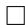

One sees that the family of $\alpha$ -means includes various known means:

$$
\alpha = 1 (\text {g e o m e t r i c m e a n}): \quad m _ {1} (a, b) = \sqrt {a b}
$$

$$
\alpha = - 1 (\text {a r i t h m e t i c m e a n}): \quad m _ {- 1} (a, b) = \frac {1}{2} (a + b)
$$

$$
\alpha = 0: \quad m _ {0} (a, b) = \frac {1}{4} \left(\sqrt {a} + \sqrt {b}\right) ^ {2} = \frac {1}{2} \left(\frac {1}{2} (a + b) + \sqrt {a b}\right)
$$

$$
\alpha = 3 \text {(h a r m o n i c m e a n)}: \quad m _ {3} (a, b) = \frac {2}{\frac {1}{a} + \frac {1}{b}}
$$

$$
\alpha = \infty : \quad m _ {\infty} (a, b) = \min  \{a, b \}
$$

$$
\alpha = - \infty : \quad m _ {- \infty} (a, b) = \max  \{a, b \}.
$$

The last two cases show that fuzzy logic is naturally included in the $\alpha$ -mean.

The $\alpha$ -mean is inversely monotone with respect to $\alpha$ ,

$$
m _ {\alpha} (a, b) \geq m _ {\alpha^ {\prime}} (a, b), \quad \alpha \leq \alpha^ {\prime}. \tag {4.47}
$$

This is a generalization of the well-known inequalities

$$
\frac {a + b}{2} \geq \sqrt {a b} \geq \frac {2}{a ^ {- 1} + b ^ {- 1}}. \tag {4.48}
$$

As $\alpha$ increases, the $\alpha$ -mean relies more on the smaller element of $\{a, b\}$ , while, as $\alpha$ decreases, the larger one is more emphasized. We may say that the $\alpha$ -mean with smaller $\alpha$ is pessimistic, and with larger $\alpha$ is more optimistic. See Fig. 4.1.

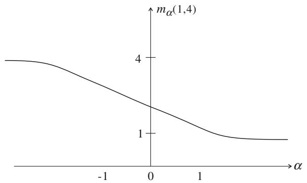  
Fig.4.1 $\alpha$ -mean of 1 and 4 for various $\alpha$

We can further define the weighted $\alpha$ -mean of $a_1, \ldots, a_k$ with weights $w_1, \ldots, w_k$ by

$$
m _ {\alpha} \left(a _ {1}, \dots , a _ {k}; \boldsymbol {w}\right) = h _ {\alpha} ^ {- 1} \left\{\sum w _ {i} h _ {\alpha} \left(a _ {i}\right) \right\}, \tag {4.49}
$$

where $\pmb{w} = (w_{1},\dots ,w_{k})$ and $w_{1} + \dots +w_{k} = 1$ . This leads us to the $\alpha$ -family of probability distributions in the next subsection.

# 4.2.6 $\alpha$ -Families of Probability Distributions

Given $k$ probability distributions $p_i(x), i = 1, \dots, k$ , we can define their $\alpha$ -mixture by using the $\alpha$ -mean.

The $\alpha$ -representation of probability density function $p(x)$ is given (Amari and Nagaoka 2000) by

$$
h _ {\alpha} [ p (x) ] = \left\{ \begin{array}{l l} p (x) ^ {(1 - \alpha) / 2}, & \alpha \neq 1, \\ \log p (x), & \alpha = 1. \end{array} \right. \tag {4.50}
$$

Their $\alpha$ -mixture is defined by

$$
\tilde {p} _ {\alpha} (x) = c h _ {\alpha} ^ {- 1} \left\{\frac {1}{k} \sum_ {i = 1} ^ {k} h _ {\alpha} \left\{p _ {i} (x) \right\} \right\}, \tag {4.51}
$$

where normalization constant $c$ is necessary to make it a probability distribution. It is given by

$$
c = \frac {1}{\int h _ {\alpha} ^ {- 1} \left\{\frac {1}{k} \sum h _ {\alpha} [ p _ {i} (x) ] \right\} d x}. \tag {4.52}
$$

The $\alpha = -1$ mixture is the ordinary mixture and the $\alpha = 1$ mixture is the exponential mixture. The $\alpha = -\infty$ mixture,

# 4.2 $\alpha$ -Geometry in $S_{n}$ and $R_{+}^{n}$

$$
\tilde {p} _ {- \infty} (x) = c \max  _ {i} \left\{p _ {i} (x) \right\}, \tag {4.53}
$$

is the optimistic integration of component distributions in the sense that, for each $x$ , it takes the largest values of the component probabilities. On the contrary, the $\alpha = \infty$ mixture is pessimistic, taking the minimum of the component probabilities,

$$
\tilde {p} _ {\infty} (x) = c \min  \left\{p _ {i} (x) \right\}. \tag {4.54}
$$

The exponential mixture is more pessimistic than the ordinary mixture in the sense that the resulting probability density is close to 0 at $x$ where some of the components are close to 0.

Let us next consider weighted mixtures. The weighted $\alpha$ -mixture with weights $w_{1}, \ldots, w_{k}$ satisfying $\sum w_{i} = 1$ is given by

$$
\tilde {p} _ {\alpha} (x; \boldsymbol {w}) = c h _ {\alpha} ^ {- 1} \left\{\sum w _ {i} h _ {\alpha} \left\{p _ {i} (x) \right\} \right\}. \tag {4.55}
$$

This is called the $\alpha$ -integration of $p_1(x), \ldots, p_k(x)$ with weights $w_1, \ldots, w_k$ . It connects $k$ component distributions $p_1(x), \ldots, p_k(x)$ continuously by using the parameter $\boldsymbol{w} = (w_1, \ldots, w_k)$ . It is called the $\alpha$ -family of probability distributions where $\boldsymbol{w}$ plays the role of its coordinate system. When $\alpha = -1$ , this is an ordinary mixture family,

$$
\tilde {p} _ {- 1} (x; \boldsymbol {w}) = \sum w _ {i} p _ {i} (x), \tag {4.56}
$$

where $\sum w_{i} = 1$ is imposed. When $\alpha = 1$ , this is an exponential family,

$$
\tilde {p} _ {1} (x, \boldsymbol {w}) = \exp \left\{\sum w _ {i} \log p _ {i} (x) - \psi (\boldsymbol {w}) \right\}, \tag {4.57}
$$

where the normalization constant is given by

$$
c = \exp \left\{- \psi \right\}. \tag {4.58}
$$

The probability simplex $S_{n}$ (and the function space $F$ of probability distributions) are special, satisfying the following theorem.

Theorem 4.8 The probability simplex $S_{n}$ is an $\alpha$ -family for any $\alpha$ .

Proof $S_{n}$ is a mixture of $\delta_i(x)$

$$
p (x) = \sum_ {i = 0} ^ {n} p _ {i} \delta_ {i} (x). \tag {4.59}
$$

The $\alpha$ -mixture family of $\delta_{i}(x)$ is

$$
\tilde {p} _ {\alpha} (x, \boldsymbol {w}) = c \left[ \sum w _ {i} \delta_ {i} (x) \right] ^ {\frac {2}{1 - \alpha}}, \tag {4.60}
$$

where

$$
w _ {i} = p _ {i} ^ {\frac {1 - \alpha}{2}}, \quad i = 0, 1, \dots , n. \tag {4.61}
$$

They cover the entire $S_{n}$ so that $S_{n}$ is an $\alpha$ -family.

We can also show that an $\alpha$ -geodesic connecting $\pmb{p}$ and $\pmb{q}$ in $S_{n}$ is a one-dimensional $\alpha$ -family.

# 4.2.7 Optimality of $\alpha$ -Integration

When a cluster of $k$ distributions $p_1(x), \ldots, p_k(x)$ is given, we search for $q(x)$ that is close to all of $p_1(x), \ldots, p_k(x)$ . It is regarded as the center of the cluster. Let $w_1, \ldots, w_k$ be weights assigned to $p_i(x), i = 1, \ldots, k$ , and we use the weighted average of divergences from $p_i(x)$ 's to $q(x)$ ,

$$
R _ {D} [ q (x) ] = \sum w _ {i} D [ p _ {i} (x): q (x) ] \tag {4.62}
$$

as a risk function. We search for the distribution $q(x)$ that minimizes $R_{D}[q(x)]$ . The minimizer of $R_{D}$ is called the $D$ -optimal integration of $p_1(x), \ldots, p_k(x)$ with weights $w_1, \ldots, w_k$ . The following theorem characterizes the $\alpha$ -integration (Amari 2007).

Theorem 4.9 (Optimality of $\alpha$ -integration) The $\alpha$ -integration of probability distributions $p_1(x), \ldots, p_k(x)$ with weights $w_1, \ldots, w_k$ is optimal under the $\alpha$ -risk,

$$
R _ {\alpha} [ q (x) ] = \sum w _ {i} D _ {\alpha} [ p _ {i} (x): q (x) ], \tag {4.63}
$$

where $D_{\alpha}$ is the $\alpha$ -divergence.

Proof Let us first prove the case of $\alpha \neq \pm 1$ . By taking the variation of $R_{\alpha}[q(x)]$ under the normalizing constraint

$$
\int q (x) d x = 1, \tag {4.64}
$$

we derive

$$
\begin{array}{l} \delta R _ {\alpha} [ q (x) ] - \lambda \int \delta q (x) d x \\ = \frac {2}{1 - \alpha} \sum w _ {i} \int p _ {i} (x) ^ {\frac {1 - \alpha}{2}} q (x) ^ {- \frac {1 + \alpha}{2}} \delta q (x) d x - \lambda \int \delta q (x) d x \\ = 0, \tag {4.65} \\ \end{array}
$$

# 4.2 $\alpha$ -Geometry in $S_{n}$ and $R_{+}^{n}$

where $\lambda$ is the Lagrange multiplier. This gives

$$
q (x) ^ {- \frac {1 - \alpha}{2}} \sum w _ {i} p _ {i} (x) ^ {\frac {1 - \alpha}{2}} = \text {c o n s t} \tag {4.66}
$$

and hence, the optimal $q(x)$ is

$$
q (x) = c h _ {\alpha} ^ {- 1} \left[ \sum w _ {i} h _ {\alpha} \left\{p _ {i} (x) \right\} \right]. \tag {4.67}
$$

When $\alpha = \pm 1$ , we obtain

$$
\delta R _ {1} [ q (x) ] = \sum w _ {i} \int \log \frac {q (x)}{p _ {i} (x)} \delta q (x) d x, \tag {4.68}
$$

$$
\delta R _ {- 1} [ q (x) ] = - \sum w _ {i} \int \left\{\frac {p _ {i} (x)}{q (x)} + c o n s t \right\} \delta q (x) d x, \tag {4.69}
$$

respectively. Hence, the optimal $q$ is proved to be the $\alpha$ -integration for any $\alpha$ .

The case with unnormalized probabilities, i.e., positive measures, is similar. The optimal integration $\tilde{m}_{\alpha}(x)$ of $m_{1}(x),\ldots ,m_{k}(x)$ under the $\alpha$ -divergence criterion is

$$
\tilde {m} _ {\alpha} (x) = h _ {\alpha} ^ {- 1} \left[ \sum w _ {i} h _ {\alpha} \left\{m _ {i} (x) \right\} \right], \tag {4.70}
$$

where the normalization constant is not necessary.

There are interesting papers concerning applications of the $\alpha$ -integration of stochastic evidences, see e.g., Wu (2009), Choi et al. (2013) and Soriano and Vergara (2015).

# 4.2.8 Application to $\alpha$ -Integration of Experts

Let us consider a system composed of $k$ experts $M_{1},\ldots ,M_{k}$ , each of which processes input signal $\pmb{x}$ and emits its own answer. The answer of $M_{i}$ is a response $y$ corresponding to $\pmb{x}$ . More generally, consider the case that the output of $M_{i}$ is a probability distribution of $y$ , $p_i(y|\pmb {x})$ , or a positive measure, $m_{i}(y|\pmb {x})$ . The entire system integrates these answers and provides an integrated answer concerning the distribution of $y$ given $\pmb{x}$ (Fig. 4.2).

Let us assume that $w_{i}(\pmb{x})$ is given as the weight or reliability of $M_{i}$ for input $\pmb{x}$ . The $\alpha$ -risk of an integrated answer $q(y|\pmb{x})$ is given by

$$
R _ {\alpha} [ q (y | \boldsymbol {x}) ] = \sum w _ {i} (\boldsymbol {x}) D _ {\alpha} [ p _ {i} (y | \boldsymbol {x}): q (y | \boldsymbol {x}) ]. \tag {4.71}
$$

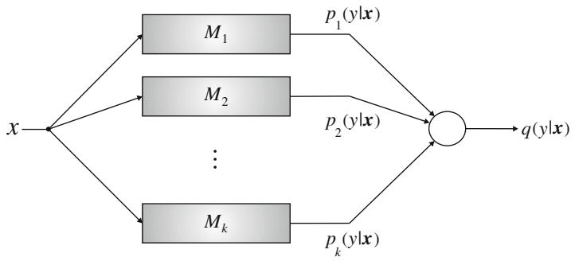  
Fig. 4.2 Integration of answers of expert machines

Theorem 4.10 The $\alpha$ -expert machine

$$
q (y | \boldsymbol {x}) = h _ {\alpha} ^ {- 1} \left[ \sum w _ {i} (\boldsymbol {x}) h _ {\alpha} \left\{p _ {i} (y | \boldsymbol {x}) \right\} \right] \tag {4.72}
$$

is optimal under the $\alpha$ -risk $R_{\alpha}[q(y|x)]$ .

Similar assertions hold for the case of positive measures.

The $\alpha = 1$ machine is the mixture of experts (Jacobs et al. 1991) and the $\alpha = -1$ machine is the product of experts (Hinton 2002).

It is important to determine the weights or reliability functions $w_{i}(\pmb{x})$ . When a teacher output $q^{*}(y|\pmb{x})$ is available, one may use the soft-max function

$$
w _ {i} (\boldsymbol {x}) = c \exp \left\{- \beta D _ {\alpha} \left[ p _ {i} (y | \boldsymbol {x}): q ^ {*} (y | \boldsymbol {x}) \right] \right\} \tag {4.73}
$$

as the weight of $M_{i}$ , where $c$ is the normalization constant and $\beta$ is the "inverse temperature", indicating the effectiveness of the weights.

# 4.3 Geometry of Tsallis $q$ -Entropy

The Boltzmann-Gibbs distribution in statistical physics is an exponential family, such that an invariant flat structure is given to the underlying manifold. Its convex function is free energy and its dual convex function is the negative of the Shannon entropy. C. Tsallis proposed a generalized entropy called the $q$ -entropy for studying various phenomena not included in the conventional Boltzmann-Gibbs framework (Tsallis 1988, 2009). The induced probability distributions are not exponential families which are subject to exponential decay of tail probabilities. This has opened the door to a new world of physics and beyond. The $q$ -logarithm and $q$ -exponential are introduced to this end. However, the $q$ -logarithm is essentially the same as the $\alpha$ -representation, where $q$ and $\alpha$ are connected by $\alpha = 2q - 1$ . Therefore, the $\alpha$ -geometry covers the

geometry of $q$ -entropy physics (Ohara 2007). We treat the discrete case of $S_{n}$ mostly, but the results hold in the continuous case, too.

We further extend the $q$ -framework by using the $q$ -escort distribution. This gives a new dually flat structure to $S_{n}$ , although it is not invariant (Amari and Ohara 2011). It is conformally related to the invariant geometry (Amari et al. 2012). This framework is extended further to deformed exponential families proposed by Naudts (2011).

# 4.3.1 $q$ -Logarithm and $q$ -Exponential Function

Tsallis introduced a generalized logarithm, called the $q$ -logarithm, by

$$
\log_ {q} (u) = \frac {1}{1 - q} \left(u ^ {1 - q} - 1\right), \tag {4.74}
$$

which gives $\log u$ in the limit $q\to 1$ . The inverse of the $q$ logarithm is the $q$ -exponential,

$$
\exp_ {q} (u) = \left\{1 + (1 - q) u \right\} ^ {\frac {1}{1 - q}}, \tag {4.75}
$$

which gives the ordinary exponential function in the limit $q \to 1$ . These functions are the same as the $\alpha$ -representation $h_{\alpha}(u)$ and its inverse, where $\alpha = 2q - 1$ , except for a scaling factor and a constant. However, we keep the original $q$ -notation rather than the $\alpha$ -notation in this section, respecting the original $q$ -terminology by C. Tsallis.

The Tsallis $q$ -entropy is defined by

$$
H _ {q} (\boldsymbol {p}) = \sum p _ {i} \log_ {q} \frac {1}{p _ {i}}, \tag {4.76}
$$

by replacing $\log$ by $\log_q$ , which is concave for $0 < q \leq 1$ and is the Shannon entropy when $q = 1$ . This is closely related to the Rényi entropy (Rényi 1961). Similarly, the $q$ -divergence is defined by

$$
D _ {q} [ \boldsymbol {p}: \boldsymbol {r} ] = \operatorname {E} \left[ \log_ {q} \frac {r (x)}{p (x)} \right] = \frac {1}{1 - q} \left(1 - \sum p _ {i} ^ {q} r _ {i} ^ {1 - q}\right), \tag {4.77}
$$

where $\mathrm{E}$ is the expectation with respect to $\pmb{p}$ . This is the same as the $\alpha$ -divergence (3.39) with $\alpha = 2q - 1$ .

The geometry derived from the $q$ -divergence satisfies the invariance criterion, since it belongs to the class of $f$ -divergence. So the Riemannian metric is given by the Fisher information matrix. Further, it is not dually flat except for the limiting cases of $q = 0$ ( $\alpha = -1$ ) and $1$ ( $\alpha = 1$ ). However, if we extend it to the manifold of positive measures, it is both invariant and dually flat.

# 4.3.2 $q$ -Exponential Family ( $\alpha$ -Family) of Probability Distributions

We define the $q$ -exponential family by

$$
\log_ {q} p (\boldsymbol {x}, \boldsymbol {\theta}) = \boldsymbol {\theta} \cdot \boldsymbol {x} - \psi_ {q} (\boldsymbol {\theta}), \tag {4.78}
$$

or equivalently by

$$
p (\boldsymbol {x}, \boldsymbol {\theta}) = \exp_ {q} \left\{\boldsymbol {\theta} \cdot \boldsymbol {x} - \psi_ {q} (\boldsymbol {\theta}) \right\}, \tag {4.79}
$$

where $\log_q$ and $\exp_q$ are used instead of log and exp in the ordinary exponential family. This is an $\alpha$ -family (4.60) of $S_n$ , in which $h_\alpha$ is used instead of $\log_q$ , $\theta = (w_i)$ and $x = \{\delta_i(x)\}$ . Here, $\psi_q(\theta)$ is determined from the normalization constraint

$$
\int \exp_ {q} \left\{\boldsymbol {\theta} \cdot \boldsymbol {x} - \psi_ {q} (\boldsymbol {\theta}) \right\} d \boldsymbol {x} = 1. \tag {4.80}
$$

Another example is the $q$ -Gaussian distribution, given by

$$
\log_ {q} (x, \theta) = - \frac {(x - \mu) ^ {2}}{2 \sigma^ {2}} = \theta \cdot x - \psi (\theta), \tag {4.81}
$$

$$
\theta = \left(\frac {\mu}{\sigma^ {2}}, - \frac {1}{2 \sigma^ {2}}\right), \quad x = (x, x ^ {2}), \tag {4.82}
$$

where random variable $x$ takes continuous values. Different from a Gaussian distribution, the values of $x$ are limited within a finite range. Another important $q$ -family is $S_{n}$ . We rewrite Theorem 4.8 in the following form.

Theorem 4.11 The family $S_{n}$ of all the discrete distributions is a $q$ -family for any $q$ , that is an $\alpha$ -family for any $\alpha$ .

Proof By introducing random variables $\delta_i(x)$ and putting $\pmb{x} = (\delta_1(x),\dots,\delta_n(x))$ , a probability $\pmb{p}\in S_{n}$ is written, using parameter $\theta$ , in the form

$$
\log_ {q} p (\boldsymbol {x}, \boldsymbol {\theta}) = \frac {1}{1 - q} \left\{\sum_ {i = 1} ^ {n} \left(p _ {i} ^ {1 - q} - p _ {0} ^ {1 - q}\right) \delta_ {i} (x) + p _ {0} ^ {1 - q} - 1 \right\}, \tag {4.83}
$$

where the coordinate system $\theta$ is

$$
\theta^ {i} = \frac {1}{1 - q} \left(p _ {i} ^ {1 - q} - p _ {0} ^ {1 - q}\right), \quad x _ {i} = \delta_ {i} (x). \tag {4.84}
$$

# 4.3 Geometry of Tsallis $q$ -Entropy

Hence, it is a $q$ -family ( $\alpha$ -family). The function corresponding to the free energy is

$$
\psi_ {q} (\boldsymbol {\theta}) = - \log_ {q} p _ {0}, \tag {4.85}
$$

where $p_0$ is a function of $\theta$ . We call it the $q$ -free energy.

# 4.3.3 $q$ -Escort Geometry

The $q$ -geometry ( $\alpha$ -geometry) is induced in a $q$ -exponential family from the $q$ -divergence. It consists of the Fisher information metric (3.68) and cubic tensor defined in (3.88). It is invariant but not flat in general. This is because the $q$ -divergence ( $\alpha$ -divergence) is not a Bregman divergence in general. However, it is possible to modify it conformally to obtain a new dually flat structure. To begin with, we show that the $q$ -free energy $\psi_q(\pmb{\theta})$ defined by (4.80) is a convex function of $\pmb{\theta}$ .

Lemma 4.1 The $q$ -free energy is convex.

Proof By differentiating (4.79) with respect to $\theta$ , we have

$$
\partial_ {i} p (\boldsymbol {x}, \boldsymbol {\theta}) = p (\boldsymbol {x}, \boldsymbol {\theta}) ^ {q} \left(x _ {i} - \partial_ {i} \psi_ {q}\right). \tag {4.86}
$$

Its second derivatives are

$$
\partial_ {i} \partial_ {j} p (\boldsymbol {x}, \boldsymbol {\theta}) = q p (\boldsymbol {x}, \boldsymbol {\theta}) ^ {2 q - 1} \left(x _ {i} - \partial_ {i} \psi_ {q}\right) \left(x _ {j} - \partial_ {j} \psi_ {q}\right) - p (\boldsymbol {x}, \boldsymbol {\theta}) ^ {q} \partial_ {i} \partial_ {j} \psi_ {q}. \tag {4.87}
$$

We introduce a functional

$$
h _ {q} [ p (\boldsymbol {x}) ] = \int p (\boldsymbol {x}) ^ {q} d \boldsymbol {x}, \tag {4.88}
$$

which is the Tsallis $q$ -entropy except for a scale and constant. Then, from (4.86) and (4.87) and by using the identities

$$
\partial_ {i} \int p (\boldsymbol {x}, \boldsymbol {\theta}) d \boldsymbol {x} = \partial_ {i} \partial_ {j} \int p (\boldsymbol {x}, \boldsymbol {\theta}) d \boldsymbol {x} = 0, \tag {4.89}
$$

we have

$$
\partial_ {i} \psi_ {q} (\boldsymbol {\theta}) = \frac {1}{h _ {q} (\boldsymbol {\theta})} \int x _ {i} p (\boldsymbol {x}, \boldsymbol {\theta}) ^ {q} d \boldsymbol {x}, \tag {4.90}
$$

$$
\partial_ {i} \partial_ {j} \psi_ {q} (\boldsymbol {\theta}) = \frac {q}{h _ {q} (\boldsymbol {\theta})} \int (x _ {i} - \partial_ {i} \psi_ {q}) (x _ {j} - \partial_ {j} \psi_ {q}) p (\boldsymbol {x}, \boldsymbol {\theta}) ^ {2 q - 1} d \boldsymbol {x}, \tag {4.91}
$$

the latter of which shows that the Hessian of $\psi_q$ is positive-definite. This is called the $q$ -metric

$$
g _ {i j} ^ {q} = \partial_ {i} \partial_ {j} \psi_ {q} (\boldsymbol {\theta}), \tag {4.92}
$$

which is different from the invariant Fisher metric.

A new dually flat structure is introduced in $S_{n}$ by the $q$ -free-energy, which is different from the free energy. The affine coordinates are $\theta^i$ given by (4.84). The dual affine coordinate system $\pmb{\eta}$ is given by

$$
\eta_ {i} = \partial_ {i} \psi_ {q} (\boldsymbol {\theta}) = \frac {p _ {i} ^ {q}}{h _ {q} (\boldsymbol {p})}. \tag {4.93}
$$

The dual convex function is the inverse of the $q$ -entropy

$$
\varphi_ {q} (\boldsymbol {\eta}) = \frac {1}{1 - q} \left\{\frac {1}{h _ {q} (\boldsymbol {p})} - 1 \right\}, \tag {4.94}
$$

except for a scale and constant.

The Bregman divergence derived by $\psi_q$ is

$$
\tilde {D} _ {q} [ p (\boldsymbol {x}): r (\boldsymbol {x}) ] = \frac {1}{(1 - q) h _ {q} [ r (\boldsymbol {x}) ]} \left(1 - \int p (\boldsymbol {x}) ^ {1 - q} r (\boldsymbol {x}) ^ {q} d \boldsymbol {x}\right), \tag {4.95}
$$

which is different from the $q$ -divergence $D_q$ . $\tilde{D}_q$ gives another dually flat Riemannian structure to $S_{n}$ .

By putting

$$
\tilde {p} _ {i} = \eta_ {i}, \quad i = 1, \dots , n, \tag {4.96}
$$

$$
\tilde {p} _ {0} = \frac {p _ {0} ^ {q}}{h _ {q} (\boldsymbol {p})}, \tag {4.97}
$$

$$
\sum_ {i = 0} ^ {n} \tilde {p} _ {i} = 1 \tag {4.98}
$$

holds. So $\eta$ gives another probability distribution $\tilde{\pmb{p}}$ of $S_{n}$ . We call it the escort probability distribution of $\pmb{p}$ . The escort distribution is obtained by changing $p_i$ to $p_i^q / h_q$ which shifts $\pmb{p}$ toward the center (the uniform distribution $p_0$ ) as $q$ decreases from $q = 1$ .

We can define the $q$ -escort geodesic and dual $q$ -escort geodesic in $S_{n}$ . By using these geodesics, the $q$ -Pythagorean theorem holds with respect to the $q$ -escort divergence. One of the important consequences is the $q$ -max entropy theorem. To this end, we define the $q$ -escort expectation by

$$
\tilde {\mathrm {E}} _ {q} [ a (x) ] = \int \frac {a (x) p (x) ^ {q}}{h _ {q}} d x. \tag {4.99}
$$

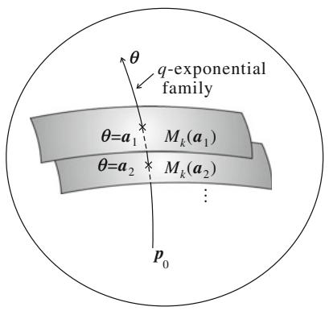  
Fig.4.3 $q$ -max entropy theorem

Theorem 4.12 (q-Max-Entropy Theorem) Let $M_{k}(\pmb{a})$ be a submanifold of $S_{n}$ consisting of probability distributions of which the q-escort expectations of random variables $c_{1}(\pmb{x}),\dots,c_{k}(\pmb{x})$ take fixed values,

$$
\tilde {\mathrm {E}} _ {q} \left[ c _ {i} (\boldsymbol {x}) \right] = a _ {i}, \quad i = 1, \dots , k. \tag {4.100}
$$

where $\pmb{a} = (a_{1},\dots ,a_{k})$ . The probability distribution $\hat{\pmb{p}} (\pmb {a})$ in $M_{k}(\pmb {a})$ that maximizes the $q$ -entropy is given by the $q$ -geodesic projection of the uniform distribution $\pmb{p}_0$ to $M_{k}(\pmb {a})$ . The family of such distributions for various $\pmb{a} = \pmb{\theta}$ is a $q$ -exponential family of distributions,

$$
\log_ {q} p (\boldsymbol {x}, \boldsymbol {\theta}) = \theta^ {i} c _ {i} (\boldsymbol {x}) - \psi (\boldsymbol {\theta}). \tag {4.101}
$$

Proof This is clear from the fact that $M_{k}$ is flat in the dual sense and (4.101) is a flat submanifold in the primal sense. See Fig. 4.3.

# 4.3.4 Deformed Exponential Family: $\chi$ -Escort Geometry

We used the $q$ -logarithm to define the $q$ -structure in $S_{n}$ . However, we may use a more general representation to study various dually flat structures of $S_{n}$ . See, for example, a deformed exponential family called the $\kappa$ -exponential family (Kaniadakis and Scarfone 2002). Following Naudts (2011), we introduce the $\chi$ -logarithm defined by

$$
\log_ {\chi} (s) = \int_ {1} ^ {s} \frac {1}{\chi (t)} d t, \tag {4.102}
$$

where $\chi$ is a positive non-decreasing function. We simply put

$$
u (s) = \log_ {\chi} (s). \tag {4.103}
$$

When $\chi$ is a power function

$$
\chi (s) = s ^ {q}, \quad q > 0, \tag {4.104}
$$

it gives the $q$ -logarithm. We use the inverse of $u$ as the $v$ -representation,

$$
v (s) = \exp_ {\chi} (s) = u ^ {- 1} (s). \tag {4.105}
$$

The $\chi$ -deformed exponential family is defined by using (4.105) as

$$
p (\boldsymbol {x}, \boldsymbol {\theta}) = \exp_ {\chi} \left\{\boldsymbol {\theta} \cdot \boldsymbol {x} - \psi_ {\chi} (\boldsymbol {\theta}) \right\}, \tag {4.106}
$$

where $\psi_{\chi}$ is the free-energy corresponding to the normalization factor.

Theorem 4.13 $S_{n}$ is a $\chi$ -exponential family for any $\chi$ function.

Proof We can prove the theorem in the same way as Theorem 4.11, by replacing $\log_q$ by $\log_{\chi}$ . The affine coordinates are

$$
\theta^ {i} = u \left(p _ {i}\right) - \psi_ {\chi}, \quad i = 1, \dots , n \tag {4.107}
$$

and the $\chi$ -free-energy is

$$
\psi_ {\chi} (\boldsymbol {\theta}) = - u \left(p _ {0}\right). \tag {4.108}
$$

The $\chi$ -free-energy is a convex function of $\theta$ , so we can introduce a new dually flat affine structure together with a Riemannian metric. The Riemannian metric is written anew as

$$
\partial_ {i} \partial_ {j} \psi_ {\chi} (\boldsymbol {\theta}) = \frac {\int u ^ {\prime \prime} (\boldsymbol {\theta} \cdot \boldsymbol {x} - \psi) (x _ {i} - \partial_ {i} \psi) (x _ {j} - \partial_ {j} \psi) d \boldsymbol {x}}{h _ {\chi} (\boldsymbol {\theta})}, \tag {4.109}
$$

where $h_{\chi}(\pmb {\theta})$ is the $\chi$ -escort entropy defined by

$$
h _ {\chi} (\boldsymbol {\theta}) = \int \chi \left\{p (\boldsymbol {x}, \boldsymbol {\theta}) \right\} d \boldsymbol {x} = \sum u ^ {\prime} \left(\theta^ {i} - \psi_ {\chi}\right) + u ^ {\prime} (- \psi_ {\chi}). \tag {4.110}
$$

The dual affine coordinates are given by

$$
\eta_ {i} = \frac {\int u ^ {\prime} (\boldsymbol {\theta} \cdot \boldsymbol {x} - \psi) x _ {i} d \boldsymbol {x}}{h _ {\chi} (\boldsymbol {\theta})} = \frac {1}{h _ {\chi} (\boldsymbol {p})} \frac {1}{v ^ {\prime} (p _ {i})}, \tag {4.111}
$$

where

$$
u ^ {\prime} \left\{v (p) \right\} = \frac {1}{v ^ {\prime} (p)} \tag {4.112}
$$

# 4.3 Geometry of Tsallis $q$ -Entropy

is used. The dual $\eta$ in (4.111) defines a probability distribution $\tilde{\pmb{p}}$ called the $\chi$ -escort distribution. The dual convex function is

$$
\varphi_ {\chi} (\boldsymbol {\eta}) = \frac {1}{h _ {\chi}} \sum_ {i = 0} ^ {n} \frac {v \left(p _ {i}\right)}{v ^ {\prime} \left(p _ {i}\right)}. \tag {4.113}
$$

The $\chi$ -divergence is

$$
\begin{array}{l} D _ {\chi} [ \boldsymbol {p}: \boldsymbol {q} ] = \psi_ {\chi} (\boldsymbol {\theta} _ {p}) + \varphi_ {\chi} (\boldsymbol {\eta} _ {q}) - \boldsymbol {\theta} _ {p} \cdot \boldsymbol {\eta} _ {q} \\ = \frac {1}{h _ {\chi} (\boldsymbol {p})} \sum_ {i = 0} ^ {n} \frac {u \left(p _ {i}\right) - u \left(q _ {i}\right)}{v ^ {\prime} \left(p _ {i}\right)}. \tag {4.114} \\ \end{array}
$$

The generalized Pythagorean theorem holds as well.

Remark The $\exp_{\chi}(u)$ is a convex function. Vigelis and Cavalcante (2013) introduced a $\varphi$ -family of probability distributions by using a convex function $\varphi(u)$ . A new representation $f(x)$ of a probability density function $p(x)$ is given by

$$
f (x) = \varphi \left\{p (x) \right\}. \tag {4.115}
$$

This is closely related to the $\chi$ -representation. A $\varphi$ -family of probability distributions and $\varphi$ -divergence are defined in this framework, giving a dually flat structure. It is possible to extend to the non-parametric case.

# 4.3.5 Conformal Character of $q$ -Escort Geometry

The $q$ -divergence is an invariant divergence, leading to the Fisher information metric. The $q$ -escort divergence (4.95) is not invariant and the derived metric is not the Fisher information metric. However, we see that the $q$ -metric is connected to the Fisher metric $g_{ij}(\pmb{\theta})$ by

$$
\tilde {g} _ {i j} (\boldsymbol {\theta}) = \sigma (\boldsymbol {\theta}) g _ {i j} (\boldsymbol {\theta}), \quad \sigma (\boldsymbol {\theta}) > 0, \tag {4.116}
$$

where

$$
\sigma (\boldsymbol {p}) = \frac {1}{h _ {q} (\boldsymbol {p})}. \tag {4.117}
$$

This implies that the metric is changed pointwise isotropically, implying that the magnitude of a vector is enlarged or shrunken by a factor $\sigma(\pmb{p})$ but the angle of two vectors never changes, keeping the orthogonality invariant. Such a transformation of metric is called a conformal transformation. Hence, the $q$ -escort structure is given by a conformal transformation from the invariant geometry. However, this property does not hold in the general $\chi$ -structure. We show the following theorem without proof. See Amari et al. (2012) and Ohara et al. (2012).

Theorem 4.14 The $q$ -escort geometry is unique among the $\chi$ -escort geometries in the sense that its Riemannian metric is derived by a conformal transformation of the invariant Fisher metric.

Remark Conformal transformations are used in asymptotic theory of statistical inference (Okamoto et al. 1991; Kumon et al. 2011). They are also used in improving a kernel function in support vector machines, which will be shown later in Chap. 11.

# 4.4 $(u, v)$ -Divergence: Dually Flat Divergence in Manifold of Positive Measures

We have used $p$ and $\log p$ representations of probability, which play the role of two dual coordinate systems in the invariant geometry. We have further used the $\alpha$ - or $q$ -representations, which lead us to the $\alpha$ -geometry. The generalized deformed exponential family uses the $\chi$ -representation. A representation of probability defines the geometry. The importance of representation was emphasized by Zhang (2004). Eguchi et al. (2014) uses a $U$ -representation to define the $U$ structure which is dually flat.

The present section considers $\mathbf{R}_{+}^{n}$ and introduces a dually flat structure by using a pair of representations. We extend the idea given by Zhang (2011, 2013) and establish a general dually flat structure in $\mathbf{R}_{+}^{n}$ . The present section mostly follows Amari (2014) to define general decomposable and non-decomposable Bregman divergences in a manifold of positive measures. In the next section, they are extended to invariant Bregman divergences of a manifold of positive-definite matrices.

# 4.4.1 Decomposable $(u, v)$ -Divergence

Let us use two monotonically increasing and differentiable functions $u(m)$ and $v(m)$ and define

$$
\theta = u (m), \quad \eta = v (m). \tag {4.118}
$$

They are called the $u$ - and $v$ -representations of positive measure $m$ , respectively. Given $\pmb{m} \in \mathbb{R}_{+}^{n}$ , we call $\pmb{\theta} = (\theta^i)$ and $\pmb{\eta} = (\eta_i)$ defined by

$$
\theta^ {i} = u \left(m _ {i}\right), \quad \eta_ {i} = v \left(m _ {i}\right), \tag {4.119}
$$

the $u$ - and $v$ -representations of $\pmb{m}$ , respectively. The $\pmb{\theta}$ and $\pmb{\eta}$ are coordinate systems in $\pmb{R}_n^+$ . We search for a dually flat structure such that the $u$ - and $v$ -representations of $\pmb{m}$ become two affine coordinates. To this end, we define a pair of convex functions $\psi_{u,v}(\pmb{\theta})$ and $\varphi_{u,v}(\pmb{\eta})$ from which a Bregman divergence $D_{u,v}\left[m:m'\right]$ is derived.

We define two scalar functions of $\theta$ and $\eta$ by

$$
\tilde {\psi} _ {u, v} (\theta) = \int_ {0} ^ {u ^ {- 1} (\theta)} v (m) u ^ {\prime} (m) d m, \tag {4.120}
$$

$$
\tilde {\varphi} _ {u, v} (\eta) = \int_ {0} ^ {v ^ {- 1} (\eta)} u (m) v ^ {\prime} (m) d m. \tag {4.121}
$$

By differentiation, we have

$$
\tilde {\psi} _ {u, v} ^ {\prime} (\theta) = v (m), \tag {4.122}
$$

$$
\tilde {\psi} _ {u, v} ^ {\prime \prime} (\theta) = \frac {v ^ {\prime} (m)}{u ^ {\prime} (m)}. \tag {4.123}
$$

Since $u'(m) > 0$ , $v'(m) > 0$ , $\tilde{\psi}_{u,v}'' > 0$ . Hence, $\tilde{\psi}_{u,v}(\theta)$ is a convex function. So is $\tilde{\varphi}_{u,v}(\eta)$ . Moreover, they are the Legendre duals, because

$$
\begin{array}{l} \tilde {\psi} _ {u, v} (\theta) + \tilde {\varphi} _ {u, v} (\eta) - \theta \eta = \int_ {0} ^ {m} v (m) u ^ {\prime} (m) d m \\ + \int_ {0} ^ {m} u (m) v ^ {\prime} (m) d m - u (m) v (m) = 0. \tag {4.124} \\ \end{array}
$$

We now define decomposable convex functions of $\theta$ and $\eta$ by

$$
\psi_ {u, v} (\boldsymbol {\theta}) = \sum \tilde {\psi} _ {u, v} \left(\theta^ {i}\right), \tag {4.125}
$$

$$
\varphi_ {u, v} (\boldsymbol {\eta}) = \sum \tilde {\varphi} _ {u, v} \left(\eta_ {i}\right). \tag {4.126}
$$

Definition 4.1 The $(u, v)$ -divergence between two points $m, m' \in \mathbb{R}_n^+$ is defined by

$$
\begin{array}{l} D _ {u, v} \left[ \boldsymbol {m}: \boldsymbol {m} ^ {\prime} \right] = \psi_ {u, v} (\boldsymbol {\theta}) + \varphi_ {u, v} \left(\boldsymbol {\eta} ^ {\prime}\right) - \boldsymbol {\theta} \cdot \boldsymbol {\eta} ^ {\prime} \\ = \sum \left[ \int_ {0} ^ {m _ {i}} v (m) u ^ {\prime} (m) d m \right. \\ \left. + \int_ {0} ^ {m _ {i} ^ {\prime}} u (m) v ^ {\prime} (m) d m - u \left(m _ {i}\right) v \left(m _ {i} ^ {\prime}\right) \right], \tag {4.127} \\ \end{array}
$$

where $\theta$ and $\eta^\prime$ are $u-$ and $v$ -representations of $\pmb{m}$ and $\pmb{m}^{\prime}$ , respectively.

The $(u, v)$ -divergence gives a dually flat structure, where $\theta$ and $\eta$ are affine and dual affine coordinate systems. The transformation between $\theta$ and $\eta$ is simple in the $(u, v)$ -structure, because it can be done componentwise,

$$
\theta^ {i} = u \left\{v ^ {- 1} \left(\eta_ {i}\right) \right\}, \tag {4.128}
$$

$$
\eta_ {i} = v \left\{u ^ {- 1} \left(\theta^ {i}\right) \right\}. \tag {4.129}
$$

This is a merit of the $(u,v)$ -divergence. The Riemannian metric is given by

$$
g _ {i j} (\boldsymbol {m}) = \frac {v ^ {\prime} \left(m _ {i}\right)}{u ^ {\prime} \left(m _ {i}\right)} \delta_ {i j}. \tag {4.130}
$$

It is easy to see that this is a Euclidean metric. We have a new coordinate system $\pmb{r}(\pmb{m})$

$$
r \left(m _ {i}\right) = \int^ {m _ {i}} \sqrt {\frac {v ^ {\prime} (m)}{u ^ {\prime} (m)}} d m, \tag {4.131}
$$

in which the Riemannian metric is $g_{ij} = \delta_{ij}$ . The following theorem follows immediately.

Theorem 4.15 A decomposable and dually flat divergence in $\mathbf{R}_+^n$ is a $(u, v)$ -divergence when it is invariant under the permutation of indices.

Many divergences are written in the form of $(u,v)$ -divergence.

# 1. $(\alpha, \beta)$ -divergence

From the following power functions,

$$
u (m) = \frac {1}{\alpha} m ^ {\alpha}, v (m) = \frac {1}{\beta} m ^ {\beta}, \tag {4.132}
$$

$$
D _ {\alpha , \beta} [ \boldsymbol {p}: \boldsymbol {q} ] = \frac {1}{\alpha \beta (\alpha + \beta)} \sum \left\{\alpha p _ {i} ^ {\alpha + \beta} + \beta q _ {i} ^ {\alpha + \beta} - (\alpha + \beta) p _ {i} ^ {\alpha} q _ {i} ^ {\beta} \right\} \tag {4.133}
$$

is derived. This was introduced by Cichocki and Amari (2010) and Cichocki et al. (2011). The affine and dual affine coordinates are

$$
\theta^ {i} = \frac {1}{\alpha} (m _ {i}) ^ {\alpha}, \quad \eta_ {i} = \frac {1}{\beta} (m _ {i}) ^ {\beta} \tag {4.134}
$$

and the convex functions are

$$
\psi (\boldsymbol {\theta}) = c _ {\alpha , \beta} \sum \theta_ {i} ^ {\frac {\alpha + \beta}{\alpha}}, \quad \varphi (\boldsymbol {\eta}) = c _ {\beta , \alpha} \sum \eta_ {i} ^ {\frac {\alpha + \beta}{\beta}}, \tag {4.135}
$$

where

$$
c _ {\alpha , \beta} = \frac {1}{\beta (\alpha + \beta)} \alpha^ {\frac {\alpha + \beta}{\alpha}}. \tag {4.136}
$$

# 2. $\alpha$ -divergence

By putting

$$
u (m) = \frac {2}{1 - \alpha} m ^ {\frac {1 - \alpha}{2}}, v (m) = \frac {2}{1 + \alpha} m ^ {\frac {1 + \alpha}{2}}, \tag {4.137}
$$

we have

$$
D _ {\alpha} \left[ \boldsymbol {m}: \boldsymbol {m} ^ {\prime} \right] = \frac {4}{1 - \alpha^ {2}} \sum \left\{\frac {1 - \alpha}{2} m _ {i} + \frac {1 + \alpha}{2} m _ {i} ^ {\frac {1 - \alpha}{2}} - m _ {i} ^ {\alpha} \left(m _ {i} ^ {\prime}\right) ^ {\frac {1 + \alpha}{2}} \right\}. \tag {4.138}
$$

This is a special case of the $(\alpha, \beta)$ -divergence.

# 3. $\beta$ -divergence

From

$$
u (m) = m, \quad v (m) = \frac {1}{\beta} m ^ {1 + \beta}, \tag {4.139}
$$

we have

$$
D _ {\beta} \left[ \boldsymbol {m}: \boldsymbol {m} ^ {\prime} \right] = \frac {1}{\beta (\beta + 1)} \sum_ {i} \left[ m _ {i} ^ {\beta + 1} + (\beta + 1) m _ {i} ^ {\prime} - \left(m _ {i} ^ {\prime}\right) ^ {\beta + 1} - (\beta + 1) m _ {i} \left(m _ {i} ^ {\prime}\right) ^ {\beta} \right]. \tag {4.140}
$$

This is the $\beta$ -divergence (Minami and Eguchi 2004). It gives a dually flat structure even in $S_{n}$ . This is because $u(m)$ is linear in $m$ .

# 4. $U$ -divergence

From

$$
u (m) = m, \quad v (m) = U ^ {\prime} (m), \tag {4.141}
$$

where $U(m)$ is a convex function, we have the $U$ -divergence (Eguchi et al. 2014).

# 4.4.2 General $(u, v)$ Flat Structure in $R_{+}^{n}$

We consider a general dually flat structure of $R_{+}^{n}$ which is not necessarily decomposable. Let us introduce a new coordinate system

$$
\theta = u (m) \tag {4.142}
$$

in $R_{+}^{n}$ , where $\pmb{u}$ is an arbitrary differentiable bijective vector function. We can define a dually flat structure in $R_{+}^{n}$ by using an arbitrary convex function $\psi(\theta)$ . $\pmb{\theta}$ is the associated affine coordinate system and the dual affine coordinates are

$$
\eta = \nabla \psi (\theta). \tag {4.143}
$$

We put

$$
\boldsymbol {v} (\boldsymbol {m}) = \nabla \psi (\boldsymbol {\theta}). \tag {4.144}
$$

This structure is used in Nock et al. (2015).

An arbitrary pair $(\pmb{u},\pmb{v})$ of coordinate systems do not necessarily give a dually flat structure. They give dually flat structure when and only when there exists a convex function $\psi (\theta)$ such that

$$
\eta = v \left\{u ^ {- 1} (\theta) \right\} \tag {4.145}
$$

is its gradient. In the case of a decomposable pair $(u, v)$ , the condition is always satisfied and the pair always defines a dually flat structure.

The Riemannian metric induced from a $(\pmb{u},\pmb{v})$ -structure is $G(\pmb{\theta}) = \nabla \nabla \psi(\pmb{\theta})$ which is not Euclidean in general.

# 4.5 Invariant Flat Divergence in Manifold of Positive-Definite Matrices

The present section studies information geometry of the manifold of positive-definite matrices, following Amari (2014). See also Ohara and Eguchi (2013). An extensive review is found in Cichocki et al. (2015). A positive definite matrix $\mathbf{A}$ is decomposed as

$$
\mathbf {A} = \mathbf {O} ^ {T} \boldsymbol {\Lambda} \mathbf {O}, \tag {4.146}
$$

where $\Lambda$ is a diagonal matrix consisting of positive entries (eigenvalues of $\mathbf{A}$ ) and $\mathbf{O}$ is an orthogonal matrix. A positive-definite diagonal matrix is compared with a positive measure distribution. When its trace is 1, it is compared with a probability distribution. So a positive-definite matrix is an extension of a positive measure. Therefore, one can introduce a dually flat structure to the manifold of positive-definite matrices with the help of the $(u,v)$ -structure. The manifold of positive-definite Hermitian matrices, in particular those with a trace equal to 1, are important in quantum information theory, but we do not study them, treating only the real case.

# 4.5.1 Bregman Divergence and Invariance Under $Gl(n)$

Let $\mathbf{P}$ be a positive-definite symmetric matrix and $\psi (\mathbf{P})$ be a convex function. A Bregman divergence is defined between two positive-definite matrices $\mathbf{P}$ and $\mathbf{Q}$ by

$$
D [ \mathbf {P}: \mathbf {Q} ] = \psi (\mathbf {P}) - \psi (\mathbf {Q}) - \nabla \psi (\mathbf {Q}) \cdot (\mathbf {P} - \mathbf {Q}), \tag {4.147}
$$

where $\nabla$ is the gradient operator with respect to matrix $\mathbf{P} = (P_{ij})$ and hence $\nabla \psi$ is a matrix, and the inner product of two matrices is defined by

$$
\mathbf {Q} \cdot \mathbf {P} = \operatorname {t r} \left\{\mathbf {Q P} \right\}. \tag {4.148}
$$

It induces a dually flat structure in the manifold of positive-definite matrices, where the affine coordinate system is $\mathbf{P}$ itself and the dual affine coordinate system is

$$
\mathbf {P} ^ {*} = \nabla \psi (\mathbf {P}). \tag {4.149}
$$

There is a one-to-one correspondence between positive-definite matrices and zero-mean multivariate Gaussian distributions. Indeed, a zero-mean multivariate Gaussian distribution is given by using a positive-definite matrix $\mathbf{P}$ as

$$
p (\boldsymbol {x}, \mathbf {P}) = \exp \left\{\frac {1}{2} \boldsymbol {x} ^ {T} \mathbf {P} ^ {- 1} \boldsymbol {x} - \log \sqrt {2 \pi \det  | \mathbf {P} |} \right\}, \tag {4.150}
$$

which is an exponential family. Its $e$ -affine coordinates are $\mathbf{P}^{-1}$ . The flat geometry is, therefore, given by the KL-divergence,

$$
D [ \mathbf {P}: \mathbf {Q} ] = \operatorname {t r} \left(\mathbf {P Q} ^ {- 1}\right) - \log (\det  | \mathbf {P Q} ^ {- 1} |) - n, \tag {4.151}
$$

which is obtained from the potential function

$$
\psi \left(\mathbf {P} ^ {- 1}\right) = - \log (\det  | \mathbf {P} ^ {- 1} |). \tag {4.152}
$$

Let us consider a linear transformation of $\mathbf{P}$ by $\mathbf{L} \in Gl(n)$ , which is the set of all non-degenerate $n \times n$ matrices, given by

$$
\tilde {\mathbf {P}} = \mathbf {L} ^ {T} \mathbf {P} \mathbf {L}. \tag {4.153}
$$

This corresponds to the transformation of random variable $x$ to

$$
\tilde {\boldsymbol {x}} = \mathbf {L} \boldsymbol {x}. \tag {4.154}
$$

A divergence is said to be invariant under $Gl(n)$ when it satisfies

$$
D \left[ \mathbf {P}: \mathbf {Q} \right] = D \left[ \mathbf {L} ^ {T} \mathbf {P} \mathbf {L}: \mathbf {L} ^ {T} \mathbf {Q} \mathbf {L} \right]. \tag {4.155}
$$

Since the KL-divergence is invariant under any transformation of $\pmb{x}$ , it is invariant under $Gl(n)$ .

Theorem 4.16 The KL-divergence is a flat divergence which is invariant under $Gl(n)$ in the manifold of positive-definite matrices.

# 4.5.2 Invariant Flat Decomposable Divergences Under $O(n)$

The eigenvalues of a positive-definite matrix do not change under an orthogonal transformation $\mathbf{O} \in O(n)$ , the group of orthogonal matrices. It is natural to consider a dually flat structure which is invariant under $O(n)$ .

# 4.5.2.1 The Case When $\mathbf{P}$ is $e$ -Affine

We have a convex function $\psi (\mathbf{P})$ of $\mathbf{P}$ in this case. It is invariant under $O(n)$ when

$$
\psi (\mathbf {P}) = \psi \left(\mathbf {O} ^ {T} \mathbf {P O}\right). \tag {4.156}
$$

An invariant function is a symmetric function of $n$ eigenvalues $\lambda_1, \ldots, \lambda_n$ of $\mathbf{P}$ (Dhillon and Tropp 2007). An invariant convex function of $\mathbf{P}$ is written using a convex function $f$ of one variable satisfying $f(0) = 0$ as

$$
\psi_ {f} (\mathbf {P}) = \sum f (\lambda_ {i}) = \operatorname {t r} f (\mathbf {P}), \tag {4.157}
$$

when it is decomposable in the additive form of $\lambda_{i}$ . We study this case. We can prove the following lemma.

# Lemma

$$
\mathbf {P} ^ {*} = \nabla \psi_ {f} (\mathbf {P}) = f ^ {\prime} (\mathbf {P}). \tag {4.158}
$$

Outline of the proof. We assume that $f$ is an analytic function. Then, $f(\mathbf{P})$ is expanded in a power series of $\mathbf{P}$ . Therefore, we prove the lemma in the case of $f(\mathbf{P}) = \mathbf{P}^n$ , which is easy. Hence, we have the lemma.

Let $g(u)$ be a function such that $g'(u)$ is the inverse function of $f'(u)$ , satisfying $g(0) = 0$ . Then, the inverse transformation from $\mathbf{P}'$ to $\mathbf{P}$ is given by

$$
\mathbf {P} = g ^ {\prime} \left(\mathbf {P} ^ {\prime}\right). \tag {4.159}
$$

Hence, the dual potential function is

$$
\varphi_ {f} \left(\mathbf {P} ^ {*}\right) = \operatorname {t r} \left\{g \left(\mathbf {P} ^ {*}\right) \right\}. \tag {4.160}
$$

Theorem 4.17 An $e$ -flat decomposable $O(n)$ -invariant divergence is given by

$$
D _ {f} [ \mathbf {P}: \mathbf {Q} ] = \psi_ {f} (\mathbf {P}) + \varphi_ {f} \left\{f ^ {\prime} (\mathbf {Q}) \right\} - \operatorname {t r} \left\{\mathrm {P f} ^ {\prime} (\mathbf {Q}) \right\}, \tag {4.161}
$$

where $\varphi_f$ is the Legendre dual of $\psi_f$ .

We give well-known examples of invariant symmetric convex functions and dually flat divergences.

(1) For $f(\lambda) = (1/2)\lambda^2$ , we have

$$
\psi (\mathbf {P}) = \frac {1}{2} \sum \lambda_ {i} ^ {2}, \tag {4.162}
$$

$$
D [ \mathbf {P}: \mathbf {Q} ] = \frac {1}{2} \| \mathbf {P} - \mathbf {Q} \| ^ {2}, \tag {4.163}
$$

where $\| \mathbf{P}\| ^2$ is the Frobenius norm

$$
\| \mathbf {P} \| ^ {2} = \sum P _ {i j} ^ {2}. \tag {4.164}
$$

This gives a Euclidean structure.

(2) For $f(\lambda) = -\log \lambda$ , we have (4.152) and (4.151), which are invariant under $Gl(n)$ .   
(3) For $f(\lambda) = \lambda \log \lambda - \lambda$ ,

$$
\psi (\mathbf {P}) = \operatorname {t r} \left(\mathbf {P} \log \mathbf {P} - \mathbf {P}\right), \tag {4.165}
$$

$$
D [ \mathbf {P}: \mathbf {Q} ] = \operatorname {t r} (\mathbf {P} \log \mathbf {P} - \mathbf {P} \log \mathbf {Q} - \mathbf {P} + \mathbf {Q}). \tag {4.166}
$$

This divergence is used in quantum information theory. The affine coordinate system is $\mathbf{P}$ , the dual affine coordinate system is $\log \mathbf{P}$ and $\psi (\mathbf{P})$ is related to the von Neumann entropy.

# 4.5.2.2 General Dually Flat Decomposable Case: $(u, v)$ -Divergence

We use the $(u, v)$ -structure to introduce a general dually flat invariant decomposable divergence. Let

$$
\boldsymbol {\Theta} = u (\mathbf {P}), \quad \mathbf {H} = v (\mathbf {P}) \tag {4.167}
$$

be $u$ - and $v$ -representations of matrices. We use two functions $\tilde{\psi}_{u,v}(\theta)$ and $\tilde{\varphi}_{u,v}(\eta)$ defined by (4.120) and (4.121) for defining a pair of dually coupled invariant convex functions,

$$
\psi (\Theta) = \operatorname {t r} \tilde {\psi} _ {u, v} \left\{\Theta \right\}, \tag {4.168}
$$

$$
\varphi (\boldsymbol {H}) = \operatorname {t r} \tilde {\varphi} _ {u, v} \left\{\boldsymbol {H} \right\}. \tag {4.169}
$$

They are not convex with respect to $\mathbf{P}$ , but convex with respect to $\Theta$ and $\mathbf{H}$ , respectively. The derived Bregman divergence is

$$
D _ {u, v} [ \mathbf {P}: \mathbf {Q} ] = \psi \left\{\Theta (\mathbf {P}) \right\} + \varphi \left\{\mathbf {H} (\mathbf {Q}) \right\} - \Theta (\mathbf {P}) \cdot \mathbf {H} (\mathbf {Q}). \tag {4.170}
$$

It induces a dually flat structure to the manifold of positive-definite matrices.

Theorem 4.18 A dually flat, invariant and decomposable divergence is a $(u,v)$ -divergence in the manifold of positive-definite matrices.

The Euclidean, Gaussian and von Neumann divergences given in (4.163), (4.151) and (4.166) are special examples of $(u,v)$ -divergences. They are given by

(1) $u(m) = v(m) = m$ (4.171)   
(2) $u(m) = m,\quad v(m) = -\frac{1}{m},$ (4.172)   
(3) $u(m) = m$ ， $v(m) = \log m$ (4.173)

When $u$ and $v$ are power functions, we have the $(\alpha, \beta)$ -structure in the manifold of positive-definite matrices.

(4) $(\alpha -\beta)$ -divergence

By using the $(\alpha, \beta)$ -structure given by (4.132), we have

$$
\psi (\boldsymbol {\Theta}) = \frac {\alpha}{\alpha + \beta} \operatorname {t r} \boldsymbol {\Theta} ^ {\frac {\alpha + \beta}{\alpha}} = \frac {\alpha}{\alpha + \beta} \operatorname {t r} \mathbf {P} ^ {\alpha + \beta}, \tag {4.174}
$$

$$
\varphi (\mathbf {H}) = \frac {\beta}{\alpha + \beta} \operatorname {t r} \mathbf {H} ^ {\frac {\alpha + \beta}{\beta}} = \frac {\beta}{\alpha + \beta} \operatorname {t r} \mathbf {P} ^ {\alpha + \beta} \tag {4.175}
$$

and the $(\alpha ,\beta)$ -divergence of matrices,

$$
D _ {\alpha \beta} [ \mathbf {P}: \mathbf {Q} ] = \operatorname {t r} \left\{\frac {\alpha}{\alpha + \beta} \mathbf {P} ^ {\alpha + \beta} + \frac {\beta}{\alpha + \beta} \mathbf {Q} ^ {\alpha + \beta} - \mathbf {P} ^ {\alpha} \mathbf {Q} ^ {\beta} \right\}. \tag {4.176}
$$

This is a Bregman divergence, where the affine coordinate system is $\Theta = \mathbf{P}^{\alpha}$ and its dual is $\mathbf{H} = \mathbf{P}^{\beta}$ .

(5) The $\alpha$ -divergence is derived as

$$
\boldsymbol {\Theta} (\mathbf {P}) = \frac {2}{1 - \alpha} \mathbf {P} ^ {\frac {1 - \alpha}{2}}, \tag {4.177}
$$

$$
\psi (\boldsymbol {\Theta}) = \frac {2}{1 + \alpha} \mathbf {P}, \tag {4.178}
$$

$$
D _ {\alpha} [ \mathbf {P}: \mathbf {Q} ] = \frac {4}{1 - \alpha^ {2}} \operatorname {t r} \left(- \mathbf {P} ^ {\frac {1 - \alpha}{2}} \mathbf {Q} ^ {\frac {1 + \alpha}{2}} + \frac {1 - \alpha}{2} \mathbf {P} + \frac {1 + \alpha}{2} \mathbf {Q}\right) \tag {4.179}
$$

The affine coordinate system is $\frac{2}{1 - \alpha}\mathbf{P}^{\frac{1 - \alpha}{2}}$ and its dual is $\frac{2}{1 + \alpha}\mathbf{P}^{\frac{1 + \alpha}{2}}$ .

(6) The $\beta$ -divergence is derived from (4.139) as

$$
D _ {\beta} \left[ \mathbf {P}: \mathbf {Q} \right] = \frac {1}{\beta (\beta + 1)} \operatorname {t r} \left[ \mathbf {P} ^ {\beta + 1} + (\beta + 1) \mathbf {Q} - \mathbf {Q} ^ {\beta + 1} - (\beta + 1) \mathbf {P Q} ^ {\beta} \right]. \tag {4.180}
$$

# 4.5.3 Non-flat Invariant Divergences

We have so far studied invariant flat divergences. There are other types of invariant divergences which are not necessarily flat. We remark that the eigenvalues of $P Q^{-1}$ are invariant under $Gl(n)$ , because, for $\tilde{\mathbf{P}} = \mathbf{L}^T\mathbf{P}\mathbf{L}$ and $\tilde{\mathbf{W}} = \mathbf{L}^T\mathbf{Q}\mathbf{L}$ ,

$$
\tilde {\mathbf {P}} \tilde {\mathbf {Q}} ^ {- 1} = \mathbf {L} ^ {T} \left(\mathbf {P Q} ^ {- 1}\right) \left(\mathbf {L} ^ {T}\right) ^ {- 1} \tag {4.181}
$$

holds. So a divergence $D[\mathbf{P}:\mathbf{Q}]$ is invariant when it is written as a function of $\pmb{\Lambda} = \text{diag}(\lambda_1,\dots,\lambda_n)$ , where $\lambda_{i}$ are the eigenvalues of $\mathbf{P}\mathbf{Q}^{-1}$ .

Cichocki et al. (2015) introduced the following $(\alpha - \beta)$ -log-det divergence:

$$
D _ {\alpha , \beta} ^ {\log - \det } [ \mathbf {P}: \mathbf {Q} ] = \frac {1}{\alpha \beta} \log \det  \frac {\alpha (\mathbf {P Q} ^ {- 1}) ^ {\beta} + \beta (\mathbf {P Q} ^ {- 1}) ^ {\alpha}}{\alpha + \beta}, \tag {4.182}
$$

which can be written in terms of $\pmb{\Lambda}$ as

$$
\begin{array}{l} D _ {\alpha , \beta} ^ {\log - \det } [ \mathbf {P}: \mathbf {Q} ] = \frac {1}{\alpha \beta} \log \det  \frac {\alpha \boldsymbol {\Lambda} ^ {\beta} + \beta \boldsymbol {\Lambda} ^ {\alpha}}{\alpha + \beta} \\ = \frac {1}{\alpha \beta} \sum \log \frac {\alpha \lambda_ {i} ^ {\beta} + \beta \lambda_ {i} ^ {- \alpha}}{\alpha + \beta}. \tag {4.183} \\ \end{array}
$$

It is extended to the case of $\alpha = 0$ and/or $\beta = 0$ by taking the limit $\alpha, \beta \to 0$ . For example,

$$
D _ {\alpha , 0} ^ {\log - \det } [ \mathbf {P}: \mathbf {Q} ] = \frac {1}{\alpha^ {2}} \left[ \sum \left\{\left(\lambda_ {i}\right) ^ {- \alpha} + \alpha \log \lambda_ {i} \right\} - n \right], \tag {4.184}
$$

$$
D _ {0, 0} ^ {\log - \det } [ \mathbf {P}: \mathbf {Q} ] = \frac {1}{2} \sum (\log \lambda_ {i}) ^ {2}. \tag {4.185}
$$

When $\alpha = \beta$ , $D_{\alpha, \beta}^{\log - \det}[\mathbf{P} : \mathbf{Q}]$ is symmetric with respect to $\mathbf{P}$ and $\mathbf{Q}$ and hence the geometry is self-dual and Riemannian.

It is interesting to see that $D_{\alpha, \beta}^{\log - \mathrm{det}}[\mathbf{P} : \mathbf{Q}]$ generates the same Riemannian metric not depending on $\alpha$ and $\beta$ , although the dual affine connections do depend on $\alpha$ and $\beta$ .

Theorem 4.19 The Riemannian metric induced from the $(\alpha, \beta)$ -log-det divergence is

$$
\langle d \mathbf {P}, d \mathbf {P} \rangle_ {\mathbf {P}} = \frac {1}{2} \operatorname {t r} \left(\mathrm {d} \mathbf {P} \mathbf {P} ^ {- 1} \mathrm {d} \mathbf {P} \mathbf {P} ^ {- 1}\right). \tag {4.186}
$$

We omit the proof.

# 4.6 Miscellaneous Divergences

Many divergences have been defined in the literature. We show some of them. They are not invariant and not flat in general, but have their own characteristics. An extensive survey on divergence is found in Basseville (2013). See also Cichocki et al. (2009, 2011), for example. Only a Bregman divergence generates a dually flat structure. However, any divergence generates a dual pair of affine connections together with a Riemannian metric, as will be shown in Part II.

# 4.6.1 $\gamma$ -Divergence

The $\gamma$ -divergence was proposed by Fujisawa and Eguchi (2008). See also Cichocki and Amari (2010). Let $\gamma$ be a real parameter. The $\gamma$ -divergence between two probability distributions $\pmb{p}$ and $\pmb{q}$ is defined by

$$
D _ {\gamma} [ \boldsymbol {p}: \boldsymbol {q} ] = \frac {1}{\gamma (\gamma - 1)} \log \frac {\sum p _ {i} ^ {\gamma} \left(\sum q _ {i} ^ {\gamma}\right) ^ {\gamma - 1}}{\left(\sum p _ {i} q _ {i} ^ {\gamma - 1}\right) ^ {\gamma}}. \tag {4.187}
$$

It is projectively invariant in the sense that, for any positive constants $c_{1}$ and $c_{2}$ ,

$$
D _ {\gamma} [ c _ {1} \boldsymbol {p}: c _ {2} \boldsymbol {q} ] = D _ {\gamma} [ \boldsymbol {p}: \boldsymbol {q} ] \tag {4.188}
$$

holds.

The $\gamma$ -divergence has a super-robust property when we use it in statistical estimation. It is extremely robust even when outliers are mixed in observed data. It is possible to define the $\gamma$ -divergence between positive-definite matrices $\mathbf{P}$ and $\mathbf{Q}$ as

$$
D _ {\gamma} [ \mathbf {P}: \mathbf {Q} ] = \frac {1}{\gamma (\gamma - 1)} \log \frac {\operatorname {t r} \mathbf {P} ^ {\gamma} \left\{\left(\operatorname {t r} \mathbf {Q}\right) ^ {\gamma} \right\} ^ {\gamma - 1}}{\left\{\operatorname {t r} \mathbf {P Q} ^ {\gamma - 1} \right\} ^ {\gamma}}. \tag {4.189}
$$

# 4.6.2 Other Types of $(\alpha, \beta)$ -Divergences

Zhang (2004) introduced the following $(\alpha, \beta)$ -divergence,

$$
\begin{array}{l} D _ {Z h a n g} ^ {\alpha , \beta} [ \boldsymbol {p}: \boldsymbol {q} ] = \frac {4}{1 - \alpha^ {2}} \frac {2}{1 + \beta} \sum \left\{\frac {1 - \alpha}{2} p _ {i} + \frac {1 + \alpha}{2} q _ {i} \right. \\ \left. - \left(\frac {1 - \alpha}{2} p ^ {\frac {1 - \beta}{2}} + \frac {1 + \alpha}{2} q _ {i} ^ {\frac {1 - \beta}{2}}\right) ^ {\frac {2}{1 - \beta}} \right\}, \tag {4.190} \\ \end{array}
$$

which is different from that in the previous subsection. The geometry induced from (4.190) is exactly the same as the $\alpha$ -geometry.

Zhang (2011) presented another $\alpha$ -divergence when a convex function $\psi(\pmb{p})$ exists. It is given by

$$
\begin{array}{l} D _ {\varphi} ^ {\alpha} [ p (x): q (x) ] = \frac {4}{1 - \alpha^ {2}} \int \left[ \frac {1 - \alpha}{2} \varphi (p) + \frac {1 - \alpha}{2} \varphi (q) \right. \\ \left. - \varphi \left\{\frac {1 - \alpha}{2} p + \frac {1 + \alpha}{2} q \right\} \right] d x. \tag {4.191} \\ \end{array}
$$

Furuichi (2010) also introduced another $(\alpha - \beta)$ -divergence,

$$
D _ {F u r u i c h i} ^ {\alpha , \beta} [ \boldsymbol {p}: \boldsymbol {q} ] = \frac {1}{\alpha - \beta} \sum \left(p _ {i} ^ {\alpha} q _ {i} ^ {1 - \alpha} - p _ {i} ^ {\beta} q _ {i} ^ {1 - \beta}\right). \tag {4.192}
$$

# 4.6.3 Burbea-Rao Divergence and Jensen-Shannon Divergence

For a convex function $F(\pmb{p})$ , one can construct a symmetric divergence by

$$
D _ {F} [ \boldsymbol {p}: \boldsymbol {q} ] = \frac {1}{2} \left\{F (\boldsymbol {p}) + F (\boldsymbol {q}) \right\} - F \left(\frac {\boldsymbol {p} + \boldsymbol {q}}{2}\right). \tag {4.193}
$$

This is called the Burbea-Rao divergence (Burbea and Rao 1982). When we use the negative of entropy as a convex function, we have

$$
D _ {J S} [ \boldsymbol {p}: \boldsymbol {q} ] = H \left(\frac {\boldsymbol {p} + \boldsymbol {q}}{2}\right) - \frac {1}{2} \left\{H (\boldsymbol {p}) + H (\boldsymbol {q}) \right\}. \tag {4.194}
$$

This is called the Jensen-Shannon divergence. It can be rewritten using the KL-divergence as

$$
D _ {J S} [ \boldsymbol {p}: \boldsymbol {q} ] = \frac {1}{2} \left\{D _ {K L} \left[ \boldsymbol {p}: \frac {\boldsymbol {p} + \boldsymbol {q}}{2} \right] + D _ {K L} \left[ \boldsymbol {q}: \frac {\boldsymbol {p} + \boldsymbol {q}}{2} \right] \right\}. \tag {4.195}
$$

These are not flat in general.

We have the $\alpha$ -version of the Burbea-Rao divergence

$$
D _ {F} ^ {\alpha} [ \boldsymbol {p}: \boldsymbol {q} ] = \alpha F (\boldsymbol {p}) + (1 - \alpha) F (\boldsymbol {q}) - F \left\{\alpha \boldsymbol {p} + (1 - \alpha) \boldsymbol {q} \right\}. \tag {4.196}
$$

This is asymmetric divergence.

# 4.6.4 $(\rho, \tau)$ -Structure and $(F, G, H)$ -Structure

Zhang (2004) considered two representations of probabilities $p_i$ in $S_n$ by generalizing $\pm \alpha$ -representations. Let $\rho$ be a positive increasing function, and call

$$
\rho_ {i} = \rho (p _ {i}) \tag {4.197}
$$

the $\rho$ -representation of probability $p_i$ . In the continuous case, $\rho(x) = \rho\{p(x)\}$ is the $\rho$ -representation. For a differentiable convex function $f(\rho)$ , we define a positive increasing function

$$
\tau (p) = f ^ {\prime} \left\{\rho (p) \right\}, \tag {4.198}
$$

which is another representation, $\tau$ -representation, of probability,

$$
\tau_ {i} = \tau \left(p _ {i}\right). \tag {4.199}
$$

This was proposed earlier and is the same as the $(u,v)$ -structure of Sect. 4.4.1 defined in $R_{+}^{n}$ .

Harsha and Moosath (2014) introduced a non-invariant dual structure called the $(F, G, H)$ -structure to a manifold of probability distributions. However, it is proved to be equivalent to the $(\rho, \tau)$ -structure, Zhang (2015). Let $G(u)$ be a smooth positive function. The $G$ -metric is defined by

$$
g _ {i j} ^ {G} (\boldsymbol {\xi}) = \int \partial_ {i} l (x, \boldsymbol {\xi}) \partial_ {j} l (x, \boldsymbol {\xi}) p (x, \boldsymbol {\xi}) G \left\{p (x, \boldsymbol {\xi}) \right\} d x, \tag {4.200}
$$

which reduces to the invariant Fisher metric when $G(u) = 1$ . Let $F$ and $H$ be two differentiable monotonically increasing positive functions. We call $F\{p(x,\xi)\}$ and $H\{p(x,\xi)\}$ the $F$ - and $H$ -representations of probability, respectively.

We define the $(F,G)$ -connection by

$$
\nabla_ {\partial_ {i}} ^ {F, G} \partial_ {j} = \left\langle \partial_ {i} \partial_ {j} F, \partial_ {k} F \right\rangle_ {G} g ^ {k m} \partial_ {m}, \tag {4.201}
$$

where $\langle \cdot, \cdot \rangle_G$ denotes the inner product by using the $G$ -metric. It is represented in the component form as

$$
\Gamma_ {i j k} ^ {F, G} = \int \left[ \partial_ {j} \partial_ {j} l + \left\{1 + \frac {F ^ {\prime \prime} (p)}{F ^ {\prime} (p)} \right\} \partial_ {i} l \partial_ {j} l \right] \partial_ {k} l G (p) p d x. \tag {4.202}
$$

Similarly, we define the $(H,G)$ -connection.

Theorem 4.20 The $(F, G)$ -connection and $(H, G)$ -connection are dual with respect to the $G$ -metric when the following relation holds:

$$
F ^ {\prime} (u) H ^ {\prime} (u) = \frac {G (u)}{u}. \tag {4.203}
$$

The proof is omitted.

The $\alpha - (\rho, \tau)$ divergence is defined by

$$
\begin{array}{l} D _ {\rho , \tau} ^ {\alpha} [ \boldsymbol {p}: \boldsymbol {q} ] = \frac {1}{1 - \alpha^ {2}} \sum \left[ \frac {1 - \alpha}{2} f \left\{\rho \left(p _ {i}\right) \right\} + \frac {1 + \alpha}{2} f \left\{\rho \left(q _ {i}\right) \right. \right. \\ \left. - f \left\{\frac {1 - \alpha}{2} \rho \left(p _ {i}\right) + \frac {1 + \alpha}{2} \rho \left(q _ {i}\right) \right\} \right]. \tag {4.204} \\ \end{array}
$$

This is neither a Bregman divergence nor an invariant divergence in general, but covers a wide range of divergences in $S_{n}$ .

# Remarks

We have seen that a dually flat structure is derived from a Bregman divergence. There are many divergences of the Bregman type which lead to different dually flat Riemannian structures. The invariance is a criterion which specifies a reasonable divergence in a manifold of probability distributions. We have searched for the divergence that is invariant and, at the same time, dually flat in the manifold $S_{n}$ of probability distributions. The KL-divergence is the unique divergence of the Bregman type that is invariant.

If we consider the extended manifold of $R_{+}^{n}$ , the $\alpha$ -divergences are derived as a unique class of invariant divergences of the Bregman type. This introduces the $\alpha$ -geometry to the manifold of probability distributions. It is invariant geometry but is not necessarily dually flat except for the case of $\alpha = \pm 1$ , which gives the KL-divergence. The $\alpha$ -geometry is interesting. We have shown the $\alpha$ -Pythagorean theorem and $\alpha$ -projection theorem in an $\alpha$ -family despite the fact that the manifold is not dually flat. More generally, given a general divergence and a point $P$ in a submanifold $S \subset M$ , the set of point $Q$ that minimizes $D[Q:M]$ at $P \in M$ does not form a geodesic submanifold orthogonal to $M$ at $P$ . That is, the minimizer $P$ is not the geodesic projection of $Q$ to $M$ . However, in the case of an $\alpha$ -family, this is given by the $\alpha$ -geodesic projection for the $\alpha$ -divergence. The $\alpha$ -projection is useful in applications. See, e.g., Matsuyama (2003).

It is a happy coincidence that the Tsallis $q$ -geometry of the $q$ -entropy is exactly the same as the geometry where $\alpha = 2q - 1$ . Furthermore, the $q$ -geometry introduced the escort probability distributions, which lead us to the conformal flattening of the non-flat $q$ -geometry. This gives a new $q$ -divergence of the Bregman type, from which flat (but non-invariant) geometry is derived. This idea has been generalized to a general deformed exponential family.

Apart from the framework of invariance, we introduced a general class of decomposable and non-decomposable divergences of the Bregman type in $\pmb{R}_{+}^{n}$ . They are the $(u,v)$ - and $(\pmb{u},\pmb{v})$ -divergence. This is extended to give an invariant dually flat geometry to the manifold of positive-definite matrices. Quantum information geometry deals with a manifold of positive-definite Hermite matrices (which is a complex version of positive-definite real matrices). Therefore, the invariant $(u,v)$ -structure would be useful in studying quantum information geometry, although we cannot explore it in the present monograph.

Divergences are used in various applications. The choice of a divergence function depends on the purpose of the application. An invariant divergence gives a Fisher efficient estimator but is not robust. There are robust divergences like the $\gamma$ -divergence. A decomposable divergence is used in many applications, because they are simple and the coordinate transformation between $\theta$ and $\eta$ is tractable.

Part II

# Introduction to Dual Differential Geometry

# Chapter 5 Elements of Differential Geometry

Here is an introduction to Riemannian geometry. The reader does not need to understand the detailed derivations of equations. More important are ideas and concepts of differential geometry. They can be understood "intuitively" without tears.

# 5.1 Manifold and Tangent Space

Let us consider an $n$ -dimensional manifold $M$ having a (local) coordinate system $\pmb{\xi} = (\xi^1, \dots, \xi^n)$ . It is in general curved. The tangent space $T_{\xi}$ at point $\pmb{\xi}$ is a vector space spanned by $n$ tangent vectors along the coordinate curves of $\xi^i$ . We denote them as $\{e_1, \dots, e_n\}$ , which is a basis of the tangent space (Fig. 5.1). Tangent space $T_{\xi}$ is regarded as a linearization of $M$ in a neighborhood of $\pmb{\xi}$ , since a small line element $d\pmb{\xi}$ of $M$ connecting two nearby points $P = \pmb{\xi}$ and $P' = (\pmb{\xi} + d\pmb{\xi})$ is approximated by an (infinitesimally small) tangent vector

$$
\overrightarrow {P P ^ {\prime}} = d \boldsymbol {\xi} = d \xi^ {i} \boldsymbol {e} _ {i}. \tag {5.1}
$$

See Fig. 5.2.

Mathematicians are not satisfied with this intuitive definition. They ask what the tangent vector along the coordinate curve $\xi^i$ is. They define a tangent vector in terms of a differential operator on a function $f(\pmb{\xi})$ in that direction. That is, they identify tangent vector $\pmb{e}_i$ with the well-established partial derivative operator

$$
\boldsymbol {e} _ {i} \approx \partial_ {i} = \frac {\partial}{\partial \xi^ {i}}. \tag {5.2}
$$

It operates on a differentiable function $f(\pmb{\xi})$ and gives its derivative in the direction of coordinate curve $\xi^i$ , that is, the partial derivative. Hence, one may write

$$
\boldsymbol {e} _ {i} f = \partial_ {i} f (\boldsymbol {\xi}). \tag {5.3}
$$

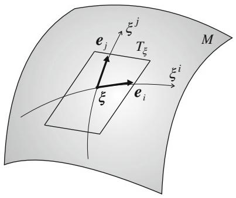  
Fig. 5.1 Tangent space $T_{\xi}$ and basis vectors $e_i$

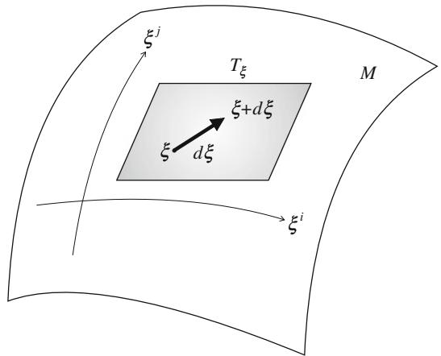  
Fig. 5.2 Infinitesimal vector $d\xi$ in $T_{\xi}$

A vector

$$
A = A ^ {i} \boldsymbol {e} _ {i} = A ^ {i} \partial_ {i} \tag {5.4}
$$

is the directional derivative operator which operates on $f$ as

$$
A f = A ^ {i} \partial_ {i} f (\boldsymbol {\xi}). \tag {5.5}
$$

When the coordinate system is changed from $\xi = (\xi^i)$ to $\zeta = (\zeta^{\kappa})$ , the partial derivatives change as follows:

$$
\partial_ {i} = J _ {i} ^ {\kappa} \partial_ {\kappa}, \quad \partial_ {\kappa} = J _ {\kappa} ^ {i} \partial_ {i}, \tag {5.6}
$$

where

$$
J _ {i} ^ {\kappa} = \frac {\partial \zeta^ {\kappa}}{\partial \xi^ {i}}, \quad J _ {\kappa} ^ {i} = \frac {\partial \xi^ {i}}{\partial \zeta^ {\kappa}}. \tag {5.7}
$$

# 5.1 Manifold and Tangent Space

Therefore, we have the law of transformation for the tangent vectors,

$$
\boldsymbol {e} _ {\kappa} = J _ {\kappa} ^ {i} \boldsymbol {e} _ {i}, \quad \boldsymbol {e} _ {i} = J _ {i} ^ {\kappa} \boldsymbol {e} _ {\kappa}; \tag {5.8}
$$

$$
\partial_ {\kappa} = J _ {\kappa} ^ {i} \partial_ {i}, \quad \partial_ {i} = J _ {i} ^ {\kappa} \partial_ {\kappa}. \tag {5.9}
$$

For a manifold of probability distributions, we have another expression of a tangent vector. We identify $e_i$ with the score function

$$
\boldsymbol {e} _ {i} \approx \partial_ {i} \log p (x, \xi), \tag {5.10}
$$

which is a random variable because it is a function of $x$ . Then, the tangent space $T_{\xi}$ is a linear space spanned by $n$ random variables $\partial_i \log p(x,\xi), i = 1,\dots,n$ .

A tangent vector is a geometrical quantity, but it has various representations such as a differentiation operator and a random variable.

# 5.2 Riemannian Metric

When an inner product is defined in the tangent space $T_{\xi}$ , we have a matrix $\mathbf{G} = (g_{ij})$ consisting of the inner products of basis vectors

$$
g _ {i j} (\boldsymbol {\xi}) = \left\langle \boldsymbol {e} _ {i}, \boldsymbol {e} _ {j} \right\rangle . \tag {5.11}
$$

It is a positive-definite matrix depending on $\xi$ . It is called the metric tensor and its components change to

$$
g _ {\kappa \lambda} = J _ {\kappa} ^ {i} J _ {\lambda} ^ {j} g _ {i j} \tag {5.12}
$$

by a coordinate transformation. (See Sect. 5.4 for the definition of a tensor.) A manifold is Riemannian when a metric tensor is defined.

For the manifold of probability distributions, we define an inner product by using the stochastic expression

$$
\left\langle \boldsymbol {e} _ {i}, \boldsymbol {e} _ {j} \right\rangle = \operatorname {E} \left[ \partial_ {i} \log p (x, \boldsymbol {\xi}) \partial_ {j} \log p (x, \boldsymbol {\xi}) \right]. \tag {5.13}
$$

This is the Fisher information matrix which is invariant.

The inner product of two vectors $A = A^{i}\pmb{e}_{i}$ and $B = B^{j}\pmb{e}_{j}$ is given by

$$
\langle A, B \rangle = \left\langle A ^ {i} e _ {i}, B ^ {j} e _ {j} \right\rangle = A ^ {i j} g _ {i j}. \tag {5.14}
$$

A Riemannian manifold is Euclidean when there exists a coordinate system in which the metric tensor becomes

$$
g _ {i j} (\boldsymbol {\xi}) = \delta_ {i j}. \tag {5.15}
$$

A Riemannian manifold is curved from the metric point of view when it does not have a coordinate system satisfying (5.15). We will see later that a manifold is (locally) flat when and only when the Riemann-Christoffel curvature tensor vanishes. We need an affine connection to define the curvature tensor.

# 5.3 Affine Connection

Tangent space $T_{\xi}$ is a local approximation of $M$ at $\xi$ . However, a collection of $T_{\xi}$ 's at all $\xi$ does not recover the entire figure of $M$ without specifying how $T_{\xi}$ and $T_{\xi'}$ ( $\xi \neq \xi'$ ) are related. It is the role of an affine connection to establish a one-to-one mapping between $T_{\xi}$ and $T_{\xi'}$ , in particular when $\xi$ and $\xi'$ are infinitesimally close. The entire figure of $M$ will be recovered from the aggregate of $T_{\xi}$ 's by using an affine connection.

Let us consider two nearby tangent spaces $T_{\xi}$ and $T_{\xi + d\xi}$ . Let

$$
X = X ^ {i} \boldsymbol {e} _ {i} (\boldsymbol {\xi}) \in T _ {\boldsymbol {\xi}}, \tag {5.16}
$$

$$
\tilde {X} = \tilde {X} ^ {i} \boldsymbol {e} _ {i} (\boldsymbol {\xi} + d \boldsymbol {\xi}) \in T _ {\boldsymbol {\xi} + d \boldsymbol {\xi}} \tag {5.17}
$$

be two tangent vectors belonging to $T_{\xi}$ and $T_{\xi + d\xi}$ , respectively. How different are they? We cannot compare them directly, because they belong to different tangent spaces. The basis vectors $\boldsymbol{e}_i = \boldsymbol{e}_i(\boldsymbol{\xi}) \in T_{\xi}$ and $\tilde{\boldsymbol{e}}_i = \boldsymbol{e}_i(\boldsymbol{\xi} + d\boldsymbol{\xi}) \in T_{\xi + d\xi}$ are different, so even when the components of $X^i$ and $\tilde{X}^i$ are the same, we cannot say they are equal.

A manifold is a continuum, so $T_{\xi}$ and $T_{\xi + d\xi}$ would be very similar, almost the same intuitively speaking, because the two tangent spaces become identical as $d\xi$ tends to 0. We define a one-to-one affine correspondence between two nearby tangent spaces such that it becomes identical as $d\xi$ tends to 0. As an example, consider a curved surface embedded in a three-dimensional Euclidean space. The tangent spaces at $\xi$ and at $\xi + d\xi$ are slightly different in the three-dimensional space. We shift $T_{\xi + d\xi}$ in parallel such that the origins of $T_{\xi}$ and $T_{\xi + d\xi}$ coincide in the three-dimensional space. However, the directions of $e_i$ and $\tilde{e}_i$ are slightly different when the surface is curved. We project the shifted $\tilde{e}_i$ to $T_{\xi}$ (Fig. 5.3) and let it be $e_i' \in T_{\xi}$ . The projected $e_i'$ is the counterpart of $\tilde{e}_i \in T_{\xi + d\xi}$ in $T_{\xi}$ , so a correspondence between $T_{\xi}$ and $T_{\xi + d\xi}$ is established by this projection. This is an example of affine connection.

We begin with technical expressions of an affine connection. Let us map the basis vector $\tilde{\pmb{e}}_i$ of $T_{\xi +d\xi}$ to $T_{\xi}$ , by which an affine correspondence is established. It is the projection in the ambient Euclidean space in the previous example, but we consider a more general situation. The map $\pmb{e}_i^{\prime}\in T_{\xi}$ of $\tilde{\pmb{e}}_i\in T_{\xi +d\xi}$ is close to $\pmb {e}_i(\pmb {\xi})$ , so it is represented as

$$
\boldsymbol {e} _ {i} ^ {\prime} = \boldsymbol {e} _ {i} + d \boldsymbol {e} _ {i}. \tag {5.18}
$$

# 5.3 Affine Connection

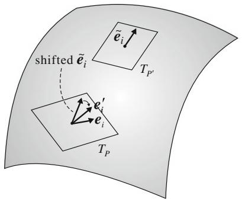  
Fig. 5.3 Shift $\tilde{\pmb{e}}_i\in T_{\xi +d\xi}$ to $P$ . The shifted $\tilde{\pmb{e}}_i$ does not belong to $T_{p}$ . Project it to $T_{p}$ obtaining $\pmb {e}_i^{\prime}\in T_p$ which is slightly different from $\pmb {e}_i\in T_p$

The difference $de_{i}$ is a vector of $T_{\xi}$ written in the component form as

$$
d \boldsymbol {e} _ {i} = \left(d e _ {i} ^ {j}\right) \boldsymbol {e} _ {j}. \tag {5.19}
$$

The components $de_i^j$ become 0 as $d\xi \rightarrow 0$ . So they are linear in $d\xi$ and we put

$$
d e _ {i} ^ {j} = \Gamma_ {k i} ^ {j} (\xi) d \xi^ {k} \tag {5.20}
$$

as the first-order approximation, where the coefficient $\Gamma_{ki}^{j}$ is a quantity having three indices.

A linear correspondence between $T_{\xi}$ and $T_{\xi + d\xi}$ is established by giving a quantity $\Gamma = \left( \Gamma_{ki}^{j} \right)$ having three indices. They are called the coefficients of an affine connection which is to be established. The coefficients are given by the inner products of $d\boldsymbol{e}_i$ and $\boldsymbol{e}_m$ as

$$
\left\langle d \boldsymbol {e} _ {i}, \boldsymbol {e} _ {m} \right\rangle = \Gamma_ {k i} ^ {j} g _ {j m} d \xi^ {k} = \Gamma_ {k i m} d \xi^ {k}, \tag {5.21}
$$

where

$$
\Gamma_ {k i m} = \Gamma_ {k i} ^ {j} g _ {m j} \tag {5.22}
$$

is the covariant expression (lower indices expression) of $\varGamma$ .

There still remains the problem of determining $\Gamma_{kji}$ . The traditional way is to use the Riemannian metric $g_{ij}$ . It is the Levi-Civita connection (Riemannian connection) introduced in Sect. 5.9. Another way is to use a divergence $D[\xi : \xi']$ defined in $M$ . This leads us to dually coupled affine connections, which we will see in the next chapter.

# 5.4 Tensors

A tensor is a quantity having a number of components such as $A = (A^i)$ , $G = (g_{ij})$ and $T = (T_{ijk})$ . A vector is a tensor having only one index. More precisely, a tensor is a quantity associated with tangent space $T_{\xi}$ spanned by $n$ tangent vectors $\{e_i\}$ . A vector $A$ is represented in this basis as

$$
A = A ^ {i} \boldsymbol {e} _ {i} \tag {5.23}
$$

in the component form, where the Einstein summation convention is working. Let $\{e^i\}$ be the dual basis, which is given by

$$
\boldsymbol {e} ^ {i} = g ^ {i j} \boldsymbol {e} _ {j}, \quad \boldsymbol {e} _ {j} = g _ {j i} \boldsymbol {e} ^ {i} \tag {5.24}
$$

by using the metric tensor $\mathbf{G} = (g_{ij})$ and its inverse $\mathbf{G}^{-1} = (g^{ij})$ . Note that the dual basis was denoted previously as $e^{*i}$ , but we hereafter omit *, because the upper index $i$ of $e^i$ shows that it is a dual basis vector. Vector $A$ is represented in the dual basis as

$$
A = A _ {i} e ^ {i} \tag {5.25}
$$

so that we have

$$
A _ {i} = g _ {i j} A ^ {j}. \tag {5.26}
$$

A tensor $K = \left(K_{ij}^{klm}\right)$ , for example, is a quantity represented, as

$$
K = K _ {i j} ^ {k l m} \boldsymbol {e} ^ {i} \boldsymbol {e} ^ {j} \boldsymbol {e} _ {k} \boldsymbol {e} _ {l} \boldsymbol {e} _ {m} \tag {5.27}
$$

in the linear form of the product $e^i e^j e_k e_l e_m$ of basis vectors. The product is formal and is just a concatenation of basis vectors. When an index is in the upper position, as in $A^i$ , it is said to be contravariant, and when it is in the lower position, as in $A_i$ , it is said to be covariant. A tensor may have contravariant and covariant components at the same time, as in $K_{ij}^{klm}$ .

When another coordinate system $\zeta = (\zeta^{\kappa})$ is adopted, the basis vectors change by the coordinate transformation as in (5.8). Therefore, the component of a vector changes, as in

$$
A ^ {\kappa} = J _ {i} ^ {\kappa} A ^ {i} \tag {5.28}
$$

for a contravariant (upper index) vector and

$$
A _ {\kappa} = J _ {\kappa} ^ {i} A _ {i} \tag {5.29}
$$

for a covariant vector. Similarly, for a tensor like $K_{ij}^{klm}$ , the components change as in

$$
K _ {\kappa \lambda} ^ {\mu \nu \tau} = J _ {\kappa} ^ {i} J _ {\lambda} ^ {j} J _ {k} ^ {\mu} J _ {l} ^ {\nu} J _ {m} ^ {\tau} K _ {i j} ^ {k l m}. \tag {5.30}
$$

# 5.4 Tensors

For a scalar function $f(\xi)$ , its gradient

$$
\nabla f (\boldsymbol {\xi}) = \left(\partial_ {i} f (\boldsymbol {\xi})\right), \quad \partial_ {i} = \frac {\partial}{\partial \xi^ {i}} \tag {5.31}
$$

is a covariant vector, because of

$$
\partial_ {\kappa} f = J _ {\kappa} ^ {i} \partial_ {i} f, \quad \partial_ {\kappa} = \frac {\partial}{\partial \zeta^ {\kappa}}. \tag {5.32}
$$

The Fisher information matrix (5.13) is a tensor. We define a quantity

$$
T _ {i j k} = \mathrm {E} \left[ \partial_ {i} l (x, \xi) \partial_ {j} l (x, \xi) \partial_ {k} l (x, \xi) \right]. \tag {5.33}
$$

It is a covariant tensor having three indices and is symmetric. We call it a (statistical) cubic tensor for short. Two tensors $G$ and $T$ will play a fundamental role in the manifold of probability distributions.

Not all indexed quantities are tensors. For example, the second derivative of a scalar function $f$

$$
f _ {i j} = \partial_ {i} \partial_ {j} f (\boldsymbol {\xi}) \tag {5.34}
$$

gives a quantity having two indices, but it is not a tensor. By changing the coordinate system from $\xi$ to $\zeta$ , we have

$$
f _ {\kappa \lambda} = \partial_ {\kappa} \partial_ {\lambda} f = \partial_ {\kappa} \left(J _ {\lambda} ^ {j} \partial_ {j} f\right) = J _ {\kappa} ^ {i} J _ {\lambda} ^ {j} f _ {i j} + \left(\partial_ {\kappa} J _ {\lambda} ^ {j}\right) \partial_ {j} f. \tag {5.35}
$$

This shows that it is not a tensor. (It is a tensor at the critical point where $\partial_{j}f = 0$ holds.)

It should be noted that $\Gamma$ is not a tensor. By changing the coordinate system from $\xi$ to $\zeta$ , $d\pmb{e}_i$ changes as in

$$
d \boldsymbol {e} _ {\kappa} = d \left(J _ {\kappa} ^ {i} \boldsymbol {e} _ {i}\right) = \left(\partial_ {\lambda} J _ {\kappa} ^ {i}\right) d \zeta^ {\lambda} \boldsymbol {e} _ {i} + J _ {\kappa} ^ {i} d \boldsymbol {e} _ {i} \tag {5.36}
$$

in the new coordinate system. By using this relation, after some calculations, we have

$$
\Gamma_ {\kappa \lambda \mu} = J _ {\kappa} ^ {i} J _ {\lambda} ^ {j} J _ {\mu} ^ {k} \Gamma_ {i j k} + \left(\partial_ {\kappa} J _ {\lambda} ^ {j}\right) J _ {\mu} ^ {k} g _ {j k}. \tag {5.37}
$$

So it is not a tensor. Note that, even if

$$
\Gamma_ {\kappa \lambda \mu} (\zeta) = 0 \tag {5.38}
$$

holds in one coordinate system, it does not mean that

$$
\Gamma_ {i j k} (\boldsymbol {\xi}) = 0 \tag {5.39}
$$

in another coordinate system. Although it is not a tensor, it has its own meaning, representing the nature of the coordinate system. In a Euclidean space,

$$
\Gamma_ {i j k} = 0 \tag {5.40}
$$

in an orthonormal coordinate system $\xi$ , but if we use the polar coordinate system $\zeta$

$$
\Gamma_ {\kappa \lambda \mu} \neq 0, \tag {5.41}
$$

because the tangent vector $\pmb{e}_r$ in the radial direction changes depending on the position in the polar coordinate system.

When an equation is written in a tensor form such as

$$
K _ {i j} ^ {k l} (\boldsymbol {u}, \boldsymbol {v}, \dots) = 0, \tag {5.42}
$$

depending on physical quantities $\pmb{u},\pmb{v}\dots,$ it has the same form in other coordinate systems

$$
K _ {\kappa \lambda} ^ {\mu \nu} (\boldsymbol {u}, \boldsymbol {v}, \dots) = 0. \tag {5.43}
$$

In this sense, a tensorial equation is invariant. A. Einstein obtained the equation of gravity in terms of tensors, because he believed that the law of nature should have the same form whichever coordinate system we use, and hence it should be written in a tensorial form.

# 5.5 Covariant Derivative

A vector field $X$ is a vector-valued function on $M$ , the value of which at $\xi$ is given by a vector

$$
X (\boldsymbol {\xi}) = X ^ {i} (\boldsymbol {\xi}) \boldsymbol {e} _ {i} (\boldsymbol {\xi}) \in T _ {\boldsymbol {\xi}}. \tag {5.44}
$$

When a vector field is given, it is possible to evaluate the intrinsic change of the vector as position $\xi$ changes, by using the affine connection.

In order to see the intrinsic change between $X(\pmb{\xi})$ and $X(\pmb{\xi} + d\pmb{\xi})$ , since they belong to different tangent spaces, we need to map $X(\pmb{\xi} + d\pmb{\xi}) \in T_{\pmb{\xi} + d\pmb{\xi}}$ to $T_{\pmb{\xi}}$ for comparison. Since the basis vector $\tilde{\pmb{e}}_i = \pmb{e}_i(\pmb{\xi} + d\pmb{\xi})$ is mapped to $T_{\pmb{\xi}}$ by

$$
\boldsymbol {e} _ {i} ^ {\prime} = \boldsymbol {e} _ {i} (\boldsymbol {\xi}) + \Gamma_ {j i} ^ {k} \boldsymbol {e} _ {k} d \boldsymbol {\xi} ^ {j}, \tag {5.45}
$$

vector $X(\pmb {\xi} + d\pmb {\xi})$ is mapped to $T_{\xi}$ as

$$
\tilde {X} = X ^ {k} (\boldsymbol {\xi} + d \boldsymbol {\xi}) \tilde {\boldsymbol {e}} _ {k} = \left(X ^ {k} \boldsymbol {e} _ {k} + \partial_ {j} X ^ {k} \boldsymbol {e} _ {k} d \xi^ {j} + \Gamma_ {j k} ^ {m} X ^ {k} \boldsymbol {e} _ {m} d \xi^ {j}\right), \tag {5.46}
$$

# 5.5 Covariant Derivative

where the Taylor expansion of $X^{k}(\pmb {\xi} + d\pmb {\xi})$ is used. Hence, their difference is evaluated as

$$
\tilde {X} - X (\boldsymbol {\xi}) = \left(\partial_ {i} X ^ {k} + \Gamma_ {i j} ^ {k} X ^ {j}\right) d \xi^ {i} \boldsymbol {e} _ {k}. \tag {5.47}
$$

This shows the intrinsic change of $X(\pmb{\xi})$ as $\pmb{\xi}$ changes by $d\pmb{\xi}$ . The rate of intrinsic change along the coordinate curve $\xi^i$ is denoted as

$$
\nabla_ {i} X ^ {k} = \partial_ {i} X ^ {k} + \Gamma_ {i j} ^ {k} X ^ {j}. \tag {5.48}
$$

This is called the covariant derivative of $X(\pmb {\xi})$ and $\nabla_{i}X^{k}$ is a tensor.

Let $Y(\pmb{\xi})$ be another vector field. Then, the directional covariant derivative of $X$ along $Y$ is denoted as

$$
\nabla_ {Y} X = Y ^ {i} \nabla_ {i} X ^ {k} = Y ^ {i} \left(\partial_ {i} X ^ {k} + \Gamma_ {i j} ^ {k} X ^ {j}\right) \boldsymbol {e} _ {k}. \tag {5.49}
$$

This is the covariant derivative of $X$ along $Y$ . It is again a vector field.

We can define the covariant derivative of a tensor, e.g.,

$$
K = K _ {k} ^ {i j} \boldsymbol {e} _ {i} \boldsymbol {e} _ {j} \boldsymbol {e} ^ {k} \tag {5.50}
$$

in a similar way, since it is spanned by multilinear vector products of the basis vectors $\pmb{e}_i, \pmb{e}_j, \pmb{e}^k$ .

For a scalar function $f(\pmb{\xi})$ , its change is measured by ordinary differentiation. Hence, vector field $Y(\pmb{\xi})$ gives its directional derivative

$$
Y f = Y ^ {i} \partial_ {i} f. \tag {5.51}
$$

Note that, for a vector field $X$ , the partial derivatives of its components $\partial_i X^j(\xi)$ are not a tensor. We should use the covariant derivative for evaluating its intrinsic change.

# 5.6 Geodesic

A curve $\xi(t)$ is called a geodesic when its direction does not change. So it is a generalization of the straight line. Here, a change in direction is measured by the covariant derivative derived from an affine connection. Note that this does not necessarily mean that it is a curve of minimal distance connecting two points, although this is the literal definition of a geodesic. The minimality and straightness can be different in a general manifold. It is possible to define an affine connection by using the metric such that a straight line (geodesic) has the minimality of distance, as is given in Theorem 5.2. But a divergence function gives a more general affine connection.

The tangent vector of curve $\xi (t)$ at $t$ is given by

$$
\dot {\boldsymbol {\xi}} (t) = \dot {\xi} ^ {i} (t) \boldsymbol {e} _ {i} (t), \tag {5.52}
$$

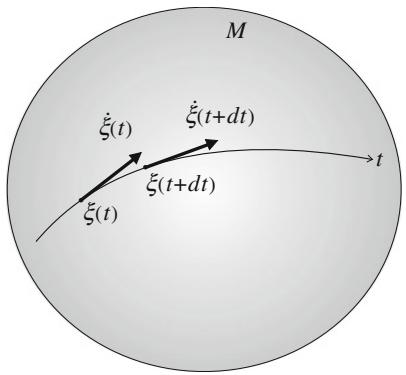  
Fig. 5.4 Geodesic: $\dot{\xi} (t + dt)$ corresponds to $\dot{\xi} (t)$

where $\pmb{e}_i(t) = \pmb{e}_i\{\pmb{\xi}(t)\}$ and $\cdot$ denotes the derivative $d/dt$ . When $\pmb{\xi}(t)$ is a geodesic, the tangent vector $\dot{\pmb{\xi}}(t + dt) \in T_{\pmb{\xi}(t + dt)}$ corresponds to $\dot{\pmb{\xi}}(t) \in T_{\pmb{\xi}(t)}$ by the affine connection. See Fig. 5.4. Since the change of the tangent direction of a curve is measured by the covariant derivative of $\dot{\pmb{\xi}}$ along itself, the equation of the geodesic is

$$
\nabla_ {\dot {\xi}} \dot {\xi} = 0. \tag {5.53}
$$

This is given in the component form as

$$
\ddot {\xi} ^ {i} (t) + \Gamma_ {j k} ^ {i} \dot {\xi} ^ {j} (t) \dot {\xi} ^ {k} (t) = 0. \tag {5.54}
$$

If we consider the equation

$$
\nabla_ {\dot {\xi}} \dot {\boldsymbol {\xi}} = c (t) \dot {\boldsymbol {\xi}}, \tag {5.55}
$$

$\xi(t)$ does not change the direction $\dot{\xi}(t)$ of the curve, too, but its magnitude may change. However, by choosing the parameter $t$ adequately, it is possible to reduce (5.55) to (5.54). Hence we consider only the case of (5.54).

# 5.7 Parallel Transport of Vector

We can transport a vector $A \in T_{\xi + d\xi}$ at $\xi + d\xi$ to $T_{\xi}$ at $\xi$ without changing it "intrinsically". The affine connection determines this parallel transport. For two distant points $\xi$ and $\xi'$ , we continue the process of parallel transport of a vector along a curve $\xi(t)$ connecting $\xi$ and $\xi'$ .

Define a vector field

$$
A (t) = A ^ {i} \boldsymbol {e} _ {i} (t) \tag {5.56}
$$

along curve $\xi(t)$ connecting $P$ and $Q$ (see Fig. 5.5). When its covariant derivative along the curve vanishes,

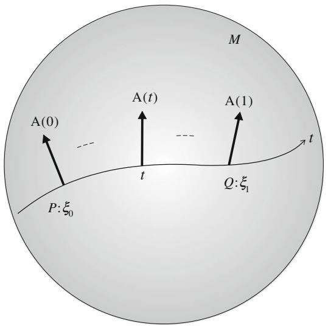  
Fig. 5.5 Parallel transport of $A(0)$ at $\xi_0$ to $A(1)$ at $\xi_1$ along curve $\xi(t)$

$$
\nabla_ {\dot {\xi}} A (t) = 0, \tag {5.57}
$$

$A(t)$ is intrinsically the same at any $\xi (t)$ . This is written in the component form as

$$
\dot {A} ^ {i} (t) + \Gamma_ {j k} ^ {i} (t) A ^ {k} (t) \dot {\xi} ^ {j} (t) = 0. \tag {5.58}
$$

When $A(t)$ satisfies (5.57) or (5.58), we say that $A(0)$ at $T_{\xi^{(0)}}$ is transported parallelly to $A(1)$ at $T_{\xi^{(1)}}$ . The parallel transport depends in general on the path along which it is transported. So we denote the parallel transport of a vector $A$ from $\pmb{\xi}_0 = \pmb{\xi}(0)$ to $\pmb{\xi}_1 = \pmb{\xi}(1)$ along curve $c = \pmb{\xi}(t)$ by

$$
A (1) = \prod ^ {\xi_ {1}} A (0). \tag {5.59}
$$

# 5.8 Riemann-Christoffel Curvature

A manifold is curved in general. When a vector is transported in parallel from one point to another, the resultant vector depends on the path along which it is transported. This never happens in a flat manifold. In order to show how curved a manifold is, we define the Riemann-Christoffel (RC) curvature tensor determined from the affine connection. One may skip this section, since we do not use RC curvature in applications in this monograph. When the RC curvature tensor vanishes, that is, when it is identically equal to 0, the manifold is (locally) flat. When it is flat, there exists an affine coordinate system such that each coordinate curve is a geodesic and its tangent vector coincides at any point by parallel transport.

# 5.8.1 Round-the-World Transport of Vector

Let us consider two curves $c_{1}:\pmb{\xi}_{1}(t)$ and $c_{2}:\pmb{\xi}_{2}(t)$ , $0\leq t\leq 1$ , both connecting the same two points $\pmb{\xi}_0 = \pmb{\xi}_0(0)$ and $\pmb{\xi}_1 = \pmb{\xi}_1(1)$ . When a vector $A$ at $\pmb{\xi}_0$ is transported to $\pmb{\xi}_1$ in parallel along curve $c_{1}$ , it becomes $\prod_{c_1}A$ . If we transport $\prod_{c_1}A$ back to $\pmb{\xi}_0$ along the same curve $c_{1}$ in reverse, it is $A$ . Now we transport $A$ in parallel along the two curves $c_{1}$ and $c_{2}$ . The resultant vectors, $\prod_{c_1}A$ and $\prod_{c_2}A$ , are different in general (Fig. 5.6). This implies that when we transport a vector from $\pmb{\xi}_0$ to $\pmb{\xi}_1$ along path $c_{1}$ and then transport it back to the original point $\pmb{\xi}_0$ along the other path $c_{2}$ in reverse, the resultant vector is different from $A$ . So a vector changes when it is transported along a loop (consisting of path $c_{1}$ and reverse path of $c_{2}$ ). In other words, a vector is changed by a round-the-world trip.

The change may be used to measure how curved $M$ is. To evaluate the change, we consider an infinitesimally small quadrangle connecting four points $P, Q, R$ and $S$ , where their coordinates are

$$
P: \xi , \quad Q: \xi + d _ {1} \xi , \quad R: \xi + d _ {1} \xi + d _ {2} \xi , \quad S: \xi + d _ {2} \xi . \tag {5.60}
$$

(See Fig. 5.7.) We transport $A$ in parallel first from $P$ to $Q$ by $d_1\xi$ . Then, $A$ becomes $A_{1} = A + d_{1}A$ , the components of which are

$$
d _ {1} A ^ {i} = - \Gamma_ {j k} ^ {i} A ^ {k} d _ {1} \xi^ {j}. \tag {5.61}
$$

We further transport $A_{1}$ from $Q$ to $R$ along the path $\overrightarrow{QR} = d_2\pmb{\xi}$ . Then, the transported vector at $R$ is $A_{12} = A + d_1A + \delta_{12}A$ , where the components of additional change $\delta_{12}A$ are

$$
\delta_ {1 2} A ^ {i} = - \Gamma_ {j k} ^ {i} (\boldsymbol {\xi} + d _ {1} \boldsymbol {\xi}) \left(A ^ {k} + d _ {1} A ^ {k}\right) d _ {2} \xi^ {j}. \tag {5.62}
$$

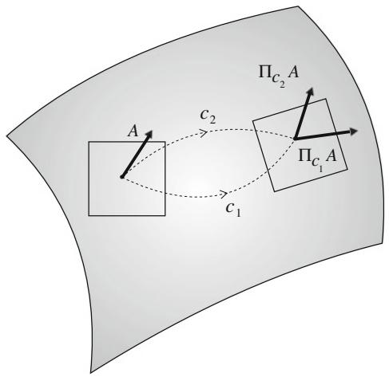  
Fig. 5.6 Parallel transport of $A$ via $c_{1}$ is different from that via $c_{2}$

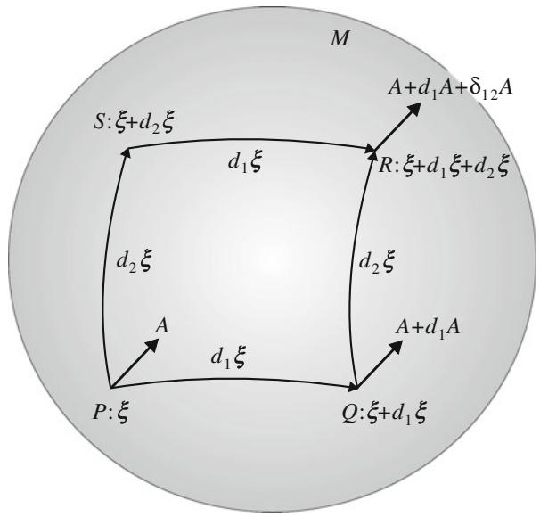  
Fig. 5.7 Parallel transports of $A$ along $PQR$ and $PSR$

Since $\varGamma$ is evaluated at $\pmb {\xi} + d_{1}\pmb{\xi}$ , the Taylor expansion gives

$$
\delta_ {1 2} A ^ {i} = - \Gamma_ {j k} ^ {i} d _ {2} \xi^ {j} A ^ {k} - \partial_ {l} \Gamma_ {j k} ^ {i} d _ {1} \xi^ {l} d _ {2} \xi^ {j} A ^ {k} + \Gamma_ {j k} ^ {i} \Gamma_ {l m} ^ {k} d _ {2} \xi^ {j} d _ {1} \xi^ {l} A ^ {m}. \tag {5.63}
$$

Now, we transport $A$ along the different route, first along the path $\overrightarrow{PS} = d_2\xi$ to $S$ and then to $R$ along $\overrightarrow{SR} = d_1\xi$ . The resultant change is given by exchanging $d_1\xi$ and $d_2\xi$ in (5.63). The result is

$$
\delta_ {2 1} A ^ {i} = - \Gamma_ {j k} ^ {i} d _ {1} \xi^ {j} A ^ {k} - \partial_ {l} \Gamma_ {j k} ^ {i} d _ {2} \xi^ {l} d _ {1} \xi^ {j} A ^ {k} + \Gamma_ {j k} ^ {i} \Gamma_ {l m} ^ {k} d _ {2} \xi^ {j} d _ {1} \xi^ {l} A ^ {m}. \tag {5.64}
$$

How different are the resultant vectors? By subtracting $A_{21}$ from $A_{12}$ where (5.63) and (5.64) are used, the result is written as

$$
A _ {2 1} - A _ {1 2} = \delta A ^ {i} = R _ {j k l} ^ {i} A ^ {l} \left(d _ {1} \xi^ {j} d _ {2} \xi^ {k} - d _ {1} \xi^ {k} d _ {2} \xi^ {j}\right), \tag {5.65}
$$

where we put

$$
R _ {i j k} ^ {l} = \partial_ {i} \Gamma_ {j k} ^ {l} - \partial_ {j} \Gamma_ {i k} ^ {l} + \Gamma_ {i m} ^ {l} \Gamma_ {j k} ^ {m} - \Gamma_ {j m} ^ {l} \Gamma_ {i k} ^ {m}. \tag {5.66}
$$

We can prove that $R_{ijk}^l$ is a tensor. It is called the Riemann-Christoffel (RC) curvature tensor. This shows how a vector changes by the round-the-world trip along an infinitesimal loop. We denote the infinitesimal loop encircling $P, Q, R, S$ and $P$ by a tensor

$$
d f ^ {j k} = \left(d _ {1} \xi^ {j} d _ {2} \xi^ {k} - d _ {1} \xi^ {k} d _ {2} \xi^ {j}\right), \tag {5.67}
$$

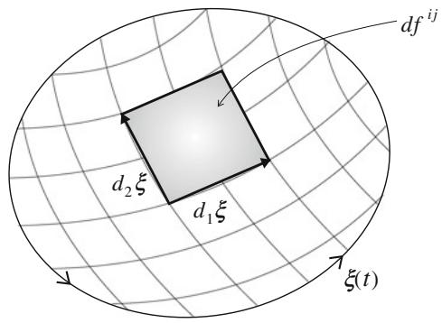  
Fig. 5.8 Small surface element, loop and membrane

which is antisymmetric with respect to the two indices $i$ and $j$ ,

$$
d f ^ {i j} = - d f ^ {j i}. \tag {5.68}
$$

This is a small surface element, representing a surface spanned by $d_{1}\xi$ and $d_{2}\xi$ (Fig. 5.8). Equation (5.65) is written as

$$
\delta A ^ {i} = R _ {j k l} ^ {i} A ^ {l} d f ^ {j k}. \tag {5.69}
$$

When vector $A$ is transported in parallel along a general loop $\xi(t)$ , $0 \leq t \leq 1$ , $\xi(0) = \xi(1)$ , we span a membrane encircled by the loop (see Fig. 5.8). Then, the changed $\Delta A$ due to the round-the-world parallel transportation is given by the surface integral

$$
\Delta A ^ {i} = \int R _ {j k l} ^ {i} A ^ {l} d f ^ {j k}. \tag {5.70}
$$

This does not depend on the way of spanning the membrane, as is clear from the Stokes' Theorem.

# 5.8.2 Covariant Derivative and RC Curvature

The partial derivative is always commutative,

$$
\partial_ {i} \partial_ {j} = \partial_ {j} \partial_ {i}. \tag {5.71}
$$

However, this does not in general hold for the covariant derivative,

$$
\nabla_ {i} \nabla_ {j} - \nabla_ {j} \nabla_ {i} \neq 0. \tag {5.72}
$$

The covariant derivative of $\pmb{e}_j$ in the direction of basis vector $\pmb{e}_i$ is

$$
\nabla_ {\boldsymbol {e} _ {j}} \boldsymbol {e} _ {j} = \Gamma_ {i j} ^ {k} \boldsymbol {e} _ {k}. \tag {5.73}
$$

By using this, we have

$$
\left(\nabla_ {e _ {i}} \nabla_ {e _ {j}} - \nabla_ {e _ {j}} \nabla_ {e _ {i}}\right) X (\boldsymbol {\xi}) = R _ {i j k} ^ {l} X ^ {k} e _ {l}. \tag {5.74}
$$

We omit the proof, but we see that the RC curvature shows the degree of noncommutativity of the covariant derivative.

In general, we can define the RC curvature by

$$
R (X, Y) Z = \nabla_ {X} (\nabla_ {Y} Z) - \nabla_ {Y} (\nabla_ {X} Z) - \nabla_ {[ X, Y ]} Z, \tag {5.75}
$$

where

$$
[ X, Y ] = X Y - Y X = \left(X ^ {j} \partial_ {j} Y ^ {i} - Y ^ {j} \partial_ {j} X ^ {i}\right) \boldsymbol {e} _ {i}. \tag {5.76}
$$

This is a sophisticated definition of the RC curvature tensor which one sees in modern textbooks on differential geometry. However, it is difficult to understand the meaning of the RC curvature from it.

# 5.8.3 FlatManifold

When the RC curvature vanishes, $M$ is said to be flat. The parallel transport of a vector does not depend on the path in this case. Let us consider a set of basis vectors $\{\pmb{e}_i\}$ in the tangent space at a point. We construct $n$ geodesics passing through the point in the directions of $\pmb{e}_i$ . We then have $n$ coordinate curves $\theta^i$ , of which tangent vectors $\pmb{e}_i$ are the same everywhere. This generates a flat coordinate system $\pmb{\theta} = (\theta^i)$ . Indeed, we transport the tangent vectors $\pmb{e}_i$ to any point and compose the geodesics the directions of which are $\pmb{e}_i$ . Vectors $\pmb{e}_i$ are parallel at any point and we have a net of coordinate curves $\pmb{\theta}$ .

Since the tangent vectors of a coordinate curve $\theta^i$ are all in parallel, we have

$$
\nabla_ {\boldsymbol {e} _ {j}} \boldsymbol {e} _ {i} = 0. \tag {5.77}
$$

Therefore, from (5.73) we have

$$
\Gamma_ {j i k} = 0. \tag {5.78}
$$

Hence, when $M$ is flat, we have an affine coordinate system consisting of geodesics in which (5.78) holds at any $\xi$ .

# 5.9 Levi-Civita (Riemannian) Connection

We have so far treated the metric and affine connection separately. However, it is possible to define an affine connection such that it is essentially related to the metric, giving a unified picture. This is Riemannian geometry. It requires that the magnitude of a vector does not change by the parallel transport. This establishes a relation between the metric and the affine connection (see Fig. 5.9).

It is easy to see the equivalence of the following two propositions of parallel transportation: (1) The magnitude of a vector does not change by parallel transportation,

$$
\langle A, A \rangle_ {\xi_ {0}} = \left\langle \prod A, \prod A \right\rangle_ {\xi_ {1}}, \text {f o r a n y} A. \tag {5.79}
$$

(2) The inner product of two vectors does not change by parallel transportation,

$$
\langle A, B \rangle_ {\xi_ {0}} = \left\langle \prod A, \prod B \right\rangle_ {\xi_ {1}}, \text {f o r a n y} A, B. \tag {5.80}
$$

We consider an infinitesimal parallel transport of two basis vectors along the coordinate curve $\xi^i$ . Then, when the length of a vector does not change, we have

$$
g _ {i j} (\boldsymbol {\xi} + d \boldsymbol {\xi}) = \left\langle \boldsymbol {e} _ {i} (\boldsymbol {\xi} + d \boldsymbol {\xi}), \boldsymbol {e} _ {j} (\boldsymbol {\xi} + d \boldsymbol {\xi}) \right\rangle_ {\boldsymbol {\xi} + d \boldsymbol {\xi}} = \left\langle \boldsymbol {e} _ {i} (\boldsymbol {\xi}) + d \boldsymbol {e} _ {i}, \boldsymbol {e} _ {j} (\boldsymbol {\xi}) + d \boldsymbol {e} _ {j} \right\rangle_ {\boldsymbol {\xi}}. \tag {5.81}
$$

Because $g_{ij}(\pmb {\xi} + d\pmb {\xi}) = g_{ij}(\pmb {\xi}) + \partial_kg_{ij}d\xi^k$ , this condition is written as

$$
\partial_ {k} g _ {i j} = \Gamma_ {k i j} + \Gamma_ {k j i}. \tag {5.82}
$$

More generally, this condition is equivalent to

$$
Z \langle X, Y \rangle = \left\langle \nabla_ {Z} X, Y \right\rangle + \langle X, \nabla_ {Z} Y \rangle , \tag {5.83}
$$

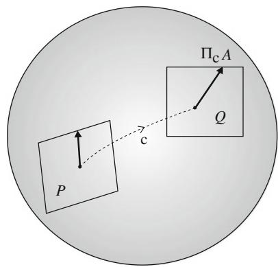  
Fig. 5.9 The magnitude of $A$ is equal to the magnitude of $\prod_{c} A$

for three vector fields $X$ , $Y$ and $Z$ . When an affine connection satisfies this condition, it is said to be metric. The metric affine connection is uniquely determined from metric $g_{ij}$ , provided the symmetric condition

$$
\Gamma_ {i j k} = \Gamma_ {j i k} \tag {5.84}
$$

holds.

Theorem 5.1 When the parallel transport does not change the magnitude of a vector, there is a unique symmetric affine connection given by

$$
\Gamma_ {i j k} (\boldsymbol {\xi}) = \frac {1}{2} \left(\partial_ {i} g _ {j k} + \partial_ {j} g _ {i k} - \partial_ {k} g _ {i j}\right). \tag {5.85}
$$

It is an interesting exercise to prove this from (5.82). It is called the Levi-Civita connection or Riemannian connection. Many conventional textbooks on differential geometry study only the Levi-Civita connection. By using the Levi-Civita connection, we have the following convenient property.

Theorem 5.2 A curve that connects two points by a minimal distance is a geodesic under the Levi-Civita connection, where the length of a curve $c = \xi(t)$ connecting $\xi(0)$ and $\xi(1)$ is given by

$$
s = \int_ {0} ^ {1} \sqrt {g _ {i j} (t) \dot {\boldsymbol {\xi}} ^ {i} (t) \dot {\boldsymbol {\xi}} ^ {j} (t)} d t. \tag {5.86}
$$

It is possible to obtain (5.54) and (5.85) by the variational method, $\delta s = 0$ , of minimizing (5.86) with respect to curve $\xi(t)$ . This is also a good exercise. See Fig. 5.10.

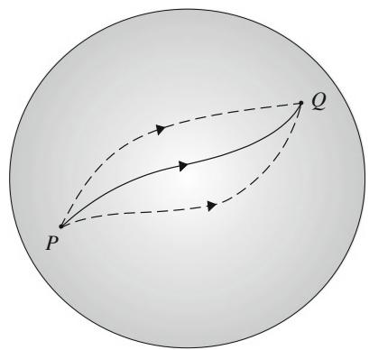  
Fig. 5.10 A Riemannian geodesic $\xi(t)$ is a curve which does not change the direction $\dot{\xi}(t)$ , and also the distance $s$ is minimized along it

# 5.10 Submanifold and Embedding Curvature

We consider a submanifold embedded in a larger manifold. It has embedding curvature when it is curved in the ambient manifold. This is different from the RC curvature. It is useful to embed a manifold in a simple (e.g. flat) higher-dimensional ambient manifold and study its properties in the ambient manifold. Geometrical quantities are transferred from a simple ambient manifold to the submanifold by embedding.

# 5.10.1 Submanifold

Let $S$ be a submanifold embedded in $M$ (Fig. 5.11). Let $\pmb{\xi} = (\xi^i)$ be a coordinate system of $M$ , $i = 1, \dots, n$ and $\pmb{u} = (u^a)$ be a coordinate system of $S$ , $a = 1, \dots, m$ , where we assume $n > m$ . Since a point $\pmb{u}$ in $S$ is also a point in the ambient $M$ , its coordinates in $M$ are specified by $\pmb{u}$ as

$$
\boldsymbol {\xi} = \boldsymbol {\xi} (\boldsymbol {u}). \tag {5.87}
$$

We consider the case that $\pmb{\xi}(\pmb{u})$ is differentiable with respect to $\pmb{u}$ .

The tangent vector $\mathbf{e}_a$ along the coordinate curve $u^a$ of $S$ is

$$
\boldsymbol {e} _ {a} = \partial_ {a} \tag {5.88}
$$

and the tangent space $T_{\pmb{u}}^{S}$ of $S$ is spanned by them (Fig. 5.12). However, they are regarded as tangent vectors at point $\xi(\pmb{u})$ of $M$ by embedding. They are represented in $M$ as

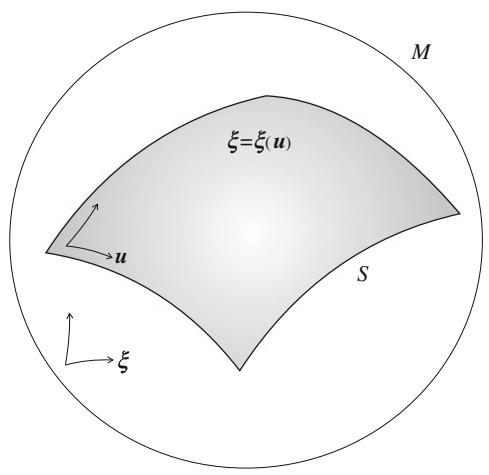  
Fig. 5.11 Submanifold $S$ embedded in $M$

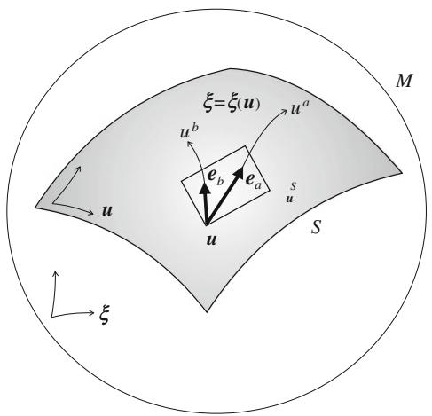  
Fig. 5.12 Tangent vectors $\mathbf{e}_a$ of submanifold

$$
\boldsymbol {e} _ {a} = \frac {\partial \xi^ {i}}{\partial u ^ {a}} \boldsymbol {e} _ {i} \quad \left(\partial_ {a} = \frac {\partial \xi^ {i}}{\partial u ^ {a}} \partial_ {i}\right) \tag {5.89}
$$

in terms of the basis vectors $\pmb{e}_i \in T_\xi$ of $M$ . Defining

$$
B _ {a} ^ {i} = \frac {\partial \xi^ {i}}{\partial u ^ {a}}, \tag {5.90}
$$

we have

$$
\boldsymbol {e} _ {a} = B _ {a} ^ {i} \boldsymbol {e} _ {i}. \tag {5.91}
$$

A vector $X = X^{a}\pmb{e}_{a} \in T_{\pmb{u}}^{S}$ is a vector $X = X^{i}\pmb{e}_{i} \in T_{\xi}$ and

$$
X ^ {i} = B _ {a} ^ {i} X ^ {a}. \tag {5.92}
$$

Submanifold $S$ inherits the geometrical structures of $M$ . The magnitude of a tangent vector $A$ in $T_{u}^{S}$ is given by its magnitude in $M$ . Hence, the metric

$$
g _ {a b} = \left\langle \boldsymbol {e} _ {a}, \boldsymbol {e} _ {b} \right\rangle \tag {5.93}
$$

in $S$ is given by

$$
g _ {a b} = B _ {a} ^ {i} B _ {b} ^ {j} g _ {i j}. \tag {5.94}
$$

# 5.10.2 Embedding Curvature

An affine connection is naturally transferred to $S$ from $M$ . Let $\tilde{\pmb{e}}_a = \pmb{e}_a(\pmb{u} + d\pmb{u}) \in T_{\pmb{u} + d\pmb{u}}^S$ be a basis vector at $\pmb{u} + d\pmb{u}$ of $S$ and we map it in parallel to $T_{\pmb{u}}^S$ . We first

transport it in $M$ from $\pmb{\xi}(\pmb{u})$ to $\pmb{\xi}(\pmb{u} + d\pmb{u})$ in parallel. The resultant vector is denoted as $\pmb{e}_a' = \pmb{e}_a + d\pmb{e}_a \in T_{\xi(\pmb{u})}$ , where $d\pmb{e}_a$ is given by the covariant derivative of $\pmb{e}_a$ in the direction of $\pmb{e}_b = B_b^i\pmb{e}_i$ in $M$ ,

$$
d \boldsymbol {e} _ {a} = \nabla_ {\boldsymbol {e} _ {b}} \boldsymbol {e} _ {a} d u ^ {b}. \tag {5.95}
$$

We calculate $\nabla_{e_a}e_b$ in $M$

$$
\begin{array}{l} \nabla_ {\boldsymbol {e} _ {a}} \boldsymbol {e} _ {b} = B _ {a} ^ {i} \nabla_ {\boldsymbol {e} _ {i}} \left(B _ {b} ^ {j} \boldsymbol {e} _ {j}\right) = B _ {a} ^ {i} \partial_ {i} B _ {b} ^ {k} \boldsymbol {e} _ {k} + B _ {a} ^ {i} B _ {b} ^ {j} \nabla_ {\boldsymbol {e} _ {i}} \boldsymbol {e} _ {j} \\ = \left(B _ {a} ^ {i} \partial_ {i} B _ {b} ^ {k} + B _ {a} ^ {i} B _ {b} ^ {j} \Gamma_ {i j} ^ {k}\right) \boldsymbol {e} _ {k} \\ = \Gamma_ {a b} ^ {k} e _ {k}, \tag {5.96} \\ \end{array}
$$

where we put

$$
\Gamma_ {a b} ^ {k} = B _ {a} ^ {i} \partial_ {i} B _ {b} ^ {k} + B _ {a} ^ {i} B _ {b} ^ {j} \Gamma_ {i j} ^ {k}. \tag {5.97}
$$

Here, the vector $de_{a}$ is not necessarily included in the tangent space of $S$ (Fig. 5.13). So we decompose it in the tangent direction of $S$ and its orthogonal direction,

$$
d \boldsymbol {e} _ {a} = d \boldsymbol {e} _ {a} ^ {\parallel} + d \boldsymbol {e} _ {a} ^ {\perp}, \tag {5.98}
$$

where $d\pmb{e}_a^\parallel \in T_u^S$ and $d\pmb{e}_a^\perp$ is orthogonal to $S$ . We define the parallel transport of $\tilde{\pmb{e}}_a$ within $S$ by the change $d\pmb{e}_a^\parallel$ , neglecting the change in the orthogonal direction:

$$
\tilde {\boldsymbol {e}} _ {a} = \boldsymbol {e} _ {a} + d \boldsymbol {e} _ {a} ^ {\parallel}. \tag {5.99}
$$

Rewriting $d\pmb{e}_a^{\parallel}$ in terms of basis vectors $\{\pmb{e}_b\}$ , the induced affine connection of $S$ is given as

$$
\Gamma_ {a b c} (\boldsymbol {u}) = B _ {a} ^ {i} B _ {b} ^ {j} B _ {c} ^ {k} \Gamma_ {i j k} + B _ {c} ^ {j} \partial_ {a} B _ {b} ^ {i} g _ {i j}. \tag {5.100}
$$

The orthogonal direction of $de_{a}^{\perp}$ represents how $S$ is curved in $M$ . To show the orthogonal component, we supplement $T_{u}^{S}$ with $n - m$ orthogonal vectors $\boldsymbol{e}_{\kappa}, \kappa = n - m + 1, \ldots, n$ , such that the entire vectors $\{\boldsymbol{e}_a, \boldsymbol{e}_\kappa\}$ span the tangent space of $M$ . Then, the orthogonal part is given by

$$
\delta \boldsymbol {e} _ {a} ^ {\perp} = H _ {a b} ^ {\kappa} \boldsymbol {e} _ {k} d u ^ {b}, \tag {5.101}
$$

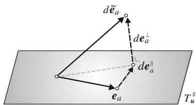  
Fig. 5.13 Decomposition of $d\bar{e}_a \in T_{\xi(u)}$ in the orthogonal part $de_a^\perp$ and parallel part $de_a^{\parallel}$ with respect to $T_u^S$

where we use the covariant derivative in $M$ to define

$$
H _ {b a \kappa} = \left\langle \nabla_ {\boldsymbol {e} _ {b}} \boldsymbol {e} _ {a}, \boldsymbol {e} _ {\kappa} \right\rangle . \tag {5.102}
$$

This is the embedding curvature of $S$ , sometimes called the Euler-Schouten curvature tensor.

The embedding curvature is different from the RC curvature, which is derived from the affine connection $\Gamma_{abc}$ . The RC curvature is the intrinsic curvature considering only inside $S$ . As a simple example, let us consider a cylinder $S$ embedded in a three-dimensional Euclidean manifold $M$ . It is curved in $M$ , so it has non-zero embedding curvature. But its RC curvature vanishes and Euclidean geometry holds inside $S$ . If we live in $S$ and do not know the outer world of three dimensions, we enjoy Euclidean geometry in $S$ where the RC curvature is 0. But $S$ has non-zero embedding curvature.

# Remarks

Differential geometry studies properties of a manifold by its local structure. A Riemannian manifold is a typical example, where a manifold is equipped with a metric tensor $\mathbf{G} = (g_{ij})$ by which the distance of two nearby points is measured. It is locally approximated by a Euclidean space but is curved in general. Modern differential geometry further studies the global topological structure of a manifold. It is interesting to see how the global structure is restricted by the local structure such as the curvature. This is an important perspective. However, we have not mentioned the global properties, because most (though not all) applications use only local structure.

Since differential geometry has been developed as pure mathematics, mathematicians have constructed a rigorous, sophisticated theory, excluding intuitive definitions of geometrical concepts. However, once such a rigorous theory is established, we may use intuitive understanding for applications. Part II is an attempt to introduce the modern concepts of differential geometry without tears to beginners.

After non-Euclidean geometry was developed in the 19th century, people came to know that there existed non-Euclidean spaces. B. Riemann, in his professorship lecture, proposed the concept of Riemannian geometry, which is non-Euclidean and curved. He conjectured that the real world might be Riemannian on a cosmological scale or on an atomic scale. His view was proved true in the 20th century in relativity theory and elementary particle theory.

There are many of applications of differential geometry. Relativity theory is one of them, in which Einstein introduced the concept of a torsion tensor to establish a unified theory (unification of gravity and electromagnetism). Unfortunately, this interesting idea failed. But the torsion tensor survived in mathematics. The torsion tensor is a third-order tensor of which the first two indices are anti-symmetric. This is a new quantity to supplement the Riemannian structure of $\{M, G\}$ , although we have not mentioned it here.

A Riemannian manifold with torsion plays a fundamental role in continuum mechanics including dislocations. A dislocation field in a continuum is identified with a torsion field, and a rich theory has been established. See, e.g., Amari [1962, 1968]. Another application is the dynamics of electro-mechanical systems, such as

motors and generators, by Gabriel Kron. Here, non-holonomic constraints play a role, and are converted to torsion. Recent robotics also uses non-holonomic constraints. Differential geometry plays important roles in various areas.

Information geometry also uses differential geometry, where the invariance criterion plays a fundamental role in defining the geometrical structure of a manifold of probability distributions. However, the conventional edifice of differential geometry in textbooks is not enough to explore its structure. We need a new concept of duality of affine connections with respect to the Riemannian metric. In the next chapter, we study a Riemannian manifold equipped with dually coupled affine connections.

# Chapter 6 Dual Affine Connections and Dually Flat Manifold

We have considered one affine connection, namely the Levi-Civita connection, in a Riemannian manifold $M$ . However, we can establish a new edifice of differential geometry, by treating a pair of affine connections which are dually coupled with respect to the Riemannian metric. Such a structure has not been described in conventional textbooks, but is the heart of information geometry. Mathematically speaking, in addition to the Riemannian structure $\{M,G\}$ , we study the structure $\{M,G,T\}$ which has a third-order symmetric tensor $T$ in addition to $G$ . As an important special case, we study a dually flat Riemannian manifold. It may be regarded as a dualistic extension of the Euclidean space. The generalized Pythagorean theorem and projection theorem hold in such a manifold. They are particularly useful in applications.

# 6.1 Dual Connections

The Levi-Civita connection is the only metric affine connection (without torsion) that preserves the metric by parallel transport. However, there is another way of preserving the metric by using two affine connections. We consider here two symmetric affine connections $\Gamma$ and $\Gamma^{*}$ and denote the associated parallel transports as $\prod$ and $\prod^{*}$ , respectively. These affine connections are dually coupled when the parallel transports of vectors $A$ and $B$ , one by $\prod$ and the other by $\prod^{*}$ , do not change their inner product,

$$
\langle A, B \rangle = \left\langle \prod A, \prod^ {*} B \right\rangle . \tag {6.1}
$$

See Fig. 6.1. Such a pair of affine connections are said to be dually coupled with respect to the Riemannian metric, which defines the inner product. A pair of connections collaborate to preserve the inner product by parallel transportation of vectors.

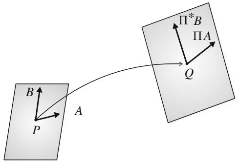  
Fig. 6.1 Conservation of inner product by dual parallel transports

When the two connections are identical, (6.1) reduces to the metric condition (5.80), so that this is an extension of the metric connection.

We search for analytical expressions of dual connections. Consider two basis vectors $\tilde{\pmb{e}}_i$ and $\tilde{\pmb{e}}_j$ at point $\pmb {\xi} + d\pmb{\xi}$ . We transport them to $\pmb{\xi}$ , one by using affine connection $\varGamma$ and the other by dual connection $\varGamma^{*}$ . Then, their parallel transports are, respectively,

$$
\boldsymbol {e} _ {i} + d \boldsymbol {e} _ {i} = \boldsymbol {e} _ {i} + \Gamma_ {k i} ^ {j} \boldsymbol {e} _ {j} d \xi^ {k}, \tag {6.2}
$$

$$
\boldsymbol {e} _ {j} + d ^ {*} \boldsymbol {e} _ {j} = \boldsymbol {e} _ {j} + \Gamma_ {k j} ^ {* i} \boldsymbol {e} _ {i} d \xi^ {k}, \tag {6.3}
$$

where $d$ and $d^{*}$ denote the changes induced by the parallel transformations due to $\Gamma$ and $\Gamma^{*}$ , respectively. From the conservation of the inner product

$$
\langle \tilde {\boldsymbol {e}} _ {i}, \tilde {\boldsymbol {e}} _ {j} \rangle_ {\xi + d \xi} = \langle \boldsymbol {e} _ {i} + d \boldsymbol {e} _ {i}, \boldsymbol {e} _ {j} + d ^ {*} \boldsymbol {e} _ {j} \rangle_ {\xi}, \tag {6.4}
$$

we have

$$
g _ {i j} (\boldsymbol {\xi} + d \boldsymbol {\xi}) = g _ {i j} (\boldsymbol {\xi}) + \left\langle d \boldsymbol {e} _ {i}, \boldsymbol {e} _ {j} \right\rangle_ {\boldsymbol {\xi}} + \left\langle \boldsymbol {e} _ {i}, d ^ {*} \boldsymbol {e} _ {j} \right\rangle_ {\boldsymbol {\xi}}, \tag {6.5}
$$

where higher-order terms are neglected.

By the Taylor expansion, we have the componentwise expression

$$
\partial_ {i} g _ {j k} = \Gamma_ {i j k} + \Gamma_ {i k j} ^ {*}. \tag {6.6}
$$

Compare this with the self-dual case (5.82).

This is rewritten in terms of the covariant derivatives as

$$
Z \langle X, Y \rangle = \left\langle \nabla_ {Z} X, Y \right\rangle + \langle X, \nabla_ {Z} ^ {*} Y \rangle , \tag {6.7}
$$

where $X, Y$ and $Z$ are three vector fields. This is confirmed by using three vector fields $Z = \pmb{e}_i$ , $X = \pmb{e}_j$ and $Y = \pmb{e}_k$ , as

$$
\boldsymbol {e} _ {i} \left\langle \boldsymbol {e} _ {j}, \boldsymbol {e} _ {k} \right\rangle = \left\langle \nabla_ {\boldsymbol {e} _ {i}} \boldsymbol {e} _ {j}, \boldsymbol {e} _ {k} \right\rangle + \left\langle \boldsymbol {e} _ {j}, \nabla_ {\boldsymbol {e} _ {i}} ^ {*} \boldsymbol {e} _ {k} \right\rangle , \tag {6.8}
$$

which is the same as (6.6).

# 6.1 Dual Connections

The average of two dual connections is given by

$$
\Gamma_ {i j k} ^ {0} = \frac {1}{2} \left(\Gamma_ {i j k} + \Gamma_ {i j k} ^ {*}\right). \tag {6.9}
$$

The related covariant derivative is

$$
\nabla^ {(0)} = \frac {1}{2} (\nabla + \nabla^ {*}). \tag {6.10}
$$

From (6.7), we see that $\nabla^0$ satisfies (5.83) and $\Gamma_{ijk}^0$ is the Levi-Civita connection. Let us define

$$
T _ {i j k} = \Gamma_ {i j k} ^ {*} - \Gamma_ {i j k}. \tag {6.11}
$$

Then, the dual connections are written as

$$
\Gamma_ {i j k} = \Gamma_ {i j k} ^ {0} - \frac {1}{2} T _ {i j k}, \quad \Gamma_ {i j k} ^ {*} = \Gamma_ {i j k} ^ {0} + \frac {1}{2} T _ {i j k}. \tag {6.12}
$$

Theorem 6.1 When $\Gamma$ and $\Gamma^{*}$ are dual affine connections, $T$ is a symmetric tensor given by

$$
\nabla_ {i} g _ {j k} = T _ {i j k}, \tag {6.13}
$$

$$
\nabla^ {* i} g ^ {j k} = - T ^ {i j k}. \tag {6.14}
$$

Proof We calculate the covariant derivative of tensor $G = (g_{ij})$ . It is given by

$$
\nabla_ {i} g _ {j k} = \partial_ {i} g _ {j k} - \Gamma_ {i k} ^ {m} g _ {m j} - \Gamma_ {i j} ^ {m} g _ {m k}. \tag {6.15}
$$

Since $\nabla^0$ is the metric connection,

$$
\nabla_ {i} ^ {0} g _ {j k} = \partial_ {i} g _ {j k} - \Gamma_ {i k j} ^ {0} - \Gamma_ {i j k} ^ {0} = 0. \tag {6.16}
$$

Hence, we have

$$
\nabla_ {i} g _ {j k} = \frac {1}{2} \left(T _ {i j k} + T _ {i k j}\right). \tag {6.17}
$$

Since $g_{jk}$ is symmetric with respect to $j$ and $k$ , we have

$$
\nabla_ {i} g _ {j k} = T _ {i j k}. \tag {6.18}
$$

Moreover, $\Gamma_{ijk}$ is a symmetric connection, so $T_{ijk}$ is symmetric with respect to $i$ and $j$ . Hence $T_{ijk}$ is symmetric with respect to three indices, $i, j$ , and $k$ . $T_{ijk}$ is a tensor, because it is the covariant derivative of tensor $g_{jk}$ . (6.14) is also derived similarly.

Remark S. Lauritzen called $T_{ijk}$ the skewness tensor. However, it is symmetric, and so we hesitate to use the term "skewness", which often implies anti-symmetry. So we use the term cubic tensor. This is called the Amari-Chentsov tensor by some researchers (e.g., Ay et al. 2013), since Chentsov defined it and Amari has developed its theory. The triplet $\{M, G, T\}$ is also called the Amari-Chentsov structure.

Dual affine connections are determined from $\{G, T\}$ by (6.12), where $g_{ij}$ is a positive-definite symmetric matrix and $T_{ijk}$ is a cubic tensor. When $T_{ijk} = 0$ , the two affine connections are identical. Hence, the connection is self-dual and $M$ reduces to the ordinary Riemannian manifold, having the Levi-Civita connection.

# 6.2 Metric and Cubic Tensor Derived from Divergence

When a divergence $D[\xi : \xi']$ is defined in $M$ , we show that two tensors $g_{ij}^{D}$ and $T_{ijk}^{D}$ are automatically induced from it. We consider a neighborhood of diagonal position $\xi = \xi'$ of $D$ . Since $D$ has two arguments, we introduce the following notation of differentiation at the diagonal:

$$
D _ {i} = \frac {\partial}{\partial \xi^ {i}} D [ \xi : \xi^ {\prime} ] _ {\xi^ {\prime} = \xi}, \tag {6.19}
$$

$$
D _ {; i} = \frac {\partial}{\partial \xi^ {\prime i}} D [ \boldsymbol {\xi}: \boldsymbol {\xi} ^ {\prime} ] _ {\boldsymbol {\xi} ^ {\prime} = \boldsymbol {\xi}}. \tag {6.20}
$$

Similarly, for multiple differentiation, we use the notation

$$
D _ {i j; k} = \frac {\partial^ {2}}{\partial \xi^ {i} \partial \xi^ {j}} \frac {\partial}{\partial \xi^ {\prime k}} D [ \xi : \xi^ {\prime} ] _ {\xi^ {\prime} = \xi}, \tag {6.21}
$$

etc.

We define the following quantities by using the above notations:

$$
g _ {i j} ^ {D} = - D _ {i; j}, \tag {6.22}
$$

$$
\Gamma_ {i j k} ^ {D} = - D _ {i j; k}, \tag {6.23}
$$

$$
\Gamma_ {i j k} ^ {D ^ {*}} = - D _ {k; i j}. \tag {6.24}
$$

We can prove that $\Gamma^D$ and $\Gamma^{D^*}$ define affine connections, by checking how they are transformed by coordinate transformations. We omit the calculations since they are technical and easy. Their difference

$$
T _ {i j k} ^ {D} = \Gamma_ {i j k} ^ {D ^ {*}} - \Gamma_ {i j k} ^ {D} \tag {6.25}
$$

is a third-order symmetric tensor. Hence, we have two characteristic tensors $g_{ij}^{D}$ and $T_{ijk}^{D}$ from a divergence $D$ . The following is a key result connecting a divergence and dual geometry, derived by Eguchi (1983).

Theorem 6.2 The two affine connections $\Gamma^D$ and $\Gamma^{D*}$ are dual with respect to the Riemannian metric $g^{D}$ .

Proof By differentiating

$$
g _ {i j} ^ {D} (\boldsymbol {\xi}) = - \frac {\partial^ {2}}{\partial \xi^ {i} \partial \xi^ {\prime j}} D [ \boldsymbol {\xi}: \boldsymbol {\xi} ] \tag {6.26}
$$

with respect to $\pmb{\xi}$ , we have

$$
\partial_ {k} g _ {i j} ^ {D} (\boldsymbol {\xi}) = - D _ {k i; j} - D _ {i; j k} = \Gamma_ {k i j} ^ {D} + \Gamma_ {k j i} ^ {D ^ {*}}. \tag {6.27}
$$

This satisfies (6.6) so that $\Gamma^D$ and $\Gamma^{D^*}$ are dual affine connections.

When a Legendre pair of convex functions $\psi(\pmb{\theta})$ and $\varphi(\pmb{\eta})$ are given, where $\pmb{\theta}$ and $\pmb{\eta}$ are connected by the Legendre transformation, we have a Bregman divergence

$$
D _ {\psi} \left[ \boldsymbol {\theta}: \boldsymbol {\theta} ^ {\prime} \right] = \psi (\boldsymbol {\theta}) + \varphi \left(\boldsymbol {\eta} ^ {\prime}\right) - \boldsymbol {\theta} \cdot \boldsymbol {\eta} ^ {\prime}, \tag {6.28}
$$

where $\eta^{\prime}$ is the Legendre dual of $\theta^\prime$ . The metric tensor derived from it is

$$
g _ {i j} (\boldsymbol {\theta}) = \partial_ {i} \partial_ {j} \psi (\boldsymbol {\theta}) \tag {6.29}
$$

in the $\theta$ -coordinates and

$$
g ^ {i j} (\boldsymbol {\eta}) = \partial^ {i} \partial^ {j} \varphi (\boldsymbol {\eta}) \tag {6.30}
$$

in the $\eta$ -coordinates. Moreover, by differentiating it, we have from (6.23) and (6.24),

$$
\Gamma_ {i j k} (\boldsymbol {\theta}) = \Gamma^ {* i j k} (\boldsymbol {\eta}) = 0 \tag {6.31}
$$

in the two coordinate systems. This implies that the geometry derived from a convex function, or the related Bregman divergence, is dually flat and the affine coordinate systems are $\theta$ and $\eta$ . The cubic tensor is written as

$$
T _ {i j k} = \partial_ {i} \partial_ {j} \partial_ {k} \psi (\boldsymbol {\theta}), \quad T ^ {i j k} = \partial^ {i} \partial^ {j} \partial^ {k} \varphi (\boldsymbol {\eta}) \tag {6.32}
$$

in the two coordinate systems. This justifies our former definition of the dually flat structure introduced in Part I without differential geometry.

# 6.3 Invariant Metric and Cubic Tensor

An $f$ -divergence is an invariant divergence in the manifold of probability distributions. We calculate the two tensors $G^{f}$ and $T^{f}$ derived from an $f$ -divergence, which are therefore invariant.

Theorem 6.3 Invariant tensors derived from a standard $f$ -divergence in the manifold of probability distributions are given as

$$
g _ {i j} ^ {f} = g _ {i j}, \tag {6.33}
$$

$$
T _ {i j k} ^ {f} = \alpha T _ {i j k}, \tag {6.34}
$$

where $g_{ij}$ is the Fisher information matrix and

$$
T _ {i j k} = E \left[ \partial_ {i} l (x, \xi) \partial_ {j} l (x, \xi) \partial_ {k} l (x, \xi) \right], \tag {6.35}
$$

$$
\alpha = 2 f ^ {\prime \prime \prime} (1) + 3. \tag {6.36}
$$

Proof By differentiating an arbitrary $f$ -divergence

$$
D _ {f} \left[ \boldsymbol {\xi}: \boldsymbol {\xi} ^ {\prime} \right] = \int p (x, \boldsymbol {\xi}) f \left\{\frac {p \left(x , \boldsymbol {\xi} ^ {\prime}\right)}{p (x , \boldsymbol {\xi})} \right\} d x, \tag {6.37}
$$

with respect to $\xi$ and $\pmb{\xi}^{\prime}$ and putting $\pmb {\xi}' = \pmb {\xi}$ , we have (6.33) and (6.34).

Remark The uniqueness of the $f$ -divergence under the invariance criterion is derived from the information monotonicity and decomposability. More strongly, the Chentsov theorem proves that $g_{ij}$ and $\alpha T_{ijk}$ are the unique invariant second-order and third-order symmetric tensors in $S_{n}$ .

# 6.4 $\alpha$ -Geometry

When $T_{ijk}$ is a symmetric tensor, so is $\alpha T_{ijk}$ for real $\alpha$ . We call the two affine connections derived from $\{G, \alpha T\}$ ,

$$
\Gamma_ {i j k} ^ {\alpha} = \Gamma_ {i j k} ^ {0} - \frac {\alpha}{2} T _ {i j k}, \quad \Gamma_ {i j k} ^ {- \alpha} = \Gamma_ {i j k} ^ {0} + \frac {\alpha}{2} T _ {i j k}, \tag {6.38}
$$

the $\alpha$ -connection and $-\alpha$ -connection, respectively.

Theorem 6.4 $\Gamma^{\alpha}$ and $\Gamma^{-\alpha}$ are dually coupled and the $\alpha = 0$ connection $\Gamma^{0}$ is the Levi-Civita connection, which is self-dual.

The proof is easy from (6.12).

When $T^{f}$ is derived from an $f$ -divergence, it is $\alpha T$ for $\alpha$ satisfying (6.36) and, moreover, $-\alpha T$ is derived from the dual of the $f$ -divergence. The derived dual structure is the only invariant geometry in the case of a manifold of probability distributions. We call it the $\alpha$ -geometry. The $\alpha$ -geometry is derived from the $\alpha$ -divergence defined in (3.39). It is not dually flat in general. When $\alpha = \pm 1$ , it reduces to the KL-divergence, giving a dually flat structure.

For any convex function $\psi$ , we can construct a related $\alpha$ -divergence. In this case, the $\alpha$ -geometry is induced from the $\alpha$ -divergence defined by

$$
\left. D _ {\psi} ^ {(\alpha)} \left[ \boldsymbol {\theta}: \boldsymbol {\theta} ^ {\prime} \right] = \frac {4}{1 - \alpha^ {2}} \left\{\frac {1 - \alpha}{2} \psi (\boldsymbol {\theta}) + \frac {1 + \alpha}{2} \psi \left(\boldsymbol {\theta} ^ {\prime}\right) - \psi \left(\frac {1 - \alpha}{2} \boldsymbol {\theta} + \frac {1 + \alpha}{2} \boldsymbol {\theta} ^ {\prime}\right) \right\}. \right. \tag {6.39}
$$

This is a Jensen-type divergence introduced by Zhang (2004).

# 6.5 Dually Flat Manifold

We have the following theorem concerning dual curvatures.

Theorem 6.5 When the RC curvature $R$ vanishes with respect to one affine connection, the RC curvature $R^*$ with respect to the dual connection vanishes and vice versa.

Proof When the RC curvature vanishes, $R = 0$ , the round-the-world parallel transportation does not change any $A$ :

$$
A = \prod A. \tag {6.40}
$$

For vector transportations, we always have

$$
\langle A, B \rangle = \left\langle \prod A, \prod^ {*} B \right\rangle . \tag {6.41}
$$

Hence, when (6.40) holds, we have

$$
\langle A, B \rangle = \left\langle A, \prod^ {*} B \right\rangle \tag {6.42}
$$

for any $A$ and $B$ . This implies

$$
B = \prod^ {*} B \tag {6.43}
$$

showing that the dual RC curvature vanishes, $R^{*} = 0$

A manifold is always dually flat when it is flat with respect to one connection. When $M$ is dually flat, there exists an affine coordinate system $\theta$ for which

$$
\Gamma_ {i j k} (\boldsymbol {\theta}) = 0. \tag {6.44}
$$

Each coordinate curve $\theta^i$ is a geodesic. The basis vectors $\{e_i\}$ are transported in parallel to any position, not depending on a path of transportation.

Similarly, there exists a dual affine coordinate system $\eta$ for which

$$
\Gamma^ {* i j k} (\eta) = 0 \tag {6.45}
$$

holds. Each coordinate curve $\eta_{i}$ is a dual geodesic. Let its direction be $e^{i}$ . Here, we use a lower index to denote the components of $\eta = (\eta_{i})$ and the related basis vectors are denoted by upper-indexed quantities such as $e^{i}$ . This notation fits our index notation of raising and lowering indices by using the metric tensors $g_{ij}$ and its inverse $g^{ij}$ . The Jacobians of the coordinate transformations satisfy

$$
g _ {i j} = \frac {\partial \eta_ {i}}{\partial \theta^ {j}}, \quad g ^ {i j} = \frac {\partial \theta^ {i}}{\partial \eta_ {j}}. \tag {6.46}
$$

Therefore, two bases $\{\pmb{e}_i\}$ and $\left\{\pmb {e}^i\right\}$ satisfy

$$
\boldsymbol {e} _ {i} = g _ {i j} \boldsymbol {e} ^ {j}, \quad \boldsymbol {e} ^ {j} = g ^ {j i} \boldsymbol {e} _ {i}. \tag {6.47}
$$

Theorem 6.6 In a dually flat manifold, there exists affine coordinate system $\theta$ and dual affine coordinate system $\eta$ such that their tangent vectors are reciprocally orthogonal,

$$
\langle \boldsymbol {e} _ {i}, \boldsymbol {e} ^ {j} \rangle = \left\langle \partial_ {i}, \partial^ {j} \right\rangle = \delta_ {i} ^ {j}. \tag {6.48}
$$

Proof From (6.47), we have

$$
\langle \boldsymbol {e} _ {i}, \boldsymbol {e} ^ {j} \rangle = \langle \boldsymbol {e} _ {i}, g ^ {j k} \boldsymbol {e} _ {k} \rangle = g _ {i k} g ^ {j k} = \delta_ {i} ^ {j}. \tag {6.49}
$$

We also have

$$
\left\langle \prod e _ {i}, \prod^ {*} e ^ {j} \right\rangle = \left\langle e _ {i}, e ^ {j} \right\rangle = \delta_ {i} ^ {j} \tag {6.50}
$$

at any point. Note that $g_{ij}$ and $g^{ji}$ depend on the position, but (6.47) holds at any point.

# 6.6 Canonical Divergence in Dually Flat Manifold

We have shown that a dual structure is constructed from a divergence function. In particular, a dually flat structure is induced from a Bregman divergence. However, many divergences give the same dual structure. This is because the differential geometry of the metric and connections is defined from the derivatives of divergence $D[\xi : \xi']$

at $\pmb{\xi} = \pmb{\xi}'$ , given in (6.22)-(6.24). That is, it depends only on the values of $D[\pmb{\xi} : \pmb{\xi}')$ for infinitesimally close $\pmb{\xi}$ and $\pmb{\xi}'$ . There are no unique ways of extending an infinitesimally defined divergence to the entire $M$ . That is, $D[\pmb{\xi} : \pmb{\xi}] + d(\pmb{\xi}, \pmb{\xi}')$ gives the same geometry as $D[\pmb{\xi}, \pmb{\xi}']$ when a non-negative function $d(\pmb{\xi}, \pmb{\xi}')$ satisfies

$$
d (\boldsymbol {\xi}, \boldsymbol {\xi}) = 0, \tag {6.51}
$$

$$
\partial_ {i} d \left(\boldsymbol {\xi}, \boldsymbol {\xi} ^ {\prime}\right) _ {| \boldsymbol {\xi}} = \partial_ {i} ^ {\prime} d \left(\boldsymbol {\xi}, \boldsymbol {\xi} ^ {\prime}\right) _ {| \boldsymbol {\xi} = \boldsymbol {\xi} ^ {\prime}} = 0 \tag {6.52}
$$

$$
\partial_ {i} \partial_ {j} d (\boldsymbol {\xi}, \boldsymbol {\xi} ^ {\prime}) _ {| \boldsymbol {\xi}} = \partial_ {i} ^ {\prime} \partial_ {j} ^ {\prime} d (\boldsymbol {\xi}, \boldsymbol {\xi} ^ {\prime}) _ {| \boldsymbol {\xi} = \boldsymbol {\xi} ^ {\prime}} = 0, \tag {6.53}
$$

$$
\partial_ {i} \partial_ {j} \partial_ {k} ^ {\prime} d \left(\boldsymbol {\xi}, \boldsymbol {\xi} ^ {\prime}\right) _ {| \boldsymbol {\xi} = \boldsymbol {\xi} ^ {\prime}} = \partial_ {i} ^ {\prime} \partial_ {j} ^ {\prime} \partial_ {k} d \left(\boldsymbol {\xi}, \boldsymbol {\xi} ^ {\prime}\right) _ {| \boldsymbol {\xi} = \boldsymbol {\xi} ^ {\prime}} = 0, \tag {6.54}
$$

where $\partial_i = \partial/\partial\xi^i$ and $\partial_i' = \partial/\partial\xi'^i$ . $d(\pmb{\xi},\pmb{\xi}') = \{D[\pmb{\xi}:\pmb{\xi}']\}^2$ given in (3.25) is such an example. Interestingly, however, when a manifold is dually flat, we can obtain a unique canonical divergence, despite the fact that there are many locally equivalent divergences. To show this, we begin with the following lemma.

Lemma 6.1 When $M$ is dually flat, there are a pair of dual affine coordinate systems $\pmb{\theta}$ and $\pmb{\eta}$ and of Legendre-dual convex functions $\psi (\pmb {\theta})$ and $\varphi (\pmb {\eta})$ satisfying

$$
\psi (\boldsymbol {\theta}) + \varphi (\boldsymbol {\eta}) - \theta^ {i} \eta_ {i} = 0, \tag {6.55}
$$

such that the metric is given by

$$
g _ {i j} (\boldsymbol {\theta}) = \partial_ {i} \partial_ {j} \psi (\boldsymbol {\theta}), \quad g ^ {i j} (\boldsymbol {\eta}) = \partial^ {i} \partial^ {j} \varphi (\boldsymbol {\eta}) \tag {6.56}
$$

and the cubic tensor by

$$
T _ {i j k} (\boldsymbol {\theta}) = \partial_ {i} \partial_ {j} \partial_ {k} \psi (\boldsymbol {\theta}), \tag {6.57}
$$

$$
T ^ {i j k} (\boldsymbol {\eta}) = \partial^ {i} \partial^ {j} \partial^ {k} \varphi (\boldsymbol {\eta}). \tag {6.58}
$$

Proof By using the affine coordinate system $\theta$ for which $\Gamma_{ijk}(\theta) = 0$ , (6.6) reduces to

$$
\partial_ {i} g _ {j k} = \Gamma_ {i k j} ^ {*}. \tag {6.59}
$$

Because the connections are symmetric, we have

$$
\partial_ {i} g _ {j k} = \partial_ {k} g _ {j i}. \tag {6.60}
$$

We fix index $j$ and denote it by. . So we have

$$
\partial_ {i} g _ {k \cdot} = \partial_ {k} g _ {i \cdot}. \tag {6.61}
$$

Then, there is a function $\psi$ satisfying

$$
g _ {i.} = \partial_ {i} \psi . \tag {6.62}
$$

or for each $j$ , we have

$$
g _ {i j} = \partial_ {i} \psi_ {j}. \tag {6.63}
$$

Since $g_{ij}$ is symmetric, we have

$$
\partial_ {i} \psi_ {j} - \partial_ {j} \psi_ {i} = 0. \tag {6.64}
$$

This guarantees the existence of a scalar function $\psi$ such that

$$
\psi_ {j} = \partial_ {j} \psi . \tag {6.65}
$$

Hence

$$
g _ {i j} = \partial_ {i} \partial_ {j} \psi , \tag {6.66}
$$

where $\psi (\pmb {\theta})$ is convex because $g_{ij}$ is positive-definite. Since $\nabla_{i} = \partial_{i}$ for the $\pmb{\theta}$ -coordinates, $T_{ijk}$ is given from (6.18) by

$$
T _ {i j k} = \partial_ {i} \partial_ {j} \partial_ {k} \psi (\boldsymbol {\theta}). \tag {6.67}
$$

By using the dual affine coordinate system, we have a convex function $\varphi(\eta)$ that satisfies (6.56) and (6.58). It is easy to see that the two coordinate systems are connected by a Legendre transformation, so that the two functions are the Legendre duals.

Theorem 6.7 When $M$ is dually flat, there exists a Lengre pair of convex functions $\psi(\theta)$ , $\varphi(\eta)$ and a canonical divergence given by the Bregman divergence

$$
D [ \boldsymbol {\theta}: \boldsymbol {\theta} ^ {\prime} ] = \psi (\boldsymbol {\theta}) + \varphi (\boldsymbol {\eta} ^ {\prime}) - \boldsymbol {\theta} \cdot \boldsymbol {\eta} ^ {\prime}. \tag {6.68}
$$

They are uniquely determined except for affine transformations. Conversely, the canonical divergence gives the original dually flat Riemannian structure.

Theorem 6.8 The KL-divergence is the canonical divergence of an exponential family of probability distributions which is invariant and dually flat.

Remark 1 Many studies begin with the KL-divergence given a priori without any justification. However, our theory shows that the KL-divergence is an outcome of dual flatness in the invariant geometry.

Remark 2 The KL-divergence is derived as the unique canonical divergence without assuming decomposability in the above theorem. See also another derivation by Jiao et al. (2015).

For a dually flat $M$ , its affine coordinates $\theta$ and $\eta$ are not unique. Any affine transformation

$$
\tilde {\theta} = \mathbf {A} \theta + \boldsymbol {b}, \quad \tilde {\eta} = \mathbf {A} ^ {- 1} \eta + \boldsymbol {c}, \tag {6.69}
$$

where $\mathbf{A}$ is an invertible matrix and $b, c$ are constants, gives a set of dually coupled coordinate systems. The convex functions $\psi(\theta)$ are not unique either, because we may add a linear term, as in

$$
\tilde {\psi} (\boldsymbol {\theta}) = \psi (\boldsymbol {\theta}) + \boldsymbol {a} \boldsymbol {\theta} + d, \tag {6.70}
$$

where $\pmb{a}$ is a vector and $d$ is a scalar. However, the canonical divergence

$$
D [ \boldsymbol {\theta}: \boldsymbol {\theta} ^ {\prime} ] = \psi (\boldsymbol {\theta}) + \varphi (\boldsymbol {\eta} ^ {\prime}) - \boldsymbol {\theta} \cdot \boldsymbol {\eta} ^ {\prime} \tag {6.71}
$$

is uniquely determined, not depending on a specific choice of affine coordinate systems.

# 6.7 Canonical Divergence in General Manifold of Dual Connections

It is known that there always exists a divergence in a manifold having dual connections, such that the same dual structure is given by the divergence (Matumoto 1993). There are many such divergences. So it is an interesting problem to define a canonical divergence, if possible, in a manifold $M$ having non-flat dual connections. When $M$ is dually flat, we have a canonical divergence. Kurose (1994) showed that a canonical divergence called the geometrical divergence exists when $M$ is 1-conformally flat. $M$ is embedded in $\pmb{R}^{n + 1}$ in this case. Moreover, when it has constant curvature, the generalized Pythagorean theorem (Theorem 4.5) holds. The $\alpha$ -divergence is a canonical divergence of $S_{n}$ in this sense. Taking these facts into account, we demonstrate an on-going trial by N. Ay and S. Amari to define a canonical divergence in the general case, briefly without proof (Ay and Amari 2015, Henmi and Kobayashi 2000).

Consider $\{M, g, \nabla, \nabla^{*}\}$ of a Riemannian manifold with dual affine connections. Let $\xi$ be a coordinate system. Given a point $\xi_{p}$ and a tangent vector $X$ belonging to the tangent space at $\xi_{p}$ , we have a geodesic curve $\xi(t)$ ,

$$
\nabla_ {\dot {\xi}} \dot {\xi} (t) = 0, \tag {6.72}
$$

passing through $\xi_{p}$ and its tangent direction is $X$

$$
\boldsymbol {\xi} (0) = \boldsymbol {\xi} _ {p}, \dot {\boldsymbol {\xi}} (0) = X. \tag {6.73}
$$

When the geodesic reaches point $\xi_q$ as $t$ increases from 0 to 1,

$$
\boldsymbol {\xi} _ {q} = \boldsymbol {\xi} (1), \tag {6.74}
$$

$\xi_q$ is called the exponential map of $X$ ,

$$
\boldsymbol {\xi} _ {q} = \exp_ {\boldsymbol {\xi} _ {p}} (X). \tag {6.75}
$$

Given $\pmb{\xi}_p$ and $\pmb{\xi}_q$ , we have the inverse of the exponential map,

$$
X \left(\boldsymbol {\xi} _ {p}, \boldsymbol {\xi} _ {q}\right) = \exp_ {\boldsymbol {\xi} _ {p}} ^ {- 1} \left(\boldsymbol {\xi} _ {q}\right) \tag {6.76}
$$

in a neighborhood of $\pmb{\xi}_{p}$

We now define a canonical divergence in a general manifold of dual connections. We first define a divergence between $\xi_p$ and $\xi_q$ by

$$
\tilde {D} \left[ \boldsymbol {\xi} _ {p}: \boldsymbol {\xi} _ {q} \right] = \int_ {0} ^ {1} t g _ {i j} \left\{\boldsymbol {\xi} (t) \right\} \dot {\xi} ^ {i} (t) \dot {\xi} ^ {j} (t) d t, \tag {6.77}
$$

where $\pmb{\xi}(t)$ is the primal geodesic connecting $\pmb{\xi}_p$ and $\pmb{\xi}_q$ . It can be rewritten as

$$
\begin{array}{l} \tilde {D} \left[ \boldsymbol {\xi} _ {p}: \boldsymbol {\xi} _ {q} \right] = \int_ {0} ^ {1} t \langle \dot {\boldsymbol {\xi}} (t), \dot {\boldsymbol {\xi}} (t) \rangle d t \\ = \int_ {0} ^ {1} - \left\langle \exp_ {\xi (t)} ^ {- 1} \left(\xi_ {p}\right), \dot {\xi} (t) \right\rangle d t. \tag {6.78} \\ \end{array}
$$

We then define another divergence by using the dual geodesic $\xi^{*}(t)$ connecting $\pmb{\xi}_{p}$ and $\pmb{\xi}_{q}$ :

$$
\tilde {D} ^ {*} \left[ \boldsymbol {\xi} _ {p}: \boldsymbol {\xi} _ {q} \right] = \int_ {0} ^ {1} (1 - t) g _ {i j} \left\{\boldsymbol {\xi} ^ {*} (t) \right\} \dot {\xi} ^ {* i} (t) \dot {\xi} ^ {* j} (t) d t. \tag {6.79}
$$

A canonical divergence is defined by the arithmetic mean of the above two.

Definition A canonical divergence is given by

$$
D \left[ \boldsymbol {\xi} _ {p}: \boldsymbol {\xi} _ {q} \right] = \frac {1}{2} \left(\tilde {D} \left[ \boldsymbol {\xi} _ {p}: \boldsymbol {\xi} _ {q} \right] + \tilde {D} ^ {*} \left[ \boldsymbol {\xi} _ {p}: \boldsymbol {\xi} _ {q} \right]\right). \tag {6.80}
$$

Theorem 6.9 The geometrical structure derived from the canonical divergence (6.80) coincides with the original geometry. When $M$ is dually flat, it gives the canonical divergence of the Bregman type. When $M$ is Riemannian ( $T = 0$ ), it is a half of the squared Riemannian distance.

In a dually flat manifold, the projection theorem holds: Given $\pmb{\xi}_p$ and a submanifold $S\subset M$ , the point $\hat{\pmb{\xi}}_p$ that minimizes $D[\pmb {\xi}_p:\pmb {\xi}_q],\pmb {\xi}_q\in S$ , is the geodesic projection

of $\pmb{\xi}_p$ to $S$ such that the geodesic connecting $\pmb{\xi}_p$ and $\hat{\pmb{\xi}}_p$ is orthogonal to $S$ at $\hat{\pmb{\xi}}_p$ . The projection theorem does not hold in general, but we have the following theorem.

Theorem 6.10 The canonical divergence satisfies the projection theorem when

$$
X ^ {i} \left(\boldsymbol {\xi} _ {q}, \boldsymbol {\xi} _ {p}\right) \propto - g ^ {i j} \left(\boldsymbol {\xi} _ {q}\right) \partial_ {j} ^ {\prime} D \left[ \boldsymbol {\xi} _ {p}: \boldsymbol {\xi} _ {q} \right], \tag {6.81}
$$

where $X^i$ is the contravariant component of $X = \exp_{\pmb{\xi}_q}^{-1}\left(\pmb{\xi}_p\right)$ and

$$
\partial_ {j} ^ {\prime} = \frac {\partial}{\partial \xi_ {q} ^ {j}}. \tag {6.82}
$$

Proof Consider a divergence ball centered at $\pmb{\xi}_p$ and with radius $c\geq 0$

$$
B _ {c} = \left\{\xi \mid D [ \xi_ {p}: \xi ] = c \right\}. \tag {6.83}
$$

Let $S$ be a smooth submanifold of $M$ . Let $\hat{\pmb{\xi}}_p$ be the minimizer of $D[\pmb{\xi}_p : \pmb{\xi}]$ , $\pmb{\xi} \in S$ . When $c$ is increasing from 0, the ball $B_c$ touches $S$ at $\hat{\pmb{\xi}}_p$ . The tangent hypersurfaces of $S$ and $B_c$ are the same at this point, and its normal vector is given by

$$
n ^ {i} = g ^ {i j} \left(\hat {\boldsymbol {\xi}} _ {p}\right) \partial_ {j} ^ {\prime} D \left[ \boldsymbol {\xi} _ {p}: \hat {\boldsymbol {\xi}} _ {p} \right]. \tag {6.84}
$$

The tangent direction of the geodesic connecting $\pmb{\xi}_p$ and $\hat{\pmb{\xi}}_p$ is given by

$$
\dot {\xi} (\hat {\xi} _ {p}) = X (\hat {\xi} _ {p}, \xi_ {p}). \tag {6.85}
$$

So the projection theorem holds when the above two share the same direction.

It is interesting to study when the geodesic projection theorem (6.81) holds. It holds in the dually flat case. It holds for the $\alpha$ -divergence, and hence it is the canonical divergence of the $\alpha$ -geometry.

# 6.8 Dual Foliations of Flat Manifold and Mixed Coordinates

A dually flat manifold admits two types of foliations, $e$ -foliation and $m$ -foliation, which are orthogonal to each other. This structure is useful for separating two quantities, one represented in the $e$ -coordinates and the other in the $m$ -coordinates. This fits particularly well for analyzing a hierarchical system (Amari 2001).

# 6.8.1 k-cut of Dual Coordinate Systems: Mixed Coordinates and Foliation

Let $M$ be a dually flat manifold with dually coupled affine coordinate systems $\theta$ and $\eta$ . We partition the coordinates into two parts, one consisting of $k$ components and the other consisting of $n - k$ components. We rearrange the suffixes such that the first $k$ components consist of $\theta^1, \ldots, \theta^k$ and the last $n - k$ components consist of $\theta^{k+1}, \ldots, \theta^n$ . The same rearrangement is done for the $\eta$ -coordinates. We call such a partition a $k$ -cut.

Let us compose a new coordinate system $\pmb{\xi}$ of which the first $k$ components are the corresponding $\pmb{\eta}$ -coordinates and the last $n - k$ components are $\pmb{\theta}$ -coordinates such as

$$
\boldsymbol {\xi} = \left(\eta_ {1}, \dots , \eta_ {k}; \theta^ {k + 1}, \dots , \theta^ {n}\right). \tag {6.86}
$$

This is a new coordinate system called a mixed coordinate system, since $m$ -affine coordinates and $e$ -affine coordinates are mixed in it. It is not an affine coordinate system by itself. The basis vectors of the tangent space in the mixed coordinates are composed of two parts, the first part consisting of

$$
\boldsymbol {e} ^ {i} = \frac {\partial}{\partial \eta_ {i}}, \quad i = 1, \dots , k \tag {6.87}
$$

and the second part consisting of

$$
\boldsymbol {e} _ {j} = \frac {\partial}{\partial \theta^ {j}}, \quad j = k + 1, \dots , n. \tag {6.88}
$$

They are orthogonal, because of

$$
\langle \boldsymbol {e} ^ {i}, \boldsymbol {e} _ {j} \rangle = 0, \quad i \neq j. \tag {6.89}
$$

Therefore, the Riemannian metric in this coordinate system has a block-diagonal form,

$$
\mathbf {G} = \left[ \begin{array}{c c} g ^ {i j} & 0 \\ \hline 0 & g _ {l m} \end{array} \right]. \tag {6.90}
$$

Let us consider an $(n - k)$ -dimensional submanifold obtained by fixing the first $k$ coordinates $(\pmb{\eta}$ -coordinates) to be equal to $\pmb{c} = (c_{1},\dots ,c_{k})$

$$
\eta_ {i} = c _ {i}, \quad i = 1, \dots , k \tag {6.91}
$$

and denote it by $M^{*}(\pmb{c})$ , in which $\theta^{k + 1},\dots,\theta^n$ run freely. It is an $m$ -flat submanifold, because it is defined by linear constraints on $\eta$ -coordinates. For $\pmb{c}\neq \pmb{c}^{\prime}$ , $M^{*}(\pmb {c})$ and $M^{*}(c^{\prime})$ do not intersect,

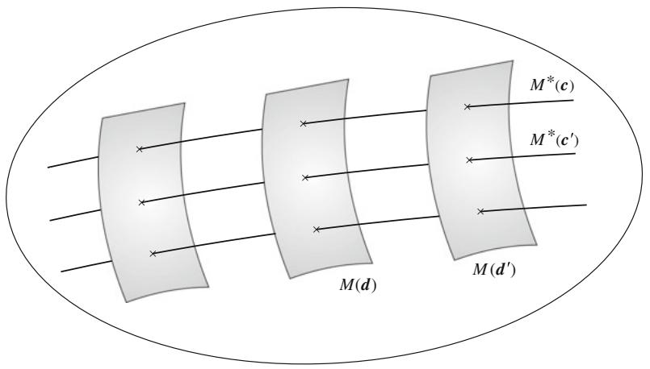  
Fig. 6.2 Dual orthogonal foliation of manifold

$$
M ^ {*} (\boldsymbol {c}) \bigcap M ^ {*} \left(\boldsymbol {c} ^ {\prime}\right) = \phi . \tag {6.92}
$$

Moreover, the entire $M$ is covered by the aggregate of all $M^{*}(c)$ 's

$$
\bigcup_ {c} M ^ {*} (c) = M. \tag {6.93}
$$

Hence, $M^{*}(c)$ 's give a partition of $M$ . Such a partition is called a foliation.

Dually to the above, we fix the second part of the mixed coordinates $(\theta$ -coordinates),

$$
\theta^ {j} = d _ {j}, \quad j = k + 1, \dots , n, \tag {6.94}
$$

where $\pmb{d} = (d_{k + 1},\dots ,d_n)$ and $\eta_1,\ldots ,\eta_k$ run freely. We then have a $k$ -dimensional $e$ -flat submanifold denoted by $M(d)$ . Moreover, $M(d)$ 's form another foliation of $M$ . We thus have two foliations. Moreover, $M(d)$ and $M^{*}(c)$ are orthogonal to each other for any $c$ and $d$ . See Fig. 6.2.

Theorem 6.11 A dually flat $M$ admits a pair of orthogonal $k$ -cut foliations for any $k$ , one of which is $m$ -flat and the other $e$ -flat.

# 6.8.2 Decomposition of Canonical Divergence

By using the mixed coordinates, the canonical divergence between two points $P$ and $Q$ can be decomposed into a sum of two divergences, one representing the difference in the first part and the other in the second part. Let

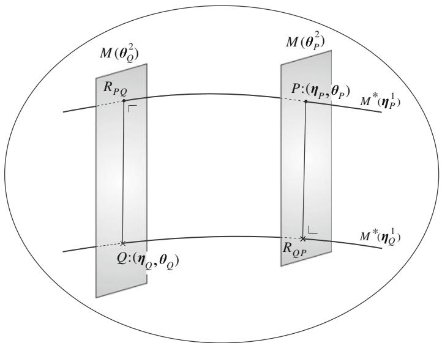  
Fig. 6.3 Foliation and decomposition of KL-divergence

$$
\boldsymbol {\xi} _ {P} = \left(\boldsymbol {\eta} _ {P}; \boldsymbol {\theta} _ {P}\right), \quad \boldsymbol {\xi} _ {Q} = \left(\boldsymbol {\eta} _ {Q}; \boldsymbol {\theta} _ {Q}\right) \tag {6.95}
$$

be the mixed coordinates of the two points $P$ and $Q$ . $P$ is located at the intersection of $M^{*}\left(\eta_{P}\right)$ and $M\left(\theta_{P}\right)$ and $Q$ is at the intersection of $M^{*}\left(\eta_{Q}\right)$ and $M\left(\theta_{Q}\right)$ . We $m$ -project $P$ to $M\left(\theta_{Q}\right)$ and let the projected point be $R_{PQ}$ . We also $e$ -project $P$ to $M^{*}\left(\eta_{Q}\right)$ and let the projected point be $R_{QP}$ . See Fig. 6.3. Since the $m$ -geodesic connecting $P$ and $R_{PQ}$ is orthogonal to the $e$ -geodesic connecting $R_{PQ}$ and $Q$ , $PR_{PQ}Q$ forms a right triangle so that the Pythagorean theorem is applicable. We can do the same thing for the triangle $PR_{QP}Q$ . Then, we have the decomposition theorem.

Theorem 6.12 The canonical divergence $D[P:Q]$ is decomposed as

$$
D [ P: Q ] = D \left[ P: R _ {P Q} \right] + D \left[ R _ {P Q}: Q \right], \tag {6.96}
$$

$D\left[P:R_{PQ}\right]$ representing the difference in the first part and $D\left[R_{PQ}:Q\right]$ representing the difference in the second part.

# 6.8.3 A Simple Illustrative Example: Neural Firing

We show the usefulness of the orthogonal foliation by a simple example. Let us consider a network consisting of two neurons which emit spikes stochastically. Let $x_{1}$ and $x_{2}$ be two binary random variables, taking values $x_{i} = 1, i = 1, 2$ , when neuron $i$ is excited (emitting a spike) and 0 otherwise. Joint probability $p(x_{1}, x_{2})$ specifies the

stochastic behavior of this network. The manifold of all joint probability distributions $M = \{p(x_{1},x_{2})\}$ forms a three-dimensional exponential family, because

$$
p (1, 1) + p (1, 0) + p (0, 1) + p (0, 0) = 1. \tag {6.97}
$$

This is a set of discrete distributions over four elements, and we can write it in the exponential form,

$$
p \left(x _ {1}, x _ {2}\right) = \exp \left\{\sum_ {i = 1} ^ {2} \theta^ {i} x _ {i} + \theta^ {1 2} x _ {1} x _ {2} - \psi (\boldsymbol {\theta}) \right\}. \tag {6.98}
$$

The affine coordinates are given by

$$
\boldsymbol {\theta} = \left(\theta^ {1}, \theta^ {2}, \theta^ {1 2}\right). \tag {6.99}
$$

The dual coordinates $\pmb{\eta}$ are

$$
\eta_ {i} = \mathrm {E} \left[ x _ {i} \right] = \operatorname {P r o b} \left\{x _ {i} = 1 \right\}, \quad i = 1, 2, \tag {6.100}
$$

showing the firing rate (probability of $x_{i} = 1$ ) of neuron $i$ and

$$
\eta_ {1 2} = \operatorname {E} \left[ x _ {i} x _ {j} \right] = \operatorname {P r o b} \left\{x _ {1} = x _ {2} = 1 \right\}, \tag {6.101}
$$

showing the joint firing rate (the probability of the two neurons firing at the same time).

We construct mixture coordinates such that the first part consists of $\eta_{1}$ and $\eta_{2}$ and the second part consists of $\theta^{12}$ . Using the mixed coordinate system

$$
\xi = \left(\eta_ {1}, \eta_ {2}; \theta^ {1 2}\right), \tag {6.102}
$$

we have a dually orthogonal foliation. The one-dimensional submanifold $M^{*}(\eta_{1},\eta_{2})$ consists of all the distributions in which the firing rates of the two neurons are fixed to $(\eta_{1},\eta_{2})$ . The coordinate $\theta^{12}$ in $M^{*}(\eta_{1},\eta_{2})$ represents how firing of the two neurons is correlated. When $\theta^{12} = 0$ , $x_{1}$ and $x_{2}$ are independent, as is seen from (6.98). Given $\theta^{12}$ , the $e$ -flat submanifold $M(\theta^{12})$ represents distributions for which interaction of $x_{1}$ and $x_{2}$ is fixed to be equal to $\theta^{12}$ but the firing rates of the neurons are arbitrary. Thus, the partition is done in such a way that the first part represents firing rates of neurons and the second part represents the interaction of two neurons (Fig. 6.4).

One may measure the degree of interaction by the covariance of $x_{1}$ and $x_{2}$ ,

$$
v = \operatorname {C o v} \left[ x _ {1}, x _ {2} \right] = \eta_ {1 2} - \eta_ {1} \eta_ {2}. \tag {6.103}
$$

It is 0 when the two neurons fire independently. If we use $v$ as a coordinate in $M^{*}(\eta_{1},\eta_{2})$ , we have another coordinate system $(\eta_{1},\eta_{2},v)$ in $M$ . However, the

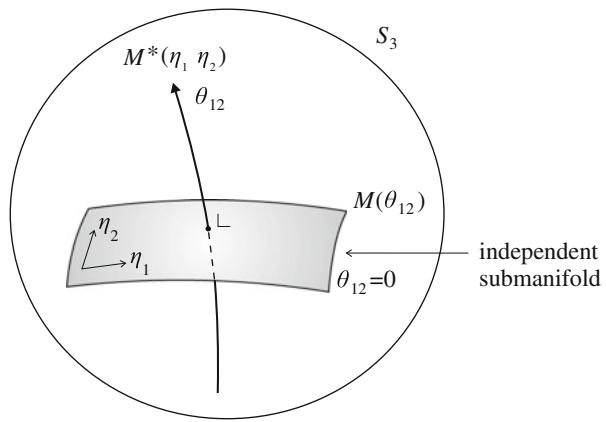  
Fig. 6.4 Dual foliation of $S_{3} = \{p(x_{1},x_{2})\}$

$v$ -axis is not orthogonal to the marginal firing rates $\eta_1, \eta_2$ , while $\theta^{12}$ is. Therefore, the mixed coordinates are successful in decomposing the firing rates and interaction orthogonally but $v$ is not.

Given two distributions $p(x_1, x_2)$ and $q(x_1, x_2)$ , we have the decomposition of their KL-divergence, as

$$
K L [ p: q ] = K L [ p: r ] + K L [ r: q ], \tag {6.104}
$$

where $r(x_{1},x_{2})$ is the distribution having the same marginal distributions as $p$ and the same interaction as $q$ . $KL[p:r]$ represents the divergence due to the difference in mutual interaction and $KL[r:q]$ represents that due to marginal firing rates.

# 6.8.4 Higher-Order Interactions of Neuronal Spikes

We can generalize the idea to a network of $n$ neurons (Amari 2001; Nakahara and Amari 2002; Nakahara et al. 2006; Amari et al. 2003). Let us consider a network consisting of $n$ neurons, which emit spikes stochastically. Let $x_{i}$ be a binary random variable, representing emission of spikes. The state of the network is represented by $\boldsymbol{x} = (x_{1},\ldots ,x_{n})$ . The set of all probability distributions $p(\boldsymbol{x})$ forms $S_{N - 1}$ , where $N = 2^{n}$ , since there are $N$ states $\boldsymbol{x}$ . This is an exponential family. By expanding $p(\boldsymbol{x})$ as

$$
\log p (\boldsymbol {x}) = \sum \theta^ {i} x _ {i} + \sum \theta^ {i j} x _ {i} x _ {j} + \dots + \theta^ {1 \dots n} x _ {1} \dots x _ {n} - \psi , \tag {6.105}
$$

we have

$$
p (x, \theta) = \exp \left\{\sum \theta^ {i} x _ {i} + \sum \theta^ {i j} x _ {i} x _ {j} + \dots + \theta^ {1 \dots n} x _ {1} \dots x _ {n} - \psi \right\}. \tag {6.106}
$$

This is called a log linear model. According to the degrees of variables in $x_{i}$ , we partition the entire $\theta$ in a hierarchical form as

$$
\boldsymbol {\theta} = \left(\theta_ {1}, \theta_ {2}, \dots , \theta_ {n}\right), \tag {6.107}
$$

$$
\theta_ {1} = \left(\theta^ {1}, \dots , \theta^ {n}\right), \theta_ {2} = \left(\theta^ {1 2}, \theta^ {1 3}, \dots , \theta^ {n - 1 n}\right), \dots \tag {6.108}
$$

such that each subvector $\theta_{k}$ consists of coefficients of monomials $x_{j_1}\ldots x_{j_k}$ of degree $k$ .

The dual affine coordinates are composed of

$$
\eta_ {i _ {1} \dots i _ {k}} = E \left[ x _ {i _ {1}} \dots x _ {i _ {k}} \right] = \operatorname {P r o b} \left\{x _ {i _ {1}} = 1, \dots , x _ {i _ {k}} = 1 \right\}, \tag {6.109}
$$

which are joint firing rates of $k$ neurons, $k = 1, \dots, n$ , and they are hierarchically partitioned as

$$
\boldsymbol {\eta} = \left(\eta_ {1}, \eta_ {2}, \dots , \eta_ {n}\right), \tag {6.110}
$$

where

$$
\eta_ {k} = \left(\eta_ {i _ {1} \dots i _ {k}}\right), k = 1, 2, \dots , n. \tag {6.111}
$$

The $k$ th mixed coordinate system is composed of

$$
\boldsymbol {\xi} = \left(\boldsymbol {H} _ {k}; \boldsymbol {\Theta} ^ {k}\right) = \left(\eta_ {1}, \dots , \eta_ {k}; \boldsymbol {\theta} ^ {k + 1}, \dots , \boldsymbol {\theta} ^ {n}\right). \tag {6.112}
$$

Since

$$
\boldsymbol {H} _ {k} = \left(\eta_ {1}, \dots , \eta_ {k}\right) \tag {6.113}
$$

is composed of the joint firing rates up to $k$ neurons, the other coordinates

$$
\boldsymbol {\Theta} ^ {k} = \left(\boldsymbol {\theta} ^ {k + 1}, \dots , \boldsymbol {\theta} ^ {n}\right) \tag {6.114}
$$

represent the directions orthogonal to the joint firing rates up to $k$ neurons. A change in $\theta^{k+1}, \theta^{k+2}, \ldots$ does not affect $\eta_1, \ldots, \eta_k$ but alters the joint firing rates of more than $k$ neurons. Hence, $\Theta^k$ represents interactions of more than $k$ neurons orthogonal to the firing rates up to $k$ neurons.

Among $n$ terms, $\theta^1, \ldots, \theta^n$ , we can say that $\theta^k$ represents the degree of mutual interactions among $k$ neurons. $\theta^k$ 's $(k \geq 3)$ are called the higher-order correlations or interactions of neurons. Although $\theta^1, \ldots, \theta^n$ are not mutually orthogonal, $\theta^i$ are orthogonal to $\eta_j$ ( $j \neq i$ ).

We show a simple case of $n = 3$ , consisting of three neurons. We have

$$
\theta^ {1 2 3} = \log \frac {p _ {1 1 1} p _ {1 0 0} p _ {0 1 0} p _ {0 0 1}}{p _ {1 1 0} p _ {1 0 1} p _ {0 1 1} p _ {0 0 0}}, \tag {6.115}
$$

which represents the third-order interactions of the three neurons. It is orthogonal to firing rates of neurons and joint firing rates of any pair of neurons. Similarly,

$$
\theta^ {1 2} = \log \frac {p _ {1 1 0} p _ {0 0 0}}{p _ {1 0 0} p _ {0 1 0}} \tag {6.116}
$$

represents pairwise interactions of neurons 1 and 2, which are orthogonal to the firing rates of single neurons.

Remark There are many other hierarchical stochastic systems. One is a Markov chain consisting of various orders. A lower-order system is included in a higher-order system. Hence, we can decompose them in a dually orthogonal way. The auto-regressive (AR) and moving-average (MA) models of time series also form hierarchical stochastic systems, where their degrees compose hierarchy. See Amari (1987, 2001).

# 6.9 System Complexity and Integrated Information

We consider a stochastic system which receives an input signal $\mathbf{x}$ , processes it and emits output $\mathbf{y}$ , and study its complexity by using a mixed coordinate system. We regard it a multiterminal stochastic channel having $n$ input and $n$ output terminals, see Fig. 6.5. Input $\mathbf{x} = (x_{1},\ldots ,x_{n})$ and output $\mathbf{y} = (y_{1},\dots ,y_{n})$ are vectors. When a system is very simple, there is no interaction among different terminals. Hence, output $y_{i}$ depends only on $x_{i}$ and input $x_{j}$ ( $j \neq i$ ) does not affect $y_{i}$ . A complex system has interaction among different terminals and information is integrated to give an integrated output $\mathbf{y}$ . The degree of interaction is used to define a measure of complexity of the system (Ay 2002, 2015; Ay et al. 2011). Tononi (2008) initiated a new idea of IIT (integrated information theory) to elucidate consciousness. The degree of information integration distinguishes a conscious state from unconscious states in the brain (Balduzzi and Tononi 2008; Oizumi et al. 2014, etc.).

We propose a measure of complexity, or of information integration, by using a degree of stochastic interaction within a system from the information geometric point of view, based on part of on-going work with M. Oizumi and N. Tsuchiya. This is an extension of the work by Ay (2001, 2015), and is related to the Tononi information integration (Barrett and Seth 2011).

We consider a $2 \times 2$ system for simplicity, where input is $\mathbf{x} = (x_{1}, x_{2})$ and output is $\mathbf{y} = (y_{1}, y_{2})$ , having only two terminals (Fig. 6.6), although generalization is easy. We study the binary case where $x_{i}$ and $y_{i}$ take on values 0 and 1, and also the Gaussian case where $\mathbf{x}$ and $\mathbf{y}$ are Gaussian random variables with mean 0. The behavior of a system is described by joint probability distribution $p(\mathbf{x}, \mathbf{y})$ . When the components of $\mathbf{x}$ and $\mathbf{y}$ are binary, it belongs to an exponential family $M_{F}$ , called the full model,

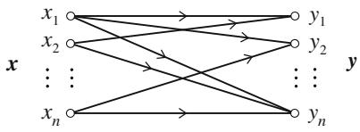  
Fig. 6.5 Stochastic information transmission channel

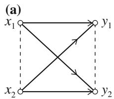  
Fig. 6.6 a Channel with two terminals and b its split version

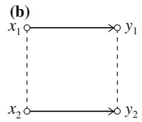

$$
\begin{array}{l} p (\boldsymbol {x}, \boldsymbol {y}) = \exp \left\{\sum \theta_ {i} ^ {X} x _ {i} + \sum \theta_ {i} ^ {Y} y _ {i} + \theta_ {1 2} ^ {X} x _ {1} x _ {2} + \theta_ {1 2} ^ {Y} y _ {1} y _ {2} \right. \\ \left. + \sum \theta_ {i j} ^ {X Y} x _ {i} y _ {j} + \text {h i g h e r - o r d e r t e r m s o f} x _ {i} \text {a n d} y _ {j} - \psi \right\}, \tag {6.117} \\ \end{array}
$$

described by $e$ -coordinates $\theta$ . The higher-order terms are $\theta^{12,1}x_1x_2y_1$ and so on. We have the corresponding $\eta$ -coordinates. The full model is a graphical model shown in Fig. 6.6a, which is a complete graph, since intrinsic correlations between $x_{1}$ and $x_{2}$ and also between $y_{1}$ and $y_{2}$ may exist, as is denoted by the dotted branches in Fig. 6.6a. Refer to information geometry of a graphical model studied in Chap. 11.

The complexity of a system is measured by the degree to which it is different from split systems where no interaction exists between $x_{i}$ and $y_{j}$ ( $i \neq j$ ) (Ay 2002, 2015). So we consider a split system $S$ where no mutual interaction exists, as is shown in Fig. 6.6b. Here, a split model is derived by deleting the branches connecting $x_{i}$ and $y_{j}$ ( $i \neq j$ ). Let the probability distribution of the split model be $q(\boldsymbol{x}, \boldsymbol{y})$ , the $e$ -coordinates of which are $\tilde{\theta}$ . Since there are no branches connecting $(x_{1}, y_{2})$ and $(x_{2}, y_{1})$ , we put $\tilde{\theta}_{12}^{XY} = \tilde{\theta}_{21}^{XY} = 0$ . (This is because $x_{i}$ and $y_{j}$ ( $i \neq j$ ) are conditionally independent where the other variables are fixed.) The higher-order terms are also 0. (This is because no cliques exist connecting three or four nodes in the split model.) Hence, a split model has a probability distribution of the form,

$$
\begin{array}{l} q (\boldsymbol {x}, \boldsymbol {y}) = \exp \left\{\sum \tilde {\theta} _ {i} ^ {X} x _ {i} + \sum \tilde {\theta} _ {i} ^ {Y} y _ {i} + \tilde {\theta} _ {1 2} ^ {X} x _ {1} x _ {2} + \tilde {\theta} _ {1 2} ^ {Y} y _ {1} y _ {2} \right. \\ \left. + \sum \tilde {\theta} _ {i i} ^ {X Y} x _ {i} y _ {i} - \tilde {\psi} \right\}. \tag {6.118} \\ \end{array}
$$

Split models form an exponential family $M_S$ , which has ten degrees of freedom and is a submanifold of $M_F$ .

The split model family $M_S$ defined in the above is slightly different from the one $M_S'$ defined by N. Ay. In a split model belonging to $M_S'$ , no direct correlation between $y_1$ and $y_2$ exists, so $\tilde{\theta}_{12}^{Y} = 0$ in addition to $\tilde{\theta}_{12}^{XY} = \tilde{\theta}_{21}^{XY} = 0$ . That is, $M_S'$ is derived from $M_S$ by deleting the branch connecting $y_1$ and $y_2$ . $M_S'$ is an $e$ -flat submanifold of $M_S$ . We do not assume $\tilde{\theta}_{12}^{Y} = 0$ in $M_S$ , because $y_1$ and $y_2$ may be affected by correlated noises directly given from the environment. Since such correlations are given rise to by the environmental situation, even when $x_1$ and $x_2$ are independent

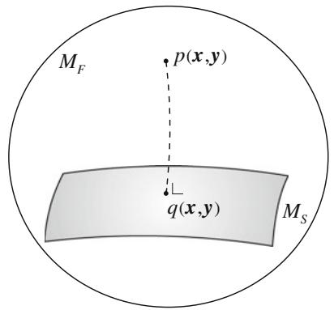  
Fig. 6.7 Split model and orthogonal projection

and $x_{i}$ does not affect $y_{j}$ ( $j \neq i$ ), $y_{1}$ and $y_{2}$ can be correlated in $M_{S}$ , but not in $M_{S}'$ . To explain this situation, consider a Gaussian model,

$$
y = \mathbf {A} x + \varepsilon \tag {6.119}
$$

where $\mathbf{A}$ is a $2\times 2$ matrix and $\varepsilon$ is a noise term subject to $N(0,\mathbf{V})$ , where $\mathbf{V}$ is the covariance matrix of $\varepsilon$ . The components $\varepsilon_{1}$ and $\varepsilon_{2}$ can be correlated.

The degree of system complexity, or of integrated information, of $p(\pmb{x}, \pmb{y})$ is measured by the KL-divergence from $p(\pmb{x}, \pmb{y})$ to the split distribution $\hat{q}(\pmb{x}, \pmb{y})$ or $\hat{q}'(\pmb{x}, \pmb{y})$ that is closest to $p(\pmb{x}, \pmb{y})$ in $M_S$ or $M_S'$ (Fig. 6.7),

$$
\hat {q} (\boldsymbol {x}, \boldsymbol {y}) = D _ {K L} [ p (\boldsymbol {x}, \boldsymbol {y}): M _ {S} ] = \underset {q \in M _ {S}} {\arg \min } D _ {K L} [ p (\boldsymbol {x}, \boldsymbol {y}): q (\boldsymbol {x}, \boldsymbol {y}) ], \tag {6.120}
$$

$$
\hat {q} ^ {\prime} (\boldsymbol {x}, \boldsymbol {y}) = D _ {K L} \left[ p (\boldsymbol {x}, \boldsymbol {y}): M _ {S} ^ {\prime} \right] = \underset {q \in M _ {S} ^ {\prime}} {\arg \min } D _ {K L} \left[ p (\boldsymbol {x}, \boldsymbol {y}): q (\boldsymbol {x}, \boldsymbol {y}) \right]. \tag {6.121}
$$

They are given by the $m$ -projection of $p(\pmb{x},\pmb{y})$ to $M_S$ and $M_{S'}$ . Since we have two split models $M_S$ and $M_{S'}$ , we have two definitions of geometric measure of information integration or stochastic interactions.

Definition Geometric measures of information integration, or system complexity, are defined by

$$
G I [ p (\boldsymbol {x}, \boldsymbol {y}) ] = D _ {K L} [ p (\boldsymbol {x}, \boldsymbol {y}): M _ {S} ], \tag {6.122}
$$

$$
G I ^ {\prime} [ p (\boldsymbol {x}, \boldsymbol {y}) ] = D _ {K L} \left[ p (\boldsymbol {x}, \boldsymbol {y}): M _ {S} ^ {\prime} \right]. \tag {6.123}
$$

$GI^{\prime}$ is the same as that of Ay (2002, 2015) and also that of Barrett and Seth (2011). $GI$ is a new measure.

Before comparing these two, we show a criterion which such a measure should satisfy. Oizumi et al. (2015) postulated that a degree $\phi$ of information integration should satisfy

$$
0 \leq \phi \leq I [ X: Y ], \tag {6.124}
$$

where $I[X:Y]$ is the mutual information between $x$ and $y$ . $\phi$ should be 0 when $I[X:Y] = 0$ , that is, when no information is transmitted from $X$ to $Y$ . They argued that various measures of $\phi$ so far proposed do not necessarily satisfy the postulate, and defined a new measure $\phi^*$ based on the concept of mismatched decoding, which satisfies the postulate (Oizumi et al. 2015).

We study properties of $GI$ and $GI'$ and see if they satisfy the postulate. Since $M_S$ is an $e$ -flat submanifold constrained by

$$
\theta_ {1 2} ^ {X Y} = \theta_ {2 1} ^ {X Y} = 0, \tag {6.125}
$$

where we use $\theta$ instead of $\tilde{\theta}$ , we define mixed coordinates

$$
\boldsymbol {\xi} = \left(\eta_ {1} ^ {X}, \eta_ {2} ^ {X}, \eta_ {1 2} ^ {X}, \eta_ {1} ^ {Y}, \eta_ {2} ^ {Y}, \eta_ {1 2} ^ {Y}, \eta_ {1 1} ^ {X Y}, \eta_ {2 2} ^ {X Y}; \theta_ {1 2} ^ {X Y}, \theta_ {2 1} ^ {X Y}\right). \tag {6.126}
$$

Then, the $m$ -projection of $p(\boldsymbol{x}, \boldsymbol{y})$ to $M_S$ ,

$$
\hat {q} (\boldsymbol {x}, \boldsymbol {y}) = \prod_ {M _ {S}} p (\boldsymbol {x}, \boldsymbol {y}), \tag {6.127}
$$

keeps the $\eta$ -part of the mixed coordinates invariant. Therefore, the mixed coordinates $\hat{\xi}$ of $\hat{q}(\boldsymbol{x}, \boldsymbol{y})$ are given by

$$
\hat {\eta} _ {i} ^ {X} = \eta_ {i} ^ {X}, \quad \hat {\eta} _ {1 2} ^ {X} = \eta_ {1 2} ^ {X}, \quad \hat {\eta} _ {i} ^ {Y} = \eta_ {i} ^ {Y}, \quad \hat {\eta} _ {1 2} ^ {Y} = \eta_ {1 2} ^ {Y}, \tag {6.128}
$$

$$
\hat {\eta} _ {i i} ^ {X Y} = \eta_ {i i} ^ {X Y}, \quad \hat {\theta} _ {1 2} ^ {X Y} = \hat {\theta} _ {2 1} ^ {X Y} = 0, \tag {6.129}
$$

where $\eta_i^X$ etc. are those of $p(x, y)$ . These results are directly obtained by minimizing $D_{KL}[p : q]$ , $q \in M_S$ , too. We have a similar result in the case of the $m$ -projection to $M_S'$ , where $\hat{\eta}_{12}^Y = \eta_{12}^Y$ is replaced by $\hat{\theta}_{12}^Y = 0$ .

We see from (6.128) that the $m$ -projection $\hat{q}(\pmb{x}, \pmb{y})$ is characterized by

$$
\hat {q} _ {X} (\boldsymbol {x}) = p _ {X} (\boldsymbol {x}), \quad \hat {q} _ {Y} (\boldsymbol {y}) = p _ {Y} (\boldsymbol {y}), \tag {6.130}
$$

where $p_X(\pmb{x})$ etc. are the marginal distributions of $p(\pmb{x}, \pmb{y})$ , etc. This means that the marginal distributions of $\hat{q}(\pmb{x}, \pmb{y})$ concerning $\pmb{x}$ and $\pmb{y}$ are equal to those of $p(\pmb{x}, \pmb{y})$ , respectively. Moreover, the conditional distributions are equal:

$$
\hat {q} \left(y _ {i} \mid x _ {i}\right) = p \left(y _ {i} \mid x _ {i}\right), \quad i = 1, 2. \tag {6.131}
$$

The $m$ -projection $\hat{q}^{\prime}(\pmb{x},\pmb{y})$ to $M_S^\prime$ satisfies

$$
\hat {q} _ {X} ^ {\prime} (\boldsymbol {x}) = p _ {Y} (\boldsymbol {x}), \tag {6.132}
$$

$$
\hat {q} ^ {\prime} \left(y _ {i}\right) = p \left(y _ {i}\right), \quad i = 1, 2 \tag {6.133}
$$

$$
\hat {q} ^ {\prime} \left(y _ {i} \mid x _ {i}\right) = p \left(y _ {i} \mid x _ {i}\right), \quad i = 1, 2. \tag {6.134}
$$

Note that $\hat{q}_Y^\prime (\pmb {y}) = p_Y(\pmb {y})$ does not in general hold in $M_S^{\prime}$

Although $\hat{\theta}_{12}^{\prime Y} = 0$ holds in $\hat{q}'(\pmb{x},\pmb{y})$ , this does not mean that $\hat{y}_1'$ and $\hat{y}_2'$ are uncorrelated. When $x_{1}$ and $x_{2}$ are correlated, $\hat{y}_1'$ and $\hat{y}_2'$ are correlated even in the split model $M_S'$ .

The measures $GI$ and $GI'$ are represented in terms of entropy and mutual information as follows. Due to the Pythagorean theorem, we have, in the binary case,

$$
D _ {K L} [ p: p _ {0} ] = - H [ p ] + c, \tag {6.135}
$$

$$
D _ {K L} [ p: \hat {q} ] = D [ p: \hat {q} ] + D [ \hat {q}: p _ {0} ], \tag {6.136}
$$

where $H[p]$ is the entropy of $p(\pmb{x},\pmb{y})$ and $p_0(\pmb{x},\pmb{y})$ is the uniform distribution of which entropy is put equal to $c$ . Therefore, we have

$$
G I [ p (\boldsymbol {x}, \boldsymbol {y}) ] = D _ {K L} [ p: \hat {q} ] = H [ \hat {q} ] - H [ p ]. \tag {6.137}
$$

This holds in general, including the Gaussian case, where an independent distribution $p_0(\pmb{x}, \pmb{y})$ is used instead of the uniform $p_0$ . Similarly,

$$
G I ^ {\prime} [ p (\boldsymbol {x}, \boldsymbol {y}) ] = H [ \hat {q} ^ {\prime} ] - H [ p ]. \tag {6.138}
$$

Since the entropy is decomposed as

$$
H [ p ] = H [ X ] + H [ Y | X ], \tag {6.139}
$$

we have the following theorem, which is useful for calculating $GI$ and $GI'$ .

Theorem 6.13 The two geometrical measures $G1$ and $G1'$ are given, in terms of conditional entropy, as

$$
G I [ p (\boldsymbol {x}, \boldsymbol {y}) ] = H [ \hat {Y} | X ] - H [ Y | X ], \tag {6.140}
$$

$$
G I ^ {\prime} [ p (\boldsymbol {x}, \boldsymbol {y}) ] = H \left[ \hat {Y} ^ {\prime} | X \right] - H [ Y | X ], \tag {6.141}
$$

where $X$ , and $Y$ denote the random variables $x$ and $y$ subject to $p(x, y)$ , and $\hat{Y}$ and $\hat{Y}'$ denote the random variables $y$ subject to $\hat{q}(x, y)$ and $\hat{q}'(x, y)$ , respectively.

Moreover, we have simpler representations.

# Theorem 6.14

$$
G I [ p ] = \sum H \left[ Y _ {i} \mid X _ {i} \right] - H [ Y | X ] - I \left[ \hat {Y} _ {1}: \hat {Y} _ {2} | X \right], \tag {6.142}
$$

$$
G I ^ {\prime} [ p ] = \sum H \left[ Y _ {i} \mid X _ {i} \right] - H [ Y | X ], \tag {6.143}
$$

where $I\left[\hat{Y}_1:\hat{Y}_2|X\right]$ is the conditional mutual information. This elucidates the relation between GI and $G I^{\prime}$ as follows:

$$
G I [ p ] = G I ^ {\prime} [ p ] + D _ {K L} \left[ \hat {q}: \hat {q} ^ {\prime} \right], \tag {6.144}
$$

$$
D _ {K L} \left[ \hat {q}: \hat {q} ^ {\prime} \right] = H \left[ \hat {Y} ^ {\prime} | X \right] - H \left[ \hat {Y} | X \right], \tag {6.145}
$$

$$
G I [ p ] \geq G I ^ {\prime} [ p ]. \tag {6.146}
$$

Theorem 6.15 $GI$ satisfies the postulate (6.124) but $GI'$ does not.

Proof Since both $GI$ and $GI^{\prime}$ are given by the KL-divergence, they satisfy

$$
G I \geq G I ^ {\prime} \geq 0. \tag {6.147}
$$

Let us next consider the independent distribution

$$
p _ {\text {i n d}} (\boldsymbol {x}, \boldsymbol {y}) = p _ {X} (\boldsymbol {x}) p _ {Y} (\boldsymbol {y}) \tag {6.148}
$$

derived from $p(x,y)$ . The mutual information is

$$
I [ X: Y ] = D _ {K L} \left[ p (\boldsymbol {x}, \boldsymbol {y}): p _ {\text {i n d}} (\boldsymbol {x}, \boldsymbol {y}) \right]. \tag {6.149}
$$

Since $p_{\mathrm{ind}}(\pmb{x}, \pmb{y})$ satisfies $\theta_{12}^{XY} = \theta_{21}^{XY} = 0$ , this is included in $M_S$ . So

$$
G I \leq I (X: Y) \tag {6.150}
$$

since $\hat{q}$ is the minimizer of divergence in $M_S$ . However, $p_{\mathrm{ind}}(\boldsymbol{x}, \boldsymbol{y})$ does not necessarily satisfy $\theta_{12}^{Y} = 0$ and hence is not included in $M_S'$ in general. Hence,

$$
G I ^ {\prime} \leq I (X: Y) \tag {6.151}
$$

is not guaranteed. Indeed, for $p(\pmb{x}, \pmb{y})$ where $X$ and $Y$ are independent, $I(X : Y) = 0$ , but if $Y_{1}$ and $Y_{2}$ are correlated

$$
G I ^ {\prime} > 0. \tag {6.152}
$$

We analyze the Gaussian system given in (6.119) for illustration.

Example 1 (Gaussian channel) The joint probability distribution of $(\mathbf{x},\mathbf{y})$ in (6.119) is

$$
p (\boldsymbol {x}, \boldsymbol {y}) = \exp \left\{- \frac {1}{2} \left(\boldsymbol {x} ^ {T} \boldsymbol {x} + (\boldsymbol {y} - \mathbf {A} \boldsymbol {x}) ^ {T} \mathbf {V} ^ {- 1} (\boldsymbol {y} - \mathbf {A} \boldsymbol {x}) - \psi\right) \right\}, \tag {6.153}
$$

when $\pmb{x}$ is subject to $N(0, \mathbf{I})$ . By putting

$$
z = \left( \begin{array}{c} x \\ y \end{array} \right), \tag {6.154}
$$

it is rewritten as

$$
p (\boldsymbol {x}, \boldsymbol {y}) = \exp \left\{- \frac {1}{2} \boldsymbol {z} ^ {T} \mathbf {R} \boldsymbol {z} - \psi \right\}, \tag {6.155}
$$

where $\mathbf{R}$ is the inverse of the covariance matrix

$$
\sum = E \left[ z z ^ {T} \right], \tag {6.156}
$$

and they are given explicitly as functions of the system parameters $\mathbf{A}$ and $\mathbf{V}$ .

A full model $p(\boldsymbol{x}, \boldsymbol{y})$ belongs to an exponential family, where the $\theta$ -coordinates are $\mathbf{R}$ and $\eta$ -coordinates are $\Sigma$ . A split model is given by

$$
q (\boldsymbol {x}, \boldsymbol {y}) = \exp \left\{\sum \left(\theta_ {i} ^ {X} x _ {i} + \theta_ {i} ^ {Y} y _ {i}\right) + \theta_ {1 2} ^ {X} x _ {1} x _ {2} + \theta_ {1 2} ^ {Y} y _ {1} y _ {2} + \sum \theta_ {i i} ^ {X Y} x _ {i} y _ {i} - \psi \right\}, \tag {6.157}
$$

which does not include terms $\theta_{ij}^{XY}x_iy_j$ ( $i\neq j$ ). By using this expression, we obtain $\hat{q} (\pmb {x},\pmb {y})$ from $p(\pmb {x},\pmb {y})$ .

However, there is a serious problem concerning the optimal solution. The solution can be written as

$$
\hat {\mathbf {y}} = \hat {\boldsymbol {A}} \mathbf {x} + \hat {\varepsilon}, \tag {6.158}
$$

but $\hat{A}$ is not diagonal. The solution is split in the sense that $\theta_{ij}^{XY} = 0$ ( $i \neq j$ ) is satisfied and its graph does not have diagonal branches, but not split in the sense that $\hat{A}$ is not diagonal. Hence, $E[y_i|x]$ depends on both $x_1$ and $x_2$ . This does not happen in $M_S'$ , since $E[y_i|x] = E[y_i|x_i]$ holds.

In order to overcome this flaw, we introduce the third model of split systems,

$$
M _ {S} ^ {\prime \prime} = \left\{q (x, y) \mid q \left(x _ {i}, y _ {j} \mid x _ {j}\right) = q \left(x _ {i} \mid x _ {j}\right) q \left(y _ {j} \mid x _ {j}\right), i = 1, 2, j \neq i \right\} \tag {6.159}
$$

This condition can be written as the Markov conditions

$$
X _ {1} \rightarrow X _ {2} \rightarrow Y _ {2}, \quad X _ {2} \rightarrow X _ {1} \rightarrow Y _ {1}, \tag {6.160}
$$

that is, $X_{i}$ and $Y_{j}$ $(i\neq j)$ are conditionally independent when $X_{j}$ is fixed,

$$
I \left(X _ {1}: Y _ {2} \mid X _ {2}\right) = I \left(X _ {2}: Y _ {1} \mid X _ {1}\right) = 0. \tag {6.161}
$$

Since $M_S^{\prime \prime}$ includes $p_X(\pmb {x})p_Y(\pmb {y}),G1^{\prime \prime}$ satisfies the postulate

$$
0 \leq G I ^ {\prime \prime} \leq I (X: Y). \tag {6.162}
$$

However, $M_S'' \subset M_F$ is neither $e$ -flat nor $m$ -flat. It is curved, so we need to study its properties carefully. This remains as a problem for our future study (Oizumi et al. 2016).

Before finishing this subsection, we show an example in the binary case.

Example 2 (Binary channel) We consider two binary transmission channels. One is $C_1(\varepsilon)$ , in which $y_i$ chooses $x_i$ with probability $1 - \varepsilon$ and chooses $x_j$ ( $i \neq i$ ) with probability $\varepsilon$ . Once $x_1$ or $x_2$ is chosen by $y_1$ , the transmission of $x_1(x_2)$ to $y_1$ is through a binary symmetric channel with error probability $\nu$ . This means that, when $x_1 = 1$ , the probability of $y_1 = 1$ is $1 - \nu$ and that of $y_1 = 0$ is $\nu$ . The other cases are similarly defined. We further consider another channel $C_2$ which generates $z = (0,0)$ , ( $1,1$ ) with probability $1/2$ each, and its output is $y = z$ irrespective of $x$ . So no information transmission takes place in $C_2$ . We study a combined binary channel $C$ that chooses $C_1$ with probability $1 - \delta$ and chooses $C_2$ with probability $\delta$ . The split model $M_S$ is defined by $\varepsilon = 0$ , and $\nu$ is not necessarily 0. $\nu$ plays the role of correlated $\varepsilon$ in the Gaussian case. The split model $M_S'$ is defined by $\varepsilon = 0$ and $\delta = 0$ .

Remark 1 We can introduce a hierarchy of split models in a general channel having $n$ input terminals and $n$ output terminals. We partition $k$ inputs $x_{1},\ldots ,x_{n}$ into $k$ subsets $X_{1},\ldots ,X_{k}$ ,

$$
\cup X _ {i} = \left\{x _ {1}, \dots , x _ {n} \right\}, \quad X _ {i} \cap X _ {j} = \emptyset . \tag {6.163}
$$

Similarly, we partition $y$ into $Y_{1},\ldots ,Y_{k}$ . The split model $M_S$ with respect to this partition is obtained by deleting all the branches connecting terminals in $X_{i}$ and $Y_{j}$ ( $i \neq j$ ). Since a refinement of a partition gives a finer partition, we have a hierarchical structure concerning partitions. Hence, $GI$ forms a hierarchical structure with respect to partitions.

Remark 2 We can extend the above results to the dynamical systems of Markov chains, such that the state $\boldsymbol{x}_{t+1}$ at time $t + 1$ is determined stochastically by a conditional probability distribution $p(\boldsymbol{x}_{t+1} | \boldsymbol{x}_t)$ of a stochastic channel. The initial state distribution $p(\boldsymbol{x}_0)$ is set equal to the stationary distribution of the Markov chain.

# 6.10 Input-Output Analysis in Economics

We show another example of the dual foliation from the field of economics, due to Morioka and Tsuda (2011). The input-output analysis uses a table $\mathbf{A}$ , which is an $n \times n$ matrix, showing the quantities of products and amounts of consumption in $n$ industries and how the products are transferred from one industry to another for consumption. Namely, each row and column of matrix $\mathbf{A} = (A_{ij})$ represent an industry and $A_{ij}$ is the amount of product that industry $i$ sells to industry $j$ . $A_{ij}$ are represented in the monetary basis.

Let

$$
A _ {i}. = \sum_ {j = 1} ^ {n} A _ {i j} \tag {6.164}
$$

be the row sum of the table, which represents the quantity of gross product of industry $i$ . Similarly, the column sum

$$
A _ {j} = \sum_ {i = 1} ^ {n} A _ {i j} \tag {6.165}
$$

represents the amount of gross consumption of industry $j$ . They satisfy

$$
A _ {\cdot i} = \sum_ {i} A _ {i.} = \sum A _ {\cdot j}. \tag {6.166}
$$

We have an interest not merely in the gross product and consumption of each industry but more in their interactions, reflecting the structural relationship between industries.

To this end, let us consider the manifold $M$ consisting of all input-output tables

$$
M = \{\mathbf {A} \}, \tag {6.167}
$$

where $A_{ij}$ form a coordinate system of $M$ . We define another coordinate system by

$$
L _ {i j} = \log A _ {i j}, \quad \mathbf {L} = \left(L _ {i j}\right) \tag {6.168}
$$

and regard it as an $e$ -flat coordinate system of $M$ . The associated convex function is

$$
\psi (\mathbf {L}) = \sum_ {i j} \exp \left\{L _ {i j} \right\}. \tag {6.169}
$$

Then, the dual $m$ -coordinate system is given by $\nabla \psi (\mathbf{L})$ which is merely

$$
\mathbf {A} = \left(A _ {i j}\right) \tag {6.170}
$$

and the dual convex function is

$$
\varphi (\mathbf {A}) = \sum_ {i, j} \left(A _ {i j} \log A _ {i j} - A _ {i j}\right). \tag {6.171}
$$

The canonical divergence between two input-output tables $\mathbf{A}$ and $\mathbf{B}$ is

$$
D [ \mathbf {A}: \mathbf {B} ] = \sum \left\{B _ {i j} \log \frac {B _ {i j}}{A _ {i j}} - \sum B _ {i j} + \sum A _ {i j} \right\}. \tag {6.172}
$$

In order to separate the distributions of gross products and consumptions from their interrelations, we treat $A_{i}$ and $A_{.j}$ as a part of new $m$ -affine coordinates, which are linear combinations of $m$ -coordinates $A_{ij}$ . We replace the last row $A_{ni}$ and last column $A_{jn}$ by $A_{i}$ and $A_{.j}$ , respectively. Then we have a modified table in which the last row and column are replaced. We denote the new coordinates by $\tilde{A}_{ij}$ . This is given by an affine coordinate transformation from $\mathbf{A}$ . The corresponding $e$ -affine coordinates, denoted by $\tilde{L}_{ij}$ are calculated from the invariance relation

$$
\sum A _ {i j} L _ {i j} = \sum \tilde {A} _ {i j} \tilde {L} _ {i j} \tag {6.173}
$$

as

$$
\tilde {L} _ {i j} = L _ {i j} - L _ {i n} - L _ {n j} + L _ {n n} = \log \frac {A _ {i j} A _ {n n}}{A _ {i n} A _ {n j}}, \quad i, j = 1, \dots , n - 1, \tag {6.174}
$$

$$
\tilde {L} _ {i n} = L _ {i n} - L _ {n n}, \quad \tilde {L} _ {n j} = L _ {n j} - L _ {n n}, \quad \tilde {L} _ {n n} = L _ {n n}. \tag {6.175}
$$

We partition the coordinates and construct the mixed coordinates. The first part consists of $\left(A_{i\cdot},A_{\cdot j},A_{\cdot \cdot}\right),i,j = 1,\ldots ,n - 1$ . The second part consists of $\tilde{L}_{ij},i,j = 1,\dots ,n - 1$ . The first $m$ -coordinates represent the gross products and consumptions in industries, while the second part is orthogonal to the first part, representing the interrelations among industries. The divergence between two tables can be decomposed into a sum, the one due to the difference of gross products and consumptions and the second due to the difference in the interrelations.

The $\tilde{L}_{ij}$ are obtained by deleting industry $n$ from the table. Hence, it is not symmetric with respect to all the industries. To overcome this difficulty, let $\tilde{L}_{ij}^{(k)}$ be the $e$ -coordinates where industry $k$ is replaced, instead of industry $n$ , by the total sums. Then, their average defined by

$$
\tilde {L} _ {i j} ^ {*} = \frac {1}{n} \sum_ {k = 1} ^ {n} \tilde {L} _ {i j} ^ {(k)} \tag {6.176}
$$

would be a good measure of interactions among industries.

Instead of replacing one industry $k$ by the gross distributions, we may add $(A_{i..}, A_{\cdot j}, A_{\cdot \cdot})$ to the input-output table as its $(n + 1)$ th row and $(n + 1)$ th column. Then, the interaction part based on the $(n + 1)$ th row and column becomes

$$
S _ {i j} = \log \frac {A _ {i j}}{A _ {i} . A _ {. j}}. \tag {6.177}
$$

Morioka and Tsuda (2011) used this for analysis.

Observing the trend of yearly changes in the first part of $\left(A_{i},A_{.j}\right)$ , one can understand the developments of the gross products in industries. The yearly changes

of the second part $\tilde{L}_{ij}$ represent how the industrial interrelationship changes. This reflects the structural change in the interrelations among industries.

One can try to alter the gross amounts of products of industries from $A_{i}$ to

$$
\bar {A} _ {i.} = \mu_ {i} A _ {i}. \tag {6.178}
$$

by using arbitrary coefficients $\mu_1, \ldots, \mu_n$ . By using another set of coefficients $\lambda_1, \ldots, \lambda_n$ , the gross consumptions are changed to

$$
\bar {A} _ {. j} = \lambda_ {j} A _ {. j}. \tag {6.179}
$$

Such changes can be realized by transforming $A_{ij}$ into

$$
\tilde {A} _ {i j} = \mu_ {i} \lambda_ {j} A _ {i j}. \tag {6.180}
$$

This is called the RAS transformation, by which the interrelationship $\tilde{L}_{ij}$ does not change but the gross amounts of products and consumptions may change arbitrarily.

Annual statistics of gross amounts $A_{i}$ and $A_{j}$ are published every year, but $A_{ij}$ themselves are not, because construction of the entire $A_{ij}$ table is laborious. So, the entire table is published only every five years in Japan, for example. In such a case, we can interpolate the $\tilde{L}_{ij}$ part (or $S_{ij}$ part) in the unknown years by using the $e$ -geodesic in the interaction part from the known $S$ -parts. Morioka and Tsuda (2011) studied the change in the industrial structure of Japan after the War, finding remarkable changes occurring as the Japanese economy developed.

See Marriott and Salmon (2011) for other applications of geometry to economics.

# Remarks

The concept of dual affine connections was introduced in a Riemannian manifold by Amari (1982) and Nagaoka and Amari (1982). See also Amari and Nagaoka (2000). The idea emerged from the invariant geometry of a manifold of probability distributions due to Chentsov (1972). However, the late professor K. Nomizu stated that such a concept exists in affine differential geometry (Nomizu and Sasaki 1994).

Affine differential geometry studies properties of $n$ -dimensional hypersurfaces embedded in an $(n + 1)$ -dimensional affine space. This was originally developed by W. Blaschke and also developed by J. L. Koszul (see Nomizu and Sasaki 1994). The Hessian manifold of Shima (2007) also deals with a dually flat manifold.

The concept of dual (conjugate) affine connections is naturally introduced in affine differential geometry but it has not played a central role. The concept of dual connections in information geometry is more general, since it deals with a manifold which might not be embedded in an $(n + 1)$ -dimensional affine space. However, there is much overlap between these two fields and they have been developing through mutual interactions. The present monograph does not touch upon affine differential geometry, although there are many common interesting problems. Excellent work

is found in Kurose (1990, 1994, 2002). See also Matsuzoe (1998, 1999), Matsuzoe et al. (2006), Uohashi (2002) and many others.

Invariant geometry is due to Chentsov (1972), where the uniqueness of two tensors $G$ and $T$ is presented. The invariant geometry ( $\alpha$ -geometry) is constructed from these tensors. How is a general dual manifold related to a statistical manifold? Due to a theorem of Banerjee et al. (2005), we know that any dually flat manifold is realized as an exponential family. Lé (2005) proved a stronger theorem that any dual manifold can be realized as a submanifold of an $N$ -dimensional probability simplex $S_{N}$ for a sufficiently large $N$ . There is another interesting problem: Given a Riemannian manifold $\{M, G\}$ , on what condition does it become dually flat by supplementing an adequate $T$ ? Such a Riemannian manifold is said to be flattenable. It is interesting to know the characterization of flattenable Riemannian manifolds. When $n = 2$ , this is always possible, but when $n > 2$ , it is not. This problem was studied by Amari and Armstrong (2014).

The Chentsov invariance theorem was proved in the discrete case of $S_{n}$ . Amari and Nagaoka (2000) formulated the invariance in a general continuous case in terms of sufficient statistics. However, there is no rigorous proof due to difficulties in dealing with a function space. The Leipzig group, including J. Jost and H. V. Lé, is tackling this problem (Ay et al. 2013).

The global topology of a statistical manifold is another interesting problem of differential geometry. It is interesting to see how a dual pair of local curvatures is related to the global topology of a manifold.

Finally, we give a list of monographs on information geometry. They each have the own characteristics: Amari (1985), Amari and Nagaoka (2000), Arwini and Dodson (2008), Calin and Udriste (2013), Chentsov (1972), Kass and Vos (1997), Murray and Rice (1993).

Part III

# Information Geometry of

# Statistical Inference

# Chapter 7

# Asymptotic Theory of Statistical Inference

# 7.1 Estimation

Let $M = \{p(\boldsymbol{x},\boldsymbol{\xi})\}$ be a statistical model specified by parameter $\boldsymbol{\xi}$ , which is to be estimated. When we observe $N$ independent data $D = \{x_{1},\ldots,x_{N}\}$ generated from $p(\boldsymbol{x},\boldsymbol{\xi})$ , we want to know the underlying parameter $\boldsymbol{\xi}$ . This is a problem of estimation, and an estimator

$$
\hat {\boldsymbol {\xi}} = \boldsymbol {f} \left(\boldsymbol {x} _ {1}, \dots , \boldsymbol {x} _ {N}\right) \tag {7.1}
$$

is a function of $D$ . The estimation error is given by

$$
\boldsymbol {e} = \hat {\boldsymbol {\xi}} - \boldsymbol {\xi}, \tag {7.2}
$$

when $\xi$ is the true value. The bias of the estimator is defined by

$$
\boldsymbol {b} (\boldsymbol {\xi}) = \operatorname {E} \left[ \hat {\boldsymbol {\xi}} \right] - \boldsymbol {\xi}, \tag {7.3}
$$

where the expectation is taken with respect to $p(\pmb{x}, \pmb{\xi})$ . An estimator is unbiased when $\pmb{b}(\pmb{\xi}) = 0$ .

The asymptotic theory studies the behavior of an estimator when $N$ is large. When the bias satisfies

$$
\lim  _ {N \rightarrow \infty} \boldsymbol {b} (\boldsymbol {\xi}) = 0, \tag {7.4}
$$

it is asymptotically unbiased.

It is expected that a good estimator converges to the true parameter as $N$ tends to infinity. It is written as

$$
\lim  _ {N \rightarrow \infty} \hat {\xi} = \xi . \tag {7.5}
$$

When this holds, an estimator is consistent. The accuracy of an estimator is measured by the error covariance matrix, $\mathbf{V} = (V_{ij})$ ,

$$
V _ {i j} = \mathrm {E} \left[ \left(\hat {\xi} _ {i} - \xi_ {i}\right) \left(\hat {\xi} _ {j} - \xi_ {j}\right) \right]. \tag {7.6}
$$

It decreases in general in proportion to $1 / N$ , so that the estimator $\hat{\xi}$ becomes sufficiently accurate as $N$ increases. The well-known Cramér-Rao Theorem gives a bound of accuracy.

Theorem 7.1 For an asymptotically unbiased estimator $\hat{\xi}$ , the following inequality holds:

$$
\mathbf {V} \geq \frac {1}{N} \mathbf {G} ^ {- 1}, \tag {7.7}
$$

$$
\mathrm {E} \left[ \left(\hat {\xi} _ {i} - \xi_ {i}\right) \left(\hat {\xi} _ {j} - \xi_ {j}\right) \right] \geq \frac {1}{N} g ^ {i j}, \tag {7.8}
$$

where $\mathbf{G} = (g_{ij})$ is the Fisher information matrix, $\mathbf{G}^{-1} = (g^{ij})$ is its inverse, and the matrix inequality implies that $\mathbf{V} - \mathbf{G}^{-1} / N$ is positive semi-definite.

The maximum likelihood estimator (MLE) is the maximizer of the likelihood,

$$
\hat {\xi} _ {\mathrm {M L E}} = \underset {\xi} {\arg \max } \prod_ {i = 1} ^ {N} p \left(\boldsymbol {x} _ {i}, \boldsymbol {\xi}\right). \tag {7.9}
$$

It is known that the MLE is asymptotically unbiased and its error covariance satisfies

$$
\mathbf {V} _ {\mathrm {M L E}} = \frac {1}{N} \mathbf {G} ^ {- 1} + O \left(\frac {1}{N ^ {2}}\right), \tag {7.10}
$$

attaining the Cramér-Rao bound (7.7) asymptotically. Such an estimator is said to be Fisher efficient (first-order efficient).

Remark We do not mention Bayes estimators, where a prior distribution of parameters is used. However, when the prior distribution is uniform, the MLE is the maximum a posteriori Bayes estimator. Moreover, it has the same asymptotic properties for any regular Bayes prior. Information geometry of Bayes statistics will be touched upon in a later chapter.

# 7.2 Estimation in Exponential Family

An exponential family is a model having excellent properties such as dual flatness. We begin with an exponential family

$$
p (\boldsymbol {x}, \boldsymbol {\theta}) = \exp \left\{\boldsymbol {\theta} \cdot \boldsymbol {x} - \psi (\boldsymbol {\theta}) \right\} \tag {7.11}
$$

to study the statistical theory of estimation, because it is simple and transparent.

Given data $D$ , their joint probability distribution is written as

$$
p (D, \boldsymbol {\theta}) = \exp \left[ N \left\{\left(\boldsymbol {\theta} \cdot \bar {\boldsymbol {x}}\right) - \psi (\boldsymbol {\theta}) \right\} \right], \tag {7.12}
$$

where $\bar{x}$ is the arithmetic mean of the observed examples,

$$
\bar {\boldsymbol {x}} = \frac {1}{N} \sum_ {i = 1} ^ {N} \boldsymbol {x} _ {i}. \tag {7.13}
$$

It is a sufficient statistic. The MLE $\hat{\theta}_{\mathrm{MLE}}$ is given by differentiating (7.12) and is the solution to

$$
\boldsymbol {\eta} = \nabla \psi (\boldsymbol {\theta}) = \bar {\boldsymbol {x}}. \tag {7.14}
$$

Using the $\pmb{\eta}$ -coordinates, this is written as

$$
\hat {\eta} _ {\mathrm {M L E}} = \bar {x}. \tag {7.15}
$$

Observed data defines a point $\bar{\eta}$ in $M$ of which the coordinates are

$$
\tilde {\eta} = \bar {x}. \tag {7.16}
$$

We call it the observed point determined from data $D$ , which is nothing other than the MLE in the $\eta$ -coordinates. The following theorem is easy to prove.

Theorem 7.2 The MLE is unbiased and efficient:

$$
\operatorname {E} \left[ \hat {\eta} _ {M L E} \right] = \eta , \tag {7.17}
$$

$$
\mathbf {V} = \frac {1}{N} \mathbf {G} ^ {- 1}. \tag {7.18}
$$

Proof We see from the central limit theorem that $\bar{\eta}$ is asymptotically subject to a Gaussian distribution with mean $\eta$ and covariance matrix $\mathbf{G}^{-1} / N$ . Since the MLE attains the Cramér-Rao bound, it is the best estimator in an exponential family.

Remark The MLE $\hat{\theta}_{\mathrm{MLE}}$ expressed in the $\theta$ -coordinates is asymptotically unbiased and asymptotically efficient, but it is not exactly unbiased, nor does it attain the Cramér-Rao bound exactly. This is because the bias and covariance matrix are not tensors so that the results are different in the $\theta$ -coordinate system.

# 7.3 Estimation in Curved Exponential Family

Estimation in an exponential family is too simple. We study estimation in a curved exponential family, which is a submanifold embedded in an exponential family. Many statistical models belong to this class. A curved exponential family of probability distributions with parameter $\pmb{u}$ is written in the following form:

$$
p (\boldsymbol {x}, \boldsymbol {u}) = \exp [ \boldsymbol {\theta} (\boldsymbol {u}) \cdot \boldsymbol {x} - \psi \{\boldsymbol {\theta} (\boldsymbol {u}) \} ]. \tag {7.19}
$$

$S = \{p(\boldsymbol{x},\boldsymbol{u})\}$ is a submanifold of an exponential family $M = \{p(\boldsymbol{x},\boldsymbol{\theta})\}$ , where $\boldsymbol{u}$ is a coordinate system of $S$ .

Observed data $D$ specifies the observed point $\bar{\eta} = \bar{x}$ in the ambient exponential family $M$ , which is not included in $S$ in general. An estimated value of $\pmb{u}$ is derived by mapping the observed point $\bar{\eta}$ to $S$ (Fig. 7.1). That is, an estimator $\hat{\pmb{u}}$ is derived from a mapping from $M$ to $S$ . Let it be

$$
f: M \rightarrow S \tag {7.20}
$$

such that

$$
\hat {\boldsymbol {u}} = f (\bar {\boldsymbol {\eta}}). \tag {7.21}
$$

The observed point $\bar{\eta}$ converges to the true point as $N$ goes to infinity, as is clear from the law of large numbers. Hence, a consistent estimator satisfies

$$
\lim  _ {N \rightarrow \infty} \hat {\boldsymbol {u}} = f \left\{\boldsymbol {\eta} (\boldsymbol {u}) \right\}. \tag {7.22}
$$

Let us consider the set of points $\pmb{\eta}$ in $M$ which are mapped to $\pmb{u}$ by the estimator $f(\pmb{\eta})$ . This is the inverse image of an estimator $f$ , denoted by

$$
A (\boldsymbol {u}) = f ^ {- 1} (\boldsymbol {u}) = \left\{\eta \in M \mid f (\eta) = \boldsymbol {u} \right\}. \tag {7.23}
$$

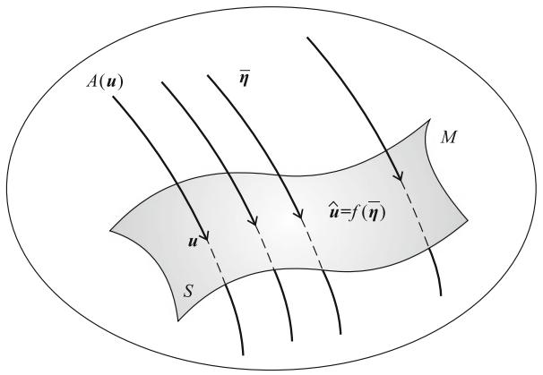  
Fig. 7.1 An estimator $f:\eta \to \eta = f(\eta)$ defines auxiliary submanifold $A(u) = f^{-1}(u)$

It forms an $(n - m)$ -dimensional submanifold passing through $\eta(\pmb{u}) \in M$ (Fig. 7.1). We call it an ancillary submanifold associated with estimator $f$ . $A(\pmb{u})$ is defined at each $\pmb{u} \in S$ and they give a foliation of $M$ at least in a neighborhood of $S$ ,

$$
A (\boldsymbol {u}) \bigcap A \left(\boldsymbol {u} ^ {\prime}\right) = \emptyset , \quad \boldsymbol {u} \neq \boldsymbol {u} ^ {\prime}, \tag {7.24}
$$

$$
\bigcup_ {\boldsymbol {u}} A (\boldsymbol {u}) \supset U, \tag {7.25}
$$

where $U$ is a neighborhood of $S$ . When $A(\pmb{u}) \ni \pmb{\eta}(\pmb{u})$ , that is, when $A(\pmb{u})$ passes through $\pmb{\eta}(\pmb{u})$ , $A(\pmb{u})$ gives a consistent estimator.

An estimator defines an ancillary family $\mathcal{A} = \{A(\pmb{u})\}$ associated with it and conversely an ancillary family $\mathcal{A}$ defines a consistent estimator when $f$ satisfies (7.22). It is possible to study the performance of an estimator in terms of the geometry of an ancillary family. Let us define a coordinate system $\pmb{v}$ inside each $A(\pmb{u})$ such that the origin $\pmb{v} = 0$ is at $\eta(\pmb{u})$ which is the intersection of $A(\pmb{u})$ and $S$ . We denote coordinates of $S$ by

$$
\boldsymbol {u} = \left(u ^ {a}\right), \quad a = 1, \dots , m \tag {7.26}
$$

and coordinates in $A(\pmb{u})$ by

$$
\boldsymbol {v} = \left(v ^ {\kappa}\right), \quad \kappa = m + 1, \dots , n. \tag {7.27}
$$

Then, combining the two, we have a new coordinate system of $M$

$$
\boldsymbol {w} = (\boldsymbol {u}, \boldsymbol {v}) = (w ^ {\alpha}), \quad \alpha = 1, 2, \dots , n, \tag {7.28}
$$

defined in a neighborhood $U\subset S$ (Fig. 7.2).

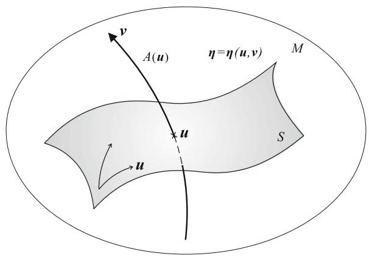  
Fig. 7.2 New coordinate system $\pmb{w} = (\pmb{u},\pmb{v})$ of $M$

The $\theta$ -coordinates and $\eta$ -coordinates in $M$ are written in terms of the new coordinates $\boldsymbol{w}$ as

$$
\boldsymbol {\theta} = \boldsymbol {\theta} (\boldsymbol {w}) = \boldsymbol {\theta} (\boldsymbol {u}, \boldsymbol {v}), \tag {7.29}
$$

$$
\eta = \eta (\boldsymbol {w}) = \eta (\boldsymbol {u}, \boldsymbol {v}). \tag {7.30}
$$

Any point in $S$ satisfies $\pmb{v} = 0$ , so that $S$ is represented by

$$
S = \left\{\eta (\boldsymbol {u}, \boldsymbol {v}) \mid \boldsymbol {v} = 0 \right\}. \tag {7.31}
$$

The Jacobian matrices of the coordinate transformations between $\pmb{w}$ and $\pmb{\theta}$ and $\pmb{w}$ and $\pmb{\eta}$ are expressed as

$$
B _ {\alpha} ^ {i} = \frac {\partial \theta^ {i}}{\partial w ^ {\alpha}}, \tag {7.32}
$$

$$
B _ {\alpha i} = \frac {\partial \eta_ {i}}{\partial w ^ {\alpha}}, \tag {7.33}
$$

and are decomposed as

$$
B _ {a} ^ {i} = \frac {\partial \theta^ {i}}{\partial u ^ {a}}, \quad B _ {\kappa} ^ {i} = \frac {\partial \theta^ {i}}{\partial v ^ {\kappa}}; \tag {7.34}
$$

$$
B _ {a i} = \frac {\partial \eta_ {i}}{\partial u ^ {a}}, \quad B _ {\kappa i} = \frac {\partial \eta_ {i}}{\partial v ^ {\kappa}} \tag {7.35}
$$

in terms of the $\mathbf{u}$ and $\mathbf{v}$ coordinates.

The Fisher information is given in the $\mathbf{w}$ -coordinate system as

$$
g _ {\alpha \beta} = B _ {\alpha} ^ {i} g _ {i j} B _ {\beta} ^ {j} \tag {7.36}
$$

and is decomposed as

$$
\mathbf {G} = \left[ \begin{array}{l l} g _ {a b} & g _ {a \lambda} \\ g _ {\kappa b} & g _ {\kappa \lambda} \end{array} \right]. \tag {7.37}
$$

Given data $D$ , the $\pmb{u}$ - and $\pmb{v}$ -coordinates $(\bar{\pmb{u}},\bar{\pmb{v}})$ of the observed point $\bar{\eta}$ are determined from

$$
\bar {\eta} = \eta (\bar {u}, \bar {v}). \tag {7.38}
$$

The estimator associated with ancillary family $\mathcal{A}$ is given by

$$
\hat {\boldsymbol {u}} = \bar {\boldsymbol {u}}. \tag {7.39}
$$

# 7.4 First-Order Asymptotic Theory of Estimation

When the true distribution is $\pmb{u}$ in $S$ , by the law of large numbers, the observed point $\bar{\eta}$ converges to

$$
\eta = \eta (\boldsymbol {u}, 0), \tag {7.40}
$$

as $N$ tends to infinity. We define the error, that is the deviation of the observed point from the true distribution in the $\eta$ -coordinates, by

$$
e = \bar {\eta} - \eta . \tag {7.41}
$$

Since it is small, we normalize it as

$$
\tilde {\boldsymbol {e}} = \sqrt {N} \boldsymbol {e}. \tag {7.42}
$$

Then, the moments of the error are easily calculated. They are summarized in the following theorem.

Theorem 7.3 The moments of the error (deviation) $\tilde{\pmb{e}}$ in the $\eta$ -coordinates are given by

$$
E \left[ \tilde {e} _ {i} \right] = 0, \tag {7.43}
$$

$$
E \left[ \tilde {e} _ {i} \tilde {e} _ {j} \right] = g _ {i j}, \tag {7.44}
$$

$$
\mathrm {E} \left[ \tilde {e} _ {i} \tilde {e} _ {j} \tilde {e} _ {k} \right] = \frac {1}{\sqrt {N}} T _ {i j k}, \tag {7.45}
$$

where

$$
g _ {i j} = \partial_ {i} \partial_ {j} \psi (\boldsymbol {\theta}), \tag {7.46}
$$

$$
T _ {i j k} = \partial_ {i} \partial_ {j} \partial_ {k} \psi (\boldsymbol {\theta}). \tag {7.47}
$$

Let us also normalize the error in the $\pmb{w}$ -coordinates as

$$
\tilde {\boldsymbol {w}} = \sqrt {N} (\bar {\boldsymbol {w}} - \boldsymbol {w}), \tag {7.48}
$$

where $\bar{\pmb{w}}$ is the $\pmb{w}$ -coordinates of $\tilde{\eta}$ . By expanding

$$
\bar {\boldsymbol {x}} = \eta \left(\boldsymbol {w} + \frac {\tilde {\boldsymbol {w}}}{\sqrt {N}}\right), \tag {7.49}
$$

we have

$$
\bar {x} _ {i} = \eta_ {i} + \frac {1}{\sqrt {N}} B _ {\alpha i} \tilde {w} ^ {\alpha} + \frac {1}{2 N} B _ {\alpha \beta i} \tilde {w} ^ {\alpha} \tilde {w} ^ {\beta} + O \left(\frac {1}{N \sqrt {N}}\right), \tag {7.50}
$$

where

$$
B _ {\alpha \beta i} = \frac {\partial^ {2} \eta_ {i}}{\partial w ^ {\alpha} \partial w ^ {\beta}}. \tag {7.51}
$$

By inverting (7.50), we have

$$
\tilde {w} ^ {\alpha} = g ^ {\alpha \beta} B _ {\beta} ^ {i} \tilde {e} _ {i} - \frac {1}{2 \sqrt {N}} C _ {\beta \gamma} ^ {\alpha} \tilde {w} ^ {\beta} \tilde {w} ^ {\gamma}, \tag {7.52}
$$

where

$$
C _ {\beta \gamma} ^ {\alpha} = B ^ {\alpha i} B _ {\beta \gamma i}. \tag {7.53}
$$

We have, therefore, an asymptotic evaluation of the error in the $\boldsymbol{w}$ -coordinates as

$$
\mathrm {E} \left[ \tilde {w} ^ {\alpha} \right] = - \frac {1}{2 \sqrt {N}} C _ {\beta \gamma} ^ {\alpha} g ^ {\beta \gamma}, \tag {7.54}
$$

$$
\mathrm {E} \left[ \tilde {w} ^ {\alpha} \tilde {w} ^ {\beta} \right] = g ^ {\alpha \beta}. \tag {7.55}
$$

Since $\tilde{\pmb{e}} = \sqrt{N} (\bar{\pmb{x}} -\pmb {\eta})$ are asymptotically Gaussian, the error $\tilde{\pmb{w}} = (\tilde{\pmb{u}},\tilde{\pmb{v}})$ in (7.48) expressed in the $\pmb{w}$ -coordinates is asymptotically

$$
p \left(\tilde {\boldsymbol {u}}, \tilde {\boldsymbol {v}}\right) = c \exp \left\{- \frac {1}{2} g _ {\alpha \beta} \tilde {w} ^ {\alpha} \tilde {w} ^ {\beta} \right\}. \tag {7.56}
$$

By integrating $p(\tilde{\pmb{u}},\tilde{\pmb{v}})$ with respect to $\tilde{\pmb{v}}$ , we have the asymptotic distribution of the estimation error

$$
p (\tilde {\boldsymbol {u}}) = c \exp \left\{- \frac {1}{2} \bar {g} _ {a b} \tilde {u} ^ {a} \tilde {u} ^ {b} \right\}, \tag {7.57}
$$

where

$$
\bar {g} _ {a b} = g _ {a b} - g _ {a \kappa} g _ {b \lambda} g ^ {\kappa \lambda}. \tag {7.58}
$$

When $A(\pmb{u})$ is orthogonal to $M$ ,

$$
g _ {a \kappa} = B _ {a} ^ {i} g _ {i j} B _ {\kappa} ^ {j} = 0, \tag {7.59}
$$

so that we have

$$
p \left(\tilde {u}\right) = c \exp \left\{- \frac {1}{2} g _ {a b} \tilde {u} ^ {a} \tilde {u} ^ {b} \right\}. \tag {7.60}
$$

In general

$$
\left(\bar {g} _ {a b}\right) \leq \left(g _ {a b}\right) \tag {7.61}
$$

and $(\bar{g}_{ab})$ is maximized in the orthogonal case, where the Cramér-Rao bound is asymptotically attained. An estimator is efficient in this case.

We summarize the results in the following.

Theorem 7.4 (1) An estimator $\hat{\pmb{u}}$ is consistent when its ancillary family $A(\pmb{u})$ passes through $\pmb{w} = (\pmb{u},0)\in S$ in $M$ . (2) A consistent estimator is efficient when $A(\pmb{u})$ is orthogonal to $S$ .

The maximum likelihood estimator is given by the $m$ -projection of $\bar{\eta}$ to $S$ . Therefore, its $A(\pmb{u})$ is orthogonal to $S$ and it is efficient.

Remark The first-order asymptotic theory is a linear theory in a small neighborhood of the true distribution. Hence, it is enough to consider only the tangent space $T_{\eta}$ instead of the entire $M$ for evaluating the performance of an estimator. Therefore, the asymptotic theory is common for all regular statistical models. We may consider the case where the ancillary family $A(\pmb{u})$ depends on $N$ so that it is denoted as $A_N(\pmb{u})$ . Then, the theory holds when $A_N(\pmb{u})$ passes through $(\pmb{u}, 0)$ and is orthogonal to $S$ , as $N$ tends to infinity. Such an ancillary family is important for studying the performance of testing hypotheses.

# 7.5 Higher-Order Asymptotic Theory of Estimation

The covariance matrix of an efficient estimator achieves the CR-bound $\mathbf{G}^{-1} / N$ asymptotically when we ignore the term of order $1 / N^2$ . The higher-order asymptotic theory evaluates this higher-order term. This makes it possible to compare the performances of various efficient estimators more accurately.

In order to compare the higher-order errors, we introduce asymptotic bias-correction of estimators. The asymptotic bias $\pmb{b}$ of an estimator is given in (7.54), which is of the order $1 / N$ . If we modify the estimator by

$$
\hat {\boldsymbol {u}} ^ {*} = \hat {\boldsymbol {u}} - \boldsymbol {b} (\hat {\boldsymbol {u}}), \tag {7.62}
$$

the bias of the new estimator becomes

$$
E \left[ \hat {\boldsymbol {u}} ^ {*} \right] - \boldsymbol {u} = O \left(\frac {1}{N ^ {2}}\right). \tag {7.63}
$$

We call it a bias-corrected estimator. In order to compare the covariances of various efficient estimators, we use their bias-corrected versions. The idea of bias correction is due to Rao (1962), and is necessary in order to exclude estimators which are good at some specific points but not uniformly good. For example, the trivial estimator

$$
\hat {\boldsymbol {u}} = \boldsymbol {u} _ {0} \tag {7.64}
$$

which does not depend on data $D$ , is the best estimator when the true distribution is $\pmb{u}_0$ but very bad for other $\pmb{u}$ .

We evaluate the error terms from (7.52) by using the higher-order terms of the Taylor expansion, where we need higher-order moments of the error given in (7.43)-(7.45). We then have the following theorem. The calculations are technical and they are formably complicated, so we neglect them and give only the results. See Amari (1985).

Theorem 7.5 The covariance matrix of a bias-corrected efficient estimator is given by

$$
\begin{array}{l} E \left[ \tilde {u} ^ {* a} \tilde {u} ^ {* b} \right] \\ = g ^ {a b} + \frac {1}{2 N} \left\{\left(\Gamma_ {S} ^ {m 2}\right) ^ {a b} + 2 \left(H _ {S} ^ {e 2}\right) ^ {a b} + \left(H _ {A} ^ {m 2}\right) ^ {a b} \right\} + O \left(\frac {1}{N ^ {2}}\right), \tag {7.65} \\ \end{array}
$$

where

$$
\left(H _ {S} ^ {e 2}\right) ^ {a b} = H _ {e c} ^ {(e) \kappa} H _ {f d} ^ {(e) \lambda} g ^ {c d} g _ {\kappa \lambda} g ^ {a e} g ^ {f b} \tag {7.66}
$$

is the square of the $e$ -embedding curvature of $S$ ,

$$
\left(H _ {A} ^ {m 2}\right) ^ {a b} = H _ {\kappa \lambda} ^ {(m) a} H _ {\mu \nu} ^ {(m) b} g ^ {\kappa \mu} g ^ {\lambda \nu} \tag {7.67}
$$

is the square of the $m$ -embedding curvature of the ancillary family $A(\pmb{u})$ and

$$
\left(\Gamma_ {S} ^ {m 2}\right) ^ {a b} = \Gamma_ {c d} ^ {(m) ^ {a}} \Gamma_ {e f} ^ {(m) ^ {b}} g ^ {c e} g ^ {d f} \tag {7.68}
$$

is the square of the $m$ -connection of the coordinate system $\mathbf{u}$ in $S$ .

Thus, the second-order terms of the covariance of error are decomposed into a sum of three non-negative terms. The $e$ -curvature term $\left(H_S^{e2}\right)^{ab}$ depends on the statistical model $S$ , showing the degree of its deviation from an exponential family. This vanishes when $S$ itself is an exponential family. This term was introduced by Efron (1975) and he named it statistical curvature. The term $\left(\Gamma_S^{m2}\right)^{ab}$ depends on the method of parameterization $\pmb{u}$ in $S$ and is common to all estimators. The $m$ -curvature term $\left(H_A^{m2}\right)^{ab}$ depends on the $m$ -embedding curvature of $A(\pmb{u})$ . It vanishes when the $m$ -curvature of $A(\pmb{u})$ vanishes. Note that the $m$ -curvature of $A(\pmb{u})$ vanishes for the MLE, since the MLE is given by the $m$ -projection of the observed point to $S$ . This is the only quantity which depends on the estimator.

Theorem 7.6 A bias-corrected efficient estimator is second-order efficient when the embedding $m$ -curvature of the associated $A(\pmb{u})$ vanishes at $S$ . The bias-corrected MLE is second-order efficient.

Remark It is intriguing to ask if the higher-order bias-corrected MLE is third-order efficient or not. Unfortunately, it is not. Kano (1997, 1998) disproved the conjecture, showing that the MLE is not third-order efficient. It was Fisher's belief that the MLE would be the best estimator, but the dream of Fisher was shattered in the third-order asymptotic theory.

# 7.6 Asymptotic Theory of Hypothesis Testing

When the number of observations is large, we have an asymptotic theory of hypothesis testing. A typical situation is to test a null hypothesis

$$
H _ {0}: u = u _ {0} \tag {7.69}
$$

against alternatives

$$
H: u > u _ {0} \tag {7.70}
$$

in a one-dimensional curved exponential family $S = \{p(\boldsymbol{x},\boldsymbol{\theta}(u))\}$ . This is a one-sided test but we can treat a two-sided test similarly.

Since $S$ is a curve in $M$ , we design a test by defining a rejection region $R$ in $M$ such that hypothesis $H_0$ is rejected when the observed point $\bar{\eta}$ is included in $R$ and is not rejected (is accepted) otherwise. The observed point $\bar{\eta}$ converges to $u_0$ as $N$ increases when hypothesis $H_0$ is true. Hence, the rejection region should not include $u_0$ , but its boundary $B = \partial R$ lies close to $u_0$ , approaching $u_0$ as $N$ tends to infinity. See Fig. 7.3. The boundary surface $B(u_0)$ of $R$ depends on the null hypothesis $u_0$ . It is an $(n - 1)$ -dimensional hypersurface crossing $S$ at point $u_0'$ which converges to $u_0$ as $N$ increases. We denote it by $A_N(u_0)$ . See Fig. 7.3.

We consider $u = u_{0}$ as a free scalar parameter, and form an ancillary family of $\mathcal{A} = \{A_{N}(u)\}$ , depending on $N$ . This is a foliation of $M$ consisting of the boundaries of the rejection regions for various $u = u_{0}$ . This is useful for analyzing the performance of a hypothesis testing. The first-order asymptotic theory is easy, since $\bar{\eta}$ converges to $\eta(u_{0})$ under hypothesis $H_{0}$ .

Theorem 7.7 A test is (first-order) efficient when the associated ancillary surface $A_{N}(u)$ passing through $u_{N}$ is orthogonal to $S$ and $u_{N}$ converges to $u_{0}$ , as $N$ tends to infinity.

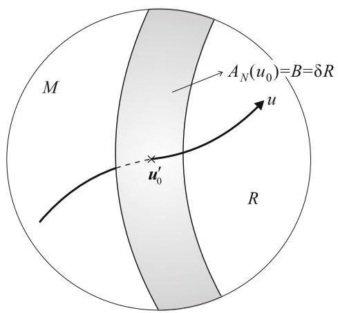  
Fig. 7.3 Rejection region $R$ and associated auxiliary submanifold $A_{N}(\pmb{u}_{0})$

There are many first-order efficient tests, the Rao test, Wald test, likelihood-ratio test, locally most powerful test among others. How do these tests differ in their performance? The question is answered by studying the power functions of test $T$ , the probabilities $P_{T}(u)$ of rejecting $H_{0}$ when the true distribution is $u$ , up to the higher order. There are no uniformly most powerful tests in the second order except for the case that $S$ is an exponential family. Therefore, one test is powerful at a specific point, while another is good at a different point. Information geometry characterizes the performances of various tests by the geometry of the associated ancillary surfaces, in particular by the $m$ -embedding curvatures of $A_{N}(u)$ and the asymptotic angle between $A_{N}(u)$ and $S$ . The second-order power functions of various tests are analyzed in Kumon and Amari (1983), Amari (1985). See also Amari and Nagaoka (2000).

# Remarks

Information geometry was developed for elucidating higher-order characteristics of statistical inference, in particular, estimation and hypothesis testing. The first-order theory was established by the Cramér-Rao theory and the Neyman-Pearson fundamental lemma. Researchers tackled the second-order theories in the late 1970s and many results were obtained independently in Japan, Germany, India, Russia and the U.S.A. See Akahira and Takeuchi (1981). B. Efron was the first to point out the role of statistical curvature in the second-order asymptotic theory (Efron 1975).

Amari (1982) established the second-order theory of estimation by using differential geometry. Kumon and Amari (1983) extended it to the higher-order theory of hypothesis testing. Information geometry was developed further for this purpose, while the duality theory was established by Nagaoka and Amari (1982). See also Amari and Nagaoka (2000).

Sir David Cox, one of most influential statisticians, paid attention to differential geometrical theory when he visited Japan, and he organized a Workshop on Differential Geometry of Statistics in London in 1984. Numerous active statisticians, C.R. Rao, B. Efron, A.P. Dawid, R. Kass, N. Read, O.E. Barndorff-Nielsen, S. Lauritzen, D.V. Hinkley, S. Eguchi and many others, participated in the workshop. It was very fortunate for information geometry that the topic was discussed openly at this workshop in its period of early infancy. But it was unfortunate that N.N. Chentsov could not participate, because it was supported by NATO and the world was divided by the Iron Curtain at that time.

We have shown in this chapter the asymptotic theory of statistics in the framework of a curved exponential family. We have not described details, but shown only intuitive ideas and results. The details are shown in Amari (1985) and also in Amari and Nagaoka (2000) or related journal papers. Since not all regular statistical models are curved exponential families, one might wonder if the theory is valid in a more general regular statistical model. We can prove that most results of higher-order statistical theory hold in a general regular statistical model, by forming a fiber bundle-like structure attached to $S$ , consisting of higher-order derivatives of the score function. This is called a local exponential family. See Amari (1985) for details of higher-order asymptotic theory.

How about non-regular statistical models, where the Fisher information matrix is degenerate or not defined (diverging to infinity)? In the former case, a statistical model includes singularities. There are many such models. Typical examples include the multilayer perceptron. We will study such models in Part IV.

A simple example of the latter type is the location model where $x$ is uniformly distributed in the interval of $[u - 0.5, u + 0.5]$ and $u$ is the unknown parameter. The Fisher information matrix diverges to infinity. In such a statistical model, there is no inner product in the tangent space. The metric is given by a Minkowski metric in the tangent space, which is different from a Riemannian manifold. In this case, $M$ is a Finsler space. An estimator is not asymptotically Gaussian in such a model but is subject to a stable distribution. It is interesting to see the relation between the Finsler metric, stable distribution, and associated fractal structure, comparing them with the Riemannian metric, the Gaussian distribution due to the Central Limit Theorem and the smooth structure of the regular case. However, such a theory has not yet been explored. See a preliminary study by Amari (1984, in Japanese).

# Chapter 8 Estimation in the Presence of Hidden Variables

# 8.1 EM Algorithm

# 8.1.1 Statistical Model with Hidden Variables

Let us consider a statistical model $M = \{p(\boldsymbol{x},\boldsymbol{\xi})\}$ , where vector random variable $\boldsymbol{x}$ is divided into two parts $\boldsymbol{x} = (\boldsymbol{y},\boldsymbol{h})$ so that $p(\boldsymbol{x},\boldsymbol{\xi}) = p(\boldsymbol{y},\boldsymbol{h};\boldsymbol{\xi})$ . When $\boldsymbol{x}$ is not fully observed but $\boldsymbol{y}$ is observed, $\boldsymbol{h}$ is called a hidden variable. In such a case, we estimate $\boldsymbol{\xi}$ from observed $\boldsymbol{y}$ . These situations occur in many applications. One can eliminate the hidden variable $\boldsymbol{h}$ by marginalization such that

$$
p _ {Y} (\boldsymbol {y}, \boldsymbol {\xi}) = \int p (\boldsymbol {y}, \boldsymbol {h}; \boldsymbol {\xi}) d \boldsymbol {h}. \tag {8.1}
$$

Then, we have a statistical model $M' = \{p_{Y}(\mathbf{y},\boldsymbol{\xi})\}$ which does not include hidden variables. However, in many cases, the form of $p(\mathbf{x},\boldsymbol{\xi})$ is simple and estimation is tractable in $M$ , but $M'$ is complicated because of integration or summation over $h$ . Estimation in such a model is computationally intractable. Typically, $M$ is an exponential family. The EM algorithm is a procedure to estimate $\boldsymbol{\xi}$ by using a large model $M$ from which model $M'$ is derived.

Let us consider a larger model

$$
S = \{q (\mathbf {y}, \mathbf {h}) \} \tag {8.2}
$$

consisting of all probability density functions of $(y, h)$ . When both $y$ and $h$ are binary variables, $S$ is a probability simplex so that it is an exponential family. We study the continuous variable case similarly, without considering delicate mathematical problems. Model $M$ is included in $S$ as a submanifold. Observed data give an observed point

$$
\bar {q} (\boldsymbol {x}) = \frac {1}{N} \sum \delta \left(\boldsymbol {x} - \boldsymbol {x} _ {i}\right) \tag {8.3}
$$

in $S$ when examples $\pmb{x}_1, \dots, \pmb{x}_N$ are fully observed. This is the empirical distribution. When $S$ is an exponential family, it is given by the sufficient statistic

$$
\bar {\eta} = \bar {x} = \frac {1}{N} \sum x _ {i} \tag {8.4}
$$

in the $\eta$ -coordinates. The MLE is given by $m$ -projecting $\bar{q}(\pmb{x})$ to $M$ .

We do not have a full observed point $\bar{q}(\pmb{x})$ in the hidden variable case. We observe only $\pmb{y}$ so that we have an empirical distribution $\bar{q}_Y(\pmb{y})$ of $\pmb{y}$ only. In order to have a candidate of a joint distribution $\bar{q}(\pmb{y},\pmb{h})$ , we use an arbitrary conditional distribution $q(\pmb{h}|\pmb{y})$ and put

$$
\bar {q} (\mathbf {y}, \mathbf {h}) = \bar {q} _ {Y} (\mathbf {y}) q (\mathbf {h} | \mathbf {y}). \tag {8.5}
$$

Since $q(\pmb{h}|\pmb{y})$ is arbitrary, we take all of them as possible candidates of observed points and consider a submanifold

$$
D = \left\{\bar {q} (\mathbf {y}, \mathbf {h}) \mid \bar {q} (\mathbf {y}, \mathbf {h}) = \bar {q} _ {Y} (\mathbf {y}) q (\mathbf {h} | \mathbf {y}), q (\mathbf {h} | \mathbf {y}) \text {i s a r b i t a r y} \right\}. \tag {8.6}
$$

This is the observed submanifold in $S$ specified by the partially observed data $\mathbf{y}_1, \ldots, \mathbf{y}_N$ . By using the empirical distribution, it is written as

$$
q (\mathbf {y}, \mathbf {h}) = \frac {1}{N} \sum \delta (\mathbf {y} - \mathbf {y} _ {i}) q (\mathbf {h} | \mathbf {y} _ {i}) \tag {8.7}
$$

The data submanifold $D$ is $m$ -flat, because it is linear with respect to $q(h|y)$ .

Before analyzing the estimation procedure, we give two simple examples of the hidden variable model.

# (1) Gaussian mixture model

Let $N(\mu)$ be a Gaussian distribution of $y$ with mean $\mu$ and variance 1. We can treat more general multivariate Gaussian models with unknown covariance matrices in a similar way, but this simple model is enough for the purpose of illustration. The Gaussian mixture model consists of the mixture of $k$ Gaussian distributions having different means $\mu_1, \ldots, \mu_k$ ,

$$
p (y, \boldsymbol {\xi}) = \frac {1}{\sqrt {2 \pi}} \sum w _ {j} \exp \left\{- \frac {\left(y - \mu_ {j}\right) ^ {2}}{2} \right\}, \tag {8.8}
$$

where $\xi = (w_{1},\ldots ,w_{k};\mu_{1},\ldots ,\mu_{k}),\sum w_{i} = 1$ , are unknown parameters to be estimated. Estimation is easy if, for each $y_{1},\ldots ,y_{N}$ , we know the Gaussian distribution from which this $y_{i}$ is generated. So we introduce a hidden variable $h$ , which takes value $i$ when $y$ is generated from the $i$ th distribution $N(\mu_i)$ . The $h$ is a random variable, the distribution of which is multinomial, taking value $i$ with probability $w_{i}$ . Hence, the entire joint distribution is

# 8.1 EM Algorithm

$$
p (y, h, \xi) = \frac {w _ {h}}{\sqrt {2 \pi}} \exp \left\{- \frac {1}{2} (y - \mu_ {h}) ^ {2} \right\}, \quad h = 1, \dots , k \tag {8.9}
$$

and (8.8) is the marginal distribution of (8.9), obtained by summing $h$ from 1 to $k$ .

# (2) Boltzmann machine with hidden units

The Boltzmann machine is a stochastic model having a binary vector random variable $\mathbf{x} = (x_{1},\ldots ,x_{n})$ . It originates from a model of a spin system in physics and a model of associative memory in machine learning. Consider a Markov chain $\{x_{1},x_{2},\dots \}$ where state $x_{t + 1}$ at time $t + 1$ is stochastically determined from $x_{t}$ . We do not describe here the stochastic dynamics of the state transition, but simply study its stable distribution given by

$$
p (\boldsymbol {x}, \boldsymbol {a}, \mathbf {W}) = \exp \left\{\boldsymbol {a} \cdot \boldsymbol {x} - \frac {1}{2} \boldsymbol {x} ^ {T} \mathbf {W} \boldsymbol {x} - \psi (\boldsymbol {a}, \mathbf {W}) \right\}. \tag {8.10}
$$

This is called a Boltzmann machine specified by parameter $\xi = (\mathbf{W},\mathbf{a})$ , where an element $w_{ij}$ of matrix $\mathbf{W}$ is regarded as the intensity of connection between units $i$ and $j$ . They are assumed to be symmetric $w_{ij} = w_{ji}$ with $w_{ii} = 0$ . The linear term $\mathbf{a}\cdot \mathbf{x}$ in the exponent is called a bias term, which specifies the tendency of $x_{i}$ to be 1 rather than 0.

We consider the case where $\mathbf{x}$ is divided into two parts, $\mathbf{x} = (\mathbf{y},\mathbf{h})$ and $\mathbf{y}$ is observable while $\mathbf{h}$ is hidden. For the sake of simplicity, we consider the restricted Boltzmann machine (RBM), which consists of two layers, an observable layer and a hidden layer (Fig. 8.1). Connections exist only between units in the observable layer and between units in the hidden layer. No connections exist between units within the observable layer, and no connections exist between units within the hidden layer. Then, the stable distribution is written as

$$
p (\mathbf {y}, \mathbf {h}, \mathbf {W}) = \exp \left\{- \frac {1}{2} \mathbf {y} ^ {T} \mathbf {W} \mathbf {h} - \psi (\mathbf {W}) \right\}, \tag {8.11}
$$

where, for the sake of simplicity, we ignore the bias term $\pmb{a}$ and let it be 0.

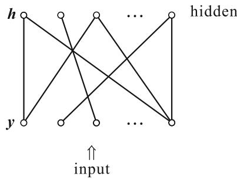  
Fig. 8.1 Restricted Boltzmann machine

The marginal distribution of $y$ is

$$
p _ {Y} (\mathbf {y}, \mathbf {W}) = \sum_ {\boldsymbol {h}} \exp \left\{- \frac {1}{2} \mathbf {y} ^ {T} \mathbf {W} \boldsymbol {h} - \psi (\mathbf {W}) \right\}, \tag {8.12}
$$

which is a mixture of exponential family distributions. The conditional distribution of $\pmb{h}$ given $\pmb{y}$ is

$$
p (\boldsymbol {h} | \boldsymbol {y}; \mathbf {W}) = \frac {p (\boldsymbol {y} , \boldsymbol {h} ; \mathbf {W})}{p _ {Y} (\boldsymbol {y} , \mathbf {W})}, \tag {8.13}
$$

when the parameters $\mathbf{W}$ are known. This model is used in deep learning and we discuss it in a later chapter from the viewpoint of Bayesian information geometry.

# 8.1.2 Minimizing Divergence Between Model Manifold and Data Manifold

The MLE is the minimizer of KL-divergence from the observed point $\bar{q}$ to the model manifold in the fully observed case. We have an observed data submanifold $D$ in the hidden case instead of $\bar{q}$ . We consider the minimizer of KL-divergence from the data manifold to the model manifold. The problem is then to minimize the divergence between two submanifolds $D$ and $M$ ,

$$
D _ {K L} [ D: M ] = \min  \int \bar {q} _ {Y} (\mathbf {y}) q (\mathbf {h} | \mathbf {y}) \log \frac {\bar {q} _ {Y} (\mathbf {y}) q (\mathbf {h} | \mathbf {y})}{p (\mathbf {y} , \mathbf {h} , \boldsymbol {\xi})} d \mathbf {y} d \mathbf {h}, \tag {8.14}
$$

where the minimum between two sets $D$ and $M$ is taken with respect to $\bar{q} \in D$ , $p \in M$ . The alternating minimization algorithm (em algorithm) studied in Chap. 1 is useful for this purpose.

Theorem 8.1 The MLE is the minimizer of the KL-divergence from $D$ to $M$ .

Proof The KL-divergence from a distribution $\bar{q}_Y(\pmb {y})q(\pmb {h}|\pmb {y})\in D$ to a distribution $p(\pmb {y},\pmb {h},\pmb {\xi})\in M$ is written as

$$
\begin{array}{l} D \left[ \bar {q} _ {Y} (\mathbf {y}) q (\mathbf {h} | \mathbf {y}): p (\mathbf {y}, \mathbf {h}, \boldsymbol {\xi}) \right] = \int \left[ \bar {q} _ {Y} (\mathbf {y}) \int q (\mathbf {h} | \mathbf {y}) \log q (\mathbf {h} | \mathbf {y}) d \mathbf {h} \right. \\ \left. - \bar {q} _ {Y} (\mathcal {Y}) \int q (\mathcal {H} | \mathcal {Y}) \log p (\mathcal {Y}, \mathcal {H}, \xi) d \mathcal {H} \right] d \mathcal {Y} + c, \tag {8.15} \\ \end{array}
$$

where $c$ is a term not depending on $\xi$ and $q(h|y)$ . We minimize (8.15) with respect to both $\xi$ and $q(h|y)$ alternately by the em algorithm, that is, the alternating use of the $e$ -projection and $m$ -projection. First, assume that $q(h|y)$ is given and we minimize (8.15) with respect to $\xi$ . We consider one observed $y$ for simplicity, although we

# 8.1 EM Algorithm

need to consider the expectation with respect to $\bar{q}_Y(y)$ , which is the summation over all observed $y_{i}$ .

Our task is to maximize the second term of (8.15)

$$
L (\boldsymbol {\xi} | q) = \int q (\boldsymbol {h} | \boldsymbol {y}) \log p (\boldsymbol {y}, \boldsymbol {h}, \boldsymbol {\xi}) d \boldsymbol {h} \tag {8.16}
$$

with respect to $\xi$ . By differentiating it, the solution is given in the equation

$$
\int \frac {q (\boldsymbol {h} | \boldsymbol {y})}{p (\boldsymbol {h} | \boldsymbol {y} , \boldsymbol {\xi})} \frac {\partial}{\partial \boldsymbol {\xi}} p (\boldsymbol {y}, \boldsymbol {h}, \boldsymbol {\xi}) d \boldsymbol {h} = 0. \tag {8.17}
$$

In order to minimize (8.15) with respect to $q(\pmb{h}|\pmb{y})$ , we use the following lemma.

Lemma 8.1 The $e$ -projection from a point of $M$ to $D$ does not alter the conditional distribution $q(\pmb{h}|\pmb{y})$ and hence the conditional expectation of $\pmb{h}$ .

Proof Given $\xi$ and observed data $\mathbf{y}$ , we search for $q(\mathbf{h}|\mathbf{y})$ that minimizes (8.15). This is to minimize

$$
K L \left[ \bar {q} _ {Y} (\mathbf {y}) q (\mathbf {h} | \mathbf {y}): p (\mathbf {y}, \mathbf {h}; \boldsymbol {\xi}) \right] \tag {8.18}
$$

under the constraint

$$
\int q (\boldsymbol {h} | \boldsymbol {y}) d \boldsymbol {h} = 1. \tag {8.19}
$$

The minimizer is given by the $e$ -projection of $p(\mathbf{y}, \mathbf{h}; \boldsymbol{\xi})$ to $D$ and analytically by solving

$$
\int \left[ \log \frac {q (\boldsymbol {h} | \boldsymbol {y})}{p (\boldsymbol {h} | \boldsymbol {y} , \boldsymbol {\xi})} - \lambda \right] \delta q (\boldsymbol {h} | \boldsymbol {y}) d \boldsymbol {h} = 0, \tag {8.20}
$$

where $\lambda$ is the Lagrange multiplier corresponding to (8.19). This proves

$$
q (\boldsymbol {h} | \boldsymbol {y}) = p (\boldsymbol {h} | \boldsymbol {y}; \boldsymbol {\xi}), \tag {8.21}
$$

which is exactly the same as the conditional probability of $\pmb{h}$ at $\xi$ .

By substituting (8.21) in (8.17), the minimizer of the KL-divergence satisfies

$$
\frac {\partial}{\partial \boldsymbol {\xi}} \int p (\boldsymbol {y}, \boldsymbol {h}, \boldsymbol {\xi}) d \boldsymbol {h} = \frac {\partial}{\partial \boldsymbol {\xi}} p _ {Y} (\boldsymbol {y}, \boldsymbol {\xi}) = 0, \tag {8.22}
$$

proving that it is the MLE.

□

# 8.1.3 EM Algorithm

The EM algorithm (expectation maximization algorithm) is an iterative algorithm for obtaining the MLE in a model including hidden variables. It was formulated by Dempster et al. (1977). We show its geometry due to Csiszár and Tunsady (1984), also by Amari et al. (1992), Byrne (1992) and Amari (1995). It is an application of the em algorithm from the geometrical point of view. We begin with $\xi_0$ as an initial parameter, and $e$ -project it to $D$ to obtain the conditional distribution $q(\pmb{h}|\pmb{y}) = p(\pmb{h}|\pmb{y};\pmb{\xi}_0)$ . This determines a candidate for the observed distribution in $D$ . We calculate the conditional expectation of log likelihood to evaluate the likelihood of a new candidate $\pmb{\xi}$ , given by

$$
L \left(\boldsymbol {\xi}, \boldsymbol {\xi} _ {0}\right) = \frac {1}{N} \sum_ {i} \int p \left(\boldsymbol {h} \mid \boldsymbol {y} _ {i}, \boldsymbol {\xi} _ {0}\right) \log p \left(\boldsymbol {y} _ {i}, \boldsymbol {h}, \boldsymbol {\xi}\right) d \boldsymbol {h}, \tag {8.23}
$$

for observed data $\mathbf{y}_1, \ldots, \mathbf{y}_N$ . This is called the E-step, because it calculates the conditional expectation. This is the $e$ -projection of $p(\mathbf{y}, \mathbf{R}, \boldsymbol{\xi}_0)$ to $D$ .

We then $m$ -project the new candidate in $D$ to $M$ , to obtain a new candidate $\xi_1$ in $M$ . This is obtained by maximizing (8.23). It is called the M-step, because it is the maximization of the log likelihood (8.23). This is the $m$ -projection. We repeat the procedures. See Fig. 8.2.

It is easy to prove the following theorem.

Theorem 8.2 The KL-divergence decreases monotonically by repeating the $E$ -step and the $M$ -step. Hence, the algorithm converges to an equilibrium.

It should be noted that the $m$ -projection is not necessarily unique unless $M$ is $e$ -flat. Hence, there might exist local minima.

# 8.1.4 Example: Gaussian Mixture

The parameters to be estimated are the weights $w_{1}, \ldots, w_{k}$ and the means $\mu_{1}, \ldots, \mu_{k}$ of component Gaussian distributions, $\pmb{\xi} = (w_{i}, \mu_{i}; i = 1, \ldots, k)$ . We begin with

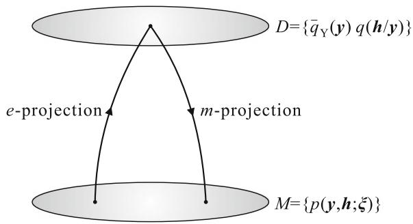  
Fig.8.2 EM algorithm

# 8.1 EM Algorithm

initial $\xi_0$ , and let $\pmb{\xi}^t = (w_i^t, \mu_i^t)$ be the candidate at $t$ . The E-step is to $e$ -project $p(y, h; \pmb{\xi}^t)$ to $D$ to obtain $q_t(h|y)$ . This is the same as that at $\pmb{\xi}^t$ ,

$$
q _ {t} \left(h \mid y, \boldsymbol {\xi} ^ {t}\right) = \frac {w _ {h} ^ {t}}{\sqrt {2 \pi} p \left(y , \boldsymbol {\xi} ^ {t}\right)} \exp \left\{- \frac {1}{2} \left(y - \mu_ {h} ^ {t}\right) ^ {2} \right\}. \tag {8.24}
$$

The conditional expectation is

$$
L \left(\boldsymbol {\xi}, \boldsymbol {\xi} ^ {t}\right) = \sum_ {h} p \left(h \mid y, \boldsymbol {\xi} ^ {t}\right) \left\{\log w _ {h} - \frac {1}{2} \left(y - y _ {h}\right) ^ {2} \right\} \tag {8.25}
$$

up to a constant not depending on the parameters.

The M-step is maximization (m-projection) searching for a new $\xi^{t + 1}$ that maximizes (8.25). By differentiating (8.25) and making it equal to 0, we easily obtain

$$
w _ {h} ^ {t + 1} = \frac {1}{N} \sum p (h | y _ {i}, \boldsymbol {\xi} ^ {t}), \quad \mu_ {h} ^ {t + 1} = \frac {\sum_ {i} y _ {i} p (h | y _ {i} , \boldsymbol {\xi} ^ {t})}{\sum_ {i} p (h | y _ {i} , \boldsymbol {\xi} ^ {t})}. \tag {8.26}
$$

# 8.2 Loss of Information by Data Reduction

Given original data $D_{X} = \{\pmb{x}_{1},\dots ,\pmb{x}_{N}\}$ , assume that we summarize it to a statistic

$$
\boldsymbol {T} = \boldsymbol {T} \left(\boldsymbol {x} _ {1}, \dots , \boldsymbol {x} _ {N}\right) \tag {8.27}
$$

and use it for estimation. Then, we consider an estimator $\hat{\xi} = \hat{\xi}(T)$ , which is a function of $T$ . When $T$ is a sufficient statistic, there is no loss of information. Otherwise, summarizing the data in $T$ will cause loss of information, which is measured by using the Fisher information. When there is a hidden variable $h$ and we use $T = \{y_1, \ldots, y_N\}$ for estimation, $T$ is not sufficient in general.

We define the conditional Fisher information of the original data $D_X$ conditioned on $\pmb{T}$ . When $\pmb{T} = \pmb{t}$ , the probability distribution of $D_X$ is given by the conditional probability $p(D_X|t;\xi)$ . Hence the Fisher information is given as

$$
g _ {i j} (\cdot | t; \xi) = \mathrm {E} _ {X} \left[ \partial_ {i} \log p \left(D _ {X} | t; \xi\right) \partial_ {j} \log p \left(D _ {X} | t; \xi\right) \right], \tag {8.28}
$$

where $\mathrm{E}_X$ is the conditional expectation of $D_X$ . Taking the average over $t$ , we have the conditional Fisher information

$$
g _ {i j} ^ {X \mid T} (\boldsymbol {\xi}) = \mathrm {E} _ {t} g _ {i j} (\cdot | t; \boldsymbol {\xi}). \tag {8.29}
$$

From the equality

$$
g _ {i j} ^ {X} (\boldsymbol {\xi}) = g _ {i j} ^ {T} (\boldsymbol {\xi}) + g _ {i j} ^ {X \mid T} (\boldsymbol {\xi}), \tag {8.30}
$$

where $g_{ij}^{X}, g_{ij}^{T}, g_{ij}^{X|T}$ are the Fisher information based on $D_X, T$ and $D_X$ conditionally on $T$ . The loss of Fisher information by summarizing data to statistics $T$ is given by

$$
\Delta g _ {i j} ^ {T} (\boldsymbol {\xi}) = g _ {i j} ^ {X | T} (\boldsymbol {\xi}). \tag {8.31}
$$

Oizumi et al. (2011) studied the loss of information in the case of spikes of neurons. Let $t$ firing patterns $x_{1},\ldots ,x_{t}$ of neurons be observed. These include firing rates of neurons, covariances of spikes of two neurons and higher-order correlations of a number of neurons. Since the brain reduces information in the process of decision making, it loses some information. Consider a curved exponential family

$$
p (\boldsymbol {X}, \boldsymbol {\xi}) = \exp \left\{\boldsymbol {\theta} (\boldsymbol {\xi}) \cdot \boldsymbol {X} - \psi \right\}, \tag {8.32}
$$

where $X = (x_{i}, x_{i}x_{j}, \ldots, x_{1} \ldots x_{n})$ and $\xi$ is a parameter to specify the probability distribution based on which $x$ is generated. When a multiple observation is possible, we have the sufficient statistic (observed point)

$$
\bar {\eta} = \frac {1}{N} \sum X _ {i}. \tag {8.33}
$$

It includes all the information concerning firing rates, pairwise and higher-order interactions. An efficient estimator is obtained by $m$ -projecting it to model $M$ of which the coordinates are $\xi$ .

When a part of $\bar{\eta}$ is lost, for example higher-order correlations of spikes are lost, we cannot identify the observed point. We have instead an observed data submanifold $D$ . The optimum estimator is the minimizer of $D_{KL}[D:M]$ . The amount of loss of information is calculated when correlational information is lost (Oizumi et al. 2011).

# 8.3 Estimation Based on Misspecified Statistical Model

When the true statistical model $M = \{p(\boldsymbol{x},\boldsymbol{\xi})\}$ is very complicated, we are apt to use a simplified model $M_{q} = \{q(\boldsymbol{x},\boldsymbol{\xi})\}$ to estimate parameter $\boldsymbol{\xi}$ . This is a misspecified model. What is the loss of information by using a misspecified model? We begin with a simple example for illustration of the problem. Assume that $n$ neurons are arranged in a one-dimensional neural field. When a stimulus is applied at position $u$ , $0 < u < 1$ , the neuron corresponding to that position and neighboring neurons are activated. When the $i$ th neuron corresponds to position

$$
u = \frac {i}{n}, \tag {8.34}
$$

it is excited strongly, and neighboring neurons are also excited. We assume that, for an arbitrary $j$ , the response of neuron $j$ is $r_j(u)$ when a stimulus is applied at $u$ . The

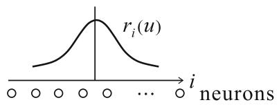  
Fig. 8.3 Tuning curve of neural field

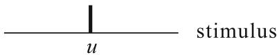

curve $r_j(u)$ is called the tuning curve of neuron $j$ . See Fig. 8.3. We assume that $x_i$ is the firing rate of neuron $i$ subject to a Gaussian distribution of which the mean is $r_i(u)$ and the covariance matrix is $V = (V_{ij})$ . Then, the statistical model of excitation is

$$
p (\boldsymbol {x}, u) = c \exp \left\{- \frac {1}{2} \left\{\boldsymbol {x} - \boldsymbol {r} (u) \right\} ^ {T} V ^ {- 1} \left\{\boldsymbol {x} - \boldsymbol {r} (u) \right\} \right\}. \tag {8.35}
$$

Consider a simpler model having the same tuning curves but no correlations,

$$
q (\boldsymbol {x}, u) = c \exp \left[ - \frac {1}{2} \left\{\boldsymbol {x} - \boldsymbol {r} (u) \right\} ^ {T} \left\{\boldsymbol {x} - \boldsymbol {r} (u) \right\} \right]. \tag {8.36}
$$

Wu et al. (2002) showed that there is asymptotically no loss of information even if we use the simple misspecified model $M_{q}$ of (8.36). This is good news for the brain.

We study a general case of a misspecified model to see its loss of information. We consider the case that both $p(\pmb{x}, \pmb{u})$ and $q(\pmb{x}, \pmb{u})$ are curved exponential families lying in a larger exponential family $S$ . The observed point $\bar{\eta}$ is asymptotically subject to the Gaussian distribution with mean $\pmb{\eta}(\pmb{u})$ in the true model $M$ and covariance matrix $\mathbf{G}\{\pmb{\eta}(\pmb{u})\} / N$ when the true distribution is $p(\pmb{x}, \pmb{u})$ . The maximum likelihood estimator using model $M_q = \{q(\pmb{x}, \pmb{u})\}$ is called the $q$ -MLE. The $q$ -MLE is obtained by $m$ -projecting the observed point to $M_q$ by using the $q$ -ancillary family $A_q(\pmb{u})$ , which is an $m$ -flat submanifold of $S$ passing through $q(\pmb{x}, \pmb{u})$ and orthogonal to the tangent space of $M_q$ at $\pmb{u}$ . Since the observed point converges to $\pmb{\eta}(\pmb{u})$ as $N$ tends to infinity, the $q$ -MLE is consistent when the $q$ -ancillary family passing through $q(\pmb{x}, \pmb{u})$ passes through $p(\pmb{x}, \pmb{u}) \in M$ . See Fig. 8.4.

Theorem 8.3 The $q$ -MLE is consistent when and only when

$$
\mathrm {E} _ {p (\boldsymbol {x}, \boldsymbol {u})} \left[ \partial_ {a} \log q (\boldsymbol {x}, \boldsymbol {u}) \right] = 0, \quad \partial_ {a} = \frac {\partial}{\partial u ^ {a}}, \tag {8.37}
$$

which holds when the $q$ -ancillary family $A_q(\pmb{u})$ passes through $p(\pmb{x}, \pmb{u}) \in M$ .

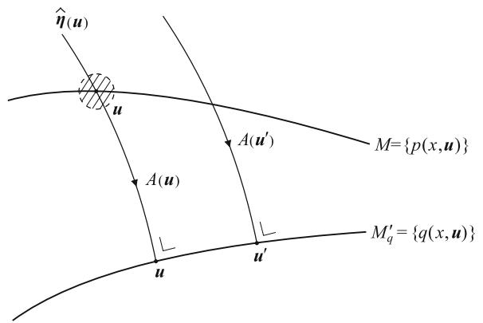  
Fig. 8.4 q-auxiliary family and q-MLE

Proof Let

$$
r (\boldsymbol {x}, \boldsymbol {u}; t) = (1 - t) q (\boldsymbol {x}, \boldsymbol {u}) + t p (\boldsymbol {x}, \boldsymbol {u}) \tag {8.38}
$$

be the $m$ -geodesic connecting $q(\pmb{x}, \pmb{u})$ and $p(\pmb{x}, \pmb{u})$ . Its tangent vector at $M_q$ is

$$
\dot {r} = \left. \frac {d}{d t} \log r (\boldsymbol {x}, \boldsymbol {u}, t) \right| _ {t = 0} = \frac {1}{q (\boldsymbol {x} , \boldsymbol {u})} \left\{q (\boldsymbol {x}, \boldsymbol {u}) - p (\boldsymbol {x}, \boldsymbol {u}) \right\}. \tag {8.39}
$$

It is orthogonal to the tangent vectors

$$
\dot {l} _ {q} = \frac {\partial}{\partial \boldsymbol {u}} \log q (\boldsymbol {x}, \boldsymbol {u}) \tag {8.40}
$$

of $M_q$ , when $\langle \dot{r}, \dot{l}_q \rangle_q = 0$ , which is calculated as

$$
\begin{array}{l} \langle \dot {r}, \dot {l} _ {q} \rangle_ {q} = \int \left\{q (\boldsymbol {x}, \boldsymbol {u}) - p (\boldsymbol {x}, \boldsymbol {u}) \right\} \partial_ {\boldsymbol {u}} \log q (\boldsymbol {x}, \boldsymbol {u}) d \boldsymbol {x} \\ = - \int p (\boldsymbol {x}, \boldsymbol {u}) \partial_ {\boldsymbol {u}} \log q (\boldsymbol {x}, \boldsymbol {u}) d \boldsymbol {x}. \tag {8.41} \\ \end{array}
$$

This implies that (8.37) holds and vice versa.

The $q$ -MLE estimator is Fisher efficient when the $m$ -geodesic connecting $q(\pmb{x}, \pmb{u})$ and $p(\pmb{x}, \pmb{u})$ is orthogonal to both $M$ and $M_q$ , because the ancillary submanifold $A_q(\pmb{u})$ and the true ancillary submanifold $A(\pmb{u})$ of the true MLE coincide. Hence, the observed $\bar{\eta}$ is mapped to the same $\hat{\pmb{u}}$ in both $M$ and $M_q$ by the $m$ -projection. When $A_q(\pmb{u})$ is not orthogonal to $M$ , there is information loss. This is easily evaluated from the angles of the $q$ -ancillary submanifold $A_q(\pmb{u})$ and $M$ .

Theorem 8.4 The $q$ -MLE estimator is Fisher efficient when the $q$ -ancillary family is orthogonal to $M$ . When it is not orthogonal, the loss of Fisher information is given by

$$
\Delta g _ {a b} (\boldsymbol {u}) = g _ {a \kappa} (\boldsymbol {u}) g _ {b \lambda} (\boldsymbol {u}) g ^ {\kappa \lambda} (\boldsymbol {u}), \tag {8.42}
$$

where $v^{\kappa}$ is the transversal coordinate system in $A_{q}(\pmb{u})$ .

Proof By using the $q$ -ancillary family, we can map the observed point $\bar{\eta}$ to $M_q$ . This is efficient when and only when $A_q(\pmb{u})$ is orthogonal to the tangent space of $M$ . Otherwise, there is information loss. By using the $(\pmb{u}, \pmb{v})$ -coordinates, where $\pmb{u} = (u^a)$ and $\pmb{v} = (v^\kappa)$ are the coordinates along the ancillary family $A_q(\pmb{u})$ , the $q$ -MLE is mapped through it, but this is a non-orthogonal mapping to $M$ . Hence, loss of information occurs, as is given in (7.58) or (8.42).

Remark When the $q$ -ancillary family $A_q(\pmb{u})$ does not pass $p(\pmb{x}, \pmb{u})$ , the $q$ -estimator is not consistent. However, when this does not hold, let $\pmb{f}(\pmb{u})$ be the coordinates of $M$ at which $A_q(\pmb{u})$ intersects $M$ . If we reparameterize $M_q$ such that the new parameter of $M_q$ is $\pmb{f}^{-1}(\pmb{u})$ , then the consistency always holds.

# Remarks

The present short chapter introduces statistical models which are different from a regular model. One is a model with hidden variables, in which some random variables are not observed. The EM algorithm is known in such a model. From the geometrical point of view, it is nothing other than the em algorithm, which minimizes the divergence between the model manifold $M$ and data manifold $D$ derived from observed data. This is now a standard method in machine learning. When it was proposed by Csiszár and Tunsady (1984), the paper was rejected by a journal because the reviewer did not admit computationally heavy iterative procedures (I. Csiszár, personal communication). So this remains a conference paper.

Another model is a misspecified model. Its performance is easily understood from geometry, so that it is a good example to show the power of information geometry. The brain might use a misspecified or unfaithful statistical model for decoding information, because the true model is often unknown or too complicated. Therefore, we need to know the performance of the misspecified model. Oizumi et al. (2015) use a misspecified model to evaluate the amount of integrated information to measure the degree of consciousness.

# Chapter 9 Neyman-Scott Problem: Estimating Function and Semiparametric Statistical Model

The present chapter studies the famous Neyman-Scott problem, where the number of unknown parameters increases in proportion to the number of observations. The problem gave a shock to the statistics community, because the MLE is not necessarily asymptotically consistent or efficient in this problem. We solve the problem by constructing information geometry of estimating functions. The problem is reformulated in the framework of a semiparametric statistical model, which includes a finite number of parameters of interest and a nuisance parameter of function degrees of freedom. The problem uses a function space but we apply an intuitive description, sacrificing mathematical justification. The results are useful for solving both the semiparametric and Neyman-Scott problems.

# 9.1 Statistical Model Including Nuisance Parameters

Let us consider a statistical model

$$
M = \{p (\boldsymbol {x}, \boldsymbol {u}, \boldsymbol {v}) \} \tag {9.1}
$$

which includes two types of parameters. One is a parameter which we want to estimate, denoted by $\pmb{u}$ . This is called the parameter of interest. The other, denoted by $\pmb{v}$ , is a parameter the value of which is of no concern to us. It is called a nuisance parameter. We give two examples.

1. Measurement under Gaussian noise: scale problem: Let us measure the weight of a specimen repeatedly by using a scale. The true weight is $\mu$ but measurements $x_{1},\ldots ,x_{N}$ are independent random Gaussian variables with mean $\mu$ and variance $\sigma^2$ where $\sigma^2$ represents the accuracy of the scale. When we have interest in estimating $\mu$ but do not care about $\sigma^2$ , $\mu$ is the parameter of interest and $\sigma^2$ is the nuisance parameter. When we are interested in knowing the accuracy $\sigma^2$ of the scale but do not care about $\mu$ , $\sigma^2$ is the parameter of interest and $\mu$ the nuisance parameter.

2. Coefficient of proportionality: We consider a pair $(x, y)$ of Gaussian random variables, where $x$ and $y$ represent the volume and the weight of a specimen, respectively. Here, $x$ is a noisy observation of the volume $v$ of the specimen and $y$ is the noisy observation of its weight $uv$ , where $u$ is the specific gravity of the specimen. We assume that the noises are independent and Gaussian with mean 0 and variance 1. Then, their joint distribution is specified by

$$
x \sim N (v, 1), \quad y \sim N (u v, 1). \tag {9.2}
$$

When we are interested only in specific gravity $u$ , i.e., the coefficient of proportionality, but do not care about $v$ , $u$ is the parameter of interest and $v$ is the nuisance parameter. The joint probability is written as

$$
p (x, y; u, v) = \frac {1}{2 \pi} \exp \left[ - \frac {1}{2} \left\{(x - v) ^ {2} + (y - u v) ^ {2} \right\} \right]. \tag {9.3}
$$

The problem is easy, because given observed data $D = \{(x_{1},y_{1}),\ldots ,(x_{N},y_{N})\}$ we can use the MLE to estimate $u$ and $v$ and simply discard the estimator $\hat{v}$ of the nuisance parameter. Since MLE $(\hat{u},\hat{v})$ is efficient, the estimator $\hat{u}$ is efficient.

Let the Fisher information matrix in the model (9.1) of all the parameters $\xi = (\pmb{u},\pmb{v})$ be $g_{\alpha \beta}$ , where we use suffixes $\alpha, \beta$ for the entire $\xi = (\xi^{\alpha}), a, b, c, \ldots$ for the parameter $\pmb{u} = (u^{a})$ of interest and $\kappa, \lambda, \mu, \ldots$ for the nuisance parameter $\pmb{v} = (v^{\kappa})$ . The Fisher information matrix is partitioned as

$$
g _ {a \beta} = \left[ \begin{array}{l l} g _ {a b} & g _ {a \kappa} \\ g _ {\lambda b} & g _ {\kappa \lambda} \end{array} \right], \tag {9.4}
$$

where, by putting $l = \log p$

$$
g _ {a b} = \mathrm {E} \left[ \partial_ {a} l (\boldsymbol {x}, \boldsymbol {u}, \boldsymbol {v}) \partial_ {b} l (\boldsymbol {x}, \boldsymbol {u}, \boldsymbol {v}) \right], \tag {9.5}
$$

$$
g _ {a \kappa} = \operatorname {E} \left[ \partial_ {a} l (\boldsymbol {x}, \boldsymbol {u}, \boldsymbol {v}) \partial_ {\kappa} l (\boldsymbol {x}, \boldsymbol {u}, \boldsymbol {v}) \right], \tag {9.6}
$$

$$
g _ {\kappa \lambda} = \operatorname {E} \left[ \partial_ {\kappa} l (\boldsymbol {x}, \boldsymbol {u}, \boldsymbol {v}) \partial_ {\lambda} l (\boldsymbol {x}, \boldsymbol {u}, \boldsymbol {v}) \right]. \tag {9.7}
$$

The asymptotic error covariance of the entire estimator $\hat{\xi} = (\hat{u},\hat{v})$ is given by using its inverse as

$$
\operatorname {E} \left[ \left(\hat {\xi} ^ {\alpha} - \xi^ {\alpha}\right) \left(\hat {\xi} ^ {\beta} - \xi^ {\beta}\right) \right] = \frac {1}{N} g ^ {\alpha \beta}. \tag {9.8}
$$

The inverse of the Fisher information matrix is also partitioned as

$$
g ^ {\alpha \beta} = \left[ \begin{array}{l l} g ^ {a b} & g ^ {a \kappa} \\ g _ {\lambda b} & g _ {\lambda \kappa} \end{array} \right], \tag {9.9}
$$

where its $(a,b)$ -part $\left(g^{ab}\right)$ is not the inverse of the $(a,b)$ -part $(g_{ab})$ of $\left(g_{\alpha \beta}\right)$ . It is the $(a,b)$ -part of the inverse $\left(g^{\alpha \beta}\right)$ of $\left(g_{\alpha \beta}\right)$ . The two are different and $\left(g^{ab}\right)$ is given by the inverse of

$$
\bar {g} _ {a b} = g _ {a b} - g _ {a \kappa} g ^ {\kappa \lambda} g _ {\lambda b}, \tag {9.10}
$$

as is clear from the inversion of a partitioned matrix.

We have

$$
\left(\bar {g} _ {a b}\right) \leq \left(g _ {a b}\right) \tag {9.11}
$$

in the sense of a positive-definite matrix, which means that information is lost in the presence of unknown nuisance parameter $\pmb{v}$ . This is because, when $\pmb{v}$ is known, the Fisher information is $(g_{ab})$ . Since the covariance of the estimation error, when $\pmb{v}$ is unknown, is asymptotically

$$
E \left[ \left(\hat {u} ^ {a} - u ^ {a}\right) \left(\hat {u} ^ {b} - u ^ {b}\right) \right] = \frac {1}{N} \bar {g} ^ {a b}, \tag {9.12}
$$

$(\bar{g}_{ab})$ is called the efficient Fisher information matrix. The tangent vectors $\pmb{e}_a$ and $\pmb{e}_{\kappa}$ along the $\pmb{u}$ and $\pmb{v}$ coordinate axes are represented by score functions

$$
\boldsymbol {e} _ {a} = \partial_ {a} \log p (\boldsymbol {x}, \boldsymbol {\xi}), \quad \boldsymbol {e} _ {\kappa} = \partial_ {\kappa} \log p (\boldsymbol {x}, \boldsymbol {\xi}). \tag {9.13}
$$

Let us project $\pmb{e}_a$ to the space orthogonal to the subspace spanned by $\pmb{e}_{\kappa}$ (Fig. 9.1). Then, the projected vector is given by

$$
\bar {\boldsymbol {e}} _ {a} = \boldsymbol {e} _ {a} - g _ {a \lambda} g ^ {\lambda \kappa} \boldsymbol {e} _ {\kappa}, \tag {9.14}
$$

  
Fig. 9.1 Efficient score $\bar{\pmb{e}}_a$ in the presence of nuisance parameter

or, in terms of the score functions,

$$
\bar {\partial} _ {a} l (\boldsymbol {x}, \boldsymbol {\xi}) = \partial_ {a} l (\boldsymbol {x}, \boldsymbol {\xi}) - g _ {a \lambda} g ^ {\lambda \kappa} \partial_ {\kappa} l (\boldsymbol {x}, \boldsymbol {\xi}). \tag {9.15}
$$

This is called the efficient score, because the efficient Fisher information matrix is

$$
\bar {g} _ {a b} = \left\langle \bar {\boldsymbol {e}} _ {a}, \bar {\boldsymbol {e}} _ {b} \right\rangle = \mathrm {E} \left[ \bar {\partial} _ {a} l \bar {\partial} _ {b} l \right]. \tag {9.16}
$$

This shows that only the part orthogonal to the nuisance direction is effective, keeping information for estimating $\mathbf{u}$ , and the part in the nuisance direction is useless, because $\mathbf{v}$ is unknown.

When the subspace spanned by the scores of the parameter of interest is orthogonal to the nuisance parameters, we have $g_{a\kappa} = 0$ . In this case,

$$
g _ {a b} = \bar {g} _ {a b} \tag {9.17}
$$

holds, so there is asymptotically no loss of information. Therefore, it is desirable to choose the nuisance parameters such that the orthogonality holds. Given a statistical model $M = \{p(\boldsymbol{x},\boldsymbol{u},\boldsymbol{v})\}$ , we consider the problem of reparameterizing $\boldsymbol{v}$ depending on $\boldsymbol{u}$ as

$$
\boldsymbol {v} ^ {\prime} = \boldsymbol {v} ^ {\prime} (\boldsymbol {u}, \boldsymbol {v}) \tag {9.18}
$$

such that

$$
g _ {a \lambda} = \mathrm {E} \left[ \partial_ {a} l \left(\boldsymbol {x}, \boldsymbol {u}, \boldsymbol {v} ^ {\prime}\right) \partial_ {\lambda} l \left(\boldsymbol {x}, \boldsymbol {u}, \boldsymbol {v} ^ {\prime}\right) \right] = 0. \tag {9.19}
$$

This is in general impossible (see p. 254 in Amari 1985). However, when $\pmb{u}$ is a scalar parameter, it is always possible.

# 9.2 Neyman-Scott Problem and Semiparametrics

Neyman and Scott (1948) presented a class of statistical problems and questioned the validity of the MLE, by showing that the asymptotic consistency and efficiency of the MLE are not guaranteed in some of their models. Let $M = \{p(\boldsymbol{x},\boldsymbol{u},\boldsymbol{v})\}$ be a statistical model and let $x_{1},\ldots ,x_{N}$ be $N$ independent observations. The value of $\boldsymbol{u}$ (the parameter of interest) is kept the same (unknown) throughout the observations, but $\boldsymbol{v}$ changes each time. Hence, $\boldsymbol{x}_i$ is subject to $p(\boldsymbol{x},\boldsymbol{u},\boldsymbol{v}_i)$ . This is the Neyman-Scott problem and there are many examples of this type.

The estimation of the radius of the stone circle, Stonehenge in England, is a well-known romantic problem of this type. The stones are supposed to have been arranged in a circle to start with, but their positions have been disturbed in their long history. See Fig. 9.2. The radius $u$ of the stone circle is the parameter of interest, and the declination angle of the $i$ th stones $v_{i}$ is the nuisance parameter. We show later another problem of estimating the shape parameter from neural spikes under

  
Fig. 9.2 Location of the $i$ th stone

changing firing rates. Independent component analysis, treated in Chap. 13, is also of this type. There are similar problems in computer vision (Kanatani 1998; Okatani and Deguchi 2009).

We use the problem of the coefficient of proportionality as a working example. It consists of $N$ independent observations $(x_{i},y_{i}), i = 1,\ldots ,N$ , subject to

$$
x _ {i} = v _ {i} + \varepsilon_ {i}, \quad y _ {i} = u v _ {i} + \varepsilon_ {i} ^ {\prime}, \tag {9.20}
$$

where $\varepsilon_{i}$ and $\varepsilon_{i}^{\prime}$ are independent noises subject to Gaussian distributions with mean 0 and common variance $\sigma^2$ . We assume that $\sigma^2$ is known. The joint probability distribution of $(x_{i},y_{i})$ is

$$
p \left(x _ {i}, y _ {i}, u, v _ {i}\right) = \frac {1}{2 \pi \sigma^ {2}} \exp \left\{- \frac {\left(x _ {i} - v _ {i}\right) ^ {2} + \left(y _ {i} - u v _ {i}\right) ^ {2}}{2 \sigma^ {2}} \right\}. \tag {9.21}
$$

Here, $u$ and $v_{i}$ , are scalar parameters.

Figure9.3a shows an example of observed data and the problem is to draw a regression line to fit the data. The problem looks very simple, but is not. We show a number of intuitive solutions to this problem.

  
(a)

  
(b)

  
(c)   
Fig. 9.3 Coefficient of proportionality: a Observed data; b least squares; c total least squares

# 1. Least squares solution

The least squares solution is the minimizer of

$$
L = \frac {1}{2} \sum \left(y _ {i} - u x _ {i}\right) ^ {2}, \tag {9.22}
$$

which is the sum of the squares of vertical errors to the regression line (Fig. 9.3b). The solution is

$$
\hat {u} = \frac {\sum y _ {i} x _ {i}}{\sum x _ {i} ^ {2}}. \tag {9.23}
$$

However, this is a bad solution. It is not consistent even asymptotically and it does not converge to the correct $u$ even when $N$ increases to become infinitely large.

# 2. Averaging method

Let $\hat{u}_i = y_i / x_i$ be the ratio obtained from one specimen. Their average

$$
\hat {u} = \frac {1}{N} \sum \hat {u} _ {i} \tag {9.24}
$$

gives a consistent estimator. This is better than the least squares solution but is not so good in general.

# 3. Gross average method

Let us sum up all $x_{i}$ and all $y_{i}$ separately. Then calculate their ratio,

$$
\hat {u} = \frac {\sum y _ {i}}{\sum x _ {i}}. \tag {9.25}
$$

This is a good consistent estimator. It is of interest to know how good it is.

# 4. Total least square solution

Instead of minimizing the vertical errors in the least squares solution, we minimize the square of the lengths of orthogonal projection to the regression line (Fig. 9.3c). This is called the total least squares (TLS) solution. It is given by solving

$$
\sum \left(y _ {i} - u x _ {i}\right) \left(u y _ {i} + x _ {i}\right) = 0. \tag {9.26}
$$

# 5. MLE

We estimate all the parameters $u, v_{1}, \ldots, v_{N}$ , jointly by maximizing the likelihood, and we disregard all $\hat{v}_{i}$ , keeping $\hat{u}$ only. This is the MLE. We can prove that this is identical with the TLS solution.

We use a semiparametric formulation of the Neyman-Scott problem. Since the sequence $\pmb{v}_1, \dots, \pmb{v}_N$ is arbitrary and unknown, we assume that it is generated from an unknown probability distribution $k(\pmb{v})$ . In order to generate the $i$ th example $\pmb{x}_i$ $((x_i, y_i)$ in the above example), Nature chooses $\pmb{v}_i$ from distribution $k(\pmb{v})$ . Then, $\pmb{x}_i$

is chosen from $p(\boldsymbol{x}, \boldsymbol{u}, \boldsymbol{v}_i)$ . Thus, each $\boldsymbol{x}_i$ is subject to one and the same probability distribution

$$
p (\boldsymbol {x}, \boldsymbol {u}, k) = \int p (\boldsymbol {x}, \boldsymbol {u}, \boldsymbol {v}) k (\boldsymbol {v}) d \boldsymbol {v}. \tag {9.27}
$$

We treat an extended statistical model

$$
\tilde {M} = \left\{p _ {K} (\boldsymbol {x}, \boldsymbol {u}, k) \right\} \tag {9.28}
$$

which includes two parameters: One is $\pmb{u}$ , the parameter of interest, and the other is a function $k(\pmb{v})$ . Each observation is independently and identically distributed (iid) in this setting, but the underlying model includes the nuisance parameter $k$ of function degrees of freedom. Such a model is called a semiparametric statistical model (Begun et al. 1983). We study the problem under this formulation.

# 9.3 Estimating Function

An estimating function is a generalization of the score function which is the derivative of the log likelihood and is used to obtain the ML estimator. It is particularly convenient for a model having a nuisance parameter. For a statistical model $M = \{p(\boldsymbol{x},\boldsymbol{u},\boldsymbol{v})\}$ , we consider a differentiable function $f(\boldsymbol{x},\boldsymbol{u})$ which does not depend on $\boldsymbol{v}$ . Here, we treat the case where $\boldsymbol{u}$ and $\boldsymbol{v}$ are scalar parameters for simplicity, but it is easy to generalize it to the case with vector $\boldsymbol{u}$ and vector $\boldsymbol{v}$ .

A function $f(x, u)$ is called an estimating function, or more precisely an unbiased estimating function, when

$$
\mathrm {E} _ {u, v} [ f (x, u) ] = 0, \tag {9.29}
$$

$$
\mathrm {E} _ {u, v} \left[ f \left(x, u ^ {\prime}\right) \right] \neq 0, \quad u ^ {\prime} \neq u \tag {9.30}
$$

hold for any $v$ , where $\mathrm{E}_{u,v}$ is the expectation with respect to $p(\boldsymbol{x}, u, v)$ . See Godambe (1991). We further assume

$$
\mathrm {E} _ {u, v} \left[ f ^ {\prime} (x, u) \right] \neq 0, \tag {9.31}
$$

where $f'$ is the derivative with respect to $u$ . An estimating function of $M$ satisfies

$$
\mathrm {E} _ {p _ {K} (x, u, k)} \left[ f \left(x, u ^ {\prime}\right) \right] = 0, \text {w h e n a n d o n l y w h e n} u ^ {\prime} = u, \tag {9.32}
$$

for an arbitrary function $k(v)$ , when a statistical model $M$ is extended to a semiparametric model $\tilde{M}$ in (9.28). This is because $p_{K}(\boldsymbol{x}, u, k)$ is a linear mixture of $p(\boldsymbol{x}, u, v)$ with mixing distribution $k(v)$ .

The law of large numbers guarantees that the arithmetic mean of $f(x_{i},u)$ over the observed data converges to its expectation. Hence, because of (9.29), the solution of

$$
\frac {1}{N} \sum f (x _ {i}, u) = 0 \tag {9.33}
$$

will give a good estimator; (9.33) is called an estimating equation. In the case of a statistical model without a nuisance parameter, the score function

$$
\dot {l} (x, u) = \frac {d}{d u} \log p (x, u) \tag {9.34}
$$

satisfies (9.29), so it is an estimating function. In this case, (9.33) is the likelihood equation and the derived estimator is the MLE.

We analyze the asymptotic behavior of the estimator derived from an estimating function.

Theorem 9.1 The estimator $\hat{u}$ derived from an estimating function $f(x,u)$ is asymptotically unbiased and its error covariance is given asymptotically by

$$
E \left[ (\hat {u} - u _ {0}) ^ {2} \right] = \frac {1}{N} \frac {\operatorname {E} \left[ \{f (x , u _ {0}) \} ^ {2} \right]}{\left\{\operatorname {E} \left[ f ^ {\prime} (x , u _ {0}) \right] \right\} ^ {2}}, \tag {9.35}
$$

when $u_{0}$ is the true parameter.

Proof The proof is given by a similar method as the asymptotic analysis of MLE. We expand the left-hand side of (9.33) at $u_0$ ,

$$
\begin{array}{l} \frac {1}{\sqrt {N}} \sum f \left(\boldsymbol {x} _ {i}, \hat {\boldsymbol {u}}\right) \\ = \frac {1}{\sqrt {N}} \sum f \left(\boldsymbol {x} _ {i}, u _ {0}\right) + \frac {1}{\sqrt {N}} \sum f ^ {\prime} \left(\boldsymbol {x} _ {i}, u _ {0}\right) (\hat {u} - u _ {0}). \tag {9.36} \\ \end{array}
$$

The first term in the right-hand side converges, due to the central limit theorem, to a Gaussian random variable $\varepsilon$ with mean 0 and variance

$$
\sigma^ {2} = \operatorname {E} \left[ \left\{f (x, u _ {0}) \right\} ^ {2} \right]. \tag {9.37}
$$

The last term of (9.36) converges, due to the law of large numbers, to $\sqrt{N} A$ , where

$$
A = \mathrm {E} \left[ f ^ {\prime} (x, u _ {0}) \right] \neq 0. \tag {9.38}
$$

Hence, we have

$$
\hat {u} - u _ {0} = \frac {1}{\sqrt {N}} \frac {\varepsilon}{A}, \tag {9.39}
$$

# 9.3 Estimating Function

from which we have (9.35).

An estimating function gives an unbiased estimator of which the error covariance converges to 0 in the order of $1 / N$ . However, there is no guarantee that an estimating function really exists. When does it exist? If there are many estimating functions, how should we choose a good one? These are questions we should address. We use information geometry in answering these questions.

Although we explain the scalar parameter case, our method holds in the vector case. When the parameter $\pmb{u}$ of interest is vector-valued, an estimating function $f(\pmb{x}, \pmb{u})$ is vector-valued, having the same dimensions as $\pmb{u}$ . An $f(\pmb{x}, \pmb{u})$ is an (unbiased) estimating function when it satisfies

$$
\mathrm {E} _ {\boldsymbol {u}, \boldsymbol {v}} \left[ f \left(\boldsymbol {x}, \boldsymbol {u} ^ {\prime}\right) \right] \left\{ \begin{array}{l} = 0, \boldsymbol {u} ^ {\prime} = \boldsymbol {u}, \\ \neq 0, \boldsymbol {u} ^ {\prime} \neq \boldsymbol {u} \end{array} \right. \tag {9.40}
$$

and also the matrix

$$
\mathbf {A} = \mathrm {E} _ {u, v} \left[ \frac {\partial}{\partial u} f (x, u) \right] \tag {9.41}
$$

is non-degenerate. The estimating equation is a vector equation

$$
\sum \boldsymbol {f} \left(\boldsymbol {x} _ {i}, \boldsymbol {u}\right) = 0. \tag {9.42}
$$

The resulting estimator is asymptotically unbiased and Gaussian, having the asymptotic error covariance matrix

$$
E \left[ (\hat {\boldsymbol {u}} - \boldsymbol {u}) (\hat {\boldsymbol {u}} - \boldsymbol {u}) ^ {T} \right] = \frac {1}{N} \mathbf {A} ^ {- 1} \mathrm {E} [ f (\boldsymbol {x}, \boldsymbol {u}) \boldsymbol {f} ^ {T} (\boldsymbol {x}, \boldsymbol {u}) ] (\mathbf {A} ^ {- 1}) ^ {T}. \tag {9.43}
$$

# 9.4 Information Geometry of Estimating Function

The statistical model $\tilde{M}$ is parameterized by $u$ and $k(v)$ , the latter of which has function-degrees of freedom. So we are obliged to use intuitive treatment, not mathematically rigorously justified, but the results are useful. In the function space $F = \{p(x)\}$ , let us consider a submanifold $M_U(k)$ obtained by fixing the mixing function $k(v)$ . It is one-dimensional, that is, it is a curve, having a scalar parameter $u$ . It is denoted by

$$
M _ {U} (k) = \left\{p _ {K} (\boldsymbol {x}, u, k) \mid k \text {f i x e d} \right\}. \tag {9.44}
$$

We then consider an infinite-dimensional submanifold

$$
M _ {K} (u) = \left\{p _ {K} (\boldsymbol {x}, u, k) \mid u \text {f i x e d} \right\}, \tag {9.45}
$$

  
Fig. 9.4 Two submanifolds $M_U(k)$ and $M_K(u)$ and their tangent vectors

where $u$ is fixed but the mixing $k(v)$ is free. One may consider that, for each $u$ , an infinite-dimensional $M_K(u)$ is attached as a fiber. See Fig. 9.4.

The tangent space at a point $(u,k)$ of $\tilde{M}$ is spanned by infinitesimally small deviations $\delta p_{K}(\pmb {x},u,k)$ of probability density $p_K(\pmb {x},u,k)$ . By using the logarithmic expression, $l_{K}(\pmb {x},u,k) = \log p_{K}(\pmb {x},u,k)$ , we have

$$
\delta l _ {K} (\boldsymbol {x}, u, k) = \frac {\delta p _ {K} (\boldsymbol {x} , u , k)}{p _ {K} (\boldsymbol {x} , u , k)}, \tag {9.46}
$$

where

$$
\mathrm {E} _ {u, k} \left[ \delta l _ {K} (\boldsymbol {x}, u, k) \right] = 0, \tag {9.47}
$$

$\mathrm{E}_{u,k}$ being the expectation with respect to $p_K(\boldsymbol{x}, u, k)$ . This shows that the tangent space $T_{u,k}$ at $(u, k) \in \tilde{M}$ is composed of random variables $r(\boldsymbol{x})$ satisfying

$$
\mathrm {E} _ {u, k} [ r (\boldsymbol {x}) ] = 0. \tag {9.48}
$$

We assume

$$
\mathrm {E} _ {u, k} \left[ \{r (\boldsymbol {x}) \} ^ {2} \right] <   \infty \tag {9.49}
$$

and the inner product of two tangent vectors $r(\pmb{x})$ and $s(\pmb{x})$ are defined by

$$
\langle r, s \rangle = \mathrm {E} _ {u, k} [ r (\boldsymbol {x}) s (\boldsymbol {x}) ]. \tag {9.50}
$$

So the tangent space $T_{u,k}$ is a Hilbert space. An estimating function $f(\pmb{x}, u)$ satisfies (9.48) at any $(u, k)$ , so it is a vector belonging to $T_{u,k}$ for any $k$ .

The tangent vector along the $u$ -coordinate axis

$$
\frac {d}{d u} l _ {K} (\boldsymbol {x}, u, k) = \dot {l} _ {u} (\boldsymbol {x}, u, k) \tag {9.51}
$$

satisfies (9.48). The one-dimensional subspace

$$
T _ {U} (u, k) = \left\{\dot {l} _ {u} (\boldsymbol {x}, u, k) \right\} \tag {9.52}
$$

composed of the $u$ -score vector $\dot{l}_u(\pmb{x}, u, k)$ is called the tangent subspace of interest at $(u, k)$ . In order to define tangent vectors along the nuisance parameter $k(v)$ , we consider a curve in the function space of $k(v)$ , written as

$$
k (v, t) = k (v) + t b (v), \tag {9.53}
$$

where

$$
\int b (v) d v = 0, \tag {9.54}
$$

because

$$
\int k (v, t) d v = 1. \tag {9.55}
$$

There are infinitely many curves, each specified by $b(v)$ . The tangent vector along a curve (9.53) is defined by

$$
\dot {l} _ {b} (\boldsymbol {x}, u, k) = \frac {d}{d t} \log p _ {K} \left\{\boldsymbol {x}, u, k (v, t) \right\} | _ {t = 0} = \frac {1}{p _ {K} (\boldsymbol {x} , u , k)} \int p (\boldsymbol {x}, u, v) b (v) d v. \tag {9.56}
$$

Let us denote by $T_{K}(u,k)$ the space spanned by the tangent vectors of all such curves, called the nuisance tangent subspace at $(u,k)$ .

Note that there are tangent vectors not belonging to $T_U$ and $T_K$ , which are not included in the directions of change in $u$ or $k$ . We denote the subspace orthogonal to both of $T_U$ and $T_K$ by $T_A$ , which we call an ancillary tangent subspace (Fig. 9.5). Then, the tangent space is decomposed as

$$
T = T _ {U} \oplus T _ {K} \oplus T _ {A} \tag {9.57}
$$

at each point $(u, k)$ , where $\oplus$ implies the direct sum. $T_A$ is orthogonal to $T_U \oplus T_K$ , but $T_U$ and $T_K$ are not orthogonal in general.

We define $e$ -parallel transport and $m$ -parallel transport of a tangent vector $r(\pmb{x})$ along the nuisance submanifold $M_K(u)$ . We consider a small change of $\log p_K(\pmb{x}, u, k)$ in the direction $r(\pmb{x})$ ,

$$
\delta l _ {K} (\boldsymbol {x}, u, k) = \varepsilon r (\boldsymbol {x}), \tag {9.58}
$$

where $\varepsilon$ is small. Since the $e$ -representation of $p_K(x, u, k)$ is $l_K(x, u, k)$ , it is natural to consider that $r(x)$ is $e$ -parallely transported from $k$ to $k'$ without any change. But when $r(x) \in T_{u,k}$ , it does not belong to $T_{u,k'}$ , because

  
Fig. 9.5 Decomposition of tangent space $\mathrm{T}_{u,k}$

$$
\mathrm {E} _ {u, k ^ {\prime}} [ r (\boldsymbol {x}) ] \neq 0 \tag {9.59}
$$

in general. We subtract the average and define the $e$ -parallel transport of $r(\pmb{x})$ from $p_K(\pmb{x}, u, k)$ to $p_K(\pmb{x}, u, k')$ by

$$
\prod_ {k} ^ {e ^ {k ^ {\prime}}} r (\boldsymbol {x}) = r (\boldsymbol {x}) - \mathrm {E} _ {u, k ^ {\prime}} [ r (\boldsymbol {x}) ], \tag {9.60}
$$

where $\prod_{k}^{e^{k'}}$ is the operator of the $e$ -parallel transport from $k(v)$ to $k'(v)$ in $M_K(u)$ . Obviously,

$$
\mathrm {E} _ {u, k ^ {\prime}} \left[ \prod_ {k} ^ {e ^ {k ^ {\prime}}} r (\boldsymbol {x}) \right] = 0. \tag {9.61}
$$

We next define the $m$ -parallel transport. Since the $m$ -representation of a deviation of $p(\boldsymbol{x})$ is $\delta p(\boldsymbol{x})$ , it is natural to consider that $\delta p(\boldsymbol{x})$ does not change when it is transported in parallel from $k$ to $k'$ . However, its $e$ -representation is

$$
\delta l (\boldsymbol {x}) = \frac {\delta p (\boldsymbol {x})}{p _ {K} (\boldsymbol {x} , u , k)}, \tag {9.62}
$$

so its $e$ -representation changes at $k'$ as $\delta p(\boldsymbol{x}) / p_K(\boldsymbol{x}, u, k')$ . In order to compensate for this change, we define the $m$ -parallel transport of $r(\boldsymbol{x})$ from $k$ to $k'$ by

$$
\prod_ {k} ^ {m} r (x) = \frac {p _ {K} (\boldsymbol {x} , u , k)}{p _ {K} (\boldsymbol {x} , u , k ^ {\prime})} r (\boldsymbol {x}), \tag {9.63}
$$

where $\prod_{k}^{m^{k'}}$ is the $m$ -parallel transport operator from $k$ to $k'$ . It satisfies

# 9.4 Information Geometry of Estimating Function

$$
\mathrm {E} _ {u, k ^ {\prime}} \left[ \prod_ {k} ^ {m} r (\boldsymbol {x}) \right] = 0. \tag {9.64}
$$

The two parallel transports are dual, as is shown in the following theorem.

Theorem 9.2 The $e$ - and $m$ -parallel transports are dual, keeping the inner product invariant:

$$
\langle a (\boldsymbol {x}), b (\boldsymbol {x}) \rangle_ {k} = \left\langle \prod_ {k} ^ {e ^ {k ^ {\prime}}} a (\boldsymbol {x}), \prod_ {k} ^ {m ^ {k ^ {\prime}}} b (\boldsymbol {x}) \right\rangle_ {k ^ {\prime}}. \tag {9.65}
$$

The proof is easy from the definitions (9.60) and (9.64).

Lemma The nuisance tangent space $T_{K}(u,k)$ is invariant under the $m$ -parallel transport from $k$ to $k'$ , where $u$ is fixed.

Proof Since any tangent vector at $k$ is written in the form of (9.56) by using $b(v)$ , it is $m$ -parallely transported to $k'$ and is written in the same form by using the same $b(v)$ , where $k$ is replaced by $k'$ .

We can now characterize the estimating function in geometrical terms.

Theorem 9.3 An estimating function is a tangent vector orthogonal to the nuisance tangent space and is invariant under the $e$ -parallel transportation along $M_K(u)$ . It includes a non-zero component in the tangent direction $T_U$ of the parameter of interest.

Proof Because of (9.32),

$$
\prod_ {k} ^ {e k ^ {\prime}} f (x, u) = f (x, u) \tag {9.66}
$$

holds so that it is invariant under the $e$ -parallel transport along the nuisance direction. Let us take a curve $k(v, t)$ and differentiate (9.32) with respect to $t$ . Then we have

$$
\int \dot {p} _ {K} (\boldsymbol {x}, u, k (t)) f (\boldsymbol {x}, u) d x = \mathrm {E} \left[ \dot {l} _ {b} (\boldsymbol {x}, u, k) f (\boldsymbol {x}, u) \right] = 0. \tag {9.67}
$$

Since the nuisance tangent space $T_K$ is spanned by $\dot{l}_b$ , $f$ is orthogonal to all the nuisance tangent vectors. We next differentiate (9.32) with respect to $u$ . We then have

$$
\operatorname {E} \left[ f ^ {\prime} (\boldsymbol {x}, u) \right] + \langle \dot {l} _ {u} (\boldsymbol {x}, u, k), f (\boldsymbol {x}, u) \rangle = 0. \tag {9.68}
$$

Since

$$
\operatorname {E} \left[ f ^ {\prime} (\boldsymbol {x}, u) \right] \neq 0, \tag {9.69}
$$

$f$ should include a component in the direction $T_{U}$ of interest.

□

Consider the projection of the score vector $\dot{l}_u(\pmb{x}, u, k)$ to the subspace orthogonal to the tangent space $T_K$ of nuisance parameter and denote it by $\dot{l}_E(\pmb{x}, u, k)$ . We call it the efficient score in $\tilde{M}$ . Although it depends on $k(v)$ , it is an estimating function for any $k(v)$ when it is fixed.

We construct the tangent nuisance space $T_{K}(x,u,k)$ in terms of the nuisance score

$$
\dot {l} _ {v} (\boldsymbol {x}, u, v) = \frac {d}{d v} \log p (\boldsymbol {x}, u, v) \tag {9.70}
$$

of $M$ . The tangent nuisance space $T_K$ of $\tilde{M}$ is spanned by the tangent vectors in the directions of $b(v)$ along the curve given by (9.53). Let

$$
\delta_ {w} ^ {\prime} (v) = \frac {d}{d v} \delta (v - w) \tag {9.71}
$$

be the derivative of the delta function. Since $b(v)$ satisfies (9.54), any $b(v)$ is written as a weighted integration of $\delta_w'(v)$ ,

$$
b (v) = \int \delta_ {w} ^ {\prime} (v) B (w) d w, \tag {9.72}
$$

where the weight is

$$
B (w) = - \int_ {0} ^ {w} b (v) d v. \tag {9.73}
$$

Hence, the tangent vector in the direction of $b(v) = \delta_w'(v)$ is written from (9.56) as

$$
\begin{array}{l} \dot {l} _ {\delta_ {w} ^ {\prime}} (\boldsymbol {x}, u, k) = \frac {- 1}{p _ {K} (\boldsymbol {x} , u , k)} \int p (\boldsymbol {x}, u, v) \delta_ {w} ^ {\prime} (v) d v \\ = \frac {p (\boldsymbol {x} , u , w)}{p _ {K} (\boldsymbol {x} , u , k)} l _ {v} (\boldsymbol {x}, u, w) \\ \end{array}
$$

by using the nuisance score $l_v(x, u, w)$ of $M$ . Thus, $T_K$ at $k$ is spanned by the $m$ -parallel transports of the elementary tangent scores $l_v(x, u, w)$ for all $w$ and

$$
\dot {l} _ {\delta_ {w} ^ {\prime}} (\boldsymbol {x}, u, k) = \prod_ {\delta_ {w}} ^ {m} \dot {l} _ {v} (\boldsymbol {x}, u, w). \tag {9.75}
$$

The following theorem is immediate.

Theorem 9.4 The nuisance tangent space is $m$ -parallellly invariant,

$$
\prod_ {k} ^ {m} ^ {k ^ {\prime}} T _ {K, u, k} = T _ {K, u, k ^ {\prime}} \tag {9.76}
$$

and spanned by the $m$ -parallel transports of elementary nuisance scores $\dot{l}_v(x,u,w)$ for all $w$ .

Let $f(\pmb{x}, u)$ be an estimating function. It is $e$ -parallelly invariant and orthogonal to $T_K$ . Therefore, because

$$
0 = \left\langle f, \prod_ {\delta_ {w} ^ {\prime}} ^ {m} \dot {l} _ {v} (\boldsymbol {x}, u, w) \right\rangle = \langle f, \dot {l} _ {v} (\boldsymbol {x}, u, w) \rangle , \tag {9.77}
$$

it is orthogonal to the elementary nuisance $v$ -score $\dot{l}_v(\boldsymbol{x}, u, w)$ of $M$ for any $v = w$ . In order to obtain the efficient scores in $\tilde{M}$ , we consider the tangent vector in the direction of $u$ at a specific point $(u, \delta_w)$ , where we put $k = \delta_w$ . Then, it is the same as the $u$ -score in $M$ ,

$$
\dot {l} _ {u} (\boldsymbol {x}, u, \delta_ {w}) = \dot {l} _ {u} (\boldsymbol {x}, u, w). \tag {9.78}
$$

We construct an efficient score from it, by making it orthogonal to $T_K$ . Since $T_K$ is spanned by all the elementary nuisance scores, we need to project $\dot{l}_u$ to the space orthogonal to all the $m$ -transports of $l_v(x,u,w')$ from $\delta_{w'}$ to $\delta_w$ for all $w'$ . The projected score is $e$ -invariant, so it is an estimating function. The efficient score $\dot{l}_E(x,u,k)$ at $k$ is constructed by a linear combination with respect to $k(v)$ of these elementary efficient scores.

We have the following theorem from this.

Theorem 9.5 An estimating function exists when, and only when, the efficient score is non-zero. Any estimating function is written, using an arbitrary nuisance function $k_{0}(v)$ , in the form

$$
f (\boldsymbol {x}, u) = \dot {l} _ {E} (\boldsymbol {x}, u, k _ {0}) + a (\boldsymbol {x}), \tag {9.79}
$$

where an ancillary tangent vector $a(\pmb {x})\in T_{A,u,k_0}$ depends on $k_{0}$

Proof It is easy to see that $a(\pmb{x})$ is orthogonal to both $T_K$ and $T_U$ .

Theorem 9.6 Let $p_{K}(x,u,k_{0})$ be the true probability distribution. Then, the best estimating function is $\dot{l}_{E}(x,u,k_{0})$ and the asymptotic error covariance is

$$
E (\hat {u} - u) ^ {2} = \frac {1}{N} \frac {E [ \hat {l} _ {E} ^ {2} ]}{\{E [ \hat {l} _ {E} ] \} ^ {2}}. \tag {9.80}
$$

The theorem gives a bound on the asymptotic covariance of error. However, since the true $k_{0} = k(v)$ is unknown, we cannot use it. But $\dot{l}_{E}(\pmb{x}, u, k_{1})$ works well even for an approximate value $k_{1}$ of $k_{0}$ . Even when $k_{1}$ is quite different from the true one, $\dot{l}_{E}(\pmb{x}, u, k_{1})$ still gives a consistent estimator.

Remark A statistical model in the Neyman-Scott problem is linear in $k(v)$ , because it is a mixture model. The nuisance tangent space is invariant under the $m$ -parallel

transport in such a linear model. However, if we study a general semiparametric model where the probability density is not linear with respect to the nuisance function, the tangent nuisance spaces are not invariant by the $m$ -parallel transport. An estimation function is therefore required to be orthogonal to all the tangent nuisance scores at all $k$ . Hence, it is the projection of the $u$ -score vector to the subspace orthogonal to $m$ -transports of the nuisance subspace at all $k'$ . This is called the information score at $k$ . See Amari and Kawanabe (1997).

# 9.5 Solutions to Neyman-Scott Problems

# 9.5.1 Estimating Function in the Exponential Case

We consider a typical case where $p(\pmb{x}, u, v)$ is of the exponential type with respect to $v$ , that is,

$$
p (\boldsymbol {x}, u, v) = \exp \left\{v s (\boldsymbol {x}, u) + r (\boldsymbol {x}, u) - \psi (u, v) \right\}, \tag {9.81}
$$

where $s(\pmb{x}, u)$ and $r(\pmb{x}, u)$ are functions of $\pmb{x}$ and $u$ .

Lemma The $u$ -score at $k$ is given by

$$
\dot {l} _ {u} (\boldsymbol {x}, u, k) = s ^ {\prime} (\boldsymbol {x}, u) \mathrm {E} [ v | s ] + r ^ {\prime} (\boldsymbol {x}, u) - \mathrm {E} [ \psi^ {\prime} | s ], \tag {9.82}
$$

where $\operatorname{E}[\cdot | s]$ is the conditional expectation conditioned on $s$ .

Proof We calculate the $u$ -score by differentiating the logarithm of (9.27) with respect to $u$ . By taking (9.81) into account,

$$
\begin{array}{l} \dot {l} _ {u} (\boldsymbol {x}, u, k) = \frac {1}{p _ {K} (\boldsymbol {x} , u , k)} \int \left\{v s ^ {\prime} (\boldsymbol {x}, u) + r ^ {\prime} (\boldsymbol {x}, u) - \psi^ {\prime} \right\} \\ \times \exp \{v s + r - \psi \} k (v) d v, \tag {9.83} \\ \end{array}
$$

where $s', r'$ and $\psi'$ are derivatives of $s, r$ and $\psi$ with respect to $u$ . Since $v$ is a random variable subject to $k(v)$ , we consider the joint probability of $v$ and $s(x, u)$ . Then, we have the conditional distribution of $v$ conditioned on $s(x, u)$ ,

$$
p (v | s) = \frac {k (v) \exp \{v s + r - \psi \}}{\int k (v) \exp \{v s + r - \psi \} d v} = \frac {k (v) \exp \{v s + r - \psi \}}{p _ {K} (x , u , k)}. \tag {9.84}
$$

Hence, we have from (9.83)

$$
\dot {l} _ {u} = s ^ {\prime} \mathrm {E} [ v | s ] + r ^ {\prime} - \mathrm {E} [ \psi^ {\prime} | s ]. \tag {9.85}
$$

□

The tangent direction corresponding to a change of $k$ by $\delta k$ is written as

$$
\delta l _ {K} (\boldsymbol {x}, u, k) = \frac {\int p (\boldsymbol {x} , u , v) \delta k (v)}{p _ {K} (\boldsymbol {x} , u , k)} d v. \tag {9.86}
$$

Hence, by putting $b(v) = \delta_w'(v)$ and using (9.74), the tangent nuisance space is spanned by

$$
\delta_ {w} l (\boldsymbol {x}, u, k) = \varepsilon \frac {p (\boldsymbol {x} , u , w)}{p _ {K} (\boldsymbol {x} , u , k)} \dot {l} _ {v} (\boldsymbol {x}, u, w) \tag {9.87}
$$

for all $w$ , which corresponds to a change of $k(v)$ at $w$ . The score corresponding to a change $\delta k(v)$ in the nuisance function $k(v)$ is similarly written in the form of conditional expectation by using (9.84),

$$
\dot {l} _ {K} (\boldsymbol {x}, u, k) = \operatorname {E} \left[ \frac {\delta k (v)}{k (v)} | s \right]. \tag {9.88}
$$

This is a function of $s(\pmb{x}, u)$ . Hence, the nuisance subspace is generated by $s(\pmb{x}, u)$ and is written as

$$
T _ {K} = \left[ h \left\{s (x, u) \right\} \right], \tag {9.89}
$$

by using an arbitrary function $h$ of $s$ . We finally have the following theorem.

Theorem 9.7 The efficient score at $k$ is given by

$$
\dot {l} _ {E} = \operatorname {E} [ v | s ] \left\{s ^ {\prime} (x, u) - \operatorname {E} \left[ s ^ {\prime} | s \right] \right\} + \left\{r ^ {\prime} (x, u) - \operatorname {E} \left[ r ^ {\prime} | s \right] \right\}. \tag {9.90}
$$

Proof The efficient score is the projection of the score of interest to the subspace orthogonal to the nuisance tangent space. Since, for two random variables $s$ and $t$ , $t - \operatorname{E}[t|s]$ is the projection of $t$ to the subspace orthogonal to the space generated by $s$ , we have the theorem.

Corollary When the derivative of $s$ with respect to $u$ is a function of $s$ , we have

$$
\dot {l} _ {E} (\boldsymbol {x}, u, k) = r ^ {\prime} (\boldsymbol {x}, u) - \mathrm {E} \left[ r ^ {\prime} | s \right]. \tag {9.91}
$$

Proof In this case,

$$
s ^ {\prime} - \mathrm {E} \left[ s ^ {\prime} \mid s \right] = 0, \tag {9.92}
$$

which gives (9.91). Since (9.91) does not depend on $k$ , this gives the asymptotically optimal estimating function.

# 9.5.2 Coefficient of Linear Dependence

After a long journey, we can now solve specific Neyman-Scott problems. The first is the problem of linear dependence. The problem stated in (9.20) is of the exponential type, so it is written in the form of (9.81), where

$$
s (x, u) = x + u y \tag {9.93}
$$

$$
r (\boldsymbol {x}, u) = - \frac {1}{2} (x ^ {2} + y ^ {2}). \tag {9.94}
$$

Since $r$ does not depend on $u$ , the efficient score is given as

$$
\dot {l} _ {E} = \frac {1}{1 + u ^ {2}} (y - u x) \mathrm {E} [ v | s ]. \tag {9.95}
$$

We put

$$
\operatorname {E} [ v | s ] = h (s) = h (u y + x). \tag {9.96}
$$

Then, we have a class of estimating functions written as

$$
f (x, u) = (y - u x) h (u y + x), \tag {9.97}
$$

where $h$ is an arbitrary function.

When the true nuisance function is $k$ , the best $h(s)$ is given by

$$
h (s) = \mathrm {E} _ {u, k} [ v | s ], \tag {9.98}
$$

which depends on the unknown $k$ . The point is that, even when we do not know $k$ , an estimating function in the class (9.97) gives a consistent estimator of which the error covariance decreases in proportion to $1 / N$ .

The TLS estimator is obtained by putting

$$
h (s) = s. \tag {9.99}
$$

The gross average estimator is obtained from

$$
h (s) = c, \tag {9.100}
$$

where $c$ is a constant. Let us consider a simple linear function

$$
h (x) = s + c, \tag {9.101}
$$

which will give a better estimator than the two above by choosing $c$ adequately. The estimating equation is

$$
\sum \left(y _ {i} - u x _ {i}\right) \left(u y _ {i} + x _ {i} + c\right) = 0. \tag {9.102}
$$

Let $\hat{u}_c$ be the solution of (9.102). Then we have

$$
\begin{array}{l} \mathrm {E} \left[ \left(\hat {u} _ {c} - u\right) ^ {2} \right] \\ = \frac {\left(1 + u ^ {2}\right) \left\{c + \left(1 + u ^ {2}\right) \bar {v} \right\} ^ {2} + \left(1 + u ^ {2}\right) ^ {2} \left\{\bar {v} ^ {2} - (\bar {v}) ^ {2} \right\} + \left(1 + u ^ {2}\right)}{c \bar {v} + \left(1 + u ^ {2}\right) \bar {v} ^ {2}}, \tag {9.103} \\ \end{array}
$$

where

$$
\bar {v} = \frac {1}{N} \sum v _ {i}, \quad \bar {v} ^ {2} = \frac {1}{N} \sum v _ {i} ^ {2}. \tag {9.104}
$$

Therefore, the error is minimized by choosing

$$
\hat {c} = \frac {\bar {v}}{\bar {v} ^ {2} - (\bar {v}) ^ {2}}. \tag {9.105}
$$

This shows that, when the distribution of $k(v)$ is wide-spread, the TLS is a good estimator, whereas, when the distribution of $k(v)$ is tight, the gross average estimator is better.

# 9.5.3 Scale Problem

There are two versions in the scale problem. One is to estimate the accuracy of a scale by using $N$ specimens. The other is to estimate the weight of a specimen by using $N$ scales of different accuracies.

1. Accuracy of a scale: We prepare $N$ specimens of which weights $v_{1},\ldots ,v_{N}$ are different and unknown. Our aim is to estimate the error variance $\sigma^2$ of a scale. When the weight is $v$ and error variance is $\sigma^2$ , the measurement $x$ is a random variable subject to $N\left(v,\sigma^2\right)$ . We repeat measurements $m$ times for each specimen. Let $\boldsymbol{x} = (x_{1},\dots,x_{m})$ be $m$ measurements by a specimen. The probability density of $\boldsymbol{x}$ is

$$
p (\boldsymbol {x}; \mu , \sigma^ {2}) = \exp \left\{- \frac {\sum (x _ {i} - \mu) ^ {2}}{2 \sigma^ {2}} - \psi \right\}, \tag {9.106}
$$

which can be rewritten as

$$
p (\boldsymbol {x}, u, v) = \exp \left\{v s (\boldsymbol {x}, u) - \frac {u}{2} r (\boldsymbol {x}, u) - \psi \right\}, \tag {9.107}
$$

where we put

$$
u = \frac {1}{\sigma^ {2}}, v = \mu \tag {9.108}
$$

$$
s (\boldsymbol {x}, u) = u \bar {x}, \quad r (\boldsymbol {x}, u) = - \frac {u}{2} \bar {x} ^ {2} \tag {9.109}
$$

$$
\bar {x} = \sum_ {i = 1} ^ {m} x _ {i}, \quad \bar {x} ^ {2} = \sum_ {i = 1} ^ {m} x _ {i} ^ {2}. \tag {9.110}
$$

Since

$$
s ^ {\prime} (\boldsymbol {x}, u) = \frac {1}{u} s (\boldsymbol {x}, u) \tag {9.111}
$$

is a function of $s$ , the efficient score is

$$
\dot {l} _ {E} (\boldsymbol {x}, u) = r ^ {\prime} - E \left[ r ^ {\prime} | s \right]. \tag {9.112}
$$

This is the orthogonal projection of $x^2$ to the subspace orthogonal to $\bar{x}$ . The estimating function is

$$
\dot {l} _ {E} (\boldsymbol {x}, u) = \frac {1}{u} - \frac {1}{m - 1} \left(\bar {x ^ {2}} - \frac {1}{m} \bar {x} ^ {2}\right), \tag {9.113}
$$

which does not include $k$ . Hence, this gives an efficient estimator,

$$
\hat {\sigma} ^ {2} = \frac {1}{N} \sum \hat {\sigma} _ {i} ^ {2}, \tag {9.114}
$$

$$
\hat {\sigma} _ {i} ^ {2} = \frac {1}{m - 1} \left[ \left(\bar {x} ^ {2}\right) _ {i} - \frac {1}{m} (\bar {x}) _ {i} ^ {2} \right]. \tag {9.115}
$$

This is the best estimator different from the MLE. When the numbers $m_{i}$ of measurements are different, we can solve the problem in a similar way.

2. Weight of a specimen by using $N$ scales: We next consider the case in which we have $N$ scales having different unknown error covariances. In this case, we have only one specimen, the weight of which we want to know. We measure its weight $m$ times by using each scale. In this case, we put

$$
u = \mu , \quad v _ {i} = \frac {1}{\sigma_ {i} ^ {2}}, \tag {9.116}
$$

so, for one scale, the probability density is

$$
p (\boldsymbol {x}, u, v) = \exp \left\{- \frac {v}{2} \sum \left(x _ {i} - u\right) ^ {2} - \psi \right\}. \tag {9.117}
$$

In this case, we have

$$
s = - \frac {1}{2} \sum_ {i = 1} ^ {k} \left(x _ {i} - u\right) ^ {2} = - \frac {1}{2} \left(\bar {x} ^ {2} - 2 u \bar {x} + u ^ {2}\right), \tag {9.118}
$$

$$
r = 0. \tag {9.119}
$$

We can check that $s'$ is orthogonal to $s$ , so the efficient score is

$$
\dot {l} _ {E} (x, u) = (\bar {x} - u) h (s), \tag {9.120}
$$

where $h$ is an arbitrary function. If we fix $h(s)$ , then the estimator is

$$
\hat {u} = \frac {\sum h \left(s _ {i}\right) \bar {x} _ {i}}{\sum h \left(s _ {i}\right)}. \tag {9.121}
$$

The optimum $h$ depends on the unknown $k(v)$ ,

$$
h (s) = \operatorname {E} [ v | s ], \tag {9.122}
$$

but any $h$ will give an asymptotically consistent estimator. It is a surprise that this simple problem has such a complicated structure.

# 9.5.4 Temporal Firing Pattern of Single Neuron

Let us consider a single neuron which fires stochastically. We assume that it fires at time $t_1, t_2, \ldots, t_{n+1}$ , which are random variables. The intervals of spikes are

$$
T _ {i} = t _ {i + 1} - t _ {i}, \quad i = 1, 2, \dots . \tag {9.123}
$$

Obviously, when the firing rate is high, the interval is short. The simplest model of a temporal firing pattern is that all $T_{i}$ are independent, subject to the exponential distribution

$$
q (T, v) = v \exp \{- v T \}, \tag {9.124}
$$

where $v$ is the firing rate. The number of spikes is subject to the Poisson distribution. However, $T_{i}$ are not independent in reality, because of the effect of refractoriness. It is known that the gamma distribution fits well,

$$
p (T, v, \kappa) = \frac {(v \kappa) ^ {\kappa}}{\Gamma (\kappa)} T ^ {\kappa - 1} \exp \{- v \kappa T \}, \tag {9.125}
$$

which includes another parameter $\kappa$ , called the shape parameter. We want to know $\kappa$ , which is the parameter of interest, so we put $u = \kappa$ , whereas $v$ is the nuisance parameter. The average and variance of $T_{i}$ are

$$
E [ T ] = \frac {1}{v}, \quad \operatorname {V a r} [ T ] = \frac {1}{\kappa v ^ {2}}. \tag {9.126}
$$

The parameter $\kappa$ represents the irregularity of spike intervals. When $\kappa$ is large, the spikes are emitted regularly and have almost the same intervals. When $\kappa = 1$ , $T_{i}$ are independent, and when $\kappa$ is small, the irregularity increases.

Given observed data $\{T_1,\dots ,T_n\}$ , it is easy to estimate the parameters $\kappa$ and $v$ . This is a simple problem of estimation. However, in a real experimental situation, the firing rate $v$ changes over time but the shape parameter $\kappa$ is fixed, depending on the type of the neuron. So we regard $v$ as a nuisance parameter changing over time, while $\kappa$ is the parameter of interest. This is a typical Neyman-Scott problem.

We assume that $v$ takes the same value for two consecutive times. (It can be $m$ consecutive times for $m \geq 2$ , but we consider the simplest case.) So we collect two observations $T_{2k-1}$ and $T_{2k}$ , and put them in a box. Hence, the $k$ th observation is $T_k = (T_{2k-1}, T_{2k})$ . The two intervals $T_{2k-1}, T_{2k}$ in a box are subject to the same distribution

$$
p \left(\boldsymbol {T} _ {k}, v _ {k}, \kappa\right) = \prod_ {i = 1} ^ {m} p \left(T _ {i}, v _ {k}, \kappa\right), \tag {9.127}
$$

where $v_{k}$ may change arbitrarily in each box.

We calculate the $u$ -score and $v$ -score as

$$
u (\boldsymbol {T}) = \frac {\partial \log p (\boldsymbol {T} , v , \kappa)}{\partial \kappa}, \quad v (\boldsymbol {T}) = \frac {\partial \log q (\boldsymbol {T} , v , \kappa)}{\partial v}. \tag {9.128}
$$

The efficient score is obtained in this case after calculations (see Miura et al. 2006) as

$$
u _ {E} (\boldsymbol {T}, \kappa) = \sum \log T _ {i} - m \log \left(\sum T _ {i}\right) + m \phi (m k) - m \phi (\kappa), \tag {9.129}
$$

where

$$
\phi (\kappa) = \frac {d}{d \kappa} \Gamma (\kappa) \tag {9.130}
$$

is the di-gamma function. Since this does not include $v$ , it is the best estimating function, and the estimating equation is

$$
\sum u _ {E} \left(\boldsymbol {T} _ {i}, \kappa\right) = 0. \tag {9.131}
$$

The statistics used in the estimating function is summarized as

$$
S = - \frac {1}{n - 1} \sum_ {i} \frac {1}{2} \log \frac {4 T _ {i} T _ {i + 1}}{\left(T _ {i} + T _ {i + 1}\right) ^ {2}}, \tag {9.132}
$$

which includes all the information.

Shinomoto et al. (2003) proposed to use another statistic:

$$
L _ {V} = 3 - \frac {1 2}{n - 1} \sum \frac {T _ {i} T _ {i + 1}}{\left(T _ {i} + T _ {i + 1}\right) ^ {2}}. \tag {9.133}
$$

Interestingly, the two statistics are derived from the same two consecutive time intervals,

$$
\frac {4 T _ {i} T _ {i + 1}}{\left(T _ {i} + T _ {i + 1}\right) ^ {2}}. \tag {9.134}
$$

The statistic in (9.132) is the geometric mean, whereas Shinomoto's $L_{v}$ is the arithmetic mean. From the point of the efficiency of estimation, $S$ is theoretically the best but $L_{v}$ may be more robust.

# Remarks

The Neyman-Scott problem is an interesting estimation problem. It looks simple, but it is very difficult to obtain an optimal solution. Statisticians have struggled with this problem for many years, searching for the optimal solution. In 1984, when Sir David Cox visited Japan and talked about this problem as one of the interesting unsolved problems. I thought it a good challenge for information geometry. It would be wonderful if information geometry could provide a good answer to it.

It is related to a more general semiparametric problem. Since we need a function space of infinite dimensions, it is difficult to construct a mathematically rigorous theory. Bickel et al. (1994) established a rigorous theory of semiparametric estimation by using functional analysis. Information geometry could be more transparent in understanding the structure of the Neyman-Scott problem. We were successful in obtaining a complete set of the estimating functions.

The information-geometric theory is useful, even though the rigorous mathematical foundation is missing. It can solve many famous Neyman-Scott problems. When my official retirement time from the University of Tokyo was approaching, I thought that the results should be publicised even though they include mathematical flaw. So we submitted a paper to Bernoulli. The reviewers pointed out the lack of mathematical justification in the function space. However, the editor Ole Barndorff-Nielsen considered that this was an interesting and useful paper even without rigorous justification being given. So he decided that it was acceptable in the spirit of experimental mathematics, provided that the Theorem-Proof style of statements was replaced by the Proposition and Outline of Proof style.

We did not have many good examples at that time. But later, we found many examples, including neural spike analysis and independent component analysis, the latter of which will be shown in Chap. 13.

# Chapter 10 Linear Systems and Time Series

A time series is a sequence of random variables $x_{t}, t = \dots, -1, 0, 1, 2, \ldots$ , which appears as a function of time. The present chapter deals with an ergodic time series which is generated by a linear system when white noise is applied to its input. We study the geometrical structure of the manifold of the time series. One may identify a time series with a linear system to generate it. Then, the geometry of the time series is identified with the geometry of linear systems, which is important for studying problems of control. For the sake of simplicity, we study only stable systems of discrete time, having one-input and one-output, but generalization is not difficult in principle. The set of all time series has infinite-dimensional degrees of freedom, so our treatment is intuitive and not mathematically rigorous, although it is well-founded in the case of finite-dimensional systems and related time series.

# 10.1 Stationary Time Series and Linear System

Let us consider a time series $\{x_{t}\}$ , where $t$ denotes discrete time, $t = 0, \pm 1, \pm 2, \ldots$ . White Gaussian noise $\{\varepsilon_t\}$ is one of the simplest, which is composed of independent Gaussian random variables with mean 0 and variance 1, so that

$$
E \left[ \varepsilon_ {t} \varepsilon_ {t ^ {\prime}} \right] = 0, \quad t \neq t ^ {\prime}, \quad E \left[ \varepsilon_ {t} ^ {2} \right] = 1. \tag {10.1}
$$

We assume that the mean of $x_{t}$ is equal to 0. A time series is stationary when the probability of $\{x_{t}\}$ is the same as its time-shifted version $\{x_{t + \tau}\}$ for any $\tau$ . More strongly, we consider an ergodic time series.

Ergodic Theorem: For an ergodic time series $\{x_{t}\}$ , the temporal average of a function $f(x_{t})$ of $x_{t}$ converges to the ensemble average with probability 1,

  
Fig. 10.1 Linear system and generated time series

$$
\lim  _ {T \rightarrow \infty} \frac {1}{(2 T + 1)} \sum_ {i = - T} ^ {T} f (x _ {i}) = \mathrm {E} [ f (x _ {t}) ]. \tag {10.2}
$$

We consider a discrete time linear system, which transforms an input time series into an output time series linearly (Fig. 10.1). When the input is white Gaussian $\{\varepsilon_t\}$ , the output $\{x_{t}\}$ is written as a linear combination of inputs,

$$
x _ {t} = \sum_ {i = 0} ^ {\infty} h _ {i} \varepsilon_ {t - i}. \tag {10.3}
$$

A system is characterized by the sequence of parameters,

$$
\boldsymbol {h} = \left(h _ {0}, h _ {1}, h _ {2}, \dots\right), \tag {10.4}
$$

called the impulse responses of the system. It is assumed that

$$
\sum h _ {i} ^ {2} <   \infty , \tag {10.5}
$$

because

$$
E \left[ x _ {t} ^ {2} \right] = \sum_ {i = 0} ^ {\infty} h _ {i} ^ {2}. \tag {10.6}
$$

The output series is stationary when the input is.

We introduce a time-shift operator $z$ by

$$
z \varepsilon_ {t} = \varepsilon_ {t + 1}, \quad z ^ {- 1} \varepsilon_ {t} = \varepsilon_ {t - 1}. \tag {10.7}
$$

Then, (10.3) is written as

$$
x _ {t} = \sum_ {i = 0} ^ {\infty} h _ {i} z ^ {- i} \varepsilon_ {t}. \tag {10.8}
$$

By defining

$$
H (z) = \sum_ {i = 0} ^ {\infty} h _ {i} z ^ {- i}, \tag {10.9}
$$

the output is written as

$$
x _ {t} = H (z) \varepsilon_ {t}. \tag {10.10}
$$

$H(z)$ is called the transfer function of the system when it is considered as a function of a complex number $z$ , rather than the time shift operator. We assume that $H(z)$ is analytic in the region $|z| \geq 1$ .

We define the Fourier transform of an ergodic time series $\{x_{t}\}$ in the wide sense by

$$
X (\omega) = \lim  _ {T \rightarrow \infty} \frac {1}{\sqrt {2 T}} \sum_ {t = - T} ^ {T} x _ {t} e ^ {- i \omega t}. \tag {10.11}
$$

Then, $X(\omega)$ is a complex-valued random function of frequency $\omega$ . Its absolute value

$$
S (\omega) = | X (\omega) | ^ {2} \tag {10.12}
$$

is called the power spectrum and is a deterministic function of $\omega$ , but the phase of $X(\omega)$ is random, uniformly distributed over $[- \pi, \pi]$ . We assume

$$
\int_ {- \pi} ^ {\pi} | \log S (\omega) | ^ {2} d \omega <   \infty . \tag {10.13}
$$

The power spectrum of $\{x_{t}\}$ is written using the transfer function as

$$
S (\omega) = \left| H \left(e ^ {i \omega}\right) \right| ^ {2}. \tag {10.14}
$$

Conversely, given a time series $\{x_{t}\}$ having power spectrum $S(\omega)$ , we want to identify a system $H(z)$ . Such a system exists but is not unique. When $H(z) \neq 0$ outside the unit circle of $z$ (that is $|z| > 1$ ), such a system is uniquely determined. It is a system of minimal phase. Under this condition, there is one-to-one correspondence among the set of ergodic time series, the set of power spectra $S(\omega)$ and the set of transfer functions $H(z)$ . They form an infinite-dimensional manifold $L$ . We will show their coordinates later.

# 10.2 Typical Finite-Dimensional Manifolds of Time Series

We give typical examples of finite-dimensional systems or time series.

# 1. AR model

An auto-regressive (AR) model is a time series generated from white noise $\{\varepsilon_t\}$ by

$$
a _ {0} x _ {t} = - \sum_ {i = 1} ^ {p} a _ {i} x _ {t - i} + \varepsilon_ {t}, \quad a _ {0} \neq 0. \tag {10.15}
$$

This is an AR model of degree $p$ , denoted by $AR(p)$ , where $x_{t}$ is a linear combination (weighted sum) of past $p$ values $x_{t-1}, \ldots, x_{t-p}$ added to by a new Gaussian noise $\varepsilon_{t}$ called innovation. A system is specified by $p + 1$ parameters $\mathbf{a} = (a_{0}, a_{1}, \ldots, a_{p})$ .

The transfer function is

$$
H (z) = \frac {1}{\sum_ {i = 0} ^ {p} a _ {i} z ^ {- i}} \tag {10.16}
$$

and the power spectrum is

$$
S (\omega ; \boldsymbol {a}) = \left| \sum_ {t = 0} ^ {p} a _ {t} e ^ {i \omega t} \right| ^ {- 2}. \tag {10.17}
$$

# 2. MA model

A moving-average (MA) model of degree $q$ is a time series generated from white noise by

$$
x _ {t} = \sum_ {i = 1} ^ {q} b _ {i} \varepsilon_ {t - i}, \tag {10.18}
$$

where $\pmb{b} = (b_{1},\dots,b_{q})$ are the parameters. The present $x_{t}$ is given by a weighted average of past $q$ noise values. Its transfer function and power spectrum are

$$
H (z) = \sum_ {i = 1} ^ {q} b _ {i} z ^ {- i}, \tag {10.19}
$$

$$
S (\omega) = \left| \sum b _ {t} e ^ {i \omega t} \right| ^ {2}, \tag {10.20}
$$

respectively.

# 3. ARMA model

An ARMA model of degrees $(p,q)$ is the concatenation of AR and MA models, given by

$$
x _ {t} = - \sum_ {i = 0} ^ {p} a _ {i} x _ {t - i} + \sum_ {i = 1} ^ {q} b _ {i} \varepsilon_ {t - i}. \tag {10.21}
$$

Its transfer function and power spectrum are, respectively, given by

$$
H (z) = \frac {\sum_ {i = 1} ^ {q} b _ {i} z ^ {- i}}{\sum_ {i = 0} ^ {p} a _ {i} z ^ {- i}}, \tag {10.22}
$$

$$
S (\omega ; \boldsymbol {a}, \boldsymbol {b}) = \left| \frac {\sum b _ {t} e ^ {i \omega t}}{\sum a _ {t} e ^ {i \omega t}} \right| ^ {2}. \tag {10.23}
$$

The above three are of frequent use in time series analysis. The transfer functions are rational functions of $z^{-1}$ .

A continuous-time version of a linear system is used in control systems theory, where time $t$ is continuous and the time-shift operator $z$ is replaced by differential operator $s = d / dt$ . The input-output relation of a system is described by

$$
x (t) = H (s) u (t) \tag {10.24}
$$

for input $u(t)$ . Information geometry gives a similar theory to it.

# 10.3 Dual Geometry of System Manifold

We introduce a Riemannian metric and dually flat affine connections to the manifold $L$ of linear systems. Since $L$ is infinite-dimensional, our theory is intuitive. The Fourier transform $X(\omega)$ of $\{x_{t}\}$ gives complex-valued Gaussian random variables indexed by frequency $\omega$ . We can prove that $X(\omega)$ and $X(\omega^{\prime})$ are independent when $\omega \neq \omega^{\prime}$ so that we have

$$
\operatorname {E} \left[ | X (\omega) X \left(\omega^ {\prime}\right) | \right] = \left\{ \begin{array}{l} S (\omega), \omega^ {\prime} = \omega , \\ 0, \quad \omega^ {\prime} \neq \omega . \end{array} \right. \tag {10.25}
$$

For complex random variable $X(\omega)$ of (10.11), the phase is uniformly distributed. Therefore, we may write its probability density as

$$
p (X; S) \approx \exp \left\{- \frac {1}{2} \int_ {- \pi} ^ {\pi} \frac {| X (\omega) | ^ {2}}{S (\omega)} d \omega - \psi (S) \right\}. \tag {10.26}
$$

This is an exponential family, where random variables are $X(\omega)$ and the natural parameter indexed by $\omega$ is

$$
\theta (\omega) = \frac {1}{S (\omega)}. \tag {10.27}
$$

This is $e$ -flat coordinates and the expectation parameter is

$$
\eta (\omega) = - \frac {1}{2} E \left[ | X (\omega) | ^ {2} \right] = - \frac {1}{2} S (\omega), \tag {10.28}
$$

which is $m$ -flat coordinates. We rewrite the probability density in the form

$$
p (X; \theta) = \exp \left\{- \frac {1}{2} \int \theta (\omega) | X (\omega) | ^ {2} d \omega - \psi (\theta) \right\}. \tag {10.29}
$$

Two dually coupled potential functions are

$$
\psi (\theta) = \frac {1}{2} \int \log \{- \theta (\omega) \} d \omega - \frac {\pi}{2} = \frac {1}{2} \int \log S (\omega) d \omega - \frac {\pi}{2}, \tag {10.30}
$$

$$
\varphi (\eta) = - \frac {1}{2} \int \log \{- 2 \eta (\omega) \} d \omega - \frac {\pi}{2} = - \frac {1}{2} \int \log S (\omega) d \omega - \frac {\pi}{2} \tag {10.31}
$$

and they satisfy

$$
\psi (\theta) + \varphi (\eta) - \int \theta (\omega) \eta (\omega) d \omega = 0. \tag {10.32}
$$

The Riemannian metric is calculated from (10.30) by differentiation,

$$
g (\omega , \omega^ {\prime}) = \frac {\partial^ {2}}{\partial \theta (\omega) \partial \theta (\omega^ {\prime})} \psi (\theta), \tag {10.33}
$$

so that we have

$$
g \left(\omega , \omega^ {\prime}\right) = \left\{ \begin{array}{l l} \frac {1}{2} S ^ {2} (\omega), & \omega^ {\prime} = \omega , \\ 0, & \omega^ {\prime} \neq \omega . \end{array} \right. \tag {10.34}
$$

This is diagonal and hence the squared length of deviation $\delta \theta (\omega)$ is written as

$$
\left\| \delta \theta (\omega) \right\| ^ {2} = \frac {1}{2} \int S ^ {2} (\omega) \left\{\delta \theta (\omega) \right\} ^ {2} d \omega , \tag {10.35}
$$

or in terms $S(\omega)$

$$
\left\| \delta S (\omega) \right\| ^ {2} = \frac {1}{2} \int \frac {\left\{\delta S (\omega) \right\} ^ {2}}{S ^ {2} (\omega)} d \omega = \frac {1}{2} \int \left\{\delta \log S (\omega) \right\} ^ {2} d \omega . \tag {10.36}
$$

Hence the metric is Euclidean.

The KL-divergence between two systems is written, using their power spectra, as

$$
K L \left[ S _ {1}: S _ {2} \right] = D _ {- 1} \left[ S _ {1}: S _ {2} \right] = \frac {1}{2 \pi} \int_ {- \pi} ^ {\pi} \left(\frac {S _ {1}}{S _ {2}} - 1 - \log \frac {S _ {1}}{S _ {2}}\right) d \omega . \tag {10.37}
$$

The Shannon entropy is given by

$$
H _ {S} = \frac {1}{4 \pi} \int \log S (\omega) d \omega + \frac {1}{2} \log (2 \pi e). \tag {10.38}
$$

We expand the $e$ -affine coordinates $S^{-1}(\omega)$ in Fourier series as

$$
S ^ {- 1} (\omega) = \sum_ {t = 0} ^ {\infty} r _ {t} e _ {t} (\omega) \tag {10.39}
$$

and $m$ -affine coordinates $S(\omega)$ as

$$
S (\omega) = \sum_ {t = 0} ^ {\infty} r _ {t} ^ {*} e _ {t} (\omega), \tag {10.40}
$$

where the basis functions are sinusoidal,

$$
e _ {0} (\omega) = 1, \quad e _ {t} (\omega) = 2 \cos \omega t, \quad t = 1, 2, \dots . \tag {10.41}
$$

Since the resultant coefficients $\{r_t\}$ and $\{r_t^*\}$ are linear transformations of $\theta (\omega)$ and $\eta (\omega)$ , respectively, we can use them as new $\theta$ - and $\eta$ -coordinates.

It is known that the coefficients $r_t^*$ are expressed as

$$
r _ {t} ^ {*} = E \left[ x _ {s} x _ {s - t} \right], \tag {10.42}
$$

which are called the auto-correlation coefficients. Hence, the $m$ -coordinates are the auto-correlation coefficients.

The inverse system of $H(z)$ is $H^{-1}(z)$ , which is obtained by reversing the input and the output. Its power spectrum is $S^{-1}(\omega)$ . Hence, $r_t$ are the auto-correlation coefficients of the inverse system. They are called the inverse auto-correlations. The inverse auto-correlations form $e$ -flat coordinate systems.

It is noteworthy that $r_t$ and $r_s^*$ are orthogonal,

$$
\left\langle \boldsymbol {e} _ {t}, \boldsymbol {e} _ {s} ^ {*} \right\rangle = 0, \tag {10.43}
$$

where $\pmb{e}_t$ is the tangent vector of $r_t$ coordinate axis and $\pmb{e}_s^*$ is that of $r_s^*$ axis. This implies that $r_s, s > k$ are parameters which are orthogonal to the auto-correlation coefficients $r_1^*, \ldots, r_k^*$ . Hence, they represent directions orthogonal to the auto-correlations up to $k$ .

It is easy to introduce the $\alpha$ -connection to $L$ by using the cubic tensor

$$
T \left(\omega , \omega^ {\prime}, \omega^ {\prime \prime}\right) = \frac {\partial^ {3}}{\partial \theta (\omega) \partial \theta \left(\omega^ {\prime}\right) \partial \theta \left(\omega^ {\prime \prime}\right)} \psi (\theta) \tag {10.44}
$$

We can prove the following theorem.

Theorem 10.1 $L$ is dually flat for any $\alpha$ , having the Euclidean metric. The $\alpha$ -divergence is given by

$$
D ^ {(\alpha)} \left(S _ {1} \| S _ {2}\right) = \left\{ \begin{array}{l l} \frac {1}{2 \pi \alpha^ {2}} \int \left\{\left(\frac {S _ {2}}{S _ {1}}\right) ^ {\alpha} - 1 - \alpha \log \frac {S _ {2}}{S _ {1}} \right\} d \omega , & (\alpha \neq 0), \\ \frac {1}{4 \pi} \int (\log S _ {2} - \log S _ {1}) ^ {2} d \omega , & (\alpha = 0). \end{array} \right. \tag {10.45}
$$

To prove the theorem, we introduce the $\alpha$ -representation of the power spectrum as

$$
R ^ {(\alpha)} (\omega) = \left\{ \begin{array}{l} - \frac {1}{\alpha} S (\omega) ^ {- \alpha}, (\alpha \neq 0), \\ \log S (\omega), (\alpha = 0). \end{array} \right. \tag {10.46}
$$

Then, its Fourier coefficients are proved to be the $\alpha$ -flat coordinates. The theorem shows that $L$ is like the manifold $\mathbf{R}_+^n$ of positive measure rather than the manifold $S_n$ of probability distributions.

We have two dually coupled affine coordinate systems

$$
\boldsymbol {r} = \left(r _ {0}, r _ {1}, r _ {2}, \dots\right), \tag {10.47}
$$

$$
\boldsymbol {r} ^ {*} = \left(r _ {0} ^ {*}, r _ {1} ^ {*}, r _ {2} ^ {*}, \dots\right). \tag {10.48}
$$

The $AR$ model of degree $p$ , $AR(p)$ , is characterized by

$$
\boldsymbol {r} = \left(\boldsymbol {r} _ {p}; 0, \dots 0\right), \tag {10.49}
$$

where $\boldsymbol{r}_p = (r_0, r_1, \dots, r_p)$ . It is defined by the linear constraints

$$
r _ {p + 1} = r _ {p + 2} = \dots = 0 \tag {10.50}
$$

in the $e$ -coordinates. Hence, it is an $e$ -flat submanifold. Moreover, the families of all AR models of various degrees form a hierarchical system,

$$
A R (0) \subset A R (1) \subset A R (2) \subset \dots . \tag {10.51}
$$

The white noise $S(\omega) = 1$ belongs to $AR(0)$ , having the coordinates $\boldsymbol{r} = (1,0,0,\dots)$ .

The $MA$ model of degree $q$ , $MA(q)$ , is characterized by

$$
\boldsymbol {r} ^ {*} = \left(\boldsymbol {r} _ {q} ^ {*}; 0, \dots , 0\right), \tag {10.52}
$$

where $r_q^* = (r_0^*, r_1^*, \ldots, r_q^*)$ . It is defined by

$$
r _ {q + 1} ^ {*} = r _ {q + 2} ^ {*} = \dots 0 \tag {10.53}
$$

in the $m$ -coordinate system. Hence, it is an $m$ -flat submanifold and the MA models of various degrees form a hierarchical system

$$
M A (0) \subset M A (1) \subset M A (2) \subset \dots . \tag {10.54}
$$

# 10.4 Geometry of AR, MA and ARMA Models

AR model: An AR model of degree $p$ , $AR(p)$ , is a finite-dimensional model determined by $\pmb{a}$ in (10.15). By expanding the inverse of the its power spectrum $S(\omega; \pmb{a})$ , we have

$$
S ^ {- 1} (\omega ; \boldsymbol {a}) = \sum_ {t = 0} ^ {p} r _ {t} e _ {t} (\omega). \tag {10.55}
$$

The $m$ -affine coordinates of $AR(p)$ are the auto-correlation coefficients $\boldsymbol{r} = (r_0, r_1, \dots, r_p)$ . However, the higher-order coefficients $r_{p+1}, r_{p+2}, \dots$ are not 0, although they are not free but determined by $\boldsymbol{r}$ . Given a system with power spectrum $S(\omega)$ having auto-correlations $r_0, r_1, r_2, \dots$ , we consider the system in $AR(p)$ of which the auto-correlations are the same as $S(\omega)$ up to $r_1, \dots, r_p$ and its higher-degree auto-correlations $r_{p+1}, \dots$ are 0. It is called the $p$ -th order stochastic realization of $S(\omega)$ . We denote its power spectrum by $S_p^{AR}(\omega)$ . The set of systems having the same auto-correlations up to $r_1, \dots, r_p$ form an $m$ -flat submanifold, because they have the same values in the first $p$ $m$ -coordinates but the others are free. We denote it by $M_p(\boldsymbol{r})$ . The $S_p^{AR}(\omega)$ is the intersection of the $m$ -flat submanifold $M_p(\boldsymbol{r})$ and the submanifold $AR(p)$ . The two submanifolds are orthogonal. Hence, $S_p^{AR}(\omega)$ is given by the $m$ -projection of $S(\omega)$ to $AR(p)$ . See Fig. 10.2.

Let $S_0(\omega)$ be white noise given by

$$
S _ {0} (\omega) = 1. \tag {10.56}
$$

It belongs to $AR(p)$ for any $p$ . From the Pythagorean theorem, we have

$$
D _ {K L} \left[ S: S _ {0} \right] = D _ {K L} \left[ S: S _ {p} ^ {A R} \right] + D _ {K L} \left[ S _ {p} ^ {A R}: S _ {0} \right]. \tag {10.57}
$$

The stochastic realization is characterized by maximization of entropy.

  
Fig. 10.2 Stochastic realization of $S(\omega)$ up to $p$ -th order auto-correlations

Theorem 10.2 (Maximum Entropy) The stochastic realization $S_{p}^{AR}(\omega)$ is the one that maximizes entropy among all systems having the same $r = (r_1, \ldots, r_p)$ .

Proof From (10.38), we have

$$
D _ {K L} [ S (\omega): S _ {0} (\omega) ] = - 2 H _ {S} (S) + \log (2 \pi e) + c _ {0} - 1. \tag {10.58}
$$

From relation (10.57), we see that $S_{p}^{AR}$ is the minimizer of $D_{KL}\left[\tilde{S}:S_0\right]$ for all $\tilde{S} \in M_p(\boldsymbol {r})$ . However, $D_{KL}\left[\tilde{S}:S_0\right]$ is related to the negative of entropy $H_{S}$ by

$$
D _ {K L} \left[ S: S _ {0} (\omega) \right] = D _ {K L} \left[ S: S _ {p} ^ {*} \right] + D _ {K L} \left[ S _ {p} ^ {*}: S _ {0} \right] = - 2 H _ {S} + \text {c o n s t .} \tag {10.59}
$$

Hence, $S_{p}^{AR}$ is the maximizer of entropy among all systems having the same $r_1, \ldots, r_p$ .

MA model: Similar discussions hold for $MA(q)$ families. They are $m$ -flat and $MA(q)$ is defined by the constraint

$$
r _ {q + 1} = r _ {q + 2} = \dots = 0. \tag {10.60}
$$

We can define the dual stochastic realization of a system $S(\omega)$ in $MA(q)$ , that is the system in $AR(q)$ of which the inverse auto-correlations $r_0^*, r_1^*, \ldots, r_q^*$ are the same as the given $S(\omega)$ up to $q$ . It is interesting to see the following minimum entropy theorem.

Theorem 10.3 (Minimum Entropy) The dual stochastic realization $S_{q}^{MA}(\omega)$ is the one that minimizes entropy among all systems having the same inverse autocovariances $r_1^*, \ldots, r_q^*$ .

Proof We have

$$
D _ {K L} \left[ S _ {0}: S \right] = D _ {K L} \left[ S _ {0}: S _ {q} ^ {M A} \right] + D _ {K L} \left[ S _ {q} ^ {M A}: S \right] \tag {10.61}
$$

from the Pythagorean theorem. Now we see

$$
D _ {K L} \left[ S _ {0}: S \right] = H _ {S} + \text {c o n s t .} \tag {10.62}
$$

Hence minimizing $D_{KL}[S_0:S]$ is equivalent to minimizing entropy, proving the theorem.

One may say that the Pythagorean relation or the projection theorem is more fundamental than the maximum entropy principle.

ARMA model: The ARMA model of degrees $p, q$ is given by (10.21). This is a finite-dimensional subset of $L$ . They form a doubly hierarchical system. However,

  
Fig. 10.3 Singularity of (1, 1) ARMA model

they are neither $e$ -flat nor $m$ -flat. Moreover, the set is not a submanifold in the mathematical sense, because it includes singular points. We show this by a simple example. Consider $ARMA(1, 1)$ , which is described by

$$
x _ {t} = a x _ {t - 1} + \varepsilon_ {t} + b \varepsilon_ {t - 1}. \tag {10.63}
$$

Its transfer function is

$$
H (z) = \frac {1 + b z ^ {- 1}}{1 + a z ^ {- 1}}. \tag {10.64}
$$

The parameter $(a, b)$ plays the role of coordinates, where $|a| < 1$ , $|b| < 1$ should be satisfied because of the stability of the system. However, on the diagonal line $a = b$ , all the systems are equivalent, because the nominator and the denominator of (10.64) cancel one another out. Therefore, all the systems satisfying $a = b$ are the same, simply given by $H(z) = 1$ .

We reduce the equivalent systems to one point. Then, as is shown in Fig. 10.3, the set $AR(1,1)$ consists of two subsets (submanifolds) connected by one singular point. This type of reduction happens in any $ARMA(p,q)$ when the denominator and nominator of (10.22) include the same factor which cancels one another out. This fact is pointed out by Brockett (1976). We deal with such singularity later in Chap. 12 where multilayer perceptrons are discussed.

# Remarks

Linear systems and time series have long histories of research, having highly organized structures in their fields. Therefore, we only touch upon them from the information geometry point of view, not explaining details. Since we have used Gaussian white noise as inputs, our study includes only systems of minimal phase. We need

non-Gaussian white noise to overcome this difficulty. Finite-dimensional time series and systems are well-founded mathematically, but if we want to treat infinite-dimensional cases, we suffer from a lack of rigorous mathematical foundation. The difficulty is the same as in the case of a manifold of infinite-dimensional probability distributions. The present study will be a starting point for investigating information geometry of systems. See a trial by Ohara and Amari (1994).

There is a statistical problem of estimation from observations of a finite size sample $x_{1}, x_{2}, \ldots, x_{T}$ of time series. We can identify the model which generates the sample by using an adequate degree of AR, MA and ARMA or many other models. The sample is not iid, but we can construct a similar theory of estimation. A higher-order asymptotic theory has been constructed. See Amari and Nagaoka (2000) and Taniguchi (1991) for more details. An AR model is an $e$ -flat manifold, provided we consider time series $x_{t}$ of infinite length $t = 0, \pm 1, \pm 2, \ldots$ . However, it is a curved exponential family when $x_{0}, x_{1}, \ldots, x_{T}$ only are observed, because of the effect of initial and final $x_{t}$ 's. See Ravishanker et al. (1990) and Martin (2000) for applications and Choi and Mullhaupt (2015) for recent developments using Khälterian geometry.

It is interesting to see that an ARMA model includes singularities. Brockett (1976) pointed out that the set of linear systems of which transfer functions are rational functions, nominators with degree $p$ , and denominators with degree $q$ , are split in a number of disjoint components. This is a topological structure of the set of linear systems. When cancellation occurs, the degrees of the nominator and denominator decrease. R. Brockett excluded such low-degree systems from the set. However, a lower degree system is a special case of a higher degree system. Therefore, if we consider rational systems having a nominator degree lower or equal to $p$ and a denominator degree lower than or equal to $q$ , the set splits into multiple components where they are connected by singular points of reduced degrees.

We have considered regular statistical models, which form a manifold. However, not a few important statistical models include this type of singularities. The behavior of an estimator when the true model lies at or close to singularities is interesting. See Fukumizu and Kuriki (2004). We study multilayer perceptrons in Chap. 12, considering how the singularity affects the dynamics of learning.

We did not study multi-input and multi-output systems. The manifold of linear systems having $n$ inputs and $m$ outputs is a Grassman manifold. This is another interesting subject of research from the geometrical point of view.

A Markov chain generates an infinite series of states

$$
\left\{x _ {t} \right\}, t = 0, \pm 1, \pm 2, \dots , \tag {10.65}
$$

where $x_{t}$ is a state from which $x_{t + 1}$ is determined stochastically by a state transition matrix $p(x_{t + 1}|x_t)$ . An AR model is regarded as a Markov chain. A Markov chain is an exponential family, so it is dually flat. We can construct a similar geometrical theory (Amari 2001). However, if we consider a finite range $0\leq t\leq T$ of observations, a Markov chain $\{x_{t}\} ,0\leq t\leq T$ , is a curved exponential family because of the effects

of initial and final values. Its $e$ -curvature decreases in the order of $1 / T$ , converging to 0 as $T$ tends to infinity. See Amari (2001), and Hayashi and Watanabe (2014) for information geometry of Markov chains. Takeuchi (2014) used the $e$ -curvature to evaluate the asymptotic error of estimation, which is also related to the minimum regret of a Markov chain (Takeuchi et al. 2013).

Part IV

# Applications of Information Geometry

# Chapter 11 Machine Learning

# 11.1 Clustering Patterns

Patterns are categorized into a number of classes. Pattern recognition is the problem of identifying the class to which a given pattern belongs. When a divergence is defined in the manifold of patterns, classification is brought into effect by using the divergence. We begin with the problem of obtaining a representative of a cluster of patterns, called the center of the cluster. When patterns are categorized into clusters, pattern recognition determines the cluster to which a given pattern is supposed to belong, based on the closeness due to the divergence.

Another problem is to divide a non-labeled aggregate of patterns into a set of clusters. This is the problem of clustering. A generalized $k$ -means method is presented by using a divergence. The entire pattern space is divided into regions based on representatives of clusters. Such a division is called a divergence-based Voronoi diagram. When patterns are generated randomly subject to a probability distribution depending on each class, we have a stochastic version of the above problems. Information geometry is useful for understanding these problems in terms of divergence.

# 11.1.1 Pattern Space and Divergence

Let us consider patterns represented by vector $\pmb{x}$ . They belong to a pattern manifold $X$ . We study the case where a divergence $D\left[\pmb{x}:\pmb{x}^{\prime}\right]$ is defined between two patterns $\pmb{x}$ and $\pmb{x}^{\prime}$ . In a Euclidean space, we have

$$
D [ \boldsymbol {x}: \boldsymbol {x} ^ {\prime} ] = \frac {1}{2} \sum \left(x _ {i} - x _ {i} ^ {\prime}\right) ^ {2}, \tag {11.1}
$$

which is a half of the square of the Euclidean distance. We consider a general dually flat manifold induced by a Bregman divergence. For the sake of notational

convenience, we suppose that pattern $\pmb{x}$ is represented in the dual affine coordinate system, so that it is represented by the $\pmb{\eta}$ -coordinates as

$$
\eta = x. \tag {11.2}
$$

Then, we use the dual divergence between two patterns $\pmb{x}$ and $\pmb{x}'$

$$
D _ {\phi} \left[ \boldsymbol {x}: \boldsymbol {x} ^ {\prime} \right] = \phi (\boldsymbol {x}) - \phi \left(\boldsymbol {x} ^ {\prime}\right) - \nabla \phi \left(\boldsymbol {x} ^ {\prime}\right) \cdot \left(\boldsymbol {x} - \boldsymbol {x} ^ {\prime}\right), \tag {11.3}
$$

which is constructed from a dual convex function $\phi$ .

We will later use the primal affine coordinate system $\theta$ given by the Legendre transformation

$$
\boldsymbol {\theta} = \nabla \phi (\boldsymbol {\eta}) = \frac {\partial}{\partial \boldsymbol {\eta}} \phi (\boldsymbol {\eta}). \tag {11.4}
$$

The primal convex function $\psi (\pmb {\theta})$ is given by the Legendre relation

$$
\psi (\boldsymbol {\theta}) = - \phi (\boldsymbol {\eta}) + \boldsymbol {\theta} \cdot \boldsymbol {\eta}, \tag {11.5}
$$

$$
\boldsymbol {\eta} = \nabla \psi (\boldsymbol {\theta}). \tag {11.6}
$$

# 11.1.2 Center of Cluster

Let $C$ be a cluster consisting of $k$ patterns $\pmb{x}_1, \dots, \pmb{x}_k$ . We search for the representative of $C$ which should be as close to all the members of $C$ as possible (Fig. 11.1). To obtain such a representative, we calculate the average of the dual divergences from the members of the cluster to a point $\pmb{\eta}$ , as

$$
D _ {\phi} [ C: \eta ] = \frac {1}{k} \sum_ {\boldsymbol {x} _ {i} \in C} D _ {\phi} \left[ \boldsymbol {x} _ {i}: \eta \right]. \tag {11.7}
$$

  
Fig. 11.1 $\phi$ -center of cluster $C$

# 11.1 Clustering Patterns

The minimizer of (11.7) is called the $\phi$ -center of cluster $C$ due to the divergence $D_{\phi}$ . If we use the $\theta$ -coordinates, this is written as

$$
D _ {\psi} [ \boldsymbol {\theta}: C ] = \frac {1}{k} \sum D _ {\psi} [ \boldsymbol {\theta}: \boldsymbol {\theta} _ {i} ], \tag {11.8}
$$

where $\theta_{i}$ is the $\pmb{\theta}$ -coordinates of $\eta_{i}$ . The following theorem is due to Banerjee et al. (2005).

Theorem 11.1 The $\phi$ -center of cluster $C$ is given by

$$
\eta_ {C} = \frac {1}{k} \sum x _ {i} \tag {11.9}
$$

for any $\phi$

Proof By differentiating (11.7) with respect to $\eta$ and using (11.3), we have

$$
\frac {\partial}{\partial \eta} D [ C: \eta ] = \frac {1}{k} \sum \mathbf {G} ^ {- 1} (\eta) (x _ {i} - \eta), \tag {11.10}
$$

where

$$
\mathbf {G} ^ {- 1} (\boldsymbol {\eta}) = \nabla \nabla \phi (\boldsymbol {\eta}) \tag {11.11}
$$

is a positive-definite matrix. Hence, the minimizer is given by (11.9).

We can generalize the situation that a probability distribution $p(\pmb{x})$ of $\pmb{x}$ is given instead of cluster $C$ . Then the center of the distribution is defined by the minimizer of

$$
D _ {\phi} [ p: \eta ] = \int D _ {\phi} [ x: \eta ] p (x) d x. \tag {11.12}
$$

The center is merely the expectation of $x$ for any $\phi$ ,

$$
\boldsymbol {\eta} _ {p} = \int \boldsymbol {x} p (\boldsymbol {x}) d \boldsymbol {x}. \tag {11.13}
$$

# 11.1.3 $k$ -Means: Clustering Algorithm

Assume $N$ points $D = \{\pmb{x}_1, \dots, \pmb{x}_N\}$ are given, and we categorize them into $m$ clusters such that a cluster includes mutually close points. Let $C_1, \ldots, C_m$ be clusters to be formed and let $\pmb{\eta}_h, h = 1, \ldots, m$ , be their centers. It is required that a point $\pmb{x}_i$ belongs to cluster $C_h$ when the divergence $D_{\phi}[\pmb{x}_i : \pmb{\eta}_h]$ is the smallest of $D_{\phi}[\pmb{x} : \pmb{\eta}_1], \ldots, D_{\phi}[\pmb{x} : \pmb{\eta}_m]$ . That is, $\pmb{\eta}_h$ is the closest cluster center from $\pmb{x}_i$ ,

$$
h = \underset {j} {\arg \min } D _ {\phi} [ \boldsymbol {x} _ {i}: \boldsymbol {\eta} _ {j} ]. \tag {11.14}
$$

Let

$$
D _ {\phi} [ C: D ] = \sum_ {h} \sum_ {\boldsymbol {x} _ {i} \in C _ {h}} D _ {\phi} \left[ \boldsymbol {x} _ {i}: \boldsymbol {\eta} _ {h} \right] \tag {11.15}
$$

be the total sum of the divergences from each point $x_{i}$ to the cluster center $\eta_{h}$ it belongs to. The best clustering with respect to the $\phi$ -divergence is the one that minimizes (11.15). We can apply the well-known $k$ -means algorithm, which is usually done by using the Euclidean distance. It is easy to extend it to the general case of a dually flat divergence, because the cluster center is given by the arithmetic mean in the dual coordinates. See Banerjee et al. (2005).

# Clustering Algorithm ( $k$ -means method)

1. Initial Step: Choose $m$ cluster centers $\eta_1, \ldots, \eta_m$ arbitrarily such that they are all different.   
2. Classification Step: For each $\pmb{x}_i$ , calculate the $\phi$ -divergences to the $m$ cluster centers. Assign $\pmb{x}_i$ to cluster $C_h$ that minimizes the $\phi$ -divergence,

$$
\boldsymbol {x} _ {i} \in C _ {h}: D _ {\phi} [ \boldsymbol {x} _ {i}: \boldsymbol {\eta} _ {h} ] = \min  _ {j} \left\{D _ {\phi} [ \boldsymbol {x} _ {i}: \boldsymbol {\eta} _ {j} ] \right\}. \tag {11.16}
$$

Thus, new clusters $C_1,\ldots ,C_m$ are formed.

3. Renewal Step: Calculate the $\phi$ -centers of the renewed clusters, obtaining new cluster centers $\pmb{\eta}_1, \dots, \pmb{\eta}_m$ .   
4. Termination Step: Repeat the above procedures until convergence.

It is known that the procedures terminate within a finite number of steps, giving a good clustering result, although there is no guarantee that it is optimal. The $k$ -means++ method was proposed for choosing good initial values of $\eta_{i}$ by Arthur and Vassilvitshii (2007).

# 11.1.4 Voronoi Diagram

Given a point $\pmb{x}$ , we need to find the cluster it belongs to. This is information retrieval or pattern classification to decide which category it belongs to. A subset $R_{h}$ of $X$ is called the region of $C_{h}$ when it is decided that pattern $\pmb{x} \in R_{h}$ belongs to $C_{h}$ . The entire $X$ is partitioned into $m$ regions $R_{1}, \ldots, R_{m}$ .

We consider a simple case consisting of two clusters $C_1$ and $C_2$ for an explanation. The entire $X$ is divided into two regions $R_1$ and $R_2$ . For $x \in R_1$ ,

$$
D _ {\phi} [ \boldsymbol {x}: \eta_ {1} ] \leq D _ {\phi} [ \boldsymbol {x}: \eta_ {2} ]. \tag {11.17}
$$

Therefore, the two regions are separated by the hypersurface $B_{12}$ that is the boundary of the regions,

$$
B _ {1 2} = \left\{\boldsymbol {x} \mid D _ {\phi} \left[ \boldsymbol {x}: \eta_ {1} \right] = D _ {\phi} \left[ \boldsymbol {x}: \eta_ {2} \right] \right\}. \tag {11.18}
$$

# 11.1 Clustering Patterns

Theorem 11.2 The hypersurface separating two decision regions is the geodesic hyperplane orthogonal to the dual geodesic connecting the two $\phi$ -centers of the clusters at the midpoint of the dual geodesic.

Proof Connect two $\phi$ -centers $\pmb{\eta}_{1}$ and $\pmb{\eta}_{2}$ by the dual geodesic

$$
\boldsymbol {\eta} (t) = (1 - t) \boldsymbol {\eta} _ {1} + t \boldsymbol {\eta} _ {2}. \tag {11.19}
$$

The midpoint $\pmb{\eta}_{12}$ is defined by

$$
D _ {\phi} \left[ \eta_ {1 2}: \eta_ {1} \right] = D _ {\phi} \left[ \eta_ {1 2}: \eta_ {2} \right]. \tag {11.20}
$$

Let $B_{12}$ be the geodesic hypersurface (that is the linear subspace in the $\theta$ coordinates) passing through $\eta_{12}$ and orthogonal to the dual geodesic (Fig. 11.2). Then, due to the Pythagorean theorem, any point $x$ on the hyperplane satisfies

$$
D _ {\phi} [ \boldsymbol {x}: \eta_ {i} ] = D _ {\phi} [ \boldsymbol {x}: \eta_ {1 2} ] + D _ {\phi} [ \eta_ {1 2}: \eta_ {i} ], \quad i = 1, 2. \tag {11.21}
$$

Hence, we have

$$
D _ {\phi} [ \boldsymbol {x}: \eta_ {1} ] = D _ {\phi} [ \boldsymbol {x}: \eta_ {2} ]. \tag {11.22}
$$

The boundary surface is linear in the $\theta$ -coordinates but is nonlinear in the $\eta$ -coordinates. When the divergence is the square of the Euclidean distance, $\eta$ - and $\theta$ -coordinates are the same, so that the boundary is linear in the $\eta$ -coordinates. This is a special case.

When there are $m$ clusters $C_1, \ldots, C_m$ , $X$ is partitioned into $m$ regions $R_1, \ldots, R_m$ , where the boundary of $R_i$ and $R_j$ is the geodesic hypersurface satisfying

$$
B _ {i j} = \left\{\boldsymbol {x} \mid D _ {\phi} \left[ \boldsymbol {x}: \eta_ {i} \right] = D _ {\phi} \left[ \boldsymbol {x}: \eta_ {j} \right] \right\}. \tag {11.23}
$$

Such a partition is called the Voronoi diagram due to the $\phi$ -divergence (Fig. 11.3). See Nielsen and Nock (2014), Nock and Nielsen (2009), Boissonnat et al. (2010), etc. for details.

  
Fig. 11.2 Boundary of two cluster regions

  
Fig. 11.3 Voronoi diagram

# 11.1.5 Stochastic Version of Classification and Clustering

# 11.1.5.1 Probability Distribution Associated with Category

Let us consider a cluster $C_h$ of which $\phi$ -center is $\pmb{\eta}_h$ . We generate a probability distribution

$$
p _ {h} (\boldsymbol {x}) = \exp \left\{\phi (\boldsymbol {x}) \right\} \exp \left\{- D _ {\phi} [ \boldsymbol {x}: \boldsymbol {\eta} _ {h} ] \right\}. \tag {11.24}
$$

It is centered at $\eta_h$ and the probability density of $x$ decreases exponentially as the divergence between $x$ and $\eta_h$ increases.

As we have shown in Sect. 2.6, it is an exponential family (Banerjee et al. 2005).

Theorem 11.3 The cluster $C_h$ of which the center is $\eta_h$ defines a probability distribution of patterns $x$ , which is an exponential family,

$$
p _ {h} (\boldsymbol {x}) = \exp \left\{\boldsymbol {\theta} _ {h} \cdot \boldsymbol {x} - \psi \left(\boldsymbol {\theta} _ {h}\right) \right\} \tag {11.25}
$$

with respect to the underlying measure

$$
d \mu (\boldsymbol {x}) = \exp \left\{\phi (\boldsymbol {x}) \right\} d \boldsymbol {x}. \tag {11.26}
$$

The natural parameter $\pmb{\theta}_h$ of the distribution is the Legendre dual of $\pmb{\eta}_h$ .

# 11.1.5.2 Soft Clustering Algorithm

We consider a mixture of probability distributions of exponential families,

$$
p (\boldsymbol {x}; \boldsymbol {\xi}) = \sum_ {h} \pi_ {h} \exp \left\{\boldsymbol {\theta} _ {h} \cdot \boldsymbol {x} - \psi \left(\boldsymbol {\theta} _ {h}\right) \right\}, \tag {11.27}
$$

where $\pi_h$ are the prior probabilities that $\pmb{x}$ is generated from category $C_h$ and is the unknown parameters which we estimate from a number of observations $\pmb{x}_1, \dots, \pmb{x}_N$ . Here, the parameter vector is

# 11.1 Clustering Patterns

$$
\boldsymbol {\xi} = \left(\pi_ {1}, \dots , \pi_ {m}; \boldsymbol {\theta} _ {1}, \dots \boldsymbol {\theta} _ {m}\right). \tag {11.28}
$$

The maximum likelihood estimator is given by

$$
\hat {\boldsymbol {\xi}} = \arg \max  \sum_ {i = 1} ^ {N} \log p \left(\boldsymbol {x} _ {i}, \boldsymbol {\xi}\right). \tag {11.29}
$$

Before analyzing the MLE, we consider the conditional distribution of categories given $\mathbf{x}$ ,

$$
p \left(C _ {h} | \boldsymbol {x}\right) = \frac {\pi_ {h} p \left(\boldsymbol {x} , \boldsymbol {\theta} _ {h}\right)}{\sum \pi_ {h} p \left(\boldsymbol {x} , \boldsymbol {\theta} _ {h}\right)}. \tag {11.30}
$$

For pattern $x$ , the above probabilities show the posterior probabilities of the categories. This is a stochastic classification or soft classification which assigns $x$ to categories according to the posterior probabilities. When we pick up the category that maximizes the probability, it attains hard classification.

Since the distribution (11.29) is a mixture of exponential families, we can use the EM algorithm for estimating $\xi$ . The M-step is usually computationally heavy, but in the present case, it is simple because of (11.13).

# Soft Clustering Algorithm (soft $k$ -means)

1. Initial Step: Choose prior probabilities $\pi_h$ and different cluster centers $\eta_h, h = 1, \ldots, m$ , arbitrarily.   
2. Classification Step: For each $\pmb{x}_i$ , calculate the conditional probabilities $p(C_h|\pmb{x})$ by using the current $\pi_h$ and $\pmb{\eta}_h$ .   
3. Renewal Step: By using the conditional probabilities, the new prior $\pi_h$ of class $C_h$ is calculated as

$$
\pi_ {h} = \frac {1}{N} \sum_ {i} p \left(C _ {h} \mid \boldsymbol {x} _ {i}\right). \tag {11.31}
$$

Calculate the new cluster center by

$$
\boldsymbol {\eta} _ {h} = \frac {1}{N} \sum_ {i = 1} ^ {N} \boldsymbol {x} _ {i} p \left(C _ {h} \mid \boldsymbol {x} _ {i}\right). \tag {11.32}
$$

4. Termination: Repeat the above procedures until convergence.

The Voronoi diagram is defined in a similar way. When we use hard classification based on the posteriori probabilities, the boundary surface of two categories $C_i$ and $C_j$ is given by

$$
p \left(C _ {i} | \boldsymbol {x}\right) = p \left(C _ {j} | \boldsymbol {x}\right). \tag {11.33}
$$

Theorem 11.4 The boundary of two decision regions is the geodesic hypersurface that is orthogonal to the dual geodesic connecting two cluster centers and passes

through it at the point satisfying

$$
\pi_ {i} D _ {\phi} [ \boldsymbol {x} | \boldsymbol {\eta} _ {i} ] = \pi_ {j} D _ {\phi} [ \boldsymbol {x} | \boldsymbol {\eta} _ {j} ]. \tag {11.34}
$$

# 11.1.6 Robust Cluster Center

When a cluster $C$ composed of $x_{1},\ldots ,x_{k}$ is given, we can calculate the $\phi$ -center of cluster by (11.9). Assume that a new point $x^{*}$ is added to $C$ that might be far from the others. By adding this point, the cluster center might deviate largely. If this new point is an outlier, for example given by mistake, it is not desirable that the cluster center is affected heavily by this point. A robust clustering reduces the undesirable influence due to outliers.

More formally, we define the influence function of an outlier $\pmb{x}^*$ . Let $\bar{\eta}$ be the center of cluster $C$ , and let $\bar{\eta}^*$ be the center of $C^*$ in which $\pmb{x}^*$ is newly added. We assume that $k$ is large so that the influence of each $\pmb{x}_i$ is only of the order $1 / k$ . Let us denote the change of $\bar{\eta}$ to $\bar{\eta}^*$ by $\delta \eta$ and define $z(\pmb{x}^*)$ by

$$
\delta \eta = \bar {\eta} ^ {*} - \bar {\eta} = \frac {1}{k} z \left(x ^ {*}\right) \tag {11.35}
$$

as a function of $x^{*}$ . It is called an influence function. When

$$
\left| z \left(\boldsymbol {x} ^ {*}\right) \right| <   c \tag {11.36}
$$

holds for a constant $c$ , i.e., $|z(x^{*})|$ is bounded, the cluster center is robust, because even if an infinitely large $x^{*}$ is merged in $C$ , its effect is bounded and is very small when $k$ is large. A robust center does not seriously suffer from contamination by outliers.

# 11.1.6.1 Total Bregman Divergence

The Bregman divergence $D_{\phi}\left[\eta^{\prime}:\eta \right]$ is measured by the height $\phi (\eta^{\prime})$ at $\pmb{\eta}^{\prime}$ from the tangent hypersurface of $\phi (\pmb {\eta})$ drawn at $\pmb{\eta}$ . This is the vertical length of point $(\pmb {\eta}^{\prime},\phi (\pmb {\eta}^{\prime}))$ to the tangent hypersurface (Fig. 11.4a). One may consider the orthogonal projection of $(\pmb {\eta}^{\prime},\phi (\pmb {\eta}^{\prime}))$ to the tangent hypersurface (Fig. 11.4b). It defines another measure of divergence from $\pmb{\eta}^{\prime}$ to $\pmb{\eta}$ . This idea, hinted at in the total least squares in regression, was proposed by Vemuri et al. (2011) and called the total Bregman divergence, denoted as tBD.

The length of the orthogonal projection is easily calculated and given by

$$
\mathrm {t B D} _ {\phi} \left[ \eta^ {\prime}: \eta \right] = \frac {1}{w \left(\eta^ {\prime}\right)} D _ {\phi} \left[ \eta^ {\prime}: \eta \right], \tag {11.37}
$$

  
Fig. 11.4 a Bregman divergence $D$ ; b total Bregman divergence $tBD$

where

$$
\boldsymbol {w} \left(\boldsymbol {\eta} ^ {\prime}\right) = \sqrt {1 + \left\| \nabla \phi \left(\boldsymbol {\eta} ^ {\prime}\right) \right\| ^ {2}}. \tag {11.38}
$$

It is invariant under orthogonal transformations of $(\eta, \phi)$ -space. Since the scale of $\phi(\eta)$ is arbitrary, we introduce a free parameter $c$ which changes $\phi(\eta)$ to $c\phi(\eta)$ and define tBD by

$$
\mathrm {t B D} _ {\phi} \left[ \boldsymbol {\eta} ^ {\prime}: \boldsymbol {\eta} \right] = \frac {D _ {\phi} \left[ \boldsymbol {\eta} ^ {\prime} : \boldsymbol {\eta} \right]}{\sqrt {1 + c ^ {2} \left\| \nabla \phi \left(\boldsymbol {\eta} ^ {\prime}\right) \right\| ^ {2}}}. \tag {11.39}
$$

This is a conformal transformation of Bregman divergence. The free parameter $c$ controls the degree of conformal modification.

# 11.1.6.2 Total BD is Robust

The following is one of the remarkable characteristics of tBD, proved in Liu et al. (2012).

Theorem 11.5 The tBD $\phi$ -center of a cluster is robust.

Proof When an outlier $x^{*}$ is newly added to $C$ of which the previous center is $\bar{\eta}$ , the new center $\bar{\eta}^{*}$ under tBD is the minimizer of

$$
\frac {1}{k + 1} \sum \frac {D _ {\phi} [ \boldsymbol {x} _ {i} : \bar {\boldsymbol {\eta}} ^ {*} ]}{w (\boldsymbol {x} _ {i})} + \frac {1}{k + 1} \frac {D _ {\phi} [ \boldsymbol {x} ^ {*} : \bar {\boldsymbol {\eta}} ^ {*} ]}{w (\boldsymbol {x} ^ {*})}. \tag {11.40}
$$

The influence function $z(x^{*})$ is defined by (11.35). Assuming $k$ is large, we expand the new center in the Taylor series, obtaining

$$
z \left(\boldsymbol {x} ^ {*}\right) = \frac {1}{w \left(\boldsymbol {x} ^ {*}\right)} \mathbf {G} ^ {- 1} \left\{\nabla \phi (\bar {\eta}) - \nabla \phi \left(\boldsymbol {x} ^ {*}\right) \right\}, \tag {11.41}
$$

where

$$
\mathbf {G} = \frac {1}{N} \sum \frac {1}{w \left(\boldsymbol {x} _ {i}\right)} \nabla \nabla \phi (\bar {\boldsymbol {\eta}}). \tag {11.42}
$$

Since

$$
\frac {1}{w \left(\boldsymbol {x} ^ {*}\right)} \nabla \phi \left(\boldsymbol {x} ^ {*}\right) = \frac {\nabla \phi \left(\boldsymbol {x} ^ {*}\right)}{\sqrt {1 + c ^ {2} \nabla \phi \left(\boldsymbol {x} ^ {*}\right)}} \tag {11.43}
$$

is bounded for any large $x^{*}, z(x^{*})$ is bounded, and hence the tBD $\phi$ -center is robust.

Vemuri et al. (2011) used tBD to analyze MRI images, obtaining good results. Liu et al. (2012) applied the tBD to the problem of image retrieval, obtaining a state-of-the-art result. Conformal transformations of a Bregman divergence are further developed in Nock et al. (2015).

# 11.1.7 Asymptotic Evaluation of Error Probability in Pattern Recognition: Chernoff Information

We consider two probability distributions

$$
p _ {i} (\boldsymbol {x}) = p _ {i} \left(\boldsymbol {x}, \boldsymbol {\theta} _ {i}\right) = \exp \left\{\boldsymbol {\theta} _ {i} \cdot \boldsymbol {x} - \psi (\boldsymbol {\theta}) \right\}, \quad i = 1, 2 \tag {11.44}
$$

in an exponential family. Here, we use $\theta$ -coordinates related to $\psi(\theta)$ and the KL-divergence $D_{\psi} = D_{KL}$ instead of the previous $\eta$ -coordinates related to $\phi(\eta)$ and the dual divergence $D_{\phi}$ . When $N$ observations $\mathbf{x}_1, \ldots, \mathbf{x}_N$ are derived, all of which are supposed to be generated from either $p_1(\mathbf{x})$ or $p_2(\mathbf{x})$ , we need to decide which is the true distribution. Let us divide the manifold in two regions $R_1$ and $R_2$ such that, when the observed point

$$
\bar {\eta} = \frac {1}{N} \sum x _ {i} \tag {11.45}
$$

belongs to $R_{1}(R_{2})$ , we decide that the true distribution is $p_{1}(\pmb{x})(p_{2}(\pmb{x}))$ .

When $N$ is large, the probability that $\bar{\eta}$ is generated from $p_i(x)$ is given, due to the large deviation theorem in Chap. 3, by

$$
P _ {i} (\bar {\eta}) = \exp \left\{- n D _ {K L} \left[ \bar {\theta}: \theta_ {i} \right] \right\}, \tag {11.46}
$$

where $\bar{\theta}$ is the primal coordinates of $\bar{\eta}$ . In order to minimize the probability of misclassification, the regions $R_{i}$ should be determined as

$$
R _ {i} = \left\{\theta \mid D _ {K L} \left[ \theta : \theta_ {i} \right] \leq D _ {K L} \left[ \theta : \theta_ {j} \right] \right\}. \tag {11.47}
$$

# 11.1 Clustering Patterns

That is, the boundary of $R_{1}$ and $R_{2}$ is the hypersurface satisfying

$$
B _ {1 2} = \left\{\boldsymbol {\theta} \mid D _ {K L} \left[ \boldsymbol {\theta}: \boldsymbol {\theta} _ {1} \right] = D _ {K L} \left[ \boldsymbol {\theta}: \boldsymbol {\theta} _ {2} \right] \right\}. \tag {11.48}
$$

Let us consider the $e$ -geodesic connecting $p_1(\pmb{x})$ and $p_2(\pmb{x})$ ,

$$
\log p (\boldsymbol {x}, \lambda) = (1 - \lambda) \log p _ {1} (\boldsymbol {x}) + \lambda \log p _ {2} (\boldsymbol {x}) - \psi (\lambda) \tag {11.49}
$$

or

$$
\boldsymbol {\theta} _ {\lambda} = (1 - \lambda) \boldsymbol {\theta} _ {1} + \lambda \boldsymbol {\theta} _ {2} \tag {11.50}
$$

in the $\theta$ -coordinates. Its midpoint is defined by $\theta_{\lambda^*}$ satisfying

$$
D _ {K L} \left[ \boldsymbol {\theta} _ {\lambda^ {*}}: \boldsymbol {\theta} _ {1} \right] = D _ {K L} \left[ \boldsymbol {\theta} _ {\lambda^ {*}}: \boldsymbol {\theta} _ {2} \right]. \tag {11.51}
$$

Due to the Pythagorean theorem, $B_{12}$ is the $m$ -geodesic hyperplane orthogonal to the $e$ -geodesic, passing through it at $\theta_{\lambda}^{*}$ . (See Fig. 11.5.)

The midpoint $\lambda^{*}$ is given by the minimizer of

$$
\psi (\lambda) = \int p _ {1} (x) ^ {\lambda} p _ {2} (x) ^ {1 - \lambda} d x, \tag {11.52}
$$

$$
\lambda^ {*} = \underset {\lambda} {\arg \min } \psi (\lambda). \tag {11.53}
$$

The asymptotic error bound is hence given by

$$
P _ {\text {e r r o r}} = \exp \left\{- N D _ {K L} \left[ \theta_ {\lambda^ {*}}: \theta_ {i} \right] \right\}. \tag {11.54}
$$

The negative exponent of error,

$$
D _ {K L} \left[ \boldsymbol {\theta} _ {\lambda^ {*}}: \boldsymbol {\theta} _ {i} \right] = \psi (\lambda^ {*}), \tag {11.55}
$$

boundary $B_{12}$ and separation midpoint $\theta_{\lambda^*}$

  
Fig. 11.5 Decision

is called the Chernoff information or Chernoff divergence (Chernoff 1952). This is related to the $\alpha$ -divergence $D_{\alpha}[p_1:p_2]$ . We have

$$
\min  _ {\lambda} \int p _ {1} (x) ^ {\lambda} p _ {2} (x) ^ {1 - \lambda} d x = 1 - \max  _ {\alpha} \frac {1 - \alpha^ {2}}{4} D _ {\alpha} [ p _ {1}: p _ {2} ]. \tag {11.56}
$$

Hence, by letting $\alpha^{*}$ be the maximizer of $\left\{\left(1 - \alpha^2\right) / 4\right\} D_{\alpha}[p_1:p_2]$ , we have

$$
\lambda^ {*} = \frac {1 + \alpha^ {*}}{2}. \tag {11.57}
$$

Remark One may use a prior distribution $(\pi_1, \pi_2)$ on two classes $C_1$ and $C_2$ in the Bayesian standpoint. However, the asymptotic error bound does not depend on it.

# 11.2 Geometry of Support Vector Machine

The support vector machine (SVM) is one of the powerful learning machines for pattern recognition and regression (Cortes and Vapnik 1995; Vapnik 1998). It embeds pattern signals to a higher-dimensional space, even an infinite-dimensional Hilbert space, and uses a kernel function to calculate outputs. Although the Hilbert space is infinite-dimensional in general, the kernel trick makes it possible to work within a finite regime, avoiding difficulties of infinitely large degrees of freedom. We do not describe the details of the SVM, but focus only on its Riemannian structure. It is used for modifying a given kernel to improve the performance of the machine.

# 11.2.1 Linear Classifier

We begin with a linear machine for classifying patterns, which is a simple perceptron. Given input pattern $\pmb{x} \in \mathbb{R}^n$ , consider a linear function

$$
f (\boldsymbol {x}, \boldsymbol {w}) = \boldsymbol {w} \cdot \boldsymbol {x} + b \tag {11.58}
$$

having parameters $\pmb {\xi} = (\pmb {w},\pmb {b})$ . The machine classifies patterns into two classes $C_+$ and $C_{-}$ , according to the signature of output function $f(\pmb {x},\pmb {\xi})$ . That is, when

$$
f (\boldsymbol {x}, \boldsymbol {\xi}) > 0, \tag {11.59}
$$

$x$ is classified into $C_+$ , and otherwise into $C_{-}$ .

Consider a set of training examples $D = \{x_{1}, x_{2}, \ldots, x_{N}\}$ which are divided into two classes $C_{+}$ and $C_{-}$ . When $x_{i} \in C_{+}$ , it is accompanied by teacher signal $y_{i} = 1$ , and when $x_{i} \in C_{-}$ , it is accompanied by $y_{i} = -1$ . They are linearly separable when

there exists $\pmb{w}$ and $b$ , for which

$$
\boldsymbol {w} \cdot \boldsymbol {x} + b > 0, \quad \boldsymbol {x} \in C _ {+}, \quad \boldsymbol {w} \cdot \boldsymbol {x} + b <   0, \quad \boldsymbol {x} \in C _ {-} \tag {11.60}
$$

holds. When $(\boldsymbol{w}, b)$ is such a solution, $(c\boldsymbol{w}, cb)$ is also a solution for any $c > 0$ . We eliminate this indefiniteness of scale by imposing the constraints

$$
| \boldsymbol {w} \cdot \boldsymbol {x} _ {i} + b | \geq 1, \quad \min  _ {i} | \boldsymbol {w} \cdot \boldsymbol {x} _ {i} + b | = 1. \tag {11.61}
$$

Since the Euclidean distance from point $x$ to the separating hyperplane

$$
\boldsymbol {w} \cdot \boldsymbol {x} + b = 0 \tag {11.62}
$$

is

$$
d = \frac {| \boldsymbol {w} \cdot \boldsymbol {x} + b |}{| \boldsymbol {w} |}, \tag {11.63}
$$

the distance from $x_{i}$ to the separating hyperplane is given by

$$
d _ {i} = \frac {\left| \boldsymbol {w} \cdot \boldsymbol {x} _ {i} + b \right|}{\left| \boldsymbol {w} \right|}. \tag {11.64}
$$

The minimum of these distances is given by

$$
d _ {\min } = \frac {1}{| \boldsymbol {w} |} \tag {11.65}
$$

and is attained by the points $\pmb{x}_i$ that satisfy

$$
y _ {i} \left(\boldsymbol {w} \cdot \boldsymbol {x} _ {i} + b\right) = 1. \tag {11.66}
$$

We call these points $\boldsymbol{x}_i$ the support vectors of the training set $D$ and the minimal distance the margin. There are in general a number of support vectors. See Fig. 11.6. A good machine has a large margin. So the problem of obtaining the optimal linear machine is to minimize

$$
C (\boldsymbol {w}) = \frac {1}{2} | \boldsymbol {w} | ^ {2} \tag {11.67}
$$

under the constraint

$$
y _ {i} \left(\boldsymbol {w} \cdot \boldsymbol {x} _ {i} + b\right) \geq 1. \tag {11.68}
$$

Let us use Lagrange multipliers $\alpha = (\alpha_{1},\dots,\alpha_{N})$ for solving the problem. Then, the problem reduces to the unconstrained minimization of

$$
L (\boldsymbol {w}, b, \alpha) = \frac {1}{2} | \boldsymbol {w} | ^ {2} - \sum \alpha_ {i} y _ {i} \left(\boldsymbol {w} \cdot \boldsymbol {x} _ {i} + b\right). \tag {11.69}
$$

  
Fig. 11.6 Linear classifier and support vectors

By differentiating it with respect to $\mathbf{w}$ and $b$ and making the derivatives equal to 0, we have

$$
\sum_ {i} \alpha_ {i} y _ {i} = 0, \quad \boldsymbol {w} = \sum_ {i} \alpha_ {i} y _ {i} \boldsymbol {x} _ {i}. \tag {11.70}
$$

Substituting (11.70) in (11.69), the problem is reformulated in the dual form using the dual variables $\alpha_{i}$ :

$$
\operatorname {m a x i m i z e} L ^ {*} (\boldsymbol {\alpha}) = \sum \alpha_ {i} - \frac {1}{2} \sum \alpha_ {i} \alpha_ {j} y _ {i} y _ {j} \boldsymbol {x} _ {i} \cdot \boldsymbol {x} _ {j} \tag {11.71}
$$

with respect to $\alpha$ under the constraint

$$
\alpha_ {i} \geq 0, \quad \sum \alpha_ {i} y _ {i} = 0. \tag {11.72}
$$

Since the objective function (11.71) is a quadratic function of $\alpha_{i}$ , there is a well-known algorithm to solve it. It should be remarked that $\alpha_{i} = 0$ when $\pmb{x}_i$ is not a support vector.

The optimized output function is written as

$$
f (\boldsymbol {x}, \boldsymbol {w}) = \sum \alpha_ {i} y _ {i} \boldsymbol {x} _ {i} \cdot \boldsymbol {x} + b \tag {11.73}
$$

in terms of the solution $\alpha_{i}$ . The function is given by using only the support vectors and the other non-support examples $\pmb{x}_i$ are irrelevant.

The linear output function is useful even when patterns $D$ are not linearly separable. We use slack variables in this case. It can also be used as a regression function, where the output $y$ takes analog values. See textbooks about the support vector machine.

# 11.2.2 Embedding into High-Dimensional Space

Patterns are not linearly separable in many problems and a linear machine does not work well in many cases. In overcoming this difficulty, it has been known since the early nineteen-sixties that nonlinear embedding of patterns into a high-dimensional space helps. Let us consider a nonlinear transformation of $\pmb{x} \in \bar{\pmb{R}}^n$ into a high-dimensional space $\pmb{R}^m$ ( $m > n$ ) by

$$
z _ {i} = \varphi_ {i} (\boldsymbol {x}), \quad i = 1, \dots , m. \tag {11.74}
$$

Then pattern $\pmb{x}$ is represented in $\pmb{R}^{m}$ as

$$
z = \varphi (x), \tag {11.75}
$$

where

$$
\varphi (\boldsymbol {x}) = \left[ \varphi_ {1} (\boldsymbol {x}), \dots , \varphi_ {m} (\boldsymbol {x}) \right]. \tag {11.76}
$$

The classification problem is formulated in $\mathbf{R}^m$ by using $z = \varphi(x)$ , where the linear classification function in $\mathbf{R}^m$ is written as

$$
f (\boldsymbol {x}, \boldsymbol {\xi}) = \boldsymbol {w} \cdot \varphi (\boldsymbol {x}) + b, \quad \boldsymbol {\xi} = (\boldsymbol {w}, b). \tag {11.77}
$$

This was known as the $\varPhi$ -function method (see Aizerman et al. 1964). The nonlinear embedding improves the linear separability of patterns.

Consider a simple example in which patterns belonging to $C_+$ are inside a circle and those belonging to $C_-$ are outside the circle (see Fig. 11.7a). The patterns are not linearly separable in $R^2$ . However, if we use the following embedding to $R^3$ ,

$$
z _ {1} = x _ {1}, \quad z _ {2} = x _ {2}, \quad z _ {3} = x _ {1} ^ {2} + x _ {2} ^ {2}, \tag {11.78}
$$

they become linearly separable, as is seen in Fig. 11.7b.

It is expected that patterns become linearly separable when $m$ is large. The multilayer perceptron of Rosenblatt (1961) uses random threshold logic functions in the hidden layer for this purpose. The linear separability is assured when $m$ is sufficiently large. The universality of a three-layer perceptron guarantees that any function $f(\pmb{x})$ can be approximated by a linear function after embedding, provided $m$ is sufficiently large.

However, we need to find good embedding functions for good pattern separation. This is a difficult problem. Moreover, when $m$ is large, in particular infinitely large, calculations of embedded $z = \varphi(x)$ are computationally difficult. It is the kernel trick that resolves the difficulty.

  
Fig. 11.7 a Non-separable in $R_2$ ; b separable in $R^3$

# 11.2.3 Kernel Method

We consider the inner product of $z = \varphi(x)$ and $z' = \varphi(x')$ after embedding,

$$
K \left(\boldsymbol {x}, \boldsymbol {x} ^ {\prime}\right) = z (\boldsymbol {x}) \cdot z \left(\boldsymbol {x} ^ {\prime}\right) = \sum z _ {i} (\boldsymbol {x}) z _ {i} \left(\boldsymbol {x} ^ {\prime}\right). \tag {11.79}
$$

This is a symmetric function of $\pmb{x}$ and $\pmb{x}'$ . Moreover, for any coefficients $c = (c_1, \ldots, c_m)$ , positivity

$$
\sum c _ {i} c _ {j} K \left(\boldsymbol {x} _ {i}, \boldsymbol {x} _ {j}\right) > 0 \tag {11.80}
$$

is guaranteed for $c \neq 0$ , provided $\varphi_1(x), \ldots, \varphi_m(x)$ are linearly independent. One may consider that $K(\pmb{x}, \pmb{x}')$ is an infinite-dimensional positive-definite matrix in an infinite-dimensional space of $z(x)$ , where $x$ and $x'$ are regarded as indices for specifying the rows and columns of the matrix. That is, $K(\pmb{x}, \pmb{x}')$ plays the role of $K(i, j)$ , which is a matrix specified by row $i$ and column $j$ .

We consider the eigenvalue problem,

$$
\int K \left(\boldsymbol {x}, \boldsymbol {x} ^ {\prime}\right) k _ {i} \left(\boldsymbol {x} ^ {\prime}\right) d \boldsymbol {x} ^ {\prime} = \lambda_ {i} k _ {i} (\boldsymbol {x}), \tag {11.81}
$$

where $\lambda_1, \ldots, \lambda_m$ are eigenvalues and $k_{1}(\pmb{x}), \ldots, k_{m}(\pmb{x})$ are corresponding eigenfunctions. Here, $m$ can be infinite. We call $K(x, x')$ the kernel function operating on a function $k(x)$ as in the integral (11.81). By using the eigen-functions, the kernel function is expanded as

$$
K \left(\boldsymbol {x}, \boldsymbol {x} ^ {\prime}\right) = \sum \lambda_ {i} k _ {i} (\boldsymbol {x}) k _ {i} \left(\boldsymbol {x} ^ {\prime}\right). \tag {11.82}
$$

Comparing this with (11.79), we see that the embedding functions are the eigenfunctions divided by the square roots of the eigenvalues,

$$
z _ {i} (\boldsymbol {x}) = \frac {1}{\sqrt {\lambda_ {i}}} k _ {i} (\boldsymbol {x}). \tag {11.83}
$$

The optimal output function (11.73) can be written using the kernel function as

$$
f (\boldsymbol {x}, \boldsymbol {w}) = \sum \alpha_ {i} y _ {i} K \left(\boldsymbol {x} _ {i}, \boldsymbol {x}\right) + b \tag {11.84}
$$

because of (11.69). This is another expression of (11.77) in terms of the kernel function, where the embedding functions $\varphi$ are eliminated. Therefore, even when $m$ is infinite, we do not need to calculate $z = \varphi(x)$ and the kernel is sufficient to compose the optimal output function. This is called the kernel trick. See Scholkopf (1997) and Shawe-Taylor and Cristianini (2004).

We may start from a kernel function $K(\pmb{x}, \pmb{x}^{\prime})$ , without specifying embedding functions, provided $K(\pmb{x}, \pmb{x}^{\prime})$ is positive-definite satisfying (11.80), called the Mercer condition.

The Gaussian kernel

$$
K \left(\boldsymbol {x}, \boldsymbol {x} ^ {\prime}\right) = \exp \left\{- \frac {\left| \boldsymbol {x} - \boldsymbol {x} ^ {\prime} \right| ^ {2}}{\sigma^ {2}} \right\} \tag {11.85}
$$

is used frequently, where $\sigma^2$ is a free parameter to be adjusted. Its eigen-functions are

$$
k _ {\omega} (\boldsymbol {x}) = \exp \left\{- i \omega \cdot \boldsymbol {x} \right\} \tag {11.86}
$$

so that the expansion of a function $f(x)$ in terms of the eigen-functions corresponds to the Fourier expansion.

Another kernel of frequent use is the polynomial kernel of order $p$ defined by

$$
K \left(\boldsymbol {x}, \boldsymbol {x} ^ {\prime}\right) = \left(\boldsymbol {x} \cdot \boldsymbol {x} ^ {\prime} + 1\right) ^ {p}. \tag {11.87}
$$

The eigen-functions are polynomials of $x$ up to certain degrees and $m$ is finite. The kernel method can be used even when $x$ are discrete symbols, by defining an adequate positive-definite kernel. Therefore, it is a powerful tool in symbol processing and bioinformatics.

# 11.2.4 Riemannian Metric Induced by Kernel

The kernel method is computationally tractable using a modern computer. However, a good choice of kernel depends on the problem to be solved and no good criteria

exist except for trial-and-error. This section considers the geometry induced by a kernel and proposes a method to improve a given kernel (Amari and Wu 1999; Wu and Amari 2002; Williams et al. 2005).

The original space $\mathbf{R}^n$ of patterns is embedded in $\mathbf{R}^m$ , possibly in $\mathbf{R}^\infty$ , as a curved $n$ -dimensional submanifold. A Riemannian metric is induced in $\mathbf{R}^n$ by this embedding. Two nearby points $x$ and $x + dx$ are embedded to $\varphi(x)$ and $\varphi(x + dx)$ , respectively, and the square of their Euclidean distance in $\mathbf{R}^m$ is

$$
d s ^ {2} = | \varphi (\boldsymbol {x} + d \boldsymbol {x}) - \varphi (\boldsymbol {x}) | ^ {2} = \sum \frac {\partial}{\partial x _ {i}} \varphi (\boldsymbol {x}) \cdot \frac {\partial}{\partial x _ {j}} \varphi (\boldsymbol {x}) d x _ {i} d x _ {j}. \tag {11.88}
$$

Therefore, the induced Riemannian metric is given by

$$
g _ {i j} (\boldsymbol {x}) = \left(\frac {\partial}{\partial x _ {i}} \varphi (\boldsymbol {x})\right) \cdot \left(\frac {\partial}{\partial x _ {j}} \varphi (\boldsymbol {x})\right), \tag {11.89}
$$

which is expressed in terms of the kernel as

$$
g _ {i j} (\boldsymbol {x}) = \frac {\partial^ {2}}{\partial x _ {i} \partial x _ {j} ^ {\prime}} K \left(\boldsymbol {x}, \boldsymbol {x} ^ {\prime}\right) \big | _ {\boldsymbol {x} ^ {\prime} = \boldsymbol {x}}. \tag {11.90}
$$

The volume element at point $x$ is given by

$$
d V (\boldsymbol {x}) = \sqrt {\left| g _ {i j} (\boldsymbol {x}) \right|} d x _ {1} \dots d x _ {n}, \tag {11.91}
$$

which shows how the volume is enlarged or contracted at around $x$ . Since only the support vectors play a role in the output function, we consider expanding neighborhoods of the support vectors in $\mathbf{R}^m$ , while other parts remain as they are.

To this end, we modify the current kernel $K\left(\boldsymbol{x}, \boldsymbol{x}^{\prime}\right)$ to

$$
\tilde {K} \left(\boldsymbol {x}, \boldsymbol {x} ^ {\prime}\right) = \sigma (\boldsymbol {x}) \sigma \left(\boldsymbol {x} ^ {\prime}\right) K \left(\boldsymbol {x}, \boldsymbol {x} ^ {\prime}\right), \tag {11.92}
$$

where $\sigma(x)$ represents how the volume is enlarged at around $x$ . It should be large near the support vectors, so

$$
\sigma (\boldsymbol {x}) = \sum_ {i} e ^ {- \kappa_ {i} | \boldsymbol {x} - \boldsymbol {x} _ {i} ^ {*} |} \tag {11.93}
$$

was chosen in Amari and Wu (1999), Wu and Amari (2002), where $\boldsymbol{x}_i^*$ are the support vectors and $\kappa_i$ are adequate constants. Later,

$$
\sigma (\boldsymbol {x}) = \exp \left[ - \kappa \{f (\boldsymbol {x}) \} ^ {2} \right] \tag {11.94}
$$

was proposed as a more natural choice (Williams et al. 2005).

The transformation (11.92) is called the conformal transformation of a kernel. The Riemannian metric changes to

$$
\begin{array}{l} \tilde {g} _ {i j} (\boldsymbol {x}) = \sigma^ {2} (\boldsymbol {x}) g _ {i j} (\boldsymbol {x}) + \sigma_ {i} (\boldsymbol {x}) \sigma_ {j} (\boldsymbol {x}) K (\boldsymbol {x}, \boldsymbol {x}) \\ + \sigma (\boldsymbol {x}) \left\{\sigma_ {i} (\boldsymbol {x}) K _ {j} (\boldsymbol {x}, \boldsymbol {x}) + \sigma_ {j} (\boldsymbol {x}) K _ {i} (\boldsymbol {x}, \boldsymbol {x}) \right\}, \tag {11.95} \\ \end{array}
$$

where

$$
\sigma_ {i} = \frac {\partial}{\partial x _ {i}} \sigma (\boldsymbol {x}), \quad K _ {i} (\boldsymbol {x}, \boldsymbol {x}) = \frac {\partial}{\partial x _ {i}} K \left(\boldsymbol {x}, \boldsymbol {x} ^ {\prime}\right) | _ {\boldsymbol {x} ^ {\prime} = \boldsymbol {x}}. \tag {11.96}
$$

When

$$
K _ {i} (\boldsymbol {x}, \boldsymbol {x}) = 0, \tag {11.97}
$$

which is satisfied by the Gaussian kernel, we have a simplified expression

$$
\tilde {g} _ {i j} (\boldsymbol {x}) = \left\{\sigma (\boldsymbol {x}) \right\} ^ {2} g _ {i j} (\boldsymbol {x}) + \sigma_ {i} (\boldsymbol {x}) \sigma_ {j} (\boldsymbol {x}) K (\boldsymbol {x}, \boldsymbol {x}). \tag {11.98}
$$

Computer simulations show that the performance of recognition is improved by up to ten percent by a conformal transformation. This might shed light on the problem of choosing a good kernel.

Recently, Lin and Jiang (2015) proposed another method of choosing $\sigma(x)$ adaptively from data.

# 11.3 Stochastic Reasoning: Belief Propagation and CCCP Algorithms

A graphical model specifies stochastic interactions among a number of random variables. Stochastic reasoning is a procedure to estimate the values of unobserved random variables from those of observed variables based on its graphical structure. Belief propagation (BP) (Pearl 1988) and convex-concave computational procedure (CCCP) (Yuille 2002) are methods in frequent use to obtain good estimates in artificial intelligence and machine learning.

The joint probability distributions of random variables in a graphical model form an exponential family. It has a dually flat Riemannian structure, so these algorithms are well understood from the point of view of dual geometry. The present section studies the BP and CCCP algorithms based on the dually flat structure, based on Ikeda et al. (2004a, b). The belief of each node about the value of its variable is propagated through $e$ - and $m$ -projections to obtain a harmonized consensus in BP. It is a merit of dual geometry that a new simplified version of CCCP is derived naturally.

# 11.3.1 Graphical Model

Let us consider a set of mutually interacting random variables $x_{1},\ldots ,x_{n}$ . That is, $x_{i}$ is a random variable of which the value is determined stochastically under the influence of other variables

$$
X _ {i} = \left\{x _ {i _ {1}}, x _ {i _ {2}}, \dots , x _ {i _ {k}} \right\}. \tag {11.99}
$$

A random variable $x_{j}$ is called a parent of $x_{i}$ when it is an element of $X_{i}$ . We study joint probability distributions of $x_{1},\ldots ,x_{n}$ . The probability of $x_{i}$ is given by the conditional probability distribution $p(x_i|X_i)$ conditioned on the values of its parents. We use a graph to represent the parent-child relation (Fig. 11.8). The graph is composed of $n$ nodes corresponding to the random variables $x_{1},\ldots ,x_{n}$ . There is a branch between nodes $x_{i}$ and $x_{j}$ when $x_{j}$ is a parent of $x_{i}$ . The branches are oriented in this case, but we consider a non-oriented graph by disregarding the direction of a branch. This is called a graphical model of random variables. See Wainright and Jordan (2008) and Lauritzen (1996), for example.

The joint probability distribution is written using the product of the conditional distributions as

$$
p \left(x _ {1}, \dots , x _ {n}\right) = \prod_ {i = 1} ^ {n} p \left(x _ {i} \mid X _ {i}\right). \tag {11.100}
$$

A graphical model is also called a random Markov field. It is an extension of the Markov chain, representing the stochastic causality.

A subgraph composed of nodes $C = \{x_{i_1},\ldots ,x_{i_k}\}$ is called a clique when it is a complete graph. A graph is complete when any two nodes in it are connected by a branch. See Fig. 11.7, where $\{x_{1},x_{2},x_{3},x_{4}\}$ , $\{x_{4},x_{7}\}$ and $\{x_{3},x_{5},x_{6}\}$ are examples of cliques, but $\{x_{1},x_{2},x_{3},x_{5}\}$ and $\{x_{3},x_{7}\}$ are not. Assume that a graphical model has $L$ cliques $C_1,\dots,C_L$ . Then, it is known that the joint probability distribution (11.100) is decomposed as

$$
p \left(x _ {1}, \dots , x _ {n}\right) = c \prod_ {i, r} \tilde {\phi} _ {i} \left(x _ {i}\right) \phi_ {r} \left(C _ {r}\right), \tag {11.101}
$$

  
Fig. 11.8 Graphical model

where $c$ is a normalization constant, $\tilde{\phi}_i, i = 1, \dots, n$ , is a function of $x_i$ and $\phi_r(C_r), r = 1, \dots, L$ , is a function of the variables in clique $C_r$ . The decomposition is not unique in general, but is unique when we use only maximal cliques. A clique is maximal when it is not included in any complete subgraphs.

Divide the nodes of a graphical model into two parts, $X_{o}$ and $X_{u}$ . Assume that values of the variables in $X_{o}$ are observed but those in $X_{u}$ are not. Stochastic reasoning is the problem of estimating the values of unobserved variables in $X_{u}$ , under the condition that the variables in $X_{o}$ are observed. We use the conditional probability of $X_{u}$ conditioned on $X_{o}$ to estimate the unknown values of $X_{u}$ .

Let us fix the values of $X_{o}$ and consider the conditional distribution of $X_{u}$ ,

$$
q \left(X _ {u}\right) = p \left(X _ {u} \mid X _ {o}\right), \tag {11.102}
$$

where $X_{o}$ is omitted in the notation of $q(X_{u})$ . It is again represented by a graphical model consisting of nodes of $X_{u}$ . So the problem is the estimation of the values of $X_{u}$ in the reduced graphical model, where the values of $X_{o}$ are fixed and omitted from the notation. We hereafter denote $X_{u}$ simply as $X$ and use the vector notation

$$
\boldsymbol {x} = \left(x _ {1}, \dots , x _ {n}\right). \tag {11.103}
$$

We consider the simple binary case where each $x_{i}$ takes binary values 1 and -1. The maximum likelihood estimate $\pmb{x}$ based on $q(\pmb{x})$ is the maximizer of $q(\pmb{x})$ . However, this is computationally heavy when $n$ is large, because there are $2^{n}$ $\pmb{x}$ 's and we need to compare the values of $q(\pmb{x})$ for all of them. We use the following simple estimate that the estimated value of $x_{i}$ is 1 when the probability of $x_{i} = 1$ is larger than that of $x_{i} = -1$ , and otherwise -1. In other words, let us calculate the expectation of $x_{i}$ ,

$$
\eta_ {i} = \mathrm {E} \left[ x _ {i} \right] = \operatorname {P r o b} \left\{x _ {i} > 0 \right\} - \operatorname {P r o b} \left\{x _ {i} <   0 \right\} \tag {11.104}
$$

and $x_{i} = 1$ when $\eta_{i}$ is positive and $x_{i} = -1$ , when $\eta_{i}$ is negative. That is, the estimate is given by

$$
x _ {i} = \operatorname {s i g n} \eta_ {i}. \tag {11.105}
$$

This minimizes the sum of the error probabilities of all the variables.

The problem reduces to the calculation of the expected value of $x_{i}$ . However, this is again computationally heavy, because

$$
\eta_ {i} = \mathrm {E} \left[ x _ {i} \right] = \sum_ {x _ {1}, x _ {2}, \dots , x _ {n}} x _ {i} q \left(x _ {1}, \dots , x _ {n}\right) \tag {11.106}
$$

includes $2^{n}$ terms.

We need a computationally tractable algorithm of obtaining a good approximation of the mean values. This problem appears in physics, too, and the mean field approximation is well known to obtain such an approximate solution.

# 11.3.2 Mean Field Approximation and $m$ -Projection

The probability distribution (11.101) of a graphical model can be written as

$$
q (\boldsymbol {x}) = \exp \left\{\sum h _ {i} x _ {i} + \sum_ {r} c _ {r} (\boldsymbol {x}) - \psi \right\}, \tag {11.107}
$$

where $\psi$ is the normalization constant, called free energy in physics, with

$$
h _ {i} = \frac {1}{2} \log \frac {\tilde {\phi} _ {i} (x _ {i} = 1)}{\tilde {\phi} _ {i} (x _ {i} = - 1)} \tag {11.108}
$$

and

$$
c _ {r} (\boldsymbol {x}) = \log \phi_ {r} \left(x _ {r _ {1}}, \dots , x _ {r _ {s}}\right) \tag {11.109}
$$

is the term due to clique $C_r = \{x_{r_1},\ldots ,x_{r_s}\}$

We consider a new expanded exponential family

$$
\tilde {M} = \left\{p (\boldsymbol {x}, \boldsymbol {\theta}, \boldsymbol {v}) \right\}, \tag {11.110}
$$

$$
p (\boldsymbol {x}, \boldsymbol {\theta}, \boldsymbol {v}) = \exp \left\{\boldsymbol {\theta} \cdot \boldsymbol {x} + \sum v _ {r} c _ {r} \left(\boldsymbol {x} _ {r}\right) - \psi (\boldsymbol {\theta}, \boldsymbol {v}) \right\}, \tag {11.111}
$$

which includes two $e$ -affine parameters, namely $\pmb{\theta}$ and $\pmb{v} = (v_{1},\dots,v_{L})$ . The original $q(\pmb{x})$ is a member of this family and is given by

$$
\theta = \boldsymbol {h}, \boldsymbol {v} = (1, 1, \dots , 1). \tag {11.112}
$$

When $\pmb{v} = 0$ , the distributions do not include interaction terms so that the submanifold specified by $\pmb{v} = 0$ is the family of independent distributions of $\pmb{x}$ . We denote it by

$$
M _ {0} = \left\{p _ {0} (\boldsymbol {x}, \boldsymbol {\theta}) \right\} = \left\{\exp \left\{\boldsymbol {\theta} \cdot \boldsymbol {x} - \psi (\boldsymbol {\theta}) \right\} \right\}. \tag {11.113}
$$

Figure 11.9 shows the expanded model $\tilde{M}$ and the independent model $M_0$ . The expectation of $\pmb{x}$ is easily calculated for a distribution in $M_0$ , because all $x_{1},\ldots ,x_{n}$ are independent. It is given by

$$
\eta_ {i} = \mathrm {E} \left[ x _ {i} \right] = \frac {e ^ {\theta_ {i}} - e ^ {- \theta_ {i}}}{e ^ {\theta_ {i}} + e ^ {- \theta_ {i}}} = \tanh  \left(\theta_ {i}\right). \tag {11.114}
$$

Given $q(\pmb{x})$ , we consider the independent distribution $p^*(\pmb{x}) \in M_0$ that has the same expected value of $\pmb{x}$ as $q(\pmb{x})$ . The following theorem shows the relation between $q(\pmb{x})$ and $p^*(\pmb{x})$ .

Theorem 11.6 The $m$ -projection of $q(\pmb{x})$ to $M_0$ keeps the expectation of $\pmb{x}$ invariant.

  
Fig. 11.9 $m$ -projection and $e$ -projection of $\pmb{v}(x)$ to $M_0$

Proof Let us put

$$
p ^ {*} (\boldsymbol {x}) = \prod_ {0} ^ {m} q (\boldsymbol {x}), \tag {11.115}
$$

where $\prod_{0}^{m}$ is the operator of $m$ -projection to $M_0$ and let the $e$ -coordinates of $p^*(\boldsymbol{x})$ be $\boldsymbol{\theta}^*$ . The $m$ -coordinates are

$$
\boldsymbol {\eta} ^ {*} = \mathrm {E} _ {p ^ {*}} [ \boldsymbol {x} ]. \tag {11.116}
$$

The tangent vector of $M_0$ at $p^*$ is represented by

$$
\frac {\partial}{\partial \boldsymbol {\theta}} \log p (\boldsymbol {x}, \boldsymbol {\theta} ^ {*}) = \boldsymbol {x} - \boldsymbol {\eta} ^ {*}. \tag {11.117}
$$

On the other hand, the tangent vector of the $m$ -geodesic connecting $q$ and $p^*$ is given by

$$
t (\boldsymbol {x}) = \frac {q (\boldsymbol {x}) - \boldsymbol {p} ^ {*} (\boldsymbol {x})}{p ^ {*} (\boldsymbol {x})}. \tag {11.118}
$$

They are orthogonal because of the $m$ -projection, so we have

$$
\langle t (\boldsymbol {x}), \boldsymbol {x} - \boldsymbol {\eta} ^ {*} \rangle = \sum \left(\boldsymbol {x} - \boldsymbol {\eta} ^ {*}\right) \left\{q (\boldsymbol {x}) - p ^ {*} (\boldsymbol {x}) \right\} = 0. \tag {11.119}
$$

This shows

$$
\mathrm {E} _ {q} [ \boldsymbol {x} ] = \mathrm {E} _ {p ^ {*}} [ \boldsymbol {x} ], \tag {11.120}
$$

proving the theorem.

□

However, the $m$ -projection of $q(x)$ is not computationally easy. Statistical physics uses the mean field approximation, which replaces the $m$ -projection by the $e$ -projection (Tanaka 2000, see Amari et al. 2001 for the $\alpha$ -projection). The $m$ -projection is given by the minimizer of the KL-divergence $KL[q:p]$ , $p \in M_0$ . The mean field approximation uses the dual KL-divergence $KL[p:p]$ and minimizes it with respect to $p \in M_0$ . The minimizer is given by the $e$ -projection of $q$ to $M_0$ . This is computationally tractable so it can be used as an approximate solution. See Fujiwara and Shuto (2010) for higher-order mean-field approximation.

We consider

$$
q (\boldsymbol {x}) = \exp \left\{\boldsymbol {h} \cdot \boldsymbol {x} + \sum w _ {i j} x _ {i} x _ {j} - \psi (\boldsymbol {h}, \boldsymbol {W}) \right\} \tag {11.121}
$$

as a specific example, which represents a spin system where the interaction of two spins $x_{i}$ and $x_{j}$ are given by $w_{ij}$ . The cliques consist of branches $(i,j)$ , $w_{ij} \neq 0$ . It does not include interactions of more than two nodes and is known as the Boltzmann machine in neural networks, where $w_{ij}$ represents the strength of the synaptic weights of connection between two neurons $x_{i}$ and $x_{j}$ .

The KL-divergence from $p \in M_0$ to $q$ is given by

$$
\begin{array}{l} K L [ p (\boldsymbol {x}, \theta): q (\boldsymbol {x}) ] \\ = \mathrm {E} _ {p} \left[ \left\{\boldsymbol {\theta} \cdot \boldsymbol {x} - \psi (\boldsymbol {\theta}) \right\} - \left\{\boldsymbol {h} \cdot \boldsymbol {x} + \sum w _ {i j} x _ {i} x _ {j} - \psi (\boldsymbol {h}, W) \right\} \right]. \tag {11.122} \\ \end{array}
$$

It is easy to see

$$
\mathrm {E} _ {p} \left[ x _ {i} x _ {j} \right] = \eta_ {i} \eta_ {j}, \tag {11.123}
$$

because $x_{i}$ and $x_{j}$ are independent under $p$ and hence, we have

$$
K L [ p: q ] = \boldsymbol {\theta} \cdot \boldsymbol {\eta} - \psi (\boldsymbol {\theta}) - \boldsymbol {h} \cdot \boldsymbol {\eta} - \sum w _ {i j} \eta_ {i} \eta_ {j} + \psi (\boldsymbol {h}, W). \tag {11.124}
$$

By differentiating it with respect to $\eta_{i}$ and making the derivatives equal to 0, we obtain

$$
\eta_ {i} = \tanh  \left(\sum w _ {i j} \eta_ {j} + h _ {i}\right), \tag {11.125}
$$

where

$$
\frac {\partial}{\partial \eta_ {i}} \left\{\boldsymbol {\theta} \cdot \boldsymbol {\eta} - \psi (\boldsymbol {\theta}) \right\} = \tanh  ^ {- 1} \left(\eta_ {i}\right) \tag {11.126}
$$

is taken into account. This is the equation to obtain the minimizer $\tilde{\eta}^*$ of (11.122).

This is a well-known equation. The solution $\tilde{p}^{*}(\boldsymbol{x})$ is different from the $m$ -projection so that it is an approximation. $M_0$ is $e$ -flat but not $m$ -flat. Therefore, the $m$ -projection is unique but the $e$ -projection is not necessarily unique. Hence, the solution of (11.125) is not necessarily unique. Moreover, the solution can be a maximum or a saddle point of $KL[p:q]$ .

# 11.3.3 Belief Propagation

Belief propagation is an algorithm, proposed by Pearl (1988), to obtain an approximate value of the expectation of $x$ efficiently. This is a cooperative procedure, where each node exchanges its belief about the expected value through branches. The belief is renewed by taking the beliefs of the other nodes into account. The procedure terminates when a consensus is reached. The information geometry of BP was formulated by Ikeda et al. (2004a, b). We here present a simplified version of it.

Corresponding to each clique $C_r$ , we construct a submodel $M_r$ of $\tilde{M}$

$$
M _ {r} = p \left(\boldsymbol {x}, \boldsymbol {\theta} _ {r}\right) = \exp \left\{\left(\boldsymbol {h} + \boldsymbol {\theta} _ {r}\right) \cdot \boldsymbol {x} + c _ {r} (\boldsymbol {x}) - \psi \left(\boldsymbol {\theta} _ {r}\right) \right\}. \tag {11.127}
$$

It includes only one nonlinear term $c_{r}(\pmb{x})$ corresponding to clique $C_{r}$ . The sum of all the other interactions, $c_{r'}(\pmb{x})$ of $C_{r'}$ , $r' \neq r$ , is replaced by a linear term $\pmb{\theta}_{r} \cdot \pmb{x}$ . It is an exponential family, having $e$ -parameter $\pmb{\theta}_{r}$ . This is a submanifold of $\tilde{M}$ obtained by putting

$$
\boldsymbol {\theta} = \boldsymbol {h} + \boldsymbol {\theta} _ {r}, \quad v _ {r} = 1, \quad v _ {r ^ {\prime}} = 0 \text {f o r} r ^ {\prime} \neq r. \tag {11.128}
$$

In addition to the independent submodel $M_0$ , there are $L$ such submodels $M_r$ , $r = 1, \ldots, L$ . Since $M_r$ includes only one nonlinear term, it is computationally easy to $m$ -project a member of $M_r$ to $M_0$ .

To avoid complications, we use notational simplification. Since all the probability distributions have the term $\exp (\pmb {h}\cdot \pmb {x})$ in common, we neglect it in the following. This term should be added to the final solution. Mathematically, this corresponds to defining probability densities with respect to the common measure $\exp \{\pmb {h}\cdot \pmb {x}\}$ . By this simplification, our target distribution (11.107) is

$$
q (\boldsymbol {x}) = \exp \left\{\sum c _ {r} (\boldsymbol {x}) - \psi \right\}, \tag {11.129}
$$

and submodels are

$$
M _ {r}: p \left(\boldsymbol {x}, \boldsymbol {\theta} _ {r}\right) = \exp \left\{\boldsymbol {\theta} _ {r} \cdot \boldsymbol {x} + c _ {r} (\boldsymbol {x}) - \psi_ {r} \left(\boldsymbol {\theta} _ {r}\right) \right\}, \tag {11.130}
$$

$$
M _ {0}: p (\boldsymbol {x}, \boldsymbol {\theta}) = \exp \left\{\boldsymbol {\theta} _ {0} \cdot \boldsymbol {x} - \psi_ {0} \left(\boldsymbol {\theta} _ {0}\right) \right\}. \tag {11.131}
$$

All the submodels are $e$ -flat in $\tilde{M}$ .

Each submodel tries to approximate $q(\pmb{x})$ such that the expectation of $\pmb{x}$ becomes close to $\operatorname{E}_q[\pmb{x}]$ . Since $M_r$ includes only one nonlinear term, all the other interaction terms are replaced by the linear term $\theta_r$ . They exchange their results concerning the expectation, and eventually reach a consensus satisfying

$$
\mathrm {E} _ {r} [ \boldsymbol {x} ] = \mathrm {E} _ {0} [ \boldsymbol {x} ], \quad r = 1, \dots , L, \tag {11.132}
$$

where $\mathbf{E}_r$ is the expectation with respect to $p_r(x, \theta_r)$ . If the consensus is equal to the expectation of $x$ with respect to $q(x)$ , it is the true solution. But this does not occur in general. However, it would give a good approximation.

We consider the following procedure for reaching the consensus:

1. Initial step: Assign arbitrary initial values $\theta_r^0$ to submodels $M_r$ . They can be 0. Continue the following steps $t = 0, 1, \ldots$ until convergence.   
2. $m$ -projection step: $m$ -project $p_r(x, \theta_r^t)$ at time $t$ of $M_r$ to $M_0$ . Denote the resultant distribution in $M_0$ by $\tilde{\theta}_{0r}^t$ ,

$$
p _ {0} \left(\boldsymbol {x}, \tilde {\boldsymbol {\theta}} _ {0 r} ^ {t}\right) = \prod_ {0} ^ {m} p _ {r} \left(\boldsymbol {x}, \boldsymbol {\theta} _ {r} ^ {t}\right). \tag {11.133}
$$

3. Calculation of belief of $M_r$ : Calculate

$$
\boldsymbol {\xi} _ {r} ^ {t} = \tilde {\boldsymbol {\theta}} _ {0 r} ^ {t} - \boldsymbol {\theta} _ {r} ^ {t}. \tag {11.134}
$$

Since the $m$ -projection of $p(\boldsymbol{x}, \boldsymbol{\theta}_r^t)$ to $M_0$ is $\tilde{\boldsymbol{\theta}}_{0r}^t$ , it includes not only $\boldsymbol{\theta}_r^t$ but also the linearization of the $c_r(x)$ . Hence, $\boldsymbol{\xi}_r^t$ in (11.134) corresponds to the linearization of the single nonlinear term $c_r(x)$ . It represents the linearized version of $c_r(x)$ in $M_0$ . It is regarded as the belief of $M_r$ that its nonlinear term $c_r(x)$ is effectively given by $\boldsymbol{\xi}_r^t$ in $M_0$ .

4. Renewal of the candidate in $M_0$ at $t + 1$ : Add all the beliefs $\xi_r^t$ of $c_r$ of $M_r$ to give a distribution of $M_0$ at $t + 1$ ,

$$
\boldsymbol {\theta} _ {0} ^ {t + 1} = \sum \boldsymbol {\xi} _ {r} ^ {t}. \tag {11.135}
$$

5. Renewal of $M_r$ at $t + 1$ : Construct a new candidate $\theta_r^{t + 1}$ of $M_r$ , where the nonlinear terms $c_r'$ ( $r' \neq r$ ) other than $c_r$ are replaced by the sum of the beliefs $\xi_{r'}^t$ of $M_{r'}$ , but $c_r$ is used as it is. Therefore,

$$
\boldsymbol {\theta} _ {r} ^ {t + 1} = \sum_ {r ^ {\prime} \neq r} \boldsymbol {\xi} _ {r ^ {\prime}} ^ {t} = \boldsymbol {\theta} _ {0} ^ {t + 1} - \boldsymbol {\xi} _ {r} ^ {t}. \tag {11.136}
$$

When the procedure converges, the converged $\theta_0^*$ and $\theta_r^*$ satisfy

$$
p _ {0} \left(\boldsymbol {x}, \boldsymbol {\theta} _ {0} ^ {*}\right) = \prod_ {0} ^ {m} p _ {r} \left(\boldsymbol {x}, \boldsymbol {\theta} _ {r} ^ {*}\right), \tag {11.137}
$$

so all the models reach a consensus, having the same expectation of $x$ .

# 11.3.4 Solution of BP Algorithm

We study the solution to which the BP algorithm converges from the geometrical point of view. It should be remarked that there is no guarantee of convergence for the BP algorithm. Note that the CCCP algorithm in the next section always converges.

Theorem 11.7 When the BP algorithm converges, the following two conditions are satisfied:

$$
m \text {- c o n d i t i o n :} \prod_ {0} ^ {m} p _ {r} \left(\boldsymbol {x}, \boldsymbol {\theta} _ {r} ^ {*}\right) = p _ {0} \left(\boldsymbol {x}, \boldsymbol {\theta} _ {0} ^ {*}\right),
$$

$$
e \text {- c o n d i t i o n :} (L - 1) \theta_ {0} ^ {*} = \sum \theta_ {r} ^ {*}.
$$

Proof The $m$ -condition is the consequence of consensus (11.137). The $e$ -condition is derived by using (11.134) and (11.135).

We remark that the $e$ -condition is always satisfied for $\theta_0^t$ and $\theta_r^t$ after step 5 of the procedure, but the $m$ -condition is not. The procedure terminates when the $m$ -condition is satisfied. The implications of the two conditions are as follows. See Figs. 11.10 and 11.11. Let $M^*$ be the $m$ -flat submanifold connecting all of $p_r(x, \theta_r^*)$ and $p_0(x, \theta_0^*)$ ,

$$
M ^ {*} = \left\{p (\boldsymbol {x}) \mid p (\boldsymbol {x}) = \sum t _ {r} p _ {r} \left(\boldsymbol {x}, \boldsymbol {\theta} _ {r} ^ {*}\right) + \left(1 - \sum t _ {r}\right) p _ {0} \left(\boldsymbol {x}, \boldsymbol {\theta} _ {0} ^ {*}\right) \right\}. \tag {11.138}
$$

  
Fig. 11.10 $m$ -condition

  
Fig. 11.11 $e$ -condition

Let $E^{*}$ be the $e$ -flat submanifold connecting all of them,

$$
E ^ {*} = \left\{\log p (\boldsymbol {x}) = \sum t _ {r} \log p \left(\boldsymbol {x}, \boldsymbol {\theta} _ {r} ^ {*}\right) + (1 - \sum t _ {r}) \log p _ {0} \left(\boldsymbol {x}, \boldsymbol {\theta} _ {0} ^ {*}\right) - \psi \right\}. \tag {11.139}
$$

Corollary The $m$ - and $e$ -conditions are equivalent to the following two, respectively:

m-condition: $M^{*}$ is orthogonal to $M_0$

e-condition: $E^{*}$ includes the true distribution $q(x)$ .

If $M^{*}$ includes $q(x)$ , its $m$ -projection to $M_0$ is $\theta_0^*$ . The solution is exact in such a case. The following theorem is known.

Theorem 11.8 When the underlying graph is acyclic, that is, it does not include cycles, $M^{*}$ includes $q(\pmb{x})$ and the solution gives the exact answer.

The BP algorithm is stated in geometrical terms in the above explanation. It is beneficial to show the relation between the geometrical algorithm and the conventional BP algorithm written in textbooks. The two are essentially the same. We show only the case where interactions exist between pairs of nodes and no higher-order interactions exist. The conventional algorithm calculates the belief $b(x_{i})$ at node $x_{i}$ and message $m_{ki}(x_i)$ , which is transmitted from node $x_{k}$ to node $x_{i}$ through branch $(i,k)$ . The belief is constructed from the messages by

$$
b _ {i} ^ {t} \left(x _ {i}\right) = \frac {1}{Z} \tilde {\phi} _ {i} \left(x _ {i}\right) \prod_ {k \in N (i)} m _ {k i} ^ {t} \left(x _ {i}\right), \tag {11.140}
$$

where $Z$ is the normalization constant and $N(i)$ is the set of nodes which are connected with node $x_{i}$ . The messages at $t + 1$ are updated by

$$
m _ {i j} ^ {t + 1} \left(x _ {j}\right) = \frac {1}{Z} \sum_ {x _ {i}} \tilde {\phi} _ {i} \left(x _ {i}\right) \phi_ {i j} \left(x _ {i}, x _ {j}\right) \prod_ {k \in N (i) - j} m _ {k i} ^ {t} \left(x _ {i}\right). \tag {11.141}
$$

The correspondence of the quantities appearing in the two approaches are given by

$$
\theta_ {0} ^ {i} = \frac {1}{2} \log \prod_ {k \in N (i)} \frac {m _ {k i} \left(x _ {i} = 1\right)}{m _ {k i} \left(x _ {i} = - 1\right)}, \tag {11.142}
$$

$$
\theta_ {r} ^ {i} = \frac {1}{2} \log \prod_ {k \in N (i) - j} \frac {m _ {k i} \left(x _ {i} = 1\right)}{m _ {k i} \left(x _ {i} = - 1\right)}, \tag {11.143}
$$

where $r$ is the branch (clique) connecting $i$ and $j$ .

# 11.3.5 CCCP (Convex-Concave Computational Procedure)

A new algorithm called CCCP was proposed by Yuille (2002), see also Yuille and Rangarajan (2003). We show a new version of it based on information geometry, which is much simpler than the original one, because the new one does not include double loops in the procedure.

The BP algorithm chooses a set $(\theta_r, \theta_0)$ at each step that satisfies the $e$ -condition and $m$ -projects this set to $M_0$ . It modifies the results toward the satisfaction of the $m$ -condition in the renewal steps. Contrary to this, we may choose $(\theta_r, \theta_0)$ at each step that satisfies the $m$ -condition. Then, we modify them in the renewal steps toward satisfying the $e$ -condition.

This gives a new algorithm (Ikeda et al. 2004a):

1. Initial step: Assign an initial value $\theta_0^0$ . It can be $\theta_0^0 = 0$ . Do the following iterations until convergence, for $t = 0, 1, 2, \ldots$

2. $m$ -condition step: Inversely $m$ -project $p_0(x, \theta_0^t) \in M_0$ to $M_r$ , that is, to find $p_r(x, \theta_r^t) \in M_r$ such that

$$
\prod_ {0} ^ {m} p _ {r} \left(\boldsymbol {x}, \boldsymbol {\theta} _ {r} ^ {t}\right) = p _ {0} \left(\boldsymbol {x}, \boldsymbol {\theta} _ {0} ^ {t}\right). \tag {11.144}
$$

Then, $\left(\theta_0^t,\theta_r^t\right)$ satisfies the $m$ -condition.

3. Renew the $\theta_0^t$ by

$$
\boldsymbol {\theta} _ {0} ^ {t + 1} = \sum_ {r} \left(\boldsymbol {\theta} _ {0} ^ {t} - \boldsymbol {\theta} _ {r} ^ {t}\right) = L \boldsymbol {\theta} _ {0} ^ {t} - \sum_ {r} \boldsymbol {\theta} _ {r} ^ {t}. \tag {11.145}
$$

The $e$ -condition is satisfied when the algorithm converges.

The original form proposed by Yuille (2002) is based on a different idea. In analogy with physics, the BP algorithm is proved to search for the critical point of a function $F(z)$ called free energy where $z$ is the state variables, which in our case is $z = (\theta_0, \theta_1, \dots, \theta_r)$ (Yedidia et al. 2001). This function is not convex, so there is no guarantee that the gradient descent method converges. Yuille (2002) proved that a function $F(z)$ of $z$ is always decomposed into a sum of a convex function and a concave function,

$$
F (z) = F _ {\text {c o n v e x}} (z) + F _ {\text {c o n c a v e}} (z). \tag {11.146}
$$

The decomposition is not unique. The CCCP is an iterative algorithm for obtaining the critical point of $F$ by

$$
\nabla E _ {\text {c o n v e x}} \left(z ^ {t + 1}\right) = - \nabla E _ {\text {c o n c a v e}} \left(z ^ {t}\right). \tag {11.147}
$$

It always converges, whereas BP does not necessarily do so. When it converges, the convergent point satisfies both the $m$ -condition and $e$ -condition.

The original CCCP algorithm by Yuille is written in our geometrical terminology as follows:

1. Calculate $\theta_0^{t + 1}$ from

$$
\boldsymbol {\theta} _ {0} ^ {t + 1} = L \boldsymbol {\theta} _ {0} ^ {t} - \sum \boldsymbol {\theta} _ {r} ^ {t + 1}, \tag {11.148}
$$

where $\pmb{\theta}_r^{t + 1}$ is given by solving

2.

$$
p _ {0} (\boldsymbol {x}, \boldsymbol {\theta} _ {0} ^ {t + 1}) = \prod_ {0} ^ {m} \exp \left\{\boldsymbol {\theta} _ {r} ^ {t + 1} \cdot \boldsymbol {x} + c _ {r} (\boldsymbol {x}) - \psi_ {r} \right\}. \tag {11.149}
$$

When comparing these with (11.144) and (11.145), $\theta_r^{t+1}$ is used in (11.148) instead of $\theta_r^t$ in (11.145). Hence, we need to solve the nonlinear equations to obtain $\theta_0^{t+1}$ and $\theta_r^{t+1}$ in one step. After that, we proceed to the next iteration step increasing $t$ by 1. So it includes double loops and is computationally expensive. Our geometrical algorithm is simpler, and does not include the double loops. The approximation errors due to BP or CCCP are analyzed in Ikeda et al. (2004a) by using the curvature.

# 11.4 Information Geometry of Boosting

A single learning machine might not be powerful. There is an idea due to M. Kearns and L. Valiant: A powerful machine might be constructed from a number of weak learning machines by integration. This idea was realized by Freund and Schapire (1997) and Schapire et al. (1998) under the name of "boosting". It was shown by Lebanon and Lafferty (2001) that information geometry is useful for understanding

the boosting algorithm. The idea was expanded further by Japanese researchers (including Murata et al. 2004; Takenouchi and Eguchi 2004; Kanamori et al. 2007; and Takenouchi et al. 2008).

# 11.4.1 Boosting: Integration of Weak Machines

Consider a pattern classifier, which learns from training examples $D = \left\{ \begin{array}{l} (x_1, y_1^*) \\ \ldots, (x_N, y_N^*) \end{array} \right\}$ . Here $x_t$ is an input pattern at time $t$ and $y_t^*$ is the correct answer corresponding to $x_t$ , which takes binary values 1 and -1. A classifier uses an analog-valued output function $F(x)$ and the output $y$ is decided by the decision function $h(x)$ which is the signature of $F(x)$ ,

$$
y = h (\boldsymbol {x}) = \operatorname {s g n} F (\boldsymbol {x}). \tag {11.150}
$$

Assume that we have $T$ weak machines of which the decision functions are

$$
h _ {a} (x) = \operatorname {s g n} F _ {a} (x), \quad a = 1, 2, \dots , T. \tag {11.151}
$$

The performance of a weak machine may be very weak, although its error probability should be less than 0.5. By integrating them, we construct a machine of which the output function is

$$
F (\boldsymbol {x}) = \sum_ {a = 1} ^ {T} \alpha_ {a} h _ {a} (\boldsymbol {x}), \tag {11.152}
$$

where $\alpha_{a}$ are parameters to be determined from the data. See Fig. 11.12. We begin with a weak machine and add new weak machines one by one. The weights $\alpha_{a}$ are also determined sequentially.

There are two problems to be solved. One is how to compose the next weak machine $h_t(\pmb{x})$ at time $t$ , and the other is how to determine the weight $\alpha_t$ .

  
Fig. 11.12 Integration of weak machines

# 11.4.2 Stochastic Interpretation of Machine

Although a weak learning machine is deterministic, we introduce a stochastic interpretation to evaluate its performance. We consider it as if it were a stochastic machine such that the probability of emitting $y$ is given by

$$
q (y | \boldsymbol {x}) = c \exp \left\{\frac {1}{2} y F (\boldsymbol {x}) \right\}, \tag {11.153}
$$

where $c$ is a normalization constant. Obviously, when $F(\pmb{x})$ takes a large positive value, the probability of $y = 1$ is large and when it takes a negative value with a large magnitude, the probability of $y = -1$ is large. We rewrite (11.153) as

$$
q (y | \boldsymbol {x}) = c ^ {\prime} \exp \left[ \frac {1}{2} \left\{y - y ^ {*} (\boldsymbol {x}) \right\} F (\boldsymbol {x}) \right], \tag {11.154}
$$

where $y^{*}(x)$ is the true output value to $x$ and

$$
c ^ {\prime} = c \exp \left\{\frac {1}{2} y ^ {*} (\boldsymbol {x}) F (\boldsymbol {x}) \right\}. \tag {11.155}
$$

Note that $c'$ does not depend on $y$ . Since an error occurs when $y = -y^*$ , the probability of error for $x$ is

$$
q \left(- y _ {i} ^ {*} \mid \boldsymbol {x} _ {i}\right) = c ^ {\prime} \exp \left\{- y _ {i} ^ {*} F \left(\boldsymbol {x} _ {i}\right) \right\}. \tag {11.156}
$$

We define the loss caused by a machine for input $x$

$$
\tilde {W} \left(\boldsymbol {x} _ {i}\right) = \exp \left\{- y _ {i} ^ {*} F \left(\boldsymbol {x} _ {i}\right) \right\} \tag {11.157}
$$

by neglecting the constant $c'$ . We normalize the losses for all the data as

$$
W \left(\boldsymbol {x} _ {i}\right) = \frac {1}{Z} \tilde {W} \left(\boldsymbol {x} _ {i}\right), \tag {11.158}
$$

where

$$
Z = \sum_ {i} \tilde {W} \left(x _ {i}\right). \tag {11.159}
$$

Then, $W(\pmb{x}_i)$ is a distribution of losses over the training examples such that their sum is normalized to 1.

Let $I_{-}$ be the set of indices $i$ such that $x_{i}$ are erroneously answered by machine $F(x)$ . The performance of the machine is evaluated by the error probability

$$
\varepsilon_ {F} = \sum_ {i \in L _ {-}} W \left(\boldsymbol {x} _ {i}\right). \tag {11.160}
$$

# 11.4.3 Construction of New Weak Machines

The weak machines are constructed one by one. Assume that we have constructed $t$ weak machines $h_1(x),\ldots ,h_t(x)$ and integrated them into the current machine

$$
F _ {t} (\boldsymbol {x}) = \sum_ {a = 1} ^ {t} \alpha_ {a} h _ {a} (\boldsymbol {x}). \tag {11.161}
$$

The performance of a machine is evaluated by the error distribution given by

$$
W _ {t} \left(\boldsymbol {x} _ {i}\right) = \frac {1}{Z _ {t}} \exp \left\{- y _ {i} ^ {*} F _ {t} \left(\boldsymbol {x} _ {i}\right) \right\}. \tag {11.162}
$$

It is reasonable to add a new machine of which the performance is good for those examples that are bad in the current machine.

To this end, we set up a new machine and train it using the training examples $D$ , but patterns $x_{i} \in D$ are applied not equally, but with frequency $W_{t}(x_{i})$ . This implies that the new training examples are generated from $D$ by resampling such that those which are difficult for the current machine appear frequently. Any type of machine can be used as a new weak machine to be trained, a simple or multilayer perceptron, a support vector machine, a decision tree, and others.

# 11.4.4 Determination of the Weights of Weak Machines

We add a newly trained weak machine $h_{t + 1}(\pmb{x})$ to the previous weak machines, forming a new machine

$$
F _ {t + 1} (\boldsymbol {x}) = \sum_ {a = 1} ^ {t} \alpha_ {a} h _ {a} (\boldsymbol {x}) + \alpha h _ {t + 1} (\boldsymbol {x}). \tag {11.163}
$$

  
Fig. 11.13 Determination of weight $\alpha$

Here, $\alpha$ is the parameter to be decided. The conditional probability of $y$ by the new machine is

$$
q (y \mid x, \alpha) = c \exp \left\{\frac {1}{2} y F _ {t + 1} (x) \right\} = c \exp \left\{\frac {1}{2} y F _ {t} (x) + \frac {1}{2} \alpha y h _ {t + 1} (x) \right\}. \tag {11.164}
$$

This forms a one-dimensional exponential family $E_{t+1}$ where the $e$ -coordinate is $\alpha$ . Therefore, given the training data $D$ , the best distribution to fit the training data is given by the $m$ -projection of the empirical distribution of data to the exponential family $E_{t+1}$ . See Fig. 11.13.

The coefficient $c$ in (11.164) is a complicated function of $\alpha$ and $D$ . We ignore this term, considering $E_{t + 1}$ as a family of unnormalized positive measures,

$$
M = \left\{c \exp \left\{\frac {1}{2} y F _ {t + 1} (\boldsymbol {x}) \right\}; c > 0 \text {i s a r b i t r a r y} \right\}. \tag {11.165}
$$

Then, the optimum solution is obtained by $m$ -projecting

$$
p _ {\text {e m p}} (y, \boldsymbol {x}) = \frac {1}{N} \sum \delta \left(y - y _ {i} ^ {*}\right) \delta \left(\boldsymbol {x} - \boldsymbol {x} _ {i}\right) \tag {11.166}
$$

to $E_{t + 1}$ , that is, by minimizing $KL\left[p_{\mathrm{emp}}:q(y|\pmb {x},\alpha)\right]$ . From

$$
\tilde {q} (y \mid \boldsymbol {x}, \boldsymbol {\alpha}) = \exp \left\{\frac {1}{2} \left(y - y ^ {*} (\boldsymbol {x})\right) \sum_ {i = 1} ^ {t} \alpha_ {i} h _ {i} (\boldsymbol {x}) \right\}, \tag {11.167}
$$

where $c$ is ignored, the KL-divergence is written as

$$
\begin{array}{l} K L \left[ \tilde {p} _ {\text {e m p}} (y, x): \tilde {q} (y | x, \alpha) \right] \\ = C - \sum_ {i} \log \tilde {q} \left(y _ {i} \mid x _ {i}, \alpha\right) + \sum_ {i, y} q \left(y \mid x _ {i}\right) \\ = C - \frac {1}{2} \sum_ {i} \left\{y _ {i} ^ {*} - y ^ {*} \left(\boldsymbol {x} _ {i}\right) \right\} \sum \alpha_ {j} h _ {j} \left(\boldsymbol {x} _ {i}\right) \\ + \sum_ {i} \sum_ {y _ {i} = 1, - 1} \exp \left\{\frac {1}{2} \left(y _ {i} - y _ {i} ^ {*}\right) \sum \alpha_ {j} h _ {j} \left(\boldsymbol {x} _ {i}\right) \right\}, \tag {11.168} \\ \end{array}
$$

where $C$ is a term not depending on $\alpha$ . Since $y_{i}^{*} = y^{*}\left(\boldsymbol{x}_{i}\right)$ and the objective function to be minimized is

$$
L (D, \alpha) = \sum_ {i} \exp \left\{- y _ {i} ^ {*} \left[ \sum \alpha_ {j} h _ {j} \left(\boldsymbol {x} _ {i}\right) + \alpha h _ {t + 1} \left(\boldsymbol {x} _ {i}\right) \right] \right\}, \tag {11.169}
$$

by differentiating it with respect to $\alpha$ , we have

$$
\sum_ {i} W _ {t} \left(\boldsymbol {x} _ {i}\right) y _ {i} ^ {*} h _ {t + 1} \left(\boldsymbol {x} _ {i}\right) e ^ {- \alpha \left\{y _ {i} ^ {*} h _ {t + 1} \left(\boldsymbol {x} _ {i}\right) \right\}} = 0. \tag {11.170}
$$

We introduce a new index set $I_{-}^{t + 1}$ such that $i \in I_{-}^{t + 1}$ implies that pattern $x_{i}$ is wrongly classified by the new machine $h_{t + 1}$ , that is,

$$
y _ {i} ^ {*} h _ {t + 1} \left(\boldsymbol {x} _ {i}\right) = - 1. \tag {11.171}
$$

Let us put

$$
\varepsilon_ {t + 1} = \sum_ {i \in I _ {-}} W _ {t} \left(\boldsymbol {x} _ {i}\right), \quad 1 - \varepsilon_ {t + 1} = \sum_ {i \in I _ {+}} W _ {t} \left(\boldsymbol {x} _ {i}\right). \tag {11.172}
$$

Then, (11.170) reduces to

$$
- \varepsilon_ {t + 1} e ^ {\alpha} + \left(1 - \varepsilon_ {t + 1}\right) e ^ {- \alpha} = 0. \tag {11.173}
$$

We obtain the solution

$$
\alpha = \frac {1}{2} \log \frac {1 - \varepsilon_ {t + 1}}{\varepsilon_ {t + 1}}. \tag {11.174}
$$

The weight of example $\pmb{x}_i$ is renewed as

$$
W _ {t + 1} \left(\boldsymbol {x} _ {i}\right) = \frac {1}{Z _ {t + 1}} W _ {t} \left(\boldsymbol {x} _ {i}\right) \exp \left\{- \alpha_ {t + 1} y _ {i} ^ {*} h _ {t + 1} \left(\boldsymbol {x} _ {i}\right) \right\}. \tag {11.175}
$$

# 11.5 Bayesian Inference and Deep Learning

Information geometry of Bayesian statistics has not yet been well developed except for preliminary studies (e.g., Zhu and Rohwer 1995). Bayesian theory regards data and parameters as random variables at the same time. Hence, information geometry is applied to their joint probability distributions. It is hoped to construct a deeper structure beyond superficial Bayesian information geometry, which would be useful for machine learning, in particular for deep learning. This section proposes a preliminary trial concerning information geometry of Bayesian statistics. We use the restricted Boltzmann machine (RBM) for this purpose, which is an important constituent in deep learning.

# 11.5.1 Bayesian Duality in Exponential Family

An exponential family of probability distributions is represented by

$$
p (\boldsymbol {x} | \boldsymbol {\theta}) = \exp \left\{\boldsymbol {\theta} \cdot \boldsymbol {x} - \bar {k} (\boldsymbol {x}) - \psi (\boldsymbol {\theta}) \right\}, \tag {11.176}
$$

where $\pmb{x}$ is a vector random variable, $\theta$ is a vector parameter and $\bar{k}(\pmb{x})$ corresponds to the underlying measure of $\pmb{x}$ ,

$$
d \mu (\boldsymbol {x}) = \exp \left\{- \bar {k} (\boldsymbol {x}) \right\} d \boldsymbol {x}. \tag {11.177}
$$

Bayesian statistics assumes that the parameter $\theta$ is also a random variable subject to a prior distribution $\pi(\theta)$ . Then, the joint probability of $\theta$ and $x$ is

$$
p (\boldsymbol {x}, \boldsymbol {\theta}) = \exp \left\{\boldsymbol {\theta} \cdot \boldsymbol {x} - \bar {k} (\boldsymbol {x}) - \bar {\psi} (\boldsymbol {\theta}) \right\}, \tag {11.178}
$$

where

$$
\bar {\psi} (\boldsymbol {\theta}) = \psi (\boldsymbol {\theta}) - \log \pi (\boldsymbol {\theta}). \tag {11.179}
$$

The Bayesian posterior distribution is the conditional distribution of $\theta$ given $x$ and is written as

$$
p (\boldsymbol {\theta} | \boldsymbol {x}) = \exp \left\{\boldsymbol {\theta} \cdot \boldsymbol {x} - \bar {\psi} (\boldsymbol {\theta}) - k (\boldsymbol {x}) \right\}, \tag {11.180}
$$

where

$$
k (\boldsymbol {x}) = \bar {k} (\boldsymbol {x}) + \log p (\boldsymbol {x}), \tag {11.181}
$$

$$
p (\boldsymbol {x}) = \int p (\boldsymbol {x}, \boldsymbol {\theta}) d \boldsymbol {\theta}. \tag {11.182}
$$

It is an exponential family, where the random variable is $\theta$ and the natural parameter to specify a distribution is $x$ . Although the roles of $\theta$ and $x$ are different, the conditional distributions have the same exponential form shown in (11.176) and (11.180). We call it the Bayesian duality.

The $e$ -affine parameter is $\theta$ in the manifold of probability distributions (11.176) and hence, the dual $m$ -affine parameter is

$$
\boldsymbol {\eta} = \operatorname {E} _ {\theta} [ \boldsymbol {x} ] = \int \boldsymbol {x} p (\boldsymbol {x} | \boldsymbol {\theta}) d \boldsymbol {x}. \tag {11.183}
$$

whereas, the $e$ -affine parameter is $\pmb{x}$ in the manifold of the posterior probability distributions (11.180) and hence the $m$ -affine parameter is the conditional posterior expectation of $\theta$ ,

$$
\boldsymbol {\theta} ^ {*} = \operatorname {E} _ {\boldsymbol {x}} [ \boldsymbol {\theta} ] = \int \boldsymbol {\theta} p (\boldsymbol {\theta} | \boldsymbol {x}) d \boldsymbol {\theta}. \tag {11.184}
$$

We extend (11.178) to a family of joint probability distributions parameterized by a hyper parameter $\zeta$ . Then, $M = \{p(x,\theta ;\zeta)\}$ forms a manifold consisting of exponential families. Its simple example is the case when a prior distribution $\pi (\theta)$ is given in a parametric form as $\pi (\theta ,\zeta)$ . Here, the extra parameter $\zeta$ is called a hyper parameter. A family of prior distributions called conjugate priors is used sometimes, because of its simplicity. A conjugate prior $\pi (\theta ,\zeta)$ has the same form as the conditional distribution $p(\theta |x)$ . In our exponential case, because of (11.180), the conjugate prior is written as

$$
\pi (\boldsymbol {\theta}, \zeta) = \exp \left\{\boldsymbol {\alpha} \cdot \boldsymbol {\theta} - \beta \psi (\boldsymbol {\theta}) - \chi (\boldsymbol {\alpha}, \beta) \right\}, \tag {11.185}
$$

where $\zeta = (\alpha, \beta)$ is the hyper parameter and $\chi(\alpha, \beta)$ is a normalization factor. When we use $N$ independent observations $D = \{\pmb{x}_1, \pmb{x}_2, \dots, \pmb{x}_N\}$ , the posterior distribution under prior $\pi(\theta, \alpha, \beta)$ is explicitly given by

$$
p (\boldsymbol {\theta} | D, \alpha , \beta) = \exp \left\{\boldsymbol {\theta} \cdot (\alpha + N \bar {x}) - (N + \beta) \psi (\boldsymbol {\theta}) - \chi (\alpha , \beta) \right\}, \tag {11.186}
$$

where

$$
\bar {x} = \frac {1}{N} \sum x _ {i} \tag {11.187}
$$

is the observed point. This makes the role of the conjugate prior clear: The conjugate prior has the effect of shifting the observed point from $\bar{\pmb{x}}$ to $\bar{\pmb{x}} +\alpha /N$ , that is, of adding $\beta$ additional pseudo-observations of which the observed value is $\alpha /\beta$ to the previous $N\bar{\pmb{x}}$ . Alternatively, observed data $D$ change the parameter of the conjugate prior as follows:

$$
\boldsymbol {\alpha} \rightarrow \boldsymbol {\alpha} + N \bar {\boldsymbol {x}}, \quad \beta \rightarrow \beta + N. \tag {11.188}
$$

The geometry of the conjugate prior is studied by Agarwal and Daumé III (2010).

We can enlarge our framework by considering a curved exponential family, where $\theta$ is specified by a low-dimensional parameter $\pmb{u}$ such that

$$
\theta = \theta (\boldsymbol {u}). \tag {11.189}
$$

The random variable $\pmb{x}$ may be an embedded version of low-dimensional signals $\pmb{v}$ ,

$$
\boldsymbol {x} = \boldsymbol {x} (\boldsymbol {v}). \tag {11.190}
$$

Then, probability distributions of $\pmb{u}$ and $\pmb{v}$ form a curved exponential family.

We may further consider an extended family of distributions such that a joint distribution (11.178) is specified by an additional parameter $W$ as $p(\pmb{x},\pmb{\theta};W)$ . We use this as a model of machine learning or the brain. Here, $\pmb{x}$ or $\pmb{x}(\pmb{v})$ is information given from the environment. $\pmb{\theta}$ or $\pmb{\theta}(\pmb{u})$ represents a higher-order concept which specifies the distribution of $\pmb{x}$ . An inference system guesses $\pmb{\theta}$ from $\pmb{x}$ such that $\pmb{x}$ is generated from $p(\pmb{x}|\pmb{\theta})$ . See Fig. 11.14. This is a simple layered model of the brain,

  
Fig. 11.14 Bayesian inference of higher information $\theta$ from $x$

where $\pmb{x}$ is given to an input layer and $\theta$ is generated in the next layer by Bayesian inference. There may be feedback connections from the higher-order layer to the lower-order layer so that a dynamical process takes place between them. The RBM is its stochastic model.

# 11.5.2 Restricted Boltzmann Machine

The Boltzmann machine was proposed by Ackley et al. (1985). It is a Markov chain over state $x$ , of which the stable distribution is given by

$$
p (\boldsymbol {x}, \boldsymbol {c}, \mathbf {W}) = \exp \left\{\boldsymbol {c} \cdot \boldsymbol {x} - \frac {1}{2} \boldsymbol {x} ^ {T} \mathbf {W} \boldsymbol {x} - \psi \right\}, \tag {11.191}
$$

where $\pmb{c}$ is a vector and $\mathbf{W}$ is a symmetric matrix.

The restricted Boltzmann machine (RBM) is a layered machine consisting of two layers and there are no interactions among elements (we call them neurons) within each layer. Interactions (connections) exist only between neurons of different layers. This was proposed by Smolensky (1986) and has been extensively used in deep learning (Hinton and Salakhutdinov 2006 and others).

We divide $\pmb{x}$ into two parts, $\pmb{x} = (\pmb{v}, \pmb{h})$ , where $\pmb{v}$ and $\pmb{h}$ are binary vector random variables representing activities of neurons of the two layers in the RBM (Fig. 11.15). The first layer is called an input layer or visible layer, to which a signal $\pmb{v}$ is applied from the environment. The second layer is called a hidden layer of which activity pattern $\pmb{h}$ is generated from input $\pmb{v}$ in the first layer.

The stable probability distribution of an RBM is written as

$$
p (\boldsymbol {v}, \boldsymbol {h}, \boldsymbol {a}, \boldsymbol {b}, \mathbf {W}) = \exp \left\{\boldsymbol {a} \cdot \boldsymbol {v} + \boldsymbol {b} \cdot \boldsymbol {h} + \boldsymbol {h} ^ {T} \mathbf {W} \boldsymbol {v} - \psi (\boldsymbol {a}, \boldsymbol {b}, \mathbf {W}) \right\}, \tag {11.192}
$$

since there are no connections among the neurons in each layer. This is an exponential family of distributions. The stable probabilities of $\pmb{v}$ and $\pmb{h}$ are given by its marginal probability distributions,

  
Fig. 11.15 RBM (restricted Boltzmann machine)

$$
p _ {V} (\boldsymbol {v}) = \sum_ {\boldsymbol {h}} p (\boldsymbol {v}, \boldsymbol {h}), \tag {11.193}
$$

$$
p _ {H} (\boldsymbol {h}) = \sum_ {\boldsymbol {v}} p (\boldsymbol {v}, \boldsymbol {h}), \tag {11.194}
$$

and they are not of the exponential type.

We compare the RBM with the Bayesian scheme in the previous section. When the number $m$ of neurons in the hidden layer is smaller than the number $n$ in the visible layer, we introduce new random variables by

$$
\theta = h, \tag {11.195}
$$

$$
\boldsymbol {x} = \mathbf {W} \boldsymbol {v}. \tag {11.196}
$$

In the opposite case, we introduce

$$
\boldsymbol {\theta} = \boldsymbol {h} ^ {T} \mathbf {W}, \tag {11.197}
$$

$$
\boldsymbol {x} = \boldsymbol {v}. \tag {11.198}
$$

In either case, the stationary probability distribution is written in the standard form (11.178) of Bayesian joint distribution. Therefore, we may consider an RBM as representing the Bayesian mechanism of statistical inference.

# 11.5.3 Unsupervised Learning of RBM

For an RBM having the stationary joint probability (11.192), we have the two conditional distributions

$$
p (\boldsymbol {h} | \boldsymbol {v}, \boldsymbol {a}, \boldsymbol {b}, \mathbf {W}) = \frac {p (\boldsymbol {v} , \boldsymbol {h} , \boldsymbol {a} , \boldsymbol {b} , \mathbf {W})}{p _ {V} (\boldsymbol {v} , \boldsymbol {a} , \boldsymbol {b} , \mathbf {W})}, \tag {11.199}
$$

$$
p (\boldsymbol {v} | \boldsymbol {h}, \boldsymbol {a}, \boldsymbol {b}, \mathbf {W}) = \frac {p (\boldsymbol {v} , \boldsymbol {h} , \boldsymbol {a} , \boldsymbol {b} , \mathbf {W})}{p _ {H} (\boldsymbol {h} , \boldsymbol {a} , \boldsymbol {b} , \mathbf {W})}. \tag {11.200}
$$

They show the probabilities of activities of one layer given the activities of the other layer. Let $q(\pmb{v})$ be a probability distribution of $\pmb{v}$ given from the environment, subject to which input $\pmb{v}$ is generated. An RBM is trained by receiving $\pmb{v}$ such that its stationary marginal distribution $p_V(\pmb{v}; \pmb{a}, \pmb{b}, \mathbf{W})$ approximates $q(\pmb{v})$ . This is done by modifying $\mathbf{W}$ , $\pmb{a}$ and $\mathbf{b}$ so that the KL-divergence $D_{KL}[q(\pmb{v}): p_V(\pmb{v}, \pmb{a}, \pmb{b}, \mathbf{W})]$ is minimized. The minimizing $\mathbf{W}$ , $\pmb{a}$ , $\pmb{b}$ are the maximum likelihood estimator. For the sake of notational simplicity, we hereafter neglect the bias terms $\pmb{a}$ and $\pmb{b}$ by making them equal to 0, but they can be treated in a similar manner. This is only for the purpose of avoiding unnecessary complication.

Let $M_V$ be a submanifold consisting of the marginal probability distributions of $\pmb{v}$ of the RBM,

$$
M _ {V} = \{p (\boldsymbol {v}, \mathbf {W}) \} \tag {11.201}
$$

in the entire manifold $S_V$ of probability distributions of $\pmb{v}$ . The minimizer $\mathbf{W}$ of the KL-divergence $D_{KL}[q(\pmb{v}):p(\pmb{v},\mathbf{W})]$ is given by the $m$ -projection of $q(\pmb{v})$ to the submanifold $M_V$ (Fig. 11.16). However, it is simpler to treat the manifold of joint distributions of $(\pmb{v},\pmb{h})$ rather than the marginal distributions of $\pmb{v}$ . To this end, we consider a manifold $S_{V,H}$ consisting of all joint probability distributions of $\pmb{v}$ and $\pmb{h}$ . We study two submanifolds in it. One is the submanifold of the RBM,

$$
M _ {V, H} = \left\{p (\boldsymbol {v}, \boldsymbol {h}, \mathbf {W}) \right\}, \tag {11.202}
$$

parameterized by $\mathbf{W}$ . The other is the data submanifold $M_{V,H|q}$ given by

$$
M _ {V, H \mid q} = \left\{q (\boldsymbol {v}) r (\boldsymbol {h} \mid \boldsymbol {v}) \right\}, \tag {11.203}
$$

where $q(\pmb{v})$ is fixed and $r(\pmb{h}|\pmb{v})$ is an arbitrary conditional distribution of $\pmb{h}$ conditioned on $\pmb{v}$ . The marginal distribution of any member of $M_{V,H|q}$ is $q(\pmb{v})$ . Consider the KL-divergence between the two submanifolds,

  
Fig. 11.16 $m$ -projection of $q(\pmb{v})$ to $M_V$

# 11.5 Bayesian Inference and Deep Learning

$$
D _ {K L} \left[ M _ {V, H | q}: M _ {V, H} \right] = \min  _ {r, \mathbf {W}} D _ {K L} \left[ q (\boldsymbol {v}) r (\boldsymbol {h} | \boldsymbol {v}): p (\boldsymbol {v}, \boldsymbol {h}, \mathbf {W}) \right]. \tag {11.204}
$$

Theorem 11.9 The minimizers of the KL-divergence $D_{KL}\left[M_{V,H|q}:M_{V,H}\right]$ between two submanifolds are given by $r(\pmb{h}|\pmb{v}) = p(\pmb{h}|\pmb{v},\hat{\mathbf{W}})$ and $p(\pmb{v},\pmb{h},\hat{\mathbf{W}})$ , where $\hat{\mathbf{W}}$ is the MLE of $p_V(\pmb{v},\mathbf{W})$ for data $\pmb{v}$ generated from $q(\pmb{v})$ .

Proof We can decompose $D_{KL}$ as follows:

$$
\begin{array}{l} D _ {K L} [ q (\boldsymbol {v}) r (\boldsymbol {h} | \boldsymbol {v}): p (\boldsymbol {v}, \boldsymbol {h}, \mathbf {W}) ] \\ = \int q (\boldsymbol {v}) r (\boldsymbol {h} | \boldsymbol {v}) \log \frac {q (\boldsymbol {v}) r (\boldsymbol {h} | \boldsymbol {v})}{p (\boldsymbol {v} , \boldsymbol {h} , \mathbf {W})} d \boldsymbol {v} d \boldsymbol {h} \\ = \int q (\boldsymbol {v}) r (\boldsymbol {h} | \boldsymbol {v}) \left\{\log \frac {q (\boldsymbol {v})}{p (\boldsymbol {v} , \mathbf {W})} + \log \frac {r (\boldsymbol {h} | \boldsymbol {v})}{p (\boldsymbol {h} | \boldsymbol {v} , \mathbf {W})} \right\} d \boldsymbol {h} d \boldsymbol {v} \\ = D _ {K L} [ q (\boldsymbol {v}): p (\boldsymbol {v}, \mathbf {W}) ] + \int q (\boldsymbol {v}) D _ {K L} [ r (\boldsymbol {h} | \boldsymbol {v}): p (\boldsymbol {h} | \boldsymbol {v}, \mathbf {W}) ] d \boldsymbol {v}. \tag {11.205} \\ \end{array}
$$

Therefore, the minimum of the $D_{KL}$ with respect to $r(\pmb{h}|\pmb{v})$ is attained by $p(\pmb{h}|\pmb{v}, \mathbf{W})$ and the minimum with respect to $\mathbf{W}$ is attained by the minimizer of $D_{KL}[q(\pmb{v}): p(\pmb{v}, \mathbf{W})]$ .

Let $\hat{q} = q(\pmb{v})\hat{r}(\pmb{v}|\pmb{h})$ and $\hat{p} = p(\pmb{v},\pmb{h},\hat{\mathbf{W}})$ be the closest pair of $D_{KL}$ $[M_{V,H|q}:M_{V,H}]$ . Then, $\hat{p}$ is given by the $m$ -projection of $\hat{q}$ and $\hat{q}$ is the $e$ -projection of $\hat{p}$ . This is clear from the em (EM) algorithm in the presence of hidden variable $\pmb{h}$ , since the $e$ -projection keeps the conditional probability $p(\pmb{h}|\pmb{v},\mathbf{W})$ and the $m$ -projection maximizes the log likelihood. See Fig. 11.17, where the minimization problem in $S_{V,H}$ is mapped onto that in $S_V$ .

We now give the learning algorithm established by Ackley et al. (1985). This is the stochastic descent method of $D_{KL}$ .

Theorem 11.10 The averaged learning rule of RBM is given by

$$
\Delta W _ {i j} = \varepsilon \left(\left\langle h _ {i} v _ {j} \right\rangle_ {q} - \left\langle h _ {i} v _ {j} \right\rangle_ {p}\right), \tag {11.206}
$$

where $\varepsilon$ is a learning constant, $\langle h_i v_j \rangle_q$ is the average of $h_i v_j$ subject to the joint probability distribution

$$
q (\boldsymbol {v}, \boldsymbol {h}; \mathbf {W}) = q (\boldsymbol {v}) p (\boldsymbol {h} | \boldsymbol {v}, \mathbf {W}) \tag {11.207}
$$

and $\langle h_i v_j\rangle_p$ is the average over the stationary distribution $p(\mathbf{v},\mathbf{h},\mathbf{W})$ of the RBM.

  
Fig. 11.17 Minimizer of $D_{KL} \left[ M_{V,H|V}: H_{V,H} \right]$

Proof Since we have

$$
\begin{array}{l} D _ {K L} [ q (\boldsymbol {v}): p (\boldsymbol {v}, \mathbf {W}) ] = \int q (\boldsymbol {v}) \log q (\boldsymbol {v}) d \boldsymbol {v} \\ - \int q (\boldsymbol {v}) \left(\log \int \exp \left\{\boldsymbol {h} ^ {T} \mathbf {W} \boldsymbol {v} - \psi \right\} d \boldsymbol {h}\right) d \boldsymbol {v}, \tag {11.208} \\ \end{array}
$$

we have

$$
\begin{array}{l} \frac {\partial D _ {K L}}{\partial \mathbf {W}} = - \int q (\mathbf {v}) \left(\mathbf {h} \mathbf {v} ^ {T} - \frac {\partial}{\partial \mathbf {W}} \psi\right) \frac {p (\mathbf {v} , \mathbf {h} , \mathbf {W})}{p (\mathbf {v} , \mathbf {W})} d \mathbf {h} d \mathbf {v} \\ = - \int \boldsymbol {h} \boldsymbol {v} ^ {T} q (\boldsymbol {v}) p (\boldsymbol {h} | \boldsymbol {v}, \mathbf {W}) d \boldsymbol {v} d \boldsymbol {h} + \frac {\partial}{\partial \mathbf {W}} \psi \\ = - \left\langle \boldsymbol {h} \boldsymbol {v} ^ {T} \right\rangle_ {q (\boldsymbol {v}) p (\boldsymbol {h} | \boldsymbol {v})} + \left\langle \boldsymbol {h} \boldsymbol {v} ^ {T} \right\rangle_ {p (\boldsymbol {v}, \boldsymbol {h})}, \tag {11.209} \\ \end{array}
$$

because

$$
\frac {\partial \psi}{\partial \mathbf {W}} = E _ {p} \left[ \boldsymbol {h} \boldsymbol {v} ^ {T} \right]. \tag {11.210}
$$

□

This is the ordinary gradient descent method. The natural gradient method would work better, if we had its computational algorithm. Since the learning rule (11.206) includes only the expectation of the cross term of $\mathbf{v}$ and $\mathbf{h}$ with respect to $p(\mathbf{v},\mathbf{h},\mathbf{W})$ and $q(\mathbf{v},\mathbf{h},\mathbf{W})$ , all the other higher-order interaction terms are irrelevant. Therefore, this suggests the use of a mixed coordinate system, which separates the second-order terms from higher-order terms of interactions (see Akaho and Takabatake 2008).

# 11.5.4 Geometry of Contrastive Divergence

The learning algorithm (11.206) is computationally heavy. This is because, in order to calculate the expectation of $\langle \pmb{h}\pmb{v}^T\rangle_p$ , we need a long run of MCMC procedures for obtaining samples from the stable distribution $p(\pmb{v},\pmb{h},\mathbf{W})$ . The MCMC procedures work as follows:

1. Begin with an arbitrary $\pmb{v}_t$ and generate $\pmb{h}_t$ by using the conditional distribution $p(\pmb{h}|\pmb{v},\mathbf{W})$ .   
2. Generate $\pmb{v}_{t + 1}$ from the current $\pmb{h}_t$ by using the conditional distribution $p(\pmb {v}|\pmb {h},\mathbf{W})$   
3. Repeat the procedures, $t = 0,1,2,\ldots$

We then have a sequence of $(\pmb{v}_t, \pmb{h}_t)$ of which the empirical distribution converges to $p(\pmb{v}, \pmb{h}, \mathbf{W})$ . These data can be used to calculate the average $\langle \pmb{h}\pmb{v}^T\rangle_p$ in (11.206) or (11.209).

The contrastive divergence is an approximation of the KL-divergence, proposed by Hinton (2002). This has been used frequently in deep learning. It runs a finite number, say $k$ , of iterations of the above procedures. The order $k$ contrastive divergence $(CD_k)$ uses a pair of $(\pmb{v}_k, \pmb{h}_k)$ , where $\pmb{v}_0$ is derived from $q(\pmb{v})$ as an initial value, $\pmb{h}_t$ is derived from $p(\pmb{h} | \pmb{v}_t; \mathbf{W})$ and $\pmb{v}_{t+1}$ is derived from $p(\pmb{v} | \pmb{h}_t; \mathbf{W})$ . Repeating the procedures up to $t = k$ from many initial $\pmb{v}$ 's, the derived empirical distribution of $(\pmb{v}_k, \pmb{h}_k)$ is used to obtain an approximation of $\langle \pmb{h} \pmb{v}^T \rangle_p$ .

We study the probability distribution $p_k(\pmb{v}, \pmb{h}, \mathbf{W})$ of $(\pmb{v}_k, \pmb{h}_k)$ , which we call the $CD_k$ distribution, following Karakida et al. (2014). Let its marginal distributions be $p_{Vk}(\pmb{v}, \mathbf{W})$ and $p_{Hk}(\pmb{h}, \mathbf{W})$ . They are

$$
p _ {V k} (\boldsymbol {v}, \mathbf {W}) = \int p _ {k} (\boldsymbol {v}, \boldsymbol {h}, \mathbf {W}) d \boldsymbol {h}, \tag {11.211}
$$

$$
p _ {H k} (\boldsymbol {h}, \mathbf {W}) = \int p _ {k} (\boldsymbol {v}, \boldsymbol {h}, \mathbf {W}) d \boldsymbol {v}. \tag {11.212}
$$

Then, the $CD_{j}$ distributions are calculated recursively by

$$
p _ {j} (\boldsymbol {v}, \boldsymbol {h}, \mathbf {W}) = p _ {V j} (\boldsymbol {v}) p (\boldsymbol {h} | \boldsymbol {v}, \mathbf {W}), \quad j = 0, \dots , k, \tag {11.213}
$$

$$
\tilde {p} _ {H j + 1} (\boldsymbol {v}, \boldsymbol {h}, \mathbf {W}) = p _ {H j} (\boldsymbol {h}, \mathbf {W}) p (\boldsymbol {v} | \boldsymbol {h}, \mathbf {W}). \tag {11.214}
$$

In order to understand the $CD_k$ distributions, we consider two submanifolds $M_{H|V}(\mathbf{W})$ and $\tilde{M}_{V|H}(\mathbf{W})$ in $S_{V,H}$ . They are defined by

$$
M _ {H | V} (\mathbf {W}) = \left\{r (\boldsymbol {v}) p (\boldsymbol {h} | \boldsymbol {v}, \mathbf {W}) \right\}, \tag {11.215}
$$

$$
\tilde {M} _ {V | H} (\mathbf {W}) = \{\tilde {r} (h) p (v | h, \mathbf {W}) \}, \tag {11.216}
$$

where $r(\pmb{v})$ and $\tilde{r}(\pmb{h})$ are arbitrary distributions. They intersect at $p(\pmb{v}, \pmb{h}, \mathbf{W})$ , because, when $r(\pmb{v}) = p_V(\pmb{v}, \mathbf{W})$ and when $\tilde{r}(\pmb{h}) = p_H(\pmb{h}, \mathbf{W})$ , both the distributions are equal to $p(\pmb{v}, \pmb{h}, \mathbf{W})$ . Moreover, both $M_{H|V}$ and $\tilde{M}_{V|H}$ are $e$ -flat, because the $e$ -geodesic

  
Fig. 11.18 CDR distribution $P_{k}(\boldsymbol{v}, \boldsymbol{h}, \mathbf{W})$

connecting $r_1(\pmb{v})p(\pmb{h}|\pmb{v})$ and $r_2(\pmb{v})p(\pmb{h}|\pmb{v})$ ,

$$
t \left\{\log r _ {1} (\boldsymbol {v}) p (\boldsymbol {h} | \boldsymbol {v}) \right\} + (1 - t) \left\{\log r _ {2} (\boldsymbol {v}) p (\boldsymbol {h} | \boldsymbol {v}) \right\} = \left\{\log r _ {1} (\boldsymbol {v}) ^ {t} r _ {2} (\boldsymbol {v}) ^ {1 - t} p (\boldsymbol {h} | \boldsymbol {v}) \right\}, \tag {11.217}
$$

is included in $M_{H|V}$ , where we have omitted the normalization factor $c(t)$ . The same situation holds for $\tilde{M}_{V|H}$ . See Fig. 11.18.

The initial distribution is given by putting $p_0(\pmb{v}) = q(\pmb{v})$ as

$$
p _ {0} (\boldsymbol {v}, \boldsymbol {h}, \mathbf {W}) = p _ {0} (\boldsymbol {v}) p (\boldsymbol {h} | \boldsymbol {v}, \mathbf {W}). \tag {11.218}
$$

Then, the sequence of $CD_k$ distributions is given by the geometrical procedures in the following theorem, due to R. Karakida.

Theorem 11.11 $\tilde{p}_j(\boldsymbol{v},\boldsymbol{h},\mathbf{W})$ is the $m$ -projection of $p_{j-1}(\boldsymbol{v},\boldsymbol{h},\mathbf{W})$ to $\tilde{M}_{\mathbf{H}|\mathbf{V}}(\mathbf{W})$ and $p_j(\boldsymbol{v},\boldsymbol{h},\mathbf{W})$ is the $m$ -projection of $\tilde{p}_j(\boldsymbol{v},\boldsymbol{h},\mathbf{W})$ to $M_{\mathbf{V}|\mathbf{H}}(\mathbf{W})$ .

Proof Given $\tilde{p}_j(\boldsymbol{v},\boldsymbol{h},\mathbf{W})$ , its $m$ -projection to $M_{\mathbf{H}|\mathbf{V}}$ is given by the minimizer of

$$
D _ {K L} \left[ \tilde {p} _ {j} (\boldsymbol {v}, \boldsymbol {h}, \mathbf {W}): r (\boldsymbol {v}) p (\boldsymbol {h} | \boldsymbol {v}) \right] = - \int \tilde {p} _ {j} (\boldsymbol {v}, \boldsymbol {h}, \mathbf {W}) \log r (\boldsymbol {v}) d \boldsymbol {v} d \boldsymbol {h} + c \tag {11.219}
$$

with respect to $r(\pmb{v})$ , where $c$ is a term not depending on $r(\pmb{v})$ . By adding the constraint

$$
\int r (\boldsymbol {v}) d \boldsymbol {v} = 1, \tag {11.220}
$$

the variation of $D_{KL}$ gives

$$
r (\boldsymbol {v}) = p _ {V j} (\boldsymbol {v}, \mathbf {W}). \tag {11.221}
$$

The other case is proved similarly.

The theorem shows that $p_j(\boldsymbol{v}, \boldsymbol{h}, \mathbf{W})$ converges to $p(\boldsymbol{v}, \boldsymbol{h}, \mathbf{W})$ as $j$ increases. Hence, $p_j(\boldsymbol{v}, \boldsymbol{h}, \mathbf{W})$ may be used as an approximation of $p(\boldsymbol{v}, \boldsymbol{h}, \mathbf{W})$ in calculations of $\langle \boldsymbol{h} \boldsymbol{v}^T \rangle_p$ .

The following is an interesting observation based on the Pythagorean theorem.

Theorem 11.12 The KL-divergence from $p_0(\pmb{v}, \pmb{h}, \mathbf{W})$ to $p(\pmb{v}, \pmb{h}, \mathbf{W})$ is decomposed as

$$
D _ {K L} [ p _ {0}: p ] = \sum_ {j = 0} D _ {K L} [ p _ {j}: \tilde {p} _ {j + 1} ] + \sum_ {j = 1} D _ {K L} [ \tilde {p} _ {j}: p _ {j} ]. \tag {11.222}
$$

Proof Since $\tilde{p}_j p_j p$ is an orthogonal triangle in which the $m$ -geodesic $\tilde{p}_j p_j$ is orthogonal to the $e$ -geodesic $p_j p$ , we can apply the Pythagorean theorem to decompose $D_{KL}\left[\tilde{p}_j:p\right]$ (Fig. 11.17). Similar decomposition holds for $D_{KL}\left[p_j:p\right]$ . Hence, repeating the decomposition recursively, we have the theorem.

# 11.5.5 Gaussian RBM

We may consider an analog RBM in which both $\pmb{v}$ and $\pmb{h}$ take analog values. A typical one is a Gaussian RBM in which both $\pmb{v}$ and $\pmb{h}$ are Gaussian random variables. The stationary distribution is written as

$$
p (\boldsymbol {v}, \boldsymbol {h}, \mathbf {W}) = \exp \left\{- \frac {1}{2 \sigma_ {v} ^ {2}} | \boldsymbol {v} | ^ {2} - \frac {1}{2 \sigma_ {h} ^ {2}} | \boldsymbol {h} | ^ {2} + \frac {\boldsymbol {h} ^ {T} \mathbf {W} \boldsymbol {v}}{\sigma_ {v} \sigma_ {h}} - \psi \right\}. \tag {11.223}
$$

Here, the quadratic terms of $\pmb{v}$ and $\pmb{h}$ exist but they do not include cross terms such as $v_{i}v_{j}$ ( $i \neq j$ ), so that there are no mutual connections among the neurons in each layer.

The Gaussian RBM is simple and hence tractable, because all related distributions are described in the framework of Gaussian distributions. The conditional distributions are Gaussian given by

$$
p (\boldsymbol {h} | \boldsymbol {v}, \mathbf {W}) = c \exp \left\{- \frac {1}{2 \sigma_ {n} ^ {2}} | \boldsymbol {h} - \frac {\sigma_ {h}}{\sigma_ {v}} \mathbf {W} \boldsymbol {v} | ^ {2} \right\}, \tag {11.224}
$$

$$
p (\boldsymbol {v} | \boldsymbol {h}, \mathbf {W}) = c ^ {\prime} \exp \left\{- \frac {1}{2 \sigma_ {v} ^ {2}} \left| \boldsymbol {v} - \frac {\sigma_ {v}}{\sigma_ {h}} \mathbf {W} ^ {T} \boldsymbol {h} \right| ^ {2} \right\}, \tag {11.225}
$$

and the marginal distribution is also Gaussian,

$$
p _ {V} (\boldsymbol {v}, \mathbf {W}) = c ^ {\prime \prime} \exp \left\{- \frac {1}{2 \sigma_ {v} ^ {2}} \boldsymbol {v} ^ {T} (I - \mathbf {W} ^ {T} \mathbf {W}) \boldsymbol {v} \right\}, \tag {11.226}
$$

where $c, c'$ and $c''$ are adequate constants.

Karakida et al. (2014) analyzed the behavior of the Gaussian RBM when the distribution $q(\pmb{v})$ of $\pmb{v}$ given from the outside is mean 0 and its covariance matrix is C. Since

$$
\langle \boldsymbol {h} \boldsymbol {v} ^ {T} \rangle_ {q} = \frac {1}{\sigma_ {v} ^ {2}} \mathbf {W C}, \tag {11.227}
$$

$$
\left\langle \boldsymbol {h} \boldsymbol {v} ^ {T} \right\rangle_ {p} = \mathbf {W} \left(\mathbf {I} - \mathbf {W} ^ {T} \mathbf {W}\right) ^ {- 1} \tag {11.228}
$$

hold, the equation of learning (11.206) is written as

$$
\varepsilon \frac {d \mathbf {W}}{d t} = \frac {1}{\sigma_ {v} ^ {2}} \mathbf {W C} - \left(\mathbf {I} - \mathbf {W} ^ {T} \mathbf {W}\right) ^ {- 1}, \tag {11.229}
$$

where we use continuous time. They also calculated the equation of learning for $CD_{k}$ , obtaining

$$
\varepsilon \frac {d \mathbf {W}}{d t} = \frac {1}{\sigma_ {v} ^ {2}} \mathbf {W C} - \left\{\frac {1}{\sigma_ {v} ^ {2}} \mathbf {W} \left(\mathbf {W} ^ {T} \mathbf {W}\right) ^ {k} \mathbf {C} \left(\mathbf {W} ^ {T} \mathbf {W}\right) ^ {k} + \sum_ {i = 0} ^ {2 k - 1} \left(\mathbf {W} ^ {T} \mathbf {W}\right) ^ {i} \right\}. \tag {11.230}
$$

We can easily see that (11.230) converges to (11.229) as $k$ tends to infinity.

We study the equilibrium solutions and their stability for the above equations. The following theorem shows that a Gaussian RBM performs a PCA-like analysis. To this end, let $\lambda_1, \ldots, \lambda_n$ be $n$ eigenvalues of $\mathbf{C}$ (where we assume that they are all distinct) and let $\mathbf{O}$ be the orthogonal matrix that diagonalizes $\mathbf{C}$ ,

$$
\mathbf {C} = \mathbf {O} ^ {T} \Lambda \mathbf {O}. \tag {11.231}
$$

Theorem 11.13 Assume that there are $r$ eigenvalues which are larger than $\sigma_v^2$ . Then, the equilibrium solutions of (11.229) and (11.230) are the same, given by

$$
\mathbf {W} = \mathbf {U} \tilde {\Lambda} \mathbf {O}, \tag {11.232}
$$

where $\mathbf{U}$ is an arbitrary $m\times m$ orthogonal matrix and

$$
\tilde {\Lambda} = \operatorname {d i a g} \left(\sqrt {1 - \frac {1}{\lambda}}, \sqrt {1 - \frac {1}{\lambda_ {2}}}, \dots \sqrt {1 - \frac {1}{\lambda_ {r}}}, 0, \dots , 0\right). \tag {11.233}
$$

The proof is technical and is omitted (see Karakida et al. 2014). The stability of solutions is also analyzed.

By choosing the coordinate axes of $\pmb{v}$ adequately, we see that the marginal distribution of RBM is given:

$$
p _ {V} (\boldsymbol {v}, \mathbf {W}) = c \exp \left\{- \sum_ {i = 1} ^ {r} \frac {v _ {i} ^ {2}}{2 \lambda_ {i}} - \sum_ {i = r + 1} ^ {n} \frac {v _ {i} ^ {2}}{2 \sigma_ {v} ^ {2}} \right\}. \tag {11.234}
$$

This shows that the Gaussian RBM performs the PCA analysis, neglecting smaller eigenvalues. It is also shown that the $CD_{1}$ learning method has a sufficiently good performance compared to the original RBM learning method (maximum likelihood method).

# Remarks

We have glanced at topics of machine learning from the information geometry point of view. Since stochastic uncertainty is involved in the real world, it is expected that information geometry will provide good ideas, useful suggestions and clear understanding of aspects of machine learning. Clustering techniques are the main tools of information retrieval, where divergence functions are used. They are connected with information geometry. We have demonstrated that robust clustering is achieved by tBD. This field is developing quickly. See Nock et al. (2015).

Support vector machines are useful tools in pattern recognition and regression. We have avoided following the main stream of the kernel method and instead touched upon how the performance of a kernel is improved by a conformal transformation. This might give a hint for a good choice of kernels.

Stochastic reasoning is an important procedure, where belief propagation (BP) plays a key role. We can reformulate the BP algorithm by using information geometry. This gives a more transparent understanding of the algorithm than the conventional one. Moreover, it provides an efficient algorithm of stochastic inference, which is a new version of the convex-concave computational procedure (CCCP). The boosting of weak learners is also outlined.

Deep learning is a hot topic, for which we still lack convincing theories. We have proposed a way to understand it from information geometry of Bayesian statistics. The restricted Boltzmann machine (RBM) is understood in the framework of Bayesian information geometry. Karakida et al. (2014; 2016) studied the performance of the Gaussian-Bernoulli RBM and showed that it performs ICA in restricted situations. However, this still remains as a half-baked idea, emerging in the last stage of completing this monograph. The geometry of contrast divergences is mostly due to on-going research by R. Karakida (PhD student at the University of Tokyo) and it might be too early to be included here. In order to understand deep learning, we

need to construct a good model of $q(\pmb{v})$ which involves hierarchical structure. Hierarchies of hidden layers unveil their hidden structure one layer at a time. This is unsupervised learning. The supervised aspect of deep learning is related to singularities existing ubiquitously in a neuromanifold, and will be one of the main topics of the next chapter.

# Chapter 12 Natural Gradient Learning and Its Dynamics in Singular Regions

Learning takes place in a parameter space, which is not Euclidean in general but Riemannian. Therefore, we need to take the Riemannian structure into account when designing a learning method. The natural gradient method, which is a version of stochastic descent learning, is proposed for this purpose, using the Riemannian gradient. It is a Fisher efficient on-line method of estimation. Its performance is excellent in general and it has been used in various types of learning problems such as neural learning, policy gradient in reinforcement learning, optimization by means of stochastic relaxation, independent component analysis, Monte Carlo Markov Chain (MCMC) in a Riemannian manifold and others.

Some statistical models are singular, implying that its parameter space includes singular regions. The multilayer perceptron (MLP) is a typical singular model. Since supervised learning of MLP is involved in deep learning, it is important to study the dynamical behavior of learning in singular regions, in which learning is very slow. This is known as plateau phenomena. The natural gradient method overcomes this difficulty.

# 12.1 Natural Gradient Stochastic Descent Learning

# 12.1.1 On-Line Learning and Batch Learning

Huge amounts of data exist in the real world. Consider a set of data which are generated randomly subject to a fixed but unknown probability distribution. A typical example is shown in the regression problem, where input signal $x$ is generated randomly, accompanied by a desired response $f(x)$ . A teacher signal $y$ , which is a noisy version of the desired output $f(x)$ ,

$$
y = f (\boldsymbol {x}) + \varepsilon , \tag {12.1}
$$

is given together with $\pmb{x}$ , where $\varepsilon$ is random noise. The task of a learning machine is, in this case, to estimate the desired output mapping $f(\pmb{x})$ by using the available examples of input-output pairs $D = \{(x_{i},y_{i}), i = 1,2,\dots,T\}$ , called training examples. They are subject to an unknown joint probability distribution,

$$
p (\boldsymbol {x}, y) = q (\boldsymbol {x}) \operatorname {P r o b} \left\{y \mid \boldsymbol {x} \right\} = q (\boldsymbol {x}) p _ {\varepsilon} \left\{y - f (\boldsymbol {x}) \right\}, \tag {12.2}
$$

where $q(\pmb{x})$ is the probability distribution of $\pmb{x}$ and $p_{\varepsilon}(\varepsilon)$ is the probability distribution of noise $\varepsilon$ , typically Gaussian. This is a usual scheme of supervised learning.

We use a parameterized family $f(\pmb{x}, \pmb{\xi})$ of functions as candidates for the desired output, where $\pmb{\xi}$ is a vector parameter. The set of $\pmb{\xi}$ is a parameter space and we search for the optimal $\hat{\pmb{\xi}}$ that approximates the true $f(\pmb{x})$ by using training examples $D$ . When $y$ takes an analog value, this is a regression problem. When $y$ is discrete, say binary, this is pattern recognition.

In order to evaluate the performance of machine $f(\pmb{x}, \pmb{\xi})$ , we define a loss function or cost function. The instantaneous loss of processing $\pmb{x}$ by machine $f(\pmb{x}, \pmb{\xi})$ is typically given by

$$
l (\boldsymbol {x}, \mathcal {Y}; \boldsymbol {\xi}) = \frac {1}{2} \left\{\mathcal {Y} - f (\boldsymbol {x}, \boldsymbol {\xi}) \right\} ^ {2}, \tag {12.3}
$$

in the case of regression, which is a half of the square of the difference between the teacher output $y$ and machine output $f(\pmb{x},\pmb{\xi})$ .

The loss function of machine $\xi$ is the expectation of the instantaneous loss over all possible pairs $(x, y)$ ,

$$
L (\boldsymbol {\xi}) = \mathrm {E} _ {p} [ l (\boldsymbol {x}, y; \boldsymbol {\xi}) ], \tag {12.4}
$$

where the expectation is taken with respect to the unknown joint probability distribution $p(\pmb{x}, y)$ . However, since we do not know $p(\pmb{x}, y)$ , we use the average over the training data,

$$
L _ {\text {t r a i n}} (\boldsymbol {\xi}) = \frac {1}{T} \sum_ {t = 1} ^ {T} l \left(\boldsymbol {x} _ {t}, \mathcal {Y} _ {t}; \boldsymbol {\xi}\right). \tag {12.5}
$$

This is called the training error, since the average loss is evaluated by using the data that we used for training. In contrast, (12.4) is called the generalization error, since it evaluates the performance over all possible data $(x,y)$ not used in the process of training. Since we do not know $L$ , we minimize the training error $L_{\mathrm{train}}$ to obtain $\hat{\xi}$ . A regularization term may be added to $L_{\mathrm{train}}$ in order to obtain a regularized optimal solution $\hat{\xi}$ by learning.

A loss function is defined similarly in the case of pattern recognition by the expectation of an instantaneous loss. Even in the case of binary $y$ , $y = 0$ or 1, we can use (12.3) as a loss. However, it is more natural to formulate the problem in terms of logistic regression such that the probability of $y$ is given as a function of $\boldsymbol{\xi} \cdot \boldsymbol{x}$ by

$$
\operatorname {P r o b} \{y | \boldsymbol {\xi} \cdot \boldsymbol {x} \} = \exp \left\{y \boldsymbol {\xi} \cdot \boldsymbol {x} - \psi (\boldsymbol {\xi} \cdot \boldsymbol {x}) \right\}, \tag {12.6}
$$

where the normalization factor $\psi$ is

$$
\psi (\boldsymbol {\xi} \cdot \boldsymbol {x}) = \log \left\{1 + \exp (\boldsymbol {\xi} \cdot \boldsymbol {x}) \right\}. \tag {12.7}
$$

This implies

$$
\operatorname {P r o b} \{y = 1 \mid x; \xi \} = \frac {\exp (\boldsymbol {\xi} \cdot \boldsymbol {x})}{1 + \exp (\boldsymbol {\xi} \cdot \boldsymbol {x})}. \tag {12.8}
$$

The instantaneous loss function is the negative of log Prob $\{y\mid \pmb {\xi}\cdot \pmb {x}\}$

$$
l (\boldsymbol {x}, \mathcal {y}; \boldsymbol {\xi}) = - \mathcal {y} \boldsymbol {x} \cdot \boldsymbol {\xi} + \psi (\boldsymbol {\xi} \cdot \boldsymbol {x}). \tag {12.9}
$$

In the problem of estimation of parameters $\pmb{\xi}$ in a statistical model $\{p(\pmb{x},\pmb{\xi})\}$ , we use

$$
l (\boldsymbol {x}; \boldsymbol {\xi}) = - \log p (\boldsymbol {x}, \boldsymbol {\xi}), \tag {12.10}
$$

the negative of log likelihood, where only $x$ 's are observed. The generalization error is

$$
L (\boldsymbol {\xi}) = - \mathrm {E} _ {\boldsymbol {\xi} _ {0}} \left[ \log p (\boldsymbol {x}, \boldsymbol {\xi}) \right]. \tag {12.11}
$$

where $\pmb{\xi}_0$ is the true parameter, such that $\pmb{x}$ is generated from $p\left(\pmb{x}, \pmb{\xi}_0\right)$ . The regression problem is regarded as an estimation problem to estimate $\pmb{\xi}$ of $p(\pmb{x}, y; \pmb{\xi})$ , where random variables are $(x, y)$ and we do not care about $q(x)$ .

An on-line learning procedure modifies the current candidate $\pmb{\xi}_t$ at time $t$ to obtain $\pmb{\xi}_{t + 1}$ at the next time based on the current training example $(\pmb{x}_t, y_t)$ so as to decrease the instantaneous loss (Rumelhart et al. 1986). Usually, the negative of the gradient is used to update $\pmb{\xi}_t$ ,

$$
\boldsymbol {\xi} _ {t + 1} = \boldsymbol {\xi} _ {t} - \eta_ {t} \nabla l \left(\boldsymbol {x} _ {t}, \boldsymbol {y} _ {t}; \boldsymbol {\xi} _ {t}\right), \tag {12.12}
$$

where $\nabla$ is the gradient with respect to $\pmb{\xi}$ and coefficient $\eta_t$ is called a learning constant, which may depend on $t$ . Since training data are given one by one, the change

$$
\Delta \boldsymbol {\xi} _ {t} = - \eta_ {t} \nabla l \left(\boldsymbol {x} _ {t}, y _ {t}; \boldsymbol {\xi} _ {t}\right) \tag {12.13}
$$

is a random variable depending on $(\pmb{x}_t, y_t)$ . The expectation of $\nabla l$ is equal to $\nabla L(\pmb{\xi})$ . Therefore, the change $\Delta \pmb{\xi}_t$ is random but its expectation is in the direction of $-\nabla L(\pmb{\xi}_t)$ . See Fig. 12.1. Hence, (12.12) is called a stochastic descent learning method. Amari (1967) might be the first to have used this idea for training a multilayer perceptron. The method is now well established as the back-propagation learning method.

  
Fig. 12.1 Gradient descent of expected loss $L$ and stochastic gradient descent of $l$

A batch learning procedure is an iterative method which uses all the training data for modifying $\pmb{\xi}_t$ at one step, such that $\pmb{\xi}_t$ is modified to $\pmb{\xi}_{t + 1}$ by

$$
\boldsymbol {\xi} _ {t + 1} = \boldsymbol {\xi} _ {t} - \eta_ {t} \frac {1}{T} \sum_ {i = 1} ^ {T} l \left(\boldsymbol {x} _ {i}, y _ {i}; \boldsymbol {\xi} _ {t}\right). \tag {12.14}
$$

The two types of learning, batch and on-line, have different merits and demerits.

# 12.1.2 Natural Gradient: Steepest Descent Direction in Riemannian Manifold

Given a function $L(\xi)$ in a manifold, it is widely believed that the gradient

$$
\nabla L (\boldsymbol {\xi}) = \frac {\partial}{\partial \boldsymbol {\xi}} L (\boldsymbol {\xi}) \tag {12.15}
$$

is the direction of the steepest change of $L(\pmb{\xi})$ . In a geographical map with contour lines, the steepest direction is given by the gradient of the height function $H(\pmb{\xi})$ , that is $\nabla H(\pmb{\xi})$ , which is orthogonal to contour lines. However, this is true only when an orthonormal coordinate system is used in a Euclidean space.

In a Riemannian manifold, the square of local distance between two nearby points $\xi$ and $\xi + d\xi$ is given by the quadratic form

$$
d s ^ {2} = g _ {i j} d \xi^ {i} d \xi^ {j}, \tag {12.16}
$$

where $\mathbf{G} = (g_{ij})$ is a Riemannian metric tensor. Note that we use the Einstein convention so that the summation symbol $\sum$ is omitted in (12.16). Let us change the current point $\pmb{\xi}$ to $\pmb {\xi} + d\pmb{\xi}$ , and see how the value of $L(\pmb {\xi})$ changes, depending on the direction $d\xi$ . We search for the direction in which $L$ changes most rapidly. In order to make a fair comparison, the step-size of $d\xi$ should have the same magnitude in all directions, so that the length of $d\xi$ should be the same,

$$
g _ {i j} (\xi) d \xi^ {i} d \xi^ {j} = \varepsilon^ {2}, \tag {12.17}
$$

where $\varepsilon$ is a small constant. We put $d\xi = \varepsilon a$ and require that

$$
\left| \boldsymbol {a} \right| ^ {2} = g _ {i j} a ^ {i} a ^ {j} = 1. \tag {12.18}
$$

Then, the steepest direction of $L$ is the maximizer of

$$
L (\boldsymbol {\xi} + d \boldsymbol {\xi}) - L (\boldsymbol {\xi}) = \varepsilon \nabla L (\boldsymbol {\xi}) \cdot \boldsymbol {a} \tag {12.19}
$$

under the constraint (12.18). See Fig. 12.2. By using the variational method of maximizing (12.19) under the constraint (12.18), we easily obtain the following formulation:

$$
\underset {\boldsymbol {a}} {\text {m a x i m i z e}} \nabla L (\boldsymbol {\xi}) \cdot \boldsymbol {a} - \lambda g _ {i j} a ^ {i} a ^ {j}. \tag {12.20}
$$

This is a quadratic problem and the steepest direction is obtained as

$$
\boldsymbol {a} \propto \mathbf {G} ^ {- 1} \nabla L (\boldsymbol {\xi}). \tag {12.21}
$$

We call

$$
\tilde {\nabla} L (\boldsymbol {\xi}) = \mathbf {G} ^ {- 1} (\boldsymbol {\xi}) \nabla L (\boldsymbol {\xi}) \tag {12.22}
$$

the Riemannian gradient or natural gradient of $L$ , where

$$
\tilde {\nabla} = G ^ {- 1} \nabla \tag {12.23}
$$

is the natural gradient operator.

From the point of view of geometry, the natural gradient is a contravariant vector

$$
A ^ {i} = g ^ {i j} (\xi) \partial_ {j} L, \tag {12.24}
$$

  
Fig. 12.2 Natural gradient $\tilde{\nabla} L$ of $L$

and the ordinary gradient is a covariant vector

$$
A _ {j} = \partial_ {j} L (\boldsymbol {\xi}) \tag {12.25}
$$

in the index notation. They are equal when and only when

$$
g _ {i j} (\boldsymbol {\xi}) = \delta_ {i j}, \tag {12.26}
$$

that is, when an orthonormal coordinate system is used in a Euclidean space.

The natural gradient learning method, which was suggested in Amari (1967), was formally introduced in Amari (1998) and defined by

$$
\boldsymbol {\xi} _ {t + 1} = \boldsymbol {\xi} _ {t} - \eta_ {t} \tilde {\nabla} l \left(\boldsymbol {x} _ {t}, y _ {t}, \boldsymbol {\xi} _ {t}\right). \tag {12.27}
$$

In the batch mode, it is

$$
\boldsymbol {\xi} _ {t + 1} = \boldsymbol {\xi} _ {t} - \eta_ {t} \frac {1}{T} \sum_ {i = 1} ^ {T} \tilde {\nabla} l \left(\boldsymbol {x} _ {i}, \boldsymbol {y} _ {i}, \boldsymbol {\xi} _ {t}\right). \tag {12.28}
$$

In the case of statistical estimation where the Fisher information is a Riemannian metric, the loss function $L$ and the Riemannian metric $\mathbf{G}$ is defined by using the same log likelihood function $\log p(\pmb{x},\pmb{\xi})$ . In this case, the natural gradient method is regarded as a version of the Gauss-Newton method. However, there are many other cases where the loss function and the Riemannian metric are not related. The natural gradient learning method is useful in such cases, too. Independent component analysis (ICA) is such an example, where the parameter space is a set of mixing matrices and the Riemannian metric is given by the invariant metric of the underlying Lie group, but the loss is measured by the degree of independence of unmixed signals. In the next subsection, we show an interesting new idea of natural gradient using the "absolute value" of the Hessian as a Riemannian metric (Daupin et al. 2014).

The natural gradient is also used in deep learning (Roux et al. 2007; Ollivier 2015) and in reinforcement learning as a policy natural gradient (e.g., Kakade 2002; Peters and Schaal 2008; Morimura et al. 2009). Another application is found in the optimization problem with stochastic relaxation technique (Malagò and Pistone 2014; Malagò et al. 2013; Yi et al. 2009; see also Hansen and Ostermeier 2001).

# 12.1.3 Riemannian Metric, Hessian and Absolute Hessian

The Newton method uses the Hessian of $L(\pmb{\xi})$ for obtaining the minimizer of $L(\pmb{\xi})$ by solving $\nabla L(\pmb{\xi}) = 0$ recursively. It updates the current $\pmb{\xi}_t$ to give

$$
\boldsymbol {\xi} _ {t + 1} = \boldsymbol {\xi} _ {t} - \eta_ {t} \mathbf {H} ^ {- 1} (\boldsymbol {\xi} _ {t}) \nabla l \left(\boldsymbol {x} _ {t}, y _ {t}, \boldsymbol {\xi} _ {t}\right), \tag {12.29}
$$

where

$$
\mathbf {H} (\boldsymbol {\xi}) = \nabla \nabla L (\boldsymbol {\xi}). \tag {12.30}
$$

The natural gradient replaces $\mathbf{H}$ by the Riemannian metric $\mathbf{G}$ . Therefore, it is interesting to see the relation between $\mathbf{G}$ and $\mathbf{H}$ .

We study the case where the noise is Gaussian with mean 0 and variance $\sigma^2$ . The joint probability distribution is written as

$$
p (\boldsymbol {x}, y; \boldsymbol {\xi}) = \frac {q (\boldsymbol {x})}{\sqrt {2 \pi} \sigma} \exp \left[ - \frac {1}{2 \sigma^ {2}} \left\{y - f (\boldsymbol {x}, \boldsymbol {\xi}) \right\} ^ {2} \right]. \tag {12.31}
$$

Hence, the loss function is the same as the negative of the log likelihood except for the constant. Minimizing $L(\xi)$ is equivalent to maximizing the likelihood of the unknown parameter $\xi$ . The on-line learning algorithm (12.27) is regarded as a sequential estimation procedure, and the batch learning algorithm is an iteration procedure of obtaining the maximum likelihood estimator.

The Fisher information in this case is given by

$$
\mathbf {G} (\boldsymbol {\xi}) = \nabla \nabla L (\boldsymbol {\xi}) = \mathrm {E} _ {p (\boldsymbol {x}, y, \boldsymbol {\xi})} [ \nabla \nabla l (\boldsymbol {x}, y, \boldsymbol {\xi}) ]. \tag {12.32}
$$

On the other hand, the Hessian of the loss function $L(\xi)$ is

$$
\mathbf {H} (\boldsymbol {\xi}) = \nabla \nabla L (\boldsymbol {\xi}) = \mathrm {E} _ {p (\boldsymbol {x}, y, \boldsymbol {\xi} _ {0})} [ \nabla \nabla l (\boldsymbol {x}, y, \boldsymbol {\xi}) ], \tag {12.33}
$$

where the expectation is taken with respect to the true distribution $p(x, y, \xi_0)$ from which teacher signal $y$ is generated.

By using (12.3) or by assuming $\sigma^2 = 1$ in (12.31), we easily have

$$
\mathbf {G} (\boldsymbol {\xi}) = \mathrm {E} _ {x} \left[ \nabla f (\boldsymbol {x}, \boldsymbol {\xi}) \nabla f (\boldsymbol {x}, \boldsymbol {\xi}) ^ {T} \right] \tag {12.34}
$$

$$
\mathbf {H} (\boldsymbol {\xi}) = \mathbf {G} (\boldsymbol {\xi}) - \mathrm {E} _ {\boldsymbol {x}} \left[ \left\{f \left(\boldsymbol {x}, \boldsymbol {\xi} _ {0}\right) - f (\boldsymbol {x}, \boldsymbol {\xi}) \right\} \nabla \nabla f (\boldsymbol {x}, \boldsymbol {\xi}) \right], \tag {12.35}
$$

where $\mathbf{E}_x$ is the expectation with respect to $q(x)$ . $\mathbf{G}$ is in general positive-definite, but $\mathbf{H}$ is not necessarily so. (We discuss the singular case later where $\mathbf{G}$ and $\mathbf{H}$ degenerate.) However, $\mathbf{H}$ and $\mathbf{G}$ are exactly equal at $\xi = \xi_0$ . Moreover, they are equal when $f(\pmb{x},\pmb{\xi}) = f(\pmb{x},\pmb{\xi}_0)$ holds. We show later that they are equal at critical or singular regions in MLP.

Recently, an interesting new idea of defining a Riemannian metric by the "absolute value" of the Hessian matrix was proposed (Dauphin et al. 2014). The Hessian is decomposed as

$$
\mathbf {H} = \mathbf {O} ^ {T} \Lambda \mathbf {O}, \tag {12.36}
$$

where $\mathbf{O}$ is an orthogonal matrix and $\varLambda=\mathrm{diag}(\lambda_1,\ldots,\lambda_n)$ is a diagonal matrix having eigenvalues of $\mathbf{H}$ as the diagonal elements. The matrix of the absolute value of $\mathbf{H}$ is defined by

$$
\left| \mathbf {H} \right| = \mathbf {O} ^ {T} \operatorname {d i a g} \left(\left| \lambda_ {1} \right|, \dots , \left| \lambda_ {n} \right|\right) \mathbf {O}. \tag {12.37}
$$

When $|\mathbf{H}|$ is used as a Riemannian metric, the natural gradient method becomes

$$
\boldsymbol {\xi} _ {t + 1} = \boldsymbol {\xi} _ {t} - \eta_ {t} \left| \mathbf {H} \left(\boldsymbol {\xi} _ {t}\right) \right| ^ {- 1} \nabla l \left(\boldsymbol {x} _ {t}, y _ {t}, \boldsymbol {\xi} _ {t}\right). \tag {12.38}
$$

The method is called the saddle-free Newton method (SFN) and its good performance is demonstrated. When $\xi^{\prime}$ is a saddle point, the Newton method stabilizes the saddle and converges to it. Hence, the Newton method does not work well. It is shown that most critical points of $L$ are saddles in high dimensions (Dauphin et al. 2014). Hence, the new idea is introduced as a method of avoiding saddle points, but keeping the good performance of the Newton method. Any natural gradient method is not trapped in a saddle whereas the Newton method is. Moreover, the behaviors of the Fisher information-based natural gradient and the absolute-value-based Hessian natural gradient are the same at around the optimal point $\xi_0$ , both enjoying the Fisher efficiency. It is also interesting to see that their behaviors are the same in the critical or singular regions studied later, which are the main source of plateau phenomena (retardation of learning).

# 12.1.4 Stochastic Relaxation of Optimization Problem

We show a problem in which the natural gradient plays an important role. Let us consider the problem of searching for the minimizer of $f(\pmb{x})$ over $\pmb{x} \in X$ . The problem is difficult to solve when $f$ is not convex, in particular when $\pmb{x}$ is discrete. The integer programming is a typical example of the discrete type.

Let us introduce a family of probability distribution $M = \{p(\boldsymbol{x},\boldsymbol{\xi})\}$ and consider the expectation

$$
L (\boldsymbol {\xi}) = E _ {p (\boldsymbol {x}, \boldsymbol {\xi})} [ f (\boldsymbol {x}) ]. \tag {12.39}
$$

The problem of searching for the minimizer of $L(\pmb{\xi})$ with respect to $\pmb{\xi}$ is called the stochastic relaxation of the original problem (Malagò and Pistone 2014; see also Hansen and Ostermeier 2001). It changes the problem of a search in $X$ to a search in $M$ , so the gradient descent method is applicable even when $X$ is discrete. Since $M$ is a Riemannian manifold, we can apply the natural gradient method,

$$
\boldsymbol {\xi} _ {t + 1} = \boldsymbol {\xi} _ {t} - \eta_ {t} \mathbf {G} (\boldsymbol {\xi} _ {t}) ^ {- 1} \nabla L (\boldsymbol {\xi} _ {t}). \tag {12.40}
$$

By choosing model $M$ carefully, it works well. Yi et al. (2009) proposed an efficient way of implementing the natural gradient.

# 12.1.5 Natural Policy Gradient in Reinforcement Learning

We summarize the natural gradient method in reinforcement learning, following Peters and Schaal (2008). It is called the natural policy gradient method, formulated in the framework of the Markov decision process. See a survey paper by Grondman et al. (2012). Let us consider a system having state space $X = \{x\}$ and action space $U = \{\pmb{u}\}$ . At each discrete time $t$ , an action is chosen, depending on the current state $\pmb{x}_t$ , subject to policy $\pi(\pmb{u} | \pmb{x}_t)$ , which specifies the probability (density) of action $\pmb{u}_t$ . We assume that it is a parameterized family of conditional probabilities specified by a vector parameter $\pmb{\theta}$ , denoted as $\pi(\pmb{u} | \pmb{x}; \pmb{\theta})$ . The state transition takes place stochastically depending on the current $\pmb{x}_t$ and $\pmb{u}_t$ , and its probability (density) function is given by $p(\pmb{x}_{t+1} | \pmb{x}_t, \pmb{u}_t)$ . While a state transition takes place, an instantaneous reward is derived, which is a function of the current $\pmb{x}_t$ and $\pmb{u}_t$ , written as $r = r(\pmb{x}_t, \pmb{u}_t)$ . See Fig. 12.3.

The expected reward at time $t$ is a sum of the current reward $r_t$ and future rewards $r_{t+1}, r_{t+2}, \ldots$ , but future rewards are discounted. Hence, the expected reward at state $x$ , including future rewards, is written as

$$
V ^ {\pi} (\boldsymbol {x}) = \operatorname {E} \left[ \sum_ {t = 0} ^ {\infty} \gamma^ {t} r _ {t} \mid \boldsymbol {x} _ {0} = \boldsymbol {x} \right], \tag {12.41}
$$

where $\gamma < 1$ is a discount factor. It depends on policy $\pi$ or its parameter $\theta$ . This is called the state-value function. We also define

$$
Q ^ {\pi} (\boldsymbol {x}, \boldsymbol {u}) = \operatorname {E} \left[ \sum \gamma^ {t} r _ {t} \mid \boldsymbol {x}, \boldsymbol {u} \right], \tag {12.42}
$$

which is the expected reward when the state is at $\pmb{x}$ and action $\pmb{u}$ is chosen. The expectation is taken throughout all the possible trajectories of $(\pmb{x}_t, \pmb{u}_t)$ pairs.

  
Fig. 12.3 Markov decision process, reward and action

Let us fix an initial state $\pmb{x} = \pmb{x}_0$ . The expected reward by taking the policy $\pi(\pmb{u} | \pmb{x}; \pmb{\theta})$ is

$$
J (\boldsymbol {\theta}) = \operatorname {E} \left[ \sum \gamma^ {t} r _ {t} \mid \boldsymbol {\theta} \right], \tag {12.43}
$$

which is rewritten as

$$
J (\boldsymbol {\theta}) = \operatorname {E} \left[ d ^ {\pi} (\boldsymbol {x}) \int \pi (\boldsymbol {u} | \boldsymbol {x}; \boldsymbol {\theta}) r (\boldsymbol {x}, \boldsymbol {u}) d \boldsymbol {x} d \boldsymbol {u} \right], \tag {12.44}
$$

where

$$
d ^ {\pi} (\boldsymbol {x}) = \sum_ {t} \gamma^ {t} p \left(\boldsymbol {x} _ {t}\right) \delta \left(\boldsymbol {x} - \boldsymbol {x} _ {t}\right) \tag {12.45}
$$

is the discounted probability of a sequence of states.

We define the Fisher information matrix at the current state $\mathbf{x}$ by

$$
\mathbf {F} (\boldsymbol {\theta} | \boldsymbol {x}) = \int \pi (\boldsymbol {u} | \boldsymbol {x}) \nabla_ {\theta} \log \pi (\boldsymbol {u} | \boldsymbol {x}) \left\{\nabla_ {\theta} \log \pi (\boldsymbol {u} | \boldsymbol {x}) \right\} ^ {T} d \boldsymbol {u}. \tag {12.46}
$$

The entire Fisher information matrix is its expectation along all the trajectories,

$$
\mathbf {G} (\boldsymbol {\theta}) = \int d ^ {\pi} (\boldsymbol {x}) \mathbf {F} (\boldsymbol {\theta} | \boldsymbol {x}) d \boldsymbol {x}. \tag {12.47}
$$

See Kakade (2001), Peters and Schaal (2008).

The natural gradient method, called the natural policy gradient or natural actor-critic, is given by

$$
\boldsymbol {\theta} _ {t + 1} = \boldsymbol {\theta} _ {t} + \eta \mathbf {G} ^ {- 1} \left(\boldsymbol {\theta} _ {t}\right) \nabla_ {\boldsymbol {\theta}} J \left(\boldsymbol {\theta} _ {t}\right). \tag {12.48}
$$

However, this is computationally heavy. A good idea is to approximate the state-action value function by a linear combination of adequate basis functions $\{a_i(\pmb{x},\pmb{u})\}$ as

$$
Q ^ {\pi} (\boldsymbol {x}, \boldsymbol {u}) = \sum a _ {i} (\boldsymbol {x}, \boldsymbol {u}) w _ {i} = \boldsymbol {a} (\boldsymbol {x}, \boldsymbol {u}) \cdot \boldsymbol {w}, \tag {12.49}
$$

where $\pmb{w}$ is the parameters of weight to be adjusted. We choose

$$
\boldsymbol {a} (\boldsymbol {x}, \boldsymbol {u}) = \nabla_ {\theta} \log \pi (\boldsymbol {u} | \boldsymbol {x}; \theta) \tag {12.50}
$$

as basis functions. Since the gradient of the expected reward is written as

$$
\nabla_ {\theta} J (\theta) = \int d ^ {\pi} (\boldsymbol {x}) \int \nabla_ {\theta} \pi (\boldsymbol {u} | \boldsymbol {x}, \theta) Q ^ {\pi} (\boldsymbol {x}, \boldsymbol {u}) d \boldsymbol {u} d \boldsymbol {x}, \tag {12.51}
$$

its gradient becomes

$$
\nabla_ {\theta} J = \mathbf {G} w. \tag {12.52}
$$

Therefore, the natural gradient takes a very simple form as

$$
\tilde {\nabla} _ {\theta} J (\theta) = \mathbf {G} ^ {- 1} \nabla_ {\theta} J = \boldsymbol {w}. \tag {12.53}
$$

In order to implement the natural policy gradient, we need to evaluate $\mathbf{w}$ which gives the best approximation of $Q$ . We use the TD error

$$
\delta_ {t} = r _ {t} + \gamma V ^ {\pi} \left(\boldsymbol {x} _ {t + 1}\right) - V ^ {\pi} \left(\boldsymbol {x} _ {t}\right) \tag {12.54}
$$

and solve the linear regression problem recursively as

$$
\boldsymbol {w} _ {t + 1} = \boldsymbol {w} _ {t} + \alpha \delta_ {t} \boldsymbol {a} \left(\boldsymbol {x} _ {t}\right), \tag {12.55}
$$

where the basis function $a(x)$ is

$$
\boldsymbol {a} (\boldsymbol {x}) = \int \pi (\boldsymbol {u} | \boldsymbol {x}) \boldsymbol {a} (\boldsymbol {x}, \boldsymbol {u}) d \boldsymbol {u}. \tag {12.56}
$$

It is reported that the natural policy gradient demonstrates excellent performance in many cases.

# 12.1.6 Mirror Descent and Natural Gradient

The mirror descent method was introduced by Nemirovski and Yudin (1983) (see also Beck and Teboulle 2003) as a tool to search for the minimum of a convex function $f(\theta)$ . It is used in convex optimization problems with a constrained region. It uses another convex function $\psi(\theta)$ together with its Legendre dual $\varphi(\eta)$ . They implicitly use a dually flat structure together with a Riemannian metric

$$
\mathbf {G} (\boldsymbol {\theta}) = \nabla \nabla \psi (\boldsymbol {\theta}). \tag {12.57}
$$

The dual coordinates

$$
\boldsymbol {\eta} = \nabla \psi (\boldsymbol {\theta}) \tag {12.58}
$$

are used to update the current $\pmb{\eta}_t$ as

$$
\boldsymbol {\eta} _ {t + 1} = \boldsymbol {\eta} _ {t} - \varepsilon \nabla f (\boldsymbol {\theta} _ {t}), \tag {12.59}
$$

where $\varepsilon$ is a learning rate. Since both $\eta$ and $\nabla f$ are covariant quantities, it is invariant. The result is transformed back to the primal coordinates by

$$
\boldsymbol {\theta} _ {t + 1} = \nabla \varphi (\boldsymbol {\eta} _ {t + 1}). \tag {12.60}
$$

Since

$$
\Delta \boldsymbol {\theta} _ {t} = \mathbf {G} ^ {- 1} \Delta \boldsymbol {\eta} _ {t}, \tag {12.61}
$$

we have

$$
\Delta \boldsymbol {\theta} _ {t} = - \varepsilon \mathbf {G} ^ {- 1} \nabla f \left(\boldsymbol {\theta} _ {t}\right). \tag {12.62}
$$

This is the natural gradient method with the Riemannian metric $\mathbf{G}(\theta)$ . See Raskutti and Mukherjee (2015).

Since the underlying manifold is dually flat, $e$ - and $m$ -projections can be used to project a point on the restricted region. See sparse signal processing in the next chapter.

# 12.1.7 Properties of Natural Gradient Learning

# 12.1.7.1 Natural Gradient Learning is Fisher Efficient

On-line learning is a sequential procedure of modifying the current estimator $\xi_{t}$ by using one example $(x_{t},y_{t})$ at a time. Once an example has been used, it is discarded and not used again. This is useful for the estimator $\hat{\xi}_t$ to trace the change when the optimal $\xi_0$ is slowly changing over time or suddenly changes at certain times. However, when the true target is fixed, this might cause loss of efficiency compared with the maximum likelihood estimator which is obtained by batch learning using all the data. This would be a cost to be paid for the benefit of traceability. To our surprise, this is not true. On-line learning can attain Fisher efficient estimation asymptotically, provided the learning constant is chosen adequately. The following theorem shows this (Amari 1998).

Theorem 12.1 The estimator obtained by on-line natural gradient learning

$$
\tilde {\boldsymbol {\xi}} _ {t + 1} = \tilde {\boldsymbol {\xi}} _ {t} - \frac {1}{t} \tilde {\nabla} l \left(\boldsymbol {x} _ {t}, \boldsymbol {y} _ {t}, \tilde {\boldsymbol {\xi}} _ {t}\right) \tag {12.63}
$$

is Fisher efficient, attaining the Cramér-Rao bound asymptotically.

Proof Let us denote the error covariance matrix of the estimator at time $t$ by

$$
\tilde {\mathbf {V}} _ {t + 1} = \operatorname {E} \left[ \left(\boldsymbol {\xi} _ {t + 1} - \boldsymbol {\xi} _ {0}\right) \left(\boldsymbol {\xi} _ {t + 1} - \boldsymbol {\xi} _ {0}\right) ^ {T} \right], \tag {12.64}
$$

where $\pmb{\xi}_0$ is the true value of $\pmb{\xi}$ . We expand the loss at $\pmb{\xi}_t$ as

$$
\nabla l \left(\boldsymbol {x} _ {t}, \boldsymbol {y} _ {t}, \boldsymbol {\xi} _ {t}\right) = \nabla l \left(\boldsymbol {x} _ {t}, \boldsymbol {y} _ {t}, \boldsymbol {\xi} _ {0}\right) + \nabla \nabla l \left(\boldsymbol {x} _ {t}, \boldsymbol {y} _ {t}, \boldsymbol {\xi} _ {0}\right) \cdot \left(\boldsymbol {\xi} _ {t} - \boldsymbol {\xi} _ {0}\right). \tag {12.65}
$$

Then, subtracting $\xi_0$ from both sides of (12.63) and substituting it in (12.64), we have

$$
\tilde {\mathbf {V}} _ {t + 1} = \tilde {\mathbf {V}} _ {t} - \frac {2}{t} \tilde {\mathbf {V}} _ {t} + \frac {1}{t ^ {2}} \mathbf {G} ^ {- 1} + O \left(\frac {1}{t ^ {3}}\right), \tag {12.66}
$$

where

$$
\operatorname {E} \left[ \nabla l \left(\boldsymbol {x} _ {t}, \mathcal {Y} _ {t}; \boldsymbol {\xi} _ {0}\right) \right] = 0, \tag {12.67}
$$

$$
\operatorname {E} \left[ \nabla \nabla l \left(\boldsymbol {x} _ {t}, y _ {t}; \boldsymbol {\xi} _ {0}\right) \right] = \mathbf {G} \left(\boldsymbol {\xi} _ {0}\right) \tag {12.68}
$$

are taken into account. We also note that

$$
\mathbf {G} \left(\boldsymbol {\xi} _ {t}\right) = \mathbf {G} \left(\boldsymbol {\xi} _ {0}\right) + O \left(\frac {1}{t}\right). \tag {12.69}
$$

Then the solution of (12.66) is asymptotically

$$
\mathbf {V} _ {t} = \frac {1}{t} \mathbf {G} ^ {- 1}, \tag {12.70}
$$

which proves the theorem.

# 12.1.7.2 Natural Gradient is Saturation Free

Consider a regression problem, where the output is written as

$$
y = f (\boldsymbol {x}, \boldsymbol {\xi}) + \varepsilon . \tag {12.71}
$$

First we explain a simple perceptron, where $f$ is written as

$$
f (\boldsymbol {x}, \boldsymbol {\xi}) = \varphi (\boldsymbol {w} \cdot \boldsymbol {x}). \tag {12.72}
$$

Here, we neglect the bias term for simplicity. The parameter is a vector $\xi = \pmb{w}$ and the activation function $\varphi$ is a sigmoid function, for example,

$$
\varphi (u) = \tanh u. \tag {12.73}
$$

The gradient is written as

$$
\nabla l (\boldsymbol {x}, \mathcal {Y}, \boldsymbol {w}) = - (y - f) \varphi^ {\prime} (\boldsymbol {w} \cdot \boldsymbol {x}) \boldsymbol {x}. \tag {12.74}
$$

When the absolute value of $\boldsymbol{w}$ is large, function $\varphi (\boldsymbol {w}\cdot \boldsymbol {x})$ saturates for most $\pmb{x}$ , becoming nearly equal 1 or $-1$ . This is the saturation problem, where the gradient becomes

almost equal to 0 because $\varphi' \approx 0$ , and ordinary stochastic gradient descent learning becomes slow.

This is not serious in the case of a simple perceptron, but is serious in the case of multilayer perceptrons used in deep learning, where $f(\pmb{x}, \pmb{\xi})$ is composed of a concatenation of many $f$ 's. We may write the output as

$$
f (\boldsymbol {x}, \boldsymbol {\xi}) = \varphi \left(\mathbf {W} _ {k} \varphi \left(\mathbf {W} _ {k - 1} \varphi \dots \varphi \left(\mathbf {W} _ {1} \boldsymbol {x}\right)\right)\right), \tag {12.75}
$$

in the case of MLP, where $\mathbf{W}_j$ is the connection weight matrix of the $j$ th layer to the $(j + 1)$ th layer, $\pmb{\xi} = (\mathbf{W}_1, \dots, \mathbf{W}_k)$ . Its derivative with respect to $\mathbf{W}_1$ , for example, includes the product of many $\varphi'$ 's. Hence, it is almost vanishing in many cases. This is considered as a flaw of back-propagation in deep learning.

The natural gradient learning method is free of such a saturation problem. The gradient is written as

$$
\nabla l (\boldsymbol {x}, \mathcal {Y}, \boldsymbol {\xi}) = - (\mathcal {Y} - f) \nabla f (\boldsymbol {x}, \boldsymbol {\xi}). \tag {12.76}
$$

The Fisher information is given by

$$
\mathbf {G} (\boldsymbol {\xi}) = \operatorname {E} \left[ \nabla f (\boldsymbol {x}, \boldsymbol {\xi}) \nabla f (\boldsymbol {x}, \boldsymbol {\xi}) ^ {T} \right]. \tag {12.77}
$$

The magnitude of the ordinary gradient would be very small in many cases but the natural gradient is different. We evaluate the magnitude of the natural gradient vector

$$
\tilde {\nabla} l (\boldsymbol {x}, \boldsymbol {\xi}) = \mathbf {G} (\boldsymbol {x}, \boldsymbol {\xi}) ^ {- 1} \nabla l (\boldsymbol {x}, \boldsymbol {\xi}) \tag {12.78}
$$

by its Riemannian magnitude,

$$
\operatorname {E} \left[ \| \tilde {\nabla} l \| ^ {2} \right] = \operatorname {E} \left[ \tilde {\nabla} l ^ {T} \mathbf {G} \tilde {\nabla} l \right]. \tag {12.79}
$$

Theorem 12.2 The magnitude of the natural gradient is given by

$$
E \left[ \| \tilde {\nabla} l \| ^ {2} \right] = t r \left(\bar {\boldsymbol {G}} (\boldsymbol {\xi}) \boldsymbol {G} ^ {- 1} (\boldsymbol {\xi})\right), \tag {12.80}
$$

where

$$
\bar {G} (\boldsymbol {\xi}) = \mathrm {E} _ {p (x, y, \boldsymbol {\xi} _ {0})} \left[ \nabla l (\boldsymbol {x}, \boldsymbol {\xi}) \nabla l (\boldsymbol {x}, \boldsymbol {\xi}) ^ {T} \right]. \tag {12.81}
$$

It does not vanish even when $\varphi^{\prime}$ is small. Moreover,

$$
\mathrm {E} \left[ \| \tilde {\nabla} l \| ^ {2} \right] \approx k \tag {12.82}
$$

in a neighborhood of the optimal $\xi_0$ , where $k$ is the dimension of $\xi$ .

Proof From (12.78), we have

$$
E \left[ \| \tilde {\nabla} l \| ^ {2} \right] = \mathrm {E} _ {p (x, y, \xi_ {0})} \left[ \operatorname {t r} \mathbf {G} (\boldsymbol {\xi}) \mathbf {G} ^ {- 1} (\boldsymbol {\xi}) \nabla l (\boldsymbol {x}, \boldsymbol {\xi}) \nabla l (\boldsymbol {x}, \boldsymbol {\xi}) ^ {T} \mathbf {G} ^ {- 1} (\boldsymbol {\xi}) \right], \tag {12.83}
$$

which proves (12.80). When $\pmb {\xi} = \pmb{\xi}_0$ , we easily have (12.82).

# 12.1.7.3 Adaptive Natural Gradient Learning

The natural gradient method uses $\mathbf{G}^{-1}\left(\boldsymbol{\xi}_t\right)$ , so that we need to calculate the inverse of $\mathbf{G}\left(\boldsymbol{\xi}_t\right)$ at each step. When the number of parameters is large, this is computationally intractable. Moreover, calculation of $\mathbf{G}(\boldsymbol{\xi}_t)$ is not easy in the case when the distribution $q(\pmb{x})$ of $\pmb{x}$ is unknown. To avoid this situation, an adaptive method of obtaining $\mathbf{G}^{-1}\left(\boldsymbol{\xi}_t\right)$ recursively has been proposed (Amari et al. 2000). By using the Taylor expansion of

$$
\mathbf {G} \left(\boldsymbol {\xi} _ {t + 1}\right) = \mathbf {G} \left(\boldsymbol {\xi} _ {t} - \eta_ {t} \mathbf {G} ^ {- 1} \nabla l\right) \tag {12.84}
$$

and inverting it, we have an adaptive method of calculating $\mathbf{G}_t^{-1} = \mathbf{G}^{-1}\left(\boldsymbol{\xi}_t\right)$ recursively by

$$
\mathbf {G} _ {t + 1} ^ {- 1} = \left(1 + \varepsilon_ {t}\right) \mathbf {G} _ {t} ^ {- 1} (\boldsymbol {\xi} _ {t}) - \varepsilon_ {t} \mathbf {G} _ {t} ^ {- 1} \nabla l (\boldsymbol {x} _ {t}, y _ {t}, \boldsymbol {\xi} _ {t}) \nabla l (\boldsymbol {x} _ {t}, y _ {t}, \boldsymbol {\xi} _ {t}) ^ {T} \mathbf {G} _ {t} ^ {- 1}, \tag {12.85}
$$

where $\varepsilon_{t}$ is another learning constant.

Park et al. (2000) demonstrated performance of adaptive natural gradient learning using a number of simple examples, and confirmed that its performance is excellent. See also Zhao et al. (2015). The adaptive method can be used to calculate the inverse of the Hessian,

$$
\mathbf {H} _ {t + 1} ^ {- 1} = \left(1 + \varepsilon_ {t}\right) \mathbf {H} _ {t} ^ {- 1} - \varepsilon_ {t} \mathbf {H} _ {t} ^ {- 1} \nabla \nabla l \left(\boldsymbol {x} _ {t}, y _ {t}, \boldsymbol {\xi} _ {t}\right) \mathbf {H} _ {t} ^ {- 1}. \tag {12.86}
$$

# 12.1.7.4 Approximation and Practical Implementation of Natural Gradient

It is not easy to implement the natural gradient in a large network because of a large computational cost. There are many trials to overcome the difficulty and to give a good approximate solution. See Martens (2015) for the perspectives of the natural gradient method.

Martens and Grosse (2015) proposed an efficient method of approximating natural gradient descent in deep neural networks, called the Kronecker-factored approximate curvature (K-FAC). It uses two stages for the approximation of the Fisher information. One is to use the Kronecker product of the matrices due to error terms and activation terms, and the expectation is taken separately for calculating the Fisher information. The other is to use the tridiagonal approximation for the inverse of

the Fisher information matrix (the Riemannian metric). A deep network consists of a concatenation of many layers, and the Fisher information matrix has a block structure. The tridiagonal approximation neglects off-diagonal blocks except for the blocks corresponding to consecutive $(i - 1,i,i + 1)$ layers. It is demonstrated that this is not only computationally tractable but its performance is excellent.

We remark that the two approximations do not destroy most of the singular structure of the original Fisher information, studied in the next section. Since the singular regions are the main cause of retardation in learning, the K-FAC works well, getting rid of the plateau phenomena.

# 12.1.7.5 Adaptive Learning Constant

The dynamical behavior of learning depends on the learning constant $\eta_{t}$ . When the current $\pmb{\xi}_{t}$ is far from the optimal value $\pmb{\xi}_{0}$ , it is desirable to use large $\eta_{t}$ , because we need to shift $\pmb{\xi}_{t}$ toward $\pmb{\xi}_{0}$ with a large step-size. On the other hand, when $\pmb{\xi}_{t}$ is near the optimal value, if $\eta_{t}$ is large, the stochastic fluctuation of $\nabla l$ dominates so that it is better to choose a small $\eta_{t}$ . When the optimal value of the target is fixed, a good choice of learning constant is given by stochastic approximation,

$$
\sum_ {t = 1} ^ {\infty} \eta_ {t} > \infty , \quad \sum_ {t = 1} ^ {\infty} \eta_ {t} ^ {2} <   \infty . \tag {12.87}
$$

When $\eta_t$ satisfies (12.87), the estimator $\xi_t$ converges to the optimal $\xi_0$ with probability one. A typical case is given by

$$
\eta_ {t} = \frac {c}{t}. \tag {12.88}
$$

When the target does not move, the trade-off between the speed of convergence and the accuracy of estimation is given in Amari (1967) for a fixed $\eta$ . For the cases when the target moves, the idea of modifying $\eta_{t}$ adaptively depending on the current situation of the estimator was considered from the early time. An excellent idea of modifying the learning constant was proposed by Barkai et al. (1995) in the case when $y$ is binary. Amari (1998) generalized it and analyzed its behavior. A new adaptive learning method is given by

$$
\boldsymbol {\xi} _ {t + 1} = \boldsymbol {\xi} _ {t} - \eta_ {t} \tilde {\nabla} l \left(\boldsymbol {x} _ {t}, \boldsymbol {y} _ {t}; \boldsymbol {\xi} _ {t}\right), \tag {12.89}
$$

$$
\eta_ {t + 1} = \eta_ {t} \exp \left\{\alpha \left[ \beta l \left(\boldsymbol {x} _ {t}, \boldsymbol {y} _ {t}; \boldsymbol {\xi} _ {t}\right) - \eta_ {t} \right] \right\}, \tag {12.90}
$$

where $\alpha, \beta$ are constants. Here, the natural gradient method is fortified by a learning rule of learning constant (12.90). The learning rate $\eta_t$ increases, roughly speaking, when the instantaneous loss $l(x_{t},y_{t};\pmb{\xi}_{t})$ is large, which implies that the target lies far away and $\eta_t$ decreases when the target is closer.

In order to analyze its behavior mathematically, we use the continuous-time version of the learning equation,

$$
\frac {d}{d t} \boldsymbol {\xi} _ {t} = - \eta_ {t} \mathbf {G} ^ {- 1} (\boldsymbol {\xi} _ {t}) \langle \nabla l (\boldsymbol {x}, \boldsymbol {y}; \boldsymbol {\xi} _ {t}) \rangle , \tag {12.91}
$$

$$
\frac {d}{d t} \eta_ {t} = \alpha \eta_ {t} \left\{\beta \langle l (\boldsymbol {x}, \boldsymbol {y}; \boldsymbol {\xi} _ {t}) \rangle - \eta_ {t} \right\}, \tag {12.92}
$$

where the equations are averaged over possible input-output pairs $(\pmb{x}_t, y_t), \langle \cdot \rangle$ representing the average with respect to $p(\pmb{x}, y)$ .

By using the Taylor expansion

$$
\begin{array}{l} \langle \nabla l (x _ {t}, y _ {t}; \xi_ {t}) \rangle = \langle \nabla l (x _ {t}, y _ {t}; \xi_ {0}) \rangle + \langle \nabla \nabla l (x _ {t}, y _ {t}; \xi_ {0}) \cdot (\xi_ {t} - \xi_ {0}) \rangle \\ = \mathbf {G} _ {0} (\xi_ {t} - \xi_ {0}), \tag {12.93} \\ \end{array}
$$

where we put $\mathbf{G}_0 = \mathbf{G}\left(\xi_0\right)$ , we have

$$
\frac {d}{d t} \boldsymbol {\xi} _ {t} = - \eta_ {t} \left(\boldsymbol {\xi} _ {t} - \boldsymbol {\xi} _ {0}\right), \tag {12.94}
$$

$$
\frac {d}{d t} \eta_ {t} = \alpha \eta_ {t} \left\{\frac {\beta}{2} \left(\boldsymbol {\xi} _ {t} - \boldsymbol {\xi} _ {0}\right) ^ {T} \mathbf {G} _ {0} \left(\boldsymbol {\xi} _ {t} - \boldsymbol {\xi} _ {0}\right) - \eta_ {t} \right\}. \tag {12.95}
$$

We introduce the squared error at time $t$ by

$$
e _ {t} = \frac {1}{2} \left(\boldsymbol {\xi} _ {t} - \boldsymbol {\xi}\right) ^ {T} \mathbf {G} _ {0} \left(\boldsymbol {\xi} _ {t} - \boldsymbol {\xi} _ {0}\right). \tag {12.96}
$$

Then, the equations reduce to

$$
\frac {d}{d t} e _ {t} = - 2 \eta_ {t} e _ {t}, \tag {12.97}
$$

$$
\frac {d}{d t} \eta_ {t} = \alpha \beta \eta_ {t} e _ {t} - \alpha \eta_ {t} ^ {2}, \tag {12.98}
$$

when $\xi_0$ is fixed. The behaviors of the error $e_t$ and learning constant $\eta_t$ described by (12.97) and (12.98) are interesting. The origin $(0,0)$ is its stable equilibrium, so both $e_t$ and $\eta_t$ converge to 0. The solution is written approximately as

$$
e _ {t} = \frac {1}{\beta} \left(\frac {1}{2} - \frac {1}{\alpha}\right) \frac {1}{t}, \tag {12.99}
$$

$$
\eta_ {t} = \frac {1}{2 t}, \tag {12.100}
$$

for large $t$ . This shows that the error converges to 0 in the order of $1 / t$ as $t$ goes to infinity when $\xi_0$ is fixed. When the target changes over time, $\xi_t$ traces its change nicely by modifying $\eta_t$ .

# 12.2 Singularity in Learning: Multilayer Perceptron

The multilayer perceptron (MLP), proposed by Rosenblatt (1961), is a universal machine that can approximate any input-output function, provided it includes a sufficiently large number of hidden neurons. Although it seemed to be gradually being replaced by new powerful learning machines such as the support vector machine (SVM), MLP has been revived in the 21st century in "deep learning", where a network has a considerably large number of layers. Lots of new tricks are proposed to facilitate deep learning, including unsupervised learning (self-organization) as preprocessing, the convolutional structure, and the drop-out technique in supervised learning. Deep learning has recorded benchmark performances, winning most competitions on pattern recognition. See Schmidhuber (2015) for example. Researchers are astonished by the reincarnation of the multilayer perceptron. The back-propagation learning method is used at the final stage.

There is, however, a serious problem in the parameter space of a multilayer perceptron. It includes singularities, in the sense that the same output function is realized by continuously many parameters in a specific region. One cannot determine the parameter uniquely in such a region, and so the parameter is not identifiable. The Fisher information matrix degenerates in this region. This causes the dynamics of learning to become extremely slow, which is known as a critical slowdown or the plateau phenomena.

The present section studies typical singular structure in the manifold of multilayer perceptrons and clarifies its implications for statistical inference. The dynamical behavior of learning near singularities is studied in detail. Finally, it is shown that the natural gradient learning method, including SFN, overcomes these difficulties.

# 12.2.1 Multilayer Perceptron

The multilayer perceptron is a layered machine composed of artificial neurons, which receives input $x$ and emits output $y$ . The behavior of an analog artificial neuron is described as follows: It receives a vector input signal $x$ , calculates a weighted sum of inputs and subtracts a threshold as

$$
u = \sum w _ {i} x _ {i} - h = \boldsymbol {w} \cdot \boldsymbol {x} - h, \tag {12.101}
$$

where $\pmb{w} = (w_{1},\dots ,w_{n})$ . It emits an output

$$
y = \varphi (u), \tag {12.102}
$$

where $\varphi$ is a sigmoidal function. We use

$$
\varphi (u) = \sqrt {\frac {2}{\pi}} \int_ {0} ^ {u} \exp \left\{- \frac {s ^ {2}}{2} \right\} d s, \tag {12.103}
$$

because this is convenient for obtaining explicit analytical solutions. The coefficients $w_{i}$ are called the synaptic weights. In order to make descriptions simpler, we put $h = 0$ in the following.

A multilayer perceptron consists of many layers in deep learning, but we consider here only three layers, an input layer, a hidden layer and an output layer (Fig. 12.4). The $i$ th neuron of the hidden layer calculates the weighted sum of input $\mathbf{x}$ as

$$
u _ {i} = \boldsymbol {w} _ {i} \cdot \boldsymbol {x} \tag {12.104}
$$

and emits output $\varphi(u_i)$ , where $\mathbf{w}_i$ is the weight vector of the $i$ th hidden neuron. We consider a simple case that the output layer consists of only one output neuron. It calculates a weighted sum of the outputs of the hidden neurons and the final output is written as

$$
y = \sum v _ {i} \varphi \left(\boldsymbol {w} _ {i} \cdot \boldsymbol {x}\right), \tag {12.105}
$$

where $v_{i}$ are the weights of the output neuron. We may apply a sigmoidal nonlinear function to $y$ , but it is only a nonlinear scale change. So we use a linear output neuron, but a nonlinear function is used when the output neurons are connected to the next layer as its input.

A multilayer perceptron is specified by synaptic weights

$$
\boldsymbol {\xi} = \left(\boldsymbol {w} _ {1}, \dots , \boldsymbol {w} _ {m}; v _ {1}, \dots , v _ {m}\right). \tag {12.106}
$$

Let $M$ be the parameter space of perceptrons. Then, it is an $N$ -dimensional manifold, where $\pmb{\xi}$ is a coordinate system including $N = (n + 1)m$ components. We write the input-output relation of the perceptron specified by $\pmb{\xi}$ as

  
Fig. 12.4 Multilayer perception

$$
y = f (\boldsymbol {x}, \boldsymbol {\xi}) = \sum_ {i = 1} ^ {m} v _ {i} \varphi \left(\boldsymbol {w} _ {i} \cdot \boldsymbol {x}\right). \tag {12.107}
$$

Learning takes place in the manifold $M$ , where the current value $\xi$ is modified by a stochastic gradient descent method using the current input-output example $(x_{t},y_{t})$ .

# 12.2.2 Singularities in $M$

The manifold $M$ includes a set of points which have the same output functions

$$
f (\boldsymbol {x}, \boldsymbol {\xi}) = f \left(\boldsymbol {x}, \boldsymbol {\xi} ^ {\prime}\right), \tag {12.108}
$$

for $\xi \neq \xi'$ . Two such points $\xi$ and $\xi'$ are said to be equivalent and are denoted by

$$
\boldsymbol {\xi} \approx \boldsymbol {\xi} ^ {\prime}, \tag {12.109}
$$

since their output functions are the same. When $\xi$ has an equivalent point in $M$ other than itself, we cannot identify $\xi$ uniquely from the output function. There are two types of unidentifiability, originating from the invariance under the following transformations of parameters:

1. Sign change: $\pmb{\xi} \approx -\pmb{\xi}$ : This is because $\varphi$ is an odd function, $\varphi(-u) = -\varphi(u)$ , so that $f(\pmb{x}, \pmb{\xi}) = f(\pmb{x}, -\pmb{\xi})$ . The unidentifiability due to the sign change is simple, and we may eliminate the unidentifiability by restricting the region within $v_i \geq 0, i = 1, \dots, m$ . However, the boundary $v_i = 0$ causes singularities, as will be shown soon.   
2. Permutation: Let $\prod$ be a permutation of indices and $i$ be transformed to $i'$ as $i' = \prod i$ . Then,

$$
\boldsymbol {\xi} = \left(\boldsymbol {w} _ {1}, \boldsymbol {w} _ {2}, \dots , \boldsymbol {w} _ {m}; v _ {1}, \dots , v _ {m}\right) \approx \boldsymbol {\xi} ^ {\prime} = \left(\boldsymbol {w} _ {1 ^ {\prime}}, \dots , \boldsymbol {w} _ {m ^ {\prime}}; v _ {1 ^ {\prime}}, \dots v _ {m ^ {\prime}}\right). \tag {12.110}
$$

We divide $M$ by the equivalence relation $\approx$ and put

$$
\tilde {M} = M / \approx . \tag {12.111}
$$

Equivalent points in $M$ are reduced to one point in $\tilde{M}$ , the space of the output functions of multilayer perceptrons. $\tilde{M}$ is not a manifold in the exact mathematical sense, as will be shown in the following, because it includes singular points due to unidentifiability. It is a manifold if we simply remove the singular points. $\tilde{M}$ is called a behavior manifold or neuromanifold, although it is not a manifold in the exact sense.

We explain the singularity by using simple examples. Consider a very simple perceptron consisting of one hidden neuron, which is included in a larger model as a subnetwork. Its output function is

$$
f (\boldsymbol {x}, \boldsymbol {\xi}) = v \varphi (\boldsymbol {w} \cdot \boldsymbol {x}) \tag {12.112}
$$

and the parameter space $M$ is $\pmb{\xi} = (\pmb{w}, \pmb{v})$ . When $v = 0$ , whatever $\pmb{w}$ is, the output function is 0. On the other hand, when $\pmb{w} = 0$ , whatever $v$ is, the output function is also 0, because $\varphi(0) = 0$ . We call the set of these points a critical or singular region $R$ of $M$ , that is,

$$
R = \{\xi | v = 0 \text {o r} w = 0 \}. \tag {12.113}
$$

All the points in $R$ are equivalent. By dividing $M$ by the equivalence relation, $\tilde{M}$ consists of two parts (not four because $(\boldsymbol{w}, v)$ and $(-\boldsymbol{w}, -v)$ are equivalent), which are connected by a single point corresponding to $v = 0$ or $\boldsymbol{w} = 0$ . It is a singular point in $\tilde{M}$ . See Fig. 12.5. More generally, we consider the following eliminating singularity.

(1) Eliminating singularity: When $v_{i} = 0$ , whatever the value of $\mathbf{w}_i$ is, any $\mathbf{w}_i$ gives the same output function. Hence, $\mathbf{w}_i$ is not identifiable in this case. When $\mathbf{w}_i = 0$ , whatever $v_{i}$ is, the output of the neuron is 0. Such a neuron has no effect on the output and it can be eliminated.

Consider a subnetwork consisting of two hidden neurons $i$ and $j$ . Their output function is

$$
f (\boldsymbol {x}, \boldsymbol {\xi}) = v _ {i} \varphi \left(\boldsymbol {w} _ {i} \cdot \boldsymbol {x}\right) + v _ {j} \varphi \left(\boldsymbol {w} _ {j} \cdot \boldsymbol {x}\right). \tag {12.114}
$$

(2) Overlapping singularity: When two neurons $i$ and $j$ in the hidden layer have identical weight vectors,

$$
\boldsymbol {w} _ {i} = \boldsymbol {w} _ {j} = \boldsymbol {w}, \tag {12.115}
$$

their contribution to the output is

$$
v _ {i} \varphi (\boldsymbol {w} _ {i} \cdot \boldsymbol {x}) + v _ {j} \varphi (\boldsymbol {w} _ {j} \cdot \boldsymbol {x}) = (v _ {i} + v _ {j}) \varphi (\boldsymbol {w} \cdot \boldsymbol {x}). \tag {12.116}
$$

  
Fig. 12.5 Eliminating singularity

Therefore, the output is the same whatever values $v_{i}$ and $v_{j}$ take, as long as $v_{i} + v_{j}$ is equal to a fixed value $v$ . That is, the output is the same on the line satisfying

$$
v _ {i} + v _ {j} = v \tag {12.117}
$$

for any constant $v$ . Hence, $v_{i}$ and $v_{j}$ themselves are not identifiable. This occurs when two neurons have the same weight vector $\pmb{w}_{i} = \pmb{w}_{j} = \pmb{w}$ , with their weight vectors overlapping completely. A similar situation holds when $\pmb{w}_{i} = -\pmb{w}_{j}$ , but we omit this case for simplicity's sake.

The critical region due to the overlapping singularity is given by

$$
R _ {o i j} (\boldsymbol {w}, v) = \left\{\xi \mid \boldsymbol {w} _ {i} = \boldsymbol {w} _ {j} = \boldsymbol {w}, v _ {i} + v _ {j} = v \right\}. \tag {12.118}
$$

See Fig. 12.6, where $R_{oij}(\pmb{w}, v)$ is mapped to a single point in $\tilde{M}$ . The images of the $R_{oij}(\pmb{w}, v)$ form a continuous submanifold as $\pmb{w}$ and $v$ vary. The critical region in $M$ is written as

$$
R = \left\{\boldsymbol {\xi} \left| \prod_ {i} v _ {i} | \boldsymbol {w} _ {i} | \prod_ {i \neq j} | \boldsymbol {w} _ {i} - \boldsymbol {w} _ {j} | = 0 \right. \right\}, \tag {12.119}
$$

which is a union of critical submanifolds (12.118).

We consider an equivalence class $R_{ij}(\pmb{w}, \upsilon)$ specified by two parameters $\pmb{w}$ and $\upsilon$ , such that any networks in this class have the same output function

$$
f (\boldsymbol {x}; \boldsymbol {w}, v) = v \varphi (\boldsymbol {w} \cdot \boldsymbol {x}). \tag {12.120}
$$

It consists of three parts, $R_{o}, R_{ei}$ and $R_{ej}$ ,

$$
R _ {i j} (\boldsymbol {w}, v) = R _ {o} \cup R _ {e i} \cup R _ {e j}, \tag {12.121}
$$

  
Fig. 12.6 Overlapping singularity

where

$$
R _ {o} = \left\{\xi \left| v _ {i} + v _ {j} = v, \boldsymbol {w} _ {i} = \boldsymbol {w} _ {j} = \boldsymbol {w} \right. \right\}, \tag {12.122}
$$

$$
R _ {e i} = \left\{\xi \mid v _ {i} = 0, v _ {j} = v, \boldsymbol {w} _ {i} \text {i s a r b i t a r y}, \boldsymbol {w} _ {j} = \boldsymbol {w} \right\}, \tag {12.123}
$$

$$
R _ {e j} = \left\{\xi \mid v _ {j} = 0, v _ {i} = v, \boldsymbol {w} _ {j} \text {i s a r b i t r a r y}, \boldsymbol {w} _ {i} = \boldsymbol {w} \right\}. \tag {12.124}
$$

$R_{o}$ is a one-dimensional subspace corresponding to the overlapping singularity, where $z = v_{i} - v_{j}$ is a free parameter in it, keeping the sum $v_{i} + v_{j} = v$ constant. $R_{ei}$ and $R_{ej}$ correspond to the eliminating singularity. They are $n$ -dimensional, since $\mathbf{w}_{i}$ and $\mathbf{w}_{j}$ , respectively, can take any values. $R_{ij}(\mathbf{w},v)$ is an elementary critical region which is a union of three parts, as is shown in Fig. 12.7. All the points in it are mapped to a single point $f = v\varphi (\mathbf{w}\cdot \mathbf{x})$ in the behavior manifold $\tilde{M}$ . This is a singular point in $\tilde{M}$ .

There are infinitely many such critical regions, because we have an elementary critical region for each $\pmb{w}$ and $\upsilon$ and they are distributed continuously. So they form a continuum of singular points in the behavior manifold $\tilde{M}$ where $\pmb{w}$ and $\upsilon$ are parameters. The region is further contracted when

$$
v | \boldsymbol {w} | = 0 \tag {12.125}
$$

holds. Such critical regions exist for each pair $(i,j)$ in a larger network and they intersect. So $M$ includes a rich net of critical regions spreading over $M$ .

The trajectory of learning is given by (12.12) in $M$ . It is mapped to $\tilde{M}$ and it may pass through a critical region in $M$ or a singular point in $\tilde{M}$ . We study the dynamical behavior of learning near singularities.

The loss function takes the same value in a critical region $R_{ij}(\boldsymbol{w}, \upsilon)$ , so that its derivative in the tangent directions of $R_{ij}(\boldsymbol{w}, \upsilon)$ is always 0. This also implies that the Fisher information degenerates in the critical region $R_{ij}$ of $M$ , because there are directions $\boldsymbol{a}$ in $R_{ij}$ such that

$$
f (\boldsymbol {x}, \boldsymbol {\xi}) = f (\boldsymbol {x}, \boldsymbol {\xi} + c \boldsymbol {a}) \tag {12.126}
$$

  
Fig. 12.7 Critical region $R_{ij}(\pmb{w},\upsilon)$

holds for any $c$ , as is derived from (12.118). $\pmb{a}$ is one-dimensional in region $R_o$ and $n$ -dimensional in regions $R_{ei}$ and $R_{ej}$ (Fig. 12.7). Hence, the score function, that is the derivative of log-likelihood, becomes 0 in these directions. This implies that the Fisher information matrix has null directions in which

$$
\boldsymbol {a} ^ {T} \mathbf {G} (\boldsymbol {\xi}) \boldsymbol {a} = 0. \tag {12.127}
$$

So it degenerates and $\mathbf{G}^{-1}$ diverges on the critical region. The Fisher information exists and is non-degenerate in $\tilde{M}$ except for singular points. No tangent space exists at a singular point of $\tilde{M}$ . This is the same for the absolute Hessian metric and

$$
\boldsymbol {a} ^ {T} | \boldsymbol {H} (\boldsymbol {\xi}) | \boldsymbol {a} = 0 \tag {12.128}
$$

holds in $R$ in the direction satisfying $\xi \approx \xi +a$

A probability distribution $p(\pmb{x}, y, \pmb{\xi})$ accompanies each point of $M$ and $\tilde{M}$ , but these probability distributions do not form a regular statistical model, because the non-degenerate Fisher information does not exist in critical regions or at singular points. We will discuss how the singularity affects statistical inference in a later subsection.

# 12.2.3 Dynamics of Learning in $M$

Multilayer perceptrons suffer from two types of flaw in their learning behavior. One is local minima such that the global minimum might not be attained by the gradient method. The second is the slowness of convergence, because the trajectory of learning is often trapped on a plateau, staying there for a long time before escaping from it (Amari et al. 2006). This is mostly due to the symmetric structure, such that its behavior is invariant under sign changes and permutations of hidden neurons.

Geometrically speaking, the plateau phenomena are given rise to by the singular structure. A critical region forms a plateau. We will analyze the dynamics of vanilla stochastic gradient learning in the neighborhood of a critical region. We will also show that the natural gradient is free of the plateau phenomena.

In order to analyze the dynamics, we use a very simple model consisting of two hidden neurons described in (12.114). Such simple models are embedded in a general perceptron as parts and cause a serious slowdown in learning. Instead of the difference Eq. (12.12) of stochastic descent learning, we use the averaged version in the continuous time,

$$
\dot {\boldsymbol {\xi}} (t) = - \eta \left\langle \frac {\partial l (\boldsymbol {x} , \mathcal {Y} , \boldsymbol {\xi} (t))}{\partial \boldsymbol {\xi}} \right\rangle , \tag {12.129}
$$

where $\langle \cdot \rangle$ is the average with respect to the joint probability distribution $p(\boldsymbol{x}, y, \boldsymbol{\xi}_0)$ of the true or teacher system from which training examples are generated. We further assume that the probability distribution of input $\boldsymbol{x}$ is subject to the Gaussian

distribution $N(0,\mathbf{I})$ with mean 0 and covariance matrix $\mathbf{I}$ , the identity matrix. These assumptions are useful for obtaining explicit solutions.

In order to analyze the behavior of dynamics (12.129) consisting of two hidden neurons, we use a new coordinate system $\zeta$ (Wei et al. 2008),

$$
\zeta = (u, z, s, r), \tag {12.130}
$$

where

$$
\boldsymbol {u} = \boldsymbol {w} _ {2} - \boldsymbol {w} _ {1}, \quad s = \frac {v _ {1} \boldsymbol {w} _ {1} + v _ {2} \boldsymbol {w} _ {2}}{v _ {1} + v _ {2}}, \tag {12.131}
$$

$$
z = \frac {v _ {1} - v _ {2}}{v _ {1} + v _ {2}}, \quad r = v _ {1} + v _ {2} \tag {12.132}
$$

and we use suffixes 1, 2 instead of $i$ , $j$ . The critical region $R = R_{12}(\boldsymbol{w}, v)$ is given in this new coordinate system by

$$
R = \left\{\boldsymbol {u} = 0 \text {o r} z = \pm 1 \right\}, \tag {12.133}
$$

in which $s = \pmb{w}$ and $r = v$ hold. We divide it into two parts $R = R_{o} \cup R_{e}$ ,

$$
R _ {o} = \{\zeta | u = 0 \}, \tag {12.134}
$$

$$
R _ {e} = \{\zeta | z = \pm 1 \}, \tag {12.135}
$$

where $R_{o}$ is the overlapping singularity and $R_{e} = R_{e1} \cup R_{e2}$ is the eliminating singularity.

The dynamics (12.129) are described in the new coordinate system as

$$
\dot {\boldsymbol {\zeta}} = - \eta \mathbf {T} \mathbf {T} ^ {T} \left\langle \frac {\partial l (\boldsymbol {x} , \mathcal {Y} , \boldsymbol {\zeta})}{\partial \boldsymbol {\zeta}} \right\rangle , \tag {12.136}
$$

where $\mathbf{T}$ is the Jacobian matrix of the coordinate transformation from $\xi$ to $\zeta$ ,

$$
\mathbf {T} = \frac {\partial \boldsymbol {\zeta}}{\partial \boldsymbol {\xi}}. \tag {12.137}
$$

The output function $f$ is written as

$$
\begin{array}{l} f (\boldsymbol {x}, \zeta) = \frac {1}{2} r (1 + z) \varphi \left[ \left\{s + \frac {1}{2} (z - 1) \boldsymbol {u} \right\} \cdot \boldsymbol {x} \right] \\ + \frac {1}{2} r (1 - z) \varphi \left[ \left\{s + \frac {1}{2} (z + 1) u \right\} \cdot x \right] \tag {12.138} \\ \end{array}
$$

in terms of the new coordinates. We expand it in the Taylor series in the neighborhood of $R_{o}$ ,

$$
f (\boldsymbol {x}, \zeta) = r \varphi (\boldsymbol {s} \cdot \boldsymbol {x}) + \frac {1}{8} (1 - z ^ {2}) \boldsymbol {u} ^ {\prime} \mathbf {J} \boldsymbol {u}, \tag {12.139}
$$

$$
\mathbf {J} = \frac {\partial^ {2} \varphi (\boldsymbol {s} \cdot \boldsymbol {x})}{\partial \boldsymbol {s} \partial \boldsymbol {s}}, \tag {12.140}
$$

where higher-order terms of $\pmb{u}$ are neglected. We then have the learning dynamics in terms of $\zeta = (u, z)$ in the neighborhood of $R_{o}$ . The dynamics concerning variables $s$ and $r$ are subject to the usual differential equations (fast dynamics) and their values converge rapidly to their equilibrium values, even when the behaviors of $\pmb{u}$ and $z$ are suffering from a critical slowdown (slow dynamics). Hence, we analyze the equations concerning $\pmb{u}$ and $z$ , where $s$ and $r$ are assumed to have converged to their equilibrium values $\pmb{w}$ and $v$ . The resultant dynamics are

$$
\dot {\boldsymbol {u}} = 2 \left(1 - z ^ {2}\right) \mathbf {K} \boldsymbol {u}, \tag {12.141}
$$

$$
\dot {z} = - \frac {z (z ^ {2} + 3)}{r ^ {2}} \mathbf {u} ^ {\prime} \mathbf {K} \mathbf {u}, \tag {12.142}
$$

where

$$
\mathbf {K} = \frac {r}{4} \langle \{y - f (x, \zeta) \} \mathbf {J} \rangle . \tag {12.143}
$$

It is clear that

$$
\frac {d \zeta}{d t} = 0 \tag {12.144}
$$

in the region $R = R_{o} \cup R_{e}$ , so any points in $R$ are equilibria. The stability of the equilibria depends on $\mathbf{K}$ . We show the results without proofs (which are technical and complicated but not difficult, see Wei et al. 2008; Wei and Amari 2008).

Theorem 12.3 When the teacher output function is in the critical region, the equilibria are stable.

This case occurs when the system is over-realizable, having redundant parameters.

Theorem 12.4 When the teacher output function is outside the critical region, we have three cases, depending on the eigenvalues of $\mathbf{K}$ :

(1) The equilibrium solutions on $R_o$ satisfying $|z| > 1$ are stable and those satisfying $|z| < 1$ are unstable when $\mathbf{K}$ is positive-definite.   
(2) The equilibrium solutions on $R_o$ satisfying $|z| < 1$ are stable and those satisfying $|z| > 1$ are unstable when $\mathbf{K}$ is negative-definite.   
(3) The solutions on $R_{o}$ are unstable when some eigenvalues are positive and some negative.

We further analyze the trajectories of the solutions in the neighborhood of $R_{o}$ . Let us introduce a function

$$
h (\boldsymbol {u}) = \frac {1}{2} | \boldsymbol {u} | ^ {2}, \tag {12.145}
$$

which shows how far the current $\zeta$ is from $R_{o}$ . Its time derivative is given, from (12.141) and (12.142), as

$$
\dot {h} (\boldsymbol {u}) = \boldsymbol {u} ^ {T} \dot {\boldsymbol {u}} = \frac {2 r ^ {2} (z ^ {2} - 1)}{z (z ^ {2} + 3)} \dot {z}. \tag {12.146}
$$

The equation is integrable, and the solution is

$$
h (\boldsymbol {u}) = \frac {2 r ^ {2}}{3} \log \frac {\left(z ^ {2} + 3\right) ^ {3}}{| z |} + c, \tag {12.147}
$$

where $c$ is an arbitrary constant that specifies a trajectory.

Theorem 12.5 The trajectories of learning are

$$
h (\boldsymbol {u}) = \frac {2 r ^ {2}}{3} \log \frac {\left(z ^ {2} + 3\right) ^ {2}}{| z |} + c \tag {12.148}
$$

in the neighborhood of $R_{o}$ .

The family of trajectories shows how the dynamics proceed in the neighborhood of $R_{o}$ . The behaviors are the same for any $\pmb{\xi} \in R_{o}$ , but their stabilities depend on $\pmb{\xi}$ and $\mathbf{K}$ . See Fig. 12.8. When $\pmb{\xi}_{0}$ is in $R$ , $R$ is stable. When $\mathbf{K}$ is positive-definite or negative-definite, the trajectory starting from the basin of attraction reaches a stable point in $R_{o}$ and is trapped in it, fluctuating in it randomly before escaping from it.

# 12.2.4 Critical Slowdown of Dynamics

We consider the two cases separately.

Case 1: The teacher function is in $R$ . When the number of hidden neurons is larger in the model network (student network) to be trained than in the teacher network (true network), some neurons are redundant because the optimal solution is realized by using a smaller number of neurons. This is the over-realizable case. In this case, elimination of neurons or overlap of synaptic weight vectors occurs, implying that the optimal solution is in $R$ .

  
Fig. 12.8 Landscape of error function and learning trajectory

When the teacher network is $\pmb{\xi}_o\in R$ (12.143) is written as

$$
\mathbf {K} = \frac {r}{4} \left\langle e \frac {\partial^ {2} \varphi}{\partial s \partial s} \right\rangle , \tag {12.149}
$$

where

$$
e = \left\langle f (\boldsymbol {x}, \zeta) - f \left(\boldsymbol {x}, \zeta_ {0}\right) \right\rangle \tag {12.150}
$$

is the error term and is 0 when $\zeta \in R$ , in particular, when $\pmb{u} = 0$ . By expanding the error term, we can easily obtain

$$
\mathbf {K} = O \left(| \boldsymbol {u} | ^ {2}\right). \tag {12.151}
$$

This implies that the dynamics of $\pmb{u}$ are

$$
\frac {d \boldsymbol {u}}{d t} = O \left(| \boldsymbol {u} | ^ {3}\right). \tag {12.152}
$$

Hence, the speed of convergence of $\pmb{u}$ to 0 is extremely slow, taking a long time for training (Fig. 12.9a). This is frequently observed in simulations.

Case 2: The optimal solution lies outside $R$ . Points in $R$ are equilibrium solutions. $\mathbf{K}$ is not small in this case, because the error term is not small at $R$ . When $\mathbf{K}$ is positive-definite or negative-definite, the part of $R_o$ , $|z| > 1$ or $|z| < 1$ , respectively, is stable but the other part is unstable. The landscape of the loss function is shown in this case in Fig. 12.8, where $R_o$ is shown by the solid line. Starting $\zeta$ at some initial point belonging to the basin of attraction, the state is attracted to the stable part of $R_o$ . See Fig. 12.9b, c. The value of the loss function is the same and its derivative is 0 on $R_o$ since all points in $R_o$ are equivalent. However, this is not the optimal point. The

  
Fig. 12.9 Trajectories of learning near singularity: a Teacher is at singularity; b $|z| < 1$ is stable; c $|z| > 1$ is stable

state fluctuates in the neighborhood of $R_{o}$ by stochastic dynamics due to randomly selected input $\mathbf{x}$ . Thus, a random walk of the state takes place in the neighborhood of $R_{o}$ and the state eventually reaches the boundary $|z| = 1$ of the stable region. It thus enters the unstable region and then escapes from $R_{o}$ immediately, moving toward the true optimal point. However, it takes a long time before leaving the stable critical region. See Fig. 12.10. Precisely speaking, the fluctuation around $R_{o}$ is not a random walk, because there are systematic flows out of the stable region in the neighborhood of $R_{o}$ , but the flow is very small when $\mathbf{u}$ is small.

Although the trajectories passing through $R$ have incoming flows and outgoing flows at $R$ , this is completely different from those at a saddle point. The basin of attraction has measure 0 in the case of a saddle. Therefore, it is at measure 0 that the state reaches the saddle. Moreover, the state escapes from the saddle quickly by a small perturbation. On the other hand, the basin of attraction of $R$ has a finite measure and the trajectory exactly reaches $R$ in this case. A small perturbation moves the state but it again reaches $R$ . This does not prevent a trajectory reaching $R$ . A saddle does not cause any serious effect on the slowdown of dynamics. It is a critical region that causes a critical slowdown.

  
Fig. 12.10 Trajectory of learning near the singularity   
Learning trajectory near the singularity   
Fig. 12.11 Trajectories in $\tilde{M}$

We can consider the same dynamics in $\tilde{M}$ where $R$ is reduced to one point by the equivalence. The point corresponding to $R$ is a singular point. It is a Milnor attractor in $\tilde{M}$ , of which the basin of attraction has a finite measure (Milnor 1985). The trajectories enter it and then emerge from it (Fig. 12.11). A general multilayer perceptron includes a net of such critical regions within it. The trajectory of vanilla stochastic gradient learning is trapped in such critical regions many times before it reaches the optimum solution. This is known as the plateau phenomena. See Fig. 12.12 for an example of learning curves.

  
Fig. 12.12 Plateaus

# 12.2.5 Natural Gradient Learning Is Free of Plateaus

The plateau phenomena are given rise to by the singularities. Let us consider a simple case of (12.114), where the horizontal line ( $z$ -axis) in Fig. 12.7 is the critical region and all the points in this line are equivalent. The Riemannian length is 0 along this line and the Riemannian metric degenerates in this direction. The inverse of the Fisher metric diverges in this direction to infinity at $R$ . The gradient of the cost function is also 0 in this direction because all the points in $R$ are equivalent. Therefore, the natural gradient, $\tilde{\nabla} l = G^{-1}\nabla l$ , is 0 multiplied by infinity at the singular points. Because of this, the natural gradient takes an ordinary value even in a very small neighborhood of $R$ .

Cousseau et al. (2008) analyzed the dynamics of natural gradient learning near singularity when the teacher $\zeta_0$ is in $R$ . After complicated calculations,

$$
\dot {u} = \frac {- \eta}{2} (1 - z ^ {2}) u, \tag {12.153}
$$

$$
\dot {z} = \frac {\eta}{2} (1 - z ^ {2}) z \tag {12.154}
$$

is derived in the one-dimensional case. This shows that the dynamics converges to $R$ in the linear order. Hence, no retardation takes place.

When $\zeta_0$ is outside $R$ , the trajectory is trapped in plateaus in the case of ordinary stochastic gradient learning. However, in the case of natural gradient learning, no retardation takes place, because the Riemannian metric is 0 along the $R_{o}$ -direction so that all the points are reduced to a single point. That is, the trajectory enters a point in $R$ and goes out immediately not staying within it. This is well understood by considering the trajectory in $\tilde{M}$ .

In $\tilde{M}$ , $R$ reduces to the single singular point, and all the other points in $\tilde{M}$ are regular, having a non-degenerate Riemannian metric. Even in a very small neighborhood of $R$ , $\mathbf{G}^{-1}\nabla l$ takes ordinary values. Hence, a critical slowdown does not occur. To show this, Cousseau et al. (2008) used the blow-down technique of algebraic geometry. They introduced a new coordinate system $\mu = (\delta, \gamma)$ ,

$$
\delta = \left(1 - z ^ {2}\right) u ^ {2}, \tag {12.155}
$$

$$
\gamma = z \left(1 - z ^ {2}\right) u ^ {3}, \tag {12.156}
$$

when $\pmb{u}$ is one-dimensional. All the points in singular region $R$ is mapped to a single point $\mu = (0,0)$ . The Fisher information $\mathbf{G}$ takes ordinary values even in a small neighborhood of $R$ except for $(0,0)$ at which it is not defined. They showed that

$$
\langle \nabla l \rangle = \mathbf {G} \boldsymbol {\mu} \tag {12.157}
$$

  
Fig. 12.13 Learning curves

holds in this coordinate system when the teacher is in $R$ . Hence, the natural gradient learning dynamics becomes very simple,

$$
\dot {\boldsymbol {\mu}} = - \eta \boldsymbol {\mu}, \tag {12.158}
$$

in a neighborhood of $R$ , when the teacher is inside $R$ . When the teacher is outside $R$ , the trajectory enters $R$ , that is, $\mu = 0$ without retardation, and then escapes from it immediately. It is interesting to see that, starting from various initial points, the trajectories once enter $R$ and then go out. The basin of attraction of $R$ has a finite major, although the trajectories leave it immediately (see Fig. 12.11). This is a typical Milnor attractor. The new coordinate system $\mu$ , using the blow-down technique, is useful. It should be remarked that absolute Hessian dynamics have the same characteristics.

See Fig. 12.13 for examples of the learning curves of the adaptive natural gradient learning method compared to the ordinary back-propagation method.

# 12.2.6 Singular Statistical Models

A statistical model $M = \{p(\pmb{x},\pmb{\xi})\}$ is regular when it satisfies the two conditions:

(1) The parameter $\xi$ belongs to an open set in a Euclidean space.   
(2) The Fisher information matrix exists and is non-singular.

In this case, $n$ score functions

$$
u _ {i} (\boldsymbol {x}, \boldsymbol {\xi}) = \frac {\partial \log p (\boldsymbol {x} , \boldsymbol {\xi})}{\partial \xi^ {i}}, \quad i = 1, \dots , n \tag {12.159}
$$

are linearly independent and the tangent space $T_{\xi}$ is spanned by them. The standard asymptotic theory of statistics holds, as is highlighted by the Cramér-Rao theorem. However, the theory is violated in a singular statistical model.

There are many singular statistical models. One type is the case in which the Fisher information matrix degenerates at singularities. A mixture model

$$
p \left(\boldsymbol {x}, \boldsymbol {w}, \boldsymbol {v}\right) = \sum v _ {i} p \left(\boldsymbol {x}, \boldsymbol {w} _ {i}\right), \quad \sum v _ {i} = 1, \quad v _ {i} \geq 0, \tag {12.160}
$$

where $p(\pmb{x}, \pmb{w})$ is a regular statistical model specified by $\pmb{w}$ , belongs to this class. The MLP belongs to this class. When $p(\pmb{x}, \pmb{w})$ is a Gaussian distribution with varying mean and variance, it is called a Gaussian mixture model. The changing time model (sometimes called the Nile River model) and the ARMA model in time series also belong to this type.

Another type deals with the case where the Fisher information matrix diverges to infinity. A typical example is the location model written as

$$
p (x, \xi) = f (x - \xi), \tag {12.161}
$$

where $f(x)$ is a function having a finite support and its derivative is not 0 at the boundaries. The unknown parameter is the mean value $\xi$ . A typical example is the uniform distribution over $[\xi, 1 + \xi]$ . We do not discuss this case, although its geometry is interesting, because its metric is not Riemannian but Finslerian. We do not have a good geometrical theory yet. See a preliminary study by Amari (1984).

For $N$ observations from a probability distribution $p(\boldsymbol{x},\boldsymbol{\xi})$ , consider the log likelihood ratio divided by $\sqrt{N}$

$$
\frac {1}{\sqrt {N}} \sum_ {i = 1} ^ {N} \log \frac {p \left(\boldsymbol {x} _ {i} , \boldsymbol {\xi}\right)}{p \left(\boldsymbol {x} _ {i} , \boldsymbol {\xi} _ {0}\right)}. \tag {12.162}
$$

It is asymptotically subject to the $\chi^2$ -distribution with $n$ degrees of freedom, where $n$ is the dimension number of $\xi$ , when $M$ is regular. By analyzing its behavior, we can prove that the maximum likelihood estimator is asymptotically best, unbiased and Gaussian, the error covariance matrix of which is the inverse of the Fisher information matrix divided by $N$ asymptotically.

The maximum likelihood estimator is no more subject to the Gaussian distribution even asymptotically in a singular statistical model of the first type when the true distribution is at a singular point. However, it is asymptotically consistent and its convergence speed is in the order of $1 / \sqrt{N}$ . It has been known for many years that some statistical models are singular. Fukumizu (2003) proved that the log likelihood (12.162) diverges to infinity in the order of $\log N$ and $\log \log N$ in the cases of multilayer perceptrons and mixture models, respectively. There is a Japanese monograph by Fukumizu and Kuriki (2004), which studies singular statistical models in detail.

Model selection is an important problem, which decides the number of hidden neurons from observed data in the case of the multilayer perceptron. As is well

known, a model having a large number of free parameters fits the observed data well. The training error decreases as the number of parameters increases. However, the estimated parameters overfit and are not useful for predicting the behavior of future data, because the generalization error increases as the number of parameters increases beyond a certain value. There is an adequate number of parameters, which should be decided from the observed data.

The Akaike Information Criterion (AIC) and Minimum Description Length (MDL) are two well-known criteria for model selection. The Bayesian Information Criterion (BIC) is the same as MDL, although their underlying philosophies are different.

Multilayer perceptrons and Gaussian mixtures are models of frequent use in applications. They are hierarchical singular models in which a lower degree model is included in the critical region of a higher degree model. We need to decide an adequate degree, that is, the number of parameters from the observed data. AIC and MDL are frequently used for this purpose without the singular structure being taken into account. There have been many discussions concerning which criteria are to be used, AIC or MDL. Both AIC and MDL are derived by using the maximum likelihood estimator, assuming that it is asymptotically Gaussian with covariance matrix $1 / N$ times the inverse of the Fisher information. However, it is not Gaussian when the true parameter is in the critical region. When the true distribution is in a smaller model, it is in a critical region of a larger model. So neither MDL nor AIC are valid in such hierarchical models. They need to be modified. We should take account of corrections due to the singularity. In the case of multilayer perceptrons, the penalty term of AIC should be $\log N$ times the number of parameters, instead of twice the number of parameters. This comes from the asymptotic property of log likelihood. Watanabe (2010) proposed a new information criterion taking the singular structure into account.

# 12.2.7 Bayesian Inference and Singular Model

Bayesian inference presumes a prior distribution $\pi (\pmb {\xi})$ on the parameters $\pmb{\xi}$ of a statistical model. For a family of probability distributions $M = \{p(x,\pmb {\xi})\}$ , the joint probability of $\pmb{\xi}$ and $\pmb{x}$ is given by

$$
p (\boldsymbol {x}, \boldsymbol {\xi}) = \pi (\boldsymbol {\xi}) p (\boldsymbol {x} | \boldsymbol {\xi}). \tag {12.163}
$$

Therefore, the conditional distribution of $\xi$ , conditioned on the observed training data is

$$
p \left(\boldsymbol {\xi} \mid \boldsymbol {x} _ {1}, \dots , \boldsymbol {x} _ {N}\right) = \frac {\pi (\boldsymbol {\xi}) \prod_ {i = 1} ^ {N} p \left(\boldsymbol {x} _ {i} \mid \boldsymbol {\xi}\right)}{\int \pi (\boldsymbol {\xi}) \prod p \left(\boldsymbol {x} _ {i} \mid \boldsymbol {\xi}\right) d \boldsymbol {\xi}}. \tag {12.164}
$$

Its logarithm divided by $N$ is

$$
\frac {1}{N} \log p (\boldsymbol {\xi} | \boldsymbol {x} _ {1}, \dots , \boldsymbol {x} _ {N}) = \frac {1}{N} \log \pi (\boldsymbol {\xi}) + \frac {1}{N} \sum \log p (\boldsymbol {x} _ {i} | \boldsymbol {\xi}) + c, \tag {12.165}
$$

where $c$ is a term not depending on $\xi$ . The maximum posterior estimate is its maximizer,

$$
\hat {\boldsymbol {\xi}} _ {M A P} = \arg \max  \frac {1}{N} \log p (\boldsymbol {\xi} | \boldsymbol {x} _ {1}, \dots , \boldsymbol {x} _ {N}). \tag {12.166}
$$

As is shown in (12.165), a penalty term due to the Bayesian prior distribution is added to the loss function, which is the negative of the log prior probability.

The effect of the prior distribution decreases as the number of the training examples $N$ increases in a regular statistical model, as is seen from (12.165). The maximum a posteriori estimator (MAP) converges to the maximum likelihood estimator in this case. However, a singular statistical model has different characteristics.

Let us consider a smooth non-zero prior in a singular model like the multilayer perceptron. It includes the critical region $R$ which is a union of subspaces, including an infinite number of points. Such a region is reduced to one point in the space of the outputs functions $\tilde{M}$ . Hence, a uniform prior (improper prior) on the parameter space $M$ is not uniform on $\tilde{M}$ . The prior of a singular point is an integration of prior probabilities over an equivalence class $R$ , so that the prior distribution of $\tilde{M}$ is singular, because singular points in $\tilde{M}$ have an infinitely large prior probability measure compared to a regular point.

The parameter space $M_{n}$ of a perceptron including $n$ hidden neurons is included in $M_{n + 1}$ as a submanifold. But $M_{n}$ is included in $M_{n + 1}$ as a critical region, because it is given by $v_{i} = 0$ , $|\pmb{w}_i| = 0$ or $\pmb{w}_i = \pmb{w}_j$ in $M_{n + 1}$ . Hence, when we consider a smooth non-zero prior in $M_{n + 1}$ , a singular point $\tilde{M}_{n + 1}$ collects prior probabilities of infinitely many points in a critical region of $M_{n + 1}$ .

When we take the maximum a posteriori estimator, a model having a smaller number of parameters is advantageous because of the singular prior. Hence, the Bayesian MAP has a tendency to select a smaller model, automatically selecting an adequate model, although there is no guarantee that this is optimal.

Watanabe and his school (Watanabe 2001, 2009) have studied the effects of singularity in Bayesian inference by using modern algebraic geometry. The theory uses deeper knowledge of mathematics and is beyond the scope of the present monograph.

# Remarks

The present chapter focuses on the natural gradient method in a Riemannian manifold. Since many engineering problems are formulated in a Riemannian manifold, the natural gradient is useful. We have treated on-line and batch learning procedures and shown that the natural gradient method demonstrates excellent performance.

The multilayer perceptron uses the gradient method (back-propagation) in a Riemannian manifold of parameters. It is a constituent of deep learning, so its dynamical performance should be studied carefully. However, the parameter space includes

widely spread singular regions in which the Fisher metric degenerates. Hence it is not a regular statistical model but is a singular statistical model. We have studied the dynamics of back-propagation learning based on the vanilla gradient, showing its bad performance due to singularities. The natural gradient method is free from such flaws both for the Fisher metric and the absolute Hessian metric. This characteristic is retained in the K-FAC approximation (Martens and Grosse 2015). However, it remains as a problem to be studied how the dynamics of learning behaves in a neighborhood of singularity when the true model is not in the singular region. We will be able to show by using the blow-down technique that the trajectory is not trapped in the singularity. We have also studied the statistical problem related to singularities.

There are other interesting topics related to the natural gradient in a Riemannian manifold. One may use any Riemannian metric, such as the Killing metric in $Gl(n)$ and the absolute Hessian metric (Dauphin et al. 2014). Girolami and Calderhead (2011) presented the MCMC method in a Riemannian manifold by using the natural gradient. Reinforcement learning also uses the natural gradient in a policy manifold which is Riemannian. See, e.g., Kakade (2001), Kim et al. (2010), Roux et al. (2014), Peters and Schaal (2008), Thomas et al. (2013). Optimization in the stochastic relaxation regime is another area where natural gradient learning is effective (Malagò and Pistone 2014; Malagò et al. 2013, Hansen and Ostermeier 2001). One important problem is to evaluate the inverse of the Fisher information or its approximation effectively. See Martens (2015) and Martens and Grosse (2015). The adaptive natural gradient method is one solution.

The natural gradient method is a first-order gradient method in a Riemannian manifold and is different from a second-order method such as the Newton method. We can further extend the natural gradient method to the natural Newton method, natural conjugate gradient method, etc. in a Riemannian manifold. See Edelman et al. (1998), Honkela et al. (2010) and Malago and Pistone (2014).

# Chapter 13 Signal Processing and Optimization

In the real world, signals are mostly stochastic. Signal processing makes use of stochastic properties to find the hidden structure we want to know about. The present chapter begins with principal component analysis (PCA), by studying the correlational structure of signals to find principal components in which the directions of signals are widely spread. Orthogonal transformations are used to decompose signals into non-correlated principal components. However, "no correlation" does not mean "independence" except in the special case of Gaussian distributions. Independent component analysis (ICA) is a technique of decomposing signals into independent components. Information geometry, in particular semi-parametrics, plays a fundamental role in this. It has stimulated the rise of new techniques of positive matrix decomposition and sparse component analysis, which we also touch upon. The optimization problem under convex constraints and a game theory approach are briefly discussed in this chapter from the information geometry point of view. The Hyvarinen scoring method shows an attractive direction to be studied further from information geometry.

# 13.1 Principal Component Analysis

# 13.1.1 Eigenvalue Analysis

Let $x$ be a vector random variable, which has already been preprocessed such that its expectation is 0,

$$
E [ \boldsymbol {x} ] = 0. \tag {13.1}
$$

Then, its covariance matrix is

$$
\mathbf {V} _ {X} = E \left[ \boldsymbol {x} \boldsymbol {x} ^ {T} \right]. \tag {13.2}
$$

If we transform $x$ into $s$ by using an orthogonal matrix $\mathbf{O}$ ,

$$
\boldsymbol {s} = \mathbf {O} ^ {T} \boldsymbol {x}, \tag {13.3}
$$

the covariance matrix of $s$ is given by

$$
\mathbf {V} _ {S} = E \left[ s s ^ {T} \right] = \mathbf {O} ^ {T} \mathbf {V} _ {X} \mathbf {O}. \tag {13.4}
$$

Let us consider the eigenvalue problem of $\mathbf{V}_X$ ,

$$
\mathbf {V} _ {X} \boldsymbol {o} = \lambda \boldsymbol {o}. \tag {13.5}
$$

Then, we have $n$ eigenvalues $\lambda_1, \ldots, \lambda_n$ , $\lambda_1 > \lambda_2 > \ldots > \lambda_n > 0$ and corresponding $n$ unit eigenvectors $o_1, \ldots, o_n$ , where we assume that there are no multiple eigenvalues. (When there exist multiple eigenvalues, rotational indefiniteness appears. We do not treat such a case here.) Let $\mathbf{O}$ be the orthogonal matrix consisting of the eigenvectors

$$
\mathbf {O} = \left[ \boldsymbol {o} _ {1} \dots \boldsymbol {o} _ {n} \right]. \tag {13.6}
$$

Then, $\mathbf{V}_S$ is a diagonal matrix

$$
V _ {S} = \left[ \begin{array}{c c c} \lambda_ {1} & & \\ & \ddots & \\ & & \lambda_ {n} \end{array} \right] \tag {13.7}
$$

and the components of $s$ are uncorrelated,

$$
E \left[ s _ {i} s _ {j} \right] = 0, \quad i \neq j. \tag {13.8}
$$

# 13.1.2 Principal Components, Minor Components and Whitening

Signal $x$ is decomposed into a sum of uncorrelated components as

$$
\boldsymbol {x} = \sum_ {i = 1} ^ {n} s _ {i} \boldsymbol {o} _ {i}. \tag {13.9}
$$

# 13.1 Principal Component Analysis

  
Fig. 13.1 Principal components $s_1, s_2, \ldots$

Since the variance of $s_i$ is $\lambda_i$ , $s_1$ has the largest magnitude on average, $s_2$ the second, and finally $s_n$ has the smallest magnitude. See Fig. 13.1. We call $s_1$ the (first) principal component of $x$ , which is obtained by projecting $x$ to $o_1$ . The first $k$ largest components are given by $s_1, \ldots, s_k$ . We call the subspace spanned by $k$ eigenvectors $o_1, \ldots, o_k$ the $k$ -dimensional principal subspace. The vector

$$
\tilde {\boldsymbol {x}} = \sum_ {i = 1} ^ {k} s _ {i} \boldsymbol {o} _ {i} \tag {13.10}
$$

is the projection of $x$ to the principal subspace.

The dimensions of $\pmb{x}$ are reduced by the projection, keeping the resultant vector as close to the original one as possible in the sense that the magnitude of the lost part

$$
L = \frac {1}{2} \mathrm {E} \left[ \left| x - \sum_ {i = 1} ^ {k} s _ {i} o _ {i} \right| ^ {2} \right] \tag {13.11}
$$

is minimized. So the principal components are used for approximating $\mathbf{x}$ with a small number of components, reducing the dimensions.

Similarly, the $k$ minor components are given by $s_{n - k + 1},\ldots ,s_n$ , which are projections of $\pmb{x}$ to $\pmb{o}_i$ , $i = n - k + 1,\dots,n$ . The subspace spanned by $\pmb{o}_{n - k + 1},\dots,\pmb{o}_n$ , is called the $k$ -dimensional minor subspace. The projection of $\pmb{x}$ to the minor subspace is given by

$$
\tilde {\boldsymbol {x}} = \sum_ {i = n - k + 1} ^ {n} s _ {i} \boldsymbol {o} _ {i}. \tag {13.12}
$$

This is the maximizer of

$$
L = \frac {1}{2} \mathrm {E} \left[ \left| \boldsymbol {x} - \sum_ {i = 1} ^ {k} s _ {i} \boldsymbol {o} _ {i} \right| ^ {2} \right]. \tag {13.13}
$$

Note that the minor components of $\mathbf{V}_X$ are the principal components of $\mathbf{V}_X^{-1}$ , because the eigenvalues of $\mathbf{V}_X^{-1}$ are $1 / \lambda_n$ , $1 / \lambda_{n - 1}$ , ..., $1 / \lambda_1$ . The eigenvectors of $\mathbf{V}_X^{-1}$ are the same as those of $\mathbf{V}_X$ , but the order is reversed as $\pmb{o}_n$ , ..., $\pmb{o}_1$ .

Let us rescale the magnitudes of $n$ eigenvectors to give a new set of basis vectors

$$
\tilde {\boldsymbol {o}} _ {i} = \sqrt {\lambda_ {i}} \boldsymbol {o} _ {i}, \quad i = 1, \dots , n. \tag {13.14}
$$

Then, $x$ is written in the new basis as

$$
\boldsymbol {x} = \sum \tilde {s _ {i}} \tilde {\boldsymbol {o}} _ {i}, \tag {13.15}
$$

where

$$
\tilde {s} _ {i} = \frac {1}{\sqrt {\lambda_ {i}}} s _ {i}, \tag {13.16}
$$

so that

$$
E \left[ \tilde {s} _ {i} \tilde {s} _ {j} \right] = \delta_ {i j}. \tag {13.17}
$$

This implies that the covariance matrix of $\tilde{s}$ is the identity matrix

$$
\mathbf {V} _ {\tilde {S}} = \mathbf {I}. \tag {13.18}
$$

The transformation of $\pmb{x}$ to $\tilde{s}$ is called whitening of $\pmb{x}$ . This naming originates from the fact that, when we deal with time series $x(t), t = 1, 2, 3, \ldots$ , the transformation (13.15) changes the time series $x(t)$ into white noise series $\tilde{s}(t)$ .

Since $\mathbf{V}_{\tilde{S}}$ is the identity matrix, it is invariant if we further transform $\tilde{s}$ by using an arbitrary orthogonal matrix $\mathbf{U}$ as

$$
\tilde {\tilde {s}} = \mathbf {U} \tilde {s}. \tag {13.19}
$$

Hence, whitening is not unique and there remains the indefiniteness of rotation, i.e., a further transformation by $\mathbf{U}$ . In factor analysis, this fact is known as the indefiniteness of rotation. In order to dissolve the indefiniteness, we need to use higher-order statistics by assuming that the signals are not Gaussian. This is the motivation for discussing independent component analysis (ICA) in the next section.

# 13.1 Principal Component Analysis

# 13.1.3 Dynamics of Learning of Principal and Minor Components

When $N$ examples $\pmb{x}_1,\dots ,\pmb{x}_N$ are observed as data $D$ , we estimate the covariance matrix by

$$
\hat {\mathbf {V}} _ {X} = \frac {1}{N} \sum \boldsymbol {x} _ {i} ^ {T} \boldsymbol {x} _ {i} \tag {13.20}
$$

and find the principal components by calculating its eigenvalues and eigenvectors. When examples are given one by one, we use a learning algorithm. We begin with a simple case of deriving the first principal component $\pmb{o}_1$ . Let $\pmb{w}$ be the candidate of the first principal eigenvector, satisfying

$$
\left| \boldsymbol {w} \right| ^ {2} = 1. \tag {13.21}
$$

Let

$$
y = \boldsymbol {w} \cdot \boldsymbol {x} \tag {13.22}
$$

be the projection of $\pmb{x}$ to $\pmb{w}$ . Then the loss function to be minimized is

$$
L = \frac {1}{2} | \boldsymbol {x} - y \boldsymbol {w} | ^ {2} \tag {13.23}
$$

under the constraint (13.21). By using the Lagrangian multiplier, the stochastic gradient method of obtaining the principal component is given by

$$
\boldsymbol {w} (t + 1) = \boldsymbol {w} (t) + y (t) \boldsymbol {x} (t) - \left\{y (t) \right\} ^ {2} \boldsymbol {w} (t). \tag {13.24}
$$

This was derived by Amari (1977) as a special case of neural learning, because the relation (13.22) is regarded as the output of a linear neuron. The same algorithm was discovered by Oja (1982) and was generalized to obtain the $k$ -dimensional principal subspace (Oja 1992).

Let $\mathbf{W}$ be an $n \times k$ matrix consisting of $k$ orthogonal unit column vectors $\boldsymbol{w}_1, \ldots, \boldsymbol{w}_k$ ,

$$
\mathbf {W} = \left[ \boldsymbol {w} _ {1} \boldsymbol {w} _ {2} \dots \boldsymbol {w} _ {k} \right], \tag {13.25}
$$

satisfying

$$
\mathbf {W} ^ {T} \mathbf {W} = \mathbf {I} _ {k}, \tag {13.26}
$$

where $\mathbf{I}_k$ is the $k\times k$ unit matrix. The set of all such matrices forms a manifold $S_{n,k}$ , called the Stiefel manifold. The projection of $\pmb{x}$ to the subspace spanned by $\pmb{w}_1,\dots ,\pmb{w}_k$ is

$$
\tilde {\boldsymbol {x}} = \mathbf {W} \mathbf {W} ^ {T} \boldsymbol {x} = \sum y _ {i} \boldsymbol {w} _ {i}, \tag {13.27}
$$

where

$$
y _ {i} = \boldsymbol {w} _ {i} \cdot \boldsymbol {x}. \tag {13.28}
$$

For obtaining the $k$ -dimensional principal subspace spanned by the column vectors of $\mathbf{W}$ , the loss function to be minimized is

$$
L (\mathbf {W}) = \frac {1}{2} \mathrm {E} \left[ \left| \boldsymbol {x} - \mathbf {W} \mathbf {W} ^ {T} \boldsymbol {x} \right| ^ {2} \right]. \tag {13.29}
$$

The gradient descent learning equation for $\mathbf{W}$ is

$$
\boldsymbol {w} _ {i} (t + 1) = \boldsymbol {w} _ {i} (t) + y _ {i} (t) \boldsymbol {x} (t) - \sum_ {j} y _ {i} (t) y _ {j} (t) \boldsymbol {w} (t), \quad i = 1, \dots , k. \tag {13.30}
$$

Its averaged version in continuous time is

$$
\dot {\mathbf {W}} (t) = \mathbf {V} _ {X} \mathbf {W} (t) - \mathbf {W} \mathbf {W} ^ {T} \mathbf {V} _ {X} \mathbf {W}, \tag {13.31}
$$

where $\cdot$ denotes the time derivative $d / dt$ .

The solution $\boldsymbol{w}_1, \ldots, \boldsymbol{w}_k$ of learning Eqs. (13.30) or (13.31) converges to the subspace spanned by $k$ principal eigenvectors. However, each $\boldsymbol{w}_i$ does not correspond to the eigenvectors $\boldsymbol{o}_i$ , although the principal subspace is spanned by $\boldsymbol{w}_1, \ldots, \boldsymbol{w}_k$ .

In order to obtain the $k$ principal eigenvectors, Xu (1993) introduced a diagonal matrix

$$
\mathbf {D} = \left[ \begin{array}{c c c} d _ {1} & & \\ & \ddots & \\ & & d _ {k} \end{array} \right], \tag {13.32}
$$

satisfying $d_{1} > \ldots > d_{k}$ and modified (13.31) as

$$
\dot {\mathbf {W}} (t) = \mathbf {V} _ {X} \mathbf {W} (t) \mathbf {D} - \mathbf {W} \mathbf {D} \mathbf {W} ^ {T} \mathbf {V} _ {X} \mathbf {W}. \tag {13.33}
$$

This algorithm gives the principal eigenvectors $\pmb{w}_i = \pmb{o}_i$ .

It appears that a similar algorithm would be applicable to the problem of obtaining the minor component subspace. We need to find $\mathbf{W}$ that maximizes (13.29). If we use gradient ascent instead of gradient descent, the algorithm would be

$$
\dot {\mathbf {W}} = - \mathbf {V} _ {X} \mathbf {W} + \mathbf {W} \mathbf {W} ^ {T} \mathbf {V} _ {X} \mathbf {W}. \tag {13.34}
$$

However, this does not work. Why (13.34) does not work had been a puzzle.

Both algorithms (13.31) and (13.34) work well when $\mathbf{W}$ is limited in the Stiefel manifold $S_{n,k}$ . The manifold $S_{n,k}$ is a submanifold of $M_{n,k}$ , which is the manifold of all $n \times k$ matrices. When we solve (13.34) or its stochastic version numerically, $\mathbf{W}(t)$ deviates from $S_{n,k}$ because of numerical errors. Algorithms (13.31) and (13.34) define flows $\dot{\mathbf{M}}$ in the entire $M_{n,k}$ , where $\mathbf{M}(t) \in M_{n,k}$ , when $\mathbf{W}$ is replaced by $\mathbf{M}$ . The

  
Fig. 13.2 Flow in a principal subspace, b minor subspace

flow is closed in $S_{n,k}$ , that is, $\dot{\mathbf{M}} \in S_{n,k}$ when $\mathbf{M} \in S_{n,k}$ . $S_{n,k}$ is a stable submanifold of the flow (13.31) in $M_{n,k}$ . Hence, when a small fluctuation occurs in $\mathbf{W}$ and it deviates from $S_{n,k}$ into $M_{n,k}$ , it automatically returns to $S_{n,k}$ (Fig. 13.2a). However, in the case of the flow (13.34) for minor components, $S_{n,k}$ is not stable in $M_{n,k}$ and $\mathbf{W}$ leaves $S_{n,k}$ due to the small deviation (Fig. 13.2b). This is the reason why the algorithm (13.34) does not work.

Consider two modified differential equations in $M_{n,k}$ due to Chen et al. (1998),

$$
\dot {\mathbf {M}} (t) = \mathbf {V} _ {X} \mathbf {M} \mathbf {M} ^ {T} \mathbf {M} - \mathbf {M} \mathbf {M} ^ {T} \mathbf {V} _ {X} \mathbf {M}, \tag {13.35}
$$

$$
\dot {\mathbf {M}} (t) = - \mathbf {V} _ {X} \mathbf {M} \mathbf {M} ^ {T} \mathbf {M} - \mathbf {M} \mathbf {M} ^ {T} \mathbf {V} _ {X} \mathbf {M}. \tag {13.36}
$$

Then, we can prove that the submanifold $S_{n,k}$ is neutrally stable with regard to both of the flows. Therefore, we can use (13.35) to obtain the principal components and (13.36) to obtain the minimal components. The on-line learning versions of (13.35) and (13.36) are

$$
\dot {\boldsymbol {m}} _ {i} (t) = \pm \sum_ {j} \left\{\left(\boldsymbol {m} _ {i} \cdot \boldsymbol {m} _ {j}\right) \left(\boldsymbol {m} _ {j} \cdot \boldsymbol {x}\right) \boldsymbol {x} - \left(\boldsymbol {m} _ {i} \cdot \boldsymbol {x}\right) \left(\boldsymbol {m} _ {j} \cdot \boldsymbol {x}\right) \boldsymbol {m} _ {j} \right\}, \tag {13.37}
$$

where $m_{i}$ is the $i$ th column vector of $\mathbf{M}$ .

The dynamics (13.35) and (13.36) possess interesting invariants. Let

$$
\mathbf {M} (t) = \mathbf {W} (t) \mathbf {D} (t) \mathbf {U} (t) \tag {13.38}
$$

be the singular decomposition of $\mathbf{M}(t)$ , where $\mathbf{W}(t)$ is an element of $S_{n,k}$ consisting of $k$ orthogonal unit vectors, $\mathbf{U}(t)$ is a $k\times k$ orthogonal matrix and $\mathbf{D}$ is a $k\times k$ diagonal matrix with diagonal entries $d_1,\ldots ,d_k$ .

Lemma 13.1 (1) $M^T(t)M(t)$ is an invariant of (13.35) and (13.36), $M^T(t)M(t) = M^T(0)M(0)$ .

(2) $D(t)$ is an invariant of (13.35) and (13.36), $D(t) = D(0)$ .   
(3) $\mathbf{U}(t)$ is an invariant of (13.35) and (13.36), $\mathbf{U}(t) = \mathbf{U}(0)$ .

We omit the proof (see Chen et al. 1998). We immediately obtain the algorithm of Xu (1993) by using an initial condition $\mathbf{D}(0) = \mathrm{diag}\{d_1,\ldots ,d_k\}$ and rewriting (13.35) in terms of $\mathbf{W}(t)$ . When $k = n$ , both (13.35) and (13.36) give the Brockett flow (Brockett 1991), where the cost function is

$$
L (\mathbf {M}) = \pm \operatorname {t r} \left(\mathbf {M} \mathbf {M} ^ {T} \mathbf {V}\right). \tag {13.39}
$$

This is the natural gradient flow in the manifold of the orthogonal matrices (see Chen et al. 1998).

Since $S_{n,k}$ is neutrally stable in Eqs. (13.35) and (13.36), numerical errors may accumulate. Chen and Amari (2001) proposed the following equations

$$
\dot {\mathbf {M}} (t) = \left(\mathbf {V} _ {X} \mathbf {M} \mathbf {M} ^ {T} \mathbf {M} - \mathbf {M} \mathbf {M} ^ {T} \mathbf {V} _ {X} \mathbf {M}\right) + \mathbf {M} \left(\mathbf {D} ^ {2} - \mathbf {M} ^ {T} \mathbf {M}\right), \tag {13.40}
$$

$$
\dot {\mathbf {M}} (t) = - \left(\mathbf {V} _ {X} \mathbf {M} \mathbf {M} ^ {T} \mathbf {M} - \mathbf {M} \mathbf {M} ^ {T} \mathbf {V} _ {X} \mathbf {M}\right) + \mathbf {M} \left(\mathbf {D} ^ {2} - \mathbf {M} ^ {T} \mathbf {M}\right), \tag {13.41}
$$

where $\mathbf{D}$ is a positive diagonal matrix related to the initial value of $\mathbf{M}$ ,

$$
\mathbf {M} (0) = \left[ \begin{array}{c c c} d _ {1} & & \\ & \ddots & \\ & & d _ {k} \\ 0 & & \\ & \vdots & \\ 0 & & \end{array} \right]. \tag {13.42}
$$

$S_{n,k}$ is stable both under (13.40) and (13.41), so both the principal eigenvectors and minor eigenvectors are extracted stably by the respective equations, which differ only in signature.

# 13.2 Independent Component Analysis

Consider the problem of decomposing vector random variable $x$ into $n$ independent components,

$$
\boldsymbol {x} = \sum_ {i = 1} ^ {n} s _ {i} \boldsymbol {a} _ {i}, \tag {13.43}
$$

such that $s_i$ are independent random variables and $\{a_1, \ldots, a_n\}$ is a new set of basis vectors. We consider the case where $n$ independent component signals $s_1, \ldots, s_n$ exist under an adequate basis. When $x$ is Gaussian, PCA is successful for performing this job. However, there are infinitely many such decompositions due to rotational indefiniteness, as stated in the previous section. Moreover, when $x$ is non-Gaussian,

  
Fig. 13.3 a Uniform distribution $P(s)$ ; b Its linear transformation $p(x)$

PCA does not work for this purpose. This is because, even if no correlations exist among $n$ signals $s_1, \ldots, s_n$ , this does not imply that they are independent.

We give a simple example. Let $s_1$ and $s_2$ be two independent signals, where both $s_1$ and $s_2$ are subject to the uniform distribution over $[-0.5, 0.5]$ . They are distributed uniformly over the square (Fig. 13.3a). We construct their mixtures $\pmb{x} = (x_1, x_2)^T$ by

$$
x _ {1} = s _ {1}, \tag {13.44}
$$

$$
x _ {2} = s _ {1} + 2 s _ {2}. \tag {13.45}
$$

Then, $\pmb{x}$ is uniformly distributed in a parallelepiped (see Fig. 13.3b). Its covariance matrix is

$$
\mathbf {V} _ {X} = \left[ \begin{array}{l l} 1 & 1 \\ 1 & 5 \end{array} \right], \tag {13.46}
$$

of which the eigenvectors are different from the original $s_1$ and $s_2$ axes. The PCA solution gives non-correlated components but they are not independent. So we need other methods to decompose $x$ into independent components. Higher-order statistics beyond the covariance is useful for solving the problem.

An illustrative example of ICA is the cocktail party problem. There are $n$ persons in a cocktail party room who are speaking independently. Let $s_i(t)$ be the voice of person $i$ at time $t$ . $m$ microphones are placed in the party room, so that each microphone records a mixture of voices of $n$ persons. Let $x_j(t)$ be the sound recorded by microphone $j$ at time $t$ . See Fig. 13.4. They are written as

$$
x _ {j} (t) = \sum A _ {j i} s _ {i} (t), \quad \boldsymbol {x} (t) = \mathbf {A} \boldsymbol {s} (t), \tag {13.47}
$$

where $A_{ji}$ is a coefficient of mixing depending on the distance between person $i$ and microphone $j$ . The problem is to recover the sounds $s(1), s(2), \ldots$ of all the persons from the recorded mixtures $x(1), x(2), \ldots$ , without any knowledge of $A_{ji}$ . Here we assume that the numbers of persons and microphones are the same, $n = m$ . When $n < m$ , we first apply PCA to $x$ , projecting it to the $n$ -dimensional principal

  
Fig. 13.4 $n$ persons and $m$ microphones in a room

subspace. Then, the problem reduces to the case of $m = n$ . When $m < n$ , we need techniques of sparse signal processing.

We assume that $\mathbf{A}$ is a regular $n\times n$ matrix. When $\mathbf{A}$ is known, the problem is trivially solved by

$$
\mathbf {y} (t) = \mathbf {A} ^ {- 1} \mathbf {x} (t), \tag {13.48}
$$

and $y(t)$ is equal to the original $s(t)$ . However, $\mathbf{A}$ or $\mathbf{A}^{-1}$ is unknown. We transform $x$ by using a matrix $\mathbf{W}$ as

$$
\mathbf {y} (t) = \mathbf {W} \mathbf {x} (t), \tag {13.49}
$$

and check if $n$ components of $y$ in time series $y(1), \ldots, y(T)$ are independently distributed or not. If they are not independent, we modify $\mathbf{W}$ such that the degree of non-independence decreases. To this end, we need to define the degree of non-independence of $n$ random variables $y_1, \ldots, y_n$ . Since it is a function of $\mathbf{W}$ , we can apply the stochastic gradient descent or the natural gradient descent method to obtain $\mathbf{W}$ that recovers the independent signals.

Before defining the degree of non-independence, we note the indefiniteness of the solution. As is known, the independent components are recovered only when all the components of $s$ except for one are non-Gaussian. Further, the order of signals $s_1, \ldots, s_n$ is not recovered, since any permutation of $n$ independent signals keeps their independence. Moreover, the magnitude of $s_i$ is not recovered, because, when $s_1, \ldots, s_n$ are independent, $c_1s_1, c_2s_2, \ldots, c_ns_n$ are independent for any constants $c_1, \ldots, c_n$ . Hence, the independent components are recovered to within the scales and order.

We formulate the problem mathematically. Let $k_{i}(s_{i})$ be the probability density function of the $i$ th independent component $s_{i}$ , where we assume that

$$
E \left[ s _ {i} \right] = 0. \tag {13.50}
$$

Then, the joint probability density of $s$ is

$$
k (s) = \prod k _ {i} \left(s _ {i}\right). \tag {13.51}
$$

For $y$ determined from (13.49), the joint probability density is written as

$$
p _ {Y} (\mathbf {y}; \mathbf {W}) = | \mathbf {W A} | ^ {- 1} k \left(\mathbf {A} ^ {- 1} \mathbf {W} ^ {- 1} \mathbf {y}\right). \tag {13.52}
$$

Here, we used the general formula that probability density function $p(x)$ changes to

$$
p _ {Y} (\boldsymbol {y}) = \left| \frac {\partial \boldsymbol {y}}{\partial \boldsymbol {x}} \right| ^ {- 1} p (\boldsymbol {x}), \tag {13.53}
$$

when $\pmb{x}$ is transformed to $\pmb{y}$ as

$$
\boldsymbol {y} = \boldsymbol {f} (\boldsymbol {x}). \tag {13.54}
$$

The KL-divergence from $p_{Y}(\mathbf{y})$ to $k(\mathbf{y})$ ,

$$
D _ {K L} [ p _ {Y}: k ] = \int p _ {Y} (\mathbf {y}) \log \frac {p _ {Y} (\mathbf {y})}{k (\mathbf {y})} d \mathbf {y}, \tag {13.55}
$$

would be used as a degree of non-independence. This would be a good choice if we knew $k(s)$ . However, we do not know $k(s)$ and what we know is only the fact that $k(s)$ is decomposed into the product of unknown $k_{i}$ ( $s_{i}$ ). We use $n$ arbitrary independent distributions,

$$
q (\mathbf {y}) = \prod q _ {i} (y _ {i}) \tag {13.56}
$$

and define

$$
D \left[ p _ {Y}: q \right] = \int p _ {Y} (\mathcal {Y}) \log \frac {p _ {Y} (\mathcal {Y})}{q (\mathcal {Y})} d \mathcal {Y} \tag {13.57}
$$

as a function to show the degree of non-independence. This choice is reasonable as follows.

We consider the manifold of all the probability distribution

$$
S = \{p (\mathbf {y}) \} \tag {13.58}
$$

to understand the situation geometrically. We define the submanifold $S_I$ of all the independent distributions

$$
S _ {I} = \left\{p (\mathbf {y}) \mid p (\mathbf {y}) = \prod p _ {i} \left(y _ {i}\right), p _ {i} \text {a r e a r b i t r a r y d e n s i t y f u n c t i o n s} \right\}, \tag {13.59}
$$

which is an $e$ -flat submanifold of $S$ . It includes both $k(\mathbf{y})$ and $q(\mathbf{y})$ . Another submanifold we consider is

$$
S _ {W} = \left\{p _ {Y} (\mathbf {y}; \mathbf {W}) \right\}, \tag {13.60}
$$

which is parameterized by $\mathbf{W}$ . For each $\mathbf{W}$ , we have a distribution $p_{Y}(\mathbf{y};\mathbf{W})$ given by the transformation of $\mathbf{y} = \mathbf{W}\mathbf{x}$ . It is not a flat submanifold. See Fig. 13.5.

  
Fig. 13.5 $S_I$ e-flat submanifold of independent distributions, $S_N$ submanifold generated by $\mathbf{W}$ . They are orthogonal

We use a loss function

$$
L _ {k} (\mathbf {W}) = D _ {K L} \left[ p _ {Y} (\mathbf {y}; \mathbf {W}): k (\mathbf {y}) \right], \tag {13.61}
$$

when we know $k(s)$ . $S_W$ and $S_I$ intersect at $\mathbf{W} = \mathbf{A}^{-1}$ and the loss function $L$ is 0 at this point. However, we do not know $k(s)$ , so we use

$$
L (\mathbf {W}) = D _ {K L} \left[ p _ {Y} (\mathbf {y}; \mathbf {W}): q (\mathbf {y}) \right] \tag {13.62}
$$

by using an adequately chosen $q$ (Bell and Sejnowski 1995). We can show that $S_W$ and $S_I$ intersect orthogonally. In spite of this, we cannot apply the Pythagorean theorem, because $S_W$ is not $m$ -flat. However, because of the orthogonality, we show that $\mathbf{W} = \mathbf{A}^{-1}$ is a critical point of $L$ . It is a local minimum, saddle or local maximum depending on the choice of $q$ . The stability of the critical point depends on $q$ and the $m$ -embedding curvature of $S_W$ at $q = k$ . When $q$ is close to $k$ , $\mathbf{A}^{-1}$ is certainly a global minimum. We neglect the indefiniteness of $\mathbf{W}$ concerning scales and permutations in the present discussions, but the situation is the same for all equivalent $\mathbf{W}$ .

We should remark that there are many loss functions other than (13.62). By mixing independent $s_1, \ldots, s_n$ , the central limit theorem suggests that the distribution of $x$ approaches a jointly Gaussian distribution. Hence, the degree of non-Gaussianity can be used as a loss function. The higher-order cumulants of $y$ vanish when $y$ is Gaussian, so that the sum of the absolute values of the third- and fourth-order cumulants play the role of a loss function. We may use other measures of non-Gaussianity as a loss function. See Hyvarinen et al. (2001) and Cichocki and Amari (2002). The following analysis is common to all such loss functions.

The stochastic descent on-line learning algorithm is given by

$$
\mathbf {W} _ {t + 1} = \mathbf {W} _ {t} - \varepsilon \frac {\partial}{\partial \mathbf {W}} D _ {K L} \left[ p _ {Y} \left(\mathbf {y} _ {t}\right): q \left(\mathbf {y} _ {t}\right) \right]. \tag {13.63}
$$

# 13.2 Independent Component Analysis

The loss function is written as

$$
\begin{array}{l} D _ {K L} \left[ p _ {Y} (\mathbf {y}): q (\mathbf {y}) \right] = \int p _ {Y} (\mathbf {y}) \log \frac {p _ {Y} (\mathbf {y})}{q (\mathbf {y})} d \mathbf {y} \\ = - H (Y) - \operatorname {E} \left[ \log q (\mathcal {Y}) \right], \tag {13.64} \\ \end{array}
$$

where

$$
H (Y) = - \int p _ {W} (\mathbf {y}) \log p _ {W} (\mathbf {y}) d \mathbf {y} \tag {13.65}
$$

is the entropy of $y$ expressed as a function of $\mathbf{W}$ . We see

$$
H (Y) = H (X) + \log | \mathbf {W} |. \tag {13.66}
$$

In order to calculate the gradient of the instantaneous loss

$$
l (\mathbf {y}, \mathbf {W}) = - \log | \mathbf {W} | - \log q (\mathbf {y}; \mathbf {W}) \tag {13.67}
$$

with respect to $\mathbf{W}$ , where $H(X)$ is neglected because it does not depend on $\mathbf{W}$ , we consider a small change of $l(\mathbf{y},\mathbf{W})$ due to a small change of $\mathbf{W}$ , from $\mathbf{W}$ to $\mathbf{W} + d\mathbf{W}$ . We have

$$
d \log | \mathbf {W} | = \log | \mathbf {W} + d \mathbf {W} | - \log | \mathbf {W} | = \operatorname {t r} \left(d \mathbf {W} \mathbf {W} ^ {- 1}\right). \tag {13.68}
$$

Similarly, we have

$$
d \log q _ {i} (\mathbf {y}) = \frac {q _ {i} ^ {\prime} \left(y _ {i}\right)}{q _ {i} \left(y _ {i}\right)} d y _ {i}. \tag {13.69}
$$

We put

$$
\varphi_ {i} \left(y _ {i}\right) = \frac {- q _ {i} ^ {\prime} \left(y _ {i}\right)}{q _ {i} \left(y _ {i}\right)}. \tag {13.70}
$$

Further, from

$$
d \mathbf {y} = (d \mathbf {W}) \mathbf {x}, \tag {13.71}
$$

we have, for $\varphi (\pmb {y}) = [\varphi_{1}(y_{1}),\dots ,\varphi_{n}(y_{n})]^{T}$

$$
d \log q (\mathbf {y}) = - \varphi (\mathbf {y}) ^ {T} d \mathbf {W} \mathbf {W} ^ {- 1} \mathbf {y}. \tag {13.72}
$$

Hence, we have

$$
d l (\mathbf {y}, \mathbf {W}) = - \operatorname {t r} \left(d \mathbf {W} \mathbf {W} ^ {- 1}\right) + \varphi (\mathbf {y}) ^ {T} d \mathbf {W} \mathbf {W} ^ {- 1} \mathbf {y}, \tag {13.73}
$$

from which the gradient of the instantaneous loss $l$ with respect to $\mathbf{W}$ , $\partial D / \partial W_{ij}$ , is calculated by using the component form.

In order to obtain the natural gradient, we need to introduce a Riemannian metric in the manifold $Gl(n)$ of matrices. Let $d\mathbf{W}$ be a small line element, which is written as

$$
d \mathbf {W} = \sum d W _ {i j} \mathbf {E} _ {i j}, \tag {13.74}
$$

where $\mathbf{E}_{ij}$ is a matrix whose $(i,j)$ element is 1 and all the other elements are 0. They form a basis in the tangent space. We consider the Lie group structure of $Gl(n)$ . $\mathbf{W}$ is mapped to the identity matrix by multiplying $\mathbf{W}^{-1}$ from the right,

$$
\mathbf {W} \mathbf {W} ^ {- 1} = \mathbf {I}. \tag {13.75}
$$

We also map a nearby point $\mathbf{W} + d\mathbf{W}$ by multiplying $\mathbf{W}^{-1}$ from the right, giving

$$
\left(\mathbf {W} + d \mathbf {W}\right) \mathbf {W} ^ {- 1} = \mathbf {I} + d \mathbf {W} \mathbf {W} ^ {- 1}. \tag {13.76}
$$

Hence, a small line element $d\mathbf{W}$ in the tangent space of $Gl(n)$ at $\mathbf{W}$ is mapped to

$$
d \mathbf {X} = d \mathbf {W} \mathbf {W} ^ {- 1} \tag {13.77}
$$

in the tangent space at I. See Fig. 13.6.

We define the magnitude of $d\mathbf{X}$ at $\mathbf{I}$ simply by

$$
\langle d \mathbf {X}, d \mathbf {X} \rangle = \operatorname {t r} \left(d \mathbf {X} d \mathbf {X} ^ {T}\right) = \sum \left(d \mathbf {X} _ {i j}\right) ^ {2}. \tag {13.78}
$$

A Riemannian metric is defined by defining the magnitude of $d\mathbf{W}$ at the tangent space at $\mathbf{W}$ . We use the Lie group invariance such that the magnitude does not change by

  
Fig. 13.6 Mapping of $T_{\mathrm{W}}$ to $T_{\mathrm{I}}$

the right multiplication of $\mathbf{W}^{-1}$ . Then, the magnitude of $d\mathbf{W}$ is defined by that of the corresponding $d\mathbf{X}$ ,

$$
\langle d \mathbf {W}, d \mathbf {W} \rangle_ {\mathbf {W}} = \langle d \mathbf {X}, d \mathbf {X} \rangle_ {\mathbf {I}}. \tag {13.79}
$$

This is rewritten as

$$
\langle d \mathbf {W}, d \mathbf {W} \rangle = \operatorname {t r} \left\{d \mathbf {W} \mathbf {W} ^ {- 1} \left(d \mathbf {W} \mathbf {W} ^ {- 1}\right) ^ {T} \right\}, \tag {13.80}
$$

which is called the Killing metric. The length of a tangent vector is invariant by multiplying a matrix from the right.

One may wonder if there is a coordinate transformation of $\mathbf{W}$ ,

$$
\mathbf {X} = \mathbf {X} (\mathbf {W}) \tag {13.81}
$$

from which $d\mathbf{X}$ is derived by

$$
d \mathbf {X} = \frac {\partial \mathbf {X}}{\partial \mathbf {W}} \cdot d \mathbf {W}. \tag {13.82}
$$

Unfortunately, there is no such coordinate transformation. We can define $d\mathbf{X}$ but it is not integrable, that is, the integration of $d\mathbf{X}$

$$
\mathbf {X} \left(\mathbf {W} ^ {\prime}\right) - \mathbf {X} (\mathbf {W}) = \int_ {\mathbf {W}} ^ {\mathbf {W} ^ {\prime}} d \mathbf {X} \tag {13.83}
$$

from $\mathbf{W}$ to $\mathbf{W}'$ depends on the path connecting $\mathbf{W}$ and $\mathbf{W}'$ . So we do not have a coordinate system $\mathbf{X}$ in $Gl(n)$ such that $dX_{ij}$ are increments along new coordinate curves. Such virtual coordinates $\mathbf{X}$ are called a non-holonomic coordinate system, in which only $d\mathbf{X}$ is defined. This non-holonomic basis of the tangent space is convenient for introducing a Riemannian metric to $Gl(n)$ and defining the natural gradient.

The small change (13.73) of $l$ is written in terms of $d\mathbf{X}$ as

$$
d l = - t r (d \mathbf {X}) + \varphi (\mathbf {y}) ^ {T} d \mathbf {X} \mathbf {y}. \tag {13.84}
$$

This is written in the components as

$$
\frac {d l}{d X _ {i j}} = - \delta_ {i j} + \varphi_ {i} \left(y _ {i}\right) y _ {j}. \tag {13.85}
$$

Since the inner product $\langle d\mathbf{X},d\mathbf{X}\rangle$ is Euclidean, as is seen from (13.78), it is the natural gradient due to the Killing metric. The increment of $\mathbf{W}$ is written as

$$
\Delta X _ {i j} = - \varepsilon \left\{\delta_ {i j} - \varphi_ {i} \left(y _ {i}\right) y _ {j} \right\}, \quad \nabla_ {X} l = - \varepsilon (\mathbf {I} - \varphi (\mathbf {y}) \mathbf {y} ^ {T}) \tag {13.86}
$$

by using $d\mathbf{X}$ , where $\nabla_X$ is the gradient with respect to $\mathbf{X}$ . By using (13.77), this is rewritten in terms of the gradient with respect to $\mathbf{W}$ as

$$
\nabla_ {W} l = - \varepsilon (I - \varphi (\mathbf {y}) \mathbf {y} ^ {T}) \mathbf {W}. \tag {13.87}
$$

Because of this, the natural gradient has an invariant property that the convergence of learning dynamics is the same whatever the true $\mathbf{W}$ is. The stability does not depend on $\mathbf{W}$ , either. These are desirable properties given by Cardoso and Laheld (1996) and Amari et al. (1996).

# 13.2.3 Estimating Function of ICA: Semiparametric Approach

The probability density function of observed $x$ can be written as

$$
p \left(\boldsymbol {x}, W, k\right) = \prod_ {i} k _ {i} \left(\sum_ {j} W _ {i j} x _ {j}\right). \tag {13.88}
$$

In this statistical model, the unknown parameters include not only $\mathbf{W}$ but also $n$ functions $k_{1}(s_{1}),\ldots k_{n}(s_{n})$ , which are the probability densities of the independent source signals. The probability distribution of $\pmb{x}$ is specified by $n\times n$ matrix $\mathbf{W}$ , which are the parameters of interest to be estimated, and also by $n$ functions $k_{1}(s_{1}),\ldots k_{n}(s_{n})$ which are nuisance parameters of function-degrees of freedom. Therefore, ICA is a semi-parametric statistical problem (Amari and Cardoso 1997).

An estimation function is a matrix $\mathbf{F}(\mathbf{x},\mathbf{W})$ which satisfies

$$
\operatorname {E} _ {\mathbf {W}} \left[ \mathbf {F} \left(\boldsymbol {x}, \mathbf {W} ^ {\prime}\right) \right] \left\{ \begin{array}{l} = 0, \mathbf {W} ^ {\prime} \approx \mathbf {W}, \\ \neq 0, \mathbf {W} ^ {\prime} \not \approx \mathbf {W}. \end{array} \right. \tag {13.89}
$$

Here, the expectation is taken with respect to $p(\mathbf{x}, \mathbf{W})$ , and $\mathbf{W} \approx \mathbf{W}'$ implies that $\mathbf{W}$ and $\mathbf{W}'$ are equivalent to within the scales and permutations. The estimating equation is given by

$$
\sum_ {t = 1} ^ {T} \mathbf {F} (\mathbf {y} (t)) = \sum_ {t = 1} ^ {T} \mathbf {F} \left\{\mathbf {W} \mathbf {x} (t) \right\} = 0. \tag {13.90}
$$

A sequential estimation is realized by the learning equation

$$
\mathbf {W} _ {t + 1} = \mathbf {W} _ {t} - \varepsilon_ {t} \mathbf {F} \left(\boldsymbol {x} _ {t}, \mathbf {W} _ {t}\right), \tag {13.91}
$$

which is expected to converge to the solution of (13.90), although the convergence is not necessarily guaranteed.

Information geometry gives a general class of estimating functions. See Amari (1999) for details. Let $\varphi(y)$ be an arbitrary vector function of $y$ . Then, an effective

# 13.2 Independent Component Analysis

class of estimating functions is generated from

$$
\mathbf {F} (\boldsymbol {x}, \mathbf {W}) = \mathbf {F} (\boldsymbol {y}) = \mathbf {I} - \varphi (\boldsymbol {y}) \boldsymbol {y} ^ {T}, \tag {13.92}
$$

including arbitrary vector function $\varphi$ . Let $\mathbf{R}(\mathbf{W})$ be a linear reversible transformation of matrices acting on $\mathbf{F}$ as

$$
\tilde {\mathbf {F}} (\boldsymbol {x}, \mathbf {W}) = \mathbf {R} (\mathbf {W}) \mathbf {F} (\boldsymbol {x}, \mathbf {W}). \tag {13.93}
$$

$\mathbf{R}$ is a tensor having four indices and written in the component form as

$$
\tilde {F} _ {i j} (\boldsymbol {x}, \mathbf {W}) = \sum_ {k, l} R _ {i j} ^ {k l} F _ {k l} (\boldsymbol {x}, \mathbf {W}). \tag {13.94}
$$

The estimating equation is the same for $\mathbf{F}$ and $\mathbf{RF}$ , because

$$
\sum_ {t} \mathbf {R F} (x (t), \mathbf {W}) = 0 \tag {13.95}
$$

is equivalent to (13.90).

The on-line learning equation using RF is

$$
\mathbf {W} _ {t + 1} = \mathbf {W} _ {t} - \varepsilon_ {t} \mathbf {R} \left(\mathbf {W} _ {t}\right) \mathbf {F}. \tag {13.96}
$$

Although, the equilibrium point does not depend on $\mathbf{R}$ , its stability depends on $\mathbf{R}$ and so does the speed of convergence. Therefore, we need to choose $\varphi(y)$ and $\mathbf{R}(\mathbf{W})$ carefully.

Once $\varphi(y)$ is chosen, the Newton method is applicable to solve the iterative procedure. From the estimating Eq. (13.90), we have

$$
\sum_ {t} \mathbf {F} \left(\boldsymbol {x} _ {t}, \mathbf {W} + \Delta \mathbf {W}\right) = \sum \mathbf {F} \left(\boldsymbol {x} _ {t}, \mathbf {W}\right) + \sum \frac {\partial \mathbf {F}}{\partial \mathbf {W}} \circ \Delta \mathbf {W} = 0, \tag {13.97}
$$

where $\pmb{x}_t = \pmb{x}(t)$ and $\circ$ is used for taking the trace of matrix multiplication. Using

$$
\Delta \mathbf {X} _ {t} = \Delta \mathbf {W} \mathbf {W} _ {t} ^ {- 1}, \tag {13.98}
$$

we define the operator

$$
\mathbf {J} = \operatorname {E} \left[ \frac {\partial \mathbf {F}}{\partial \mathbf {X}} \right] = \operatorname {E} \left[ \frac {\partial \mathbf {F}}{\partial \mathbf {W}} \right] \mathbf {W} ^ {T}. \tag {13.99}
$$

The Newton method is written as

$$
\mathbf {W} _ {t + 1} = \mathbf {W} _ {t} - \varepsilon_ {t} \mathbf {J} ^ {- 1} \left(\mathbf {W} _ {t}\right) \mathbf {F} \left(\mathbf {y} _ {t}\right). \tag {13.100}
$$

Therefore, the Newton method is derived by choosing $\mathbf{R}$ in the following way:

$$
\mathbf {R} (\mathbf {W}) = \mathbf {J} ^ {- 1} (\mathbf {W}). \tag {13.101}
$$

The operator $\mathbf{J}$ is a fourth-order tensor, and we can calculate it explicitly, but it depends on the true $k(s)$ , which we do not know.

An estimating function $\tilde{\mathbf{F}} (\pmb {x},\mathbf{W})$ is said to be standard when it satisfies

$$
\tilde {\mathbf {J}} = \operatorname {E} \left[ \frac {\partial \tilde {\mathbf {F}}}{\partial \mathbf {W}} \right] \mathbf {W} ^ {T} = \text {i d e n t i t y o p e r a t o r}. \tag {13.102}
$$

Given an estimating function $\mathbf{F}$ , we have its standard version by

$$
\tilde {\mathbf {F}} (\boldsymbol {x}, \mathbf {W}) = \mathbf {J} ^ {- 1} \mathbf {F} (\boldsymbol {x}, \mathbf {W}). \tag {13.103}
$$

The learning equation using a standard estimating function corresponds to the Newton method. The Hyvarinen fast algorithm (Hyvarinen 2005) uses a standard estimating function.

Since the standard estimating function using $\varphi (\pmb {y})$ is written in the form of

$$
\tilde {\mathbf {F}} = \mathbf {I} - \alpha \varphi (\mathbf {y}) \mathbf {y} ^ {T} + \beta \mathbf {y} \boldsymbol {\varphi} ^ {T} (\mathbf {y}), \tag {13.104}
$$

where $\alpha$ and $\beta$ are adequate parameters, we can use an adaptive method of choosing them from the data. The separating $\mathbf{W}$ is stable when we use a standard estimating function, because the Newton method is applied.

One of surprising results is the following "super efficiency". We define the covariance of the recovered signal at $t$ by

$$
V _ {i j} (t) = \mathrm {E} \left[ y _ {i} (t) y _ {j} (t) \right], \quad i \neq j. \tag {13.105}
$$

Then, it converges to 0 when the source separation is successful.

We have the following super efficiency results:

Theorem 13.1 When

$$
\mathrm {E} \left[ \varphi_ {i} \left(s _ {i}\right) \right] = 0, \tag {13.106}
$$

by using the standard estimating function $\mathbf{F}$ , the covariances decrease in the order of $1 / t^2$ for the natural gradient learning,

$$
\boldsymbol {W} _ {t + 1} = \boldsymbol {W} _ {t} - \frac {1}{t} \boldsymbol {F} \left(\boldsymbol {x} _ {t}, \boldsymbol {W} _ {t}\right) \tag {13.107}
$$

and in the order of $\eta^2$ when the learning constant $\eta$ is fixed,

$$
\boldsymbol {W} _ {t + 1} = \boldsymbol {W} _ {t} - \eta \boldsymbol {F} \left(\boldsymbol {x} _ {t}, \boldsymbol {W} _ {t}\right). \tag {13.108}
$$

The condition (13.106) is satisfied in the following two cases:

$$
\begin{array}{l} \varphi_ {i} \left(s _ {i}\right) = - \frac {d}{d s _ {i}} \log k _ {i} \left(s _ {i}\right), (13.109) \\ \begin{array}{l} (2) \quad k _ {i} \left(s _ {i}\right) \text {i s a n e v e n f u n c t i o n a n d} \varphi_ {i} \left(s _ {i}\right) \text {i s a n o d d f u n c t i o n .} \end{array} (13.110) \\ \end{array}
$$

See Amari (1999) for detailed discussions and proofs.

Remark When independent source signals $s_i(t)$ have temporal correlations such that

$$
E \left[ s _ {i} (t) s _ {i} (t - \tau) \right] = c _ {i} (\tau), \tag {13.111}
$$

which are not 0 for some $\tau > 0$ , we can use this information even if we do not know $c_{i}(\tau)$ explicitly. The previous results are valid even in this case, but we have more efficient methods by taking the existence of temporal correlation into account. The joint diagonalization of the delayed covariance matrices is one good idea. See Cardoso and Souloumiac (1996). The method works well even when the source signals are Gaussian.

It is possible to develop a method of estimating functions even in this case. We obtain a general form of estimating functions, which includes arbitrary temporal filters to be applied to the observed signals $\pmb{x}(t)$ . The joint diagonalization is a special example of the estimating function method. See Amari (2000) for details.

# 13.3 Non-negative Matrix Factorization

Given a series of observed signals $\pmb{x}(1),\dots,\pmb{x}(T)$ , let us arrange all of them in an $n\times T$ matrix form,

$$
\mathbf {X} = [ x (1) \dots x (T) ]. \tag {13.112}
$$

ICA searches for the basis vectors $\{\pmb{a}_1, \dots, \pmb{a}_n\}$ , which form an $n \times n$ mixing matrix

$$
\mathbf {A} = \left[ \boldsymbol {a} _ {1} \dots \boldsymbol {a} _ {n} \right] \tag {13.113}
$$

and $x$ is decomposed as

$$
\boldsymbol {x} (t) = \mathbf {A} s (t) = \sum s _ {i} (t) \boldsymbol {a} _ {i}, \tag {13.114}
$$

such that $s_1, \ldots, s_n$ are independent. (13.114) is represented as

$$
\mathbf {X} = \mathbf {A} \mathbf {S} \tag {13.115}
$$

in the matrix notation.

There are many cases where $\pmb{x}$ is not a mixture of independent sources. ICA does not work in such cases. On the other hand, there are cases where the components $s_i$ are all non-negative. Visual images are such signals, where $s(i,j)$ are the brightness of an image at pixel $(i,j)$ .

When all the components of $s$ are non-negative, they are distributed on the first quadrant of the signal space, which is a cone. When signals are transformed linearly by $\mathbf{A}$ as

$$
x = \mathbf {A} s, \tag {13.116}
$$

$\pmb{x}$ 's are distributed in another cone, because linear transformation $\mathbf{A}$ transforms one cone to another cone. Hence, from a number of observations $\pmb {x}(t)$ , we can find the cone in which the $\pmb{x}$ 's sit (Fig. 13.7). The mixture matrix $\mathbf{A}$ is recovered from the cone of $\mathbf{X}$ . When the elements of $\mathbf{A}$ are also non-negative, those of $\mathbf{X}$ are non-negative. Therefore, the problem is formulated as follows:

Non-negative matrix factorization (NMF): Given non-negative matrix $\mathbf{X}$ , factorize it as the product of two non-negative matrices $\mathbf{A}$ and $\mathbf{S}$ ,

$$
\mathbf {X} = \mathbf {A S}. \tag {13.117}
$$

We define a divergence $D[\mathbf{M}:\mathbf{N}]$ between two non-negative matrices $\mathbf{M}$ and $\mathbf{N}$ . Then, the loss function of decomposition is given by

$$
L (\mathbf {A}, \mathbf {S}) = D [ \mathbf {X}: \mathbf {A S} ]. \tag {13.118}
$$

The Frobenius matrix norm

$$
D (\mathbf {A}, \mathbf {B}) = \frac {1}{2} \sum_ {i, t} \left| a _ {i t} - b _ {i t} \right| ^ {2} \tag {13.119}
$$

  
A

  
Fig. 13.7 A transforms the positive quadrant to a positive cone

is a divergence of frequent use. This is the square of the Euclidean norm and is symmetric with respect to $\mathbf{A}$ and $\mathbf{B}$ . Another divergence is the KL-divergence defined by

$$
D _ {K L} [ \mathbf {A}, \mathbf {B} ] = \sum_ {i, t} \left\{a _ {i t} \log \frac {a _ {i t}}{b _ {i t}} - a _ {i t} - b _ {i t} \right\} \tag {13.120}
$$

Other divergences such as $\alpha$ -, $\beta$ - and $(\alpha, \beta)$ -divergences are also used on their own merits. See Cichocki et al. (2011).

The alternating minimization is a useful procedure to find the minimum of two variables $L(\mathbf{A}, \mathbf{S})$ . We fix $\mathbf{A}^{(t)}$ at time $t, t = 1, 2, \ldots$ , and minimize $L(\mathbf{A}^{(t)}, \mathbf{S})$ with respect to $\mathbf{S}$ . Let the minimizer be $\mathbf{S}^{(t)}$ . We then fix $\mathbf{S}^{(t)}$ and minimize $L(\mathbf{A}, S^{(t)})$ with respect to $\mathbf{A}$ . The minimizer is written as $\mathbf{A}^{(t + 1)}$ . We repeat this procedure until convergence.

The gradient descent method is used to obtain the minimizer of the loss function. However, we need to take the non-negativity of $\mathbf{A}$ and $\mathbf{S}$ into account. The conventional gradient descent method does not satisfy this requirement and components of matrices would become negative in the procedure.

The exponential gradient descent (Kivinen and Warmuth 1997) is proposed to overcome this difficulty. Its procedure is as follows:

$$
\mathbf {S} ^ {(t + 1)} = \mathbf {S} ^ {(t)} \exp \left\{- \eta \frac {\partial L}{\partial \mathbf {S}} \right\}, \quad \mathbf {A} ^ {(t + 1)} = \mathbf {A} ^ {(t)} \exp \left\{- \eta \frac {\partial L}{\partial \mathbf {A}} \right\}, \tag {13.121}
$$

where $\eta$ is a learning constant. By using the logarithm, we have

$$
\log S _ {i t} ^ {(t + 1)} = \log S _ {i t} ^ {(t)} - \eta \frac {\partial L}{\partial S _ {i t}}, \quad \log A _ {i t} ^ {(t + 1)} = \log A _ {i t} ^ {(t)} - \eta \frac {\partial L}{\partial A _ {i t}}. \tag {13.122}
$$

Hence, (13.121) is the gradient descent applied to $\log \mathbf{S}$ and $\log \mathbf{A}$ . When $D$ is the Frobenius norm (13.119), we have

$$
\frac {\partial L}{\partial A _ {i t}} = \left[ - \mathbf {X} \mathbf {S} ^ {T} + \mathbf {A} \mathbf {S} \mathbf {S} ^ {T} \right] _ {i t}, \quad \frac {\partial L}{\partial S _ {i t}} = \left[ - \mathbf {A} ^ {T} \mathbf {X} + \mathbf {A} ^ {T} \mathbf {A} \mathbf {S} \right] _ {i t}. \tag {13.123}
$$

In this analogy, we have the following algorithm, originally proposed by Lee and Seung (1999):

$$
\log A _ {i t} ^ {(t + 1)} = \log A _ {i t} ^ {(t)} + \log \left(\mathbf {X S} ^ {T}\right) _ {i t} - \log \left(\mathbf {A S S} ^ {T}\right) _ {i t}, \tag {13.124}
$$

$$
\log S _ {i t} ^ {(t + 1)} = \log S _ {i t} ^ {(t)} + \log \left(\mathbf {A} ^ {T} \mathbf {X}\right) _ {i t} - \log \left(\mathbf {A} ^ {T} \mathbf {A} \mathbf {S}\right) _ {i t}. \tag {13.125}
$$

There are many algorithms for NMF. See Cichocki et al. (2011), for example. NMF is further generalized to non-negative tensor factorization (NTF), where tensors are quantities having more than two indices.

# 13.4 Sparse Signal Processing

We have studied linear signal decomposition from $x$ to $s$ ,

$$
\boldsymbol {x} = \mathbf {A} \boldsymbol {s} = \sum_ {i = 1} ^ {n} s _ {i} \boldsymbol {a} _ {i}. \tag {13.126}
$$

This section deals with the case that they are mixtures of a very few non-zero components, that is, a vector signal $s$ is sparse. A signal $s$ is said to be $k$ -sparse when the components of $s$ are zero except for at most $k$ components. When $k$ is much smaller than the dimension number $n$ of $s$ , it is called a sparse vector. We consider a typical case that $k$ is of the order $\log n$ or smaller, when $n$ is large.

We interpret (13.126) such that $\pmb{x}$ is a linear combination of $n$ basis vectors $\pmb{a}_1, \dots, \pmb{a}_n$ and a basis $\pmb{a}_i$ is activated when $s_i$ is non-zero. Only a small number of basis vectors are activated in the sparse case. We assume that $\pmb{x}$ is generated sparsely but do not know which basis vectors are activated. Let $m$ be the dimension number of vector $\pmb{x}$ . We regard the $m$ components of $\pmb{x}$ as $m$ measurements concerning an unknown signal $s$ , where $\pmb{a}_1, \dots, \pmb{a}_n$ are known. When $m > n$ , (13.126) is overdetermined, that is, the number $m$ of equations is larger than the number $n$ of unknowns. We usually assume that the observations are contaminated by noise, such that

$$
\boldsymbol {x} = \mathbf {A} \boldsymbol {s} + \varepsilon , \tag {13.127}
$$

where $\varepsilon$ is a noise vector, and we search for the least-squares solution.

When $m < n$ , the equation is underdetermined. There are infinitely many solutions satisfying (13.126) even when it is noise contaminated. A conventional solution is the generalized inverse that minimizes the Euclidean norm among all possible solutions. When we know that $s$ is sparse, we have a different solution. This was first noted by Chen et al. (1998). The following surprising theorem is known (Donoho 2006; Candes et al. 2006).

Theorem 13.2 When $n$ and $m$ are large, $s$ is recovered correctly in most cases, provided $s$ is $k$ -sparse and

$$
m > 2 k \log n. \tag {13.128}
$$

Roughly speaking, when $k$ is a constant, a constant multiple of $\log n$ observations are enough to recover the $n$ -dimensional $s$ . Since a very small number of sensors are enough, provided the original signal is sparse, the paradigm is called compressed sensing (Donoho 2006; Candes and Walkin 2008). Such a paradigm has emerged from statistics, ICA, signal processing and many related fields. It has grown to form a very hot field. There are many monographs and papers on this topic, see, e.g., Elad (2010), Eldar and Kutyniok (2012) and Bruckstein et al. (2009).

# 13.4 Sparse Signal Processing

# 13.4.1 Linear Regression and Sparse Solution

Let us formulate the linear regression problem

$$
\boldsymbol {x} = \mathbf {A} \boldsymbol {\theta} + \varepsilon , \tag {13.129}
$$

where $\mathbf{x}$ is the observation vector, $\mathbf{A} = (A_{ij})$ is a known design matrix, $\theta$ is the factor or explanatory vector to be determined and $\varepsilon$ is a noise vector. We use $\theta$ instead of $s$ for the purpose of emphasizing that $\theta$ is an $e$ -affine coordinate system. The loss function to be minimized is

$$
\psi (\boldsymbol {\theta}) = \frac {1}{2} \sum | \mathbf {x} - \mathbf {A} \boldsymbol {\theta} | ^ {2}. \tag {13.130}
$$

We use $\psi(\theta)$ for the loss function in this subsection, because it plays the role of a convex function defining dually flat structure. This is the negative of the log likelihood when the noises are independent Gaussian. Since $\psi$ is a quadratic function in the case of (13.130), by defining

$$
\mathbf {G} = \mathbf {A} ^ {T} \mathbf {A}, \tag {13.131}
$$

we have

$$
\psi (\boldsymbol {\theta}) = \frac {1}{2} \boldsymbol {\theta} ^ {T} \mathbf {G} \boldsymbol {\theta} - \boldsymbol {x} ^ {T} \mathbf {A} \boldsymbol {\theta} + c, \tag {13.132}
$$

where $c$ is a constant. When $m > n$ , $\mathbf{G}$ is regular in general and the optimal solution is

$$
\boldsymbol {\theta} ^ {*} = \mathbf {G} ^ {- 1} \mathbf {A} ^ {T} \boldsymbol {x}. \tag {13.133}
$$

When $m < n$ , $\mathbf{G}$ is singular and there are infinitely many solutions in this underdetermined case. Let $s_0$ be a solution. Then, for any null vector satisfying

$$
\mathbf {G} \mathbf {n} = 0, \tag {13.134}
$$

$s_0 + n$ is a solution. The solution that minimizes the $L_{2}$ -norm is given by

$$
\boldsymbol {\theta} ^ {*} = \mathbf {A} ^ {\dagger} \boldsymbol {x}, \tag {13.135}
$$

where $\mathbf{A}^{\dagger}$ is the generalized inverse defined by

$$
\mathbf {A} ^ {\dagger} = \mathbf {A} ^ {T} \left(\mathbf {A} \mathbf {A} ^ {T}\right) ^ {- 1}. \tag {13.136}
$$

However, this solution is not sparse and almost all components are non-zero.

The sparsest solution is the one that minimizes the number of non-zero components

$$
L _ {0} (\theta) = \sum_ {i = 1} ^ {n} \left(\theta^ {i}\right) ^ {0}. \tag {13.137}
$$

However, this is a combinatorial problem and computationally difficult to solve for large $n$ . One may use the $L_{1}$ -norm instead of $L_{0}$ -norm,

$$
L _ {1} (\boldsymbol {\theta}) = \sum_ {i = 1} ^ {n} | \theta^ {i} |, \tag {13.138}
$$

to obtain a sparse solution (Ishikawa 1996). There are many studies concerning when the minimum $L_{1}$ -norm solution is identical to the minimum $L_{0}$ -norm solution. It is now known that the solutions of the two problems coincide when

$$
m \approx 2 k \log n \tag {13.139}
$$

for a randomly generated $\mathbf{A}$ with high probability. See, e.g., Candes et al. (2006).

# 13.4.2 Minimization of Convex Function Under $L_{1}$ Constraint

We generalize the linear regression problem and study the problem of minimizing a general convex function $\psi (\pmb {\theta})$ under the $L_{1}$ -constraint. See Hirose and Komaki (2010). The constraint is given by

$$
L (\boldsymbol {\theta}) = \sum \left| \theta^ {i} \right| = c. \tag {13.140}
$$

We define a region of $\theta$ by

$$
B _ {c} = \left\{\theta \mid \sum \left| \theta^ {i} \right| \leq c \right\}. \tag {13.141}
$$

As $c$ decreases, the constraint becomes stronger and finally when $c = 0$ , it includes only $\theta = 0$ , the extremely sparse solution. See Fig. 13.8.

We have assumed in (13.129) that the noise is Gaussian. When it is not Gaussian, the negative of the log likelihood function, $\psi (\theta)$ , is convex but is not a quadratic function. Another typical example is the logistic regression. In this case, given input $x_{i}$ , the response $y_{i}$ is binary, taking values 0 and 1. Its probability is given by

$$
\operatorname {P r o b} \left\{y _ {i} = y \right\} = \exp \left\{y \boldsymbol {\theta} \cdot \boldsymbol {x} _ {i} - \tilde {\psi} (\boldsymbol {\theta} \cdot \boldsymbol {x} _ {i}) \right\}, \tag {13.142}
$$

# 13.4 Sparse Signal Processing

  
Fig. 13.8 Convex set $B_{c}$ and $m$ -projection of $\theta^{*}$ to it

where

$$
\tilde {\psi} = 1 + \exp \left\{\boldsymbol {\theta} \cdot \boldsymbol {x} _ {i} \right\}. \tag {13.143}
$$

The loss function is the negative of log probability of the correct answer,

$$
\psi (\boldsymbol {\theta}) = - \sum y _ {i} \boldsymbol {x} _ {i} \cdot \boldsymbol {\theta} + \sum \tilde {\psi} \left(\boldsymbol {\theta} \cdot \boldsymbol {x} _ {i}\right). \tag {13.144}
$$

This is convex and is strictly convex when $m > n$ .

The problem is the minimization of

$$
f (\boldsymbol {\theta}) = \psi (\boldsymbol {\theta}) + \lambda L (\boldsymbol {\theta}), \tag {13.145}
$$

where $\lambda$ is the Lagrange multiplier. We begin with the overdetermined case because it is simpler. The underdetermined case can be treated similarly, as will be stated later (see Donoho and Tsaig 2008). In the overdetermined case, there is a unique optimum $\theta^{*}$ minimizing $L(\theta)$ , that satisfies

$$
\nabla \psi (\boldsymbol {\theta} ^ {*}) = 0. \tag {13.146}
$$

This is the solution corresponding to a large enough $c$ and is not sparse.

We introduce the dually flat geometry, where the $e$ -affine coordinates are $\theta$ and the dual coordinates ( $m$ -flat coordinates) are given by

$$
\boldsymbol {\eta} = \nabla \psi (\boldsymbol {\theta}). \tag {13.147}
$$

The Riemannian metric is

$$
\mathbf {G} (\boldsymbol {\theta}) = \nabla \nabla \psi (\boldsymbol {\theta}). \tag {13.148}
$$

The divergence from $\theta$ to $\theta^{\prime}$ , derived from $\psi$ , is

$$
D [ \boldsymbol {\theta}: \boldsymbol {\theta} ^ {\prime} ] = \psi (\boldsymbol {\theta}) - \psi (\boldsymbol {\theta} ^ {\prime}) - \nabla \psi (\boldsymbol {\theta} ^ {\prime}) \cdot (\boldsymbol {\theta} - \boldsymbol {\theta} ^ {\prime}). \tag {13.149}
$$

Therefore, from (13.146), we see that

$$
D [ \boldsymbol {\theta}: \boldsymbol {\theta} ^ {*} ] = \psi (\boldsymbol {\theta}) - \text {c o n s t .} \tag {13.150}
$$

Hence, minimizing $\psi(\theta)$ is equivalent to minimizing the divergence from $\theta$ to $\theta^{*}$ , that is the dual divergence from $\theta^{*}$ to $\theta$ . Since the area $B_{c}$ defined by the constraint (13.141) is $e$ -convex, the following is immediate from the projection theorem.

Theorem 13.3 The solution $\theta_c^*$ that minimizes $\psi(\theta)$ in the area $B_c$ is given by the $m$ -projection of $\theta^*$ to $B_c$ . The projection is unique.

The analytical equation for $\theta_c^*$ is obtained, by differentiating (13.145) with respect to $\theta$ ,

$$
\nabla \psi \left(\boldsymbol {\theta} _ {c} ^ {*}\right) = - \lambda \nabla L \left(\boldsymbol {\theta} _ {c} ^ {*}\right). \tag {13.151}
$$

Since the solution is the $m$ -projection of $\theta^{*}$ to $B_{c}$ , the $m$ -geodesic connecting $\theta^{*}$ and $\theta_{c}^{*}$ is orthogonal to the boundary of $B_{c}$ if it lies on a smooth surface of $B_{c}$ (Fig. 13.8). The gradient $\nabla L(\theta)$ is the normal vector of the surface of $L$ , which is the supporting hypersurface of $B_{c}$ at this point. However, since convex set $B_{c}$ is a polyhedron, it is not differentiable at low-dimensional faces, such as vertices, edges, etc., where some components satisfy

$$
\theta^ {i} = 0. \tag {13.152}
$$

There are infinitely many supporting hypersurfaces at a non-differentiable point. The set of the normal vectors of the supporting hypersurfaces is called the subgradient of $L$ at that point (Fig. 13.9).

We give an explicit form of the subgradient. Let $A(\theta)$ be the set of indices for which $\theta^i \neq 0$ ,

$$
A (\theta) = \left\{i \mid \theta^ {i} \neq 0 \right\}. \tag {13.153}
$$

It is called the active set of $\theta$ , because $\theta^i$ is active, that is, not 0, for $i \in A(\theta)$ . Then, the subgradient is written as

$$
(\nabla L) _ {i} = \left\{ \begin{array}{l l} \partial_ {i} L (\boldsymbol {\theta}) = \operatorname {s g n} \theta^ {i}, & i \in A, \\ \varepsilon_ {i}, & \varepsilon_ {i} \in [ - 1, 1 ], \quad i \in \bar {A}, \end{array} \right. \tag {13.154}
$$

where $\varepsilon_{i}$ may take an arbitrary value in $[-1, 1]$ .

There is only one $m$ -geodesic passing through a regular boundary point of $B_{c}$ orthogonally. On the other hand, there are infinitely many $m$ -geodesics which pass through a non-regular point and their tangent directions belong to the subgradient.

# 13.4 Sparse Signal Processing

  
Fig. 13.9 Gradient and subgradient of $L$

Therefore, there exist a larger number of points $\theta^{*}$ that are mapped to a non-regular point by the $m$ -projection as the sparsity becomes large. This explains why a sparse solution is obtained by the $L_{1}$ regularization. See Fig. 13.9.

# 13.4.3 Analysis of Solution Path

Let us call $\theta_c^*$ the solution path, considering $c$ as a parameter along the path. It connects the origin 0 and the optimal point $\theta^*$ as $c$ changes from 0 to a large value. Hence, the solution path gives sparse solutions of which the sparsity is specified by $c$ . LASSO is proposed for this purpose (Tibshirani 1996). Since the Lagrangian multiplier $\lambda$ is determined as a monotone function $\lambda(c)$ of $c$ , we may also regard $\lambda$ as another parameter of the path (Efron et al. 2004). The dual coordinates of the optimal solution satisfy

$$
\boldsymbol {\eta} _ {c} ^ {*} = - \lambda \nabla L \left(\boldsymbol {\theta} _ {c} ^ {*}\right). \tag {13.155}
$$

By differentiating it with respect to $c$ , the path satisfies

$$
\mathbf {G} \left(\boldsymbol {\theta} _ {c} ^ {*}\right) \dot {\boldsymbol {\theta}} _ {c} ^ {*} = - \dot {\lambda} _ {c} \nabla L \left(\boldsymbol {\theta} _ {c} ^ {*}\right), \tag {13.156}
$$

which is the equation to show the direction $\dot{\theta}_c^*$ of the solution path. See Amari and Yukawa (2013) and Yukawa and Amari (2015).

Let us trace the path $\theta_c^*$ starting from a sufficiently large $c$ , where $\theta_c^* = \theta^*$ . As $c$ decreases, the path follows (13.156) as long as the active set $A(\theta_c^*)$ does not change. But at a point where some $\theta_c^{i}$ becomes newly 0, the active set $A$ changes and the

direction $\dot{\theta}_c^*$ of the path changes discontinuously, because $\nabla L$ of (13.154) changes, although the path itself is continuous.

We divide the indices into two parts, one belonging to the active set $A$ and the other to its complement (inactive set) $\bar{A}$ , and use the mixed coordinates

$$
\boldsymbol {\theta} = \left(\boldsymbol {\theta} ^ {A}, \boldsymbol {\theta} ^ {\bar {A}}\right) \tag {13.157}
$$

$$
\eta = \left(\eta^ {A}, \eta^ {\bar {A}}\right). \tag {13.158}
$$

Then, we have the following lemma.

Lemma 13.2 The solution path satisfies

$$
\boldsymbol {\eta} _ {c} ^ {* A} = - \lambda (c) \boldsymbol {s} ^ {A}, \quad \boldsymbol {\theta} _ {\lambda} ^ {* \bar {A}} = 0, \tag {13.159}
$$

while the active set does not change, where $s = \nabla L(\pmb{\theta}_c)$ is the vector of which the components are $\operatorname{sgn} \theta_c^{*'}$ .

The following least equiangle theorem of Efron et al. (2004) holds even in our general case.

Theorem 13.4 (Least Equiangle Property) The direction $\hat{\pmb{\theta}}_c^*$ of the solution path has the following properties:

(1) For any coordinate axis belonging to the active set $A$ , the angle between $\dot{\pmb{\theta}}_{\lambda}^{*}$ and the coordinate axis is the same,

$$
\left| \langle \dot {\boldsymbol {\theta}} _ {\lambda} ^ {*}, \boldsymbol {e} _ {i} \rangle \right| = \left| \langle \dot {\boldsymbol {\theta}} _ {\lambda} ^ {*}, \boldsymbol {e} _ {j} \rangle \right|, i, j \in A, \tag {13.160}
$$

where $\pmb{e}_i$ is the tangent vector along the coordinate $\theta^i$ .

(2) For any axis belonging to $\bar{A}$ , the angle between $\dot{\theta}_{\lambda}^{*}$ and the coordinate axis is larger than that of the axis belonging to $A$ ,

$$
\left| \langle \dot {\boldsymbol {\theta}} _ {\lambda} ^ {*}, \boldsymbol {e} _ {i} \rangle \right| <   \left| \langle \dot {\boldsymbol {\theta}} _ {\lambda} ^ {*}, \boldsymbol {e} _ {j} \rangle \right|, \quad i \in A, j \in \bar {A}. \tag {13.161}
$$

Proof The angle between $\dot{\pmb{\theta}}_{\lambda}^{*}$ and any coordinate axis $\pmb{e}_i$ is calculated by the inner product,

$$
\left\langle \dot {\boldsymbol {\theta}} _ {\lambda} ^ {*}, \boldsymbol {e} _ {i} \right\rangle = \dot {\boldsymbol {\eta}} _ {\lambda} ^ {*} \cdot \boldsymbol {e} _ {i} = \dot {\eta} _ {\lambda , i} ^ {*}. \tag {13.162}
$$

Since $\dot{\pmb{\eta}}_{\lambda}^{*}$ is proportional to $\nabla L\left(\pmb{\theta}_{\lambda}^{*}\right)$ , whereas

$$
\left| \nabla L \left(\theta_ {\lambda} ^ {*}\right) \right| _ {i} = 1 \tag {13.163}
$$

for $i\in A$ and

$$
\left| \nabla L \right| _ {i} <   1 \tag {13.164}
$$

# 13.4 Sparse Signal Processing

for $i \in \bar{A}$ , (13.160) and (13.162) hold. The direction of $\dot{\theta}_{\lambda}^{*}$ changes only when $i$ changes from $\bar{A}$ to $A$ .

This is the principle of Least Angle Regressions (LARS) of Efron et al. (2004), extended to the general class of convex optimization.

# 13.4.4 Minkovskian Gradient Flow

A gradient flow is the set of paths satisfying

$$
\dot {\boldsymbol {\theta}} _ {c} = - \nabla f \left(\boldsymbol {\theta} _ {c}\right) \tag {13.165}
$$

for some function $f(\theta)$ . A gradient flow converges to a minimum of $\psi$ when $\psi$ is bounded, and no oscillation occurs. We show that the solution path of the extended LARS is a gradient flow under the Minkovskian gradient, which is defined in the following (Amari and Yukawa 2013). The natural gradient of $f(\theta)$ is the direction $\pmb{a}$ in which the change of $f$ is the largest. We define it by

$$
\tilde {\nabla} f (\boldsymbol {\theta}) = \lim  _ {\varepsilon \rightarrow 0} \underset {\boldsymbol {a}} {\arg \max } f (\boldsymbol {\theta} + \varepsilon \boldsymbol {a}) \tag {13.166}
$$

under the condition that the norm of $\pmb{a}$ is kept constant. The natural gradient uses the Riemannian norm. We consider the $L_{q}$ -norm

$$
\left\| \boldsymbol {a} \right\| _ {q} = \sum \left| a _ {i} \right| ^ {q}, \tag {13.167}
$$

which is a Minkovskian norm. The $L_{2}$ -norm is a special case of the Minkovskian norm. It is easy to see that the steepest direction is given by

$$
a _ {i} = c \left| \partial_ {i} f (\boldsymbol {\theta}) \right| ^ {\frac {1}{q - 1}} \operatorname {s g n} \left\{\partial_ {i} f (\boldsymbol {\theta}) \right\}, \tag {13.168}
$$

where $c$ is a constant.

Since we are dealing with the $L_{1}$ -constraint, we define the Minkovskian gradient with respect to the $L_{1}$ -norm by taking the limit of $q$ approaching to 1 from the above. We take the constant $c$ as

$$
c = \frac {1}{\max  \left| \frac {\partial}{\partial \theta_ {i}} f (\boldsymbol {\theta}) \right|}. \tag {13.169}
$$

Then, the limit is

$$
a _ {i} = \left\{ \begin{array}{l} \operatorname {s g n} \left\{\partial_ {i} f (\boldsymbol {\theta}) \right\}, \quad | \partial_ {i} f | = \max  \left\{| \partial_ {1} f |, \dots , | \partial_ {n} f | \right\}, \\ 0, \quad | \partial_ {i} f | \text {i s n o t t h e l a r g e s t a m o n g a l l} | \partial_ {1} f |, \dots , | \partial_ {n} f |. \end{array} \right. \tag {13.170}
$$

This is the Minkovskian gradient corresponding to the $L_{1}$ -norm. The Minkovskian gradient of $f$ is written as

$$
\boldsymbol {a} = \tilde {\nabla} _ {M} f (\boldsymbol {\theta}). \tag {13.171}
$$

Its components are $\pm 1$ when the absolute values of $\partial_i f$ are maximal and 0 for all the other components. See Amari and Yukawa (2013).

Consider the Minkovskian gradient flow,

$$
\boldsymbol {\theta} ^ {t + 1} = \boldsymbol {\theta} ^ {t} - \varepsilon \tilde {\nabla} _ {M} \psi (\boldsymbol {\theta} ^ {t}), \tag {13.172}
$$

starting from the origin in terms of the dual coordinates. This is the solution path of our problem. The components of $\tilde{\nabla}_M\psi (\pmb {\theta}^*)$ are zero except for those indices that give the maximal values of $|\eta_i^*$ , since $\eta_i^*$ is the derivative of $f(\pmb {\theta})$ with respect to $i$ Hence, along the Minkovskian gradient flow, only the components $\eta_i^*$ , which have the largest absolute values change. We need to solve the equation in terms of the primal coordinate system $\pmb{\theta}_{c}^{*}$ . Any components of $\pmb{\theta}_{c}^{*}$ will change subject to the equiangle property.

We restate the LARS algorithm. Starting from the origin 0, we calculate the Minkovskian gradient of $\tilde{\nabla}_M\psi (\pmb {\theta}^*)$ and pick up the index $i^{*}$

$$
i ^ {*} = \underset {j} {\arg \max } \left| \eta_ {j} ^ {*} \right|. \tag {13.173}
$$

The active set consists of a single $i^*$ . (We ignore cases where two or more indices become the maximizer, but it is easy to consider such cases.) The path $\eta_c^*$ proceeds in this direction of the Minkovskian gradient as $c$ increases, while $\left|\eta_{ci^*}^*\right|$ is the smallest. As $c$ becomes larger, another index $j^*$ joins the set of the indices of the maximizer, satisfying

$$
\left| \eta_ {c i ^ {*}} ^ {*} \right| = \left| \eta_ {c j ^ {*}} ^ {*} \right|. \tag {13.174}
$$

We then add this to the active set, and the Minkovskian gradient is calculated for the new active set. In this way, the active set increases stepwise, until the path converges to $\theta^{*}$ . The Minkovskian gradient flow explains the properties of LARS in terms of the geometry of the gradient flow.

# 13.4.5 Underdetermined Case

We have so far studied the overdetermined case, where the unique unconstrained optimum $\pmb{\theta}^{*}$ exists. In the underdetermined case of $m < n$ , $\psi(\pmb{\theta})$ is not strictly convex and the solution of

$$
\nabla \psi (\boldsymbol {\theta}) = 0 \tag {13.175}
$$

is not unique. The solutions form a submanifold. The problem is to obtain the one that has the minimum $L_{1}$ -norm. The Hessian $\mathbf{G}$ is not strictly positive-definite in this case. Hence, the Riemannian metric does not exist. The transformation (13.147) from $\theta$ to $\eta$ exists but is not bijective and the inverse transformation is not necessarily unique.

In spite of these differences, the Eq. (13.151) obtained from the Lagrangian holds. Hence, the equation of the solution path (13.156) holds as well. We can prove the least-angle theorem in a similar way. Therefore, the solution path is given by a Minkovskian gradient flow starting at the origin $\theta_{c} = 0$ . We can use the same algorithm for solving the problem in the underdetermined case. See Donoho and Tsaig (2008) in the regression case.

# 13.5 Optimization in Convex Programming

Mathematical programming is a problem of finding the optimum solution under various constraints. A typical example is linear programming (LP), which minimizes a linear function under constraints given by linear inequalities. More generally, there is a problem of minimizing a linear loss function in a convex region. See Nesterov and Nemirovski (1993). This is called convex programming. A typical example of it is positive-semidefinite programming. An inner point method searches for the optimum solution sequentially inside the convex region. Since a convex region defines a dually flat structure, information geometry is useful in understanding these problems.

# 13.5.1 Convex Programming

Let us consider a manifold $M$ having a coordinate system $\theta$ and a bounded convex region $\Omega$ . A differentiable function $\psi(\theta)$ is called a barrier function when it is convex and diverges to infinity at the boundary $\partial \Omega$ of the region $\Omega$ . Let

$$
\sum_ {i} A _ {i} (\omega) \theta^ {i} - b (\omega) = 0 \tag {13.176}
$$

be the supporting hypersurface of $\Omega$ at point $\omega \in \partial \Omega$ (Fig. 13.10). The convex region $\Omega$ is defined by

$$
\Omega = \left\{\theta \left| \sum_ {i} A _ {i} (\omega) \theta^ {i} - b (\omega) \geq 0 \text {f o r a l l} \omega \in \partial \Omega \right. \right\}. \tag {13.177}
$$

Since

$$
- \log \left\{\sum A _ {i} (\omega) \theta^ {i} - b (\omega) \right\} \tag {13.178}
$$

  
Fig. 13.10 Convex region $\Omega$ and supporting hyperplane at $\omega$

diverges to infinity at the boundary, the convex function

$$
\psi (\boldsymbol {\theta}) = - \int_ {\partial \Omega} w (\omega) \log \left\{\sum A _ {i} (\omega) \theta^ {i} - b (\omega) \right\} d \omega \tag {13.179}
$$

is a barrier function.

The supporting hypersurfaces in the case of LP are

$$
\sum A _ {\kappa i} \theta^ {i} - b _ {\kappa} \geq 0, \quad \kappa = 1, \dots , m. \tag {13.180}
$$

Hence, $\Omega$ is a polyhedron and the convex function is

$$
\psi (\theta) = - \sum_ {\kappa} \log \left(\sum A _ {\kappa i} \theta^ {i} - b _ {\kappa}\right). \tag {13.181}
$$

The cost function to be minimized is

$$
C (\boldsymbol {\theta}) = \sum c _ {i} \theta^ {i}. \tag {13.182}
$$

The positive semi-definite programming is the problem of obtaining the positive semi-definite matrix $\mathbf{X}$ that minimizes the linear function

$$
C (\mathbf {X}) = \operatorname {t r} (\mathbf {C X}), \tag {13.183}
$$

where $\mathbf{C}$ is a constant matrix. The set of all positive semi-definite matrices forms a cone. We impose the constraints which $\mathbf{X}$ must satisfy:

$$
\operatorname {t r} \left(\mathbf {A} _ {\kappa} \mathbf {X}\right) - b _ {\kappa} = 0, \quad \kappa = 1, \dots , m, \tag {13.184}
$$

where $\mathbf{A}_{\kappa}$ are constant matrices. The region defined by (13.184) is convex. This type of problem is also called the cone programming problem, appearing in many fields of research, e.g., in control theory. See Ohara (1999).

The barrier function for positive-definite matrices is given by

$$
\psi (\mathbf {X}) = - \log \det  | \mathbf {X} |. \tag {13.185}
$$

The geometrical structure is the same as the invariant geometry of Gaussian distributions with mean 0 and covariance matrix $\mathbf{X}$ .

# 13.5.2 Dually Flat Structure Derived from Barrier Function

Since a barrier function $\psi(\theta)$ is convex, it gives a dually flat structure to the manifold $M$ , where $\theta$ is $e$ -affine coordinates and its Legendre transform

$$
\boldsymbol {\eta} = \nabla \psi (\boldsymbol {\theta}) \tag {13.186}
$$

is $m$ -affine coordinates.

The Riemannian metric $\mathbf{G}$ is given by

$$
g _ {i j} (\boldsymbol {\theta}) = \partial_ {i} \partial_ {j} \psi (\boldsymbol {\theta}) \tag {13.187}
$$

(Nesterov and Todd 2002). Hence,

$$
\eta_ {i} = - \int \frac {A _ {i} (\omega)}{\sum A _ {k} (\omega) \theta^ {k} - b (\omega)} d \omega , \tag {13.188}
$$

$$
g _ {i j} (\boldsymbol {\theta}) = \int \frac {A _ {i} (\omega) A _ {j} (\omega)}{\left\{\sum A _ {k} (\omega) \theta^ {k} - b (\omega) \right\} ^ {2}} d \omega \tag {13.189}
$$

in the case of (13.181).

The interior point method is a sequential search for the solution that minimizes $C(\pmb{\theta})$ , by changing $\pmb{\theta}$ in the decreasing direction of $C$ inside $\Omega$ . The natural gradient gives the steepest direction of $C$ and is given by

$$
\tilde {\nabla} C (\boldsymbol {\theta}) = \mathbf {G} ^ {- 1} (\boldsymbol {\theta}) \nabla C (\boldsymbol {\theta}). \tag {13.190}
$$

The LP problem uses a linear function

$$
C (\boldsymbol {\theta}) = \boldsymbol {c} \cdot \boldsymbol {\theta} \tag {13.191}
$$

as a cost function. By using continuous time, the natural gradient flow is

$$
\dot {\boldsymbol {\theta}} (t) = - \varepsilon \mathbf {G} (\boldsymbol {\theta}) ^ {- 1} \boldsymbol {c}, \tag {13.192}
$$

where $\varepsilon$ is a constant. The affine-projection method of Karmarkar solves this by using the discrete time step,

$$
\Delta \boldsymbol {\theta} = - \varepsilon \tilde {\nabla} C (\boldsymbol {\theta}) = - \varepsilon \mathbf {G} ^ {- 1} (\boldsymbol {\theta}) c. \tag {13.193}
$$

It is known that this gives an algorithm of polynomial-time complexity. See Tanabe (1980).

The dynamic equation (13.192) reduces to the simple equation given by

$$
\dot {\eta} (t) = - \varepsilon c \tag {13.194}
$$

in the dual coordinates. The solution is a $m$ -geodesic,

$$
\boldsymbol {\eta} (t) = - \varepsilon t \boldsymbol {c} + \boldsymbol {c} _ {0}. \tag {13.195}
$$

Although the solution is very simple in the dual coordinates, we need the solution in the $\theta$ coordinate system. Hence, the algorithm is not simple in the $\theta$ coordinates and the transformation between $\theta$ and $\eta$ is expensive. It is popular to solve the problem in the primal-dual formulation by using the Newton method.

# 13.5.3 Computational Complexity and $m$ -curvature

In order to evaluate the number of steps to reach the optimal solution, we analyze the solution path. To this end, consider the following loss function parameterized by $t$ :

$$
L (\boldsymbol {\theta}, t) = t C (\boldsymbol {\theta}) + \psi (\boldsymbol {\theta}), \tag {13.196}
$$

where the barrier function is added to the cost function. Let $\theta^{*}(t)$ be the minimizer of $L(\theta, t)$ . This defines a path inside $\Omega$ parameterized by $t$ , which cannot cross the boundary of $\Omega$ . As $t \to \infty$ , the effect of the barrier function disappears, so $\theta^{*}(t)$ converges to the optimum solution $\theta^{*}$ of the original problem.

By differentiating (13.196) with respect to $\theta$ , we obtain the solution path in the dual coordinates,

$$
\boldsymbol {\eta} ^ {*} (t) = - t \boldsymbol {c}. \tag {13.197}
$$

We call the point $\eta^{*}(0) = 0$ the center of $\Omega$ . The solution path is a dual geodesic connecting the center and the optimum solution $\eta^{*}$ . This is the steepest descent path starting at the center by using the natural gradient.

The path is an $m$ -geodesic but is curved in the $e$ -coordinates $\theta$ . When the curvature of the path is small, we can solve the discretized path equation by taking a large step size, but when the curvature is large, we need to use a small step size. Therefore, the number of steps depends on the curvature of the path. Kakihara, Ohara and Tsuchiya (2012) evaluated the necessary number of steps to obtain the optimum solution within a preassigned accuracy in terms of the embedding curvature of the path.

# 13.6 Dual Geometry Derived from Game Theory

# 13.6.1 Minimization of Game-Score

Statistical inference can be regarded as a game against Nature, where the player estimates the probability distribution Nature has assigned. Nature shows a realized value of random variable $x$ subject to the true probability distribution $p(x)$ . The player chooses an action $a$ from the set $A$ of actions. Let $l(x, a)$ be the instantaneous loss when $a$ is chosen for $x$ . The expected loss is

$$
L (p, a) = \operatorname {E} [ l (x, a) ] = \int p (x) l (x, a) d x. \tag {13.198}
$$

See Topsoe (1979), Grünwald and Dawid (2004), Dawid (2007) and Dawid et al. (2012) for a detailed formulation.

In the case of estimation, the player's action is to choose a probability distribution $q(x)$ from a set of actions consisting of probability distributions, $A = \{q(x)\}$ . We call the loss $l(x,q)$ a game-score in the case of probability distributions and denote it by $S(x,q)$ ,

$$
S (x, q) = l (x, q). \tag {13.199}
$$

When $N$ independent observations $x_{1},\ldots ,x_{N}$ are available, the game-score is written as

$$
S \left(x _ {1}, \dots , x _ {N}, q\right) = \mathrm {E} _ {\hat {p}} [ S (x, q) ] = \frac {1}{N} \sum_ {i = 1} ^ {N} S \left(x _ {i}, q\right), \tag {13.200}
$$

where $\hat{p} (x)$ is the empirical distribution

$$
\hat {p} (x) = \frac {1}{N} \sum_ {i = 1} ^ {N} \delta \left(x - x _ {i}\right). \tag {13.201}
$$

The conventional loss used in statistics is the log loss, so the corresponding game-score is

$$
S (x, q) = - \log q (x). \tag {13.202}
$$

Minimization of the game-score (13.200) under log loss (13.202) gives the maximum likelihood estimator. We study another type of the game-score in the next subsection, called the Hyvarinen score (Hyvarinen 2005) given by

$$
S (x, q) = \ddot {l} (x) + \frac {1}{2} \left\{\dot {l} (x) \right\} ^ {2}, \tag {13.203}
$$

where

$$
l (x, q) = \log q (x) \tag {13.204}
$$

and $\dot{l}$ etc. are differentiations with respect to $x$ .

For two probability distributions $p(x)$ and $q(x)$ , let us define the game-relative-entropy by

$$
H _ {S} [ p: q ] = \mathrm {E} _ {p} [ S \{x, q (x) \} ]. \tag {13.205}
$$

The game-entropy of $p(x)$ is given by $H_{S}[p:p]$ . When the game-score is given by (13.202), it is the Shannon entropy.

A game-score is proper when

$$
H _ {S} [ p: q ] \geq H _ {S} [ p: p ] \tag {13.206}
$$

holds for any $p$ and $q$ . It is strictly proper when the equality holds only for $q = p$ . We study a strictly proper game-score. In this case, we define the game-divergence between $p(x)$ and $q(x)$ by

$$
D _ {S} [ p: q ] = - H _ {S} [ p: p ] + H _ {S} [ p: q ]. \tag {13.207}
$$

This is the KL-divergence when the game-score is given by (13.202). We can derive a dual geometrical structure $\{g, \nabla, \nabla^{*}\}$ induced from the game-divergence (Dawid 2007) for any strictly positive game-score $S(x, q)$ . We call it the $S$ -geometry, which includes the invariant geometry as a special case of log loss.

Let us consider a parametric form of statistical model $M = \{p(x, \xi)\}$ , where $x$ is a scalar or a vector. We show only a scalar case, but it is easy to generalize results to the vector case. For a strictly proper game-score

$$
S (x, \xi) = S \left\{x, q (x, \xi) \right\}, \tag {13.208}
$$

the divergence is written as a function of $\xi$ and $\xi^{\prime}$ as

$$
D _ {S} \left[ \boldsymbol {\xi}: \boldsymbol {\xi} ^ {\prime} \right] = D _ {S} \left[ p (x, \boldsymbol {\xi}): p \left(x, \boldsymbol {\xi} ^ {\prime}\right) \right] = E _ {p (x, \boldsymbol {\xi})} \left[ S (x, \boldsymbol {\xi} ^ {\prime}) - S (x, \boldsymbol {\xi}) \right]. \tag {13.209}
$$

Hence, from

$$
\frac {\partial}{\partial \boldsymbol {\xi} ^ {\prime}} D _ {S} [ \boldsymbol {\xi}: \boldsymbol {\xi} ^ {\prime} ] _ {| \boldsymbol {\xi} ^ {\prime} = \boldsymbol {\xi}} = 0, \tag {13.210}
$$

we have

$$
\mathrm {E} _ {p (x, \xi)} \left[ \frac {\partial}{\partial \xi} S (x, \xi) \right] = 0. \tag {13.211}
$$

This shows that

$$
s (x, \xi) = \frac {\partial}{\partial \xi} S (x, \xi), \tag {13.212}
$$

is an estimating function derived from game-score $S$ . The estimating equation is

$$
\frac {1}{N} \sum_ {i = 1} ^ {N} s \left(\boldsymbol {x} _ {i}, \boldsymbol {\xi}\right) = 0. \tag {13.213}
$$

This is equivalent to minimizing $D_S\left[\hat{p}(x): p(x, \xi)\right]$ for the empirical distribution $\hat{p}(x)$ .

We show that there are strict proper game-scores other than $l(x, \xi) = -\log p(x, \xi)$ . One type is derived from a Bregman divergence $D_{\psi}[p(x):q(x)]$ given by

$$
D _ {\psi} [ p: q ] = \int \left[ \psi \{q (x) \} - \psi \{p (x) \} + \{p (x) - q (x) \} \psi^ {\prime} \{q (x) \} \right] d x, \tag {13.214}
$$

where $\psi(q)$ is a strictly convex function. It is easy to see that this is a Bregman divergence, and the related game-score is

$$
S \{x, q (x) \} = \psi^ {\prime} \{q (x) \} + \int [ \psi \{q (y) \} - q (y) \psi^ {\prime} \{q (y) \} ] d y. \tag {13.215}
$$

It reduces to the log score when

$$
\psi (u) = - u \log u. \tag {13.216}
$$

The estimating function in this case is

$$
s (x, \boldsymbol {\xi}) = \psi^ {\prime \prime} \left\{p (x, \boldsymbol {\xi}) \right\} \partial_ {\xi} p (x, \boldsymbol {\xi}) - c (\boldsymbol {\xi}), \tag {13.217}
$$

where

$$
c (\boldsymbol {\xi}) = E \left[ \psi^ {\prime \prime} \left\{p (x, \boldsymbol {\xi}) \right\} \partial_ {\xi} p (x, \boldsymbol {\xi}) \right]. \tag {13.218}
$$

Since $D_{\psi}$ is a Bregman divergence, a dually flat structure is introduced in the manifold $M = \{p(x)\}$ . As is seen from (13.214), the convex function is $\psi(q)$ , where the $\theta$ -coordinates of $q \in M$ are of function degrees of freedom,

$$
\theta_ {x} (q) = q (x), \tag {13.219}
$$

and the $\eta$ -coordinates are

$$
\eta_ {x} (q) = \psi^ {\prime} \{q (x) \}. \tag {13.220}
$$

The Riemannian metric and cubic tensor are derived from $\psi$ .

The estimator $\hat{\xi}$ derived from a game-score is consistent, because $s(x,\xi)$ is an estimating function. We study its efficiency. Let $\xi$ be the true value and let us put

$$
\hat {\xi} = \xi + \Delta \xi , \tag {13.221}
$$

where $\hat{\xi}$ is the estimator satisfying the estimating equation,

$$
\frac {1}{N} \sum s (x _ {t}, \hat {\xi}) = 0. \tag {13.222}
$$

By the Taylor expansion, we have

$$
\frac {1}{N} \sum s (x _ {t}, \xi + \Delta \xi) = \frac {1}{\sqrt {N}} \frac {1}{\sqrt {N}} \sum s (x _ {t}, \xi) + \frac {1}{N} \sum \partial_ {\xi} s (x _ {t}, \xi) \Delta \xi. \tag {13.223}
$$

Due to the central limit theorem, $1 / \sqrt{N}$ of the first term of (13.223) converges to a Gaussian random variable $\varepsilon$ , the mean of which is 0 and the covariance is

$$
\mathbf {V} = \operatorname {E} \left[ \varepsilon \varepsilon^ {T} \right] = \operatorname {E} \left[ s (x, \xi) s (x, \xi) ^ {T} \right]. \tag {13.224}
$$

The coefficient of the second term converges, due to the law of large numbers, to

$$
\mathbf {K} (\boldsymbol {\xi}) = \operatorname {E} \left[ \partial_ {\boldsymbol {\xi}} s (x, \boldsymbol {\xi}) \right]. \tag {13.225}
$$

Therefore, the estimation error is

$$
\Delta \boldsymbol {\xi} = - \frac {1}{\sqrt {N}} \mathbf {K} ^ {- 1} \varepsilon . \tag {13.226}
$$

The asymptotic error covariance of $\hat{\xi}$ is

$$
\operatorname {E} \left[ \varepsilon \varepsilon^ {T} \right] = \frac {1}{N} \mathbf {K} ^ {- 1} \mathbf {V} \left(\mathbf {K} ^ {- 1}\right) ^ {T}, \tag {13.227}
$$

which is larger than the inverse $G^{-1}$ of the Fisher information matrix in general.

The loss of information or efficiency is analyzed as follows. Let us decompose random variable $s(x, \xi)$ in the direction of the score vector $\partial_{\xi} l(x, \xi)$ , which consists of random variables representing the tangent vectors along the coordinate curves $\xi$ , and orthogonal to it,

$$
s (x, \xi) = c (\xi) \left\{\partial_ {\xi} l (x, \xi) + a (x, \xi) \right\}, \tag {13.228}
$$

$$
\operatorname {E} \left[ \boldsymbol {a} (x, \xi) \partial_ {\xi} l (x, \xi) ^ {T} \right] = 0. \tag {13.229}
$$

We may put $c(\pmb{\xi}) = 1$ , since the estimating equation is the same for any $c(\pmb{\xi})$ . Then, we have

$$
\begin{array}{l} \mathbf {K} (\boldsymbol {\xi}) = \operatorname {E} \left[ \partial_ {\boldsymbol {\xi}} \partial_ {\boldsymbol {\xi}} l (x, \boldsymbol {\xi}) + \partial_ {\boldsymbol {\xi}} \boldsymbol {a} (x, \boldsymbol {\xi}) \right] \\ = - \mathbf {G} (\boldsymbol {\xi}), \tag {13.230} \\ \end{array}
$$

because

$$
0 = \operatorname {E} [ s (x, \xi) ] = \operatorname {E} \left[ \partial_ {\xi} l (x, \xi) + \partial_ {\xi} a (x, \xi) \right] \tag {13.231}
$$

and

$$
\operatorname {E} \left[ \partial_ {\xi} l (x, \xi) \right] = 0. \tag {13.232}
$$

The term $\pmb{a}$ is explicitly given by

$$
\boldsymbol {a} (x, \boldsymbol {\xi}) = s (x, \boldsymbol {\xi}) - \boldsymbol {G} (\boldsymbol {\xi}) ^ {- 1} \mathrm {E} \left[ s (x, \boldsymbol {\xi}) \partial_ {\boldsymbol {\xi}} l (x, \boldsymbol {\xi}) ^ {T} \right] \partial_ {\boldsymbol {\xi}} l (x, \boldsymbol {\xi}). \tag {13.233}
$$

Hence, we have

$$
\mathbf {V} = \mathbf {G} + \mathrm {E} [ \boldsymbol {a} (x, \xi) \boldsymbol {a} (x, \xi) ^ {T} ] \tag {13.234}
$$

and

$$
\mathrm {E} \left[ \varepsilon \varepsilon^ {T} \right] = \mathbf {G} ^ {- 1} + \mathbf {G} ^ {- 1} \mathbf {A} \mathbf {G} ^ {- 1}, \tag {13.235}
$$

where

$$
\mathbf {A} = \operatorname {E} \left[ \boldsymbol {a} (x, \xi) \boldsymbol {a} (x, \xi) ^ {T} \right]. \tag {13.236}
$$

Therefore, the asymptotic error covariance increases by $\mathbf{GAG}^{-1}$ . The estimator is Fisher efficient when and only when $a(x,\xi) = 0$ .

# 13.6.2 Hyvärinen Score

Hyvarinen (2005, 2007) proposed an interesting game-score given by

$$
S (x, q) = \ddot {l} (x) + \frac {1}{2} \left\{\dot {l} (x) \right\} ^ {2}, \tag {13.237}
$$

where $l(x) = \log q(x)$ and $\cdot$ denotes the differentiation with respect to $x$ . When $x$ is a vector, it is

$$
S (\boldsymbol {x}, q) = \Delta l (\boldsymbol {x}, \boldsymbol {\xi}) + \frac {1}{2} | \nabla l (\boldsymbol {x}, \boldsymbol {\xi}) | ^ {2}, \tag {13.238}
$$

where $\Delta$ is the Laplacian and $\nabla$ is the gradient with respect to $\pmb{x}$ . The related game-entropy is

$$
H [ p (x) ] = - \frac {1}{2} \int p (x) \left\{\dot {l} (x) \right\} ^ {2} d x \tag {13.239}
$$

and the divergence is

$$
D [ p (x): q (x) ] = \mathrm {E} _ {p} [ S (x, q) - S (x, p) ]. \tag {13.240}
$$

Lemma 13.3 The Hyvarinen divergence is rewritten as

$$
D [ p (x): q (x) ] = \frac {1}{2} \int p (x) \left\{\frac {d}{d x} \log p (x) - \frac {d}{d x} \log q (x) \right\} ^ {2} d x. \tag {13.241}
$$

Proof We calculate $\mathrm{E}_p[S(x,q)]$ by putting

$$
l _ {p} (x) = \log p (x), \quad l _ {q} (x) = \log q (x). \tag {13.242}
$$

Then

$$
\begin{array}{l} \mathrm {E} _ {p} [ S (x, q) ] = \int p (x) \left\{\ddot {l} _ {q} (x) + \frac {1}{2} \left\{\dot {l} _ {q} (x) \right\} ^ {2} \right\} d x \\ = \int \left\{- \dot {p} (x) \dot {l} _ {q} (x) + \frac {1}{2} p (x) \left\{\dot {l} _ {q} (x) \right\} ^ {2} \right\} d x \\ = \frac {1}{2} \mathrm {E} _ {p} \left[ \left\{\dot {l} _ {q} (x) \right\} ^ {2} - 2 \dot {l} _ {q} (x) \dot {l} _ {p} (x) \right], \tag {13.243} \\ \end{array}
$$

where the formula of partial integration is used. $\mathbf{E}_p[S(x,p)]$ is calculated similarly, and we have (13.241).

The Hyvarinen divergence is not a Bregman divergence and hence the geometry derived from it is not dually flat. Note that it does not depend on the normalizing constant of $q$ , because

$$
D [ p (x): c q (x) ] = D [ p (x): q (x) ] \tag {13.244}
$$

for any $c$ . Hence, it can be used for estimation when the normalization factor is difficult to calculate.

For parametric family of probability distributions $p(\pmb{x},\pmb{\xi})$ , the Hyvarinen estimating function is given by

$$
s (x, \boldsymbol {\xi}) = \nabla S \{x, p (x, \boldsymbol {\xi}) \} = \partial_ {\boldsymbol {\xi}} \ddot {l} (x, \boldsymbol {\xi}) + \dot {l} (x, \boldsymbol {\xi}) \partial_ {\boldsymbol {\xi}} \dot {l} (x, \boldsymbol {\xi}). \tag {13.245}
$$

It is a homogeneous estimating function, because it does not depend on the normalization factor $c(\pmb{\xi})$ of a probability distribution. For example, an exponential family

is written as

$$
p (\boldsymbol {x}, \boldsymbol {\theta}) = \exp \left\{\boldsymbol {\theta} \cdot \boldsymbol {x} + k (\boldsymbol {x}) - \psi (\boldsymbol {\theta}) \right\}, \tag {13.246}
$$

but $\dot{l}$ and $\ddot{l}$ do not include $\psi (\pmb {\theta})$ . Hence, one can easily obtain an estimator without calculating $\psi (\pmb {\theta})$ . Calculation of the normalization factor $\psi$ is computationally heavy in Bayesian inference, so the Hyvarinen score is useful in such a case.

We give a simple illustrative example.

Example 13.1 Consider a simple exponential family,

$$
p (x, \theta) = \exp \left\{- \theta x ^ {3} - \psi (\theta) \right\}, \quad \theta > 0, x > 0. \tag {13.247}
$$

We can calculate $\psi$ in this case as

$$
\psi (\theta) = \frac {1}{3} \log \theta + c. \tag {13.248}
$$

Therefore, the $\eta$ -coordinate is

$$
\eta = \frac {1}{3} \frac {1}{\theta}. \tag {13.249}
$$

The MLE is given by

$$
\hat {\theta} _ {\mathrm {m l e}} = \frac {N}{3 \sum x _ {i} ^ {3}}. \tag {13.250}
$$

The Hyvarinen score is

$$
s (x, \theta) = - 6 x - 9 \theta x ^ {4}. \tag {13.251}
$$

Hence, the related estimator is

$$
\hat {\theta} = \frac {2}{3} \frac {\sum x _ {i}}{\sum x _ {i} ^ {4}}, \tag {13.252}
$$

which is asymptotically unbiased but is not efficient, because the score $s(x,\theta)$ is not included in the space of

$$
\partial_ {\theta} \log p (x, \theta) = x ^ {3} - \psi^ {\prime} (\boldsymbol {\xi}). \tag {13.253}
$$

The following theorem shows the case when the Hyvarinen estimator is Fisher efficient. See Hyvarinen (2005).

Theorem 13.5 The Hyvarinen estimator is Fisher efficient for multivariate Gaussian distributions and is not efficient for other distributions.

Proof Both $s(\pmb{x}, \pmb{\xi})$ and $\partial_{\xi} l(\pmb{x}, \pmb{\xi})$ are quadratic functions of $\pmb{x}$ in the multi-variate Gaussian case, $\partial_{\xi} l(\pmb{x}, \pmb{\xi})$ spanning all the quadratic functions of $\pmb{x}$ . Hence, $s(\pmb{x}, \pmb{\xi})$ is included in the space spanned by $\partial_{\xi} l(\pmb{x}, \pmb{\xi})$ and $a(\pmb{x}, \pmb{\xi}) = 0$ . On the other hand, this occurs only for multivariate Gaussian distributions.

Parry et al. (2012) and Hyvarinen (2007) extend the Hyvarinen score applicable to the case of discrete $x$ such as a graphical model. We show another new idea.

Consider the case where $\pmb{x}$ is a discrete random variable having a graphical structure. When $\pmb{x}'$ and $\pmb{x}$ are connected by a branch, $\pmb{x}'$ is a neighbor of $\pmb{x}$ , $\pmb{x}' \in N_x$ , where $N_x$ is the set of neighbors of $\pmb{x}$ . A typical example is a Boltzmann machine, where $\pmb{x}'$ is a neighbor of $\pmb{x}$ when one and only one component of $\pmb{x}'$ is different from $\pmb{x}$ . Hence, the graph is represented by an $n$ -cube.

The graph Laplacian $\varDelta$ is an operator, acting on function $f(x)$ as

$$
\Delta f (\boldsymbol {x}) = \frac {1}{| N _ {\boldsymbol {x}} |} \sum_ {\boldsymbol {x} ^ {\prime} \in N _ {\boldsymbol {x}}} \left\{f (\boldsymbol {x}) - f \left(\boldsymbol {x} ^ {\prime}\right) \right\}, \tag {13.254}
$$

where $|N_x|$ is the cardinality of $N_x$ . It can be rewritten as

$$
\Delta f (\boldsymbol {x}) = \sum_ {\boldsymbol {x} ^ {\prime}} C \left(\boldsymbol {x}, \boldsymbol {x} ^ {\prime}\right) f \left(\boldsymbol {x} ^ {\prime}\right), \tag {13.255}
$$

where

$$
C \left(\boldsymbol {x}, \boldsymbol {x} ^ {\prime}\right) = \left\{ \begin{array}{l l} \frac {1}{| N _ {x} |}, & \boldsymbol {x} ^ {\prime} \in N _ {\boldsymbol {x}}, \\ - 1, & \boldsymbol {x} ^ {\prime} = \boldsymbol {x}, \\ 0, & \text {o t h e r w i s e .} \end{array} \right. \tag {13.256}
$$

An interesting property is shown in the following lemma.

Lemma

$$
\sum_ {\boldsymbol {x}} \Delta f (\boldsymbol {x}) h (\boldsymbol {x}) = \sum f (\boldsymbol {x}) \Delta^ {\prime} h (\boldsymbol {x}), \tag {13.257}
$$

where

$$
\Delta^ {\prime} f (\boldsymbol {x}) = \sum_ {\boldsymbol {x} ^ {\prime}} C \left(\boldsymbol {x} ^ {\prime}, \boldsymbol {x}\right) f \left(\boldsymbol {x} ^ {\prime}\right). \tag {13.258}
$$

When the graph is homogeneous, having constant $|N_x|$ ,

$$
\Delta^ {\prime} = \Delta . \tag {13.259}
$$

Proof From

$$
\sum_ {\boldsymbol {x}} \Delta f (\boldsymbol {x}) h (\boldsymbol {x}) = \sum_ {\boldsymbol {x}, \boldsymbol {x} ^ {\prime}} f \left(\boldsymbol {x} ^ {\prime}\right) C \left(\boldsymbol {x}, \boldsymbol {x} ^ {\prime}\right) h (\boldsymbol {x}), \tag {13.260}
$$

(13.257) follows immediately.

We define a new game score when $\pmb{x}$ is discrete and the graph is homogenous, that is, $\Delta = \Delta'$ , by

$$
S (\boldsymbol {x}, p) = \left\{\frac {\Delta p (\boldsymbol {x})}{p (\boldsymbol {x})} \right\} ^ {2} - 2 \Delta \left\{\frac {\Delta p (\boldsymbol {x})}{p (\boldsymbol {x})} \right\}. \tag {13.261}
$$

This does not depend on the normalization factor of $p(\pmb{x})$ . The estimating function $s(\pmb{x},\pmb{\xi})$ is defined in the parametric case as

$$
s (\boldsymbol {x}, \boldsymbol {\xi}) = \nabla_ {\boldsymbol {\xi}} S \left\{\boldsymbol {x}, p (\boldsymbol {x}, \boldsymbol {\xi}) \right\}. \tag {13.262}
$$

This gives the estimating equation

$$
\sum s \left(\boldsymbol {x} _ {i}, \boldsymbol {\xi}\right) = 0 \tag {13.263}
$$

not depending on the normalization factor.

The meaning of this score is given by the following theorem.

Theorem 13.6 The divergence derived from the score (13.261) is

$$
D [ \boldsymbol {\xi}: \boldsymbol {\xi} ^ {\prime} ] = E _ {\boldsymbol {\xi}} \left[ \left\{\frac {\Delta p (\boldsymbol {x} , \boldsymbol {\xi})}{p (\boldsymbol {x} , \boldsymbol {\xi})} - \frac {\Delta p (\boldsymbol {x} , \boldsymbol {\xi} ^ {\prime})}{p (\boldsymbol {x} , \boldsymbol {\xi} ^ {\prime})} \right\} ^ {2} \right]. \tag {13.264}
$$

Proof We calculate $E_{\xi}\left[S\left\{\boldsymbol{x},p(\boldsymbol{x},\boldsymbol{\xi}^{\prime})\right\} \right]$ as before. However we use

$$
\begin{array}{l} \sum_ {x} p (x, \xi) \Delta \left\{\frac {\Delta p \left(x , \xi^ {\prime}\right)}{p \left(x , \xi^ {\prime}\right)} \right\} = \sum_ {x} \Delta p (x, \xi) \frac {\Delta p \left(x , \xi^ {\prime}\right)}{p \left(x , \xi^ {\prime}\right)} \\ = E _ {\xi} \left[ \frac {\Delta p (\boldsymbol {x} , \boldsymbol {\xi})}{p (\boldsymbol {x} , \boldsymbol {\xi})} \frac {\Delta p \left(\boldsymbol {x} , \boldsymbol {\xi} ^ {\prime}\right)}{p \left(\boldsymbol {x} , \boldsymbol {\xi} ^ {\prime}\right)} \right], \tag {13.265} \\ \end{array}
$$

instead of the formula of partial integration used in the continuous case. We then have the theorem.

We can calculate the efficiency of the derived estimator by calculating $\pmb{a}(\pmb{x},\pmb{\xi})$ .

# Remarks

The last chapter deals with miscellaneous subjects concerning signal processing. PCA is an old subject but is still active. We have focused on the dynamics of learning for PCA from the point of view of geometry. ICA is a relatively newly developed subject, in which non-Gaussianity of distributions plays an important role. Information geometry elucidates its structure. The natural gradient in the manifold of matrices is useful for this purpose. Moreover, it is formulated as a semi-parametric

statistical problem, so that a general form of estimating functions is given by information geometry. We can stabilize and accelerate its learning dynamics by using the Newton method in the manifold of matrices. We have further touched upon the NMF problem.

Sparse signal processing is a hot topic on which many researchers are working. We are not able to overview most of the excellent results in this field. Instead, we have touched upon the minimization problem from the information geometry point of view. The Minkovskian gradient is a new topic, reinterpreting the $L_{1}$ -constrained minimization. The problem of minimization under $L_{p}(0 < p < 1)$ is another interesting subject. See Xu et al. (2012), Yukawa and Amari (2015) and Jeong et al. (2015), for example.

Convex programming is a big field in operations research. We discussed only the interior point method, in which information geometry plays an interesting role. Another important topic related to optimization is the stochastic relaxation framework which is useful even for discrete optimization (Malagò et al. 2013), touched upon in the previous chapter. We also touched upon an information geometry framework given by game theory (Dawid 2007). The Hyvarinen score $S(x,p)$ when $x$ is discrete is a new idea emerged at the last stage in preparing the monograph. The dual geometry derived from the Hyvarinen score is an interesting subject in future research.

D. Ackley, G. E. Hinton and J. Sejnowski, A learning algorithm for Boltzmann machines. Cognitive Science, 9, 147-169, 1985.   
A. Agarwal and H. Daumé III, A geometric view of conjugate priors. Machine Learning, 81, 99-113, 2010.   
M. Aizerman, E. Braverman and L. Rozonoer, Theoretical foundations of the potential function method in pattern recognition learning. Automation and Remote Control, 25, 821-837, 1964.   
M. Akahira and K. Takeuchi, Asymptotic Efficiency of Statistical Estimators: Concepts and Higher Order Asymptotic Efficiency, Springer LN in Statistics, vol. 7, 1981.   
S. Akaho and K. Takabatake, Information geometry of contrastive divergence. In Information Theory and Statistical Learning, 3-9, 2008.   
M. S. Ali and S. D. Silvey, A general class of coefficients of divergence of one distribution from another. Journal of Royal Statistical Society, B, 28, 131-142, 1966.   
S. Amari, On some primary structures of non-Riemannian plasticity theory. RAAG Memoirs, 3, D-IX, 99-108, 1962.   
S. Amari, A geometrical theory of moving dislocations. RAAG Memoirs, 4, D-XVII, 153-161, 1968.   
S. Amari, Theory of adaptive pattern classifiers. IEEE Transactions on Electronic Computers, 16, 299-307, 1967.   
S. Amari, Neural theory of association and concept-formation. Biological Cybernetics, 26, 175-185, 1977.   
S. Amari, Differential geometry of curved exponential families—curvature and information loss. Annals of Statistics, 10, 357-385, 1982.   
S. Amari, Finsler geometry of non-regular statistical models. RIMS Kogyuroku (in Japanese), Non-Regular Statistical Estimation, Ed. M. Akahira, 538, 81–95, 1984.   
S. Amari, Differential-Geometrical Methods in Statistics. Lecture Notes in Statistics, 28, Springer, 1985.   
S. Amari, Differential geometry of a parametric family of invertible linear systems—Riemannian metric, dual affine connections and divergence. Mathematical Systems Theory, 20, 53–82, 1987.   
S. Amari, Information geometry of the EM and em algorithms for neural networks. Neural Networks, 8, 1379-1408, 1995.   
S. Amari, Natural gradient works efficiently in learning. Neural Computation, 10, 251-276, 1998.   
S. Amari, Superefficiency in blind source separation. IEEE Transactions on Signal Processing, 47, 936-944, 1999.   
S. Amari, Estimating functions of independent component analysis for temporally correlated signals. Neural Computation, 12, 2083-2107, 2000.

S. Amari, Information geometry on hierarchy of probability distributions. IEEE Transactions on Information Theory, 47, 1701-1711, 2001.   
S. Amari, Integration of stochastic models by minimizing $\alpha$ -divergence. Neural Computation, 19, 2780-2796, 2007.   
S. Amari, $\alpha$ -divergence is unique, belonging to both $f$ -divergence and Bregman divergence classes. IEEE Transactions on Information Theory, 55, 11, 4925-4931, 2009.   
S. Amari, Information geometry of positive measures and positive-definite matrices: Decomposable dually flat structure. Entropy, 16, 2131-2145, 2014.   
S. Amari and J. Armstrong, Curvature of Hessian manifolds, Differential Geometry and its Applications 33, 1-12, 2014.   
S. Amari and J-F. Cardoso, Blind source separation—Semiparametric statistical approach. IEEE Transactions on Signal Processing, 45, 2692-2700, 1997.   
S. Amari, A. Cichocki and H. Yang, A new learning algorithm for blind signal separation. In Advances in Neural Information Processing Systems (Eds. M. Mozer et al.), 8, 757-763, 1996.   
S. Amari and M. Kawanabe, Information geometry of estimating functions in semi-parametric statistical models. Bernoulli, 3, 29-54, 1997.   
S. Amari, S. Ikeda and H. Shimokawa, Information geometry of $\alpha$ -projection in mean field approximation. In M. Opper and D. Saad (Eds), Advanced Mean Field Methods: Theory and Practice, 241-257. MIT Press, 2001.   
S. Amari, K. Kurata and H. Nagaoka, Information geometry of Boltzmann machines. IEEE Transactions on Neural Networks, 3, 260-271, 1992.   
S. Amari and H. Nagaoka, Methods of Information Geometry. American Mathematical Society and Oxford University Press, 2000.   
S. Amari, H. Nakahara, S. Wu and Y. Sakai, Synchronous firing and higher-order interactions in neuron pool. Neural Computation, 15, 127-142, 2003.   
S. Amari and A. Ohara, Geometry of $q$ -exponential family of probability distributions. Entropy, 13, 1170-1185, 2011.   
S. Amari, A. Ohara and H. Matsuzoe, Geometry of deformed exponential families: Invariant, dually flat and conformal geometry. Physica A, 391, 4308-4319, 2012.   
S. Amari, H. Park and K. Fukumizu, Adaptive method of realizing natural gradient learning for multilayer perceptrons. Neural Computation, 12, 1399-1409, 2000.   
S. Amari, H. Park and T. Ozeki, Singularities affect dynamics of learning in neuromanifolds. Neural Computation, 18, 1007-1065, 2006.   
S. Amari and S. Wu, Improving support vector machine classifiers by modifying kernel functions. Neural Networks, 12, 783-789, 1999.   
S. Amari and M. Yukawa, Minkovskian gradient for sparse optimization. IEEE Journal of Selected Topics in Signal Processing, 7, 576-585, 2013.   
D. Arthur and S. Vassilvitskii, $k$ -means++: The advantages of careful seeding, Proceedings of the 18th Annual ACM-SIAM Symposium on Discrete Algorithms, 1027-1035, 2007.   
K. Arwini and C. T. J. Dodson, Information Geometry. Springer, 2008.   
N. Ay, An information-geometric approach to a theory of pragmatic structuring. Annals of Probability, 30, 416-436, 2002.   
N. Ay, Information geometry on complexity and stochastic interaction. Entropy, 17, 2432-2458, 2015.   
N. Ay, J. Jost, H. V. Lé and L. Schwachhöfer, Information Geometry and Sufficient Statistics. arXiv:1207.6736, 2013.   
N. Ay and S. Amari, A novel approach to canonical divergences within information geometry. Entropy, 17, 8111-8129, 2015.   
N. Ay and A. Knauf, Maximizing multi-information. Kybernetika, 42, 517-538, 2006.   
N. Ay, E. Olbrich, N. Bertschinger and. J. Jost, A geometric approach to complexity. Chaos, 21, 037103, 2011.   
D. Balduzzi and G. Tononi, Integrated information in discrete dynamical systems: Motivation and theoretical framework. PLos Computational Biology, 4, e1000091, 2008.

A. Banerjee, S. Merugu, I. Dhillon and J. Ghosh, Clustering with Bregman divergences. Journal of Machine Learning Research, 6, 1705-1749, 2005.   
N. Barkai, H. S. Seung, and H. Sompolinsky. On-line learning of dichotomies. Advances in Neural Information Processing Systems, 7, 303-310, 1995.   
O. E. Barndorff-Nielsen, Information and Exponential Families in Statistical Theory. Wiley, 1978.   
A. B. Barrett and A. K. Seth, Practical measures of integrated information for time-series data. PLoS Computational Biology, 7, e1001052, 2011.   
M. Basseville, Divergence measures for statistical data processing—An annotated bibliography. Signal Processing, 93, 621-633, 2013.   
A. Beck and M. Teboulle, Mirror descent and nonlinear projected subgradient methods for convex optimization. Operations Research Letters, 31, 167-175, 2003.   
J. M. Begun, W. J. Hall, W. M. Huang and J. A. Wellner, Information and asymptotic efficiency in parametric-nonparametric models. Annals of Statistics, 11, 432-452, 1983.   
A. J. Bell and T. Sejnowski, An information maximization approach to blind separation and blind deconvolution. Neural Computation, 7, 1129-1159, 1995.   
P. J. Bickel, C. A. J. Ritov, and J. A. Wellner, Efficient and Adaptive Estimation for Semiparametric Models. Johns Hopkins University Press, 1994.   
J.-D. Boissonnat, F. Nielsen and R. Nock, Bregman Voronoi diagrams. Discrete and Computational Geometry, 44, 281-307, 2010.   
L. Bregman, The relaxation method of finding a common point of convex sets and its applications to the solution of problems in convex programming. USSR Computational Mathematics and Mathematical Physics, 7, 200-217, 1967.   
R. Brockett, Some geometric questions in the theory of linear systems. IEEE Transactions on Automatic Control, 21, 449-455, 1976.   
R. Brockett, Dynamical systems that sort lists, diagonalize matrices, and solve linear programming problems. Linear Algebra and its Applications, 146, 79-91, 1991.   
A. Bruckstein, D. Donoho and M. Elad, From sparse solutions of systems of equations to sparse modeling of signals and images. SIAM Review, 51, 34-81, 2009.   
J. Burbea and C. R. Rao, On the convexity of some divergence measures based on entropy functions. IEEE Transactions on Information Theory, 28, 489-495, 1982.   
W. Byrne, Alternating minimization and Boltzmann machine learning. IEEE Transactions on Neural Networks, 3, 612-620, 1992.   
O. Calin and C. Udriste, Geometric Modeling in Probability and Statistics. Springer, 2013.   
L. L. Campbell, An extended Chentsov characterization of a Riemannian metric. Proceedings of American Mathematical Society, 98, 135-141, 1986.   
E. J. Candes, J. Romberg and T. Tao, Stable signal recovery from incomplete and inaccurate measurements. Communications on Pure and Applied Mathematics 59, 1207-1223, 2006.   
E. J. Candes and M. B. Walkin, An introduction to compressive sampling. IEEE Signal Processing Magazine, 25, 21-30, 2008.   
J.-F. Cardoso and B. H. Laheld, Equivariant adaptive source separation. IEEE Transactions on Signal Processing, 44, 3017-3030, 1996.   
J.-F. Cardoso and A. Souloumiac, Jacobi angles for simultaneous diagonalization. SIAM Journal on Mathematical Analysis and Applications, 17, 161-164, 1996.   
A. Cena and G. Pistone, Exponential statistical manifold. Annals of Institute of Statistical Mathematics, 59, 27-56, 2007.   
T. Chen and S. Amari, Unified stabilization approach to principal and minor components extraction algorithms. Neural Networks, 14, 1377-1387, 2001.   
T. P. Chen, S. Amari and Q. Lin, A unified algorithm for principal and minor components extraction. Neural Networks, 11, 3, 385-390, 1998.   
S. S. Chen, D. L. Donoho and M. A. Saunders, Atomic decomposition by basis pursuit. SIAM Journal on Scientific Computation, 20, 33-61, 1998.   
N. N. Chentsov, Statistical Decision Rules and Optimal Inference, AMS, 1982 (originally published in Russian, Nauka, 1972).

H. Chernoff, A measure of asymptotic efficiency for tests of a hypothesis based on a sum of observations. Annals of Mathematical Statistics, 23, 493-507, 1952.   
H. Choi, S. Choi, A. Katake and Y. Choe, Parameter learning for $\alpha$ -integration. Neural Computation, 25, 1585-1604, 2013.   
J. Choi and A. P. Mullhaupt, Kahlerian information geometry for signal processing. Entropy, 17, 1581-1605, 2015.   
A. Cichocki and S. Amari, Adaptive Blind Signal and Image Processing. John Wiley, 2002.   
A. Cichocki and S. Amari, Families of $\alpha$ -, $\beta$ - and $\gamma$ -divergences: flexible and robust measures of similarities. Entropy, 12, 1532-1568, 2010.   
A. Cichocki, S. Cruces and S. Amari, Generalized $\alpha -\beta$ divergences and their application to robust nonnegative matrix factorization. Entropy, 13, 134-170, 2011.   
A. Cichocki, S. Cruces and S. Amari, Log-determinant divergences revisited: $\alpha -\beta$ and $\gamma$ log-det divergences. Entropy, 17, 2988-3034, 2015.   
A. Cichocki, R. Zdunek, A. H. Phan and S. Amari, Nonnegative Matrix and Tensor Factorizations. John Wiley and Sons, UK, 2009.   
C. Cortes and V. Vapnik, Support-vector networks. Machine Learning, 20, 273-297, 1995.   
F. Cousseau, T. Ozeki and S. Amari, Dynamics of learning in multilayer perceptrons near singularities. IEEE Transactions on Neural Networks, 19, 1313-1328, 2008.   
F. Critchley, P. K. Marriott and M. Salmon, Preferred point geometry and statistical manifolds. Annals of Statistics, 21, 1197-1224, 1993.   
I. Csiszár, Information-type measures of difference of probability distributions and indirect observation. Studia Scientiarum Mathematicarum Hungarica, 2, 229-318, 1967.   
I. Csiszár, Information measures: A critical survey. in Proceedings of 7th Conference on Information Theory, Prague, Czech Republic, 83-86, 1974.   
I. Csiszár, Why least squares and maximum entropy? An axiomatic approach to inference for linear inverse problems. Annals of Statistics, 19, 2032-2066, 1991.   
I. Csiszár and G. Tunsady, Information geometry and alternating minimization procedure. In E. F. Dedewicz, et. al. (Eds.), Statistics and Decision, 205-237, Oldenburg Verlag, 1984.   
Y. Dauphin, R. Pascanu, C. Gulcehre, K. Cho, S. Ganguli and Y. Bengio, Identifying and attacking the saddle point problem in high-dimensional non-convex optimization. arXiv:1406.2572, NIPS, 2014.   
A. P. Dawid, The geometry of proper scoring rules. Annals of Institute of Statistical Mathematics, 59, 77-93, 2007.   
A. P. Dawid, S. Lauritzen and M. Parry, Proper local scoring rules on discrete sample spaces. Annals of Statistics, 40, 593-608, 2012.   
A. P. Dempster, N. M. Laird and D. B. Rubin, Maximum likelihood from incomplete data via the EM algorithm. Journal Royal Statistical Society, B, 39, 1-38, 1977.   
S. Dhillon and J. A. Tropp, Matrix nearness problems with Bregman divergences. SIAM Journal on Matrix Analysis and Applications, 29, 1120-1146, 2007.   
D. L. Donoho, Compressed sensing. IEEE Transactions on Information Theory, 52, 1289-1306, 2006.   
D. L. Donoho and Y. Tsaig, Fast solution of $L_{1}$ -norm minimization problems when the solution may be sparse. IEEE Transaction on Information Theory, 54, 4789-4812, 2008.   
A. Edelman, A. A. Arias and S. T. Smith, The geometry of algorithms with orthogonality constraints. SIAM Journal on Matrix Analysis and Applications, 20, 303-353, 1998.   
B. Efron, Defining the curvature of a statistical problem (with application to second order efficiency). Annals of Statistics, 3, 1189-1242, 1975.   
B. Efron, T. Hastie, I. Johnstone and R. Tibshirani, Least angle regression. Annals of Statistics, 32, 407-499, 2004.   
S. Eguchi, Second order efficiency of minimum contrast estimators in a curved exponential family. Annals of Statistics, 11, 793-803, 1983.   
S. Eguchi, O. Komori and A. Ohara, Duality of maximum entropy and minimum divergence. Entropy, 16, 3552-3572, 2014.

M. Elad, Sparse and Redundant Representations: From Theory to Applications in Signal and Image Processing. Springer, 2010.   
Y. Eldar and G. Kutyniok, Compressed Sensing. Cambridge University Press, 2012.   
Y. Freund and R. E. Schapire, A decision-theoretic generalization of on-line learning and an application to boosting. Journal Computer and Systems Sciences, 55, 119-139, 1997.   
H. Fujisawa and S. Eguchi, Robust parameter estimation with a small bias against heavy contamination. Journal Multivariate Analysis, 99, 2053-2081, 2008.   
A. Fujiwara and S. Shuto, Hereditary structure in Hamiltonians: Information geometry of Ising spin chains. Physics Letters A, 374, 911-914, 2010.   
K. Fukumizu, Likelihood ratio of unidentifiable models and multilayer neural networks. Annals of Statistics, 31, 833-851, 2003.   
K. Fukumizu, Exponential manifold by reproducing kernel Hilbert spaces. In Algebraic and Geometric Methods in Statistics (P. Gibilisco, E. Riccomagno, M.-P. Rogantin and H. Winn Eds.), 291-306, Cambridge University Press, 2009.   
K. Fukumizu and S. Kuriki, Statistics of Singular Models. Frontiers in Statistical Sciences, 7, Iwanami, 2004 (in Japanese).   
S. Furuichi, An axiomatic characterization of a two-parameter extended relative entropy. Journal of Mathematical Physics, 51, 2010.   
P. Gibilisco and G. Pistone, Connections on non-parametric statistical manifolds by Orlicz space geometry: infinite-dimensional analysis. Quantum Probabilities and Related Topics, 1, 325-347, 1998.   
M. Girolami and B. Calderhead, Riemannian manifold Langevin and Hamiltonian Monte Carlo methods. Journal of Royal Statistical Society, B-73, 123-214, 2011.   
V. P. Godambe, Estimating Functions. Oxford University Press, 1991.   
M. Grasselli, Dual connections in nonparametric classical information geometry. Annals of Institute of Statistical Mathematics, 62, 873-896, 2010.   
I. Grondman, L. Buşoniu, G.A.D. Lopes and R. Babuška, A survey of actor-critic reinforcement learning: Standard and natural policy gradients. IEEE Transactions on Systems, Man, and Cybernetics–Part C: Applications and Reviews, 42, 1291–1307, 2012.   
P. D. Grünwald and A. P. Dawid, Game theory, maximum entropy, minimum discrepancy and robust Bayesian decision theory. Annals of Statistics, 32, 1367-1433, 2004.   
N. Hansen and A Ostermeier, Completely derandomized self-adaptation in evolution strategies. Evolutionary Computation, 9, 159-195, 2001.   
G. H. Hardy, J. E. Littlewood and G. Polya, Inequalities (2nd ed.). Cambridge: Cambridge University Press, 1952.   
K. V. Harsha and K. S. S. Moosath, $F$ -geometry and Amari's $\alpha$ -geometry on a statistical manifold. Entropy, 16, 2472-2487, 2014.   
M. Hayashi and S. Watanabe, Information geometry approach to parameter estimation in Markov chains. IEEE Transactions on Information Theory, 2014.   
M. Henmi and R. Kobayashi, Hooke's law in statistical manifolds and divergence. Journal Nagoya Mathematical, 159, 1-24, 2000.   
G. E. Hinton, Training products of experts by minimizing contrastive divergence. Neural Computation, 14, 1771-1800, 2002.   
G. E. Hinton and E. R. Salakhutdinov, Reducing the dimensionality of data with neural networks. Science, 313, 504-507, 2006.   
Y. Hirose and F. Komaki, An extension of least angle regression based on the information geometry of dually flat spaces. Journal of Computational and Graphical Statistics, 19, 1007-1023, 2010.   
S. W. Ho and R. W. Yeung, On the discontinuity of the Shannon information measures. IEEE Transactions on Information Theory, 55, 5362-5374, 2009.   
A. Honkela, T. Raiko, M. Kuusela, M. Tornio and J. Karhunen, Approximate Riemannian conjugate gradient learning for fixed-form variational Bayes. Journal of Machine Learning Research, 11, 3235-3268, 2010.

A. Hyvarinen, Estimation of non-normalized statistical models by score matching. Journal of Machine Learning Research, 6, 695-709, 2005.   
A. Hyvarinen, Some extensions of score matching. Computational Statistics & Data Analysis, 51:2499-2512, 2007.   
A. Hyvarinen, J. Karhunen and E. Oja, Independent Component Analysis. John Wiley, 2001.   
T. Ichimori, On rounding off quotas to the nearest integers in the problem of apportionment methods. JSIAM Letters, 3, 21-24, 2011.   
S. Ikeda, T. Tanaka and S. Amari, Stochastic reasoning, free energy, and information geometry. Neural Computation, 16, 1779-1810, 2004a.   
S. Ikeda, T. Tanaka and S. Amari, Information geometry of turbo and low-density parity-check codes. IEEE Transactions on Information Theory, 50, 1097-1114, 2004b.   
M. Ishikawa, Structural learning with forgetting. Neural Networks, 9, 509-521, 1996.   
R. A. Jacobs, M. I. Jordan, S. J. Nolwan and G. E. Hinton, Adaptive mixtures of local experts. Neural Computation, 3, 79-87, 1991.   
A. T. James, The variance information manifold and the function on it. Multivariate Statistical Analysis, Ed. P. K. Krishnaiah, Academic Press, 157-169, 1973.   
H. Jeffreys, Theory of Probability, 1st ed. Clarendon Press, 1939.   
H. Jeffreys, An invariant form for the prior probability in estimation problems. Proceedings of Royal Society of London, Series A, Mathematical and Physical Sciences, 186, 453-461, 1946.   
H. Jeffreys, Theory of Probability, 2nd ed. Oxford University Press, 1948.   
K. Jeong, M. Yukawa and S. Amari, Can critical-point paths under $lp$ -regularization $(0 \langle p \langle 1)$ reach the sparsest least square solutions?. IEEE Transactions on Information Theory, 60, 2960-2968, 2014.   
J. Jiao, T. M. Courtade, A. No, K. Venkat and T. Weissman, Information measure: The curious case of the binary alphabet. IEEE Transactions on Information Theory, 60, 7616-7626, 2015.   
S. Kakade, A natural policy gradient. In Advances in Neural Information Processing, 14, 1531-1538, 2001.   
S. Kakihara, A. Ohara and T. Tsuchiya, Information geometry and interior-point algorithms in semidefinite programs and symmetric cone programs. Journal of Optimization Theory and Applications, DOI 10.1007/s10957-012-0189-9, 2012.   
T. Kanamori, T. Takenouchi, S. Eguchi and N. Murata, Robust loss function for boosting. Neural Computation, 19, 2183-2244, 2007.   
K. Kanatani, Statistical optimization and geometric inference in computer vision. Philosophical Transactions of Royal Society of London, Ser. A, 356, 1303-1320, 1998.   
Y. Kano, Beyond third-order efficiency. Sankhya, 59, 179-197, 1997.   
Y. Kano, More higher order efficiency. Journal of Multivariate Analysis. 67, 349-366, 1998.   
R. Karakida, M. Okada and S. Amari, Analyzing feature extraction by contrastive divergence learning in RBM. NIPS Workshop on Deep Learning, 2014.   
R. Karakida, M. Okada and S. Amari, Dynamical analysis of contrastive divergence learning. Restricted Boltzmann machines with Gaussian visible units, To appear, 2016.   
R. E. Kass and P. Vos, Geometrical Foundations of Asymptotic Inference. Wiley, 1997.   
A. Kim, J. Park S. Park and S. Kang, Impedance learning for robotic contact tasks using natural actor-critic algorithm. IEEE Transactions on Systems, Man and Machine, B39, 433-443, 2010.   
J. Kivinen and M. K. Warmuth, Exponentiated gradient versus gradient descent for linear predictors. Information and Computation, 132, 1-63, 1997.   
G. Kniadakis and A. Scarfone, A new one parameter deformation of the exponential function. Physica A, 305, 69-75, 2002.   
K. Kumon and S. Amari, Geometrical theory of higher-order asymptotics of test, interval estimator and conditional inference. Proceedings of Royal Society of London, A 387, 429-458, 1983.   
M. Kumon, A. Takemura and K. Takeuchi, Conformal geometry of statistical manifold with application to sequential estimation. Sequential Analysis, 30, 308-337, 2011.   
T. Kurose, Dual connections and affine geometry. Mathematische Zeitschrift, 203, 115-121, 1990.

T. Kurose, On the divergence of 1-conformally flat statistical manifolds. Tohoku Mathematical Journal, 46, 427-433, 1994.   
T. Kurose, Conformal-projective geometry of statistical manifolds. Interdisciplinary Information Sciences, 8, 89-100, 2002.   
S.Lauritzen,GraphicalModels.OxfordUniversityPress,1996.   
H. V. Lé, Statistical manifolds are statistical models. Journal of Geometry, 84, 83-93, 2005.   
G. Lebanon and J. Lafferty, Boosting and maximum likelihood for exponential models. In Advances in Neural Information Processing Systems (NIPS), 14, 2001.   
D. D. Lee and S. Seung, Algorithms for nonnegative matrix factorization. Nature, 401, 788-791, 1999.   
C. Lin and J. Jiang, Supervised optimizing kernel locality preserving projection with its application to face recognition and palm biometrics. Submitted, 2015.   
M. Liu, B. C. Vemuri, S. Amari and F. Nielsen, Shape retrieval using hierarchical total Bregman soft clustering. IEEE Transactions on Pattern Analysis and Machine Learning, 34, 2407-2419, 2012.   
L. Malagò, M. Matteucci and G. Pistone, Natural gradient, fitness modelling and model selection: A unifying perspective. IEEE Congress on Evolutionary Computation, 486-493, 2013.   
L. Malagò and G. Pistone, Combinatorial optimization with information geometry: Newton method. Entropy 16, 4260-4289, 2014.   
P. Marriott, On the local geometry of mixture models. Biometrika, 89, 77-93, 2002.   
P. Marriott and M. Salmon, Applications of Differential Geometry to Econometrics. Academic Press, 2011.   
J. Martens, New perspectives on the natural gradient method. arXiv:1412.1193, 2015.   
J. Martens and R. Grosse, Optimizing neural networks with Kronecker-factored approximate curvature. arXiv:1503.05671, 2015.   
R. J. Martin, A metric for ARMA processes. IEEE Transactions on Signal Processing, 48, 1164-1170, 2000.   
T. Matumoto, Any statistical manifold has a contrast function—On the C3-functions taking the minimum at the diagonal of the product manifold. Hiroshima Mathematical Journal, 23, 327-332, 1993.   
Y. Matsuyama, The $\alpha$ -EM algorithm: Surrogate likelihood maximization using $\alpha$ -logarithmic information measures. IEEE Transactions on Information Theory, 49, 692-706, 2003.   
H. Matsuzoe, On realization of conformally-projectively flat statistical manifolds. Hokkaido Mathematical Journal, 27, 409-421, 1998.   
H. Matsuzoe, Geometry of contrast functions and conformal geometry. Hokkaido Mathematical Journal, 29, 175-191, 1999.   
H. Matsuzoe, J. Takeuchi and S. Amari, Equiaffine structures on statistical manifolds and Bayesian statistics. Differential Geometry and Its Applications, 24, 567-578, 2006.   
J. Milnor, On the concept of attractor. Communications of Mathematical Physics, 99, 177-195, 1985.   
M. Minami and S. Eguchi, Robust blind source separation by $\beta$ -divergence. Neural Computation, 14, 1859-1886, 2004.   
K. Miura, M. Okada and S. Amari, Estimating spiking irregularities under changing environments. Neural Computation, 18, 2359-2386, 2006.   
T. Morimoto, Markov processes and the $H$ -theorem. Journal of Physical Society of Japan, 12, 328-331, 1963.   
T. Morimura, E. Uchibe, J. Yoshimoto and K. Doya, A generalized natural actor-critic algorithm. In Advances in Neural Information Processing Systems, 22, MIT Press, 1312-1320, 2009.   
R. Morioka and K. Tsuda, Information geometry of input-output table. Technical Report IEICE, 110, 161-168, 2011 (in Japanese).   
N. Murata, T. Takenouchi, T. Kanamori and S. Eguchi, Information geometry of $U$ -boost and Bregman divergence. Neural Computation, 16, 1432-1481, 2004.   
M. K. Murray and J. W. Rice, Differential Geometry and Statistics. Chapman Hall, 1993.

H. Nagaoka and S. Amari, Differential geometry of smooth families of probability distributions. Technical Report METR 82-7, University of Tokyo, 1982.   
H. Nakahara and S. Amari, Information-geometric measure for neural spikes. Neural Computation, 14, 2269-2316, 2002.   
H. Nakahara, S. Amari and B. Richmond, A comparison of descriptive models of a single spike train by information-geometric measure. Neural Computation, 18, 545-568, 2006.   
J. Naudts, Generalized Thermostatistics. Springer, 2011.   
A. Nemirovski and D. Yudin, Problem Complexity and Method Efficiency in Optimization, Wiley, 1983.   
Y. Nesterov and A. Nemirovski, Interior Point Polynomial Methods in Convex Programming: Theory and Algorithms. SIAM Publications, 1993.   
Y. Nesterov and M. Todd, On the Riemannian geometry defined by self-concordant barriers and interior-point methods. Foundations of Computational Mathematics, 2, 333-361, 2002.   
N. J. Newton, An infinite-dimensional statistical manifold modeled on Hilbert space. Journal of Functional Analysis, 263, 1661-1681, 2012.   
J. Neyman and E. L. Scott, Consistent estimates based on partially consistent observation. Econometrica, 16, 1-32, 1948.   
F. Nielsen and R. Nock, On the $\chi$ -square and higher-order $\chi$ -distances for approximating $f$ -divergences. IEEE Signal Processing Letters, 21, 10-13, 2014.   
R. Nock and F. Nielsen, Bregman divergences and surrogates for learning. IEEE Transactions on Pattern Analysis and Machine Intelligence, 31, 2048-2059, 2009.   
R. Nock, F. Nielsen and S. Amari, On conformal divergences and their population minimizers. IEEE Transactions on Information Theory, accepted, 2015.   
K. Nomizu and T. Sasaki, Affine Differential Geometry. Oxford University Press, 1994.   
A. Ohara, Information geometric analysis of an interior point method for semidefinite programming. In O. Barndorff-Nielsen and E. Jensen Eds, Geometry in Present Day Science, World Scientific, 49-74, 1999.   
A. Ohara, Geometry of distributions associated with Tsallis statistics and properties of relative entropy minimization. Physics Letters, A, 370, 184-193, 2007.   
A. Ohara and S. Amari, Differential geometric structures of stable state feedback systems with dual connections. Kybernetika, 30, 369-386, 1994.   
A. Ohara and S. Eguchi, Group invariance of information geometry on $q$ -Gaussian distributions induced by beta-divergence. Entropy, 15, 4732-4747, 2013.   
A. Ohara, H. Matsuzoe and S. Amari, Conformal geometry of escort probability and its applications. Modern Physics Letters B, 26, 10, 1250063, 2012.   
M. Oizumi, L. Albantakis and G. Tononi, From phenomenology to the mechanism of consciousness: Integrated information theory 3.0. PLoS Computational Biology, 10, e1003588, 2014.   
M. Oizumi, S. Amari, T. Yanagawa, N. Fujii and N. Tsuchiya, Measuring integrated information from the decoding perspective. arXiv:1505.04368 [q-bio.NC], To appear in PLoS Computational Biology, 2015.   
M. Oizumi, M. Okada and S. Amari, Information loss associated with imperfect observation and mismatched decoding. Frontiers in Computational Neuroscience, 5, 1-13, 2011.   
M. Oizumi, N. Tsuchiya and S. Amari, A unified framework for information integration based on information geometry. Submitted, 2016.   
E. Oja, A simplified neuron model as a principal component analyzer. Journal of Mathematical Biology, 15, 267-273, 1982.   
E. Oja, Principal components, minor components, and linear neural networks. Neural Networks, 5, 927-935, 1992.   
I. Okamoto, S. Amari and K. Takeuchi, Asymptotic theory of sequential estimation: Differential-geometrical approach. Annals of Statistics, 19, 961–981, 1991.   
T. Okatani and K. Deguchi, Easy calibration of a multi-projector display system. International Journal of Computer Vision, 2009.

Y. Ollivier, Riemannian metric for neural networks I: Feedforward networks. Information and Inference, 4, 108-153, 2015, DOI 10.1093/imaiai/iav006.   
H. Park, S. Amari and K. Fukumizu, Adaptive natural gradient learning algorithms for various stochastic models. Neural Networks, 13, 755-764, 2000.   
M. Parry, A. P. Dawid and S. Lauritzen, Proper local scoring rule. Annals of Statistics, 40, 561-592, 2012.   
J. Pearl, Probabilistic Reasoning in Intelligent Systems. Morgan Kaufmann, 1988.   
J. Peters and S. Schaal, Natural actor-critic. Neurocomputing, 71, 1180-1190, 2008.   
G. Pistone, Examples of the application of nonparametric information geometry to statistical physics. Entropy, 15, 4042-4065, 2013.   
G. Pistone and M. P. Rogantin, The exponential statistical manifold: mean parameters, orthogonality and space transformations. Bernoulli, 5, 721-760, 1999.   
G. Pistone and C. Sempi, An infinite-dimensional geometric structure on the space of all the probability measures equivalent to a given one. Annals of Statistics, 23, 1543-1561, 1995.   
C. R. Rao, Information and accuracy attainable in the estimation of statistical parameters. Bulletin of the Calcutta Mathematical Society, 37, 81-91, 1945.   
C. R. Rao, Efficient estimates and optimum inference procedures in large samples. Journal of Royal Statistical Society, B, 24, 46-72, 1962.   
G. Raskutti and S. Mukherjee, The information geometry of mirror descent. IEEE Transactions on Information Theory, 61, 1451-1457, 2015.   
J. Rauh, Finding the maximizers of the information divergence from an exponential family. IEEE Transactions on Information Theory, 57, 3236-3247, 2011.   
N. Ravishanker, E. L. Melnik and C. Tsai, Differential geometry of ARMA models. Journal of Time Series Analysis, 11, 259-274, 1990.   
A. Rényi, On measures of entropy and information, in Proc. 4th Symposium on Mathematical Statistics and Probability Theory, Berkeley, CA, 1, 547-561, 1961.   
F. Rosenblatt, Principles of Neurodynamics. Spartan, 1962.   
N. L. Roux, P.-A. Manzagol and Y. Bengio, Topmoumoute online natural gradient algorithm. In Advances in Neural Information Processing Systems, 17, 849-856, 2007.   
D. E. Rumelhart, G. E. Hinton and R. J. Williams, Learning representations by back-propagating errors. Nature, 323, 533-536, 1986.   
R. E. Schapire, Y. Freend, P. Bartlett and W. S. Lee, Boosting the margin: A new explanation for the effectiveness of voting methods. Annals of Statistics, 26, 1651-1686, 1998.   
J. Schmidhuber, Deep Learning in Neural Networks: An Overview. Neural Networks, 61, 85-117, 2015.   
B. Scholkopf, Support Vector Learning. Oldenburg, 1997.   
J.A.Schouten,Ricci Calculus.Springer,1954.   
J. Shawe-Taylor and N. Cristianini, Kernel Methods for Pattern Analysis. Cambridge University Press, 2004.   
H. Shima, The Geometry of Hessian Structures. World Scientific, 2007.   
S. Shinomoto, K. Shima and J. Tanji, Differences in spiking patterns among cortical neurons. Neural Computation, 15, 2823-2842, 2003.   
P. Smolensky, Information processing in dynamical systems: Foundations of harmony theory, In D. E. Rumelhart and J. L. McLelland (Eds.), Parallel Distributed Processing, 1, 194-281, MIT Press, 1986.   
A. Soriano and L. Vergara, Fusion of scores in a detection context based on alpha integration. Neural Computation, 27, 1983-2010, 2015.   
S. M. Stigler, The epic story of maximum likelihood. Statistical Science, 22, 598-620, 2007.   
T. Takenouchi and S. Eguchi, Robustifying AdaBoost by adding the naive error rate. Neural Computation 16, 767-787, 2004.   
T. Takenouchi, S. Eguchi, N. Murata and T. Kanamori, Robust boosting algorithm against mislabeling in multiclass problems. Neural Computation, 20, 1596-1630, 2008.

J. Takeuchi, Geometry of Markov chains, finite state machines and tree models. Technical Report of IEICE, 2014.   
J. Takeuchi, T. Kawabata and A. Barron, Properties of Jeffreys mixture for Markov sources. IEEE Transactions on Information Theory, 41, 643-652, 2013.   
K. Tanabe, Geometric method in nonlinear programming. Journal of Optimization Theory and Applications, 30, 181-210, 1980.   
T. Tanaka, Information geometry of mean field approximation. Neural Computation, 12, 1951-1968, 2000.   
M. Taniguchi, Higher-Order Asymptotic Theory for Time Series Analysis. Springer Lecture Notes in Statistics, 68, 1991.   
P. S. Thomas, W. Dabney, S. Mahadeven and S. Giguere, Projected natural actor-critic. In Advances in Neural Information Processing Systems, 26, 2013.   
R. Tibshirani, Regression shrinkage and selection via the LASSO. Journal of Royal Statistical Society, Series B, 58, 267-288, 1996.   
G. Tononi, Consciousness as integrated information: a provisional manifest. Biological Bulletin, 215, 216-242, 2008.   
F. Topsoe, Information-theoretical optimization techniques. Kybernetika, 15, 8-27, 1979.   
C. Tsallis, Possible generalization of Boltzmann-Gibbs statistics. Journal of Statistical Physics, 52, 479-487, 1988.   
C. Tsallis, Introduction to Nonextensive Statistical Mechanics: Approaching a Complex World, Springer, 2009.   
K. Uohashi, $\alpha$ -conformal equivalence of statistical submanifolds. Journal of Geometry, 75, 179-184, 2002.   
V. N. Vapnik, Statistical Learning Theory. John Wiley, 1998.   
B. C. Vemuri, M. Liu, S. Amari and F. Nielsen, Total Bregman divergence and its applications to DTI analysis. IEEE Transactions on Medical Imaging, 30, 475-483, 2011.   
R. F. Vigelis, and C. C. Cavalcante, On $\phi$ -families of probability distributions. Journal of Theoretical Probabilities, 26, 870-884, 2013.   
P. Vos, A geometric approach to detecting influential cases. Annals of Statistics, 19, 1570-1581, 1991.   
J. Wada, A divisor apportionment method based on the Kolm-Atkinson social welfare function and generalized entropy. Mathematical Social Sciences, 63, 243-247, 2012.   
M. J. Wainwright and M. I. Jordan, Graphical models, exponential families, and variational inference. Foundations and Trends in Machine Learning, 1, 1-305, 2008.   
S. Watanabe, Algebraic geometrical methods for hierarchical learning machines. Neural Networks, 14, 1409-1060, 2001.   
S. Watanabe, Algebraic Geometry and Statistical Learning Theory. Cambridge University Press, 2009.   
S. Watanabe, Asymptotic equivalence of Bayes cross validation and widely applicable information criterion in singular statistical learning theory. Journal of Machine Learning Research, 11, 3571-3591, 2010.   
H. Wei and S. Amari, Dynamics of learning near singularities in radial basis function networks. Neural Networks, 21, 989-1005, 2008.   
H. Wei, J. Zhang, F. Cousseau, T. Ozeki and S. Amari, Dynamics of learning near singularities in layered networks. Neural Computation, 20, 813-843, 2008.   
P. Williams, S. Wu and J. Feng, Two scaling methods to improve performance of the support vector machine. In Support Vector Machines: Theory and Applications, Ed. L. Wang, 205-218, Springer, 2005.   
D. Wu, Parameter estimation for $\alpha$ -GMM based on maximum likelihood criterion. Neural Computation, 21, 1776-1795, 2009.   
S. Wu and S. Amari, Conformal transformation of kernel functions: A data-dependent way to improve support vector machine classifiers. Neural Processing Letters, 15, 59-67, 2002.

S. Wu, S. Amari and H. Nakahara, Population coding and decoding in a neural field: A computational study. Neural Computation, 14, 999-1026, 2002.   
L. Xu, Least mean square error reconstruction principle for self-organizing neural nets. Neural Networks, 6, 627-648, 1993.   
Z. Xu, X. Chang, F. Xu and H. Zhang, $L_{1/2}$ regularization: A thresholding representation theory and a fast solver. IEEE Transactions on Neural Networks and Learning Systems, 23, 1013-1027, 2012.   
S. Yi, D. Wierstra, T. Schaul and J. Schmidhuber, Stochastic search using the natural gradient. ICML Proceedings of the 26th Annual International Conference on Machine Learning, 1161-1168, 2009.   
J. S. Yedidia, W. T. Freeman and Y. Weiss, Generalized belief propagation. In T. K. Leen, T. G. Dietrich and V. Tresp (Eds.), Advances in Neural Information Processing Systems, 13, 689-695, MIT Press, 2001.   
A. Yuille, CCCP algorithms to minimize the Bethe and Kikuchi free energies: Convergent alternatives to belief propagation. Neural Computation, 14, 1691-1722, 2002.   
A. L. Yuille and A. Rangarajan, The concave-convex procedure. Neural Computation, 15, 915–936, 2003.   
M. Yukawa and S. Amari, $l_{p}$ -regularized least squares $(0 < p < 1)$ and critical path. IEEE Transactions on Information Theory, 62, 1-15, 2016.   
J. Zhang, Divergence function, duality and convex analysis. Neural Computation, 16, 159-195, 2004.   
J. Zhang, From divergence function to information geometry: Metric, equiaffine and symplectic structures. Geometry Symposium, Japan Mathematical Society, Proceedings, 47-62, 2011.   
J. Zhang, Nonparametric information geometry: From divergence function to referential-representational biduality on statistical manifolds. Entropy, 15, 5384-5418, 2013.   
J. Zhang, On monotone embedding in information geometry. Entropy, 17, 4485-4499, 2015.   
J. Zhao, H. Wei, C. Zhang, W. Li, W. Guo and K. Zhang, Natural gradient learning algorithms for RBF networks. Neural Computation, 27, 481-505, 2015.   
H. Y. Zhu and R. Rohwer, Bayesian invariant measurements of generalization. Neural Processing Letters, 2, 28-31, 1995.

# Index

# Symbols

$(\alpha -\beta)$ -divergence,100

$(\alpha ,\beta)$ -divergence, 94

$(\alpha -\beta)$ -log-det divergence, 101

$\alpha$ -divergence, 58, 67, 72

$\alpha$ -expert machine, 84

$\alpha$ -family of probability distributions, 81

$\alpha$ -function, 57

$\alpha$ -geodesic, 75

$\alpha$ -geometry,136

$\alpha$ -integration,82

$\alpha$ -mean, 77

$\alpha$ -projection theorem, 76

$\alpha$ -Pythagorean theorem, 76

$\beta$ -divergence, 95

$\chi$ -divergence, 91

$\chi$ -escort distribution, 91

$\chi$ -exponential family, 90

$e$ -affine parameter, 38

$e$ -condition, 257

$e$ -flat,38

$e$ -geodesic, 38

$e$ -parallel transport, 202

em algorithm, 28

$(F,G,H)$ -structure,104

$f$ -divergence, 54

$\gamma$ -divergence, 102

$k$ -cut, 144

$k$ -means,234

$k$ -sparse,336

$\kappa$ -exponential family, 89

$L_{0}$ -norm, 338

$L_{1}$ -norm, 338

$m$ -affine parameter, 38

$m$ -condition,257

$m$ -flat,38

$m$ -geodesic, 38

$m$ -parallel transport,202

$m$ -projection,46,252

$\phi$ -center of cluster, 233

$\Phi$ -function method, 245

$q$ -divergence, 85

$q$ -entropy, 85

$q$ -escort geometry, 92

$q$ -exponential, 85

$q$ -exponential family, 86, 89

$q$ -free energy, 87

$q$ -logarithm,85

$q$ -metric, 88

$(\rho ,\tau)$ -structure,104

$U$ -divergence, 95

$(u,v)$ -divergence, 92

$(u,v)$ -structure,99

# A

Absolute-value-basedHessian natural gradient,286

Active set, 340

Adaptive learning method, 294

Adaptive natural gradient learning, 293

Affine connection, 112

Affine coordinate system, 18

Affine flat structure, 19

Akaike information criterion, 312

Alternating minimization algorithm, 27

Amari-Chentsov structure, 134

Amari-Chentsov tensor, 134

Ancillary submanifold, 169

Ancillary tangent subspace, 201

ARMA model, 218

AR model, 217

Asymptotic theory of hypothesis testing, 175

Auto-correlation coefficients, 221

Auto-regression model, 217

# B

Back-propagation learning, 281

Barrier function, 345

Basis vectors, 20

Bayesian duality, 266

Bayesian posterior distribution, 266

Belief propagation, 249

Blow-down technique, 309

Boltzmann machine, 181, 268

Boosting, 261

Bregman divergence, 13

# C

Canonical divergence, 138

Canonical parameter, 32

Central limit theorem, 60

Chernoffdivergence,242

Chernoff information, 242

Clique, 250

Clustering, 231

Clustering algorithm, 234

Coarse graining, 53

Cocktail party problem, 323

Coefficient of proportionality, 191

Coefficients of affine connection, 113

Conformal transformation, 91

Conformal transformation of a kernel, 249

Conjugate priors, 267

Consistent estimator, 168

Contrastive divergence, 273

Convex-concave computational procedure, 249

Convex function, 12

Convex programming, 345

Coordinate system, 4

Coordinate transformation, 4

Covariant derivative, 117

Cramér-Rao bound, 166

Cramér-Rao theorem, 166

Critical region, 300

Critical slowdown, 305

Cubic tensor, 115

Cumulant generating function, 32

# D

Decomposable divergence, 55

Deep learning, 292, 296

Deformed exponential family, 89

Divergence, 9

Dual affine structure, 19

Dual connections, 131

Dual convex function, 17

Dual geodesic, 19

Dually flat manifold, 137

# E

Efficient, 173

Efficient score, 194

Einstein summation convention, 20

Eliminating singularity, 299

EM algorithm, 179

Embedding curvature, 129, 349

Ergodic time series, 215

Error covariance matrix, 166

Escort probability distribution, 88

Estimating function, 197

Estimator, 165

Euler-Schouten curvature, 129

Exponential family, 31

# F

First-order asymptotic theory, 173

Fisher information matrix, 33

Foliation, 145

Free energy, 32

# G

Game, 349

Game-divergence, 350

Game-score, 349

Gaussian kernel, 247

Gaussian mixture model, 180

Gaussian RBM, 275

Generalization error, 280

Generalized inverse, 337

Generalized Pythagorean theorem, 24

Geodesic, 19, 117

Graph Laplacian, 356

Graphical model, 250

# H

Hidden variable, 179

Higher-order asymptotic theory of estimation, 173

Higher-order correlations, 149

Higher-order cumulants, 326

Hyvarinen divergence, 354

Hyvarinen score, 353

# I

Independent component analysis, 322

Information integration, 150

Information monotonicity, 52

Inner product, 23

Input-output analysis, 157

Instantaneous loss, 280

Integrated information, 152

Integration of weak machines, 261

Invariance criterion, 51

Invariant divergences, 52

Invariant Riemannian metrics, 52

# K

Kernel exponential family, 42

Kernel function, 246

Killing metric, 329

KL-divergence, 71, 220

Kronecker-factored approximate curvature, 293

Kullback-Leibler (KL) divergence, 11

# L

Large deviation, 60

Large deviation theorem, 61

Learning constant, 294

Least angle regressions, 343

Least equiangle theorem, 342

Legendre transformation, 16

Levi-Civita connection, 113, 125

Linear machine, 242

Linear system, 215

Loss of information by data reduction, 185

# M

Machine learning, 231

MA model, 218

Manifold, 3

Margin, 243

Maximum entropy, 223

Maximum entropy principle, 45

Maximum likelihood estimator, 48

Mean field approximation, 254

Metric affine connection, 125

Milnor attractor, 310

Minimum description length, 312

Minimum entropy, 224

Minkovskian gradient, 343

Minor subspace, 317

Mirror descent method, 289

Misspecifiedmodel,186

Mixed coordinate system, 144

Mixture family, 37

Moving-average model, 218

Multilayerperceptron,292,296

# N

Natural gradient, 283

Natural gradient learning method, 284

Natural parameter, 32

Natural policy gradient, 288

Negative entropy, 33

Neyman-Scott problem, 191

Non-holonomic coordinate system, 329

Non-negative matrix factorization, 333

Nuisance parameter, 191

Nuisance tangent subspace, 201

# 0

Observed point, 47

Observed submanifold, 180

On-line learning, 281

Overlapping singularity, 299

# P

Parallel transport, 22, 118

Parameter of interest, 191

Plateau, 302

Plateau phenomena, 308

Policy natural gradient, 284

Polynomial kernel, 247

Positive-definite symmetric matrix, 96

Power spectrum, 217

Principal component, 317

Principal component analysis, 315

Principal subspace, 317

Prior distribution, 266

Projection theorem, 25, 143

# R

RAS transformation, 160

RC curvature, 119

Reinforcement learning, 287

Restricted Boltzmann machine, 268

Riemann-Christoffel curvature tensor, 119

Riemannian connection, 113

Riemannian geometry, 109

Riemannian gradient, 283

Riemannian metric, 19

Riemannian structure, 10

Robust cluster center, 238

# S

Saddle-free Newton method, 286

Scale problem, 191

Score function, 111

Semi-definite programming, 346

Shape parameter, 212

Singular point, 301

Singular prior, 313

Singular statistical models, 311

Singular structure, 296

Soft clustering, 236

Solution path, 341

Sparse vector, 336

Standard estimating function, 332

Standard $f$ -divergence, 56

Stiefel manifold, 320

Stochastic descent learning method, 281

Stochasticrelaxation,286

Submanifold, 126

Sufficient statistic, 52

Super efficiency, 332

Support vector, 244

Support vector machine, 242

System complexity, 152

# T

Tangent space, 19, 109

Tangent subspace of interest, 201

Temporal firing pattern, 211

Tensor, 114

Time series, 215

Total Bregman divergence, 238

Total least squares, 196

Training error, 280

Transfer function, 217

# U

Unidentifiability, 298

# V

Voronoi diagram, 234