Nihat Ay  
Jürgen Jost  
Hóng Vàn Lé  
Lorenz Schwachhöfer

# Information Geometry

# Ergebnisse der Mathematik und ihrer Grenzgebiete

Volume 64

3. Folge

# A Series of Modern Surveys in Mathematics

Editorial Board

L. Ambrosio, Pisa V. Baladi, Paris

G.-M. Greuel, Kaiserslautern

M. Gromov, Bures-sur-Yvette

G. Huisken, Tübingen J. Jost, Leipzig

J. Kollár, Princeton G. Laumon, Orsay

U. Tillmann, Oxford J. Tits, Paris

D.B. Zagier, Bonn

Nihat Ay $\cdot$ Jürgen Jost $\cdot$ Hóng Ván Lé $\cdot$ Lorenz Schwachhöfer

# Information Geometry

Nihat Ay

Information Theory of Cognitive Systems

MPI for Mathematics in the Sciences

Leipzig, Germany and

Santa Fe Institute, Santa Fe, NM, USA

Jirgen Jost

Geometric Methods and Complex Systems

MPI for Mathematics in the Sciences

Leipzig, Germany and

Santa Fe Institute, Santa Fe, NM, USA

Hóng Vān Lé

Mathematical Institute of ASCR

Czech Academy of Sciences

Praha 1, Czech Republic

Lorenz Schwachhöfer

Department of Mathematics

TU Dortmund University

Dortmund, Germany

ISSN 0071-1136

ISSN 2197-5655 (electronic)

Ergebnisse der Mathematik und ihrer Grenzgebiete. 3. Folge / A Series of Modern Surveys in Mathematics

ISBN 978-3-319-56477-7

ISBN 978-3-319-56478-4 (eBook)

DOI 10.1007/978-3-319-56478-4

Library of Congress Control Number: 2017951855

Mathematics Subject Classification: 60A10, 62B05, 62B10, 62G05, 53B21, 53B05, 46B20, 94A15, 94A17, 94B27

$\odot$ Springer International Publishing AG 2017

This work is subject to copyright. All rights are reserved by the Publisher, whether the whole or part of the material is concerned, specifically the rights of translation, reprinting, reuse of illustrations, recitation, broadcasting, reproduction on microfilms or in any other physical way, and transmission or information storage and retrieval, electronic adaptation, computer software, or by similar or dissimilar methodology now known or hereafter developed.

The use of general descriptive names, registered names, trademarks, service marks, etc. in this publication does not imply, even in the absence of a specific statement, that such names are exempt from the relevant protective laws and regulations and therefore free for general use.

The publisher, the authors and the editors are safe to assume that the advice and information in this book are believed to be true and accurate at the date of publication. Neither the publisher nor the authors or the editors give a warranty, express or implied, with respect to the material contained herein or for any errors or omissions that may have been made. The publisher remains neutral with regard to jurisdictional claims in published maps and institutional affiliations.

Printed on acid-free paper

This Springer imprint is published by Springer Nature

The registered company is Springer International Publishing AG

The registered company address is: Gewerbestrasse 11, 6330 Cham, Switzerland

# Preface

Information geometry is the differential geometric treatment of statistical models. It thereby provides the mathematical foundation of statistics. Information geometry therefore is of interest both for its beautiful mathematical structure and for the insight it provides into statistics and its applications. Information geometry currently is a very active field. For instance, Springer will soon launch a new topical journal "Information Geometry". We therefore think that the time is appropriate for a monograph on information geometry that develops the underlying mathematical theory in full generality and rigor, that explores the connections to other mathematical disciplines, and that proves abstract and general versions of the classical results of statistics, like the Cramér-Rao inequality or Chentsov's theorem. These, then, are the purposes of the present book, and we hope that it will become the standard reference for the field.

Parametric statistics as introduced by R. Fisher considers parametrized families of probability measures on some finite or infinite sample space $\Omega$ . Typically, one wishes to identify a parameter so that the resulting probability measure best fits the observation among the measures in the family. This naturally leads to quantitative questions, in particular, how sensitively the measures in the family depend on the parameter. For this, a geometric perspective is expedient. There is a natural metric, the Fisher metric introduced by Rao, on the space of probability measures on $\Omega$ . This metric is simply the projective or spherical metric obtained when one considers a probability measure as a non-negative measure with a scaling factor to render its total mass equal to unity. The Fisher metric thus is a Riemannian metric that induces a corresponding structure on parametrized families of probability measures as above. Furthermore, moving from one reference measure to another yields an affine structure as discovered by S.I. Amari and N.N. Chentsov. The investigation of these metric and affine structures is therefore called information geometry. Information-theoretical quantities like relative entropies (Kullback-Leibler divergences) then find a natural geometric interpretation.

Information geometry thus provides a way of understanding information-theoretic quantities, statistical models, and corresponding statistical inference methods in geometric terms. In particular, the Fisher metric and the Amari-Chentsov

structure are characterized by their invariance under sufficient statistics. Several geometric formalisms have been identified as powerful tools to this end and emphasize respective geometric aspects of probability theory. In this book, we move beyond the applications in statistics and develop both a functional analytic and a geometric theory that are of mathematical interest in their own right. In particular, the theory of dually affine structures turns out to be an analogue of Kähler geometry in a real as opposed to a complex setting.

Also, as the concept of Shannon information can be related to the entropy concepts of Boltzmann and Gibbs, there is also a natural connection between information geometry and statistical mechanics. Finally, information geometry can also be used as a foundation of important parts of mathematical biology, like the theory of replicator equations and mathematical population genetics.

Sample spaces could be finite, but more often than not, they are infinite, for instance, subsets of some (finite- or even infinite-dimensional) Euclidean space. The spaces of measures on such spaces therefore are infinite-dimensional Banach spaces. Consequently, the differential geometric approach needs to be supplemented by functional analytic considerations. One of the purposes of this book therefore is to provide a general framework that integrates the differential geometry into the functional analysis.

# Acknowledgements

We would like to thank Shun-ichi Amari for many fruitful discussions. This work was mainly carried out at the Max Planck Institute for Mathematics in the Sciences in Leipzig. It has also been supported by the BSI at RIKEN in Tokyo, the ASSMS, GCU in Lahore-Pakistan, the VNU for Sciences in Hanoi, the Mathematical Institute of the Academy of Sciences of the Czech Republic in Prague, and the Santa Fe Institute. We are grateful for the excellent working conditions and financial support of these institutions during extended visits of some of us. In particular, we should like to thank Antje Vandenberg for her outstanding logistic support.

The research of J.J. leading to his book contribution has received funding from the European Research Council under the European Union's Seventh Framework Programme (FP7/2007-2013)/ERC grant agreement no. 267087. The research of H.V.L. is supported by RVO: 67985840.

# Contents

# 1 Introduction 1

1.1 A Brief Synopsis 1   
1.2 An Informal Description 6

1.2.1 The Fisher Metric and the Amari-Chentsov Structure for Finite Sample Spaces 7   
1.2.2 Infinite Sample Spaces and Functional Analysis 8   
1.2.3 Parametric Statistics 10   
1.2.4 Exponential and Mixture Families from the Perspective of Differential Geometry 14   
1.2.5 Information Geometry and Information Theory 15

1.3 Historical Remarks 17   
1.4 Organization of this Book 20

# 2 Finite Information Geometry 25

2.1Manifolds of Finite Measures 25   
2.2 The Fisher Metric 29   
2.3 Gradient Fields 39   
2.4 The $m$ - and $e$ -Connections 42   
2.5 The Amari-Chentsov Tensor and the $\alpha$ -Connections 47

2.5.1 The Amari-Chentsov Tensor 47   
2.5.2 The $\alpha$ -Connections 50

2.6 Congruent Families of Tensors 52   
2.7 Divergences 68

2.7.1 Gradient-Based Approach 68   
2.7.2 The Relative Entropy 70   
2.7.3 The $\alpha$ -Divergence 73   
2.7.4 The $f$ -Divergence 76   
2.7.5 The $q$ -Generalization of the Relative Entropy 78

2.8 Exponential Families 79

2.8.1 Exponential Families as Affine Spaces 79   
2.8.2 Implicit Description of Exponential Families 84   
2.8.3 Information Projections 91

2.9 Hierarchical and Graphical Models 100

2.9.1 Interaction Spaces 101   
2.9.2 Hierarchical Models 108   
2.9.3 Graphical Models 112

3 Parametrized Measure Models 121

3.1 The Space of Probability Measures and the Fisher Metric 121   
3.2 Parametrized Measure Models 135

3.2.1 The Structure of the Space of Measures 139   
3.2.2 Tangent Fibration of Subsets of Banach Manifolds 140   
3.2.3 Powers of Measures 143   
3.2.4 Parametrized Measure Models and $k$ -Integrability 150   
3.2.5 Canonical $n$ -Tensors of an $n$ -Integrable Model 164   
3.2.6 Signed Parametrized Measure Models 168

3.3 The Pistone-Sempi Structure 170

3.3.1 $e$ -Convergence 170   
3.3.2 Orlicz Spaces 172   
3.3.3 Exponential Tangent Spaces 176

4 The Intrinsic Geometry of Statistical Models 185

4.1 Extrinsic Versus Intrinsic Geometric Structures 185   
4.2 Connections and the Amari-Chentsov Structure 189   
4.3 The Duality Between Exponential and Mixture Families 201   
4.4 Canonical Divergences 210

4.4.1 Dual Structures via Divergences 210   
4.4.2 A General Canonical Divergence 213   
4.4.3 Recovering the Canonical Divergence of a Dually Flat Structure 215   
4.4.4 Consistency with the Underlying Dualistic Structure 217

4.5 Statistical Manifolds and Statistical Models 219

4.5.1 Statistical Manifolds and Isostatistical Immersions 220   
4.5.2 Monotone Invariants of Statistical Manifolds 223   
4.5.3 Immersion of Compact Statistical Manifolds into Linear Statistical Manifolds 226   
4.5.4 Proof of the Existence of Isostatistical Immersions 228   
4.5.5 Existence of Statistical Embeddings 238

# 5 Information Geometry and Statistics 241

5.1 Congruent Embeddings and Sufficient Statistics 241

5.1.1 Statistics and Congruent Embeddings 244   
5.1.2 Markov Kernels and Congruent Markov Embeddings 253   
5.1.3 Fisher-Neyman Sufficient Statistics 261   
5.1.4 Information Loss and Monotonicity 263   
5.1.5 Chentsov's Theorem and Its Generalization 268

5.2 Estimators and the Cramér-Rao Inequality 277

5.2.1 Estimators and Their Bias, Mean Square Error, Variance 277   
5.2.2 A General Cramér-Rao Inequality 281   
5.2.3 Classical Cramér-Rao Inequalities 286   
5.2.4 Efficient Estimators and Consistent Estimators 287

# 6 Fields of Application of Information Geometry 295

6.1 Complexity of Composite Systems 295

6.1.1 A Geometric Approach to Complexity 296   
6.1.2 The Information Distance from Hierarchical Models 298   
6.1.3 The Weighted Information Distance 307   
6.1.4 Complexity of Stochastic Processes 317

6.2 Evolutionary Dynamics 327

6.2.1 Natural Selection and Replicator Equations 328   
6.2.2 Continuous Time Limits 333   
6.2.3 Population Genetics 336

6.3 Monte Carlo Methods 348

6.3.1 Langevin Monte Carlo 350   
6.3.2 Hamiltonian Monte Carlo 351

6.4 Infinite-Dimensional Gibbs Families 354

# Appendix A Measure Theory 361

# Appendix B Riemannian Geometry 367

# Appendix C Banach Manifolds 381

# References 387

# Index 397

# Nomenclature 403

# Chapter 1 Introduction

# 1.1 A Brief Synopsis

Parametric statistics is concerned with families

$$
\mathbf {p}: M \rightarrow \mathcal {P} (\Omega) \tag {1.1}
$$

of probability measures on some sample space $\Omega$ . That is, for each $\xi$ in the parameter space $M$ , we have a probability measure $p(\cdot; \xi)$ on $\Omega$ . And typically, one wishes to estimate the parameter $\xi$ based on random samples drawn from some unknown probability distribution on $\Omega$ , so as to identify a particular $p(\cdot; \xi_0)$ that best fits that sampling distribution. Information geometry provides geometric tools to analyze such families. In particular, a basic question is how sensitively $p(x; \xi)$ depends on the sample $x$ . It turns out that this sensitivity can be quantified by a Riemannian metric, the Fisher metric originally introduced by Rao. Therefore, it is natural to bring in tools from differential geometry. That metric on the parameter space $M$ is obtained by pulling back some universal structure from $\mathcal{P}(\Omega)$ via (1.1). When $\Omega$ is infinite, which is not an untypical situation in statistics, however, $\mathcal{P}(\Omega)$ is infinite-dimensional, and therefore functional analytical problems arise. One of the main features of this book consists in a general, and as we think, most satisfactory, approach to these issues.

From a geometric perspective, it is natural to look at invariances. On the one hand, we can consider mappings

$$
\kappa : \Omega \rightarrow \Omega^ {\prime} \tag {1.2}
$$

into some other space $\Omega'$ . Such a $\kappa$ is called a statistic. In some cases, $\Omega'$ might even be finite even if $\Omega$ itself is infinite. For instance, $\Omega'$ could simply be the index set of some finite partition of $\Omega$ , and $\kappa(x)$ then would simply tell us in which member of that partition the point $x$ is found. In other cases, $\kappa$ might stand for a specific observable on $\Omega$ . A natural question then concerns the possible loss of information about the parameter $\xi \in M$ from the family (1.1) when we only observe $\kappa(x)$ instead of $x$ itself. The statistic $\kappa$ is called sufficient for the family (1.1) when no information

is lost at all. It turns out that the information loss can be quantified by the difference of the Fisher metrics of the originally family $\mathbf{p}$ and the induced family $\kappa_{*}\mathbf{p}$ . We shall also show that the information loss can be quantified by tensors of higher order. In fact, one of the results that we shall prove in this book is that the Fisher metric is uniquely characterized (up to a constant factor, of course) by being invariant under all sufficient statistics.

Another invariance concerns reparametrizations of the parameter space $M$ . Of course, as a Riemannian metric, the Fisher metric transforms appropriately under such reparametrizations. However, there are particular families $\mathbf{p}$ with particular parametrizations. These naturally play an important role. In order to see how they arise, we need to look at the structure of the space $\mathcal{P}(\Omega)$ of probability measures more carefully (see Fig. 1.1). Every probability measure is a measure tout court, that is, there is an embedding

$$
\iota : \mathcal {P} (\Omega) \rightarrow \mathcal {S} (\Omega) \tag {1.3}
$$

into the space $S(\Omega)$ of all finite signed measures on $\Omega$ . As a technical point, for a probability measure, that is, an element of $\mathcal{P}(\Omega)$ , we require it to be nonnegative, but for a general (finite) measure, an element of $S(\Omega)$ , we do not impose this restriction. The latter space is a linear space. $p \in \mathcal{P}(\Omega)$ then is simply characterized by $\int_{\Omega} dp(x) = 1$ , and so, $\mathcal{P}(\Omega)$ becomes a convex subset (because of the nonnegativity constraint) of an affine subspace (characterized by the condition $\int_{\Omega} d\mu(x) = 1$ ) of the linear space $S(\Omega)$ . On the other hand, there is also a projection

$$
\pi : \mathcal {M} (\Omega) \rightarrow \mathcal {P} (\Omega) \tag {1.4}
$$

of the space of nonnegative measures by assigning to each $m \in \mathcal{M}(\Omega)$ the relative measure of subsets. For any measurable subsets $A, B \subseteq \Omega$ with $m(B) > 0$ , $\pi(m)$ looks at the quotients $\frac{m(A)}{m(B)}$ , that is, the relative measures of those subsets. That is, a probability measure is now considered as an equivalence class of measures up to a scaling factor. Of course, as such, a probability measure and such an equivalence class is not quite the same, and therefore the target of $\pi$ in (1.4) is not really $\mathcal{P}(\Omega)$ , but $\mathcal{P}(\Omega)$ can be easily identified with $\pi(\mathcal{M}(\Omega))$ (modulo certain technical points that we suppress in this synopsis), by simply normalizing a measure by $m(\Omega)$ (assuming that the latter is finite). From the perspective of such relative measures, $\pi(\mathcal{M}(\Omega))$ , that is by what we have just said, $\mathcal{P}(\Omega)$ , can be seen as the positive part of a projective space of the linear space $S(\Omega)$ , that is, as the positive orthant or sector of the unit sphere in $S(\Omega)$ . When $\Omega$ is finite, the linear space $S(\Omega)$ is finite-dimensional, and therefore, it can be naturally equipped with a Euclidean metric. This metric then also induces a metric on the unit sphere, or in the terminology developed here, the projection map $\pi$ from (1.4) then induces a metric on $\mathcal{P}(\Omega)$ . This is the Fisher metric, a fundamental object of our study. When $\Omega$ is infinite, then the space $S(\Omega)$ is infinite-dimensional, but it does not carry the structure of a Hilbert space. Nevertheless, by considering variations of class $L^2(\Omega, \mu)$ , we still obtain an $L^2$ -scalar product, and that will again be the Fisher metric. (The space within which we vary our measure— $L^1, L^\infty$ or $L^2$ —will be an important technical issue

# 1.1 A Brief Synopsis

for our functional analytical considerations. In fact, $L^1$ will be the natural choice, as it behaves naturally under a change of base measure.)

It turns out that the structure induced on $\mathcal{P}(\Omega)$ by (1.4) in a certain sense is dual to the affine structure induced on this space by the embedding (1.3). In fact, this dual structure is affine itself, and it can be described in terms of an exponential map. In order to better understand this, let us discuss the two possible ways in which a measure can be normalized to become a probability measure. We start with a probability measure $\mu$ and want to move to another probability measure $\nu$ . We can write additively

$$
\nu = \mu + (\nu - \mu) \tag {1.5}
$$

and connect $\nu$ with $\mu$ by the straight line

$$
\mu + t (\nu - \mu), \quad \text {w i t h} t \in [ 0, 1 ]. \tag {1.6}
$$

When we consider an arbitrary variation

$$
\mu + t \xi , \tag {1.7}
$$

when we want to stay within the class of probability measures, we need to subtract $\xi_0\coloneqq \xi (\Omega)$ , that is, consider the measure $\xi -\xi_0$ defined by $(\xi -\xi_{0})(A)\coloneqq \xi (A) - \xi (\Omega)$ . Thus, we get the variation

$$
\mu + t (\xi - \xi_ {0}). \tag {1.8}
$$

Here, we see the problem that even if $\mu$ is nonnegative, as it should be as a probability measure, and if $\mu + t\xi$ is nonnegative as well for $t \in [0,1]$ , $\mu + t(\xi - \xi_0)$ need not always be nonnegative. Expressing this geometrically, the geodesic $\mu + t(\xi - \xi_0)$ (which is meaningful for all $t \in \mathbb{R}$ ) with respect to the affine structure on the simplex may leave the simplex of probability measures. Thus, this affine structure is not complete. Alternatively, we can consider a multiplicative variation and write

$$
\nu = \exp \left(\frac {d \nu}{d \mu}\right) \mu \tag {1.9}
$$

where $\frac{d\nu}{d\mu}$ is the Radon-Nikodym derivative of $\nu$ w.r.t. $\mu$ . A general variation would then be of the form

$$
\exp (t f) \mu , \quad \text {w i t h} t \in [ 0, 1 ], \tag {1.10}
$$

where we require that the function $\exp f$ be in $L^1 (\Omega ,\mu)$ . Here, we choose the exponential for two reasons. First, this ensures that the measure $\exp (tf)\mu$ is nonnegative if $\mu$ is. Thus, we do not run into the problem of noncompleteness as for the additive variation. Secondly, we can consider a linear space of functions $f$ here. There is an important technical problem, though. $\exp (t_1f)\in L^1$ does not imply that $\exp (t_2f)\in L^1$ for $t_2 > t_1$ ; we shall return to this problem. For the moment, it can be circumvented by requiring that $f\in L^{\infty}(\Omega ,\mu)$ because that implies that

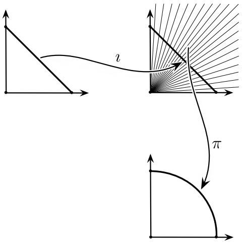  
Fig. 1.1 Natural inclusion and projection

$\exp(tf) \in L^{\infty}$ as well for all $t$ . Again, for a general function $f$ , we need to impose a normalization in order to stay in the class of probability distributions. This leads to the variation

$$
\frac {\exp (t f)}{Z (t)} \mu \quad \text {w i t h} Z (t) := \int_ {\Omega} \exp (t f) d \mu . \tag {1.11}
$$

This multiplicative normalization is, of course, in line with our view of the probability measures as equivalence classes of measures up to a factor. Moreover, we can consider the family (1.11) as a geodesic for an affine structure, as we shall now explain. First, although the normalization factor $Z(t)$ depends on the measure $\mu$ , this does not matter as we are considering elements of a projective space which does not see a global factor. Secondly, when we have two probability measures $\mu, \mu_1$ with $\mu_1 = \phi \mu$ for some positive function $\phi$ with $\phi \in L^1(\Omega, \mu)$ and hence $\phi^{-1} \in L^1(\Omega, \mu_1)$ , then the variations $\exp(tf) \mu$ of $\mu$ correspond to the variations $\frac{\exp(tf)}{\phi} \mu_1$ of $\mu_1$ . At the level of the linear spaces, the correspondence would be between $f$ and $f - \log \phi$ (we might wish to require here that $\phi, \phi^{-1} \in L^\infty$ according to the previous discussion, but let us ignore this technical point for the moment). The important point here is that we can identify the variations at $\mu$ and $\mu_1$ here in a manner that does not depend on the individual $f$ , because the shift by $\log \phi$ is the same for all $f$ . Moreover, when we have $\mu_2 = \psi \mu_1$ , then $\mu_2 = \psi \phi \mu$ , and the shift is by $\log (\psi \phi) = \log \psi + \log \phi$ . But this is precisely what an affine structure amounts to. Thus, we have identified the second affine structure on the space of probability measures. It possesses a natural exponential map $f \mapsto \exp f$ , is naturally adapted to our description of probability measures as equivalence classes of measures, and is complete in contrast to the first affine structure. As we shall explore in more detail in the geometric part of this book, these two structures are naturally dual to each other. They are related by a Legendre transform that generalizes the duality between entropy and free energy that is at the heart of statistical mechanics.

This pair of dual affine structures was discovered by Amari and Chentsov, and the tensor describing it is therefore called the Amari-Chentsov tensor. The Amari-Chentsov tensor encodes the difference between the two affine connections, and they can be recovered from the Fisher metric and this tensor. Like the Fisher metric, the Amari-Chentsov tensor is invariant under sufficient statistics, and uniquely characterized by this fact, as we shall also show in this book. Spaces with such a pair of dual affine structures turn out to have a richer geometry than simple affine spaces. In particular, such affine structures can be derived from potential functions. In particularly important special cases, these potential functions are the entropy and the free energy as known from statistical mechanics.

Thus, there is a natural connection between information geometry and statistical mechanics. Of course, there is also a natural connection between statistical mechanics and information theory, through the analogy between Boltzmann-Gibbs entropy and Shannon information. In many interesting cases within statistical mechanics, the interaction of physical elements can be described in terms of a graph or, more generally, in terms of a hypergraph. This leads to families of Boltzmann-Gibbs distributions that are known as hierarchical or graphical models.

In fact, information geometry also directly leads to geometric descriptions of information theoretical concepts, and this is another topic that we shall systematically explore in this book. In particular, we shall treat conditional and relative entropies from a geometric perspective, analyze exponential families, including interaction spaces and hierarchical and graphical models, and describe applications like replicator equations in mathematical biology and population game theory. Since many of those geometric properties and applications show themselves already in the case where the sample space $\Omega$ is finite and hence the spaces of measures on it are finite-dimensional, we shall start with a chapter on that case.

We consider families of measures $\mathbf{p}(\xi)$ on a sample space $\Omega$ parametrized by $\xi$ from our parameter space $M$ . For different $\xi$ , the resulting measures might be quite different. In particular, they may have rather different null sets. Nevertheless, in many cases, for instance, if $M$ is a finite-dimensional manifold, we may write such a family as

$$
\mathbf {p} (\xi) = p (\cdot ; \xi) \mu_ {0}, \tag {1.12}
$$

for some base measure $\mu_0$ that does not depend on $\xi$ . $p:\Omega \times M\to \mathbb{R}$ is the density function of $\mathbf{p}$ w.r.t. $\mu_0$ , and we then need that $p(\cdot ;\xi)\in L^{1}(\Omega ,\mu_{0})$ for all $\xi$ . This looks convenient, after all such a $\mu_0$ is an auxiliary object, and it is a general mathematical principle that structures should not depend on such auxiliary objects. Implementing this principle systematically will, in fact, give us the crucial leverage needed to develop the general theory. Let us be more precise. As already observed above, when we have another probability measure $\mu_{1}$ with $\mu_{1} = \phi \mu_{0}$ for some positive function $\phi$ with $\phi \in L^1 (\Omega ,\mu_0)$ and hence $\phi^{-1}\in L^{1}(\Omega ,\mu_{1})$ , then $\psi \in L^{1}(\Omega ,\mu_{1})$ precisely if $\psi \phi \in L^{1}(\Omega ,\mu_{0})$ . Thus, the $L^1$ -spaces naturally correspond to each other, and it does not matter which base measure we choose, as long as the different base measures are related by $L^1$ -functions.

Second, the differential of $\mathbf{p}$ in some direction $V$ is then given by

$$
d _ {\xi} \mathbf {p} (V) = \partial_ {V} p (\cdot ; \xi) \mu_ {0} \in L ^ {1} (\Omega , \mu_ {0}), \tag {1.13}
$$

assuming that this quantity exists. According to what we have just said, however, what we should consider is not $\partial_V p(\cdot ;\xi)\mu_0$ , which measures the change of measure w.r.t. the background measure $\mu_0$ , but rather the rate of change of $\mathbf{p}(\xi)$ relative to the measure $\mathbf{p}(\xi)$ itself, that is, the Radon-Nikodym derivative of $d_{\xi}\mathbf{p}(V)$ w.r.t. $\mathbf{p}(\xi)$ , that is, the logarithmic derivative

$$
\partial_ {V} \log p (\cdot ; \xi) = \frac {d \left\{d _ {\xi} \mathbf {p} (V) \right\}}{d \mathbf {p} (\xi)}. \tag {1.14}
$$

(Note that this is not a second derivative, as the outer $d$ stands for the Radon-Nikodym derivative, that is, essentially a quotient of measures. The slightly confusing notation ultimately results from writing integration with respect to $\mathbf{p}(\xi)$ as $\int d\mathbf{p}(\xi).$

This then leads to the Fisher metric

$$
\mathfrak {g} _ {\xi} (V, W) = \int_ {\Omega} \partial_ {V} \log p (\cdot ; \xi) \partial_ {W} \log p (\cdot ; \xi) d \mathbf {p} (\xi). \tag {1.15}
$$

One may worry here about what happens when the density $p$ is not positive almost everywhere. In order to see that this is not really a problem, we introduce the formal square roots

$$
\sqrt {\mathbf {p} (\xi)} := \sqrt {p (\cdot ; \xi)} \sqrt {\mu_ {0}}, \tag {1.16}
$$

and use the formal computation

$$
d _ {\xi} \sqrt {\mathbf {p}} (V) = \frac {1}{2} \partial_ {V} \log p (\cdot ; \xi) \sqrt {\mathbf {p} (\xi)} \tag {1.17}
$$

to rewrite (1.15) as

$$
\mathfrak {g} _ {\xi} (V, W) = 4 \int_ {\Omega} d \left(d _ {\xi} \sqrt {\mathbf {p}} (V) \cdot d _ {\xi} \sqrt {\mathbf {p}} (W)\right). \tag {1.18}
$$

Also, in a sense to be made precise, an $L^1$ -condition on $\mathbf{p}(\xi)$ becomes an $L^2$ -condition on $\sqrt{\mathbf{p}(\xi)}$ in (1.16), and an $L^2$ -condition is precisely what we need in (1.18) for the derivatives. According to (1.17), this means that we should now impose an $L^2$ -condition on $\partial_V \log p(\cdot; \xi)$ . Again, all this is naturally compatible with a change of base measure.

# 1.2 An Informal Description

Let us now informally describe some of the main points of information geometry as treated in this book, and thereby perhaps perhaps already give away some of our secrets.

"Informally" here is meant seriously, indeed. That is, we shall suppress certain technical points that will, of course, be clarified in the main text.

# 1.2.1 The Fisher Metric and the Amari-Chentsov Structure for Finite Sample Spaces

Let first $I = \{1, \dots, n\}$ , $n \in \mathbb{N} = \{1, 2, \dots\}$ , be a finite sample space, and consider the set of nonnegative measures $\mathcal{M}(I) = \{(m_1, \dots, m_n) : m_i \geq 0, \sum_j m_j > 0\}$ on it. A probability measure is then either a tuple $(p_1, \dots, p_n) \in \mathcal{M}(I)$ with $\sum_j p_j = 1$ , or a measure up to scaling. The latter means that we do not consider the measure $m_i$ of an $i \in I$ , or more generally, of a subset of $I$ , but rather only quotients $\frac{m_i}{m_j}$ whenever $m_j > 0$ . In other words, we look at relative instead of absolute measures. Clearly, $\mathcal{M}(I)$ can be identified with the positive sector $\mathbb{R}_+^n$ of $\mathbb{R}^n$ . The first perspective would then identify the set of probability measures with the simplex $\Sigma^{n-1} = \{(y_1, \dots, y_n) : y_i \geq 0, \sum_j y_j = 1\}$ , whereas the latter would rather identify it with the positive part of the projective space $\mathbb{P}^{n-1}$ , that is, with the positive orthant or sector of the unit sphere $S^{n-1}$ in $\mathbb{R}^n$ , $S_{+}^{n-1} = \{(q^1, \dots, q^n) : q^i \geq 0, \sum_j (q^j)^2 = 1\}$ . Of course, $\Sigma^{n-1}$ and $S_{+}^{n-1}$ are homeomorphic, but otherwise, their geometry is different. We shall utilize both of them. Foremost, the sphere $S^{n-1}$ carries its natural metric induced from the Euclidean metric on $\mathbb{R}^n$ . Therefore, we obtain a Riemannian metric on the set of probability measures. This is the Fisher metric. Next, let us take a measure $\mu_0 = (m_1, \dots, m_n)$ with $m_i > 0$ for all $i$ . We call a measure $\phi \mu_0 = (\phi_1 m_1, \dots, \phi_n m_n)$ compatible with $\mu_0$ if $\phi_i > 0$ for all $i$ . Let us call the space of these measures $\mathcal{M}_{+}(I, \mu_0)$ . Of course, this space does not really depend on $\mu_0$ ; the only relevant aspect is that all entries of $\mu_0$ be positive. Nevertheless, it will be instructive to look at the dependence on $\mu_0$ more carefully. $\mathcal{M}_{+}(I, \mu_0)$ forms a group under pointwise multiplication. Equally importantly, we get an affine structure. Considering $\Sigma^{n-1}$ , this is obvious, as the simplex is a convex subset of an $(n-1)$ -dimensional affine subspace of $\mathbb{R}^n$ . Perhaps somewhat more surprisingly, there is another affine structure which we shall now describe. Let $\mu_1 = \phi_1 \mu_0 \in \mathcal{M}_{+}(I, \mu_0)$ and $\mu_2 = \phi_2 \mu_1 \in \mathcal{M}_{+}(I, \mu_1)$ . Thus, we also have $\mu_2 = \phi_2 \phi_1 \mu_0 \in \mathcal{M}_{+}(I, \mu_0)$ . In particular, whenever $\mu = \phi \mu_0$ is compatible with $\mu_0$ , we have a canonical identification of $\mathcal{M}_{+}(I, \mu)$ with $\mathcal{M}_{+}(I, \mu_0)$ via multiplication by $\phi$ . Of course, these spaces are not linear, due to the positivity constraints. We can, however, consider the linear space $T_{\mu_0}^* \cong \mathbb{R}^n$ of $(f_1, \dots, f_n)$ with $f_i \in \mathbb{R}$ . This space is bijective to $\mathcal{M}_{+}(I, \mu_0)$ via $\phi_i = e^{f_i}$ . This is an exponential map, as familiar from Riemannian geometry or Lie group theory. (As will be explained in Chap. 2, this space can be naturally considered as the cotangent space of the space of measures at the point $\mu_0$ . For the purposes of this introduction, the difference between tangent and cotangent spaces is not so important, however, and in any case, as soon as we have a metric, there is a natural identification between tangent and cotangent spaces.) Now, there is a natural identification between $T_{\mu}^*$

and $T_{\mu_0}^*$ ; in fact, if $\mu = \phi \mu_0$ , this is achieved by the correspondence $g_i = f_i - \log \phi_i$ because then $e^g \mu = e^f \mu_0$ . Since this identification is independent of $f$ and $g$ , and furthermore is compatible with the above product structure, we have a natural correspondence between the (co)tangent spaces at different points of $\mathcal{M}_+$ , that is, an affine structure. We thus have not one, but two affine structures. These two structures are indeed different, but there is a natural duality between them. This is the Amari-Chentsov structure which we shall describe in Sect. 1.1.

# 1.2.2 Infinite Sample Spaces and Functional Analysis

So far, the sample space has been finite. Let us now consider a general sample space, that is, some set $\Omega$ together with a $\sigma$ -algebra, so that we can consider the space of measures on $\Omega$ . We shall assume for the rest of this discussion that $\Omega$ is infinite, as we have already described the finite case, and we want to see which aspects naturally extend. Again, in this introduction, we restrict ourselves to the positive measures. Probability measures then can again either be considered as measures $\mu$ with $\mu(\Omega) = 1$ , or as relative measures, that is, considering only quotients $\frac{\mu(A)}{\mu(B)}$ whenever $\mu(B) > 0$ . In the first case, we would deal with an infinite dimensional simplex, in the second one with the positive orthant or sector of an infinite-dimensional sphere. Now, given again some base measure $\mu_0$ , the space of compatible measures would be $\mathcal{M}_{+}(\Omega, \mu_0) = \{\phi \mu_0 : \phi \in L^1(\Omega, \mu_0), \phi > 0$ almost everywhere\}. Some part of the preceding naturally generalizes. In particular, when $\mu_1 = \phi_1 \mu_0 \in \mathcal{M}_{+}(\Omega, \mu_0)$ and $\mu_2 = \phi_2 \mu_1 \in \mathcal{M}_{+}(\Omega, \mu_1)$ , then $\mu_2 = \phi_2 \phi_1 \mu_0 \in \mathcal{M}_{+}(\Omega, \mu_0)$ . And this is precisely the property that we shall need. However, we no longer have a multiplicative structure, because if $\phi, \psi \in L^1(\Omega, \mu_0)$ , then their product $\phi \psi$ need not be in $L^1(\Omega, \mu_0)$ itself. Moreover, the exponential map $f \mapsto e^f$ (defined in a pointwise manner, i.e., $e^f(x) = e^{f(x)}$ ) is no longer defined for all $f$ . In fact, the natural linear space would be $L^2(\Omega, \mu_0)$ , but if $f \in L^2(\Omega, \mu_0)$ , then $e^f$ need not be in $L^1(\Omega, \mu_0)$ . But nevertheless, wherever defined, we have the above affine correspondence. So, at least formally, we again have two affine structures, one from the infinite-dimensional simplex, and the other as just described. Also, from the positive sector of the infinite dimensional sphere, we again get (an infinite-dimensional version of) a Riemannian metric. Now, developing the functional analysis required to make this really work is one of the major achievements of this book, see Chap. 3. Our approach is different from and more general than the earlier ones of Amari-Nagaoka [16] and Pistone-Sempi [216].

For our treatment, another simple observation will be important. There is a natural duality between functions $f$ and measures $\phi \mu$ ,

$$
(f, \phi \mu) = \int_ {\Omega} f \phi d \mu , \tag {1.19}
$$

whenever $f$ and $\phi$ satisfy appropriate integrability conditions. From the perspective of the duality between functions and measures, we might require that $\phi$ be in $L^1$

and $f$ be in $L^{\infty}$ . We can turn (1.19) into a symmetric pairing by rewriting it as

$$
\left\langle f (\mu) ^ {1 / 2}, \phi (\mu) ^ {1 / 2} \right\rangle = \int_ {\Omega} f (d \mu) ^ {1 / 2} \phi (d \mu) ^ {1 / 2}. \tag {1.20}
$$

Since this is symmetric, we would now require that both factors be in $L^2$ . The objects involved in (1.20), that is, those that transform like $(d\mu)^{1/2}$ , that is, with the square root of the Jacobian of a coordinate transformation, are called half-densities. In particular, the group of diffeomorphisms of $\Omega$ (assuming that $\Omega$ carries a differentiable structure) operates by isometries on the space of half-densities of class $L^2$ . Therefore, this is a good space to work with. In fact, for the Amari-Chentsov structure, we also have to consider $(1/3)$ -densities, that is, objects that transform like a cubic root of a measure.

In order to make this precise, in our approach, we define the Banach spaces of formal $r$ th powers of (signed) measures, denoted by $\mathcal{S}^r (\Omega)$ , where $0 < r\leq 1$ . For instance, $\mathcal{S}^1 (\varOmega)=\mathcal{S}(\varOmega)$ is the Banach space of finite signed measures on $\varOmega$ with the total variation as the Banach norm. The space $\mathcal{S}^{1 / 2}(\varOmega)$ is the space of signed half-densities which is a Hilbert space in a natural way (the concept of a half-density will be discussed in more detail after (1.20)). Just as we may regard the set of probability measures and (positive) finite measures as subsets $\mathcal{P}(\varOmega)\subseteq \mathcal{M}(\varOmega)\subseteq \mathcal{S}(\varOmega)$ , there are analogous inclusions $\mathcal{P}^r (\varOmega)\subseteq \mathcal{M}^r (\varOmega)\subseteq \mathcal{S}^r (\varOmega)$ of $r$ th powers of probability measures (finite measures, respectively). In particular, we also get a rigorous definition of the (formal) tangent bundle $T\mathcal{P}^r (\varOmega)$ and $T\mathcal{M}^r (\varOmega)$ , where $T_{\mu}\mathcal{M}^{r}(\varOmega)=L^{k}(\varOmega,\mu)$ for $k = 1 / r\geq 1$ , so this is precisely the tangent space which was relevant in our previous discussion.

We also define the signed $k$ th power $\tilde{\pi}^k: \mathcal{S}^r(\Omega) \to \mathcal{S}(\Omega)$ for $k := 1/r \geq 1$ which is a differentiable homeomorphism between these sets and can hence be regarded as a coordinate map on $\mathcal{S}(\Omega)$ changing the differentiable structure. It maps $\mathcal{P}^r(\Omega)$ to $\mathcal{P}(\Omega)$ and $\mathcal{M}^r(\Omega)$ to $\mathcal{M}(\Omega)$ , respectively. A similar approach was used by Amari [8] who introduced the concept of $\alpha$ -representations, expressing a statistical model in different coordinates by taking powers of the model. The advantage of our approach is that the definition of the parametrization $\tilde{\pi}^k$ is universally defined on $\mathcal{S}^r(\Omega)$ and does not depend on a particular parametrized measure model.

Given a statistical model $(M, \Omega, \mathbf{p})$ , we interpret it as a differentiable map from $M$ to $\mathcal{P}(\Omega) \subseteq S(\Omega)$ . Then the notion of $k$ -integrability of the model from [25] can be interpreted in this setting as the condition that for $r = 1/k$ , the $r$ th power $\mathbf{p}^r$ mapping $M$ to $\mathcal{P}^r(\Omega) \subseteq S^r(\Omega)$ is continuously differentiable. Note that in the definition of the model $(M, \Omega, \mathbf{p})$ , we do not assume the existence of a measure dominating all measures $\mathbf{p}(\xi)$ , nor do we assume that all measures $\mathbf{p}(\xi)$ have the same null sets. With this, our approach is indeed more general than the notions of differentiable families of measures defined, e.g., in [9, 16, 25, 216, 219].

For each $n$ , we can define a canonical $n$ -tensor on $\mathcal{S}^r(\Omega)$ for $0 < r \leq 1/n$ , which can be pulled back to $M$ via $\mathbf{p}^r$ . In the cases $n = 2$ and $n = 3$ , this produces the Fisher metric and the Amari-Chentsov tensor of the model, respectively. We shall show in Chap. 5 that the canonical $n$ -tensors are invariant under sufficient statis-

tics and, moreover, the set of tensors invariant under sufficient statistics are algebraically generated by the canonical $n$ -tensors. This is a generalization of the results of Chentsov and Campbell to the case of tensors of arbitrary degree and arbitrary measure spaces $\Omega$ .

Let us also mention here that when $\Omega$ is a manifold and the model $\mathbf{p}(\xi)$ consists of smooth densities, the Fisher metric can already be characterized by invariance under diffeomorphisms, as has been shown by Bauer, Bruveris and Michor [44]. Thus, in the more restricted smooth setting, a weaker invariance property already suffices to determine the Fisher metric. For the purposes of this book, in particular the mathematical foundation of parametric statistics, however, the general measure theoretical setting that we have developed is essential.

There is another measure theoretical structure which was earlier introduced by Pistone-Sempi [216]; we shall discuss that structure in detail in Sect. 3.3. In fact, to appreciate the latter, the following observation is a key. Whenever $e^{f} \in L^{1}(\Omega, \mu_{0})$ , then for $t < 1$ , $e^{tf} = (e^{f})^{t} \in L^{p}(\Omega, \mu_{0})$ for $p = 1 / t > 1$ . Thus, the set of $f$ with $e^{f} \in L^{1}$ is not only starshaped w.r.t. the origin, but whenever we scale by a factor $t < 1$ , the integrability even improves. This, however, substantially differs from our approach. In fact, in the Pistone-Sempi structure the topology used ( $e$ -convergence) is very strong and, as we shall see, it decomposes the space $\mathcal{M}_{+}(\Omega; \mu_{0})$ of measures compatible with $\mu_{0}$ into connected components, each of which is an open convex set in a Banach space. Thus, $\mathcal{M}_{+}(\Omega; \mu_{0})$ becomes a Banach manifold with an affine structure under the $e$ -topology. In contrast, the topology that we use on $\mathcal{P}^r(\Omega)$ is essentially the $L^{k}$ -topology on $L^{k}(\Omega, \mu)$ for $k = 1 / r$ , which is much weaker. This implies that, on the one hand, $\mathcal{P}^r(\Omega)$ is not a Banach manifold but merely a closed subset of the Banach space $S^r(\Omega)$ , so it carries far less structure than $\mathcal{M}_{+}(\Omega; \mu_{0})$ with the Pistone-Sempi topology. On the other hand, our structure is applicable to many statistical models which are not continuous in the $e$ -topology of Pistone-Sempi.

# 1.2.3 Parametric Statistics

We now return to the setting of parametric statistics, because that is a key application of our theory. In parametric statistics, one considers only parametrized families of measures on the sample space $\Omega$ , rather than the space $\mathcal{P}(\Omega)$ of all probability measures on $\Omega$ . These families are typically finite-dimensional (although our approach can also naturally handle infinite-dimensional families). We consider such a family as a mapping $\mathbf{p}: M \to \mathcal{P}(\Omega)$ from the parameter space $M$ into $\mathcal{P}(\Omega)$ , and $\mathbf{p}$ needs to satisfy appropriate continuity and differentiability properties related to the $L^1$ -topology on $\mathcal{P}(\Omega)$ . In fact, some of the most difficult technical points of our book are concerned with getting these properties right, so that the abstract Fisher and Amari-Chentsov structures on $\mathcal{P}(\Omega)$ can be pulled back to such an $M$ via $\mathbf{p}$ . This makes these structures functorial in a natural way.

The task or purpose of parametric statistics then is to identify an element of such a family $M$ that best describes the statistics obtained from sampling $\Omega$ . A map that

converts the samples from $\Omega$ into estimates for a parameter $\xi \in M$ is called an estimator. The Fisher metric quantifies the sensitivity of the dependence of the parameter $\xi$ on the samples in $\Omega$ , and this leads to the Cramér-Rao inequality which constrains any estimator. Moreover, instead of sampling from $\Omega$ , we could consider a map $\kappa: \Omega \to \Omega'$ to some possibly much smaller space. In general, sampling from a smaller space loses some information about the parameter $\xi$ , and consequently, the Fisher metric decreases. In fact, we shall show such a monotonicity result under very general assumptions. In informal terms, such a map $\kappa$ is called a sufficient statistic for a family $\mathbf{p}: M \to \mathcal{P}(\Omega)$ if sampling from $\Omega'$ is as good for identifying the parameter $\xi$ as sampling from $\Omega$ itself. In that case, the parameter sensitivity should be the same in either case, and according to the interpretation of the Fisher metric just given, it should be invariant under sufficient statistics. A remarkable result of Chentsov says that, conversely, the Fisher metric and the Amari-Chentsov tensor are uniquely determined by their invariance under sufficient statistics. Chentsov proved this result in the finite case only. Building upon our work in [25], we present a proof of this unique characterization of the Fisher and Amari-Chentsov structure in the general situation of an arbitrary sample space $\Omega$ . This is one of the main results derived in this book. In fact, we shall prove a very general result that classifies all tensors that are invariant under congruent Markov kernels. These statistical aspects of information geometry are taken up in Chap. 5 for the general case of an arbitrary $\Omega$ , with reference to the case of a finite $\Omega$ already treated in Chap. 2. We shall now describe this in some more detail.

Let $\kappa : \Omega \to \Omega'$ be a statistic (see (1.2)). Such a $\kappa$ then induces a map $\kappa_*$ on signed measures via

$$
\kappa_ {*} \mu (A) := \mu \left\{\omega \in \Omega : \kappa (\omega) \in A \right\} = \mu \left(\kappa^ {- 1} A\right),
$$

and thus a statistical model $(M, \Omega, \mathbf{p})$ on $\Omega$ gets transformed into one on $\Omega'$ , $(M, \Omega', \mathbf{p}')$ . In general, it will be more difficult to recover the parameter $\xi \in M$ from $\kappa_{\star} p(\cdot; \xi)$ by observations on $\omega' \in \Omega'$ than from the original $p(\cdot; \xi)$ through observations of $x \in \Omega$ , because $\kappa$ might map several $\omega$ into the same $\omega'$ . In fact, if we put

$$
\mathfrak {g} _ {k l} ^ {\prime} (\xi) = \int p ^ {\prime} \left(\omega^ {\prime}; \xi\right) \frac {\partial \log p ^ {\prime} \left(\omega^ {\prime} ; \xi\right)}{\partial \xi^ {k}} \frac {\partial \log p ^ {\prime} \left(\omega^ {\prime} ; \xi\right)}{\partial \xi^ {l}} d \mu^ {\prime} \left(\omega^ {\prime}\right) \tag {1.21}
$$

then

$$
\left(\mathfrak {g} _ {k l}\right) \geq \left(\mathfrak {g} _ {k l} ^ {\prime}\right) \tag {1.22}
$$

in the sense of tensors, that is, the difference is a nonnegative definite tensor. When no information is lost, the statistic is called sufficient, and we have equality in (1.22). (There are various characterizations of sufficient statistics, and we shall show their equivalence under our general conditions. Informally, a statistic is sufficient for the parameter $\xi$ if having observed $\omega'$ , no further information about $\xi$ can be obtained from knowing which of the possible $\omega$ with $\kappa(\omega) = \omega'$ had occurred.)

More generally, we consider a Markov kernel, that is

$$
K: \Omega \rightarrow \mathcal {P} \left(\Omega^ {\prime}\right). \tag {1.23}
$$

For instance, we can consider conditional probability distributions $p(\omega'|\omega)$ for $\omega' \in \Omega'$ . Of course, a statistic $\kappa$ induces the Markov kernel $K^{\kappa}$ where

$$
K ^ {\kappa} (\omega) = \delta^ {\kappa (\omega)}, \tag {1.24}
$$

the Dirac measure at $\kappa (\omega)$ . A Markov kernel $K$ induces the Markov morphism

$$
K _ {*} \colon \mathcal {S} (\Omega) \longrightarrow \mathcal {S} \left(\Omega^ {\prime}\right), \quad K _ {*} \mu \left(A ^ {\prime}\right) := \int_ {\Omega} K \left(\omega ; A ^ {\prime}\right) d \mu (\omega), \tag {1.25}
$$

that is, we simply integrate the kernel with respect to a measure on $\Omega$ to get a measure on $\Omega'$ . In particular, a statistic $\kappa$ then induces the Markov morphism $K_{*}^{\kappa}$ . It turns out that it is expedient to consider invariance properties with respect to Markov morphisms. While this will be technically important, in this Introduction, we shall simply consider statistics.

When $\kappa : \Omega \to \Omega'$ is a statistic, a Markov kernel $L: \Omega' \to \mathcal{P}(\Omega)$ , i.e., going in the opposite direction now, is called $\kappa$ -congruent if

$$
\kappa_ {\star} \left(L \left(\omega^ {\prime}\right)\right) = \delta^ {\omega^ {\prime}} \quad \text {f o r a l l} \omega^ {\prime} \in \Omega^ {\prime}. \tag {1.26}
$$

In order to assess the information loss caused by going from $\Omega$ to $\mathcal{P}(\Omega')$ via a Markov kernel, there are two aspects

1. Several $\omega \in \Omega$ might get mapped to the same $\omega' \in \Omega'$ . This clearly represents a loss of information, because then we can no longer recover $\omega$ from observing $\omega'$ . And if this distinction between the different $\omega$ causing the same $\omega'$ is relevant for estimating the parameter $\xi$ , then lumping several $\omega$ into the same $\omega'$ loses information about $\xi$ .

2. An $\omega \in \Omega$ gets diluted, that is, we have a distribution $p(\cdot |\omega)$ in place of a single value. By itself, this does not need to cause a loss of information. For instance, for different values of $\omega$ , the corresponding distributions could have disjoint supports.

In fact, any Markov kernel can be decomposed into a statistic and a congruent Markov kernel. That is, there is a Markov kernel $K^{cong}:\Omega \to \mathcal{P}(\hat{\Omega})$ which is congruent w.r.t. some statistic $\kappa_{1}:\hat{\Omega}\rightarrow \Omega$ , and a statistic $\kappa_{2}:\hat{\Omega}\rightarrow \Omega^{\prime}$ such that

$$
K = \kappa_ {2 *} K ^ {\text {c o n g}}. \tag {1.27}
$$

Moreover, we have the general monotonicity theorem

Theorem 1.1 Let $(M, \Omega, p)$ be a statistical model on $\Omega$ as before, let $K: \Omega \to \mathcal{P}(\Omega')$ be a Markov kernel, inducing the family $p'(\cdot; \xi) = K_{*}(p(\cdot; \xi))$ . Moreover, let $\mathfrak{g}_M$ and $\mathfrak{g}_M'$ denote the corresponding Fisher metrics. Then

$$
\mathfrak {g} _ {M} (V, V) \geq \mathfrak {g} _ {M} ^ {\prime} (V, V) \quad f o r a l l V \in T _ {\xi} M a n d \xi \in M. \tag {1.28}
$$

# 1.2 An Informal Description

If $K = K^{\kappa}$ is the Markov kernel induced by a statistic $\kappa$ as in (1.24), and if $(M, \Omega, \mathbf{p})$ has a positive regular density function, equality here holds for all $\xi$ and all $V$ if and only if the statistic $\kappa$ is sufficient.

When $K = K^{\kappa}$ , the difference $\mathfrak{g}_M(V, V) - \mathfrak{g}_M'(V, V)$ can then be taken as the information loss caused by the statistic $\kappa$ .

Conversely, as already mentioned several times, we have

Theorem 1.2 The Fisher metric is the unique metric, and the Amari-Chentsov tensor is the only 3-tensor (up to a constant scaling factor) that are invariant under sufficient statistics.

The Fisher metric also enters into the Cramér-Rao inequality of statistics. The task of parametric statistics is to find an element in the parameter space $\Xi$ that is most appropriate for describing the observations made in $\Omega$ . In this sense, one defines an estimator as a map

$$
\hat {\xi}: \Omega \to \Xi
$$

that associates to every observed datum $x$ in $\Omega$ a probability distribution from the class $\Xi$ . As $\Xi$ can also be considered as a family of product measures on $\Omega^N$ ( $N \in \mathbb{N}$ ), we can also associate to every tuple $(x_1, \ldots, x_N)$ of observations an element of $\Xi$ . The most important example is the maximum likelihood estimator that selects that element of $\Xi$ which assigns the highest weight to the observation $x$ among all elements in $\Xi$ .

Let $\vartheta : \Xi \to \mathbb{R}^d$ be coordinates on $\Xi$ . We can then write the family $\Xi$ as $p(\cdot ;\vartheta)$ in terms of those coordinates $\vartheta$ . For simplicity, we assume that $d = 1$ , that is, we have only a single scalar parameter. The general case can be easily reduced to this one.

We define the bias of an estimator $\hat{\xi}$ as

$$
b _ {\hat {\xi}} (\vartheta) := \mathbb {E} _ {\vartheta} \hat {\xi} - \vartheta , \tag {1.29}
$$

where $E_{\vartheta}$ stands for the expectation w.r.t. $p(\cdot ;\vartheta)$ . The Cramér-Rao inequality then says

Theorem 1.3 Any estimator $\hat{\xi}$ satisfies

$$
\mathbb {E} _ {\vartheta} \left((\hat {\xi} - \vartheta) ^ {2}\right) \geq \frac {\left(1 + b _ {\hat {\xi}} ^ {\prime} (\vartheta)\right) ^ {2}}{\mathfrak {g} (\vartheta)} + b _ {\hat {\xi}} (\vartheta) ^ {2}, \tag {1.30}
$$

where ' stands for a derivative w.r.t. $\vartheta$

In particular, when the estimator is unbiased, that is, $b_{\hat{\xi}} = 0$ , we have

$$
\mathbb {E} _ {\vartheta} \left(\left(\hat {\xi} - E _ {\vartheta} (\hat {\xi})\right) ^ {2}\right) = \mathbb {E} _ {\vartheta} \left((\hat {\xi} - \vartheta) ^ {2}\right) \geq \frac {1}{\mathfrak {g} (\vartheta)}, \tag {1.31}
$$

that is, the variance of $\hat{\xi}$ is bounded from below by the inverse of the Fisher metric.

Here, $\mathfrak{g}(\vartheta)$ is an abbreviation for $\mathfrak{g}(\vartheta)(\frac{\partial}{\partial\vartheta},\frac{\partial}{\partial\vartheta})$

Thus, we see that the Fisher metric $\mathfrak{g}(\vartheta)$ measures how sensitively the probability density $p(\omega; \vartheta)$ depends on the parameter $\vartheta$ . When this is small, that is, when varying $\vartheta$ does not change $p(\omega; \vartheta)$ much, then it is difficult to estimate the parameter $\vartheta$ from the data, and the variance of an estimator consequently has to be large.

All these statistical results will be shown in the general framework developed in Chap. 3, that is, in much greater generality than previously known.

# 1.2.4 Exponential and Mixture Families from the Perspective of Differential Geometry

Before those statistical applications, however, in Chap. 4, we return to the differential geometric aspects already introduced in Chap. 2. Recall that there are two different affine structures on our spaces of probability measures, one coming from the simplex, the other from the exponential maps. Consequently, for each of these structures, we have a notion of a linear family. For the first structure, these are the so-called mixture families

$$
p (x; \eta) = c (x) + \sum_ {i = 1} ^ {d} g ^ {i} (x) \eta_ {i},
$$

depending on functions $g^i$ and $c$ (which has to be adjusted to make $p(\cdot; \eta)$ into a probability measure), where $\eta_1, \ldots, \eta_n$ are the parameters. For the second structure, we have the exponential families

$$
p (x; \vartheta) = \exp \left(\gamma (x) + f _ {i} (x) \vartheta^ {i} - \psi (\vartheta)\right), \tag {1.32}
$$

depending on functions $f_{i}$ (observables in a statistical mechanics interpretation) with parameters $\vartheta^{i}$ and

$$
\psi (\vartheta) = \log \int \exp \left(\gamma (x) + f _ {i} (x) \vartheta^ {i}\right) d x \tag {1.33}
$$

being the normalization required to make $p(\cdot ;\vartheta)$ a probability distribution. In fact, in statistical mechanics, $\psi$ is known as the free energy. Of course, we can try to write one and the same family in either the $\eta$ or the $\vartheta$ parameters. Of course, the relationship between them will be nonlinear. Remarkably, when working with the $\vartheta$ parameters, we can obtain the Fisher metric from

$$
g _ {i j} = \partial_ {i} \partial_ {j} \psi (\vartheta),
$$

and the Amari-Chentsov tensor from

$$
T _ {i j k} = \partial_ {i} \partial_ {j} \partial_ {k} \psi (\vartheta),
$$

where $\partial_i$ is the derivative w.r.t. $\vartheta^i$ . In particular, $\psi(\vartheta)$ is a strictly convex function because its second derivatives are given by the Fisher metric, hence are positive definite. It is important to point out at this stage that convexity here is meant in the sense of affine geometry, and not in the sense of Riemannian geometry. Convexity here simply means that the matrix of ordinary second derivatives is positive semidefinite, and this property is invariant under affine coordinate transformations only. In Riemannian geometry, one would rather require that the matrix of second covariant derivatives be positive semidefinite, and this property is invariant under arbitrary coordinate transformations because the transformation rules for covariant derivatives involve a metric dependent term that compensates the possible nonlinearities of coordinate transformations. Thus, even though the second derivatives of our function yield the metric tensor, the convexity involved here is an affine notion. (This is somewhat similar to Kähler geometry where a Kähler metric is a Hermitian metric that is locally given by the complex Hessian of some potential function. Here, the allowed transformations are the holomorphic ones, as opposed again to general coordinate transformations. In fact, it turns out that those affine structures that we are considering here, that is, those that are locally derived from some strictly convex potential function, can be seen as real analogues of Kähler structures.) In any case, since we are dealing with a convex function, we can therefore pass to its Legendre transform $\varphi$ . This also induces a change of parameters, and remarkably, this is precisely the transition from the $\vartheta$ to the $\eta$ parameters. With respect to the latter, $\varphi$ is nothing but the negative of the entropy of the probability distribution $p$ , that is,

$$
\varphi = \int p (x; \vartheta) \log p (x; \vartheta) d x. \tag {1.34}
$$

This naturally yields the relations for the inverse metric tensor

$$
g ^ {i j} = \partial^ {i} \partial^ {j} \varphi (\eta), \tag {1.35}
$$

where now $\partial^i$ is a derivative w.r.t. $\eta_{i}$ . Moreover, we have the duality relations

$$
\eta_ {i} = \partial_ {i} \psi (\vartheta), \quad \vartheta^ {i} = \partial^ {i} \varphi (\eta).
$$

These things will be explained and explored within the formalism of differential geometry.

# 1.2.5 Information Geometry and Information Theory

The entropy occurring in (1.34) is also known as the Shannon information, and it is the basic quantity of information theory. This naturally leads to the question of the relations between the Fisher information, the basic quantity of information geometry, and the Shannon information. The Fisher information is an infinitesimal quantity, whereas the Shannon information is a global quantity. One such relation

is given in (1.35): The inverse of the Fisher metric is obtained from the second derivatives of the Shannon information. But there is more. Given two probability distributions, we have their Kullback-Leibler divergence

$$
D _ {K L} (q \| p) := \int (\log q (x) - \log p (x)) q (x) d x. \tag {1.36}
$$

Here, we shall take as our base measure simply $dx$ .

This quantity is nonnegative ( $D_{KL}(q\| p)\geq 0$ , with equality only for $p = q$ ), but not symmetric in $q$ and $p$ ( $D_{KL}(q\| p)\neq D_{KL}(p\| q)$ in general), and so, we cannot take it as the square of a distance function. It turns out that the Fisher metric can be obtained by taking second derivatives of $D_{KL}(q\| p)$ w.r.t. $p$ at $q = p$ , whereas taking second derivatives there in the dual coordinates w.r.t. $q$ yields the inverse of the Fisher metric. In fact, this non-symmetry makes the relation between Shannon entropy and information geometry more subtle and more interesting, as we shall now briefly explain.

Henceforth, for simplicity, we shall put $\gamma(x) = 0$ in (1.32), as $\gamma$ will play no essential role for the moment. As in (1.32), we assume that some functions (observables) $f_{i}$ , $i = 1, \ldots, n$ , are given, and that w.r.t. $q$ , they have certain expectation values,

$$
\mathbb {E} _ {q} \left(f _ {i}\right) = \bar {f} _ {i}, \quad i = 1, \dots , n. \tag {1.37}
$$

For any $0 \leq m \leq n$ , we then look for the probability distribution $p^{(m)}$ that has the same expectation values for the functions $f_{j}, j = 1, \ldots, m$ ,

$$
\mathbb {E} _ {p ^ {(m)}} \left(f _ {j}\right) = \bar {f} _ {j}, \quad j = 1, \dots , m, \tag {1.38}
$$

and that maximizes the entropy

$$
H \left(p ^ {(m)}\right) = - \int \log p ^ {(m)} (x) p ^ {(m)} (x) d x \tag {1.39}
$$

among all distributions satisfying (1.38). An easy calculation shows that such a $p^{(m)}$ is necessarily of the form (1.32) on the support of $p^{(m)}$ , that is,

$$
p ^ {(m)} (x) = \exp \left(\sum_ {j = 1} ^ {m} f _ {j} (x) \vartheta^ {j} - \psi (\vartheta)\right) =: p ^ {(m)} (x; \vartheta) \tag {1.40}
$$

for suitable coefficients $\vartheta^j$ which are determined by the requirement (1.38). This means that among all distributions with the same expectation values (1.38), the exponential distribution (1.40) has the largest entropy. For this $p^{(m)}(x;\vartheta)$ , the Kullback-Leibler distance from $q$ becomes

$$
D _ {K L} \left(q \| p ^ {(m)}\right) = - H (q) + H \left(p ^ {(m)}\right). \tag {1.41}
$$

# 1.3 Historical Remarks

Since, as noted, $p^{(m)}$ maximizes the entropy among all distributions with the same expectation values for the $f_{j}$ , $j = 1, \dots, m$ , as $q$ , the Kullback-Leibler divergence in (1.41) is nonnegative, as it should be. Moreover, among all exponential distributions $p(x; \theta)$ , we have

$$
D _ {K L} \left(q \| p ^ {(m)} (\cdot ; \vartheta)\right) = \inf  _ {\theta} D _ {K L} \left(q \| p ^ {(m)} (\cdot ; \theta)\right) \tag {1.42}
$$

when the coefficients $\vartheta^j$ are chosen to satisfy (1.38), as we are assuming. That is, among all such exponential distributions that with the same expectation values as $q$ for the functions $f_j$ , $j = 1, \ldots, m$ , minimizes the Kullback-Leibler divergence. We may consider this as the projection of the distribution $q$ onto the family of exponential distributions $p^{(m)}(x; \theta) = \exp(\sum_{j=1}^{m} f_j(x) \theta^j - \psi(\theta))$ . Since, however, the Kullback-Leibler divergence is not symmetric, this is not obtained by the geodesic projection w.r.t. the Fisher metric; rather, two affine flat connections enter which are dual w.r.t. the Fisher metric. These affine flat connections come from the two affine flat structures described above.

The procedure can be iterated w.r.t. $m$ , by projecting $p^{(m)}(\cdot ;\vartheta)$ onto the exponential family of distributions $p^{(m - 1)}(\cdot ;\theta)$ . As defined above in (1.38), these families are obtained by fixing the expectation values of more and more observables. For $m = 0$ , we simply obtain the uniform distribution $p_0$ , and we have

$$
D _ {K L} \left(q \| p ^ {(k)}\right) = D _ {K L} \left(q \| p ^ {(n)}\right) + D _ {K L} \left(p ^ {(n)} \| p ^ {(n - 1)}\right) + \dots + D _ {K L} \left(p ^ {(k + 1)} \| p ^ {(k)}\right) \tag {1.43}
$$

for $k = 0, \dots, n$ , as will be shown in Sect. 4.3. This decomposition will be systematically explored in Sect. 6.1.

Other applications of information geometry presented in Chap. 6 will include Monte Carlo methods, infinite-dimensional Gibbs families, and evolutionary dynamics. The latter concerns the dynamics of biological populations subjected to the effects of selection, mutation, and random sampling. Those structures can be naturally interpreted in terms of information geometric concepts.

# 1.3 Historical Remarks

In 1945, in his fundamental paper [219] (see also [220]), Rao used Fisher information to define a Riemannian metric on a space of probability distributions and, equipped with this tool, to derive the Cramér-Rao inequality. Differential geometry was not well-known at that time, and only 30 years later, in [89], Efron extended Rao's ideas to the higher-order asymptotic theory of statistical inference. He defined smooth subfamilies of larger exponential families and their statistical

curvature, which, in the language of Riemannian geometry, is the second fundamental form of the subfamilies regarded as Riemannian submanifolds in the Riemannian manifold of the underlying exponential family provided with the Fisher metric. (In [16, p. 23] statistical curvature is also called embedding curvature or curvature and totally geodesic submanifolds are called autoparallel submanifolds.) Efron named those smooth subfamilies "curved exponential families." In 1946-1948, the geophysicist and Bayesian statistician Jeffreys introduced what we today call the Kullback-Leibler divergence, and discovered that for two distributions that are infinitely close we can write their Kullback-Leibler divergence as a quadratic form whose coefficients are given by the elements of the Fisher information matrix [131, 132]. He interpreted this quadratic form as the length element of a Riemannian manifold, with the Fisher information playing the role of the Riemannian metric. From this geometrization of the statistical model, he derived his prior distributions as the measures naturally induced by the Riemannian metric.

In 1955, in his lectures at the H. Poincaré Institute, Kolmogorov discussed the problem of the existence of natural differentiable structures on ensembles of probability distribution. Following a suggestion by Morozova, see [188], Chentsov defined an affine flat connection (the $e$ -connection) on the set $\mathcal{P}_{+}(\Omega, \mu)$ [60]. Further, analyzing the "naturality" condition for differentiable structures, Chentsov invented the category of mathematical statistics [61]. This category was introduced independently and almost at the same time by Morse and Sacksteder [189], using foundational ideas of Wald [252] and Blackwell [49] in the statistical decision theory and under the influence of the categorical approach in algebraic topology that was very fashionable at that time. The morphisms in the Chentsov category of mathematical statistics are Markov morphisms and geometric notions on probability distribution ensembles are required to be invariant under Markov morphisms [65]. In his influential book [65] Chentsov considered only geometry on probability distribution spaces $\mathcal{P}_{+}(\Omega, \mu)$ for finite sample spaces $\Omega$ , referring to technical difficulties of treating infinite-dimensional differentiable manifolds. The only exceptions are curved exponential families—subfamilies of the canonical exponential families defined by the $e$ -connection in [60]. Using the categorical approach, in particular Markov morphisms and a related notion of congruent embedding, see Definition 5.1, Chentsov discovered the Amari-Chentsov connections and proved the uniqueness of the Amari-Chentsov structure by their invariance under sufficient statistics [65].

Independently, inspired by the Efron paper and Dawid's discussion on it [89], Amari defined in [6, 7] the notion of $\alpha$ -connections and showed its usefulness in the asymptotic theory of statistical estimation. In particular, using geometric methods, Amari achieved Fisher's life-long dream of showing that the maximal likelihood estimator is optimal [7, 8, 16], see also Sect. 5.2 below. Shortly after this, Amari and Nagaoka introduced the notion of dual connections, developed the general theory of dually flat spaces, and applied it to the geometry of $\alpha$ -connections [194].

These events prepared the birth of information geometry, whose name appeared for the first time (in English) in [15], which was known before also as the differential geometrical theory of statistics. (Certain aspects of information geometry, e.g.,

results due to Morozova and Chentsov concerning invariants of pairs of probability distributions, belong to Markovian categorical geometry [63, 188], which is not necessarily a part of differential geometry. Thus the name "information geometry" is more suitable, and it also sounds more attractive.) The field of information geometry developed in particular thanks to the work of Amari and his school. Further developments of information geometry were mainly focused on divergence functions and their generalizations, and devoted to applications in statistical inference and information theory, especially in higher-order asymptotic theory of statistical inference. Here we would like to mention the papers by Csiszar [72-74] on divergence functions, especially $f$ -divergences and their invariant properties, and by Eguchi on the dualistic geometry of general divergences (contrast functions) [91-93], and the papers on the geometry of manifolds with dually flat connections [13, 34, 59, 236]. We recommend [11, 56] for a survey and bibliography on divergence geometry and [9, 11, 16, 148, 188] for a survey of applications of information geometry in the early period. Later applications of information geometry include neural networks, machine learning, evolutionary biology, etc. [11, 16]; see also Chap. 6 in our book. Regarding Markovian categorical geometry, in addition to the aforementioned papers by Chentsov and Morozova-Chentsov, we also would like to mention the paper by Campbell [57] on an extension of the Chentsov theorem for finite sample spaces, which will be significantly generalized in Chaps. 2 and 5. The papers [186, 187] (see also [188, §6]) by Morozova and Chentsov on the geometry of $\alpha$ -connections, in particular, giving an explicit description of totally geodesic submanifolds of the manifold $\mathcal{M}_{+}(I)$ provided with an $\alpha$ -connection, belong to the intersection of Markovian categorical geometry and divergence geometry. We note that the dualistic geometries considered in the early period of information geometry, in particular the geometry of curved exponential families, are not necessarily related to finite sample spaces but they are supposed to be finite-dimensional [39, 41, 62, 90]. Amari [9], Lauritzen [160], Murray-Rice [192] have proposed general concepts of finite-dimensional statistical models. Among further advancements in information geometry are Lauritzen's introduction of the notion of statistical manifolds and Le's immersion theorem, which we shall discuss in Chap. 4. The infinite-dimensional information geometry and, in particular, infinite-dimensional families of probability distributions were first considered in Pistone-Sempi's work [216] in 1995, see also our discussion in Chap. 3, and later in subsequent papers by Pistone and coauthors; see, e.g., [106], and recently in [25], which combines the approach of Markovian categorical geometry with functional analytical techniques. As an application we have proved a version of the Chentsov theorem which will be generalized further in this book. We would also like to mention [164] for another view on Chentsov's theorem and its generalizations.

Finally, we note that information geometry has been generalized for quantum systems, but the related circle of questions lies outside the scope of our book, and we refer the interested reader to excellent reviews in [16, 188, 214].

# 1.4 Organization of this Book

Let us summarize the organization of our book. After this introduction, in Chap. 2, we shall explain the basic constructions in the finite-dimensional case, that is, when the underlying space $\Omega$ on which we study probability distributions has only finitely many elements. This chapter also provides the natural context for a formal treatment of interaction spaces and of hierarchical models, emphasizing the important special class of graphical models. The space of probability distributions on such a finite space as treated in this chapter is finite-dimensional. In the next Chap. 3, we consider a general space $\Omega$ . Consequently, we shall have to deal with infinite-dimensional spaces of probability measures, and technical complications emerge. We are able, however, to develop a functional analytic framework within which these complications can be overcome. We shall introduce and develop the important notion of parametrized measure models and define suitable integrability properties, in order to obtain the analogue of the structures considered in Chap. 2. These structures will not depend on the choice of a base measure because we shall set up the framework in such a way that all objects transform appropriately under a change of base measure. We shall also discuss the structure of Pistone and Sempi. The following Chap. 4 will develop the differential geometry of statistical models. This includes dualistic structures, consisting of a Riemannian metric and two connections that are dual to each other with respect to that metric. When these connections are torsion-free, such a structure can more compactly be described as a statistical model, given by a metric, that is, a symmetric positive definite 2-tensor, and a symmetric 3-tensor. These are abstract versions of the Fisher metric and the Amari-Chentsov tensor. Alternatively, it can be described through a divergence. Any statistical model can be isostatistically immersed into a standard model defined by an Amari-Chentsov structure, and this then provides the link between the abstract differential geometry of Chap. 4 and the general functional analysis of Chap. 3. When these connections are even flat, the structure can be locally obtained from potential functions, that is, convex functions whose second derivatives yield the metric and whose third derivatives yield the 3-tensor. Here, convexity is considered as an affinely invariant notion, and consequently, we need to discuss the underlying affine structure. This also gives rise to a dual structure via the Legendre transform of the convex function. That is, we shall find a pair of dual affine structures, and this is the geometry discovered by Amari and Chentsov. Chapter 5 will turn to the statistical aspects. We shall present one of the main results of information geometry, that the Fisher metric and the Amari-Chentsov tensor are characterized by their invariance under sufficient statistics. Our treatment of sufficient statistics here is more general than what can be found in statistics texts. Also, we shall discuss estimators and derive a general version of the Cramér-Rao inequality within our framework. In the last chapter, we shall connect our treatment of information geometry with various applications and other fields. Building upon the treatment of interaction spaces and of hierarchical models in Chap. 2, we shall describe information theoretical complexity measures and applications of information geometry to Markov chains. This yields an approach to the analysis of systems of interacting units. Moreover, we shall discuss how information geometry provides a natural setting for the basic structures of mathematical

biology, like mathematical population genetics, referring for a more detailed presentation to [124], however. We shall also briefly sketch a formal relationship of information geometry with functional integrals, the Gibbs families of statistical mechanics. In fact, these connections with statistical physics already shine through in Sect. 4.3. Here, however, we only offer an informal way of thinking without technical rigor. We hope that this will be helpful for a better appreciation of the meaning of various concepts that we have treated elsewhere in this book. In an appendix, we provide a systematic, but brief, overview of the basic concepts and results from measure theory, Riemannian geometry and Banach manifolds on which we shall freely draw in the main text.

The standard reference for the development based on differential geometry is Amari's book [8] (see also the more recent treatment [16], and also [192]). In fact, from statistical mechanics, Balian et al. [38] arrived at similar constructions. The development of information geometry without the requirement of a differentiable structure is based on Csiszár's work [75] and has been extended in [76] and [188]. In identifying unique mathematical structures of information geometry, invariance assumptions due to Chentsov [65] turn out to be fundamental. A systematic approach to the theory has been developed in [25]. The geometric background material can be found in [137].

When we speak about geometry in this book, we mean differential geometry. In fact, however, differential geometry is not the only branch of geometry that is useful for statistics. Algebraic geometry is also important, and the corresponding approach is called algebraic statistics. Algebraic statistics treats statistical models for discrete data whose probabilities are solution sets of polynomial equations of the parameters. It uses tools of computational commutative algebra to determine maximum likelihood estimators. Algebraic statistics also works with mixture and exponential families; they are called linear and toric models, respectively. While information geometry is concerned with the explicit representation of models through parametrizations, algebraic statistics highlights the fact that implicit representations (through polynomial equations) provide additional important information about models. It utilizes tools from algebraic geometry in order to study the interplay between explicit and implicit representations of models. It turns out that this study is particularly important for understanding closures of models. In this regard, we will present implicit descriptions of exponential families and their closures in Sect. 2.8.2. In the context of graphical models and their closures [103], this leads to a generalization of the Hammersley-Clifford theorem. We shall prove the original version of this theorem in Sect. 2.9.3, following Lauritzen's presentation [161]. In this book, we do not address further aspects of algebraic statistics and refer to the monographs [84, 107, 209, 215] and the seminal work of Diaconis and Sturmfels [82].

When we speak about information, we mean classical information theory à la Shannon. Nowadays, there also exists the active field of quantum information theory. The geometric aspects of quantum information theory are explained in the monograph [45].

We do not assume that the reader possesses a background in statistics. We rather want to show how statistical concepts can be developed in a manner that is both

rigorous and general with tools from information theory, differential geometry, and functional analysis.

# On the Notation and Some Conventions

We have two kinds of spaces, a measure space $\Omega$ on which our measures live, and a parameter space $M$ that parametrizes a family of measures. The elements of $\Omega$ will be denoted by either $x$ or $\omega$ . Depending on the circumstances, $\Omega$ may carry some further structure, like a topology or a differentiable structure. When the measure space is finite, we denote it by $I$ instead, and its elements by $i$ , to conform to standard conventions. In the finite case, these elements $i$ will usually be written as indices.

The parameters in $M$ will usually be denoted by $\xi$ . When we have particular parametrized families of measures, we use other Greek minuscules, more precisely $\vartheta$ for the parameters of exponential families, and $\eta$ for those of mixture families. An estimator for the parameter $\xi$ is written as $\hat{\xi}$ , as usual in the statistics literature.

We use the letter $\mu$ , $\nu$ , or $m$ to indicate a general finite measure, and $p$ to stand for a probability measure. Calligraphic letters will stand for spaces of measures, and so, $\mathcal{M}(\Omega)$ and $\mathcal{P}(\Omega)$ will denote spaces of general or probability measures on $\Omega$ . Since our (probability) measures will live on $\Omega$ , but depend on a parameter $\xi \in M$ , we write $p(x; \xi)$ to indicate these dependencies. When the element of $\Omega$ plays no role, we may also simply write $\mathbf{p}(\xi)$ . Thus, in the context of $\xi$ -dependence, $\mathbf{p}(\xi)$ is a general finite measure, not necessarily a probability measure.

We shall often need to use some base measure on $\Omega$ , which will be denoted by $\mu$ or $\mu_0$ . The integration of an integrable (w.r.t. $\mu$ ) function $f$ , that is, $f \in L^1(\Omega, \mu)$ , will be written as $\int f(x) d\mu(x)$ ; thus, when we carry out an integration, we shall write $d\mu$ in place of $\mu$ . Also, the pairing between a function $f \in L^{\infty}(\Omega, \mu)$ and a measure $\phi \mu$ with $\phi \in L^1(\Omega, \mu)$ will be written as $(f, \phi) = \int f(x) \phi(x) d\mu(x)$ whereas an $L^2$ -product will be denoted by $\langle h, k \rangle = \int h(x) k(x) d\mu(x)$ .

In the finite case, we shall use somewhat different conventions. Of course, we shall then use sums in place of integrals. Here, $\Sigma^{n - 1} = \{(p_1,\ldots ,p_n):p_i\geq 0,\sum_jp_j = 1\}$ is the unit simplex of probability measures on a space $I$ of $n$ elements. As will become clear in our main text, instead of $\Sigma^{n - 1}$ , it is often more natural to consider the positive sector of the sphere; for a somewhat annoying technical reason, it is better to take the sphere of radius 2 instead of the unit sphere. Therefore, we shall work with $S_{2, + }^{n - 1} = \{(q^1,\dots,q^n):q^i\geq 0,\sum_j(q^j)^2 = 4\}$ . $\Sigma^{n - 1}$ and $S_{2, + }^{n - 1}$ are homeomorphic, of course, but often, the latter is better suited for our purposes than the former.

$\mathbb{E}_p$ will mean the expectation value w.r.t. the (probability) measure $p$ .

We shall often use the normal or Gaussian distribution on $\mathbb{R}^d$ with center or mean $x$ and covariance matrix $\Lambda = (\lambda_{ij})$ ,

$$
\mathcal {N} (y; x, \Lambda) = \frac {1}{\sqrt {2 \pi^ {d} | \Lambda |}} \exp \left(- \frac {\lambda^ {i j} \left(x ^ {i} - y ^ {i}\right) \left(x ^ {j} - y ^ {j}\right)}{2}\right), \tag {1.44}
$$

putting $|\varLambda| := \det(\lambda_{ij})$ and denoting the inverse of $\varLambda$ by $\varLambda^{-1} = (\lambda^{ij})$ , and where the standard summation convention is used (see Appendix B). We shall also simply write $\mathcal{N}(x, \varLambda)$ for $\mathcal{N}(\cdot; x, \varLambda)$ .

Our key geometric objects are the Fisher metric and the Amari-Chentsov tensor. Therefore, they are denoted by single letters, $\mathfrak{g}$ for the Fisher metric, and $\mathbf{T}$ for the Amari-Chentsov tensor. Consequently, for instance, other metrics will be denoted differently, by $g$ or by other letters, like $h$ .

We shall always write log for the logarithm, and in fact, this will always mean the natural logarithm, that is, with basis $e$ .

# Chapter 2

# Finite Information Geometry

The considerations of this chapter are restricted to the situation of probability distributions on a finite number of symbols, and are hence of a more elementary nature. We pay particular attention to this case for two reasons. On the one hand, many applications of information geometry are based on statistical models associated with finite sets, and, on the other hand, the finite case will guide our intuition within the study of the infinite-dimensional setting. Some of the definitions in this chapter can and will be directly extended to more general settings.

# 2.1 Manifolds of Finite Measures

Basic Geometric Objects We consider a non-empty and finite set $I$ . The real algebra of functions $I \to \mathbb{R}$ is denoted by $\mathcal{F}(I)$ , and its unity $\mathbb{1}_I$ or simply $\mathbb{1}$ is given by $\mathbb{1}(i) = 1, i \in I$ . This vector spans the space $\mathbb{R} \cdot \mathbb{1} \coloneqq \{c \cdot \mathbb{1} \in \mathcal{F}(I) : c \in \mathbb{R}\}$ of constant functions which we also abbreviate by $\mathbb{R}$ . Given a function $g: \mathbb{R} \to \mathbb{R}$ and an $f \in \mathcal{F}(I)$ , by $g(f)$ we denote the composition $i \mapsto g(f)(i) \coloneqq g(f(i))$ .

The space $\mathcal{F}(I)$ has the canonical basis $e_i, i \in I$ , with

$$
e _ {i} (j) = \left\{ \begin{array}{l l} 1, & \text {i f} i = j, \\ 0, & \text {o t h e r w i s e}, \end{array} \right.
$$

and every function $f \in \mathcal{F}(I)$ can be written as

$$
f = \sum_ {i \in I} f ^ {i} e _ {i},
$$

where the coordinates $f^i$ are given by the corresponding values $f(i)$ . We naturally interpret linear forms $\sigma : \mathcal{F}(I) \to \mathbb{R}$ as signed measures on $I$ and denote the

corresponding dual space $\mathcal{F}(I)^*$ , the space of $\mathbb{R}$ -valued linear forms on $\mathcal{F}(I)$ , by $\mathcal{S}(I)$ . In a more general context, this interpretation is justified by the Riesz representation theorem. Here, it allows us to highlight a particular geometric perspective, which makes it easier to introduce natural information-geometric objects. Later in the book, we will treat general signed measures, and thereby have to carefully distinguish between various function spaces and their dual spaces.

The space $S(I)$ has the dual basis $\delta^i$ , $i \in I$ , defined by

$$
\delta^ {i} (e _ {j}) := \left\{ \begin{array}{l l} 1, & \text {i f} i = j, \\ 0, & \text {o t h e r w i s e}. \end{array} \right.
$$

Each element $\delta^i$ of the dual basis corresponds, interpreted as a measure, to the Dirac measure concentrated in $i$ . A linear form $\mu \in S(I)$ , with $\mu_i \coloneqq \mu(e_i)$ , then has the representation

$$
\mu = \sum_ {i \in I} \mu_ {i} \delta^ {i}
$$

with respect to the dual basis. This representation highlights the fact that $\mu$ can be interpreted as a signed measure, given by a linear combination of Dirac measures. The basis $e_i$ , $i \in I$ , allows us to consider the natural isomorphism between $\mathcal{F}(I)$ and $\mathcal{S}(I)$ defined by $e_i \mapsto \delta^i$ . Note that this isomorphism is based on the existence of a distinguished basis of $\mathcal{F}(I)$ . Information geometry, on the other hand, aims at identifying structures that are independent of such a particular choice of a basis. Therefore, the canonical basis will be used only for convenience, and all relevant information-geometric structures will be independent of this choice.

In what follows, we introduce several submanifolds of $S(I)$ which play an important role in this chapter and which will be generalized and studied later in the book:

$$
\mathcal {S} _ {a} (I) := \left\{\sum_ {i \in I} \mu_ {i} \delta^ {i}: \sum_ {i \in I} \mu_ {i} = a \right\} \quad (\text {f o r} a \in \mathbb {R}),
$$

$$
\mathcal {M} (I) := \left\{\mu \in \mathcal {S} (I): \mu_ {i} \geq 0 \text {f o r a l l} i \in I \right\},
$$

$$
\mathcal {M} _ {+} (I) := \left\{\mu \in \mathcal {M} (I): \mu_ {i} > 0 \text {f o r a l l} i \in I \right\}, \tag {2.1}
$$

$$
\mathcal {P} (I) := \left\{\mu \in \mathcal {M} (I): \mu_ {i} \geq 0 \text {f o r a l l} i \in I, \text {a n d} \sum_ {i \in I} \mu_ {i} = 1 \right\},
$$

$$
\mathcal {P} _ {+} (I) := \left\{\mu \in \mathcal {P} (I): \mu_ {i} > 0 \text {f o r a l l} i \in I, \text {a n d} \sum_ {i \in I} \mu_ {i} = 1 \right\}.
$$

Obviously, we have the following inclusion chain of submanifolds of $S(I)$ :

$$
\mathcal {P} _ {+} (I) \subseteq \mathcal {M} _ {+} (I) \subseteq \mathcal {S} (I).
$$

In Sect. 3.1, we shall also alternatively interpret $\mathcal{P}_{+}(I)$ as the set of measures in $\mathcal{M}_{+}(I)$ that are defined up to a scaling factor, that is, as the projective space associated with $\mathcal{M}_{+}(I)$ . From that point of view, $\mathcal{P}_{+}(I)$ is a positive spherical sector rather than a simplex.

Tangent and Cotangent Bundles We start with the vector space $\mathcal{S}(I)$ . Given a point $\mu \in \mathcal{S}(I)$ , clearly the tangent space is given by

$$
T _ {\mu} \mathcal {S} (I) = \{\mu \} \times \mathcal {S} (I). \tag {2.2}
$$

Consider the natural identification of $S(I)^{*} = \mathcal{F}(I)^{**}$ with $\mathcal{F}(I)$ :

$$
\mathcal {F} (I) \longrightarrow \mathcal {S} (I) ^ {*}, \quad f \longmapsto (\mathcal {S} (I) \rightarrow \mathbb {R}, \mu \mapsto \mu (f)). \tag {2.3}
$$

With this identification, the cotangent space of $S(I)$ in $\mu$ is given by

$$
T _ {\mu} ^ {*} \mathcal {S} (I) = \{\mu \} \times \mathcal {F} (I). \tag {2.4}
$$

As an open submanifold of $S(I)$ , $\mathcal{M}_{+}(I)$ has the same tangent and cotangent space at a point $\mu \in \mathcal{M}_{+}(I)$ :

$$
T _ {\mu} \mathcal {M} _ {+} (I) = \{\mu \} \times \mathcal {S} (I), \quad T _ {\mu} ^ {*} \mathcal {M} _ {+} (I) = \{\mu \} \times \mathcal {F} (I). \tag {2.5}
$$

Finally, we consider the manifold $\mathcal{P}_{+}(I)$ . Obviously, for $\mu \in \mathcal{P}_{+}(I)$ we have

$$
T _ {\mu} \mathcal {P} _ {+} (I) = \{\mu \} \times \mathcal {S} _ {0} (I). \tag {2.6}
$$

In order to specify the cotangent space, we consider the natural identification map (2.3). In terms of this identification, each $f \in \mathcal{F}(I)$ defines a linear form on $S(I)$ , which we now restrict to $S_0(I)$ . We obtain the map $\rho : \mathcal{F}(I) \to S_0(I)^*$ that assigns to each $f$ the linear form $S_0(I) \to \mathbb{R}$ , $\mu \mapsto \mu(f)$ . Obviously, the kernel of $\rho$ consists of the space of constant functions, and we obtain the natural isomorphism $\overline{\rho} : \mathcal{F}(I) / \mathbb{R} \to S_0(I)^*$ , $f + \mathbb{R} \mapsto \overline{\rho}(f + \mathbb{R}) \coloneqq \rho(f)$ . It will be useful to express the inverse $\overline{\rho}^{-1}$ in terms of the basis $\delta^i$ , $i \in I$ , of $S(I)$ . In order to do so, assume $f \in S_0(I)^*$ , and consider an extension $\widetilde{f} \in S(I)^*$ . One can easily see that, with $f^i \coloneqq \widetilde{f}(\delta^i)$ , $i \in I$ , the following holds:

$$
\overline {{\rho}} ^ {- 1} (f) = \left(\sum_ {i \in I} f ^ {i} e _ {i}\right) + \mathbb {R}. \tag {2.7}
$$

Summarizing, we obtain

$$
T _ {\mu} ^ {*} \mathcal {P} _ {+} (I) = \{\mu \} \times \left(\mathcal {F} (I) / \mathbb {R}\right) \tag {2.8}
$$

as the cotangent space of $\mathcal{P}_+(I)$ at $\mu$ .

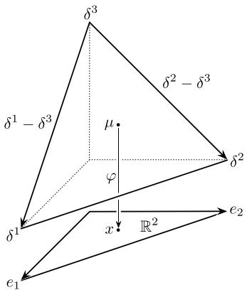  
Fig. 2.1 Illustration of the chart $\varphi$ for $n = 2$ , with the two coordinate vectors $\delta^1 - \delta^3$ and $\delta^2 - \delta^3$

After having specified tangent and cotangent spaces at individual points $\mu$ , we finally list the corresponding tangent and cotangent bundles:

$$
T \mathcal {S} (I) = \mathcal {S} (I) \times \mathcal {S} (I), \quad T ^ {*} \mathcal {S} (I) = \mathcal {S} (I) \times \mathcal {F} (I),
$$

$$
T \mathcal {M} _ {+} (I) = \mathcal {M} _ {+} (I) \times \mathcal {S} (I), \quad T ^ {*} \mathcal {M} _ {+} (I) = \mathcal {M} _ {+} (I) \times \mathcal {F} (I), \tag {2.9}
$$

$$
T \mathcal {P} _ {+} (I) = \mathcal {P} _ {+} (I) \times \mathcal {S} _ {0} (I), \qquad T ^ {*} \mathcal {P} _ {+} (I) = \mathcal {P} _ {+} (I) \times \big (\mathcal {F} (I) / \mathbb {R} \big).
$$

Example 2.1 (Local coordinates) In this example we consider a natural coordinate system of $\mathcal{P}_{+}(I)$ which is quite useful (see Fig. 2.1). We assume $I = [n + 1] = \{1, \dots, n, n + 1\}$ . With the open set

$$
U := \left\{x = (x _ {1}, \dots , x _ {n}) \in \mathbb {R} ^ {n}: x _ {i} > 0 \text {f o r a l l} i, \text {a n d} \sum_ {i = 1} ^ {n} x _ {i} <   1 \right\},
$$

we consider the map

$$
\varphi : \mathcal {P} _ {+} (I) \to U, \quad \mu = \sum_ {i = 1} ^ {n + 1} \mu_ {i} \delta^ {i} \mapsto \varphi (\mu) := (\mu_ {1}, \dots , \mu_ {n})
$$

and its inverse

$$
\varphi^ {- 1}: U \to \mathcal {P} _ {+} (I), \qquad (x _ {1}, \ldots , x _ {n}) \mapsto \sum_ {i = 1} ^ {n} x _ {i} \delta^ {i} + \left(1 - \sum_ {i = 1} ^ {n} x _ {i}\right) \delta^ {n + 1}.
$$

We have the coordinate vectors

$$
\left. \frac {\partial}{\partial x _ {i}} \right| _ {\mu} = \left. \frac {\partial \varphi^ {- 1}}{\partial x _ {i}} \right| _ {\varphi (\mu)} = \delta^ {i} - \delta^ {n + 1}, \quad i = 1, \ldots , n,
$$

# 2.2 The Fisher Metric

which form a basis of $S_0(I)$ . Formula (2.7) allows us to identify its dual basis with the following basis of $\mathcal{F}(I) / \mathbb{R}$ :

$$
d x _ {i} := e _ {i} + \mathbb {R}, \quad i = 1, \dots , n.
$$

Each vector $f + \mathbb{R}$ in $\mathcal{F}(I) / \mathbb{R}$ can be expressed with respect to $dx_{i}$ , $i = 1, \dots, n$ :

$$
\begin{array}{l} f + \mathbb {R} = \left(\sum_ {i = 1} ^ {n + 1} f ^ {i} e _ {i}\right) + \mathbb {R} \\ = \sum_ {i = 1} ^ {n + 1} f ^ {i} \left(e _ {i} + \mathbb {R}\right) \\ = \sum_ {i = 1} ^ {n} f ^ {i} (e _ {i} + \mathbb {R}) + f ^ {n + 1} (e _ {n + 1} + \mathbb {R}) \\ = \sum_ {i = 1} ^ {n} f ^ {i} \left(e _ {i} + \mathbb {R}\right) + f ^ {n + 1} \left(\left(\mathbb {1} - \sum_ {i = 1} ^ {n} e _ {i}\right) + \mathbb {R}\right) \\ = \sum_ {i = 1} ^ {n} f ^ {i} \left(e _ {i} + \mathbb {R}\right) - \sum_ {i = 1} ^ {n} f ^ {n + 1} \left(e _ {i} + \mathbb {R}\right) \\ = \sum_ {i = 1} ^ {n} \left(f ^ {i} - f ^ {n + 1}\right) \left(e _ {i} + \mathbb {R}\right). \\ \end{array}
$$

The coordinate system of this example will be useful for explicit calculations later on.

# 2.2 The Fisher Metric

The Definition Given a measure $\mu \in \mathcal{M}_{+}(I)$ , we have the following natural $L^2$ -product on $\mathcal{F}(I)$ :

$$
\langle f, g \rangle_ {\mu} = \mu (f \cdot g), \quad f, g \in \mathcal {F} (I). \tag {2.10}
$$

This product allows us to consider the vector space isomorphism

$$
\mathcal {F} (I) \longrightarrow \mathcal {S} (I), \quad f \longmapsto f \mu := \langle f, \cdot \rangle_ {\mu}. \tag {2.11}
$$

The notation $f\mu$ emphasizes that, via this isomorphism, functions define linear forms on $\mathcal{F}(I)$ in terms of densities with respect to $\mu$ . The inverse, which we denote by $\widetilde{\phi}_{\mu}$ , maps linear forms to functions and represents a simple version of the

Radon-Nikodym derivative with respect to $\mu$ :

$$
\widetilde {\phi} _ {\mu}: \mathcal {S} (I) \longrightarrow \mathcal {F} (I) = \mathcal {S} (I) ^ {*}, \qquad a = \sum_ {i} a _ {i} \delta^ {i} \longmapsto \frac {d a}{d \mu} := \sum_ {i} \frac {a _ {i}}{\mu_ {i}} e _ {i}. \tag {2.12}
$$

This gives rise to the formulation of (2.10) on the dual space of $\mathcal{F}(I)$ :

$$
\langle a, b \rangle_ {\mu} = \mu \left(\frac {d a}{d \mu} \cdot \frac {d b}{d \mu}\right) = \sum_ {i} \frac {1}{\mu_ {i}} a _ {i} b _ {i}, \quad a, b \in \mathcal {S} (I). \tag {2.13}
$$

With this metric, the orthogonal complement of $S_0(I)$ in $S(I)$ is given by $\mathbb{R} \cdot \mu = \{\lambda \cdot \mu : \lambda \in \mathbb{R}\}$ , and we have the orthogonal decomposition $a = \Pi_{\mu}^{\top}a + \Pi_{\mu}^{\perp}a$ of vectors $a \in S(I)$ , where

$$
\Pi_ {\mu} ^ {\top} (a) = \sum_ {i \in I} \left(a _ {i} - \mu_ {i} \sum_ {j \in I} a _ {j}\right) \delta^ {i}, \quad \Pi_ {\mu} ^ {\perp} (a) = \sum_ {i \in I} \left(\mu_ {i} \sum_ {j \in I} a _ {j}\right) \delta^ {i}. \tag {2.14}
$$

If we restrict this metric to $S_0(I) \subseteq S(I)$ , then we obtain the following identification of $S_0(I)$ with the dual space:

$$
\phi_ {\mu}: \mathcal {S} _ {0} (I) \longrightarrow \mathcal {F} (I) / \mathbb {R} = \mathcal {S} _ {0} (I) ^ {*}, \quad a \longmapsto \frac {d a}{d \mu} + \mathbb {R}. \tag {2.15}
$$

With the natural inclusion map $\iota : S_0(I) \to S(I)$ , and $\iota_\mu \coloneqq \widetilde{\phi}_\mu \circ \iota \circ \phi_\mu^{-1}$ , the following diagram commutes:

$$
\mathcal {S} (I) \xrightarrow {\widetilde {\phi} _ {\mu}} \mathcal {S} (I) ^ {*} \tag {2.16}
$$

$$
\begin{array}{c c c} \uparrow & \uparrow & \uparrow \\ \iota & \iota_ {\mu} \\ \mathcal {S} _ {0} (I) & \longrightarrow & \mathcal {S} _ {0} (I) ^ {*} \\ & \phi_ {\mu} \end{array}
$$

This diagram defines linear maps between tangent and cotangent spaces in the individual points of $\mathcal{M}_{+}(I)$ and $\mathcal{P}_{+}(I)$ . Collecting all these maps to corresponding bundle maps, we obtain a commutative diagram between the tangent and cotangent bundles:

$$
T \mathcal {M} _ {+} (I) \xrightarrow {\tilde {\phi}} T ^ {*} \mathcal {M} _ {+} (I) \tag {2.17}
$$

$$
\begin{array}{c c} \uparrow & \uparrow \\ T \mathcal {P} _ {+} (I) \xrightarrow {\phi} T ^ {*} \mathcal {P} _ {+} (I) \end{array}
$$

# 2.2 The Fisher Metric

The inner product (2.13) defines a Riemannian metric on $\mathcal{M}_{+}(I)$ , on which the maps $\widetilde{\phi}$ and $\phi$ are based.

Definition 2.1 (Fisher metric) Given two vectors $A = (\mu, a)$ and $B = (\mu, b)$ of the tangent space $T_{\mu} \mathcal{M}_{+}(I)$ , we consider

$$
\mathfrak {g} _ {\mu} (A, B) := \langle a, b \rangle_ {\mu}. \tag {2.18}
$$

This Riemannian metric $\mathfrak{g}$ on $\mathcal{M}_{+}(I)$ is called the Fisher metric.

The Fisher metric was introduced as a Riemannian metric by Rao [219]. It is relevant for estimation theory within statistics and also appears in mathematical population genetics where it is known as the Shahshahani metric [123, 124]. We shall outline the biological perspective of this metric in Sect. 6.2.

We now express the Fisher metric with respect to the coordinates of Example 2.1, where we concentrate on the restriction of the Fisher metric to $\mathcal{P}_{+}(I)$ . With respect to the chart $\varphi$ of Example 2.1, the first fundamental form of the Fisher metric is given as

$$
g _ {i j} (\mu) = \sum_ {k = 1} ^ {n} \frac {1}{\mu_ {k}} \delta_ {k i} \delta_ {k j} + \frac {1}{\mu_ {n + 1}} = \left\{ \begin{array}{l l} \frac {1}{\mu_ {i}} + \frac {1}{\mu_ {n + 1}}, & \text {i f} i = j, \\ \frac {1}{\mu_ {n + 1}}, & \text {o t h e r w i s e .} \end{array} \right. \tag {2.19}
$$

The inverse of this matrix is given as

$$
g ^ {i j} (\mu) = \left\{ \begin{array}{l l} \mu_ {i} (1 - \mu_ {i}), & \text {i f} i = j, \\ - \mu_ {i} \mu_ {j}, & \text {o t h e r w i s e .} \end{array} \right. \tag {2.20}
$$

Written as matrices, we have

$$
G (\mu) := (g _ {i j}) (\mu) = \frac {1}{\mu_ {n + 1}} \left( \begin{array}{c c c c} \frac {\mu_ {n + 1}}{\mu_ {1}} + 1 & 1 & \dots & 1 \\ 1 & \frac {\mu_ {n + 1}}{\mu_ {2}} + 1 & \dots & 1 \\ \vdots & \vdots & \ddots & \vdots \\ 1 & 1 & \dots & \frac {\mu_ {n + 1}}{\mu_ {n}} + 1 \end{array} \right), \tag {2.21}
$$

$$
G ^ {- 1} (\mu) = \left(g ^ {i j}\right) (\mu) = \left( \begin{array}{c c c c} \mu_ {1} (1 - \mu_ {1}) & - \mu_ {1} \mu_ {2} & \dots & - \mu_ {1} \mu_ {n} \\ - \mu_ {2} \mu_ {1} & \mu_ {2} (1 - \mu_ {2}) & \dots & - \mu_ {2} \mu_ {n} \\ \vdots & \vdots & \ddots & \vdots \\ - \mu_ {n} \mu_ {1} & - \mu_ {n} \mu_ {2} & \dots & \mu_ {n} (1 - \mu_ {n}) \end{array} \right). \tag {2.22}
$$

This is nothing but the covariance matrix of the probability distribution $\mu$ , in the following sense. We draw the element $i \in \{1, \dots, n\}$ with probability $\mu_i$ , and we put $X_i = 1$ and $X_j = 0$ for $j \neq i$ when $i$ happens to be drawn. We then have the expectation values

$$
\mu_ {i} = \mathbb {E} \left(X _ {i}\right) = \mathbb {E} \left(X _ {i} ^ {2}\right), \tag {2.23}
$$

and hence, the variances and covariances are

$$
\operatorname {V a r} \left(X _ {i}\right) = \mu_ {i} \left(1 - \mu_ {i}\right), \quad \operatorname {C o v} \left(X _ {i} X _ {j}\right) = - \mu_ {i} \mu_ {j} \quad \text {f o r} j \neq i, \tag {2.24}
$$

that is, (2.22). In fact, this is the statistical origin of the Fisher metric as a covariance matrix [219].

The Fisher metric is an example of a covariant 2-tensor on $M$ , in the sense of the following definition (see also (B.16) and (B.17) in Appendix B).

Definition 2.2 A covariant $n$ -tensor $\Theta$ on a manifold $M$ is a collection of $n$ -multilinear maps

$$
\Theta_ {\xi}: \stackrel {n} {\times} T _ {\xi} M \longrightarrow \mathbb {R}, \qquad (V _ {1}, \dots , V _ {n}) \longmapsto \Theta_ {\xi} (V _ {1}, \dots , V _ {n})
$$

which is continuous in the sense that for continuous vector fields $V_{i}$ the function $\xi \mapsto \Theta_{\xi}(V_1,\ldots ,V_n)$ is continuous.

If $f: M_1 \to M_2$ is a differentiable map between the manifolds $M_1$ and $M_2$ , then it can be used to pull back covariant $n$ -tensors. That is, if $\Theta$ is a covariant $n$ -tensor on $M_2$ , then its pullback to $M_1$ by $f$ is defined to be the tensor $f^*(\Theta)$ on $M_1$ given as

$$
f ^ {*} (\Theta) _ {\xi} (V _ {1}, \dots , V _ {n}) := \Theta_ {f (\xi)} \left(\frac {\partial f}{\partial V _ {1}}, \dots , \frac {\partial f}{\partial V _ {n}}\right). \tag {2.25}
$$

Information geometry deals with statistical models, that is, submanifolds of $\mathcal{P}_{+}(I)$ . Instead of considering submanifolds directly, we take a slightly different perspective here. We consider statistical models as a manifold together with an embedding into $\mathcal{P}_{+}(I)$ , or more generally, into $\mathcal{M}_{+}(I)$ . To be more precise, let be $M$ an $n$ -dimensional (differentiable) manifold and $M \hookrightarrow \mathcal{M}_{+}(I)$ , $\xi \mapsto p(\xi) = \sum_{i \in I} p_i(\xi) \delta^i$ , an embedding. The pullback (2.25) of the Fisher metric $\mathfrak{g}$ defines a metric on $M$ . More precisely, for $A, B \in T_{\xi}M$ we set

$$
\begin{array}{l} g _ {\xi} (A, B) := p ^ {*} (\mathfrak {g}) _ {\xi} (A, B) \\ \stackrel {(2. 2 5)} {=} \mathfrak {g} _ {p (\xi)} \left(\frac {\partial p}{\partial A}, \frac {\partial p}{\partial B}\right) \\ = \sum_ {i} \frac {1}{p _ {i} (\xi)} \frac {\partial p _ {i}}{\partial A} (\xi) \frac {\partial p _ {i}}{\partial B} (\xi) \\ = \sum_ {i} p _ {i} (\xi) \frac {\partial \log p _ {i}}{\partial A} (\xi) \frac {\partial \log p _ {i}}{\partial B} (\xi). \tag {2.26} \\ \end{array}
$$

This representation of the Fisher metric is more familiar within the standard information-geometric treatment.

# 2.2 The Fisher Metric

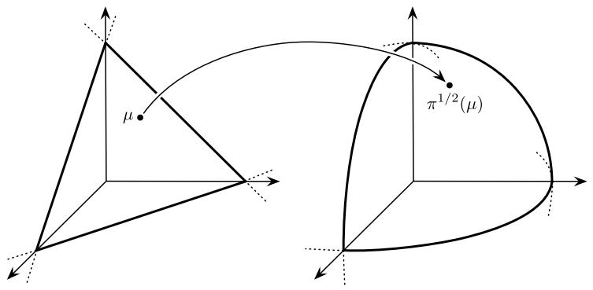  
Fig. 2.2 Mapping from simplex to sphere

Extending the Fisher Metric to the Boundary As is obvious from (2.13) and also from the first fundamental form (2.19), the Fisher metric is not defined at the boundary of the simplex. It is, however, possible to extend the Fisher metric to the boundary by identifying the simplex with a sector of a sphere in $\mathbb{R}^I = \mathcal{F}(I)$ . In order to be more precise, we consider the following sector of the sphere with radius 2 (or, equivalently (up to the factor 2, of course), the positive part of the projective space, according to the interpretation of the set of probability measures as a projective version of the space of positive measures alluded to above and taken up in Sect. 3.1):

$$
S _ {2, +} (I) := \left\{f \in \mathcal {F} (I): f (i) > 0 \text {f o r a l l} i \in I, \text {a n d} \sum_ {i} f ^ {2} (i) = 4 \right\}.
$$

As a submanifold of $\mathcal{F}(I)$ it carries the induced standard metric $\langle \cdot, \cdot \rangle$ of $\mathcal{F}(I)$ . We consider the following diffeomorphism (see Fig. 2.2):

$$
\pi^ {1 / 2}: \mathcal {P} _ {+} (I) \to S _ {2, +} (I), \qquad \mu = \sum_ {i} \mu_ {i} \delta^ {i} \mapsto 2 \sum_ {i} \sqrt {\mu_ {i}} e _ {i}.
$$

Note that $\| \pi^{1 / 2}(\mu)\| = \sqrt{\sum_i(2\sqrt{\mu_i})^2} = 2\sqrt{\sum_i\mu_i} = 2$

Proposition 2.1 The map $\pi^{1/2}$ is an isometry between $\mathcal{P}_{+}(I)$ with the Fisher metric $\mathfrak{g}$ and $S_{2, + }(I)$ with the induced canonical scalar product of $\mathcal{F}(I)$ :

$$
\left\langle \frac {\partial \pi^ {1 / 2}}{\partial A} (\mu), \frac {\partial \pi^ {1 / 2}}{\partial B} (\mu) \right\rangle = \mathfrak {g} _ {\mu} (A, B), \quad A, B \in T _ {\mu} \mathcal {P} _ {+} (I).
$$

That is, the Fisher metric coincides with the pullback of the standard metric on $\mathcal{F}(I)$ by the map $\pi^{1/2}$ . In particular, the extension of the standard metric on $S_{2,+}(I)$ to the boundary can be considered as an extension of the Fisher metric.

Proof With $a, b \in S_0(I)$ such that $A = (\mu, a)$ and $B = (\mu, b)$ , we have

$$
\begin{array}{l} \left\langle \frac {\partial \pi^ {1 / 2}}{\partial A} (\mu), \frac {\partial \pi^ {1 / 2}}{\partial B} (\mu) \right\rangle = \left\langle \frac {d}{d t} \pi^ {1 / 2} (\mu + t a) \Bigg | _ {t = 0}, \frac {d}{d t} \pi^ {1 / 2} (\mu + t b) \Bigg | _ {t = 0} \right\rangle \\ = \sum_ {i} \frac {1}{\sqrt {\mu_ {i}}} a _ {i} \cdot \frac {1}{\sqrt {\mu_ {i}}} b _ {i} \\ = \mathfrak {g} _ {\mu} (A, B). \\ \end{array}
$$

Fisher and Hellinger Distance Proposition 2.1 allows us to give an explicit formula for the Riemannian distance between two points $\mu, \nu \in \mathcal{P}_{+}(I)$ which is defined as

$$
d^{F}(\mu ,\nu):= \inf_{\substack{\gamma :[r,s]\to \mathcal{P}_{+}(I)\\ \gamma (r) = \mu ,  \gamma (s) = \nu}}L(\gamma),
$$

where $L(\gamma)$ denotes the length of a curve $\gamma :[r,s]\to \mathcal{P}_{+}(I)$ given by

$$
L (\gamma) = \int_ {r} ^ {s} \left\| \dot {\gamma} (t) \right\| _ {\gamma (t)} d t = \int_ {r} ^ {s} \sqrt {\mathfrak {g} _ {\gamma (t)} \left(\dot {\gamma} (t) , \dot {\gamma} (t)\right)} d t.
$$

We refer to $d^{F}$ as the Fisher distance. With Proposition 2.1 we directly obtain the following corollary.

Corollary 2.1 Let $d: S_{2, + }(I) \times S_{2, + }(I) \to \mathbb{R}$ denote the metric that is induced from the standard metric on $\mathcal{F}(I)$ . Then

$$
d ^ {F} (\mu , \nu) = d \left(\pi^ {1 / 2} (\mu), \pi^ {1 / 2} (\nu)\right) = 2 \operatorname {a r c c o s} \left(\sum_ {i} \sqrt {\mu_ {i} \nu_ {i}}\right). \tag {2.27}
$$

Proof We have

$$
\cos \alpha = \frac {\langle \pi^ {1 / 2} (\mu) , \pi^ {1 / 2} (v) \rangle}{\| \pi^ {1 / 2} (\mu) \| \cdot \| \pi^ {1 / 2} (v) \|} = \frac {\sum_ {i} (2 \sqrt {\mu_ {i}}) (2 \sqrt {v _ {i}})}{2 \cdot 2} = \sum_ {i} \sqrt {\mu_ {i} v _ {i}}.
$$

This implies

$$
\frac {d ^ {F} (\mu , v)}{2} = \alpha = \operatorname {a r c c o s} \left(\sum_ {i} \sqrt {\mu_ {i} v _ {i}}\right).
$$

A distance measure that is closely related to the Fisher distance is the Hellinger distance. It is not induced from $\mathcal{F}(I)$ onto $S_{2, + }(I)$ but restricted to $S_{2, + }(I)$ :

$$
d ^ {H} (\mu , v) := \sqrt {\sum_ {i} \left(\sqrt {\mu_ {i}} - \sqrt {v _ {i}}\right) ^ {2}}. \tag {2.28}
$$

# 2.2 The Fisher Metric

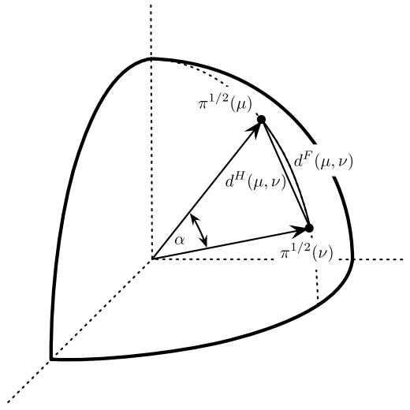  
Fig. 2.3 Illustration of the relation between the Fisher distance $d^{F}(\mu, \nu)$ and the Hellinger distance $d^{H}(\mu, \nu)$ of two probability measures $\mu$ and $\nu$ , see Eq. (2.29)

We have the following relation between $d^{F}$ and $d^{H}$ (see Fig. 2.3):

$$
\begin{array}{l} d ^ {H} (\mu , \nu) = \sqrt {\sum_ {i} (\sqrt {\mu_ {i}} - \sqrt {\nu_ {i}}) ^ {2}} \\ = \sqrt {\sum_ {i} \left(\mu_ {i} - 2 \sqrt {\mu_ {i} v _ {i}} + v _ {i}\right)} \\ = \sqrt {2 \left(1 - \sum_ {i} \sqrt {\mu_ {i} v _ {i}}\right)} \\ = \sqrt {2 \left(1 - \cos \left(\frac {1}{2} d ^ {F} (\mu , v)\right)\right)}. \tag {2.29} \\ \end{array}
$$

Chentsov's Characterization of the Fisher Metric In what follows, we present a classical characterization of the Fisher metric through invariance properties. This is due to Chentsov [64].

Consider two non-empty and finite sets $I$ and $I'$ . A Markov kernel is a map

$$
K: I \rightarrow \mathcal {P} \left(I ^ {\prime}\right), \quad i \mapsto K ^ {i} := \sum_ {i ^ {\prime} \in I ^ {\prime}} K _ {i ^ {\prime}} ^ {i} \delta^ {i ^ {\prime}}. \tag {2.30}
$$

Particular examples of Markov kernels are given in terms of (deterministic) maps $f: I \to I'$ . Given such a map, we simply define $K^f$ by $i \mapsto \delta^{f(i)}$ . Each Markov kernel $K$ induces a corresponding map between probability distributions:

$$
K _ {*} \colon \mathcal {P} (I) \rightarrow \mathcal {P} \left(I ^ {\prime}\right), \quad \mu = \sum_ {i \in I} \mu_ {i} \delta^ {i} \mapsto \sum_ {i \in I} \mu_ {i} K ^ {i}. \tag {2.31}
$$

The map $K_*$ is called the Markov morphism induced by $K$ . Note that $K_*$ may also be regarded as a linear map $K_*: \mathcal{S}(I) \to \mathcal{S}(I')$ . Given a map $f: I \to I'$ , we use $f_* := (K^f)_*$ as short-hand notation.

Now assume that $|I| \leq |I'|$ . We call a Markov kernel $K$ congruent if there is a partition $A_i$ , $i \in I$ , of $I'$ , such that the following condition holds:

$$
K _ {i ^ {\prime}} ^ {i} > 0 \quad \Leftrightarrow \quad i ^ {\prime} \in A _ {i}. \tag {2.32}
$$

If $K$ is congruent and $\mu \in \mathcal{P}_{+}(I)$ then $K_{*}(\mu) \in \mathcal{P}_{+}(I^{\prime})$ . This implies a differentiable map

$$
K _ {*}: \mathcal {P} _ {+} (I) \to \mathcal {P} _ {+} \left(I ^ {\prime}\right),
$$

and the differential in $\mu$ is given by

$$
d _ {\mu} K _ {*}: T _ {\mu} \mathcal {P} _ {+} (I) \rightarrow T _ {K _ {*} (\mu)} \mathcal {P} _ {+} \big (I ^ {\prime} \big), \qquad (\mu , v - \mu) \mapsto \big (K _ {*} (\mu), K _ {*} (v) - K _ {*} (\mu) \big).
$$

The following theorem has been proven by Chentsov.

Theorem 2.1 (Cf. [65, Theorem 11.1]) We assign to each non-empty and finite set $I$ a metric $h^I$ on $\mathcal{P}_{+}(I)$ . If for each congruent Markov kernel $K: I \to \mathcal{P}(I')$ we have invariance in the sense

$$
h _ {p} ^ {I} (A, B) = h _ {K _ {*} (p)} ^ {I ^ {\prime}} \left(d _ {p} K _ {*} (A), d _ {p} K _ {*} (B)\right),
$$

or for short $(K_{*})^{*}(h^{I^{\prime}}) = h^{I}$ in the notation of (2.25), then there is a constant $\alpha >0$ such that $h^I = \alpha \mathfrak{g}^I$ for all $I$ , where the latter is the Fisher metric on $\mathcal{P}_{+}(I)$ .

Proof Step 1: First we consider permutations $\pi : I \to I$ . The center $c_{I} \coloneqq \frac{1}{|I|} \sum_{i \in I} \delta^{i}$ is left-invariant, that is, $\pi_{*}(c_{I}) = c_{I}$ . With $E_{i} \coloneqq (c_{I}, \delta^{i} - c_{I}) \in T_{c_{I}}\mathcal{P}_{+}(I)$ , we also have

$$
d _ {c _ {I}} \pi_ {*} (E _ {i}) = E _ {\pi (i)}, \quad i \in I.
$$

For each $i, j \in I$ , $i \neq j$ , choose a transposition $\pi$ of $i$ and $j$ , that is, $\pi(i) = j$ , $\pi(j) = i$ , and $\pi(k) = k$ if $k \notin \{i, j\}$ . This implies

$$
\begin{array}{l} h _ {i i} ^ {I} \left(c _ {I}\right) = h _ {c _ {I}} ^ {I} \left(E _ {i}, E _ {i}\right) = h _ {\pi_ {*} \left(c _ {J}\right)} ^ {I} \left(d _ {c _ {I}} \pi_ {*} \left(E _ {i}\right), d _ {c _ {I}} \pi_ {*} \left(E _ {i}\right)\right) = h _ {c _ {I}} ^ {I} \left(E _ {\pi (i)}, E _ {\pi (i)}\right) \\ = h _ {c _ {I}} ^ {I} \left(E _ {j}, E _ {j}\right) = h _ {j j} ^ {I} \left(c _ {I}\right) =: f _ {1} (n), \\ \end{array}
$$

where we set $n \coloneqq |I|$ . In a similar way, we obtain that all $h_{ij}^{I}(c_{I})$ with $i \neq j$ coincide. We denote them by $f_{2}(n)$ . The functions $f_{1}(n)$ and $f_{2}(n)$ have to satisfy the following:

$$
\begin{array}{l} f _ {1} (n) + (n - 1) f _ {2} (n) = \sum_ {j \in I} h _ {i j} ^ {I} \left(c _ {I}\right) = \sum_ {j \in I} h _ {c _ {I}} ^ {I} \left(E _ {i}, E _ {j}\right) \\ = h _ {c _ {I}} ^ {I} \left(E _ {i}, \sum_ {j \in I} E _ {j}\right) = h _ {c _ {I}} ^ {I} (E _ {i}, 0) = 0. \\ \end{array}
$$

# 2.2 The Fisher Metric

Consider two vectors

$$
a = \sum_ {i \in I} a _ {i} \delta^ {i}, \qquad b = \sum_ {i \in I} b _ {i} \delta^ {i}.
$$

Assuming $a, b \in S_0(I)$ , we have $\sum_{i \in I} a_i = 0$ and $\sum_{i \in I} b_i = 0$ and therefore

$$
a = \sum_ {i \in I} a _ {i} (\delta^ {i} - c _ {I}), \qquad b = \sum_ {i \in I} b _ {i} (\delta^ {i} - c _ {I}).
$$

This implies for $A = (c_{I},a)$ and $B = (c_{I},b)$

$$
\begin{array}{l} h^{I}_{c_{I}}(A,B) = \sum_{i,j\in I}a_{i}  b_{j}  h^{I}_{ij}(c_{I}) = \sum_{i\in I}a_{i}  b_{i}  h^{I}_{ii}(c_{I}) + \sum_{\substack{i,j\in I\\ i\neq j}}a_{i}  b_{j}  h^{I}_{ij}(c_{I}) \\ = f_{1}(n)\sum_{i\in I}a_{i}  b_{i} + f_{2}(n)\sum_{\substack{i,j\in I\\ i\neq j}}a_{i}  b_{j} \\ = -(n - 1)f_{2}(n)\sum_{i\in I}a_{i}  b_{i} + f_{2}(n)\sum_{\substack{i,j\in I\\ i\neq j}}a_{i}  b_{j} \\ = f _ {2} (n) \left\{- n \sum_ {i \in I} a _ {i} b _ {i} + \sum_ {i, j \in I} a _ {i} b _ {j} \right\} \\ = - f _ {2} (n) \sum_ {i \in I} \frac {1}{\frac {1}{n}} a _ {i} b _ {i} \\ = - f _ {2} (n) \mathfrak {g} _ {c _ {I}} ^ {I} (A, B). \\ \end{array}
$$

Step 2: In this step, we show that the function $f(n)$ is actually independent of $n$ and therefore a constant. In order to do so, we divide each element $i \in I$ into $k$ elements. More precisely, we set $I' := I \times \{1, \ldots, k\}$ . With the partition $A_i := \{(i,j) : 1 \leq j \leq k\}$ , $i \in I$ , we define the Markov kernel $K$ by

$$
i \mapsto K ^ {i} = \frac {1}{k} \sum_ {j = 1} ^ {k} \delta^ {(i, j)}.
$$

This kernel satisfies $K_{*}(c_{I}) = c_{I^{\prime}}$ , and we have

$$
\begin{array}{l} d _ {c _ {I}} K _ {*} (E _ {i}) = d _ {c _ {I}} K _ {*} \left(c _ {I}, \delta^ {i} - c _ {I}\right) \\ = \left(c _ {I ^ {\prime}}, \frac {1}{k} \sum_ {j = 1} ^ {k} \left(\delta^ {(i, j)} - \frac {1}{n} \sum_ {i ^ {\prime} \in I} \delta^ {(i ^ {\prime}, j)}\right)\right) \\ \end{array}
$$

$$
\begin{array}{l} = \left(c _ {I ^ {\prime}}, \frac {1}{k} \sum_ {j = 1} ^ {k} \left(\delta^ {(i, j)} - \frac {1}{n k} \sum_ {i ^ {\prime} \in I} \sum_ {j ^ {\prime} = 1} ^ {k} \delta^ {(i ^ {\prime}, j ^ {\prime})}\right)\right) \\ = \frac {1}{k} \sum_ {j = 1} ^ {k} E _ {(i, j)} ^ {\prime}. \\ \end{array}
$$

With $r,s\in I,r\neq s$ , this implies

$$
\begin{array}{l} f _ {2} (n) = h _ {c _ {I}} ^ {I} \left(E _ {r}, E _ {s}\right) = h _ {c _ {I ^ {\prime}}} ^ {I ^ {\prime}} \left(\frac {1}{k} \sum_ {j = 1} ^ {k} E _ {r, j} ^ {\prime}, \frac {1}{k} \sum_ {j = 1} ^ {k} E _ {s, j} ^ {\prime}\right) \\ = \frac {1}{k ^ {2}} \sum_ {j _ {1}, j _ {2} = 1} ^ {k} h _ {c _ {l ^ {\prime}}} ^ {I ^ {\prime}} \left(E _ {r, j _ {1}} ^ {\prime}, E _ {s, j _ {2}} ^ {\prime}\right) \\ = \frac {1}{k ^ {2}} k ^ {2} f _ {2} (n \cdot k) = f _ {2} (n \cdot k). \\ \end{array}
$$

Exchanging the role of $n$ and $k$ , we obtain $f_{2}(k) = f_{2}(k\cdot n) = f_{2}(n)$ and therefore $-f_{2}(n)$ is a positive constant in $n$ , which we denote by $\alpha$ . In the center $c_{I}$ , we have shown that

$$
h _ {c _ {I}} ^ {I} (A, B) = \alpha \mathfrak {g} _ {c _ {I}} ^ {I} (A, B) = 0, \quad A, B \in T _ {c _ {I}} \mathcal {P} _ {+} (I).
$$

It remains to show that this equality also holds for all other points. This is our next step.

Step 3: First consider a point $\mu \in \mathcal{P}_{+}(I)$ that has rational coordinates, that is,

$$
\mu = \sum_ {i \in I} \frac {k _ {i}}{n} \delta^ {i},
$$

with $\sum_{i}k_{i} = n$ . We now define a set $I^{\prime}$ and a congruent Markov kernel $K:I\to$ $\mathcal{P}(I^{\prime})$ so that $K_{*}(\mu) = c_{I^{\prime}}$ . With

$$
I ^ {\prime} := \biguplus_ {i \in I} \left(\{i \} \times \{1, \dots , k _ {i} \}\right),
$$

$(\uplus)$ denotes the disjoint union) we consider the Markov kernel

$$
K: i \mapsto \frac {1}{k _ {i}} \sum_ {j = 1} ^ {k _ {i}} \delta^ {(i, j)}.
$$

Obviously, we have

$$
d _ {\mu} K _ {*} \colon A = \left(\mu , \sum_ {i \in I} a _ {i} \delta^ {i}\right) \mapsto d _ {\mu} K _ {*} (A) = \left(c _ {I ^ {\prime}}, \sum_ {i \in I} \sum_ {j = 1} ^ {k _ {i}} \frac {a _ {i}}{k _ {i}} \delta^ {(i, j)}\right).
$$

This implies

$$
\begin{array}{l} h _ {\mu} ^ {I} (A, B) = h _ {K _ {*} (\mu)} ^ {I ^ {\prime}} \left(d _ {\mu} K _ {*} (A), d _ {\mu} K _ {*} (B)\right) = \alpha g _ {c _ {I ^ {\prime}}} ^ {I ^ {\prime}} \left(d _ {\mu} K _ {*} (A), d _ {\mu} K _ {*} (B)\right) \\ = \alpha \sum_ {i \in I} \sum_ {j = 1} ^ {k _ {i}} \frac {1}{\frac {1}{n}} \frac {a _ {i}}{k _ {i}} \frac {b _ {i}}{k _ {i}} = \alpha \sum_ {i \in I} k _ {i} \frac {1}{\frac {1}{n}} \frac {a _ {i}}{k _ {i}} \frac {b _ {i}}{k _ {i}} = \alpha \sum_ {i \in I} \frac {1}{\mu_ {i}} a _ {i} b _ {i} \\ = \alpha \mathfrak {g} _ {\mu} ^ {I} (A, B). \\ \end{array}
$$

We have this equality for all probability vectors $\mu$ with rational coordinates. As we assume continuity with respect to the base point $\mu$ , the equality of $h_{\mu}^{I}(A,B) = \alpha \mathfrak{g}_{\mu}^{I^{\prime}}(A,B)$ holds for all $\mu \in \mathcal{P}_{+}(I)$ .

# 2.3 Gradient Fields

In this section, we are going to study vector and covector fields on $\mathcal{M}_{+}(I)$ and $\mathcal{P}_{+}(I)$ . We begin with the first case, which is the simpler one, and consider covector fields given by a differentiable function $V:\mathcal{M}_{+}(I)\to \mathbb{R}$ . The differential in $\mu$ is defined as the linear form

$$
d _ {\mu} V: \mathcal {S} (I) \to \mathbb {R}, \qquad a \mapsto d _ {\mu} V (a) = \frac {\partial V}{\partial a} (\mu).
$$

In terms of the canonical basis, we have

$$
d _ {\mu} V = \sum_ {i} \partial_ {i} V (\mu) e _ {i} \in \mathcal {F} (I), \tag {2.33}
$$

where $\partial_i V(\mu) \coloneqq \frac{\partial V}{\partial \mu_i}(\mu) \coloneqq \frac{\partial V}{\partial \delta^i}(\mu)$ . This defines the covector field

$$
d V: \mathcal {M} _ {+} (I) \to \mathcal {F} (I), \quad \mu \mapsto d _ {\mu} V.
$$

The Fisher metric $\mathfrak{g}$ allows us to identify $d_{\mu}V$ with an element of $T_{\mu}\mathcal{M}_{+}(I)$ in terms of the map $\widetilde{\phi}_{\mu}$ , the gradient of $V$ in $\mu$ :

$$
\operatorname {g r a d} _ {\mu} V := \widetilde {\phi} _ {\mu} ^ {- 1} \left(d _ {\mu} V\right) = \sum_ {i} \mu_ {i} \partial_ {i} V (\mu) \delta^ {i}. \tag {2.34}
$$

Given a function $f: \mathcal{M}_{+}(I) \to \mathcal{F}(I)$ , $\mu \mapsto f(\mu) = \sum_{i \in I} f^{i}(\mu) e_{i}$ , we can ask whether there exists a differentiable function $V$ such that $f(\mu) = d_{\mu} V$ . In this case, $f$ is called exact. It is easy to see that $f$ is exact if and only if the condition

$$
\frac {\partial f ^ {i}}{\partial \mu_ {j}} = \frac {\partial f ^ {j}}{\partial \mu_ {i}} \tag {2.35}
$$

holds on $\mathcal{M}_{+}(I)$ for all $i, j \in I$ .

Now we come to vector and covector fields on $\mathcal{P}_{+}(I)$ . The commutative diagram (2.17) allows us to relate sections to each other. Of particular interest are sections in $T^{*}\mathcal{P}_{+}(I) = \mathcal{P}_{+}(I)\times (\mathcal{F}(I) / \mathbb{R})$ (covector fields) as well as sections in $T\mathcal{P}_{+}(I)$ (vector fields). As all bundles are of product form $\mathcal{P}_{+}(I)\times \mathcal{V}$ , sections are given by functions $f:\mathcal{P}_{+}(I)\to \mathcal{V}$ . We assume that $f$ is a $C^\infty$ function. We will also use $C^\infty$ extensions $\widetilde{f}:\mathcal{U}\rightarrow \mathcal{V}$ , where $\mathcal{U}$ is an open subset of $S(I)$ containing $\mathcal{P}_{+}(I)$ , and $\widetilde{f}|_{\mathcal{U}} = f$ . To simplify the notation, we will also use the same symbol $f$ for the extension $\widetilde{f}$ . Given a section $f:\mathcal{P}_{+}(I)\to \mathcal{F}(I)$ , we assign various other sections to it:

$$
\overline {{f}}: \mathcal {P} _ {+} (I) \to \mathbb {R}, \quad \mu \mapsto \overline {{f}} (\mu) := \mu (f (\mu)) = \sum_ {i} \mu_ {i} f ^ {i} (\mu),
$$

$$
[ f ]: \mathcal {P} _ {+} (I) \to (\mathcal {F} (I) / \mathbb {R}), \quad \mu \mapsto f (\mu) + \mathbb {R},
$$

$$
\widetilde {\phi} (f): \mathcal {P} _ {+} (I) \to \mathcal {S} (I), \quad \mu \mapsto f (\mu) \mu = \sum_ {i} \mu_ {i} f ^ {i} (\mu) \delta^ {i},
$$

$$
\widehat {f} \colon \mathcal {P} _ {+} (I) \rightarrow \mathcal {S} _ {0} (I), \quad \mu \mapsto (f (\mu) - \overline {{f}} (\mu)) \mu = \sum_ {i} \mu_ {i} (f ^ {i} (\mu) - \overline {{f}} (\mu)) \delta^ {i}.
$$

In what follows, we consider covector fields given by a differentiable function $V: \mathcal{P}_{+}(I) \to \mathbb{R}$ . The differential in $\mu$ is defined as the linear form

$$
d _ {\mu} V: T _ {\mu} \mathcal {P} _ {+} (I) \to \mathbb {R}, \qquad a \mapsto d _ {\mu} V (a) = \frac {\partial V}{\partial a} (\mu),
$$

which defines a covector field $dV:\mu \mapsto d_{\mu}V\in T_{\mu}^{*}\mathcal{P}_{+}(I)$ . In order to interpret it as a vector in $\mathcal{F}(I) / \mathbb{R}$ , consider an extension $\widetilde{V}:\mathcal{U}\to \mathbb{R}$ of $V$ to an open neighborhood of $\mathcal{P}_+(I)$ . This yields a corresponding extension $d_{\mu}\widetilde{V}:\mathcal{S}(I)\to \mathbb{R}$ , and according to (2.7) we have

$$
d _ {\mu} V = \sum_ {i} \partial_ {i} \widetilde {V} (\mu) e _ {i} + \mathbb {R}, \tag {2.36}
$$

where $\partial_i\widetilde{V} (\mu) = \frac{\partial\widetilde{V}}{\partial\delta^i} (\mu)$ . The Fisher metric $\mathfrak{g}$ allows us to identify $d_{\mu}V$ with an element of $T_{\mu}\mathcal{P}_{+}(I)$ via the map $\phi_{\mu}$ , the gradient of $V$ in $\mu$ :

$$
\operatorname {g r a d} _ {\mu} V := \phi_ {\mu} ^ {- 1} \left(d _ {\mu} V\right). \tag {2.37}
$$

(See (B.22) in Appendix B for the general construction.)

Proposition 2.2 Let $V: \mathcal{P}_{+}(I) \to \mathbb{R}$ be a differentiable function, $\mathcal{U}$ an open subset of $S(I)$ that contains $\mathcal{P}_{+}(I)$ , and $\widetilde{V}: \mathcal{U} \to \mathbb{R}$ a differentiable continuation of $V$ , that is, $\widetilde{V}|_{\mathcal{P}_{+}(I)} = V$ . Then the coordinates of $\mathrm{grad}_{\mu} V$ with respect to $\delta^i$ are given as

$$
(\operatorname {g r a d} _ {\mu} V) _ {i} = \mu_ {i} \left(\partial_ {i} \widetilde {V} (\mu) - \sum_ {j} \mu_ {j} \partial_ {j} \widetilde {V} (\mu)\right), \quad i \in I.
$$

Proof This follows from (2.36), (2.37), and the definition of $\phi_{\mu}$ . Alternatively, one can show this directly: We have to verify

$$
\begin{array}{l} \mathfrak {g} _ {\mu} (\operatorname {g r a d} _ {\mu} V, a) = d _ {\mu} V (a), \quad a \in T _ {\mu} \mathcal {P} _ {+} (I). \\ \mathfrak {g} _ {\mu} \left(\operatorname {g r a d} _ {\mu} V, a\right) = \sum_ {i} \frac {1}{\mu_ {i}} \left(\mu_ {i} \left(\partial_ {i} \widetilde {V} (\mu) - \sum_ {j} \mu_ {j} \partial_ {j} \widetilde {V} (\mu)\right)\right) a _ {i} \\ = \sum_ {i} a _ {i} \partial_ {i} \widetilde {V} (\mu) - \underbrace {\sum_ {i} a _ {i} \sum_ {j} \mu_ {j} \partial_ {j} \widetilde {V} (\mu)} _ {= 0} \\ = \frac {\partial \widetilde {V}}{\partial a} (\mu) \\ = \lim  _ {t \rightarrow 0} \frac {\widetilde {V} (\mu + t a) - \widetilde {V} (\mu)}{t} \\ = \lim  _ {t \rightarrow 0} \frac {V (\mu + t a) - V (\mu)}{t} \\ = \frac {\partial V}{\partial a} (\mu) \\ = d _ {\mu} V (a). \\ \end{array}
$$

Proposition 2.3 Consider a map $f: \mathcal{U} \to \mathcal{F}(I)$ , $\mu \mapsto f(\mu) = \sum_{i \in I} f^i(\mu) e_i$ , defined on a neighborhood of $\mathcal{P}_+(I)$ . Then the following statements are equivalent:

(1) The vector field $\widehat{f}$ is a Fisher gradient field on $\mathcal{P}_{+}(I)$ .   
(2) The covector field $[f]:\mathcal{P}_{+}(I)\to \mathcal{F}(I) / \mathbb{R}$ , $\mu \mapsto [f](\mu)\coloneqq f(\mu) + \mathbb{R}$ , is exact, that is, there exists a function $V:\mathcal{P}_{+}(I)\to \mathbb{R}$ satisfying $d_{\mu}V = [f](\mu)$ .

(3) The relation

$$
\frac {\partial f ^ {i}}{\partial \mu_ {j}} + \frac {\partial f ^ {j}}{\partial \mu_ {k}} + \frac {\partial f ^ {k}}{\partial \mu_ {i}} = \frac {\partial f ^ {i}}{\partial \mu_ {k}} + \frac {\partial f ^ {k}}{\partial \mu_ {j}} + \frac {\partial f ^ {j}}{\partial \mu_ {i}} \tag {2.38}
$$

holds on $\mathcal{P}_{+}(I)$ for all $i,j,k\in I$

Proof (1) $\Leftrightarrow$ (2) This is clear.

(2) $\Leftrightarrow$ (3) The covector field $f + \mathbb{R}$ is exact if and only if it is closed. The latter property is expressed in local coordinates. Without restriction of generality we assume $I = \{1, \dots, n, n + 1\}$ and choose the coordinate system of Example 2.1.

$$
\left. \frac {\partial \varphi^ {- 1}}{\partial x _ {i}} \right| _ {\varphi (p)} = \delta^ {i} - \delta^ {n + 1}, \quad i = 1, \ldots , n.
$$

This family is a basis of $S_0(I)$ . The dual basis in $\mathcal{F}(I) / \mathbb{R}$ is given as

$$
e _ {i} + \mathbb {R}, \quad i = 1, \ldots , n.
$$

We now express the covector field $[f]$ in these coordinates:

$$
\begin{array}{l} f (\mu) + \mathbb {R} = \left(\sum_ {i = 1} ^ {n + 1} f ^ {i} (p) e _ {i}\right) + \mathbb {R} \\ = \sum_ {i = 1} ^ {n} \left(f ^ {i} (\mu) - f ^ {n + 1} (\mu)\right) \left(e _ {i} + \mathbb {R}\right). \\ \end{array}
$$

The covector field $f + \mathbb{R}$ is closed, if the coefficients $f^i - f^{n+1}$ satisfy the following integrability condition:

$$
\frac {\partial (f ^ {i} - f ^ {n + 1})}{\partial (\delta^ {j} - \delta^ {n + 1})} (\mu) = \frac {\partial (f ^ {j} - f ^ {n + 1})}{\partial (\delta^ {i} - \delta^ {n + 1})} (\mu), i, j = 1, \ldots , n.
$$

This is equivalent to

$$
\frac {\partial f ^ {i}}{\partial \delta^ {j}} + \frac {\partial f ^ {j}}{\partial \delta^ {n + 1}} + \frac {\partial f ^ {n + 1}}{\partial \delta^ {i}} = \frac {\partial f ^ {j}}{\partial \delta^ {i}} + \frac {\partial f ^ {i}}{\partial \delta^ {n + 1}} + \frac {\partial f ^ {n + 1}}{\partial \delta^ {j}}.
$$

Replacing $n + 1$ by $k$ yields the integrability condition (2.38).

# 2.4 The $m$ - and $e$ -Connections

The tangent bundle $T\mathcal{M}_{+}(I)$ and the cotangent bundle $T^{*}\mathcal{M}_{+}(I)$ are of product structure. Given two points $\mu$ and $\nu$ in $\mathcal{M}_{+}(I)$ , this allows for the following natural identification of $T_{\mu}\mathcal{M}_{+}(I)$ with $T_{\nu}\mathcal{M}_{+}(I)$ and $T_{\mu}^{*}\mathcal{M}_{+}(I)$ with $T_{\nu}^{*}\mathcal{M}_{+}(I)$ :

$$
\widetilde {H} _ {\mu , \nu} ^ {(m)}: T _ {\mu} \mathcal {M} _ {+} (I) \longrightarrow T _ {\nu} \mathcal {M} _ {+} (I), \quad (\mu , a) \longmapsto (\nu , a), \tag {2.39}
$$

$$
\widetilde {\Pi} _ {\mu , \nu} ^ {(e)}: T _ {\mu} ^ {*} \mathcal {M} _ {+} (I) \longrightarrow T _ {\nu} ^ {*} \mathcal {M} _ {+} (I), \quad (\mu , f) \longmapsto (\nu , f). \tag {2.40}
$$

Note that these identifications of fibers is not a consequence of the triviality of the vector bundles only. In general, a trivial vector bundle has no distinguished trivialization. However, in our case the bundles have a natural product structure.

With the bundle isomorphism $\widetilde{\phi}$ (see diagram (2.17)) one can interpret $\widetilde{H}_{\mu,\nu}^{(e)}$ as a parallel transport in $T\mathcal{M}_{+}(I)$ , given by

$$
\widetilde {\Pi} _ {\mu , \nu} ^ {(e)}: T _ {\mu} \mathcal {M} _ {+} (I) \longrightarrow T _ {\nu} \mathcal {M} _ {+} (I), \qquad (\mu , a) \longmapsto \left(\nu , \left(\widetilde {\phi} _ {\nu} ^ {- 1} \circ \widetilde {\phi} _ {\mu}\right) (a)\right).
$$

Here, one has

$$
\big (\widetilde {\phi} _ {\nu} ^ {- 1} \circ \widetilde {\phi} _ {\mu} \big) (a) = \frac {d a}{d \mu} \nu = \sum_ {i} \nu_ {i} \frac {a _ {i}}{\mu_ {i}} \delta^ {i}.
$$

One immediately observes the following duality of the two parallel transports with respect to the Fisher metric. With $A = (\mu, a)$ and $B = (\nu, b)$ :

$$
\mathfrak {g} _ {\nu} \big (\widetilde {\Pi} _ {\mu , \nu} ^ {(e)} A, \widetilde {\Pi} _ {\mu , \nu} ^ {(m)} B \big) = \sum_ {i} \frac {1}{\nu_ {i}} \bigg (\nu_ {i} \frac {a _ {i}}{\mu_ {i}} \bigg) b _ {i} = \sum_ {i} \frac {1}{\mu_ {i}} a _ {i} b _ {i} = \mathfrak {g} _ {\mu} (A, B). \qquad (2. 4 1)
$$

The correspondence of tangent spaces can be encoded more effectively in terms of an affine connection, which is a differential version of the parallel transport that specifies the directional derivative of a vector field in the direction of another vector field. To be more precise, let $A$ and $B$ be two vector fields $\mathcal{M}_{+}(I) \to T\mathcal{M}_{+}(I)$ . There exist maps $a, b: \mathcal{M}_{+}(I) \to S(I)$ satisfying $B_{\mu} = (\mu, b_{\mu})$ and $A_{\mu} = (\mu, a_{\mu})$ . With a curve $\gamma: (-\epsilon, \epsilon) \to \mathcal{M}_{+}(I)$ , $\gamma(0) = \mu$ and $\dot{\gamma}(0) = A_{\mu}$ the covariant derivative of $B$ in the direction of $A$ can be obtained from the parallel transports as follows (see Eq. (B.33) in Appendix B):

$$
\left. \widetilde {\nabla} _ {A} ^ {(m, e)} B \right| _ {\mu} := \lim  _ {t \rightarrow 0} \frac {1}{t} \left(\widetilde {\Pi} _ {\gamma (t), \mu} ^ {(m, e)} \left(B _ {\gamma (t)}\right) - B _ {\mu}\right) \in T _ {\mu} \mathcal {M} _ {+} (I). \tag {2.42}
$$

The pair (2.42) of affine connections $\widetilde{\nabla}^{(m)}$ and $\widetilde{\nabla}^{(e)}$ corresponds to two kinds of straight line, the so-called geodesic, and exponential maps which specify a natural way of locally identifying the tangent space in $\mu$ with a neighborhood of $\mu$ (in $\mathcal{M}_{+}(I)$ ).

# Proposition 2.4

(1) The affine connections $\widetilde{\nabla}^{(m)}$ and $\widetilde{\nabla}^{(e)}$ , defined by (2.42), are given by

$$
\left. \widetilde {\nabla} _ {A} ^ {(m)} B \right| _ {\mu} = \left(\mu , \frac {\partial b}{\partial a _ {\mu}} (\mu)\right),
$$

$$
\left. \widetilde {\nabla} _ {A} ^ {(e)} B \right| _ {\mu} = \left(\mu , \frac {\partial b}{\partial a _ {\mu}} (\mu) - \left(\frac {d a _ {\mu}}{d \mu} \cdot \frac {d b _ {\mu}}{d \mu}\right) \mu\right).
$$

(2) As corresponding (maximal) $m$ - and $e$ -geodesic with initial point $\mu \in \mathcal{M}_{+}(I)$ and initial velocity $a \in T_{\mu} \mathcal{M}_{+}(I)$ we have

$$
\gamma^ {(m)}: ] t ^ {-}, t ^ {+} \big [ \rightarrow \mathcal {M} _ {+} (I), \quad t \mapsto \mu + t a,
$$

with

$$
t ^ {-} := - \min \left\{\frac {\mu_ {i}}{a _ {i}}: i \in I, a _ {i} > 0 \right\}, \qquad t ^ {+} := \min \left\{\frac {\mu_ {i}}{| a _ {i} |}: i \in I, a _ {i} <   0 \right\}
$$

(we use the convention $\min \varnothing = \infty$ ), and

$$
\gamma^ {(e)}: \mathbb {R} \rightarrow \mathcal {M} _ {+} (I), \qquad t \mapsto \exp \left(t \frac {d a}{d \mu}\right) \mu .
$$

(3) As corresponding exponential maps $\widetilde{\mathrm{exp}}^{(m)}$ and $\widetilde{\mathrm{exp}}^{(e)}$ , we obtain

$$
\widetilde {\operatorname {e x p}} ^ {(m)}: T \rightarrow \mathcal {M} _ {+} (I), \quad (\mu , a) \mapsto \mu + a, \tag {2.43}
$$

with $T\coloneqq \{(\mu ,\nu -\mu)\in T\mathcal{M}_{+}(I):\mu ,\nu \in \mathcal{M}_{+}(I)\}$ , and

$$
\widetilde {\exp} ^ {(e)}: T \mathcal {M} _ {+} (I) \rightarrow \mathcal {M} _ {+} (I), \quad (\mu , a) \mapsto \exp \left(\frac {d a}{d \mu}\right) \mu . \tag {2.44}
$$

Proof The $m$ -connection:

$$
\begin{array}{l} \left. \widetilde {\nabla} _ {A} ^ {(m)} B \right| _ {\mu} = \lim  _ {t \rightarrow 0} \frac {1}{t} \left(\widetilde {\Pi} _ {\gamma (t), \mu} ^ {(m)} \left(B _ {\gamma (t)}\right) - B _ {\mu}\right) \\ = \left(\mu , \lim  _ {t \rightarrow 0} \frac {1}{t} \left(b _ {\gamma (t)} - b _ {\mu}\right)\right) \\ = \left(\mu , \frac {\partial b}{\partial a _ {\mu}} (\mu)\right). \\ \end{array}
$$

In order to get the geodesic of the $m$ -connection we consider the corresponding equation:

$$
\ddot {\gamma} = 0 \quad \text {w i t h} \gamma (0) = \mu , \dot {\gamma} (0) = a.
$$

Its solution is given by

$$
t \mapsto \mu + t a
$$

which is defined for the maximal time interval $]t^{-}, t^{+}[$ . Setting $t = 1$ gives us the corresponding exponential map $\widetilde{\exp}^{(m)}$ .

The $e$ -connection: Now we consider the covariant derivative induced by the exponential parallel transport $\widetilde{\Pi}^{(e)}$ :

$$
\begin{array}{l} \left. \widetilde {\nabla} _ {A} ^ {(e)} B \right| _ {\mu} := \lim  _ {t \rightarrow 0} \frac {1}{t} \left(\widetilde {\Pi} _ {\gamma (t), \mu} ^ {(e)} \left(B _ {\gamma (t)}\right) - B _ {\mu}\right) \\ = \left(\mu , \lim _ {t \rightarrow 0} \frac {1}{t} \sum_ {i} \left(\mu_ {i} \frac {b _ {\gamma (t) , i}}{\gamma_ {i} (t)} - b _ {\mu , i}\right) \delta^ {i}\right) \\ = \left. \left(\mu , \sum_ {i} \frac {d}{d t} \left\{\mu_ {i} \frac {b _ {\gamma (t) , i}}{\gamma_ {i} (t)} \right\} \right| _ {t = 0} \delta^ {i}\right) \\ = \left(\mu , \sum_ {i} \left(\frac {\partial b _ {i}}{\partial a _ {\mu}} (\mu) - \frac {1}{\mu_ {i}} a _ {\mu , i} b _ {\mu , i}\right) \delta^ {i}\right). \\ \end{array}
$$

The equation for the corresponding $e$ -geodesic is given as

$$
\ddot {\gamma} - \frac {\dot {\gamma} ^ {2}}{\gamma} = 0 \quad \text {w i t h} \gamma (0) = \mu , \dot {\gamma} (0) = a. \tag {2.45}
$$

# 2.4 The $m$ - and $e$ -Connections

One can easily verify that the solution of (2.45) is given by the following curve $\gamma$ :

$$
t \mapsto \sum_ {i} \mu_ {i} e ^ {t \frac {a _ {i}}{\mu_ {i}}} \delta^ {i}. \tag {2.46}
$$

Setting $t = 1$ in (2.46), we obtain the corresponding exponential map $\widetilde{\mathrm{exp}}^{(e)}$ which is defined on the whole tangent bundle $T\mathcal{M}_{+}(I)$ :

$$
(\mu , a) \mapsto \exp \left(\frac {d a}{d \mu}\right) \mu = \sum_ {i} \mu_ {i} e ^ {\frac {a _ {i}}{\mu_ {i}}} \delta^ {i}.
$$

In what follows, we restrict the $m$ - and $e$ -connections to the simplex $\mathcal{P}_{+}(I)$ . First consider the $m$ -connection. Given a point $\mu \in \mathcal{P}_{+}(I)$ and two vector fields $A, B: \mathcal{P}_{+}(I) \to T\mathcal{P}_{+}(I)$ , we observe that the covariant derivative in $\mu$ is already in the tangent space of $\mathcal{P}_{+}(I)$ in $\mu$ , that is, $\widetilde{\nabla}_A^{(m)}B|_{\mu} \in T_{\mu}\mathcal{P}_{+}(I)$ . This allows us to define the $m$ -connection on $\mathcal{P}_{+}(I)$ simply by

$$
\left. \nabla_ {A} ^ {(m)} B \right| _ {\mu} := \left. \widetilde {\nabla} _ {A} ^ {(m)} B \right| _ {\mu}. \tag {2.47}
$$

The situation is different for the $e$ -connection. There, we have in general $\widetilde{\nabla}_A^{(e)}B|_{\mu} \notin T_\mu \mathcal{P}_+(I)$ . In order to obtain an $e$ -connection on the simplex, we have to project $\widetilde{\nabla}_A^{(e)}B|_{\mu}$ onto $T_\mu \mathcal{P}_+(I)$ with respect to the Fisher metric $\mathfrak{g}_{\mu}$ in $\mu$ , which leads to the following covariant derivative on the simplex (see (2.14)):

$$
\left. \nabla_ {A} ^ {(e)} B \right| _ {\mu} = \left(\mu , \frac {\partial b}{\partial a _ {\mu}} (\mu) - \left(\frac {d a _ {\mu}}{d \mu} \cdot \frac {d b _ {\mu}}{d \mu}\right) \mu + \mathfrak {g} _ {\mu} \left(A _ {\mu}, B _ {\mu}\right) \mu\right). \tag {2.48}
$$

Proposition 2.5 Consider the affine connections $\nabla^{(m)}$ and $\nabla^{(e)}$ defined by (2.47) and (2.48), respectively. Then the following holds:

(1) The corresponding (maximal) $m$ - and $e$ -geodesic with initial point $\mu \in \mathcal{P}_{+}(I)$ and initial velocity $a \in T_{\mu}\mathcal{P}_{+}(I)$ are given by

$$
\gamma^ {(m)}: ] t ^ {-}, t ^ {+} \left[\rightarrow \mathcal {P} _ {+} (I), \quad t \mapsto \mu + t a, \right.
$$

with

$$
t ^ {-} := - \min  \left\{\frac {\mu_ {i}}{a _ {i}}: i \in I, a _ {i} > 0 \right\}, \qquad t ^ {+} := \min  \left\{\frac {\mu_ {i}}{| a _ {i} |}: i \in I, a _ {i} <   0 \right\},
$$

and

$$
\gamma^ {(e)}: \mathbb {R} \rightarrow \mathcal {P} _ {+} (I), \qquad t \mapsto \frac {\exp (t \frac {d a}{d \mu})}{\mu (\exp (t \frac {d a}{d \mu}))} \mu .
$$

(2) As corresponding exponential maps $\exp^{(m)}$ and $\exp^{(e)}$ we have

$$
\exp^ {(m)}: T \to \mathcal {P} _ {+} (I), \qquad (\mu , a) \mapsto \mu + a,
$$

with $T\coloneqq \{(\mu ,\nu -\mu)\in T\mathcal{P}_{+}(I):\mu ,\nu \in \mathcal{P}_{+}(I)\}$ , and

$$
\exp^ {(e)}: T \mathcal {P} _ {+} (I) \to \mathcal {P} _ {+} (I), \qquad (\mu , a) \mapsto \frac {\exp (\frac {d a}{d \mu})}{\mu (\exp (\frac {d a}{d \mu}))} \mu .
$$

Proof Clearly, we only have to prove the statements for the $e$ -connection. From the definition (2.48), we obtain the equation for the corresponding $e$ -geodesic:

$$
\ddot {\gamma} - \frac {\dot {\gamma} ^ {2}}{\gamma} + \gamma \sum_ {i} \frac {\dot {\gamma} _ {i} ^ {2}}{\gamma_ {i}} = 0 \quad \text {w i t h} \gamma (0) = \mu , \dot {\gamma} (0) = a. \tag {2.49}
$$

The solution of (2.49) is given by the following curve $\gamma$ :

$$
t \mapsto \sum_ {i} \frac {\mu_ {i} e ^ {t \frac {a _ {i}}{\mu_ {i}}}}{\sum_ {j} \mu_ {j} e ^ {t \frac {a _ {j}}{\mu_ {j}}}} \delta^ {i}. \tag {2.50}
$$

We now verify this: Obviously, we have $\gamma(0) = \mu$ . Furthermore, a straightforward calculation gives us

$$
\dot {\gamma} _ {i} (t) = \gamma_ {i} (t) \left(\frac {a _ {i}}{\mu_ {i}} - \sum_ {j} \gamma_ {j} (t) \frac {a _ {j}}{\mu_ {j}}\right)
$$

and

$$
\begin{array}{l} \ddot {\gamma_ {i}} (t) = \dot {\gamma_ {i}} (t) \bigg (\frac {a _ {i}}{\mu_ {i}} - \sum_ {j} \gamma_ {j} (t) \frac {a _ {j}}{\mu_ {j}} \bigg) - \gamma_ {i} (t) \sum_ {j} \dot {\gamma_ {j}} (t) \frac {a _ {j}}{\mu_ {j}} \\ = \gamma_ {i} (t) \bigg (\frac {a _ {i}}{\mu_ {i}} - \sum_ {j} \gamma_ {j} (t) \frac {a _ {j}}{\mu_ {j}} \bigg) ^ {2} - \gamma_ {i} (t) \sum_ {j} \dot {\gamma} _ {j} (t) \frac {a _ {j}}{\mu_ {j}}. \\ \end{array}
$$

This implies $\dot{\gamma} (0) = a$ and

$$
\begin{array}{l} \ddot {\gamma} _ {i} (t) - \frac {\dot {\gamma} _ {i} (t) ^ {2}}{\gamma_ {i}} - \gamma_ {i} (t) \sum_ {j} \left(\ddot {\gamma} _ {j} (t) - \frac {\dot {\gamma} _ {j} (t) ^ {2}}{\gamma_ {j} (t)}\right) \\ = - \gamma_ {i} (t) \sum_ {j} \dot {\gamma} _ {j} (t) \frac {a _ {j}}{\mu_ {j}} + \gamma_ {i} (t) \sum_ {j} \gamma_ {j} (t) \sum_ {k} \dot {\gamma} _ {k} (t) \frac {a _ {k}}{\mu_ {k}} \\ = 0, \\ \end{array}
$$

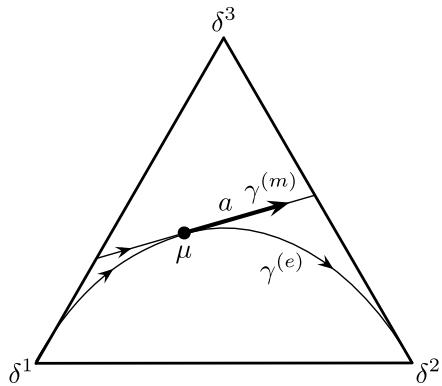  
Fig. 2.4 $m$ - and $e$ -geodesic in $\mathcal{P}_{+}(\{1,2,3\})$ with initial point $\mu$ and velocity $a$

which proves that all conditions (2.49) are satisfied. Setting $t = 1$ in (2.50), we obtain the corresponding exponential map $\exp^{(e)}$ which is defined on the whole tangent bundle $T\mathcal{P}_{+}(I)$ :

$$
(\mu , a) \mapsto \frac {\exp (\frac {d a}{d \mu})}{\mu \left(\exp (\frac {d a}{d \mu})\right)} \mu = \sum_ {i} \frac {\mu_ {i} e ^ {\frac {a _ {i}}{\mu_ {i}}}}{\sum_ {j} \mu_ {j} e ^ {\frac {a _ {j}}{\mu_ {j}}}} \delta^ {i}.
$$

As an illustration of the $m$ - and $e$ -geodesic of Proposition 2.5(1), see Fig. 2.4.

# 2.5 The Amari-Chentsov Tensor and the $\alpha$ -Connections

# 2.5.1 The Amari-Chentsov Tensor

We consider a covariant 3-tensor using the affine connections $\widetilde{\nabla}^{(m)}$ and $\widetilde{\nabla}^{(e)}$ : For three vector fields $A:\mu \mapsto A_{\mu} = (\mu ,a_{\mu})$ , $B:\mu \mapsto B_{\mu} = (\mu ,b_{\mu})$ , and $C:\mu \mapsto C_{\mu} = (\mu ,c_{\mu})$ on $\mathcal{M}_{+}(I)$ , we define

$$
\begin{array}{l} \mathbf {T} _ {\mu} (A _ {\mu}, B _ {\mu}, C _ {\mu}) := \mathfrak {g} _ {\mu} \left(\widetilde {\nabla} _ {A} ^ {(m)} B \big | _ {\mu} - \widetilde {\nabla} _ {A} ^ {(e)} B \big | _ {\mu}, C _ {\mu}\right) \\ = \sum_ {i \in I} \mu_ {i} \frac {a _ {\mu , i}}{\mu_ {i}} \frac {b _ {\mu , i}}{\mu_ {i}} \frac {c _ {\mu , i}}{\mu_ {i}}. \tag {2.51} \\ \end{array}
$$

We refer to this tensor as the Amari-Chentsov tensor. Note that for vector fields $A, B, C$ on $\mathcal{P}_{+}(I)$ and $\mu \in \mathcal{P}_{+}(I)$ we have

$$
\mathbf {T} _ {\mu} (A _ {\mu}, B _ {\mu}, C _ {\mu}) = \mathfrak {g} _ {\mu} \big (\nabla_ {A} ^ {(m)} B \big | _ {\mu} - \nabla_ {A} ^ {(e)} B \big | _ {\mu}, C _ {\mu} \big).
$$

We have seen that the Fisher metric $\mathfrak{g}$ on $\mathcal{P}_{+}(I)$ is uniquely characterized in terms of invariance (see Theorem 2.1). Following Chentsov, the same uniqueness property also holds for the tensor $\mathbf{T}$ on $\mathcal{P}_{+}(I)$ , which is the content of the following theorem.

Theorem 2.2 We assign to each non-empty and finite set $I$ a (non-trivial) covariant 3-tensor $S^I$ on $\mathcal{P}_{+}(I)$ . If for each congruent Markov kernel $K:I\to \mathcal{P}(I')$ we have invariance in the sense that

$$
S _ {\mu} ^ {I} (A, B, C) = S _ {K _ {*} (\mu)} ^ {I ^ {\prime}} \left(d _ {\mu} K _ {*} (A), d _ {\mu} K _ {*} (B), d _ {\mu} K _ {*} (C)\right)
$$

then there is a constant $\alpha > 0$ such that $S^I = \alpha \mathbf{T}^I$ for all $I$ , where $\mathbf{T}^I$ denotes the Amari-Chentsov tensor on $\mathcal{P}_+(I)$ .2

One can prove this theorem by following the same steps as in the proof of Theorem 2.1. Alternatively, it immediately follows from the more general result stated in Theorem 2.3.

By analogy, we can extend the definition (2.51) to a covariant $n$ -tensor for all $n \geq 1$ :

$$
\begin{array}{l} \tau_ {\mu} ^ {n} \left(V ^ {(1)}, V ^ {(2)}, \dots , V ^ {(n)}\right) := \sum_ {i \in I} \mu_ {i} \frac {v _ {\mu , i} ^ {(1)}}{\mu_ {i}} \frac {v _ {\mu , i} ^ {(2)}}{\mu_ {i}} \dots \frac {v _ {\mu , i} ^ {(n)}}{\mu_ {i}} \\ = \sum_ {i \in I} \frac {1}{\mu_ {i} ^ {n - 1}} v _ {\mu , i} ^ {(1)} v _ {\mu , i} ^ {(2)} \dots v _ {\mu , i} ^ {(n)}. \tag {2.52} \\ \end{array}
$$

Obviously, we have

$$
\tau^ {2} = \mathfrak {g}, \quad \text {a n d} \quad \tau^ {3} = \mathbf {T}.
$$

It is easy to extend the representation (2.26) of the Fisher metric $\mathfrak{g}$ to the covariant $n$ -tensor $\tau^n$ . Given a differentiable manifold $M$ and an embedding $p: M \hookrightarrow \mathcal{M}_{+}(I)$ , one obtains as pullback of $\tau^n$ the following covariant $n$ -tensor, defined on $M$ :

$$
\tau_ {\xi} ^ {n} (V _ {1}, \dots , V _ {n}) := \sum_ {i} p _ {i} (\xi) \frac {\partial \log p _ {i}}{\partial V _ {1}} (\xi) \dots \frac {\partial \log p _ {i}}{\partial V _ {n}} (\xi).
$$

As suggested by (2.52), the tensor $\tau^n$ is closely related to the following multilinear form:

$$
L _ {I} ^ {n}: \underbrace {\mathcal {F} (I) \times \cdots \times \mathcal {F} (I)} _ {n \text {t i m e s}} \rightarrow \mathbb {R}, \tag {2.53}
$$

$$
\left(f _ {1}, \dots , f _ {n}\right) \mapsto L _ {I} ^ {n} \left(f _ {1}, \dots , f _ {n}\right) := \sum_ {i} f _ {1} ^ {i} \dots f _ {n} ^ {i}.
$$

In order to see this, consider the map

$$
\pi^ {1 / n}: \mathcal {M} _ {+} (I) \to \mathcal {F} (I), \qquad \mu = \sum_ {i} \mu_ {i} \delta^ {i} \mapsto \pi^ {1 / n} (\mu) := n \sum_ {i} \mu_ {i} ^ {\frac {1}{n}} e _ {i}.
$$

This implies

$$
\begin{array}{l} L _ {I} ^ {n} \left(\frac {\partial \pi^ {1 / n}}{\partial v ^ {(1)}} (\mu), \ldots , \frac {\partial \pi^ {1 / n}}{\partial v ^ {(n)}} (\mu)\right) = \sum_ {i} \left(\mu_ {i} ^ {- \frac {n - 1}{n}} v _ {i} ^ {(1)}\right) \dots \left(\mu_ {i} ^ {- \frac {n - 1}{n}} v _ {i} ^ {(n)}\right) \\ = \tau_ {\mu} ^ {n} \left(V ^ {(1)}, \dots , V ^ {(n)}\right). \\ \end{array}
$$

This proves that the tensor $\tau^n$ is nothing but the $\pi^{1/n}$ -pullback of the multi-linear form $L_I^n$ . In this sense, it is a very natural tensor. Furthermore, for $n = 2$ and $n = 3$ , we have seen that the restrictions of $\mathfrak{g}$ and $\mathbf{T}$ to the simplex $\mathcal{P}_+(I)$ are naturally characterized in terms of their invariance with respect to congruent Markov embeddings (see Theorem 2.1 and Theorem 2.2). This raises the question whether the tensors $\tau^n$ on $\mathcal{M}_+(I)$ , or their restrictions to $\mathcal{P}_+(I)$ , are also characterized by invariance properties. It is easy to see that for all $n$ , $\tau^n$ is indeed invariant. However, $\tau^n$ are not the only invariant tensors. In fact, Chentsov's results treat the only nontrivial uniqueness cases. Already for $n = 2$ , Campbell has shown that the metric $\mathfrak{g}$ is not the only one that is invariant if we consider tensors on $\mathcal{M}_+(I)$ rather than on $\mathcal{P}_+(I)$ [57]. Furthermore, for higher $n$ , there are other possible invariant tensors, even when restricting to $\mathcal{P}_+(I)$ . For instance, for $n = 4$ we can consider the tensors

$$
\tau^ {\{1, 2 \}, \{3, 4 \}} \left(V _ {1}, V _ {2}, V _ {3}, V _ {4}\right) := \tau^ {2} \left(V _ {1}, V _ {2}\right) \tau^ {2} \left(V _ {3}, V _ {4}\right) = \mathfrak {g} \left(V _ {1}, V _ {2}\right) \mathfrak {g} \left(V _ {3}, V _ {4}\right),
$$

$$
\tau^ {\{1, 3 \}, \{2, 4 \}} (V _ {1}, V _ {2}, V _ {3}, V _ {4}) := \tau^ {2} (V _ {1}, V _ {3}) \tau^ {2} (V _ {2}, V _ {4}) = \mathfrak {g} (V _ {1}, V _ {3}) \mathfrak {g} (V _ {2}, V _ {4}),
$$

$$
\tau^ {\{1, 4 \}, \{2, 3 \}} \left(V _ {1}, V _ {2}, V _ {3}, V _ {4}\right) := \tau^ {2} \left(V _ {1}, V _ {4}\right) \tau^ {2} \left(V _ {2}, V _ {3}\right) = \mathfrak {g} \left(V _ {1}, V _ {4}\right) \mathfrak {g} \left(V _ {2}, V _ {3}\right).
$$

It is obvious that all of these invariant tensors are mutually different and also different from $\tau^4$ . Similarly, for $n = 5$ we have, for example,

$$
\begin{array}{l} \tau^ {\{1, 2 \}, \{3, 4, 5 \}} \left(V _ {1}, V _ {2}, V _ {3}, V _ {4}, V _ {5}\right) := \tau^ {2} \left(V _ {1}, V _ {2}\right) \tau^ {3} \left(V _ {3}, V _ {4}, V _ {5}\right) \\ = \mathfrak {g} (V _ {1}, V _ {2}) \mathbf {T} (V _ {3}, V _ {4}, V _ {5}), \\ \end{array}
$$

$$
\begin{array}{l} \tau^ {\{1, 4 \}, \{2, 3, 5 \}} \left(V _ {1}, V _ {2}, V _ {3}, V _ {4}, V _ {5}\right) := \tau^ {2} \left(V _ {1}, V _ {4}\right) \tau^ {3} \left(V _ {2}, V _ {3}, V _ {5}\right) \\ = \mathfrak {g} (V _ {1}, V _ {4}) \mathbf {T} (V _ {2}, V _ {3}, V _ {5}). \\ \end{array}
$$

From these examples it becomes evident that for each partition

$$
\mathbf {P} = \left\{\left\{i _ {1} ^ {1}, \dots , i _ {1} ^ {n _ {1}} \right\}, \dots , \left\{i _ {l} ^ {1}, \dots , i _ {l} ^ {n _ {l}} \right\} \right\}
$$

of the set $\{1, \ldots, n\}$ with $n = n_1 + \dots + n_l$ one can define an invariant $n$ -tensor $\tau^{\mathbf{P}}(V_1, \ldots, V_n)$ in a corresponding fashion, see Definition 2.6 below. Our generalization of Chentsov's uniqueness results, Theorem 2.3, will state that any invariant $n$ -tensor will be a linear combination of these, i.e., the dimension of the space of invariant $n$ -tensors depends on the number of partitions of the set $\{1, \ldots, n\}$ . In fact, this result will even hold if we consider arbitrary (infinite) measure spaces (see Theorem 5.6).

# 2.5.2 The $\alpha$ -Connections

The Amari-Chentsov tensor $\mathbf{T}$ is closely related to a family of affine connections, defined as a convex combination of the $m$ - and the $e$ -connections. As in our previous derivations we first consider the affine connections on $\mathcal{M}_{+}(I)$ and then restrict them to $\mathcal{P}_{+}(I)$ . Given $\alpha \in [-1, 1]$ , we define the following convex combination, the $\alpha$ -connection:

$$
\widetilde {\nabla} ^ {(\alpha)} := \frac {1 - \alpha}{2} \widetilde {\nabla} ^ {(m)} + \frac {1 + \alpha}{2} \widetilde {\nabla} ^ {(e)} = \widetilde {\nabla} ^ {(m)} + \frac {1 + \alpha}{2} \left(\widetilde {\nabla} ^ {(e)} - \widetilde {\nabla} ^ {(m)}\right). \tag {2.54}
$$

Obviously, for vector fields $A$ , $B$ , and $C$ we have

$$
\mathfrak {g} \left(\widetilde {\nabla} _ {A} ^ {(\alpha)} B, C\right) = \mathfrak {g} \left(\widetilde {\nabla} _ {A} ^ {(m)} B, C\right) - \frac {1 + \alpha}{2} \mathbf {T} (A, B, C).
$$

More explicitly, we have

$$
\left. \widetilde {\nabla} _ {A} ^ {(\alpha)} B \right| _ {\mu} = \left(\mu , \sum_ {i} \left(\frac {\partial b _ {i}}{\partial a _ {\mu}} (\mu) - \frac {1 + \alpha}{2} \frac {a _ {\mu , i} b _ {\mu , i}}{\mu_ {i}}\right) \delta^ {i}\right). \tag {2.55}
$$

This allows us to determine the geodesic and the exponential map of the $\alpha$ -connection. The differential equation for the $\alpha$ -geodesic with initial point $\mu$ and initial velocity $a$ follows from (2.55):

$$
\ddot {\gamma} - \frac {1 + \alpha}{2} \frac {\dot {\gamma} ^ {2}}{\gamma} = 0, \quad \gamma (0) = \mu , \dot {\gamma} (0) = a. \tag {2.56}
$$

It is easy to verify that the following curve satisfies this equation:

$$
\gamma^ {(\alpha)} (t) = \left(\mu^ {\frac {1 - \alpha}{2}} + t \frac {1 - \alpha}{2} \mu^ {- \frac {1 + \alpha}{2}} a\right) ^ {\frac {2}{1 - \alpha}}. \tag {2.57}
$$

By setting $t = 1$ , we can define the corresponding exponential map:

$$
\widetilde {\exp} ^ {(\alpha)}: (\mu , a) \mapsto \left(\mu^ {\frac {1 - \alpha}{2}} + \frac {1 - \alpha}{2} \mu^ {- \frac {1 + \alpha}{2}} a\right) ^ {\frac {2}{1 - \alpha}}. \tag {2.58}
$$

Finally, the $\alpha$ -geodesic with initial point $\mu$ and endpoint $\nu$ has the following more symmetric structure:

$$
\gamma^ {(\alpha)} (t) = \left((1 - t) \mu^ {\frac {1 - \alpha}{2}} + t v ^ {\frac {1 - \alpha}{2}}\right) ^ {\frac {2}{1 - \alpha}}. \tag {2.59}
$$

Now we come to the $\alpha$ -connection $\nabla^{(\alpha)}$ on $\mathcal{P}_{+}(I)$ by projection of $\widetilde{\nabla}^{(\alpha)}$ (see (2.14)). For $\mu \in \mathcal{P}_{+}(I)$ and two vector fields $A$ and $B$ that are tangential to $\mathcal{P}_{+}(I)$ , we obtain

as projection

$$
\left. \nabla_ {A} ^ {(\alpha)} B \right| _ {\mu} = \left(\mu , \sum_ {i} \left(\frac {\partial b _ {i}}{\partial a _ {\mu}} (\mu) - \frac {1 + \alpha}{2} \left\{\frac {a _ {\mu , i} b _ {\mu , i}}{\mu_ {i}} - \mu_ {i} \sum_ {j} \frac {a _ {\mu , j} b _ {\mu , j}}{\mu_ {j}} \right\}\right) \delta^ {i}\right). \tag {2.60}
$$

This implies the following corresponding geodesic equation:

$$
\ddot {\gamma} - \frac {1 + \alpha}{2} \left\{\frac {\dot {\gamma} ^ {2}}{\gamma} - \gamma \sum_ {j} \frac {\dot {\gamma} _ {j} ^ {2}}{\gamma_ {j}} \right\} = 0, \quad \gamma (0) = \mu , \dot {\gamma} (0) = a. \tag {2.61}
$$

It is reasonable to make a solution ansatz by normalization of the unconstrained geodesic (2.57) and (2.59). However, it turns out that, in order to solve the geodesic Eq. (2.61), both normalized curves have to be reparametrized. More precisely, it has been shown in [187] (Theorems 14.1 and 15.1) that, with appropriate reparametrizations $\tau_{\mu,a}$ and $\tau_{\mu,\nu}$ , we have the following forms of the $\alpha$ -geodesic in the simplex $\mathcal{P}_{+}(I)$ :

$$
\gamma^ {(\alpha)} (t) = \sum_ {i \in I} \frac {\mu_ {i} \left(1 + \tau_ {\mu , a} (t) \frac {1 - \alpha}{2} \frac {a _ {i}}{\mu_ {i}}\right) ^ {\frac {2}{1 - \alpha}}}{\sum_ {j \in I} \mu_ {j} \left(1 + \tau_ {\mu , a} (t) \frac {1 - \alpha}{2} \frac {a _ {j}}{\mu_ {j}}\right) ^ {\frac {2}{1 - \alpha}}} \delta^ {i} \tag {2.62}
$$

and

$$
\gamma^ {(\alpha)} (t) = \sum_ {i \in I} \frac {\left(\mu_ {i} ^ {\frac {1 - \alpha}{2}} + \tau_ {\mu , v} (t) \left(v _ {i} ^ {\frac {1 - \alpha}{2}} - \mu_ {i} ^ {\frac {1 - \alpha}{2}}\right)\right) ^ {\frac {2}{1 - \alpha}}}{\sum_ {j \in I} \left(\mu_ {j} ^ {\frac {1 - \alpha}{2}} + \tau_ {\mu , v} (t) \left(v _ {i} ^ {\frac {1 - \alpha}{2}} - \mu_ {i} ^ {\frac {1 - \alpha}{2}}\right)\right) ^ {\frac {2}{1 - \alpha}}} \delta^ {i}. \tag {2.63}
$$

An explicit expression for the reparametrizations $\tau_{\mu, a}$ and $\tau_{\mu, \nu}$ is unknown. In general, we have the following implications:

$$
\gamma^ {(\alpha)} (0) = \mu , \qquad \frac {d \gamma^ {(\alpha)}}{d t} (0) = \dot {\tau} _ {\mu , a} (0) a = a \quad \Rightarrow \quad \tau_ {\mu , a} (0) = 0, \qquad \dot {\tau} _ {\mu , a} (0) = 1,
$$

and

$$
\gamma^ {(\alpha)} (0) = \mu , \qquad \gamma_ {\mu , \nu} ^ {(\alpha)} (1) = \nu \quad \Rightarrow \quad \tau_ {\mu , \nu} (0) = 0, \qquad \tau_ {\mu , \nu} (1) = 1.
$$

As the two expressions (2.62) and (2.63) of the geodesic $\gamma^{(\alpha)}$ yield the same velocity $a$ at $t = 0$ , we obtain, with $\sum_{i\in I}a_i = 0$ ,

$$
a = \frac {1}{\tau_ {\mu , a} (1)} \frac {2}{1 - \alpha} \sum_ {i \in I} \mu_ {i} \left(\frac {\left(\frac {v _ {i}}{\mu_ {i}}\right) ^ {\frac {1 - \alpha}{2}}}{\sum_ {j = 1} ^ {n} \mu_ {j} \left(\frac {v _ {j}}{\mu_ {j}}\right) ^ {\frac {1 - \alpha}{2}}} - 1\right) \delta^ {i} \tag {2.64}
$$

and

$$
a = \dot {\tau} _ {\mu , v} (0) \frac {2}{1 - \alpha} \sum_ {i \in I} \mu_ {i} \left(\left(\frac {v _ {i}}{\mu_ {i}}\right) ^ {\frac {1 - \alpha}{2}} - \sum_ {j \in I} \mu_ {j} \left(\frac {v _ {j}}{\mu_ {j}}\right) ^ {\frac {1 - \alpha}{2}}\right) \delta^ {i}. \tag {2.65}
$$

A comparison of (2.64) and (2.65) yields

$$
\dot {\tau} _ {\mu , v} (0) \sum_ {j \in I} \mu_ {j} \left(\frac {v _ {j}}{\mu_ {j}}\right) ^ {\frac {1 - \alpha}{2}} = \frac {1}{\tau_ {\mu , a} (1)}. \tag {2.66}
$$

# 2.6 Congruent Families of Tensors

In Theorem 2.1 we showed that the Fisher metric $\mathfrak{g}$ on $\mathcal{P}_{+}(I)$ is characterized by the property that it is invariant under congruent Markov kernels. In this section, we shall generalize this result and give a complete description of all families of covariant $n$ -tensors on $\mathcal{P}_{+}(I)$ or, more general, on $\mathcal{M}_{+}(I)$ with this property.

Before doing this, we need to introduce some more notation. Recall that for a non-empty finite set $I$ we defined $S(I)$ as the vector space of signed measures on $I$ on page 26, that is,

$$
\mathcal {S} (I) = \left\{\sum_ {i \in I} a _ {i} \delta^ {i}: a _ {i} \in \mathbb {R} \right\},
$$

where $\delta^i$ is the Dirac measure supported at $i\in I$ . On this space, we define the norm

$$
\| \mu \| _ {1} := | \mu | (I) = \sum_ {i \in I} | a _ {i} |, \quad \text {w h e r e} \mu = \sum_ {i \in I} a _ {i} \delta^ {i}. \tag {2.67}
$$

Remark 2.1 The norm defined in (2.67) is the norm of total variation, which we shall define for general measure spaces in (3.1).

Moreover, recall the subsets $\mathcal{P}(I) \subseteq \mathcal{M}(I) \subseteq \mathcal{S}(I)$ introduced in (2.1), where $\mathcal{P}(I)$ denotes the set of probability measures and $\mathcal{M}(I)$ the set of finite measures on $I$ , respectively. By (2.67), we can also write

$$
\mathcal {P} (I) = \left\{m \in \mathcal {M} (I): \| m \| _ {1} = 1 \right\} = \mathcal {M} (I) \cap \mathcal {S} _ {1} (I).
$$

By (2.1), $\mathcal{P}_{+}(I) \subseteq \mathcal{S}_{1}(I)$ and $\mathcal{M}_{+}(I) \subseteq \mathcal{S}(I)$ are open subsets, where $\mathcal{S}_{1}(I) \subseteq \mathcal{S}(I)$ is an affine subspace with underlying vector spaces $\mathcal{S}_0(I)$ . Thus, the tangent bundles of these spaces can be naturally given as in (2.9).

For each $\mu \in \mathcal{M}_{+}(I)$ , there is a decomposition of the tangent space

$$
T _ {\mu} \mathcal {M} _ {+} (I) = T _ {\mu} \mathcal {P} _ {+} (I) \oplus \mathbb {R} \mu = \mathcal {S} _ {0} (I) \oplus \mathbb {R} \mu . \tag {2.68}
$$

Indeed, $T_{\mu}\mathcal{P}_{+}(I) = \mathcal{S}_{0}(I)$ has codimension one in $T_{\mu}\mathcal{M}_{+}(I) = \mathcal{S}(I)$ , and $\mathbb{R}\mu \cap \mathcal{S}_0(I) = 0$ .

We also define the projection

$$
\pi_ {I}: \mathcal {M} _ {+} (I) \longrightarrow \mathcal {P} _ {+} (I), \quad \pi_ {I} (\mu) = \frac {1}{\| \mu \| _ {1}} \mu ,
$$

which rescales an arbitrary finite measure on $I$ to become a probability measure. Obviously, $\pi_I(\mu) = \mu$ if and only if $\mu \in \mathcal{P}_+(I)$ . Clearly, $\pi_I$ is differentiable. To calculate its differential, we let $V \in T_{\mu}\mathcal{M}_{+}(I) = \mathcal{S}$ , and use

$$
d _ {\mu} \pi_ {I} (V) = \frac {d}{d t} \Bigg | _ {t = 0} \pi_ {I} (\mu + t V) = \frac {d}{d t} \Bigg | _ {t = 0} \frac {1}{\| \mu + t V \| _ {1}} (\mu + t V).
$$

If $V \in S_0(I) \subseteq S$ , then $\| \mu + tV \|_1 = \| \mu \|_1$ by the definition of $S_0(I)$ . On the other hand, if $V = c_0\mu$ , then $\pi_I(\mu + tV) = \pi_I(1 + tc_0)\mu = \pi_I(\mu)$ is constant, whence for the differential we obtain

$$
d _ {\mu} \pi_ {I} (V) = \left\{ \begin{array}{l l} \frac {1}{\| \mu \| _ {1}} V & \text {f o r} V \in T _ {\mu} \mathcal {P} _ {+} (I) = \mathcal {S} _ {0} (I), \\ 0 & \text {f o r} V \in \mathbb {R} \mu . \end{array} \right. \tag {2.69}
$$

Definition 2.3 (Covariant $n$ -tensors on $\mathcal{M}_{+}(I)$ and $\mathcal{P}_{+}(I)$ )

(1) A covariant $n$ -tensor on $\mathcal{P}_{+}(I)$ is a continuous map

$$
\Theta_ {I} ^ {n}: \mathcal {P} _ {+} (I) \times \overset {n} {\times} \mathcal {S} _ {0} (I) \longrightarrow \mathbb {R}, \quad (\mu ; V _ {1}, \dots , V _ {n}) \longmapsto \left(\Theta_ {I} ^ {n}\right) _ {\mu} (V _ {1}, \dots , V _ {n})
$$

such that $(\Theta_I^n)_\mu$ is $n$ -linear on $\times^n S_0(I)$ for fixed $\mu \in \mathcal{P}_+(I)$ .

(2) A covariant $n$ -tensor on $\mathcal{M}_{+}(I)$ is a continuous map

$$
\tilde {\Theta} _ {I} ^ {n}: \mathcal {M} _ {+} (I) \times \overset {n} {\times} \mathcal {S} \longrightarrow \mathbb {R}, \quad (\mu ; V _ {1}, \dots , V _ {n}) \longmapsto \left(\tilde {\Theta} _ {I} ^ {n}\right) _ {\mu} (V _ {1}, \dots , V _ {n})
$$

such that $(\tilde{\Theta}_I^n)_\mu$ is $n$ -linear on $\times^n S$ for fixed $\mu \in \mathcal{M}_{+}(I)$ .

(3) Given a covariant $n$ -tensor $\Theta_I^n$ on $\mathcal{P}_{+}(I)$ , we define the extension of $\Theta_I^n$ to $\mathcal{M}_{+}(I)$ to be the covariant $n$ -tensor

$$
\left(\tilde {\Theta} _ {I} ^ {n}\right) _ {\mu} (V _ {1}, \dots , V _ {n}) := \left(\Theta_ {I} ^ {n}\right) _ {\pi_ {I} (\mu)} \big (d _ {\mu} \pi_ {I} (V _ {1}), \dots , d _ {\mu} \pi_ {I} (V _ {n}) \big).
$$

(4) Given a covariant $n$ -tensor $\tilde{\Theta}_I^n$ on $\mathcal{M}_{+}(I)$ , we define its restriction to $\mathcal{P}_{+}(I)$ to be the tensor

$$
\left(\tilde {\Theta} _ {I} ^ {n}\right) _ {\mu} (V _ {1}, \ldots , V _ {n}) := \left(\tilde {\Theta} _ {I} ^ {n}\right) _ {\mu} (V _ {1}, \ldots , V _ {n}).
$$

Remark 2.2 By convention, a covariant 0-tensor on $\mathcal{P}_{+}(I)$ and $\mathcal{M}_{+}(I)$ is simply a continuous function $\Theta_I^0:\mathcal{P}_+(I)\to \mathbb{R}$ and $\tilde{\Theta}_I^0:\mathcal{M}_+(I)\to \mathbb{R}$ , respectively.

The extension of $\Theta_I^n$ is merely the pull-back of $\Theta_I^n$ under the map $\pi_I: \mathcal{M}_+(I) \to \mathcal{P}_+(I)$ ; the restriction of $\tilde{\Theta}_I^n$ is the pull-back of the inclusion $\mathcal{P}_+(I) \hookrightarrow \mathcal{M}_+(I)$ as defined in (2.25).

In general, in order to describe a covariant $n$ -tensor $\tilde{\Theta}_I^n$ on $\mathcal{M}_{+}(I)$ , we define for a multiindex $\vec{i} := (i_1,\dots ,i_n)\in I^n$

$$
\theta_ {I; \mu} ^ {\vec {i}} := \left(\tilde {\Theta} _ {I} ^ {n}\right) _ {\mu} \left(\delta^ {i _ {1}}, \dots , \delta^ {i _ {n}}\right) =: \left(\tilde {\Theta} _ {I} ^ {n}\right) _ {\mu} \left(\vec {\delta^ {i}}\right). \tag {2.70}
$$

Clearly, these functions are continuous in $\mu \in \mathcal{M}_{+}(I)$ , and they uniquely determine $\hat{\Theta}_I^n$ , since for arbitrary vectors $V_{k} = \sum_{i\in I}v_{k;i}\delta^{i}\in S$ the multilinearity implies

$$
\left(\tilde {\Theta} _ {I} ^ {n}\right) _ {\mu} \left(V _ {1}, \dots , V _ {n}\right) = \sum_ {\vec {i} = \left(i _ {1}, \dots , i _ {n}\right) \in I ^ {n}} \theta_ {I; \mu} ^ {\vec {i}} v _ {1, i _ {1}} \dots v _ {n, i _ {n}}. \tag {2.71}
$$

Let $K: I \to \mathcal{P}(I')$ be a Markov kernel between the finite sets $I$ and $I'$ , as defined in (2.30). Such a map induces a corresponding map between probability distributions as defined in (2.31), and as was mentioned there, this formula also yields a linear map

$$
K _ {*}: \mathcal {S} (I) \longrightarrow \mathcal {S} \left(I ^ {\prime}\right), \qquad \mu = \sum_ {i \in I} \mu_ {i} \delta^ {i} \longmapsto \sum_ {i \in I} \mu_ {i} K ^ {i},
$$

where

$$
K ^ {i} := K (i) = \sum_ {i ^ {\prime} \in I ^ {\prime}} K _ {i ^ {\prime}} ^ {i} \delta^ {i ^ {\prime}}.
$$

Clearly, $K_{*}$ is a linear map between $\mathcal{S}(I)$ and $\mathcal{S}(I^{\prime})$ , and $K_{i^{\prime}}^{i} \geq 0$ , implies $K_{*}\mu \in \mathcal{M}(I^{\prime})$ for all $\mu \in \mathcal{M}(I)$ . Moreover, $\sum_{i^{\prime} \in I^{\prime}} K_{i^{\prime}}^{i} = 1$ implies that for all $\mu \in \mathcal{M}(I)$ ,

$$
\| K _ {*} \mu \| _ {1} = \left\| \sum_ {i \in I, i ^ {\prime} \in I ^ {\prime}} \mu_ {i} K _ {i ^ {\prime}} ^ {i} \delta^ {i ^ {\prime}} \right\| _ {1} = \sum_ {i \in I, i ^ {\prime} \in I ^ {\prime}} \mu_ {i} K _ {i ^ {\prime}} ^ {i} = \sum_ {i \in I} \mu_ {i} = \| \mu \| _ {1}.
$$

That is,

$$
\| K _ {*} \mu \| _ {1} = \| \mu \| _ {1} \quad \text {f o r a l l} \mu \in \mathcal {M} (I). \tag {2.72}
$$

This also implies that the image of $\mathcal{P}(I)$ under $K_{*}$ is contained in $\mathcal{P}(I')$ . In particular, it follows that for $\mu \in \mathcal{M}(I)$ ,

$$
K _ {*} (\pi_ {I} \mu) = K _ {*} \bigg (\frac {1}{\| \mu \| _ {1}} \mu \bigg) = \frac {1}{\| K _ {*} \mu \| _ {1}} K _ {*} \mu = \pi_ {I ^ {\prime}} (K _ {*} \mu),
$$

i.e.,

$$
K _ {*} \left(\pi_ {I} \mu\right) = \pi_ {I ^ {\prime}} \left(K _ {*} \mu\right) \quad \text {f o r a l l} \mu \in \mathcal {M} (I). \tag {2.73}
$$

Definition 2.4 (Tensors invariant under congruent embeddings) A congruent family of covariant $n$ -tensors is a collection $\{\tilde{\Theta}_I^n : I \text{ finite}\}$ , where $\tilde{\Theta}_I^n$ is a covariant $n$ -tensor on $\mathcal{M}_{+}(I)$ , which is invariant under congruent Markov kernels in the sense that

$$
K _ {*} ^ {*} \tilde {\Theta} _ {I ^ {\prime}} ^ {n} = \tilde {\Theta} _ {I} ^ {n} \tag {2.74}
$$

for any congruent Markov kernel $K: I \to \mathcal{P}(I')$ with the definition of the pull-back in (2.25).

A restricted congruent family of covariant $n$ -tensors is a collection $\{\Theta_I^n : I \text{ finite}\}$ , where $\Theta_I^n$ is a covariant $n$ -tensor on $\mathcal{P}_+(I)$ , which is invariant under congruent Markov kernels in the sense that (2.74) holds when replacing $\tilde{\Theta}_I^n$ and $\tilde{\Theta}_{I'}^n$ by $\Theta_I^n$ and $\Theta_{I'}^n$ , respectively.

Proposition 2.6 There is a correspondence between congruent families of covariant $n$ -tensors and restricted congruent families of covariant $n$ -tensors in the following sense:

(1) Let $\{\tilde{\Theta}_I^n: I \text{ finite}\}$ be a congruent family of covariant $n$ -tensors, and let $\Theta_I^n$ be the restriction of $\tilde{\Theta}_I^n$ to $\mathcal{P}_+(I)$ .

Then $\{\Theta_I^n: I$ finite\} is a restricted congruent family of covariant $n$ -tensors. Moreover, any restricted congruent family of covariant $n$ -tensors can be described in this way.

(2) Let $\{\Theta_I^n:I\text{finite}\}$ be a restricted congruent family of covariant $n$ -tensors, and let $\tilde{\Theta}_I^n$ be the extension of $\Theta_I^n$ to $\mathcal{M}_{+}(I)$ .

Then $\{\tilde{\Theta}_I^n: I \text{ finite}\}$ is a congruent family of covariant $n$ -tensors.

Proof This follows from unwinding the definitions. Namely, if $\{\tilde{\Theta}_I^n:I\text{finite}\}$ is a congruent family of covariant $n$ -tensors, then the restriction is given as $\Theta_I^n \coloneqq \tilde{\Theta}_I^n |_{\mathcal{P}(I)}$ . Now if $K:I\to \mathcal{P}(I^{\prime})$ is a congruent Markov kernel, then because of (2.72), $K_{*}$ maps $\mathcal{P}(I)$ to $\mathcal{P}(I^{\prime})$ , whence if (2.74) holds, it also holds for the restriction of both sides to $\mathcal{P}(I)$ and $\mathcal{P}(I^{\prime})$ , respectively, showing that $\{\Theta_I^n:I\text{finite}\}$ is a restricted congruent family of covariant $n$ -tensors.

For the second assertion, let $\{\Theta_I^n:I\text{finite}\}$ be a restricted congruent family of covariant $n$ -tensors. Then the extension of $\Theta_I^n$ is given as $\tilde{\Theta}_I^n \coloneqq \pi_I^*\Theta_I^n$ , whence for a congruent Markov kernel $K:I\to \mathcal{P}(I')$ we get from (2.73)

$$
K _ {*} ^ {*} \tilde {\Theta} _ {I ^ {\prime}} ^ {n} = K _ {*} ^ {*} \pi_ {I ^ {\prime}} ^ {*} \Theta_ {I ^ {\prime}} ^ {n} = (\pi_ {I ^ {\prime}} K _ {*}) ^ {*} \Theta_ {I ^ {\prime}} ^ {n} = (K _ {*} \pi_ {I}) ^ {*} \Theta_ {I ^ {\prime}} ^ {n} = \pi_ {I} ^ {*} K _ {*} ^ {*} \Theta_ {I ^ {\prime}} ^ {n} = \pi_ {I} ^ {*} \Theta_ {I} ^ {n} = \tilde {\Theta} _ {I} ^ {n},
$$

so that (2.74) holds.

In the following, we shall therefore mainly deal with the description of congruent families of covariant $n$ -tensors, since by virtue of Proposition 2.6 this immediately yields a description of all restricted congruent families as well.

Example 2.2 (Congruent families of covariant 0-tensors) Let $\{\tilde{\Theta}_I^0:\mathcal{M}_+(I)\to \mathbb{R}: I$ finite\} be a congruent family of covariant 0-tensors, i.e., of continuous functions $\tilde{\Theta}_I^0:\mathcal{M}_+(I)\to \mathbb{R}$ (cf. Remark 2.2). Let $\mu \in \mathcal{M}_{+}(I)$ and $\rho \coloneqq \pi_I(\mu)\in \mathcal{P}_+(I)$ be the normalization of $\mu$ , so that $\mu = \| \mu \| _1\rho$ . Define the congruent embedding determined by

$$
K: \mathcal {S} (\{0 \}) \longmapsto \mathcal {S} (I), \quad \delta^ {0} \longmapsto \rho .
$$

Then by the congruence condition,

$$
\tilde {\Theta} _ {I} ^ {0} (\mu) = \tilde {\Theta} _ {I} ^ {0} \big (\| \mu \| _ {1} \rho \big) = \tilde {\Theta} _ {I} ^ {0} \big (K _ {*} \big (\| \mu \| _ {1} \delta^ {0} \big) \big) = \tilde {\Theta} _ {\{0 \}} ^ {0} \big (\| \mu \| _ {1} \delta^ {0} \big) =: a \big (\| \mu \| _ {1} \big).
$$

That is, a congruent family of covariant 0-tensors is given as

$$
\tilde {\Theta} _ {I} ^ {0} (\mu) = a \left(\| \mu \| _ {1}\right) \tag {2.75}
$$

for some continuous function $a:(0,\infty)\to \mathbb{R}$ . Conversely, every family given as in (2.75) is congruent, since Markov morphisms preserve the total mass by (2.72).

In particular, a restricted congruent family of covariant 0-tensors is given by a constant.

# Definition 2.5

(1) Let $\tilde{\Theta}_I^n$ be a covariant $n$ -tensor on $\mathcal{M}_{+}(I)$ and let $\sigma$ be a permutation of $\{1, \ldots, n\}$ . Then the permutation of $\tilde{\Theta}_I^n$ by $\sigma$ is defined by

$$
\left(\tilde {\Theta} _ {I} ^ {n}\right) ^ {\sigma} (V _ {1}, \dots , V _ {n}) := \Theta_ {I} ^ {n} \left(V _ {\sigma_ {1}}, \dots , V _ {\sigma_ {n}}\right).
$$

(2) Let $\tilde{\Theta}_I^n$ and $\tilde{\Psi}_I^m$ be covariant $n$ - and $m$ -tensors on $\mathcal{M}_{+}(I)$ , respectively. Then the tensor product of $\tilde{\Theta}_I^n$ and $\tilde{\Psi}_I^m$ is the covariant $(n + m)$ -tensor on $\mathcal{M}_{+}(I)$ defined by

$$
\left(\tilde {\Theta} _ {I} ^ {n} \otimes \tilde {\Psi} _ {I} ^ {m}\right) (V _ {1}, \dots , V _ {n + m}) := \tilde {\Theta} _ {I} ^ {n} (V _ {1}, \dots , V _ {n}) \cdot \tilde {\Psi} _ {I} ^ {m} (V _ {n + 1}, \dots , V _ {n + m}).
$$

The permutation by $\sigma$ and the tensor product of covariant tensors on $\mathcal{P}_{+}(I)$ is defined analogously.

Observe that the tensor product includes multiplication by a continuous function, which is regarded as a covariant 0-tensor.

By the definition of the pull-back $K_{*}^{*}$ in (2.25) it follows immediately that

$$
\begin{array}{l} K _ {*} ^ {*} \left(c _ {1} \tilde {\Theta} _ {I} ^ {n} + c _ {2} \tilde {\Psi} _ {I} ^ {n}\right) = c _ {1} K _ {*} ^ {*} \left(\tilde {\Theta} _ {I} ^ {n}\right) + c _ {2} K _ {*} ^ {*} \left(\tilde {\Psi} _ {I} ^ {n}\right), \\ K _ {*} ^ {*} \left(\left(\tilde {\Theta} _ {I} ^ {n}\right) ^ {\sigma}\right) = \left(K _ {*} ^ {*} \left(\tilde {\Theta} _ {I} ^ {n}\right)\right) ^ {\sigma}, \\ K _ {*} ^ {*} \left(\tilde {\Theta} _ {I} ^ {n} \otimes \tilde {\Psi} _ {I} ^ {m}\right) = K _ {*} ^ {*} \left(\tilde {\Theta} _ {I} ^ {n}\right) \otimes K _ {*} ^ {*} \left(\tilde {\Psi} _ {I} ^ {m}\right). \\ \end{array}
$$

This implies the following statement.

# Proposition 2.7

(1) Let $\{\tilde{\Theta}_I^n: I \text{ finite}\}$ and $\{\tilde{\Psi}_I^n: I \text{ finite}\}$ be two congruent families of covariant $n$ -tensors. Then any linear combination $\{c_1 \tilde{\Theta}_I^n + c_2 \tilde{\Psi}_I^n: I \text{ finite}\}$ is also a congruent family of covariant $n$ -tensors.   
(2) Let $\{\tilde{\Theta}_I^n: I \text{ finite}\}$ be a congruent family of covariant $n$ -tensors. Then for any permutation $\sigma$ of $\{1, \ldots, n\}$ , $\{(\tilde{\Theta}_I^n)^\sigma: I \text{ finite}\}$ is a congruent family of covariant $n$ -tensors.   
(3) Let $\{\tilde{\Theta}_I^n: I \text{ finite}\}$ and $\{\tilde{\Psi}_I^m: I \text{ finite}\}$ be two congruent families of covariant $n$ - and $m$ -tensors, respectively. Then the tensor product $\{\tilde{\Theta}_I^n \otimes \tilde{\Psi}_I^m: I \text{ finite}\}$ is also a congruent family of covariant $(n + m)$ -tensors.

The analogous statements hold for restricted congruent family of covariant $n$ -tensors.

The following introduces an important class of congruent families of covariant $n$ -tensors.

Proposition 2.8 For a finite set $I$ define the canonical $n$ -tensor $\tau_I^n$ as

$$
\left(\tau_ {I} ^ {n}\right) _ {\mu} \left(V _ {1}, \dots , V _ {n}\right) := \sum_ {i \in I} \frac {1}{m _ {i} ^ {n - 1}} v _ {1; i} \dots v _ {n; i}, \tag {2.76}
$$

where $V_{k} = \sum_{i\in I}v_{k;i}\delta^{i}\in \mathcal{S}(I)$ and $\mu = \sum_{i\in I}m_i\delta^i\in \mathcal{M}_+(I)$ . Then $\{\tau_I^n:I\text{finite}\}$ is a congruent family of covariant $n$ -tensors.

The component functions of this tensor from (2.70) are therefore given as

$$
\theta_ {I; \mu} ^ {i _ {1}, \dots , i _ {n}} = \left\{ \begin{array}{l l} \frac {1}{m _ {i} ^ {n - 1}} & \text {i f} i _ {1} = \dots = i _ {n} =: i, \\ 0 & \text {o t h e r w i s e .} \end{array} \right. \tag {2.77}
$$

This is well defined since $m_{i} > 0$ for all $i$ as $\mu \in \mathcal{M}_{+}(I)$ . Observe that the restriction of $\tau_I^n$ to $\mathcal{P}_{+}(I)$ coincides with the definition in (2.52), so that, in particular, the restriction of $\tau_I^1$ to $\mathcal{P}_{+}(I)$ vanishes, while $\tau_I^2$ and $\tau_I^3$ are the Fisher metric and the Amari-Chentsov tensor on $\mathcal{P}_{+}(I)$ , respectively.

Proof Let $K: I \to \mathcal{P}(I')$ be a congruent Markov kernel with the partition $(A_i)_{i \in I}$ of $I'$ as defined in (2.32). That is, $K(i) := K_{i'}^i \delta^{i'}$ with $K_{i'}^i = 0$ if $i' \notin A_i$ . If $\mu = \sum_{i \in I} m_i \delta^i$ , then

$$
\mu^ {\prime} := K _ {*} \mu = \sum_ {i \in I, i ^ {\prime} \in A _ {i}} m _ {i} K _ {i ^ {\prime}} ^ {i} \delta^ {i ^ {\prime}} =: \sum_ {i ^ {\prime} \in I ^ {\prime}} m _ {i ^ {\prime}} ^ {\prime} \delta^ {i ^ {\prime}}.
$$

Thus,

$$
m _ {i ^ {\prime}} ^ {\prime} = m _ {i} K _ {i ^ {\prime}} ^ {i} \quad \text {f o r t h e (u n i q u e) i \in I w i t h i ^ {\prime} \in A _ {i}}. \tag {2.78}
$$

Then with the notation from before

$$
\begin{array}{l} \left(\tau_ {I ^ {\prime}} ^ {n}\right) _ {\mu^ {\prime}} \left(K _ {*} \delta^ {i _ {1}}, \dots , K _ {*} \delta^ {i _ {n}}\right) = \left(\tau_ {I ^ {\prime}} ^ {n}\right) _ {\mu^ {\prime}} \left(\sum_ {i _ {1} ^ {\prime} \in A _ {i _ {1}}} K _ {i _ {1} ^ {\prime}} ^ {i _ {1}} \delta^ {i _ {1} ^ {\prime}}, \dots , \sum_ {i _ {n} ^ {\prime} \in A _ {i _ {n}}} K _ {i _ {n} ^ {\prime}} ^ {i _ {n}} \delta^ {i _ {n} ^ {\prime}}\right) \\ = \sum_ {i _ {k} ^ {\prime} \in A _ {i _ {k}}} K _ {i _ {1} ^ {\prime}} ^ {i _ {1}} \dots K _ {i _ {n} ^ {\prime}} ^ {i _ {n}} \theta_ {I ^ {\prime}; \mu^ {\prime}} ^ {i _ {1} ^ {\prime}, \ldots , i _ {n} ^ {\prime}}. \\ \end{array}
$$

By (2.77), the only summands with $\theta_{I';\mu'}^{i_1',\dots,i_n'} \neq 0$ are those where $i_1' = \dots = i_n' =: i'$ . If we let $i \in I$ be the index with $i' \in A_i$ , then, as $K$ is a congruent Markov morphism, we have $K_{i'}^{i_k} = 0$ unless $i_k = i$ .

That is, $K_{i_1'}^{i_1} \cdots K_{i_n'}^{i_n} \theta_{I';\mu'}^{i_1',\ldots,i_n'} \neq 0$ only if $i_1' = \cdots = i_n' =: i'$ and $i_1 = \cdots = i_n =: i$ with $i' \in A_i$ . In particular, if not all of $i_1, \ldots, i_n$ are equal (2.74) holds for $V_k = \delta^{i_k}$ , since in this case,

$$
\left(\tau_ {I ^ {\prime}} ^ {n}\right) _ {\mu^ {\prime}} \left(K _ {*} \delta^ {i _ {1}}, \dots , K _ {*} \delta^ {i _ {n}}\right) = 0 = \left(\tau_ {I} ^ {n}\right) _ {\mu} \left(\delta^ {i _ {1}}, \dots , \delta^ {i _ {n}}\right).
$$

On the other hand, if $i_1 = \dots = i_n =: i$ , then the above sum reads

$$
\begin{array}{l} \left(\tau_ {I ^ {\prime}} ^ {n}\right) _ {\mu^ {\prime}} \big (K _ {*} \delta^ {i}, \dots , K _ {*} \delta^ {i} \big) = \sum_ {i ^ {\prime} \in A _ {i}} K _ {i ^ {\prime}} ^ {i} \dots K _ {i ^ {\prime}} ^ {i} \theta_ {I ^ {\prime}; \mu^ {\prime}} ^ {i ^ {\prime}, \dots , i ^ {\prime}} \\ \stackrel {(2. 7 7)} {=} \sum_ {i ^ {\prime} \in A _ {i}} \left(K _ {i ^ {\prime}} ^ {i}\right) ^ {n} \frac {1}{(m _ {i ^ {\prime}} ^ {\prime}) ^ {n - 1}} \\ \stackrel {(2. 7 8)} {=} \sum_ {i ^ {\prime} \in A _ {i}} \left(K _ {i ^ {\prime}} ^ {i}\right) ^ {n} \frac {1}{(m _ {i} K _ {i ^ {\prime}} ^ {i}) ^ {n - 1}} \\ = \frac {1}{m _ {i} ^ {n - 1}} \sum_ {i ^ {\prime} \in A _ {i}} K _ {i ^ {\prime}} ^ {i} = \frac {1}{m _ {i} ^ {n - 1}} \underbrace {\sum_ {i ^ {\prime} \in I ^ {\prime}} K _ {i ^ {\prime}} ^ {i}} _ {= 1} \\ = \frac {1}{m _ {i} ^ {n - 1}} = \left(\tau_ {I} ^ {n}\right) _ {\mu} \left(\delta^ {i}, \ldots , \delta^ {i}\right), \\ \end{array}
$$

so that (2.74) holds for $V_{1} = \dots = V_{n} = \delta^{i}$ as well. Thus, the $n$ -linearity of the tensors shows that (2.74) always holds, which shows the claim.

By Propositions 2.7 and 2.8, we can therefore construct further congruent families which we shall now describe in more detail.

For $n \in \mathbb{N}$ , we denote by $\mathbf{Part}(n)$ the collection of partitions $\mathbf{P} = \{P_1, \dots, P_r\}$ of $\{1, \dots, n\}$ , that is, $\bigcup_{k} P_k = \{1, \dots, n\}$ , and these sets are pairwise disjoint. We denote the number $r$ of sets in the partition by $|\mathbf{P}|$ .

Given a partition $\mathbf{P} = \{P_1, \dots, P_r\} \in \mathbf{Part}(n)$ , we associate to it a bijective map

$$
\pi_ {\mathbf {P}}: \bigcup_ {i \in \{1, \dots , r \}} \left(\{i \} \times \{1, \dots , n _ {i} \}\right) \longrightarrow \{1, \dots , n \}, \tag {2.79}
$$

where $n_i \coloneqq |P_i|$ , such that $\pi_{\mathbf{P}}(\{i\} \times \{1, \dots, n_i\}) = P_i$ . This map is well defined, up to permutation of the elements in $P_i$ .

$\mathbf{Part}(n)$ is partially ordered by the relation $\mathbf{P} \leq \mathbf{P}'$ if $\mathbf{P}$ is a subdivision of $\mathbf{P}'$ . This ordering has the partition $\{\{1\}, \ldots, \{n\}\}$ into singleton sets as its minimum and $\{\{1, \ldots, n\}\}$ as its maximum.

Definition 2.6 (Canonical tensor of a partition) Let $\mathbf{P} \in \mathbf{Part}(n)$ be a partition, and let $\pi_{\mathbf{P}}$ be the bijective map from (2.79). For each finite set $I$ , the canonical $n$ -tensor

of $\mathbf{P}$ is the covariant $n$ -tensor defined by

$$
\left(\tau_ {I} ^ {\mathbf {P}}\right) _ {\mu} \left(V _ {1}, \dots , V _ {n}\right) := \prod_ {i = 1} ^ {r} \left(\tau_ {I} ^ {n _ {i}}\right) _ {\mu} \left(V _ {\pi_ {\mathbf {P}} (i, 1)}, \dots , V _ {\pi_ {\mathbf {P}} (i, n _ {i})}\right) \tag {2.80}
$$

with the canonical tensor $\tau_I^{n_i}$ from (2.76).

Observe that this definition is independent of the choice of the bijection $\pi_{\mathbf{P}}$ , since $\tau_I^{k_i}$ is symmetric.

# Example 2.3

(1) If $\mathbf{P} = \{\{1, \dots, n\}\}$ is the trivial partition, then

$$
\boldsymbol {\tau} _ {I} ^ {\mathbf {P}} = \boldsymbol {\tau} _ {I} ^ {n}.
$$

(2) If $\mathbf{P} = \{\{1\}, \dots, \{n\}\}$ is the partition into singletons, then

$$
\tau_ {I} ^ {\mathbf {P}} (V _ {1}, \dots , V _ {n}) = \tau_ {I} ^ {1} (V _ {1}) \dots \tau_ {I} ^ {1} (V _ {n}).
$$

(3) To give a concrete example, let $n = 5$ and $\mathbf{P} = \{\{1,3\}, \{2,5\}, \{4\}\}$ . Then

$$
\tau_ {I} ^ {\mathbf {P}} (V _ {1}, \dots , V _ {5}) = \tau_ {I} ^ {2} (V _ {1}, V _ {3}) \cdot \tau_ {I} ^ {2} (V _ {2}, V _ {5}) \cdot \tau_ {I} ^ {1} (V _ {4}).
$$

Observe that the restriction of $\tau^{\mathbf{P}}$ to $\mathcal{P}_{+}(I)$ vanishes if $\mathbf{P}$ contains a singleton set, since $\tau_I^1$ vanishes on $\mathcal{P}_{+}(I)$ by (2.52). Thus, the restriction of the last two examples to $\mathcal{P}_{+}(I)$ vanishes.

# Proposition 2.9

(1) Every family of covariant $n$ -tensors given by

$$
\left(\tilde {\Theta} _ {I} ^ {n}\right) _ {\mu} = \sum_ {\mathbf {P} \in \operatorname {P a r t} (n)} a _ {\mathbf {P}} \left(\| \mu \| _ {1}\right) \left(\tau_ {I} ^ {\mathbf {P}}\right) _ {\mu} \tag {2.81}
$$

with continuous functions $a_{\mathbf{P}}:(0,\infty)\to \mathbb{R}$ is congruent. Likewise, every family of restricted covariant $n$ -tensors given by

$$
\Theta_ {I} ^ {n} = \sum_ {\substack {\mathbf {P} \in \operatorname {Part} (n) \\ | P _ {i} | \geq 2}} c _ {\mathbf {P}} \tau_ {I} ^ {\mathbf {P}} \tag{2.82}
$$

with $c_{\mathbf{P}} \in \mathbb{R}$ is congruent.

(2) The class of congruent families of (restricted) covariant tensors in (2.81) and (2.82), respectively, is the smallest such class which is closed under taking linear combinations, permutations, and tensor products as described in Proposition 2.7, and which contains the canonical $n$ -tensors $\{\tau_I^n\}$ and the covariant 0-tensors from (2.75).

(3) For any congruent family of this class, the functions $a_{\mathbf{P}}$ and the constants $c_{\mathbf{P}}$ in (2.81) and (2.82), respectively, are uniquely determined.

Proof Evidently, the class of families of (restricted) covariant tensors in (2.81) and (2.82), respectively, is closed under taking linear combinations and permutations. To see that it is closed under taking tensor products, note that

$$
\tau_ {I} ^ {\mathbf {P}} \otimes \tau_ {I} ^ {\mathbf {P} ^ {\prime}} = \tau_ {I} ^ {\mathbf {P} \cup \mathbf {P} ^ {\prime}},
$$

where $\mathbf{P} \cup \mathbf{P}' \in \mathbf{Part}(n + m)$ is the partition of $\{1, \ldots, n + m\}$ obtained by regarding $\mathbf{P} \in \mathbf{Part}(n)$ and $\mathbf{P}' \in \mathbf{Part}(m)$ as partitions of $\{1, \ldots, n\}$ and $\{n + 1, \ldots, n + m\}$ , respectively.

Moreover, if $\mathbf{P} = \{P_1,\dots ,P_r\} \in \mathbf{Part}(n)$ , we may—after applying a permutation of $\{1,\ldots ,n\}$ —assume that

$$
P _ {1} = \{1, \dots , k _ {1} \}, P _ {2} = \left\{k _ {1} + 1, \dots , k _ {1} + k _ {2} \right\}, \dots , P _ {r} = \left\{n - k _ {r} + 1, \dots , n \right\},
$$

with $k_{i} = |P_{i}|$ , and in this case, (2.80) and Definition 2.5 imply that

$$
\tau_ {I} ^ {\mathbf {P}} = \left(\tau_ {I} ^ {k _ {1}}\right) \otimes \left(\tau_ {I} ^ {k _ {2}}\right) \otimes \dots \otimes \left(\tau_ {I} ^ {k _ {r}}\right).
$$

Therefore, all (restricted) families given in (2.81) and (2.82), respectively, are congruent by Proposition 2.7, and any class containing the canonical $n$ -tensors and congruent 0-tensors which is closed under linear combinations, permutations and tensor products must contain all families of the form (2.81) and (2.82), respectively. This proves the first two statements.

In order to prove the third part, suppose that

$$
\sum_ {\mathbf {P} \in \mathbf {P a r t} (n)} a _ {\mathbf {P}} \left(\| \mu \| _ {1}\right) \left(\tau_ {I} ^ {\mathbf {P}}\right) _ {\mu} = 0 \tag {2.83}
$$

for all finite $I$ and $\mu \in \mathcal{M}_{+}(I)$ , but there is a partition $\mathbf{P}_0$ with $a_{\mathbf{P}_0} \neq 0$ . In fact, we pick $\mathbf{P}_0$ to be minimal with this property, and choose a multiindex $i \in I^n$ with $\mathbf{P}(i) = \mathbf{P}_0$ . Then

$$
\begin{array}{l} 0 = \sum_ {\mathbf {P} \in \operatorname {P a r t} (n)} a _ {\mathbf {P}} \left(\| \mu \| _ {1}\right) \left(\tau_ {I} ^ {\mathbf {P}}\right) _ {\mu} \left(\delta^ {\vec {i}}\right) = \sum_ {\mathbf {P} \leq \mathbf {P} _ {0}} a _ {\mathbf {P}} \left(\| \mu \| _ {1}\right) \left(\tau_ {I} ^ {\mathbf {P}}\right) _ {\mu} \left(\delta^ {\vec {i}}\right) \\ = a _ {\mathbf {P} _ {0}} \left(\| \mu \| _ {1}\right) \left(\tau_ {I} ^ {\mathbf {P} _ {0}}\right) _ {\mu} \left(\vec {\delta^ {i}}\right). \\ \end{array}
$$

The first equation follows since $(\tau_I^{\mathbf{P}})_\mu (\delta^i)\neq 0$ only if $\mathbf{P}\leq \mathbf{P}(\vec{i}) = \mathbf{P}_0$ by Lemma 2.1, whereas the second follows since $a_{\mathbf{P}}\equiv 0$ for $\mathbf{P} < \mathbf{P}_0$ by the minimality assumption on $\mathbf{P}_0$ .

But $(\tau_I^{\mathbf{P}_0})_\mu (\vec{\delta^i})\neq 0$ again by Lemma 2.1, since $\mathbf{P}(\vec{i}) = \mathbf{P}_0$ , so that $a_{\mathbf{P}_0}(\| \mu \| _1) = 0$ for all $\mu$ , contradicting $a_{\mathbf{P}_0}\neq 0$ .

Thus, (2.83) occurs only if $a_{\mathbf{P}} \equiv 0$ for all $\mathbf{P}$ , showing the uniqueness of the functions $a_{\mathbf{P}}$ in (2.81).

The uniqueness of the constants $c_{\mathbf{P}}$ in (2.82) follows similarly, but we have to account for the fact that $\delta^i \notin S_0(I) = T_\mu \mathcal{P}_+(I)$ . In order to get around this, let $I$ be a finite set and $J := \{0, 1, 2\} \times I$ . For $i \in I$ , we define

$$
V _ {i} := 2 \delta^ {(0, i)} - \delta^ {(1, i)} - \delta^ {(2, i)} \in \mathcal {S} _ {0} (J),
$$

and for a multiindex $\vec{i} = (i_1, \ldots, i_n) \in I^n$ we let

$$
\left(\tau_ {J} ^ {\mathbf {P}}\right) _ {\mu} \left(V ^ {\vec {i}}\right) := \left(\tau_ {J} ^ {\mathbf {P}}\right) _ {\mu} \left(V _ {i _ {1}}, \dots , V _ {i _ {n}}\right).
$$

Multiplying this term out, we see that $(\tau_J^{\mathbf{P}})_\mu (V^i)$ is a linear combination of terms of the form $(\tau_J^{\mathbf{P}})_\mu (\delta^{(a_1,i_1)},\ldots ,\delta^{(a_n,i_n)})$ , where $a_i\in \{0,1,2\}$ . Thus, from Lemma 2.1 we conclude that

$$
\left(\tau_ {J} ^ {\mathbf {P}}\right) _ {\mu} \left(V ^ {\vec {i}}\right) \neq 0 \quad \text {o n l y i f} \mathbf {P} \leq \mathbf {P} (\vec {i}). \tag {2.84}
$$

Moreover, if $\mathbf{P}(\vec{i}) = \{P_1,\dots ,P_r\}$ with $|P_{i}| = k_{i}$ , then by Definition 2.6 we have

$$
\begin{array}{l} \left(\tau_ {J} ^ {\mathbf {P} (\vec {i})}\right) _ {c _ {J}} \left(V ^ {\vec {i}}\right) = \prod_ {i = 1} ^ {r} \left(\tau_ {J} ^ {k _ {i}}\right) _ {c _ {J}} \left(V _ {i}, \dots , V _ {i}\right) \\ = \prod_ {i = 1} ^ {r} \left(2 ^ {k _ {i}} + 2 (- 1) ^ {k _ {i}}\right) | J | ^ {k _ {i} - 1} = | J | ^ {n - | \mathbf {P} (\vec {i}) |} \prod_ {i = 1} ^ {r} \left(2 ^ {k _ {i}} + 2 (- 1) ^ {k _ {i}}\right). \\ \end{array}
$$

In particular, since $2^{k_i} + 2(-1)^{k_i} > 0$ for all $k_{i}\geq 2$ we conclude that

$$
\left(\tau_ {J} ^ {\mathbf {P} (\vec {i})}\right) _ {c _ {J}} \left(V ^ {\vec {i}}\right) \neq 0, \tag {2.85}
$$

as long as $\mathbf{P}(\vec{i})$ does not contain singleton set.

With this, we can now proceed as in the previous case: assume that

$$
\sum_ {\mathbf {P} \in \mathbf {P a r t} (n), | P _ {i} | \geq 2} c _ {\mathbf {P}} \tau_ {I} ^ {\mathbf {P}} = 0 \quad \text {w h e n r e s t r i c t e d t o} \times^ {n} S _ {0} (I), \tag {2.86}
$$

for constants $c_{\mathbf{P}}$ which do not all vanish, and we let $\mathbf{P}_0$ be minimal with $c_{\mathbf{P}_0} \neq 0$ . Let $\vec{i} = (i_1, \dots, i_n) \in I^n$ be a multiindex with $\mathbf{P}(\vec{i}) = \mathbf{P}_0$ , and let $J := \{0, 1, 2\} \times I$ be as above. Then

$$
\begin{array}{l} 0 = \sum_ {\mathbf {P} \in \mathbf {P a r t} (n), | P _ {i} | \geq 2} c _ {\mathbf {P}} \left(\tau_ {J} ^ {\mathbf {P}}\right) _ {\mu} \left(V ^ {\vec {i}}\right) \stackrel {(2. 8 4)} {=} \sum_ {\mathbf {P} \leq \mathbf {P} _ {0}, | P _ {i} | \geq 2} c _ {\mathbf {P}} \left(\tau_ {J} ^ {\mathbf {P}}\right) _ {\mu} \left(V ^ {\vec {i}}\right) \\ = c _ {\mathbf {P} _ {0}} \left(\tau_ {J} ^ {\mathbf {P} _ {0}}\right) _ {\mu} \left(V ^ {\vec {i}}\right), \\ \end{array}
$$

where the last equality follows by the assumption that $\mathbf{P}_0$ is minimal. But $(\tau_J^{\mathbf{P}_0})_\mu (V^{\vec{i}})\neq 0$ by (2.85), whence $c_{\mathbf{P}_0} = 0$ , contradicting the choice of $\mathbf{P}_0$ .

This shows that (2.86) can happen only if all $c_{\mathbf{P}} = 0$ , and this completes the proof.

In the light of Proposition 2.9, it is thus reasonable to use the following terminology.

Definition 2.7 The class of covariant tensors given in (2.81) and (2.82), respectively, is called the class of congruent families of (restricted) covariant tensors which is algebraically generated by the canonical $n$ -tensors $\{\tau_{j}^{n}\}$ .

We are now ready to state the main result of this section.

Theorem 2.3 (Classification of congruent families of covariant $n$ -tensors) The class of congruent families of covariant $n$ -tensors on finite sets is the class algebraically generated by the canonical $n$ -tensors $\{\tau_I^n\}$ . That is, any (restricted) congruent family of covariant $n$ -tensors is of the form (2.81) and (2.82), respectively.

For $n = 2$ , there are only two partitions, $\{\{1\}, \{2\}\}$ and $\{\{1, 2\}\}$ . Thus, in this case the theorem states that each (restricted) congruent family of invariant 2-tensors must be of the form

$$
\begin{array}{l} \left(\tilde {\Theta} _ {I} ^ {2}\right) _ {\mu} (V _ {1}, V _ {2}) = a \left(\| \mu \| _ {1}\right) \mathfrak {g} (V _ {1}, V _ {2}) + b \left(\| \mu \| _ {1}\right) \tau^ {1} (V _ {1}) \tau^ {1} (V _ {2}), \\ \left(\Theta_ {I} ^ {2}\right) _ {\mu} (V _ {1}, V _ {2}) = c \mathfrak {g} (V _ {1}, V _ {2}). \\ \end{array}
$$

Therefore, we recover the theorems of Chentsov (cf. Theorem 2.1) and Campbell (cf. [57] or [25]).

In the case $n = 3$ , there is no partition with $|P_i| \geq 2$ other than $\{\{1,2,3\}\}$ , whence it follows that the only restricted congruent family of covariant 3-tensors is—up to multiplication by a constant—the canonical tensor $\tau_I^3$ , which coincides with the Amari-Chentsov tensor $\mathbf{T}$ (cf. Theorem 2.2, see also [25] for the non-restricted case).

On the other hand, for $n = 4$ , there are several partitions with $|P_i| \geq 2$ , hence a restricted congruent family of covariant 4-forms is of the form

$$
\begin{array}{l} \Theta_ {I} ^ {4} (V _ {1}, \dots , V _ {4}) = c _ {0} \tau^ {4} (V _ {1}, \dots , V _ {4}) + c _ {1} \mathfrak {g} (V _ {1}, V _ {2}) \mathfrak {g} (V _ {3}, V _ {4}) \\ + c _ {2} \mathfrak {g} \left(V _ {1}, V _ {3}\right) \mathfrak {g} \left(V _ {2}, V _ {4}\right) + c _ {3} \mathfrak {g} \left(V _ {1}, V _ {4}\right) \mathfrak {g} \left(V _ {2}, V _ {3}\right) \\ \end{array}
$$

for constants $c_0, \ldots, c_3$ , where $\mathfrak{g} = \tau_I^2$ is the Fisher metric. Thus, in this case there are more invariant families of such tensors. Evidently, for increasing $n$ , the dimension of the space of invariant families increases rapidly.

The rest of this section will be devoted to the proof of Theorem 2.3 and will be split up into several lemmas.

A multiindex $\vec{i} = (i_1, \ldots, i_n) \in I^n$ induces a partition $\mathbf{P}(\vec{i})$ of the set $\{1, \ldots, n\}$ into the equivalence classes of the relation $k \sim l \Leftrightarrow i_k = i_l$ . For instance, for $n = 6$ and pairwise distinct elements $i, j, k \in I$ , the partition induced by $\vec{i} := (j, i, i, k, j, i)$ is

$$
\mathbf {P} (\vec {i}) = \left\{\{1, 5 \}, \{2, 3, 6 \}, \{4 \} \right\}.
$$

Lemma 2.1 Let $\tau_I^{\mathbf{P}}$ be the canonical $n$ -tensor from Definition 2.6, and define the center

$$
c _ {I} := \frac {1}{| I |} \sum_ {i \in I} \delta^ {i} \in \mathcal {P} _ {+} (I), \tag {2.87}
$$

as in the proof of Theorem 2.1. Then for any $\lambda >0$ we have

$$
\left(\tau_ {I} ^ {\mathbf {P}}\right) _ {\lambda c _ {I}} \left(\delta^ {\vec {i}}\right) = \left\{ \begin{array}{l l} \left(\frac {| I |}{\lambda}\right) ^ {n - | \mathbf {P} |} & i f \mathbf {P} \leq \mathbf {P} (\vec {i}), \\ 0 & o t h e r w i s e. \end{array} \right. \tag {2.88}
$$

Proof Let $\mathbf{P} = \{P_1, \dots, P_r\}$ with $|P_i| = k_i$ , and let $\pi_{\mathbf{P}}$ be the map from (2.79). Then by (2.80) we have

$$
\left(\tau_ {I} ^ {\mathbf {P}}\right) _ {\mu} \left(\vec {\delta^ {i}}\right) = \prod_ {i = 1} ^ {r} \left(\tau_ {I} ^ {k _ {i}}\right) _ {\mu} \left(\delta^ {i _ {\pi_ {\mathbf {P}} (i, 1)}}, \ldots , \delta^ {i _ {\pi_ {\mathbf {P}} (i, k _ {i})}}\right) = \prod_ {i = 1} ^ {r} \theta_ {I; \mu} ^ {i _ {\pi_ {\mathbf {P}} (i, 1)}, \ldots , i _ {\pi_ {\mathbf {P}} (i, k _ {i})}}.
$$

Thus, $(\tau_{I}^{\mathbf{P}})_{\mu}(\vec{\delta^{i}})\neq 0$ if and only if $\theta_{I;\mu}^{i_{\pi_{\mathbf{P}}(i,1)},\dots ,i_{\pi_{\mathbf{P}}(i,k_i)}}\neq 0$ for all $i$ , and by (2.77) this is the case if and only if $i_{\pi_{\mathbf{P}}(i,1)} = \dots = i_{\pi_{\mathbf{P}}(i,k_i)}$ for all $i$ . But this is equivalent to saying that $\mathbf{P}\leq \mathbf{P}(\vec{i})$ , showing that $(\tau_{I}^{\mathbf{P}})_{\lambda c_{I}}(\vec{\delta^{i}}) = 0$ if $\mathbf{P}\not\leq\mathbf{P}(\vec{i})$ .

For $\mu = \lambda c_{I}$ , the components $m_{i}$ of $\mu$ all equal $m_{i} = \lambda / |I|$ , whence in this case we have for all multiindices $\vec{i}$ with $\mathbf{P} \leq \mathbf{P}(\vec{i})$ ,

$$
\begin{array}{l} \left(\tau_ {I} ^ {\mathbf {P}}\right) _ {\lambda c _ {I}} \left(\vec {\delta^ {i}}\right) = \prod_ {i = 1} ^ {r} \theta_ {I; \lambda c _ {I}} ^ {i, \dots , i} \stackrel {(2. 7 7)} {=} \prod_ {i = 1} ^ {r} \left(\frac {| I |}{\lambda}\right) ^ {k _ {i} - 1} = \left(\frac {| I |}{\lambda}\right) ^ {k _ {1} + \dots + k _ {r} - r} \\ = \left(\frac {| I |}{\lambda}\right) ^ {n - | \mathbf {P} |}, \\ \end{array}
$$

showing (2.88).

Now let us suppose that $\{\tilde{\Theta}_I^n: I\text{finite}\}$ is a congruent family of covariant $n$ -tensors, and define $\theta_{I,\mu}^{\vec{i}}$ as in (2.70) and $c_I \in \mathcal{P}_+(I)$ as in (2.87). The following lemma generalizes Step 1 in the proof of Theorem 2.1.

Lemma 2.2 Let $\{\tilde{\Theta}_I^n: I \text{ finite}\}$ and $\theta_{I,\mu}^i$ be as before, and let $\lambda > 0$ . If $\vec{i}, \vec{j} \in I^n$ are multiindices with $\mathbf{P}(\vec{i}) = \mathbf{P}(\vec{j})$ , then

$$
\theta_ {I, \lambda c _ {I}} ^ {\vec {i}} = \theta_ {I, \lambda c _ {I}} ^ {\vec {j}}.
$$

Proof If $\mathbf{P}(\vec{i}) = \mathbf{P}(\vec{j})$ , then there is a permutation $\sigma : I \to I$ such that $\sigma(i_k) = j_k$ for $k = 1, \ldots, n$ . We define the congruent Markov kernel $K : I \to \mathcal{P}(I)$ by $K^i \coloneqq \delta^{\sigma(i)}$ . Then evidently, $K_*c_I = c_I$ , and (2.74) implies

$$
\begin{array}{l} \theta_ {I, \lambda c _ {I}} ^ {\vec {i}} = \left(\tilde {\Theta} _ {I} ^ {n}\right) _ {\lambda c _ {I}} \left(\delta^ {i _ {1}}, \dots , \delta^ {i _ {n}}\right) \\ = \left(\tilde {\Theta} _ {I} ^ {n}\right) _ {K _ {*} (\lambda c _ {I})} \left(K _ {*} \delta^ {i _ {1}}, \dots , K _ {*} \delta^ {i _ {n}}\right) \\ = \left(\tilde {\Theta} _ {I} ^ {n}\right) _ {\lambda c _ {I}} \left(\delta^ {j _ {1}}, \dots , \delta^ {j _ {n}}\right) = \theta_ {I, \lambda c _ {I}} ^ {\vec {j}} \\ \end{array}
$$

which shows the claim.

By virtue of this lemma, we may define

$$
\theta_ {I, \lambda c _ {I}} ^ {\mathbf {P}} := \theta_ {I, \lambda c _ {I}} ^ {\vec {i}}, \quad \text {w h e r e} \vec {i} \in I ^ {n} \text {i s a m u l t i i n d e x w i t h} \mathbf {P} (\vec {i}) = \mathbf {P}.
$$

The following two lemmas generalize Step 2 in the proof of Theorem 2.1.

Lemma 2.3 Let $\{\tilde{\Theta}_I^n: I \text{ finite}\}$ and $\theta_{I,\lambda c_I}^{\mathbf{P}}$ be as before, and suppose that $\mathbf{P}_0 \in \mathbf{Part}(n)$ is a partition such that

$$
\theta_ {I, \lambda c _ {I}} ^ {\mathbf {P}} = 0 \quad f o r a l l \mathbf {P} <   \mathbf {P} _ {0}, \lambda > 0 a n d I. \tag {2.89}
$$

Then there is a continuous function $f_{\mathbf{P}_0}:(0,\infty)\to \mathbb{R}$ such that

$$
\theta_ {I, \lambda c _ {I}} ^ {\mathbf {P} _ {0}} = f _ {\mathbf {P} _ {0}} (\lambda) | I | ^ {n - | \mathbf {P} _ {0} |}. \tag {2.90}
$$

Proof Let $I, J$ be finite sets, and let $I' := I \times J$ . We define the congruent Markov kernel

$$
K: I \longrightarrow \mathcal {P} \left(I ^ {\prime}\right), \quad i \longmapsto \frac {1}{| J |} \sum_ {j \in J} \delta^ {(i, j)}
$$

with the partition $(\{i\} \times J)_{i\in I}$ of $I^{\prime}$ . Then $K_{*}c_{I} = c_{I^{\prime}}$ is easily verified. Moreover, if $\vec{i} = (i_1,\dots ,i_n)\in I^n$ is a multiindex with $\mathbf{P}(\vec{i}) = \mathbf{P}_0$ , then

$$
\begin{array}{l} \theta_ {I, \lambda c _ {I}} ^ {\mathbf {P} _ {0}} = \left(\tilde {\Theta} _ {I} ^ {n}\right) _ {\lambda c _ {I}} \left(\delta^ {i _ {1}}, \dots , \delta^ {i _ {n}}\right) \\ \stackrel {(2. 7 4)} {=} \left(\tilde {\Theta} _ {I ^ {\prime}} ^ {n}\right) _ {K _ {*} (\lambda c _ {I})} \left(K _ {*} \delta^ {i _ {1}}, \dots , K _ {*} \delta^ {i _ {n}}\right) \\ = \left(\tilde {\Theta} _ {I ^ {\prime}} ^ {n}\right) _ {\lambda c _ {I ^ {\prime}}} \left(\frac {1}{| J |} \sum_ {j _ {1} \in J} \delta^ {(i _ {1}, j _ {1})}, \dots , \frac {1}{| J |} \sum_ {j _ {n} \in J} \delta^ {(i _ {n}, j _ {n})}\right) \\ = \frac {1}{| J | ^ {n}} \sum_ {(j _ {1}, \dots , j _ {n}) \in J ^ {n}} \theta_ {I ^ {\prime}, \lambda c _ {I ^ {\prime}}} ^ {\mathbf {P} ((i _ {1}, j _ {1}), \dots , (i _ {n}, j _ {n}))}. \\ \end{array}
$$

Observe that $\mathbf{P}((i_1,j_1),\ldots ,(i_n,j_n))\leq \mathbf{P}(\vec{i}) = \mathbf{P}_0.$ If $\mathbf{P}((i_1,j_1),\dots,(i_n,j_n)) < \mathbf{P}_0,$ then $\theta_{I',\lambda c_{f'}}^{\mathbf{P}((i_1,j_1),\dots,(i_n,j_n))} = 0$ by (2.89).

Moreover, there are $|J|^{\mathbf{P}_0}|$ multiindices $(j_1,\ldots ,j_n)\in J^n$ for which $\mathbf{P}((i_1,j_1),\dots,(i_n,j_n)) = \mathbf{P}_0$ , and since for all of these $\theta_{I',\lambda c_{I'}}^{\mathbf{P}((i_1,j_1),\dots,(i_n,j_n))} = \theta_{I',\lambda c_{I'}}^{\mathbf{P}_0}$ , we obtain

$$
\theta_ {I, \lambda c _ {I}} ^ {\mathbf {P} _ {0}} = \frac {1}{| J | ^ {n}} \sum_ {(j _ {1}, \dots , j _ {n}) \in J ^ {n}} \theta_ {I ^ {\prime}, \lambda c _ {I ^ {\prime}}} ^ {\mathbf {P} ((i _ {1}, j _ {1}), \dots , (i _ {n}, j _ {n}))} = \frac {| J | ^ {| \mathbf {P} _ {0} |}}{| J | ^ {n}} \theta_ {I ^ {\prime}, \lambda c _ {I ^ {\prime}}} ^ {\mathbf {P} _ {0}},
$$

and since $|I'| = |I||J|$ , it follows that

$$
\frac {1}{| I | ^ {n - | \mathbf {P} _ {0} |}} \theta_ {I, \lambda c _ {I}} ^ {\mathbf {P} _ {0}} = \frac {1}{| I | ^ {n - | \mathbf {P} _ {0} |}} \left(\frac {1}{| J | ^ {n - | \mathbf {P} _ {0} |}} \theta_ {I ^ {\prime}, \lambda c _ {I ^ {\prime}}} ^ {\mathbf {P} _ {0}}\right) = \frac {1}{| I ^ {\prime} | ^ {n - | \mathbf {P} _ {0} |}} \theta_ {I ^ {\prime}, \lambda c _ {I ^ {\prime}}} ^ {\mathbf {P} _ {0}}.
$$

Interchanging the roles of $I$ and $J$ in the previous arguments, we also get

$$
\frac {1}{| J | ^ {n - | \mathbf {P} _ {0} |}} \theta_ {J, \lambda c _ {J}} ^ {\mathbf {P} _ {0}} = \frac {1}{| I ^ {\prime} | ^ {n - | \mathbf {P} _ {0} |}} \theta_ {I ^ {\prime}, \lambda c _ {I ^ {\prime}}} ^ {\mathbf {P} _ {0}} = \frac {1}{| I | ^ {n - | \mathbf {P} _ {0} |}} \theta_ {I, \lambda c _ {I}} ^ {\mathbf {P} _ {0}},
$$

whence $f_{\mathbf{P}_0}(\lambda) \coloneqq \frac{1}{|I|^{n - |\mathbf{P}_0|}}\theta_{I,\lambda c_I}^{\mathbf{P}_0}$ is indeed independent of the choice of the finite set $I$ .

Lemma 2.4 Let $\{\tilde{\Theta}_I^n: I \text{ finite}\}$ and $\lambda > 0$ be as before. Then there is a congruent family $\{\tilde{\Psi}_I^n: I \text{ finite}\}$ of the form (2.81) such that

$$
\left(\tilde {\Theta} _ {I} ^ {n} - \tilde {\Psi} _ {I} ^ {n}\right) _ {\lambda c _ {I}} = 0 \quad f o r a l l f i n i t e s e t s I a n d a l l \lambda > 0.
$$

Proof For a congruent family of covariant $n$ -tensors $\{\tilde{\Theta}_I^n: I$ finite\}, we define

$$
N \left(\left\{\tilde {\Theta} _ {I} ^ {n} \right\}\right) := \left\{\mathbf {P} \in \mathbf {P a r t} (n): \left(\tilde {\Theta} _ {I} ^ {n}\right) _ {\lambda c _ {I}} \left(\delta^ {\vec {i}}\right) = 0 \text {w h e n e v e r} \mathbf {P} (\vec {i}) \leq \mathbf {P} \right\}.
$$

If $N(\{\tilde{\Theta}_I^n\})\subsetneq \mathbf{Part}(n)$ , then let

$$
\mathbf {P} _ {0} = \left\{P _ {1}, \dots , P _ {r} \right\} \in \operatorname {P a r t} (n) \backslash N \left(\left\{\tilde {\Theta} _ {I} ^ {n} \right\}\right)
$$

be a minimal element, i.e., such that $\mathbf{P} \in N(\{\tilde{\Theta}_I^n\})$ for all $\mathbf{P} < \mathbf{P}_0$ . In particular, for this partition (2.89) and hence (2.90) holds. Let

$$
\left(\tilde {\Theta} _ {I} ^ {n}\right) _ {\mu} := \left(\tilde {\Theta} _ {I} ^ {n}\right) _ {\mu} - \| \mu \| _ {1} ^ {n - | \mathbf {P} _ {0} |} f _ {\mathbf {P} _ {0}} \left(\| \mu \| _ {1}\right) \left(\tau_ {I} ^ {\mathbf {P} _ {0}}\right) _ {\mu} \tag {2.91}
$$

with the function $f_{\mathbf{P}_0}$ from (2.90). Then $\{\tilde{\Theta}'_I^n : I \text{ finite}\}$ is again a covariant family of covariant $n$ -tensors.

Let $\mathbf{P} \in N(\{\tilde{\Theta}_I^n\})$ and $\vec{i}$ be a multiindex with $\mathbf{P}(\vec{i}) \leq \mathbf{P}$ . If $(\tau_I^{\mathbf{P}_0})_{\lambda c_I}(\vec{\delta^i}) \neq 0$ , then by Lemma 2.1 we would have $\mathbf{P}_0 \leq \mathbf{P}(\vec{i}) \leq \mathbf{P} \in N(\{\tilde{\Theta}_I^n\})$ which would imply that $\mathbf{P}_0 \in N(\{\tilde{\Theta}_I^n\})$ , contradicting the choice of $\mathbf{P}_0$ .

Thus, $(\tau_I^{\mathbf{P}_0})_{\lambda c_I}(\delta^i) = 0$ and hence $(\tilde{\Theta}'_I^n)_{\lambda c_I}(\delta^i) = 0$ whenever $\mathbf{P}(\vec{i}) \leq \mathbf{P}$ , showing that $\mathbf{P} \in N(\{\tilde{\Theta}'_I^n\})$ .

Thus, what we have shown is that $N(\{\tilde{\Theta}_I^n\}) \subseteq N(\{\tilde{\Theta}'_I^n\})$ . On the other hand, if $\mathbf{P}(\vec{i}) = \mathbf{P}_0$ , then again by Lemma 2.1

$$
\left(\tau_ {I} ^ {\mathbf {P} _ {0}}\right) _ {\lambda c _ {I}} \left(\vec {\delta^ {i}}\right) = \left(\frac {| I |}{\lambda}\right) ^ {n - | \mathbf {P} _ {0} |},
$$

and since $\| \lambda c_I\| _1 = \lambda$ , it follows that

$$
\begin{array}{l} \left(\tilde {\Theta} _ {I} ^ {\prime}\right) _ {\lambda c _ {I}} \left(\delta^ {\vec {i}}\right) \stackrel {(2. 9 1)} {=} \left(\tilde {\Theta} _ {I} ^ {n}\right) _ {\lambda c _ {I}} \left(\delta^ {\vec {i}}\right) - \lambda^ {n - | \mathbf {P} _ {0} |} f _ {\mathbf {P} _ {0}} (\lambda) \left(\tau_ {I} ^ {\mathbf {P} _ {0}}\right) _ {\lambda c _ {I}} \left(\delta^ {\vec {i}}\right) \\ = \theta_ {I, \lambda c _ {I}} ^ {\mathbf {P} _ {0}} - \lambda^ {n - | \mathbf {P} _ {0} |} f _ {\mathbf {P} _ {0}} (\lambda) \left(\frac {| I |}{\lambda}\right) ^ {n - | \mathbf {P} _ {0} |} \\ = \theta_ {I, \lambda c _ {I}} ^ {\mathbf {P} _ {0}} - f _ {\mathbf {P} _ {0}} (\lambda) | I | ^ {n - | \mathbf {P} _ {0} |} \stackrel {(2. 9 0)} {=} 0. \\ \end{array}
$$

That is, $(\tilde{\Theta}_{I}^{\prime n})_{\lambda c_{I}}(\delta^{\vec{i}}) = 0$ whenever $\mathbf{P}(\vec{i}) = \mathbf{P}_0$ . If $\vec{i}$ is a multiindex with $\mathbf{P}(\vec{i}) < \mathbf{P}_0$ , then $\mathbf{P}(\vec{i}) \in N(\{\tilde{\Theta}_{I}^{\prime n}\})$ by the minimality of $\mathbf{P}_0$ , so that $\tilde{\Theta}_{I}^{n}(\delta^{\vec{i}}) = 0$ . Moreover, $(\tau_{I}^{\mathbf{P}_{0}})_{\lambda c_{I}}(\delta^{\vec{i}}) = 0$ by Lemma 2.1, whence

$$
\left(\tilde {\Theta} ^ {\prime} _ {I} ^ {n}\right) _ {\lambda c _ {I}} \left(\delta^ {\vec {i}}\right) = 0 \quad \text {w h e n e v e r} \mathbf {P} (\vec {i}) \leq \mathbf {P} _ {0},
$$

showing that $\mathbf{P}_0\in N(\{\tilde{\Theta}^r_I^n\})$ . Therefore,

$$
N \big (\{\tilde {\Theta} _ {I} ^ {n} \} \big) \subsetneq N \big (\{\tilde {\Theta^ {\prime}} _ {I} ^ {n} \} \big).
$$

What we have shown is that given a congruent family of covariant $n$ -tensors $\{\tilde{\Theta}_I^n\}$ with $N(\{\tilde{\Theta}_I^n\}) \subsetneq \mathbf{Part}(n)$ , we can enlarge $N(\{\tilde{\Theta}_I^n\})$ by subtracting a multiple of the canonical tensor of some partition. Repeating this finitely many times, we conclude that for some congruent family $\{\tilde{\Psi}_I^n\}$ of the form (2.81)

$$
N \left(\left\{\tilde {\Theta} _ {I} ^ {n} - \tilde {\Psi} _ {I} ^ {n} \right\}\right) = \mathbf {P a r t} (n),
$$

and this implies by definition that $(\tilde{\Theta}_I^n -\tilde{\Psi}_I^n)_{\lambda c_I} = 0$ for all $I$ and all $\lambda >0$

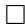

Finally, the next lemma generalizes Step 3 in the proof of Theorem 2.1.

Lemma 2.5 Let $\{\tilde{\Theta}_I^n: I \text{ finite}\}$ be a congruent family of covariant $n$ -tensors such that $(\tilde{\Theta}_I^n)_{\lambda c_I} = 0$ for all $I$ and $\lambda > 0$ . Then $\tilde{\Theta}_I^n = 0$ for all $I$ .

Proof The proof of Step 3 in Theorem 2.1 carries over almost literally. Namely, consider $\mu \in \mathcal{M}_{+}(I)$ such that $\pi_I(\mu) = \mu /\| \mu \| _1\in \mathcal{P}_+(I)$ has rational coefficients,

# 2.6 Congruent Families of Tensors

i.e.,

$$
\mu = \| \mu \| _ {1} \sum_ {i} \frac {k _ {i}}{n} \delta^ {i}
$$

for some $k_{i},n\in \mathbb{N}$ and $\sum_{i\in I}k_{i} = n$ .Let

$$
I ^ {\prime} := \biguplus_ {i \in I} \left(\{i \} \times \left\{1, \dots , k _ {i} \right\}\right),
$$

so that $|I'| = n$ , and consider the congruent Markov kernel

$$
K: i \longmapsto \frac {1}{k _ {i}} \sum_ {j = 1} ^ {k _ {i}} \delta^ {(i, j)}.
$$

Then

$$
K _ {*} \mu = \| \mu \| _ {1} \sum_ {i} \frac {k _ {i}}{n} \left(\frac {1}{k _ {i}} \sum_ {j = 1} ^ {k _ {i}} \delta^ {(i, j)}\right) = \| \mu \| _ {1} \frac {1}{n} \sum_ {i} \sum_ {j = 1} ^ {k _ {i}} \delta^ {(i, j)} = \| \mu \| _ {1} c _ {I ^ {\prime}}.
$$

Thus, (2.74) implies

$$
\left(\tilde {\Theta} _ {I} ^ {n}\right) _ {\mu} (V _ {1}, \ldots , V _ {n}) = \underbrace {\left(\tilde {\Theta} _ {I ^ {\prime}} ^ {n}\right) _ {\| \mu \| _ {1} c _ {I ^ {\prime}}}} _ {= 0} (K _ {*} V _ {1}, \ldots , K _ {*} V _ {n}) = 0,
$$

so that $(\tilde{\Theta}_I^n)_\mu = 0$ whenever $\pi_I(\mu)$ has rational coefficients. But these $\mu$ form a dense subset of $\mathcal{M}_{+}(I)$ , whence $(\tilde{\Theta}_I^n)_\mu = 0$ for all $\mu \in \mathcal{M}_{+}(I)$ , which completes the proof.

Proof of Theorem 2.3 Let $\{\tilde{\Theta}_I^n: I \text{ finite}\}$ be a congruent family of covariant $n$ -tensors. By Lemma 2.4 there is a congruent family $\{\tilde{\Psi}_I^n: I \text{ finite}\}$ of the form (2.81) such that $(\tilde{\Theta}_I^n - \tilde{\Psi}_I^n)_{\lambda c_I} = 0$ for all finite $I$ and all $\lambda > 0$ .

Since $\{\tilde{\Theta}_I^n -\tilde{\Psi}_I^n:I\text{finite}\}$ is again a congruent family, Lemma 2.5 implies that $\tilde{\Theta}_I^n -\tilde{\Psi}_I^n = 0$ and hence $\tilde{\Theta}_I^n = \tilde{\Psi}_I^n$ is of the form (2.81), showing the first part of Theorem 2.3.

For the second part, observe that by Proposition 2.6 any restricted congruent family of covariant $n$ -tensors is the restriction of a congruent family of $n$ -tensors, that is, by the first part of the theorem, the restriction of a family of the form (2.81). This restriction takes the form (2.82) with $c_{\mathbf{P}} \coloneqq a_{\mathbf{P}}(1)$ , observing that the restriction of $\tau_I^{\mathbf{P}}$ with a partition containing a singleton set vanishes as $\tau_I^1$ vanishes when restricted to $\mathcal{P}_{+}(I)$ .

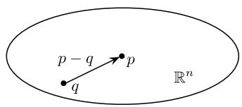  
(A)

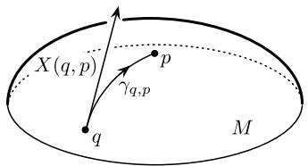  
(B)   
Fig. 2.5 Illustration of (A) the difference vector $p - q$ in $\mathbb{R}^n$ pointing from $q$ to $p$ ; and (B) the difference vector $X(q, p) = \dot{\gamma}_{q,p}(0)$ as the inverse of the exponential map in $q$

# 2.7 Divergences

In this section, we derive distance-like functions, so-called divergences, that are naturally associated with a manifold, equipped with a Riemannian metric $g$ and an affine connection $\nabla$ , possibly different from the Levi-Civita connection of $g$ . In our context, this will lead to the relative entropy and its extensions, the $\alpha$ -divergences, on $\mathcal{M}_{+}(I)$ . These divergences are special cases of canonical divergences which will be defined in Sect. 4.3.

# 2.7.1 Gradient-Based Approach

We begin our motivation of a divergence in terms of a simple example where the manifold is $\mathbb{R}^n$ , equipped with the standard Euclidean metric and its corresponding connection, the Levi-Civita connection. Consider a point $p \in \mathbb{R}^n$ , and the vector field pointing to $p$ (see Fig. 2.5(A)):

$$
\mathbb {R} ^ {n} \rightarrow \mathbb {R} ^ {n}, \quad q \mapsto p - q. \tag {2.92}
$$

Obviously, the difference field (2.92) can be seen as the negative gradient of the squared distance

$$
D _ {p}: \mathbb {R} ^ {n} \to \mathbb {R}, \qquad q \mapsto D _ {p} (q) := D (p \| q) := \frac {1}{2} \| p - q \| ^ {2} = \frac {1}{2} \sum_ {i = 1} ^ {n} (p _ {i} - q _ {i}) ^ {2},
$$

that is,

$$
p - q = - \operatorname {g r a d} _ {q} D _ {p}. \tag {2.93}
$$

Here, the gradient $\mathrm{grad}_q$ is taken with respect to the canonical inner product on $\mathbb{R}^n$ .

We shall now generalize the relation (2.93) between the squared distance $D_{p}$ and the difference of two points $p$ and $q$ to the more general setting of a differentiable manifold $M$ . Given a point $p \in M$ , we want to define a vector field $q \mapsto X(q, p)$ , at least in a neighborhood of $p$ , that corresponds to the difference vector field (2.92).

Obviously, the problem is that the difference $p - q$ is not naturally defined for a general manifold $M$ . We need an affine connection $\nabla$ in order to have a notion of a difference. Given such a connection $\nabla$ , for each point $q \in M$ and each direction $X \in T_qM$ we consider the geodesic $\gamma_{q,X}$ , with the initial point $q$ and the initial velocity $X$ , that is, $\gamma_{q,X}(0) = q$ and $\dot{\gamma}_{q,X}(0) = X$ (see (B.38) in Appendix B). If $\gamma_{q,X}(t)$ is defined for all $0 \leq t \leq 1$ , the endpoint $p = \gamma_{q,X}(1)$ is interpreted as the result of a translation of the point $q$ along a straight line in the direction of the vector $X$ . The collection of all these translations is summarized in terms of the exponential map

$$
\exp_ {q}: U _ {q} \rightarrow M, \quad X \mapsto \gamma_ {q, X} (1), \tag {2.94}
$$

where $U_{q} \subseteq T_{q}M$ denotes the set of tangent vectors $X$ , for which the domain of $\gamma_{q,X}$ contains the unit interval [0, 1] (see (B.39) and (B.40) in Appendix B).

Given two points $p$ and $q$ , one can interpret any $X$ with $\exp_q(X) = p$ as a difference vector $X$ that translates $q$ to $p$ . For simplicity, we assume the existence and uniqueness of such a difference vector, denoted by $X(q, p)$ (see Fig. 2.5(B)).

This is a strong assumption, which is, however, always locally satisfied. On the other hand, although being quite restrictive in general, this property will be satisfied in our information-geometric context, where $g$ is given by the Fisher metric and $\nabla$ is given by the $m$ - and $e$ -connections and their convex combinations, the $\alpha$ -connections. We shall consider these special but important cases in Sects. 2.7.2 and 2.7.3.

If we attach to each point $q \in M$ the difference vector $X(q, p)$ , we obtain a vector field that corresponds to the vector field (2.92) in $\mathbb{R}^n$ . In order to interpret the vector field $q \mapsto X(q, p)$ as a negative gradient field of a (squared) distance function, and thereby generalize (2.93), we need a Riemannian metric $g$ on $M$ . We search for a function $D_p$ satisfying

$$
X (q, p) = - \operatorname {g r a d} _ {q} D _ {p}, \tag {2.95}
$$

where the Riemannian gradient is taken with respect to $g$ (see Appendix B). Obviously, we may set $D_{p}(p) = 0$ . In order to recover $D_{p}$ from (2.95), we consider any curve $\gamma : [0,1] \to M$ that connects $q$ with $p$ , that is, $\gamma(0) = q$ and $\gamma(1) = p$ , and integrate the inner product of the curve velocity $\dot{\gamma}(t)$ with the vector $X(\gamma(t), p)$ along the curve:

$$
\begin{array}{l} \int_ {0} ^ {1} \left\langle X (\gamma (t), p), \dot {\gamma} (t) \right\rangle d t = - \int_ {0} ^ {1} \left\langle \operatorname {g r a d} _ {\gamma (t)} D _ {p}, \dot {\gamma} (t) \right\rangle d t \\ = - \int_ {0} ^ {1} \left(d _ {\gamma (t)} D _ {p}\right) \left(\dot {\gamma} (t)\right) d t \\ = - \int_ {0} ^ {1} \frac {d D _ {p} \circ \gamma}{d t} (t) d t \\ = D _ {p} (\gamma (0)) - D _ {p} (\gamma (1)) \\ = D _ {p} (q) - D _ {p} (p) = D _ {p} (q). \tag {2.96} \\ \end{array}
$$

This defines, at least locally, a function $D_p$ that is assigned to the Riemannian metric $g$ and the connection $\nabla$ . In what follows, we shall mainly use the standard notation $D(p\parallel q) = D_p(q)$ of a divergence as a function $D$ of two arguments.

# 2.7.2 The Relative Entropy

Now we apply the idea of Sect. 2.7.1 in order to define divergences for the $m$ - and $e$ -connections on the cone $\mathcal{M}_{+}(I)$ of positive measures. We consider a measure $\mu \in \mathcal{M}_{+}(I)$ and define two vector fields on $\mathcal{M}_{+}(I)$ as the inverse of the exponential maps given by (2.43) and (2.44):

$$
v \mapsto \widetilde {X} ^ {(m)} (\nu , \mu) := \sum_ {i \in I} v _ {i} \left(\frac {\mu_ {i}}{v _ {i}} - 1\right) \delta^ {i}, \tag {2.97}
$$

$$
v \mapsto \widetilde {X} ^ {(e)} (v, \mu) := \sum_ {i \in I} v _ {i} \log \frac {\mu_ {i}}{v _ {i}} \delta^ {i}.
$$

We can easily verify that these vector fields are gradient fields: The functions

$$
f ^ {i} (v) := \frac {\mu_ {i}}{v _ {i}} - 1 \quad \text {a n d} \quad g ^ {i} (v) := \log \frac {\mu_ {i}}{v _ {i}}
$$

trivially satisfy the integrability condition (2.35), that is, $\frac{\partial f^i}{\partial\nu_j} = \frac{\partial f^j}{\partial\nu_i}$ and $\frac{\partial g^i}{\partial\nu_j} = \frac{\partial g^j}{\partial\nu_i}$ for all $i,j$ . Therefore, for both connections there are corresponding divergences that satisfy Eq. (2.95).

We derive the divergence of the $m$ -connection first, which we denote by $D^{(m)}$ . We consider a curve $\gamma : [0,1] \to \mathcal{M}_{+}(I)$ connecting $\nu$ with $\mu$ , that is, $\gamma(0) = \nu$ and $\gamma(1) = \mu$ . This implies

$$
\left\langle \widetilde {X} ^ {(m)} (\gamma (t), \mu), \dot {\gamma} (t) \right\rangle = \sum_ {i \in I} \frac {1}{\gamma_ {i} (t)} (\mu_ {i} - \gamma_ {i} (t)) \dot {\gamma} _ {i} (t) \tag {2.98}
$$

and

$$
\begin{array}{l} D ^ {(m)} (\mu \| v) = \int_ {0} ^ {1} \left\langle \widetilde {X} ^ {(m)} \big (\gamma (t), \mu \big), \dot {\gamma} (t) \right\rangle d t \\ = \sum_ {i \in I} \int_ {0} ^ {1} \frac {1}{\gamma_ {i} (t)} \left(\mu_ {i} - \gamma_ {i} (t)\right) \dot {\gamma_ {i}} (t) d t \\ = \sum_ {i \in I} \left[ \mu_ {i} \log \gamma_ {i} (t) - \gamma_ {i} (t) \right] _ {0} ^ {1} \\ = \sum_ {i \in I} \left(\mu_ {i} \log \mu_ {i} - \mu_ {i} - \mu_ {i} \log v _ {i} + v _ {i}\right) \\ = \sum_ {i \in I} \bigg (v _ {i} - \mu_ {i} + \mu_ {i} \log \frac {\mu_ {i}}{v _ {i}} \bigg). \\ \end{array}
$$

# 2.7 Divergences

With the same calculation for the $e$ -connection, we obtain the corresponding divergence, which we denote by $D^{(e)}$ . Again, we consider a curve $\gamma$ connecting $\nu$ with $\mu$ . This implies

$$
\left\langle \widetilde {X} ^ {(e)} (\gamma (t), \mu), \dot {\gamma} (t) \right\rangle = \sum_ {i \in I} \dot {\gamma} _ {i} (t) \log \frac {\mu_ {i}}{\gamma_ {i} (t)} \tag {2.99}
$$

and

$$
\begin{array}{l} D ^ {(e)} (\mu \| \nu) = \int_ {0} ^ {1} \left\langle \widetilde {X} ^ {(e)} \big (\gamma (t), \mu \big), \dot {\gamma} (t) \right\rangle d t \\ = \sum_ {i \in I} \int_ {0} ^ {1} \dot {\gamma_ {i}} (t) \log \frac {\mu_ {i}}{\gamma_ {i} (t)} d t \\ = \sum_ {i \in I} \left[ \gamma_ {i} (t) \left(1 + \log \frac {\mu_ {i}}{\gamma_ {i} (t)}\right) \right] _ {0} ^ {1} \\ = \sum_ {i \in I} \left(\mu_ {i} - v _ {i} \left(1 + \log \frac {\mu_ {i}}{v _ {i}}\right)\right) \\ = \sum_ {i \in I} \left(\mu_ {i} - v _ {i} + v _ {i} \log \frac {v _ {i}}{\mu_ {i}}\right) \\ = D ^ {(m)} (\nu \| \mu). \\ \end{array}
$$

These calculations give rise to the following definition:

Definition 2.8 (Kullback-Leibler divergence ([155, 156])) The function $D_{KL}$ : $\mathcal{M}_{+}(I) \times \mathcal{M}_{+}(I) \to \mathbb{R}$ defined by

$$
D _ {K L} (\mu \| v) := \sum_ {i \in I} v _ {i} - \sum_ {i \in I} \mu_ {i} + \sum_ {i \in I} \mu_ {i} \log \frac {\mu_ {i}}{v _ {i}} \tag {2.100}
$$

is called the relative entropy, information divergence, or Kullback-Leibler divergence (KL-divergence). Its restriction to the set of probability distributions is given by

$$
D _ {K L} (\mu \| \nu) = \sum_ {i \in I} \mu_ {i} \log \frac {\mu_ {i}}{\nu_ {i}}. \tag {2.101}
$$

Proposition 2.10 The following holds:

$$
\begin{array}{l} \begin{array}{l} \widetilde {X} ^ {(m)} (\nu , \mu) = - \operatorname {g r a d} _ {\nu} D _ {K L} (\mu \| \cdot), \\ \widetilde {\Sigma} \end{array} \tag {2.102} \\ \widetilde {X} ^ {(e)} (\nu , \mu) = - \operatorname {g r a d} _ {\nu} D _ {K L} (\cdot \| \mu), \\ \end{array}
$$

where $D_{KL}$ is given by (2.100) in Definition 2.8. Furthermore, $D_{KL}$ is the only function on $\mathcal{M}_{+}(I)\times \mathcal{M}_{+}(I)$ that satisfies the conditions (2.102) and $D_{KL}(\mu \| \mu) = 0$ for all $\mu$ .

Proof The statement is obvious from the way we introduced $D_{KL}$ as a potential function of the gradient field $\nu \mapsto \widetilde{X}^{(m)}(\nu, \mu)$ and $\nu \mapsto \widetilde{X}^{(e)}(\nu, \mu)$ , respectively. The following is an alternative direct verification. We first compute the partial derivatives:

$$
\frac {\partial D _ {K L} (\mu \parallel \cdot)}{\partial v _ {i}} (v) = - \frac {\mu_ {i}}{v _ {i}} + 1, \quad \frac {\partial D _ {K L} (\cdot \parallel \mu)}{\partial v _ {i}} (v) = - \log \frac {\mu_ {i}}{v _ {i}}.
$$

With the formula (2.34), we obtain

$$
\begin{array}{l} \left(\operatorname {g r a d} _ {v} D _ {K L} (\mu \| \cdot)\right) _ {i} = v _ {i} \left(- \frac {\mu_ {i}}{v _ {i}} + 1\right) = - \mu_ {i} + v _ {i}, \\ \left(\mathrm {g r a d} _ {\nu} D _ {K L} (\cdot \parallel \mu)\right) _ {i} = - \nu_ {i} \log \frac {\mu_ {i}}{\nu_ {i}}. \\ \end{array}
$$

A comparison with (2.97) verifies (2.102) which uniquely characterize $D_{KL}(\mu \parallel \cdot)$ and $D_{KL}(\cdot \parallel \mu)$ , up to a constant depending on $\mu$ . With the additional assumption $D_{KL}(\mu \parallel \mu) = 0$ for all $\mu$ , this constant is fixed.

We now ask whether the restriction (2.101) of the Kullback-Leibler divergence to the manifold $\mathcal{P}_{+}(I)$ is the right divergence function in the sense that (2.102) also holds for the exponential maps of the restricted $m$ - and $e$ -connections. It is easy to verify that this is indeed the case. In order to elaborate on the geometric reason for this, we consider a general Riemannian manifold $M$ and a submanifold $N$ . Given an affine connection $\widetilde{\nabla}$ on $M$ , we can define its restriction $\nabla$ to $N$ . More precisely, denoting the projection of a vector $Z$ in $T_{p}M$ onto $T_{p}N$ by $\Pi_p^\top(Z)$ , we define $\nabla_X Y|_p \coloneqq \Pi_p^\top(\widetilde{\nabla}_X Y|_p)$ , where $X$ and $Y$ are vector fields on $N$ . Furthermore, we denote the exponential map of $\nabla$ by $\exp_p$ and its inverse by $X(p,q)$ .

Now, given $p \in N$ , we consider a function $\widetilde{D}_p$ on $M$ that satisfies Eq. (2.95). With the restriction $D_p$ of $\widetilde{D}_p$ to the submanifold $N$ , this directly implies

$$
\Pi_ {q} ^ {\top} \big (\widetilde {X} (q, p) \big) = - \Pi_ {q} ^ {\top} (\operatorname {g r a d} _ {q} \widetilde {D} _ {p}) = - \operatorname {g r a d} _ {q} D _ {p}.
$$

However, in order to have $X(q,p) = -\operatorname{grad}_q D_p$ , which corresponds to Eq. (2.95) on the submanifold $N$ , the following equality is required:

$$
X (q, p) = \Pi_ {q} ^ {\top} (\widetilde {X} (q, p)). \tag {2.103}
$$

# 2.7 Divergences

We now verify this condition for the $m$ - and $e$ -connections on $\mathcal{M}_{+}(I)$ and its submanifold $\mathcal{P}_{+}(I)$ . One can easily show that the vector fields

$$
\nu \mapsto X ^ {(m)} (\nu , \mu) := \sum_ {i \in I} \nu_ {i} \left(\frac {\mu_ {i}}{\nu_ {i}} - 1\right) \delta^ {i} = \widetilde {X} ^ {(m)} (\nu , \mu), \tag {2.104}
$$

$$
v \mapsto X ^ {(e)} (v, \mu) := \sum_ {i \in I} v _ {i} \left(\log \frac {\mu_ {i}}{v _ {i}} - \sum_ {j \in I} v _ {j} \log \frac {\mu_ {j}}{v _ {j}}\right) \delta^ {i}
$$

satisfy

$$
\exp^ {(m)} (\nu , X ^ {(m)} (\nu , \mu)) = \mu \quad \text {a n d} \quad \exp^ {(e)} (\nu , X ^ {(e)} (\nu , \mu)) = \mu , \tag {2.105}
$$

respectively, where the exponential maps are given in Proposition 2.5. On the other hand, if we project the vectors $\widetilde{X}^{(m)}(\nu, \mu)$ and $\widetilde{X}^{(e)}(\nu, \mu)$ onto $S_0(I) \cong T_\nu \mathcal{P}_+(I)$ by using (2.14), we obtain

$$
X ^ {(m)} (\nu , \mu) = \Pi_ {\nu} ^ {\top} \left(\widetilde {X} ^ {(m)} (\nu , \mu)\right) \tag {2.106}
$$

and

$$
X ^ {(e)} (\nu , \mu) = \Pi_ {\nu} ^ {\top} \left(\widetilde {X} ^ {(e)} (\nu , \mu)\right). \tag {2.107}
$$

This proves that the condition (2.103) is satisfied, which implies

Proposition 2.11 The following holds:

$$
X ^ {(m)} (\nu , \mu) = - \operatorname {g r a d} _ {\nu} D _ {K L} (\mu \| \cdot), \tag {2.108}
$$

$$
X ^ {(e)} (\nu , \mu) = - \operatorname {g r a d} _ {\nu} D _ {K L} (\cdot \| \mu),
$$

where $D_{KL}$ is given by (2.101) in Definition 2.8. Furthermore, $D_{KL}$ is the only function on $\mathcal{P}_{+}(I)\times \mathcal{P}_{+}(I)$ that satisfies the conditions (2.108) and $D_{KL}(\mu \| \mu) = 0$ for all $\mu$ .

# 2.7.3 The $\alpha$ -Divergence

We now extend the derivations of Sect. 2.7.2 to the $\alpha$ -connections, leading to a generalization of the relative entropy, the so-called $\alpha$ -divergence (Definition 2.9 below). In order to do, so we define the following vector field as the inverse of the $\alpha$ -exponential map on the manifold $\mathcal{M}_{+}(I)$ given by (2.58):

$$
\nu \mapsto \widetilde {X} ^ {(\alpha)} (\nu , \mu) := \frac {2}{1 - \alpha} \sum_ {i \in I} \nu_ {i} \left(\left(\frac {\mu_ {i}}{\nu_ {i}}\right) ^ {\frac {1 - \alpha}{2}} - 1\right) \delta^ {i}. \tag {2.109}
$$

Again, we can easily verify that the vector field $\nu \mapsto \widetilde{X}^{(\alpha)}(\nu, \mu)$ is a gradient field by observing that the integrability condition (2.35) is trivially satisfied, that is, $\frac{\partial f^i}{\partial\nu_j} = \frac{\partial f^j}{\partial\nu_i}$ for all $i, j$ , where

$$
f ^ {i} (v) := \left(\frac {\mu_ {i}}{v _ {i}}\right) ^ {\frac {1 - \alpha}{2}} - 1.
$$

In order to derive the divergence $D^{(\alpha)}$ of the $\alpha$ -connection, we consider a curve $\gamma : [0,1] \to \mathcal{M}_{+}(I)$ connecting $\nu$ with $\mu$ . We obtain

$$
\left\langle \widetilde {X} ^ {(\alpha)} (\gamma (t), \mu), \dot {\gamma} (t) \right\rangle = \frac {2}{1 - \alpha} \sum_ {i \in I} \dot {\gamma} _ {i} (t) \left(\left(\frac {\mu_ {i}}{\gamma_ {i} (t)}\right) ^ {\frac {1 - \alpha}{2}} - 1\right) \tag {2.110}
$$

and

$$
\begin{array}{l} D ^ {(\alpha)} (\mu \| v) = \int_ {0} ^ {1} \left\langle \widetilde {X} ^ {(\alpha)} \big (\gamma (t), \mu \big), \dot {\gamma} (t) \right\rangle d t \\ = \sum_ {i \in I} \int_ {0} ^ {1} \frac {2}{1 - \alpha} \dot {\gamma} _ {i} (t) \left(\left(\frac {\mu_ {i}}{\gamma_ {i} (t)}\right) ^ {\frac {1 - \alpha}{2}} - 1\right) d t \\ = \sum_ {i \in I} \left[ \frac {4}{1 - \alpha^ {2}} \gamma_ {i} (t) ^ {\frac {1 + \alpha}{2}} \mu_ {i} ^ {\frac {1 - \alpha}{2}} - \frac {2}{1 - \alpha} \gamma_ {i} (t) \right] _ {0} ^ {1} \\ = \sum_ {i \in I} \left(\frac {2}{1 + \alpha} \mu_ {i} - \left(\frac {4}{1 - \alpha^ {2}} v _ {i} ^ {\frac {1 + \alpha}{2}} \mu_ {i} ^ {\frac {1 - \alpha}{2}} - \frac {2}{1 - \alpha} v _ {i}\right)\right) \\ = \sum_ {i \in I} \left(\frac {2}{1 - \alpha} v _ {i} + \frac {2}{1 + \alpha} \mu_ {i} - \frac {4}{1 - \alpha^ {2}} v _ {i} ^ {\frac {1 + \alpha}{2}} \mu_ {i} ^ {\frac {1 - \alpha}{2}}\right). \\ \end{array}
$$

Obviously, we have

$$
D ^ {(- \alpha)} (\mu \| v) = D ^ {(\alpha)} (v \| \mu). \tag {2.111}
$$

These calculations give rise to the following definition:

Definition 2.9 ( $\alpha$ -Divergence) The function $D^{(\alpha)}: \mathcal{M}_{+}(I) \times \mathcal{M}_{+}(I) \to \mathbb{R}$ defined by

$$
D ^ {(\alpha)} (\mu \| v) := \frac {2}{1 - \alpha} \sum_ {i \in I} v _ {i} + \frac {2}{1 + \alpha} \sum_ {i \in I} \mu_ {i} - \frac {4}{1 - \alpha^ {2}} \sum_ {i \in I} v _ {i} ^ {\frac {1 + \alpha}{2}} \mu_ {i} ^ {\frac {1 - \alpha}{2}} \tag {2.112}
$$

is called the $\alpha$ -divergence. Its restriction to probability measures is given by

$$
D ^ {(\alpha)} (\mu \| \nu) = \frac {4}{1 - \alpha^ {2}} \left(1 - \sum_ {i \in I} \nu_ {i} ^ {\frac {1 + \alpha}{2}} \mu_ {i} ^ {\frac {1 - \alpha}{2}}\right). \tag {2.113}
$$

# 2.7 Divergences

Proposition 2.12 The following holds:

$$
\widetilde {X} ^ {(\alpha)} (\nu , \mu) = - \operatorname {g r a d} _ {\nu} D ^ {(\alpha)} (\mu \| \cdot), \tag {2.114}
$$

where $D^{(\alpha)}$ is given by (2.112) in Definition 2.9. Furthermore, $D^{(\alpha)}$ is the only function on $\mathcal{M}_{+}(I)\times \mathcal{M}_{+}(I)$ that satisfies the conditions (2.114) and $D^{(\alpha)}(\mu \| \mu) = 0$ for all $\mu$ .

Proof The statement is obvious from the way we introduced $D^{(\alpha)}$ as a potential function of the gradient field $\nu \mapsto \widetilde{X}^{(\alpha)}(\nu, \mu)$ . The following is an alternative direct verification. We compute the partial derivative:

$$
\frac {\partial D ^ {(\alpha)} (\mu \parallel \cdot)}{\partial v _ {i}} (\nu) = \frac {2}{1 - \alpha} \big (1 - v _ {i} ^ {\frac {1 + \alpha}{2} - 1} \mu_ {i} ^ {\frac {1 - \alpha}{2}} \big).
$$

With the formula (2.34), we obtain

$$
\begin{array}{l} \left(\operatorname {g r a d} _ {v} D ^ {(\alpha)} (\mu \| \cdot)\right) _ {i} = v _ {i} \cdot \frac {2}{1 - \alpha} \left(1 - v _ {i} ^ {\frac {1 + \alpha}{2} - 1} \mu_ {i} ^ {\frac {1 - \alpha}{2}}\right) \\ = \frac {2}{1 - \alpha} \left(v _ {i} - v _ {i} ^ {\frac {1 + \alpha}{2}} \mu_ {i} ^ {\frac {1 - \alpha}{2}}\right). \\ \end{array}
$$

A comparison with (2.109) verifies (2.114) which uniquely characterizes the function $D^{(\alpha)}(\mu \| \cdot)$ , up to a constant depending on $\mu$ . With the additional assumption $D^{(\alpha)}(\mu \| \mu) = 0$ for all $\mu$ , this constant is fixed.

With L'Hopital's rule, one can easily verify

$$
\lim  _ {\alpha \rightarrow - 1} D ^ {(\alpha)} (\mu \| v) = D ^ {(m)} (\mu \| v) = D _ {K L} (\mu \| v) \tag {2.115}
$$

and

$$
\lim  _ {\alpha \rightarrow 1} D ^ {(\alpha)} (\mu \| v) = D ^ {(e)} (\mu \| v) = D _ {K L} (v \| \mu), \tag {2.116}
$$

where $D_{KL}$ is relative entropy defined by (2.100).

In what follows, we use the notation $D^{(\alpha)}$ also for $\alpha \in \{-1, 1\}$ by setting $D^{(-1)}(\mu \| \nu) \coloneqq D_{KL}(\mu \| \nu)$ and $D^{(1)}(\mu \| \nu) \coloneqq D_{KL}(\nu \| \mu)$ . This is consistent with the definition of the $\alpha$ -connection, given by (2.54), where we have the $m$ -connection for $\alpha = -1$ and the $e$ -connection for $\alpha = 1$ . Note that $D^{(0)}$ is closely related to the Hellinger distance (2.28):

$$
D ^ {(0)} (\mu \| \nu) = 2 \left(d ^ {H} (\mu , \nu)\right) ^ {2}. \tag {2.117}
$$

We would like to point out that the $\alpha$ -divergence on the simplex $\mathcal{P}_{+}(I), -1 < \alpha < 1$ , based on (2.95) does not coincide with the restriction of the $\alpha$ -divergence on $\mathcal{M}_{+}(I)$ . To be more precise, we have seen that the restriction of the relative entropy, defined on $\mathcal{M}_{+}(I)$ , to the submanifold $\mathcal{P}_{+}(I)$ is already the right divergence

for the projected $m$ - and $e$ -connections (see Proposition 2.11). The situation turns out to be more complicated for general $\alpha$ . From Eq. (2.65) we obtain

$$
X ^ {(\alpha)} (\nu , \mu) = \dot {\tau} _ {\nu , \mu} (0) \Pi_ {\nu} ^ {\top} \left(\widetilde {X} ^ {(\alpha)} (\nu , \mu)\right).
$$

This equality deviates from the condition (2.103) by the factor $\dot{\tau}_{\nu,\mu}(0)$ , which proves that the restriction of the $\alpha$ -divergence, which is defined on $\mathcal{M}_+(I)$ , to the submanifold $\mathcal{P}_+(I)$ does not coincide with the $\alpha$ -divergence on $\mathcal{P}_+(I)$ . As an example, we consider the case $\alpha = 0$ , where the $\alpha$ -connection is the Levi-Civita connection of the Fisher metric. In that case, the canonical divergence equals $\frac{1}{2} (d^F(\mu,\nu))^2$ , where $d^F$ denotes the Fisher distance (2.27). Obviously, this divergence is different from the divergence $D^{(0)}$ , given by (2.117), which is based on the distance in the ambient space $\mathcal{M}_+(I)$ , the Hellinger distance. On the other hand, $\frac{1}{2} (d^F)^2$ can be written as a monotonically increasing function of $D^{(0)}$ :

$$
\frac {1}{2} \left(d ^ {F} (\mu , v)\right) ^ {2} = 2 \arccos  ^ {2} \left(1 - \frac {1}{4} D ^ {(0)} (\mu \| v)\right). \tag {2.118}
$$

# 2.7.4 The $f$ -Divergence

Our derivation of $D^{(\alpha)}$ was based on the idea of a squared distance function associated with the $\alpha$ -connections in terms of the general Eq. (2.95). However, it turns out that, although being naturally motivated, the functions $D^{(\alpha)}$ do not share all properties of the square of a distance, except for $\alpha = 0$ . The symmetry is obviously not satisfied. On the other hand, we have $D^{(\alpha)}(\mu \| \nu) \geq 0$ , and $D^{(\alpha)}(\mu \| \nu) = 0$ if and only if $\mu = \nu$ . One can verify this by considering $D^{(\alpha)}$ as being a function of a more general structure, which we are now going to introduce. Given a strictly convex function $f: \mathbb{R}_+ \to \mathbb{R}$ , we define

$$
D _ {f} (\mu \| v) := \sum_ {i \in I} \mu_ {i} f \left(\frac {v _ {i}}{\mu_ {i}}\right). \tag {2.119}
$$

This function is known as the $f$ -divergence, and it was introduced and studied by Csiszár [70-73]. Jensen's inequality immediately implies

$$
\begin{array}{l} D _ {f} (\mu \parallel v) = \left(\sum_ {j \in I} \mu_ {j}\right) \sum_ {i \in I} \frac {\mu_ {i}}{\sum_ {j \in I} \mu_ {j}} f \left(\frac {v _ {i}}{\mu_ {i}}\right) \\ \geq \left(\sum_ {j \in I} \mu_ {j}\right) f \left(\sum_ {i \in I} \frac {\mu_ {i}}{\sum_ {j \in I} \mu_ {j}} \frac {v _ {i}}{\mu_ {i}}\right) \\ = \left(\sum_ {j \in I} \mu_ {j}\right) f \left(\frac {\sum_ {i \in I} v _ {i}}{\sum_ {j \in I} \mu_ {j}}\right), \\ \end{array}
$$

# 2.7 Divergences

where the equality holds if and only if $\mu = \nu$ . If $f(x)$ is non-negative for all $x$ , and $f(1) = 0$ , then we obtain

$$
D _ {f} (\mu \| v) \geq 0, \quad \text {a n d} \quad D _ {f} (\mu \| v) = 0 \text {i f a n d o n l y i f} \mu = v. \tag {2.120}
$$

In order to reformulate $D^{(\alpha)}$ as such a function $D_{f}$ , we define

$$
f ^ {(\alpha)} (x) := \left\{ \begin{array}{l l} \frac {4}{1 - \alpha^ {2}} \left(\frac {1 - \alpha}{2} + \frac {1 + \alpha}{2} x - x ^ {\frac {1 + \alpha}{2}}\right), & \text {i f} \alpha \notin \{- 1, 1 \}, \\ x - 1 - \log x, & \text {i f} \alpha = - 1, \\ 1 - x + x \log x, & \text {i f} \alpha = 1. \end{array} \right. \tag {2.121}
$$

With this definition, we have $D^{(\alpha)} = D_{f^{(\alpha)}}$ . Furthermore, it is easy to verify that for each $\alpha \in [-1, 1]$ , the function $f^{(\alpha)}$ is non-negative and vanishes if and only if its argument is equal to one. This proves that the functions $D^{(\alpha)}$ satisfy (2.120), which is a property of a metric. In conclusion, we have seen that, although $D^{(\alpha)}$ is not symmetric and does not satisfy the triangle inequality, it still has some important properties of a squared distance. In this sense, we have obtained a distance-like function that is associated with the $\alpha$ -connection and the Fisher metric on $\mathcal{M}_{+}(I)$ , coupled through Eq. (2.95). The following proposition suggests a way to recover these two objects from the $\alpha$ -divergence.

Proposition 2.13 The following holds:

$$
\mathfrak {g} _ {\mu} (X, Y) = \left. \frac {\partial^ {2} D ^ {(\alpha)} (\mu \| \cdot)}{\partial Y \partial X} (\nu) \right| _ {\nu = \mu}, \tag {2.122}
$$

$$
\mathbf {T} _ {\mu} (X, Y, Z) = - \frac {2}{3 - \alpha} \left. \frac {\partial^ {3} D ^ {(\alpha)} (\mu \| \cdot)}{\partial Z \partial Y \partial X} (\nu) \right| _ {\nu = \mu}. \tag {2.123}
$$

The proof of this proposition is by simple calculation. This implies that the Fisher metric can be recovered through the partial derivatives of second order (see (2.122)). In particular, this determines the Levi-Civita connection $\widetilde{\nabla}^{(0)}$ of $\mathfrak{g}$ , and we can use $\mathbf{T}$ to derive the $\alpha$ -connection based on the definition (2.54):

$$
\mathfrak {g} \left(\widetilde {\nabla} _ {X} ^ {(\alpha)} Y, Z\right) = \mathfrak {g} \left(\widetilde {\nabla} _ {X} ^ {(0)} Y, Z\right) - \frac {\alpha}{2} \mathbf {T} (X, Y, Z). \tag {2.124}
$$

Thus, we can recover the Fisher metric and the $\alpha$ -connection from the partial derivatives of the $\alpha$ -divergence up to the third order. We obtain the following expansion of the $\alpha$ -divergence:

$$
\begin{array}{l} D ^ {(\alpha)} (\mu \parallel v) = \frac {1}{2} \sum_ {i, j} \mathfrak {g} _ {\mu} (\delta^ {i}, \delta^ {j}) (\mu) (v _ {i} - \mu_ {i}) (v _ {j} - \mu_ {j}) \\ + \frac {1}{6} \frac {\alpha - 3}{2} \sum_ {i, j, k} \mathbf {T} _ {\mu} \left(\delta^ {i}, \delta^ {j}, \delta^ {k}\right) \left(v _ {i} - \mu_ {i}\right) \left(v _ {j} - \mu_ {j}\right) \left(v _ {k} - \mu_ {k}\right) \\ + O \left(\| v - \mu \| ^ {4}\right). \tag {2.125} \\ \end{array}
$$

Any function $D$ that satisfies the positivity (2.120) and for which the bilinear form

$$
g _ {\mu} (X, Y) := \frac {\partial^ {2} D (\mu \| \cdot)}{\partial Y \partial X} (\nu) \bigg | _ {\nu = \mu}
$$

is positive definite, is called a divergence or contrast function (see [93, 173]). In Chap. 4, we will revisit divergence functions and related expressions between tensors and affine connections in terms of partial derivatives of potential functions from a more general perspective. We highlight a few important facts already in this section. The coupling between the divergence function $D^{(\alpha)}$ and the tensors $\mathfrak{g}$ and $\mathbf{T}$ through the above expansion (2.125) is clearly not one-to-one, as the derivatives of order greater than three are not fixed. For instance, one could simply neglect the higher-order terms in order to obtain a divergence function that has the same expansion up to order three. A more interesting divergence for $\mathfrak{g}$ and $\mathbf{T}$ is given in terms of the $f$ -divergence. One can easily prove that

$$
\begin{array}{l} D _ {f} (\mu \| v) = \frac {1}{2} f ^ {\prime \prime} (1) \sum_ {i, j} \mathfrak {g} _ {\mu} \left(\delta^ {i}, \delta^ {j}\right) (\mu) (v _ {i} - \mu_ {i}) (v _ {j} - \mu_ {j}) \\ + \frac {1}{6} f ^ {\prime \prime \prime} (1) \sum_ {i, j, k} \mathbf {T} _ {\mu} \left(\delta^ {i}, \delta^ {j}, \delta^ {k}\right) \left(v _ {i} - \mu_ {i}\right) \left(v _ {j} - \mu_ {j}\right) \left(v _ {k} - \mu_ {k}\right) \\ + O \left(\| v - \mu \| ^ {4}\right). \tag {2.126} \\ \end{array}
$$

If we choose a function $f$ that satisfies $f''(1) = 1$ and $f'''(1) = \frac{\alpha - 3}{2}$ , then this expansion coincides with (2.125) up to the third order. Clearly, $f^{(\alpha)}$ , as defined in (2.121), satisfies these two conditions. However, this is only one of infinitely many possible choices. This shows that the coupling between a divergence function and an affine connection through (2.95), which uniquely characterizes the relative entropy and the $\alpha$ -divergence on $\mathcal{M}_+(I)$ , is stronger than the coupling through the specification of the partial derivatives up to the third order.

# 2.7.5 The $q$ -Generalization of the Relative Entropy

There is a different way of relating the $\alpha$ -divergence to the relative entropy. Instead of verifying the consistency of $D_{KL}$ and $D^{(\alpha)}$ in terms of (2.115) and (2.116), one can rewrite $D^{(\alpha)}$ so that it resembles the structure of the relative entropy (2.100). This approach is based on Tsallis' so-called $q$ -generalization of the entropy and the relative entropy [248, 249]. Here, $q$ is a parameter with values in the unit interval $]0, 1[$ which directly corresponds to $\alpha = 1 - 2q \in ]-1, +1[$ . With this reparametrization, the $\alpha$ -divergence (2.112) becomes

$$
D ^ {(1 - 2 q)} (\mu \parallel v) = \frac {1}{q} \sum_ {i} v _ {i} + \frac {1}{1 - q} \sum_ {i} \mu_ {i} - \frac {1}{q (1 - q)} \sum_ {i} v _ {i} ^ {1 - q} \mu_ {i} ^ {q}. \qquad (2. 1 2 7)
$$

# 2.8 Exponential Families

This can be rewritten in a way that resembles the structure of the relative entropy $D_{KL}$ . In order to do so, we define the $q$ -exponential function and its inverse, the $q$ -logarithmic function:

$$
\exp_ {q} (x) := \left(1 + (1 - q) x\right) ^ {\frac {1}{1 - q}}, \quad \log_ {q} (x) := \frac {1}{1 - q} \left(x ^ {1 - q} - 1\right). \tag {2.128}
$$

For $q \to 1$ , these definitions converge to the ordinary definitions. Now we can rewrite (2.127) as follows:

$$
D ^ {(1 - 2 q)} (\mu \parallel v) = \frac {1}{q} \bigg (\sum_ {i} v _ {i} - \sum_ {i} \mu_ {i} - \sum_ {i} \mu_ {i} \log_ {q} \bigg (\frac {v _ {i}}{\mu_ {i}} \bigg) \bigg). (2. 1 2 9)
$$

This resembles, up to the factor $\frac{1}{q}$ , the Kullback-Leibler divergence (2.100). In this sense, the $\alpha$ -divergence can be considered as a $q$ -generalization of the Kullback-Leibler divergence. These generalizations turn out to be relevant in physics, leading to the field of nonextensive statistical mechanics as a generalization of Boltzmann-Gibbs statistical mechanics [198, 249]. Information geometry contributes to a better geometric understanding of this new field of research [197, 204, 205]. (For a detailed overview of related information-geometric works, see [11].)

# 2.8 Exponential Families

# 2.8.1 Exponential Families as Affine Spaces

In Sects. 2.4 and 2.5 we introduced the $m$ - and $e$ -connections and their convex combinations, the $\alpha$ -connections. In general, the notion of an affine connection extends the notion of an affine action of a vector space $V$ on an affine space $E$ . Given a point $p \in E$ and a vector $v \in V$ , such an action translates $p$ along $v$ into a new point $p + v$ . On the other hand, for each pair of points $p, q \in E$ , there is a vector $v$ , called the difference vector between $p$ and $q$ , which translates $p$ into $q$ , that is, $q = p + v$ . The affine space $E$ can naturally be interpreted as a manifold with tangent bundle $E \times V$ . The translation map $E \times V \to E$ is then nothing but the exponential map exp of the affine connection given by the natural parallel transport $\Pi_{p,q} : (p, v) \mapsto (q, v)$ . Clearly, this is a very special parallel transport. It is, however, closely related to the transport maps (2.39) and (2.40), which define the $m$ - and $e$ -connections. Therefore, we can ask the question whether the exponential maps of the $m$ - and $e$ -connections define affine actions on $\mathcal{M}_{+}(I)$ and $\mathcal{P}_{+}(I)$ . This affine space perspective of $\mathcal{M}_{+}(I)$ and $\mathcal{P}_{+}(I)$ , and their respective extensions to spaces of $\sigma$ -finite measures (see Remark 3.8(1)), has been particularly highlighted in [192].

Obviously, $\mathcal{M}_{+}(I)$ , equipped with the $m$ -connection, is not an affine space, simply because the corresponding exponential map is not complete. For each $\mu \in \mathcal{M}_{+}(I)$ there is a vector $v \in S(I)$ so that $\mu + v \notin \mathcal{M}_{+}(I)$ . Now, let us come

to the $e$ -connection. The exponential map $\widetilde{\exp}^{(e)}$ is defined on the tangent bundle $T\mathcal{M}_{+}(I)$ and translates each point $\mu$ along a vector $V_{\mu}\in T_{\mu}\mathcal{M}_{+}(I)$ . In order to interpret it as an affine action, we identify the tangent spaces $T_{\mu}\mathcal{M}_{+}(I)$ and $T_{\nu}\mathcal{M}_{+}(I)$ in two points $\mu$ and $\nu$ in terms of the corresponding parallel transport. More precisely, we introduce an equivalence relation $\sim$ by which we identify two vectors $A_{\mu} = (\mu ,a)\in T_{\mu}\mathcal{M}_{+}(I)$ and $B_{\nu} = (\nu ,b)\in T_{\nu}\mathcal{M}_{+}(I)$ if $B_{\nu}$ is the parallel transport of $A_{\mu}$ from $\mu$ to $\nu$ , that is, $B_{\nu} = \widetilde{\Pi}_{\mu ,\nu}^{(e)}A_{\mu}$ . Also, the equivalence class of a vector $(\mu ,a)$ can be identified with the density $\frac{da}{d\mu}$ , which is an element of $\mathcal{F}(I)$ . Obviously,

$$
A _ {\mu} \sim B _ {\nu} \quad \Leftrightarrow \quad b = \frac {d a}{d \mu} \quad \Leftrightarrow \quad \frac {d b}{d \nu} = \frac {d a}{d \mu}.
$$

Now we show that $\mathcal{F}(I)$ acts affinely on $\mathcal{M}_{+}(I)$ . Consider a point $\mu$ and a vector $f$ , interpreted as translation vector. This defines a vector $(\mu, f\mu) \in T_{\mu}\mathcal{M}_{+}(I)$ , which is mapped via the exponential map to

$$
\widetilde {\mathrm {e x p}} _ {\mu} ^ {(e)} (f \mu) = e ^ {f} \mu .
$$

Altogether we have defined the map

$$
\mathcal {M} _ {+} (I) \times \mathcal {F} (I) \rightarrow \mathcal {M} _ {+} (I), \quad (\mu , f) \mapsto \mu + f := e ^ {f} \mu , \tag {2.130}
$$

which satisfies

$$
(\mu + f) + g = e ^ {f} \mu + g = e ^ {g} \left(e ^ {f} \mu\right) = e ^ {f + g} \mu = \mu + (f + g).
$$

Furthermore, with the vector $\operatorname{vec}(\mu, \nu) \coloneqq \log\left(\frac{d\nu}{d\mu}\right)$ we obviously have $\mu + \operatorname{vec}(\mu, \nu) = \nu$ , and this is the only vector that translates $\mu$ to $\nu$ . This verifies that $+$ is an affine action of $\mathcal{F}(I)$ on $\mathcal{M}_{+}(I)$ .

We apply the same derivation in order to define an affine structure on $\mathcal{P}_{+}(I)$ . This leads to the following version of the map (2.130) defined for the simplex $\mathcal{P}_{+}(I)$ (see Fig. 2.6):

$$
\mathcal {P} _ {+} (I) \times \left(\mathcal {F} (I) / \mathbb {R}\right)\rightarrow \mathcal {P} _ {+} (I), \quad (\mu , f + \mathbb {R}) \mapsto \mu + (f + \mathbb {R}) := \frac {e ^ {f}}{\mu \left(e ^ {f}\right)} \mu . \tag {2.131}
$$

This is an affine action of the vector space $\mathcal{F}(I) / \mathbb{R}$ on $\mathcal{P}_{+}(I)$ with difference vector

$$
\operatorname {v e c}: \mathcal {P} _ {+} (I) \times \mathcal {P} _ {+} (I) \to \mathcal {F} (I) / \mathbb {R}, \qquad (\mu , v) \mapsto \operatorname {v e c} (\mu , v) = \log \left(\frac {d v}{d \mu}\right) + \mathbb {R}.
$$

Therefore, $\mathcal{P}_{+}(I)$ is an affine space over $\mathcal{F}(I) / \mathbb{R}$ .

The corresponding affine subspaces play a central role within information geometry.

# 2.8 Exponential Families

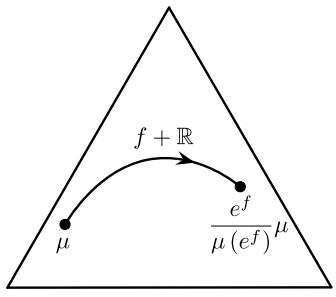  
Fig.2.6 The affine action of $\mathcal{F}(I) / \mathbb{R}$ on the simplex $\mathcal{P}_+(I)$

Definition 2.10 (Exponential family) An affine subspace $\mathcal{E}$ of $\mathcal{P}_{+}(I)$ with respect to $+$ is called an exponential family. Given a measure $\mu_0\in \mathcal{M}_+(I)$ and a linear subspace $\mathcal{L}$ of $\mathcal{F}(I)$ , the following submanifold of $\mathcal{P}_{+}(I)$ is an exponential family:

$$
\mathcal {E} (\mu_ {0}, \mathcal {L}) := \left\{\frac {e ^ {f}}{\mu_ {0} (e ^ {f})} \mu_ {0}: f \in \mathcal {L} \right\}. \tag {2.132}
$$

To simplify the notation, in the case where $\mu_0$ is the counting measure, that is, $\mu_0 = \sum_{i\in I}\delta^i$ , we simply write $\mathcal{E}(\mathcal{L})$ instead of $\mathcal{E}(\mu_0,\mathcal{L})$ .

Clearly, all exponential families have the structure (2.132). We always assume $\mathbb{1} \in \mathcal{L}$ and thereby ensure uniqueness of $\mathcal{L}$ . Furthermore, with this assumption we have $\dim(\mathcal{E}) = \dim(\mathcal{L}) - 1$ .

Given two points $\mu, \nu \in \mathcal{P}_{+}(I)$ , the $m$ - and $e$ -connections provide two kinds of straight lines connecting them:

$$
\gamma_ {\mu , \nu} ^ {(m)}: [ 0, 1 ] \to \mathcal {P} _ {+} (I), \qquad t \mapsto (1 - t)   \mu + t   \nu ,
$$

$$
\gamma_ {\mu , \nu} ^ {(e)}: [ 0, 1 ] \to \mathcal {P} _ {+} (I), \qquad t \mapsto \frac {(\frac {d \nu}{d \mu}) ^ {t}}{\mu ((\frac {d \nu}{d \mu}) ^ {t})} \mu .
$$

This allows us to consider two kinds of geodesically convex sets. A set $S$ is said to be $m$ -convex if

$$
\mu , \nu \in \mathcal {S} \Rightarrow \gamma_ {\mu , \nu} ^ {(m)} (t) \in \mathcal {S} \mathrm {f o r a l l} t \in [ 0, 1 ],
$$

and $e$ -convex if

$$
\mu , \nu \in \mathcal {S} \Rightarrow \gamma_ {\mu , \nu} ^ {(e)} (t) \in \mathcal {S} \quad \mathrm {f o r a l l} t \in [ 0, 1 ].
$$

Exponential families are clearly $e$ -convex. On the other hand, they can also be $m$ -convex. Given a partition $\mathfrak{S}$ of $I$ and probability measures $\mu_{A}$ with support $A$ , $A \in \mathfrak{S}$ , the following set is an $m$ -convex exponential family:

$$
\mathcal {M} := \mathcal {M} \left(\mu_ {A}: A \in \mathfrak {S}\right) := \left\{\sum_ {A \in \mathfrak {S}} \eta_ {A} \mu_ {A}: \eta_ {A} > 0, \sum_ {A \in \mathfrak {S}} \eta_ {A} = 1 \right\}. \tag {2.133}
$$

To see this, define the base measure as $\mu_0\coloneqq \sum_{A\in \mathfrak{S}}\mu_A$ and $\mathcal{L}$ as the linear hull of the vectors $\mathbb{1}_A$ , $A\in \mathfrak{S}$ . Then the elements of $\mathcal{M}(\mu_A:A\in \mathfrak{S})$ are precisely the elements of the exponential family $\mathcal{E}(\mu_0,\mathcal{L})$ , via the correspondence

$$
\begin{array}{l} \sum_ {A \in \mathfrak {S}} \eta_ {A} \mu_ {A} = \sum_ {A \in \mathfrak {S}} \frac {\eta_ {A}}{\sum_ {B \in \mathfrak {S}} \eta_ {B}} \mu_ {A} \\ = \sum_ {A \in \mathfrak {S}} \frac {e ^ {\log \eta_ {A}}}{\sum_ {B \in \mathfrak {S}} e ^ {\log \eta_ {B}}} \mu_ {A} \\ = \sum_ {A \in \mathfrak {S}} \frac {e ^ {\lambda_ {A}}}{\sum_ {B \in \mathfrak {S}} e ^ {\lambda_ {B}}} \mu_ {A} \\ = \sum_ {A \in \mathfrak {S}} \sum_ {i \in A} \frac {e ^ {\lambda_ {A}}}{\sum_ {B \in \mathfrak {S}} e ^ {\lambda_ {B}}} \mu_ {i} \delta^ {i} \\ = \sum_ {i \in I} \frac {e ^ {\sum_ {A \in \mathfrak {S}} \lambda_ {A} \mathbb {1} _ {A} (i)}}{\sum_ {j \in I} e ^ {\sum_ {A \in \mathfrak {S}} \lambda_ {A} \mathbb {1} _ {A} (j)} \mu_ {j}} \mu_ {i} \delta^ {i} \\ = \frac {e ^ {\sum_ {A \in \mathfrak {S}} \lambda_ {A} \mathbb {1} _ {A}}}{\mu_ {0} \left(e ^ {\sum_ {A \in \mathfrak {S}} \lambda_ {A} \mathbb {1} _ {A}}\right)} \mu_ {0}, \tag {2.134} \\ \end{array}
$$

where $\lambda_{A} = \log (\eta_{A})$ , $A\in \mathfrak{S}$ . It turns out that $\mathcal{M}(\mu_A:A\in \mathfrak{S})$ is not just one instance of an $m$ -convex exponential family. In fact, as we shall see in the following theorem, which together with its proof is based on [179], (2.133) describes the general structure of such exponential families. Note that for any set $\mathfrak{S}$ of subsets $A$ of $I$ and corresponding distributions $\mu_{A}$ with support $A$ , the set (2.133) will be $m$ -convex. However, when the sets $A\in \mathfrak{S}$ form a partition of $I$ , this set will also be an exponential family.

Theorem 2.4 Let $\mathcal{E} = \mathcal{E}(\mu_0, \mathcal{L})$ be an exponential family in $\mathcal{P}_+(I)$ . Then the following statements are equivalent:

(1) The exponential family $\mathcal{E}$ is $m$ -convex.   
(2) There exists a partition $\mathfrak{S} \subseteq 2^I$ of $I$ and elements $\mu_A \in \mathcal{P}_+(A)$ , $A \in \mathfrak{S}$ , such that

$$
\mathcal {E} = \mathcal {M} \left(\mu_ {A}: A \in \mathfrak {S}\right), \tag {2.135}
$$

where the RHS of this equation is defined by (2.133).

(3) The linear space $\mathcal{L}$ is a subalgebra of $\mathcal{F}(I)$ , i.e., closed under (pointwise) multiplication.

The proof of this theorem is based on the following lemma.

Lemma 2.6 The smallest convex exponential family containing two probability measures $\mu = \sum_{i\in I}\mu_i\delta^i$ and $\nu = \sum_{i\in I}\nu_i\delta^i$ with the supports equal to $I$ coin-

# 2.8 Exponential Families

cides with $\mathcal{M}(\mu_A:A\in \mathfrak{S}_{\mu ,\nu})$ where $\mathfrak{S}_{\mu ,\nu}$ is the partition of $I$ having $i,j\in I$ in the same block if and only if $\mu_{i}\nu_{j} = \mu_{j}\nu_{i}$ and $\mu_{A}$ equals the conditioning of $\mu$ to $A$ , that is,

$$
\mu_ {A} = \sum_ {i \in I} \mu_ {A, i}   \delta^ {i}, \quad w i t h \quad \mu_ {A, i} := \left\{ \begin{array}{l l} \frac {\mu_ {i}}{\sum_ {j \in A} \mu_ {j}}, & i f i \in A, \\ 0 & o t h e r w i s e. \end{array} \right.
$$

Proof Let $\mathfrak{S}_{\mu, \nu}$ have $n$ blocks and an element $i_A$ of $A$ be fixed for each $A \in \mathfrak{S}_{\mu, \nu}$ . The numbers $\mu_{i_A}^k \nu_{i_A}^{-k}$ , $A \in \mathfrak{S}_{\mu, \nu}$ , $0 \leq k < n$ , are elements of a Vandermonde matrix which has nonzero determinant because $\mu_{i_A} / \nu_{i_A}$ , $A \in \mathfrak{S}_{\mu, \nu}$ , are pairwise different. Therefore, for $0 \leq k < n$ the vectors $(\mu_{i_A}^k \nu_{i_A}^{-k})_{A \in \mathfrak{S}_{\mu, \nu}}$ are linearly independent, and so are the vectors $(\mu_i^k \nu_i^{-k})_{i \in I}$ . Then the probability measures proportional to $(\mu_i^{k+1} \nu_i^{-k})_{i \in I}$ are independent. These probability measures belong to any exponential family containing $\mu$ and $\nu$ and, in turn, their convex hull is contained in any convex exponential family containing $\mu$ and $\nu$ . In particular, it is contained in $\mathcal{M} = \mathcal{M}(\mu_A : A \in \mathfrak{S}_{\mu, \nu})$ because $\mu$ and $\nu$ , the latter being equal to $\sum_{A \in \mathfrak{S}} (\sum_{j \in A} \nu_j)$ because $\mu$ and $\nu$ , the latter being equal to $\mathcal{M}$ by construction. Since the convex hull has the same dimension as $\mathcal{M}$ , any $m$ -convex exponential family containing $\mu$ and $\nu$ includes $\mathcal{M}$ .

Proof of Theorem 2.4 $(1) \Rightarrow (2)$ Let $\mathfrak{S}$ be a partition of $I$ with the maximal number of blocks such that $\mathcal{E} = \mathcal{E}(\mu_0, \mathcal{L})$ contains $\mathcal{M}(\mu_A : A \in \mathfrak{S})$ for some probability measures $\mu_A$ . For any probability measure $\mu$ with the support equal to $I$ and $i \in A$ , $j \in B$ , belonging to different blocks $A, B$ of $\mathfrak{S}$ , denote by $H_{\mu,i,j}$ the hyperplane of vectors $(t_C)_{C \in \mathfrak{S}}$ satisfying

$$
t _ {A} \cdot \mu_ {i} \mu_ {A, j} - t _ {B} \cdot \mu_ {j} \mu_ {B, i} = 0.
$$

Since no such $H_{\mu ,i,j}$ contains the hyperplane given by $\sum_{A\in \mathfrak{S}}t_A = 1$ , a probability measure $\nu = \sum_{A\in \mathfrak{S}}t_A\mu_A$ in $\mathcal{M}$ exists such that all equations $\mu_i\nu_j = \mu_j\nu_i$ with $i,j$ in different blocks of $\mathfrak{S}$ are simultaneously violated. This implies that each block of $\mathfrak{S}$ is a union of blocks of $\mathfrak{S}_{\mu ,\nu}$ . If, additionally, $\mu \in \mathcal{E}$ then $\mathcal{M}(\mu_A:A\in \mathfrak{S}_{\mu ,\nu})$ is contained in $\mathcal{E}$ on account of Lemma 2.6. By maximality of the number of blocks, $\mathfrak{S}_{\mu ,\nu} = \mathfrak{S}$ . Hence, $\mu = \sum_{A\in \mathfrak{S}}(\sum_{j\in A}\mu_j)\mu_A$ belongs to $\mathcal{M}$ , and thus $\mathcal{E} = \mathcal{M}$ .

$(2) \Rightarrow (3)$ Given the equality (2.135), we can represent $\mathcal{E}$ in terms of (2.134). This implies that $\mathcal{L}$ is spanned by the vectors $\mathbb{1}_A$ , $A \in \mathfrak{S}$ . The linear space $\mathcal{L}$ obviously forms a subalgebra of $\mathcal{F}(I)$ . This is because the multiplication of two indicator functions $\mathbb{1}_A$ and $\mathbb{1}_B$ , where $A, B \in \mathfrak{S}$ , equals $\mathbb{1}_A$ if $A = B$ , and equals the zero function otherwise.   
$(3) \Rightarrow (1)$ Assume $\mu, \nu \in \mathcal{E}(\mu_0, \mathcal{L})$ . This means that there exist functions $f, g \in \mathcal{L}$ with $\mu = \frac{e^f}{\mu_0(e^f)}\mu_0$ and $\nu = \frac{e^g}{\mu_0(e^g)}\mu_0$ . Now consider a convex combination $(1 - t)\mu + t\nu, 0 \leq t \leq 1$ . With $f$ and $g$ , the function $h := \log((1 - t)\frac{e^f}{\mu_0(e^f)}+$

$t\frac{e^g}{\mu_0(e^g)}$ is also an element of the algebra $\mathcal{L}$ . Therefore

$$
(1 - t) \mu + t \nu = (1 - t) \frac {e ^ {f}}{\mu_ {0} (e ^ {f})} \mu_ {0} + t \frac {e ^ {g}}{\mu_ {0} (e ^ {g})} \mu_ {0} = \frac {e ^ {h}}{\mu_ {0} (e ^ {h})} \mu_ {0} \in \mathcal {E} (\mu_ {0}, \mathcal {L}).
$$

# 2.8.2 Implicit Description of Exponential Families

We have introduced exponential families as affine subspaces with respect to the translation (2.131). In many applications, however, it is important to consider not only strictly positive probability measures but also limit points of a given exponential family. In order to incorporate such distributions, we devote this section to the study of closures of exponential families, which turns out to be particularly convenient in terms of implicit equations. Classical work on various extensions of exponential families is due to Chentsov [65], Barndorff-Nielsen [39], Lauritzen [159], and Brown [55]. The theory has been considerably further developed more recently by Csiszar and F. Matus [76, 77], going far beyond our context of finite state spaces.

Implicit equations play an important role within graphical model theory, where they are related to conditional independence statements and the Hammersley-Clifford Theorem 2.9 (see [161]). We will address graphical models and their generalizations, hierarchical models, in Sect. 2.9. The following material is based on [222] and touches upon the seminal work of Geiger, Meek, and Sturmfels [103].

Let us start with the exponential family itself, without the boundary points. To this end, consider a reference measure $\mu_0 = \sum_{i\in I}\mu_{0,i}\delta^i$ and a subspace $\mathcal{L}$ of $\mathcal{F}(I)$ with $\mathbb{1}\in \mathcal{L}$ . Throughout this section, we fix a basis $f_{0}:= \mathbb{1}$ , $f_{1},\ldots ,f_{d}$ , of $\mathcal{L}$ , where $d$ is the dimension of $\mathcal{E}(\mu_0,\mathcal{L})$ . Obviously, a probability measure $\mu$ is an element of $\mathcal{E}(\mu_0,\mathcal{L})$ if and only if

$$
\operatorname {v e c} \left(\mu_ {0}, \mu\right) \in \mathcal {L} / \mathbb {R},
$$

which is equivalent to

$$
\log \left(\frac {d \mu}{d \mu_ {0}}\right) \in \mathcal {L}, \tag {2.136}
$$

or

$$
\left\langle \log \left(\frac {d \mu}{d \mu_ {0}}\right), n \right\rangle = 0 \quad \text {f o r a l l} n \in \mathcal {L} ^ {\perp}, \tag {2.137}
$$

where $\mathcal{L}^{\perp}$ is the orthogonal complement of $\mathcal{L}$ with respect to the canonical scalar product $\langle \cdot, \cdot \rangle$ on $\mathcal{F}(I)$ .

Exponentiating both sides of (2.137) yields

$$
\prod_ {i} \left(\frac {\mu_ {i}}{\mu_ {0 , i}}\right) ^ {n (i)} = 1 \quad \text {f o r a l l} n \in \mathcal {L} ^ {\perp}.
$$

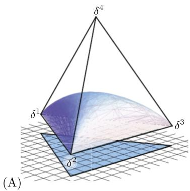

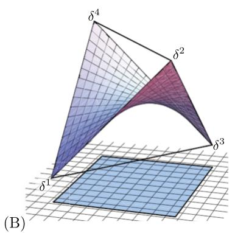  
Fig. 2.7 Two examples of exponential families. Reproduced from [S. Weis, A. Knauf (2012) Entropy distance: New quantum phenomena, Journal of Mathematical Physics 53(10) 102206], with the permission of AIP Publishing

This is equivalent to

$$
\prod_ {i} \mu_ {i} ^ {n (i)} = \prod_ {i} \mu_ {0, i} ^ {n (i)} \quad \text {f o r a l l} n \in \mathcal {L} ^ {\perp}.
$$

We define $n^+ \coloneqq \max \{n(i), 0\}$ and $n^- \coloneqq \max \{-n(i), 0\}$ and reformulate this condition by

$$
\prod_ {i} \mu_ {i} ^ {n ^ {+} (i)} \prod_ {i} \mu_ {0, i} ^ {n ^ {-} (i)} = \prod_ {i} \mu_ {i} ^ {n ^ {-} (i)} \prod_ {i} \mu_ {0, i} ^ {n ^ {+} (i)} \quad \text {f o r a l l} n \in \mathcal {L} ^ {\perp}. \tag {2.138}
$$

With the abbreviation $\mu^n \coloneqq \prod_i \mu_i^{n(i)}$ , (2.138) can be written as

$$
\mu^ {n ^ {+}} \mu_ {0} ^ {n ^ {-}} = \mu^ {n ^ {-}} \mu_ {0} ^ {n ^ {+}} \quad \text {f o r a l l} n \in \mathcal {L} ^ {\perp}. \tag {2.139}
$$

This proves that $\mu \in \mathcal{E}(\mu_0, \mathcal{L})$ if and only if (2.139) is satisfied. Theorem 2.5 below states that the same criterion holds also for all elements $\mu$ in the closure of $\mathcal{E}(\mu_0, \mathcal{L})$ . Before we come to this result, we first have to introduce the notion of a facial set.

Non-empty facial sets are the possible support sets that distributions of a given exponential family can have. There is an instructive way to characterize them. Given the basis $f_0 \coloneqq \mathbb{1}$ , $f_1, \ldots, f_d$ of $\mathcal{L}$ , we consider the affine map

$$
\mathbb {E}: \mathcal {P} (I) \rightarrow \mathbb {R} ^ {d + 1}, \quad \mu \mapsto \left(1, \mu \left(f _ {1}\right), \dots , \mu \left(f _ {d}\right)\right). \tag {2.140}
$$

(Here, $\mu(f_k) = \mathbb{E}_\mu(f_k)$ denotes the expectation value of $f_k$ with respect to $\mu$ .) Obviously, the image of this map is a polytope, the convex support $\operatorname{cs}(\overline{\mathcal{E}})$ of $\mathcal{E}$ , which is the convex hull of the images of the Dirac measures $\delta^i$ in $\mathcal{P}(I)$ , that is, $\mathbb{E}(\delta^i) = (\delta^i(f_0), \delta^i(f_1), \ldots, \delta^i(f_d)) = (1, f_1(i), \ldots, f_d(i)), i \in I$ . The situation is illustrated in Fig. 2.7 for two examples of two-dimensional exponential families. In each case, the image of the simplex under the map $\mathbb{E}$ , the convex support of $\mathcal{E}$ , is shown as a "shadow" in the horizontal plane, a triangle in one case and a square in the other case. We observe that the convex supports can be interpreted as "flattened"

versions of the individual closures $\overline{\mathcal{E}}$ , where each face of $\operatorname{cs}(\overline{\mathcal{E}})$ corresponds to the intersection of $\overline{\mathcal{E}}$ with a face of the simplex $\mathcal{P}(I)$ . Therefore, the faces of the convex support determine the possible support sets, which we call facial sets. In order to motivate their definition below, note that a set $C$ is a face of a polytope $P$ in $\mathbb{R}^n$ if either $C = P$ or $C$ is the intersection of $P$ with an affine hyperplane $H$ such that all $x \in P$ , $x \notin C$ , lie on one side of the hyperplane. Non-trivial faces of maximal dimension are called facets. It is a fundamental result that every polytope can equivalently be described as the convex hull of a finite set or as a finite intersection of closed linear half-spaces (corresponding to its facets) (see [261]).

In particular, we are interested in the face structure of $\mathrm{cs}(\overline{\mathcal{E}})$ . Since we assumed that $\mathbb{1} \in \mathcal{L}$ , the image of $\mathbb{E}$ is contained in the affine hyperplane $x_{1} = 1$ , and we can replace every affine hyperplane $H$ by an equivalent central hyperplane (which passes through the origin). For the convex support $\mathrm{cs}(\overline{\mathcal{E}})$ , we want to know which points from $\mathbb{E}(\delta^i)$ , $i \in I$ , lie on each face. This motivates the following definition.

Definition 2.11 A set $F \subseteq I$ is called facial if there exists a vector $\vartheta \in \mathbb{R}^{d+1}$ such that

$$
\sum_ {k = 0} ^ {d} \vartheta_ {k} f _ {k} (i) = 0 \quad \text {f o r a l l} i \in F, \quad \sum_ {k = 0} ^ {d} \vartheta_ {k} f _ {k} (i) \geq 1 \quad \text {f o r a l l} i \in I \setminus F. \tag {2.141}
$$

Lemma 2.7 Fix a subset $F \subseteq I$ . Then we have:

(1) $F$ is facial if and only if for any $u\in \mathcal{L}^{\perp}$

$$
\operatorname {s u p p} \left(u ^ {+}\right) \subseteq F \quad \Leftrightarrow \quad \operatorname {s u p p} \left(u ^ {-}\right) \subseteq F \tag {2.142}
$$

(here, we consider $u$ as an element of $\mathcal{F}(I)$ , and for any $f \in \mathcal{F}(I)$ , $\operatorname{supp}(f) \coloneqq \{i \in I : f(i) \neq 0\}$ ).

(2) If $\mu$ is a solution to (2.139), then $\operatorname{supp}(\mu)$ is facial.

Proof One direction of the first statement is straightforward: Let $u \in \mathcal{L}^{\perp}$ and suppose that $\operatorname{supp}(u^{+}) \subseteq F$ . Then

$$
\sum_ {i \in F} u (i) f _ {k} (i) = - \sum_ {i \notin F} u (i) f _ {k} (i), \quad k = 0, 1, \dots , d,
$$

and therefore

$$
0 = \sum_ {i \in F} u (i) \sum_ {k = 0} ^ {d} \vartheta_ {k} f _ {k} (i) = - \sum_ {i \notin F} u (i) \sum_ {k = 0} ^ {d} \vartheta_ {k} f _ {k} (i).
$$

Since $\sum_{k=0}^{d} \vartheta_k f_k(i) > 1$ and $u(i) \leq 0$ for $i \notin F$ , it follows that $u(i) = 0$ for $i \notin F$ , proving one direction of the first statement.

The opposite direction is a bit more complicated. Here, we present a proof using elementary arguments from polytope theory (see, e.g., [261]). For an alternative proof using Farkas' Lemma see [103]. Assume that $F$ is not facial. Let

$F^{\prime}$ be the smallest facial set containing $F$ . Let $P_F$ and $P_{F'}$ be the convex hulls of $\{(f_0(i),\ldots ,f_d(i)):i\in F\}$ and $\{(f_0(i),\ldots ,f_d(i)):i\in F'\}$ . Then $P_F$ contains a point $g$ from the relative interior of $P_{F'}$ . Therefore $g$ can be represented as $g_{k} = \sum_{i\in F}\alpha (i)f_{k}(i) = \sum_{i\in F'}\beta (i)f_{k}(i)$ , where $\alpha (i)\geq 0$ for all $i\in F$ and $\beta (i) > 0$ for all $i\in F'$ . Hence $u(i)\coloneqq \alpha (i) - \beta (i)$ (where $\alpha (i)\coloneqq 0$ for $i\notin F$ and $\beta (i)\coloneqq 0$ for $x\notin F^{\prime}$ ) defines a vector $u\in \mathcal{L}^{\perp}$ such that $\mathrm{supp}(u^{+})\subseteq F$ and $\mathrm{supp}(u^{-})\cap (I\setminus F) = F^{\prime}\setminus F\neq \emptyset$ .

The second statement now follows immediately: If $\mu$ satisfies (2.139) for some $u\in \mathcal{L}^{\perp}$ , then the LHS of (2.139) vanishes if and only if the RHS vanishes, and by the first statement this implies that $\mathrm{supp}(\mu)$ is facial.

Theorem 2.5 A distribution $\mu$ is an element of the closure of $\mathcal{E}(\mu_0,\mathcal{L})$ if and only if it satisfies (2.139).

Proof The first thing to note is that it is enough to prove the theorem when $\mu_{0,i} = 1$ for all $i\in I$ . To see this observe that $\mu \in \overline{\mathcal{E}} (\mathcal{L})$ if and only if $\lambda \sum_{i}\mu_{0,i}\mu_{i}\delta^{i}\in \overline{\mathcal{E}} (\mu_0,\mathcal{L})$ , where $\lambda >0$ is a normalizing constant, which does not appear in (2.139) since they are homogeneous.

Let $Z_{\mathcal{L}}$ be the set of solutions of (2.139). The derivation of Eqs. (2.139) was based on the requirement that $\mathcal{E}(\mathcal{L}) \subseteq Z_{\mathcal{L}}$ , which also implies $\overline{\mathcal{E}}(\mathcal{L}) \subseteq \overline{Z}_{\mathcal{L}} = Z_{\mathcal{L}}$ . It remains to prove the reversed inclusion $\overline{\mathcal{E}}(\mathcal{L}) \supseteq Z_{\mathcal{L}}$ . Let $\mu \in Z_{\mathcal{L}} \setminus \mathcal{E}(\mathcal{L})$ and put $F := \operatorname{supp}(\mu)$ . We construct a sequence $\mu^{(n)}$ in $\mathcal{E}(\mathcal{L})$ that converges to $\mu$ as $n \to \infty$ . We claim that the system of equations

$$
\sum_ {k = 0} ^ {d} b _ {k} f _ {k} (i) = \log \mu_ {i} \quad \text {f o r a l l} i \in F \tag {2.143}
$$

in the variables $b_{k}, k = 0,1,\ldots ,d$ , has a solution. Otherwise we can find a function $v(i), i\in I$ , such that $\sum_{i\in I}v(i)\log \mu_i\neq 0$ and $\sum_{i\in I}v(i)f_k(i) = 0$ for all $k$ . This leads to the contradiction $\mu^{v^{+}}\neq \mu^{v^{-}}$ . Fix a vector $\vartheta \in \mathbb{R}^{d + 1}$ with property (2.141). For any $n\in \mathbb{N}$ define

$$
\mu^ {(n)} := \frac {1}{Z} \sum_ {i} e ^ {- n \sum_ {k} \vartheta_ {k} f _ {k} (i)} e ^ {\sum_ {k} b _ {k} f _ {k} (i)} \delta^ {i} \in \mathcal {E} (\mathcal {L}), \tag {2.144}
$$

where $Z$ is a normalization factor. By (2.141) and (2.143) it follows that $\lim_{n\to \infty}\mu^{(n)} = \mu$ . This proves the theorem.

The last statement of Lemma 2.7 can be generalized by the following explicit description of the closure of an exponential family.

Theorem 2.6 (Closure of an exponential family) Let $\mathcal{L}$ be a linear subspace of $\mathcal{F}(I)$ , and let $S(\mathcal{L})$ denote the set of non-empty facial subsets of $I$ (see Definition 2.11, and Lemma 2.7). Define for each set $F \in S(\mathcal{L})$ the truncated exponential

family as

$$
\mathcal {E} _ {F} := \mathcal {E} _ {F} \left(\mu_ {0}, \mathcal {L}\right) := \left\{\frac {1}{\sum_ {j \in F} \mu_ {j}} \sum_ {i \in F} \mu_ {i} \delta^ {i}: \mu = \sum_ {i \in I} \mu_ {i} \delta^ {i} \in \mathcal {E} \left(\mu_ {0}, \mathcal {L}\right) \right\}. \tag {2.145}
$$

Then the closure of the exponential family $\mathcal{E}$ is given by

$$
\bar {\mathcal {E}} (\mu_ {0}, \mathscr {L}) = \bigcup_ {F \in S (\mathscr {L})} \mathcal {E} _ {F}. \tag {2.146}
$$

Proof “ $\subseteq$ ” Let $\mu$ be in the closure of $\mathcal{E}(\mu_0, \mathcal{L})$ . Clearly, $\mu$ satisfies Eqs. (2.139) and therefore, by Lemma 2.7, its support set $F$ is facial. Furthermore, the same reasoning that underlies Eq. (2.143) yields a solution of the equations

$$
\sum_ {k = 0} ^ {d} \vartheta_ {k} f _ {k} (i) = \log \frac {\mu_ {i}}{\mu_ {0 , i}}, \quad i \in F.
$$

Using these $\vartheta$ values for $k = 1,\dots ,d$ , we extend $\mu$ by

$$
\widetilde {\mu} _ {i} := \frac {1}{Z (\vartheta)} \exp \left(\sum_ {k = 1} ^ {d} \vartheta_ {k} f _ {k} (i)\right), \quad i \in I,
$$

to a distribution $\widetilde{\mu}$ with full support. Obviously, $\widetilde{\mu}$ defines $\mu$ through truncation. “ $\supseteq$ ” Let $\mu \in \mathcal{E}_F$ for some non-empty facial set $F$ . Then $\mu$ has a representation

$$
\mu_ {i} := \left\{ \begin{array}{l l} \mu_ {2, i} \exp (\sum_ {k = 0} ^ {d} \vartheta_ {k} f _ {k} (i)), & \text {i f} i \in F, \\ 0, & \text {o t h e r w i s e}. \end{array} \right.
$$

With a vector $\vartheta^{\prime} = (\vartheta_{0}^{\prime},\vartheta_{1}^{\prime},\dots ,\vartheta_{d})\in \mathbb{R}^{d + 1}$ that satisfies (2.141), the sequence

$$
\mu_ {i} ^ {(n)} := \exp \left(\sum_ {k = 0} ^ {d} \left(\vartheta_ {k} - n \vartheta_ {k} ^ {\prime}\right) f _ {k} (i)\right) \in \mathcal {E} (\mu_ {0}, \mathscr {L})
$$

converges to $\mu$ , proving $\mu \in \overline{\mathcal{E}}(\mu_0, \mathcal{L})$ .

Example 2.4 (Support sets of an exponential family) In this example, we apply Theorem 2.6 to the exponential families shown in Fig. 2.7. These are families of distributions on $I = \{1, 2, 3, 4\}$ , and we write the elements of $\mathcal{F}(I)$ as vectors $(x_1, x_2, x_3, x_4)$ . In order to determine the individual facial subsets of $I$ , we use the criterion given in the first part of Lemma 2.7.

(1) Let us start with the exponential family shown in Fig. 2.7(A). The space $\mathcal{L}$ of this exponential family is the linear hull of the orthogonal vectors

$$
(1, 1, 1, 1), \quad (1, 1, - 2, 0), \quad (1, - 1, 0, 0).
$$

# 2.8 Exponential Families

Its one-dimensional orthogonal complement $\mathcal{L}^{\perp}$ is spanned by the vector $(1,1,1,-3)$ . This implies the following pairs $(\mathrm{supp}(u^{+}),\mathrm{supp}(u^{-}))$ , $u = u^{+} - u^{-} \in \mathcal{L}^{\perp}$ , of disjoint support sets:

$$
(\emptyset , \emptyset), \quad (\{1, 2, 3 \}, \{4 \}), \quad (\{4 \}, \{1, 2, 3 \}). \tag {2.147}
$$

The criterion (2.142) for a subset $F$ of $I$ to be a facial set simply means that for any of the support set pairs $(M, N)$ in (2.147), either $M$ and $N$ are both contained in $F$ or neither of them is. This yields the following set of facial sets:

$$
\emptyset , \{1 \}, \{2 \}, \{3 \}, \{1, 2 \}, \{1, 3 \}, \{2, 3 \}, \{1, 2, 3, 4 \}.
$$

Obviously, these sets, except $\varnothing$ , are exactly the support sets of distributions that are in the closure of the exponential family (see Fig. 2.7(A)).

(2) Now let us come to the exponential family shown in Fig. 2.7(B). Its linear space $\mathcal{L}$ is spanned by

$$
(1, 1, 1, 1), \quad (1, 1, - 1, - 1), \quad (1, - 1, - 1, 1),
$$

with the orthogonal complement $\mathcal{L}^{\perp}$ spanned by $(1, -1, 1, -1)$ . As possible support set pairs, we obtain

$$
(\emptyset , \emptyset), \quad (\{1, 3 \}, \{2, 4 \}), \quad (\{2, 4 \}, \{1, 3 \}).
$$

Applying criterion (2.142) finally yields the facial sets

$$
\emptyset , \{1 \}, \{2 \}, \{3 \}, \{4 \}, \{1, 2 \}, \{1, 4 \}, \{2, 3 \}, \{3, 4 \}, \{1, 2, 3, 4 \}.
$$

Also in this example, these sets, except $\varnothing$ , are the possible support sets of distributions that are in the closure of the exponential family (see Fig. 2.7(B)).

Theorem 2.5 provides an implicit description of the closure of an exponential family $\mathcal{E}(\mu_0,\mathcal{L})$ . Here, however, we have to test the equations with infinitely many elements $n$ of the orthogonal complement $\mathcal{L}^{\perp}$ of $\mathcal{L}$ . Now we ask the question whether the test can be reduced to a finite number of vectors $n\in \mathcal{L}^{\perp}$ . For an element $\mu \in \mathcal{E}(\mu_0,\mathcal{L})$ , clearly the orthogonality (2.137) has to be tested only for a basis $n_1,\ldots ,n_c$ , $c = |I| - \dim (\mathcal{L})$ , of $\mathcal{L}$ , which is equivalent to

$$
\mu^ {n _ {k} ^ {+}} \mu_ {0} ^ {n _ {k} ^ {-}} = \mu^ {n _ {k} ^ {-}} \mu_ {0} ^ {n _ {k} ^ {+}} \quad \text {f o r a l l} k = 1, \dots , c. \tag {2.148}
$$

This criterion is sufficient for the elements of $\mathcal{E}(\mu_0,\mathcal{L})$ . It turns out, however, that it is not sufficient for describing elements in the boundary of $\mathcal{E}(\mu_0,\mathcal{L})$ . But it is still possible to reduce the number of equations to a finite number. In order to do so, we have to replace the basis $n_1,\ldots ,n_c$ by a so-called circuit basis, which is still a generating system but contains in general more than $c$ elements.

Definition 2.12 A circuit vector of the space $\mathcal{L}$ is a nonzero vector $n\in \mathcal{L}^{\perp}$ with inclusion minimal support, i.e., if $n^{\prime}\in \mathcal{L}^{\perp}$ satisfies $\mathrm{supp}(n^{\prime})\subseteq \mathrm{supp}(n)$ , then $n^{\prime} = \lambda n$ for some $\lambda \in \mathbb{R}$ . A circuit is the support set of a circuit vector. A circuit basis is a subset of $\mathcal{L}^{\perp}$ containing precisely one circuit vector for every circuit.

This definition allows us to prove the following theorem.

Theorem 2.7 Let $\mathcal{E}(\mu_0,\mathcal{L})$ be an exponential family. Then its closure $\overline{\mathcal{E}} (\mu_0,\mathcal{L})$ equals the set of all probability distributions that satisfy

$$
\mu^ {c ^ {+}} \mu_ {0} ^ {c ^ {-}} = \mu^ {c ^ {-}} \mu_ {0} ^ {c ^ {+}} \quad f o r a l l c \in C, \tag {2.149}
$$

where $C$ is a circuit basis of $\mathcal{L}$ .

The proof is based on the following two lemmas.

Lemma 2.8 For every vector $n \in \mathcal{L}^{\perp}$ there exists a sign-consistent circuit vector $c \in \mathcal{L}^{\perp}$ , i.e., if $c(i) \neq 0 \neq n(i)$ then $\operatorname{sign} c(i) = \operatorname{sign} n(i)$ , for all $i \in I$ .

Proof Let $c$ be a vector with inclusion-minimal support that is sign-consistent with $n$ and satisfies $\operatorname{supp}(c) \subseteq \operatorname{supp}(n)$ . If $c$ is not a circuit vector, then there exists a circuit vector $c'$ with $\operatorname{supp}(c') \subseteq \operatorname{supp}(c)$ . A suitable linear combination $c + \alpha c'$ , $\alpha \in \mathbb{R}$ , gives a contradiction to the minimality of $c$ .

Lemma 2.9 Every vector $n \in \mathcal{L}^{\perp}$ is a finite sign-consistent sum of circuit vectors $n = \sum_{k=1}^{r} c_k$ , i.e., if $c_k(i) \neq 0$ then $\operatorname{sign} c_k(i) = \operatorname{sign} n(i)$ , for all $i \in I$ .

Proof Use induction on the size of $\operatorname{supp}(n)$ . In the induction step, use a sign-consistent circuit vector, as in the last lemma, to reduce the support.

Proof of Theorem 2.7 Again, we can assume $\mu_{0,i} = 1$ for all $i\in I$ . By Theorem 2.5 it suffices to show the following: If $\mu$ satisfies (2.149), then it also satisfies $\mu^{n^+} = \mu^{n^-}$ for all $n\in \mathcal{L}^\perp$ . Write $n = \sum_{k = 1}^{r}c_k$ as a sign-consistent sum of circuit vectors $c_{k}$ , as in the last lemma. Without loss of generality, we can assume $c_{k}\in C$ for all $k$ . Then $n^{+} = \sum_{k = 1}^{r}c_{k}^{+}$ and $n^{-} = \sum_{k = 1}^{r}c_{k}^{-}$ . Hence $\mu$ satisfies

$$
\mu^ {n ^ {+}} - \mu^ {n ^ {-}} = \mu^ {\sum_ {k = 2} ^ {r} c _ {k} ^ {+}} \left(\mu^ {c _ {1} ^ {+}} - \mu^ {c _ {1} ^ {-}}\right) + \left(\mu^ {\sum_ {k = 2} ^ {r} c _ {k} ^ {+}} - \mu^ {\sum_ {k = 2} ^ {r} c _ {k} ^ {-}}\right) \mu^ {c _ {1} ^ {-}},
$$

so the theorem follows easily by induction.

Example 2.5 Let $I \coloneqq \{1, 2, 3, 4\}$ , and consider the vector space $\mathcal{L}$ spanned by the following two functions (here, we write functions on $I$ as row vectors of length 4):

$$
f _ {0} = (1, 1, 1, 1) \quad \text {a n d} \quad f _ {1} = (- \alpha , 1, 0, 0),
$$

# 2.8 Exponential Families

where $\alpha \notin \{0,1\}$ is arbitrary. This generates a one-dimensional exponential family $\mathcal{E}(\mathcal{L})$ . The kernel of $\mathcal{L}$ is then spanned by

$$
n _ {1} = (1, \alpha , - 1, - \alpha) \quad \text {a n d} \quad n _ {2} = (1, \alpha , - \alpha , - 1),
$$

but these two vectors do not form a circuit basis: They correspond to the two relations

$$
\mu_ {1} \mu_ {2} ^ {\alpha} = \mu_ {3} \mu_ {4} ^ {\alpha} \quad \text {a n d} \quad \mu_ {1} \mu_ {2} ^ {\alpha} = \mu_ {3} ^ {\alpha} \mu_ {4}. \tag {2.150}
$$

It follows immediately that

$$
\mu_ {3} \mu_ {4} ^ {\alpha} = \mu_ {3} ^ {\alpha} \mu_ {4}. \tag {2.151}
$$

If $\mu_3\mu_4$ is not zero, then we conclude that $\mu_3 = \mu_4$ . However, on the boundary this does not follow from Eqs. (2.150): Possible solutions to these equations are given by

$$
\mu^ {(a)} = (0, a, 0, 1 - a) \quad \text {f o r} 0 \leq a <   1. \tag {2.152}
$$

However, $\mu^{(a)}$ does not lie in the closure of the exponential family $\mathcal{E}(\mathcal{L})$ , since all members of $\mathcal{E}(\mathcal{L})$ satisfy $\mu_3 = \mu_4$ .

A circuit basis of $A$ is given by the vectors

$$
(0, 0, 1, - 1), \quad (1, \alpha , 0, - 1 - \alpha), \quad \text {a n d} \quad (1, \alpha , - 1 - \alpha , 0),
$$

which have the following corresponding equations:

$$
\mu_ {3} = \mu_ {4}, \quad \mu_ {1} \mu_ {2} ^ {\alpha} = \mu_ {4} ^ {1 + \alpha}, \quad \text {a n d} \quad \mu_ {1} \mu_ {2} ^ {\alpha} = \mu_ {3} ^ {1 + \alpha}. \tag {2.153}
$$

By Theorem 2.7, these three equations characterize $\overline{\mathcal{E}} (\mathcal{L})$

Using arguments from matroid theory, the number of circuits can be shown to be less than or equal to $\binom{m}{d+2}$ , where $m = |I|$ is the size of the state space and $d$ is the dimension of $\mathcal{E}(\mu_0, \mathcal{L})$ , see [83]. This gives an upper bound on the number of implicit equations describing $\overline{\mathcal{E}}(\mu_0, \mathcal{L})$ . Note that $\binom{m}{d+2}$ is usually much larger than the codimension $m - d - 1$ of $\mathcal{E}(\mu_0, \mathcal{L})$ in the probability simplex. In contrast, if we only want to find an implicit description of all probability distributions of $\mathcal{E}(\mu_0, \mathcal{L})$ , which have full support, then $m - d - 1$ equations are enough.

It turns out that even in the boundary the number of equations can be further reduced: In general we do not need all circuits for the implicit description of $\overline{\mathcal{E}}(\mu_0, \mathcal{L})$ . For instance, in Example 2.5, the second and third equation of (2.153) are equivalent given the first one, i.e., we only need two of the three circuits to describe $\overline{\mathcal{E}}(\mu_0, \mathcal{L})$ .

# 2.8.3 Information Projections

In Sect. 2.7.2 we have introduced the relative entropy. It turns out to be the right divergence function for projecting probability measures onto exponential families.

These projections, referred to as information projections, are closely related to large-deviation theory and maximum-likelihood estimation in statistics. The foundational work on information projections is due to Chentsov [65] and Csiszár [75] (see also the tutorial by Csiszár and Shields [78]). Csiszár and Matúš revisited the classical theory of information projections within a much more general setting [76]. The differential-geometric study of these projections and their generalizations based on dually flat structures (see Sect. 4.3) is due to Amari and Nagaoka [8, 16, 194].

In order to treat the most general case, where probability distributions do not have to be strictly positive, we have to extend the relative entropy or KL-divergence (2.101) of Definition 2.8 so that it is defined for general probability distributions $\mu, \nu \in \mathcal{P}(I)$ . It turns out that, although $D_{KL}$ is continuous on the product $\mathcal{P}_{+}(I) \times \mathcal{P}_{+}(I)$ , there is no continuous extension to the Cartesian product $\mathcal{P}(I) \times \mathcal{P}(I)$ . As $D_{KL}$ is used for minimization problems, it is reasonable to consider the following lower semi-continuous extension of $D_{KL}$ with values in the extended line $\overline{\mathbb{R}}_{+} := \{x \in \mathbb{R} : x \geq 0\} \cup \{\infty\}$ (considered as a topological space where $U \subseteq \overline{\mathbb{R}}_{+}$ is a neighborhood of $\infty$ if it contains an interval $(x, \infty)$ ):

$$
D _ {K L} (\mu \| v) := \left\{ \begin{array}{l l} \sum_ {i \in I} \mu_ {i} \log \frac {\mu_ {i}}{\nu_ {i}}, & \text {i f} \operatorname {s u p p} (\mu) \subseteq \operatorname {s u p p} (v), \\ \infty , & \text {o t h e r w i s e .} \end{array} \right. \tag {2.154}
$$

Here, we use the convention $\mu_i\log \frac{\mu_i}{\nu_i} = 0$ whenever $\mu_{i} = 0$ . Defining $\mu_{i}\log \frac{\mu_{i}}{\nu_{i}}$ to be $\infty$ if $\mu_{i} > \nu_{i} = 0$ allows us to rewrite (2.154) as $D_{KL}(\mu \| \nu) = \sum_{i\in I}\mu_{i}\log \frac{\mu_{i}}{\nu_{i}}$ . Whenever appropriate, we use this concise expression.

We summarize the basic properties of this (extended) relative entropy or KL-divergence.

Proposition 2.14 The function (2.154) satisfies the following properties:

(1) $D_{KL}(\mu \parallel \nu)\geq 0$ , and $D_{KL}(\mu \parallel \nu) = 0$ if and only if $\mu = \nu$   
(2) The functions $D_{KL}(\mu \| \cdot)$ and $D_{KL}(\cdot \| \nu)$ are continuous for all $\mu, \nu \in \mathcal{P}(I)$ .   
(3) $D_{KL}$ is lower semi-continuous, that is, for all $(\mu^{(k)},\nu^{(k)})\to (\mu ,\nu)$ , we have

$$
D _ {K L} (\mu \| v) \leq \lim  _ {k \rightarrow \infty} \inf  D _ {K L} \left(\mu^ {(k)} \| v ^ {(k)}\right). \tag {2.155}
$$

(4) $D_{KL}$ is jointly convex, that is, for all $\mu^{(j)},\nu^{(j)},\lambda_j\in [0,1],j = 1,\ldots ,n$ , satisfies $\sum_{j = 1}^{n}\lambda_{j} = 1$

$$
D _ {K L} \left(\sum_ {j = 1} ^ {n} \lambda_ {j} \mu^ {(j)} \| \sum_ {j = 1} ^ {n} \lambda_ {j} v ^ {(j)}\right) \leq \sum_ {j = 1} ^ {n} \lambda_ {j} D _ {K L} \left(\mu^ {(j)} \| v ^ {(j)}\right). \tag {2.156}
$$

The proof of Proposition 2.14 involves the following basic inequality.

# 2.8 Exponential Families

Lemma 2.10 (log-sum inequality) For arbitrary non-negative real numbers $a_1, \ldots, a_m$ and $b_1, \ldots, b_m$ , we have

$$
\sum_ {k = 1} ^ {m} a _ {k} \log \frac {a _ {k}}{b _ {k}} \geq \left(\sum_ {k = 1} ^ {m} a _ {k}\right) \log \frac {\sum_ {k = 1} ^ {m} a _ {k}}{\sum_ {k = 1} ^ {m} b _ {k}}, \tag {2.157}
$$

where equality holds if and only if $\frac{a_k}{b_k}$ is independent of $k$ . Here, $a\log \frac{a}{b}$ is defined to be 0 if $a = 0$ and $\infty$ if $a > b = 0$ .

Proof We set $a \coloneqq \sum_{k=1}^{m} a_k$ and $b \coloneqq \sum_{k=1}^{m} b_k$ . With the strict convexity of the function $f: [0, \infty) \to \mathbb{R}$ , $f(x) \coloneqq x \log x$ for $x > 0$ and $f(0) = 0$ , we obtain

$$
\begin{array}{l} \sum_ {k = 1} ^ {m} a _ {k} \log {\frac {a _ {k}}{b _ {k}}} = \sum_ {k = 1} ^ {m} b _ {k} {\frac {a _ {k}}{b _ {k}}} \log {\frac {a _ {k}}{b _ {k}}} = b \sum_ {k = 1} ^ {m} {\frac {b _ {k}}{b}} f \left({\frac {a _ {k}}{b _ {k}}}\right) \\ \geq b f \left(\sum_ {k = 1} ^ {m} \frac {b _ {k}}{b} \frac {a _ {k}}{b _ {k}}\right) = b f \left(\frac {a}{b}\right) = a \log \frac {a}{b}. \\ \end{array}
$$

# Proof of Proposition 2.14

(1) In the case of probability measures, the log-sum inequality (2.157) implies

$$
\sum_ {i \in I} \mu_ {i} \log {\frac {\mu_ {i}}{\nu_ {i}}} \geq \left(\sum_ {i \in I} \mu_ {i}\right) \log {\frac {\sum_ {i \in I} \mu_ {i}}{\sum_ {i \in I} \nu_ {i}}} = 0,
$$

where equality holds if and only if $\mu_{i} = c\upsilon_{i}$ for some constant $c$ , which, in this case, has to be equal to one.

(2) This follows directly from the continuity of the functions $\log x$ , where $\log 0 := -\infty$ , and $x \log x$ , where $0 \log 0 := 0$ .

(3) If $\nu_{i} > 0$ , we have

$$
\lim  _ {k \rightarrow \infty} \mu_ {i} ^ {(k)} \log \frac {\mu_ {i} ^ {(k)}}{\nu_ {i} ^ {(k)}} = \mu_ {i} \log \frac {\mu_ {i}}{\nu_ {i}}. \tag {2.158}
$$

If $\nu_{i} = 0$ and $\mu_{i} > 0$ ,

$$
\lim  _ {k \rightarrow \infty} \mu_ {i} ^ {(k)} \log \frac {\mu_ {i} ^ {(k)}}{\nu_ {i} ^ {(k)}} = \infty = \mu_ {i} \log \frac {\mu_ {i}}{\nu_ {i}}. \tag {2.159}
$$

Finally, if $\nu_{i} = 0$ and $\mu_{i} = 0$

$$
\lim  _ {k \rightarrow \infty} \inf  _ {\mu_ {i} ^ {(k)}} \log \frac {\mu_ {i} ^ {(k)}}{\nu_ {i} ^ {(k)}} \geq \lim  _ {k \rightarrow \infty} \inf  \left(\mu_ {i} ^ {(k)} - v _ {i} ^ {(k)}\right) = 0 = \mu_ {i} \log \frac {\mu_ {i}}{v _ {i}}, \tag {2.160}
$$

since $\log x\geq 1 - \frac{1}{x}$ for $x > 0$ . Altogether, (2.158), (2.159), and (2.160) imply

$$
\liminf_{k\to \infty}\sum_{i\in I}\mu_{i}^{(k)}\log \frac{\mu_{i}^{(k)}}{v_{i}^{(k)}}\geq \sum_{i\in I}\liminf_{k\to \infty}\mu_{i}^{(k)}\log \frac{\mu_{i}^{(k)}}{v_{i}^{(k)}}\geq \sum_{i\in I}\mu_{i}\log \frac{\mu_{i}}{v_{i}},
$$

which equals $\infty$ whenever there is at least one $i\in I$ satisfying $\mu_{i} > \nu_{i} = 0$ . (4) We use again the log-sum inequality (2.157):

$$
\begin{array}{l} D _ {K L} \left(\sum_ {j = 1} ^ {n} \lambda_ {j} \mu^ {(j)} \| \sum_ {j = 1} ^ {n} \lambda_ {j} v ^ {(j)}\right) = \sum_ {i \in I} \left(\sum_ {j = 1} ^ {n} \lambda_ {j} \mu_ {i} ^ {(j)}\right) \log \frac {\sum_ {j = 1} ^ {n} \lambda_ {j} \mu_ {i} ^ {(j)}}{\sum_ {j = 1} ^ {n} \lambda_ {j} v _ {i} ^ {(j)}} \\ \leq \sum_ {i \in I} \sum_ {j = 1} ^ {n} \lambda_ {j} \mu_ {i} ^ {(j)} \log \frac {\lambda_ {j} \mu_ {i} ^ {(j)}}{\lambda_ {j} v _ {i} ^ {(j)}} \\ = \sum_ {j = 1} ^ {n} \lambda_ {j} \sum_ {i \in I} \mu_ {i} ^ {(j)} \log \frac {\mu_ {i} ^ {(j)}}{v _ {i} ^ {(j)}} \\ = \sum_ {j = 1} ^ {n} \lambda_ {j} D _ {K L} \left(\mu^ {(j)} \| v ^ {(j)}\right). \\ \end{array}
$$

We consider information projections onto exponential and corresponding mixture families. They are assigned to a linear subspace $\mathcal{L}$ of $\mathcal{F}(I)$ and measures $\mu_1 \in \mathcal{P}(I)$ , $\mu_2 \in \mathcal{P}_+(\mathcal{I})$ . Without loss of generality, we assume $\mathbb{1} \in \mathcal{L}$ and choose a basis $f_0 := \mathbb{1}$ , $f_1, \ldots, f_d$ of $\mathcal{L}$ . The mixture family through $\mu_1$ is simply the set of distributions that have the same expectation values of the $f_k$ as the distribution $\mu_1$ , that is,

$$
\mathcal {M} := \mathcal {M} \left(\mu_ {1}, \mathscr {L}\right) := \left\{\nu \in \mathcal {P} (I): \nu \left(f _ {k}\right) = \mu_ {1} \left(f _ {k}\right), k = 1, \dots , d \right\}. \tag {2.161}
$$

The corresponding exponential family $\mathcal{E} \coloneqq \mathcal{E}(\mu_2, \mathcal{L})$ through $\mu_2$ is given as the image of the parametrization

$$
\vartheta = \left(\vartheta_ {1}, \dots , \vartheta_ {d}\right) \mapsto \frac {1}{Z (\vartheta)} \sum_ {i \in I} \mu_ {2, i} \exp \left(\sum_ {k = 1} ^ {d} \vartheta_ {k} f _ {k} (i)\right) \delta^ {i}, \tag {2.162}
$$

where

$$
Z (\vartheta) := \sum_ {j} \mu_ {2, j} \exp \left(\sum_ {k = 1} ^ {d} \vartheta_ {k} f _ {k} (j)\right).
$$

Theorem 2.8 For any distribution $\hat{\mu} \in \mathcal{P}(I)$ , the following statements are equivalent:

(1) $\hat{\mu}\in \mathcal{M}\cap \overline{\mathcal{E}}$

# 2.8 Exponential Families

(2) For all $\nu_{1} \in \mathcal{M}$ , $\nu_{2} \in \overline{\mathcal{E}}$ : $D_{KL}(\nu_{1} \| \hat{\mu}) < \infty$ , $D_{KL}(\nu_{1} \| \nu_{2}) < \infty$ iff $D_{KL}(\hat{\mu} \| \nu_{2}) < \infty$ , and

$$
D _ {K L} \left(v _ {1} \| v _ {2}\right) = D _ {K L} \left(v _ {1} \| \hat {\mu}\right) + D _ {K L} \left(\hat {\mu} \| v _ {2}\right). \tag {2.163}
$$

In particular, the intersection $\mathcal{M} \cap \overline{\mathcal{E}}$ consists of the single point $\hat{\mu}$ .

(3) $\hat{\mu} \in \mathcal{M}$ , and $D_{KL}(\hat{\mu} \| v_2) = \inf_{v \in \mathcal{M}} D_{KL}(v \| v_2)$ for all $v_2 \in \overline{\mathcal{E}}$ .   
(4) $\hat{\mu} \in \overline{\mathcal{E}}$ , and $D_{KL}(\nu_1 \parallel \hat{\mu}) = \inf_{\nu \in \overline{\mathcal{E}}} D_{KL}(\nu_1 \parallel \nu)$ for all $\nu_1 \in \mathcal{M}$ .

Furthermore, there exists a unique distribution $\hat{\mu}$ that satisfies one and therefore all of these conditions.

Proof $(1) \Rightarrow (2)$ We choose $\nu_{1} \in \mathcal{M}$ and $\nu_{2} \in \mathcal{E}$ (strict positivity). As $\hat{\mu} \in \overline{\mathcal{E}}$ , there is a sequence $\mu^{(n)} \in \mathcal{E}$ , $\mu^{(n)} \to \hat{\mu}$ . This implies

$$
\sum_ {i \in I} \left(v _ {1, i} - \hat {\mu} _ {i}\right) \log \frac {\mu_ {i} ^ {(n)}}{v _ {2 , i}} = 0. \tag {2.164}
$$

This is because $\log \frac{d\mu^{(n)}}{dv_2} \in \mathcal{L}$ , and $\nu_{1}, \hat{\mu} \in \mathcal{M}$ . By continuity,

$$
\sum_ {i \in I} \left(v _ {1, i} - \hat {\mu} _ {i}\right) \log \frac {\hat {\mu} _ {i}}{v _ {2 , i}} = 0. \tag {2.165}
$$

This equality is equivalent to

$$
D _ {K L} \left(v _ {1} \| v _ {2}\right) = D _ {K L} \left(v _ {1} \| \hat {\mu}\right) + D _ {K L} \left(\hat {\mu} \| v _ {2}\right). \tag {2.166}
$$

As we assumed $\nu_{2}$ to be strictly positive, this means that $D_{KL}(\nu_{1}\parallel \nu_{2})$ and $D_{KL}(\hat{\mu}\parallel \nu_{2})$ are finite, so that $D_{KL}(\nu_{1}\parallel \hat{\mu})$ has to be finite. This is only the case if $\mathrm{supp}(\hat{\mu})\supseteq \mathrm{supp}(\nu_1)$ for all $\nu_{1}\in \mathcal{M}$ . By continuity, (2.166) also holds for $\nu_{2}\in \overline{\mathcal{E}}$ . Note, however, that we do not exclude the case where $D_{KL}(\nu_{1}\parallel \nu_{2})$ and $D_{KL}(\hat{\mu}\parallel \nu_{2})$ become infinite when $\nu_{2}$ does not have full support. We finally prove uniqueness: Assume $\hat{\mu}^{\prime}\in \mathcal{M}\cap \overline{\mathcal{E}}$ . Then the Pythagorean relation (2.163) implies for $\nu_{1} = \nu_{2} = \hat{\mu}^{\prime}$

$$
0 = D _ {K L} \left(v _ {1} \| v _ {2}\right) = D _ {K L} \left(v _ {1} \| \hat {\mu}\right) + D _ {K L} \left(\hat {\mu} \| v _ {2}\right) = D _ {K L} \left(\hat {\mu} ^ {\prime} \| \hat {\mu}\right) + D _ {K L} \left(\hat {\mu} \| \hat {\mu} ^ {\prime}\right),
$$

and therefore $\hat{\mu}^{\prime} = \hat{\mu}$ , that is, $\mathcal{M}\cap \overline{\mathcal{E}} = \{\hat{\mu}\}$ .

$(2)\Rightarrow (3)$ For all $\nu_{1}\in \mathcal{M}$ and $\nu_{2}\in \overline{\mathcal{E}}$ , we obtain

$$
D _ {K L} (\nu_ {1} \parallel \nu_ {2}) = D _ {K L} (\nu_ {1} \parallel \hat {\mu}) + D _ {K L} (\hat {\mu} \parallel \nu_ {2}) \geq D _ {K L} (\hat {\mu} \parallel \nu_ {2}) \geq \inf  _ {\nu \in \mathcal {M}} D _ {K L} (\nu \parallel \nu_ {2}).
$$

This implies

$$
\inf  _ {v _ {1} \in \mathcal {M}} D _ {K L} (v _ {1} \| v _ {2}) \geq D _ {K L} (\hat {\mu} \| v _ {2}) \geq \inf  _ {v \in \mathcal {M}} D _ {K L} (v \| v _ {2}).
$$

$(2)\Rightarrow (4)$ For all $\nu_{1}\in \mathcal{M}$ and $\nu_{2}\in \overline{\mathcal{E}}$ , we obtain

$$
D_{KL}(\nu_{1}\parallel \nu_{2}) = D_{KL}(\nu_{1}\parallel \hat{\mu}) + D_{KL}(\hat{\mu}\parallel \nu_{2})\geq D_{KL}(\nu_{1}\parallel \hat{\mu})\geq \inf_{\nu \in \overline{\mathcal{E}}}D_{KL}(\nu_{1}\parallel \nu).
$$

This implies

$$
\inf_{v_{2}\in \mathcal{E}}D_{KL}(v_{1}\parallel v_{2})\geq D_{KL}(v_{1}\parallel \hat{\mu})\geq \inf_{v\in \mathcal{E}}D_{KL}(v_{1}\parallel v).
$$

$(3) \Rightarrow (1)$ We consider the KL-divergence for $\nu_{2} = \mu_{2}$ , the base measure of the exponential family $\mathcal{E} = \mathcal{E}(\mu_2, \mathcal{L})$ which we have assumed to be strictly positive:

$$
\mathcal {M} \rightarrow \mathbb {R}, \quad \nu \mapsto D _ {K L} (\nu \| \mu_ {2}). \tag {2.167}
$$

This function is strictly convex and therefore has $\hat{\mu} \in \mathcal{M}$ as its unique minimizer. In what follows, we prove that $\hat{\mu}$ is contained in the (relative) interior of $\mathcal{M}$ so that we can derive a necessary condition for $\hat{\mu}$ using the method of Lagrange multipliers. This necessary condition then implies $\hat{\mu} \in \overline{\mathcal{E}}$ . We structure this chain of arguments in three steps:

Step 1: Define the curve $[0,1] \to \mathcal{M}$ , $t \mapsto \nu(t) \coloneqq (1 - t)\hat{\mu} + t\nu$ , and consider its derivative

$$
\left. \frac {d}{d t} D _ {K L} \left(v (t) \| \mu_ {2}\right) \right| _ {t = t _ {0}} = \sum_ {i \in I} \left(v _ {i} - \hat {\mu} _ {i}\right) \log \frac {v _ {i} \left(t _ {0}\right)}{\mu_ {2 , i}} \tag {2.168}
$$

for $t_0 \in (0,1)$ . If $\hat{\mu}_i = 0$ for some $i$ with $\nu_i > 0$ then the derivative (2.168) converges to $-\infty$ when $t_0 \to 0$ . As $\hat{\mu}$ is the minimizer of $D_{KL}(\nu(\cdot) \| \mu_2)$ , this is ruled out, proving

$$
\operatorname {s u p p} (\nu) \subseteq \operatorname {s u p p} (\hat {\mu}), \quad \text {f o r a l l} \nu \in \mathcal {M}. \tag {2.169}
$$

Step 2: Let us now consider the particular situation where $\mathcal{M}$ has a non-empty intersection with $\mathcal{P}_{+}(I)$ . This is obviously the case, when we choose $\mu_{1}$ to be strictly positive, as $\mu_{1} \in \mathcal{M} = \mathcal{M}(\mu_{1}, \mathcal{L})$ by definition. In that case $\mathrm{supp}(\hat{\mu}) = I$ , by (2.169). We consider the restriction of the function (2.167) to $\mathcal{M} \cap \mathcal{P}_{+}(I)$ and introduce Lagrange multipliers $\vartheta_{0}, \vartheta_{1}, \ldots, \vartheta_{d}$ , in order to obtain a necessary condition for $\hat{\mu}$ to be its minimizer. More precisely, differentiating

$$
\sum_ {i \in I} v _ {i} \log \frac {v _ {i}}{\mu_ {2 , i}} - \vartheta_ {0} \left(1 - \sum_ {i \in I} v _ {i}\right) - \sum_ {k = 1} ^ {d} \vartheta_ {k} \left(\mu_ {1} (f _ {k}) - \sum_ {i \in I} v _ {i} f _ {k} (i)\right) \tag {2.170}
$$

with respect to $\nu_{i}$ leads to the necessary condition

$$
\log v _ {i} + 1 - \log \mu_ {2, i} - \vartheta_ {0} - \sum_ {k} \vartheta_ {k} f _ {k} (i) = 0, \quad i \in I,
$$

# 2.8 Exponential Families

which is equivalent to

$$
v _ {i} = \mu_ {2, i} \exp \left(\vartheta_ {0} - 1 + \sum_ {k = 1} ^ {d} \vartheta_ {k} f _ {k} (i)\right), \quad i \in I. \tag {2.171}
$$

As the minimizer, $\hat{\mu}$ has this structure and is therefore contained in $\mathcal{E}$ , proving $\hat{\mu} \in \mathcal{M} \cap \mathcal{E}$ .

Step 3: In this final step, we drop the assumption that $\mu_{1}$ is strictly positive and consider the sequence

$$
\mathcal {M} ^ {(n)} := \mathcal {M} \left(\mu_ {1} ^ {(n)}, \mathscr {L}\right), \tag {2.172}
$$

where $\mu_1^{(n)} = (1 - \frac{1}{n})\mu_1 + \frac{1}{n}\mu_2, n \in \mathbb{N}$ . Each of these distributions $\mu_1^{(n)}$ is strictly positive so that, according to Step 2, we have a corresponding sequence $\hat{\mu}^{(n)}$ of distributions in $\mathcal{M}^{(n)} \cap \mathcal{E}$ . The limit of any convergent subsequent is an element of $\mathcal{M} \cap \overline{\mathcal{E}}$ and, by uniqueness, coincides with $\hat{\mu}$ .

$(4) \Rightarrow (1)$ Define $S \coloneqq \operatorname{supp}(\hat{\mu})$ . Then $\hat{\mu}$ is contained in the family $\mathcal{E}_S$ (see Theorem 2.6), defined in terms of the parametrization

$$
\nu_ {i} (\vartheta) := \nu_ {i} (\vartheta_ {1}, \ldots , \vartheta_ {d}) := \left\{ \begin{array}{l l} \frac {1}{Z _ {S} (\vartheta)} \mu_ {2, i} \exp (\sum_ {k = 1} ^ {d} \vartheta_ {k} f _ {k} (i)), & \text {i f} i \in S, \\ 0, & \text {o t h e r w i s e}, \end{array} \right.
$$

with

$$
Z _ {S} (\vartheta) := \sum_ {j \in S} \mu_ {2, j} \exp \left(\sum_ {k = 1} ^ {d} \vartheta_ {k} f _ {k} (j)\right).
$$

Note that $\nu (\hat{\vartheta}) = \hat{\mu}$ for some $\hat{\vartheta}$ . With this parametrization, we obtain the function

$$
D _ {K L} \left(\nu_ {1} \| \nu (\vartheta)\right) = D _ {K L} \left(\nu_ {1} \| \mu_ {2}\right) - \sum_ {k = 1} ^ {d} \vartheta_ {k} \nu_ {1} \left(f _ {k}\right) + \log \left(Z _ {S} (\vartheta)\right),
$$

and its partial derivatives

$$
\frac {\partial D _ {K L} \left(v _ {1} \| v (\cdot)\right)}{\partial v _ {k}} = v (\vartheta) \left(f _ {k}\right) - v _ {1} \left(f _ {k}\right), \quad k = 1, \dots , d. \tag {2.173}
$$

As $\hat{\mu} = \nu (\hat{\vartheta})$ is the minimizer, $\hat{\vartheta}$ satisfies Eqs. (2.173), which implies that $\hat{\mu}$ is contained in $\mathcal{M}$ .

Existence: We proved the equivalence of the conditions for any distribution $\hat{\mu}$ , which, in particular, implies the uniqueness of a distribution that satisfies one and therefore all of these conditions. To see that there exists such a distribution, consider the function (2.167) and observe that it has a unique minimizer $\hat{\mu} \in \mathcal{M} \cap \overline{\mathcal{E}}$ (see the proof of the implication “ $(3) \Rightarrow (1)$ ”).

Let us now use Theorem 2.8 in order to define projections onto mixture and exponential families, referred to as the $I$ -projection and $rI$ -projection, respectively (see [76, 78]).

Let us begin with the $I$ -projection. Consider a mixture family $\mathcal{M} = \mathcal{M}(\mu_1, \mathcal{L})$ as defined by (2.161). Following the criterion (3) of Theorem 2.8, we define the distance from $\mathcal{M}$ by

$$
D _ {K L} (\mathcal {M} \| \cdot): \mathcal {P} (I) \rightarrow \mathbb {R}, \quad \mu \mapsto D _ {K L} (\mathcal {M} \| \mu) := \inf  _ {\nu \in \mathcal {M}} D _ {K L} (\nu \| \mu). \tag {2.174}
$$

Theorem 2.8 implies that there is a unique point $\hat{\mu} \in \mathcal{M}$ that satisfies $D_{KL}(\hat{\mu} \parallel \mu) = D_{KL}(\mathcal{M} \parallel \mu)$ . It is obtained as the intersection of $\mathcal{M}(\mu_1, \mathcal{L})$ with the closure of the exponential family $\mathcal{E}(\mu, \mathcal{L})$ . This allows us to define the $I$ -projection $\pi_{\mathcal{M}}: \mathcal{P}(I) \to \mathcal{M}$ , $\mu \mapsto \hat{\mu}$ .

Now let us come to the analogous definition of the $rI$ -projection, which will play an important role in Sect. 6.1. Consider an exponential family $\mathcal{E} = \mathcal{E}(\mu_2,\mathcal{L})$ , and, following criterion (4) of Theorem 2.8, define the distance from $\mathcal{E}$ by

$$
D _ {K L} (\cdot \| \mathcal {E}): \mathcal {P} (I) \rightarrow \mathbb {R}, \quad \mu \mapsto D _ {K L} (\mu \| \mathcal {E}) := \inf  _ {\nu \in \mathcal {E}} D _ {K L} (\mu \| \nu) = \inf  _ {\nu \in \overline {{\mathcal {E}}}} D _ {K L} (\mu \| \nu), \tag {2.175}
$$

where the last equality follows from the continuity of $D_{KL}(\mu \parallel \cdot)$ . Theorem 2.8 implies that there is a unique point $\hat{\mu}\in \overline{\mathcal{E}}$ that satisfies $D_{KL}(\mu \parallel \hat{\mu}) = D_{KL}(\mu \parallel \mathcal{E})$ . It is obtained as the intersection of the closure of $\mathcal{E}(\mu_2,\mathcal{L})$ with the mixture family $\mathcal{M}(\mu ,\mathcal{L})$ . This allows us to define the projection $\pi_{\mathcal{E}}:\mathcal{P}(I)\to \overline{\mathcal{E}}$ , $\mu \mapsto \hat{\mu}$ .

Proposition 2.15 Both information distances, $D_{KL}(\mathcal{M}\| \cdot)$ and $D_{KL}(\cdot \| \mathcal{E})$ , are continuous functions on $\mathcal{P}(I)$ .

Proof We prove the continuity of $D_{KL}(\mathcal{M}\parallel \cdot)$ . One can prove the continuity of $D_{KL}(\cdot \parallel \mathcal{E})$ following the same reasoning.

Let $\mu$ be a point in $\mathcal{P}(I)$ and $\mu_n \in \mathcal{P}(I)$ , $n \in \mathbb{N}$ , a sequence that converges to $\mu$ . For all $\nu \in \mathcal{M}$ , we have $D_{KL}(\mathcal{M} \| \mu_n) \leq D_{KL}(\nu \| \mu_n)$ , $n \in \mathbb{N}$ , and by the continuity of $D_{KL}(\nu \| \cdot)$ we obtain

$$
\lim  _ {n \rightarrow \infty} \sup  _ {n \rightarrow \infty} D _ {K L} (\mathcal {M} \| \mu_ {n}) \leq \lim  _ {n \rightarrow \infty} \sup  _ {n \rightarrow \infty} D _ {K L} (v \| \mu_ {n}) = \lim  _ {n \rightarrow \infty} D _ {K L} (v \| \mu_ {n}) = D _ {K L} (v \| \mu). \tag {2.176}
$$

From the lower semi-continuity of the KL-divergence $D_{KL}$ (Lemma 2.14), we obtain the lower semi-continuity of the distance $D_{KL}(\mathcal{M}\| \cdot)$ (see [228]). Taking the infimum of the RHS of (2.176) then leads to

$$
\lim  _ {n \rightarrow \infty} \sup  _ {\nu \in \mathcal {M}} D _ {K L} (\mathcal {M} \| \mu_ {n}) \leq \inf  _ {\nu \in \mathcal {M}} D _ {K L} (\nu \| \mu) = D _ {K L} (\mathcal {M} \| \mu) \leq \lim  _ {n \rightarrow \infty} \inf  _ {\nu \in \mathcal {M}} D _ {K L} (\mathcal {M} \| \mu_ {n}), \tag {2.177}
$$

proving $\lim_{n\to \infty}D_{KL}(\mathcal{M}\parallel \mu_n) = D_{KL}(\mathcal{M}\parallel \mu)$

In Sects. 2.9 and 6.1, we shall study exponential families that contain the uniform distribution, say $\mu_{0,i} = \frac{1}{|I|}$ , $i \in I$ . In that case, the projection $\hat{\mu} = \pi_{\mathcal{E}}(\mu)$ coincides

with the so-called maximum entropy estimate of $\mu$ . To be more precise, let us consider the function

$$
v \mapsto D _ {K L} (v \| \mu_ {0}) = \log | I | - H (v), \tag {2.178}
$$

where

$$
H (v) := - \sum_ {i \in I} v _ {i} \log v _ {i}. \tag {2.179}
$$

The function $H(\nu)$ is the basic quantity of Shannon's theory of information [235], and it is known as the Shannon entropy or simply the entropy. It is continuous and strictly concave, because the function $f:[0,\infty)\to \mathbb{R}$ , $f(x)\coloneqq x\log x$ for $x > 0$ and $f(0) = 0$ , is continuous and strictly convex. Therefore, $H$ assumes its maximal value in a unique point, subject to any linear constraint. Clearly, $\nu$ minimizes (2.178) in a linear family $\mathcal{M}$ if and only if it maximizes the entropy on $\mathcal{M}$ . Therefore, assuming that the uniform distribution is an element of $\mathcal{E}$ , the distribution $\hat{\mu}$ of Theorem 2.8 is the one that maximizes the entropy, given the linear constraints of the set $\mathcal{M}$ . This relates the information projection to the maximum entropy method, which has been proposed by Jaynes [128, 129] as a general inference method, based on statistical mechanics and information theory. In order to motivate this method, let us briefly elaborate on the information-theoretic interpretation of the entropy as an information gain, due to Shannon [235]. We assume that the probability measure $\nu$ represents our expectation about the outcome of a random experiment. In this interpretation, the larger $\nu_{i}$ is the higher our confidence that the events $i$ will be the outcome of the experiment. With expectations, there is always associated a surprise. If an event $i$ is not expected prior to the experiment, that is, if $\nu_{i}$ is small, then it should be surprising to observe it as the outcome of the experiment. If that event, on the other hand, is expected to occur with high probability, that is, if $\nu_{i}$ is large, then it should not be surprising at all to observe it as the experiment's outcome. It turns out that the right measure of surprise is given by the function $\nu_{i}\mapsto -\log \nu_{i}$ . This function quantifies the extent to which one is surprised by the outcome of an event $i\in I$ , if $i$ was expected to occur with probability $\nu_{i}$ . The entropy of $\nu$ is the expected (or mean) surprise and is therefore a measure of the subjective uncertainty about the outcome of the experiment. The higher that uncertainty, the less information is contained in the probability distribution about the outcome of the experiment. As the uncertainty about this outcome is reduced to zero after having observed the outcome, this uncertainty reduction can be interpreted as information gain through the experiment. In his influential work [235], Shannon provided an axiomatic characterization of information based on this intuition.

The interpretation of entropy as uncertainty allows us to interpret the distance between $\mu$ and its maximum entropy estimate $\hat{\mu} = \pi_{\mathcal{E}}(\mu)$ as reduction of uncertainty.

Lemma 2.11 Let $\hat{\mu}$ be the maximum entropy estimate of $\mu$ . Then

$$
D _ {K L} (\mu \| \mathcal {E}) = D _ {K L} (\mu \| \hat {\mu}) = H (\hat {\mu}) - H (\mu). \tag {2.180}
$$

Proof It follows from (2.163) that

$$
D _ {K L} (\mu \| \mu_ {0}) = D _ {K L} (\mu \| \hat {\mu}) + D _ {K L} (\hat {\mu} \| \mu_ {0}).
$$

If we choose $\mu_0$ to be the uniform distribution, this amounts to

$$
\left(\log | I | - H (\mu)\right) = D _ {K L} (\mu \parallel \hat {\mu}) + \left(\log | I | - H (\hat {\mu})\right).
$$

This will be further explored in Sect. 6.1.2. See also the discussion in Sect. 4.3 of the duality between exponential and mixture families.

# 2.9 Hierarchical and Graphical Models

We have derived and studied exponential families $\mathcal{E}(\mu_0,\mathcal{L})$ from a purely geometric perspective (see Definition 2.10). On the other hand, they naturally appear in statistical physics, known as families of Boltzmann-Gibbs distributions. In that context, there is an energy function which we consider to be an element of a linear space $\mathcal{L}$ . One typically considers a number of particles that interact with each other so that the energy is decomposed into a family of interaction terms, the interaction potential. The strength of interaction, for instance, then parametrizes the space $\mathcal{L}$ of energies, and one can study how particular system properties change as a result of a parameter change. This mechanistic description of a system consisting of interacting units has inspired corresponding models in many other fields, such as the field of neural networks, genetics, economics, etc.

It is remarkable that purely geometric information about the system can reveal relevant features of the physical system. For instance, the Riemannian curvature with respect to the Fisher metric can help us to detect critical parameter values where a phase transition occurs [54, 218]. Furthermore, the Gibbs-Markov equivalence in statistical physics [191], the equivalence of particular mechanistic and phenomenological properties of a system, can be interpreted as an equivalence of two perspectives of the same geometric object, its explicit parametrization and its implicit description as the solution set of corresponding equations. This close connection between geometry and physical systems allows us to assign to the developed geometry a mechanistic interpretation.

In this section we want to present a more refined view of exponential families that are naturally defined for systems of interacting units, so-called hierarchical models. Of particular interest are graphical models, where the interaction is compatible with a graph. For these models, the Gibbs-Markov equivalence is then stated by the Hammersley-Clifford theorem. The material of this section is mainly based on Lauritzen's monograph [161] on graphical models. However, we shall confine ourselves to discrete models with the counting measure as the base measure. The next section on interaction spaces incorporates work of Darroch and Speed [80].

# 2.9.1 Interaction Spaces

Consider a finite set $V$ of units or nodes. To simplify the notation we sometimes choose $V$ to be the set $[N] = \{1, \ldots, N\}$ . We assign to each node a corresponding (non-empty and finite) set of configurations $I_v$ . For every subset $A \subseteq V$ , the configurations on $A$ are given by the Cartesian product

$$
I _ {A} := \underset {v \in A} {\times} I _ {v}. \tag {2.181}
$$

Note that in the case where $A$ is the empty set, the product space consists of the empty sequence $\epsilon$ , that is, $I_{\emptyset} = \{\epsilon\}$ . We have the natural projections

$$
X _ {A}: I _ {V} \rightarrow I _ {A}, \quad (i _ {v}) _ {v \in V} \mapsto (i _ {v}) _ {v \in A}. \tag {2.182}
$$

Given a distribution $p \in \mathcal{P}(I)$ , the $X_A$ become random variables and we denote the $X_A$ -image of $p$ by $p_A$ and use the shorthand notation

$$
p \left(i _ {A}\right) := p _ {A} \left(i _ {A}\right) = \sum_ {i _ {V \backslash A}} p \left(i _ {A}, i _ {V \backslash A}\right), \quad i _ {A} \in I _ {A}. \tag {2.183}
$$

Given an $i_A$ with $p(i_A) > 0$ , we define

$$
p \left(i _ {B} \mid i _ {A}\right) := \frac {p \left(i _ {A} , i _ {B}\right)}{p \left(i _ {A}\right)}. \tag {2.184}
$$

By $\mathcal{F}_A$ we denote the algebra of real-valued functions $f\in \mathcal{F}(I_V)$ that only depend on $A$ , that is, the image of the algebra homomorphism $\mathcal{F}(I_A)\to \mathcal{F}(I_V)$ , $g\mapsto g\circ X_{A}$ (see the first paragraph of Sect. 2.1). This is called the space of $A$ -interactions. Clearly this space has dimension $\prod_{v\in A}|I_v|$ . Note that we recover the one-dimensional space of constant functions on $I_V$ for $A = \emptyset$ .

We consider the canonical scalar product on $\mathcal{F}_V = \mathcal{F}(I_V)$ , defined by $\langle f, g \rangle \coloneqq \sum_{i} f^i g^i$ , which coincides with the scalar product (2.10) for the counting measure $\mu = \sum_{i} \delta^i$ . With the $A$ -marginal

$$
f \left(i _ {A}\right) := \sum_ {i _ {V \backslash A} ^ {\prime}} f \left(i _ {A}, i _ {V \backslash A} ^ {\prime}\right), \quad i _ {A} \in I _ {A}, \tag {2.185}
$$

of a function $f \in \mathcal{F}_V$ , the orthogonal projection $P_A$ onto $\mathcal{F}_A$ with respect to $\langle \cdot, \cdot \rangle$ has the following form.

# Proposition 2.16

$$
P _ {A} (f) \left(i _ {A}, i _ {V \backslash A}\right) = \frac {f \left(i _ {A}\right)}{\left| I _ {V \backslash A} \right|}, \quad i _ {A} \in I _ {A}, i _ {V \backslash I} \in I _ {V \backslash I}. \tag {2.186}
$$

(Note that, according to our convention, $|I_{\emptyset}| = 1$ .)

Proof We have to show

$$
\begin{array}{l} \left\langle f - P _ {A} (f), g \right\rangle = 0 \quad \text {f o r a l l} g \in \mathcal {F} _ {A}. \\ \left\langle f - P _ {A} (f), g \right\rangle = \left\langle f, g \right\rangle - \left\langle P _ {A} (f), g \right\rangle \\ = \sum_ {i _ {A}, i _ {V \backslash A}} f (i _ {A}, i _ {V \backslash A}) g \left(i _ {A}, i _ {V \backslash A} ^ {\prime}\right) - \sum_ {i _ {A}, i _ {V \backslash A}} \frac {f (i _ {A})}{\left| I _ {V \backslash A} \right|} g \left(i _ {A}, i _ {V \backslash A} ^ {\prime}\right) \\ = \sum_ {i _ {A}} g \left(i _ {A}, i _ {V \setminus A} ^ {\prime}\right) \underbrace {\sum_ {i _ {V \setminus A}} f \left(i _ {A} , i _ {V \setminus A}\right)} _ {= f (i _ {A})} - \sum_ {i _ {A}} \frac {f \left(i _ {A}\right)}{\left| I _ {V \setminus A} \right|} \sum_ {i _ {V \setminus A}} g \left(i _ {A}, i _ {V \setminus A} ^ {\prime}\right) \\ = \sum_ {i _ {A}} g \left(i _ {A}, i _ {V \backslash A} ^ {\prime}\right) f (i _ {A}) - \sum_ {i _ {A}} \frac {f (i _ {A})}{\left| I _ {V \backslash A} \right|} \left| I _ {V \backslash A} \right| g \left(i _ {A}, i _ {V \backslash A} ^ {\prime}\right) \\ = 0. \quad \square \\ \end{array}
$$

Note that

$$
P _ {A} P _ {B} = P _ {B} P _ {A} = P _ {A \cap B} \quad \text {f o r a l l} A, B \subseteq V. \tag {2.187}
$$

We now come to the notion of pure interactions. The vector space of pure $A$ -interactions is defined as

$$
\widetilde {\mathcal {F}} _ {A} := \mathcal {F} _ {A} \cap \left(\bigcap_ {B \subsetneq A} \mathcal {F} _ {B} ^ {\perp}\right). \tag {2.188}
$$

Here, the orthogonal complements are taken with respect to the scalar product $\langle \cdot ,\cdot \rangle$ The space $\widetilde{\mathcal{F}}_A$ consists of functions that depend on arguments in $A$ but not only on arguments of a proper subset $B$ of $A$ . Obviously, the following holds:

$$
f \in \widetilde {\mathcal {F}} _ {A} \quad \Leftrightarrow \quad f \in \mathcal {F} _ {A} \text {a n d} f (i _ {B}) = 0 \text {f o r a l l} B \subsetneq A \text {a n d} i _ {B} \in I _ {B}, \tag {2.189}
$$

where $f(i_B)$ is defined by (2.185). We denote the orthogonal projection of $f$ onto $\widetilde{\mathcal{F}}_A$ by $\widetilde{P}_A$ . The following holds:

$$
P _ {A} \widetilde {P} _ {B} = \left\{ \begin{array}{l l} \widetilde {P} _ {B}, & \text {i f} B \subseteq A, \\ 0, & \text {o t h e r w i s e .} \end{array} \right. \tag {2.190}
$$

The first case is obvious. The second case follows from (2.189) (and $B \nsubseteq A \Rightarrow A \cap B \subsetneq B$ ):

$$
P _ {A} \widetilde {P} _ {B} = P _ {A} P _ {B} \widetilde {P} _ {B} = P _ {A \cap B} \widetilde {P} _ {B} = 0.
$$

# Proposition 2.17

(1) The spaces $\widetilde{\mathcal{F}}_A, A \subseteq V$ , of pure interactions are mutually orthogonal.   
(2) For all $A \subseteq V$ , we have

$$
\widetilde {P} _ {A} = \sum_ {B \subseteq A} (- 1) ^ {| A \backslash B |} P _ {B}, \quad P _ {A} = \sum_ {B \subseteq A} \widetilde {P} _ {B}. \tag {2.191}
$$

(3) The space of $A$ -interactions, $A \subseteq V$ , has the following orthogonal decomposition into spaces of pure interactions:

$$
\mathcal {F} _ {A} = \bigoplus_ {B \subseteq A} \widetilde {\mathcal {F}} _ {B}. \tag {2.192}
$$

(4) For $A \subseteq V$ , the dimension of the space of pure $A$ -interactions is given by

$$
\dim (\widetilde {\mathcal {F}} _ {A}) = \sum_ {B \subseteq A} (- 1) ^ {| A \backslash B |} \prod_ {v \in B} | I _ {v} | = \prod_ {v \in A} \left(| I _ {v} | - 1\right). \tag {2.193}
$$

For the proof of Proposition 2.17 we need the Möbius inversion formula, which we state and prove first.

Lemma 2.12 (Mobius inversion) Let $\Psi$ and $\Phi$ be functions defined on the set of subsets of a finite set $V$ , taking values in an Abelian group. Then the following statements are equivalent:

(1) For all $A \subseteq V$ , $\varPsi(A)=\sum_{B \subset A} \varPhi(B)$ .   
(2) For all $A\subseteq V$ $\varPhi(A)=\sum_{B\subseteq A}(-1)^{|A\setminus B|}\Psi(B)$ .

Proof

$$
\begin{array}{l} \sum_ {B \subseteq A} \Phi (B) = \sum_ {B \subseteq A} \sum_ {D \subseteq B} (- 1) ^ {| B \backslash D |} \Psi (D) \\ = \sum_ {D \subseteq A, C \subseteq A \backslash D} (- 1) ^ {| C |} \Psi (D) \\ = \sum_ {D \subseteq A} \Psi (D) \sum_ {C \subseteq A \backslash D} (- 1) ^ {| C |} \\ = \Psi (A). \\ \end{array}
$$

The last equality results from the fact that the inner sum equals 1, if $A \setminus D = \emptyset$ . In the case $A \setminus D \neq \emptyset$ we set $n := |A \setminus D|$ and get

$$
\begin{array}{l} \sum_ {C \subseteq A \backslash D} (- 1) ^ {| C |} = \sum_ {k = 1} ^ {n} \left| \left\{C \subseteq A \backslash D: | C | = k \right\} \right| (- 1) ^ {k} \\ = \sum_ {k = 0} ^ {n} {\binom {n} {k}} (- 1) ^ {k} \\ \end{array}
$$

$$
\begin{array}{l} = (1 - 1) ^ {n} \\ = 0. \\ \end{array}
$$

For the proof of the second implication, we use the same arguments:

$$
\begin{array}{l} \sum_ {B \subseteq A} (- 1) ^ {| A \backslash B |} \Psi (B) = \sum_ {D \subseteq B \subseteq A} (- 1) ^ {| A \backslash B |} \Phi (D) \\ = \sum_ {D \subseteq A} \Phi (D) \sum_ {C \subseteq A \backslash D} (- 1) ^ {| C |} \\ = \Phi (A). \\ \end{array}
$$

The Möbius inversion formula is of independent interest within discrete mathematics and has various generalizations (see [1]). We now come to the proof of the above proposition.

# Proof of Proposition 2.17

(1) First observe that

$$
\bigcap_ {B \subsetneq A} \mathcal {F} _ {B} ^ {\perp} = \bigcap_ {v \in A} \mathcal {F} _ {A \backslash \{v \}} ^ {\perp}. \tag {2.194}
$$

Here, the inclusion “ $\subseteq$ ” follows from the corresponding inclusion of the index sets: $\{A \setminus \{v\} : v \in A\} \subseteq \{B \subseteq A : B \neq A\}$ . The opposite inclusion “ $\supseteq$ ” follows from the fact that any $B \subsetneq A$ is contained in some $A \setminus \{v\}$ , which implies $\mathcal{F}_B \subseteq \mathcal{F}_{A \setminus \{v\}}$ and therefore $\mathcal{F}_B^{\perp} \supseteq \mathcal{F}_{A \setminus \{v\}}^{\perp}$ .

From (2.194) we obtain

$$
\widetilde {\mathcal {F}} _ {A} = \mathcal {F} _ {A} \cap \bigcap_ {B \subsetneq A} \mathcal {F} _ {B} ^ {\perp} = \mathcal {F} _ {A} \cap \bigcap_ {v \in A} \mathcal {F} _ {A \backslash \{v \}} ^ {\perp},
$$

and therefore

$$
\widetilde {P} _ {A} = P _ {A} \prod_ {v \in A} \left(\operatorname {i d} _ {\mathcal {F} _ {V}} - P _ {A \backslash \{v \}}\right). \tag {2.195}
$$

This implies that $\widetilde{P}_A$ and $P_B$ commute. As a consequence, we derive

$$
\widetilde {P} _ {A} \widetilde {P} _ {B} = P _ {A} \widetilde {P} _ {A} \widetilde {P} _ {B} = \widetilde {P} _ {A} P _ {A} \widetilde {P} _ {B} = 0 \quad \text {i f} A \neq B.
$$

The last equality follows from $P_A \widetilde{P}_B = 0$ according to (2.190), where $A \neq B$ implies $A \nsubseteq B$ or $B \nsubseteq A$ . This yields

$$
\widetilde {P} _ {A} \widetilde {P} _ {B} = \widetilde {P} _ {B} \widetilde {P} _ {A} \quad \text {i f} A \neq B,
$$

and therefore the spaces $\widetilde{\mathcal{F}}_A$ , $A \subseteq V$ , are mutually orthogonal.

(2) We use (2.195):

$$
\begin{array}{l} \widetilde {P} _ {A} = P _ {A} \prod_ {v \in A} (\mathrm {i d} _ {\mathcal {F} _ {V}} - P _ {A \backslash \{v \}}) \\ = P _ {A} \sum_ {B \subseteq A} (- 1) ^ {| B |} \prod_ {v \in B} P _ {A \backslash \{v \}} \quad (\text {b y}) \\ = P _ {A} \sum_ {B \subseteq A} (- 1) ^ {| B |} P _ {A \backslash B} \\ \left(\text {i t e r a t i o n o f (2 . 1 8 7) , t o g e t h e r w i t h} \bigcap_ {v \in B} \left(A \setminus \{v \}\right) = A \setminus B\right) \\ = P _ {A} \sum_ {B \subseteq A} (- 1) ^ {| A \backslash B |} P _ {B} \quad (\text {c h a n g e o f s u m m a t i o n i n d e x}) \\ = \sum_ {B \subseteq A} (- 1) ^ {| A \backslash B |} P _ {A} P _ {B} \\ = \sum_ {B \subseteq A} (- 1) ^ {| A \backslash B |} P _ {B}. \quad \left(\mathcal {F} _ {B} \text {s u b s p a c e o f} \mathcal {F} _ {A}\right) \\ \end{array}
$$

This proves the first part of the statement. For the second part, we use the Möbius inversion of Lemma 2.12. It implies

$$
P _ {A} = \sum_ {B \subseteq A} \widetilde {P} _ {B},
$$

which is the second part of the statement.

(3) The inclusion “ $\supseteq$ ” is clear. We prove the opposite inclusion “ $\subseteq$ ”:

$$
f \in \mathcal {F} _ {A} \Rightarrow f = P _ {A} (f) = \sum_ {B \subseteq A} \underbrace {\widetilde {P} _ {B} (f)} _ {\in \widetilde {\mathcal {F}} _ {B}} \in \bigoplus_ {B \subseteq A} \widetilde {\mathcal {F}} _ {B}.
$$

(4) From (2.192) we know

$$
\dim (\mathcal {F} _ {A}) = \sum_ {B \subseteq A} \dim (\widetilde {\mathcal {F}} _ {B}), \quad A \subseteq V.
$$

The Möbius inversion formula implies

$$
\begin{array}{l} \dim (\widetilde {\mathcal {F}} _ {A}) = \sum_ {B \subseteq A} (- 1) ^ {| A \backslash B |} \dim (\mathcal {F} _ {B}) \\ = \sum_ {B \subseteq A} (- 1) ^ {| A \backslash B |} \prod_ {v \in B} | I _ {v} | \\ = \prod_ {v \in A} \left(| I _ {v} | - 1\right). \\ \end{array}
$$

□

In the remaining part of this section, we concentrate on binary nodes $v \in V$ with state spaces $I_v = \{0, 1\}$ for all $v \in V$ . In this case, by (2.193),

$$
\dim (\widetilde {\mathcal {F}} _ {A}) = \prod_ {v \in A} \left(| I _ {v} | - 1\right) = 1.
$$

We are now going to define a family of vectors $e_A: I_V = \{0, 1\}^V \to \mathbb{R}$ that span the individual spaces $\widetilde{\mathcal{F}}_A$ and thereby form an orthogonal basis of $\mathcal{F}_V$ . In order to do so, we interpret the symbols 0 and 1 as the elements of the group $\mathbb{Z}_2$ , with group law determined by $1 + 1 = 0$ . (Below, we shall interpret 0 and 1 as elements of $\mathbb{R}$ , which will then lead to a different basis of $\mathcal{F}_V$ .) The set of group homomorphisms from the product group $I_V = \mathbb{Z}_2^V$ into the unit circle of the complex plane forms a group with respect to pointwise multiplication, called the character group. The elements of that group, the characters of $I_V$ , can be easily specified in our setting. For each $v \in V$ , we first define the function

$$
\xi_ {v}: I _ {V} = \{0, 1 \} ^ {V} \to \{- 1, 1 \}, \qquad \xi_ {v} (i) := (- 1) ^ {X _ {v} (i)} = \left\{ \begin{array}{l l} 1, & \text {i f X _ {v} (i) = 0 ,} \\ - 1, & \text {i f X _ {v} (i) = 1 .} \end{array} \right.
$$

The characters of $I_V$ are then given by the real-valued functions

$$
e _ {A} (i) := \prod_ {v \in A} \xi_ {v} (i), \quad A \subseteq V. \tag {2.196}
$$

With $E(A,i) \coloneqq |\{v \in A : X_v(i) = 1\}|$ , we can rewrite (2.196) as

$$
e _ {A} (i) = (- 1) ^ {E (A, i)}, \quad A \subseteq V. \tag {2.197}
$$

These vectors are known as Walsh vectors [127, 253] and are used in various applications. In particular, they play an important role within Holland's genetic algorithms [110, 166]. If follows from general character theory (see [120, 158]) that the $e_A$ form an orthogonal basis of the real vector space $\mathcal{F}_V$ . We provide a more direct derivation of this result.

Proposition 2.18 (Walsh basis) The vector $e_A$ spans the one-dimensional vector space $\widetilde{\mathcal{F}}_A$ of pure $A$ -interactions. In particular, the family $e_A$ , $A \subseteq V$ , of Walsh vectors forms an orthogonal basis of $\mathcal{F}_V$ .

Proof For $A = \emptyset$ , we have $e_{\emptyset} = \sum_{i} 1 \cdot e_{i} = \mathbb{1}$ which spans $\widetilde{\mathcal{F}}_{\emptyset}$ .

Now let $A \neq \emptyset$ , and observe

$$
f \in \widetilde {\mathcal {F}} _ {A} \quad \Leftrightarrow \quad f \in \mathcal {F} _ {A} \text {a n d} P _ {B} (f) = 0 \text {f o r a l l} B \subsetneq A. \tag {2.198}
$$

Below, we verify (2.198) by using

$$
\sum_ {i \in \{0, 1 \} ^ {V}} (- 1) ^ {E (A, i)} = 0. \tag {2.199}
$$

To see this, let $v$ be an element of $A$ and define

$$
I _ {-} := \left\{i: X _ {v} (i) = 1 \right\}, \qquad I _ {+} := \left\{i: X _ {v} (i) = 0 \right\}.
$$

Obviously, $E(A,i) = E(A\setminus \{v\} ,i)$ if $i\in I_{+}$ . This implies (2.199):

$$
\sum_ {i} (- 1) ^ {E (A, i)} = \sum_ {i \in I _ {+}} (- 1) ^ {E (A \backslash \{v \}, i)} - \sum_ {i \in I _ {-}} (- 1) ^ {E (A \backslash \{v \}, i)} = 0.
$$

Now we verify (2.198). For $e_A \in \mathcal{F}_A$ we have

$$
\begin{array}{l} P_{A}(e_{A})(i_{A},i_{V\setminus A}) = \frac{1}{2^{|V\setminus A|}}\sum_{\substack{i^{\prime}_{V\setminus A}\in I_{V\setminus A}}}e_{A}\big(i_{A},i^{\prime}_{V\setminus A}\big) \\ = e _ {A} (i _ {A}, i _ {V \setminus A}), \\ \end{array}
$$

which follows from the fact that $E(A, i)$ does not depend on $i_{V \setminus A}$ . Furthermore, $P_B(e_A) = 0$ for $B \subsetneq A$ :

$$
\begin{array}{l} P _ {B} (e _ {A}) \left(i _ {B}, i _ {V \backslash B}\right) \\ = \frac {1}{2 ^ {| V \setminus B |}} \sum_ {i _ {V \setminus B} ^ {\prime}} e _ {A} (i _ {B}, i _ {V \setminus B} ^ {\prime}) \\ = \frac {1}{2 ^ {| V \backslash B |}} \sum_ {i _ {V \backslash B} ^ {\prime}} (- 1) ^ {E (A, (i _ {B}, i _ {V \backslash B} ^ {\prime}))} \\ = \frac {1}{2 ^ {| V \backslash B |}} \sum_ {i _ {V \backslash B} ^ {\prime}} (- 1) ^ {\{E (A, (i _ {B}, i _ {V \backslash B})) + E (A, (i _ {B}, i _ {V \backslash B} ^ {\prime})) \}} \\ = \frac{1}{2^{|V\setminus B|}} (-1)^{E(B,(i_{B},i_{V\setminus B}))}\cdot 2^{|V\setminus B|}\cdot \underbrace{\sum_{\substack{i^{\prime}_{V\setminus B}\\ = 0,\\ \text{according to (2.199), since} A\setminus B\neq\emptyset}}(-1)^{E(A\setminus B,(i_{B},i^{\prime}_{V\setminus B}))}}_{\substack{\text{according to (2.199), since} A\setminus B\neq \emptyset}} \\ = 0. \quad \square \\ \end{array}
$$

Remark 2.3 (Characters of finite groups for the non-binary case) Assuming that each set $I_v$ has the structure of the group $\mathbb{Z}_{n_v} = \mathbb{Z} / n_v\mathbb{Z}$ , that is, $I_v = \{0,1,\ldots, n_v - 1\}$ , $n_v = |I_v|$ , we denote its $n_v$ characters by

$$
\chi_ {v, i _ {v}}: I _ {v} \to \mathbb {C}, \qquad j _ {v} \mapsto \chi_ {v, i _ {v}} (j _ {v}) := \exp \left(\mathrm {i} \frac {2 \pi i _ {v} j _ {v}}{n _ {v}}\right).
$$

(Here, i denotes the imaginary number in $\mathbb{C}$ .) We can write any function $f: I_V \to \mathbb{R}$ on the Abelian group $I_V = \bigtimes_{v \in V} \mathbb{Z}_{n_v}$ uniquely in the form

$$
f = \sum_ {i = (i _ {v}) _ {v \in V} \in I _ {V}} \vartheta_ {i} \prod_ {v \in V} \chi_ {v, i _ {v}}
$$

with complex coefficients $\vartheta_{i}$ satisfying $\vartheta_{-i} = \bar{\vartheta}_i$ (the bar denotes the complex conjugation). This allows us to decompose $f$ into a unique sum of $l$ -body interactions

$$
\sum_{A\subseteq V,|A| = l}\sum_{\substack{i = (i_{v})_{v\in V}\in I_{V}\\ i_{v}\neq 0\text{iff} v\in A}}\vartheta_{i}\prod_{v\in A}\chi_{v,i_{v}}.
$$

In many applications, functions are decomposed as

$$
f = \sum_ {A \subseteq V} f _ {A}, \quad \text {f o r s u i t a b l e} \quad f _ {A} \in \mathcal {F} _ {A}, A \subseteq V, \tag {2.200}
$$

where the family $f_{A}$ , $A \subseteq V$ , of functions is referred to as the interaction potential. However, it is not always natural to assume that the $f_{A}$ are elements of the spaces $\widetilde{\mathcal{F}}_A$ , $A \subseteq V$ . One frequently used way of decomposing $f$ assumes for each node $v \in V$ a distinguished state $o_v \in I_v$ , the so-called vacuum state. Having this state, one requires that the family $(f_A)_{A \subseteq V}$ is normalized in the following sense:

(i) $f_{\emptyset} = 0$ , and (2.201)   
(ii) $f_{A}(i) = 0$ if there is a $v\in A$ satisfying $X_{v}(i) = o_{v}$

With these requirements, the decomposition (2.200) is unique and can be obtained in terms of the Möbius inversion (Lemma 2.12, for details see [258], Theorem 3.3.3).

If we work with binary values 0 and 1, interpreted as elements in $\mathbb{R}$ , it is natural to set $o_v = 0$ for all $v$ . In that case, any function $f$ can be uniquely decomposed as

$$
f = \sum_ {A \subseteq V} \vartheta_ {A} \prod_ {v \in A} X _ {v}. \tag {2.202}
$$

Obviously, $f_{A} = \vartheta_{A}\prod_{v\in A}X_{v}\in \mathcal{F}_{A}$ and the conditions (2.201) are satisfied. Note that, despite the similarity between the monomials $\prod_{v\in A}X_v$ and those defined by (2.196), the decomposition (2.202) is not an orthogonal one, and, for $A\neq \emptyset$ $\prod_{v\in A}X_v\notin \widetilde{\mathcal{F}}_A$ . Clearly, by rewriting $\xi_v = (-1)^{X_v}$ as $1 - 2X_{v}$ (where the values of $X_{v}$ are now interpreted as real numbers), we can transform one representation of a function into the other.

# 2.9.2 Hierarchical Models

We are now going to describe the structure of the interactions in a system. This structure sets constraints on the interaction potentials and the corresponding Gibbs

distributions. Although pairwise interactions are most commonly used in applications, which is associated with the edges of a graph, we have to incorporate, in particular, higher-order interactions by considering generalizations of graphs.

Definition 2.13 (Hypergraph) Let $V$ be a finite set, and let $\mathfrak{S}$ be a set of subsets of $V$ . We call the pair $(V, \mathfrak{S})$ a hypergraph and the elements of $\mathfrak{S}$ hyperedges. (Note that, at this point, we do not exclude the cases $\mathfrak{S} = \emptyset$ and $\mathfrak{S} = \{\emptyset\}$ .) When $V$ is fixed we usually refer to the hypergraph only by $\mathfrak{S}$ . A hypergraph $\mathfrak{S}$ is a simplicial complex if it satisfies

$$
A \in \mathfrak {S}, B \subseteq A \quad \Rightarrow \quad B \in \mathfrak {S}. \tag {2.203}
$$

We denote the set of all inclusion maximal elements of a hypergraph $\mathfrak{S}$ by $\mathfrak{S}^{\mathrm{max}}$ . A simplicial complex $\mathfrak{S}$ is determined by $\mathfrak{S}^{\mathrm{max}}$ . Finally, we can extend any hypergraph $\mathfrak{S}$ to the simplicial complex $\overline{\mathfrak{S}}$ by including any subset $A$ of $V$ that is contained in a set $B \in \mathfrak{S}$ .

For a hypergraph $\mathfrak{S}$ , we consider the sum

$$
\mathcal {F} _ {\mathfrak {S}} := \sum_ {A \in \mathfrak {S}} \mathcal {F} _ {A}. \tag {2.204}
$$

Note that for $\mathfrak{S} = \emptyset$ , this space is zero-dimensional and consists of the constant function $f \equiv 0$ . (This follows from the usual convention that the empty sum equals zero.) For $\mathfrak{S} = \{\emptyset\}$ , we have the one-dimensional space of constant functions on $I_V$ . In order to evaluate the dimension of $\mathcal{F}_{\mathfrak{S}}$ in the general case, we extend $\mathfrak{S}$ to the simplicial complex $\overline{\mathfrak{S}}$ and represent the vector space as the inner sum of the orthogonal sub-spaces $\widetilde{\mathcal{F}}_A$ (see Proposition 2.17),

$$
\mathcal {F} _ {\mathfrak {S}} = \bigoplus_ {A \in \overline {{\mathfrak {S}}}} \widetilde {\mathcal {F}} _ {A}, \tag {2.205}
$$

which directly implies

$$
\dim \left(\mathcal {F} _ {\mathfrak {S}}\right) = \sum_ {A \in \overline {{\mathfrak {S}}}} \prod_ {v \in A} \left(| I _ {v} | - 1\right). \tag {2.206}
$$

For the particular case of binary nodes we obtain the number $|\widetilde{\mathfrak{S}}|$ of hyperedges of the simplicial complex $\widetilde{\mathfrak{S}}$ as the dimension of $\mathcal{F}_{\mathfrak{S}}$ .

Definition 2.14 (Hierarchical model) For a hypergraph $\mathfrak{S}$ , we define a hierarchical model as the exponential family generated by the vector space $\mathcal{F}_{\mathfrak{S}}$ (see Definition 2.10):

$$
\mathcal {E} _ {\mathfrak {S}} := \mathcal {E} \left(\mathcal {F} _ {\mathfrak {S}}\right) = \left\{\sum_ {i \in I _ {V}} \frac {e ^ {f (i)}}{\sum_ {i ^ {\prime} \in I _ {V}} e ^ {f \left(i ^ {\prime}\right)}} \delta^ {i}: f \in \mathcal {F} _ {\mathfrak {S}} \right\}. \tag {2.207}
$$

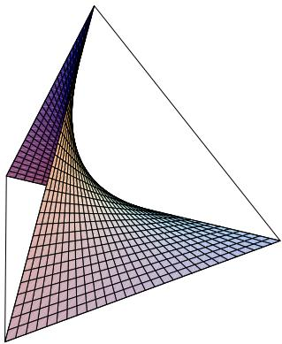  
Fig. 2.8 Exponential family of product distributions

Note that for $\mathfrak{S} = \emptyset$ and $\mathfrak{S} = \{\emptyset\}$ , the hierarchical model $\mathcal{E}_{\mathfrak{S}}$ consists of only one element, the uniform distribution, and is therefore zero-dimensional. In order to remove this ambiguity, we always assume $\mathfrak{S} \neq \emptyset$ in the context of hierarchical models (but still allow $\mathfrak{S} = \{\emptyset\}$ ). With this assumption, the dimension of $\mathcal{E}_{\mathfrak{S}}$ is one less than the dimension of $\mathcal{F}_{\mathfrak{S}}$ :

$$
\dim \left(\mathcal {E} _ {\mathfrak {S}}\right) = \sum_ {\emptyset \neq A \in \overline {{\mathfrak {S}}}} \prod_ {v \in A} \left(| I _ {v} | - 1\right). \tag {2.208}
$$

# Example 2.6

(1) (Independence model) A hierarchical model is particularly simple if the hypergraph is a partition $\mathfrak{S} = \{A_1, \ldots, A_n\}$ of $V$ . The corresponding simplicial complex is then given by

$$
\overline {{\mathfrak {S}}} = \bigcup_ {k = 1} ^ {n} 2 ^ {A _ {k}}. \tag {2.209}
$$

The hierarchical model $\mathcal{E}_{\mathfrak{S}}$ consists of all strictly positive distributions that factorize according to the partition $\mathfrak{S}$ , that is,

$$
p (i) = \prod_ {k = 1} ^ {n} p \left(i _ {A _ {k}}\right). \tag {2.210}
$$

We refer to this hierarchical model as an independence model. In the special case of binary units, it has the dimension

$$
\dim (\mathcal {E} _ {\mathfrak {S}}) = \sum_ {k = 1} ^ {n} (2 ^ {| A _ {k} |} - 1). \tag {2.211}
$$

(2) (Interaction model of order $k$ ) In this example, we want to model interactions up to order $k$ . For that purpose, it is sufficient to consider the hypergraph consisting

of the subsets of cardinality $k$ :

$$
\mathfrak {S} _ {k} := \binom {V} {k}. \tag {2.212}
$$

The corresponding simplicial complex is given by

$$
\overline {{\mathfrak {S}}} _ {k} := \left\{A \subseteq V: 0 \leq | A | \leq k \right\} = \bigcup_ {l = 0} ^ {k} \binom {V} {l}. \tag {2.213}
$$

This defines the hierarchical model

$$
\mathcal {E} ^ {(k)} := \mathcal {E} _ {\mathfrak {S} _ {k}} \tag {2.214}
$$

with dimension

$$
\dim \left(\mathcal {E} ^ {(k)}\right) = \sum_ {l = 1} ^ {k} \binom {N} {l}, \tag {2.215}
$$

and we obviously have

$$
\mathcal {E} ^ {(1)} \subseteq \mathcal {E} ^ {(2)} \subseteq \dots \subseteq \mathcal {E} ^ {(N)}. \tag {2.216}
$$

The information geometry of this hierarchy has been developed in more detail by Amari [10]. The exponential family $\mathcal{E}^{(1)}$ consists of the product distributions (see Fig. 2.8). The extension to $\mathcal{E}^{(2)}$ incorporates pairwise interactions, and $\mathcal{E}^{(N)}$ is nothing but the whole set of strictly positive distributions. Within the field of artificial neural networks, $\mathcal{E}^{(2)}$ is known as a Boltzmann machine [15].

In Sect. 6.1, we shall study the relative entropy distance of a distribution $p$ from a hierarchical model $\mathcal{E}_{\mathfrak{S}}$ , that is, $\inf_{q \in \mathcal{E}_{\mathfrak{S}}} D(p \| q)$ . This distance can be evaluated with the corresponding maximum entropy estimate $\hat{p}$ (see Sect. 2.8.3). More precisely, consider the set of distributions $q$ that have the same $A$ -margins as $p$ for all $A \in \mathfrak{S}$ :

$$
\begin{array}{l} \mathcal {M} := \mathcal {M} (p, \mathfrak {S}) := \left\{q \in \mathcal {P} \left(I _ {V}\right): \sum_ {i _ {V \backslash A}} q \left(i _ {A}, i _ {V \backslash A}\right) = \sum_ {i _ {V \backslash A}} p \left(i _ {A}, i _ {V \backslash A}\right) \right. \\ \left. \text {f o r a l l} A \in \mathfrak {S} \text {a n d a l l} i _ {A} \in I _ {A} \right\}. \\ \end{array}
$$

Obviously, $\mathcal{M}$ is a closed and convex subset of $\mathcal{P}(I_V)$ . Therefore, the restriction of the continuous and strictly concave Shannon entropy $H(q) = -\sum_{i}q(i)\log q(i)$ to $\mathcal{M}$ attains its maximal value in a unique distribution $\hat{p}\in \mathcal{M}$ . We refer to this distribution $\hat{p}$ as the maximum entropy estimate (of $p$ ) with respect to $\mathfrak{S}$ . The following lemma provides a sufficient condition for a distribution to be the maximum entropy estimate with respect to $\mathfrak{S}$ .

Lemma 2.13 (Maximum entropy estimation for hierarchical models) Let $\mathfrak{S}$ be a non-empty hypergraph and let $p\in \mathcal{P}(I_V)$ . If a distribution $\hat{p}$ satisfies the following two conditions then it is the maximum entropy estimate of $p$ with respect to $\mathfrak{S}$ :

(1) There exist functions $\phi_A\in \mathcal{F}_A$ $A\in \mathfrak{S}^{\mathrm{max}}$ , satisfying

$$
\hat {p} \left(i _ {V}\right) = \prod_ {A \in \mathfrak {S} ^ {\max }} \phi_ {A} \left(i _ {V}\right). \tag {2.217}
$$

(2) For all $A \in \mathfrak{S}^{\max}$ , the $A$ -marginal of $\hat{p}$ coincides with the $A$ -marginal of $p$ , that is,

$$
\sum_ {i _ {V \backslash A}} \hat {p} \left(i _ {A}, i _ {V \backslash A}\right) = \sum_ {i _ {V \backslash A}} p \left(i _ {A}, i _ {V \backslash A}\right), \quad \text {f o r a l l} i _ {A} \in I _ {A}. \tag {2.218}
$$

Proof We prove that $\hat{p}$ is in the closure of $\mathcal{E}_{\mathfrak{S}}$ . As $\hat{p}$ is also in $\mathcal{M}(p, \mathfrak{S})$ , the statement follows from Theorem 2.8.

$$
\hat {p} (i _ {V}) = \prod_ {A \in \mathfrak {S} ^ {\max }} \phi_ {A} (i _ {V}) = \lim  _ {\varepsilon \rightarrow 0} \frac {\prod_ {A \in \mathfrak {S} ^ {\max }} \left(\phi_ {A} (i _ {V}) + \varepsilon\right)}{\sum_ {j _ {V}} \prod_ {A \in \mathfrak {S} ^ {\max }} \left(\phi_ {A} (j _ {V}) + \varepsilon\right)} = \lim  _ {\varepsilon \rightarrow 0} p ^ {(\varepsilon)} (i _ {V}),
$$

where obviously $p^{(\varepsilon)}\in \mathcal{E}_{\mathfrak{S}}$

For a strictly positive distribution $p$ , the conditions (2.217) and (2.218) of Lemma 2.13 are necessary and sufficient for a distribution $\hat{p}$ to be the maximum entropy estimate of $p$ with respect to $\mathfrak{S}$ . This directly follows from Theorem 2.8. In general, however, Lemma 2.13 provides only a sufficient condition, but not a necessary one, as follows from the following observation. If the maximum entropy estimate $\hat{p}$ lies in the boundary of the hierarchical model $\mathcal{E}_{\mathfrak{S}}$ , it does not necessarily have to admit the product structure (2.217).

In Sect. 6.1, we shall use Lemma 2.13 for the evaluation of a number of examples.

# 2.9.3 Graphical Models

Graphs provide a compact way of representing a particular kind of hierarchical models, the so-called graphical models [161]. In this section we present the Hammersley-Clifford theorem which is central within the theory of graphical models.

We consider an undirected graph $G = (V, E)$ , with node set $V$ and edge set $E \subseteq \binom{V}{2}$ . If $\{v, w\} \in E$ then we write $v \sim w$ and call $v$ and $w$ neighbors. Given a node $v$ the set $\{w \in V : v \sim w\}$ of neighbors is called the boundary of $v$ and denoted by $\operatorname{bd}(v)$ . For an arbitrary subset $A$ of $V$ , we define the boundary $\operatorname{bd}(A) := \cup_{v \in A} (\operatorname{bd}(v) \setminus A)$ of $A$ and its closure $\operatorname{cl}(A) := A \cup \operatorname{bd}(A)$ . Note that according to this definition, $A$ and $\operatorname{bd}(A)$ are always disjoint.

A path in $V$ is a sequence $\gamma = (v_{1},\ldots ,v_{n})$ satisfying $v_{i}\sim v_{i + 1}$ for all $i = 1,\dots ,n - 1$ . Let $A, B$ , and $S$ be three disjoint subsets of $V$ . We say that $S$ separates $A$ from $B$ if for every path $\gamma = (v_{1},\ldots ,v_{n})$ with $v_{1}\in A$ and $v_{n}\in B$ there is a $v_{i}\in S$ . Note that $\operatorname{bd}(A)$ separates $A$ from $V\setminus \operatorname{cl}(A)$ .

A subset $C$ of $V$ is called a clique (of $G$ ), if for all $v, w \in C$ , $v \neq w$ , it holds that $v \sim w$ . The set of cliques is a simplicial complex in the sense of Definition 2.13, which we denote by $\mathfrak{C}(G)$ . A hierarchical model that only includes interactions of nodes within cliques of a graph has very special properties.

Definition 2.15 Let $G$ be a graph, and let $\mathfrak{C}(G)$ be the simplicial complex consisting of the cliques of $G$ . Then the hierarchical model $\mathcal{E}(G) \coloneqq \mathcal{E}_{\mathfrak{C}(G)}$ , as defined by (2.207), is called a graphical model.

A graph encodes natural conditional independence properties, so-called Markov properties, which are satisfied by all distributions of the corresponding graphical model. In Definition 2.16 below, we shall use the notation $X_A \perp \perp X_B \mid X_C$ for the conditional independence statement " $X_A$ and $X_B$ are stochastically independent given $X_C$ ". This clearly depends on the underlying distribution which is not mentioned explicitly in this notation. Formally, this conditional independence with respect to a distribution $p \in \mathcal{P}(I_V)$ is expressed by

$$
p \left(i _ {A}, i _ {B} \mid i _ {C}\right) = p \left(i _ {A} \mid i _ {C}\right) p \left(i _ {B} \mid i _ {C}\right) \quad \text {w h e n e v e r} p \left(i _ {C}\right) > 0, \tag {2.219}
$$

where we apply the definition (2.184). If we want to use marginals only, we can rewrite this condition as

$$
p \left(i _ {A}, i _ {B}, i _ {C}\right) = \frac {p \left(i _ {A} , i _ {C}\right) p \left(i _ {B} , i _ {C}\right)}{p \left(i _ {C}\right)} \quad \text {w h e n e v e r} p \left(i _ {C}\right) > 0. \tag {2.220}
$$

This is equivalent to the existence of two functions $f \in \mathcal{F}_{A \cup C}$ and $g \in \mathcal{F}_{B \cup C}$ such that

$$
p \left(i _ {A}, i _ {B}, i _ {C}\right) = f \left(i _ {A}, i _ {C}\right) g \left(i _ {B}, i _ {C}\right), \tag {2.221}
$$

where we can ignore "whenever $p(i_C) > 0$ " in (2.219) and (2.220).

Definition 2.16 Let $G$ be a graph with node set $V$ , and let $p$ be a distribution on $I_V$ . Then we say that $p$ satisfies the

(G) global Markov property, with respect to $G$ , if

$$
A, B, S \subseteq V \text {d i s j o i n t}, S \text {s e p a r a t e s} A \text {f r o m} B \Rightarrow X _ {A} \perp \perp X _ {B} \mid X _ {S};
$$

(L) local Markov property, with respect to $G$ , if

$$
v \in V \Rightarrow X _ {v} \perp \perp X _ {V \backslash v} | X _ {\mathrm {b d} (v)};
$$

(P) pairwise Markov property, with respect to $G$ , if

$$
v, w \in V, v \sim w \quad \Rightarrow \quad X _ {v} \perp \perp X _ {w} \mid X _ {V \backslash \{v, w \}}.
$$

Proposition 2.19 Let $G$ be a graph with node set $V$ , and let $p$ be a distribution on $I_V$ . Then the following implications hold:

$$
\begin{array}{r c l} (G) & \Rightarrow & (L) \Rightarrow (P). \end{array}
$$

Proof $(\mathrm{G}) \Rightarrow (\mathrm{L})$ This is a consequence of the fact that $\operatorname{bd}(v)$ separates $v$ from $V \setminus \operatorname{cl}(v)$ , as noted above.

$(\mathrm{L}) \Rightarrow (\mathrm{P})$ Assuming that $v, w \in V$ are not neighbors, one has $w \in V \setminus \operatorname{cl}(w)$ and therefore

$$
\operatorname {b d} (v) \cup \left(\left(V \backslash \operatorname {c l} (v)\right) \backslash \{w \}\right) = V \backslash \{v, w \}. \tag {2.222}
$$

From the local Markov property (L), we know that

$$
X _ {v} \perp X _ {V \backslash \operatorname {c l} (v)} \mid X _ {\operatorname {b d} (v)}. \tag {2.223}
$$

We now use the following general rule for conditional independence statements:

$$
X _ {A} \perp \perp X _ {B} | X _ {S}, C \subseteq B \Rightarrow X _ {A} \perp \perp X _ {B} | X _ {S \cup C}.
$$

With (2.223) and $(V\setminus \operatorname {cl}(v))\setminus \{w\} \subseteq V\setminus \operatorname {cl}(v)$ , this rule implies

$$
X _ {v} \perp \perp X _ {V \backslash \operatorname {c l} (v)} \mid X _ {\operatorname {b d} (v) \cup [ (V \backslash \operatorname {c l} (v)) \backslash \{w \} ]}.
$$

Because of (2.222), this is equivalent to

$$
X _ {v} \perp \perp X _ {V \backslash c l (v)} \mid X _ {V \backslash \{v, w \}}.
$$

With $w \in V \setminus \operatorname{cl}(v)$ we finally obtain

$$
X _ {v} \perp \perp X _ {w} \mid X _ {V \backslash \{v, w \}},
$$

which proves the pairwise Markov property.

Now we provide a criterion for a distribution $p$ that is sufficient for the global Markov property. We say that $p$ factorizes according to $G$ or satisfies the

(F) factorization property, with respect to $G$ , if there exist functions $f_{C} \in \mathcal{F}_{C}$ , $C$ a clique, such that

$$
p (i) = \prod_ {C \text {c l i q u e}} f _ {C} (i). \tag {2.224}
$$

Proposition 2.20 Let $G$ be a graph with node set $V$ , and let $p$ be a distribution on $I_V$ . Then the factorization property implies the global Markov property, that is,

$$
\begin{array}{c c c} \text {(F)} & \Rightarrow & \text {(G)}. \end{array}
$$

Proof We assume that $S$ separates $A$ from $B$ and have to show

$$
X _ {A} \perp \perp X _ {B} \mid X _ {S}.
$$

The complement $V \setminus S$ of $S$ in $V$ can be written as the union of its connected components $V_{i}, i = 1, \ldots, n$ :

$$
V \setminus S = V _ {1} \cup \dots \cup V _ {n}.
$$

We define

$$
\widetilde{A}:= \bigcup_{\substack{i\in \{1,\ldots ,n\} \\ V_{i}\cap A\neq \emptyset}}V_{i},\qquad \widetilde{B}:= \bigcup_{\substack{i\in \{1,\ldots ,n\} \\ V_{i}\cap A = \emptyset}}V_{i}.
$$

Obviously, $A \subseteq \widetilde{A}$ , and $B \subseteq \widetilde{B}$ ( $S$ separates $A$ from $B$ ). Furthermore, a clique $C$ is contained in $\widetilde{A} \cup S$ or $\widetilde{B} \cup S$ . Therefore, we can split the factorization of $p$ as follows:

$$
\begin{array}{l} p (i) = \prod_ {C \text {c l i q u e}} f _ {C} (i) \\ = \prod_{\substack{C\text{clique}\\ C\subseteq \widetilde{A}\cup S}}f_{C}(i)\cdot \prod_{\substack{C\text{clique}\\ C\not\subseteq \widetilde{A}\cup S}}f_{C}(i) \\ =: g \left(i _ {\widetilde {A}}, i _ {S}\right) \cdot h \left(i _ {\widetilde {B}}, i _ {S}\right). \\ \end{array}
$$

With (2.221), this proves $X_{\widetilde{A}} \perp X_{\widetilde{B}} \mid X_S$ . Since $A \subseteq \widetilde{A}$ and $B \subseteq \widetilde{B}$ , we finally obtain $X_A \perp X_B \mid X_S$ .

Generally, there is no equivalence of the above Markov conditions. On the other hand, if we assume strict positivity of a distribution $p$ , that is, $p \in \mathcal{P}_{+}(I_V)$ , then we have equivalence. This is the content of the Hammersley-Clifford theorem of graphical model theory.

Theorem 2.9 (Hammersley-Clifford theorem) Let $G$ be a graph with node set $V$ , and let $p$ be a strictly positive distribution on $I_V$ . Then $p$ satisfies the pairwise Markov property if and only if it factorizes according to $G$ .

Proof We only have to prove that (P) implies (F), since the opposite implication directly follows from Propositions 2.19 and 2.20.

We assume that $p$ satisfies the pairwise Markov property (P). As $p$ is strictly positive, we can consider $\log p(i)$ . We choose one configuration $i^{*} \in I_{V}$ and define

$$
H _ {A} (i) := \log p \left(i _ {A}, i _ {V \backslash A} ^ {*}\right), \quad A \subseteq V.
$$

Here $(i_A, i_{V \setminus A}^*)$ coincides with $i$ on $A$ and with $i^*$ on $V \setminus A$ . Clearly, $H_A$ does not depend on $i_{V \setminus A}$ , and therefore $H_A \in \mathcal{F}_A$ . We define

$$
\phi_ {A} (i) := \sum_ {B \subseteq A} (- 1) ^ {| A \backslash B |} H _ {B} (i).
$$

Also, the $\phi_A$ depend only on $A$ . With the Möbius inversion formula (Lemma 2.12), we obtain

$$
\log p (i) = H _ {V} (i) = \sum_ {A \subseteq V} \phi_ {A} (i). \tag {2.225}
$$

In what follows we use the pairwise Markov property of $p$ in order to prove that in the representation (2.225), $\phi_A = 0$ whenever $A$ is not a clique. This obviously implies that $p$ factorizes according to $G$ and completes the proof.

Assume $A$ is not a clique. Then there exist $v, w \in A, v \neq w, v \rightsquigarrow w$ . Consider $C := A \setminus \{v, w\}$ . Then

$$
\begin{array}{l} \phi_ {A} (i) = \sum_ {B \subseteq A} (- 1) ^ {| A \setminus B |} H _ {B} (i) \\ = \sum_{\substack{B\subseteq A\\ v,w\notin B}}(-1)^{|A\setminus B|}H_{B}(i) + \sum_{\substack{B\subseteq A\\ v\in B,  w\notin B}}(-1)^{|A\setminus B|}H_{B}(i) \\ + \sum_{\substack{B\subseteq A\\ v\notin B,  w\in B}}(-1)^{|A\setminus B|}H_{B}(i) + \sum_{\substack{B\subseteq A\\ v,w\in B}}(-1)^{|A\setminus B|}H_{B}(i) \\ = \sum_ {B \subseteq C} (- 1) ^ {| C \backslash B | + 2} H _ {B \cup \{v, w \}} (i) + \sum_ {B \subseteq C} (- 1) ^ {| C \backslash B | + 1} H _ {B \cup \{v \}} (i) \\ + \sum_ {B \subseteq C} (- 1) ^ {| C \backslash B | + 1} H _ {B \cup \{w \}} (i) + \sum_ {B \subseteq C} (- 1) ^ {| C \backslash B |} H _ {B} (i) \\ = \sum_ {B \subseteq C} (- 1) ^ {| C \backslash B |} \left(H _ {B} (i) - H _ {B \cup \{v \}} (i) - H _ {B \cup \{w \}} (i) + H _ {B \cup \{v, w \}} (i)\right). \tag {2.226} \\ \end{array}
$$

We now set $D \coloneqq V \setminus \{v, w\}$ and use the pairwise Markov property (P) in order to show that (2.226) vanishes:

$$
\begin{array}{l} H _ {B \cup \{v, w \}} (i) - H _ {B \cup \{v \}} (i) \\ = \log \frac {p (i _ {B} , i _ {v} , i _ {w} , i _ {D \setminus B} ^ {*})}{p (i _ {B} , i _ {v} , i _ {w} ^ {*} , i _ {D \setminus B} ^ {*})} \\ = \log \frac {p (i _ {B} , i _ {w} , i _ {D \setminus B} ^ {*}) \cdot p (i _ {v} | i _ {B} , i _ {w} , i _ {D \setminus B} ^ {*})}{p (i _ {B} , i _ {w} ^ {*} , i _ {D \setminus B} ^ {*}) \cdot p (i _ {v} | i _ {B} , i _ {w} ^ {*} , i _ {D \setminus B} ^ {*})} \\ \end{array}
$$

$$
\begin{array}{l} = \log \frac {p \left(i _ {B} , i _ {w} , i _ {D \backslash B} ^ {*}\right) \cdot p \left(i _ {v} \mid i _ {B} , i _ {D \backslash B} ^ {*}\right)}{p \left(i _ {B} , i _ {w} ^ {*}, i _ {D \backslash B} ^ {*}\right) \cdot p \left(i _ {v} \mid i _ {B} , i _ {D \backslash B} ^ {*}\right)} \\ = \log \frac {p \left(i _ {B} , i _ {w} , i _ {D \backslash B} ^ {*}\right) \cdot p \left(i _ {v} ^ {*} \mid i _ {B} , i _ {D \backslash B} ^ {*}\right)}{p \left(i _ {B} , i _ {w} ^ {*}, i _ {D \backslash B} ^ {*}\right) \cdot p \left(i _ {v} ^ {*} \mid i _ {B} , i _ {D \backslash B} ^ {*}\right)} \\ = \log \frac {p \left(i _ {B} , i _ {w} , i _ {D \backslash B} ^ {*}\right) \cdot p \left(i _ {v} ^ {*} \mid i _ {B} , i _ {w} , i _ {D \backslash B} ^ {*}\right)}{p \left(i _ {B} , i _ {w} ^ {*} , i _ {D \backslash B} ^ {*}\right) \cdot p \left(i _ {v} ^ {*} \mid i _ {B} , i _ {w} ^ {*} i _ {D \backslash B} ^ {*}\right)} \\ = \log \frac {p (i _ {B} , i _ {v} ^ {*} , i _ {w} , i _ {D \setminus B} ^ {*})}{p (i _ {B} , i _ {v} ^ {*} , i _ {w} ^ {*} , i _ {D \setminus B} ^ {*})} \\ = H _ {B \cup \{w \}} (i) - H _ {B} (i). \\ \end{array}
$$

This implies $\phi_A(i) = 0$ and, with the representation (2.225), we conclude that $p$ factorizes according to $G$ .

The Hammersley-Clifford theorem implies that for strictly positive distributions, all Markov properties of Definition 2.16 are equivalent. The set of strictly positive distributions that satisfy one of these properties, and therefore all of them, is given by the graphical model $\mathcal{E}(G)$ . Its closure $\overline{\mathcal{E}}(G)$ is sometimes referred to as the extended graphical model. We want to summarize the results of this section by an inclusion diagram. In order to do so, for each property (prop) $\in \{(\mathrm{F}), (\mathrm{G}), (\mathrm{L}), (\mathrm{P})\}$ , we define

$$
\mathcal {M} ^ {(\text {p r o p})} := \left\{p \in \mathcal {P} \left(I _ {V}\right): p \text {s a t i s f i e s (p r o p)} \right\},
$$

and

$$
\mathcal {M} _ {+} ^ {(\mathrm {p r o p})} := \mathcal {M} ^ {(\mathrm {p r o p})} \cap \mathcal {P} _ {+} (I _ {V}).
$$

Clearly, the set of strictly positive distributions that factorize according to $G$ , that is, $\mathcal{M}_{+}^{(\mathrm{F})}$ , coincides with the graphical model $\mathcal{E}(G)$ . One can easily verify that $\mathcal{M}^{(\mathrm{G})}$ , $\mathcal{M}^{(\mathrm{L})}$ , and $\mathcal{M}^{(\mathrm{P})}$ are closed subsets of $\mathcal{P}(I_V)$ that contain the extended graphical model $\overline{\mathcal{E}}(G)$ as a subset. However, the set $\mathcal{M}^{(\mathrm{F})}$ is not necessarily closed: limits of factorized distributions do not have to be factorized. Furthermore, it is contained in $\overline{\mathcal{E}}(G)$ (see the proof of Lemma 2.13).

These considerations, Propositions 2.19 and 2.20, and the Hammersley-Clifford theorem (Theorem 2.9) can be summarized in terms of the following diagram.

$$
\mathcal {M} _ {+} ^ {\mathrm {(F)}} = \mathcal {E} (G) = \mathcal {M} _ {+} ^ {\mathrm {(G)}} = \mathcal {M} _ {+} ^ {\mathrm {(L)}} = \mathcal {M} _ {+} ^ {\mathrm {(P)}}
$$

$$
\cap \quad \cap \quad \cap \quad \cap \quad \cap \tag {2.227}
$$

$$
\mathcal {M} ^ {(F)} \subseteq \overline {{\mathcal {E}}} (G) \subseteq \mathcal {M} ^ {(G)} \subseteq \mathcal {M} ^ {(L)} \subseteq \mathcal {M} ^ {(P)}
$$

The upper row of equalities in this diagram summarizes the content of the Hammersley-Clifford theorem (Theorem 2.9). The lower row of inclusions in this diagram follows from Propositions 2.19 and 2.20. Each of the horizontal inclusions

can be strict in the sense that there exists a graph $G$ for which the inclusion is strict. Corresponding examples are given in Lauritzen's monograph [161], referring to work by Moussouris [191], Matuš [174], and Matuš and Studeny [181].

# Remark 2.4

(1) Conditional independence statements give rise to a natural class of models, referred to as conditional independence models (see the monograph of Steny [241]). This class includes graphical models as prime examples. By the Hammersley-Clifford theorem, on the other hand, graphical models are also special within the class of hierarchical models. A surprising and important result of Matus highlights the uniqueness of graphical models within both classes ([178], Theorem 1). If a hierarchical model is specified in terms of conditional independence statements, then it is already graphical. This means that one cannot specify any other hierarchical model in terms of conditional independence statements. Furthermore, the result of Matus also provides a new proof of the Hammersley-Clifford theorem ([178], Corollary 1). It is not based on the Möbius inversion of the classical proof which we have used in our presentation.

(2) Graphical model theory has been further developed by Geiger, Meek, and Sturmfels using tools from algebraic statistics [103]. In their work, they develop a refined geometric understanding of the results presented in this section. This understanding is not restricted to graphical models but also applies to general hierarchical models. Let us briefly sketch their perspective. All conditional independence statements that appear in Definition 2.16 can be reformulated in terms of polynomial equations. Each Markov property can then be associated with a corresponding set of polynomial equations, which generates an ideal $\mathcal{I}$ in the polynomial ring $\mathbb{R}[x_1,\ldots ,x_{|I_V|}]$ . (The indeterminates are the coordinates $p(i),i\in I_V$ of the distributions in $\mathcal{P}(I_V)$ .) This leads to the ideals $\mathcal{I}^{(\mathrm{G})},\mathcal{I}^{(\mathrm{L})}$ , and $\mathcal{I}^{(\mathrm{P})}$ that correspond to the individual Markov properties, and we obviously have

$$
\mathcal {I} ^ {(\mathrm {P})} \subseteq \mathcal {I} ^ {(\mathrm {L})} \subseteq \mathcal {I} ^ {(\mathrm {G})}. \tag {2.228}
$$

Each of these ideals fully characterizes the graphical model as its associated variety in $\mathcal{P}_{+}(I_V)$ , which follows from the Hammersley-Clifford theorem. The respective varieties $\mathcal{M}^{(\mathrm{G})}$ , $\mathcal{M}^{(\mathrm{L})}$ , and $\mathcal{M}^{(\mathrm{P})}$ in the full simplex $\mathcal{P}(I_V)$ differ in general and contain the extended graphical model $\overline{\mathcal{E}}(G)$ as a proper subset. On the other hand, one can fully specify $\overline{\mathcal{E}}(G)$ in terms of polynomial equations using Theorems 2.5 and 2.7. Denoting the corresponding ideal by $\mathcal{I}(G)$ , we can extend the above inclusion chain (2.228) by

$$
\mathcal {I} ^ {(G)} \subseteq \mathcal {I} (G). \tag {2.229}
$$

Stated differently, the ideal $\mathcal{I}(G)$ encodes all Markov properties in terms of elements of an appropriate ideal basis. Let us now assume that we are given an arbitrary hierarchical model $\mathcal{E}_{\mathfrak{S}}$ with respect to a hypergraph $\mathfrak{S}$ , and let us denote by $\mathcal{I}_{\mathfrak{S}}$ the ideal that is generated by the corresponding Eqs. (2.139) or,

equivalently, (2.149). Geiger, Meek, and Sturmfels interpret the elements of a finite ideal basis of $\mathcal{I}_{\mathfrak{S}}$ as generalized conditional independence statements and prove a version of the Hammersley-Clifford theorem for hierarchical models. Note, however, that the above mentioned result of Matus implies that there is a correspondence between ideal basis elements and actual conditional independence statements only for graphical models.

# Chapter 3

# Parametrized Measure Models

# 3.1 The Space of Probability Measures and the Fisher Metric

This section has a more informal character. It introduces the basic concepts and problems of information geometry on—typically—infinite sample spaces and thereby sets the stage for the more formal considerations in the next section. The perspective here will be somewhat different from that developed in Chap. 2, as the constructions for the probability simplex presented there did not have to grapple with the measure theoretical complications that we shall encounter here. Nevertheless, the analogy with the finite-dimensional case will guide our intuition.

Let $\Omega$ be a set with a $\sigma$ -algebra $\mathfrak{B}$ of subsets; for example, $\Omega$ can be a topological space and $\mathfrak{B}$ the $\sigma$ -algebra of Borel sets, i.e., the $\sigma$ -algebra generated by the open sets. Later on, $\Omega$ will also have to carry a differentiable structure.

For a signed measure $\mu$ on $\Omega$ , we have the total variation

$$
\| \mu \| _ {T V} := \sup  \sum_ {i = 1} ^ {n} | \mu (A _ {i}) |, \tag {3.1}
$$

where the supremum is taken over all finite partitions $\Omega = A_{1} \oplus \dots \oplus A_{n}$ with disjoint sets $A_{i} \in \mathfrak{B}$ . If $\| \mu \|_{TV} < \infty$ , the signed measure $\mu$ is called finite. We consider the Banach space $\mathcal{S}(\Omega)$ of all signed finite measures on $\Omega$ with the total variation as Banach norm. The subsets of all finite non-negative measures and of probability measures on $\Omega$ will be denoted by $\mathcal{M}(\Omega)$ and $\mathcal{P}(\Omega)$ , respectively.

The null sets of a measure $\mu$ are those subsets $A$ of $\Omega$ with $\mu(A) = 0$ . A finite non-negative measure $\mu_1$ dominates another finite measure $\mu_2$ if every null set of $\mu_1$ is also a null set of $\mu_2$ . Two finite non-negative measures are called compatible if they dominate each other, i.e., if they have the same null sets. Spaces of such measures will be the basis of our subsequent constructions, and we shall therefore

now formalize these notions. We take some $\sigma$ -finite non-negative measure $\mu_0$ . Then

$$
\mathcal {S} (\Omega , \mu_ {0}) := \left\{\mu = \phi \mu_ {0}: \phi \in L ^ {1} (\Omega , \mu_ {0}) \right\}
$$

is the space of signed measures dominated by $\mu_0$ . This space can be identified in terms of the canonical map

$$
i _ {c a n}: \mathcal {S} (\Omega , \mu_ {0}) \to L ^ {1} (\Omega , \mu_ {0})
$$

$$
\mu \quad \mapsto \frac {d \mu}{d \mu_ {0}}, \tag {3.2}
$$

where the latter is the Radon-Nikodym derivative of $\mu$ w.r.t. $\mu_0$ . Note that

$$
\| \mu \| _ {T V} = \| \phi \| _ {L ^ {1} (\Omega , \mu_ {0})} = \left\| \frac {d \mu}{d \mu_ {0}} \right\| _ {L ^ {1} (\Omega , \mu_ {0})}.
$$

As we see from this description that $i_{can}$ is a Banach space isomorphism, we refer to the topology of $S(\Omega, \mu_0)$ also as the $L^1$ -topology.

If $\mu_1, \mu_2$ are compatible finite non-negative measures, they are absolutely continuous with respect to each other in the sense that there exists a non-negative function $\phi$ that is integrable with respect to either of them, such that

$$
\mu_ {2} = \phi \mu_ {1}, \quad \text {o r , e q u i v a l e n t l y ,} \quad \mu_ {1} = \phi^ {- 1} \mu_ {2}. \tag {3.3}
$$

As noted before, $\phi$ is then the Radon-Nikodym derivative of $\mu_{2}$ with respect to $\mu_{1}$ .

Being integrable, $\phi$ is finite almost everywhere (with respect to both $\mu_{1}$ and $\mu_{2}$ ) on $\Omega$ , and since the situation is symmetric between $\phi$ and $\phi^{-1}$ , $\phi$ is also positive almost everywhere. Thus, for any finite non-negative measure $\mu$ on $\Omega$ , we let

$$
\mathcal {F} _ {+} (\Omega , \mu) := \left\{\phi \in L ^ {1} (\Omega , \mu), \phi > 0 \mu \text {- a . e .} \right\} \tag {3.4}
$$

be the space of integrable functions on $\Omega$ that are positive almost everywhere with respect to $\mu$ . (The reason for the notation will become apparent in Sect. 3.2 below.) In fact, in later sections, we shall find it more convenient to work with the space of measures

$$
\mathcal {M} _ {+} (\Omega , \mu) := \left\{\phi \mu : \phi \in L ^ {1} (\Omega , \mu), \phi > 0 \mu \text {- a . e .} \right\} \tag {3.5}
$$

than with the space $\mathcal{F}_{+}(\Omega, \mu)$ of functions. Of course, these two spaces can easily be identified, as they simply differ by multiplication with $\mu$ .

In particular, the topology of $S(\Omega, \mu_0)$ is independent of the particular choice of the reference measure $\mu_0$ within its compatibility class, because if

$$
\phi \in L ^ {1} (\Omega , \mu_ {0}) \quad \text {a n d} \quad \psi \in L ^ {1} (\Omega , \phi \mu_ {0}), \quad \text {t h e n} \psi \phi \in L ^ {1} (\Omega , \mu_ {0}). \tag {3.6}
$$

Compatibility is an equivalence relation on the space of finite non-negative measures on $\Omega$ , and that space is therefore partitioned into equivalence classes. The set of such equivalence classes is quite large. For instance, the Dirac measure at any

point of $\Omega$ generates its own such class. More generally, in Euclidean space, we can consider Hausdorff measures of subsets of possibly different Hausdorff dimensions. In the sequel, we shall usually work within a single such compatibility class with some base measure $\mu_0$ . The basic example that one may have in mind is of course the Lebesgue measure on a Euclidean or Riemannian domain, or else the Hausdorff measure on some fixed subset.

Any other finite non-negative measure $\mu$ that is compatible with $\mu_0$ is thus of the form

$$
\mu = \phi \mu_ {0} \quad \text {f o r s o m e} \quad \phi \in \mathcal {F} _ {+} (\Omega , \mu_ {0}), \tag {3.7}
$$

and therefore, by (3.3),

$$
\mu_ {0} = \phi^ {- 1} \mu \quad \text {w i t h} \quad \phi^ {- 1} \in \mathcal {F} _ {+} (\Omega , \mu). \tag {3.8}
$$

This yields the identifications

$$
\mathcal {F} _ {+} (\Omega , \mu) = \mathcal {F} _ {+} (\Omega , \mu_ {0}) =: \mathcal {F} _ {+}, \tag {3.9}
$$

$$
\mathcal {M} _ {+} (\Omega , \mu) = \mathcal {M} _ {+} (\Omega , \mu_ {0}) =: \mathcal {M} _ {+},
$$

where we use $\mathcal{F}_{+}$ and $\mathcal{M}_{+}$ if there is no ambiguity over which base measure $\mu_0$ is used. Moreover, if

$$
\mu_ {1} = \phi \mu_ {0}, \quad \mu_ {2} = \psi \mu_ {1}, \quad \text {w i t h} \quad \phi \in \mathcal {F} _ {+} (\Omega , \mu_ {0}), \psi \in \mathcal {F} _ {+} (\Omega , \mu_ {1})
$$

then by (3.6)

$$
\mu_ {2} = \psi \phi \mu_ {0} \quad \text {w i t h} \quad \psi \phi \in \mathcal {F} _ {+} (\Omega , \mu_ {0}).
$$

$\mathcal{F}_{+}(\Omega, \mu)$ , however, is not a group under pointwise multiplication since for $\phi_{1}, \phi_{2} \in L^{1}(\Omega, \mu_{0})$ , their product $\phi_{1}\phi_{2}$ need not be in $L^{1}(\Omega, \mu_{0})$ .

The question arises, however, whether $\mathcal{F}_{+}$ possesses an—ideally dense—subset that is a group, perhaps even a Lie group. That is, to what extent can we linearize the partial multiplicative group structure via an exponential map, in the same manner as $z\mapsto e^{z}$ maps the additive group $(\mathbb{R}, + )$ to the multiplicative group $(\mathbb{R}^{+},\cdot)$ ? Formally, we might be inclined to identify the tangent space $T_{\mu}\mathcal{F}_{+}$ of $\mathcal{F}_{+}$ at any compatible $\mu$ with

$$
B _ {\mu} := \left\{f: \Omega \rightarrow \mathbb {R} \cup \{\pm \infty \}, e ^ {\pm f} \in L ^ {1} (\Omega , \mu) \right\}. \tag {3.10}
$$

We should point out that here we attempt to revert the construction of Sects. 2.1, 2.2. However, we immediately run into the difficulty that the set $B_{\mu}$ is in general not a vector space, but only a convex subset of $L^1(\Omega, \mu)$ . Thus, a reasonable definition of $T_{\mu}\mathcal{F}_{+}$ would be to define it as the vector space generated by $B_{\mu}$ .

We now switch to working with the space $\mathcal{M}_{+}$ of measures instead of the space $\mathcal{F}_{+}$ of functions, where, as mentioned, $\phi \in \mathcal{F}_{+}$ corresponds to $\phi \mu \in \mathcal{M}_{+}$ . One approach to provide some structure on $\mathcal{M}_{+}$ has been pursued by Pistone and Sempi

who constructed a Banach norm on $T_{\mu}\mathcal{M}_{+}$ such that $B_{\mu}$ becomes a convex open subset. The Banach norm is—up to equivalence—independent of the choice of $\mu$ so that in this way $\mathcal{M}_{+}$ becomes a Banach manifold. The topology which is imposed on $\mathcal{M}_{+}$ in this way is called the $e$ -topology. We shall describe this in detail in Sect. 3.3.

Let us return to our discussion of the analogy between the general situation and the construction of Sects. 2.1, 2.2. There the space of functions was the cotangent space of a measure $m$ in the space of measures, and the tangent and the cotangent space were then identified through a scalar product (and the scalar product chosen then was the Fisher metric). Here, we take the duality between functions and measures

$$
(\phi , m) \mapsto \int \phi d m
$$

as a starting point and vary a measure via $m \mapsto Fm$ for some non-negative function $F$ . This duality will then induce the scalar product

$$
\langle f, F \rangle_ {m} = \int f F d m
$$

which we shall then use to define the Fisher metric.

The construction is tied together by the exponential map

$$
\exp : T _ {\mu} \mathcal {F} _ {+} \supseteq B _ {\mu} \rightarrow \mathcal {F} _ {+} \tag {3.11}
$$

$$
f \to e ^ {f}
$$

that converts arbitrary functions into non-negative ones. In other words, we apply the exponential function $z \mapsto e^{z}$ to each value $f(x)$ of the function $f$ .

Here, in fact, the underlying structure is even an affine one, in the following sense. When we take a measure $\mu' = \phi \mu$ in place of $\mu$ , then an exponential image $e^f \mu$ from $T_{\mu} \mathcal{F}_{+}$ is also an exponential image $e^g \mu' = e^g \phi \mu$ from $T_{\mu'} \mathcal{F}_{+}$ , and the relationship is

$$
f = g + \log \phi . \tag {3.12}
$$

Thus, $f$ and $g$ are related by adding the function $\log \phi$ which is independent of both of them.

Also, of course,

$$
\log : \mathcal {M} _ {+} \rightarrow B _ {\mu} \subseteq T _ {\mu} \mathcal {M} _ {+} \tag {3.13}
$$

$$
\phi \mu \rightarrow \log \phi
$$

is the inverse of the exponential map.2

There is also another, likewise ultimately futile, approach to a putative tangent space $T_{\mu}\mathcal{M}_{+}$ of $\mathcal{M}_{+}$ which is based on a duality relation between $\mathcal{M}_{+}$ and those $f$ that are not only integrable $(L^{1})$ w.r.t. $\mu$ , but even of class $L^{\infty}(\Omega ,\mu)$ . This duality is given by

$$
(f, \phi \mu) := \int f \phi d \mu , \tag {3.14}
$$

which exists since $\phi \in L^{1}(\Omega ,\mu)$

On this space, $T_{\mu}^{\infty}\mathcal{M}_{+}$ , we then have a natural scalar product, namely the $L^2$ -product

$$
\langle f, g \rangle_ {\mu} := \int f g d \mu \quad \text {f o r} f, g \in T _ {\mu} ^ {\infty} \mathcal {M} _ {+}. \tag {3.15}
$$

However, the completion of $T_{\mu}^{\infty}\mathcal{M}_{+}$ with respect to the norm $\| \cdot \|$ induced by $\langle \cdot ,\cdot \rangle_{\mu}$ is the Hilbert space $T_{\mu}^{2}\mathcal{M}_{+}$ of functions $f$ of class $L^2$ with respect to $\mu$ , which is larger than those for which $e^{\pm f}$ are of class $L^1$ .

Thus, by this construction, we do not quite succeed in making $\mathcal{M}_{+}$ into a Lie group. Nevertheless, (3.15) yields a natural Riemannian metric on $\mathcal{M}_{+}$ that will play an important role in the sequel. A Riemannian structure on a differentiable manifold $X$ assigns to each tangent space $T_{p}X$ a scalar product, and this product has to depend differentiably on the base point. At this point, this is only formal, however. When $\Omega$ is not finite, spaces of measures or functions are infinite-dimensional in general because the value at every point is a degree of freedom. Only when $\Omega$ is a finite set do we obtain a finite-dimensional measure or function space. Thus, we need to deal with infinite-dimensional manifolds, e.g., compatibility classes of measures. In Appendix C, we discuss the appropriate concept, that of a Banach manifold. As mentioned, in the present discussion, we only have a weak such structure, however, as our space is not complete w.r.t. the $L^2$ -structure of the metric. In other words, the topology induced by the metrics on the tangent spaces is weaker than the Banach space topology that we are working with. For the moment, we shall therefore proceed in a formal way. Below, in Sect. 3.2, we shall provide a rigorous construction that avoids these issues.

The natural identification between the spaces $T_{\mu}^{2}\mathcal{M}_{+}$ and $T_{\mu^{\prime}}^{2}\mathcal{M}_{+}$ (which for the moment will take the role of tangent spaces—and we shall therefore omit the superscript 2) with $\mu' = \phi \mu$ is given by

$$
f \rightarrow \frac {1}{\sqrt {\phi}} f; \tag {3.16}
$$

we then have

$$
\left\langle \frac {1}{\sqrt {\phi}} f, \frac {1}{\sqrt {\phi}} g \right\rangle_ {\mu^ {\prime}} = \int \frac {1}{\sqrt {\phi}} f \cdot \frac {1}{\sqrt {\phi}} g \phi d \mu = \int f g d \mu = \langle f, g \rangle_ {\mu}.
$$

In particular, if $\Omega$ is a differentiable manifold and

$$
\kappa : \Omega \to \Omega
$$

is a diffeomorphism, then $\mu$ is transformed into $\kappa_{*}\mu$ , called the push-forward of $\mu$ under $\kappa$ , with

$$
\kappa_ {*} \mu (V) := \mu (\kappa^ {- 1} V) \quad \text {f o r a l l} V \in \mathfrak {B}. \tag {3.17}
$$

Since $\int_{V} \frac{1}{|\det d\kappa(x)|} \mu(d(\kappa(x))) = \int_{\kappa^{-1}V} \mu(dx)$ by the transformation formula, we have

$$
\kappa_ {*} \mu (\kappa (x)) | \det  d \kappa (x) | = \mu (y) \quad \text {f o r} y = \kappa (x).
$$

We thus have

$$
\langle f, g \rangle_ {\kappa * \mu} = \left\langle \kappa^ {*} f, \kappa^ {*} g \right\rangle_ {\mu} \tag {3.18}
$$

with

$$
\kappa^ {*} f (x) = f (\kappa (x)).
$$

In other words, if we employ this transformation rule for tangent vectors, then the diffeomorphism group of $\Omega$ acts by isometries on $\mathcal{M}_{+}$ with respect to the metric given by (3.15). Thus, our metric is invariant under diffeomorphisms of $\Omega$ . One might then wish to consider the quotient of $\mathcal{M}_{+}$ by the action of the diffeomorphism group $\mathcal{D}(\Omega)$ . Of course, if $\Omega$ is finite, then $\mathcal{D}(\Omega)$ is simply the group of permutations of the elements of $\Omega$ . This group has a fixed point, namely the probability measure with

$$
p (x _ {i}) = \frac {1}{n} \quad \text {f o r} i = 1, \dots , n
$$

(assuming $\Omega$ consists of the $n$ elements $x_{1},\ldots ,x_{n}$ ), and its scalar multiples. We therefore expect that the quotient $\mathcal{M}_{+} / \mathcal{D}(\Omega)$ will have singularities.

In the infinite case, the situation is somewhat different (although we still get singularities). Namely, if $\Omega$ is a compact oriented differentiable manifold, then a theorem of Moser [190] says that any two probability measures $\mu, \nu$ that are volume forms, i.e., are smooth and positive on all open sets, (in local coordinates $(x^{1},\ldots,x^{n})$ on $\Omega$ , they are thus smooth positive multiples of $dx^{1} \wedge \cdots \wedge dx^{n}$ ) are related by a diffeomorphism $\kappa$ ,

$$
\nu = \kappa_ {*} \mu ,
$$

or equivalently,

$$
\mu = \left(\kappa^ {- 1}\right) _ {*} \nu =: \kappa^ {*} \nu .
$$

Thus, the diffeomorphism group acts transitively on the space of volume forms of total measure 1, and the quotient by the diffeomorphism group of this space is therefore a single point.

We recall that a finite non-negative measure $\mu_{1}$ dominates another finite nonnegative measure $\mu_{2}$ if every null set for $\mu_{1}$ also is a null set for $\mu_{2}$ . Of course, two mutually dominant finite non-negative measures are compatible.

In the finite case, i.e., for $\Omega = \{x_{1},\ldots ,x_{n}\}$ , $\mu_{1}$ then dominates $\mu_{2}$ if

$$
\mu_ {1} \left(x _ {i}\right) = 0 \quad \text {i m p l i e s} \mu_ {2} \left(x _ {i}\right) = 0 \quad \text {f o r a n y} i = 1, \dots , n.
$$

In particular, a measure $\mu$ with

$$
\mu (x _ {i}) > 0 \quad \text {f o r a l l} i
$$

dominates every other measure on $\Omega$

This is different in the infinite case; for example, if $\Omega$ is a compact oriented differentiable manifold, then a volume form which is positive on every open set no longer dominates a Dirac measure supported at some point in $\Omega$ .

In information geometry, one wishes to study only probability measures, that is, measures that satisfy the normalization

$$
\mu (\Omega) = \int_ {\Omega} d \mu = 1. \tag {3.19}
$$

It might seem straightforward to simply impose this condition upon measures and then study the space of those measures satisfying it as a subspace of the space of all measures. A somewhat different point of view, however, emerges from the following consideration. The normalization (3.19) can simply be achieved by rescaling a given measure $\mu$ , that is, by multiplying it by some appropriate $\lambda \in \mathbb{R}$ . $\lambda$ is simply obtained as $\mu(\Omega)^{-1}$ . The freedom of rescaling a measure now expresses that we are not interested in absolute "sizes" $\mu(A)$ of subsets of $\Omega$ , but rather only in relative ones, like $\frac{\mu(A)}{\mu(\Omega)}$ or $\frac{\mu(A_1)}{\mu(A_2)}$ . Therefore, we identify the space $\mathcal{P}(\Omega)$ of probability measures on $\Omega$ as the projective space

$$
\mathbb {P} ^ {1} \mathcal {M} (\Omega),
$$

i.e., the space of all equivalence classes in $\mathcal{M}(\Omega)$ under multiplication by positive real numbers. Of course, elements of $\mathcal{P}(\Omega)$ can be considered as measures satisfying (3.19), but more appropriately as equivalence classes of measures giving the same relative sizes of subsets of $\Omega$ .

Our above metric then also induces a metric on $\mathcal{P}(\Omega)$ as a quotient of $\mathcal{M}(\Omega)$ which is different from the one obtained by identifying $\mathbb{P}^1\mathcal{M}(\Omega)$ with the subspace of $\mathcal{M}(\Omega)$ consisting of metrics satisfying (3.19). Let us recall from Proposition 2.1 in Sect. 2.2 the case where $\Omega$ is finite, $\Omega = \{1,\dots ,n\}$ . In that case, the probability measures on $\Omega$ are given by

$$
\Sigma^ {n - 1} := \left\{\left(p _ {1}, \dots , p _ {n}\right): p _ {i} \geq 0 \text {f o r} i = 1, \dots , n, \text {a n d} \sum_ {i = 1} ^ {n} p _ {i} = 1 \right\}.
$$

These form an $(n - 1)$ -dimensional simplex in the positive cone $\mathbb{R}_+^n$ of $\mathbb{R}^n$ . The projective space

$$
\mathbb {P} ^ {1} \mathbb {R} _ {+} ^ {n},
$$

however, is naturally identified with the corresponding spherical sector

$$
S _ {+} ^ {n - 1} := \left\{(z _ {1}, \dots , z _ {n}): z _ {i} \geq 0 \text {f o r} i = 1, \dots , n, \sum_ {i = 1} ^ {n} z _ {i} ^ {2} = 1 \right\}.
$$

There is a natural bijection

$$
\Sigma^ {n - 1} \rightarrow S _ {+} ^ {n - 1}
$$

$$
(p _ {1}, \dots , p _ {n}) \mapsto (\sqrt {p _ {1}}, \dots , \sqrt {p _ {n}}). \tag {3.20}
$$

Let us now try to carry this over to the infinite-dimensional case, under the assumption that $\Omega$ is a differentiable manifold of dimension $n$ . In that case, we can consider each (Radon) measure $\mu$ as a density. This means that for each $x \in \Omega$ , if we consider the space $Gl(n, \mathbb{R})$ as the space of all bases of $T_x\Omega$ (again, the identification is not canonical as we need to select one basis $V = (v^1, \ldots, v^n)$ that is identified with $\mathrm{id} \in Gl(n, \mathbb{R}))$ ),3

$$
\mu (x) (X V) = | \det  X | \mu (x) (V).
$$

Likewise, we call $\rho$ a half-density, if we have

$$
\rho (x) (X V) = | \det  X | ^ {1 / 2} \rho (x) (V)
$$

for all $X \in Gl(n, \mathbb{R})$ and bases $V$ . Below, in Definition 3.54, we shall give a precise definition of the space of half-densities (in fact, of any $r$ th power of a measure with $0 < r \leq 1$ ).

In this interpretation, our above $L^2$ -product on $\mathcal{M}_{+}(\Omega)$ becomes an $L^2$ -product on the space of half-densities

$$
\langle \rho , \sigma \rangle := \int_ {\Omega} \rho \sigma ,
$$

where we no longer need a base measure $\mu$ . And the diffeomorphism group of $\Omega$ then acts by isometries on the Hilbert space of half-densities of class $L^2$ .

If we now have a probability measure $\mu$ , then its square root $\sqrt{\mu}$ is a half-density that is contained in the unit sphere of that Hilbert space. Conversely, up to the issue of regularity, the part of that unit sphere that corresponds to non-negative half-densities can be identified with the probability measures on $\Omega$ . As mentioned, it carries a metric that is invariant under the action of the diffeomorphism group of $\Omega$ , i.e., under relabeling of the points of $\Omega$ .

The duality relation (3.14) for a probability measure $\mu' = \phi \mu$ then becomes

$$
\left(f, \mu^ {\prime}\right) = \mathbb {E} _ {\mu^ {\prime}} (f), \tag {3.21}
$$

the expectation value of $f$ w.r.t. the probability measure $\mu'$ . This is a linear operation on the space of functions $f$ and an affine operation on the space of probability measures $\mu'$ .

Let us clarify the relation with our previous construction of the metric: If $f$ is a tangent vector to a probability measure $\mu$ , then it generates the curve

$$
e ^ {t f} \mu , \quad t \in \mathbb {R},
$$

through $\mu$ . By taking the square root as before, we obtain the curve

$$
e ^ {\frac {1}{2} t f} \sqrt {\mu}, \quad t \in \mathbb {R},
$$

in the space of half-densities that has the expansion in $t$

$$
\sqrt {\mu} + \frac {1}{2} t f \sqrt {\mu} + O \left(t ^ {2}\right).
$$

Thus, the tangent vector that corresponds to $f$ in the space of half-densities is

$$
\frac {1}{2} f \sqrt {\mu}.
$$

The inner product of two such tangent vectors is

$$
\int {\frac {1}{2}} f \sqrt {\mu} \cdot {\frac {1}{2}} g \sqrt {\mu} = {\frac {1}{4}} \int f g \mu .
$$

Thus, up to the inessential factor $\frac{1}{4}$ , we regain our original Riemannian metric on $\mathcal{M}_{+}(\Omega)$ . In order to eliminate that factor, in Proposition 2.1, we had used the sphere with radius 2 instead of that of radius 1. Therefore, we should also modify (3.20) in the same manner if we want to have an isometry.

Let us now translate this into the usual statistical interpretation: We have a family $p(x; s)$ of probability measures depending on a parameter $s$ , $-\varepsilon < s < \varepsilon$ . Then the squared norm of the tangent vector to this family at $s = 0$ is (up to some factor 4)

$$
\begin{array}{l} 4 \int \frac {d}{d s} \sqrt {p (x ; s)} \frac {d}{d s} \sqrt {p (x ; s)} | _ {s = 0} d x \\ = \int \frac {d}{d s} \log p (x; s) \frac {d}{d s} \log p (x; s) p (x; 0) | _ {s = 0} d x \\ = \mathbb {E} _ {p} \left(\left. \left(\frac {d}{d s} \log p (x; s)\right) ^ {2} \right| _ {s = 0}\right), \tag {3.22} \\ \end{array}
$$

where $\mathbb{E}_p$ denotes the expectation with respect to the probability measure $p = p(\cdot ;0)$ . By polarization, if $s = (s_{1},\ldots ,s_{n})$ is now $n$ -dimensional, we obtain the Fisher information metric

$$
\mathbb {E} _ {p} \left(\frac {\partial}{\partial s _ {\mu}} \log p (x; s) \frac {\partial}{\partial s _ {\nu}} \log p (x; s)\right). \tag {3.23}
$$

We can also rewrite the above formula to obtain

$$
\begin{array}{l} \mathbb {E} _ {p} \left(\frac {\partial}{\partial s _ {\mu}} \log p (x; s) \frac {\partial}{\partial s _ {v}} \log p (x; s)\right) \\ = \int \frac {\partial}{\partial s _ {\mu}} \log p (x; s) \frac {\partial}{\partial s _ {\nu}} \log p (x; s) p (x; 0) d x \\ = - \int \frac {\partial^ {2}}{\partial s _ {\mu} \partial s _ {\nu}} \log p (x; s) p (x; 0) d x \tag {3.24} \\ \end{array}
$$

since $\int \frac{\partial}{\partial s_{\mu}}\log p(x;s)p(x;0)dx = \frac{\partial}{\partial s_{\mu}}\int \log p(x;s)p(x;0)dx = \frac{\partial}{\partial s_{\mu}}\int p(x;s)dx = \frac{\partial}{\partial s_{\mu}} 1 = 0$ which implies

$$
\begin{array}{l} 0 = \frac {\partial}{\partial s _ {v}} \int \frac {\partial}{\partial s _ {\mu}} \log p (x; s) p (x; s) d x = \int \frac {\partial^ {2}}{\partial s _ {\mu} \partial s _ {v}} \log p (x; s) p (x; s) d x \\ + \int \frac {\partial}{\partial s _ {\mu}} \log p (x; s) \frac {\partial}{\partial s _ {\nu}} \log p (x; s) p (x; s) d x. \\ \end{array}
$$

This step also admits the following interpretation:

$$
\frac {\partial}{\partial s _ {v}} \log p (x; s) \tag {3.25}
$$

which is called the score of the family with respect to the parameter $s_{\nu}$ . Our above computation then gives

$$
\mathbb {E} _ {p} \left(\frac {\partial}{\partial s _ {v}} \log p (x; s)\right) = 0, \tag {3.26}
$$

that is, the expectation value of the score vanishes. (This expresses the fact that the cross-entropy

$$
- \int p (x) \log q (x) d x \tag {3.27}
$$

is minimal w.r.t. $q$ precisely for $q = p$ .)

The Fisher metric (3.22) then expresses the covariance matrix of the score.

Returning to (3.24), (3.26) yields the formula

$$
\begin{array}{l} \mathbb {E} _ {p} \left(\frac {\partial}{\partial s _ {\mu}} \log p (x; s) \frac {\partial}{\partial s _ {v}} \log p (x; s)\right) \\ = - \mathbb {E} _ {p} \left(\frac {\partial^ {2}}{\partial s _ {\mu} \partial s _ {\nu}} \log p (x; s)\right) \tag {3.28} \\ \end{array}
$$

as another representation of the Fisher metric (3.23).

We can also write our metric as

$$
\int \frac {1}{p (x ; 0)} \frac {\partial}{\partial s _ {\mu}} p (x; s) \frac {\partial}{\partial s _ {\nu}} p (x; s) d x.
$$

In the finite case, this becomes

$$
\sum_ {i = 1} ^ {n} \frac {1}{p _ {i}} \frac {\partial}{\partial s _ {\mu}} p _ {i} \frac {\partial}{\partial s _ {\nu}} p _ {i}.
$$

Remark 3.1 This metric is called the Shashahani metric in mathematical biology, see Sect. 6.2.1.

As verified in Proposition 2.1, this is simply the metric obtained on the simplex $\Sigma^{n - 1}$ when identifying it with the spherical sector $S_{2, + }^{n - 1}$ via the map $4p = q^2$ $q\in S_{2, + }^{n - 1}$ . If the second derivatives $\frac{\partial^2}{\partial s_\mu\partial s_\nu} p$ vanish, i.e., if $p(x;s)$ is linear in $s$ , then

$$
\sum_ {i = 1} ^ {n} \frac {1}{p _ {i}} \frac {\partial}{\partial s _ {\mu}} p _ {i} \frac {\partial}{\partial s _ {v}} p _ {i} = \frac {\partial^ {2}}{\partial s _ {\mu} \partial s _ {v}} \sum_ {i = 1} ^ {n} p _ {i} \log p _ {i}.
$$

As will be discussed below, this means that the negative of the entropy is a potential for the metric. This will be applied in Theorem 6.4.

The Fisher metric then induces a metric on any smooth family of probability measures on $\Omega$ . To understand the Fisher metric, it is often useful to write a probability distribution in exponential form,

$$
p (x; s) = \exp (- H (x, s)), \tag {3.29}
$$

where the normalization required for $\int p(x;s)dx = 1$ is supposed to be contained in $H$ . The Fisher metric is then simply given by

$$
\mathbb {E} _ {p} \left(\frac {\partial}{\partial s _ {\mu}} \log p (x; s) \frac {\partial}{\partial s _ {\nu}} \log p (x; s)\right) = \mathbb {E} _ {p} \left(\frac {\partial H}{\partial s _ {\mu}} \frac {\partial H}{\partial s _ {\nu}}\right) = \int \frac {\partial H}{\partial s _ {\mu}} \frac {\partial H}{\partial s _ {\nu}} p (x; s) d x. \tag {3.30}
$$

Particularly important in this regard are the so-called exponential families (cf. Definition 2.10).

Definition 3.1 An exponential family is a family of probability distributions of the form

$$
p (x; \vartheta) = \exp \left(\gamma (x) + \sum_ {i = 1} ^ {n} f _ {i} (x) \vartheta^ {i} - \psi (\vartheta)\right) \mu (x), \tag {3.31}
$$

where $\vartheta = (\vartheta^1, \ldots, \vartheta^n)$ is an $n$ -dimensional parameter, $\gamma(x)$ and $f_1(x), \ldots, f_n(x)$ are functions and $\mu(x)$ is a measure on $\Omega$ .

(Of course, $\gamma$ could be absorbed into $\mu$ , but this would be inconvenient for our subsequent discussion of examples.) The function $\psi$ simply serves to guarantee the normalization

$$
\int_ {\Omega} p (x; \vartheta) = 1;
$$

namely

$$
\psi (\vartheta) = \log \int \exp \left(\gamma (x) + \sum f _ {i} (x) \vartheta^ {i}\right) \mu (d x).
$$

Here, the family is defined only for those $\vartheta$ for which

$$
\int \exp \left(\gamma (x) + \sum f _ {i} (x) \vartheta^ {i}\right) \mu (d x) <   \infty .
$$

The set of those $\vartheta$ for which this is satisfied is convex, but can otherwise be quite complicated.

Exponential families will yield important examples of the parametrized measure models introduced in Sect. 3.2.4.

Example 3.1 The normal distribution $\mathcal{N}(\mu, \sigma^2) = \frac{1}{\sqrt{2\pi\sigma}} \exp \left(-\frac{(x - \mu)^2}{2\sigma^2}\right)$ on $\mathbb{R}$ , with Lebesgue measure $dx$ , with parameters $\mu, \sigma$ can easily be written in this form by putting

$$
\gamma (x) = 0, \quad f _ {1} (x) = x, \quad f _ {2} (x) = x ^ {2}, \quad \vartheta^ {1} = \frac {\mu}{\sigma^ {2}}, \quad \vartheta^ {2} = - \frac {1}{2 \sigma^ {2}},
$$

$$
\psi (\vartheta) = \frac {\mu^ {2}}{2 \sigma^ {2}} + \log \sqrt {2 \pi} \sigma = - \frac {(\vartheta^ {1}) ^ {2}}{4 \vartheta^ {2}} + \frac {1}{2} \log \left(- \frac {\pi}{\vartheta^ {2}}\right),
$$

and analogously for multivariate normal distributions $\mathcal{N}(y,\varLambda)$ , i.e., Gaussian distributions on $\mathbb{R}^n$ . See [169] for a systematic analysis.

For an exponential family, we have

$$
\frac {\partial}{\partial \vartheta^ {i}} \log p (x; \vartheta) = f _ {i} (x) - \frac {\partial}{\partial \vartheta^ {i}} \psi (\vartheta) \tag {3.32}
$$

and

$$
\frac {\partial^ {2}}{\partial \vartheta^ {i} \partial \vartheta^ {j}} \log p (x; \vartheta) = - \frac {\partial^ {2}}{\partial \vartheta^ {i} \partial \vartheta^ {j}} \psi (\vartheta). \tag {3.33}
$$

This expression no longer depends on $x$ , but only on the parameter $\theta$ . Therefore, the Fisher metric on such a family is given by

$$
\begin{array}{l} g _ {i j} (p) = - \mathbb {E} _ {p} \left(\frac {\partial^ {2}}{\partial \vartheta^ {i} \partial \vartheta^ {j}} \log p (x; \vartheta)\right) \\ = \int \frac {\partial^ {2}}{\partial \vartheta^ {i} \partial \vartheta^ {j}} \psi (\vartheta) p (x; \vartheta) d x \\ = \frac {\partial^ {2}}{\partial \vartheta^ {i} \partial \vartheta^ {j}} \psi (\vartheta) \quad \text {s i n c e} \int p (x; \vartheta) d x = 1. \tag {3.34} \\ \end{array}
$$

For the normal distribution, we compute the metric in terms of $\vartheta^1$ and $\vartheta^2$ , using (3.33) and transform the result to the variables $\mu$ and $\sigma$ with (B.16) and obtain at $\mu = 0$

$$
g \left(\frac {\partial}{\partial \mu}, \frac {\partial}{\partial \mu}\right) = \frac {1}{\sigma^ {2}}, \tag {3.35}
$$

$$
g \left(\frac {\partial}{\partial \mu}, \frac {\partial}{\partial \sigma}\right) = 0, \tag {3.36}
$$

$$
g \left(\frac {\partial}{\partial \sigma}, \frac {\partial}{\partial \sigma}\right) = \frac {2}{\sigma^ {2}}. \tag {3.37}
$$

As the Fisher metric is invariant under diffeomorphisms of $\Omega = \mathbb{R}$ , and since $x \to x - \mu$ is such a diffeomorphism, it suffices to perform the computation at $\mu = 0$ . The metric computed there, however, up to a simple scaling is the hyperbolic metric of the half-plane

$$
H := \left\{(\mu , \sigma): \mu \in \mathbb {R}, \sigma > 0 \right\},
$$

and so, the Fisher metric on the family of normal distributions is the hyperbolic metric.

Let us summarize some points that will be important for the sequel. We have constructed the Fisher metric as the natural Riemannian metric in the space of lines of (finite non-negative) measures, i.e., on a projective space over a linear space. In the finite case, this projective space is simply a spherical sector. In particular, our metric is then the standard metric on the sphere, and it therefore has sectional curvature $\kappa \equiv 1$ (or, more precisely, $\frac{1}{4}$ if we utilize the sphere of radius 2, to get the normalizations right). This, in fact, carries over to the general case (see [99] for an explicit computation). Therefore, the Fisher metric is not Euclidean. By way of contrast, our space of probability measures can be viewed as a linear space in two different manners. On the one hand, as in the finite case, it can be represented as

a simplex in a vector space. Thus, any probability measure can be represented as a convex linear combination of certain extremal measures. More precisely, when $\Omega$ is a metrizable topological space, then the map $\Omega \to \mathcal{P}(\Omega)$ , $x \mapsto \delta(x)$ that assigns to every $x \in \Omega$ the delta measure supported at $x$ is an embedding. If $\Omega$ is also separable, then the image is a closed subspace of $\mathcal{P}(\Omega)$ . Also, in this case, this image contains precisely the extreme points of the convex set $\mathcal{P}(\Omega)$ . See [5], Sect. 15.2, for details.

We shall call this representation as a convex linear combination of extremal measures a mixture representation. On the other hand, our space of probability measures can be represented as the exponential image of a linear tangent space. This gives the so-called exponential representation. We shall see below that these two linear structures are dual to each other, in the sense that each of them is the underlying affine structure for some connection, and the two corresponding connections are dual with respect to the Fisher metric. Of course, neither of these connections can be the Levi-Civita connection of the Fisher metric as the latter does not have vanishing curvature.

The Fisher metric also allows the following construction: If $\Sigma$ is a set with a measure $\sigma(u)$ on it, and if we have a mapping

$$
h: \Sigma \to \mathcal {P} (\Omega),
$$

i.e., if we have a family of measures on $\Omega$ parametrized by $u\in \Sigma$ , we may then consider variations

$$
h (u; s): \Sigma \times (- \varepsilon , \varepsilon) \rightarrow \mathcal {P} (\Omega),
$$

e.g.,

$$
h (u; s) = \exp_ {h (u; 0)} s \varphi (u)
$$

for some function $\varphi$

If we have two such variations $\varphi^1, \varphi^2$ , we can use the Fisher metric and the measure $\sigma$ to form their $L^2$ -product

$$
\begin{array}{l} \int_ {\Sigma} \mathbb {E} _ {h (u)} \left(\varphi^ {1}, \varphi^ {2}\right) \sigma (d u) \\ = \int_ {\Sigma} \left(\int_ {\Omega} \varphi^ {1} (u) (x) \varphi^ {2} (u) (x) h (u) (d x)\right) \sigma (d u). \\ \end{array}
$$

In other words, we integrate the Fisher product with respect to the measure on our family of measures. The Fisher metric can formally be considered as a special case of this construction, namely when $\Sigma$ is a singleton. The general construction allows us to average over a family of measures. For example, if we have a Markov process with transition probability $p(\cdot |y)$ for each $y\in \Omega$ , we consider this as a family $h:\Omega \to \mathcal{P}(\Omega)$ , with $h(y) = p(\cdot |y)$ , and we may average the Fisher products taken with respect to the measures $p(\cdot |y)$ with respect to some initial probability distribution $p_0(y)$ for $y$ . Thus, if we have families of such transition probabilities $p(\cdot |y;s)$ ,

we get the averaged Fisher product

$$
g _ {i j} (s) := \int \left(\int \frac {\partial}{\partial s ^ {i}} \log p (\cdot | y; s) \frac {\partial}{\partial s ^ {j}} \log p (\cdot | y; s) d x\right) p _ {0} (d y). \tag {3.38}
$$

Under sufficient conditions, this metric is usually obtained from the distributions

$$
p ^ {(n)} \left(x _ {0}, x _ {1}, \dots , x _ {n}; s\right) := p _ {0} \left(x _ {0}; s\right) p \left(x _ {1} \mid x _ {0}; s\right) \dots p \left(x _ {n} \mid x _ {n - 1}; s\right), \quad n = 0, 1, 2, \dots
$$

Denoting the Fisher metric for $s \mapsto p^{(n)}(\cdot; s)$ by $g_{ij}^{(n)}$ , we can consider the limit

$$
\bar {g} _ {i j} (s) := \lim  _ {n \rightarrow \infty} \frac {1}{n} g _ {i j} ^ {(n)} (s), \tag {3.39}
$$

if it exists. A sufficient condition for the existence of this limit is given by the stationarity of the process. In that case, the metric $\overline{\mathfrak{g}}$ defined by (3.39) reduces to the metric $\mathfrak{g}$ defined by (3.38). We shall take up this issue in Sect. 6.1.

# 3.2 Parametrized Measure Models

In this section, we shall give the formal definitions of parametrized measure models, providing solutions to some of the issues described in Sect. 3.1, improving upon [26]. First of all, the intuitive definition of a statistical model is to regard it as a family $\mathbf{p}(\xi)_{\xi \in M}$ of probability measures on some sample space $\Omega$ which varies in a differentiable fashion with $\xi \in M$ . To make this formal, we need to provide some kind of differentiable structure on the space $\mathcal{P}(\Omega)$ of probability measures. This is done by noting that $\mathcal{P}(\Omega)$ is contained in the Banach space $\mathcal{S}(\Omega)$ of finite signed measures on $\Omega$ , provided with the Banach norm $\| \cdot \|_{TV}$ of total variation from (3.1). Therefore, we shall regard a statistical model as a $C^1$ -map between Banach manifolds $\mathbf{p}: M \to \mathcal{S}(\Omega)$ , as described in Appendix C, whose image is contained in $\mathcal{P}(\Omega)$ .

Since $\mathcal{P}(\Omega)$ may also be regarded as the projectivization of the space of finite measures $\mathcal{M}(\Omega)$ via rescaling, any $C^1$ -map $\mathbf{p}: M \to \mathcal{M}(\Omega)$ induces a statistical model $\mathbf{p}_0: M \to \mathcal{P}(\Omega)$ by

$$
\mathbf {p} _ {0} (\xi) = \frac {\mathbf {p} (\xi)}{\| \mathbf {p} (\xi) \| _ {T V}}. \tag {3.40}
$$

It is often more convenient to study $C^1$ -maps $\mathbf{p} : M \to \mathcal{M}(\Omega)$ , called parametrized measure models, and then use (3.40) to obtain a statistical model $\mathbf{p}_0$ . In case we consider $C^1$ -maps $\mathbf{p} : M \to S(\Omega)$ , also allowing for non-positive measures, we call it a signed parametrized measure model.

Let us assume for simplicity that all measures $\mathbf{p}(\xi)$ are dominated by some fixed measure $\mu_0$ , even though later we shall show that this assumption is inessential. As

it turns out, a dominating measure $\mu_0$ exists if $M$ contains a countable dense subset which is the case, e.g., if $M$ is a finite-dimensional manifold. In this case,

$$
\mathbf {p} (\xi) = p (\cdot ; \xi) \mu_ {0},
$$

where $p:\Omega \times M\to \mathbb{R}$ is called the density function of $\mathbf{p}$ w.r.t. $\mu_0$ . Evidently, $p(\cdot ;\xi)\in L^{1}(\Omega ,\mu_{0})$ for all $\xi$ . The differential of $\mathbf{p}$ in the direction of a tangent vector $V\in T_{\xi}M$ is then given by

$$
d _ {\xi} \mathbf {p} (V) = \partial_ {V} p (\cdot ; \xi) \mu_ {0} \in L ^ {1} (\Omega , \mu_ {0}),
$$

where for simplicity we assume that the partial derivative of the density function exists, even though we shall show that this condition may be weakened as well.

Attempting to define an inner product on $T_{\xi}M$ analogous to the Fisher metric in (2.18), we have to regard $d_{\xi}\mathbf{p}(V)$ as an element of $T_{\mathbf{p}(\xi)}\mathcal{S}(\Omega)\cong L^1 (\Omega ,\mathbf{p}(\xi))$ which leads to

$$
\begin{array}{l} \mathfrak {g} _ {\xi} (V, W) = \left(d _ {\xi} p (V), d _ {\xi} p (W)\right) _ {\mathbf {p} (\xi)} \\ = \int_ {\Omega} \frac {d \left\{d _ {\xi} p (V) \right\}}{d p (\xi)} \frac {d \left\{d _ {\xi} p (W) \right\}}{d p (\xi)} d \mathbf {p} (\xi) \tag {3.41} \\ = \int_ {\Omega} \frac {\partial_ {V} p (\cdot ; \xi)}{p (\cdot ; \xi)} \frac {\partial_ {W} p (\cdot ; \xi)}{p (\cdot ; \xi)} d \mathbf {p} (\xi) \\ = \int_ {\Omega} \partial_ {V} \log p (\cdot ; \xi) \partial_ {W} \log p (\cdot ; \xi) d \mathbf {p} (\xi). \\ \end{array}
$$

We immediately encounter two problems. The first one is that—unlike in the case of a finite sample space $\Omega$ —the above integral may diverge, if we only assume that $\partial_V \log p(\cdot; \xi) \in L^1(\Omega, \mathbf{p}(\xi))$ ; rather, we should demand that $\partial_V \log p(\cdot; \xi) \in L^2(\Omega, \mathbf{p}(\xi))$ which in the case of an infinite sample space $\Omega$ is a proper subset.

The second problem is that the functions $\log p(\cdot ;\xi)$ used in (3.41) to define the Fisher metric are not defined if we drop the assumption that $p > 0$ , i.e., that all measures have the same null sets as $\mu_0$ . This is the reason why in most definitions of differentiable families of measures the equivalence of the measures $\mathbf{p}(\xi)$ in the family and hence the positivity of the density function $p$ is required; cf., e.g., [9, 16, 25, 219]. For instance, if $\Omega$ is a finite sample space, then the description of the Fisher metric on $\mathcal{M}(\Omega)$ or on $\mathcal{P}(\Omega)$ in its canonical coordinates develops singularities outside the sets $\mathcal{M}_{+}(\Omega)$ and $\mathcal{P}_{+}(\Omega)$ , respectively, cf. (2.13) and (2.19). However, if we use the coordinates $(\sqrt{p_i(\xi)})_{i\in I}$ instead, then this metric coincides—up to a constant factor—with the standard inner product on Euclidean space and hence extends to all of $\mathcal{M}(\Omega)$ and $\mathcal{P}(\Omega)$ , respectively, cf. Proposition 2.1. That is, the seeming degeneracy of the Fisher metric near the boundary of $\mathcal{P}_{+}(\Omega,\mu_{0})$ is only due to an inconvenient choice of coordinates, while with the right choice $(\sqrt{p_i(\xi)})_{i\in I}$ it becomes the Euclidean metric on the sphere. Formulating it slightly differently, the point is that not all the individual factors under the integral in (3.41) need to be well-defined, but it suffices that their product is

# 3.2 Parametrized Measure Models

Generalizing this approach, let us introduce half-densities, by which we mean formal square roots of measures. That is, we let

$$
\sqrt {\mathbf {p} (\xi)} := \sqrt {p (\cdot ; \xi)} \sqrt {\mu_ {0}},
$$

where for the moment we regard $\sqrt{\mu_0}$ merely as a formal symbol. Taking derivatives of this yields

$$
d _ {\xi} \sqrt {\mathbf {p}} (V) = \frac {1}{2} \frac {\partial_ {V} p (\cdot ; \xi)}{\sqrt {p (\cdot ; \xi)}} \sqrt {\mu_ {0}} = \frac {1}{2} \partial_ {V} \log p (\cdot ; \xi) \sqrt {\mathbf {p} (\xi)},
$$

whence

$$
d _ {\xi} \sqrt {\mathbf {p}} (V) \cdot d _ {\xi} \sqrt {\mathbf {p}} (W) = \frac {1}{4} \partial_ {V} \log p (\cdot ; \xi) \partial_ {W} \log p (\cdot ; \xi) p (\cdot ; \xi) \mu_ {0},
$$

and so

$$
\mathfrak {g} _ {\xi} (V, W) = 4 \int_ {\Omega} d \left(d _ {\xi} \sqrt {\mathbf {p}} (V) \cdot d _ {\xi} \sqrt {\mathbf {p}} (W)\right),
$$

as in (3.22). Analogously, if we define $\sqrt[3]{\mathbf{p}(\xi)} := \sqrt[3]{p(\cdot; \xi)} \sqrt[3]{\mu_0}$ , again regarding $\sqrt[3]{\mu_0}$ as a formal symbol, then

$$
d _ {\xi} \sqrt [ 3 ]{\mathbf {p}} (V) = \frac {1}{3} \frac {\partial_ {V} p (\cdot ; \xi)}{\sqrt {p (\cdot ; \xi) ^ {2}}} \sqrt [ 3 ]{\mu_ {0}} = \frac {1}{3} \partial_ {V} \log p (\cdot ; \xi) \sqrt [ 3 ]{\mathbf {p} (\xi)},
$$

so that the Amari-Chentsov tensor $\mathbf{T}$ from (2.51) can be written as

$$
\begin{array}{l} \mathbf {T} _ {\xi} (V, W, U) = \int_ {\Omega} \partial_ {V} \log p (\cdot ; \xi) \partial_ {W} \log p (\cdot ; \xi) \partial_ {U} \log p (\cdot ; \xi) d \mathbf {p} (\xi) \\ = 2 7 \int_ {\Omega} d \left(d _ {\xi} \sqrt [ 3 ]{\mathbf {p} (\xi)} (V) \cdot d _ {\xi} \sqrt [ 3 ]{\mathbf {p} (\xi)} (W) \cdot d _ {\xi} \sqrt [ 3 ]{\mathbf {p} (\xi)} (U)\right). \tag {3.42} \\ \end{array}
$$

This suggests that we should try to make formal sense of the objects $\sqrt{\mu_0}$ , $\sqrt[3]{\mu_0}$ and hence of $\mathbf{p}(\xi)^{1/2} = \sqrt{\mathbf{p}(\xi)}$ , $\mathbf{p}(\xi)^{1/3} = \sqrt[3]{\mathbf{p}(\xi)}$ , etc. The idea of taking $r$ th powers of a measure $\mathbf{p}(\xi)$ with $0 < r < 1$ has been introduced in a less rigorous way by Amari in [8, p. 66], where such powers are called $\alpha$ -representations.

We shall use a more formal approach and for $0 < r \leq 1$ construct the Banach spaces $\mathcal{S}^r (\Omega)$ in Sect. 3.2.3 by a certain direct limit construction, as well as the subsets

$$
\mathcal {P} ^ {r} (\Omega) \subseteq \mathcal {M} ^ {r} (\Omega) \subseteq \mathcal {S} ^ {r} (\Omega).
$$

The elements of these sets are called $r$ th powers of probability measures (finite measures, signed finite measures, respectively), and they have the feature that one can formally take the $(1 / r)$ th power of them to obtain a probability measure (finite measure, signed finite measure, respectively), and raising to the $(1 / r)$ th power is a $C^1$ -regular map between Banach spaces.

Once we have done this, we call a parametrized measure model $k$ -integrable if the map

$$
\mathbf {p} ^ {1 / k}: M \longrightarrow \mathcal {M} ^ {1 / k} (\Omega) \subseteq \mathcal {S} ^ {1 / k} (\Omega), \quad \xi \longmapsto \mathbf {p} (\xi) ^ {1 / k} \tag {3.43}
$$

is a $C^1$ -map as defined in Appendix C. If $\mathbf{p}(\xi) = p(\cdot ;\xi)\mu_0$ is dominated by $\mu_0$ , then the differential of this map is given by

$$
\partial_ {V} \mathbf {p} ^ {1 / k} = d _ {\xi} \mathbf {p} ^ {1 / k} (V) := \frac {1}{k} \partial_ {V} \log p (\cdot ; \xi) \mathbf {p} ^ {1 / k} (\xi),
$$

and in order for this to be the $k$ th root of a measure, we have to require that $\partial_V\log p(\cdot ;\xi)\in L^k (\Omega ,\mathbf{p}(\xi))$

We call such a model weakly $k$ -integrable if the map $\mathbf{p}^{1/k}: M \to \mathcal{M}^{1/k}(\Omega)$ is a weak $C^1$ -map, cf. Appendix C for a definition. As we shall show in Theorem 3.2, the model is $k$ -integrable if and only if the $k$ -norm $V \mapsto \| \partial_V \mathbf{p}^{1/k} \|_k$ depends continuously on $V \in TM$ , and it is weakly $k$ -integrable if and only if the map $V \mapsto \partial_V \mathbf{p}^{1/k}$ is weakly continuous. Thus, our definition of $k$ -integrability coincides with that given in [25, Definition 2.4].

In general, on an $n$ -integrable parametrized measure model we may define the canonical $n$ -tensor

$$
\left(\tau_ {M} ^ {n}\right) _ {\xi} \left(V _ {1}, \dots , V _ {n}\right) = \int_ {\Omega} \partial_ {V _ {1}} \log p (\cdot ; \xi) \dots \partial_ {V _ {n}} \log p (\cdot ; \xi) d \mathbf {p} (\xi), \tag {3.44}
$$

which is a generalization of the Fisher metric $\mathfrak{g} = \tau_M^2$ (3.41) and the Amari-Chentsov tensor $\mathbf{T} = \tau_M^3$ (3.42). In fact, we show that $\tau_M^n$ is the pullback of a naturally defined covariant $n$ -tensor $L_{\Omega}^{n}$ on $S^{1 / n}(\Omega)$ via the map $\mathbf{p}^{1 / n}:M\to \mathcal{M}^{1 / n}(\Omega)\subseteq S^{1 / n}(\Omega)$ , where $k\geq n$ . In particular, $\tau_M^n\coloneqq (\mathbf{p}^{1 / n})^* L_{\Omega}^n$ is well defined for a $k$ -integrable parametrized measure model with $k\geq n$ , even if $p$ is not a positive function, in which case (3.44) has to be interpreted with care.

While for most applications it will suffice to consider statistical models which are dominated by some measure $\mu_0$ , our development of the theory will show that this is an inessential condition. Intuitively, it is plausible that the quantity $\partial_V p(\cdot ;\xi)\mu_0$ which measures the change of measure w.r.t. the background measure $\mu_0$ is not a significant quantity, but rather the rate of change of $\mathbf{p}(\boldsymbol {\xi})$ relative to the measure $\mathbf{p}(\boldsymbol {\xi})$ itself. That is, the relevant quantity to consider as a derivative is the logarithmic derivative

$$
\partial_ {V} \log p (\cdot ; \xi) = \frac {d \{d _ {\xi} \mathbf {p} (V) \}}{d \mathbf {p} (\xi)},
$$

where the fraction stands for the Radon-Nikodym derivative. An important observation is that for any parametrized measure model, this Radon-Nikodym derivative always exists, so that the logarithmic derivative $\partial_V\log \mathbf{p}(\xi)$ may be defined also in the absence of a dominating measure $\mu_0$ . This is all that is needed to define the notions of $k$ -integrability and the canonical tensors mentioned above.

# 3.2.1 The Structure of the Space of Measures

The aim of this section is to provide the formal set-up of parametrized measure models in order to make the discussion in the preceding section rigorous. As before, let $\Omega$ be a measurable space. We let

$$
\mathcal {P} (\Omega) := \{\mu : \mu \text {a p r o b a b i l i t y m e a s u r e o n} \Omega \},
$$

$$
\mathcal {M} (\Omega) := \{\mu : \mu \text {a f i n i t e m e a s u r e o n} \Omega \},
$$

$$
\mathcal {S} (\Omega) := \left\{\mu : \mu \text {a s i g n e d f i n i t e m e a s u r e o n} \Omega \right\}, \tag {3.45}
$$

$$
\mathcal {S} _ {0} (\Omega) := \left\{\mu \in \mathcal {S} (\Omega): \int_ {\Omega} d \mu = 0 \right\}.
$$

Clearly, $\mathcal{P}(\Omega) \subseteq \mathcal{M}(\Omega) \subseteq \mathcal{S}(\Omega)$ , and $\mathcal{S}_0(\Omega), \mathcal{S}(\Omega)$ are real vector spaces. In fact, both $\mathcal{S}_0(\Omega)$ and $\mathcal{S}(\Omega)$ are Banach spaces whose norm is given by the total variation $\| \cdot \|_{TV}$ (3.1), whence any subset carries a canonical topology which is determined by saying that a sequence $(\nu_n)_{n \in \mathbb{N}}$ in (a subset of) $\mathcal{S}(\Omega)$ converges to $\nu_{\infty}$ if and only if

$$
\lim  _ {n \rightarrow \infty} \| v _ {n} - v _ {\infty} \| _ {T V} = 0.
$$

With respect to this topology, the subsets

$$
\mathcal {P} (\Omega) \subseteq \mathcal {M} (\Omega) \subseteq \mathcal {S} (\Omega)
$$

are closed.

Remark 3.2 Evidently, for the applications we have in mind, we are interested mainly in statistical models. However, we can take the point of view that $\mathcal{P}(\Omega) = \mathbb{P}(\mathcal{M}(\Omega))$ is the projectivization of $\mathcal{M}(\Omega)$ via rescaling. Thus, given a parametrized measure model $(M,\Omega ,\mathbf{p})$ , normalization yields a statistical model $(M,\Omega ,\mathbf{p}_0)$ defined by

$$
\mathbf {p} _ {0} (\xi) := \frac {\mathbf {p} (\xi)}{\| \mathbf {p} (\xi) \| _ {T V}},
$$

which is again a $C^1$ -map. Indeed, the map $\mu \mapsto \| \mu \|_{TV}$ on $\mathcal{M}(\Omega)$ is a $C^1$ -map, being the restriction of the linear (and hence differentiable) map $\mu \mapsto \int_{\Omega} d\mu$ on $\mathcal{S}(\Omega)$ .

Observe that while $S(\Omega)$ is a Banach space, the subsets $\mathcal{M}(\Omega)$ and $\mathcal{P}(\Omega)$ do not carry a canonical manifold structure.

By the Jordan decomposition theorem, each measure $\mu \in S(\Omega)$ can be decomposed uniquely as

$$
\mu = \mu_ {+} - \mu_ {-} \quad \text {w i t h} \mu_ {\pm} \in \mathcal {M} (\Omega), \mu_ {+} \perp \mu_ {-}. \tag {3.46}
$$

The latter means that we have a disjoint union $\Omega = P \uplus N$ with $\mu_{+}(N) = \mu_{-}(P) = 0$ . Thus, if we define

$$
| \mu | := \mu_ {+} + \mu_ {-} \in \mathcal {M} (\Omega),
$$

then (3.46) implies

$$
\left| \mu (A) \right| \leq | \mu | (A) \quad \text {f o r a l l} \mu \in S (\Omega) \text {a n d} A \in \Sigma , \tag {3.47}
$$

so that

$$
\| \mu \| _ {T V} = \big \| | \mu | \big \| _ {T V} = | \mu | (\Omega).
$$

In particular,

$$
\mathcal {P} (\Omega) = \left\{\mu \in \mathcal {M} (\Omega): \| \mu \| _ {T V} = 1 \right\}.
$$

Moreover, fixing a measure $\mu_0\in \mathcal{M}(\Omega)$ , we define

$$
\begin{array}{l} \mathcal {M} (\Omega , \mu_ {0}) = \left\{\mu = \phi \mu_ {0}: \phi \in L ^ {1} (\Omega , \mu_ {0}), \phi \geq 0 \right\}, \\ \mathcal {M} _ {+} (\Omega , \mu_ {0}) = \left\{\mu = \phi \mu_ {0}: \phi \in L ^ {1} (\Omega , \mu_ {0}), \phi > 0 \right\}, \\ \mathcal {P} (\Omega , \mu_ {0}) = \left\{\mu \in \mathcal {M} (\Omega , \mu_ {0}): \int_ {\Omega} d \mu = 1 \right\}, \tag {3.48} \\ \mathcal {P} _ {+} (\Omega , \mu_ {0}) = \left\{\mu \in \mathcal {M} _ {+} (\Omega , \mu_ {0}): \int_ {\Omega} d \mu = 1 \right\}, \\ \mathcal {S} (\Omega , \mu_ {0}) = \left\{\mu = \phi \mu_ {0}: \phi \in L ^ {1} (\Omega , \mu_ {0}) \right\}. \\ \end{array}
$$

By the Radon-Nikodym theorem, $\mathcal{P}(\Omega, \mu_0) \subseteq \mathcal{M}(\Omega, \mu_0) \subseteq \mathcal{S}(\Omega, \mu_0)$ consists of those measures in $\mathcal{P}(\Omega) \subseteq \mathcal{M}(\Omega) \subseteq \mathcal{S}(\Omega)$ which are dominated by $\mu_0$ , and the canonical isomorphism, $i_{can}: \mathcal{S}(\Omega, \mu_0) \to L^1(\Omega, \mu_0)$ in (3.2) given by taking the Radon-Nikodym derivative w.r.t. $\mu_0$ yields an isomorphism whose inverse is given by

$$
\iota_ {c a n} ^ {- 1}: L ^ {1} (\Omega , \mu_ {0}) \longrightarrow \mathcal {S} (\Omega , \mu_ {0}), \quad \phi \longmapsto \phi \mu_ {0}.
$$

Observe that $\iota_{can}$ is an isometry of Banach spaces, since evidently

$$
\| \phi \| _ {L ^ {1} (\varOmega , \mu_ {0})} = \int_ {\varOmega} | \phi | d \mu_ {0} = \| \phi \mu_ {0} \| _ {T V}.
$$

# 3.2.2 Tangent Fibration of Subsets of Banach Manifolds

In this section, we shall use the notion of differentiable maps between Banach spaces, as described in Appendix C. In particular, a curve in a Banach space

$(V; \| \cdot \|$ is a differentiable map $c: I \to V$ with an (open) interval $I \subseteq \mathbb{R}$ . That is, for each $t_0 \in I$ there exists the limit

$$
\left. \frac {d}{d t} \right| _ {t = t _ {0}} c (t) = \dot {c} (t _ {0}) := \lim  _ {t \rightarrow t _ {0}} \frac {c (t) - c \left(t _ {0}\right)}{t - t _ {0}}. \tag {3.49}
$$

Definition 3.2 Let $(V; \| \cdot \|$ be a Banach space, $X \subseteq V$ an arbitrary subset and $x_0 \in X$ . Then $v \in V$ is called a tangent vector of $X$ at $x_0$ , if there is a curve $c: (-\varepsilon, \varepsilon) \to X \subseteq V$ such that $c(0) = x_0$ and $\dot{c}(0) = v$ .

The set of all tangent vectors at $x_0$ is called the tangent double cone of $X$ at $x_0$ and is denoted by $T_{x_0}X$ . We also define the tangent fibration of $X$ as

$$
T X := \bigcup_ {x _ {0} \in X} T _ {x _ {0}} X \subseteq X \times V \subseteq V \times V,
$$

equipped with the induced topology and with the canonical projection map $TX \to X$ .

Remark 3.3 The reader should be aware that, unlike in some texts, we do not use tangent fibration as a synonym for the tangent bundle, since for general subsets $X \subseteq V$ , $T_{x_0}X \subseteq V$ may fail to be a vector subspace, and for $x_0 \neq x_1$ , the tangent cones $T_{x_0}X$ and $T_{x_1}X$ need not be homeomorphic.

For instance, let $X := \{(x,y)^\top \in \mathbb{R}^2 : xy = 0\} \subseteq \mathbb{R}^2$ , so that $X$ is the union of the two coordinate axes. Then $T_{(x,0)}X$ and $T_{(0,y)}X$ with $x, y \neq 0$ are the $x$ -axis and the $y$ -axis, respectively, and hence linear subspaces of $V = \mathbb{R}^2$ , but $T_{(0,0)}X = X$ is not a subspace. This example also shows that $T_{x_0}X$ and $T_{x_1}X$ need not be homeomorphic if $x_0 \neq x_1$ , whence the projection $TX \to X$ mapping $T_{x_0}X$ to $x_0$ is in general only a topological fibration, but not a vector bundle or a fiber bundle.

But at least, $T_{x_0}X$ is invariant under multiplication by (positive or negative) scalars and hence is a double cone. This is seen by replacing the curve $c$ in Definition 3.2 by $\tilde{c}(t) \coloneqq c(t_0t) \in X$ for some $t_0 \in \mathbb{R}$ , so that $\tilde{c}(0) = x_0$ and $\dot{\tilde{c}}(0) = t_0v \in T_{x_0}X$ .

If $X \subseteq V$ is a submanifold, however, then $T_{x_0}X$ and $TX$ coincide with the standard notion of the tangent space at $x_0$ and the tangent bundle of $X$ , respectively. Thus, in this case the tangent cone is a linear subspace, and the tangent fibration is the tangent bundle of $X$ .

For instance, if $X = U \subseteq V$ is an open set, then $T_{x_0}U = V$ for all $x_0$ and hence, $TU = U \times V$ . Indeed, the curve $c(t) = x_0 + tv \in U$ for small $|t|$ satisfies the properties required in the Definition 3.2. In this case, the tangent fibration $U \times V \to U$ is a (trivial) vector bundle.

If $M$ is a Banach manifold and $F: M \to V$ is a $C^1$ -map whose image is contained in $X \subseteq V$ , then by the chain rule, for any $v \in T_{x_0}M$ and any curve $c: (-\varepsilon, \varepsilon) \to M$ with $c(0) = x_0$ , $\dot{c}(0) = v$ ,

$$
\left. \frac {d}{d t} \right| _ {t = 0} F (c (t)) = d _ {x _ {0}} F (v),
$$

and as $t \mapsto F(c(t))$ is a curve in $X$ with $F(c(0)) = F(x_0)$ , it follows that $d_{x_0}F(v) \in T_{F(x_0)}X$ for all $v \in TM$ . That is, a $C^1$ -map $F: M \to X \subseteq V$ induces a continuous map

$$
d F: T M \longrightarrow T X, \quad (x _ {0}, v) \longmapsto d _ {x _ {0}} F (v).
$$

Theorem 3.1 Let $V = \mathcal{S}(\Omega)$ be the Banach space of finite signed measures on $\Omega$ . Then the tangent cones of $\mathcal{M}(\Omega)$ and $\mathcal{P}(\Omega)$ at $\mu$ are $T_{\mu}\mathcal{M}(\Omega) = \mathcal{S}(\Omega, \mu)$ and $T_{\mu}\mathcal{P}(\Omega) = S_0(\Omega, \mu)$ , respectively, so that

$$
T \mathcal {M} (\Omega) = \bigcup_ {\mu \in \mathcal {M} (\Omega)} \mathcal {S} (\Omega , \mu) \subseteq \mathcal {M} (\Omega) \times \mathcal {S} (\Omega)
$$

and

$$
T\mathcal{P}(\varOmega)=\bigcup_{\mu\in\mathcal{P}(\varOmega)}\mathcal{S}_{0}(\varOmega,\mu)\subseteq\mathcal{P}(\varOmega)\times\mathcal{S}(\varOmega).
$$

Proof Let $\nu \in T_{\mu_0}\mathcal{M}(\Omega)$ and let $(\mu_t)_{t\in (-\varepsilon ,\varepsilon)}$ be a curve in $\mathcal{M}(\Omega)$ with $\dot{\mu}_0 = \nu$ . Let $A\subseteq \Omega$ be such that $\mu_0(A) = 0$ . Then as $\mu_t(A)\geq 0$ , the function $t\mapsto \mu_t(A)$ has a minimum at $t = 0$ , whence

$$
0 = \frac {d}{d t} \bigg | _ {t = 0} \mu_ {t} (A) = \dot {\mu} _ {0} (A) = v (A),
$$

where the second equation is evident from (3.49). That is, $\nu(A) = 0$ whenever $\mu_0(A) = 0$ , i.e., $\mu_0$ dominates $\nu$ , so that $\nu \in S(\Omega, \mu_0)$ . Thus, $T_{\mu_0}\mathcal{M}(\Omega) \subseteq S(\Omega, \mu_0)$ .

Conversely, given $\nu = \phi \mu_0\in S(\Omega ,\mu_0)$ , define $\mu_t\coloneqq p(\omega ;t)\mu_0$ where

$$
p (\omega ; t) := \left\{ \begin{array}{l l} 1 + t \phi (\omega) & \text {i f} t \phi (\omega) \geq 0, \\ \exp (t \phi (\omega)) & \text {i f} t \phi (\omega) <   0. \end{array} \right.
$$

As $p(\omega; t) \leq \max(1 + t\phi(\omega), 1)$ , it follows that $\mu_t \in \mathcal{M}(\Omega)$ , and as the derivative $\partial_t p(\omega; t)$ exists for all $t$ and its absolute value is bounded by $|\phi| \in L^1(\Omega, \mu_0)$ , it follows that $t \mapsto \mu_t$ is a $C^1$ -curve in $\mathcal{M}(\Omega)$ with $\dot{\mu}_0 = \phi\mu_0 = \nu$ , whence $\nu \in T_{\mu_0}\mathcal{M}(\Omega)$ as claimed.

To show the statement for $\mathcal{P}(\Omega)$ , let $(\mu_t)_{t \in (-\varepsilon, \varepsilon)}$ be a curve in $\mathcal{P}(\Omega)$ with $\dot{\mu}_0 = \nu$ . Then as $\mu_t$ is a probability measure for all $t$ , we conclude that

$$
\left| \int_ {\Omega} d v \right| = \left| \int_ {\Omega} \frac {1}{t} d \left(\mu_ {t} - \mu_ {0} - t v\right) \right| \leq \frac {\| \mu_ {t} - \mu_ {0} - t v \| _ {T V}}{| t |} \xrightarrow {t \to 0} 0,
$$

so that $\nu \in S_0(\Omega)$ . Since $\mathcal{P}(\Omega) \subseteq \mathcal{M}(\Omega)$ , it follows that $T_{\mu_0}\mathcal{P}(\Omega) \subseteq T_{\mu_0}\mathcal{M}(\Omega) \cap S_0(\Omega) = S_0(\Omega, \mu_0)$ for all $\mu_0 \in \mathcal{P}(\Omega)$ .

Conversely, given $\nu = \phi \mu_0\in S_0(\Omega ,\mu_0)$ , define the curve $\lambda_t\coloneqq \mu_t\| \mu_t\|_{TV}^{-1}\in$ $\mathcal{P}(\varOmega)$ with $\mu_t$ from above, which is a $C^1$ -curve in $\mathcal{P}(\varOmega)$ as $\| \mu_t\|_{TV} > 0$ , and it is straightforward that $\lambda_0 = \mu_0$ and $\dot{\lambda}_0 = \phi \mu_0 = \nu$ .

# Remark 3.4

(1) Even though the tangent cones of the subsets $\mathcal{P}(\Omega) \subseteq \mathcal{M}(\Omega) \subseteq \mathcal{S}(\Omega)$ at each point $\mu$ are closed vector subspaces of $S(\Omega)$ , these subsets are not Banach manifolds, and hence in particular not Banach submanifolds of $S(\Omega)$ . This is due to the fact that the spaces $S_0(\Omega, \mu)$ need not be isomorphic to each other for different $\mu$ .

This can already be seen for finite $\Omega = \{\omega_1, \ldots, \omega_k\}$ . In this case, we may identify $\mathcal{S}(\Omega)$ with $\mathbb{R}^k$ by the map $\sum_{i=1}^{k} x_i \delta^{\omega_i} \cong (x_1, \ldots, x_k)$ , and with this,

$$
T\mathcal{M}(\Omega)\cong \left\{(x_{1},\ldots ,x_{k};  y_{1},\ldots ,y_{k})\in \mathbb{R}^{k}\times \mathbb{R}^{k}: \begin{array}{l}x_{i}\geq 0,\\ x_{i} = 0\Rightarrow y_{i} = 0 \end{array} \right\} ,
$$

and this is evidently not a submanifold of $\mathbb{R}^{2k}$ . Indeed, in this case the dimension of $T_{\mu}\mathcal{M}(\Omega) = \mathcal{S}(\Omega, \mu)$ equals $|\{\omega \in \Omega \mid \mu(\omega) > 0\}|$ , which varies with $\mu$ . Of course, this simply reflects the geometric stratification of the closed probability simplex in terms of the faces of various dimensions. Theorem 3.1 then describes such a stratification also in infinite dimensions.

(2) Observe that the curves $\mu_t$ and $\lambda_t$ , respectively, used in the proof of Theorem 3.1 are contained in $\mathcal{M}_{+}(\Omega, \mu_0)$ and $\mathcal{P}_{+}(\Omega, \mu_0)$ , respectively, whence it also follows that

$$
T _ {\mu_ {0}} \mathcal {M} _ {+} (\Omega , \mu_ {0}) = \mathcal {S} (\Omega , \mu_ {0}) \quad \text {a n d} \quad T _ {\mu_ {0}} \mathcal {P} _ {+} (\Omega , \mu_ {0}) = \mathcal {S} _ {0} (\Omega , \mu_ {0}).
$$

But if $\mu_1 \in \mathcal{M}_+(\Omega, \mu_0)$ , then $\mu_1$ and $\mu_0$ are compatible measures (i.e., they have the same null sets), whence in this case, $S(\Omega, \mu_0) = S(\Omega, \mu_1)$ and $S_0(\Omega, \mu_0) = S_0(\Omega, \mu_1)$ . That is, the subset $\mathcal{M}_+(\Omega, \mu_0) \subseteq S(\Omega, \mu_0)$ has at each point all of $S(\Omega, \mu_0)$ as its tangent space, but in general, $\mathcal{M}_+(\Omega, \mu_0) \subseteq S(\Omega, \mu_0)$ is not open. This is a quite remarkable and unusual phenomenon in Differential Geometry.

That is, neither on $\mathcal{M}(\Omega)$ nor on $\mathcal{M}_{+}(\Omega, \mu_0)$ is there a canonical manifold structure in general, and the same is true for $\mathcal{P}(\Omega)$ and $\mathcal{P}_{+}(\Omega, \mu_0)$ , respectively. Nevertheless, Definition 3.2 and Theorem 3.1 allow us to speak of the tangent fibration of $\mathcal{M}(\Omega)$ and $\mathcal{P}(\Omega)$ , respectively.

# 3.2.3 Powers of Measures

Let us now give the formal definition of roots of measures. On the set $\mathcal{M}(\Omega)$ we define the preordering $\mu_1 \leq \mu_2$ if $\mu_2$ dominates $\mu_1$ . Then $(\mathcal{M}(\Omega), \leq)$ is a directed set, meaning that for any pair $\mu_1, \mu_2 \in \mathcal{M}(\Omega)$ there is a $\mu_0 \in \mathcal{M}(\Omega)$ dominating both of them (e.g., $\mu_0 := \mu_1 + \mu_2$ ).

For fixed $r \in (0, 1]$ and measures $\mu_1 \leq \mu_2$ on $\Omega$ we define the linear embedding

$$
\iota_ {\mu_ {2}} ^ {\mu_ {1}}: L ^ {1 / r} (\Omega , \mu_ {1}) \longrightarrow L ^ {1 / r} (\Omega , \mu_ {2}), \qquad \phi \longmapsto \phi \left(\frac {d \mu_ {1}}{d \mu_ {2}}\right) ^ {r}.
$$

Observe that

$$
\begin{array}{l} \left\| \iota_ {\mu_ {2}} ^ {\mu_ {1}} (\phi) \right\| _ {1 / r} = \left(\int_ {\Omega} \left| \iota_ {\mu_ {2}} ^ {\mu_ {1}} (\phi) \right| ^ {1 / r} d \mu_ {2}\right) ^ {r} = \left(\int_ {\Omega} | \phi | ^ {1 / r} \frac {d \mu_ {1}}{d \mu_ {2}} d \mu_ {2}\right) ^ {r} \\ = \left(\int_ {\Omega} | \phi | ^ {1 / r} d \mu_ {1}\right) ^ {r} = \| \phi \| _ {1 / r}, \tag {3.50} \\ \end{array}
$$

so that $\iota_{\mu_2}^{\mu_1}$ is an isometry. Moreover, $\iota_{\mu_2}^{\mu_1}\iota_{\mu_3}^{\mu_2} = \iota_{\mu_3}^{\mu_1}$ whenever $\mu_1 \leq \mu_2 \leq \mu_3$ . Then we define the space of $r$ th roots of measures on $\Omega$ to be the directed limit over the directed set $(\mathcal{M}(\Omega), \leq)$

$$
\mathcal {S} ^ {r} (\Omega) := \lim  _ {\longrightarrow} L ^ {1 / r} (\Omega , \mu). \tag {3.51}
$$

Let us give a more concrete definition of $S^r(\Omega)$ . On the disjoint union of the spaces $L^{1/r}(\Omega, \mu)$ for $\mu \in \mathcal{M}(\Omega)$ we define the equivalence relation

$$
\begin{array}{l} L ^ {1 / r} (\Omega , \mu_ {1}) \ni \phi \sim \psi \in L ^ {1 / r} (\Omega , \mu_ {2}) \quad \Longleftrightarrow \quad \iota_ {\mu_ {0}} ^ {\mu_ {1}} (\phi) = \iota_ {\mu_ {0}} ^ {\mu_ {2}} (\psi) \\ \Longleftrightarrow \phi \left(\frac {d \mu_ {1}}{d \mu_ {0}}\right) ^ {r} = \psi \left(\frac {d \mu_ {2}}{d \mu_ {0}}\right) ^ {r} \\ \end{array}
$$

for some $\mu_0\geq \mu_1,\mu_2$ . Then $S^r (\Omega)$ is the set of all equivalence classes of this relation, cf. Fig. 3.1.

Let us denote the equivalence class of $\phi \in L^{1 / r}(\Omega ,\mu)$ by $\phi \mu^r$ , so that $\mu^r\in S^r (\Omega)$ is the equivalence class represented by $1\in L^{1 / r}(\Omega ,\mu)$ . Then the equivalence relation yields

$$
\mu_ {1} ^ {r} = \left(\frac {d \mu_ {1}}{d \mu_ {2}}\right) ^ {r} \mu_ {2} ^ {r} \quad \text {a s e l e m e n t s o f} \mathcal {S} ^ {r} (\Omega) \tag {3.52}
$$

whenever $\mu_1 \leq \mu_2$ , justifying this notation. In fact, from this description in the case $r = 1$ we see that

$$
\mathcal {S} ^ {1} (\Omega) = \mathcal {S} (\Omega).
$$

Observe that by (3.50) $\| \phi \|_{1 / r}$ is constant on equivalence classes, whence there is a norm on $S^r (\Omega)$ , also denoted by $\| \cdot \|_{1 / r}$ , for which the inclusions

$$
\mathcal {S} ^ {r} (\Omega , \mu) \hookrightarrow \mathcal {S} ^ {r} (\Omega) \quad \text {a n d} \quad L ^ {1 / r} (\Omega , \mu) \longrightarrow \mathcal {S} ^ {r} (\Omega), \quad \phi \longmapsto \phi \mu^ {r} \tag {3.53}
$$

are isometries. For $r = 1$ , we have $\| \cdot \| _1 = \| \cdot \|_{TV}$ . Thus,

$$
\left\| \phi \mu^ {r} \right\| _ {1 / r} = \| \phi \| _ {1 / r} = \left(\int_ {\Omega} | \phi | ^ {1 / r} d \mu\right) ^ {r} \quad \text {f o r} 0 <   r \leq 1. \tag {3.54}
$$

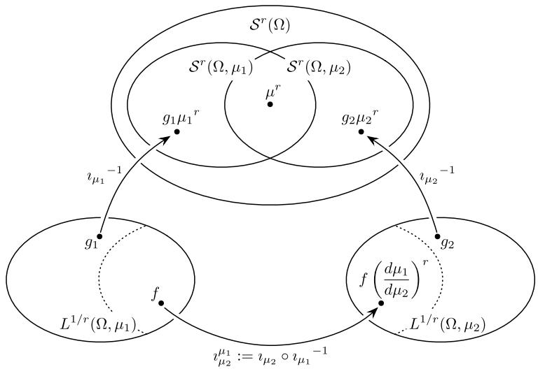  
Fig. 3.1 Natural description of $S^r (\Omega)$ in terms of powers of the Radon-Nikodym derivative

Note that the equivalence relation also preserves non-negativity of functions, whence we may define the subsets

$$
\mathcal {M} ^ {r} (\Omega) := \left\{\phi \mu^ {r}: \mu \in \mathcal {M} (\Omega), \phi \geq 0 \right\}, \tag {3.55}
$$

$$
\mathcal {P} ^ {r} (\Omega) := \left\{\phi \mu^ {r}: \mu \in \mathcal {P} (\Omega), \phi \geq 0, \| \phi \| _ {1 / r} = 1 \right\}.
$$

In analogy to (3.48) we define for a fixed measure $\mu_0\in \mathcal{M}(\Omega)$ and $r\in (0,1]$ the spaces

$$
\mathcal {S} ^ {r} (\Omega , \mu_ {0}) := \left\{\phi \mu_ {0} ^ {r}: \phi \in L ^ {1 / r} (\Omega , \mu_ {0}) \right\},
$$

$$
\mathcal {M} ^ {r} (\Omega , \mu_ {0}) := \left\{\phi \mu_ {0} ^ {r}: \phi \in L ^ {1 / r} (\Omega , \mu_ {0}), \phi \geq 0 \right\},
$$

$$
\mathcal {P} ^ {r} (\Omega , \mu_ {0}) := \left\{\phi \mu_ {0} ^ {r}: \phi \in L ^ {1 / r} (\Omega , \mu_ {0}), \phi \geq 0, \| \phi \| _ {1 / r} = 1 \right\},
$$

$$
\mathcal {S} _ {0} ^ {r} (\Omega , \mu_ {0}) := \left\{\phi \mu_ {0} ^ {r}: \phi \in L ^ {1 / r} (\Omega , \mu_ {0}), \int_ {\Omega} \phi d \mu = 0 \right\}.
$$

The elements of $\mathcal{P}^r (\Omega ,\mu_0),\mathcal{M}^r (\Omega ,\mu_0),\mathcal{S}^r (\Omega ,\mu_0)$ are said to be dominated by $\mu_0^r$

Remark 3.5 The concept of $r$ th roots of measures has been indicated in [200, Ex. IV.1.4]. Moreover, if $\Omega$ is a manifold and $r = 1/2$ , then $S^{1/2}(\Omega)$ is even a Hilbert space which has been considered in [192, 6.9.1]. This Hilbert space is also related to the Hilbert manifold of finite-entropy probability measures defined in [201].

The product of powers of measures can now be defined for all $r, s \in (0,1)$ with $r + s \leq 1$ and for measures $\phi \mu^r \in S^r(\Omega, \mu)$ and $\psi \mu^s \in S^s(\Omega, \mu)$ :

$$
\left(\phi \mu^ {r}\right) \cdot \left(\psi \mu^ {s}\right) := \phi \psi \mu^ {r + s}.
$$

By definition $\phi \in L^{1 / r}(\Omega ,\mu)$ and $\psi \in L^{1 / s}(\Omega ,\mu)$ , whence Hölder's inequality implies that $\| \phi \psi \|_{1 / (r + s)}\leq \| \phi \|_{1 / r}\| \psi \|_{1 / s} < \infty$ , so that $\phi \psi \in L^{1 / (r + s)}(\Omega ,\mu)$ and hence, $\phi \psi \mu^{r + s}\in S^{r + s}(\Omega ,\mu)$ . Since by (3.52) this definition of the product is independent of the choice of representative $\mu$ , it follows that it induces a bilinear product

$$
\cdot : \mathcal {S} ^ {r} (\Omega) \times \mathcal {S} ^ {s} (\Omega) \longrightarrow \mathcal {S} ^ {r + s} (\Omega), \quad \text {w h e r e} r, s, r + s \in (0, 1 ], \tag {3.56}
$$

satisfying the Hölder inequality

$$
\left\| v _ {r} \cdot v _ {s} \right\| _ {1 / (r + s)} \leq \left\| v _ {r} \right\| _ {1 / r} \left\| v _ {s} \right\| _ {1 / s}, \tag {3.57}
$$

so that the product in (3.56) is a bounded bilinear map.

Definition 3.3 (Canonical pairing) For $r \in (0,1)$ we define the pairing

$$
(\cdot ; \cdot): \mathcal {S} ^ {r} (\Omega) \times \mathcal {S} ^ {1 - r} (\Omega) \longrightarrow \mathbb {R}, \quad \left(v _ {1}; v _ {2}\right) := \int_ {\Omega} d \left(v _ {1} \cdot v _ {2}\right). \tag {3.58}
$$

It is straightforward to verify that this pairing is non-degenerate in the sense that

$$
(v _ {r}; \cdot) = 0 \Longleftrightarrow v _ {r} = 0. \tag {3.59}
$$

Lemma 3.1 (Cf. [200, Ex. IV.1.3]) Let $\{\nu_n : n \in \mathbb{N}\} \subseteq S(\Omega)$ be a countable family of (signed) measures. Then there is a measure $\mu_0 \in \mathcal{M}(\Omega)$ dominating $\nu_n$ for all $n$ .

Proof We assume w.l.o.g. that $\nu_{n} \neq 0$ for all $n$ and define

$$
\mu_ {0} := \sum_ {n = 1} ^ {\infty} \frac {1}{2 ^ {n} \| v _ {n} \| _ {T V}} | v _ {n} |.
$$

Since $\| \nu_n\|_{TV} = |\nu_n|(\Omega)$ , it follows that this sum converges, so that $\mu_0\in \mathcal{M}(\Omega)$ is well defined. Moreover, if $\mu_0(A) = 0$ , then $|\nu_{n}|(A) = 0$ for all $n$ , showing that $\mu_0$ dominates all $\nu_{n}$ as claimed.

From Lemma 3.1, we can now conclude the following statement:

Any sequence in $S^r (\Omega)$ is contained in $S^r (\Omega ,\mu_0)$ for some $\mu_0\in \mathcal{M}(\Omega)$

In particular, any Cauchy sequence in $S^r(\Omega)$ is a Cauchy sequence in $S^r(\Omega, \mu_0) \cong L^{1/r}(\Omega, \mu_0)$ for some $\mu_0$ and hence convergent. Thus,

$(S^r(\Omega), \| \cdot \|_{1/r})$ is a Banach space. It also follows that $S^r(\Omega, \mu_0)$ is a closed subspace of $S(\Omega)$ for all $\mu_0 \in \mathcal{M}(\Omega)$ .

In analogy to Theorem 3.1, we can also determine the tangent cones of the subsets $\mathcal{P}^r (\Omega)\subseteq \mathcal{M}^r (\Omega)\subseteq \mathcal{S}^r (\Omega)$ .

Proposition 3.1 For each $\mu \in \mathcal{M}(\Omega)$ ( $\mu \in \mathcal{P}(\Omega)$ , respectively), the tangent cone of $\mathcal{P}^r(\Omega) \subseteq \mathcal{M}^r(\Omega) \subseteq \mathcal{S}^r(\Omega)$ at $\mu^r$ are $T_{\mu^r}\mathcal{M}^r(\Omega) = \mathcal{S}^r(\Omega, \mu)$ and $T_{\mu^r}\mathcal{P}^r(\Omega) = \mathcal{S}_0^r(\Omega, \mu)$ , respectively, so that the tangent fibrations are given as

$$
T \mathcal {M} ^ {r} (\Omega) = \bigcup_ {\mu^ {r} \in \mathcal {M} ^ {r} (\Omega)} \mathcal {S} ^ {r} (\Omega , \mu) \subseteq \mathcal {M} ^ {r} (\Omega) \times \mathcal {S} ^ {r} (\Omega)
$$

and

$$
T \mathcal {P} ^ {r} (\Omega) = \bigcup_ {\mu^ {r} \in \mathcal {P} ^ {r} (\Omega)} \mathcal {S} _ {0} ^ {r} (\Omega , \mu) \subseteq \mathcal {P} ^ {r} (\Omega) \times \mathcal {S} ^ {r} (\Omega).
$$

Proof We have to adapt the proof of Theorem 3.1. The proof of the statements $\mathcal{S}^r (\Omega ,\mu)\subseteq T_{\mu^r}\mathcal{M}^r (\Omega)$ and $S_0^r (\Omega ,\mu)\subseteq T_{\mu^r}\mathcal{P}^r (\Omega)$ is identical to that of the corresponding statement in Theorem 3.1; just as in that case, one shows that for $\phi \in L^{1 / r}(\Omega ,\mu_0)$ the curves $\mu_t^r \coloneqq p(\omega ;t)\mu_0^r$ with $p(\omega ;t)\coloneqq 1 + t\phi (\omega)$ if $t\phi (\omega)\geq 0$ and $p(\omega ;\xi) = \exp (t\phi (\omega))$ if $t\phi (\omega) < 0$ is a differentiable curve in $\mathcal{M}^r (\Omega)$ , and $\lambda_t^r \coloneqq \mu_t^r /\| \mu_t^r\|_{1 / r}$ is a differentiable curve in $\mathcal{P}^r (\Omega)$ , and their derivative is $\phi \mu_0^r$ at $t = 0$ .

In order to show the other direction, let $(\mu_t^r)_{t\in (-\varepsilon ,\varepsilon)}$ be a curve in $\mathcal{M}^r (\Omega)$ . Then $\mathbb{Q}\cap (-\varepsilon ,\varepsilon)$ is countable, whence by Lemma 3.1 there is a measure $\hat{\mu}$ such that $(\mu_t^r)\in \mathcal{M}^r (\Omega ,\hat{\mu})$ for all $t\in \mathbb{Q}$ , and since $\mathcal{S}^r (\Omega ,\hat{\mu})\subseteq \mathcal{S}^r (\Omega)$ is closed, it follows that $\mu_t^r\in \mathcal{M}(\Omega ,\hat{\mu})$ for all $t$ . Now we can apply the argument from Theorem 3.1 to the curve $t\mapsto (\mu_t^r\cdot \hat{\mu}^{1 - r})(A)$ for $A\subseteq \Omega$ .

Remark 3.6 Just as in the case of $r = 1$ , we may take two points of view on the relation of $\mathcal{M}^r (\Omega)$ and $\mathcal{P}^r (\Omega)$ . The one is that $\mathcal{P}^r (\Omega)$ may be regarded as a subset of $\mathcal{M}^r (\Omega)$ , but also, the normalization map

$$
\mathcal {M} ^ {r} (\Omega) \longrightarrow \mathcal {P} ^ {r} (\Omega), \qquad \mu_ {r} \longmapsto \frac {\mu_ {r}}{\| \mu_ {r} \| _ {1 / r}}
$$

allows us to regard $\mathcal{P}^r (\Omega)$ as the projectivization $\mathbb{P}(\mathcal{M}^r (\Omega))$ . It will depend on the context which point of view is better adapted.

Besides multiplying roots of measures, we also wish to take their powers. Here, we have two possibilities for dealing with signs. For $0 < k \leq r^{-1}$ and $\nu_r = \phi \mu^r \in S^r(\Omega)$ we define

$$
\left| v _ {r} \right| ^ {k} := \left| \phi \right| ^ {k} \mu^ {r k} \quad \text {a n d} \quad \tilde {v} _ {r} ^ {k} := \operatorname {s i g n} (\phi) \left| \phi \right| ^ {k} \mu^ {r k}. \tag {3.60}
$$

Since $\phi \in L^{1 / r}(\Omega ,\mu)$ , it follows that $|\phi |^k\in L^{1 / kr}(\Omega ,\mu)$ , so that $|\nu_r|^k,\tilde{\nu}_r^k\in S^{rk}(\Omega)$ . By (3.52) these powers are well defined, independent of the choice of the measure $\mu$ , and, moreover,

$$
\left\| | v _ {r} | ^ {k} \right\| _ {1 / (r k)} = \left\| \tilde {v} _ {r} ^ {k} \right\| _ {1 / (r k)} = \| v _ {r} \| _ {1 / r} ^ {k}. \tag {3.61}
$$

Proposition 3.2 Let $r \in (0,1]$ and $0 < k \leq 1 / r$ , and consider the maps

$$
\begin{array}{l l} \pi^ {k}, \tilde {\pi} ^ {k}: \mathcal {S} ^ {r} (\Omega) \longrightarrow \mathcal {S} ^ {r k} (\Omega), & \quad \pi^ {k} (\nu) := | \nu | ^ {k}, \\ & \quad \tilde {\pi} ^ {k} (\nu) := \tilde {\nu} ^ {k}. \end{array}
$$

Then $\pi^k, \tilde{\pi}^k$ are continuous maps. Moreover, for $1 < k \leq 1/r$ they are $C^1$ -maps between Banach spaces, and their derivatives are given as

$$
d _ {\nu_ {r}} \tilde {\pi} ^ {k} \left(\rho_ {r}\right) = k \left| \nu_ {r} \right| ^ {k - 1} \cdot \rho_ {r} \quad a n d \quad d _ {\nu_ {r}} \pi^ {k} \left(\rho_ {r}\right) = k \tilde {\nu} _ {r} ^ {k - 1} \cdot \rho_ {r}. \tag {3.62}
$$

Observe that for $k = 1$ , $\pi^1(\nu_r) = |\nu_r|$ fails to be $C^1$ , whereas $\tilde{\pi}^1(\nu_r) = \nu_r$ , so that $\tilde{\pi}^1$ is the identity and hence a $C^1$ -map.

Proof Let us first assume that $0 < k \leq 1$ . We assert that for all $x, y \in \mathbb{R}$ we have the estimates

$$
\left| | x + y | ^ {k} - | x | ^ {k} \right| \leq | y | ^ {k} \quad \text {a n d} \tag {3.63}
$$

$$
\left| \operatorname {s i g n} (x + y) | x + y | ^ {k} - \operatorname {s i g n} (x) | x | ^ {k} \right| \leq 2 ^ {1 - k} | y | ^ {k}.
$$

For $k = 1$ , (3.63) is obvious. If $0 < k < 1$ , then by homogeneity it suffices to show these for $y = 1$ . Note that the functions

$$
x \longmapsto | x + 1 | ^ {k} - | x | ^ {k} \quad \text {a n d} \quad x \longmapsto \operatorname {s i g n} (x + 1) | x + 1 | ^ {k} - \operatorname {s i g n} (x) | x | ^ {k}
$$

are continuous and tend to 0 for $x \to \pm \infty$ , and then (3.63) follows by elementary calculus.

Let $\nu_{1},\nu_{2}\in S^{r}(\Omega)$ , and choose $\mu_0\in \mathcal{M}(\Omega)$ such that $\nu_{1},\nu_{2}\in S^{r}(\Omega ,\mu_{0})$ , i.e., $\nu_{i} = \phi_{i}\mu_{0}^{r}$ with $\phi_i\in L^{1 / r}(\Omega ,\mu_0)$ . Then

$$
\begin{array}{l} \left\| \pi^ {k} \left(\nu_ {1} + \nu_ {2}\right) - \pi^ {k} \left(\nu_ {1}\right) \right\| _ {1 / r k} = \left\| \left| \phi_ {1} + \phi_ {2} \right| ^ {k} - \left| \phi_ {1} \right| ^ {k} \right\| _ {1 / r k} \\ \leq \left\| | \phi_ {2} | ^ {k} \right\| _ {1 / r k} \quad \text {b y} (3. 6 3) \\ = \| \nu_ {2} \| _ {1 / r} ^ {k} \quad \text {b y (3 . 6 1)}, \\ \end{array}
$$

so that $\lim_{\| \nu_2\|_{1 / r}\to 0}\| \pi^k (\nu_1 + \nu_2) - \pi^k (\nu_1)\|_{1 / rk} = 0$ , showing the continuity of $\pi^k$ for $0 < k\leq 1$ . The continuity of $\tilde{\pi}^k$ follows analogously.

Now let us assume that $1 < k \leq 1 / r$ . In this case, the functions

$$
x \longmapsto | x | ^ {k} \quad \text {a n d} \quad x \longmapsto \operatorname {s i g n} (x) | x | ^ {k}
$$

with $x\in \mathbb{R}$ are $C^1$ -maps with respective derivatives

$$
x \longmapsto k \operatorname {s i g n} (x) | x | ^ {k - 1} \quad \text {a n d} \quad x \longmapsto k | x | ^ {k - 1}.
$$

Thus, if we pick $\nu_{i} = \phi_{i}\mu_{0}^{r}$ as above, then by the mean value theorem we have

$$
\begin{array}{l} \pi^ {k} (\nu_ {1} + \nu_ {2}) - \pi^ {k} (\nu_ {1}) = \left(| \phi_ {1} + \phi_ {2} | ^ {k} - | \phi_ {1} | ^ {k}\right) \mu_ {0} ^ {r k} \\ = k \operatorname {s i g n} (\phi_ {1} + \eta \phi_ {2}) | \phi_ {1} + \eta \phi_ {2} | ^ {k - 1} \phi_ {2} \mu_ {0} ^ {r k} \\ = k \operatorname {s i g n} \left(\phi_ {1} + \eta \phi_ {2}\right) \left| \phi_ {1} + \eta \phi_ {2} \right| ^ {k - 1} \mu_ {0} ^ {r (k - 1)} \cdot v _ {2} \\ \end{array}
$$

for some function $\eta : \Omega \to (0,1)$ . If we let $\nu_{\eta} \coloneqq \eta \phi_2 \mu_0^r$ , then $\| \nu_{\eta} \|_{1/r} \leq \| \nu_2 \|_{1/r}$ and we get

$$
\pi^ {k} \left(v _ {1} + v _ {2}\right) - \pi^ {k} \left(v _ {1}\right) = k \tilde {\pi} ^ {k - 1} \left(v _ {1} + v _ {\eta}\right) \cdot v _ {2}.
$$

With the definition of $d_{\nu_1}\tilde{\pi}^k$ from (3.62) we have

$$
\begin{array}{l} \left\| \pi^ {k} \left(v _ {1} + v _ {2}\right) - \pi^ {k} \left(v _ {1}\right) - d _ {v _ {1}} \pi^ {k} \left(v _ {2}\right) \right\| _ {1 / (r k)} \\ = \left\| k \big (\tilde {\pi} ^ {k - 1} (\nu_ {1} + \nu_ {\eta}) - \tilde {\pi} ^ {k - 1} (\nu_ {1}) \big) \cdot \nu_ {2} \right\| _ {1 / (r k)} \\ \leq k \left\| \tilde {\pi} ^ {k - 1} (\nu_ {1} + \nu_ {\eta}) - \tilde {\pi} ^ {k - 1} (\nu_ {1}) \right\| _ {1 / (r (k - 1))} \| \nu_ {2} \| _ {1 / r} \\ \end{array}
$$

and hence,

$$
\frac {\left\| \pi^ {k} \left(\nu_ {1} + \nu_ {2}\right) - \pi^ {k} \left(\nu_ {1}\right) - d _ {\nu_ {1}} \pi^ {k} \left(\nu_ {2}\right) \right\| _ {\frac {1}{r k}}}{\left\| \nu_ {2} \right\| _ {\frac {1}{r}}} \leq k \left\| \tilde {\pi} ^ {k - 1} \left(\nu_ {1} + \nu_ {\eta}\right) - \tilde {\pi} ^ {k - 1} \left(\nu_ {1}\right) \right\| _ {\frac {1}{r (k - 1)}}.
$$

Thus, the differentiability of $\pi^k$ will follow if

$$
\left\| \tilde {\pi} ^ {k - 1} \left(v _ {1} + v _ {\eta}\right) - \tilde {\pi} ^ {k - 1} \left(v _ {1}\right) \right\| _ {1 / (r (k - 1))} \xrightarrow {\| v _ {2} \| _ {1 / r} \to 0} 0,
$$

and because of $\| \nu_{\eta}\|_{1 / r}\leq \| \nu_{2}\|_{1 / r}$ , this is the case if $\tilde{\pi}^{k - 1}$ is continuous.

Analogously, one shows that $\tilde{\pi}^k$ is differentiable if $\pi^{k - 1}$ is continuous.

Since we already know continuity of $\pi^k$ and $\tilde{\pi}^k$ for $0 < k \leq 1$ , and since $C^1$ -maps are continuous, the claim now follows by induction on $\lceil k \rceil$ .

Thus, (3.62) implies that the differentials of $\pi^k$ and $\tilde{\pi}^k$ (which coincide on $\mathcal{P}^r (\Omega)$ and $\mathcal{M}^r (\Omega)$ ) yield continuous maps

$$
d \pi^ {k} = d \tilde {\pi} ^ {k}: \begin{array}{c c c} T \mathcal {P} ^ {r} (\Omega) & \longrightarrow & T \mathcal {P} ^ {r k} (\Omega) \\ T \mathcal {M} ^ {r} (\Omega) & \longrightarrow & T \mathcal {M} ^ {r k} (\Omega), \end{array} \qquad (\mu , \rho) \longmapsto k \mu^ {r k - r} \cdot \rho .
$$

# 3.2.4 Parametrized Measure Models and $k$ -Integrability

In this section, we shall now present our notion of a parametrized measure model.

Definition 3.4 (Parametrized measure model) Let $\Omega$ be a measurable space.

(1) A parametrized measure model is a triple $(M, \Omega, \mathbf{p})$ where $M$ is a (finite or infinite-dimensional) Banach manifold and $\mathbf{p}: M \to \mathcal{M}(\Omega) \subseteq \mathcal{S}(\Omega)$ is a $C^1$ -map in the sense of Definition C.3.   
(2) The triple $(M, \Omega, \mathbf{p})$ is called a statistical model if it consists only of probability measures, i.e., such that the image of $\mathbf{p}$ is contained in $\mathcal{P}(\Omega)$ .   
(3) We call such a model dominated by $\mu_0$ if the image of $\mathbf{p}$ is contained in $\mathcal{M}(\Omega, \mu_0)$ . In this case, we use the notation $(M, \Omega, \mu_0, \mathbf{p})$ for this model.

If a parametrized measure model $(M, \Omega, \mu_0, \mathbf{p})$ is dominated by $\mu_0$ , then there is a density function $p: \Omega \times M \to \mathbb{R}$ such that

$$
\mathbf {p} (\xi) = p (\cdot ; \xi) \mu_ {0}. \tag {3.64}
$$

Evidently, we must have $p(\cdot ;\xi)\in L^{1}(\Omega ,\mu_{0})$ for all $\xi$ . In particular, for fixed $\xi$ , $p(\cdot ;\xi)$ is defined only up to changes on a $\mu_0$ -null set. The existence of a dominating measure $\mu_0$ is not a strong restriction, as the following shows.

Proposition 3.3 Let $(M, \Omega, \mathbf{p})$ be a parametrized measure model. If $M$ contains a countable dense subset, e.g., if $M$ is a finite-dimensional manifold, then there is a measure $\mu_0 \in \mathcal{M}(\Omega)$ dominating the model.

Proof Let $(\xi_n)_{n \in \mathbb{N}} \subseteq M$ be a dense countable subset. By Lemma 3.1, there is a measure $\mu_0$ dominating all measures $\mathbf{p}(\xi_n)$ for $n \in \mathbb{N}$ , i.e., $\mathbf{p}(\xi_n) \in \mathcal{M}(\Omega, \mu_0)$ . If $\xi_{n_k} \to \xi$ , so that $\mathbf{p}(\xi_{n_k}) \to \mathbf{p}(\xi)$ , then as the inclusion $S(\Omega, \mu_0) \hookrightarrow S(\Omega)$ is an isometry by (3.53), it follows that $(\mathbf{p}(\xi_{n_k}))_{k \in \mathbb{N}}$ is a Cauchy sequence in $S(\Omega, \mu_0)$ , and as the latter is complete, it follows that $\mathbf{p}(\xi) \in S(\Omega, \mu_0) \cap \mathcal{M}(\Omega) = \mathcal{M}(\Omega, \mu_0)$ .

Definition 3.5 (Regular density function) Let $(M, \Omega, \mu_0, \mathbf{p})$ be a parametrized measure model dominated by $\mu_0$ . We say that this model has a regular density function if the density function $p: \Omega \times M \to \mathbb{R}$ satisfying (3.64) can be chosen such that for all $V \in T_{\xi}M$ the partial derivative $\partial_V p(\cdot; \xi)$ exists and lies in $L^1(\Omega, \mu_0)$ .

Remark 3.7 The standard notion of a statistical model always assumes that it is dominated by some measure and has a positive regular density function (e.g., [9, §2, p. 25], [16, §2.1], [219], [25, Definition 2.4]). In fact, the definition of a parametrized measure model or statistical model in [25, Definition 2.4] is equivalent to a parametrized measure model or statistical model with a positive regular density function in the sense of Definition 3.5. In contrast, in [26], the assumption

of regularity and, more importantly, of the positivity of the density function $p$ is dropped.

It is worth pointing out that the density function $p$ of a parametrized measure model $(M, \Omega, \mu_0, \mathbf{p})$ does not need to be regular, so that the present notion is indeed more general. The formal definition of differentiability of $\mathbf{p}$ implies that for each $C^1$ -path $\xi(t) \in M$ with $\xi(0) = \xi$ , $\dot{\xi}(0) \eqqcolon V \in T_{\xi}M$ , the curve $t \mapsto p(\cdot; \xi(t)) \in L^1(\Omega, \mu_0)$ is differentiable. This implies that there is a $d_{\xi}\mathbf{p}(V) \in L^1(\Omega, \mu_0)$ such that

$$
\left\| \frac {p (\cdot ; \xi (t)) - p (\cdot ; \xi)}{t} - d _ {\xi} \mathbf {p} (V) (\cdot) \right\| _ {1} \xrightarrow {t \to 0} 0.
$$

If this is a pointwise convergence, then $d_{\xi}\mathbf{p}(V) = \partial_Vp(\cdot ;\xi)$ is the partial derivative and whence, $\partial_Vp(\cdot ;\xi)$ lies in $L^1 (\Omega ,\mu_0)$ , so that the density function is regular.

However, in general convergence in $L^1(\Omega, \mu_0)$ does not imply pointwise convergence, whence there are parametrized measure models in the sense of Definition 3.4 without a regular density function, cf. Example 3.2.3 below. Nevertheless, we shall use the following notations interchangeably,

$$
d _ {\xi} \mathbf {p} (V) = \partial_ {V} \mathbf {p} = \partial_ {V} p (\cdot ; \xi) \mu_ {0}, \tag {3.65}
$$

even if $\mathbf{p}$ does not have a regular density function and the derivative $\partial_V p(\cdot ;\xi)$ does not exist.

# Example 3.2

(1) The family of normal distributions on $\mathbb{R}$

$$
p (\mu , \sigma) := \frac {1}{\sqrt {2 \pi \sigma}} \exp \left(- \frac {(x - \mu) ^ {2}}{2 \sigma^ {2}}\right) d x
$$

is a statistical model with regular density function on the upper half-plane $H = \{(\mu, \sigma) : \mu, \sigma \in \mathbb{R}, \sigma > 0\}$ .

(2) To see that there are parametrized measure models without a regular density function, consider the family $(\mathbf{p}(\xi))_{\xi > -1}$ of measures on $\Omega = (0,\pi)$

$$
\mathbf {p} (\xi) := \left\{ \begin{array}{l l} (1 + \xi   (\sin^ {2} (t - 1 / \xi)) ^ {1 / \xi^ {2}})   d t & \text {f o r} \xi \neq 0, \\ d t & \text {f o r} \xi = 0. \end{array} \right.
$$

This model is dominated by the Lebesgue measure $dt$ , with density function $p(t; \xi) = 1 + \xi (\sin^2 (t - 1 / \xi))^{1 / \xi^2}$ for $\xi \neq 0$ , $p(t; 0) = 1$ . Thus, the partial derivative $\partial_{\xi}p$ does not exist at $\xi = 0$ , whence the density function is not regular.

On the other hand, $\mathbf{p}:(-1,\infty)\to \mathcal{M}(\Omega ,dt)$ is differentiable at $\xi = 0$ with $d_0\mathbf{p}(\partial_\xi) = 0$ , so that $(M,\Omega ,\mathbf{p})$ is a parametrized measure model in the sense of

Definition 3.4. To see this, we calculate

$$
\begin{array}{l} \left\| \frac {\mathbf {p} (\xi) - \mathbf {p} (0)}{\xi} \right\| _ {T V} = \left\| \left(\sin^ {2} (t - 1 / \xi)\right) ^ {1 / \xi^ {2}} d t \right\| _ {1} \\ = \int_ {0} ^ {\pi} \left(\sin^ {2} (t - 1 / \xi)\right) ^ {1 / \xi^ {2}} d t \\ = \int_ {0} ^ {\pi} \left(\sin^ {2} t\right) ^ {1 / \xi^ {2}} d t \xrightarrow {\xi \to 0} 0, \\ \end{array}
$$

which shows the claim. Here, we used the $\pi$ -periodicity of the integrand for fixed $\xi$ and dominated convergence in the last step.

Since for a parametrized measure model $(M, \Omega, \mathbf{p})$ the map $\mathbf{p}$ is $C^1$ , it follows that its derivative yields a continuous map between the tangent fibrations

$$
d \mathbf {p}: T M \longrightarrow T \mathcal {M} (\Omega) = \bigcup_ {\mu \in \mathcal {M} (\Omega)} \mathcal {S} (\Omega , \mu).
$$

That is, for each tangent vector $V \in T_{\xi}M$ , its differential $d_{\xi}\mathbf{p}(V)$ is contained in $S(\Omega, \mathbf{p}(\xi))$ and hence dominated by $\mathbf{p}(\xi)$ . Therefore, we can take the Radon-Nikodym derivative of $d_{\xi}\mathbf{p}(V)$ w.r.t. $\mathbf{p}(\xi)$ .

Definition 3.6 Let $(M, \Omega, \mathbf{p})$ be a parametrized measure model. Then for each tangent vector $V \in T_{\xi}M$ of $M$ , we define

$$
\partial_ {V} \log \mathbf {p} (\xi) := \frac {d \left\{d _ {\xi} \mathbf {p} (V) \right\}}{d \mathbf {p} (\xi)} \in L ^ {1} (\Omega , p (\xi)) \tag {3.66}
$$

and call this the logarithmic derivative of $\mathbf{p}$ at $\xi$ in the direction $V$ .

If such a model is dominated by $\mu_0$ and has a positive regular density function $p$ for which (3.64) holds, then we calculate the Radon-Nikodym derivative as

$$
\begin{array}{l} \frac {d \{d _ {\xi} \mathbf {p} (V) \}}{d \mathbf {p} (\xi)} = \frac {d \{d _ {\xi} \mathbf {p} (V) \}}{d \mu_ {0}} \cdot \left(\frac {d \mathbf {p} (\xi)}{d \mu_ {0}}\right) ^ {- 1} \\ = \partial_ {V} p (\cdot ; \xi) (p (\cdot ; \xi)) ^ {- 1} = \partial_ {V} \log p (\cdot ; \xi). \\ \end{array}
$$

This justifies the notation in (3.66) even for models without a positive regular density function.

For a parametrized measure model $(M, \Omega, \mathbf{p})$ and $k > 1$ we consider the map

$$
\mathbf {p} ^ {1 / k} := \pi^ {1 / k} \mathbf {p}: M \longrightarrow \mathcal {M} ^ {1 / k} (\Omega) \subseteq \mathcal {S} ^ {1 / k} (\Omega), \quad \xi \longmapsto \mathbf {p} (\xi) ^ {1 / k}.
$$

Since $\pi^{1 / k}$ is continuous by Proposition 3.2, it follows that $\mathbf{p}^{1 / k}$ is continuous as well. We define the following notions of $k$ -integrability.

Definition 3.7 ( $k$ -Integrable parametrized measure model) A parametrized measure model $(M, \Omega, \mathbf{p})$ (statistical model, respectively) is called $k$ -integrable if the map

$$
\mathbf {p} ^ {1 / k}: M \longrightarrow \mathcal {M} ^ {1 / k} (\Omega) \subseteq \mathcal {S} ^ {1 / k} (\Omega)
$$

is a $C^1$ -map in the sense of Definition C.1. It is called weakly $k$ -integrable if this map is a weak $C^1$ -map, again in the sense of Definition C.1.

Furthermore, we call the model (weakly) $\infty$ -integrable if it is (weakly) $k$ -integrable for all $k \geq 1$ .

Evidently, every parametrized measure model is 1-integrable by definition. Moreover, since for $1 \leq l < k$ we have $\mathbf{p}^{1 / l} = \pi^{k / l}\mathbf{p}^{1 / k}$ and $\pi^{k / l}$ is a $C^1$ -map by Proposition 3.2, it follows that (weak) $k$ -integrability implies (weak) $l$ -integrability for $1 \leq l < k$ .

Example 3.3 An exponential family, as defined by (3.31), generalizes the family of normal distributions and represents an extremely important statistical model. It will play a central role throughout this book.

Adapting (3.31) to the notation in this context, we can write it for $\xi = (\xi^1,\ldots ,\xi^n)\in U\subseteq \mathbb{R}^n$ as

$$
\mathbf {p} (\xi) = \exp \left(\gamma (\omega) + \sum_ {i = 1} ^ {n} f _ {i} (\omega) \xi^ {i} - \psi (\xi)\right) \mu (\omega), \tag {3.67}
$$

for suitable functions $f_{i}, \gamma$ on $\Omega$ and $\psi$ on $U$ . Therefore, for $V = (v_{1},\ldots ,v_{n})$ ,

$$
\begin{array}{l} \partial_ {V} \mathbf {p} ^ {1 / k} (\xi) = \frac {1}{k} \left(\sum_ {i = 1} ^ {n} v _ {i} f _ {i} (\omega) + \partial_ {V} \psi (\xi)\right) \\ \times \exp \left(\gamma (\omega) / k + \sum_ {i = 1} ^ {n} f _ {i} (\omega) \xi^ {i} / k - \psi (\xi) / k\right) \mu (\omega) ^ {1 / k}, \\ \end{array}
$$

and the $k$ -integrability of this model for any $k$ is easily verified from there. Therefore, exponential families provide a class of examples of $\infty$ -integrable parametrized measure models. See also [216, p. 1559].

# Remark 3.8

(1) In Sect. 2.8.1, we have introduced exponential families for finite sets as affine spaces. Let us comment on that structure for the setting of arbitrary measurable spaces as described in [192]. Consider the affine action $(\mu, f) \mapsto e^{f}\mu$ , defined by (2.130). Clearly, multiplication of a finite measure $\mu \in \mathcal{M}_{+}(\Omega)$ with $e^{f}$ will in general lead to a positive measure on $\Omega$ that is not finite but $\sigma$ -finite. As we restrict attention to finite measures, and thereby obtain the Banach space structure of $\mathcal{S}(\Omega)$ , it is not possible to extend the affine structure of Sect. 2.8.1 to the

general setting of measurable spaces. However, we can still define exponential families as geometric objects that correspond to a "section" of an affine space, leading to the expression (3.31).

(2) Fukumizu [101] proposed the notion of a kernel exponential family, based on the theory of reproducing kernel Hilbert spaces. In this approach, one considers a Hilbert space $\mathcal{H}$ of functions $\Omega \to \mathbb{R}$ that is defined in terms of a so-called reproducing kernel $k: \Omega \times \Omega \to \mathbb{R}$ . In particular, the inner product on $\mathcal{H}$ is given as

$$
\langle f, g \rangle_ {\mathcal {H}} = \int \int f (\omega) g \left(\omega^ {\prime}\right) k \left(\omega , \omega^ {\prime}\right) \mu_ {0} (d \omega) \mu_ {0} \left(d \omega^ {\prime}\right).
$$

We will revisit this product again in Sect. 6.4 (see (6.196)). Within this framework, the sum $\sum_{i=1}^{n} f_i(\omega) \xi^i$ in (3.67) is then replaced by an integral $\int k(\omega, \omega') \xi(\omega') \mu_0(d\omega')$ , leading to the definition of a kernel exponential family.

Proposition 3.4 Let $(M, \Omega, \mathbf{p})$ be a (weakly) $k$ -integrable parametrized measure model. Then its (weak) derivative is given as

$$
\partial_ {V} \mathbf {p} ^ {1 / k} (\xi) := \frac {1}{k} \partial_ {V} \log \mathbf {p} (\xi) \mathbf {p} ^ {1 / k} (\xi) \in \mathcal {S} ^ {1 / k} (\Omega , \mathbf {p} (\xi)), \tag {3.68}
$$

and for any functional $\alpha \in S^{1 / k}(\Omega)'$ we have

$$
\partial_ {V} \alpha (\mathbf {p} (\xi) ^ {1 / k}) = \alpha (\partial_ {V} \mathbf {p} ^ {1 / k} (\xi)). \tag {3.69}
$$

Observe that if $\mathbf{p}(\xi) = p(\cdot ;\xi)\mu_0$ with a regular density function $p$ , the derivative $\partial_V p^{1 / k}(\omega ;\xi)$ is indeed the partial derivative of the function $p(\omega ;\xi)^{1 / k}$ .

Proof Suppose that the model is weakly $k$ -integrable, i.e., $\mathbf{p}^{1 / k}$ is weakly differentiable, and let $V\in T_{\xi}M$ and $\alpha \in S(\Omega)^{\prime}$ . Then

$$
\begin{array}{l} \alpha \left(\partial_ {V} \log \mathbf {p} (\xi) \mathbf {p} (\xi)\right) = \alpha \left(\partial_ {V} \mathbf {p}\right) \stackrel {(3. 6 6)} {=} \alpha \left(\partial_ {V} \left(\pi^ {k} \mathbf {p} ^ {1 / k}\right)\right) \\ \stackrel {(3. 6 2)} {=} \alpha \left(k \mathbf {p} (\xi) ^ {1 - 1 / k} \cdot \partial_ {V} \mathbf {p} ^ {1 / k}\right), \\ \end{array}
$$

whence

$$
\alpha \left(\left(k \partial_ {V} \mathbf {p} ^ {1 / k} - \partial_ {V} \log \mathbf {p} (\xi) \mathbf {p} ^ {1 / k}\right) \cdot \mathbf {p} (\xi) ^ {1 - 1 / k}\right) = 0
$$

for all $\alpha \in S(\Omega)'$ . On the other hand, $\partial_V \log \mathbf{p} \in T_{\mathbf{p}^{1/k}(\xi)} \mathcal{M}^{1/k}(\Omega) = S^{1/k}(\Omega, \mathbf{p}(\xi))$ according to Proposition 3.1, and from this, (3.68) follows.

The identity (3.69) is simply the definition of $\partial_V\mathbf{p}^{1 / k}(\xi)$ being the weak Gâteaux-derivative of $\mathbf{p}^{1 / k}$ , cf. Proposition C.2.

The following now gives a description of (weak) integrability in terms of the (weak) derivative.

Theorem 3.2 Let $(M, \Omega, \mathbf{p})$ be a parametrized measure model. Then the following hold:

(1) The model is $k$ -integrable if and only if the map

$$
V \longmapsto \left\| \partial_ {V} \mathbf {p} ^ {1 / k} \right\| _ {k} \tag {3.70}
$$

defined on $TM$ is continuous.

(2) The model is weakly $k$ -integrable if and only if the weak derivative of $\mathbf{p}^{1/k}$ is weakly continuous, i.e., if for all $V_0 \in TM$

$$
\partial_ {V} \mathbf {p} ^ {1 / k} \rightharpoonup \partial_ {V _ {0}} \mathbf {p} ^ {1 / k} \quad a s \quad V \to V _ {0}.
$$

Remark 3.9 In [25, Definition 2.4], $k$ -integrability (in case of a positive regular density function) was defined by the continuity of the norm function in (3.70), whence it coincides with Definition 3.7 by Theorem 3.2.

Our motivation for also introducing the more general definition of weak $k$ -integrability is that it is the weakest condition that ensures that integration and differentiation of $k$ th roots can be interchanged, as explained in the following.

If $(M, \Omega, \mu_0, \mathbf{p})$ has the density function $p: \Omega \times M \to \mathbb{R}$ given by (3.64), then for $\xi \in M$ and $V \in T_{\xi}M$ we have

$$
\mathbf {p} ^ {1 / k} (\xi) = p (; \xi) ^ {1 / k} \mu_ {0} ^ {1 / k} \quad \text {a n d} \quad \partial_ {V} \mathbf {p} ^ {1 / k} = \partial_ {V} p (; \xi) ^ {1 / k} \mu_ {0} ^ {1 / k},
$$

where

$$
\partial_ {V} p (\cdot ; \xi) ^ {1 / k} := \frac {1}{k} \frac {\partial_ {V} p (\cdot ; \xi)}{p (\cdot ; \xi) ^ {1 - 1 / k}} \in L ^ {k} (\Omega , \mu_ {0}). \tag {3.71}
$$

Thus, if we let $\alpha(\cdot) \coloneqq (\cdot; \mu_0^{1 - 1/k})$ with the canonical pairing from (3.58), then (3.69) takes the form

$$
\partial_ {V} \int_ {A} p (\omega ; \xi) ^ {1 / k} d \mu_ {0} (\omega) = \int_ {A} \partial_ {V} p (\omega ; \xi) ^ {1 / k} d \mu_ {0} (\omega). \tag {3.72}
$$

Evidently, if $p$ is a regular density function, then the weak partial derivative is indeed the partial derivative of $p$ , in which case (3.72) is obvious, as integration and differentiation may be interchanged under these regularity conditions.

Example 3.4 For arbitrary $k > 1$ , the following is an example of a parametrized measure model which is $l$ -integrable for all $1 \leq l < k$ , weakly $k$ -integrable, but not $k$ -integrable.

Let $\Omega = (-1, 1)$ with the Lebesgue measure $dt$ , and let $f: [0, \infty) \longrightarrow \mathbb{R}$ be a smooth function such that

$$
f (u) > 0, f ^ {\prime} (u) <   0 \quad \text {f o r} u \in [ 0, 1), \qquad f (u) \equiv 0 \quad \text {f o r} u \geq 1.
$$

For $\xi \in \mathbb{R}$ , define the measure $\mathbf{p}(\xi) = p(\xi; t) dt$ , where

$$
p (\xi ; t) := \left\{ \begin{array}{l l} 1 & \text {i f} t \leq 0 \text {a n d} \xi \in \mathbb {R} \text {a r b i t r a r y}, \\ | \xi | ^ {k - 1} f (t | \xi | ^ {- 1}) ^ {k}   d t & \text {i f} \xi \neq 0 \text {a n d} t > 0, \\ 0 & \text {o t h e r w i s e}. \end{array} \right.
$$

Since on its restrictions to $(-1,0]$ and $(0,1)$ the density function $p$ as well as $p^r$ with $0 < r < 1$ are positive with bounded derivative for $\xi \neq 0$ , it follows that $\mathbf{p}$ is $\infty$ -integrable for $\xi \neq 0$ . For $\xi = 0$ , we have

$$
\left\| \mathbf {p} (\xi) - \mathbf {p} (0) \right\| _ {1} = | \xi | ^ {k - 1} \int_ {0} ^ {| \xi |} f (t | \xi | ^ {- 1}) ^ {k} d t = | \xi | ^ {k} \int_ {0} ^ {1} f (u) ^ {k} d u,
$$

whence, as $k > 1$

$$
\lim  _ {\xi \to 0} \frac {\| \mathbf {p} (\xi) - \mathbf {p} (0) \| _ {1}}{| \xi |} = 0,
$$

showing that $\mathbf{p}$ is also a $C^1$ -map at $\xi = 0$ with differential $\partial_{\xi} \mathbf{p}(0) = 0$ . That is, $(\mathbb{R}, \Omega, \mathbf{p})$ is a parametrized measure model with $d_0 \mathbf{p} = 0$ .

For $1 \leq l \leq k$ and $\xi \neq 0$ we calculate

$$
\begin{array}{l} \partial_ {\xi} \mathbf {p} ^ {1 / l} = \chi_ {(0, 1)} (t) \partial_ {\xi} \left(| \xi | ^ {(k - 1) / l} f \left(t | \xi | ^ {- 1}\right) ^ {k / l}\right) d t ^ {1 / l} \\ = \chi_ {(0, 1)} (t) \operatorname {s i g n} (\xi) | \xi | ^ {(k - l - 1) / l} \left(\frac {k - 1}{l} f (u) ^ {k / l} - u \big (f ^ {k / l} \big) ^ {\prime} (u)\right) \Bigg | _ {u = t | \xi | ^ {- 1}} d t ^ {1 / l}. \\ \end{array}
$$

Thus, it follows that

$$
\left\| \partial_ {\xi} \mathbf {p} ^ {1 / l} (\xi) \right\| _ {l} ^ {l} = | \xi | ^ {k - l} \int_ {0} ^ {1} \left(\frac {k - 1}{l} f (u) ^ {k / l} - u \big (f ^ {k / l} \big) ^ {\prime} (u)\right) ^ {l} d u,
$$

so that

$$
\begin{array}{l} \left. \lim  _ {\xi \rightarrow 0} \left\| \partial_ {\xi} \mathbf {p} ^ {1 / l} (\xi) \right\| _ {l} = 0 = \left\| \partial_ {\xi} \mathbf {p} ^ {1 / l} (0) \right\| _ {l} \quad \text {f o r} 1 \leq l <   k, \right. \\ \left. \lim  _ {\xi \rightarrow 0} \left\| \partial_ {\xi} \mathbf {p} ^ {1 / k} (\xi) \right\| _ {k} > 0 = \left\| \partial_ {\xi} \mathbf {p} ^ {1 / k} (0) \right\| _ {k}. \right. \\ \end{array}
$$

That is, by Theorem 3.2 the model is $l$ -integrable for $1 \leq l < k$ , but it fails to be $k$ -integrable. On the other hand,

$$
\left\| \partial_ {\xi} \mathbf {p} ^ {1 / k} (\xi) \cdot d t ^ {1 - 1 / k} \right\| _ {1} = | \xi | ^ {1 - 1 / k} \int_ {0} ^ {1} \left(\left(1 - \frac {1}{k}\right) f (u) - u f ^ {\prime} (u)\right) d u,
$$

so that $\lim_{\xi \to 0} \| \partial_{\xi} \mathbf{p}^{1/k}(\xi) \cdot dt^{1-1/k} \|_1 = 0$ . As we shall show in Lemma 3.3 below, this implies that $\partial_{\xi} \mathbf{p}^{1/k}(\xi) \rightharpoonup 0 = \partial_{\xi} \mathbf{p}^{1/k}(0)$ as $\xi \to 0$ . Thus, the model is weakly $k$ -integrable by Theorem 3.2.

The rest of this section will be devoted to the proof of Theorem 3.2 which is somewhat technical and therefore will be divided into several lemmas.

Before starting the proof, let us give a brief outline of its structure.

We begin by proving the second statement of Theorem 3.2. Note that for a weak $C^1$ -map the differential is weakly continuous by definition, so one direction of the proof is trivial. The reverse implication is the content of Lemmata 3.2 through 3.6.

We give a decomposition of the dual space $S^{1 / k}(\Omega)'$ in Lemma 3.2 and a sufficient criterion for the weak convergence of sequences in $S^{1 / k}(\Omega, \mu_0)$ in Lemma 3.3 as well as a criterion for weak $k$ -integrability in terms of interchanging differentiation and integration along curves in $M$ in Lemma 3.4.

Unfortunately, we are not able to verify this criterion directly for an arbitrary model $\mathbf{p}$ . The technical obstacle is that the measures of the family $\mathbf{p}(\xi)$ need not be equivalent. We overcome this difficulty by modifying the model $\mathbf{p}$ to a model $\mathbf{p}_{\varepsilon}(\xi) \coloneqq \mathbf{p}(\xi) + \varepsilon \mu_0$ , where $\varepsilon > 0$ and $\mu_0 \in \mathcal{M}(\Omega)$ is a suitable measure, so that $\mathbf{p}_{\varepsilon}$ has a positive density function. Then we show in Lemma 3.5 that the differential of $\mathbf{p}_{\varepsilon}$ remains weakly continuous, and finally in Lemma 3.6 we show that $\mathbf{p}_{\varepsilon}$ is weakly $k$ -integrable as it satisfies the criterion given in Lemma 3.4; furthermore it is shown that taking the limit $\varepsilon \to 0$ implies the weak $k$ -integrability of $\mathbf{p}$ as well, proving the second part of Theorem 3.2.

The first statement of Theorem 3.2 is proven in Lemmata 3.7 and 3.8. Again, one direction is trivial: if the model is $k$ -integrable, then its differential is continuous by definition, whence so is its norm (3.70). That is, we have to show the converse.

In Lemma 3.7 we show that the continuity of the map (3.70) implies the weak continuity of the differential of $\mathbf{p}^{1 / k}$ . This implies, on the one hand, that the model is weakly $k$ -integrable by the second part of Theorem 3.2 which was already shown, and on the other hand, the Radon-Riesz theorem (cf. Theorem C.3) implies that the differential of $\mathbf{p}^{1 / k}$ is even norm-continuous. Then in Lemma 3.8 we give the standard argument that a weak $C^1$ -map with a norm-continuous differential must be a $C^1$ -map, and this will complete the proof.

Lemma 3.2 For each $\mu_0\in \mathcal{M}(\Omega)$ , there is an isomorphism

$$
\left(\mathcal {S} ^ {1 / k} (\Omega)\right) ^ {\prime} \cong \left(\mathcal {S} ^ {1 / k} \left(\Omega , \mu_ {0}\right)\right) ^ {\perp} \oplus \mathcal {S} ^ {k / (k - 1)} \left(\Omega , \mu_ {0}\right), \tag {3.73}
$$

where $(\mathcal{S}^{1 / k}(\Omega ,\mu_0))^{\perp}$ denotes the annihilator of $S^{1 / k}(\Omega ,\mu_0)\subseteq S^{1 / k}(\Omega)$ and where $S^{k / (k - 1)}(\Omega ,\mu_0)$ is embedded into the dual via the canonical pairing (3.58). That is, we can write any $\alpha \in (\mathcal{S}^{1 / k}(\Omega))'$ uniquely as

$$
\alpha (\cdot) = \left(\because ; \phi_ {\alpha} \mu_ {0} ^ {1 - 1 / k}\right) + \beta^ {\mu_ {0}} (\cdot), \tag {3.74}
$$

where $\phi_{\alpha}\in L^{k / (k - 1)}(\Omega ,\mu_0)$ and $\beta^{\mu_0}(\mathcal{S}^{1 / k}(\Omega ,\mu_0)) = 0$

Proof The restriction of $\alpha$ to $S^{1 / k}(\Omega ,\mu_0)$ yields a functional on $L^k (\Omega ,\mu_0)$ given as $\psi \mapsto \alpha (\psi \mu_0^{1 / k})$ . Since the dual of $L^k (\Omega ,\mu_0)$ is $L^{k / (k - 1)}(\Omega ,\mu_0)$ , there is a $\phi_{\alpha}$

such that

$$
\alpha \big (\psi \mu_ {0} ^ {1 / k} \big) = \int_ {\Omega} \psi \phi_ {\alpha} d \mu_ {0} = \big (\psi \mu_ {0} ^ {1 / k}; \phi_ {\alpha} \mu_ {0} ^ {1 - 1 / k} \big),
$$

and then (3.74) follows by letting $\beta^{\mu_0}(\cdot)\coloneqq \alpha (\cdot) - (\cdot ;\phi_\alpha \mu_0^{1 - 1 / k})$

Lemma 3.3 Let $\nu_{n}^{1 / k} = \psi_{n}\mu_{0}^{1 / k}$ be a bounded sequence in $\mathcal{S}^{1 / k}(\Omega ,\mu_0)$ , i.e., $\lim \sup \| \nu_n^{1 / k}\| _k < \infty$ . If $\lim \int_{\Omega}|\psi_n|d\mu_0 = 0$ , then

$$
v _ {n} ^ {1 / k} \rightharpoonup 0,
$$

i.e., $\lim \alpha (\nu_n^{1 / k}) = 0$ for all $\alpha \in (S^{1 / k}(\Omega))^{\prime}$

Proof Suppose that $\int_{\Omega}|\psi_n|d\mu_0\to 0$ and let $\phi \in L^{k / (k - 1)}(\Omega ,\mu_0)$ and $\tau \in L^{\infty}(\varOmega)$ . Then

$$
\begin{array}{l} \left. \lim  \sup  \left| \left(v _ {n} ^ {1 / k}; \phi \mu_ {0} ^ {1 - 1 / k}\right) \right| \leq \lim  \sup  \left(\int_ {\Omega} | \psi_ {n} | | \phi - \tau | d \mu_ {0} + \| \tau \| _ {\infty} \int_ {\Omega} | \psi_ {n} | d \mu_ {0}\right) \right. \\ \leq \lim  \sup  \| \psi_ {n} \| _ {k} \| \phi - \tau \| _ {k / (k - 1)}, \\ \end{array}
$$

using Hölder's inequality in the last estimate. Since $\| \nu_n^{1 / k}\| _k = \| \psi_n\| _k$ and hence, $\lim \sup \| \psi_n\| _k < \infty$ , the bound on the right can be made arbitrarily small as $L^{\infty}(\Omega)\subseteq L^{k / (k - 1)}(\Omega ,\mu_0)$ is a dense subspace. Therefore, $\lim (\nu_{n}^{1 / k};\phi \mu_{0}^{1 - 1 / k}) = 0$ for all $\phi \in L^{k / (k - 1)}$ , and since $\beta (\nu_n^{1 / k}) = 0$ for all $\beta \in (S^{1 / k}(\Omega ,\mu_0))^{\perp}$ , the assertion follows from (3.74).

Before we go on, let us introduce some notation. Let $(M,\Omega ,\mathbf{p})$ be a parametrized measure model such that $\partial_V\log \mathbf{p}(\xi)\in L^k (\Omega ,\mathbf{p}(\xi))$ for all $V\in T_{\xi}M$ , and let $(\xi_{t})_{t\in I}$ be a curve in $M$ . By Proposition 3.3, there is a measure $\mu_0\in \mathcal{M}(\Omega)$ dominating all $\mathbf{p}(\xi_t)$ . For $t,t_0\in I$ and $1\leq l\leq k$ we define the remainder term as

$$
\mathbf {r} _ {l} (t, t _ {0}) := \mathbf {p} ^ {1 / l} \left(\xi_ {t + t _ {0}}\right) - \mathbf {p} ^ {1 / l} \left(\xi_ {t _ {0}}\right) - t \partial_ {\xi_ {t _ {0}} ^ {\prime}} \mathbf {p} ^ {1 / l} \in \mathcal {S} ^ {1 / l} (\Omega), \tag {3.75}
$$

and we define the functions $p_t, q_t \in L^1(\Omega, \mu_0)$ with $p_t \geq 0$ and $q_{t;l}, r_{t,t_0;l} \in L^l(\Omega, \mu_0)$ such that

$$
\begin{array}{l} \mathbf {p} (\xi_ {t}) = p _ {t} \mu_ {0} \qquad \text {a n d} \qquad \partial_ {\xi_ {t} ^ {\prime}} \mathbf {p} \quad = q _ {t} \mu_ {0}, \\ q _ {t; l} := \frac {q _ {t}}{l p _ {t} ^ {1 - 1 / l}} \quad \text {s o t h a t} \quad \partial_ {\xi_ {t} ^ {\prime}} \mathbf {p} ^ {1 / l} = q _ {t; l} \mu_ {0} ^ {1 / l}, \tag {3.76} \\ r _ {t, t _ {0}; l} := \hat {p _ {t + t _ {0}} ^ {1 / l}} - p _ {t _ {0}} ^ {1 / l} - t q _ {t _ {0}; l} \quad \text {s o t h a t} \quad \mathbf {r} _ {l} (t, t _ {0}) = r _ {t, t _ {0}; l} \mu_ {0} ^ {1 / l}. \\ \end{array}
$$

Lemma 3.4 Let $(M, \Omega, \mathbf{p})$ be a parametrized measure model such that $\partial_V \log \mathbf{p}(\xi) \in L^k(\Omega, \mathbf{p}(\xi))$ for all $V \in T_\xi M$ and the function $V \mapsto \partial_V \mathbf{p}^{1/k} \in S^{1/k}(\Omega)$ is weakly continuous.

Then the model is weakly $k$ -integrable if for any curve $(\xi_{t})_{t\in I}$ in $M$ and the measure $\mu_0\in \mathcal{M}(\Omega)$ and the functions $p_t,q_t,q_{t;l}$ defined in (3.76) and any $A\subseteq \Omega$ and $t_0\in I$

$$
\left. \frac {d}{d t} \right| _ {t = t _ {0}} \int_ {A} p _ {t} ^ {1 / k} d \mu_ {0} = \int_ {A} q _ {t _ {0}; k} d \mu_ {0} \tag {3.77}
$$

or, equivalently, for all $a, b \in I$

$$
\int_ {A} \left(p _ {b} ^ {1 / k} - p _ {a} ^ {1 / k}\right) d \mu_ {0} = \int_ {a} ^ {b} \int_ {A} q _ {t; k} d \mu_ {0} d t. \tag {3.78}
$$

Proof Note that the right-hand side of (3.77) can be written as

$$
\int_ {A} q _ {t _ {0}; k} d \mu_ {0} = \left(\partial_ {\xi_ {t _ {0}} ^ {\prime}} \mathbf {p} ^ {1 / k}; \chi_ {A} \mu_ {0} ^ {1 - 1 / k}\right)
$$

with the pairing from (3.58), whence it depends continuously on $t_0$ by the weak continuity of $V \mapsto \partial_V \mathbf{p}^{1/k}$ . Thus, the equivalence of (3.77) and (3.78) follows from the fundamental theorem of calculus.

Now (3.78) can be rewritten as

$$
\left(\mathbf {p} ^ {1 / k} \left(\xi_ {b}\right) - \mathbf {p} ^ {1 / k} \left(\xi_ {a}\right); \phi \mu_ {0} ^ {1 - 1 / k}\right) = \int_ {a} ^ {b} \left(\partial_ {\xi_ {t} ^ {\prime}} \mathbf {p} ^ {1 / k}; \phi \mu_ {0} ^ {1 - 1 / k}\right) d t \tag {3.79}
$$

for $\phi = \chi_A$ , and hence, (3.79) holds whenever $\phi = \tau$ is a step function. But now, if $\phi \in L^{k / (k - 1)}$ is given, then there is a sequence of step functions $(\tau_{n})$ such that $\mathrm{sign}(\phi)\tau_n\nearrow |\phi|$ , and since (3.79) holds for all step functions, it also holds for $\phi$ by dominated convergence.

If $\beta \in S^{1 / k}(\Omega ,\mu_0)^\perp$ , then clearly, $\beta (\mathbf{p}^{1 / k}(\xi_t)) = \beta (\partial_{\xi_t'}\mathbf{p}^{1 / k}) = 0$ , whence by (3.74) we have for all $\alpha \in (S^{1 / k}(\Omega ,\mu_0))'$

$$
\alpha \big (\mathbf {p} ^ {1 / k} (\xi_ {b}) - \mathbf {p} ^ {1 / k} (\xi_ {a}) \big) = \int_ {a} ^ {b} \alpha \big (\partial_ {\xi_ {t} ^ {\prime}} \mathbf {p} ^ {1 / k} \big) d t,
$$

and since the function $t \mapsto \alpha(\partial_{\xi_t'} \mathbf{p}^{1/k})$ is continuous by the assumed weak continuity of $V \mapsto \partial_V \mathbf{p}^{1/k}$ , differentiation and the fundamental theorem of calculus yield (3.69) for $V = \xi_t'$ , and as the curve $(\xi_t)$ was arbitrary, (3.69) holds for arbitrary $V \in TM$ .

But (3.69) is equivalent to saying that $\partial_V\mathbf{p}^{1 / k}(\xi)$ is the weak Gâteaux-differential of $\mathbf{p}^{1 / k}$ (cf. Definition C.1), and since this map is assumed to be weakly continuous, it follows that $\mathbf{p}^{1 / k}$ is a weak $C^1$ -map, whence $(M,\Omega ,\mathbf{p})$ is weakly $k$ -integrable.

Lemma 3.5 Let $(M, \Omega, \mathbf{p})$ be a parametrized measure model for which the map $V \mapsto \partial_V \mathbf{p}^{1/k}$ is weakly continuous. Let $(\xi_t)_{t \in I}$ be a curve in $M$ , and let $\mu_0 \in \mathcal{M}(\Omega)$ be a measure dominating $\mathbf{p}(\xi_t)$ for all $t$ . For $\varepsilon > 0$ , define the parametrized measure model $\mathbf{p}_{\varepsilon}$ as

$$
\mathbf {p} _ {\varepsilon} (\xi) := \mathbf {p} (\xi) + \varepsilon \mu_ {0}. \tag {3.80}
$$

Then the map $t \mapsto \partial_{\xi'} \mathbf{p}_{\varepsilon}^{1/k} \in S^{1/k}(\Omega)$ is weakly continuous, and for all $t_0 \in I$

$$
\frac {1}{t} \mathbf {r} _ {k} ^ {\varepsilon} (t, t _ {0}) \rightharpoonup 0 a s t \to 0,
$$

where $\mathbf{r}_k^\varepsilon (t,t_0)$ is defined analogously to (3.75).

Proof We define the functions $p_t^\varepsilon, q_t^\varepsilon, q_{t;l}^\varepsilon$ and $r_{t,t_0;l}^\varepsilon$ satisfying (3.76) for the parametrized measure model $\mathbf{p}_{\varepsilon}$ , so that $p_t^\varepsilon = p_t + \varepsilon$ and $q_{t}^{\varepsilon} = q_{t}$ . For $t, t_0 \in I$ we have

$$
\begin{array}{l} \left| q _ {t; k} ^ {\varepsilon} - q _ {t _ {0}; k} ^ {\varepsilon} \right| = \left| \frac {q _ {t}}{k (p _ {t} ^ {\varepsilon}) ^ {1 - 1 / k}} - \frac {q _ {t _ {0}}}{k (p _ {t _ {0}} ^ {\varepsilon}) ^ {1 - 1 / k}} \right| \\ \leq \frac {1}{k (p _ {t _ {0}} ^ {\varepsilon}) ^ {1 - 1 / k}} | q _ {t} - q _ {t _ {0}} | + \left| \frac {1}{k (p _ {t} ^ {\varepsilon}) ^ {1 - 1 / k}} - \frac {1}{k (p _ {t _ {0}} ^ {\varepsilon}) ^ {1 - 1 / k}} \right| | q _ {t} | \\ \leq \frac {1}{k \left(p _ {t _ {0}} ^ {\varepsilon}\right) ^ {1 - 1 / k}} \left(| q _ {t} - q _ {t _ {0}} | + k \mid \left(p _ {t _ {0}} ^ {\varepsilon}\right) ^ {1 - 1 / k} - \left(p _ {t} ^ {\varepsilon}\right) ^ {1 - 1 / k} \mid \mid q _ {t; k} ^ {\varepsilon} \mid\right) \\ \stackrel {(3. 6 3)} {\leq} \frac {1}{k \varepsilon^ {1 - 1 / k}} \big (| q _ {t} - q _ {t _ {0}} | + k | p _ {t _ {0}} - p _ {t} | ^ {1 - 1 / k} | q _ {t; k} | \big). \\ \end{array}
$$

Thus,

$$
\begin{array}{l} \int_ {\Omega} \left| q _ {t; k} ^ {\varepsilon} - q _ {t _ {0}; k} ^ {\varepsilon} \right| d \mu_ {0} \leq \frac {1}{k \varepsilon^ {1 - 1 / k}} \int_ {\Omega} \left(| q _ {t} - q _ {t _ {0}} | + k | p _ {t _ {0}} - p _ {t} | ^ {1 - 1 / k} | q _ {t; k} |\right) d \mu_ {0} \\ \leq \frac {1}{k \varepsilon^ {1 - 1 / k}} \left(\| q _ {t} - q _ {t _ {0}} \| _ {1} + k \| p _ {t _ {0}} - p _ {t} \| _ {1} ^ {1 - 1 / k} \| q _ {t; k} \| _ {k}\right) \\ \end{array}
$$

and since $\| q_{t} - q_{t_{0}}\|_{1} = \| d_{\xi_{t}^{\prime}}\mathbf{p} - d_{\xi_{t_{0}}^{\prime}}\mathbf{p}\|_{1}$ and $\| p_{t_0} - p_t\| _1 = \| \mathbf{p}(\xi_t) - \mathbf{p}(t_0)\| _1$ tend to 0 for $t\to t_0$ as $\mathbf{p}$ is a $C^1$ -map by the definition of parametrized measure model, and $\| q_{t;k}\| _k = \| \partial_{\xi_t'}\mathbf{p}^{1 / k}\| _k$ is bounded for $t\rightarrow t_0$ by (C.1) as $\partial_{\xi_t'}\mathbf{p}^{1 / k}\rightharpoonup \partial_{\xi_{t_0}'}\mathbf{p}^{1 / k}$ , it follows that the integral tends to 0 and hence, Lemma 3.3 implies that $\partial_{\xi_t'}\mathbf{p}_{\varepsilon}^{1 / k}\rightharpoonup \partial_{\xi_{t_0}'}\mathbf{p}_{\varepsilon}^{1 / k}$ as $t\to t_0$ , showing the weak continuity of $t\mapsto \partial_{\xi_t'}\mathbf{p}_{\varepsilon}^{1 / k}$ .

For the second claim, note that by the mean value theorem there is an $\eta_t$ between $p_{t + t_0}^{\varepsilon}$ and $p_{t_0}^{\varepsilon}$ (and hence, $\eta_t\geq \varepsilon$ ) for which

$$
\begin{array}{l} \left| r _ {t, t _ {0}; k} ^ {\varepsilon} \right| = \left| \left(p _ {t + t _ {0}} ^ {\varepsilon}\right) ^ {1 / k} - \left(p _ {t _ {0}} ^ {\varepsilon}\right) ^ {1 / k} - t \frac {q _ {t _ {0}}}{k (p _ {t _ {0}} ^ {\varepsilon}) ^ {1 - 1 / k}} \right| = \left| \frac {p _ {t + t _ {0}} - p _ {t _ {0}}}{k \eta_ {t} ^ {1 - 1 / k}} - t \frac {q _ {t _ {0}}}{k (p _ {t _ {0}} ^ {\varepsilon}) ^ {1 - 1 / k}} \right| \\ \leq \frac {| r _ {t , t _ {0} ; 1} |}{k \eta_ {t} ^ {1 - 1 / k}} + | t | \left| \frac {q _ {t _ {0}}}{k \eta_ {t} ^ {1 - 1 / k}} - \frac {q _ {t _ {0}}}{k (p _ {t _ {0}} ^ {\varepsilon}) ^ {1 - 1 / k}} \right| \\ = \frac {| r _ {t , t _ {0} ; 1} |}{k \eta_ {t} ^ {1 - 1 / k}} + \frac {| t | | q _ {t _ {0}} | | (p _ {t _ {0}} ^ {\varepsilon}) ^ {1 - 1 / k} - \eta_ {t} ^ {1 - 1 / k} |}{k (p _ {t _ {0}} ^ {\varepsilon}) ^ {1 - 1 / k} \eta_ {t} ^ {1 - 1 / k}} \\ \stackrel {(3. 6 3)} {\leq} C \left(| r _ {t, t _ {0}; 1} | + | t | | q _ {t _ {0}; k} | | p _ {t + t _ {0}} - p _ {t _ {0}} | ^ {1 - 1 / k}\right) \\ \end{array}
$$

for $C \coloneqq 1 / k\varepsilon^{1 - 1 / k} > 0$ depending only on $k$ and $\varepsilon$ . Thus,

$$
\begin{array}{l} \int_ {\Omega} \left| r _ {t, t _ {0}; k} ^ {\varepsilon} \right| d \mu_ {0} \leq C \left(\int_ {\Omega} \left| r _ {t, t _ {0}; 1} \right| d \mu_ {0} + | t | \int_ {\Omega} \left| q _ {t _ {0}; k} \right| \left| p _ {t + t _ {0}} - p _ {t _ {0}} \right| ^ {1 - 1 / k} d \mu_ {0}\right) \\ \leq C \left(\| r _ {t, t _ {0}; 1} \| _ {1} + | t | \| q _ {t _ {0}; k} \| _ {k} \| p _ {t + t _ {0}} - p _ {t _ {0}} \| _ {1} ^ {1 - 1 / k}\right) \\ = C \left(\left\| \mathbf {r} _ {1} (t, t _ {0}) \right\| _ {1} + | t | \left\| \partial_ {\xi_ {t} ^ {\prime}} \mathbf {p} ^ {1 / k} \right\| _ {k} \left\| \mathbf {p} (t + t _ {0}) - \mathbf {p} (t _ {0}) \right\| _ {1} ^ {1 - 1 / k}\right), \\ \end{array}
$$

using Hölder's inequality in the second line. Since $\mathbf{p}$ is a $C^1$ -map, $\| \mathbf{r}_1(t,t_0)\| _1 / |t|$ and $\| \mathbf{p}(t + t_0) - \mathbf{p}(t_0)\| _1$ tend to 0, whereas $\| \partial_{\xi_t'}\mathbf{p}^{1 / k}\| _k$ is bounded close to $t_0$ by (C.1) since $t\mapsto \partial_{\xi_t'}\mathbf{p}^{1 / k}$ is weakly continuous, so that

$$
\frac {1}{| t |} \int_ {\Omega} \left| r _ {t, t _ {0}; k} ^ {\varepsilon} \right| d \mu_ {0} \xrightarrow {t \to 0} 0,
$$

which by Lemma 3.3 implies the second assertion.

Since by definition the derivative of $V \mapsto \partial_V \mathbf{p}^{1/k}$ is weakly continuous for any $k$ -integrable model, the second assertion of Theorem 3.2 will follow from the following.

Lemma 3.6 Let $(M, \Omega, \mathbf{p})$ be a parametrized measure model for which the map $V \mapsto \partial_V \mathbf{p}^{1/k}$ is weakly continuous. Then $(M, \Omega, \mathbf{p})$ is weakly $k$ -integrable.

Proof Let $(\xi_{t})_{t\in I}$ be a curve in $M$ , let $\mu_0\in \mathcal{M}(\Omega)$ be a measure dominating $\mathbf{p}(\xi_t)$ for all $t$ , and define the parametrized measure model $\mathbf{p}_{\varepsilon}(\xi)$ and $\mathbf{r}_k(t,t_0)$ as in (3.80). By Lemma 3.5, we have for any $A\subseteq \Omega$ and $t_0\in I$ and the pairing $(\cdot ;\cdot)$ from (3.58)

$$
\begin{array}{l} 0 = \lim  _ {t \rightarrow 0} \frac {1}{t} \left(\mathbf {r} _ {k} (t, t _ {0}); \chi_ {A} \mu_ {0} ^ {1 - 1 / k}\right) = \lim  _ {t \rightarrow 0} \frac {1}{t} \int_ {A} \left(\left(p _ {t + t _ {0}} ^ {\varepsilon}\right) ^ {1 / k} - \left(p _ {t _ {0}} ^ {\varepsilon}\right) ^ {1 / k} - t q _ {t _ {0}; k} ^ {\varepsilon}\right) d \mu_ {0} \\ = \frac {d}{d t} \Big | _ {t = t _ {0}} \int_ {A} \left(p _ {t} ^ {\varepsilon}\right) ^ {1 / k} d \mu_ {0} - \int_ {A} q _ {t _ {0}; k} ^ {\varepsilon} d \mu_ {0}, \\ \end{array}
$$

showing that

$$
\left. \frac {d}{d t} \right| _ {t = t _ {0}} \int_ {A} \left(p _ {t} ^ {\varepsilon}\right) ^ {1 / k} d \mu_ {0} = \int_ {A} q _ {t _ {0}; k} ^ {\varepsilon} d \mu_ {0} \tag {3.81}
$$

for all $t_0 \in I$ . As we observed in the proof of Lemma 3.4, the weak continuity of the map $t \mapsto \partial_{\xi'} \mathbf{p}_{\varepsilon}^{1/k}$ implies that the integral on the right-hand side of (3.81) depends continuously on $t_0 \in I$ , whence integration implies that for all $a, b \in I$ we have

$$
\int_ {A} \left(\left(p _ {b} ^ {\varepsilon}\right) ^ {1 / k} - \left(p _ {a} ^ {\varepsilon}\right) ^ {1 / k}\right) d \mu_ {0} = \int_ {a} ^ {b} \int_ {A} q _ {t; k} ^ {\varepsilon} d \mu_ {0} d t. \tag {3.82}
$$

Now $|q_{t;k}^{\varepsilon}| \leq |q_{t;k}|$ and $|(p_b^\varepsilon)^{1 / k} - (p_a^\varepsilon)^{1 / k}\| \leq |p_b - p_a|^{1 / k}$ by (3.63), whence we can use dominant convergence for the limit as $\varepsilon \searrow 0$ in (3.82) to conclude that (3.78) holds, so that Lemma 3.4 implies the weak $k$ -integrability of the model.

We now have to prove the first assertion of Theorem 3.2. We begin by showing the weak continuity of the differential of $\mathbf{p}^{1 / k}$ .

Lemma 3.7 Let $(M, \Omega, \mathbf{p})$ be a parametrized measure model with $\partial_V \log \mathbf{p}(\xi) \in L^k(\Omega, \mathbf{p}(\xi))$ for all $\xi$ , and suppose that the function (3.70) is continuous. Then the map $V \mapsto \partial_V \mathbf{p}^{1/k}$ is weakly continuous, so that the model is weakly $k$ -integrable.

Proof Let $(V_{n})_{n\in \mathbb{N}}$ be a sequence, $V_{n}\in T_{\xi_{n}}M$ with $V_{n}\to V_{0}\in T_{\xi_{0}}M$ , and let $\mu_0\in \mathcal{M}(\varOmega)$ be a measure dominating all $\mathbf{p}(\xi_n)$ . In fact, we may assume that there is a decomposition $\varOmega=\varOmega_0\uplus\varOmega_1$ such that

$$
\mathbf {p} (\xi_ {0}) = \chi_ {\Omega_ {0}} \mu_ {0}.
$$

We adapt the notation from (3.76) and define $p_n, q_n \in L^1(\Omega, \mu_0)$ and $q_{n;l} \in L^l(\Omega, \mu_0)$ , replacing $t \in I$ by $n \in \mathbb{N}_0$ in (3.76). In particular, $p_0 = \chi_{\Omega_0}$ . Then on $\Omega_0$ we have

$$
\begin{array}{l} \left| q _ {n; k} - q _ {n; 0} \right| = \left| \frac {q _ {n}}{k p _ {n} ^ {1 - 1 / k}} - \frac {q _ {0}}{k} \right| \leq \frac {1}{k} \left| q _ {n} - q _ {0} \right| + \frac {\left| q _ {n} \right|}{k} \left| \frac {1}{p _ {n} ^ {1 - 1 / k}} - 1 \right| \\ = \frac {1}{k} | q _ {n} - q _ {0} | + | q _ {n; k} | \left| 1 - p _ {n} ^ {1 - 1 / k} \right| \\ \stackrel {(3. 6 3)} {\leq} \frac {1}{k} | q _ {n} - q _ {0} | + | q _ {n; k} | | 1 - p _ {n} | ^ {1 - 1 / k} \\ = \frac {1}{k} | q _ {n} - q _ {0} | + | q _ {n; k} | | p _ {n} - p _ {0} | ^ {1 - 1 / k}. \\ \end{array}
$$

Thus,

$$
\begin{array}{l} \int_ {\Omega_ {0}} | q _ {n; k} - q _ {n; 0} | d \mu_ {0} \leq \frac {1}{k} \int_ {\Omega_ {0}} | q _ {n} - q _ {0} | d \mu_ {0} + \int_ {\Omega_ {0}} | q _ {n; k} | | p _ {n} - p _ {0} | ^ {1 - 1 / k} d \mu_ {0} \\ \leq \frac {1}{k} \| q _ {n} - q _ {0} \| _ {1} + \| q _ {n; k} \| _ {k} \| p _ {n} - p _ {0} \| _ {1} ^ {1 - 1 / k} \\ = \frac {1}{k} \| \partial_ {V _ {n}} \mathbf {p} - \partial_ {V _ {0}} \mathbf {p} \| _ {1} + \| \partial_ {V _ {n}} \mathbf {p} ^ {1 / k} \| _ {k} \| \mathbf {p} (\xi_ {n}) - \mathbf {p} (\xi_ {0}) \| _ {1} ^ {1 - 1 / k}. \\ \end{array}
$$

Since $\mathbf{p}$ is a $C^1$ -map, both $\| \partial_{V_n}\mathbf{p} - \partial_{V_0}\mathbf{p}\| _1$ and $\| \mathbf{p}(\xi_n) - \mathbf{p}(\xi_0)\| _1$ tend to 0, whereas $\| \partial_{V_n}\mathbf{p}^{1 / k}\| _k$ tends to $\| \partial_{V_0}\mathbf{p}^{1 / k}\| _k$ by the continuity of (3.70). Moreover, $\partial_{V_0}\mathbf{p}$ is dominated by $\mathbf{p}(\xi_0) = \chi_{\Omega_0}\mu_0$ , whence $q_{0}$ and $q_{0;k}$ vanish on $\Omega_1$ . Thus, we conclude that

$$
0 = \lim  \int_ {\Omega_ {0}} | q _ {n; k} - q _ {n; 0} | d \mu_ {0} = \lim  \int_ {\Omega} | \chi_ {\Omega_ {0}} q _ {n; k} - q _ {n; 0} | d \mu_ {0}. \tag {3.83}
$$

By Lemma 3.3, this implies that $\chi_{\Omega_0}\partial_{V_n}\mathbf{p}^{1 / k}\rightharpoonup \partial_{V_0}\mathbf{p}^{1 / k}$ , whence by (C.1) we have

$$
\begin{array}{l} \| \partial_ {V _ {0}} \mathbf {p} \| _ {k} \leq \operatorname * {l i m i n f} \| \chi_ {\Omega_ {0}} \partial_ {V _ {n}} \mathbf {p} \| _ {k} \leq \operatorname * {l i m s u p} \| \chi_ {\Omega_ {0}} \partial_ {V _ {n}} \mathbf {p} \| _ {k} \\ \leq \lim  \sup  \| \partial_ {V _ {n}} \mathbf {p} \| _ {k} = \| \partial_ {V _ {0}} \mathbf {p} \| _ {k}, \\ \end{array}
$$

using again the continuity of (3.70). Thus, we have equality in these estimates, i.e.,

$$
\| \partial_ {V _ {0}} \mathbf {p} \| _ {k} = \lim  \| \chi_ {\Omega_ {0}} \partial_ {V _ {n}} \mathbf {p} \| _ {k} = \lim  \| \partial_ {V _ {n}} \mathbf {p} \| _ {k},
$$

and since $\| \partial_{V_n}\mathbf{p}\| _k^k = \| \chi_{\varOmega_0}\partial_{V_n}\mathbf{p}\| _k^k +\| \chi_{\varOmega_1}\partial_{V_n}\mathbf{p}\| _k^k$ , this implies that

$$
\lim  _ {\left.\right|} \left. \right.\left. \right.\left. \right.\left. \right.\left. \right.\left. \right.\left. \right.\left. \right.\left. \right.\left. \right.\left. \right.\left. \right.\left. \right.\left. \right.\left. \right.\left. \right.\left. \right.\left. \right.\left. \right.\left. \right.\left. \right.\left. \right.\left. \right.\left. \right.\left.\left.\left.\left.\left.\left.\left.\left.\left.\left. {V} _ {n} p \right|\right| k = 0 . 0 p t p t p t p t p t p t p t p t p t p t p t p t p t p t p t p t p t p t p t p t p t p t p t p t p t p t p t p t p t p t p t p t p t p t p t p t p t p t p t p t p t p t p t p t p t p t p t p t p t p t p r e s s i n g l e f o r m a l l w h e i g h t s y m b o l {c o n v e c t i o n} ^ {p} (f) \right| = 0 . 0 p t) \right| = 0 . 0 p t) \right| = 0 . 0 p t) \right| = 0 . 0 p t) \right| = 0 . 0 p t) \right| = 0 . 0 p t) \right| = 0 . 0 p t) \right| = 0 . 0 p t)
$$

Thus,

$$
\lim  \int_ {\Omega_ {1}} | q _ {n; k} - q _ {n; 0} | d \mu_ {0} = \lim  \int_ {\Omega_ {1}} | q _ {n; k} | d \mu_ {0} = \lim  \| \chi_ {\Omega_ {1}} \partial_ {V _ {n}} \mathbf {p} \| _ {1} = 0
$$

as $\| \chi_{\varOmega_1}\partial_{V_n}\mathbf{p}\| _k\to 0$ , so that together with (3.83) we conclude that

$$
\lim  \int_ {\Omega} | q _ {n; k} - q _ {n; 0} | d \mu_ {0} = 0,
$$

and now, Lemma 3.3 implies that $\partial_{V_n}\mathbf{p}^{1 / k}\rightharpoonup \partial_{V_0}\mathbf{p}^{1 / k}$ for an arbitrary convergent sequence $(V_{n})\in TM$ , showing the weak continuity, and the last assertion now follows from Lemma 3.6.

# Lemma 3.8 The first assertion of Theorem 3.2 holds.

Proof By the definition of $k$ -integrability, the continuity of the map $\mathbf{p}^{1 / k}$ for a $k$ -integrable parametrized measure model is evident from the definition, so that the continuity of (3.70) follows.

Thus, we have to show the converse and assume that the map (3.70) is continuous. By Lemma 3.7, this implies that the map $V \mapsto \partial_V \mathbf{p}^{1/k}$ is weakly continuous and hence, the model is weakly $k$ -integrable by Lemma 3.6. In particular, (3.69) holds by Proposition 3.4.

Together with the continuity of the norm, it follows from the Radon-Riesz theorem (cf. Theorem C.3) that the map $V \mapsto \partial_V \mathbf{p}^{1/k}$ is continuous even in the norm of $\mathcal{S}^{1/k}(\Omega)$ .

Let $(\xi_{t})_{t\in I}$ be a curve in $M$ and let $V\coloneqq \xi_0^{\prime}\in T_{\xi_0}M$ , and recall the definition of the remainder term $\mathbf{r}_k(t,t_0)$ from (3.75). Thus, what we have to show is that

$$
\frac {1}{| t |} \left\| \mathbf {r} _ {k} (t, t _ {0}) \right\| _ {k} \xrightarrow {t \rightarrow 0} 0. \tag {3.84}
$$

By the Hahn-Banach theorem (cf. Theorem C.1), we may for each pair $t, t_0 \in I$ choose an $\alpha \in S^{1/k}(\Omega)'$ with $\alpha(\mathbf{r}_k(t, t_0)) = \|\mathbf{r}_k(t, t_0)\|_k$ and $\|\alpha\|_k = 1$ . Then we have

$$
\begin{array}{l} \left\| \mathbf {r} _ {k} (t, t _ {0}) \right\| _ {k} = \left| \alpha (\mathbf {r} _ {k} (t, t _ {0})) \right| = \left| \alpha (\mathbf {p} ^ {1 / k} (\xi_ {t + t _ {0}}) - \mathbf {p} ^ {1 / k} (\xi_ {t _ {0}})) - t \partial_ {\xi_ {t _ {0} ^ {\prime}}} \mathbf {p} ^ {1 / k})) \right| \\ \stackrel {(3. 6 9)} {=} \left| \int_ {t _ {0}} ^ {t + t _ {0}} \alpha \left(\partial_ {\xi_ {s} ^ {\prime}} \mathbf {p} ^ {1 / k} - \partial_ {\xi_ {t _ {0}} ^ {\prime}} \mathbf {p} ^ {1 / k}\right) d s \right| \\ \leq \int_ {t _ {0}} ^ {t + t _ {0}} \| \alpha \| _ {k} \left\| \partial_ {\xi_ {s} ^ {\prime}} \mathbf {p} ^ {1 / k} - \partial_ {\xi_ {t _ {0}} ^ {\prime}} \mathbf {p} ^ {1 / k} \right\| _ {k} d s \\ \leq | t | \max  _ {| s - t _ {0} | \leq t} \| \partial_ {\xi_ {s} ^ {\prime}} \mathbf {p} ^ {1 / k} - \partial_ {\xi_ {t _ {0}} ^ {\prime}} \mathbf {p} ^ {1 / k} \| _ {k} \\ \end{array}
$$

Thus,

$$
\frac {\left\| \mathbf {r} _ {k} (t , t _ {0}) \right\| _ {k}}{| t |} \leq \max  _ {| s - t _ {0} | \leq t} \left\| \left| \partial_ {\xi_ {s} ^ {\prime}} \mathbf {p} ^ {1 / k} - \partial_ {\xi_ {t _ {0}} ^ {\prime}} \mathbf {p} ^ {1 / k} \right. \right\| _ {k},
$$

and by the continuity of the map $V \mapsto \partial_V \mathbf{p}^{1/k}$ in the norm of $S^{1/k}(\Omega)$ , the right-hand side tends to 0 as $t \to 0$ , showing (3.84) and hence the claim.

# 3.2.5 Canonical $n$ -Tensors of an $n$ -Integrable Model

We begin this section with the formal definition of an $n$ -tensor on a vector space.

Definition 3.8 Let $(V, \| \cdot \|$ be a normed vector space (e.g., a Banach space). A covariant $n$ -tensor on $V$ is a multilinear map $\Theta : \mathbb{X}^n V \to \mathbb{R}$ which is continuous w.r.t. the product topology.

We can characterize covariant $n$ -tensors by the following proposition.

Proposition 3.5 Let $(V, \| \cdot \|$ be a Banach space and $\Theta : \times^n V \to \mathbb{R}$ a be multilinear map. Then the following are equivalent.

(1) $\Theta$ is a covariant $n$ -tensor on $V$ , i.e., continuous w.r.t. the product topology.   
(2) There is a $C > 0$ such that for $V_{1},\ldots ,V_{n}\in V$

$$
\left| \Theta \left(V _ {1}, \dots , V _ {n}\right) \right| \leq C \| V _ {1} \| \dots \| V _ {n} \|. \tag {3.85}
$$

Proof To see that the first condition implies (3.85), we proceed by induction on $n$ . For $n = 1$ this is clear as a continuous linear map $\Theta : V \to \mathbb{R}$ is bounded. Suppose that (3.85) holds for all $n$ -tensors and let $\Theta^{n+1} : \times^{n+1} V \to \mathbb{R}$ be a covariant $(n+1)$ -tensor. For fixed $V_1, \ldots, V_n \in V$ , the map $\Theta^{n+1}(\cdot, V_1, \ldots, V_n)$ is continuous and hence bounded linear.

On the other hand, for fixed $V_0$ , the map $\Theta^{n+1}(V_0, V_1, \ldots, V_n)$ is a covariant $n$ -tensor and hence by induction hypothesis,

$$
\left| \Theta^ {n + 1} \left(V _ {0}, V _ {1}, \dots , V _ {n}\right) \right| \leq C V _ {0} \quad \text {i f} \| V _ {i} \| = 1 \text {f o r a l l} i > 0. \tag {3.86}
$$

The uniform boundedness principle (cf. Theorem C.2) now shows that the constant $C_{V_0}$ in (3.86) can be chosen to be $C\| V_0\|$ for some fixed $C\in \mathbb{R}$ , so that (3.85) holds for $\Theta^{n + 1}$ , completing the induction.

Next, to see that (3.85) implies the continuity of $\Theta^n$ , let $(V_i^{(k)})_{k\in \mathbb{N}}\in V$ , $i = 1,\ldots ,n$ be sequences converging to $V_{i}^{0}$ . Then

$$
\begin{array}{l} \left| \Theta \big (V _ {1} ^ {(k)}, \ldots , V _ {n} ^ {(k)} \big) - \Theta \big (V _ {1} ^ {0}, \ldots , V _ {n} ^ {0} \big) \right| = \left| \sum_ {i = 1} ^ {n} \Theta (V _ {1} ^ {(k)}, \ldots , V _ {i} ^ {(k)} - V _ {i} ^ {0}, \ldots , V _ {n} ^ {0}) \right| \\ \stackrel {(3. 8 5)} {\leq} \sum_ {i = 1} ^ {n} C \| V _ {1} ^ {(k)} \| \dots \| V _ {i} ^ {(k)} - V _ {i} ^ {0} \| \dots \| V _ {n} ^ {0} \|, \\ \end{array}
$$

and this tends to 0 as $\| V_i^{(k)}\| \xrightarrow{k\to\infty}\| V_i^0\|$ and $\| V_i^{(k)} - V_i^0\| \xrightarrow{k\to\infty} 0$ . Thus, $\Theta$ is continuous in the product topology.

Definition 3.9 (Covariant $n$ -tensors on a manifold) Let $M$ be a $C^1$ -manifold. A covariant $n$ -tensor field on $M$ is a family $(\Theta_{\xi})_{\xi \in M}$ of covariant $n$ -tensor fields on $T_{\xi}M$ which are weakly continuous, i.e., such that for continuous vector fields $V_1, \ldots, V_n$ on $M$ the function $\Theta(V_1, \ldots, V_n)$ is continuous on $M$ .

An important example of such a tensor is given by the following

Definition 3.10 (Canonical $n$ -tensor) For $n \in \mathbb{N}$ , the canonical $n$ -tensor is the covariant $n$ -tensor on $S^{1/n}(\Omega)$ , given by

$$
L _ {\Omega} ^ {n} \left(v _ {1}, \dots , v _ {n}\right) = n ^ {n} \int_ {\Omega} d \left(v _ {1} \dots v _ {n}\right), \quad \text {w h e r e} v _ {i} \in S ^ {1 / n} (\Omega). \tag {3.87}
$$

Moreover, for $0 < r \leq 1/n$ the canonical $n$ -tensor $\tau_{\Omega;r}^{n}$ on $\mathcal{S}^r(\Omega)$ is defined as

$$
\left(\tau_ {\Omega ; r} ^ {n}\right) _ {\mu_ {r}} \left(v _ {1}, \dots , v _ {n}\right) := \left\{ \begin{array}{l l} \frac {1}{r ^ {n}} \int_ {\Omega} d \left(v _ {1} \dots v _ {n} \cdot \left| \mu_ {r} \right| ^ {1 / r - n}\right) & \text {i f} r <   1 / n, \\ L _ {\Omega} ^ {n} \left(v _ {1}, \dots , v _ {n}\right) & \text {i f} r = 1 / n, \end{array} \right. \tag {3.88}
$$

where $\nu_{i}\in S^{r}(\Omega) = T_{\mu_{r}}S^{r}(\Omega)$ .

Observe that for a finite set $\Omega = I$ , the definition of $L_I^n$ coincides with the covariant $n$ -tensor given in (2.53).

For $n = 2$ , the pairing $(\cdot ;\cdot):\mathcal{S}^{1 / 2}(\Omega)\times \mathcal{S}^{1 / 2}(\Omega)\to \mathbb{R}$ from (3.58) satisfies

$$
(v _ {1}; v _ {2}) = \frac {1}{4} L _ {\Omega} ^ {2} (v _ {1}, v _ {2}).
$$

Since $(\nu ;\nu) = \| \nu \| _2^2$ by (3.54), it follows:

$$
\left(\mathcal {S} ^ {1 / 2} (\Omega), \frac {1}{4} L _ {\Omega} ^ {2}\right) \text {i s a H i l b e r t s p a c e w i t h n o r m} \| \cdot \| _ {2}. \tag {3.89}
$$

For a $C^1$ -map $\varPhi:M_1\to M_2$ and a covariant $n$ -tensor field $\Theta$ on $M_2$ , the pullback $\varPhi^{*}\Theta$ given by

$$
\Phi^ {*} \Theta \left(V _ {1}, \dots , V _ {n}\right) := \Theta \left(d \Phi \left(V _ {1}\right), \dots , d \Phi \left(V _ {n}\right)\right) \tag {3.90}
$$

is a covariant $n$ -tensor field on $M_1$ . If $\varPhi:M_1\to M_2$ and $\varPsi:M_2\to M_3$ are differentiable, then this immediately implies for the composition $\varPsi\varPhi:M_1\to M_3$ :

$$
(\Psi \Phi) ^ {*} \Theta = \Phi^ {*} \Psi^ {*} \Theta . \tag {3.91}
$$

Proposition 3.6 Let $n \in \mathbb{N}$ and $0 < s \leq r \leq 1 / n$ . Then

$$
\tau_ {\Omega ; r} ^ {n} = \left(\tilde {\pi} ^ {1 / r n}\right) ^ {*} L _ {\Omega} ^ {n} \tag {3.92}
$$

and

$$
\left(\tilde {\pi} ^ {r / s}\right) ^ {*} \tau_ {\Omega ; r} ^ {n} = \tau_ {\Omega ; s} ^ {n}, \tag {3.93}
$$

with the $C^1$ -maps $\tilde{\pi}^{1 / rn}$ and $\tilde{\pi}^{r / s}$ from Proposition 3.2, respectively.

Proof Unwinding the definition we obtain for $k \coloneqq 1 / rn \geq 1$ :

$$
\begin{array}{l} \left(\left(\tilde {\pi} ^ {k}\right) ^ {*} L _ {\Omega} ^ {n}\right) _ {\mu_ {r}} \left(v _ {r} ^ {1}, \dots , v _ {r} ^ {n}\right) = L _ {\Omega} ^ {n} \left(d _ {\mu_ {r}} \tilde {\pi} ^ {k} \left(v _ {r} ^ {1}\right), \dots , d _ {\mu_ {r}} \tilde {\pi} ^ {k} \left(v _ {r} ^ {n}\right)\right) \\ \stackrel {(3. 6 2)} {=} L _ {\Omega} ^ {n} \left(k | \mu_ {r} | ^ {k - 1} \cdot v _ {r} ^ {1}, \dots , k | \mu_ {r} | ^ {k - 1} \cdot v _ {r} ^ {n}\right) \\ = k ^ {n} n ^ {n} \int_ {\Omega} d \left(\left| \mu_ {r} \right| ^ {k - 1} \cdot v _ {r} ^ {1}\right) \dots \left(\left| \mu_ {r} \right| ^ {k - 1} \cdot v _ {r} ^ {n}\right) \\ = \frac {1}{r ^ {n}} \int_ {\Omega} d \left(v _ {r} ^ {1} \dots v _ {r} ^ {n} \cdot | \mu_ {r} | ^ {1 / r - n}\right) \\ = \left(\tau_ {\Omega ; r} ^ {n}\right) _ {\mu_ {r}} \left(\nu_ {r} ^ {1}, \ldots , \nu_ {r} ^ {n}\right), \\ \end{array}
$$

showing (3.92). Thus,

$$
\begin{array}{l} \left(\tilde {\pi} ^ {r / s}\right) ^ {*} \tau_ {\Omega ; r} ^ {n} = \left(\tilde {\pi} ^ {r / s}\right) ^ {*} \left(\tilde {\pi} ^ {1 / r n}\right) ^ {*} L _ {\Omega} ^ {n} = \left(\tilde {\pi} ^ {1 / r n} \tilde {\pi} ^ {r / s}\right) ^ {*} L _ {\Omega} ^ {n} = \left(\tilde {\pi} ^ {1 / s n}\right) ^ {*} L _ {\Omega} ^ {n} \\ \mathbf {\tau} = \tau_ {\Omega ; s} ^ {n}, \\ \end{array}
$$

showing (3.93).

□

Remark 3.10 If $\Omega = I$ is a finite measurable space, then $\mathcal{M}_{+}^{r}(I)$ is an open subset of $S^r (I)$ and hence a manifold. Moreover, the restrictions $\tilde{\pi}^k:\mathcal{M}_+^r (I)\to \mathcal{M}_+^s (I)$ is a $C^1$ -map even for $k\leq 1$ , so that we may use (3.92) to define $\tau_{\Omega ;r}^{n}$ for all $r\in (0,1]$ on $\mathcal{M}_{+}(I)$ .

That is, if $\mu = \sum_{i\in I}m_i\delta^i\in \mathcal{M}_+(I)$ and $V_{k} = \sum_{i\in I}v_{k;i}\delta^{i}\in \mathcal{S}(I)$ , then

$$
\tau_ {I; r} ^ {n} \left(V _ {1}, \dots , V _ {n}\right) = \frac {1}{r ^ {n}} \int_ {I} v _ {1; i} \dots v _ {n; i} m _ {i} ^ {1 / r - n} \delta^ {i} = \sum_ {i \in I} \frac {1}{r ^ {n} m _ {i} ^ {n - 1 / r}} v _ {1; i} \dots v _ {n; i}. \tag {3.94}
$$

For $r = 1$ , the tensor $\tau_{I:1}^n$ coincides with the tensor $\tau_I^n$ in (2.76).

This explains on a more conceptual level why $\tau_I^n = \tau_{I;1}^n$ cannot be extended from $\mathcal{M}_{+}(I)$ to $\mathcal{S}(I)$ , whereas $L_I^2 = \tilde{\pi}^{1 / 2}\tau_I^n$ can be extended to a tensor on $\mathcal{S}^2 (I)$ , cf. (2.52).

If $(M, \Omega, \mathbf{p})$ is an $n$ -integrable parametrized measure model, then we define the canonical $n$ -tensor of $(M, \Omega, \mathbf{p})$ as

$$
\tau_ {M} ^ {n} = \tau_ {(M, \Omega , \mathbf {p})} ^ {n} := \left(\mathbf {p} ^ {1 / n}\right) ^ {*} L _ {\Omega} ^ {n}, \tag {3.95}
$$

so that by (3.68)

$$
\begin{array}{l} \tau_ {M} ^ {n} (V _ {1}, \dots , V _ {n}) := L _ {\Omega} ^ {n} \left(d _ {\xi} \mathbf {p} ^ {1 / n} (V _ {1}), \dots , d _ {\xi} \mathbf {p} ^ {1 / n} (V _ {n})\right) \\ = \int_ {\Omega} \partial_ {V _ {1}} \log \mathbf {p} (\xi) \dots \partial_ {V _ {n}} \log \mathbf {p} (\xi) d \mathbf {p} (\xi), \tag {3.96} \\ \end{array}
$$

where the second line follows immediately from (3.68) and (3.87). That is, $\tau_{M}^{n}$ coincides with the tensor given in (3.44).

Observe that $\tau_{M}^{n}$ is indeed continuous, since $\tau_{M}^{n}(V,\dots ,V) = n^{n}\| d_{\xi}\mathbf{p}^{1 / n}(V)\|_{n}^{n}$ is continuous for all $V$

# Example 3.5

(1) For $n = 1$ , the canonical 1-form is given as

$$
\tau_ {M} ^ {1} (V) := \int_ {\Omega} \partial_ {V} \log \mathbf {p} (\xi) d \mathbf {p} (\xi) = \partial_ {V} \| \mathbf {p} (\xi) \|. \tag {3.97}
$$

Thus, it vanishes if and only if $\| \mathbf{p}(\xi)\|$ is locally constant, e.g., if $(M,\Omega ,\mathbf{p})$ is a statistical model.

(2) For $n = 2$ , $\tau_M^2$ coincides with the Fisher metric $\mathfrak{g}$ from (3.41).   
(3) For $n = 3$ , $\tau_{M}^{3}$ coincides with the Amari-Chentsov 3-symmetric tensor $\mathbf{T}$ from (3.42).

Remark 3.11 While the above examples show the statistical significance of $\tau_M^n$ for $n = 1,2,3$ , we shall show later that the tautological forms of even degree $\tau_M^{2n}$ can

be used to measure the information loss of statistics and Markov kernels, cf. Theorem 5.5. Moreover, in [160, p. 212] the question is posed if there are other significant tensors on statistical manifolds, and the canonical $n$ -tensors may be considered as natural candidates.

# 3.2.6 Signed Parametrized Measure Models

In this section, we wish to comment on the generalization of Definition 3.4 to families of finite signed measures $(\mathbf{p}(\xi))_{\xi \in M}$ , i.e., dropping the assumption that $\mathbf{p}(\xi)$ is a non-negative measure. That is, we may simply consider $C^1$ -maps $\mathbf{p}:M\to S(\Omega)$ .

However, with this approach there is no notion of $k$ -integrability or of canonical tensors, as the term $\partial_V \log \mathbf{p}(\xi)$ from (3.66), which is necessary to define these notions, cannot be given sense without further assumptions.

For instance, if $\Omega = \{\omega\}$ is a singleton and $\mathbf{p}(\xi) \coloneqq \xi \delta^{\omega}$ for $\xi \in \mathbb{R}$ , then $\mathbf{p}: \mathbb{R} \to S(\Omega)$ is certainly a $C^1$ -map, but $\log \mathbf{p}(\xi) = \log \xi$ cannot be continuously extended at $\xi = 0$ .

Therefore, we shall make the following definition.

Definition 3.11 Let $\Omega$ be a measurable space and $M$ be a (Banach-)manifold.

(1) A signed parametrized measure model is a triple $(M, \Omega, \mathbf{p})$ , where $M$ is a (finite or infinite-dimensional) Banach manifold and $\mathbf{p}: M \to S(\Omega)$ is a $C^1$ -map in the sense of Sect. 3.2.2.

(2) A signed parametrized measure model $(M, \Omega, \mathbf{p})$ is said to have a logarithmic derivative if for each $\xi \in M$ and $V \in T_{\xi}M$ the derivative $d_{\xi}\mathbf{p}(V) \in S(\Omega)$ is dominated by $|\mathbf{p}(\xi)|$ . In this case, we define analogously to (3.66)

$$
\partial_ {V} \log | \mathbf {p} (\xi) | := \frac {d \left\{d _ {\xi} \mathbf {p} (V) \right\}}{d \mathbf {p} (\xi)}. \tag {3.98}
$$

Here, for signed measures $\mu, \nu \in S(\Omega)$ such that $|\mu|$ dominates $\nu$ , the Radon-Nikodym derivative $\frac{d\nu}{d\mu}$ is the unique function in $L^1(\Omega, |\mu|)$ such that

$$
v = \frac {d v}{d \mu} \mu .
$$

Just as in the non-signed case, we can now consider the $(1 / k)\mathrm{th}$ power of $\mathbf{p}$ . Here, we shall use the signed power in order not to lose information on $\mathbf{p}(\xi)$ . That is, we consider the (continuous) map

$$
\tilde {\mathbf {p}} ^ {1 / k}: M \longrightarrow \mathcal {S} ^ {1 / k} (\Omega), \qquad \xi \longmapsto \tilde {\pi} ^ {1 / k} \mathbf {p} (\xi) =: \tilde {\mathbf {p}} (\xi) ^ {1 / k}.
$$

Assuming that this map is differentiable and differentiating the equation $\mathbf{p} = \tilde{\pi}^k\tilde{\mathbf{p}}^{1 / k}$ just as in the non-signed case, we obtain in analogy to (3.68)

$$
d _ {\xi} \tilde {\mathbf {p}} ^ {1 / k} (V) := \frac {1}{k} \partial_ {V} \log | \mathbf {p} (\xi) | \tilde {\mathbf {p}} ^ {1 / k} (\xi) \in \mathcal {S} ^ {1 / k} (\Omega , | \mathbf {p} (\xi) |) \tag {3.99}
$$

so that, in particular, $\partial_V\log |\mathbf{p}(\xi)|\in L^k (\varOmega ,|\mathbf{p}(\xi)|)$ , and in analogy to Definition 3.7 we define the following.

Definition 3.12 ( $k$ -Integrable signed parametrized measure model) A signed parametrized measure model $(M, \Omega, \mathbf{p})$ is called $k$ -integrable for $k \geq 1$ if it has a logarithmic derivative and the map $\tilde{\mathbf{p}}^{1/k}: M \to S^{1/k}(\Omega)$ is a $C^1$ -map. Furthermore, we call the model $\infty$ -integrable if it is $k$ -integrable for all $k \geq 1$ .

Just as in the non-signed case, this allows us to define the canonical $n$ -tensor for an $n$ -integrable signed parametrized measure model. Namely, in analogy to (3.95) and (3.96) we define for an $n$ -integrable signed parametrized measure model $(M, \Omega, \mathbf{p})$ the canonical $n$ -tensor of $(M, \Omega, \mathbf{p})$ as

$$
\tau_ {M} ^ {n} = \tau_ {(M, \Omega , \mathbf {p})} ^ {n} := \left(\tilde {\mathbf {p}} ^ {1 / n}\right) ^ {*} L _ {\Omega} ^ {n}, \tag {3.100}
$$

so that by (3.99) and (3.87)

$$
\begin{array}{l} \tau_ {M} ^ {n} (V _ {1}, \ldots , V _ {n}) := L _ {\Omega} ^ {n} \big (d _ {\xi} \tilde {\mathbf {p}} ^ {1 / n} (V _ {1}), \ldots , d _ {\xi} \tilde {\mathbf {p}} ^ {1 / n} (V _ {n}) \big) \\ = \int_ {\Omega} \partial_ {V _ {1}} \log | \mathbf {p} (\xi) | \dots \partial_ {V _ {n}} \log | \mathbf {p} (\xi) | d \mathbf {p} (\xi). \\ \end{array}
$$

# Example 3.6

(1) For $n = 1$ , the canonical 1-form is given as

$$
\tau_ {M} ^ {1} (V) := \int_ {\Omega} \partial_ {V} \log | \mathbf {p} (\xi) | d p (\xi) = \partial_ {V} (\mathbf {p} (\xi) (\Omega)). \tag {3.101}
$$

Thus, it vanishes if and only if $\mathbf{p}(\xi)(\Omega)$ is locally constant, but of course, as $\mathbf{p}(\xi)$ is a signed measure, in general this quantity does not equal $\| \mathbf{p}(\xi)\|_{TV} = |\mathbf{p}(\xi)|(\Omega)$ .

(2) For $n = 2$ and $n = 3$ , $\tau_{M}^{2}$ and $\tau_{M}^{3}$ coincide with the Fisher metric and the Amari-Chentsov 3-symmetric tensor $\mathbf{T}$ from (3.41) and (3.42), respectively. That is, for signed parametrized measure models which are $k$ -integrable for $k \geq 2$ or $k \geq 3$ , respectively, the tensors $\mathfrak{g}_{M}$ and $\mathbf{T}$ , respectively, still can be defined. Note, however, that $\mathfrak{g}_{M}$ may fail to be positive definite. In fact, it may even be degenerate, so that $\mathfrak{g}_{M}$ does not necessarily yield a Riemannian (and possibly not even a pseudo-Riemannian) metric on $M$ for signed parametrized measure models.

# 3.3 The Pistone-Sempi Structure

The definition of $(k$ -integrable) parametrized measure models (statistical models, respectively) discussed in Sect. 3.2 is strongly inspired by the definition of Amari [9]. There is, however, another beautiful concept of geometrizing the space of finite measures (probability measures, respectively) which was first suggested by Pistone and Sempi in [216].

This approach is, on the one hand, more restrictive, since instead of geometrizing all of $\mathcal{M}(\Omega)$ , it only geometrizes the subset $\mathcal{M}_{+} = \mathcal{M}_{+}(\Omega, \mu_{0})$ of finite measures compatible with a fixed measure $\mu_{0}$ , where two measures are called compatible if they have the same null sets. On the other hand, it defines on $\mathcal{M}_{+}$ the structure of a Banach manifold, whence a much stronger geometric structure than that of $\mathcal{M}(\Omega)$ defined in Sect. 3.2. We shall refer to this as the Pistone-Sempi structure on $\mathcal{M}_{+}(\Omega, \mu_{0})$ .

The starting point is to define a topology on $\mathcal{M}_{+}$ , called the topology of $e$ -convergence or $e$ -topology, cf. Definition 3.13 below. For this topology, the inclusion $\mathcal{M}_{+} = \mathcal{M}_{+}(\Omega, \mu_{0}) \hookrightarrow \mathcal{M}(\Omega)$ is continuous, where $\mathcal{M}(\Omega)$ is equipped with the $L^{1}$ -topology induced by the inclusion $\mathcal{M}(\Omega, \mu_{0}) \hookrightarrow \mathcal{S}(\Omega)$ .

Since $\mathcal{M}_{+}$ is a Banach manifold, it is natural to consider models which are given by $C^1$ -maps $\mathbf{p}: M \to \mathcal{M}_{+}$ from a (Banach-)manifold $M$ to the Banach manifold $\mathcal{M}_{+}$ . As it turns out, such a map, when regarded as a parametrized measure model $\mathbf{p}: M \to \mathcal{M}_{+} \hookrightarrow \mathcal{M}(\Omega)$ is $\infty$ -integrable in the sense of Definition 3.7. The converse, however, is far from being true in general, see Example 3.8 below.

In fact, we shall show that in the $e$ -topology, the set $\mathcal{M}_{+}$ decomposes into several connected components each of which can be canonically identified with a convex open set in a Banach space, and this induces the Banach manifold structure established in [216].

We shall begin our discussion by introducing the notion of the $e$ -topology, which is defined using the notion of convergence of sequences. We shall then recall some basic facts about Orlicz spaces and show that to each $\mu \in \mathcal{M}_{+}$ there is an associated exponential tangent space $T_{\mu}\mathcal{M}_{+}$ which is an Orlicz space. It then turns out that the image of the injective map

$$
\log_ {\mu_ {0}}: e ^ {f} \mu_ {0} \longmapsto f
$$

maps the connected component of $\mu$ in $\mathcal{M}_{+}$ into an open convex subset of $T_{\mu}\mathcal{M}_{+}$ . We also refer to the results in [230] where this division of $\mathcal{M}_{+}$ into open cells is established as well.

# 3.3.1 e-Convergence

Definition 3.13 (Cf. [216]) Let $(g_{n})_{n\in \mathbb{N}}$ be a sequence of measurable functions in the finite measure space $(\Omega ,\mu)$ , and let $g\in L^{1}(\Omega ,\mu)$ be such that $g_{n},g > 0$ a.e. We say that $(g_{n})_{n\in \mathbb{N}}$ is $e$ -convergent to $g$ if the sequences $(g_{n} / g)$ and $(g / g_{n})$

converge to 1 in $L^p(\Omega, g\mu)$ for all $p \geq 1$ . In this case, we also say that the sequence of measures $(g_n\mu)_{n \in \mathbb{N}}$ is $e$ -convergent to the measure $g\mu$ .

It is evident from this definition that the measure $\mu$ may be replaced by a compatible measure $\mu' \in \mathcal{M}_{+}(\Omega, \mu)$ without changing the notion of $e$ -convergence. There are equivalent reformulations of $e$ -convergence given as follows.

Proposition 3.7 (Cf. [216]) Let $(g_n)_{n \in \mathbb{N}}$ and $g$ be as above. Then the following are equivalent:

(1) $(g_{n})_{n\in \mathbb{N}}$ is $e$ -convergent to $g$   
(2) For all $p \geq 1$ , we have

$$
\lim  _ {n \rightarrow \infty} \int_ {\Omega} \left|\left(\frac {g _ {n}}{g}\right) ^ {p} - 1 \right| g d \mu = \lim  _ {n \rightarrow \infty} \int_ {\Omega} \left|\left(\frac {g}{g _ {n}}\right) ^ {p} - 1 \right| g d \mu = 0.
$$

(3) The following conditions hold:

(a) $(g_{n})$ converges to $g$ in $L^1 (\Omega ,\mu)$   
(b) for all $p \geq 1$ we have

$$
\lim  _ {n \rightarrow \infty} \sup  _ {\Omega} \left(\frac {g _ {n}}{g}\right) ^ {p} g d \mu <   \infty \quad a n d \quad \lim  _ {n \rightarrow \infty} \sup  _ {\Omega} \left(\frac {g}{g _ {n}}\right) ^ {p} g d \mu <   \infty .
$$

For the proof, we shall use the following simple

Lemma 3.9 Let $(f_n)_{n\in \mathbb{N}}$ be a sequence of measurable functions in $(\Omega ,\mu)$ such that

(1) $\lim_{n\to \infty}\| f_n\| _1 = 0$   
(2) $\lim \sup_{n\to \infty}\| f_n\| _p <   \infty$ forall $p > 1$

Then $\lim_{n\to \infty}\| f_n\| _p = 0$ for all $p\geq 1$ , i.e., $(f_n)$ converges to 0 in $L^p (\Omega ,\mu)$ for all $p\geq 1$ .

Proof For $p \geq 1$ , we have by Hölder's inequality

$$
\begin{array}{l} \| f _ {n} \| _ {p} ^ {p} = \int_ {\Omega} | f _ {n} | ^ {p} d \mu = \int_ {\Omega} | f _ {n} | ^ {1 / 2} | f _ {n} | ^ {p - 1 / 2} d \mu \\ \leq \left\| f _ {n} ^ {1 / 2} \right\| _ {2} \left\| f _ {n} ^ {p - 1 / 2} \right\| _ {2} = \| f _ {n} \| _ {1} ^ {1 / 2} \| f _ {n} \| _ {2 p - 1} ^ {(2 p - 1) / 2}. \\ \end{array}
$$

Since $\| f_n\| _1\to 0$ and $\| f_n\|_{2p - 1}$ is bounded, $\| f_n\| _p\to 0$ follows.

Proof of Proposition 3.7 $(1) \Rightarrow (2)$ Note that the expressions $|(g_n / g)^p - 1|$ and $|(g / g_n)^p - 1|$ are increasing in $p$ , hence we may assume w.l.o.g. that $p \in \mathbb{N}$ . Let $f_n \coloneqq g_n / g - 1$ , so that by hypothesis $\lim_{n \to \infty} \int_{\Omega} |f_n|^p g d\mu = 0$ for all $p \geq 1$ .

Then

$$
\begin{array}{l} \int_ {\Omega} \left| \left(\frac {g _ {n}}{g}\right) ^ {p} - 1 \right| g d \mu = \int_ {\Omega} \left| (1 + f _ {n}) ^ {p} - 1 \right| g d \mu \\ \leq \sum_ {k = 1} ^ {p} \left( \begin{array}{c} p \\ k \end{array} \right) \int_ {\Omega} | f _ {n} | ^ {k} g d \mu \longrightarrow 0, \\ \end{array}
$$

and the other assertion follows analogously.

$(2)\Rightarrow (3)$ The first equation in (2) for $p = 1$ reads

$$
0 = \lim  _ {n \rightarrow \infty} \int_ {\Omega} \left| \frac {g _ {n}}{g} - 1 \right| g d \mu = \lim  _ {n \rightarrow \infty} \int_ {\Omega} | g _ {n} - g | d \mu ,
$$

so that (3)(a) is satisfied. Moreover, it is evident that the convergence conditions in (2) imply the boundedness of $(g_n / g)$ and $(g / g_{n})$ in $L^p (\Omega ,g\mu)$ .

$(3) \Rightarrow (1)$ Again, let $f_n \coloneqq g_n / g - 1$ . Then (3)(a) implies that $(f_n)$ converges to 0 in $L^1(\Omega, g\mu)$ , and the first condition in (3)(b) implies that $(f_n)$ is bounded in $L^p(\Omega, g\mu)$ for all $p > 1$ . This together with Lemma 3.9 implies that $(f_n)$ converges to 0 and hence $(g_n / g)$ to 1 in $L^p(\Omega, g\mu)$ for all $p \geq 1$ .

Note that $g / g_{n} - 1 = -f_{n}\cdot (g / g_{n})$ . By the above, $(f_n)$ tends to 0 in $L^2 (\Omega ,g\mu)$ , and $(g / g_{n})$ is bounded in that space by (3)(b). Thus, by Hölder's inequality, $(g / g_{n} - 1) = -f_{n}\cdot (g / g_{n})$ tends to 0 in $L^{1}(\varOmega,g\mu)$ and, moreover, this sequence is bounded in $L^p (\varOmega ,g\mu)$ for all $p\geq 1$ by the second condition in (3)(b). Thus, $(g / g_{n})$ tends to 1 in $L^p (\varOmega ,g\mu)$ for all $p\geq 1$ by Lemma 3.9.

# 3.3.2 Orlicz Spaces

In this section, we recall the theory of Orlicz spaces which is needed in Sect. 3.3.3 for the description of the geometric structure on $\mathcal{M}(\Omega)$ . Most of the results can be found, e.g., in [153].

A function $\phi : \mathbb{R} \to \mathbb{R}$ is called a Young function if $\phi(0) = 0$ , $\phi$ is even, convex, strictly increasing on $[0, \infty)$ and $\lim_{t \to \infty} t^{-1} \phi(t) = \infty$ . Given a finite measure space $(\Omega, \mu)$ and a Young function $\phi$ , we define the Orlicz space

$$
L ^ {\phi} (\mu) := \left\{f: \Omega \to \mathbb {R} \left| \int_ {\Omega} \phi (\varepsilon f) d \mu <   \infty \text {f o r s o m e} \varepsilon > 0 \right. \right\}.
$$

The elements of $L^{\phi}(\mu)$ are called Orlicz functions of $(\phi, \mu)$ . Convexity of $\phi$ and $\phi(0) = 0$ implies

$$
\phi (c x) \leq c \phi (x) \quad \text {a n d} \quad \phi \left(c ^ {- 1} x\right) \geq c ^ {- 1} \phi (x) \quad \text {f o r a l l} c \in (0, 1), x \in \mathbb {R}. \tag {3.102}
$$

We define the Orlicz norm on $L^{\phi}(\mu)$ as

$$
\| f \| _ {\phi , \mu} := \inf  \left\{a > 0 \left| \int_ {\Omega} \phi \left(\frac {f}{a}\right) d \mu \leq 1 \right. \right\}.
$$

If $f$ is an Orlicz function and $\varepsilon > 0$ and $K \geq \int_{\Omega} \phi\left(\frac{f}{a}\right) d\mu \geq 1$ , then

$$
\int_ {\Omega} \phi (\varepsilon f) d \mu \leq K \Rightarrow \int_ {\Omega} \phi (K ^ {- 1} \varepsilon f) d \mu \stackrel {(3. 1 0 2)} {\leq} K ^ {- 1} \int_ {\Omega} \phi (\varepsilon f) d \mu = 1,
$$

whence

$$
\int_ {\Omega} \phi (\varepsilon f) d \mu \leq K \Rightarrow \| f \| _ {\phi , \mu} \leq \frac {K}{\varepsilon}, \tag {3.103}
$$

as long as $K \geq 1$ . In particular, every Orlicz function has finite norm.

Observe that the infimum in the definition of the norm is indeed attained, as for a sequence $(a_{n})_{n\in \mathbb{N}}$ descending to $\| f\|_{\phi ,\mu}$ the sequence $g_{n}\coloneqq \phi (f / a_{n})$ is monotonically increasing as $\phi$ is even and increasing on $[0,\infty)$ . Thus, by the monotone convergence theorem,

$$
\int_ {\Omega} \phi \left(\frac {f}{\| f \| _ {\phi , \mu}}\right) d \mu = \lim  _ {n \rightarrow \infty} \int_ {\Omega} \phi \left(\frac {f}{a _ {n}}\right) d \mu \leq 1.
$$

We assert that $\| \cdot \|_{\phi ,\mu}$ is indeed a norm on $L^{\phi}(\mu)$ . For the positive definiteness, suppose that $\| f\|_{\phi ,\mu} = 0$ . Then $\int_{\Omega}\phi (nf)d\mu \leq 1$ for all $n\in \mathbb{N}$ , and again by the monotone convergence theorem,

$$
1 \geq \lim  _ {n \rightarrow \infty} \int_ {\Omega} \phi (n f) d \mu = \int_ {\Omega} \lim  _ {n \rightarrow \infty} \phi (n f) d \mu ,
$$

so that, in particular, $\lim_{n\to \infty}\phi (nf(\omega)) < \infty$ for a.e. $\omega \in \Omega$ . But since $\lim_{t\to \infty}\phi (t) = \infty$ , this implies that $f(\omega) = 0$ for a.e. $\omega \in \Omega$ , as asserted.

The homogeneity $\|cf\|_{\phi, \mu} = |c| \|f\|_{\phi, \mu}$ is immediate from the definition. Finally, for the triangle inequality let $f_1, f_2 \in L^\phi(\Omega, \mu)$ and let $c_i := \|f_i\|_{\phi, \mu}$ . Then the convexity of $\phi$ implies

$$
\begin{array}{l} \int_ {\Omega} \phi \left(\frac {f _ {1} + f _ {2}}{c _ {1} + c _ {2}}\right) d \mu = \int_ {\Omega} \phi \left(\frac {c _ {1}}{c _ {1} + c _ {2}} \frac {f _ {1}}{c _ {1}} + \frac {c _ {2}}{c _ {1} + c _ {2}} \frac {f _ {2}}{c _ {2}}\right) d \mu \\ \leq \frac {c _ {1}}{c _ {1} + c _ {2}} \int_ {\Omega} \phi \left(\frac {f _ {1}}{c _ {1}}\right) d \mu + \frac {c _ {2}}{c _ {1} + c _ {2}} \int_ {\Omega} \phi \left(\frac {f _ {2}}{c _ {2}}\right) d \mu \\ \leq 1. \\ \end{array}
$$

Thus, $\| f_1 + f_2 \|_{\phi, \mu} \leq c_1 + c_2 = \| f_1 \|_{\phi, \mu} + \| f_2 \|_{\phi, \mu}$ so that the triangle inequality holds.

Example 3.7 For $p > 1$ , let $\phi(t) \coloneqq |t|^p$ . This is then a Young function, and $L^{\phi}(\mu) = L^{p}(\Omega, \mu)$ as normed spaces.

In this example, we could also consider the case $p = 1$ , even though $\phi(t) = |t|$ is not a Young function as it fails to meet the condition $\lim_{t \to \infty} t^{-1} \phi(t) = \infty$ . However, this property of Young functions was not used in the verification of the norm properties of $\| \cdot \|_{\phi, \mu}$ .

Proposition 3.8 Let $(f_n)_{n\in \mathbb{N}}$ be a sequence in $L^{\phi}(\mu)$ . Then the following are equivalent:

(1) $\lim_{n\to \infty}f_n = 0$ in the Orlicz norm.   
(2) There is a $K > 0$ such that for all $c > 0$ , $\lim \sup_{n\to \infty}\int_{\mathcal{O}}\phi (cf_n)d\mu \leq K$ .   
(3) For all $c > 0$ , $\lim_{n\to \infty}\int_{\Omega}\phi (cf_n)d\mu = 0$

Proof Suppose that (1) holds. Then for any $c > 0$ and $\varepsilon \in (0,1)$ we have

$$
\varepsilon \geq \varepsilon \limsup_{n\to \infty}\underbrace{\int_{\Omega}\phi\big(c\varepsilon^{-1}f_{n}\big)d\mu}_{\leq 1\text{if}\| f_{n}\|_{\phi ,\mu}\leq \varepsilon /c}\stackrel {(3.102)}{\geq}\limsup_{n\to \infty}\int_{\Omega}\phi (cf_{n})d\mu ,
$$

and since $\varepsilon \in (0,1)$ is arbitrary, (3) follows. Obviously, (3) implies (2), and if (2) holds for some $K$ , then assuming w.l.o.g. that $K \geq 1$ , we conclude from (3.103) that $\lim \sup_{n \to \infty} \| f_n \|_{\phi, \mu} \leq K c^{-1}$ for all $c > 0$ , whence $\lim_{n \to \infty} \| f_n \|_{\phi, \mu} = 0$ , which shows (1).

Now let us investigate how the Orlicz spaces behave under a change of the Young function $\phi$ .

Proposition 3.9 Let $(\Omega, \mu)$ be a finite measure space, and let $\phi_1, \phi_2: \mathbb{R} \to \mathbb{R}$ be two Young functions. If

$$
\lim  _ {t \rightarrow \infty} \sup  _ {\phi_ {2} (t)} \frac {\phi_ {1} (t)}{\phi_ {2} (t)} <   \infty ,
$$

then $L^{\phi_2}(\mu) \subseteq L^{\phi_1}(\mu)$ , and the inclusion is continuous, i.e., $\|f\|_{\phi_1,\mu} \leq c\|f\|_{\phi_2,\mu}$ for some $c > 0$ and all $f \in L^{\phi_2}(\mu)$ . In particular, if

$$
0 <   \lim  _ {t \rightarrow \infty} \inf  _ {\phi_ {2} (t)} \frac {\phi_ {1} (t)}{\phi_ {2} (t)} \leq \lim  _ {t \rightarrow \infty} \sup  _ {\phi_ {2} (t)} \frac {\phi_ {1} (t)}{\phi_ {2} (t)} <   \infty ,
$$

then $L^{\phi_1}(\mu) = L^{\phi_2}(\mu)$ , and the Orlicz norms $\| \cdot \|_{\phi_1,\mu}$ and $\| \cdot \|_{\phi_2,\mu}$ are equivalent.

Proof By our hypothesis, $\phi_1(t) \leq K\phi_2(t)$ for some $K \geq 1$ and all $t \geq t_0$ . Let $f \in L^{\phi_2}(\mu)$ and $a := \| f\|_{\phi_2,\mu}$ . Moreover, decompose

$$
\Omega := \Omega_ {1} \uplus \Omega_ {2} \quad \text {w i t h} \quad \Omega_ {1} := \left\{\omega \in \Omega \mid | f (\omega) | \geq a t _ {0} \right\}.
$$

Then

$$
\begin{array}{l} K \geq K \int_ {\Omega} \phi_ {2} \left(\frac {| f |}{a}\right) d \mu \geq \int_ {\Omega_ {1}} K \phi_ {2} \left(\frac {| f |}{a}\right) d \mu \\ \geq \int_ {\Omega_ {1}} \phi_ {1} \left(\frac {| f |}{a}\right) d \mu \quad \text {a s} \frac {| f |}{a} \geq t _ {0} \text {o n} \Omega_ {1} \\ = \int_ {\Omega} \phi_ {1} \left(\frac {| f |}{a}\right) d \mu - \int_ {\Omega_ {2}} \phi_ {1} \left(\frac {| f |}{a}\right) d \mu \\ \geq \int_ {\Omega} \phi_ {1} \left(\frac {| f |}{a}\right) d \mu - \int_ {\Omega_ {2}} \phi_ {1} (t _ {0}) d \mu \quad \text {a s} \frac {| f |}{a} <   t _ {0} \text {o n} \Omega_ {2} \\ \geq \int_ {\Omega} \phi_ {1} \left(\frac {| f |}{a}\right) d \mu - \phi_ {1} (t _ {0}) \mu (\Omega). \\ \end{array}
$$

Thus, $\int_{\Omega} \phi_1\left(\frac{|f|}{a}\right) \leq K + \phi_1(t_0)\mu(\Omega) =: c$ , hence $f \in L^{\phi_1}(\mu)$ . As $c \geq 1$ , (3.103) this implies that $\|f\|_{\phi_1, \mu} \leq ca = c\|f\|_{\phi_2, \mu}$ , and this proves the claim.

The following lemma is a straightforward consequence of the definitions and we omit the proof.

Lemma 3.10 Let $(\Omega, \mu)$ be a finite measure space, let $\phi: \mathbb{R} \to \mathbb{R}$ be a Young function, and let $\tilde{\phi}(t) \coloneqq \phi(\lambda t)$ for some constant $\lambda > 0$ .

Then $\tilde{\phi}$ is also a Young function. Moreover, $L^{\phi}(\mu) = L^{\phi}(\mu)$ and $\| \cdot \|_{\tilde{\phi},\mu} = \lambda \| \cdot \|_{\phi ,\mu}$ , so that these norms are equivalent.

Furthermore, we investigate how the Orlicz spaces relate when changing the measure $\mu$ to another measure $\mu' \in \mathcal{M}(\Omega, \mu)$ .

Proposition 3.10 Let $0 \neq \mu' \in \mathcal{M}(\Omega, \mu)$ be a measure such that $d\mu'/d\mu \in L^{p}(\Omega, \mu)$ for some $p > 1$ , and let $q > 1$ be the dual index, i.e., $p^{-1} + q^{-1} = 1$ . Then for any Young function $\phi$ we have

$$
L ^ {\phi^ {g}} (\mu) \subseteq L ^ {\phi} \left(\mu^ {\prime}\right),
$$

and this embedding is continuous.

Proof Let $h \coloneqq d\mu' / d\mu \in L^p(\Omega, \mu)$ and $c \coloneqq \|h\|_p > 0$ . If $f \in L^{\phi^q}(\mu)$ and $a \coloneqq \|f\|_{\phi^q, \mu}$ , then by Hölder's inequality we have

$$
\int_ {\Omega} \phi \left(\frac {| f |}{a}\right) d \mu^ {\prime} = \int_ {\Omega} \phi \left(\frac {| f |}{a}\right) h d \mu \leq c \left\| \phi \left(\frac {| f |}{a}\right) \right\| _ {q} = c \underbrace {\left\| \phi^ {q} \left(\frac {| f |}{a}\right) \right\| _ {1} ^ {1 / q}} _ {\leq 1} \leq c.
$$

Thus, $f \in L^{\phi}(\mu')$ , and (3.103) implies that $\| f \|_{\phi, \mu'} \leq ca = c \| f \|_{\phi^q, \mu}$ , which shows the claim.

Finally, we show that the Orlicz norms are complete.

Theorem 3.3 Let $\phi$ be a Young function. Then $(L^{\phi}(\mu),\| \cdot \|_{\phi ,\mu})$ is a Banach space.

Proof Since $\lim_{t\to \infty}\phi (t) / t = 0$ , Proposition 3.9 implies that we have a continuous inclusion $(L^{\phi}(\mu),\| \cdot \|_{\phi ,\mu})\hookrightarrow L^{1}(\Omega ,\mu)$ . In particular, any Cauchy sequence $(f_n)_{n\in \mathbb{N}}$ in $L^{\phi}(\mu)$ is a Cauchy sequence in $L^1 (\Omega ,\mu)$ , and since the latter space is complete, it $L^1$ -converges to a limit function $f\in L^{1}(\Omega ,\mu)$ . Therefore, after passing to a subsequence, we may assume that $f_{n}\to f$ pointwise almost everywhere.

Let $\varepsilon > 0$ . Then there is an $N(\varepsilon)$ such that for all $n, m \geq N(\varepsilon)$ we have $\|f_n - f_m\|_{\phi, \mu} < \varepsilon$ , that is, for all $n, m \geq N(\varepsilon)$ we have

$$
\int_ {\Omega} \phi \left(\varepsilon^ {- 1} \left(f _ {m} - f _ {n}\right)\right) d \mu \leq 1.
$$

Taking the pointwise limit $n\to \infty$ , Fatou's lemma yields

$$
\int_ {\Omega} \phi (\varepsilon^ {- 1} (f _ {m} - f)) d \mu \leq \lim  _ {n \rightarrow \infty} \inf  _ {\Omega} \int_ {\Omega} \phi (\varepsilon^ {- 1} (f _ {m} - f _ {n})) d \mu \leq 1,
$$

which implies that $f_{m} - f \in L^{\phi}(\mu)$ and $\| f_{m} - f\|_{\phi ,\mu} \leq \varepsilon$ for all $m \geq N(\varepsilon)$ . Therefore, $f \in L^{\phi}(\mu)$ and $\lim_{m\to \infty}\| f_m - f\|_{\phi ,\mu} = 0$ .

# 3.3.3 Exponential Tangent Spaces

For an arbitrary $\mu \in \mathcal{M}_{+}$ , we define the set

$$
\hat {B} _ {\mu} (\Omega) := \left\{f: \Omega \to [ - \infty , + \infty ], | f | <   \infty \mu \text {- a . e .}: e ^ {f} \in L ^ {1} (\Omega , \mu) \right\},
$$

which by Hölder's inequality is a convex subset of the space of measurable functions $\Omega \to [-\infty, +\infty]$ . For $\mu_0$ , there is a bijection

$$
\log_ {\mu_ {0}}: \mathcal {M} _ {+} \longrightarrow \hat {B} _ {\mu_ {0}} (\Omega), \quad \phi \mu_ {0} \longmapsto \log (\phi).
$$

That is, $\log_{\mu_0}$ canonically identifies $\mathcal{M}_+$ with a convex set. Replacing $\mu_0$ by a measure $\mu_0' \in \mathcal{M}_+$ , we have $\log_{\mu_0'} = \log_{\mu_0} - u$ , where $u := \log_{\mu_0'} \mu_0$ . Moreover, we let

$$
\begin{array}{l} B _ {\mu} (\Omega) := \hat {B} _ {\mu} (\Omega) \cap \left(- \hat {B} _ {\mu} (\Omega)\right) \\ = \left\{f: \Omega \rightarrow [ - \infty , \infty ] \mid e ^ {\pm f} \in L ^ {1} (\Omega , \mu) \right\} \\ = \left\{f: \Omega \rightarrow [ - \infty , \infty ] \mid e ^ {| f |} \in L ^ {1} (\Omega , \mu) \right\} \\ \end{array}
$$

and

$$
B _ {\mu} ^ {0} (\Omega) := \left\{f \in B _ {\mu} (\Omega) \mid (1 + s) f \in B _ {\mu} (\Omega) \text {f o r s o m e} s > 0 \right\}.
$$

The points of $B_{\mu}^{0}(\Omega)$ are called inner points of $B_{\mu}(\Omega)$ .

Definition 3.14 Let $\mu \in \mathcal{M}_{+}$ . Then

$$
T _ {\mu} \mathcal {M} _ {+} := \left\{f: \Omega \rightarrow [ - \infty , \infty ] \mid t f \in B _ {\mu} (\Omega) \text {f o r s o m e} t \neq 0 \right\}
$$

is called the exponential tangent space of $\mathcal{M}_{+}$ at $\mu$ .

Evidently, $f \in T_{\mu} \mathcal{M}_{+}$ iff $\int_{\Omega} (\exp |tf| - 1) d\mu < \infty$ for some $t > 0$ . Thus,

$$
T _ {\mu} \mathcal {M} _ {+} = L ^ {\exp | t | - 1} (\mu),
$$

and hence is an Orlicz space, i.e., it has a Banach norm. If $\| f\|_{L^{\exp |t| - 1}(\mu)} < 1$ then

$$
\int_ {\Omega} (\exp | f | - 1) d \mu \leq 1 \Rightarrow \int_ {\Omega} e ^ {| f |} d \mu <   \infty \Longrightarrow f \in B _ {\mu} (\Omega).
$$

That is, $B_{\mu}(\Omega) \subseteq T_{\mu} \mathcal{M}_{+}$ contains the unit ball w.r.t. the Orlicz norm and hence is a neighborhood of the origin. Furthermore, $\lim_{t \to \infty} t^{p} / (\exp |t| - 1) = 0$ for all $p \geq 1$ , so that Proposition 3.9 implies that

$$
L ^ {\infty} (\Omega , \mu) \subseteq T _ {\mu} \mathcal {M} _ {+} \subseteq \bigcap_ {p \geq 1} L ^ {p} (\Omega , \mu), \tag {3.104}
$$

where all inclusions are continuous.

Observe that the inclusions in (3.104) are proper, in general. As an example, let $\Omega = (0, 1)$ be the unit interval, and let $\mu = dt$ be the Lebesgue measure.

Let $f(t) \coloneqq (\log t)^2$ . Since $\int_0^1 |\log t|^n dt = n!$ for all $n \in \mathbb{N}$ , it follows that $f \in L^{p}((0,1),dt)$ for all $p$ . However, for $x > 0$ we have

$$
\int_ {0} ^ {1} \exp (x f (t)) d t = \sum_ {n = 0} ^ {\infty} \frac {1}{n !} x ^ {n} \int_ {0} ^ {1} \log (t) ^ {2 n} d t = \sum_ {n = 0} ^ {\infty} \frac {(2 n) !}{n !} x ^ {n}.
$$

But this power series diverges for all $x \neq 0$ , hence $(\log t)^2 \notin T_\mu(\Omega, \mu)$ .

For the first inclusion, observe that $|\log t| \in T_{\mu}(\Omega, \mu)$ as $\exp(\alpha |\log t|) = t^{-\alpha}$ , which is integrable for $\alpha < 1$ . However, $|\log t|$ is unbounded and hence not in $L^{\infty}((0,1), dt)$ .

Remark 3.12 In [106, Definition 6], $T_{\mu}\mathcal{M}_{+}$ is called the Cramer class of $\mu$ . Moreover, in [106, Proposition 7] (see also [216, Definition 2.2]), the centered Cramer class is defined as the functions $u \in T_{\mu}\mathcal{M}_{+}$ with $\int_{\Omega}u d\mu = 0$ . Thus, the centered Cramer class is a closed subspace of codimension one.

In order to understand the topological structure of $\mathcal{M}_{+}$ with respect to the $e$ -topology, it is useful to introduce the following preorder on $\mathcal{M}_{+}$ :

$$
\mu^ {\prime} \preceq \mu \quad \text {i f a n d o n l y i f} \quad \mu^ {\prime} = \phi \mu \text {w i t h} \phi \in L ^ {p} (\Omega , \mu) \text {f o r s o m e} p > 1. \tag {3.105}
$$

In order to see that $\preceq$ is indeed a preorder, we have to show transitivity, as the reflexivity of $\preceq$ is obvious. Thus, let $\mu'' \preceq \mu'$ and $\mu' \preceq \mu$ , so that $\mu' = \phi \mu$ and $\mu'' = \psi \mu'$ with $\phi \in L^p(\Omega, \mu)$ and $\psi \in L^{p'}(\Omega, \mu')$ , then $\phi^p, \psi^{p'}\phi \in L^1(\Omega, \mu)$ for some $p, p' > 1$ . Let $\lambda := (p' - 1)/(p + p' - 1) \in (0, 1)$ . Then by Hölder's inequality, we have

$$
L ^ {1} (\Omega , \mu_ {1}) \ni \left(\psi^ {p ^ {\prime}} \phi\right) ^ {1 - \lambda} \left(\phi^ {p}\right) ^ {\lambda} = \psi^ {p ^ {\prime} (1 - \lambda)} \phi^ {1 + \lambda (p - 1)} = (\psi \phi) ^ {p ^ {\prime \prime}},
$$

where $p'' = pp' / (p + p' - 1) > 1$ , so that $\psi \phi \in L^{p''}(\Omega, \mu)$ , and hence, $\mu'' \preceq \mu$ as $\mu'' = \psi \phi \mu$ .

From the preorder $\preceq$ we define the equivalence relation on $\mathcal{M}_{+}$ by

$$
\mu^ {\prime} \sim \mu \quad \text {i f a n d o n l y i f} \quad \mu^ {\prime} \leq \mu \text {a n d} \mu \leq \mu^ {\prime}, \tag {3.106}
$$

in which case we call $\mu$ and $\mu'$ similar, and hence we obtain a partial ordering on the set of equivalence classes $\mathcal{M}_{+} / \sim$

$$
\left[ \mu^ {\prime} \right] \preceq [ \mu ] \quad \text {i f a n d o n l y i f} \quad \mu^ {\prime} \preceq \mu .
$$

Proposition 3.11 Let $\mu' \preceq \mu$ . Then $T_{\mu} \mathcal{M}_{+} \subseteq T_{\mu'} \mathcal{M}_{+}$ is continuously embedded w.r.t. the Orlicz norms on these tangent spaces.

In particular, if $\mu \sim \mu'$ , then $T_{\mu} \mathcal{M}_{+} = T_{\mu'} \mathcal{M}_{+}$ with equivalent Banach norms. If we denote the isomorphism class of these spaces as $T_{[\mu]} \mathcal{M}_{+}$ , then there are continuous inclusions

$$
T _ {[ \mu ]} \mathcal {M} _ {+} \hookrightarrow T _ {[ \mu^ {\prime} ]} \mathcal {M} _ {+} \quad i f \quad \left[ \mu^ {\prime} \right] \preceq [ \mu ]. \tag {3.107}
$$

Proof Let $\mu' = \phi \mu$ with $\phi \in L^p(\Omega, \mu)$ , $p > 1$ , and let $q > 1$ be the dual index, i.e., $p^{-1} + q^{-1} = 1$ . Then by Hölder's inequality,

$$
\begin{array}{l} \int_ {\Omega} \left(\exp | t f | - 1\right) d \mu^ {\prime} = \int_ {\Omega} \left(\exp | t f | - 1\right) \phi d \mu \\ \leq \| \phi \| _ {p} \left(\int_ {\Omega} \left(\exp | t f | - 1\right) ^ {q} d \mu\right) ^ {1 / q}. \tag {3.108} \\ \end{array}
$$

Let $\psi : \mathbb{R} \to \mathbb{R}$ , $\psi(t) \coloneqq \| \phi \|_p^q (\exp |t| - 1)^q$ , which is a Young function. Let $f \in L^\psi(\mu)$ and $a \coloneqq \| f \|_{L^\psi(\mu)}$ . Then the right-hand side of (3.108) with $t \coloneqq a^{-1}$ is bounded by 1, whence so is the left-hand side, so that $f \in L^{\exp |t| - 1}(\mu') = T_{\mu'} \mathcal{M}_+$ and $\| f \|_{L^\psi(\mu)} = a \geq \| f \|_{L^{\exp |x| - 1}(\mu')}$ . Thus, there is a continuous inclusion

$$
L ^ {\psi} (\mu) \hookrightarrow L ^ {\exp | x | - 1} \left(\mu^ {\prime}\right) = T _ {\mu^ {\prime}} \mathcal {M} _ {+} (\Omega).
$$

But now, as $\lim_{t\to \infty}\frac{\psi(t)}{\exp|qt| - 1} = \| \phi \| _p^q\in (0,\infty)$ , Proposition 3.9 implies that as Banach spaces, $L^{\psi}(\mu)\cong L^{\exp |qt| - 1}(\mu)$ and furthermore, $L^{\exp |qt| - 1}(\mu)\cong$ $L^{\exp |t| - 1}(\mu) = T_{\mu '} \mathcal{M}_+(\Omega)$ by Lemma 3.10.

Proposition 3.12 The subspace in (3.107) is neither closed nor dense, unless $\mu \sim \mu'$ , in which case these subspaces are equal. In fact, $f \in T_{[\mu']} \mathcal{M}_+$ lies in the closure of $T_{[\mu]} \mathcal{M}_+$ if and only if

$$
\left(| f | + \varepsilon \log \left(d \mu^ {\prime} / d \mu\right)\right) _ {+} \in T _ {[ \mu ]} \mathcal {M} _ {+} \quad \text {f o r a l l} \varepsilon > 0. \tag {3.109}
$$

Here, the subscript refers to the decomposition of a function into its non-negative and non-positive part, i.e., to the decomposition

$$
\psi = \psi_ {+} - \psi_ {-} \quad \text {w i t h} \quad \psi_ {\pm} \geq 0, \psi_ {+} \perp \psi_ {-}.
$$

Proof Let $p > 1$ be such that $\phi \coloneqq d\mu' / d\mu \in L^p(\Omega, \mu)$ , and assume w.l.o.g. that $p \leq 2$ . Furthermore, let $u \coloneqq \log \phi$ . Then

$$
\begin{array}{l} K := \int_ {\Omega} \left(\exp \bigl ((p - 1) | u | \bigr) - 1\right) d \mu^ {\prime} = e ^ {- 1} \int_ {\Omega} \max \left(\phi^ {p - 1}, \phi^ {1 - p}\right) d \mu^ {\prime} \\ = e ^ {- 1} \int_ {\Omega} \max  \left(\phi^ {p}, \phi^ {2 - p}\right) d \mu \leq e ^ {- 1} \int_ {\Omega} \max  \left(\phi^ {p}, 1\right) d \mu <   \infty . \\ \end{array}
$$

If we let $\psi(t) \coloneqq K^{-1}(\exp |t| - 1)$ , then $\psi$ is a Young function, and by Proposition 3.9, $L^{\psi}(\mu') = L^{\exp |t| - 1}(\mu') = T_{[\mu']} \mathcal{M}_{+}$ . For $f \in T_{[\mu']} \mathcal{M}_{+}$ we have

$$
\left| | f | - \left(| f | + \varepsilon u\right) _ {+} \right| \leq \varepsilon | u |
$$

and therefore

$$
\begin{array}{l} \int_ {\Omega} \psi \left(\frac {| | f | - (| f | + \varepsilon u) _ {+} |}{\varepsilon (p - 1) ^ {- 1}}\right) d \mu^ {\prime} \leq \int_ {\Omega} \psi \big ((p - 1) | u | \big) d \mu^ {\prime} \\ = K ^ {- 1} \int_ {\Omega} \left(\exp (p - 1) | u | - 1\right) d \mu^ {\prime} = 1, \\ \end{array}
$$

so that $\| |f| - (|f| + \varepsilon u)_+ \|_{L^\psi(\mu')} \leq \varepsilon(p-1)^{-1}$ by the definition of the Orlicz norm. That is, $\lim_{\varepsilon \to 0} (|f| + \varepsilon u)_+ = |f|$ in $L^\psi(\mu') = L^{\exp |t|-1}(\mu') = T_{[\mu']} \mathcal{M}_+$ .

In particular, if (3.109) holds, then $|f|$ lies in the closure of $T_{[\mu^{\prime}]} \mathcal{M}_{+}$ . Observe that $(f_{\pm} + \varepsilon u)_{+} \leq (|f| + \varepsilon u)_{+}$ , whence (3.109) implies that $(f_{\pm} + \varepsilon u)_{+} \in T_{[\mu^{\prime}]} \mathcal{M}_{+}$ , whence $f_{\pm}$ lie in the closure of $T_{[\mu^{\prime}]} \mathcal{M}_{+}$ , and so does $f = f_{+} - f_{-}$ .

On the other hand, if $(f_n)_{n\in \mathbb{N}}$ is a sequence in $T_{[\mu ]}\mathcal{M}_{+}$ converging to $f$ , then $\min (|f|,|f_n|)$ is also in $T_{[\mu ]}\mathcal{M}_{+}$ converging to $|f|$ , whence we may assume w.l.o.g. that $0\leq f_{n}\leq f$ . Let $\varepsilon >0$ and choose $n$ such that $\| f - f_n\| < \varepsilon$ in $T_{[\mu^{\prime}]} \mathcal{M}_{+}$ . Then

by the definition of the Orlicz space we have

$$
\begin{array}{l} 1 \geq \int_ {\Omega} \left(\exp \left(\varepsilon^ {- 1} \left(f - f _ {n}\right)\right) - 1\right) d \mu^ {\prime} = \int_ {\Omega} \exp \left(\varepsilon^ {- 1} \left(f - f _ {n} + \varepsilon u\right)\right) d \mu - \mu^ {\prime} (\Omega) \\ \geq \int_ {\Omega} \exp \left(\varepsilon^ {- 1} \left(f - f _ {n} + \varepsilon u\right) _ {+}\right) d \mu - \mu^ {\prime} (\Omega), \\ \end{array}
$$

so that $\int_{\Omega} (\exp(\varepsilon^{-1}(f - f_n + \varepsilon u)_+) - 1) d\mu < \infty$ , whence $(f - f_n + \varepsilon u)_+ \in T_{[\mu]} \mathcal{M}_+$ . On the other hand,

$$
(f + \varepsilon u) _ {+} \leq (f + \varepsilon u - f _ {n}) _ {+} + f _ {n},
$$

and since the summands on the right are contained in $T_{[\mu]} \mathcal{M}_+$ , so is $(f + \varepsilon u)_+$ as asserted.

Thus, we have shown that $f$ lies in the closure of $T_{[\mu^{\prime}]} \mathcal{M}_{+}$ iff (3.109) holds.

Let us assume from now on that $\mu' \sim \mu$ . It remains to show that in this case, $T_{[\mu]} \mathcal{M}_{+} \subseteq T_{[\mu']} \mathcal{M}_{+}$ is neither closed nor dense. In order to see this, let $\Omega_{+} := \{\omega \in \Omega \mid u(\omega) \geq 0\}$ and $\Omega_{-} := \Omega \setminus \Omega_{+}$ . Observe that

$$
\int_ {\Omega} \exp (p u _ {+}) d \mu = \mu (\Omega_ {-}) + \int_ {\Omega_ {+}} \phi^ {p} d \mu <   \infty ,
$$

as $\phi \in L^{p}(\Omega ,\mu)$ , whence $u_{+}\in T_{[\mu ]}\mathcal{M}_{+}$

We assert that $|u|^{a} \in T_{[\mu^{\prime}]}\mathcal{M}_{+}$ , but $\notin T_{[\mu ]}\mathcal{M}_{+}$ for all $a > 0$ . Namely, pick $t > 0$ such that $ta < \min (1,p - 1)$ and calculate

$$
\begin{array}{l} \int_ {\Omega} \exp (t | u | ^ {a}) d \mu^ {\prime} = \int_ {\Omega_ {+}} \phi^ {t a} d \mu^ {\prime} + \int_ {\Omega_ {-}} \phi^ {- t a} d \mu^ {\prime} \\ \leq \int_ {\Omega_ {+}} \phi^ {1 + t a} d \mu + \int_ {\Omega_ {-}} \underbrace {\phi^ {1 - t a}} _ {\leq 1} d \mu \leq \int_ {\Omega} \max  \left\{\phi^ {p}, 1 \right\} d \mu <   \infty . \\ \end{array}
$$

Thus, $|u|^a \in T_{[\mu']}\mathcal{M}_+$ for all $a > 0$ . On the other hand, if $t > 0$ , then

$$
\begin{array}{l} \int_ {\Omega} \exp (t | u | ^ {a}) d \mu = \int_ {\Omega_ {+}} \phi^ {t a} d \mu + \int_ {\Omega_ {-}} \phi^ {- t a} d \mu \\ \geq \int_ {\Omega_ {+}} 1 d \mu + \int_ {\Omega_ {-}} \phi^ {- (1 + t a)} d \mu^ {\prime} \geq \int_ {\Omega} \phi^ {- (1 + t a)} d \mu^ {\prime}, \\ \end{array}
$$

and the last integral is finite if and only if $\phi^{-1} \in L^{1 + ta}(\Omega, \mu')$ for some $t > 0$ , if and only if $\mu \preceq \mu'$ and hence $\mu \sim \mu'$ . Since this case was excluded, it follows that $\int_{\Omega} \exp(t|u|^a) d\mu = \infty$ for all $t > 0$ , whence $|u|^a \notin T_{[\mu]} \mathcal{M}_+$ as asserted.

Thus, our assertion follows if we can show that $|u|^a$ is contained in the closure of $T_{[\mu]} \mathcal{M}_+$ for $0 < a < 1$ , but it is not in the closure of $T_{[\mu]} \mathcal{M}_+$ for $a = 1$ .

For $a = 1$ and $\varepsilon \in (0,1)$ , $(|u| + \varepsilon u)_{+} = (1 + \varepsilon)u_{+} + (1 - \varepsilon)u_{-} = 2\varepsilon u_{+} + (1 - \varepsilon)|u|$ . Since $u_{+} \in T_{[\mu]} \mathcal{M}_{+}$ and $|u| \notin T_{[\mu]} \mathcal{M}_{+}$ , it follows that $(|u| + \varepsilon u)_{+} \notin$

$T_{[\mu ]}\mathcal{M}_{+}$ , which shows that (3.109) is violated for $f = |u|\in T_{[\mu^{\prime}]}\mathcal{M}_{+}$ , whence $|u|$ does not lie in the closure of $T_{[\mu ]}\mathcal{M}_{+}$ , so that the latter is not a dense subspace.

If $0 < a < 1$ , then $(|u|^a + \varepsilon u)_+ = u_+^a + \varepsilon u_+ + (u_-^a - \varepsilon u_-)_+$ . Now $u_+^a + \varepsilon u_+ \leq (a + \varepsilon) u_+ + 1$ , whereas $u_-^a - \varepsilon u_- \geq 0$ implies that $u_- \leq \varepsilon^{1/(a-1)}$ , so that $(u_-^a - \varepsilon u_-)_+ \leq C_\varepsilon$ , where $C_\varepsilon := \max \{t^a - \varepsilon t \mid 0 \leq t \leq \varepsilon^{1/(a-1)}\}$ .

Thus, $(|u|^a + \varepsilon u)_+ \leq (a + \varepsilon) u_+ + 1 + C_\varepsilon$ , and since $u_+ \in T_{[\mu]} \mathcal{M}_+$ this implies that $(|u|^a + \varepsilon u)_+ \in T_{[\mu]} \mathcal{M}_+$ , so that $|u|^a$ lies in the closure of $T_{[\mu]} \mathcal{M}_+$ , but not in $T_{[\mu]} \mathcal{M}_+$ for $0 < a < 1$ . Thus, $T_{[\mu]} \mathcal{M}_+$ is not a closed subspace of $T_{[\mu']} \mathcal{M}_+$ .

The following now is a reformulation of Propositions 3.4 and 3.5 in [216].

Proposition 3.13 A sequence $(g_{n}\mu_{0})_{n\in \mathbb{N}}\in \mathcal{M}(\Omega ,\mu_{0})$ is $e$ -convergent to $g_0\mu_0\in \mathcal{M}(\Omega ,\mu_0)$ if and only if $g_{n}\mu_{0}\sim g_{0}\mu_{0}$ for large $n$ , and $u_{n}\coloneqq \log g_{n}\in T_{g_{0}\mu_{0}}\mathcal{M}_{+}$ converges to $u_{0}\coloneqq \log g_{0}\in T_{g\mu_{0}}\mathcal{M}_{+}$ in the Banach norm on $T_{g\mu_0}\mathcal{M}_+$ described above.

Proof If $(g_n\mu_0)_{n\in \mathbb{N}}\in \mathcal{M}(\Omega ,\mu_0)$ $e$ -converges to $g_0\mu_0\in \mathcal{M}(\Omega ,\mu_0)$ , then for large $n$ , $(g_{n} / g_{0})$ and $(g_0 / g_n)$ are contained in $L^p (\Omega ,g_0\mu_0)$ , so that $g_{n}\mu_{0}\sim g_{0}\mu_{0}$ and hence, $u_{n}\coloneqq \log |g_{n}|\in T_{g_{0}\mu_{0}}\mathcal{M}_{+}$ .

Moreover, by Proposition 3.7 $(g_{n}\mu_{0})_{n\in \mathbb{N}}\in \mathcal{M}(\Omega ,\mu_{0})$ $e$ -converges to $g_0\mu_0\in$ $\mathcal{M}(\Omega ,\mu_0)$ if and only if for all $p\geq 1$

$$
\begin{array}{l} 0 = \lim  _ {n \rightarrow \infty} \int_ {\Omega} \left\{\left|\left(\frac {g _ {n}}{g _ {0}}\right) ^ {p} - 1 \right| + \left|\left(\frac {g _ {0}}{g _ {n}}\right) ^ {p} - 1 \right|\right\} g _ {0} d \mu_ {0} \\ = \lim  _ {n \rightarrow \infty} \int_ {\Omega} \left\{\left| e ^ {p \left(u _ {n} - u _ {0}\right)} - 1 \right| + \left| e ^ {p \left(u _ {0} - u _ {n}\right)} - 1 \right|\right\} g _ {0} d \mu_ {0} \\ = \lim  _ {n \rightarrow \infty} \int_ {\Omega} 2 \sinh (p | u _ {n} - u _ {0} |) g _ {0} d \mu_ {0}. \\ \end{array}
$$

By Proposition 3.8, this is equivalent to saying that $(u_{n})_{n\in \mathbb{N}}$ converges to $u_{0}$ in the Orlicz space $L^{\sinh |t|}(g_0\mu_0)$ .

However, $L^{\sinh |t|}(g_0\mu_0) = L^{\exp |t| - 1}(g_0\mu_0) = T_{g_0\mu_0}\mathcal{M}_+$ by Proposition 3.9, since $\lim_{t\to \infty}\frac{\sinh|t|}{\exp|t| - 1} = 1 / 2 \in (0,\infty)$ .

By virtue of this proposition, we shall refer to the topology on $T_{\mu}\mathcal{M}_{+}$ obtained above as the topology of e-convergence or the e-topology. Note that the first statement in Proposition 3.13 implies that the equivalence classes of $\sim$ are open and closed in the $e$ -topology.

Theorem 3.4 Let $K \subseteq \mathcal{M}_{+}$ be an equivalence class w.r.t. $\sim$ , and let $T := T_{[\mu]} \mathcal{M}_{+}$ for $\mu \in K$ be the common exponential tangent space, equipped with the $e$ -topology. Then for all $\mu \in K$ ,

$$
A _ {\mu} := \log_ {\mu} (K) \subseteq T
$$

is open convex, and $\log_{\mu}: K \to A_{\mu}$ is a homeomorphism where $K$ is equipped with the e-topology. In particular, the identification $\log_{\mu}: A_{\mu} \to K$ allows us to canonically identify $K$ with an open convex subset of the affine space associated to $T$ .

Remark 3.13 This theorem shows that the equivalence classes w.r.t. $\sim$ are the connected components of the $e$ -topology on $\mathcal{M}(\Omega, \mu_0)$ , and since each such component is canonically identified as a subset of an affine space whose underlying vector space is equipped with a family of equivalent Banach norms, it follows that $\mathcal{M}(\Omega, \mu_0)$ is a Banach manifold. This is the affine Banach manifold structure on $\mathcal{M}(\Omega, \mu_0)$ described in [216], therefore we refer to it as the Pistone-Sempi structure.

The subdivision of $\mathcal{M}_{+}(\Omega)$ into disjoint open connected subsets was also noted in [230].

Proof of Theorem 3.4 If $f \in A_{\mu}$ , then, by definition, $(1 + s)f, -sf \in \hat{B}_{\mu}(\Omega)$ for some $s > 0$ . In particular, $sf \in B_{\mu}(\Omega)$ , so that $f \in T$ and hence, $A_{\mu} \subseteq T$ . Moreover, if $f \in A_{\mu}$ then $\lambda f \in A_{\mu}$ for $\lambda \in [0,1]$ .

Next, if $g \in A_{\mu}$ , then $\mu' := e^{g}\mu \in K$ . Therefore, $f \in A_{\mu'}$ if and only if $K \ni e^{f}\mu' = e^{f + g}\mu$ if and only if $f + g \in A_{\mu}$ , so that $A_{\mu'} = g + A_{\mu}$ for a fixed $g \in T$ . From this, the convexity of $A_{\mu}$ follows.

Therefore, in order to show that $A_{\mu} \subseteq T$ is open, it suffices to show that $0 \in A_{\mu'}$ is an inner point for all $\mu' \in K$ . For this, observe that for $f \in B_{\mu'}^0(\Omega)$ we have $(1 + s)f \in B_{\mu'}(\Omega)$ and hence $e^{\pm (1 + s)f} \in L^1(\Omega, \mu')$ , so that $e^f \in L^{1 + s}(\Omega, \mu')$ and $e^{-f} \in L^{2 + s}(\Omega, e^f\mu')$ , whence $e^f\mu' \sim \mu' \sim \mu$ , so that $e^f\mu' \in K$ and hence, $f \in A_{\mu'}$ . Thus, $0 \in B_{\mu'}^0(\Omega) \subseteq A_{\mu'}$ , and since $B_{\mu'}^0(\Omega)$ contains the unit ball of the Orlicz norm, the claim follows.

In the terminology which we developed, we can formulate the relation of the Pistone-Sempi structure on $\mathcal{M}_{+}$ with $k$ -integrability as follows.

Proposition 3.14 The parametrized measure model $(\mathcal{M}_{+}(\Omega, \mu), \Omega, i)$ is $\infty$ -integrable, where $i: \mathcal{M}_{+}(\Omega, \mu) \hookrightarrow \mathcal{M}(\Omega)$ is the inclusion map and $\mathcal{M}_{+}(\Omega, \mu)$ carries the Banach manifold structure from the $e$ -topology.

Proof The measures in $\mathcal{M}_{+}(\Omega, \mu)$ are dominated by $\mu$ , and for the inclusion map we have

$$
\partial_ {V} \log i (\exp (f) \mu) = \partial_ {V} i
$$

and the inclusion $i: T_{\mu} \mathcal{M}_{+}(\Omega) \hookrightarrow L^{k}(\Omega, \mu)$ is continuous for all $k \geq 1$ by (3.104). Thus, $(\mathcal{M}_{+}(\Omega, \mu), \Omega, i)$ is $k$ integrable for all such $k$ .

Example 3.8 Let $\Omega \coloneqq (0,1)$ , and consider the 1-parameter family of finite measures

$$
\mathbf {p} (\xi) = p (\xi , t) d t := \exp \left(- \xi^ {2} (\log t) ^ {2}\right) d t \in \mathcal {M} _ {+} \big ((0, 1), d t \big), \quad x \in \mathbb {R}.
$$

Since $\partial_{\xi}\log p(\xi ,t) = -2\xi (\log t)^{2}$ and

$$
\int_ {0} ^ {1} \left| \partial_ {\xi} \log p (\xi , t) \right| ^ {k} d p (\xi) = 2 ^ {k} | \xi | ^ {k} \int_ {0} ^ {1} (\log t) ^ {2 k} \exp \left(- \xi^ {2} (\log t) ^ {2}\right) d t <   \infty
$$

and this expression depends continuously on $\xi$ for all $k$ , it follows that this parametrized measure model is $\infty$ -integrable.

However, $\mathbf{p}$ is not even continuous w.r.t. the $e$ -topology. Namely, in this topology $\mathbf{p}(\xi) \to \mathbf{p}(0)$ as $\xi \to 0$ would imply that

$$
\int_ {0} ^ {1} \left(\frac {p (0 , t)}{p (\xi , t)} - 1\right) d p (0) \xrightarrow {\xi \to 0} 0.
$$

Since $p(0) = dt$ , this is equivalent to

$$
\int_ {0} ^ {1} \exp \left(\xi^ {2} (\log t) ^ {2}\right) d t \xrightarrow {\xi \rightarrow 0} 1.
$$

However,

$$
\int_ {0} ^ {1} \exp \left(\xi^ {2} (\log t) ^ {2}\right) d t = \sum_ {k = 0} ^ {\infty} \frac {1}{n !} \xi^ {2 n} \int_ {0} ^ {1} (\log t) ^ {2 n} d t = \sum_ {k = 0} ^ {\infty} \frac {(2 n) !}{n !} \xi^ {2 n} = \infty
$$

for all $\xi \neq 0$ , so that this expression does not converge.

We end this section with the following result which illustrates how the ordering $\preceq$ provides a stratification of $\hat{B}_{\mu_0}(\Omega)$ .

Proposition 3.15 Let $\mu_0', \mu_1' \in \mathcal{M}_+$ with $f_i := \log_{\mu_0}(\mu_i') \in \hat{B}_{\mu_0}(\Omega)$ , and let $\mu_\lambda' := \exp(f_0 + \lambda (f_1 - f_0)) \mu_0$ for $\lambda \in [0,1]$ be the segment joining $\mu_0'$ and $\mu_1'$ . Then the following hold:

(1) The measures $\mu_{\lambda}^{\prime}$ are similar for $\lambda \in (0,1)$ .   
(2) $\mu_{\lambda}^{\prime}\preceq \mu_{0}^{\prime}$ and $\mu_{\lambda}^{\prime \prime}\preceq \mu_{1}^{\prime}$ for $\lambda \in (0,1)$   
(3) $T_{\mu_{\lambda}^{\prime}}\mathcal{M}_{+} = T_{\mu_{0}^{\prime}}\mathcal{M}_{+} + T_{\mu_{1}^{\prime}}\mathcal{M}_{+}$ for $\lambda \in (0,1)$ .

Proof Let $\delta \coloneqq f_{1} - f_{0}$ and $\phi \coloneqq \exp (\delta)$ . Then for all $\lambda_1, \lambda_2 \in [0, 1]$ , we have

$$
\mu_ {\lambda_ {1}} ^ {\prime} = \phi^ {\lambda_ {1} - \lambda_ {2}} \mu_ {\lambda_ {2}} ^ {\prime}. \tag {3.110}
$$

For $\lambda_1\in (0,1)$ and $\lambda_{2}\in [0,1]$ , we pick $p > 1$ such that $\lambda_{2} + p(\lambda_{1} - \lambda_{2})\in (0,1)$ . Then by (3.110) we have

$$
\phi^ {p \left(\lambda_ {1} - \lambda_ {2}\right)} \mu_ {\lambda_ {2}} ^ {\prime} = \mu_ {\lambda_ {2} + p \left(\lambda_ {1} - \lambda_ {2}\right)} ^ {\prime} \in \mathcal {M} _ {+},
$$

so that $\phi^{p(\lambda_1 - \lambda_2)} \in L^1(\Omega, \mu_{\lambda_2}')$ or $\phi^{\lambda_1 - \lambda_2} \in L^p(\Omega, \mu_{\lambda_2})$ for small $p - 1 > 0$ . Therefore, $\mu_{\lambda_1}' \preceq \mu_{\lambda_2}'$ for all $\lambda_1 \in (0,1)$ and $\lambda_2 \in [0,1]$ , which implies the first and second statement.

This implies that $T_{\mu_i'} \mathcal{M}_+ \subseteq T_{\mu_\lambda'} \mathcal{M}_+ = T_{\mu_{1/2}'} \mathcal{M}_+$ for $i = 0, 1$ and all $\lambda \in (0, 1)$ which shows one inclusion in the third statement.

In order to complete the proof, observe that

$$
T _ {\mu_ {1 / 2} ^ {\prime}} \mathcal {M} _ {+} = T _ {\mu_ {1 / 2} ^ {\prime}} \mathcal {M} _ {+} (\Omega_ {+}, \mu_ {0}) \oplus T _ {\mu_ {1 / 2} ^ {\prime}} \mathcal {M} _ {+} (\Omega_ {-}, \mu_ {0}),
$$

where $\Omega_{+} := \{\omega \in \Omega \mid \delta(\omega) > 0\}$ and $\Omega_{-} := \{\omega \in \Omega \mid \delta(\omega) \leq 0\}$ . If $g \in T_{\mu_{1/2}'} \mathcal{M}_{+}(\Omega_{+}, \mu_{0})$ , then for some $t \neq 0$

$$
\begin{array}{l} \int_ {\Omega} \exp (| t g |) d \mu_ {0} ^ {\prime} \leq \int_ {\Omega_ {+}} \exp \left(| t g | + \frac {1}{2} \delta\right) d \mu_ {0} ^ {\prime} + \int_ {\Omega_ {-}} d \mu_ {0} ^ {\prime} \\ = \int_ {\Omega_ {+}} \exp \big (| t g | \big) d \mu_ {1 / 2} ^ {\prime} + \int_ {\Omega_ {-}} d \mu_ {0} ^ {\prime} <   \infty , \\ \end{array}
$$

so that $g \in T_{\mu_0'}(\Omega, \mu_0)$ and hence, $T_{\mu_{1/2}'}\mathcal{M}_+(\Omega_+, \mu_0) \subseteq T_{\mu_0'}(\Omega, \mu_0)$ . Analogously, one shows that $T_{\mu_{1/2}'}\mathcal{M}_+(\Omega_-, \mu_0) \subseteq T_{\mu_0'}(\Omega, \mu_1)$ , which completes the proof.

# Chapter 4 The Intrinsic Geometry of Statistical Models

# 4.1 Extrinsic Versus Intrinsic Geometric Structures

In geometry, an extrinsic and intrinsic perspective can be distinguished. Differential geometry started as the geometry of curves and surfaces in three-dimensional Euclidean space. Of course, this can be generalized to higher dimensions and codimensions, but Gauss had a deeper insight [102]. His Theorema Egregium says that the curvature of a surface, now referred to as Gauss curvature, only depends on intrinsic measurements within the surface and does not refer to the particular way the surface is embedded in the ambient three-dimensional Euclidean space. Although this theorem explicitly refers to the curvature of surfaces, it highlights a more general paradigm of geometry. In fact, Riemann developed a systematic approach to geometry, now called Riemannian geometry, that treats geometric quantities intrinsically, as metric structures on manifolds without referring to any embedding into some Euclidean space [225]. Nevertheless, geometry can also be developed extrinsically, because Nash's embedding theorem [196] tells us that any Riemannian manifold can be isometrically embedded into some Euclidean space, that is, it can be realized as a submanifold of some Euclidean space, and its intrinsic Riemannian metric then coincides with the restriction of the extrinsic Euclidean metric to that submanifold. It is therefore a matter of convenience whether differential geometry is developed intrinsically or extrinsically. In most cases, after all, the intrinsic view is the more convenient and transparent one. (In algebraic geometry, the situation is somewhat similar, although more complicated. A projective variety is a subvariety of some complex projective space, and inherits the latter's structures; in particular, we can restrict the Fubini-Study metric to a projective variety, and when the latter is smooth, it thus becomes a Riemannian manifold. On the other hand, there is the abstract notion of an algebraic variety. In contrast to the differential geometric situation, however, not every abstract algebraic variety can be embedded into some complex projective space, that is, realized as a projective variety. Nevertheless, many algebraic varieties can be so embedded, and for those thus also both an intrinsic and an extrinsic perspective are possible.)

Nevertheless, the two approaches are not completely equivalent. This stems from the fact that the isometric embedding produced by Nash's theorem is in general not unique. Submanifolds of a Euclidean space need not be rigid, that is, there may exist different isometric embeddings of the same manifold into the same ambient Euclidean space that cannot be transformed into each other by a Euclidean isometry of that ambient space. In many cases, submanifolds can even be continuously deformed in the ambient space while keeping their intrinsic geometry. In general, the rigidity or non-rigidity of submanifolds is a difficult topic that depends not only on the codimension—the higher the codimension, the more room we have for deformations—but also on intrinsic properties. For instance, closed surfaces of positive curvature in 3-space are rigid, but there exist other closed surfaces that are not rigid. We do not want to enter into this topic here, but simply point out that the non-uniqueness of isometric embeddings means that such an embedding is an additional datum that is not determined by the intrinsic geometry.

Thus, on the one hand, the intrinsic geometry by its very definition does not depend on an isometric embedding. Distances and notions derived from them, like that of a geodesic curve or a totally geodesic submanifold, are intrinsically defined. On the other hand, the shape of the embedded object in the ambient space influences constructions like projections from the exterior onto that object.

Also, the intrinsic and the extrinsic geometry are not equivalent, in the sense that distances measured intrinsically are generally larger than those measured extrinsically, in the ambient space. The only exception occurs for convex subsets of affine linear subspaces of Euclidean spaces, but compact manifolds cannot be isometrically embedded in such a manner. We should point out, however, that there is another, stronger, notion of isometric embedding where intrinsic and extrinsic distances are the same. For that, the target space can no longer be chosen as a finite-dimensional Euclidean space, but it has to be some Banach space. More precisely, every bounded metric space $(X,d)$ can be isometrically embedded, in this stronger sense, into an $L^{\infty}$ -space. We simply associate to every point $x\in X$ the distance function $d(x,\cdot)$ ,

$$
X \rightarrow L ^ {\infty} (X) \tag {4.1}
$$

$$
x \mapsto d (x, \cdot).
$$

Since by the triangle inequality

$$
\left\| d (x _ {1}, \cdot) - d (x _ {2}, \cdot) \right\| _ {L ^ {\infty}} = \sup  _ {y \in X} \left| d (x _ {1}, y) - d (x _ {2}, y) \right| = d (x _ {1}, x _ {2}),
$$

this embedding does indeed preserve distances.

In information geometry, the situation is somewhat analogous, as we shall now explain. In Chap. 2, we have developed an extrinsic approach, embedding our parameter spaces into spaces of measures and defining the Fisher metric in terms of such embeddings, like the restriction of the Euclidean metric to a submanifold. The same holds for Chap. 3, where, however, we have mainly addressed the complications arising from the fact that our space of measures was of infinite dimension. In

our formal Definition 3.4 of statistical models, we explicitly include the embedding $p: M \to \mathcal{P}_{+}(\Omega)$ and thereby interpret the points of $M$ as being elements of the ambient set of strictly positive probability measures. $^1$ This way we can pull back the natural geometric structures on $\mathcal{P}_{+}(\Omega)$ , not only the Fisher metric $\mathfrak{g}$ , but also the Amari-Chentsov tensor $\mathbf{T}$ , and consider them as natural structures defined on $M$ . The question then arises whether information geometry can also alternatively be developed in an intrinsic manner, analogous to Riemannian geometry. After all, some important aspects of information geometry are completely captured in terms of the structures defined on $M$ . For instance, we have shown that the $m$ -connection and the $e$ -connection on $\mathcal{P}_{+}(\Omega)$ are dual with respect to the Fisher metric. If we equip $M$ with the pullback $g$ of the Fisher metric and the pullbacks $\nabla$ and $\nabla^{*}$ of the $m$ -and the $e$ -connection, respectively, then it is easy to see that the duality of $\nabla$ and $\nabla^{*}$ with respect to $g$ , which is an intrinsic property, is inherited from the duality of the corresponding objects on the bigger space. This duality already captures important aspects of information geometry, which led Amari and Nagaoka to the definition of a dualistic structure $(g, \nabla, \nabla^{*})$ on a manifold $M$ . It turns out that much of the theory presented so far can indeed be derived based on a dualistic structure, without assuming that the metric and the dual connections are distinguished as natural objects such as the Fisher metric and the $m-$ and $e$ -connections. Alternatively, Lauritzen [160] proposed to consider as the basic structure of information geometry a manifold $M$ together with a Riemannian metric $g$ and a 3-symmetric tensor $T$ , where $g$ corresponds to the Fisher metric and $T$ corresponds to the Amari-Chentsov tensor. He referred to such a triple $(M, g, T)$ as a statistical manifold, which, compared to a statistical model, ignores the way $M$ is embedded in $\mathcal{P}_{+}(\Omega)$ and therefore only refers to intrinsic aspects captured by $g$ and $T$ . Note that any torsion-free dualistic structure in the sense of Amari and Nagaoka defines a statistical manifold in terms of $T(A, B, C) := g(\nabla_{A}^{*}B - \nabla_{A}B, C)$ . Importantly, we can also go back from this intrinsic approach to an extrinsic one, analogously to Nash's theorem. In Sect. 4.5 we shall derive Lé's theorem which says that any statistical manifold that is compact, possibly with boundary, can be embedded, in a structure preserving way, in some $\mathcal{P}_{+}(\Omega)$ so that it can be interpreted as a statistical model, even with a finite set $\Omega$ of elementary events. Although we cannot expect such an embedding to be naturally distinguished, there is a great advantage of having an intrinsically defined structure similar to the dualistic structure of Amari and Nagaoka or the statistical manifold of Lauritzen. Such a structure is general enough to be applicable to other contexts, not restricted to our context of measures. For instance, quantum information geometry, which is not a subject of this book, can be treated in terms of a dualistic structure. It turns out that the dualistic structure also captures essential information-geometric aspects in many other fields of application [16].

As in the Nash case, the embedding produced by Le's theorem is not unique in general. Therefore, we also need to consider such a statistical embedding as an additional datum that is not determined by the intrinsic geometry. Therefore, our

notion of a parametrized measure model includes some structure not contained in the notion of a statistical manifold. The question then is to what extent this is relevant for statistics. Clearly, different embeddings, that is, different parametrized measure models based on the same intrinsic statistical manifold, constitute different families of probability measures in parametric statistics. Nevertheless, certain aspects are intrinsic. For instance, whether a submanifold is autoparallel w.r.t. a connection $\nabla$ depends only on that connection, but not on any embedding. Intrinsically, the two connections $\nabla$ and $\nabla^{*}$ play equivalent roles, but extrinsically, of course, exponential and mixture families play different roles. By the choice of our embedding, we can therefore let either $\nabla$ or $\nabla^{*}$ become the exponential connection. When, however, one of them, say $\nabla$ , is so chosen then it becomes an intrinsic notion of what an exponential subfamily is. Therefore, even if we embed the same statistical manifold differently into a space of probability measures, that is, let it represent different parametrized families in the sense of parametric statistics, the corresponding notions of exponential subfamily coincide.

We should also point out that the embedding produced in $\mathrm{L}\hat{\varepsilon}$ 's theorem is different from that on which Definition 3.4 of a signed parametrized measure model depends, because for the latter the target space $S(\Omega)$ is infinite-dimensional (unless $\Omega$ is finite), like the $L^{\infty}$ -space of (4.1). The strength of $\mathrm{L}\hat{\varepsilon}$ 's theorem derives precisely from the fact that the target space is finite-dimensional, if the statistical manifold is compact (possibly with boundary). In any case, in $\mathrm{L}\hat{\varepsilon}$ 's theorem, the structure of a statistical manifold is given and the embedding is constructed. In contrast, in Definition 3.4, the space $\mathcal{P}(\Omega)$ is used to impose the structure of a statistical model onto $M$ . The latter situation is also different from that of (4.1), because the embedding into $\mathcal{P}(\Omega)$ is not extrinsically isometric in general, but rather induces a metric (and a pair of connections) on $M$ in the same manner as a submanifold of a Euclidean space inherits a metric from the latter.

In this chapter, we first approach the structures developed in our previous chapters from a more differential-geometric perspective. In fact, with concepts and tools from finite-dimensional Riemannian geometry, presented in Appendix B, we can identify and describe relations among these structures in a very efficient and transparent way. In this regard, the concept of duality plays a dominant role. This is the perspective developed by Amari and Nagaoka [16] which we shall explore in Sects. 4.2 and 4.3. The intrinsic description of information geometry will naturally lead us to the definition of a dualistic structure. This allows us to derive results solely based on that structure. In fact, the situation that will be analyzed in depth is when we not only have dual connections, but when we also have two such distinguished connections that are flat. Manifolds that possess two such dually flat connections have been called affine Kähler by Cheng-Yau [59] and Hessian manifolds by Shima [236]. They are real analogues of Kähler manifolds, and in particular, locally the entire structure is encoded by some strictly convex function. The second derivatives of that function yield the metric. In particular, that function then is determined up to some affine linear term. The third derivatives yield the Christoffel symbols of the metric as well as those of the two dually flat connections. In fact, for one of them, the Christoffel symbols vanish, and it is affine in the coordinates w.r.t. which we

have defined and computed the convex function. By a Legendre transform, we can pass to dual coordinates and a dual convex functions. With respect to those dual coordinates, the Christoffel symbols, now derived from the dual convex function, of the other flat connection vanish, that is, they are affine coordinates for the second connection. Also, the second derivatives of the dual convex function yield the inverse of the metric. This structure can also be seen as a generalization of the basic situation of statistical mechanics where one of our convex functions becomes the free energy and the other the (negative of the) entropy, see [38]. We'll briefly return to that aspect in Sect. 4.5 below.

Finally, we return to the general case of a dualistic structure that is not necessarily flat and address the question to what extent such a dualistic structure, more precisely a statistical manifold, is different from our previous notion of a statistical model. This question will be answered by Lé's embedding theorem, whose proof we shall present.

# 4.2 Connections and the Amari-Chentsov Structure

Let now $\mathbf{p}(\xi)$ be a $d$ -dimensional smooth family of probability measures depending on the parameter $\xi$ . The base measure will not play an important role, and so we shall simply write integration as $\int dx$ in this chapter. The family $\mathbf{p}(\xi)$ then has to define a statistical model in the sense of Definition 3.4 with a logarithmic derivative in the sense of Definition 3.6, and it has to be 2-integrable when we compute the Fisher metric and 3-integrable for the Amari-Chentsov tensor, in the sense of Definition 3.7. The latter simply means that the integrals underlying the expectation values in (4.2) and (4.3) below exist; see, for instance, (4.6). We shall henceforth assume that.

For the Fisher metric (3.41), we then have

$$
\begin{array}{l} g _ {i j} (\xi) = \mathbb {E} _ {\mathbf {p} (\xi)} \left(\frac {\partial}{\partial \xi^ {i}} \log p (\cdot ; \xi) \frac {\partial}{\partial \xi^ {j}} \log p (\cdot ; \xi)\right) \\ = \int_ {\Omega} \frac {\partial}{\partial \xi^ {i}} \log p (x; \xi) \frac {\partial}{\partial \xi^ {j}} \log p (x; \xi) p (x; \xi) d x, \tag {4.2} \\ \end{array}
$$

and so

$$
\begin{array}{l} \frac {\partial}{\partial \xi^ {k}} g _ {i j} (\xi) = \mathbb {E} _ {\mathbf {p}} \left(\frac {\partial}{\partial \xi^ {k}} \frac {\partial}{\partial \xi^ {i}} \log p \frac {\partial}{\partial \xi^ {j}} \log p\right) \\ + \mathbb {E} _ {\mathbf {p}} \left(\frac {\partial}{\partial \xi^ {i}} \log p \frac {\partial}{\partial \xi^ {k}} \frac {\partial}{\partial \xi^ {j}} \log p\right) \\ + \mathbb {E} _ {\mathbf {p}} \left(\frac {\partial}{\partial \xi^ {i}} \log p \frac {\partial}{\partial \xi^ {j}} \log p \frac {\partial}{\partial \xi^ {k}} \log p\right). \tag {4.3} \\ \end{array}
$$

Therefore, by (B.45),

$$
\Gamma_ {i j k} ^ {(0)} = \mathbb {E} _ {\mathbf {p}} \left(\frac {\partial^ {2}}{\partial \xi^ {i} \partial \xi^ {j}} \log p \frac {\partial}{\partial \xi^ {k}} \log p + \frac {1}{2} \frac {\partial}{\partial \xi^ {i}} \log p \frac {\partial}{\partial \xi^ {j}} \log p \frac {\partial}{\partial \xi^ {k}} \log p\right) \tag {4.4}
$$

yields the Levi-Civita connection $\nabla^{(0)}$ for the Fisher metric. More generally, we can define a family $\nabla^{(\alpha)}, -1\leq \alpha \leq 1$ , of connections via

$$
\begin{array}{l} \Gamma_ {i j k} ^ {(\alpha)} = \mathbb {E} _ {\mathbf {p}} \left(\frac {\partial^ {2}}{\partial \xi^ {i} \partial \xi^ {j}} \log p \frac {\partial}{\partial \xi^ {k}} \log p + \frac {1 - \alpha}{2} \frac {\partial}{\partial \xi^ {i}} \log p \frac {\partial}{\partial \xi^ {j}} \log p \frac {\partial}{\partial \xi^ {k}} \log p\right) \\ = \Gamma_ {i j k} ^ {(0)} - \frac {\alpha}{2} \mathbb {E} _ {\mathbf {p}} \left(\frac {\partial}{\partial \xi^ {i}} \log p \frac {\partial}{\partial \xi^ {j}} \log p \frac {\partial}{\partial \xi^ {k}} \log p\right). \tag {4.5} \\ \end{array}
$$

We also recall the Amari-Chentsov tensor (3.42)

$$
\begin{array}{l} \mathbb {E} _ {\mathbf {p}} \left(\frac {\partial}{\partial \xi^ {i}} \log p \frac {\partial}{\partial \xi^ {j}} \log p \frac {\partial}{\partial \xi^ {k}} \log p\right) \\ = \int_ {\Omega} \frac {\partial}{\partial \xi^ {i}} \log p (x; \xi) \frac {\partial}{\partial \xi^ {j}} \log p (x; \xi) \frac {\partial}{\partial \xi^ {k}} \log p (x; \xi) p (x; \xi) d x. (4. 6) \\ \end{array}
$$

We note the analogy between the Fisher metric tensor (4.2) and the Amari-Chentsov tensor (4.6). The family $\nabla^{(\alpha)}$ of connections thus is determined by a combination of first derivatives of the Fisher tensor and the Amari-Chentsov tensor.

Lemma 4.1 All the connections $\nabla^{(\alpha)}$ are torsion-free.

Proof A connection is torsion-free iff its Christoffel symbols $\Gamma_{ijk}$ are symmetric in the indices $i$ and $j$ , see (B.32). Equation (4.5) exhibits that symmetry.

Lemma 4.2 The connections $\nabla^{(-\alpha)}$ and $\nabla^{(\alpha)}$ are dual to each other.

Proof

$$
\Gamma_ {i j k} ^ {(- \alpha)} + \Gamma_ {i j k} ^ {(\alpha)} = 2 \Gamma_ {i j k} ^ {(0)}
$$

yields $\frac{1}{2} (\nabla^{(-\alpha)} + \nabla^{(\alpha)}) = \nabla^{(0)}$ . As observed in (B.50), this implies that the two connections are dual to each other.

The preceding can also be developed in abstract terms. We shall proceed in several steps in which we shall successively narrow down the setting. We start with a Riemannian metric $g$ . During our subsequent steps, that metric will emerge as the abstract version of the Fisher metric. $g$ determines a unique torsion-free connection that respects the metric, the Levi-Civita connection $\nabla^{(0)}$ . The steps then consist in the following:

1. We consider two further connections $\nabla, \nabla^{*}$ that are dual w.r.t. $g$ . In particular, $\nabla^{(0)} = \frac{1}{2} (\nabla + \nabla^{*})$ .

2. We assume that both $\nabla$ and $\nabla^{*}$ are torsion-free. It turns out that the tensor $T$ defined by $T(X,Y,Z) = g(\nabla_X^* Y - \nabla_X Y,Z)$ is symmetric in all three entries. (While connections themselves do not define tensors, the difference of connections does, see Lemma B.1.) The structure then is compactly encoded by the symmetric 2-tensor $g$ and the symmetric 3-tensor $T$ . $T$ will emerge as an abstract version of the Amari-Chentsov tensor. Alternatively, the structure can be derived from a divergence, as we shall see in Sect. 4.4. Moreover, as we shall see in Sect. 4.5, any such structure can be isostatistically immersed into a standard structure as defined by the Fisher metric and the Amari-Chentsov tensor.

3. We assume furthermore that $\nabla$ and $\nabla^{*}$ are flat, that is, their curvatures vanish. In that case, locally, there exists a convex function $\psi$ whose second derivatives yield $g$ and whose third derivatives yield $T$ . Moreover, passing from $\nabla$ to $\nabla^{*}$ then is achieved by the Legendre transform of $\psi$ . The primary examples of this latter structure are exponential and mixture families. Their geometries will be explored in Sect. 4.3.

The preceding structures have been given various names in the literature, and we shall try to record them during the course of our mathematical analysis.

We shall now implement those steps. First, following Amari and Nagaoka [16], we formulate

Definition 4.1 A triple $(g, \nabla, \nabla^{*})$ on a differentiable manifold $M$ consisting of a Riemannian metric $g$ and two connections $\nabla, \nabla^{*}$ that are dual to each other with respect to $g$ in the sense of Lemma 4.2 is called a dualistic structure on $M$ .

(We might then call the quadruple $(M, g, \nabla, \nabla^{*})$ a dualistic space or dualistic manifold, but usually, the underlying manifold $M$ is fixed and therefore need not be referred to in our terminology.)

Of particular importance are dualistic structures with two torsion-free dual connections. According to the preceding, when $g$ is the Fisher metric, then for any $-1 \leq \alpha \leq 1$ , $(g, \nabla^{(\alpha)}, \nabla^{(-\alpha)})$ is such a torsion-free dualistic structure. As we shall see, any torsion-free dualistic structure is equivalently encoded by a Riemannian metric $g$ and a 3-symmetric tensor $T$ , leading to the following notion, introduced by Lauritzen [160] and generalizing the pair consisting of the Fisher metric and the Amari-Chentsov tensor.

Definition 4.2 A statistical structure on a manifold $M$ consists of a Riemannian metric $g$ and a 3-tensor $T$ that is symmetric in all arguments. A statistical manifold is a manifold $M$ equipped with a statistical structure.

We shall now develop the relation between the preceding notions.

Definition 4.3 Let $\nabla, \nabla^{*}$ be torsion-free connections that are dual w.r.t. the Riemannian metric $g$ . Then the 3-tensor

$$
T = \nabla^ {*} - \nabla \tag {4.7}
$$

is called the 3-symmetric tensor of the triple $(g,\nabla ,\nabla^{*})$

Remark 4.1 The tensor $T$ has been called the skewness tensor by Lauritzen [160].

When the Christoffel symbols of $\nabla$ and $\nabla^{*}$ are $\Gamma_{ijk}$ and $\Gamma_{ijk}^{*}$ , then $T$ has components

$$
T _ {i j k} = \Gamma_ {i j k} ^ {*} - \Gamma_ {i j k}. \tag {4.8}
$$

By Lemma B.1, $T$ is indeed a tensor, in contrast to the Christoffel symbols, because the non-tensorial term in (B.29) drops out when we take the difference of two Christoffel symbols. We now justify the name (see [8] and [11, Thm. 6.1]).

Theorem 4.1 The 3-symmetric tensor $T_{ijk}$ is symmetric in all three indices.

Proof First, $T_{ijk}$ is symmetric in the indices $i,j$ , since $\Gamma_{ijk}$ and $\Gamma_{ijk}^{*}$ are, because they are torsion-free.

To show symmetry w.r.t. $j,k$ , we compare (B.43), that is,

$$
Z g (V, W) = g \left(\nabla_ {Z} V, W\right) + g \left(V, \nabla_ {Z} ^ {*} W\right) \tag {4.9}
$$

which expresses the duality of $\nabla$ and $\nabla^{*}$ , with

$$
Z g (V, W) = (\nabla_ {Z} g) (V, W) + g (\nabla_ {Z} V, W) + g (V, \nabla_ {Z} W) \tag {4.10}
$$

which follows from the product rule for the connection $\nabla$ . This yields

$$
(\nabla_ {Z} g) (V, W) = g \left(V, \left(\nabla_ {Z} ^ {*} - \nabla_ {Z}\right) W\right), \tag {4.11}
$$

and since the LHS is symmetric in $V$ and $W$ , so then is the RHS. Writing this out in indices yields the required symmetry of $T$ . Indeed, (4.11) yields

$$
\begin{array}{l} (\nabla_ {\frac {\partial}{\partial x ^ {i}}} g) _ {j k} = g \left(\frac {\partial}{\partial x ^ {j}}, (\nabla^ {*} - \nabla) _ {\frac {\partial}{\partial x ^ {i}}} \frac {\partial}{\partial x ^ {k}}\right) \\ =: g \left(\frac {\partial}{\partial x ^ {j}}, T _ {i j} ^ {\ell} \frac {\partial}{\partial x ^ {\ell}}\right), \\ \end{array}
$$

and hence

$$
T _ {i j k} = g _ {k \ell} T _ {i j} ^ {\ell} \tag {4.12}
$$

is symmetric w.r.t. $j,k$

Conversely, we have the result of Lauritzen [160].

Theorem 4.2 A metric $g$ and a symmetric 3-tensor $T$ yield a dualistic structure with torsion-free connections.

Proof Let $\nabla^{(0)}$ be the Levi-Civita connection for $g$ . We define the connection $\nabla$ by

$$
g \left(\nabla_ {Z} V, W\right) := g \left(\nabla_ {Z} ^ {(0)} V, W\right) - \frac {1}{2} T (Z, V, W), \tag {4.13}
$$

or equivalently, with $\mathcal{T}$ defined by

$$
g \left(\mathcal {T} (Z, V), W\right) = T (Z, V, W), \tag {4.14}
$$

$$
\nabla_ {Z} V = \nabla_ {Z} ^ {(0)} V - \frac {1}{2} \mathcal {T} (Z, V). \tag {4.15}
$$

Then $\nabla$ is linear in $Z$ and $V$ and satisfies the product rule (B.26), because $\nabla^{(0)}$ does and $T$ is a tensor. It is torsion free, because $\mathcal{T}$ is symmetric. Indeed,

$$
\nabla_ {Z} V - \nabla_ {V} Z - [ Z, V ] = \nabla_ {Z} V - \nabla_ {V} Z - [ Z, V ] - \frac {1}{2} (\mathcal {T} (Z, V) - \mathcal {T} (V, Z)) = 0.
$$

Moreover,

$$
\nabla_ {Z} ^ {*} V = \nabla_ {Z} ^ {(0)} V + \frac {1}{2} \mathcal {T} (Z, V) \tag {4.16}
$$

is a torsion free connection that is dual to $\nabla$ w.r.t. $g$ :

$$
\begin{array}{l} g \left(\nabla_ {Z} V, W\right) + g \left(V, \nabla_ {Z} ^ {*} W\right) \\ = g \left(\nabla_ {Z} ^ {(0)} V, W\right) + g \left(V, \nabla_ {Z} ^ {(0)} W\right) - \frac {1}{2} T (Z, V, W) + \frac {1}{2} T (Z, W, V) \\ = g \left(\nabla_ {Z} ^ {(0)} V, W\right) + g \left(V, \nabla_ {Z} ^ {(0)} W\right) \quad \text {b y} \\ = Z g (V, W) \\ \end{array}
$$

since $\nabla^{(0)}$ is the Levi-Civita connection, see (B.46).

The pair $(g, T)$ represents the structure more compactly than the triple $(g, \nabla, \nabla^{*})$ , because in contrast to the connections, $T$ transforms as a tensor by Lemma B.1. In fact, from such a pair $(g, T)$ , we can generate an entire family of torsion free connections

$$
\nabla_ {Z} ^ {(\alpha)} V = \nabla_ {Z} ^ {(0)} V - \frac {\alpha}{2} \mathcal {T} (Z, V) \quad \text {f o r} - 1 \leq \alpha \leq 1, \tag {4.17}
$$

or written with indices

$$
\Gamma_ {i j k} ^ {(\alpha)} = \Gamma_ {i j k} ^ {(0)} - \frac {\alpha}{2} T _ {i j k}. \tag {4.18}
$$

The connections $\nabla^{(\alpha)}$ and $\nabla^{(-\alpha)}$ are then dual to each other. And

$$
\nabla^ {(0)} = \frac {1}{2} \left(\nabla^ {(\alpha)} + \nabla^ {(- \alpha)}\right) \tag {4.19}
$$

then is the Levi-Civita connection, because it is metric and torsion free.

Such statistical structures will be further studied in Sects. 4.3 and 4.5.

We now return to an extrinsic setting and consider families of probability distributions, equipped with their Fisher metric. We shall then see that for $\alpha = \pm 1$ , we obtain additional properties. We begin with an exponential family (3.31),

$$
p (x; \vartheta) = \exp \left(\gamma (x) + f _ {i} (x) \vartheta^ {i} - \psi (\vartheta)\right). \tag {4.20}
$$

So, here we require that the function $\exp (\gamma (x) + f_i(x)\vartheta^i -\psi (\vartheta))$ be integrable for all parameter values $\vartheta$ under consideration, and likewise that expressions like $f_{j}(x)\exp (\gamma (x) + f_{i}(x)\vartheta^{i} - \psi (\vartheta))$ or $f_{j}(x)f_{k}(x)\exp (\gamma (x) + f_{i}(x)\vartheta^{i} - \psi (\vartheta))$ be integrable as well. In particular, as analyzed in detail in Sects. 3.2 and 3.3, this is a more stringent requirement than the $f_{i}(x)$ simply being $L^1$ -functions. But if the model provides a family of finite measures, i.e., if it is a parametrized measure model, then it is always $\infty$ -integrable, so that all canonical tensors and, in particular, the Fisher metric and the Amari-Chentsov tensor are well-defined; cf. Example 3.3. We observe that we may allow for points $x$ with $\gamma (x) = -\infty$ , as long as those integrability conditions are not affected. The reason is that $\exp (\gamma (x))$ can be incorporated into the base measure.

When we have such integrability conditions, then differentiability w.r.t. the parameters $\vartheta^j$ holds.

We compute

$$
\frac {\partial}{\partial \vartheta^ {j}} \log p (x; \vartheta) = \left(f _ {j} (x) - \mathbb {E} _ {\mathbf {p}} \left(f _ {j}\right)\right) p (x; \vartheta). \tag {4.21}
$$

In particular,

$$
\mathbb {E} _ {\mathbf {p}} \left(\frac {\partial}{\partial \vartheta^ {k}} \log p\right) = 0, \tag {4.22}
$$

because $\mathbb{E}_{\mathbf{p}}(f_j(x) - \mathbb{E}_{\mathbf{p}}(f_j)) = 0$ or because of the normalization $\int p dx = 1$ . We then get

$$
\begin{array}{l} \Gamma_ {i j k} ^ {(1)} = \mathbb {E} _ {\mathbf {p}} \left(\frac {\partial^ {2}}{\partial \vartheta^ {i} \partial \vartheta^ {j}} \log p \frac {\partial}{\partial \xi^ {k}} \log p\right) \\ = - \frac {\partial^ {2}}{\partial \vartheta^ {i} \partial \vartheta^ {j}} \psi (\vartheta) \mathbb {E} _ {\mathbf {p}} \left(\frac {\partial}{\partial \vartheta^ {k}} \log p\right) \\ = 0. \\ \end{array}
$$

Thus, $\vartheta$ yields an affine coordinate system for the connection $\nabla^{(1)}$ , and we have

Lemma 4.3 The connection $\nabla^{(1)}$ is flat.

Proof See (B.34) in the Appendix.

Definition 4.4 The connection $\nabla^{(1)}$ is called the exponential connection, abbreviated as $e$ -connection.

We now consider a family

$$
p (x; \eta) = c (x) + \sum_ {i = 1} ^ {d} g ^ {i} (x) \eta_ {i}, \tag {4.23}
$$

an affine family of probability measures, a so-called mixture family. (We might wish to add a term $\nu(\eta)$ in order to achieve the normalization $\int p(x; \eta) dx = 1$ , but as one readily computes that this $\nu$ is given by $\nu(\eta) = 1 - \int (c(x) + \sum g^i(x) \eta_i) dx$ , which is linear in $\eta$ , it can simply be incorporated by a redefinition of the functions $c(x)$ and $g^i(x)$ . Here, we require that the functions $c(x)$ and $g^i(x)$ be integrable, and the expressions (4.25) and (4.26) below as well. Again, differentiability w.r.t. the parameters $\eta^j$ is then obvious.

We then have

$$
\int c (x) d x = 1, \quad \int g ^ {i} (x) d x = 0 \quad \text {f o r a l l} i.) \tag {4.24}
$$

And then,

$$
\frac {\partial}{\partial \eta_ {i}} \log p (x; \eta) = \frac {g ^ {i} (x)}{p (x ; \eta)}, \tag {4.25}
$$

and

$$
\frac {\partial^ {2}}{\partial \eta_ {i} \partial \eta_ {j}} \log p (x; \eta) = - \frac {g ^ {i} (x) g ^ {j} (x)}{p (x ; \eta) ^ {2}}. \tag {4.26}
$$

Consequently,

$$
\frac {\partial^ {2}}{\partial \eta_ {i} \partial \eta_ {j}} \log p + \frac {\partial}{\partial \eta_ {i}} \log p \frac {\partial}{\partial \eta_ {j}} \log p = 0.
$$

This implies

$$
\Gamma_ {i j k} ^ {(- 1)} = 0. \tag {4.27}
$$

In other words, now $\eta$ is an affine coordinate system for the connection $\nabla^{(-1)}$ , and analogously to Lemma 4.3, (4.27) implies

Lemma 4.4 The connection $\nabla^{(-1)}$ is flat.

Definition 4.5 $\nabla^{(-1)}$ is called the mixture or $m$ -connection.

These connections have already been described in more concrete terms in Sect. 2.4. Amari and Nagaoka [16] call a triple $(g, \nabla, \nabla^{*})$ consisting of a Riemannian metric $g$ and two connections that are dual to each other and both flat a dually flat structure.

We shall now develop an intrinsic perspective, that is, no longer speak about families of probability distributions, but simply consider a triple consisting of a

Riemannian metric and two torsion-free flat connections that are dual to each other. Let $\nabla$ and $\nabla^{*}$ be dually flat connections. We choose affine coordinates $\vartheta^1, \ldots, \vartheta^d$ , for $\nabla$ ; the vector fields $\partial_i := \frac{\partial}{\partial \vartheta^i}$ are then parallel. We define vector fields $\partial^j$ via

$$
\left\langle \partial_ {i}, \partial^ {j} \right\rangle = \delta_ {i} ^ {j} \quad \left(= \left\{ \begin{array}{l l} 1 & \text {f o r} i = j \\ 0 & \text {e l s e} \end{array} \right.\right). \tag {4.28}
$$

We have for any vector $V$

$$
0 = V \left\langle \partial_ {i}, \partial^ {j} \right\rangle = \left\langle \nabla_ {V} \partial_ {i}, \partial^ {j} \right\rangle + \left\langle \partial_ {i}, \nabla_ {V} ^ {*} \partial^ {j} \right\rangle ,
$$

and since $\partial_i$ is parallel for $\nabla$ , we conclude that $\partial^j$ is parallel for $\nabla^*$ . Since $\nabla^*$ is torsion-free, then also $[\partial^j, \partial^k] = 0$ for all $j$ and $k$ , and so, we may find $\nabla^*$ -affine coordinates $\eta_j$ with $\partial^j = \frac{\partial}{\partial \eta_j}$ . Here and in the following, the position of the indices, i.e., whether we have upper or lower indices, is important because it indicates the transformation behavior under coordinate changes. For example, if when changing the $\vartheta$ -coordinates $\partial_i$ transforms as a vector (contravariantly), then $\partial^j$ transforms as a 1-form (covariantly). For changes of the $\eta$ -coordinates, the rules are reversed. In particular, we have

$$
\partial^ {j} = \left(\partial^ {j} \vartheta^ {i}\right) \partial_ {i} \quad \text {a n d} \quad \partial_ {i} = \left(\partial_ {i} \eta_ {j}\right) \partial^ {j} \tag {4.29}
$$

as the transition rules between the $\vartheta$ - and $\eta$ -coordinates. Writing then the metric tensor in terms of the $\vartheta$ - and $\eta$ -coordinates, resp., as

$$
g _ {i j} := \left\langle \partial_ {i}, \partial_ {j} \right\rangle , \quad g ^ {i j} := \left\langle \partial^ {i}, \partial^ {j} \right\rangle , \tag {4.30}
$$

we obtain from $\langle \partial_i,\partial^j\rangle = \delta_i^j$

$$
\frac {\partial \eta_ {j}}{\partial \vartheta^ {i}} = g _ {i j}, \quad \frac {\partial \vartheta^ {i}}{\partial \eta_ {j}} = g ^ {i j}. \tag {4.31}
$$

Theorem 4.3 There exist strictly convex potential functions $\varphi (\eta)$ and $\psi (\vartheta)$ satisfying

$$
\eta_ {i} = \partial_ {i} \psi (\vartheta), \quad \vartheta^ {i} = \partial^ {i} \varphi (\eta), \tag {4.32}
$$

as well as

$$
g _ {i j} = \partial_ {i} \partial_ {j} \psi , \tag {4.33}
$$

$$
g ^ {i j} = \partial^ {i} \partial^ {j} \varphi . \tag {4.34}
$$

Proof The first equation of (4.32) can be solved locally iff

$$
\partial_ {i} \eta_ {j} = \partial_ {j} \eta_ {i}. \tag {4.35}
$$

From the preceding equation, this is nothing but the symmetry

$$
g _ {i j} = g _ {j i}, \tag {4.36}
$$

and so, local solvability holds; moreover, we obtain

$$
g _ {i j} = \partial_ {i} \partial_ {j} \psi . \tag {4.37}
$$

Thus, $\psi$ is strictly convex. $\varphi$ can be found by the same reasoning or, more elegantly, by duality; in fact, we simply put

$$
\varphi := \vartheta^ {i} \eta_ {i} - \psi \tag {4.38}
$$

from which

$$
\partial^ {i} \varphi = \vartheta^ {i} + \frac {\partial \vartheta^ {j}}{\partial \eta_ {i}} \eta_ {j} - \frac {\partial \vartheta^ {j}}{\partial \eta_ {i}} \frac {\partial}{\partial \vartheta^ {j}} \psi = \vartheta^ {i}.
$$

Since $\psi$ and $\varphi$ are strictly convex, the relation

$$
\varphi (\eta) + \psi (\vartheta) = \vartheta^ {i} \eta_ {i} \tag {4.39}
$$

means that they are related by Legendre transformations,

$$
\varphi (\eta) = \max  _ {\vartheta} \left(\vartheta^ {i} \eta_ {i} - \psi (\vartheta)\right), \tag {4.40}
$$

$$
\psi (\vartheta) = \max  _ {\eta} \left(\vartheta^ {i} \eta_ {i} - \phi (\eta)\right). \tag {4.41}
$$

Of course, all these formulae are valid locally, i.e., where $\psi$ and $\varphi$ are defined. In fact, the construction can be reversed, and all that is needed locally is a convex function $\psi(\vartheta)$ of some local coordinates.

# Remark 4.2

(1) Cheng-Yau [59] call an affine structure that is obtained from such local convex functions a Kähler affine structure and consider it a real analogue of Kähler geometry. The analogy consists in the fact that the Kähler form of a Kähler manifold can be locally obtained as the complex Hessian of some function, in the same manner that here, the metric is locally obtained from the real Hessian. In fact, concepts that have been developed in the context of Kähler geometry, like Chern classes, can be transferred to this affine context and can then be used to derive restrictions for a manifold to carry such a dually flat structure. Shima [236] speaks of a Hessian structure instead. For instance, Amari and Armstrong in [13] show that the Pontryagin forms vanish on Hessian manifolds. This is a strong local constraint.

(2) In the context of decision theory, this duality was worked out by Dawid and Lauritzen [81]. This includes concepts like the Bregman divergences.

(3) In statistics, so-called curved exponential families also play a role; see, for instance, [16]. A curved exponential family is a submanifold of some exponential family. That is, we have some mapping $M' \to M$ , $\xi \mapsto \vartheta(\xi)$ from some parameter space $M'$ into the parameter space $M$ of an exponential family as in (4.20) and consider a family of the form

$$
p (x; \xi) = \exp \left(\gamma (x) + f _ {i} (x) \vartheta^ {i} (\xi) - \psi (\vartheta (\xi))\right) \tag {4.42}
$$

parametrized by $\xi \in M'$ . The family is called curved because $M'$ does not need to carry an affine structure here, and even if it does, the mapping $\xi \mapsto \vartheta(\xi)$ does not need to be affine.

In order to see that everything can be derived from a strictly convex function $\psi(\vartheta)$ , we define the metric

$$
g _ {i j} = \partial_ {i} \partial_ {j} \psi
$$

and the $\alpha$ -connection through

$$
\Gamma_ {i j k} ^ {(\alpha)} = \Gamma_ {i j k} ^ {(0)} - \frac {\alpha}{2} \partial_ {i} \partial_ {j} \partial_ {k} \psi
$$

where $\Gamma_{ijk}^{(0)}$ is the Levi-Civita connection for $g_{ij}$ . Since

$$
\Gamma_ {i j k} ^ {(0)} = \frac {1}{2} \left(g _ {i k, j} + g _ {j k, i} - g _ {i j, k}\right) = \frac {1}{2} \partial_ {i} \partial_ {j} \partial_ {k} \psi , \tag {4.43}
$$

we have

$$
\Gamma_ {i j k} ^ {(\alpha)} = \frac {1}{2} (1 - \alpha) \partial_ {i} \partial_ {j} \partial_ {k} \psi , \tag {4.44}
$$

and since this is symmetric in $i$ and $j$ , $\nabla^{(\alpha)}$ is torsion free. Since $\Gamma_{ijk}^{(\alpha)} + \Gamma_{ijk}^{(-\alpha)} = 2\Gamma_{ijk}^{(0)}$ , $\nabla^{(\alpha)}$ and $\nabla^{(-\alpha)}$ are dual to each other. Recalling (4.18),

$$
T _ {i j k} = \partial_ {i} \partial_ {j} \partial_ {k} \psi \tag {4.45}
$$

is the 3-symmetric tensor.

In particular, $\Gamma_{ijk}^{(1)} = 0$ , and so $\nabla^{(1)}$ defines a flat structure, and the coordinates $\vartheta$ are affine coordinates for $\nabla^{(1)}$ .

Remark 4.3 As an aside, we observe that in the $\vartheta$ -coordinates, the curvature of the Levi-Civita connection becomes

$$
\begin{array}{l} R _ {l i j} ^ {k} = \frac {1}{2} g ^ {k n} g ^ {m r} \bigg (\partial_ {j} \partial_ {n} \partial_ {r} \psi \partial_ {i} \partial_ {l} \partial_ {m} \psi - \partial_ {j} \partial_ {l} \partial_ {m} \psi \partial_ {i} \partial_ {n} \partial_ {r} \psi \\ \left. + \frac {1}{2} \partial_ {j} \partial_ {l} \partial_ {r} \psi \partial_ {i} \partial_ {m} \partial_ {n} \psi - \frac {1}{2} \partial_ {j} \partial_ {m} \partial_ {n} \psi \partial_ {i} \partial_ {l} \partial_ {r} \psi\right) \\ = \frac {1}{4} \left(T _ {j r} ^ {k} T _ {\ell i} ^ {r} - T _ {i r} ^ {k} T _ {\ell j} ^ {r}\right) \\ \end{array}
$$

when writing it in terms of the 3-symmetric tensor. Remarkably, the curvature tensor can be computed from the second and third derivatives of $\psi$ ; no fourth derivatives are involved. The reason is that the derivatives of the Christoffel symbols in (B.37) drop out by symmetry because the Christoffel symbols in turn can be computed from derivatives of $\psi$ , see (4.43), and those commute. The curvature tensor thus becomes a quadratic expression of coefficients of the 3-symmetric tensor.

In particular, if we subject the $\vartheta$ -coordinates to a linear transformation so that at the point under consideration,

$$
g ^ {i j} = \delta^ {i j},
$$

we get

$$
\begin{array}{l} R _ {l i j} ^ {k} = \frac {1}{4} (\partial_ {j} \partial_ {m} \partial_ {k} \psi \partial_ {i} \partial_ {m} \partial_ {l} \psi - \partial_ {j} \partial_ {m} \partial_ {l} \psi \partial_ {i} \partial_ {m} \partial_ {k} \psi) \\ = \frac {1}{4} \left(T _ {j k m} T _ {i \ell m} - T _ {j \ell m} T _ {i k m}\right) \tag {4.46} \\ \end{array}
$$

(where we sum over the index $m$ on the right). In a terminology developed in the context of mirror symmetry, we thus have an affine structure that in general is not a Frobenius manifold (see [86] for this notion) because the latter condition would require that the Witten-Dijkgraaf-Verlinde-Verlinde equations hold, which are equivalent to the vanishing of the curvature. Here, we have found a nice representation of these equations in terms of the 3-symmetric tensor. While this vanishing may well happen for the potential functions $\psi$ for certain dually flat structures, it does not hold for the Fisher metric as we have seen already that it has constant positive sectional curvature.

The dual connection then is $\nabla^{(-1)}$ , with Christoffel symbols

$$
\Gamma_ {i j k} ^ {(- 1)} = \partial_ {i} \partial_ {j} \partial_ {k} \psi \tag {4.47}
$$

with respect to the $\vartheta$ -coordinates. The dually affine coordinates $\eta$ can be obtained as before:

$$
\eta_ {j} = \partial_ {j} \psi , \tag {4.48}
$$

and so also

$$
g _ {i j} = \partial_ {i} \eta_ {j}. \tag {4.49}
$$

The corresponding potential is again obtained by a Legendre transformation

$$
\varphi (\eta) = \max  _ {\vartheta} \left(\vartheta^ {i} \eta_ {i} - \psi (\vartheta)\right), \quad \psi (\vartheta) + \varphi (\eta) - \vartheta \cdot \eta = 0, \tag {4.50}
$$

and

$$
\vartheta^ {j} = \partial^ {j} \varphi (\eta), \quad g ^ {i j} = \frac {\partial \vartheta^ {j}}{\partial \eta_ {i}} = \partial^ {i} \partial^ {j} \varphi (\eta). \tag {4.51}
$$

We also remark that the Christoffel symbols for the Levi-Civita connection for the metric $g^{ij}$ with respect to the $\vartheta$ -coordinates are given by

$$
\tilde {\Gamma} ^ {i j k} = - \Gamma_ {i j k} = - \frac {1}{2} \partial_ {i} \partial_ {j} \partial_ {k} \psi , \tag {4.52}
$$

and so

$$
\tilde {\Gamma} ^ {(\alpha) i j k} = \tilde {\Gamma} ^ {i j k} - \frac {\alpha}{2} \partial_ {i} \partial_ {j} \partial_ {k} \psi = - \Gamma_ {i j k} ^ {(- \alpha)},
$$

and so, with respect to the dual metric $g^{ij}$ , $\alpha$ and $-\alpha$ reverse their rules. So, $\tilde{\Gamma}^{(1)} = -\Gamma^{(-1)}$ vanishes in the $\eta$ -coordinates.

In conclusion, we have shown

Theorem 4.4 A dually flat structure, i.e., a Riemannian metric $g$ together with two flat connections $\nabla$ and $\nabla^*$ that are dual with respect to $g$ is locally equivalent to the datum of a single convex function $\psi$ , where convexity here refers to local coordinates $\vartheta$ and not to any metric.

As observed at the end of Appendix B, it suffices that the connections $\nabla$ and $\nabla^{*}$ are dual with respect to $g$ and torsion-free and that the curvature of one of them vanishes, because this then implies that the other curvature also vanishes, see Lemma B.2.

One should point out, however, in order to get a global structure from such local data, compatibility conditions under coordinate changes need to be satisfied. In general, this is a fundamental point in geometry, but for our present purposes, this is not so relevant as the manifolds of probability distributions do not exhibit nontrivial global phenomena. For example, in the case of a finite underlying space, the probability distributions are represented by a simplex or a spherical sector, as we have seen above, and so, the topology is trivial.

For a dually flat structure, completeness of one of the connections does not imply completeness of the other one. In fact, in information geometry, the exponential connection is complete (under appropriate assumptions) while the mixture connection is not. (In this regard, see also the example constructed from (B.41) in Appendix B of an incomplete connection on a complete manifold.)

Finally, we observe that in a dually flat structure, the assumption that a submanifold be autoparallel implies the seemingly stronger property that it is itself dually flat w.r.t. the induced structure (see [16]).

Lemma 4.5 Let $(g, \nabla, \nabla^{*})$ be a dually flat structure on the manifold $M$ , and let $S$ be a submanifold of $M$ . Then, if $S$ is autoparallel for $\nabla$ or $\nabla^{*}$ , then it is dually flat w.r.t. the metrics and connections induced from $(g, \nabla, \nabla^{*})$ .

Proof That $S$ is autoparallel w.r.t., say, $\nabla$ means that the restriction of $\nabla$ to vector fields tangent to $S$ is a connection of $S$ , as observed after (B.42), which then is also

flat. And by (B.43), the connection $\nabla^{S,*}$ induced by $\nabla^{*}$ on $S$ satisfies

$$
Z \langle V, W \rangle = \left\langle \nabla_ {Z} V, W \right\rangle + \left\langle V, \nabla_ {Z} ^ {*} W \right\rangle \tag {4.53}
$$

for all tangent vectors $Z$ of $S$ and vector fields $V$ , $W$ that are tangent to $S$ . Since $\nabla^*$ is torsion-free, so then is $\nabla^{S,*}$ , and since the curvature of $\nabla^S = \nabla$ vanishes, so then does the curvature of the dual connection $\nabla^{S,*}$ by Lemma B.2. Thus, both $\nabla^S$ and $\nabla^{S,*}$ are flat, and $S$ is dually flat w.r.t. the induced metric and connections.

# 4.3 The Duality Between Exponential and Mixture Families

In this section, we shall assume that the parameter space $M$ is a (finite-dimensional) differentiable manifold. Instead of considering $\varphi$ and $\psi$ as functions of the coordinates $\eta$ and $\vartheta$ , resp., we may consider them as functions on our manifold $M$ , i.e., for $p \in M$ , instead of

$$
\psi (\vartheta (p)),
$$

we simply write

$$
\psi (p)
$$

by abuse of notation.

We now discuss another important concept of Amari and Nagaoka, see Sect. 3.4 in [16].

Definition 4.6 For $p, q \in M$ , we define the canonical divergence

$$
D (p \| q) := \psi (p) + \varphi (q) - \vartheta^ {i} (p) \eta_ {i} (q). \tag {4.54}
$$

(Note the contrast to (4.39) where all expressions were evaluated at the same point.) From (4.40) or (4.41), we have

$$
D (p \| q) \geq 0, \tag {4.55}
$$

and

$$
D (p \| q) = 0 \quad \Longleftrightarrow \quad p = q \tag {4.56}
$$

by (4.39) and strict convexity. In general, however, $D(p\| q)$ is not symmetric in $p$ and $q$ . Thus, while $D(p\| q)$ behaves like the square of a distance function in a certain sense, it is not a true squared distance function. Also, for a derivative with

respect to the first argument

$$
\begin{array}{l} D \big ((\partial_ {i}) p \| q \big): = \partial_ {i} D (p \| q) \\ = \partial_ {i} \psi (p) - \eta_ {i} (q) \\ = \eta_ {i} (p) - \eta_ {i} (q) \quad \text {b y} (4. 3 2). \tag {4.57} \\ \end{array}
$$

This vanishes for all $i$ precisely at $p = q$ . Again, this is the same behavior as shown locally by the square of a distance function on a Riemannian manifold which has a global minimum at $p = q$ . Likewise for a derivative with respect to the second argument

$$
D \left(p \| \left(\partial^ {j}\right) q\right) = \partial^ {j} D (p \| q) = \partial^ {j} \varphi (q) - \vartheta^ {j} (p). \tag {4.58}
$$

Again, this vanishes for all $j$ iff $p = q$ .

For the second derivatives

$$
D \left(\left(\partial_ {i} \partial_ {j}\right) p \| q\right) _ {| q = p} = \partial_ {i} \partial_ {j} D (p \| q) _ {| q = p} = g _ {i j} (p) \quad \text {b y} \tag {4.59}
$$

and

$$
D \left(p \| \left(\partial^ {i} \partial^ {j}\right) q\right) _ {| p = q} = \partial^ {i} \partial^ {j} D (p \| q) _ {| p = q} = g ^ {i j} (q). \tag {4.60}
$$

Thus, the metric is reproduced from the distance-like 2-point function $D(p\| q)$ .

Theorem 4.5 The divergence is characterized by the relation

$$
D (p \| q) + D (q \| r) - D (p \| r) = \left(\vartheta^ {i} (p) - \vartheta^ {i} (q)\right) \left(\eta_ {i} (r) - \eta_ {i} (q)\right), \tag {4.61}
$$

using (4.39), i.e., $\psi(q) + \varphi(q) = \vartheta^i(q)\eta_i(q)$ .

This is the product of the two tangent vectors at $q$ . Equation (4.61) can be seen as a generalization of the cosine formula in Hilbert spaces,

$$
\frac {1}{2} \| p - q \| ^ {2} + \frac {1}{2} \| q - r \| ^ {2} - \frac {1}{2} \| p - r \| ^ {2} = \langle p - q, r - q \rangle .
$$

Proof To obtain (4.61), we have from (4.54)

$$
\begin{array}{l} D (p \| q) + D (q \| r) - D (p \| r) \\ = \psi (p) + \varphi (q) - \vartheta^ {i} (p) \eta_ {i} (q) + \psi (q) + \varphi (r) - \vartheta^ {i} (q) \eta_ {i} (r) \\ - \psi (p) - \varphi (r) + \vartheta^ {i} (p) \eta_ {i} (r) \\ \end{array}
$$

using (4.39), i.e., $\psi(q) + \varphi(q) = \vartheta^i(q)\eta_i(q)$ . Conversely, if (4.61) holds, then $D(p\|p) = 0$ and, by differentiating (4.61) w.r.t. $p$ and then setting $r = p$ , $D((\partial_i)p\|q) = \eta_i(p) - \eta_i(q)$ . Since a solution of this differential equation is unique, $D$ has to be the divergence. Thus, the divergence is indeed characterized by (4.61).

The following conclusions from (4.61), Corollaries 4.1, 4.2, and 4.3, can be seen as abstract instances of Theorem 2.8 (note, however, that Theorem 2.8 also handles situations where the image of the projection is in the boundary of the simplex; this is not covered by the present result).

Corollary 4.1 The $\nabla$ -geodesic from $q$ to $p$ is given by $t\vartheta^i(p) + (1 - t)\vartheta^i(q)$ , since $\vartheta^i$ are affine coordinates for $\nabla$ , and likewise, the $\nabla^*$ -geodesic from $q$ to $r$ is $t\eta_i(r) + (1 - t)\eta_i(q)$ . Thus, if those two geodesics are orthogonal at $q$ , we obtain the Pythagoras relation

$$
D (p \| r) = D (p \| q) + D (q \| r). \tag {4.62}
$$

□

In particular, such a $q$ where these two geodesics meet orthogonally is the point closest to $p$ on that $\nabla^{*}$ -geodesic. We may therefore consider such a $q$ as the projection of $p$ on that latter geodesic. By the same token, we can characterize the projection of $p \in M$ onto an autoparallel submanifold $N$ of $M$ by such a relation. That is, the unique point $q$ on $N$ minimizing the canonical divergence $D(p\| r)$ among all $r \in N$ is characterized by the fact that the $\nabla$ -geodesic from $p$ to $N$ meets $N$ orthogonally. This observation admits the following generalization:

Corollary 4.2 Let $N$ be a differentiable submanifold of $M$ . Then $q \in N$ is a stationary point of the function $D(p\| \cdot): N \to \mathbb{R}, r \mapsto D(p\| r)$ iff the $\nabla$ -geodesic from $p$ to $q$ meets $N$ orthogonally.

Proof We differentiate (4.61) w.r.t. $r \in N$ and then put $q = r$ . Recalling that (4.58) vanishes when the two points coincide, we obtain

$$
- D \left(p \| \partial^ {j} r\right) = \left(\vartheta^ {i} (p) - \vartheta^ {i} (q)\right) \partial^ {j} \eta_ {i} (r).
$$

Thus, when we consider a curve $r(t), t \in [0,1]$ with $r(0) = q$ in $N$ , we have

$$
- \frac {d}{d t} D \left(p \| r (t)\right) = \left(\vartheta^ {i} (p) - \vartheta^ {i} (q)\right) \frac {\partial \eta_ {i} (r)}{\partial \eta_ {j}} \frac {d \eta_ {j} (t)}{d t}.
$$

For $t = 0$ , this is the product between the tangent vector of the geodesic from $p$ to $q$ and the tangent vector of the curve $r(t)$ at $q = r(0)$ , as in (4.61). This yields the claim.

We now turn to a situation where we can even find and characterize minima for the projection onto a submanifold.

Corollary 4.3 Let $N$ be a submanifold of $M$ that is autoparallel for the connection $\nabla^{*}$ . Let $p \in M$ . Then $q \in N$ satisfies

$$
q = \underset {r \in N} {\operatorname {a r g m i n}} D (p \| r) \tag {4.63}
$$

precisely if the $\nabla$ -geodesic from $p$ to $q$ is orthogonal to $N$ at $q$ .

Proof This follows directly from Corollary 4.1, see (4.61).

Corollary 4.4 Let $N_{1} \subseteq N_{2}$ be differentiable submanifolds of $M$ which are autoparallel w.r.t. to $\nabla^{*}$ , and assume that $N_{2}$ is complete w.r.t. $\nabla$ .3 Let $q_{i}$ be the projection in the above sense of some distribution $p$ onto $N_{i}, i = 1,2$ . Then $q_{1}$ is also the projection of $q_{2}$ onto $N_{1}$ , and we have

$$
D (p \| q _ {1}) = D (p \| q _ {2}) + D (q _ {2} \| q _ {1}). \tag {4.64}
$$

Proof Since $q_{1} \in N_{1} \subseteq N_{2}$ , we may apply Corollary 4.1 to get the Pythagoras relation (4.64). By Lemma 4.5, both $N_{2}$ and $N_{1}$ are dually flat (although here we actually need this property only for $N_{2}$ ). Therefore, the minimizing $\nabla$ -geodesic from $q_{2}$ to $N_{1}$ (which exists as $N_{2}$ is assumed to be $\nabla$ -complete) stays inside $N_{2}$ , and it is orthogonal to $N_{1}$ at its endpoint $q_{1}^{*}$ by Corollary 4.3, and by Corollary 4.1 again, we get the Pythagoras relation

$$
D \left(p \| q _ {1} ^ {*}\right) = D \left(p \| q _ {2}\right) + D \left(q _ {2} \| q _ {1} ^ {*}\right). \tag {4.65}
$$

Since $D(p\| q_1^*) \geq D(p\| q_1)$ and $D(q_2\| q_1^*) \leq D(q_2\| q_1)$ by the respective minimizing properties, comparing (4.64) and (4.65) shows that we must have equality in both cases. Likewise, we may apply the Pythagoras relation in $N_{1}$ to get $D(q_{2}\| q_{1}) = D(q_{2}\| q_{1}^{*}) + D(q_{1}^{*}|q_{1})$ to then infer $D(q_{1}^{*}\| q_{1}) = 0$ which by the properties of the divergence $D$ (see (4.56)) implies $q_{1}^{*} = q_{1}$ . This concludes the proof.

We now return to families of probability distributions and consider the prime example to which we want to apply the preceding theory, the exponential family (4.20)

$$
p (x; \vartheta) = \exp \left(\gamma (x) + f _ {i} (x) \vartheta^ {i} - \psi (\vartheta)\right), \tag {4.66}
$$

with

$$
\psi (\vartheta) = \log \int \exp \left(\gamma (x) + f _ {i} (x) \vartheta^ {i}\right) d x, \tag {4.67}
$$

that is,

$$
p (x; \vartheta) = \frac {1}{Z (\vartheta)} \exp \left(\gamma (x) + f _ {i} (x) \vartheta^ {i}\right) \tag {4.68}
$$

with the expression

$$
Z (\vartheta) := \int \exp \left(\gamma (x) + f _ {i} (x) \vartheta^ {i}\right) d x = e ^ {\psi (\vartheta)}, \tag {4.69}
$$

which is called the zustandssumme or partition function in statistical mechanics. According to the theory developed in Sect. 4.2, such an exponential family carries a dually flat structure with the Fisher metric and the exponential and the mixture connection. We can therefore explore the implications of Theorem 4.4. Also, exponential subfamilies, that is, when we restrict the $\vartheta$ -coordinates to some linear subspace, inherit such a dually flat structure, according to Lemma 4.5.

There are two special cases of (4.66) where the subsequent formulae will simplify somewhat. The first case occurs when $\gamma(x) = 0$ . In fact, the general case can be reduced to this one, because $\exp(\gamma(x))$ can be incorporated in the base measure $\mu(x)$ , compare (3.12). Nevertheless, the function $\gamma$ will play a role in Sect. 6.2.3. We could also introduce $f_0(x) = \gamma(x)$ and put the corresponding coefficient $\vartheta^0 = 1$ .

The other simple case occurs when there are no $f_{i}$ . Anticipating some of the discussion in Sect. 6.4, we call

$$
\Gamma (p (\cdot ; \vartheta)) := - \int p (x; \vartheta) \gamma (x) d x \tag {4.70}
$$

the potential energy and obtain the relation

$$
\begin{array}{l} \psi = \log Z (\vartheta) \\ = \int \exp \bigl (\gamma (x) - \psi (\vartheta) \bigr) \psi (\vartheta) d x \quad \mathrm {s i n c e} \int p (x; \vartheta) d x = 1 \\ = - \int p (x; \vartheta) \log p (x; \vartheta) d x + \int p (x; \vartheta) \gamma (x) d x \\ = - \varphi - \Gamma , \tag {4.71} \\ \end{array}
$$

where $-\varphi$ is the entropy. Thus, the free energy, defined as $-\psi$ , is the difference between the potential energy and the entropy. $^4$

We return to the general case (4.66). We have the simple identity

$$
\frac {\partial^ {k} Z (\vartheta)}{\partial \vartheta^ {i _ {1}} \dots \partial \vartheta^ {i _ {k}}} = \int f _ {i _ {1}} \dots f _ {i _ {k}} \exp \left(\gamma (x) + f _ {i} (x) \vartheta^ {i}\right) d x, \tag {4.72}
$$

and hence

$$
\mathbb {E} _ {p} \left(f _ {i _ {1}} \dots f _ {i _ {k}}\right) = \frac {1}{Z (\vartheta)} \frac {\partial^ {k} Z (\vartheta)}{\partial \vartheta^ {i _ {1}} \cdots \partial \vartheta^ {i _ {k}}}, \tag {4.73}
$$

an identity that will appear in various guises in the rest of this section. Of course, by (4.69), we can and shall also express this identity in terms of $\psi(\vartheta)$ . Thus, when we

know $Z$ , or equivalently $\psi$ , we can compute all expectation values of the "observables" $f_{i}$ .

First, we put

$$
\eta_ {i} (\vartheta) := \int f _ {i} (x) p (x; \vartheta) d x = \mathbb {E} _ {p} (f _ {i}),
$$

the expectation of the coefficient of $\vartheta^i$ w.r.t.

the probability measure $p(\cdot ;\vartheta)$ (4.74)

and have from (4.73)

$$
\eta_ {i} = \partial_ {i} \psi , \tag {4.75}
$$

as well as, recalling (3.34),

$$
g _ {i j} = \partial_ {i} \partial_ {j} \psi \quad \text {f o r t h e F i s h e r i n f o r m a t i o n m e t r i c}, \tag {4.76}
$$

as computed above. For the dual potential, we find

$$
\begin{array}{l} \varphi (\eta) = \vartheta^ {i} \eta_ {i} - \psi (\vartheta) \\ = \int (\log p (x; \vartheta) - \gamma (x)) p (x; \vartheta) d x, \tag {4.77} \\ \end{array}
$$

involving the entropy $-\int \log p(x;\vartheta)p(x;\vartheta)dx$ ; this generalizes (4.71). For the divergence, we get

$$
\begin{array}{l} D (p \| q) = \psi (\vartheta) - \vartheta^ {i} \int f _ {i} (x) q (x; \eta) d x + \int \left(\log q (x; \eta) - \gamma (x)\right) q (x; \eta) d x \\ = \psi (\vartheta) - \int \bigl (\log p (x; \vartheta) - \gamma (x) + \psi (\vartheta) \bigr) q (x; \eta) d x \\ + \int (\log q (x; \eta) - \gamma (x)) q (x; \eta) d x \\ = \int (\log q (x) - \log p (x)) q (x) d x, \tag {4.78} \\ \end{array}
$$

the dual of the Kullback-Leibler divergence $D_{KL}$ introduced in (2.154).

Equation (4.74) is a linear relationship between $\eta$ and $p$ , and so, by inverting it, we can express the $p(\cdot; \vartheta)$ as linear combinations of the $\eta_i$ . (We assume here, as always, that the $f_i$ are independent, i.e., that the parametrization of the family $p(x; \vartheta)$ is non-redundant.) In other words, when replacing the coordinates $\vartheta$ by $\eta$ , we obtain a mixture family

$$
p (x; \eta) = c (x) + g ^ {i} (x) \eta_ {i}.
$$

(Obviously, we are abusing the notation here, because the functional dependence of $p$ on $\eta$ will be different from the one on $\vartheta$ .)

We check the consistency

$$
\eta_ {i} (\vartheta) = \int f _ {i} (x) p (x; \vartheta) d x = \int f _ {i} (x) \bigl (c (x) + g ^ {j} (x) \eta_ {j} \bigr) d x
$$

from (4.74), from which we obtain

$$
\int f _ {i} (x) c (x) d x = 0, \quad \int f _ {i} (x) g ^ {j} (x) d x = \delta_ {i} ^ {j}. \tag {4.79}
$$

If we consider the potential $\varphi (\eta)$ given by (4.77), for computing the inverse of the Fisher metric through its second derivatives as in (4.51), we may suppress the term $-\int \gamma (x)p(x;\eta)dx$ as this is linear in $\eta$ . Then the potential is the negative of the entropy, and

$$
\begin{array}{l} \frac {\partial^ {2}}{\partial \eta_ {i} \partial \eta_ {j}} \int \log p (x; \eta) p (x; \eta) d x \\ = \int \frac {\partial}{\partial \eta_ {i}} \log p (x; \eta) \frac {\partial}{\partial \eta_ {j}} \log p (x; \eta) p (x; \eta) d x \\ = \int g ^ {i} (x) g ^ {j} (x) \frac {1}{c (x) + g ^ {k} (x) \eta_ {k}} d x \\ \end{array}
$$

is the inverse of the Fisher metric.

Thus, we have

Theorem 4.6 With respect to the mixture coordinates, (the negative of) the entropy is a potential for the Fisher metric. $\square$

It is also instructive to revert the construction and go from the $\eta_{i}$ back to the $\vartheta^i$ ; namely, we have

$$
\begin{array}{l} \vartheta^ {j} = \frac {\partial}{\partial \eta_ {j}} \int (c (x) + g ^ {i} (x) \eta_ {i}) (\log (c (x) + g ^ {i} (x) \eta_ {i}) - \gamma (x)) d x \\ = \int g ^ {j} (x) \left(\log \left(c (x) + g ^ {i} (x) \eta_ {i}\right) - \gamma (x) + 1\right) d x \\ = \int g ^ {j} (x) (\log p (x; \eta) - \gamma (x) + 1) d x \\ = \int g ^ {j} (x) (\log p (x; \eta) - \gamma (x)) d x \\ \end{array}
$$

because $\int g^{j}(x)dx = 0$ . This is a linear relationship between $\vartheta$ and $\log p(x;\eta) - \gamma (x)$ , and so, we can invert it and write

$$
\log p (x; \vartheta) = \gamma (x) + f _ {i} (x) \vartheta^ {i} \tag {4.80}
$$

to express $\log p$ as a function of $\vartheta$ , except that then the normalization $\int p(x; \vartheta) dx = 1$ does not necessarily hold, and so, we need to subtract a term $\psi(\vartheta)$ , i.e.,

$$
\log p (x; \vartheta) = \gamma (x) + f _ {i} (x) \vartheta^ {i} - \psi (\vartheta). \tag {4.81}
$$

The reason that $\psi (\vartheta)$ is undetermined comes from $\int g^{j}(x)dx = 0$ ; namely, we must have the consistency

$$
\vartheta^ {j} = \int g ^ {j} (x) \left(f _ {i} (x) \vartheta^ {i} - \psi (\vartheta) + 1\right) d x
$$

from the above, and this holds because of $\int g^{j}(x)dx = 0$ and $\int g^{j}(x)f_{i}(x)dx = \delta_{i}^{j}$ . For our exponential family

$$
p (x; \vartheta) = \exp \left(\gamma (x) + f _ {i} (x) \vartheta^ {i} - \psi (\vartheta)\right), \tag {4.82}
$$

with $\psi(\vartheta) = \log \int \exp(\gamma(x) + f_i(x)\vartheta^i) dx$ , we also obtain a relationship between the expectation values $\eta_i$ for the functions $f_i$ and the expectation values $\eta_{ij}$ of the products $f_i f_j$ (this is a special case of the general identity (4.73)):

$$
\begin{array}{l} \eta_ {i j} = \int f _ {i} (x) f _ {j} (x) \exp \left(\gamma (x) + f _ {k} (x) \vartheta^ {k} - \psi (\vartheta)\right) d x \\ = \exp \left(- \psi (\vartheta)\right) \frac {\partial^ {2}}{\partial \vartheta^ {i} \partial \vartheta^ {j}} \int \exp \left(\gamma (x) + f _ {k} (x) \vartheta^ {k}\right) d x \\ = \exp (- \psi (\vartheta)) \frac {\partial}{\partial \vartheta^ {i}} \int f _ {j} (x) \exp (\gamma (x) + f _ {k} (x) \vartheta^ {k}) d x \\ = \exp (- \psi (\vartheta)) \frac {\partial}{\partial \vartheta^ {i}} \left(\exp \left(\psi (\vartheta)\right) \eta_ {j}\right) \\ = \exp (- \psi (\vartheta)) \eta_ {j} \frac {\partial}{\partial \vartheta^ {i}} \int \exp (\gamma (x) + f _ {k} (x) \vartheta^ {k}) d x + \frac {\partial \eta_ {j}}{\partial \vartheta^ {i}} \\ = \eta_ {i} \eta_ {j} + g _ {i j}, \tag {4.83} \\ \end{array}
$$

see (4.49). We thus have the important result

# Theorem 4.7

$$
g _ {i j} = \eta_ {i j} - \eta_ {i} \eta_ {j}. \tag {4.84}
$$

Thus, when we consider our coordinates $\vartheta^i$ as the weights given to the observables $f_{i}(x)$ on the basis of $\gamma (x)$ , our metric $g_{ij}(\vartheta)$ is then simply the covariance matrix of those observables at the given weights or coordinates.

To put this another way, if our observations yield not only the average values $\eta_{i}$ of the functions $f_{i}$ , but also the averages $\eta_{ij}$ of the products $f_{i}f_{j}$ which in general are different from the products $\eta_{i}\eta_{j}$ of the average values of the $f_{i}$ , and we wish

to represent those in our probability distribution, we need to introduce additional parameters $\vartheta^{ij}$ and construct

$$
p \left(x; \vartheta^ {i}, \vartheta^ {i j}\right) = \exp \left(\gamma (x) + f _ {i} (x) \vartheta^ {i} + f _ {i} (x) f _ {j} (x) \vartheta^ {i j} - \psi (\vartheta)\right) \tag {4.85}
$$

with

$$
\vartheta^ {i j} = \frac {\partial}{\partial \eta_ {i j}} \varphi (\eta_ {i}, \eta_ {i j}), \tag {4.86}
$$

$$
\varphi \left(\eta_ {i}, \eta_ {i j}\right) = \int \left(\log p \left(x; \eta_ {i}, \eta_ {i j}\right) - \gamma (x)\right) p \left(x; \eta_ {i}, \eta_ {i j}\right) d x \tag {4.87}
$$

analogously to the above considerations.

Our definition (4.54) can also be interpreted in the sense that for fixed $\varphi$ , $D(p\|q)$ can be taken as our potential $\psi(\vartheta)$ as $\varphi(\eta)$ is independent of $\vartheta$ and $\vartheta \cdot \eta$ is linear in $\vartheta$ so that neither of them enters into the second derivatives. Of course, this is (4.59). Here, $p = q$ then corresponds to $\eta = 0$ . From (4.57) and Theorem 4.3 (see (4.32) or (4.75)), we obtain the negative gradient flow for this potential $\psi(p) = D(p\|q)$ ,

$$
\dot {\vartheta} ^ {i} = - g ^ {i j} \partial_ {j} \psi (\vartheta) = - g ^ {i j} \eta_ {j}, \tag {4.88}
$$

or, since

$$
\dot {\eta} _ {j} = g _ {j i} \dot {\vartheta} ^ {i}, \tag {4.89}
$$

$$
\dot {\eta} _ {j} = - \eta_ {j}. \tag {4.90}
$$

This is a linear equation, and the solution moves along a straight line in the $\eta$ -coordinates, i.e., along a geodesic for the dual connection $\nabla^{*}$ (see Proposition 2.5), towards the point $\eta = 0$ , i.e., $p = q$ . In particular, the gradient flow for the Kullback-Leibler divergence $D_{KL}$ moves on a straight line in the mixture coordinates.

A special case of an exponential family is a Gaussian one. Let $A = (A_{ij})_{i,j=1,\dots,n}$ be a symmetric, positive definite $n \times n$ -matrix and let $\vartheta \in \mathbb{R}^n$ be a vector. The observables here are the components $x^1, \ldots, x^n$ of $x \in \mathbb{R}^n$ . We shall use the notation $\vartheta^t x = \sum_{i=1}^n \vartheta^i x^i$ and so on.

The Gaussian integral is

$$
\begin{array}{l} I (A, \vartheta): = \int d x ^ {1} \dots d x ^ {n} \exp \left(- \frac {1}{2} x ^ {t} A x + \vartheta^ {t} x\right) \\ = \exp \left(\frac {1}{2} \vartheta^ {t} A ^ {- 1} \vartheta\right) \int \exp \left(- \frac {1}{2} y ^ {t} A y\right) d y ^ {1} \dots d y ^ {n} \\ = \exp \left(\frac {1}{2} \vartheta^ {t} A ^ {- 1} \vartheta\right) \left(\frac {(2 \pi) ^ {n}}{\det A}\right) ^ {\frac {1}{2}} \tag {4.91} \\ \end{array}
$$

(with the substitution $x = A^{-1}\vartheta + y$ ; note that the integral exists because $A$ is positive definite). Thus, with

$$
\psi (\vartheta) := \frac {1}{2} \vartheta^ {t} A ^ {- 1} \vartheta + \frac {1}{2} \log \frac {(2 \pi) ^ {n}}{\det A}, \tag {4.92}
$$

we have our exponential family

$$
p (x; \vartheta) = \exp \left(- \frac {1}{2} x ^ {t} A x + \vartheta^ {t} x - \psi (\vartheta)\right). \tag {4.93}
$$

Since $\psi$ is a quadratic function of $\vartheta$ , all higher derivatives vanish, and in particular the connection $\Gamma^{(-1)} = 0$ and also the curvature tensor $R$ vanishes, see (4.47), (4.46).

By (3.34), the metric is given by

$$
g _ {i j} = \frac {\partial^ {2}}{\partial \vartheta^ {i} \partial \vartheta^ {j}} \psi = (A ^ {- 1}) _ {i j} \tag {4.94}
$$

and is thus independent of $\vartheta$ . This should be compared with the results around (3.35). In contrast to those computations, here $A$ is fixed, and not variable as $\sigma^2$ . Equation (4.93) is equivalent to (3.35), noting that $\mu = \vartheta^1\sigma^2$ there. It can also be expressed in terms of moments

$$
\begin{array}{l} \left\langle x ^ {i _ {1}} \dots x ^ {i _ {m}} \right\rangle := \mathbb {E} _ {p} \left(x ^ {i _ {1}} \dots x ^ {i _ {m}}\right) \\ = \frac {\int x ^ {i _ {1}} \cdots x ^ {i _ {m}} \exp \left(- \frac {1}{2} x ^ {t} A x + \vartheta^ {t} x\right) d x ^ {1} \cdots d x ^ {n}}{\int \exp \left(- \frac {1}{2} x ^ {t} A x + \vartheta^ {t} x\right) d x ^ {1} \cdots d x ^ {n}} \\ = \frac {1}{I (A , \vartheta)} \frac {\partial}{\partial \vartheta^ {i _ {1}}} \dots \frac {\partial}{\partial \vartheta^ {i _ {m}}} I (A, \vartheta). \tag {4.95} \\ \end{array}
$$

In fact, we have

$$
\left\langle x ^ {i} x ^ {j} \right\rangle - \left\langle x ^ {i} \right\rangle \left\langle x ^ {j} \right\rangle = \left(A ^ {- 1}\right) _ {i j} \tag {4.96}
$$

by (4.91), in agreement with the general result of (4.84). (In the language of statistical physics, the second-order moment $\langle x^i x^j\rangle$ is also called a propagator.) For $\vartheta = 0$ , the first-order moments $\langle x^i\rangle$ vanish because the exponential is then quadratic and therefore even.

# 4.4 Canonical Divergences

# 4.4.1 Dual Structures via Divergences

In this chapter we have studied the intrinsic geometry of statistical models, leading to the notion of a dualistic structure $(g,\nabla ,\nabla^{*})$ on $M$ . Of particular interest are

dualistic structures with torsion-free dual connections $\nabla$ and $\nabla^{*}$ . As we have proved in Sect. 4.2, see Theorems 4.1 and 4.2, such a structure is equivalently given by $(g,T)$ , where $g$ is a Riemannian metric and $T$ a 3-symmetric tensor. This is an abstract and intrinsically defined version of the pair consisting of the Fisher metric and the Amari-Chentsov tensor. A natural approach to such a structure has been proposed by Eguchi [93] based on divergences.

Definition 4.7 Let $M$ be a differentiable manifold. A divergence or contrast function on $M$ is a real-valued smooth function $D:M\times M\to \mathbb{R}$ , $(p,q)\mapsto D(p\| q)$ satisfying

$$
D (p \| q) \geq 0, \quad D (p \| q) = 0 \Leftrightarrow p = q, \tag {4.97}
$$

and moreover,

$$
V _ {p} V _ {q} D (p \| q) | _ {p = q} > 0 \tag {4.98}
$$

for any smooth vector field $V$ on $M$ that is non-zero at $p$ . Given a divergence $D$ , its dual

$$
D ^ {*} \colon M \times M \rightarrow \mathbb {R}, \quad D ^ {*} (p \| q) := D (q \| p) \tag {4.99}
$$

also satisfies the conditions (4.97) and (4.98) and is therefore a divergence (contrast function) on $M$ .

In Sect. 2.7, we have introduced and discussed various divergences defined on $\mathcal{M}_{+}(I)$ and $\mathcal{P}_{+}(I)$ , respectively, including the relative entropy and the $\alpha$ -divergence. These divergences were tightly coupled with the Fisher metric and the $\alpha$ -connection. Furthermore, we have seen the tight coupling of a dually flat structure with the canonical divergence of Definition 4.6.

In what follows, we elaborate on how divergences induce dualistic structures. We use the following notation for a function on $M$ defined by the value of the partial derivative in $M \times M$ with respect to the smooth vector fields $V_{1}, \ldots, V_{n}$ , and $W_{1}, \ldots, W_{m}$ on $M$ :

$$
D \left(V _ {1} \dots V _ {n} \| W _ {1} \dots W _ {m}\right) (p) := \left(V _ {1}\right) _ {p} \dots \left(V _ {n}\right) _ {p} \left(W _ {1}\right) _ {q} \dots \left(W _ {m}\right) _ {q} D (p \| q) | _ {p = q}.
$$

We note that by (4.97), cf. (4.57)

$$
V _ {q} D (p \| q) | _ {p = q} = V _ {p} D (p \| q) | _ {p = q} = 0. \tag {4.100}
$$

By (4.98) the tensor $g^{(D)}$

$$
g ^ {(D)} (V, W) := - D (V \| W) \tag {4.101}
$$

is a Riemannian metric on $M$ (compare with (4.59)). (Note that this expression is symmetric, that is, $D(V\| W) = D(W\| V)$ , in contrast to $D(p\| q)$ which in general

is not symmetric.) In addition to this metric, the divergence induces a connection $\nabla^{(D)}$ , given by

$$
g ^ {(D)} \left(\nabla_ {X} ^ {(D)} Y, Z\right) := - D (X Y \| Z). \tag {4.102}
$$

Applying (4.102) to the dual divergence $D^{*}$ and noting that $g^{(D)} = g^{(D^{*})}$ , we obtain a connection $\nabla^{(D^{*})}$ that satisfies

$$
g ^ {(D)} \left(\nabla_ {X} ^ {(D ^ {*})} Y, Z\right) = - D ^ {*} (X Y \| Z) = - D (Z \| X Y) \tag {4.103}
$$

for all smooth vector fields $Z$ on $M$ .

Theorem 4.8 The two connections $\nabla^{(D)}$ and $\nabla^{(D^*)}$ are torsion-free and dual with respect to $g^{(D)} = g^{(D^*)}$ .

Proof We shall appeal to Theorem 4.2 and show that the tensor

$$
T ^ {(D)} (X, Y, Z) := g ^ {(D)} \left(\nabla_ {X} ^ {(D ^ {*})} Y - \nabla_ {X} ^ {(D)} Y, Z\right) \tag {4.104}
$$

is a symmetric 3-tensor.

We first observe that $T^{(D)}$ is a tensor. It is linear in all its arguments, and for any $f \in C^{\infty}(M)$ we have

$$
T ^ {(D)} (f X, Y, Z) = f T ^ {(D)} (X, Y, Z),
$$

because, by Lemma B.1, the difference of two connections is a tensor. Moreover, by the symmetry of $D(X\| Y)$ , we have

$$
\begin{array}{l} T ^ {(D)} (X, Y, Z) - T ^ {(D)} (Y, X, Z) = D \left([ X, Y ] \| Z\right) - D \left(Z \| [ X, Y ]\right) \\ = 0, \\ - T ^ {(D)} (X, Z, Y) + T ^ {(D)} (X, Y, Z) = D (X Y \| Z) + D (Y \| X Z) \\ - D (X Z \| Y) - D (Z \| X Y) \\ = X \left(D (Y \| Z) - D (Z \| Y)\right) \\ = 0, \\ \end{array}
$$

and hence $T^{(D)}$ is symmetric.

We say that a torsion-free dualistic structure $(g,\nabla ,\nabla^{*})$ is induced by a divergence $D$ if

$$
g = g ^ {(D)}, \quad \nabla = \nabla^ {(D)}, \quad \mathrm {a n d} \quad \nabla^ {*} = \nabla^ {(D ^ {*})}. (4. 1 0 5)
$$

# 4.4.2 A General Canonical Divergence

We have the following inverse problem:

Given a torsion-free dualistic structure $(g, \nabla, \nabla^{*})$ , is there always a corresponding divergence $D$ that induces that structure?

This question has been positively answered by Matumoto [173]. His result also follows from Lé's embedding Theorem 4.10 of Sect. 4.5 (see Corollary 4.5). On the one hand, it is quite satisfying to know that any torsion-free dualistic structure can be encoded by a divergence in terms of (4.105). For instance, in Sect. 2.7 we have shown that the Fisher metric $\mathfrak{g}$ together with the $m$ - and $e$ -connections can be encoded in terms of the relative entropy. More generally, $\mathfrak{g}$ together with the $\pm \alpha$ -connections can be encoded by the $\alpha$ -divergence (see Proposition 2.13). Clearly, these divergences are special and have very particular meanings within information theory and statistical physics. The relative entropy generalizes Shannon information as reduction of uncertainty and the $\alpha$ -divergence is closely related to the Rényi entropy [223] and the Tsallis entropy [248, 249]. Indeed, these quantities are coupled with the underlying dualistic structure, or equivalently with $\mathfrak{g}$ and $\mathbf{T}$ , in terms of partial derivatives, as formulated in Proposition 2.13. However, the relative entropy and the $\alpha$ -divergence are more strongly coupled with $\mathfrak{g}$ and $\mathbf{T}$ than expressed by this proposition. In general, we have many possible divergences that induce a given torsion-free dualistic structure, and there is no way to recover the relative entropy and the $\alpha$ -divergence without making stronger requirements than (4.105). On the other hand, in the dually flat case there is a distinguished divergence, the canonical divergence as introduced in Definition 4.6, which induces the underlying dualistic structure. This canonical divergence represents a natural choice among the many possible divergences that satisfy (4.105). It turns out that the canonical divergence recovers the Kullback-Leibler divergence in the case of a dually flat statistical model (see Eq. (4.78)), which highlights the importance of a canonical divergence. But which divergence should we choose, if the manifold is not dually flat? For instance in the general Riemannian case, where $\nabla$ and $\nabla^{*}$ both coincide with the Levi-Civita connection of $g$ , we do not necessarily have dual flatness. The need for a general canonical divergence in such cases has been highlighted in [35]. We can reformulate the above inverse problem as follows:

Given a torsion-free dualistic structure $(g, \nabla, \nabla^{*})$ , is there always a corresponding "canonical" divergence $D$ that induces that structure?

We use quotation marks because it is not fully clear what we should mean by "canonical." Clearly, in addition to the basic requirement (4.105), such a divergence should coincide with those divergences that we had already identified as "canonical" in the basic cases of Sect. 2.7 and Definition 4.6. We therefore impose the following two

# Requirements:

1. In the self-dual case where $\nabla = \nabla^{*}$ coincides with the Levi-Civita connection of $g$ , the canonical divergence should simply be $D(p\parallel q) = \frac{1}{2} d^2 (p,q)$ .

2. We already have a canonical divergence in the dually flat case. Therefore, a generalized notion of a canonical divergence, which applies to any dualistic structure, should recover the canonical divergence of Definition 4.6 if applied to a dually flat structure.

In [23], Ay and Amari propose a canonical divergence that satisfies these requirements, following the gradient-based approach of Sect. 2.7.1 (see also the related work [14]). Assume that we have a manifold $M$ equipped with a Riemannian metric $g$ and an affine connection $\nabla$ . Here, we are only concerned with the local construction of a canonical divergence and assume that for each pair of points $q, p \in M$ , there is a unique $\nabla$ -geodesic $\gamma_{q,p} : [0,1] \to M$ satisfying $\gamma_{q,p}(0) = q$ and $\gamma_{q,p}(1) = p$ . This is equivalent to saying that for each pair of points $q$ and $p$ there is a unique vector $X(q,p) \in T_qM$ satisfying $\exp_q(X(q,p)) = p$ , where $\exp$ denotes the exponential map associated with $\nabla$ (see (B.39) and (B.40) in Appendix B). Given a point $p$ , this allows us to consider the vector field $q \mapsto X(q,p)$ , which we interpreted as difference field in Sect. 2.7.1 (see Fig. 2.5). Now, if this vector field is the (negative) gradient field of a function $D_p$ , in the sense of Eq. (2.95), then $D_p(q) = D(p\parallel q)$ can be written as an integral along any path from $q$ to $p$ (see Eq. (2.96)). Choosing the $\nabla$ -geodesic $\gamma_{q,p}$ as a particular path, we obtain

$$
D (p \| q) = \int_ {0} ^ {1} \left\langle X \left(\gamma_ {q, p} (t), p\right), \dot {\gamma} _ {q, p} (t) \right\rangle d t. \tag {4.106}
$$

Since the geodesic connecting $\gamma_{q,p}(t)$ and $p$ is a part of the geodesic connecting $q$ and $p$ , corresponding to the interval $[t, 1]$ , we have

$$
X \left(\gamma_ {q, p} (t), p\right) = (1 - t) \dot {\gamma} _ {q, p} (t). \tag {4.107}
$$

Using also the reversed geodesic $\gamma_{p,q}(t) = \gamma_{q,p}(1 - t)$ , this leads to the following representations of the integral (4.106), which we use as a

Definition 4.8 We define the canonical divergence associated with a Riemannian metric $g$ and an affine connection $\nabla$ locally by

$$
\begin{array}{l} D (p \| q) := D ^ {\nabla} (p \| q) \\ := \int_ {0} ^ {1} (1 - t) \| \dot {\gamma} _ {q, p} (t) \| ^ {2} d t (4.108) \\ = \int_ {0} ^ {1} t \| \dot {\gamma} _ {p, q} (t) \| ^ {2} d t. (4.109) \\ \end{array}
$$

It is obvious from this definition that $D(p\parallel q)\geq 0$ , and $D(p\parallel q) = 0$ if and only if $p = q$ , which implies that $D$ is actually a divergence. In the self-dual case, $\nabla = \nabla^{*}$ is the Levi-Civita connection with respect to $g$ . In that case, the velocity field $\dot{\gamma}_{p,q}$ is parallel along the geodesic $\gamma_{p,q}$ , and therefore

$$
\left\| \dot {\gamma} _ {p, q} (t) \right\| _ {\gamma (t)} = \left\| \dot {\gamma} _ {p, q} (0) \right\| _ {p} = \left\| X (p, q) \right\| _ {p} = d (p, q),
$$

where $d(p,q)$ denotes the Riemannian distance between $p$ and $q$ . This implies that the canonical divergence has the following natural form:

$$
D (p \| q) = \frac {1}{2} d ^ {2} (p, q). \tag {4.110}
$$

This shows that the canonical divergence satisfies Requirement 1 above. In the general case, where $\nabla$ is not necessarily the Levi-Civita connection, we obtain the energy of the geodesic $\gamma_{p,q}$ as the symmetrized version of the canonical divergence:

$$
\frac {1}{2} \left(D (p \| q) + D (q \| p)\right) = \frac {1}{2} \int_ {0} ^ {1} \left\| \dot {\gamma} _ {p, q} (t) \right\| ^ {2} d t. \tag {4.111}
$$

# Remark 4.4

(1) We have defined the canonical divergence based on the affine connection $\nabla$ of a given dualistic structure $(g,\nabla ,\nabla^{*})$ . We can apply the same definition to the dual connection $\nabla^{*}$ instead, leading to a canonical divergence $D^{(\nabla^{*})}$ . Note that, in general we do not have $D^{(\nabla^{*})}(p\parallel q) = D^{(\nabla)}(q\parallel p)$ , a property that is satisfied for the relative entropy and the $\alpha$ -divergence introduced in Sect. 2.7 (see Eq. (2.111)). In Sect. 4.4.3, we will see that this relation generally holds for dually flat structures. On the other hand, the mean

$$
\bar {D} ^ {(\nabla)} (p \| q) := \frac {1}{2} \left(D ^ {(\nabla)} (p \| q) + D ^ {(\nabla^ {*})} (q \| p)\right)
$$

always satisfies $\bar{D}^{(\nabla^{*})}(p\parallel q) = \bar{D}^{(\nabla)}(q\parallel p)$ , suggesting yet another definition of a canonical divergence [11, 23]. For a comparison of various notions of divergence duality, see also the work of Zhang [260].

(2) Motivated by Hooke's law, Henmi and Kobayashi [119] propose a canonical divergence that is similar to that of Definition 4.109.

(3) In the context of a dually flat structure $(g, \nabla, \nabla^{*})$ and its canonical divergence (4.54) of Definition 4.6, Fujiwara and Amari [100] studied gradient fields that are closely related to those given by (2.95).

In what follows, we are going to prove that the canonical divergence also satisfies Requirement 2.

# 4.4.3 Recovering the Canonical Divergence of a Dually Flat Structure

In the case of a dually flat structure $(g,\nabla ,\nabla^{*})$ , a canonical divergence is well-known, which is given by (4.54) in Definition 4.6. This is a distinguished divergence with many natural properties, which we have elaborated on in Sect. 4.3. We are now going to show that the divergence given by (4.109) coincides with the canonical

divergence of Definition 4.6 in the dually flat case. In order to do so, we consider $\nabla$ -affine coordinates $\vartheta = (\vartheta^{1},\dots,\vartheta^{d})$ and $\nabla^{*}$ -affine coordinates $\eta = (\eta_{1},\dots,\eta_{d})$ . In the $\vartheta$ -coordinates, the $\nabla$ -geodesic connecting $p$ with $q$ has the form

$$
\vartheta (t) := \vartheta (p) + t (\vartheta (q) - \vartheta (p)). \tag {4.112}
$$

Hence, the velocity is constant

$$
\dot {\vartheta} (t) = \vartheta (q) - \vartheta (p) =: z. \tag {4.113}
$$

The canonical divergence of $\nabla$ is given by

$$
D ^ {(\nabla)} (p \| q) = \int_ {0} ^ {1} t g _ {i j} (\vartheta (t)) z ^ {i} z ^ {j} d t. \tag {4.114}
$$

Since $g_{ij}(\vartheta) = \partial_i\partial_j\psi (\vartheta)$ according to (4.33), where $\psi$ is a strictly convex potential function, we have

$$
\begin{array}{l} D ^ {(\nabla)} (p \| q) = \int_ {0} ^ {1} t \partial_ {i} \partial_ {j} \psi (\vartheta (p) + t z) z ^ {i} z ^ {j} d t \\ = \int_ {0} ^ {1} t \frac {d ^ {2}}{d t ^ {2}} \psi (\vartheta (t)) d t \\ = - \int_ {0} ^ {1} \frac {d}{d t} \psi (\vartheta (t)) d t + \left[ t \frac {d}{d t} \psi (\vartheta (t)) \right] _ {0} ^ {1} \\ = \psi (\vartheta (p)) - \psi (\vartheta (q)) + \partial_ {i} \psi (\vartheta (q)) (\vartheta^ {i} (q) - \vartheta^ {i} (p)) \\ \stackrel {(4. 4 8)} {=} \psi (\vartheta (p)) - \psi (\vartheta (q)) + \eta_ {i} (q) (\vartheta^ {i} (q) - \vartheta^ {i} (p)) \\ \stackrel {(4. 3 9)} {=} \psi (\vartheta (p)) + \varphi (\eta (q)) - \vartheta^ {i} (p) \eta_ {i} (q). \tag {4.115} \\ \end{array}
$$

Thus, we obtain exactly the definition (4.54) where $\psi (\vartheta (p))$ is abbreviated by $\psi (p)$ and $\varphi (\eta (q))$ by $\varphi (q)$ .

We derived the canonical divergence $D$ for the affine connection $\nabla$ based on (4.109). We now use the same definition, in order to derive the canonical divergence $D^{(\nabla^{*})}$ of the dual connection $\nabla^{*}$ . The $\nabla^{*}$ -geodesic connecting $p$ with $q$ has the following form in the $\eta$ -coordinates:

$$
\eta (t) = \eta (p) + t (\eta (q) - \eta (p)). \tag {4.116}
$$

Hence, the velocity is constant

$$
\dot {\eta} (t) = \eta (q) - \eta (p) =: z ^ {*}. \tag {4.117}
$$

The divergence $D^{(\nabla^{*})}$ is given by

$$
D ^ {(\nabla^ {*})} (p \| q) = \int_ {0} ^ {1} t g ^ {i j} (\eta (t)) z _ {i} ^ {*} z _ {j} ^ {*} d t. \tag {4.118}
$$

# 4.4 Canonical Divergences

Since $g^{ij}(\pmb {\eta}) = \partial^i\partial^j\varphi (\pmb {\eta})$ , we have

$$
\begin{array}{l} D ^ {(\nabla^ {*})} (p \| q) = \int_ {0} ^ {1} t \partial^ {i} \partial^ {j} \varphi (\eta (p) + t z ^ {*}) z _ {i} ^ {*} z _ {j} ^ {*} d t \\ = \int_ {0} ^ {1} t \frac {d ^ {2}}{d t ^ {2}} \varphi (\eta (t)) d t \\ = - \int_ {0} ^ {1} \frac {d}{d t} \varphi (\eta (t)) d t + \left[ t \frac {d}{d t} \varphi (\eta (t)) \right] _ {0} ^ {1} \\ = \varphi (\eta (p)) - \varphi (\eta (q)) + \partial^ {i} \varphi (\eta (q)) (\eta_ {i} (q) - \eta_ {i} (p)) \\ \stackrel {(4. 5 1)} {=} \varphi (\eta (p)) - \varphi (\eta (q)) + \vartheta^ {i} (q) (\eta_ {i} (q) - \eta_ {i} (p)) \\ \stackrel {(4. 3 9)} {=} \varphi (\eta (p)) + \psi (\vartheta (q)) - \vartheta^ {i} (q) \eta_ {i} (p). \\ \end{array}
$$

A comparison with (4.115) shows

$$
D ^ {(\nabla^ {*})} (p \| q) = D ^ {(\nabla)} (q \| p). \tag {4.119}
$$

This proves that $\nabla$ and $\nabla^{*}$ give the same canonical divergence except that $p$ and $q$ are interchanged because of the duality. Instances of this general relation in the dually flat case are given by the $\alpha$ -divergences, see (2.111).

# 4.4.4 Consistency with the Underlying Dualistic Structure

We have defined our canonical divergence $D$ based on a metric $g$ and an affine connection $\nabla$ (see (4.109)). It is natural to require that the corresponding dualistic structure $(g, \nabla, \nabla^{*})$ is encoded by this divergence in terms of (4.105), or, in local coordinates $\xi = (\xi^{1}, \ldots, \xi^{n})$ , by

$$
g _ {i j} = - D \left(\partial_ {i} \| \partial_ {j}\right), \quad \Gamma_ {i j k} = - D \left(\partial_ {i} \partial_ {j} \| \partial_ {k}\right), \quad \Gamma_ {i j k} ^ {*} = - D \left(\partial_ {k} \| \partial_ {i} \partial_ {j}\right). \tag {4.120}
$$

Since the geometry is determined by the derivatives of $D(p\parallel q)$ at $p = q$ , we consider the case where $p$ and $q$ are close to each other, that is

$$
z ^ {i} = \xi^ {i} (q) - \xi^ {i} (p) \tag {4.121}
$$

is small for all $i$ . We evaluate the divergence by Taylor expansion up to $O(\|z\|^3)$ . Note that $X(p, q)$ is of order $\|z\|$ .

Proposition 4.1 When $\|z\| = \|\xi(q) - \xi(p)\|$ is small, the canonical divergence (4.109) is expanded as

$$
D (p \| q) = \frac {1}{2} g _ {i j} (p) z ^ {i} z ^ {j} + \frac {1}{6} \Lambda_ {i j k} (p) z ^ {i} z ^ {j} z ^ {k} + O \left(\| z \| ^ {4}\right) \tag {4.122}
$$

where

$$
\Lambda_ {i j k} = 2 \partial_ {i} g _ {j k} - \Gamma_ {i j k}. \tag {4.123}
$$

Proof The Taylor series expansion of the local coordinates $\pmb{\xi}(t)$ of the geodesic $\gamma_{p,q}(t)$ is given by

$$
\xi^ {i} (t) = \xi^ {i} (p) + t X ^ {i} - \frac {t ^ {2}}{2} \Gamma_ {j k} ^ {i} X ^ {j} X ^ {k} + O \left(t ^ {3} \| X \| ^ {3}\right), \tag {4.124}
$$

where $X(p,q) = X^i\partial_i$ . This follows from $\gamma_{p,q}(0) = p$ , $\dot{\gamma}_{p,q}(0) = X(p,q)$ , and $\nabla_{\dot{\gamma}_{p,q}}\dot{\gamma}_{p,q} = 0$ (see the geodesic equation (B.38) in Appendix B). When $\| z\|$ is small, $X$ is of order $O(\| z\|)$ . Hence, we regard (4.124) as a Taylor expansion with respect to $X$ and $t\in [0,1]$ when $z$ is small. When $t = 1$ , we have

$$
z ^ {i} = X ^ {i} - \frac {1}{2} \Gamma_ {j k} ^ {i} X ^ {j} X ^ {k} + O \left(\| X \| ^ {3}\right). \tag {4.125}
$$

This in turn gives

$$
X ^ {i} = z ^ {i} + \frac {1}{2} \Gamma_ {j k} ^ {i} z ^ {j} z ^ {k} + O \left(\| z \| ^ {3}\right). \tag {4.126}
$$

We calculate $D(p\parallel q)$ by using the representation (4.109). The velocity at $t$ is given as

$$
\begin{array}{l} \dot {\xi} ^ {i} (t) = X ^ {i} - t \Gamma_ {j k} ^ {i} X ^ {j} X ^ {k} + O \left(t ^ {2} \| X \| ^ {3}\right) (4.127) \\ = z ^ {i} + \frac {1}{2} (1 - 2 t) \Gamma_ {j k} ^ {i} z ^ {j} z ^ {k} + O \left(t ^ {2} \| z \| ^ {3}\right). (4.128) \\ \end{array}
$$

We also use

$$
g _ {i j} \left(\gamma_ {p, q} (t)\right) = g _ {i j} (p) + t \partial_ {k} g _ {i j} (p) z ^ {k} + O \left(t ^ {2} \| z \| ^ {2}\right). \tag {4.129}
$$

Collecting these terms, we obtain

$$
\begin{array}{l} t g _ {i j} \left(\gamma_ {p, q} (t)\right) \dot {\xi} ^ {i} (t) \dot {\xi} ^ {j} (t) \\ = t g _ {i j} (p) z ^ {i} z ^ {j} + \left\{t ^ {2} \partial_ {i} g _ {j k} (p) + (- 2 t ^ {2} + t) \Gamma_ {i j k} (p) \right\} z ^ {i} z ^ {j} z ^ {k} + O \big (t ^ {3} \| z \| ^ {4} \big). \\ \end{array}
$$

By integration, we have

$$
\begin{array}{l} D (p \| q) = \int_ {0} ^ {1} t g _ {i j} (\gamma_ {p, q} (t)) \dot {\xi} ^ {i} (t) \dot {\xi} ^ {j} (t) d t (4.130) \\ = \frac {1}{2} g _ {i j} (p) z ^ {i} z ^ {j} + \frac {1}{6} \Lambda_ {i j k} (p) z ^ {i} z ^ {j} z ^ {k} + O \left(\| z \| ^ {4}\right), (4.131) \\ \end{array}
$$

where indices of $\varLambda_{ijk}$ are symmetrized by means of multiplication with $z^i z^j z^k$ .

Theorem 4.9 ([23, Theorem 1]) Let $(g,\nabla ,\nabla^{*})$ be a torsion-free dualistic structure. Then the canonical divergence $D^{(\nabla)}(p\parallel q)$ of Definition 4.8 is consistent with $(g,\nabla ,\nabla^{*})$ in the sense of (4.105).

Proof Without loss of generality, we restrict attention to the connection $\nabla$ and consider only the canonical divergence $D = D^{(\nabla)}$ . By differentiating equation (4.122) with respect to $\xi(p)$ , we obtain

$$
\begin{array}{l} \partial_ {i} D (p \| q) \\ = \frac {1}{2} \partial_ {i} g _ {j k} (p) z ^ {j} z ^ {k} - g _ {i j} (p) z ^ {j} - \frac {1}{2} \Lambda_ {i j k} (p) z ^ {j} z ^ {k} + O \left(\| z \| ^ {3}\right), \tag {4.132} \\ \end{array}
$$

$$
\begin{array}{l} \partial_ {i} \partial_ {j} D (p \| q) \\ = \frac {1}{2} \partial_ {i} \partial_ {j} g _ {k l} (p) z ^ {k} z ^ {l} - 2 \partial_ {i} g _ {j k} (p) z ^ {k} + g _ {i j} + \Lambda_ {i j k} (p) z ^ {k} + O \left(\| z \| ^ {2}\right). \tag {4.133} \\ \end{array}
$$

We need to symmetrize the indexed quantities of the RHS with respect to $i, j$ . By evaluating $\partial_i \partial_j D(p \parallel q)$ at $p = q$ , i.e., $z = 0$ , we have

$$
g _ {i j} ^ {(D)} = - D \left(\partial_ {i} \| \partial_ {j}\right) = D \left(\partial_ {i} \partial_ {j} \| \cdot\right) = g _ {i j}, \tag {4.134}
$$

proving that the Riemannian metric derived from $D$ is the same as the original one. We further differentiate (4.133) with respect to $\xi(q)$ and evaluate it at $p = q$ . This yields

$$
\begin{array}{l} \Gamma_ {i j k} ^ {(D)} = - D (\partial_ {i} \partial_ {j} \| \partial_ {k}) = 2 \partial_ {i} g _ {j k} - \varLambda_ {i j k} \\ = \Gamma_ {i j k}. \tag {4.135} \\ \end{array}
$$

Hence, the affine connection $\nabla^{(D)}$ derived from $D$ coincides with the original affine connection $\nabla$ , given that $\nabla$ is assumed to be torsion-free.

# 4.5 Statistical Manifolds and Statistical Models

In Sect. 4.2 we have analyzed the notion of a statistical manifold (Definition 4.2), introduced by Lauritzen [160] as a formalization of the notion of a statistical model and showed the equivalence between a statistical manifold and a manifold provided with a torsion-free dualistic structure. In this section, we shall analyze the relation between the Lauritzen question, whether any statistical manifold is induced by a statistical model, and the existence of an isostatistical immersion (Definition 4.9, Lemma 4.8). The main theorem of this section asserts that any statistical manifold is induced by a statistical model (Theorem 4.10). The proof will occupy Sects. 4.5.3, 4.5.4. In Sect. 4.5.2 we shall study some simple obstructions to the existence of isostatistical immersions, which are helpful for understanding the strategy of the proof of Theorem 4.10. Finally, in Sect. 4.5.5 we shall strengthen our

immersion theorem by showing that we can embed any compact statistical manifold (possibly with boundary) into $(\mathcal{P}_{+}([N]),\mathfrak{g},\mathbf{T})$ for some finite $N$ (Theorem 4.11). An analogous (but weaker) embedding statement for non-compact statistical manifolds will also follow.

All manifolds in this section are assumed to have finite dimension.

# 4.5.1 Statistical Manifolds and Isostatistical Immersions

In Definition 4.2, we have introduced Lauritzen's notions of a statistical manifold, that is, a manifold $M$ equipped with a Riemannian metric $g$ and a 3-symmetric tensor $T$ .

Remark 4.5 As in the Riemannian case [195], we call a smooth manifold $M$ provided with a statistical structure $(g, T)$ that are $C^k$ -differentiable a $C^k$ -statistical manifold. Occasionally, we shall drop " $C^k$ " before "statistical manifold" if there is no danger of confusion.

The Riemannian metric $g$ generalizes the notion of the Fisher metric and the 3-symmetric tensor $T$ generalizes the notion of the Amari-Chentsov tensor. Statistical manifolds also encompass the class of differentiable manifolds supplied with a divergence as we have introduced in Definition 4.7.

As follows from Theorem 4.1, a torsion-free dualistic structure $(g,\nabla ,\nabla^{*})$ defines a statistical structure. Conversely, by Theorem 4.2 any statistical structure $(g,T)$ on $M$ defines a torsion-free dualistic structure $(g,\nabla ,\nabla^{*})$ by (4.15) and the duality condition $\nabla_A B + \nabla_A^* B = 2\nabla_A^{(0)}B$ , where $\nabla^{(0)}$ is the Levi-Civita connection, see (4.16). As Lauritzen remarked, the representation $(M,g,T)$ is practical for mathematical purposes, because as a symmetric 3-tensor, $T$ has simpler transformational properties than $\nabla$ [160].

Lauritzen raised in [160, §4, p. 179] the question of whether any statistical manifold is induced by a statistical model. More precisely, he wrote after giving the definition of a statistical manifold: "The above defined notion could seem a bit more general than necessary, in the sense that some Riemannian manifolds with a symmetric trivalent tensor $T$ might not correspond to a particular statistical model." Turning this positively, the question is whether for a given $(C^k)$ -statistical manifold $(M, g, T)$ we can find a sample space $\Omega$ and a $(C^{k+1})$ -smooth family of probability distributions $p(x; \xi)$ on $\Omega$ with parameter $\xi \in M$ such that (cf. (4.2), (4.6))

$$
g (\xi ; V _ {1}, V _ {2}) = \mathbb {E} _ {p (\cdot ; \xi)} \left(\frac {\partial}{\partial V _ {1}} \log p (\cdot ; \xi) \frac {\partial}{\partial V _ {2}} \log p (\cdot ; \xi)\right), \tag {4.136}
$$

$$
T (\xi ; V _ {1}, V _ {2}, V _ {3}) = \mathbb {E} _ {p (\cdot ; \xi)} \left(\frac {\partial}{\partial V _ {1}} \log p (\cdot ; \xi) \frac {\partial}{\partial V _ {2}} \log p (\cdot ; \xi) \frac {\partial}{\partial V _ {3}} \log p (\cdot ; \xi)\right). \tag {4.137}
$$

If (4.136) and (4.137) hold, we shall call the function $p(x; \xi)$ a probability density for $g$ and $T$ , see also Remark 3.7. We regard the Lauritzen question as the existence question of a probability density for the tensors $g$ and $T$ on a statistical manifold $(M, g, T)$ .

Our approach in solving the Lauritzen question is to reduce the existence problem of probability densities on a statistical manifold to an immersion problem of statistical manifolds.

Definition 4.9 A smooth (resp. $C^1$ ) map $h$ from a smooth (resp. $C^0$ ) statistical manifold $(M_1, g_1, T_1)$ to a statistical manifold $(M_2, g_2, T_2)$ will be called an isostatistical immersion if $h$ is an immersion of $M_1$ into $M_2$ such that $g_1 = h^*(g_2)$ , $T_1 = h^*(T_2)$ .

Of course, the notion of an isostatistical immersion is an intrinsic counterpart of that of a sufficient statistic. In fact, a sufficient statistic as defined in (5.1) or in Definition 5.8 is characterized by the fact that it preserves the Fisher metric and the Amari-Chentsov tensor, see Theorems 5.5 and 5.6.

Lemma 4.6 Assume that $h: (M_1, g_1, T_1) \to (M_2, g_2, T_2)$ is an isostatistical immersion. If there exist a measure space $\Omega$ and a function $p(x; \xi_2): \Omega \times M_2 \to \mathbb{R}$ such that $p$ is a probability density for the tensors $g_2$ and $T_2$ then $h^*(p)(x; \xi_1) := p(x; h(\xi_1))$ is a probability density for $g_1$ and $T_1$ .

Proof Since $h$ is an isostatistical immersion, we have

$$
\begin{array}{l} g _ {1} (\xi ; V _ {1}, V _ {2}) = g _ {2} \left(h (\xi); h _ {*} (V _ {1}), h _ {*} (V _ {2})\right) \\ = \int_ {\Omega} \frac {\partial}{\partial h _ {*} (V _ {1})} \log p (x; h (\xi)) \frac {\partial}{\partial h _ {*} (V _ {2})} \log p (x; h (\xi)) p (x; h (\xi)) d x \\ = \mathbb {E} _ {h ^ {*} (p)} \left(\frac {\partial}{\partial V _ {1}} \log h ^ {*} (p) (\cdot ; \xi) \frac {\partial}{\partial V _ {2}} \log h ^ {*} (p) (\cdot ; \xi)\right). \\ \end{array}
$$

Thus $h^*(p)$ is a probability density for $g_1$ . In the same way, $h^*(p)$ is a probability density for $T_1$ . This completes the proof of Lemma 4.6.

# Example 4.1

(1) The statistical manifold $\mathcal{P}_{+}([n])$ , $\mathfrak{g}$ , $\mathbf{T}$ ) has a natural probability density $p \in C^{\infty}([n] \times \mathcal{P}_{+}([n]))$ defined by $p(x; \xi) \coloneqq \xi(x)$ .   
(2) Let $g_0$ denote the Euclidean metric on $\mathbb{R}^n$ as well as its restriction to the positive sector $\mathbb{R}_+^n$ . Let $\{e_i\}$ be an orthonormal basis of $\mathbb{R}^n$ . Denote by $\{x_i\}$ the dual basis

of $(\mathbb{R}^n)^*$ . Set

$$
T ^ {*} := \sum_ {i = 1} ^ {n} \frac {2 d x _ {i} ^ {3}}{x _ {i}}.
$$

Then $(\mathbb{R}_+^n,g_0,T^*)$ is a statistical manifold. By Proposition 2.1 the embedding

$$
\pi^ {1 / 2}: \mathcal {P} _ {+} ([ n ]) \to \mathbb {R} _ {+} ^ {n}, \qquad \xi = \sum_ {i = 1} ^ {n} p (i; \xi) \delta^ {i} \mapsto 2 \sum_ {i = 1} ^ {n} \sqrt {p (i ; \xi)} e _ {i},
$$

where $\delta^i$ is the Dirac measure concentrated at $i\in [n]$ , is an isometric embedding of the Riemannian manifold $(\mathcal{P}_{+}([n]),\mathfrak{g})$ into the Riemannian manifold $(\mathbb{R}_+^n,g_0)$ .

Now let us compute $(\pi^{1 / 2})^* (T^*)$ . Since $x_{i}(\pi^{1 / 2}(\xi)) = 2\sqrt{p(i;\xi)}$ , we obtain

$$
\begin{array}{l} \left(\pi^ {1 / 2}\right) ^ {*} \left(T ^ {*}\right) (\xi ; V _ {1}, V _ {1}, V _ {1}) = \sum_ {i = 1} ^ {n} 2 \frac {\left(\partial_ {V} (2 \sqrt {p (i ; \xi)})\right) ^ {3}}{2 \sqrt {p (i ; \xi)}} \\ = \sum_ {i = 1} ^ {n} \frac {\left(\partial_ {V} p (i ; \xi)\right) ^ {3}}{p (i ; \xi) ^ {2}} \\ = \sum_ {i = 1} ^ {n} \left(\partial_ {V} \log p (i; \xi)\right) ^ {3} p (i; \xi) = \mathbf {T} (\xi ; V _ {1}, V _ {1}, V _ {1}). \\ \end{array}
$$

This shows that $\pi^{1/2}$ is an isostatistical immersion of the statistical manifold $(\mathcal{P}_{+}([n]), \mathfrak{g}, \mathbf{T})$ into the statistical manifold $(\mathbb{R}_{+}^{n}, g_{0}, T^{*})$ .

Now we formulate our answer to Lauritzen's question.

Theorem 4.10 (Existence of isostatistical immersions (cf. [162])) Any smooth (resp. $C^0$ ) compact statistical manifold $(M,g,T)$ (possibly with boundary) admits an isostatistical immersion into the statistical manifold $(\mathcal{P}_{+}([N]),\mathfrak{g},\mathbf{T})$ for some finite number $N$ . Any non-compact statistical manifold $(M,g,T)$ admits an immersion $I$ into the space $\mathcal{P}_{+}(\mathbb{N})$ of all positive probability measures on the set $\mathbb{N}$ of all natural numbers such that $g$ is equal to the Fisher metric defined on $I(M)$ and $T$ is equal to the Amari-Chentsov tensor defined on $I(M)$ . Hence any statistical manifold is a statistical model.

This theorem then links the abstract differential geometry developed in this chapter with the functional analysis established in Chap. 3.

This result will be proved in Sects. 4.5.3, 4.5.4. In the remainder of this section, compact manifolds may have non-empty boundary.

Since the statistical structure $(\mathfrak{g},\mathbf{T})$ on $\mathcal{P}_{+}([N])$ is defined by the canonical divergence [16, Theorem 3.13], see also Proposition 2.13, we obtain from Theorem 4.10 the following result due to Matumoto.

Corollary 4.5 (Cf. [173, Theorem 1]) For any statistical manifold $(M,g,T)$ we can find a divergence $D$ of $M$ which defines $g$ and $T$ by the formulas (4.101), (4.103).

Proof Assume that a statistical manifold $(M,g,T)$ is compact. By Theorem 4.10 $(M,g,T)$ admits an isostatistical immersion $I$ into a statistical manifold $(\mathcal{P}_{+}([N]),\mathfrak{g},\mathbf{T})$ for some finite number $N$ . This statistical manifold is compatible with the KL-divergence (compare with Proposition 2.13 for $\alpha = -1$ ), which implies that the contrast function $M\times M\to \mathbb{R}$ , $(p,q)\mapsto D_{KL}(I(p)\parallel I(q))$ , is compatible with $(M,g,T)$ .

Now assume that $(M,g,T)$ is a non-compact manifold. It is known that $(M,g,T)$ admits a countable locally finite open cover $\{U_i\}$ such that each $U_i$ is a subset of a compact subset in $M$ . By the argument above, each statistical manifold $(U_i,g_{|U_i},T_{|U_i})$ admits a compatible divergence $D_i$ . With a partition of unity we can glue the divergence functions $D_i$ and define a smoothly extended contrast function on $M\times M$ , thereby following Matumoto's final step of his construction [173].

# 4.5.2 Monotone Invariants of Statistical Manifolds

Before going to develop a strategy for a proof of Theorem 4.10 we need to understand what could be an obstruction for the existence of an isostatistical immersion between statistical manifolds.

Definition 4.10 Let $K(M, e)$ denote the category of statistical manifolds $M$ with morphisms being embeddings. A functor of this category is called a monotone invariant of statistical manifolds.

Remark 4.6 Since any isomorphism between statistical manifolds defines an invertible isostatistical immersion, any monotone invariant is an invariant of statistical manifolds.

In this subsection we study some simple monotone invariants of statistical manifolds and refer the reader to [163] for more sophisticated monotone invariants.

Let $f:(M_1,g_1,T_1)\to (M_2,g_2,T_2)$ be a statistical immersion. Then for any $x\in M_1$ the differential $df:(T_xM_1,g_1(x),T_1(x))\to (T_{f(x)}M_2,g_2(f(x)),T_2(f(x)))$ defines an isostatistical immersion of the statistical manifold $(T_{x}M_{1},g_{1}(x),T_{1}(x))$ into the statistical manifold $(T_{f(x)}M_2,g_2(f(x)),T_2(f(x)))$ .

A statistical manifold $(\mathbb{R}^m,g,T)$ is called a linear statistical manifold if $g$ and $T$ are constant tensors.

Thus we start our study by investigating functors of the subcategory $K_{l}(M,e)$ of linear statistical manifolds $M = (\mathbb{R}^n,g,T)$ . Such a functor will be called a linear monotone invariant.

Given a linear statistical manifold $M = (\mathbb{R}^n,g,T)$ we set

$$
\mathcal{M}^{3}(T):= \max_{|x| = 1,|y| = 1,|z| = 1}T(x,y,z),
$$

$$
\mathcal{M}^{2}(T):= \max_{|x| = 1,|y| = 1}T(x,y,y),
$$

$$
\mathcal {M} ^ {1} (T) := \max  _ {| x | = 1} T (x, x, x).
$$

Clearly, we have

$$
0 \leq \mathcal {M} ^ {1} (T) \leq \mathcal {M} ^ {2} (T) \leq \mathcal {M} ^ {3} (T).
$$

Proposition 4.2 The comasses $\mathcal{M}^i$ , $i \in [1,3]$ , are non-negative linear monotone invariants, which vanish if and only if $T = 0$ .

Proof Clearly $\mathcal{M}^i (T)\geq 0$ for $i = 1,2,3$ . Now we are going to show that $\mathcal{M}^1$ vanishes at $T$ only if $T = 0$ . Observe that $\mathcal{M}^1 = 0$ if and only if $T(x,x,x) = 0$ for all $x\in \mathbb{R}^n$ . Writing $T$ in coordinate expression $T(x,y,z) = \sum a_{ijk}x^{i}y^{j}z^{k}$ , we note that $T(x,x,x) = 0$ if and only if $T = 0$ , since $T$ is symmetric.

Next we shall show that $\mathcal{M}^i (T)$ is a linear monotone invariant for $i = 1,2,3$ . Assume that $e$ is a linear embedding $(\mathbb{R}^n,g,T)$ into $(\mathbb{R}^m,\bar{g},\bar{T})$ . Then $T$ is a restriction of the 3-symmetric tensor $\bar{T}$ . Hence we have

$$
\mathcal {M} ^ {i} (T) \leq \mathcal {M} ^ {i} (\bar {T}), \quad \text {f o r} i = 1, 2, 3.
$$

This implies that $\mathcal{M}^i$ are linear monotone invariants.

Thus $\mathcal{M}^i$ is a functor from the category $K_{l}(M,e)$ of linear statistical manifolds to the category $(\mathbb{R},\leq)$ of real numbers with morphism being the relation $" \leq "$ .

Using the linear statistical monotone invariant $\mathcal{M}^1$ , we define for any statistical manifold $(M,g,T)$ the following number

$$
\mathcal{M}^{1}_{0}(T):= \sup_{x\in M}\mathcal{M}^{1}\bigl(T(x)\bigr).
$$

Since the restriction of $\mathcal{M}_0^1$ to the subcategory $K_{l}(M,e)$ is equal to $\mathcal{M}^1$ , we shall abbreviate $\mathcal{M}_0^1$ as $\mathcal{M}^1$ , if there is no danger of confusion.

By Proposition 4.2 we obtain immediately

Proposition 4.3 The comass $\mathcal{M}^1$ is a non-negative monotone invariant, which vanishes if and only if $T = 0$ .

Thus $\mathcal{M}^1$ is a functor from the category $K(M, e)$ of statistical manifolds to the category $(\mathbb{R}, \leq)$ of real numbers with morphism being the relation “ $\leq$ ”.

In what follows we shall show two applications of the monotone invariant $\mathcal{M}^1$ . Proposition 4.4 below will guide our strategy of the proof of Theorem 4.10 in the

later part of this section. The equality (4.138) below suggests that the statistical manifold $(\mathcal{P}_{+}([N]),\mathfrak{g},\mathbf{T})$ might be a good candidate for a target of isostatistical embeddings of statistical manifolds.

Proposition 4.4 A statistical line $(\mathbb{R}, g_0, T)$ can be embedded into a linear statistical manifold $(\mathbb{R}^N, g_0, T')$ if and only if $\mathcal{M}^1(T) \leq \mathcal{M}^1(T')$ .

Proof The "only" assertion of Proposition 4.4 is obvious. Now we shall show that we can embed $(\mathbb{R}, g_0, T)$ into $(\mathbb{R}^N, g_0, T')$ if we have $\mathcal{M}^1(T) \leq \mathcal{M}^1(T')$ . We note that $T'(v, v, v)$ defines an anti-symmetric function on the sphere $S^{N-1}(|v| = 1) \subseteq \mathbb{R}^N$ . Thus there is a point $v \in S^{N-1}$ such that $T'(v, v, v) = \mathcal{M}^1(T)$ . Clearly, the line $\{t \cdot v | t \in \mathbb{R}\}$ defines the required embedding.

The example of the family of normal distributions treated on page 132 yields the normal Gaussian statistical manifold $(\Gamma^2, \mathfrak{g}, \mathbf{T})$ . Recall that $\Gamma^2$ is the upper half of the plane $\mathbb{R}^2(\mu, \sigma)$ , $\mathfrak{g}$ is the Fisher metric and $\mathbf{T}$ is the Amari-Chentsov tensor associated to the probability density

$$
p (x; \mu , \sigma) = \frac {1}{\sqrt {2 \pi} \sigma} \exp \bigg (\frac {- (x - \mu) ^ {2}}{2 \sigma^ {2}} \bigg),
$$

where $x\in \mathbb{R}$

Proposition 4.5 The statistical manifold $(\mathcal{P}_{+}([N]),\mathfrak{g},\mathbf{T})$ cannot be embedded into the Cartesian product of $m$ copies of the normal Gaussian statistical manifold $(\Gamma^{2},\mathfrak{g},\mathbf{T})$ for any $N\geq 4$ and finite $m$ .

Proof By Lemma 4.9 proved below, we obtain for $N \geq 4$

$$
\mathcal {M} ^ {1} \left(\mathcal {P} _ {+} ([ N ]), \mathfrak {g}, \mathbf {T}\right) = \infty . \tag {4.138}
$$

(In chronological order Lemma 4.9 has been invented for proving (4.138). We decide to move Lemma 4.9 to a later subsection for a better understanding of the proof of Theorem 4.10.)

The tensor $\mathfrak{g}$ of the manifold $(\varGamma^2,\mathfrak{g},\mathbf{T})$ has been computed on p. 132. $\mathbf{T}$ can be computed analogously. (The formulas are due to [160].)

$$
\mathfrak {g} \left(\frac {\partial}{\partial \mu}, \frac {\partial}{\partial \mu}\right) = \frac {1}{\sigma^ {2}},
$$

$$
\mathfrak {g} \left(\frac {\partial}{\partial \mu}, \frac {\partial}{\partial \sigma}\right) = 0,
$$

$$
\mathfrak {g} \left(\frac {\partial}{\partial \sigma}, \frac {\partial}{\partial \sigma}\right) = \frac {2}{\sigma^ {2}},
$$

$$
\mathbf {T} \bigg (\frac {\partial}{\partial \mu}, \frac {\partial}{\partial \mu}, \frac {\partial}{\partial \mu} \bigg) = 0 = \mathbf {T} \bigg (\frac {\partial}{\partial \mu}, \frac {\partial}{\partial \sigma}, \frac {\partial}{\partial \sigma} \bigg),
$$

$$
\mathbf {T} \left(\frac {\partial}{\partial \mu}, \frac {\partial}{\partial \mu}, \frac {\partial}{\partial \sigma}\right) = \frac {2}{\sigma^ {3}}, \qquad \mathbf {T} \left(\frac {\partial}{\partial \sigma}, \frac {\partial}{\partial \sigma}, \frac {\partial}{\partial \sigma}\right) = \frac {8}{\sigma^ {3}}.
$$

$\mathcal{M}^1 (\mathbb{R}^2 (\mu ,\sigma)) < \infty$ . It follows that the norm $\mathcal{M}^1$ of a direct product of finite copies of $\mathbb{R}^2 (\mu ,\sigma)$ is also finite. Since $\mathcal{M}^1$ is a monotone invariant, the space $\mathcal{P}_{+}([N])$ cannot be embedded into the direct product of $m$ copies of the normal Gaussian statistical manifold for any $N\geq 4$ and any $m < \infty$ .

After investigating obstructions to the existence of isostatistical immersions, we now return to the proof of Theorem 4.10.

# 4.5.3 Immersion of Compact Statistical Manifolds into Linear Statistical Manifolds

We denote by $T_{0}$ the "standard" 3-tensor on $\mathbb{R}^m$ :

$$
T _ {0} = \sum_ {i = 1} ^ {m} d x _ {i} ^ {3}.
$$

One important class of linear statistical manifolds are those of the form $(\mathbb{R}^m, g_0, A \cdot T_0)$ where $A \in \mathbb{R}$ .

In the first step of our proof of Theorem 4.10 we need the following

Proposition 4.6 Let $(M^m,g,T)$ be a compact smooth (resp. $C^0$ ) statistical manifold. Then there exist numbers $N\in \mathbb{N}^{+}$ and $A > 0$ as well as a smooth (resp. $C^1$ ) immersion $f:(M^m,g,T)\to (\mathbb{R}^N,g_0,A\cdot T_0)$ such that $f^{*}(g_{0}) = g$ and $f^{*}(A\cdot T_{0}) = T$

The constant $A$ enters into Proposition 4.6 to ensure that the monotone invariants $\mathcal{M}^i (\mathbb{R}^N,g_0,A\cdot T_0)$ can be sufficiently large.

Our proof of Proposition 4.6 uses the Nash immersion theorem, the Gromov immersion theorem and an algebraic trick. We also note that, unlike the Riemannian case, Proposition 4.6 does not hold for non-compact statistical manifolds. For example, for any $n \geq 4$ , the statistical manifold $(\mathcal{P}_{+}([n]), \mathfrak{g}, \mathbf{T})$ does not admit an isostatistical immersion to any linear statistical manifold. This follows from the theory of monotone invariants of statistical manifolds developed in [163], where we showed that the monotone invariant $\mathcal{M}^1$ of $(\mathcal{P}_{+}([n]), \mathfrak{g}, \mathbf{T})$ is infinite, and the monotone invariant $\mathcal{M}^1$ of any linear statistical manifold is finite [163, §3.6, Proposition 4.2], or see the proof of Proposition 4.5 above.

Nash's embedding theorem ([195, 196]) Any smooth (resp. $C^0$ ) Riemannian manifold $(M^n, g)$ can be isometrically embedded into $(\mathbb{R}^{N(n)}, g_0)$ for some $N(n)$ depending on $n$ and on the compactness property of $M^n$ .

Remark 4.7 One important part in the proof of the Nash embedding theorem for $C^0$ -Riemannian manifolds ( $M^n$ , $g$ ) is his immersion theorem ([195, Theorems 2, 3, 4, p. 395]), where the dimension $N(n)$ of the target Euclidean space depends on the dimension $W(n)$ of Whitney's immersion [256] of $M^n$ into $\mathbb{R}^{W(n)}$ and hence $N(n)$ can be chosen not greater than $\min(W(n) + 2, 2n - 1)$ . If $M^n$ is compact (resp. non-compact), then Nash proved that ( $M^n$ , $g$ ) can be $C^1$ -isometrically embedded in $(\mathbb{R}^{2n}, g_0)$ (resp. $(\mathbb{R}^{2n + 1}, g_0)$ ). Nash's results on $C^1$ -embedding have been sharpened by Kuiper in 1955 by weakening the dependency of $N(n)$ on the dimension of the Whitney embedding of $M^n$ into $\mathbb{R}^{W'(n)}$ [154].

Nash proved his isometric embedding theorem for smooth (actually $C^k$ , $k \geq 3$ ) Riemannian manifolds $(M^n, g)$ in 1956 for $N(n) = (n/2)(3n + 11)$ if $M^n$ is compact [196, Theorem 2, p. 59], and for $N(n) = \frac{3}{2} n^3 + 7n^2 + \frac{5}{2} n$ if $M^n$ is non-compact [196, Theorem 3, p. 63]. The best upper bound estimate $N(n) \leq \max\{n(n + 5)/2, n(n + 3)/2 + 5\}$ for the smooth (compact or non-compact) case has been obtained by Gunther in 1989, using a different proof strategy [114, pp. 1141, 1142]. Whether the isometric immersion theorem is also true for $C^2$ -Riemannian manifolds remains unknown. The problem is that the $C^0$ -case and the case of $C^{2+\alpha}$ , $\alpha > 0$ (including the smooth case) are proved by different methods. The $C^0$ -case is proved by a limit process, where we have control on the first derivatives but no control on higher derivatives of an immersion. So the limit immersion may not be smooth though the original immersion is smooth. On the other hand, the $C^{2+\alpha}$ -case is proved by the famous Nash implicit function theorem, which was developed later by Gromov in [112, 113].

Gromov's immersion theorem ([113, 2.4.9.3' (p. 205), 3.1.4 (p. 234)]) Suppose that $M^m$ is given with a smooth (resp. $C^0$ ) symmetric 3-form $T$ . Then there exists a smooth immersion $f: M^m \to \mathbb{R}^{N_1(m)}$ with $N_1(m) = 3(n + \binom{n+1}{2} + \binom{n+2}{3})$ (resp. a $C^1$ -immersion $f$ with $N_1(m) = (m+1)(m+2)/2 + m$ ) such that $f^*(T_0) = T$ .

Proof of Proposition 4.6 First we choose an immersion $f_{1}:(M^{m},g,T)\to (\mathbb{R}^{N_{1}(m)},g_{0},T_{0})$ such that

$$
f _ {1} ^ {*} (T _ {0}) = T. \tag {4.139}
$$

The existence of $f_{1}$ follows from the Gromov immersion theorem.

Then we choose a positive (large) number $A$ such that

$$
g - A ^ {- 1} \cdot f _ {1} ^ {*} (g _ {0}) = g _ {1} \tag {4.140}
$$

is a Riemannian metric on $M$ , i.e., $g_{1}$ is a positive symmetric bilinear form. Such a number $A$ exists, since $M$ is compact.

Next we choose an isometric immersion

$$
f _ {2}: \left(M ^ {m}, g _ {1}\right)\rightarrow \left(\mathbb {R} ^ {N (m)}, g _ {0}\right).
$$

The existence of $f_{2}$ follows from the Nash isometric immersion theorem.

Lemma 4.7 For all $N$ there is a linear isometric embedding $L_{N}:(\mathbb{R}^{N},g_{0})\to (\mathbb{R}^{2N},g_{0})$ such that $L_N^* (T_0) = 0$

Proof For $x = (x_{1},\ldots ,x_{N})\in \mathbb{R}^{N}$ we set

$$
L _ {N} (x _ {1}, \dots , x _ {N}) := \left(f ^ {1} (x _ {1}), \dots , f ^ {N} (x _ {N})\right)
$$

where $f^i$ embeds the statistical line $(\mathbb{R}(x_i), (dx_i)^2, 0)$ into the statistical plane $(\mathbb{R}^2(x_{2i-1}, x_{2i}), (dx_{2i-1})^2 + (dx_{2i})^2, (dx_{2i-1})^3 + (dx_{2i})^3)$ as follows:

$$
f ^ {i} \left(x _ {i}\right) := \frac {1}{\sqrt {2}} \left(x _ {2 i - 1} - x _ {2 i}\right).
$$

Since $f_{i}$ is an isometric embedding of $(\mathbb{R}(x_i), (dx_i)^2)$ into $(\mathbb{R}^2(x_{2i-1}, x_{2i}), (dx_{2i-1})^2 + (dx_{2i})^2)$ , $L_N$ is an isometric embedding of $(\mathbb{R}^N, g_0)$ into $(\mathbb{R}^{2N}, g_0)$ . Set $T_0^{2i} := (dx_{2i-1})^3 + (dx_{2i})^3$ . Clearly, $(f^i)^* T_0^{2i} = 0$ . Since $T_0 = \sum_{i=1}^N T_0^{2i}$ , it follows that $L_N^*(T_0) = 0$ . This completes the proof of Lemma 4.7.

Completion of the proof of Proposition 4.6 We choose an immersion

$$
f _ {3}: M ^ {m} \to \mathbb {R} ^ {N _ {1} (m)} \oplus \mathbb {R} ^ {2 N (m)}
$$

as follows

$$
f _ {3} (x) := A ^ {- 1} \cdot f _ {1} (x) \oplus \left(L _ {N (m)} \circ f _ {2}\right) (x).
$$

Using (4.140) and the isometry property of $f_{2}$ , we obtain

$$
(f _ {3}) ^ {*} (g _ {0}) = A ^ {- 1} \cdot f _ {1} ^ {*} (g _ {0} | _ {\mathbb {R} ^ {N _ {1} (m)}}) + f _ {2} ^ {*} (g _ {0} | _ {\mathbb {R} ^ {2 N (m)}}) = (g - g _ {1}) + g _ {1} = g,
$$

which implies that $f_{3}$ is an isometric embedding. Using (4.139) and Lemma 4.7, we obtain

$$
(f _ {3}) ^ {*} (A \cdot T _ {0}) = A ^ {- 1} \cdot f _ {1} ^ {*} (A \cdot T _ {0} | _ {\mathbb {R} ^ {N _ {1} (m)}}) = f _ {1} ^ {*} (T _ {0}) = T.
$$

This implies that the immersion $f_{3}$ satisfies the condition of Proposition 4.6.

# 4.5.4 Proof of the Existence of Isostatistical Immersions

Proposition 4.6 plays an important role in the proof of Theorem 4.10. Using it, we deduce Theorem 4.10 from the following

Proposition 4.7 For any linear statistical manifold $(\mathbb{R}^n,g_0,A\cdot T_0)$ there exists an isostatistical immersion of $(\mathbb{R}^n,g_0,A\cdot T_0)$ into $(\mathcal{P}_{+}([4n]),\mathfrak{g},\mathbf{T})$

Proof We shall choose a very large positive number

$$
\bar {A} = \bar {A} (n, A), \tag {4.141}
$$

which will be specified later in the proof of Lemma 4.8. First, $\bar{A}$ in (4.141) is required to be so large that there exists a number $1 < \lambda = \lambda (\bar{A}) < 2$ satisfying the following equation:

$$
\lambda^ {2} + \frac {3 n}{(2 \bar {A}) ^ {2}} = 4. \tag {4.142}
$$

Equation (4.142) implies that $(\lambda, (2\bar{A})^{-1}, (2\bar{A})^{-1}, (2\bar{A})^{-1}) \in \mathbb{R}^4$ is a point in the positive sector $S_{2/\sqrt{n}, +}^3$ .

Hence there exists a positive number $r(\bar{A})$ such that for all $0 < r \leq r(\bar{A})$ the ball $U(\bar{A}, r)$ of radius $r$ in the sphere $S_{2/\sqrt{n}}^3$ centered at the point

$$
\left(\lambda , (2 \bar {A}) ^ {- 1}, (2 \bar {A}) ^ {- 1}, (2 \bar {A}) ^ {- 1}\right)
$$

also belongs to the positive sector $S_{2 / \sqrt{n}, + }^{3}$ . For such $r$ the Cartesian product $\times_{n\text{times}} U(\bar{A},r)$ is a subset in $S_{2, + }^{4n - 1} \subseteq \mathbb{R}^{4n}$ . This geometric observation helps us to reduce the proof of Proposition 4.7 to the proof of the following simpler statement.

Lemma 4.8 For given positive number $A > 0$ there exist a positive number $\bar{A}$ satisfying (4.142) and depending only on $n$ and $A$ , a positive number $r < r(\bar{A})$ and an isostatistical immersion $h$ from $(\mathbb{R}^n, g_0, A \cdot T_0)$ into $(\mathcal{P}_{+}([4n]), \mathfrak{g}, \mathbf{T})$ such that $h(\mathbb{R}^n, g_0, A \cdot T_0) \subseteq \times_{n \text{ times}} U(\bar{A}, r)$ .

Proof Since $(U(\bar{A},r),g_0|_{U(\bar{A},r)},T^* |_{U(\bar{A},r)})$ is a statistical submanifold of $(\mathbb{R}_+^4,g_0,T^*)$ , the Cartesian product

$$
\left(\underset {n \text {t i m e s}} {\times} U (\bar {A}, r), \bigoplus_ {i = 1} ^ {n} (g _ {0}) | _ {U (\bar {A}, r)}, \bigoplus_ {i = 1} ^ {n} T ^ {*} | _ {U (\bar {A}, r)}\right)
$$

is a statistical submanifold of the statistical manifold $(\mathbb{R}_+^{4n}, g_0, T^*)$ . Taking into account Example 4.1.2, we conclude that

$$
\left(\underset {n \text {t i m e s}} {\times} U (\bar {A}, r), \bigoplus_ {i = 1} ^ {n} (g _ {0}) | _ {U (\bar {A}, r)}, \bigoplus_ {i = 1} ^ {n} T ^ {*} | _ {U (\bar {A}, r)}\right)
$$

is a statistical submanifold of $(\mathcal{P}_{+}([4n]),\mathfrak{g},\mathbf{T})$ . Hence, to prove Lemma 4.8, it suffices to show that there are positive numbers $\bar{A} = \bar{A} (n,A)$ , $r < r(\bar{A})$ and an isostatistical immersion $f:([0,R],dx^2,A\cdot dx^3)\to (U(\bar{A},r),(g_0)|_{U(\bar{A},r)},T^*|_{U(\bar{A},r)}$ . On

$U(\bar{A},r)$ , for any given $\rho >0$ we consider the distribution $D(\rho)\subseteq TU(\bar{A},r)$ defined by

$$
D _ {x} (\rho) := \left\{v \in T _ {x} U (\bar {A}, r): | v | _ {g _ {0}} = 1, T ^ {*} (v, v, v) = \rho \right\}.
$$

Clearly, the existence of an isostatistical immersion $f: (\mathbb{R}, dx^2, A \cdot dx^3) \to (U(\bar{A}, r), (g_0)|_{U(\bar{A}, r)}, T^*|_{U(A, r)})$ is equivalent to the existence of an integral curve of the distribution $D(A)$ on $U(\bar{A}, r)$ . Intuitively, $\bar{A}$ should be as large as possible to ensure that the monotone invariant $\mathcal{M}^1(U)$ is as large as possible for a small neighborhood $U \ni x$ in $(\mathcal{P}_+([4n]), \mathfrak{g}, \mathbf{T})$ , see Corollary 4.6 below.

We shall search for the required integral curve using the following geometric lemma.

Lemma 4.9 There exist a positive number $\bar{A} = \bar{A}(n, A)$ and an embedded torus $T^2$ in $U(\bar{A}, r)$ which is provided with a unit vector field $V$ on $T^2$ such that $T^*(V, V, V) = A$ .

Proof of Lemma 4.9 Set

$$
x _ {0} = x _ {0} (\bar {A}) := \left(\lambda , (2 \bar {A}) ^ {- 1}, (2 \bar {A}) ^ {- 1}, (2 \bar {A}) ^ {- 1}\right) \in S _ {2 / \sqrt {n}, +} ^ {3},
$$

where $\lambda = \lambda (\bar{A})$ is defined by (4.142). The following lemma is a key step in the proof of Lemma 4.9.

Lemma 4.10 There exists a positive number $\bar{A} = \bar{A}(n, A)$ such that the following assertion holds. Let $H$ be any 2-dimensional subspace in $T_{x_0}U(\bar{A}, r) \subseteq \mathbb{R}^4$ . Then there exists a unit vector $w \in H$ such that $T^*(w, w, w) \geq \sqrt{2} A$ .

Proof of Lemma 4.10 Denote by $\vec{x}_0$ the vector in $\mathbb{R}^4$ with the same coordinates as those of the point $x_0$ . For any given $H$ as in Lemma 4.10 there exists a unit vector $\vec{h}$ in $\mathbb{R}^4$ , which is not co-linear with $\vec{x}_0$ and which is orthogonal to $H$ , such that a vector $w \in \mathbb{R}^4$ belongs to $H$ if and only if $w$ is a solution to the following two linear equations:

$$
\langle w, \vec {x} _ {0} \rangle = 0, \tag {4.143}
$$

$$
\langle w, \vec {h} \rangle = 0. \tag {4.144}
$$

Adding a multiple of $\vec{x}_0$ to $\vec{h}$ if necessary, and taking the normalization, we can assume that

$$
\vec {h} = (0 = h _ {1}, h _ {2}, h _ {3}, h _ {4}) \quad \text {a n d} \quad \sum_ {i} h _ {i} ^ {2} = 1.
$$

Case 1. Suppose that not all the coordinates $h_i$ of $\vec{h}$ are of the same sign. Since the statistical manifold $(\mathbb{R}^n, g_0, T^*)$ as well as the positive sector $S_{2/\sqrt{n},+}^3$ are invariant under the permutation of coordinates $(x_2, x_3, x_4)$ , observing that the last three

coordinates of $x_0$ are equal, w.l.o.g. we assume that $h_2 \leq 0$ , $h_3 > 0$ . We put

$$
k _ {2} := \frac {- h _ {2}}{\sqrt {(h _ {2}) ^ {2} + (h _ {3}) ^ {2}}}, \qquad k _ {3} := \frac {h _ {3}}{\sqrt {(h _ {2}) ^ {2} + (h _ {3}) ^ {2}}}.
$$

We shall search for the required vector $w$ for Lemma 4.10 in the following form:

$$
w := \left(w _ {1}, w _ {2} = (1 - \varepsilon_ {2}) k _ {3}, w _ {3} = (1 - \varepsilon_ {2}) k _ {2}, 0 = w _ {4}\right) \in \mathbb {R} ^ {4}. \tag {4.145}
$$

Recall that $w$ must satisfy (4.144) and (4.143). We observe that for any choice of $w_{1}$ and $\varepsilon_{2}$ Eq. (4.144) for $w$ is satisfied. Now we need to find the parameters $(w_{1},\varepsilon_{2})$ of $w$ in (4.145) such that $w$ satisfies (4.143). For this purpose we choose $(w_{1},\varepsilon_{2})$ to be a solution of the following system of equations

$$
\lambda \cdot w _ {1} + (1 - \varepsilon_ {2}) \cdot (2 \bar {A}) ^ {- 1} \cdot (k _ {2} + k _ {3}) = 0, \tag {4.146}
$$

$$
w _ {1} ^ {2} = \left(2 \varepsilon_ {2} - \varepsilon_ {2} ^ {2}\right). \tag {4.147}
$$

Note that (4.146) is equivalent to (4.143), and (4.147) normalizes $w$ so that $|w|^2 = 1$ . From (4.146) we express $w_1$ in terms of $\varepsilon_2$ as follows:

$$
w _ {1} = - \frac {\left(1 - \varepsilon_ {2}\right) \left(k _ {2} + k _ {3}\right)}{\lambda \cdot 2 \bar {A}}. \tag {4.148}
$$

Substituting the value of $w_{1}$ from (4.148) into (4.147), we get the following equation for $\varepsilon_{2}$ :

$$
\left(\frac {(k _ {2} + k _ {3}) ^ {2}}{(\lambda \cdot 2 \bar {A}) ^ {2}} + 1\right) \varepsilon_ {2} ^ {2} - \left(2 + \frac {2 (k _ {2} + k _ {3}) ^ {2}}{(\lambda \cdot 2 \bar {A}) ^ {2}}\right) \varepsilon_ {2} + \left(\frac {k _ {2} + k _ {3}}{\lambda \cdot 2 \bar {A}}\right) ^ {2} = 0,
$$

which we simplify as follows:

$$
\varepsilon_ {2} ^ {2} - 2 \varepsilon_ {2} + \frac {\left(k _ {2} + k _ {3}\right) ^ {2}}{\left(k _ {2} + k _ {3}\right) ^ {2} + 4 \lambda^ {2} \bar {A} ^ {2}} = 0. \tag {4.149}
$$

Clearly, the following choice of $\varepsilon_{2}$ is a solution to (4.149):

$$
\varepsilon_ {2} = 1 - \frac {2 \lambda \bar {A}}{\sqrt {\left(k _ {2} + k _ {3}\right) ^ {2} + 4 \lambda^ {2} \bar {A} ^ {2}}}. \tag {4.150}
$$

By our assumption on $h_2$ and $h_3$ , we have $0 \leq k_2, k_3 \leq 1$ . Since $1 < \lambda < 2$ by (4.142), we conclude that when $\bar{A}$ goes to infinity, the value $\varepsilon_2$ goes to zero. Hence there exists a number $N_1 > 0$ such that if $\bar{A} > N_1$ then

$$
\varepsilon_ {2} > 0 \quad \text {a n d} \quad (1 - \varepsilon_ {2}) ^ {2} \geq \frac {3}{4}. \tag {4.151}
$$

We shall show that for $\varepsilon_{2}$ in (4.150) that also satisfies (4.151) if $\bar{A}$ is sufficiently large, and for $w_{1}$ defined by (4.148), the vector $w$ defined by (4.145) satisfies the required condition of Lemma 4.10. Since $x_0 = (\lambda, (2\bar{A})^{-1}, (2\bar{A})^{-1}, (2\bar{A})^{-1})$ we have

$$
T _ {x _ {0}} ^ {*} (w, w, w) = \frac {2 w _ {1} ^ {3}}{\lambda} + (4 \bar {A}) \left(w _ {2} ^ {3} + w _ {3} ^ {3}\right). \tag {4.152}
$$

Now assume that $\bar{A} > N_{1}$ . Noting that $\varepsilon_{2}$ is positive and close to zero, and using $k_{2} \geq 0$ , $k_{3} \geq 0$ , we obtain from (4.145)

$$
w _ {2} \geq 0, w _ {3} \geq 0. \tag {4.153}
$$

Since $0 < \varepsilon < 1$ , $0 < k_{2} + k_{3} < 2$ , and $\lambda, \bar{A}$ are positive, we obtain from (4.148)

$$
w _ {1} <   0 \quad \text {a n d} \quad | w _ {1} | <   \frac {1}{\lambda \bar {A}}. \tag {4.154}
$$

Taking into account (4.145) and (4.151), we obtain

$$
w _ {2} ^ {2} + w _ {3} ^ {2} = (1 - \varepsilon_ {2}) ^ {2} \geq \frac {3}{4}. \tag {4.155}
$$

Using (4.154), we obtain from (4.152)

$$
T _ {x _ {0}} ^ {*} (w, w, w) \geq \frac {- 2}{\lambda^ {4} \bar {A} ^ {3}} + (4 \bar {A}) \cdot \left(w _ {2} ^ {3} + w _ {3} ^ {3}\right). \tag {4.156}
$$

Observing that the function $x^{3/2} + (c - x)^{3/2}$ is convex on the interval $[0, c]$ for any $c > 0$ , and therefore $(w_2^3 + w_3^3)$ reaches the minimum under the constraints (4.153) and (4.155) at $w_2 = w_3 = \sqrt{3}/\sqrt{2}$ , we obtain from (4.156)

$$
T _ {x _ {0}} ^ {*} (w, w, w) \geq \frac {- 2}{\lambda^ {4} \bar {A} ^ {3}} + (4 \bar {A}) \cdot 2 \left(\frac {\sqrt {3}}{\sqrt {2}}\right) ^ {3} = \frac {- 2}{\lambda^ {4} \bar {A} ^ {3}} + 8 \left(\sqrt {\frac {3}{2}}\right) ^ {3} \bar {A}. \tag {4.157}
$$

Increasing $\bar{A}$ if necessary, noting that $1 < \lambda = \lambda(A)$ , Eq. (4.157) implies that there exists a large positive number $\bar{A}(n, A)$ depending only on $n$ and $A$ such that any subspace $H$ defined by Eqs. (4.143) and (4.144), where $h$ is in Case 1, contains a unit vector $w$ that satisfies the condition in Lemma 4.10, i.e., the RHS of (4.157) is larger than $\sqrt{2} A$ .

Case 2. Without loss of generality we assume that $h_2 \geq h_3 \geq h_4 > 0$ and therefore we have

$$
\alpha := \frac {h _ {2} + h _ {3}}{h _ {4}} \geq 2. \tag {4.158}
$$

We shall search for the required vector $w$ for Lemma 4.10 in the following form:

$$
w := \left(w _ {1}, w _ {2} = - \left(1 - \varepsilon_ {2}\right), w _ {3} = - \left(1 - \varepsilon_ {2}\right), w _ {4} = \alpha \left(1 - \varepsilon_ {2}\right)\right). \tag {4.159}
$$

Equations (4.159) and (4.158) ensure that $\langle w, \vec{h} \rangle = 0$ for any choice of parameters $(w_1, \varepsilon_2)$ of $w$ in (4.159). Next we require that the parameters $(w_1, \varepsilon_2)$ of $w$ satisfy the following two equations:

$$
\lambda \cdot w _ {1} + \frac {(1 - \varepsilon_ {2}) (\alpha - 2)}{2 \bar {A}} = 0, \tag {4.160}
$$

$$
w _ {1} ^ {2} + (1 - \varepsilon_ {2}) ^ {2} (2 + \alpha^ {2}) = 1. \tag {4.161}
$$

Note that (4.160) is equivalent to (4.143) and (4.161) normalizes $w$ . From (4.160) we express $w_{1}$ in terms of $\varepsilon_{2}$ as follows:

$$
w _ {1} = - \frac {(1 - \varepsilon_ {2}) (\alpha - 2)}{\lambda 2 \bar {A}}. \tag {4.162}
$$

Set

$$
B := \left(2 + \alpha^ {2}\right) + \frac {(\alpha - 2) ^ {2}}{4 \lambda^ {2} \bar {A} ^ {2}}. \tag {4.163}
$$

Plugging (4.162) into (4.161) and using (4.163), we obtain the following equation for $\varepsilon_{2}$ :

$$
(1 - \varepsilon_ {2}) ^ {2} B - 1 = 0,
$$

which is equivalent to the following equation:

$$
(1 - \varepsilon_ {2}) ^ {2} = \frac {1}{B}. \tag {4.164}
$$

Since $\alpha \geq 2$ by (4.158), from (4.163) we have $B > 0$ . Clearly,

$$
\varepsilon_ {2} := 1 - \frac {1}{\sqrt {B}} \tag {4.165}
$$

is a solution to (4.164).

Since $\alpha \geq 2$ and $\varepsilon_2 \leq 1$ by (4.165), we obtain from (4.162) that $w_1 \leq 0$ . Taking into account $1 < \lambda$ , $\bar{A} > 0$ , we derive from (4.162) and (4.165) the following estimates:

$$
\begin{array}{l} T _ {x _ {0}} ^ {*} (w, w, w) = \frac {2 w _ {1} ^ {3}}{\lambda} + (4 \bar {A}) (1 - \varepsilon_ {2}) ^ {3} (\alpha^ {3} - 2) \\ > 2 w _ {1} ^ {3} + (4 \bar {A}) (\alpha^ {3} - 2) (1 - \varepsilon_ {2}) ^ {3} \\ = - \frac {(\alpha - 2) ^ {3}}{4 \bar {A} ^ {3} (\sqrt {B}) ^ {3}} + 4 \bar {A} \frac {(\alpha^ {3} - 2)}{(\sqrt {B}) ^ {3}} \\ \geq - \frac {\alpha^ {3} - 2}{4 \bar {A} ^ {3} (\sqrt {B}) ^ {3}} + 4 \bar {A} \frac {(\alpha^ {3} - 2)}{(\sqrt {B}) ^ {3}} (s i n c e \alpha \geq 2) \\ = \frac {\alpha^ {3} - 2}{(\sqrt {B}) ^ {3}} \left(- \frac {1}{4 \bar {A} ^ {3}} + 4 \bar {A}\right). \tag {4.166} \\ \end{array}
$$

Lemma 4.11 There exists a large number $\bar{A} = \bar{A}(n, A)$ depending only on $n$ such that for all choices of $\alpha \geq 2$ we have

$$
\frac {(\alpha^ {3} - 2)}{(\sqrt {B}) ^ {3}} \geq \frac {1}{1 0 ^ {2}}.
$$

Proof To prove Lemma 4.11, it suffices to show that for $\alpha \geq 2$ we have

$$
1 0 ^ {4} \left(\alpha^ {3} - 2\right) ^ {2} \geq B ^ {3}. \tag {4.167}
$$

Clearly, there exists a positive number $N_{2}$ such that if $\bar{A} > N_{2}$ , then by (4.163), we have

$$
B <   \frac {3}{2} (2 + \alpha^ {2}) \tag {4.168}
$$

for any $\alpha \geq 2$ . Hence (4.167) is a consequence of the following relation:

$$
1 0 ^ {4} \left(\alpha^ {3} - 2\right) ^ {2} \geq \left[ \frac {3}{2} \left(2 + \alpha^ {2}\right) \right] ^ {3}, \tag {4.169}
$$

which we shall establish now. To prove (4.169), it suffices to show that

$$
1 0 ^ {3} \left(\alpha^ {3} - 2\right) ^ {2} \geq \left(2 + \alpha^ {2}\right) ^ {3}. \tag {4.170}
$$

The inequality (4.170) is equivalent to the following:

$$
9 9 9 \alpha^ {6} - 6 \alpha^ {4} - 4 0 0 0 \alpha^ {3} - 1 2 \alpha^ {2} + 3 9 9 2 \geq 0. \tag {4.171}
$$

Since $\alpha \geq 2$ , it follows that $\alpha^3 \geq 8$ and hence

$$
9 9 9 \alpha^ {6} - 4 0 0 0 \alpha^ {3} = 4 9 9 \alpha^ {6} + 5 0 0 \alpha^ {3} (\alpha^ {3} - 8) \geq 4 9 9 \alpha^ {6}. \tag {4.172}
$$

Using $2\alpha^{6} \geq 6\alpha^{4}$ , we obtain

$$
4 9 9 \alpha^ {6} - 6 \alpha^ {4} \geq 4 9 7 \alpha^ {6}. \tag {4.173}
$$

Using $a^4 \geq 16$ , we obtain

$$
4 9 7 \alpha^ {6} - 1 2 \alpha^ {2} = 4 9 6 \alpha^ {6} + \alpha^ {2} (\alpha^ {4} - 1 2) > 4 9 6 \alpha^ {6} > 4 9 6 \alpha^ {6}. \tag {4.174}
$$

From (4.172), (4.173) and (4.174), we obtain

$$
9 9 9 \alpha^ {6} - 6 \alpha^ {4} - 4 0 0 0 \alpha^ {3} - 1 2 \alpha^ {2} + 3 9 9 2 \geq 4 9 6 \alpha^ {6} + 3 9 9 2 > 0. \tag {4.175}
$$

This proves (4.170) and hence completes the proof of Lemma 4.11.

□

Lemma 4.11 implies that when $\bar{A} = \bar{A}(A, n)$ is sufficiently large, the RHS of (4.166) is larger than $\sqrt{2} A$ . This proves the existence of $\bar{A}$ , which depends only on $n$ and $A$ , for Case 2.

This completes the proof of Lemma 4.10.

From Lemma 4.10 we immediately obtain the following.

Corollary 4.6 There exists a small neighborhood $U_{1} \ni x_{0}$ in $\bar{U}(\bar{A}, r)$ such that the following statement holds. For any $x \in U_{1}$ and any two-dimensional subspace $H \subseteq T_{x}U_{1}$ , we have

$$
\max  \left\{T ^ {*} (v, v, v) \mid v \in H a n d | v | _ {g _ {0}} = 1 \right\} \geq \frac {5}{4} A.
$$

Completion of the proof of Lemma 4.9 Let $\bar{A} = \bar{A}(n, A)$ satisfy the condition of Lemma 4.10. Now we choose a small embedded torus $T^2$ in $U_1 \subseteq U(\bar{A}, r)$ . By Corollary 4.6, for all $x \in T^2$ we have

$$
\max  \left\{T ^ {*} (v, v, v) \mid v \in T _ {x} T ^ {2} \text {a n d} | v | _ {g _ {0}} = 1 \right\} \geq \frac {5}{4} A. \tag {4.176}
$$

Denote by $T_{1}T^{2}$ the bundle of the unit tangent vectors of $T^{2}$ . Since $T^{2} = \mathbb{R}^{2} / \mathbb{Z}^{2}$ is parallelizable, we have $T_{1}T^{2} = T^{2} \times S^{1}$ . Thus the existence of a vector field $V$ required in Lemma 4.9 is equivalent to the existence of a function $T^{2} \to S^{1}$ satisfying the condition of Lemma 4.9. Next we claim that there exists a unit vector field $W$ on $T^{2}$ such that $T^{*}(W, W, W) = 0$ . First we choose some orientation for $T^{2}$ , that induces an orientation on $T_{1}T^{2}$ and hence on the circle $S^{1}$ . Take an arbitrary unit vector field $W'$ on $T^{2}$ , equivalently we pick a function $W': T^{2} \to S^{1}$ . Now we consider the fiber bundle $F$ over $T^{2}$ whose fiber over $x \in T^{2}$ consists of the interval $[W', -W']$ defined by the chosen orientation on the circle of unit vectors in $T_{x}S^{2}$ . Since $T^{*}(W', W', W') = -T^{*}(W, W, W)$ , for each $x \in T^{2}$ there exists a value $W$ on $F(x)$ such that $T^{*}(W, W, W) = 0$ and $W$ is closest to $W'$ . Using $W$ we identify the circle $S^{1}$ with the interval [0, 1). The existence of $W$ implies that the existence of a function $V: T^{2} \to [0, 1)$ , regarded as a unit vector field $V$ on $T^{2}$ , that satisfies the condition of Lemma 4.9 is equivalent to the existence of a function $f: T^{2} \to [0, 1)$ satisfying the same condition. Now let $V(x)$ be the smallest value of unit vector $V(x) \in [0, 1) \subseteq S^{1}(T_{x}T^{2})$ such that

$$
T ^ {*} (V (x), V (x), V (x)) = A
$$

for each $x \in T^2$ . The existence of $V(x)$ follows from (4.176). This completes the proof of Lemma 4.9.

As we have noted, Lemma 4.9 implies Lemma 4.8.

This finishes the proof of Proposition 4.7.

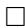

Proof of Theorem 4.10 Case I. $M$ is a compact manifold. In this case, the existence of an isostatistical immersion of a statistical manifold $(M,g,T)$ into $(\mathcal{P}_{+}([N]),\mathfrak{g},\mathbf{T})$ for some finite $N$ follows from Proposition 4.6 and Proposition 4.7.

Case II. $M$ is a non-compact manifold. We shall reduce the existence of an immersion of $(M^m,g,T)$ into $\mathcal{P}_{+}(\mathbb{N})$ satisfying the condition of Theorem 4.10 to Case I, using a partition of unity and Nash's trick. (The Nash trick is a bit more complicated and can be used to embed a non-compact Riemannian manifold into a finite-dimensional Euclidean manifold.) Since $(M^{m},g,T)$ is finite-dimensional, there exists a countable locally finite open bounded cover $U_{i}$ , $i = \overline{1,\infty}$ , of $M^m$ . We can then find compact submanifolds with boundary $A_{i}\subseteq U_{i}$ whose union also covers $M^m$ .

Let $\{v_{i}\}$ be a partition of unity subjected to the cover $\{U_i\}$ such that $v_{i}$ is strictly positive on $A_{i}$ . Let $S_{i}$ be a sphere of dimension $m$ .

The following lemma is based on a trick that is similar to Nash's trick in [196, part D, pp. 61-62].

Lemma 4.12 For each $i$ there exists a smooth map $\phi^i: A_i \to S_i$ with the following properties:

(i) $\phi^i$ can be extended smoothly to the whole $M^{m}$ .   
(ii) For each $S_{i}$ there exists a statistical structure $(g_{i}, T_{i})$ on $S_{i}$ such that

$$
g = \sum_ {i} \left(\phi^ {i}\right) ^ {*} \left(g _ {i}\right), \tag {4.177}
$$

$$
T = \sum_ {i} \left(\phi^ {i}\right) ^ {*} \left(T _ {i}\right). \tag {4.178}
$$

Proof Let $\phi^i$ map the boundary of $U_{i}$ into the north point of the sphere $S_{i}$ . Furthermore, we can assume that this map $\phi^i$ is injective in $A_{i}$ . Clearly, $\phi^i$ can be extended smoothly to the whole $M^n$ . This proves assertion (i) of Lemma 4.12.

(ii) The existence of a Riemannian metric $g_{i}$ on $S_{i}$ that satisfies (4.177)

$$
g = \sum_ {i} \left(\phi^ {i}\right) ^ {*} (g _ {i})
$$

has been proved in [196, part D, pp. 61-62]. For the reader's convenience, and for the proof of the last assertion of Lemma 4.12, we shall repeat Nash's proof.

Let $\gamma_{i}$ be a Riemannian metric on $S_{i}$ . Set

$$
g _ {0} = \sum_ {i} \left(\phi^ {i}\right) ^ {*} (\gamma_ {i}), \tag {4.179}
$$

where by Lemma 4.12 $\phi^i$ is a smooth map from $M^m$ to $S_{i}$ . This is a well-defined metric, since the covering $\{U_i\}$ is locally finite. By rescaling the metric $\gamma_{i}$ , we can assume that $g - g_0$ is a positive metric. Now we set

$$
g _ {i} := \left(\phi^ {i}\right) ^ {*} \left(\gamma_ {i}\right) + v _ {i} \cdot \left(g - g _ {0}\right). \tag {4.180}
$$

We claim that there is a Riemannian metric $\tilde{\gamma}_i$ on $S_{i}$ such that

$$
\left(\phi^ {i}\right) ^ {*} \left(\tilde {\gamma} _ {i}\right) = g _ {i}. \tag {4.181}
$$

Note $g_i - (\phi^i)^*(\gamma_i)$ has a support on $U_i$ since $\operatorname{supp}(v_i) \subseteq U_i$ . Since $\phi^i$ is injective in $A_i$ , $((\phi^i)^{-1})^*(g_i - (\phi^i)^*(\gamma_i))$ is a non-negative quadratic form on $S_i$ . Hence

$$
\tilde {\gamma} _ {i} := \left(\left(\phi^ {i}\right) ^ {- 1}\right) ^ {*} \left(g _ {i} - \left(\phi^ {i}\right) ^ {*} (\gamma_ {i})\right) + \gamma_ {i}
$$

is a Riemannian metric on $S_{i}$ that satisfies (4.181).

Now we compute

$$
\begin{array}{l} \sum_ {i} \left(\phi^ {i}\right) ^ {*} (\tilde {\gamma} _ {i}) = \sum_ {i} g _ {i} \quad (b y (4. 1 8 1)) \\ = \sum_ {i} \left(\phi^ {i}\right) ^ {*} \left(\gamma_ {i}\right) + v _ {i} \cdot (g - g _ {0}) \quad (\text {b y} (4. 1 8 0)) \\ = g _ {0} + (g - g _ {0}) = g \quad (\text {b y} (4. 1 7 9)). \\ \end{array}
$$

This proves (4.177).

The proof of the existence of $T_{i}$ that satisfies (4.178) follows the same scheme, as for the proof of the existence of $g_{i}$ ; it is even easier, since we do not have the issue of positivity of $T_{i}$ . So we leave it to the reader as an exercise.

Continuation of the proof of Theorem 4.10 Let $a_1, \ldots, a_\infty$ be a sequence of positive numbers with

$$
\sum_ {i = 1} ^ {\infty} a _ {i} ^ {2} = 4.
$$

By the proof of Theorem 4.10, there exist a large number $l(m)$ depending only on $m$ and an isostatistical immersion

$$
\psi^ {i}: (S _ {i}, g _ {i}, T _ {i}) \to \left(S _ {a _ {i}, +} ^ {4 l (m) - 1}, g _ {0}, T ^ {*}\right)
$$

for any $i \in \mathbb{N}$ . Here the sphere $S_{a_i}^{4(l(m) - 1}$ has radius smaller than 2, so we have to adjust the number $\bar{A}$ in the proof of Case 1. The main point is that the value $\lambda = \lambda(\bar{A})$ defined by a modified Eq. (4.142), where the RHS is replaced by $a_i^2$ , is bounded from below and from above by a number that depends only on $l(m)$ and the radius $a_i$ . Thus the RHS of (4.157) goes to infinity, when $\bar{A}$ goes to infinity. Similarly, the RHS of (4.166) goes to infinity when $\bar{A}$ goes to infinity.

Set

$$
I ^ {i} := \psi^ {i} \circ \phi^ {i}: M ^ {m} \to \left(S _ {a _ {i}, +} ^ {4 l (m) - 1}, g _ {0}, T ^ {*}\right) \subseteq \left(\mathbb {R} ^ {4 l (m)}, g _ {0}, T ^ {*}\right).
$$

Clearly, the map $I \coloneqq (I^1 \times \dots \times I^\infty)$ maps $M^m$ into the Cartesian product of the positive sectors $S_{a_i, + }^{4l(m) - 1}$ , that is, a subset of the positive sectors $S_{\sqrt{2}, + }^\infty$ of all positive

probability measures on $\mathbb{N}$ . Since $\psi^i$ are isostatistical immersions, by (4.177) and (4.178) the map $I$ satisfies the required condition of Theorem 4.10.

# 4.5.5 Existence of Statistical Embeddings

Theorem 4.11 Any smooth (resp. $C^0$ ) compact statistical manifold $(M^n, g, T)$ admits an isostatistical embedding into the statistical manifold $(\mathcal{P}_{+}([N]), \mathfrak{g}, \mathbf{T})$ for some finite number $N$ . Any smooth (resp. $C^0$ ) non-compact statistical manifold $(M^n, g, T)$ admits an embedding $I$ into the space $\mathcal{P}_{+}(\mathbb{N})$ of all probability measures on $\mathbb{N}$ such that $g$ and $T$ coincide with the Fisher metric and the Amari-Chentsov tensor on $I(M^n)$ , respectively.

Proof To prove Theorem 4.11, we repeat the proof of Theorem 4.10, replacing the Nash immersion theorem by the Nash embedding theorem. First we observe that our immersion $f_{3}$ constructed in Sect. 4.5.3 is an embedding, if $f_{2}$ is an isometric embedding. The existence of an isometric embedding $f_{2}$ is ensured by the Nash theorem. Hence, if $M^n$ is compact, to prove the existence of an isostatistical embedding of $(M^n,g,T)$ into $(\mathcal{P}_{+}([N]),\mathfrak{g},\mathbf{T})$ , it suffices to prove the strengthened version of Proposition 4.7, where the existence of an isostatistical immersion is replaced by the existence of an isostatistical embedding, but we need only to embed a bounded domain $D$ in a statistical manifold $(\mathbb{R}^n,g_0,A\cdot T_0)$ into $(\mathcal{P}_{+}([N]),\mathfrak{g},\mathbf{T})$ .

As in the proof of Proposition 4.7, the proof of the new strengthened version of Proposition 4.7 is reduced to the proof of the existence of an isostatistical immersion of a bounded statistical interval $([0,R],dt^2,A\cdot dt^3)$ into a torus $T^2$ of a small domain in $(S_{2 / \sqrt{n}, + }^{7},\mathfrak{g},T^{*})\subseteq (\mathbb{R}^{8},g_{0},T^{*})$ , see the proof of Lemma 4.8.

The statistical immersion produced with the help of Lemma 4.9 will be an embedding if not all the integral curves of the distribution $D(A)$ on the torus $T^2$ are closed curves. Now we shall search for an isostatistical embedding of $([0,R],dt^{2},A\cdot dt^{3})$ into a torus $T^2\times T^2$ of a small domain in $(S_{1 / \sqrt{n}, + }^3,g_0,T^*)\times$ $(S_{1 / \sqrt{n}, + }^3,g_0,T^*)\subseteq (S_{2 / \sqrt{n}, + }^7,\mathfrak{g},T^*)\subseteq (\mathbb{R}^8,g_0,T^*)$ . Since $T^4$ is parallelizable, repeating the argument at the end of the proof of Lemma 4.8, we choose a distribution $D(A)\subseteq TT^4$ such that $D(A) = T^4\times S^2$ and

$$
D _ {x} A = \left\{v \in T _ {x} T ^ {4} \mid | v | _ {g _ {0}} = 1, \text {a n d} T ^ {*} (v, v, v) = A \right\}.
$$

Now assume that the integral curves of $D(A)$ that lie on the first factor $T^2 \times y$ for all $y \in S_{1/\sqrt{n},+}^3$ are closed. Since $T^2$ is compact, there is a positive number $p_1$ such that the periods of these integral curves are at least $p_1$ .

Now let us consider the following integral curve $\gamma(t)$ of $D(A)$ on $T^4$ . The curve $\gamma(t)$ begins at a point $(0, 0, 0, 0) \in T^4$ . Here we identify $T^1$ with $[0, 1] / (0 = 1)$ . The integral curve lies on $T^2 \times (0, 0)$ until it approaches $(0, 0, 0, 0)$ again. Since $D_x(A) = S^2$ , we can slightly modify the direction of $\gamma(t)$ and let it leave the torus

$T^2 \times (0,0)$ and after a very short time $\gamma(t)$ must stay on the torus $T^2 \times (\varepsilon, \varepsilon)$ where $\varepsilon$ is sufficiently small. Without loss of generality we assume that the period of any closed curve of the distribution $D(A) \cap T(T^2 \times (\varepsilon, \varepsilon))$ is at least $p_1$ . Repeating this procedure, since $R$ and $p_1$ are finite, we produce an embedding of $([0,R], dt^2, A \cdot dt^3)$ into $T^4 \subseteq (S_{1/\sqrt{n},+}^3, g_0, T^*) \times (S_{1/\sqrt{n},+}^3, g_0, T^*)$ .

This completes the proof of Theorem 4.11 in the case when $M^n$ is compact.

It remains to consider the case where $M^n$ is non-compact. Using the existence of isostatistical embeddings for the compact case we can assume that $\psi^i$ is an embedding for all $i$ . Now we shall show that the map $I$ is an embedding. Assume that $x \in M$ . By the assumption, there exists an $A_i$ such that $x$ is an interior point of $A_i$ . Then for any $y \in M$ , $I^i(x) \neq I^i(y)$ , since $\psi^i$ is an embedding, $\phi^i$ is injective in the interior of $A_i$ and maps the boundary of $A_i$ to the north pole of $S_i$ .

Remark 4.8 There are many open questions concerning immersions of $C^k$ -statistical manifolds. One important problem is to find a class of statistical manifolds $(M, \mathfrak{g}, \mathbf{T})$ of exponential type (i.e., $M$ are exponential families as in (3.31)) that admit an isostatistical embedding into linear statistical manifolds $(\mathbb{R}^n, g_0, A \cdot T_0)$ or into statistical manifolds $(\mathcal{P}_+([N]), \mathfrak{g}, \mathbf{T})$ . This is a difficult problem, if $\dim M \geq 2$ . A version of this problem is to find an explicit embedding of the Riemannian manifold $(M, \mathfrak{g})$ underlying a statistical manifold $(M, \mathfrak{g}, \mathbf{T})$ of exponential type into Euclidean spaces. The problem of embedding of hyperbolic Riemannian spaces into Euclidean spaces has been considered by many geometers. We refer the reader to [52] for a survey.

# Chapter 5 Information Geometry and Statistics

# 5.1 Congruent Embeddings and Sufficient Statistics

In this section, we shall consider statistics and Markov kernels between measure spaces $\Omega$ and $\Omega'$ , partially following [25, 26]. For a historical overview of the notions introduced here, see also Remark 5.9 below. These establish a standard method to obtain new statistical models out of given ones. Such transitions can be interpreted as data processing in statistical decision theory, which can be deterministic (i.e., given by a measurable map, a statistic) or noisy (i.e., given by a Markov kernel).

Given measure spaces $\Omega$ and $\Omega'$ , a statistic is a measurable map $\kappa: \Omega \to \Omega'$ , i.e., $\kappa$ associates to each event $\omega \in \Omega$ an event $\kappa(\omega)$ in $\Omega'$ .

For instance, if $\Omega$ is divided into subsets $\Omega = A_{1} \oplus \dots \oplus A_{n}$ , then this induces a map $\kappa$ from $\Omega$ into the set $\{1, \ldots, n\}$ , associating to each element of $A_{i}$ the value $i$ , thus lumping together each set $A_{i}$ to a single point.

Given such a statistic, we can associate to each probability measure $\mu$ on $\Omega$ a probability measure $\mu' = \kappa_*\mu$ on $\Omega'$ , given as

$$
\kappa_ {*} \mu (A) := \mu \left\{\omega \in \Omega : \kappa (\omega) \in A \right\} = \mu \left(\kappa^ {- 1} A\right).
$$

In the above example, $\mu^{\prime}(i)$ would equal $\mu (A_i)$ . In this way, for a statistical model $(M,\Omega ,\mathbf{p})$ , a statistic induces another statistical model $(M,\Omega^{\prime},\mathbf{p}^{\prime})$ given as

$$
\mathbf {p} ^ {\prime} (\xi) = \kappa_ {*} \mathbf {p} (\xi),
$$

which we call the model induced by $\kappa$ . In general, we cannot expect the induced statistical model to contain the same amount of information, as one can see already from the above example: Knowing $\mathbf{p}'(\xi)$ only allows us to recover the probability of $A_{i}$ w.r.t. $\mathbf{p}(\xi)$ , but we no longer know the probability of subsets of $A_{i}$ w.r.t. $\mathbf{p}(\xi)$ .

Apart from statistics, we may also consider Markov kernels between measurable spaces $\Omega$ and $\Omega'$ . A Markov kernel $K$ associates to each $\omega \in \Omega$ a probability measure $K(\omega)$ on $\Omega'$ , and we write $K(\omega; A')$ for the probability of $A'$ w.r.t. $K(\omega)$ for

$A' \subseteq \Omega'$ . Again, this induces for each probability measure $\mu$ on $\Omega$ a probability measure on $\Omega'$ , defined as

$$
K _ {*} \mu (A ^ {\prime}) := \int_ {\Omega} K _ {*} (\omega ; A ^ {\prime}) d \mu (\omega).
$$

The map $K_*$ associating to a measure on $\Omega$ a measure on $\Omega'$ is called the Markov morphism induced by $K$ .

The concept of Markov kernels is more general than that of statistics. Indeed, each statistic induces a Markov kernel by setting

$$
K (\omega) := \delta^ {\kappa (\omega)},
$$

which denotes the Dirac measure supported on $\kappa (\omega)$ . Just as in the case of a statistic $\kappa$ , a Markov kernel $K$ induces for a statistical model $(M,\Omega ,\mathbf{p})$ a model $(M,\Omega^{\prime},\mathbf{p}^{\prime})$ by

$$
\mathbf {p} ^ {\prime} (\xi) := K _ {*} \mathbf {p} (\xi).
$$

A particular example of a Markov kernel is given by random walks in a set $\Omega$ . Here, to each $\omega \in \Omega$ one associates a probability measure $K(\omega)$ on $\Omega$ which gives the probability distribution of the position of a particle located at $\omega$ after the next move.

Again, it is evident that in general there will be some loss of information when passing from the statistical model $(M,\Omega ,\mathbf{p})$ to $(M,\Omega^{\prime},\mathbf{p}^{\prime})$

Given a statistic or, more general, a Markov kernel between $\Omega$ and $\Omega'$ , it is now interesting to characterize statistical models $(M, \Omega, \mathbf{p})$ for which there is no information loss when replacing it by the model $(M, \Omega', \mathbf{p}')$ .

In the case of statistics, it is plausible that this is the case if there is a density function such that $\mathbf{p}(\xi) = p(\omega ;\xi)\mu_0$ which is constant on the fibers of $\kappa$ , i.e.,

$$
\mathbf {p} (\xi) = p (\cdot ; \xi) \mu_ {0} = p ^ {\prime} (\kappa (\cdot); \xi) \mu_ {0} \tag {5.1}
$$

for some function $p'$ defined for pairs $(\omega'; \xi)$ with $\xi \in M$ and $\omega' \in \Omega'$ . In this case,

$$
\mathbf {p} ^ {\prime} (\xi) = p ^ {\prime} (\cdot ; \xi) \mu_ {0} ^ {\prime}
$$

for the induced measure $\mu_0^{\prime} \coloneqq \kappa_*\mu_0$ . Thus, all information of $p$ can be recovered from $p^{\prime}$ which is typically a simpler function, as it is defined on the (presumably smaller) space $\Omega^{\prime}$ .

Therefore, if the model $(M,\Omega ,\mu_0,\mathbf{p})$ satisfies (5.1), then we call $\kappa$ a Fisher-Neyman sufficient statistic for the model, cf. Definition 5.8.

If the model $(M, \Omega, \mathbf{p})$ has a regular density function, then we also show some equivalent characterizations of the Fisher-Neyman sufficiency of a statistic $\kappa$ for this model, the most important of which is the Fisher-Neyman characterization; cf. Theorem 5.3.

The notion of Fisher-Neyman sufficient statistics is closely related to that of $\kappa$ -congruent embeddings, where $\kappa$ is a statistic between $\Omega$ and $\Omega'$ . Roughly speaking,

given a finite measure $\mu_0$ on $\Omega$ and its push-forward $\mu_0' := \kappa_*\mu_0$ , measures on $\Omega'$ dominated by $\mu_0'$ are mapped to measures on $\Omega$ via

$$
K _ {\mu_ {0}}: f ^ {\prime} (\cdot) \mu_ {0} ^ {\prime} \longmapsto f ^ {\prime} (\kappa (\cdot)) \mu_ {0}, \tag {5.2}
$$

where $f' \in L^{1}(\Omega', \mu_{0}')$ . The image of this map is called a $\kappa$ -congruent subspace. Note that $K_{\mu_{0}}$ maps probability measures on $\Omega'$ to probability measures on $\Omega$ , and the composition

$$
f ^ {\prime} (\cdot) \mu_ {0} ^ {\prime} \xrightarrow {K _ {\mu_ {0}}} f ^ {\prime} (\kappa (\cdot)) \mu_ {0} \xrightarrow {\kappa_ {*}} f ^ {\prime} (\cdot) \mu_ {0} ^ {\prime} \tag {5.3}
$$

is the identity.

Comparing (5.2) with (5.1), it is then evident that $\kappa$ is a Fisher-Neyman sufficient statistic for the model $(M, \Omega, \mathbf{p})$ if and only if $\mathbf{p}(\xi)$ is contained in some $\kappa$ -congruent subspace.

We shall define a congruent embedding as a bounded linear map $K_*$ which is a right inverse of $\kappa_*$ , i.e., $\kappa_* K_* \mu' = \mu'$ for all measures $\mu'$ in the domain of $K_*$ , and such that $K_*$ is monotone, i.e., maps non-negative measures to non-negative measures; cf. Definition 5.1. In this case, one can show that $K_*$ is of the form $K_{\mu_0}$ from (5.2) for a suitable measure $\mu_0$ on $\Omega$ ; cf. Proposition 5.2.

If the map $K_{*}$ is induced by a Markov kernel $K$ , then we call this Markov kernel congruent. However, in contrast to the situation of a finite $\Omega$ , the map $K_{*}$ need not be induced by a Markov kernel in general. In fact, we show that this is the case if and only if the measure $\mu_0$ on $\Omega$ admits transverse measures w.r.t. $\kappa$ ; cf. Theorem 5.1. Such a transverse measure exists for finite measure spaces, explaining why in the finite case every congruent embedding is induced by a Markov kernel.

Furthermore, if $(M,\Omega ,\mathbf{p})$ is a statistical model with an infinite $\Omega$ and $(M,\Omega^{\prime},\mathbf{p}^{\prime})$ is the statistical model induced by a Markov kernel (or a statistic) between $\Omega$ and $\Omega^{\prime}$ , then the question of $k$ -integrability becomes an important issue since, unlike in the case of a finite $\Omega$ , not every statistical model is $k$ -integrable. As one of our main results we show that Markov kernels preserve $k$ -integrability, i.e., if $(M,\Omega ,\mathbf{p})$ is $k$ -integrable, then so is $(M,\Omega^{\prime},\mathbf{p}^{\prime})$ ; cf. Theorem 5.4.

In fact, in Theorem 5.4 we also show that $\| \partial_V\log \mathbf{p}'(\xi)\| _k\leq \| \partial_V\log \mathbf{p}(\xi)\| _k$ for all $V\in T_{\xi}M$ , as long as the models are $k$ -integrable, and that equality holds either for all $k > 1$ for which $k$ -integrability holds, or for no such $k > 1$ . This result allows us to define the $k$ th order information loss of a Markov kernel $K$ as the difference

$$
\left\| \partial_ {V} \log \mathbf {p} ^ {\prime} (\xi) \right\| _ {k} ^ {k} - \left\| \partial_ {V} \log \mathbf {p} (\xi) \right\| _ {k} ^ {k} \geq 0.
$$

In particular, if $k = 2n$ is an even integer, then by the definition (3.95) of the canonical $2n$ -tensors $\tau_{M}^{2n}$ of $(M, \Omega, \mathbf{p})$ and $\tau_{M}^{\prime 2n}$ of $(M, \Omega^{\prime}, \mathbf{p}^{\prime})$ we immediately conclude (cf. Theorem 5.5) that

$$
\tau_ {M} ^ {2 n} (V, \ldots , V) - \tau_ {M} ^ {\prime 2 n} (V, \ldots , V) \geq 0.
$$

If $k \geq 2$ then, as $\tau_{M}^{2}$ and $\tau_{M}^{\prime 2}$ coincide with the Fisher metrics $\mathfrak{g}_M$ and $\mathfrak{g}_M^\prime$ , respectively, we obtain the monotonicity formula

$$
\mathfrak {g} _ {M} (V, V) - \mathfrak {g} _ {M} ^ {\prime} (V, V) \geq 0, \tag {5.4}
$$

and this difference represents the 2nd order information loss. (The interpretation of this difference as information loss was established by Amari in [7].)

Note that this result goes well beyond the versions of the monotonicity inequality known in the literature (cf. [16, 25, 164]) where further assumptions on $\Omega$ or the Markov kernel $K$ are always made.

In the light of the definition of information loss, we say that a statistic or, more generally, a Markov kernel is sufficient for a model $(M,\Omega ,\mathbf{p})$ if the information loss vanishes for some (and hence for all) $k > 1$ for which the model is $k$ -integrable. As it turns out, the Fisher-Neyman sufficient statistics are sufficient in this sense; in fact, under the assumption that $(M,\Omega ,\mathbf{p})$ is given by a positive regular density function, a statistic is sufficient if and only if it is Fisher-Neyman sufficient, as we show in Proposition 5.6. However, without this positivity assumption there are sufficient statistics which are not Fisher-Neyman sufficient, cf. Example 5.6.

Furthermore, we also give a classification of covariant $n$ -tensors on the space of (roots of) measures which are invariant under sufficient statistics or, more generally, under congruent embeddings. This generalizes Theorem 2.3, where this was done for finite spaces $\Omega$ . In the case of an infinite $\Omega$ , some care is needed when defining these tensors. They cannot be defined on the space of (probability) measures on $\Omega$ , but on the spaces of roots of measure $S^r(\Omega)$ from Sect. 3.2.3.

Our result (Theorem 5.6) states that the space of tensors on a statistical model which are invariant under congruent embeddings (and hence under sufficient statistics) is algebraically generated by the canonical $n$ -tensors. In particular, Corollaries 5.3 and 5.4 generalize the classical theorems of Chentsov and Campbell, characterizing 2- and 3-tensors which are invariant under congruent embeddings, to the case of arbitrary measure spaces $\Omega$ .

# 5.1.1 Statistics and Congruent Embeddings

Given two measurable spaces $(\Omega, \mathfrak{B})$ and $(\Omega', \mathfrak{B}')$ , a measurable map

$$
\kappa : \Omega \longrightarrow \Omega^ {\prime}
$$

will be called a statistic. If $\mu$ is a (signed) measure on $(\Omega, \mathfrak{B})$ , it then induces a (signed) measure $\kappa_{*}\mu$ on $(\Omega, \mathfrak{B}^{\prime})$ , via

$$
\kappa_ {*} \mu (A) := \mu \left\{x \in \Omega : \kappa (x) \in A \right\} = \mu \left(\kappa^ {- 1} A\right),
$$

which is called the push-forward of $\mu$ by $\kappa$ (cf. 3.17). If $\mu \in \mathcal{M}(\Omega)$ is a finite measure, then so is $\kappa_{*}\mu$ , and

$$
\| \kappa_ {*} \mu \| _ {T V} = \kappa_ {*} \mu \big (\Omega^ {\prime} \big) = \mu \big (\kappa^ {- 1} \big (\Omega^ {\prime} \big) \big) = \mu (\Omega) = \| \mu \| _ {T V},
$$

so that

$$
\| \kappa_ {*} \mu \| _ {T V} = \| \mu \| _ {T V} \quad \text {f o r a l l} \mu \in \mathcal {M} (\Omega). \tag {5.5}
$$

In particular, $\kappa_{*}$ maps probability measures to probability measures, i.e.,

$$
\kappa_ {*} \big (\mathcal {P} (\Omega) \big) \subseteq \mathcal {P} \big (\Omega^ {\prime} \big).
$$

If we consider $\kappa_{*}$ as a map of signed measures, then

$$
\kappa_ {*}: \mathcal {S} (\Omega) \longrightarrow \mathcal {S} \left(\Omega^ {\prime}\right) \tag {5.6}
$$

is a bounded linear map. In fact, using the Jordan decomposition $\mu = \mu_{+} - \mu_{-}$ for $\mu \in S(\Omega)$ with $\mu_{\pm} \in \mathcal{M}(\Omega)$ and $\mu_{+} \perp \mu_{-}$ (3.46) then

$$
\begin{array}{l} \| \kappa_ {*} \mu \| _ {T V} = \| \kappa_ {*} \mu_ {+} - \kappa_ {*} \mu_ {-} \| _ {T V} \leq \| \kappa_ {*} \mu_ {+} \| _ {T V} + \| \kappa_ {*} \mu_ {-} \| _ {T V} \\ \stackrel {(5. 5)} {=} \| \mu_ {+} \| _ {T V} + \| \mu_ {-} \| _ {T V} = \| \mu \| _ {T V}, \\ \end{array}
$$

whence

$$
\| \kappa_ {*} \mu \| _ {T V} \leq \| \mu \| _ {T V} \quad \text {w i t h e q u a l i t y i f f} \quad \kappa_ {*} (\mu_ {+}) \perp \kappa_ {*} (\mu_ {-}). \tag {5.7}
$$

Furthermore, if $\mu_{1}$ dominates $\mu_{2}$ , then $\kappa_{*}(\mu_{1})$ dominates $\kappa_{*}(\mu_{2})$ by (3.17), whence for $\mu \in \mathcal{M}(\Omega)$ , $\kappa_{*}$ yields a bounded linear map

$$
\kappa_ {*}: \mathcal {S} (\Omega , \mu) \longrightarrow \mathcal {S} \left(\Omega^ {\prime}, \kappa_ {*} \mu\right), \tag {5.8}
$$

and if we write

$$
\kappa_ {*} (\phi \mu) = \phi^ {\prime} \kappa_ {*} (\mu), \tag {5.9}
$$

then $\phi' \in L^{1}(\Omega', \kappa_{*}\mu)$ is called the conditional expectation of $\phi \in L^{1}(\Omega, \mu)$ given $\kappa$ . This yields a bounded linear map

$$
\kappa_ {*} ^ {\mu}: L ^ {1} (\Omega , \mu) \longrightarrow L ^ {1} \left(\Omega^ {\prime}, \mu^ {\prime}\right), \quad \phi \longmapsto \phi^ {\prime} \tag {5.10}
$$

with $\phi'$ from (5.9). We also define the pull-back of a measurable function $\phi': \Omega' \to \mathbb{R}$ as

$$
\kappa^ {*} \phi^ {\prime} := \phi^ {\prime} \circ \kappa .
$$

With this, for subsets $A', B' \subseteq \Omega'$ and $A := \kappa^{-1}(A')$ , $B := \kappa^{-1}(B') \subseteq \Omega$ we have $\kappa^*\chi_{A'} = \chi_A$ and hence,

$$
\mu (A \cap B) = \int_ {A \cap B} d \mu = \int_ {B} \chi_ {A} d \mu = \int_ {\kappa^ {- 1} \left(B ^ {\prime}\right)} d \left(\kappa^ {*} \chi_ {A ^ {\prime}} \mu\right) = \int_ {B ^ {\prime}} d \left(\kappa_ {*} \left(\kappa^ {*} \chi_ {A ^ {\prime}} \mu\right)\right)
$$

or

$$
\mu (A \cap B) = \mu \big (\kappa^ {- 1} \big (A ^ {\prime} \cap B ^ {\prime} \big) \big) = \kappa_ {*} \mu \big (A ^ {\prime} \cap B ^ {\prime} \big) = \int_ {B ^ {\prime}} \chi_ {A ^ {\prime}} d (\kappa_ {*} \mu).
$$

Thus, $\kappa_{*}(\kappa^{*}\chi_{A^{\prime}}\mu) = \chi_{A^{\prime}}\kappa_{*}\mu$ . By linearity, this equation holds when replacing $\chi_{A^{\prime}}$ by a step function on $\Omega^{\prime}$ , whence by the density of step functions in $L^{1}(\Omega^{\prime},\mu^{\prime})$ we obtain for $\phi^{\prime}\in L^{1}(\Omega^{\prime},\kappa_{*}\mu)$

$$
\kappa_ {*} \left(\kappa^ {*} \phi^ {\prime} \mu\right) = \phi^ {\prime} \kappa_ {*} \mu \quad \text {a n d t h u s}, \quad \kappa_ {*} ^ {\mu} \left(\kappa^ {*} \phi^ {\prime}\right) = \phi^ {\prime}. \tag {5.11}
$$

That is, the conditional expectation of $\kappa^{*}\phi^{\prime}$ given $\kappa$ equals $\phi^\prime$ . While this was already stated in case when $\Omega$ is a manifold and $\kappa$ a differentiable map in (3.18), we have shown here that (5.11) holds without any restriction on $\kappa$ or $\Omega$ .

# Example 5.1

(1) Let $\Omega := A_1 \oplus \dots \oplus A_n$ be a partition of the $\Omega$ into measurable sets. To this partition, we associate the statistic $\kappa: \Omega \to I_n := \{1, \ldots, n\}$ by setting

$$
\kappa (\omega) := i \quad \text {i f} \omega \in A _ {i}.
$$

Thus, this statistic lumps together all events in the class $A_{i}$ .

Conversely, any statistic $\kappa : \Omega \to I$ into a finite set $I$ yields a partition of $\Omega$ into the disjoint measurable subsets $A_i \coloneqq \kappa^{-1}(i)$ , $i \in I$ .

(2) If $\kappa$ is bijective and $\kappa^{-1}$ is also measurable, then for any function $f$ on $\Omega$

$$
\int_ {\Omega} f d \mu (x) = \int_ {\Omega^ {\prime}} \left(\kappa^ {- 1}\right) ^ {*} f d \kappa_ {*} \mu , \tag {5.12}
$$

so that $\kappa_{*}$ yields a bijection of measures on $\Omega$ and on $\Omega^{\prime}$ . We shall show in Proposition 5.4 that this is essentially the only situation where $\kappa_{*}$ is a bijection.

As it turns out, $\kappa_{*}^{\mu}$ preserves $k$ -integrability, as the following result shows.

Proposition 5.1 Let $\kappa : \Omega \to \Omega'$ be a statistic and $\mu \in \mathcal{M}(\Omega)$ , $\mu' := \kappa_*\mu \in \mathcal{M}(\Omega')$ , and let $\kappa_*^\mu : L^1(\Omega, \mu) \to L^1(\Omega', \mu')$ be the map from (5.10). Then the following hold for $\phi \in L^1(\Omega, \mu)$ and $\phi' := \kappa_*^\mu\phi \in L^1(\Omega', \mu')$ :

(1) If $\phi \in L^{k}(\Omega, \mu)$ for $1 \leq k \leq \infty$ , then $\phi' \in L^{k}(\Omega', \mu')$ , and

$$
\left\| \phi^ {\prime} \right\| _ {k} \leq \| \phi \| _ {k}. \tag {5.13}
$$

(2) For $1 < k < \infty$ , equality in (5.13) holds iff $\phi = \kappa^{*}\phi^{\prime}$ .

Proof By definition, $\| \phi' \|_1 = \| \kappa_*(\phi \mu) \|_{TV}$ and $\| \phi \|_1 = \| \phi \mu \|_{TV}$ , so that (5.7) implies (5.13) for $k = 1$ .

If $\phi \in L^{\infty}(\Omega, \mu)$ then $|\phi \mu| \leq \| \phi \|_{\infty} \mu$ , and by monotonicity of $\kappa_*$ it follows that

$$
\left| \phi^ {\prime} \mu^ {\prime} \right| = \left| \kappa_ {*} (\phi \mu) \right| \leq \kappa_ {*} \big (| \phi \mu | \big) \leq \left\| \phi \right\| _ {\infty} \mu^ {\prime},
$$

whence $\| \phi^{\prime}\|_{\infty}\leq \| \phi \|_{\infty}$ , so that (5.13) holds for $k = \infty$

For $\phi^{\prime}\in L^{k}(\Omega^{\prime},\mu^{\prime})$ , we have

$$
\left\| \kappa^ {*} \phi^ {\prime} \right\| _ {k} ^ {k} = \int_ {\Omega} \left| \kappa^ {*} \phi^ {\prime} \right| ^ {k} d \mu = \int_ {\Omega^ {\prime}} d \kappa_ {*} \big (\kappa^ {*} \left| \phi^ {\prime} \right| ^ {k} \mu \big) \stackrel {(5. 1 1)} {=} \int_ {\Omega^ {\prime}} \left| \phi^ {\prime} \right| ^ {k} d \mu^ {\prime} = \left\| \phi^ {\prime} \right\| _ {k} ^ {k},
$$

which implies that $\kappa^{*}\phi^{\prime}\in L^{k}(\Omega ,\mu)$ and

$$
\left\| \kappa^ {*} \phi^ {\prime} \right\| _ {k} = \left\| \phi^ {\prime} \right\| _ {k} \quad \text {f o r a l l} \phi^ {\prime} \in L ^ {k} \left(\Omega^ {\prime}, \mu^ {\prime}\right), 1 \leq k \leq \infty . \tag {5.14}
$$

Suppose now that $\phi \in L^{k}(\Omega, \mu)$ with $1 < k < \infty$ is such that $\phi' \in L^{k}(\Omega', \mu')$ , and assume that $\phi \geq 0$ and hence, $\phi' \geq 0$ . Then

$$
\begin{array}{l} \left\| \phi^ {\prime} \right\| _ {k} ^ {k} = \int_ {\Omega^ {\prime}} \phi^ {\prime k} d \mu^ {\prime} \stackrel {(5. 9)} {=} \int_ {\Omega^ {\prime}} \phi^ {\prime k - 1} d \kappa_ {*} (\phi \mu) = \int_ {\Omega} \kappa^ {*} \bigl (\phi^ {\prime k - 1} \bigr) \phi d \mu \\ \stackrel {(*)} {\leq} \left\| \kappa^ {*} \left(\phi^ {\prime k - 1}\right) \right\| _ {k / (k - 1)} \| \phi \| _ {k} \\ \stackrel {(*)} {=} \left\| \phi^ {\prime k - 1} \right\| _ {k / (k - 1)} \| \phi \| _ {k} = \left\| \phi^ {\prime} \right\| _ {k} ^ {k - 1} \| \phi \| _ {k}. \\ \end{array}
$$

From this, (5.13) follows. Here we used Hölder's inequality at $(\ast)$ , and (5.14) applied to $\phi'^{k-1} \in L^{k/(k-1)}(\Omega', \mu')$ at $(\ast)$ . Moreover, equality in Hölder's inequality at $(\ast)$ holds iff $\phi = c \kappa^* \phi'$ for some $c \in \mathbb{R}$ , and the fact that $\kappa_*(\phi \mu) = \phi' \mu'$ easily implies that $c = 1$ , i.e., equality in (5.13) occurs iff $\phi = \kappa^* \phi'$ .

If we drop the assumption that $\phi \geq 0$ , we decompose $\phi = \phi_{+} - \phi_{-}$ into its non-negative and non-positive part, and let $\phi_{\pm}^{\prime} \geq 0$ be such that $\kappa_{*}(\phi_{\pm}\mu) = \phi_{\pm}^{\prime}\mu^{\prime}$ . Although in general, $\phi_{+}^{\prime}$ and $\phi_{-}^{\prime}$ do not have disjoint support, the linearity of $\kappa_{*}$ still implies that $\phi^{\prime} = \phi_{+}^{\prime} - \phi_{-}^{\prime}$ . Let us assume that $\phi_{\pm}^{\prime} \in L^{k}(\Omega^{\prime},\mu^{\prime})$ . Then

$$
\left\| \phi^ {\prime} \right\| _ {k} = \left\| \phi_ {+} ^ {\prime} - \phi_ {-} ^ {\prime} \right\| _ {k} \leq \left\| \phi_ {+} ^ {\prime} \right\| _ {k} + \left\| \phi_ {-} ^ {\prime} \right\| _ {k} \leq \| \phi_ {+} \| _ {k} + \| \phi_ {-} \| _ {k} = \| \phi \| _ {k},
$$

using (5.13) applied to $\phi_{\pm} \geq 0$ in the second estimate. Equality in the second estimate holds iff $\phi_{\pm} = \kappa^{*}\phi_{\pm}^{\prime}$ , and thus, $\phi = \phi_{+} - \phi_{-} = \kappa^{*}(\phi_{+}^{\prime} - \phi_{-}^{\prime}) = \kappa^{*}\phi^{\prime}$ .

Thus, it remains to show that $\phi' \in L^{k}(\Omega', \mu')$ whenever $\phi \in L^{k}(\Omega, \mu)$ . For this, let $\phi \in L^{k}(\Omega, \mu)$ , $(\phi_{n})_{n \in \mathbb{N}}$ be a sequence in $L^{\infty}(\Omega, \mu)$ converging to $\phi$ in $L^{k}(\Omega, \mu)$ , and let $\phi_{n}' := \kappa_{*}^{\mu}(\phi_{n}) \in L^{\infty}(\Omega', \mu') \subseteq L^{k}(\Omega', \mu')$ . As $(\phi_{n}' - \phi_{m}')_{\pm} \in L^{\infty}(\Omega', \mu') \subseteq L^{k}(\Omega', \mu')$ , (5.13) holds for $\phi_{n} - \phi_{m}$ by the previous argument, i.e.,

$$
\left\| \phi_ {n} ^ {\prime} - \phi_ {m} ^ {\prime} \right\| _ {k} \leq \| \phi_ {n} - \phi_ {m} \| _ {k},
$$

which tends to 0 for $n, m \to \infty$ , as $(\phi)_n$ is convergent and hence a Cauchy sequence in $L^k(\Omega, \mu)$ . Thus $(\phi')_n$ is also a Cauchy sequence, whence it converges to some $\tilde{\phi}' \in L^k(\Omega', \mu')$ . It follows that $\phi_n - \kappa^*\phi_n'$ converges in $L^k(\Omega, \mu)$ to $\phi - \kappa^*\tilde{\phi}'$ , and as $\kappa_*((\phi_n - \kappa^*\phi_n')\mu) = 0$ for all $n$ , we have

$$
0 = \kappa_ {*} \left(\left(\phi - \kappa^ {*} \tilde {\phi} ^ {\prime}\right) \mu\right) = \phi^ {\prime} \mu^ {\prime} - \tilde {\phi} ^ {\prime} \mu^ {\prime},
$$

whence $\phi^{\prime} = \tilde{\phi}^{\prime}\in L^{k}(\Omega^{\prime},\mu^{\prime})$

□

Remark 5.1 The estimate (5.13) in Proposition 5.1 also follows from [199, Proposition IV.3.1].

Recall that $\mathcal{M}(\Omega)$ and $S(\Omega)$ denote the spaces of all (signed) measures on $\Omega$ , whereas $\mathcal{M}(\Omega, \mu)$ and $S(\Omega, \mu)$ denotes the subspace of the (signed) measures on $\Omega$ which are dominated by $\mu$ .

Definition 5.1 (Congruent embedding and congruent subspace) Let $\kappa : \Omega \to \Omega'$ be a statistic and $\mu' \in \mathcal{M}(\Omega')$ . A $\kappa$ -congruent embedding is a bounded linear map $K_*: \mathcal{S}(\Omega', \mu') \to \mathcal{S}(\Omega)$ such that

(1) $K_{*}$ is monotone, i.e., it maps non-negative measures to non-negative measures, or shortly, $K_{*}(\mathcal{M}(\Omega^{\prime},\mu^{\prime}))\subseteq \mathcal{M}(\Omega)$   
(2) $K_{*}$ is a right inverse of $\kappa_{*}$ , i.e., $\kappa_{*}(K_{*}(\nu^{\prime})) = \nu^{\prime}$ for all $\nu^{\prime} \in S(\Omega^{\prime},\mu^{\prime})$

Moreover, the image of a $\kappa$ -congruent embedding $K_{*}$ is called a $\kappa$ -congruent subspace of $\mathcal{S}(\Omega)$ .

# Example 5.2

(1) (Congruent embeddings with finite measure spaces) Consider finite sets $I$ and $I'$ . From Example 5.1 above we know that a statistic $\kappa : I \to I'$ is equivalent to a partition $(A_{i'})_{i' \in I'}$ of $I$ , setting $A_{i'} \coloneqq \kappa^{-1}(i')$ . In this case, $\kappa_* \delta^i = \delta^{\kappa(i)}$ .

Suppose that $K_{*}: \mathcal{S}(I') \to \mathcal{S}(I)$ is a $\kappa$ -congruent embedding. Then we define the coefficients $K_{i}^{i'}$ by the equation

$$
K _ {*} \delta^ {i ^ {\prime}} = \sum_ {i \in I} K _ {i} ^ {i ^ {\prime}} \delta^ {i}.
$$

The positivity condition implies that $K_{i}^{i^{\prime}} \geq 0$ . Thus, the second condition holds if and only if we have for all $i_0' \in I'$

$$
\delta^ {i _ {0} ^ {\prime}} = \kappa_ {*} K _ {*} \delta^ {i _ {0} ^ {\prime}} = \kappa_ {*} \bigg (\sum_ {i \in I} K _ {i} ^ {i _ {0} ^ {\prime}} \delta^ {i} \bigg) = \sum_ {i \in I} K _ {i} ^ {i _ {0} ^ {\prime}} \delta^ {\kappa (i)} = \sum_ {i ^ {\prime} \in I ^ {\prime}} \bigg (\sum_ {i \in A _ {i ^ {\prime}}} K _ {i} ^ {i _ {0} ^ {\prime}} \bigg) \delta^ {i ^ {\prime}}.
$$

Thus, if $i' \neq i_0'$ , then $\sum_{i \in A_{i'}} K_i^{i_0'} = 0$ , which together with the non-negativity of these coefficients implies that $K_i^{i_0'} = 0$ for all $i \notin A_{i_0'}$ . Furthermore, $\sum_{i \in A_{i_0'}} K_i^{i_0'} = 1$ , so that $K_* \delta^{i_0'} = \sum_{i \in A_{i_0'}} K_i^{i_0'} \delta^i$ is a probability measure on $I$ supported on $A_{i_0'}$ .

Thus, for finite measure spaces, a congruent embedding is the same as a congruent Markov morphism as defined in (2.31).

(2) Let $\kappa : \Omega \to \Omega'$ be a statistic and let $\mu \in \mathcal{M}(\Omega)$ be a measure with $\mu' := \kappa_*\mu \in \mathcal{M}(\Omega')$ . Then the map

$$
K _ {\mu}: \mathcal {S} \left(\Omega^ {\prime}, \mu^ {\prime}\right) \longrightarrow \mathcal {S} (\Omega , \mu) \subseteq \mathcal {S} (\Omega), \quad \phi^ {\prime} \mu^ {\prime} \longmapsto \kappa^ {*} \phi^ {\prime} \mu \tag {5.15}
$$

for all $\phi' \in L^{1}(\Omega', \mu')$ is a $\kappa$ -congruent embedding, since

$$
\kappa_ {*} K _ {\mu} \big (\phi^ {\prime} \mu^ {\prime} \big) = \kappa_ {*} \big (\kappa^ {*} \phi^ {\prime} \mu \big) \stackrel {(5. 1 1)} {=} \phi^ {\prime} \kappa_ {*} \mu = \phi^ {\prime} \mu^ {\prime}.
$$

Observe that the first example is a special case of the second if we use $\mu \coloneqq \sum_{i\in I,i'\in I'}K_i^{i'}\delta^i$ , so that $\kappa_{*}\mu = \sum_{i'\in I'}\delta^{i'}$ . In fact, we shall now see that the above examples exhaust all possibilities of congruent embeddings.

Proposition 5.2 Let $\kappa : \Omega_1 \to \Omega_2$ be a statistic, let $K_* : S(\Omega_2, \mu_2) \to S(\Omega_1)$ for some $\mu_2 \in \mathcal{M}(\Omega_2)$ be a $\kappa$ -congruent embedding, and let $\mu_1 := K_*\mu_2 \in \mathcal{M}(\Omega_1)$ . Then $K_* = K_{\mu_1}$ with the map $K_{\mu_1}$ given in (5.15). In particular, any $\kappa$ -congruent subspace of $S(\Omega_1)$ is of the form

$$
\mathcal {C} _ {\kappa , \mu_ {1}} := \left\{\kappa^ {*} \phi_ {2} \mu_ {1}: \phi_ {2} \in L ^ {1} \left(\Omega_ {2}, \kappa_ {*} \mu_ {1}\right) \right\} \subseteq \mathcal {S} \left(\Omega_ {1}, \mu_ {1}\right) \tag {5.16}
$$

for some $\mu_1\in \mathcal{M}(\Omega_1)$

Proof We have to show that $K_{*}(\phi_{2}\mu_{2}) = \kappa^{*}\phi_{2}\mu_{1}$ for all $\phi_2\in L^1 (\Omega_2,\mu_2)$ . By continuity, it suffices to show this for step functions, as these are dense in $L^1 (\varOmega_2,\mu_2)$ , whence by linearity, we have to show that for all $A_{2}\subseteq \varOmega_{2}$ , $A_{1}\coloneqq \kappa^{-1}(A_{2})\subseteq \varOmega_{1}$

$$
K _ {*} \left(\chi_ {A _ {2}} \mu_ {2}\right) = \chi_ {A _ {1}} \mu_ {1}. \tag {5.17}
$$

Let $A_2^1 \coloneqq A_2$ and $A_2^2 \coloneqq \Omega_2 \backslash A_2$ , and let $A_1^i \coloneqq \kappa^{-1}(A_2^i)$ . We define the measures $\mu_2^i \coloneqq \chi_{A_2^i} \mu_2 \in \mathcal{M}(\Omega_2)$ , and $\mu_1^i \coloneqq K_*\mu_2^i \in \mathcal{M}(\Omega_1)$ . Since $\mu_2^1 + \mu_2^2 = \mu_2$ , it follows that $\mu_1^1 + \mu_1^2 = \mu_1$ by the linearity of $K_*$ .

Taking indices mod 2, and using $\kappa_{*}\mu_{1}^{i} = \kappa_{*}K_{*}\mu_{2}^{i} = \mu_{2}^{i}$ by the $\kappa$ -congruency of $K_{*}$ , note that

$$
\mu_ {1} ^ {i} \left(A _ {1} ^ {i + 1}\right) = \mu_ {1} ^ {i} \left(\kappa^ {- 1} \left(A _ {2} ^ {i + 1}\right)\right) = \kappa_ {*} \mu_ {1} ^ {i} \left(A _ {2} ^ {i + 1}\right) = \mu_ {2} ^ {i} \left(A _ {2} ^ {i + 1}\right) = 0.
$$

Thus, for any measurable $B \subseteq \Omega$ we have

$$
\begin{array}{l} \mu_ {1} ^ {1} (B) = \mu_ {1} ^ {1} \left(B \cap A _ {1} ^ {1}\right) \quad \text {s i n c e} \mu_ {1} ^ {1} \left(B \cap A _ {1} ^ {2}\right) \leq \mu_ {1} ^ {1} \left(A _ {1} ^ {2}\right) = 0 \\ = \mu_ {1} ^ {1} (B \cap A _ {1} ^ {1}) + \mu_ {1} ^ {2} (B \cap A _ {1} ^ {1}) \quad \text {s i n c e} \mu_ {1} ^ {2} (B \cap A _ {1} ^ {1}) \leq \mu_ {1} ^ {2} (A _ {1} ^ {1}) = 0 \\ = \mu_ {1} (B \cap A _ {1} ^ {1}) \quad \text {s i n c e} \mu_ {1} = \mu_ {1} ^ {1} + \mu_ {1} ^ {2} \\ = \left(\chi_ {A _ {1}} \mu_ {1}\right) (B) \quad \text {s i n c e} A _ {1} ^ {1} = \kappa^ {- 1} \left(A _ {2} ^ {1}\right) = \kappa^ {- 1} (A _ {2}) = A _ {1}. \\ \end{array}
$$

That is, $\chi_{A_1}\mu_1 = \mu_1^1 = K_*\mu_2^1 = K_*(\chi_{A_2^1}\mu_2) = K_*(\chi_{A_2}\mu_2)$ , so that (5.17) follows.

For further reference, we shall also introduce the following notion.

Definition 5.2 (Transverse measures) Let $\kappa : \Omega \to \Omega'$ be a statistic. A measure $\mu \in \mathcal{M}(\Omega)$ is said to admit transverse measures if there are measures $\mu_{\omega'}^{\perp}$ on $\kappa^{-1}(\omega')$ such that for all $\phi \in L^{1}(\Omega, \mu)$ we have

$$
\int_ {\Omega} \phi d \mu = \int_ {\Omega^ {\prime}} \left(\int_ {\kappa^ {- 1} \left(\omega^ {\prime}\right)} \phi d \mu_ {\omega^ {\prime}} ^ {\perp}\right) d \mu^ {\prime} \left(\omega^ {\prime}\right), \tag {5.18}
$$

where $\mu^{\prime}\coloneqq \kappa_{*}\mu$ . In particular, the function

$$
\Omega^ {\prime} \longrightarrow \hat {\mathbb {R}}, \quad \omega^ {\prime} \longmapsto \int_ {\kappa^ {- 1} \left(\omega^ {\prime}\right)} \phi d \mu_ {\omega^ {\prime}} ^ {\perp}
$$

is measurable for all $\phi \in L^{1}(\Omega ,\mu)$

Observe that the choice of transverse measures $\mu_{\omega'}^{\perp}$ is not unique, but rather, one can change these measures for all $\omega'$ in a $\mu'$ -null set.

Transverse measures exist under rather mild hypotheses, e.g., if one of $\Omega$ , $\Omega'$ is a finite set, or if $\Omega$ , $\Omega'$ are differentiable manifolds equipped with a Borel measure $\mu$ and $\kappa$ is a differentiable map.

However, there are statistics and measures which do not admit transverse measures, as we shall see in Example 5.3 below.

Proposition 5.3 Let $\kappa : \Omega \to \Omega'$ be a statistic and $\mu \in \mathcal{M}(\Omega)$ a measure which admits transverse measures $\{\mu_{\omega'}^{\perp} : \omega' \in \Omega'\}$ . Then $\mu_{\omega'}^{\perp}$ is a probability measure for almost every $\omega' \in \Omega'$ and hence, we may assume w.l.o.g. that $\mu_{\omega'}^{\perp} \in \mathcal{P}(\kappa^{-1}(\omega'))$ for all $\omega' \in \Omega'$ .

Proof Let $\mu' := \kappa_*\mu$ . Define $A_{\varepsilon}' := \{\omega' \in \Omega': \mu_{\omega'}^\perp(\kappa^{-1}(\omega')) \geq 1 + \varepsilon\}$ for a given $\varepsilon > 0$ . Then for $\phi := \chi_{\kappa^{-1}(A_{\varepsilon}'')}$ the two sides of Eq. (5.18) read

$$
\begin{array}{l} \int_ {\Omega} \chi_ {\kappa^ {- 1} \left(A _ {\varepsilon} ^ {\prime}\right)} d \mu = \mu \left(\kappa^ {- 1} \left(A _ {\varepsilon} ^ {\prime}\right)\right) = \mu^ {\prime} \left(A _ {\varepsilon} ^ {\prime}\right), \\ \int_ {\Omega^ {\prime}} \left(\int_ {\kappa^ {- 1} \left(\omega^ {\prime}\right)} \chi_ {\kappa^ {- 1} \left(A _ {\varepsilon}\right)} d \mu_ {\omega^ {\prime}} ^ {\perp}\right) d \mu^ {\prime} \left(\omega^ {\prime}\right) = \int_ {A _ {\varepsilon} ^ {\prime}} \mu_ {\omega^ {\prime}} ^ {\perp} \left(\kappa^ {- 1} \left(\omega^ {\prime}\right)\right) d \mu^ {\prime} \left(\omega^ {\prime}\right) \\ \geq (1 + \varepsilon) \mu^ {\prime} \left(A _ {\varepsilon} ^ {\prime}\right). \\ \end{array}
$$

Thus, (5.18) implies

$$
\mu^ {\prime} \left(A _ {\varepsilon} ^ {\prime}\right) \geq (1 + \varepsilon) \mu^ {\prime} \left(A _ {\varepsilon} ^ {\prime}\right),
$$

and hence, $\mu^{\prime}(A_{\varepsilon}^{\prime}) = 0$ for all $\varepsilon >0$ . Thus,

$$
\mu^ {\prime} \left(\left\{\omega^ {\prime} \in \Omega^ {\prime}: \mu_ {\omega^ {\prime}} ^ {\perp} \left(\kappa^ {- 1} \left(\omega^ {\prime}\right)\right) > 1 \right\}\right) = \mu^ {\prime} \left(\bigcup_ {n = 1} ^ {\infty} A _ {1 / n} ^ {\prime}\right) \leq \sum_ {n = 1} ^ {\infty} \mu^ {\prime} \left(A _ {1 / n} ^ {\prime}\right) = 0,
$$

whence $\{\omega' \in \Omega': \mu_{\omega'}^{\perp}(\kappa^{-1}(\omega')) > 1\}$ is a $\mu'$ -null set. Analogously, $\{\omega' \in \Omega': \mu_{\omega'}^{\perp}(\kappa^{-1}(\omega')) < 1\}$ is a $\mu'$ -null set, that is, $\mu_{\omega'}^{\perp} \in \mathcal{P}(\kappa^{-1}(\omega'))$ and hence $\| \mu_{\omega'}^{\perp} \|_{TV} = 1$ for $\mu'$ -a.e. $\mu' \in \Omega'$ .

Thus, if we replace $\mu_{\omega'}^{\perp}$ by $\tilde{\mu}_{\omega'}^{\perp} \coloneqq \|\mu_{\omega'}^{\perp}\|_{TV}^{-1}\mu_{\omega'}^{\perp}$ , then $\tilde{\mu}_{\omega'}^{\perp} \in \mathcal{P}(\kappa^{-1}(\omega'))$ for all $\omega' \in \Omega'$ , and since $\tilde{\mu}_{\omega'}^{\perp} = \mu_{\omega'}^{\perp}$ for $\mu'$ -a.e. $\omega' \in \Omega'$ , it follows that (5.18) holds when replacing $\mu_{\omega'}^{\perp}$ by $\tilde{\mu}_{\omega'}^{\perp}$ .

The following example shows that transverse measures do not always exist.

Example 5.3 Let $\Omega := S^1$ be the unit circle, regarded as a subgroup of the complex plane, with the 1-dimensional Borel algebra $\mathfrak{B}$ . Let $\Gamma := \exp(2\pi \sqrt{-1}\mathbb{Q}) \subseteq S^1$ be the subgroup of rational rotations, and let $\Omega' := S^1 / \Gamma$ be the quotient space with the canonical projection $\kappa : \Omega \to \Omega'$ . Let $\mathfrak{B}' := \{A' \subseteq \Omega' : \kappa^{-1}(A') \in \mathfrak{B}\}$ , so that $\kappa : \Omega \to \Omega'$ is measurable. For $\gamma \in \Gamma$ , we let $m_{\gamma} : S^1 \to S^1$ denote the multiplication by $\gamma$ .

Let $\lambda$ be the 1-dimensional Lebesgue measure on $\Omega$ and $\lambda' := \kappa_*\lambda$ be the induced measure on $\Omega'$ . Suppose that $\lambda$ admits $\kappa$ -transverse measures $(\lambda_{\omega'}^{\perp})_{\omega' \in \Omega'}$ . Then for each $A \in \mathfrak{B}$ we have

$$
\lambda (A) = \int_ {\Omega^ {\prime}} \left(\int_ {A \cap \kappa^ {- 1} \left(\omega^ {\prime}\right)} d \lambda_ {\omega^ {\prime}} ^ {\perp}\right) d \lambda^ {\prime} \left(\omega^ {\prime}\right). \tag {5.19}
$$

Since $\lambda$ is invariant under rotations, we have on the other hand for $\gamma \in \Gamma$

$$
\begin{array}{l} \lambda (A) = \lambda \left(m _ {\gamma} ^ {- 1} A\right) = \int_ {\Omega^ {\prime}} \left(\int_ {\left(m _ {\gamma} ^ {- 1} A\right) \cap \kappa^ {- 1} \left(\omega^ {\prime}\right)} d \lambda_ {\omega^ {\prime}} ^ {\perp}\right) d \lambda^ {\prime} \left(\omega^ {\prime}\right) \\ = \int_ {\Omega^ {\prime}} \left(\int_ {A \cap \kappa^ {- 1} \left(\omega^ {\prime}\right)} d \left((m _ {\gamma}) _ {*} \lambda_ {\omega^ {\prime}} ^ {\perp}\right)\right) d \lambda^ {\prime} \left(\omega^ {\prime}\right). \tag {5.20} \\ \end{array}
$$

Comparing (5.19) and (5.20) implies that $((m_{\gamma})_{*}\lambda_{\omega^{\prime}}^{\perp})_{\omega^{\prime} \in \Omega^{\prime}}$ is another family of $\kappa$ -transverse measures of $\lambda$ which implies that $(m_{\gamma})_{*}\lambda_{\omega^{\prime}}^{\perp} = \lambda_{\omega^{\prime}}^{\perp}$ for $\lambda^{\prime}$ -a.e. $\omega^{\prime} \in \Omega^{\prime}$ , and as $\Gamma$ is countable, it follows that

$$
(m _ {\gamma}) _ {*} \lambda_ {\omega^ {\prime}} ^ {\perp} = \lambda_ {\omega^ {\prime}} ^ {\perp} \quad \text {f o r a l l} \gamma \in \Gamma \text {a n d} \lambda^ {\prime} \text {- a . e .} \omega^ {\prime} \in \Omega^ {\prime}.
$$

Thus, for $\lambda'$ -a.e. $\omega' \in \Omega'$ we have $\lambda_{\omega'}^{\perp}(\{\gamma \cdot x\}) = \lambda_{\omega'}^{\perp}(\{x\})$ , and since $\Gamma$ acts transitively on $\kappa^{-1}(\omega')$ , it follows that singleton subsets have equal measure, i.e., there is a constant $c_{\omega'}$ with

$$
\lambda_ {\omega^ {\prime}} ^ {\perp} \left(A ^ {\prime}\right) = c _ {\omega^ {\prime}} \left| A ^ {\prime} \right|
$$

for all $A' \subseteq \kappa^{-1}(\omega')$ . As $\kappa^{-1}(\omega')$ is countably infinite, this implies that $\lambda_{\omega'}^{\perp} = 0$ if $c_{\omega'} = 0$ , and $\lambda_{\omega'}^{\perp}(\kappa^{-1}(\omega')) = \infty$ if $c_{\omega'} > 0$ . Thus, $\lambda_{\omega'}^{\perp}$ is not a probability measure for $\lambda'$ -a.e. $\omega' \in \Omega'$ , contradicting Proposition 5.3. This shows that $\lambda$ does not admit $\kappa$ -transverse measures.

Let us conclude this section by investigating the injectiveness and the surjectiveness of the map $\kappa_{*}$ .

Definition 5.3 Let $(\Omega, \mu_0)$ be a set with a $\sigma$ -finite measure. A statistic $\kappa : (\Omega, \mathfrak{B}) \to (\Omega', \mathfrak{B}')$ is called measure-injective if for all disjoint measurable subsets $A, B \subseteq \Omega$ the intersection $\kappa(A) \cap \kappa(B)$ is a null set w.r.t. $\kappa_*\mu_0$ in $\Omega'$ . It is called measure-surjective if $\Omega' \setminus \kappa(\Omega)$ is a $\mu_0$ -null set. Moreover, it is called measure-bijective if it is both measure-injective and measure-surjective.

Proposition 5.4 Let $\kappa : (\Omega, \mu_0) \to (\Omega', \mu_0')$ be a statistic, and let $\kappa_* : S(\Omega, \mu_0) \to S(\Omega', \mu_0')$ be the push-forward map from above. Then the following hold:

(1) $\kappa$ is measure-injective if and only if $\kappa_{*}$ is injective.   
(2) $\kappa$ is measure-surjective if and only if $\kappa_{*}$ is surjective.   
(3) $\kappa$ is measure-bijective if and only if $\kappa_{*}$ is bijective.

Proof Assume that $\kappa$ is measure-injective, and let $\nu \in \ker (\kappa_{*})$ . Let $\phi \coloneqq d\nu /d\mu_0\in L^1 (\Omega ,\mu_0)$ . Decompose $\phi = \phi_{+} - \phi_{-}$ into its non-negative and non-positive part and let $\Omega_{\pm}$ be the support of $\phi_{\pm}$ . Furthermore, let $\Omega_{\pm}^{\prime}\coloneqq \kappa (\Omega_{\pm})\subseteq \Omega^{\prime}$ . Since $\kappa_{*}$ is measure-injective and $\Omega_{\pm}$ are disjoint, it follows that $\Omega_{+}^{\prime}\cap \Omega_{-}^{\prime}$ is a $\mu_0^\prime$ -null set. On the other hand,

$$
0 = \kappa_ {*} (\phi \mu_ {0}) = \kappa_ {*} (\phi_ {+} \mu_ {0}) - \kappa_ {*} (\phi_ {-} \mu_ {0}),
$$

and since $\kappa_{*}(\phi_{\pm}\mu_{0})$ is supported on $\Omega_{\pm}^{\prime}$ and $\Omega_{+}^{\prime}\cap \Omega_{-}^{\prime}$ is a null set, it follows that $\kappa_{*}(\phi_{\pm}\mu_{0}) = 0$

However, since $\phi_{\pm} \geq 0$ , $\kappa_{*}(\phi_{\pm}\mu_{0}) = 0$ implies that $\phi_{\pm} = 0$ and hence, $\phi = 0$ $\mu_0$ -a.e. and hence, $\nu = \phi \mu_0 = 0$ .

Conversely, suppose that $\kappa_{*}$ is injective, and let $A, B \subseteq \Omega$ be disjoint sets. We let $\phi_A', \phi_B' \in L^1(\Omega', \mu_0')$ be characterized by

$$
\kappa_ {*} \left(\chi_ {A} \mu_ {0}\right) = \phi_ {A} ^ {\prime} \mu_ {0} ^ {\prime} \quad \text {a n d} \quad \kappa_ {*} \left(\chi_ {B} \mu_ {0}\right) = \phi_ {B} ^ {\prime} \mu_ {0} ^ {\prime}.
$$

Now we calculate by (5.11)

$$
\kappa_ {*} \left(\kappa^ {*} \phi_ {B} ^ {\prime} \chi_ {A} \mu_ {0}\right) = \phi_ {B} ^ {\prime} \kappa_ {*} \left(\chi_ {A} \mu_ {0}\right) = \phi_ {A} ^ {\prime} \phi_ {B} ^ {\prime} \mu_ {0} ^ {\prime} = \kappa_ {*} \left(\kappa^ {*} \phi_ {A} ^ {\prime} \chi_ {B} \mu_ {0}\right).
$$

The injectivity of $\kappa_{*}$ implies that $\kappa^{*}\phi_{B}^{\prime}\chi_{A} = \kappa^{*}\phi_{A}^{\prime}\chi_{B} = 0$ , as these functions have disjoint support. Thus, $\kappa^{*}\phi_{B}^{\prime}$ vanishes on $A$ , whence $\phi_B^\prime$ vanishes on $\kappa (A)$ . On the other hand, $\phi_B^\prime >0$ a.e. on $\kappa (B)$ , whence $\kappa (A)\cap \kappa (B)$ is a null set. This shows that $\kappa$ is measure-injective.

For the second statement, let $\Omega_1' := \kappa(\Omega) \subseteq \Omega'$ . From the definition of $\kappa_*$ it is clear that for any $\nu \in S(\Omega, \mu_0)$ , $\kappa_*\nu$ is supported on $\Omega_1'$ . Thus, $\chi_{\Omega' \setminus \Omega_1'}$ does not lie in the image of $\kappa_*$ , whence $\kappa_*$ is surjective only if $\Omega' \setminus \Omega_1'$ is a null set, i.e., if $\kappa$ is measure-surjective. Conversely, if $\kappa$ is measure-surjective, so that $\Omega_1' = \Omega'$ , then for $\phi' \in L^1(\Omega', \mu_0')$ , we have $\phi'\mu_0' = \kappa_*(\kappa^*\phi'\mu_0)$ , which shows the surjectivity of $\kappa_*$ .

The third statement is immediate from the first two.

# 5.1.2 Markov Kernels and Congruent Markov Embeddings

In this section, we shall define the notion of Markov morphisms. We refer e.g. to [43] for a detailed treatment of this notion.

Definition 5.4 (Markov kernel) A Markov kernel between two measurable spaces $(\Omega, \mathfrak{B})$ and $(\Omega', \mathfrak{B}')$ is a map $K: \Omega \to \mathcal{P}(\Omega')$ associating to each $\omega \in \Omega$ a probability measure on $\Omega'$ such that for each fixed measurable $A' \subseteq \Omega'$ the map

$$
\Omega \longrightarrow [ 0, 1 ], \qquad \omega \longmapsto K (\omega) \left(A ^ {\prime}\right) =: K \left(\omega ; A ^ {\prime}\right)
$$

is measurable for all $A^{\prime}\in \mathfrak{B}^{\prime}$

Furthermore, we call a Markov kernel dominated by a measure $\mu_0'$ on $\Omega'$ if $K(\omega)$ on $\Omega'$ is dominated by $\mu_0'$ for all $\omega \in \Omega$ .

Remark 5.2 In some references, the terminology Markov transition is used instead of Markov kernel, e.g., [25, Definition 4.1].

If a Markov kernel $K$ is dominated by $\mu_0^{\prime}$ , then there is a density function of $K$ w.r.t. $\mu_0^\prime$ , $K:\Omega \times \Omega^{\prime}\to \hat{\mathbb{R}}$ , such that

$$
K \left(\omega ; A ^ {\prime}\right) = \int_ {A ^ {\prime}} K \left(\omega ; \omega^ {\prime}\right) \mu_ {0} ^ {\prime} \left(\omega^ {\prime}\right) \quad \text {f o r a l l} \omega \in \Omega \text {a n d} A ^ {\prime} \in \mathfrak {B} ^ {\prime}. \tag {5.21}
$$

We shall denote both the Markov kernel and its density function by $K$ if this will not cause confusion. Also, observe that for a fixed $\omega \in \Omega$ , the function $K(\omega; \cdot)$ is defined only up to changes on a $\mu_0$ -null set.

Evidently, the density function satisfies the properties

$$
K \left(\omega ; \omega^ {\prime}\right) \geq 0 \quad \text {a n d} \quad \int_ {\Omega^ {\prime}} K \left(\omega ; \omega^ {\prime}\right) d \mu_ {0} ^ {\prime} \left(\omega^ {\prime}\right) = 1 \quad \text {f o r a l l} \omega \in \Omega . \tag {5.22}
$$

# Example 5.4

(1) (Markov kernels between finite spaces) Consider the finite sets $I = \{1, \dots, m\}$ and $I' = \{1, \dots, n\}$ . Any measure on $I'$ is dominated by the counting measure $\mu_0 := \sum_{i' \in I'} \delta^{i'}$ which has no non-empty null sets. Thus, there is a one-to-one correspondence between Markov kernels between $I$ and $I'$ and density functions $K: I \times I' \to \mathbb{R}$ , $(i, i') \mapsto K_{i'}^i$ satisfying

$$
K _ {i ^ {\prime}} ^ {i} \geq 0 \quad \text {a n d} \quad \sum_ {i ^ {\prime}} K _ {i ^ {\prime}} ^ {i} = 1 \quad \text {f o r a l l} i.
$$

In this case, the probability measure $K^i = K(i)$ on $I'$ associated to $i \in I$ is given as

$$
K ^ {i} = \sum_ {i ^ {\prime}} K _ {i ^ {\prime}} ^ {i} \delta^ {i ^ {\prime}},
$$

whence for $i \in I$ and $A' \subseteq I'$ we have

$$
K \left(i; A ^ {\prime}\right) = K ^ {i} \left(A ^ {\prime}\right) = \sum_ {i ^ {\prime} \in A ^ {\prime}} K _ {i ^ {\prime}} ^ {i}.
$$

(2) (Markov kernels induced by statistics) Let $\kappa : \Omega \to \Omega'$ be a statistic. Then there is an associated Markov kernel $K^{\kappa}$ , associating to each $\omega \in \Omega$ the Dirac measure on $\Omega'$ supported at $\kappa(\omega) \in \Omega'$ . That is, we define

$$
K ^ {\kappa} (\omega) := \delta^ {\kappa (\omega)}, \quad \text {s o t h a t} K ^ {\kappa} \left(\omega ; A ^ {\prime}\right) := \chi_ {\kappa^ {- 1} \left(A ^ {\prime}\right)} (\omega). \tag {5.23}
$$

Remark 5.3 If $\Omega'$ is countable, then any probability measure on $\Omega'$ is dominated by a positive measure. Namely, if $\Omega' = \{\omega_n : n \in \mathbb{N}\}$ , then we may define the measure $\mu_0' := \sum_{n \in \mathbb{N}} a_n \delta^n$ , where $\delta^n$ is the Dirac measure supported at $\omega_n$ and $(a_n)_{n \in \mathbb{N}}$ is a sequence with $a_n > 0$ and $\sum_{n} a_n < \infty$ . Then there is no non-empty $\mu_0'$ -null set in $\Omega'$ , so that any measure on $\Omega'$ is dominated by $\mu_0$ .

Thus, any Markov kernel $K: \Omega \to \mathcal{P}(\Omega')$ with $\Omega'$ countable can always be represented by a density function as in (5.21).

On the other hand, the Markov kernel $K^{\kappa}$ is not dominated by any measure on $\Omega'$ unless $\kappa(\Omega) \subseteq \Omega'$ is countable. Namely, if $K^{\kappa}$ is dominated by such a measure $\mu_0'$ , then $\mu_0'(\{\kappa(\omega)\}) > 0$ as $K^{\kappa}(\omega)(\{\kappa(\omega)\}) = 1$ , hence the singleton sets $\{\kappa(\omega)\}$ are atoms. Since the finite measure $\mu_0'$ can have only countably many atoms, the countability of $\kappa(\Omega) \subseteq \Omega'$ follows.

For instance, the Markov kernel induced by the identity $\kappa : \Omega \to \Omega$ for an uncountable set $\Omega$ is not dominated by any measure (cf. [61, p. 511]).

Definition 5.5 (Markov morphism) Let $\Omega, \Omega'$ be measure spaces. A Markov morphism is a linear map of the form

$$
K _ {*} \colon \mathcal {S} (\Omega) \longrightarrow \mathcal {S} \left(\Omega^ {\prime}\right), \quad K _ {*} \mu \left(A ^ {\prime}\right) := \int_ {\Omega} K \left(\omega ; A ^ {\prime}\right) d \mu (\omega), \tag {5.24}
$$

where $K:\Omega \to \mathcal{P}(\Omega^{\prime})$ is a Markov kernel. In this case, we say that $K_{*}$ is induced by $K$ .

In analogy to the notation for $K$ we shall often denote

$$
K _ {*} (\mu ; A ^ {\prime}) := K _ {*} \mu (A ^ {\prime}).
$$

Observe that we can recover the Markov kernel $K$ from $K_{*}$ using the relation

$$
K (\omega) = K _ {*} \delta^ {\omega} \quad \text {f o r a l l} \omega \in \Omega . \tag {5.25}
$$

If $K$ is dominated by the measure $\mu_0'$ on $\Omega'$ , so that there is a density function $K: \Omega \times \Omega' \to \hat{\mathbb{R}}$ , then (5.24) can be rewritten as

$$
K _ {*} (\mu ; A ^ {\prime}) = \int_ {\Omega \times A ^ {\prime}} K (\omega , \omega^ {\prime}) d (\mu \times \mu_ {0} ^ {\prime}). \tag {5.26}
$$

The map $\omega \mapsto K(\omega; A')$ is measurable and bounded, whence the integral in (5.24) converges. Moreover, since $K(\omega; A') \geq 0$ , it follows that $K_*$ is monotone, i.e., it maps non-negative measures on $\Omega$ to non-negative measures on $\Omega'$ .

Since $K(\omega)$ is a probability measure, we have $K(\omega; \Omega') = 1$ for all $\omega \in \Omega$ , whence

$$
K _ {*} (\mu ; \Omega^ {\prime}) = \int_ {\Omega} \underbrace {K (\omega ; \Omega^ {\prime})} _ {= 1} d \mu = \mu (\Omega). \tag {5.27}
$$

If $\mu \in \mathcal{M}(\Omega)$ and hence $K_{*}\mu \in \mathcal{M}(\Omega^{\prime})$ , then $\| K_{*}\mu \|_{TV} = K_{*}\mu (\Omega)$ and $\| \mu \|_{TV} = \mu (\Omega)$ , whence

$$
\| K _ {*} \mu \| _ {T V} = \| \mu \| _ {T V} \quad \text {f o r a l l} \mu \in \mathcal {M} (\Omega). \tag {5.28}
$$

For a general measure $\mu \in S(\Omega)$ , (5.24) implies that $|K_{*}(\mu; A')| \leq K_{*}(|\mu|; A')$ for all $A' \in \mathfrak{B}'$ and hence,

$$
\left\| K _ {*} \mu \right\| _ {T V} \leq \left\| K _ {*} | \mu | \right\| _ {T V} = \| \mu \| _ {T V} \quad \mathrm {f o r a l l} \mu \in \mathcal {S} (\Omega),
$$

so that $K_{*}:\mathcal{S}(\Omega)\to \mathcal{S}(\Omega^{\prime})$ is a bounded linear map.

Remark 5.4 From (5.24) it is immediate that $K_{*}$ preserves dominance of measures, i.e., if $\mu_{1}$ dominates $\mu_{2}$ , then $K_{*}\mu_{1}$ dominates $K_{*}\mu_{2}$ . Thus, for each $\mu \in \mathcal{M}(\Omega)$ there is a restriction

$$
K _ {*}: \mathcal {S} (\Omega , \mu) \longrightarrow \mathcal {S} \left(\Omega^ {\prime}, \mu^ {\prime}\right), \tag {5.29}
$$

where $\mu^{\prime} \coloneqq K_{*}\mu$ . Thus, just as in the case of statistics (5.10), we obtain induced bounded linear maps

$$
K _ {*} ^ {\mu}: L ^ {1} (\Omega , \mu) \longrightarrow L ^ {1} \left(\Omega^ {\prime}, \mu^ {\prime}\right), \quad K _ {*} (\phi \mu) = K _ {*} ^ {\mu} (\phi) \mu^ {\prime}. \tag {5.30}
$$

# Example 5.5

(1) (Markov kernels between finite spaces) Consider the Markov kernel between the finite sets $I = \{1, \dots, m\}$ and $I' = \{1, \dots, n\}$ , determined by the $(n \times m)$ -matrix $(K_{i'}^i)_{i,i'}$ as described in Example 5.4. Following the definition, we see that

$$
K \left(\delta^ {i}\right) = K ^ {i} = \sum_ {i ^ {\prime}} K _ {i ^ {\prime \prime}} ^ {i} \delta^ {i ^ {\prime}},
$$

whence by linearity,

$$
K _ {*} \bigg (\sum_ {i} x _ {i} \delta^ {i} \bigg) = \sum_ {i, i ^ {\prime}} K _ {i ^ {\prime}} ^ {i} x _ {i} \delta^ {i ^ {\prime}}.
$$

Thus, if we identify the spaces $S(I)$ and $S(I')$ of signed measures on $I$ and $I'$ with $\mathbb{R}^m$ and $\mathbb{R}^n$ , respectively, by the correspondence

$$
\mathbb {R} ^ {m} \ni (x _ {1}, \ldots , x _ {m}) \longmapsto \sum_ {i} x _ {i} \delta^ {i} \quad \text {a n d} \quad \mathbb {R} ^ {n} \ni (y _ {1}, \ldots , y _ {n}) \longmapsto \sum_ {i ^ {\prime}} y _ {i ^ {\prime}} \delta^ {i ^ {\prime}},
$$

then the Markov morphism $K_{*}:\mathcal{S}(I)\to \mathcal{S}(I^{\prime})$ corresponds to the linear map $\mathbb{R}^m\rightarrow \mathbb{R}^n$ given by multiplication by the $(n\times m)$ -matrix $(K_{i^{\prime}}^{i})_{i,i^{\prime}}$

(2) (Markov kernels induced by statistics) Let $K^{\kappa}:\Omega \to \mathcal{P}(\hat{\Omega}^{\prime})$ be the Markov kernel associated to the statistic $\kappa :\Omega \rightarrow \Omega^{\prime}$ described in Example 5.4. Then for each signed measure $\mu \in S(\varOmega)$ we have

$$
K _ {*} ^ {\kappa} \mu (A ^ {\prime}) = \int_ {\Omega} K (\omega ; A ^ {\prime}) d \mu (\omega) \stackrel {(5. 2 3)} {=} \int_ {\kappa^ {- 1} (A ^ {\prime})} d \mu = \kappa_ {*} \mu (A ^ {\prime}),
$$

whence $K_{*}^{\kappa}:\mathcal{S}(\Omega)\to \mathcal{S}(\Omega^{\prime})$ coincides with the induced map $\kappa_{*}$ from (5.6).

Due to the identity $K_{*}^{\kappa} = \kappa_{*}$ we shall often write the Markov kernel $K^{\kappa}$ shortly as $\kappa$ if there is no danger of confusion.

Definition 5.6 (Composition of Markov kernels) Let $(\Omega_i, \mathfrak{B}_i), i = 1, 2, 3,$ be measurable spaces, and let $K_i: \Omega_i \to \mathcal{P}(\Omega_{i+1})$ for $i = 1, 2$ be Markov kernels. The composition of $K_1$ and $K_2$ is the Markov kernel

$$
K _ {2} K _ {1}: \Omega_ {1} \longrightarrow \mathcal {P} (\Omega_ {3}), \quad \omega \longmapsto (K _ {2}) _ {*} K _ {1} (\omega).
$$

Since $\| (K_2)_*K_1(\omega)\|_{TV} = \| K_1(\omega)\|_{TV} = 1$ by (5.28), $(K_2)_*K_1(\omega)$ is a probability measure, hence this composition indeed yields a Markov kernel. Moreover, it is straightforward to verify that this composition is associative, and for the induced Markov morphism we have

$$
\left. \left(K _ {2} K _ {1}\right) _ {*} = \left(K _ {2}\right) _ {*} \left(K _ {1}\right) _ {*}. \right. \tag {5.31}
$$

Definition 5.7 (Congruent Markov kernels, Markov morphisms) A Markov kernel $K: \Omega' \to \mathcal{P}(\Omega)$ is called congruent if there is a statistic $\kappa: \Omega \to \Omega'$ such that

$$
\kappa_ {*} K \left(\omega^ {\prime}\right) = \delta^ {\omega^ {\prime}} \quad \text {f o r a l l} \omega^ {\prime} \in \Omega^ {\prime},
$$

or, equivalently, $K_{*}$ is a right inverse of $\kappa_{*}$ , i.e.,

$$
\kappa_ {*} K _ {*} = \operatorname {I d} _ {\mathcal {S} \left(\Omega^ {\prime}\right)}: \mathcal {S} \left(\Omega^ {\prime}\right) \longrightarrow \mathcal {S} \left(\Omega^ {\prime}\right). \tag {5.32}
$$

In this case, we also say that $K$ is $\kappa$ -congruent or congruent w.r.t. $\kappa$ , and the induced Markov morphism $K_{*}: \mathcal{S}(\Omega') \to \mathcal{S}(\Omega)$ is also called $(\kappa-)$ -congruent.

The notions of congruent Markov morphism from Definition 5.7 and that of congruent embeddings from Definition 5.1 are closely related, but not identical. In fact, we have the following

Theorem 5.1 Let $\kappa :\Omega \to \Omega^{\prime}$ be a statistic and $\mu^{\prime}\in \mathcal{M}(\Omega^{\prime})$ be a measure.

(1) If $K: \Omega' \to \mathcal{P}(\Omega)$ is a $\kappa$ -congruent Markov kernel, then the restriction of $K_*$ to $S(\Omega', \mu') \subseteq S(\Omega')$ is a $\kappa$ -congruent embedding and hence,

$$
K _ {*} \left(\phi^ {\prime} \mu^ {\prime}\right) = \left(\kappa^ {*} \phi^ {\prime}\right) K _ {*} \mu^ {\prime} \quad f o r a l l \phi^ {\prime} \in L ^ {1} \left(\Omega^ {\prime}, \mu^ {\prime}\right). \tag {5.33}
$$

In particular, $K_{*}^{\mu^{\prime}}(\phi^{\prime}) = \kappa^{*}\phi^{\prime}$

(2) Conversely, if $K_{*}: \mathcal{S}(\Omega', \mu') \to \mathcal{S}(\Omega)$ is a $\kappa$ -congruent embedding, then the following are equivalent:

(a) $K_{*}$ is the restriction of a $\kappa$ -congruent Markov morphism to $\mathcal{S}(\Omega', \mu') \subseteq \mathcal{S}(\Omega')$ .   
(b) $\mu \coloneqq K_{*}\mu^{\prime}\in \mathcal{S}(\Omega)$ admits transverse measures w.r.t. $\kappa$

This explains on a more conceptual level why the notions of congruent Markov morphisms and congruent embeddings coincide for finite measure spaces $\Omega, \Omega'$ (cf. Example 5.2). Namely, any measure $\mu \in \mathcal{M}(\Omega)$ admits a transverse measure for any statistic $\kappa: \Omega \to \Omega'$ if $\Omega$ is a finite measure space.

Proof By (5.32), the restriction of $K_*$ is a $\kappa$ -congruent Markov morphism in the sense of Definition 5.1. Thus, by Proposition 5.2, (5.33) holds.

For the second, note that again by Proposition 5.2 any $\kappa$ -congruent embedding is of the form $K_{\mu} : \mathcal{S}(\Omega', \mu') \to \mathcal{S}(\Omega)$ given in (5.15) for some measure $\mu$ with $\kappa_{*}\mu = \mu'$ and $\mu = K_{*}\mu'$ .

If we assume that $K_{\mu}$ is the restriction of a $\kappa$ -congruent Markov morphism induced by the $\kappa$ -congruent Markov kernel $K:\Omega^{\prime}\to \mathcal{P}(\Omega)$ , then we define the measures

$$
\mu_ {\omega^ {\prime}} ^ {\perp} := K \left(\omega^ {\prime}\right) \big | _ {\kappa^ {- 1} (\omega)} \in \mathcal {M} \left(\kappa^ {- 1} \left(\omega^ {\prime}\right)\right).
$$

Note that for $\omega^{\prime}\in \Omega^{\prime}$

$$
\begin{array}{l} K \left(\omega^ {\prime}; \Omega \backslash \kappa^ {- 1} \left(\omega^ {\prime}\right)\right) = \int_ {\Omega \backslash \kappa^ {- 1} \left(\omega^ {\prime}\right)} d K \left(\omega^ {\prime}\right) = \int_ {\Omega^ {\prime} \backslash \omega^ {\prime}} d \left(\kappa_ {*} K \left(\omega^ {\prime}\right)\right) \\ \stackrel {(5. 3 2)} {=} \int_ {\Omega^ {\prime} \backslash \omega^ {\prime}} d \delta^ {\omega^ {\prime}} = 0. \\ \end{array}
$$

That is, $K(\omega')$ is supported on $\kappa^{-1}(\omega')$ and hence, for an arbitrary set $A \subseteq \Omega$ we have

$$
K \left(\omega^ {\prime}; A\right) = K \left(\omega^ {\prime}; A \cap \kappa^ {- 1} \left(\omega^ {\prime}\right)\right) = \mu_ {\omega^ {\prime}} ^ {\perp} \left(A \cap \kappa^ {- 1} \left(\omega^ {\prime}\right)\right) = \int_ {\kappa^ {- 1} \left(\omega^ {\prime}\right)} \chi_ {A} d \mu_ {\omega^ {\prime}} ^ {\perp}.
$$

Substituting this into the definition of $K_*$ and using $K_*\mu' = K_\mu(\mu') = \mu$ , we obtain for a subset $A \subseteq \Omega$

$$
\begin{array}{l} \int_ {\Omega} \chi_ {A} d \mu = \mu (A) = K _ {*} \left(\mu^ {\prime}; A\right) \stackrel {(5. 2 4)} {=} \int_ {\Omega^ {\prime}} K \left(\omega^ {\prime}; A\right) d \mu^ {\prime} \left(\omega^ {\prime}\right) \\ = \int_ {\Omega^ {\prime}} \left(\int_ {\kappa^ {- 1} \left(\omega^ {\prime}\right)} \chi_ {A} d \mu_ {\omega^ {\prime}} ^ {\perp}\right) d \mu^ {\prime} \left(\omega^ {\prime}\right), \\ \end{array}
$$

showing that (5.18) holds for $\phi = \chi_A$ . But then, by linearity (5.18) holds for any step function $\phi$ , and since these are dense in $L^1(\Omega, \mu)$ , it follows that (5.18) holds for all $\phi$ , so that the measures $\mu_{\omega'}^\perp$ defined above indeed yield transverse measures of $\mu$ .

Conversely, suppose that $\mu \coloneqq K_{*}\mu^{\prime}$ admits transverse measures $\mu_{\omega^{\prime}}^{\perp}$ , and by Proposition 5.3 we may assume w.l.o.g. that $\mu_{\omega^{\prime}}^{\perp} \in \mathcal{P}(\kappa^{-1}(\omega^{\prime}))$ . Then we define the map

$$
K: \Omega^ {\prime} \longrightarrow \mathcal {P} (\Omega), \qquad K \big (\omega^ {\prime}; A \big) := \mu_ {\omega^ {\prime}} ^ {\perp} \big (A \cap \kappa^ {- 1} \big (\omega^ {\prime} \big) \big) = \int_ {\kappa^ {- 1} \left(\omega^ {\prime}\right)} \chi_ {A} d \mu_ {\omega^ {\prime}} ^ {\perp}.
$$

Since for fixed $A \subseteq \Omega$ the map $\omega' \mapsto \int_{K^{-1}(\omega')} \chi_A d\mu_{\omega'}^\perp$ is measurable by the definition of transversal measures, $K$ is indeed a Markov kernel. Moreover, for $A' \subseteq \Omega'$

$$
\kappa_ {*} K \big (\omega^ {\prime} \big) \big (A ^ {\prime} \big) = K \big (\omega^ {\prime}; \kappa^ {- 1} \big (A ^ {\prime} \big) \big) = \mu_ {\omega^ {\prime}} ^ {\perp} \big (\kappa^ {- 1} \big (A ^ {\prime} \big) \cap \kappa^ {- 1} \big (\omega^ {\prime} \big) \big) = \chi_ {A ^ {\prime}} \big (\omega^ {\prime} \big),
$$

so that $\kappa_{*}K(\omega^{\prime}) = \delta^{\omega^{\prime}}$ for all $\omega^{\prime}\in \Omega^{\prime}$ , whence $K$ is $\kappa$ -congruent. Finally, for any $\phi^{\prime}\in L^{1}(\Omega^{\prime},\mu^{\prime})$ and $A\subseteq \Omega$ we have

$$
\begin{array}{l} K _ {\mu} \left(\phi^ {\prime} \mu^ {\prime}\right) (A) \stackrel {(5. 1 5)} {=} \kappa^ {*} \phi^ {\prime} \mu (A) = \int_ {\Omega} \chi_ {A} \kappa^ {*} \phi^ {\prime} d \mu \\ \stackrel {(5. 1 8)} {=} \int_ {\Omega^ {\prime}} \left(\int_ {\kappa^ {- 1} \left(\omega^ {\prime}\right)} \chi_ {A} \kappa^ {*} \phi^ {\prime} d \mu_ {\omega^ {\prime}} ^ {\perp}\right) d \mu^ {\prime} \left(\omega^ {\prime}\right) \\ = \int_ {\Omega^ {\prime}} \left(\int_ {\kappa^ {- 1} \left(\omega^ {\prime}\right)} \chi_ {A} d \mu_ {\omega^ {\prime}} ^ {\perp}\right) \phi^ {\prime} \left(\omega^ {\prime}\right) d \mu^ {\prime} \left(\omega^ {\prime}\right) \\ = \int_ {\Omega^ {\prime}} K \left(\omega^ {\prime}; A\right) d \left(\phi^ {\prime} \mu^ {\prime}\right) \left(\omega^ {\prime}\right) \stackrel {(5. 2 4)} {=} K _ {*} \left(\phi^ {\prime} \mu^ {\prime}\right) (A). \\ \end{array}
$$

Thus, $K_{\mu}(\nu') = K_{*}\nu'$ for all $\nu' = \phi'\mu' \in S(\Omega', \mu')$ , so that the given congruent embedding $K_{\mu}$ coincides with the restriction of the Markov morphism $K_{*}$ to $S(\Omega', \mu')$ , and this completes the proof.

Let us summarize our discussion to clarify the exact relation between the notions of statistics, Markov kernels, congruent embeddings and congruent Markov kernels:

1. Every statistic induces a Markov kernel (5.23), but not every Markov kernel is given by a statistic. In fact, a Markov kernel $K$ is induced by a statistic iff each $K(\omega)$ is a Dirac measure supported at a point.

2. To every Markov kernel there is an associated Markov morphism, cf. Definition 5.5. From this Markov morphism we can rediscover the Markov kernel (5.25), so that there is a 1:1 correspondence between Markov kernels and Markov morphisms.

3. A congruent embedding $K_{*}: \mathcal{S}(\Omega, \mu) \to \mathcal{S}(\Omega')$ is a linear map which is the right inverse of a statistic $\kappa: \Omega' \to \Omega$ , cf. Definition (5.1). Its image is called a congruent subspace. Congruent embeddings are always of the form (5.15), whence every congruent subspace is of the form (5.16).

4. A congruent Markov kernel (congruent Markov morphism, respectively) is a Markov kernel (Markov morphism, respectively) which is the right inverse of some statistic, cf. Definition 5.7.

5. The restriction of a congruent Markov morphism to $S(\Omega, \mu)$ is always a congruent embedding, whence the image of $S(\Omega, \mu)$ under a congruent Markov morphism is always a congruent subspace. However, not every congruent embedding is induced by a congruent Markov morphism, but rather this is the case iff the corresponding measure admits transverse measures, cf. Theorem 5.1.

6. Since every statistic between finite sets admits transverse measures, there is no difference between congruent embeddings and congruent Markov morphisms in this case, explaining why this careful distinction was not necessary in the discussion in Sect. 2.6 or in the original work of Chentsov [65].

As we saw in Proposition 5.1, the map $\kappa_{*}^{\mu}: L^{1}(\Omega, \mu) \to L^{1}(\Omega', \mu')$ induced by a statistic $\kappa: \Omega \to \Omega'$ preserves $k$ -integrability for $1 \leq k \leq \infty$ and is an isometry if $\kappa$ is congruent. We wish to generalize this result to the map $K_{*}^{\mu}: L^{1}(\Omega, \mu) \to L^{1}(\Omega', \mu')$ (5.30) for a Markov kernel $K: \Omega \to \mathcal{P}(\Omega')$ with $\mu' := K_{*}\mu$ .

If $K$ is $\kappa$ -congruent for some statistic $\kappa: \Omega' \to \Omega$ , then $\mu = \kappa_* K_* \mu = \kappa_* \mu'$ and, by Theorem 5.1, $K_*^\mu(\phi) = \kappa^* \phi$ . Thus, (5.14) implies that for $1 \leq k \leq \infty$ and $\phi \in L^k(\Omega, \mu)$

$$
\left\| K _ {*} ^ {\mu} (\phi) \right\| _ {k} = \left\| \kappa^ {*} \phi \right\| _ {k} = \| \phi \| _ {k}, \tag {5.34}
$$

where the norms are taken in $L^k(\Omega, \mu)$ and $L^k(\Omega', \mu')$ , respectively. In particular, $K_*^\mu(\phi) \in L^k(\Omega, \mu)$ , so that $L^k$ -regularity of functions is preserved both by congruent Markov kernels and by statistics.

Theorem 5.2 (Cf. [25, Theorem 4.10]) Any Markov kernel $K: \Omega \to \mathcal{P}(\Omega')$ can be decomposed into a statistic and a congruent Markov kernel. That is, there is a Markov kernel $K^{cong}: \Omega \to \mathcal{P}(\hat{\Omega})$ which is congruent w.r.t. some statistic $\kappa_1: \hat{\Omega} \to \Omega$ and a statistic $\kappa_2: \hat{\Omega} \to \Omega'$ such that

$$
K = (\kappa_ {2}) _ {*} K ^ {c o n g}.
$$

Proof Let $\hat{\Omega} \coloneqq \Omega \times \Omega'$ and let $\kappa_1: \hat{\Omega} \to \Omega$ and $\kappa_2: \hat{\Omega} \to \Omega'$ be the canonical projections. We define the Markov kernel

$$
K ^ {c o n g}: \Omega \longrightarrow \mathcal {P} (\hat {\Omega}), \qquad K ^ {c o n g} (\omega) := \delta^ {\omega} \times K (\omega),
$$

i.e., $K^{cong}(\omega; \hat{A}) \coloneqq K(\omega; \kappa_2(\hat{A} \cap (\{\omega \} \times \Omega'))))$ for $\hat{A} \subseteq \hat{\Omega}$ . Then evidently, $(\kappa_1)_*(K^{cong}(\omega)) = \delta^\omega$ , so that $K^{cong}$ is $\kappa_1$ -congruent, and $(\kappa_2)_*K^{cong}(\omega) = K(\omega)$ , so the claim follows.

Corollary 5.1 Let $K: \Omega \to \mathcal{P}(\Omega')$ be a Markov kernel, let $\mu \in \mathcal{M}(\Omega)$ , $\mu' := K_*\mu \in \mathcal{M}(\Omega')$ and $K_*^\mu: L^1(\Omega, \mu) \to L^1(\Omega', \mu')$ be the map from (5.30). Then $K_*^\mu$ maps $L^k(\Omega, \mu)$ to $L^k(\Omega', \mu')$ for $1 \leq k \leq \infty$ , and satisfies

$$
\left\| K _ {*} ^ {\mu} (\phi) \right\| _ {k} \leq \| \phi \| _ {k},
$$

where the norms are taken in $L^k (\Omega ,\mu)$ and $L^{k}(\Omega^{\prime},\mu^{\prime})$ , respectively.

Proof By Theorem 5.2 we can decompose $K = \kappa_{*}K^{cong}$ , where $K^{cong}:\Omega \to \mathcal{P}(\hat{\Omega})$ is congruent w.r.t. some statistic $\hat{\kappa}:\hat{\Omega}\rightarrow \Omega$ , and with a statistic $\kappa :\hat{\Omega}\rightarrow \Omega^{\prime}$ . Then it follows that $K_{*} = \kappa_{*}K_{*}^{cong}$ , and whence,

$$
K _ {*} ^ {\mu} = \kappa_ {*} ^ {\hat {\mu}} \left(K _ {*} ^ {c o n g}\right) ^ {\mu},
$$

where $\hat{\mu} \coloneqq K_{*}^{cong}\mu \in \mathcal{M}(\hat{\Omega})$ . But $(K_{*}^{cong})^{\mu}:L^{k}(\Omega ,\mu)\to L^{k}(\hat{\Omega},\hat{\mu})$ is an isometry by (5.34), whereas $\kappa_{*}^{\hat{\mu}}:L^{k}(\hat{\Omega},\hat{\mu})\to L^{k}(\Omega^{\prime},\mu^{\prime})$ does not increase the norm by (5.13), whence

$$
\left\| K _ {*} ^ {\mu} (\phi) \right\| _ {k} = \left\| \kappa_ {*} ^ {\hat {\mu}} \left(\left(K _ {*} ^ {c o n g}\right) ^ {\mu} (\phi)\right) \right\| _ {k} \leq \left\| \left(K _ {*} ^ {c o n g}\right) ^ {\mu} (\phi) \right\| _ {k} = \| \phi \| _ {k},
$$

proving the assertion.

Remark 5.5 Corollary 5.1 can be interpreted in a different way. Namely, given a Markov kernel $K: \Omega \to \mathcal{P}(\Omega')$ and $r \in (0,1]$ , one can define the map $K_{*}^{r}: \mathcal{S}^{r}(\Omega) \to \mathcal{S}^{r}(\Omega')$ by

$$
K _ {*} ^ {r} \tilde {\mu} ^ {r} := \tilde {\pi} ^ {r} \left(K _ {*} \mu\right) \quad \text {f o r} \mu \in S (\Omega), \tag {5.35}
$$

with the signed $r$ th power $\tilde{\mu}^r$ defined before. Since $\tilde{\pi}^r$ and $\pi^{1 / r}$ are both continuous by Proposition 3.2, the map $K_{*}^{r}$ is continuous, but it fails to be $C^1$ for $r < 1$ , even for finite $\Omega$ .

Let $\mu \in \mathcal{M}(\Omega)$ and $\mu' \coloneqq K_*\mu \in \mathcal{M}(\Omega')$ , so that $K_*^r (\mu^r) = \mu'^r$ . If there was a derivative of $K_*^r$ at $\mu^r$ , then it would have to be a map between the tangent spaces $T_{\mu^r}\mathcal{M}(\Omega)$ and $T_{\mu'^r}\mathcal{M}(\Omega')$ , i.e., according to Proposition 3.1 between $\mathcal{S}^r (\Omega ,\mu)$ and $\mathcal{S}^r (\Omega ',\mu ')$ . Let $k\coloneqq 1 / r > 1$ , $\phi \in L^{k}(\Omega ,\mu)\subseteq L^{1}(\Omega ,\mu)$ , so that $\phi^{\prime}\coloneqq K_{*}^{\mu}(\phi)\in L^{k}(\Omega^{\prime},\mu^{\prime})$ by Corollary 5.1. Then by Proposition 3.2 and the chain rule, we obtain

$$
\begin{array}{l} d \big (\tilde {\pi} ^ {k} K _ {*} ^ {r} \big) _ {\mu^ {r}} \big (\phi \mu^ {r} \big) = k \mu^ {\prime 1 - r} \cdot d \big (K _ {*} ^ {r} \big) _ {\mu^ {r}} \big (\phi \mu^ {r} \big), \\ d \left(K _ {*} \tilde {\pi} ^ {k}\right) _ {\mu^ {r}} \left(\phi \mu^ {r}\right) = k K _ {*} (\phi \mu) = k \phi^ {\prime} \mu^ {\prime}, \\ \end{array}
$$

and these should coincide as $\tilde{\pi}^k K_*^r = K_*\tilde{\pi}^k$ by (5.35). Since $d(K_*)^r_{\mu^r}(\phi \mu^r) \in S^r(\Omega', \mu')$ , we thus must have

$$
d \left(K _ {*} ^ {r}\right) _ {\mu^ {r}} \left(\phi \mu^ {r}\right) = \phi^ {\prime} \mu^ {\prime r}, \quad \text {w h e r e} \phi^ {\prime} = K _ {*} ^ {\mu} (\phi). \tag {5.36}
$$

Thus, Corollary 5.1 states that this map is a well-defined linear operator with operator norm $\leq 1$ . The map $d(K_{*}^{r})_{\mu^{r}}: \mathcal{S}^{r}(\Omega, \mu) \to \mathcal{S}^{r}(\Omega', \mu')$ from (5.36) is called the formal derivative of $K_{*}^{r}$ at $\mu^{r}$ .

# 5.1.3 Fisher-Neyman Sufficient Statistics

Given a parametrized measure model $(M, \Omega, \mathbf{p})$ , for a statistic $\kappa: \Omega \to \Omega'$ the induced model $(M, \Omega', \mathbf{p}')$ given by $p'(\xi) := \kappa_* \mathbf{p}(\xi)$ usually contains less information than the original model. If no information is lost when passing from $(M, \Omega, \mathbf{p})$ to $(M, \Omega', \mathbf{p}')$ , then $\kappa$ is called a sufficient statistic for the model. This concept was first introduced by Fisher who stated that

"... the criterion of sufficiency, which latter requires that the whole of the relevant information supplied by a sample shall be contained in the statistics calculated." [96, p. 367]

We shall give a precise definition of sufficiency of a statistic later in Definition 5.10, but in this section, we shall concentrate on the following most important class of examples.

Definition 5.8 (Fisher-Neyman sufficient statistics [202]) Let $(M, \Omega, \mathbf{p})$ be a parametrized measure model and $\kappa: \Omega \to \Omega'$ a statistic, and suppose that there is a $\mu \in \mathcal{M}(\Omega)$ such that

$$
\mathbf {p} (\xi) = p ^ {\prime} \left(\kappa (\cdot); \xi\right) \mu
$$

for some $p'(\cdot; \xi) \in L^1(\Omega', \mu')$ and hence,

$$
\mathbf {p} ^ {\prime} (\xi) = \kappa_ {*} \mathbf {p} (\xi) = p ^ {\prime} (\cdot ; \xi) \mu^ {\prime},
$$

where $\mu' = \kappa_*\mu$ . Then $\kappa$ is called a Fisher-Neyman sufficient statistic for the model $(M,\Omega,\mathbf{p})$ .

Evidently, by (5.16) this is equivalent to saying that $\mathbf{p}(\xi)\subseteq \mathcal{C}_{\kappa ,\mu}$ for all $\xi \in M$ and some fixed measure $\mu \in \mathcal{M}(\Omega)$ .

In this section, we shall give several reformulations of the Fisher-Neyman sufficiency of a statistic in the presence of a density function.

Proposition 5.5 Let $(M, \Omega, \mu_0, \mathbf{p})$ be a parametrized measure model given by the density function

$$
\mathbf {p} (\xi) = p (\omega ; \xi) \mu_ {0},
$$

let $\kappa_{*}:\Omega \to \Omega^{\prime}$ be a statistic with the induced parametrized measure model $(M,\Omega^{\prime},\mu_{0}^{\prime},\mathbf{p}^{\prime})$ where $\mathbf{p}^{\prime}(\xi) = \kappa_{*}\mathbf{p}(\xi)$ and $\mu_0^\prime = \kappa_*\mu_0$ , given by

$$
\mathbf {p} ^ {\prime} (\xi) = p ^ {\prime} \left(\omega^ {\prime}; \xi\right) \mu_ {0} ^ {\prime}.
$$

Then $\kappa$ is a Fisher-Neyman sufficient statistic for $(M, \Omega, \mu_0, p)$ if and only if there is a function $r \in L^1(\Omega, \mu_0)$ such that $p, p'$ can be chosen such that

$$
p (\omega ; \xi) = r (\omega) p ^ {\prime} (\kappa (\omega); \xi). \tag {5.37}
$$

Proof For a given $\xi \in M$ , let

$$
A _ {\xi} := \left\{\omega \in \Omega : p (\omega ; \xi) = 0 \right\} \quad \text {a n d} \quad B _ {\xi} := \left\{\omega \in \Omega : p ^ {\prime} \big (\kappa (\omega); \xi \big) = 0 \right\}.
$$

Then

$$
\mathbf {p} (\xi) (B _ {\xi}) \leq \mathbf {p} (\xi) \left(\kappa^ {- 1} \kappa (B _ {\xi})\right) = \mathbf {p} ^ {\prime} (\xi) \left(\kappa (B _ {\xi})\right) = 0,
$$

since $p'(\omega'; \xi)$ vanishes on $\kappa(B_{\xi})$ by definition. Thus, $\mathbf{p}(\xi)(B_{\xi}) = 0$ and hence, $B_{\xi} \backslash A_{\xi} \subseteq \Omega$ is a $\mu_0$ -null set. After setting $p(\omega; \xi) \equiv 0$ on this set, we may assume $B_{\xi} \backslash A_{\xi} = \emptyset$ , i.e., $B_{\xi} \subseteq A_{\xi}$ , and with the convention $0/0 \eqqcolon 1$ we can therefore define the measurable function

$$
r (\omega , \xi) := \frac {p (\omega ; \xi)}{p ^ {\prime} (\kappa (\omega) ; \xi)}.
$$

In order to prove the assertion, we have to show that $r$ is independent of $\xi$ and has a finite integral if and only if $\kappa$ is a Fisher-Neyman sufficient statistic.

Let us assume that $\kappa$ is as in Example 5.8. In this case, there is a measure $\mu \in \mathcal{M}(\Omega, \mu_0)$ such that $\mathbf{p}(\xi) = \tilde{p}'(\kappa(\omega); \xi)\mu$ for some $\tilde{p}' : \Omega' \times M \to \mathbb{R}$ with $\tilde{p}'(\cdot; \xi) \in L^1(\Omega', \mu')$ for all $\xi$ . Moreover, we let $\mu' := \kappa_*\mu$ . Thus,

$$
\mathbf {p} ^ {\prime} (\xi) = \kappa_ {*} \mathbf {p} (\xi) = \kappa_ {*} \left(\kappa^ {*} \left(\tilde {p} ^ {\prime} (\cdot ; \xi) \mu\right)\right) = \tilde {p} ^ {\prime} (\cdot ; \xi) \mu^ {\prime}
$$

by (5.11). Since $\mathbf{p}(\xi)$ is dominated by both $\mu$ and $\mu_0$ , we may assume w.l.o.g. the $\mu$ is dominated by $\mu_0$ and hence, $\mu'$ is dominated by $\mu_0'$ , and we let

$$
\psi_ {0} := \frac {d \mu}{d \mu_ {0}} \in L ^ {1} (\Omega , \mu_ {0}) \quad \mathrm {a n d} \quad \psi_ {0} ^ {\prime} := \frac {d \mu^ {\prime}}{d \mu_ {0} ^ {\prime}} \in L ^ {1} \bigl (\Omega^ {\prime}, \mu_ {0} ^ {\prime} \bigr).
$$

Then

$$
p (\omega , \xi) = \frac {d \mathbf {p} (\xi)}{d \mu_ {0}} = \frac {d \mathbf {p} (\xi)}{d \mu} \frac {d \mu}{d \mu_ {0}} (\omega ; \xi) = \tilde {p} ^ {\prime} \big (\kappa (\omega); \xi \big) \psi_ {0} (\omega),
$$

and similarly,

$$
p ^ {\prime} \big (\omega^ {\prime}, \xi \big) = \tilde {p} ^ {\prime} \big (\omega^ {\prime}; \xi \big) \psi_ {0} ^ {\prime} \big (\omega^ {\prime} \big).
$$

Therefore,

$$
r (\omega ; \xi) = \frac {p (\omega ; \xi)}{p ^ {\prime} (\kappa (\omega) ; \xi)} = \frac {\tilde {p} ^ {\prime} (\kappa (\omega) ; \xi) \psi_ {0} (\omega)}{\tilde {p} ^ {\prime} (\kappa (\omega) ; \xi) \psi_ {0} ^ {\prime} (\kappa (\omega))} = \frac {\psi_ {0} (\omega)}{\psi_ {0} ^ {\prime} (\kappa (\omega))},
$$

which is independent of $\xi \in M$ , i.e., $r(\omega; \xi) = r(\omega)$ as asserted. Moreover, $r \in L^{1}(\Omega, \mu_{0})$ since

$$
\begin{array}{l} \int_ {\Omega} r (\omega) d \mu_ {0} = \int_ {\Omega} \frac {\psi_ {0} (\omega)}{\psi_ {0} ^ {\prime} (\kappa (\omega))} d \mu_ {0} = \int_ {\Omega} \kappa^ {*} \left(\frac {1}{\psi_ {0} ^ {\prime} (\omega^ {\prime})}\right) d \mu \\ = \int_ {\Omega^ {\prime}} \frac {1}{\psi_ {0} ^ {\prime} (\omega^ {\prime})} d \mu^ {\prime} = \int_ {\Omega^ {\prime}} d \mu_ {0} ^ {\prime} = \mu_ {0} ^ {\prime} \bigl (\Omega^ {\prime} \bigr) = \mu_ {0} (\Omega) <   \infty . \\ \end{array}
$$

Conversely, if (5.37) holds for $r \in L^1(\Omega, \mu_0)$ , then for $\mu := r\mu_0 \in \mathcal{M}(\Omega, \mu_0)$

$$
\mathbf {p} (\xi) = p (\cdot ; \xi) \mu_ {0} = p ^ {\prime} (\kappa (\cdot); \xi) \mu ,
$$

which coincides with Example 5.8.

□

This statement yields the following characterization of Fisher-Neyman sufficient statistics, which is essentially a reformulation of the previous result.

Theorem 5.3 (Fisher-Neyman characterization) Let $(M, \Omega, \mu_0, p)$ be a parametrized measure model given by the density function

$$
\mathbf {p} (\xi) = p (\omega ; \xi) \mu_ {0},
$$

and let $\kappa : \Omega \to \Omega'$ be a statistic. Then $\kappa$ is Fisher-Neyman sufficient for the parametrized measure model if and only if there exist a function $s: \Omega' \times M \to \mathbb{R}$ and a function $t \in L^{1}(\Omega, \mu_{0})$ such that for all $\xi \in M$ we have $s(\omega', \xi) \in L^{1}(\Omega', \kappa_{*}\mu_{0})$ and

$$
p (\omega ; \xi) = s (\kappa (\omega); \xi) t (\omega) \quad \mu_ {0 ^ {-}} a. e. \tag {5.38}
$$

Proof If (5.38) holds, let $\mu \coloneqq t(\omega)\mu_0\in \mathcal{M}(\Omega ,\mu_0)$ . Then we have for all $\xi \in M$

$$
\mathbf {p} (\xi) = p (\omega ; \xi) \mu_ {0} = s \big (\kappa (\omega); \xi \big) \mu ,
$$

whence $\kappa$ is a Fisher-Neyman sufficient statistic for $\mathbf{p}$ .

Conversely, if $\kappa$ is a sufficient statistic for $\mathbf{p}$ , then we let $t := r$ and $s := p'$ in (5.37). Then (5.38) follows.

# 5.1.4 Information Loss and Monotonicity

Given a parametrized measure model (statistical model, respectively) $(M,\Omega ,\mathbf{p})$ and a Markov kernel $K:\varOmega\to\mathcal{P}(\varOmega^{\prime})$ which induces the Markov morphism $K_{*}$ :

$\mathcal{M}(\Omega) \to \mathcal{M}(\Omega')$ as in (5.24), we obtain another parametrized measure model (statistical model, respectively) $(M, \Omega', \mathbf{p}')$ by defining $\mathbf{p}'(\xi) \coloneqq K_* \mathbf{p}(\xi)$ .

It is the purpose of this section to investigate the relation between these two models in more detail. In particular, we shall show that $k$ -integrability is preserved, and we shall quantify the information loss and hence define sufficient statistics. We begin with the following result.

Theorem 5.4 (Cf. [26]) Let $(M, \Omega, \mathbf{p})$ , $K: \Omega \to \mathcal{P}(\Omega')$ and $(M, \Omega', \mathbf{p}')$ be as above, and suppose that $(M, \Omega, \mathbf{p})$ is $k$ -integrable for some $k \geq 1$ . Then $(M, \Omega', \mathbf{p}')$ is also $k$ -integrable, and

$$
\left\| \partial_ {V} \log \mathbf {p} ^ {\prime} (\xi) \right\| _ {k} \leq \left\| \partial_ {V} \log \mathbf {p} (\xi) \right\| _ {k} \quad f o r a l l V \in T _ {\xi} M, \tag {5.39}
$$

where the norms are taken in $L^k(\Omega, \mathbf{p}(\xi))$ and $L^k(\Omega', \mathbf{p}'(\xi))$ , respectively. If $K$ is congruent, then equality in (5.39) holds for all $V$ .

Moreover, if $K$ is given by a statistic $\kappa : \Omega \to \Omega'$ and $k > 1$ , then equality in (5.39) holds iff $\partial_V \log \mathbf{p}(\xi) = \kappa^*(\partial_V \log \mathbf{p}'(\xi))$ .

Proof Since $K_*$ is the restriction of a bounded linear map, it is obvious that $\mathbf{p}' : M \to \mathcal{M}(\Omega')$ is again differentiable, and in fact,

$$
d _ {\xi} \mathbf {p} ^ {\prime} (V) = K _ {*} \left(d _ {\xi} \mathbf {p} (V)\right), \tag {5.40}
$$

for all $V\in T_{\xi}M,\xi \in M$

Let $\mu \coloneqq \mathbf{p}(\xi)$ and $\mu' \coloneqq \mathbf{p}'(\xi) = K_*\mu$ , and let $\phi \coloneqq \partial_V \log \mathbf{p}(\xi)$ and $\phi' \coloneqq \partial_V \log \mathbf{p}'(\xi)$ , so that $d_{\xi}\mathbf{p}(V) = \phi\mu$ and $d_{\xi}\mathbf{p}'(V) = \phi'\mu'$ . By (5.40) we thus have

$$
K _ {*} (\phi \mu) = \phi^ {\prime} \mu^ {\prime},
$$

so that $\phi' = K_*^\mu(\phi)$ is the expectation value of $\phi$ given $K$ . If $\mathbf{p}$ is $k$ -integrable, then $\phi = \partial_V \log \mathbf{p}(\xi) \in L^k(\Omega, \mu)$ , whence $\phi' \in L^k(\Omega', \mu')$ , and $\| \phi' \|_k \leq \| \phi \|_k$ by Corollary 5.1. In fact, $\phi' = d(K_*^r)_{\mathbf{p}(\xi)^r}(\phi)$ by (5.36), and since $d(K_*^r)_{\mathbf{p}(\xi)^r}$ is a bounded linear map, depending continuously on $\xi$ , it follows that $\| \phi' \|_k = \| \partial_V \log \mathbf{p}'(\xi) \|_k$ depends continuously on $V \in TM$ and therefore, $\mathbf{p}'$ is $k$ -integrable as well and (5.39) holds.

If $K$ is congruent, then $\| \phi^{\prime}\|_{k} = \| \phi \|_{k}$ by (5.34).

If $k > 1$ and $K$ is given by a statistic $\kappa$ , then equality in (5.39) occurs iff $\phi = \kappa^{*}\phi^{\prime}$ by Proposition 5.1.

Since the Fisher metrics $\mathfrak{g}^F$ of $(M, \Omega, \mathbf{p})$ and $\mathfrak{g}'^F$ of $(M, \Omega', \mathbf{p}')$ are defined as

$$
\mathfrak {g} (V, V) = \left\| \partial_ {V} \log \mathbf {p} (\xi) \right\| _ {2} ^ {2} \quad \text {a n d} \quad \mathfrak {g} ^ {\prime} (V, V) = \left\| \partial_ {V} \log \mathbf {p} ^ {\prime} (\xi) \right\| _ {2} ^ {2}
$$

by (3.41), Theorem 5.4 immediately implies the following.

Theorem 5.5 (Monotonicity theorem (cf. [16, 25, 27, 164])) Let $(M,\Omega ,\mathbf{p})$ be a $k$ -integrable parametrized measure model for $k\geq 2$ , let $K:\Omega \to \mathcal{P}(\Omega^{\prime})$ be a Markov kernel, and let $(M,\Omega^{\prime},\mathbf{p}^{\prime})$ be given by $\mathbf{p}'(\xi) = K_{*}\mathbf{p}(\xi)$ . Then

$$
\mathfrak {g} (V, V) \geq \mathfrak {g} ^ {\prime} (V, V) \quad f o r a l l V \in T _ {\xi} M a n d \xi \in M. \tag {5.41}
$$

Remark 5.6 Note that our approach allows us to prove the Monotonicity Theorem 5.5 with no further assumption on the model $(M, \Omega, \mathbf{p})$ . In order for (5.41) to hold, we can work with arbitrary Markov kernels, not just statistics $\kappa$ . Even if $K$ is given by a statistic $\kappa$ , we do not need to assume that $\Omega$ is a topological space with its Borel $\sigma$ -algebra as in [164, Theorem 2], nor do we need to assume the existence of transversal measures of the map $\kappa$ (e.g., [16, Theorem 2.1]), nor do we need to assume that all measures $\mathbf{p}(\xi)$ have the same null sets (see [25, Theorem 3.11]). In this sense, our statement generalizes these versions of the monotonicity theorem, as it even covers a rather peculiar statistic as in Example 5.3.

In [16, p. 98], the difference

$$
\mathfrak {g} (V, V) - \mathfrak {g} ^ {\prime} (V, V) \geq 0 \tag {5.42}
$$

is called the information loss of the model under the statistic $\kappa$ , a notion which is highly relevant for statistical inference. This motivates the following definition.

Definition 5.9 Let $(M, \Omega, \mathbf{p})$ be $k$ -integrable for some $k > 1$ . Let $K: \Omega \to \mathcal{P}(\Omega')$ and $(M, \Omega', \mathbf{p}')$ be as above, so that $(M, \Omega', \mathbf{p}')$ is $k$ -integrable as well. Then for each $V \in T_{\xi}M$ we define the $k$ th order information loss under $K$ in direction $V$ as

$$
\left\| \partial_ {V} \log \mathbf {p} (\xi) \right\| _ {k} ^ {k} - \left\| \partial_ {V} \log \mathbf {p} ^ {\prime} (\xi) \right\| _ {k} ^ {k} \geq 0,
$$

where the norms are taken in $L^k (\Omega ,\mathbf{p}(\xi))$ and $L^{k}(\Omega^{\prime},\mathbf{p}^{\prime}(\xi))$ , respectively.

That is, the information loss in (5.42) is simply the special case $k = 2$ in Definition 5.9. Observe that due to Theorem 5.4 the vanishing of the information loss for some $k > 1$ implies the vanishing for all $k > 1$ for which this norm is defined. That is, the $k$ th order information loss measures the same quantity by different means.

For instance, if $(M,\Omega ,\mathbf{p})$ is $k$ -integrable for $1 < k < 2$ , but not 2-integrable, then the Fisher metric and hence the classical information loss in (5.42) is not defined. Nevertheless, we still can quantify the $k$ th order information loss of a statistic of this model.

Observe that for $k = 2n$ an even integer $\tau_{(M,\Omega ,\mathbf{p})}^{2n}(V,\ldots ,V) = \| \partial_V\log \mathbf{p}(\xi)\|_{2n}^{2n}$ , whence the difference

$$
\tau_ {(M, \Omega , \mathbf {p})} ^ {2 n} (V, \dots , V) - \tau_ {(M, \Omega^ {\prime}, \mathbf {p} ^ {\prime})} ^ {2 n} (V, \dots , V) \geq 0
$$

represents the $(2n)$ th order information loss of $\kappa$ in direction $V$ . This gives an interpretation of the canonical $2n$ -tensors $\tau_{(M,\Omega,\mathbf{p})}^{2n}$ .

Having quantified the information loss, we now can define sufficient statistics, making precise the original idea of Fisher [96] which was quoted on page 261.

Definition 5.10 (Sufficient statistic) Let $(M, \Omega, \mathbf{p})$ be a parametrized measure model which is $k$ -integrable for some $k > 1$ . Then a statistic $\kappa : \Omega \to \Omega'$ or, more general, a Markov kernel $K : \Omega \to \mathcal{P}(\Omega')$ is called sufficient for the model if the $k$ th order information loss vanishes for all tangent vectors $V$ , i.e., if

$$
\left\| \partial_ {V} \log \mathbf {p} ^ {\prime} (\xi) \right\| _ {k} = \left\| \partial_ {V} \log \mathbf {p} (\xi) \right\| _ {k} \quad \text {f o r a l l} V \in T _ {\xi} M,
$$

where $\mathbf{p}'(\xi) = \kappa_{*}\mathbf{p}(\xi)$ or $\mathbf{p}'(\xi) = K_{*}\mathbf{p}(\xi)$ , respectively.

Again, in this definition it is irrelevant which $k > 1$ is used, as long as $k$ -integrability of the model is satisfied.

In fact, the Fisher-Neyman sufficient statistics from Definition 5.8 are sufficient in this sense and, under further assumptions, the only sufficient statistics, as the following result shows.

Proposition 5.6 ([202]) Let $(M, \Omega, \mu, \mathbf{p})$ be a parametrized measure model, where $M$ is a connected manifold, with a positive regular density function $p: \Omega \times M \to (0, \infty)$ , and let $\kappa: \Omega \to \Omega'$ be a statistic which induces the model $(M, \Omega', \mu', \mathbf{p}')$ given by $\mathbf{p}'(\xi) \coloneqq \kappa_*\mathbf{p}(\xi)$ . Then $\kappa$ is a sufficient statistic for the model if and only if it is a Fisher-Neyman sufficient statistic.

Proof If $\mathbf{p}(\xi) = p(\cdot ;\xi)\mu_0$ where $p$ is positive and differentiable in the $\xi$ -variable, then $\log p(\cdot ;\xi)$ and $\log p'(\cdot ;\xi)$ are well-defined functions on $\Omega \times M$ and $\Omega' \times M$ , respectively and differentiable in $\xi$ . In particular, $\kappa^{*}(\partial_{V}\log p'(\cdot ;\xi)) = \partial_{V}(\log p'(\kappa (\cdot);\xi))$ , so that by Theorem 5.4 equality in (5.39) holds for $k > 1$ iff

$$
\partial_ {V} \log \frac {p (\cdot ; \xi)}{p ^ {\prime} (\kappa (\cdot) ; \xi)} = \partial_ {V} \left(\log p (\cdot ; \xi) - \left(\log p ^ {\prime} \left(\kappa (\cdot); \xi)\right)\right)\right) = 0.
$$

If $M$ is connected, then this is the case for all $V \in TM$ iff the positive function $r(\cdot) \coloneqq \frac{p(\cdot; \xi)}{p'(\kappa(\cdot); \xi)}$ does not depend on $\xi \in M$ , that is, iff (5.37) is satisfied. Thus, by Proposition 5.5 this is the case iff $\kappa$ is Fisher-Neyman sufficient for the model.

Observe that the proof uses the positivity of the density function $p$ in a crucial way. In fact, without this assumption the conclusion is false, as the following example shows.

Example 5.6 Let $\Omega := (-1,1) \times (0,1)$ , $\Omega' := (-1,1)$ and $\kappa : \Omega \to \Omega'$ be the projection onto the first component. For $\xi \in \mathbb{R}$ we define the statistical model $\mathbf{p}$ on $\Omega$ as $\mathbf{p}(\xi) := p(s,t;\xi) dsdt$ , where

$$
p (s, t; \xi) := \left\{ \begin{array}{l l} h (\xi) & \text {f o r} \xi \geq 0 \text {a n d} s \geq 0, \\ 2 h (\xi) t & \text {f o r} \xi <   0 \text {a n d} s \geq 0, \\ 1 - h (\xi) & \text {f o r} s <   0, \end{array} \right.
$$

with $h(\xi) \coloneqq \exp(-|\xi|^{-1})$ for $\xi \neq 0$ and $h(0) \coloneqq 0$ . Then $\mathbf{p}(\xi)$ is a probability measure, and

$$
\mathbf {p} ^ {\prime} (\xi) := \kappa_ {*} \mathbf {p} (\xi) = p ^ {\prime} (s; \xi) d s
$$

with

$$
p ^ {\prime} (s; \xi) := \left(1 - h (\xi)\right) \chi_ {(- 1, 0)} (s) + h (\xi) \chi_ {[ 0, 1)} (s),
$$

and thus,

$$
\begin{array}{l} \left\| \partial_ {\xi} \log p (s, t; \xi) \right\| _ {k} = \left\| \partial_ {\xi} \log p ^ {\prime} (s; \xi) \right\| _ {k} \\ = k \left(\left| \frac {d}{d \xi} h (\xi) ^ {1 / k} \right| ^ {k} + \left| \frac {d}{d \xi} (1 - h (\xi)) ^ {1 / k} \right| ^ {k}\right) ^ {1 / k}, \\ \end{array}
$$

where the norm is taken in $L^k(\Omega, \mathbf{p}(\xi))$ and $L^k(\Omega', \mathbf{p}'(\xi))$ , respectively. Since this expression is continuous in $\xi$ for all $k$ , the models $(\mathbb{R}, \Omega, \mathbf{p})$ and $(\mathbb{R}, \Omega', \mathbf{p}')$ are $\infty$ -integrable, and there is no information loss of $k$ th order for any $k \geq 1$ , so that $\kappa$ is a sufficient statistic of the model in the sense of Definition 5.10. Thus, $\kappa$ is a sufficient statistic for the model.

Indeed, this model is Fisher-Neyman sufficient when restricted to $\xi \geq 0$ and to $\xi \leq 0$ , respectively; in these cases, we have

$$
\mathbf {p} (\boldsymbol {\xi}) = p ^ {\prime} (s; \boldsymbol {\xi}) \mu_ {\pm},
$$

with the measures $\mu_{+} \coloneqq dsdt$ for $\xi \geq 0$ and $\mu_{-} \coloneqq (\chi_{(-1,0)}(s) + 2t\chi_{[0,1)}(s))dsdt$ for $\xi \leq 0$ , respectively.

However, since $\mu_{+} \neq \mu_{-}$ , $\kappa$ is not Fisher-Neyman sufficient. This does not contradict Proposition 5.6 since $p(s, t; \xi)$ is not positive a.e. for $\xi = 0$ . But it shows that in general, there are sufficient statistics other than those of Fisher-Neyman type.

# Remark 5.7

(1) The reader might be aware that most texts use Fisher-Neyman sufficiency and sufficiency synonymously, e.g., [96], [25, Definition 3.1], [16, (2.17)], [53, Theorem 1, p. 117]. In fact, if the model is given by a regular positive density function, then the two notions are equivalent by Proposition 5.6, and this is an assumption that has been made in all these references.

(2) Theorem 5.4 no longer holds for signed $k$ -integrable parametrized measure models (cf. Sect. 3.2.6). In order to see this, let $\Omega := \{\omega_1, \omega_2\}$ and $\Omega' := \{\omega'\}$ , and let $K$ be induced by the statistic $\kappa: \Omega \to \Omega'$ . Consider the signed parametrized measure model $(M, \Omega, \mathbf{p})$ with $M = (0, \infty) \times (0, \infty)$ , given by

$$
\mathbf {p} (\xi) := \xi_ {1} \delta^ {\omega_ {1}} - \xi_ {2} \delta^ {\omega_ {2}}, \quad \xi := (\xi_ {1}, \xi_ {2}).
$$

Then $(M, \Omega, \mathbf{p})$ has a logarithmic derivative (cf. Definition 3.11), as $\mathbf{p}(\xi_1, \xi_2)$ has no non-empty null sets. Furthermore, $\mathbf{p}$ is $\infty$ -integrable, since for each

$k \geq 1$ , the map $\tilde{\mathbf{p}}^{1/k}(\xi) = \xi_1^{1/k} (\delta^{\omega_1})^{1/k} - \xi_2^{1/k} (\delta^{\omega_2})^{1/k}$ is a $C^1$ -map, as $\xi_1, \xi_2 > 0$ .

On the other hand, $\mathbf{p}'(\xi) = K_{*}\mathbf{p}(\xi) = (\xi_{1} - \xi_{2})\delta^{\omega'}$ does not even have a logarithmic derivative. Indeed, $d_{\xi}\mathbf{p}'(\partial_{\xi_i}) = (-1)^{i + 1}\delta^{\omega'}\neq 0$ , whereas $\mathbf{p}'(\xi_1,\xi_1) = 0$ . That is, if $\xi_{1} = \xi_{2}$ , then the measure $d_{\xi}\mathbf{p}'(\partial_{\xi_i})\neq 0$ is not dominated by $|\mathbf{p}'(\xi)| = 0$ .

Thus, in general a signed parametrized model with logarithmic derivative does not induce a model with logarithmic derivative, whence none of the concepts related to $k$ -integrability such as Theorem 5.4 can be generalized to the case of signed parametrized measure models.

# 5.1.5 Chentsov's Theorem and Its Generalization

In the preceding sections we saw how a Markov kernel $K: \Omega \to \mathcal{P}(\Omega')$ (e.g., a statistic $\kappa: \Omega \to \Omega'$ ) induces a bounded linear map $K_*: \mathcal{S}(\Omega) \to \mathcal{S}(\Omega')$ which maps $\mathcal{M}(\Omega)$ and $\mathcal{P}(\Omega)$ to $\mathcal{M}(\Omega')$ and $\mathcal{P}(\Omega')$ , respectively. This map may be used to obtain from a parametrized measure model (statistical model, respectively) $(M, \Omega, \mathbf{p})$ a new parametrized measure model (statistical model, respectively) $(M, \Omega', \mathbf{p}')$ by setting $\mathbf{p}'(\xi) := K_*\mathbf{p}(\xi)$ . In particular, this process preserves $k$ -integrability of $(M, \Omega, \mathbf{p})$ by Theorem 5.4.

Given covariant $n$ -tensors $\Theta$ on $\mathcal{S}(\Omega)$ and $\Theta'$ on $\mathcal{S}(\Omega')$ , we may define the induced pullbacks $\mathbf{p}^*\Theta$ and $\mathbf{p}'^*\Theta'$ on $M$ . If $\Theta = K^*\Theta'$ , then, as $\mathbf{p}' = K \circ \mathbf{p}$ , it follows that $\mathbf{p}^*\Theta = \mathbf{p}'^*\Theta'$ , and in this case, we call the tensor $\mathbf{p}^*\Theta$ on $M$ compatible with $K$ .

It is the aim of this section to characterize those tensors which are compatible with congruent Markov morphisms $K$ . In the case of finite $\Omega$ , we showed in Theorem 2.3 that the space of tensors which are invariant under congruent Markov morphisms is algebraically generated by the canonical $n$ -tensors $L_{I}^{n}$ for finite sets $I$ , and we shall discuss the generalization of this to arbitrary measure spaces $\Omega$ .

Observe, however, that the canonical $n$ -tensors $L_{\Omega}^{n}$ , defined in (3.87) are not defined on $\mathcal{S}(\Omega)$ , but rather on $\mathcal{S}^{1/n}(\Omega)$ , and the canonical $n$ -tensor $\tau_{M}^{n}$ of the parametrized measure model $(M, \Omega, \mathbf{p})$ from (3.44) is the pullback of $L_{\Omega}^{n}$ under the differentiable map $\mathbf{p}^{1/n}: M \to \mathcal{M}^{1/n}(\Omega) \subseteq \mathcal{S}^{1/n}(\Omega)$ by (3.43).

Thus, given a Markov kernel $K_{*}: \mathcal{S}(\Omega) \to \mathcal{S}(\Omega')$ , we need to define an induced map $K_{r}: \mathcal{S}^{r}(\Omega) \to \mathcal{S}^{r}(\Omega')$ for all $r \in (0,1]$ which is differentiable in the appropriate sense, so that it allows us to define the pullback $K_{r}^{*}\Theta'$ for each covariant $n$ -tensor on $\mathcal{S}^r (\Omega ')$ . This is the purpose of the following

Definition 5.11 Let $K: \Omega \to \mathcal{P}(\Omega')$ be a Markov kernel with the induced Markov morphism $K_{*}: \mathcal{S}(\Omega) \to \mathcal{S}(\Omega')$ . For $0 < r \leq 1$ we define the map

$$
K _ {r}: \mathcal {S} ^ {r} (\Omega) \longrightarrow \mathcal {S} ^ {r} \left(\Omega^ {\prime}\right), \quad v _ {r} \longmapsto \tilde {\pi} ^ {r} K _ {*} \tilde {v} ^ {1 / r}
$$

with the signed power from (3.60) and the map $\tilde{\pi}^r$ from Proposition 3.2. Moreover, the formal derivative of $K_r$ at $\mu^r \in S^r(\Omega)$ is defined as

$$
d _ {\mu^ {r}} K _ {r}: \mathcal {S} ^ {r} (\Omega , \mu) \longrightarrow \mathcal {S} ^ {r} \left(\Omega^ {\prime}, \mu^ {\prime}\right), \quad d _ {\mu^ {r}} K _ {r} \left(\phi \mu^ {r}\right) = \frac {d \left\{K _ {*} \left(\phi \mu\right) \right\}}{d \mu^ {\prime}} \mu^ {\prime r}. \tag {5.43}
$$

Evidently, as $\tilde{\pi}^1 = Id_{\mathcal{S}(\Omega)}$ , we have $K_1 = K_*$ . Moreover, $K_r$ maps $\mathcal{M}^r (\Omega)$ to $\mathcal{M}^r (\Omega')$ , and since by (3.61) and (5.28) $K_r$ preserves the norm, i.e.,

$$
\left\| K _ {r} \left(\mu_ {r}\right) \right\| _ {1 / r} = \left\| \mu_ {r} \right\| _ {1 / r} \quad \text {f o r a l l} \mu_ {r} \in \mathcal {S} ^ {r} (\Omega), \tag {5.44}
$$

$K_{r}$ also maps $\mathcal{P}^r (\Omega)$ to $\mathcal{P}^r (\Omega ')$ . We can characterize $K_{r}$ as the unique map for which

$$
\tilde {\pi} ^ {k} K _ {r} = K _ {*} \tilde {\pi} ^ {k}, \quad \text {w h e r e} k := 1 / r \geq 1, \tag {5.45}
$$

and as we observed in Remark 5.5, the formal derivative $d_{\mu^r}K_r$ is uniquely characterized by the equation

$$
d _ {K _ {r} \left(\mu_ {r}\right)} \tilde {\pi} ^ {k} \circ d _ {\mu_ {r}} K _ {r} = K _ {*} \circ d _ {\mu_ {r}} \tilde {\pi} ^ {k}, \tag {5.46}
$$

which would follow from (5.45) by the chain rule if $K_r$ was a $C^1$ map. Thus, even though $K_r$ will not be a $C^1$ -map in general, we still can define its formal derivative in this way.

It thus follows that the formal derivatives

$$
d K _ {r}: T \mathcal {M} ^ {r} (\Omega) \longrightarrow T \mathcal {M} ^ {r} \left(\Omega^ {\prime}\right) \quad \text {a n d} \quad d K _ {r}: T \mathcal {P} ^ {r} (\Omega) \longrightarrow T \mathcal {P} ^ {r} \left(\Omega^ {\prime}\right)
$$

yield continuous maps between the tangent fibrations described in Proposition 3.1.

# Remark 5.8

(1) If $K:\Omega \to \mathcal{P}(\Omega^{\prime})$ is $\kappa$ -congruent for some statistic $\kappa :\Omega^{\prime}\rightarrow \Omega$ , then (5.43) together with (5.33) implies for $\mu \in \mathcal{M}(\Omega)$ and $\phi \in L^{1 / r}(\Omega ,\mu)$

$$
d _ {\mu^ {r}} K _ {r} \left(\phi \mu^ {r}\right) = \kappa^ {*} \phi \left(K _ {*} \mu\right) ^ {r}. \tag {5.47}
$$

(2) The notion of the formal derivative of a power of a Markov kernel matches the definition of the derivative of $d\mathbf{p}^{1 / k}:TM\to T\mathcal{M}^{1 / k}(\Omega)$ of a $k$ -integrable parametrized measure model from (3.68). Namely, if $K:\varOmega\rightarrow\mathcal{P}(\varOmega^{\prime})$ is a Markov kernel and $(M,\varOmega^{\prime},\mathbf{p}^{\prime})$ with $\mathbf{p}^{\prime}\coloneqq K_{*}\mathbf{p}$ is the induced $k$ -integrable parametrized measure model, then $\mathbf{p}^{\prime 1 / k} = K_{1 / k}\mathbf{p}^{1 / k}$ , and for the derivatives we obtain

$$
\begin{array}{l} d _ {\mathbf {p} (\xi) ^ {1 / k}} K _ {1 / k} \left(d _ {\xi} \mathbf {p} ^ {1 / k} (V)\right) \stackrel {(3. 6 8)} {=} \frac {1}{k} d _ {\mathbf {p} ^ {1 / k} (\xi)} K _ {1 / k} \left(\partial_ {V} \log \mathbf {p} (\xi) \mathbf {p} (\xi) ^ {1 / k}\right) \\ \stackrel {(5. 4 3)} {=} \frac {1}{k} \frac {d \left\{K _ {*} (\partial_ {V} \log \mathbf {p} (\xi) \mathbf {p} (\xi)) \right\}}{d \left\{\mathbf {p} ^ {\prime} (\xi) \right\}} \mathbf {p} ^ {\prime} (\xi) ^ {1 / k} \\ \end{array}
$$

$$
\begin{array}{l} = \frac {1}{k} \frac {d \left\{K _ {*} (d _ {\xi} \mathbf {p} (V)) \right\}}{d \left\{\mathbf {p} ^ {\prime} (\xi) \right\}} \mathbf {p} ^ {\prime} (\xi) ^ {1 / k} \\ = \frac {1}{k} \frac {d \left\{d _ {\xi} \mathbf {p} ^ {\prime} (V) \right\}}{d \left\{\mathbf {p} ^ {\prime} (\xi) \right\}} \mathbf {p} ^ {\prime} (\xi) ^ {1 / k} \\ = \frac {1}{k} \partial_ {V} \log \mathbf {p} ^ {\prime} (\xi) \mathbf {p} ^ {\prime} (\xi) ^ {1 / k} = d _ {\xi} \mathbf {p} ^ {\prime 1 / k} (V), \\ \end{array}
$$

so that the formal derivatives also satisfy the chain rule

$$
\mathbf {p} ^ {\prime 1 / k} = K _ {1 / k} \mathbf {p} ^ {1 / k} \Longrightarrow d \mathbf {p} ^ {\prime 1 / k} = d K _ {1 / k} d \mathbf {p} ^ {1 / k}. \tag {5.48}
$$

Our definition of formal derivatives is just strong enough to define the pullback of tensor fields on the space of probability measures in analogy to (3.90).

Definition 5.12 (Pullback of tensors by a Markov morphism) Let $K: \Omega \to \mathcal{P}(\Omega')$ be a Markov kernel, and let $\Theta^n$ be a covariant $n$ -tensor on $\mathcal{P}^r(\Omega')$ (on $\mathcal{M}^r(\Omega')$ , respectively), cf. Definition 3.9. Then the pull-back tensor under $K$ is defined as the covariant $n$ -tensor $K_r^* \Theta^n$ on $\mathcal{P}^r(\Omega)$ (on $\mathcal{M}^r(\Omega)$ , respectively) given as

$$
K _ {r} ^ {*} \Theta^ {n} \left(V _ {1}, \dots , V _ {n}\right) := \Theta^ {n} \left(d K _ {r} \left(V _ {1}\right), \dots , d K _ {r} \left(V _ {n}\right)\right)
$$

with the formal derivative $dK_r: T\mathcal{M}^r(\Omega) \to T\mathcal{M}^r(\Omega')$ from (5.43).

Evidently, $K^{*}\Theta^{n}$ is again a covariant $n$ -tensor on $\mathcal{P}^r (\Omega)$ and $\mathcal{M}^r (\Omega)$ , respectively, since $dK_{r}$ is continuous. Moreover, (5.48) implies that for a parametrized measure model $(M,\Omega ,\mathbf{p})$ and the induced model $(M,\Omega ',\mathbf{p}')$ with $\mathbf{p}' = K_{*}\mathbf{p}$ we have the identity

$$
\mathbf {p} ^ {\prime *} \Theta^ {n} = \mathbf {p} ^ {*} K ^ {*} \Theta^ {n}
$$

for any covariant $n$ -tensor field $\Theta^n$ on $\mathcal{P}^r (\Omega)$ or $\mathcal{M}^r (\Omega)$ , respectively.

Our main interest in this section is to specify those families of covariant $n$ -tensors which are preserved under pull-backs of congruent Markov morphisms, generalizing the question addressed in Sect. 2.6 in the case of finite measure spaces $\Omega$ . In order to do this, we make the following definition.

Definition 5.13 (Congruent families of tensors) Let $r \in (0,1]$ , and let $(\Theta_{\Omega;r}^n)$ be a collection of covariant $n$ -tensors on $\mathcal{P}^r(\Omega)$ (on $\mathcal{M}^r(\Omega)$ , respectively) for each measure space $\Omega$ .

This collection is said to be a congruent family of $n$ -tensors of regularity $r$ if for any congruent Markov kernel $K: \Omega' \to \Omega$ we have

$$
K _ {r} ^ {*} \Theta_ {\Omega ; r} ^ {n} = \Theta_ {\Omega^ {\prime}; r} ^ {n}.
$$

As an example, we prove that the canonical tensors satisfy this invariance property.

Proposition 5.7 The canonical $n$ -tensors $\tau_{\Omega;r}^{n}$ on $\mathcal{P}^r(\Omega)$ (on $\mathcal{M}^r(\Omega)$ , respectively) for $0 < r \leq 1/n$ from Definition 3.10 form a congruent family of $n$ -tensors of regularity $r$ .

Proof Let $K: \Omega \to \mathcal{P}(\Omega')$ be a $\kappa$ -congruent Markov kernel w.r.t. the statistic $\kappa: \Omega' \to \Omega$ . Let $\mu \in \mathcal{M}(\Omega)$ and $\mu' := K_*\mu$ , so that $\kappa_*\mu' = \mu$ .

We begin with the case $r = 1 / n$ , i.e., we show that $K_{1 / n}^{*}L_{\Omega^{\prime}}^{n} = L_{\Omega}^{n}$ . For this let $V_{i}\in T_{\mu}\mathcal{M}^{1 / n}(\varOmega)=S^{1 / n}(\varOmega,\mu)$ , so that $V_{i} = \phi_{i}\mu^{1 / n}$ for some $\phi_i\in L^n (\varOmega ,\mu)$ . Then

$$
\begin{array}{l} K _ {1 / n} ^ {*} L _ {\Omega^ {\prime}} ^ {n} (V _ {1}, \dots , V _ {n}) = L _ {\Omega^ {\prime}} ^ {n} \left(d K _ {1 / n} \left(\phi_ {1} \mu^ {1 / n}\right), \dots , d K _ {1 / n} \left(\phi_ {n} \mu^ {1 / n}\right)\right) \\ \stackrel {(5. 4 7)} {=} L _ {\Omega^ {\prime}} ^ {n} \left(\kappa^ {*} \phi_ {1} \mu^ {\prime 1 / n}, \dots , \kappa^ {*} \phi_ {n} \mu^ {\prime 1 / n}\right) \\ = n ^ {n} \int_ {\Omega^ {\prime}} d \left(\left(\kappa^ {*} \phi_ {1} \mu^ {\prime 1 / n}\right) \dots \left(\kappa^ {*} \phi_ {n} \mu^ {\prime 1 / n}\right)\right) \\ = n ^ {n} \int_ {\Omega^ {\prime}} \kappa^ {*} (\phi_ {1} \dots \phi_ {n}) d \mu^ {\prime} \\ = n ^ {n} \int_ {\Omega} \phi_ {1} \dots \phi_ {n} d \mu \\ = n ^ {n} \int_ {\Omega} d \left(\left(\phi_ {1} \mu^ {1 / n}\right) \dots \left(\phi_ {n} \mu^ {1 / n}\right)\right) \\ = L _ {\Omega^ {\prime}} ^ {n} (V _ {1}, \dots , V _ {n}), \\ \end{array}
$$

so that

$$
K _ {1 / n} ^ {*} L _ {\Omega} ^ {n} = L _ {\Omega^ {\prime}} ^ {n}. \tag {5.49}
$$

But then, for any $0 < r \leq 1/n$

$$
\begin{array}{l} K _ {r} ^ {*} \tau_ {\Omega ; r} ^ {n} \stackrel {(3. 9 2)} {=} K _ {r} ^ {*} \left(\tilde {\pi} ^ {1 / n r}\right) ^ {*} L _ {\Omega} ^ {n} \stackrel {(3. 9 1)} {=} \left(\tilde {\pi} ^ {1 / r n} K _ {r}\right) ^ {*} L _ {\Omega} ^ {n} \\ \stackrel {(5. 4 5)} {=} \left(K _ {1 / n} \tilde {\pi} ^ {1 / r n}\right) ^ {*} L _ {\Omega} ^ {n} \stackrel {(3. 9 1)} {=} \left(\pi^ {1 / r n}\right) ^ {*} K _ {1 / n} ^ {*} L _ {\Omega} ^ {n} \\ \stackrel {(5. 4 9)} {=} \left(\pi^ {1 / r n}\right) ^ {*} L _ {\Omega^ {\prime}} ^ {n} \stackrel {(3. 9 2)} {=} \tau_ {\Omega^ {\prime}; r} ^ {n}, \\ \end{array}
$$

showing the claim.

We can construct from these covariant $n$ -tensors for any partition $\mathbf{P} = \{P_1, \ldots, P_l\} \in \mathbf{Part}(n)$ of the index set $\{1, \ldots, n\}$ , as long as $|P_i| \leq 1/r$ for all $i$ . Namely, we define on $S^r(\Omega)$ the covariant $n$ -tensor

$$
\tau_ {\Omega ; r} ^ {\mathbf {P}} \left(V _ {1}, \dots , V _ {n}\right) := \prod_ {i = 1} ^ {l} \tau_ {\Omega , r} ^ {n _ {i}} \left(V _ {\pi_ {\mathbf {P}} (i, 1)}, \dots , V _ {\pi_ {\mathbf {P}} (i, n _ {i})}\right), \tag {5.50}
$$

where $\pi_{\mathbf{P}}: \biguplus_{i \in I} (\{i\} \times \{1, \ldots, n_i\}) \longrightarrow \{1, \ldots, n\}$ with $n_i := |P_i|$ is the map from (2.79).

Just as in the case of a finite measure space $\Omega = I$ , the proof of Proposition 2.7 carries over immediately, so that the class of congruent families of $n$ -tensors of regularity $r$ is closed under taking linear combinations, permutations and tensor products.

Definition 5.14 The class of congruent families of covariant $n$ -tensors of regularity $r$ which are algebraically generated by the canonical tensors $\{\tau_{\Omega}^{n}, n \leq 1 / r\}$ are the congruent families of $n$ -tensors on $\mathcal{M}^r(\Omega)$ given by

$$
\left(\tilde {\Theta} _ {\Omega ; r} ^ {n}\right) _ {\mu_ {r}} = \sum_ {\mathbf {P}} a _ {\mathbf {P}} \left(\left\| \mu_ {r} ^ {1 / r} \right\| _ {T V}\right) \left(\tau_ {\Omega ; r} ^ {\mathbf {P}}\right) _ {\mu_ {r}}, \tag {5.51}
$$

where the sum is taken over all partitions $\mathbf{P} = \{P_1, \dots, P_l\} \in \mathbf{Part}(n)$ with $|P_i| \leq 1 / r$ for all $i$ , and where $a_{\mathbf{P}}: (0, \infty) \to \mathbb{R}$ are continuous functions, and by the tensors on $\mathcal{P}^r(\Omega)$ given by

$$
\Theta_ {\Omega ; r} ^ {n} = \sum_ {\mathbf {P}} c _ {\mathbf {P}} \tau_ {\Omega ; r} ^ {\mathbf {P}}, \tag {5.52}
$$

where the sum is taken over all partitions $\mathbf{P} = \{P_1, \dots, P_l\} \in \mathbf{Part}(n)$ with $1 < |P_i| \leq 1 / r$ for all $i$ , and where the $c_{\mathbf{P}} \in \mathbb{R}$ are constants.

The proof of Proposition 2.9 carries over to show that this is the smallest class of congruent families which is closed under taking linear combinations, permutations and tensor products which contains the families of canonical tensors $\{\tau_{\Omega;r}^n : \Omega$ a measure space\} for $0 < r \leq 1/n$ , justifying this terminology. In particular, all families of the form (5.51) and (5.52), respectively, are congruent.

Recall that in Theorem 2.3 we showed that for finite $\Omega$ , the only congruent families of covariant $n$ -tensors on $\mathcal{M}_{+}(\Omega)$ and $\mathcal{P}_{+}(\Omega)$ , respectively, are of the form (5.51) and (5.52), respectively. This result can be generalized to the case of arbitrary $\Omega$ as follows.

Theorem 5.6 (Classification of congruent families) For $0 < r \leq 1$ , let $(\Theta_{\Omega;r}^{n})$ be a family of covariant $n$ -tensors on $\mathcal{M}^r(\Omega)$ (on $\mathcal{P}^r(\Omega)$ , respectively) for each measure space $\Omega$ . Then the following are equivalent:

(1) $(\Theta_{\mathcal{Q},r}^n)$ is a congruent family of covariant $n$ -tensors of regularity $r$   
(2) For each congruent Markov morphism $K: I \to \mathcal{P}(\Omega)$ for a finite set $I$ , we have $K_r^* \Theta_{\Omega; r}^n = \Theta_{I; r}^n$ .   
(3) $\Theta_{\Omega ;r}^{n}$ is of the form (5.51) (of the form (5.52), respectively) for uniquely determined continuous functions $a_{\mathbf{P}}$ (constants $c_{\mathbf{P}}$ , respectively).

In the light of Definition 5.13, we may reformulate the equivalence of the first and the third statement as follows:

Corollary 5.2 The space of congruent families of covariant $n$ -tensors on $\mathcal{M}^r(\Omega)$ and $\mathcal{P}^r(\Omega)$ , respectively, is algebraically generated by the canonical $n$ -tensors $\tau_{\Omega;r}^n$ for $n \leq 1/r$ .

Proof of Theorem 5.6 We already showed that the tensors (5.51) and (5.52), respectively, are congruent families, hence the third statement implies the first. The first immediately implies the second by the definition of congruency of tensors. Thus, it remains to show that the second statement implies the third.

We shall give the proof only for the families $(\Theta_{\Omega ;r}^{n})$ of covariant $n$ -tensors on $\mathcal{M}^r (\Omega)$ , as the proof for the restricted families on $\mathcal{P}^r (\Omega)$ is analogous.

Observe that for finite sets $I$ , the space $\mathcal{M}_+^r (I)\subseteq \mathcal{S}^r (I)$ is an open subset and hence a manifold, and the restrictions $\pi^{\alpha}:\mathcal{M}_{+}^{r}(I)\to \mathcal{M}_{+}^{r\alpha}(I)$ are diffeomorphisms not only for $\alpha \geq 1$ but for all $\alpha >0$ . Thus, given the congruent family $(\Theta_{\Omega ;r}^{n})$ , we define for each finite set $I$ the tensor

$$
\Theta_ {I} ^ {n} := \left(\tilde {\pi} ^ {r}\right) ^ {*} \Theta_ {I; r} ^ {n} \quad \text {o n} \mathcal {M} _ {+} (I).
$$

Then for each congruent Markov kernel $K: I \to \mathcal{P}(J)$ with $I, J$ finite we have

$$
\begin{array}{l} K ^ {*} \Theta_ {J} ^ {n} = K ^ {*} \left(\tilde {\pi} ^ {r}\right) ^ {*} \Theta_ {J; r} ^ {n} = \left(\tilde {\pi} ^ {r} K _ {*}\right) ^ {*} \Theta_ {J; r} ^ {n} \\ \stackrel {(5. 4 5)} {=} \left(K _ {r} \tilde {\pi} ^ {r}\right) ^ {*} \Theta_ {J; r} ^ {n} = \left(\tilde {\pi} ^ {r}\right) ^ {*} K _ {r} ^ {*} \Theta_ {J; r} ^ {n} = \left(\tilde {\pi} ^ {r}\right) ^ {*} \Theta_ {I; r} ^ {n} \\ {\mathbf {\Theta}} = {\boldsymbol {\Theta}} _ {I} ^ {n}. \\ \end{array}
$$

Thus, the family $(\Theta_I^n)$ on $\mathcal{M}_{+}(I)$ is a congruent family of covariant $n$ -tensors on finite sets, whence by Theorem 2.3

$$
\left(\Theta_ {I} ^ {n}\right) _ {\mu} = \sum_ {\mathbf {P} \in \mathbf {P a r t} (n)} a _ {\mathbf {P}} \left(\| \mu \| _ {T V}\right) \left(\tau_ {I} ^ {\mathbf {P}}\right) _ {\mu}
$$

for uniquely determined functions $a_{\mathbf{P}}$ ,whence on $\mathcal{M}_+^r (I)$

$$
\begin{array}{l} \Theta_ {I; r} ^ {n} = \left(\tilde {\pi} ^ {1 / r}\right) ^ {*} \Theta_ {I} ^ {n} \\ = \sum_ {\mathbf {P} \in \mathbf {P a r t} (n)} a _ {\mathbf {P}} \left(\left\| \mu_ {r} ^ {1 / r} \right\| _ {T V}\right) \left(\tilde {\pi} ^ {1 / r}\right) ^ {*} \tau_ {I} ^ {\mathbf {P}} \\ = \sum_ {\mathbf {P} \in \mathbf {P a r t} (n)} a _ {\mathbf {P}} \left(\left\| \mu_ {r} ^ {1 / r} \right\| _ {T V}\right) \tau_ {I; r} ^ {\mathbf {P}}. \\ \end{array}
$$

By our assumption, $\Theta_{I;r}^n$ must be a covariant $n$ -tensor on $\mathcal{M}(I)$ , whence it must extend continuously to the boundary of $\mathcal{M}_+(I)$ .

But by (3.94) it follows that $\tau_{I;r}^{n_i}$ has a singularity at the boundary of $\mathcal{M}(I)$ , unless $n_i \leq 1 / r$ . From this it follows that $\Theta_{I;r}^n$ extends to all of $\mathcal{M}(I)$ if and only if $a_{\mathbf{P}} \equiv 0$ for all partitions $\mathbf{P} = \{P_1, \ldots, P_i\}$ where $|P_i| > 1 / r$ for some $i$ .

Thus, $\Theta_{I;r}^{n}$ must be of the form (5.51) for all finite sets $I$ . Let

$$
\Psi_ {\Omega ; r} ^ {n} := \Theta_ {\Omega ; r} ^ {n} - \sum_ {\mathbf {P}} a _ {\mathbf {P}} \left(\left\| \mu_ {r} ^ {1 / r} \right\| _ {T V}\right) \tau_ {\Omega ; r} ^ {n}
$$

for the previously determined functions $a_{\mathbf{P}}$ , so that $(\Psi_{\Omega;r}^{n})$ is a congruent family of covariant $n$ -tensors, and $\Psi_{I:r}^{n} = 0$ for every finite $I$ .

We assert that this implies that $\Psi_{\Omega;r}^{n} = 0$ for all $\Omega$ , which shows that $\Theta_{\Omega;r}^{n}$ is of the form (5.51) for all $\Omega$ , which will complete the proof.

To see this, let $\mu_r \in \mathcal{M}^r(\Omega)$ and $\mu := \mu_r^{1/r} \in \mathcal{M}(\Omega)$ . Moreover, let $V_j = \phi_j \mu_r \in \mathcal{S}^r(\Omega, \mu_r)$ , $j = 1, \ldots, n$ , such that the $\phi_j$ are step functions. That is, there is a finite partition $\Omega = \bigcup_{i \in I} A_i$ such that

$$
\phi_ {j} = \sum_ {i \in I} \phi_ {j} ^ {i} \chi_ {A _ {i}}
$$

for $\phi_i^i\in \mathbb{R}$ and $m_{i}\coloneqq \mu (A_{i}) > 0$

Let $\kappa : \Omega \to I$ be the statistic $\kappa(A_i) = \{i\}$ , and $K: I \to \mathcal{P}(\Omega)$ , $K(i) := 1 / m_i \chi_{A_i} \mu$ . Then clearly, $K$ is $\kappa$ -congruent, and $\mu = K_* \mu'$ with $\mu' := \sum_{i \in I} m_i \delta_i \in \mathcal{M}_+(I)$ . Thus, by (5.43)

$$
d _ {\mu^ {\prime}} K _ {r} \bigg (\sum_ {i \in I} \phi_ {j} ^ {i} m _ {i} ^ {r} \delta_ {i} ^ {r} \bigg) = \sum_ {i \in I} \phi_ {j} ^ {i} \chi_ {A _ {i}} \mu_ {r} = \phi_ {j} \mu_ {r} = V _ {j},
$$

whence if we let $V_{j}^{\prime}\coloneqq \sum_{i\in I}\phi_{j}^{i}m_{i}^{r}\delta_{i}^{r}\in \mathcal{S}^{r}(I)$ , then

$$
\begin{array}{l} \varPsi_ {\Omega ; r} ^ {n} (V _ {1}, \dots , V _ {n}) = \varPsi_ {\Omega ; r} ^ {n} \left(d K _ {r} \left(V _ {1} ^ {\prime}\right), \dots , d K _ {r} \left(V _ {n} ^ {\prime}\right)\right) \\ = K _ {r} ^ {*} \Psi_ {\Omega ; r} ^ {n} \big (V _ {1} ^ {\prime}, \ldots , V _ {n} ^ {\prime} \big) \\ = \Psi_ {I; r} ^ {n} \left(V _ {1} ^ {\prime}, \dots , V _ {n} ^ {\prime}\right) = 0, \\ \end{array}
$$

since by the congruence of the family $(\Psi_{\Omega;r}^{n})$ we must have $K_{r}^{*}\Psi_{\Omega;r}^{n} = \Psi_{I;r}^{n}$ , and $\Psi_{I;r}^{n} = 0$ by assumption as $I$ is finite.

That is, $\Psi_{\Omega ;r}^{n}(V_{1},\ldots ,V_{n}) = 0$ whenever $V_{j} = \phi_{j}\mu_{r}\in S^{r}(\Omega ,\mu_{r})$ with step functions $\phi_j$ . But the elements $V_{j}$ of this form are dense in $S^r (\Omega ,\mu_r)$ , hence the continuity of $\Psi_{\Omega ;r}^{n}$ implies that $\Psi_{\Omega ;r}^{n} = 0$ for all $\Omega$ as claimed.

As two special cases of this result, we obtain the following, see also Remark 5.10 below.

# Corollary 5.3 (Generalization of Chentsov's theorem)

(1) Let $(\Theta_{\Omega}^{2})$ be a congruent family of 2-tensors on $\mathcal{P}^{1/2}(\Omega)$ . Then up to a constant, this family is the Fisher metric. That is, there is a constant $c \in \mathbb{R}$ such that for all $\Omega$ ,

$$
\Theta_ {\Omega} ^ {2} = c \mathfrak {g} _ {F}.
$$

In particular, if $(M,\Omega ,\mathbf{p})$ is a 2-integrable statistical model, then

$$
\mathbf {p} ^ {*} \Theta_ {\Omega} ^ {2} = c \mathfrak {g} _ {M}
$$

is—up to a constant—the Fisher metric of the model.

(2) Let $(\Theta_{\Omega}^{3})$ be a congruent family of 3-tensors on $\mathcal{P}^{1/3}(\Omega)$ . Then up to a constant, this family is the Amari-Chentsov tensor. That is, there is a constant $c \in \mathbb{R}$ such that for all $\Omega$ ,

$$
\boldsymbol {\Theta} _ {\Omega} ^ {3} = c \mathbf {T}.
$$

In particular, if $(M,\Omega ,\mathbf{p})$ is a 3-integrable statistical model, then

$$
\mathbf {p} ^ {*} \Theta_ {\Omega} ^ {3} = c \mathbf {T} _ {M}
$$

is—up to a constant—the Amari-Chentsov tensor of the model.

Corollary 5.4 (Generalization of Campbell's theorem) Let $(\Theta_{\Omega}^{2})$ be a congruent family of 2-tensors on $\mathcal{M}^{1/2}(\Omega)$ . Then there are continuous functions $a, b : (0, \infty) \to \mathbb{R}$ such that

$$
\left(\Theta_ {\Omega} ^ {2}\right) _ {\mu^ {1 / 2}} (V _ {1}, V _ {2}) = a \left(\| \mu \| _ {T V}\right) \mathfrak {g} _ {F} (V _ {1}, V _ {2}) + b \left(\| \mu \| _ {T V}\right) \tau_ {\Omega ; 1 / 2} ^ {1} (V _ {1}) \tau_ {\Omega ; 1 / 2} ^ {1} (V _ {2}).
$$

In particular, if $(M,\Omega ,\mathbf{p})$ is a 2-integrable parametrized measure model, then

$$
\begin{array}{l} \mathbf {p} ^ {*} \left(\Theta_ {\Omega} ^ {2}\right) _ {\xi} (V _ {1}, V _ {2}) = a \left(\left\| \mathbf {p} (\xi) \right\| _ {T V}\right) \int_ {\Omega} \partial_ {V _ {1}} \log \mathbf {p} (\xi) \partial_ {V _ {2}} \log \mathbf {p} (\xi) d \mathbf {p} (\xi) \\ + b \big (\left\| \mathbf {p} (\boldsymbol {\xi}) \right\| _ {T V} \big) \big (\partial_ {V _ {1}} \left\| \mathbf {p} (\boldsymbol {\xi}) \right\| _ {T V} \big) \big (\partial_ {V _ {2}} \left\| \mathbf {p} (\boldsymbol {\xi}) \right\| _ {T V} \big). \\ \end{array}
$$

While the above results show that for small $n$ there is a unique family of congruent $n$ -tensors, this is no longer true for larger $n$ . For instance, for $n = 4$ Theorem 5.6 implies that any restricted congruent family of invariant 4-tensors on $\mathcal{P}^r(\Omega)$ , $0 < r \leq 1/4$ , is of the form

$$
\begin{array}{l} \Theta_ {\Omega} ^ {4} (V _ {1}, \ldots , V _ {4}) = c _ {0} \tau_ {\Omega ; r} ^ {4} (V _ {1}, \ldots , V _ {4}) \\ + c _ {1} \tau_ {\Omega ; r} ^ {2} \left(V _ {1}, V _ {2}\right) \tau_ {\Omega ; r} ^ {2} \left(V _ {3}, V _ {4}\right) \\ + c _ {2} \tau_ {\Omega ; r} ^ {2} (V _ {1}, V _ {3}) \tau_ {\Omega ; r} ^ {2} (V _ {2}, V _ {3}) \\ + c _ {3} \tau_ {\Omega ; r} ^ {2} (V _ {1}, V _ {4}) \tau_ {\Omega ; r} ^ {2} (V _ {2}, V _ {4}), \\ \end{array}
$$

so that the space of congruent families on $\mathcal{P}^r (\Omega)$ is already 4-dimensional in this case. Evidently, this dimension rapidly increases with $n$ .

Remark 5.9 Let us make some remarks on the history of the terminology and the results in this section. Morse-Sacksteder [189] called a statistical model a statistical system, which does not have to be a differentiable manifold, or a set of dominated

probability measures, and it could be parametrized, i.e., defined by a map from a set to the space of all probability measures on a measurable space $(\Omega, \mathcal{A})$ . They defined the notion of a statistical operation $T$ , which coincides with the notion of Markov kernel introduced in Definition 5.4 if $T$ is "regular." Thus their concept of a statistical operation is slightly more general than our concept of a Markov kernel. The latter coincides with Chentsov's notion of a transition measure [62] and the notion of a Markov transition in [25, Definition 4.1]. Morse-Sacksteder also mentioned Blackwell's similar notion of a stochastic transformation. In our present book, we considerably extend the setting of our work [25] by no longer assuming the existence of a dominating measure for a Markov kernel. This extension incorporates the previous notion of a Markov transition kernel which we now refer to as a dominated Markov kernel.

Morse-Sacksteder defined the notion of a statistical morphism as the map induced by a statistical operation as in Definition 5.5. In this way, their notion of a statistical morphism is slightly wider than our notion of a Markov morphism. They also mentioned LeCam's similar notion of a randomized map. The Morse-Sacksteder notion of a statistical morphism has also been considered by Chentsov in [65, p. 81].

Chentsov defined a Markov morphism as a morphism that is induced by transition measures of a statistical category [62]. Thus, his notion is again slightly wider than our notion in the present book.

In [25] a Markov morphism is defined as a map $\mathcal{M}(\Omega, \Sigma) \to \mathcal{M}(\Omega', \Sigma')$ , which is often induced by Markov transition (kernels). Also, the notion of a restricted Markov morphism was introduced to deal with smooth maps (e.g., reparametrizations) between parameter spaces of parametrized measure models.

One of the novelties in our consideration of Markov morphisms in the present book is our extension of Markov morphisms to the space of signed measures which is a Banach space with total variation norm.

In [16, p. 31] Amari-Nagaoka also considered Markov kernels as defining transformations between statistical models. This motivated the decomposition theorem [25, Theorem 4.10]. The current decomposition theorem (Theorem 5.2) is formulated in a slightly different way and with a different proof.

The notion of a congruent Markov kernel introduced in [26], see also [25], stems from Chentsov's notion of congruence in Markov geometry [65]. Chentsov considered only congruences in Markov geometry associated with finite sample spaces.

# Remark 5.10

(1) Corollaries 5.3, 5.4 also follow from the proof of the Main Theorem in [25].   
(2) In [188, §5] Morozova-Chentsov also suggested a method to extend the Chentsov uniqueness theorem to the case of non-discrete measure spaces $\Omega$ . Their idea is similar to that of Amari-Nagaoka in [16, p. 39], namely they wanted to consider a Riemannian metric on infinite measure spaces as the limit of Riemannian metrics on finite measure spaces. They did not discuss a condition under which such a limit exists. In fact they did not give a definition of the limit of such metrics. If the limit exists they called it finitely generated.

They stated that the Fisher metric is the unique (up to a multiplicative constant) finitely generated metric that is invariant under sufficient statistics. We also refer the reader to [164] for a further development of the Amari-Nagaoka idea and another generalization of the Chentsov theorem. There the Fisher metric is characterized as the unique metric (up to a multiplicative constant) on statistical models with the monotonicity property, see [164, Theorem 1.4] for a precise formulation.

# 5.2 Estimators and the Cramér-Rao Inequality

In this section we assume that $\Omega$ is a measurable space and $(P, \Omega, \mathbf{p})$ is a 2-integrable statistical model.

# 5.2.1 Estimators and Their Bias, Mean Square Error, Variance

The task of statistical inference is to find an element in $P$ that is most appropriate for describing the observations made in $\Omega$ . In this sense, we formulate

Definition 5.15 An estimator is a map

$$
\hat {\sigma}: \Omega \to P.
$$

Thus, an estimator associates to every observed datum $x$ in $\Omega$ a probability distribution from the class $P$ . As $P$ can also be considered as a family of product measures on $\Omega^N$ ( $N \in \mathbb{N}$ ), we can also associate to every tuple $(x_1, \ldots, x_N)$ of observations an element of $P$ . Of course, in statistical practice, one might take a large $N$ , and one therefore also considers the limit $N \to \infty$ , but since the theory for any finite $N$ is the same as for $N = 1$ in the current framework, we only consider the latter here.

In other words, samples taken from $\Omega$ are assumed to obey some unknown probability distribution $p_0$ which one wishes to estimate on the basis of those samples. In parametric statistics, one is confined to a particular class of probability distributions, those parametrized by $\xi \in P$ , for some statistical model $(P, \Omega, \mathbf{p})$ as in Definitions 3.4, 3.7. That model may or may not contain the actual probability distribution $p_0$ from which the samples are taken, but in any case, one wishes to approximate it as closely as possible by some $\mathbf{p}(\xi)$ for $\xi \in P$ . Of course, since the information contained in the samples is necessarily incomplete and does not determine the distribution $p_0$ , we can never tell whether our estimate is correct. But we can develop criteria for its likelihood to be correct, or at least to be the best among all the $\mathbf{p}(\xi)$ from our statistical model. Again, the Fisher metric will enter in a crucial manner, as it tells us how sensitively the parameter $\xi$ to be estimated will depend on the

observations $x$ . The corresponding quantitative statement is the Cramér-Rao bound to be derived below.

In the sequel, we shall consider expectation values of such estimators. Classically (see, e.g., [48, p. 2]) $P$ is parametrized by a parameter $\theta$ where $\theta$ belongs to an open domain $D$ in a Euclidean space $V$ (in this case we say $P$ is a parametric statistical model), or $\theta$ belongs to an open domain $D$ in an infinite-dimensional Banach space $V$ (in this case we say $P$ is a nonparametric or semiparametric model). If $\theta$ is a 1-1 differentiable map, then $\theta$ yields coordinates of $P$ . In particular $\theta^{-1}: P \to V$ is a $V$ -valued function on $P$ , which gives full information of $P$ . As we have emphasized above, there are few statistical models where we have a 1-1 parametrization $\theta: V \supseteq D \to P$ . So it is more convenient to consider partial information of $P$ , an observation of $P$ (also called a feature of $P$ ), which is a vector-valued function on $P$ . The last condition is imposed because we have to integrate over such observations for computing expectations. We shall now introduce a general formal framework to treat this issue.

Given a statistical model $(P, \Omega, \mathbf{p})$ , we set

$$
L _ {P} ^ {2} (\Omega) := \left\{\psi \in L ^ {2} \bigl (\Omega , \mathbf {p} (\xi) \bigr) \text {f o r a l l} \xi \in P \right\}.
$$

Let $V$ be a topological vector space. We denote by $V^P$ the vector space of all $V$ -valued functions on $P$ . A $V$ -valued function will stand for the coordinate functions on $P$ , or in general, a feature of $P$ (cf. [48]). Since for computing expectation values (and variance values) we need to integrate, we consider the following subspace of $V^P$

$$
L _ {\hat {\sigma}} ^ {2} (P, V) := \left\{\varphi \in V ^ {P} \mid l \circ \varphi \circ \hat {\sigma} \in L _ {P} ^ {2} (\Omega) \text {f o r a l l} l \in V ^ {\prime} \right\}. \tag {5.53}
$$

(The functions $l$ are simply coordinate functions, and if $\varphi$ were real valued, we could dispense of them.)

Thus, we have the sequence

$$
\varOmega \xrightarrow {\hat {\sigma}} P \xrightarrow {\varphi} V \xrightarrow {l} \mathbb {R},
$$

and we now insert diffeomorphisms $h: P \to P$ in its middle. As $\mathbf{p}(\xi)$ is a measure on $\Omega$ and $\xi$ is simply a parameter, we obviously have

$$
\int_ {\Omega} l \circ \varphi \circ h \circ \hat {\sigma} d \mathbf {p} (\boldsymbol {\xi}) = \int_ {\Omega} l \circ \varphi \circ \hat {\sigma} d \mathbf {p} (h \boldsymbol {\xi}) \quad \mathrm {f o r a l l} l \in V ^ {\prime},
$$

and we obtain immediately from (5.53) the following

Lemma 5.1 The subspace $L_{\hat{\sigma}}^{2}(P,V)$ is invariant under the action of $\operatorname{Diff}(P)$ .

Any function $\varphi \in L_{\hat{\sigma}}^{2}(P,V)$ induces a $V''$ -valued function $\varphi_{\hat{\sigma}} \in (V'')^P$ by computing the expectation of the composition $\varphi \circ \hat{\sigma}$ as follows

$$
\left\langle \varphi_ {\hat {\sigma}} (\xi), l \right\rangle := \mathbb {E} _ {\mathbf {p} (\xi)} (l \circ \varphi \circ \hat {\sigma}) = \int_ {\Omega} l \circ \varphi \circ \hat {\sigma} d \mathbf {p} (\xi) \quad \text {f o r a l l} l \in V ^ {\prime}. \tag {5.54}
$$

Definition 5.16 The difference

$$
b _ {\hat {\sigma}} ^ {\varphi} := \varphi_ {\hat {\sigma}} - \varphi \in \left(V ^ {\prime \prime}\right) ^ {P} \tag {5.55}
$$

will be called the bias of the estimator $\hat{\sigma}$ w.r.t. the map $\varphi$ .

The bias compares $\varphi (\xi)$ with the expectation value $\int_{\Omega}\varphi \circ \hat{\sigma} d\mathbf{p}(\xi)$ w.r.t. the measure $\mathbf{p}(\xi)$ corresponding to $\xi$

Definition 5.17 Given $\varphi \in L_{\hat{\sigma}}^{2}(P,V)$ the estimator $\hat{\sigma}$ is called $\varphi$ -unbiased if $\varphi_{\hat{\sigma}} = \varphi$ , equivalently, $b_{\hat{\sigma}}^{\varphi} = 0$ .

Thus, an estimator is unbiased if $\mathbb{E}_{p(\xi)}(\varphi \circ \hat{\sigma}) = \varphi (\xi)$ . (The unbiasedness of an estimator depends on the choice of "coordinates" $\varphi$ , but we shall often simply speak of an unbiased estimator.) In other words, when we assume that $p$ is the "correct" probability distribution describing the datum, the expected "coordinates" $\varphi$ of the estimator are those of $p$ itself. Thus, if we assign weights to our data according to $p$ , then the averaged coordinates of the estimator should be those of $p$ . The equality $\varphi_{\hat{\sigma}} = \varphi$ does not depend on any specific observations. It rather says that if the observations should happen to be such that if the hypothesis $p$ is true, then this hypothesis is confirmed by the estimator.

For $\varphi \in V^P$ and for $l \in V'$ we denote the composition $l \circ \varphi$ by $\varphi^l$ . This should be considered as the $l$ th coordinate of $\varphi$ . Given $\varphi \in L_{\hat{\sigma}}^{2}(P, V)$ , we define the $\varphi$ -mean square error of an estimator $\hat{\sigma}: \Omega \to P$ to be the quadratic form $MSE_{\mathbf{p}(\xi)}^{\varphi}[\hat{\sigma}]$ on $V'$ such that for each $l, k \in V'$ we have

$$
M S E _ {\mathbf {p} (\xi)} ^ {\varphi} [ \hat {\sigma} ] (l, k) := E _ {\mathbf {p} (\xi)} \left[ \left(\varphi^ {l} \circ \hat {\sigma} - \varphi^ {l} \circ \mathbf {p} (\xi)\right) \cdot \left(\varphi^ {k} \circ \hat {\sigma} - \varphi^ {k} \circ \mathbf {p} (\xi)\right) \right]. \tag {5.56}
$$

We also define the variance of $\hat{\sigma}$ w.r.t. $\varphi$ to be the quadratic form $V_{\mathbf{p}(\xi)}^{\varphi}[\hat{\sigma}]$ on $V'$ such that for all $l, k \in V'$ we have

$$
V _ {\mathbf {p} (\xi)} ^ {\varphi} [ \hat {\sigma} ] (l, k) := E _ {\mathbf {p} (\xi)} \left[ \left(\varphi^ {l} \circ \hat {\sigma} - E _ {\mathbf {p} (\xi)} \left(\varphi^ {l} \circ \hat {\sigma}\right)\right) \cdot \left(\varphi^ {k} \circ \hat {\sigma} - E _ {\mathbf {p} (\xi)} \left(\varphi^ {k} \circ \hat {\sigma}\right)\right) \right]. \tag {5.57}
$$

The RHSs of (5.56) and (5.57) are well-defined, since $\varphi \in L_{\hat{\alpha}}^{2}(P,V)$ .

We shall also use the following relation:

$$
M S E _ {\mathbf {p} (\xi)} ^ {\varphi} [ \hat {\sigma} ] (l, k) = V _ {\mathbf {p} (\xi)} ^ {\varphi} [ \hat {\sigma} ] (l, k) + \left\langle b _ {\hat {\sigma}} ^ {\varphi} (\xi), l \right\rangle \cdot \left\langle b _ {\hat {\sigma}} ^ {\varphi} (\xi), k \right\rangle \tag {5.58}
$$

for all $\xi \in P$ and all $l, k \in V'$ . Since for a given $\xi \in P$ the LHS and RHS of (5.58) are symmetric bilinear forms on $V'$ , it suffices to prove (5.58) in the case $k = l$ . We

write

$$
\begin{array}{l} \varphi^ {l} \circ \hat {\sigma} - \varphi^ {l} \circ \mathbf {p} (\xi) = \left(\varphi^ {l} \circ \hat {\sigma} - E _ {\mathbf {p} (\xi)} \left(\varphi^ {l} \circ \hat {\sigma}\right)\right) + \left(E _ {\mathbf {p} (\xi)} \left(\varphi^ {l} \circ \hat {\sigma}\right) - \varphi^ {l} \circ \mathbf {p} (\xi)\right) \\ = \left(\varphi^ {l} \circ \hat {\sigma} - E _ {\mathbf {p} (\xi)} \left(\varphi^ {l} \circ \hat {\sigma}\right)\right) + \left\langle b _ {\hat {\sigma}} ^ {\varphi} (\xi), l \right\rangle . \\ \end{array}
$$

Taking into account that $\mathbf{p}(\xi)$ is a probability measure, we obtain

$$
\begin{array}{l} M S E _ {\mathbf {p} (\xi)} ^ {\varphi} [ \hat {\sigma} ] (l, l) = V _ {\mathbf {p} (\xi)} ^ {\varphi} [ \hat {\sigma} ] (l, l) + \left\langle b _ {\hat {\sigma}} ^ {\varphi} (\xi), l \right\rangle^ {2} \\ + 2 \int_ {\Omega} \left(\varphi^ {l} \circ \hat {\sigma} - E _ {\mathbf {p} (\xi)} \left(\varphi^ {l} \circ \hat {\sigma}\right)\right) \cdot \left\langle b _ {\hat {\sigma}} ^ {\varphi} (\xi), l \right\rangle d \mathbf {p} (\xi). \tag {5.59} \\ \end{array}
$$

Since $\langle b_{\hat{\sigma}}^{\varphi}(\xi),l\rangle$ does not depend on our integration variable $x$ , the last term in the RHS of (5.59) vanishes. As we have noted this proves (5.58).

A natural possibility to construct an estimator is the maximum likelihood method. Here, given $x$ , one selects that element of $P$ that assigns the highest weight to $x$ among all elements in $P$ . We assume for simplicity of the discussion that this element of $P$ is always unique. Thus, the maximum likelihood estimator

$$
\mathbf {p} _ {M L}: \Omega \to P
$$

is defined by the implicit condition that, given some base measure $\mu(dx)$ , so that we can write any measure in $P$ as $p(x) \mu(dx)$ , i.e., represent it by the function $p(x)$ , then

$$
\mathbf {p} _ {M L} (x) = \max  _ {p \in P} p (x). \tag {5.60}
$$

$\mathbf{p}_{ML}$ does not depend on the choice of a base measure $\mu$ because changing $\mu$ only introduces a factor that does not depend on $p$ .

To understand this better, let us consider an exponential family

$$
p (y; \vartheta) = \exp \left(\gamma (y) + f _ {i} (y) \vartheta^ {i} - \varphi (\vartheta)\right).
$$

In fact, as we may put $\exp (\gamma (y))$ into the base measure $\mu$ , we can consider the simpler family

$$
p (y; \vartheta) = \exp \left(f _ {i} (y) \vartheta^ {i} - \varphi (\vartheta)\right). \tag {5.61}
$$

Now, for the maximum likelihood estimator, we want to choose $\vartheta$ as a function of $x$ such that

$$
p (x; \vartheta (x)) = \max  _ {\vartheta} p (x; \vartheta) \tag {5.62}
$$

which yields the necessary condition

$$
\frac {d}{d \vartheta} p (x; \vartheta) = 0 \quad \text {a t} \vartheta = \vartheta (x), \tag {5.63}
$$

hence

$$
f _ {i} (x) - \frac {\partial \varphi (\vartheta (x))}{\partial \vartheta^ {i}} = 0 \quad \text {f o r} i = 1, \dots , n. \tag {5.64}
$$

If we use the above expectation coordinates (see (4.74), (4.75))

$$
\eta_ {i} (\vartheta) = \frac {\partial \varphi}{\partial \vartheta^ {i}} (\vartheta) = \mathbb {E} _ {\mathbf {p}} \left(f _ {i}\right), \tag {5.65}
$$

then, since $\eta_i(\vartheta(x)) = f_i(x)$ by (5.64),

$$
\mathbb {E} _ {\mathbf {p}} \left(\eta_ {i} (\vartheta (x))\right) = \mathbb {E} _ {\mathbf {p}} \left(f _ {i}\right) = \eta_ {i} (\vartheta (x)). \tag {5.66}
$$

We conclude

Proposition 5.8 The maximum likelihood estimator of an exponential family is unbiased w.r.t. the expectation coordinates.

Of course, for the present analysis of the maximum likelihood estimator, the exponential coordinates only played an auxiliary role, while the expectation coordinates look like the coordinates of choice. Namely, we are considering a situation where we have $n$ independent observables $f_{i}$ whose values $f_{i}(x)$ for a datum $x$ we can record. The possible probability distributions are characterized by the expectation values that they give to the observables $f_{i}$ , and so, we naturally uses those values as coordinates for the probability distributions. Having obtained the values $f_{i}(x)$ for the particular datum $x$ encountered, the maximum likelihood estimator then selects that probability distribution whose expectation values for the $f_{i}$ coincide with those recorded values $f_{i}(x)$ .

We should note, however, that the maximum likelihood estimator only evaluates the density function $p(x)$ at the observed point $x$ . Therefore, depending on the choice of the family $P$ , it needs not be robust against observation errors for $x$ . In particular, one may imagine other conceivable selection criteria for an estimator than maximum likelihood. This should depend crucially on the properties of the family $P$ . A tool to analyze this issue is the Cramér-Rao inequality that has been first derived in [67, 219].

# 5.2.2 A General Cramér-Rao Inequality

In this section, we shall formulate a general version of the Cramér-Rao inequality. First we introduce the following regularity condition on estimators $\hat{\sigma}:\Omega \to P$ .

Definition 5.18 Assume that $\hat{\sigma}:\Omega\to P$ is an estimator and $\varphi\in L_{\sigma}^{2}(P,V)$ . We call $\hat{\sigma}$ a $\varphi$ -regular estimator, if for all $l\in V'$ the function $\xi\mapsto||\varphi^l\circ\hat{\sigma}||_{L^2(\Omega,\mathbf{p}(\xi))}$ is locally bounded, i.e., for all $\xi_0\in P$

$$
\lim  _ {\xi \rightarrow \xi_ {0}} \sup  \left\| \varphi^ {l} \circ \hat {\sigma} \right\| _ {L ^ {2} (\Omega , p (\xi))} <   \infty .
$$

Lemma 5.2 (Differentiation under the integral sign) Assume that $\hat{\sigma}$ is $\varphi$ -regular. Then the $V''$ -valued function $\varphi_{\hat{\sigma}}$ on $P$ is Gateaux-differentiable. For all $X \in T_{\xi}P$ and for all $l \in V'$ we have

$$
\partial_ {X} \left(l \circ \varphi_ {\hat {\sigma}}\right) (\xi) = \int_ {\Omega} l \circ \varphi \circ \hat {\sigma} \cdot \partial_ {X} \log \mathbf {p} (\xi) \mathbf {p} (\xi). \tag {5.67}
$$

Proof Let $X \in T_{\xi}P$ be a tangent vector to a curve $\gamma(t) \subseteq P$ , $t \in I$ , at $\gamma(0)$ . To prove Lemma 5.2 it suffices to show that

$$
\lim  _ {\varepsilon \rightarrow 0} \frac {1}{\varepsilon} \int_ {\Omega} l \circ \varphi \circ \hat {\sigma} [ \mathbf {p} (\gamma (\varepsilon)) - \mathbf {p} (\gamma (0)) ] = \int_ {\Omega} l \circ \varphi \circ \hat {\sigma} \cdot \partial_ {X} \log \mathbf {p} (\xi) \mathbf {p} (\xi). \tag {5.68}
$$

Here $\mathbf{p}(\gamma (\varepsilon)) - \mathbf{p}(\gamma (0))$ is a finite signed measure. Since $\mathbf{p}$ is a $C^1$ -map we have

$$
\mathbf {p} (\gamma (\varepsilon)) - \mathbf {p} (\gamma (0)) = \int_ {0} ^ {\varepsilon} \partial_ {X} \log \mathbf {p} (\gamma (t)) \mathbf {p} (\gamma (t)) d t. \tag {5.69}
$$

Here, abusing notation, we also denote by $X$ the vector field along the curve $\gamma(t)$ whose value at $\gamma(0)$ is the given tangent vector $X \in T_{\xi}P$ .

Using Fubini's theorem, noting that $\varphi^l\circ \hat{\sigma}\in L_P^2 (\Omega)$ and $(P,\Omega ,\mathbf{p})$ is 2-integrable, we obtain from (5.69)

$$
\frac {1}{\varepsilon} \int_ {\Omega} l \circ \varphi \circ \hat {\sigma} [ \mathbf {p} (\gamma (\varepsilon)) - \mathbf {p} (\gamma (0)) ] = \frac {1}{\varepsilon} \int_ {0} ^ {\varepsilon} \int_ {\Omega} l \circ \varphi \circ \hat {\sigma} \cdot \partial_ {X} \log \mathbf {p} (\gamma (t)) \mathbf {p} (\gamma (t)) d t. \tag {5.70}
$$

Claim The function

$$
F (t) := \int_ {\Omega} \varphi^ {l} \circ \hat {\sigma} \cdot \partial_ {X} \log \mathbf {p} (\gamma (t)) \mathbf {p} (\gamma (t))
$$

is continuous.

Proof of Claim By Proposition 3.3, there is a finite measure $\mu_0$ dominating $p(\gamma(t))$ for all $t \in I$ . Hence there exist functions $p_t, q_t \in L^1(\Omega, \mu_0)$ such that

$$
\mathbf {p} \big (\gamma (t) \big) = p _ {t} \mu_ {0} \quad \text {a n d} \quad d \mathbf {p} \big (\dot {\gamma} (t) \big) = \partial_ {t} \mathbf {p} \big (\gamma (t) \big) = q _ {t} \mu_ {0}.
$$

Now we define

$$
q _ {t; 2} := \frac {q _ {t}}{2 p _ {t} ^ {1 / 2}} \chi_ {\left\{p _ {t} > 0 \right\}} \in L ^ {2} (\Omega , \mu_ {0}), \quad \text {s o t h a t} d \mathbf {p} ^ {1 / 2} \big (\dot {\gamma} (t) \big) = q _ {t; 2} \mu_ {0} ^ {1 / 2}.
$$

We also use the short notation $\langle f; g \rangle$ for the $L^2$ -product of $f, g \in L^2(\Omega, \mu_0)$ . Then we rewrite

$$
F (t) = \left\langle \varphi^ {l} \circ \hat {\sigma} \cdot p _ {t} ^ {1 / 2}; q _ {t; 2} \right\rangle . \tag {5.71}
$$

We compute

$$
\begin{array}{l} \left\langle \varphi^ {l} \circ \hat {\sigma} \cdot p _ {t} ^ {1 / 2}; q _ {t; 2} \right\rangle - \left\langle \varphi^ {l} \circ \hat {\sigma} \cdot p _ {0} ^ {1 / 2}; q _ {0; 2} \right\rangle \\ = \left\langle \varphi^ {l} \circ \hat {\sigma} \cdot p _ {t} ^ {1 / 2}; q _ {t; 2} - q _ {0; 2} \right\rangle + \left\langle \varphi^ {l} \circ \hat {\sigma} \cdot p _ {t} ^ {1 / 2} - \varphi^ {l} \circ \hat {\sigma} \cdot p _ {0} ^ {1 / 2}; q _ {0; 2} \right\rangle . \tag {5.72} \\ \end{array}
$$

We now proceed to estimate the first term in the RHS of (5.72). By Hölder's inequality, using notations in Sect. 3.2.3,

$$
\left\langle \varphi^ {l} \circ \hat {\sigma} \cdot p _ {t} ^ {1 / 2}; q _ {t; 2} - q _ {0; 2} \right\rangle \leq \left\| \varphi^ {l} \circ \hat {\sigma} \cdot p _ {t} ^ {1 / 2} \right\| _ {2} \| q _ {t; 2} - q _ {0; 2} \| _ {2} \xrightarrow {t \rightarrow 0} 0, \tag {5.73}
$$

since

$$
\| q _ {t; 2} - q _ {0; 2} \| _ {2} = \left\| d \mathbf {p} ^ {1 / 2} \left(\dot {\gamma} (t)\right) - d \mathbf {p} ^ {1 / 2} \left(\dot {\gamma} (t) _ {0}\right)\right\| _ {\mathcal {S} ^ {1 / 2} (\Omega)} \rightarrow 0
$$

by the 2-integrability of $\mathbf{p}$ and hence the continuity of $d\mathbf{p}^{1 / 2}$ , and since $\| \varphi^{\mathrm{I}}\circ \hat{\sigma}\cdot p_t^{1 / 2}\| _2 = \| \varphi^l\circ \hat{\sigma}\|_{L^2 (\Omega ,\mathbf{p}(\gamma (t)))}$ is bounded by the $\varphi$ -regularity of $\hat{\sigma}$ .

Next we proceed to estimate the second term in the RHS of (5.72). By Hölder's inequality,

$$
\begin{array}{l} \left\| \varphi^ {l} \circ \hat {\sigma} \cdot \left(p _ {t} ^ {1 / 2} - p _ {0} ^ {1 / 2}\right) \right\| _ {1} \leq \left\| \varphi^ {l} \circ \hat {\sigma} \right\| _ {2} \left\| p _ {t} ^ {1 / 2} - p _ {0} ^ {1 / 2} \right\| _ {2} \leq \left\| \varphi^ {l} \circ \hat {\sigma} \right\| _ {2} \left\| \left(p _ {t} - p _ {0}\right) ^ {1 / 2} \right\| _ {2} \\ = \left\| \varphi^ {l} \circ \hat {\sigma} \right\| _ {2} \| p _ {t} - p _ {0} \| _ {1} ^ {1 / 2} \xrightarrow {t \rightarrow 0} 0 \tag {5.74} \\ \end{array}
$$

as $\| p_t - p_0\| _1 = \| \mathbf{p}(\gamma (t)) - \mathbf{p}(\gamma (0))\|_{\mathcal{S}(\Omega)}\to 0$ . Furthermore,

$$
\lim  _ {t \rightarrow 0} \sup  _ {\theta \rightarrow 0} \left\| \varphi^ {l} \circ \hat {\sigma} \cdot p _ {t} ^ {1 / 2} \right\| _ {2} = \lim  _ {t \rightarrow 0} \sup  _ {\theta \rightarrow 0} \left\| \varphi^ {l} \circ \hat {\sigma} \right\| _ {L ^ {2} (\Omega , \mathbf {p} (\gamma (t)))} <   \infty
$$

by the $\varphi$ -regularity of $\hat{\sigma}$ , which together with (5.74) implies that $\varphi^l \circ \hat{\sigma} \cdot p_t^{1/2} \rightharpoonup \varphi^l \circ \hat{\sigma} \cdot p_0^{1/2}$ in $L^2(\Omega, \mu_0)$ and therefore,

$$
\left\langle \varphi^ {l} \circ \hat {\sigma} \cdot p _ {t} ^ {1 / 2} - \varphi^ {l} \circ \hat {\sigma} \cdot p _ {0} ^ {1 / 2}; q _ {0; 2} \right\rangle \xrightarrow {t \rightarrow 0} 0. \tag {5.75}
$$

Using (5.71), (5.72), (5.73) and (5.75), we now complete the proof of Claim.

Continuation of the proof of Lemma 5.2 Since $F(t)$ is continuous, (5.70) then yields (5.68) for $\varepsilon \to 0$ and hence (5.67). This proves Lemma 5.2.

To derive a general Cramér-Rao inequality, we introduce several vector bundles on a 2-integrable statistical model $(P,\Omega ,\mathbf{p})$

- As in [164] we denote the space of all pairs $\{(f, \mu) | \mu \in \mathcal{M}(\Omega)$ and $f \in L^k(\Omega, \mu)\}$ by $\mathcal{L}_1^k(\Omega)$ . For a map $\mathbf{p}: P \to \mathcal{M}(\Omega)$ we denote by $\mathbf{p}^*(\mathcal{L}_1^k(\Omega))$ the pull-back "fibration" (also called the fiber product) $P \times_{\mathcal{M}(\Omega)} \mathcal{L}_1^k(\Omega)$ .

- The quotient bundle $\hat{T}P$ of the tangent bundle $TP$ over the kernel of $d\mathbf{p}$ will be called the essential tangent bundle. Likewise, the fiber $\hat{T}_{\xi}P$ of $\hat{T}P$ is called the essential tangent space. (Note that the dimension of this fiber at different points $\xi$ of $P$ may vary.)

- As a consequence of the construction, the Fisher metric $\mathfrak{g}$ descends to a nondegenerate metric $\hat{\mathfrak{g}}$ , which we shall call the reduced Fisher metric, on the fibers of $\hat{T}P$ . Its inverse $\hat{\mathfrak{g}}^{-1}$ is a well-defined quadratic form on the fibers of the dual bundle $\hat{T}^*P$ , which we can therefore identify with $\hat{T}P$ .

Definition 5.19 Let $h$ be a Gateaux-differentiable function on $P$ . A section $P \to \mathbf{p}^{*}(\mathcal{L}_{1}^{2}(\Omega))$ , $\xi \mapsto \nabla h_{\xi} \in L^{2}(\Omega, \mathbf{p}(\xi))$ , is called a pre-gradient of $h$ if for all $\xi \in P$ and $X \in T_{\xi}P$ we have

$$
\partial_ {X} (h) = \mathbb {E} _ {\mathbf {p}} \big ((\partial_ {X} \log \mathbf {p}) \cdot \nabla h _ {\xi} \big).
$$

Let us explain how the pre-gradient is related to the gradient w.r.t. the Fisher metric. If the Fisher metric $\mathfrak{g}$ is non-degenerate then there is a clear relation between a pre-gradient $\nabla h_{\xi}$ and the gradient $\mathrm{grad}_{\mathfrak{g}}(h)_{|\xi}$ of a function $h$ at $\xi$ w.r.t. the Fisher metric. From the relations defining the gradient (B.22) and the Fisher metric (3.23),

$$
\partial_ {X} (h) = \mathfrak {g} \left(X, \operatorname {g r a d} _ {\mathfrak {g}} (h) _ {| \xi}\right) = \mathbb {E} _ {\mathbf {p}} \left(\left(\partial_ {X} \log \mathbf {p}\right) \cdot \nabla h _ {\xi}\right)
$$

we conclude that the image of the gradient $\mathrm{grad}_{\mathfrak{g}}(h)_{|\xi}$ via the (point-wise) linear map $T_{\xi}P\to L^{2}(\Omega ,\mathbf{p}(\xi))$ , $X\mapsto \partial_X\log \mathbf{p}(\xi)$ , can be obtained from its pre-gradient by an orthogonal projection to the image $\frac{d(d_{\xi}\mathbf{p})}{d\xi} (T_{\xi}P)\subseteq L^{2}(\Omega ,\mathbf{p}(\xi))$ . If the Fisher metric is degenerate at $\xi$ then we have to modify the notion of the gradient of a function $h$ , see (5.79) below.

Lemma 5.3 Let $(P, \Omega, \mathbf{p})$ be a 2-integrable statistical model and $\varphi \in L_{\hat{\sigma}}^{2}(P, V)$ . Assume that $\hat{\sigma}$ is $\varphi$ -regular. Then the section of the pullback fibration $\mathbf{p}^*(\mathcal{L}_1^2(\Omega))$ defined by $\xi \mapsto (\varphi^l \circ \hat{\sigma}) - \mathbb{E}_{\mathbf{p}(\xi)}(\varphi^l \circ \hat{\sigma}) \in L^2(\Omega, \mathbf{p}(\xi))$ is a pre-gradient of the Gateaux-differentiable function $\varphi_{\hat{\sigma}}^l$ for any $l \in V'$ .

Proof Let $X \in T_{\xi}P$ . By Lemma 5.2 we have

$$
\begin{array}{l} \partial_ {X} \left(\varphi_ {\hat {\sigma}} ^ {l}\right) = \int_ {\Omega} \partial_ {X} \left(\varphi^ {l} \circ \hat {\sigma} d \mathbf {p} (x; \xi)\right) \\ = \int_ {\Omega} \left(\varphi^ {l} \circ \hat {\sigma}\right) \cdot \partial_ {X} \log \mathbf {p} (x; \xi) d \mathbf {p} (x; \xi) \\ = \int_ {\Omega} \left(\varphi^ {l} \circ \hat {\sigma} (x) - \mathbb {E} _ {p (\xi)} \left(\varphi^ {l} \circ \hat {\sigma}\right)\right) \cdot \partial_ {X} \log \mathbf {p} (x; \xi) d \mathbf {p} (x; \xi). \tag {5.76} \\ \end{array}
$$

Note that the last equality in (5.76) holds, since by (5.67)

$$
\int_ {\Omega} \partial_ {X} \log \mathbf {p} (x; \xi) d \mathbf {p} (x; \xi) = 0.
$$

Clearly (5.76) implies Lemma 5.3.

□

We also see from this argument that a pre-gradient is only determined up to a term that is $L_{2}$ -orthogonal to the image $d\mathbf{p}(T_{\xi}P) \subseteq L^{2}(\Omega, \mathbf{p}(\xi))$ .

Lemma 5.3 implies

Corollary 5.5 Assume that $\hat{\sigma}$ is $\varphi$ -regular. If $\partial_X \log \mathbf{p}(\xi) = 0 \in L^2(\Omega, \mathbf{p}(\xi))$ , then $\partial_X \varphi_{\hat{\sigma}}^l = 0$ . Hence the differential $d\varphi_{\hat{\sigma}}^l$ descends to an element, also denoted by $d\varphi_{\hat{\sigma}}^l$ , in the dual space $\hat{T}^*P$ .

Proposition 5.9 Let $(P, \Omega, \mu, p)$ be a finite-dimensional 2-integrable statistical model and $\varphi \in L_{\hat{\sigma}}^{2}(P, V)$ . Assume that $\hat{\sigma}$ is $\varphi$ -regular. Then for any $l \in V'$ and any $\xi \in P$ we have

$$
V _ {\mathbf {p} (\xi)} ^ {\varphi} [ \hat {\sigma} ] (l, l) := E _ {\mathbf {p} (\xi)} \big (\varphi^ {l} \circ \hat {\sigma} - E _ {\mathbf {p} (\xi)} \big (\varphi^ {l} \circ \hat {\sigma} \big) \big) ^ {2} \geq \left\| d \varphi_ {\hat {\sigma}} ^ {l} \right\| _ {\hat {\mathfrak {g}} ^ {- 1}} ^ {2} (\xi).
$$

Proof For any $\xi \in P$ the map

$$
e: \hat {T} _ {\xi} P \rightarrow L ^ {2} (\Omega , \mathbf {p} (\xi)), \quad X \mapsto \partial_ {X} \log \mathbf {p} (\cdot ; \xi), \tag {5.77}
$$

is an embedding. This embedding is an isometric embedding w.r.t. the Fisher metric $\mathfrak{g}$ on $\hat{T}_{\xi}P$ and the $L^2$ -metric in $L^2(\Omega, \mathbf{p}(\xi))$ , according to the definition of the reduced Fisher metric. Thus we shall write $e(\hat{T}_{\xi}P, \hat{\mathfrak{g}})$ to emphasize that $e$ is an isometric embedding. Since $e(\hat{T}_{\xi}P, \hat{\mathfrak{g}})$ is a closed subspace in $L^2(\Omega, \mathbf{p}(\xi))$ , we have the orthogonal decomposition

$$
L ^ {2} (\Omega , \mathbf {p} (\xi)) = e (\hat {T} _ {\xi} P, \hat {\mathfrak {g}}) \oplus (e (\hat {T} _ {\xi} P, \hat {\mathfrak {g}})) ^ {\perp}. \tag {5.78}
$$

It is an important observation that we shall have to consider only the first summand in this decomposition. This will lead us to a more precise version of the Cramér-Rao inequality. We shall now work this out. Denote by $\Pi_{e(\hat{T}_{\xi}P)}$ the orthogonal projection $L^2 (\Omega ,\mathbf{p}(\xi))\to e(\hat{T}_\xi P)$ according to the above decomposition. For a function $\varphi \in L_{\hat{\sigma}}^{2}(P,V)$ , let $\mathrm{grad}_{\hat{\mathfrak{g}}}\varphi_{\hat{\sigma}}^{l}\in \hat{T} P$ denote the gradient of $\varphi_{\hat{\sigma}}^{l}$ w.r.t. the reduced Fisher metric $\hat{\mathfrak{g}}$ on $\hat{T} P$ , i.e., for all $X\in T_{\xi}P$ we have

$$
d \varphi_ {\hat {\sigma}} ^ {l} (X) = \hat {\mathfrak {g}} \big (p r (X), \operatorname {g r a d} _ {\hat {\mathfrak {g}}} \varphi_ {\hat {\sigma}} ^ {l} \big), \tag {5.79}
$$

where $pr$ denotes the projection $T_{\xi}P \to \hat{T}_{\xi}P$ . This gradient is well-defined because of Corollary 5.5. By Lemma 5.3 $\varphi^l \circ \hat{\sigma} - \mathbb{E}_{\mathbf{p}(\xi)}(\varphi^l \circ \hat{\sigma})$ is a pre-gradient of $\varphi_{\hat{\sigma}}^l$ and therefore, using (5.79), we have

$$
\left. \Pi_ {e \left(\hat {T} _ {\xi} P\right)} \left(\varphi^ {l} \circ \hat {\sigma} - \mathbb {E} _ {\mathbf {p} (\xi)} \left(\varphi^ {l} \circ \hat {\sigma}\right)\right) = e \left(\operatorname {g r a d} _ {\hat {\mathfrak {g}}} \varphi_ {\hat {\sigma}} ^ {l}\right), \right. \tag {5.80}
$$

for $\varphi \in L_{\hat{\sigma}}^{2}(P,V)$ . Using (5.57) and the decomposition (5.78), we obtain

$$
V _ {\mathbf {p} (\xi)} ^ {\varphi} [ \hat {\sigma} ] (l, l) \geq \left\| \Pi_ {e (\hat {T} _ {\xi} P)} \left(\varphi^ {l} \circ \hat {\sigma} - \mathbb {E} _ {\mathbf {p} (\xi)} \left(\varphi^ {l} \circ \hat {\sigma}\right)\right) \right\| _ {L ^ {2} (\Omega , \mathbf {p} (\xi))} ^ {2}. \tag {5.81}
$$

Combining (5.81) with (5.80), we derive Proposition 5.9 immediately from the following obvious identity

$$
\left\| \mathrm {g r a d} _ {\hat {\mathfrak {g}}} \varphi_ {\hat {\sigma}} ^ {l} \right\| _ {\hat {\mathfrak {g}}} ^ {2} (\xi) = \left\| d \varphi_ {\hat {\sigma}} ^ {l} \right\| _ {\hat {\mathfrak {g}} ^ {- 1}} ^ {2} (\xi).
$$

We regard $||d\varphi_{\hat{\sigma}}^{l}||_{\hat{\mathfrak{g}}^{-1}}^{2}(\xi)$ as a quadratic form on $V^{\prime}$ and denote the later one by $(\hat{\mathfrak{g}}_{\hat{\sigma}}^{\varphi})^{-1}(\xi)$ , i.e.,

$$
\left(\hat {\mathfrak {g}} _ {\hat {\sigma}} ^ {\varphi}\right) ^ {- 1} (\xi) (l, k) := \left\langle d \varphi_ {\hat {\sigma}} ^ {l}, d \varphi_ {\hat {\sigma}} ^ {k} \right\rangle_ {\hat {\mathfrak {g}} ^ {- 1}} (\xi).
$$

Thus we obtain from Proposition 5.9

Theorem 5.7 (Cramér-Rao inequality) Let $(P, \Omega, \mathbf{p})$ be a finite-dimensional 2-integrable statistical model, $\hat{\sigma}: \Omega \to P$ an estimator and $\varphi \in L_{\hat{\sigma}}^{2}(P, V)$ . Assume that $\hat{\sigma}$ is $\varphi$ -regular. Then the difference $V_{\mathbf{p}(\xi)}^{\varphi}[\hat{\sigma}] - (\hat{\mathfrak{g}}_{\hat{\sigma}}^{\varphi})^{-1}(\xi)$ is a positive semi-definite quadratic form on $V'$ for any $\xi \in P$ .

This is the general Cramér-Rao inequality.

# 5.2.3 Classical Cramér-Rao Inequalities

(A) Assume that $V$ is finite-dimensional and $\varphi$ is a coordinate mapping. Then $\hat{\mathfrak{g}} = \mathfrak{g}$ , $d\varphi^l = d\xi^l$ , and using (5.55), abbreviating $b_{\hat{\sigma}}^{\varphi}$ as $b$ , we write

$$
\left(\mathfrak {g} _ {\hat {\sigma}} ^ {\varphi}\right) ^ {- 1} (\xi) (l, k) = \left\langle \sum_ {i} \left(\frac {\partial \xi^ {l}}{\partial \xi^ {i}} + \frac {\partial b ^ {l}}{\partial \xi^ {i}}\right) d \xi^ {i}, \sum_ {j} \left(\frac {\partial \xi^ {k}}{\partial \xi^ {j}} + \frac {\partial b ^ {k}}{\partial \xi^ {j}}\right) d \xi^ {j} \right\rangle_ {\mathfrak {g} ^ {- 1}} (\xi). \tag {5.82}
$$

Let $B(\xi)$ be the linear transformation of $V$ whose matrix coordinates are

$$
B (\xi) _ {k} ^ {l} := \frac {\partial b ^ {l}}{\partial \xi^ {k}}.
$$

Using (5.82) we rewrite the Cramér-Rao inequality in Theorem 5.7 as follows:

$$
V _ {\xi} [ \hat {\sigma} ] \geq (E + B (\xi)) \mathfrak {g} ^ {- 1} (\xi) (E + B (\xi)) ^ {T}. \tag {5.83}
$$

The inequality (5.83) coincides with the Cramér-Rao inequality in [53, Theorem 1A, p. 147]. The condition (R) in [53, pp. 140, 147] for the validity of the Cramér-Rao inequality is essentially equivalent to the 2-integrability of the (finite-dimensional) statistical model with positive density function under consideration, more precisely Borovkov ignores/excludes the points $x \in \Omega$ where the density function vanishes for computing the Fisher metric. Borovkov also uses the $\varphi$ -regularity assumption, written as $\mathbb{E}_{\theta}((\theta^{*})^{2}) < c < \infty$ for $\theta \in \Theta$ , see also [53, Lemma 1, p. 141] for a more precise formulation.

(B) Assume $V = \mathbb{R}$ and $\varphi$ is a coordinate mapping. Then

$$
E + B (\xi) = 1 + b _ {\hat {\sigma}} ^ {\prime}, \tag {5.84}
$$

where $b_{\hat{\sigma}}$ is short for $b_{\hat{\sigma}}^{\varphi}$ . Using (5.84) and (5.58), we derive from (5.83)

$$
\mathbb {E} _ {\xi} (\hat {\sigma} - \xi) ^ {2} \geq \frac {[ 1 + b _ {\hat {\sigma}} ^ {\prime} (\xi) ] ^ {2}}{\mathfrak {g} (\xi)} + b _ {\hat {\sigma}} (\xi) ^ {2}. \tag {5.85}
$$

Note that (5.85) is identical with the Cramér-Rao inequality with a bias term in [66, (11.290) p. 396, (11.323) p. 402].

(C) Assume that $V$ is finite-dimensional, $\varphi$ is a coordinate mapping and $\hat{\sigma}$ is $\varphi$ -unbiased. Then the general Cramér-Rao inequality in Theorem 5.7 becomes the well-known Cramér-Rao inequality for an unbiased estimator (see, e.g., [16, Theorem 2.2, p. 32])

$$
V _ {\xi} [ \hat {\sigma} ] \geq \mathfrak {g} ^ {- 1} (\xi).
$$

(D) Our generalization of the Cramér-Rao inequality (Theorem 5.7) does not require the non-degeneracy of the (classical) Fisher metric or the positivity of the density function of statistical models. It was first derived in [142], where we also prove the general Cramér-Rao inequality for infinite-dimensional statistical models and analyze the $\varphi$ -regularity condition in detail.

The point that we are making here is to consider the variance and the Fisher metric as quadratic forms. In directions where $d\mathbf{p}$ vanishes, the Fisher metric vanishes, and we cannot control the variance there, because observations will not distinguish between measures when the measures don't vary. In other directions, however, the Fisher metric is positive, and therefore its inverse is finite, and this, according to our general Cramér-Rao inequality, then leads to a finite lower bound on the variance. In the next section, we'll turn to the question when this bound is achieved.

# 5.2.4 Efficient Estimators and Consistent Estimators

Proposition 5.8 asserts that the maximum likelihood estimator of an exponential family is unbiased w.r.t. the expectation coordinates. We have also seen in (4.84) that the covariance matrix of the expectation values of an exponential family yields the Fisher metric. Therefore, by (5.66), the covariance matrix for the maximum likelihood estimator of an exponential family is the inverse of the Fisher metric. Therefore, the maximum likelihood estimator achieves equality for the Cramér-Rao inequality.

Definition 5.20 Given $\varphi \in L_{\hat{\sigma}}^{2}(P,V)$ , the estimator $\hat{\sigma}:\Omega \to P$ is called $\varphi$ -efficient if $\hat{\sigma}$ is $\varphi$ -regular and the Cramér-Rao inequality in Theorem 5.7 is an equality, i.e., $V_{\mathbf{p}(\xi)}^{\varphi} = (\mathfrak{g}_{\hat{\sigma}}^{\varphi})^{-1}$ for all $\xi \in P$ .

Thus, the maximum likelihood estimator of an exponential family is $\varphi$ -efficient.

Now we shall show that the converse statement is also valid, under a mild condition.

Theorem 5.8 Assume that $(P, \Omega, \mu, \mathbf{p})$ is a connected finite-dimensional 2-integrable statistical model with positive regular density function and $\mathbf{p}: P \to \mathcal{M}(\Omega)$ is an immersion. Let $\hat{\sigma}: \Omega \to P$ be a $\varphi$ -efficient estimator for a $V$ -valued function $\varphi$ on $P$ where $\dim V = \dim P$ . If the quadratic form $(\mathfrak{g}_{\hat{\sigma}}^{\varphi})^{-1}$ is nondegenerate for all $\xi$ and $P$ has no boundary point, then $P$ has an affine structure in which $P$ is an exponential family.

Proof The idea of the proof of Theorem 5.8 consists in the following. Since $\hat{\sigma}$ is $\varphi$ -efficient, by (5.80) the pre-gradient of the function $\varphi_{\hat{\sigma}}^{l}$ defined by Lemma 5.3 coincides with the image of its gradient via the embedding $e$ defined in (5.77). Using this observation we study the gradient lines of $\varphi_{\hat{\sigma}}^{l}$ and show that these lines define an affine coordinate system on $P$ in which we can find an explicit representation of an exponential family for $P$ .

Assume that $\hat{\sigma}:\Omega\to P$ is $\varphi$ -efficient. Since the quadratic form $(\mathfrak{g}_{\hat{\sigma}}^{\varphi})^{-1}$ is nondegenerate for all $\xi$ and $\dim V = \dim P$ , the map $V^{\prime}\rightarrow T_{\xi}P$ , $l\mapsto \operatorname{grad}_{\mathfrak{g}}\varphi^{l}(\xi)$ , is an isomorphism for all $\xi \in P$ . By (5.80), and recalling that $\varphi \in L_{\hat{\sigma}}^{2}(\Omega)$ , for each $l\in V^{\prime}\setminus \{0\}$ we have

$$
e \left(\operatorname {g r a d} _ {\mathfrak {g}} \varphi_ {\hat {\sigma}} ^ {l} (\xi)\right) = \varphi^ {l} \circ \hat {\sigma} - \mathbb {E} _ {\mathbf {p} (\xi)} \left(\varphi^ {l} \circ \hat {\sigma}\right) \in L _ {P} ^ {2} (\Omega). \tag {5.86}
$$

We abbreviate $\operatorname{grad} \varphi_{\hat{\sigma}}^{l}$ as $X(l)$ . Recalling the definition of the embedding $e$ in (5.77), we rewrite (5.86) as

$$
\partial_ {X (l)} \log p (\cdot ; \xi) = e \left(\operatorname {g r a d} _ {\mathfrak {g}} \varphi_ {\hat {\sigma}} ^ {l} (\xi)\right) = \varphi^ {l} \circ \hat {\sigma} - \mathbb {E} _ {\mathbf {p} (\xi)} \left(\varphi^ {l} \circ \hat {\sigma}\right). \tag {5.87}
$$

Note that $\varphi^l\circ \hat{\sigma}$ does not depend on $\xi$ and the last term on the RHS of (5.87), the expectation value $\mathbb{E}_{\mathbf{p}(\xi)}(\varphi^l\circ \hat{\sigma})$ , is differentiable in $\xi$ by Lemma 5.2. Hence the vector field $X(l)$ on $P$ is locally Lipschitz continuous, since $\mathbf{p}:P\to \mathcal{M}(\Omega)$ is a $C^1$ -immersion. For a given point $\xi \in P$ we consider the unique integral curve $\alpha_l[\xi ](t)\subseteq P$ for $X(l)$ starting at $\xi$ ; this curve satisfies

$$
\frac {d \alpha_ {l} [ \xi ] (t)}{d t} = X (l) \quad \text {a n d} \quad \alpha_ {l} [ \xi ] (0) = \xi . \tag {5.88}
$$

We abbreviate

$$
f _ {l} (x) := \varphi^ {l} \circ \hat {\sigma} (x), \eta_ {l} (\xi) := \mathbb {E} _ {\mathbf {p} (\xi)} \left(\varphi^ {l} \circ \hat {\sigma}\right) \tag {5.89}
$$

and set

$$
\psi_ {l} [ \xi ] (t) := \int_ {0} ^ {t} \eta_ {l} (\alpha_ {l} [ \xi ] (\tau)) d \tau . \tag {5.90}
$$

Using (5.88) and (5.89), the restriction of Eq. (5.87) to the curve $\alpha_l[\xi](t)$ has the following form:

$$
\frac {d}{d t} \log p (x, \alpha_ {l} [ \xi ] (t)) = f _ {l} (x) - \eta_ {l} (\alpha_ {l} [ \xi ] (t)). \tag {5.91}
$$

Using (5.90), (5.88), and regarding (5.91) as an ODE for the function $F(t) \coloneqq \log p(x, \alpha_l[\xi](t))$ with the initial value $F(0) = \log p(x, \xi)$ , we write the unique solution to (5.91) as

$$
\log p \left(x, \alpha_ {l} [ \xi ] (t)\right) = f _ {l} (x) \cdot t + \log p (x, \xi) - \psi_ {l} [ \xi ] (t). \tag {5.92}
$$

We shall now express the function $\psi_l[\xi](t)$ in a different way. Using the equation

$$
\int_ {\Omega} p \big (x, \alpha_ {l} [ \xi ] (t) \big) d \mu = 1 \quad \mathrm {f o r a l l} t,
$$

which by (5.92) is equivalent to

$$
\int_ {\Omega} \exp \big (f _ {l} (x) \cdot t - \psi_ {l} [ \xi ] (t) \big) \cdot p (x, \xi) d \mu = 1,
$$

we obtain

$$
\psi_ {l} [ \xi ] (t) = \log \int_ {\Omega} \exp \left(f _ {l} (x) \cdot t\right) \cdot p (x, \xi) d \mu . \tag {5.93}
$$

Now we define a map $\varPhi:V^{\prime}\times P\to P$ by

$$
\Phi (l, \xi) = \alpha_ {l} [ \xi ] (1).
$$

We compute

$$
d _ {(0, \xi)} \Phi (l, 0) = \frac {d}{d t} _ {| t = 0} \alpha_ {t l} [ \xi ] (1) = X (l) _ {| \xi}. \tag {5.94}
$$

The map $\varPhi$ may not be well defined on the whole space $V^{\prime}\times P$ . For a given $\xi \in P$ we denote by $V^{\prime}(\xi)$ the maximal subset in $V^{\prime}$ where the map $\varPhi(l,\xi)$ is well-defined for $l\in V^{\prime}(\xi)$ . Since $\xi$ is an interior point of $P$ , $V^{\prime}(\xi)$ is open.

Lemma 5.4 Given a point $\xi \in P, l \in V'(\xi)$ , assume that $l' \in V'(\Phi(l, \xi))$ and $l + l' \in V'(\xi)$ . Then we have

$$
\Phi (l ^ {\prime}, \Phi (l, \xi)) = \Phi (l ^ {\prime} + l, \xi). \tag {5.95}
$$

Proof Choose a small neighborhood $U(\xi) \subseteq P$ of $\xi$ such that the restriction of $\mathbf{p}$ to $U(\xi)$ is an embedding. Now we choose $V_{\varepsilon}' \subseteq V'(\xi)$ such that the LHS and the RHS of (5.95) belong to $\mathbf{p}(U(\xi))$ for any $l, l' \in V_{\varepsilon}'$ such that $l + l' \in V_{\varepsilon}'$ . Since

$\mathbf{p}: U(\xi) \to \mathcal{M}(\Omega)$ is an embedding, to prove (5.95), it suffices to show that for all $x \in \Omega$ we have

$$
\log p \left(x, \Phi \left(l ^ {\prime}, \Phi (l, \xi)\right)\right) = \log p \left(x, \Phi \left(l ^ {\prime} + l, \xi\right)\right). \tag {5.96}
$$

Using (5.92) we have

$$
\log p \left(x, \Phi \left(l ^ {\prime}, \Phi (l, \xi)\right)\right) = \log p \left(x, \Phi (l, \xi)\right) + f _ {l ^ {\prime}} (x) + N \left(l ^ {\prime}, l, \xi\right), \tag {5.97}
$$

where $N(l', l, \xi)$ is the normalizing factor such that $p$ in the LHS of (5.97) is a probability density, cf. (5.93). (This factor is also called the cumulant generating function or the log-partition function, see (4.69).) Expanding the RHS of (5.97), using (5.92), we obtain

$$
\log p \left(x, \Phi \left(l ^ {\prime}, \Phi (l, \xi)\right)\right) = \log p (x, \xi) + f _ {l} (x) + N (l, \xi) + f _ {l ^ {\prime}} (x) + N \left(l ^ {\prime}, l, \xi\right). \tag {5.98}
$$

Since $f_{l}(x) = \langle l, \varphi \circ \hat{\sigma}(x) \rangle$ , we obtain

$$
f _ {l} (x) + f _ {l ^ {\prime}} (x) = f _ {l + l ^ {\prime}} (x).
$$

Using this, we deduce from (5.98) that

$$
\log p \left(x, \Phi \left(l ^ {\prime}, \Phi (l, \xi)\right)\right) = \log p (x, \xi) + f _ {l + l ^ {\prime}} (x) + N _ {1} \left(l, l ^ {\prime}, \xi\right), \tag {5.99}
$$

where $N_{1}(l,l^{\prime},\xi)$ is the log-partition function. By (5.92) the RHS of (5.99) coincides with the RHS of (5.96). This proves (5.96) and hence (5.95). This proves Lemma 5.4 for the case $l,l^{\prime},l + l^{\prime}\in V_{\varepsilon}^{\prime}\subseteq V^{\prime}(\xi)$ .

Now assume that $l, l' \in V'(\varepsilon)$ but $l + l' \in V'(\xi) \setminus V_{\varepsilon}'$ . Let $c$ be the supremum of all positive numbers $c'$ in the interval [0, 1] such that (5.95) holds for $c' \cdot l$ , $c' \cdot l'$ . Since $\varPhi$ is continuous, it follows that $c$ is the maximum. We just proved that (5.95) holds for an open small neighborhood of any point $\xi$ . Hence $c = 1$ , i.e., (5.95) holds for any $l, l' \in V'(\varepsilon)$ . Repeating this argument, we complete the proof of Lemma 5.4.

Completion of the proof of Theorem 5.8 Choosing a local isomorphism

$$
\Phi_ {\xi}: V ^ {\prime} \rightarrow P, l \mapsto \Phi (l, \xi)
$$

around a given point $\xi \in P$ , using (5.89), we conclude from (5.92) that

$$
p (x, \Phi_ {\xi} (l)) = p (x, \xi) \cdot \exp (l \circ \varphi \circ \hat {\sigma} (x)) \cdot \tilde {N} (l, \xi), \tag {5.100}
$$

where $\tilde{N}(l, \xi)$ is the log-partition function. From (5.100), and remembering that the RHS of (5.87) does not vanish, we conclude that the map $\varPhi_{\xi}: V'(\xi) \to P$ is injective. By (5.94), $\varPhi_{\xi}$ is an immersion at $\xi$ . Hence $\varPhi_{\xi}$ defines affine coordinates on $V(\xi)$ where by (5.100) $\varPhi_{\xi}(V'(\xi))$ is represented as an exponential family.

We shall show that $\varPhi_{\xi}$ can be extended to $\varPhi_D$ on some open subset $D \subseteq V'$ such that $\varPhi_D$ provides global affine coordinates on $P = \varPhi_D(D)$ in which $P$ is represented as an exponential family.

Assume that $\xi' \in V'(\xi) \setminus \{0\}$ . Denote by $V'(\xi') + \xi'$ the translation of the subset $V(\xi')$ in the affine space $V'$ by the vector $\xi'$ . Let $W \coloneqq V'(\xi) \cup [V'(\xi') + \xi']$ . We extend $\varPhi_{\xi}$ to $\varPhi_W$ on $W$ via

$$
\Phi_ {W} (l) = \Phi_ {\xi} (l) \quad \text {f o r} l \in V ^ {\prime} (\xi), \tag {5.101}
$$

$$
\Phi_ {W} \left(l ^ {\prime} + \xi^ {\prime}\right) = \Phi_ {\xi^ {\prime}} \left(l ^ {\prime}\right) \quad \text {f o r} l ^ {\prime} \in V ^ {\prime} (\xi^ {\prime}). \tag {5.102}
$$

We claim that $\varPhi_W$ is well defined. It suffices to show that if $l' + \xi' \in V'(\xi)$ then

$$
\Phi_ {\xi} \left(l ^ {\prime} + \xi^ {\prime}\right) = \Phi_ {\xi^ {\prime}} \left(l ^ {\prime}\right). \tag {5.103}
$$

Clearly, (5.103) is a consequence of Lemma 5.4. This shows that $\Phi_W$ provides a global affine coordinate system on $\Phi_W(W') \subseteq P$ . Repeating this argument, we provide a global affine coordinate system on $P$ provided by the map $\Phi_D: D \to P$ .

Finally, we need to show that $P$ is an exponential family in the constructed affine coordinates, i.e., for any $\theta \in D$ we have

$$
p (x, \Phi_ {W} (\theta)) = p (x, \xi) \cdot \exp (\theta , \varphi \circ \hat {\sigma} (x)) \cdot \exp (N (\theta)), \tag {5.104}
$$

where $N(\theta)$ is the log-partition function. Representing

$$
\Phi_ {W} (\theta) = \Phi (l _ {n}, \Phi (l _ {n _ {1}}, \dots , \Phi (l _ {1}, \xi)))
$$

and using Lemma 5.4 and (5.100), we obtain immediately (5.104). This completes the proof of Theorem 5.8.

# Remark 5.11

(1) Under the additional condition that $\varphi$ defines a global coordinate system on $P$ , the second part of Theorem 1A in [53, p. 147] claims that $P$ is a generalized exponential family. Borovkov used a different coordinate system for $P$ , hence the representation of his generalized exponential system is different from ours. Under the additional conditions that $\varphi$ defines a global coordinate system on $P$ , $\varphi$ is unbiased and $P$ is a curved exponential family ([16, Theorem 2.5, p. 36]). Theorem 3.12 in [16, p. 67] also states that $P$ is an exponential family.

(2) We refer the reader to [16, §3.5], [159, §4], [39, §9.3] for discussions on the existence and uniqueness of unbiased efficient estimators on finite-dimensional exponential families, and to [143] for a discussion on the existence of unbiased efficient estimators on singular statistical models, which shows the optimality of our general Cramér-Rao inequality, and the existence of biased efficient estimators on infinite-dimensional exponential families as well as for a generalization of Theorem 5.8.

Corollary 5.6 Assume the condition of Theorem 5.8. If $\hat{\sigma}$ is an $(\varphi)$ -unbiased estimator, then $\hat{\sigma}$ is the MLE, i.e.,

$$
\partial_ {V} \log (x; \xi) _ {| \xi = \hat {\sigma} (x)} = 0,
$$

for all $x\in \Omega$ and all $V\in T_{\hat{\sigma} (x)}P$

Proof Let $V = X(l)$ . From (5.87) we have

$$
\partial_ {X (l)} \log p (x; \xi) _ {| \xi = \hat {\sigma} (x)} = \varphi^ {l} \circ \hat {\sigma} (x) - E _ {\mathbf {p} (\hat {\sigma} (x))} \left(\varphi^ {l} \circ \hat {\sigma}\right) = \left\langle l, b _ {\hat {\sigma}} ^ {\varphi} \left(\hat {\sigma} (x)\right) \right\rangle = 0
$$

since $\hat{\sigma}$ is $\varphi$ -unbiased. Since $\{X(l)|l\in V^{\prime}\}$ form a basis of $T_{\xi}P$ we obtain immediately Corollary 5.6.

Of course, in general when one selects an estimator, the desire is to make the covariance matrix as small as possible. The Cramér-Rao inequality tells us that the lower bound gets weaker if the Fisher metric tensor $g$ becomes larger, i.e., if our variations of the parameters in the family $P$ generate more information. Thus, the (un)reliability of the estimates provided by the estimator $\hat{\sigma}$ , i.e., the expected deviation (this is not a precise mathematical term, but only meant to express the intuition) between the estimate and its expectation is controlled from below by the inverse of the information content of our chosen parametrized family of probability distributions. If, as in the maximum likelihood estimator, we choose the parameter $\vartheta$ so as to maximize $\log p(x; \vartheta)$ , then the Fisher metric tells us by which amount this expression is expected to change when we vary this parameter near its optimal value. So, if the Fisher information is large, this optimal value is well distinguished from nearby values, and so, our estimate can be expected to be reliable in the sense that the lower bound in the Cramér-Rao inequality becomes small.

In the remainder of this section we discuss the notion of consistency in the asymptotic theory of estimation, in which the issue is the performance of an estimate in the limit $N \to \infty$ . Asymptotic theory is concerned with the effect of taking repeated samples from $\Omega$ . That means for a sequence of increasing natural numbers $N$ we replace $\Omega$ by $\Omega^N$ and the base measure by the product measure $\mu$ . Clearly, $(P, \Omega^N, \mu^N, \mathbf{p}^N)$ is a 2-integrable statistical model if $(P, \Omega, \mu, \mathbf{p})$ is a 2-integrable statistical model. Thus, as we have already explained in the beginning of this section, our considerations directly apply. In the asymptotic theory of estimation the important notion is consistency instead of unbiasedness. Let $\{\hat{\sigma}_N : \Omega^N \to P | N = 1, 2, \ldots\}$ be a sequence of estimators. We assume that there exists a number $N_0 \in \mathbb{N}$ such that the following space

$$
L _ {\infty} ^ {2} (P, V) = \bigcap_ {i = N _ {0}} ^ {\infty} L _ {\tilde {\sigma} _ {i}} ^ {2} (P, V)
$$

is non-empty. Let $\varphi \in L_{\infty}^{2}(P,V)$ . A sequence of estimators $\{\hat{\sigma}_N:\Omega^N\to P\mid N = 1,2,\ldots \}$ is called $\varphi$ -consistent if, for all $\xi \in P$ , for all $l\in V'$ and for all $\varepsilon >0$ , we have

$$
\lim  _ {N \rightarrow \infty} \mathbf {p} (\xi) \left(\left\{x ^ {N} \in \Omega^ {N} \mid \left| l \circ \tilde {b} _ {\varphi | \hat {\sigma} _ {N}} \left(x ^ {N}, \xi\right)\right| > \varepsilon \right\}\right) = 0, \tag {5.105}
$$

where

$$
\tilde {b} _ {\varphi | \hat {\sigma} _ {N}} (x, \xi) := \varphi (\hat {\sigma} _ {N} (x)) - \varphi (\xi)
$$

is called the error function. In other words, for each $\xi \in P$ and for each $l \in V'$ the $\varphi^l$ -coordinates of the value of the estimators $\hat{\sigma}_N$ converge in probability associated with $\mathbf{p}(\xi)$ to the $\varphi^l$ -coordinates of its true value $\xi$ . To make the notion of convergence in probability of $\hat{\sigma}_N$ precise, we need the notion of an infinite product of probability measures on the inverse limit $\Omega^\infty$ of the Cartesian product $\Omega^N$ . The sigma algebra on $\Omega^\infty$ is generated by the subsets $\pi_N^{-1}(S)$ , where $\pi_N: \Omega^\infty \to \Omega^N$ is the natural projection and $S$ is an element in the sigma-algebra in $\Omega^N$ . Let $\mu$ be a probability measure on $\Omega$ . Then we denote by $\mu^\infty$ the infinite product of $\mu$ on $\Omega^\infty$ such that $\mu^\infty (\pi_N^{-1}(S)) = \mu^N (S)$ . We refer the reader to [87, §8.2], [50, §3.5] for more details. Within this setting, $\sigma_N$ is regarded as a map from $\Omega^\infty$ to $P$ via the composition with the projection $\pi_N: \Omega^\infty \to \Omega^N$ .

If $\varphi$ defines a global coordinate system, we call a sequence of $\varphi$ -consistent estimators simply consistent estimators. Important examples of consistent estimators are maximum likelihood estimators of a finite-dimensional compact embedded 2-integrable statistical model with regular density function [53, Corollary 1, p. 192].

Remark 5.12 Under the consistency assumption for a sequence of estimators $\hat{\sigma}_N: \Omega^N \to P$ and using an additional regularity condition on $\sigma_N$ , Amari derived the asymptotic Cramér-Rao inequality [16, (4.11), §4.1] from the classical Cramér-Rao inequality. The asymptotic Cramér-Rao inequality belongs to the first-order asymptotic theory of estimation, where the notion of asymptotic efficiency is closely related to the asymptotic Cramér-Rao inequality. We refer the reader to [48, 53] for the first-order asymptotic theory of estimation, in which the maximum likelihood method also plays an important role. We refer the reader to [7-9, 16] for the higher-order asymptotic theory of estimation.

# Chapter 6

# Fields of Application of Information Geometry

Information geometry has many fields of application. The efficiency of the information-geometric approach has been particularly demonstrated in terms of the natural gradient method [12]. This method greatly improves classical gradient-based algorithms by exploiting the natural geometry of the Fisher metric. A comprehensive overview of applications within the fields of neural networks, machine learning, and signal processing is provided in [11]. In this chapter, we aim to complement and extend these by various research directions that we consider worthwhile. The selection of these topics is motivated by and based on the authors' research interests and works, and is by no means complete. The aim is to highlight important problems that can be approached from the information-geometric perspective and to stimulate further work within these research directions.

# 6.1 Complexity of Composite Systems

The most famous quote about complex systems is attributed to Aristotle and says "The whole is more than the sum of its parts." Complex systems are systems where the collective behavior of their parts entails emergence of properties that can hardly, if at all, be inferred from properties of the parts. Several different approaches have been proposed to formalize this idea or some alternative intuitive characterization of complexity. They usually capture some important aspects, but leave out others. Here, building upon [18, 19, 22, 28, 32, 36, 179], we develop an information-geometric approach that provides a formalization of Aristotle's insight and generalizes and unifies several of the earlier proposals. Before doing so, however, let us first give a rough classification of existing approaches to formal complexity concepts. We can discern the following three guiding ideas: Complexity is the ...

1. ... minimal effort that one has to make, or minimal resources that one has to use, in order to describe or generate an object. Examples are: algorithmic complexity

(Kolmogorov [152]; Chaitin [58]; Solomonoff [239]), computational complexities [125, 211], entropy or entropy rate (Shannon [235]; Kolmogorov [151, 168]; Sinai [237]).

2. ... minimal effort that one has to make, or minimal resources that one has to use, in order to describe or generate regularities or structure of an object. Examples are: Kolmogorov minimal sufficient statistics and related notions (see [168]), stochastic complexity (Rissanen [226]), effective complexity (Gell-Mann and Lloyd [104, 105]; Ay, Müller, and Szkoła [30, 31]), statistical complexity (Crutchfield and Young [69]; Shalizi and Crutchfield [234]), excess entropy (Grassberger [111]; Shalizi and Crutchfield [234]; Bialek, Nemenman, and Tishby [47]).   
3. ... the extent to which an object, as a whole, is more than the sum of its parts. The extent to which the whole cannot be understood by analysis of the system parts alone, but only by taking into account their interactions.

The starting point of our approach will be the third concept, the one closest to Aristotle's original insight, which we shall formalize in a geometric manner. This will allow us not only to put the theory of [18] (Sect. 6.1.2) into perspective, but also to relate various known measures of complexity to a general class of information-geometric complexity measures. In particular, we can interpret the work of Tononi, Sporns, and Edelman [245] and the excess entropy geometrically (Sect. 6.1.3.3). Finally, we study the complexity of interacting stochastic processes and relate it to notions of information flow, such as Kolmogorov-Sinai entropy, transfer entropy, and directed information (Sect. 6.1.4).

# 6.1.1 A Geometric Approach to Complexity

In order to quantify the extent to which the system is more than the sum of its parts, we start with a few general arguments sketching a geometric picture of this very broad definition of complexity which is illustrated in Fig. 6.1. Assume that we have given a set $S$ of systems to which we want to assign a complexity measure. For any system $S \in S$ , we have to compare $S$ with the sum of its parts. This requires a notion of system parts, which clearly depends on the context. The specification of the parts of a given system is a fundamental problem in systems theory. We do not explicitly address this problem here but consider several choices of system parts. Each collection of system parts that is assigned to a given system $S$ may be an element of a set $\mathcal{D}$ that formally differs from $S$ . We interpret the corresponding assignment $\mathsf{D}: S \to \mathcal{D}$ as a reduced description of the system in terms of its parts. Having the parts $\mathsf{D}(S)$ of a system $S$ , we have to reconstruct $S$ , that is, take the "sum of the parts", in order to obtain a system that can be compared with the original system. The corresponding construction map is denoted by $\mathsf{C}: \mathcal{D} \to S$ . The composition

$$
\mathrm {P} (S) := (\mathrm {C} \circ \mathrm {D}) (S)
$$

then corresponds to the sum of parts of the system $S$ , and we can compare $S$ with $\mathsf{P}(S)$ . If these two systems coincide, then we would say that the whole equals the

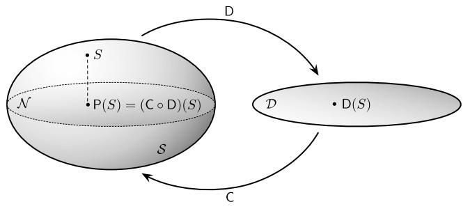  
Fig. 6.1 Illustration of the projection $\mathsf{P}:S\to \mathcal{N}$ that assigns to each system $S$ the sum of its parts, the system $\mathsf{P}(S)$ . The image of this projection constitutes the set $\mathcal{N}$ of non-complex systems

sum of its parts and therefore does not display any complexity. We refer to these systems as non-complex systems and denote their set by $\mathcal{N}$ , that is, $\mathcal{N} := \{S \in S : \mathsf{P}(S) = S\}$ . Note that the utility of this idea within complexity theory strongly depends on the concrete specification of the maps $\mathsf{D}$ and $\mathsf{C}$ . As mentioned above, the right definition of $\mathsf{D}$ incorporates the identification of system parts which is already a fundamental problem.

The above representation of non-complex systems is implicit, and we now derive an explicit representation. Obviously, we have

$$
\mathcal {N} \subseteq \operatorname {i m} (\mathsf {P}) = \left\{\mathsf {P} (S): S \in \mathcal {S} \right\}.
$$

With the following natural assumption, we even have equality, which provides an explicit representation of non-complex systems as the image of the map $\mathsf{P}$ . We assume that the construction of a system from a set of parts in terms of $\mathsf{C}$ does not generate any additional structure. More formally,

$$
(\mathsf {D} \circ \mathsf {C}) \left(S ^ {\prime}\right) = S ^ {\prime} \quad \text {f o r a l l} S ^ {\prime} \in \mathcal {D}.
$$

This implies

$$
\begin{array}{l} \mathsf {P} ^ {2} = (\mathsf {C} \circ \mathsf {D}) \circ (\mathsf {C} \circ \mathsf {D}) \\ = \mathsf {C} \circ (\mathsf {D} \circ \mathsf {C}) \circ \mathsf {D} \\ = \mathsf {C} \circ \mathsf {D} \\ = P. \\ \end{array}
$$

Thus, the above assumption implies that $\mathsf{P}$ is idempotent and we can interpret it as a projection. This yields the explicit representation of the set $\mathcal{N}$ of non-complex systems as the image of $\mathsf{P}$ .

In order to have a quantitative theory of complexity, one needs a divergence $D: S \times S \to \overline{\mathbb{R}}$ which allows us to quantify how much the system $S$ deviates from $\mathsf{P}(S)$ , the sum of its parts. We assume that $D$ is a divergence in the sense that $D(S, S') \geq 0$ ,

and $D(S, S') = 0$ if and only if $S = S'$ (see condition (4.97)). In order to ensure compatibility with $\mathsf{P}$ , one has to further assume that $D$ satisfies

$$
C (S) := D \left(S, \mathsf {P} (S)\right) = \inf  _ {S ^ {\prime} \in \mathcal {N}} D \left(S, S ^ {\prime}\right). \tag {6.1}
$$

Obviously, the complexity $C(S)$ of a system $S$ vanishes if and only if the system $S$ is an element of the set $\mathcal{N}$ of non-complex systems.

# 6.1.2 The Information Distance from Hierarchical Models

# 6.1.2.1 The Information Distance as a Complexity Measure

In this section we want to make precise and explore the general geometric idea described above. We recall the formal setting of composite systems developed in Sect. 2.9. In order to have a notion of parts of a system, we assume that the system consists of a finite node set $V$ and that each node $v$ can be in finitely many states $I_v$ . We model the whole system by a probability measure $p$ on the corresponding product configuration set $I_V = \times_{v \in V} I_v$ . The parts are given by marginals $p_A$ where $A$ is taken from a hypergraph $\mathfrak{S}$ (see Definition 2.13). The decomposition of a probability measure $p$ into parts, corresponding to $\mathsf{D}$ , is given by the map $p \to (p_A)_{A \in \mathfrak{S}}$ , which assigns to $p$ the family of its marginals. The reconstruction of the system from this partial information, which corresponds to $\mathsf{C}$ , is naturally given by the maximum entropy estimate $\hat{p}$ of $p$ . This defines a projection $\mathsf{C} \circ \mathsf{D} = \pi_{\mathfrak{S}} : p \mapsto \hat{p}$ onto the hierarchical model $\mathcal{E}_{\mathfrak{S}}$ which plays the role of the set $\mathcal{N}$ of non-complex systems. If the original system $p$ coincides with its maximum entropy estimate $\hat{p} = \pi_{\mathfrak{S}}(p)$ then $p$ is nothing but the "sum of its parts" and is interpreted as a non-complex system.

In order to quantify complexity, we need a deviation measure that is compatible with the maximum entropy projection $\pi_{\mathfrak{S}}$ . Information geometry suggests to use the KL-divergence, and we obtain the following measure of complexity as one instance of (6.1), which we refer to as $\mathfrak{S}$ -complexity:

$$
D _ {K L} (p \| \mathcal {E} _ {\mathfrak {S}}) := \inf  _ {q \in \mathcal {E} _ {\mathfrak {S}}} D _ {K L} (p \| q) = D _ {K L} \left(p \| \pi_ {\mathfrak {S}} (p)\right). \tag {6.2}
$$

In many examples, this measure of complexity can be expressed in terms of basic information-theoretic quantities (see Example 6.1). Let us recall the definition of those quantities and corresponding rules, which we require for our derivations below. Assume that we have a distribution $p$ on the whole configuration set $I_V$ , and consider the canonical projection $X_A: I_V \to I_A$ which simply restricts any configuration $(i_v)_{v \in V}$ to the sub-configuration $i_A = (i_v)_{v \in A}$ . We define the entropy or Shannon entropy (see (2.179)) of $X_A$ with respect to $p$ as

$$
H _ {p} \left(X _ {A}\right) := - \sum_ {i _ {A} \in I _ {A}} p \left(i _ {A}\right) \log p \left(i _ {A}\right). \tag {6.3}
$$

(With the strict concavity of the Shannon entropy, as defined by (2.179), and the linearity of the map $p \mapsto (p(i_A))_{i_A \in I_A}$ , we obtain the concavity of the Shannon entropy $H_p(X_A)$ as a function of $p$ .) With a second subset $B$ of $V$ , we can define the conditional entropy of $X_B$ given $X_A$ (with respect to $p$ ):

$$
H _ {p} \left(X _ {B} \mid X _ {A}\right) := - \sum_ {i _ {A} \in I _ {A}} p \left(i _ {A}\right) \sum_ {i _ {B} \in I _ {B}} p \left(i _ {B} \mid i _ {A}\right) \log p \left(i _ {B} \mid i _ {A}\right). \tag {6.4}
$$

For a sequence $A_{1},\ldots ,A_{n}$ of subsets of $V$ , we have the following decomposition of the joint entropy in terms of conditional entropies:

$$
H _ {p} \left(X _ {A _ {1}}, \dots , X _ {A _ {n}}\right) = \sum_ {k = 1} ^ {n} H _ {p} \left(X _ {A _ {k}} \mid X _ {A _ {1}}, X _ {A _ {2}}, \dots , X _ {A _ {k - 1}}\right). \tag {6.5}
$$

It follows from the concavity of the Shannon entropy that for two subsets $A$ and $B$ of $V$ , the conditional entropy $H_{p}(X_{B} \mid X_{A})$ is smaller than or equal to the entropy $H_{p}(X_{B})$ . This shows that the following important quantity, the mutual information of $X_{A}$ and $X_{B}$ (with respect to $p$ ), is non-negative:

$$
\begin{array}{l} I _ {p} \left(X _ {A}; X _ {B}\right) := H _ {p} \left(X _ {B}\right) - H _ {p} \left(X _ {B} \mid X _ {A}\right) \\ = \sum_ {i _ {A} \in I _ {A}, i _ {B} \in I _ {B}} p \left(i _ {A}, i _ {B}\right) \log \frac {p \left(i _ {A} , i _ {B}\right)}{p \left(i _ {A}\right) p \left(i _ {B}\right)}. \tag {6.6} \\ \end{array}
$$

With a third subset $C$ of $V$ , we have the conditional mutual information of $X_A$ and $X_B$ given $X_C$ (with respect to $p$ ):

$$
\begin{array}{l} I _ {p} \left(X _ {A}; X _ {B} \mid X _ {C}\right) := H _ {p} \left(X _ {B} \mid X _ {C}\right) - H _ {p} \left(X _ {B} \mid X _ {A}, X _ {C}\right) \\ = \sum_ {i _ {A} \in I _ {A}, i _ {B} \in I _ {B}} p \left(i _ {A}, i _ {B} \mid i _ {C}\right) \log \frac {p \left(i _ {A} , i _ {B} \mid i _ {C}\right)}{p \left(i _ {A} \mid i _ {C}\right) p \left(i _ {B} \mid i _ {C}\right)}. \tag {6.7} \\ \end{array}
$$

Clearly, the conditional mutual information (6.7) reduces to the mutual information (6.6) for $C = \emptyset$ . The (conditional) mutual information is symmetric in $A$ and $B$ , which follows directly from the representation

$$
I _ {p} \left(X _ {A}; X _ {B} \mid X _ {C}\right) = H _ {p} \left(X _ {A} \mid X _ {C}\right) + H _ {p} \left(X _ {B} \mid X _ {C}\right) - H _ {p} \left(X _ {A}, X _ {B} \mid X _ {C}\right). \tag {6.8}
$$

Given a sequence $A_0, A_1, \ldots, A_n$ of subsets of $V$ , we have the following chain rule:

$$
I _ {p} \left(X _ {A _ {1}}, \dots , X _ {A _ {n}}; X _ {A _ {0}}\right) = \sum_ {k = 1} ^ {n} I _ {p} \left(X _ {A _ {k}}; X _ {A _ {0}} \mid X _ {A _ {1}}, X _ {A _ {2}}, \dots , X _ {A _ {k - 1}}\right). \tag {6.9}
$$

We can easily extend the (conditional) mutual information to more than two variables $X_{A}$ and $X_{B}$ using its symmetric version (6.8). More precisely, for a sequence

$A_0, A_1, \ldots, A_n$ of subsets of $V$ , we define the conditional multi-information as

$$
\begin{array}{l} I _ {p} \left(\bigwedge_ {k = 1} ^ {n} X _ {A _ {k}} \mid X _ {A _ {0}}\right) := I _ {p} \left(X _ {A _ {1}}; \dots ; X _ {A _ {n}} \mid X _ {A _ {0}}\right) \\ := \sum_ {k = 1} ^ {n} H _ {p} \left(X _ {A _ {k}} \mid X _ {A _ {0}}\right) - H _ {p} \left(X _ {A _ {1}}, \dots , X _ {A _ {n}} \mid X _ {A _ {0}}\right). \tag {6.10} \\ \end{array}
$$

Here, we prefer the notation with the wedge “ $\wedge$ ” whenever the ordering of the sets $A_{1}, \ldots, A_{n}$ is not naturally given. In the case where $A_{0} = \emptyset$ , this quantity is known as multi-information:

$$
\begin{array}{l} I _ {p} \left(\bigwedge_ {k = 1} ^ {n} X _ {A _ {k}}\right) := I _ {p} \left(X _ {A _ {1}}; \dots ; X _ {A _ {n}}\right) \\ := \sum_ {k = 1} ^ {n} H _ {p} \left(X _ {A _ {k}}\right) - H _ {p} \left(X _ {A _ {1}}, \dots , X _ {A _ {n}}\right). \tag {6.11} \\ \end{array}
$$

We shall frequently use the multi-information for the partition of the set $V$ into its single elements. This quantity has a long history and appears in the literature under various names. The term "multi-information" was introduced by Perez in the late 1980s (see [241]). The multi-information has been used by Studený and Vajnarová [242] in order to study conditional independence models (see Remark 2.4).

After having introduced basic information-theoretic quantities, we now discuss a few relations to the $\mathfrak{S}$ -complexity (6.2). A first relation is given by the fact that the KL-divergence from the maximum entropy estimate $\pi_{\mathfrak{S}}(p)$ can be expressed as a difference of entropies (see Lemma 2.11):

$$
D _ {K L} \left(p \| \pi_ {\mathfrak {S}} (p)\right) = H _ {\pi_ {\mathfrak {S}} (p)} \left(X _ {V}\right) - H _ {p} \left(X _ {V}\right). \tag {6.12}
$$

We can evaluate $D_{KL}(p\| \mathcal{E}_{\mathfrak{S}})$ if we know the maximum entropy estimate of $p$ with respect to $\mathfrak{S}$ . In the following example, we use formula (6.12), in combination with Lemma 2.13, in order to evaluate $D_{KL}(p\| \mathcal{E}_{\mathfrak{S}})$ for various simple cases.

# Example 6.1

(1) Let us begin with the most simple hypergraph, the one that contains the empty subset of $V$ as its only element, that is, $\mathfrak{S} = \{\emptyset\}$ . In that case, the hierarchical model (2.207) consists of the uniform distribution on $I_V$ , and by (6.12) we obtain (cf. (2.178))

$$
D _ {K L} \left(p \| \mathcal {E} _ {\{\emptyset \}}\right) = \log \left| I _ {V} \right| - H _ {p} \left(X _ {V}\right). \tag {6.13}
$$

(2) We now consider the next simple case, where $\mathfrak{S}$ consists of only one subset $A$ of $V$ . In that case, the maximum entropy estimate of $p$ with respect to $\mathfrak{S}$ is

given by

$$
\pi_ {\{A \}} (p) (i _ {A}, i _ {V \setminus A}) = p (i _ {A}) \frac {1}{| I _ {V \setminus A} |}.
$$

This directly implies

$$
D _ {K L} (p \| \mathcal {E} _ {\{A \}}) = \log | I _ {V \backslash A} | - H _ {p} \left(X _ {V \backslash A} \mid X _ {A}\right). \tag {6.14}
$$

Note that this (6.14) reduces to (6.13) for $A = \emptyset$ .

(3) Consider three disjoint subsets $A$ , $B$ , and $C$ that satisfy $V = A \cup B \cup C$ , and define $\mathfrak{S} = \{A \cup C, B \cup C\}$ . Then, by Lemma 2.13, the maximum entropy estimate of a distribution $p$ with respect to $\mathfrak{S}$ is given by

$$
\pi_ {\{A \cup C, B \cup C \}} (p) \left(i _ {A}, i _ {B}, i _ {C}\right) = p \left(i _ {C}\right) p \left(i _ {A} \mid i _ {C}\right) p \left(i _ {B} \mid i _ {C}\right). \tag {6.15}
$$

The conditional distributions $p(i_A|i_C)$ and $p(i_B|i_C)$ on the RHS of (6.15) are only defined for $p(i_C) > 0$ . In line with a general convention, we choose extensions of the involved conditional probabilities to the cases where $p(i_C) = 0$ and denote them by the same symbols. As we multiply by $p(i_C)$ , the joint distribution is independent of this choice. In what follows, we shall apply this convention whenever it is appropriate. Equation (6.15) implies

$$
D _ {K L} \left(p \| \mathcal {E} _ {\{A \cup C, B \cup C \}}\right) = I _ {p} \left(X _ {A}; X _ {B} \mid X _ {C}\right). \tag {6.16}
$$

(4) Consider a sequence $A_0, A_1, \ldots, A_n$ of disjoint subsets of $V$ that satisfies $\bigcup_{k=0}^{n} A_k = V$ , and define $\mathfrak{S} = \{A_k \cup A_0 : k = 1, \ldots, n\}$ . Note that, for $A_0 = \emptyset$ , this hypergraph reduces to the one considered in Example 2.6(1). The maximum entropy estimate of $p$ with respect to $\mathfrak{S}$ is given as

$$
\pi_ {\mathfrak {S}} (p) \left(i _ {A _ {0}}, i _ {A _ {1}}, \dots , i _ {A _ {n}}\right) = p \left(i _ {A _ {0}}\right) \prod_ {k = 1} ^ {n} p \left(i _ {A _ {k}} \mid i _ {A _ {0}}\right), \tag {6.17}
$$

which extends the formula (6.15). As the distance from the hierarchical model $\mathcal{E}_{\mathfrak{S}}$ we obtain the conditional multi-information (6.10):

$$
D _ {K L} (p \| \mathcal {E} _ {\mathfrak {S}}) = I _ {p} \left(X _ {A _ {1}}; \dots ; X _ {A _ {n}} \mid X _ {A _ {0}}\right). \tag {6.18}
$$

(5) The divergence from the hierarchical model $\mathcal{E}^{(k)}$ of Example 2.6(2) quantifies the extent to which $p$ cannot be explained in terms of interactions of maximal order $k$ . Stated differently, it quantifies the extent to which the whole is more than the sum of its parts of size $k$ . In general, this quantity can be easily evaluated only for $k = 1$ . In that case, we recover the multi-information of the individual variables $X_{v}$ , $v \in V$ . We shall return to this example in a moment.

# 6.1.2.2 The Maximization of the Information Distance

We now wish to consider the maximization of the function

$$
D _ {K L} \left(\cdot \| \mathcal {E} _ {\mathfrak {G}}\right): \mathcal {P} \left(I _ {V}\right)\rightarrow \mathbb {R}, \quad p \mapsto D _ {K L} \left(p \| \pi_ {\mathfrak {G}} (p)\right), \tag {6.19}
$$

which we have motivated as a measure of complexity, the $\mathfrak{S}$ -complexity. As shown in Proposition 2.15, this function is continuous and therefore attains its maximal value. In order to highlight the geometric nature of this function, we shall also refer to it as the distance or information distance from the model $\mathcal{E}_{\mathfrak{S}}$ . The problem of maximizing the information distance from an exponential family was initially suggested and analyzed by Ay [19] and further studied in a series of articles by, in particular, Matus, Knauf, and Rauh [28, 175-177, 179, 180, 221]. In [254], previous results of the classical setting have been extended to the context of quantum states. Algorithms for the evaluation of the information distance as a complexity measure for quantum states have been studied in [203]. In that context, the information distance is related to the entanglement of quantum systems as defined in [251].

Let us first approach the problem of maximizing (6.19) from an intuitive perspective. In Sect. 2.8.1, we have defined exponential families, and in particular hierarchical models, as affine subspaces of the open simplex $\mathcal{P}_{+}(I_{V})$ . Therefore, it should always be possible to increase the distance of a point $p$ from such an exponential family as long as $p \in \mathcal{P}_{+}(I_{V})$ . This means that any maximizer $p$ of that distance has to be located in the boundary $\mathcal{P}(I_V) \setminus \mathcal{P}_+(I_V)$ of the full simplex, which implies a restriction of the support of $p$ . This intuition turns out to be correct. The corresponding support reduction is quite strong, depending on the dimension of the exponential family.

Theorem 6.1 (Support bound for maximizers ([19, 179])) Let $\mathfrak{S}$ be a non-empty hypergraph, and let $p$ be a local maximizer of $D_{KL}(\cdot \| \mathcal{E}_{\mathfrak{S}})$ . Then

$$
\left| \operatorname {s u p p} (p) \right| \leq \dim (\mathcal {E} _ {\mathfrak {S}}) + 1 = \sum_ {A \in \overline {{\mathfrak {S}}}} \prod_ {v \in A} \left(| I _ {v} | - 1\right). \tag {6.20}
$$

Proof Let $p$ be a local maximizer of $D_{KL}(\cdot \| \mathcal{E}_{\mathfrak{S}})$ . With the abbreviation $\hat{p} \coloneqq \pi_{\mathfrak{S}}(p)$ , we consider the affine hull $\mathcal{A}_p$ of the preimage $\pi_{\mathfrak{S}}^{-1}(\hat{p})$ , the set $\mathcal{P}_p$ of all distributions in $\mathcal{P}(I_V)$ that have the same support as $p$ , and the intersection $S_p \coloneqq \mathcal{A}_p \cap \mathcal{P}_p$ . Clearly, $S_p$ is relatively open (that is, open in its affine hull) and contains $p$ . The restriction of $D_{KL}(\cdot \| \mathcal{E}_{\mathfrak{S}})$ to the set $S_p$ equals, up to an additive constant, minus the Shannon entropy and is therefore strictly convex (see (6.12)). As $p$ is a local maximizer of this restriction, it has to be an extreme point of $S_p$ , which is only possible if it consists of the single point $p$ , that is, $\mathcal{A}_p \cap \mathcal{P}_p = \{p\}$ . This also implies

$$
\mathcal {A} _ {p} \cap \operatorname {a f f} \mathcal {P} _ {p} = \{p \}, \tag {6.21}
$$

where we denote by aff the affine hull in the vector space $S(I_V)$ of all signed measures. With the dimension formula for affine spaces we obtain

$$
\begin{array}{l} \left| I _ {V} \right| - 1 = \dim \mathcal {P} (I _ {V}) \\ = \dim \operatorname {a f f} \mathcal {P} (I _ {V}) \\ \geq \dim \operatorname {a f f} \left(\mathcal {A} _ {p} \cup \operatorname {a f f} \mathcal {P} _ {p}\right) \\ = \dim \mathcal {A} _ {p} + \dim \operatorname {a f f} \mathcal {P} _ {p} - \underbrace {\dim (\mathcal {A} _ {p} \cap \operatorname {a f f} \mathcal {P} _ {p})} _ {= 0, \text {b y (6 . 2 1)}} \\ = \left(| I _ {V} | - 1 - \dim \mathcal {E} _ {\mathfrak {S}}\right) + \left(| \operatorname {s u p p} (p) | - 1\right). \\ \end{array}
$$

This proves the inequality in (6.20). The equality follows from (2.208).

Theorem 6.1 is one of several results that highlight some simplicity aspects of maximizers of the information distance from a hierarchical model. In particular, one can also show that each maximizer $p$ of $D_{KL}(\cdot \| \mathcal{E}_{\mathfrak{S}})$ coincides with its projection $\pi_{\mathfrak{S}}(p)$ on its support, that is:

$$
p (i) = \lambda \pi_ {\mathfrak {S}} (p) (i), \quad i \in \operatorname {s u p p} (p), \tag {6.22}
$$

where $\lambda$ is a normalization factor. This can be obtained by the evaluation of the gradient of the distance $D_{KL}(\cdot \| \mathcal{E}_{\mathfrak{S}})$ within the open simplex of distributions that have the same support as the local maximizer $p$ . The property (6.22) then follows from the condition that the gradient has to vanish in $p$ . (We omit the explicit proof here and refer to the articles [19, 176, 179].)

For binary nodes, the support reduction (6.20) is quite strong. In that case, the inequality (6.20) becomes $|\operatorname{supp}(p)| \leq |\overline{\mathfrak{S}}|$ . Let us return to the hierarchical models $\mathcal{E}^{(k)}$ introduced in Example 2.6(2) and consider the distance $D_{KL}(p \| \mathcal{E}^{(k)})$ . This distance quantifies the extent to which the distribution $p$ is more than the sum of its parts of size $k$ , that is its marginals of size $k$ . For $k = 1$ , this is nothing but the multi-information (6.11) of the individual variables. Assume that we have $N$ binary nodes and recall the dimension of $\mathcal{E}^{(k)}$ , given by (2.215):

$$
d (N, k) := \sum_ {l = 1} ^ {k} \binom {N} {l}. \tag {6.23}
$$

According to the support reduction of Theorem 6.1, each local maximizer has a support size that is upper bounded by $d(N,k) + 1$ , which equals $N + 1$ for $k = 1$ . Compared with the maximal support size $2^{N}$ of distributions on $N$ binary nodes, this is an extremely strong support reduction. The situation is illustrated in Fig. 6.2.

If we interpret the information distance from $\mathcal{E}_{\mathbb{S}}$ as a measure of complexity, it is natural to address the following problem: What kind of parametrized systems are capable of maximizing their complexity by appropriate adjustment of their parameters? In the context of neural networks, for instance, that would correspond to a

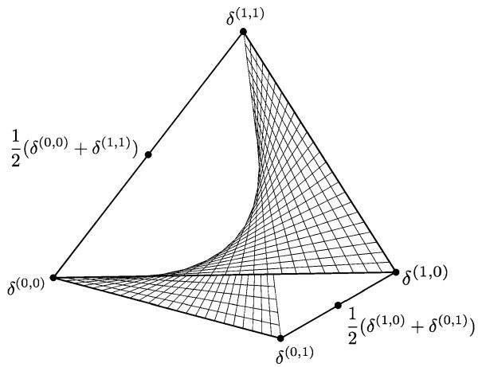  
Fig. 6.2 The three-dimensional simplex and its two-dimensional subfamily of product distributions. The extreme points of the simplex are the Dirac measures $\delta^{(i,j)}$ , $i, j \in \{0,1\}$ . The maximization of the distance from the family of product distributions leads to distributions with support cardinality two. In addition, the maximizers have a very simple structure

learning process by which the neurons adjust their synaptic strengths and threshold values so that the overall complexity of the firing patterns increases. Based on Theorem 6.1, it is indeed possible to construct relatively low-dimensional families that contain all the local maximizers of the information distance.

Theorem 6.2 (Dimension bound for exponential families) There exists an exponential family $\mathcal{E}$ of dimension at most $2(\dim \mathcal{E}_{\mathfrak{S}} + 1)$ that contains all the local maximizers of $D_{KL}(\cdot \| \mathcal{E}_{\mathfrak{S}})$ in its closure.

This statement is a direct implication of the support bound (6.20) and the following lemma.

Lemma 6.1 Let $I$ be a finite set, and let $s \in \mathbb{N}$ , $1 \leq s \leq |I|$ . Then there exists an exponential family $\mathcal{E}_s$ of dimension at most $2s$ such that every distribution with support size smaller than or equal to $s$ is contained in the closure $\overline{\mathcal{E}}_s$ of $\mathcal{E}_s$ .

Proof Consider an injective function $f: I \to \mathbb{R}$ ( $f(i) = f(j)$ implies $i = j$ ). We prove that the functions $f^k \in \mathcal{F}(I), k = 1, \ldots, 2s$ , span an exponential family $\mathcal{E}_s$ so that each distribution with support size smaller than or equal to $s$ is contained in $\overline{\mathcal{E}}_s$ (here, $f^k(i) := (f(i))^k$ ). Let $p \in \mathcal{P}(I)$ with support size smaller than or equal to $s$ . We define the function $g: I \to \mathbb{R}$ ,

$$
i \mapsto g (i) := \prod_ {i ^ {\prime} \in \operatorname {s u p p} (p)} \left(f (i) - f \left(i ^ {\prime}\right)\right) ^ {2} = \sum_ {k = 0} ^ {2 s} \vartheta_ {k} ^ {(0)} f ^ {k} (i).
$$

Obviously, $g \geq 0$ , and $g(i) = 0$ if and only if $i \in \operatorname{supp}(p)$ .

Furthermore, we consider the polynomial $h: \mathbb{R} \to \mathbb{R}$ , $t \mapsto \sum_{k=0}^{s-1} \vartheta_k^{(1)} t^k$ , that satisfies

$$
\sum_ {k = 0} ^ {s - 1} \vartheta_ {k} ^ {(1)} f ^ {k} (i) = h (f (i)) = \log p (i), \quad i \in \operatorname {s u p p} (p).
$$

Obviously, the one parameter family

$$
p _ {\lambda} (i) = \frac {e ^ {h (f (i)) - \lambda g (i)}}{\sum_ {i ^ {\prime} \in I} e ^ {h (f (i ^ {\prime})) - \lambda g (i ^ {\prime})}}
$$

is contained in $\mathcal{E}_s$ . Note that we can ignore the term for $k = 0$ because this gives a constant which cancels out. Furthermore, it is easy to see that

$$
\lim  _ {\lambda \rightarrow \infty} p _ {\lambda} (i) = \lim  _ {\lambda \rightarrow \infty} \frac {e ^ {h (f (i))} \left(e ^ {- g (i)}\right) ^ {\lambda}}{\sum_ {i ^ {\prime} \in I} e ^ {h (f (i ^ {\prime}))} \left(e ^ {- g (i ^ {\prime})}\right) ^ {\lambda}} = p (i). \tag {6.24}
$$

This proves that $p$ is in the closure of the model $\mathcal{E}_s$ .

Applied to the hierarchical models $\mathcal{E}^{(k)}$ , Theorem 6.2 implies that there is an exponential family $\mathcal{E}$ of dimension $2(d(N,k) + 1)$ that contains all the local maximizers of $D_{KL}(\cdot \| \mathcal{E}^{(k)})$ in its closure. Again, for $k = 1$ , that means that we have a $2(N + 1)$ -dimensional exponential family $\mathcal{E}$ in the $(2^N - 1)$ -dimensional simplex $\mathcal{P}(I_V)$ that contains all local maximizers of the multi-information in its closure. This is a quite strong dimensionality reduction. If $N = 10$ , for instance, this means a reduction from $2^{10} - 1 = 1023$ to $2(10 + 1) = 22$ .

We now refine our design of families that contain the local maximizers of complexity by focusing on a particular class of families. The idea is to identify interaction structures that are sufficient for the maximization of complexity by appropriate adjustment of the interaction strengths. More specifically, we concentrate on the class $\mathcal{E}^{(m)}$ of families, given by the interaction order $m$ of the nodes, and ask the following question: What is the minimal order $m$ of interaction so that all (local) maximizers of $D_{KL}(\cdot \| \mathcal{E}^{(k)})$ are contained in the closure of $\mathcal{E}^{(m)}$ ? For $k = 1$ , this problem has been addressed in [28]. It turns out that for $N$ nodes with the same cardinality of state spaces the interaction order $m = 2$ is sufficient for generating the global maximizers of the multi-information. More precisely, if $p$ is a global maximizer of the multi-information then $p$ is contained in the closure of $\mathcal{E}^{(2)}$ . These are the distributions that can be completely described in terms of pairwise interactions, and they include the probability measures corresponding to complete synchronization. In the case of two binary nodes, the maximizers are the measures $\frac{1}{2} (\delta^{(0,0)} + \delta^{(1,1)})$ and $\frac{1}{2} (\delta^{(1,0)} + \delta^{(0,1)})$ in Fig. 6.2. Note, however, that in this low-dimensional case, the closure of $\mathcal{E}^{(2)}$ coincides with the whole simplex of probability measures on $\{0,1\} \times \{0,1\}$ . Therefore, being contained in the closure of $\mathcal{E}^{(2)}$ is a property of all probability measures and not special at all. The situation changes with three binary nodes, where the dimension of the simplex $\mathcal{P}(\{0,1\}^3)$ is seven and the dimension of $\mathcal{E}^{(2)}$ is $d(3,2) = \binom{3}{1} + \binom{3}{2} = 6$ (see dimension formula (6.23)). For general $N$ ,

we have $d(N,2) = \binom{N}{1} + \binom{N}{2} = \frac{N(N+1)}{2}$ . Considering again the case $N = 10$ , we obtain this time a dimensionality reduction from $2^{10} - 1 = 1023$ to $\frac{10(10+1)}{2} = 55$ . Note, however, that in contrast to the above construction of an exponential family $\mathcal{E}$ according to Theorem 6.2, here we require that only the global maximizers of the multi-information are contained in the closure of the constructed exponential family.

For general $k$ , the above question can be addressed using the following result of Kahle [145]:

$$
\left| \operatorname {s u p p} (p) \right| \leq s, m \geq \log_ {2} (s + 1) \Rightarrow p \in \overline {{\mathcal {E} ^ {(m)}}}. \tag {6.25}
$$

If $m \geq \log_2(d(N, k) + 2)$ then, according to (6.25) and with the use of (6.20), all the maximizers of $D_{KL}(\cdot \| \mathcal{E}^{(k)})$ will be in the closure of $\mathcal{E}^{(m)}$ . For instance, if $N = 10$ , all maximizers of the multi-information will be contained in the closure of $\mathcal{E}^{(4)}$ , and we have a reduction from $2^{10} - 1 = 1023$ to $d(10, 4) = \binom{10}{1} + \binom{10}{2} + \binom{10}{3} + \binom{10}{4} = 385$ . This means that by increasing the number of parameters from 55, the number that we obtained above for pairwise interactions, to 385, we can approximate not only the global but also the local maximizers of the multi-information in terms of interactions of order four.

Let us explore the implications of the presented results in view of the interpretation of $D_{KL}(\cdot \parallel \mathcal{E}_{\mathfrak{S}})$ as a complexity measure. Clearly, they reveal important aspects of the structure of complex systems, which allows us to understand and control complexity. In fact, the design of low-dimensional systems that are capable of generating all distributions with maximal complexity was the initial motivation for the problems discussed in this section. The resulting design principles have been employed, in particular, in the context of learning systems (see [21, 29, 185]). However, despite this constructive use of the simple structural constraints of complexity, we have to face the somewhat paradoxical fact that the most complex systems, with respect to the information distance from a hierarchical model, are in a certain sense rather simple. Let us highlight this fact further. Say that we have 1000 binary nodes, that is, $N = 1000$ . As follows from the discussion above, interaction of order ten is sufficient for generating all distributions with locally maximal multi-information $D_{KL}(\cdot \parallel \mathcal{E}^{(1)})$ ( $10 = \log_2(1024) \geq \log_2(1000 + 2) = \log_2(d(1000, 1) + 2)$ ). This means that a system of size 1000 with (locally) maximal distance from the sum of its elements (parts of size 1) is not more than the sum of its parts of size 10. In view of our understanding of complexity as the extent to which the system is more than the sum of its parts of any size, it appears inconsistent to consider these maximizers of multi-information as complex (nevertheless, in the thermodynamic limit, systems with high multi-information exhibit features of complexity related to phase transitions [94]). One would assume that complexity is reflected in terms of interactions up to the highest order (see [146], which analyzes coupled map lattices and cellular automata from this perspective). Trying to resolve this apparent inconsistency by maximizing the distance $D_{KL}(\cdot \parallel \mathcal{E}^{(2)})$ from the larger exponential family $\mathcal{E}^{(2)}$ instead of maximizing the multi-information $D_{KL}(\cdot \parallel \mathcal{E}^{(1)})$ does not lead very far. We can repeat the argument and observe that interaction of order 19 is now sufficient for generating all the corresponding maximizers: A system of size 1000 with

maximal deviation from the sum of its parts of size two is not more than the sum of its parts of size 19. Following the work [32], we now introduce a modification of the divergence from a hierarchical model, which can handle this problem. Furthermore, we demonstrate the consistency of this modification with known complexity measures.

Remark 6.1 Before embarking on that, let us embed the preceding into the general perspective offered by Theorem 2.8. That theorem offers some options for reducing uncertainty. On the one hand, we could keep the functions $f_{k}$ and their expectation values and thus the mixture family $\mathcal{M}$ (2.161) fixed. This then also fixes the maximum entropy estimate $\hat{\mu}$ , and we could then search in $\mathcal{M}$ for the $\mu$ that maximizes the entropy difference, that is, the Kullback-Leibler divergence (2.180) from the exponential family. That is, imposing additional structure on $\mu$ will reduce our uncertainty. This is what we have just explored.

On the other hand, we could also introduce further observables $f_{\ell}$ and record their expectation values. That would shrink the mixture family $\mathcal{M}$ . Consequently, the minimization in Theorem 2.8 will also get more constrained, and the projection $\hat{\mu}$ may get smaller entropy. That is, further knowledge (about expectation values of observables in the present case) will reduce our uncertainty. This is explored in [134].

# 6.1.3 The Weighted Information Distance

# 6.1.3.1 The General Scheme

In order to best see the general principle, we consider a hierarchy of hypergraphs

$$
\mathfrak {S} _ {1} \subseteq \mathfrak {S} _ {2} \subseteq \dots \subseteq \mathfrak {S} _ {N - 1} \subseteq \mathfrak {S} _ {N} := 2 ^ {V} \tag {6.26}
$$

and denote the projection $\pi_{\mathfrak{S}_k}$ on $\mathcal{E}_{\mathfrak{S}_k}$ by $p^{(k)}$ . Then the Pythagorean relation (4.62) of the relative entropy implies

$$
D _ {K L} \left(p ^ {(l)} \| p ^ {(m)}\right) = \sum_ {k = m} ^ {l - 1} D _ {K L} \left(p ^ {(k + 1)} \| p ^ {(k)}\right), \tag {6.27}
$$

for $l, m = 1, \ldots, N - 1, m < l$ . In particular, we have

$$
D _ {K L} \left(p \| p ^ {(1)}\right) = \sum_ {k = 1} ^ {N - 1} D _ {K L} \left(p ^ {(k + 1)} \| p ^ {(k)}\right). \tag {6.28}
$$

We shall use the same notation $p^{(k)}$ for various hierarchies of hypergraphs. Although being clear from the given context, the particular meaning of these distributions will change throughout our presentation.

Equation (6.27) shows a very important principle. The projections in the family (6.26) can be decomposed into projections between the intermediate levels. This also suggests a natural generalization of the information distance from a hierarchical model, to give suitable weights to those intermediate projections. As we shall see, this gain of generality will allow us to capture several complexity measures proposed in the literature by a unifying principle. Thus, instead of (6.27) we consider a weighted sum with a weight vector $\alpha = (\alpha_{1},\dots,\alpha_{N - 1})\in \mathbb{R}^{N - 1}$ and set:

$$
\begin{array}{l} C _ {\alpha} (p) := \sum_ {k = 1} ^ {N - 1} \alpha_ {k} D _ {K L} \left(p \| p ^ {(k)}\right) (6.29) \\ = \sum_ {k = 1} ^ {N - 1} \beta_ {k} D _ {K L} \left(p ^ {(k + 1)} \| p ^ {(k)}\right), (6.30) \\ \end{array}
$$

with $\beta_{k} := \sum_{l=1}^{k} \alpha_{l}$ . Specifying a particular complexity measure then simply means to employ specific assumptions to set those weights for the contributions $D_{KL}(p^{(k+1)} \| p^{(k)})$ . We might decide to put some of these weights to 0, but they should be at least nonnegative. As one sees directly, the sequence $\beta_{k}$ is (strictly) increasing with $k$ if and only if all the $\alpha_{k}$ are nonnegative (positive).

We shall now explore several weight schemes.

# 6.1.3.2 The Size Hierarchy of Subsets: The TSE-Complexity

As hierarchy (6.26) of hypergraphs we choose

$$
\mathfrak {S} _ {k} = \left( \begin{array}{c} V \\ k \end{array} \right), \quad k = 1, \dots , N. \tag {6.31}
$$

The corresponding hierarchical models $\mathcal{E}^{(k)}$ are the ones introduced in Example 2.6(2). In order to explore the family (6.29) of weighted complexity measures we have to evaluate the terms $D_{KL}(p\parallel p^{(k)})$ . For $k = 1$ , this is the multi-information of the individual nodes, which can be easily computed. However, the situation is more difficult for $2\leq k\leq N - 1$ . There is no explicit expression for $p^{(k)}$ in these cases. The iterative scaling method provides an algorithm that converges to $p^{(k)}$ (see [78, 79]). In the limit, this algorithm would allow us to approximate the term $D_{KL}(p\parallel p^{(k)})$ with any desired accuracy. In this section, however, we wish to follow a different path. The reason is that we want to relate the weighted complexity measure (6.29) to a measure of complexity that has been proposed by Tononi, Sporns, and Edelman [245]. We refer to this measure as TSE-complexity and aim to identify appropriate weights in (6.29) for such a relation. In order to do so, we first estimate the entropy of $p^{(k)}$ and then use (6.12) for a corresponding estimate of the distance $D_{KL}(p\parallel p^{(k)})$ . More precisely, we wish to provide an upper bound for the entropy

of $p^{(k)}$ . In order to do so, we consider the average entropy of subsets of size $k$ ,

$$
H _ {p} (k) := \frac {1}{\binom {N} {k}} \sum_ {\substack {A \subseteq V \\ | A | = k}} H _ {p} \left(X _ {A}\right), \tag{6.32}
$$

and analyze the way this quantity depends on $k$ , with fixed probability measure $p$ . This analysis yields the following observation: if we scale up the average entropy $H_{p}(k)$ by a factor $N / k$ , corresponding to the system size, we obtain an upper bound of the entropy of $p^{(k)}$ . This clearly provides the upper bound

$$
C _ {p} ^ {(k)} := \frac {N}{k} H _ {p} (k) - H _ {p} (N) \tag {6.33}
$$

of the distance $D_{KL}(p\parallel p^{(k)})$ . The explicit derivations actually imply a sharper bound. However, $C_p^{(k)}$ is of particular interest here as it is related to the TSE-complexity. We shall first derive the mentioned bounds, summarized below in Theorem 6.3, and then come back to this measure of complexity.

As a first step, we show that the difference between $H_{p}(k)$ and $H_{p}(k - 1)$ can be expressed as an average of conditional entropies, proving that $H_{p}(k)$ is increasing in $k$ . In what follows, we will simplify the notation and neglect the subscript $p$ whenever appropriate.

# Proposition 6.1

$$
H _ {p} (k) - H _ {p} (k - 1) = \frac {1}{N} \sum_ {v \in V} \frac {1}{\binom {N - 1} {k - 1}} \sum_ {\substack {A \subseteq V \setminus \{v \} \\ | A | = k - 1}} H _ {p} \left(X _ {v} \mid X _ {A}\right) =: h _ {p} (k). \tag{6.34}
$$

Proof

$$
\begin{array}{l} h_{p}(k) = \frac{1}{N}\sum_{v\in V}\frac{1}{\binom{N - 1}{k - 1}}\sum_{\substack{A\subseteq V\setminus \{v\} \\ |A| = k - 1}}H_{p}(X_{v}|X_{A}) \\ = \frac{1}{N}\sum_{v\in V}\frac{1}{\binom{N - 1}{k - 1}}\sum_{\substack{A\subseteq V\setminus \{v\} \\ |A| = k - 1}}\big(H_{p}(X_{v},X_{A}) - H_{p}(X_{A})\big) \\ = \frac{k}{N\binom{N - 1}{k - 1}}\sum_{\substack{A\subseteq V\\ |A| = k}}H_{p}(X_{A}) - \frac{N - (k - 1)}{N\binom{N - 1}{k - 1}}\sum_{\substack{A\subseteq V\\ |A| = k - 1}}H_{p}(X_{A}) \\ = \frac{1}{\binom{N}{k}}\sum_{\substack{A\subseteq V\\ |A| = k}}H_{p}(X_{A}) - \frac{1}{\binom{N}{k - 1}}\sum_{\substack{A\subseteq V\\ |A| = k - 1}}H_{p}(X_{A}) \\ = H _ {p} (k) - H _ {p} (k - 1). \\ \end{array}
$$

As a next step, we now show that differences between the averaged conditional entropies $h_p(k)$ and $h_p(k + 1)$ can be expressed as an average of conditional mutual informations.

# Proposition 6.2

$$
h_{p}(k) - h_{p}(k + 1) = \frac{1}{N(N - 1)}\sum_{\substack{v,w\in V\\ v\neq w}}\frac{1}{\binom{N - 2}{k - 1}}\sum_{\substack{A\subseteq V\setminus \{v,w\} \\ |A| = k - 1}}I_{p}(X_{v};X_{w}|X_{A}).
$$

Proof

$$
\begin{array}{l} \frac{1}{N(N - 1)}\sum_{\substack{v,w\in V\\ v\neq w}}\frac{1}{\binom{N - 2}{k - 1}}\sum_{\substack{A\subseteq V\setminus \{v,w\} \\ |A| = k - 1}}I_{p}(X_{v};X_{w}|X_{A}) \\ = \frac{1}{N(N - 1)}\sum_{\substack{v,w\in V\\ v\neq w}}\frac{1}{\binom{N - 2}{k - 1}}\sum_{\substack{A\subseteq V\setminus \{v,w\} \\ |A| = k - 1}}\big(H_{p}(X_{v}|X_{A}) - H_{p}(X_{v}|X_{w},X_{A})\big) \\ = \frac{1}{N}\sum_{v\in V}\frac{N - k}{(N - 1)\binom{N - 2}{k - 1}}\sum_{\substack{A\subseteq V\setminus \{v\} \\ |A| = k - 1}}H_{p}(X_{v}|X_{A}) \\ -\frac{1}{N}\sum_{v\in V}\frac{k}{(N - 1)^{\binom{N - 2}{k - 1}}}\sum_{\substack{A\subseteq V\setminus \{v\} \\ |A| = k}}H_{p}(X_{v}|X_{A}) \\ = h _ {p} (k) - h _ {p} (k + 1). \\ \end{array}
$$

Since conditional mutual informations are positive, we can conclude that $h(k + 1) \leq h(k)$ , i.e., the $H(k)$ form a monotone and concave sequence as shown in Fig. 6.3. In particular, we have

$$
H _ {p} (N) \leq H _ {p} (k) + (N - k) h _ {p} (k). \tag {6.35}
$$

As the RHS of this inequality only depends on the entropies of the $k$ - and $(k - 1)$ -marginals, it will not change if we replace $p$ by the maximum entropy estimate $p^{(k)}$ on the LHS of this inequality. This gives us

$$
H _ {p ^ {(k)}} \left(X _ {V}\right) \leq H _ {p} (k) + (N - k) h _ {p} (k). \tag {6.36}
$$

This also provides an upper bound for the distance

$$
D _ {K L} \left(p \| p ^ {(k)}\right) = H _ {p ^ {(k)}} \left(X _ {V}\right) - H _ {p} \left(X _ {V}\right) \tag {6.37}
$$

as

$$
D _ {K L} \left(p \| p ^ {(k)}\right) \leq H _ {p} (k) + (N - k) h _ {p} (k) - H _ {p} (N). \tag {6.38}
$$

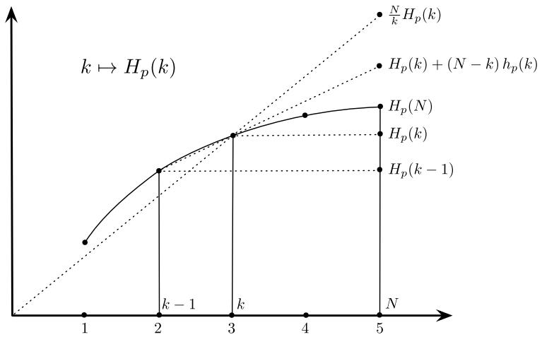  
Fig. 6.3 The average entropy of subsets of size $k$ grows with $k$ . $C_p^{(k)}$ can be considered to be an estimate of the system entropy $H_{p}(N)$ based on the assumption of a linear growth through $H_{p}(k)$

The estimates (6.36) and (6.38) involve the entropies of marginals of size $k$ as well as $k - 1$ . In order to obtain an upper bound that only depends on the entropies of $k$ -marginals, we express $H(k)$ as the sum of differences:

$$
H _ {p} (k) = \sum_ {l = 1} ^ {k} h _ {p} (l)
$$

with the convention $H_{p}(0) = 0$ . With Proposition 6.2 we immediately obtain

$$
H _ {p} (k) = \sum_ {l = 1} ^ {k} h _ {p} (l) \geq k h _ {p} (k) \geq k h _ {p} (k + 1). \tag {6.39}
$$

The estimates (6.36) and (6.38) now imply estimates that are weaker but only depend on marginal entropies of subsets of size $k$ :

Theorem 6.3 For all $k,1\leq k\leq N$ , we have

$$
H _ {p ^ {(k)}} (X _ {V}) \leq \frac {N}{k} H _ {p} (k), \qquad D _ {K L} \big (p \| p ^ {(k)} \big) \leq \frac {N}{k} H _ {p} (k) - H _ {p} (N) = C _ {p} ^ {(k)},
$$

where equality holds for $k = 1$ and $k = N$ .

The second inequality of this theorem states that the $C_p^{(k)}$ can be considered as an upper estimate of those dependencies $D_{KL}(p\parallel p^{(k)})$ that cannot be described in terms of interactions up to order $k$ . The following result shows that the $C_p^{(k)}$ are also monotonically decreasing.

# Corollary 6.1

$$
C _ {p} ^ {(k)} \leq C _ {p} ^ {(k - 1)}.
$$

Proof

$$
\begin{array}{l} C _ {p} ^ {(k)} - C _ {p} ^ {(k - 1)} = \frac {N}{k} H _ {p} (k) - H _ {p} (N) - \frac {N}{k - 1} H _ {p} (k - 1) + H _ {p} (N) \\ = \frac {N}{k} \left(H _ {p} (k) - H _ {p} (k - 1) - \frac {1}{k - 1} H _ {p} (k - 1)\right) \\ = \frac {N}{k} \left(h _ {p} (k) - \frac {1}{k - 1} H _ {p} (k - 1)\right) \\ \leq 0 \quad \text {s i n c e} H _ {p} (k - 1) \geq (k - 1) h _ {p} (k). \\ \end{array}
$$

After having derived the $C_p^{(k)}$ as an upper bound of the distances $D_{KL}(p\parallel p^{(k)})$ , we can now understand the TSE-complexity. It can be expressed as a weighted sum

$$
C _ {p} := \sum_ {k = 1} ^ {N - 1} \frac {k}{N} C _ {p} ^ {(k)}. \tag {6.40}
$$

If we pursue the analogy between $D_{KL}(p\parallel p^{(k)})$ and $C_p^{(k)}$ further, we can interpret the TSE-complexity as being one candidate within the general class (6.29) of complexity measures with weights $\alpha_{k} = \frac{k}{N}$ .

# 6.1.3.3 The Length Hierarchy of Subintervals: The Excess Entropy

In this section, we consider a stochastic process $X = (X_{1},X_{2},\ldots ,X_{N},\ldots)$ with finite state set $I$ and distribution $P$ . Here, the node set $V = \mathbb{N}$ plays the role of time. For each $N\in \mathbb{N}$ we have the probability measure $p\in \mathcal{P}(I^N)$ defined by

$$
p _ {N} \left(i _ {1}, \dots , i _ {N}\right) := P \left(X _ {1} = i _ {1}, \dots , X _ {N} = i _ {N}\right), \quad i _ {1}, \dots , i _ {N} \in I.
$$

With the time order, we can now consider the hypergraph of intervals of length $k$ , the connected subsets of size $k$ . This is different from the corresponding hypergraph of the previous section, the set of all subsets with size $k$ . In particular, in contrast to the previous section, it is now possible to explicitly evaluate the maximum entropy estimate $p^{(k)}$ and the corresponding terms $D_{KL}(p\parallel p^{(k)})$ and $D_{KL}(p^{(k + 1)}\parallel p^{(k)})$ for the hypergraphs of intervals. In what follows, we first present the corresponding derivations in more detail. After that, we will relate the weighted complexity (6.30) to the excess entropy, a well-known complexity measure for stochastic processes (see [68]), by appropriate choice of the weights $\beta_{k}$ . The excess entropy is natural because it measures the amount of information that is necessary to perform

an optimal prediction. It is also known as effective measure complexity [111] and as predictive information [47].

We use the interval notation $[r,s] = \{r,r + 1,\ldots ,s\}$ and $X_{[r,s]} = i_{[r,s]}$ for $X_{r} = i_{r},X_{r + 1} = i_{r + 1},\ldots ,X_{s} = i_{s}$ . We consider the family of hypergraphs

$$
\mathfrak {S} _ {N, k + 1} := \{[ r, s ] \subseteq [ 1, N ]: s - r = k \}, \quad 0 \leq k \leq N - 1. \tag {6.41}
$$

The corresponding hierarchical models $\mathcal{E}_{\mathfrak{S}_{N,k + 1}}\subseteq \mathcal{P}(I^N)$ represent the Markov processes of order $k$ . As the following proposition shows, the maximum entropy projection coincides with the $k$ -order Markov approximation of the process $X_{[1,N]}$ .

Proposition 6.3 Let $X_1, X_2, \ldots, X_N$ be random variables in a non-empty and finite state set $I$ with joint probability vector $p \in \mathcal{P}(I^N)$ , and let $p^{(k)}$ denote the maximum entropy estimate of $p$ with respect to $\mathfrak{S}_{N,k+1}$ . Then

$$
p ^ {(k + 1)} \left(i _ {1}, \dots , i _ {N}\right) = p \left(i _ {1}, \dots , i _ {k + 1}\right) \prod_ {l = 2} ^ {N - k} p \left(i _ {k + l} \mid i _ {l}, \dots , i _ {k + l - 1}\right), \tag {6.42}
$$

$$
D _ {K L} \left(p \| p ^ {(k + 1)}\right) = \sum_ {l = 1} ^ {N - k - 1} I _ {p} \left(X _ {[ 1, l ]}; X _ {k + l + 1} \mid X _ {[ l + 1, k + l ]}\right). \tag {6.43}
$$

Proof The distribution in (6.42) factorizes according to the hypergraph $\mathfrak{S}_{N,k+1}$ . Therefore, according to Lemma 2.13, we have to prove that the $A$ -marginal of the distribution in (6.42) coincides with the $A$ -marginal of $p$ for all maximal intervals $A \in \mathfrak{S}_{N,k+1}$ . Let $s \geq k+1$ and $r = s - k$ , that is, $s - r = k$ .

$$
\begin{array}{l} \sum_ {i _ {1}, \dots , i _ {r - 1}} \sum_ {i _ {s + 1}, \dots , i _ {N}} p (i _ {1}, \dots , i _ {k + 1}) \prod_ {l = 2} ^ {N - k} p (i _ {k + l} | i _ {l}, \dots , i _ {k + l - 1}) \\ = \sum_ {i _ {1}, \ldots , i _ {r - 1}} p (i _ {1}, \ldots , i _ {k + 1}) \prod_ {l = 2} ^ {s - k} p (i _ {k + l} | i _ {l}, \ldots , i _ {k + l - 1}) \\ \times \underbrace {\sum_ {i _ {s + 1} , \dots , i _ {N}} \prod_ {l = s - k + 1} ^ {N - k} p (i _ {k + l} | i _ {l} , \dots , i _ {k + l - 1})} _ {= 1} \\ = \sum_ {i _ {2}, \dots , i _ {r - 1}} \left(\sum_ {i _ {1}} p (i _ {1}, \dots , i _ {k + 1})\right) \prod_ {l = 2} ^ {s - k} p (i _ {k + l} | i _ {l}, \dots , i _ {k + l - 1}) \\ = \sum_ {i _ {2}, \dots , i _ {r - 1}} p (i _ {2}, \dots , i _ {k + 1}) \prod_ {l = 2} ^ {s - k} p (i _ {k + l} | i _ {l}, \dots , i _ {k + l - 1}) \\ \end{array}
$$

$$
\begin{array}{l} = \sum_ {i _ {2}, \dots , i _ {r - 1}} p (i _ {2}, \dots , i _ {k + 1}) p (i _ {k + 2} | i _ {2}, \dots , i _ {k + 1}) \prod_ {l = 3} ^ {s - k} p (i _ {k + l} | i _ {l}, \dots , i _ {k + l - 1}) \\ = \sum_ {i _ {3}, \dots , i _ {r - 1}} \left(\sum_ {i _ {2}} p (i _ {2}, \dots , i _ {k + 2})\right) \prod_ {l = 3} ^ {s - k} p (i _ {k + l} | i _ {l}, \dots , i _ {k + l - 1}) \\ = \sum_ {i _ {3}, \dots , i _ {r - 1}} p (i _ {3}, \dots , i _ {k + 2}) \prod_ {l = 3} ^ {s - k} p (i _ {k + l} | i _ {l}, \dots , i _ {k + l - 1}) \\ \end{array}
$$

$$
\begin{array}{l} \vdots \qquad \qquad \vdots \\ = \left(\sum_ {i _ {r - 1}} p (i _ {r - 1}, \dots , i _ {k + r - 1})\right) \prod_ {l = r} ^ {s - k} p (i _ {k + l} | i _ {l}, \dots , i _ {k + l - 1}) \\ = p \left(i _ {r}, \dots , i _ {k + r - 1}\right) p \left(i _ {s} \mid i _ {r}, \dots , i _ {k + r - 1}\right) \\ = p (i _ {r}, \dots , i _ {s}). \\ \end{array}
$$

Equation (6.43) is a direct implication of (6.42).

We have the following special cases of (6.42):

$$
p ^ {(1)} (i _ {1}, \dots , i _ {N}) = \prod_ {l = 1} ^ {N} p (i _ {l}),
$$

$$
p ^ {(2)} (i _ {1}, \dots , i _ {N}) = p (i _ {1}) p (i _ {2} | i _ {1}) \dots p (i _ {N} | i _ {N - 1}),
$$

$$
p ^ {(N)} (i _ {1}, \dots , i _ {N}) = p (i _ {1}, \dots , i _ {N}).
$$

Proposition 6.4 In the situation of Proposition 6.3 we have

$$
D _ {K L} \left(p ^ {(k + 1)} \| p ^ {(k)}\right) = \sum_ {l = 1} ^ {N - k} I _ {p} \left(X _ {k + l}; X _ {l} \mid X _ {[ l + 1, k + l - 1 ]}\right), \quad 1 \leq k \leq N - 1. \tag {6.44}
$$

If the process is stationary, the RHS of (6.44) equals $(N - k)I_{p}(X_{1};X_{k + 1}\mid X_{[2,k]})$

Proof

$$
\begin{array}{l} D _ {K L} \left(p ^ {(k + 1)} \| p ^ {(k)}\right) \\ = D _ {K L} \left(p \| p ^ {(k)}\right) - D _ {K L} \left(p \| p ^ {(k + 1)}\right) \\ = \sum_ {l = 2} ^ {N - k} I _ {p} (X _ {[ 1, l ]}; X _ {k + l} | X _ {[ l + 1, k + l - 1 ]}) + I _ {p} (X _ {1}; X _ {k + 1} | X _ {[ 2, k ]}) \\ \end{array}
$$

$$
\begin{array}{l} - \sum_ {l = 1} ^ {N - k - 1} I _ {p} \left(X _ {[ 1, l ]}; X _ {k + l + 1} \mid X _ {[ l + 1, k + l ]}\right) \\ = \sum_ {l = 1} ^ {N - k - 1} I _ {p} \left(X _ {[ 1, l + 1 ]}; X _ {k + l + 1} \mid X _ {[ l + 2, k + l ]}\right) + I _ {p} \left(X _ {1}; X _ {k + 1} \mid X _ {[ 2, k ]}\right) \\ - \sum_ {l = 1} ^ {N - k - 1} I _ {p} \left(X _ {[ 1, l ]}; X _ {k + l + 1} \mid X _ {[ l + 1, k + l ]}\right) \\ = \sum_ {l = 1} ^ {N - k - 1} \left\{\left(H _ {p} \left(X _ {k + l + 1} \mid X _ {[ l + 2, k + l ]}\right) - H _ {p} \left(X _ {k + l + 1} \mid X _ {[ 1, k + l ]}\right)\right) \right. \\ \left. - \left(H _ {p} \left(X _ {k + l + 1} \mid X _ {[ l + 1, k + l ]}\right) - H _ {p} \left(X _ {k + l + 1} \mid X _ {[ 1, k + l ]}\right)\right) \right\} \\ + I _ {p} \left(X _ {1}; X _ {k + 1} \mid X _ {[ 2, k ]}\right) \\ = \sum_ {l = 1} ^ {N - k - 1} I _ {p} \left(X _ {k + l + 1}; X _ {l + 1} \mid X _ {[ l + 2, k + l ]}\right) + I _ {p} \left(X _ {1}; X _ {k + 1} \mid X _ {[ 2, k ]}\right) \\ = \sum_ {l = 0} ^ {N - k - 1} I _ {p} \left(X _ {k + l + 1}; X _ {l + 1} \mid X _ {[ l + 2, k + l ]}\right) \\ = \sum_ {l = 1} ^ {N - k} I _ {p} \left(X _ {k + l}; X _ {l} \mid X _ {[ l + 1, k + l - 1 ]}\right) \\ = (N - k) I _ {p} \left(X _ {1}; X _ {k + 1} \mid X _ {[ 2, k ]}\right) \quad (\text {i f}) \\ \end{array}
$$

We now come back to the complete stochastic process $X = (X_{1},X_{2},\ldots ,X_{N},\ldots)$ with time set $\mathbb{N}$ . In order to define the excess entropy of this process, we assume that it is stationary in the sense that its distribution is invariant with respect to the shift map $(i_1,i_2,\dots)\mapsto (i_2,i_3,\dots)$ . The uncertainty about the outcome of a single variable $X_N$ is given by the marginal entropy $H_{p}(X_{N})$ . The uncertainty about the outcome of the same variable, given that the outcomes of the past $N - 1$ variables are known, is quantified by the conditional entropy

$$
h _ {p} \left(X _ {N}\right) := H _ {p} \left(X _ {N} \mid X _ {1}, \dots , X _ {N - 1}\right).
$$

The stationarity of $X$ implies that the sequence $h_p(X_N)$ is decreasing in $N$ , and we can define the limit

$$
h _ {p} (X) := \lim  _ {N \rightarrow \infty} h _ {p} \left(X _ {N}\right) = \lim  _ {N \rightarrow \infty} \frac {1}{N} H _ {p} \left(X _ {1}, \dots , X _ {N}\right), \tag {6.45}
$$

which is called the entropy rate or Kolmogorov-Sinai entropy of the process $X$ . The excess entropy of the process with the entropy rate $h_p(X)$ is then defined as

$$
\begin{array}{l} E _ {p} (X) := \lim _ {N \to \infty} \sum_ {k = 1} ^ {N} \big (h _ {p} (X _ {k}) - h _ {p} (X) \big) \\ = \lim  _ {N \rightarrow \infty} \left(H _ {p} \left(X _ {1}, \dots , X _ {N}\right) - N h _ {p} (X)\right). \tag {6.46} \\ \end{array}
$$

It measures the non-extensive part of the entropy, i.e., the amount of entropy of each element that exceeds the entropy rate. In what follows, we derive a representation of the excess entropy $E_{p}(X)$ in terms of the general structure (6.30). In order to do so, we employ the following alternative representation of the excess entropy [68, 111]:

$$
E _ {p} (X) = \sum_ {k = 1} ^ {\infty} k I _ {p} \left(X _ {1}; X _ {k + 1} \mid X _ {[ 2, k ]}\right). \tag {6.47}
$$

We apply Proposition 6.4 to this representation and obtain

$$
\begin{array}{l} E _ {p} (X) = \sum_ {k = 1} ^ {\infty} k I _ {p} \left(X _ {1}; X _ {k + 1} \mid X _ {[ 2, k ]}\right) = \lim  _ {N \rightarrow \infty} \sum_ {k = 1} ^ {N - 1} k I _ {p} \left(X _ {1}; X _ {k + 1} \mid X _ {[ 2, k ]}\right) \\ = \lim _ {N \to \infty} \sum_ {k = 1} ^ {N - 1} \frac {k}{N - k} (N - k) I _ {p} (X _ {1}; X _ {k + 1} | X _ {[ 2, k ]}) \\ = \lim  _ {N \to \infty} \underbrace {\sum_ {k = 1} ^ {N - 1} \frac {k}{N - k} D _ {K L} \big (p _ {N} ^ {(k + 1)} \| p _ {N} ^ {(k)} \big)} _ {=: E _ {p} (X _ {N})}. \\ \end{array}
$$

Thus, we have finally obtained a representation of quantities $E_{p}(X_{N})$ that have the structure (6.30) and converge to the excess entropy. The corresponding weights $\beta_{k} = \frac{k}{N - k}$ are strictly increasing with $k$ . This implies weights $\alpha_{k} = \frac{N}{(N - k)(N - k + 1)}$ for the representation (6.29).

Let us conclude with a summary of Sect. 6.1.3 and an outlook. We have proposed a general structure of weighted complexity measures, through (6.29) and (6.30), as an extension of the information distance that we have studied in Sect. 6.1.2. The basic idea is to decompose the unweighted information distance in terms of a given hierarchy (6.26) of hypergraphs using the Pythagorean relation and then to weight the individual terms appropriately. This very general ansatz allows us to show that the TSE-complexity and the excess entropy can be interpreted as examples within that scheme. The corresponding weights are quite reasonable but do not reveal a general principle for the right choice of the weights that would determine a natural complexity measure, given a hierarchy of hypergraphs. One reason for that is the

fact that the two hierarchies considered in these examples have quite different properties. A principled study is required for a natural assignment of weights to a given hierarchy of hypergraphs.

# 6.1.4 Complexity of Stochastic Processes

In this section, we extend our study of Sect. 6.1.2 to the context of interacting stochastic processes. In order to motivate the information distance as a complexity measure, we first decompose the multi-information rate of these processes into various directed information flows that are closely related to Schreiber's transfer entropy [40, 232] and Massay's directed information [170-172]. We then interpret this decomposition in terms of information geometry, leading to an extension of $\mathfrak{S}$ -complexity to the context of Markov kernels. This section is based on the works [18, 22].

# 6.1.4.1 Multi-Information Rate, Transfer Entropy, and Directed Information

In order to simplify the arguments we first consider only a pair $X_{k}, Y_{k}, k = 1,2,\ldots$ , of stochastic processes which we denote by $X$ and $Y$ . Below we present the straightforward extension to more than two processes. Furthermore, we use the notation $X^{k}$ for the random vector $(X_{1},\dots,X_{k})$ and similarly $i^{k}$ for the particular outcome $(i_{1},\dots,i_{k})$ .

For a given time $n \in \mathbb{N}$ , we define the normalized mutual information as

$$
\begin{array}{l} \Im \left(X ^ {n} \wedge Y ^ {n}\right) \\ := \frac {1}{n} I \left(X ^ {n} \wedge Y ^ {n}\right) \\ = \frac {1}{n} \left(H \left(X ^ {n}\right) + H \left(Y ^ {n}\right) - H \left(X ^ {n}, Y ^ {n}\right)\right) \\ = \frac {1}{n} \sum_ {k = 1} ^ {n} \left\{H \left(X _ {k} \mid X ^ {k - 1}\right) + H \left(Y _ {k} \mid Y ^ {k - 1}\right) - H \left(X _ {k}, Y _ {k} \mid X ^ {k - 1}, Y ^ {k - 1}\right) \right\}. \\ \end{array}
$$

In the case of stationarity, which we assume here, it is easy to see that the following limit exists:

$$
\Im (X \wedge Y) := \lim  _ {n \rightarrow \infty} \Im \left(X ^ {n} \wedge Y ^ {n}\right). \tag {6.48}
$$

This mutual information rate coincides with the difference $h_p(X) + h_p(Y) - h_p(X, Y)$ of Kolmogorov-Sinai entropies as defined by (6.45). Even though it is symmetric, it plays a fundamental role in information theory [235] as the rate of information transmission through a directed channel. We now wish to decompose the

mutual information rate into directed information flows between the two processes. In order to do so, we define the transfer-entropy terms [40, 232]

$$
T \left(Y ^ {k - 1} \rightarrow X _ {k}\right) := I \left(X _ {k} \wedge Y ^ {k - 1} \mid X ^ {k - 1}\right), \tag {6.49}
$$

$$
T \left(X ^ {k - 1} \rightarrow Y _ {k}\right) := I \left(Y _ {k} \wedge X ^ {k - 1} \mid Y ^ {k - 1}\right). \tag {6.50}
$$

With these definitions, we have

$$
\begin{array}{l} \Im \left(X ^ {n} \wedge Y ^ {n}\right) = \frac {1}{n} \sum_ {k = 1} ^ {n} \left\{I \left(X _ {k} \wedge Y _ {k} \mid X ^ {k - 1}, Y ^ {k - 1}\right) \right. (6.51) \\ + T \left(Y ^ {k - 1} \rightarrow X _ {k}\right) + T \left(X ^ {k - 1} \rightarrow Y _ {k}\right) \}. (6.52) \\ \end{array}
$$

Let us consider various special cases, starting with the case of independent and identically distributed random variables (i.i.d. process). In that case, the transfer entropy terms in (6.52) vanish and the conditional mutual informations on the RHS of (6.51) reduce to mutual informations $I(X_{k} \wedge Y_{k})$ . For stationary processes these mutual informations coincide and we obtain $\Im(X \wedge Y) = I(X_{1} \wedge Y_{1})$ . In this sense, $\Im(X \wedge Y)$ generalizes the mutual information of two variables.

In general, the conditional mutual informations on the RHS of (6.51) quantify the stochastic dependence of $X_{k}$ and $Y_{k}$ after "screening off" the causes of $X_{k}$ and $Y_{k}$ that are intrinsic to the system, namely $X^{k - 1}$ and $Y^{k - 1}$ . Assuming that all stochastic dependence is generated by causal interactions, we can interpret $I(X_{k}\wedge Y_{k}\mid X^{k - 1},Y^{k - 1})$ as the extent to which external causes are simultaneously acting on $X_{k}$ and $Y_{k}$ . If the system is closed in the sense that we have the following conditional independence

$$
p \left(i _ {k}, j _ {k} \mid i ^ {k - 1}, j ^ {k - 1}\right) = p \left(i _ {k} \mid i ^ {k - 1}, j ^ {k - 1}\right) p \left(j _ {k} \mid i ^ {k - 1}, j ^ {k - 1}\right) \tag {6.53}
$$

for all $k$ , then the conditional mutual informations in (6.52) vanish and the transfer entropies in (6.52) are the only contributions to $\Im(X^n \wedge Y^n)$ . They quantify information flows within the system. As an example, consider the term

$$
T \left(Y ^ {k - 1} \rightarrow X _ {k}\right) = H \left(X _ {k} \mid X ^ {k - 1}\right) - H \left(X _ {k} \mid X ^ {k - 1}, Y ^ {k - 1}\right).
$$

It quantifies the reduction of uncertainty about $X_{k}$ if the outcomes of $Y_{1},\ldots ,Y_{k - 1}$ are known, in addition to the outcomes of $X_{1},\ldots ,X_{k - 1}$ . Therefore, the transfer entropy $T(Y^{k - 1}\to X_k)$ has been used as a measure for the causal effect of $Y^{k - 1}$ on $X_{k}$ [232], which is closely related to the concept of Granger causality (see [40] for a detailed discussion on this relation). The limits of the transfer entropies (6.49) and (6.50) for $k\rightarrow \infty$ have been initially introduced by Marko [170] as directed versions of the mutual information, and later, in a slightly modified form, further studied by Massey [171] as directed informations. The work [33] provides an alternative measure of information flows based on Pearl's theory of causation [212].

All definitions of this section naturally generalize to more than two processes.

Definition 6.1 Let $X_{V} = (X_{v})_{v\in V}$ be stochastic processes with state space $I_V = \bigtimes_{v\in V}I_v$ . We define the transfer entropy and the normalized multi-information in the following way:

$$
\begin{array}{l} T \left(X _ {V \backslash v} ^ {n - 1} \rightarrow X _ {v, n}\right) := I \left(X _ {v, n} \wedge X _ {V \backslash v} ^ {n - 1} \mid X _ {v} ^ {n - 1}\right), \\ \Im \left(\bigwedge_ {v \in V} X _ {v} ^ {n}\right) := \frac {1}{n} \left(\sum_ {v \in V} H \left(X _ {v} ^ {n}\right) - H \left(X _ {V} ^ {n}\right)\right) \\ = \frac {1}{n} \sum_ {k = 1} ^ {n} \left\{I \left(\bigwedge_ {v \in V} X _ {v, k} \mid X _ {V} ^ {k - 1}\right) \right. \tag {6.54} \\ \left. + \sum_ {v \in V} T \left(X _ {V \backslash v} ^ {k - 1} \rightarrow X _ {v, k}\right)\right\}. \\ \end{array}
$$

Furthermore, if stationarity is assumed, we have the multi-information rate

$$
\Im \left(\bigwedge_ {v \in V} X _ {v}\right) := \lim  _ {n \rightarrow \infty} \Im \left(\bigwedge_ {v \in V} X _ {v} ^ {n}\right). \tag {6.55}
$$

# 6.1.4.2 The Information Distance from Hierarchical Models of Markov Kernels

In order to highlight this decomposition of the multi-information from the information-geometric perspective, we again restrict attention to the two processes $X$ and $Y$ . We can rewrite $\mathfrak{I}(X^n \wedge Y^n)$ in terms of KL-divergences:

$$
\begin{array}{l} \Im \left(X ^ {n} \wedge Y ^ {n}\right) \\ = \frac {1}{n} \sum_ {i ^ {n}, j ^ {n}} p (i ^ {n}, j ^ {n}) \log \frac {p (i ^ {n} , j ^ {n})}{p (i ^ {n}) p (j ^ {n})} \\ = \frac {1}{n} \sum_ {k = 1} ^ {n} \sum_ {i ^ {k - 1}, j ^ {k - 1}} p \left(i ^ {k - 1}, j ^ {k - 1}\right) \\ \times \sum_ {i _ {k}, j _ {k}} p \left(i _ {k}, j _ {k} \mid i ^ {k - 1}, j ^ {k - 1}\right) \log \frac {p \left(i _ {k} , j _ {k} \mid i ^ {k - 1} , j ^ {k - 1}\right)}{p \left(i _ {k} \mid i ^ {k - 1}\right) p \left(j _ {k} \mid j ^ {k - 1}\right)}. \\ \end{array}
$$

Consider an interesting special case of condition (6.53):

$$
p \left(i _ {k}, j _ {k} \mid i ^ {k - 1}, j ^ {k - 1}\right) = p \left(i _ {k} \mid i ^ {k - 1}\right) p \left(j _ {k} \mid j ^ {k - 1}\right), \quad k = 1, 2, \dots . \tag {6.56}
$$

This condition describes the situation where the two processes do not interact at all. We refer to such processes as being split. If the two processes are split, the transfer entropy terms (6.52) also vanish, in addition to the conditional mutual information terms on the RHS of (6.51).

This proves that $\Im (X^n\wedge Y^n)$ vanishes whenever the two processes are split. Let us consider the case of a stationary Markov process. In that case we have

$$
\begin{array}{l} \mathfrak {I} \left(X ^ {n} \wedge Y ^ {n}\right) \\ = \frac {1}{n} \sum_ {k = 1} ^ {n} \sum_ {i _ {k - 1}, j _ {k - 1}} p \left(i _ {k - 1}, j _ {k - 1}\right) \\ \times \sum_ {i _ {k}, j _ {k}} p \left(i _ {k}, j _ {k} \mid i _ {k - 1}, j _ {k - 1}\right) \log \frac {p \left(i _ {k} , j _ {k} \mid i _ {k - 1} , j _ {k - 1}\right)}{p \left(i _ {k} \mid i ^ {k - 1}\right) p \left(j _ {k} \mid j ^ {k - 1}\right)} (6.57) \\ \leq \frac {1}{n} \sum_ {k = 1} ^ {n} \sum_ {i _ {k - 1}, j _ {k - 1}} p (i _ {k - 1}, j _ {k - 1}) \\ \times \sum_ {i _ {k}, j _ {k}} p \left(i _ {k}, j _ {k} \mid i _ {k - 1}, j _ {k - 1}\right) \log \frac {p \left(i _ {k} , j _ {k} \mid i _ {k - 1} , j _ {k - 1}\right)}{p \left(i _ {k} \mid i _ {k - 1}\right) p \left(j _ {k} \mid j _ {k - 1}\right)} (6.58) \\ = \frac {1}{n} \sum_ {i _ {1}, j _ {1}} p \left(i _ {1}, j _ {1}\right) \log \frac {p \left(i _ {1} , j _ {1}\right)}{p \left(i _ {1}\right) p \left(j _ {1}\right)} \\ + \frac {n - 1}{n} \sum_ {i _ {1}, j _ {1}} p \left(i _ {1}, j _ {1}\right) \sum_ {i _ {2}, j _ {2}} p \left(i _ {2}, j _ {2} \mid i _ {1}, j _ {1}\right) \log \frac {p \left(i _ {2} , j _ {2} \mid i _ {1} , j _ {1}\right)}{p \left(i _ {2} \mid i _ {1}\right) p \left(j _ {2} \mid j _ {1}\right)} (6.59) \\ \end{array}
$$

$$
\stackrel {n \rightarrow \infty} {\rightarrow} \sum_ {i, j} p (i, j) \sum_ {i ^ {\prime}, j ^ {\prime}} p \left(i ^ {\prime}, j ^ {\prime} \mid i, j\right) \log \frac {p \left(i ^ {\prime} , j ^ {\prime} \mid i , j\right)}{p \left(i ^ {\prime} \mid i\right) p \left(j ^ {\prime} \mid j\right)}. \tag {6.60}
$$

Here, the first equality (6.57) follows from the Markov property of the joint process $(X_{n},Y_{n})$ . Note that, in general, the Markov property of the joint process is not preserved when restricting to the individual marginal processes $(X_{n})$ and $(Y_{n})$ . Therefore, $p(i_k|i^{k - 1})$ and $p(j_k|j^{k - 1})$ will typically deviate from $p(i_k|i_{k - 1})$ and $p(j_k|j_{k - 1})$ , respectively. The above inequality (6.58) follows from the fact that the replacement of the first pair of conditional probabilities by the second one can enlarge the KL-divergence. The last equality (6.59) follows from the stationarity of the process. The convergence in line (6.60) is obvious.

Obviously, the KL-divergence in (6.60) of the joint Markov process from the combination of two independent Markov processes can be interpreted within the geometric framework of $\mathfrak{S}$ -complexities defined by (6.2). In order to make this interpretation more precise, we have to first replace the space of probability measures by a corresponding space of Markov kernels. Correspondingly, we have to adjust the notion of a hypergraph, the set of parts, and the notion of a hierarchical model, the set of non-complex systems, to the setting of Markov kernels. Such a formalization of the complexity of Markov kernels has been developed and studied by Ay [18, 22].

To give an outline, consider a set $V$ of input nodes and a set $W$ of output nodes. The analogue of a hypergraph in the context of distributions should be a set $\mathfrak{S}$ of pairs $(A, B)$ , where $A$ is an arbitrary subset of $V$ and $B$ is a non-empty subset of $W$ .

This defines the set $\mathcal{K}_{\mathbb{S}}$ of kernels $K: I_V \times I_W \to [0,1]$ that satisfy

$$
K _ {j} ^ {i} = \frac {\exp \left(\sum_ {(A , B) \in \mathfrak {S}} \phi_ {A , B} (i , j)\right)}{\sum_ {j ^ {\prime}} \exp \left(\sum_ {(A , B) \in \mathfrak {S}} \phi_ {A , B} (i , j ^ {\prime})\right)}, \quad \phi_ {A, B} \in \mathcal {F} _ {A \times B}. \tag {6.61}
$$

Note that these kernels can be obtained, by conditioning, from joint distributions that are associated with a corresponding hypergraph on the disjoint union of $V$ and $W$ . All hyperedges on this joint space that have an empty intersection with $W$ cancel out through the conditioning so that they do not appear in (6.61). This is the reason for considering only non-empty subsets $B$ of $W$ .

The set $\mathcal{K}_{\mathfrak{S}}$ is the analogue of a hierarchical model (2.207), now defined for kernels instead of distributions. We define the relative entropy of two kernels $K$ and $L$ with respect to a distribution $\mu$ as

$$
D _ {K L} ^ {\mu} (K \| L) := \sum_ {i} \mu_ {i} \sum_ {j} K _ {j} ^ {i} \log \frac {K _ {j} ^ {i}}{L _ {j} ^ {i}}. \tag {6.62}
$$

This allows us to define the $\mathfrak{S}$ -complexity of a Markov kernel $K$ as

$$
D _ {K L} ^ {\mu} (K \| \mathcal {K} _ {\mathfrak {S}}) := \inf  _ {L \in \mathcal {K} _ {\mathfrak {S}}} D _ {K L} ^ {\mu} (K \| L). \tag {6.63}
$$

Given two kernels $Q$ and $R$ that satisfy $D_{KL}^{\mu}(K\parallel Q) = D_{KL}^{\mu}(K\parallel R) = D_{KL}^{\mu}(K\parallel \mathcal{K}_{\mathfrak{S}})$ , we have $Q_{j}^{i} = R_{j}^{i}$ for all $i$ with $\mu_i > 0$ and all $j$ . We denote any such projection of $K$ onto $\mathcal{K}_{\mathfrak{S}}$ by $K_{\mathfrak{S}}$ .

Let us now consider a natural order relation $\precsim$ on the set of all hypergraphs. Given two hypergraphs $\mathfrak{S}$ and $\mathfrak{S}'$ , we write $\mathfrak{S} \precsim \mathfrak{S}'$ if for any pair $(A, B) \in \mathfrak{S}$ there is a pair $(A', B') \in \mathfrak{S}'$ such that $A \subseteq A'$ and $B \subseteq B'$ . By the corresponding inclusions of the interaction spaces, that is $\mathcal{F}_{A \times B} \subseteq \mathcal{F}_{A' \times B'}$ , we obtain

$$
\mathfrak {S} \preccurlyeq \mathfrak {S} ^ {\prime} \quad \Rightarrow \quad \mathcal {K} _ {\mathfrak {S}} \subseteq \mathcal {K} _ {\mathfrak {S} ^ {\prime}}, \tag {6.64}
$$

and for the associated hierarchy of complexity measures we have

$$
D _ {K L} ^ {\mu} \left(K \| \mathcal {K} _ {\mathfrak {S}}\right) \geq D _ {K L} ^ {\mu} \left(K \| \mathcal {K} _ {\mathfrak {S} ^ {\prime}}\right). \tag {6.65}
$$

More precisely, the Pythagorean relation yields the following equality.

Proposition 6.5 Consider two hypergraphs $\mathfrak{S}$ and $\mathfrak{S}'$ satisfying $\mathfrak{S} \preccurlyeq \mathfrak{S}'$ . Then

$$
D _ {K L} ^ {\mu} (K \| \mathcal {K} _ {\mathfrak {S}}) = D _ {K L} ^ {\mu} (K \| \mathcal {K} _ {\mathfrak {S} ^ {\prime}}) + D _ {K L} ^ {\mu} (K _ {\mathfrak {S} ^ {\prime}} \| \mathcal {K} _ {\mathfrak {S}}). \tag {6.66}
$$

(Here we can choose any version $K_{\mathfrak{S}'}$ .)

Proof It is easy to see that any $K_{\mathfrak{S}}$ can be obtained from the maximum entropy projection $\hat{p}(i,j)$ of $p(i,j) \coloneqq \mu_i K_j^i$ onto the hierarchical model defined by the

following hypergraph $\widehat{\mathfrak{S}}$ on the disjoint union of $V$ and $W$ : We first include the set $V$ as one hyperedge of $\widehat{\mathfrak{S}}$ . Then, for all pairs $(A,B) \in \mathfrak{S}$ , we include the disjoint unions $A \cup B$ as further hyperedges of $\widehat{\mathfrak{S}}$ . In these definitions, we obtain

$$
D _ {K L} ^ {\mu} (K \parallel K _ {\mathfrak {S}}) = \inf _ {L \in \mathcal {K} _ {\mathfrak {S}}} D _ {K L} ^ {\mu} (K \parallel L) = \inf _ {q \in \mathcal {E} _ {\hat {\mathfrak {S}}}} D _ {K L} (p \parallel q) = D _ {K L} (p \parallel \hat {p}),
$$

and

$$
K _ {\mathfrak {S} _ {j}} ^ {i} = \hat {p} (j \mid i), \quad \text {w h e n e v e r} \mu_ {i} > 0. \tag {6.67}
$$

This yields the Pythagorean relation (6.66) as a direct implication of the corresponding relation for joint distributions.

The following proposition provides an explicit formula for the $\mathfrak{S}$ -complexity (6.63) in the case where the sets $B_{k}$ form a partition of $W$ . This directly corresponds to the situation of Example 6.1(4).

Proposition 6.6 Let $\mathfrak{S} = \{(A_1, B_1), \ldots, (A_n, B_n)\}$ where the $A_k$ are subsets of $V$ and the $B_k$ form a partition of $W$ . More precisely, we assume that $B_k \neq \emptyset$ , $B_k \cap B_l = \emptyset$ for $k \neq l$ , and $\bigcup_{k=1}^{n} B_k = W$ . Then, with $p(i, j) \coloneqq \mu_i K_j^i$ , $i \in I_V$ , $j \in I_W$ , the following holds:

(1) Any projection $K_{\mathfrak{S}}$ of $K$ onto $\kappa_{\mathfrak{S}}$ satisfies

$$
K _ {\mathfrak {S} _ {j} ^ {i}} = \prod_ {k = 1} ^ {n} p \left(j _ {B _ {k}} \mid i _ {A _ {k}}\right), \quad \text {w h e n e v e r} \mu_ {i _ {A _ {k}}} > 0 \text {f o r a l l} k. \tag {6.68}
$$

(2) The corresponding divergence has the entropic representation

$$
D _ {K L} ^ {\mu} (K \| \mathcal {K} _ {\mathfrak {S}}) = \sum_ {k = 1} ^ {n} H _ {p} \left(X _ {B _ {k}} \mid X _ {A _ {k}}\right) - H _ {p} \left(X _ {W} \mid X _ {V}\right). \tag {6.69}
$$

(Recall that, for any subset $S$ of $V \cup W$ , we denote by $X_S$ the canonical restriction $(i_v)_{v \in V \cup W} \mapsto (i_v)_{v \in S}$ .)

Proof With Lemma 2.13, we can easily verify that the maximum entropy estimate of $p$ with respect to the hypergraph $\widehat{\mathfrak{S}}$ , as defined in the proof of Proposition 6.5, is given by

$$
\hat {p} \left(i _ {V}, j _ {W}\right) = p \left(i _ {V}\right) \prod_ {(A, B) \in \mathfrak {S}} p \left(j _ {B} \mid i _ {A}\right). \tag {6.70}
$$

With (6.67), we then obtain (6.68). A simple calculation based on this explicit formula for $K_{\mathfrak{S}}$ confirms the entropic representation (6.69).

We evaluate the entropic representation (6.69) of the $\mathfrak{S}$ -complexity for a few simple but instructive examples.

Example 6.2 In this example, we restrict attention to the case where $V = W$ and denote the variable $X_W$ by $X_V' = (X_v')_{v \in V}$ . We consider only hypergraphs $\mathfrak{S}$ for which the assumptions of Proposition 6.6 are satisfied:

(1) $\mathfrak{S}_{tot} = \{(V,V)\}$ . The set $\mathcal{K}_{\mathfrak{S}_{tot}}$ consists of all strictly positive kernels from $I_V$ to $I_V$ . This obviously implies $D_{KL}^{\mu}(\cdot \| \mathcal{K}_{\mathfrak{S}_{tot}}) \equiv 0$ .   
(2) $\mathfrak{S}_{ind} = \{(\emptyset, V)\}$ . The set $\mathcal{K}_{\mathfrak{S}_{ind}}$ can naturally be identified with the set of all strictly positive distributions on the image set $I_V$ . The complexity coincides with the mutual information between the input $X_V$ and the output $X_V'$ :

$$
D _ {K L} ^ {\mu} (K \| \mathcal {K} _ {\mathfrak {S} _ {i n d}}) = I \left(X _ {V} ^ {\prime}; X _ {V}\right).
$$

It vanishes if and only if $X_{V}$ and $X_{V}^{\prime}$ are stochastically independent.

(3) $\mathfrak{S}_{\text{fac}} = \{(\emptyset, \{v\}) : v \in V\} \preccurlyeq \mathfrak{S}_{\text{ind}}$ . The set $\mathcal{K}_{\mathfrak{S}_{\text{fac}}}$ can naturally be identified with the strictly positive product distributions (factorized distributions) on the image set $I_V$ . The complexity

$$
D _ {K L} ^ {\mu} \left(K \| \mathcal {K} _ {\mathfrak {S} _ {f a c}}\right) = \sum_ {v \in V} H \left(X _ {v} ^ {\prime}\right) - H \left(X _ {V} ^ {\prime}\right) \tag {6.71}
$$

is nothing but the multi-information of the output $X_{v}^{\prime}$ , $v \in V$ (see Eq. (6.11)).

(4) $\mathfrak{S}_{split} = \{(\{v\}, \{v\}): v \in V\}$ . The set $\mathcal{K}_{\mathfrak{S}_{split}}$ describes completely split systems, corresponding to a first-order version of (6.56). The complexity

$$
D _ {K L} ^ {\mu} \left(K \| \mathcal {K} _ {\mathfrak {S} _ {s p l i t}}\right) = \sum_ {v \in V} H \left(X _ {v} ^ {\prime} \mid X _ {v}\right) - H \left(X _ {V} ^ {\prime} \mid X _ {V}\right) \tag {6.72}
$$

extends (6.60) to more than two units. If $K \in \mathfrak{S}_{ind}$ , the complexity (6.72) reduces to the multi-information (6.71).

(5) $\mathfrak{S}_{par} = \{(V, \{v\}) : v \in V\} \succcurlyeq \mathfrak{S}_{split}$ . The set $\mathcal{K}_{\mathfrak{S}_{par}}$ describes closed systems corresponding to (6.53). The complexity

$$
D _ {K L} ^ {\mu} (K \parallel \mathcal {K} _ {\mathfrak {S} _ {p a r}}) = \sum_ {v \in V} H \left(X _ {v} ^ {\prime} \mid X _ {V}\right) - H \left(X _ {V} ^ {\prime} \mid X _ {V}\right)
$$

quantifies the stochastic dependence of the output variables $X_{v}^{\prime}$ , $v \in V$ , after "screening off" the input $X_{V}$ . Therefore, it can be interpreted as the external causal influence on the output variables. If $K \in \mathfrak{S}_{\text{par}}$ , then

$$
D _ {K L} ^ {\mu} (K \parallel \mathcal {K} _ {\mathfrak {S} _ {s p l i t}}) = \sum_ {v \in V} I \left(X _ {v} ^ {\prime}; X _ {V \backslash \{v \}} \mid X _ {v}\right).
$$

Therefore, the complexity (6.72) reduces to a sum of first-order versions of transfer entropies.

(6) Consider a network of nodes modeled in terms of a directed graph $G = (V, E)$ , where $E \subseteq V \times V$ . With $\mathrm{pa}(v) := \{u \in V : (u, v) \in E\}$ , the parents of $v$ , we define $\mathfrak{S}_{net} := \{(\mathrm{pa}(v), \{v\}) : v \in V\} \preccurlyeq \mathfrak{S}_{par}$ . The hierarchical model $\mathcal{K}_{\mathfrak{S}_{net}}$ consists of all dynamics where the nodes $v \in V$ receive information only from their

individual parent sets $\mathrm{pa}(v)$ and update their states synchronously. We assume that each node has access to its own state, that is $v \in \mathrm{pa}(v)$ . With this assumption, we have $\mathfrak{S}_{split} \precsim \mathfrak{S}_{net}$ and for all $K \in \mathfrak{S}_{net}$ ,

$$
D _ {K L} ^ {\mu} (K \| \mathcal {K} _ {\mathfrak {S} _ {s p l i t}}) = \sum_ {v \in V} I \left(X _ {v} ^ {\prime}; X _ {\mathrm {p a} (v)} \mid X _ {v}\right). \tag {6.73}
$$

Each individual term $I(X_{v}^{\prime};X_{\mathrm{pa}(v)}|X_{v})$ on the RHS of (6.73) can be interpreted as the information that the parents of node $v$ contribute to the update of its state in one time step, the local information flow in $v$ . This means that the extent to which the global transition $X \to X'$ is more than the sum of the individual transitions $X_{v} \to X_{v}'$ , $v \in V$ , equals the sum of the local information flows (RHS of (6.73)).

The following diagram summarizes the inclusion relations of the individual families considered in Example 6.2:

$$
\mathcal {K} _ {\mathfrak {S} _ {t o t}} \supseteq \mathcal {K} _ {\mathfrak {S} _ {p a r}} \supseteq \mathcal {K} _ {\mathfrak {S} _ {n e t}}
$$

$$
\mathrm {U} \quad \mathrm {U} \tag {6.74}
$$

$$
\mathcal {K} _ {\mathfrak {S} _ {i n d}} \supseteq \mathcal {K} _ {\mathfrak {S} _ {f a c}} \subseteq \mathcal {K} _ {\mathfrak {S} _ {s p l i t}}
$$

The measure $D_{KL}^{\mu}(K\| \mathcal{K}_{\mathfrak{S}_{split}})$ plays a particularly important role as a measure of complexity. It quantifies the extent to which the overall process deviates from a collection of non-interacting processes, that is, the split processes. Therefore, it can be interpreted as a measure of interaction among the individual processes. In order to distinguish this measure from the strength of mechanistic or physical interactions, as those considered in Sect. 2.9.1, $D_{KL}^{\mu}(K\| \mathcal{K}_{\mathfrak{S}_{split}})$ has also been referred to as stochastic interaction [18, 22]. Motivated by the equality (6.73), it has been studied in the context of neural networks as a measure of information flow among neurons [20, 36, 255]. It turns out that the maximization of $D_{KL}^{\mu}(K\| \mathcal{K}_{\mathfrak{S}_{split}})$ in the domain of all Markov kernels leads to a strong determinism, that is, $K_j^i > 0$ for a relatively small number of $j$ s, which corresponds to the support reduction (6.20).

Obviously, there are two ways to project any $K \in \mathcal{K}_{\mathfrak{S}_{tot}}$ from the upper left of the inclusion diagram (6.74) onto $\mathcal{K}_{\mathfrak{S}_{fac}}$ . By the Pythagorean relation, we obtain

$$
\begin{array}{l} D _ {K L} ^ {\mu} (K \parallel \mathcal {K} _ {\mathfrak {S} _ {s p l i t}}) = I \left(X _ {V} ^ {\prime}; X _ {V}\right) + D _ {K L} ^ {\mu} (K _ {\mathfrak {S} _ {i n d}} \parallel \mathcal {K} _ {\mathfrak {S} _ {f a c}}) \\ - D _ {K L} ^ {\mu} (K _ {\mathfrak {S} _ {s p l i t}} \| \mathcal {K} _ {\mathfrak {S} _ {f a c}}) \\ \leq I \left(X _ {V} ^ {\prime}; X _ {V}\right) + I \left(\bigwedge_ {v \in V} X _ {v} ^ {\prime}\right). \tag {6.75} \\ \end{array}
$$

In general, $D_{KL}^{\mu}(K\parallel \mathcal{K}_{\mathfrak{S}_{split}})$ can be larger than the mutual information of $X_V'$ and $X_V$ , because it also incorporates stochastic dependencies of the output nodes, quantified by the multi-information (second term on RHS of (6.75)). This is the

case, for instance, when $X_V'$ and $X_V$ are independent, and the output variables $X_v'$ , $v \in V$ , have positive multi-information. In that simple example, the upper bound (6.75) is attained.

Conceptually, $D_{KL}^{\mu}(K\parallel \mathcal{K}_{\mathfrak{S}_{split}})$ is related to the notion of integrated information which has been considered by Tononi as the essential component of a general theory of consciousness [244]. Various definitions of this notion have been proposed [37, 42]. Oizumi et al. postulated that any measure of information integration should be non-negative and upper bounded by the mutual information of $X_V'$ and $X_V$ [206, 207] (see also Sect. 6.9 of Amari's monograph [11]). Therefore, only a modified version of $D_{KL}^{\mu}(K\parallel \mathcal{K}_{\mathfrak{S}_{split}})$ can serve as measure of information integration as it does not satisfy the second condition. One obvious modification can be obtained by simply subtracting from $D_{KL}^{\mu}(K\parallel \mathcal{K}_{\mathfrak{S}_{split}})$ the multi-information that appears in the upper bound (6.75). This leads to a quantity that is sometimes referred to as synergistic information and has been considered as a measure of information integration in [42]:

$$
D _ {K L} ^ {\mu} \left(K \| \mathcal {K} _ {\mathfrak {S} _ {s p l i t}}\right) - I \left(\bigwedge_ {v \in V} X _ {v} ^ {\prime}\right) = I \left(X _ {V} ^ {\prime}; X _ {V}\right) - \sum_ {v \in V} I \left(X _ {v} ^ {\prime}; X _ {v}\right). \tag {6.76}
$$

This quantity is obviously upper bounded by the mutual information between $X_V'$ and $X_V$ , but in general it can be negative. Therefore, Amari [11] proposed a different modification of $D_{KL}^{\mu}(K \parallel \mathcal{K}_{\mathfrak{S}_{split}})$ which is still based on the general definition (6.63) of the $\mathfrak{S}$ -complexity. He extended the set of split kernels by adding the hyperedge $(\emptyset, V)$ to the hypergraph $\mathfrak{S}_{split}$ , which leads to the new hypergraph $\widetilde{\mathfrak{S}}_{split} := \mathfrak{S}_{split} \cup \{(\emptyset, V)\}$ . This modification of the set of split kernels implies the following inclusions (see Example 6.2(2)):

$$
\mathcal {K} _ {\mathfrak {S} _ {i n d}} \subseteq \mathcal {K} _ {\widetilde {\mathfrak {S}} _ {s p l i t}} \supseteq \mathcal {K} _ {\mathfrak {S} _ {s p l i t}}.
$$

It follows directly from the Pythagorean relation that

$$
D _ {K L} ^ {\mu} \left(K \| \mathcal {K} _ {\widetilde {\mathfrak {S}} _ {s p l i t}}\right) \leq I \left(X _ {V} ^ {\prime}; X _ {V}\right), \quad \text {a n d} \quad D _ {K L} ^ {\mu} \left(K \| \mathcal {K} _ {\widetilde {\mathfrak {S}} _ {s p l i t}}\right) \leq D _ {K L} ^ {\mu} \left(K \| \mathcal {K} _ {\mathfrak {S} _ {s p l i t}}\right).
$$

The first inequality shows that the information flow among the processes cannot exceed the total information flow. In fact, any $\mathfrak{S}$ -complexity is upper bounded by the mutual information of $X_V'$ and $X_V$ , whenever $\mathfrak{S}_{ind} = \{(\emptyset, V)\} \subseteq \mathfrak{S}$ . Although being captured within the general framework of the $\mathfrak{S}$ -complexity (6.63), the modified measure does not satisfy the assumptions of Proposition 6.6, and its evaluation requires numerical methods. Iterative scaling methods [78, 79] provide efficient algorithms that allow us to approximate $D_{KL}^{\mu}(K \| \mathcal{K}_{\widetilde{\mathfrak{S}}_{split}})$ with any desired accuracy.

The hierarchical decomposition of the mutual information between multiple input nodes $X_{v}$ , $v \in V$ , and one output node $X_{w}$ has been formulated by Williams and Beer [257] as a general problem (partial information decomposition). Information-geometric concepts related to information projections turn out to be useful in approaching that problem [46, 213].

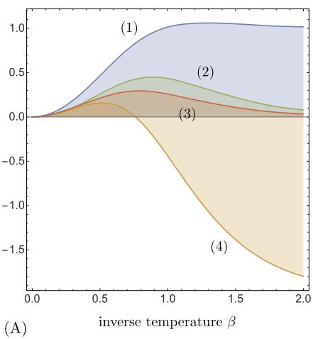

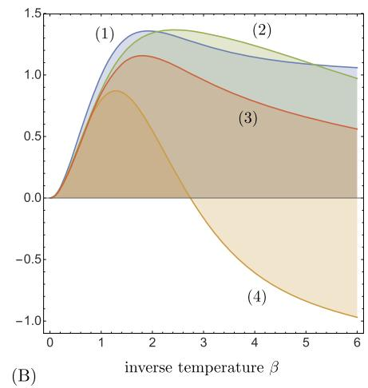  
Fig. 6.4 Various measures are evaluated with respect to the stationary distribution $\mu_{\beta}$ of the kernel $K_{\beta}$ , where $\beta$ is the inverse temperature. For the plots (1)-(4) within (A) and (B), respectively, the pairwise interactions $\vartheta_{vw} \in \mathbb{R}$ , $v, w \in V$ , are fixed. (1) mutual information $I_{p_{\beta}}(X_V'; X_V)$ (we denote by $p_{\beta}$ the distribution $p_{\beta}(i, j) = \mu_{\beta_i} K_{\beta_j}^i$ ); (2) stochastic interaction $D_{KL}^{\mu_{\beta}}(K_{\beta} \| \mathcal{K}_{\mathfrak{S}_{split}})$ ; (3) integrated information $D_{KL}^{\mu_{\beta}}(K_{\beta} \| \mathcal{K}_{\mathfrak{S}_{split}})$ (these plots are obtained by the iterative scaling method); (4) synergistic information $D_{KL}^{\mu_{\beta}}(K_{\beta} \| \mathcal{K}_{\mathfrak{S}_{split}}) - I_{p_{\beta}}(\bigwedge_{v \in V} X_v')$

Example 6.3 This example depicts the analysis of Kanwal within the work [149]. We compare some of the introduced measures in terms of numerical evaluations, shown in Fig. 6.4, using a simple ergodic Markov chain in $\{-1, +1\}^V$ . We assume that the corresponding kernel is determined by pairwise interactions $\vartheta_{vw} \in \mathbb{R}$ , $v, w \in V$ , of the nodes and the inverse temperature $\beta \in [0, \infty)$ . Given a state vector $X_V$ at time $n$ , the individual states $X_w'$ at time $n + 1$ are updated synchronously according to

$$
P \left(X _ {w} ^ {\prime} = + 1 \mid X _ {V}\right) = \frac {1}{1 + e ^ {- \beta \sum_ {v} \vartheta_ {v w} X _ {v}}}, \quad w \in V. \tag {6.77}
$$

For the evaluation of the measures shown in Fig. 6.4, the pairwise interactions are initialized and then fixed (the two sets of plots shown in Figs. 6.4(A) and (B), respectively, correspond to two different initializations of the pairwise interactions). The measures are then evaluated as functions of the inverse temperature $\beta$ , which determines the transition kernel $K_{\beta}$ by Eq. (6.77) and its stationary distribution $\mu_{\beta}$ .

We conclude this section by highlighting an important point here. As a motivation of the $\mathfrak{S}$ -complexity, we presented various decompositions of the multi-information rate of stationary stochastic processes (see, in particular, (6.60)). Here, stationary distributions of Markov chains determine the information-geometric structures of such processes. For instance, the distribution $p(i,j)$ that appears in the relative entropy (6.60) is the stationary distribution of the joint process $(X_{n},Y_{n})$ . A similar derivation holds for the Fisher metric on models of Markov chains (see (3.38) and

(3.39), and also [193]). It is important to note that we did not incorporate the stationarity into our definitions (6.61) of a hierarchical model of Markov kernels and the relative entropy (6.62). Also, there is no coupling between the distribution $\mu$ and the kernel $K$ in Propositions 6.5 and 6.6. In particular, we could assume that the input space equals the output space, that is $V = W$ and $I_V = I_W$ , and choose $\mu$ to be a stationary distribution with respect to $K$ , as we did in the above Example 6.3. Note that in general this does not imply the stationarity of the same distribution $\mu$ with respect to a projection $K_{\mathfrak{S}}$ of $K$ . (In the second term of the RHS of the Pythagorean relation (6.66), for instance, $\mu$ is not necessarily stationary with respect to $K_{\mathfrak{S}'}$ .) However, if we add the hyperedge $(\emptyset, V)$ to a given hypergraph $\mathfrak{S}$ , the stationarity is preserved by the projection. For $\mathfrak{S}_{split}$ , this is exactly the above-mentioned extension (see Sect. 6.9 of Amari's monograph [11]). A general consistent coupling of Markov kernels and their corresponding invariant distributions has been developed in [118, 193], where a Pythagorean relation for stationary Markov chains is formulated in terms of the canonical divergence of the underlying dually flat structure (see Definition 4.6).

We expect that the development of the information geometry of stochastic processes, in particular Markov chains [10, 118, 193, 243] and related conditional models [29, 147, 165, 184], will further advance the information-geometric research on complexity theory.

# 6.2 Evolutionary Dynamics

Evolutionary dynamics studies the change in time of the relative frequencies of various types in a population. Depending on the biological application, such types can stand for species, strategies, alleles in a gene pool, etc. Their frequencies change in response to or as a consequence of various effects. The most important and best studied effects are selective differences, which one tries to capture by the notion of fitness, mutations, that is, transitions between the different types, random sampling, recombination when sexual pairing is involved, location dependent properties, population effects, etc. Some of these effects are deterministic, some can be modeled at least in a deterministic manner at the level of large populations, and some are irreducibly stochastic. As this is a vast topic, there are various monographs, like [95, 123, 124, 224], that cover some aspects from a mathematical perspective. In line with the aim of the present book, here we want to develop and explore the connections with information geometry. That connection comes from the phrase that we have italicized above, relative frequencies. Formally, such relative frequencies can be treated as probabilities, and thus, we are lead to studying dynamical systems on the probability simplex, and as we shall see, these dynamical systems naturally involve the natural metric on that simplex, the Fisher metric, which has been called the Shahshahani metric [233] in evolutionary dynamics. We shall start with the effects of selection and mutation. These will lead us to systems of ordinary differential equations, the so-called replicator equations. We shall then augment this by the effects of random sampling. This is an inherently stochastic effect. Mathematically, it

can be seen as a perturbation of the replicator equations by noise. As is well known, the evolution of the resulting probabilities can be modeled by what the physicists call Fokker-Planck equations and the mathematicians prefer to call Kolmogorov equations. Whether or not the relative frequencies involved can be biologically interpreted as probabilities will play no role for our mathematical analysis.

Since the type composition of the population unfolds in time, the treatment of time is important. The simplest transitions would consist of discrete time steps, corresponding, for instance, to the annual reproduction in a population, suppressing such biological issues as overlapping generations, etc. In fact, the evolutionary models as presented here inevitably operate at a very abstract level and suppress most biological details. The advantage of such an abstract treatment might consist in identifying the dominant, most important mechanisms at work in biological evolution and investigating them with powerful mathematical tools. At a later stage, these abstract models can then be augmented by further relevant biological details, but here we confine ourselves to work out the fundamental principles.

We shall, however, rather investigate models with continuous instead of discrete time. Of course, continuous time dynamics can be obtained as limits of discrete ones, and we shall also insert a short section looking at such transitions from an information geometric perspective.

# 6.2.1 Natural Selection and Replicator Equations

In this section, we introduce the notion of a replicator equation, that is, a certain type of dynamical system on the probability simplex, and explore it with the tools of information geometry. The analysis of evolutionary dynamics in terms of differential geometry has a long history [2-4, 123]. In particular, there is the Shahshahani metric [233] which we shall recognize as the Fisher metric. Further links to information geometry are given by exponential families, which naturally emerge within evolutionary biology. The exponential connection has also been used in [24], in order to study replicator equations that admit a closed-form solution.

Since various biological interpretations are possible, we proceed abstractly and consider a finite set $I = \{0, 1, 2, \dots, n\}$ of types. For the moment, to be concrete, one may think of the types of species, or as evolutionary strategies. In Sect. 6.2.3, the types will be alleles at a genetic locus. We then consider a population, consisting of $N_{i}$ members of type $i$ . The total number of members of that population is then given by $N = \sum_{j} N_{j}$ . We shall assume, however, that the dynamics will depend only on the relative frequencies $\frac{N_{i}}{N}$ , $i \in I$ , which define a point in the $n$ -dimensional simplex $\Sigma^{n} = \mathcal{P}(I)$ . Assuming large population sizes, that is $N \to \infty$ , we can consider the full simplex as the set of all possible populations consisting of $n + 1$ different types.

Concerning the dynamical issue, the type composition of the population is changing in time, because the different types reproduce at different rates. The quantities that we want to follow are the $\frac{\dot{p}_i}{p_i}$ ; this quantity expresses the reproductive success of type $i$ . This reproductive success can depend on many factors, but in order

to have a closed theory, at time $t$ , it should depend only on the population vector $p = (p_0, p_1, \ldots, p_n)$ at $t$ . Thus, it should be a function $f^i(p)$ . In order to maintain the normalization $\sum p_i = 1$ , we need to subtract a normalizing term. This leads us to the replicator equation (see [123] and the references therein)

$$
\dot {p} _ {i} = p _ {i} \left(f ^ {i} (p) - \sum_ {j} p _ {j} f ^ {j} (p)\right), \quad i \in I. \tag {6.78}
$$

In terms of the concept of natural selection of Darwinian evolutionary theory, we may want to interpret this as

$$
\frac {\dot {p} _ {i}}{p _ {i}} = \text {f i t n e s s o f t y p e} i - \text {a v e r a g e f i t n e s s}, \tag {6.79}
$$

although "fitness", in fact, is a very subtle concept whose precise carrier is not always clear (see, e.g., the discussion in [133]). That is, we want to call $f^i(p)$ the fitness of type $i$ .

Equation (6.78) defines a dynamical system on $\mathcal{P}_{+}(I)$ . In fact, any dynamical system $\dot{p}_i = X_i(p)$ , $i \in I$ , on $\mathcal{P}_{+}(I)$ can be represented in this form by setting $f^i(p) \coloneqq \frac{X_i(p)}{p_i}$ . Therefore, (6.78) can be arbitrarily complex, depending on the particular choice of the fitness function $f: p \mapsto f(p) = \sum_{i} f^i(p)e_i$ . Let us recapitulate a bit on that. The vector $X(p)$ defined by the RHS of Eq. (6.78) does not change if we add a constant vector $c(p)$ to the fitness $f(p)$ . Therefore, $X(p)$ is uniquely determined by the equivalence class $f(p) + \mathbb{R}$ . As we have shown in Sect. 2.1, the assignment $p \mapsto f(p) + \mathbb{R}$ is a section in the cotangent bundle $T^{*}\mathcal{P}_{+}(I)$ , that is a covector field. Using the Fisher metric, in order to translate this into a section in the tangent bundle, we obtain the field $p \mapsto X(p)$ . The fitness, which drives the selection process in the evolutionary dynamics, corresponds to a covector field.

Let us first consider frequency independent fitness functions, that is, where the individual $f^i$ are constant and do not depend on the population $p$ . The corresponding mean fitness $\overline{f}$ , which assigns to a population $p$ the value $\overline{f}(p) \coloneqq p(f) = \sum_{i \in I} p_i f^i$ , does depend on $p$ , however. By Proposition 2.2, the gradient of the mean fitness with respect to the Fisher metric is

$$
(\operatorname {g r a d} _ {p} \overline {{f}}) _ {i} = p _ {i} \left(f ^ {i} - \sum_ {j} p _ {j} f ^ {j}\right),
$$

and we obtain the following differential equation (see also [116]):

$$
\dot {p} (t) = \operatorname {g r a d} _ {p (t)} \overline {{f}}, \quad p (0) = p _ {0}. \tag {6.80}
$$

For any solution of (6.80), we have

$$
\begin{array}{l} \frac {d}{d t} \overline {{f}} \big (p (t) \big) = \sum_ {i} \dot {p} _ {i} (t) f ^ {i} \\ = \sum_ {i} p _ {i} (t) \left(f ^ {i} - \sum_ {j} p _ {j} (t) f ^ {j}\right) f ^ {i} \\ \end{array}
$$

$$
\begin{array}{l} = \operatorname {V a r} _ {p (t)} (f) \\ > 0, \tag {6.81} \\ \end{array}
$$

unless we have the trivial situation where the fitness values $f^j$ are the same for all types $j$ with nonzero frequencies $p_j$ . This means that the mean fitness is increasing in time. This observation is sometimes referred to as Fisher's Fundamental Theorem of Natural Selection [97], which in words can be stated as follows:

"The rate of increase in the mean fitness of any organism at any time ascribable to natural selection acting through changes in gene frequencies is exactly equal to its genetic variance in fitness at that time." [88]

As we shall see below, this theorem in general requires that the fitness values $f^i$ be constant (independent of $p$ ), as we have assumed here.

When we consider another vector $g$ with (constant) components $g^i$ that model trait values of the individual types, we obtain in the same manner

$$
\begin{array}{l} \frac {d}{d t} \overline {{g}} (p (t)) = \sum_ {i} \dot {p} _ {i} (t) g ^ {i} \\ = \sum_ {i} p _ {i} (t) \left(f ^ {i} - \sum_ {j} p _ {j} (t) f ^ {j}\right) g ^ {i} \\ = \operatorname {C o v} _ {p (t)} (f, g). \tag {6.82} \\ \end{array}
$$

This means that the mean value of a trait will increase in time if its covariance with the fitness function is positive. This is due to G.R. Price [217], and it plays an important role in the mathematical theory of evolution, see [224].

The differential equation (6.80) has the solution

$$
t \mapsto \frac {e ^ {t f}}{p (e ^ {t f})} p.
$$

This solution has the following limit points (see Fig. 6.5):

$$
\lim  _ {t \to - \infty} p _ {i} (t) = \left\{ \begin{array}{l l} \frac {p _ {i}}{\sum_ {j \in \operatorname* {a r g m i n} (f)} p _ {j}}, & \text {i f} i \in \operatorname * {a r g m i n} (f), \\ 0, & \text {o t h e r w i s e}, \end{array} \right. \quad i \in I,
$$

and

$$
\lim  _ {t \to + \infty} p _ {i} (t) = \left\{ \begin{array}{l l} \frac {\mu_ {i}}{\sum_ {j \in \operatorname* {a r g m a x} (f)} p _ {j}}, & \text {i f} i \in \operatorname * {a r g m a x} (f), \\ 0, & \text {o t h e r w i s e}, \end{array} \right. \quad i \in I.
$$

This means that only those types will survive in the infinite future that have maximal fitness, and those that persist from the infinite past had minimal fitness. Importantly, this happens at exponential rates. Thus, the basic results of Darwin's theory of evolution are encapsulated in the properties of the exponential function. When the fitness

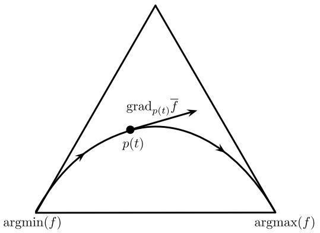  
Fig. 6.5 The solution curve of Eq. (6.80). Mean fitness is maximized along the curve, eventually converging to those types that have maximal fitness and coming from those with least fitness

is frequency dependent, the mean fitness will no longer increase in general. In fact, for a frequency dependent fitness $f$ , we have to extend Eq. (6.81) as

$$
\frac {d}{d t} \bar {f} (p (t)) = \operatorname {V a r} _ {p (t)} (f (p (t))) + \sum_ {i} p _ {i} (t) \frac {d}{d t} f ^ {i} (p (t)). \tag {6.83}
$$

Thus, the change of fitness is caused by two processes, corresponding to the two terms on the RHS of (6.83). Only the first term always corresponds to an increase of the fitness [98], and because of the presence of the second term, the mean fitness need not increase during evolution. For instance, it could happen that the fitness values $f^i$ decrease for those types $i$ whose relative frequencies increase, and conversely. It might be advantageous to be in the minority. Fisher himself used such a reasoning for the balance of sexes in a population; see, e.g., the presentation in [141].

After having discussed the case of constant fitness functions, we now move on to consider other cases with a clear biological motivation:

1. Linear fitness. We wish to include interactions between the types. The simplest possibility consists in considering replicator equations with linear fitness. With an interaction matrix $A = (a_{ij})_{i,j \in I}$ , we consider the equation

$$
\dot {p} _ {i} = p _ {i} \left(\sum_ {j} a _ {i j} p _ {j} - \sum_ {k} p _ {k} \sum_ {j} a _ {k j} p _ {j}\right). \tag {6.84}
$$

While a constant fitness function could always be represented as a gradient field, in the linear case, by (2.38), we need the following condition:

$$
a _ {i j} + a _ {j k} + a _ {k i} = a _ {i k} + a _ {k j} + a _ {j i}. \tag {6.85}
$$

In particular, this is satisfied if the matrix $A$ is symmetric, and a potential function then is

$$
V (p) = \frac {1}{2} \sum_ {i j} a _ {i j} p _ {i} p _ {j}.
$$

2. The replicator-mutator equation. The replicator equation (6.78) is based on selection that acts proportionally to the fitness values $f^i(p)$ of the types $i$ within the population $p$ . Evolutionary dynamics, however, involves also other mechanisms, such as mutation and recombination. Here, we shall not consider recombination, referring, for instance, to [124] instead, but only mutations. In formal terms, a mutation is a transition between types. We thus consider a mutation matrix $m_{ij}$ , $i, j \in I$ , which formalizes the probability for $i$ to mutate into $j$ and therefore satisfies $m_{ij} \geq 0$ and $\sum_{j} m_{ij} = 1$ . Here, $m_{ii}$ expresses the probability that $i$ does not mutate into another type. In particular, when $m_{ji} = \delta_{ji}$ , we have perfect replication, and no mutations occur.

After the replication of all types $j$ according to their fitnesses $f^{j}(p)$ , they may then change their identities by mutations. We obtain as a modification of the replicator equation the so-called replicator-mutator equation [115, 210, 240]:

$$
\dot {p} _ {i} = \sum_ {j \in I} p _ {j} f ^ {j} (p) m _ {j i} - p _ {i} \bar {f} (p). \tag {6.86}
$$

Note that since $m_{ii} = 1 - \sum_{j\neq i}m_{ij}$ , (6.86) is equivalent to

$$
\dot {p} _ {i} = p _ {i} f ^ {i} (p) + \sum_ {j \neq i} p _ {j} f ^ {j} (p) m _ {j i} - \sum_ {j \neq i} p _ {i} f ^ {i} (p) m _ {i j} - p _ {i} \bar {f} (p), \tag {6.87}
$$

which then has a positive contribution for the mutations $i$ gains from other types and a negative contribution for those mutations lost to other types.

One can relate Eq. (6.86) to the replicator equation (6.78) in two ways. In the case of perfect replication, $m_{ji} = \delta_{ji}$ , we are back to the original replicator equation. In the general case, we may consider a replicator-mutator equation as a replicator equation with a new, effective, fitness function $f_{\mathrm{eff}}^i(p) = \frac{1}{p_i}\sum_{j\in I}p_jf^j(p)m_{ji}$ that drives the selection process based on replication and mutation, that is,

$$
\dot {p} _ {i} = p _ {i} \left(\frac {1}{p _ {i}} \sum_ {j \in I} p _ {j} f ^ {j} (p) m _ {j i} - \bar {f} (p)\right). \tag {6.88}
$$

3. The quasispecies equation. In the special case where the original fitness functions $f^i$ are frequency independent, but where mutations are allowed, Eq. (6.86) is called the quasispecies equation. Note that, due to mutation, even in this case the effective fitness $f_{\mathrm{eff}}^i(p)$ is frequency dependent and defines a gradient field only for $f^i = f^j$ and $m_{ji} = m_{ki}$ for all $i \neq j, k$ . We'll return to that issue below in Sect. 6.2.3. Hofbauer [122] studied a different version of the replicator-mutator equation in view of Fisher's fundamental theorem of natural selection.

# 6.2.2 Continuous Time Limits

Dynamical systems that occur as models in evolutionary biology can be either time continuous or time discrete. Often one starts with a discrete transition that describes the evolution from one generation to the next. In order to apply advanced methods from the theory of differential equations, one then takes a continuous time limit, leading to the replicator equation (6.78) in Sect. 6.2.1 above or the Kolmogorov equations in Sect. 6.2.3 below. The dynamical properties of those equations crucially depend on the way this limit is taken. In the present section, we want to address this issue in a more abstract manner with the concepts of information geometry and propose a procedure that extends the standard Euler method.

Let us first recall how the standard Euler method relates time continuous dynamical systems to time discrete ones. Say that we have a vector field $X$ on $\mathcal{P}_{+}(I)$ and the corresponding differential equation

$$
\dot {p} (t) = X (p (t)), \quad p (0) = p _ {0}. \tag {6.89}
$$

In order to approximate the solution $p(t)$ with the Euler method, we choose a small step size $\delta > 0$ and consider the iteration

$$
p ^ {\delta} := p + \delta X (p). \tag {6.90}
$$

Starting with $p_0$ , we can sequentially define the points $p_{k+1}^{\delta} \coloneqq p_k^{\delta} + \delta X(p_k^{\delta})$ as long as they stay in the simplex $\mathcal{P}_{+}(I)$ . These points approximate the solution $p(t)$ of (6.89) at time points $t_k = k\delta$ , that is, $p_k^{\delta} \approx p(t_k)$ . Clearly, the smaller $\delta$ is, the better this approximation will be, and, assuming sufficient regularity, $p_k^{\delta}$ will converge to $p(t)$ for $\delta k \to t$ . Furthermore, we have

$$
\lim  \frac {p _ {k + 1} ^ {\delta} - p _ {k} ^ {\delta}}{\delta} = \lim  X \left(p _ {k} ^ {\delta}\right) = X (p (t)) = \dot {p} (t) \quad \text {f o r} \delta k \rightarrow t. \tag {6.91}
$$

This idea is quite natural and has been used in many contexts, including evolutionary biology [123].

Let us interpret the iteration (6.90) from the information-geometric perspective. Obviously, we obtain the new point $p^\delta$ by moving a small step along the mixture geodesic that starts at $p$ and has the velocity $X(p)$ . We can rewrite (6.90) in terms of the corresponding exponential map as

$$
p ^ {\delta} = \exp_ {p} ^ {(m)} (\delta X (p)). \tag {6.92}
$$

Clearly, from the information-geometric perspective any $\alpha$ -connection can be used, so that we can extend the iteration (6.92) to the following family of iterations:

$$
p ^ {\delta} = \exp_ {p} ^ {(\alpha)} (\delta X (p)). \tag {6.93}
$$

Starting with $p_0$ , we can again sequentially define $p_{k+1}^{\delta} \coloneqq \exp_{p_k^\delta}^{(\alpha)} (\delta X(p_k^\delta))$ , but this time applying the general iteration (6.93) for any $\alpha$ -connection. Accordingly, in

order to express the difference on the LHS of (6.91), we have to use the inverse of the exponential map:

$$
\lim  _ {\delta} \frac {1}{\delta} \exp_ {p _ {k} ^ {\delta}} ^ {(\alpha) - 1} (p _ {k + 1} ^ {\delta}) = \lim  X (p _ {k} ^ {\delta}) = X (p (t)) = \dot {p} (t) \quad \text {f o r} \delta k \rightarrow t. \tag {6.94}
$$

Consider now a discrete time dynamical system on $\mathcal{P}_{+}(I)$

$$
p ^ {\prime} = F (p) = p + X (p), \tag {6.95}
$$

where we set $X(p) \coloneqq F(p) - p$ . How can we obtain a differential equation from this? Following a frequently used rule, one simply reinterprets differences as velocities. More precisely, one considers the difference equation $p' - p = X(p)$ and then replaces the difference $p' - p$ on the LHS by the time derivative $\dot{p}$ . In what follows, we justify this simple rule by reversing the Euler method and using it for the definition of a continuous time limit. In order to do so, we follow the Euler method step by step. First, we modify the dynamics (6.95) by not taking a full step in the direction $X(p)$ but a step of size $\delta$ . This leads to the iteration formula (6.90), although, at this point, the vector field $X(p)$ is interpreted as a difference and not as a velocity. We then define the sequence $p_k^\delta$ , $k = 0, 1, 2, \ldots$ , which we interpret as the Euler approximation of a path $p(t)$ that we want to obtain in the continuous time limit. In order to get the velocity of that path, we finally evaluate the limit on the LHS of (6.91) which gives us the desired differential equation. Clearly, this procedure amounts to the above-mentioned commonly used simple rule by which one interprets differences as velocities.

The same procedure also works with the $\alpha$ -connections. However, in this more general setting, we have to replace the difference $p' - p$ by the inverse of the exponential map. This finally leads to the following correspondence between discrete time and continuous time dynamics, defined in terms of the $\alpha$ -connection:

$$
p ^ {\prime} = F (p) \quad \stackrel {\nabla^ {(\alpha)}} {\longleftrightarrow} \quad \dot {p} = \exp_ {p} ^ {(\alpha) - 1} (F (p)). \tag {6.96}
$$

Now let us have a closer look at this correspondence for replicator equations. Let us first consider the discrete time replicator equation

$$
p _ {i} ^ {\prime} = p _ {i} \frac {w ^ {i} (p)}{\sum_ {j} p _ {j} w ^ {j} (p)}, \tag {6.97}
$$

where $w^{i}(p)$ is referred to as the Wrightian fitness of type $i$ within the population $p$ . Using the $\alpha$ -connection, we can associate a continuous time replicator equation

$$
\dot {p} _ {i} = p _ {i} \left(m _ {(\alpha)} ^ {i} (p) - \sum_ {j} p _ {j} m _ {(\alpha)} ^ {j} (p)\right), \tag {6.98}
$$

where $m_{(\alpha)}^i (p)$ is known as the Malthusian fitness of $i$ within $p$ . Clearly, the Wrightian fitness function $w$ of the discrete time dynamics translates into different Malthusian fitness functions $m_{(\alpha)}$ for the corresponding continuous time replicator dynamics, depending on the affine connection that we use for this translation. For $\alpha \neq \pm 1$ ,

we can specify the continuous time replicator equation up to a factor $c$ , depending on $p$ and $w$ :

$$
\dot {p} _ {i} = c p _ {i} \left(\left(\frac {w ^ {i} (p)}{\sum_ {j} p _ {j} w ^ {j} (p)}\right) ^ {\frac {1 - \alpha}{2}} - \sum_ {k} p _ {k} \left(\frac {w ^ {k} (p)}{\sum_ {j} p _ {j} w ^ {j} (p)}\right) ^ {\frac {1 - \alpha}{2}}\right). \tag {6.99}
$$

This follows from (2.65), applied to $\frac{v_i}{\mu_i} = \frac{p_i'}{p_i} = \frac{w^i(p)}{\sum_j p_j w^j(p)}$ (see the discrete time replicator equation (6.97)). Let us highlight the cases $\alpha = -1$ and $\alpha = 1$ , where we can be more explicit by using (2.104). For $\alpha = -1$ , we obtain as continuous time replicator equation

$$
\dot {p} _ {i} = p _ {i} \left(\frac {w ^ {i} (p)}{\sum_ {j} p _ {j} w ^ {j} (p)} - 1\right), \tag {6.100}
$$

and for $\alpha = 1$ we have

$$
\dot {p} _ {i} = p _ {i} \left(\log w ^ {i} (p) - \sum_ {j} p _ {j} \log w ^ {j} (p)\right). \tag {6.101}
$$

For the corresponding Malthusian fitness functions of the replicator equation (6.98) this implies

$$
m _ {(- 1)} ^ {i} = \frac {w ^ {i} (p)}{\sum_ {j} p _ {j} w ^ {j} (p)} + \text {c o n s t .}, \quad m _ {(1)} ^ {i} = \log w ^ {i} (p) + \text {c o n s t .} \tag {6.102}
$$

A number of important continuous time models have been derived and studied in [123] based on the transformation with $\alpha = -1$ . Also the log transformation between Wrightian and Malthusian fitness, corresponding to $\alpha = 1$ , has been highlighted in [208, 259]. Even though the two notions of fitness can be translated into one another, it is important to carefully distinguish them from each other. When equations are derived, explicit evolutionary mechanisms have to be incorporated. For instance, linear interactions in terms of a matrix $A = (a_{ij})_{ij\in I}$ are frequently used in order to model the interactions of the types. Clearly, it is important to specify the kind of fitness when making such linearity assumptions. Finally, we want to mention that replicator equations also play an important role in learning theory. They are obtained, in particular, as continuous time limits of discrete time learning algorithms within reinforcement learning [51, 231, 250].

In the next section, we shall model evolution as a stochastic process on the simplex $\mathcal{P}_{+}(I)$ . In general, such a process will no longer be described in terms of an ordinary differential equation. Instead, a partial differential equation, the Fokker-Planck equation, will describe the time evolution of a density function on the simplex. This extension requires a continuous time limit that is more involved than the one we have considered above. In particular, the transition from discrete to continuous time has to be coupled with the transition from finite to infinite population sizes.

# 6.2.3 Population Genetics

In this section, we shall describe how the basic model of population genetics, the Wright-Fisher model, $^{3}$ can be understood from the perspective of information geometry, following [124], to which we refer for more details. This model readily incorporates the effects of selection and mutation that we have investigated in Sect. 6.2.3, but its main driver is another effect, random sampling. Random sampling is a stochastic effect of finite populations, and therefore we can no longer work with a system of ordinary differential equations in an infinite population. We shall perform an infinite population limit, nevertheless, but we shall need a careful scaling relation between population size and the size of the time step when passing from discrete to continuous dynamics (cf. Sect. 6.2.2). Furthermore, the random sampling will lead us to parabolic partial differential equations in place of ordinary ones, and it will contribute a second-order term in contrast to the replicator equations that only involved first derivatives.

Different from [124], we shall try to avoid introducing biological terminology as far as possible, in order to concentrate on the mathematical aspects and to facilitate applications in other fields of this rather basic model. In particular, we shall suppress biological aspects like diploidy that are not relevant for the essence of the mathematical structure. Also, the style will be more narrative than in the rest of this book, because we only summarize the results with the purpose of putting them into the perspective of information geometry.

In order to put things into that perspective, let us start with some formal remarks. Our sample space will be the simplex $\Sigma^n = \mathcal{P}(I)$ . That is, we have a state space of $n + 1$ possible types (called alleles in the model). We then have a population, first consisting of $N$ members, and then, after letting $N\to \infty$ , of infinitely many members. At every time (discrete $m$ in the finite population case, continuous $t$ in the infinite case), every member of the population has some type, and therefore, the relative frequencies of the types in the population yield an element $p(m)$ or $p(t)$ of $\Sigma^n$ . Thus, as in Sect. 6.2.1, $p\in \Sigma^n$ is interpreted here as a relative frequency, and not as a probability, but for the mathematical formalism, this will not make a difference. The Fisher metric will be the metric on $\Sigma^n$ that we have constructed by identifying it with the positive spherical sector $S_{+}^{n}$ . (Since we identify a point $p$ in $\Sigma^n$ with a probability distribution, there is no need to introduce a parameter $\xi$ as in Sect. 6.3 here. But the metric is simply the Fisher metric on the parameter space, as always.) Also, the individual members of the population will play no role. Just the relative frequencies of the types across the population will be of interest. There is a second level, however. The Kolmogorov forward or Fokker-Planck equation to be derived

below (see (6.117)) will yield a (probability) density $f$ over these $p \in \Sigma^n$ . This $f$ will be the prime target of our analysis. $f$ will satisfy the diffusion equation (6.117), a Fokker-Planck equation. Alternatively, we could consider a Langevin stochastic differential equation for a sample trajectory on $\Sigma^n$ . The random contribution, however, will not be the Brownian motion for the Fisher metric, as in Sect. 6.3.1. Rather, the diffusion term will deviate from Brownian motion by a first-order term. This has the effect that, in the absence of mutation effects, the dynamics will always end up in one of the corners of the simplex. In fact, in the basic model without mutation or selection, when the dynamics starts at $(p^0, p^1, \ldots, p^n) \in \Sigma^n$ , it will end up in the $i$ th corner with probability $p^i$ (see, e.g., [124] for details).

Now, let us begin with the model. In each generation $m$ , there is a population of $N$ individuals. Each individual has a type chosen from the $n + 1$ possible types $\{0, 1, \dots, n\}$ . Let $Y_{i}(m)$ be the number of individuals of type $i$ in generation $m$ , and put $p_{i}(m) = \frac{Y_{i}(m)}{N}$ . Thus

$$
\sum_ {i = 0} ^ {n} Y _ {i} (m) = N \quad \text {a n d} \quad \sum_ {i = 0} ^ {n} p _ {i} (m) = 1. \tag {6.103}
$$

Given generation $m$ , generation $m + 1$ is created by random sampling with replacement from generation $m$ . That is, expressing it in a rather non-biological manner, for each individual in generation $m + 1$ , randomly a parent is chosen in generation $m$ , and the individual inherits its parent's type. (Thus, formally, the $p_i(m)$ now become probabilities whereas the relative frequencies $p_i(m + 1)$ in the next generation are random variables.) The transition probability of the process from generation $m$ to generation $m + 1$ is given by the multinomial formula

$$
P \left(Y (m + 1) = y \mid Y (m) = \eta\right) = \frac {N !}{y _ {0} ! y _ {1} ! \cdots y _ {n} !} \prod_ {i = 0} ^ {n} \left(\frac {\eta_ {i}}{N}\right) ^ {y _ {i}}, \tag {6.104}
$$

because this gives the probability for the components $y_{i}$ of $Y(m + 1)$ , that is, that each type $i$ is chosen $y_{i}$ times given that in generation $m$ type $i$ occurred $\eta_{i}$ times, that is, had the relative frequency $\frac{\eta_i}{N}$ . The same formula applies to the transition probabilities for the relative frequencies, $P(p(m + 1) = p|p(m) = \pi)$ for $\pi = \frac{\eta}{N}$ . Because of the normalizations (6.103), it suffices to consider the evolution of the components $i = 1,\dots ,n$ , because those then also determine the evolution of the 0th component.

Because we draw $N$ times independently from the same probability distribution $p_i(m)$ , we may apply (2.23), (2.24) to get the expectation values and (co)variances

$$
\mathbb {E} _ {p (m)} \left(p _ {i} (m + 1)\right) = p _ {i} (m), \tag {6.105}
$$

$$
\operatorname {C o v} _ {p (m)} \left(p _ {i} (m + 1) p _ {j} (m + 1)\right) = p _ {i} (m) \left(\delta_ {i j} - p _ {j} (m)\right). \tag {6.106}
$$

Of course, we could also derive these expressions from the general identity

$$
\mathbb {E} _ {p (m)} \left(p (m + 1) ^ {\mathbf {a}}\right) = \sum_ {p} p ^ {\mathbf {a}} P \left(p (m + 1) = p \mid p (m)\right) \tag {6.107}
$$

for a multi-index $\mathbf{a}$ and (6.104).4

We are interested in the dynamics of the type distribution across generations. The Chapman-Kolmogorov equation

$$
\begin{array}{l} P (m + 1, y _ {0}, y) \\ = \sum_ {y _ {1}, \dots , y _ {m}} P (Y (m + 1) = y | Y (m) = y _ {m}) P (Y (m) = y _ {m} | Y (m - 1) = y _ {m - 1}) \\ \end{array}
$$

$$
\dots P \left(Y (1) = y _ {1} \mid Y (0) = y _ {0}\right) \tag {6.108}
$$

then yields the probabilities for finding the type distribution $y$ in generation $m + 1$ when the process had started with the type distribution $y_0$ in generation 0.

We now come to the important step, the continuum limit $N \to \infty$ . In this limit, the transition probabilities will turn into differential equations. In order to carry out this limit, we also need to rescale time,

$$
t = \frac {m}{N}, \quad \text {h e n c e} \delta t = \frac {1}{N} \tag {6.109}
$$

and also introduce the rescaled variables

$$
Q _ {t} = p (N t) = \frac {Y (N t)}{N} \quad \text {a n d} \quad \delta Q _ {t} = Q _ {t + \delta t} - Q _ {t}. \tag {6.110}
$$

From (6.105)-(6.107), we get

$$
\mathbb {E} \left(\delta Q _ {t} ^ {i}\right) = 0, \tag {6.111}
$$

$$
\mathbb {E} \left(\delta Q _ {t} ^ {i} \delta Q _ {t} ^ {j}\right) = Q _ {t} ^ {i} \left(\delta_ {i j} - Q _ {t} ^ {j}\right) \delta t, \tag {6.112}
$$

$$
\mathbb {E} \left(\delta Q _ {t} ^ {\mathbf {a}}\right) = o (\delta t) \quad \text {f o r a m u l t i - i n d e x a w i t h} | \mathbf {a} | \geq 3. \tag {6.113}
$$

In fact, there is a general theory about the passage to the continuum limit which we shall now briefly describe. We consider a process $Q(t) = (Q^{i}(t))_{i=1,\dots,n}$ with values in $U \subseteq \mathbb{R}^n$ and $t \in (t_0, t_1) \subseteq \mathbb{R}$ , and from discrete time $t$ we want to pass to the continuum limit $\delta t \to 0$ . We thus consider $N \to \infty$ with $\delta t = \frac{1}{N}$ . We shall assume the following general conditions

$$
\lim  _ {\delta t \rightarrow 0} \frac {1}{\delta t} \mathbb {E} _ {\delta t} \left(\delta Q ^ {i} | Q (t) = q\right) = b ^ {i} (q, t), \quad i = 1, \dots , n \tag {6.114}
$$

and

$$
\lim  _ {\delta t \rightarrow 0} \frac {1}{\delta t} \mathbb {E} _ {\delta t} \left(\delta Q ^ {i} \delta Q ^ {j} | Q (t) = q\right) = a ^ {i j} (q, t), \quad i, j = 1, \dots , n, \tag {6.115}
$$

with a positive semidefinite and symmetric matrix $a^{ij}$ for all $(q,t)\in U\times (t_0,t_1)$ . In addition, we need that the higher order moments can be asymptotically neglected, that is, for all $(q,t)\in U\times (t_0,t_1)$ and all multi-indices $\mathbf{a} = (a_{1},\dots ,a_{n})$ with $|\mathbf{a}| = \sum a_i\geq 3$ , we have

$$
\lim  _ {\delta t \rightarrow 0} \frac {1}{\delta t} \mathbb {E} _ {\delta t} \left(\left. (\delta Q) ^ {\mathbf {a}} \right| Q (t) = q\right) = 0. \tag {6.116}
$$

In the limit $N\to \infty$ with $\delta t = \frac{1}{N}$ , that is, for an infinite population evolving in continuous time, the probability density $\Phi (p,s,q,t)\coloneqq \frac{\partial^n}{\partial q^1\cdots\partial q^n} P(Q(t)\leq q|Q(s) = p)$ with $s < t$ and $p,q\in \Omega$ then satisfies the Kolmogorov forward or Fokker-Planck equation

$$
\begin{array}{l} \frac {\partial}{\partial t} \Phi (p, s, q, t) = \frac {1}{2} \sum_ {i, j = 1} ^ {n} \frac {\partial^ {2}}{\partial q ^ {i} \partial q ^ {j}} \big (a ^ {i j} (q, t) \Phi (p, s, q, t) \big) \\ - \sum_ {i = 1} ^ {n} \frac {\partial}{\partial q ^ {i}} \left(b ^ {i} (q, t) \Phi (p, s, q, t)\right) \\ =: L \Phi (p, s, q, t) \tag {6.117} \\ \end{array}
$$

and the Kolmogorov backward equation

$$
\begin{array}{l} - \frac {\partial}{\partial s} \Phi (p, s, q, t) = \frac {1}{2} \sum_ {i, j = 1} ^ {n} a ^ {i j} (p, s) \frac {\partial^ {2}}{\partial p ^ {i} \partial p ^ {j}} \Phi (p, s, q, t) \\ + \sum_ {i = 1} ^ {n} b ^ {i} (p, s) \frac {\partial}{\partial p ^ {i}} \Phi (p, s, q, t) \\ =: L ^ {*} \Phi (p, s, q, t). \tag {6.118} \\ \end{array}
$$

Note that time is running backwards in (6.118), which explains the minus sign in front of the time derivative in the Kolmogorov backward equation. While the probability density function $\varPhi$ depends on two points $(p,s)$ and $(q,t)$ , either Kolmogorov equation only involves derivatives with respect to one of them. When considering classical solutions, $\varPhi$ needs to be of class $C^2$ with respect to the relevant spatial variables in $U$ and of class $C^1$ with respect to the relevant time variable.

Thus, in the situation of the Wright-Fisher model, that is, with (6.112), (6.111), the coefficients in (6.117) are

$$
a ^ {i j} (q) = q ^ {i} \left(\delta_ {i j} - q ^ {j}\right) \quad \text {a n d} \quad b ^ {i} (q) = 0, \tag {6.119}
$$

and analogously for (6.118). In particular, the coefficients of the second-order term are given by the Fisher metric on the probability simplex. The coefficients of the first-order term vanish in this case, but we shall now consider extensions of the model that lead to nontrivial $b^{i}$ .

For that purpose, we replace the multinomial formula (6.104) by

$$
P \left(Y (m + 1) = y \mid Y (m) = \eta\right) = \frac {N !}{y _ {0} ! y _ {1} ! \cdots y _ {n} !} \prod_ {i = 0} ^ {n} \psi_ {i} (\eta) ^ {y _ {i}}. \tag {6.120}
$$

This simply means that before the sampling, the values $\eta_0,\dots ,\eta_n$ are subjected to certain effects that turn them into new values $\psi_0(\eta),\ldots ,\psi_n(\eta)$ from which the next generation is sampled. This is intended to include the biological effects of mutation and selection, as we shall now briefly explain. We begin with mutation. Let $\mu_{ij}$ be the fraction of type $A^i$ that randomly mutates into type $A^j$ in each generation before the sampling for the next generation takes place. We put $\mu_{ii} = 0$ . Then $\frac{\eta^i}{N}$ in (6.104) needs to be replaced by

$$
\psi_ {\mathrm {m u t}} ^ {i} (\eta) := \frac {\eta^ {i} - \sum_ {j = 0} ^ {n} \mu_ {i j} \eta^ {i} + \sum_ {j = 0} ^ {n} \mu_ {j i} \eta^ {j}}{N}, \tag {6.121}
$$

to account for the net effect of $A^i$ changing into some other $A^j$ and conversely, for some $A^j$ turning into $A^i$ , as in (6.87). The mathematical structure below will simplify when we assume

$$
\mu_ {i j} =: \mu_ {j} \quad \text {f o r a l l} i \neq j, \tag {6.122}
$$

that is, the mutation rate depends only on the target type. Equation (6.121) then becomes

$$
\psi_ {\mathrm {m u t}} ^ {i} (\eta) = \frac {\left(1 - \sum_ {j = 0 , j \neq i} ^ {n} \mu_ {j}\right) \eta^ {i} + \vartheta_ {i} \sum_ {j = 0} ^ {n} \eta^ {j}}{N}. \tag {6.123}
$$

This thus is the effect of changing type before sampling. The other effect, selection, is mathematically expressed as a sampling bias. This means that each type gets a certain fitness, and the types with higher fitness are favored in the sampling process. Thus, when type $A^i$ has fitness $s_i$ , and when for the moment we assume that there are no mutations, we have to work with the Wrightian fitness

$$
\psi_ {\text {s e l}} ^ {i} (\eta) := \frac {s _ {i} \eta^ {i}}{\sum_ {j = 0} ^ {n} s _ {j} \eta^ {j}}. \tag {6.124}
$$

When all $s^i$ are the same, that is, when there are no fitness differences, we are back to (6.104).

For the scaling limit, we assume that the mutation rates satisfy

$$
\mu_ {i j} = O \left(\frac {1}{N}\right) \tag {6.125}
$$

and that the selection coefficients are of the form

$$
s _ {i} = 1 + \sigma_ {i} \quad \text {w i t h} \sigma_ {i} = O \left(\frac {1}{N}\right). \tag {6.126}
$$

With

$$
m _ {i j} := N \mu_ {i j}, \quad m _ {i} := N \mu_ {i} \quad \text {a n d} \quad v _ {i} := N \sigma_ {i} \tag {6.127}
$$

we then have

$$
\psi^ {i} (\eta) = \frac {1}{N} \left(\eta^ {i} \left(1 + v _ {i} - \sum_ {j} v _ {j} \eta^ {j}\right) - \sum_ {j} m _ {i j} \eta^ {i} + \sum_ {j} m _ {j i} \eta^ {j}\right) + o \left(\frac {1}{N}\right). \tag {6.128}
$$

Equations (6.111)-(6.113) then turn into

$$
\begin{array}{l} \mathbb {E} \left(\delta Q _ {t} ^ {i}\right) = \psi^ {i} (q) - q = \frac {1}{N} \left(q ^ {i} \left(v _ {i} - \sum_ {j} v _ {j} q ^ {j}\right) - \sum_ {j} m _ {i j} q ^ {i} + \sum_ {j} m _ {j i} q ^ {j}\right) \\ + o \left(\frac {1}{N}\right) \\ =: \frac {1}{N} b ^ {i} (q) + o \left(\frac {1}{N}\right), \tag {6.129} \\ \end{array}
$$

$$
\mathbb {E} \left(\delta Q _ {t} ^ {i} \delta Q _ {t} ^ {j}\right) = \frac {1}{N} q ^ {i} \left(\delta_ {i j} - q ^ {j}\right) + o \left(\frac {1}{N}\right) =: \frac {1}{N} a ^ {i j} (q) + o \left(\frac {1}{N}\right), \tag {6.130}
$$

and

$$
\mathbb {E} \left(\delta Q _ {t} ^ {\mathbf {a}}\right) = o (\delta t) \quad \text {f o r a m u l t i - i n d e x a w i t h} | \mathbf {a} | \geq 3. \tag {6.131}
$$

Thus, the second and higher moments are asymptotically not affected by the effects of mutation and selection, but the first moments now are no longer 0. In any case, we have the Kolmogorov equations (6.117) and (6.118).

In a finite population, it may happen that one of the types disappears from the population when it is not chosen during the sampling process. And in the absence of mutation, it will then remain extinct forever. Likewise, in the scaling limit, it may happen that one of the components $q^i$ becomes 0 after some finite time, and, again

in the absence of mutations, will remain 0 ever after. In fact, almost surely, after some finite time, only one type will survive, while all others go extinct.

There is another approach to the Kolmogorov equations that does not start with the second terms with coefficients $a^{ij}(q)$ and considers the first-order terms with coefficients $b^i (q)$ as a modification of the dynamics of the parabolic equation $\frac{\partial}{\partial t}\varPhi(p,s,q,t)=\frac{1}{2}\sum_{i,j=1}^{n}\frac{\partial^2}{\partial q^i\partial q^j}(a^{ij}(q,t)\varPhi(p,s,q,t))$ or of the antiparabolic equation $-\frac{\partial}{\partial s}\varPhi(p,s,q,t)=\frac{1}{2}\sum_{i,j=1}^{n}a^{ij}(p,s)\frac{\partial^2}{\partial p^i\partial p^j}\varPhi(p,s,q,t)$ , but that rather starts with the first-order terms and adds the second-order terms as perturbations caused by noise. This works as follows (see, e.g., [140, Chap. 9] or [141, Sect. 4.5]). In fact, this starting point is precisely the approach developed in Sect. 6.2.1. We start with the dynamical system

$$
\frac {d q ^ {i} (t)}{d t} = b ^ {i} (q) \quad \text {f o r} i = 1, \dots , n. \tag {6.132}
$$

The density $u(q, t)$ of $q(t)$ then satisfies the continuity equation

$$
\frac {\partial}{\partial t} u (q, t) = - \sum_ {i = 1} ^ {n} \frac {\partial}{\partial q ^ {i}} \left(b ^ {i} (q) u (q, t)\right) = - \operatorname {d i v} (b u), \tag {6.133}
$$

that is, (6.117) without the second-order term. We then perturb (6.132) by noise and consider the system of stochastic ODEs

$$
d q ^ {i} (t) = b ^ {i} (q) d t + \sum_ {j} a ^ {i j} (q) d W _ {j} (t), \tag {6.134}
$$

where $dW_{j}(t)$ is white noise, that is, the formal derivative of Brownian motion $W_{j}(t)$ . The index $j = 1,\dots ,n$ only has the role to indicate that in (6.134), we have $n$ independent scalar Brownian motions whose combined effect then yields the term $\sum_{j}a^{ij}(q)dW_{j}(t)$ . In that case, the density $u(q,t)$ satisfies

$$
\frac {\partial}{\partial t} u (q, t) = \frac {1}{2} \sum_ {i, j = 1} ^ {n} \frac {\partial^ {2}}{\partial q ^ {i} \partial q ^ {j}} \left(a ^ {i j} (q, t) u (q, t)\right) - \sum_ {i = 1} ^ {n} \frac {\partial}{\partial q ^ {i}} \left(b ^ {i} (q, t) u (q, t)\right), \tag {6.135}
$$

that is, (6.117). Thus, the deterministic component with the law (6.132) causes the first-order term, also called a drift term in this context, whereas the stochastic component leads to the second-order term, called a diffusion term. In this interpretation, (6.135) is the equation for the probability density of a particle moving under the combined influence of a deterministic law and a stochastic perturbation. When the particle starts and moves in a certain domain, it may eventually hit the boundary of that domain and disappear. In our case, the domain is the probability simplex, and hitting the boundary means that one of the components $q^i$ , $i = 0, \dots, n$ , becomes 0. That is, in our model, one of the types disappears from the population. We can then ask for such quantities as the expected time for a trajectory starting somewhere in

the interior to first hit the boundary. It turns out that this expected exit time $t(p)$ for a trajectory starting at $p$ satisfies an inhomogeneous version of the stationary Kolmogorov backward equation (6.118), namely

$$
L ^ {*} \Phi (t (p)) = - 1. \tag {6.136}
$$

This equation now has a natural solution from the perspective of information geometry. In fact, in the setting of Sect. 4.2, we had obtained the (Fisher) metric as the second derivatives of a potential function, see (4.32). Therefore, we have, in the notation of that equation,

$$
\sum_ {i, j = 1} ^ {n} g ^ {i j} \partial_ {i} \partial_ {j} \psi = n. \tag {6.137}
$$

Since the coordinates we are currently employing are the affine coordinates $p_i$ , the potential function is the negative entropy

$$
S (p) = \sum_ {k} p _ {k} \log p _ {k}, \tag {6.138}
$$

and, recalling (2.21), (2.22),

$$
g _ {i j} = \frac {\partial^ {2}}{\partial p _ {i} \partial p _ {j}} S (p) = \left(\frac {\delta_ {i j}}{p _ {i}} + \frac {1}{p _ {0}}\right), \qquad g ^ {i j} = p _ {i} (\delta_ {i j} - p _ {j}). \tag {6.139}
$$

Thus, we find

$$
\sum_ {i, j = 1} ^ {n} p _ {i} \left(\delta_ {i j} - p _ {j}\right) \frac {\partial^ {2}}{\partial p _ {i} \partial p _ {j}} \left(\sum_ {k} p _ {k} \log p _ {k}\right) = n \tag {6.140}
$$

and hence from (6.136), (6.118), we obtain

Theorem 6.4 In the case $b^i(q) = 0$ , the expected exit time is

$$
t (p) = - \frac {2}{n} \sum_ {k} p _ {k} \log p _ {k}, \tag {6.141}
$$

that is, up to constant factor, the entropy of the original type distribution.

The approach can be iteratively refined, and one can compute formulae not only for the expected time $t(p)$ when the first type gets lost from the population, but also for the expected times of subsequent allele losses. Likewise, formulae exist for the case where the drift terms $b^{i}$ do not vanish. We refer to [95, 124] and the references given there.

We shall now turn to the case of non-vanishing drift coefficients $b^{i}$ and introduce a free energy functional, following [124, 246, 247]. The key is to rewrite the Kolmogorov forward equation (6.117), or equivalently (6.135), in divergence form, that

is, in the form

$$
\frac {\partial}{\partial t} u (q, t) = \nabla \cdot \left(A (q) \nabla u (q, t)\right) - \nabla \cdot \left(A (q) u (q, t) \nabla \gamma (q)\right), \tag {6.142}
$$

with

$$
\nabla = \left(\frac {\partial}{\partial q ^ {1}}, \ldots , \frac {\partial}{\partial q ^ {n}}\right).
$$

In order to bring (6.135) into this form, we put

$$
A (q) = \left(A ^ {i j} (q)\right) _ {i, j = 1} ^ {n} = \frac {1}{2} \left(a ^ {i j} (q)\right) _ {i, j = 1} ^ {n},
$$

and write

$$
\begin{array}{l} \frac {\partial}{\partial t} u (q, t) = \sum_ {i = 1} ^ {n} \frac {\partial}{\partial q ^ {i}} \left(\sum_ {j = 1} ^ {n} \frac {\partial}{\partial q ^ {j}} \left(\frac {a ^ {i j} (q)}{2} u (q, t)\right)\right) - \sum_ {i = 1} ^ {n} \frac {\partial}{\partial q ^ {i}} \left(b ^ {i} (q) u (q, t)\right) \\ = \sum_ {i = 1} ^ {n} \frac {\partial}{\partial q ^ {i}} \left(\sum_ {j = 1} ^ {n} \left(A ^ {i j} (q) \frac {\partial}{\partial q ^ {j}} u (q, t)\right)\right) \\ + \sum_ {i = 1} ^ {n} \frac {\partial}{\partial q ^ {i}} \left(\left(\sum_ {j = 1} ^ {n} \frac {\partial}{\partial q ^ {j}} A ^ {i j} (q) - b ^ {i} (q)\right) u (q, t)\right) \\ = \sum_ {i = 1} ^ {n} \frac {\partial}{\partial q ^ {i}} \left(\sum_ {j = 1} ^ {n} \left(A ^ {i j} (q) \frac {\partial}{\partial q ^ {j}} u (q, t)\right)\right) \\ + \sum_ {i = 1} ^ {n} \frac {\partial}{\partial q ^ {i}} \left(\left(\frac {1 - (n + 1) q ^ {i}}{2} - b ^ {i} (q)\right) u (q, t)\right). \tag {6.143} \\ \end{array}
$$

Comparing (6.142) and (6.143), we see that $\gamma$ has to satisfy

$$
\left(A (q) \nabla \gamma (q)\right) _ {i} = \frac {1 - (n + 1) q ^ {i}}{2} - b ^ {i} (q)
$$

and hence

$$
\begin{array}{l} \frac {\partial}{\partial q ^ {i}} \gamma (q) = - \sum_ {j = 1} ^ {n} 2 \left(\frac {\delta_ {i j}}{q ^ {j}} + \frac {1}{q ^ {0}}\right) \left(\frac {1 - (n + 1) q ^ {j}}{2} - b ^ {j} (q)\right) \\ = - \frac {1 - 2 b ^ {i} (q)}{q ^ {i}} + \frac {1 - 2 b ^ {0} (q)}{q ^ {0}}. \tag {6.144} \\ \end{array}
$$

(Note that with (6.129), that is, $b^{i}(q) = q^{i}(v_{i} - \sum_{j} v_{j} q^{j}) - \sum_{j} m_{ij} q^{i} + \sum_{j} m_{ji} q^{j}$ for $i = 0, \ldots, n$ , we have $\sum_{i=0}^{n} b^{i}(q) = 0$ , and of course also $\sum_{i=0}^{n} q_{i} = 1$ .)

A necessary and sufficient condition for such a $\gamma$ to exist comes from the Frobenius condition (see (B.24), (B.25)) $\frac{\partial}{\partial q^i}\frac{\partial}{\partial q^j}\gamma (q) = \frac{\partial}{\partial q^j}\frac{\partial}{\partial q^i}\gamma (q)$ , that is,

$$
\beta_ {i} (q) := \frac {1 - 2 b ^ {i} (q)}{q ^ {i}}
$$

has to satisfy

$$
\frac {\partial}{\partial q ^ {j}} \left(\beta_ {i} (q) - \beta_ {0} (q)\right) = \frac {\partial}{\partial q ^ {i}} \left(\beta_ {j} (q) - \beta_ {0} (q)\right) \quad \text {f o r a l l} i \neq j. \tag {6.145}
$$

From (6.129), we have

$$
b ^ {i} (q) = q ^ {i} \left(v _ {i} - \sum_ {j} v _ {j} q ^ {j}\right) - \sum_ {j} m _ {i j} q ^ {i} + \sum_ {j} m _ {j i} q ^ {j}. \tag {6.146}
$$

Equation (6.145) then becomes

$$
- \frac {m _ {j i}}{q ^ {i}} + \frac {m _ {0 i}}{q ^ {i}} + \frac {m _ {j 0}}{q ^ {0}} = - \frac {m _ {i j}}{q ^ {j}} + \frac {m _ {0 j}}{q ^ {j}} + \frac {m _ {i 0}}{q ^ {0}}, \quad \text {f o r a l l} i \neq j,
$$

that is,

$$
m _ {j i} = m _ {0 i} \quad \text {f o r a l l} i \neq j = 0, \dots , n,
$$

which was our assumption (6.122) which thus is needed to get (6.145). In that case, we get from (6.145), (6.146), recalling $q^0 = 1 - \sum_{j=1}^{n} q^j$ , that

$$
\gamma (q) = - \sum_ {i = 0} ^ {n} \left(1 - 2 m _ {i}\right) \log q ^ {i} + \sum_ {i = 0} ^ {n} v _ {i} q ^ {i}. \tag {6.147}
$$

We then have

$$
e ^ {\gamma (q)} = \prod_ {i = 0} ^ {n} \left(q ^ {i}\right) ^ {1 - 2 m _ {i}} \prod_ {j = 0} ^ {n} e ^ {v _ {j} q ^ {j}}. \tag {6.148}
$$

The region over which $q$ varies is the probability simplex

$$
\Sigma^ {n} = \left\{\left(q ^ {0}, \dots , q ^ {n}\right): q ^ {i} \geq 0, \sum_ {i = 0} ^ {n} q ^ {i} = 1 \right\}, \tag {6.149}
$$

and from (6.148), we see that

$$
\int_ {\Sigma^ {n}} e ^ {\gamma (q)} d q <   \infty \quad \Leftrightarrow \quad m _ {i} > 0 \quad \text {f o r a l l} i. \tag {6.150}
$$

Thus, we need positive mutation rates, and we now proceed with that assumption.

Analogously to (4.71), we have the free energy

$$
\begin{array}{l} F (u (\cdot , t)) = \log \int_ {\Sigma^ {n}} e ^ {\gamma (q)} d q \\ = - \int_ {\Sigma^ {n}} \gamma (q) u (q, t) d q + \int_ {\Sigma^ {n}} u (q, t) \log u (q, t) d q. \tag {6.151} \\ \end{array}
$$

Its time derivative along the flow (6.142) satisfies

$$
\begin{array}{l} \frac {d}{d t} F (u (\cdot , t)) = - \int_ {\Sigma^ {n}} \gamma (q) \frac {\partial}{\partial t} u (q, t) d q + \int_ {\Sigma^ {n}} \log u (q, t) \frac {\partial}{\partial t} u (q, t) d q \\ \mathrm {s i n c e} \int {\frac {\partial}{\partial t}} u (q, t) d q = \frac {d}{d t} \int u (q, t) d q = 0 \\ = - \int \gamma \nabla (A \nabla u) + \int \gamma \nabla (A u \nabla \gamma) + \int \log u \nabla (A \nabla u) \\ - \int \log u \nabla (A u \nabla \gamma) \\ = 2 \int \nabla \gamma A \nabla u - \int \nabla \gamma A u \nabla \gamma - \int \frac {1}{u} \nabla u A \nabla u \quad \text {i n t e g r a t i n g b y p a r t s} \\ = - \int A \left(\frac {1}{u} \nabla u - \nabla \gamma\right) ^ {2} \\ \leq 0. \tag {6.152} \\ \end{array}
$$

We have shown

Theorem 6.5 The free energy (6.151) decreases along the flow (6.142).

From (6.152), we also see that $\frac{d}{dt} F(u(\cdot, t)) = 0$ precisely if $u(q, t) \eqqcolon u_{\infty}(q)$ with $\log u_{\infty}(q) = \gamma(q) + \text{const.}$ , where the constant is determined by $\int u = 1$ , that is,

$$
u _ {\infty} (q) = \frac {e ^ {\gamma (q)}}{Z} \quad \text {w i t h} Z = \int_ {\Sigma^ {n}} e ^ {\gamma (q)} d q. \tag {6.153}
$$

Thus, the equilibrium solution $u_{\infty}$ is given by a Gibbs type distribution. It is the minimizer of the free energy and the maximizer of the entropy.

In order to analyze the convergence of $u(q, t)$ to that equilibrium distribution $u_{\infty}(q)$ , we put

$$
h := \frac {u}{u _ {\infty}}
$$

and shall investigate the rate of convergence of $h$ to 1. We have

$$
\log u _ {\infty} - \gamma = - \log Z. \tag {6.154}
$$

# 6.2 Evolutionary Dynamics

Since $Z$ is independent of $q$ , this implies

$$
\nabla (\log u - \gamma) = \nabla \left(\log \frac {u}{u _ {\infty}}\right) + \nabla (\log u _ {\infty} - \gamma) = \nabla (\log h). \tag {6.155}
$$

We shall now derive the Kolmogorov backward equation for $h$ .

# Lemma 6.2

$$
\frac {\partial}{\partial t} h = \nabla \cdot (A \nabla h) - \nabla \psi \cdot A \nabla h = L ^ {*} h. \tag {6.156}
$$

Proof We have

$$
\begin{array}{l} \frac {\partial}{\partial t} h = u _ {\infty} ^ {- 1} \frac {\partial}{\partial t} u \\ = u _ {\infty} ^ {- 1} \nabla (A u \nabla (\log u - \gamma)) \\ = u _ {\infty} ^ {- 1} \nabla (A u _ {\infty} h \nabla (\log h)) \\ = \nabla \left(A h \nabla (\log h)\right) + u _ {\infty} ^ {- 1} \nabla \left(u _ {\infty}\right) \left(A h \nabla (\log h)\right) \\ = \nabla (A \nabla h) + \nabla (\log u _ {\infty}) \nabla (A \nabla h) \\ = \nabla \cdot (A (q) \nabla h) + \nabla \gamma \cdot A (q) \nabla h. \tag {6.157} \\ \end{array}
$$

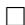

We can now compute the decay rate of the free energy functional towards its asymptotic limit along the evolution of the probability density function $u$ . For simplicity, we shall write $F(t)$ in place of $F(u(\cdot ,t))$ , and $F(\infty)$ for $F(u_{\infty}(\cdot))$ .

# Lemma 6.3

$$
F (t) - F (\infty) = D _ {K L} \left(u \| u _ {\infty}\right) \geq 0. \tag {6.158}
$$

Proof

$$
\begin{array}{l} F (t) = \int_ {\Sigma^ {n}} u (\log u - \gamma) d q \\ = \int_ {\Sigma^ {n}} u (\log u _ {\infty} - \gamma) d q + \int_ {\Sigma^ {n}} u (\log u - \log u _ {\infty}) d q \\ = \int_ {\Sigma^ {n}} u (- \log Z) d q + \int_ {\Sigma^ {n}} u \log \frac {u}{u _ {\infty}} d q \\ = - \log Z + \int_ {\Sigma^ {n}} u \log \frac {u}{u _ {\infty}} d q \\ = - \log Z + \int_ {\Sigma^ {n}} h \log h u _ {\infty} d q \\ \end{array}
$$

and from (6.154)

$$
F (\infty) = \int_ {\Sigma^ {n}} u _ {\infty} (\log u _ {\infty} - \gamma) d q = - \log Z.
$$

From these computations, we also get the relation

$$
D _ {K L} (u \| u _ {\infty}) = \int_ {\Sigma^ {n}} h \log h u _ {\infty} d q =: S _ {u _ {\infty} d q} (h), \tag {6.159}
$$

that is, the negative of the entropy of $h$ w.r.t. the equilibrium measure $u_{\infty} dq$ . We can now reinterpret (6.152).

# Lemma 6.4

$$
\frac {d}{d t} S _ {u _ {\infty} d q} (h) = \frac {d}{d t} F (t) = - \int_ {\Sigma^ {n}} \frac {A (q) \nabla h \cdot \nabla h}{h} u _ {\infty} d q \leq 0. \tag {6.160}
$$

Proof Equation (6.160) follows from (6.152) and (6.155) and the fact that $u_{\infty}$ and hence also $F(u_{\infty})$ is independent of $t$ .

# 6.3 Monte Carlo Methods

In this section, we present the application of the Fisher metric to Monte Carlo sampling developed by Girolami and Calderhead [108]. We first recall Markov chain Monte Carlo sampling. Although this is a standard method in statistics, for instance, for computing Bayesian posteriors, we present the basic ideas here in some detail because not all of our readers may be familiar with them. We don't discuss, however, any issues of practical implementation, for which we refer to standard textbooks like [167, 227].

Monte Carlo methods have been developed for the stochastic sampling of probability distributions. This is, for example, needed when one has to compute the integral over a probability distribution. For instance, the Bayesian scheme for computing the posterior $\pi (\xi |x)$ for the parameter $\xi$ from the prior $\pi (\xi)$ and the likelihood $p(x;\xi)$ of the observed datum $x$ ,

$$
\pi (\xi \mid x) = \frac {p (x ; \xi) \pi (\xi)}{p (x)} \tag {6.161}
$$

requires the computation of the integral

$$
p (x) = \int p (x; \eta) \pi (\eta) d \eta . \tag {6.162}
$$

(Since the base measure will not play a role in this section, we denote it simply by $d\eta$ .) Typically, the distribution $\pi(\eta)$ is not explicitly known. In order to approximate

this integral, one therefore needs to sample the distribution. And in the case where $\pi (\eta)$ is not explicitly known, it turns out to be best to use a stochastic sampling scheme. The basic idea is provided by the Metropolis algorithm [183] that when the current sample is $\xi_0$ , one randomly chooses $\xi_{1}$ according to some transition density $q(\xi_1|\xi_0)$ and then accepts $\xi_{1}$ as the new sample with probability

$$
\min  \left(1, \frac {\tilde {\pi} (\xi_ {1})}{\tilde {\pi} (\xi_ {0})}\right) \tag {6.163}
$$

where

$$
\tilde {\pi} (\xi) = p (x; \xi) \pi (\xi), \tag {6.164}
$$

noting that since in (6.163) we are taking a ratio, we don't need to know the normalization factor $p(x)$ and can work with the non-normalized densities $\tilde{\pi}$ rather than the normalized $\pi$ . Thus, $\xi_{1}$ is always accepted when its probability is higher than that of $\xi_{0}$ , but only with the probability $\frac{\tilde{\pi}(\xi_1)}{\tilde{\pi}(\xi_0)}$ when its probability is lower. When $\xi_{1}$ is not accepted, another random sample is taken to which the same criterion applies. The procedure is repeated until a new sample is accepted. The Metropolis-Hastings algorithm [117] replaces the criterion (6.163) by

$$
\min  \left(1, \frac {\tilde {\pi} (\xi_ {1}) q (\xi_ {0} | \xi_ {1})}{\tilde {\pi} (\xi_ {0}) q (\xi_ {1} | \xi_ {0})}\right) \tag {6.165}
$$

where $q(\xi_1|\xi_0)$ is the transition density for finding the putative new sample $\xi_1$ when $\xi_0$ is given. In many standard cases, this transition density is symmetric, i.e., $q(\xi_1|\xi_0) = q(\xi_0|\xi_1)$ , and (6.165) then reduces to (6.163). For instance, it may be given by a normal distribution

$$
\mathcal {N} \left(\xi_ {1}; \xi_ {0}, \Lambda\right) \tag {6.166}
$$

with mean $\xi_0$ and covariance $\Lambda$ (see (1.44)). In any case, such a sampling procedure yields a Markov chain since the transition to $\xi_1$ depends only on the current state $\xi_0$ and not on any earlier ones. Thus, one speaks of Markov chain Monte Carlo (MCMC).

Now, so far the scheme has been quite general, and it did not use any particular information about the probability densities concerned. Concretely, one might try to make the scheme more efficient by incorporating the aim to find samples with high values of $p$ or $\tilde{p}$ together with the geometry of the family of distributions at the current sample $\xi_0$ . The first aspect is addressed by the Langevin and Hamiltonian Monte Carlo methods, and the second one is then utilized in [108].

Combining these aspects, but formulating it in abstract terms, we have a target function $L(\xi)$ that we wish to minimize and a metric $g(\xi)$ with respect to which we can define the gradient of $L$ or Brownian motion as a stochastic tool for our sampling. Here, we take

$$
L (\xi) = - \log \pi (\xi) \tag {6.167}
$$

and

$$
g (\xi) = \mathfrak {g} (\xi), \tag {6.168}
$$

but the scheme to be described will also work for other choices of $L$ and $g$ .

# 6.3.1 Langevin Monte Carlo

Here, we shall describe the geometric version of [108] of what is called the Metropolis adjusted Langevin algorithm (MALA) in the statistical literature. We start with the following observation. Sampling from the $d$ -dimensional Gaussian distribution $\mathcal{N}(x,\sigma^2\mathrm{Id})$ (where $\mathrm{Id}$ is the $d$ -dimensional unit matrix) can be represented by Brownian motion. Indeed, the probability distribution at time 1 for a particle starting at $x$ at time 0 and moving under the influence of white noise of strength $\sigma$ is given by $\mathcal{N}(x,\sigma^2\mathrm{Id})$ (see, for instance, [135]). This can also be written as a stochastic differential equation for the $d$ -dimensional random variable $Y$ ,

$$
d Y (t) = \sigma d W _ {d} (t), \tag {6.169}
$$

where $W_{d}(t)$ is standard Brownian motion (of unit strength) on $\mathbb{R}^d$ . Here, $t$ stands for time. The random variable $Y(1)$ with $Y(0) = x$ is then distributed according to $\mathcal{N}(x,\sigma^2\mathrm{Id})$ . More generally, for a constant covariance matrix $\Lambda = (\lambda_{ij})$ , we have the associated stochastic differential equation

$$
d Y ^ {i} (t) = \sigma_ {j} ^ {i} d W ^ {j} (t) \quad \text {f o r} i = 1, \dots , d, \tag {6.170}
$$

where $\Sigma = (\sigma_j^i)$ is the positive square root of the positive definite matrix $\varLambda^{-1}$ , and the $W^{j}(t)$ , $j = 1,\dots ,d$ , are independent standard scalar Brownian motions. Again, when $Y(0) = x$ , $Y(1)$ is distributed according to the normal distribution $\mathcal{N}(x,\varLambda)$ .

While (6.169) generates Brownian motion on Euclidean space, when we look at a variable $\xi$ parametrizing a probability distribution, we should take the corresponding Fisher metric rather than the Euclidean one, and consider the associated Brownian motion. In general, Brownian motion on a Riemannian manifold with metric tensor $(g_{ij}(\xi))$ in local coordinates is generated by the Langevin equation

$$
\begin{array}{l} d \Xi^ {i} (t) = - \frac {1}{2 \sqrt {\det g (\Xi)}} \frac {\partial}{\partial \xi^ {j}} \left(\sqrt {\det g (\Xi)} g ^ {i j} (\Xi)\right) d t + \sigma_ {j} ^ {i} d W ^ {j} (t) \\ = - \frac {1}{2} g ^ {j k} (\Xi) \Gamma_ {j k} ^ {i} (\Xi) d t + \sigma_ {j} ^ {i} d W ^ {j} (t), \tag {6.171} \\ \end{array}
$$

where $(\sigma_j^i)$ now is the positive square root of the inverse metric tensor $(g^{ij})$ , $\det g$ is the determinant of $g_{ij}$ and

$$
\Gamma_ {j k} ^ {i} = \frac {1}{2} g ^ {i \ell} \left(\frac {\partial}{\partial \xi^ {k}} g _ {j \ell} + \frac {\partial}{\partial \xi^ {j}} g _ {k \ell} - \frac {\partial}{\partial \xi^ {\ell}} g _ {j k}\right) \tag {6.172}
$$

are the Christoffel symbols (see (B.48)). See [126], p. 87. Since the metric tensor in general is not constant, in this equation in addition to the noise term $dW$ , we also have a drift term involving derivatives of the metric tensor.

In particular, we may apply this to the Fisher metric $\mathfrak{g}$ and obtain the stochastic process corresponding to the covariance matrix given by the Fisher metric. Again, the Fisher metric here lives on the space of parameters $\xi$ , that is, on the space of probability distributions $p(\cdot ;\xi)$ parametrized by $\xi$ .

Also, when we have a function $L(\xi)$ that we wish to minimize, as in (6.167), then we can add the negative gradient of $L$ to the flow (6.171) and consider

$$
d \Xi^ {i} (t) = - \operatorname {g r a d} L (\Xi) d t - \frac {1}{2} g ^ {j k} (\Xi) \Gamma_ {j k} ^ {i} (\Xi) d t + \sigma_ {j} ^ {i} d W ^ {j} (t). \tag {6.173}
$$

In this manner, when we take $L$ as in (6.167) and $g$ as the Fisher metric, we obtain a stochastic process that incorporates both our wish to increase the log-probability of our parameter $\xi$ and the fact that the covariance matrix should be given by the Fisher metric. We can then sample from this process and obtain geometrically motivated transition probabilities $q(\xi_1|\xi_0)$ for the Metropolis-Hastings algorithm as in (6.165).

We may also consider (6.173) as a gradient descent for $L$ perturbed by Brownian motion w.r.t. our Riemannian metric. The metric here appears twice, in the definition of the gradient as well as in the definition of the noise. In our setting, working on a space of probability distributions parametrized by our variable $\xi$ , we have a natural Riemannian metric, the Fisher metric on that space. The scheme presented here is more general. It applies to the optimization of any function $L$ and works with any Riemannian metric, but the question may then arise which such metric to choose.

# 6.3.2 Hamiltonian Monte Carlo

Here, we shall describe the geometric version of [108] of what is called the Hamiltonian or hybrid Monte Carlo method. In Hamiltonian Monte Carlo, as introduced in [85], in contrast to Langevin Monte Carlo as described in the previous section, the stochastic variable is not $\xi$ itself, but rather its momentum. That is, $\xi$ evolves according to a deterministic differential equation with a stochastically determined momentum $m$ . Again, we start with the simplest case without a geometric structure given by a Riemannian metric $g$ or an objective function $L$ . Thus, we consider a $d$ -dimensional constant covariance matrix $\Lambda$ . We define the Hamiltonian

$$
H (\xi , m) := \frac {1}{2} m _ {i} \lambda^ {i j} m _ {j} + \frac {1}{2} \log \left((2 \pi) ^ {d} \det  \Lambda\right). \tag {6.174}
$$

(At this moment, $H$ does not yet depend on $\xi$ , but this will change below.) Here, the last term, which is constant, simply ensures the normalization

$$
\int \exp (- H (\xi , m)) d m = 1. \tag {6.175}
$$

The associated system of Hamilton's equations is

$$
\frac {d \xi}{d \tau} = \frac {\partial H}{\partial m} = \Lambda^ {- 1} m, \tag {6.176}
$$

$$
\frac {d m}{d \tau} = - \frac {\partial H}{\partial \xi} = 0. \tag {6.177}
$$

Here $\tau$ is a time variable; since the process is different from the Langevin process which involved a first-order stochastic differential equation for $\xi$ , whereas here from (6.176), (6.177), we get the second-order equation $\frac{d^2\xi}{d\tau^2} = 0$ . We denote time here by a different letter, $\tau$ instead of $t$ .

Thus, here we take a fixed initial value for $\xi$ , say $\xi(0) = \xi_0$ , whereas we sample $m$ from the Gibbs distribution with Hamiltonian $H$ , that is,

$$
\pi (m) = \exp (- H (\xi , m)). \tag {6.178}
$$

(We shall denote the probability distributions for $\xi$ and its momentum $m$ by the same letter $\pi$ , although they are of course different from each other.)

Again, we now extend this scheme by replacing the constant covariance matrix $\varLambda$ by a Riemannian metric tensor $G = (g_{ij}(\xi))$ , having again the Fisher metric $\mathfrak{g}$ in mind, as we wish to interpret $\xi$ as the parameter for a probability distribution. We introduce an objective function $L(\xi)$ , as in (6.167). We then have the Hamiltonian

$$
H (\xi , m) := L (\xi) + \frac {1}{2} m _ {i} g ^ {i j} (\xi) m _ {j} + \frac {1}{2} \log \left((2 \pi) ^ {d} \det  g (\xi)\right) \tag {6.179}
$$

and the Gibbs density

$$
\frac {1}{Z} \exp (- H (\xi , m)) \tag {6.180}
$$

with the normalization factor $Z = \int \exp(-L(\eta)) d\eta$ . We note that for the choice (6.167), $L(\xi) = -\log \pi(\xi)$ , we have

$$
Z = \int \pi (\eta) d \eta = 1. \tag {6.181}
$$

The associated Hamilton equations now are

$$
\frac {d \xi^ {i}}{d \tau} = \frac {\partial H}{\partial m _ {i}} = g ^ {i j} m _ {j},
$$

$$
\frac {d m _ {i}}{d \tau} = - \frac {\partial H}{\partial \xi^ {i}} = - \frac {\partial L (\xi)}{\partial \xi^ {i}} - \frac {1}{2} \mathrm {t r} \left(g ^ {j k} (\xi) \frac {\partial g _ {j k} (\xi)}{\partial \xi^ {i}}\right) + \frac {1}{2} m _ {j} g ^ {j r} (\xi) \frac {\partial g _ {r s} (\xi)}{\partial \xi^ {i}} g ^ {s k} m _ {k},
$$

or in abbreviated form

$$
\frac {d \xi^ {i}}{d \tau} = \frac {\partial H}{\partial m _ {i}} = G ^ {- 1} m, \tag {6.182}
$$

$$
\frac {d m _ {i}}{d \tau} = - \frac {\partial H}{\partial \xi^ {i}} = - \frac {\partial L}{\partial \xi^ {i}} - \frac {1}{2} \operatorname {t r} \left(G ^ {- 1} \frac {\partial G}{\partial \xi^ {i}}\right) + \frac {1}{2} m ^ {\top} G ^ {- 1} \frac {\partial G}{\partial \xi^ {i}} G ^ {- 1} m. \tag {6.183}
$$

Hamiltonian systems have a couple of useful properties (for more details, see, for instance, [144]):

1. The Hamiltonian $H(\xi(\tau), m(\tau))$ remains constant in time:

$$
\frac {d}{d \tau} H (\xi (\tau), m (\tau)) = \frac {\partial H}{\partial \xi} \frac {d \xi}{d \tau} + \frac {\partial H}{\partial m} \frac {d m}{d \tau} = - \frac {d m}{d \tau} \frac {d \xi}{d \tau} + \frac {d \xi}{d \tau} \frac {d m}{d \tau} = 0
$$

by (6.182), (6.183).

2. The volume form $d\xi(\tau)dm(\tau)$ of phase space remains constant. This follows from the fact that the vector field defined by the Hamiltonian equations is divergence free:

$$
\frac {d}{d \xi} \frac {d \xi}{d \tau} + \frac {d}{d m} \frac {d m}{d \tau} = \frac {\partial^ {2} H}{\partial \xi \partial m} - \frac {\partial^ {2} H}{\partial m \partial \xi} = 0.
$$

3. More strongly, the flow $\tau \mapsto (\xi(\tau), m(\tau))$ is symplectic: With $z = (\xi, m)$ , (6.182), (6.183) can be written as

$$
\frac {d z}{d \tau} = J \nabla H (z (\tau)) \tag {6.184}
$$

with

$$
J = \left( \begin{array}{c c} 0 & \operatorname {I d} \\ - \operatorname {I d} & 0 \end{array} \right)
$$

where 0 and Id stand for the $d \times d$ -dimensional zero and unit matrix.

4. In particular, the flow $\tau \mapsto (\xi(\tau), m(\tau))$ is reversible.

Again, one starts with $\xi(0) = \xi_0$ and samples the initial values for $m$ according to the Gibbs distribution (6.180). One accepts the state $(\xi(1), m(1))$ with probability $\min(1, \frac{\exp(-H(\xi(1), m(1)))}{\exp(-H(\xi(0), m(0)))})$ .

The stationary density $\bar{\pi} (\xi ,m)$ is then given by $\frac{1}{Z}\exp (-H(\xi ,m))$ . When we choose $L(\xi) = -\log \pi (\xi)$ , that is, (6.167), and recall (6.181), the stationary density for $\xi$ , obtained by marginalization w.r.t. $m$ is

$$
\bar {\pi} (\xi) = \int \exp (- H (\xi , m)) d m = \exp (- L (\xi)) = \pi (\xi), \tag {6.185}
$$

that is, it agrees with the original density $\pi (\xi)$

In order to compare the Langevin and the Hamilton approach, we differentiate the first of the Hamilton equations w.r.t. $\tau$ and then insert the second, that is,

$$
\begin{array}{l} \frac {d ^ {2} \xi^ {i}}{d \tau^ {2}} = \frac {\partial g ^ {i j}}{\partial \xi^ {k}} \frac {d \xi^ {k}}{d \tau} m _ {j} + g ^ {i j} \frac {d m _ {j}}{d \tau} \\ = - g ^ {i j} \frac {\partial L}{\partial \xi^ {j}} - \frac {1}{2} g ^ {i j} \mathrm {t r} \left(g ^ {\ell k} \frac {\partial g _ {\ell k}}{\partial \xi^ {j}}\right) \\ \end{array}
$$

$$
\begin{array}{l} - g ^ {i j} \frac {\partial g _ {j k}}{\partial \xi^ {s}} g ^ {k \ell} g ^ {s r} m _ {r} m _ {l} + \frac {1}{2} g ^ {i j} g ^ {\ell k} \frac {\partial g _ {k s}}{\partial \xi^ {j}} g ^ {s r} m _ {\ell} m _ {r} \\ = - (\operatorname {g r a d} L) ^ {i} - \frac {1}{2} g ^ {i j} \operatorname {t r} \left(g ^ {\ell k} \frac {\partial g _ {\ell k}}{\partial \xi^ {j}}\right) - \Gamma_ {k s} ^ {i} g ^ {k \ell} g ^ {s r} m _ {\ell} m _ {r}, \tag {6.186} \\ \end{array}
$$

where we have repeatedly exchanged bound indices and used the symmetry $g^{k\ell}g^{sr}m_r m_l = g^{s\ell}g^{kr}m_r m_l$ , in order to make use of (6.172) (that is, (B.48)).

When we compare (6.186) with (6.173), we see that in (6.186), the gradient of $L$ enters into the equations for the second derivatives of $\xi$ w.r.t. $\tau$ , but in (6.173), it occurs in the equations for the first derivatives of $\xi$ w.r.t. $t$ . Thus, the role of time, $t$ vs. $\tau$ , is different in the two approaches. (This was, in fact, already observed at the beginning of this section, when we analyzed (6.176), (6.177).) Modulo this difference, the Christoffel symbols enter in the same manner into the two equations. Also, the momenta $m$ are naturally covectors, and that is why they carry lower indices. $v^{k} = g^{k\ell}m_{\ell}$ then are the components of a vector (see (B.21)).

# 6.4 Infinite-Dimensional Gibbs Families

We now wish to put some information-geometric constructions, in particular those discussed in Sect. 4.3, into the context of the Gibbs families in statistical mechanics. $^{8}$ This section has a more informal character than other sections in this book, because it presents heuristic constructions that can only be made rigorous with techniques different from those developed here.

In statistical mechanics, one wishes to maximize the entropy

$$
H (p) (= - \varphi) = - \int p (x) \log p (x) \tag {6.187}
$$

for a probability distribution, i.e.,

$$
\int p (x) = 1 \tag {6.188}
$$

subject to the constraints that the expectation values of the functions $f_{i}, i = 1, \dots, n$ , are fixed,

$$
\mathbb {E} _ {p} \left(f _ {i}\right) = \int f _ {i} (x) p (x) = f _ {i} ^ {0} =: \eta_ {i}. \tag {6.189}
$$

One then introduces Lagrange multipliers $\vartheta^i$ , $i = 0, \dots, n$ , and looks for extrema of

$$
H _ {\vartheta} (p) := - \int p (x) \log p (x) - \sum_ {i = 1} ^ {n} \vartheta^ {i} \left(\int f _ {i} (x) p (x) - \eta_ {i}\right) - \vartheta^ {0} \left(\int p (x) - 1\right). \tag {6.190}
$$

The solution is the probability distribution

$$
p (x; \vartheta) = \exp \left(f _ {i} (x) \vartheta^ {i} - \psi (\vartheta)\right) = \frac {1}{Z (\vartheta)} \exp \left(f _ {i} (x) \vartheta^ {i}\right) \tag {6.191}
$$

with

$$
\psi (\vartheta) := \vartheta^ {0} + 1 = \log \int \exp (f _ {i} (x) \vartheta^ {i}) \tag {6.192}
$$

and the partition function

$$
Z (\vartheta) = \exp \psi (\vartheta) = \int \exp \left(f _ {i} (x) \vartheta^ {i}\right), \tag {6.193}
$$

and the values of the Lagrange multipliers $\vartheta^i, i = 1,\dots ,n$ , being determined by

$$
\eta_ {j} = \frac {\partial}{\partial \vartheta^ {j}} \log \int \exp (f _ {i} (x) \vartheta^ {i}) =: \frac {\partial}{\partial \vartheta^ {j}} \psi (\vartheta). \tag {6.194}
$$

In particular, the entropy of the maximizing distribution gets smaller, the more constraints are added, i.e., the more observations $f_{i}$ are to be reproduced (see for instance [130]). In particular, if in addition to the expected values of these functions $f_{i}$ , we also require to include the expected values of their products in the case where they are correlated, this further decreases the entropy of the resulting Gibbs distribution in line with what we have deduced above. Of course, the more observations are available, the smaller the uncertainty in the worst possible case, i.e., the entropy of the Gibbs distribution.

In the context of statistical mechanics, the function $\psi$ is the negative of the free energy. Thus, although it might be somewhat misleading to speak about the free energy here, since we have several observables $f_{i}$ , none of them being distinguished as the energy, we shall nevertheless call it by that name. In any case, that free energy depends on the choice of observables. This is in contrast to many contexts in physics where the potential energy can be assumed to be a physical quantity whose value or meaning does not depend on any such choices.

In conclusion, we see that the entropy and the free energy are dual to each other. The Lagrange multipliers $\vartheta^i$ are the derivatives of the negative entropy with respect to the expectation values $\eta_j$ , and the expectation values are the derivatives of the negative free energy with respect to the Lagrange multipliers. When written in terms of the Lagrange multipliers, our entropy maximizing distribution is an exponential or Gibbs distribution, but when written in terms of the expectation values, it becomes a linear or mixture family. In the simplest situation of statistical mechanics, we

have the energy as the only observable, and the role of the Lagrange multiplier is then assumed by the inverse temperature $\beta$ . Thus, our preceding duality relations generalize the fundamental formula of statistical mechanics

$$
H = \beta E + \log Z = \beta E - \beta F, \tag {6.195}
$$

where $H$ is the entropy, $E$ is the energy, and $F = -\frac{1}{\beta}\log Z$ is the free energy.

It is also of interest to extend the preceding formalism to functional integrals as occurring in quantum theories. In the present context, we can see the resulting structure best by setting up a formal correspondence between the finite-dimensional case so far considered and the infinite-dimensional one underlying path integrals. So, instead of a point $x \in \mathbb{R}^n$ with coordinates $x^1, \ldots, x^n$ , we consider a function $x: U \to \mathbb{R}$ on some set $U$ with values $x(u)$ . In other words, the point $u \in U$ now takes over the role of the index $i$ . In the finite-dimensional Euclidean case, a vector $V$ at $x$ has components $V^i$ , and a vector field is of the form $v(x)$ and leads to the transformations $x^i \mapsto x^i + tV^i(x)$ . A metric is of the form $h_{ij}dx^i dx^j$ and leads to the product $\sum_{i,j}h_{ij}V^iW^j$ between vectors. A vector at $x$ in the present case then has components $V(x)(u)$ , its operation on a function is $x(u) \mapsto x(u) + tV(x)(u)$ , and a metric has components $h(u,v)dudv$ , with the symmetry $h(u,v) = h(v,u)$ , and the metric product of two vectors $V, W$ at $x$ is

$$
\int h (u, v) V (u) W (v) d u d v. \tag {6.196}
$$

We note that here, in order to carry out the integral, we need some measure $du$ in the definition of the metric $h$ . For instance, when $U$ is a subset of some $\mathbb{R}^d$ , we could take the Lebesgue measure. Let us point out again here that $U$ is not our sample space; the sample space $\Omega$ will rather be a space of functions on $U$ , like $L^2(U, du)$ . Also, since we are considering here a metric at $x$ , that measure on $U$ could depend on the function $x$ . In order that the metric be positive definite, we need to require that $V(\cdot) \mapsto \int h(u, \cdot) V(u) du$ has a positive spectrum (we need to clarify here on which space of functions we are considering this operation, but we leave this issue open for the moment). In the finite-dimensional case, a transformation $x = x(y)$ is differentiable when all derivatives $\frac{\partial x^i}{\partial y^j}$ exist (and are continuous, differentiable, etc., whatever the precise technical requirement). Here, we then need to require for a transformation $x = x(y)$ that all derivatives $\frac{\partial x(u)}{\partial y(v)}$ exist (and satisfy appropriate conditions). We note that so far, we have not introduced any topology or other structure on the set $U$ (except for the measure $du$ whose technical nature, however, we have also left unspecified). The differentiability requirement is simply stated in terms of derivatives of real functions (the real number $x(u)$ as a function of the real number $y(v)$ ). When we pass from the $L^2$ -metric for vector fields in the finite-dimensional case,

$$
\int h _ {i j} (x) V ^ {i} (x) W ^ {j} (x) d x \tag {6.197}
$$

(with the measure $dx$ , for example, coming from some Riemannian structure) to the present case, we obtain a functional integral

$$
\int \left(\int h (x) (u, v) V (x) (u) W (x) (v) d u d v\right) d x \tag {6.198}
$$

where we now need to define the measure $dx$ . This is in general a nontrivial task, and to see how this can be achieved, we now turn to a more concrete situation, the infinite-dimensional analogue of Gaussian integrals. Since this topic draws upon different mathematical structures than the rest of this text, we cannot provide all the background about such functional integrals, and we refer to [137] and the references provided there for more details.

Here, we need to be more concrete about the function space and consider the Sobolev space $H^{1,2}(U)$ of $L^2$ -functions with square integrable (generalized) derivatives on some domain $U \in \mathbb{R}^d$ (or, more generally, in some Riemannian manifold).10

We consider the Dirichlet integral

$$
L (x) := \frac {1}{2} \int_ {U} | D x (u) | ^ {2} d u. \tag {6.199}
$$

Here, $Dx$ is the (generalized) derivative of $x$ ; when $x$ is differentiable, we have

$$
L (x) = \frac {1}{2} \int_ {U} \sum_ {\alpha} \left(\frac {\partial x}{\partial u ^ {\alpha}}\right) ^ {2} d u. \tag {6.200}
$$

We also note that for a twice differentiable $x$ ,

$$
L (x) = - \frac {1}{2} \int_ {U} x (u) \Delta x (u) d u = - \frac {1}{2} (x, \Delta x) _ {L ^ {2}} \tag {6.201}
$$

with the Laplacian $\Delta x = \sum_{\alpha}\frac{\partial^2x}{(\partial u^\alpha)^2}$

Our infinite-dimensional Gaussian integral is then the functional integral

$$
Z := \int \exp (- L (x)) d x. \tag {6.202}
$$

Here, the measure $dx$ as such is in fact ill-defined, but Wiener showed that the measure $\exp(-L(x))dx$ can be defined on our function space. The functional integral can then be taken on all of $L^2$ because $L(x) = \infty$ and therefore $\exp(-L(x)) = 0$ when $x$ is not in our Sobolev space. Actually, one slight technical point needs to be addressed here. The operator $\Delta$ has a kernel, consisting of the constant functions, and therefore, our Gaussian kernel is not positive definite, but only semidefinite. This is easily circumvented, however, by requiring $\int_U x(u)du = 0$ to eliminate the

constants. On that latter space, the Gaussian kernel is positive definite. This can also be expressed as follows. All eigenvalues $\lambda_{j}$ of $\Delta$ , that is, real numbers with nonconstant solutions $x_{j} \in L^{2}(U)$ of

$$
\Delta x _ {j} + \lambda_ {j} x _ {j} = 0 \tag {6.203}
$$

are positive. $-\Delta$ is then invertible, and its inverse is the Green operator $G$ . This Green operator is given by a symmetric integral kernel $G(u,v)$ , that is, it operates via $x(\cdot) \mapsto \int G(\cdot,u)x(u)du$ , i.e., by convolution with this kernel. $G(u,v)$ has a singularity at $u = v$ of order $-\log |u - v|$ for $d = 2$ and of order $|u - v|^{2 - d}$ for $d > 2$ .

We may then rewrite (6.201) as

$$
L (x) = \frac {1}{2} (x, G ^ {- 1} x) _ {L ^ {2}} \tag {6.204}
$$

and (6.202) as

$$
Z = \int \exp \left(- \frac {1}{2} (x, G ^ {- 1} x)\right) d x. \tag {6.205}
$$

More generally, we may consider

$$
I (\Delta , \vartheta) = \int \exp \left(- \frac {1}{2} (x, G ^ {- 1} x) + (\vartheta , x)\right) d x \tag {6.206}
$$

with

$$
(\vartheta , x) _ {L ^ {2}} = \int_ {U} \vartheta (u) x (u) d u. \tag {6.207}
$$

This expression is then fully analogous to our Gaussian integral (4.91). The analogy with the above discussion of Gaussian integrals, obtained by replacing the coordinate index $i$ in (4.91) by the point $u$ in our domain $U$ , would suggest

$$
Z = (\det  G) ^ {\frac {1}{2}}, \tag {6.208}
$$

when we normalize

$$
d x = \prod_ {i} \frac {d x _ {i}}{\sqrt {2 \pi}} \tag {6.209}
$$

to get rid of the factor $(2\pi)^n$ in (4.91). Here, the $(x_i)$ are an orthonormal basis of the Hilbert space $L^2(U)$ , for example, the (orthonormalized) eigenfunctions of $\Delta$ as in (6.203). The determinant $\det G$ in (6.208) can be defined as the inverse of the renormalized product of the eigenvalues $\lambda_j$ via zeta function regularization.

We can then directly carry over the above discussion for finite-dimensional Gaussian integrals to our functional integral. Thus, with

$$
\psi (\vartheta) := \frac {1}{2} (\vartheta , G \vartheta) + \frac {1}{2} \log \det  G, \tag {6.210}
$$

we obtain an exponential family

$$
p (x; \vartheta) = \exp \left(- \frac {1}{2} (x, G ^ {- 1} x) + (\vartheta , x) - \psi (\vartheta)\right). \tag {6.211}
$$

Analogously to (3.34), we have a metric

$$
\frac {\partial^ {2}}{\partial \vartheta (u) \partial \vartheta (v)} \psi = G (u, v) \tag {6.212}
$$

which is, in fact, independent of $\vartheta$ . It can also be expressed in terms of moments

$$
\begin{array}{l} \left\langle x \left(u _ {1}\right) \dots x \left(u _ {m}\right) \right\rangle := \mathbb {E} _ {p} \left(x \left(u _ {1}\right) \dots x \left(u _ {m}\right)\right) \\ = \frac {\int x (u _ {1}) \cdots x (u _ {m}) \exp \left(- \frac {1}{2} (x , G ^ {- 1} x) + (\vartheta , x)\right) d x}{\int \exp \left(- \frac {1}{2} (x , G ^ {- 1} x) + (\vartheta , x)\right) d x} \\ = \frac {1}{I (\Delta , \vartheta)} \frac {\partial}{\partial \vartheta (u _ {1})} \dots \frac {\partial}{\partial \vartheta (u _ {m})} I (\Delta , \vartheta). \tag {6.213} \\ \end{array}
$$

Again, we have the correlator

$$
\left. \left\langle x (u) x (v) \right\rangle - \left\langle x (u) \right\rangle \left\langle x (v) \right\rangle = G (u, v), \right. \tag {6.214}
$$

as an analogue of (4.84). For $\vartheta = 0$ , the first-order moments $\langle x(u)\rangle$ vanish.

Thus, when viewed in the framework of information geometry, the Green function yields a Fisher metric on $L^2 (U)$ (with the constants divided out) via

$$
\int G (u, v) V (u) W (v) d u d v. \tag {6.215}
$$

Since all eigenvalues of $G$ are positive, this expression is positive definite.

The question then emerges to what extent the preceding formal computations lead to a structure that satisfies our requirements for a statistical model, that is, the differentiability requirements of Definition 3.4 and the integrability requirements of Definition 3.7. In order to obtain differentiability, one might restrict $\vartheta$ to be a test function, that is, infinitely often differentiable and rapidly decaying at infinity. Of course, the precise requirement will depend on the space of functions (or distributions) $x$ that one wants to work with. 2-integrability, however, is not satisfied in general. The reason is that the 2-point function

$$
\left\langle x (u) x (v) \right\rangle = \mathbb {E} _ {p} \left(x (u) x (v)\right) = \frac {\int x (u) x (v) \exp \left(- \frac {1}{2} \left(x , G ^ {- 1} x\right) + (\vartheta , x)\right) d x}{\int \exp \left(- \frac {1}{2} \left(x , G ^ {- 1} x\right) + (\vartheta , x)\right) d x} \tag {6.216}
$$

becomes $\infty$ for $u = v$ . Equivalently, the Green function $G$ has a singularity at $u = v$ ,

$$
G (u, u) = \infty . \tag {6.217}
$$

In quantum field theory, this issue is dealt with by such techniques as Wick ordering or renormalization (see, for instance, [109, 229]), but this is outside the scope of the present book.

The preceding considerations can be generalized to other functional integrals and to observables other than the values $x(u)$ . As this is obvious and straightforward, we do not carry this out here.

# Appendix A Measure Theory

In this appendix, we collect some results from measure theory utilized in the text.

Let $M$ be a set. A measure $\mu$ is supposed to assign a non-negative number, or possibly $\infty$ , to a subset $A$ of $M$ . This value $\mu(A)$ then represents something like the size of $A$ with respect to the measure $\mu$ . Thus

(1) $0 \leq \mu(A) \leq \infty$ .

Also naturally

(2) $\mu (\emptyset) = 0$

Finally, we would like to have

(3) $\mu (\bigcup_{n}A_{n}) = \sum_{n}\mu (A_{n})$ for a countable family of pairwise disjoint subsets $A_{n},n\in \mathbb{N}$ , of $M$ .

This implies in particular

(4) $\mu (A) + \mu (M\backslash A) = \mu (M)$ for a subset $A$

It turns out, however, that this does not quite work for arbitrary subsets. Thus, one needs to restrict these requirements to certain subsets of $M$ ; of course, the class of these subsets should include those that are relevant for the structures that $M$ may possess. For example, when $M$ is a topological space, these results should hold for the open and closed subsets of $M$ . The appropriate requirements for such a class of subsets are encoded in

Definition A.1 A nonempty collection $\mathfrak{B}$ of subsets of a set $M$ is called a $\sigma$ -algebra if:

(S1) Whenever $A\in \mathfrak{B}$ , then also $M\backslash A\in \mathfrak{B}$ .   
(S2) Whenever $(A_{n})_{n\in \mathbb{N}}\subset \mathfrak{B}$ , then also $\bigcup_{n = 1}^{\infty}A_{n}\in \mathfrak{B}$ .

One easily observes that for a $\sigma$ -algebra on $M$ , necessarily $\varnothing \in \mathfrak{B}$ and $M \in \mathfrak{B}$ and whenever $(A_{n})_{n \in \mathbb{N}} \subset \mathfrak{B}$ , then also $\bigcap_{n=1}^{\infty} A_{n} \in \mathfrak{B}$ .

Remark Let us briefly compare the requirements of a $\sigma$ -algebra with those for the collection $\mathcal{U}$ of open sets in Euclidean space $\mathbb{R}^d$ . The latter satisfies

(O1) $\emptyset, \mathbb{R}^d \in \mathcal{U}$ .   
(O2) If $U, V \in \mathcal{U}$ , then also $U \cap V \in \mathcal{U}$ .   
(O3) If $U_{i}\in \mathcal{U}$ for all $i$ in some index set $I$ , then also

$$
\bigcup_ {i \in I} U _ {i} \in \mathcal {U}.
$$

So, a finite union of open sets is open again, as in the requirement for a $\sigma$ -algebra. The complement of an open set, however, is not open (except for $\varnothing$ , $\mathbb{R}^d$ ), but closed. Therefore, the collection of open sets does not constitute a $\sigma$ -algebra. There is a simple solution to cope with this difficulty, namely to let $\mathcal{U}$ generate a $\sigma$ -algebra, that is, take the collection $\mathfrak{B}$ of all sets generated by the iterated application of the processes (S1, 2) to sets in $\mathcal{U}$ . This is called the Borel $\sigma$ -algebra, and its members are called Borel sets.

In fact, these constructions extend to arbitrary topological spaces, that is, sets $M$ with a collection $\mathcal{U}$ of subsets satisfying (O1)-(O3) (with $\mathbb{R}^d$ replaced by $M$ now in (O1), of course). These sets are then defined to be the open sets generating the topology of $M$ . Their complements are then called closed.

Definition A.2 Let $M$ be a set with a $\sigma$ -algebra $\mathfrak{B}$ .

A function $\mu :\mathfrak{B}\to \mathbb{R}^{+}\cup \{\infty \}$ ,i.e.,

$$
0 \leq \mu (A) \leq \infty \quad \text {f o r e v e r y} A \in \mathfrak {B},
$$

with

$$
\mu (\emptyset) = 0,
$$

is called a measure on $(M, \mathfrak{B})$ if whenever the sets $A_{n} \in \mathfrak{B}, n \in \mathbb{N}$ , are pairwise disjoint, then

$$
\mu \left(\bigcup_ {n = 1} ^ {\infty} A _ {n}\right) = \sum_ {n = 1} ^ {\infty} \mu \left(A _ {n}\right)
$$

(countable additivity).

The elements of $\mathfrak{B}$ then are called measurable (w.r.t. $\mu$ ).

For our purposes, a normalization is usually important:

Definition A.3 A measure $\mu$ with

$$
\mu (M) = 1
$$

is called a probability measure.

According to our definition, a measure assigns to each measurable subset of $M$ a nonnegative number, possibly $+\infty$ , but for our purposes, we mostly consider only those measures $\mu$ with $0 < \mu(M) < \infty$ . Such a measure can be made into a probability measure by a simple rescaling.

Examples of measures are of course the standard Lebesgue measure on $\mathbb{R}^d$ , but also Dirac measures on arbitrary spaces $M$ . Given a point $x \in M$ , the associated Dirac measure $\delta_x$ is defined by

$$
\delta_ {x} (A) := \left\{ \begin{array}{l l} 0 & \text {i f} x \notin A, \\ 1 & \text {i f} x \in A, \end{array} \right.
$$

for any subset $A$ of $M$ . Another example is the following one on an uncountable set $M$ : we take the $\sigma$ -algebra of the sets $A$ that are countable or complements of countable sets, and we let $\mu(A)$ be 0 when $A$ is countable and 1 when its complement is countable.

In general, measures can be quite wild, and so, if one wants to derive more specific results, one needs to impose some additional restrictions. When $M$ is a topological space, a very useful class in this regard turns out to be that of Radon measures, i.e., those with

- $\mu(K) < \infty$ for every compact set $K$ ,   
- $\mu(U) = \sup \{\mu(K): K \text{ compact, } K \subset U\}$ for every open set $U$ and   
- $\mu(A) = \inf \{\mu(U): U \text{ open, } A \subset U\}$ for every measurable set $A$ .

The null sets of a measure $\mu$ are those subsets $A$ of $M$ with $\mu(A) = 0$ . We say that a property holds almost everywhere (abbreviated as a.e.) (w.r.t. the measure $\mu$ ) when it holds except possibly on a null set.

Definition A.4 $\varphi : M \to \mathbb{R}$ is said to be a simple function if there exist disjoint measurable sets $B_1, \ldots, B_k \subset M$ and $c_1, \ldots, c_k \in \mathbb{R}$ such that

$$
\varphi = \sum_ {j = 1} ^ {k} c _ {j} \chi_ {B _ {j}}.
$$

Here $\chi_B$ is the characteristic function of the set $B$ , that is,

$$
\chi_ {B} (x) := \left\{ \begin{array}{l l} 1 & \text {w h e n} x \in B, \\ 0 & \text {w h e n} x \notin B. \end{array} \right.
$$

We then define the integral of such a simple function as

$$
\int \varphi d \mu := \sum_ {j = 1} ^ {k} c _ {j} \mu (B _ {j}).
$$

The following statements are equivalent for a function $f: M \to \mathbb{R} \cup \{\pm \infty\}$ :

1. For every $c \in \mathbb{R}$ , the set $A_c := \{x \in M : f(x) \geq c\}$ is measurable.   
2. $f$ is the pointwise limit of simple functions (the convergence thus occurs everywhere and not just almost everywhere).

Such an $f$ is then called measurable, and its integral is defined as

$$
\int f d \mu := \lim _ {n \to \infty} \int \varphi_ {n} d \mu ,
$$

where the $\varphi_{n}$ are simple functions converging to $f$ . $f$ is called integrable when this integral is finite.

We can also recover the measure of a measurable set $A$ from the integral of its characteristic function:

$$
\mu (A) = \int \chi_ {A} d \mu .
$$

(A set is measurable precisely if its characteristic function is integrable.) In this sense, measure and integral are equivalent concepts because either of them can be used to derive the other.

There is another useful perspective on this. Given an integrable function $f$ , we assign a scalar $\mu(f) \coloneqq \int f d\mu$ to it. When we wish to perform this on classes of functions and measures to see some functorial properties, we encounter the difficulty that whether a function is integrable depends on the measure chosen. We can ask, however, for which measures all members of some class of functions are integrable. The natural class of functions is that of continuous functions on a topological space (a function $f: X \to \mathbb{R}$ on a topological space is continuous if for every open set $U$ in $\mathbb{R}$ , the preimage $f^{-1}(U)$ is open in $X$ ; in fact, we can more generally consider mappings $F: X \to Y$ between topological spaces here and have the same definition of continuity). The space $C^0(X)$ of continuous linear functions on $X$ is equipped with the topology of uniform convergence. This topology is derived from the norm

$$
\| f\|_{C^{0}}:= \sup_{x\in X}\bigl|f(x)\bigr|.
$$

The topology is generated by (that is, the open sets are obtained as finite intersections and countable unions of) sets of the form $\{g\in C^0 (X):\| f - g\| <  \epsilon \}$ for some $f\in C^0 (X)$ and some $\epsilon >0$ $C^0 (X)$ thus becomes a topological space itself, in fact a Banach space, because we have a norm, our supremum norm, with respect to which the space is complete (because $\mathbb{R}$ is complete). The Riesz representation theorem says that the continuous linear functionals on $C^0 (X)$ are precisely given by the signed Radon measures (here, "signed" means that we drop the requirement that the measure be non-negative).

We thus see the duality between functions and measures: we can consider $\int f d\mu$ as $\mu(f)$ , that is, the measure applied to the function, or as $f(\mu)$ , the function applied to the measure. Thus, measures yield linear functionals on spaces of functions, and functions yield linear functionals on spaces of (signed) measures (even though there

are more such functionals than those given by functions, that is, the dual space of the space of signed Radon measures is bigger than the space of continuous functions).

An easy example is given by a Dirac measure $\delta_x$ ( $x \in X$ ). Here,

$$
\delta_ {x} (f) = f (x),
$$

an operation on functions. Of course, $f(x)$ is also the result of the operation of $f$ on the points of $X$ , and this evaluation of the function at a point then also becomes an operation on the associated Dirac measure $\delta_{x}$ .

We now want to use maps to move measures around. Let $\mu$ be a measure on $M$ with the $\sigma$ -algebra $\mathfrak{B}$ of measurable sets, and let $\kappa : L \to M$ be a map. We then try to define a pullback measure $\kappa^{*}\mu$ on $L$ by defining

$$
\kappa^ {*} \mu (U) := \mu (\kappa (U))
$$

whenever $\kappa(U) \in \mathfrak{B}$ . However, the sets $U$ with this property need not constitute a $\sigma$ -algebra when $\kappa$ is not bijective. For example, the image of $L$ itself need not be a measurable subset of $M$ . Also, the images of disjoint sets in general are not disjoint themselves.

We now consider a map $\kappa : M \to N$ , and we try to define a pushforward measure $\kappa_* \mu$ on $N$ by defining

$$
\kappa_ {*} \mu (V) := \mu (\kappa^ {- 1} (V))
$$

whenever $\kappa^{-1}(V) \in \mathfrak{B}$ . The latter sets $V$ constitute a $\sigma$ -algebra; for instance, the preimage of $N$ is $M$ , the preimage of a complement is the complement of that preimage, and the union of preimages is the preimage of the union of the images. Therefore, $\kappa_{*}\mu$ is a measure on $N$ with this $\sigma$ -algebra.

We can also naturally see from the duality between measures and functions why the pushforward, but not the pullback, works for moving measures around. Namely, for functions, the natural operation is the pullback of a function $f$ defined as

$$
\kappa^ {*} f (x) = f (\kappa (x)).
$$

Pushforward does not work here (unless $f$ is bijective). Now, from the duality, we can simply put

$$
\kappa_ {*} \mu (f) = \mu (\kappa^ {*} (f))
$$

and everything transforms nicely.

We now assume that $M$ is a differentiable manifold and consider a diffeomorphism $\kappa : M \to M$ . Then both the pushforward $\kappa_{*}\mu$ and the pullback $\kappa^{*}\mu$ are defined for a measure $\mu$ on $M$ .

Since $\int_{V} \frac{1}{|\det d\kappa(x)|} \mu(d(\kappa(x))) = \int_{\kappa^{-1}V} \mu(dx)$ by the transformation formula, we have

$$
\kappa_ {*} \mu (\kappa (x)) | \det  d \kappa (x) | = \mu (y) \quad \text {f o r} y = \kappa (x).
$$

When we work with the pullback measure, we have

$$
\kappa^ {*} \mu (x) = | \det  d \kappa (x) | \mu (\kappa (x)).
$$

Given a measure on $M$ , we can also define an $L^2$ -product for measurable functions $f, g$ :

$$
\langle f, g \rangle_ {\mu} := \int f g d \mu , \tag {A.1}
$$

and a measurable function $f$ is said to be of class $L^2$ when $\langle f, f \rangle_{\mu} < \infty$ . The space $L^2(\mu)$ of such functions then becomes a Hilbert space.

For the transformed measure $\kappa_{*}(\mu)$ , we then obtain the Hilbert space $L^2 (\kappa_*(\mu))$ from

$$
\langle f, g \rangle_ {\kappa * \mu} = \left\langle \kappa^ {*} f, \kappa^ {*} g \right\rangle_ {\mu}.
$$

When $\kappa$ is a diffeomorphism, we also have the pullback measure and we thus have

$$
\langle f, g \rangle_ {\mu} = \left\langle \kappa^ {*} f, \kappa^ {*} g \right\rangle_ {\kappa^ {*} \mu}.
$$

Two measures are called compatible if they have the same null sets. If $\mu_1, \mu_2$ are compatible finite non-negative measures, they are absolutely continuous with respect to each other in the sense that there exists a non-negative function $\varphi$ that is integrable with respect to either of them, such that

$$
\mu_ {2} = \varphi \mu_ {1} \quad \text {o r , e q u i v a l e n t l y ,} \quad \mu_ {1} = \varphi^ {- 1} \mu_ {2}.
$$

$(\varphi$ is called the Radon-Nikodym derivative of $\mu_{2}$ with respect to $\mu_{1}$ ).

Being integrable, $\varphi$ is finite almost everywhere (with respect to both $\mu_{1}$ and $\mu_{2}$ ) on $M$ , and since the situation is symmetric between $\varphi$ and $\varphi^{-1}$ , $\varphi$ is also positive almost everywhere. Thus, for any finite non-negative measure $\mu$ on $M$ , we let $\mathcal{C}_{\mu}(M)$ be the space of integrable functions on $M$ that are positive almost everywhere with respect to $\mu$ .

Any other finite non-negative measure $\mu'$ that is compatible with $\mu$ thus is of the form

$$
\mu^ {\prime} = \varphi \mu \quad \text {f o r s o m e} \quad \varphi \in \mathcal {C} _ {\mu} (M)
$$

and

$$
\mathcal {C} _ {\mu^ {\prime}} (M) = \mathcal {C} _ {\mu} (M) =: \mathcal {C} (M).
$$

This space depends on the compatibility class, but not on the individual measure within that class.

# Appendix B Riemannian Geometry

We collect here some basic facts and principles of Riemannian geometry as the foundation for the presentation of Riemannian metrics, covariant derivatives, and affine structures in the text. For a more penetrating discussion and for the proofs of various results, we need to refer to [139]. Classical differential geometry as expressed through the tensor calculus is about coordinate representations of geometric objects and the transformations of those representations under coordinate changes. The geometric objects are invariantly defined, but their coordinate representations are not, and resolving this contradiction is the content of the tensor calculus.

We consider a $d$ -dimensional differentiable manifold $M$ and start with some conventions:

1. Einstein summation convention

$$
a ^ {i} b _ {i} := \sum_ {i = 1} ^ {d} a ^ {i} b _ {i}. \tag {B.1}
$$

The content of this convention is that a summation sign is omitted when the same index occurs twice in a product, once as an upper and once as a lower index. The conventions about when to place an index in an upper or lower position will be given subsequently. One aspect of this, however, is

2. When $(h_{ij})_{i,j}$ is a metric tensor $^1$ (a notion to be explained below) with indices $i, j$ , the inverse metric tensor is written as $(h^{ij})_{i,j}$ , that is, by raising the indices. In particular

$$
h ^ {i j} h _ {j k} = \delta_ {k} ^ {i} := \left\{ \begin{array}{l l} 1 & \text {w h e n} i = k, \\ 0 & \text {w h e n} i \neq k, \end{array} \right. \tag {B.2}
$$

the so-called Kronecker symbol.

3. Combining the previous rules, we obtain more generally

$$
v ^ {i} = h ^ {i j} v _ {j} \quad \text {a n d} \quad v _ {i} = h _ {i j} v ^ {j}. \tag {B.3}
$$

A (finite-dimensional) manifold $M$ is locally modeled after $\mathbb{R}^d$ . Thus, locally, it can be represented by coordinates $x = (x^{1},\ldots ,x^{d})$ taken from some open subset of $\mathbb{R}^d$ . These coordinates, however, are not canonical, and we may as well choose other ones, $y = (y^{1},\dots ,y^{d})$ , with $x = f(y)$ for some homeomorphism $f$ . When the manifold $M$ is differentiable, we can cover it by local coordinates in such a manner that all such coordinate transitions are diffeomorphisms where defined. Again, the choice of coordinates is non-canonical. The basic content of classical differential geometry is then to investigate how various expressions representing objects on $M$ like tangent vectors transform under coordinate changes. Here and in the sequel, all objects defined on a differentiable manifold will be assumed to be differentiable themselves. This is checked in local coordinates, but since coordinate transitions are diffeomorphic, the differentiability property does not depend on the choice of coordinates.

Remark For our purposes, it is convenient, and in the literature it is customary, to mean by differentiability smoothness of class $C^\infty$ , that is, assume that all objects are infinitely often differentiable. The ring of (infinitely often) differentiable functions on $M$ is denoted as $C^\infty(M)$ .

A tangent vector for $M$ at some point represented by $x_0$ in local coordinates $x$ is an expression of the form

$$
V = v ^ {i} \frac {\partial}{\partial x ^ {i}}; \tag {B.4}
$$

this means that it operates on a function $\phi (x)$ in our local coordinates as

$$
V (\phi) \left(x _ {0}\right) = v ^ {i} \frac {\partial \phi}{\partial x ^ {i}} _ {| x = x _ {0}}. \tag {B.5}
$$

The tangent vectors at $p \in M$ form a vector space, called the tangent space $T_{p}M$ of $M$ at $p$ . While, as should become clear subsequently, this tangent space and its tangent vectors are defined independently of the choice of local coordinates, the representation of a tangent space does depend on those coordinates. The question then is how the same tangent vector is represented in different local coordinates $y$ with $x = f(y)$ as before. The answer comes from the requirement that the result of the operation of the tangent vector $V$ on a function $\phi$ , $V(\phi)$ , should be independent of the choice of coordinates. Always applying the chain rule here and in the sequel, this yields

$$
V = v ^ {i} \frac {\partial y ^ {\alpha}}{\partial x ^ {i}} \frac {\partial}{\partial y ^ {\alpha}}. \tag {B.6}
$$

Thus, the coefficients of $V$ in the $y$ -coordinates are $v^i \frac{\partial y^\alpha}{\partial x^i}$ . This is verified by the following computation:

$$
v ^ {i} \frac {\partial y ^ {\alpha}}{\partial x ^ {i}} \frac {\partial}{\partial y ^ {\alpha}} \phi \big (f (y) \big) = v ^ {i} \frac {\partial y ^ {\alpha}}{\partial x ^ {i}} \frac {\partial \phi}{\partial x ^ {j}} \frac {\partial x ^ {j}}{\partial y ^ {\alpha}} = v ^ {i} \frac {\partial x ^ {j}}{\partial x ^ {i}} \frac {\partial \phi}{\partial x ^ {j}} = v ^ {i} \frac {\partial \phi}{\partial x ^ {i}}, \qquad (\mathrm {B . 7})
$$

as required.

More abstractly, changing coordinates by $f$ pulls a function $\phi$ defined in the $x$ -coordinates back to $f^{*}\phi$ defined for the $y$ -coordinates, with $f^{*}\phi(y) = \phi(f(y))$ . If then $W = w^{\alpha} \frac{\partial}{\partial y^{\alpha}}$ is a tangent vector written in the $y$ -coordinates, we need to push it forward as $f_{*}W = w^{\alpha} \frac{\partial x^{i}}{\partial y^{\alpha}} \frac{\partial}{\partial x^{i}}$ to the $x$ -coordinates, to have the invariance

$$
(f _ {*} W) (\phi) = W \big (f ^ {*} \phi \big), \tag {B.8}
$$

which is easily checked:

$$
(f _ {*} W) \phi = w ^ {\alpha} \frac {\partial x ^ {i}}{\partial y ^ {\alpha}} \frac {\partial \phi}{\partial x ^ {i}} = w ^ {\alpha} \frac {\partial}{\partial y ^ {\alpha}} \phi (f (y)) = W (f ^ {*} \phi). \qquad (\mathrm {B . 9})
$$

In particular, there is some duality between functions and tangent vectors here. However, the situation is not entirely symmetric because we need to know the tangent vector only at the point $x_0$ where we want to apply it, but we need to know the function $\phi$ in some neighborhood of $x_0$ because we take its derivatives.

A vector field then is defined as $V(x) = v^{i}(x)\frac{\partial}{\partial x^{i}}$ , that is, by having a tangent vector at each point of $M$ . As indicated above, we assume here that the coefficients $v^{i}(x)$ are differentiable. The vector space of vector fields on $M$ is written as $\Gamma(TM)$ . (In fact, $\Gamma(TM)$ is a module over the ring $C^\infty(M)$ .)

Subsequently, we shall need the Lie bracket $[V,W]\coloneqq VW - WV$ of two vector fields $V(x) = v^{i}(x)\frac{\partial}{\partial x^{j}}$ , $W(x) = w^{j}(x)\frac{\partial}{\partial x^{j}}$ ; its operation on a function $\phi$ is

$$
\begin{array}{l} [ V, W ] \phi (x) = v ^ {i} (x) \frac {\partial}{\partial x ^ {i}} \bigg (w ^ {j} (x) \frac {\partial}{\partial x ^ {j}} \phi (x) \bigg) - w ^ {j} (x) \frac {\partial}{\partial x ^ {j}} \bigg (v ^ {i} (x) \frac {\partial}{\partial x ^ {i}} \phi (x) \bigg) \\ = \left(v ^ {i} (x) \frac {\partial w ^ {j} (x)}{\partial x ^ {i}} - w ^ {i} (x) \frac {\partial v ^ {j} (x)}{\partial x ^ {i}}\right) \frac {\partial \phi (x)}{\partial x ^ {j}}. \tag {B.10} \\ \end{array}
$$

In particular, for coordinate vector fields, we have

$$
\left[ \frac {\partial}{\partial x ^ {i}}, \frac {\partial}{\partial x ^ {j}} \right] = 0. \tag {B.11}
$$

Returning to a single tangent vector, $V = v^{i}\frac{\partial}{\partial x^{i}}$ at some point $x_0$ , we consider a covector $\omega = \omega_{i}dx^{i}$ at this point as an object dual to $V$ , with the rule

$$
d x ^ {i} \left(\frac {\partial}{\partial x ^ {j}}\right) = \delta_ {j} ^ {i} \tag {B.12}
$$

yielding

$$
\omega_ {i} d x ^ {i} \left(v ^ {j} \frac {\partial}{\partial x ^ {j}}\right) = \omega_ {i} v ^ {j} \delta_ {j} ^ {i} = \omega_ {i} v ^ {i}. \tag {B.13}
$$

This expression depends only on the coefficients $v^i$ and $\omega_i$ at the point under consideration and does not require any values in a neighborhood. We can write this as $\omega(V)$ , the application of the covector $\omega$ to the vector $V$ , or as $V(\omega)$ , the application of $V$ to $\omega$ .

We have the transformation behavior

$$
d x ^ {i} = \frac {\partial x ^ {i}}{\partial y _ {\alpha}} d y ^ {\alpha} \tag {B.14}
$$

required for the invariance of $\omega(V)$ . Thus, the coefficients of $\omega$ in the $y$ -coordinates are given by the identity

$$
\omega_ {i} d x ^ {i} = \omega_ {i} \frac {\partial x ^ {i}}{\partial y _ {\alpha}} d y ^ {\alpha}. \tag {B.15}
$$

The transformation behavior of a tangent vector as in (B.6) is called contravariant, the opposite one of a covector as (B.15) covariant.

A 1-form then assigns a covector to every point in $M$ , and thus, it is locally given as $\omega_{i}(x)dx^{i}$ .

Having derived the transformation of vectors and covectors, we can then also determine the transformation rules for other tensors. A lower index always indicates covariant, an upper one contravariant transformation. For example, the metric tensor, written as $h_{ij}dx^i\otimes dx^j$ , with $h_{ij} = \langle \frac{\partial}{\partial x^i},\frac{\partial}{\partial x^j}\rangle$ being the product of those two basis vectors, operates on pairs of tangent vectors. It therefore transforms doubly covariantly, that is, becomes

$$
h _ {i j} (f (y)) \frac {\partial x ^ {i}}{\partial y ^ {\alpha}} \frac {\partial x ^ {j}}{\partial y ^ {\beta}} d y ^ {\alpha} \otimes d y ^ {\beta}. \tag {B.16}
$$

The function of the metric tensor is to provide a Euclidean product of tangent vectors,

$$
\langle V, W \rangle = h _ {i j} v ^ {i} w ^ {j} \tag {B.17}
$$

for $V = v^{i}\frac{\partial}{\partial x^{i}}$ , $W = w^{i}\frac{\partial}{\partial x^{i}}$ . As a check, in this formula, $v^{i}$ and $w^{i}$ transform contravariantly, while $h_{ij}$ transforms doubly covariantly so that the product as a scalar quantity remains invariant under coordinate transformations.

Let $M$ carry a Riemannian metric $h = \langle \cdot, \cdot \rangle$ . Let $S$ be a (smooth) submanifold. Then $h$ induces a Riemannian metric on $S$ , by simply restricting it to the corresponding tangent spaces $T_pS \subset T_pM$ for $p \in S$ . For $p \in S$ the tangent space $T_pM$ can be orthogonally decomposed into the tangent space $T_pS$ and the normal space $N_pS$ ,

$$
T _ {p} M = T _ {p} S \oplus N _ {p} S \text {w i t h} V \in N _ {p} M \Leftrightarrow \langle V, W \rangle = 0 \text {f o r a l l} W \in T _ {p} S, \tag {B.18}
$$

and we therefore also have an orthogonal projection from $T_{p}M$ onto $T_{p}S$ .

# B Riemannian Geometry

A Riemannian metric also provides an isomorphism between a tangent space $T_{p}M$ and the corresponding cotangent space $T_{p}^{*}M$ . For each $\omega \in T_{p}^{*}M$ , we can find a vector $V_{\omega} \in T_{p}M$ with

$$
\langle V _ {\omega}, W \rangle = \omega (W) \quad \text {f o r a l l} W \in T _ {p} M, \tag {B.19}
$$

and conversely, every $V \in T_pM$ defines a linear functional

$$
W \mapsto \langle V, W \rangle \tag {B.20}
$$

on $T_{p}M$ which can then be represented by some covector $\omega^{V} \in T_{p}^{*}M$ . In local coordinates, the relations between the components of a covector $\omega$ and the corresponding vector $V$ are

$$
v ^ {i} = h ^ {i j} \omega_ {j} \quad \text {a n d} \quad \omega_ {i} = h _ {i j} v ^ {j}. \tag {B.21}
$$

In particular, if $f$ is a function, the 1-form $df$ is dual to a vector field $\operatorname{grad} f$ , the gradient of $f$ , which satisfies

$$
\left\langle \operatorname {g r a d} f (x), W \right\rangle = W (f) (x) = d f (W) (x) \quad \text {f o r a l l} x \in M \text {a n d} W \in T _ {x} M. \tag {B.22}
$$

In local coordinates, the gradient is given by

$$
\operatorname {g r a d} (f) ^ {i} = h ^ {i j} \frac {\partial f}{\partial x ^ {j}}. \tag {B.23}
$$

The gradient of a function $f$ is a vector field, but not every vector field $V$ is the gradient of a function of $f$ . There is a necessary condition, the Frobenius condition. The condition

$$
v ^ {i} = \operatorname {g r a d} (f) ^ {i} = h ^ {i j} \frac {\partial f}{\partial x ^ {j}}
$$

is equivalent to

$$
\omega_ {j} = h _ {j i} v ^ {i} = \frac {\partial f}{\partial x ^ {j}} \tag {B.24}
$$

and (as we are assuming that all our objects are smooth), since the second derivatives of $f$ commute, $\frac{\partial^2 f}{\partial x^j \partial x^k} = \frac{\partial^2 f}{\partial x^k \partial x^j}$ for all indices $j, k$ , we get the necessary condition

$$
\frac {\partial \omega^ {j}}{\partial x ^ {k}} = \frac {\partial \omega^ {k}}{\partial x ^ {j}} \quad \text {f o r a l l} j, k. \tag {B.25}
$$

Frobenius' Theorem says that this condition is also sufficient on a simply connected domain, that is, a vector field $V$ is a gradient of some function $f$ on such a domain if and only if the associated 1-form $\omega_{j} = h_{ji}v^{i}$ (B.24) satisfies (B.25). Obviously, it depends on the metric whether a vector field is the gradient of a function, because via (B.24), the condition (B.25) involves the metric $h_{ij}$ .

So far, we have computed derivatives of functions. We have also talked about vector fields $V(x) = v^{i}(x)\frac{\partial}{\partial x^{i}}$ as objects that depend differentiably on their arguments $x$ . Of course, we can do the same for other tensors, like the metric $h_{ij}(x)dx^i\otimes dx^j$ . This naturally raises the question of how to compute their derivatives. This encounters the problem, however, that in contrast to functions, the representation of such tensors depends on the choice of local coordinates, and we have described in some detail that and how they transform under coordinate changes. Precisely because of that transformation, they acquire a coordinate invariant meaning; for example, the operation of a vector on a function or the metric product between two vectors is independent of the choice of coordinates.

It now turns out that on a differentiable manifold, in general there is no single canonical way of taking derivatives of vector fields or other tensors in an invariant manner. There are, in fact, many such possibilities, and they are called connections or covariant derivatives. Only when we have additional structures, like a Riemannian metric, can we single out a particular such covariant derivative on the basis of its compatibility with the metric. For our purposes, however, we also need other covariant derivatives, and therefore, we now develop that notion.

Let $M$ be a differentiable manifold. We recall that $\Gamma(TM)$ denotes the space of vector fields on $M$ . An (affine) connection or covariant derivative on $M$ is a linear map

$$
\begin{array}{l} \nabla : \Gamma (T M) \otimes \Gamma (T M) \to \Gamma (T M) \\ (V, W) \mapsto \nabla_ {V} W \\ \end{array}
$$

satisfying

(i) $\nabla$ is tensorial in the first argument:

$$
\begin{array}{l} \nabla_ {V _ {1} + V _ {2}} W = \nabla_ {V _ {1}} W + \nabla_ {V _ {2}} W \quad \text {f o r a l l} V _ {1}, V _ {2}, W \in \Gamma (T M), \\ \nabla_ {f V} W = f \nabla_ {V} W \quad \text {f o r a l l} f \in C ^ {\infty} (M), V, W \in \Gamma (T M), \\ \end{array}
$$

(ii) $\nabla$ is $\mathbb{R}$ -linear in the second argument:

$$
\nabla_ {V} \left(W _ {1} + W _ {2}\right) = \nabla_ {V} W _ {1} + \nabla_ {V} W _ {2} \quad \text {f o r a l l} V, W _ {1}, W _ {2} \in \Gamma (T M),
$$

and it satisfies the product rule

$$
\nabla_ {V} (f W) = V (f) W + f \nabla_ {V} W \quad \text {f o r a l l} f \in C ^ {\infty} (M), V, W \in \Gamma (T M). \tag {B.26}
$$

$\nabla_V W$ is called the covariant derivative of $W$ in the direction $V$ . By (i), for any $x_0 \in M$ , $(\nabla_V W)(x_0)$ only depends on the value of $V$ at $x_0$ , but by way of contrast, it also depends on the values of $W$ in some neighborhood of $x_0$ , as it naturally should as a notion of a derivative of $W$ . The example on which this is modeled is the Euclidean connection given by the standard derivatives, that is, for $V = V^i \frac{\partial}{\partial x^i}$ ,

# B Riemannian Geometry

$$
W = W ^ {j} \frac {\partial}{\partial x ^ {j}},
$$

$$
\nabla_ {V} ^ {e u c l} W = V ^ {i} \frac {\partial W ^ {j}}{\partial x ^ {i}} \frac {\partial}{\partial x ^ {j}}.
$$

However, this is not invariant under nonlinear coordinate changes, and since a general manifold cannot be covered by coordinates with only linear coordinate transformations, we need the above more general and abstract concept of a covariant derivative.

Let $U$ be a coordinate chart in $M$ , with local coordinates $x$ and coordinate vector fields $\frac{\partial}{\partial x^1}, \ldots, \frac{\partial}{\partial x^d}$ ( $d = \dim M$ ). We then define the Christoffel symbols of the connection $\nabla$ via

$$
\nabla_ {\frac {\partial}{\partial x ^ {l}}} \frac {\partial}{\partial x ^ {j}} =: \Gamma_ {i j} ^ {k} \frac {\partial}{\partial x ^ {k}}. \tag {B.27}
$$

If we change our coordinates $x$ to coordinates $y$ , then the new Christoffel symbols,

$$
\nabla_ {\frac {\partial}{\partial y ^ {l}}} \frac {\partial}{\partial y ^ {m}} =: \tilde {\Gamma} _ {l m} ^ {n} \frac {\partial}{\partial y ^ {n}}, \tag {B.28}
$$

are related to the old ones via

$$
\tilde {\Gamma} _ {l m} ^ {n} (y (x)) = \left\{\Gamma_ {i j} ^ {k} (x) \frac {\partial x ^ {i}}{\partial y ^ {l}} \frac {\partial x ^ {j}}{\partial y ^ {m}} + \frac {\partial^ {2} x ^ {k}}{\partial y ^ {l} \partial y ^ {m}} \right\} \frac {\partial y ^ {n}}{\partial x ^ {k}}. \tag {B.29}
$$

In particular, due to the term $\frac{\partial^2 x^k}{\partial y^l \partial y^m}$ , the Christoffel symbols do not transform as a tensor (unless we restrict our coordinate transformations to those for which this term vanishes, that is, to the affine linear ones—a point to which we shall return). However, we have

Lemma B.1 Let $^{1}\nabla$ , $^{2}\nabla$ be two connections, with corresponding Christoffel symbols $^{1}\Gamma_{ij}^{k}, ^{2}\Gamma_{ij}^{k}$ . Then the difference $^{1}\Gamma_{ij}^{k} - ^{2}\Gamma_{ij}^{k}$ transforms as a tensor.

Proof When we take the difference of two connections, the inhomogeneous term $\frac{\partial^2 x^k}{\partial y^l \partial y^m}$ drops out, because it is the same for both. The rest is tensorial.

Expressed more abstractly, this means that the space of connections on $M$ is an affine space. In particular, if we have two connections $\nabla^{(1)},\nabla^{(-1)}$ , then we may generate a family of connections

$$
\nabla^ {(\alpha)} := \frac {1 + \alpha}{2} \nabla^ {(1)} + \frac {1 - \alpha}{2} \nabla^ {(- 1)}, \quad \text {f o r} - 1 \leq \alpha \leq 1. \tag {B.30}
$$

For a connection $\nabla$ , we define its torsion tensor via

$$
\Theta (V, W) := \nabla_ {V} W - \nabla_ {W} V - [ V, W ] \quad \text {f o r} V, W \in \Gamma (T M). \tag {B.31}
$$

Inserting our coordinate vector fields $\frac{\partial}{\partial x^i}$ as before, we obtain

$$
\Theta_ {i j} := \Theta \left(\frac {\partial}{\partial x ^ {i}}, \frac {\partial}{\partial x ^ {j}}\right) = \nabla_ {\frac {\partial}{\partial x ^ {i}}} \frac {\partial}{\partial x ^ {j}} - \nabla_ {\frac {\partial}{\partial x ^ {j}}} \frac {\partial}{\partial x ^ {i}}
$$

since coordinate vector fields commute,

$$
\begin{array}{l} \mathrm {i . e . ,} \left[ \frac {\partial}{\partial x ^ {i}}, \frac {\partial}{\partial x ^ {j}} \right] = 0 \\ = \left(\Gamma_ {i j} ^ {k} - \Gamma_ {j i} ^ {k}\right) \frac {\partial}{\partial x ^ {k}}. \\ \end{array}
$$

We call the connection $\nabla$ torsion-free or symmetric if $\Theta \equiv 0$ . By the preceding computation, this is equivalent to the symmetry

$$
\Gamma_ {i j} ^ {k} = \Gamma_ {j i} ^ {k} \quad \text {f o r a l l} i, j, k. \tag {B.32}
$$

Let $c(t)$ be a smooth curve in $M$ , and let $V(t) \coloneqq \dot{c}(t) \left( = \dot{c}^i(t) \frac{\partial}{\partial x^i}(c(t)) \right)$ in local coordinates) be the tangent vector field of $c$ . In fact, we should rather write $V(c(t))$ in place of $V(t)$ , but we consider $t$ as the coordinate along the curve $c(t)$ . Thus, in those coordinates $\frac{\partial}{\partial t} = \frac{\partial c^i}{\partial t} \frac{\partial}{\partial x^i}$ , and in the sequel, we shall frequently and implicitly make this identification, that is, switch between the points $c(t)$ on the curve and the corresponding parameter values $t$ . Let $W(t)$ be another vector field along $c$ , i.e., $W(t) \in T_{c(t)}M$ for all $t$ . We may then write $W(t) = \mu^i(t) \frac{\partial}{\partial x^i}(c(t))$ and form

$$
\begin{array}{l} \nabla_ {\dot {c} (t)} W (t) = \dot {\mu} ^ {i} (t) \frac {\partial}{\partial x ^ {i}} + \dot {c} ^ {i} (t) \mu^ {j} (t) \nabla_ {\frac {\partial}{\partial x ^ {i}}} \frac {\partial}{\partial x ^ {j}} \\ = \dot {\mu} ^ {i} (t) \frac {\partial}{\partial x ^ {i}} + \dot {c} ^ {i} (t) \mu^ {j} (t) \Gamma_ {j i} ^ {k} (c (t)) \frac {\partial}{\partial x ^ {k}} \\ \end{array}
$$

(the preceding computation is meaningful as we see that it depends only on the values of $W$ along the curve $c(t)$ , but not on other values in a neighborhood of a point on that curve).

This represents a (non-degenerate) linear system of $d$ first-order differential operators for the $d$ coefficients $\mu^i(t)$ of $W(t)$ . Therefore, for given initial values $\mu^i(0)$ , there exists a unique solution $W(t)$ of

$$
\nabla_ {\dot {c} (t)} W (t) = 0.
$$

This $W(t)$ is called the parallel transport of $W(0)$ along the curve $c(t)$ . We also say that $W(t)$ is covariantly constant along the curve $c$ . We also write

$$
W (t) = \Pi_ {c, t} (W (0)).
$$

Given such a parallel transport $\varPi$ and a vector field $W$ in the vicinity of the point $c(0)$ for a smooth curve $c$ , we can recover the covariant derivative of $W$ at $c(0)$ in

the direction of the vector $\dot{c}(0)$ as the infinitesimal version of parallel transport,

$$
\begin{array}{l} \nabla_ {\hat {c} (0)} W \big (c (0) \big) = \lim  _ {t \searrow 0} \frac {W (c (t)) - \Pi_ {c ; c (0) , c (t)} W (c (0))}{t} \\ = \lim  _ {t \searrow 0} \frac {\Pi_ {c ; c (t) , c (0) t} W (c (t)) - W (c (0))}{t}, \tag {B.33} \\ \end{array}
$$

where $\Pi_{c;p,q}$ is parallel transport along the curve $c$ from the point $p$ to the point $q$ which both are assumed to lie on $c$ . (Note that the object under the first limit sits in $T_{c(t)}M$ , and that under the second in $T_{c(0)}M$ .)

Let now $W$ be a vector field in a neighborhood $U$ of some point $x_0 \in M$ . $W$ is called parallel if for any curve $c(t)$ in $U$ , $W(t) := W(c(t))$ is parallel along $c$ . This means that for all tangent vectors $V$ in $U$ ,

$$
\nabla_ {V} W = 0,
$$

i.e.,

$$
\begin{array}{l} \frac {\partial}{\partial x ^ {i}} W ^ {k} + W ^ {j} \Gamma_ {i j} ^ {k} = 0 \quad \text {i d e n t i c a l l y i n} U, \text {f o r a l l} i, k, \\ w i t h W = W ^ {i} \frac {\partial}{\partial x ^ {i}} \text {i n l o c a l c o o r d i n a t e s}. \\ \end{array}
$$

This is now a system of $d^2$ first-order differential equations for the $d$ coefficients of $W$ , and so, it is overdetermined. Therefore, in general, such a $W$ does not exist. If, however, we can find coordinates $\xi^1, \ldots, \xi^d$ such that the coordinate vector fields $\frac{\partial}{\partial\xi^1}, \ldots, \frac{\partial}{\partial\xi^d}$ are parallel on $U$ —such coordinates then are called affine coordinates—then we say that $\nabla$ is flat on $U$ . An example is, of course, given by the Euclidean connection.

With respect to affine coordinates, the Christoffel symbols vanish:

$$
\Gamma_ {j i} ^ {k} \frac {\partial}{\partial \xi^ {k}} = \nabla_ {\frac {\partial}{\partial \xi^ {i}}} \frac {\partial}{\partial \xi^ {j}} = 0 \quad \text {f o r a l l} i, j. \tag {B.34}
$$

In particular, $\nabla$ is torsion-free. Moreover, in this case also the curvature tensor $R$ , defined via

$$
R (V, W) Z := \nabla_ {V} \nabla_ {W} Z - \nabla_ {W} \nabla_ {V} Z - \nabla_ {[ V, W ]} Z, \tag {B.35}
$$

or in local coordinates

$$
R _ {l i j} ^ {k} \frac {\partial}{\partial x ^ {k}} := R \left(\frac {\partial}{\partial x ^ {i}}, \frac {\partial}{\partial x ^ {j}}\right) \frac {\partial}{\partial x ^ {l}} \quad (i, j, l = 1, \dots , d) \tag {B.36}
$$

vanishes as well. In fact, the curvature tensor can be expressed in terms of the Christoffel symbols and their derivatives via

$$
R _ {l i j} ^ {k} = \frac {\partial}{\partial x ^ {i}} \Gamma_ {j l} ^ {k} - \frac {\partial}{\partial x ^ {j}} \Gamma_ {i l} ^ {k} + \Gamma_ {i m} ^ {k} \Gamma_ {j l} ^ {m} - \Gamma_ {j m} ^ {k} \Gamma_ {i l} ^ {m}. \tag {B.37}
$$

Conversely, if both the torsion and curvature tensor of a connection $\nabla$ vanish, then $\nabla$ is flat in the sense that locally affine coordinates can be found. For details, see [139].

We also note that, as the name indicates, the curvature tensor $R$ is, like the torsion tensor $\Theta$ , but in contrast to the connection $\nabla$ represented by the Christoffel symbols, a tensor in the sense that when one of its arguments is multiplied by a smooth function, we may simply pull out that function without having to take a derivative of it. Equivalently, it transforms as a tensor under coordinate changes; here, the upper index $k$ stands for an argument that transforms as a vector, that is, contravariantly, whereas the lower indices $l, i, j$ express a covariant transformation behavior.

A manifold that possesses an atlas of affine coordinate charts, so that all coordinate transitions are given by affine maps, is called affine or affine flat. Such a manifold then possesses a flat affine connection; we can simply take local affine connections in the coordinate charts and transform them by our affine coordinate changes when going from one chart to another one. As can be expected from general principles of differential geometry (see [150]), the existence of an affine structure imposes topological restrictions on a manifold, see, e.g., [34, 121, 238]. For example, a compact manifold with finite fundamental group, or, as Smillie [238] showed, more generally one whose fundamental group is obtained from taking free or direct products or finite extensions of finite groups, cannot carry an affine structure. The universal cover of an affine manifold with a complete $^{2}$ affine connection is the affine space $A^{m}$ , i.e., $\mathbb{R}^{m}$ with its natural affine structure, and the fundamental group then has to be a subgroup of the group of affine motions of $A^{m}$ acting freely and properly discontinuously, see [34, 121]. One should note, however, that an analogue of the Bieberbach theorem for subgroups of the group of Euclidean motions does not hold in the affine case, and so, this is perhaps less restrictive than it might seem.

For a geometric analysis approach to affine structures, see [138].

A curve $c(t)$ in $M$ is called autoparallel or geodesic if

$$
\nabla_ {\dot {c}} \dot {c} = 0.
$$

In local coordinates, this becomes

$$
\ddot {c} ^ {k} (t) + \Gamma_ {i j} ^ {k} (c (t)) \dot {c} ^ {i} (t) \dot {c} ^ {j} (t) = 0 \quad \text {f o r} k = 1, \dots , d. \tag {B.38}
$$

This constitutes a system of linear second order ODEs, and given $x_0 \in M$ , $V \in T_{x_0}M$ , there exists a maximal interval $I_V \subset \mathbb{R}$ with $0 \in I_V$ and a geodesic

$$
c _ {V}: I _ {V} \to M
$$

with $c_{V}(0) = x_{0}$ , $\dot{c}_{V}(0) = V$ . We can then define the exponential map $\exp_{x_0}$ on some star-shaped neighborhood of $0 \in T_{x_0}M$ :

$$
\exp_ {x _ {0}}: \{V \in T _ {x _ {0}} M: 1 \in I _ {V} \} \rightarrow M \tag {B.39}
$$

$$
V \mapsto c _ {V} (1). \tag {B.40}
$$

We then have $\exp_{x_0}(tV) = c_V(t)$ for $0\leq t\leq 1$

# B Riemannian Geometry

A connection $\nabla$ is called complete if every geodesic $c$ can be continued indefinitely; this means that if $c: I \to M$ is defined on some interval $I$ and geodesic for $\nabla$ , then it can be extended as a geodesic $c: (-\infty, \infty) \to M$ .

Contrary to what one might expect, an affine connection on a compact manifold need not be complete; the following example is quite instructive: On the real line with coordinate $x$ , we consider the metric

$$
d s ^ {2} = e ^ {x} d x ^ {2}; \tag {B.41}
$$

like any one-dimensional metric it is flat, but it is not complete as $-\infty$ is at finite distance from the interior of the real line w.r.t. this metric. The translation $x \to x + 1$ multiplies $ds^2$ by $e$ and is therefore affine. If we divide by these translations to obtain a circle as quotient, we have a compact manifold with an affine flat connection that is not complete. Also, in contrast to the situation for Riemannian manifolds, the completeness of an affine structure does not necessarily imply that any two points can be connected by a geodesic.

A submanifold $S$ of $M$ is called autoparallel if for all $x_0 \in S$ , $V \in T_{x_0}S$ for which $\exp_{x_0}V$ is defined, we have

$$
\exp_ {x _ {0}} V \in S.
$$

The infinitesimal condition needed for this property is that

$$
\nabla_ {V} W (x) \in T _ {x} S \tag {B.42}
$$

for any vector field $W(x)$ tangent to $S$ and $V \in T_xS$ . We observe that in this case, the connection $\nabla$ of $M$ also defines a connection on $S$ , by restricting $\nabla$ to vector fields that are tangential to $S$ .

Let now $M$ carry a Riemannian metric $h = \langle \cdot, \cdot \rangle$ , and let $\nabla$ be a connection on $M$ . Let $S$ again be a submanifold. $\nabla$ then induces a connection $\nabla^S$ on $S$ by projecting $\nabla_V W$ for $V$ , $W$ tangent to $S$ at $x \in S$ from $T_x M$ onto $T_x S$ , according to the orthogonal decomposition (B.18). When $S$ is autoparallel, then such a projection is not necessary, according to (B.42), but for a general submanifold, we need a metric to induce a connection.

For a connection $\nabla$ on $M$ , we may then define its dual connection $\nabla^{*}$ via

$$
Z \langle V, W \rangle = \left\langle \nabla_ {Z} V, W \right\rangle + \left\langle V, \nabla_ {Z} ^ {*} W \right\rangle \tag {B.43}
$$

for all tangent vectors $Z$ and vector fields $V, W$ .

In local coordinates, with $h_{ij} = \langle \frac{\partial}{\partial x^i},\frac{\partial}{\partial x^j}\rangle$ , this becomes

$$
\frac {\partial}{\partial x ^ {k}} h _ {i j} = h _ {j l} \Gamma_ {k i} ^ {l} + h _ {i l} ^ {*} \Gamma_ {k j} ^ {l} =: \Gamma_ {k i j} + ^ {*} \Gamma_ {k j i}, \tag {B.44}
$$

i.e.,

$$
\Gamma_ {i j k} = \left\langle \nabla_ {\frac {\partial}{\partial x ^ {l}}} \frac {\partial}{\partial x ^ {j}}, \frac {\partial}{\partial x ^ {k}} \right\rangle . \tag {B.45}
$$

We say that $\nabla$ is a Riemannian connection if it is self-dual, i.e.,

$$
\nabla = \nabla^ {*}.
$$

This means that $\nabla$ satisfies the metric product rule

$$
Z \langle V, W \rangle = \left\langle \nabla_ {Z} V, W \right\rangle + \left\langle V, \nabla_ {Z} W \right\rangle . \tag {B.46}
$$

Given any connection $\nabla$ , $\frac{1}{2} (\nabla + \nabla^{*})$ becomes a Riemannian connection. For any Riemannian metric $h$ , there exists a unique torsion-free Riemannian connection, the so-called Levi-Civita connection $\nabla^h$ . It is given by

$$
\begin{array}{l} \left\langle \nabla_ {V} ^ {h} W, Z \right\rangle = \frac {1}{2} \left\{V \langle W, Z \rangle - Z \langle V, W \rangle + W \langle Z, V \rangle \right. \\ \left. - \left\langle V, [ W, Z ] \right\rangle + \left\langle Z, [ V, W ] \right\rangle + \left\langle W, [ Z, V ] \right\rangle \right\}, \tag {B.47} \\ \end{array}
$$

and the Christoffel symbols of $\nabla^h$ can be expressed through the metric,

$$
\Gamma_ {i j} ^ {k} = \frac {1}{2} h ^ {k l} \left(\frac {\partial}{\partial x ^ {j}} h _ {i l} + \frac {\partial}{\partial x ^ {i}} h _ {j l} - \frac {\partial}{\partial x ^ {l}} h _ {i j}\right), \tag {B.48}
$$

or, equivalently,

$$
\frac {\partial}{\partial x ^ {k}} h _ {i j} = h _ {j l} \Gamma_ {i k} ^ {l} + h _ {i l} \Gamma_ {j k} ^ {l} = \Gamma_ {i k j} + \Gamma_ {j k i}. \tag {B.49}
$$

In particular, if

$$
\frac {1}{2} (\nabla + \nabla^ {*}) = \nabla^ {h} \tag {B.50}
$$

for the Levi-Civita connection $\nabla^h$ , then the connections $\nabla$ and $\nabla^{*}$ are dual to each other.

Now let $\nabla$ and $\nabla^{*}$ again be dual connections with respect to the metric $h = \langle \cdot ,\cdot \rangle$ . We then have for the curvatures $R$ and $R^{*}$ of $\nabla$ and $\nabla^{*}$ , recalling the formula (B.35),

$$
\begin{array}{l} \left\langle R (V, W) Z, Y \right\rangle = \left\langle \nabla_ {V} \nabla_ {W} Z, Y \right\rangle - \left\langle \nabla_ {W} \nabla_ {V} Z, Y \right\rangle - \left\langle \nabla_ {[ V, W ]} Z, Y \right\rangle \\ = V \langle \nabla_ {W} Z, Y \rangle - \left\langle \nabla_ {W} Z, \nabla_ {V} ^ {*} Y \right\rangle \\ - W \langle \nabla_ {V} Z, Y \rangle + \left\langle \nabla_ {V} Z, \nabla_ {W} ^ {*} Y \right\rangle \\ - \left[ V, W \right] \langle Z, Y \rangle + \left\langle Z, \nabla_ {[ V, W ]} ^ {*} Y \right\rangle \\ = V W \langle Z, Y \rangle - V \left\langle Z, \nabla_ {W} ^ {*} Y \right\rangle \\ - W \left\langle Z, \nabla_ {V} ^ {*} Y \right\rangle + \left\langle Z, \nabla_ {W} ^ {*} \nabla_ {V} ^ {*} Y \right\rangle \\ - W V \langle Z, Y \rangle + W \left\langle Z, \nabla_ {V} ^ {*} Y \right\rangle \\ + V \left\langle Z, \nabla_ {W} ^ {*} Y \right\rangle - \left\langle Z, \nabla_ {V} ^ {*} \nabla_ {W} ^ {*} Y \right\rangle \\ \end{array}
$$

B Riemannian Geometry

$$
\begin{array}{l} - [ V, W ] \langle Z, Y \rangle + \left\langle Z, \nabla_ {[ V, W ]} ^ {*} Y \right\rangle \\ = - \left\langle Z, R ^ {*} (V, W) Y \right\rangle . \tag {B.51} \\ \end{array}
$$

Thus,

Lemma B.2 $R$ vanishes precisely if $R^{*}$ does.

Unfortunately, the analogous result for the torsion tensors does not hold in general, because the term $[V,W]$ in (B.31) does not satisfy a product rule w.r.t. the metric.

If, however, the torsion and curvature tensors of a connection $\nabla$ and its dual $\nabla^{*}$ both vanish, then we say that $\nabla$ and $\nabla^{*}$ are dually flat. In fact, by the preceding, it suffices to assume that $\nabla$ and its dual $\nabla^{*}$ are both torsion-free and that the curvature of one of them vanishes.

# Appendix C Banach Manifolds

In this section, we shall discuss the theory of Banach manifolds, which are a generalization of the finite-dimensional manifolds discussed in Appendix B. Most of our exposition follows the book [157]. We also present some standard results in functional analysis which will be used in this book.

Recall that a (real or complex) Banach space is a (real or complex) vector space $E$ with a complete norm $\| \cdot \|$ . We call a subset $U \subset E$ open if for every $x \in U$ there is an $\epsilon > 0$ such that the ball

$$
B _ {\epsilon} (x) = \left\{y \in E: \| y - x \| <   \varepsilon \right\}
$$

is also contained in $U$ . The collection of all open sets is called the topology of $E$ .

Two norms $\| \cdot \|_1$ and $\| \cdot \|_2$ on $E$ are called equivalent if there are constants $c_1, c_2 > 0$ such that for all $v \in E$

$$
c _ {1} \| v \| _ {1} \leq \| v \| _ {2} \leq c _ {2} \| v \| _ {1}.
$$

Equivalent norms induce the same topology on $E$ , and since for the most part we are only interested in the topology, it is useful not to distinguish equivalent norms on $E$ .

Given two Banach spaces $E_1, E_2$ , we let $\operatorname{Lin}(E_1, E_2)$ be the space of bounded linear maps $\phi : E_1 \to E_2$ , i.e., linear maps for which the operator norm

$$
\| \phi \| _ {L i n (E _ {1}, E _ {2})} := \sup  _ {x \in E _ {1}, x \neq 0} \frac {\| \phi x \| _ {E _ {2}}}{\| x \| _ {E _ {1}}}
$$

is finite. Then $Lin(E_1, E_2)$ together with the operator norm $\|\cdot\|_{Lin(E_1, E_2)}$ is itself a Banach space.

We also define inductively the Banach spaces

$$
L i n \big (E _ {1} ^ {0}, E _ {2} \big) := E _ {2} \quad \text {a n d} \quad L i n \big (E _ {1} ^ {k}, E _ {2} \big) = L i n \big (E _ {1}, L i n \big (E _ {1} ^ {k - 1}, E _ {2} \big) \big).
$$

A special case of this is the dual space

$$
E ^ {\prime} := L i n (E, \mathbb {R}).
$$

In general, for a vector space $V$ , we define the space of linear functions $\phi : V \to \mathbb{R}$ (without the requirement of continuity) as the linear dual space and denote this by

$$
E ^ {*} := \operatorname {L i n} _ {\text {a l g}} (E, \mathbb {R}).
$$

If $\dim E < \infty$ , then any linear map is continuous, whence

$$
E ^ {\prime} = E ^ {*} \quad \text {f o r f i n i t e - d i m e n s i o n a l v e c t o r s p a c e s} E.
$$

A sequence $(x_{n})_{n\in \mathbb{N}}\in E$ is called weakly convergent to $x\in E$ if $\lim \alpha (x_n) = \alpha (x)$ for all $\alpha \in E^{\prime}$ . Weak convergence is denoted by

$$
x _ {n} \rightharpoonup x.
$$

We call a function $\phi : U \to E_2$ weakly continuous if $\phi(x) \rightharpoonup \phi(x_0)$ for $x \to x_0$ .

We recall the following three standard results in functional analysis whose proofs can be found, e.g., in [182].

Theorem C.1 (Hahn-Banach theorem) Let $E$ be a Banach space and $x \in E$ . Then there is an $\alpha \in E'$ such that

$$
\| \alpha \| _ {E ^ {\prime}} = 1 \quad a n d \quad \alpha (x) = \| x \| _ {E}.
$$

Theorem C.2 (Uniform boundedness principle) Let $E_1, E_2$ be Banach spaces and $F \subset \operatorname{Lin}(E_1, E_2)$ an arbitrary subset. If for all $x \in E$ there is a constant $C_x \in \mathbb{R}$ such that

$$
\left\| T x \right\| _ {E _ {2}} \leq C _ {x} \quad f o r a l l T \in F,
$$

then there is another constant $C$ independent of $x \in E_1$ such that also

$$
\| T \| _ {L i n \left(E _ {1}, E _ {2}\right)} \leq C \quad f o r a l l T \in F.
$$

Theorem C.3 (Radon-Riesz theorem) Let $(f_n)_{n\in \mathbb{N}}\in L^k (\Omega ,\mu_0)$ be a sequence, $1\leq k < \infty$ . Then the following are equivalent for $f\in L^{k}(\Omega ,\mu_{0})$

(1) $\lim \| f_n - f\| _k = 0$ , i.e., $f_{n}$ converges to $f$ in the ordinary sense.   
(2) $f_{n}\rightharpoonup f$ and $\lim \| f_n\| _k = \| f\| _k$

As an application of these theorems, let us prove the following

Proposition C.1 Let $E$ be a Banach space and let $(x_{n})_{n\in \mathbb{N}}\in E$ be a sequence such that $x_{n}\rightharpoonup x_{0}$ for some $x_0\in E$ . Then

$$
\left\| x _ {0} \right\| _ {E} \leq \lim  \inf  \left\| x _ {n} \right\| _ {E} \quad a n d \quad \lim  \sup  \left\| x _ {n} \right\| _ {E} <   \infty . \tag {C.1}
$$

Proof For the first estimate, pick $\alpha \in E'$ with $\| \alpha \|_{E'} = 1$ and $\alpha(x_0) = \| x_0 \|_E$ which is possible by the Hahn-Banach theorem. Then

$$
\begin{array}{l} 0 = \lim  \alpha \left(x _ {n} - x _ {0}\right) = \lim  \alpha \left(x _ {n}\right) - \| x _ {0} \| _ {E} \\ \leq \lim  \inf  _ {E ^ {\prime}} \| \alpha \| _ {E ^ {\prime}} \| x _ {n} \| _ {E} - \| x _ {0} \| _ {E} = \lim  \inf  _ {E} \| x _ {n} \| _ {E} - \| x _ {0} \| _ {E}, \\ \end{array}
$$

showing the first estimate. For the second, let $F \coloneqq \{\hat{x}_n \in E'' = \operatorname{Lin}(E', \mathbb{R}) : n \in \mathbb{N}\}$ where $\hat{x}_n(\alpha) \coloneqq \alpha(x_n)$ . Indeed, for $\alpha \in E'$ we have

$$
\lim  \sup  \left| \hat {x} _ {n} (\alpha) \right| \leq \lim  \sup  \left| \alpha \left(x _ {n} - x _ {0}\right) \right| + \left| \alpha \left(x _ {0}\right) \right| = 0 + \left| \alpha \left(x _ {0}\right) \right| <   \infty ,
$$

so that $\{|\hat{x}_n(\alpha)|:n\in \mathbb{N}\}$ is bounded for each $\alpha \in E^{\prime}$ . Thus, by the uniform boundedness principle, we have $\| \hat{x}_n\|_{E''}\leq C$ , and by the Hahn-Banach theorem, there is an $\alpha_{n}\in E^{\prime}$ with $\| \alpha_n\| = 1$ and $\| x_{n}\|_{E} = \alpha_{n}(x_{n}) = |\hat{x}_{n}(\alpha_{n})|\leq \| \hat{x}_{n}\|_{E^{\prime \prime}}\leq C$ .

Thus, $\| x_{n}\|_{E}\leq C$ , whence $\lim \sup \| x_{n}\|_{E} < \infty$ .

Definition C.1 ((Weakly) Differentiable maps and diffeomorphisms) Let $E_1, E_2$ be (real or complex) Banach spaces and $U \subset E_1$ an open subset, and let $\phi: U \to E_2$ be a map.

(1) Let $u_0 \in U$ . Then for each $v \in E_1$ the Gâteaux-derivative of $\phi$ at $u_0$ in the direction $v$ is defined as the limit

$$
\partial_ {v} \phi | _ {u _ {0}} := \frac {d}{d t} \bigg | _ {t = 0} \phi (u _ {0} + t v) = \lim  _ {t \rightarrow 0} \frac {1}{t} \big (\phi (u _ {0} + t v) - \phi (u _ {0}) \big) \in E _ {2},
$$

and $\phi$ is called Gâteaux-differentiable at $u_0\in U$ if this Gâteaux-derivative exists for all $v\in E_1$ , and the map

$$
d _ {u _ {0}} \phi : E _ {1} \longrightarrow E _ {2}, \quad v \longmapsto \partial_ {v} \phi | _ {u _ {0}}
$$

is bounded linear. $d_{u_0}\phi$ is called the differential of $\phi$ at $u_{0}$

(2) $\phi$ is called Fréchet differentiable in $u_0 \in U$ if it is Gâteaux-differentiable at $u_0$ , and

$$
\lim  _ {v \rightarrow 0} \frac {\| \phi (u _ {0} + v) - \phi (u _ {0}) - d \phi_ {u _ {0}} (v) \| _ {E _ {2}}}{\| v \| _ {E _ {1}}} = 0.
$$

(3) We call $\phi$ weakly Gâteaux-differentiable at $u_0 \in U$ in the direction $v$ if there is an element, again denoted by $\partial_v\phi|_{u_0} \in E_2$ , such that

$$
\frac {1}{t} \big (\phi (u _ {0} + t v) - \phi (u _ {0}) \big) \rightharpoonup \partial_ {v} \phi | _ {u _ {0}} \quad \text {f o r} t \to 0.
$$

Again, if the map $d_{u_0}\phi : v \mapsto \partial_v\phi|_{u_0}$ is bounded linear, then we call $\phi$ weakly Gâteaux differentiable at $u_0$ and call $d_{u_0}\phi$ its weak differential at $u_0$ .

(4) We call $\phi$ weakly Fréchet differentiable in $u_0 \in U$ if

$$
\frac {\phi (u _ {0} + v) - \phi (u _ {0}) - d \phi_ {u _ {0}} (v)}{\| v \| _ {E _ {1}}} \rightharpoonup 0 \quad \text {f o r} v \to 0.
$$

(5) We call $\phi$ (weakly) Gâteaux differentiable or (weakly) Fréchet differentiable, respectively, if it has this property at every $u_0 \in U$ .

(6) We call $\phi$ a (weak) $C^k$ -map if it is (weakly) differentiable, and if the inductively defined maps $d^1\phi \coloneqq d\phi : U \to \operatorname{Lin}(E_1, E_2)$ , and

$$
d ^ {r + 1} \phi : U \longrightarrow L i n \left(E _ {1} ^ {r}, E _ {2}\right), \quad u \longmapsto d \left(d ^ {r} \phi\right) _ {u} \in L i n \left(E _ {1} ^ {r - 1}, E _ {2}\right)
$$

are (weakly) differentiable for $r = 1, \ldots, k - 1$ and (weakly) continuous for $r = k$ .

(7) Let $V \coloneqq \phi(U) \subset E_2$ . If the $C^1$ -map $\phi: U \to V$ is bijective, $V \subset E_2$ is open and both $\phi: U \to V \subset E_2$ and $\phi^{-1}: V \to U \subset E_1$ are differentiable, then $\phi$ is called a diffeomorphism of $U$ and $V$ , and it is called of class $C^k$ if both $\phi$ and $\phi^{-1}$ are $C^k$ -maps.

Usually, when speaking of differentiable maps we refer to Fréchet differentiability unless it is explicitly stated that weak differentiability or the Gâteaux differentiability is meant.

In the case of finite-dimensional spaces $E_1 = \mathbb{R}^n$ and $E_2 = \mathbb{R}^m$ , the Fréchet derivative $d_u\varPhi$ is multiplication with the Jacobi matrix of the differentiable map $\phi :\mathbb{R}^n\supset U\to \mathbb{R}^m$ . That is, the differential is the infinite-dimensional analogue of the total differential, whereas the Gâteaux derivative represents the directional derivative.

Let us also point out that the difference between differentiability and weak differentiability arises only in infinite dimensions, as it is derived from weak convergence. This should not be confused with notions of weak differentiability for mappings with finite-dimensional domains and targets, as usually employed in calculus, which are defined in terms of integration by parts properties; see, e.g., [136].

Just as in the finite-dimensional case, the relations between the notions that we have defined can be summarized as follows.

1. If $\phi$ is Gâteaux-differentiable (Fréchet differentiable, respectively) at $u_0 \in U$ , then it is also weakly Gâteaux-differentiable (weakly Fréchet differentiable, respectively) at $u_0 \in U$ .   
2. If $\phi : U \to E_1$ is (weakly) Fréchet differentiable at $u_0 \in U$ , then it is (weakly) Gâteaux-differentiable at $u_0 \in U$ .   
3. If $\phi$ is (weakly) Gâteaux-differentiable, and the map $d\phi: U \to \operatorname{Lin}(E_1, E_2)$ , $u \mapsto d_u\phi$ is continuous, then $\phi$ is (weakly) Fréchet differentiable and hence a (weak) $C^1$ -map.

Evidently, these properties explain why in the case of a continuous differential $d\phi$ , there is no distinction between Gâteaux- and Fréchet-differentiability. The following gives a criterion for weak $C^1$ -maps.

Proposition C.2 Let $\phi : E_1 \supset U \to E_2$ be as above. Then the following statements hold:

(1) If $\phi$ is a weak $C^1$ -map, then for any $\alpha \in E_2'$ , the map $\alpha \phi: U \to \mathbb{R}$ is a $C^1$ -map, and

$$
\partial_ {v} \alpha \phi = \alpha \partial_ {v} \phi . \tag {C.2}
$$

(2) Conversely, if $\alpha \phi : U \to \mathbb{R}$ is a $C^1$ -map for every $\alpha \in E_2'$ , and if for all $v$ there is an element $\partial_v \phi \in E_2$ such that (C.2) holds for all $\alpha$ , then $\phi$ is a weak $C^1$ -map. The existence of the elements $\partial_v \phi$ follows, e.g., if $E_2$ is reflexive.

If this is the case, then

$$
\left\| \partial_ {V _ {0}} \phi \right\| \leq \lim  _ {V \rightarrow V _ {0}} \inf  _ {\phi} \left\| \partial_ {V} \phi \right\| \quad a n d \quad \lim  _ {V \rightarrow V _ {0}} \sup  _ {\phi} \left\| \partial_ {V _ {0}} \phi \right\| <   \infty . \tag {C.3}
$$

Proof If $\phi$ is Gâteaux-differentiable, then the definition implies that $\alpha \phi$ is Gâteaux-differentiable and (C.2) holds for any $\alpha \in E_2'$ . Thus, if $\phi$ is a weak $C^1$ -map, then $\alpha \phi: U \to \mathbb{R}$ is a $C^1$ -map as well.

Conversely, suppose that $\alpha \phi$ is a $C^1$ -map and for each $v \in E_1$ there is an $\partial_v \phi \in E_2$ such that (C.2) holds, then from the definition it now follows that

$$
\frac {1}{t} \left(\phi (u _ {0} + t v) - \phi (u _ {0})\right)\rightharpoonup \partial_ {v} \phi ,
$$

so that $\partial_v\phi$ is the weak Gâteaux-derivative of $\phi$ . The uniform boundedness principle now implies that the linear map $v\mapsto \partial_v\phi$ is bounded, so that $\phi$ is Gâteaux-differentiable, and the weak continuity of the map $d\phi$ is immediate.

The two estimates in (C.3) follow immediately from (C.1).

As in the finite-dimensional case, this notion allows us to define the notion of a Banach manifold which is a space modeled on open sets of a Banach space.

Definition C.2 (Banach manifold) A Banach manifold of class $C^k$ is a set $\mathcal{M}$ with a collection of pairs $(U_i, \phi_i)_{i \in I}$ , called coordinate charts or parametrizations, satisfying the following conditions:

(1) The sets $U_{i}\subset \mathcal{M}$ cover $\mathcal{M}$ , i.e., $\bigcup_{i\in I}U_{i} = \mathcal{M}$ .   
(2) $\phi_i: U_i \to E_i$ is an injective map into some Banach space $E_i$ , and the image $\phi_i(U_i) \subset E_i$ is open.   
(3) For any $i, j \in I$ , $\phi_i(U_i \cap U_j) \subset E_i$ is open, and the bijections

$$
\phi_ {j} \circ \phi_ {i} ^ {- 1}: \phi_ {i} (U _ {i} \cap U _ {j}) \longrightarrow \phi_ {j} (U _ {i} \cap U _ {j}),
$$

called the transition maps, are $C^k$ -diffeomorphisms.

We define a topology on $\mathcal{M}$ by requiring that $U\subset \mathcal{M}$ is open if and only if $\phi_i(U\cap U_i)\subset E_i$ is open for all $i\in I$ . In this topology, $U_{i}\subset \mathcal{M}$ is open and $\phi_i:$

$U_{i}\rightarrow \phi_{i}(U_{i})$ is a homeomorphism. We shall usually assume that this topology is Hausdorff.

From this definition it is clear that open subsets of a Banach manifold and products of Banach manifolds are again Banach manifolds.

For $\mu \in \mathcal{M}$ we define an equivalence relation on the disjoint union $\biguplus_{\mu \in U_i} E_i$ by $v \in E_i \sim d(\phi_j \circ \phi_i^{-1})_{\phi_i(\mu)}(v) \in E_j$ . Similarly, on the disjoint union $\biguplus_{\mu \in U_i} E_i'$ we define the equivalence relation $v' \in E_i' \sim d(\phi_i \circ \phi_j^{-1})_{\phi_i(\mu)}^*(v') \in E_j'$ . The equivalence classes of these relations are called the tangent vectors at $\mu$ and cotangent vectors at $\mu$ , respectively, and the set of all (co-)tangent vectors at $\mu$ is called the (co-)tangent space of $\mathcal{M}$ at $\mu$ , denoted by $T_\mu \mathcal{M}$ and $T_\mu^*\mathcal{M}$ , respectively.

Evidently, for each $i \in I$ with $\mu \in U_i$ each (co-)tangent vector has a unique representative in $E_i$ and $E_i'$ , respectively, and since the equivalence relations above are defined via bounded Banach space isomorphisms, it follows that on $T_{\mu}\mathcal{M}$ and $T_{\mu}^{*}\mathcal{M}$ there is a unique structure of a Banach space such that the identifications $E_i \cong T_{\mu}\mathcal{M}$ and $E_i' \cong T_{\mu}^{*}\mathcal{M}$ are Banach space isomorphisms.

As a next step, we define differentiable maps between Banach manifolds.

Definition C.3 (Differentiable maps) Let $\mathcal{M}$ , $\tilde{\mathcal{M}}$ be Banach manifolds of class $C^k$ with the parametrizations $(U_i, \phi_i)_{i \in I}$ and $(\tilde{U}_j, \tilde{\phi}_j)_{j \in J}$ . A map $\varPhi: \mathcal{M} \to \tilde{\mathcal{M}}$ is called a (weak) $C^k$ -map if the following hold:

(1) $\varPhi$ is continuous.   
(2) For all $i \in I$ and $j \in J$ , the map $\Phi_i^j \coloneqq \tilde{\phi}_j \circ \Phi \circ \phi_i : \phi_i(U_i \cap \Phi^{-1}(\tilde{U}_j)) \to \phi_j(U_j)$ is a (weak) $C^k$ -map.

Observe that because of the continuity of $\varPhi$ , the sets $\phi_i(U_i \cap \varPhi^{-1}(\tilde{U}_j)) \subset E_i$ are open, so that the condition of differentiability in this definition makes sense.

It follows from Definition C.1 that $\Phi$ is a weak $C^k$ -map if and only if $\alpha \Phi : M \to \mathbb{R}$ is a $C^k$ -map for all $\alpha \in E_j'$ , where $U_j \subset E_j$ .

For a differentiable map $\varPhi:\mathcal{M}\rightarrow\tilde{\mathcal{M}}$ , let $\mu \in \mathcal{M}$ and $\tilde{\mu} := \varPhi(\mu)\in\tilde{\mathcal{M}}$ . If $i\in I$ and $j\in J$ are chosen such that $\mu \in U_i$ and $\tilde{\mu}\in \tilde{U}_j$ , then the (weak) differential $(d\varPhi_i^j)_{\phi_i(\mu)}:E_i\to E_j$ and its dual $(d\varPhi_i^j)_{\phi_i(\mu)}^*:E_j'\to E_i'$ are bounded linear maps, and from the definition of tangent and cotangent vectors it follows that this induces well-defined bounded linear maps

$$
d \Phi_ {\mu}: T _ {\mu} \mathcal {M} \longrightarrow T _ {\tilde {\mu}} \tilde {\mathcal {M}} \quad \text {a n d} \quad d \Phi_ {\mu} ^ {*}: T _ {\tilde {\mu}} ^ {*} \tilde {\mathcal {M}} \longrightarrow T _ {\mu} ^ {*} \mathcal {M}.
$$

1. Aigner, M.: Combinatorial Theory. Springer, Berlin (1979)   
2. Akin, E.: The Geometry of Population Genetics. Lecture Notes in Biomathematics, vol. 17, pp. 30-31 (1979)   
3. Akin, E.: Exponential families and game dynamics. Can. J. Math. XXXIV(2), 374-405 (1982)   
4. Akin, E.: The differential geometry of population genetics and evolutionary games. In: Mathematical and Statistical Developments of Evolutionary Theory, vol. 299, pp. 1-94 (1990)   
5. Aliprantis, C., Border, K.: Infinite Dimensional Analysis. Springer, Berlin (2007)   
6. Amari, S.: Theory of information spaces. A geometrical foundation of statistics. POST RAAG Report 106 (1980)   
7. Amari, S.: Differential geometry of curved exponential families curvature and information loss. Ann. Stat. 10, 357-385 (1982)   
8. Amari, S.: Differential-Geometric Methods in Statistics. Lecture Notes in Statistics, vol. 28. Springer, Heidelberg (1985)   
9. Amari, S.: Differential geometrical theory of statistics. In: Differential Geometry in Statistical Inference, Institute of Mathematical Statistics, California. Lecture Notes-Monograph Series, vol. 10 (1987)   
10. Amari, S.: Information geometry on hierarchy of probability distributions. IEEE Trans. Inf. Theory 47(5), 1701-1711 (2001)   
11. Amari, S.: Information Geometry and Its Applications. Applied Mathematical Sciences, vol. 194. Springer, Berlin (2016)   
12. Amari, S.: Natural gradient works efficiently in learning. Neural Comput. 10, 251-276 (1998)   
13. Amari, S., Armstrong, J.: Curvature of Hessian manifolds. Differ. Geom. Appl. 33, 1-12 (2014)   
14. Amari, S., Ay, N.: Standard divergence in manifold of dual affine connections. In: Geometric Science of Information, Proceedings of the 2nd International Conference on Geometric Science of Information, Palaiseau, France, 28-30 October (2015)   
15. Amari, S., Kurata, K., Nagaoka, H.: Information geometry of Boltzmann machines. IEEE Trans. Neural Netw. 3, 260-271 (1992)   
16. Amari, S., Nagaoka, H.: Methods of Information Geometry. Translations of Mathematical Monographs, vol. 191. Am. Math. Soc./Oxford University Press, Providence/London (2000)   
17. Aristotle: The Metaphysics, Books I-IX, translated by H. Tredennick. Harvard University Press/William Heinemann Ltd., Cambridge/London (1933). Loeb Classical Library   
18. Ay, N.: Information geometry on complexity and stochastic interaction. MPI MIS Preprint 95/2001

19. Ay, N.: An Information-geometric approach to a theory of pragmatic structuring. Ann. Probab. 30(1), 416-436 (2002)   
20. Ay, N.: Locality of global stochastic interaction in directed acyclic networks. Neural Comput. 14(12), 2959-2980 (2002)   
21. Ay, N.: Geometric Design Principles for Brains of Embodied Agents. Kunstl. Intell. 29, 389-399 (2015). doi:10.1007/s13218-015-0382-z   
22. Ay, N.: Information geometry on complexity and stochastic interaction. Entropy 17(4), 2432-2458 (2015). doi:10.3390/e17042432   
23. Ay, N., Amari, S.: A novel approach to canonical divergences within information geometry. Entropy 17, 8111-8129 (2015). doi:10.3390/e17127866   
24. Ay, N., Erb, I.: On a notion of linear replicator equations. J. Dyn. Differ. Equ. 17, 427-451 (2005)   
25. Ay, N., Jost, J., Lé, H.V., Schwachhöfer, L.: Information geometry and sufficient statistics. Probab. Theory Relat. Fields 162, 327-364 (2015)   
26. Ay, N., Jost, J., Lé, H.V., Schwachhöfer, L.: Parametrized measure models. Bernoulli (2015). To appear, arXiv:1510.07305   
27. Ay, N., Jost, J., Lé, H.V., Schwachhöfer, L.: Invariant geometric structures on statistical models. In: Nielsen, F., Barbaresco, F. (eds.) Proceedings of Geometric Science of Information, Second International Conference, GSI 2015, Palaiseau, France, October 28-30, 2015. Springer Lecture Notes in Computer Sciences, vol. 9389 (2015)   
28. Ay, N., Knauf, A.: Maximizing multi-information. Kybernetika 42(5), 517-538 (2007)   
29. Ay, N., Montúfar, G., Rauh, J.: Selection criteria for neuromanifolds of stochastic dynamics. In: Yamaguchi, Y. (ed.) Advances in Cognitive Neurodynamics (III), pp. 147-154. Springer, Dordrecht (2013)   
30. Ay, N., Müller, M., Szkoła, A.: Effective complexity and its relation to logical depth. IEEE Trans. Inf. Theory 56(9), 4593-4607 (2010)   
31. Ay, N., Müller, M., Szkola, A.: Effective complexity of stationary process realizations. Entropy 13, 1200-1211 (2011)   
32. Ay, N., Olbrich, E., Bertschinger, N., Jost, J.: A geometric approach to complexity. Chaos 21, 037103 (2011)   
33. Ay, N., Polani, D.: Information flows in causal networks. Adv. Complex Syst. 11(1), 17-41 (2008)   
34. Ay, N., Tuschmann, W.: Dually flat manifolds and global information geometry. Open Syst. Inf. Dyn. 9, 195-200 (2002)   
35. Ay, N., Tuschmann, W.: Duality versus dual flatness in quantum information geometry. J. Math. Phys. 44(4), 1512-1518 (2003)   
36. Ay, N., Wenekers, T.: Dynamical properties of strongly interacting Markov chains. Neural Netw. 16, 1483-1497 (2003)   
37. Balduzzi, D., Tononi, G.: Integrated information in discrete dynamical systems: motivation and theoretical framework. PLoS Comput. Biol. 4, e1000091 (2008)   
38. Balian, R., Alhassid, Y., Reinhardt, H.: Dissipation in many-body systems: a geometric approach based on information theory. Phys. Rep. 131, 1-146 (1986)   
39. Barndorff-Nielsen, O.: Information and Exponential Families in Statistical Theory. Wiley Series in Probability and Mathematical Statistics. John Wiley & Sons, Ltd., Chichester (2014)   
40. Bossomaier, T., Barnett, L., Harre, M., Lizier, J.T.: An Introduction to Transfer Entropy, Information Flow in Complex Systems. Springer, Berlin (2017)   
41. Barndorff-Nielsen, O.E., Jupp, P.E.: Approximating exponential models. Ann. Inst. Stat. Math. 41, 247-267 (1989)   
42. Barrett, A.B., Seth, A.K.: Practical measures of integrated information for time-series data. PLoS Comput. Biol. 7(1), e1001052 (2011). doi:10.1371/journal.pcbi.1001052   
43. Bauer, H.: Probability Theory. de Gruyter, Berlin (1996). Translated from the German by R.B. Burckel

44. Bauer, M., Bruveris, M., Michor, P.: Uniqueness of the Fisher-Rao metric on the space of smooth densities. Bull. Lond. Math. Soc. (2016). arXiv:1411.5577. doi:10.1112/blms/bdw020   
45. Bengtsson, I., Žyczkowski, K.: Geometry of Quantum States. Cambridge University Press, Cambridge (2006)   
46. Bertschinger, N., Rauh, J., Olbrich, E., Jost, J., Ay, N.: Quantifying unique information. Entropy 16, 2161 (2014). doi:10.3390/e16042161   
47. Bialek, W., Nemenman, I., Tishby, N.: Predictability, complexity, and learning. Neural Comput. 13, 2409-2463 (2001)   
48. Bickel, P.J., Klaassen, C.A.J., Ritov, Y., Wellner, J.A.: Efficient and Adaptive Estimation for Semiparametric Models. Springer, New York (1998)   
49. Blackwell, D.: Equivalent comparisons of experiments. Ann. Math. Stat. 24, 265-272 (1953)   
50. Bogachev, V.I.: Measure Theory, vols. I, II. Springer, Berlin (2007)   
51. Börgers, T., Sarin, R.: Learning through reinforcement and replicator dynamics. J. Econ. Theory 77, 1-14 (1997)   
52. Borisenko, A.A.: Isometric immersions of space forms into Riemannian and pseudo-Riemannian spaces of constant curvature. Usp. Mat. Nauk 56(3), 3-78 (2001); Russ. Math. Surv. 56(3), 425-497 (2001)   
53. Borovkov, A.A.: Mathematical Statistics. Gordon & Breach, New York (1998)   
54. Brody, D.C., Ritz, A.: Information geometry of finite Ising models. J. Geom. Phys. 47, 207-220 (2003)   
55. Brown, L.D.: Fundamentals of Statistical Exponential Families with Applications in Statistical Decision Theory. Institute of Mathematical Statistics, Lecture Notes Monograph Series, vol. 9 (1986)   
56. Calin, O., Udrişte, C.: Geometric Modeling in Probability and Statistics. Springer, Berlin (2014)   
57. Campbell, L.L.: An extended Chentsov characterization of a Riemannian metric. Proc. Am. Math. Soc. 98, 135-141 (1986)   
58. Chaitin, G.J.: On the length of programs for computing binary sequences. J. Assoc. Comput. Mach. 13, 547-569 (1966)   
59. Cheng, S.Y., Yau, S.T.: The real Monge-Ampère equation and affine flat structures. In: Chern, S.S., Wu, W.T. (eds.) Differential Geometry and Differential Equations. Proc. Beijing Symp., vol. 1980, pp. 339-370 (1982)   
60. Chentsov, N.: Geometry of the "manifold" of a probability distribution. Dokl. Akad. Nauk SSSR 158, 543-546 (1964) (Russian)   
61. Chentsov, N.: Category of mathematical statistics. Dokl. Akad. Nauk SSSR 164, 511-514 (1965)   
62. Chentsov, N.: A systematic theory of exponential families of probability distributions. Teor. Veroâtn. Primen. 11, 483-494 (1966) (Russian)   
63. Chentsov, N.: A nonsymmetric distance between probability distributions, entropy and the theorem of Pythagoras. Mat. Zametki 4, 323-332 (1968) (Russian)   
64. Chentsov, N.: Algebraic foundation of mathematical statistics. Math. Oper.forsch. Stat., Ser. Stat. 9, 267-276 (1978)   
65. Chentsov, N.: Statistical Decision Rules and Optimal Inference, vol. 53. Nauka, Moscow (1972) (in Russian); English translation in: Math. Monograph., vol. 53. Am. Math. Soc., Providence (1982)   
66. Cover, T.M., Thomas, J.A.: Elements of Information Theory, 2nd edn. Wiley, New York (2006)   
67. Cramer, H.: Mathematical Methods of Statistics. Princeton University Press, Princeton (1946)   
68. Crutchfield, J.P., Feldman, D.P.: Regularities unseen, randomness observed: levels of entropy convergence. Chaos 13(1), 25-54 (2003)   
69. Crutchfield, J.P., Young, K.: Inferring statistical complexity. Phys. Rev. Lett. 63, 105-108 (1989)

70. Csiszár, I.: Eine informationstheoretische Ungleichung und ihre Anwendung auf den Beweis der Ergodizität von Markoffschen Ketten. Magy. Tud. Akad. Mat. Kut. Intéz. Közl. 8, 85-108 (1963)   
71. Csiszár, I.: A note on Jensen's inequality. Studia Sci. Math. Hung. 1, 185-188 (1966)   
72. Csiszár, I.: Information-type measures of difference of probability distributeions and indirect observations. Studia Sci. Math. Hung. 2, 299-318 (1967)   
73. Csiszár, I.: On topological properties of $f$ -divergences. Studia Sci. Math. Hung. 2, 329-339 (1967)   
74. Csiszár, I.: Information measures: a critical survey. In: Proceedings of 7th Conference on Information Theory, Prague, Czech Republic, pp. 83-86 (1974)   
75. Csiszár, I.: I-divergence geometry of probability distributions and minimization problems. Ann. Probab. 3, 146-158 (1975)   
76. Csiszár, I., Matúš, F.: Information projections revisited. IEEE Trans. Inf. Theory 49, 1474-1490 (2003)   
77. Csiszár, I., Matús, F.: On information closures of exponential families: counterexample. IEEE Trans. Inf. Theory 50, 922-924 (2004)   
78. Csiszár, I., Shields, P.C.: Information theory and statistics: a tutorial. Found. Trends Commun. Inf. Theory 1(4), 417-528 (2004)   
79. Darroch, J.N., Ratcliff, D.: Generalized iterative scaling for log-linear models. Ann. Math. Stat. 43, 1470-1480 (1972)   
80. Darroch, J.N., Speed, T.P.: Additive and multiplicative models and interactions. Ann. Stat. 11(3), 724-738 (1983)   
81. Dawid, A.P., Lauritzen, S.L.: The geometry of decision theory. In: Proceedings of the Second International Symposium on Information Geometry and Its Applications, pp. 22-28 (2006)   
82. Diaconis, P., Sturmfels, B.: Algebraic algorithms for sampling from conditional distributions. Ann. Stat. 26(1), 363-397 (1998)   
83. Dósa, G., Szalkai, I., Laflamme, C.: The maximum and minimum number of circuits and bases of matroids. Pure Math. Appl. 15(4), 383-392 (2004)   
84. Drton, M., Sturmfels, B., Sullivant, S.: Lectures on Algebraic Statistics (Oberwolfach Seminars). Birkhäuser, Basel (2009)   
85. Duane, S., Kennedy, A.D., Pendleton, B.J., Roweth, D.: Hybrid Monte Carlo. Phys. Lett. B 195, 216-222 (1987)   
86. Dubrovin, B.: Geometry of 2D Topological Field Theories. LNM, vol. 1620, pp. 120-348. Springer, Berlin (1996)   
87. Dudley, R.M.: Real Analysis and Probability. Cambridge University Press, Cambridge (2004)   
88. Edwards, A.W.F.: The fundamental theorem of natural selection. Biol. Rev. 69, 443-474 (1994)   
89. Efron, B.: Defining the curvature of a statistical problem (with applications to second order efficiency). Ann. Stat. 3, 1189-1242 (1975), with a discussion by C.R. Rao, Don A. Pierce, D.R. Cox, D.V. Lindley, Lucien LeCam, J.K. Ghosh, J. Pfanzagl, Niels Keiding, A.P. Dawid, Jim Reeds and with a reply by the author   
90. Efron, B.: The geometry of exponential families. Ann. Stat. 6, 362-376 (1978)   
91. Eguchi, S.: Second order efficiency of minimum contrast estimators in a curved exponential family. Ann. Stat. 11, 793-803 (1983)   
92. Eguchi, S.: A characterization of second order efficiency in a curved exponential family. Ann. Inst. Stat. Math. 36, 199-206 (1984)   
93. Eguchi, S.: Geometry of minimum contrast. Hiroshima Math. J. 22, 631-647 (1992)   
94. Erb, I., Ay, N.: Multi-information in the thermodynamic limit. J. Stat. Phys. 115, 967-994 (2004)   
95. Ewens, W.: Mathematical Population Genetics, 2nd edn. Springer, Berlin (2004)   
96. Fisher, R.A.: On the mathematical foundations of theoretical statistics. Philos. Trans. R. Soc. Lond. Ser. A 222, 309-368 (1922)   
97. Fisher, R.A.: The Genetical Theory of Natural Selection. Clarendon Press, Oxford (1930)

98. Frank, S.A., Slatkin, M.: Fisher's fundamental theorem of natural selection. Trends Ecol. Evol. 7, 92-95 (1992)   
99. Friedrich, Th.: Die Fisher-Information und symplektische Strukturren. Math. Nachr. 152, 273-296 (1991)   
100. Fujiwara, A., Amari, S.I.: Gradient systems in view of information geometry. Physica D 80, 317-327 (1995)   
101. Fukumizu, K.: Exponential manifold by reproducing kernel Hilbert spaces. In: Gibilisco, P., Riccomagno, E., Rogantin, M.-P., Winn, H. (eds.) Algebraic and Geometric Methods in Statistics, pp. 291-306. Cambridge University Press, Cambridge (2009)   
102. Gauss, C.F.: Disquisitiones generales circa superficies curvas. In: P. Dombrowski, 150 years after Gauss' "Disquisitiones generales circa superficies curvas". Soc. Math. France (1979)   
103. Geiger, D., Meek, C., Sturmfels, B.: On the toric algebra of graphical models. Ann. Stat. 34(5), 1463-1492 (2006)   
104. Gell-Mann, M., Lloyd, S.: Information measures, effective complexity, and total information. Complexity 2, 44-52 (1996)   
105. Gell-Mann, M., Lloyd, S.: Effective complexity. Santa Fe Institute Working Paper 03-12-068 (2003)   
106. Gibilisco, P., Pistone, G.: Connections on non-parametric statistical models by Orlicz space geometry. Infin. Dimens. Anal. Quantum Probab. Relat. Top. 1(2), 325-347 (1998)   
107. Gibilisco, P., Riccomagno, E., Rogantin, M.P., Wynn, H.P. (eds.): Algebraic and Geometric Methods in Statistics. Cambridge University Press, Cambridge (2010)   
108. Girolami, M., Calderhead, B.: Riemann manifold Langevin and Hamiltonian Monte Carlo. J. R. Stat. Soc. B 73, 123-214 (2011)   
109. Glimm, J., Jaffe, A.: Quantum Physics. A Functional Integral Point of View. Springer, Berlin (1981)   
110. Goldberg, D.E.: Genetic algorithms and Walsh functions: part I, a gentle introduction. Complex Syst. 3, 153-171 (1989)   
111. Grassberger, P.: Toward a quantitative theory of self-generated complexity. Int. J. Theor. Phys. 25(9), 907-938 (1986)   
112. Gromov, M.: Isometric embeddings and immersions. Sov. Math. Dokl. 11, 794-797 (1970)   
113. Gromov, M.: Partial Differential Relations. Springer, Berlin (1986)   
114. Gunther, M.: On the perturbation problem associated to isometric embeddings of Riemannian manifolds. Ann. Glob. Anal. Geom. 7, 69-77 (1989)   
115. Hadeler, K.P.: Stable polymorphism in a selection model with mutation. SIAM J. Appl. Math. 41, 1-7 (1981)   
116. Harper, M.: Information Geometry and Evolutionary Game Theory (2009). arXiv:0911.1383   
117. Hastings, W.: Monte Carlo sampling methods using Markov chains and their applications. Biometrika 57, 97-109 (1970)   
118. Hayashi, M., Watanabe, S.: Information geometry approach to parameter estimation in Markov chains. Ann. Stat. 44(4), 1495-1535 (2016)   
119. Henmi, M., Kobayashi, R.: Hooke's law in statistical manifolds and divergences. Nagoya Math. J. 159, 1-24 (2000)   
120. Hewitt, E.: Abstract Harmonic Analysis, vol. 1. Springer, Berlin (1979)   
121. Hicks, N.: A theorem on affine connections. Ill. J. Math. 3, 242-254 (1959)   
122. Hofbauer, J.: The selection mutation equation. J. Math. Biol. 23, 41-53 (1985)   
123. Hofbauer, J., Sigmund, K.: Evolutionary Games and Population Dynamics. Cambridge University Press, Cambridge (1998)   
124. Hofrichter, J., Jost, J., Tran, T.D.: Information Geometry and Population Genetics. Springer, Berlin (2017)   
125. Hopcroft, J., Motvani, R., Ullman, J.: Introduction to Automata Theory, Languages, and Computation. Addison-Wesley/Longman, Reading/Harlow (2001)   
126. Hsu, E.: Stochastic Analysis on Manifolds. Am. Math. Soc., Providence (2002)   
127. Ito, T.: A note on a general expansion of functions of binary variables. Inf. Control 12, 206-211 (1968)

128. Jaynes, E.T.: Information theory and statistical mechanics. Phys. Rev. 106(4), 620-630 (1957)   
129. Jaynes, E.T.: Information theory and statistical mechanics II. Phys. Rev. 108(2), 171-190 (1957)   
130. Jaynes, E.T.: In: Larry Bretthorst, G. (ed.) Probability Theory: The Logic of Science. Cambridge University Press, Cambridge (2003)   
131. Jeffreys, H.: An invariant form for the prior probability in estimation problems. Proc. R. Soc. Lond. Ser. A 186, 453-461 (1946)   
132. Jeffreys, H.: Theory of Probability, 2nd edn. Clarendon Press, Oxford (1948)   
133. Jost, J.: On the notion of fitness, or: the selfish ancestor. Theory Biosci. 121(4), 331-350 (2003)   
134. Jost, J.: External and internal complexity of complex adaptive systems. Theory Biosci. 123, 69-88 (2004)   
135. Jost, J.: Dynamical Systems. Springer, Berlin (2005)   
136. Jost, J.: Postmodern Analysis. Springer, Berlin (2006)   
137. Jost, J.: Geometry and Physics. Springer, Berlin (2009)   
138. Jost, J., Şimşir, F.M.: Affine harmonic maps. Analysis 29, 185-197 (2009)   
139. Jost, J.: Riemannian Geometry and Geometric Analysis, 7th edn. Springer, Berlin (2017)   
140. Jost, J.: Partial Differential Equations. Springer, Berlin (2013)   
141. Jost, J.: Mathematical Methods in Biology and Neurobiology. Springer, Berlin (2014)   
142. Jost, J., Lé, H.V., Schwachhöfer, L.: Cramér-Rao inequality on singular statistical models I. arXiv:1703.09403   
143. Jost, J., Lé, H.V., Schwachhöfer, L.: Cramér-Rao inequality on singular statistical models II. Preprint (2017)   
144. Jost, J., Li-Jost, X.: Calculus of Variations. Cambridge University Press, Cambridge (1998)   
145. Kahle, T.: Neighborliness of marginal polytopes. Beitr. Algebra Geom. 51(1), 45-56 (2010)   
146. Kahle, T., Olbrich, E., Jost, J., Ay, N.: Complexity measures from interaction structures. Phys. Rev. E 79, 026201 (2009)   
147. Kakade, S.: A natural policy gradient. In: Advances in Neural Information Processing Systems, vol. 14, pp. 1531-1538. MIT Press, Cambridge (2001)   
148. Kass, R., Vos, P.W.: Geometrical Foundations of Asymptotic Inference. Wiley, New York (1997)   
149. Kanwal, M.S., Grochow, J.A., Ay, N.: Comparing information-theoretic measures of complexity in Boltzmann machines. Entropy 19(7), 310 (2017). doi:10.3390/e19070310   
150. Kobayashi, S., Nomizu, K.: Foundations of Differential Geometry, vol. I. Wiley-Interscience, New York (1963)   
151. Kolmogorov, A.N.: A new metric invariant of transient dynamical systems and automorphisms in Lebesgue spaces. Dokl. Akad. Nauk SSSR (N.S.) 119, 861-864 (1958) (Russian)   
152. Kolmogorov, A.N.: Three approaches to the quantitative definition on information. Probl. Inf. Transm. 1, 4-7 (1965)   
153. Krasnosel'skii, M.A., Rutickii, Ya.B.: Convex functions and Orlicz spaces. Fizmatgiz, Moscow (1958) (In Russian); English translation: P. Noordfoff Ltd., Groningen (1961)   
154. Kuiper, N.: On $C^1$ -isometric embeddings, I, II. Indag. Math. 17, 545-556, 683-689 (1955)   
155. Kullback, S.: Information Theory and Statistics. Dover, New York (1968)   
156. Kullback, S., Leibler, R.A.: On information and sufficiency. Ann. Math. Stat. 22(1), 79-86 (1951)   
157. Lang, S.: Introduction to Differentiable Manifolds, 2nd edn. Springer, Berlin (2002)   
158. Lang, S.: Algebra. Springer, Berlin (2002)   
159. Lauritzen, S.: General exponential models for discrete observations. Scand. J. Stat. 2, 23-33 (1975)   
160. Lauritzen, S.: Statistical manifolds. In: Differential Geometry in Statistical Inference, Institute of Mathematical Statistics, California. Lecture Note-Monograph Series, vol. 10 (1987)   
161. Lauritzen, S.: Graphical Models. Oxford University Press, London (1996)   
162. Lé, H.V.: Statistical manifolds are statistical models. J. Geom. 84, 83-93 (2005)

163. Lé, H.V.: Monotone invariants and embedding of statistical models. In: Advances in Deterministic and Stochastic Analysis, pp. 231-254. World Scientific, Singapore (2007). arXiv:math/0506163   
164. Lé, H.V.: The uniqueness of the Fisher metric as information metric. Ann. Inst. Stat. Math. 69, 879-896 (2017). doi:10.1007/s10463-016-0562-0   
165. Lebanon, G.: Axiomatic geometry of conditional models. IEEE Trans. Inf. Theory 51, 1283-1294 (2005)   
166. Liepins, G.E., Vose, M.D.: Polynomials, basis sets, and deceptiveness in genetic algorithms. Complex Syst. 5, 45-61 (1991)   
167. Liu, J.S.: Monte Carlo Strategies in Scientific Computing. Springer, Berlin (2001)   
168. Li, M., Vitanyi, P.: An Introduction to Kolmogorov Complexity and Its Applications. Springer, Berlin (1997)   
169. Lovric, M., Min-Oo, M., Ruh, E.: Multivariate normal distributions parametrized as a Riemannian symmetric space. J. Multivar. Anal. 74, 36-48 (2000)   
170. Marko, H.: The bidirectional communication theory—a generalization of information theory. IEEE Trans. Commun. COM-21, 1345–1351 (1973)   
171. Massey, J.L.: Causality, feedback and directed information. In: Proc. 1990 Intl. Symp. on Info. Th. and Its Applications, pp. 27-30. Waikiki, Hawaii (1990)   
172. Massey, J.L.: Network information theory—some tentative definitions. DIMACS Workshop on Network Information Theory (2003)   
173. Matumoto, T.: Any statistical manifold has a contrast function--on the $C^3$ -functions taking the minimum at the diagonal of the product manifold. Hiroshima Math. J. 23, 327-332 (1993)   
174. Matus, F.: On equivalence of Markov properties over undirected graphs. J. Appl. Probab. 29, 745-749 (1992)   
175. Matus, F.: Maximization of information divergences from binary i.i.d. sequences. In: Proceedings IPMU 2004, Perugia, Italy, vol. 2, pp. 1303-1306 (2004)   
176. Matus, F.: Optimality conditions for maximizers of the information divergence from an exponential family. Kybernetika 43, 731-746 (2007)   
177. Matus, F.: Divergence from factorizable distributions and matroid representations by partitions. IEEE Trans. Inf. Theory 55, 5375-5381 (2009)   
178. Matus, F.: On conditional independence and log-convexity. Ann. Inst. Henri Poincaré Probab. Stat. 48, 1137-1147 (2012)   
179. Matus, F., Ay, N.: On maximization of the information divergence from an exponential family. In: Vejnarova, J. (ed.) Proceedings of WUPES'03, University of Economics Prague, pp. 199-204 (2003)   
180. Matus, F., Rauh, J.: Maximization of the information divergence from an exponential family and criticality. In: Proceedings ISIT 2011, St. Petersburg, Russia, pp. 809-813 (2011)   
181. Matus, F., Studeny, M.: Conditional independences among four random variables I. Comb. Probab. Comput. 4, 269-278 (1995)   
182. Megginson, R.: An Introduction to Banach Space Theory. Graduate Texts in Mathematics, vol. 183. Springer, New York (1998)   
183. Metropolis, M., Rosenbluth, A., Rosenbluth, M., Teller, A., Teller, E.: J. Chem. Phys. 21, 1087-1092 (1953)   
184. Montúfar, G., Rauh, J., Ay, N.: On the Fisher metric of conditional probability polytopes. Entropy 16(6), 3207-3233 (2014)   
185. Montúfar, G., Zahedi, K., Ay, N.: A theory of cheap control in embodied systems. PLoS Comput. Biol. 11(9), e1004427 (2015). doi:10.1371/journal.pcbi.1004427   
186. Morozova, E., Chentsov, N.: Invariant linear connections on the aggregates of probability distributions. Akad. Nauk SSSR Inst. Prikl. Mat. Preprint, no 167 (1988) (Russian)   
187. Morozova, E., Chentsov, N.: Markov invariant geometry on manifolds of states. Itogi Nauki Tekh. Ser. Sovrem. Mat. Prilozh. Temat. Obz. 6, 69-102 (1990)   
188. Morozova, E., Chentsov, N.: Natural geometry on families of probability laws. Itogi Nauki Tekh. Ser. Sovrem. Mat. Prilozh. Temat. Obz. 83, 133-265 (1991)

189. Morse, N., Sacksteder, R.: Statistical isomorphism. Ann. Math. Stat. 37, 203-214 (1966)   
190. Moser, J.: On the volume elements on a manifold. Trans. Am. Math. Soc. 120, 286-294 (1965)   
191. Moussouris, J.: Gibbs and Markov random systems with constraints. J. Stat. Phys. 10(1), 11-33 (1974)   
192. Murray, M., Rice, J.: Differential Geometry and Statistics. Chapman & Hall, London (1993)   
193. Nagaoka, H.: The exponential family of Markov chains and its information geometry. In: The 28th Symposium on Information Theory and Its Applications, SITA2005, Onna, Okinawa, Japan, pp. 20-23 (2005)   
194. Nagaoka, H., Amari, S.: Differential geometry of smooth families of probability distributions. Dept. of Math. Eng. and Instr. Phys. Univ. of Tokyo. Technical Report METR 82-7 (1982)   
195. Nash, J.: $C^1$ -isometric imbeddings. Ann. Math. 60, 383-396 (1954)   
196. Nash, J.: The imbedding problem for Riemannian manifolds. Ann. Math. 63, 20-64 (1956)   
197. Naudts, J.: Generalised exponential families and associated entropy functions. Entropy 10, 131-149 (2008). doi:10.3390/entropy-e10030131   
198. Naudts, J.: Generalized Thermostatistics. Springer, Berlin (2011)   
199. Neveu, J.: Mathematical Foundations of the Calculus of Probability. Holden-Day Series in Probability and Statistics (1965)   
200. Neveu, J.: Bases Mathématiques du Calcul de Probabilités, deuxieme édition. Masson, Paris (1970)   
201. Newton, N.: An infinite-dimensional statistical manifold modelled on Hilbert space. J. Funct. Anal. 263, 1661-1681 (2012)   
202. Neyman, J.: Sur un teorema concernente le cosidette statistiche sufficienti. G. Ist. Ital. Attuari 6, 320-334 (1935)   
203. Niekamp, S., Galla, T., Kleinmann, M., Gühne, O.: Computing complexity measures for quantum states based on exponential families. J. Phys. A, Math. Theor. 46(12), 125301 (2013)   
204. Ohara, A.: Geometry of distributions associated with Tsallis statistics and properties of relative entropy minimization. Phys. Lett. A 370, 184-193 (2007)   
205. Ohara, A., Matsuzoe, H., Amari, S.: Conformal geometry of escort probability and its applications. Mod. Phys. Lett. B 26(10), 1250063 (2012)   
206. Oizumi, M., Amari, S., Yanagawa, T., Fujii, N., Tsuchiya, N.: Measuring integrated information from the decoding perspective. PLoS Comput. Biol. 12(1), e1004654 (2016). doi:10.1371/journal.pcbi.1004654   
207. Oizumi, M., Tsuchiya, N., Amari, S.: A unified framework for information integration based on information geometry. In: Proceedings of National Academy of Sciences, USA (2016). arXiv:1510.04455   
208. Orr, H.A.: Fitness and its role in evolutionary genetics. Nat. Rev. Genet. 10(8), 531-539 (2009)   
209. Pachter, L., Sturmfels, B. (eds.): Algebraic Statistics for Computational Biology. Cambridge University Press, Cambridge (2005)   
210. Page, K.M., Nowak, M.A.: Unifying evolutionary dynamics. J. Theor. Biol. 219, 93-98 (2002)   
211. Papadimitriou, C.: Computational Complexity. Addison-Wesley, Reading (1994)   
212. Pearl, J.: Causality: Models, Reasoning and Inference. Cambridge University Press, Cambridge (2000)   
213. Perrone, P., Ay, N.: Hierarchical quantification of synergy in channels. Frontiers in robotics and AI 2 (2016)   
214. Petz, D.: Quantum Information Theory and Quantum Statistics (Theoretical and Mathematical Physics). Springer, Berlin (2007)   
215. Pistone, G., Riccomagno, E., Wynn, H.P.: Algebraic Statistics: Computational Commutative Algebra in Statistics. Chapman & Hall, London (2000)

216. Pistone, G., Sempi, C.: An infinite-dimensional structure on the space of all the probability measures equivalent to a given one. Ann. Stat. 23(5), 1543-1561 (1995)   
217. Price, G.R.: Extension of covariance selection mathematics. Ann. Hum. Genet. 35, 485-590 (1972)   
218. Prokopenko, M., Lizier, J.T., Obst, O., Wang, X.R.: Relating Fisher information to order parameters. Phys. Rev. E 84, 041116 (2011)   
219. Rao, C.R.: Information and the accuracy attainable in the estimation of statistical parameters. Bull. Calcutta Math. Soc. 37, 81-89 (1945)   
220. Rao, C.R.: Differential metrics in probability spaces. In: Differential Geometry in Statistical Inference, Institute of Mathematical Statistics, California. Lecture Notes-Monograph Series, vol. 10 (1987)   
221. Rauh, J.: Maximizing the information divergence from an exponential family. Dissertation, University of Leipzig (2011)   
222. Rauh, J., Kahle, T., Ay, N.: Support sets in exponential families and oriented matroid theory. Int. J. Approx. Reason. 52, 613-626 (2011)   
223. Rényi, A.: On measures of entropy and information. In: Proceedings of the 4th Berkeley Symposium on Mathematical Statistics and Probability, vol. 1, pp. 547-561. University of California Press, Berkeley (1961)   
224. Rice, S.H.: Evolutionary Theory. Sinauer, Sunderland (2004)   
225. Riemann, B.: Über die Hypothesen, welche der Geometrie zu Grunde liegen. Springer, Berlin (2013). Edited with a commentary J. Jost; English version: B. Riemann: On the Hypotheses Which Lie at the Bases of Geometry, translated by W.K. Clifford. Birkhäuser, Basel (2016). Edited with a commentary by J. Jost   
226. Rissanen, J.: Stochastic Complexity in Statistical Inquiry. World Scientific, Singapore (1989)   
227. Robert, C., Casella, G.: Monte Carlo Statistical Methods. Springer, Berlin (2004)   
228. Rockafellar, R.T., Wets, R.J.B.: Variational Analysis. Springer, Berlin (2009)   
229. Roepstorff, G.: Path Integral Approach to Quantum Physics. Springer, Berlin (1994)   
230. Santacroce, M., Siri, P., Trivellato, B.: New results on mixture and exponential models by Orlicz spaces. Bernoulli 22(3), 1431-1447 (2016)   
231. Sato, Y., Crutchfield, J.P.: Coupled replicator equations for the dynamics of learning in multiagent systems. Phys. Rev. E 67, 015206(R) (2003)   
232. Schreiber, T.: Measuring information transfer. Phys. Rev. Lett. 85, 461-464 (2000)   
233. Shahshahani, S.: A new mathematical framework for the study of linkage and selection. In: Mem. Amer. Math. Soc, vol. 17 (1979)   
234. Shalizi, C.R., Crutchfield, J.P.: Computational mechanics: pattern and prediction, structure and simplicity. J. Stat. Phys. 104, 817-879 (2001)   
235. Shannon, C.E.: A mathematical theory of communication. Bell Syst. Tech. J. 27(3), 379-423 (1948)   
236. Shima, H.: The Geometry of Hessian Structures. World Scientific, Singapore (2007)   
237. Sinai, Ja.: On the concept of entropy for a dynamical system. Dokl. Akad. Nauk SSSR 124, 768-771 (1959) (Russian)   
238. Smillie, J.: An obstruction to the existence of affine structures. Invent. Math. 64, 411-415 (1981)   
239. Solomonoff, R.J.: A formal theory of inductive inference. Inf. Control 7, 1-22 (1964). 224-254   
240. Stadler, P.F., Schuster, P.: Mutation in autocatalytic reaction networks—an analysis based on perturbation theory. J. Math. Biol. 30, 597-632 (1992)   
241. Studený, M.: Probabilistic Conditional Independence Structures. Information Science & Statistics. Springer, Berlin (2005)   
242. Studeny, M., Vejnarova, J.: The multiinformation function as a tool for measuring stochastic dependence. In: Jordan, M.I. (ed.) Learning in Graphical Models, pp. 261-298. Kluwer Academic, Dordrecht (1998)   
243. Takeuchi, J.: Geometry of Markov chains, finite state machines, and tree models. Technical Report of IEICE (2014)

244. Tononi, G.: Consciousness as integrated information: a provisional manifesto. Biol. Bull. 215(3), 216-242 (2008)   
245. Tononi, G., Sporns, O., Edelman, G.M.: A measure for brain complexity: relating functional segregation and integration in the nervous systems. Proc. Natl. Acad. Sci. USA 91, 5033-5037 (1994)   
246. Tran, T.D., Hofrichter, J., Jost, J.: The free energy method and the Wright-Fisher model with 2 alleles. Theory Biosci. 134, 83-92 (2015)   
247. Tran, T.D., Hofrichter, J., Jost, J.: The free energy method for the Fokker-Planck equation of the Wright-Fisher model. MPI MIS Preprint 29/2015   
248. Tsallis, C.: Possible generalization of Boltzmann-Gibbs statistics. J. Stat. Phys. 52, 479-487 (1988)   
249. Tsallis, C.: Introduction to Nonextensive Statistical Mechanics: Approaching a Complex World. Springer, Berlin (2009)   
250. Tuyls, K., Nowe, A.: Evolutionary game theory and multi-agent reinforcement learning. Knowl. Eng. Rev. 20(01), 63-90 (2005)   
251. Vedral, V., Plenio, M.B., Rippin, M.A., Knight, P.L.: Quantifying entanglement. Phys. Rev. Lett. 78(12), 2275-2279 (1997)   
252. Wald, A.: Statistical Decision Function. Wiley, New York (1950)   
253. Walsh, J.L.: A closed set of normal orthogonal functions. Am. J. Math. 45, 5-24 (1923)   
254. Weis, S., Knauf, A., Ay, N., Zhao, M.J.: Maximizing the divergence from a hierarchical model of quantum states. Open Syst. Inf. Dyn. 22(1), 1550006 (2015)   
255. Wennekers, T., Ay, N.: Finite state automata resulting from temporal information maximization. Neural Comput. 17, 2258-2290 (2005)   
256. Whitney, H.: Differentiable manifolds. Ann. Math. (2) 37, 645-680 (1936)   
257. Williams, P.L., Beer, R.D.: Nonnegative decomposition of multivariate information (2010). arXiv:1004.2151   
258. Winkler, G.: Image Analysis, Random Fields, and Markov Chain Monte Carlo Methods. Springer, Berlin (2003)   
259. Wu, B., Gokhale, C.S., van Veelen, M., Wang, L., Traulsen, A.: Interpretations arising from Wrightian and Malthusian fitness under strong frequency dependent selection. Ecol. Evol. 3(5), 1276-1280 (2013)   
260. Zhang, J.: Divergence function, duality and convex analysis. Neural Comput. 16, 159-195 (2004)   
261. Ziegler, G.M.: Lectures on Polytopes. GTM, vol. 152. Springer, Berlin (1994)

# Symbols

$A$ -interaction, 101

$C^1$ -map, 150

$C^k$ -map (weak), 384

$L^1$ -topology, 122

$\alpha$ -connection, 50

$\alpha$ -divergence, 73, 74

$\alpha$ -geodesic, 50

$\infty$ -integrable parametrized measure model, 153

$\kappa$ -congruent embedding, 248

$\mathfrak{S}$ -complexity, 298, 321

$\varphi$ -regular estimator, 281

$\varphi$ -efficient, 287

$e$ -connection, 43, 45

$e$ -convergence of measures, 170

$e$ -convex, 81

$e$ -exponential map, 44, 46

$e$ -geodesic, 43, 45, 81

$e$ -topology, 124, 181

$f$ -divergence, 76

$k$ -integrable parametrized measure model, 138, 153, 155

$k$ -integrable signed parametrized measure model, 169

$k$ -thorderinformationloss,243

$m$ -connection,43,45

$m$ -convex, 81

$m$ -convex exponential family, 82

$m$ -exponential map, 44, 46

$m$ -geodesic, 43, 45, 81

$q$ -divergence, 78

$q$ -exponential, 79

$q$ -generalization,78

$q$ -logarithm, 79

2-point function, 359

3-symmetric tensor, 191, 198

# A

Affine connection, 43, 372

Affine coordinate system, 194, 195

Affine coordinates, 198, 375

Affine flat, 376

Affine manifold, 376

Affine space, 79

Algebraically generated families of tensors, 62, 272

Allele, 336

Amari-Chentsov tensor, 47, 48, 57, 137, 138, 167, 187, 190, 275

Annihilator, 157

Asymptotic Cramér-Rao inequality, 293

Asymptotic theory of estimation, 292

Atom, 143

Autoparallel submanifold, 377

Average fitness, 329

# B

Banach manifold, 124, 385

Banach space, 381

Base measure, 123

Bayesian scheme, 348

Bias, 279

Borel sigma-algebra, 362

Brownian motion, 350

# C

Campbell, 49, 62, 275

Campbell's theorem, generalization of, 275

Canonical basis, 25

Canonical divergence, 201, 210, 213, 214

Canonical $n$ -tensor, 57, 271, 273

Canonical $n$ -tensor of a measurable space $\Omega$ , 165

Canonical pairing, 146

Canonical tensor, 58, 138, 167

Canonical tensor of a partition, 58

Causal information flow, 318

Centered Cramer class, 177

Chapman-Kolmogorov equation, 338

Characteristic function, 363

Chentsov,47,62

Chentsov'scharacterization,35

Chentsov'stheorem,36,268

Chentsov's theorem, generalization of, 274

Christoffel symbols, 373

Circuit, 90

Circuit basis, 90

Circuit vector, 90

Classification of congruent families of covariant $n$ -tensors, 62, 272

Compatibilityclass,122

Compatible measures, 121, 143, 170, 171, 366

Complete connection, 377

Complex systems, 295

Composition of Markov kernels, 256

Conditional entropy, 299

Conditional multi-information, 300

Conditional mutual information, 299

Congruent embedding, 54

Congruent family of tensors, 54, 57, 62, 270, 272

Congruent Markov kernel, 54, 256

Congruent Markov morphisms, 256

Connection, 372

Consistency, 292

Consistent estimator, 292, 293

Continuous time limit, 333

Continuum limit, 338

Contrast function, 78, 211

Contravariant, 370

Convex support, 85

Coordinate change, 367

Correlator, 359

Cotangent vector of Banach manifold, 386

Covariance matrix, 208

Covariant, 370

Covariant derivative, 43, 372

Covariant $n$ -tensor, 32, 53, 164, 268, 270

Covariant $n$ -tensor, permutation of, 56

Covariant $n$ -tensor field, 165

Covariantly constant, 374

Covector, 369

Cramer class, 177

Cramér-Rao inequality, 281, 286, 292

Curvature, 185

Curvature tensor, 375, 376

Curved exponential family, 198

# D

Density function, 136, 150

Diffeomorphism, 384

Difference vector, 79

Differentiable map between Banach manifolds, 386

Differential (weak), 383

Directed information, 296, 317

Dirichlet integral, 357

Divergence, 68, 78, 202, 203, 206, 211

Dominated model, 150

Dual basis, 26, 29

Dual connection, 377

Dual potential, 206

Dual space, 382

Dualistic manifold, 191

Dualistic space, 191

Dualistic structure, 187, 191

Duality, 43

Dually flat, 379

Dually flat structure, 195, 200

# E

Efficient estimator, 287

Energy, 356

Entropy, 205, 207, 298, 343, 348, 354, 355

Entropy rate, 316

Equivalent norms, 381

Error function, 293

Essential tangent bundle, 284

Estimator, 277

Euler method, 333

Evolutionary biology, 328

Evolutionary dynamics, 327

Excess entropy, 312, 316

Expectation coordinates, 281

Expectation value, 278, 354

Expected exit time, 343

Exponential connection, 194

Exponential distribution, 355

Exponential family, 79, 81, 132, 153, 194, 204, 208, 210, 280, 359

Exponential map, 43, 376

Exponential tangent space, 176

Extension of a covariant $n$ -tensor, 53

Extrinsic perspective, 185

# F

Fisher metric, 2, 31, 57, 136, 138, 167, 187, 189, 207, 274, 277, 284, 336, 351, 359

reduced Fisher metric, 284, 285

Fisher-Neymancharacterization,242,263

Fisher-Neyman sufficient statistic, 242, 244, 261, 266, 267

Fitness, 329

Flat connection, 375, 376

Fokker-Planck equation, 336, 339

Formal derivative of $K_{r}$ , 269

Frechet-differentiable map (weak), 383

Free energy, 205, 346, 347, 355

Free energy functional, 343

Frobenius condition, 371

Frobenius manifold, 199

Frobenius theorem, 371

Functional integral, 356, 357, 359

Fundamental theorem of natural selection, 330

# G

Gâteaux-differentiable map (weak), 383

Gaussian distribution, 22

Gaussian family, 209

Gaussian integral, 209, 357

Geodesic, 43, 203, 376

Gibbs distribution, 355

Gibbs-Markov equivalence, 100

Global Markov property, 113

Gradient, 284, 371

Gradient fields, 39

Gradient flow, 209

Granger causality, 318

Graphical models, 112

Green function, 360

Green operator, 358

# H

Hahn-Banach theorem, 164, 382, 383

Half-density, 128, 137

Hamiltonian Monte Carlo method, 351

Hamiltonian system, 352, 353

Hammersley-Clifford theorem, 115

Hausdorff dimension, 123

Hausdorff measure, 123

Hellinger distance, 34

Hessian structure, 197

Hierarchical model, 108

Hybrid Monte Carlo method, 351

Hyperedges, 109

Hypergraph, 109

# 1

Implicit description of an exponential family, 84

Information divergence, 71

Information geometry, 21

Information loss of a statistic or a Markov kernel, 243

Integrable function, 364

Integral, 363, 364

Integrated information, 325

Interaction potential, 100

Interaction space, 101

Intrinsic perspective, 185

Invariance, 48

Invariant tensor, 54, 62

Inverse temperature, 356

Isometric embedding, 185

Isostatisticalimmersion,221

Iterative scaling, 325

# J

Jordan decomposition theorem, 139

# K

Kähler affine structure, 197

KL-divergence, 70

Kolmogorov backward equation, 339, 347

Kolmogorov forward equation, 336, 339, 343

Kolmogorov-Sinai entropy, 296, 316

Kullback-Leibler divergence, 70, 71, 206, 209

# L

Lagrange multiplier, 355

Lebesgue measure, 123

Legendre transformation, 197, 199

Levi-Civita connection, 190, 198, 378

Liebracket,369

Lie group, 123

Linear fitness, 331

Linear monotone invariant, 223

Linear statistical manifold, 223

Local Markov property, 113

Logarithmic derivative, 6, 138, 152, 168

# M

Malthusian fitness, 334

Markov chain Monte Carlo, 349

Markov kernel, 35, 241, 253

Markovmorphism,254,270

Markov properties, 113

Markov transition, 253

Matroid theory, 91

Maximization of information divergence, 302

Maximum entropy method, 99

Maximum likelihood, 280

Maximum likelihood estimator, 280, 281, 287, 288, 293

Mean fitness, 329

Mean square error, 279

Measurable, 362

Measurable function, 364

Measure, 361, 362

Metric, 370

Metric tensor, 370

Metropolis adjusted Langevin algorithm, 350

Metropolis algorithm, 349

Metropolis-Hastings algorithm, 349

Mixture connection, 195

Mixture family, 195, 206, 355

Mixture geodesic, 43

Mobius inversion, 103

Monotone invariant, 223

Monotonicity formula, 244

MonteCarlo method,348

Moser, 126

Multi-information, 300

Multi-information rate, 319

Multiindex, 63

Mutation, 340

Mutual information, 299

# N

Nash embedding theorem, 185

Natural selection, 328

Non-complex systems, 297

Nonextensive statistical mechanics, 79

Normal distribution, 22, 151

Normal space, 370

Normalized potential, 108

Null set, 363

# 0

Observable, 206

One-form, 370

Orlicz space, 172

# P

Pairwise Markov property, 113

Parallel transport, 42, 374

Parametrized measure model, 121, 135, 138, 150, 188

Partition function, 205

Partition induced by a multiindex, 63

Partition of finite set, 58

Permutation of a covariant $n$ -tensor, 56

Pistone-Sempi structure, 170

Population, 336

Potential energy, 205

Potential function, 196

Power of probability measure, 137

Pre-gradient, 284

Probability measure, 362

Projection onto an exponential family, 91

Projective space, 127

Propagator, 210

Pull-back of a tensor, 53, 166

Pullback of a measure, 365

Pure $A$ -interaction, 102

Push-forward of a measure, 126, 244, 365

Pythagoras relation, 203

# Q

Quantum states, 302

Quasispecies equation, 332

# R

Radon measure, 363

Radon-Nikodym derivative, 122, 138, 366

Radon-Riesz theorem, 157, 163, 382

Regular density function, 150, 244

Relative entropy, 70, 71

Relative frequencies, 327

Replicator equation, 329

Replicator-mutator equation, 332

Restriction of a covariant $n$ -tensor, 53

Riemannian connection, 378

Riemannian geometry, 185, 367

Riemannian metric, 31, 370

Riesz representation theorem, 364

Root of (signed) measure, 144

# S

Sampling of probability distributions, 348

Selection, 340

Self-dual, 378

Shahshahani metric, 328

Sigma-algebra, 361

Signed finite measure, 121

Signed measures, 26

Signed parametrized measure model, 135, 168

Similar measures, 178

Simple function, 363

Simplicial complex, 109

Split kernel, 323

Split process, 319

Statistic, 241

Statistical inference, 277

Statistical manifold, 187, 191, 220

Statistical model, 135, 139, 150, 189, 277

Statistical structure, 191

Stochastic interaction, 324

Strictly convex, 196

Subdivision of a partition, 58

Submanifold, 370

Sufficient statistic, 261, 266, 267

Symmetric connection, 374

Synergistic information, 325

# T

Tangent double cone of a subset of a Banach space, 141

Tangent fibration of a subset of a Banach space, 141

Tangent space, 368

Tangent vector, 141, 368

Tangent vector of Banach manifold, 386

Tensor product of covariant $n$ - and $m$ -tensors, 56

Theoretical biology, 31

Torsion tensor, 373

Torsion-free, 211, 374

Total variation, 52, 121

Transfer entropy, 296, 317, 319

Transition map, 385

Transverse measure, 250

TSE-complexity, 308, 312

Type, 336

# U

Unbiased, 279, 281, 287

Uniform boundedness principle, 165, 382, 383, 385

# V

Vacuum state, 108

Variance, 279

Vector field, 369

# W

Walsh basis, 106

Weak convergence, 382

Weakly $C^1$ -map, 138

Weakly continuous function, 382

Weakly differentiable map between Banach manifolds, 386

Weakly Fréchet-differentiable map, 384

Weakly Gâteaux-differentiable map, 159, 383

Weakly $k$ -integrable parametrized measure model, 138, 153, 155

Weighted information distance, 307

Wright-Fisher model, 336

Wrightian fitness, 334, 340

# Y

Young function, 172

# Z

Zustandssumme, 205

$\mathbb{N}$ natural numbers, positive integers, page 7

$\mathcal{N}(\cdot ;x,\Lambda),\mathcal{N}(x,\Lambda)$ set of normal or Gaussian distributions with center or mean $x$ and covariance matrix $\varLambda=\left(\lambda_{ij}\right)$ , see equation (1.44), page 23

$I$ finite set of elementary events, page 25

$\mathcal{F}(I)$ algebra of functions on $I$ ,page 25

$\mathbb{1}_I,\mathbb{1}$ unity of the algebra $\mathcal{F}(I)$ ,page 25

$e_i$ , $i \in I$ canonical basis of $\mathcal{F}(I)$ , page 25

$\mathcal{S}(I)$ dual space of $\mathcal{F}(I)$ , space of signed measures on $I$ , page 26

$\delta^i$ $i\in I$ dual basis of $e_i$ $i\in I$ page 26

$\mathcal{S}_a(I)$ set of signed measures on $I$ with total mass $a$ , see equation (2.1), page 26

$\mathcal{M}(I)$ set of positive measures on $I$ , see equation (2.1), page 26

$\mathcal{M}_{+}(I)$ set of strictly positive measures on $I$ , see equation (2.1), page 26

$\mathcal{P}(I)$ set of probability measures on $I$ page 26

$\mathcal{P}_{+}(I)$ set of strictly positive probability measures on $I$ , see equation (2.1), page 26

$T_{\mu}\mathcal{S}(I)$ tangent space of $S(I)$ in $\mu$ , see equation (2.2), page 27

$T_{\mu}^{*}\mathcal{S}(I)$ cotangent space of $\mathcal{S}(I)$ in $\mu$ , see equation (2.3), page 27

$T_{\mu}\mathcal{M}_{+}(I)$ tangent space of $\mathcal{M}_+(I)$ in $\mu$ , see equation (2.5), page 27

$T_{\mu}^{*}\mathcal{M}_{+}(I)$ cotangent space of $\mathcal{M}_+(I)$ in $\mu$ see equation (2.5),page 27

$T_{\mu}\mathcal{P}_{+}(I)$ tangent space of $\mathcal{P}_+(I)$ in $\mu$ , see equation (2.5),page 27

$\mathcal{F}(I) / \mathbb{R}$ space of functions modulo constant functions, page 27

$T_{\mu}^{*}\mathcal{P}_{+}(I)$ cotangent space of $\mathcal{P}_+(I)$ at $\mu$ , see equation (2.7), page 27

$TS(I)$ tangent bundle of $S(I)$ , see equation (2.8), page 28

$T^{*}\mathcal{S}(I)$ cotangent bundle of $\mathcal{S}(I)$ , see equation (2.8), page 28

$T\mathcal{M}_{+}(I)$ tangent bundle of $\mathcal{M}_+(I)$ , see equation (2.8), page 28

$T^{*}\mathcal{M}_{+}(I)$ cotangent bundle of $\mathcal{M}_+(I)$ page 28

$T\mathcal{P}_{+}(I)$ tangent bundle of $\mathcal{P}_+(I)$ , see equation (2.8), page 28

$T^{*}\mathcal{P}_{+}(I)$ cotangent bundle of $\mathcal{P}_+(I)$ page 28

$\langle f,g\rangle_{\mu}$ the $L^2$ -product of functions $f,g\in \mathcal{F}(I)$ with respect to $\mu$ , see equation (2.9), page 29

$f\mu$ measure with density $f$ with respect to $\mu$ , see equation (2.10), page 29

$\frac{d\nu}{d\mu}$ Radon-Nikodym derivative of $\nu$ with respect to $\mu$ , page 30

g Fisher metric, page 31

$\hat{\mathfrak{g}}$ reduced Fisher metric, page 284

$d^{F}$ Fisher distance, see equation (2.26), page 34

$d^{H}$ Hellinger distance, see equation (2.28), page 35

$K^f$ Markov kernel induced by a deterministic map $f$ , page 35

$K_{*}$ pushforward map of a Markov kernel $K$ see equation (2.30),page 35

$\left\lfloor +\right\rfloor$ disjoint union, page 38

$d_{\mu}V$ differential of $V$ in $\mu$ , see equation (2.33), page 39

grad $\mu$ V gradient of $V$ in $\mu$ , see equation (2.37), page 40

$\widetilde{\Pi}_{\mu ,\nu}^{(m)}$ mixture $(m)$ parallel transport on $\mathcal{M}_+(I)$ , see equation (2.39), page 42   
$\widetilde{\Pi}_{\mu ,\nu}^{(e)}$ exponential $(e)$ parallel transport on $\mathcal{M}_+(I)$ , see equation (2.40), page 42   
$\widetilde{\nabla}^{(m)}$ $m$ -connection on $\mathcal{M}_{+}(I)$ , see equation (2.42), page 43   
$\widetilde{\nabla}^{(e)}$ $e$ -connection on $\mathcal{M}_+(I)$ , see equation (2.42), page 43   
$\widetilde{\exp}^{(m)}$ $m$ -connection on $\mathcal{M}_+(I)$ , see equation (2.43), page 44   
$\widetilde{\mathrm{exp}}^{(e)}$ $e$ -connection on $\mathcal{M}_{+}(I)$ , see equation (2.43), page 44   
$\nabla^{(m)}$ $m$ -connection on $\mathcal{P}_+(I)$ , see equation (2.47), page 45   
$\nabla^{(e)}$ $e$ -connection on $\mathcal{P}_{+}(I)$ , see equation (2.47), page 45   
T Amari-Chentsov tensor, page 47   
$\tau_{\mu}^{n}$ canonical covariant $n$ -tensor on $\mathcal{M}_{+}(I)$ see equation (2.52),page 48   
$\widetilde{\nabla}^{(\alpha)}$ $\alpha$ -connection on $\mathcal{M}_{+}(I)$ ,page 50   
$\widetilde{\mathrm{exp}}^{(\alpha)}$ exponential map of the $\alpha$ -connection on $\mathcal{M}_+(I)$ page 50   
$\nabla^{(\alpha)}$ $\alpha$ -connection on $\mathcal{P}_+(I)$ , see equation (2.60), page 51   
$\delta^i$ Dirac measure supported at $i \in I$ , page 52   
$\pi_I$ rescaling projection from $\mathcal{M}_{+}(I)$ to $\mathcal{P}_{+}(I)$ , page 52   
$\Theta_I^n$ covariant $n$ -tensor on $\mathcal{P}_{+}(I)$ , page 53   
X $n$ -fold Cartesian product of the set $S$ page 53   
$\tilde{\Theta}_I^n$ covariant $n$ -tensor on $\mathcal{M}_{+}(I)$ , page 53   
$\vec{i}$ multiindex of $I$ , element of $I^n$ page 53   
$\theta_{I;\mu}^{i}$ component functions of a covariant $n$ -tensor on $\mathcal{M}_{+}(I)$ page 53   
$\delta^i$ multiindex of Dirac distributions, page 53   
$\sigma$ permutation of a finite set, page 56   
$(\tilde{\Theta}_I^n)^\sigma$ $(\Theta_I^n)^\sigma$ permutation of $\tilde{\Theta}_I^n$ by $\sigma$ page 56   
$\tilde{\Theta}_I^n\otimes \tilde{\Psi}_I^m$ $\Theta_I^n\otimes \Psi_I^m$ tensor product of covariant $n$ - and $m$ -tensors on $I$ page 56   
$\tau_I^n$ canonical $n$ -tensor on $\mathcal{M}_+(I)$ , page 57   
$\mathbf{Part}(n)$ set of partitions of $\{1,\dots ,n\}$ page 58   
$|\mathbf{P}|$ number of sets in a partition $\mathbf{P}\in \mathbf{Part}(n)$ page 58   
$\pi_{\mathbf{P}}$ map associated to a partition $\mathbf{P}\in \mathbf{Part}(n)$ ,page 58   
$\leq$ partial ordering of partition of $\mathbf{Part}(n)$ by subdivision, page 58

$\tau_I^{\mathbf{P}}$ canonical $n$ -tensor of a partition $\mathbf{P}\in \mathbf{Part}(n)$ ,page 59

$\mathbf{P}(\vec{i})$ partition of $I$ induced by a multiindex $\vec{i}$ page 63

$X(q,p)$ the "difference vector" satisfying $\exp_q(X(q,p)) = p$ page 69

$\widetilde{X}^{(m)}(\nu ,\mu)$ inverse of the exponential map of the $m$ -connection on $\mathcal{M}_{+}(I)$ page 70

$\widetilde{X}^{(e)}(\nu ,\mu)$ inverse of the exponential map with respect to the $e$ -connection on $\mathcal{M}_{+}(I)$ , see equation (2.97), page 70

$X^{(m)}(\nu ,\mu)$ inverse of the exponential map of the $m$ -connection on $\mathcal{P}_{+}(I)$ , see equation (2.104), page 73

$X^{(e)}(\nu ,\mu)$ inverse of the exponential map with respect to the $e$ -connection on $\mathcal{P}_{+}(I)$ page 73

$D^{(\alpha)}$ $\alpha$ -divergence, page 74

$D_{f}$ $f$ -divergence, see equation (2.118), page 76

$\operatorname {vec}(\mu ,\nu)$ difference vector between $\mu$ and $\nu$ in $\mathcal{M}_{+}(I)$ page 80

$\mathcal{E}(\mu_0,\mathcal{L})$ exponential family with base measure $\mu_0$ and tangent space $\mathcal{L}$ see equation (2.132),page 81

$\mathcal{E}(\mathcal{L})$ exponential family with the counting measure as base measure and tangent space $\mathcal{L}$ page 81

$\mathcal{M}(\mu_A:A\in \mathfrak{S})$ $m$ -convex exponential family, see equation (2.133), page 81

$n^{+},n^{-}$ positive and negative part of a vector $n\in \mathcal{F}(I)$ page 85

cs(ε) convex support of an exponential family $\mathcal{E}$ page 85

$\overline{\mathcal{E}} (\mu_0,\mathcal{L})$ closure of the exponential family $\mathcal{E}(\mu_0,\mathcal{L})$ with respect to the natural topology on $\mathcal{P}(I)\subseteq \mathcal{S}(I)$ page 87

$\mathcal{M}(\mu ,\mathcal{L})$ set of distributions that assign to all $f\in \mathcal{L}$ the same expectation values as $\mu$ page 94

$H(\nu)$ Shannon entropy of $\nu$ page 99

$I_{A}$ Cartesian product $\times_{v\in A}I_v$ , see equation (2.181), page 101

$X_{A}$ natural projections, page 101

$p(i_A) = p_A(i_A)$ marginal distribution, see equation (2.183), page 101

$p(i_B|i_A)$ conditional distribution, page 101

$\mathcal{F}_A$ algebra of real-valued functions $f\in \mathcal{F}(I_V)$ that only depend on $A$ page 101

$f(i_A)$ A-marginal of a function $f\in \mathcal{F}(I_V)$ page 101   
$P_A$ orthogonal projection onto $\mathcal{F}_A$ , see equation (2.186), page 101   
$\widetilde{\mathcal{F}}_A$ space of pure $A$ -interactions, see equation (2.188),page 102   
$\widetilde{P}_A$ orthogonal projection onto $\widetilde{\mathcal{F}}_A$ page 102   
$e_A, A \subseteq V$ Walsh basis, page 106   
$\mathfrak{S}$ hypergraph, page 109   
$\mathfrak{S}^{\mathrm{max}}$ maximal elements of the hypergraph $\mathfrak{S}$ page 109   
$\overline{\mathfrak{S}}$ simplicial complex of the hypergraph $\mathfrak{S}$ page 109   
$\mathcal{F}_{\mathfrak{S}}$ sum of spaces $\mathcal{F}_A, A \in \mathfrak{S}$ , see equation (2.204), page 109   
$\mathcal{E}_{\mathfrak{S}}$ hierarchical model generated by $\mathfrak{S}$ page 109   
$\mathfrak{S}_k$ hypergraph of subsets of cardinality $k$ see equation (2.212),page 111   
$\mathcal{E}^{(k)}$ hierarchical model generated by $\mathfrak{S}_k$ page 111   
$\binom{V}{k}$ set of subsets of $V$ that have cardinality $k$ , page 112   
$v\sim w$ （20 $v$ and $w$ neighbors, page 112   
$\operatorname {bd}(v)$ boundary of $v$ page 112   
$\operatorname {bd}(A)$ boundary of $A$ ,page 112   
$\operatorname {cl}(A)$ closure of $A$ page 112   
$\mathfrak{C}(G)$ set of cliques of the graph $G$ ,page 113   
$\mathcal{E}(G)$ graphical model of the graph $G$ page 113   
$X_{A}\perp \perp X_{B}\mid X_{C}$ conditional independence of $X_{A}$ and $X_{B}$ given $X_{C}$ page 113   
$\mathcal{M}^{(\mathrm{G})}$ set of distributions that satisfy the global Markov property, page 117   
$\mathcal{M}_{+}^{(\mathrm{G})}$ set of strictly positive distributions that satisfy the global Markov property, page 117   
$\mathcal{M}^{(\mathrm{L})}$ set of distributions that satisfy the local Markov property, page 117   
$\mathcal{M}_{+}^{(\mathrm{L})}$ set of strictly positive distributions that satisfy the local Markov property, page 117   
$\mathcal{M}^{(\mathrm{P})}$ set of distributions that satisfy the pairwise Markov property, page 117   
$\mathcal{M}_{+}^{(\mathrm{P})}$ set of strictly positive distributions that satisfy the pairwise Markov property, page 117   
$\overline{\mathcal{E}} (G)$ extended graphical model of the graph $G$ ,page 117   
$\mathcal{M}^{(\mathrm{F})}$ set of factorized distributions, page 117

$\mathcal{M}_{+}^{(\mathrm{F})}$ set of strictly positive factorized distributions, page 117   
$\mathcal{I}^{(G)}$ ideal generated by the global Markov property, page 118   
$\mathcal{I}^{(\mathrm{L})}$ ideal generated by the local Markov property, page 118   
$\mathcal{I}^{(\mathrm{P})}$ ideal generated by the pairwise Markov property, page 118   
$\mathcal{I}(G)$ ideal with variety $\overline{\mathcal{E}}(G)$ , page 118   
$\mathcal{I}_{\mathfrak{S}}$ ideal with variety $\overline{\mathcal{E}}_{\mathfrak{S}}$ page 119   
$\mathfrak{B}$ $\sigma$ -Algebra on a measure space $\Omega$ page 121   
$\mathcal{S}(\Omega)$ space of signed bounded measures on $\Omega$ ,page 121   
$\| \cdot \|_{TV}$ total variation of a bounded signed measure, page 121   
$\mathcal{M}(\Omega)$ set of finite measures on $\Omega$ ,page 121   
$\mathcal{P}(\Omega)$ set of probability measures on $\Omega$ page 121   
$\mathcal{S}(\Omega ,\mu_0)$ set of signed measures dominated by $\mu_0$ page 122   
$i_{can}$ canonical map identifying $S(\Omega ,\mu_0)$ and $L^1 (\Omega ,\mu_0)$ page 122   
$\mathcal{F}_{+} = \mathcal{F}_{+}(\Omega ,\mu)$ positive $\mu$ -integrable functions on $\Omega$ page 122   
$\mathcal{M}_{+} = \mathcal{M}_{+}(\Omega ,\mu)$ compatibility class of measures on $\Omega$ page 122   
$B_{\mu}$ formal tangent cone of the measure $\mu$ page 123   
$T_{\mu}\mathcal{F}_{+}$ formal tangent space of the measure $\mu$ page 123   
$T_{\mu}^{\infty}\mathcal{M}_{+}$ set of bounded formal tangent vectors, page 125   
$T_{\mu}^{2}\mathcal{M}_{+}$ set of formal tangent vectors of class $L^2$ page 125   
$\mathcal{D}(\Omega)$ diffeomorphism group of a manifold $\Omega$ ,page 126   
$\mathbb{P}^1\mathcal{M}(\Omega)$ projectivization of $\mathcal{M}(\Omega)$ page 127   
$H$ hyperbolic half plane, page 133   
$\mathcal{S}^r (\Omega)$ space of $r$ -th powers of finite signed measures on $\Omega$ page 137   
$\mathcal{P}^r (\Omega)$ space of $r$ -th powers of probability measures on $\Omega$ ,page 137   
$\mathcal{M}^r (\Omega)$ space of $r$ -th powers of finite measures on $\Omega$ page 137   
$\mathbf{p}^{1 / k}$ $k$ -th root of a parametrized measure model, page 138   
$\tau_{M}^{n}$ canonical $n$ -tensor of a parametrized measure $M$ ,page 138

$\mathcal{S}_0(\Omega)$ Banach space of signed finite measures on $\Omega$ with expectation value 0, page 139   
$\mathcal{M}(\Omega ,\mu_0)$ set of finite measures on $\varOmega$ dominated by $\mu_0$ page 140   
$\mathcal{P}_{+}(\Omega ,\mu_{0})$ set of probability measures on $\varOmega$ compatible with $\mu_0$ page 140   
$\mathcal{P}(\Omega ,\mu_0)$ set of probability measures on $\varOmega$ dominated by $\mu_0$ page 140   
$\mu_{1}\leq \mu_{2}$ measure $\mu_{2}$ dominates the measure $\mu_{1}$ page 143   
$\iota_{\mu_2}^{\mu_1}$ inclusion $L^{1 / r}(\varOmega,\mu_1)\hookrightarrow L^{1 / r}(\varOmega,\mu_2)$ for $\mu_{1}\leq \mu_{2}$ page 144   
$\mathcal{S}^r (\Omega ,\mu)$ elements of $\mathcal{S}^r (\Omega)$ dominated by $\mu$ page 145   
$\mathcal{M}^r (\Omega ,\mu)$ elements of $\mathcal{M}^r (\Omega)$ dominated by $\mu$ page 145   
$\mathcal{P}^r (\Omega ,\mu)$ elements of $\mathcal{P}^r (\Omega)$ dominated by $\mu$ page 145   
$(\cdot ;\cdot)$ canonical pairing of $S^r (\Omega)$ and $S^{1 - r}(\Omega)$ ,page 146   
$\tilde{\pi}^k$ $k$ -th signed power of powers of signed measures, page 148   
$\pi^k$ $k$ -th absolute power of powers of signed measures, page 148   
$(M,\Omega ,\mathbf{p})$ parametrized measure model or statistical model on $\varOmega$ page 150   
$(M,\Omega ,\mu_0,\mathbf{p})$ parametrized measure model dominated by $\mu_0$ page 150   
$p(\cdot ;\xi)$ density function of a parametrized measure model $(M,\Omega ,\mu_0,\mathbf{p})$ page 150   
weak convergence in a (Banach) space, page 158   
$L_{\Omega}^{n}$ canonical $n$ -tensor on $\mathcal{S}^{1 / n}(\Omega)$ page 165   
$\tau_{\Omega ;r}^{n}$ canonical $n$ -tensor on $\mathcal{S}^r (\Omega)$ ,page 165   
$\varPhi^{*}\Theta$ pull-back of a covariant $n$ -tensor $\Theta$ by $\varPhi$ page 166   
$\log_{\mu_0}$ logarithm of measure w.r.t. base measure $\mu_0$ page 170   
$L^{\phi}(\mu)$ Orlicz space of the Young function $\phi$ on $(\Omega ,\mu)$ page 172   
$\| \cdot \|_{\phi ,\mu}$ Orlicz norm on $L^{\phi}(\mu)$ ,page 173   
$\hat{B}_{\mu}(\Omega)$ image of the logarithm map $\log_{\mu}$ page 176   
$B_{\mu}(\Omega)$ intersection of $\hat{B}_{\mu}(\Omega)$ and $-\hat{B}_{\mu}(\Omega)$ page 176   
$B_{\mu}^{0}(\Omega)$ inner points of $B_{\mu}(\Omega)$ , page 176   
$T_{\mu}\mathcal{M}_{+}$ exponential tangent space of $\mathcal{M}_{+}$ at $\mu$ page 176

$\mu^{\prime}\preceq \mu \quad \mu^{\prime} = \phi \mu$ for $\phi \in L^{p}(\Omega ,\mu)$ for some $p > 1$ page 178   
$\mu^{\prime}\sim \mu$ $\mu^{\prime}$ is similar to $\mu$ ,i.e., $\mu^{\prime}\preceq \mu$ and $\mu \preceq \mu^{\prime}$ page 178   
$\nabla^{(\alpha)}$ $\alpha$ -connection, see equation (4.4), page 190   
$\Gamma_{ijk}^{(\alpha)}$ $\alpha$ -Christoffel symbols, see equation (4.4),page 190   
$\partial_i \coloneqq \frac{\partial}{\partial\vartheta^i}$ vector fields for $\vartheta$ -coordinates, see equation (4.27), page 196   
$\partial^j$ abbreviation for vector fields, see equation (4.27), page 196   
$D(p\| q)$ canonical divergence, page 201   
$Z(\vartheta)\coloneqq e^{\psi (\vartheta)}$ partition function (zustandssumme), see equation (4.69), page 205   
$I(A,\vartheta)$ Gaussian integral, see equation (4.90), page 209   
$D(p\| q)$ divergence or contrast function, page 211   
$D(V_{1}\dots V_{n}\| W_{1}\dots W_{n})(p)$ partial derivatives of the divergence $D$ page 211   
$g^{(D)}(V,W)$ metric induced by the divergence $D$ , see equation (4.101), page 211   
$\nabla_X^{(D)}Y$ affine connection induced by the divergence $D$ , see equation (4.102), page 212   
$\nabla_X^{(D^*)}Y$ affine connection induced by the dual $D^{*}$ of the divergence $D$ page 212   
$T^{(D)}(X,Y,Z)$ tensor induced by the divergence $D$ , see equation (4.104), page 212   
$T_{0} = \sum_{i = 1}^{m}dx_{i}^{3}$ standard 3-tensor on $\mathbb{R}^m$ , see equation (4.138), page 226   
$\kappa$ statistic, page 244   
$\kappa_{*}\mu$ push-forward of $\mu$ by $\kappa$ page 244   
$\kappa^{*}\phi^{\prime}$ pull-back of a measurable function $\phi^\prime$ page 245   
$K_{\mu}$ congruent linear map, page 248   
$\mu_{\omega'}^{\perp}$ transverse measure on $\kappa^{-1}(\omega')$ page 250   
$K^{\kappa}$ Markov kernel induced by statistic $\kappa$ page 254   
$K_{*}$ Markov morphism induced by $K$ page 254   
$K_{r}$ map from $\mathcal{S}^r (\Omega)$ to $\mathcal{S}^r (\Omega ')$ induced by a Markov kernel, page 268   
$dK_{r}$ formal derivative of $K_{r}$ , page 269   
$\hat{\sigma}$ estimator, page 277

$L_P^2 (\Omega)$ the space of functions on $\Omega$ that belong to $L^2 (\Omega ,\mathbf{p}(\xi))$ for all $\xi \in P$ page 278   
$V_{\mathbf{p}(\xi)}^{\varphi}[\hat{\sigma} ]$ variance, page 279   
$D_{KL}(p\parallel \mathcal{E}_{\mathfrak{S}})$ divergence from the hierarchical model $\mathcal{E}_{\mathfrak{S}}$ page 298   
$H_{p}(X_{A})$ entropy of $X_{A}$ , see equation (6.3), page 298   
$H_{p}(X_{B}\mid X_{A})$ conditional entropy of $X_{B}$ given $X_{A}$ , see equation (6.4), page 299   
$I_{p}(X_{A};X_{B})$ mutual information of $X_{A}$ and $X_{B}$ , see equation (6.6), page 299   
$I_{p}(X_{A};X_{B}|X_{C})$ conditional mutual information of $X_{A}$ and $X_{B}$ given $X_{C}$ page 299   
$I_{p}(\bigwedge_{k = 1}^{n}X_{A_{k}}\mid X_{A_{0}}),I_{p}(X_{A_{1}};\ldots ;X_{A_{n}}\mid X_{A_{0}})$ conditional multi-information, see equation (6.9),page 300   
$I_{p}(\bigwedge_{k = 1}^{n}X_{A_k}),I_{p}(X_{A_1};\ldots ;X_{A_n})$ multi-information, see equation (6.11), page 300   
$H_{p}(k)$ average entropy of subsets of size $k$ see equation (6.32),page 309   
$C_p(k)$ upper bound of $D_{KL}(p\parallel p^{(k)})$ , see equation (6.33), page 309   
$h_p(k)$ difference $H_{p}(k) - H_{p}(k - 1)$ of average entropies, see equation (6.34), page 309   
$\mathfrak{S}_{N,k + 1}$ simplicial complex of intervals of length $\leq k$ , see equation (6.41), page 313   
$E_{p}(X)$ excess entropy, see equation (6.47), page 316   
$\Im (X\wedge Y)$ mutual information rate, see equation (6.48),page 317   
$T(Y^{k - 1}\to X_k),T(X^{k - 1}\to Y_k)$ transfer entropies, page 318   
$T(X_{V\backslash v}^{n - 1}\to X_{v,n})$ transfer entropy, see equation (6.54),page 319   
$\Im (\bigwedge_{v\in V}X_v)$ mutual information rate, see equation (6.55),page 319   
$D_{\mu}(K\parallel L)$ KL-divergence between two kernels $K$ and $L$ with respect to $\mu$ page 321   
$D^{\mu}(K\parallel \mathcal{K}_{\mathfrak{S}})$ KL-divergence of a kernel $K$ from an hierarchical model $\kappa_{\mathfrak{S}}$ of kernels, see equation (6.63), page 321   
$\kappa_{\mathfrak{S}_{tot}}$ $\kappa_{\mathfrak{S}_{ind}}$ $\kappa_{\mathfrak{S}_{fac}}$ $\kappa_{\mathfrak{S}_{split}}$ $\kappa_{\mathfrak{S}_{par}}$ $\kappa_{\mathfrak{S}_{net}}$ special hierarchical kernel models, page 322

$\mu$ measure, page 361   
$\mathfrak{B}$ $\sigma$ -algebra, page 361   
$\delta_{x}$ Dirac measure, page 363   
$\chi_B$ characteristic function of set $B$ page 363   
$\| f\|_{C^0}\coloneqq \sup_{x\in X}|f(x)|$ $C^0$ -norm, page 364   
$\langle f,g\rangle_{\mu}\coloneqq \int fgd\mu$ $L^2$ -product w.r.t. measure $\mu$ page 366   
$a^i b_i\coloneqq \sum_{i = 1}^d a^i b_i$ Einstein summation convention, see equation (B.0), page 367   
$(h^{ij})_{i,j}$ inverse of metric tensor $(h_{ij})_{i,j}$ page 367   
$\delta_k^i$ Kronecker symbol, page 367   
$T_{p}M$ tangent space of $M$ at $p$ , page 368   
$\Gamma (TM)$ vector space of vector fields on $M$ page 369   
$[V,W]\coloneqq VW - WV$ Liebracket,page 369   
$\langle V,W\rangle = h_{ij}v^i w^j$ metric product of vectors $V,W$ see equation (B.16),page 370   
$T_{p}^{*}M$ cotangent space of $M$ at $p$ , page 371   
grad $f$ gradient of function $f$ , see equation (B.22), page 371   
$\nabla$ connection, covariant derivative, page 372   
$\Gamma_{ij}^{k}$ Christoffel symbols, page 373   
$\Theta (V,W)\coloneqq \nabla_VW - \nabla_WV - [V,W]$ torsion tensor, see equation (B.31), page 374   
$R(V,W)Z\coloneqq \nabla_V\nabla_WZ - \nabla_W\nabla_VZ - \nabla_{[V,W]}Z$ curvature tensor, see equation (B.35), page 375   
$\exp_{x_0}$ exponential map at $x_0$ , see equation (B.38), page 376   
$B_{\epsilon}(x) = \{y\in E:\| y - x\| <  \varepsilon \}$ metric ball, page 381   
$\operatorname{Lin}(E_1, E_2)$ space of bounded linear maps, page 381   
$\| \phi \|_{Lin(E_1,E_2)}\coloneqq \sup_{x\in E_1,x\neq 0}\frac{\|\phi x\|_{E_2}}{\|x\|_{E_1}}$ operator norm, page 381   
$Lin(E_1^k,E_2)$ $k$ -multilinear maps from $E_{1}$ to $E_{2}$ page 381   
$E^{\prime}\coloneqq Lin(E,\mathbb{R})$ dual space, page 382   
$E^{*}\coloneqq Lin_{alg}(E,\mathbb{R})$ linear dual space, page 382   
$x_{n}\rightharpoonup x$ weak convergence of $(x_{n})_{n\in \mathbb{N}}$ to $x$ page 382   
$\partial_v\phi |_{u_0}$ Gâteaux-derivative of $\phi$ at $u_{0}$ in direction $v$ page 383   
$d_{u_0}\phi$ (weak) differential of $\phi$ at $u_0$ , page 383   
$d^r\phi$ r-th (weak) derivative of $\phi$ page 384