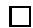
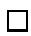
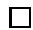
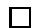
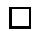
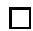
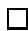
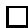
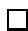
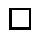

# An brief introduction to Finsler geometry

Matias Dahl

July 12, 2006

# Abstract

This work contains a short introduction to Finsler geometry. Special emphasis is put on the Legendre transformation that connects Finsler geometry with symplectic geometry.

# Contents

1 Finsler geometry 3

1.1 Minkowski norms 4   
1.2 Legendre transformation 6

2 Finsler geometry 9

2.1 The global Legendre transforms 9

3 Geodesics 15

4 Horizontal and vertical decompositions 19

4.1 Applications 22

5 Finsler connections 25

5.1 Finsler connections 25   
5.2 Covariant derivative 26   
5.3 Some properties of basic Finsler quantities 27

6 Curvature 29

7 Symplectic geometry 31

7.1 Symplectic structure on $T^{*}M\setminus \{0\}$ 33   
7.2 Symplectic structure on $TM\setminus \{0\}$ 34

# Table of symbols in Finsler geometry

For easy reference, the below table lists the basic symbols in Finsler geometry, their definitions (when short enough to list), and their homogeneity (see p. 3). However, it should be pointed out that the quantities and notation in Finsler geometry is far from standardized. Some references (e.g. [Run59]) work with normalized quantities. The present work follows [She01b, She01a].

<table><tr><td>Name</td><td>Notation</td><td>Homogeneity</td></tr><tr><td rowspan="3">(co-)Finsler norm</td><td>F,H,h</td><td>1</td></tr><tr><td>gij=1/2 ∂2F2/∂yj∂yj</td><td>0</td></tr><tr><td>gij=inverse of gij</td><td>0</td></tr><tr><td rowspan="3">Cartan tensor</td><td>Cijk=1/2 ∂gij/∂yk=1/4 ∂3F2/∂yj∂yj∂yk</td><td>-1</td></tr><tr><td>Cjijk=GisCsjk</td><td>-1</td></tr><tr><td>Cijkl=∂Cijk/∂yl</td><td>-2</td></tr><tr><td>Geodesic coefficients</td><td>Gi</td><td>2</td></tr><tr><td>Geodesic spray</td><td>G=yi/∂xi-2Gi/∂yi</td><td>no</td></tr><tr><td>Non-linear connection</td><td>Nji=∂Gi/∂yj</td><td>1</td></tr><tr><td>Horizontal basis vectors</td><td>δ/δxi=∂/∂xi-Nis/∂ys</td><td>no</td></tr><tr><td>Berwald connection</td><td>Gijk=∂Nj/∂yk=∂2Gi/∂yj∂yk</td><td>0</td></tr><tr><td rowspan="2">Chern-Rund connection</td><td>Γijk</td><td>0</td></tr><tr><td>Γjki=giIsΓsjk</td><td>0</td></tr><tr><td>Landsberg coefficients</td><td>Lijk</td><td></td></tr><tr><td rowspan="3">Curvature coefficients</td><td>Rmijk</td><td>0</td></tr><tr><td>Rmijk</td><td>1</td></tr><tr><td>Rij=RmijkykLm-1</td><td>2</td></tr><tr><td>Legendre transformation</td><td>Liem=hiβξj</td><td>1</td></tr><tr><td>L: T*M→TM</td><td>Liem-1=giyyj</td><td>1</td></tr></table>

# 1 Finsler geometry

Essentially, a Finsler manifold is a manifold $M$ where each tangent space is equipped with a Minkowski norm, that is, a norm that is not necessarily induced by an inner product. (Here, a Minkowski norm has no relation to indefinite inner products.) This norm also induces a canonical inner product. However, in sharp contrast to the Riemannian case, these Finsler-inner products are not parameterized by points of $M$ , but by directions in $TM$ . Thus one can think of a Finsler manifold as a space where the inner product does not only depend on where you are, but also in which direction you are looking. Despite this quite large step away from Riemannian geometry, Finsler geometry contains analogues for many of the natural objects in Riemannian geometry. For example, length, geodesics, curvature, connections, covariant derivative, and structure equations all generalize. However, normal coordinates do not [Run59]. Let us also point out that in Finsler geometry the unit spheres do not need to be ellipsoids.

Finsler geometry is named after Paul Finsler who studied it in his doctoral thesis in 1917. Presently Finsler geometry has found an abundance of applications in both physics and practical applications [KT03, AIM94, Ing96, DC01]. The present presentation follows [She01b, She01a].

Let $V$ be a real finite dimensional vector space, and let $\{e_i\}$ be a basis for $V$ . Furthermore, let $\frac{\partial}{\partial y^i}$ be partial differentiation in the $e_i$ -direction. If $v \in V$ , then we denote by $v^i$ the $i$ :th component of $v$ . We also use the Einstein summing convention throughout; summation is implicitly implied when the same index appears twice in the same expression. The range of summation will always be $1, \ldots, \dim V$ . For example, for $v \in V$ , $v = v^i e_i$ .

# Homogeneous functions

A function $f \colon V \to \mathbb{R}$ is (positively) homogeneous of degree $s \in \mathbb{R}$ (or $s$ -homogeneous) if $f(\lambda v) = \lambda^s f(v)$ for all $v \in V, \lambda > 0$ .

The next proposition will be of great use when manipulating expressions in Finsler geometry. For example, if $f$ is 0-homogeneous, then $\frac{\partial f}{\partial y^i}(y)y^i = 0$ .

Proposition 1.1. Suppose $f$ is smooth and $s$ -homogeneous. Then $\frac{\partial f}{\partial y^i}$ is $(s - 1)$ -homogeneous, and

$$
\frac {\partial f}{\partial y ^ {i}} (v) v ^ {i} = s f (v), \quad v \in V.
$$

The latter claim is known as Euler's theorem. The proof is an application of the chain rule.

# 1.1 Minkowski norms

Definition 1.2. A Minkowski norm on $V$ is a function $F\colon V\to [0,\infty)$ such that

1. $F$ is smooth on $V\setminus \{0\}$   
2. $F$ is 1-homogeneous,   
3. for all $y \in V \setminus \{0\}$ , the symmetric bilinear form (see Remark 1.3.1)

$$
g _ {y} \colon V \times V \to \mathbb {R},
$$

$$
(u, v) \mapsto \left. \frac {1}{2} \frac {\partial^ {2} F ^ {2} (y + s u + t v)}{\partial s \partial t} \right| _ {t = s = 0}
$$

is positive definite.

# Remarks 1.3.

1. The unit sphere of a Minkowski norm on $V$ is called the indicatrix.   
2. For $u, v \in V$ , we have $g_{y}(u, v) = g_{ij}(y) u^{i} v^{j}$ where

$$
g _ {i j} (y) = \frac {1}{2} \frac {\partial^ {2} F ^ {2}}{\partial y ^ {i} \partial y ^ {j}} (y). \tag {1}
$$

Hence $g_{y}$ is bilinear.

3. Let $F(x) = |x|$ be the usual Euclidean norm on $V$ induced by a chosen basis. It follows that every finite dimensional vector space has at least one Minkowski norm, namely $F$ .

4. Suppose $u, v \in V, y \in V \setminus \{0\}$ . Then

$$
g _ {\lambda y} (u, v) = g _ {y} (u, v), \quad \lambda > 0,
$$

$$
{g _ {y} (y, u)} = {\frac {1}{2} \frac {\partial F ^ {2}}{\partial y ^ {i}} (y) u ^ {i} = \frac {1}{2} \frac {\partial F ^ {2} (y + t u)}{\partial t} \Big | _ {t = 0},}
$$

$$
g _ {y} (y, y) = F ^ {2} (y).
$$

5. $F(y) = 0$ if and only if $y = 0$ . Indeed, since $F$ is 1-homogeneous, $F(0) = 2F(0)$ , so $F(0) = 0$ . On the other hand, if $y \neq 0$ , but $F(y) = 0$ , then $0 = F^2(y) = g_y(y, y)$ , which is impossible since $g_y$ is positive definite.

6. Let $|\cdot|$ be any norm on $V$ . Then $S_{E} = \{v \in V : |v| = 1\}$ is compact. If $m = \min \{F(v) : v \in S_{E}\}$ , $M = \max \{F(v) : v \in S_{E}\}$ , then

$$
m | v | \leq F (v) \leq M | v |, \quad v \in V, \tag {2}
$$

and $0 <   m\leq M <   \infty$

7. $F$ is continuous on $V$ . Since $F$ is differentiable on $V \setminus \{0\}$ , it is also continuous there. That $F$ is continuous at 0 follows by taking a sequence converging to 0 and using the latter estimate in inequality (2).

8. $B = \{v \in V : F(v) \leq 1\}$ is compact. This follows as $B$ is closed and contained in the compact set $\{v \in V : |v| \leq 1 / m\}$ .

9. Equation (2) implies that any two Finsler norms $F$ , $\tilde{F}$ on $V$ are equivalent. That is, there are constants $m, M > 0$ such that

$$
m \tilde {F} (v) \leq F (v) \leq M \tilde {F} (v), \quad v \in V.
$$

The next theorem shows that the unit ball $B = \{v \in V : F(v) \leq 1\}$ is convex. It also shows that if $F$ is symmetric, then $F$ is a norm in the usual sense.

Proposition 1.4 (Triangle inequality). [She01b] For $v, w \in V$ , we have

$$
F (v + w) \leq F (v) + F (w)
$$

with equality if and only if $w = \lambda v$ for some $\lambda \geq 0$ .

Proposition 1.5 (Cauchy-Schwarz inequality). [She01b] For $v, y \in V$ , $y \neq 0$ , we have

$$
g _ {y} (y, v) \leq F (y) F (v),
$$

with equality if and only if $v = \lambda y$ for some $\lambda \geq 0$ .

The proofs of the above two propositions are somewhat technical (see e.g. [She01b]) and are therefore omitted.

Proposition 1.6. [She01b] Suppose $v, y \in V \setminus \{0\}$ , and

$$
g _ {v} (v, w) = g _ {y} (y, w)
$$

for all $w \in V$ . Then $v = y$ .

Proof. Setting $w = v$ and $w = y$ yields

$$
F ^ {2} (v) = g _ {y} (y, v) \leq F (v) F (y),
$$

$$
F ^ {2} (y) = g _ {v} (v, y) \leq F (v) F (y).
$$

Thus $F(y) = F(v)$ , so

$$
g _ {v} (v, y) = F (v) F (y),
$$

and by the Cauchy-Schwarz inequality, $v = y$ .

# 1.2 Legendre transformation

Definition 1.7 (Dual Minkowski norm). The dual Minkowski norm is the function $F^{*} \colon V^{*} \to \mathbb{R}$ is defined as

$$
F ^ {*} (\xi) = \max  \{\xi (y): y \in V, F (y) = 1 \}, \quad \xi \in V ^ {*}.
$$

As $\{y \in V : F(y) = 1\}$ is compact, the dual Minkowski norm is well defined and finite. In what follows, we prove that a dual Minkowski norm is a Minkowski norm on $V^{*}$ . For this purpose, we introduce the Legendre transformation.

Definition 1.8 (Legendre transformation). The Legendre transformation $\ell \colon V \to V^{*}$ is defined as $\ell(y) = g_{y}(y, \cdot)$ for $y \in V \setminus \{0\}$ , and $\ell(0) = 0$ .

The first part of the next proposition gives an algebraic relation between $F, F^{*}$ and $\ell$ . The second part is essentially a variant of Riesz' theorem.

# Proposition 1.9.

1. $F = F^{*}\circ \ell$   
2. The Legendre transformation is a bijection.

Proof. Property 1 is clear for $y = 0$ , so suppose $y \neq 0$ . Then

$$
F (y) = \frac {g _ {y} (y , y)}{F (y)} = \ell_ {y} \left(\frac {y}{F (y)}\right) \leq F ^ {*} \circ \ell (y),
$$

and by the Cauchy-Schwarz inequality we have

$$
F ^ {*} \circ \ell (y) = \sup _ {v \neq 0} \ell_ {y} \left(\frac {v}{F (v)}\right) = \sup _ {v \neq 0} \frac {g _ {y} (y , v)}{F (v)} \leq F (y),
$$

so property 1 holds. For property 2, let us first note that $\ell(y) = 0$ if and only if $y = 0$ . It therefore suffices to show that $\ell \colon V \setminus \{0\} \to V^* \setminus \{0\}$ is a bijection. Proposition 1.6 implies injectivity. To prove surjectivity, suppose $\xi \in V^* \setminus \{0\}$ . Let $\lambda = F^*(\xi)$ , and let $y \in V$ be such that $F(y) = 1$ and $\xi(y) = \lambda$ . Now $\xi(w) = 0$ , if

$$
w \in W _ {y} = \{w \in V: g _ {y} (y, w) = 0 \}.
$$

Indeed, if $\gamma$ is the smooth curve $\gamma \colon (-\varepsilon, \varepsilon) \to F^{-1}(1)$ ,

$$
\gamma (t) = \frac {y + t w}{F (y + t w)}, \quad t \in (- \varepsilon , \varepsilon),
$$

then as $y$ is a stationary point of $v \mapsto \xi(v)$ , we have

$$
0 = \left. \frac {d}{d t} \xi (\gamma (t)) \right| _ {t = 0} = \xi \left(\frac {w}{F (y)} - \frac {y}{F ^ {2} (y)} \frac {\partial F}{\partial y ^ {i}} (y) w ^ {i}\right),
$$

and as $g_{y}(y, w) = 0$ , the second term vanishes and $\xi(w) = 0$ . For any $v \in V$ we have decomposition

$$
v = w + g _ {y} (y, v) y, \quad w = v - g _ {y} (y, v) y \in W _ {y}.
$$

This decomposition and $\xi (w) = 0$ for $w\in W_y$ implies that $\xi = \ell (\lambda y)$ .

Next we introduce some more notation. Let $g^{ij}$ be the $ij$ :th entry of the inverse matrix of $(g_{ij})$ , let $\{\theta^i\}$ be the dual basis to $\{e_i\}$ , and let $\ell_i(y)$ be the $i$ :th component of $\ell(y)$ ,

$$
\ell_ {i} (y) = \ell (y) (e _ {i}) = \frac {1}{2} \frac {\partial F ^ {2}}{\partial y ^ {i}} (y).
$$

# Proposition 1.10.

1. The dual Minkowski norm is a Minkowski norm on $V^{*}$ .

2. Let

$$
g ^ {* i j} (\xi) = \frac {1}{2} \frac {\partial^ {2} F ^ {* 2}}{\partial \xi_ {i} \partial \xi_ {j}} (\xi), \quad \xi \in V ^ {*} \setminus \{0 \}. \tag {3}
$$

Then

$$
\ell (y) = \ell_ {j} (y) \theta^ {j} = g _ {i j} (y) y ^ {i} \theta^ {j}, \quad y \in V \backslash \{0 \}, \tag {4}
$$

$$
\ell^ {- 1} (\xi) = g ^ {* i j} (\xi) \xi_ {i} e _ {j}, \quad \xi \in V ^ {*} \backslash \{0 \}, \tag {5}
$$

$$
g ^ {i j} (y) = g ^ {* i j} \circ \ell (y), \quad y \in V \setminus \{0 \}. \tag {6}
$$

Proof. Let us first show that $F^{*}$ is smooth on $V^{*} \setminus \{0\}$ . In view of Proposition 1.9.1, it suffices to prove that $\ell$ is a diffeomorphism $\ell \colon V \setminus \{0\} \to V^{*} \setminus \{0\}$ . By equation (4) (which is trivial), it follows that $\ell$ is smooth, and that the Jacobian of $\ell$ is $(D\ell)_{ij} = g_{ij}$ . Hence, by the inverse function theorem, the inverse of $\ell$ is smooth. It is evident that $F^{*}$ is 1-homogeneous, so it remains to check the positive definite condition on $F^{*}$ . Differentiating $\frac{1}{2} F^2 = \frac{1}{2} F^{*2} \circ \ell$ with respect to $y^i$ and $y^j$ yields for $y \in V \setminus \{0\}$ ,

$$
\frac {1}{2} \frac {\partial F ^ {2}}{\partial y ^ {i}} (y) = \frac {1}{2} \frac {\partial F ^ {* 2}}{\partial \xi_ {k}} \circ \ell (y) g _ {k i} (y), \tag {7}
$$

$$
g _ {i j} (y) = (g ^ {* k l} \circ \ell) (y) g _ {k i} (y) g _ {l j} (y) + \frac {1}{2} \frac {\partial F ^ {* 2}}{\partial \xi_ {k}} \circ \ell (y) \frac {\partial g _ {k i}}{\partial y ^ {j}} (y). \tag {8}
$$

Equation (7) implies that $\ell_i(y) = (g^{*kj} \circ \ell)(y)\ell_j(y)g_{ki}(y)$ , so

$$
y ^ {j} = g ^ {* j k} \circ \ell (y) \ell_ {k} (y).
$$

As $g_{ij}$ is 0-homogeneous, we have

$$
\frac {1}{2} \frac {\partial F ^ {* 2}}{\partial \xi_ {k}} \circ \ell (y) \frac {\partial g _ {k i}}{\partial y ^ {j}} (y) = (g ^ {* k m} \circ \ell) (y) \ell_ {m} (y) \frac {\partial g _ {k i}}{\partial y ^ {j}} (y) = y ^ {k} \frac {\partial g _ {i j}}{\partial y ^ {k}} (y) = 0,
$$

so the second term in equation (8) vanishes, and equation (6) follows. Let us recall that a matrix is positive definite if and only if all eigenvalues are positive, and eigenvalues are transformed as $\mu \mapsto 1 / \mu$ under matrix inversion. Therefore equation (6) implies that $g^{*ij}$ is positive definite, and $F^{*}$ is a Minkowski norm. Equation (5) follows since the mapping $\ell^{-1}$ defined by this equation satisfies $\ell^{-1} \circ \ell = \mathrm{id}_V$ , and $\ell \circ \ell^{-1} = \mathrm{id}_{V^*}$ .

# 2 Finsler geometry

By an $n$ -dimensional manifold $M$ we mean a topological Hausdorff space with countable base that is locally homeomorphic to $\mathbb{R}^n$ . In addition we assume that all transition functions are $C^\infty$ -smooth. That is, we only consider $C^\infty$ -smooth manifolds. The space of differential $p$ -forms on $M$ is denoted by $\Omega^p M$ , and the tangent space of $M$ is denoted by $TM$ . By $\mathfrak{X}(M)$ we denote the set of vector fields on $M$ . When we consider an object at some point $x \in M$ , we use $x$ as a sub-index on the object. For example, $\Omega_x^1 M$ is the set of 1-forms originating from $x$ . If $f$ is a diffeomorphism, then by $Df$ we mean the tangent map and by $f^*$ the pullback of $f$ .

Suppose $(x^i)$ are local coordinates around $x\in M$ . Then we denote by $\frac{\partial}{\partial x^i}\big|_x$ the standard basis vectors for $T_{x}M$ , and by $dx^{i}|_{x}$ the standard basis vectors for $T_{x}^{*}M$ . When the base point $x$ is clear from context, we simply write $\frac{\partial}{\partial x^i}$ and $dx^i$ .

Definition 2.1 (Finsler manifold). A Finsler manifold is a manifold $M$ and a function $F\colon TM\to [0,\infty)$ (called a Finsler norm) such that

1. $F$ is smooth on $TM\backslash \{0\}$   
2. $F|_{T_xM}\colon T_xM\to [0,\infty)$ is a Minkowski norm for all $x\in M$

Here $TM \setminus \{0\}$ is the slashed tangent bundle, that is,

$$
T M \backslash \{0 \} = \bigcup \left\{T _ {x} M \backslash \{0 \}: x \in M \right\}.
$$

Example 2.2. Let $(M,g)$ be a Riemannian manifold. Then

$$
F (x, y) = \sqrt {g _ {x} (y , y)}
$$

is a Finsler norm on $M$ .

In addition to Finsler norms, we will also study co-Finsler norms. These form a special class of Hamiltonian functions.

Definition 2.3 (co-Finsler norm). A co-Finsler norm on a manifold $M$ is a function $H\colon T^{*}M\to [0,\infty)$ such that

1. $H$ is smooth on $T^{*}M\setminus \{0\}$   
2. $H|_{T_x^* M}\colon T_x^* M\to [0,\infty)$ is a Minkowski norm for all $x\in M$

# 2.1 The global Legendre transforms

Next we generalize the pointwise Legendre transformations to a global transformation between $TM$ and $T^{*}M$ . As a result we prove that Finsler and co-Finsler norms are in one-to-one correspondence.

# The Legendre transform $T^{*}M \to TM$

Suppose $H$ is a co-Finsler norm on a manifold $M$ . Then for each $x \in M$ we have the pointwise Legendre transformation

$$
\ell_ {x} \colon T _ {x} ^ {*} M \to T _ {x} ^ {* *} M
$$

induced by the Minkowski norm $H|_{T_x^*M}$ , and the canonical linear isomorphism

$$
\iota \colon T _ {x} M \to T _ {x} ^ {* *} M.
$$

Then we define the global Legendre transformation as

$$
\begin{array}{l} \begin{array}{c c c} \mathcal {L} \colon T ^ {*} M & \to & T M, \end{array} \\ \xi \mapsto \iota^ {- 1} \circ \ell_ {\pi (\xi)} (\xi), \\ \end{array}
$$

where $\pi \colon T^{*}M\to M$ is the canonical projection. It is clear that $\mathcal{L}$ is well defined. In local coordinates, let

$$
h ^ {i j} (\xi) = \frac {1}{2} \frac {\partial^ {2} H ^ {2}}{\partial \xi_ {i} \partial \xi_ {j}} (\xi), \quad \xi \in T ^ {*} M \backslash \{0 \}. \tag {9}
$$

Proposition 2.4. Suppose $\mathcal{L}$ is the Legendre transformation induced by a co-Finsler norm $H$ .

1. $\mathcal{L}$ is a bijection $T^{*}M\to TM$ and a diffeomorphism $T^{*}M\setminus \{0\} \to$ $TM\setminus \{0\}$   
2. $F = H\circ \mathcal{L}^{-1}$ is a Finsler norm on $M$   
3. If $g_{ij}$ is as in equation (1), and $h_{ij}$ is the inverse of $h^{ij}$ , then

$$
\mathcal {L} (\xi) = h ^ {i j} (\xi) \xi_ {i} \frac {\partial}{\partial x ^ {j}}, \quad \xi \in T ^ {*} M \backslash \{0 \}, \tag {10}
$$

$$
\mathscr {L} ^ {- 1} (y) = g _ {i j} (y) y ^ {i} d x ^ {j}, \quad y \in T M \backslash \{0 \}, \tag {11}
$$

$$
g _ {i j} (y) = h _ {i j} \circ \mathscr {L} ^ {- 1} (y), \quad y \in T M \backslash \{0 \}. \tag {12}
$$

Proof. Let us first prove equation (10) in part 3. For a fixed $x \in M$ , let $\{e_i\}$ be the usual basis $\frac{\partial}{\partial x^i}$ induced by some local coordinates, and let $\{\theta^i\}$ , $\{\Delta_i\}$ be dual bases for $T_x^*M$ , $T_x^{**}M$ , respectively. That is, $\{\theta^i\}$ , $\{\Delta_i\}$ are defined by conditions $\theta^i(e_j) = \delta_j^i$ and $\Delta_i(\theta^j) = \delta_i^j$ , whence $\iota(e_i) = \Delta_i$ , $\iota^{-1}(\Delta_i) = e_i$ , and $\{\theta^i\} = \{dx^i\}$ . By equation (4),

$$
\begin{array}{l} \mathcal {L} (\xi) = \iota^ {- 1} (h ^ {i j} (\xi) \xi_ {i} \Delta_ {j}) \\ = h ^ {i j} (\xi) \xi_ {i} \frac {\partial}{\partial x ^ {j}}, \\ \end{array}
$$

and equation (10) follows. For equation (11), let us first notice that if $w_{i}$ are coordinates for $T_{x}^{**}M$ , then

$$
{g _ {i j} (y)} = {\frac {1}{2} \frac {\partial^ {2} H ^ {2} \circ \ell_ {x} ^ {- 1}}{\partial w ^ {i} \partial w ^ {j}} (\iota (y)),}
$$

so by equation (5),

$$
\begin{array}{l} \mathcal {L} ^ {- 1} (y) = \ell_ {x} ^ {- 1} \circ \iota (y) \\ = \frac {1}{2} \frac {\partial^ {2} H ^ {2} \circ \ell_ {x} ^ {- 1}}{\partial w ^ {i} \partial w ^ {j}} (\iota (y)) (\iota \circ y) ^ {i} \theta^ {j} \\ = g _ {i j} (y) y ^ {i} d x ^ {j}, \\ \end{array}
$$

and equation (11) follows. Equation (12) follows using equations (6) and (13);

$$
\begin{array}{l} h _ {i j} (\xi) = \frac {1}{2} \frac {\partial^ {2} H ^ {2} \circ \ell_ {x} ^ {- 1}}{\partial w ^ {i} \partial w ^ {j}} \circ \ell_ {x} (\xi) \\ = g _ {i j} \circ \mathcal {L} (\xi). \\ \end{array}
$$

In part 1, it is clear that $\mathcal{L}$ is a bijection. Equation (10) shows that $\mathcal{L}$ is smooth on $T^{*}M\setminus \{0\}$ , and since the Jacobian of $\mathcal{L}$ is of the form

$$
D \mathcal {L} = \left( \begin{array}{c c} I & 0 \\ * & h ^ {i j} \end{array} \right),
$$

part 1 follows by the inverse function theorem. For property 2, let us first show that $F$ is 1-homogeneous. Suppose $y \in TM$ . Then $y = \mathcal{L}(\xi)$ for some $\xi \in T^{*}M$ , and as $\mathcal{L}$ is 1-homogeneous we have

$$
\mathcal {L} ^ {- 1} (\lambda y) = \mathcal {L} ^ {- 1} (\mathcal {L} (\lambda \xi)) = \lambda \xi = \lambda \mathcal {L} ^ {- 1} (y), \quad \lambda > 0.
$$

Since $h^{ij}$ is positive definite, $h_{ij}$ is positive definite, and $g_{ij}$ is positive definite by equation (12).

# The Legendre transform $TM \to T^{*}M$

Suppose $F$ is a Finsler norm on a manifold $M$ . For each $x \in M$ , we can then introduce a pointwise Legendre transformation

$$
\ell_ {x} \colon T _ {x} M \to T _ {x} ^ {*} M
$$

induced by the Minkowski norm $F|_{T_xM}$ . Then we define the global Legendre transformation as

$$
\begin{array}{c c c} \mathcal {L} \colon T M & \to & T ^ {*} M, \end{array}
$$

$$
\begin{array}{r c l} y & \mapsto & \ell_ {\pi (y)} (y), \end{array}
$$

where $\pi \colon TM\to M$ is the canonical projection.

Proposition 2.5. Suppose $\mathcal{L}$ is the Legendre transformation induced by a Finsler norm $F$ .

1. $\mathcal{L}$ is a bijection $TM \to T^{*}M$ and a diffeomorphism $TM \setminus \{0\} \to T^{*}M \setminus \{0\}$ .   
2. $H = F\circ \mathcal{L}^{-1}$ is a co-Finsler norm.   
3. If $g_{ij}$ be as in equation (1), $h^{ij}$ be as in equation (9), and is $h_{ij}$ be the inverse of $h^{ij}$ , then

$$
\mathcal {L} (y) = g _ {i j} (y) y ^ {i} d x ^ {j}, \quad y \in T M \backslash \{0 \}, \tag {13}
$$

$$
\mathscr {L} ^ {- 1} (\xi) = h ^ {i j} (\xi) \xi_ {i} \frac {\partial}{\partial x ^ {j}}, \quad \xi \in T ^ {*} M \backslash \{0 \}, \tag {14}
$$

$$
h ^ {i j} (\xi) = g ^ {i j} \circ \mathscr {L} ^ {- 1} (\xi), \quad \xi \in T ^ {*} M \backslash \{0 \}. \tag {15}
$$

Proof. The proof is completely analogous to the proof of Proposition 2.4, but much simpler since there is no $\iota$ mapping.

Example 2.6 (Musical isomorphisms). Suppose $(M,g)$ is a Riemannian manifold. Then $F(y) = \sqrt{g(y,y)}$ makes $M$ into a Finsler manifold. The induced Legendre transformation acts on vectors and co-vectors as follows:

$$
\mathcal {L} (y) = g _ {i j} (x) y ^ {i} d x ^ {j}, \quad y \in T _ {x} M,
$$

$$
\mathcal {L} ^ {- 1} (\xi) = g ^ {i j} (x) \xi_ {i} \frac {\partial}{\partial x ^ {j}}, \quad y \in T _ {x} M.
$$

Here we use standard notation: $g_{ij}(x) = \left. g\left(\frac{\partial}{\partial x^i}\big|_x, \frac{\partial}{\partial x^j}\big|_x\right) \right.$ , and $g^{ij}(x)$ is the inverse of $(g_{ij})$ . From the above formulas, we see that in this special case, the Legendre transformation reduces to the musical isomorphisms in Riemannian geometry; $\mathcal{L}(y) = y^{\flat}$ , and $\mathcal{L}^{-1}(\xi) = \xi^{\sharp}$ .

The next two results show that the Legendre transformations are in some sense well behaved.

Proposition 2.7. Suppose $\mathcal{L}_H$ is the Legendre transformation induced by a co-Finsler norm $H$ , and $\mathcal{L}_F$ is the Legendre transformation induced by the Finsler norm $F = H \circ \mathcal{L}_H^{-1}$ . Then

$$
\mathcal {L} _ {F} = \mathcal {L} _ {H} ^ {- 1}. \tag {16}
$$

Similarly, if $\mathcal{L}_F$ is the Legendre transformation induced by a Finsler norm $F$ , and $\mathcal{L}_H$ is the Legendre transformation induced by the co-Finsler norm $H = F \circ \mathcal{L}_F^{-1}$ , then equation (16) also holds.

Proof. Both claims follow using equations (11) and (13).

Corollary 2.8. On a fixed manifold, Finsler and co-Finsler norms are in one-to-one correspondence via the two Legendre transformations.

Proof. Let $T$ be mapping $F \mapsto F \circ \mathcal{L}_F^{-1}$ that maps a Finsler norm $F$ to a co-Finsler norm, and let $S$ be mapping $H \mapsto H \circ \mathcal{L}_H^{-1}$ that maps a co-Finsler norm $H$ to a Finsler norm. If $H$ is a co-Finsler norm, then

$$
T \circ S (H) = T (F) = F \circ \mathcal {L} _ {F} ^ {- 1} = H \circ \mathcal {L} _ {H} ^ {- 1} \circ \mathcal {L} _ {F} ^ {- 1} = H
$$

where $F = H\circ \mathcal{L}_H^{-1}$ , and similarly, $S\circ T = \mathrm{id}$ .

# 3 Geodesics

Suppose $M$ is a manifold. Then a curve is a smooth mapping $c \colon (a, b) \to M$ such that $(Dc)_t \neq 0$ for all $t$ . Such a curve has a canonical lift $\hat{c} \colon (a, b) \to TM \setminus \{0\}$ defined as $\hat{c}(t) = (Dc)(t)$ , where $Dc$ is the tangent of $c$ . If, furthermore, $M$ is a Finsler manifold with Finsler norm $F$ , we define the length of $c$ as

$$
L (c) = \int_ {a} ^ {b} F \circ \hat {c} (t) \mathrm {d} t,
$$

and the energy as

$$
E (c) = \frac {1}{2} \int_ {a} ^ {b} F ^ {2} \circ \hat {c} (t) \mathrm {d} t.
$$

A curve $c$ that satisfies $F \circ \hat{c} = 1$ is called path-length parameterized. The next proposition shows that every curve can be path-length parametrized, and the length of an oriented curve does not depend on its parametrization. The latter claim need not be true for the energy.

Proposition 3.1. Suppose $c$ is a curve on a Finsler manifold $(M,F)$ .

1. If $\alpha \colon (a', b') \to (a, b)$ is a diffeomorphism with $\alpha' > 0$ , then $\widehat{c \circ \alpha} = \alpha' \hat{c} \circ \alpha$ , and $L(c \circ \alpha) = L(c)$ .   
2. There is a diffeomorphism $\alpha \colon (0, L(c)) \to (a, b)$ such that

$$
F \circ \widehat {c \circ \alpha} = 1. \tag {17}
$$

Proof. The first claim follows since $F$ is 1-homogeneous. For the second claim, let us define $\beta \colon (a,b)\to (0,L(c))$ by

$$
\beta (s) = \int_ {a} ^ {s} F \circ \hat {c} (t) d t.
$$

Then $\beta'(s) = F \circ \hat{c}(s) > 0$ , so by the inverse function theorem, $\beta$ is smooth and invertible with smooth inverse. The sought diffeomorphism is $\alpha = \beta^{-1}$ ;

$$
\begin{array}{l} F \circ \widehat {c \circ \alpha} = F \left(\left(\beta^ {- 1}\right) ^ {\prime} \hat {c} \circ \alpha\right) \\ = \frac {1}{\beta^ {\prime} \circ \beta^ {- 1}} F \circ \hat {c} \circ \alpha \\ = 1. \\ \end{array}
$$

Definition 3.2 (Variation). Suppose $c \colon (a, b) \to M$ is a curve. Then a variation of $c$ is a continuous mapping $H \colon [a, b] \times (-\varepsilon, \varepsilon) \to M$ for some $\varepsilon > 0$ such that

1. $H$ is smooth on $(- \varepsilon, \varepsilon) \times (a, b)$ ,

and with notation $c_{s}(\cdot) = H(\cdot ,s)$

2. $c_{0}(t) = c(t)$ , for all $t \in [a, b]$ ,   
3. $c_{s}(a), c_{s}(b) \in M$ are constants not depending on $s \in (-\varepsilon, \varepsilon)$ .

Definition 3.3 (Geodesic). A curve $c$ in a Finsler manifold is a geodesic if $L$ is stationary at $c$ , that is, for any variation $(c_s)$ of $c$ ,

$$
\left. \frac {d}{d s} L (c _ {s}) \right| _ {s = 0} = 0.
$$

Our next aim is to prove Proposition 3.6 which gives a local condition for a curve to be a geodesic. To do this, we need to operate with vectors on $TM$ , that is, with elements in $T(TM)$ . Let us therefore start by deriving their transformation properties. First, if $(x^i)$ and $\tilde{x}^i = \tilde{x}^i(x)$ are local coordinates around some $x \in M$ , then

$$
\left. \frac {\partial}{\partial x ^ {i}} \right| _ {x} = \left. \frac {\partial \tilde {x} ^ {j}}{\partial x ^ {i}} \frac {\partial}{\partial \tilde {x} ^ {j}} \right| _ {x}. \tag {18}
$$

Here $\frac{\partial\tilde{x}^i}{\partial x^i}$ is the Jacobian of the mapping taking $(x^{i})$ -coordinates into $(\tilde{x}^i)$ coordinates evaluated at the local $x^i$ -coordinates for $x$

Next, suppose $(x^i,y^i)$ , $(\tilde{x}^i,\tilde{y}^i)$ are standard local coordinates around $y\in T_xM$ . That is, $\tilde{x}^i = \tilde{x}^i (x)$ , $\tilde{y}^i = \tilde{y}^i (x,y)$ , and $y^{i}$ are coordinates in the $\frac{\partial}{\partial x^i}$ basis. It follows that vectors

$$
\left. \frac {\partial}{\partial x ^ {i}} \right| _ {y}, \quad \left. \frac {\partial}{\partial y ^ {i}} \right| _ {y}, \quad \left. \frac {\partial}{\partial \tilde {x} ^ {i}} \right| _ {y}, \quad \left. \frac {\partial}{\partial \tilde {y} ^ {i}} \right| _ {y} \in T (T M \setminus \{0 \})
$$

satisfy transformation rules

$$
\left. \frac {\partial}{\partial x ^ {i}} \right| _ {y} = \left. \frac {\partial \tilde {x} ^ {r}}{\partial x ^ {i}} \frac {\partial}{\partial \tilde {x} ^ {r}} \right| _ {y} + \left. \frac {\partial^ {2} \tilde {x} ^ {r}}{\partial x ^ {i} \partial x ^ {s}} y ^ {s} \frac {\partial}{\partial \tilde {y} ^ {r}} \right| _ {y}, \tag {19}
$$

$$
\left. \frac {\partial}{\partial y ^ {i}} \right| _ {y} = \left. \frac {\partial \tilde {x} ^ {r}}{\partial x ^ {i}} \frac {\partial}{\partial \tilde {y} ^ {r}} \right| _ {y}. \tag {20}
$$

In fact, equation (18) implies that $\tilde{y}^i = \frac{\partial\tilde{x}^i}{\partial x^r} y^r$ , so

$$
\left. \frac {\partial}{\partial x ^ {i}} \right| _ {y} = \left. \frac {\partial \tilde {x} ^ {r}}{\partial x ^ {i}} \frac {\partial}{\partial \tilde {x} ^ {r}} \right| _ {y} + \left. \frac {\partial \tilde {y} ^ {r}}{\partial x ^ {i}} \frac {\partial}{\partial \tilde {y} ^ {r}} \right| _ {y},
$$

and equation (19) follows. The proof of equation (20) is similar.

Lemma 3.4 (Euler equations). Suppose $f \colon TM \setminus \{0\} \to \mathbb{R}$ is a smooth function. Then a smooth curve $c \colon (a, b) \to M$ is stationary for $c \mapsto \int_{a}^{b} f \circ \hat{c}(t) \, \mathrm{d}t$ if and only if for each $t$ there are local coordinates around $\hat{c}(t)$ such that

$$
\frac {\partial f}{\partial x ^ {i}} \circ \hat {c} - \frac {d}{d t} \left(\frac {\partial f}{\partial y ^ {i}} \circ \hat {c}\right) = 0. \tag {21}
$$

Moreover, condition (21) does not depend on local coordinates.

Proof. The last claim follows from equations (19) and (20). Before the proof, let us begin with an observation. Suppose $c$ is a curve, and $a = t_1 < \dots < t_N = b$ is a partition of the domain of $c$ such that each $(t_i, t_{i+1})$ is mapped into one coordinate chart. Furthermore, suppose $H(t, s) = c_s(t)$ is a variation of $c$ and by restricting the value of $s$ , we can assume that each partition $(t_i, t_{i+1})$ is mapped into one coordinate chart by $H$ . If $K$ is the mapping $c \mapsto \int_a^b f \circ \hat{c}(t) \, \mathrm{d}t$ , then

$$
\begin{array}{l} \left. \frac {d}{d s} K (c _ {s}) \right| _ {s = 0} \\ = \sum_ {k = 1} ^ {N - 1} \int_ {t _ {k}} ^ {t _ {k + 1}} \left[ \frac {\partial f}{\partial x ^ {i}} \circ \hat {c} (t) \frac {\partial H ^ {i}}{\partial s} (t, 0) + \frac {\partial f}{\partial y ^ {i}} \circ \hat {c} (t) \frac {\partial^ {2} H ^ {i}}{\partial t \partial s} (t, 0) \right] d t \\ = \sum_ {k = 1} ^ {N - 1} \int_ {t _ {k}} ^ {t _ {k + 1}} \left[ \frac {\partial f}{\partial x ^ {i}} \circ \hat {c} (t) - \frac {d}{d t} \left(\frac {\partial f}{\partial y ^ {i}} \circ \hat {c} (t)\right) \right] \frac {\partial H ^ {i}}{\partial s} (t, 0) d t. \\ \end{array}
$$

For the actual proof, suppose that $c \colon (a,b) \to M$ is a stationary curve. Then restrictions of $c$ to subsets of $(a,b)$ are also stationary, so we can assume that $c$ is contained in one coordinate chart, and the claim follows from the above calculation. On the other hand, if condition (21) holds, then $c$ is stationary since equation (21) is independent of local coordinates.

One can prove that a stationary curve is smooth if it is piecewise smooth [She01b]. Intuitively, this is easy to understand; if a geodesic has a kink, it can be shortened by smoothing.

Definition 3.5 (Geodesic coefficients). In a Finsler manifold, the geodesic coefficients are locally defined functions

$$
G ^ {i} (y) = \frac {1}{4} g ^ {i k} (y) \left(2 \frac {\partial g _ {j k}}{\partial x ^ {l}} - \frac {\partial g _ {j l}}{\partial x ^ {k}}\right) y ^ {j} y ^ {l}, \quad y \in T M \backslash \{0 \}. \tag {22}
$$

Proposition 3.6 (Geodesic equation). A curve $c \colon I \to M$ is stationary for $E$ if and only if for each $t \in I$ there are local coordinates such that

$$
\frac {d ^ {2} c ^ {i}}{d t ^ {2}} + 2 G ^ {i} \circ \hat {c} = 0.
$$

Proof. This follows by Lemma 3.4, relations $F^2(y) = g_{ij}(y)y^i y^j$ , $\frac{\partial F^2}{\partial y^i}(y) = 2g_{ij}y^j$ , and Euler's theorem.

Definition 3.7 (Geodesic spray). Geodesic spray $\mathbb{G} \in \mathfrak{X}(TM \setminus \{0\})$ on a Finsler manifold is locally defined as

$$
\left. \mathbb {G} \right| _ {y} = \left. y ^ {i} \frac {\partial}{\partial x ^ {i}} \right| _ {y} - 2 G ^ {i} (y) \frac {\partial}{\partial y ^ {i}} \Big | _ {y}. \tag {23}
$$

In Proposition 7.14 we prove that $\mathbb{G}$ is well defined, that is, $\mathbb{G}$ does not depend on local coordinates. Without any circular argument, let us assume this to be known. (Alternatively, one can prove this by a very long calculation, but there is no need to do that here.) It follows that $G^i$ satisfy the transformation rule

$$
\tilde {G} ^ {r} = \frac {\partial \tilde {x} ^ {r}}{\partial x ^ {i}} G ^ {i} - \frac {1}{2} \frac {\partial^ {2} \tilde {x} ^ {r}}{\partial x ^ {i} \partial x ^ {s}} y ^ {i} y ^ {s}. \tag {24}
$$

The next proposition is a coordinate independent restatement of Proposition 3.6.

Proposition 3.8. Suppose $\pi$ is the canonical projection $\pi \colon TM \to M$ . If $c$ is an integral curve of $\mathbb{G}$ , then $\pi \circ c$ is a stationary curve of $E$ , and $c = \widehat{\pi \circ c}$ . Conversely, if $b$ is a stationary curve for $E$ , then $\hat{b}$ is an integral curve of $\mathbb{G}$ .

It turns out that stationary curves of $E$ and $L$ almost coincide. The first half of this equivalence is contained in the proposition below. After we introduce some tools from symplectic geometry we also prove the converse (Proposition 7.16); every stationary curve of $E$ is a geodesic. In view of this equivalence, it will be convenient to consider only stationary points of $E$ . Traditionally this is done for two reasons. First, it gives slightly simpler formulas. For example, compare derivatives of $F = \sqrt{g_{ij}(x)y^i y^j}$ and $F^2 = g_{ij}(x)y^i y^j$ , and second, stationary curves of $E$ naturally generalize also to the case when $F$ is non-degenerate (which is not relevant here).

Proposition 3.9. If $c$ is a geodesic, and $\alpha$ is a diffeomorphism such that $c \circ \alpha$ is parameterized with respect to pathlength, then $c \circ \alpha$ is a stationary point of $E$ .

Proof. Using Lemma 3.4 and the 1-homogeneity of $F$ , it follows that $c \circ \alpha$ is a stationary curve for $L$ . By writing derivatives as $\frac{\partial F}{\partial x^i} = \frac{1}{2F} \frac{\partial F^2}{\partial x^i}$ and using Lemma 3.4 again the result follows.

# 4 Horizontal and vertical decompositions

In many respects, Finsler geometry is analogous to Riemann geometry. However, a typical difference is that in Finsler geometry objects exist on $TM$ whereas in Riemann geometry they exist on $M$ . For example, in Finsler geometry, curvature is a tensor on $TM \setminus \{0\}$ , whereas in Riemannian geometry, it is a tensor on $M$ . For this reason we need to study vectors and co-vectors on $TM$ , that is, elements in $T(TM \setminus \{0\})$ and $T^{*}(TM \setminus \{0\})$ . Equations (19)-(20) already give the transformation rules for basis vectors in $T(TM \setminus \{0\})$ . In this section we define the horizontal-vertical decomposition in $T(TM \setminus \{0\})$ and $T^{*}(TM \setminus \{0\})$ . This decomposition will greatly simplify calculations in local coordinates. It will also give a certain structure compatible with the Finsler metric. For example, the tangent of a geodesic will be a horizontal vector. Also, the derivative of $F$ will be a vertical co-vector. Some immediate applications of the horizontal-vertical decomposition are given in Section 4.1.

In order to introduce the horizontal-vertical decomposition, one needs a non-linear connection, that is, one needs some structure on $TM \setminus \{0\}$ .

Definition 4.1 (Non-linear connection). A non-linear connection on a manifold $M$ is a collection of locally defined 1-homogeneous functions $N_{j}^{i}$ on $TM \setminus \{0\}$ satisfying transformation rules

$$
\frac {\partial \tilde {x} ^ {j}}{\partial x ^ {i}} \tilde {N} _ {j} ^ {h} = \frac {\partial \tilde {x} ^ {h}}{\partial x ^ {j}} N _ {i} ^ {j} - \frac {\partial^ {2} \tilde {x} ^ {h}}{\partial x ^ {i} \partial x ^ {j}} y ^ {j}.
$$

Let $G^{i}$ be the coefficients for the geodesic spray, and let

$$
N _ {j} ^ {i} = \frac {\partial G ^ {i}}{\partial y ^ {j}}. \tag {25}
$$

Then $N_{j}^{i}$ are 1-homogeneous, and by differentiating equation (24) we see that $N_{j}^{i}$ are coefficients for a non-linear connection. It is the only non-linear connection we shall use in this work. However, let us emphasize that one can study non-linear connections also without Finsler geometry. Concepts such as covariant derivative, geodesics, and curvature can all be defined from only a non-linear connection [MA94].

# Decomposition of $T(TM \setminus \{0\})$

Equation (19) shows that the vector subspace $\mathrm{span}\{\frac{\partial}{\partial x^i} |_y:i = 1,\ldots ,n\}$ depends on local coordinates. Therefore one can not talk about $\frac{\partial}{\partial x^i}$ directions in $T(TM\backslash \{0\})$ . However, when $M$ is equipped with a non-linear connection $N_{j}^{i}$ , let

$$
\left. \frac {\delta}{\delta x ^ {i}} \right| _ {y} = \left. \frac {\partial}{\partial x ^ {i}} \right| _ {y} - N _ {i} ^ {k} (y) \frac {\partial}{\partial y ^ {k}} \Big | _ {y} \in T (T M \setminus \{0 \}),
$$

whence

$$
\left. \frac {\delta}{\delta x ^ {i}} \right| _ {y} = \left. \frac {\partial \tilde {x} ^ {r}}{\partial x ^ {i}} \frac {\delta}{\delta \tilde {x} ^ {r}} \right| _ {y}.
$$

Thus, the $2n$ -dimensional vector space $T_{y}(TM \setminus \{0\})$ has two $n$ -dimensional subspaces,

$$
\mathcal {V} _ {y} T M = \mathrm {s p a n} \left\{\frac {\partial}{\partial y ^ {i}} \Big | _ {y} \right\}, \quad \mathcal {H} _ {y} T M = \mathrm {s p a n} \left\{\frac {\delta}{\delta x ^ {i}} \Big | _ {y} \right\},
$$

and these are independent of local coordinates. Let us also define

$$
\mathcal {V} T M = \bigcup_ {y \in T M \backslash \{0 \}} \mathcal {V} _ {y} T M, \quad \mathcal {H} T M = \bigcup_ {y \in T M \backslash \{0 \}} \mathcal {H} _ {y} T M,
$$

whence pointwise

$$
T (T M \setminus \{0 \}) = \mathcal {V} T M \oplus \mathcal {H} T M.
$$

Vectors in $\mathcal{V}TM$ are called vertical vectors, and vectors in $\mathcal{H}TM$ are called horizontal vectors.

The next example shows that the tangent of a geodesics is always a horizontal vector. Thus, in some sense, horizontal vectors are more important than vertical vectors. This also motivates that name; one can move horizontally, but not vertically.

Example 4.2. The coefficients $G^i$ for the geodesic spray are 2-homogeneous. Hence $2G^{i} = y^{j}\frac{\partial G^{i}}{\partial y^{j}} = y^{j}N_{j}^{i}$ , so

$$
\mathbb {G} = y ^ {i} \frac {\delta}{\delta x ^ {i}},
$$

and $\mathbb{G}(y)$ is horizontal for all $y\in TM\setminus \{0\}$ .

# Decomposition of $T^{*}(TM \setminus \{0\})$

On $TM$ , the 1-forms $dx^i$ and $dy^i$ satisfy

$$
\left. d x ^ {i} \right| _ {y} = \left. \frac {\partial x ^ {i}}{\partial \tilde {x} ^ {r}} d \tilde {x} ^ {r} \right| _ {y}, \tag {26}
$$

$$
\left. d y ^ {i} \right| _ {y} = \left. \frac {\partial x ^ {i}}{\partial \tilde {x} ^ {r}} d \tilde {y} ^ {r} \right| _ {y} + \left. \frac {\partial^ {2} x ^ {i}}{\partial \tilde {x} ^ {r} \partial \tilde {x} ^ {s}} \tilde {y} ^ {r} d \tilde {x} ^ {s} \right| _ {y}. \tag {27}
$$

These transformation rules follow from transformation rules (19)-(20) and the following lemma:

Lemma 4.3. Suppose $\{a_i\}, \{\tilde{a}_i\}$ are bases for a finite dimensional vector space $V$ . Furthermore, suppose that $\{\alpha^i\}$ , and $\{\tilde{\alpha}^i\}$ are corresponding dual bases. Say, $\alpha^i$ is defined by conditions: $\alpha^i \colon V \to \mathbb{R}$ is linear, and $\alpha^i(a_j) = \delta_j^i$ . Then

$$
\tilde {\alpha} ^ {j} = \sum_ {m} \tilde {\alpha} ^ {j} (a _ {m}) \alpha^ {m}.
$$

Proof. If $\tilde{\alpha}^j = \sum_m \Lambda_m^j \alpha^m$ , then $\tilde{\alpha}^j(a_m) = \Lambda_m^j$ .

Let

$$
\delta y ^ {i} | _ {y} = d y ^ {i} | _ {y} + N _ {j} ^ {i} (y) d x ^ {j} | _ {y},
$$

whence

$$
\delta y ^ {i} | _ {y} = \frac {\partial x ^ {i}}{\partial \tilde {x} ^ {r}} \delta \tilde {y} ^ {r} | _ {y}.
$$

Thus the $2n$ -dimensional vector space $T_{y}^{*}(TM \setminus \{0\})$ has two $n$ -dimensional subspaces,

$$
\mathcal {V} _ {y} ^ {*} T M = \operatorname {s p a n} \left\{\delta y ^ {i} | _ {y} \right\}, \quad \mathcal {H} _ {y} ^ {*} T M = \operatorname {s p a n} \left\{d x ^ {i} | _ {y} \right\},
$$

and these are independent of local coordinates. Then pointwise

$$
T ^ {*} (T M \setminus \{0 \}) = \mathcal {V} ^ {*} T M \oplus \mathcal {H} ^ {*} T M.
$$

Co-vectors in $\mathcal{V}^*TM$ are called vertical covectors, and co-vectors in $\mathcal{H}^*TM$ are called horizontal covectors.

Proposition 4.4. Suppose $\frac{\delta}{\delta x^i}$ , $\frac{\partial}{\partial y^i}$ , $dx^i$ , and $\delta y^i$ are defined via the nonlinear connection (25). Then

$$
d x ^ {i} \left(\frac {\delta}{\delta x ^ {j}}\right) = \delta_ {j} ^ {i}, d x ^ {i} \left(\frac {\partial}{\partial y ^ {j}}\right) = 0,
$$

$$
\delta y ^ {i} \left(\frac {\delta}{\delta x ^ {j}}\right) = 0, \quad \delta y ^ {i} \left(\frac {\partial}{\partial y ^ {j}}\right) = \delta_ {j} ^ {i}, \tag {28}
$$

$$
{\left[ \frac {\delta}{\delta x ^ {j}}, \frac {\delta}{\delta x ^ {k}} \right]} = {\left(\frac {\delta N _ {j} ^ {m}}{\delta x ^ {k}} - \frac {\delta N _ {k} ^ {m}}{\delta x ^ {j}}\right) \frac {\partial}{\partial y ^ {m}},}
$$

$$
\left[ \frac {\delta}{\delta x ^ {i}}, \frac {\partial}{\partial y ^ {j}} \right] = \left[ \frac {\delta}{\delta x ^ {j}}, \frac {\partial}{\partial y ^ {i}} \right] = \frac {\partial N _ {j} ^ {k}}{\partial y ^ {i}} \frac {\partial}{\partial y ^ {k}}, \tag {29}
$$

$$
\left[ \frac {\partial}{\partial y ^ {i}}, \frac {\partial}{\partial y ^ {j}} \right] = 0.
$$

Proof. The last three equations follow from the definition of the Lie bracket; if $X, Y$ are vector fields, then $[X, Y]$ is the vector field such that $[X, Y](f) = X(Y(f)) - Y(X(f))$ . The first equality in equation (29) follows since

$$
\frac {\partial N _ {j} ^ {i}}{\partial y ^ {k}} = \frac {\partial N _ {k} ^ {i}}{\partial y ^ {j}}.
$$

Proposition 4.5. If $f \colon TM \setminus \{0\} \to \mathbb{R}$ is a smooth function, then

$$
d f = \frac {\delta f}{\delta x ^ {i}} d x ^ {i} + \frac {\partial f}{\partial y ^ {i}} \delta y ^ {i}.
$$

# 4.1 Applications

Suppose $M$ is a manifold with a Finsler metric $F$ . Then two immediate applications of the horizontal-vertical decomposition are the Sasaki metric and the almost complex structure for $T(TM \setminus \{0\})$ .

# Sasaki metric

Let

$$
\hat {g} = g _ {i j} (y) d x ^ {i} \otimes d x ^ {j} + g _ {i j} (y) \delta y ^ {i} \otimes \delta y ^ {j}.
$$

Then $\hat{g}$ is a Riemannian metric on $TM\setminus \{0\}$ known as the Sasaki metric. The Legendre transformation induced by $\hat{g}$ ,

$$
\flat \colon T (T M \setminus \{0 \}) \rightarrow T ^ {*} (T M \setminus \{0 \})
$$

is given by

$$
\flat \left(\frac {\delta}{\delta x ^ {i}}\right) = g _ {i k} d x ^ {k}, \quad \flat \left(\frac {\partial}{\partial y ^ {i}}\right) = g _ {i k} \delta y ^ {k}.
$$

Another Riemannian metrics on $TM \setminus \{0\}$ is the Cheeger-Gromoll metric. For both of these metrics, one can derive explicit expressions for the covariant derivative and curvature. For example, see [Kap01].

# Almost complex structure

Suppose $E$ is a even dimensional manifold, and $J\colon TE\to TE$ is a linear map in each tangent space. Then $J$ is an almost complex structure if $J^2 = -\mathrm{Id}$ [MS97].

Using the horizontal-vertical decomposition we can define an almost complex structure $J \colon T(TM \setminus \{0\}) \to T(TM \setminus \{0\})$ by setting

$$
J \left(\frac {\delta}{\delta x ^ {i}}\right) = \frac {\partial}{\partial y ^ {i}}, \quad J \left(\frac {\partial}{\partial y ^ {i}}\right) = - \frac {\delta}{\delta x ^ {i}}. \tag {30}
$$

Then $J^2 = -\mathrm{Id}$ , and $J$ does not depend on the local coordinates appearing in the definition. The map $J$ is compatible with the Sasaki metric. That is

$$
\hat {g} (X, Y) = \hat {g} (J X, J Y), \quad X, Y \in T (T M \setminus \{0 \}).
$$

The Nijenhuis tensor associated with an almost complex structure $J$ is defined by

$$
N (X, Y) = [ J X, J Y ] - J [ J X, Y ] - J [ X, J Y ] - [ X, Y ]
$$

for vector fields $X, Y$ .

Proposition 4.6. Every Nijenhuis tensor $N$ satisfies properties:

1. $N$ is bilinear over smooth functions.   
2. $N$ is anti-symmetric.   
3. $N(X,JX) = 0$ for any vector field $X$ .

Proof. If $f, g$ are functions and $X, Y$ are vector fields, then the Lie bracket satisfies

$$
[ f X, g Y ] = f X (g) Y - g Y (f) X + f g [ X, Y ].
$$

Using this identity, it follows that

$$
N (f X, g Y) = f g N (X, Y),
$$

and the first property follows. The latter two properties are immediate.

Proposition 4.7. The Nijenhuis tensor for the almost complex structure (30) is given by

$$
N \left(\frac {\delta}{\delta x ^ {i}}, \frac {\delta}{\delta x ^ {j}}\right) = - \left[ \frac {\delta}{\delta x ^ {i}}, \frac {\delta}{\delta x ^ {j}} \right],
$$

$$
N \left(\frac {\delta}{\delta x ^ {i}}, \frac {\partial}{\partial y ^ {j}}\right) = J \left[ \frac {\delta}{\delta x ^ {i}}, \frac {\delta}{\delta x ^ {j}} \right],
$$

$$
{N \left(\frac {\partial}{\partial y ^ {i}}, \frac {\partial}{\partial y ^ {j}}\right)} = {\left[ \frac {\delta}{\delta x ^ {i}}, \frac {\delta}{\delta x ^ {j}} \right].}
$$

The Newlander-Nirenberg theorem states that an almost complex structure is integrable (see [MS97]) if and only if the Nijenhuis tensor vanishes identically. Thus, for the almost complex structure $J \colon T(TM \setminus \{0\}) \to T(TM \setminus \{0\})$ , this is the case if $\left[\frac{\delta}{\delta x^i}, \frac{\delta}{\delta x^j}\right] = 0$ identically for all $i, j$ . In Section 6 we will see that this is equivalent to the curvature being zero.

# 5 Finsler connections

# 5.1 Finsler connections

Definition 5.1 (Finsler connection). A Finsler connection is determined by a triple $(N,F,C)$ where $N$ is a non-linear connection on $M$ and $F = (F_{jk}^{i}),C = (C_{jk}^{i})$ are collections of locally defined 0-homogeneous functions $F_{jk}^{i},C_{jk}^{i}\colon TM\setminus \{0\} \to \mathbb{R}$ satisfying the transformation rules

$$
\frac {\partial \tilde {x} ^ {l}}{\partial x ^ {i}} F _ {j k} ^ {i} = \frac {\partial^ {2} \tilde {x} ^ {l}}{\partial x ^ {j} \partial x ^ {k}} + \frac {\partial \tilde {x} ^ {r}}{\partial x ^ {j}} \frac {\partial \tilde {x} ^ {s}}{\partial x ^ {k}} \tilde {F} _ {r s} ^ {l}, \tag {31}
$$

$$
C _ {j k} ^ {i} = \frac {\partial x ^ {i}}{\partial \tilde {x} ^ {p}} \frac {\partial \tilde {x} ^ {q}}{\partial x ^ {j}} \frac {\partial \tilde {x} ^ {r}}{\partial x ^ {k}} \tilde {C} _ {q r} ^ {p}. \tag {32}
$$

Suppose $\pi \colon TM \to M$ is the canonical projection. The Finsler connection (induced by $(N,F,C)$ ) is the mapping

$$
\nabla \colon T _ {y} (T M \setminus \{0 \}) \times \mathfrak {X} (M) \to T _ {\pi (y)} (M), \quad (Y, X) \mapsto \nabla_ {Y} (X)
$$

defined by the properties

1. $\nabla$ is linear over $\mathbb{R}$ in $X$ and $Y$ (but not necessarily in $y$ ),   
2. If $f \in C^{\infty}(M)$ and $y \in T_x M \setminus \{0\}$ , then in local coordinates

$$
\nabla_ {\frac {\delta}{\delta x ^ {i}} | _ {y}} \left(f \frac {\partial}{\partial x ^ {j}} \right| _ {x}) = d f \left(\frac {\partial}{\partial x ^ {i}} \right| _ {x}) \frac {\partial}{\partial x ^ {j}} \Big | _ {x} + f F _ {i j} ^ {m} (y) \frac {\partial}{\partial x ^ {m}} \Big | _ {x},
$$

$$
\nabla_ {\frac {\partial}{\partial y ^ {i}} | _ {y}} (f \frac {\partial}{\partial x ^ {j}} \Big | _ {x}) = f C _ {i j} ^ {m} (y) \frac {\partial}{\partial x ^ {m}} \Big | _ {x}.
$$

From the transformation properties of $F_{jk}^{i}$ and $C_{jk}^{i}$ it follows that

$$
\nabla_ {\frac {\delta}{\delta x ^ {i}}} (X) = \frac {\partial \tilde {x} ^ {r}}{\partial x ^ {i}} \nabla_ {\frac {\delta}{\delta \tilde {x} ^ {r}}} (X),
$$

$$
\nabla_ {\frac {\partial}{\partial y ^ {i}}} (X) = \frac {\partial \tilde {x} ^ {r}}{\partial x ^ {i}} \nabla_ {\frac {\partial}{\partial \bar {y} ^ {r}}} (X),
$$

for all $X\in \mathfrak{X}(M)$ , so $\nabla$ does not depend on the local coordinates.

Below are four examples of Finsler connections [Ana96]. Of these, the Berwald connection depends only on a non-linear connection. All the other connections depend on the Finsler norm. Thus, a non-linear connection defines a non-linear covariant derivative and a linear Finsler connection.

# Chern-Rund connection

Let $(M,F)$ be a Finsler manifold, and let

$$
\Gamma_ {i j k} = \frac {1}{2} \left(\frac {\delta g _ {i k}}{\delta x ^ {j}} + \frac {\delta g _ {i j}}{\delta x ^ {k}} - \frac {\delta g _ {j k}}{\delta x ^ {i}}\right),
$$

$$
\Gamma_ {j k} ^ {i} = g ^ {i r} \Gamma_ {r j k},
$$

be locally defined functions. Then $(N_j^i,\Gamma_{jk}^i,0)$ is the Chern-Rund connection.

That $\Gamma_{jk}^{i}$ satisfies the appropriate transformation rule follows from

$$
\Gamma_ {i j k} = \frac {\partial \tilde {x} ^ {p}}{\partial x ^ {i}} \left(\frac {\partial^ {2} \tilde {x} ^ {q}}{\partial x ^ {j} \partial x ^ {k}} \tilde {g} _ {p q} + \frac {\partial \tilde {x} ^ {q}}{\partial x ^ {j}} \frac {\partial \tilde {x} ^ {r}}{\partial x ^ {k}} \tilde {\Gamma} _ {p q r}\right), \tag {33}
$$

$$
g ^ {i j} = \frac {\partial x ^ {i}}{\partial \tilde {x} ^ {r}} \frac {\partial x ^ {j}}{\partial \tilde {x} ^ {s}} \tilde {g} ^ {r s}. \tag {34}
$$

The latter transformation rule follows from

$$
g _ {i j} = \frac {\partial \tilde {x} ^ {r}}{\partial x ^ {i}} \frac {\partial \tilde {x} ^ {s}}{\partial x ^ {j}} \tilde {g} _ {r s}. \tag {35}
$$

# Berwald connection

Let $G_{jk}^{i} = \frac{\partial N_{j}^{i}}{\partial y^{k}}$ , where $N_{j}^{i}$ are given by equation 25. Then $(N_{j}^{i}, G_{jk}^{i}, 0)$ is the Berwald connection.

# Hashiguchi connection

On a Finsler manifold the Cartan tensor $C_{ijk}$ is defined as

$$
{C _ {i j k}} = {\frac {1}{2} \frac {\partial g _ {i j}}{\partial y ^ {k}} = \frac {1}{4} \frac {\partial^ {3} F ^ {2}}{\partial y ^ {i} \partial y ^ {j} \partial y ^ {k}},}
$$

$$
C _ {j k} ^ {l} = g ^ {l i} C _ {i j k}.
$$

Coefficients $C_{jk}^{i}$ satisfy equation (32), and the connection $(N_{j}^{i}, G_{jk}^{i}, C_{jk}^{i})$ is the Hashiguchi connection.

# Cartan connection

The Cartan connection is the Finsler connection $(N_{j}^{i},\Gamma_{jk}^{i},C_{jk}^{i})$

# 5.2 Covariant derivative

Definition 5.2 (Covariant derivative). Suppose $M$ is a manifold with a non-linear connection $N_{j}^{i}$ . Then the covariant derivative (induced by $N_{j}^{i}$ ) is a mapping

$$
D \colon T _ {x} M \setminus \{0 \} \times \mathfrak {X} (M) \to T _ {x} M \setminus \{0 \}, \quad (y, X) \mapsto D _ {y} (X)
$$

determined by the following properties:

1. $D_y(X + Y) = D_y(X) + D_y(Y)$ for all $X, Y \in \mathfrak{X}(M)$ and $y \in TM \setminus \{0\}$ ,

2. $D_y(fX) = df(y)X + fD_y(X)$ for all $X \in \mathfrak{X}(M)$ and $f \in C^\infty(M)$ ,   
3. in local coordinates, $D_y\left(\frac{\partial}{\partial x^i}\big|_x\right) = N_i^j (y)\frac{\partial}{\partial x^j}\big|_x$ for all $y\in T_xM\setminus \{0\}$ .

Using the transformation rule for $N_{j}^{i}$ , it follows that

$$
D _ {y} \left(\frac {\partial}{\partial x ^ {i}} \right| _ {x}) = \frac {\partial \tilde {x} ^ {j}}{\partial x ^ {i}} D _ {y} \left(\frac {\partial}{\partial \tilde {x} ^ {j}}\right) + d \left(\frac {\partial \tilde {x} ^ {h}}{\partial x ^ {i}}\right) (y) \frac {\partial}{\partial \tilde {x} ^ {h}} \Big | _ {x}
$$

and $D_y$ is well defined. In general, $D_y(X)$ does not need to be linear in the lower argument. This is why $N_j^i$ called a non-linear connection.

# 5.3 Some properties of basic Finsler quantities

Let $\mathcal{L}\colon T^{*}M\to TM$ be the Legendre transformation induced by a coFinsler metric $h$ . In local coordinates, let $\mathcal{L}(\xi) = \mathcal{L}^i (\xi)\frac{\partial}{\partial x^i}$ and $\mathcal{L}^{-1}(y) = \mathcal{L}_i^{-1}(y)dx^i$ for $\xi \in T^{*}M$ and $y\in TM$ , whence

$$
\begin{array}{l} \mathcal {L} ^ {i} (\xi) = h ^ {i j} (\xi) \xi_ {j}, \quad \xi \in T ^ {*} M, \\ \mathcal {L} _ {i} ^ {- 1} (y) = g _ {i j} (y) y ^ {j}, \quad y \in T M. \\ \end{array}
$$

# Properties of $\Gamma$

Let $C_{ijkl} = \frac{\partial C_{ijk}}{\partial y^l}$ . Furthermore, let us define $L_{ijk}$ as

$$
{L _ {i j k}} = {\frac {\partial C _ {i j k}}{\partial x ^ {s}} y ^ {s} - 2 C _ {i j k s} G ^ {s} - N _ {i} ^ {s} C _ {s j k} - N _ {j} ^ {s} C _ {s i k} - N _ {k} ^ {s} C _ {s i j}.}
$$

These are components determining the Landsberg tensor [She01b]. The functions $L_{ijk}$ are symmetric in the indices $i, j, k$ ; exchanging any two indices of $i, j, k$ does not change $L_{ijk}$ . Also, as $C_{ijk}y^{k} = 0$ , and $C_{ijkl}y^{l} = -C_{ijk}$ , it follows that

$$
L _ {i j k} y ^ {i} = L _ {j i k} y ^ {i} = L _ {j k i} y ^ {i} = 0. \tag {36}
$$

# Lemma 5.3 (Properties of Chern-Rund connection).

$$
\begin{array}{l} \Gamma_ {i j k} = g _ {i m} G _ {j k} ^ {m} - L _ {i j k} (37) \\ \Gamma_ {i j k} = \Gamma_ {i k j} (38) \\ \Gamma_ {j k} ^ {i} y ^ {j} = N _ {k} ^ {i} (39) \\ \Gamma_ {j k} ^ {i} \mathcal {L} _ {i} ^ {- 1} = G _ {j k} ^ {i} \mathcal {L} _ {i} ^ {- 1} = \Gamma_ {i j k} y ^ {i} (40) \\ \end{array}
$$

Proof. Let first us prove equation (37). From the definition of $\Gamma_{ijk}$ it follows that

$$
\Gamma_ {i j k} = \gamma_ {i j k} - N _ {j} ^ {s} C _ {s i k} - N _ {k} ^ {s} C _ {s i j} + N _ {i} ^ {s} C _ {s j k}
$$

where

$$
\gamma_ {i j k} = \frac {1}{2} \left(\frac {\partial g _ {i k}}{\partial x ^ {j}} + \frac {\partial g _ {i j}}{\partial x ^ {k}} - \frac {\partial g _ {j k}}{\partial x ^ {i}}\right).
$$

Differentiating the expression for $g_{is}G^{s}$ (see equation (22)) with respect to $y^{j}$ and $y^{k}$ and using the identity $\frac{\partial C_{ijk}}{\partial y^r} y^i = 0$ gives

$$
g _ {i s} G _ {j k} ^ {s} = \gamma_ {i j k} + \frac {\partial C _ {i j k}}{\partial x ^ {s}} y ^ {s} - 2 C _ {i j k s} G ^ {s} - 2 N _ {j} ^ {s} C _ {s i k} - 2 N _ {k} ^ {s} C _ {s i j},
$$

and equation (37) follows. The other equations follow from equations (36) and (37).

Lemma 5.4 (Derivatives of $g_{ij}$ , $h^{ij}$ ).

$$
\frac {\partial \mathcal {L} _ {j} ^ {- 1}}{\partial x ^ {k}} = \frac {\partial g _ {i j}}{\partial x ^ {k}} y ^ {i} = g _ {j s} N _ {k} ^ {s} + \Gamma_ {i j k} y ^ {i} \tag {41}
$$

$$
\frac {\partial \mathcal {L} ^ {j}}{\partial x ^ {k}} = \frac {\partial h ^ {i j}}{\partial x ^ {k}} \xi_ {i} = \left(\frac {\partial g ^ {i j}}{\partial x ^ {k}} \mathcal {L} _ {i} ^ {- 1}\right) \circ \mathcal {L} = \left(- N _ {k} ^ {j} - g ^ {j s} \Gamma_ {r s k} y ^ {r}\right) \circ (\widehat {\mathcal {M}} 2)
$$

$$
\frac {\partial h ^ {2}}{\partial x ^ {k}} = \frac {\partial h ^ {i j}}{\partial x ^ {k}} \xi_ {i} \xi_ {j} = \left(\frac {\partial g ^ {i j}}{\partial x ^ {k}} \mathcal {L} _ {i} ^ {- 1} \mathcal {L} _ {j} ^ {- 1}\right) \circ \mathcal {L} = \left(- 2 N _ {k} ^ {r} \mathcal {L} _ {r} ^ {- 1}\right) \circ (\mathcal {A})
$$

Proof. Equation (41) follows from $\frac{\delta g_{ij}}{\delta x^k} = \Gamma_{ijk} + \Gamma_{jik}$ and equation (39). The second equality in equation (42) follows since $h^{ij} = g^{ij} \circ \mathcal{L}$ , and

$$
\begin{array}{l} \frac {\partial g ^ {i j}}{\partial y ^ {r}} \mathcal {L} _ {j} ^ {- 1} = \frac {\partial g ^ {i j}}{\partial y ^ {r}} g _ {j s} y ^ {s} \\ = - g ^ {i j} \frac {\partial g _ {j s}}{\partial y ^ {r}} y ^ {s} \\ = 0. \\ \end{array}
$$

The third equality in equation (42) follows by a similar calculation for $\frac{\partial g^{ij}}{\partial x^r}\mathcal{L}_j^{-1}$ . Equality (43) follows from equations (42), (39), and (40).

# 6 Curvature

In Riemann geometry, the Riemann curvature tensor is a tensor on $M$ . We next derive an analogous curvature tensor in a Finsler setting, which will be a tensor on $TM \setminus \{0\}$ .

Let us first note that

$$
\left[ \frac {\delta}{\delta x ^ {j}}, \frac {\delta}{\delta x ^ {k}} \right] = - \left(\frac {\delta N _ {k} ^ {m}}{\delta x ^ {j}} - \frac {\delta N _ {j} ^ {m}}{\delta x ^ {k}}\right) \frac {\partial}{\partial y ^ {m}}.
$$

where $[\cdot ,\cdot ]$ is the Lie bracket for vector fields. Let us define

$$
{R _ {j k} ^ {m}} = {\frac {\delta N _ {k} ^ {m}}{\delta x ^ {j}} - \frac {\delta N _ {j} ^ {m}}{\delta x ^ {k}}.}
$$

Proposition 6.1 (Mo). [She01a] $\mathcal{H}(M)$ is a submanifold near $y \in TM \setminus \{0\}$ if and only if all the $R_{ij}^{m}$ -symbols vanish in a neighbourhood of $y$ .

Proof. This follows from a standard result about commuting vector fields. See for example [Con93], p. 110. $\square$

In addition to $R_{ij}^{m}$ , let us furthermore define

$$
{R _ {i j k} ^ {m}} = {\frac {\partial R _ {j k} ^ {m}}{\partial y ^ {i}},}
$$

and the curvature tensor $R$ , as

$$
R = R _ {i j k} ^ {m} d x ^ {i} \otimes d x ^ {j} \otimes d x ^ {k} \otimes \frac {\delta}{\delta x ^ {m}}.
$$

To see that $R$ is a tensor, let us first note that on $TM$ , the 1-forms $dx^i$ and $dy^i$ satisfy

$$
{d x ^ {i} \big | _ {y}} = {\frac {\partial x ^ {i}}{\partial \tilde {x} ^ {r}} d \tilde {x} ^ {r} \big | _ {y},}
$$

$$
{d y ^ {i} \big | _ {y}} = {\frac {\partial x ^ {i}}{\partial \tilde {x} ^ {r}} d \tilde {y} ^ {r} \big | _ {y} + \frac {\partial^ {2} x ^ {i}}{\partial \tilde {x} ^ {r} \partial \tilde {x} ^ {s}} \tilde {y} ^ {r} d \tilde {x} ^ {s} \big | _ {y}.}
$$

(Actually, similarly as on the tangent bundle, one can also define horizontal and vertical 1-forms on $TM \setminus \{0\}$ , but we shall not need these. See for example [She01b, She01a].) Secondly, on overlapping coordinates,

$$
\left[ \frac {\delta}{\delta \tilde {x} ^ {i}}, \frac {\delta}{\delta \tilde {x} ^ {j}} \right] = \frac {\partial x ^ {r}}{\partial \tilde {x} ^ {i}} \frac {\partial x ^ {s}}{\partial \tilde {x} ^ {j}} \left[ \frac {\delta}{\delta x ^ {r}}, \frac {\delta}{\delta x ^ {s}} \right],
$$

so $\tilde{R}_{ij}^{m} = \frac{\partial x^{r}}{\partial\tilde{x}^{i}}\frac{\partial x^{s}}{\partial\tilde{x}^{j}}\frac{\partial\tilde{x}^{m}}{\partial x^{n}} R_{rs}^{n}$ and $R$ is well defined.

Lemma 6.2. The 0-homogeneous functions $R_{ijk}^{m}$ satisfy

$$
0 = R _ {i j k} ^ {m} + R _ {j k i} ^ {m} + R _ {k i j} ^ {m}, \tag {44}
$$

$$
R _ {i j k} ^ {m} = - R _ {i k j} ^ {m}, \tag {45}
$$

$$
R _ {i j k} ^ {m} = \frac {\delta G _ {i k} ^ {m}}{\delta x ^ {j}} - \frac {\delta G _ {i j} ^ {m}}{\delta x ^ {k}} + G _ {i k} ^ {s} G _ {j s} ^ {m} - G _ {i j} ^ {s} G _ {k s} ^ {m}. \tag {46}
$$

Proof. Equation (45) follows from the definition, equation (46) follows from

$$
R _ {j k} ^ {m} = \frac {\partial N _ {k} ^ {m}}{\partial x ^ {j}} - N _ {j} ^ {s} G _ {s k} ^ {m} - \left(\frac {\partial N _ {j} ^ {m}}{\partial x ^ {k}} - N _ {k} ^ {s} G _ {s j} ^ {m}\right),
$$

and equation (44) follows from equation (46).

# 7 Symplectic geometry

Next we show that $T^{*}M \setminus \{0\}$ and $TM \setminus \{0\}$ are symplectic manifolds, and study geodesics and the Legendre transformation in this symplectic setting.

Definition 7.1. Suppose $\omega$ is a 2-form on a manifold $M$ . Then $\omega$ is nondegenerate, if for each $x \in M$ , we have the implication: If $a \in T_xM$ , and $\omega_x(a, b) = 0$ for all $b \in T_xM$ , then $a = 0$ .

Definition 7.2 (Symplectic manifold). Let $M$ be an even dimensional manifold, and let $\omega$ be a closed non-degenerate 2-form on $M$ . Then $(M,\omega)$ is a symplectic manifold, and $\omega$ is a symplectic form for $M$ .

Definition 7.3 (Hamiltonian vector field). Suppose $(M, \omega)$ is a symplectic manifold, and suppose $H$ be a function $H: M \to \mathbb{R}$ . Then the Hamiltonian vector field induced by $H$ is the unique (see next paragraph) vector field $X_H \in \mathfrak{X}(M)$ determined by the condition $dH = \iota_{X_H} \omega$ .

In the above, $\iota$ is the contraction mapping $\iota_X\colon \Omega^r M\to \Omega^{r - 1}M$ defined by $(\iota_X\omega)(\cdot) = \omega (X,\cdot)$ . To see that $X_{H}$ is well defined, let us consider the mapping $X\mapsto \omega (X,\cdot)$ . By non-degeneracy, it is injective, and by the rank-nullity theorem, it is surjective, so the Hamiltonian vector field $X_{H}$ is uniquely determined.

Proposition 7.4 (Conservation of energy). Suppose $(M, \omega)$ is a symplectic manifold, $X_H$ is the Hamiltonian vector field $X_H \in \mathfrak{X}(M)$ corresponding to a function $H: M \to \mathbb{R}$ , and $c: I \to M$ is an integral curve of $X_H$ . Then

$$
H \circ c = \text {c o n s t a n t}.
$$

Proof. Let $t \in I$ . Since $c$ is an integral curve, we have $(Dc)(t,1) = (X_H \circ c)(t)$ , so for $\tau = (t,1) \in T_tI$ , we have

$$
\begin{array}{l} d (H \circ c) _ {t} (\tau) = (c ^ {*} d H) _ {t} (\tau) \\ = \left(d H\right) _ {c (t)} \big ((D c) (\tau) \big) \\ = \left(d H\right) _ {c (t)} \left(\left(X _ {H} \circ c\right) (t)\right) \\ = 0, \\ \end{array}
$$

since $\omega$ is antisymmetric. The claim follows since $d(H\circ c)$ is linear.

Definition 7.5 (Symplectic mapping). Suppose $(M, \omega)$ and $(N, \eta)$ are symplectic manifolds of the same dimension, and $f$ is a diffeomorphism $\Phi: M \to N$ . Then $\Phi$ is a symplectic mapping if $\Phi^*\eta = \omega$ .

Proposition 7.6. Suppose $(M,\omega)$ is a symplectic manifold, and $X_{H}$ is a Hamiltonian vector field corresponding to a function $H\colon M\to \mathbb{R}$ . Furthermore, suppose $\Phi \colon I\times U\to M$ is the local flow of $X_{H}$ defined in some open

$U \subset M$ and open interval $I$ containing 0. Then for all $x \in U$ , $t \in I$ , we have

$$
\left(\Phi_ {t} ^ {*} \omega\right) _ {x} = \omega_ {x},
$$

where $\Phi_t = \Phi(t, \cdot)$ .

Proof. As $\Phi_0 = \mathrm{id}_M$ , we know that the relation holds, when $t = 0$ . Therefore, let us fix $x \in U$ , $a, b \in T_x M$ , and consider the function $r(t) = (\Phi_t^*\omega)_x(a, b)$ with $t \in I$ . Then

$$
\begin{array}{l} r ^ {\prime} (t) = \left. \frac {d}{d s} \left[ r (s + t) \right] \right| _ {s = 0} \\ = \left. \frac {d}{d s} \left[ \left(\Phi_ {s} ^ {*} \omega\right) _ {y} \left(a ^ {\prime}, b ^ {\prime}\right) \right] \right| _ {s = 0} \\ { = } { \left( \mathcal { L } _ { X _ { H } } \omega \right) _ { y } ( a ^ { \prime } , b ^ { \prime } ) , } \\ \end{array}
$$

where $y = \Phi_t(x)$ , $a' = (D\Phi_t)(a)$ , $b' = (D\Phi_t)(b)$ , and the last line is the definition of the Lie derivative. Using Cartan's formula, $\mathcal{L}_X = \iota_X \circ d + d \circ \iota_X$ , we have

$$
\begin{array}{l} \mathcal {L} _ {X _ {H}} \omega = \iota_ {X _ {H}} d \omega + d \iota_ {X _ {H}} \omega \\ = \iota_ {X _ {H}} 0 + d d H \\ = 0, \\ \end{array}
$$

so $r'(t) = 0$ , and $r(t) = r(0) = \omega_x(a, b)$ .

Suppose $M, N$ are manifolds, $\Psi \colon M \to N$ is a diffeomorphism. Then the pullback of $\Psi$ for vector fields is the mapping

$$
\begin{array}{l} \Psi^ {*} \colon \mathfrak {X} (N) \to \mathfrak {X} (M), \\ Y \mapsto (D \Psi^ {- 1}) \circ Y \circ \Psi . \\ \end{array}
$$

Proposition 7.7. Suppose $(M, \omega)$ , $(N, \eta)$ are symplectic manifolds, $\Phi \colon M \to N$ is a symplectic mapping such that $\Phi^* \eta = \omega$ , and $h \colon N \to \mathbb{R}$ is a smooth function. Then

$$
\Phi^ {*} (X _ {h}) = X _ {h \circ \Phi}.
$$

What is more, if $c \colon I \to N$ is an integral curve of $X_{h} \in \mathfrak{X}(N)$ , then $\Phi^{-1} \circ c$ is an integral curve of $X_{h \circ \Phi}$ .

Proof. The contraction operator satisfies

$$
\iota_ {\Phi^ {*} X} (\Phi^ {*} \eta) = \Phi^ {*} (\iota_ {X} \eta)
$$

for all $\eta \in \Omega^k (N),X\in \mathfrak{X}(N)$ . Thus,

$$
\begin{array}{l} \iota_ {\Phi^ {*} X _ {h}} \omega = \Phi^ {*} (\iota_ {X _ {h}} \eta) \\ = \Phi^ {*} (d h) \\ = d (h \circ \Phi) \\ = \iota_ {X _ {h \circ \Phi}} \omega , \\ \end{array}
$$

and as $\omega$ is non-degenerate, $\Phi^{*}X_{h} = X_{h\circ \Phi}$ . In consequence,

$$
D (\Phi^ {- 1} \circ c) = D \Phi^ {- 1} \circ X _ {h} \circ c = (\Phi^ {*} X _ {h}) (\Phi^ {- 1} \circ c) = X _ {h \circ \Phi} (\Phi^ {- 1} \circ c),
$$

so $\Phi^{-1} \circ c$ is an integral curve of $X_{h \circ \Phi}$ .

# 7.1 Symplectic structure on $T^{*}M \setminus \{0\}$

For any manifold its cotangent bundle is a symplectic manifold.

Definition 7.8 (Poincaré 1-form). Suppose $M$ is an manifold. Then the Poincaré 1-form $\theta \in \Omega^1\bigl (T^* M\setminus \{0\} \bigr)$ is defined as

$$
\theta = - \xi_ {i} d x ^ {i}.
$$

where $(x^{i},\xi_{i})$ are local coordinates for $T^{*}M\setminus \{0\}$

If $(\tilde{x}^i,\tilde{\xi}_i)$ are other standard coordinates for $T^{*}M\backslash \{0\}$ , then $\xi_{i} = \frac{\partial\tilde{x}^{r}}{\partial x^{i}}\tilde{\xi}_{r}$ and $\xi_{i}dx^{i} = \frac{\partial\tilde{x}^{r}}{\partial x^{i}}\tilde{\xi}_{r}\frac{\partial x^{i}}{\partial\tilde{x}^{l}} d\tilde{x}^{l} = \tilde{\xi}_{i}d\tilde{x}^{i}$ . Hence $\theta$ is well defined.

Lemma 7.9 (Coordinate independent expression for $\theta$ ). Let $\pi$ be the canonical projection $\pi : T^{*}M \to M$ . Then the Poincaré 1-form $\theta \in \Omega^{1}(T^{*}M)$ satisfies

$$
\theta_ {\xi} (v) = \xi ((D \pi) (v))
$$

for $\xi \in T^{*}Q$ and $v\in T_{\xi}\bigl (T^{*}Q\bigr)$

Proof. Let $(x^i, y_i)$ be standard coordinates for $T^*Q$ near $\xi$ . Then we can write $\xi = \xi_i dx^i|_{\pi(\xi)}$ and $v = \alpha^i \frac{\partial}{\partial x^i}|_{\xi} + \beta^i \frac{\partial}{\partial y_i}|_{\xi}$ , Thus $(D\pi)(v) = \alpha^i \frac{\partial}{\partial x^i}|_{\pi(\xi)}$ , and $\theta_\xi(v) = y_i(\xi) dx^i|_{\xi}(v) = \xi_i \alpha^i = \xi((D\pi)(\alpha))$ .

Proposition 7.10. The cotangent bundle $T^{*}M \setminus \{0\}$ of manifold $M$ is a symplectic manifold with a symplectic form $\omega$ given by

$$
\omega = d \theta = d x ^ {i} \wedge d \xi_ {i},
$$

where $\theta$ is the Poincaré 1-form $\theta \in \Omega^1\big(T^* M\setminus \{0\} \big)$

Proof. It is clear that $\omega$ is closed. If $X = a^i\frac{\partial}{\partial x^i} + b^i\frac{\partial}{\partial\xi_i}$ , and $Y = v^i\frac{\partial}{\partial x^i} + w^i\frac{\partial}{\partial\xi_i}$ , then $\omega(X,Y) = a \cdot w - b \cdot v$ . By setting $v = w$ we obtain $a = b$ , and by setting $w = 0$ we obtain $a = b = 0$ .

The next example shows that we can always formulate Hamilton's equations on the cotangent bundle. This motivates the name for $X_H$ .

Example 7.11 (Hamilton's equations). Suppose $M$ is a manifold, $H$ is a function $T^{*}M \to \mathbb{R}$ , and $X_{H} \in \mathfrak{X}(T^{*}M \setminus \{0\})$ is the corresponding Hamiltonian vector field. If $(x^{i}, \xi_{i})$ are standard coordinates for $T^{*}M \setminus \{0\}$ , then

$$
{X _ {H}} = {\frac {\partial H}{\partial \xi_ {i}} \frac {\partial}{\partial x ^ {i}} - \frac {\partial H}{\partial x ^ {i}} \frac {\partial}{\partial \xi_ {i}}.}
$$

Suppose that $\gamma \colon I \to T^{*}M \setminus \{0\}$ is an integral curve to $X_{H}$ and locally $\gamma = (c,p)$ . Then

$$
\frac {d c ^ {i}}{d t} = \frac {\partial H}{\partial \xi_ {i}} \circ \gamma ,
$$

$$
\frac {d p _ {i}}{d t} = - \frac {\partial H}{\partial x ^ {i}} \circ \gamma ,
$$

that is, integral curves of $X_H$ are solutions to Hamilton's equations in local coordinates of $T^*M$ .

# 7.2 Symplectic structure on $TM \setminus \{0\}$

The previous section shows that $T^{*}M \setminus \{0\}$ is always a symplectic manifold. No such canonical symplectic structure is known for the tangent bundle. However, if $M$ is a Finsler manifold, then $TM \setminus \{0\}$ has a canonical symplectic structure induced by the Hilbert 1-form on $TM \setminus \{0\}$ .

Definition 7.12 (Hilbert 1-form). Let $F$ be a Finsler norm on $M$ . Then the Hilbert 1-form $\eta \in \Omega^1(TM \setminus \{0\})$ is defined as

$$
\eta | _ {y} = - g _ {i j} (y) y ^ {i} d x ^ {j} | _ {y}, \quad y \in T M \setminus \{0 \}.
$$

The next proposition shows that $\eta$ is globally defined.

Proposition 7.13. If $\mathcal{L}\colon TM\to T^{*}M$ is the Legendre transformation induced by a Finsler norm, then

$$
\mathcal {L} ^ {*} \theta = \eta ,
$$

$d\eta$ is a symplectic form for $TM \setminus \{0\}$ , and $\mathcal{L} \colon TM \setminus \{0\} \to T^{*}M \setminus \{0\}$ is a symplectic mapping.

Proof. The first claim follows directly from the definitions by expanding the left hand side. Since $d\theta$ is non-degenerate, it follows that $d\eta$ is nondegenerate.

The next proposition shows that $\mathbb{G}$ is globally defined.

Proposition 7.14. In a Finsler space $(M,F)$ , the Hilbert 1-form $\eta$ and the geodesic spray $\mathbb{G}$ satisfy

$$
d \eta (\mathbb {G}, \cdot) = d (\frac {1}{2} F ^ {2}),
$$

so $X_{\frac{1}{2} F^2} = \mathbb{G}$ . What is more, $X_F = \mathbb{G} / F$ .

Proof. Using

$$
d \eta = - \frac {\partial g _ {i j}}{\partial x ^ {r}} y ^ {i} d x ^ {r} \wedge d x ^ {j} + g _ {i j} d x ^ {i} \wedge d y ^ {j},
$$

we obtain

$$
\begin{array}{l} {d \eta (\mathbb {G}, \cdot)} = {\left(\left(\frac {\partial g _ {i j}}{\partial x ^ {s}} - \frac {\partial g _ {i s}}{\partial x ^ {j}}\right) y ^ {i} y ^ {j} + 2 g _ {i s} G ^ {i}\right) d x ^ {s} + \frac {1}{2} \frac {\partial F ^ {2}}{\partial y ^ {i}} d y ^ {i}} \\ { = } { \frac { 1 } { 2 } \frac { \partial F ^ { 2 } } { \partial x ^ { i } } d x ^ { i } + \frac { 1 } { 2 } \frac { \partial F ^ { 2 } } { \partial y ^ { i } } d y ^ { i } . } \\ \end{array}
$$

The second claim follows since $\iota_{X_F}\omega = dF = \frac{1}{F} d\left(\frac{1}{2} F^2\right) = \frac{1}{F}\iota_{\mathbb{G}}\omega = \iota_{\mathbb{G} / F}\omega$

Propositions 7.6 and 7.14 state that $d\eta$ is preserved under the flow of $\mathbb{G}$ . Another invariance property is the following:

Proposition 7.15. $F$ is a constant on integral curves of $\mathbb{G}$ and $\mathbb{G} / F$ .

Proof. If $c$ is in integral curve of $\mathbb{G}$ , and $\mathcal{L}$ is the symplectic mapping induced by $F$ , then $\mathcal{L} \circ c$ is an integral curve of $X_{\frac{1}{2} F^2 \circ \mathcal{L}^{-1}}$ . Proposition 7.4 implies that $F^2 \circ \mathcal{L}^{-1} \circ \mathcal{L} \circ c$ is constant. The proof of the second claim is analogous.

Now we can prove the converse of Proposition 3.9.

Proposition 7.16. A stationary curve of $E$ is a geodesic.

Proof. Suppose $E$ is stationary for a curve $c$ . Proposition 3.6 implies that $\hat{c}$ is a integral curve of $\mathbb{G}$ . Hence, by Proposition 7.15, $F \circ \hat{c}$ is constant, and the result follows using Lemma 3.4.

The next proposition is analogous to Proposition 3.8.

Proposition 7.17. If $\gamma \colon I \to TM \setminus \{0\}$ is an integral curve of $\mathbb{G} / F$ , then $\pi \circ \gamma$ is a stationary curve for $E$ . Conversely, if $c$ is a stationary curve for $E$ , then $\lambda = F \circ \hat{c}$ is constant and $\widehat{c \circ M_{1/\lambda}}$ (see below) is an integral curve of $\mathbb{G} / F$ .

If $s > 0$ , we denote by $M_s$ the mapping $M_s \colon t \mapsto st, t \in \mathbb{R}$ .

Proof. Let $c \colon I \to TM \setminus \{0\}$ be an integral curve of $\mathbb{G} / F$ . If $c = (x, y)$ , then

$$
\frac {d x ^ {i}}{d t} = \frac {y ^ {i}}{\lambda},
$$

$$
\frac {d y ^ {i}}{d t} = - 2 \frac {G ^ {i} \circ c}{\lambda},
$$

where $\lambda = F\circ \gamma >0$ is constant. The first equation implies that $c = \widehat{\lambda\pi\circ\gamma}$ Since $G^{i}$ is 2-homogeneous, it follows that

$$
\frac {d ^ {2} x ^ {i}}{d t ^ {2}} + 2 G ^ {i} (\widehat {\pi \circ c}) = 0,
$$

so $\pi \circ c$ is a stationary curve for $E$ . Conversely, if $c \colon I \to M$ is a stationary curve for $E$ , then $\lambda = F \circ \hat{c}$ is constant, and $c \circ M_{1/\lambda}$ is also a stationary curve for $E$ . Then $\gamma = \widehat{c \circ M_{1/\lambda}}$ is an integral curve of $\mathbb{G}$ , and since $F \circ \gamma = 1$ , $\gamma$ is an integral curve of $\mathbb{G}/F$ .

The next proposition shows how the Hamilton equations can be formulated using the Legendre transformation and Finsler quantities on the tangent bundle.

Proposition 7.18. Suppose $h \colon T^{*}M \to \mathbb{R}$ is a co-Finsler norm, $\mathcal{L} \colon T^{*}M \to TM$ is the induced symplectic mapping, and $\mathbb{G}$ is the geodesic spray induced by the Finsler norm $F = h \circ \mathcal{L}^{-1}$ . If $\gamma$ is an integral curve of $X_{h}$ , and $\lambda = h \circ \gamma > 0$ , then

$$
\lambda \widehat {\pi \circ \gamma} = \mathcal {L} \circ \gamma . \tag {47}
$$

A curve $\gamma = (c,p)\colon I\to T^{*}M\setminus \{0\}$ is an integral curve to $X_{h}$ if and only if

$$
\frac {d c ^ {i}}{d t} = \frac {1}{\lambda} y ^ {i} \circ \mathscr {L} \circ \gamma , \tag {48}
$$

$$
\frac {d p _ {i}}{d t} = \frac {1}{\lambda} \left(N _ {i} ^ {m} \mathcal {L} _ {m} ^ {- 1}\right) \circ \mathcal {L} \circ \gamma . \tag {49}
$$

Proof. Equations (48)-(49) follow from Example 7.11 and equation (43). Equation (47) follows from equation (48). $\square$

The next proposition shows how stationary curves of $E$ are transformed under the Legendre transformation.

Proposition 7.19. Suppose $h, \mathcal{L}, \mathbb{G}$ , and $F$ are as in Proposition 7.18, and $\pi$ is the canonical projection $\pi \colon T^{*}M \to M$ .

1. If $\gamma \colon I \to T^{*}M \setminus \{0\}$ is an integral curve of $X_{h}$ , then $\pi \circ \gamma$ is a stationary curve for $E$ .

2. If $c \colon I \to M$ is a stationary curve for $E$ , then $\lambda = F \circ \hat{c}$ is constant and $\mathcal{L}^{-1} \circ c \circ M_{1/\lambda}$ is an integral curve of $X_h$ .

Proof. In the first claim, $\mathcal{L} \circ \gamma$ is an integral curve of $X_F$ . Since $X_F = \mathbb{G} / F$ , the result follows from Proposition 7.17. The other proof is similar.

□

# References

[AIM94] P. L. Antonelli, R. S. Ingarden, and M. Matsumoto, The theory of sprays and finsler spaces with applications in physics and biology, Fundamental Theories of Physics, Kluwer Academic Publishers, 1994.   
[Ana96] M. Anastasiei, Finsler Connections in Generalized Lagrange Spaces, Balkan Journal of Geometry and Its Applications 1 (1996), no. 1, 1-10.   
[Con93] L. Conlon, Differentiable manifolds: A first course, Birkhäuser, 1993.   
[DC01] E.N. Dzhafarov and H. Colonius, Multidimensional fechnerian scaling: Basics, Journal of Mathematical Psychology 45 (2001), no. 5, 670-719.   
[Ing96] R.S. Ingarden, On physical applications of finsler geometry, Contemporary Mathematics 196 (1996).   
[Kap01] E. Kappos, Natural metrics on tangent bundle, Master's thesis, Lund University, 2001.   
[KT03] L. Kozma and L. Tamássy, Finsler geometry without line elements faced to applications, Reports on Mathematical Physics 51 (2003).   
[MA94] R. Miron and M. Anastasiei, The geometry of lagrange spaecs: Theory and applications, Kluwer Academic Press, 1994.   
[MS97] D. McDuff and D. Salamon, Introduction to symplectic topology, Clarendon Press, 1997.   
[Run59] H. Rund, The differential geometry of Finsler spaces, Springer-Verlag, 1959.   
[She01a] Z. Shen, Differential geometry of spray and Finsler spaces, Kluwer Academic Publishers, 2001.   
[She01b] , Lectures on Finsler geometry, World Scientific, 2001.