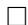

# CONNECTIONS ON NON-PARAMETRIC STATISTICAL MANIFOLDS BY ORLICZ SPACE GEOMETRY

PAOLO GIBILISCO* and GIOVANNI PISTONE  
Dipartimento di Matematica, Politecnico di Torino,  
Corso Duca degli Abruzzi, 24, 10129 Torino, Italy

Received 23 May 1997

The non-parametric version of Information Geometry has been developed in recent years. The first basic result was the construction of the manifold structure on $\mathcal{M}_{\mu}$ , the maximal statistical models associated to an arbitrary measure $\mu$ (see Ref. 48). Using this construction we first show in this paper that the pretangent and the tangent bundles on $\mathcal{M}_{\mu}$ are the natural domains for the mixture connection and for its dual, the exponential connection. Second we show how to define a generalized Amari embedding $A^{\Phi} \colon \mathcal{M}_{\mu} \to S^{\Phi}$ from the Exponential Statistical Manifold (ESM) $\mathcal{M}_{\mu}$ to the unit sphere $S^{\Phi}$ of an arbitrary Orlicz space $L^{\Phi}$ . Finally we show that, in the non-parametric case, the $\alpha$ -connections $\nabla^{\alpha}$ ( $\alpha \in (-1,1)$ ) must be defined on a suitable $\alpha$ -bundle $\mathcal{F}^{\alpha}$ over $\mathcal{M}_{\mu}$ and that the bundle-connection pair $(\mathcal{F}^{\alpha}, \nabla^{\alpha})$ is simply (isomorphic to) the pull-back of the Amari embedding $A^{\alpha} \colon \mathcal{M}_{\mu} \to S^{2/1-\alpha}$ where the unit sphere $S^{2/1-\alpha}cL^{2/1-\alpha}$ is equipped with the natural connection.

# 1. Introduction

The classical source of infinite-dimensional analysis has been the calculus of variations. In the XX century the situation has undertaken a dramatic change by the addition of a number of fields where one is naturally led to infinite-dimensional considerations (e.g. loop and map groups in gauge theory). We argue that Information Geometry should be added to the list. Indeed the non-parametric version of this theory is actually in its infancy due to the nontriviality of the needed infinite-dimensional analytical and geometrical considerations. Let us explain the current state of the art.

Let $(X, \mathcal{X}, \mu)$ be a measure space. The associated maximal (regular, dominated) statistical model is

$$
\mathcal {M} _ {\mu} := \left\{f \colon X \to \mathbb {R}: f > 0, \int f = 1 \right\}.
$$

*Also at: Centro Vito Volterra, Università di Roma "Tor Vergata", via di Tor Vergata, 00133 Roma, Italy.

A parametric (regular, dominated) statistical model is a function

$$
L \colon A \subseteq \mathbb {R} ^ {n} \to \mathcal {M} _ {\mu}.
$$

The idea that a statistical model should be considered as a differential (Riemannian) manifold, via the Fisher information matrix, appeared, for the first time, in the classical papers of Rao and Jeffreys.[31,49] Since then a whole theory, sometimes called Information Geometry, has been developed. Sources of this subject can be found in a number of fields:

(a) Classical Statistics, mainly asymptotic theory (Refs. 1, 2, 5, 7-10, 17, 21-24, 32, 35 and 54).   
(b) Information Theory (Refs. 14 and 16);   
(c) Statistical Mechanics (Refs. 27-30);   
(d) Biomathematics (Ref. 51).

Moreover, stimulated by Quantum Mechanics, noncommutative version of the Information Geometry has been developed by some authors. $^{14,15,19,27,29,44,45,52,53}$

The ultimate goal of a non-parametric version of the theory is to develop a suitable analytical-geometrical structure for the maximal (non-parametric) models $\mathcal{M}_{\mu}$ . Of course the parametric (finite-dimensional) results should be derived as byproduct of the non-parametric (infinite-dimensional) results. This point was clearly stated on p. 76 of the book by Murray and Rice.[42] Comments about the relative difficulties can be found in Refs. 18, 20, 38, 46, p. 8 and pp. 93-103 of Ref. 2 and p. 8 of Ref. 34.

One of the main feature of the works done till the eighties is the restriction to the parametric case. This was indeed a remarkable restriction, from the point of view of applied probability and statistics, and many authors have discussed this point. Moreover, the purpose of geometrization of any field, both in pure or applied mathematics, is, in some sense, precisely to avoid the use of parameters or coordinates.

Therefore developing a non-parametric version of information geometry must be considered as a key problem of the subject. Obviously this problem appears to be part of the infinite-dimensional analysis and infinite-dimensional geometry.

Two approaches are possible to deal with the difficulties of the infinite-dimensional setting. One possibility is to weaken the notion of differentiable function, by allowing directional derivatives in a dense subset of all possible directions in the style of Malliavin's calculus. Another approach consists of developing the non-parametric theory in the framework of classical infinite-dimensional manifolds theory, as exposed for example in Ref. 41.

The second approach was adopted by G. Pistone and C. Sempi in Ref. 48 where the local model for non-parametric statistical manifolds was given by Orlicz spaces with exponential Young function. Subsequent work based on this idea was presented

in Refs. 13 and 47. This paper gives further developments, by mean of a detailed presentation of some results already announced in Ref. 26.

It should also be noted that realizations of infinite-dimensional manifolds by set of densities appear in other (seemingly unrelated) areas as string theory and conformal quantum field theory. Indeed the points of the manifold $\mathcal{M} = \mathrm{Diff}_{+}(S^{1}) / S^{1}$ , that plays a crucial role in the above quoted theories, can be identified with the smooth probability measures on the circle $S^1$ . Applications of Information Geometry in these fields should be further investigated, see Refs. 36 and 55 and references therein.

In the parametric case one has many important geometric objects. Among these the exponential, mixture and $\alpha$ -connections (with their dual structure) are of great importance (see Refs. 2, 3, 18, 21-24 and 35). For example S. Lauritzen5 and T. Kurose40 have suggested that the dual structure of the $\alpha$ -connections should be considered as the key point distinguishing statistical manifolds among arbitrary differential manifolds. Nevertheless, as far as we know, the problem of characterize statistical manifolds is still open.

In this paper we deal with the following problem: is it possible to construct in the non-parametric setting the mixture, exponential and $\alpha$ -connections (and the related duality)?

We solve this problem positively and moreover we show that the above-mentioned duality is exactly the Orlicz space duality. To get this result we do the following. Consider the manifold structure on $\mathcal{M}_{\mu}$ given by the quoted result of Pistone and Sempi.[48] On the pretangent bundle $^* T\mathcal{M}_{\mu}$ we construct the mixture connection $\nabla^{m}$ . Then we prove that the dual of this connection is precisely the exponential connection $\nabla^{e}$ on the tangent bundle $T\mathcal{M}_{\mu}$ .

A difficulty arises at this point. Indeed, the fact that the $\alpha$ -connections are given by the convex combination

$$
\nabla^ {\alpha} = \frac {1 + \alpha}{2} \nabla^ {e} + \frac {1 - \alpha}{2} \nabla^ {m}
$$

is a classical result of the parametric theory. But in the non-parametric case the two connections live on different bundles so that convex combination makes no sense. We bypass this problem in the following way. First of all we construct a generalized Amari embedding $A^{\Phi}$ from $\mathcal{M}_{\mu}$ to the unit sphere $S^{\Phi}$ of an arbitrary Orlicz space $L^{\Phi}$ . Second we consider the natural connection on $S^{2/(1-\alpha)}$ induced by the trivial connection on $L^{2/(1-\alpha)}$ . The pull-back of the Amari embedding gives us a bundle connection pair over $\mathcal{M}_{\mu}$ . The calculations (modulo an isomorphism) on the pull-back bundle prove that the pull-back connection is exactly the non-parametric $\alpha$ -connection.

The paper is organized as follows. In Secs. 2 and 3 we recall the fundamental notions about linear connections and parallel transports on vector bundles. In Sec. 4 we do the same for the theory of Orlicz space. In Sec. 5 we review the structure of Exponential Statistical Manifolds (ESM) from Refs. 47 and 48. In Sec. 6 we have

the first of our result: through parallel transport we construct the exponential and mixture connections on a pair of dual bundles over the ESM. In Sec. 7 we show how the classical Amari embedding can be generalized to arbitrary Orlicz spaces and how to deduce $\alpha$ -connections from the geometry of the unit ball in Lebesgue spaces.

# 2. Vector Bundles

We review here some material on vector bundles and duality. See Refs. 37, 41 and 43.

A vector bundle $(\mathcal{F},\mathcal{M},\pi ,V)$ consists of a total space $\mathcal{F}$ , a connected base manifold $\mathcal{M}$ , a projection $\pi \colon \mathcal{F}\to \mathcal{M}$ and a standard fiber $V$ . $\mathcal{F}_p\coloneqq \pi^{-1}(p)$ is a vector space isomorphic to $V$ . We assume moreover that $\mathcal{F}$ and $\mathcal{M}$ are differentiable manifolds, that $\pi$ is differentiable, and $V$ is a Banach space. We further assume that each point $x\in \mathcal{M}$ has a neighborhood $\mathcal{U}$ such that $\pi^{-1}(\mathcal{U})$ is diffeomorphic to $\mathcal{U}\times V$ (local triviality assumption).

Let $\mathcal{U}$ be an open set of $\mathcal{M}$ . A differentiable map $s\colon \mathcal{U}\to \mathcal{F}$ is called a section over $\mathcal{U}$ if $\pi \cdot s = \operatorname{Id}_{\mathcal{U}}$ . If $\mathcal{U} = \mathcal{M}$ , such a function will simply be called a (global) section. We shall denote by $S(\mathcal{F})$ the set of sections over $\mathcal{M}$ . It is easy to see that $S(\mathcal{F})$ is a module over the ring $C^\infty (\mathcal{M})$ of smooth functions over the manifolds $\mathcal{M}$ . The multiplication is defined pointwise.

Example 1. Let $T\mathcal{M}$ be the tangent bundle of $\mathcal{M}$ . In this case $S(T\mathcal{M})$ is the set of vector fields on the manifolds $\mathcal{M}$ . If $A \in S(T\mathcal{M})$ is a vector field and $f \in C^{\infty}(\mathcal{M})$ is a function, $Af$ denotes the derivative of the function $f$ along the vector field $A$ .

Example 2. Given a vector bundle $\mathcal{F} \to \mathcal{M}$ it is possible to construct a new bundle considering for any point $p \in \mathcal{M}$ the dual $\mathcal{F}_p^*$ of the vector space $\mathcal{F}_p$ .

Let $\mathcal{F}$ , $\mathcal{G}$ be vector bundles over a manifold $\mathcal{M}$ . An isomorphism between $\mathcal{F}$ and $\mathcal{G}$ is a map $I\colon \mathcal{F} \to \mathcal{G}$ such that $I|_{\mathcal{F}_p}$ is an isomorphism between $\mathcal{F}_p$ and $\mathcal{G}_p$ . In such a case, given a section $s \in S(\mathcal{F})$ , then $I \circ s \in S(\mathcal{G})$ . Of course the same applies to $I^{-1}$ .

# 3. Linear Connections and Parallel Transport

A linear connection on a vector bundle is a bilinear map

$$
\nabla \colon S (T \mathcal {M}) \times S (\mathcal {F}) \ni (v, s) \mapsto \nabla_ {v} s \in S (\mathcal {F})
$$

such that

(a) $\nabla_{fv}s = f\nabla_{v}s$   
(b) $\nabla_v(fs) = (vf)s + f\nabla_v s.$

A linear connection on the tangent bundle is also called an affine connection. The covariant derivative of the section $s$ along the vector field $v$ is by definition $\nabla_v s$ .

Definition 3. Let $\mathcal{F},\mathcal{G}$ be vector bundles over $\mathcal{M}$ . Let $\nabla$ be a covariant derivative on $\mathcal{G}$ and let $I\colon \mathcal{F}\to \mathcal{G}$ be an isomorphism. The induced connection $\nabla^I$ on $\mathcal{F}$ is defined by

$$
\nabla_ {v} ^ {I} s := I ^ {- 1} \nabla_ {v} (I \circ s), \qquad v \in S (T \mathcal {M}), \qquad s \in S (\mathcal {F}).
$$

Assume now that we have a manifold $\mathcal{M}$ with a connection $\nabla$ on the tangent bundle. Let $\mathcal{N}$ be a submanifold. Let

$$
\Pi_ {p} \colon T _ {p} \mathcal {M} \to T _ {p} \mathcal {N}, \qquad p \in \mathcal {M}
$$

the associated projection. This allows us to define a new connection on $\mathcal{N}$ by the equation

$$
\tilde {\nabla} _ {v} s := \Pi \nabla_ {v} s, \qquad v \in S (T \mathcal {N}), \qquad s \in S (\mathcal {N})
$$

(see Ref. 42).

The curvature of a connection is defined by

$$
R (X, Y) s = (\nabla_ {X} \nabla_ {Y} - \nabla_ {Y} \nabla_ {X} - \nabla_ {[ X, Y ]}) s.
$$

Let

$$
\mathcal {P} (\mathcal {M}) = \{c: [ 0, 1 ] \rightarrow \mathcal {M}, c \text {i s p i e c e w i s e s m o o t h} \}
$$

be the space of piecewise smooth curves of the manifold $\mathcal{M}$ . Let $\mathcal{F}$ be a vector bundle over $\mathcal{M}$ . A linear parallel transport $U$ is a function

$$
U \colon \mathcal {P} (\mathcal {M}) \to \bigcup \operatorname {I s o} \left(\mathcal {F} _ {p}, \mathcal {F} _ {q}\right)
$$

such that

(a) $U_{\gamma}\in \mathrm{Iso}(\mathcal{F}_{\gamma (0)},\mathcal{F}_{\gamma (1)})$   
(b) $U$ is parametrization independent,   
(c) $U_{\gamma^{-1}} = U_{\gamma}^{-1}$   
(d) $U_{\gamma}U_{\delta} = U_{\gamma \delta}$

Regularity conditions in a local trivialization are also assumed.

Proposition 4. Given a vector bundle $\pi \colon \mathcal{F} \to \mathcal{M}$ there exists a bijection between covariant derivatives (linear connections) and parallel transports on $\mathcal{F}$ .

Proof. See, for example, Ref. 25.

A connection $\nabla$ is locally flat if

$$
U _ {\gamma} ^ {\nabla} = I
$$

for any loop $\gamma$ based at $p\in \mathcal{M}$ and homotopic to $p$ (this definition is independent of the chosen point).

A connection is globally flat if

$$
U _ {\gamma} ^ {\nabla} = I
$$

for any loop $\gamma$ at a fixed point $p\in \mathcal{M}$ . For a locally flat connection the curvature is zero (a consequence of the Ambrose-Singer theorem).

For a globally flat connection $\nabla$ , the parallel transport $U_{\gamma}^{\nabla}$ depends only on the end points of the curve $\gamma$ . Therefore we have the following result.

Proposition 5. Given a vector bundle $\pi \colon \mathcal{F} \to \mathcal{M}$ and a globally flat connection $\nabla$ with associated parallel transport $U$ , then $U$ uniquely defines a family of operators $U_{p,q}$ such that

(a) $U_{p,q}\in \mathrm{Iso}(\mathcal{F}_p,\mathcal{F}_q),$   
(b) $U_{p,p} = \mathrm{Id}_{\mathcal{F}_p}$   
(c) $U_{q,r}U_{p,q} = U_{p,r}$

Vice versa a family of operators $U_{p,q}$ where $p, q \in \mathcal{M}$ satisfying all the previous conditions determines a globally flat connection $\nabla$ on $\mathcal{F}$ .

Definition 6. Let $U$ be a parallel transport. The dual parallel transport $U^{*}$ is defined as follows. Let $\gamma \colon [0,1] \to \mathcal{M}$ be a curve such that $\gamma(0) = p, \gamma(1) = q$ . Let $w \in E_{p}^{*}, v \in E_{q}$ . Define

$$
\left(U _ {\gamma} ^ {*} w\right) (v) := w \left(U _ {\gamma} ^ {- 1} (v)\right).
$$

Note that $U_{\gamma}^{-1}(v) \in E_p$ . Definition 6 makes sense. Indeed we have the following:

(a) $U_{\gamma}^{*}\in \mathrm{Iso}(\mathcal{F}_{\gamma}^{*}(0),\mathcal{F}_{\gamma}^{*}(1))$   
(b) $U_{\gamma}^{*}$ is evidently parametrization independent because $U_{\gamma}$ is,   
(c) we want to show that $U_{\gamma^{-1}}^{*} = (U_{\gamma}^{*})^{-1}$ . Let $\theta \coloneqq (U_{\gamma}^{*})^{-1}w$ so that $w = U_{\gamma}^{*}\theta$ . We have $\forall v \in \mathcal{F}_q$ .

$$
\begin{array}{l} \left(U _ {\gamma^ {- 1}} ^ {*}\right) (v) = w \left(U _ {\gamma^ {- 1}} ^ {- 1} (v)\right) = w \left(U _ {\gamma} (v)\right) \\ = U _ {\gamma} ^ {*} (\theta) \left(U _ {\gamma} (v)\right) = \theta \left(U _ {\gamma} ^ {- 1} U _ {\gamma} (v)\right) = \theta (v) \\ = \left(\left(U _ {\gamma} ^ {*}\right) ^ {- 1} w\right) (v). \\ \end{array}
$$

(d) $(U_{\gamma}^{*}(U_{\delta}^{*}w))(v) = (U_{\delta}^{*}w)(U_{\gamma}^{-1}(v)) = w(U_{\delta}^{-1}U_{\gamma}^{-1}(v))$

$$
= w (U _ {\gamma \delta} ^ {- 1} (v)) = (U _ {\gamma \delta} ^ {*} w) (v).
$$

Definition 7. A bundle-connection pair $(\mathcal{F},\nabla)$ is a pair composed of a vector bundle $\mathcal{F}$ and a linear connection $\nabla$ on $\mathcal{F}$ .

Definition 8. Given a bundle-connection pair $(\mathcal{F}, U)$ we may define the dual bundle connection-pair by $(\mathcal{F}^*, U^*)$ .

# 4. Orlicz Spaces

For this section, refer to Refs. 12, 39 and 50. The use of Orlicz spaces in the construction of the exponential statistical manifold will be described in Sec. 5.

A Young function $\Phi$ is a symmetric convex function $\Phi \colon \mathbb{R} \to \mathbb{R} \cup \{+\infty\}$ such that $\Phi(0) = 0$ and $\lim_{x \to \infty} \Phi(x) = +\infty$ . The conjugate of $\Phi$ is a Young function $\Psi$ such that $\Psi' \circ \Phi' = \mathrm{Id}$ .

Let $\Phi$ be a given Young function. Let $(X, \mathcal{F}, \mu)$ be a measure space. Let $f: X \to \mathbb{R}$ be a measurable function. The Luxembourg norm $\| f \|_{\Phi}$ is given by

$$
\| f \| _ {\Phi} = \inf  \left\{r > 0: \int_ {X} \Phi \left(\frac {| f |}{r}\right) \leq 1 \right\}.
$$

We set

$$
L ^ {\Phi} (\mu) = \{f \text {i s m e a s u r a b l e :} \| f \| _ {\Phi} <   + \infty \},
$$

$L^{\Phi}$ is the Orlicz space generated by the Young function $\Phi$ . If $\Phi(x) = |x|^a / a$ , $a \in [1, +\infty[$ , then the Orlicz space is the usual Lebesgue space and $\|f\|_{\Phi} = a^{1/a} \|f\|_a$ .

The usual Orlicz space of exponential type is defined by the Young function

$$
\mathbb {R} \ni x \mapsto \exp | x | - | x | - 1
$$

whose conjugate Young function is

$$
\mathbb {R} \ni y \mapsto (1 + | y |) \log (1 + | y |) - | y |.
$$

Notice that in some literature these two spaces are known as Zygmund spaces (see Ref. 12).

For statistical computations we prefer to use the equivalent exponential-type function

$$
\mathbb {R} \ni x \mapsto \cosh x - 1.
$$

The spaces described above, with respect to the measure $p \cdot \mu$ , endowed with the Luxembourg norm, will be denoted $L^{\exp}(p)$ , $L\log L(p)$ , $L^{\cosh -1}(p)$ , with subscript 0 if it is restricted to centered random variables.

A key point in statistical applications is the dependence of the spaces on the measure. Let $\mathcal{M}(X,\mathcal{X},\mu)$ be the set of all probability densities on $(X,\mathcal{X},\mu)$ . The following result is important in the theory of Exponential Statistical Manifolds.

Proposition 9. Let $p$ and $q$ be two probability densities connected by an exponential model, i.e. such that they belong to an exponential model for parameters values in

the interior of the natural domain. Then

$$
L ^ {\cosh - 1} (p) = L ^ {\cosh - 1} (q).
$$

Proof. See Proposition 5 in Ref. 47.

□

On the other hand, the previous result is not true for other Orlicz spaces, for example one has

$$
L ^ {a} (p) \neq L ^ {a} (q), \quad a \neq + \infty
$$

$$
L \log L (p) \neq L \log L (q).
$$

# 5. Exponential Statistical Manifolds

In this section we simply review the construction and main results about the Exponential Statistical Manifolds. The references for the following material are Refs. 47 and 48. One has to point out that the tangent space is modeled on a non-reflexive Banach space. We consider a measure space $(X, \mathcal{X}, \mu)$ , and the set $\mathcal{M}_{\mu} = \mathcal{M}(X, \mathcal{X}, \mu)$ of the $\mu$ -almost surely strictly positive probability densities.

We shall define on the set $\mathcal{M}_{\mu}$ a topology such that $\mathcal{M}(X,\mathcal{X},\mu)$ is a Hausdorff space (that is points can be separated by open sets). We shall construct a covering of $\mathcal{M}(X,\mathcal{X},\mu)$ with open sets $\mathcal{U}_p$ , $p\in \mathcal{U}_p$ , $p\in \mathcal{M}(X,\mathcal{X},\mu)$ , and a corresponding family of Banach spaces $B_{p}$ , with norms $\| \cdot \| _p$ , $p\in \mathcal{M}_{\mu}$ , such that each density $q\in \mathcal{U}_p$ is represented with respect to $p$ by a coordinate $s_p(q)\in B_p$ .

$$
s _ {p}: \mathcal {U} _ {p} \rightarrow \mathcal {V} _ {p} \subset B _ {p}, \tag {1}
$$

$$
e _ {p} \colon \mathcal {V} _ {p} \rightarrow \mathcal {U} _ {p} \subset \mathcal {M} _ {\mu}, \tag {2}
$$

denote respectively the charts, that is the mappings from points to coordinates, and the patches, that is the mappings from coordinates to points.

Definition 10. The sequence $(p_n)_{n\in \mathbb{N}}$ in $\mathcal{M}_{\mu}$ is $e$ -convergent (exponentially convergent) to $p$ if $(p_n)_{n\in \mathbb{N}}$ tends to $p$ in $\mu$ -probability as $n\to \infty$ and moreover the sequences $(p_n / p)_{n\in \mathbb{N}}$ and $(p / p_n)_{n\in \mathbb{N}}$ are eventually bounded in each $L^{\alpha}(p)$ , $\alpha >1$ , that is

$$
\forall \alpha > 1: \quad \lim  _ {n \rightarrow \infty} E _ {p} \left(\left(\frac {p _ {n}}{p}\right) ^ {\alpha}\right) <   + \infty , \quad \lim  _ {n \rightarrow \infty} E _ {p} \left(\left(\frac {p}{p _ {n}}\right) ^ {\alpha}\right) <   + \infty .
$$

Definition 11. For each density $p \in \mathcal{M}_{\mu}$ , the Cramer class at $p$ is the set of all random variables $u$ on $(X, \mathcal{X}, \mu)$ such that the moment generating function of $u$ with respect to the probability measure $p \cdot \mu$

$$
\hat {u} _ {p} (t) = \int e ^ {t u} p d \mu = E _ {p} \left(e ^ {t u}\right), \qquad t \in \mathbb {R}
$$

is finite in a neighborhood of the origin 0.

If, moreover, the expectation of $u$ is zero (the previous condition implies the existence of a finite expectation), then we shall call the set the centered Cramer class at $p$ .

Proposition 12. (A norm on the Cramer class) The Cramer class at $p$ is a vector space and a Banach space with the norm defined by:

$$
\left\| u \right\| _ {p} = \inf  \left\{r: E _ {p} \left(\cosh \left(\frac {u}{r}\right) - 1\right) \leq 1 \right\}. \tag {3}
$$

The centered Cramer class, denoted by $B_{p}$ :

$$
B _ {p} = \left\{u \in L ^ {1} (p \cdot \mu): 0 \in \operatorname {d o m} \hat {u} _ {p} ^ {\circ}, E _ {p} u = 0 \right\}
$$

is a closed subspace.

Cramer class is a natural class for sufficient statistics of exponential models, so that the corresponding Banach space fits into the theory of Orlicz spaces.

We shall use the following notation:

$$
\phi_ {1}: x \mapsto \cosh (| x |) - 1, \tag {4}
$$

$$
\phi_ {2}: x \mapsto \exp (| x |) - | x | - 1, \tag {5}
$$

$$
\phi_ {3}: x \mapsto (1 + | x |) \log (1 + | x |) - | x |. \tag {6}
$$

For each of such functions it is possible to define a norm; we will denote, for $i = 1,2,3$ , with:

(a) $\overline{\mathcal{V}}_{\phi_i,p}$ the convex set $\{u\in L^{1}(p\cdot \mu)\colon E_{p}(\phi_{i}(u))\leq 1\}$   
(b) $\| .\|_{\phi_i,p}$ the norm associated to $\phi_{i}$

$$
\left\| u \right\| _ {\phi_ {i, p}} = \inf  \left\{r > 0: E _ {p} \left(\phi_ {i} \left(\frac {u}{r}\right)\right) \leq 1 \right\},
$$

(c) $L^{\phi_i}(p\cdot \mu)$ (or $L^{\phi_i}(p)$ if there is no ambiguity) the corresponding Banach spaces of non-centered random variables:

$$
L ^ {\phi_ {i}} (p) = \left\{u: \exists \alpha \text {s u c h} E _ {p} \left(\phi_ {i} (\alpha u)\right) <   + \infty \right\} = \left\{u: \| u \| _ {\phi_ {i}, p} <   + \infty \right\},
$$

(d) $L_0^{\phi_i}(p)$ the corresponding space of centered random variables.

Definition 13. ( $x \log x$ -class) We will denote by $^* B_p$ the Banach space of centered random variables in $L^{\phi_3}(p \cdot \mu)$ , that is the centered random variable of the so-called $x \log x$ -class.

Proposition 14. (a) All the elements $^{*}u$ in $^{*}B_{p}$ are identified with an element $u^{*}$ of the dual space $B_{p}^{*}$ of $B_{p}$ by the formula: $u^{*}(u) = E_{p}(^{*}u u)$ , with $u \in B_p$ . In

general, $^{*}B_{p}$ is identified with a proper subset of $B_{p}^{*}$ . The injection of $^{*}B_{p}$ into $B_{p}^{*}$ is continuous; we write:

$$
{ } ^ { * } B _ { p } \subseteq B _ { p } ^ { * } .
$$

(b) All the elements $u$ in $B_p$ are identified with an element $\overline{u}$ of the dual space $(^{*}B_p)^*$ of $^*B_p$ by the formula: $\overline{u} (^*u) = E_p(u^*u)$ , with $^*u \in {}^*B_p$ . This identification is onto, that is $B_p$ is identified with $(^*B_p)^*$ ; we write:

$$
\left(^ {*} B _ {p}\right) ^ {*} \simeq B _ {p}.
$$

Definition 15. (Moment generating functional) The moment generating functional

$$
G _ {p} \colon L ^ {\phi_ {1}} (p \cdot \mu) \rightarrow \overline {{R}} _ {+} = [ 0, + \infty ]
$$

is defined by

$$
G _ {p} (u) = E _ {p} \left(e ^ {u}\right).
$$

Proposition 16. (Properties of the MGF) The moment generating functional $G_{p}$

(a) takes value 1 at 0, otherwise it is strictly greater than 1, is convex and its proper domain $\operatorname{dom} G_p = \{u \in L^{\phi_1}(p \cdot \mu) : G_p(u) < \infty\}$ is a convex set which contains the open unit ball $\mathcal{V}_p$ ;   
(b) is bounded and infinitely Fréchet-differentiable on the open unit ball $\mathcal{V}_p$ with differential:

$$
D ^ {n} G _ {p} (u) \left(v _ {1}, \dots , v _ {n}\right) = E _ {q} \left(v _ {1} \dots v _ {n} e ^ {u}\right).
$$

Definition 17. (Cumulant generating functional) The cumulant generating functional $K_{p} \colon B_{p} \to [0, +\infty]$ is defined by

$$
K _ {p} (u) = \log G _ {p} (u).
$$

We remark that we restrict the cumulant generating functional to be defined on centered random variables of the Cramer class at $p$ .

Proposition 18. The Cumulant Generating Functional $K_{p}$ has proper domain $\operatorname{dom} G_{p} \cap B_{p}$ . If $\mathcal{V}_{p}$ denotes the open ball of $B_{p}$ of radius 1 then $\mathcal{V}_{p} \subset \operatorname{dom} G_{p} \cap B_{p}$ . Moreover, $K_{p}$ satisfies the following properties:

(a) $K_{p}$ is 0 at 0, otherwise it is strictly positive; is convex and infinitely Fréchet differentiable on $\mathcal{V}_{p}$ .   
(b) $\forall u\in \mathcal{V}_p,q = e^{u - K_p(u)}\cdot p$ is a probability density in $\mathcal{M}_{\mu}$ . The value of the $n$ th differential at $u$ in the direction $v$ ( $\in B_{p}$ ) of $K_{p}$ , that is the $n$ -linear con-

tinuous form $D^n K_p(u)$ applied to $\overbrace{(v, \ldots, v)}^{n \text{ times}}$ is the $n$ th cumulant of $v$ under the probability density $q$ :

$$
D ^ {n} K _ {p} (u) v ^ {n} = \frac {d ^ {n}}{d t ^ {n}} \log E _ {q} \left(e ^ {t v}\right) \bigg | _ {t = 0}.
$$

In particular, for $v, v_1$ and $v_2$ in $B_p$ one has:

$$
\begin{array}{l} D K _ {p} (u) v = E _ {q} (v), \\ D ^ {2} K _ {p} (u) \left(v _ {1}, v _ {2}\right) = E _ {q} \left(v _ {1} v _ {2}\right) - E _ {q} \left(v _ {1}\right) E _ {q} \left(v _ {2}\right) = \operatorname {C o v} _ {q} \left[ v _ {1}, v _ {2} \right]. \tag {7} \\ \end{array}
$$

(c) $\forall u\in \mathcal{V}_p$ and $q = e^{u - K_p(u)}\cdot p$ , the random variable $q / p - 1$ belongs to ${}^* B_{p}$ and

$$
D K _ {p} (u) v = E _ {p} \left(\left(\frac {q}{p} - 1\right) v\right), \quad v \in B _ {p}.
$$

In other words the differential of $K_{p}$ at $u$ , $DK_{p}(u)$ , is in $B_{p}^{*}$ but actually is identified with an element of $^{*}B_{p}$ , denoted by $\nabla K_{p}(u)$ :

$$
\nabla K _ {p} (u) = e ^ {u - K _ {p} (u)} - 1 = \frac {q}{p} - 1.
$$

(d) The mapping $B_p \ni u \mapsto \nabla K_p(u) \in {}^* B_p$ is monotonic, in particular, it is one-to-one.   
(e) The weak derivative of the map $B_p \ni u \mapsto \nabla K_p(u) \in {}^*B_p$ at $u$ applied to $w \in B_p$ is given by

$$
D (\nabla K _ {p} (u)) w = \frac {q}{p} (w - E _ {q} (w))
$$

and it is one-to-one at each point.

Definition 19. (Maximal exponential model) For each $p$ in $\mathcal{M}_{\mu}$ the maximal exponential model at $p$ is the statistical model

$$
\mathcal {E} _ {p} = \left\{e ^ {u - K _ {p} (u)} \cdot p: u \in \operatorname {d o m} K _ {p} ^ {\circ}, E _ {p} (u) = 0 \right\}.
$$

The function

$$
B _ {p} \supset \operatorname {d o m} K _ {p} ^ {\circ} \ni u \mapsto e ^ {u - K _ {p} (u)} \cdot p \in \mathcal {M} _ {\mu}
$$

is the likelihood function of the maximal exponential model; $u$ plays the role of the "model parameter".

Let us consider the following map defined on a subset $\mathcal{V}_p$ of the proper domain of $K_{p}$ :

$$
e _ {p}: \mathcal {V} _ {p} \ni u \mapsto q = e ^ {u - K _ {p} (u)} \cdot p \in \mathcal {M} _ {\mu}, \tag {8}
$$

where $K_{p}(u) = \log E_{p}e^{u} = \log G_{p}(u)$ is the cumulant generating functional computed at $u$ .

This mapping is one-to-one because $u$ is centered; if

$$
u _ {1}, u _ {2} \in \mathcal {V} _ {p}, \qquad e ^ {u _ {1} - K _ {p} (u _ {1})} = e ^ {u _ {2} - K _ {p} (u _ {2})},
$$

then $u_{1} - K_{p}(u_{1}) = u_{2} - K_{p}(u_{2})$ , and $u_{1} - u_{2}$ is constant and this constant has to be 0.

We shall denote by $\mathcal{U}_p$ the image of $\nu_{p}$ by the mapping $e_p$ and by $s_p$ the inverse of $e_p$ on $\mathcal{U}_p$ . Such an inverse, $s_p\colon \mathcal{U}_p\to \mathcal{V}_p$ , is easily computed as

$$
s _ {p} \colon \mathcal {U} _ {p} \ni q \mapsto \log \frac {q}{p} - E _ {p} \left(\log \frac {q}{p}\right) \in \mathcal {V} _ {p}. \tag {9}
$$

Let us compute the change-of-coordinates formula: if

$$
p _ {1}, p _ {2} \in \mathcal {M} _ {\mu}
$$

are such that

$$
\mathcal {U} _ {p _ {1}} \cap \mathcal {U} _ {p _ {2}} \neq \emptyset ,
$$

then for all $q$ in that intersection

$$
\log {\frac {p _ {1}}{p _ {2}}} = \log {\frac {p _ {1}}{q}} + \log {\frac {q}{p _ {2}}}
$$

belongs to

$$
L ^ {\phi_ {1}} (p _ {1}) = L ^ {\phi_ {1}} (q) = L ^ {\phi_ {1}} (p _ {2}).
$$

The composite transition mapping

$$
s _ {p _ {2}} \circ e _ {p _ {1}}: s _ {p _ {1}} \left(\mathcal {U} _ {p _ {1}} \cap \mathcal {U} _ {p _ {2}}\right)\rightarrow s _ {p _ {2}} \left(\mathcal {U} _ {p _ {1}} \cap \mathcal {U} _ {p _ {2}}\right)
$$

simplifies to

$$
s _ {p _ {2}} \circ e _ {p _ {1}} (u) = u + \log \frac {p _ {1}}{p _ {2}} - E _ {p _ {2}} \left(u + \log \frac {p _ {1}}{p _ {2}}\right), \tag {10}
$$

where the algebraic computations are done in the space of $\mu$ -classes of measurable functions and the expectation is well-defined as long as $\mathcal{U}_{p_1} \cap \mathcal{U}_{p_2} \neq \emptyset$ .

Proposition 20. (a) Let us assume that the sequence $(q_{n})_{n\in \mathbb{N}}$ is $e$ -convergent to $q$ as $n\to \infty$ , and that $q\in \mathcal{U}_f$ . Then the sequence $(q_{n})_{n\in \mathbb{N}}$ is eventually in $\mathcal{U}_f$ , and the corresponding sequence of coordinates $u_{n} = s_{p}(q_{n})$ converges to $u = s_{f}(q)$ in $B_{p}$ . (b) Let $u_{n}, u\in \mathcal{V}_{f}$ , $n\in \mathbb{N}$ , and assume $u_{n}\rightarrow u$ in $B_{p}$ . If $u_{n} = s_{p}(q_{n}), u = s_{p}(q)$ , $n\in \mathbb{N}$ , then $q_{n}$ e-converges to $q$ .

Finally we may state the fundamental result of Ref. 48.

Theorem 21. The collection of pairs

$$
\left\{\left(\mathcal {U} _ {p}, s _ {p}\right): p \in \mathcal {M} _ {\mu} \right\}
$$

is an affine $C^\infty$ -atlas on $\mathcal{M}(X, \mathcal{X}, \mu)$ . The induced topology on sequences is equivalent to e-convergence.

# 6. Exponential and Mixture Connections

We will consider a family $\mathcal{F}^{(\alpha)}$ of vector bundles, over the Exponential Statistical Manifold $\mathcal{M}_{\mu}$ , given for each $\alpha \in [-1,1]$ by

$$
\left\{ \begin{array}{l l} ^ {*} (T \mathcal {M} _ {\mu}) = \bigcup_ {p \in \mathcal {M} _ {\mu}} L \log L _ {0} (p), & \text {i f} \quad \alpha = - 1  , \\ \bigcup_ {p \in \mathcal {M} _ {\mu}} L _ {0} ^ {2 / 1 - \alpha} (p), & \text {i f} \quad \alpha \in (- 1, 1)  , \\ T \mathcal {M} _ {\mu} = \bigcup_ {p} B _ {p}, & \text {i f} \quad \alpha = 1  . \end{array} \right.
$$

Let $a := 2 / (1 - \alpha)$ be the Lebesgue exponent associated to $\alpha$ and let $b := 2 / (1 + \alpha)$ be its conjugate exponent.

The following connections introduced in an informal way by A. Dawid, and fully developed by N. Čentsov and S. Amari (see Refs. 2-4, 18 and 21). We describe them in what is the proper functional framework associate with the Exponential Statistical Manifold. The case $\alpha = 0$ (that is $a = 2$ ) corresponds to the Lebesgue space $L^2$ , i.e. to the Hilbert bundle, the basic case considered by Amari.

Note that the tangent space of the ESM is modelled on a non-reflexive Orlicz space so that particular care is needed to describe the classical dual structure of the connection pair.

Definition 22. The mixture bundle-connection pair $(\mathcal{F}^{(-1)},\nabla^m)$ is defined in the following way. $\mathcal{F}^{(-1)} = {}^* (TM_\mu)$ is the pre-tangent bundle to the manifold $\mathcal{M}_{\mu}$ , so that each fiber $\mathcal{F}_p^{(-1)}$ is a centered random variable in $L\log L_0(p)$ identified with a linear form on $B_{p} = L_{0}^{\cosh -1}(p)$ . It is easy to see that the following formula

$$
U _ {p q} ^ {m}: \mathcal {F} _ {p} ^ {(- 1)} = L \log L _ {0} (p) \ni u \mapsto \frac {p}{q} u \in L \log L _ {0} (q) = \mathcal {F} _ {q} ^ {(- 1)}
$$

defines a (globally flat) parallel transport.

Definition 23. The exponential bundle-connection pair $(T\mathcal{M}_{\mu},\nabla^{e})$ is defined in the following way. $\mathcal{F}^{(1)} = T\mathcal{M}_{\mu}$ is the tangent bundle of the manifold $\mathcal{M}_{\mu}$ . It follows from Proposition 9 that the following formula

$$
U _ {p q} ^ {e} \colon \mathcal {F} _ {p} ^ {(1)} = B _ {p} \ni u \mapsto u - E _ {q} (u) \in B _ {q} = \mathcal {F} _ {q} ^ {(1)}
$$

defines a (globally flat) parallel transport if $p$ and $q$ are exponentially connected.

The two connections are globally flat. It is a key result, due to Amari, that there exist other non-flat and statistically relevant connections. We will show in Sec. 7 how to construct them in the non-parametric case on the vector bundles $\mathcal{F}^{\alpha}$ . The following proposition shows that the mixture and exponential connections are dual to each other.

Proposition 24. With the previous notations we have that

$$
\left(U _ {p q} ^ {m}\right) ^ {*} = U _ {q p} ^ {e}
$$

and therefore

$$
(^ {*} T \mathcal {M} _ {\mu}, \nabla^ {m}) ^ {*} = (T \mathcal {M} _ {\mu}, \nabla^ {e}).
$$

Proof. The fact that the tangent bundle is the dual of the bundle $\mathcal{F}^{(-1)}$ is a consequence of the construction in Example 2 of Sec. 2. Now we only have to show that the parallel transport defining the exponential connection is the dual to the parallel transport defining the mixture connection. Let us use $\langle \cdot, \cdot \rangle_{p}$ to denote the duality between $^*T\mathcal{M}_{\mu_p}$ and $T\mathcal{M}_{\mu_p}$ so that

$$
{ } ^ { * } T \mathcal { M } _ { \mu _ { p } } \times T \mathcal { M } _ { \mu _ { p } } \ni ( u , v ) \mapsto \langle v , u \rangle _ { p } = E _ { p } ( v u ) .
$$

Therefore for any $w \in T\mathcal{M}_{\mu_q}$ , $u \in^* T\mathcal{M}_{\mu_p}$

$$
\begin{array}{l} \langle u, (U _ {p q} ^ {m}) ^ {*} w \rangle_ {p} = \langle U _ {p q} ^ {m} u, w \rangle_ {q} = \left\langle \frac {p}{q} u, w \right\rangle_ {q} \\ = E _ {q} \left(\frac {p}{q} u v\right) = E _ {p} (u v) = E _ {p} \left(u \left(w - E _ {p} (w)\right)\right) \\ = \langle u, U _ {q p} ^ {e} w \rangle_ {p}. \\ \end{array}
$$

It should be noted that the exponential connection cannot be defined for the pre-tangent bundle because in general $^{*}B_{p} \neq {}^{*}B_{q}$ . For the same reason in the case of Amari's Hilbert bundle the two transports have an incomplete domain.

We now compute the covariant derivatives of the parallel transports, with respect of particular embeddings.

For the exponential connection we have:

Proposition 25. Let $\sigma: I \to \mathcal{M}_{\mu}$ a smooth curve such that $p = \sigma(0)$ and $u = \dot{\sigma}(0)$ . If $s \in S(T\mathcal{M}_{\mu})$ is differentiable, then

$$
\left(\nabla_ {u} ^ {e} s\right) (p) = \left(d _ {u} s\right) (p) - E _ {p} \left(\left(d _ {u} s\right) (p)\right),
$$

where $d_u$ denotes the directional derivative in $L^{\cosh -1}(p)$ of $s$ as a Banach-valued function.

Proof. Since

$$
E _ {\sigma (0)} (s (\sigma (0))) = 0,
$$

we have for the exponential connection

$$
\begin{array}{l} (\nabla_ {u} ^ {e} s) (p) = (\nabla_ {\dot {\sigma} (0)} ^ {\dot {e}} s) (\sigma (0)) \\ = \lim  _ {h \rightarrow 0} \frac {1}{h} \left[ U _ {\sigma (h) p} ^ {e} s (\sigma (h)) - s (\sigma (0)) \right] \\ = \lim  _ {h \rightarrow 0} \frac {1}{h} [ s (\sigma (h)) - E _ {\sigma (0)} (s (\sigma (h))) - s (\sigma (0)) + E _ {\sigma (0)} (s (\sigma (0))) ] \\ = \lim  _ {h \rightarrow 0} \frac {1}{h} [ s (\sigma (h)) - s (\sigma (0)) ] - E _ {\sigma (0)} \left(\lim  _ {h \rightarrow 0} \frac {1}{h} \left(s (\sigma (h)) - s (\sigma (0))\right)\right) \\ = \left(d _ {u} s\right) (p) - E _ {p} \left(\left(d _ {u} s\right) (p)\right). \\ \end{array}
$$

In the case of the mixture connection, no natural embedding exists, and the result is weaker.

Proposition 26. Let $\sigma \colon I \to \mathcal{M}_{\mu}$ be a smooth curve such that $p = \sigma(0)$ and $u = \dot{\sigma}(0)$ . We set $\sigma^h \colon [0,1] \to \mathcal{M}$ where $\sigma^h(t) = \sigma(ht)$ . Let $l(h) \coloneqq \sigma(h) / \sigma(0)$ . If $s \in S(^*T\mathcal{M}_{\mu})$ , then

$$
(\nabla_ {u} ^ {m} s) (p) = (d _ {u} s) (p) + s (p) (d _ {u} l) (p),
$$

where the derivatives are computed in $\mu$ -measure.

Proof.

$$
\begin{array}{l} (\nabla_ {u} ^ {m} s) (p) = (\nabla_ {\dot {\sigma} (0)} ^ {m} s) (\sigma (0)) \\ = \lim  _ {h \rightarrow 0} \frac {1}{h} \left[ U _ {\sigma (h) p} ^ {m} s (\sigma (h)) - s (\sigma (0)) \right] \\ = \lim  _ {h \rightarrow 0} \frac {1}{h} \left[ \frac {\sigma (h)}{\sigma (0)} s (\sigma (h)) - s (\sigma (0)) \right] \\ = \lim  _ {h \rightarrow 0} \frac {1}{h} [ s (\sigma (h)) - s (\sigma (0)) ] + \lim  _ {h \rightarrow 0} \frac {1}{h} \frac {\sigma (h) - \sigma (0)}{\sigma (0)} s (\sigma (h)) \\ = (d _ {u} s) (p) + s (p) (d _ {u} l) (p). \\ \end{array}
$$

The exponential and mixture connections are connected in an interesting way to the second derivative of the cumulant functional $K_{p}(u) = \log E_{p}(e^{u})$ . Precisely, let us consider a smooth curve

$$
p (t) = e ^ {u (t) - K _ {p} (u (t))}
$$

and observe that

$$
\frac {d}{d t} \log \left. \frac {p (t)}{p \left(t _ {0}\right)} \right| _ {t = 0} = \dot {u} (t) - E _ {p} (\dot {u} (t)),
$$

where the derivative is in $B_{p}$ . Moreover, from Proposition 18 we know the existence of

$$
\frac {d}{d t} \left(\frac {p (t)}{p (t _ {0})} - 1\right) = \frac {d}{d t} \left(\nabla K _ {p} (u (t))\right), \qquad t = t _ {0}
$$

as a weak derivative in $^{*}B_{p}$ , and finally we deduce

$$
D \nabla K _ {p} (u) w = \frac {q}{p} (w - E _ {q} (w)).
$$

We have proved the following.

# Proposition 27.

$$
D \nabla K _ {p} (u) w = U _ {q p} ^ {m} U _ {p q w} ^ {e}
$$

therefore

$$
D \nabla K _ {p} (u) = \left(U _ {p q} ^ {e}\right) ^ {*} \left(U _ {p q} ^ {e}\right) = A ^ {*} A
$$

where $A = U_{pq}^{e}$ . Moreover

$$
D \nabla K _ {p} (u) = (I + \nabla K _ {p} (u)) (I - D K _ {p} (u))
$$

and

$$
D ^ {2} K _ {p} = (U _ {q p} ^ {m}) (U _ {q p} ^ {m}) ^ {*}.
$$

# 7. Geometry of the Unit Sphere and Generalized Amari Embedding

# 7.1. Connections on the sphere

We first study the geometry of the sphere of radius $\rho$ in Lebesgue spaces on the measure space $(X, \mathcal{X}, \mu)$ .

Let there be given two conjugate exponents $a, b$ :

$$
1 <   a, b <   \infty , \quad a + b = a b
$$

and observe that

$$
\| f \| _ {a} ^ {a} = \left(\int | f | ^ {a} d \mu\right) = \rho^ {a}
$$

implies

$$
\| f ^ {a - 1} \| _ {b} ^ {b} = \int | f | ^ {(a - 1) b} d \mu = \int | f | ^ {a} d \mu = \rho^ {a},
$$

then $\| f^{a - 1}\| _b = \rho^{a / b} = \rho^{a - 1}$

If we define for $f \in L^{a}(\mu)$

$$
\operatorname {s g n} (h) := \left\{ \begin{array}{l l} 1, & \text {i f} h \geq 0  , \\ - 1, & \text {i f} h <   0  , \end{array} \right.
$$

$$
f ^ {*} := \operatorname {s g n} (f) | f | ^ {a - 1}
$$

then the previous computation shows that

$$
\| f ^ {*} \| _ {b} = \| | f | ^ {a - 1} \| _ {b} = \| f \| _ {a} ^ {a - 1},
$$

e.g. the mapping $f \mapsto f^*$ maps the unit points of $L^a(\mu)$ into the unit points of the dual space $L^b(\mu) = (L^a(\mu))^*$ and is $(a - 1)$ -homogeneous. Moreover,

$$
\int f f ^ {*} d \mu = \int f \operatorname {s g n} (f) | f | ^ {a - 1} d \mu = \int | f | ^ {a} d \mu = \| f \| _ {a} ^ {a}.
$$

We will use in particular the following fact:

$$
\| f \| _ {a} = 1 \Rightarrow \int f f ^ {*} d \mu = 1
$$

to compute the tangent hyperplane to the unit sphere in $L^a (d\mu)$

Let

$$
S ^ {a} (\rho) = \{f \in L ^ {a} (\mu): \| f \| _ {a} = \rho \}
$$

be the sphere with radius $\rho$ . It is a submanifold of $L^a (\mu)$ because the mapping $f\mapsto \| f\| _a^a$ is differentiable with gradient $af^{*}$ at $f$ . The tangent subspace to $S^{a}(\rho)$ at $f$ is

$$
T _ {f} S ^ {a} = \left\{g \in L ^ {a} (\mu): \int g f ^ {*} d \mu = 0 \right\}.
$$

Since $g \mapsto \int g f^{*}d\mu$ is a linear functional we have that $T_{f}S^{a}$ is a closed hyperplane. We have dropped $\rho$ in the notation because it does not depend on the radius of the sphere. We may translate $T_{f}S^{a}$ to define the tangent hyperplane:

$$
\left\{g \in L ^ {a} (\mu) \colon \int (g - f) f ^ {*} d \mu = 0 \right\}
$$

which is equivalent to the equation

$$
\int g f ^ {*} d \mu = \int f f ^ {*} d \mu = \rho^ {a}.
$$

Note that our $f^*$ is indeed the duality mapping in the case of $L^a(\mu)$ spaces, when restricted to the unit sphere (see, for example, p. 4 of Ref. 6).

There is a natural splitting associated with the tangent space $T_f S^a$ , i.e. the projection parallel to $f$ . In fact the equation

$$
g = (g - k (g) f) + k (g) f, \quad k (g) \in \mathbb {R}, \quad g - k (g) f \in T _ {f} S _ {a}
$$

gives for each $g \in L^a(\mu)$ ,

$$
\int (g - k (g) f) f ^ {*} d \mu = 0,
$$

then

$$
\int g f ^ {*} d \mu = k (g) \int f f ^ {*} d \mu = k (g) \rho^ {a}
$$

and $k(g) = \rho^{-a}\int gf^{*}d\mu$ . We have proved the following:

Proposition 28. For all $f \in S^a(\rho)$ , the mapping

$$
\Pi_ {f} ^ {a} \colon L ^ {a} (\mu) \ni g \mapsto g - \left(\rho^ {- a} \int g f ^ {*} d \mu\right) f \in L ^ {a} (\mu)
$$

is a projection on $T_{f}S_{a}$ . In particular if $f_{1}, f_{2} \in S_{a}(\rho)$ , then

$$
\Pi_ {f _ {2}} ^ {a} \colon T _ {f _ {1}} ^ {a} S _ {a} \to T _ {f _ {2}} ^ {a} S _ {a}.
$$

If $a = 2$ , then $f^{*} = f$ and

$$
\Pi_ {f} ^ {2} (g) = g - \left(\rho^ {- 2} \int g f d \mu\right) f
$$

is the orthogonal projection of $g$ onto $T_{f}^{2}S_{a}$

# 7.2. Generalized Amari embeddings

Suppose now that the Young function $\Phi$ is invertible when restricted to the positive axis (this is not always the case: consider the $\Phi$ relative to $L^{\infty}$ , see p. 266 of Ref. 12; note that we will not succeed to make the Amari embedding in $L^{\infty}$ ).

We define the Amari $\Phi$ -embedding

$$
A ^ {\Phi} \colon \mathcal {M} _ {\mu} \to L ^ {\Phi} (\mu)
$$

by

$$
A ^ {\Phi} (f) := \Phi^ {- 1} (f).
$$

Trivially we have that

$$
\int_ {X} \Phi (| A ^ {\Phi} (f) |) = \int_ {X} \Phi (| \Phi^ {- 1} (f) |) = \int_ {X} \Phi (\Phi^ {- 1} (f)) = \int_ {X} f = 1
$$

implies $\| A^{\Phi}(f)\| < + \infty$

Proposition 29. Let $\Phi$ be a Young function. Then

$$
\int_ {X} \Phi \left(\frac {f}{a _ {0}}\right) d \mu = 1 \quad \Rightarrow \quad a _ {0} = \| f \| _ {\Phi}.
$$

That is $a_0$ is the Luxembourg norm of $f$ .

Proof. See p. 78 of Ref. 39. Since $\Phi$ is strictly increasing we have

$$
a <   a _ {0} \Rightarrow \frac {f (x)}{a} > \frac {f (x)}{a _ {0}} \quad \forall x \Rightarrow \Phi \left(\frac {f (x)}{a}\right) > \Phi \left(\frac {f (x)}{a _ {0}}\right) \quad \forall x,
$$

then

$$
\int_ {X} \Phi \left(\frac {f (x)}{a}\right) > \int_ {X} \Phi \left(\frac {f (x)}{a _ {0}}\right) \Rightarrow a _ {0} = \| f \| _ {\Phi}.
$$

Corollary 30. Let $S^{\Phi} = \{v \in L^{\Phi} : \| v \|_{\Phi} = 1\}$ be the unit sphere of the Banach space $L^{\Phi}$ . Then

$$
A ^ {\Phi} (\mathcal {M} _ {\mu}) \subset S ^ {\Phi}.
$$

Proof.

$$
\int_ {X} \Phi \left(\frac {\Phi^ {- 1} (f)}{1}\right) = \int_ {X} f = 1 \Rightarrow 1 = \| \Phi^ {- 1} (f) \| _ {\Phi}.
$$

We may generalize the above result as follows. Let $\Psi \colon (0, +\infty) \to (0, +\infty)$ be a measurable function and let $p \in \mathcal{M}_{\mu}$ . Define

$$
A _ {\Psi , p} ^ {\Phi} (q) = \Phi^ {- 1} \left(\frac {q}{\Psi (p)}\right).
$$

Proposition 31.

$$
A _ {\Psi , p} ^ {\Phi} (q) \in S ^ {\Phi} (\Psi (p) \mu)
$$

that is

$$
A _ {\Psi , p} ^ {\Phi}: \mathcal {M} _ {\mu} \rightarrow S ^ {\Phi} (\Psi (p) \mu).
$$

Proof.

$$
\int_ {X} \Phi \left(\frac {\Phi^ {- 1} \left(\frac {q}{\Psi (p)}\right)}{1}\right) \Psi (p) \mu = \int \frac {q}{\Psi (p)} \Psi (p) \mu = \int q \mu = 1.
$$

# 7.3. $\alpha$ -connections

Let us consider the Amari embeddings

$$
\mathcal {M} _ {\mu} \ni p \mapsto p ^ {1 / a} \in L ^ {a} (\mu).
$$

We want to construct the $\alpha$ -connection of the $\alpha$ -bundle

$$
\mathcal {F} ^ {\alpha} = \bigcup_ {p \in \mathcal {M} _ {\mu}} L _ {0} ^ {a} (p),
$$

where $a = 2 / (1 - \alpha)$ . Let $p(t)$ be a curve in $\mathcal{M}_{\mu}$ , and let $S$ be a section of $\mathcal{F}^{\alpha}$ . For each $t$ we have $S(p(t)) \in L_0^a(p)$ and therefore its expected value is zero: $E_{p(t)}(S(p(t))) = 0$ . Because of the smoothness of both the section and the curve, we have from $\frac{d}{dt} E_{p(t)}(S(p(t))) = 0$ that

$$
\int \frac {d}{d t} S (p (t)) p (t) d \mu + \int S (p (t)) \dot {p} (t) d \mu = 0
$$

and finally

$$
E _ {p (t)} \left(\frac {d}{d t} S (p (t))\right) = - E _ {p (t)} \left(S (p (t)) \frac {d}{d t} \log p (t)\right) \tag {11}
$$

for the canonical $\alpha$ -projection one has

$$
\Pi_ {p (t)} v = v - \left(\int v p ^ {\frac {1}{b}} d \mu\right) p (t) ^ {1 / a}, \tag {12}
$$

where

$$
\frac {1}{a} + \frac {1}{b} = 1, \quad \frac {1}{a} = \frac {1 - \alpha}{2}, \quad \frac {1}{b} = \frac {1 + \alpha}{2}.
$$

The $\alpha$ -connections are constructed as follows:

Step 1. We construct the canonical connection on the unit sphere $S^a \subset L^a(\mu)$ using the trivial connection on $L^a(\mu)$ .

Step 2. We transfer the canonical connection on the $\alpha$ -bundle $\mathcal{F}^{\alpha}$ by an isomorphism with the tangent bundle of the image of the $\alpha$ -embedding.

We may say that given the Amari $\alpha$ -embedding

$$
A ^ {\alpha} \colon \mathcal {M} _ {\mu} \to S ^ {a}
$$

the $\alpha$ -bundle connection pair $(\mathcal{F}^{\alpha}, \nabla^{\alpha})$ is (isomorphic to) the pull-back of the map $A^{\alpha}$ , if one fixes the natural connection on the sphere $S_{a}$ where

$$
\left\{ \begin{array}{c} \alpha \in (- 1, 1), \\ a = 2 / (1 - \alpha), \\ I _ {p} ^ {\alpha} (u) = p ^ {1 / a} u, \\ A ^ {\alpha} (p) = p ^ {1 / a}. \end{array} \right.
$$

Moreover the comparisons of our definition with the classical definitions prompt for computations that are taken in $\mu$ -measure.

Here is a more detailed construction. Let us compute the induced covariant derivative.

$$
\begin{array}{l} \left. \frac {\nabla^ {I}}{d t} \right| _ {t = 0} S (p (t)) \\ = I _ {p (0)} ^ {- 1} \left(\frac {\nabla}{d t} \Bigg | _ {t = 0} \left(I _ {p (t)} \circ S (p (t))\right)\right) \\ = p (0) ^ {- 1 / a} \left(\prod_ {p (0)} \left(\frac {D}{d t} \Big | _ {t = 0} I _ {p (t)} \circ S (p (t))\right)\right) \\ = p (0) ^ {- 1 / a} \left(\frac {D}{d t} \Big | _ {t = 0} I _ {p (t)} \circ S (p (t)) - \left(\int \frac {D}{d t} \Big | _ {t = 0} I _ {p (t)} \circ S (p (t)) p (0) ^ {1 / b} d \mu\right) p (0) ^ {1 / a}\right) \\ = p (0) ^ {- 1 / a} \left(\frac {D}{d t} \Bigg | _ {t = 0} p (t) ^ {1 / a} S (p (t)) - \left(\int \frac {D}{d t} \Bigg | _ {t = 0} p (t) ^ {1 / a} S (p (t)) p (0) ^ {1 / b} d \mu\right) p (0) ^ {1 / a}\right). \\ \end{array}
$$

Now we compute the derivative of the product in $\mu$ -measure:

$$
\frac {D}{d t} \Bigg | _ {t = 0} p (t) ^ {1 / a} S (p (t)) = \left(\frac {1}{a} \frac {\dot {p} (0)}{p (0)} S (p (0)) + \dot {S} (p (0))\right) p (0) ^ {1 / a}.
$$

Putting this result in the previous computation we get (using the notation $\dot{l}(0) = \dot{p}(0) / p(0)$ )

$$
\begin{array}{l} \left. \frac {\nabla^ {I}}{d t} \right| _ {t = 0} S (p (t)) \\ = \dot {S} (p (0)) + \frac {1}{a} S (p (0)) \dot {l} (0) - \int \left(\frac {1}{a} \frac {\dot {p} (0)}{p (0)} S (p (0)) p (0) ^ {1 / a}\right) p (0) ^ {1 / b} d \mu \\ - \int \left(\frac {1}{a} \dot {S} (p (0)) p (0) ^ {1 / a}\right) p (0) ^ {1 / b} d \mu \\ = \dot {S} (p (0)) + \frac {1}{a} S (p (0)) \dot {l} (0) - \frac {1}{a} \int \dot {p} (0) S (p (0)) d \mu - \int \dot {S} (p (0)) p (0) d \mu \\ = \dot {S} (p (0)) + \frac {1}{a} S (p (0)) \dot {l} (0) - \frac {1}{a} E _ {p (0)} (\dot {l} (0) S (p (0))) - E _ {p (0)} (\dot {S} (p (0))). \\ \end{array}
$$

Now we use Eq. (11) to get

$$
\begin{array}{l} \left. \frac {\nabla^ {I}}{d t} \right| _ {t = 0} S (p (t)) \\ = \dot {S} (p (0)) - \frac {1}{b} E _ {p (0)} (\dot {S} (p (0))) + \frac {1}{a} S (p (0)) \dot {l} (0) \\ = \dot {S} (p (0)) - \frac {1 + \alpha}{2} E _ {p (0)} (\dot {S} (p (0))) + \frac {1 - \alpha}{2} S (p (0)) \dot {l} (0) \\ = \frac {1 + \alpha}{2} \left(\dot {S} (p (0)) - E _ {p (0)} (\dot {S} (p (0)))\right) + \frac {1 - \alpha}{2} \left(\dot {S} (p (0)) + S (p (0)) \dot {l} (0)\right). \\ \end{array}
$$

Therefore we have that the $\alpha$ -connections defined by the present procedure coincide with the $\alpha$ -connections defined by Amari.

# References

1. S. Amari, Ann. Stat. 10 (1982) 357-387.   
2. S. Amari, Differential-Geometrical Methods in Statistics, Lecture Notes in Stat. (Springer-Verlag, 1985), second printing Vol. 28 (1990).   
3. S. Amari, Differential geometrical theory of statistics, in Differential Geometry in Statistical Inference, eds. Amari et al. (Inst. Math. Stat., 1987), pp. 19-94.   
4. S. Amari, Dual connections on the Hilbert bundles of statistical models, in Geometrization of Statistical Theory (ULDM, 1987), pp. 123-151.   
5. S. Amari, O. Barndorff-Nielsen, R. Kass, S. Lauritzen and C. R. Rao, Differential Geometry in Statistical Inference, Institute of Mathematical Statistics Lecture Notes-Monograph Series, Vol. 10 (Inst. Math. Stat., 1987).

6. V. Barbu, Analysis and Control of Nonlinear Infinite Dimensional Systems (Academic Press, 1993).   
7. O. Barndorff-Nielsen, Information and Exponential Families in Statistical Theory (John Wiley & Sons, 1978).   
8. O. Barndorff-Nielsen, Ann. Stat. 14 (1986) 856-873.   
9. O. Barndorff-Nielsen, Indiana Math. 29 (1987).   
10. O. Barndorff-Nielsen and P. Blaesild, Proc. R. Soc. London A411 (1987) 421-444.   
11. O. Barndorff-Nielsen, P. Blaesild, A. Carey, P. Jupp, M. Mora and M. Murray, Acta Appl. Mat. 28 (1992) 219-252.   
12. C. Bennett and R. Sharpley, Interpolation of Operators (Academic Press, 1988).   
13. D. Brigo and G. Pistone, Projecting the Fokker-Planck equation onto a finite-dimensional exponential family, Preprint 4, Dipartimento di Matematica Pura e Applicata, dell'Università di Padova, 1996.   
14. E. Caianiello, A geometrical view of quantum and information theories, in Frontiers of Non-Equilibrium Statistical Physics, eds. G. Moore and M. Scully (Plenum, 1986), pp. 163-187.   
15. E. T. Caianiello and W. Guz, Phys. Lett. A126 (1988) 223-225.   
16. L. Campbell, Inform. Sci. 35 (1985) 199-210.   
17. L. Campbell, Proc. Amer. Math. Soc. 98 (1986) 135-141.   
18. N. N. Centsov, Statistical Decision Rules and Optimal Inference (1972) in Russian, translation in Translations of Mathematical Monographs, Vol. 53 (AMS, 1982).   
19. S. Csaba and D. Petz, J. Math. Phys. 37 (1996) 2662-2673.   
20. I. Csiszar, Studia Sci. Math. Hung. 2 (1967) 329-339.   
21. A. Dawid, Ann. Stat. 3 (1975) 1231-1234.   
22. A. Dawid, Ann. Stat. 5 (1977) 1249.   
23. B. Efron, Ann. Stat. 3 (1975) 1189-1242, with discussion.   
24. B. Efron, Ann. Stat. 65 (1977) 457-458.   
25. P. Gibilisco, Math. Not. 61, 4 (1997) 417-429.   
26. P. Gibilisco and G. Pistone, Connections on the exponential statistical manifold, contributed paper, Bernoulli 4th World Congress, Vienna, August, 26-31, 1996.   
27. H. Hasegawa, Non-commutative extension of the information geometry, in Proc. of the Nottingham Conference on Quantum Communication and Measurement, eds. V. P. Belavkin et al. (Plenum, 1995) 327-338.   
28. R. Ingarden, Bull. Acad. Pol. Sci. Sér. Math. Phys. Astr. 11 (1963) 541-547.   
29. R. Ingarden, Int. J. Engrg. Sci. 19 (1981) 1609-1633.   
30. R. Ingarden, Y. Sato, K. Sugawa and M. Kawaguchi, *Tensor (N.S.)* 33 (1979) 347-353.   
31. H. Jeffreys, Proc. R. Soc. London A186 (1946) 453-461.   
32. P. Jupp, Differential geometry and statistical inference, in Geometry and Topology of Submanifolds III (Leeds, 1990) (World Scientific, 1991), pp. 163-173.   
33. P. Jupp, Proc. R. Soc. London A436 (1992) 89-98.   
34. R. Kass, Introduction, in Differential Geometry in Statistical Inference, eds. Amari et al. (Inst. Math. Stat., 1987), pp. 1-17.   
35. R. Kass, Stat. Sci. 4 (1989) 184-234.   
36. A. Kirillov and D. Yur'ev, Funk. Anal. Pri. 20 (1986) 79-80, in Russian. English translation in Funct. Anal. Appl. 20 (1987).   
37. S. Kobayashi and K. Nomizu, Foundations of Differential Geometry (Interscience and John Wiley & Sons, 1963), Vol. 1.   
38. Y. Koshevnik and B. Levit, Theor. Prob. Appl. 21 (1976) 738-753.

39. M. A. Krasnosel'skii and Ya. B. Rutickii, Convex Functions and Orlicz Spaces (Noordhoff, 1961). Russian original: Fizmatgiz, Moskva, 1958.   
40. T. Kurose, Math. Z. 203 (1990) 111-121.   
41. S. Lang, Differential and Riemannian Manifolds (Springer-Verlag, 1995).   
42. M. K. Murray and J. W. Rice, Differential Geometry and Statistics, in Monographs on Statistics and Applied Probability, Vol. 48 (Chapman & Hall, 1993).   
43. K. Nomizu and T. Sasaki, Affine Differential Geometry: Geometry of Affine Immersions, Cambridge Tracts in Mathematics, Vol. 111 (Cambridge Univ. Press, 1994).   
44. D. Petz, J. Math. Phys. 35 (1994) 780-795.   
45. D. Petz, Lin. Alg. Appl. 244 (1996) 81-96.   
46. J. Pflanzagl, Contribution to General Asymptotic Statistical Theory, Lecture Notes in Statistics, Vol. 13 (Springer, 1982).   
47. G. Pistone and M. P. Rogantin, The exponential statistical manifold: mean parameters, orthogonality, and space transformation, Rapporto Interno 6/1996, Dipartimento di Matematica del Politecnico di Torino, to appear in Bernoulli.   
48. G. Pistone and C. Sempi, Ann. Stat. 33 (1995) 1543-1561.   
49. C. R. Rao, Bull. Cal. Math. Soc. 37 (1945) 81-89.   
50. M. M. Rao and Z. D. Ren, Theory of Orlicz Spaces, Pure and Applied Mathematics Vol. 146 (Marcel Dekker, 1991).   
51. S. Shahshahani, Mem. Amer. Math. Soc. 17 (1979) 211.   
52. A. Uhlmann, The metric Bures and the geometric phase, in Groups and Related Topics, eds. R. Gielerak et al. (Kluwer, 1992), pp. 267-274.   
53. A. Uhlmann, Rep. Math. Phys. 33 (1993) 253-263.   
54. P. W. Vos, Ann. Ins. Stat. Math. 41 (1989) 429-450.   
55. D. V. Yur'ev, The vocabulary of the geometric and Harmonic analysis on the infinite dimensional manifold $\text{Diff}_{+}(S^{1}) / S^{1}$ , in Topics in Representation Theory, eds. A. A. Kirillov, Advances in Soviet Mathematics, Vol. 2 (AMS, 1991).