# Geometric Science of Information

7th International Conference, GSI 2025 Saint-Malo, France, October 29-31, 2025 Proceedings, Part I


# Lecture Notes in Computer Science

16033

Founding Editors

Gerhard Goos

Juris Hartmanis

# Editorial Board Members

Elisa Bertino, Purdue University, West Lafayette, IN, USA

Wen Gao, Peking University, Beijing, China

Bernhard Steffen, TU Dortmund University, Dortmund, Germany

Moti Yung, Columbia University, New York, NY, USA

The series Lecture Notes in Computer Science (LNCS), including its subseries Lecture Notes in Artificial Intelligence (LNAI) and Lecture Notes in Bioinformatics (LNBI), has established itself as a medium for the publication of new developments in computer science and information technology research, teaching, and education.

LNCS enjoys close cooperation with the computer science R & D community, the series counts many renowned academics among its volume editors and paper authors, and collaborates with prestigious societies. Its mission is to serve this international community by providing an invaluable service, mainly focused on the publication of conference and workshop proceedings and postproceedings. LNCS commenced publication in 1973.

Frank Nielsen $\cdot$ Frédéric Barbaresco Editors

# Geometric Science of Information

7th International Conference, GSI 2025 Saint-Malo, France, October 29-31, 2025 Proceedings, Part I

ISSN 0302-9743

ISSN 1611-3349 (electronic)

Lecture Notes in Computer Science

ISBN 978-3-032-03918-7 (eBook)

ISBN 978-3-032-03917-0

https://doi.org/10.1007/978-3-032-03918-7

© The Editor(s) (if applicable) and The Author(s), under exclusive license to Springer Nature Switzerland AG 2026

This work is subject to copyright. All rights are solely and exclusively licensed by the Publisher, whether the whole or part of the material is concerned, specifically the rights of translation, reprinting, reuse of illustrations, recitation, broadcasting, reproduction on microfilms or in any other physical way, and transmission or information storage and retrieval, electronic adaptation, computer software, or by similar or dissimilar methodology now known or hereafter developed.

The use of general descriptive names, registered names, trademarks, service marks, etc. in this publication does not imply, even in the absence of a specific statement, that such names are exempt from the relevant protective laws and regulations and therefore free for general use.

The publisher, the authors and the editors are safe to assume that the advice and information in this book are believed to be true and accurate at the date of publication. Neither the publisher nor the authors or the editors give a warranty, expressed or implied, with respect to the material contained herein or for any errors or omissions that may have been made. The publisher remains neutral with regard to jurisdictional claims in published maps and institutional affiliations.

Cover page painting: Woman teaching Geometry, from French medieval edition of Euclid's Elements (14th century) © The British Library, used with granted permission.

This Springer imprint is published by the registered company Springer Nature Switzerland AG. The registered company address is: Gewerbestrasse 11, 6330 Cham, Switzerland

If disposing of this product, please recycle the paper.

# Preface

Welcome to GSI 2025, the 7th Geometric Science of Information conference!

We were delighted to organize the 7th edition of the GSI conference cycle which was initiated in 2013. As with GSI 2013, GSI 2015, GSI 2017, GSI 2019, GSI 2021, and GSI 2023 (https://franknielsen.github.io/GSI/), the objective of this 7th edition of the SEE GSI conference, hosted in Saint-Malo, birthplace of Pierre Louis Moreau de Maupertuis, was to bring together pure and applied mathematicians and engineers with a common interest in geometric tools and their applications for information analysis. GSI emphasizes the active participation of young researchers to discuss emerging areas of collaborative research on the topic of "Geometric Science of Information and its Applications".

In 2025, GSI's main theme was "Geometric Structures of Statistical and Quantum Physics, Information Geometry, and Machine Learning: FROM CLASSICAL TO QUANTUM INFORMATION GEOMETRY", and the conference took place at Palais du Grand Large, in Saint-Malo, France. This was the second time in a row that the GSI conference was held in Saint-Malo.

The GSI conference cycle was initiated by the Brillouin Seminar Team in 2009 (http:// repmus.ircam.fr/brillouin/home). GSI 2025 followed the tradition of the first initiative launched in 2013 (https://web2.see.asso.fr/gsi2013) at Mines ParisTech, consolidated in 2015 (https://web2.see.asso.fr/gsi2015) at École Polytechnique, and opened to new communities in 2017 (https://web2.see.asso.fr/gsi2017) at Mines ParisTech, 2019 (https:// web2.see.asso.fr/gsi2019) at ENAC Toulouse, 2021 (https://web2.see.asso.fr/gsi2021) at Sorbonne University, and 2023 at Saint-Malo.

Let us mention that in 2011, we organized an Indo-French workshop on the topic of "Matrix Information Geometry" (https://www.lix.polytechnique.fr/~nielsen/MIG/) that yielded an edited book in 2013, and in 2017, collaborated on a CIRM seminar in Luminy with the event TGSI 2017 "Topological & Geometrical Structures of Information" (https://fconferences.cirm/math.fr/1680.html).

GSI satellite events were organized in 2019 and 2020 as FGSI 2019 "Foundation of Geometric Science of Information" in Montpellier (https://fgsi2019.sciencesconf.org/) and Les Houches Seminar SPIGL 2020 "Joint Structures and Common Foundations of Statistical Physics, Information Geometry and Inference for Learning" (https://frankn ielsen.github.io/SPIG-LesHouches2020/).

The technical program of GSI 2025 covered all the main topics and highlights in the domain of the "Geometric Science of Information" including information geometry manifolds of structured data/information and their advanced applications. These Springer LNCS proceedings consist solely of original research papers that have been carefully peer-reviewed by at least two or three experts (sometimes by five experts). Accepted contributions were revised before acceptance.

Like the six previous editions, GSI 2025 addressed inter-relations between different mathematical domains like shape spaces (geometric statistics on manifolds and

Lie groups, deformations in shape space, ..., probability/optimization and algorithms on manifolds (structured matrix manifolds, structured data/information, ..., relational and discrete metric spaces (graph metrics, distance geometry, relational analysis,...), computational and Hessian information geometry, geometric structures in thermodynamics and statistical physics, algebraic/infinite dimensional/Banach information manifolds, divergence geometry, tensor-valued morphology, optimal transport theory, manifold and topology learning, ... and applications like geometries of audio-processing, inverse problems, and signal/image processing. The topics of GSI 2025 were enriched with contributions from Lie Group Machine Learning, Harmonic Analysis on Lie Groups, Geometric Deep Learning, Geometry of Hamiltonian Monte Carlo, Geometric & (Poly)Symplectic Integrators, Contact Geometry & Hamiltonian Control, Geometric and structure-preserving discretizations, Probability Density Estimation & Sampling in High Dimension, Geometry of Graphs and Networks, and Geometry in Neuroscience & Cognitive Sciences.

Topics of interests included but were not limited to: Geometric Learning and Differential Invariants on Homogeneous Spaces, Statistical Manifolds and Hessian Information Geometry, Renyi Entropy & Information, Geometric Foliation Structures of Dissipation and Machine Learning, Geometric Structures of Quantum Information & Processing, Applied Geometric Learning, Probability, Information and Topology (fundamentals & applications), Divergences in Statistics and Machine Learning, Geometric Statistics, Geometric Methods in Hybrid Classical/Quantum Systems, Computational Information Geometry and Divergences, Geometric Methods in Thermodynamics, The Geometry of Classical & Quantum States, Geometric Mechanics, Geometric Green & Quantum Machine Learning, Stochastic Geometric Dynamics, New Trends in Nonholonomic Systems, Learning of Dynamic Processes, Neurogeometry, PINN (Physics-Informed Neural Network) with Geometric Structures, Lie Groups in Machine Learning, Information Geometry, Toric Manifold (Delzant Theory), Symplectic Approach to Differential Equations, Lie Group Based Methods in Robotics & Kalman Filters, Geometric and Analytical Aspects of Quantization and Non-Commutative Harmonic Analysis on Lie Groups, Probability and Statistics on Manifolds, Deep Learning: Methods, Analysis and Applications to Mechanical Systems, Integrable Systems and Information Geometry (From Classical to Quantum), Computing Geometry & Algebraic Statistics.

At the turn of the century, new and fruitful interactions were discovered between several branches of science: Information Sciences (information theory, digital communications, statistical signal processing), Mathematics (group theory, geometry and topology, probability, statistics, sheaf theory, ...) and Physics (geometric mechanics, thermodynamics, statistical physics, quantum mechanics, ...). The GSI biennial international conference cycle is an attempt to discover the joint mathematical structures of all these disciplines by elaboration of a "General Theory of Information" embracing physics, information science, and cognitive science in a global scheme.

GSI 2025 received 146 submissions among which 124 papers were accepted after a single-blind review process where each paper was reviewed by at least two anonymous reviewers.

The GSI 2025 conference was structured in 18 sessions of more than 120 papers:

1. Geometric Learning and Differential Invariants on Homogeneous Spaces   
2. Statistical Manifolds and Hessian Information Geometry   
3. Applied Geometry-Informed Machine Learning   
4. Geometric Green Learning on Groups and Quotient Spaces   
5. Divergences in Statistics and Machine Learning   
6. Geometric Statistics   
7. Computational Information Geometry and Divergences   
8. Geometric Methods in Thermodynamics   
9. Classical & Quantum Information, Geometry and Topology   
10. Geometric Mechanics   
11. Stochastic Geometric Dynamics   
12. New trends in Nonholonomic Systems   
13. Learning of Dynamic Processes   
14. Optimization and Learning on Manifolds   
15. Neurogeometry   
16. Lie Groups in Learning Distributions & in Filters   
17. A Geometric Approach to Differential Equations   
18. Information Geometry, Delzant Toric Manifold & Integrable Systems

July 2025

Frank Nielsen

Frédéric Barbaresco

# Organization

# Conference Co-chairs

Frank Nielsen

Frédéric Barbaresco

Sony Computer Science Laboratories Inc., Japan

Thales Land & Air Systems, France

# Local Organizing Committee

SEE Groupe Régional GRAND OUEST

Palais du Grand Large Team, Saint-Malo

# Secretaries

Imene Ahmed

SEE, France

Loic Cantu

SEE, France

# Scientific Committee

Biban Afsari

Pierre-Antoine Absil

Jesus Angulo

Nihat Ay

Simone Azeglio

Frédéric Barbaresco

Pierre Baudot

Daniel Bennequin

Pierre Bieliavsky

Michel Boyom

Michel Broniatowski

Harsh Choudhary

Goffredo Chirco

Florio M. Ciaglia

Patrick Clarysse

Leonardo Colombo

Johns Hopkins University, USA

Université Catholique de Louvain, Belgium

Mines ParisTech, France

Max Planck Institute, Germany

ENS Paris, France

Thales Land & Air Systems, France

Median Technologies, France

Paris Cité University, France

Université de Louvain, Belgium

University of Montpellier, France

Sorbonne Université, France

CVUT, Czech Republic

University of Naples Federico II, Italy

Universidad Carlos III de Madrid, Spain.

INSA Lyon & CREATIS, France

Consejo Superior de Investigaciones Cientificas (Spanish National Research Council), Spain

Nicolas Couellan

Ana Bela Ferreira Cruzeiro

Ariana Di Bernardo

Remco Duits

Javier de Lucas

Hajime Fujita

Fabrice Gamboa

Jean-Pierre Gazeau

François Gay-Balmaz

Louis Grimaud Salmon

Audrey Giremus

Denis Matignon

Hatem Hajri

Minh Ha Quang

Bruno Iannazzo

Hideyuki Ishi

Stéphanie Jehan-Besson

Eren Mehmet Kiral

Pierre-Yves Lagrave

Samy Labsir

Manuel de León

Jean Lebet

Melvin Leok

Nicolas Le Bihan

Hóng Vān Lé

Luigi Malago

Jonathan Manton

Gaetan Marceau-Caron

Matilde Marcolli

Jean-François Marcotorchino

Charles-Michel Marle

Bernhard Maschke

Denis Matignon

Hiroshi Matsuzoe

Nina Miolane

Jean-Marie Mirebeau

Ali Mohammad-Djafari

Cyrus Mostajeran

Antonio Mucherino

Mueller

ENAC, France

Universidade de Lisboa, Portugal

ENS Paris, France

Eindhoven University of Technology, Netherlands

FUW, Poland

Japan Women's University, Japan

Institut Mathématique de Toulouse, France

Paris Cité University, France

ENS Paris, France

Thales, France

University of Bordeaux, France

ISAE, France

IRT SystemX, France

RIKEN, Japan

Università degli Studi di Perugia, Italy

Osaka City University, Japan

CREATIS, CNRS UMR 5220, France

RIKEN, Japan

Morgan Stanley, France

IPSA, France

Real Academia de Ciencias, Spain

University of Evry, France

University of California, San Diego, USA

Grenoble University, France

Institute of Mathematics of Czech Academy of Sciences, Czech Republic

Romanian Institute of Science and Technology, Romania

University of Melbourne, Australia

MILA R&D and Tech Transfer, Canada

CALTECH, USA

Sorbonne University, France

Sorbonne University, France

Lyon 1 University, France

ISAE, France

Nagoya Institute of Technology, Japan

University of California, Santa Barbara, USA

Université Paris-Saclay, France

Centrale Supélec, France

University of Cambridge, UK

IRISA, University of Rennes 1, France

RWTH Aachen, Germany

Florence Nicol

Frank Nielsen

Richard Nock

Yann Ollivier

Xavier Pennec

Teodora Petrisor

Giovanni Pistone

Olivier Rioul

Gery de Saxcé

Salem Said

Rodolphe Sepulchre

Stefan Sommer

Wolfgang Stummer

Daisuke Tarama

Koichi Tojo

Zdravko Terze

Alain Trouve

Alice Barbara Tumpach

Santiago Velasco-Forero

Geert Verdoolaege

Hiroaki Yoshimura

Jean-Claude Zambrini

Jun Zhang

ENAC, France

Sony Computer Science Laboratories Inc., Japan

Université Antilles-Guyane, France

Meta, France

Inria, France

CortAlx Labs, Thales, France

Collegio Carlo Alberto, Italy

Télécom Paris & Institut Polytechnique de Paris, France

University of Lille, France

University of Bordeaux, France

University of Liege, Belgium

University of Copenhagen, Denmark

Friedrich-Alexander-Universität Erlangen-Nürnberg, Germany

Ritsumeikan University, Japan

RIKEN, Japan

University of Zagreb, Croatia

École Normale Supérieure Paris-Saclay, France

Université de Lille, France

MINES Paristech, PSL Research University, France

Ghent University, Belgium

Waseda University, Japan

Universidade de Lisboa, Portugal

University of Michigan, USA

# GSI 2025 Keynote Speakers

# Topological Deep Learning: Unlocking the Structure of Relational Systems

Nina Miolane

AI, UC Santa Barbara. Co-girector, AI Center, Bowers Women's Brain Health Initiative. Affiliate, Stanford SLAC

Abstract. The natural world is full of complex systems characterized by intricate relations between their components: from social interactions between individuals in a social network to electrostatic interactions between atoms in a protein. Topological Deep Learning (TDL) provides a framework to process and extract knowledge from data associated with these systems, such as predicting the social community to which an individual belongs or predicting whether a protein can be a reasonable target for drug development. By extending beyond traditional graph-based methods, TDL incorporates higher-order relational structures, providing a new lens to tackle challenges in applied sciences and beyond. This talk will introduce the core principles of TDL and provide a comprehensive review of its rapidly growing literature, with a particular focus on neural network architectures and their performance across various domains. I will present open-source implementations that make TDL methods more accessible and practical for real-world applications. All in all, this talk will showcase how TDL models can effectively capture and reason about the complexity of real-world systems, while highlighting the remaining challenges and exciting opportunities for future advancements in the field.

# Bibliography

1. Hajij, M., et al.: TopoX: a suite of Python packages for machine learning on topological domains. J. Mach. Learn. Res. 25(374), 1-8 (2024)   
2. Papamarkou, T., et al.: Position: topological deep learning is the new frontier for relational learning. In: Forty-first International Conference on Machine Learning (2024)   
3. Papillon, M., Bernárdez, G., Battiloro, C., Miolane, N.: TopoTune: A Framework for Generalized Combinatorial Complex Neural Networks. arXiv preprint arXiv:2410.06530 (2024)   
4. Papillon, M., Sanborn, S., Hajij, M., Miolane, N.: Architectures of Topological Deep Learning: A Survey of Message-Passing Topological Neural Networks. arXiv preprint arXiv:2304.10031 (2023)   
5. Hajij, M., et al.: Topological deep learning: Going beyond graph data. arXiv preprint arXiv:2206.00606 (2022)

# Metriplectic Dynamics: A Geometrical Framework for Thermodynamically Consistent Dynamical Systems

Philip J. Morrison

Physics Department, University of Texas at Austin

Abstract. Classical descriptions of matter present many fluid mechanical and kinetic theory dynamical systems. These include, e.g., the Navier-Stokes-Fourier system, the Cahn-Hilliard-Navier-Stokes system for multiphase fluid flow, and various types of collisional kinetic theories for gaseous and plasma modeling. A desirable feature of such modeling is thermodynamic consistency, i.e., conservation of energy and production of entropy, in agreement with the first and second laws of thermodynamics. Metriplectic dynamics is a kind of dynamical system (finite or infinite) that encapsulates in a geometrical formalism such thermodynamic consistency. An algorithmic procedure for building such theories is based on the metriplectic 4-bracket, a bracket akin to the Poisson bracket that maps phase space functions to each other. However, the 4-bracket maps 4 such functions and has algebraic curvature symmetries. Metriplectic 4-brackets can be constructed using the Kulkarni-Nomizu product or via a pure Lie algebraic formalism based on the Koszul connection. The formalism algorithmically produces many known and new dynamical systems, and it provides a pathway for constructing structure-preserving numerical algorithms.

# Bibliography

1. Morrison, P.J., Updike, M.: Inclusive curvature-like framework for describing dissipation: Metriplectic 4-bracket dynamics. Phys. Rev. E 109, 045202 (2024)   
2. Zaidni, A., Morrison, P.J., Benjelloun, S.: Thermodynamically consistent Cahn-Hilliard-Navier-Stokes equations using the Metriplectic dynamics formalism. Physica D 468, 134303 (11p.) (2024)   
3. Sato, N., Morrison, P.J.: A collision operator for describing dissipation in noncanonical phase space. Fundam. Plasma Phys. 10, 100054 (18p.) (2024)   
4. Barham, W., Morrison, P.J., Zaidni, A.: A thermodynamically consistent discretization of 1D thermal-fluid models using their metriplectic 4-bracket structure. arXiv: 2410.11045v2 [physics.comp-ph], 19 October 2024   
5. Zaidni, A., Morrison, P.J.: Metriplectic 4-bracket algorithm for constructing thermodynamically consistent dynamical systems. arXiv:2501.00159v1 [physics.flu-dyn], 30 December 2024

# Extended Variational Learning via Fenchel-Young Losses

Mario A. T. Figueiredo

Instituto de Telecomunicações and Instituto Superior Técnico Universidade de Lisboa, Portugal

Abstract. Many statistical learning and inference methods, from Bayesian inference to empirical risk minimization, can be unified through a variational perspective that balances empirical risk and prior knowledge. We introduce a new, general class of variational methods based on Fenchel-Young (FY) losses. These losses, derived using Fenchel conjugation (a central tool of convex analysis), generalize the Kullback-Leibler divergence and encompass Bayesian as well as classical variational learning. This FY framework provides generalized notions of free energy, evidence, evidence lower bound, and posterior, while still enabling standard optimization techniques like alternating minimization and gradient backpropagation. This allows learning a broader class of models than previous variational formulations. This talk will review FY losses and then detail this new generalized variational inference approach to machine learning.

# Bibliography

1. Blondel, M., Martins, A., Niculae, V.: Learning with Fenchel-Young losses. J. Mach. Learn. Res. 21, 1-69 (2020)   
2. Martins, A., et al.: Sparse continuous distributions and Fenchel-Young losses. J. Mach. Learn. Res. 23, 1-74 (2022)   
3. Martins, A., Farinhas, A., Treviso, M., Niculae, V., Aguiar, P., Figueiredo, M.: Sparse and continuous attention mechanisms. In: Neural Information Processing Systems (NeurIPS) (2020)   
4. Sklaviadis, S., Agrawal, S., Farinhas, A., Martins, A., Figueiredo, M.: Fenchel-Young Variational Learning. arXiv:2502.10295 (2025)

# A Noncommutative perspective of Graph Neural Networks

Rita Fioresi

FaBiT, University of Bologna, Italy

Abstract. In this talk we show how the merging of different languages pertaining to K-theory, algebraic geometry, noncommutative geometry and gauge field theory can be fruitfully integrated to give a unified version of discrete differential geometry on graphs.

# Bibliography

1. Beggs, E.J., Majid, S.: Quantum Riemannian Geometry. Springer, Cham (2020). https://doi.org/10.1007/978-3-030-30294-8   
2. Bodnar, C., Di Giovanni, F., Chamberlain, B.P., Lio, P., Bronstein, M.M.: Neural Sheaf Diffusion: A Topological Perspective on Heterophily and Oversmoothing in GNNs. In: ICLR 2022   
3. Bronstein, M., Bruna, J., Cohen, T., Velicković, P.: Geometric Deep Learning: Grids, Groups, Graphs, Geodesics, and Gauges, ArXiv:2104.13478 (2021)   
4. Braune, T., Tong, Y., Gay-Balmaz, F., Desbrun, M.: A Discrete Exterior Calculus of Bundle-valued Forms, arXiv:2406.05383   
5. Curry, J. M.: Sheaves, Cosheaves and Applications (2014)   
6. Dimakis, A., Müller-Hoissen, F.: Discrete differential calculus: graphs, topologies and gauge theory, J. Math. Phys. 35, 6703-6735 (1994)   
7. Fioreschi, R., Simonetti, A., Zanchetta, F.: Sheaves on Graphs and Their Differential Calculus (2025, preprint)   
8. Friedman, J.: Cohomology in Grothendieck Topologies and Lower Bounds in Boolean Complexity, arXiv:cs/0512008 (2006)   
9. Hansen, J., Ghrist, R.: Toward a Spectral Theory of Cellular Sheaves. J. Appl. and Comput. Topol. 3, 315-358 (2019). https://doi.org/10.1007/s41468-019-00038-7   
10. Kolar, J., Michor, P., Slovak, J.: Natural Operations in Differential Geometry, GTM, Springer Verlag, Heidelberg (1993). https://doi.org/10.1007/978-3-662-02950-3

# The $L^p$ Fisher-Rao Metrics and the alpha-Connections

# Alice Le Brigant

Université Paris 1 Pantheon-Sorbonne

Abstract. The information geometry of parametric statistical models is built around two central constructions: the Fisher-Rao metric and the family of dual $\alpha$ -connections. Both have non-parametric counterparts, which we discuss in this talk. We introduce the $L^p$ -Fisher-Rao metrics, a family of Finsler metrics that generalize the Fisher-Rao metric, and study their links with the $\alpha$ -connections. We show that their geodesics coincide on the space of smooth densities, for $p = 2/(1 - \alpha)$ , while they differ on the space of probability densities. This gives a new variational interpretation of $\alpha$ -geodesics as being energy minimizing curves. Joint work with Martin Bauer, Yuxiu Lu and Cy Maor.

# Bibliography

1. Bauer, M., Le Brigant, A., Lu, Y., Maor, C.: The Lp-Fisher-Rao metric and Amari-Cencov $\alpha$ -connections. Calc. Var. Part. Differ. Equ. 63(2), 56 (2024)

# Bicentenary of Thermodynamics and Sadi Carnot's Seminal Work: From Constantin Carathéodory's Contact Geometry Model to Jean-Marie Souriau's Symplectic Foliation Structure

Frédéric Barbaresco

THALES, Campus de Paris-Saclay, Palaiseau, France

Abstract. Sadi Carnot stands as a symbol of the "Ingénieur-Savant" who has profoundly enriched the fertile ground of French innovation. The discipline of thermodynamics, which he founded, today underpins information theory, the development of future quantum computers, and artificial intelligence, as well as climate science, pillars upon which rest both our industrial policies and the future of our societies. Sadi Carnot formulated the second law of thermodynamics in his treatise, "Reflections on the Motive Power of Fire" (1824), which initially received little attention, but emerged from obscurity years later thanks to the works of Émile Clapeyron, William Thomson (later Lord Kelvin), and Rudolf Clausius. Sadi Carnot drew upon a remarkably wide range of knowledge, nourished by an eclectic and inquisitive mind. Taken by illness only a few years after publishing his Reflections, he remains forever preserved in the brilliance of his genius. The explanation of thermodynamics through geometric models was initiated by seminal figures such as Gibbs, Reeb, Carathéodory, and Souriau. We shall trace the narrative of the geometric models, from Carathéodory (1909) to Souriau (1969), that have sought to re-establish Sadi Carnot's thermodynamics upon new foundational variational principles. As observed by Vladimir Arnold, "Every mathematician knows it is impossible to understand an elementary course in thermodynamics. The reason is that thermodynamics is based, as Gibbs has explicitly proclaimed, on a rather complicated mathematical theory, on the contact geometry". A seminal contribution of Carathéodory lies in the introduction of a differential equation that governs the infinitesimal changes in state functions as the system undergoes infinitesimal transitions between states. This equation is of paramount importance as it embodies the first and second laws of thermodynamics in a single, unified mathematical expression. Carathéodory's axiomatization is intricately linked with the language of differential geometry, later interpreted as contact geometry, and has greatly influenced the geometer Misha Gromov, who introduced the concept of Carnot-Carathéodory spaces. One of the pivotal results of Carathéodory's axiomatization is his theorem, which asserts that, given certain conditions, the second law of thermodynamics, as formulated by Clausius, can be derived directly from the fundamental thermodynamic relation. While Carnot thermodynamics was primarily concerned with systems in equilibrium, Carathéodory's axiomatization extends far beyond this, offering a more general framework that accommodates systems in non-equilibrium states. Only recently, however, has Souriau's Symplectic Foliation Model, introduced within the domain of geometric statistical mechanics, provided a geometric definition of entropy as an invariant Casimir function on symplectic leaves, specifically, the

coadjoint orbits of the Lie group acting on the system, where these orbits are interpreted as level sets of entropy. We present a symplectic foliation interpretation of thermodynamics, based on Jean-Marie Souriau's Lie Groups Thermodynamics. This model offers a Lie algebra cohomological characterisation of entropy, viewed as an invariant Casimir function in the coadjoint representation.

# Bibliography

1. Sadi, C.: Réflexions sur la Puisance Motrice du Feu et sur les Machines propres à développer cette Puisance, Bachelier, Paris (1824)   
2. Constantin, C.: Untersuchungen über die Grundlagen der Thermodynamik. Mathematische Annalen 67, 355-386 (1909)   
3. François, M.: Sur les Fonctions caractéristiques des divers fluides. Comptes Rendus de l'Académie des Sciences Paris 69, 858-862 (1869)   
4. Jean-Marie, S.: Mécanique statistique, groupes de Lie et cosmologie. In: Souriau, J.-M. (ed.) Colloque International du CNRS Géométrie symplectique et physique Mathématique, CNRS, Marseille (1974)   
5. Bernard, C.H.: Thermodynamics as a science of symmetry. Found. Phys. 4(4), 423-443 (1974)   
6. Roger, B., Patrick, V.: Hamiltonian structure of thermodynamics with gauge. Eur. Phys. J. B. Cond. Matter Complex Syst. 21, 269-282 (2001)   
7. Frédéric, B.: Jean-Marie Souriau's Symplectic Foliation Model of Sadi Carnot's Thermodynamics. MDPI Entropy, special issue on 200 Years Anniversary of "Sadi Carnot, Réflexions Sur La Puisssance Motrice Du Feu"; Bachelier: Paris, France, 1824 (2025)   
8. Projet Nicolas Léonard Sadi Carnot au Pantheon 1824-2024. https://sadi-carnot-physicien.fr/

# Congratulatory Message to Professor Shun-ichi Amari on Being Awarded the 2025 Kyoto Prize in Information Science

Frédéric Barbaresco<sup>1</sup> and Frank Nielsen<sup>2</sup>

$^{1}$ Thales, 91120 Palaiseau, France $^{2}$ Sony Computer Science Laboratories Inc., Tokyo, Japan

The Geometric Science of Information (GSI) community heartily congratulates Professor Shun-ichi Amari on being awarded the 2025 Kyoto Prize in information science. Professor Amari is recognized for his "pioneering contributions to opening up theoretical foundations of artificial intelligence and establishment of information geometry."

Frank Nielsen first invited Professor Amari to the computer science department colloquium of École Polytechnique entitled “Emerging Trends in Visual Computing: LIX Fall Colloquium” (ETVC 2008), which was held in École Polytechnique, Palaiseau, France, during November 18–20, 2008. The revised papers and invited papers were published in [7], and Professor Amari contributed to an invited article entitled “Information Geometry and Its Applications: Convex Function and Dually Flat Manifold” [1]. His video lecture is available online.

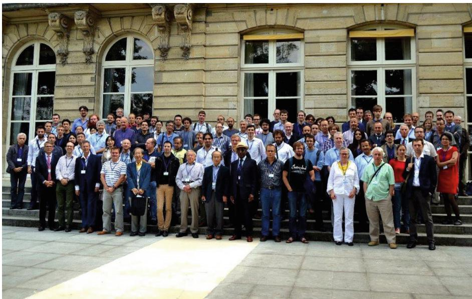  
Fig. 1. Group photo of GSI 2013 with Professor Shun-ichi Amari.

It was a great honor that Professor Amari inaugurated the series of our biennial international conference on "Geometric Science of Information" (GSI) in 2013. The event was held at École des Mines (ParisTech), Paris, France, during August 28–30, 2013, with proceedings in the LNCS Springer Nature series [8]. The video lecture is available online. During the event, Professor Shun-ichi Amari met with Professor Jean-Louis Koszul and Professor Hirohiko Shima who also attended GSI 2013: See photo in Fig. 2. Profs. Amari, Koszul and Shima are all experts in Hessian manifolds [9], which are handled in information geometry as dually flat spaces [2] (i.e., global Hessian manifolds). See group photo in Fig. 1.

  
Fig. 2. Photo of Professors Hirohiko Shima, Jean-Louis Koszul, and Shun-ichi Amari at GSI 2013.

Professor Amari also physically participated to GSI 2015 in École Polytechnique (Palaiseau, France, October 28–30, 2015), and contributed to two papers at GSI 2015: The first paper was co-authored with John Armstrong and is entitled “The Pontryagin forms of Hessian manifolds” [5]. The second paper was prepared with Nhat Ay and deals with the important topic of “Standard divergence in manifold of dual affine connections” [3]. See group photo in Fig. 3.

In 2017, Professor Amari contributed to a joint paper with Dr. Ryo Karakida [6] on "Information geometry of Wasserstein divergence" at GSI 2017, held at École des Mines (ParisTech), Paris, France, during November 7-9, 2017. Furthermore, Professor Amari

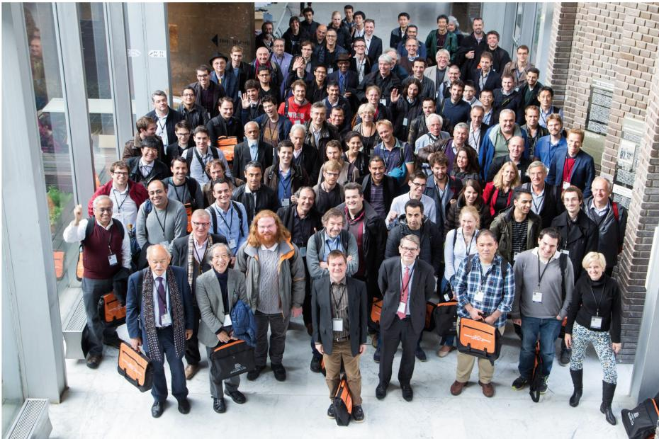  
Fig. 3 Group photo of GSI 2015 with Professor Shun-ichi Amari.

presented a paper co-authored with Dr. Takeru Matsuda at GSI 2021, held at Sorbonne University, Paris (July 21st-23rd, 2021).

The paper is entitled "Wasserstein statistics in one-dimensional location-scale models" [4].

Thank you Professor Amari for your support of GSI!

The web portal of the GSI community with proceedings, slides, recorded talk video, and satellite events is available at https://franknielsen.github.io/GSI.

On behalf of the GSI community, we would like to heartily congratulate Professor Shun-ichi Amari (1936-) for his amazing $65+$ -year research career that pioneered many fields and spanned many branches of information sciences.

The contributions of Professor Amari to the mathematical design and analysis of neural networks and the new geometric framework of information geometry for information sciences is of prime importance and plays an increasing role in AI.

Frédéric Barbaresco and Frank Nielsen

On Behalf of the GSI community

https://conference-gsi.org/

July 2025

# References

1. Amari, Si.: Information geometry and its applications: convex function and dually flat manifold. In: Nielsen, F. (eds.) ETVC 2008. LNCS, vol. 5416, pp. 75-102. Springer, Heidelberg (2009). https://doi.org/10.1007/978-3-642-00826-9_4   
2. Amari, S.: Information Geometry and Its Applications. Applied Mathematics Science, vol. 194. Springer, Tokyo (2016). https://doi.org/10.1007/978-4-431-55978-8   
3. Amari, Si., Ay, N.: Standard Divergence in manifold of dual affine connections. In: Nielsen, F., Barbaresco, F. (eds.) GSI 2015. LNCS, vol. 9389, pp. 320-325. Springer, Cham (2015). https://doi.org/10.1007/978-3-319-25040-3_35   
4. Amari, Si., Matsuda, T.: Wasserstein statistics in one-dimensional location-scale models. In: Nielsen, F., Barbaresco, F. (eds.) GSI 2021. LNCS, vol 12829, pp. 499-506. Springer, Cham (2021). https://doi.org/10.1007/978-3-030-80209-7_54   
5. Armstrong, J., Amari, S.: The Pontryagin forms of Hessian manifolds. In: Nielsen, F., Barbaresco, F. (eds.) GSI 2015. LNCS, vol. 9389, pp. 240-247. Springer, Cham (2015). https://doi.org/10.1007/978-3-319-25040-3_27   
6. Karakida, R., Amari, Si.: Information geometry of Wasserstein divergence. In: Nielsen, F., Barbaresco, F. (eds.) GSI 2017. LNCS, vol. 10589, pp. 119-126 (2017). Springer, Cham. https://doi.org/10.1007/978-3-319-68445-1_14   
7. Nielsen, F.: Emerging Trends in Visual Computing LIX Fall Colloquium, ETVC 2008, Palaiseau, France, November 18-20, 2008, Revised Selected and Invited Papers, vol. 8085. LNCS. Springer, Heidelberg (2013). https://doi.org/10.1007/978-3-642-00826-9   
8. Nielsen, F., Barbaresco, F.: Geometric Science of Information - First International Conference, GSI 2013, Paris, France, August 28-30, 2013. Proceedings, LNCS, vol. 8085. Springer, Heidelberg (2013). https://doi.org/10.1007/978-3-642-40020-9   
9. Shima, H.: The Geometry of Hessian Structures. World Scientific (2007)

# Contents - Part I

# Geometric Learning and Differential Invariants on Homogeneous Spaces

Global Positioning on Earth 3

Mireille Boutin, Rob Eggermont, and Gregor Kemper

Analysis and Computation of Geodesic Distances on Reductive

Homogeneous Spaces 13

Remco Duits, G. Bellaard, and A. B. Tumpach

Universal Collection of Euclidean Invariants Between Pairs

of Position-Orientations 24

Gijs Bellaard, Bart M. N. Smets, and Remco Duits

Roto-Translation Invariant Metrics on Position-Orientation Space 34

Gijs Bellaard and Bart M. N. Smets

Group Morphology Fixed Points on Homogenous Spaces for Deep

Learning Equivariant Networks 43

Gustavo Jesus Angulo

Flow Matching on Lie Groups 54

Finn M. Sherry and Bart M. N. Smets

# Statistical Manifolds and Hessian Information Geometry

On Invariant Conjugate Symmetric Statistical Structures on the Space

of Zero-Mean Multivariate Normal Distributions 65

Hikozo Kobayashi and Takayuki Okuda

Bi-forms Approach to Potential Functions in Information Geometry 73

Florio M. Ciaglia, Giuseppe Marmo, Marco Pacelli, Luca Schiavone, and Alessandro Zampini

A Foliation by Escort Distributions of Exponential Families and Extended

Divergence 83

Keiko Uohashi

Flat F Manifolds on Statistical Manifolds of Hyperboloid Type 92

Guilherme F. Almeida

Maximum Likelihood Estimation for the $\lambda$ -Exponential Family 102  
Xiwei Tian, Ting-Kam Leonard Wong, Jiaowen Yang, and Jun Zhang   
Renyi Partial Orders for BISO Channels 112  
Christoph Hirche   
The Fisher-Rao Distance Between Finite Energy Signals 121  
Franck Florin   
Statistical Models Built on Sub-exponential Random Variables 130  
Paola Siri and Barbara Trivellato   
Koszul Homological Series and Fedosov Foliations on Statistical Manifolds 139  
Michel Nguiffo Boyom   
Coherent States on the Statistical Manifold 146 Carlos Alberto Alcalde

# Applied Geometry-Informed Machine Learning

Riemannian Integrated Gradients: A Geometric View of Explainable AI 161 Federico Costanza and Lachlan Simpson   
A Geometric Deep Learning Approach to Forecasting the Time Series of Covariance Matrices 170 Andrea Bucci and Michele Palma   
Learning Riemannian Metrics for Interpolating Animations 178 Sarah Kushner, Vismay Modi, and Nina Miolane   
Conditioning Surface Shape Processes with Neural Operators 188  
Jingchao Zhou, Gefan Yang, and Stefan Sommer   
GNN-Enhanced TCN Algorithms for ECG Signal Quality Recognition 198 Angelica Simonetti and Ferdinando Zanchetta   
WAN2DNS-PM: Weak Adversarial Networks for Solving 2D Incompressible Navier-Stokes Equations in Porous Media 208 Wen-Ran Li, Miloud Bessafi, Cedric Damour, Yu Li, Alain Miranville, Rong Yang, Xin-Guang Yang, and Frederic Cadet   
Space Filling Positionality and the Spiroformer 217  
M. Maurin, M. Á. Evangelista-Alvarado, and P. Suárez-Serrato

Image Recognition via Vaisman-Neifeld's Geometry 226

Noémie C. Combe and Hanna K. Nencka

The Stick Model for Distance Geometry 236

Antonio Mucherino

Generating Random Hyperfractal Cities 245

Geoffrey Deperle and Philippe Jacquet

Shape Theory and TDA via the Atiyah-Molino Reconstruction 254

Noémie C. Combe and Hanna K. Nencka

# Geometric Green Learning on Groups and Quotient Spaces

Enhancing CNNs Robustness to Occlusions with Bioinspired Filters

for Border Completion 267

Catarina P. Coutinho, Aneeqa Merhab, Janko Petkovic,

Ferdinando Zanchetta, and Rita Fioresi

A New Model for Natural Groupings in High-Dimensional Data 276

Mireille Boutin and Evzenie Coupkova

Information Geometry on the $\ell^2$ -Simplex via the $q$ -Root Transform 286

Levin Maier

K-P Quantum Neural Networks 297

Elija Perrier

Infinite-Dimensional Siegel Disc as Symplectic and Kähler Quotient 306

Alice Barbara Tumpach

Hyperkähler Marriage of the Two Sphere with the Hyperbolic Space 318

Alice Barbora Tumpach

# Divergences in Statistics and Machine Learning

Minimum of Divergences with Relaxation: a Hilbertian Alternative

to Duality Approach 333

Valérie Girardin and Pierre Maréchal

Relationship Between Hölder Divergence and Functional Density Power

Divergence: Intersection and Generalization 340

Masahiro Kobayashi

xxxiv Contents-Part I

Bayesian-Like Estimation with Unnormalized Model 351 Takashi Takenouchi   
Some Smooth Divergences for $\ell_1$ -Approximations 359 Pierre Bertrand and Wolfgang Stummer   
A Connection Between Learning to Reject and Bhattacharyya Divergences 369 Alexander Soen   
Author Index 379

# Contents - Part II

# Geometric Statistics

Ridge Regression for Manifold-Valued Time-Series with Application to Hurricane Forecasting 3 Esfandiar Nava-Yazdani

On the Approximation of the Riemannian Barycenter 12 Simon Mataigne, P.-A. Absil, and Nina Miolane

Confidence Bands for Multiparameter Persistence Landscapes 22  
Inés García-Redondo, Anthea Monod, and Qiquan Wang

Geodesic Non-completeness of the Truncated Normal Family 32  
Baalu Belay Ketema, Nicolas Bousquet, Francesco Costantino, Fabrice Gamboa, Bertrand Iooss, and Roman Sueur

Intrinsic LDA for 3D Shape Classification via Parallel Transport 41  
Jorge Valero, Vicent Gimeno i Garcia, M. Victoria Ibanez, and Amelia Simó

Eigengap Sparsity for Covariance Parsimony 50  
Tom Szwagier, Guillaume Olikier, and Xavier Pennec

RNA Structure Correction - The Importance of Small Clusters 60 Stephan F. Huckemann, Benjamin Eltzner, and Kanti V. Mardia

# Computational Information Geometry and Divergences

Geometric Jensen-Shannon Divergence Between Gaussian Measures on Hilbert Space 69  
Ha Quang Minh and Frank Nielsen

Accelerated Stein Variational Gradient Flow 80  
Viktor Stein and Wuchen Li

Wasserstein KL-Divergence for Gaussian Distributions 91  
Adwait Datar and Nhat Ay

$f$ -Divergence Approximation for Gaussian Mixtures 102  
Amit Vishwakarma and K. S. Subrahamanian Moosath

# Geometric Methods in Thermodynamics

A Dimensionality Reduction Technique Based on the Gromov-Wasserstein Distance 111  
Rafael Pereira Eufrazio, Eduardo Fernandes Montesuma, and Charles Casimiro Cavalcante   
$\mathrm{KD}^2\mathrm{M}$ : A Unifying Framework for Feature Knowledge Distillation 121  
Eduardo Fernandes Montesuma   
Curved Representational Bregman Divergences and Their Applications 131 Frank Nielsen   
Tangent Groupoid and Information Geometry 141  
Zelin Yi and Jun Zhang   
Two Types of Matching Priors for Non-regular Statistical Models 151  
Masaki Yoshioka and Fuyuhiko Tanaka   
Hyperbolic Decomposition of Dirichlet Distance for ARMA Models 161
Jaehung Choi   
Thermodynamic Functionality of Non-detailed Balance Finite-Tape Information Ratchet 173 Lock Yue Chew, Jian Wei Cheong, and Andri Pradana   
Entropy Functionals and Equilibrium States in Mixed Quantum-Classical Dynamics 182  
Cesare Tronci, David Martínez-Crespo, and François Gay-Balmaz   
Variational Approach to the Stochastic Thermodynamics of Langevin Systems 193  
Héctor Vaquero del Pino, François Gay-Balmaz, Hiroaki Yoshimura, and Lock Yue Chew   
Variational Principle for Stochastic Nonholonomic Systems Part I: Continuous-Time Formulation 204  
Tianzhi Li, François Gay-Balmaz, Donghua Shi, and Jinzhi Wang   
Interconnection and Variational Principles for Fluid-Bubble Dynamics 214  
François Gay-Balmaz and Hiroaki Yoshimura   
Variational Principle for Stochastic Nonholonomic Systems Part II: Stochastic Nonholonomic Integrator 225 Tianzhi Li, François Gay-Balmaz, Donghua Shi, and Jinzhi Wang

Hamilton-Dirac Formulation for Thermodynamic Systems with Reaction and Diffusion 234  
Hiroaki Yoshimura and François Gay-Balmaz

On a Generalisation of Metriplectic Systems 242  
Jonas Kirchhoff and Bernhard Maschke

# Classical and Quantum Information, Geometry and Topology

Towards a Category-Theoretic Foundation of Classical and Quantum Information Geometry 253  
Florio M. Ciaglia, F. Di Cosmo, and L. González-Bravo

Independent States are Orthogonal: A Categorical Framework to Treat Probability Geometrically 262 Matthew Di Meglio, Chris Heunen, J. S. Lemay, Paolo Perrone, and Dario Stein

Two-Typed Tangent Vectors in Quantum Statistical Mechanics 270 Jan Naudts

A Historical Perspective on the Schützenberger-van Trees Inequality: A Posterior Uncertainty Principle 280 Olivier Rioul

Tree Inference with Varifold Distances 290  
Elodie Maignant, Tim Conrad, and Christoph von Tycowicz

# Geometric Mechanics

Symplectic Bipotentials for the Dynamics of Dissipative Systems with Non Associated Constitutive Laws 303  
Mohamad Harakeh, Michael Ban, and Géry de Saxce

Debreu's 3-Webs and Affinely Flat Bi-Lagrangian Manifolds Links with Transverse Symplectic Foliation of Souriau's Dissipative Lie Groups Thermodynamics 312 Frederic Barbaresco

Applied Conformal Carroll Geometry 323  
Eric A. Bergshoeff, Patrick Concha, Octavio Fierro, Evelyn Rodríguez, and Jan Rosseel

xxxviii Contents - Part II

A Variational Symplectic Scheme Based on Lobatto's Quadrature 332  
François Dubois and Juan Antonio Rojas-Quintero   
Lifting of Some Dynamics on the Set of Bilagrangian Structures 343  
Bertuel Tangue Ndawa   
The Contact Eden Bracket and the Evolution of Observables 347  
Víctor M. Jiménez and Manuel de León   
A New Symmetry Group for Physics to Revisit the Kaluza-Klein Theory 357  
Géry de Saxce   
Defects in Unidimensional Structures 366  
Mewen Crespo, Guy Casale, Loic Le Marrec, and Patrizio Neff   
A Gradient Structure for Isotropic Non-linear Morphoelastic Bodies 375 Adam Ouzeri   
Towards Full 'Galelei General Relativity': Gravitational Kinematics in Bargmann Spacetimes 384  
Christian Y. Cardall

# Stochastic Geometric Dynamics

Stochastic Perturbation of Geodesics on the Manifold of Riemannian Metrics 397  
Ana Bela Cruzeiro and Ali Suri   
Stochastic Maupertuis's Principles and Jacobi's Integration Theorem 406  
Qiao Huang and Jean-Claude Zambrini   
Lagrangian Averaging of Singular Stochastic Actions for Fluid Dynamics 416
Theo Diamantakis and Ruiao Hu   
Continuous-Time Filtering in Lie Groups: Estimation via the Fréchet mean of solutions to stochastic differential equations 431 Marc Arnaudon, Magalie Bénéfice, and Audrey Giremus   
Author Index 441

# Contents - Part III

# New trends in Nonholonomic Systems

Virtual Nonlinear Nonholonomic Constraints from a Symplectic Point of View 3

Efstratos Stratoglou, Alexandre Anahory Simoes, Anthony Bloch, and Leonardo Colombo

Geometric Stabilization of Virtual Nonlinear Nonholonomic Constraints 11

Alexandre Anahory Simoes, Anthony Bloch, Leonardo Colombo, and Efstratos Stratoglou

Trajectory Generation for Nonholonomic Control Systems Using

Reconstruction Techniques on $SE(2)$ 20

Nicola Sansonetto and Marta Zoppello

Homogeneous Bi-Hamiltonian Structures and Integrable Contact Systems 30

Leonardo Colombo, Manuel de León, María Emma Eyrea Irazú, and Asier López-Gordón

Deep Dirac Neural Networks for Holonomic Mechanical Systems 40

Kenshin Okuwaki and Hiroaki Yoshimura

# Learning of Dynamic Processes

Memory Capacity of Nonlinear Recurrent Networks: Is It Informative? 53

Giovanni Ballarin, Lyudmila Grigoryeva, and Juan-Pablo Ortega

Lie-Adaptive Inversion of Signature via Pfeffer-Seigal-Sturmfels

Algorithm 65

Rémi Vaucher

Hypergraphs on High Dimensional Time Series Sets Using Signature

Transform 73

Rémi Vaucher and Paul Minchella

Using Signatures and Koopman Operator to Learn Non-linear Dynamics 83

Stéphane Chretien, Ben Gao, Jordan Patracone, and Olivier Alata

A Kernel-Based Global Method for the Learning of Elastic Potentials on Lie Groups 93

Domenico Campolo, Jianyu Hu, Juan-Pablo Ortega, and Daiying Yin

# Optimization and Learning on Manifolds

Role of Riemannian Geometry in Double-Bracket Quantum Imaginary-Time Evolution 105

René Zander, Raphael Seidel, Li Xiaoyue, and Marek Gluza

Numerical Techniques for Geodesic Approximation in Riemannian Shape Optimization 115

Estefania Loayza-Romero and Kathrin Welker

Geometric Gaussian Approximations of Probability Distributions 125

Nathaël Da Costa, Balint Mucśányi, and Philipp Hennig

Geometric Design of the Tangent Term in Landing Algorithms for Orthogonality Constraints 133

Florentin Goyens, P.-A. Absil, and Florian Feppon

A Probabilistic View on Riemannian Machine Learning Models for SPD Matrices 142

Thibault de Surrel, Florian Yger, Fabien Lotte, and Sylvain Chevallier

Efficiency of the Generalized Method of Moments from the Viewpoint of Differential Geometry 152 Hisatoshi Tanaka

$p$ -Laplacians for Manifold-Valued Hypergraphs 162

Jo Andersson Stokke, Ronny Bergmann, Martin Hanik, and Christoph von Tycowicz

Universal Kernels via Harmonic Analysis on Riemannian Symmetric Spaces 172

Franziskus Steinert, Salem Said, and Cyrus Mostajeran

# Neurogeometry

Geometric Neural Fields for Cortical Activity 183

Emre Baspinar

Log-Euclidean Frameworks for Smooth Brain Connectivity Trajectories 194  
Olivier Bisson, Yanis Aeschlimann, Samuel Deslauriers-Gauthier, and Xavier Pennec   
A Heterogeneous Model of Boundary and Figure Completion in $V_{1}$ 205 M. Galeotti, G. Citti, and A. Sarti   
Geometry of Cells Sensible to Curvature and Their Receptive Profiles 215  
Vasiliki Liontou   
Orientation Scores Should Be a Piece of Cake 224 Finn M. Sherry, Chase van de Geijn, Erik J. Bekkers, and Remco Duits   
Lie Group in Learning Distributions and in Filters   
$F$ -t Joint Distribution on a Real Siegel Domain and Simultaneous Hypothesis Test 237  
Hiroto Inoue   
Note on Harmonic Exponential Families on Homogeneous Spaces 246 Koichi Tojo and Taro Yoshino   
The Fisher Metric and the Amari-Chentsov Tensor of the Family of Poincaré Distributions 254 Koichi Tojo and Taro Yoshino   
Fast Equivariant $K$ -Means on SPD Matrices Using Log-Extrinsic Means 263  
Gabriel Trindade, Emmanuel Chevallier, André Nicolet, and Frank Nielsen   
A New Geometric Regression with Inputs-Outputs on Matrix Lie Groups 271  
Serigne Daouda Pene, Samy Labsir, Julien Lesouple, and Jean-Yves Tourneret   
Equivariant Filter: Navigation on the Rotating Round-Earth Model Using a Left-Error State 280  
Alexandre Cellier-Devaux and Louis Grimaud Salmon   
Sequential Parallel Metropolis-Adjusted Langevin Algorithm on Matrix Lie Groups 290  
Enzo Lopez, Karim Dahia, Nicolas Merlinge, Benedicte Winter-Bonnet, Alain Maschiella, and Christian Musso

# A Geometric Approach to Differential Equations

Reduction of Hybrid Hamiltonian Systems with Non-equivariant Momentum Maps 303  
Leonardo Colombo, María Emma Eyrea Irazú, María Eugenia García, Asier López-Gordón, and Marcela Zuccalli

New Lie Systems from Goursat Distributions: Reductions and Reconstructed 311  
Oscar Carballal

Symplectic Approach to Global Stability 320  
Verónica Errasti Díez, Jordi Gaset Rifá, and Manuel Lainz Valcazar

Reduction of Exact Symplectic Manifolds and Energy Hypersurfaces 328  
J. Lange and B. M. Zawora

Novel Pathways in $k$ -Contact Geometry 337  
Tomasz Sobczak and Tymon Frelik

A Relation Between K-Symplectic and K-Contact Hamiltonian System 346  
S. Vilarino

Applications of Standard and Hamiltonian Stochastic Lie Systems 354  
Javier de Lucas and Marcin Zajac

# Information Geometry, Delzant Toric Manifold and Integrable System

Adler-Kostant-Symes Theorem and Algebraic Complete Integrability of Information Geometry and Souriau Lie Groups Thermodynamics $\langle Q,[\beta ,Z]\rangle +\tilde{\Theta} (\beta ,Z) = 0$ 367 Frederic Barbaresco

Statistical Transformation Models of Multivariate Normal Distributions and Their $\alpha$ -Geodesic Flows 379  
Daisuke Tarama

Statistical Transformation Models Associated to Souriau's Thermodynamics 389  
Jérémie Pierard de Maujouy and Daisuke Tarama

Moment Polytopes of Toric Exponential Families 400 Mathieu Molitor

A Compactification of the Orthogonal Foliation via Toric Geometry 408

Hajime Fujita and Kentaro Yamaguchi

Torsion of $\alpha$ -Connections on the Density Manifold 417

Nihat Ay and Lorenz J. Schwachhöfer

Author Index 429

# Geometric Learning and Differential Invariants on Homogeneous Spaces

# Global Positioning on Earth

Mireille Boutin<sup>1(☑)</sup>, Rob Eggermont<sup>1</sup>, and Gregor Kemper<sup>2</sup>

$^{1}$ Technical University of Eindhoven, 5600 MB Eindhoven, Netherlands {m.boutin,r.h.eggermont}@tue.nl

$^{2}$ TUM School of Computation, Information and Technology, Department of Mathematics, Technical University of Munich, Munich, Germany kemper@tum.de

Abstract. Contrary to popular belief, the global positioning problem on earth may have more than one solutions even if the user position is restricted to a sphere. With 3 satellites, we show that there can be up to 4 solutions on a sphere. With 4 or more satellites, we show that, for any pair of points on a sphere, there is a family of hyperboloids of revolution such that if the satellites are placed on one sheet of one of these hyperboloid, then the global positioning problem has both points as solutions. We give solution methods that yield the correct number of solutions on/near a sphere.

Keywords: Global positioning $\cdot$ GPS $\cdot$ Distance geometry

# 1 Introduction

It is a long standing assumption that the global positioning problem has a unique solution in the case where the user to be located is on the surface of the earth and the satellites are in orbit around it. For example, Abel and Chaffee [1], one of seminal references on global positioning, states that: "A unique solution is vitrually (sic) guaranteed for users operating near the earth." This is made precise in Figure 5 of their paper, in which the earth is pictured to be entirely within the region in which a unique solution exists. Another example is the website of the European Space Agency [8], which states that: "The other solution is far from the earth surface."

As we show in Sect. 2, this assumption is incorrect. However, the fact that the user position is close to the earth allows us to formulate different solution methods (Sect. 3). In particular, a sphere assumption allows for location with only 3 satellites, but in that case there can be up to four solutions. For four or more satellites, there can be up to two solutions on a sphere. We derive an analytic solution for these in Sect. 3.2. For the case such as that of a user on Earth receiving noisy satellite data, we propose a simple numerical procedure in which two initial guesses on a sphere are refined numerically so to estimate a user position assumed to be near a sphere. Numerical experiments in Sect. 4 show how our proposed method allows us to correctly obtain either one or two

solutions near a sphere. More specifically, the method yields two solutions when the satellite configuration is either one for which there are two solutions, or nearby such a configuration, and one solution otherwise.

For simplicity, our results are phrased in dimension $n = 3$ but do carry over to any dimension $n \geq 2$ .

# 1.1 Problem Statement

We define the global positioning problem as follows (see [3,4] for more details.) A user at an unknown position $\mathbf{x} \in \mathbb{R}^3$ receives a signal from $m$ satellites at known positions $\mathbf{s}_1, \ldots, \mathbf{s}_m \in \mathbb{R}^3$ . The signal from satellite $i$ contains its position $\mathbf{s}_i$ at the time of emission $\tau_i$ , along with $\tau_i$ . The user receives the signal $(\mathbf{s}_i, \tau_i)$ at a time $\bar{\tau}_i$ , as measured by their own clock. The satellite clocks are precisely synchronized together but not with the user clock. Let $t_i$ be the difference between the emission time $\tau_i$ and the (local) reception time $\bar{\tau}_i$ : $t_i = \bar{\tau}_i - \tau_i$ , for $i = 1, \ldots, m$ . Then there exists an unknown offset $t \in \mathbb{R}$ such that $t_i - t$ is the true time taken by the signal to travel from satellite $i$ to the user. The value of $t_i - t$ is proportional to the distance between the satellite position $\mathbf{s}_i$ and the user position $\mathbf{x}$ . Using units of time so that the signal transmission speed is 1, we thus have

$$
\left\| \mathbf {s} _ {i} - \mathbf {x} \right\| = t _ {i} - t \geq 0, \quad i = 1, \dots , m. \tag {1}
$$

As originally shown in [3], this system of equations can be rewritten as

$$
\left( \begin{array}{c c c} - 2 t _ {1} & 2 \mathbf {s} _ {1} ^ {T} & - 1 \\ \vdots & \vdots & \vdots \\ - 2 t _ {m} & 2 \mathbf {s} _ {m} ^ {T} & - 1 \end{array} \right) \left( \begin{array}{c} t \\ \mathbf {x} \\ \| \mathbf {x} \| ^ {2} - t ^ {2} \end{array} \right) = \left( \begin{array}{c} \| \mathbf {s} _ {1} \| ^ {2} - t _ {1} ^ {2} \\ \vdots \\ \| \mathbf {s} _ {m} \| ^ {2} - t _ {m} ^ {2} \end{array} \right), t _ {i} > t, i = 1, \dots , m. (2)
$$

Assuming that the user is located on a sphere of radius $r$ centered at $\mathbf{c}$ adds the constraint $\| \mathbf{x} - \mathbf{c} \| = r$ .

# 2 Two Solutions on a Sphere

Both the earth and the orbits of satellites are nearly circular [7]. As previously mentioned, this fact has been wrongly assumed to make the global positioning solution unique. This section goes into more details to explain how things can go wrong. According to Theorem 3.1 of [3], for any $m \geq 4$ , the general global positioning problem (not on a sphere) has two distinct solutions $\mathbf{x}$ and $\mathbf{x}'$ if and only if the satellites lie on one sheet of a hyperboloid of revolution with focal points $\mathbf{x}, \mathbf{x}'$ ; in all other cases, the problem has only one solution. Conversely, given $\mathbf{x}, \mathbf{x}'$ we can classify all satellite configurations for which the general global positioning problem can have solutions $\mathbf{x}, \mathbf{x}'$ by finding all hyperboloids of revolutions that have these points as focal points. The following theorem describes these hyperboloids.

Theorem 1. Let $\mathbf{x} \neq \mathbf{x}' \in \mathbb{R}^3$ . Let $\mathbf{m} = \frac{1}{2} (\mathbf{x} + \mathbf{x}')$ , let $c = \| \mathbf{x} - \mathbf{x}'\|$ and let $\tilde{\mathbf{u}} = \frac{1}{c} (\mathbf{x} - \mathbf{x}')$ . Then for every $0 < a < c$ , the hyperboloid of revolution given by the following equation in variable $\mathbf{p} \in \mathbb{R}^3$ has focal points $\mathbf{x}, \mathbf{x}'$ :

$$
\left. (\mathbf {p} - \mathbf {m}) ^ {T} \left(\left(\frac {1}{a ^ {2}} + \frac {1}{c ^ {2} - a ^ {2}}\right) \tilde {\mathbf {u}} \tilde {\mathbf {u}} ^ {T} - \frac {1}{c ^ {2} - a ^ {2}} \mathrm {I d} _ {3}\right) (\mathbf {p} - \mathbf {m}) = 1. \right. \tag {3}
$$

In the above, $\mathrm{Id}_3$ denotes the three by three identity matrix.

A hyperboloid of revolution with Eq. 3 has axis of symmetry $t\tilde{\mathbf{u}} + \mathbf{m}$ with $t$ a parameter. For one sheet of such a hyperboloid, the points $\mathbf{x}, \mathbf{x}'$ are indistinguishable in the sense that the distance from $\mathbf{x}$ to the sheet equals that from $\mathbf{x}'$ to the sheet plus a fixed constant. Thus there is always two possible offsets, regardless of the number of satellites on this sheet. Given such a hyperboloid of revolution, we can find problematic satellite positions by intersecting the hyperboloid with the satellite orbit and look at the connected components of this intersection. Figure 1 shows an example of a bad configuration.

More generally, one could ask how often it happens that all visible satellites lie on such a sheet, i.e. allow for bad configurations with multiple solutions. Equation 3 has seven free parameters $(\mathbf{x},\mathbf{x}^{\prime},a)$ . One should expect that when at most seven satellites are in view, there exist quadrics of revolution passing through all of them. With fewer than seven satellites, we expect infinitely many quadrics of revolution (including hyperboloids of revolution) pass through all of them. The article [6] checks this in the case where the points are not cospherical. To summarize, when there are seven or fewer satellites in general position, there typically are multiple quadrics of revolution passing through them, with more options when there are fewer satellites. While these results do not apply in our situation since satellites orbit around the earth, it is at least plausible that positions as described in the above theorem may actually be found in practice, especially when the user views few satellites.

Many global positioning systems use iterative solution methods that start from an initial guess. Thus, they return a single solution, even if there are two. Given one (exact) solution of the system, one might want to check whether the satellite and user positions are in a bad configuration (i.e., with two solutions). This can be done by using the arrival times and satellite positions of at least four satellite signals to compute the vector $\mathbf{u}$ as described in Sect. 3.3. If $|\mathbf{u}| \leq 1$ , then this system of equations only has one solution. If $|\mathbf{u}| > 1$ , then there might be two, and the second one could potentially be on the sphere (earth) as well. There are two ways to determine if there is another solution on the sphere: either compute all the solutions using the method of [3] and check if they are on the sphere (or on earth), or compute all the solutions on the sphere, as described in Sect. 3.

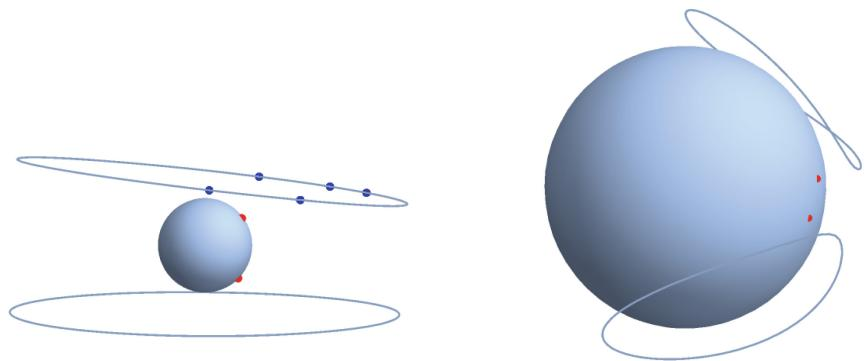  
Fig. 1. (Left) Two solutions (red dots) to the global positioning problem on a sphere and corresponding locus of forbidden satellite positions. (Right) The components of the forbidden locus are not circles. This is more clearly visible here (Color figure online)

# 3 Global Positioning on or Near a Sphere

# 3.1 On a Sphere with Three Satellites

In order to determine the user position uniquely, a minimum of four satellites in view is required. However, using the information that the user is located on the surface of the earth, one might hope that this minimum number is reduced to three, or at least three satellites in view may lead to finitely many solutions. The following result fulfills this hope if the satellite positions are not collinear. It shows that there are at most four solutions for $t$ . Having a solution for $t$ , this can be substituted into the original problem, which then becomes a problem of intersecting four spheres in $\mathbb{R}^3$ . But this problem is well known to have at most two solutions.

Theorem 2. Let $\mathbf{c},\mathbf{s}_1,\mathbf{s}_2,\mathbf{s}_3\in \mathbb{R}^3$ be points such that $\mathbf{s}_i$ are not collinear, and let $r,t_1,t_2,t_3\in \mathbb{R}$ be numbers with $r\geq 0$ . Consider the set

$$
\mathcal {S} := \left\{(\mathbf {x}, t) \in \mathbb {R} ^ {3} \times \mathbb {R} \mid \| \mathbf {x} - \mathbf {c} \| = r a n d \| \mathbf {x} - \mathbf {s} _ {i} \| = | t _ {i} - t | f o r i = 1, \ldots , n \right\}
$$

of solutions of the global positioning problem (slightly loosened by using the absolute value of $t_i - t$ ), with $\mathbf{x}$ restricted to the sphere given by the first equation. Let $f \coloneqq \operatorname{det}(C)$ with $C$ given by Eq. 4 below. Then for every $(\mathbf{x}, t) \in S$ , we have $f(t) = 0$ . Moreover, $f$ has degree 4 viewed as polynomial in $t$ .

Proof. Let $(\mathbf{x}, t) \in S$ . The Cayley-Menger matrix $C$ of any collection of points in $\mathbb{R}^3$ has rank at most 5 (see [5] for a proof). In particular this applies to the points $\mathbf{x}$ , $\mathbf{c}$ , $\mathbf{s}_1$ , $\mathbf{s}_2$ , $\mathbf{s}_3$ . Since $(\mathbf{x}, t) \in S$ , the Cayley-Menger matrix for these points

is, with $d_{i} \coloneqq \| \mathbf{s}_{i} - \mathbf{c}\|$ and $d_{i,j} \coloneqq \| \mathbf{s}_i - \mathbf{s}_j\|$ ,

$$
C = \left( \begin{array}{c c c c c c} 0 & 1 & 1 & 1 & 1 & 1 \\ 1 & 0 & r ^ {2} & (t _ {1} - t) ^ {2} & (t _ {2} - t) ^ {2} & (t _ {3} - t) ^ {2} \\ 1 & r ^ {2} & 0 & d _ {1} ^ {2} & d _ {2} ^ {2} & d _ {3} ^ {2} \\ 1 & (t _ {1} - t) ^ {2} & d _ {1} ^ {2} & 0 & d _ {1, 2} ^ {2} & d _ {1, 3} ^ {2} \\ 1 & (t _ {2} - t) ^ {2} & d _ {2} ^ {2} & d _ {2, 1} ^ {2} & 0 & d _ {2, 3} ^ {2} \\ 1 & (t _ {3} - t) ^ {2} & d _ {3} ^ {2} & d _ {3, 1} ^ {2} & d _ {3, 2} ^ {2} & 0 \end{array} \right) \in \mathbb {R} ^ {6 \times 6}. \tag {4}
$$

So $\operatorname{det}(C) = 0$ . Viewing $f(t) = \operatorname{det}(C)$ as a function of $t$ , it is clearly a polynomial in $t$ . To show that $f(t)$ has degree 4, we form the rational function $g(t) := t^4 f(1/t)$ . If we can show that $g$ is actually a polynomial and $g(0) \neq 0$ , then indeed $f(t)$ has degree 4. To compute $g(t)$ we perform the multiplication with $t^4$ by multiplying the second row and the second column of $C$ , with $t$ substituted by $1/t$ , by $t^2$ . It is then easy to see that $g(t)$ is a polynomial in $t$ , and that

$$
g (0) = - \det {\left( \begin{array}{l l l l} 0 & 1 & 1 & 1 \\ 1 & 0 & d _ {1, 2} ^ {2} & d _ {1, 3} ^ {2} \\ 1 & d _ {2, 1} ^ {2} & 0 & d _ {2, 3} ^ {2} \\ 1 & d _ {3, 1} ^ {2} & d _ {3, 2} ^ {2} & 0 \end{array} \right)},
$$

which is the negative of the Cayley-Menger determinant of the points $\mathbf{s}_1, \mathbf{s}_2, \mathbf{s}_3$ and thus nonzero since the $\mathbf{s}_i$ are assumed not collinear.

Remark 3. Theorem 2 shows that there are at most four solutions for $t$ , and by what we have said before the theorem, each of these can lead to at most two solutions of the global positioning problem, giving a total of $|S| \leq 8$ solutions. In fact, it can be shown that there cannot be more than four solutions in total. For once, if the four points $\mathbf{c}, \mathbf{s}_1, \mathbf{s}_2, \mathbf{s}_3$ are not coplanar, then for each zero $t$ of $f$ there exists exactly one $\mathbf{x} \in \mathbb{R}^3$ such that $(\mathbf{x}, t) \in S$ . If, on the other hand, the four points are coplanar, there are at most two points $\mathbf{x}$ with $(\mathbf{x}, t) \in S$ , but there may also be none. But it can be shown that also in the coplanar case, the total number $|S|$ of solutions does not exceed four.

We also have an argument that takes care of the case in which the earth is modeled as a spheroid rather than a sphere. The results are the same.

Example 4. It is quite rare to find a configuration where there are really four solutions that solve the original global positioning problem 1, rather than only the slightly loosened equations using the absolute value of $t_i - T$ , as in Theorem 2. We give two examples. The computations were done using Magma [2].

(1) A 3D example is given by $\mathbf{s}_1 = (-4,6,6)$ , $\mathbf{s}_2 = (0,1,2)$ , $\mathbf{s}_3 = (-1,5,9)$ , $t_1 = -2$ , $t_2 = -9$ , $t_3 = -1$ . From this we get the polynomial $f = 4232t^4 + 188416t^3 + 3141776t^2 + 23254272t + 64463912$ , and its approximate roots are $-11.8922$ , $-11.7298$ , $-10.4779$ , and $-10.4216$ . It is easy to confirm that for each of these roots $t$ there exists exactly one solution $(\mathbf{x}, t)$ of the system 1.

(2) The next example is in two dimensions, and we present it graphically in Fig. 2 instead of giving precise coordinates. Being in dimension two means that there are two satellites, and we solve Eq. 1 for points on a given circle. In Fig. 2, the green circles around the satellites $\mathbf{s}_i$ are tangent to the black circle and the red circles, which implies: (radius of green circle) + (radius of black or red circle) = (distance between the corresponding satellite and solution point). So if the $t_i$ are set to be the radii of the green circles, this shows that indeed the $\mathbf{x}_i$ solve the global positioning problem.

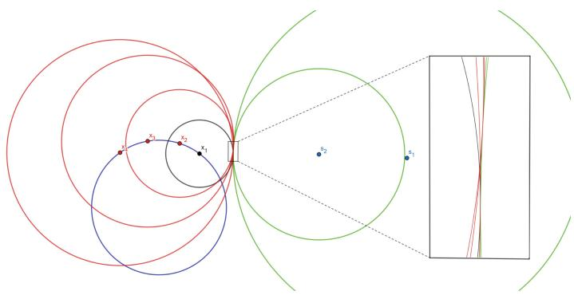  
Fig. 2. The solutions $\mathbf{x}_i$ are on the blue circle, $\mathbf{x}_1$ being the "true" one. The enlargement shows that the green circles around the satellites $\mathbf{s}_i$ are tangent to every one of the black and red circles around the $\mathbf{x}_i$ (Color figure online)

# 3.2 On a Sphere With Four or More Satellites

To solve the global positioning problem on a sphere with $m \geq 4$ satellites, we write Eq. (2) as

$$
B \left(\mathbf {\Sigma} _ {\| \mathbf {x} \| ^ {2} - t ^ {2}} ^ {\mathbf {x}}\right) = t \left( \begin{array}{c} 2 t _ {1} \\ \vdots \\ 2 t _ {m} \end{array} \right) + \left( \begin{array}{c} \| \mathbf {s} _ {1} \| ^ {2} - t _ {1} ^ {2} \\ \vdots \\ \| \mathbf {s} _ {m} \| ^ {2} - t _ {m} ^ {2} \end{array} \right), \mathrm {w h e r e} B = \left( \begin{array}{c c} 2 \mathbf {s} _ {1} ^ {T} & - 1 \\ \vdots & \vdots \\ 2 \mathbf {s} _ {m} ^ {T} & - 1 \end{array} \right).
$$

Assuming that four of the satellites are non-coplanar, then $B$ has full rank. Thus its Moore-Penrose pseudo inverse is $B^{+} = (B^{T}B)^{-1}B^{T}$ and we have

$$
\begin{array}{l} \left( \begin{array}{c} \mathbf {x} \\ \| \mathbf {x} \| ^ {2} - t ^ {2} \end{array} \right) = t \left( \begin{array}{c} \mathbf {u} \\ 2 \alpha \end{array} \right) + \left( \begin{array}{c} \mathbf {v} \\ \beta \end{array} \right), \\ \mathrm {w i t h} \left( \begin{array}{c} \mathbf {u} \\ 2 \alpha \end{array} \right) = B ^ {+} \left( \begin{array}{c} 2 t _ {1} \\ \vdots \\ 2 t _ {4} \end{array} \right) \mathrm {a n d} \left( \begin{array}{c} \mathbf {v} \\ \beta \end{array} \right) = B ^ {+} \left( \begin{array}{c} \| \mathbf {s} _ {1} \| ^ {2} - t _ {1} ^ {2} \\ \vdots \\ \| \mathbf {s} _ {4} \| ^ {2} - t _ {4} ^ {2} \end{array} \right). \\ \end{array}
$$

Focusing on the equation for $\mathbf{x}$ , we have $\mathbf{x} = \mathbf{u}t + \mathbf{v}$ which can be replaced in the constraint $\| \mathbf{x} - \mathbf{c} \|^{2} - r^{2} = 0$ to yield the quadratic equation in $t$ :

$$
\left\| \mathbf {u} \right\| ^ {2} t ^ {2} + 2 \mathbf {u} \cdot (\mathbf {v} - \mathbf {c}) + \left\| \mathbf {v} - \mathbf {c} \right\| ^ {2} - r ^ {2} = 0, \tag {5}
$$

which has $\leq 2$ solutions with center $c$ and radius $r$ . Any solution $t_0$ that is no greater than any of the $t_i$ 's yields a possible solution $\mathbf{x}_0 = t_0\mathbf{u} + \mathbf{v}$ for the user position. Such solution $\mathbf{x}_0$ is guaranteed to be on the circle: $\| \mathbf{x}_0 - c \| = r$ . Incorrect solutions can be eliminated by checking if they satisfy Eq. 1.

# 3.3 Near a Sphere

When the user is known to be located near not necessarily on, a sphere with known radius and center, then it is not possible to determine its location with three satellites. With four or more satellites, and without putting any constraint on the location of the user, there are at most two solutions, as described in [3]. There are many solution methods in such scenarios. A straightforward approach is to compute the total least squares solution of Eq.2, treating the vector of unknowns as if it had unrelated components. This approach only produces one solution. However, it is well suited to when the observed times of arrival $t_i$ are noisy. Moreover, the solution obtained can be refined using an iterative method. For example, one can refine the guess so to minimize the total squared error between the predicted times and the observed times. In practice, this often works quite well. However, the results are unpredictable in the vicinity of satellite configurations for which two solutions exist, as we show in our numerical experiments below.

Equation 5 suggests an alternative strategy when the user is known to be located in the vicinity of the surface of a sphere with known center and radius: use the 2 solutions of Eq. 5 as initial guesses for an iterative method. This has the advantage of allowing for 2 solutions to be found; in case where the solution is unique, one would expect both initial guesses to converge to the same solution. Thus this strategy is better suited for dealing with situations where the global positioning problem either has two solutions or is near one with two solutions.

# 4 Numerical Experiments

We compare 3 solution approaches to find the position of a user on/near a sphere of known center and radius. The first one, Iterative Least Squares (ILS), uses the least squares approach of [9] to refine (20 steps) the initial guess obtained from the total least squares solution of Eq. (2). The second one, Solution on Sphere (SoS), consists in computing the 2 solutions of Eq.5. For the third method, Refined Solution on Sphere (RSoS), we used those two solutions as initial guesses for the iteration procedure of [9] (20 steps).

In the first experiment, we put a user on a sphere with a $6400\mathrm{km}$ radius approximately equal to that of the earth $(6400\mathrm{km})$ . We put five satellites in a

"bad" configuration within a $26400\mathrm{km}$ circular orbit of the sphere (approx. GPS orbit.) In other words, the satellites were placed to create a global positioning problem with two solutions on the user sphere: the correct one and another one. We subsequently picked a random configuration of 5 satellites and constructed a path from the random configuration to the bad configuration. At each step along the path, the times of arrival for the signals of the 5 satellites were perturbed with additive zero mean Gaussian noise $(\sigma = 10^{-8})$ ; 200 trials were performed at each step and the mean distance between the solution obtained and the correct one was computed. With the iterative least squares iteration method (ILS), only one solution was obtained each time; the average of the results are shown in Fig. 3 (left). As one can see, the accuracy of the method is good (about $10^{-5}$ km) until the satellite configuration gets too close to the bad one, at which point the solution diverges. With the solution on the sphere (SoS) and its numerical refinement (RSoS), two solutions were obtained and the distance to the one nearest to the correct position was recorded; the average of the results obtained in the 200 trials is also shown in Fig. 3 (left). As one can see, the solution of these two methods remains accurate even when the distance to the bad configuration gets extremely small. The average distance between the two solutions is plotted in Fig. 4 (left). As one can see, the two solutions on the sphere obtained with SoS are far apart. After the refinement of RSoS, they become nearly identical when away from the bad configuration. But, when far from the bad configuration, they become nearly identical after the refinement of RSoS while they remain distinct even after refinement one the configuration becomes too close to the bad one. Since the user is situated directly on the sphere, the best solution is always one of the two obtained using the SoS method, as the refinement process has no sphere constraint.

In the second experiment, we proceeded similarly, except that we placed the user on a sphere of a larger radius than the earth (0.1% larger, about 6 km) and the bad satellite position was chosen so that there are two solutions on the user sphere (rather than on earth). The solution on the sphere method (SoS) was performed assuming that the user is on the earth radius and thus yielded slightly

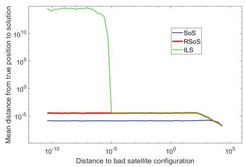

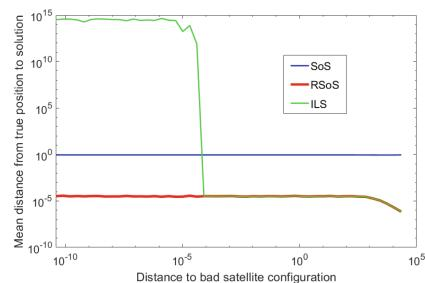  
Fig. 3. Mean distance to user position for ILS, SoS and RSoS versus distance to bad configuration when user is on the earth sphere (left) and $\sim 6\mathrm{km}$ above the earth (right)

inaccurate results, as seen in Fig. 3(right). The refinement of the solution on the sphere (RSoS) gives consistently better accuracy, with two nearly identical solutions far away from the bad configuration and two distinct solutions close to it Fig.4(right). The iterative least square (ILS) has a similar accuracy to RSoS far away from the bad configuration, but diverges near it.

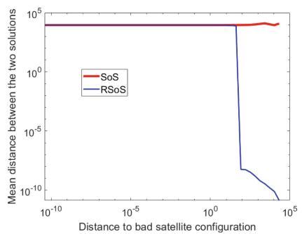

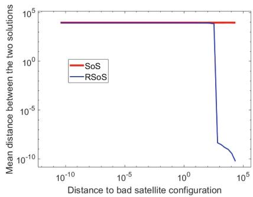  
Fig. 4. Mean distance between the two solutions of SoS and RSoS when the user is on the earth sphere (left) and $\sim 6$ km above the earth sphere (right)

# 5 Conclusion

We demonstrated that the common assumption that having four satellites in view guarantees that the global positioning problem has a unique solution on earth is incorrect. Even when constraining the solution to a sphere, the problem can still have two solutions. Moreover, the two solutions can be any pair of points on the sphere. We precisely described the satellite geometries associated to any solution pair.

Assuming that the solution lies on a sphere of known radius does simplify the problem. First, the number of satellites required to fix the solution goes down to three. However, with three satellites in view, we showed that there can be up to four solutions on the sphere. Second, with four or more satellites in view, the problem has an analytic solution, which we derived explicitly.

We argued that assuming that a user is on or near a sphere can be used to improve the numerical accuracy of the solution. Our numerical results support this. In particular, when the solution is near a sphere of known radius (e.g., Earth), then the best solution approach appears to be to obtain two initial guesses analytically using the sphere assumption (Eq. 5) and refining those guesses using an iterative numerical approach. This appears to ensure that two solutions are obtained when the problem either has two solutions or is near a problem instance with two solutions, and only one solution is obtained otherwise.

Acknowledgments. Figure 2 was produced with the help of GeoGebra. Thank you to Jan-Willem Knopper for help with Mathematica.

Disclosure of Interests. The authors have no competing interests to declare that are relevant to the content of this article.

# References

1. Abel, J.S., Chaffee, J.W.: Existence and uniqueness of GPS solutions. IEEE Trans. Aerosp. Electron. Syst. 27, 952-956 (1991)   
2. Bosma, W., Cannon, J.J., Playoust, C.: The Magma algebra system I: the user language. J. Symb. Comput. 24, 235-265 (1997)   
3. Boutin, M., Kemper, G.: Global positioning: the uniqueness question and a new solution method. Adv. Appl. Math. 160, 102741 (2024)   
4. Boutin, M., Kemper, G.: New developments in global positioning. Notices Am. Math. Soc. 72(8), 818 (2025)   
5. Cayley, A.: On a theorem in the geometry of position. Cambridge Math. J. 2, 267-271 (1841)   
6. Gfrerrer, A., Zsombor-Murray, P.J.: Quadrics of revolution on given points. J. Geom. Graph. 13(2), 131-144 (2009). www.heldermann.de/JGG/JGG13/JGG132/jgg13012.htm   
7. Hofmann-Wellenhof, B., Lichtenegger, H., Collins, J.: Global Positioning System: Theory and Practice. Springer Science & Business Media (2012). https://doi.org/10.1007/978-3-7091-6199-9   
8. Subirana, J.S., Zornoza, J.J., Hernández-Pajares, M.: Bancroft method (2011). https://gssc.esa.int/navipedia/index.php?title=Bancroft_Method. Accessed 21 Mar 2025   
9. Subirana, J.S., Zornoza, J.J., Hernández-Pajares, M.: Code based positioning (SPS) (2011). https://gssc.esa.int/navipedia/index.php/Code-Based_Positioning- (SPS). Aaccessed 24 Mar 2025

# Analysis and Computation of Geodesic Distances on Reductive Homogeneous Spaces

Remco Duits<sup>1(☑)</sup>, G. Bellaard<sup>1</sup>, and A. B. Tumpach<sup>2</sup>

$^{1}$ CASA & EAISI, Department of Mathematics and Computer Science, Eindhoven University of Technology, Eindhoven, The Netherlands

{r.duits,g.bellaard}@tue.nl

2 Wolfgang Pauli Institute, Vienna, Austria

alice-barbora.tumpach@univ-lille.fr

Abstract. Many geometric machine learning and image analysis applications, require a left-invariant metric on the 5D homogeneous space of 3D positions and orientations $\mathrm{SE}(3) / \mathrm{SO}(2)$ . This is done in Equivariant Neural Networks (G-CNNs), or in PDE-Based Group Convolutional Neural Networks (PDE-G-CNNs), where the Riemannian metric enters in multilayer perceptrons, message passing, and max-pooling over Riemannian balls. In PDE-G-CNNs it is proposed to take the minimum left-invariant Riemannian distance over the fiber in $\mathrm{SE}(3) / \mathrm{SO}(2)$ , whereas in G-CNNs and in many geometric image processing methods an SO(2)-conjugation invariant section $\sigma$ is advocated. The conjecture rises whether that computationally much more efficient section $\sigma$ indeed always selects distance minimizers over the fibers. We show that this conjecture does not hold in general, and in the logarithmic norm approximation setting used in practice we analyze the small (and sometimes vanishing) differences. We first prove that the minimal distance section $\sigma_d$ is reached by minimal horizontal geodesics with constant momentum and zero acceleration along the fibers, and we generalize this result to (reductive) homogeneous spaces with legal metrics and commutative structure groups.

Keywords: Riemannian Geometry $\cdot$ Sub-Riemannian Geometry $\cdot$ Fiber Bundles

# 1 Introduction and Background

# 1.1 Research Context

In many geometric image analysis applications one has to include multiorientation image processing that relies on left-invariant Riemannian metrics and their logarithmic norm approximations.

For example, in diffusion-weighted MRI one obtains after some inverse methods processing an orientation density function of water molecules that are generally believed to follow the biological fibers in the brain. These inverse methods are effective, but involve falls peaks that are not aligned with peaks in neighboring spherical distributions. Therefore contextual image processing group convolution with heat-kernel approximations on the 5D homogeneous space $\mathbb{M}_3 = \mathrm{SE}(3) / \mathrm{SO}(2)$ of 3D positions and orientations is needed to clean the fiber structures in the data [8,17], valuable in clinical applications [14,17].

Furthermore, in many roto-translation equivariant deep learning methods one includes similarity metrics between points on $\mathbb{M}_3$ ('local orientations') where one again relies on left-invariant Riemannian metrics on the Lie group quotient $\mathbb{M}_3$ and their logarithmic norm approximations. For instance in [4] where 'fast, expressive SE(3) equivariant neural networks' (G-CNNs) are achieved with many applications. There the neural network kernels follow symmetry considerations in geometric image processing [18].

In these works and in [7,22,23], a convenient choice of section in the quotient $G / H$ is helpful for carrying differential geometrical tools from the group $G$ towards $G / H$ in a computationally tangible way. For $G = \mathrm{SE}(3) = \mathbb{R}^3 \rtimes \mathrm{SO}(3)$ and $H = \mathrm{SO}(2)$ we advocate a specific section $\sigma : G / H \to G$ as we explain next. This specific section $\sigma$ minimizes the angular velocity (as we will prove later in Proposition 1) and as we will show in Theorem 3 it often approximates the computationally much more demanding section $\sigma_d$ that selects in each fiber the (sub)-Riemannian distance minimizer useful for a truly optimal alignment in position and orientation space $G / H$ relevant for all aforementioned applications.

# 1.2 Notation

Consider $G = \mathrm{SE}(3)$ with product $g_{1}g_{2} = (\mathbf{x}_{1},R_{1})(\mathbf{x}_{2},R_{2}) = (\mathbf{x}_{1} + R_{1}\mathbf{x}_{2},R_{1}R_{2})$ . We express rotations in Euler angles $R = R_{e_z,\gamma}R_{e_y,\beta}R_{e_z,\alpha}\in \mathrm{SO}(3)$ , with angles $\beta \in (0,\pi)$ , $\alpha ,\gamma \in [0,2\pi)$ , and we use canonical coordinates $c^i$ for SE(3):

$$
\begin{array}{l} \left(\mathbf {x}, R _ {e _ {z}, \gamma} R _ {e _ {y}, \beta} R _ {e _ {z}, \alpha}\right) = g = \exp \left(\sum_ {i = 1} ^ {6} c ^ {i} A _ {i}\right) \quad \text {w . r . t . b a s i s i n} \mathfrak {g} = T _ {e} (G): \tag {1} \\ \left\{A _ {i} \right\} _ {i = 1} ^ {6} \equiv \left\{\partial_ {x} | _ {e} \partial_ {y} | _ {e}, \partial_ {z} | _ {e}, \partial_ {\tilde {\gamma}} R _ {e _ {x}, \tilde {\gamma}} | _ {\tilde {\gamma} = 0}, \partial_ {\tilde {\beta}} R _ {e _ {y}, \tilde {\beta}} \right| _ {\tilde {\beta} = 0}, \left. \partial_ {\tilde {\alpha}} R _ {e _ {z}, \tilde {\alpha}} \right| _ {\tilde {\alpha} = 0}, \rbrace \\ \end{array}
$$

with unit element $e = (\mathbf{0}, I) \in G$ . Consider subgroup $H = \{(\mathbf{0}, R_{\mathbf{e}_z, \alpha}) | \alpha \in [0, 2\pi)\} \equiv \mathrm{SO}(2) = \mathrm{Stab}_{\mathrm{SE}(3)}(\mathbf{0}, \mathbf{a})$ , with $\mathbf{a} = \mathbf{e}_z = (0, 0, 1)$ , the quotient $G / H$ , and canonical projection $\pi : G \to G / H$ . The vertical subbundle of $T(G)$ will be denoted by $\mathcal{V} = \ker \pi_*$ . The horizontal part then follows by taking the orthogonal complement $T(G) = \mathcal{V}^\perp \oplus \mathcal{V} = \mathcal{H} \otimes \mathcal{V}$ . Let $\operatorname{Ad} = (\operatorname{conj})_*$ be the derivative of conjugation at $e \in G$ , i.e. $\operatorname{Ad}(h) = \operatorname{conj}_*(h) = (L_h)_*(R_{h^{-1}})_*$ , with $R_h g = gh$ and $L_h g = hg$ .

On $G = \mathrm{SE}(3)$ , we consider the following metric tensor field:

$$
\mathcal {G} = g _ {1 1} \left(\omega^ {1} \otimes \omega^ {1} + \omega^ {2} \otimes \omega^ {2}\right) + g _ {3 3} \omega^ {3} \otimes \omega^ {3} + g _ {4 4} \left(\omega^ {4} \otimes \omega^ {4} + \omega^ {5} \otimes \omega^ {5}\right) + g _ {6 6} \omega^ {6} \otimes \omega^ {6} \tag {2}
$$

where $\{\omega^i\}_{i=1}^6$ is the dual frame of the left-invariant frame $\{\mathcal{A}_i\}_{i=1}^6$ given by: $\mathcal{A}_i|_g = (L_g)_*A_i$ , $\langle \omega^i, \mathcal{A}_j \rangle = \delta_j^i$ , with $A_i$ defined by (1).

Along a geodesic $\gamma$ , we write $\dot{\gamma}(t) = \sum_{i=1}^{\dim(G)} u^{i}(t) \mathcal{A}_{i}|_{\gamma(t)} \in T_{\gamma(t)}(G)$ for its velocity, and $\lambda(t) = \sum_{i=1}^{\dim(G)} \lambda_{i}(t) \omega^{i}|_{\gamma(t)} \in T_{\gamma(t)}^{*}(G)$ for its momentum. We will denote by $d_{\mathcal{G}}$ the Riemannian metric on $G$ associated to $\mathcal{G}$ . We will denote by $\rho_{\mathcal{G}}$ the logarithmic norm: $\rho_{\mathcal{G}}(g) = \| \log g \|_{\mathcal{G}}$ , where $\log : G \to \mathfrak{g}$ is the Lie group logarithm.

# 1.3 Sections $\sigma, \sigma_d$ and $\sigma_{\rho}$ of $\pi: \mathrm{SE}(3) \to \mathrm{SE}(3) / \mathrm{SO}(2)$

Both [4,18] propose to take the following section $\sigma$ of $\pi : G \to G / H$ :

Definition 1 (Section $\sigma$ ). Define $\sigma : G / H \to G$ by the condition $\alpha = -\gamma$ :

$$
\sigma \left(\left[ \mathbf {x}, R _ {e _ {z}, \gamma} R _ {e _ {y}, \beta} R _ {e _ {z}, \alpha} \right]\right) = \left(\mathbf {x}, R _ {e _ {z}, \gamma} R _ {e _ {y}, \beta} R _ {e _ {z}, - \gamma}\right), f o r a l l \mathbf {x} = (x, y, z) \in \mathbb {R} ^ {3}. \tag {3}
$$

The strength of this section is best visible in canonical coordinates $c^i$ for SE(3) since, by the computation of the logarithm in SE(3) given in [8, eq.55], we have

$$
c ^ {6} = \sin (\alpha + \gamma) \cos^ {2} (\beta / 2) / \operatorname {s i n c} (q) \Rightarrow \left(c ^ {6} = 0 \Leftrightarrow \alpha = - \gamma\right), \tag {4}
$$

under the condition for the rotation angle $q \coloneqq \sqrt{|c^4|^2 + |c^5|^2 + |c^6|^2} < \pi$ . So, by (4), $\sigma$ selects in fiber $[g] \coloneqq gH$ the element $\sigma([g]) \coloneqq g_0 \in [g]$ with $c^6(g_0) = 0$ . The equivalence in (4) also follows by $e = \sigma(H)$ and translation-invariance of $\sigma$ .

Other sections are also proposed in sub-Riemannian image processing [19] and stereo vision [7]. The choice for section $\sigma$ defined by (3) is motivated by:

1. low computational costs,   
2. symmetries considerations, see Lemma 2 and [18, Theorem 1, Figs. 2&3],   
3. vanishing torsion [8] of the spatial part of SR-horizontal exp-curves,   
4. $\sigma([e])$ is perpendicular to the direction of the fiber $[e] = H$ .

In this article, we will moreover show that $\sigma$ is close to two other sections:

Definition 2 (Section $\sigma_d$ ). Define $\sigma_d: G / H \to G$ by

$$
\begin{array}{l} \forall_ {g \in G}: \sigma_ {d} ([ g ]) = \underset {p \in [ q ] = q H} {\operatorname {a r g m i n}} d _ {\mathcal {G}} (p, e), \text {w i t h R i e m a n n i a n d i s t a n c e} \\ d _ {\mathcal {G}} (p, e) = \inf  _ { \begin{array}{c} \gamma \in \operatorname {P C} ^ {1} ([ 0, 1 ], G), \\ \gamma (0) = e, \gamma (1) = p \end{array} } \int_ {0} ^ {1} \sqrt {\mathcal {G} _ {\gamma (t)} (\dot {\gamma} (t) , \dot {\gamma} (t))}   \mathrm {d} t . \tag {5} \\ \end{array}
$$

The (non-necessary smooth) section $\sigma_d$ selects the true distance minimizer(s) over the fibers $[g] = gH$ for the Riemannian distance $d_{\mathcal{G}}(\cdot ,e)$ towards $e$ . This section is proposed in PDE-based equivariant CNNs (PDE-G-CNNs) in [20].

Definition 3 (Section $\sigma_{\rho}$ ). Define $\sigma_{\rho}: G / H \to G$ by

$$
\sigma_ {\rho} ([ g ]) := \operatorname {a r g m i n} _ {p \in [ g ]} \rho_ {\mathcal {G}} (p) = \operatorname {a r g m i n} _ {p \in [ g ]} \| \log p \| _ {\mathcal {G}}. \tag {6}
$$

We will analyze sections $\sigma, \sigma_{\rho}, \sigma_{d}$ . Our main results are:

1. We show in Theorem 1 using Pontryagin Max Principle [1] that (sub)-Riemannian geodesics in $(G, \mathcal{G})$ have constant momentum and zero acceleration along the fibers. As a consequence we recover the Riemannian submersion theorem [12,13,15,16] stating that the minimal distance section $\sigma_d$ yields the set of points reachable from $e$ by a minimizing Riemannian horizontal geodesic.   
2. We generalize Theorem 1 to homogeneous spaces with legal metrics (Definition 4) in Theorem 2.   
3. We show in Proposition 1 that $\rho_{\mathcal{G}}(\sigma([g])) \geq \rho_{\mathcal{G}}(\sigma_{\rho}([g])) \geq d_{\mathcal{G}}(\sigma_d([g]), e)$ and that sections $\sigma, \sigma_d, \sigma_{\rho}$ do coincide on $\mathrm{SO}(3)/\mathrm{SO}(2) \equiv S^2$ .   
4. We show in Theorem 3 that the smooth section $\sigma$ - which is much easier to compute than $\sigma_{d}$ or $\sigma_{\rho}$ - is often close to sections $\sigma_{d}$ and $\sigma_{\rho}$ .

# 2 Minimal Distance Elements in the Fibers $[g]$

Definition 4 (Legal Metric). A left invariant Riemannian metric $\mathcal{G}$ on $G$ given by an $Ad(H)$ -invariant scalar product in $\mathfrak{g} = T_e(G)$ is called a legal metric.

Legal metrics are left-invariant metrics on $G$ which descend to Riemannian metrics on $G / H$ . Metric $\mathcal{G}$ is legal iff $\forall_{g_1, g_2, q \in G} \forall_{h \in H}: d_{\mathcal{G}}(qg_1, qg_2) = d_{\mathcal{G}}(g_1h, g_2h)$ .

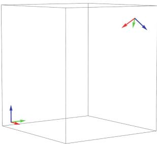

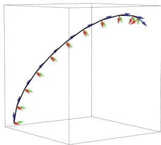

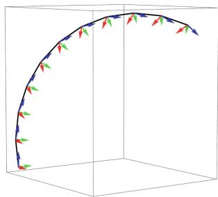  
Fig. 1. Left to right: 1) start-frame $e$ and (far) end-frame $p$ , 2) the exact SR geodesic [9] being the minimizing curve in (5) with $g_{11} = g_{44} = 1$ , $g_{22} = g_{33} = \infty$ connecting $e$ and $p$ , 3) the minimal horizontal exponential curve (ending with same orientation in blue). Above we visualize points $g = (\mathbf{x}, R)$ in SE(3) with a local frame in $T_{\mathbf{x}}(\mathbb{R}^3)$

From the commutator relations in the Lie algebra of $\mathrm{SE}(3)$ , it follows that $\mathcal{G}$ defined by (2) is legal. It is a Riemannian (R) metric for $g_{11}, g_{33}, g_{44}, g_{66}$ positive, a Gauge-invariant (GI) metric [21-23] for $g_{11}, g_{33}, g_{44}$ , positive and $g_{66} = 0$ , and a Sub-Riemannian (SR) metric for $g_{33}, g_{44}, g_{66}$ positive and $g_{11} = \infty$ . In the SR case, one can constrain the curves in the metric optimization to $\Delta := \langle \mathcal{A}_1, \mathcal{A}_2, \mathcal{A}_6 \rangle^\perp$ . This SR case is depicted in Fig. 1. In general $(G, \mathcal{G})$ is geodesically complete, also in the SR setting by the Chow-Rashevskii theorem.

Definition 5. A left-invariant subbundle $\mathcal{H} \subset T(G)$ is called

$$
R i e m a n n i a n (R) h o r i z o n t a l i f \mathcal {H} = \mathcal {V} ^ {\perp} = \langle \mathcal {A} _ {6} \rangle^ {\perp},
$$

$$
\text {R i e n t h a n n i a n} (H) \text {h o r i z o n t a l} \mathcal {H} \quad , \quad \left(\vee_ {6}\right), \\ \text {S u b - R i e m a n n i a n} (S R) \text {h o r i z o n t a l} \mathcal {H} = \Delta = \left\langle \mathcal {A} _ {1}, \mathcal {A} _ {2}, \mathcal {A} _ {6} \right\rangle^ {\perp} \tag {7}
$$

We have $T(G) = \mathcal{H} \oplus \mathcal{V}$ in the Riemannian setting, and correspondingly $T(G) = \Delta \oplus \langle \mathcal{A}_1, \mathcal{A}_2, \mathcal{A}_6 \rangle$ in the Sub-Riemannian setting.

Theorem 1. Set $\mathbf{a} = (0,0,1)$ , and $G = \mathrm{SE}(3)$ , $H = \mathrm{Stab}_{\mathrm{SE}(3)}(\mathbf{0},\mathbf{a}) \equiv \mathrm{SO}(2)$ . Let $\mathcal{G}$ be a legal metric on $G$ w.r.t. $H$ , with either $g_{11}$ positive (Riemannian case) or infinite (Sub-Riemannian case). Consider a solution $t \mapsto (\gamma(t), \lambda(t))$ of the corresponding geodesic flow on $T^{*}G$ . Then along fibers we have constant momentum and no acceleration:

$$
\dot {u} ^ {6} (t) = \dot {\lambda} _ {6} (t) = \frac {d}{d t} \langle \lambda (t), \mathcal {A} _ {6} | _ {\gamma (t)} \rangle = 0. \tag {8}
$$

Proof. The Hamiltonian flow associated to left-invariant Riemannian Hamiltonian $\mathfrak{h}_R(\lambda) = |\mathcal{G}_{\gamma}^{-1}(\lambda, \lambda)|^2$ of left-invariant Riemannian manifolds is given by:

$$
\dot {\nu} = \mathfrak {h} _ {R} (\nu), \text {w i t h} \nu = (\gamma , \lambda) \Leftrightarrow \left\{ \begin{array}{l} \dot {\gamma} = \mathcal {G} ^ {- 1} \lambda \in T _ {\gamma (\cdot)} (G) \\ \dot {\lambda} = \operatorname {c o a d} _ {\dot {\gamma}} (\lambda) \end{array} \right. \tag {9}
$$

where $\mathfrak{h}_R$ is the Hamiltonian vector field on $T^{*}G$ associated to the Hamiltonian $\mathfrak{h}_R$ [1] (i.e. $(\mathrm{dg}\wedge \mathrm{d}\lambda)(\cdot ,\mathfrak{h}_{\mathrm{R}}) = \mathrm{d}\mathfrak{h}_{\mathrm{R}})$ , and $\operatorname{coad}_v(\lambda)(w) = \langle \lambda ,\operatorname {ad}(v)(w)\rangle$ . Here the ad operator is obtained by conjugating the usual ad on the Lie algebra $T_{e}G$ with push-forward of the left multiplication of the inverse of the base-point $\gamma (t)$ . That is, $\lambda$ and $\dot{\gamma}$ are identified with their left invariant extensions and the second equation in (9) reduces to the Euler equation on the dual of the Lie algebra.

Similarly, the Hamiltonian flow of left-invariant SR manifolds of Hamiltonian $\mathfrak{h}_{SR}(\lambda) = |\mathcal{G}_\gamma^{-1}(P_\Delta^*\lambda ,P_\Delta^*\lambda)|^2$ with dual projection $P_{\Delta}^{*}$ is given by:

$$
\dot {\nu} = \mathfrak {h} _ {S R} (\nu), \text {w i t h} \nu = (\gamma , \lambda) \Leftrightarrow \left\{ \begin{array}{l} \dot {\gamma} = \mathcal {G} ^ {- 1} P _ {\Delta} ^ {*} \lambda \in \Delta | _ {\gamma (\cdot)} \\ \dot {\lambda} = \operatorname {c o a d} _ {\dot {\gamma}} (\lambda) \end{array} \right. \tag {10}
$$

Now the co-adjoint action in (9), (10) gives no momentum change along fibers (12). Thereby geodesics cannot change their velocity in the vertical (fiber) direction:

$$
\text {R i e m a n n i a n :} P _ {\nu} ^ {*} (\lambda) = 0 \& \lambda = \mathcal {G} \dot {\gamma},
$$

$$
\text {S u b - R i e m a n n i a n :} P _ {\mathcal {V}} ^ {*} (\lambda) = 0 \& P _ {\Delta} ^ {*} \lambda = \mathcal {G} \dot {\gamma},
$$

so it does not matter whether one puts 0, finite, or $\infty$ costs on the fiber direction and the 3 constructions of Riemannian homogeneous spaces in [22, 23] now coincide!

We verify this statement explicitly in left-invariant coordinates in the setting:

$$
\underline {{\text {R i e m a n n i a n}}} \colon \lambda = \sum_ {i = 1} ^ {6} \lambda_ {i} \omega^ {i}, \dot {\gamma} = \sum_ {i = 1} ^ {6} u ^ {i} \left. \mathcal {A} _ {i} \right| _ {\gamma}, \mathfrak {h} _ {R} = \sum_ {i = 1} ^ {6} g ^ {i i} \lambda_ {i} ^ {2}, u ^ {j} = g ^ {j j} \lambda_ {j}, (1 1) \Rightarrow
$$

$$
\dot {\lambda} _ {6} = \{\mathfrak {h} _ {R}, \lambda_ {6} \} = \sum_ {k = 1} ^ {6} \sum_ {j = 1} ^ {6} c _ {j 6} ^ {k} \lambda_ {k} (t) g ^ {j j} \lambda_ {j} (t) = g ^ {1 1} (1 - 1) \lambda_ {1} \lambda_ {2} + g ^ {4 4} (1 - 1) \lambda_ {4} \lambda_ {5} = 0.
$$

Sub-Riemannian: $\mathfrak{h}_{SR} = \sum_{i=3}^{5} g^{ii} \lambda_i^2$ , $\dot{\lambda}_6(t) = \{\mathfrak{h}_{SR}, \lambda_6\}$ , where the Poisson brack-ets yield $\{\mathfrak{h}_{SR}, \lambda_6\} = \sum_{k=1}^{6} \sum_{j=3}^{5} c_{j6}^k \lambda_k(t) u^j(t) = 0 = g_{66} \dot{u}^6(t)$ .

In both cases $\dot{\lambda}_6 = \dot{u}^6 = 0$ , so if $u^6(0) = 0$ , $g_{66}$ (costs along fiber) is irrelevant. $\square$

Remark 1. By the proof above, the cost $g_{66}$ in the direction of the fibers of the canonical projection $\mathrm{SE}(3) \to \mathrm{SE}(3) / \mathrm{SO}(2)$ is irrelevant in the computations of geodesics both for the Riemannian case and the Sub-Riemannian case. Consequently we could as well put $g_{66} = 0$ as in the gauge-invariant case [21].

Corollary 1. (Sub)-Riemannian Geodesics in $G$ that start horizontal stay horizontal. The geodesic that realizes the minimum of the distance between $e$ and the fiber of $[g] \in G / H$ is a horizontal geodesic. Consequently, $\sigma_d$ selects the point(s) in the fiber that can be connected with a minimizing horizontal geodesic.

Cor.1 recovers Riemannian submersion theory [12, 13, 15, 16], and with Theorem 1 we prove constant momentum and zero acceleration along fibers. It also covers the SR case, aligning with [10, Theorem 2], where SR geodesics/balls are limits of Riemannian geodesics/balls when anisotropy tends to infinity.

Next we generalize Theorem 1, Cor. 1 to (reductive) homogeneous spaces [3] with legal metrics.

Definition 6 (Reductive Homogeneous Space). Let $G$ be a Lie group with Lie algebra $\mathfrak{g} = T_e(G)$ , and $H$ a closed subgroup with Lie algebra $\mathfrak{h} \coloneqq T_e(H)$ . A homogeneous space $G / H$ is called reductive if there exist a subspace $\mathfrak{m} \subset \mathfrak{g}$ such that $\mathfrak{g} = \mathfrak{h} \oplus \mathfrak{m}$ and $Ad(H)$ maps $\mathfrak{m}$ into itself.

Lemma 1. Let $\mathcal{G}$ be a legal metric on $G$ w.r.t. Lie sub-group $H$ . Then $G / H$ is reductive with $\mathfrak{g} = \mathfrak{h} \oplus \mathfrak{m}$ , $\mathfrak{m} = \mathfrak{h}^{\perp}$ .

Proof. It suffices to show that $[X,Y] \in \mathfrak{m}$ for all $X \in \mathfrak{h}$ and $Y \in \mathfrak{m}$ . Given that $\mathfrak{m} = \mathfrak{h}^{\perp}$ , this is equivalent to showing that $\mathcal{G}([X,Y],Z) = 0$ for all $Z \in \mathfrak{h}$ . By $\mathrm{Ad}_H$ invariance of $\mathcal{G}$ one has $\mathcal{G}(\mathrm{ad}_X Y, Z) + \mathcal{G}(Y, \mathrm{ad}_X Z) = 0 \forall Y, Z \in \mathfrak{g}, X \in \mathfrak{h}$ as $\mathrm{Ad}_* = \mathrm{ad}$ . So, $\mathcal{G}([X,Y],Z) = -\mathcal{G}(Y,[X,Z]) = 0$ as $[X,Z] \in \mathfrak{h}$ and $Y \in \mathfrak{h}^{\perp}$ .

Theorem 2. Let $\mathcal{G}$ be a legal metric on $G$ w.r.t. Lie sub-group $H$ . The minimal distance section $\sigma_d$ (Definition 2) takes in a fiber $[g] \in G / H$ the element $g^* \in G$ reachable by a horizontal minimizing geodesic departing from $e$ . Moreover, if $H$ is commutative, geodesics in $G$ have constant vertical momentum and no acceleration along the fibers.

Proof. By Riemannian submersion theory [12, Proposition 2.109], [15, Cor. 11.25], [13, Cor. 1.11.11] or [16, cor. 26.12]), geodesics that start horizontal remain horizontal. Thereby the minimizing geodesic between $[e]$ and $[g]$ in $G / H$ has the same length as its horizontal lift starting at $e$ . All curves in $G$ that project to the minimizing geodesic in $G / H$ have the same horizontal component of their velocity. By the Pythagorean theorem on $T(G) = \mathcal{H} \oplus \mathcal{V}$ with

$\mathcal{H} = \mathcal{V}^{\perp}$ , the shortest one is the horizontal one, with end-point $g^{*} = \sigma_{d}([g])$ , and $d_{\mathcal{G}}(\sigma_d(g),e) = d([g],[e])$ .

Now Eq. (9), (10) hold generally for left-invariant (S)R problems on Lie groups: the left-invariant HF on Lie group $G$ with left-invariant metric yields the Euler equation on $T_{e}^{*}(G)$ [2, Sec. I.4]. Now $H$ commutative $\Rightarrow [\mathfrak{h},\mathfrak{h}] = 0$ and

$$
\begin{array}{l} \mathcal {G} \text {l e g a l} \stackrel {\text {L e m m a 1 ,} [ \mathfrak {h}, \mathfrak {h} ] = 0} {\Rightarrow} P _ {\mathfrak {h}} \operatorname {a d} (\mathfrak {h}) = 0 \stackrel {\mathcal {G} \text {l e g a l}} {\Rightarrow} P _ {\mathcal {V}} \operatorname {a d} (\mathcal {V}) = 0 \Rightarrow \\ P _ {\mathcal {V} *} \operatorname {c o a d} _ {\dot {\gamma}} (\lambda) \stackrel {(9)} {=} P _ {\mathcal {V} *} (\dot {\lambda}) = 0 \text {a n d} \dot {\gamma} \stackrel {(9)} {=} \mathcal {G} ^ {- 1} \lambda \end{array} \tag {12}
$$

where $t \mapsto (\gamma(t), \lambda(t))$ solves the geodesic flow (9) on $T^{*}G$ and with orthogonal projections: $P_{\mathfrak{h}} : \mathfrak{g} \to \mathfrak{g}$ on $\mathfrak{h} = T_e(H)$ and $P_{\mathcal{V}} : T(G) \to T(G)$ on $\mathcal{V}$ . For vanishing acceleration along the fibers: $P_{\mathcal{V}}\ddot{\gamma} = \mathcal{G}^{-1}P_{\mathcal{V}^{*}}\mathcal{G}(\ddot{\gamma}) = \mathcal{G}^{-1}P_{\mathcal{V}^{*}}\left(\frac{d}{dt}(\mathcal{G}\dot{\gamma})\right)^{\stackrel{(12)}{=}}0$ , with $\ddot{\gamma} \coloneqq \nabla_{\dot{\gamma}}^{[0]}\dot{\gamma}$ , with $\nabla^{[0]}$ the metric compatible Lie-Cartan connection [11].

# 3 Section $\sigma ([g])$ Is Locally Close to $\sigma_{\rho}([g])$ and $\sigma_d([g])$

Henceforth we consider the Riemannian setting (with finite anisotropy), where one has $\sigma_{\rho}([g])\approx \sigma_d([g])$ if $g\approx e$ as $|d_{\mathcal{G}}(\cdot ,e)|^2 = |\rho_{\mathcal{G}}|^2 (1 + O(\rho_{\mathcal{G}}^2))$ , cf. [5, 20].

Proposition 1. We have $\rho_{\mathcal{G}}(\sigma([g])) \geq \rho_{\mathcal{G}}(\sigma_{\rho}([g])) \geq d_{\mathcal{G}}(\sigma_d([g]), e)$ with equality when restricting to $\{0\} \times \mathrm{SO}(3)/H \equiv \mathrm{SO}(3)/\mathrm{SO}(2) \equiv S^2$ .

Proof. The inequality follows from definitions $\sigma$ , $\sigma_{\rho}$ , $\sigma_{d}$ as $g_0 \in [g]$ with $\alpha = -\gamma$ is a specific point, and a connecting exp curve is a specific connecting curve. By Theorem 2 a minimal geodesic from $e$ is horizontal, so the minimizer in $[g]$ is independent of $g_{66}$ . Theorem 1. Choose $g_{66} = g_{44}$ for a bi-invariant metric where geodesics are exp curves, so $\rho_{\mathcal{G}}(\sigma(g)) = \rho_{\mathcal{G}}(\sigma_{\rho}([g])) = d_{\mathcal{G}}(\sigma_d([g]), e)$ , $\forall g = (0, R)$ .

Remark 2. By Proposition 1 (the case of equality) and translation invariance of $\sigma$ (recall (3)) section $\sigma$ selects the element $g = \sigma([g]) \in SE(3)$ within the fiber $[g]$ with minimal angular velocity, i.e.: $\sigma([g]) = \operatorname{argmin}_{p \in [g]} \| P_{T(SO(3))} \log p\|_{\mathcal{G}}$ .

Lemma 2. Let $\mathcal{G}$ be a legal metric given by (2). Set $g_0 = \sigma([g])$ . Let $[g] = (\mathbf{x}, \mathbf{n}) \in G / H$ and $[e] = (\mathbf{0}, \mathbf{a}) \in G / H$ be co-planar: $\operatorname*{det}(\mathbf{x}|\mathbf{n}|\mathbf{a}) = 0$ . Then $\rho_{\mathcal{G}}(g_0h) = \rho_{\mathcal{G}}(g_0h^{-1})$ for all $g \in G, h \in H$ .

Proof. Let $g \in G, h \in H$ . Let $[g]$ and $[e]$ be in plane $V$ . Let $S_V$ be the orthogonal reflection w.r.t. $V$ . By co-planarity we can find a torsion free connecting exp curve: select $g_0 = \exp(\sum_{i=1}^{5} c^i A_i)$ from $[g]$ with spatial velocity $\mathbf{c}^{(1)} = (c^1, c^2, c^3)$ perpendicular to angular velocity $\mathbf{c}^{(2)} = (c^4, c^5, 0)$ . Set $s = (\mathbf{0}, S_V) \in E(3)$ . Then

$$
s g _ {0} s ^ {- 1} = g _ {0} \text {a n d} s h s ^ {- 1} = \left(\mathbf {0}, S _ {V} R _ {\mathbf {e} _ {z, \alpha}} S _ {V} ^ {- 1}\right) = \left(\mathbf {0}, R _ {\mathbf {e} _ {z, - \alpha}}\right) = h ^ {- 1}. \tag {13}
$$

Now $\rho_{\mathcal{G}}(g_0h) = \| \log g_0h\| = \| \log s(g_0h)s^{-1}\|$ as on Lie algebra-level conjugation with reflection $s$ just flips the signs in $A_{1}$ and $A_{4}, A_{5}$ direction and as $\mathcal{G}$ , Eq. (2), is isotropic diagonal in planes $\langle A_1, A_2\rangle$ and $\langle A_4, A_5\rangle$ . Thereby we find:

$$
\begin{array}{l} \rho_ {\mathcal {G}} (g _ {0} h) = \left\| \log (g _ {0} h) \right\| = \left\| \log \left(s g _ {0} s ^ {- 1}\right) \left(s h s ^ {- 1}\right) \right\| \\ \stackrel {(1 3)} {=} \| \log \left(g _ {0} h ^ {- 1}\right) \| = \rho_ {\mathcal {G}} \left(g _ {0} h ^ {- 1}\right). \tag {14} \\ \end{array}
$$

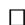

Theorem 3. In general $\sigma([g]) \neq \sigma_{\rho}([g])$ and $\rho_{\mathcal{G}}(\sigma([g])) = \rho_{\mathcal{G}}(\sigma_{\rho}([g])) + Error_{\mathcal{G}}([g])$ , with $Error_{\mathcal{G}}([g]) \to 0$ if $[g] \to [e]$ . If $g_{11} = g_{22} \geq g_{33}$ then

$$
\begin{array}{l} 1) \forall_ {R \in \mathrm {S O} (3)} \forall_ {z \in \mathbb {R}}: E r r o r _ {\mathcal {G}} ([ 0, 0, z, R ]) = 0, \\ 2) [ g ] \text {c o - p l a n a r a n d c l o s e t o} [ e ] \Rightarrow E r r o r _ {\mathcal {G}} ([ g ]) = 0. \tag {15} \\ \end{array}
$$

Proof. The first statement follows from the fact that the logarithmic norm converges to the exact Riemannian distance [5] and Theorem 1.

Regarding item 1) in (15): By Proposition 1 it holds if $z = 0$ . We have for spatial velocity $\mathbf{c}^{(1)} = (c^1, c^2, c^3)^T$ and angular velocity $\mathbf{c}^{(2)} = (c^4, c^5, c^6)^T$ of $\log_{\mathrm{SE}(3)} g$ :

spatial velocity:

$$
\begin{array}{l} \mathbf {c} ^ {(1)} (g) = \boldsymbol {x} - \frac {1}{2} \mathbf {c} ^ {(2)} (g) \times \boldsymbol {x} + f (q) \mathbf {c} ^ {(2)} (g) \times \left(\mathbf {c} ^ {(2)} (g) \times \boldsymbol {x}\right), \\ \text {a n g u l a r v e l o c i t y :} \end{array} \tag {16}
$$

angular velocity :

$$
\mathbf {c} ^ {(2)} (g) = (c ^ {4} (g), c ^ {5} (g), c ^ {6} (g)) = \log_ {\mathrm {S E} (3)} (\mathbf {0}, R) = (\mathbf {0}, \log_ {\mathrm {S O} (3)} R),
$$

for $g = (\mathbf{x}, R)$ , with $f(q) = (1 - \frac{q}{2} \cot \left( \frac{q}{2} \right)) / q^2 \geq 0$ with $f'(q) > 0$ . So $|c^3(0, 0, z, R)|^2 = |z|^2 |1 + f(q)| (|c^6(0, 0, z, R)|^2 - q^2)|^2$ is minimal if $c^6 = 0$ as $1 - q^2 f(q) \geq 0$ , $f \geq 0$ . Finally by assumption $g_{11} = g_{22} \geq g_{33}$ moving along $c^1$ or $c^2$ is more expensive than moving along $c^3$ , and for $g = (0, 0, z, R)$ we have $\rho_{\mathcal{G}}(\sigma[g]) = \rho_{\mathcal{G}}(\sigma_{\rho}[g])$ .

Regarding item 2) in (15): By the symmetry of Lemma 2 and the smoothness of the exp map $h = (\mathbf{x}, R_{\mathbf{e}_z, \gamma}R_{\mathbf{e}_y, \beta}R_{\mathbf{e}_z, \alpha = -\gamma})$ must be a stationary point of optimization problem $\min_{h \in H} \rho_{\mathcal{G}}(gh)$ , cf. Fig. 2. Now if the stationary point is a global minimum then $\text{Error}_{\mathcal{G}}([g])$ vanishes. Thereby we check the sign of $E_{\mathbf{x}}''$ of $[-\pi, \pi) \ni \alpha \stackrel{E_{\mathbf{x}}} {\mapsto} \rho_{\mathcal{G}}(\mathbf{x}, R_{\mathbf{e}_z, -\alpha}R_{\mathbf{e}_y, \beta}R_{\mathbf{e}_z, \alpha}) \geq 0$ . By Proposition 1 we have $E_0''(\cdot) > 0$ . By continuity of $\mathbf{x} \mapsto E_{\mathbf{x}}''$ , and $\rho_{\mathcal{G}}(\mathbf{x}, R) \to \rho_{\mathcal{G}}(\mathbf{0}, R)$ the stationary point $\alpha = -\gamma$ remains minimal for $\mathbf{x} \to \mathbf{0}$ . For $gh \to e$ one has $\rho_{\mathcal{G}}(gh) \to d_{\mathcal{G}}(gh, e)$ and by Theorem 1, the stationary-point remains the minimizer for $g$ close enough to $e$ .

Remark 3. On $\mathrm{SO}(3) / \mathrm{SO}(2)$ we had $\sigma = \sigma_{\rho} = \sigma_{d}$ , cf. Proposition 1. On $\mathrm{SE}(3) / \mathrm{SO}(2)$ this no longer holds, though for many co-planar end-conditions it does hold. Numerics show that errors are small for the practically relevant cases, cf. Fig.2. When $\frac{\min\{g_{11}, g_{33}\}}{\max\{g_{44}, g_{66}\}} \frac{\|\mathbf{x}\|}{\|\log(\mathbf{0}, R)\|_{\mathbb{T}}} \gg 1$ , the stationary point $\alpha = -\gamma$

for co-planar boundary conditions (Lemma 2) can switch from a min to a max (cf. Fig. 2 top) yielding an $Error_{\mathcal{G}}([g]) > 0$ .

In future work we will compute this turning point, and analyze the error also for the no-coplanar case, using screw-motion coordinates [6]. Then Taylor expansion yields a practical refinement of section $\sigma$ .

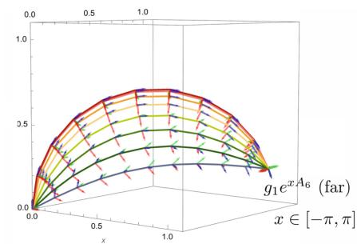

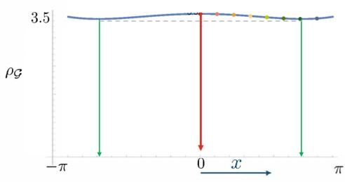

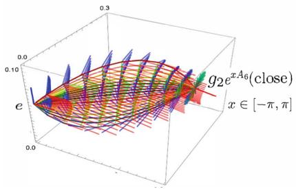

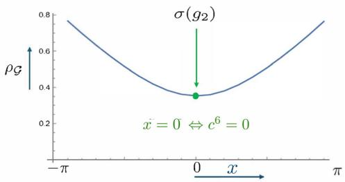  
Fig.2. Illustration of Theorem 3 and symmetry of Lemma 2. Left: Exp curves in SE(3) that map unit element $[e]$ to a local orientation $[g_1]$ are plotted by their spatial projections along with a rotation frame. Right: section $\sigma$ can deviate from section $\sigma_{\rho}$ in $[g_1]$ : $\operatorname{Error}_{\mathcal{G}}(g_1) = 0.1$ . Settings top: $[g_1] = \{g_1 e^{xA_6} \mid x \in (-\pi, \pi]\}$ , $g_1 = \exp(2A_3 + \frac{7\pi}{16} A_4 + \frac{7\pi}{16} A_5)$ , co-planar, $\mathcal{G}_e = \mathrm{diag}(1, 1, 1, 1, 1, 0)$ . Here the discrepancy of the log distance between taking section $g_1 = \sigma([g_1]) \Leftrightarrow x = \alpha + \gamma = 0$ , and the actual minimizer $\sigma_{\rho}([g_1])$ over the fiber is visible. Settings bottom: For $g_2 = \sigma([g_2]) = \exp(\frac{1}{4}(A_3 + A_2 + \frac{\pi}{14} A_5))$ (close to $e$ ) and $\mathcal{G}_e = \mathrm{diag}(1, 1, 1, 0.01, 0.01, 0.05)$ the error vanishes.

# 4 Conclusion

(Sub)-Riemannian geodesics in Lie groups $G$ with legal metrics w.r.t. commutative subgroup $H$ have constant momentum and zero acceleration along the left cosets (Theorem 1 and 2). As the minimal distance section $\sigma_d$ is reached by horizontal minimizing geodesics, we studied the effect of replacing the Riemannian distance $d_{\mathcal{G}}(\sigma_d([g]),e)$ with its logarithmic norm approximation $\rho_{\mathcal{G}}(\sigma_{\rho}[g])$ . For $G = \mathrm{SE}(3)$ , $H = \mathrm{SO}(2)$ an advocated symmetric section $\sigma$ (Lemma 2) that coincides with $\sigma_{\rho}$ on $S^2$ (Proposition 1) approximates $\sigma_{\rho}$ and $\sigma_d$ well (Theorem 3, Fig. 2). The analysis of the error and the stationary point (Fig. 2) is left for future work.

Acknowledgments. We gratefully acknowledge the Dutch Foundation for Science NWO for funding VICI 2020 Exact Sciences (VI.C. 202-031). The European Commission is gratefully acknowledged for financial support through Horizon Europe, MScASE project 101131557 (REMODEL). The authors acknowledge the excellent working conditions and interactions at Erwin Schrdinger International Institute for Mathematics and Physics, Vienna, during the thematic programme "Infinite-dimensional Geometry: Theory and Applications" where part of this work was completed. The third Author is supported by FWF Grants I-5015N and PAT1179524.

Disclosure of Interests. The authors have no competing interests to declare that are relevant to the content of this article.

# References

1. Agrachev, A., Sachkov, Y.: Control Theory from the Geometric Viewpoint. Springer (2004). https://doi.org/10.1007/978-3-662-06404-7   
2. Arnold, V.I., Khesin, B.A.: Topological methods in hydrodynamics. Applied Mathematical Sciences, Springer, New York (1998). https://doi.org/10.1007/978-3-030-74278-2.pdf   
3. Arvanitogeorgos, A.: An Introduction to Lie Groups and the Geometry of Homogeneous Spaces. American Mathematical Society (2003)   
4. Bekkers, E., Vadgama, S., Hesselink, R., Van der Linden, A., Romero, D.: Fast, expressive $\mathrm{SE}(n)$ equivariant networks through weight-sharing in position-orientation space (2024). arxiv:2310.02970, ICLR Conf. Proc. 2024   
5. Bellaard, G., Bon, D.L.J, P.G., Smets, B., Duits, R.: Analysis of (sub-) Riemannian PDE-G-CNNs. JIMIV (2023). https://doi.org/10.1007/s10851-023-01147-w   
6. Bellaard, G., Smets, B.: Roto-translation invariant metrics on position-orientation space. In: Proceedings of the GSI 2025. Springer (2025)   
7. Bolelli, M.V., Citti, G., Sarti, A., Zucker, S.: A neurogeometric stereo model for individuation of 3D perceptual units. In: GSI, pp. 53-62. Springer (2023). https://doi.org/10.1007/978-3-031-38271-0_6   
8. Duits, R., Franken, E.M.: Left-invariant diffusions on the space of positions and orientations and their application to Crossing-Preserving Smoothing of HARDI images. IJCV 92 (2011). https://doi.org/10.1007/s11263-010-0332-z   
9. Duits, R., Ghosh, A., Dela Hajie, T., Mashtakov, A.: On sub-Riemannian geodesics in SE(3) whose spatial projections do not have cusps. JDCS 22(4) (2016). https://doi.org/10.1007/s10883-016-9329-4   
10. Duits, R., Meesters, S.P.L., Mirebeau, J.M., Portegies, J.M.: Optimal paths for variants of the 2D and 3D Reeds-Shepp car. JMIV, pp. 1-33 (2018)   
11. Duits, R., Smets, B., Wemmenhove, J., Portegies, J., Bekkers, E.: Recent Geometric Flows in Multi-orientation Image Processing via a Cartan Connection. In: Chen, K., Schonlieb, CB., Tai, XC., Younes, L. (eds.) Handbook of Mathematical Models and Algorithms in Computer Vision and Imaging, pp. 1-60. Springer, Cham (2021). https://doi.org/10.1007/978-3-030-98661-2_101   
12. Gallot, S., Hulin, D., Lafontaine, J.: Riemannian Metrics, pp. 49-101. Springer Berlin Heidelberg, Heidelberg (1987). https://doi.org/10.1007/978-3-642-97026-9_2   
13. Klingenberg, W.P.: Riemannian Geometry. De Gruyter, Berlin, New York (1995)

14. Meesters, S., et al.: Stability metrics for optic radiation tractography. JNM 288, 34-44 (2017)   
15. Mennucci, A.C.G.: Metrics of Curves in Shape Optimization and Analysis, pp. 205-319. Springer International Publishing, Cham (2013). https://doi.org/10.1007/978-3-319-01712-9_4   
16. Michor, P.: Topics in Differential Geometry, vol. 93. AMS (2008)   
17. Portegies, J.M., Fick, R., Sanguinetti, G.R., Meesters, S.P.L., Girard, G., Duits, R.: Improving fiber alignment in HARDI by combining contextual PDE flow with constrained spherical deconvolution. PLoS ONE 10(10), e0138122 (2015)   
18. Portegies, J.M., Sanguinetti, G., Meesters, S., Duits, R.: New approximation of a scale space kernel on SE(3) and applications in neuroimaging. In: SSVM (2015)   
19. Rodrigues, P., Duits, R., Vilanova, A., ter Haar Romeny, B.: Accelerated diffusion operators for enhancing DW-MRI. In: VCBM (2010)   
20. Smets, B., Portegies, J., Bekkers, E.J., Duits, R.: PDE-based group equivariant convolutional neural networks. JMIV (2022)   
21. Trumpach, A.B., Drira, H., Daoudi, M., Srivastava, A.: Gauge invariant framework for shape analysis of surfaces. IEEE Trans. Pattern Anal. Mach. Intell. 38(1), 46-59 (2016)   
22. Trumpach, A.B., Preston, S.C.: Riemannian metrics on Banach or Fréchet quotient spaces: comparison of dierent constructions. In: preparation   
23. Tumpach, A.B., Preston, S.C.: Three methods to put a Riemannian metric on shape space. In: Nielsen, F., Barbaresco, F. (eds.) Geometric Science of Information, pp. 3-11. Springer Nature Switzerland, Cham (2023)

# Universal Collection of Euclidean Invariants Between Pairs of Position-Orientations

Gijs Bellaard $^{(\text{邑})}$ , Bart M. N. Smets, and Remco Duits

CASA & EAISI, Eindhoven University of Technology, Eindhoven, Netherlands {g.bellaard,b.m.n.smets,r.duits}@tue.nl

Abstract. Euclidean $\mathrm{E}(3) := \mathbb{R}^3 \times \mathrm{O}(3)$ equivariant neural networks that employ scalar fields on position-orientation space $\mathbb{M}_3 := \mathbb{R}^3 \times S^2$ have been effectively applied to tasks such as predicting molecular dynamics and properties. To perform equivariant convolutional-like operations in these architectures one needs Euclidean invariant kernels $k: \mathbb{M}_3 \times \mathbb{M}_3 \to \mathbb{R}$ . In practice, a handcrafted collection of invariants is selected, and this collection is then fed into multilayer perceptrons to parametrize the kernels. We rigorously describe an optimal collection of 4 smooth scalar invariants on the whole of $\mathbb{M}_3 \times \mathbb{M}_3$ . With optimal we mean that the collection is independent and universal, meaning that all invariants are pertinent, and any invariant kernel is a function of them. We evaluate two collections of invariants, one universal and one not, using the PONITA neural network architecture. Our experiments show that using a collection of invariants that is universal positively impacts the accuracy of PONITA significantly.

Keywords: Position-Orientation Space $\cdot$ Euclidean Group $\cdot$ Differential Geometry $\cdot$ Lie Theory $\cdot$ Invariant $\cdot$ Equivariant $\cdot$ Machine Learning

# 1 Introduction

Neural networks that are equivariant with respect to the Euclidean group $\operatorname{E}(3) := \mathbb{R}^3 \rtimes \mathrm{O}(3)$ - that being the Lie group of all translations, rotations, and reflections of $\mathbb{R}^3$ - have been successfully applied to various tasks: 1) pointcloud classification [5], where an object and its rigid transformations should be classified as the same, 2) molecular dynamics/properties [2,5,6,8], as the (non-relativistic) physical laws are invariant under Euclidean transformations, and 3) hemodynamics [11,12], where, for example, wall shear stress vector prediction should be equivariant w.r.t. $\operatorname{E}(3)$ .

There are many ways to create Euclidean equivariant neural networks, but here we focus on one specific kind: models that use scalar fields $f:\mathbb{M}_3\to \mathbb{R}$ on position-orientation space $\mathbb{M}_3\coloneqq \mathbb{R}^3\times S^2$ as their feature maps. The choice is well supported since: 1) in [6, Sec.3] it is shown theoretically that scalar fields $\mathbb{M}_3$

provide the same expressivity as more mathematically involved networks that use $\rho : \mathrm{O}(3) \to \mathrm{GL}(V)$ representation fields $f: \mathbb{R}^3 \to V$ [1,5,13,14], and 2) the recent state-of-the-art results in [2] show that scalar fields on $\mathbb{M}_3$ can be equally expressive practically.

Suppose we have a scalar field $f: \mathbb{M}_3 \to \mathbb{R}$ as input and want to construct a linear operator to process it, as is common in neural networks. Consider an integral operator $\varPhi$ of the form

$$
(\varPhi f) \left(p _ {1}\right) = \int_ {\mathbb {M} _ {3}} k \left(p _ {1}, p _ {2}\right) f \left(p _ {2}\right) \mathrm {d} \mu \left(p _ {2}\right), \tag {1}
$$

where $k: \mathbb{M}_3 \times \mathbb{M}_3 \to \mathbb{R}$ is a so-called kernel, and $\mu$ is a (E(3) invariant) measure on position-orientation space $\mathbb{M}_3$ . To make the mapping $\varPhi$ Euclidean equivariant it is sufficient to enforce the following invariance constraint on the kernel $k$ :

$$
k \left(g \triangleright p _ {1}, g \triangleright p _ {2}\right) = k \left(p _ {1}, p _ {2}\right) \text {f o r a l l} p _ {1}, p _ {2} \in \mathbb {M} _ {3}, g \in \mathrm {E} (3). \tag {2}
$$

Here $\triangleright$ is the standard action of $\operatorname{E}(3)$ on a position and orientation in $\mathbb{M}_3$ and is formally defined later in Sect. 2.

Hence, to create $\operatorname{E}(3)$ equivariant neural networks on $\mathbb{M}_3$ we are motivated to study scalar $\operatorname{E}(3)$ invariants $\iota: \mathbb{M}_3 \times \mathbb{M}_3 \to \mathbb{R}$ , that being functions with the property that $\iota(g \triangleright p_1, g \triangleright p_2) = \iota(p_1, p_2)$ for all $p_1, p_2 \in \mathbb{M}_3$ and $g \in \operatorname{E}(3)$ .

Consider any collection of scalar invariants $\iota_1, \ldots, \iota_n: \mathbb{M}_3 \times \mathbb{M}_3 \to \mathbb{R}$ . We can create a new invariant $\iota'$ easily by considering any function $h: \mathbb{R}^n \to \mathbb{R}$ and defining $\iota' = h(\iota_1, \ldots, \iota_n)$ . This observation has an immediate application in our neural networks: we can decide to parameterize the kernels $k$ by, for example, a multi-layer perceptron $\mathrm{MLP}_{\theta}: \mathbb{R}^n \to \mathbb{R}$ with (trainable) parameters $\theta$ , and inserting a predefined collection of $n$ invariants: $k = \mathrm{MLP}_{\theta}(\iota_1, \ldots, \iota_n)$ . This motivates looking into what an "optimal" collection of scalar invariants would be, so that we can construct networks that are maximally expressive and efficient.

Suppose we have a collection of invariants where one of them is a function of the others. If this happens we say the collection of invariants is dependent (Definition 5). A dependent collection is not "optimal" in the sense that we could remove the dependent invariant and (theoretically) lose no expressiveness.

On the other hand, suppose we have a collection of invariants for which we know that any other invariant one can think of is a function of them. We say such a collection of invariants is universal (Definition 4). A universal collection of invariants is "optimal" in the sense that there is no reason to add another invariant because we (theoretically) gain no expressiveness.

This motivates our quest for a collection of scalar invariants that is both independent and universal, which will serve as a type of basis for invariant kernels.

In [2] Bekkers et al. present PONITA, an E(3) equivariant architecture that utilizes scalar fields on $\mathbb{M}_3$ . This architecture achieves the previously mentioned state-of-the-art results on two molecular datasets: rMD17 [3], where the task is to predict molecular dynamics, and QM9 [9, 10], where the goal is to predict chemical properties of various molecules. PONITA utilizes the following collection of

three E(3) invariants $\iota_{i}:\mathbb{M}_{3}\times \mathbb{M}_{3}\to \mathbb{R}$

$$
\iota_ {1} \left(p _ {1}, p _ {2}\right) = \left(x _ {2} - x _ {1}\right) \cdot n _ {1},
$$

$$
\iota_ {2} \left(p _ {1}, p _ {2}\right) = \left\| \left(x _ {2} - x _ {1}\right) - \iota_ {1} \left(p _ {1}, p _ {2}\right) n _ {1} \right\|, \tag {3}
$$

$$
\iota_ {3} \left(p _ {1}, p _ {2}\right) = \operatorname {a r c c o s} \left(n _ {1} \cdot n _ {2}\right),
$$

where $p_1 = (x_1, n_1)$ , $p_2 = (x_2, n_2) \in \mathbb{M}_3 = \mathbb{R}^3 \times S^2$ .

However, we noticed that these invariants are not universal, see Remark 3, meaning that not all kernels can be written in terms of this collection of invariants, which could impact the accuracy of PONITA negatively in certain applications. Therefore we theoretically investigate in detail what an independent and universal collection of scalar $\operatorname{E}(3)$ invariants on $\mathbb{M}_3 \times \mathbb{M}_3$ would be, and if such a collection can be used to improve the accuracy of PONITA in practice.

Contributions. In Definition 7 we give our own collection of four smooth E(3) invariants $\iota_i: \mathbb{M}_3 \times \mathbb{M}_3 \to \mathbb{R}$ , of which we show in Theorem 1 that it is both independent and universal. In Sect. 6 we show that using a universal collection of invariants has a significant positive impact on the accuracy of PONITA when predicting molecular properties.

Outline. In Sect.2 we briefly define our main objects of study; that being the position-orientation space $\mathbb{M}_3$ , the Euclidean group $\mathrm{E}(3)$ , and invariants. In Sect.3 we define universality and the existence of a representative (Definition 4), and show that the latter implies the former. In Sect.4 we define (in)dependence and show that invariants that form a submersion are independent. In Sect.5 we present a collection of four smooth scalar invariants, along with proofs of its independence and universality. In Sect.6 we evaluate our universal collection of invariants using the PONITA architecture. In Sect.7 we conclude the paper.

# 2 Preliminaries

Next we briefly define our central concepts: the position-orientation space $\mathbb{M}_3$ , the Euclidean group $\mathrm{E}(3)$ , how $\mathrm{E}(3)$ acts on $\mathbb{M}_3$ , and what an invariant is.

Definition 1 (Position-Orientation Space). The smooth manifold of three-dimensional position-orientations is $\mathbb{M}_3 = \{(x,n)\in \mathbb{R}^3\times \mathbb{R}^3\mid \| n\| = 1\}$ . The tangent space at a point $p = (x,n)\in \mathbb{M}_3$ is $T_{p}\mathbb{M}_{3} = \{(\dot{x},\dot{n})\in \mathbb{R}^{3}\times \mathbb{R}^{3}\mid \dot{n}\cdot n = 0\}$ .

Definition 2 (Euclidean Group). The Euclidean group is $\operatorname{E}(3) = \{(t, Q) \in \mathbb{R}^3 \times \mathbb{R}^{3 \times 3} \mid Q^\top Q = I\}$ . The group product is $(t_2, Q_2) \cdot (t_1, Q_1) = (t_2 + Q_2 t_1, Q_2 Q_1)$ . The identity element is $e = (0, I)$ .

We define the action $\triangleright\colon \operatorname{E}(3) \times \mathbb{M}_3 \to \mathbb{M}_3$ of the Euclidean group on position-orientation space by $(t, Q) \triangleright (x, n) = (t + Qx, Qn)$ , where $(t, Q) \in \operatorname{E}(3)$ and $(x, n) \in \mathbb{M}_3$ . We extend this action to pairs of position-orientations $(p_1, p_2) \in$

$\mathbb{M}_3 \times \mathbb{M}_3$ by letting the group element act on both, that is $g \triangleright (p_1, p_2) \coloneqq (g \triangleright p_1, g \triangleright p_2)$ . From here on out we will drop the group action symbol $\triangleright$ for conciseness.

The following defines what an invariant is for arbitrary sets $X$ and groups $G$ . While this level of generality exceeds our needs - since our focus will be on $X = \mathbb{M}_3 \times \mathbb{M}_3$ and $G = \operatorname{E}(3)$ - we present the full definition here for the sake of completeness.

Definition 3 (Invariant). Let $X$ be a set and $G$ a group acting on it. Define $\sim$ as the equivalence relation indicating if two elements are in the same orbit, that is $x \sim x' \Leftrightarrow \exists g \in G : gx = x'$ . Let $Y$ be any set. An invariant $\iota : X \to Y$ is a mapping such that $x \sim x' \Rightarrow \iota(x) = \iota(x')$ .

# 3 Universality

Here, we will define what universality is and clarify what it means for an invariant to have a representative. We will demonstrate in Lemma 1 that the existence of a representative implies universality, a result we will later use to prove that our collection of invariants (4) is universal.

# Definition 4 (Universality and Representer).

- An invariant $\iota : X \to Y$ is universal if any other invariant $j : X \to Z$ can be written as a function of it, that is there exists $F : \operatorname{im} \iota \to Z$ such that $j = F \circ \iota$ .   
- A representative $\varphi$ for an invariant $\iota : X \to Y$ is a map $\varphi : \operatorname{im} \iota \to X$ such that $\varphi(\iota(x)) \sim x$ for all $x \in X$ .

In other words, a representative $\varphi$ takes in the value $\iota(x)$ of the invariant $\iota$ of a $x \in X$ and returns a $x' = \varphi(\iota(x))$ that is in the orbit of $x$ .

Lemma 1. Let $\iota$ be an invariant. If $\iota$ has a representative then $\iota$ is universal.

Proof. Let $\varphi$ be a representative for $\iota$ and let $j$ be any other invariant. Now consider $F = j \circ \varphi$ . One can check that $j = F \circ \iota$ , thus showing that $\iota$ is universal.

Remark 1. Even with a universal collection of invariants, we cannot perfectly represent arbitrary invariants in practice, as expressivity is constrained by the chosen architecture. For instance, if our invariants are continuous and we use multi-layer perceptrons with continuous activation functions to parametrize the kernels, we can only represent continuous invariants, meaning we exclude any with discontinuities.

Remark 2. We can show that the invariants (3) used in [2] are not universal as follows. Let $e_1, e_2, e_3$ be the standard basis of $\mathbb{R}^3$ . Consider the following two pairs of position-orientations: $(p_1, p_2) = ((0, e_3), (e_1, e_2))$ and $(q_1, q_2) = ((0, e_3), (e_1, e_1))$ . As per (3), we calculate their invariants to be $\iota_1(p_1, p_2) = \iota_1(q_1, q_2) = 0$ , $\iota_2(p_1, p_2) = \iota_2(q_1, q_2) = 1$ , and $\iota_3(p_1, p_2) = \iota_3(q_1, q_2) = \pi/2$ . We see that all invariants agree between the two pairs. Consider the invariant $\iota = (x_2 - x_1) \cdot n_2$ . We calculate that $\iota(p_1, p_2) = 0$ and $\iota(q_1, q_2) = 1$ , so $\iota$ can not be a function of $\iota_1, \iota_2$ , and $\iota_3$ . Thereby, we conclude that (3) is not an universal collection of invariants.

# 4 Dependence

In this section, we will define what it means for a collection of invariants to be (in)dependent. We will show in Lemma 2 that a collection of invariants that form a submersion is independent, a result we will later use to prove that our collection of invariants (4) is independent.

Definition 5 (Dependent). A collection of scalar invariants $\iota_1, \ldots, \iota_n: X \to \mathbb{R}$ is dependent over $X$ if one of them can be written as a function of the others on $X$ , and independent otherwise.

If a collection of invariants is dependent on a set $X$ then it is also dependent on any subset $X' \subseteq X$ . Contrapositively, if a collection of invariants is independent on a set $X'$ it is also independent on any superset $X \supseteq X'$ .

This observation raises an issue in our definition of independence: it is easy to create a "large" set on which the invariants are technically independent; one only needs to include a "small" subset on which this is the case. To remedy this we introduce the following stronger definition.

Definition 6 (Somewhere Dependent). Let $X$ be a topological space and $\iota : X \to \mathbb{R}^n$ a collection of scalar invariants. We say $\iota$ is somewhere dependent if there exists an open subset $U \subseteq X$ such that $\iota$ is dependent on $U$ , and everywhere independent otherwise.

It might seem hard to prove that a collection of scalar invariants is everywhere independent. However, if we specialize our setting by considering spaces that are differentiable manifolds and invariants that are differentiable mappings, we have the following simpler sufficient condition.

Lemma 2. Let $M$ be a differentiable manifold and $\iota : M \to \mathbb{R}^n$ a collection of differentiable scalar invariants that form a submersion, that is the differential $d\iota|_p : T_pM \to \mathbb{R}^n$ is a surjective linear map at every point $p \in M$ . Then $\iota$ is everywhere independent.

Proof. A submersion is an open map [7, Prop.4.28], meaning that it maps open sets to open sets. So, given any arbitrary open subset $U \subseteq M$ the image $\iota(U) \subseteq \mathbb{R}^n$ is open. There is no functional relation between all elements of an open subset in $\mathbb{R}^n$ (such an open set is never the graph of a function), thus $\iota$ is independent on $U$ . As $U$ was arbitrary, this shows that $\iota$ is everywhere independent.

Remark 3. In practice, constructing a network using a dependent collection of invariants poses no issues, as the redundancy does not hinder training and may even enhance stability. However, proving the independence of a universal collection remains valuable, as it implies that removing any invariant renders the collection non-universal: the invariant that is removed can not be written as a function of the remaining invariants.

# 5 A Universal and Independent Collection of Invariants

Definition 7 (The Invariants). Write $p_1 = (x_1, n_1)$ , $p_2 = (x_2, n_2) \in \mathbb{M}_3$ . We define the following smooth functions $\iota_i : \mathbb{M}_3 \times \mathbb{M}_3 \to \mathbb{R}$ :

$$
\begin{array}{l} \iota_ {1} \left(p _ {1}, p _ {2}\right) = \left(x _ {2} - x _ {1}\right) \cdot n _ {1}, \\ \begin{array}{l} \iota_ {2} (p _ {1}, p _ {2}) = (x _ {2} - x _ {1}) \cdot n _ {2}, \\ \iota_ {1} (x _ {1}, x _ {2}) = (x _ {1} - x _ {2}) \cdot (x _ {1} - x _ {2}). \end{array} \tag {4} \\ \iota_ {3} \left(p _ {1}, p _ {2}\right) = \left(x _ {2} - x _ {1}\right) \cdot \left(x _ {2} - x _ {1}\right), \\ \iota_ {4} (p _ {1}, p _ {2}) = n _ {1} \cdot n _ {2}. \\ \end{array}
$$

We will prove that 1) the mappings $\iota_{i}$ are invariants, 2) they form a universal collection, and 3) that they are independent everywhere. These results are collected in the following theorem.

Theorem 1. The functions (4) form a universal and everywhere independent collection of $\operatorname{E}(3)$ invariants on $\mathbb{M}_3 \times \mathbb{M}_3$ .

Proof. We will begin by proving that the functions are invariants, then demonstrate their universality, and finally show that they are independent everywhere.

Invariance: To prove that these are invariants we must show that $\iota(p_1, p_2) = \iota(gp_1, gp_2)$ for all pairs of position-orientations $(p_1, p_2) \in \mathbb{M}_3 \times \mathbb{M}_3$ and all rigid transformations $g = (t, Q) \in \mathrm{E}(3)$ . This is a straightforward calculation using that $(Qx) \cdot (Qy) = x \cdot y$ for all $x, y \in \mathbb{R}^3$ and orthogonal matrices $Q \in \mathrm{O}(3)$ .

Universality: Let $(p_1 = (x_1, n_1)$ , $p_2 = (x_2, n_2) \in \mathbb{M}_3$ be a pair of position-orientations. From the values of the invariants $\iota_1(p_1, p_2), \ldots, \iota_4(p_1, p_2)$ we will construct another pair of position-orientations $(\bar{p}_1, \bar{p}_2)$ such that $(\bar{p}_1, \bar{p}_2) \sim (p_1, p_2)$ . The described construction will act as our representative, thus showing that the collection of invariants is universal, as per Theorem 1.

Consider the vectors $v_{1} = n_{1}, v_{2} = n_{2}, v_{3} = x_{2} - x_{1}$ . Their Gram matrix is

$$
v _ {i} \cdot v _ {j} = \left[ \begin{array}{l l l} 1 & \iota_ {4} & \iota_ {1} \\ \iota_ {4} & 1 & \iota_ {2} \\ \iota_ {1} & \iota_ {2} & \iota_ {3} \end{array} \right] _ {i j}, \text {w i t h} \iota_ {k} = \iota_ {k} (p _ {1}, p _ {2}), \tag {5}
$$

meaning that we have access to this Gram matrix purely from the values of the invariants. Let $\bar{v}_1, \bar{v}_2, \bar{v}_3$ be any list of vectors with the same Gram matrix. Lists of vectors with the same Gram matrix are related by an orthogonal matrix $Q$ , i.e. $Q\bar{v}_i = v_i$ . Now pick any position $\bar{x}_1$ , and define $\bar{n}_1 = \bar{v}_1$ , $\bar{n}_2 = \bar{v}_2$ , and

$\bar{x}_2 = \bar{x}_1 + \bar{v}_3$ . We check that the rigid transformation $g = (-Q\bar{x}_1 + x_1, Q) \in \operatorname{E}(3)$ maps $(\bar{p}_1, \bar{p}_2)$ to $(p_1, p_2)$ , showing that $(\bar{p}_1, \bar{p}_2) \sim (p_1, p_2)$ . For example

$$
\begin{array}{l} g \triangleright \bar {p} _ {2} = (- Q \bar {x} _ {1} + x _ {1} + Q \bar {x} _ {2}, Q \bar {n} _ {2}) = (Q (\bar {x} _ {2} - \bar {x} _ {1}) + x _ {1}, Q \bar {n} _ {2}) \\ = \left(Q \bar {v} _ {3} + x _ {1}, Q \bar {v} _ {2}\right) = \left(v _ {3} + x _ {1}, v _ {2}\right) = \left(\left(x _ {2} - x _ {1}\right) + x _ {1}, n _ {2}\right) = p _ {2}, \tag {6} \\ \end{array}
$$

and similarly one finds $g \triangleright \bar{p}_1 = p_1$ .

Independence: To prove that this collection of invariants is everywhere independent we will show that the differentials $d\iota_i|_p : T_p(\mathbb{M}_3 \times \mathbb{M}_3) \to \mathbb{R}$ are linearly independent on the following dense and open subset $U$ of $\mathbb{M}_3 \times \mathbb{M}_3$ :

$$
U := \left\{\left(p _ {1}, p _ {2}\right) \in \mathbb {M} _ {3} \times \mathbb {M} _ {3} \mid x _ {2} - x _ {1}, n _ {1}, \text {a n d} n _ {2} \text {f o r a b a s i s o f} \mathbb {R} ^ {3} \right\}, \tag {7}
$$

where $p_1 = (x_1, n_1)$ , $p_2 = (x_2, n_2) \in \mathbb{M}_3$ . This shows that $d\iota|_p$ is surjective everywhere on $U$ , meaning that $\iota$ is a submersion from $U$ to $\mathbb{R}^4$ , and therefore everywhere independent, as per theorem 2. In short, it suffices to show that $d\iota_i|_p$ are independent on $U$ , which we will do next.

Let $\dot{p}_1 = (\dot{x}_1, \dot{n}_1) \in T_{p_1} \mathbb{M}_3$ , $\dot{p}_2 = (\dot{x}_2, \dot{n}_2) \in T_{p_2} \mathbb{M}_3$ . The differentials $d\iota_i|_p$ are

$$
\begin{array}{l} d \iota_ {1} | _ {p} (\dot {p} _ {1}, \dot {p} _ {2}) = (\dot {x} _ {2} - \dot {x} _ {1}) \cdot n _ {1} + (x _ {2} - x _ {1}) \cdot \dot {n} _ {1}, \\ \left. d \iota_ {2} \right| _ {p} \left(\dot {p} _ {1}, \dot {p} _ {2}\right) = \left(\dot {x} _ {2} - \dot {x} _ {1}\right) \cdot n _ {2} + \left(x _ {2} - x _ {1}\right) \cdot \dot {n} _ {2}, \tag {8} \\ d \iota_ {3} | _ {p} (\dot {p} _ {1}, \dot {p} _ {2}) = 2 (\dot {x} _ {2} - \dot {x} _ {1}) \cdot (x _ {2} - x _ {1}), \\ d \iota_ {4} | _ {p} (\dot {p} _ {1}, \dot {p} _ {2}) = \dot {n} _ {1} \cdot n _ {2} + n _ {1} \cdot \dot {n} _ {2}. \\ \end{array}
$$

Suppose that we could find coefficients $c^i \in \mathbb{R}$ such that $\sum_{i=1}^{4} c^i d\mu_i|_p = 0$ (that being for all tangents $\dot{p}_1, \dot{p}_2$ ). Specifically, take $\dot{x}_1 = \dot{n}_1 = \dot{n}_2 = 0$ . We find $(c^1 n_1 + c^2 n_2 + 2c^3 (x_2 - x_1)) \cdot \dot{x}_2 = 0$ for all $\dot{x}_2$ . This implies that $c^1 n_1 + c^2 n_2 + 2c^3 (x_2 - x_1) = 0$ . Because we have assumed that these three vectors form a basis, we get that $c^1 = c^2 = c^3 = 0$ . Now consider $\dot{x}_1 = \dot{x}_2 = \dot{n}_2 = 0$ . We find $(c^1 (x_2 - x_1) + c^4 n_2) \cdot \dot{n}_1 = 0$ for all $\dot{n}_1$ with $\dot{n}_1 \cdot n_1 = 0$ (See Definition 1). This implies that $c^1 (x_2 - x_1) + c^4 n_2$ is in the span of $n_1$ . Again, because we have assumed that these three vectors form a basis, we have to conclude that $c^1 = c^4 = 0$ . All in all, we find that $\sum_{i=1}^{4} c^i d\mu_i|_p = 0$ implies that all $c^i = 0$ , thus showing that the differentials are linearly independent.

# 6 Experiments

By Remark 2, the invariants (3) used in [2] are not universal, which may limit PONITA's expressivity and accuracy in specific applications. In contrast, the invariants we propose (4) are universal, suggesting that, in theory, a performance difference between the two collections of invariants should be observable.

For this reason we performed some experiments on the QM9 dataset [9,10], specifically predicting chemical properties of various molecules (134k stable small organic molecules). We choose to discretize with 16 orientations, use 6 layers, 128 dimensional features, and train for 800 epochs. All other model settings and

hyperparameters are kept the same as in [2, App.E.2]. We report the mean absolute error (MAE) on the test set with the model that did best on the validation set during training. The results can be found in Table 1.

We see that the universal collection of invariants we propose (4) outperforms the non-universal invariants suggested in (3) on 10 of the 12 targets we experimented on, with an average improvement of $-14.4\%$ .

On some targets ( $\langle R^2 \rangle$ , ZPVE, and $U_0$ ) the change in accuracy is less pronounced, in two cases even deteriorating. One explanation is that a universal collection may be unnecessary for these targets, meaning the Bekkers et al. invariants are already sufficiently expressive. The remaining variability in accuracy can be attributed to initialization and training.

On other targets $(U, H, \text{and } G)$ the improvement in accuracy is stark. We can identify this as a direct consequence of using a universal collection of invariants: these targets cannot be accurately predicted using the incomplete invariants of Bekkers et al.

Table 1. PONITA trained to predict chemical properties of various molecules (QM9 dataset). Mean absolute error on the test set is reported (lower is better). Our universal invariants perform better than the invariants used in [2]   

<table><tr><td>Target</td><td>Unit</td><td>Bekkers et al. (3)</td><td>Universal (Ours) (4)</td><td>Difference %</td></tr><tr><td>μ</td><td>D</td><td>0.0195</td><td>0.0166</td><td>-15.0</td></tr><tr><td>α</td><td>a03</td><td>0.0557</td><td>0.0489</td><td>-12.1</td></tr><tr><td>εhomo</td><td>eV</td><td>0.0226</td><td>0.0202</td><td>-10.4</td></tr><tr><td>εlumo</td><td>eV</td><td>0.0206</td><td>0.0187</td><td>-9.0</td></tr><tr><td>Δε</td><td>eV</td><td>0.0415</td><td>0.0378</td><td>-8.9</td></tr><tr><td>⟨R2⟩</td><td>a02</td><td>0.4160</td><td>0.4251</td><td>+2.2</td></tr><tr><td>ZPVE</td><td>meV</td><td>1.5647</td><td>1.5241</td><td>-2.6</td></tr><tr><td>U0</td><td>eV</td><td>0.9920</td><td>1.0285</td><td>+3.7</td></tr><tr><td>U</td><td>eV</td><td>1.3593</td><td>0.7362</td><td>-45.8</td></tr><tr><td>H</td><td>eV</td><td>1.0205</td><td>0.6934</td><td>-32.1</td></tr><tr><td>G</td><td>eV</td><td>1.1856</td><td>0.7721</td><td>-34.9</td></tr><tr><td>cv</td><td>cal/mol K</td><td>0.0292</td><td>0.0270</td><td>-7.4</td></tr></table>

# 7 Conclusion

In Definition 7 we introduced a collection of four smooth $\operatorname{E}(3)$ invariants $\iota_i : \mathbb{M}_3 \times \mathbb{M}_3 \to \mathbb{R}$ . We proved in Theorem 1 that this collection is both independent and universal, meaning that all invariants are pertinent, and any other invariant is a function of them.

In Sect. 6 we performed an experimental comparison between our collection of invariants (4) and those proposed in Bekkers et al. [2], as defined in (3). We did this by training the PONITA architecture to predict chemical properties of various molecules (QM9 dataset [9,10]). We observe improvements in accuracy as a result of using a universal set of invariants.

Acknowledgments. The Dutch Research Council (NWO) is gratefully acknowledged for financial support via VIC.202.031 (Duits, Geometric learning for Image Analysis https://www.nwo.nl/en/projects/vic202031). The European Union is gratefully acknowledged for financial support through project REMODEL (Horizon Europe, MSCA-SE, 101131557 https://doi.org/10.3030/101131557). We thank Bekkers et al. [2] for their publicly available PONITA architecture https://github.com/ebekkers/ponita.

Addendum. We thank Johan Edstedt for bringing [4, Eq. 2, Prop.1] to our attention after our submission. It presents the same invariants and a similar method for constructing a representative pair of position-orientations from them.

Availability of Code. All code can be found at https://gitlab.com/gijsbel/ponita_invariants

# References

1. Anderson, B., Hy, T.S., Kondor, R.: Cormorant: covariant molecular neural networks. In: NeurIPS, vol. 32. Curran Associates, Inc. (2019). https://papers.neurips.cc/paper_files/paper/2019/bitstream/03573b32b2746e6e8ca98b9123f2249b-Abstract.html   
2. Bekkers, E.J., Vadgama, S., Hesselink, R., van der Linden, P.A., Romero, D.W.: Fast, expressive SE(3) equivariant networks through weight-sharing in position-orientation space. In: ICLR (2024). https://openreview.net/forum?id=dPHLbUqGbr   
3. Christensen, A.S., von Lilienfeld, O.A.: On the role of gradients for machine learning of molecular energies and forces. Mach. Learn. Sci. Technol. 1(4) (2020). https://doi.org/10.1088/2632-2153/abba6f   
4. Deng, H., Birdal, T., Ilic, S.: PPF-FoldNet: unsupervised learning of rotation invariant 3D local descriptors (2018). arxiv:1808.10322   
5. Fuchs, F., Worrall, D., Fischer, V., Welling, M.: SE(3)-transformers: 3D rototranslation equivariant attention networks. In: NeurIPS, vol. 33 (2020). https://proceedings.neurips.cc/paper/2020hash/15231a7ce4ba789d13b722cc5c955834-Abstract.html   
6. Gasteiger, J., Becker, F., Gunnemann, S.: GemNet: universal directional graph neural networks for molecules. In: NeurIPS (2021). https://openreview.net/forum? id=HS_sOaxS9K   
7. Lee, J.M.: Introduction to smooth manifolds. In: Introduction to Smooth Manifolds. Springer New York (2012). https://doi.org/10.1007/978-1-4419-9982-5   
8. Liu, Y., et al.: Spherical message passing for 3D molecular graphs. In: ICLR (2022). https://openreview.net/forum?id=givsRXsOt9r

9. Ramakrishnan, R., Dral, P.O., Rupp, M., von Lilienfeld, O.A.: Quantum chemistry structures and properties of 134 kilo molecules. Sci. Data 1(1) (2014). https://doi.org/10.1038/sdata.2014.22   
10. Ruddigkeit, L., van Deursen, R., Blum, L.C., Reymond, J.L.: Enumeration of 166 billion organic small molecules in the chemical universe database GDB-17. J. Chem. Inf. Model. 52(11), 2864–2875 (2012). https://doi.org/10.1021/ci300415d   
11. Suk, J., de Haan, P., Lippe, P., Brune, C., Wolterink, J.M.: Mesh neural networks for SE(3)-equivariant hemodynamics estimation on the artery wall. Comput. Biol. Med. 173 (2024). https://doi.org/10.1016/j.compbiomed.2024.108328   
12. Suk, J., Imre, B., Wolterink, J.M.: Lab-GATR: geometric algebra transformers for large biomedical surface and volume meshes. In: MICCAI, pp. 185-195 (2024). https://doi.org/10.1007/978-3-031-72390-2_18   
13. Thomas, N., et al.: Tensor field networks: Rotation- and translation-equivariant neural networks for 3D point clouds. arXiv preprint (2018). arxiv:1802.08219   
14. Weiler, M., Geiger, M., Welling, M., Boomsma, W., Cohen, T.S.: 3D steerable CNNs: learning rotationally equivariant features in volumetric data. In: NeurIPS, vol. 31. Curran Associates, Inc. (2018). https://proceedings.neurips.cc/paper_files/paper/2018/file/488e4104520c6aab692863cc1dba45af-Paper.pdf

# Roto-Translation Invariant Metrics on Position-Orientation Space

Gijs Bellaard(2) and Bart M. N. Smets

CASA & EAISI, Eindhoven University of Technology, Eindhoven, The Netherlands {g.bellaard,b.m.n.smets}@tue.nl

Abstract. Riemannian metrics on the position-orientation space $\mathbb{M}_3 \coloneqq \mathbb{R}^3 \times S^2$ that are roto-translation group SE(3) invariant play a key role in image analysis tasks like enhancement, denoising, and segmentation. These metrics enable roto-translation equivariant algorithms, with the associated Riemannian distance often used in implementation. However, computing the Riemannian distance is costly, which makes it unsuitable in situations where constant recomputation is needed. We propose the mav (minimal angular velocity) distance, defined as the Riemannian length of a geometrically meaningful curve, as a practical alternative.

We see an application of the mav distance in geometric deep learning. Namely, neural networks architectures such as PONITA, relies on geometric invariants to create their roto-translation equivariant model. The mav distance offers a trainable invariant, with the parameters that determine the Riemannian metric acting as learnable weights.

In this paper we: 1) classify and parametrize all SE(3)-invariant metrics on $\mathbb{M}_3$ , 2) describes how to efficiently calculate the mav distance, and 3) investigate if including the mav distance within PONITA can positively impact its accuracy in predicting molecular properties.

Keywords: Position-Orientation Space $\cdot$ Roto-translation Group $\cdot$ Riemannian Geometry $\cdot$ Invariant $\cdot$ Equivariant $\cdot$ Machine Learning

# 1 Introduction

Riemannian metrics $\mathcal{G}$ on position-orientation space $\mathbb{M}_3\coloneqq \mathbb{R}^3\times S^2$ that are rototranslation group $\mathrm{SE}(3)\coloneqq \mathbb{R}^3\rtimes \mathrm{SO}(3)$ invariant appear in various works related to medical image analysis, such as enhancement, denoising, and segmentation [4,6,9,10]. Such invariant metrics $\mathcal{G}$ are used to define (nonlinear) PDEs on $\mathbb{M}_3$ which process the data in a roto-translation equivariant manner.

As evidenced in [4,6,9], we are in practice interested in the induced Riemannian distance $d_{\mathcal{G}}:\mathbb{M}_3\times \mathbb{M}_3\to \mathbb{R}_{\geq 0}$ defined by $d_{\mathcal{G}}(p_1,p_2)\coloneqq \inf_{\gamma \in \Gamma}L_{\mathcal{G}}(\gamma)$ where $\Gamma$ is the set of all (piecewise) continuously differentiable curves $\gamma :[0,1]\rightarrow \mathbb{M}_3$ between $\gamma (0) = p_{1}$ and $\gamma (1) = p_{2}$ , and $L_{\mathcal{G}}(\gamma)\coloneqq \int_0^1\| \dot{\gamma}\|_{\mathcal{G}}\mathrm{d}t$ is the length of the curve $\gamma$ . This is because if one has access to the Riemannian distance, it can be used to efficiently solve the PDEs numerically [9, eq.44-46].

However, in general, the exact Riemannian distance on $\mathbb{M}_3$ is expensive to determine [3]. In [6] it is therefore suggested to instead use, what we will call, the mav distance $\mu_{\mathcal{G}}(p_1,p_2) = L_{\mathcal{G}}(\eta)$ , where $\eta :[0,1]\to \mathbb{M}_3$ is the curve $\eta (t) = e^{M(p_1,p_2)t}\triangleright p_1$ , and $M(p_{1},p_{2})\in \mathfrak{se}(3)$ the unique generator between $p_1$ and $e^{M(p_1,p_2)}\triangleright p_1 = p_2$ with minimal angular velocity (mav). The action $\triangleright$ of SE(3) on $\mathbb{M}_3$ , and the angular velocity of a roto-translation generator will be defined in Sect. 2.

The map distance is favored over the Riemannian distance as it is more tractable: the calculation of the length of $\eta$ is straightforward. Namely, one can show that $L_{\mathcal{G}}(\eta) = \| M(p_1,p_2)\triangleright p_1\|_{\mathcal{G}}$ . The action $\triangleright$ of $\mathfrak{se}(3)$ on $\mathbb{M}_3$ will be defined in Sect. 2.

We see an application of the mav distance $\mu_{\mathcal{G}}$ in equivariant machine learning, specifically in the PONITA architecture introduced by Bekkers et al. in [1]. PONITA is a roto-translation group SE(3) equivariant machine learning architecture that utilizes scalar fields on position-orientation space $\mathbb{M}_3$ . This architecture achieves state-of-the-art results on two molecular datasets: rMD17 [2], where the task is to predict molecular dynamics, and QM9 [7,8], where the goal is to predict chemical properties of various molecules.

As described in [1], one can create SE(3) equivariant neural networks on $\mathbb{M}_3$ through scalar SE(3) invariants $\iota : \mathbb{M}_3 \times \mathbb{M}_3 \to \mathbb{R}$ , that being functions with the property that $\iota(g \triangleright p_1, g \triangleright p_2) = \iota(p_1, p_2)$ for all $p_1, p_2 \in \mathbb{M}_3$ and $g \in \mathrm{SE}(3)$ .

We recognized that the mav distance $\mu_{\mathcal{G}}$ can be an interesting invariant to consider within the PONITA architecture. Namely, all invariant metrics $\mathcal{G}$ on a homogeneous space can be parametrized through a small set of real numbers - the metric parameters $w_{i}$ - and $\mathbb{M}_3$ is no different. This means that the mav distance $\mu_{\mathcal{G}}$ is in fact a trainable invariant with the metric parameters $w_{i}$ acting as learnable weights.

We therefore want to investigate if the map distance $\mu_{\mathcal{G}}(p_1,p_2)$ can positively impact the accuracy of the PONITA architecture. However, before we can do this we need to 1) classify and parametrize all SE(3) invariant metrics $\mathcal{G}$ on $\mathbb{M}_3$ and 2) explicitly construct the map generator $M(p_{1},p_{2})$ .

# 1.1 Contributions

We classify and parametrize all $\operatorname{SE}(3)$ invariant metrics $\mathcal{G}$ on $\mathbb{M}_3$ . We explicitly construct the mav generator $M(p_1, p_2) \in \mathfrak{se}(3)$ between two position-orientations $p_1, p_2 \in \mathbb{M}_3$ . With these two results, we can employ the mav distance $\mu_{\mathcal{G}}$ as a trainable invariant in the PONITA architecture. We examine how incorporating the mav distance $\mu_{\mathcal{G}}(p_1, p_2)$ into the PONITA architecture impacts its accuracy.

# 1.2 Outline

In Sect. 2 we define our main objects of study; that being the position-orientation space $\mathbb{M}_3$ and the roto-translation group $\mathrm{SE}(3)$ . In Sect. 3 we classify and parametrize all $\mathrm{SE}(3)$ invariant metrics $\mathcal{G}$ on $\mathbb{M}_3$ . In Sect. 4 we explicitly construct the map generator $M(p_1, p_2)$ . In Sect. 5 we experimentally evaluate the

mav distance $\mu_{\mathcal{G}}$ using the PONITA architecture. In Sect. 6 we conclude the paper.

# 2 Preliminaries

In this section we briefly define our central concepts: position-orientation space $\mathbb{M}_3$ , the roto-translation group $\mathrm{SE}(3)$ , and how $\mathrm{SE}(3)$ acts on $\mathbb{M}_3$ .

Definition 1. (Position-Orientation Space) The smooth manifold of position-orientations is $\mathbb{M}_3 = \{(x,n)\in \mathbb{R}^3\times \mathbb{R}^3\mid \| n\| = 1\}$ . The tangent space at a point $p = (x,n)\in \mathbb{M}_3$ is $T_{p}\mathbb{M}_{3} = \{(\dot{x},\dot{n})\in \mathbb{R}^{3}\times \mathbb{R}^{3}\mid \dot{n}\cdot n = 0\}$ .

Definition 2. (Roto-translation Group) The roto-translation group is $\operatorname{SE}(3) = \{(t,R)\in \mathbb{R}^3\times \mathbb{R}^{3\times 3}\mid R^\top R = I,\det R = 1\}$ . The group product is $(t_2,R_2)\cdot (t_1,R_1) = (t_2 + R_2t_1,R_2R_1)$ . The identity element is $e = (0,I)$ . Its Lie algebra of generators is $\mathfrak{se}(3) = \{(v,\omega)\in \mathbb{R}^3\times \mathbb{R}^{3\times 3}\mid \omega^\top +\omega = 0\}$ .

For a generator $(v,\omega)\in \mathfrak{se}(3)$ we call $v$ the translation velocity vector and $\omega$ the angular velocity tensor. The angular velocity $\| \omega \|$ of an angular velocity tensor $\omega$ is defined as

$$
\| \omega \| := \sqrt {\omega_ {1} ^ {2} + \omega_ {2} ^ {2} + \omega_ {3} ^ {2}} \quad \text {w h e r e} \quad \omega = \left( \begin{array}{c c c} 0 & - \omega_ {3} & \omega_ {2} \\ \omega_ {3} & 0 & - \omega_ {1} \\ - \omega_ {2} & \omega_ {1} & 0 \end{array} \right). \tag {1}
$$

We define the action $\triangleright\colon \operatorname{SE}(3) \times \mathbb{M}_3 \to \mathbb{M}_3$ of the roto-translation group on position-orientation space by

$$
(t, R) \triangleright (x, n) = (t + R x, R n), \tag {2}
$$

where $(t,R)\in \mathrm{SE}(3)$ and $(x,n)\in \mathbb{M}_3$ . This action naturally extends to an action $\triangleright$ : $\operatorname {SE}(3)\times T\mathbb{M}_3\to T\mathbb{M}_3$ (via the pushforward):

$$
(t, R) \triangleright (\dot {x}, \dot {n}) = (R \dot {x}, R \dot {n}), \tag {3}
$$

where $(\dot{x},\dot{n})\in T_{(x,n)}\mathbb{M}_3$ . The action also induces the action $\triangleright\colon \mathfrak{se}(3)\times \mathbb{M}_3\to T\mathbb{M}_3$ given by

$$
(v, \omega) \triangleright (x, n) = (v + \omega x, \omega n), \tag {4}
$$

where $(v,\omega)\in \mathfrak{se}(3)$ , and $(v + \omega x,\omega n)\in T_{(x,n)}\mathbb{M}_3$ . From here on out we will sometimes drop the group action symbol $\triangleright$ for conciseness.

# 3 Invariant Metrics

In this section we will classify all SE(3) invariant metrics $\mathcal{G}$ on $\mathbb{M}_3$ . We will only state the (parallelogram law abiding) norm $\| \cdot \|_{\mathcal{G}}$ . One can reconstruct the corresponding inner product using the standard polarization identity.

Theorem 1. (SE(3) Invariant Metrics on $\mathbb{M}_3$ ). Let $p = (x,n)\in \mathbb{M}_3$ and $\dot{p} = (\dot{x},\dot{n})\in T_p\mathbb{M}_3$ . Every SE(3) invariant Riemannian metric tensor field $\mathcal{G}$ on $\mathbb{M}_3$ yields a norm of the form

$$
\left\| (p, \dot {p}) \right\| _ {\mathcal {G}} ^ {2} = w _ {1} | \dot {x} \cdot n | ^ {2} + w _ {2} \| \dot {x} \times n \| ^ {2} + w _ {3} \| \dot {n} \| ^ {2} + 2 w _ {4} \dot {x} \cdot \dot {n} + 2 w _ {5} \dot {x} \cdot (\dot {n} \times n), \tag {5}
$$

with $w_{i}\in \mathbb{R}$ constants that satisfy the positivity<sup>1</sup> constraints $w_{1},w_{2},w_{3} > 0$ and $w_{2}w_{3} > w_{4}^{2} + w_{5}^{2}$ .

Proof.

Invariance. To prove that the stated metric is indeed $\mathrm{SE}(3)$ invariant we must show that $\| g\triangleright (p,\dot{p})\|_{\mathcal{G}} = \| (p,\dot{p})\|_{\mathcal{G}}$ for all $g\in \mathrm{SE}(3)$ and $(p,\dot{p})\in T\mathbb{M}_3$ . This is quickly verified using (2) and (3) and basic properties of the inner and cross product.

Classification. Consider an arbitrary $\operatorname{SE}(3)$ invariant metric $\mathcal{H}$ . To prove that $\mathcal{H}$ is of the form (5) it suffices to show that $\mathcal{H}_p$ coincides with (5) at any position-orientation $p = (x, n)$ . That the $w_i$ have to be constants then follows from the invariance together with the fact that $\operatorname{SE}(3)$ acts transitively on $\mathbb{M}_3$ .

Let $e_i$ be any orthonormal basis of $\mathbb{R}^3$ with $e_1 = n$ . Define the basis $f_1 = (e_1,0)$ , $f_2 = (e_2,0)$ , $f_3 = (e_3,0)$ , $f_4 = (0,e_2)$ , $f_5 = (0,e_3)$ for $T_p\mathbb{M}_3$ . One can check that this is indeed a basis of $T_p\mathbb{M}_3$ (Definition 1). Define the components $h_{ij} = \mathcal{H}_p(f_i,f_j)$ .

The metric $\mathcal{H}_p$ should be invariant under $\operatorname{stab} p \subset \operatorname{SE}(3)$ which are rotations in the plane spanned by $e_2$ and $e_3$ (positioned at $x$ ). More specifically, consider the roto-translation $g \in \operatorname{stab} p$ that rotates $e_2 \mapsto e_3$ and $e_3 \mapsto -e_2$ . Enforcing invariance under this specific rotation in the $f$ basis we find the equations $\mathcal{H}_p(f_i, f_j) = \mathcal{H}_p(gf_i, gf_j)$ for all $i, j = 1, \ldots, 5$ . Two examples are

$$
\begin{array}{l} h _ {2 3} = \mathcal {H} _ {p} \left(f _ {2}, f _ {3}\right) = \mathcal {H} _ {p} \left(g f _ {2}, g f _ {3}\right) = \mathcal {H} _ {p} \left(f _ {3}, - f _ {2}\right) = - h _ {3 2}, \text {a n d} \\ \begin{array}{l} h _ {2 3} = \mathcal {H} _ {p} (f _ {2}, f _ {3}) = \mathcal {H} _ {p} (g f _ {2}, g f _ {3}) = \mathcal {H} _ {p} (f _ {3}, f _ {2}) = h _ {3 2}, \text {a n d} \\ h _ {3 4} = \mathcal {H} _ {p} (f _ {3}, f _ {4}) = \mathcal {H} _ {p} (g f _ {3}, g f _ {4}) = \mathcal {H} _ {p} (- f _ {2}, f _ {5}) = - h _ {2 5}. \end{array} \tag {6} \\ \end{array}
$$

These equations together with the symmetry constraints $h_{ij} = h_{ji}$ leaves us with the following component matrix

$$
h _ {i j} = \left[ \begin{array}{c c c c c} h _ {1 1} & 0 & 0 & 0 & 0 \\ 0 & h _ {2 2} & 0 & h _ {2 4} & h _ {2 5} \\ 0 & 0 & h _ {2 2} & - h _ {2 5} & h _ {2 4} \\ 0 & h _ {2 4} & - h _ {2 5} & h _ {4 4} & 0 \\ 0 & h _ {2 5} & h _ {2 4} & 0 & h _ {4 4} \end{array} \right] _ {i j} = \left[ \begin{array}{c c c c c} w _ {1} & 0 & 0 & 0 & 0 \\ 0 & w _ {2} & 0 & w _ {4} & w _ {5} \\ 0 & 0 & w _ {2} & - w _ {5} & w _ {4} \\ 0 & w _ {4} & - w _ {5} & w _ {3} & 0 \\ 0 & w _ {5} & w _ {4} & 0 & w _ {3} \end{array} \right] _ {i j}, \tag {7}
$$

where we relabeled $h_{11}, h_{22}, h_{44}, h_{24}, h_{25} \mapsto w_1, w_2, w_3, w_4, w_5$ .

Consider a tangent vector $\dot{p} = (\dot{x},\dot{n}) = c^{i}f_{i}$ , that is $\dot{x} = c^{1}e_{1} + c^{2}e_{2} + c^{3}e_{3}$ and $\dot{n} = c^4 e_2 + c^5 e_3$ , and we remind the reader that $n = e_1$ . As the final step, we can check that $\| (p,\dot{p})\|_{\mathcal{H}}^2$ is indeed of the form (5):

$$
\begin{array}{l} \| (p, \dot {p}) \| _ {\mathcal {H}} ^ {2} = h _ {i j} c ^ {i} c ^ {j} = w _ {1} c ^ {1} c ^ {1} + w _ {2} \left(c ^ {2} c ^ {2} + c ^ {3} c ^ {3}\right) + w _ {3} \left(c ^ {4} c ^ {4} + c ^ {5} c ^ {5}\right) \\ + 2 w _ {4} \left(c ^ {2} c ^ {4} + c ^ {3} c ^ {5}\right) + 2 w _ {5} \left(c ^ {2} c ^ {5} - c ^ {3} c ^ {4}\right) \\ = w _ {1} \left(\left(c ^ {1} e _ {1} + c ^ {2} e _ {2} + c ^ {3} e _ {3}\right) \cdot e _ {1}\right) ^ {2} \\ + w _ {2} \| \left(c ^ {1} e _ {1} + c ^ {2} e _ {2} + c ^ {3} e _ {3}\right) \times e _ {1} \| ^ {2} \\ + w _ {3} \left\| c ^ {4} e _ {2} + c ^ {5} e _ {3} \right\| ^ {2} \tag {8} \\ + 2 w _ {4} \left(c ^ {1} e _ {1} + c ^ {2} e _ {2} + c ^ {3} e _ {3}\right) \cdot \left(c ^ {4} e _ {2} + c ^ {5} e _ {3}\right) \\ + 2 w _ {5} \left(c ^ {1} e _ {1} + c ^ {2} e _ {2} + c ^ {3} e _ {3}\right) \cdot \left(\left(c ^ {4} e _ {2} + c ^ {5} e _ {3}\right) \times e _ {1}\right) \\ = \| (p, \dot {p}) \| _ {Q} ^ {2}. \\ \end{array}
$$

Positivity. To prove the positivity constraints we will apply Sylvester's criterion to the matrix (7) that encodes the metric. The determinants of the upper-left minors are, respectively, $w_{1}, w_{1}w_{2}, w_{1}w_{2}^{2}, w_{1}w_{2}(w_{2}w_{3} - w_{4}^{2} - w_{5}^{2})$ , and $w_{1}(w_{2}w_{3} - w_{4}^{2} - w_{5}^{2})^{2}$ . Requiring all of these determinants to be positive and simplifying the resulting system of inequalities yields $w_{1}, w_{2}, w_{3} > 0$ and $w_{2}w_{3} > w_{4}^{2} + w_{5}^{2}$ .

Remark 1. This result is in contradiction with [9, Prop.14] where it is claimed that every invariant metric is of the form $\| (p,\dot{p})\| ^2 = w_1|\dot{x}\cdot n|^2 +w_2\| \dot{x}\times n\| ^2 +$ $w_{3}\| \dot{n}\|^{2}$ . These are only the invariant metrics that are diagonal with respect to the $f_{i}$ basis.

Remark 2. The positivity constraint $w_{2}w_{3} > w_{4}^{2} + w_{5}^{2}$ seems to be related to $\| \dot{x}\times n\| ^2\| \dot{n}\| ^2 = (\dot{x}\cdot \dot{n})^2 +(\dot{x}\cdot (\dot{n}\times n))^2$ but the exact relation is unclear to the authors.

Remark 3. In a similar fashion one can show that every metric that is invariant under the rigid transformation group $\mathrm{E}(3) = \mathbb{R}^3 \rtimes \mathrm{O}(3)$ is of the form $\| (p, \dot{p}) \|_G^2 = w_1 |\dot{x} \cdot n|^2 + w_2 \| \dot{x} \times n \|^2 + w_3 \| \dot{n} \|^2 + 2 w_4 \dot{x} \cdot \dot{n}$ , which can be obtained from (5) by setting $w_5 = 0$ . In fact, this result generalizes to $\mathrm{E}(d)$ invariant metrics on $\mathbb{M}_d$ for all $d \geq 2$ by replacing $\| \dot{x} \times n \|$ with $\| \dot{x} \wedge n \|$ .

# 4 Mav Generator

In this section we describe how one can obtain the minimal angular velocity (mav) generator $M(p_{1},p_{2})\in \mathfrak{se}(3)$ between two position-orientations $p_1,p_2\in \mathbb{M}_3$ .

We will proceed as follows. First, we start by constructing the planar roto-translation $S = \exp (M) \in \mathrm{SE}(3)$ , that being the exponential of the mav generator. Second, we rewrite the planar roto-translation $S$ as a screw displacement. Third, we find a generator of the obtained screw displacement, this being the mav generator. We take this approach because identifying a generator of a screw displacement is more straightforward.

Even though the planar roto-translation was already described in [6], we provide a new geometric perspective and construction, combined with a way to efficiently calculate the corresponding mav generator.

Definition 3. (Planar Roto-Translation & Mav Generator) Let $p_1 = (x_1, n_1)$ , $p_2 = (x_2, n_2) \in \mathbb{M}_3$ be two position-orientations.

The planar roto-translation $S(p_{1},p_{2})\in \mathrm{SE}(3)$ from $p_1$ to $S\triangleright p_1 = p_2$ is the unique roto-translation with its rotation being purely in the plane made by the orientations $n_1$ and $n_2$ .

The mav generator $M(p_{1},p_{2})\in \mathfrak{se}(3)$ is the unique generator of the planar roto-translation, that is $\exp M = S$ , with minimal angular velocity (1).

Explicitly constructing the planar roto-translation $S$ can be done as follows. Let $N = \operatorname{span}\{n_1, n_2\}$ be the rotation plane, $\theta = \arccos (n_1 \cdot n_2) \in [0, \pi]$ the rotation angle, $L = (n_2 n_1^\top - n_1 n_2^\top) / \sin(\theta)$ the unit radian rotation generator in $N$ , $\omega = \theta L$ the rotation generator, and define $R = \exp \omega$ . Using Rodrigues' rotation formula we can simplify the exponential to $R = \exp \omega = I + \sin(\theta) L + (1 - \cos(\theta)) L^2$ . The planar roto-translation $S$ is then $S : x \mapsto R(x - x_1) + x_2$ .

We can also explicitly construct the mav generator $M$ . To find it we will write the planar roto-translation as a screw displacement.

Definition 4. (Screw Displacement) A screw displacement is a roto-translation in the form of $x \mapsto c + R(x - c) + t$ with $Rt = t$ , that is the translational part $t$ is orthogonal to the plane of rotation. We call $c$ the center of rotation of the screw displacement.

Every roto-translation can be written as a screw displacement, this is known as Chasles' theorem [5]. More specifically, we can write the planar roto-translation as a screw displacement as follows. Let $\pmb{x} = x_{2} - x_{1}$ be the vector from $x_{1}$ to $x_{2}$ , $x_{m} = (x_{1} + x_{2}) / 2$ the midpoint, and decompose $\pmb{x} = \pmb{x}_{\parallel} + \pmb{x}_{\perp}$ into a parallel and perpendicular part w.r.t. the rotation plane $N$ . Define $c = x_{m} + \frac{1}{2}\cot \frac{\theta}{2} L\pmb{x}_{\parallel}$ . The planar screw displacement is then $x \mapsto c + R(x - c) + \pmb{x}_{\perp}$ . The situation is visualized in Fig. 1, and should explain geometrically how we obtained the formula for the center of rotation $c$ .

Finding a generator for a screw displacement $x \mapsto c + R(x - c) + t$ is straightforward. Namely, a generator is $x \mapsto \omega(x - c) + v$ , where $\omega$ is a generator of $R$ in SO(3), and $v = t$ is the generator of $t$ in $\mathbb{R}^3$ . Particularly, the map generator $s$ for the planar screw displacement $S$ is $x \mapsto \omega(x - c) + x_\perp$ where $\omega = \theta L$ .

So, all in all, we have the following explicit form for the mav generator.

Proposition 1 (Explicit Mav Generator). The mav generator $M(p_{1},p_{2})\in$ $\mathfrak{se}(3)$ between two position-orientations $p_1 = (x_1,n_1)$ $p_2 = (x_2,n_2)\in \mathbb{M}_3$ is

$$
M = (- \omega c + v, \omega), \tag {9}
$$

where $\omega = \theta L$ , $c = x_{m} + \frac{1}{2}\cot \frac{\theta}{2} L\pmb{x}_{\parallel}$ , $v = \pmb{x}_{\perp}$ , $\theta = \arccos (n_1\cdot n_2)$ , $L = (n_{2}n_{1}^{\top} - n_{1}n_{2}^{\top}) / \sin (\theta)$ , $x_{m} = (x_{1} + x_{2}) / 2$ , and $\pmb{x} = x_{2} - x_{1}$ .

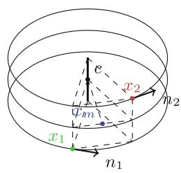  
(a) Overview.

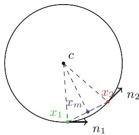  
(b) Top view.

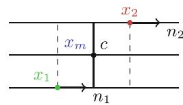  
(c) Front view.   
Fig. 1. Diagram of the center of rotation $c$ of the planar screw displacement between two position-orientations $p_1 = (x_1, n_1)$ , $p_2 = (x_2, n_2) \in \mathbb{M}_3$ .

# 5 Experiments

The standard PONITA architecture builds upon 3 scalar SE(3) invariants (collected in a column vector), as designed in Bekkers et al. [1, eq.9]:

$$
\iota \left(p _ {1}, p _ {2}\right) = \left( \begin{array}{c} \left(x _ {2} - x _ {1}\right) \cdot n _ {1} \\ \left\| \left(x _ {2} - x _ {1}\right) - \iota_ {1} \left(p _ {1}, p _ {2}\right) n _ {1} \right\| \\ \operatorname {a r c c o s} \left(n _ {1} \cdot n _ {2}\right) \end{array} \right), \tag {10}
$$

where $p_1 = (x_1, n_1)$ , $p_2 = (x_2, n_2) \in \mathbb{M}_3$ . We compare this architecture against one where these 3 invariants are completely replaced by the mav distance $\mu_{\mathcal{G}}$ :

$$
\mu_ {\mathcal {G}} \left(p _ {1}, p _ {2}\right) = \| M \left(p _ {1}, p _ {2}\right) \triangleright p _ {1} \| _ {\mathcal {G}}, \tag {11}
$$

where $\mathcal{G}$ is the SE(3) invariant metric on $\mathbb{M}_3$ determined by the learnable metric parameters $w_{1},\ldots ,w_{5}$ as described in Theorem 1, and $M(p_{1},p_{2})$ the mav generator as described in Proposition 1. We investigate if this replacement has a positive impact on the accuracy of PONITA.

Through a reparameterization of the metric parameters $w_{1},\ldots ,w_{5}$ one can enforce the (semi-)positivity constraints $w_{1},w_{2},w_{3}\geq 0$ and $w_{2}w_{3}\geq w_{4}^{2} + w_{5}^{2}$ . For example, one can define $w_{1} = a_{1}^{2}$ , $w_{2} = a_{2}^{2}$ , $w_{3} = a_{3}^{2}$ , $w_{4} = a_{4}\delta$ , and $w_{5} = a_{5}\delta$ where $\delta = 2a_2a_3 / (1 + a_4^2 +a_5^2)$ . However, in practice, enforcing these constraints yielded no noticeable benefits. We therefore left the metric parameters unconstrained, allowing the mav "distance" to take on negative values. This modification preserves the SE(3) invariance of the mav distance.

We performed some experiments on the QM9 dataset [7,8], specifically predicting properties of various molecules (134k stable small organic molecules). We choose to discretize with 16 orientations, use 6 layers, 128 dimensional features, and train for 800 epochs. All other model settings and hyperparameters are kept the same as in [1, App.E.2]. We report the mean absolute error on the test set with the model that did best on the validation set during training. The results can be found in Table 1.

We see that the use of the may distance within PONITA has a positive impact on accuracy on 7 of the 12 targets we experimented on, with an average improvement of $-4.0\%$ .

Table 1. PONITA trained to predict chemical properties of various molecules (QM9 dataset). Mean absolute error on the test set is reported (lower is better)   

<table><tr><td>Target</td><td>Unit</td><td>Bekkers et al. (10)</td><td>Mav Distance (11)</td><td>Difference %</td></tr><tr><td>μ</td><td>D</td><td>0.0195</td><td>0.0181</td><td>-07.2</td></tr><tr><td>α</td><td>a03</td><td>0.0556</td><td>0.0540</td><td>-02.9</td></tr><tr><td>εhomo</td><td>eV</td><td>0.0225</td><td>0.0229</td><td>+01.8</td></tr><tr><td>εlumo</td><td>eV</td><td>0.0205</td><td>0.0207</td><td>+01.0</td></tr><tr><td>Δε</td><td>eV</td><td>0.0414</td><td>0.0431</td><td>+04.0</td></tr><tr><td>〈R2〉</td><td>a02</td><td>0.4160</td><td>0.4942</td><td>+18.8</td></tr><tr><td>ZPVE</td><td>meV</td><td>1.5647</td><td>1.5613</td><td>-00.2</td></tr><tr><td>U0</td><td>eV</td><td>0.9920</td><td>0.7047</td><td>-28.9</td></tr><tr><td>U</td><td>eV</td><td>1.3593</td><td>1.0947</td><td>-19.5</td></tr><tr><td>H</td><td>eV</td><td>1.0204</td><td>1.0856</td><td>+06.4</td></tr><tr><td>G</td><td>eV</td><td>1.1856</td><td>0.9691</td><td>-18.3</td></tr><tr><td>cv</td><td>cal/mol K</td><td>0.0291</td><td>0.0283</td><td>-02.8</td></tr></table>

# 6 Conclusion

In Sect.3 we classified and parametrized all SE(3) invariant Riemannian metric tensor fields $\mathcal{G}$ on $\mathbb{M}_3$ . In Sect.4 we explicitly constructed the mav generator $M(p_{1},p_{2})\in \mathfrak{se}(3)$ between two position-orientations $p_1,p_2\in \mathbb{M}_3$ . These two results allowed us to use the mav distance $\mu_{\mathcal{G}}(p_1,p_2)$ as a trainable invariant in the PONITA architecture.

In Sect. 5 we performed an experimental comparison between the mav distance (11) and the invariants proposed in Bekkers et al. [1], as defined in (10). We did this by training the PONITA architecture to predict chemical properties of various molecules (QM9 dataset [7,8]). We observe marginal improvements in accuracy when using the mav distance.

Even though the improvements are marginal, our theoretical results can still find application in the processing of medical images, as evidenced by the works [4,6,9,10].

Acknowledgements. The European Union is gratefully acknowledged for financial support through project REMODEL (Horizon Europe, MSCA-SE, 101131557 https://doi.org/10.3030/101131557). The Dutch Research Council (NWO) is gratefully acknowledged for financial support via VIC.202.031 (https://www.nwo.nl/en/projects/vic202031. We thank Bekkers et al. [1] for their publicly available PONITA architecture https://github.com/ebekkers/ponita.

Data Availability. All code can be found at https://gitlab.com/gijsbel/ponita_invariants.

# References

1. Bekkers, E.J., Vadgama, S., Hesselink, R., van der Linden, P.A., Romero, D.W.: Fast, expressive SE(3) equivariant networks through weight-sharing in position-orientation space. In: ICLR (2024). https://openreview.net/forum?id=dPHLbUqGbr   
2. Christensen, A.S., von Lilienfeld, O.A.: On the role of gradients for machine learning of molecular energies and forces. Mach. Learn. Sci. Techn. 1(4) (2020). https://doi.org/10.1088/2632-2153/abba6f   
3. Duits, R., Meesters, S.P.L., Mirebeau, J.-M., Portegies, J.M.: Optimal paths for variants of the 2D and 3D reeds-Shepp car with applications in image analysis. J. Math. Imaging Vis., 1-33 (2018). https://doi.org/10.1007/s10851-018-0795-z   
4. Duits, R., Franken, E.: Left-invariant diffusions on the space of positions and orientations. IJCV 92(3), 231-264 (2011). https://doi.org/10.1007/s11263-010-0332-z   
5. Heard, W.B.: Rigid Body Mechanics: Mathematics. Physics and Applications (2005). https://doi.org/10.1002/9783527618811   
6. Portegies, J., Sanguinetti, G., Meesters, S., Duits, R.: New approximation of a scale space kernel on SE(3). In: SSVM, pp. 40-52 (2015). https://doi.org/10.1007/978-3-319-18461-6_4   
7. Ramakrishnan, R., Dral, P.O., Rupp, M., von Lilienfeld, O.A.: Quantum chemistry structures and properties of 134 kilo molecules. Sci. Data 1(1) (2014). https://doi.org/10.1038/sdata.2014.22   
8. Ruddigkeit, L., van Deursen, R., Blum, L.C., Reymond, J.L.: Enumeration of 166 billion organic small molecules in the chemical universe database GDB-17. J. Chem. Inf. Model. 52(11), 2864-2875 (2012). https://doi.org/10.1021/ci300415d   
9. Smets, B.M.N., Portegies, J., Bekkers, E.J., Duits, R.: PDE-based group equivariant convolutional neural networks. JMIV 65(1), 209-239 (2023). https://doi.org/10.1007/s10851-022-01114-x   
10. Smets, B.M.N., Portegies, J., St-Onge, E., Duits, R.: Total variation and mean curvature PDEs on the homogeneous space of positions and orientations. J. Math. Imaging Vis., 1-26 (2020). https://doi.org/10.1007/s10851-020-00991-4

# Group Morphology Fixed Points on Homogenous Spaces for Deep Learning Equivariant Networks

Gustavo Jesus Angulo

Mines Paris, PSL University, CMA-Center for Applied Mathematics, Sophia-Antipolis, Paris, France jesus.angulo_lopez@minesparis.psl.eu

Abstract. This paper presents a theoretical framework that integrates mathematical morphology with deep learning, focusing on the construction of neural network layers that inherently converge to fixed points through iterative application. Drawing from the principles of idempotence and convergence in complete lattices, we propose a class of nonlinear operators that can be embedded into deep architectures to enhance stability and reduce parameter complexity. The framework is extended to group-equivariant settings on homogeneous spaces, enabling the design of layers that respect symmetries in the data. We formalize the construction of equivariant fixed-point layers using group convolutions and max-plus algebra operators, and we characterize their convergence properties. This work lays the mathematical foundation for future implementations of fixed-point layers in deep learning, particularly in contexts where equivariance and stability are desirable.

Keywords: deep learning $\cdot$ group morphology $\cdot$ fixed-point operator $\cdot$ fixed-point neural networks

# 1 Introduction

A foundational question in convolutional neural networks (CNNs) and deep neural networks (DNNs) concerns the idea that adjacent layers may apply nearly identical operations (like in an iterative process) or that looping certain layers can improve performance, in some cases there is even a convergence to a stable output (relevant for instance in tasks as image-to-image transformations). All these situations suggest the relevance of fixed-point iterations of layers and its interest in their efficiency (reducing number of parameters) and their representation capability. Besides the proper implementation of these layers by training the fixed points from a dataset [9], some recent works have provided significant advances on the analytical understanding of fixed-point iterations on

DNNs [3,10]. The problem is stated as follows. Let us consider a single layer of a neural network in the form of the operator $\psi (x;W,b) = \alpha (Wx + b)$ ( $x$ is the input vector, $\alpha$ the pointwise activation function and $W$ and $b$ the weights and bias respectively). The $N$ -iterated (or looped) layer neural network is defined as

$$
\mathrm {N N} (x ^ {0}; W, b, N) = x ^ {N};
$$

$$
x ^ {n} = \psi (x ^ {n - 1}; W, b), 1 \leq n \leq N, x ^ {0} = x.
$$

There exists a fixed-point state $p$ when $\lim_{N\to +\infty}\mathrm{NN}(x^0;W,b,N) = p$ . Note that this looped neural network can look similar to a Recurrent Neural Network (RNN), but a RNN has new input data at each iteration and RNN generates outputs in each loop. The goal in the works [3,10] is to study the conditions of the learnt parameters $W,b$ under which $\mathrm{NN}(x^0;W,b,N)$ converges to a fixed point; or in [19] the use efficient numerical methods for the iteration process.

In this paper we explore how mathematical morphology theory can help to introduce DNN nonlinear layers which produce fixed points by construction, without relying on getting them by learning specific parameters. Indeed, in mathematical morphology, it is common to obtain powerful algorithms by iterating a certain operator $\psi$ until stability is reached. There are two notions which are important in that context:

1) Idempotent: stability to self-composition, i.e., $\psi \circ \psi = \psi^2 = \psi$   
2) Fixed point: iterating (countably infinitely many times) a certain operator until stability is reached, i.e., $\psi^{n + 1} = \psi \circ \psi^n = \psi^n$ . Denoted by $\psi^{\infty}$ .

Iterative techniques do not always work, as they may give rise to oscillations, e.g., median filter. Or convergence is not always guaranteed in the continuous case. As soon as the operator $\psi$ reduces (anti-extensivity) or expands (extensivity) the object under study in the finite case, one has $\psi^{n + 1} = \psi^n$ for finite $n$ . In the first part of this paper, we revisit the theory of idempotent and fixed point operators in the framework of mathematical morphology following Heijmans and Serra [12]. One of the most useful morphological fixed point operators is the geodesic reconstruction. We have proposed a deep learning layer which implements it [18] by means of a control flow function.

In recent years, the design of DNN architectures has increasingly focused on incorporating structural priors such as symmetry and invariance. One particularly promising direction is the integration of group equivariance into CNNs, enabling models to respect transformations inherent in the data. Let us consider a group $\mathbb{G}$ and a CNN layer $\psi$ , a $\mathbb{G}$ -CNN means that $\psi$ is equivariant to the group action $T_{g}$ , $g \in \mathbb{G}$ ; i.e., $\Psi(T_{g}f) = T_{g}'\Psi(f)$ . We consider that feature maps in these networks represent functions (or image fields) $f(x)$ on a homogeneous space and the layers are equivariant maps between spaces of functions, i.e., $[T_{g}f](x) = [f \circ g^{-1}](x) = f(g^{-1}x)$ . The theoretical study and implementation of equivariant CNNs and more generally of equivariance in deep learning is an active area with many contributions, from a theoretical perspective view [8, 11]. As a matter of fact, recent work on group equivariant networks either using lattice group operators or PDE-based solutions have shown promising results [13, 14].

See also complements on the theoretical foundations of DNN lattice-based group morphology [2] or group PDE-CNNs [4].

This paper explores the intersection of these two domains by proposing a theoretical framework for group-equivariant morphological operators that naturally yield fixed points through iteration. Our goal is to lay the mathematical foundation for constructing deep learning layers that are both nonlinear and equivariant, and that converge to stable representations without requiring parameter tuning for convergence.

# 2 Iteration and Idempotence

# 2.1 Order Continuity of Morphological Operators

Order Convergence. Given a sequence $X_{n}$ in the complete lattice $\mathcal{L}$ , define the limits

$$
\liminf X_{n} = \bigvee_{n\geq 1}\bigwedge_{k\geq n}X_{k};\quad \limsup X_{n} = \bigwedge_{n\geq 1}\bigvee_{k\geq n}X_{k}.
$$

In the following notation, $X_{n} \downarrow X$ means that $X_{n}$ is a decreasing sequence $(X_{n} \leq X_{n-1})$ and $\bigwedge_{n \geq 1} X_{n} = X$ . Dually, $X_{n} \uparrow X$ means that $X_{n}$ is an increasing sequence $(X_{n} \geq X_{n-1})$ and $\bigvee_{n \geq 1} X_{n} = X$ . Given a sequence $X_{n}$ in the complete lattice $\mathcal{L}$ and an element $X \in \mathcal{L}$ , we say that $X_{n}$ (order-) converges to $X$ , written $X_{n} \to X$ , if $\lim \inf X_{n} = \lim \sup X_{n} = X$ . Consider a sequence $X_{n}$ in the complete lattice $\mathcal{L}$ . If $X_{n} \downarrow X$ or $X_{n} \uparrow X$ , then $X_{n} \to X$ .

Order Continuity. We now define lower and upper continuity of operators between complete lattices. Given two complete lattices $\mathcal{L}$ and $\mathcal{M}$ and an operator $\psi : \mathcal{L} \to \mathcal{M}$ , we say that $\psi$ is $\downarrow$ -continuous if $X_{n} \to X$ in $\mathcal{L}$ implies that $\lim \sup \psi(X_{n}) \leq \psi(X)$ . Dually, we say that $\psi$ is $\uparrow$ -continuous if $X_{n} \to X$ in $\mathcal{L}$ implies that $\psi(X) \leq \lim \inf \psi(X_{n})$ . If $\psi$ is both $\downarrow$ -continuous and $\uparrow$ -continuous, then we say that $\psi$ is $\uparrow$ -continuous.

Let $\psi$ be an increasing operator between the complete lattices $\mathcal{L}$ and $\mathcal{M}$ . The following statements are equivalent: i) $\psi$ is $\downarrow$ -continuous; ii) $X_{n} \downarrow X$ implies that $\psi(X_{n}) \downarrow \psi(X)$ for every sequence $X_{n}$ , and iii) $\lim \sup \psi(X_{n}) \leq \psi(\lim \sup X_{n})$ for every sequence $X_{n}$ . The case of $\psi$ being $\uparrow$ -continuous can be shown analogously.

In the case of morphological operators the following results are key [12]: a) Every erosion $\varepsilon$ is $\downarrow$ -continuous; b) Every dilation $\delta$ is $\uparrow$ -continuous; c) Every automorphism $\tau$ is $\uparrow$ -continuous; d) Every negation $\mathbb{C}$ is $\uparrow$ -continuous; e) The infimum $\bigwedge$ of an arbitrary collection of $\downarrow$ -continuous operators is $\downarrow$ -continuous; f) The supremum $\bigvee$ of an arbitrary collection of $\uparrow$ -continuous operators is $\uparrow$ -continuous.

Finite Window Operators. Let $A$ be a finite structuring element in $E$ ( $\mathbb{R}^n$ or $\mathbb{Z}^n$ ). The dilation $X \mapsto \delta_A(X) = X \oplus A$ , the erosion $X \mapsto \varepsilon_A(X) = X \ominus A$ , the closing $X \mapsto (X \oplus A) \ominus A$ and the opening $X \mapsto (X \ominus A) \oplus A$ are all four $\updownarrow$ -continuous.

Consider an operator $\psi$ on $\mathcal{P}(E)$ ; assume that $W(h)$ is a finite subset of $E$ for every $h\in E$ . We say that $\psi$ is a finite window operator with window $W$ if

$$
h \in \psi (X) \iff h \in \psi (X \cap Z), \forall h \in E, X \subseteq E \text {a n d} W (h) \subseteq Z.
$$

If $\psi$ is increasing, it suffices to assume $h\in \psi (X)$ iff $h\in \psi (X\cap W(h))$ . If $\psi$ is translation equivariant, one can take $W(h) = W_{h}$ , where $W\subseteq E$ . For example, convolution (with padding) on $\mathcal{P}(E)$ is a translation equivariant but non-increasing finite window operator. Every finite window operator on $\mathcal{P}(E)$ is $\uparrow$ -continuous. For more general situations, we work on the set of functions $f:E\to \overline{\mathbb{R}} = \mathbb{R}\cup \{-\infty , + \infty \}$ , the extended real line. Let $\varPsi$ be an increasing flat operator on functions $f\in \mathcal{L}(E,\overline{\mathbb{R}})$ , that means that $\varPsi$ can be generated by applying the set operator to the upper level sets of the function $f$ , i.e., $\mathbf{X}(\varPsi(f),t)=\psi(\mathbf{X}(f,t))$ with $\mathbf{X}(g,t)=\{x\in E:g(x)\geq t\}$ : if $\psi$ is $\downarrow$ -continuous, then $\varPsi$ is $\downarrow$ -continuous as well; if $\psi$ is $\uparrow$ -continuous, then $\varPsi$ is $\uparrow$ -continuous as well. Given a finite window set operator $\psi$ , the increasing flat function operator $\varPsi$ generated by $\psi$ is a finite window operator.

Every finite window operator on $\mathcal{F}(E, \overline{\mathbb{R}})$ is $\updownarrow$ -continuous. As a consequence, any morphological operator applied to digital images is $\updownarrow$ -continuous.

# 2.2 Fixed Point Operators

Convergence of Operators. Let $\psi$ be an operator on the complete lattice $\mathcal{L}$ . We say that $\psi_{n}$ converges to operator $\psi$ on $\mathcal{L}$ , denoted by $\psi_{n} \to \psi$ , if $\psi_{n}(X) \to \psi(X)$ for every $X \in \mathcal{L}$ .

Then, if $\tau$ is an automorphism on $\mathcal{L}$ (i.e., it distributes over infima and suprema) and $\psi_n\tau = \tau \psi_n$ for every $n$ , then $\psi \tau = \tau \psi$ . This result allows to consider group equivariance beyond the translations. If every $\psi_n$ is increasing, then $\psi$ is increasing too. If $\phi, \phi_n$ are operators such that $\phi_n \to \phi$ and if $\phi_n \leq \psi_n$ for every $n$ , then $\phi \leq \psi$ (important for extensivity and anti-extensivity). Finally, if $\mathcal{L}$ has a negation and $\psi^* = \mathbb{C}\psi\mathbb{C}$ , then $\psi_n^* \to \psi^c$ .

Let $\psi$ be an operator on the complete lattice $\mathcal{L}$ . We denote by $\psi^n$ the $n$ -fold composition of $\psi$ , i.e., $\psi^n = \psi \psi^{n-1}$ , with $\psi^1 = \psi$ . If the sequence $\psi^n(X)$ converges for all $X \in \mathcal{L}$ , we define the limit operator $\psi^\infty$ as the pointwise limit:

$$
\psi^ {\infty} (X) = \lim  _ {n \to \infty} \psi^ {n} (X).
$$

If $\psi^{\infty}\psi = \psi^{\infty}$ , then $\psi^{\infty}$ is idempotent and $\mathrm{Inv}(\psi^{\infty}) = \mathrm{Inv}(\psi)$ .

If $\psi$ is $\downarrow$ -continuous and $\psi^n \to \psi^\infty$ , then $\psi^\infty \leq \psi \psi^\infty$ . If $\psi$ is $\uparrow$ -continuous and $\psi^n \to \psi^\infty$ , then $\psi^\infty \geq \psi \psi^\infty$ . If $\psi$ is $\downarrow$ -continuous and anti-extensive, then $\psi^\infty = \bigwedge_{n \geq 1} \psi^n$ is idempotent. If $\psi$ is $\uparrow$ -continuous and extensive, then $\psi^\infty = \bigvee_{n \geq 1} \psi^n$ is idempotent. If $\psi$ is $\uparrow$ -continuous and $\psi^n \to \psi^\infty$ , then $\psi^\infty$ is idempotent.

Openings and Closings from any Increasing Operator. Suppose that $\psi$ is an increasing operator on a complete lattice $\mathcal{L}$ .

(a) If $\psi$ is $\downarrow$ -continuous, then $\psi^{op} = (\mathrm{Id} \wedge \psi)^{\infty}$ is an opening (idempotent and anti-extensive).

(b) If $\psi$ is $\uparrow$ -continuous, then $\psi^{cl} = (\operatorname{Id} \vee \psi)^{\infty}$ is a closing (idempotent and extensive).

Order continuity requirement is essential in the general non-finite case. As any finite window operator $\psi$ is continuous, fixed point of $(\mathrm{Id} \wedge \psi)$ yields an opening $\psi^{op}$ and fixed point of $(\mathrm{Id} \vee \psi)$ a closing $\psi^{cl}$ both from the same operator $\psi$ .

This result can be extended to collections of operators. Let $\psi_1, \psi_2, \dots, \psi_p$ be a collection of $p$ increasing operators on the complete lattice $\mathcal{L}$ , if every $\psi_i$ is anti-extensive ( $\psi_i \leq \mathrm{Id}$ ), then $(\psi_1 \circ \psi_2 \circ \dots \circ \psi_p)^\infty = (\psi_1 \wedge \psi_2 \wedge \dots \wedge \psi_p)^\infty$ . If every $\psi_i$ is extensive ( $\psi_i \geq \mathrm{Id}$ ), then $(\psi_1 \circ \psi_2 \circ \dots \circ \psi_p)^\infty = (\psi_1 \vee \psi_2 \vee \dots \vee \psi_p)^\infty$ .

The second expressions involve a computation in parallel, independently of the order. In order to force anti-extensivity replace $\psi_{i}$ by $\psi_{i} \wedge \mathrm{Id}$ , and extensivity, $\psi_{i} \mapsto \psi_{i} \vee \mathrm{Id}$ .

# 3 Morphological Group Equivariant Operators on Homogeneous Spaces

# 3.1 Group Morphological Operators for Boolean Lattices

Let us consider $E$ to be a homogeneous space on which a group $\mathbb{G}$ is acting transitively on $E$ . The object space of interest is the Boolean lattice $\mathcal{P}(E)$ of all subsets of $E$ . The strategy to introduce the group operators on $\mathcal{P}(E)$ will consist in three steps: 1) defining Minkowski operators on $\mathcal{P}(\mathbb{G})$ , then 2) using a lifting of subsets of $E$ to subsets of $\mathbb{G}$ , apply these operators, and finally 3) projecting the corresponding result back to the original space $E$ .

Dilation and Erosion on $\mathcal{P}(\mathbb{G})$ . A mapping $\varPsi:\mathcal{P}(\mathbb{G})\to \mathcal{P}(\mathbb{G})$ is called $\mathbb{G}$ -left-equivariant when, for all $g\in \mathbb{G}$ , $\varPsi(gG)=g\varPsi(G)$ , $\forall G\in \mathcal{P}(\mathbb{G})$ . And similarly, a $\mathbb{G}$ -right-equivariant implies for all $\forall G\in \mathcal{P}(\mathbb{G})$ , $\varPsi(Gg)=\varPsi(G)g$ .

The dilation and erosion on $\mathcal{P}(\mathbb{G})$ will be defined as the $\mathbb{G}$ -equivariant mappings commuting with unions and intersections respectively. Let $H$ be a fixed subset of $\mathbb{G}$ , called the group structuring element, we define the $\mathbb{G}$ -left-equivariant dilation and erosion of $G$ by $H$ as

$$
\delta_ {H} ^ {l} (G) = G \oplus_ {\mathbb {G}} ^ {l} H = \bigcup_ {h \in H} G h = \bigcup_ {g \in G} g H = \left\{k \in \mathbb {G}: (k \check {H}) \cap G \neq \emptyset \right\}, \tag {1}
$$

$$
\varepsilon_ {H} ^ {l} (G) = G \ominus_ {\mathbb {G}} ^ {l} H = \bigcap_ {h \in H} G h ^ {- 1} = \{g \in \mathbb {G}: g H \subseteq G \}, \tag {2}
$$

where $gH = \{gh : h \in H\}$ , $Hg = \{hg : h \in H\}$ and $\tilde{H} = \{h^{-1} : h \in H\}$ .

The pair $(\delta_H^l,\varepsilon_H^l)$ forms an adjunction and all $\mathbb{G}$ -left-equivariant adjunctions on $\mathcal{P}(\mathbb{G})$ are of this form [16]. The duality by complement is given by the fact that $\big(G\oplus_{\mathbb{G}}^{l}H\big)^{c} = G^{c}\ominus_{\mathbb{G}}^{l}H^{-1}$ . Because of the non-commutativity of the set product $G\oplus_{\mathbb{G}}^{l}H$ , it is possible to introduce $\mathbb{G}$ -right-equivariant dilation and erosion.

Lifting and Projections Operators. Let $\omega \in E$ be a fixed origin. The lifting operator $\vartheta : \mathcal{P}(E) \to \mathcal{P}(\mathbb{G})$ maps a subset $X \subseteq E$ to the set of group elements that map $\omega$ into $X$ :

$$
\vartheta (X) = \{g \in \mathbb {G}: g \omega \in X \}.
$$

The projection operator $\pi : \mathcal{P}(\mathbb{G}) \to \mathcal{P}(E)$ maps a subset $G \subseteq \mathbb{G}$ to the set of points in $E$ reached from $\omega$ :

$$
\pi (G) = \{g \omega : g \in \mathbb {G} \}.
$$

The main benefit of creating these maps is that they translate the group action on $X$ into multiplication in $\mathbb{G}$ . The stabilizer-projection operator $\pi_{\Sigma}:\mathcal{P}(\mathbb{G})\to \mathcal{P}(E)$ first extracts the cosets and then carries out the projection $\pi$ :

$$
\pi_ {\Sigma} = \pi \varepsilon_ {\Sigma} ^ {l} (G),
$$

where the erosion by the stabilizer $\Sigma$ ; i.e., $\varepsilon_{\Sigma}^{l}(G) = G \ominus_{\mathbb{G}}^{l} \Sigma$ has the property $\varepsilon_{\Sigma}^{l}(G) = \varepsilon_{\Sigma}^{l}(\varepsilon_{\Sigma}^{l}(G)) = \delta_{\Sigma}^{l}(\varepsilon_{\Sigma}^{l}(G))$ which implies that $\varepsilon_{\Sigma}^{l}$ is an idempotent operator in $\mathcal{P}(\mathbb{G}) \to \mathcal{P}(\mathbb{G})$ providing the invariant elements to $\Sigma$ .

All the operators $\vartheta$ , $\pi$ , $\pi_{\Sigma}$ are increasing and $\mathbb{G}$ -equivariant [16].

$\mathbb{G}$ -Equivariant Dilation and Erosion on $\mathcal{P}(E)$ . A $\mathbb{G}$ -equivariant operator $\varPsi$ on $\mathcal{P}(E)$ can be constructed by using the group operator $\tilde{\varPsi}$ according to the following commuting diagram:

$$
\begin{array}{ccc}\mathcal{P}(\mathbb{G}) & \xrightarrow{\tilde{\varPsi}} & \mathcal{P}(\mathbb{G})\\ \big{\uparrow}_{\vartheta} & & \big{\downarrow}_{\pi}\\ \mathcal{P}(E) & \xrightarrow{\varPsi} & \mathcal{P}(E) \end{array}
$$

Let us consider in particular the $\mathbb{G}$ -equivariant dilation and erosion on $\mathcal{P}(E)$ . For any set $X\in \mathcal{P}(E)$ and structuring element $B\in \mathcal{P}(E)$ :

$$
\delta_ {B} ^ {\mathbb {G}} (X) = \pi [ \vartheta (X) \oplus_ {\mathbb {G}} ^ {l} \vartheta (B) ] = \bigcup_ {g \in \vartheta (X)} g B, \tag {3}
$$

$$
\varepsilon_ {B} ^ {\mathbb {G}} (X) = \pi_ {\Sigma} [ \vartheta (X) \ominus_ {\mathbb {G}} ^ {l} \vartheta (B) ] = \bigcap_ {g \in \vartheta \left(X ^ {c}\right)} g \hat {B} ^ {*}, \tag {4}
$$

with $\hat{B}^{*} = \left(\pi (\check{\vartheta} (Y))\right)^{c}$

# 3.2 $\mathbb{G}$ -Equivariant Dilation and Erosion on $\mathcal{L}$

The generalization to non-Boolean lattices and particular to the case of numerical functions is based on the notion of sup-generating families of a lattice. A subset $l$ of a complete lattice $\mathcal{L}$ is called sup-generating if every element of $\mathcal{L}$ can be written as a supremum of elements of $l$ .

For every $X \in \mathcal{L}$ , let $l(X) = \{x \in l : x \leq X\}$ and $X = \bigvee l(X)$ . Let $\mathcal{L}$ be a complete lattice with an automorphism group $\mathbb{G}$ and a sup- generating subset $l$ such that: i) $l$ is $\mathbb{G}$ -equivariant; i.e., for every $g \in \mathbb{G}$ and $x \in l$ , $gx \in l$ ; ii) $\mathbb{G}$ is transitive on $l$ : for every $x, y \in l$ there exists at least one $g \in \mathbb{G}$ such that $gx = y$ .

In that case, the construction of operators follows the commuting diagram:

$$
\begin{array}{l} \mathcal {P} (\mathbb {G}) \xrightarrow {\tilde {\Psi}} \mathcal {P} (\mathbb {G}) \\ \begin{array}{c c} \uparrow & \vartheta \\ & \downarrow \end{array} \\ \mathcal {P} (l) \xrightarrow {\tilde {\bar {\Psi}}} \mathcal {P} (l) \\ \begin{array}{c c} \uparrow & l \\ & \downarrow \mathsf {V} \end{array} \\ \begin{array}{c c c} \mathcal {L} & \xrightarrow {\Psi} & \mathcal {L} \end{array} \\ \end{array}
$$

Given a mapping $\varPsi:\mathcal{L}\to \mathcal{L}$ we lift it to a mapping $\tilde{\varPsi}$ on $\mathcal{P}(\mathbb{G})$ as follows. First we go from $\mathcal{L}$ to $\mathcal{P}(l)$ by using the operator $l$ . Then we move from $\mathcal{P}(l)$ to $\mathcal{P}(\mathbb{G})$ by applying $\vartheta$ . We apply the group operators on $\mathcal{P}(\mathbb{G})$ and finally project the results back. Hence, using the intermediary $\tilde{\tilde{\varPsi}} = \pi \tilde{\varPsi}\vartheta$ , one has

$$
\varPsi = \bigvee \tilde {\bar {\varPsi}} l = \bigvee \pi \tilde {\varPsi} \vartheta l.
$$

All relevant algebraic properties of $\tilde{\varPsi}$ are transferred to $\varPsi$ .

Example: A structural $\mathbb{G}$ -opening $\gamma_B^{\mathbb{G}}$ on $\mathcal{L}$ by $B\in \mathcal{L}$ defined as

$$
\gamma_ {B} ^ {\mathbb {G}} (X) = \bigvee \left\{g B: g \in \mathbb {G}, g B \leq X \right\},
$$

is the product of a $\mathbb{G}$ -erosion $\varepsilon_B^\uparrow : \mathcal{L} \to \mathcal{P}(\mathbb{G})$ followed by its adjoint $\mathbb{G}$ -dilation $\delta_B^\downarrow : \mathcal{P}(\mathbb{G}) \to \mathcal{L}$ , i.e., $\gamma_B^\mathbb{G}(X) = \delta_B^\downarrow \varepsilon_B^\uparrow(X)$ where

$$
\begin{array}{l} \varepsilon_ {B} ^ {\uparrow} (X) = \vartheta (l (X)) \ominus_ {\mathbb {G}} ^ {l} \vartheta (l (B)), X \in \mathcal {L}, \\ \delta_ {B} ^ {\downarrow} (G) = \bigvee \pi \left[ G \oplus_ {\mathbb {G}} ^ {l} \vartheta (l (B)) \right], \quad G \in \mathcal {P} (\mathbb {G}). \\ \end{array}
$$

Sup-generating Family for Images $f \in \mathcal{F}(E, \overline{\mathbb{R}})$ . The lattice of numerical functions has a natural sup-generating family $l$ given by the impulse functions $f_{x,t}$ , $x \in E$ , $t \in \overline{\mathbb{R}}$ defined by

$$
f _ {x, t} (y) = \left\{ \begin{array}{l l} t, & y = x \\ - \infty , & y \neq x \end{array} \right.
$$

For the complete results on that case, the reader is invited to read [16]. In the framework of this paper, we propose to introduce numerical group operators as group convolutions in $(\max, +)$ -algebra which could be represented by the impulse functions.

# 4 Equivariant Morphological Fixed Point Layers in DNNs

# 4.1 From Group Convolution to Group Dilations/Erosions for Functions

Given a compact group $\mathbb{G}$ , the group convolution (or more precisely, "correlation") layer between $\mathbb{G}$ -feature maps in $L_{2}(\mathbb{G})$ with kernel $k$ is given by [7]

$$
(f \star_ {\mathbb {G}} k) (g) = \int_ {\mathbb {G}} f (h) k \left(g ^ {- 1} h\right) d h, \tag {5}
$$

where $dh$ is the left Haar measure on $\mathbb{G}$ . Note that the feature map $f \in \mathcal{F}(\mathbb{G},\mathbb{R})$ has been lifted to $\mathbb{G}$ .

Let us consider the counterpart group convolution in tropical semirings. We work on the set of functions, or $\mathbb{G}$ -feature maps, $f: \mathbb{G} \to \bar{\mathbb{R}}$ , where instead of square integrability we need upper (or lower) semi-continuity on $\mathbb{G}$ . The $\mathbb{G}$ -equivariant max-plus dilation and adjoint erosion of function $f$ by the structuring function $b$ , with $f, b \in \mathcal{F}(\mathbb{G}, \bar{\mathbb{R}})$ , are defined as: $\forall g \in \mathbb{G}$

$$
(f \oplus_ {\mathbb {G}} b) (g) = \sup  _ {h \in \mathbb {G}} \left\{f (h) + b \left(g h ^ {- 1}\right) \right\}, \tag {6}
$$

$$
(f \ominus_ {\mathbb {G}} b) (g) = \inf  _ {h \in \mathbb {G}} \left\{f (h) - b \left(g ^ {- 1} h\right) \right\}. \tag {7}
$$

# 4.2 G-Equivariant Fixed Points

We have now all the theoretical ingredients to introduce non-linear $\mathbb{G}$ -equivariant fixed point layers in DCNNs. Let $f: E \to \overline{\mathbb{R}}$ be a feature map on a homogeneous space $E$ , and let $\psi$ be a $\mathbb{G}$ -equivariant operator (e.g., group convolution (5), dilation (6), or erosion (7)). We define the fixed-point iteration:

$$
\psi^ {o p} (f) (x) = \bigvee \pi \left(\lim  _ {n \rightarrow \infty} [ \vartheta (l (f)) \wedge \psi^ {n} (\vartheta (l (f))) ]\right) (x), \tag {8}
$$

where $l$ is sup-generating operator, $\vartheta$ is the lifting operator and $\pi$ is the projection. The sequence is given by:

$$
\psi^ {1} \left(\vartheta (l (f))\right) (g) = \vartheta (l (f)) (g) \wedge \psi (\vartheta (l (f))) (g),
$$

$$
\psi^ {n} \left(\vartheta (l (f))\right) (g) = \vartheta (l (f)) (g) \wedge \psi [ \psi^ {n - 1} (\vartheta (l (f))) ] (g), \quad n > 1.
$$

where we have the possibilities for either group kernel $k$ group structuring function $b$ with $k, b: \mathbb{G} \to \mathbb{R}$ :

$$
\psi \left(\vartheta (l (f))\right) (g) = (\vartheta (l (f)) \star_ {\mathbb {G}} k) (g),
$$

$$
\psi \left(\vartheta (l (f))\right) (g) = (\vartheta (l (f)) \oplus_ {\mathbb {G}} b) (g),
$$

$$
\psi \left(\vartheta (l (f))\right) (g) = (\vartheta (l (f)) \ominus_ {\mathbb {G}} b) (g).
$$

The operator $\psi^{op}(f)$ is guaranteed to be anti-extensive, i.e., $\psi^{op}(f)(x) \leq f(x) \forall x \in E$ . Similar expressions for $\psi^{cl}(f)$ replacing the infimum $\wedge$ by the supremum $\vee$ provide other extensive fixed points.

Remark: In implementation, we approximate $\psi^{\infty}$ by iterating until convergence or a fixed number of steps $n$ , typically small (e.g., 5-10), depending on the operator's contractivity.

Note that any learned structuring function $b$ or kernel $k$ will provide fixed points. The results are valid in the continuous case for the opening by dilation and the closing by erosion. In the case of convolution, additional conditions are required to have increasing operators. That will be considered in detail in ongoing work. More general fixed points can be obtained using our framework using combinations (weighted sums, supremum, infimum, etc.) of morphological or convolution operators with finite structuring functions.

# 5 Conclusion and Perspectives

This paper has introduced a theoretical framework for constructing nonlinear, group-equivariant fixed-point layers in deep neural networks using tools from mathematical morphology. By grounding our approach in the theory of complete lattices and morphological operators, we have shown how fixed-point behavior and idempotence can be achieved by design, rather than through parameter learning. The extension of these ideas to homogeneous spaces via group actions enables the formulation of symmetry-preserving layers that are both interpretable and mathematically grounded.

While the focus of this work has been theoretical, it opens several promising directions for future research and practical implementation. One key challenge is the integration of these fixed-point morphological layers into trainable architectures, particularly with respect to backpropagation. Recent work on training morphological networks [5] and tropical backpropagation [6,17] has highlighted the difficulty of differentiating through non-smooth morphological operations. Addressing this challenge either through smooth parameterizations or structuring functions or alternative optimization strategies will be essential for deploying these layers in end-to-end learning systems.

Another important direction is the development of efficient numerical schemes for approximating fixed points in practice. While our framework guarantees convergence under certain conditions, practical implementations will require finite approximations [18], and the trade-off between convergence speed and accuracy must be carefully studied.

Finally, we think the proposed framework invites exploration in application domains where symmetry, stability, and interpretability are crucial, such as medical imaging, physics-informed learning, and structured data analysis. We believe that the integration of morphological reasoning into deep learning architectures offers a rich and underexplored avenue for building robust and principled models.

# References

1. Angulo, J.: Some open questions on morphological operators and representations in the deep learning era. In: Lindblad, J., Malmberg, F., Sladoje, N. (eds.) DGMM 2021. LNCS, vol. 12708, pp. 3-19. Springer, Cham (2021). https://doi.org/10.1007/978-3-030-76657-3_1   
2. Angulo, J.: Nonlinear representation theory of equivariant CNNs on homogeneous spaces using group morphology. In: Brunetti, S., Frosini, A., Rinaldi, S. (eds.) Proceedings of DGMM 2024 (Discrete Geometry and Mathematical Morphology), LNCS 14605, Springer, Cham (2024). https://doi.org/10.1007/978-3-031-57793-2_20   
3. Berlyand, L., Slavin, V.: Fixed points of deep neural networks: emergence, stability, and applications. arXiv preprint. arXiv:2501.04182 (2025)   
4. Bellaard, G., Sakata, S., Smets, B.M.N., Duits, R.: PDE-CNNs: axiomatic derivations and applications. J. Math. Imaging Vis. 67(2) (2025). https://doi.org/10.1007/s10851-025-01230-4   
5. Blusseau, S.: Training morphological neural networks with gradient descent: some theoretical insights. In: Brunetti, S., Frosini, A., Rinaldi, S. (eds.) Proceedings of DGMM 2024 (Discrete Geometry and Mathematical Morphology), LNCS 14605, Springer, Cham (2024). https://doi.org/10.1007/978-3-031-57793-2_18   
6. Ceyhan, O., Lucchetti, F.: Tropical Backpropagation. arXiv preprint (2024)   
7. Cohen, T.S., Welling, M.: Group equivariant convolutional networks. In: International of Conference on Machine Learning, pp. 2990-2999 (2016)   
8. Cohen, T.S., Geiger, M., Weiler, M.: A general theory of equivariant CNNs on homogeneous spaces. In: Advances in Neural Information Processing Systems, vol. 32 (2019)   
9. Jeon, Y., Lee, M., Choi, J.Y.: Differentiable forward and backward fixed-point iteration layers. IEEE Access 9, 18383-18392 (2021)   
10. Ke, Y., Li, X., Liang, Y., Shi, Z., Song, Z.: Advancing the understanding of fixed point iterations in deep neural networks: a detailed analytical study. arXiv preprint. arXiv:2410.11279 (2024)   
11. Kondor, R., Trivedi, S.: On the generalization of equivariance and convolution in neural networks to the action of compact groups. Proc. Mach. Learn. Res. 80, 2747-2755 (2018)   
12. Heijmans, H.J.A.M., Serra, J.: Convergence, continuity, and iteration in mathematical morphology. J. Vis. Commun. Image Represent. 3(1), 84-102 (1992)   
13. Pai, G., Bellaard, G., Smets, B.M.N., Duits, R.: Functional Properties of PDE-Based Group Equivariant Convolutional Neural Networks. In: Nielsen, F., Barbaresco, F. (eds.) Proceedings of GSI, LNCS 14071, Springer, Cham (2023). https://doi.org/10.1007/978-3-031-38271-0_7   
14. Penaud-Polge, V., Velasco-Forero, S., Angulo, J.: Group equivariant networks using morphological operators. In: Brunetti, S., Frosini, A., Rinaldi, S. (eds.) Proceedings of DGMM 2024 (Discrete Geometry and Mathematical Morphology), LNCS, Springer, Cham (2024). https://doi.org/10.1007/978-3-031-57793-2_13   
15. Roerdink, J.B.T.M., Heijmans, H.J.A.M.: Mathematical morphology for structures without translation symmetry. Signal Process. 15(3), 271-277 (1988)   
16. Roerdink, J.B.T.M.: Group morphology. Pattern recognition   
17. Smets, B.M.N., Donker, P.D., Portegies, J.W.: Semiring activation in neural networks arXiv preprint. arXiv:2405.18805 (2025)

18. Velasco-Forero, S., Rhim, A., Angulo, J.: Fixed point layers for geodesic morphological operations. In: Proceedings of BMVC 2022 (2022)   
19. Zappala, E., Levine, D., He, S., Rizvi, S., Levy, S., van Dijk, D.: Operator learning meets numerical analysis: improving neural networks through iterative methods. arXiv preprint arXiv:2310.01618 (2024)

# Flow Matching on Lie Groups

Finn M. Sherry $^{(\text{四})}$ and Bart M. N. Smets

CASA & EAISI, Department of Mathematics and Computer Science, Eindhoven University of Technology, Eindhoven, The Netherlands {f.m.sherry,b.m.n.smets}@tue.nl

Abstract. Flow Matching (FM) is a recent generative modelling technique: we aim to learn how to sample from distribution $\mathfrak{X}_1$ by flowing samples from some distribution $\mathfrak{X}_0$ that is easy to sample from. The key trick is that this flow field can be trained while conditioning on the end point in $\mathfrak{X}_1$ : given an end point, simply move along a straight line segment to the end point [6]. However, straight line segments are only well-defined on Euclidean space. Consequently, [3] generalised the method to FM on Riemannian manifolds, replacing line segments with geodesics or their spectral approximations. We take an alternative point of view: we generalise to FM on Lie groups with surjective exponential maps by instead substituting exponential curves for line segments. This leads to a simple, intrinsic, and fast implementation for many matrix Lie groups, since the required Lie group operations (products, inverses, exponentials, logarithms) are simply given by the corresponding matrix operations. FM on Lie groups could then be used for generative modelling with data consisting of sets of features (in $\mathbb{R}^n$ ) and poses (in some Lie group), e.g. the latent codes of Equivariant Neural Fields [10].

Keywords: Flow Matching $\cdot$ Lie Groups $\cdot$ Exponential Curves $\cdot$ Generative Modelling

# 1 Introduction

The aim of generative modelling is to learn how to sample from distribution $\mathfrak{X}$ , given a large data set of samples. Chen et al. [4] proposed learning a flow from some distribution $\mathfrak{X}_0$ that is easy to sample from, e.g. white noise, to the target distribution $\mathfrak{X} \coloneqq \mathfrak{X}_1$ . Concretely, we look for a smooth flow $\psi : [0,1] \to \mathrm{Diff}(\mathbb{R}^d)$ such that $\mathfrak{X}_1 = (\psi_1)_\# \mathfrak{X}_0$ , with $\#$ the measure push-forward. We can then define intermediate distributions $\mathfrak{X}_t \coloneqq (\psi_t)_\#\mathfrak{X}_0$ . Such a flow is induced by a time dependent smooth vector field $u:[0,1] \to \Gamma(T\mathbb{R}^d)$ , satisfying $\partial_t\psi_t(\pmb{x}) = u_t(\psi_t(\pmb{x}))$ for all $\pmb{x} \in \mathbb{R}^d$ . Hence, if we have the vector field $u$ , we can determine the flow $\psi$ by integrating. We therefore now proceed by looking for such a vector field instead of a flow.

Chen et al. [4] suggest approximating such a vector field by training a neural network $u^{\theta}$ . Typically, however, we will not have access to a vector field $u$ inducing the desired flow during training: we only have samples from the distributions

$\mathfrak{X}_0$ and $\mathfrak{X}_1$ . Consequently, the naive flow matching loss

$$
\mathcal {L} _ {\mathrm {F M}} (\theta) := \mathbb {E} \left[ \left\| u _ {\mathrm {T}} ^ {\theta} \left(\boldsymbol {X} _ {\mathrm {T}}\right) - u _ {\mathrm {T}} \left(\boldsymbol {X} _ {\mathrm {T}}\right) \right\| ^ {2} \right], \tag {1}
$$

with $\mathrm{T} \sim \mathrm{Uniform}[0,1]$ , $\mathbf{X}_0 \sim \mathfrak{X}_0$ , and $\mathbf{X}_t \coloneqq \psi_t(\mathbf{X}_0)$ , cannot be computed. Instead, they define a loss on the flow $\psi_1$ , which requires simulating the flow during training, making optimisation more complicated and expensive.

Euclidean Flow Matching. To solve this problem, Lipman et al. [6,7] developed Flow Matching (FM). They proposed to condition the vector field on the end point, simply choosing this conditional vector field to be of the form

$$
u _ {t} (\boldsymbol {x} \mid \boldsymbol {x} _ {1}) := \frac {\boldsymbol {x} _ {1} - \boldsymbol {x}}{1 - t}; \tag {2}
$$

integrating this vector field will indeed map any starting point $\pmb{x}_0$ to the end point $\pmb{x}_1$ along the line segment $\pmb{x}_t = (1 - t)\pmb{x}_0 + t\pmb{x}_1$ . Then, we can define the following loss function:

$$
\mathcal {L} _ {\mathrm {C F M}} (\theta) := \mathbb {E} \left[ \left\| u _ {\mathrm {T}} ^ {\theta} \left(\boldsymbol {X} _ {\mathrm {T}}\right) - u _ {\mathrm {T}} \left(\boldsymbol {X} _ {\mathrm {T}} \mid \boldsymbol {X} _ {1}\right) \right\| ^ {2} \right], \tag {3}
$$

with $\mathrm{T} \sim \mathrm{Uniform}[0,1]$ , $\mathbf{X}_0 \sim \mathfrak{X}_0$ , $\mathbf{X}_1 \sim \mathfrak{X}_1$ , and $\mathbf{X}_t := (1 - t)\mathbf{X}_0 + t\mathbf{X}_1$ for $t \in [0,1]$ . Note that we can compute (3), since we can sample from $\mathrm{Uniform}[0,1]$ , $\mathfrak{X}_0$ , and $\mathfrak{X}_1$ . It turns out that the gradients (with respect to network parameters $\theta$ ) of $\mathcal{L}_{\mathrm{FM}}(\theta)$ and $\mathcal{L}_{\mathrm{CFM}}(\theta)$ coincide [7, Thm. 4]. We can therefore train our network using (stochastic estimates of) the gradient of $\mathcal{L}_{\mathrm{CFM}}(\theta)$ .

Riemannian Flow Matching. However, straight line segments are not well-defined on general Riemannian manifolds. Consequently, Chen et al. [3] generalised this method to FM on Riemannian manifolds. The core principles remain the same, but we now need another way of defining a conditional vector field. The authors found that this can be done by differentiating a premetric. One could use the geodesic distance, yielding geodesics as the integral curves of the conditional vector field. Geodesics are, however, only easy to compute on simple manifolds such as spheres. On other manifolds one must therefore design a tractable premetric, e.g. using spectral distances, and the conditional vector field typically still must be simulated.

Our Contribution. We take an alternative approach: we generalise FM to Lie groups with surjective exponential maps (Theorem 1), using a conditional flow field whose integral curves are exponential curves (Proposition 1). This leads to a simple and simulation-free implementation for many Lie groups. On matrix Lie groups the implementation can be particularly straightforward, since the required operations (products, inverses, exponentials, and logarithms) are given by the corresponding matrix operations. Additionally, our method is intrinsic, so all intermediate distributions live on the group by construction. We show this generalises Euclidean FM [6], by recasting it as FM on the translation group. As a proof of concept, we performed FM on three Lie groups (Sect. 3):

1. SE(2): simple group with efficient hand crafted implementation (Fig. 1).   
2. SO(3): matrix group with simple implementation (Fig. 2).   
3. $\operatorname{SE}(2) \times \mathbb{R}^2$ : product group, interesting for generative modelling (Fig. 3).

FM on Lie groups could be used for more typical generative modelling tasks, e.g. generating images. Current image generation techniques commonly use variational autoencoders to reduce the; FM on Lie groups could instead use the more geometrically interpretable latent space afforded by Equivariant Neural Fields [10], consisting of sets of features (in $\mathbb{R}^n$ ) and poses (in some Lie group).

# 2 Lie Group Flow Matching

We first introduce the basic notation for the group operations we use.

Definition 1 (Lie Group Operations). Let $G$ be a Lie group with Lie algebra $\mathfrak{g}$ . We denote multiplication of $g_0, g_1 \in G$ by $g_0 g_1$ , and the inverse of $g \in G$ by $g^{-1}$ . We define the left action for any $g \in G$ by $L_g: G \to G; h \mapsto gh$ , with push-forward $(L_g)_*$ . We define the Lie group exponential by

$$
\exp : \mathfrak {g} \rightarrow G; A \mapsto \gamma (1), w i t h \gamma t h e 1 - p a r a m e t e r s u b g r o u p w i t h \dot {\gamma} (0) = A. \tag {4}
$$

If the exponential is surjective, we can restrict its domain and invert it to find the Lie group logarithm:

$$
\log : G \rightarrow \mathcal {D} (\exp) \subset \mathfrak {g}; g \mapsto A \text {s u c h t h a t} \exp (A) = g. \tag {5}
$$

Remark 1. There does not appear to be a complete classification of Lie groups with surjective exponential map. The (complex) general linear group does have a surjective exponential map, but there are subgroups where it fails to be surjective, e.g. the real special linear group [5]. However, many Lie groups do have a surjective exponential map, including the special unitary groups $\mathrm{SU}(d)$ , the similarity groups $\mathrm{SIM}(d)$ , and the Heisenberg groups, in addition to the groups considered in this work.

Next, we derive FM on Lie groups. We have distributions $\mathfrak{X}_0$ and $\mathfrak{X}_1$ on a Lie group $G$ , and look for a flow $\psi : [0,1] \to \mathrm{Diff}(G)$ such that $(\psi_1)_\# \mathfrak{X}_0 = \mathfrak{X}_1$ . This is induced by a time dependent vector field $u : [0,1] \to \Gamma(TG)$ , satisfying $\partial_t \psi_t(g) = u_t|_{\psi_t(g)}$ for $g \in G$ . We want to approximate $u$ with a neural network $u^\theta : [0,1] \to \Gamma(TG)$ , so we should minimise

$$
\mathcal {L} _ {\mathrm {F M}} ^ {G} (\theta) := \mathbb {E} \left[ \left\| u _ {\mathrm {T}} ^ {\theta} (\boldsymbol {G} _ {\mathrm {T}}) - u _ {\mathrm {T}} (\boldsymbol {G} _ {\mathrm {T}}) \right\| _ {\mathcal {G}} ^ {2} \right], \tag {6}
$$

with $\mathrm{T} \sim \mathrm{Uniform}[0,1]$ , $G_0 \sim \mathfrak{X}_0$ , $G_t = \psi_t(G_0)$ , and $\mathcal{G}$ some metric tensor field. It is natural to choose $\mathcal{G}$ left-invariant, since then the push-forward of the left action, which can be used to identify tangent spaces with the Lie algebra, is an isometry. It is again impossible to compute the loss in (6). We therefore once

more introduce a conditional vector field. If the exponential map is surjective, we can always connect $g_0, g_1 \in G$ with an exponential curve:

$$
\gamma : [ 0, 1 ] \rightarrow G; t \mapsto g _ {0} \exp \left(t \log \left(g _ {0} ^ {- 1} g _ {1}\right)\right). \tag {7}
$$

To perform flow matching, we hence choose the conditional vector field such that its integral curves are the exponential curves, in analogy to (2):

Proposition 1 (Lie Group Flow Field). The integral curves of the vector field $u_{t}(\cdot \mid g_{1}):[0,1]\to \Gamma (TG)$ , with $g_{1}\in G$ , given by

$$
u _ {t} (g \mid g _ {1}) = \frac {\left(L _ {g}\right) _ {*} \log \left(g ^ {- 1} g _ {1}\right)}{1 - t}, \tag {8}
$$

are the exponential curves ending in $g_{1}$ .

Proof. Let $\gamma$ be the exponential curve (7) connecting $g_0, g_1 \in G$ . Then, $\gamma$ solves

$$
\left\{ \begin{array}{l} \dot {\gamma} (t) = (L _ {\gamma (t)}) _ {*} \log (g _ {0} ^ {- 1} g _ {1}), \\ \gamma (0) = g _ {0}. \end{array} \right.
$$

Noting that $\log (\gamma (t)^{-1}g_1) = (1 - t)\log (g_0^{-1}g_1)$ , we see

$$
\dot {\gamma} (t) = \frac {(L _ {\gamma (t)}) _ {*} \log (\gamma (t) ^ {- 1} g _ {1})}{1 - t} = u _ {t} (\gamma (t) \mid g _ {1}),
$$

from which we conclude that $\gamma$ is an integral curve of $u(\cdot \mid g_1)$ . Since $g_0 \in G$ was arbitrary, we have found all integral curves of $u(\cdot \mid g_1)$ .

Then we generalise the loss function (9):

$$
\mathcal {L} _ {\mathrm {C F M}} ^ {G} (\theta) := \mathbb {E} \left[ \left\| u _ {\mathrm {T}} ^ {\theta} \left(\boldsymbol {G} _ {\mathrm {T}}\right) - u _ {\mathrm {T}} \left(\boldsymbol {G} _ {\mathrm {T}} \mid \boldsymbol {G} _ {1}\right) \right\| _ {\mathcal {G}} ^ {2} \right], \tag {9}
$$

with $\mathrm{T}\sim \mathrm{Uniform}[0,1]$ $G_0\sim \mathfrak{X}_0$ $G_{1}\sim \mathfrak{X}_{1}$ , and $G_{t}\coloneqq G_{0}\exp (t\log (G_{0}^{-1}G_{1}))$

Remark 2. Since we need a Riemannian metric for the loss (9), one might expect that our FM on Lie groups is a specific instance of Riemannian Flow Matching [3]. However, we were not able to find a premetric inducing conditional vector field (8). The logarithmic distance, defined as the length of the exponential curve connecting two points, is the most obvious choice of premetric, but it only gives rise to (8) in specific cases, e.g. when $\mathcal{G}$ is bi-invariant, i.e. invariant under both left and right actions of the group, so that geodesics and exponential curves coincide [1].

Theorem 1 (Optimise on Conditional Loss). The gradients w.r.t. network parameters $\theta$ of $\mathcal{L}_{\mathrm{FM}}^{G}$ (6) and $\mathcal{L}_{\mathrm{CFM}}^{G}$ (9) coincide.

Proof. This is a specific case of a general result by Lipman et al. [7, Prop. 1], using that the squared norm $\| \cdot \|_{\mathcal{G}}^2$ at a given point $g \in G$ is a Bregman divergence.

Reconsidering Euclidean Flow Matching. We can now recast Euclidean FM in the Lie group FM framework. On $\mathbb{R}^d$ , we have group product $\boldsymbol{x}\boldsymbol{y} \coloneqq \boldsymbol{x} + \boldsymbol{y}$ with inverse $\boldsymbol{x}^{-1} \coloneqq -\boldsymbol{x}$ and identity $e \coloneqq 0$ . It is not hard to see that the Lie group exponential and logarithms are given by $\exp(\boldsymbol{x}) = \boldsymbol{x}$ and $\log(\boldsymbol{x}) = \boldsymbol{x}$ , respectively. Finally, the push-forward of left multiplication is given by $(L_x)_* = \mathrm{id}$ . Hence, we can fill in (8) to find (2):

$$
\frac {(L _ {x}) _ {*} \log (\pmb {x} ^ {- 1} \pmb {x} _ {1})}{1 - t} = \frac {\log (\pmb {x} _ {1} - \pmb {x})}{1 - t} = \frac {\pmb {x} _ {1} - \pmb {x}}{1 - t}.
$$

Likewise, the exponential curve (7) reduces to a line segment:

$$
\boldsymbol {x} _ {0} \exp (t \log (\boldsymbol {x} _ {0} ^ {- 1} \boldsymbol {x} _ {1})) = \boldsymbol {x} _ {0} + t (\boldsymbol {x} _ {1} - \boldsymbol {x} _ {0}) = (1 - t) \boldsymbol {x} _ {0} + t \boldsymbol {x} _ {1},
$$

so that we see that the loss function (9) reduces to (3).

Flow Matching on SE(2). As an example of a non-Euclidean Lie group, we consider SE(2):

Definition 2 (Special Euclidean Group). We define the $2D$ special Euclidean group as the Lie group $\mathrm{SE}(2) \coloneqq \mathbb{R}^2 \rtimes \mathrm{SO}(2)$ of roto-translations on two dimensional Euclidean space. Since $\mathrm{SO}(2) \cong S^1$ , we can uniquely identify any rotation $R \in \mathrm{SO}(2)$ with an angle $\theta \in \mathbb{R}/2\pi \mathbb{Z}$ . We denote the counter-clockwise rotation with angle $\theta$ by $R_{\theta}$ . The group product is then given by

$$
(\boldsymbol {x}, \theta) (\boldsymbol {y}, \phi) = (\boldsymbol {x} + R _ {\theta} \boldsymbol {y}, \theta + \phi). \tag {10}
$$

Note then that we have inverse $(\pmb{x},\theta)^{-1}:= (-R_{\theta}^{-1}\pmb{x}, - \theta)$ and identity $e:= (0,0)$ . The exponential, with basis $A_{1}:= \partial_{x}|_{e}$ , $A_{2}:= \partial_{y}|_{e}$ , $A_{3}:= \partial_{\theta}|_{e}$ , is given by

$$
\exp \left(c ^ {i} A _ {i}\right) = \binom {\operatorname {s i n c} \left(c ^ {3} / 2\right) \left(c ^ {1} \cos \left(c ^ {3} / 2\right) - c ^ {2} \sin \left(c ^ {3} / 2\right)\right)} {\operatorname {s i n c} \left(c ^ {3} / 2\right) \left(c ^ {1} \sin \left(c ^ {3} / 2\right) + c ^ {2} \cos \left(c ^ {3} / 2\right)\right)}, \tag {11}
$$

while the logarithm, with $\mathcal{R}(\log)\coloneqq \mathcal{D}(\exp)\coloneqq \mathbb{R}^2\times [-\pi ,\pi)$ , is given by

$$
\log (\boldsymbol {x}, \theta) = \left( \begin{array}{c} (x \cos (\theta / 2) + y \sin (\theta / 2)) / \operatorname {s i n c} (\theta / 2) \\ (- x \sin (\theta / 2) + y \cos (\theta / 2)) / \operatorname {s i n c} (\theta / 2) \\ \theta \end{array} \right). \tag {12}
$$

We now have all the tools to compute the conditional vector field (8) for $\operatorname{SE}(2)$ .

Flow Matching on Matrix Groups. On groups with a matrix representation, we can compute products, inverses, exponentials, and logarithms with the corresponding matrix operations, allowing us to piggy-back on existing implementations, at the cost of requiring more memory compared to a hand-crafted implementation working directly with group elements, as suggested for SE(2). In Sect. 3, we perform experiments on the matrix group SO(3) as an example.

Definition 3 (Special Orthogonal Group.) We define the $3D$ special orthogonal group as the Lie group $\mathrm{SO}(3)$ of origin-preserving rotations on three dimensional Euclidean space. We can represent $\mathrm{SO}(3)$ with $3 \times 3$ orthogonal matrices with determinant 1.

We have implemented flow matching using PyTorch [9], which contains methods for matrix multiplication, inverses, and exponentials. It does not contain a matrix logarithm, however; for SO(3) we can use Rodrigues' formula:

$$
\log (R) := \operatorname {s i n c} (q) \frac {R - R ^ {T}}{2}, \text {w i t h} q := \arccos  \left(\frac {\operatorname {t r} (R) - 1}{2}\right). \tag {13}
$$

Since $\mathrm{SO}(3)$ is compact, it can be equipped with a bi-invariant metric. We hence recover Riemannian FM [3], as the geodesics and exponential curves coincide [5].

Flow Matching on Product Groups. If we can perform flow matching on $G$ and $H$ , then we can also do so on $(G \times H)^m$ for $m \in \mathbb{N}$ : all the relevant operations are inherited from $G$ and $H$ . In particular, this means we can perform flow matching on $(\mathrm{SE}(2) \times \mathbb{R}^d)^m$ , the space in which e.g. latent codes of Equivariant Neural Fields live [10]. We have performed experiments on $\mathrm{SE}(2) \times \mathbb{R}^2$ , see Sect. 3.

Flow Matching on Homogeneous Spaces. We call a manifold $\mathcal{M}$ a homogeneous space of Lie group $G$ if $G$ acts transitively on $\mathcal{M}$ , which is to say that for any pair of points $p_0, p_1 \in \mathcal{M}$ we can find $g \in G$ such that $gp_0 = p_1$ . This allows us to connect $p_0$ and $p_1$ with the curve $\gamma(t) = \exp(t \log(g))p_0$ , which is a projection of an exponential curve in $G$ onto $\mathcal{M}$ . Hence, our framework can be generalised to work with homogeneous spaces too.

One difficulty is that there are typically infinitely many $g$ such that $gp_0 = p_1$ , and so infinitely many exponential curves. Hence, one must find a way of selecting a single curve. This has been investigated e.g. for the SE(3) homogeneous space of three dimensional positions and orientations $\mathbb{R}^3 \times S^2$ : there is a computationally convenient choice with links to left-invariant distance approximations [8].

# 3 Experiments

Here we show experiments performed with three groups: SE(2), SO(3), and SE(2) × $\mathbb{R}^2$ . The implementations and animations of the flows are available at https://github.com/finnsherry/FlowMatching. Recall that we must learn a time dependent vector field $u^\theta : [0,1] \to \Gamma(TG)$ . In practice, we train a multilayer perceptrs with four hidden layers and a width of 64 neurons to map a group element $g \in G$ and time $t \in [0,1]$ to the components (in $\mathbb{R}^{\dim G}$ ) of a vector in the tangent space at $T_gG$ with respect to a fixed left-invariant frame. We can then integrate the learned flow using the Lie group exponential. As a consequence,

the flow remains on the group, without needing to impose constraints on the network or project back onto the manifold as in [3].

We can identify $\mathrm{SE}(2) \cong \mathbb{R}^2 \times S^1$ , the space of planar positions and orientations. Similarly, we can identify $\mathrm{SO}(3)$ with the space of spherical positions and orientations, which is a non-trivial fibre bundle over $S^2$ with typical fibre $S^1$ (for details on these spaces of positions and orientations, see [2]). This means that we can visualise points in $\mathrm{SE}(2)$ and $\mathrm{SO}(3)$ as arrows on the plane and sphere, respectively. For points in $\mathrm{SE}(2) \times \mathbb{R}^2$ , we can simply separately plot the $\mathrm{SE}(2)$ and $\mathbb{R}^2$ components.

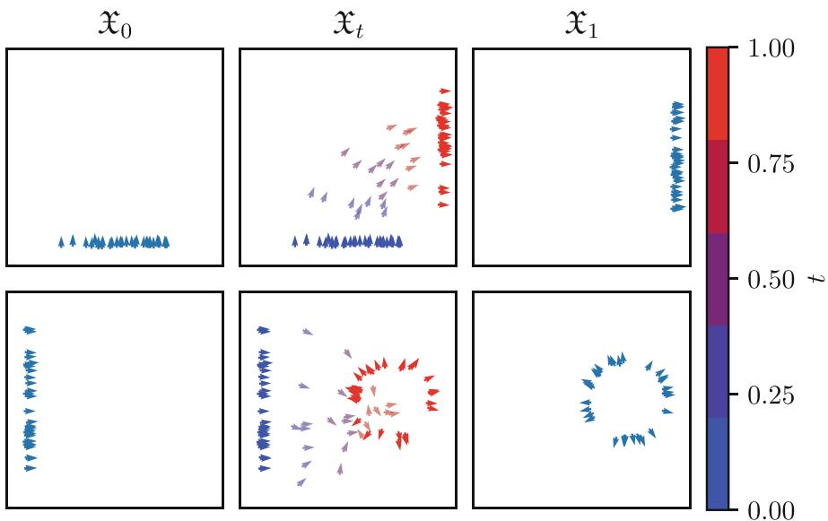  
Fig. 1. FM on SE(2), interpreted as the space of planar positions and orientations. Top: flowing from horizontal line to vertical line. Bottom: flowing from vertical line to circle

Figures 1, 2, 3 show FM on $\mathrm{SE}(2)$ , $\mathrm{SO}(3)$ , and $\mathrm{SE}(2) \times \mathbb{R}^2$ , respectively. In each case, the left column shows samples from the initial distribution $\mathfrak{X}_0$ and the right column shows samples from the target distribution $\mathfrak{X}_1$ . In the centre column, we take samples from $\mathfrak{X}_0$ (blue) and flow them forward (transparent); if the network has been trained successfully, the samples at $t = 1$ (red) should appear to be sampled from $\mathfrak{X}_1$ . For $\mathrm{SE}(2)$ and $\mathrm{SO}(3)$ , the rows show different pairs of distributions $\mathfrak{X}_0$ and $\mathfrak{X}_1$ ; for $\mathrm{SE}(2) \times \mathbb{R}^2$ , we have a single pair of distributions $\mathfrak{X}_0$ and $\mathfrak{X}_1$ , and the rows show the $\mathrm{SE}(2)$ and $\mathbb{R}^2$ components.

In all cases, the samples at $t = 1$ indeed reasonably match the target distribution. In simple cases, where we flow from lines to lines, the interpolants $\mathfrak{X}_t$ also behave nicely. For more complicated cases, where we flow from a line to a circle, the interpolants look messier, which is unsurprising, as the exponential curves connecting samples in $\mathfrak{X}_0$ and $\mathfrak{X}_1$ can be quite intricate.

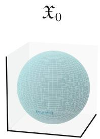

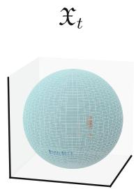


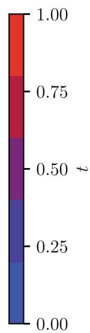

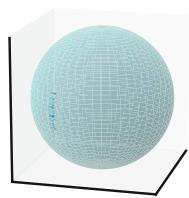

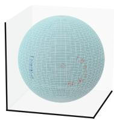

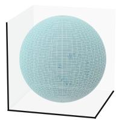  
Fig. 2. FM on SO(3), interpreted as the space of spherical positions and orientations. Top: flowing from horizontal line to vertical line. Bottom: flowing from vertical line to circle

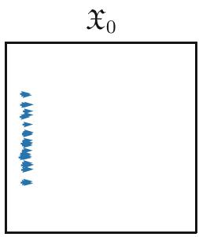

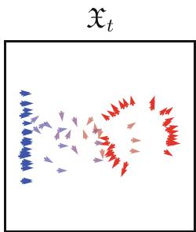

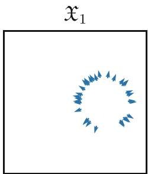

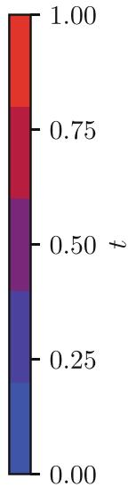

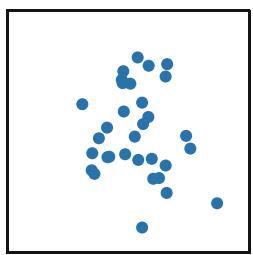

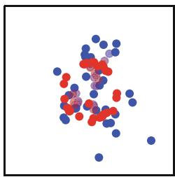

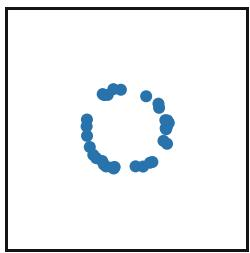  
Fig. 3. FM on $\mathrm{SE}(2) \times \mathbb{R}^2$ , with $\mathrm{SE}(2)$ interpreted as the space of planar positions and orientations. Note that this shows the flow of a single pair of distributions $\mathfrak{X}_0$ and $\mathfrak{X}_1$ : the top row shows the $\mathrm{SE}(2)$ component and bottom row shows the $\mathbb{R}^2$ component

Conclusion and Future Work. We generalised FM to Lie groups with surjective exponential maps, using a conditional flow field whose integral curves are exponential curves (Prop. 1). This has an intrinsic, simple, and simulation-free implementation for many Lie groups. As a proof of concept, we performed FM on three Lie groups (Sect. 3). FM on Lie groups could be used for generative modelling with data consisting of sets of features (in $\mathbb{R}^n$ ) and poses (in some Lie group), e.g. the latent codes of Equivariant Neural Fields [10].

Acknowledgements. EAISI is gratefully acknowledged for financial support through the EIDMAR programme. The European Commission is gratefully acknowledged for financial support through HORIZON-MSCA-2020-SE project REMODEL.

# References

1. Alexandrino, M.M., Bettiol, R.G.: Lie Groups and Geometric Aspects of Isometric Actions, chap. 2, pp. 27-47. Springer (2015). https://doi.org/10.1007/978-3-319-16613-1_2   
2. van den Berg, N.J., Sherry, F.M., Berendschot, T.T., Duits, R.: Crossing-preserving geodesic tracking on spherical images. In: SSVM (2025)   
3. Chen, R.T.Q., Lipman, Y.: Flow matching on general geometries. In: ICLR (2024). https://openreview.net/forum?id=g7ohDlTITL   
4. Chen, R.T., Rubanova, Y., Bettencourt, J., Duvenaud, D.: Neural ordinary differential equations. In: NeurIPS (2018). https://proceedings.neurips.cc/paper_files/paper/2018/file/69386f6bb1dfed68692a24c8686939b9-Paper.pdf   
5. Lie Groups, Lie Algebras, and Representations. GTM, vol. 222. Springer, Cham (2015). https://doi.org/10.1007/978-3-319-13467-3   
6. Lipman, Y., Chen, R.T.Q., Ben-Hamu, H., Nickel, M., Le, M.: Flow matching for generative modeling. In: ICLR, pp. 1-28 (2023). https://openreview.net/forum?id=PqvMRDCJT9t   
7. Lipman, Y., et al.: Flow Matching Guide and Code. arXiv preprint (2024). https://arxiv.org/abs/2412.06264   
8. Portegies, J.M., Sanguinetti, G., Meesters, S., Duits, R.: New Approximation of a scale space kernel on SE(3) and applications in neuroimaging. In: SSVM (2015). https://doi.org/10.1007/978-3-319-18461-6_4   
9. PyTorch-Contributors: PyTorch 2: Faster machine learning through dynamic python bytecode transformation and graph compilation. In: ASPLOS. ACM (2024). https://doi.org/10.1145/3620665.3640366   
10. Wessels, D., et al.: Grounding continuous representations in geometry: equivariant neural fields. In: ICLR (2025). https://openreview.net/forum?id=A4eCzSohhx

# Statistical Manifolds and Hessian Information Geometry

# On Invariant Conjugate Symmetric Statistical Structures on the Space of Zero-Mean Multivariate Normal Distributions

Hikozo Kobayashi(2) and Takayuki Okuda

Graduate School of Advanced Science and Engineering, Hiroshima University, 1-3-1 Kagamiyama, Higashi-Hiroshima City, Hiroshima 739-8526, Japan hikozo-kobayashi@hiroshima-u.ac.jp

Abstract. By the results of Furuhata-Inoguchi-Kobayashi [Inf. Geom. (2021)] and Kobayashi-Ohno [Osaka J. Math. (2025)], the Amari-Chentsov $\alpha$ -connections on the space $\mathcal{N}$ of all $n$ -variate normal distributions are uniquely characterized by the invariance under the transitive action of the affine transformation group among all conjugate symmetric statistical connections with respect to the Fisher metric. In this paper, we investigate the Amari-Chentsov $\alpha$ -connections on the submanifold $\mathcal{N}_0$ consisting of zero-mean $n$ -variate normal distributions. It is known that $\mathcal{N}_0$ admits a natural transitive action of the general linear group $GL(n,\mathbb{R})$ . We establish a one-to-one correspondence between the set of $GL(n,\mathbb{R})$ -invariant conjugate symmetric statistical connections on $\mathcal{N}_0$ with respect to the Fisher metric and the space of homogeneous cubic real symmetric polynomials in $n$ variables. As a consequence, if $n \geq 2$ , we show that the Amari-Chentsov $\alpha$ -connections on $\mathcal{N}_0$ are not uniquely characterized by the invariance under the $GL(n,\mathbb{R})$ -action among all conjugate symmetric statistical connections with respect to the Fisher metric. Furthermore, we show that any invariant statistical structure on a Riemannian symmetric space is necessarily conjugate symmetric.

Keywords: statistical manifold $\cdot$ homogeneous statistical manifold $\cdot$ Riemannian symmetric space $\cdot$ multivariate normal distribution $\cdot$ the Amari-Chentsov $\alpha$ -connection

# 1 Introduction

Throughout this paper, we adopt the formulation of statistical structures on manifolds as a pair consisting of a Riemannian metric and a symmetric $(0,3)$ -tensor field (cf. [8]). This formulation is equivalent to the definition as a pair of a Riemannian metric and a torsion-free affine connection compatible with it. A statistical structure $(g,C)$ on a smooth manifold $M$ is said to be conjugate symmetric if the $(0,4)$ -tensor field $\nabla^g C$ is symmetric (see [8,9] for details), where $\nabla^g$ denotes the Levi-Civita connection associated with $g$ . For each Riemannian

manifold $(M,g)$ , we denote by $S^3 (T^* M)_{g\text{-CS}}$ the subspace of the space $S^3 (T^* M)$ of symmetric $(0,3)$ -tensor fields on $M$ consisting of those $C$ for which the pair $(g,C)$ defines a conjugate symmetric statistical structure.

Let $M$ be an exponential family. We denote by $g^{F}$ the Fisher metric on $M$ and $C^{A(\alpha)}$ the Amari-Chentsov $\alpha$ -tensor field on $M$ ( $\alpha \in \mathbb{R}$ ). Then it is well-known that the statistical structure $(g^{F}, C^{A(\alpha)})$ is conjugate symmetric (cf. [1,8]).

In this paper, we are concerned with the following problem:

Probelm 1. In the setting above, find a characterization of the Amari-Chentsov $\alpha$ -tensor fields $C^{A(\alpha)}$ on $(M,g^{F})$ among $S^3 (T^* M)_{g^F\text{-CS}}$ .

One well-known answer to Problem 1 is the generalization of Chentsov's theorem (cf. [2, Corollary 5.3 in Chap. 5]). On the other hand, we focus in particular on the "symmetry" of the fixed space $M$ , in this paper.

By Furuhata-Inoguchi-Kobayashi [3] (for $n = 1$ ) and Kobayashi-Ohno [6] (for $n \geq 2$ ), the Amari-Chentsov $\alpha$ -tensor fields on the $n$ -variate normal distribution family

$$
\mathcal {N} := \left\{N (x \mid \mu , \Sigma) \mid \mu \in \mathbb {R} ^ {n}, \Sigma \in \operatorname {S y m} ^ {+} (n, \mathbb {R}) \right\} \cong \mathbb {R} ^ {n} \times \operatorname {S y m} ^ {+} (n, \mathbb {R})
$$

are known to be characterized by $\mathrm{Aff}(n,\mathbb{R})$ -invariance among $S^3 (T^*\mathcal{N})_{g^F -\mathrm{CS}}$ where $\mathrm{Sym}^{+}(n,\mathbb{R})$ is the space of all positive definite symmetric matrices of order $n$ , and $N(x\mid \mu ,\Sigma)$ denotes the $n$ -variate normal distribution with mean vector $\mu$ and variance-covariance matrix $\Sigma$ . Furthermore, our previous work [5] showed that the Amari-Chentsov $\alpha$ -tensor fields on the exponential family

$$
\mathcal {N} _ {T} := \left\{N (x \mid \mu , \operatorname {d i a g} \left(\sigma^ {2}, \dots , \sigma^ {2}\right)) \in \mathcal {N} \mid \mu \in \mathbb {R} ^ {n}, \sigma > 0 \right\} \cong \mathbb {R} ^ {n} \times \mathbb {R} _ {> 0}
$$

are characterized by the invariance of the natural $\mathbb{R}_{>0} \ltimes \mathbb{R}^n$ -action on $\mathcal{N}_T$ defined by

$$
(a, b). N (x \mid \mu , \mathrm {d i a g} (\sigma^ {2}, \ldots , \sigma^ {2})) = N (x \mid a \mu + b, \mathrm {d i a g} ((a \sigma) ^ {2}, \ldots , (a \sigma) ^ {2})),
$$

where $(a,b)\in \mathbb{R}_{>0}\ltimes \mathbb{R}^n$ , among $S^3 (T^*\mathcal{N}_T)_{g^{F - \mathrm{CS}}}$ .

In this paper, we focus on the exponential family of zero-mean $n$ -variate normal distributions, denoted by $\mathcal{N}_0$ , defined as

$$
\mathcal {N} _ {0} := \left\{N (x \mid 0, \Sigma) \mid \Sigma \in \operatorname {S y m} ^ {+} (n, \mathbb {R}) \right\}.
$$

Note that $\mathcal{N}_0$ can be identified with the parameter space $\mathrm{Sym}^+(n,\mathbb{R})$ , and $GL(n,\mathbb{R})$ acts naturally on $\mathcal{N}_0$ as below,

$$
h. N (x \mid 0, \Sigma) = N (x \mid 0, h \Sigma h ^ {\intercal}),
$$

where $h \in GL(n, \mathbb{R})$ and $h^{\top}$ denotes the transpose of $h$ . It is well-known that both the Fisher metric $g^{F}$ and the Amari-Chentsov $\alpha$ -tensor field $C^{A(\alpha)}$ on $\mathcal{N}_0$ are $GL(n, \mathbb{R})$ -invariant, which is a consequence of the generalization of Chentsov's theorem.

As an approach to Problem 1 for $M = \mathcal{N}_0$ , we examine the following question:

Question 1. Are the Amari-Chentsov $\alpha$ -tensor fields on $\mathcal{N}_0$ characterized by the $GL(n,\mathbb{R})$ -invariance among $S^3 (T^*\mathcal{N}_0)_{g^{F - \mathrm{CS}}}$ ?

The goal of this paper is to give an answer to Question 1. The following theorem is the main theorem of this paper:

Theorem 1. Let $G = GL(n,\mathbb{R})$ . Let us define the vector space

$$
S ^ {3} \left(T ^ {*} \mathcal {N} _ {0}\right) ^ {G} := \left\{C \in S ^ {3} \left(T ^ {*} \mathcal {N} _ {0}\right) \mid C i s G - i n v a r i a n t \right\}
$$

and its linear subspace

$$
S ^ {3} (T ^ {*} \mathcal {N} _ {0}) _ {g ^ {F} - \mathrm {C S}} ^ {G} := \left\{C \in S ^ {3} (T ^ {*} \mathcal {N} _ {0}) _ {g ^ {F} - \mathrm {C S}} \mid C i s G - i n v a r i a n t \right\}.
$$

Then the following holds:

(1) Any $G$ -invariant statistical structure $(g, C)$ on $\mathcal{N}_0$ is conjugate symmetric. In particular, the equality $S^3(T^*\mathcal{N}_0)_{g^F - \mathrm{CS}}^G = S^3(T^*\mathcal{N}_0)^G$ holds.   
(2) There exists a linear isomorphism $\tilde{\Phi}$ from $S^3 (T^*\mathcal{N}_0)^G$ onto the space $\mathcal{SP}_n^3$ of all $n$ -variable homogeneous cubic symmetric polynomials over $\mathbb{R}$ such that

$$
\Phi (C ^ {A (\alpha)}) = \alpha \left(x _ {1} ^ {3} + \dots + x _ {n} ^ {3}\right) \quad (\alpha \in \mathbb {R}).
$$

(3) The dimension of $S^3 (T^*\mathcal{N}_0)_g^{G}{}_{F - \mathrm{CS}}$ is given as

$$
\dim S ^ {3} (T ^ {*} \mathcal {N} _ {0}) _ {g ^ {F} \text {- C S}} ^ {G} = \left\{ \begin{array}{l l} 3 & (i f n \geq 3), \\ 2 & (i f n = 2), \\ 1 & (i f n = 1). \end{array} \right.
$$

Theorem 1 gives an affirmative answer to Question 1 when $n = 1$ , and a negative one when $n \geq 2$ . We also note that a concrete example of bases of $S^3 (T^*\mathcal{N}_0)^G_{g^F\text{-CS}}$ can be found in Sect.3.

We note that in the proof of Theorem 1 (1), we will show that for each symmetric space $M = G / K$ , any $G$ -invariant statistical structure $(g, C)$ on $M$ is necessarily conjugate symmetric (see Sect. 2 for details). We believe that this result provides a contribution to the study of homogeneous statistical manifolds (cf. [4]).

# 2 Conjugate Symmetries on Invariant Statistical Structures on Symmetric Spaces

Let $G$ be a Lie group and $M$ a homogeneous $G$ -space, that is, $M$ is a smooth manifold equipped with a transitive smooth $G$ -action. For each point $p \in M$ , we shall denote by $K = K^p \coloneqq \{ h \in G \mid h.p = p \}$ the isotropy subgroup of $G$ at the point $p$ . Then $M$ can be regarded as the coset manifold $G / K$ via the $G$ -equivariant map $G / K \to M$ , $hK \mapsto h.p$ .

The purpose of this section is to show the following theorem:

Theorem 2. In the setting above, suppose that for any (or equivalently, for some) $p \in M$ , the pair $(\mathfrak{g}, \mathfrak{k}^p) := (\operatorname{Lie}(G), \operatorname{Lie}(K^p))$ is a symmetric pair, that is, there exists an involutive automorphism $\theta^p$ on $\mathfrak{g}$ such that $\mathfrak{k}^p = \{X \in \mathfrak{g} \mid \theta^p(X) = X\}$ . Then for any $G$ -invariant statistical structure $(g, C)$ on $M$ , $\nabla^g C \equiv 0$ holds, in particular, $(g, C)$ is conjugate symmetric.

Proof. Theorem 2 follows directly from a combination of arguments presented in [7, Chapters X and XI]. For the reader's convenience, we provide a brief outline of the proof below.

Let us define, for each $X \in \mathfrak{g}$ , a vector field $X^M \in \mathfrak{X}(M)$ by setting

$$
\left(X ^ {M}\right) _ {q} := \frac {d}{d t} \bigg | _ {t = 0} \left(\exp (- t X). q\right) \in T _ {q} M
$$

for each $q \in M$ . It is well-known that the map $X \mapsto X^M$ defines a Lie algebra homomorphism from $\mathfrak{g}$ into the Lie algebra $\mathfrak{X}(M)$ of smooth vector fields on $M$ .

For each $p \in M$ , the canonical decomposition of $\mathfrak{g}$ with respect to $\mathfrak{k}^p \coloneqq \operatorname{Lie}(K^p)$ is denoted by $\mathfrak{g} = \mathfrak{k}^p + \mathfrak{p}^p$ , i.e., we put $\mathfrak{p}^p \coloneqq \{X \in \mathfrak{g} \mid \theta^p(X) = -X\}$ . Then $[\mathfrak{p}^p, \mathfrak{p}^p] \subset \mathfrak{k}^p$ , $\mathfrak{p}^p$ is an $\operatorname{Ad}(K^p)$ -stable complement of $\mathfrak{k}^p$ in $\mathfrak{g}$ , and the map

$$
\mathfrak {p} ^ {p} \to T _ {p} M, X \mapsto (X ^ {M}) _ {p} = \left. \frac {d}{d t} \right| _ {t = 0} (\exp (- t X). p)
$$

defines a linear isomorphism. For each tangent vector $v \in T_pM$ , we write $X^v$ for the unique element in $\mathfrak{p}^p$ satisfying $\left(\left(X^v\right)^M\right)_p = v$ . The affine connection $\nabla^{\mathrm{cn}}$ on $M$ , which is called the canonical connection (cf. [7, Chapter X]), is defined by putting

$$
\nabla_ {v} ^ {\mathrm {c n}} C = \left(\mathcal {L} _ {(X ^ {v}) ^ {M}} C\right) _ {p}
$$

for each $p \in M$ , each $v \in T_pM$ and each tensor field $C$ on $M$ , where $\mathcal{L}_{(X^v)^M}$ denotes the Lie derivative by the vector field $(X^v)^M$ . By the definitions of $\nabla^{\mathrm{cn}}$ and $(X^v)^M$ , one sees that $\nabla^{\mathrm{cn}}C \equiv 0$ for any $G$ -invariant tensor field $C$ on $M$ . Furthermore, $\nabla^{\mathrm{cn}}$ is torsion-free. In fact, for each $p \in M$ and each $v, w \in T_pM$ , we have $[(X^v)^M, (X^w)^M]_p = ([X^v, X^w]^M)_p = 0$ (since $[X^v, X^w] \in \mathfrak{k}^p$ and $(X^M)_p = 0$ if $X \in \mathfrak{k}^p$ ), and $\nabla_v^{\mathrm{cn}}(X^w)^M = [(X^v)^M, (X^w)^M]_p = 0$ . Hence

$$
\begin{array}{l} (T ^ {\nabla^ {\mathrm {c n}}}) _ {p} (v, w) = \nabla_ {v} ^ {\mathrm {c n}} ((X ^ {w}) ^ {M}) - \nabla_ {w} ^ {\mathrm {c n}} ((X ^ {v}) ^ {M}) - [ (X ^ {v}) ^ {M}, (X ^ {w}) ^ {M} ] _ {p} \\ = 0, \\ \end{array}
$$

where $T^{\nabla^{\mathrm{cn}}}$ denotes the torsion tensor of the affine connection $\nabla^{\mathrm{cn}}$ .

Let us fix a $G$ -invariant statistical structure $(g,C)$ on $M$ . Then by the invariance of the metric tensor field $g$ , we have $\nabla^{\mathrm{cn}}g\equiv 0$ . Further, $\nabla^{g} = \nabla^{\mathrm{cn}}$ holds since $\nabla^{\mathrm{cn}}$ is torsion-free. By the invariance of the $(0,3)$ -tensor field $C$ ,

$$
\nabla^ {g} C \equiv \nabla^ {\mathrm {c n}} C \equiv 0.
$$

This completes the proof.

□

# 3 Proof of Theorem 1

Let us identify $\mathcal{N}_0$ with the manifold $\mathrm{Sym}^+(n,\mathbb{R})$ by the correspondence $N(x\mid 0,\Sigma)\mapsto \Sigma$ . The identity matrix of size $n$ will be denoted by $I_{n}\in \mathrm{Sym}^{+}(n,\mathbb{R})$ . Then $I_{n}$ corresponds to the standard normal distribution $N(x\mid 0,I_n)$ on $\mathbb{R}^n$ . Since $\mathcal{N}_0 = \mathrm{Sym}^+(n,\mathbb{R})$ is an open submanifold of the vector space $\mathrm{Sym}(n,\mathbb{R})$ , we have the linear isomorphism

$$
\eta : \operatorname {S y m} (n, \mathbb {R}) \to T _ {I _ {n}} \mathcal {N} _ {0}, A \mapsto A _ {\eta} := \left. \frac {d}{d t} \right| _ {t = 0} (I _ {n} + t A).
$$

The following proposition is well-known:

Proposition 1. (see [10,11]). Under the identification $\eta$ above, the Fisher metric $g_{I_n}^F$ and the Amari-Chentsov $\alpha$ -tensor $C_{I_n}^{A(\alpha)}$ on $T_{I_n}\mathcal{N}_0 \cong \operatorname{Sym}(n,\mathbb{R})$ can be written as below:

$$
\begin{array}{l} g _ {I _ {n}} ^ {F}: \operatorname {S y m} (n, \mathbb {R}) \times \operatorname {S y m} (n, \mathbb {R}) \rightarrow \mathbb {R}, (X, Y) \mapsto \frac {1}{2} \operatorname {t r} (X Y), (1) \\ C _ {I _ {n}} ^ {A (\alpha)}: \operatorname {S y m} (n, \mathbb {R}) \times \operatorname {S y m} (n, \mathbb {R}) \times \operatorname {S y m} (n, \mathbb {R}) \rightarrow \mathbb {R}, (X, Y, Z) \mapsto \alpha \cdot \operatorname {t r} (X Y Z). (2) \\ \end{array}
$$

Let us give a proof of Theorem 1 as below:

Proof of Theorem 1. We put $G = GL(n,\mathbb{R})$ . Recall that $\mathcal{N}_0 = \operatorname{Sym}^+(n,\mathbb{R})$ is a homogeneous $G$ -space equipped with the action defined by

$$
h. \Sigma := h \Sigma h ^ {\top} \quad (\text {f o r} h \in G = G L (n, \mathbb {R}), \Sigma \in \operatorname {S y m} ^ {+} (n, \mathbb {R})).
$$

The isotropy subgroup $K = K^{I_n}$ of $G$ at the point $I_{n} \in \operatorname{Sym}^{+}(n, \mathbb{R})$ is the orthogonal group $O(n)$ . It is well-known that $(G, K) = (GL(n, \mathbb{R}), O(n))$ is a symmetric pair of Lie groups, and hence $(\mathfrak{g}, \mathfrak{k}) := (\operatorname{Lie}(G), \operatorname{Lie}(K))$ is also a symmetric pair. Thus the claim (1) in Theorem 1 is followed immediately by Theorem 2.

Let us give a proof of the claim (2) in Theorem 1. The natural $K$ -action on the tangent space $T_{I_n}\mathcal{N}_0$ is called the isotropy representation at the point $I_{n}$ . We write $S^3 (T_{I_n}^*\mathcal{N}_0)^K$ for the space of $K$ -invariant symmetric 3-tensors on the cotangent space at $I_{n}$ , i.e., on $T_{I_n}^*\mathcal{N}_0$ . Then by the general theory of invariant sections of equivariant vector bundles over homogeneous spaces, one sees that the map

$$
S ^ {3} \left(T ^ {*} \mathcal {N} _ {0}\right) ^ {G} \rightarrow S ^ {3} \left(T _ {I _ {n}} ^ {*} \mathcal {N} _ {0}\right) ^ {K}, C \mapsto C _ {I _ {n}} \tag {3}
$$

gives a linear isomorphism.

We shall define the $K = O(n)$ -representation on the vector space $\operatorname{Sym}(n, \mathbb{R})$ by putting

$$
k. X := k X k ^ {- 1} \quad (\text {f o r} X \in \operatorname {S y m} (n, \mathbb {R}), k \in O (n)).
$$

The vector space of all $K$ -invariant symmetric 3-tensors on the space $\operatorname{Sym}(n, \mathbb{R})^*$ is denoted by $S^3(\operatorname{Sym}(n, \mathbb{R})^*)^K$ . One can easily see that the identification

$\eta : \operatorname{Sym}(n, \mathbb{R}) \to T_{I_n} \mathcal{N}_0$ is an isomorphism between $K = O(n)$ -representations, where $T_{I_n} \mathcal{N}_0$ is considered as the isotropy representation of $K$ . Therefore, $S^3(T_{I_n}^* M)^K$ can be identified with $S^3(\operatorname{Sym}(n, \mathbb{R}^*)^K)$ . By combining this, the isomorphism (3) above, and Proposition 1 (2), we have a linear isomorphism from $S^3(T^* M)^G$ onto $S^3(\operatorname{Sym}(n, \mathbb{R}^*)^K)$ such that $C^{A(\alpha)}$ maps to the tensor $C^\alpha$ defined by

$$
C ^ {\alpha} (X, Y, Z) := \alpha \cdot \operatorname {t r} (X Y Z) \quad (X, Y, Z \in \operatorname {S y m} (n, \mathbb {R})).
$$

To complete the proof of the claim (2), we only need to find a linear isomorphism from $S^3 (\operatorname {Sym}(n,\mathbb{R})^*)^K$ onto $\mathcal{SP}_n^3$ such that $C^\alpha$ maps to the polynomial $\alpha \cdot (\sum_{i}x_{i}^{3})$ . For each $C\in S^3 (\operatorname {Sym}(n,\mathbb{R})^*)^K$ , we define the polynomial function $q_{C}$ on the vector space $\operatorname {Sym}(n,\mathbb{R})$ by

$$
q _ {C}: \operatorname {S y m} (n, \mathbb {R}) \to \mathbb {R}, X \mapsto C (X, X, X).
$$

The correspondence $C \mapsto q_C$ gives a linear isomorphism between $S^3(\operatorname{Sym}(n, \mathbb{R})^*)^K$ and the vector space $\mathcal{P}^3(\operatorname{Sym}(n, \mathbb{R}))^K$ of $K$ -invariant homogeneous cubic polynomial functions on $\operatorname{Sym}(n, \mathbb{R})$ . Note that $C^\alpha$ maps to the function

$$
q _ {\alpha}: \operatorname {S y m} (n, \mathbb {R}) \to \mathbb {R}, X \mapsto \alpha \cdot \operatorname {t r} \left(X ^ {3}\right).
$$

Furthermore, we shall write $D$ for the linear subspace of $\operatorname{Sym}(n,\mathbb{R})$ consisting of all diagonal matrices. Then the symmetric group $\mathfrak{S}_n$ of order $n$ acts on $D$ by permutations of subscripts. Let us denote by $\mathcal{P}^3 (D)^{\mathfrak{S}_n}$ the space of all $\mathfrak{S}_n$ -invariant homogeneous cubic polynomial functions on the vector space $D$ . We shall consider the linear isomorphism

$$
\mathcal {S P} _ {n} ^ {3} \to \mathcal {P} ^ {3} (D) ^ {\mathfrak {S} _ {n}}, P (x _ {1}, \dots , x _ {n}) \mapsto f _ {P},
$$

where the function $f_{P}$ is defined by

$$
f _ {P}: D \to \mathbb {R}, \operatorname {d i a g} (\lambda_ {1}, \dots , \lambda_ {n}) \mapsto P (\lambda_ {1}, \dots , \lambda_ {n}).
$$

Then $\mathcal{SP}_n^3$ can be identified with the space $\mathcal{P}^3 (D)^{\mathfrak{S}_n}$ . Note that the polynomial $\alpha \cdot (\sum_{i}x_{i}^{3})$ corresponds to the function

$$
f _ {\alpha}: D \to \mathbb {R}, \operatorname {d i a g} (\lambda_ {1}, \dots , \lambda_ {n}) \mapsto \alpha \cdot \sum_ {i} \lambda_ {i} ^ {3}.
$$

Thus our goal is to find a linear isomorphism $\varphi$ from $\mathcal{P}^3 (\mathrm{Sym}(n,\mathbb{R}))^K$ onto $\mathcal{P}^3 (D)^{\mathfrak{S}_n}$ such that $\varphi (q_{\alpha}) = f_{\alpha}$ . For each function $q\in \mathcal{P}^3 (\mathrm{Sym}(n,\mathbb{R}))^K$ , define $\varphi (q)\coloneqq q|_D$ by the restriction of $q$ on the linear subspace $D$ . One sees that the correspondence $q\mapsto \varphi (q)$ defines a linear map $\varphi$ from $\mathcal{P}^3 (\mathrm{Sym}(n,\mathbb{R}))^K$ to $\mathcal{P}^3 (D)^{\mathfrak{S}_n}$ , and $\varphi (q_{\alpha}) = f_{\alpha}$ . Furthermore, the map $\varphi$ is injective since for any $X\in \operatorname {Sym}(n,\mathbb{R})$ , there exists $k\in K$ such that $\mathrm{Ad}(k)X\in D$ (i.e., any symmetric matrix is diagonalizable by an orthogonal matrix). Therefore, it is enough to

show that the map $\varphi$ is surjective. Let us define the symmetric polynomial function $p_k$ on $D$ ( $k \in \mathbb{Z}_{\geq 0}$ ) by

$$
p _ {k} (\operatorname {d i a g} \left(\lambda_ {1}, \dots , \lambda_ {n}\right)) := \sum_ {i} \lambda_ {i} ^ {k} \quad (\text {f o r} \operatorname {d i a g} \left(\lambda_ {1}, \dots , \lambda_ {n}\right) \in D).
$$

Then by the theory of symmetric polynomials, one can check that $\mathcal{P}^3 (D)^{\mathfrak{S}_n}$ is spanned by the three homogeneous cubic polynomial functions $p_3,p_2p_1$ and $p_1^3$ . On the other hand, let us define the $K$ -invariant homogeneous cubic polynomial functions $q_{1},q_{2},q_{3}$ on $\operatorname {Sym}(n,\mathbb{R})$ by

$$
q _ {1} (X) := \operatorname {t r} \left(X ^ {3}\right), q _ {2} (X) := \operatorname {t r} \left(X ^ {2}\right) \cdot \operatorname {t r} (X), q _ {3} (X) := (\operatorname {t r} (X)) ^ {3}.
$$

Then $\varphi(q_1) = p_3$ , $\varphi(q_2) = p_2p_1$ and $\varphi(q_3) = p_1^3$ . This completes the proof of the claim (2).

The claim (3) follows from the claims (1), (2) and the well-known fact that the vector space $\mathcal{SP}_n^3$ is 3-dimensional if $n \geq 3$ , 2-dimensional if $n = 2$ , and 1-dimensional if $n = 1$ .

Remark 1. The following three elements form a generating set of the vector space $S^3 (\operatorname {Sym}(n,\mathbb{R})^*)^K\cong S^3 (T^*\mathcal{N}_0)_{g^F -\mathrm{CS}}^G$ :

$$
\begin{array}{l} - C _ {1} (X, Y, Z) := \operatorname {t r} (X Y Z), \\ - C _ {2} (X, Y, Z) := (1 / 3) (\operatorname {t r} (X) \operatorname {t r} (Y Z) + \operatorname {t r} (Y) \operatorname {t r} (X Z) + \operatorname {t r} (Z) \operatorname {t r} (X Y)), \\ - C _ {3} (X, Y, Z) := \operatorname {t r} (X) \operatorname {t r} (Y) \operatorname {t r} (Z). \\ \end{array}
$$

In particular, if $n \geq 3$ , the subset $\{C_1, C_2, C_3\}$ is a basis of the vector space $S^3(\operatorname{Sym}(n, \mathbb{R})^*)^K$ . The symmetric tensor $C_1$ corresponds to the Amari-Chentsov +1-tensor field on $\mathcal{N}_0$ .

Remark 2. It is worth emphasizing that the linear isomorphism $\eta : \operatorname{Sym}(n, \mathbb{R}) \to T_{I_n} \mathcal{N}_0$ differs from the following "natural" linear isomorphism:

$$
\phi : \operatorname {S y m} (n, \mathbb {R}) \to T _ {I _ {n}} \mathcal {N} _ {0}, \quad A \mapsto \left. \frac {d}{d t} \right| _ {t = 0} (\operatorname {E x p} (- t A). I _ {n}).
$$

Indeed, it can be directly verified that $\phi = -2\eta$

Acknowledgments. The authors would like to give heartfelt thanks to Hideyuki Ishi whose suggestions were of inestimable value for this paper. The authors would also like to thank to Hitoshi Furuhata, Kento Ogawa, Yu Ohno, Hiroshi Tamaru and Koichi Tojo whose comments made enormous contribution to this paper. The first author is supported by JST SPRING, Grant Number JPMJSP2132. The second author is supported by JSPS Grants-in-Aid for Scientific Research JP20K03589, JP20K14310, JP22H01124, and JP24K06714.

Disclosure of Interests. On behalf of all authors, Hikozo Kobayashi, the corresponding author, states that there is no potential conflict of interest to declare.

# References

1. Amari, S.: Differential-Geometrical Methods in Statistics. Lecture Notes in Statistics, vol. 28. Springer-Verlag, New York (1985). https://doi.org/10.1007/978-1-4612-5056-2   
2. Ay, N., Jost, J., Lé, H.V., Schwachhöfer, L.: Information Geometry. EMG-FASMSM, vol. 64. Springer, Cham (2017). https://doi.org/10.1007/978-3-319-56478-4   
3. Furuhata, H., Inoguchi, J.-I., Kobayashi, S.-P.: A characterization of the alpha-connections on the statistical manifold of normal distributions. Information Geometry 4(1), 177–188 (2020). https://doi.org/10.1007/s41884-020-00037-z   
4. Inoguchi, J.-I., Ohno, Y.: Homogeneous statistical manifolds. arXiv preprint arXiv:2408.01647 (2024)   
5. Kobayashi, H., Ohno, Y., Okuda, T., Tamaru, H.: The moduli spaces of left-invariant statistical structures on Lie groups. in preparation   
6. Kobayashi, S.-P., Ohno, Y.: A characterization of the alpha-connections on the statistical manifold of multivariate normal distributions. Osaka J. Math. 62(2), 329-349 (2025). https://doi.org/10.18910/101132   
7. Kobayashi, S., Nomizu, K.: Foundations of Differential Geometry. Vol. II, Interscience Tracts in Pure and Applied Mathematics, vol. No. 15. Interscience Publishers John Wiley & Sons, Inc., New York-London-Sydney (1969)   
8. Lauritzen, S.L.: Statistical Manifolds. Differential geometry in statistical inference 10, 163-216 (1987). https://doi.org/10.1214/lnms/1215467061   
9. Matsuzoe, H., Takeuchi, J., Amari, S.: Equiaffine structures on statistical manifolds and Bayesian statistics. Differential Geom. Appl. 24(6), 567-578 (2006). https://doi.org/10.1016/j.difgeo.2006.02.003   
10. Mitchell, A.F.S.: The information matrix, skewness tensor and $\alpha$ -connections for the general multivariate elliptic distribution. Ann. Inst. Statist. Math. 41(2), 289-304 (1989). https://doi.org/10.1007/BF00049397   
11. Skovgaard, L.T.: A Riemannian geometry of the multivariate normal model. Scand. J. Statist. 11(4), 211-223 (1984)

# Bi-forms Approach to Potential Functions in Information Geometry

Florio M. Ciaglia<sup>1</sup>, Giuseppe Marmo<sup>2,3</sup>, Marco Pacelli<sup>3,4(☑)</sup>, Luca Schiavone<sup>3,5</sup>, and Alessandro Zampini<sup>3,4,5</sup>

$^{1}$ Department of Mathematics, University Carlos III de Madrid, Leganés, Madrid, Spain

fciaglia@math.uc3m.es

$^{2}$ Dipartimento di Fisica "E. Pancini", Università di Napoli Federico II, Naples, Italy

<sup>3</sup> INFN-Sezione di Napoli, Naples, Italy giuseppe.marmo@na.infn.it

<sup>4</sup> Scuola Superiore Meridionale, Naples, Italy  
marco.pacelli-ssm

$^{5}$ Dipartimento di Matematica e Applicazioni "Renato Caccioppoli", Università di Napoli Federico II, Naples, Italy

{luca.schiavone, alessandro.zampini}@unina.it

Abstract. Contrast functions play a fundamental role in information geometry, providing a means for generating the geometric structures of a statistical manifold: a pseudo-Riemannian metric and a pair of torsion-free conjugate affine connections. Conventional contrast-based approaches become indeed insufficient within settings where torsion is naturally present, such as quantum information geometry. This paper introduces contrast bi-forms, a generalisation of contrast functions that systematically encode metric and connection data, allowing for arbitrary affine connections regardless of torsion. It will be shown that they provide a unified framework for statistical potentials, offering new insights into the inverse problem in information geometry. As an example, we consider teleparallel manifolds, where torsion is intrinsic to the geometry, and show how bi-forms naturally accommodate these structures.

Keywords: Contrast Function $\cdot$ Torsion $\cdot$ Bi-form $\cdot$ Teleparallel Manifold

# 1 Introduction

Contrast (or divergence) functions on a smooth manifold play a fundamental role in both mathematical theory and applications, providing a measure of distinguishability between probability distributions [4]. A crucial feature of contrast functions is that they naturally induce a pseudo-Riemannian metric $g$ and a pair of $g$ -conjugate and torsion-free affine connections $(\nabla, \nabla^{\dagger})$ on the underlying manifold $M$ [4]. The resulting structure defines a statistical manifold in

the sense of Lauritzen, capturing the essential mathematical features of parametric statistical models [11]. Within such paradigmatic examples, the metric $g$ coincides with the Fisher-Rao metric, while the torsion-free affine connections $\nabla$ and $\nabla^{\dagger}$ correspond to the $(\pm 1)$ -connections. While this framework is well suited to many applications, there are cases where the torsion-free condition does not naturally hold. A key example arises from quantum finite level systems, where the geometry of the space of faithful quantum states suggests that torsion is an inherent feature rather than an anomaly [2,9]. This motivates the introduction of a broader class of statistical structures. A statistical manifold admitting torsion (or, simply, SMAT) is a triple $(M,g,\nabla)$ , where $\nabla$ is required to be torsion-free, whereas $\nabla^{\dagger}$ may exhibit torsion. Such structures have been explored in connection with estimation theory [8] and in attempts to formulate a geometric framework for quantum information theory [10]. Extending the idea of SMATs, in this paper we introduce what we call Lauritzen manifolds, that is, triples $(M,g,\nabla)$ in which both $\nabla$ and $\nabla^{\dagger}$ may possess torsion. A natural question then arises: can these structures still be derived from a potential? As anticipated above, contrast functions are not suitable candidates, since Schwarz's theorem forces any connection derived from a contrast function to be torsion-free. This limitation has been the starting point to explore alternative formulations for potentials. We limit ourselves here to recall that Henmi and Matsuzoe [7] introduced pre-contrast functions to generate SMATs, while Zhang and Khan [16] proposed super-contrast functions as potentials for Lauritzen manifolds, both extending the standard theory of contrast functions in order to accommodate torsion. In this paper, we propose an alternative method for generating Lauritzen manifolds. Instead of relying on super-contrast functions, we adopt the formalism of bi-forms [5,6,13,15] and introduce the notion of a contrast bi-form as a suitable potential. This approach, in our opinion, offers two key advantages. First, it provides a unified framework for describing potentials, since contrast, pre-contrast, and super-contrast functions come as specific instances of bi-forms. Second, it offers a natural framework to address what we call the inverse problem in information geometry: given a statistical or Lauritzen manifold, determining whether a potential can generate it. While this problem is well understood in the case of statistical manifolds [1,12], it remains largely unexplored for SMATs and Lauritzen manifolds. Upon using the general framework of bi-forms, and developing from [7,16], we aim to establish a solid foundation for a systematic theory of potentials in information geometry. This provides a unified approach for both classical and quantum settings. Due to the space limitations of the present issue, we will describe the details and present full proofs of the statements and results discussed here in a forthcoming publication.

# 2 Contrast Bi-forms

The theory of contrast functions is based on the geometry of the Cartesian square of a manifold. Given a manifold $M$ , its Cartesian square is the product manifold $M \times M$ equipped with the canonical projections $\pi_L \colon M \times M \to M$ and

$\pi_R\colon M\times M\to M$ , which extract the left and right components, respectively:

$$
\pi_ {L} (m, n) = m \quad \text {a n d} \quad \pi_ {R} (m, n) = n. \tag {1}
$$

This geometric framework was first used by Eguchi [4] to geometrically describe an algorithm that associates a pseudo-Riemannian metric $g$ and a pair of $g$ -conjugate, torsion-free affine connections to a suitable class of 2-point functions on $M$ , i.e., smooth real-valued functions defined on the product manifold $M \times M$ known as contrast function. In the terminology commonly used in information geometry, these functions are also referred to as divergence functions or potential functions. While these terms may have slightly different technical meanings depending on the context or the class of functions considered, they all share the property of inducing the geometric structures $(g, \nabla)$ on $M$ .

In this section, we introduce a more general formulation of these geometric objects using the formalism of bi-forms.

# 2.1 Bi-Forms

A bi-form on a manifold $M$ is a section of a tensor bundle over its Cartesian square $M \times M$ . More precisely, given $(p,q) \in \mathbb{N}_0 \times \mathbb{N}_0$ , a $(p,q)$ -bi-form on $M$ is a smooth section of the vector bundle:

$$
\bigwedge^ {p} \pi_ {L} ^ {*} T ^ {\vee} M \otimes_ {M \times M} \bigwedge^ {q} \pi_ {R} ^ {*} T ^ {\vee} M, \tag {2}
$$

where $\tau_{M}^{\vee}\colon T^{\vee}M\to M$ is the cotangent bundle projection of $M$ . The space of $(p,q)$ -bi-forms is denoted by $\Omega^{p,q}(M\mid M)$ .

A $(p,q)$ -bi-form $\varpi$ can be interpreted as a $(p + q)$ -multilinear real-valued fiber-wise function on $(TM)^{p + q}$ that is skew-symmetric in the first $p$ and in the last $q$ entries. This leads to a pairing between bi-forms on $M$ and vector fields on $M$ . Given a $(p,q)$ -bi-form $\varpi$ and vector fields $\{X_i\}_{i = 1}^p$ and $\{Y_j\}_{j = 1}^q$ on $M$ , we define:

$$
\begin{array}{l} \varpi (X _ {1}, \dots , X _ {p} \mid Y _ {1}, \dots , Y _ {q}) (m, n) \\ = \varpi \left(X _ {1} (m), \dots , X _ {p} (m) \mid Y _ {1} (n), \dots , Y _ {q} (n)\right). \tag {3} \\ \end{array}
$$

Furthermore, this pairing provides a systematic method for generating blockwise alternating covariant tensors on $M$ , i.e., sections of the tensor bundle over $M$ whose total manifold is:

$$
\bigwedge^ {p} T ^ {\vee} M \otimes_ {M} \bigwedge^ {q} T ^ {\vee} M. \tag {4}
$$

Both pseudo-Riemannian metrics and the torsion tensors of affine connections - when interpreted as 3-covariant tensors via the musical isomorphism - are of this type. These can be systematically obtained from bi-forms via the diagonal embedding $\iota \colon M \to M \times M$ , defined by:

$$
\iota (m) = (m, m). \tag {5}
$$

Indeed, this map induces the operator:

$$
\iota^ {*} \colon \Omega^ {p, q} (M \mid M) \rightarrow \Omega^ {p} (M) \otimes_ {C ^ {\infty} (M)} \Omega^ {q} (M), \tag {6}
$$

where the tensor product is taken over the ring of smooth functions on $M$ . This operator assigns to any $(p,q)$ -bi-form $\varpi$ on $M$ the block-wise alternating tensor:

$$
\left(\iota^ {*} \varpi\right) \left(Z _ {1}, \dots , Z _ {p + q}\right) = \iota^ {*} \left(\varpi \left(Z _ {1}, \dots , Z _ {p} \mid Z _ {p + 1}, \dots , Z _ {p + q}\right)\right), \tag {7}
$$

where $\{Z_i\}_{i=1}^{p+q}$ are vector fields on $M$ . Since the pairing is local, the operator $\iota^*$ naturally restricts to the space of $(p,q)$ -bi-forms that are defined on an open neighborhood of the diagonal submanifold $\Delta_M$ of $M \times M$ . We denote this space by $\Omega_{\Delta_M}^{p,q}(M \mid M)$ .

Another useful operator on bi-forms arises in terms of a distinguished map associated to the Cartesian square of a manifold, namely the swap map $s \colon M \times M \to M \times M$ defined by:

$$
s (m, n) = (n, m). \tag {8}
$$

This map interchanges the roles of the left and right projections, providing a systematic way to mirror properties between left and right components. Since $s$ induces a fiber bundle isomorphism between $\pi_L$ and $\pi_R$ , it induces the operator:

$$
s ^ {*} \colon \Omega^ {p, q} (M \mid M) \rightarrow \Omega^ {q, p} (M \mid M), \tag {9}
$$

which acts on a $(p,q)$ -bi-form $\varpi$ on $M$ as:

$$
\left(s ^ {*} \varpi\right) \left(X _ {1}, \dots , X _ {q} \mid Y _ {1}, \dots , Y _ {p}\right) = s ^ {*} \left(\varpi \left(Y _ {1}, \dots , Y _ {p} \mid X _ {1}, \dots , X _ {q}\right)\right), \tag {10}
$$

where $\{X_{i}\}_{i = 1}^{q}$ and $\{Y_j\}_{j = 1}^p$ are vector fields on $M$ . Since the pairing is local and $s$ fixes the diagonal submanifold $\Delta_M$ of $M\times M$ , also the operator $s^*$ restricts to $s^{\ast}\colon \varOmega_{\Delta_{M}}^{p,q}(M\mid M)\to \varOmega_{\Delta_{M}}^{q,p}(M\mid M)$ .

Finally, we discuss a structure on the space of bi-forms that has an interesting interpretation from the statistical point of view, that is the commutative bi-complex of bi-forms. The vertical distribution induced by $\pi_R$ defines a flat generalized Ehresmann connection on the fiber bundle $\pi_L$ , inducing a decomposition of the tangent bundle of $M\times M$ as the Whitney sum of the vertical distributions corresponding to $\pi_L$ and $\pi_R$ . This decomposition naturally gives rise to a pair of differential operators $\mathrm{d}^L$ and $\mathrm{d}^R$ acting on bi-forms, that we define as follows.

The left differential operator $\mathrm{d}^L$ increases the left degree and is given by:

$$
\mathrm {d} ^ {L}: \Omega^ {p, q} (M \mid M) \rightarrow \Omega^ {p + 1, q} (M \mid M), \tag {11}
$$

with the explicit action:

$$
\begin{array}{l} \mathrm {d} ^ {L} \varpi \left(X _ {0}, X _ {1}, \dots , X _ {p} \mid Y _ {1}, \dots , Y _ {q}\right) \\ = \sum_ {i = 0} ^ {p} (- 1) ^ {i} \mathcal {L} _ {X _ {i} ^ {L}} \left(\varpi \left(X _ {0}, \dots , \check {X} _ {i}, \dots , X _ {p} \mid Y _ {1}, \dots , Y _ {q}\right)\right) \\ + \sum_ {0 \leq a <   b \leq p} (- 1) ^ {a + b} \varpi ([ X _ {a}, X _ {b} ], X _ {0}, \dots , \check {X} _ {a}, \dots , \check {X} _ {b}, \dots , X _ {p} \mid Y _ {1}, \dots , Y _ {q}), \tag {12} \\ \end{array}
$$

where $\varpi$ is a $(p,q)$ -bi-form on $M$ , the elements $\{X_i\}_{i=0}^p$ , $\{Y_j\}_{j=1}^q$ are vector fields on $M$ , and $X^L$ denotes the $\pi_L$ -horizontal lift of the vector field $X$ . The check notation indicates omission of the corresponding vector field. It is possible to prove that $\mathrm{d}^L$ satisfies the cohomology condition $\mathrm{d}^L \circ \mathrm{d}^L = 0$ , which means that bi-forms can be studied within a differential complex.

We introduce the right differential operator $\mathrm{d}^R$ , which increases the right degree, and is given by:

$$
\mathrm {d} ^ {R} \colon \Omega^ {p, q} (M \mid M) \rightarrow \Omega^ {p, q + 1} (M \mid M). \tag {13}
$$

Instead of writing its full expression explicitly, which would be analogous to (12), we use the swap map $s^*$ to define it as:

$$
\mathrm {d} ^ {R} \varpi = s ^ {*} \left(\mathrm {d} ^ {L} \left(s ^ {*} \varpi\right)\right), \tag {14}
$$

where $\varpi$ is a $(p,q)$ -bi-form on $M$ . As for the case of the $\mathrm{d}^L$ operator, the operator $\mathrm{d}^R$ satisfies the cohomology property $\mathrm{d}^R \circ \mathrm{d}^R = 0$ . Furthermore, these two operators commute, i.e. $\mathrm{d}^L \circ \mathrm{d}^R = \mathrm{d}^R \circ \mathrm{d}^L$ . Thus, the space of bi-forms is endowed with the structure of a commutative bi-complex.

# 2.2 Contrast Bi-forms

Contrast functions, as characterized by Eguchi, are 2-point functions inducing pseudo-Riemannian metrics. Similarly, 2-covariant tensors on a manifold $M$ arise from $(2,0)$ , $(1,1)$ , $(0,2)$ -bi-forms. Since pseudo-Riemannian metrics are symmetric, the only suitable choice for encoding such a structure is a $(1,1)$ -bi-form.

A contrast bi-form is an element $\varpi \in \Omega_{\Delta_M}^{1,1}(M \mid M)$ such that $\iota^*\varpi$ defines a pseudo-Riemannian metric, denoted by $g^{\varpi} = \iota^{*}\varpi$ (cf. (7)). The associated affine connection $\nabla^{\varpi}$ is defined implicitly by:

$$
g ^ {\varpi} \left(\nabla_ {Z} ^ {\varpi} X, Y\right) = \iota^ {*} \left(\mathcal {L} _ {Z ^ {L}} \left(\varpi (X \mid Y)\right)\right), \tag {15}
$$

where $X, Y, Z$ are vector fields on $M$ and $Z^L$ denotes the $\pi_L$ -horizontal lift of $Z$ . The dual affine connection is induced by $s^*\varpi$ , and we denote it as $\varpi^\dagger = s^*\varpi$ .

Remark 1. Viewing $\varpi$ as a fiber-wise bilinear function $TM\times TM\to \mathbb{R}$ is coherent with the definitions of super-contrast functions of Zhang and Khan [16].

The commutative bi-complex structure provides a characterization of torsion properties of the induced connections.

Proposition 1. Let $\varpi$ be a contrast bi-form on a manifold $M$ . The connection $\nabla^{\varpi}$ is torsion-free if and only if $\iota^{*}\mathrm{d}^{L}\varpi = 0$ , while the dual connection $\nabla^{\varpi^{\dagger}}$ is torsion-free if and only if $\iota^{*}\mathrm{d}^{R}\varpi = 0$ .

Proof. Recall the definition of the left differential of $\varpi$ (cf. (12)):

$$
\left(\mathrm {d} ^ {L} \varpi\right) \left(X _ {0}, X _ {1} \mid Y\right) = \mathcal {L} _ {X _ {0} ^ {L}} \left(\varpi \left(X _ {1} \mid Y\right)\right) - \mathcal {L} _ {X _ {1} ^ {L}} \left(\varpi \left(X _ {0} \mid Y\right)\right) - \varpi \left([ X _ {0}, X _ {1} ] \mid Y\right),
$$

where $X_0, X_1$ and $Y$ are arbitrary vector fields on $M$ . If we pull such an expression back along the diagonal map $\iota$ , and apply the definition of the induced metric and connection, we obtain:

$$
\iota^ {*} \left(\left(\mathrm {d} ^ {L} \varpi\right) \left(X _ {0}, X _ {1} \mid Y\right)\right) = g ^ {\varpi} \left(\nabla_ {X _ {0}} ^ {\varpi} X _ {1} - \nabla_ {X _ {1}} ^ {\varpi} X _ {0} - \left[ X _ {0}, X _ {1} \right], Y\right). \tag {16}
$$

That is:

$$
\left(\iota^ {*} \mathrm {d} ^ {L} \varpi\right) \left(X _ {0}, X _ {1}, Y\right) = g ^ {\varpi} \left(\operatorname {T o r} ^ {\nabla^ {\varpi}} \left(X _ {0}, X _ {1}\right), Y\right). \tag {17}
$$

Since $g^{\varpi}$ is non-degenerate, the vanishing of $\iota^{*}\mathrm{d}^{L}\varpi$ is equivalent to the vanishing of the torsion tensor $\operatorname{Tor}^{\nabla^{\varpi}}$ . The statement for $\nabla^{\varpi^{\dagger}}$ follows similarly by considering $\mathrm{d}^R\varpi$ .

The bi-complex structure also characterizes SMAT and statistical manifolds, as the following results (whose proves we are forced, as already mentioned in the introduction, to omit) show.

Theorem 1. Let $\varpi$ be a contrast bi-form on a manifold $M$ . If $\varpi$ is left-exact, i.e. there is $S \in \Omega^{0,1}(M \mid M)$ such that $\varpi = \mathrm{d}^L S$ , then $(M, g^{\varpi}, \nabla^{\varpi})$ is a SMAT. Conversely, if the contrast bi-form $\varpi$ induces a SMAT structure on $M$ , then there is $S \in \Omega^{0,1}(M \mid M)$ such that $\varpi$ and $\mathrm{d}^L S$ produce the same pseudo-Riemannian metric and affine connection. Moreover, $S$ can be chosen in such a way that $\iota^* S = 0$ .

Theorem 2. Let $\varpi$ be a contrast bi-form on a manifold $M$ . If $\varpi$ is bi-exact, i.e. there is $F \in \Omega^{0,0}(M \mid M)$ such that $\varpi = \mathrm{d}^L\mathrm{d}^R F$ , then $(M,g^{\varpi},\nabla^{\varpi})$ is a statistical manifold. Conversely, if the contrast bi-form $\varpi$ induces a statistical manifold structure on $M$ , then there is $F \in \Omega^{0,0}(M \mid M)$ such that $\varpi$ and $\mathrm{d}^L\mathrm{d}^R F$ produce the same pseudo-Riemannian metric and affine connection. Moreover, $F$ can be chosen in such a way that $\iota^{*}\mathrm{d}^{L}F = 0$ , $\iota^{*}\mathrm{d}^{R}F = 0$ and $\iota^{*}F = 0$ .

Remark 2. Interpreting $S$ as a fiber-wise linear function $M \times TM \to \mathbb{R}$ gives back Henmi and Matsuzoe's definition of a pre-contrast function [7]. Likewise, the function $F$ recovers Eguchi's idea of contrast function [4].

# 3 An Example: Teleparallel Manifolds

This section presents an easy yet significant class of Lauritzen manifolds, allowing us to explicitly approach the inverse problem in information geometry within the formalism of bi-forms.

# 3.1 Teleparallel Manifolds

Consider a finite-dimensional parallelizable pseudo-Riemannian manifold $(M,g)$ , and fix a global co-frame $\mathcal{B} = \{\alpha^j\}_{j=1}^{\dim M}$ of $T^\vee M$ . It is well known there exists a unique affine connection $\nabla$ on $M$ such that each $\alpha^j$ is $\nabla$ -covariantly constant, and we say that $\nabla$ is teleparallel with respect to $\mathcal{B}$ . The torsion of the connection $\nabla$ is directly related to the closedness of elements in $\mathcal{B}$ : the connection is torsion-free if and only if each $\alpha^j$ is closed. The $g$ -dual connection $\nabla^\dagger$ is characterized by the property that each $g$ -gradient vector fields of $\mathcal{B}$ is $\nabla^\dagger$ -parallel. In general, both $\nabla$ and $\nabla^\dagger$ may possess torsion, and such structures provide a natural class of Lauritzen manifolds [2,17].

We now study the inverse problem in information geometry for $(M,g,\nabla)$ , i.e., we seek a contrast bi-form $\varpi$ such that:

$$
\left(M, g ^ {\varpi}, \nabla^ {\varpi}\right) = (M, g, \nabla). \tag {18}
$$

Although this problem makes sense for arbitrary Lauritzen manifolds, we will construct explicitly a solution in the teleparallel setting. To this end, we exploit the presence of a global frame on $TM$ , namely the $g$ -gradient vector fields of elements of $\mathcal{B}$ . For each $\alpha^j$ , we denote by $Z_j$ the $g$ -gradient of $\alpha^j$ , i.e. the unique vector field on $M$ satisfying:

$$
\mathbf {i} _ {Z _ {j}} g = \alpha^ {j}. \tag {19}
$$

This allows us to express any $(1,1)$ -bi-form on $M$ as:

$$
\varpi = \sum_ {i, j = 1} ^ {\dim M} \varpi_ {i j} \pi_ {L} ^ {*} (\beta^ {i}) \otimes \pi_ {R} ^ {*} (\beta^ {j}), \tag {20}
$$

where $\{\beta^i\}_{i=1}^{\dim M}$ is the dual co-frame of $\{Z_j\}_{j=1}^{\dim M}$ , and $\varpi_{ij} \in \Omega_{\Delta_M}^{0,0}(M \mid M)$ . In such a case, (18) reads as the system of equations:

$$
\left\{ \begin{array}{l} \iota^ {*} \left(\mathcal {L} _ {Z ^ {L}} \varpi_ {i j}\right) = g \left(\nabla_ {Z} Z _ {i}, Z _ {j}\right) \\ \iota^ {*} \varpi_ {i j} = g _ {i j} \end{array} \quad i, j \in \{1, \dots , \dim M \} \right. \tag {21}
$$

where $Z$ is an arbitrary vector field on $M$ and $g_{ij} = g(Z_i, Z_j)$ . Alternatively, one can show that the problem is equivalent to:

$$
\left\{ \begin{array}{l} \iota^ {*} \mathrm {d} ^ {L} \varpi_ {i j} = \mathrm {d} g _ {i j} \\ \iota^ {*} \varpi_ {i j} = g _ {i j} \end{array} \right. \quad i, j \in \{1, \dots , \dim M \}, \tag {22}
$$

A straightforward solution is given by $\varpi_{ij} = \pi_L^* g_{ij}$ , yielding:

$$
\varpi = \sum_ {j = 1} ^ {\dim M} \pi_ {L} ^ {*} (\alpha^ {j}) \otimes \pi_ {R} ^ {*} (\beta^ {j}), \tag {23}
$$

where we used the relation:

$$
\alpha^ {j} = \sum_ {i = 1} ^ {\dim M} g _ {i j} \beta^ {i}. \tag {24}
$$

# 3.2 The Manifold of Faithful Quantum States

An important example of teleparallel manifold is $\mathcal{S}(\mathcal{H})$ , the manifold of faithful quantum states of a $d$ -level quantum system described by a $d$ -dimensional complex Hilbert space $\mathcal{H}$ . A Riemannian metric is given by a quantum monotone metric tensor $g^{f}$ associated to an operator monotone function $f$ [3,14] according to:

$$
g ^ {f} (X, Y) (\rho) = \operatorname {T r} \left(X _ {\rho} K _ {\rho} ^ {f} \left(Y _ {\rho}\right)\right), \tag {25}
$$

where $\rho \in S(\mathcal{H})$ , $X$ and $Y$ are vector fields on $S(\mathcal{H})$ , $X_{\rho}$ and $Y_{\rho}$ are identified with traceless Hermitian operators on $\mathcal{H}$ , and $K_{\rho}^{f}$ is the superoperator $K_{\rho}^{f}\colon \mathcal{B}(\mathcal{H})\to \mathcal{B}(\mathcal{H})$ given by:

$$
K _ {\rho} ^ {f} (a) = \left(f \left(L _ {\rho} R _ {\rho} ^ {- 1}\right) R _ {\rho}\right) ^ {- 1} (a), \tag {26}
$$

with $L_{\rho}(a) = \rho a$ , $R_{\rho}(a) = a\rho$ , and $f$ an operator monotone function satisfying $tf(t^{-1}) = f(t)$ .

Finally, $\nabla$ is taken to be the connection associated with the natural convex structure of $\mathcal{S}(\mathcal{H})$ . Let $\{A_i\}_{i=0}^{d^2-1}$ be a basis of the real vector space $\mathcal{B}_{\mathrm{sa}}(\mathcal{H})$ of Hermitian operators such that $A_0 = \mathbb{I}$ , $\operatorname{Tr}(A_i) = 0$ and $\operatorname{Tr}(A_i A_j) = \delta_{ij}$ for each $i,j \in \{1, \ldots, d^2-1\}$ . The connection $\nabla$ is teleparallel with respect to $\{\mathrm{de}_{A_i}\}_{i=1}^{d^2-1}$ , where:

$$
e _ {A _ {i}} (\rho) = \operatorname {T r} \left(A _ {i} \rho\right). \tag {27}
$$

Although $\nabla$ is torsion-free, the torsion of $\nabla^{\dagger}$ depends on the choice of the quantum monotone function $f$ ; the torsion vanishes if $f$ corresponds to the Bogoliubov-Kubo-Mori metric.

The solution (23) in this example reads:

$$
\varpi = \sum_ {i = 1} ^ {d ^ {2} - 1} \pi_ {L} ^ {*} \left(\mathrm {d e} _ {A _ {i}}\right) \otimes \pi_ {R} ^ {*} \left(\beta^ {i}\right), \tag {28}
$$

where $\{\beta^i\}_{i=1}^{d^2-1}$ denotes the dual co-frame of $g^f$ -gradient vector fields of the family $\{e_{A_i}\}_{i=1}^{d^2-1}$ [2].

Since $\nabla$ is torsion-free, the potential generating $(\mathcal{S}(\mathcal{H}),g^{f},\nabla)$ can be found in terms of a $(0,1)$ -bi-form $S$ :

$$
S = \sum_ {i = 1} ^ {d ^ {2} - 1} \left(\pi_ {L} ^ {*} - \pi_ {R} ^ {*}\right) \left(e _ {A _ {i}}\right) \pi_ {R} ^ {*} \left(\beta^ {i}\right). \tag {29}
$$

If $f$ is the Bogoliubov-Kubo-Mori quantum monotone function, then $(M,g^{f},\nabla^{f})$ is a statistical manifold, and so the potential can be found in terms of a contrast function on $M$ , the von Neumann-Umegaki relative entropy, denoted by vNU:

$$
\mathrm {v N U} (\rho , \sigma) = \operatorname {T r} (\rho \log \rho - \rho \log \sigma). \tag {30}
$$

This example illustrates how the formalism of bi-forms provides a powerful tool for analysing geometric structures in quantum information geometry.

Acknowledgments. This work was supported by the FRA 2022 project GALAQ (Geometric and Algebraic Aspects of Quantization) of the University of Naples Federico II. Further support was provided by the Madrid Government under the Multiannual Agreement with UC3M in the framework of "Research Funds for Beatzig Galindo Fellowships" (C&QIG-BG-CM-UC3M), within the V PRICIT programme (Regional Programme of Research and Technological Innovation), and through the project TEC-2024/COM-84 QUITEMAD-CM. Support from the COST Action CaLISTA CA21109 (European Cooperation in Science and Technology), the PRIN 2022 project 2022XZSAFN (CUP: E53D23005970006) funded by the Next Generation EU programme, and GNSAGA (INdAM) is also acknowledged.

# References

1. Ay, N., Amari, S.: A novel approach to canonical divergences within information geometry. Entropy 17(2), 811-842 (2015)   
2. Ciaglia, F.M., Di Cosmo, F., Iabort, A., Marmo, G.: G-dual teleparallel connections in information geometry. Inform. Geometry 7(4), 587-608 (2023)   
3. Ciaglia, F.M., Di Cosmo, F., Di Nocera, F., Vitale, P.: Monotone metric tensors in quantum information geometry. Inter. J. Geometric Methods Mod. Phys. 21(10), 2440004 (2024)   
4. Eguchi, S.: Geometry of minimum contrast. Hiroshima Math. J. 22(3), 631-647 (1992)   
5. Einstein, A., Bargmann, V.: Bivector fields. Ann. Math. 45(1), 1-14 (1944)   
6. Einstein, A.: Bivector fields II. Ann. Math. 45(1), 15-23 (1944)   
7. Henmi, M., Matsuzoe, H.: Statistical manifolds admitting torsion and partially flat spaces. In: Nielsen, F. (ed.) Geometric Structures of Information. SCT, pp. 37-50. Springer, Cham (2019). https://doi.org/10.1007/978-3-030-02520-5_3   
8. Henmi, M., Matsuzoe, H.: Statistical manifolds admitting torsion, pre-contrast functions and estimating functions. In: Nielsen, F., Barbaresco, F. (eds.) Information Geometry and Its Applications, pp. 301-315. Springer, Cham (2017). https://doi.org/10.1007/978-3-319-68445-1.18   
9. Jenčová, A.: Geometry of quantum states: dual connections and divergence functions. Rep. Math. Phys. 47(1), 121-138 (2001)   
10. Kurose, T.: Statistical manifolds admitting torsion. Fukuoka Univ, Geometry and Something (2007). (in Japanese)   
11. Lauritzen, S.L.: Statistical manifolds. In: Amari, S. (ed.) Differential geometry in statistical inferences, IMS Lecture Notes Monograph Series 10, pp. 163-216. Institute of Mathematical Statistics, Hayward (1987)   
12. Matumoto, T.: Any statistical manifold has a contrast function—On the $C^3$ -functions taking the minimum at the diagonal of the product manifold. Hiroshima Math. J. 23(2), 327-332 (1993)   
13. Nickerson, H.K., Spencer, D.C., Steenrod, N.E.: Advanced Calculus. Van Nostrand, New York (1959)   
14. Petz, D.: Monotone metrics on matrix spaces. Linear Algebra Appl. 244, 81-96 (1996)

15. Ruse, H.S.: Absolute partial differential calculus. Proc. Lond. Math. Soc. 2(1), 194-215 (1932)   
16. Zhang, J., Khan, G.: Statistical mirror symmetry. Differential Geom. Appl. 73, 587-608 (2020)   
17. Zhang, J., Khan, G.: From Hessian to Weitzenbock: manifolds with torsion-carrying connections. Inform, Geometry 2(1), 77-98 (2019). https://doi.org/10.1007/s41884-019-00018-x

# A Foliation by Escort Distributions of Exponential Families and Extended Divergence

Keiko Uohashi

Tohoku Gakuin University, 984-8588 Sendai, Japan  
uohashi@mail.tohoku-gakuin.ac.jp

Abstract. We investigate a foliation by deformed escort distributions for the transition of $q$ -parameters, not for a fixed $q$ -parameter. In particular, this study considers a natural foliation of dualistic structures of escort distributions of exponential families from the information geometrical point of view. We then propose a decomposition of an extended divergence on the foliation, which is an analogue of the previously proposed one for discrete escort distributions.

Keywords: escort distribution $\cdot$ exponential family $\cdot$ foliation $\cdot$ dualistic structure $\cdot$ divergence

# 1 Introduction

Considering that the Cauchy and Student's t-distributions are examples of $q$ -Gaussian distributions, a set of $q$ -normal distributions is viewed as a standard $q$ -exponential family, and its connection to nonextensive statistical mechanics has been established [1,2]. Both sets of $q$ -normal distributions and $q$ -exponential families have been examined through the lens of information geometry, with some studies focusing on their relevance to nonextensive statistical mechanics and others exploring them [3-10]. Deformed $q$ -exponential families are defined using the deformed logarithm and deformed exponential functions. These families, for instance, have been applied to the study of escort distributions [11]. Furthermore, investigations have been conducted into their Hessian and conformal structures [12-14].

Our prior work explored a foliation formed by deformed probability simplexes, which represent sets of escort distributions (a typical case of discrete $q$ -exponential families), in relation to the continuous variation of $\alpha$ -parameters within the framework of information geometry [15,16]. In this paper, we delve into a foliation created by sets of escort distributions for continuous probability distributions.

First, we explain $\alpha$ -divergences and the Tsallis relative entropy on a subset of an affine space which is identified with a foliation of multiplied exponential families. Next, we describe the dualistic structures of affine immersions as level

surfaces on the deformed exponential families corresponding to sets of escort distributions. We then define an extended divergence on a foliation by deformed escort distributions. Finally, we propose a decomposition of an extended divergence on the foliation.

# 2 $\alpha$ -Divergences on a Foliation of Multiplied Exponential Families

First, we explain divergences on families of discrete probability distributions that serve as a reference for this study.

For $\alpha \neq \pm 1$ , an $\alpha$ -divergence $\mathbf{D}^{(\alpha)}$ on a convex cone $\mathbf{A}_{+}^{n + 1}$ in an affine space is defined by

$$
\mathbf {D} ^ {(\alpha)} (a, b) = \frac {4}{1 - \alpha^ {2}} \left(\frac {1 - \alpha}{2} \sum_ {i = 1} ^ {n + 1} a _ {i} + \frac {1 + \alpha}{2} \sum_ {i = 1} ^ {n + 1} b _ {i} - \sum_ {i = 1} ^ {n + 1} a _ {i} ^ {\frac {1 - \alpha}{2}} b _ {i} ^ {\frac {1 + \alpha}{2}}\right), \quad a, b \in \mathbf {A} _ {+} ^ {n + 1}. \tag {1}
$$

Let $S$ be the $n$ -dimensional probability simplex, i.e.,

$$
\mathcal {S} = \left\{a = \left(a _ {1}, \dots , a _ {n + 1}\right) \mid a _ {i} > 0, \sum_ {i = 1} ^ {n + 1} a _ {i} = 1 \right\}, \tag {2}
$$

where $a_1, \dots, a_{n+1}$ are the probabilities of $n+1$ states. For $q = (1 - \alpha)/2$ , it is known that

$$
\mathbf {D} ^ {(\alpha)} (a, b) = \frac {1}{q} K _ {q} (a, b), \quad a, b \in \mathcal {S} _ {1}, \tag {3}
$$

for the Tsallis relative entropy $K_{q}$ defined by

$$
K _ {q} (a, b) \equiv - \sum_ {i = 1} ^ {n + 1} a _ {i} \ln_ {q} \left(\frac {b _ {i}}{a _ {i}}\right) = \frac {1}{1 - q} \left(1 - \sum_ {i = 1} ^ {n + 1} a _ {i} ^ {q} b _ {i} ^ {1 - q}\right), \quad a, b \in \mathcal {S}, \tag {4}
$$

where $\ln_q$ is the $q$ -logarithmic function defined by

$$
\ln_ {q} x \equiv \frac {x ^ {1 - q} - 1}{1 - q}, \quad q \neq 1, \quad x > 0 \tag {5}
$$

[1,2]. The Tsallis relative entropy $K_{q}$ converges to the Kullback-Leibler divergence as $q \to 1$ , because $\lim_{q \to 1} \ln_q x = \log x$ . In information geometric view, the $\alpha$ -divergence $\mathbf{D}^{(\alpha)}$ converges to the Kullback-Leibler divergence as $\alpha \to -1$ . On the probability simplex $S$ , the dualistic structure is induced by $\alpha$ -divergence or the Tsallis relative entropy [9, 12, 13].

Based on the above-mentioned discrete probability distributions, we characterize a subset of an affine space using continuous probability distributions.

Let $S_{1}$ be an exponential family defined by

$$
\mathcal {S} _ {1} = \left\{p (x; \theta_ {(1)}) \mid p (x; \theta_ {(1)}) = \exp \left(\sum_ {i = 1} ^ {n} \theta_ {(1)} ^ {i} x _ {i} - \Phi (\theta_ {(1)})\right), \theta_ {(1)} \in \Theta_ {(1)} \subset \mathbf {R} ^ {n} \right\}, \tag {6}
$$

where $\theta_{(1)} = (\theta_{(1)}^{1},\dots ,\theta_{(1)}^{n})$ is a set of parameters, $\Phi$ is a function on the parameter space $\Theta_{(1)}$ , and $x = (x_{1},\dots ,x_{n})\in \mathbf{X}$ is a set of random variables. We identify $\Theta_{(1)}$ with a subset of an $n$ -dimensional affine space $\mathbf{A}^n$ , naturally. Let $\Theta_{(u)}$ be the parameter space which is the $u$ -times of $\Theta_{(1)}$ , i.e,

$$
\Theta_ {(u)} = \left\{\theta_ {(u)} = \left(\theta_ {(u)} ^ {1}, \dots , \theta_ {(u)} ^ {n}\right) \mid \theta_ {(u)} = u \theta_ {(1)}, \theta_ {(1)} \in \Theta_ {(1)} \right\}, \quad u \in \mathbf {A} _ {+}. \tag {7}
$$

We consider an extended parameter space $\Theta \coloneqq \cup_{u > 0} (\Theta_{(u)} \otimes \{u\})$ with a subset of $\mathbf{A}^n \otimes \mathbf{A}_+$ , naturally, and give the next definition. In the following, the integration domain is taken as $\mathbf{X}$ .

Definition 1. For $\alpha \neq \pm 1$ , an $\alpha$ -divergence $\mathbf{D}^{(\alpha)}$ on an extended parameter space $\Theta := \cup_{u > 0} (\Theta_{(u)} \otimes \{u\}) \subset \mathbf{A}^n \otimes \mathbf{A}_+$ is defined by

$$
\begin{array}{l} \mathbf {D} ^ {(\alpha)} (a, b) \\ = \frac {4}{1 - \alpha^ {2}} \left\{\frac {1 - \alpha}{2} u _ {a} + \frac {1 + \alpha}{2} u _ {b} - \int \left(u _ {a} p \left(x; \frac {1}{u _ {a}} \theta_ {a}\right)\right) ^ {\frac {1 - \alpha}{2}} \left(u _ {b} p \left(x; \frac {1}{u _ {b}} \theta_ {b}\right)\right) ^ {\frac {1 + \alpha}{2}} d x \right\}, \tag {8} \\ \end{array}
$$

where $a = (\theta_{a},u_{a}),b = (\theta_{b},u_{b})\in \Theta$ $\theta_{a}\in \Theta_{(u_{a})},\theta_{b}\in \Theta_{(u_{b})}$ , and $u_{a},u_{b}\in \mathbf{A}_{+}$

Then, the next follows.

Proposition 1. An $\alpha$ -divergence $\mathbf{D}^{(\alpha)}$ on an extended parameter space $\Theta$ satisfies that:

(i) In the case of $u_{a} = u_{b}\in \mathbf{A}_{+}$

$$
\mathbf {D} ^ {(\alpha)} (a, b) = u _ {a} \mathbf {D} ^ {(\alpha)} \left(\left(\frac {1}{u _ {a}} \theta_ {a}, 1\right), \left(\frac {1}{u _ {a}} \theta_ {b}, 1\right)\right). \tag {9}
$$

(ii) In the case of $(1 / u_{a})\theta_{a} = (1 / u_{b})\theta_{b}\in \Theta_{(1)}$

$$
\mathbf {D} ^ {(\alpha)} (a, b) = \frac {4}{1 - \alpha^ {2}} \left(\frac {1 - \alpha}{2} u _ {a} + \frac {1 + \alpha}{2} u _ {b} - u _ {a} ^ {\frac {1 - \alpha}{2}} u _ {b} ^ {\frac {1 + \alpha}{2}}\right). \tag {10}
$$

Prop. 1 (i) means that the divergence on each $\Theta_{(u)}\otimes \{u\}$ is the $u$ times of the divergence on $\Theta_{(1)}\otimes \{1\}$ , identified with $\Theta_{(1)}$ and $\mathcal{S}_1$ . Prop. 1 (ii) represents the standard $\alpha$ -divergence defined by Eq. 1 on a 1-dimensional half line $\{u\mid u > 0\}$ .

For $q = (1 - \alpha) / 2$ , it holds that

$$
\mathbf {D} ^ {(\alpha)} (a, b) = \frac {1}{q} K _ {q} \left(p \left(x; \theta_ {a}\right), p \left(x; \theta_ {b}\right)\right), \quad a = \left(\theta_ {a}, 1\right), b = \left(\theta_ {b}, 1\right) \in \Theta_ {(1)} \otimes \{1 \}, \tag {11}
$$

for the continuous type Tsallis relative entropy $K_{q}$ defined by

$$
\begin{array}{l} K _ {q} (p (x; \theta_ {a}), p (x; \theta_ {b})) \equiv - \int p (x; \theta_ {a}) \ln_ {q} \left(\frac {p (x ; \theta_ {b})}{p (x ; \theta_ {a})}\right) d x \\ = \frac {1}{1 - q} \big (1 - \int p (x; \theta_ {a}) ^ {q} p (x; \theta_ {b}) ^ {1 - q} d x \big), \\ p (x; \theta_ {a}), p (x; \theta_ {b}) \in \mathcal {S} _ {1}. \\ \end{array}
$$

Similarly on the probability simplex $S_{1}$ , $K_{q}$ converges to the Kullback-Leibler divergence as $q \to 1$ , and the $\alpha$ -divergence $\mathbf{D}^{(\alpha)}$ does so as $\alpha \to -1$ on the exponential family $S_{1}$ .

# 3 Deformed Exponential Families and Escort Distributions

For $p(x;\theta_{(1)})\in S_1$ and $0 < q < 1$ , the $q$ -escort distribution $\mathbf{P}_q(x)$ is defined by

$$
\mathbf {P} _ {q} (x) = \frac {p (x ; \theta_ {(1)}) ^ {q}}{\int p (x ; \theta_ {(1)}) ^ {q} d x}, \quad x \in \mathbf {X} \tag {12}
$$

[1,2]. We set

$$
r (x) = \frac {1}{q} p (x; \theta_ {(1)}) ^ {q}. \tag {13}
$$

Then, the escort distribution $\mathbf{P}_q(x)$ is represented also as follows;

$$
\mathbf {P} _ {q} (x) = \frac {r (x)}{\int r (x) d x}, \quad x \in \mathbf {X}. \tag {14}
$$

For a function $\psi_q$ on the extended parameter space $\Theta$ defined by

$$
\psi_ {q} (a) = \frac {1}{1 - q} \int \left(q u _ {a} p \left(x; \frac {1}{u _ {a}} \theta_ {\left(u _ {a}\right)}\right)\right) ^ {\frac {1}{q}} d x, a = \left(\theta_ {a}, u _ {a}\right) \in \Theta , \theta_ {a} \in \Theta_ {\left(u _ {a}\right)}, u _ {a} \in \mathbf {A} _ {+}, \tag {15}
$$

the image $f_{q}(\mathcal{S}_{1})$ is a level surface of $\psi_{q}$ satisfying $\psi_{q}(a) = 1 / (1 - q)$ , where the affine immersion of $S_{1}$ into $\mathbf{A}^n\otimes \mathbf{A}_+$ is defined by

$$
f _ {q}: p (x; \theta_ {(1)}) \mapsto (\theta_ {(u)}, u) \in \Theta_ {(u)} \otimes \{u \} \subset \Theta \subset \mathbf {A} ^ {n} \otimes \mathbf {A} _ {+},
$$

$u = \int r(x)dx$ , and $\theta_{(u)}$ is $u$ times of the $\alpha$ -coordinate of $S_1$ , $\alpha = 1 - 2q$ . (16)

For $0 < q < 1$ , the Hessian matrix of the function $\psi_q$ is positive definite on $\Theta$ . Then, $\psi_q$ induces the Hessian structure $(\Theta, D, h \equiv (\partial^2 \psi_q / \partial \theta^i \partial \theta^j))$ , where $D$ is the canonical flat affine connection [9,17], $(\theta^1, \dots, \theta^n) \in \Theta$ , and $\theta^{n+1} = u \in \mathbf{A}_+$ . By definitions

$$
\tilde {\Gamma} _ {i j k} = \sum_ {l = 1} ^ {n + 1} h _ {k l} \tilde {\Gamma} _ {i j} ^ {l} = \frac {\partial^ {3} \psi_ {q}}{\partial \theta^ {i} \partial \theta^ {j} \partial \theta^ {k}}, \quad i, j, k = 1, \dots , n + 1, \tag {17}
$$

$$
D _ {\frac {\partial}{\partial \theta_ {i}}} ^ {(\alpha)} \frac {\partial}{\partial \theta_ {j}} = \frac {1 - \alpha}{2} \sum_ {k = 1} ^ {n + 1} \tilde {\Gamma} _ {i j} ^ {k} \frac {\partial}{\partial \theta_ {k}}, \quad \alpha = 1 - 2 q, \tag {18}
$$

the tetrad $(\Theta, D, D^{(-1)}, h)$ is the dually flat structure. The connection $D^{(0)}$ coincides with the Levi-Civita connection of the Riemannian metric $h$ .

The submanifold structure of $f_{q}(\mathcal{S}_{1})$ induced by $(\Theta, D, D^{(-1)}, h)$ coincides with the dualistic structure induced by the equiaffine immersion $(f_{q}, E_{q})$ , where $E_{q} \equiv -d\psi_{q}(\tilde{E})^{-1}\tilde{E}$ for the gradient vector field $\tilde{E}$ of $\psi_{q}$ on $\Theta$ defined by $h(\tilde{X}, \tilde{E}) = d\psi_{q}(\tilde{X})$ for $\tilde{X} \in \mathcal{X}(\Theta)$ [13, 18, 19].

In Eq. 19, the induced affine connection $D^{E_q}$ is the restricted $D$ . The affine fundamental form $h^{E_q}$ is the restricted $h$ . The operator $S^{E_q}$ is called the shape

operator. If the transversal connection form satisfies that $\tau^{E_q} \equiv 0$ , $(f_q, E_q)$ it is called the equiaffine immersion [20].

$$
D _ {X} Y = D _ {X} ^ {E _ {q}} Y + h ^ {E _ {q}} (X, Y) E _ {q}, \tag {19}
$$

$$
D _ {X} E _ {q} = S ^ {E _ {q}} (X) + \tau^ {E _ {q}} (X) E _ {q}, \quad X, Y \in \mathcal {X} \left(f _ {q} \left(\mathcal {S} _ {1}\right)\right). \tag {20}
$$

For the restricted $D$ and $h$ on $f_{q}(\mathcal{S}_{1})$ , we use the same notations. The pullback of $(f_q(\mathcal{S}_1),D,h)$ to $\mathcal{S}_1$ is $(-1)$ -conformally equivalent to $(\mathcal{S}_1,\nabla^{(\alpha)},g)$ defined by Eq.8. In addition, $(f_{q}(\mathcal{S}_{1}),D,h)$ has a constant curvature $\kappa = q(1 - q) = (1 - \alpha^2) / 4$ [13].

# 4 Divergences of Escort Distributions Generated by Affine Immersions

In terms of affine geometry, $(N,\nabla^{\prime},h)$ and $(N,\bar{\nabla}^{\prime},h)$ are $(-1)$ -conformally equivalent if and only if $\nabla^{\prime}$ and $\bar{\nabla}^{\prime}$ are projectively equivalent [19, 22]. The conormal immersion $w$ for an affine immersion $(v,\xi)$ satisfies that $\langle w(b),\xi_b\rangle = 1$ , where $b$ is a point in the surface, and $\langle a,b\rangle$ a pairing of $a\in \mathbf{A}_{n + 1}^{*}$ and $b\in \mathbf{A}^{n + 1}$ .

Definition 2. ([21]) Let $(N,\nabla,h)$ be a 1-conformally flat statistical manifold realized by a non-degenerate affine immersion $(v,\xi)$ into $\mathbf{A}^{n+1}$ , and $w$ the conormal immersion for $v$ . Then the divergence $\rho_{conf}$ of $(N,\nabla,h)$ is defined by

$$
\rho_ {\text {c o n f}} (a, b) = \langle w (b), v (a) - v (b) \rangle \quad \text {f o r} a, b \in N. \tag {21}
$$

The $\rho_{conf}$ definition is independent of the choice of a realization of $(N,\nabla,h)$ .

The divergence $\rho_{conf}$ is referred to as Kurose geometric divergence in affine geometry and as Fenchel-Young divergence in the machine learning community [23]. The canonical divergence $\rho$ of a flat statistical manifold $(\Omega, \tilde{D}, \tilde{g} = \tilde{D}d\varphi)$ is defined by

$$
\rho (a, b) = \varphi (a) + \varphi^ {*} (\tilde {w} (b)) + \sum_ {i = 1} ^ {n + 1} \tilde {v} ^ {i} (a) \tilde {v} _ {i} ^ {\prime} (b) \quad \text {f o r} a, b \in \Omega , \tag {22}
$$

where $(\tilde{v}^i)$ , $(\tilde{v}_i' = -\partial \varphi / \partial \tilde{v}_i)$ , and $\varphi^*$ are the primal coordinate, the dual coordinate, and the Legendre transform of $\varphi$ , respectively [9]. The gradient mapping $\tilde{w}$ is defined by $\tilde{w} = -\partial \varphi / \partial \tilde{v} \in \mathbf{A}_{n+1}^*$ . For a 1-conformally flat statistical submanifold $(M, D, g)$ of a Hessian domain $(\Omega, \tilde{D}, \tilde{g})$ , we denote by $\rho_{sub}$ the restriction of the divergence $\rho$ . Then, the next theorem holds.

Theorem 1. ([19]) For a 1-conformally flat statistical submanifold $(M, D, g)$ of $(\Omega, \tilde{D}, \tilde{g})$ , two divergences $\rho_{\text{conf}}$ and $\rho_{\text{sub}}$ coincide.

On the level surface $(f_{q}(\mathcal{S}_{1}),D,h)$ in Sec. 3, the restricted divergence from the canonical divergence of $(\mathbf{A}_+^{n + 1},D,h)$ coincides with the geometric divergence by Eq. 21 for the affine immersion $(f_{q},E_{q})$ . In addition, the pullback divergence to $\mathcal{S}_1$ coincides with $\mathbf{D}^{(\alpha)}$ and the Tsallis relative entropy $K_{q}$ [12].

# 5 Extended Divergence on a Foliation by Deformed Probability Simplexes

Let $\rho_q$ be the divergence on $f_q(S_1)$ defined by the affine immersion $(f_q, E_q)$ by Eqs. 19, 20. Let $S_{fol} = \cup_{0 < q < 1} f_q(S_1) \subset \mathbf{A}^n \otimes \mathbf{A}_+$ , which corresponds to a foliation $\mathcal{F} = \{f_q(S_1) | 0 < q < 1\}$ .

Definition 3. An extended divergence $\rho_{fol}$ on the foliation $S_{fol}$ is defined by a function on $S_{fol} \times S_{fol}$ satisfying that

$$
\begin{array}{l} \rho_ {f o l} (a, b) \equiv \psi_ {q (a)} (a) - \psi_ {q (b)} (b) - \int \frac {1}{1 - q (b)} \left(u _ {b} p \left(x; \frac {1}{u _ {b}} \theta_ {\left(u _ {b}\right)}\right)\right) ^ {1 - q (b)} \\ \left\{\frac {1}{q (a)} \left(u _ {a} p \left(x; \frac {1}{u _ {a}} \theta_ {\left(u _ {a}\right)}\right)\right) ^ {q (a)} - \frac {1}{q (b)} \left(u _ {b} p \left(x; \frac {1}{u _ {b}} \theta_ {\left(u _ {b}\right)}\right) ^ {q (b)} \right. \right\} d x \tag {23} \\ \end{array}
$$

$$
\text {f o r} a \in f _ {q (a)} (\mathcal {S} _ {1}), b \in f _ {q (b)} (\mathcal {S} _ {1}), 0 <   q (a) <   1, 0 <   q (b) <   1. \tag {24}
$$

If Eq. 23 is expressed as

$$
\rho_ {f o l} (a, b) \equiv \psi_ {q (a)} (a) - \psi_ {q (b)} (b) - \sum_ {i = 1} ^ {n + 1} \eta_ {i} (b) \left(\theta^ {i} (a) - \theta^ {i} (b)\right), \tag {25}
$$

we use the dual coordinate systems

$$
\eta_ {i} (b) \equiv \frac {\partial \psi_ {q (b)} (b)}{\partial \theta^ {i}}, \quad i = 1, \dots , n + 1, \quad \left(\theta^ {1}, \dots , \theta^ {n}\right) \in \Theta , \quad \theta^ {n + 1} = u \in \mathbf {A} _ {+} \tag {26}
$$

for each $q$ . By direct calculation, we obtain the next.

Proposition 2. It holds that

$$
\eta_ {i} = \frac {1}{1 - q} (q u) ^ {\frac {1 - q}{q}} \int p (x; \frac {1}{u} \theta) ^ {\frac {1}{q}} \left(x _ {i} - \frac {\partial \Phi (\frac {1}{u} \theta)}{\partial \theta^ {i}}\right) d x, \quad i = 1, \dots , n, \tag {27}
$$

$$
\eta_ {n + 1} = \frac {1}{1 - q} (q u) ^ {\frac {1 - q}{q}} \int p (x; \frac {1}{u} \theta) ^ {\frac {1}{q}} \left(1 - \frac {1}{u} \sum_ {i = 1} ^ {n} \theta^ {i} x _ {i} - u \frac {\partial \Phi (\frac {1}{u} \theta)}{\partial u}\right) d x. \tag {28}
$$

We identify the dual space $\mathbf{A}_{n + 1}^{*}$ with $\mathbf{A}^{n + 1}$ . The next holds.

Proposition 3. The function $\rho_{fol}$ satisfies that;

(i) If $a, b \in f_{q(a)}(\mathcal{S}_1)$ , $\rho_{fol}(a, b) = \rho_{q(a)}(a, b) = \mathbf{D}^{(\alpha(a))}(f_{q(a)}^{-1}(a), f_{q(a)}^{-1}(b))$ , where $\alpha(a) = 1 - 2q(a)$ .   
(ii) In the case of $q(a) \geq q(b)$ , it holds that $\rho_{fol}(a,b) \geq 0$ for $(a,b) \in S_{fol} \times S_{fol}$ , and $\rho_{fol}(a,b) = 0$ if and only if $a = b$ .

Proof. The similar proof of Proposition 1 on [16].

The extended dual divergence $\rho_{fol}^{*}$ of $\rho_{fol}$ is defined in the same way as discrete escort distributions [15, 16]

The extended divergence using is related to the duo Bregman (pseudo-)divergence where the parameters also define the convex functions [24].

# 6 Decomposition of an Extended Divergence

At the beginning of this section, to make a decomposition theorem of an extended divergence, we give flows which are orthogonal to each leaf of $\mathcal{F}$ .

For the foliation $\mathcal{F} = \{f_q(\mathcal{S}_1)|0 < q < 1\}$ , we consider the flow on $S_{fol}$ defined using the following equation.

$$
\frac {d \eta_ {i}}{d t} = \eta_ {i}, \quad i = 1, \dots , n + 1, \tag {29}
$$

where a function $\eta_{i}$ on $S_{fol}$ takes the $i$ -th component of the dual coordinate on $f_{q}(S_{1})$ as Eq. 27, 28 for each $0 < q < 1$ . An integral curve of Eq. 29 is orthogonal to $f_{q}(S_{1})$ for each $q$ with respect to the pairing $\langle \cdot, \cdot \rangle$ . The set of the integral curves becomes the orthogonal foliation of $\mathcal{F}$ . We denote it by $\mathcal{F}^{\perp}$ .

Translating into the primal coordinate system, we have the next equation on $S_{fol}$ .

$$
\frac {d \theta^ {i}}{d t} = \tilde {E} ^ {i}, \quad \tilde {E} ^ {i} \equiv \tilde {E} _ {q} ^ {i} = \sum_ {j = 1} ^ {n + 1} h _ {q} ^ {i j} \frac {\partial \psi_ {q}}{\partial \theta^ {j}} \text {i f} (\theta^ {i}) \in f _ {q} (\mathcal {S} _ {1}), \quad i = 1, \dots , n + 1. \tag {30}
$$

A leaf of $\mathcal{F}^{\perp}$ is an integral curve of the vector field $\tilde{E}$ that takes the value $\tilde{E}_q$ on $f_{q}(\mathcal{S}_{1})$ for each $q$ .

The following theorem is on the decomposition of the extended divergence.

Theorem 2. Let $\mathcal{S}_1$ be an exponential family, and $(f_q(S_1), D, h_q = Dd\psi_q)$ the 1-conformally flat statistical manifold generated by the affine immersion $(f_q, E_q)$ where $f_q$ is defined by Eq. 16. Let $a, b \in f_{q(a)}(\mathcal{S}_1)$ , $0 < q(a) < 1$ , and $c \in S_{fol} \equiv \cup_{0 < q < 1} f_q(\mathcal{S}_1)$ . If there exists an orthogonal leaf $L^{\perp} \in \mathcal{F}^{\perp}$ , which includes $b$ and $c$ , we have

$$
\rho_ {f o l} (a, c) = \mu \rho_ {f o l} (a, b) + \rho_ {f o l} (b, c), \quad \eta (c) = \mu \eta (b), \quad \mu > 0, \tag {31}
$$

where $\eta (\cdot)$ is the dual coordinate of $f_{q}(S_{1})$ for each $q$ .

Proof. The similar proof of Theorem 3 on [16].

We obtain the gradient flow on a leaf $f_{q}(S_{1})$ using the extended divergence in the similar manner to discrete escort distributions [15, 16, 25].

# 7 Conclusions

This study considers a foliation by escort distributions for exponential families and extended divergence on it. We still need to provide details and natural definition from the perspective of affine invariance on the extended divergence.

# References

1. Tsallis, C.: Introduction to Nonextensive Statistical Mechanics: Approaching a Complex World. Springer, New York (2009)   
2. Naudts, J.: Generalised Thermostatistics. Springer, London, UK (2011)   
3. Ohara, A., Wada, T.: Information geometry of $q$ -Gaussian densities and behaviors of solutions to related diffusion equations. J. Phys. A: Math. Theor. 43, 035002 (2010)   
4. Matsuzoe, H., Ohara, A.: Geometry for $q$ -exponential families. In: Adachi, T., Hashimoto, H., Hristov, M.J. (eds.) Recent Progress in Differential Geometry and its Related Fields, pp. 55-71. World Scientific Publishing, Hackensack, NJ, USA (2011)   
5. Amari, S., Ohara, A., Matsuzoe, H.: Geometry of deformed exponential families: invariant, dually-flat and conformal geometry. XXPhys. A 391, 4308-4319 (2012)   
6. Matsuzoe, H., Henmi, M.: Hessian structures and divergence functions on deformed exponential families. In: Nielsen, F. (ed.) Geometric Theory Inform. Signals Commun. Technol., pp. 57-80. Springer, Basel, Switzerland (2014)   
7. Matsuzoe, H., Wada, T.: Deformed algebras and generalizations of independence on deformed exponential families. Entropy 17, 5729-5751 (2015)   
8. Wada, T., Matsuzoe, H., Scarfone, A.M.: Dualistic Hessian structures among the thermodynamic potentials in the $\kappa$ -thermostatistics. Entropy 17, 7213-7229 (2015)   
9. Amari, S.: Correction to: Information Geometry and Its Applications. In: Information Geometry and Its Applications. AMS, vol. 194, pp. C1-C2. Springer, Tokyo (2020). https://doi.org/10.1007/978-4-431-55978-8_14   
10. Scarfone, A.M., Matsuzoe, H., Wada, T.: Information geometry of $\kappa$ -exponential families: Dually-flat Hessian and Legendre structures. Entropy 20, 436 (2018)   
11. Naudts, J.: Estimators, escort probabilities, and $\phi$ -exponential families in statistical physics. J. Ineq. Pure Appl. Math. 5, 102 (2004)   
12. Ohara, A.: Geometry of distributions associated with Tsallis statistics and properties of relative entropy minimization. Phys. Lett. A 370, 184-193 (2007)   
13. Ohara, A.: Geometric study for the Legendre duality of generalized entropies and its application to the porous medium equation. Eur. Phys. J. B 70, 15-28 (2009)   
14. Matsuzoe, H.: A sequence of escort distributions and generalizations of expectations on $q$ -exponential family. Entropy 19, 7 (2017)   
15. Uohashi, K.: Extended divergence on a foliation by deformed probability simplexes. Entropy 24, 1736 (2022)   
16. Uhashi, K.: A foliation by deformed probability simplexes for transition of parameters. Phys. Sci. Forum 5, 53 (2022)   
17. Shima, H.: The Geometry of Hessian Structures. World Scientific, Singapore (2007)   
18. Uhashi, K., Ohara, A., Fujii, T.: 1-conformally flat statistical submanifolds. Osaka J. Math. 37, 501-507 (2000)   
19. Uhashi, K., Ohara, A., Fujii, T.: Foliations and divergences of flat statistical manifolds. Hiroshima Math. J. 30, 403-414 (2000)   
20. Nomizu, K., Sasaki, T.: Affine Differential Geometry: Geometry of Affine Immersions. Cambridge University Press, Cambridge (1994)   
21. Kurose, T.: On the divergences of 1-conformally flat statistical manifolds. Tohoku Math. J. 46, 427-433 (1994)   
22. Nomizu, K., Pinkal, U.: On the geometry and affine immersions. Math. Z. 195, 165-178 (1987)

23. Azoury, K.S., Warmuth, M.K.: Relative loss bounds for on-line density estimation with the exponential family of distributions. Mach. Learn. 43, 211-246 (2001)   
24. Nielsen, F.: Statistical divergences between densities of truncated exponential families with nested supports: Duo Bregman and duo Jensen divergences. Entropy 24, 421 (2022)   
25. Fujiwara, A., Amari, S.: Gradient systems in view of information geometry. Physica D 80, 317-327 (1995)

# Flat F Manifolds on Statistical Manifolds of Hyperboloid Type

Guilherme F. Almeida

Max Planck Institute of Molecular Cell Biology and Genetics, Dresden, Germany feitosad@mpi-cbg.de

Abstract. This paper explores hyperboloid models as statistical manifolds through the framework of flat F-manifolds. We show that these models admit a flat F-manifold structure, offering an alternative to the Fisher information metric.

Keywords: Statistical manifolds $\cdot$ Flat F manifolds $\cdot$ Family of Gaussian distribution

# 1 Introduction

Statistical manifolds provide a rich geometric framework for understanding the structure of families of probability distributions and have applications in areas such as information geometry, Bayesian inference, and, more recently, machine learning. A statistical manifold is a Riemannian manifold equipped with a metric induced by the Fisher information matrix, which captures the local sensitivity of probability distributions to parameter changes [1]. These geometric structures enable the analysis and optimization of learning and inference algorithms, while also revealing deeper mathematical connections to fields such as differential geometry and the theory of integrable systems. A prominent example of statistical manifolds is the hyperboloid model, which serves as a valuable tool in both geometry and applied settings, such as modeling hierarchical structures and hyperbolic embeddings [10].

Flat $F$ -manifolds, introduced in the context of Dubrovin Frobenius manifolds, provide a conceptual bridge between differential geometry and integrable systems [4,5,7]. These manifolds arise naturally in mathematical physics, algebraic geometry, and topological field theory, and they offer a framework for studying geometric structures governed by flat potentials. Given the appearance of integrable hierarchies in both statistical and Frobenius manifold contexts, it is natural to investigate the connections between these two domains.

In this paper, we investigate hyperboloid models as examples of statistical manifolds, examining their structure through the framework of flat $F$ -manifolds. One of the main results is the demonstration that hyperboloid models support a homogeneous flat $F$ -manifold structure.

The paper is organized as follows. In Sect. 2, we introduce the concept of statistical manifolds and define their key structures, including the Fisher information metric and the family of $\alpha$ -connections. In Sect. 3, we review the theory of flat $F$ -manifolds, focusing on the deformation of Levi-Civita connections into flat connections that are compatible with Frobenius manifold structures. Section 4 establishes a correspondence between flat $F$ -structures and statistical manifold structures using the example of the family of Gaussian distributions. Finally, in Sect. 5, we extend this correspondence to hyperboloid models.

# 2 Statistical Manifolds

The main goal of this section is to review the concept of statistical manifolds and the construction of statistical manifold structure on the space of exponential families of probability distributions. This will be achieved by applying a flat deformation to the Levi-Civita connection associated with the Fisher information metric. The primary reference for this section is [1].

Definition 1. [1] A statistical manifold is a triplet $(M,g,\nabla)$ where:

1. M is a smooth manifold   
2. $g$ is a Riemannian metric on $M$   
3. $\nabla$ is a torsion-free affine connection on $M$ such that $\nabla g$ is totally symmetric. i.e.

$$
\nabla_ {i} g _ {j k} = \nabla_ {j} g _ {i k}.
$$

A statistical manifold structure into the family of exponential families of probability distributions

$$
p (x, \theta) = \exp (\theta \cdot x - \psi (\theta))
$$

are defined by the Fisher information metric:

$$
g _ {i j} = E \left[ \frac {\partial \log p}{\partial \theta_ {i}} \frac {\partial \log p}{\partial \theta_ {j}} \right], \tag {1}
$$

and the AmariChentsov tensor:

$$
T _ {i j k} = E \left[ \frac {\partial \log p}{\partial \theta_ {i}} \frac {\partial \log p}{\partial \theta_ {j}} \frac {\partial \log p}{\partial \theta_ {k}} \right]. \tag {2}
$$

More precisely, we define a family of $\alpha$ -connections:

$$
\Gamma_ {i j k} ^ {(\alpha)} = \Gamma_ {i j k} ^ {(1)} + \frac {1 - \alpha}{2} T _ {i j k}, \quad \Gamma_ {i j k} = g _ {i s} \Gamma_ {j k} ^ {s}, \tag {3}
$$

where $\Gamma_{ijk}^{0}$ is the corresponding Levi-Civita connection of the Fisher information metric. Remarkably, for $\alpha = 1$ and $\alpha = -1$ the connections given by (3) are

flat [1]. Therefore, the statistical manifold srstructure of exponential families of probability distributions are given by (1) and (3) for the choices of $\alpha = 1$ or $\alpha = -1$ .

In particular, the coordinates $(\theta_{1},\dots,\theta_{n})$ are flat coordinates for $\alpha = 1$ . Moreover, the coefficients of the tensors (1) and (2) have the following form in these coordinates:

$$
g _ {i j} = \partial_ {i} \partial_ {j} \psi , \quad T _ {i j k} = \partial_ {i} \partial_ {j} \partial_ {k} \psi , \quad \partial_ {i} = \frac {\partial}{\partial \theta_ {i}}.
$$

The function $\psi(\theta)$ is denoted by Free energy. Note that the flatness of the $\alpha = 1$ is fundamental to derive the Free energy $\psi(\theta)$ , which have an statistical model meaning.

# 3 Flat F Manifolds a Weak Version of Dubrovin Frobenius Manifolds

In this section, we review the notion of Flat F manifolds, which provide tools for making an alternative flat deformation of Fisher information metrics of hyperboloid models. The main reference for this section is given in [4,7]. For further connections with Dubrovin Frobenius manifolds [5] is the main reference.

Definition 2. [4,7] An F-manifold $(M,\bullet ,e)$ is a complex manifold M which have

1. A family of commutative and associativity $\bullet_p: T_pM \times T_pM \mapsto T_pM$ that are analytically dependent on $p \in M$ . This family induces a multiplication on

$$
\bullet : \Gamma (T M) \times \Gamma (T M) \mapsto \Gamma (T M).
$$

2. A unity vector field $e$ .   
3. The following integrability condition holds

$$
\operatorname {L i e} _ {X \bullet Y} (\bullet) = X \bullet \operatorname {L i e} _ {Y} + Y \bullet \operatorname {L i e} _ {X}, \quad X, Y \in \Gamma (T M).
$$

4. An F-manifold $(M, \bullet, e, E)$ with a Euler vector field is an F-manifold $(M, \bullet, e)$ together with a vector field $E$ called Euler vector field such that

$$
\operatorname {L i e} _ {E} (\bullet) = \bullet .
$$

Definition 3. [2,4,7] A Flat F-Manifold is a manifold $M$ equipped with a commutative and associative product on its tangent bundle $\bullet$ , a unit vector field $e$ , and a torsion-free connection $\nabla$ such that:

1. $\nabla e = 0$   
2. $\nabla$ is flat.   
3. $\nabla$ is compatible with the product. In coordinates, $\nabla_{i}c_{jk}^{l} = \nabla_{j}c_{ik}^{l}$ .

The third condition implies the existence of a free energy vector field $(F^{1},\dots,F^{n})$ such that

$$
c _ {i j} ^ {k} = \partial_ {i} \partial_ {j} F ^ {k}.
$$

Definition 4. [4,7] A Flat F-Manifold $(M,\bullet ,e,\nabla)$ is equipped with a vector field $E$ such that:

$$
\nabla \nabla E = 0, \quad \mathcal {L} _ {E} c _ {i j} ^ {k} = c _ {i j} ^ {k},
$$

and is called a Homogeneous Flat F-Manifold. In flat coordinates $(t^1, \dots, t^n)$ , the Euler vector field $E$ has the following form:

$$
E = \sum_ {i = 1} ^ {n} (1 - q _ {i}) t ^ {i} \frac {\partial}{\partial t ^ {i}}.
$$

The following theorem gives a prescription to construct a Flat connection starting from F-manifold $(M,\bullet ,e)$ and a suitable metric $\eta$ .

Theorem 1. [2] Let $(M, \bullet, e)$ be $F$ -manifold equipped with an invariant Riemannian metric $\eta$ such that

$$
R (Y, Z) (X \bullet W) + R (X, Y) (Z \bullet W) + R (Z, Y) (Y \bullet W) = 0, \tag {4}
$$

where $R$ is the Riemann tensor and $X, Y, Z, W \in \Gamma(TM)$ , If, additionally, the condition $Lie_{e}\eta = 0$ is satisfied, then the datum $(M,\bullet ,e,\nabla)$ is a Flat $F$ manifold, where

$$
\nabla_ {X} Y = \nabla_ {X} ^ {(L C)} Y - \frac {1}{2} (\iota_ {X \bullet Y} d \theta) ^ {\#}, \quad \theta = g (., e). \tag {5}
$$

The following deformation of the Levi-Civita connection of the Fisher information metric $\nabla^{(LC)}$

$$
\nabla_ {X} Y = \nabla_ {X} ^ {(L C)} Y - \frac {1}{2} (\iota_ {X \bullet Y} d \theta) ^ {\#}, \tag {6}
$$

gives rise to a flat connection. Here $\theta = g(.,e)$ , $e$ is a suitable Killing vector field of the Fisher information metric, and $\bullet$ is a suitable multiplication tensor. The Christoffel symbols of (6) in coordinates can be written as

$$
\Gamma_ {i j k} ^ {(D F)} = \Gamma_ {i j k} ^ {(0)} - \frac {1}{2} c _ {i j} ^ {s} \left(\partial_ {s} \theta_ {k} - \partial_ {k} \theta_ {s}\right), \tag {7}
$$

where $c_{ij}^{k}$ are the structure constants of the Frobenius algebra. The deformation (6) gives rise to a new geometric structure in the space of probability distributions. For further information on this type of flat connection, refer to [2].

# 4 Example: Family of Gaussian Distributions

The main objective of this section is to illustrate the application of the methods discussed previously using the example of the family of Gaussian distributions. Specifically, we construct two classes of flat deformations of the Fisher information metric associated with this family. The first deformation arises from the $\alpha = 1$ connection, as defined in Eq. (3), while the second is linked to the flat $F$ -structure described in Eq. (7).

# 4.1 Statistical Manifold Structure

Consider the family of Gaussian distributions:

$$
p (x, \mu , \sigma) = \frac {1}{\sqrt {2 \pi} \sigma} \exp \left(- \frac {(x - \mu) ^ {2}}{2 \sigma^ {2}}\right). \tag {8}
$$

The flat coordinate system induced by the $\alpha = 1, -1$ connections is given by:

$$
\theta_ {1} = \frac {- 1}{\sigma^ {2}}, \quad \theta_ {2} = \frac {\mu}{\sigma^ {2}}, \quad \eta_ {1} = \mu , \quad \eta_ {2} = \mu^ {2} + \sigma^ {2}.
$$

The correspondent Free energy is given by

$$
\psi \left(\theta_ {1}, \theta_ {2}\right) = - \frac {\theta_ {1} ^ {2}}{4 \theta_ {2}} + \frac {1}{2} \ln \left(\frac {\pi}{\theta_ {2}}\right). \tag {9}
$$

# 4.2 Flat F Manifold Structure

There are two ways to construct Flat F manifolds from Statistical manifolds of Hyperbolic type

1. Diagonalising the Fisher information metric $\eta_{ij}$ . Then, derive a Flat F structure from this data.   
2. Diagonalising the AmariChentsov tensor $T_{ijk}$ and from this derive a Flat F structure.

The first approach consists of the following steps:

- Note that the Fisher information metric $\eta$ of (8) can be written in a diagonal form

$$
\eta = \frac {d \mu^ {2} + 2 d \sigma^ {2}}{\sigma^ {2}}. \tag {10}
$$

- The vector field $e = \frac{\partial}{\partial \mu}$ is a killing vector field for the Fisher information metric $\eta$ . i.e. $Lie_{e}\eta = 0$ .   
- Use the change of coordinate,

$$
u _ {1} = \mu + \sqrt {2} \sigma , \quad u _ {2} = \mu - \sqrt {2} \sigma . \tag {11}
$$

In these coordinates, define the multiplication $\bullet$ to have the coefficients

$$
c _ {i j} ^ {k} = \delta_ {i k} \delta_ {j k}
$$

in the coordinates $(u_{1},u_{2})$

- Note that the Riemann tensor of the hyperbolic metric and the multiplication $c_{ij}^{k} = \delta_{ik}\delta_{jk}$ satisfy the condition (4). Then, since (4) and $Lie_{e}\eta = 0$ is satisfied, we could use the theorem 1 to construct a Flat F manifold structure in the upper half plane $\mathbb{H} \ni (\mu, \sigma)$ .

The flat coordinate system of the connection (7) is given by:

$$
t ^ {1} = \frac {1}{\sigma}, \quad t ^ {2} = \mu .
$$

The Free energy vector field for this case can be written explicitly as:

$$
\left(F ^ {1}, F ^ {2}\right) = \left(t ^ {1} t ^ {2}, \frac {(t ^ {2}) ^ {2}}{2} + \frac {2}{3 (t ^ {1}) ^ {2}}\right),
$$

with the following Euler vector field

$$
E = t ^ {2} \frac {\partial}{\partial t ^ {2}} - t ^ {1} \frac {\partial}{\partial t ^ {1}}.
$$

The second approach is given as follows:

- Diagonalise the AmariChentsov tensor $T_{ijk}$

$$
T _ {\mu \mu \mu} = 0, \quad T _ {\mu \mu \sigma} = \frac {2}{\sigma^ {3}}, \tag {12}
$$

$$
\mu \sigma \sigma = 0, \quad T _ {\sigma \sigma \sigma} = \frac {8}{\sigma^ {3}}.
$$

using the following change of coordinates

$$
\tilde {u} _ {1} = \mu + 2 \sigma , \quad \tilde {u} _ {2} = \mu - 2 \sigma .
$$

We obtain

$$
T _ {i j k} = W _ {k l} B _ {i j} ^ {l}. \tag {13}
$$

where $B_{ij}^{l} = \delta_{il}\delta_{jl}$ and

$$
W = 3 2 \frac {d \tilde {u} _ {1} ^ {2} - d \tilde {u} _ {2} ^ {2}}{(\tilde {u} _ {1} - \tilde {u} _ {2}) ^ {3}}. \tag {14}
$$

- In these coordinates, declare $B_{ij}^{l} = \delta_{il}\delta_{jl}$ , to be the structure constants of your algebra and

$$
\tilde {\eta} = \frac {d u _ {1} ^ {2} + d u _ {2} ^ {2}}{\left(u _ {1} - u _ {2}\right) ^ {2}} \tag {15}
$$

to be the diagonal metric. Then the diagonal metric (15) and the multiplication $B_{ij}^{l} = \delta_{il}\delta_{jl}$ the satisfy condition (4).

- The diagonal metric (15) in the coordinates $(\mu, \sigma)$ has the form

$$
\tilde {\eta} = \frac {d \mu^ {2} + 4 d \sigma^ {2}}{\sigma^ {2}}
$$

to be the diagonal metric. Then $(\mathbb{H}, B_{ij}^{l}, \tilde{\eta}, e)$ has a Flat F manifold structure.

- The vector field $e = \frac{\partial}{\partial \mu}$ is a killing vector field for the (15). i.e. $Lie_{e}\tilde{\eta} = 0$ .   
- Then, we can use the theorem 1 to construct a Flat F manifold structure in the upper half plane $\mathbb{H} \ni (\mu, \sigma)$ .

Summarising

1. From the data of $(\mathbb{H},\eta = \frac{d\mu^2 + 2d\sigma^2}{\sigma^2})$ , we derive a Flat F structure with the following underlying data

$$
\mathbb {H}, \eta = \frac {d \mu^ {2} + 2 d \sigma^ {2}}{\sigma^ {2}}, e = \frac {\partial}{\partial \mu}, E = \mu \frac {\partial}{\partial \mu} + \sigma \frac {\partial}{\partial \sigma}.
$$

2. From the data of $(\mathbb{H},T_{ijk})$ , we derive a Flat F structure with the following underlying data

$$
\mathbb {H}, \tilde {\eta} = \frac {d \mu^ {2} + 4 d \sigma^ {2}}{\sigma^ {2}}, e = \frac {\partial}{\partial \mu}, E = \mu \frac {\partial}{\partial \mu} + \sigma \frac {\partial}{\partial \sigma}.
$$

3. Both construction end up with the hyperbolic metric $\eta$ and $\tilde{\eta}$ which are conformal equivalent.

Remark 1. The correspondence between the flat $F$ -structure and the statistical manifold structure of the family of Gaussian distributions is made explicit by formula (13). In this context, the AmariChentsov tensor $T_{ijk}$ encodes the statistical manifold data, while $B_{ij}^{k}$ represents the structure constants of the associated Frobenius algebra.

It is important to note that formula (13) defines a morphism between the two algebras, but not an algebra homomorphism. This is because $B_{ij}^{k}$ defines a Frobenius algebra structure, whereas $T_{ijk}$ does not satisfy the associativity conditions required for such a structure.

# 4.3 Intersection Form

The main point of this subsection is to introduce the notion of intersection form which give rise to a second metric in the space of family of Gaussian distribution.

Definition 5. [5] The intersection form is the bilinear pairing in $T^{*}M$ defined by:

$$
\left(\omega_ {1}, \omega_ {2}\right) = \iota_ {E} \left(\omega_ {1} \bullet \omega_ {2}\right)
$$

where $\omega_{1},\omega_{2}\in T^{*}M$ and $\bullet$ is the induced Frobenius algebra product in the cotangent space. Let us denote by $g^{*}$ the intersection form.

The Euler vector field

$$
E = \sigma \partial_ {\sigma} + \mu \partial_ {\mu} \tag {16}
$$

induces a grading structure in the family of Gaussian distributions. Furthermore, multiplication by the Euler vector field gives rise to a second metric

$$
g = \mu \sigma^ {2} d \mu^ {2} + 2 \sigma^ {3} d \mu d \sigma + \frac {\mu \sigma}{2} d \sigma^ {2} \tag {17}
$$

which is sensitive to singularities of the parameter spaces. Since $\det g = 0$ iff $\mu = \pm \sqrt{2}\sigma$ . In general, the intersection form has potential applications on detecting singularities in the parameter spaces of family of probability distribution. Moreover, note that the metric (17) is related to the Fisher Rao metric (10) as follow

$$
\operatorname {L i e} _ {e} g = \eta .
$$

# 5 Main Result

The arguments above also apply to statistical manifolds arising from Hyperboloid models. More precisely, given the family of multi Gaussian distribution

$$
p \left(x, \mu , \sigma\right) = \prod_ {i = 1} ^ {n - 1} \frac {1}{\sqrt {2 \pi} \sigma} \exp \left(\frac {x _ {i} - \mu_ {i}}{2 \sigma^ {2}}\right), \quad x = (x _ {1},.., x _ {n - 1}), \quad \mu = (\mu_ {1},.., \mu_ {n - 1}),
$$

its parameter space

$$
\mathbb {H} ^ {n} = \left\{(\mu , \sigma) \in \mathbb {R} ^ {n}: \sigma > 0 \right\} \tag {18}
$$

has a Statistical manifold structure given by the formulas (1) and (2), [1]. Moreover,

Theorem 2. The Hyperboloid model data $(\mathbb{H}^n,\eta)$ given by (18)

$$
\eta = \frac {d \mu_ {1} ^ {2} + d \mu_ {2} ^ {2} + . . . + d \mu_ {n - 1} ^ {2} + d \sigma^ {2}}{\sigma^ {2}}, \quad e = \sum_ {i = 1} ^ {n - 1} \frac {\partial}{\partial \mu_ {i}}, \quad E = \sum_ {i = 1} ^ {n - 1} \mu_ {i} \frac {\partial}{\partial \mu_ {i}} + \sigma \frac {\partial}{\partial \sigma} \tag {19}
$$

has a Homogenous Flat $F$ manifold structure.

Proof. Note that $Lie_{e}\eta = 0$ . Moreover, using the change of coordinates

$$
\sigma = u _ {1} + u _ {2} +.. + u _ {n - 1} - (n - 1) u _ {n},
$$

$$
\mu_ {i} = u _ {i} - u _ {n},
$$

$$
\mu_ {n - 1} = u _ {1} +.. + u _ {n}.
$$

Define the multiplication table of algebra by $c_{ij}^{k} = \delta_{ik}\delta_{jk}$ in the coordinates $(u_{1}, u_{2},..,u_{n})$ . Then, the algebra $c_{ij}^{k} = \delta_{ik}\delta_{jk}$ and the Fisher Rao metric (19) satisfy the compatibility condition (4). Therefore, the desired result is obtained as a consequence of theorem 1.

# 6 Conclusions and Perspectives

The standard theory of Dubrovin's Frobenius manifolds provides a way to generate an integrable system of PDEs:

$$
\frac {\partial x}{\partial t ^ {i}} = \{x, H _ {i} \}.
$$

From the Dubrovin Frobenius manifold perspective, the integrable system of PDEs describes non-linear waves such as KdV equation, Toda lattice, Non Linear Schrdinger equation, etc. [6]. Furthermore, it is well known that geodesic equations of Fisher information metric in a infinite dimensional manifolds give also rise to non-linear waves such as KdV equation, Hunter Saxon equations, etc. [9]. It would be interesting compare both approaches.

Furthermore, we note the following two key observations. On the one hand, [2] constructs a flat $F$ -structure on the upper half-plane $\mathbb{H}$ , motivated primarily by the theory of integrable systems. Indeed, integrable partial differential equations of hydrodynamic type are known sources of flat $F$ -manifold structures [2]. In particular, for the case of the upper half-plane $\mathbb{H}$ , the corresponding integrable system arises as a specific reduction of the two-dimensional Toda hierarchy [3].

On the other hand, the geodesic equations for the family of multinormal distributions admit a Lax pair of Toda type [8]. In the case of Gaussian distribution, which the moduli space is precisely the upper half-plane $\mathbb{H}$ , the geodesic equations are equivalent to the non-periodic Toda lattice with $n = 2$ .

These observations suggest that the correspondence between flat $F$ -structures and statistical manifold structures may originate from the fact that both arise as different reductions of the 2D Toda hierarchy. This paper serves as a first step in the investigation of this relationship, particularly in the context of multinormal distributions and their connection to integrable systems of both ordinary and partial differential equations.

Disclosure of Interests. The authors have no competing interests to declare that are relevant to the content of this article.

# References

1. Amari, S.: Information Geometry and Its Applications. AMS, vol. 194. Springer, Tokyo (2016). https://doi.org/10.1007/978-4-431-55978-8   
2. Arsie, A., Buryak, A., Lorenzoni, P., Rossi, P.: Riemannian F-manifolds, bi-flat F -manifolds, and flat pencils of metrics. Inter. Math. Res. Notices rnab203 (2021)   
3. Carlet, G., Lorenzoni, P., Raimondo, A.: The reductions of the dispersionless 2D Toda hierarchy and their Hamiltonian structures. J. Phys. A: Math. Theor. 43(4), 045201 (2009)   
4. David, L., Hertling, C.: Meromorphic connections over F-manifolds, in Integrability, Quantization, and Geometry. I. Integrable systems, Proceedings of Symposia in Pure Mathematics, vol. 103   
5. Dubrovin, B.: Geometry of 2D topological field theories. In: Francaviglia, M., Greco, S. (eds.) Integrable Systems and Quantum Groups. LNM, vol. 1620, pp. 120-348. Springer, Heidelberg (1996). https://doi.org/10.1007/BFb0094793   
6. Dubrovin, B., Zhang, Y.: Normal forms of integrable PDEs, Frobenius mani- folds and Gromov-Witten invariants. math.DG/0108160   
7. Hertling, C.: Frobenius Manifolds and Moduli Spaces for Singularities. Cambridge Univ, Press (2002)   
8. Kobayashi, S.: Geodesics of multivariate normal distributions and a Toda lattice type Lax pair. Phys. Scr. 98(11), 115241 (2023)

9. Khesin, B., Modin, K.: Information geometry of diffeomorphism groups. arXiv preprint arXiv:2411.03265 (2024)   
10. Nielsen, F., Okamura, K.: Information measures and geometry of the hyperbolic exponential families of Poincaré and hyperboloid distributions. Inform. Geometry, 1-47 (2024)

# Maximum Likelihood Estimation for the $\lambda$ -Exponential Family

Xiwei Tian $^{1}$ , Ting-Kam Leonard Wong $^{1(\text{四})}$ , Jiaowen Yang $^{2}$ , and Jun Zhang $^{3}$

<sup>1</sup> University of Toronto, Toronto, ON, Canada xiwei.tian@mail.utoronto.ca, tkl.wong@utoronto.ca

2 Meta, Menlo Park, CA, USA jiaowen@meta.com

<sup>3</sup> University of Michigan, Ann Arbor, MI, USA junz@umich.edu

Abstract. The $\lambda$ -exponential family generalizes the standard exponential family via a generalized convex duality motivated by optimal transport. It is the constant-curvature analogue of the exponential family from the information-geometric point of view, but the development of computational methodologies is still in an early stage. In this paper, we propose a fixed point iteration for maximum likelihood estimation under i.i.d. sampling, and prove using the duality that the likelihood is monotone along the iterations. We illustrate the algorithm with the $q$ -Gaussian distribution and the Dirichlet perturbation.

Keywords: $\lambda$ -exponential family $\cdot$ $\lambda$ -duality $\cdot$ maximum likelihood estimation $\cdot$ $q$ -Gaussian distribution $\cdot$ Dirichlet perturbation

# 1 Introduction

Let a state space $\mathcal{X}$ and a reference measure $\nu$ on $\mathcal{X}$ be given. For example, we may let $\mathcal{X}$ be a Euclidean space and $\nu$ be the Lebesgue or counting measure.

Definition 1 ( $\lambda$ -exponential family). Let $\lambda \in \mathbb{R} \setminus \{0\}$ be a fixed constant. A $d$ -dimensional $\lambda$ -exponential family dominated by $\nu$ is family of parameterized probability densities $p(x; \theta)$ , $\theta \in \Theta \subset \mathbb{R}^d$ , given by

$$
p (x; \theta) = (1 + \lambda \theta \cdot F (x)) _ {+} ^ {\frac {1}{\lambda}} e ^ {- \varphi (\theta)}, \quad x \in \mathcal {X}, \tag {1}
$$

where $z_{+} = \max \{z,0\}$ is the positive part, $F = (F_{1},\ldots ,F_{d}): \mathcal{X} \to \mathbb{R}^{d}$ is a vector of statistics, and the primal potential function $\varphi (\theta)$ is defined by the normalization $\int_{\mathcal{X}}p(x;\theta)\mathrm{d}\nu (x) = 1$ .

The $\lambda$ -exponential family (defined by a *divisive normalization*) was introduced in [18] (also see [17]) as a natural extension of the standard *exponential* family

$$
p (x; \theta) = e ^ {\theta \cdot F (x) - \phi (\theta)}, \tag {2}
$$

which is recovered in (1) by letting $\lambda \rightarrow 0$ . It also recovers, by switching to a subtractive normalization (see [18, Section III.A]), the $q$ -exponential family with $q = 1 - \lambda$ [3,4,13]. The $q$ -Gaussian distribution (see Example 1) and the Dirichlet perturbation (see Sect. 3) are important examples of the $\lambda$ -exponential family. The $\lambda$ -exponential family satisfies a Rényi entropy maximizing property (see [18, Theorem III.15]); in this regard, it is closely related to the tempered exponential measure introduced in [5].

The $\lambda$ -exponential family is analyzed via a generalized convex duality, called the $\lambda$ -duality, which is a special case of the $c$ -duality in optimal transport [16]. Whereas the cumulant generating function $\phi$ in (2) is convex, when $\lambda < 1$ the function $\varphi$ in (1) can be shown (under suitable regularity conditions) to have the property that $\frac{1}{\lambda} (e^{\lambda \varphi} - 1)$ is convex. This generalized convexity is captured by the $\lambda$ -conjugate

$$
f ^ {(\lambda)} (y) := \sup  _ {x} \left\{\frac {1}{\lambda} \log (1 + \lambda x \cdot y) - f (x) \right\}, \tag {3}
$$

in which the pairing function $\frac{1}{\lambda}\log (1 + \lambda x\cdot y)$ is used in place of the usual inner product $x\cdot y$ (which corresponds to the quadratic cost $\frac{1}{2} |x - y|^2$ ). Using the $\lambda$ -duality based on (3), many information-geometric properties of the exponential family (obtained by applying the usual convex duality to the $\phi$ in (2)) have natural analogues. In particular, while an exponential family is dually flat [2], a $\lambda$ -exponential family is dually projectively flat with constant sectional curvature $\lambda$ . Further results about the $\lambda$ -duality and its relations with the usual convex duality can be found in [19, 20].

Several computational methodologies have been developed for the generalized exponential family (or its special cases such as the $t$ -distribution) represented as (1) or as a $q$ -exponential family: logistic regression [7], approximate inference [6], classification [9], nonlinear principal component analysis [15], dimension reduction [1], online estimation [11], maximum likelihood estimation and variational inference [10], as well as compositional data analysis [12]. In this paper, we study maximum likelihood estimation of the $\lambda$ -exponential family under i.i.d. sampling, emphasizing the role played by the $\lambda$ -duality.

For a (regular) exponential family (2), it is well known (see [2, Section 2.8.3]) that the maximum likelihood estimate (MLE) $\hat{\theta}$ given data points $x_{1},\ldots ,x_{n}$ (under independent sampling) is characterized by

$$
\nabla \phi (\hat {\theta}) = \frac {1}{n} \sum_ {i = 1} ^ {n} F (x _ {i}). \tag {4}
$$

That is, the MLE $\hat{\eta}$ of the dual (expectation) parameter $\eta = \nabla \phi(\theta)$ is given simply by the sample mean of the sufficient statistic. For a $\lambda$ -exponential family, the MLE can be characterized as a barycenter with respect to a logarithmic divergence (see [18, Section IV.C] which generalizes the interpretation of (4) as a Bregman barycenter), but no longer admits an explicit formula. We generalize

(4) as follows. The appropriate dual parameter is defined by the $\lambda$ -gradient

$$
\eta = \nabla^ {(\lambda)} \varphi (\theta) := \frac {\nabla \varphi (\theta)}{1 - \lambda \nabla \varphi (\theta) \cdot \theta}, \tag {5}
$$

which can be interpreted probabilistically as an escort expectation. The inverse mapping is given by $\theta = \nabla^{(\lambda)}\psi (\eta)$ , where $\psi = \varphi^{(\lambda)}$ is the dual potential given by (6) below and can be expressed as a Renyi entropy [18, Theorem III.14]. In Sect.2), we show that the MLE $\hat{\eta}$ for $\eta$ is a convex combination of $F(x_{1}),\ldots ,F(x_{n})$ , where the weights depend on $\hat{\eta}$ and the data. This relation suggests a natural fixed-point iteration (see Algorithm 1) to compute the MLE; it is different from the algorithm proposed recently in [10] which is based on optimizing a bound of the likelihood function. In Theorem 1, we show that when $\lambda < 0$ the likelihood is monotone along the iterations of our algorithm. In Sect.3, we illustrate this algorithm with the Dirichlet perturbation model. Further investigation of this algorithm, as well as comparison with alternative approaches, will be addressed in a follow-up paper.

# 2 MLE via Fixed-Point Iteration

Let a $\lambda$ -exponential family (1) be given. Throughout this paper, we assume that the family satisfies the following regularity conditions. It can be verified that these conditions hold for the examples considered in this paper.

Assumption 1. We assume that $\lambda < 0$ , $\Theta = \{\theta \in \mathbb{R}^d : \int (1 + \lambda \theta \cdot F(x))_+^{1/\lambda} \mathrm{d}\nu(x) < \infty\}$ is the natural parameter set and [18, Condition III.10] holds. Moreover, we assume that the dual parameter set $\Xi := \nabla^{(\lambda)}\varphi(\Theta)$ is convex and contains the common support $S := \{x \in \mathcal{X} : p(x; \theta) > 0\}$ of the family.

Let $\varphi$ be the primal potential function in (1). We define the dual potential $\psi$ by the $\lambda$ -conjugate (3) of $\varphi$ :

$$
\psi (\eta) := \varphi^ {(\lambda)} (\eta) = \sup  _ {\theta^ {\prime} \in \Theta} \left\{\frac {1}{\lambda} \log \left(1 + \lambda \theta^ {\prime} \cdot \eta\right) - \varphi \left(\theta^ {\prime}\right) \right\}, \quad \eta \in \Xi . \tag {6}
$$

Under Assumption 1, $\frac{1}{\lambda} (e^{\lambda \psi} - 1)$ is strictly convex on $\Xi$ . Moreover, $\nabla^{(\lambda)}\varphi : \Theta \to \Xi$ is a diffeomorphism with inverse $\nabla^{(\lambda)}\psi$ (see [17, Proposition 1 and Theorem 11]). We define the dual parameter $\eta$ by $\eta := \nabla^{(\lambda)}\varphi(\theta)$ , so that $\theta = \nabla^{(\lambda)}\psi(\eta)$ . From the definition of $\lambda$ -conjugate we have the following analogue of the Fenchel-Young identity:

$$
\varphi_ {\lambda} (\theta) + \psi_ {\lambda} (\eta) \equiv \frac {1}{\lambda} \log (1 + \lambda \theta \cdot \eta), \quad \eta = \nabla^ {(\lambda)} \varphi (\theta), \tag {7}
$$

where $1 + \lambda \theta \cdot \eta$ can be shown to be strictly positive. The convexity of $\Xi$ is related to the $\lambda$ -analogue of convex functions of Legendre type; see [18, Section VI] for further discussion.

Let $x_{1},\ldots ,x_{n}\in \mathcal{X}$ be $n$ i.i.d. samples from the model (1) and write $y_{i} = F(x_{i})\in \mathbb{R}^{d}$ . We assume $x_{i}\in S$ for all $i$ as otherwise the likelihood is zero. The log likelihood is then given by

$$
\ell (\theta) = \sum_ {i = 1} ^ {n} \log p \left(x _ {i}; \theta\right) = \sum_ {i = 1} ^ {n} \left(\frac {1}{\lambda} \log \left(1 + \lambda \theta \cdot y _ {i}\right) - \varphi (\theta)\right). \tag {8}
$$

Proposition 1 (First order condition). Suppose Assumption 1 holds. If $\hat{\theta}$ is an MLE, i.e. it maximizes $\ell(\theta)$ , then $\hat{\eta} \coloneqq \nabla^{(\lambda)}\varphi_{\lambda}(\hat{\theta})$ satisfies the relation

$$
\hat {\eta} = \sum_ {i = 1} ^ {n} w _ {i} (\hat {\theta}) y _ {i}, \tag {9}
$$

where the weights $w_{i}$ are defined by

$$
w _ {i} (\theta) := \frac {1 / (1 + \lambda \theta \cdot y _ {i})}{\sum_ {j = 1} ^ {n} 1 / (1 + \lambda \theta \cdot y _ {j})}, \quad i = 1, \dots , n. \tag {10}
$$

Proof. Differentiating (8) yields the first order condition

$$
\nabla \varphi (\hat {\theta}) = \frac {1}{n} \sum_ {i = 1} ^ {n} \frac {y _ {i}}{1 + \lambda \hat {\theta} \cdot y _ {i}}.
$$

Note that

$$
1 - \lambda \nabla \varphi (\hat {\theta}) \cdot \hat {\theta} = \frac {1}{n} \sum_ {i = 1} ^ {n} \frac {1}{1 + \lambda \hat {\theta} \cdot y _ {i}}. \tag {11}
$$

We obtain (9) from the definition (5) of the dual parameter.

When $\lambda \to 0$ , (9) reduces to (4). In general, when $\lambda \neq 0$ equation (9) does not have a closed form solution. However, it suggests the following procedure for computing the MLE.

Algorithm 1 (Fixed-point iteration). Given $n$ data points $y_{i} = F(x_{i})$ , $1 \leq i \leq n$ , and an initial guess $\theta(0) \in \Theta$ , define $(\eta(k))_{k \geq 1} \subset \Xi$ and $(\theta(0))_{k \geq 1} \subset \Theta$ by

$$
\left\{ \begin{array}{l} \eta (k + 1) := \sum_ {i = 1} ^ {n} w _ {i} (\theta (k)) y _ {i}, \\ \theta (k + 1) := \nabla^ {(\lambda)} \psi (\eta (k + 1)). \end{array} \right. \tag {12}
$$

More compactly, we may express (12) by the following dynamical system on the dual parameter space $\Xi$ :

$$
\eta (k + 1) := T (\eta (k)), \quad T (\eta) := \sum_ {i = 1} ^ {n} w _ {i} (\eta (k)) y _ {i}, \tag {13}
$$

where by an abuse of notations we denote $w_{i}(\theta) = w_{i}(\nabla^{(\lambda)}\psi (\eta))$ also by $w_{i}(\eta)$ . It is clear that if $\eta (k)$ already satisfies (9), then $\eta (k + 1) = \eta (k)$ . Since the convex hull of $y_{1},\ldots ,y_{n}$ is invariant under $T$ , Brouwer's fixed-point theorem implies that a fixed point exists (uniqueness is left for future research). We give a simple example to illustrate the algorithm.

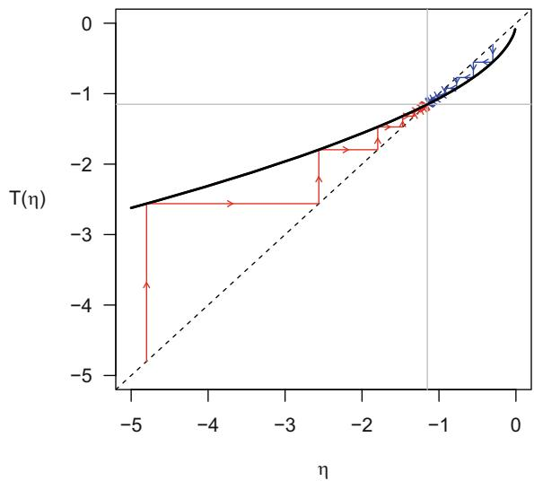  
Fig. 1. Two trajectories $(\eta(k))$ of Algorithm 1 for the $q$ -Gaussian distribution in Example 1. The solid curve shows the graph of $T(\eta)$ on $\Xi = (-\infty, 0)$ defined by (13) for the given data-set. The dashed line is the graph of the identity map. The fixed point (indicated by the intersection of the vertical and horizontal lines) corresponds to the MLE

Example 1 (q-Gaussian distribution). Let $\mathcal{X} = \mathbb{R}$ and $\nu$ be the Lebesgue measure. For $q\in (0,3)$ , the q-Gaussian distribution as a scale family can be expressed as a $\lambda$ -exponential family with $\lambda = 1 - q\in (-2,1)$ :

$$
p (x; \theta) = \left(1 - \lambda \theta x ^ {2}\right) ^ {\frac {1}{\lambda}} e ^ {- \varphi (\theta)}, \quad x \in \mathbb {R}, \tag {14}
$$

where $\theta \in \Theta = (-\infty, 0)$ , $F(x) = x^2$ and $\varphi(\theta) = \frac{-1}{2} \log(-\theta) + C_{\lambda}$ for some constant $C_{\lambda}$ (see [18, Example III.17] for details). The dual parameter is $\eta = \nabla^{(\lambda)} \varphi(\theta) = \frac{1}{2 + \lambda} \frac{1}{\theta} \in \Xi = (-\infty, 0)$ , so $\theta = \nabla^{(\lambda)} \psi(\eta) = \frac{1}{2 + \lambda} \frac{1}{\eta}$ . In Fig.1 we illustrate Algorithm 1 with a simulated data-set with $\lambda = -1.2$ and $n = 500$ . The true value of $\theta$ is $-1$ and we show two trajectories with different initial values. In both cases, the iterates converge quickly to the MLE.

We are now ready to state the main result of the paper whose proof is a novel application of the $\lambda$ -duality. In particular, we will use the $\lambda$ -gradients and the strict convexity of $\frac{1}{\lambda} (e^{\lambda \psi} - 1)$ .

Theorem 1 (Monotonicity of likelihood). Under Assumption 1, we have $\ell (\hat{\theta} (k + 1)) > \ell (\hat{\theta} (k))$ unless $\hat{\theta} (k)$ satisfies the fixed point condition (9).

Proof We first express the weights $w_{i}$ in terms of the dual potential $\psi$ . Since $\theta = \nabla^{(\lambda)}\psi (\eta)$ , for each $i$ we have

$$
1 + \lambda \theta \cdot y _ {i} = 1 + \lambda \frac {\nabla \psi (\eta)}{1 - \lambda \nabla \psi (\eta) \cdot \eta} \cdot y _ {i} = \frac {1 + \lambda \nabla \psi (\eta) \cdot \left(y _ {i} - \eta\right)}{1 - \lambda \nabla \psi (\eta) \cdot \eta}. \tag {15}
$$

Also note the identity

$$
1 - \lambda \nabla \psi (\eta) \cdot \eta = \frac {1}{1 + \lambda \theta \cdot \eta} = 1 - \lambda \nabla \varphi (\theta) \cdot \theta , \tag {16}
$$

which can be verified by a similar computation. Let $\varPsi(\eta):=e^{\lambda\psi(\eta)}$ which is positive and (since $\lambda < 0$ ) strictly concave on $\Xi$ . For each $i$ , define

$$
\kappa_ {i} (\eta) := \Psi (\eta) + \nabla \Psi (\eta) \cdot (y _ {i} - \eta).
$$

Since $\nabla \Psi (\eta) = \lambda e^{\lambda \psi (\eta)}\nabla \psi (\eta)$ , from (15) and (16) we have

$$
1 + \lambda \theta \cdot y _ {i} = \frac {\kappa_ {i} (\eta)}{\Psi (\eta)} (1 + \lambda \theta \cdot \eta) = \frac {\kappa_ {i} (\eta)}{e ^ {\lambda \psi (\eta) - \log (1 + \lambda \theta \cdot \eta)}} = \kappa_ {i} (\eta) e ^ {\lambda \varphi (\theta)}. \tag {17}
$$

Thus

$$
\kappa_ {i} (\eta) = p \left(x _ {i}; \theta\right) ^ {\lambda} \quad \text {a n d} \quad w _ {i} (\theta) = \frac {\left(\kappa_ {i} (\eta)\right) ^ {- 1}}{\sum_ {j = 1} ^ {n} \left(\kappa_ {j} (\eta)\right) ^ {- 1}}. \tag {18}
$$

From (18), we observe that

$$
\ell (\theta) = \frac {1}{\lambda} \log \left(\prod_ {i = 1} ^ {n} \kappa_ {i} (\eta)\right). \tag {19}
$$

Since $\lambda < 0$ , maximizing the likelihood over $\theta \in \Theta$ is equivalent to minimizing the product $\prod_{i=1}^{n} \kappa_i(\eta)$ over $\eta = \nabla^{(\lambda)} \psi(\theta) \in \Xi$ .

Now we make the key observation. Consider the $k$ -th iterate $(\theta(k), \eta(k))$ . For any $\eta \in \Xi$ , we have

$$
\begin{array}{l} \sum_ {i = 1} ^ {n} w _ {i} (\theta (k)) \kappa_ {i} (\eta) = \sum_ {i = 1} ^ {n} w _ {i} (\theta (k)) (\Psi (\eta) + \nabla \Psi (\eta) \cdot (y _ {i} - \eta)) \\ = \Psi (\eta) + \nabla \Psi (\eta) \cdot \left(\sum_ {i = 1} ^ {n} w _ {i} (\theta (k)) y _ {i} - \eta\right) \tag {20} \\ = \varPsi (\eta) + \nabla \varPsi (\eta) \cdot (\eta (k + 1) - \eta), \\ \end{array}
$$

where the last equality follows from (12). Letting $\eta = \eta(k)$ and $\eta = \eta(k + 1)$ gives

$$
\sum_ {i = 1} ^ {n} w _ {i} (\theta (k)) \kappa_ {i} (\eta (k)) = \varPsi (\eta (k)) + \nabla \varPsi (\eta (k)) \cdot (\eta (k + 1) - \eta (k))
$$

and

$$
\sum_ {i = 1} ^ {n} w _ {i} (\theta (k)) \kappa_ {i} (\eta (k + 1)) = \varPsi (\eta (k + 1)).
$$

Since $\eta(k) \neq \eta(k + 1)$ by assumption, the strict concavity of $\varPsi$ implies that

$$
\sum_ {i = 1} ^ {n} w _ {i} (\theta (k)) \kappa_ {i} (\eta (k)) <   \sum_ {i = 1} ^ {n} w _ {i} (\theta (k)) \kappa_ {i} (\eta (k + 1)). \tag {21}
$$

From (18), the last inequality is equivalent to

$$
\sum_ {i = 1} ^ {n} \frac {\left(\kappa_ {i} (\eta (k))\right) ^ {- 1}}{\sum_ {j = 1} ^ {n} \left(\kappa_ {j} (\eta (k))\right) ^ {- 1}} \kappa_ {i} (\eta (k + 1)) <   \sum_ {i = 1} ^ {n} \frac {\left(\kappa_ {i} (\eta (k))\right) ^ {- 1}}{\sum_ {j = 1} ^ {n} \left(\kappa_ {j} (\eta (k))\right) ^ {- 1}} \kappa_ {i} (\eta (k)),
$$

which leads to

$$
\frac {1}{n} \sum_ {i = 1} ^ {n} \frac {\kappa_ {i} (\eta (k + 1))}{\kappa_ {i} (\eta (k))} <   1.
$$

By the inequality of arithmetic and geometric means, we have

$$
\frac {\prod_ {i = 1} ^ {n} \kappa_ {i} (\eta (k + 1))}{\prod_ {i = 1} ^ {n} \kappa_ {i} (\eta (k))} \leq \left(\frac {1}{n} \sum_ {i = 1} ^ {n} \frac {\kappa_ {i} (\eta (k + 1))}{\kappa_ {i} (\eta (k))}\right) ^ {n} <   1.
$$

From (19) (and recalling that $\lambda < 0$ ), we have $\ell(\theta(k + 1)) > \ell(\theta(k))$ which is the desired inequality.

# 3 Dirichlet Perturbation

The Dirichlet perturbation model is a multiplicative analogue of the normal location model and is a key example of the $\lambda$ -exponential family [14, 18]. Let $\varDelta^d$ be the open unit simplex in $\mathbb{R}^{d+1}$ defined by

$$
\Delta^ {d} = \left\{p = \left(p ^ {0}, \dots , p ^ {d}\right) \in (0, 1) ^ {d + 1}: p ^ {0} + \dots + p ^ {d} = 1 \right\}.
$$

In this section, we use superscripts to denote the components. On $\varDelta^d$ , introduce the perturbation operation

$$
p \oplus q := \left(\frac {p ^ {0} q ^ {0}}{\sum_ {j = 0} ^ {d} p ^ {j} q ^ {j}}, \ldots , \frac {p ^ {d} q ^ {d}}{\sum_ {j = 0} ^ {d} p ^ {j} q ^ {j}}\right),
$$

which is the addition under the Aitchison geometry [8]. This leads to the difference operation

$$
p \ominus q := \left(\frac {p ^ {0} / q ^ {0}}{\sum_ {j = 0} ^ {d} p ^ {j} / q ^ {j}}, \ldots , \frac {p ^ {d} / q ^ {d}}{\sum_ {j = 0} ^ {d} p ^ {j} / q ^ {j}}\right).
$$

In particular, for any $p \in \Delta^d$ , $p \ominus p = \left(\frac{1}{1 + d}, \ldots, \frac{1}{1 + d}\right)$ is the barycenter of the simplex (uniform distribution). Fix $\sigma > 0$ and let $D = (D^0, \ldots, D^d)$ be a Dirichlet random vector with parameters $\left(\frac{1}{\sigma(1 + d)}, \ldots, \frac{1}{\sigma(1 + d)}\right)$ . We may regard $\sigma$ as a noise parameter. Consider the distribution of

$$
Q := p \oplus D, \tag {22}
$$

where $p \in \Delta^d$ is regarded as the parameter. In [18, Proposition III.20], it was shown that for $\sigma > 0$ fixed, the parameterized distribution of $Q$ on $\mathcal{X} = \Delta^d$ can be expressed as a $d$ -dimensional $\lambda$ -exponential family with $\lambda = -\sigma < 0$ ,

$$
\theta := \left(\frac {p ^ {0}}{\lambda p ^ {1}}, \ldots , \frac {p ^ {0}}{\lambda p ^ {d}}\right) \quad \text {a n d} \quad F (q) := \left(\frac {q ^ {1}}{q ^ {0}}, \ldots , \frac {q ^ {d}}{q ^ {0}}\right).
$$

The potential function is $\varphi (\theta) = \frac{1}{\lambda(1 + d)}\sum_{i = 1}^{d}\log (-\theta^i)$ , defined for $\theta \in \Theta \coloneqq (-\infty ,0)^d$ . The dual parameter is then given by

$$
\eta := \nabla^ {(\lambda)} \varphi (\theta) = \frac {1}{\lambda} \left(\frac {1}{\theta^ {1}}, \dots , \frac {1}{\theta^ {d}}\right) = \left(\frac {p ^ {1}}{p ^ {0}}, \dots , \frac {p ^ {d}}{p ^ {0}}\right) \in \Xi := (0, \infty) ^ {d}, \tag {23}
$$

which is independent of $\sigma$ or $\lambda$ . In particular, we may recover $p$ from $\eta$ by

$$
p = \left(p ^ {0}, p ^ {1}, \dots , p ^ {d}\right) = \left(\frac {1}{1 + \sum_ {j = 1} ^ {d} \eta^ {j}}, \frac {\eta^ {1}}{1 + \sum_ {j = 1} ^ {d} \eta^ {j}}, \dots , \frac {\eta^ {d}}{1 + \sum_ {j = 1} ^ {d} \eta^ {j}}\right). \tag {24}
$$

With (24), we can express the update (13) in terms of the simplex parameter $p(k)$ rather than the dual parameter $\eta(k)$ .

In the following proposition, we show that the update for the Dirichlet perturbation is, in fact, independent of $\lambda$ . That is, the algorithm works the same way even if $\sigma = -\lambda$ is unknown. This is analogous to maximum likelihood estimation of the normal location model, where the sample mean does not depend on the value of the noise. This is not the case in general.

Proposition 2. Let $q_{1},\ldots ,q_{n}\in \varDelta^{d}$ be n i.i.d. samples from the Dirichlet perturbation model (22). Under the algorithm (13), we have

$$
p (k + 1) = p (k) \oplus \left(\frac {1}{n} \sum_ {i = 1} ^ {n} \left(q _ {i} \ominus p (k)\right)\right). \tag {25}
$$

We emphasize that $\frac{1}{n} \sum_{i=1}^{n}$ is the Euclidean (not Aitchison) average on $\Delta^d$ .

Proof. We plug (23) and (24) into (13) and simplify using the simplex operations. The details are omitted due to space constraints.

Example 2. We consider a simulated data-set from the Dirichlet perturbation model with $d = 2$ , $p = (0.1, 0.4, 0.5)$ , $\sigma = 0.1$ and $n = 100$ (chosen for visualization purposes; the algorithm works for much larger values of $d$ and $n$ ). In Fig. 2 we plot the data and the output of the algorithm (25) with several initial values. In all cases, the iterates converge quickly to the MLE. In practice, we may initialize $p(0)$ by the sample mean $\frac{1}{n} \sum_{i=1}^{n} q_i$ as it tends to be close to the MLE.

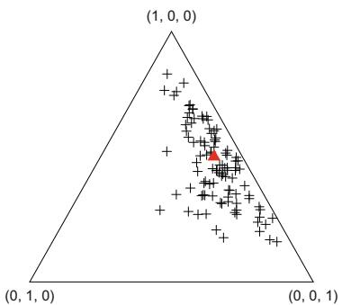

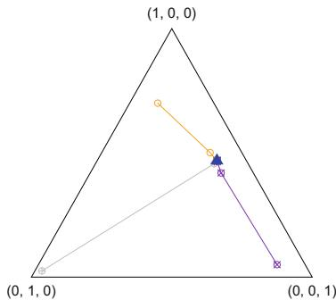  
Fig.2. Left: True $p(\triangle)$ and samples (+) from the Dirichlet perturbation model. Right: Three trajectories $(p(k))_{k\geq 0}$ of the algorithm (25) with different initial values. They all converge quickly to the MLE $(\triangle)$

Acknowledgments. The research of T.-K. L. Wong is partially supported by the NSERC Discovery Grants RGPIN-2019-04419 and RGPIN-2025-06021.

Disclosure of Interests. The authors have no competing interests to declare that are relevant to the content of this article.

# References

1. Abe, M., Nomura, Y., Kurita, T.: Nonlinear dimensionality reduction with $q$ -Gaussian distribution. Pattern Anal. Appl. 27(1), 26 (2024)   
2. Amari, S.: Correction to: information geometry and its applications. In: Information Geometry and Its Applications. AMS, vol. 194, pp. C1-C2. Springer, Tokyo (2020). https://doi.org/10.1007/978-4-431-55978-8_14   
3. Amari, S.I., Ohara, A.: Geometry of $q$ -exponential family of probability distributions. Entropy 13(6), 1170-1185 (2011)   
4. Amari, S.I., Ohara, A., Matsuzoe, H.: Geometry of deformed exponential families: Invariant, dually-flat and conformal geometries. Physica A 391(18), 4308-4319 (2012)   
5. Amid, E., Nock, R., Warmuth, M.K.: Clustering above exponential families with tempered exponential measures. In: International Conference on Artificial Intelligence and Statistics, pp. 2994-3017. PMLR (2023)   
6. Ding, N., Qi, Y., Vishwanathan, S.: $t$ -divergence based approximate inference. In: Advances in Neural Information Processing Systems, vol. 24 (2011)   
7. Ding, N., Vishwanathan, S.: $t$ -logistic regression. In: Advances in Neural Information Processing Systems, vol. 23 (2010)   
8. Egozcue, J.J., Pawlowsky-Glahn, V., Mateu-Figueras, G., Barcelo-Vidal, C.: Isometric logratio transformations for compositional data analysis. Math. Geol. 35(3), 279-300 (2003)   
9. Futami, F., Sato, I., Sugiyama, M.: Expectation propagation for $t$ -exponential family using $q$ -algebra. In: Advances in Neural Information Processing Systems, vol. 30 (2017)

10. Guilmeau, T., Chouzenoux, E., Elvira, V.: On variational inference and maximum likelihood estimation with the $\lambda$ -exponential family. Found. of Data Sci. 6(1), 85-123 (2024)   
11. Kainth, A.S., Wong, T.K.L., Rudzicz, F.: Conformal mirror descent with logarithmic divergences. Inf. Geometry 7(Suppl 1), 303-327 (2024)   
12. Machado, A.F., Charpentier, A., Gallic, E.: Optimal transport on categorical data for counterfactuals using compositional data and Dirichlet transport. arXiv preprint arXiv:2501.15549 (2025)   
13. Naudts, J.: Generalised Thermostatistics. Springer, London (2011). https://doi.org/10.1007/978-0-85729-355-8   
14. Pal, S., Wong, T.K.L.: Multiplicative Schrödinger problem and the Dirichlet transport. Probab. Theory Relat. Fields 178(1), 613-654 (2020)   
15. Tao, Z., Wong, T.-K.L.: Projections with logarithmic divergences. In: Nielsen, F., Barbaresco, F. (eds.) GSI 2021. LNCS, vol. 12829, pp. 477-486. Springer, Cham (2021). https://doi.org/10.1007/978-3-030-80209-7_52   
16. Villani, C.: Topics in Optimal Transportation. American Mathematical Society (2003)   
17. Wong, T.-K.L.: Logarithmic divergences from optimal transport and Rényi geometry. Inf. Geometry 1(1), 39-78 (2018). https://doi.org/10.1007/s41884-018-0012-6   
18. Wong, T.K.L., Zhang, J.: Tsallis and Rényi deformations linked via a new $\lambda$ -duality. IEEE Trans. Inf. Theory 68(8), 5353-5373 (2022)   
19. Zhang, J., Wong, T.K.L.: $\lambda$ -deformed probability families with subtractive and divisive normalizations. In: Handbook of Statistics, vol. 45, pp. 187-215. Elsevier (2021)   
20. Zhang, J., Wong, T.K.L.: $\lambda$ -deformation: a canonical framework for statistical manifolds of constant curvature. Entropy 24(2), 193 (2022)

# Rényi Partial Orders for BISO Channels

Christoph Hirche

Institute for Information Processing (tnt/L3S), Leibniz Universitat Hannover,

Hanover, Germany

hirche@tnt.uni-hannover.de

https://www.tnt.uni-hannover.de

Abstract. A fundamental question in information theory is to quantify the loss of information under a noisy channel. Partial orders are typical tools to that end, however, they are often also challenging to evaluate. For the special class of binary input symmetric output (BISO) channels, Geng et al. showed that among channels with the same capacity, the binary symmetric channel (BSC) and binary erasure channel (BEC) are extremal with respect to the more capable order. Here we extend on this result by considering partial orders based on Rényi mutual information. We establish the extremality of the BSC and BEC in this setting with respect to the generalized Rényi capacity. In the process, we also generalize the needed tools and introduce $\alpha$ -Lorenz curves.

Keywords: Channel partial orders $\cdot$ Rényi mutual information $\cdot$ Extremal channels

# 1 Introduction

Data processing inequalities state that information measures are monotone under the application of a noisy channel, i.e. information can only decrease along the transmission, qualifying them as distinguishability measures [13]. However, often we need to make more quantitative statements. To that end, information measure based partial orders allow to compare channels with respect to their data processing properties. A particular example is the more capable partial order [12]. With any such order it is an interesting question whether one can establish extremal channels among certain subclasses of channels. Geng et al. [4] established that among all binary input symmetric output (BISO) channels with the same capacity the binary erasure channel (BEC) and the binary symmetric channel (BSC) form the two extremes with respect to the more capable partial order. This leads to their main result that the inner and outer bounds for the corresponding BISO broadcast channel differ if and only if the two BISO channels are more capable comparable. Recent work in [11] extended on these results by considering the less noisy and degradable orders. In this case, capacity is not the natural common classifier, but several contraction coefficients play that role. Beyond those results, partial orders and contraction coefficients have found numerous further applications [2,9,17]. In this work, we take a different approach and consider generalizations of the more capable partial order using Rényi mutual information.

# 2 Preliminaries and Technical Tools

# 2.1 Notation

In this work, we mainly consider binary input symmetric output (BISO) channels with input alphabet $\mathcal{X} = \{0,1\}$ and output alphabet $\mathcal{Y} = \{0,\pm 1,\pm 2,\dots ,\pm l\}$ for some integer $l\geq 1$ , those are the channels for which $P_{Y|X}(y|0) = P_{Y|X}(-y|1)\coloneqq p_y$ . We can always assume that the output alphabet $\mathcal{V}$ has even number of elements because else we can split $Y = 0$ into two outputs, $Y = 0_{+}$ and $Y = 0_{-}$ , with $P_{Y|X}(0_{-}|0) = P_{Y|X}(0_{+}|0) = \frac{p_0}{2}$ . The binary convolution is denoted by $a*b = a(1 - b) + (1 - a)b$ and the binary Rényi entropy is $h_\alpha (p) = \frac{1}{1 - \alpha}\log (p^\alpha +(1 - p)^\alpha)$ , with the usual binary entropy as special case, $h(p) = \lim_{\alpha \to 1}h_{\alpha}(p) = -p\log (p) - (1 - p)\log (1 - p)$ . We denote the Bernoulli distribution with probability $P(X = 0) = p$ by $Ber(p)$ .

# 2.2 Rényi Mutual Information

The mutual information can be expressed as a Kulback-Leibler divergence in several ways. It is hence natural to seek a Rényi generalization by instead using the Rényi divergence [14],

$$
D _ {\alpha} (P \| Q) = \frac {1}{\alpha - 1} \log \left(\sum_ {a \in \mathcal {A}} P ^ {\alpha} (a) Q ^ {1 - \alpha} (a)\right). \tag {2.1}
$$

Mostly for notational convenience, we also define the conditional Rényi divergence as

$$
D _ {\alpha} \left(P _ {Y | X} \| Q _ {Y | X} P _ {X}\right) = D _ {\alpha} \left(P _ {Y | X} P _ {X} \| Q _ {Y | X} P _ {X}\right). \tag {2.2}
$$

Sibson [15] proposed the definition of an information radius which succinctly was generalized to that of a Rényi mutual information by Verdu [16]. That definition is

$$
\begin{array}{l} I _ {\alpha} ^ {S} (X: Y) = \min  _ {Q _ {Y}} D _ {\alpha} \left(P _ {Y | X} \| Q _ {Y} \mid P _ {X}\right) (2.3) \\ = \frac {\alpha}{\alpha - 1} \log \sum_ {y \in \mathcal {Y}} \left(\sum_ {x \in \mathcal {X}} P _ {X} (x) P _ {Y | X = x} ^ {\alpha} (y)\right) ^ {\frac {1}{\alpha}}. (2.4) \\ \end{array}
$$

The closed form expression can be found in [16, Equation (53)].

For a given $P_{Y|X}$ , the maximum mutual information over all input distributions $P_{X}$ is sometimes called the capacity of order $\alpha$ , see [1], and we denote it here by

$$
C _ {\alpha} \left(P _ {Y \mid X}\right) = \sup  _ {P _ {X}} I _ {\alpha} ^ {S} (X: Y). \tag {2.5}
$$

For simplicity we simply call it the $\alpha$ -capacity. In a slight abuse of notation, we denote by $BISO(C_{\alpha})$ the set of all BISO channels with fixed capacity of order $\alpha$ .

Another definition of Rényi mutual information was given by Arimoto [1] as

$$
\begin{array}{l} I _ {\alpha} ^ {A} (X: Y) = H _ {\alpha} (X) - H _ {\alpha} ^ {A} (X | Y) (2.6) \\ = \frac {\alpha}{\alpha - 1} \log \sum_ {y \in \mathcal {Y}} \left(\sum_ {x \in \mathcal {X}} P _ {X _ {\alpha}} (x) P _ {Y | X = x} ^ {\alpha} (y)\right) ^ {\frac {1}{\alpha}}, (2.7) \\ \end{array}
$$

where $P_{X_{\alpha}}(x) = \frac{P_X^\alpha(x)}{\sum_xP_X^\alpha(x)}$ . Although this is generally a very different quantity, the $\alpha$ -capacity does not change using this definition [3].

# 2.3 Rényi Partial Orders

Körner and Marton [12] defined a channel $W_{1}: X \mapsto Y_{1}$ to be more capable than a channel $W_{2}: X \mapsto Y_{2}$ , denoted $W_{1} \succeq_{\mathrm{m.c.}} W_{2}$ , if

$$
I \left(X: Y _ {1}\right) \geq I \left(X: Y _ {2}\right) \quad \forall P _ {X}. \tag {2.8}
$$

Here, we are interested in the generalization of this concept to Rényi entropies and make the following definition.

Definition 1. A channel $W_{1}: X \mapsto Y_{1}$ is said to be $\alpha$ -more capable than the channel $W_{2}: X \mapsto Y_{2}$ , denoted $W_{1} \succeq_{\mathrm{m.c.}}^{\alpha} W_{2}$ , if

$$
I _ {\alpha} ^ {S} (X: Y _ {1}) \geq I _ {\alpha} ^ {S} (X: Y _ {2}) \quad \forall P _ {X}. \tag {2.9}
$$

We will later see that for the purpose of this work we could have also used Arimotos Renyi mutual information.

# 2.4 $\alpha$ -Lorenz Curves

In [4], Geng et al. gave a definition of the Lorenz curve for BISO channels. Here, we give an extension inspired by Rényi entropies that we call the $\alpha$ -Lorenz curve. We set $k_{\alpha}(p) = e^{(1 - \alpha)h_{\alpha}(p)}$ and make the following definitions.

Definition 2 ( $\alpha$ -BISO partition and $\alpha$ -BISO curve). For a BISO channel with transition probabilities $\{p_y, p_{-y}\}_y$ , rearrange $k_{\frac{1}{\alpha}}\left(\frac{p_y^\alpha}{p_y^\alpha + p_{-y}^\alpha}\right)$ in ascending order and denote the permutation by $\pi$ . The $\alpha$ -BISO partition is defined as the partition of $[0, d_C]$ with points

$$
t _ {k} = \sum_ {i = 1} ^ {k} \left(p _ {\pi_ {i}} ^ {\alpha} + p _ {- \pi_ {i}} ^ {\alpha}\right) ^ {\frac {1}{\alpha}} \tag {2.10}
$$

and $d_{C} = \sum_{y > 0}(p_{y}^{\alpha} + p_{-y}^{\alpha})^{\frac{1}{\alpha}}$ . We set $t_0 = 0$ . The $\alpha$ -BISO curve is defined as the stepwise function $f_{\alpha}(t)$ such that

$$
f _ {\alpha} (t) = k _ {\frac {1}{\alpha}} \left(\frac {p _ {\pi_ {y}} ^ {\alpha}}{p _ {\pi_ {y}} ^ {\alpha} + p _ {- \pi_ {y}} ^ {\alpha}}\right) \tag {2.11}
$$

on $(t_{k - 1},t_k]$ , and $f_{\alpha}(0) = 0$

Note that the interval $[0, d_C]$ on which we define the partition depends on the channel. However, we will see later that the $d_C$ is solely determined by the capacity of the channel and therefore the same for all BISO channels with identical capacity. Equipped with this, we can make the following definition.

Definition 3 ( $\alpha$ -Lorenz curve of a BISO channel). For a BISO channel with $\alpha$ -BISO curve $f_{\alpha}(t)$ , the $\alpha$ -Lorenz curve $F_{\alpha}(t)$ is defined as

$$
F _ {\alpha} (t) = \int_ {0} ^ {t} f _ {\alpha} (\tau) \mathrm {d} \tau . \tag {2.12}
$$

The following result holds for $\alpha$ -BISO curves.

Lemma 1. Given BISO channels $X \to Y$ and $X \to Z$ with equal capacity of order $\alpha$ and $\alpha$ -BISO curves $f_{\alpha}(t)$ and $g_{\alpha}(t)$ , respectively. Let the common refinement of these two BISO partitions be $\{t_k : k = 0, \dots, N\}$ , and $\xi_k = t_k - t_{k-1}$ . Then

$$
F _ {\alpha} \left(t _ {i}\right) = \sum_ {k = 1} ^ {i} \xi_ {k} f _ {\alpha} \left(t _ {k}\right) \leq \sum_ {k = 1} ^ {i} \xi_ {k} g _ {\alpha} \left(t _ {k}\right) = G _ {\alpha} \left(t _ {i}\right), \quad i = 1, \dots , N \tag {2.13}
$$

if and only if the $\alpha$ -Lorenz curve satisfies $F_{\alpha}(t) \leq G_{\alpha}(t)$ for all $t \in [0, d_C]$ .

Proof. The proof is essentially the same as that of [4, Lemma 1] and essentially uses the observation that $F_{\alpha}(t)$ is a piecewise linear function.

We are now in the position to combine all concepts of this section and make statements about Rényi partial orders for BISO channels.

# 3 Main Results

In this section we will only consider BISO channels. After some derivation, one can find that for a BISO channel $P_{Y|X}$ , Sibson's Rényi mutual information becomes

$$
\begin{array}{l} I _ {\alpha} ^ {S} (X: Y) = \frac {\alpha}{\alpha - 1} \log \sum_ {y > 0} \left(p _ {y} ^ {\alpha} + p _ {- y} ^ {\alpha}\right) ^ {\frac {1}{\alpha}} k _ {\frac {1}{\alpha}} \left(x * \frac {p _ {y} ^ {\alpha}}{p _ {y} ^ {\alpha} + p _ {- y} ^ {\alpha}}\right) (3.1) \\ = \frac {\alpha}{\alpha - 1} \log \int_ {0} ^ {d _ {C}} k _ {\frac {1}{\alpha}} \left(x * k _ {\frac {1}{\alpha}} ^ {- 1} (f (\tau))\right) d \tau , (3.2) \\ \end{array}
$$

where $x \coloneqq P(X = 0)$ and we recall $k_{\alpha}(p) = e^{(1 - \alpha)h_{\alpha}(p)}$ . From here one can find that the $\alpha$ -capacity is given by

$$
C _ {\alpha} \left(P _ {Y \mid X}\right) = \log 2 - \frac {\alpha}{\alpha - 1} \log \sum_ {y > 0} \left(p _ {y} ^ {\alpha} + p _ {- y} ^ {\alpha}\right) ^ {\frac {1}{\alpha}}, \tag {3.3}
$$

that is, it is optimized by $x = \frac{1}{2}$ . This follows because $k_{\frac{1}{\alpha}}(x)$ is maximal at $x = \frac{1}{2}$ and $\frac{1}{2} * x = \frac{1}{2}$ . This implies $C_{\alpha}(P_{Y|X}) = \log 2 - \frac{\alpha}{\alpha - 1} \log d_C$ , showing our earlier claim that $d_C$ depends solely on the $\alpha$ -capacity.

We will need the following lemma, previously proven in the context of information combining.

Lemma 2 (Lemma IV.10 in [7]). The function

$$
k _ {\alpha} \left(k _ {\alpha} ^ {- 1} (x) * k _ {\alpha} ^ {- 1} (y)\right) \tag {3.4}
$$

is convex in both $x$ and $y$ for $0 < \alpha < 1$ and $2 < \alpha \leq 3$ and concave for $1 < \alpha \leq 2$ and $\alpha \geq 3$ .

In particular, note that for $\alpha \in \{2,3\}$ the function is indeed linear in both $x$ and $y$ . Again similar to [4], we will also need the following lemma.

Lemma 3 (Lemma 1 in [6]). Let $x_{1}, \ldots, x_{l}$ and $y_{1}, \ldots, y_{l}$ be nondecreasing sequences of real numbers. Let $\xi_{1}, \ldots, \xi_{l}$ be a sequence of real numbers such that

$$
\sum_ {j = k} ^ {l} \xi_ {j} x _ {j} \geq \sum_ {j = k} ^ {l} \xi_ {j} y _ {j}, \quad 1 \leq k \leq l, \tag {3.5}
$$

with equality for $k = 1$ . Then for any convex function $\Lambda$ ,

$$
\sum_ {j = 1} ^ {l} \xi_ {j} \Lambda (x _ {j}) \geq \sum_ {j = 1} ^ {l} \xi_ {j} \Lambda (y _ {j}). \tag {3.6}
$$

It is easy to check that in the above lemma if $\Lambda$ is concave instead, then Equation (3.6) holds with the direction of the inequality swapped.

With these result, we can establish the following theorem.

Theorem 1 (A sufficient condition). Given BISO channels $W_{1}: X \mapsto Y_{1}$ and $W_{2}: X \mapsto Y_{2}$ with same $\alpha$ -capacity $C_{\alpha}$ and $\alpha$ -Lorenz curves $F_{\alpha,1}(t)$ and $F_{\alpha,2}(t)$ , respectively. If $F_{\alpha,1}(t) \leq F_{\alpha,2}(t)$ then $W_{1}$ is $\alpha$ -more capable than $W_{2}$ , i.e. $W_{1} \succeq_{\mathrm{m.c.}}^{\alpha} W_{2}$ , for all $\alpha > 1$ , $\frac{1}{2} \leq \alpha < 1$ and $0 < \alpha \leq \frac{1}{3}$ . For $\frac{1}{3} \leq \alpha \leq \frac{1}{2}$ we have instead $W_{2} \succeq_{\mathrm{m.c.}}^{\alpha} W_{1}$ .

Proof. Since both channels have the same capacity of order alpha, their Lorenz curves are defined on the same interval $[0, d_C]$ . By Lemma 1, $F_{\alpha,1}(t) \leq F_{\alpha,2}(t)$ implies

$$
F _ {\alpha , 1} \left(t _ {i}\right) = \sum_ {k = 1} ^ {i} \xi_ {k} f _ {\alpha , 1} \left(t _ {k}\right) \leq \sum_ {k = 1} ^ {i} \xi_ {k} f _ {\alpha , 2} \left(t _ {k}\right) = F _ {\alpha , 2} \left(t _ {i}\right), \quad i = 1, \dots , N. \tag {3.7}
$$

Next, we have,

$$
\begin{array}{l} F _ {\alpha , 1} (d _ {C}) = \int_ {0} ^ {d _ {C}} f _ {\alpha , 1} (\tau) \mathrm {d} \tau = \sum_ {i = 1} ^ {N} \left(p _ {\pi_ {i}} ^ {\alpha} + p _ {- \pi_ {i}} ^ {\alpha}\right) ^ {\frac {1}{\alpha}} k _ {\frac {1}{\alpha}} \left(\frac {p _ {\pi_ {y}} ^ {\alpha}}{p _ {\pi_ {y}} ^ {\alpha} + p _ {- \pi_ {y}} ^ {\alpha}}\right) (3.8) \\ = \sum_ {i = 1} ^ {N} \left(p _ {\pi_ {i}} + p _ {- \pi_ {i}}\right) = 1. (3.9) \\ \end{array}
$$

This holds indeed for all BISO channels, and therefore we have $F_{\alpha,1}(d_C) = F_{\alpha,2}(d_C) = 1$ . Furthermore, $f_{\alpha,1}(t_k)$ and $f_{\alpha,2}(t_k)$ are both nondecreasing and we can apply Lemma 3 with the function $\Lambda(y) = k_{\alpha} \left( x * k_{\alpha}^{-1}(y) \right)$ . Due to the convexity properties in Lemma 2, this gives for $\alpha > 1$ and $\frac{1}{3} \leq \alpha \leq \frac{1}{2}$ ,

$$
\sum_ {j = 1} ^ {N} \xi_ {j} k _ {\frac {1}{\alpha}} \left(x * k _ {\frac {1}{\alpha}} ^ {- 1} \left(f _ {\alpha , 1} \left(t _ {j}\right)\right)\right) \geq \sum_ {j = 1} ^ {N} \xi_ {j} k _ {\frac {1}{\alpha}} \left(x * k _ {\frac {1}{\alpha}} ^ {- 1} \left(f _ {\alpha , 2} \left(t _ {j}\right)\right)\right), \tag {3.10}
$$

and for $\frac{1}{2} \leq \alpha < 1$ and $0 < \alpha \leq \frac{1}{3}$ ,

$$
\sum_ {j = 1} ^ {N} \xi_ {j} k _ {\frac {1}{\alpha}} \left(x * k _ {\frac {1}{\alpha}} ^ {- 1} \left(f _ {\alpha , 1} \left(t _ {j}\right)\right)\right) \leq \sum_ {j = 1} ^ {N} \xi_ {j} k _ {\frac {1}{\alpha}} \left(x * k _ {\frac {1}{\alpha}} ^ {- 1} \left(f _ {\alpha , 2} \left(t _ {j}\right)\right)\right). \tag {3.11}
$$

Taking $\frac{\alpha}{\alpha - 1}\log (\cdot)$ on both sides, noting the negative prefactor for $\alpha < 1$ , we have for $\alpha > 1$ , $\frac{1}{2} \leq \alpha < 1$ and $0 < \alpha \leq \frac{1}{3}$ , that

$$
I _ {\alpha} ^ {S} (X: Y _ {1}) \geq I _ {\alpha} ^ {S} (X: Y _ {2}), \quad \forall p (x), \tag {3.12}
$$

and for $\frac{1}{3} \leq \alpha \leq \frac{1}{2}$ with the inequality exchanged. This implies the claimed result.

For large ranges of $\alpha$ this shows the same behavior as the $\alpha = 1$ case discussed in [4]. The notable exception is $\frac{1}{3} \leq \alpha \leq \frac{1}{2}$ , where the implication is turned around. However, special attention should also be given to the settings where $\alpha \in \{\frac{1}{3}, \frac{1}{2}\}$ . As here both directions hold, ordered $\alpha$ -Lorenz curves imply that the channels are equivalent in the $\alpha$ -more capable ordering. Of course, then one might expect this to hold for any two channels, independent of their Lorenz curves. To that end, a calculation can show that,

$$
\begin{array}{l} I _ {\frac {1}{3}} ^ {S} (X: Y) = - \frac {1}{2} \log \left[ 1 - x (1 - x) \left[ 4 - \sum_ {y > 0} \left(p _ {y} ^ {\frac {1}{3}} + p _ {- y} ^ {\frac {1}{3}}\right) ^ {3} \right] \right] (3.13) \\ = - \frac {1}{2} \log \left[ 1 - x (1 - x) \left[ 4 - d _ {C _ {\frac {1}{3}}} \right] \right] (3.14) \\ \end{array}
$$

$$
\begin{array}{l} I _ {\frac {1}{2}} ^ {S} (X: Y) = - \log \left[ 1 - 2 x (1 - x) \left[ 2 - \sum_ {y > 0} \left(p _ {y} ^ {\frac {1}{2}} + p _ {- y} ^ {\frac {1}{2}}\right) ^ {2} \right] \right] (3.15) \\ = - \log \left[ 1 - 2 x (1 - x) \left[ 2 - d _ {C _ {\frac {1}{2}}} \right] \right]. (3.16) \\ \end{array}
$$

Hence, in terms of channel properties, the mutual information only depends on the $\alpha$ -capacity of the channel. This gives immediately the following corollary.

Corollary 1. For any two BISO channels $W_{1}:X\mapsto Y_{1}$ and $W_{2}:X\mapsto Y_{2}$ with same $\alpha$ -capacity $C_{\alpha}$ , we have

$$
W _ {1} \succeq_ {\mathrm {m . c .}} ^ {\frac {1}{3}} W _ {2}, \quad W _ {2} \succeq_ {\mathrm {m . c .}} ^ {\frac {1}{3}} W _ {1}, \tag {3.17}
$$

$$
W _ {1} \succeq_ {\mathrm {m . c .}} ^ {\frac {1}{2}} W _ {2}, \quad W _ {2} \succeq_ {\mathrm {m . c .}} ^ {\frac {1}{2}} W _ {1}. \tag {3.18}
$$

It follows also more generally that for these values of $\alpha \in \{\frac{1}{2},\frac{1}{3}\}$ the $\alpha$ -more capable order is equivalent to comparing the $\alpha$ -capacity between channels. Beyond these values, we find that, similar to the $\alpha = 1$ case in [4], the binary erasure channel and the binary symmetric channel are the extrema with respect to the $\alpha$ -more capable order.

Corollary 2. Let, $W$ , BSC and BEC be channels with the same $\alpha$ -capacity. Then, we have for $\alpha > 1$ , $\frac{1}{2} \leq \alpha < 1$ and $0 < \alpha \leq \frac{1}{3}$

$$
B E C \succeq_ {\mathrm {m . c .}} ^ {\alpha} W \succeq_ {\mathrm {m . c .}} ^ {\alpha} B S C, \tag {3.19}
$$

and for $\frac{1}{3} \leq \alpha \leq \frac{1}{2}$ ,

$$
B S C \succeq_ {\mathrm {m . c .}} ^ {\alpha} W \succeq_ {\mathrm {m . c .}} ^ {\alpha} B E C. \tag {3.20}
$$

Proof. By Theorem 1 it is sufficient to prove that the $\alpha$ -Lorenz curves are ordered. To that end, recall that the $\alpha$ -Lorenz curve is always a convex function. For the BSC, the only BISO channel with output dimension 2, the curve is simply the straight line from 0 to 1 on the interval $[0, d_C]$ and therefore an upper bound on any convex function with the same endpoints. The BEC is slightly more complicated. Consider $\alpha \geq 1$ , then the curve starts with a derivative of 1 on the interval $(0, 1 - \epsilon]$ , which is indeed the smallest possible derivative in this case. Then, on the interval $(1 - \epsilon, 1 - \epsilon + \epsilon 2^{\frac{1 - \alpha}{\alpha}}]$ , it has the maximal derivative $2^{\frac{\alpha - 1}{\alpha}}$ . Hence, the BEC curve always gives a lower bound. A similar argument holds for $\alpha < 1$ but now the maximum derivative is 1 and the minimum derivative is $2^{\frac{\alpha - 1}{\alpha}}$ .

# 3.1 Arimoto Mutual Information

So far, all derived results have been proven for the Sibson mutual information definition. Here we briefly point out that all of the above results also hold for Arimoto's mutual information. Note that for BISO channels, we get

$$
\begin{array}{l} I _ {\alpha} ^ {A} (X: Y) = \frac {\alpha}{\alpha - 1} \log \sum_ {y > 0} \left(p _ {y} ^ {\alpha} + p _ {- y} ^ {\alpha}\right) ^ {\frac {1}{\alpha}} k _ {\frac {1}{\alpha}} \left(x _ {\alpha} * \frac {p _ {y} ^ {\alpha}}{p _ {y} ^ {\alpha} + p _ {- y} ^ {\alpha}}\right) (3.21) \\ = \frac {\alpha}{\alpha - 1} \log \int_ {0} ^ {d _ {C}} k _ {\frac {1}{\alpha}} \left(x _ {\alpha} * k _ {\frac {1}{\alpha}} ^ {- 1} (f (\tau))\right) d \tau , (3.22) \\ \end{array}
$$

with $x_{\alpha} = \frac{x^{\alpha}}{x^{\alpha} + (1 - x)^{\alpha}}$ . Hence, we can use the same definition for $\alpha$ -Lorenz curves and now use the convexity or concavity of

$$
k _ {\alpha} \left(x _ {\alpha} * k _ {\alpha} ^ {- 1} (y)\right), \tag {3.23}
$$

which still follows from Lemma 2 because we keep $\alpha$ fixed.

The Arimoto mutual information can be of particular interest, because it obeys a chain rule, allowing to translate the results also to conditional entropies,

$$
I _ {\alpha} ^ {A} (X: Y _ {1}) \geq I _ {\alpha} ^ {A} (X: Y _ {2}) \Leftrightarrow H _ {\alpha} ^ {A} (X | Y _ {1}) \leq H _ {\alpha} ^ {A} (X | Y _ {2}). \tag {3.24}
$$

A similar result does not directly hold for the Rényi mutual information of Sibson.

# 4 Conclusions

In this work, we establish extremality result for a partial order based on Rényi mutual information. The results are closely connected to Rényi bounds on information combining [7,8]. A natural direction for further investigation would be to go beyond BISO channels, include auxiliary random variables akin to the less noisy ordering or to consider quantum settings, where it might help to solve open problems in information combining [10]. One might expect that such results will have implications for contraction coefficients of Rényi divergences [5].

Acknowledgment. Funded by the Deutsche Forschungsgemeinschaft (DFG, German Research Foundation) - 550206990.

Disclosure of Interest.. The authors have no competing interests to declare that are relevant to the content of this article.

# References

1. Arimoto, S.: Information measures and capacity of order $\alpha$ for discrete memoryless channels. Topics in information theory (1977)   
2. Asoodeh, S., Diaz, M., Calmon, F.P.: Privacy analysis of online learning algorithms via contraction coefficients. In: International Symposium on Information Theory. p. 1 (2020)   
3. Csiszár, I.: Generalized cutoff rates and rényi's information measures. IEEE Trans. Inf. Theory 41(1), 26-34 (1995)   
4. Geng, Y., Nair, C., Shitz, S.S., Wang, Z.V.: On broadcast channels with binary inputs and symmetric outputs. IEEE Trans. Inf. Theory 59(11), 6980-6989 (2013)   
5. Grosse, L., Saeidian, S., Oechtering, T.J., Skoglund, M.: Strong data processing properties of rényi-divergences via pinsker-type inequalities. arXiv preprint arXiv:2501.11473 (2025)   
6. Hajek, B., Pursley, M.: Evaluation of an achievable rate region for the broadcast channel. IEEE Trans. Inf. Theory 25(1), 36-46 (1979)   
7. Hirche, C.: Rényi bounds on information combining. In: 2020 IEEE International Symposium on Information Theory (ISIT). pp. 2297-2302. IEEE (2020)   
8. Hirche, C., Guan, X., Tomamichel, M.: Chain rules for rényi information combining. In: 2023 IEEE International Symposium on Information Theory (ISIT). pp. 204-209. IEEE (2023)   
9. Hirche, C., Leditzky, F.: Bounding quantum capacities via partial orders and complementarity. IEEE Trans. Inf. Theory 69(1), 283-297 (2022)   
10. Hirche, C., Reeb, D.: Bounds on information combining with quantum side information. IEEE Trans. Inf. Theory 64(7), 4739-4757 (2018). https://doi.org/10.1109/tit.2018.2842180   
11. Hirche, C., Shaya, O.: Partial orders and contraction for biso channels. In: 2025 IEEE International Symposium on Information Theory (ISIT). p. TBD. IEEE (2025)   
12. Korner, J., Marton, K., et al.: Comparison of two noisy channels. In: Topics in information theory, pp. 411-413 (1975)

13. Polyanskiy, Y., Wu, Y.: Strong data-processing inequalities for channels and bayesian networks. In: Carlen, E., Madiman, M., Werner, E.M. (eds.) Convexity and Concentration, pp. 211-249. Springer, New York, New York, NY (2017)   
14. Rényi, A.: On measures of entropy and information. In: Proceedings of the fourth Berkeley symposium on mathematical statistics and probability, volume 1: contributions to the theory of statistics. vol. 4, pp. 547-562. University of California Press (1961)   
15. Sibson, R.: Information radius. Zeitschrift für Wahrscheinlichkeitstheorie und Verwandte Gebiete 14(2), 149-160 (1969). https://doi.org/10.1007/BF00537520   
16. Verdu, S.: $\alpha$ -mutual information. In: 2015 Information Theory and Applications Workshop (ITA). pp. 1-6. IEEE (2015)   
17. Xu, A., Raginsky, M.: Information-theoretic lower bounds on bayes risk in decentralized estimation. IEEE Trans. Inf. Theory 63(3), 1580-1600 (2016)

# The Fisher-Rao Distance Between Finite Energy Signals

Franck Florin

Thales, Paris, France  
franck.florin@fr.thalesgroup.com  
https://www.thalesgroup.com/

Abstract. We propose a parametric representation of finite energy signal observations defining a statistical manifold and investigate the possibility of obtaining closed-form expressions for the Fisher-Rao distance. The tensor differential equations defining the geodesics simplify to only two vectorial equations, which combine the magnitude and phase of the signal and their gradients with respect to the parameters. These equations lead to closed-form expressions of the Fisher-Rao distance in certain cases. We study the example of observing an attenuated signal with a known magnitude spectrum and unknown phase spectrum and calculate the Fisher-Rao distance. The finite energy signal manifold corresponds to the manifold of the Gaussian distribution with a known covariance matrix, and the manifold of known magnitude spectrum signals is a submanifold. We compute closed-form expressions of the Fisher-Rao distances and show that the submanifold is non-geodesic, indicating that the Fisher-Rao distance measured within the submanifold is greater than in the full manifold.

Keywords: Fisher-Rao distance $\cdot$ Finite energy signal $\cdot$ Christoffel symbols $\cdot$ Fisher metric

# 1 Introduction

A large number of applications, including telecommunications, sonar, radar, electronic warfare, music, speech analysis, fault diagnosis, and others, are concerned with the acquisition of a finite energy signal through a receiving channel. Assuming that the signal belongs to a parametric family, the problem for the receiver is to estimate the parameters using the observations made of a mix of signal and noise.

Let $\pmb{x}$ be the vector of observations and $\pmb{\xi} = [\xi^{1},\xi^{2},\dots,\xi^{N}]$ with $N$ real-valued components be the vector of signal parameters. The random stochastic behavior of the observations is described by the statistical distribution of the observations conditional to the parameters: $p(\pmb{x}|\pmb{\xi})$ . The set of all the parametric probability distributions, when $\pmb{\xi}$ varies in a predefined set $\Xi$ , constitutes a statistical model which can be viewed as a statistical manifold, and the Fisher information matrix

induces the Fisher metric, which relates the geometric structure of this manifold to the statistical estimation problem [1].

With the Fisher metric, it is possible to evaluate a statistical distance between two points represented by their respective parameters $\pmb{\xi}_{1}$ and $\pmb{\xi}_{2}$ . This distance is known as the Fisher-Rao distance [2]. It provides an estimation of the dissimilarity between the two statistical populations $p(\pmb{x}|\pmb{\xi}_1)$ and $p(\pmb{x}|\pmb{\xi}_2)$ .

The Fisher-Rao distance corresponds to the length of the geodesic, which is the curve with the minimum distance between the two points $\xi_{1}$ and $\xi_{2}$ [2,3]. This curve follows the geometry of the manifold, meaning that each point of the curve belongs to the manifold. The method used to compute the Fisher-Rao distance is explained in several references [1-3] and is commonly used by the information geometry community [4-6].

The first step is to get a parametric model describing the distribution of the observations $p(\pmb{x}|\pmb{\xi})$ . The Fisher information matrix $[g_{ij}]$ is derived from the log-likelihood as follows:

$$
g _ {i j} = E _ {\boldsymbol {\xi}} \left[ \frac {\partial}{\partial \xi^ {i}} \ln p (\boldsymbol {x} | \boldsymbol {\xi}) \frac {\partial}{\partial \xi^ {j}} \ln p (\boldsymbol {x} | \boldsymbol {\xi}) \right] \tag {1}
$$

Then, based on the Fisher information matrix, the Christoffel symbols are computed from the equations (with Einstein tensorial notation):

$$
\forall m, i, j = 1, \dots , N \quad g _ {m k} \Gamma_ {i j} ^ {k} = \frac {1}{2} \left(\frac {\partial g _ {j m}}{\partial \xi^ {i}} + \frac {\partial g _ {m i}}{\partial \xi^ {j}} - \frac {\partial g _ {i j}}{\partial \xi^ {m}}\right) \tag {2}
$$

Once the Christoffel symbols $\Gamma_{ij}^{k}$ are available, they can be used in the following differential equations, whose solutions are the geodesics $\tilde{\pmb{\xi}} (\varsigma)$ joining $\pmb {\xi}_1 = \tilde{\pmb{\xi}} (0)$ and $\pmb {\xi}_2 = \tilde{\pmb{\xi}} (1)$ (with $\varsigma \in [0,1]$ ):

$$
\forall k = 1, \dots , N \quad \frac {d ^ {2} \xi^ {k}}{d \varsigma^ {2}} + \Gamma_ {i j} ^ {k} \frac {d \xi^ {i}}{d \varsigma} \frac {d \xi^ {j}}{d \varsigma} = 0 \tag {3}
$$

Fisher geodesics may not be unique [7]. However, in many cases, solving the differential equations leads to a unique expression. Given the expression of the geodesic $\tilde{\pmb{\xi}} (\varsigma)$ , the Fisher-Rao distance between the distribution at $\pmb {\xi}_1 = \tilde{\pmb{\xi}} (0)$ and the distribution at $\pmb {\xi}_2 = \tilde{\pmb{\xi}} (1)$ is expressed by the following integral:

$$
d \left(\boldsymbol {\xi} _ {1}, \boldsymbol {\xi} _ {2}\right) = \int_ {0} ^ {1} \sqrt {g _ {i j} \frac {d \tilde {\xi} ^ {i}}{d \varsigma} \frac {d \tilde {\xi} ^ {j}}{d \varsigma}} d \varsigma \tag {4}
$$

In the following, we provide a generic parametric model for the acquisition of finite-energy signals through a noisy receiving channel. Based on the model, we define two statistical manifolds: the global manifold with no constraint on the parameters, and a submanifold associated to signals with a known magnitude spectrum. We develop the equations to obtain the Christoffel symbols and the geodesic equations. In the two manifolds, the geodesic equations can be solved to obtain closed-form expressions of the Fisher-Rao distances.

Given a manifold and a submanifold within this manifold, the geodesic distance in the submanifold is generally bigger than the geodesic distance measured in the global manifold. When they are equal, the submanifold is said to be a geodesic submanifold.

In our case, we detail the expressions of the Fisher-Rao distances in the global manifold and in the submanifold, and we examine whether or not the submanifold is a geodesic submanifold.

# 2 Observation Modelling

We examine the general expression of signal observation in the presence of additive noise, after applying the Fourier transform observed within the receiver bandwidth $\mathcal{B} \subset \mathbb{R}^{+}$ . The observation takes the form:

$$
\forall \nu \in \mathcal {B} \quad x (\nu) = s _ {\xi} (\nu) + n (\nu) \tag {5}
$$

In this equation, $x(\nu)$ , the observations, $s_\xi(\nu)$ , the signal parameterized by $\xi$ , and $n(\nu)$ , the noise, are complex numbers, expressed as functions of frequency. The noise components after Fourier transform $n(\nu)$ are centered, circular Gaussian random variables, independent from one frequency to the other. We assume that the noise spectral power densities are known: $\forall \nu \in \mathcal{B} \quad \gamma_0(\nu) = E\left(n(\nu)n^*(\nu)\right)$ (where $^*$ designs the complex conjugated number).

So, in short, the observation is a complex variable $x(\nu)$ in the positive frequency domain after application of a Fourier transform, where the frequency $\nu$ belongs to the observation bandwidth $\mathcal{B} \subset \mathbb{R}^+$ . The total vector of the observations $\pmb{x}$ is composed of all the complex variables $x(\nu)$ in the observation bandwidth: $\pmb{x} = (x(\nu))_{\nu \in \mathcal{B}}$ . The signal $s_\xi(\nu)$ is assumed deterministic but with unknown parameters $\pmb{\xi}$ . It is supposed to be a finite energy signal. It belongs to L2 (the set of square-integrable functions), with $\sum_{\nu} |s_\xi(\nu)|^2 < \infty$ .

The statistical distributions are determined by the signal parameters and the noise characteristics. The observations $\pmb{x}$ depend on the parameters through a parametric law of probability, where the parameters characterize the signal:

$$
p (\boldsymbol {x} | \boldsymbol {\xi}) = \prod_ {\nu \in \mathcal {B}} \frac {1}{\pi \gamma_ {0} (\nu)} \exp \left(- \frac {\left| x (\nu) - s _ {\boldsymbol {\xi}} (\nu) \right| ^ {2}}{\gamma_ {0} (\nu)}\right) \tag {6}
$$

The model used to derive this expression of the distribution has already been applied in previous work [8, 10]. Equation 6 is similar to the normal multivariate distribution as expressed in [4]:

$$
p (\boldsymbol {X} | \boldsymbol {\xi}) = \frac {1}{2 ^ {N _ {\mathcal {B}}} \pi^ {N _ {\mathcal {B}}} \sqrt {\det (\boldsymbol {\Sigma})}} \exp \left(- \frac {\left(\boldsymbol {X} - \boldsymbol {\mu} _ {\boldsymbol {\xi}}\right) ^ {T} \boldsymbol {\Sigma} ^ {- 1} \left(\boldsymbol {X} - \boldsymbol {\mu} _ {\boldsymbol {\xi}}\right)}{2}\right) \tag {7}
$$

where: $N_{\mathcal{B}}$ is the number of frequencies $\nu$ in $\mathcal{B}$ , $\pmb{\Sigma} = \text{diag}(\sigma_0^2(n))$ is a diagonal $2N_{\mathcal{B}} \times 2N_{\mathcal{B}}$ matrix, such that: $\forall k = 1,..N_{\mathcal{B}}$ $\gamma_0(k) = 2\sigma_0^2(2k - 1) = 2\sigma_0^2(2k)$ , $\pmb{X}$

is a $2N_{\mathcal{B}}$ vector, with $\forall k = 1,\dots N_{\mathcal{B}}X^{2k - 1} = Re\{x(k)\}$ and $X^{2k} = Im\{x(k)\}$ , $\mu_{\xi}$ is a $2N_{\mathcal{B}}$ vector, with $\forall k = 1,\dots N_{\mathcal{B}}\mu^{2k - 1} = Re\{s_{\xi}(k)\}$ and $\mu^{2k} = Im\{s_{\xi}(k)\}$ .

Equations 7, with $\mathbf{X}$ real vector, and 6, with $\mathbf{x}$ complex vector, are equivalent.

# 3 Definitions of the Statistical Manifolds

Equation 7 determines the geometry of the manifold induced by the parameters $\pmb{\xi}$ . The signal corresponds to a vector consisting of $2N_{\mathcal{B}}$ values: $\mu^k \quad \forall k = 1, \dots, 2N_{\mathcal{B}}$ , which are the components of the vector $\pmb{\mu}_{\xi}$ .

Definition 1 (Definition of the L2 manifold). When these components vary freely, the signal variations determine a manifold, which we call the L2 manifold.

In this case $\pmb{\xi}$ is a vector with $2N_{\mathcal{B}}$ components and $\forall k = 1,\dots 2N_{\mathcal{B}}\quad \xi^{k} = \mu^{k}$ . The dimension of the L2 manifold is $2N_{\mathcal{B}}$ . The L2 manifold corresponds exactly to the manifold described by $2N_{\mathcal{B}}$ multivariate normal distributions with the same covariance matrix $\pmb{\Sigma}$ and different mean values.

When the components vary under parameter $\xi$ constraint, we call the manifold the L2( $\xi$ ) manifold. When $\xi$ has $N$ components, $N$ is the dimension of the L2( $\xi$ ) manifold. The L2( $\xi$ ) manifold is a submanifold of the L2 manifold.

For all $\nu$ in $\mathcal{B}$ , the signal $s_{\xi}(\nu)$ is a complex value, which can be represented with a modulus (or magnitude) and a phase. We split the parameters $\xi$ of the signal into two parts: $\pmb{\xi} = \left(\pmb{\phi}^T,\pmb{\varphi}^T\right)^T$ . One part, $\phi$ , with $P$ parameters $\phi^q$ , is related to the magnitude $\rho_{\phi}(\nu)$ of the signal and the other part, $\varphi$ , with $N - P$ parameters $\varphi^u$ , is related to the phase $\psi_{\varphi}(\nu)$ of the signal.

$$
\forall \nu \in \mathcal {B} \quad s _ {\xi} (\nu) = \rho_ {\phi} (\nu) \cdot \exp (\imath \psi_ {\varphi} (\nu)) \tag {8}
$$

with $(\iota)^2 = -1, \psi_\varphi(\nu) \in ]-\pi, \pi]$ , and $\rho_\phi(\nu) \in ]0, +\infty[$ .

Definition 2 (Definition of the L2( $\xi$ ) manifold with $\boldsymbol{\xi} = \left(\boldsymbol{\phi}^T, \boldsymbol{\varphi}^T\right)^T$ ). In the following the L2( $\xi$ ) manifold is described by Eqs. 6 and 8 which refers to the case where $\boldsymbol{\xi} = \left(\boldsymbol{\phi}^T, \boldsymbol{\varphi}^T\right)^T$ .

# 4 General Expressions of the Fisher-Rao Distances

# 4.1 Fisher-Rao Distance in the L2 Manifold

It is known from [4,5] that, in the $2N_{\mathcal{B}}$ -dimensional manifold composed by multivariate normal distributions with a common covariance matrix $\pmb{\Sigma}$ , the Fisher-Rao distance between two distributions parametrized respectively by $\mu_{\xi_1}$ and $\mu_{\xi_2}$ is equal to the Mahalanobis distance:

$$
d _ {M} \left(\boldsymbol {\mu} _ {\boldsymbol {\xi} _ {1}}, \boldsymbol {\mu} _ {\boldsymbol {\xi} _ {2}}\right) = \sqrt {\left(\boldsymbol {\mu} _ {\boldsymbol {\xi} _ {2}} - \boldsymbol {\mu} _ {\boldsymbol {\xi} _ {1}}\right) ^ {T} \boldsymbol {\Sigma} ^ {- 1} \left(\boldsymbol {\mu} _ {\boldsymbol {\xi} _ {2}} - \boldsymbol {\mu} _ {\boldsymbol {\xi} _ {1}}\right)} \tag {9}
$$

With the notation of Eqs. 7 and 8 and based on definition 1, the Mahalanobis distance corresponds to the Fisher-Rao distance in the L2 manifold. As $\mu_{\xi}$ is a $2N_{\mathcal{B}}$ vector, with $\forall k = 1,\dots N_{\mathcal{B}}$ $\mu^{2k - 1} = \rho_{\phi}(\nu)\cdot \cos (\psi_{\varphi}(\nu))$ and $\mu^{2k} = \rho_{\phi}(\nu)\cdot$ sin $(\psi_{\varphi}(\nu))$ , the equation can be rewritten as follows:

$$
\begin{array}{l} d _ {L 2} \left(\boldsymbol {\xi} _ {1}, \boldsymbol {\xi} _ {2}\right) \\ = \sqrt {\sum_ {\nu} \frac {2}{\gamma_ {0} (\nu)} \left(\left(\rho_ {\phi_ {2}} (\nu)\right) ^ {2} + \left(\rho_ {\phi_ {1}} (\nu)\right) ^ {2} - 2 \rho_ {\phi_ {2}} (\nu) \cdot \rho_ {\phi_ {1}} (\nu) \cdot \cos (\Delta \psi (\nu))\right)} \tag {10} \\ \end{array}
$$

with $\varDelta\psi(\nu)=\langle\psi_{\varphi_2}(\nu)-\psi_{\varphi_1}(\nu)\rangle_{]-\pi,\pi]$ the difference between both signal phases. The notation $\langle\ldots\rangle_{-\pi,\pi}^{}$ , means that the angle is wrapped to belong to the interval $[- \pi, \pi]$ .

In order to simplify the expressions in the upcoming paragraphs, we will not explicitly express the dependence on the frequency $\nu$ , even when there is a sum over this variable, with the understanding that the quantities $\gamma_0, \rho$ and $\psi$ depend on the frequency.

# 4.2 Fisher-Rao Distance in the L2(ξ) Submanifold

Theorem 1 (Linearly Dependant Gradients (LDG) theorem). The geodesic equations in the $L2(\xi)$ submanifold reduce to the following two vectorial equations:

$$
\sum_ {\nu} \frac {2}{\gamma_ {0}} \left(\frac {d ^ {2} \rho_ {\phi}}{d \varsigma^ {2}} - \rho_ {\phi} \left(\frac {d \psi_ {\varphi}}{d \varsigma}\right) ^ {2}\right) \nabla_ {\phi} \rho_ {\phi} = [ \mathbf {0} ] \tag {11}
$$

$$
\sum_ {\nu} \frac {2}{\gamma_ {0}} \left(\rho_ {\phi} ^ {2} \frac {d ^ {2} \psi_ {\varphi}}{d \varsigma^ {2}} + 2 \rho_ {\phi} \frac {d \rho_ {\phi}}{d \varsigma} \frac {d \psi_ {\varphi}}{d \varsigma}\right) \bigtriangledown_ {\varphi} \psi_ {\varphi} = [ \mathbf {0} ] \tag {12}
$$

Proof. See reference [9]

To obtain these equations, we take into account the phase and magnitude decomposition of the signal as expressed in 8 and we introduce it in 6. We then derive the equations of the geodesics using the method explained in the introduction, Sect. 1.

Proposition 1. Using $\tilde{\rho}_{\phi}$ and $\tilde{\psi}_{\varphi}$ solutions of the geodesic equations, the Fisher-Rao distance can be computed as the following integral:

$$
d _ {L 2, \xi} \left(\boldsymbol {\xi} _ {1}, \boldsymbol {\xi} _ {2}\right) = \int_ {0} ^ {1} \sqrt {\sum_ {\nu} \frac {2}{\gamma_ {0}} \left(\left(\frac {d \tilde {\rho} _ {\phi}}{d \varsigma}\right) ^ {2} + \left(\tilde {\rho} _ {\phi} \frac {d \tilde {\psi} _ {\varphi}}{d \varsigma}\right) ^ {2}\right)} d \varsigma \tag {13}
$$

We have to consider that the $N$ -dimensional $\mathrm{L2}(\pmb{\xi})$ submanifold is included in the $2N_{B}$ -dimensional manifold L2 composed by multivariate normal distributions with a common covariance matrix. As a consequence, we expect that the Fisher-Rao distance $d_{L2,\pmb{\xi}}(\pmb{\xi}_1,\pmb{\xi}_2)$ measured in the $\mathrm{L2}(\pmb{\xi})$ submanifold is greater than the Fisher-Rao distance measured in the L2 manifold:

$$
d _ {L 2, \xi} (\boldsymbol {\xi} _ {1}, \boldsymbol {\xi} _ {2}) \geq d _ {L 2} (\boldsymbol {\xi} _ {1}, \boldsymbol {\xi} _ {2}) \tag {14}
$$

# 5 Example with Finite Energy Signals with Known Magnitude Spectrum

# 5.1 The $\mathbf{L2}(\alpha)$ Manifold

To be able to solve the previous Eqs. 11 and 12, we need to specify the dependencies of the magnitude and the phase with their parameters. We particularize the parametric description to define the $\mathrm{L}2(\alpha)$ manifold, which is a specific case of the $\mathrm{L}2(\pmb{\xi})$ manifold.

At the receiver level, the signal is often time-delayed and attenuated. When we need to take these phenomena into account, we denote by $\alpha$ the attenuation coefficient, and $\tau$ the time delay characterizing the reception at a reference location in the time frame of the receiver.

As we are examining the signal in the observation bandwidth $\mathcal{B}$ , it is important to consider the dependency of the phase $\psi_{\xi}(\nu)$ on the frequency $\nu$ . A discontinuity in the phase with respect to $\nu$ can occur when the phase reaches an extreme value of the interval $[- \pi, \pi]$ , that is $-\pi$ or $\pi$ , causing the phase to jump to the other end of the interval. To reconstruct a continuous phase with respect to $\nu$ , we can perform phase unwrapping. We denote the unwrapped phase by $\check{\psi}_{\xi}(\nu)$ .

Consequently, the signal can be expressed as: $s_{\xi}(\nu) = \rho_{\xi}(\nu)\cdot \exp \Big(i\breve{\psi}_{\xi}(\nu)\Big).$

# Definition 3. (Definition of the $\mathbf{L2}(\alpha)$ Manifold).

In this example, we suppose that the dependency of the magnitude with frequency is known, except for a global attenuation $\alpha$ :

$$
\rho_ {\phi} (\nu) = \alpha \cdot \rho_ {\mathbf {0}} (\nu) \tag {15}
$$

Thus, there is only one parameter related to the magnitude: $P = 1$ and $\phi^1 = \alpha$ . In addition we specify the model associated with the phase. The phase is supposed to be polynomial, that is:

$$
\check {\psi} _ {\varphi} (\nu) = \sum_ {l = 0} ^ {L} \beta^ {l} \cdot (\nu) ^ {l} \tag {16}
$$

Remark 1. With the previous notations, this means that $L + 1 = N - 1$ and $\varphi^u = \beta^{u - 1}$ . The time delay is related to the second coefficient: $\beta^1 = \varphi^2 = -2\pi \tau$ . Additionally, the number $L$ of coefficients $\beta^l$ of the polynomial function describing the phase is not limited. This allows the phase to be approximated as precisely as possible by a polynomial function of arbitrary order. This means that, given the fact that the unwrapped phase function is continuous, any phase function can be described by the model. Thus, the model applies to all signals with known spectrum magnitude and unknown phase.

# 5.2 Comparison of the Fisher-Rao Distances with Numerical Applications

By rewriting the Fisher-Rao distances with the ratio of the magnitudes $\gamma = \frac{\alpha_2}{\alpha_1}$ at points $\pmb{\xi}_1$ and $\pmb{\xi}_2$ , and the signal-to-noise ratio $SNR_{1}$ at $\pmb{\xi}_{1}$ , we derive the

expressions of the Fisher-Rao distances in the L2 manifold of all finite energy signals and in the $\mathrm{L}2(\alpha)$ submanifold of finite energy signals with a known magnitude spectrum $\rho_0(\nu)$ .

Theorem 2. The Fisher-Rao distances in the $L2$ manifold and in the $L2(\alpha)$ manifold are respectively:

$$
d _ {L 2} \left(\boldsymbol {\xi} _ {1}, \boldsymbol {\xi} _ {2}\right) = \sqrt {S N R _ {1}} \cdot \sqrt {(\gamma) ^ {2} + 1 - 2 \gamma \cdot \frac {1}{\omega_ {0}} \sum_ {\nu} \frac {2}{\gamma_ {0}} \rho_ {0} ^ {2} \cos (\Delta \psi (\nu))} \tag {17}
$$

$$
d _ {L 2, \rho_ {0}} (\pmb {\xi} _ {1}, \pmb {\xi} _ {2}) = \sqrt {S N R _ {1}} \cdot \sqrt {(\gamma) ^ {2} + 1 - 2 \gamma \cos \left(\sqrt {\frac {1}{\omega_ {0}} \sum_ {\nu} \frac {2}{\gamma_ {0}} \rho_ {0} ^ {2} (\varDelta \psi (\nu)) ^ {2}}\right)} (1 8)
$$

For numerical example, we assume that the signal-to-noise ratio $\frac{2}{\gamma_0}\rho_0^2$ is constant within the bandwidth, and we specify the model associated with the phase. The signal is supposed to be time-delayed (with a phase varying linearly with the frequency), that is: $\check{\psi}_{\varphi}(\nu) = \psi_0 - 2\pi \tau \nu$ . In addition, we assume that $\mathcal{B} = \left[\nu_0 - \frac{B}{2},\nu_0 + \frac{B}{2}\right]$ and we set: $\Delta \psi_{0} = \psi_{0}\left(\pmb{\xi}_{2}\right) - \psi_{0}\left(\pmb{\xi}_{1}\right)$ , $\Delta \tau = \tau (\pmb{\xi}_{2}) - \tau (\pmb{\xi}_{1})$ .

We use the expressions of the distances from Eqs. 17 and 18, with the reference signal to noise ratio $SNR_{1} = 1$ . The parameters are fixed: $N_{\mathcal{B}} = 1000$ , $\nu_{0} = 0.25$ , $B = 0.5$ , $\varDelta\psi_0=0$ , $\gamma = 1$ . $\varDelta\tau$ varies and we draw the figure as a function of $B\varDelta\tau$ (x-coordinate). This case focuses on wideband signals with the

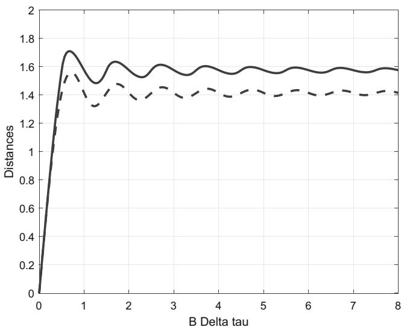  
Fig. 1. Comparison of the two distances as functions of $B\Delta \tau$ . The lowest distance is $d_{L2}(\pmb{\xi}_1, \pmb{\xi}_2)$ with dashed line. $B = 0.5$ , $\Delta \psi_0 = 0$ , $\gamma = 1$ .

same attenuation and phase offset, but different time delays. The ratio tends to a limit $\sqrt{1 - \cos\left(\frac{\pi}{\sqrt{3}}\right)} \approx 1.11$ for large delays. For small delays, the values of the distances remain the same (Fig. 1).

# 6 Conclusion

Based on the finite energy signal model, we obtained closed-form expressions for the Fisher-Rao distance. This result is significant because finding closed-form expressions for the Fisher-Rao distance is generally a non-trivial task. The geodesics are described by two combined partial differential equations involving the phase spectrum and the magnitude spectrum of the signal. These equations come together as the LDG theorem, which expresses the linear dependence of the gradients of phase and magnitude relative to their respective parameters.

Although we obtained simplified equations for the geodesics and solved two statistical situations, finding their general solution for any type of constraint in signal estimation remains an open problem. Nevertheless, we anticipate that the Fisher-Rao distance between finite energy signals will help the characterization of signal data bases. Additionally, the geodesic equations and the LDG theorem may provide valuable insights for some estimation techniques as analytic-informed neural networks [11].

Disclosure of Interests. The author has no competing interests to declare that are relevant to the content of this article.

# References

1. Amari, S. I., Nagaoka, H., T.: Methods of Information Geometry. AMS, Providence, R.I. (2000)   
2. Nielsen, F.: An elementary introduction to information geometry. Entropy 10(22), 1100 (2020). https://doi.org/10.3390/e22101100   
3. Amari, S. I.: Information Geometry and Its Applications. Springer Japan, Tokyo (201). https://doi.org/10.1007/978-4-431-55978-8-5   
4. Pinele, J., Strapasson, J.E., Costa, S.: The fisher-rao distance between multivariate normal distributions: special cases, bounds and applications. Entropy 22(4), 404 (2020)   
5. Opitz, F.: Information geometry and its applications. In: Proceedings of the 9th European Radar Conference, pp. 46-49. Amsterdam, The Netherlands (2012)   
6. Miyamoto, H., Meneghetti, F., Pinele, J., Costa, S.: On closed-form expressions for the fisher-rao distance. Info. Geom. 7(2), 311-354 (2024). https://doi.org/10.1007/s41884-024-00143-2   
7. Nielsen, F.: Approximation and bounding techniques for the Fisher-Rao distances between parametric statistical models. In: Rao A.S.R.S, Bai, Z., Rao, C.R., (eds.), Probability Models, Handbook of Statistics, vol. 51, pp 67-116. Elsevier, (2024)

8. Florin, F.: On fisher information matrix, array manifold geometry and time delay estimation. In: Nielsen, F., Barbaresco, F. (eds.) Geometric Science of Information, GSI 2023, vol. 1, pp. 307-317. Springer, Cham (2023https://doi.org/10.1007/978-3-031-38271-0-30   
9. Florin, F.: Fisher-Rao distances between finite energy signals in noise. arXiv preprint, submitted to the journal of Information Geometry (Springer). https://arxiv.org/abs/2505.14611, (2025)   
10. Florin, F., Bertrand, A.: Géométrie de l'information et signaux d'énergie finie. In: Proceedings of GRETSI 2025, Submitted to GRETSI25, Strasbourg (2025)   
11. M. Raissi, M., Perdikaris, P., Karniadakis, G.E.: Physics-informed neural networks: a deep learning framework for solving forward and inverse problems involving nonlinear partial differential equations. J. Comput. Phys. 378, 686-707, (2019). https://doi.org/10.1016/j.jcp.2018.10.045

# Statistical Models Built on Sub-exponential Random Variables

Paola Siri and Barbara Trivellato

Dipartimento di Scienze Matematiche "G.L. Lagrange", Politecnico di Torino, Corso Duca degli Abruzzi 24, 10129 Torino, Italy {paola.siri, barbara.trivellato}@polito.it

Abstract. Results on nonparametric exponential models are presented by exploiting the notion of sub-exponential random variable. Applications of these models to exponential utility maximization problems are also highlighted.

Keywords: Sub-exponential random variable $\cdot$ Exponential models $\cdot$ Exponential utility maximization $\cdot$ Kullback-Leibler divergence

# 1 Introduction

The theory of nonparametric maximal exponential models centered around a given positive density $p$ began with the pioneering work of Pistone and Sempi [12], and serves as a generalization of the statistical theory of exponential families. Typically, an infinite-dimensional or nonparametric exponential family is defined by the expression $\exp (u - K_p(u))p$ , where the random variable $u$ resides in an appropriate function space, $p$ is the probability density function of a base probability $\mu$ , and $K_{p}(u)$ is the logarithm of the normalization constant, also known as the cumulant generating function. In [12], the sufficient statistics $u$ in the exponential family are chosen such that $\exp (\theta u)$ is $p\cdot \mu$ -integrable for all $\theta$ in a real open interval containing 0. A further restriction is introduced to avoid reaching the boundary of the set $\{u:K_p(u) < + \infty \}$ . This integrability condition defines the Banach space of exponential Orlicz spaces $L^{\Phi}(p)$ , whose various equivalent characterizations form the foundation for the results discussed in this paper.

The geometric theory of statistical models, treated as manifolds modeled on exponential Orlicz spaces, was extensively studied in [1]. Subsequent advancements and applications of maximal exponential models have been presented in various fields, including Statistics, Information Geometry, Physics, and Finance. Notable works in these areas include [5,7,9,11,13-19]. Several authors have extended the original structure of maximal exponential models by replacing the exponential function with deformed exponentials (see, for example, [6,21]) or by modeling the statistical manifold on alternative function spaces (see, for example, [4,8]).

In this paper, we introduce the exponential space as a space of subexponential random variables, equipped with a norm based on moments. This norm is equivalent to the Luxemburg norm, and it enables us to derive a sharp estimate for the distance from a sub-exponential random variable to the $L^{\infty}$ space. Explicit constants in the bounds between norms of equivalent Orlicz spaces are reported. Since these constants depend on the points, they can be interpreted as a measure of the distance between points within the same maximal exponential model. Finally, some applications of exponential models to Finance are presented.

# 2 Preliminaries on Orlicz Spaces

Consider a probability space $(\mathcal{X},\mathcal{F},\mu)$ and denote by $L^k$ , $k\geq 1$ , the ordinary Lebesgue spaces and by $L^0$ the set of all random variables $u$ defined on the probability space.

A Young function is an even, convex function $\varPhi:\mathbb{R}\to [0,+\infty]$ such that $\varPhi(0)=0$ , $\lim_{x\to \infty}\varPhi(x) = +\infty$ and $\varPhi(x) < +\infty$ in a neighborhood of 0.

The conjugate function $\varPsi$ of $\varPhi$ is a Young function defined as

$$
\varPsi (y) = \sup  _ {x \in \mathbb {R}} \{x y - \varPhi (x) \}, \quad \forall y \in \mathbb {R}.
$$

The Orlicz space $L^{\varPhi}$ associated to the Young function $\varPhi$ is defined as

$$
L ^ {\varPhi} = \left\{u \in L ^ {0}: \exists \alpha > 0 s. t. \mathbb {E} (\varPhi (\alpha u)) <   + \infty \right\}.
$$

The Orlicz space $L^{\Phi}$ is a vector space and a Banach space when endowed with the Luxembourg norm

$$
\| u \| _ {\varPhi , p} = \inf  \left\{k > 0: \mathbb {E} \left(\varPhi \left(\frac {u}{k}\right)\right) \leq 1 \right\}.
$$

In this work, we use the Young function $\varPhi_1(x)\sim e^{|x|} - |x| - 1$ , whose conjugate is $\varPsi_{1}(y)\sim (1 + |y|)\log (1 + |y|) - |y|$ .

The following proposition gives equivalent conditions for a random variable $u$ to belong to $L^{\Phi_1}$ in terms of the moments of $u$ . We propose and prove them in a slightly different way with respect to the literature (see [22]).

Proposition 1. Let $u \in L^0$ . The following conditions are equivalent:

1. $u \in L^{\varPhi_1}$ , i.e. the moment generating function of $u$ , $M_u(t) = \mathbb{E}(e^{tu})$ , is finite in a neighborhood of 0.   
2. $u$ is sub-exponential, that is there are constants $c_{1} \geq 1$ and $c_{2} > 0$ such that $\mu(|u| \geq t) \leq c_{1} e^{-c_{2} t}$ .   
3. $\sup_{k\geq 1}\left(\mathbb{E}\left(|u|^k\right) / k!\right)^{1 / k} <   \infty .$   
4. $\lim_{k\to \infty}\sup \left(\mathbb{E}\left(|u|^k\right) / k!\right)^{1 / k} <   \infty .$

Proof. 1 implies 2. Let us take $\lambda > 0$ such that $M_u(\lambda) < \infty$ . Then, by Markov inequality, for all $t > 0$ we have

$$
\mu (u \geq t) = \mu \left(e ^ {\lambda u} \geq e ^ {\lambda t}\right) \leq e ^ {- \lambda t} \mathbb {E} \left(e ^ {\lambda u}\right).
$$

Similarly,

$$
\mu (u \leq - t) = \mu \left(e ^ {- \lambda u} \geq e ^ {\lambda t}\right) \leq e ^ {- \lambda t} \mathbb {E} \left(e ^ {- \lambda u}\right).
$$

We then get

$$
\mu (| u | \geq t) = \mu (u \geq t) + \mu (u \leq - t) \leq e ^ {- \lambda t} \left(\mathbb {E} (e ^ {\lambda u}) + \mathbb {E} (e ^ {- \lambda u})\right) \leq 2 e ^ {- \lambda t} \mathbb {E} (\cosh (\lambda u)).
$$

We obtain 2 by taking

$$
c _ {1} = 2 \mathbb {E} (\cosh (\lambda u)), \quad c _ {2} = \lambda .
$$

2 implies 3. For any $k = 1, 2 \ldots$ , we have

$$
\begin{array}{l} \mathbb {E} (| u | ^ {k}) = \int_ {0} ^ {+ \infty} \mu (| u | ^ {k} > t) d t = \int_ {0} ^ {+ \infty} \mu (| u | > s) k s ^ {k - 1} d s \leq k c _ {1} \int_ {0} ^ {+ \infty} s ^ {k - 1} e ^ {- c _ {2} s} d s \\ = k \frac {c _ {1}}{c _ {2} ^ {k}} \int_ {0} ^ {+ \infty} u ^ {k - 1} e ^ {- u} d u = k \frac {c _ {1}}{c _ {2} ^ {k}} (k - 1)! = k! \frac {c _ {1}}{c _ {2} ^ {k}}. \\ \end{array}
$$

Since $c_{1} \geq 1$ , it holds $c_{1} \leq c_{1}^{k}$ , so that we immediately obtain

$$
\left(\frac {\mathbb {E} \left(| u | ^ {k}\right)}{k !}\right) ^ {1 / k} \leq \frac {c _ {1}}{c _ {2}}, \quad \forall k = 1, 2 \dots
$$

3 implies 4. Obvious.

4 implies 1. Let

$$
c = \limsup_{k\to +\infty}\left(\frac{\mathbb{E}\left(|u|^{k}\right)}{k!}\right)^{1 / k} <   \infty .
$$

By the well known embedding among Lebesgue spaces, it immediately follows that $u \in L^k, \forall k \geq 1$ . Then, $1/c$ is the radius of convergence of the power series $\sum_{k=0}^{\infty} t^k \mathbb{E}\left(|u|^k\right)/k! = \mathbb{E}(e^{t|u|})$ . This immediately guarantees that $M_{|u|}$ , as well as $M_u$ , is finite in $(-1/c, 1/c)$ .

Let us remark that the class of sub-exponential random variables is quite large and includes, among others, Gaussian, Gamma, Exponential, Poisson, Bernoulli and all bounded random variables.

Finally note that, for $u \in L^{\varPhi_1}$ the mapping

$$
\| u \| _ {\star} = \sup  _ {k \geq 1} \left(\mathbb {E} \left(\frac {| u | ^ {k}}{k !}\right)\right) ^ {1 / k}
$$

is a norm on $L^{\varPhi_1}$ equivalent to $\| u\|_{\varPhi_1}$ . Specifically, it holds (see [18])

$$
\frac {2}{3} \| u \| _ {\Phi_ {1}} \leq \| u \| _ {\star} \leq 4 \| u \| _ {\Phi_ {1}}.
$$

# 3 Maximal Exponential Model

Let $\mathcal{P}$ denote the set of all densities which are positive $\mu$ -a.s. For each fixed $p \in \mathcal{P}$ , we use $\mathbb{E}_p$ to indicate the integral with respect to $p \cdot \mu$ . Moreover, the corresponding Orlicz space associated to $\varPhi_1$ is denoted by $L^{\varPhi_1}(p)$ .

Let us consider the cumulant generating functional $K_{p}(u) = \log \mathbb{E}_{p}(e^{u})$ defined on the subspace of centered random variables $L_0^{\varPhi_1}(p)$ . We recall from [12] that $K_{p}$ is a positive convex and lower semicontinuous function, vanishing at zero. In addition, the interior of its proper domain, denoted here by $\mathrm{dom}^{\circ}K_{p}$ , is a non empty convex set containing the open unit ball of $L_0^{\varPhi_1}(p)$ . This allows us to give the following definition.

For every density $p \in \mathcal{P}$ , the maximal exponential model at $p$ is

$$
\mathcal {E} (p) = \left\{q = e ^ {u - K _ {p} (u)} p: u \in \mathrm {d o m} \stackrel {\circ} {K} _ {p} \right\} \subseteq \mathcal {P}.
$$

Remark 1. $K_{p}$ is defined on the set $L_0^{\varPhi_1}(p)$ because centered random variables guarantee the uniqueness of the representation of $q \in \mathcal{E}(p)$ .

One of the main result in [12] states that any density belonging to the maximal exponential model centered at $p$ is connected by an open exponential arc to $p$ and vice versa. By open, we mean that the two densities are not the extremal points of the arc:

Definition 1. Two densities $p, q \in \mathcal{P}$ are connected by an open exponential arc if there exists an open interval $I \supset [0,1]$ such that one of the following equivalent relations is satisfied:

1. $p(\theta)\propto p^{(1 - \theta)}q^{\theta}\in \mathcal{P},\forall \theta \in I;$   
2. $p(\theta)\propto e^{\theta u}p\in \mathcal{P},\forall \theta \in I$ , where $u\in L^{\varPhi_1}(p)$ and $p(0) = p$ $p(1) = q$

The following theorem gives different equivalent conditions for a density to belong to the maximal exponential model. The proof of assertions 1-4 can be found in [1], of assertions 5-6 can be found in [13, 16], while the proof of the last assertion can be found in [19].

Theorem 1 (Portmanteau Theorem). Let $p, q \in \mathcal{P}$ . The following statements are equivalent.

1. $q\in \mathcal{E}(p)$   
2. $q$ is connected to $p$ by an open exponential arc;   
3. $\mathcal{E}(p) = \mathcal{E}(q)$   
4. $\log (q / p)\in L^{\varPhi_1}(p)\cap L^{\varPhi_1}(q);$   
5. $L^{\Phi_1}(p) = L^{\Phi_1}(q)$ , i.e. they are equal as sets and the norms are equivalent;   
6. There exists $\alpha > 1$ such that

$$
\left(P _ {\alpha}\right): \quad q / p \in L ^ {1 / (\alpha - 1)} (q) \quad a n d \quad p / q \in L ^ {1 / (\alpha - 1)} (p)
$$

7. $d_{\star, p}(\log(q/p), L^{\infty}) < +\infty$ and $d_{\star, q}(\log(q/p), L^{\infty}) < +\infty$ , where the $d_{\star}$ -distance of $u \in L^{\varPhi_1}$ to $L^{\infty}$ is defined as

$$
d _ {\star} (u, L ^ {\infty}) = \inf  _ {\ell \in L ^ {\infty}} \| u - \ell \| _ {\star}.
$$

The following proposition gives a characterization of the smaller $\alpha > 1$ for which $(P_{\alpha})$ holds, in terms of the $d_{\star}$ -distance of $\log (q / p)$ to $L^{\infty}$ (see [19]).

Proposition 2. Let $q \in \mathcal{E}(p)$ and define

$$
\alpha_ {p, q} = \inf  \{\alpha > 1: (P _ {\alpha}) h o l d s \}.
$$

Then

$$
\alpha_ {p, q} = 1 + \min \left\{d _ {\star , p} \left(\log \left(\frac {q}{p}\right), L ^ {\infty}\right), d _ {\star , q} \left(\log \left(\frac {q}{p}\right), L ^ {\infty}\right) \right\}.
$$

For $u\in L^{\varPhi_1}$ , it has been proved in [19] that

$$
\sup  \{a > 0: \mathbb {E} e ^ {a | u |} <   + \infty \} = \frac {1}{d _ {\star} (u , L ^ {\infty})},
$$

which gives a characterization of the $\star$ -closure of $L^{\infty}$ ; in fact, we get that $u$ belongs to the $\star$ -closure of $L^{\infty}$ if and only if its moment generating function is defined on the whole real line. As we will see below, when $q \in \mathcal{E}(p)$ the distances $d_{\star,p}$ and $d_{\star,q}$ are equivalent. So, from the proposition above we immediately get that $\log \frac{q}{p}$ belongs to the $\star$ -closure of $L^{\infty}$ if and only if $\alpha_{p,q} = 1$ , which means that $(P_{\alpha})$ holds for all $\alpha > 1$ .

It is worth noting that the maximal exponential model is a good environment when dealing with divergence between densities. In fact, since $(P_{\alpha})$ means $q / p \in L^{1 + \epsilon}(p)$ and $p / q \in L^{1 + \epsilon}(q)$ for some $\epsilon > 0$ , it immediately follows that if $q \in \mathcal{E}(p)$ then Kullback-Leibler divergences $D(q \| p)$ and $D(p \| q)$ are both finite.

The equivalence between the Orlicz spaces $L^{\Phi_1}(p)$ and $L^{\Phi_1}(q)$ , as well as their relationship to property $(P_{\alpha})$ , has been leveraged in [16] to enhance duality results in the classical problem of exponential utility maximization in incomplete markets. Specifically, in many key works on relative entropy minimization, the minimal entropy martingale measure $q^{*}$ satisfies property $(P_{\alpha})$ . This allows for switching from the reference Orlicz space $L^{\Phi_1}(p)$ to $L^{\Phi_1}(q^*)$ , and conversely, at convenience. Furthermore, in many statistical applications, for example in concentration inequalities of Bernstein type, it is crucial to know the constants that this change of law yields on the equivalent norms. Theorem 2 below provides an answer to this issue. It refers to the norm $\| \cdot \|_{\star}$ , equivalent to $\| \cdot \|_{\Phi_1}$ , since it is more suitable for applying the property $(P_{\alpha})$ of the Portmanteau Theorem (see [19]).

Theorem 2. Let $v \in L^{\varPhi_1}(p) = L^{\varPhi_1}(q)$ . Then, there exists $\alpha > 1$ such that

$$
c _ {\alpha} ^ {- 1} \| v \| _ {\star , p} \leq \| v \| _ {\star , q} \leq C _ {\alpha} \| v \| _ {\star , p},
$$

where

$$
c _ {\alpha} = \alpha 2 ^ {\frac {\alpha + 1}{\alpha}} \left(\mathbb {E} _ {p} \left[ \left(\frac {p}{q}\right) ^ {\frac {1}{\alpha - 1}} \right]\right) ^ {\frac {\alpha - 1}{\alpha}}, C _ {\alpha} = \alpha 2 ^ {\frac {\alpha + 1}{\alpha}} \left(\mathbb {E} _ {q} \left[ \left(\frac {q}{p}\right) ^ {\frac {1}{\alpha - 1}} \right]\right) ^ {\frac {\alpha - 1}{\alpha}}
$$

are constants independent of $v$ .

# 4 Applications to Finance

In this section, we present some financial applications, addressing the classical problem of exponential utility maximization in incomplete markets.

There exists a vast literature on solving this problem using duality methods, which apply when the class of admissible strategies is suitably defined. For a primal problem involving exponential utility, the corresponding dual problem reduces to minimizing the Kullback-Leibler divergence over a set of martingale density measures. In this section, under appropriate conditions we show that the minimal entropy martingale density measure belongs to a maximal exponential model. This reflects on the solution of the primal problem, which translates into a smoothness condition on the optimal wealth. Since it was shown in [13] that the exponential model is convex, the entire m-geodesic orthogonal to the class of martingale density measures is contained within the exponential model. Let $\mathbb{F} = (\mathcal{F}_t)_{0\leq t\leq T}$ be a filtration on $(\mathcal{X},\mathcal{F},\mu)$ , where $T\in (0,\infty ]$ . We fix $p\in \mathcal{P}$ and consider $\bar{\mathbb{P}} = p\cdot \mu$ . The real-valued $(\mathbb{F},\mathbb{P})$ -locally bounded semimartingale $X = (X)_{0\leq t\leq T}$ represents the discounted price of a risky asset in a financial market.

We denote by $\mathcal{M}$ (resp., $\mathcal{M}^e$ ) the set of probability densities $q = \frac{d\mathbb{Q}}{d\mu}$ , where $\mathbb{Q}$ is a $\mathbb{P}$ -absolutely continuous (resp., equivalent) local martingale measure for $X$ . Moreover, $\mathcal{M}_f = \{q \in \mathcal{M} : D(q \| p) < \infty\}$ , $\mathcal{M}_f^e = \mathcal{M}_f \cap \mathcal{M}^e$ .

A self-financing trading strategy $\theta = (\theta_t)_{0\leq t\leq T}$ (number of shares invested in the asset) is an element of $L(X)$ , the set of $\mathbb{F}$ -predictable and $X$ -integrable processes, and the related portfolio wealth is $W(\theta) = \int \theta dX$ .

Let $U(x) = -e^{-x}$ be the exponential utility function and consider the related maximization problem

$$
\sup  _ {\theta \in \Theta} \mathbb {E} _ {p} \left[ U (W _ {T} (\theta)) \right],
$$

where $\Theta$ is a set of admissible strategies suitably chosen in order to obtain a duality result of the form:

$$
\sup  _ {\theta \in \Theta} \mathbb {E} _ {p} \left[ U (W _ {T} (\theta)) \right] = U (\inf  _ {q \in \mathcal {M} _ {f}} D (q \| p)).
$$

It is well known that if $\mathcal{M}_f \neq \emptyset$ , there exists a unique $q^* \in \mathcal{M}_f$ that minimizes $D(q \| p)$ over $\mathcal{M}_f$ (see [3]). Moreover, if $\mathcal{M}_f^e \neq \emptyset$ , the minimal entropy martingale (density) measure $q^*$ is strictly positive and has the form

$$
q ^ {*} = c ^ {*} e ^ {- W _ {T} \left(\theta^ {*}\right)} p,
$$

where $c^{*} = e^{D(q^{*}\| p)} > 0$ and the wealth process $W(\theta^{*})$ is a $q^{*}$ -martingale.

Definition 2. We say that $q \in \mathcal{M}$ satisfies the Logarithmic Reverse Hölder inequality $R_{L\log L}(p)$ with respect to $p$ , if there exists a constant $C > 0$ such that

$$
\mathbb {E} _ {p} \left[ \frac {q / p}{q _ {\tau} / p _ {\tau}} \log \left(\frac {q / p}{q _ {\tau} / p _ {\tau}}\right) \mid \mathcal {F} _ {\tau} \right] \leq C f o r a l l s t o p p i n g t i m e s \tau \leq T,
$$

where $q_{\tau}$ , $p_{\tau}$ denote the projections $\mathbb{E}_{\mu}\left[q\big|\mathcal{F}_{\tau}\right]$ , $\mathbb{E}_{\mu}\left[p\big|\mathcal{F}_{\tau}\right]$ .

It is known in the financial literature that, if there exists $q \in \mathcal{M}_f^e$ which satisfies $R_{L\log L}(p)$ , then the minimal entropy martingale measure $q^{*}$ also satisfies $R_{L\log L}(p)$ (see [2]).

The following results can be found in [16] and gives conditions under which the primal problem of maximizing the exponential utility reduces to the dual problem of minimizing the Kullback-Leibler divergence.

Theorem 3. Let $X$ be a continuous semimartingale and assume there exists $q \in \mathcal{M}_f^e$ which satisfies $R_{L\log L}(p)$ . Then

i) $q^{*}\in \mathcal{E}(p)$   
ii) $e^{-W_T(\theta^*)} \in L^{1 + \varepsilon}(p)$ for some $\varepsilon > 0$ ;   
iii) $W_{t}(\theta^{*})\in L^{\varPhi_{1}}(p)$ for all $t\in [0,T]$   
vi) it holds

$$
\begin{array}{l} \max  _ {\theta \in \hat {\Theta} _ {2}} \mathbb {E} _ {p} \left[ U (W _ {T} (\theta)) \right] = \max  _ {\theta \in \Theta_ {2}} \mathbb {E} _ {p} \left[ U (W _ {T} (\theta)) \right] = U (\min  _ {q \in \mathcal {M} _ {f}} D (q \| p)) \\ = U \big (\min  _ {q \in \mathcal {M} \cap \mathcal {E} (p)} D (q \| p) \big). \\ \end{array}
$$

where

$$
\begin{array}{l} \Theta_ {2} = \{\theta \in L (X) \mid e ^ {- W _ {T} (\theta)} \in L ^ {1} (p) a n d W (\theta) i s a q - m a r t i n g a l e \forall q \in \mathcal {M} _ {f} \} \\ \widehat {\theta} _ {2} = \left\{\theta \in L (X) \mid e ^ {- W _ {T} (\theta)} \in L ^ {1 + \varepsilon} (p), W _ {t} (\theta) \in L ^ {\Phi_ {1}} (p), \forall t \in [ 0, T ] \right. \\ a n d W (\theta) i s a q - m a r t i n g a l e \forall q \in \mathcal {M} _ {f} \}. \\ \end{array}
$$

Disclosure of Interests. The authors have no competing interests to declare that are relevant to the content of this article.

# References

1. Cena A., Pistone G.: Exponential statistical manifold. AISM 59, 27-56 (2007). https://doi.org/10.1007/s10463-006-0096-y   
2. Delbaen, F., Grandits, P., Rheinländer, T., Samperi, D., Schweizer, M., Stricker, C.: Exponential hedging and entropic penalties. Math. Financ. 12(2), 99-123 (2002)   
3. Frittelli, M.: The minimal entropy martingale measure and the valuation problem in incomplete markets. Math. Financ. 10(1), 39-52 (2000)   
4. Fukumizu, K.: Exponential manifold by reproducing kernel Hilbert spaces. Algebraic and Geometric methods in Statistics, pp. 291-306. Cambridge University Press (2009). https://doi.org/10.1017/CBO9780511642401.019   
5. Imparato D., Trivellato B.: Geometry of extendend exponential models. In: Algebraic and Geometric Methods in Statistics, pp. 307-326. Cambridge University Press (2009). https://doi.org/10.1017/CBO9780511642401.020   
6. Montrucchio L., Pistone G.: A class of non-parametric deformed exponential statistical models. In: Nielsen, F. (eds) Geometric Structures of Information. Signals and Communication Technology, pp. 15-35. Springer, Cham (2019). https://doi.org/10.1007/978-3-030-02520-5_2   
7. Naudts, J.: Exponential arcs in manifolds of quantum states, Front. Phy. 11, 12 (2023). https://doi.org/10.3389/fphy.2023.1042257   
8. Newton, N.J.: A class of non-parametric statistical manifolds modelled on Sobolev space. Info. Geom. 2(2), 283-312 (2019). https://doi.org/10.1007/s41884-019-00024-z   
9. Pistone, G.: Examples of the application of nonparametric information geometry to statistical physics. Entropy 15(10), 4042-4065 (2013). https://doi.org/10.3390/e15104042   
10. Pistone G.: Information geometry of the gaussian space. In: Ay N., Gibilisco P., Matus F. (eds) Information Geometry and Its Applications. IGAIA IV 2016. Springer Proceedings in Mathematics & Statistics, vol 252, pp. 119-155. Springer, Cham (2018). https://doi.org/10.1007/978-3-319-97798-0_5   
11. Pistone G.: A Lecture about the use of Orlicz spaces in information geometry. In: Barbaresco, F., Nielsen, F. (Eds.) SPIGL 2020 PROMS 361, pp. 179-195 (2020). https://doi.org/10.48550/arXiv.2012.03376   
12. Pistone G., Sempi C.: An infinite-dimensional geometric structure on the space of all the probability measures equivalent to a given one. Ann. Stat. 23(5), 1543-1561 (1995). https://doi.org/10.1214/aos/1176324311   
13. Santacroce M., Siri P., Trivellato B.: New results on mixture and exponential models by Orlicz spaces. Bernoulli 22(3), 1431-1447 (2016). https://doi.org/10.3150/15-BEJ698   
14. Santacroce M., Siri P., Trivellato B. On mixture and exponential connection by open arcs. In: Nielsen F., Barbaresco F. (eds) Geometric Science of Information. GSI 2017. Lecture Notes in Computer Science, vol 10589, pp. 577-584. Springer, Cham (2017). https://doi.org/10.1007/978-3-319-68445-1 67   
15. Santacroce M., Siri P., Trivellato B.: An application of maximal exponential models to duality theory. Entropy 20(495), 1-9 (2018). https://doi.org/10.3390/e20070495   
16. Santacroce M., Siri P., Trivellato B.: Exponential models by Orlicz spaces and applications. J. Appl. Probab. 55, 682-700 (2018). https://doi.org/10.1017/jpr.2018.45

17. Siri, P., Trivellato, B.: Minimization of the Kullback-Leibler divergence over a lognormal exponential arc. In: Nielsen, F., Barbaresco, F. (eds.) GSI 2019. LNCS, vol. 11712, pp. 453-461. Springer, Cham (2019). https://doi.org/10.1007/978-3-030-26980-7_47   
18. Siri P., Trivellato B.: Robust concentration inequalities in maximal exponential models. Stat. Prob. Lett. 170, 109001 (2021). https://doi.org/10.1016/j.spl.2020.109001   
19. Trivellato B.: Sub-exponentiality in Statistical Exponential Models. J. Theor. Probab. 37(3), 2076-2096 (2024). https://doi.org/10.1007/s10959-023-01281-6   
20. Vigelis R.F., Cavalcante C.C.: On $\varphi$ -families of probability distributions. J. Theor. Probab. 26(3), 870-884 (2013). https://doi.org/10.1007/s10959-011-0400-5   
21. Vieira, F.L.J., de Andrade, L.H.F., Vigelis, R.F., Cavalcante, C.C.: A deformed exponential statistical manifold. Entropy 21(5), 496 (2019). https://doi.org/10.3390/e21050496   
22. Wainwright M.J.: High-dimensional statistics. A non-asymptotic viewpoint. Cambridge University Press (2019). https://doi.org/10.1017/9781108627771

# Koszul Homological Series and Fedosov Foliations on Statistical Manifolds

Michel Nguiffo Boyom $(\text{凹})$

IMAG, Univ Montpellier, CNRS, Montpellier, France michel.nguiffo-boyom@umontpellier.fr

Abstract. The labeled foliations we are interested in are Fedosov foliations and Riemannian foliations. The main problem is How to product these foliations. Here we sketch the complete answers to problems.

Keywords: Fedosov structure $\cdot$ Special Kähler manifold $\cdot$ statistical structure

# 1 Introduction

The concerns are the study of symplectic structures and Fedosov reductions on Lie algebroids.

# 2 Symplectures on Lie Algebroids

# 2.1 Lie Algebroids

Definition 1. An Lie algebroid on over a $m$ -dimensional manifold $M$ consists of data

$$
A = (E, M, p, \alpha , [ -, - ],
$$

(2.1.1) $p:E\to M$

is a vector bundle whose $C^\infty (M)$ -module sections if denoted denoted by $\Gamma (E)$ .

(2.1.2) $\Gamma (E)\times \Gamma (E)\ni (s,s^{\prime})\to [s,s^{\prime}]\in \Gamma (E)$

endows $\Gamma(E)$ with a structure of Lie algebra.

(2.1.3) $E\ni (x,e)\to \alpha (x,e)\in TM$

is a vector bundle morphism of $E$ in $TM$ .

Given $s$ and $s'$ in $\Gamma(E)$ and a smooth function $f$ one has

(2.1.4) $[s,fs^{\prime}] = f[s,s^{\prime}] + df(\alpha (s))s^{\prime}.$

The Lie algebroid $(E,M,p,\alpha,[-, -])$ is called regular if $\alpha$ is injective.

Definition 2. A Koszul connection on the vector bundle $(E,M,p)$ is a mapping

$$
\Gamma (E) \ni s \to \nabla s \in \Omega^ {1} (M, E)
$$

which is subject to the following identity,

$$
\nabla f s = f \nabla s + d f s. \tag {2.1.5}
$$

# 2.2 Curvatures and Torsions on Lie Algebroids

Definition 3. Given a Lie algebroid $A$ as in definition 2.1 and a Koszul connection $\nabla$ as in definition 2.2, the torsion $T^{\nabla}$ and the curvature $R^{\nabla}$ (of $\nabla$ ) are defined as it follows,

$$
T ^ {\nabla} (s, s ^ {\prime}) = \nabla_ {\alpha (s)} s ^ {\prime} - \nabla_ {\alpha (s ^ {\prime})} s - [ s, s ^ {\prime} ], \tag {2.2.1}
$$

$$
R ^ {\nabla} (X, Y) s = \nabla_ {X} (\nabla_ {Y} s) - \nabla_ {Y} (\nabla_ {X} s) - \nabla_ {[ X, Y ]} s. \tag {2.2.2}
$$

Proposition 1. Every regular algebroid

$$
A = (E, M, p, \alpha , [ -, - ])
$$

admits torsion free Koszul connection.

Hint. Let $(M,g)$ Riemannian structure and let $T^{\alpha}M$ be the $g$ -orthogonal of the vector sub-bundle

$$
\alpha (E) \subset T M.
$$

Thus one has

$$
X = X ^ {\alpha} + Y ^ {\alpha} \in \Gamma (T ^ {\alpha} M) \oplus \alpha (\Gamma (E)).
$$

Let $\nabla$ be a Koszul connection on $A$ . One defines the Koszul connection $\nabla *$ as it follows,

$$
\nabla * _ {X ^ {\alpha} + Y ^ {\alpha}} s = \nabla_ {X ^ {\alpha} + Y ^ {\alpha}} s - \frac {1}{2} T ^ {\nabla} (s, s *)
$$

where

$$
Y ^ {\alpha} = \alpha (s *)
$$

The Koszul connection $\nabla *$ is torsion free.

Definition 4. A statistical structure on a Lie algebroid $(E, M, p, [-, -])$ is a triple $(g, \nabla, \nabla^{\star})$ where $g$ is an inner product on $E$ , $\nabla$ and $\nabla^{\star}$ are torsion free connections subject to the following identity,

$$
X g (s, s ^ {\prime}) - g (\nabla X s, s ^ {\prime}) - g (s, \nabla_ {X} ^ {\star} s ^ {\prime}) = 0. \tag {2.2.3}
$$

Definition 5. A Fedosov structure on a Lie algebroid $(E,M,p,[-, - ])$ is a couple $(\omega ,\nabla)$ where

$$
\Gamma (E) \times \Gamma (E) \ni (s, s ^ {\prime}) \rightarrow \omega (s, s ^ {\prime}) \in C ^ {\infty} (M)
$$

is a nondegenerate skew symmetric $C^\infty (M)$ -bilinear map and $\nabla$ is a torsion free Koszul connection on $E$ which preserve $\omega$ in the following meaning,

$$
X \omega (s, s ^ {\prime}) - \omega (\nabla_ {X} s, s ^ {\prime}) - \omega (s, \nabla_ {X} s ^ {\prime}) = 0. \tag {2.2.4}
$$

The couple $(E, \omega)$ is called symplectic structure on the vector bundle $(E, M)$ . We aim to study the following problem.

Given a torsion free Koszul connection $\nabla$ on a Lie algebroid $(E,M,p,[-, - ]$ is there a symplectic structure $(E,\omega)$ which is preserved by $\nabla$ .

Efficient tools for studying this problem are solutions of (differential) gauge equations (to be introduced).

# 2.3 Gauge Equations on Lie Algebroids

Given a Lie algebroid $(E, M, p, [-, -])$ , consider a couple a couple $(g, \nabla)$ formed of a positive inner product $(E, g)$ and a torsion free Koszul connection $\nabla$ . The $g$ -dual of $\nabla$ is defined as it follows,

$$
g \left(\nabla_ {X} ^ {g} s, s ^ {\prime}\right) = X g \left(s, s ^ {\prime}\right) - g \left(s, \nabla_ {X} s ^ {\prime}\right). \tag {2.3.1}
$$

The gauge equation of the couple $(g,\nabla)$ is defined on $\Gamma (Hom(E,E)$ as it follows

$$
\nabla^ {g} \otimes \phi - \phi \circ \nabla = 0. \tag {2.3.2}
$$

The left hand member of (2.3.1) means the following identity,

$$
\nabla_ {X} ^ {g} \phi (s) - \phi (\nabla_ {X} s) = 0.
$$

The vector space of solutions of (2.3.2) is denoted by $J_{\nabla, g}(E)$ . Every solution of (2.3.2) $\phi$ is associated with a pair

$$
\left(\Phi , \Phi^ {*}\right) \subset \Gamma \left(H o m (E, E)\right)
$$

which is defined as it follows

$$
2 g \left(\Phi^ {*} (s), s ^ {\prime}\right) = g \left(\phi (s), s ^ {\prime}\right) - g \left(s, \phi \left(s ^ {\prime}\right)\right); \tag {2.3.3i}
$$

$$
2 g \left(\Phi (s), s ^ {\prime}\right) = g \left(\phi (s), s ^ {\prime}\right) + g \left(s, \phi \left(s ^ {\prime}\right)\right). \tag {2.3.3iii}
$$

# Proposition 2.

$$
(\Phi , \Phi^ {*}) \subset J _ {\nabla , g} (E), \tag {2.3.4}
$$

$$
E = \operatorname {K e r} \left(\Phi^ {*}\right) \oplus \operatorname {I m} \left(\Phi^ {*}\right); \tag {2.3.4i}
$$

$$
E = \operatorname {K e r} (\varPhi) \oplus I m (\varPhi). \tag {2.3.4ii}
$$

Before pursuing we define the skew symmetric bilinear map $\omega$ :

$$
\omega \left(s, s ^ {\prime}\right) = g \left(\Phi^ {*} (S), s ^ {\prime}\right). \tag {2.3.5i}
$$

$$
q (s, s ^ {\prime}) = g (\Phi (s), s ^ {\prime}). \tag {2.3.5ii}
$$

Proposition 3. Under the notation as in Proposition 2.6 one has:

(1) $\text{Ker}(\Phi^*)$ and $\text{Ker}(\Phi)$ are $\nabla$ -preserved;   
(2) $Im(\Phi^{*})$ and $Im(\Phi)$ are $\nabla^g$ -preserved;   
(3) $\nabla_X\omega = 0\quad \forall X\in \Gamma (TM);$   
(4) $\nabla_X q = 0 \quad \forall X \in \Gamma(TM)$ .

Corollary 1. We use notation as in proposition 2.7;

(1) $\text{Ker}(\Phi^{*})$ and $\text{Ker}(\Phi)$ are Lie subalgebras of $(E, M, p, [-, -])$ ;   
(2) The bilinear form $\omega$ induces a symplectic form on $Im(\Phi^{*})$ ;   
(3) If $\nabla^g$ is torsion free then $((\operatorname{Im}(\varPhi^*), \omega)$ admits a Fedosov structure.

# 3 Koszul Homological Series Associated with $\phi \in J_{\nabla ,g}(E)$

# 3.1 A Tensorial Module of $A(\phi)$

We consider the space of (2,1)-tensors

$$
T ^ {2, 1:} (M) = \Gamma (H o m (\otimes^ {2} T M, T M)).
$$

Given a solution $\phi$ of the gauge equation, we focus on the Lie sub-algebroid $(\operatorname{Ker}(\varPhi^{*})$ the Lie algebra of sections of which is denoted by $A(\phi)$ .

Let $D$ be a Koszul connection on $(TM, M)$ . Given $s \in A(\phi)$ we define $L_sD$ as it follows

$$
(L _ {s} D) _ {X} Y = [ \alpha (s), D _ {X} Y ] - D _ {[ \alpha (s), X ]} Y - D _ {X} [ \alpha (s), Y ]. \tag {3.1.1}
$$

We put

$$
T ^ {p, q} (M) = \Gamma (H o m (\otimes^ {p} T M, \otimes^ {q} T M)).
$$

Of course via the map $\alpha$ all of the vector spaces $T^{p,q}(M)$ are left modules of the Lie algebra $A(\phi)$ .

If $D$ is a Koszul connection on the vector bundle $\operatorname{Hom}(\otimes^p TM, \otimes^q TM)$ then mutatis mutandis, for every $s \in A(\phi)$ we define $L_s D$ following (3.1.1).

Proposition 4. Let $D$ be a Koszul connection of the vector bundle $T^{p,q}(M)$ .

The linear map

$$
A (\phi) \ni s \to k ^ {p, q} (s) = L _ {s} D
$$

is a $T^{p,q}(M)$ -valued Chevalley-Eilenberg cocycle of $A(\phi)$ whose cohomology class $[k^{p,q}(\phi)]$ doesn't depend on the choice of the Koszul connection $D$ .

Definition 6. The homological series of a solution $\phi \in J_{\nabla, g}(E)$ is the series

$$
N \times N \ni (p, q) \to [ k ^ {p, q} (\phi) ]
$$

Our construction is an extension of canonical classes introduced by Jean-Louis Koszul in 1974 (Cf Cohomologie des formes différentielles d'ordre supérieur Ann Ec Norm Sup 1974).

Definition 7. The correspondence

$$
J _ {\nabla , g} (E) \ni \phi \rightarrow K F (\phi) = \cup_ {p, q} \left\{\left[ k ^ {p, q} (\phi) \right]\right\}
$$

is called the Koszul homological functor of $\nabla$ .

The connection $\nabla$ is $(p,q)$ -degenerate if it contains a zero $(p,q)$ -cohomology class, viz if there exists $\phi$ with

$$
[ k ^ {p, q} (\phi) ] = 0. \tag {3.1.3}
$$

Theorem 1. Let $(E,M,p,\alpha,[-, - ])$ be a Lie algebroid endowed with a torsion free Koszul connection $\nabla$ , with the notation used above the following assertions are equivalent:

(A1) The functor as in (3.1.3) is $(2,1)$ -degenerate.   
(A2) The gauge structure $(E,\nabla)$ admits a Fedosov structure $(\omega ,\nabla)$

# 4 Tangent Lie Algebroids of Statistical Manifolds

The tangent algebroid of a manifold $M$ is the triple $(TM, M, 1_{TM}, [-, -]_P$ where $[X, Y]_P$ is the Poisson bracket of two vector fields $X, Y$ . Let $(M, g, \nabla, \nabla^*)$ be a statistical structure on $M$ . We are interested in the gauge equations

$$
\nabla^ {*} \otimes \phi - \phi \circ \nabla = 0, \tag {4.0.1}
$$

$$
\nabla \otimes \psi - \psi \circ \nabla^ {*} = 0. \tag {4.0.2}
$$

# 4.1 Fedosov Foliations Associated with $(g,\nabla ,\nabla^{*})$

The vectors spaces of solutions of (4.0.1) and of (4.0.2) are denoted $J_{\nabla, g}(M)$ and $J_{\nabla^{*}, g}$ respectively.

We introduce the analogous of (2.3.3)

$$
J _ {\nabla , g} (M) \ni \phi \rightarrow \Phi \in J _ {\nabla , g} (M), \tag {4.1.1}
$$

$$
J _ {\nabla^ {*}, g} (M) \ni \psi \rightarrow \Psi \in J _ {\nabla^ {*}, g}, \tag {4.1.2}
$$

These $\varPhi$ and $\varPsi$ are defined as it follows

$$
2 g (\Phi (X), Y) = g (\phi (X), Y) - g (X, \phi (Y)),
$$

$$
2 g (\varPsi (X), Y) = g (\psi (X), Y) - g (X, \psi (Y)).
$$

Definition 8. A Fedosov foliation on a manifold $M$ is a triple $(F,\omega ,\nabla)$ where:

(1) $\nabla$ is a torsion free Koszul connection on $(TM,M)$ ;   
(2) $F$ is a foliation whose leaves admit Fedosov structure induced by the couple $(\omega, \nabla)$ .

We put

$$
\omega (\phi) (X, Y) = g (\Phi (X), Y), \tag {4.1.3}
$$

$$
\omega (\psi) (X, Y) = g (\varPsi (X), Y). \tag {4.1.4}
$$

Proposition 5. Under the notation just, $(Im(\varPhi),\omega (\phi),\nabla)$ and $(Im(\Psi),\omega (\psi),$ $\nabla^{*})$ are Fedosov foliations in $M$

Proposition 6. In a statistical manifold $(M,g,\nabla ,\nabla^{*})$ the following assertions are equivalent:

(1) $(M,\nabla)$ is admits a Fedosov structure;   
(2) $(M,\nabla^{*})$ admits a Fedosov structure.

# 5 Fedosov Structure and Quantization Deformation

# 5.1 $\star$ -Product

The context of $\star$ -product is Symplectic Geometry and Physics.

Let $C^\infty(M)$ be the associative algebra of real valued differentiable functions on $M$ . The product $f.f'$ is defined as it follows

$$
f. f ^ {\prime} (x) = f (x) f ^ {\prime} (x), \quad \forall x \in M. \tag {5.1.1}
$$

A $\star$ -product on $C^\infty(M)$ is a one-parameter associative deformation of the product $f.f'$ of the following form

$$
f \star f ^ {\prime} = f. f ^ {\prime} + \Sigma_ {n > 0} D ^ {n} (f, f ^ {\prime}) h ^ {n} \tag {5.1.2}
$$

each coefficient $D^n$ is a bi-differential operator of total order equal n.

An product as in (5.1.2) is called Quantization Deformation of the product as in (5.1.1). There is a method of product quantization deformations by involving torsion free symplectic Koszul connections.

- Our aim is to answer the question: How to product Fedosov foliations and Fedosov structures in the framework of statistical manifolds.   
- Our method involving Koszul homological series leads to a characteristic obstruction of homological nature, namely the cohomology class $[k_{\infty}^{??}(\ref{eq:1})]$   
- A problem raised by Étienne Ghys: How to product all Riemannian foliations. Proposition 2.8 and Corollary 2.9 contain ingredients to completely this problems.

# References

[D-F] Freed, D.S.: Special Kahrler Manifolds. Springer, 24 August 1998. arXiv:hep-th/972042v2   
[B-F] Fedosov, B.V.: A simple geometric construction of deformation quantizarion. J. Diff Geom. 40, 213-238 (1994)   
[G-R-S] Gelfand, I., Retakh, V., Shubin, M.: Fedosov manifolds, 5 September 1997. arXiv:dg-ga/9707024v2   
[M-W] Wadia, M.M.: Géométrie des variétés de Fedosov. (Groupes de Fedosov canoniques), PDF. Persistence theory. https://www.fstf-marrakech.ac.ma   
[D-T] Tamarkin, D.E.: Fedosov connections on Kahler symmetric manifolds and trace density. J. Diff Geom 50, 387-413 (1998)   
[V-C] Cortes, V.: Special Kahler manifolds: a survey, 12 December 2001. arXiv:math/0112114v1 [math.DG]

# Coherent States on the Statistical Manifold

Carlos Alberto Alcalde

NXP Semiconductors, Grenoble, Auvergne-Rhône, France alcaldecarlos09@gmail.com

Abstract. Coherent states can be looked at as probability amplitudes over symplectic manifolds. From the point of view of operational physics, classical motions in $\mathbb{R}^{2m}$ are subject of uncertainties in the measuring devices and the presence of noise. In the case of Hamiltonian systems, this leads us to consider orbits in the neighborhood of the solutions of the equations of motion. These linearized flows are determined by symplectic matrices. The Koopman representation is natural for describing dynamical systems under the influence of random factors. Koopman states are presented as coherent states bundles over phase space. On the other hand, the set of probability distributions, a statistical manifold, can be parametrized by positive Hermitian matrices for the same situation. Coherent states, viewed as a time series of measurements appear as the common Hilbert space: a Gaussian field of random variables on Fock space.

Keywords: Coherent states $\cdot$ Statistical Manifolds $\cdot$ Hermitian positive matrices $\cdot$ Koopman Representation $\cdot$ Fock bundles $\cdot$ Time series

# 1 Introduction

Assuming the existence of structures such as windmills, an ontic description of them has been contrasted to our perception or epistemic measurements with sensors that can be our own eyes in this example. The relationship between the two pictures given is necessarily statistical.

The operational approach to physics [1,2] suggests elevating statistical considerations to a fundamental principle relating the states of physical systems and the observations we make of them. Hence it is natural for the geometry of information to appear alongside the symplectic geometry of classical physics and geometrical approaches to quantum theory.

The axiomatic notion of a statistical model of a physical theory starts with a given set $S$ , whose elements are called states, and another set $O$ considered the observables. For an arbitrary $F \in O$ there will be a set $M_F$ of outcomes.

An arbitrary state $s \in S$ and an observable $F$ are related by a probability distribution $\mu_s^F$ on $M_F$ called the probability distribution of the observable $F$ in the state $s$ .

A state is a configuration of our physical system in the appropriate variables. An observable is defined from the possible outcomes of experiments: it obtains the registration of values of measuring devices used on a system prepared in a given a state.

Hamiltonian equations of motion are symplectic transformations. Let $\mathcal{L}_X$ denote the Lie derivative with respect to a Hamiltonian vector field $X$ . An infinitesimal symplectic transformation is a vector field $X$ such that $\mathcal{L}_X\omega = 0$ . The generators of this symmetry are the Hamiltonian vector fields related to algebra $A$ and form a Lie algebra structure: the Poisson algebra which is a homomorphism with the Lie Algebra of Hamiltonian vector fields modulo constants.

Points in phase space correspond to pure states and the smooth functions are the observables. Hamiltonian dynamics proceeds deterministically.

Following J.M. Souriau, Hamiltonian dynamics is built on a symplectic manifold, associated to the space of solutions of the equations of motion, the état de mouvements. In this view, a symplectic form $\omega$ is defined in the space of on a space of outcomes $M$ at a time $t$ , given in terms of coordinates $q(t)$ and $p(t)$ by $\omega = dp(t) \wedge dq(t)$ .

Equivalently, at the start of the deformation quantization program, observables were distinguished as functions on $M$ emphasizing that only in the space of observables, Poisson bracket trajectories made sense. The following statement serves as the guiding principle for our work: "The idea is to isolate the principal components of the theory, equations of motion and initial conditions from each other and to associate the former with the observables and the latter with the states" [3]. Observables are function in the space of states. The Hamiltonian formalism allows for trajectories of the observables without reference to the space of evolution itself. Only the values of the observable functions provide the trajectories in the evolution space.

The subject of this work is the probabilistic description of classical systems with deterministic evolution. This involves an effective doubling of the state variables. A state in $M = \mathbb{R}^{2m}$ evolves through measurements from an initial state around confidence intervals in the dynamical variables so their inclusion suggests we consider $\mathbb{R}^{2m} \otimes \mathbb{R}^{2m}$ . Dynamics is Markovian in the sense that dynamics evolves from points to sets in the image of Markov Kernels.

Operational Physics is presented from a functional analytic understanding of states and observables to the slight generalization from projection valued measures to commutative positive valued measures. Koopman extension to Hilbert space classical physics is natural in this setting. In Sect. 3, Statistical manifolds are introduced for $(M,\mathcal{B}(M))$ and a construction of probability distributions from time series is discussed. The Statistical manifold $\mathcal{P}$ over $(\mathbb{R}^{2m},\omega)$ will be represented as the Fock bundle $\mathcal{H}\to \mathcal{P}$ , where $\mathcal{H}$ is a vector coherent state representation of linear symplectic transformations parametrized by

complex structures over $\mathbb{R}^{2m}$ . Finally some application to information geometry and future work is discussed.

# 2 Operational Physics

# 2.1 Functional Analysis Perspective

Before considering dynamics, the algebraic structure of classical physics on $M = \mathbb{R}^{2m}$ , let $A = C_0(M)$ be the commutative algebra of classical observables under point multiplication. The space $C_0(M)$ of complex-valued functions on $M$ , endowed by complex conjugation as an involution and with the sup norm becomes a $\mathbb{C}^*$ -algebra. Consider its character space, the non-zero homomorphisms $\sigma : A \to \mathbb{C}$ that satisfy

$$
\sigma (a b) = \sigma (a) \sigma (b) \tag {1}
$$

collected as a set $\Sigma_A = \{\text{all the characters of } A\}$ . The map $A \to \Sigma_A$ that sends $z \in M$ to $\sigma_z \in \Sigma_A$ is simply an evaluation map of an element $a \in A$

$$
\sigma_ {z} (a) \equiv a (z) \in \mathbb {C} \tag {2}
$$

The equivalence between point evaluations and characters is the Gelfand representation which is the isomorphism

$$
C _ {0} (M) \rightarrow C _ {0} (\Sigma_ {A}) \tag {3}
$$

To understand states, remark that characters are harmonic functions isomorphic to the additive group $G$ of translations on $M = \mathbb{R}^{2m}$ :

$$
z \rightarrow e ^ {i (\omega , z)} \quad \omega \in \mathbb {R} ^ {2 m} \tag {4}
$$

In the group-theoretic picture, consider the Lebesgue measure $dg$ as the translationally invariant Haar measure on the group. $L^1 (G)$ can be extended to $\mathcal{M}(G)$ , the measure algebra of $G$ with convolution as the commutative group product. The measure algebra of $G$ being a Banach algebra with a unit allows us to apply the Gelfand representation again. Let $n$ denote a generic paramerization of the character space: $\chi_n(g)\to T^1$ . The non-zero homomorphisms $\chi :\mathcal{M}(G)\to \mathbb{C}$ satisfy

$$
\chi \left(\mu_ {1} \circ \mu_ {2}\right) = \chi \left(\mu_ {1}\right) \chi \left(\mu_ {2}\right) \tag {5}
$$

We see that $\chi$ is none other than the Fourier transform that diagonalizes the convolution product. One can associate to any $L^1 (G)$ function its Gelfand transform but we specialize in functions of positive type. They are those functions $\phi (g)$ whose image by the Gelfand transform are probability measures $\mu$ on the character space [4, 5].

In this sense, an observable $a$ is a Lebesgue-integrable bounded function, a member of the function space $L^1(M)$ . Let $\mathcal{M}(\mathbb{R}^{2m})$ be the set of complex valued measures on $\mathbb{R}^{2m}$ . We have an inclusion $L^1(\mathbb{R}^{2m}) \subseteq \mathcal{M}(\mathbb{R}^{2m})$ .

$$
\mu (\phi) \equiv \widehat {\phi} (n) = \int \phi (g) \chi_ {n} \left(g ^ {- 1}\right) d g \tag {6}
$$

In the more general case of locally compact Lie Groups, unitary characters are sought to represent the atoms of the theory, also called the pure states. The converse of the above is Bochner's theorem, the image of a probability density measure of the type $\rho dg$ is a function of positive type. These considerations are the commutative versions of Kirillov characterization of unitary representations.

Operational physics offers the following interpretation: Let $A$ correspond to a physical system whose (measurable) phase space we denote by $(M, \mathcal{B}(M))$ . The classical description of the system is accomplished by its trajectory in the following sense: there is a 1-1 correspondence between the set of all measurement operations on the system and an Abelian algebra measurable functions on $(M, \mathcal{B}(M))$ . The content of the theory is specified by this correspondence; its aim is the computation of the values $a(z_{t})$ and $t \in \mathbb{R}$ , which are the results of the measurement operation corresponding to $a$ performed on the system at the moment $t$ .

States can be associated with density measures that reveal our uncertainty in the preparation equipment. Density measures include point measures that state that the observation results correspond exactly to the point evaluations of the observables.

# 2.2 The Stochastic Phase Space

Consider the following heuristics to motivate the understanding of phase space functions on stochastic spaces. Lebesgue integration builds simple functions from a measurable space $(X, \mathcal{B})$

$$
F (\xi) = \sum_ {k \in I} F (k) \chi_ {k} (\xi), \tag {7}
$$

with

$$
\chi_ {k} (\xi) = \left\{ \begin{array}{l l} 1, & \text {i f} \xi \in \Delta_ {k} \\ 0, & \text {o t h e r w i s e} \end{array} \right. \tag {8}
$$

where

$$
\Delta_ {k} \in \mathcal {B}, \quad \text {a n d} \quad \Delta_ {k} \cap \Delta_ {l} = \emptyset \quad \text {i f} \quad k \neq l. \tag {9}
$$

These are recognized as projection valued measures. In practice, the Borel sets are of finite size and define the resolution of our measuring equipment. Hence, in operational physics, one considers positive valued measures as the outcomes of our observables [6]. Together with the uncertainty of the preparation of the state, the registration of values of a scientific experiment arises from these two sources [2]. Consistent with the approach above, Prugovecki [7], enhances phase space $M$ (more precisely, the space of solutions: état de mouvements) with confidence functions that define the localization of the solution within $\Delta$ . These confidence functions can be interpreted as linearizations along the solutions of Hamilton's equations so that in the stochastic phase space contains double the number of variables: $(z,\sigma)$ with the interpretation that $\sigma$ describes the probability of reading $z\equiv (p,q)$ of an experiment that has been prepared within

$\Delta \in \mathcal{B}(M)$ defined by $\sigma \equiv (\sigma_p, \sigma_q)$ . Linearizations of Hamiltonian systems along solutions have been considered by Marsden [8] who relates them to symplectic connections. These doubling of coordinate functions are also the natural setting for Koopman classical mechanics [9].

# 2.3 The Koopman Representation

The Koopman representation is a formulation of classical mechanics in Hilbert space. An abstract dynamical system consists of a measure space $(M, B, \mu)$ and a one-parameter dynamical group $\operatorname{Aut}(M, B, \mu)$ of measure-preserving transformations of $M$ into itself. Consider statistical states $\mu$ on a symplectic manifold $M$ and symplectomorphisms $\mathbf{T}$ . Koopman had the idea of translating the Hamiltonian dynamical system into Unitary transformations on an auxiliary Hilbert space.

Let $\mathbf{T} \in \mathrm{Aut}(M, B, \mu)$ , $z = (p, q) \in M$ and define

$$
(U _ {\mathbf {T}} \Psi) (z) = \Psi (\mathbf {T} ^ {- 1} (z)) \tag {10}
$$

The mapping $\mathbf{T} \mapsto U_{\mathbf{T}}$ defines a group homomorphism from $\operatorname{Aut}(M, B, \mu)$ into the group of unitary operators on the Hilbert space $L^2(M, \mu)$ . The assignment $z \in \mathrm{M} \to \Psi_z \in \mathbb{C}$ is a Hilbert bundle over $M$ parametrized by points in the manifold.

The Koopman representation contains a representation of $C_0(M)$ [10], the space of functions of compact support which we give the interpretation of the classical observables. An example of such representation on $L^2 (M,\mu)$ is given by the multiplier operators:

$$
\pi_ {\mu} (f) \Psi = \mathbf {M} _ {f} \Psi = f \Psi , \quad \forall f \in C _ {0} (M), \Psi \in L ^ {2} (M, \mu). \tag {11}
$$

For each $f \in L^{2}(M, \mu)$ , operators $\mathbf{M}_f$ form by pointwise multiplication by $f(p, q) \in L^{2}(M, \mu)$ , the multiplier algebra [10].

Koopman observables form a commutative Von-Neumann algebra and Hamiltonian vector fields induce the Liouville dynamics in the Koopman Hilbert space. The connection with conventional Hamiltonian dynamics is the interpretation of $\| \overline{\Psi}\Psi \| ^2$ as the statistical state $\mu$ .

# 3 Geometry in the Statistical Manifold

# 3.1 The Statistical Manifold

A statistical manifold [11] has a different origin than the phase space manifold used up above. Instead of describing states and observables themselves, its is related to the possible ways of relating the two. We assume the set of probability distributions can be given the structure of a Riemannian manifold considering each distribution as a point on a Riemannian manifold (alternatively we can utilize the positive measures, a Frechet space). Consider a family $\mathcal{P}$ of probability distribution functions parametrized by a smooth manifold $\Omega$ . Due to group

invariance, it can be modeled by a homogeneous space $G / H$ . Suppose further that each distribution function can be parametrized using variables $\xi \in \Omega = G / H$ and define

$$
\mathcal {P} = \left\{p _ {\xi} = p (\mathbf {X}, \xi) | \xi \in \Omega \right\} \tag {12}
$$

where $p(\mathbf{X},\xi)$ is a probability distribution function on $\Omega$ and where $\mathbf{X}$ is a realization of random variables (observables) on a phase space manifold $M = \mathbb{R}^{2m}$ .

Motions in the statistical manifold $\Omega$ , seen an homogeneous space $G / H$ follow the directions of the Lie Algebra $\mathcal{L}_{\mathbb{C}}$ . Define the log likelihood function as $\ell_{\xi}(\mathbf{X}) \stackrel{\mathrm{def}}{=} \log p(\mathbf{X}, \xi)$ and the Fisher information metric by

$$
g _ {i j} (\xi) \stackrel {\text {d e f}} {=} \mathbb {E} \left[ \frac {\partial \ell}{\partial \xi_ {i}} \frac {\partial \ell}{\partial \xi_ {j}} \right] = \int_ {S} \left(\frac {\partial \ell}{\partial \xi_ {i}} \frac {\partial \ell}{\partial \xi_ {j}}\right) p (\mathbf {X}, \xi)) d \mu (\mathbf {s}) \tag {13}
$$

From the point of view of classical physics, to each localized state within a Borel set of $(M,\mu)$ , the measurement $\mathbf{X}$ is produced by a probability distribution $p(\mathbf{X},\xi)$ , and the family of all these distributions determines a statistical manifold $\Omega$ where $\xi$ plays the role of a coordinate system for $\mathcal{P}$ and the Fisher Information metric $g_{ij}(\xi)$ plays the role of a Riemannian metric tensor.

# 3.2 Stationary Stochastic Processes

Measurements of classical dynamical systems are studied in signal theory as random variables and a statistical description is natural given the finite resolution of any system even in the absence of noise. Observables on $M = \mathbb{R}^{2m}$ are random variables on a probability space based on $(M, \mathcal{B}(M))$ .

Repeated measurements of an observable leads to the concept of a time series as a stochastic process. Probability distributions can be obtained by such observations a simple example of a Markov process. The time series vector is then a sampling of the Koopman Hilbert space $\mathcal{H} = L^2 (\mathbb{R})$ . Accardi [12] sets the following correspondances:

Banach space $\mathcal{M}$ of bounded measures $\Longrightarrow$ Hilbert space $\mathcal{H}$ of square roots of measures

Markov action of $\operatorname{Aut}(M, B, \mu) \Longrightarrow$ Unitary representation of $\operatorname{Aut}(M, B, \mu)$ on $\mathcal{H}$

Abelian algebra of pointwise multiplication $C_0(M) \Rightarrow$ Abelian Multiplier algebra $\mathbf{M}$ on $\mathcal{H}$

Let $\Omega \subseteq \mathbb{R}^N$ be an open set. A function $\Phi : \Omega \to \mathbb{C}$ is said to be of positive type if it is continuous and for every set of $M$ points $z_k \in \Omega$ , the $M$ by $M$ matrix $\Phi$ defined by $\Phi_{kl} = \Phi(x_k - x_l)$ is positive definite. Measurements, ordered in time are constructed from random variables in the following way:

- The vector $\{x_1, x_2, \dots, x_M\}$ of realizations of random variables $X_1, X_2, \dots, X_M$ is called a time series if it is composed of samples of a signal $\mathbf{X}(t) \in L^2(\mathbb{R})$ over a common probability distribution.

- A stochastic process is said to be stationary if it is invariant under the Lie group of time translations: $U_{t}\mathbf{X}(u) = \mathbf{X}(u - t)$   
- $R(t) = \langle \mathbf{X}, U_t\mathbf{X} \rangle_{L^2(\mathbb{R})} = (\overline{\mathbf{X}} \circ \mathbf{X})(t)$ is a function of positive type.   
- In finite dimensions, the matrix $R$ build of correlations of the type $\overline{x_k} x_l$ is called the covariance matrix and serves as an estimate of the true covariance (see definition below).   
- When the stochastic process is Gaussian, the matrix $R^{-1}$ is the Fisher matrix.

The case of non-commutative Lie groups is generalized by Jorgensen [13] as follows. Let $G$ be a locally compact Lie group, and let $(\Gamma, \mathcal{B}(\Gamma))$ be a probability space on a manifold $\Gamma$ . A stochastic $L^2$ process is a system of random variables labeled by points in $G: \{X_g, g \in G\}$ . Covariance is defined through the expectation value: $r_X(a, b) = \mathbb{E}(X_a X_b)$ . Assuming zero mean, a stationary process is defined by the condition

$$
r _ {X} (g a, g b) = r _ {X} (a, b). \tag {14}
$$

If follows that $\mathbb{E}\left(X_aX_b\right) = r_X(a^{-1}b)$ .

A stochastic process is said to be stationary if the covariance is of positive type. That is if and only if any realization of stochastic process creates positive definite matrices in finite dimensional subspaces. A model of such time series can be represented by the sum of two processes

$$
\mathbf {X} (t) = \mathbf {S} (t) + \mathbf {N} (t) \tag {15}
$$

where $\mathbf{S}$ represents the measurement vector that contains the physical parameters plus the uncertainties in the preparation of the probe and the measuring apparatus and $\mathbf{N}$ is a noise process usually taken to be Gaussian.

# 3.3 Coherent States and Complex Structures

A statistical manifold $\mathcal{P}$ is defined to be a collection of probability distributions. It is often assumed to be modeled, at least locally, by additional geometric structures, specially when symmetries are present. We shall assume it is parametrized by a homogeneous space $\Omega$ of the type $G / H$ where $G$ and $H$ are Lie groups.

From the point of view of classical physics, to each classical statistical state in the space of motions, with local coordinates $(p,q)$ , the probability measure $\mu(p,q)$ corresponds to a probability density living on the statistical manifold $\Omega$ . Conversely, a time sequence of measurements $\mathbf{X}$ arises from a common probability distribution $p(\mathbf{X},\xi)$ , and the family of all these distributions determines a statistical manifold $\Omega$ where $\xi$ plays the role of a coordinate system for $\mathcal{P}$ and the Fisher Information metric $g_{ij}(\xi)$ plays the role of a Riemannian metric tensor. In this work we are interested in considering statistical states arising from linear symplectic transformations: elements of the statistical manifold $\Omega$ are parametrized by the homogeneous space $Sp(2N,\mathbb{R}) / U(2n)$ , the multidimensional Siegel disk. Fixed points under $U(2n)$ appear naturally when we consider Gaussian distributions.

In the Koopman representation of dynamics, the observables of the theory form a commutative algebra that can be promoted through the measure algebra to an Abelian system of POVM to statistical measurements through expectation values. Observables aside, we are interested in representing the motions of the statistical states of Hamiltonian dynamics. The time evolution of these states follows the Liouville equation. Such dynamical flows are symplectic transformations in general, but we shall be interested in those generated by quadratic Hamiltonians, the linear transformations of the symplectic group. Anticipating the representation in complex valued spaces, we take the double cover of this group, the metaplectic group.

In this setup we consider the space of motions $M = \mathbb{R}^{2m}$ to be an $m$ -dimensional complex manifold and let $G$ denote the group of holomorphic transformations of $M$ . It is useful to consider $M$ together with its conjugate manifold $\overline{M}$ . The group $G$ acts on a chart $U \otimes \overline{U}$ of $M \otimes \overline{M}$ via holomorphic transformations on $M$ and antiholomorphic ones on $\overline{M}$ in a local coordinate system given by $(z, \overline{v}) = (z_1, \dots, z_m, \overline{v}_1, \dots, \overline{v}_m)$ . We recover $M$ itself by simply considering the real analytic submanifold obtained from $M \otimes \overline{M}$ by taking the diagonal set of points. Real analytic objects in $M$ can be thought of having local coordinates $(z, \overline{z})$ of a chart $U$ without any confusion. We can exploit the fact that $M$ is a Kahler manifold. To say that $M$ is Kahler implies the existence of a real function $\Phi(z, \overline{z})$ on a chart $U$ called the Kahler potential of the metric

$$
d s ^ {2} = g _ {j \bar {k}} d z ^ {j} d \bar {z} ^ {k} \tag {16}
$$

given by

$$
g _ {j \bar {k}} = \frac {\partial^ {2} \Phi}{\partial z _ {j} \partial \bar {z} _ {k}} \tag {17}
$$

This construction is an elegant way to consider linear representations of data localized at chart $U$ as way to split holomorphic and antiholomorphic sections built on it. These are the complex structures.

More specifically, we want to represent statistical states on the symplectic manifold $\mathbb{R}^{2m}$ by finding appropriate representations in finite dimensional Hilbert spaces. The mapping $\mathbf{T} \mapsto U_{\mathbf{T}}$ defines a group homomorphism from $\operatorname{Aut}(M,B,\mu)$ into the group of unitary operators on the Hilbert space $L^2(M,\mu,\mathbb{V})$ , where $\mathbb{V}$ is a complex vector space of dimension $N$ and the time series $\mathbf{X}$ assignment $z = (p,q) \in M \to \mathbf{X} \in \mathbb{V}$ can be considered a complex vector bundle over $(M,\mu)$ . They called vector coherent states. Vectors in $L^2(M,\mu,\mathbb{V})$ are measurable sections $\mathbf{X}$ : that means that the $\mathbb{C}$ -valued function $\langle \mathbf{X}_1(p,q), \mathbf{X}_2(p,q) \rangle_{\mathbb{V}}$ is measurable for every $\mathbf{X}_1, \mathbf{X}_2 \in \mathbb{V}$ . This is the Fock inner product that we define next.

# 3.4 Fock Bundles

The Bargmann representation of vector coherent states in Fock space provides a natural description of this situation. Let $\mathbb{V}$ be the complex vector space of dimension $N$ identified with $\mathbb{C}^N$ , as a time series over the space of motions $M$ .

It is a complex vector bundle with fibers $M \mapsto \mathbb{V}_z \simeq \mathbb{V}$ . One can also consider the dual bundle of Hermitian linear maps $\mathbb{V}^H$ on $\mathbb{V}$ . It is natural to consider various spaces of sections of vector valued objects with the identification of dual spaces given by the $\mathbb{C}^N$ inner product $\langle | \rangle_z : \mathbb{V}_z^H \times \mathbb{V}_z \to \mathbb{C}$ . This is the vector coherent state generalization where one uses $|z\rangle \in \mathbb{V}_z$ for and $\langle z| \in \mathbb{V}_z^H$ in the usual notation.

Consider the inner product across sections given by

$$
\langle f, g \rangle_ {\mathcal {F}} = \int_ {V} \left\langle \right. \bar {f} (z) \left. \right| g (z) \left. \right\rangle_ {z} e ^ {- \bar {z} z / 2} d p d q \geq 0 \tag {18}
$$

$dpdq$ is the Lebesgue measure on the underlying real vector space $V_{\mathbb{R}} \simeq \mathbb{R}^{2N}$ . Fock space $\mathcal{F}$ is the set of holomorphic functions on $\mathbb{V}$ that are square integrable with respect to the Gaussian measure $e^{-\bar{z} z / 2}$ . For general Kaehler manifolds this measure can be written as $e^{-\Phi (\bar{z},z)}$ , where $\Phi$ is the Kaehler potential. $\Phi = \bar{z} z / 2$ of $\mathbb{C}^N$ .

Fock space is the representation space for coherent states in physics where translations in $\mathbb{C}^N$ are given by translations and annihilation operators $a$ and $a^+$ defined by their action on the ground state of the Hamiltonian of the Harmonic oscillator which is $H = aa^{+}$ in this representation. The assignment $z = (p,q)\in M\to |z\rangle \in \mathbb{V}$ is [6]

$$
| z \rangle = e ^ {- \bar {z} z / 2} \exp \left(z a ^ {+}\right) | 0 \rangle \tag {19}
$$

where $|0\rangle$ represent the Gaussian ground state. Due to the eigenvalue property $a|z\rangle = z|z\rangle$ , we can interpret the translation of Gaussians as classical displacements in the statistical manifold.

The function

$$
\langle w | z \rangle = E _ {z} (w) = e ^ {- \bar {w} z / 2} \tag {20}
$$

is the reproducing kernel in Fock space since for any vector function $f(z) \in \mathcal{F}$ we have

$$
f (z) = \langle f | z \rangle = \langle f, E _ {z} (w) \rangle_ {\mathcal {F}} \tag {21}
$$

Consider the real symplectic group $Sp(2N,\mathbb{R})$ presented by $2N$ by $2N$ matrices

$$
S = \left[ \begin{array}{c c} a & b \\ c & d \end{array} \right]
$$

such that $SJS = J$ , with $\det(S) = 1$ and $J$ the defining symplectic form

$$
J = \left[ \begin{array}{c c} 0 & I \\ - I & 0 \end{array} \right]
$$

Quadratic polynomials of the $p$ and $q$ coordinate functions, generate the symplectic transformations in the space of motions by Hamiltonian vector field flows and they close under the Poisson bracket into the symplectic algebra $\mathfrak{sp}(2N,\mathbb{R})$ . The underlying complex structure is found by identifying $(p,q)$ with $p + iq$ . Which translates to a realization in terms of matrices $\mathcal{L}_{\mathbb{C}} \in \mathfrak{sp}(N,\mathbb{C})$ :

$$
\mathcal {L} _ {\mathbb {C}} = \left[ \begin{array}{c c} A & B \\ B ^ {H} & A ^ {H} \end{array} \right]
$$

where $A^{*} = -A$ and $B^T = B$ .

The discussion of coherent states in Fock space just described appears in the works of many authors [14-16]. Here, we only focus on the classical aspects of the coherent states that are described by Koopman wavefunctions interpreted as probability amplitudes. The time evolution of these states, not considered here, is given not by Schroedinger but by the Liouville's equation. Our method to parametrize the statistical manifold is:

a. Start with a real quadratic Hamiltonian in $q, p$ variables   
b. Transform to the complex quadratic Hamiltonian in $\bar{z}, z$ variables   
c. Transfer the Poisson action from the space of motions to Fock space by creation and annihilation operators $a$ and $a^+$   
d. The action of the quadratic Hamiltonian $\mathcal{L}_{\mathbb{C}}$ translates to the symplectic transformation in Fock space given by

$$
\alpha L _ {0} + \beta L ^ {+} + \bar {\beta} L ^ {+} \tag {22}
$$

where $\alpha$ , $\beta$ and $\bar{\beta}$ are matrix coefficients of $A$ , $B$ and $B^H$ respectively and the operators on Fock space are

$$
L _ {0} = \frac {1}{4} a _ {i} a _ {j} ^ {+} \quad L ^ {+} = \frac {1}{2} a _ {i} ^ {+} a _ {j} ^ {+} \quad L ^ {-} = \frac {1}{2} a _ {i} a _ {j} \tag {23}
$$

The method just described works to translate any polynomial Hamiltonian into operators that provide Poisson evolution for probability amplitudes in Fock space. Matrix elements of these operators correspond to the expectation value of a classical observable. It is called the Berezin symbol of an operator and it coincides with the original Hamiltonian in this representation. In particular, a symplectic group action $S$ is a metaplectic representation $\pi(S)$ on Fock space, also called the wavelet transform $V_S$ of the translated Gaussian state $|z\rangle$ . It is the autocorrelation function of the Gaussian state and a function of positive type. This representation was studied by Littlejohn [14]

$$
V _ {S} (z, \bar {z}) = \langle w | \pi (S) | z \rangle = \left(d e t ^ {- 1 / 2} A\right) e x p \left(\frac {\pi}{2} \left(\bar {z} B ^ {H} A ^ {- 1} z + \bar {z} A ^ {- 1} z - \bar {z} A ^ {- 1} B z\right)\right) \tag {24}
$$

It is assumed in the expression above that the symplectic transformation $S \in Sp(N, \mathbb{R})$ is the exponential map of the Lie algebra element $\mathcal{L}_{\mathbb{C}} \in \mathfrak{sp}(N, \mathbb{C})$ . The Fourier transform of the autocorrelation function $V_{S}$ is called the Wigner transform and is always positive for Gaussian states with the identification $z = (p, q)$ as before:

$$
W _ {S} (w, \bar {w}) = \int_ {\mathbb {R} ^ {2 N}} V _ {S} (z, \bar {z}) e ^ {- \bar {w} z + \bar {z} w} d p d q \geq 0 \tag {25}
$$

The Wigner representation is now a probability measure on the space motions and the subject of deformation quantization although we would only consider

here star products on the states to represent Liouville dynamics. Consult [17] for a modern presentation of the wavelet transform and the star exponential representation that was first studied by Fronsdal [18].

# 4 Applications in Information Geometry

We are led to study Cartan involutions defined as automorphisms of Lie Groups $G$ such that $\Theta^2 = 1$ . At the level of the Lie Algebra $\mathfrak{g}$ of $G$ , the differential automorphism $\theta$ of $\Theta$ , induces the decomposition into $\theta$ -eigenspaces $\mathfrak{h}$ and $\mathfrak{q}$ corresponding to the eigenvalues $\pm 1$ respectively. The Cartan decomposition $\mathfrak{g} = \mathfrak{h} + \mathfrak{q}$ satisfies the bracket relations

$$
[ \mathfrak {h}, \mathfrak {h} ] \subseteq \mathfrak {h}, \quad [ \mathfrak {h}, \mathfrak {q} ] \subseteq \mathfrak {q}, \quad [ \mathfrak {q}, \mathfrak {q} ] \subseteq \mathfrak {h} \tag {26}
$$

The complexification of $\mathfrak{g}$ is the Lie Algebra $\mathfrak{g}_{\mathbb{C}} = \mathfrak{g} + \sqrt{-1}\mathfrak{g}$ . At the group level the Cartan decomposition is the generalization of writing a complex number in polar form.

This is the setup of vector coherent states and interpret relationships of our statistical states as connections in the path group of vector bundles. This was initiated by Accardi [19] and explicitly presented in terms of dual connections [20]. The point of view statistical states in the space of motions itself, symplectic transformations are implemented on positive Wigner functions by star products. On the stochastic phase space, two nearby orbits are related by a linearization of the equations of motion given by a symplectic connections in the sense of Marsden [8].

# 5 Work in Progress

In Hamiltonian dynamics, the statistical manifold is parametrized by the multidimensional unit disk viewed from the point of view of symplectic geometry by positive definite Lagrangian submanifolds. Motion in the statistical manifold which we can assume to be only locally Hausdorff is best described by groupoid representations of the path space. We propose to further this point of view of noncommutative Markov processes [12]. In the Fock representation, transition probabilities are built from reproducing Kernel picture or in the dual of picture of measure algebras where group convolution is replaced by the star product. Fronsdal [18] utilized a non-commutative Fourier transform to generalize the Wigner transform to Lie Group representations.

Quantization can proceed directly by replacing the usual product with the star product between all the objects of the theory: probability amplitudes and observables. This opens the possibilities of interpretation for quantum theory. In quantum statistical manifolds in deformation quantization, different probability different distributions correspond to different star products whose equivalence is given by symplectic connections [21]. These ideas will be explored elsewhere.

# References

1. Holevo, A.S.: Probabilistic and Statistical Aspects of Quantum Theory, vol. 1, Springer (2011). https://doi.org/10.1007/978-88-7642-378-9   
2. Busch, P., Grabowski, M., Lahti, P.J.: Operational Quantum Physics, vol. 31, Springer, Heidelberg (1997). https://doi.org/10.1007/978-3-540-49239-9   
3. Bayen, F., Flato, M., Fronsdal, C., Lichnerowicz, A., Sternheimer, D.: Deformation theory and quantization. I. Deformations of symplectic structures. Ann. Phys. 111, 61-110 (1978)   
4. Rudin, W.: Measure algebras on abelian groups. Bull. Am. Math. Soc. 65, 227-247 (1959)   
5. Kanigowski, A., Lemańczyk, M.: Spectral theory of dynamical systems, pp. 109-148. Springer, In Ergodic theory (2023)   
6. Ali, S.T., Antoine, J.P., Gazeau, J.P., et al.: Coherent States, Wavelets and Their Generalizations, vol. 3, Springer, New York (2000). https://doi.org/10.1007/978-1-4614-8535-3   
7. Prugovecki, E.: Quantum Mechanics in Hilbert Space, 2nd edn. Dover, NY (1981)   
8. Marsden, J.E., Ratiu, T., Raugel, G.: Symplectic connections and the linearisation of Hamiltonian systems. Proc. Roy. Soc. Edinb. Sec. A: Math. 117, 329-380 (1991)   
9. Wilczek, F.: Notes on Koopman von Neumann mechanics, and a step beyond. Unpublished (2015)   
10. Sunder, V.S.: Notes on the imprimitivity theorem. In: Bhatia, R. (ed.) Analysis, Geometry and Probability. TRM, vol. 10, pp. 299-321. Hindustan Book Agency, Gurgaon (1996). https://doi.org/10.1007/978-93-80250-87-8_14   
11. Amari, S.: Information Geometry and Its Applications. AMS, vol. 194. Springer, Tokyo (2016). https://doi.org/10.1007/978-4-431-55978-8   
12. Accardi, L., et al.: On the connection between the probabilistic and the Hilbert space description of a dynamical system. Lettere al Nuovo cimento Della Società Italiana di Fisica 8, 585-589 (1973)   
13. Jorgensen, P., Pedersen, S., Tian, F.: Extensions of Positive Definite Functions. LNM, vol. 2160. Springer, Cham (2016). https://doi.org/10.1007/978-3-319-39780-1   
14. Littlejohn, R.G.: The semiclassical evolution of wave packets. Phys. Rep. 138, 193-291 (1986)   
15. Berceanu, S.: A holomorphic representation of the Jacobi algebra. Rev. Math. Phys. 18, 163-199 (2006)   
16. Bertram, W., Hilgert, J.: Reproducing kernels on vector bundles. Lie Theory Appl. Phys. III, 43-58 (1998)   
17. Cahen, M., Gutt, S.: Wavelet transform and* exponential. In: Conference Series-Institute of Physics, vol. 173, pp. 855-862. Institute of Physics, Philadelphia (1999, 2003)   
18. Fronsdal, C.: Some ideas about quantization. Rep. Math. Phys. 15, 111-145 (1979)   
19. Accardi, L., Gibilisco, P., Volterra, C.M.V.: The SchrSdinger representation on Hilbert bundles (1992)   
20. Perrone, P.: Dual Connections and Holonomy. arXiv preprint arXiv:1511.07737 (2015)   
21. Tomihisa, T., Yoshioka, A.: Star product and star exponential (2010)

# Applied Geometry-Informed Machine Learning

# Riemannian Integrated Gradients: A Geometric View of Explainable AI

Federico Costanza<sup>1</sup> and Lachlan Simpson<sup>2(⊗)</sup>

<sup>1</sup> Center for Theoretical Physics, Polish Academy of Sciences, Warsaw, Poland   
$^{2}$ School of Electrical and Mechanical Engineering, The University of Adelaide, Adelaide, Australia

lachlan.simpson@adelaide.edu.au

Abstract. We introduce Riemannian Integrated Gradients (RIG); an extension of Integrated Gradients (IG) to Riemannian manifolds. We demonstrate that RIG restricts to IG when the Riemannian manifold is Euclidean space. We show that feature attribution can be phrased as an eigenvalue problem where attributions correspond to eigenvalues of a symmetric endomorphism.

# 1 Introduction

The predictive power of deep learning comes with the trade-off of explainability [18]. Explainability methods address this problem by providing an attribution of the input features to the prediction of a neural network. There is a long-standing hypothesis that data lies on a low-dimensional Riemannian manifold embedded in $\mathbb{R}^n$ [3,15].

Recent work has demonstrated that designing an explainability method which respects the geometry of the data manifold leads to more robust and intuitive explanations [2,11,16,17]. Analysis of the gradient of a neural network reveals the salient features of a prediction [13,14]. Explainability methods which utilise the gradient are aptly termed gradient explainability methods. Integrated Gradients [14] is a popular gradient explainability method. Integrated Gradients depends on a hyper-parameter known as the base-point which defines a path in the dataspace. In [12] the authors demonstrate that choosing the base-point of IG such that IG aligns with the tangent space at the point to explain provides user-friendly explanations. Zaher et al. [17] demonstrate that if the path in IG is a geodesic within the embedded Riemannian manifold then the explanations are more robust to adversarial attack.

A limitation of previous work is the assumption that the data manifold is embedded in $\mathbb{R}^n$ and has a specific geometric structure. Recent work has demonstrated that data may lie in non-Euclidean space such as the Poincaré half-plane $\mathbb{H}$ [5]. In robotics, orientation data involves the state of a rigid body in $\mathbb{R}^3$ ,

which is naturally represented by elements of the group of rotations $SO(3)$ . Higher dimensional examples appear in diffusion tensor imaging, where data lies in the space of symmetric positive definite matrices $\mathrm{Sym}^+(n,\mathbb{R})$ [1,4,9].

In this work, we define gradient explainability methods on a Riemannian manifold. Defining explainability in an abstract setting allows one to build an explainability method suited to the different geometries of the data.

The rest of the article is structured as follows: Sect. 2 defines gradient explainability methods in Euclidean space $\mathbb{R}^n$ . Section 3 extends the definition of gradient explainability methods to Riemannian manifolds. We demonstrate that many of the axioms of IG break down in non-Euclidean spaces and must be adapted accordingly. Furthermore, Theorem 1 demonstrates that RIG restricts to IG in Euclidean space. Explainability methods depend on a choice of basis. Under appropriate choice of basis, we demonstrate that RIG attributions correspond to the eigenvalues of a symmetric endomorphism; providing a rich geometric understanding of attributions.

# 2 Gradient Attribution Methods on Euclidean Space

In this section, we define gradient-based attribution methods (GAM) in Euclidean space. We extend the usual definition of attribution methods to depend on an orthonormal basis. Furthermore, the axioms of baseline attribution methods defined in [8] are generalised to this setting.

Explainability methods measure the extent each feature contributes to the prediction of a neural network. Explainability methods may be generalised as functions of the following form.

Definition 1. Consider $\mathbb{R}^n$ equipped with an inner product $\langle \cdot, \cdot \rangle$ . An explainability method is a map of the form

$$
A: \mathbb {R} ^ {n} \times O (n) \times C ^ {1} (\mathbb {R} ^ {n}) \rightarrow \mathbb {R} ^ {n}, \quad A (x, U, F) = \left(A _ {u _ {1}} (x, F), \dots , A _ {u _ {n}} (x, F)\right),
$$

where $O(n)$ is the group of real $n \times n$ orthogonal matrices, $C^1(\mathbb{R}^n)$ is the space of functions from $\mathbb{R}^n$ to $\mathbb{R}$ with first continuous derivative, and $u_i$ is the $i$ -th column of $U$ . We denote the attribution of $x$ to the prediction $F(x)$ in the direction $u_i$ by $A_{u_i}(x,F)$ .

Generally, we will define attribution methods in terms of the attributions in the direction of a unit length vector. When $A_{u}(x,F)$ is a function of the directional derivative $\langle \nabla F(x),u\rangle$ , we will say that $A$ is a gradient explainability method. A base-line attribution method (BAM) is a gradient explainability method that, in addition, is a function of a path $\gamma :[a,b]\to \mathbb{R}^n$ . Given a base-point $x'$ and a point $x$ one constructs a path $\gamma :[a,b]\to \mathbb{R}^n$ with endpoints $x'$ and $x$ . Explanations are made relative to a base-point $x'$ . In [11] the authors generalise BAMs to be coordinate-free:

$$
A _ {u} ^ {\gamma} (x, F) = \int_ {a} ^ {b} \langle \nabla F (\gamma (t)), u \rangle \langle \gamma^ {\prime} (t), u \rangle d t. \tag {1}
$$

In this article we focus on IG, a specific BAM where $\gamma$ is the straight line between $x^{\prime}$ and $x$ . IG is defined as:

$$
\operatorname {I G} _ {u} \left(x, x ^ {\prime}, F\right) := \langle x - x ^ {\prime}, u \rangle \int_ {0} ^ {1} \left\langle \nabla F \left(x ^ {\prime} + t \left(x - x ^ {\prime}\right)\right), u \right\rangle d t. \tag {2}
$$

In the following section, we extend this definition to the case when $\mathbb{R}^n$ is replaced by a compact connected Riemannian manifold.

GAMs and particularly BAMs seek to satisfy several desirable axioms first introduced in [14]. Below, the GAM axioms are generalised to attribution methods with respect to an orthonormal basis. We refer the reader to [8] for an in-depth discussion of the following axioms:

I Implementation invariance: If two neural networks are functionally equivalent, the attributions are the same.

L Linearity: $A(x, aF + bG) = aA(x, F) + bA(x, G)$ , for all $a, b \in \mathbb{R}$ , $x \in \mathbb{R}^n$ and $F, G \in C^1(\mathbb{R}^n)$ .

S Sensitivity: If $\langle u,\nabla F\rangle = 0$ , then $A_{u}(x,F) = 0$ for all $x\in \mathbb{R}^n$ .

SI Symmetry invariance: For any pair $(i,j)$ , let $s_{ij}:\mathbb{R}^n\to \mathbb{R}^n$ be the linear map such that $s_{ij}(u_i) = u_j$ , $s_{ij}(u_j) = u_i$ and $s_{ij}(u_k) = u_k$ , $k\neq i,j$ . If $F(x) = F(s_{ij}(x))$ for all $x\in \mathbb{R}^n$ , then

$$
A _ {u _ {i}} (x, F) = A _ {u _ {j}} \left(s _ {i j} (x), F\right).
$$

C Completeness: For all $F \in C^{1}(\mathbb{R}^{n})$ and $x \in \mathbb{R}^n$ , we have

$$
\sum_ {i = 1} ^ {n} A _ {u _ {i}} (x, F) = F (x) + \epsilon (F),
$$

where $\epsilon (F)\in \mathbb{R}$ is an error term depending on $F$

Remark 1. The error term introduced in Axiom $\mathbf{C}$ is $\epsilon(F) = -F(x')$ for IG.

In Theorem 2 we extend the results of [8,14] and demonstrate all BAMs in Euclidean space satisfy the aforementioned axioms independent of a choice of coordinates.

# 3 Gradient Explainability Methods on Riemannian Manifolds

In this section, we provide a novel extension of attribution methods to Riemannian manifolds. Throughout the remainder of the article, $(M,g)$ will denote a Riemannian manifold. We refer the reader to [7] for a comprehensive background on Riemannian geometry. First, we define attribution methods in Riemannian manifolds. Second, the axioms of Sect. 2 are adapted to Riemannian manifolds. Third, we introduce Riemannian Integrated Gradients (RIG), a novel generalisation of IG to a compact connected Riemannian manifold. We will use the

notation introduced in Sect. 2 and, without loss of generality, will always consider neural networks in $C^\infty (M)$ , the space of smooth functions from $M$ to $\mathbb{R}$ . We denote the tangent bundle of $M$ as $TM$ and the tangent space of $M$ at the point $p\in M$ by $T_{p}M$ .

In order to provide a generalisation of gradient explainability methods in Definition 1, we will consider elements in the orthonormal frame bundle $O(TM,g)$ as pairs $(p,U)$ , where $p\in M$ and $U = (u_{1},\ldots ,u_{n})$ is an orthonormal basis of $T_pM$ .

Definition 2. Let $(M,g)$ be a Riemannian manifold of dimension $n$ . A gradient-based attribution method on $(M,g)$ is a map $A:O(TM,g)\times C^{\infty}(M)\to \mathbb{R}^{n}$

$$
A (p, U, F) = \left(A _ {u _ {1}} (p, F), \dots , A _ {u _ {n}} (p, F)\right), \tag {3}
$$

where $A_{u_i}(p,F)$ denotes the attribution in the direction of $u_i$ , that is a function of $u_i(F)$ .

In non-Euclidean spaces, all but one GAM axiom can be naturally extended. The symmetry invariance axiom takes advantage of the vector space structure of $\mathbb{R}^n$ to "swap directions" that do not affect the neural network. Below we introduce an analogous axiom adapted to our geometric setting.

II Isometry invariance: Let $s:M\to M$ be an isometry of $(M,g)$ . Then

$$
A _ {\mathrm {d} s _ {p} u} (s (p), F \circ s ^ {- 1}) = A _ {u} (p, F),
$$

for all $(p,u)\in TM$

Colloquially, this axiom states that transformations that preserve the Riemannian manifold structure (isometries), also preserve the attributions provided by the method. Particularly, if $(M,g)$ is Euclidean space and $s = s_{ij}$ as in Axiom SI, noting that $s_{ij}$ is a linear map such that $s_{ij}^{-1} = s_{ij}$ , it is immediate that both axioms coincide when $F\circ s_{ij} = F$ .

# 3.1 Riemannian Integrated Gradients

In the following, we will always assume that $(M,g)$ is a compact connected Riemannian manifold and therefore, by the Hopf-Rinow theorem [6], any two points in $M$ can be connected by a length-minimising geodesic. $F\in C^{\infty}(M)$ will denote a neural network and $o\in M$ a fixed base-point. For each point $p\in M$ to explain, $\gamma :[0,1]\to M$ will always denote a smooth curve such that $\gamma (0) = p$ and $\gamma (1) = o$ . $V(\gamma)$ will denote the vector space of vector fields along $\gamma$ . Lastly, $P_{\gamma (t)}:T_pM\to T_{\gamma (t)}M$ will denote the parallel transport along $\gamma$ , and for $u\in T_pM$ , $P_{\gamma}u$ will denote the vector field along $\gamma$ with value $P_{\gamma (t)}u$ at $\gamma (t)$ .

Consider the bilinear map $\mathcal{A}_{F,\gamma}:V(\gamma)\times V(\gamma)\to \mathbb{R}$ given by

$$
\mathcal {A} _ {F, \gamma} (U, V) := - \int_ {\gamma} \mathrm {d} F (U) g (V, \cdot), \quad U, V \in V (\gamma). \tag {4}
$$

The above bilinear map naturally generalises BAMs to non-Euclidean geometries. It is worth mentioning that in the literature, paths are usually taken from the base-point to the point to explain. We have chosen the opposite convention and corrected our definition of $\mathcal{A}_{F,\gamma}$ with a minus sign to account for this discrepancy. In Euclidean space, for any constant vector field $u$ in $\mathbb{R}^n$ , it is immediate that $\mathcal{A}_{F,\gamma}(u,u) = A_u^\gamma (p,F)$ as defined in equation (1). This leads us to introduce another bilinear map in terms of $\mathcal{A}_{F,\gamma}$ , defined point-wise as

$$
\alpha_ {F, \gamma} (p) (u, v) := \mathcal {A} _ {F, \gamma} \left(P _ {\gamma} u, P _ {\gamma} v\right), \tag {5}
$$

where $\gamma$ is always a curve such that $\gamma(0) = p$ . We shall refer to it as the path attribution form.

Remark 2. By construction, all BAMs in Euclidean space are defined by the path attribution form.

Definition 3. Let $(M,g,o)$ be a compact connected Riemannian manifold with fixed base-point $o\in M$ . Riemannian Integrated Gradients with base-point $o$ is the gradient attribution method $\mathrm{RIG}:O(TM,g)\times C^{\infty}(M)\to \mathbb{R}^{n}$

$$
\operatorname {R I G} (p, U, F) := \left(\operatorname {R I G} _ {u _ {1}} (p, F), \dots , \operatorname {R I G} _ {u _ {n}} (p, F)\right), \tag {6}
$$

with attribution in the direction of $u \in T_pM$ given by

$$
\operatorname {R I G} _ {u} (p, F) := \alpha_ {F, \gamma} (p) (u, u), \tag {7}
$$

where $\gamma :[0,1]\to M$ is a length-minimising geodesic from $p$ to $o$ .

We have noted in Remark 1 that all BAMs in Euclidean space are defined in terms of the path attribution form, particularly IG. The choice of defining RIG in terms of parallel vector fields along geodesics was made to require only a tangent vector at the point to explain, rather than a vector field along a curve.

Theorem 1. RIG coincides with IG in Euclidean space.

Proof. Let $(M,g)$ be Euclidean space and $o$ be our base-point. It is enough to prove that for a unit vector $u\in T_pM$ , the equality $\mathrm{RIG}_u(p,F) = \mathrm{IG}_u(p,o,F)$ holds. Parallel transport is trivial in Euclidean space, namely $P_{\gamma (t)} = \operatorname {Id}$ , and under the identification of the tangent space of $\mathbb{R}^n$ with $\mathbb{R}^n$ itself we get

$$
\mathrm {d} F (P _ {\gamma (t)} u) = g (\nabla F (\gamma (t)), P _ {\gamma (t)} u) = g (\nabla F (\gamma (t)), u).
$$

Also, in Euclidean space geodesics are straight lines, for which $\gamma'(t) = -(o - p)$ . Lastly, it follows from the definition of RIG that

$$
\begin{array}{l} \operatorname {R I G} _ {u} (p, F) = - \int_ {0} ^ {1} \mathrm {d} F \left(P _ {\gamma (t)} u\right) g \left(P _ {\gamma (t)} u, \gamma^ {\prime} (t)\right) \mathrm {d} t \\ = \int_ {0} ^ {1} g (\nabla F (\gamma (t)), u) g (u, p - o) d t. \\ \end{array}
$$

The right-hand side of the above equation is exactly $\mathrm{IG}_u(p,o,F)$ as per Eq. (2).

□

In order to address the Riemannian base-line axioms for Riemannian Integrated Gradients, we proceed to investigate properties of the path attribution form. Below, Proposition 1 and 2 address Axioms II and C, respectively.

Proposition 1. Let $s:(M,g)\to (M,g)$ be an isometry. Then

$$
\alpha_ {F \circ s ^ {- 1}, s \circ \gamma} (s (p)) (\mathrm {d} s _ {p} u, \mathrm {d} s _ {p} v) = \alpha_ {F, s} (p) (u, v) \tag {8}
$$

for all $u, v \in T_pM$ .

Proof. We want to prove that the following coincides with $\alpha_{F,\gamma}(p)(u,v)$

$$
\begin{array}{l} \alpha_ {F \circ s ^ {- 1}, s \circ \gamma} (s (p)) (\mathrm {d} s _ {p} u, \mathrm {d} s _ {p} v) \\ = - \int_ {0} ^ {1} \mathrm {d} (F \circ s ^ {- 1}) \left(P _ {(s \circ \gamma) (t)} \mathrm {d} s _ {p} u\right) g \left(P _ {(s \circ \gamma) (t)} \mathrm {d} s _ {p} v, (s \circ \gamma) ^ {\prime} (t)\right) \mathrm {d} t. \tag {9} \\ \end{array}
$$

By assumption $s$ is an isometry, for which the following diagram commutes

$$
\begin{array}{c} T _ {p} M \xrightarrow {\mathrm {d} s _ {p}} T _ {s (p)} M \\ \Bigg \downarrow P _ {\gamma (t)} \qquad \qquad \qquad \Bigg \downarrow P _ {(s \circ \gamma) (t)} \\ T _ {\gamma (t)} M \xleftarrow {} \frac {\mathrm {d} s _ {(s \circ \gamma) (t)} ^ {- 1}}{\mathrm {d} s (t)} T _ {(s \circ \gamma) (t)} M \end{array}
$$

In other words, we have

$$
\mathrm {d} s _ {(s \circ \gamma) (t)} ^ {- 1} \circ P _ {(s \circ \gamma) (t)} \circ \mathrm {d} s _ {p} = P _ {\gamma (t)}.
$$

It follows from the above diagram that

$$
\begin{array}{l} \mathrm {d} (F \circ s ^ {- 1}) \left(P _ {(s \circ \gamma) (t)} \mathrm {d} s _ {p} u\right) = \mathrm {d} F _ {(s ^ {- 1} \circ s \circ \gamma) (t)} \mathrm {d} s _ {(s \circ \gamma) (t)} ^ {- 1} P _ {(s \circ \gamma) (t)} \mathrm {d} s _ {p} u \\ = \mathrm {d} F (P _ {\gamma (t)} u) \\ \end{array}
$$

and

$$
\begin{array}{l} g \left(P _ {(s \circ \gamma) (t)} \mathrm {d} s _ {p} v, (s \circ \gamma) ^ {\prime} (t)\right) = g \left(\mathrm {d} s _ {\gamma (t)} P _ {\gamma (t)} v, \mathrm {d} s _ {\gamma (t)} \gamma^ {\prime} (t)\right) \\ = g \left(P _ {\gamma (t)} v, \gamma^ {\prime} (t)\right). \\ \end{array}
$$

Replacing the above two equations into Eq. (9) we get the desired result.

Proposition 2. Let $(M,g)$ be a connected Riemannian manifold and $\gamma :[0,1]\to M$ be a smooth curve such that $\gamma (0) = p$ and $\gamma (1) = o$ . Taking the trace of $\alpha_{F,\gamma}(p)$ one has

$$
\operatorname {t r} \alpha_ {F, \gamma} (p) = F (p) - F (o). \tag {10}
$$

Proof. Let $\{u_i\}_{i=1}^n$ be an orthonormal basis of $T_pM$ and define $\eta_i \coloneqq g(u_i, \cdot)$ for $i = 1, \ldots, n$ . Since $g$ is parallel, we have $g(P_{\gamma(t)}u_i, \cdot) = P_{\gamma(t)}\eta_i$ and therefore

$$
\operatorname {t r} \alpha_ {F, \gamma} (p) = \sum_ {i = 1} ^ {n} \alpha_ {F, \gamma} (p) \left(u _ {i}, u _ {i}\right) = - \int_ {\gamma} \sum_ {i = 1} ^ {n} \mathrm {d} F \left(P _ {\gamma} u\right) P _ {\gamma} \eta . \tag {11}
$$

The integrand in Eq. (11) is nothing but $\mathrm{d}F$ expressed in a local frame along $\gamma$ . Therefore, it follows from Stokes theorem that

$$
\operatorname {t r} \alpha_ {F, \gamma} (p) = - \int_ {\gamma} \mathrm {d} F = - (F (o) - F (p)).
$$

□

BAMs defined by the path attribution form satisfy Axioms I, L and S trivially. Proposition 1 guarantees us that they satisfy Axiom II. Regarding Axiom C, suppose that $A_{u}^{\gamma}(p,F) = \alpha_{F,\gamma}(p)(u,u)$ . Choosing an orthonormal basis $\{u_i\}_{i=1}^n$ of $T_pM$ , by Proposition 2 we have that

$$
\sum_ {i = 1} ^ {n} A _ {u _ {i}} ^ {\gamma} (p, F) = \sum_ {i = 1} ^ {n} \alpha_ {F, \gamma} (p) (u _ {i}, u _ {i}) = \operatorname {t r} \alpha_ {F, \gamma} (p) = F (p) - F (o).
$$

Consequently, BAMs satisfy Axiom $\mathbf{C}$ with error term $\epsilon(F) = -F(o)$ . We have proved the following theorem.

Theorem 2. Base-line attribution methods defined by the path attribution form satisfy the Riemannian base-line attribution axioms.

We note that whilst the above results are for a manifold $M$ , when working with data, we must assume the manifold hypothesis. Shao et al. [10] provide methods to compute the embedded manifold, metric, and length minimising geodesic. Utilising the work of Shao et al. RIG can be directly applied to a data manifold.

# 3.2 A Natural Choice of Basis for Riemannian Integrated Gradients

BAMs defined by the path attribution form rely on choices of orthonormal basis. Each basis provides a different explanation. We aim to provide a natural choice of basis for each tangent space at the point to explain.

It was implicitly hidden in Proposition 2 that the attributions given by $\alpha_{F,\gamma}$ are related to its eigenvalues. Let us consider the symmetrisation of the path attribution form:

$$
\dot {\alpha} _ {F, \gamma} (p) (u, v) = \frac {1}{2} (\alpha_ {F, \gamma} (p) (u, v) + \alpha_ {F, \gamma} (p) (v, u)).
$$

Certainly, $\dot{\alpha}_{F,\gamma}$ defines the same BAM as $\alpha_{F,\gamma}$ , since $\dot{\alpha}_{F,\gamma}(p)(u,u) = \alpha_{F,\gamma}(p)(u,u)$ . With the aid of the metric tensor, we will let $Q_{F,\gamma}(p) \in \operatorname{End}(T_pM)$ be the endomorphism of $T_pM$ associated to $\dot{\alpha}_{F,\gamma}$ , defined implicitly by

$$
\dot {\alpha} _ {F, \gamma} (p) (u, v) = g (Q _ {F, \gamma} (p) u, v).
$$

The endomorphism $Q_{F,\gamma}(p)$ is symmetric. Consequently, its eigenvalues are real and its eigenvectors define orthogonal basis of $T_pM$ . Choosing an orthonormal basis $\{u_i\}_{i=1}^n$ of eigenvectors of $Q_{F,\gamma}(p)$ , we have that the attribution in the direction of $u_i$ is precisely the eigenvalue $\lambda_i$ associated to $u_i$ , namely

$$
\alpha_ {F, \gamma} (p) (u _ {i}, u _ {i}) = \lambda_ {i}.
$$

Below we provide a bound on attributions in terms of the eigenvalues of $Q_{F,\gamma}(p)$ .

Proposition 3. Let $\{u_i\}_{i=1}^n$ be an orthonormal basis of eigenvectors of $Q_{F,\gamma}(p)$ such that $|\lambda_1| \leq \dots \leq |\lambda_n|$ . Then

$$
\left| \alpha_ {F, \gamma} (p) (u, u) \right| \leq \left| \lambda_ {n} \right|,
$$

for all $u\in T_pM$ of unit length.

Proof. It follows directly from the triangle inequality.

# 4 Conclusion

In this work, explainability methods were abstracted to Riemannian manifolds. The axioms of base-line attribution methods were extended to Riemannian manifolds. RIG was introduced as a novel extension of IG to a connected compact Riemannian manifold. We demonstrated that RIG obeys axioms analogous to IG in the Riemannian setting and RIG restricts to IG when $M = \mathbb{R}^n$ . Lastly, we showed that under appropriate choice of basis, RIG attributions are eigenvalues of the path attribution form. In future work, we seek to experimentally validate RIG on datasets with different geometries.

# References

1. Basser, P., Mattiello, J., Lebihan, D.: Estimation of the effective self-diffusion tensor from the NMR spin echo. J. Magn. Reson., Ser. B 103(3), 247-254 (1994)   
2. Bordt, S., Uddeshya, U., Akata, Z., von Luxburg, U.: The manifold hypothesis for gradient-based explanations. In: 2023 IEEE/CVF Conference on Computer Vision and Pattern Recognition Workshops (CVPRW), pp. 3697-3702 (2023)   
3. Fefferman, C., Mitter, S., Narayanan, H.: Testing the manifold hypothesis. J. Am. Math. Soc. 29, 983-1049 (2016)   
4. Fletcher, P.T., Joshi, S.: Riemannian geometry for the statistical analysis of diffusion tensor data. Signal Process. 87(2), 250-262 (2007)   
5. Ganea, O., Becigneul, G., Hofmann, T.: Hyperbolic Neural Networks. In: Bengio, S., Wallach, H., Larochelle, H., Grauman, K., Cesa-Bianchi, N., Garnett, R. (eds.) Advances in Neural Information Processing Systems (NIPS) (2018)   
6. Kobayashi, S., Nomizu, K.: Foundations of Differential Geometry, vol I. Interscience Publishers, a division. Wiley, New York-London (1963)   
7. Lee, J.M.: Riemannian Manifolds. Springer, New York (2006)   
8. Lundstrom, D., Huang, T., Razaviyayn, M.: A rigorous study of integrated gradients method and extensions to internal neuron attributions. In: Proceedings of the 39th International Conference on Machine Learning, vol. 162, pp. 14485-14508 (2022)   
9. Pennec, X., Fillard, P., Ayache, N.: A Riemannian framework for tensor computing. Int. J. Comput. Vision 66(1), 41-66 (2006)   
10. Shao, H., Kumar, A., Fletcher, P.T.: The riemannian geometry of deep generative models. In: 2018 IEEE/CVF Conference on Computer Vision and Pattern Recognition Workshops (CVPRW), pp. 428-4288 (2018)

11. Simpson, L., Costanza, F., Millar, K., Cheng, A., Lim, C.C., Chew, H.G.: Algebraic adversarial attacks on integrated gradients. In: International Conference on Machine Learning and Cybernetics (ICMLC) (2024)   
12. Simpson, L., Costanza, F., Millar, K., Cheng, A., Lim, C.C., Chew, H.G.: Tangentially aligned integrated gradients for user-friendly explanations. In: 32nd Irish Conference on Artificial Intelligence and Cognitive Science, (AICS) (2024)   
13. Smilkov, D., Thorat, N., Kim, B., Viégas, F., Wattenberg, M.: Smoothgrad: removing Noise by Adding Noise. arXiv preprint arXiv:1706.03825 (2017)   
14. Sundararajan, M., Taly, A., Yan, Q.: Axiomatic attribution for deep networks. In: Proceedings of the 34th International Conference on Machine Learning (ICML), vol. 70, pp. 3319-3328 (2017)   
15. Whiteley, N., Gray, A., Rubin-Delanchy, P.: Statistical exploration of the manifold hypothesis. arXiv preprint arXiv:2208.11665 (2024)   
16. Xenopoulos, P., Chan, G., Doraiswamy, H., Nonato, L.G., Barr, B., Silva, C.: GALE: globally assessing local explanations. In: Proceedings of Topological, Algebraic, and Geometric Learning Workshops 2022. Proceedings of Machine Learning Research (PMLR), vol. 196, pp. 322-331 (2022)   
17. Zaher, E., Trzaskowski, M., Nguyen, Q., Roosta, F.: Manifold integrated gradients: riemannian geometry for feature attribution. arXiv preprint arXiv:2405.09800 (2024)   
18. Zednik, C.: Solving the black box problem: a normative framework for explainable artificial intelligence. Philos. Technol. 34, 265-288 (2021)

# A Geometric Deep Learning Approach to Forecasting the Time Series of Covariance Matrices

Andrea Bucci<sup>1</sup> and Michele Palma<sup>2(2)</sup>

<sup>1</sup> University of Macerata, Macerata 62100, Italy andrea.bucci@unimc.it

2 Bocconi University, Milan 20136, Italy michele.palma@studbocconi.it

Abstract. The forecasting approaches of time-varying covariance matrices often overlook the geometric properties of symmetric positive definite matrices, ignoring the fact that these are points on a Riemannian manifold. This may lead to suboptimal forecast accuracy and might result in an over-parameterized model, making it infeasible to work with high-dimensional matrices. This paper introduces an innovative approach to forecasting time series of covariance matrices using a deep learning method based on Riemannian optimization. In an application with simulated data, we show that when geometric properties of the predicted object are taken into account, the prediction accuracy improves significantly.

Keywords: Geometric Deep Learning $\cdot$ Covariance matrix forecasting $\cdot$ Riemannian Geometry

# 1 Introduction

Forecasting covariance matrices is a common task in many fields, such as finance, biostatistics, signal processing and geostatistics [6,11]. When predicting covariance matrices, it is essential to ensure that symmetry and positive definiteness of the forecasted matrix are preserved. Most of the time, the approaches used to predict these matrices ignore the fact that they rely on a Riemannian manifold [2,3], a specific type of geometric space that only locally resembles a Euclidean space [10]. As a result, applying a Euclidean-based approach to forecast these matrices may lead to suboptimal optimization and unreliable predictions.

Although other methods working on the Riemannian symmetric and positive definite (SPD) manifold have been investigated [8,12], the literature about forecasting these matrices collected in a sequence is still limited, especially in fields like finance. One way to account for the geometric properties of the time series of SPD matrices and also for the nonlinear temporal dynamics involves the use of geometric deep learning techniques. In this context, Huang [7] introduced Riemannian neural network for discriminative learning on individual SPD matrices

targeting visual classification tasks. In this paper, we propose to extend this neural network to regression problems for out-of-sample forecasting of full SPD matrices starting from an observed time series of them. This extension may be relevant in several fields, including finance. Indeed, in financial applications, the prediction of the covariance matrix of asset returns is often a key requirement for portfolio optimization and risk management [9]. When the covariance matrices are estimated through a non-parametric measure, like the realized covariance [1], they can be treated as observed sequences of SPD matrices which maintain the Riemannian structure mentioned before.

The purpose of this paper is to assess the predictive accuracy of the Riemannian neural network with simulated data from a Wishart process resembling a sequence of covariance matrices of asset returns. We show that the predictive accuracy is improved with respect to alternative methods and that high dimensionality is easily handled.

The remainder of the paper is organized as follows. In Sect. 2, we introduce Riemannian optimization. In Sect. 3, we extend the SPDNet architecture of Huang et al. [7] and apply it to simulated data in Sect. 4. Section 5 concludes.

# 2 Riemannian Optimization

Consider the following optimization problem on the $n$ -dimensional Riemannian manifold $M$ with $f \colon M \to \mathbb{R}$ being a smooth function:

$$
\min _ {x \in M} f (x).
$$

In this context, conventional Euclidean gradient-based methods, such as gradient descent, are inadequate because they disregard the manifold's intrinsic curvature as the point $x_{k + 1}$ obtained following the Euclidean gradient $\nabla f(x_k)$ does not necessarily lie on the manifold. Indeed, the Euclidean gradient is a vector in the ambient space of the manifold. Therefore, Riemannian gradient must be exploited by projecting the gradient onto the tangent space $T_{x_k}M$ :

$$
\tilde {\nabla} f (x _ {k}) = \pi_ {x _ {k}} [ \nabla f (x _ {k}) ].
$$

This orthogonal projection ensures that gradient-based updates reflect the geometry of $M$ . Two central tools employed in the update step of Riemannian gradient-based methods are the exponential and logarithmic maps. The exponential map $\exp_p\colon T_pM\to M$ , transports a tangent vector $v\in T_pM$ along a geodesic from $p$ , while the logarithm map, $\log_p\colon M\to T_pM$ , recovers the corresponding tangent vector. The exact form of the projection $\pi_{x_k}$ depends on the embedding of $M$ in $\mathbb{R}^n$ . For certain manifolds, including the Stiefel manifold (which is the case of interest of this work), the exact form of projection is known. The Euclidean gradient for the manifold function generally has both a component in the tangent space and a normal component. By subtracting from the Euclidean gradient its normal component, we obtain the projection for the Stiefel manifold. In practice, the computational cost of the exponential map

is often mitigated by employing a first-order approximation known as a retraction map $R_{x}(v)$ . The exact form of the map varies based on the specification of the manifold and ambient space. For a Stiefel manifold, the retraction takes the form of an orthogonal projection: $R_{x}(v) = \text{orth}(v)$ , which can be obtained using techniques like Singular Value Decomposition (SVD) or QR decomposition.

# 3 ReSPDNet

Covariance matrices inherently lie on a Riemannian manifold, and it is crucial that any forecasting technique preserves their symmetric positive definiteness. To this end, we extend the SPD matrix learning network (SPDNet) of Huang et al. [7] to regression settings while also enabling the network to accept multiple matrices as input. Our adapted network, termed ReSPDNet, maintains the SPD property without necessitating direct parametrization, while also accommodating the nonlinear dynamics observed in volatility. ReSPDNet presents two types of layers. The first is a bilinear mapping (BiMap) layer, which transforms an input SPD matrix $\mathbf{X}_{k-1}$ into another SPD matrix $\mathbf{X}_k$ via

$$
\mathbf {X} _ {k} = \mathbf {W} _ {k} \mathbf {X} _ {k - 1} \mathbf {W} _ {k} ^ {\top}, \tag {1}
$$

with $\mathbf{W}_k$ being the associated weight matrix. In scenarios requiring an expansion of the dimensionality, the input can be appropriately augmented prior to the transformation.

The second component is the ReEig layer, which introduces nonlinearity by adjusting the eigenvalues of the input matrix. If the eigenvalue decomposition of $\mathbf{X}_{k-1}$ is given by

$$
\mathbf {X} _ {k - 1} = \mathbf {U} _ {k - 1} \boldsymbol {\Sigma} _ {k - 1} \mathbf {U} _ {k - 1} ^ {\top},
$$

the ReEig layer produces

$$
\mathbf {X} _ {k} = \mathbf {U} _ {k - 1} \max (\epsilon \mathbf {I}, \boldsymbol {\Sigma} _ {k - 1}) \mathbf {U} _ {k - 1} ^ {\top},
$$

where $\epsilon$ is a predefined threshold ensuring that small eigenvalues are sufficiently elevated. By setting $\epsilon$ equal to 0, the processing of symmetric positive semidefinite matrices is also made possible. To guarantee that the output matrices remain SPD, the weight matrices $\mathbf{W}_k$ are initialized as semi-orthogonal, confining them to the compact Stiefel manifold $St(d_k,d_{k - 1})$ . Consequently, the training procedure involves a Riemannian optimization task, which we address using Riemannian stochastic gradient descent. This strategy ensures that updates conform to the manifold structure. Moreover, the presented networks are trained either through a Euclidean or Frobenius distance as a loss function. ReSPDNet is designed to process time series data by allowing for multiple matrices as input. In order to enable this, the input is constructed starting from multiple lagged covariance matrices, such that the network's output is an SPD matrix matching the dimensions of the single covariance matrix to be predicted. For further details on the underlying Riemannian optimization and backpropagation procedures, we refer the reader to Huang et al. [7].

# 3.1 Constructing the Input Matrix

Assuming an $n \times n$ covariance matrix $\pmb{\Sigma}_t$ at time $t$ , to compute the network input matrix $(\mathbf{D}_t)$ , we should somehow account for the persistence in the time series. This results in the necessity to create an input matrix composed of lagged covariance matrices. It should be recalled that the input matrix for the ReSPDNet should be SPD itself and should have a dimension equal to or greater than the original matrix. Accordingly, we construct the input matrix as a diagonal block matrix of $k$ lagged covariance matrices, $\pmb{\Sigma}_{t-1}, \dots, \pmb{\Sigma}_{t-k}$ as follows:

$$
\mathbf {D} _ {t} = \left[ \begin{array}{c c c c c} \boldsymbol {\Sigma} _ {t - 1} & \mathbf {0} & \mathbf {0} & \dots & \mathbf {0} \\ \mathbf {0} & \boldsymbol {\Sigma} _ {t - 2} & \mathbf {0} & \dots & \mathbf {0} \\ \mathbf {0} & \mathbf {0} & \boldsymbol {\Sigma} _ {t - 3} & \dots & \mathbf {0} \\ \vdots & \vdots & \vdots & \ddots & \vdots \\ \mathbf {0} & \mathbf {0} & \mathbf {0} & \dots & \boldsymbol {\Sigma} _ {t - k} \end{array} \right]. \tag {2}
$$

This means that $\mathbf{D}_t$ is a $kn\times kn$ input matrix.

# 4 Simulation Study

We simulate the time series of covariance matrices from a Wishart process, so that it resembles the sequence of covariance matrices of asset returns. The basic idea is to use the fact that a (static) Wishart random matrix can be constructed as

$$
\bar {\pmb {\Sigma}} = \sum_ {i = 1} ^ {v} \mathbf {x} _ {i} \mathbf {x} _ {i} ^ {\top}
$$

where the $\mathbf{x}_i$ 's are independent $n$ -dimensional Gaussian random vectors. In a dynamic setting, we let the $\mathbf{x}_i$ 's vary with time by replacing them with $v$ latent Gaussian processes. To implement this approach, we need to specify the degrees of freedom $v$ (which corresponds to the number of latent processes), and a time grid $\mathcal{T} = \{t_1,\dots ,t_T\}$ over which the process is observed. We also select a kernel function, $K(t,t^{\prime})$ , to model the temporal correlation of the latent processes. Specifically, we use the squared-exponential kernel defined as follows

$$
K (t, t ^ {\prime}) = \exp \left\{- \frac {(t - t ^ {\prime}) ^ {2}}{2 l ^ {2}} \right\}
$$

where $l$ is the length-scale parameter. For each latent process, $i = 1,\dots ,v$ , and for each component, $j = 1,\ldots ,n$ , we simulate a realization of a Gaussian process over the time grid $\mathcal{T}$ with mean zero and covariance defined by $K(t,t^{\prime})$ . This produces a collection of latent functions $\{z_{i,j}(t)\colon t\in \mathcal{T}\}$ . At each time point $t$ , we construct a $n\times v$ matrix, $\mathbf{X}(t)$ , whose $i$ -th column is formed by the vector $\mathbf{x}_i(t)$ obtained from the $i$ -th latent process across the $n$ dimensions. Thus, the matrix $\mathbf{X}(t)$ captures the dynamic behavior of the latent components at time $t$ .

Then, we can compute the outer product

$$
\mathbf {W} (t) = \mathbf {X} (t) \mathbf {X} (t) ^ {\top},
$$

which, by construction, is Wishart-distributed with $v$ degrees of freedom at time $t$ . To ensure that the simulated covariance matrices comply with the baseline structure, we scale $\mathbf{W}(t)$ by the Cholesky factor, $\mathbf{L}$ , of an identity matrix. Specifically, the covariance matrix at time $t$ is given by

$$
\boldsymbol {\Sigma} _ {t} = \mathbf {L} \mathbf {W} (t) \mathbf {L} ^ {\top}.
$$

This final step guarantees that each $\pmb{\Sigma}_t$ is positive definite and reflects both the temporal dynamics introduced by the latent Gaussian processes and the underlying baseline covariance.

For the purpose of this paper, we use a simulated process of 1000 observations with $n = 20, 100$ . In addition, we use $v = 5$ latent Gaussian processes, $l = 1$ and we use a time grid of 800 points.

# 4.1 Forecasting Results

We produce out-of-sample predictions from the ReSPDNet with 1, 3 and 5 lags, and we compare them to forecasts from a Factorial VAR(p)<sup>1</sup> model applied to the parameter of a Cholesky decomposition [11], using 50 principal components, to the vectorization of the covariance matrices, approximating ex post an SPD matrix [5]. We also compare them to a random walk predictive process (i.e., $\widehat{\pmb{\Sigma}}_{t+1} = \pmb{\Sigma}_t$ ). To comply with existing method for time series of covariance matrices, we use a rolling-window forecasting method with a window of 700 observations. Therefore, we have a testing sample of $T_{te} = 300$ observations.

The predictive accuracy of the competing models is assessed using two proper measures for matrices, i.e. the Frobenius and Procrustes distance [2], and one traditional loss as the Euclidean distance, which have been used as averages to assess the best-performing method, and as inputs for the Model Confidence Set (MCS) test [4]. The objective of this test is to obtain a Set of Superior Models (SSM) with equal predictive accuracy and to discard the models with poor forecasting performance.

The forecasting results in terms of predictive accuracy are reported in Table 1. In the table, the ReSPDNET models are trained either using the mean squared error or Frobenius loss functions. The subscripts '1', '3' and '5' identify the number of lags used to build the input matrix. Cholesky refers to the Cholesky decomposition, Approximant identifies a FAVAR(p) model applied to the vector of covariances whose predictions are guaranteed to be SPD through an approximation [5], while RW concerns predictions from a random walk model. The $p$ -value refers to the probability of being included in the SSM over 10000 block bootstrap replicates.

Table 1. Average loss functions and MCS $p$ -values   

<table><tr><td rowspan="2">Model</td><td colspan="2">Frobenius</td><td colspan="2">Euclidean</td><td colspan="2">Procrustes</td></tr><tr><td>Avg. loss</td><td>pMCS</td><td>Avg. loss</td><td>pMCS</td><td>Avg. loss</td><td>pMCS</td></tr><tr><td colspan="7">Panel A: n = 20</td></tr><tr><td>ReSPNET-M1</td><td>2313.72</td><td>&lt;0.001</td><td>35.322</td><td>&lt;0.001</td><td>8.690</td><td>&lt;0.001</td></tr><tr><td>ReSPNET-M3</td><td>1665.48</td><td>&lt;0.001</td><td>29.992</td><td>&lt;0.001</td><td>7.691</td><td>1.000</td></tr><tr><td>ReSPNET-M5</td><td>1606.92</td><td>1.000</td><td>29.425</td><td>1.000</td><td>7.725</td><td>0.030</td></tr><tr><td>ReSPNET-F1</td><td>2299.95</td><td>&lt;0.001</td><td>35.164</td><td>&lt;0.001</td><td>8.633</td><td>&lt;0.001</td></tr><tr><td>ReSPNET-F3</td><td>1791.20</td><td>&lt;0.001</td><td>31.058</td><td>&lt;0.001</td><td>8.044</td><td>&lt;0.001</td></tr><tr><td>ReSPNET-F5</td><td>1720.83</td><td>&lt;0.001</td><td>30.441</td><td>&lt;0.001</td><td>8.066</td><td>&lt;0.001</td></tr><tr><td>Approximant1</td><td>1880.96</td><td>&lt;0.001</td><td>31.801</td><td>&lt;0.001</td><td>8.789</td><td>&lt;0.001</td></tr><tr><td>Approximant3</td><td>1884.70</td><td>&lt;0.001</td><td>31.874</td><td>&lt;0.001</td><td>8.733</td><td>&lt;0.001</td></tr><tr><td>Approximant5</td><td>1981.50</td><td>&lt;0.001</td><td>32.749</td><td>&lt;0.001</td><td>8.901</td><td>&lt;0.001</td></tr><tr><td>Cholesky1</td><td>2312.56</td><td>&lt;0.001</td><td>37.239</td><td>&lt;0.001</td><td>9.929</td><td>&lt;0.001</td></tr><tr><td>Cholesky3</td><td>2331.79</td><td>&lt;0.001</td><td>37.078</td><td>&lt;0.001</td><td>9.860</td><td>&lt;0.001</td></tr><tr><td>Cholesky5</td><td>2401.95</td><td>&lt;0.001</td><td>37.221</td><td>&lt;0.001</td><td>9.842</td><td>&lt;0.001</td></tr><tr><td>RW</td><td>1966.14</td><td>&lt;0.001</td><td>32.564</td><td>&lt;0.001</td><td>7.910</td><td>&lt;0.001</td></tr><tr><td colspan="7">Panel B: n = 100</td></tr><tr><td>ReSPNET-M1</td><td>51893.38</td><td>&lt;0.001</td><td>162.071</td><td>&lt;0.001</td><td>17.775</td><td>&lt;0.001</td></tr><tr><td>ReSPNET-M3</td><td>42139.21</td><td>&lt;0.001</td><td>146.222</td><td>&lt;0.001</td><td>17.278</td><td>1.000</td></tr><tr><td>ReSPNET-M5</td><td>40631.14</td><td>1.000</td><td>143.561</td><td>1.000</td><td>17.331</td><td>0.016</td></tr><tr><td>ReSPNET-F1</td><td>58133.80</td><td>&lt;0.001</td><td>171.766</td><td>&lt;0.001</td><td>18.983</td><td>&lt;0.001</td></tr><tr><td>ReSPNET-F3</td><td>46755.97</td><td>&lt;0.001</td><td>154.115</td><td>&lt;0.001</td><td>18.779</td><td>&lt;0.001</td></tr><tr><td>ReSPNET-F5</td><td>42850.20</td><td>&lt;0.001</td><td>147.538</td><td>0.001</td><td>18.322</td><td>&lt;0.001</td></tr><tr><td>Approximant1</td><td>49958.24</td><td>&lt;0.001</td><td>159.370</td><td>&lt;0.001</td><td>21.720</td><td>&lt;0.001</td></tr><tr><td>Approximant3</td><td>49768.33</td><td>&lt;0.001</td><td>159.038</td><td>&lt;0.001</td><td>21.754</td><td>&lt;0.001</td></tr><tr><td>Approximant5</td><td>50079.91</td><td>&lt;0.001</td><td>159.561</td><td>&lt;0.001</td><td>21.796</td><td>&lt;0.001</td></tr><tr><td>Cholesky1</td><td>62371.00</td><td>&lt;0.001</td><td>170.536</td><td>&lt;0.001</td><td>22.922</td><td>&lt;0.001</td></tr><tr><td>Cholesky3</td><td>68475.49</td><td>&lt;0.001</td><td>173.138</td><td>&lt;0.001</td><td>23.250</td><td>&lt;0.001</td></tr><tr><td>Cholesky5</td><td>71075.31</td><td>&lt;0.001</td><td>175.715</td><td>&lt;0.001</td><td>23.525</td><td>&lt;0.001</td></tr><tr><td>RW</td><td>47563.18</td><td>&lt;0.001</td><td>155.540</td><td>&lt;0.001</td><td>17.556</td><td>0.001</td></tr></table>

Note: Underlined values denote the lowest loss functions for each setting. Subscripts '1', '3' and '5' identify the number of lags used to build the input matrix. The 'M' or 'F' at the end of the name of the model (i.e., ReSPDNET-M) underlines that the model in the row has been trained using either a MSE or Frobenius loss function. $p$ -values in bold denote a probability of being included in the SSM greater than 0.75

In Panel A, we report the results when simulating a process of $20 \times 20$ covariance matrices. We observe that the model with the lowest loss functions is the

ReSPDNet trained with the MSE function. Specifically, the model with 5 lags, which would be infeasible without a factor structure in the vectorization of the covariance matrices, has the lowest Frobenius and Euclidean measures. Instead, the lowest Procrustes distance is shown by the ReSPDNet with 3 lags. Most of the ReSPDNet models are capable of outperforming both the random walk and the method based on a parametrization combined with a FAVAR model.

In Panel B, we apply the same methods to $100 \times 100$ simulated covariance matrices. Overall, the results remain similar to those of Panel A, with the ReSPDNet-M models being the best-performing ones in terms of all losses. Interestingly, the performance of the Cholesky decomposition in combination with a FAVAR deteriorates with a larger covariance matrix with respect to the competing methods.

In both the simulations, the methods that account for some persistence in the matrix time series outperform the competing methods, underlining the relevance of a (even if straightforward) way to account for long memory.

# 5 Conclusions

This study proposes a deep learning method for the prediction of time series of covariance matrices, with an application with simulated data. The proposed method is an extension of the SPDNet introduced by Huang et al. [7] to regression settings. In our context, using a Riemannian optimization algorithm allows us to account for the specific properties of covariance matrices stacked in a sequence, without the need for some transformation of the original covariance matrices. In addition, the construction of the input matrix makes it possible to consider temporal persistence in the whole covariance matrix straightforwardly. Other construction procedures involving lagged SPD matrices, which can guarantee an SPD input matrix, are also possible and shall be explored in future works. The application of our method to simulated data shows that the ReSPD Nets have significantly better predictive accuracy with respect to alternative models. In particular, it seems that considering the persistence of the time series leads to improved predictive performance. Thus, our findings provide evidence that employing an architecture, such as the ReSPDNET, specifically designed to capture the geometric structure of covariance matrices during model training may lead to improved predictive accuracy with respect to alternative methods. Future research may investigate additional specifications of the SPDNet architecture, including the adoption of alternative non-linear activation functions beyond ReLU within the ReEig layer, or the integration of batch normalization procedures explicitly adapted to the geometry of SPD matrices.

Acknowledgments. We thank the participants at the 2024 FinEML and the 18th CFE-CMStatistics 2024 conferences.

Disclosure of Interests. The authors have no competing interests to declare that are relevant to the content of this article.

# Appendix: Artifact Description (AD)

This brief appendix provides details for reproducing the experimental results reported in this work. The full source code, containing both the MATLAB and R code, is available at: https://github.com/C4ntor/RE-SPDNet along with the README that contains related instructions for installation. The R code is used both for generating simulated data as described in the dedicated section of this work, and for assessing model comparison. The MATLAB code is related to our extension of SPDNET.

# References

1. Andersen, T.G., Bollerslev, T., Diebold, F.X., Labys, P.: Modeling and forecasting realized volatility. Econometrica 71, 579-625 (2003)   
2. Dryden, I.L., Koloydenko, A., Zhou, D.: Non-euclidean statistics for covariance matrices, with applications to diffusion tensor imaging. Ann. Appl. Stat. 3(3), 1102-1123 (2009). http://www.jstor.org/stable/30242879   
3. Han, C., Park, F.C.: A geometric framework for covariance dynamics. J. Banking Finan. 134, 106319 (2022). https://www.sciencedirect.com/science/article/pii/S0378426621002703   
4. Hansen, P.R., Lunde, A., Nason, J.M.: The model confidence set. Econometrica 79(2), 435-497 (2011)   
5. Higham, N.J.: Computing a nearest symmetric positive semidefinite matrix. Linear Algebra Appl. 103, 103-118 (1988). https://www.sciencedirect.com/science/article/pii/0024379588902236   
6. Hoff, P.D., Niu, X.: A covariance regression model. Stat. Sin. 22(2), 729-753 (2012)   
7. Huang, Z., Van Gool, L.: A Riemannian network for SPD matrix learning. In: Proceedings of the AAAI Conference on Artificial Intelligence, vol. 31 (2017)   
8. Li, Y., Wong, K.M., de Bruin, H.: Electroencephalogram signals classification for sleep-state decision-a Riemannian geometry approach. IET Signal Proc. 6(4), 288-299 (2012)   
9. Markowitz, H.: Portfolio selection. J. Finan 7(1), 77-91 (1952)   
10. Marron, J., Dryden, I.: Object Oriented Data Analysis. Chapman & Hall (2022)   
11. Zhang, W., Leng, C.: A moving average Cholesky factor model in covariance modelling for longitudinal data. Biometrika 99(1), 141-150 (2012). http://www.jstor.org/stable/41720678   
12. Zhao, C., Dong, E., Tong, J., Yang, S., Du, S.: machine learning classification of riemannian tangent spaces based on MI-BCI. In: 2023 IEEE International Conference on Mechatronics and Automation (ICMA), pp. 807-812. IEEE (2023)

# Learning Riemannian Metrics for Interpolating Animations

Sarah Kushner $^{1,2(\text{☑})}$ , Vismay Modi $^{1}$ , and Nina Miolane $^{2}$

<sup>1</sup> University of Toronto, Ontario, Canada {sak, vismay}@cs.toronto.edu   
$^{2}$ UC Santa Barbara, California, USA  
ninamiolane@ucsb.edu

Abstract. We leverage a family of Riemannian metrics to upsample low frame rate animations for creative design and compression applications in computer graphics. Our method interpolates animated characters' bone orientations along various geodesics from a family of invariant Riemannian metrics on a product of $SO(3)$ manifolds. For compression, an optimization step selects the best-fitting metric. We show that our approach outperforms existing techniques.

# 1 Introduction

Upsampling for Creative Design. Character animation in 3D graphics involves posing a skeletal rig—an articulated hierarchy of bones—across a sequence of frames. To this end, animators define a sparse set of keyframes, specifying the position and orientation of bones at selected times, and then interpolate to generate the full motion [6]. However, standard interpolation methods such as linear interpolation, SLERP [12] or Squad [13] degrade in quality when keyframes are sparse, requiring manual corrections or additional keyframes. Recent learning-based approaches improve interpolation fidelity but depend on large datasets and do not generalize well across rig structures [11,15]. These limitations motivate the search for alternative interpolation strategies that provide higher-quality results under sparse sampling while remaining data-efficient and rig-agnostic.

Upsampling for Compression. Upsampling is also critical for compression, as animations often demand significant storage. Compressing animations into a small number of keyframes, with interpolation recovering the full sequence, is an effective strategy – but hinges on the quality of the interpolation. Upsampling beyond the original frame rate allows animators to then create an animation curve with an arbitrarily high frame rate. Thus, there is a motivation for researching new upsampling techniques that can achieve high accuracy in recovering original animations and even enhance them by increasing their original frame rate.

Contributions. We apply geodesic interpolation techniques to animation upsampling and compression. We model the animated character's pose space as the Lie group $SO(3)^B$ , with $B$ the number of bones, and equip it with invariant

Riemannian metrics. We explore how varying the metric influences interpolation quality and motion characteristics and how this can be used for creative control and data compression.

  
Fig. 1. Comparison of traditional interpolation techniques with the proposed geodesic interpolations. From left to right: ground truth animation, piecewise constant, linear (cartesian), spherical linear (slerp), and our geodesic interpolation. In this frame our geodesic interpolation most closely matches the original.

# 2 Methods

We introduce elements of Riemannian geometry and Lie groups.

# 2.1 Manifolds and Riemannian Metrics

Lie theory and Riemannian geometry provide mathematics to precisely define the poses of animation characters, specifically the rotation of each joint of a character. We refer the reader to [5] for mathematical details. We will represent the space of possible animated character poses as a Lie group equipped with a Riemannian metric. We define these concepts here.

Definition 1 (Riemannian metric). Let $\mathcal{M}$ be a $d$ -dimensional smooth connected manifold and $T_{p}\mathcal{M}$ be its tangent space at point $p \in \mathcal{M}$ . A Riemannian metric $<,>$ on $M$ is a collection of inner products $<,>_p$ : $T_{p}\mathcal{M} \times T_{p}\mathcal{M} \to \mathbb{R}$ on each tangent space $T_{p}\mathcal{M}$ that vary smoothly with $p$ . A manifold $\mathcal{M}$ equipped with a Riemannian metric $<,>$ is called a Riemannian manifold.

A Riemannian metric $<,>$ provides a notion of geodesic distance dist on $\mathcal{M}$ . Let $\gamma :[0,1]\to \mathcal{M}$ be a smooth parameterized curve on $\mathcal{M}$ with velocity vector at $t\in [0,1]$ denoted as $\dot{\gamma}_t\in T_{\gamma (t)}\mathcal{M}$ . The length of $\gamma$ is defined as $L_{\gamma} = \int_0^1\sqrt{<\dot{\gamma}_t,\dot{\gamma}_t > _{\gamma_t}} dt$ and the distance between any two points $p,q\in \mathcal{M}$ is: $\mathrm{dist}(p,q) = \inf_{\gamma :\gamma (0) = p,\gamma (1) = q}L_{\gamma}$ . The Riemannian metric also provides the notion of geodesic.

Definition 2 (Geodesic). A geodesic between two points $p, q$ is defined as a curve which minimizes the energy functional:

$$
E (\gamma) = \frac {1}{2} \int_ {0} ^ {1} <   \dot {\gamma} (t), \dot {\gamma} (t)) > _ {\gamma (t)} d t. \tag {1}
$$

Curves minimizing the energy $E$ also minimize the length $L$ : geodesics are locally distance-minimizing paths on the manifold $\mathcal{M}$ .

Intuitively, a geodesic is the generalization of straight lines from vector spaces to manifolds, see Fig. 2a. We note that the notion of geodesic depends on the notion of geodesic distance, and thus on the choice of Riemannian metric on the manifold $\mathcal{M}$ . Different Riemannian metrics yield different geodesics between two given points.

# 2.2 Lie Groups and Metrics

In the context of animation interpolations, we consider specific manifolds: Lie groups.

Definition 3 (Lie group). A Lie group is a group $(G,\cdot)$ such that $G$ is also a finite dimensional smooth manifold, and the group and differential structures are compatible, in the sense that the group law $\cdot$ and the inverse map $g\mapsto g^{-1}$ are smooth. Let $e$ denote the neutral element, or identity of $G$ . The tangent space $T_{e}G$ of a Lie group at the identity element $e\in G$ is called the Lie algebra of $G$ .

The set of all 3D rotations forms a Lie group. This group is referred to as $SO(3)$ , the special orthogonal group in three dimensions. It is defined as: $SO(3) = \{R\in M_3(\mathbb{R})|R^T R = I_3,\operatorname *{det}(R) = 1\}$ , where each element is a 3D rotation matrix $R$ . Its Lie algebra is a vector space of dimension 3, which is also called the dimension of the Lie group $SO(3)$ .

Consider an animation of a character with $B$ bones. Each bone is associated with a joint that has some 3D orientation, represented as a rotation matrix $R \in SO(3)$ . The set of all possible poses of this character is the power Lie group $SO(3)^{B} = SO(3) \times \dots \times SO(3)$ , which we call the pose Lie group (see Fig. 2b).

We equip this Lie group with a Riemannian metric $<,>$ , that is by a collection of inner-products on the tangent spaces that varies smoothly with the base point. We do so by equipping each of the $SO(3)$ s with a different invariant Riemannian metric. An invariant metric on a connected Lie group is fully described by the matrix $Z$ of its inner-product on its Lie algebra, and whether it is a left- or a right-invariant metric. Once the pose Lie group is equipped with a Riemannian metric, we can consider geodesics on it, that is, the generalization of straight lines from vector spaces to manifolds, see Fig. 2a. We refer to [9] for additional details on Riemannian geometry on Lie groups.

Goal: Consider a ground truth animation $A_G$ , see Fig. 3 (left) with $F$ frames, represented as a sequence of $F$ poses on the pose Lie group, i.e., $A_G(t) \in SO(3)^B$ for each time $t \in [t_1, t_F]$ . Our goal is to learn the Riemannian metric $<, >$ on $SO(3)^B$ that best describes the animated character's motion in $A_G$ , in the following sense: the animation $A_G$ can be downsampled (compressed) to a lower frame rate $F'$ , such that the geodesic interpolation with metric $<, >$ brings it back to its original (higher) frame rate $F$ with the highest accuracy. Once $<, >$ is learned, it can be used for creative design in digital creation, including extracting perceptual insights on the character's motion in $A_G$ , or for compression.

Notations: The metric $<, >$ is the result of an optimization problem that depends on $A_G$ and $F'$ , for which we introduce notations. Consider a sampling rate

$0 < s < 1$ . We call initial animation, and denote it $A_{I}$ , the animation obtained after uniformly downsampling the ground truth animation $A_{G}$ of frame rate $F$ to the lower frame rate $F' = sF$ , see Fig. 3 (frames colored pink). For example, if we have a ground truth animation of $F = 60$ frames, and a sampling rate of $s = 0.2$ , the initial animation will have $F' = 12$ frames, each 5 frames apart in the ground truth. We call interpolated or upsampled animation, and denote it $A_{U}$ , the animation obtained by upsampling the initial animation $A_{I}$ back up to the ground truth frame rate $F$ , see Fig. 3 (frames colored purple). We note that $A_{U}$ depends on the interpolation technique used: in particular, in the case of a geodesic interpolation, $A_{U}$ depends on the choice of metric $<,>$ . Reformulated using these notations, our goal is to learn the metric $<,>$ so that $A_{U}$ is as close as possible to $A_{G}$ , according to a quality score $Q$ . Figure 3 shows our pipeline.

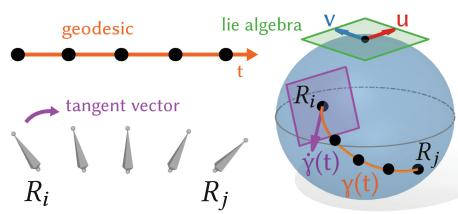  
(a) For ease of explanation, we represent $SO(3)$ as a sphere. At the identity of the group, we define an inner-product for all vectors $u,v$ in the tangent space (green). The vector $\dot{\gamma} (t)$ in the tangent space at $R_{i}$ (purple) is the velocity of the parameterized curve going to $R_{j}$ . The geodesic curve $\gamma (t)$ (orange) is the shortest path between two rotations $R_{i}$ and $R_{j}$ . In this example we interpolate 3 in between rotations along the geodesic (black dots).

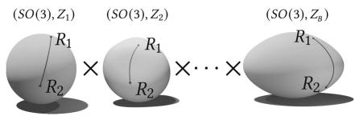

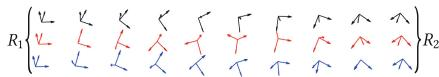  
(b) Changing $\alpha, \beta$ values can be thought of as deforming the group. The distance between the same 2 rotations changes. Our Pose Lie group is a product of manifolds, one for each bone.   
(c) We verify experimentally that updating $\alpha, \beta$ leads to different geodesics, and thus different trajectories despite the same start and end states.   
Fig. 2. Explaining how a geodesic on a manifold can interpolate trajectories.

# 2.3 Riemannian Metric Learning

We propose to learn the metric $<, >$ that most accurately describes the motion of a given animated character. We restrict our optimization to a set of invariant Riemannian metrics on $SO(3)^B$ , which provides a convenient parameterization of $<, >$ .

Metric Parameterization. Consider one $SO(3)$ within the power Lie group $SO(3)^B$ . We can parameterize a Riemannian metric on the Lie group $SO(3)$ by an inner product matrix $Z$ on its Lie algebra.

The matrix $Z$ must be symmetric positive definite, meaning it can be decomposed as $Z = P^T D P$ , where $D$ is a diagonal matrix with strictly positive values

and $P$ is orthogonal. In our work, we restrict $Z$ to a diagonal form:

$$
Z = \left[ \begin{array}{l l l} 1 & 0 & 0 \\ 0 & \alpha & 0 \\ 0 & 0 & \beta \end{array} \right], \quad \text {w i t h} \alpha , \beta > 0, \tag {2}
$$

for each component $SO(3)$ within the Pose Lie group $SO(3)^B$ . This corresponds to penalizing displacements along the standard basis directions of the Lie algebra, with weights $1$ , $\alpha$ , and $\beta$ . A more general symmetric positive definite matrix $Z$ would allow penalizing arbitrary directions (i.e., different orthonormal bases), but in practice we found that restricting to a diagonal form yielded comparable performance. Additional motivation, including computational considerations and software stability, is discussed in the implementation section.

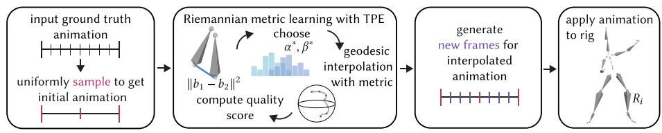  
Fig. 3. Pipeline of our method. Given an animation, we downsample it, and upsample new in-between frames using a search sweep for optimal parameters. Then we apply the animation to the rig and quantitatively and qualitatively analyse the results. (Color figure online)

Our metric on $SO(3)^B$ is parameterized by the set: $\{\alpha_1,\beta_1,\dots,\alpha_B,\beta_B\}$ , written $\{\alpha ,\beta \}$ for short. We also add a categorical parameter, called inv, which indicates whether we propagate the inner-product $Z$ with left or right translations: i.e., whether the resulting metric $<,>$ is left- or right-invariant. This parameterization does not cover every metric on $SO(3)^B$ ; yet, it encodes a $4B$ -dimensional family of metrics where we can perform metric learning.

Geodesic Interpolation. Consider a bone $b$ and two frames $i, j$ that are consecutive in the initial animation $A_{I}$ and $j - i + 1$ frames apart in the ground-truth animation $A_{G}$ , i.e., $A_{I}(b, i) = A_{G}(b, i) = R_{i} \in SO(3)$ and $A_{I}(b, j) = A_{G}(b, j) = R_{j} \in SO(3)$ . Given a metric $<, >$ , we compute the geodesic $\gamma$ on $SO(3)$ such that $\gamma(0) = R_{i}$ and $\gamma(1) = R_{j}$ and the energy $E(\gamma)$ measured with $<, >$ is minimal according to the definition of a geodesic. The main challenge is to compute the initial tangent vector $u_{0} = \dot{\gamma}(0)$ required to shoot from $\gamma(0)$ to $\gamma(1)$ . This requires to numerically invert the Exp map defined in the previous section, i.e., solving the optimization problem:

$$
u _ {0} = \underset {u \in T _ {R _ {i}} S O (3)} {\arg \min} \| \mathrm {E x p} _ {R _ {i}} (u) - R _ {j} \| ^ {2}. \tag {3}
$$

The tangent vector $u_0$ then yields values of $A_U$ between frames $i$ and $j$ as: $A_U(b, t) = \mathrm{Exp}_{R_i}(t.u_0)$ for $t \in [0,1]$ . We observe that we do not have a closed

form expression for the interpolating geodesic, which is instead computed via numerical integration and optimization.

Optimization Criteria: Quality Metrics. The upsampled animation $A_U$ is obtained by geodesic interpolation, which depends on the invariant Riemannian metric $<, >$ that is itself parameterized by $\alpha, \beta$ and $\mathrm{inv}$ . Thus, we write $A_U$ as a function of $\alpha, \beta, \mathrm{inv}$ : $A_U(\alpha, \beta, \mathrm{inv})$ . We detail here how we find the optimal parameters $\alpha, \beta, \mathrm{inv}$ and thus the optimal Riemannian metric $<, >$ for digital animations, see Fig. 3 (center). Consider a quality metric $Q$ that denotes how close the interpolated animation $A_U(\alpha, \beta, \mathrm{inv})$ is from the ground truth animation $A_G$ . We get:

$$
\alpha^ {*}, \beta^ {*}, \operatorname {i n v} ^ {*} = \underset {\alpha , \beta , \operatorname {i n v}} {\arg \min } Q \left(A _ {U} (\alpha , \beta , \operatorname {i n v}), A _ {G}\right), \tag {4}
$$

for $\alpha, \beta \in (\mathbb{R}_+^*)^B$ and inv in $\{\text{left}, \text{right}\}$ . We will experiment with various quality metrics $Q$ within this optimization criterion.

Quality metrics compare the differences between bones in the ground truth animation $A_{G}$ and the corresponding bones in the upsampled animation $A_{U}$ . Our first quality metric quantifies the difference in position between two bones' endpoints:

$$
Q _ {l o c} \left(b _ {1}, b _ {2}\right) = \left\| b _ {1} - b _ {2} \right\| ^ {2}, \tag {5}
$$

where $b_{1}$ and $b_{2}$ are the endpoint positions of bones 1 and 2.

Our second quality metric quantifies the angle difference in rotation between two bones:

$$
Q _ {r o t} \left(b _ {1}, b _ {2}\right) = \operatorname {a r c c o s} \left[ \frac {t r \left(b _ {1} b _ {2} ^ {T}\right) - 1}{2} \right], \tag {6}
$$

where in this case $b_{1}$ and $b_{2}$ are the rotation matrices of bones 1 and 2.

Our third quality metric $Q_{hyb}$ is a weighted sum of $Q_{loc}(b_1, b_2)$ and $Q_{rot}(b_1, b_2)$ . Each of these three quality metrics is defined for a given bone of the rig, at a given frame. To get the quality scores $Q$ across bones and frames, we sum across the bones $b = 1, \ldots, B$ with or without a weight $w_b > 0$ corresponding to the depth of that bone in the rig, and we average over all frames in the ground truth animation [14]. Thus, the total quality metric between a pose in the ground truth animation $A_G$ and the upsampled animation $A_U$ is:

$$
Q = \frac {1}{F} \sum_ {t = 1} ^ {F} \sum_ {b = 1} ^ {B} w _ {b} \tilde {Q} \left(A _ {U} (b, t), A _ {G} (b, t)\right), \tag {7}
$$

and $\tilde{Q}$ equal to $Q_{loc}$ , $Q_{rot}$ or $Q_{hyb}$ . The dependency on $\alpha, \beta$ , inv is within the bone $b_{t,i}^{U}$ of the upsampled animation $A_U$ . For all results we use $Q_{hyb}$ .

Optimization Method: Gradient-Free. We introduce the optimization method chosen to minimize the criterion of Eq.4 and learn $\alpha^{*}$ , $\beta^{*}$ and inv *. This criterion does not have a closed form as a function of $\alpha, \beta$ and inv. Thus, we cannot compute its gradient, nor leverage any gradient-based optimization methods. Consequently, we propose to rely on a gradient-free optimization method:

the Tree-Structured Parzen Estimator (TPE). Tree-Structured Parzen Estimator algorithm [2] is designed to find parameters that optimize a given criterion whose gradient is not available. TPE is an iterative process that uses history of evaluated parameters $\alpha, \beta$ , inv to create a probabilistic model, which is used to suggest the next set of parameters $\alpha, \beta$ , inv to evaluate, until the optimal set $\alpha^{*}, \beta^{*}$ , inv* is reached.

Implementation. Our ground truth animations are motion capture sequences downloaded from Adobe Mixamo at 30 frames per second [1]. All animations are imported to Blender, which we use to visualize, render, and export animation data [4]. Blender provides functionality to manipulate and access animation data such as rig structures, animation curves, and keyframes using Python scripting, which allows us to automate importing the initial animation, downsampling it, and exporting the downsampled keyframes for processing. After saving the keyframes in NumPy files [7], we load the bone locations and rotation matrices into a script which computes the interpolations. File sizes are calculated as the sum of the sizes (in bytes) of the exported NumPy files.

For cartesian linear interpolation, we linearly interpolate the locations as well as the rotations in the form of component-wise quaternion interpolation. Blender's quaternion interpolation was once implemented this way but was problematic since it can yield invalid (non-unit) quaternions. Blender has since updated to using a version of spherical linear interpolation (slerp), which we also compare to.

Riemannian metric learning with TPE is performed using HyperOpt [3] and Tune [8]. See the supplementary material for details on the TPE algorithm. During geodesic interpolation on $SO(3)$ , we generate new rotation matrices representing the orientation of each bone at a frame using the implementation of invariant Riemannian metrics parameterized by $\alpha, \beta$ , inv and available through the Geomstats library [10]. In implementation, we restricted $Z$ to a diagonal form primarily for computational and numerical reasons. Although a full symmetric positive definite matrix could in principle allow finer control by penalizing arbitrary directions, earlier experiments using such matrices did not yield significant improvements in reconstruction quality. Moreover, we encountered numerical instabilities when working with full matrices in Geomstats at the time.

To compute quality metrics, we need to recover the new bone positions $b$ at each frame given the interpolated orientations $R \in SO(3)$ and the position of the root bone. To do so, we start from the root bone of the rig (e.g. hips) and traverse the tree breadth first, applying each new rotation to the bones on that "level" of the tree, computing the new positions, iteratively until we have leaf node (e.g. fingertips) positions.

Once we have the interpolated frames for all interpolation schemes also saved in NumPy files, we then load them back into Blender to be applied to copies of the downsampled animation.

# 3 Results

We compare our geodesic interpolations (purple) to the three most commonly used schemes: piecewise constant (PC, teal), linear cartesian (LC, orange), spherical linear (slerp, yellow), on 5 different increasingly complex Mixamo animations: Pitching, Rolling, Punching, Jumping, and Sitting. Our supplemental video contains the full animations.

Perceptual Accuracy. We visualize and qualitatively compare the accuracy of each interpolation scheme. We present this comparison using a sampling rate of $s = 0.3$ in Figs. 4a-4d, while the corresponding figures for other sampling rates can be found in the supplemental materials. Our visualizations show the ground truth animation, with the interpolation methods layered transparently over to highlight where the interpolation deviates from the original.

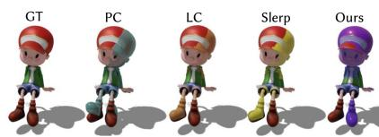  
(a)

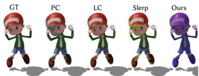  
(b)

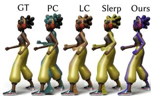  
(c)


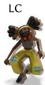


  
(d)   
Fig. 4. Figure 4a shows our geodesic almost perfectly recreating the pose in frame 24 of the Sitting animation. Figure 4b shows the entire purple overlay for the Jumping animation which indicates a high quality reconstruction. Figure 4c shows extremities like hands are captured more accurately in our method for the Punching animation. In Fig. 4d, we capture the fast Rolling motion in frame 44.

The Pitching animation in Fig. 1 has 24 bones and shows our method working with animations with a fixed root node. Sitting in Fig. 4a is an example where the fixed node is in the middle of the armature. Jumping contains vertical motion and rotations in the legs that are far apart, i.e., differ by a large angle close to $pi$ . Punching animation in Fig. 4c shows horizontal translations with contacts. For example, it would be undesirable for an interpolation to miss frames where her feet touch the floor to create an illusion of floating. Our approach outperforms traditional techniques, as it most accurately interpolates characters within this diversity of animations: displaying a larger purple overlay in Figs. 4a-4b, effectively capturing extremities (hands and feet) in Fig. 4c as well as fast motions in Fig. 4d. The Rolling animation is difficult because it has the complexity of all previous animations. Bones rotations are large and flip

upside down (see Fig. 4d). In this difficult setting, visual inspection shows that our interpolation performs particularly well.

Quantitative Accuracy and Compression. In addition to these perceptual comparisons, we compare the interpolations' accuracies using the weighted error $Q_{hyb} = 0.5Q_{loc} + 0.5Q_{rot}$ and present it in Fig. 5 for the Rolling animation. The supplementary materials show these plots for the 4 other animations. Our approach presents the lowest error just in front of slerp's. Despite the seemingly small quantitative difference between these two, we note that Fig. 4d shows significant perceptual differences. Figure 5 also allows us to evaluate our method in terms of compression: we require a lower sampling rate $s$ to achieve a given interpolation error (or accuracy). Consequently, this method can decrease the memory required to store animations: Our compressed animation is a factor of $s$ smaller than the ground truth, plus the $B\alpha$ and $B\beta$ float values. The supplemental materials provide additional details on compression and exact file size.

# 4 Conclusion and Future Work

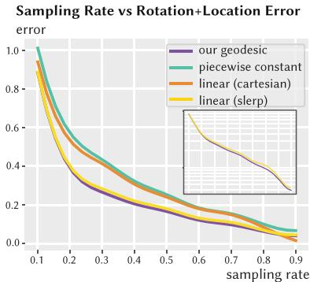  
Fig.5. As the sampling rate for the Pitching animation increases, the error metric $Q_{hyb}$ decreases.

We presented a method for animation interpolation using geodesics on Riemannian manifolds where we learn the optimal metric. To our knowledge, this is the first time that Riemannian metric learning is proposed for computer graphics. We hope that these ideas will inspire other applications in this field. We showed that our method interpolates animations with high accuracy (both perceptually and quantitatively) on a variety of different motion capture sequences. Because we are able to accurately represent a high frame rate animation with very few frames, we

achieve a compression rate that requires digital animators to pose fewer keyframes during the creation process.

Future work will involve a deeper analysis of the metric parameters $\alpha$ and $\beta$ to better understand how they influence the perceived qualities of motion. By studying the optimal values $\alpha^{*},\beta^{*}$ learned across different animations, we hope to uncover patterns that reflect stylistic choices or emotional intent-e.g., whether higher $\alpha$ values in a joint correlate with faster, more expressive movement. These insights could not only offer semantic intuition into motion design but also inform tools that give animators direct, real-time control over interpolation styles. To that end, we plan to integrate our geodesic interpolation framework into animation software, allowing users to experiment interactively with different parameter settings. We are also interested in conducting perceptual studies to evaluate which interpolations are most appealing or expressive to animators and viewers.

One can also explore how choice of keyframes impacts interpolation and compression results. Our experiments uniformly downsample the ground-truth animation. Yet, with an extremely low sampling rate, the downsampled animation consists of very few frames which might not capture all important actions. One can explore how a smart downsampling of the animation improves interpolation quality by ensuring that the most important frames are kept.

Acknowledgments. Sarah Kushner and Nina Miolane acknowledge funding from the NSF Career 2240158 and the NSF grant 2134241.

# References

1. Adobe: Mixamo (2023). https://www MIXamo.com/   
2. Bergstra, J., Bardenet, R., Bengio, Y., Kegl, B.: Algorithms for hyper-parameter optimization. In: Shawe-Taylor, J., Zemel, R., Bartlett, P., Pereira, F., Weinberger, K. (eds.) Advances in Neural Information Processing Systems, vol. 24, Curran Associates, Inc. (2011)   
3. Bergstra, J., Yamins, D., Cox, D.D., et al.: Hyperopt: a python library for optimizing the hyperparameters of machine learning algorithms (2013)   
4. Community, B.O.: The Free and Open Source 3D Creation Suite. Blender Foundation, Stichting Blender Foundation, Amsterdam (2023). http://www.blender.org   
5. Guigui, N., Miolane, N., Pennec, X.: Introduction to riemannian geometry and geometric statistics: from basic theory to implementation with geomstats. Foundations and Trends in Machine Learning (2022)   
6. Haarbach, A., Birdal, T., Ilic, S.: Survey of higher order rigid body motion interpolation methods for keyframe animation and continuous-time trajectory estimation. In: 2018 International Conference on 3D Vision (3DV), pp. 381-389. IEEE (2018)   
7. Harris, C.R.: Array programming with NumPy. Nature 585(7825), 357-362 (2020)   
8. Liaw, R., Liang, E., Nishihara, R., Moritz, P., Gonzalez, J.E., Stoica, I.: Tune: a research platform for distributed model selection and training. arXiv preprint arXiv:1807.05118 (2018)   
9. Milnor, J.: Curvatures of left invariant metrics on lie groups (1976)   
10. Miolane, N., et al.: Geomstats: A python package for riemannian geometry in machine learning. J. Mach. Learn. Res. (2020)   
11. Oreshkin, B.N., Valkanas, A., Harvey, F.G., Menard, L.S., Bocquelet, F., Coates, M.J.: Motion in-betweening via deep $\delta$ -interpolator. IEEE Trans. Vis. Comput. Graphics 1-12 (2023)   
12. Shoemake, K.: Animating rotation with quaternion curves. In: Proceedings of the 12th Annual Conference on Computer Graphics and Interactive Techniques, pp. 245-254 (1985)   
13. Shoemake, K.: Quaternion calculus and fast animation, computer animation: 3-d motion specification and control. In: SIGGRAPH (1987)   
14. Wang, J.: Deep 3D human pose estimation: a review. Comput. Vis. Image Underst. 210, 103225 (2021)   
15. Zhang, X., van de Panne, M.: Data-driven autocompletion for keyframe animation. In: Proceedings of the 11th Annual International Conference on Motion, Interaction, and Games, pp. 1-11 (2018)

# Conditioning Surface Shape Processes with Neural Operators

Jingchao Zhou $^{1}$ , Gefan Yang $^{2}$ , and Stefan Sommer $^{2(\boxtimes)}$

$^{1}$ Department of Computer Science, University of Copenhagen, Copenhagen, Denmark  
vjb382@alumni.ku.dk

$^{2}$ Department of Computer Science, University of Copenhagen, Copenhagen, Denmark {gy, sommer}@di.ku.dk

Abstract. We present a novel method for simulating infinite-dimensional conditional stochastic processes governing surface shape evolution. Given boundary conditions represented as spherical functions, we consider a function-valued diffusion process $X$ with initial state $X_0$ , conditioned on $X_T$ . To address the simulation challenge, we develop a neural operator architecture leveraging spherical harmonic transforms to approximate the intractable drift term arising from Doob's $h$ -transform. The proposed operator demonstrates discretization equivariance, enabling direct application to spherical meshes at arbitrary resolutions without architectural modifications or retraining. We validate our method on several synthetic shape evolution scenarios.

Keywords: Stochastic shape evolution $\cdot$ Diffusion bridge $\cdot$ Neural operator

# 1 Introduction

Shape evolution modeling plays a foundational role across biological studies, medical imaging, and computer animation. In evolutionary biology, an essential question is understanding how morphological structures evolve across different species.

A central challenge lies in characterizing stochastic deformations between given endpoint shapes, which can be naturally formulated as stochastic interpolation problems via conditional diffusion processes (diffusion bridges). In shape analysis, shapes are represented as immersions $\mathcal{M} \to \mathbb{R}^d$ for some manifold $\mathcal{M}$ , causing that the processes are valued in infinite-dimensional function spaces. Recent work by Baker et al. [3] generalized Doob's $h$ -transform - a cornerstone technique for conditioning finite-dimensional diffusion processes - to function-valued processes. However, the $h$ -functions introduced by the transform remain analytically intractable except for linear cases, posing simulation challenges across both finite and infinite-dimensional settings.

Finite-dimensional diffusion bridge approximation has been addressed through multiple methodological frameworks: (1) guided proposals combined with Markov Chain Monte Carlo sampling [7, 15], (2) denoising score matching techniques [8], (3) adjoint process formulations [2], (4) Gaussian kernel approximations [5], and (5) Wiener chaos expansions [6]. For infinite-dimensional extensions, Baker et al. [3] introduced a projection-based approach that maps the infinite-dimensional process onto a finite basis, training fully-connected networks to learn coefficient dynamics via score matching. Subsequent work by Yang et al. [18] eliminated the projection requirement through Fourier neural operators (FNOs) that directly parameterize the drift in functional space. Parallel developments by Pieper-Sethmacher et al. [13] generalized guided proposals to infinite-dimensional settings. Although these methods have made considerable progress, their effectiveness on surface shape process has not yet been tested.

To address the gap in surface shape modeling, we present the Spherical Continuous-time U-shaped Neural Operator (SCUNO) a novel operator architecture combining strengths from the spherical Fourier neural operator (SFNO) [4] and the continuous-time U-shaped neural operators (CTUNO) [18]. Our framework advances beyond SFNO's static spectral analysis and CTUNO's general functional mappings by introducing: (1) spherical harmonic transforms that naturally act on the basis defined on $\mathbb{S}^2$ , and (2) continuous-time modulation that better incorporates time dependency for the score learning. This enables efficient conditional sampling of surface deformation processes while maintaining geometric invariants.

The method proposed in this study provides a framework for simulating the morphological evolution among species from a 3D surface shape perspective. Specifically, by applying this approach to landmark-based representations of endocasts, biologists can infer and reconstruct the evolutionary trajectories connecting the morphological data of extant species with hypothesized ancestral morphologies. This enables a quantitative understanding of shape changes along phylogenetic branches.

# 2 Preliminaries

# 2.1 Problem Statement

We are interested in the stochastic surface shape evolution, where a surface $s \in \mathrm{Imm}(\mathbb{S}^2, \mathbb{R}^d)$ is an immersion, the shape space can be obtained by quotienting out $\mathrm{Diff}(\mathbb{S}^2)$ , the diffeomorphism group of $\mathbb{R}^d$ , from the immersions, i.e., $\mathrm{Imm}(\mathbb{S}^2, \mathbb{R}^d) / \mathrm{Diff}(\mathbb{S}^2)$ .

In the context of three-dimensional shape surfaces, the ambient space is $\mathbb{R}^3$ , since physical shapes reside in three-dimensional Euclidean space. However, for theoretical generality or specific applications, the dimension $d$ of the ambient space $\mathbb{R}^d$ may also be set to 2 or 4 or higher.

The domain of shape $s$ could be the circle $\mathbb{S}^1$ , in which case $s$ is an immersion belonging to $\mathrm{Imm}(\mathbb{S}^1, \mathbb{R}^d)$ . In this case, FNOs are perfectly suited for $\mathbb{S}^1$ , as the periodic boundary conditions in $\mathbb{R}$ are naturally fulfilled by $\mathbb{S}^1$ . This special

case is already well-handled by Fourier-based methods (e.g. CTUNO [18]). More generally, the domain could be a higher-dimensional sphere $\mathbb{S}^{d'}$ , with $d' \geq 2$ .

In this paper, we restrict our attention to the case $d' = 2$ , since spherical harmonic decomposition is defined on $\mathbb{S}^2$ . This restriction facilitates the use of spherical harmonic decomposition and focuses the study on shape surfaces immersed in three-dimensional space.

Numerically, $s$ can be represented by a set of points $\{s(\xi_i) \in \mathbb{R}^d; \xi_i \in \mathbb{S}^2, i = 1, \dots, N\}$ called landmarks. For a diffeomorphism $\phi_t \in \mathrm{Diff}(\mathbb{R}^d)$ , $\phi_t(s)(\xi_i)$ represents the position of the $i$ -th landmark at time $t$ .

We now focus on a specific type of process named Kunita flow [10], further developed by [16, 17] to adapt to shapes. Let $H \coloneqq L^2(\mathbb{S}^2, \mathbb{R}^d)$ is a separable Hilbert space with an inner product $\langle \cdot, \cdot \rangle$ , and let $(H, \mathcal{F}, \mathbb{P})$ be the standard probability space. Consider a map $X_t$ defined by $\xi \mapsto \phi_t(s)(\xi) - s(\xi)$ as an element in $H$ , let $W_t$ be a cylindrical Wiener process on $L^2(\mathbb{R}^d, \mathbb{R}^d)$ , the SDE is defined as

$$
\mathrm {d} X _ {t} = Q ^ {1 / 2} \left(X _ {t}\right) \mathrm {d} W _ {t}, \tag {1}
$$

where the diffusion operator $Q^{1 / 2}(X_t)$ on $L^2 (\mathbb{R}^d,\mathbb{R}^d)$ is given by:

$$
Q ^ {1 / 2} (f) (\xi) := \int_ {\mathbb {R} ^ {d}} k \left(\phi_ {t} (s) (\xi), \zeta\right) f (\zeta) \mathrm {d} \zeta = \int_ {\mathbb {R} ^ {d}} k \left(X _ {t} (\xi) + s (\xi), s (\zeta)\right) f (\zeta) \mathrm {d} \zeta \tag {2}
$$

for a kernel $k: \mathbb{R}^d \times \mathbb{R}^d \to \mathbb{R}^d \otimes \mathbb{R}^d$ , $f: \mathbb{S}^2 \to \mathbb{R}^d$ and $\zeta \in \mathbb{S}^2$ . $Q^{1/2}$ is Hilbert-Schmidt and its square reads

$$
Q (f) (\xi) = \int_ {\mathbb {R} ^ {d}} g (\xi , \zeta) f (\zeta) \mathrm {d} \zeta \tag {3}
$$

with $g(\xi, \zeta) = \int_{\mathbb{R}^d} k(s(\xi), \omega) k^T(\omega, s(\zeta)) \, \mathrm{d}\omega$ .

Given the initial shape $s_0$ and target shape $s_T$ , the stochastic shape evolution can be simulated by sampling from the conditional SDE, which is obtained by applying infinite-dimensional Doob's $h$ -transform [3] on (1):

$$
\mathrm {d} X _ {t} ^ {c} = Q \left(X _ {t} ^ {c}\right) \nabla \log h \left(t, X _ {t} ^ {c}\right) \mathrm {d} t + Q ^ {1 / 2} \left(X _ {t} ^ {c}\right) \mathrm {d} W _ {t}, \tag {4}
$$

where $\nabla \log h:[0,T]\times H\to H$ . The boundary conditions of $X^c$ are $X_0^c = 0$ and $X_{T}^{c} = v\coloneqq s_{T} - s_{0}$ , where $0:\xi \mapsto 0$ . Baker et al. further showed that when conditioning on $v$ , $h(t,x) = \mathbb{P}(X_T\in \Gamma \mid X_t = x)$ . The $\Gamma \subset H$ is a set with non-zero measure, and contains the condition functions (wanted behavior of $X_{T} = s_{T} - s_{0}$ at time $T$ ). The main challenges of simulating (4) are (1) $\nabla \log h(t,x)$ is intractable; (2) $X^c$ is infinite-dimensional; We shall address both by (1) applying a denoising score matching object; (2) projecting $X_{t}^{c}$ on a finite spherical harmonic basis.

# 2.2 Time Reversed Diffusion Bridge

To simulate the conditioned shape surface process (4), we consider the simulation of the time-reversed conditioned process $\{Z_t^c\} \coloneqq \{X_{T - t}^c\}$ for $t\in [0,T]$ .

Heng et al. [8] originally proposed the simulation of conditioned time-reversed diffusion process in a denoising score matching manner. However, their approach did not treat the diffusion process as a function-valued process. Yang et al. [18] basing on [12], they applies the time reversal to the infinite-dimensional conditioned diffusion process per basis.

Assume we have the orthonormal basis $\{e_i\}_{i=1}^{\infty}$ of $H$ and the orthonormal basis $\{k_j\}_{j=1}^{\infty}$ of Hilbert space $U$ . We denote the conditioned process (4) can be written in basis summation form $X_t^c = \sum_{i=0}^{\infty}[X_t^c]_i e_i$ where the $[X_t]_i$ is the projection of $X_t$ on the basis $e_i$ . And we denote the time-reversed process of conditioned process (4) can be written in $Z_t^c = \sum_{i=0}^{\infty}[Z_t^c]_i e_i$ as well. Then the time-reversed conditioned process of $\{[X_t^c]_i\}$ can be written as:

$$
\begin{array}{l} \mathrm {d} \left[ Z _ {t} ^ {c} \right] _ {i} = \left[ \bar {f} ^ {c} \left(T - t, Z _ {t} ^ {c}\right) \right] _ {i} \mathrm {d} t + \sum_ {j = 0} ^ {\infty} \left[ Q ^ {1 / 2} \left(Z _ {t} ^ {c}\right) \right] _ {i j} \mathrm {d} \left[ W _ {t} ^ {c} \right] _ {j} (5) \\ [ \bar {f} ^ {c} (T - t, Z _ {t} ^ {c}) ] _ {i} = \sum_ {j \in I (i)} \nabla_ {[ x ] _ {j}} [ Q (Z _ {t} ^ {c}) ] _ {i j} \\ + \sum_ {j \in I (i)} \left[ Q \left(Z _ {t} ^ {c}\right) \right] _ {i j} \nabla_ {[ x ] _ {j}} \log p _ {t} \left(\mathrm {x} ^ {i} \mid \left(\mathrm {z} ^ {i}, z _ {0}\right)\right), (6) \\ \end{array}
$$

where the $I(i)$ contains the indices makes $[Q(Z_t^c)]_{ij}$ diagonal, $\mathbf{x}^i \coloneqq \{[X_t]_j; j \in I(i)\}$ , $\hat{\mathbf{x}}^i \coloneqq \{[X_t]_j; j \notin I(i)\}$ , for $t > 0$ and $\mathbf{z}^i \coloneqq \{z_j; z_j \in \mathbb{R}, j \notin I(i)\}$ , the condition law of $\mathbf{x}^i$ given $\hat{\mathbf{x}}^i = \mathbf{z}^i$ is assumed to have a density $p_t(\mathbf{x}^i | (\mathbf{z}^i, z_0))$ [12]. While the score here $\nabla_{[x]_j} \log p_t(\mathbf{x}^i | (\mathbf{z}^i, x_0))$ is still intractable, Yang et al. [18] let a bounded parameterized operator $\mathcal{G}_{\theta}(t,x): [0,T] \times \mathrm{H} \to H$ and parameterized process $Z^\theta$ to help approximate the $\bar{f}^c$ and the ground truth time-reversed diffusion bridge $Z^c$ :

$$
\begin{array}{l} \mathrm {d} [ Z _ {t} ^ {\theta} ] _ {i} = \sum_ {j \in I (i)} \nabla_ {[ x ] _ {j}} [ Q (Z _ {t} ^ {\theta}) ] _ {i j} + [ \mathcal {G} _ {\theta} (T - t, Z _ {t} ^ {\theta}) ] _ {i} \\ + \sum_ {j = 0} ^ {\infty} \left[ Q ^ {1 / 2} \left(Z _ {t} ^ {\theta}\right) \right] _ {i j} \mathrm {d} \left[ W _ {t} ^ {\theta} \right] _ {j}. \tag {7} \\ \end{array}
$$

# 2.3 Neural Operator

As shown above, the approximate time-reversed diffusion bridge $Z^{\theta}$ involves a operator $\mathcal{G}_{\theta}$ parameterized by $\theta$ , which can be constructed as a trainable neural operator. Unlike classical neural networks which operate on finite-dimensional vector spaces and require fixed discretizations, neural operators are designed to learn mappings between infinite-dimensional function spaces. We briefly review the construction of a canonical neural operator [9].

A neural operator $\mathcal{G}_{\theta}:u\mapsto v$ for $u,v\in L^{2}(D,\mathbb{R}^{d})$ and some domain $D$ is designed as a series of compositions of linear operators $\mathcal{L}_i$ and element-wise nonlinear activation functions $\sigma_{i}:\mathbb{R}\to \mathbb{R}$ , $\mathcal{L}_i$ is defined as:

$$
\mathcal {L} _ {i} v _ {i} (\xi) = W _ {i} v _ {i} (\xi) + \mathcal {K} _ {i} v _ {i} (\xi) + b _ {i} (\xi), \quad \xi \in D, \tag {8}
$$

where the $W_{i}\in \mathbb{R}^{d_{i}}\times \mathbb{R}^{d_{i + 1}}$ is the local linear operator, the $b_{i}:D_{i + 1}\to \mathbb{R}^{d_{i + 1}}$ is the bias function and the $\kappa_i:L^2 (D_i,\mathbb{R}^{d_i})\to L^2 (D_{i + 1},\mathbb{R}^{d_{i + 1}})$ could be kernel integral operators or spectral convolution operators. The whole $\mathcal{G}_{\theta}$ is then modeled as:

$$
\mathcal {G} _ {\theta} = \mathcal {Q} \circ \sigma_ {L} \circ \mathcal {L} _ {L} \circ \dots \circ \sigma_ {1} \circ \mathcal {L} _ {1} \circ \mathcal {P}, \tag {9}
$$

where the $\mathcal{P}:\mathbb{R}^d\to \mathbb{R}^{d_1}$ , $\mathcal{Q}:\mathbb{R}^{d_{L + 1}}\to \mathbb{R}^d$ are the local point-wise lifting and projection mappings. We will follow this construction to design SCUNO in the following section.

# 3 Methodology

# 3.1 Spherical Harmonic Transforms

In the case of $d = 3$ , the shape $s$ can be represented as a vector-valued function $s(\xi) = (s^x(\xi), s^y(\xi), s^z(\xi))$ .

To perform computation in finite dimensions, we decompose each channel $s^k \in L^2(\mathbb{S}^2, \mathbb{R})$ using spherical harmonic basis:

$$
s ^ {k} (\theta , \phi) = \sum_ {l = 0} ^ {\infty} \sum_ {m = - l} ^ {l} \left\langle s ^ {k} (\theta , \phi), Y _ {l} ^ {m} (\theta , \phi) \right\rangle Y _ {l} ^ {m} (\theta , \phi) = \sum_ {l = 0} ^ {\infty} \sum_ {m = - l} ^ {l} \hat {s} _ {l, m} ^ {k} Y _ {l} ^ {m} (\theta , \phi), \tag {10}
$$

and the spherical harmonics $Y_{l}^{m}(\theta ,\phi)$ is defined by an explicit formula:

$$
Y _ {l} ^ {m} (\theta , \phi) = \sqrt {\frac {2 l + 1}{4 \pi} \frac {(l - m) !}{(l + m) !}} P _ {l} ^ {m} (\cos \theta) e ^ {i m \phi}, \tag {11}
$$

where the $P_{l}^{m}(\cos \theta)$ is the Legendre polynomials. We then truncate the expansion by keeping only degrees $l\leq L$ , yielding a band-limited approximation. This projects the shape into a finite-dimensional subspace while respecting the spherical topology.

This representation enables the simulation of diffusion bridges in coefficient space and facilitates learning with spherical neural operators. During the experiment, we retained the first 8 spherical harmonic basis functions to represent the shape in $H$ . Preserving a larger number of spherical harmonic basis functions can improve the method's ability to capture high-frequency components of the shape. However, this also increases computational complexity and may introduce Gibbs phenomenon (oscillatory artifacts near discontinuities).

# 3.2 Spherical Fourier Neural Operators

The basis function decomposition in the above can be substitute by other basis, not only the spherical harmonics. As long as the basis functions $\{e_i\}_{i=0}^{\infty}$ are orthogonal in the Hilbert space $H$ , each channel of the shape function $s$ can be represented by $s^k = \sum_{i=0}^{\infty} \langle s^k, e_i \rangle e_i = \sum_{i=0}^{\infty} \alpha_i e_i$ with some coefficients $\alpha \in \mathbb{R}$ .

Baker and Yang et al. [1,18] chose the Fourier basis in practice and Yang furthermore used the FNO [11] as an ingredient and design a CTUNO architecture to learn the operator $\mathcal{G}_{\theta}$ . The CTUNO performs well on the shape functions $s:\mathbb{S}^1\to \mathbb{R}^2$ valued in $\mathbb{R}^2$ , but has limitations on the shape functions that are valued in $\mathbb{R}^3$ .

Fourier decomposition is defined on the Euclidean domain and it projects the function $s \in L^2(\mathbb{R}^n)$ onto planar waves. In most cases, it can keep the transformation equivariance and the grid-invariance. However the shapes in real-world applications are represented as $s: \mathbb{S}^2 \to \mathbb{R}^3$ , the Fourier transform will lead to misrepresentation of the poles and incorrect longitudinal periodicity when applied to functions on the sphere $\mathbb{S}^2$ .

We then combine the SFNO with CTUNO architecture designed the SCUNO to learn the time-dependent operator $\mathcal{G}_{\theta}$ .

Bonev et a. [4] shows that the kernel integral operator $\mathcal{K}$ in (8) can be achieved by the spherical convolution $\mathcal{K}[s] = \kappa \star s$ . And according to the convolution theorem

$$
\mathcal {F} [ \kappa \star s ] (l, m) = 2 \pi \sqrt {\frac {4 \pi}{2 l + 1}} \mathcal {F} [ s ] (l, m) \cdot \mathcal {F} [ \kappa ] (l, 0), \tag {12}
$$

the spherical convolution can be represented by the SFNO Layer in (13):

$$
\mathcal {K} [ s ] = \mathcal {F} ^ {- 1} \left[ \tilde {\kappa} \cdot \mathcal {F} [ s ] \right], \tag {13}
$$

$$
\mathcal {F} [ \mathcal {K} [ s ] ] (l, m) = \tilde {\kappa} \cdot \mathcal {F} [ s ] (l, m), \tag {14}
$$

where the $\mathcal{F}$ denotes the spherical harmonic transforms (SHT) and the $\mathcal{F}^{-1}$ denotes the corresponding inverse spherical harmonic transforms (ISHT), and the $\tilde{\kappa}$ substitutes the $\sqrt{\frac{4\pi}{2l + 1}}\cdot \mathcal{F}[\kappa](l,0)$ with a learnable weight for each degree $l$ . In our implementation, we use the S2FFT [14] library, a JAX-differentiable and GPU/TPU-accelerated toolkit for spherical harmonic and Wigner transforms, to perform the spherical harmonic transforms required by the SFNO layers.

# 3.3 Loss Function

In order to estimate the time-reversed infinite-dimensional diffusion bridge (7), we need to project the Hilbert space $H$ and $U$ into the truncated space $H^{M} = \operatorname{span}(\{e_{i}\}_{i=1}^{M}) \subset H$ and $U^{M} = \operatorname{span}(\{k_{i}\}_{i=1}^{M}) \subset U$ . Then the operator $Q$ can be estimated by a diagonalizable matrix $Q^{M \times M} \in \mathbb{R}^{M \times M}$ . The $X_{t}$ can be evaluated on points $\xi_{1}, \xi_{2}, \dots, \xi_{M} \in \mathbb{S}^{2}$ . We discrete the time $t \in [0, T]$ into time meshes

$\mathrm{t} = \{t_0 = 0, t_1, \dots, t_N = T\}$ , and the $\Delta t$ is the time step $t_n - t_{n-1}$ . We use the loss function defined in [18],

$$
L (\theta) = \frac {1}{2} \sum_ {n = 1} ^ {N} \int_ {t _ {n - 1}} ^ {t _ {n}} \mathbb {E} _ {\mathbb {P}} \left\{\sum_ {i = 1} ^ {M} \lambda_ {i} \left(\mathcal {G} _ {\theta} (t, X _ {t} [ \xi_ {i} ]) + (\Delta t) ^ {- 1} \cdot \left\{X _ {t} [ \xi_ {i} ] - X _ {t _ {n - 1}} [ \xi_ {i} ] - \Delta t \cdot f (t, X _ {t} [ \xi_ {i} ]) \right\}\right) ^ {2} \right\} d t, \tag {15}
$$

where the $M$ is the truncated number of the bases $e_i$ and $k_{j}$ respecting to the Hilbert space $H$ and $U$ , $N$ is the number of time meshes, the $\lambda_{i}$ can simply chosen as the diagonal entries of $\Sigma^{M\times M}$ .

# 4 Experiment

We sample the grid points $(\theta, \phi) \in \mathbb{S}^2$ in a Gauss-Legendre manner. The grid shape is $n_{\mathrm{lat}}, n_{\mathrm{lon}}$ , and according to the Gauss-Legendre sampling, the $n_{\mathrm{lon}} = 2 \cdot n_{\mathrm{lat}} - 1$ .

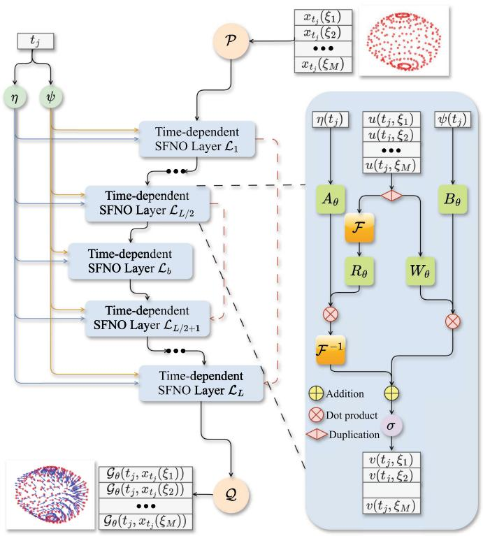  
Fig. 1. The structure of the SCUNO. Here the $\mathcal{F}$ and $\mathcal{F}^{-1}$ in the SFNO block are the spherical harmonic transform and its inverse transform.

We set our $X_0 = 0$ and $s_0: (\theta, \phi) \mapsto (0.5\sin \theta\cos \phi, 0.5\sin \theta\sin \phi, 0.5\cos \theta)$ is a sphere with radius 0.5, centered at the $(0,0,0) \in \mathbb{R}^3$ . We first generate training data $x = \{x_{t_j}(\xi_i); i = 1,\dots,M, j = 1,\dots,N\}$ on evaluation points $\{\xi_i\}$ using a forward unconditioned diffusion process defined in (1). In the experiment, we chose the kernel function $k(\xi, \zeta) = \kappa_\alpha \exp\left(-\frac{\|s(\xi) - s(\zeta)\|^2}{2\kappa_\sigma^2}\right)$ , and choose the integration domain as $[-1,1]^3 \subset \mathbb{R}^3$ . Then we feed the $(x,t)$ pairs as input into SCUNO designed in Fig. 1 to obtain the corresponding $\mathcal{G}_{\theta}(t,x)$ . By minimizing (15) via stochastic gradient descent and obtaining the optimal $\theta^* = \arg \min L(\theta)$ , we can plug $\mathcal{G}_{\theta^*}$ into (7) and sample $Z^\theta$ with boundary conditions $Z_0^\theta = v$ , and $Z_T^\theta = 0$ .

In our experiments shown in Fig. 2, the $s_T$ 's are depicted by blue wireframes, and the $s_0$ 's are depicted by red wireframes. The $s_t$ 's during the evolution are represented as orange surfaces. It can be seen that during the evolution, the topologies of shapes are kept, meanwhile, the boundary conditions suffice. It is worth noting that our models were trained on a coarse discretization grid of $12 \times 23$ but evaluated on a much finer resolution of $40 \times 79$ . As shown in Fig. 2, the surface shape process at higher resolution preserves the learned dynamics from the lower-resolution training. This result shows the discretization-invariance property of our method and demonstrates its ability to model shape dynamics in a continuous and resolution-agnostic manner.

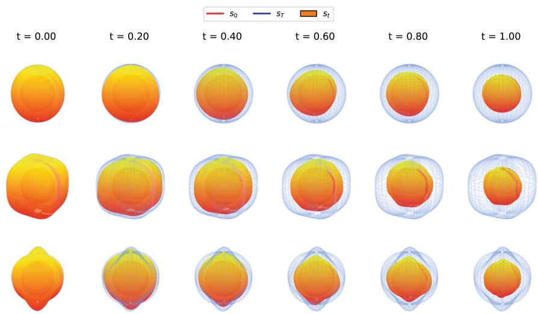  
Fig. 2. The reversed conditioned shape surface process starts from different $s_T$ , ends with the same $s_0$ . The simulated process follows (1). The $s_T$ are a sphere with different scaling, a superquadratic, and a bumped sphere from top to bottom correspondingly.

# 5 Conclusion

We proposed a new method for simulating conditional shape surface processes by representing 3D surfaces as functions decomposed via spherical harmonic transforms. This approach addresses limitations of previous methods in modeling shape evolution. Our method employs SCUNO to directly learn the infinite-dimensional time-reversed diffusion bridge, preserving discretization invariance. By utilizing this method, biologists are able to infer the evolutionary relationships and processes among the morphologies of species.

Acknowledgment. We thank the anonymous reviewers for the feedback on improving the content and presentation. The work was supported by a research grant (VIL40582) from VILLUM FONDEN, and the Novo Nordisk Foundation grants NNF24OC0093490 and NNF24OC0089608.

# References

1. Baker, E., Besnier, T., Sommer, S.: A function space perspective on stochastic shape evolution. In: Scandinavian Conference on Image Analysis, pp. 278-292. Springer (2023)   
2. Baker, E.L., Schauer, M., Sommer, S.: Score matching for bridges without learning time-reversals (2025)   
3. Baker, E.L., Yang, G., Severinsen, M.L., Hipsley, C.A., Sommer, S.: Conditioning non-linear and infinite-dimensional diffusion processes (2024)   
4. Bonev, B., Kurth, T., Hundt, C., Pathak, J., Baust, M., Kashinath, K., Anandkumar, A.: Spherical fourier neural operators: Learning stable dynamics on the sphere. In: International Conference on Machine Learning, pp. 2806-2823. PMLR (2023)   
5. Chau, H., Kirkby, J., Nguyen, D., Nguyen, D., Nguyen, N., Nguyen, T.: An efficient method to simulate diffusion bridges. Stat. Comput. 34(4), 131 (2024)   
6. Delgado-Vences, F., Salcedo-Varela, G.A., Baltazar-Larios, F.: Simulating diffusion bridges using the wiener chaos expansion. arXiv preprint arXiv:2401.06248 (2024)   
7. Delyon, B., Hu, Y.: Simulation of conditioned diffusions. arXiv preprint math/0602455 (2006)   
8. Heng, J., Bortoli, V.D., Doucet, A., Thornton, J.: Simulating diffusion bridges with score matching (2022)   
9. Kovachki, N., Li, Z., Liu, B., Azizzadenesheli, K., Bhattacharya, K., Stuart, A., Anandkumar, A.: Neural operator: learning maps between function spaces with applications to pdes. J. Mach. Learn. Res. 24(89), 1-97 (2023)   
10. Kunita, H., Kunita, H.: Stochastic flows and stochastic differential equations, vol. 24. Cambridge university press (1990)   
11. Li, Z., et al.: Fourier neural operator for parametric partial differential equations. arXiv preprint arXiv:2010.08895 (2020)   
12. Millet, A., Nualart, D., Sanz, M.: Time reversal for infinite-dimensional diffusions. Probab. Theory Relat. Fields 82(3), 315-347 (1989). https://doi.org/10.1007/BF00339991   
13. Pieper-Sethmacher, T., van der Meulen, F., van der Vaart, A.: Simulation of infinite-dimensional diffusion bridges. arXiv preprint arXiv:2503.13177 (2025)

14. Price, M.A., McEwen, J.D.: Differentiable and accelerated spherical harmonic and wigner transforms. J. Comput. Phys. 510, 113109 (2024). https://doi.org/10.1016/j.jcp.2024.113109   
15. Schauer, M., Van Der Meulen, F., Van Zanten, H.: Guided proposals for simulating multi-dimensional diffusion bridges (2017)   
16. Sommer, S., Yang, G., Baker, E.L.: Stochastics of shapes and Kunita flows (2025)   
17. Sommer, S., Schauer, M., Meulen, F.: Stochastic flows and shape bridges. In: Statistics of Stochastic Differential Equations on Manifolds and Stratified Spaces (hybrid meeting), pp. 18-21. No. 48 in Oberwolfach Reports, Mathematisches Forschungsinstitut Oberwolfach (2021)   
18. Yang, G., Baker, E.L., Severinsen, M.L., Hipsley, C.A., Sommer, S.: Infinite-dimensional diffusion bridge simulation via operator learning. In: The 28th International Conference on Artificial Intelligence and Statistics (2025)

# GNN-Enhanced TCN Algorithms for ECG Signal Quality Recognition

Angelica Simonetti<sup>1</sup> and Ferdinando Zanchetta<sup>2(⊗)</sup>

<sup>1</sup> Department of Economics, Università “G. d’Annunzio” of Chieti-Pescara, Chieti, Italy angelica.simonetti@gmail.com

$^{2}$ FABIT Department, Università di Bologna, Bologna, Italy ferdinando.zanchett2@unibo.it

Abstract. Temporal Convolutional Networks (TCNs) are among the most effective algorithms to deal with time series data. To a time series can be also given the structure of directed graph, opening the doors to the usage of Graph Neural Networks (GNNs) in this context. In this paper we develop two distinct Geometric Deep Learning models that merge the capabilities of ordinary TCNs with the ones of GNNs, a supervised classifier and an autoencoder-like model that we apply to solve a quality detection problem on electrocardiogram signals.

# 1 Introduction

Over the last few years, temporal convolutional networks (TCNs) gained prominence as one of the most effective class of deep learning (DL) algorithms (see [1, 12]) to deal with time series data [7], in many cases surpassing the effectiveness of more traditional DL algorithms like recurrent neural networks (RNNs, comprising Long Short-Term Memory networks aka LSTMs). On the other side, when dealing with graph structured data, a particular class of geometric deep learning (GDL, see [2]) algorithms called graph neural networks (GNNs, see [2, 21]) has proven to be very effective at solving problems related with this type of data or at improving the capabilities of existing algorithms. In the context of time series, GNNs have been used jointly with time series specific architectures (e.g. RNNs or TCNs), for example, to study auto-regressive models arising from graph time series or to forecast traffic speed or density (see the survey [21]). In the latter case, the graph structure involved is given by the positions of the sensors that record time series, see [22], or it is inferred by learning the weights of an adjacency matrix [22].

In this paper we propose to do something different and novel, that is to use the graph structure to encode time dependencies. Our idea is to introduce a directed graph structure where the information associated to a given time step (a node) can be linked with the information coming from time steps in the past (this relation assumes the form of a directed edge). This allows us to couple the advantages of TCNs with he ones of graph convolutions. We prove that this

approach enhances state of art TCNs architectures and tested it on the problem of identifying the quality of electrocardiogram (ECG) signals.

ECG signals record the electrical activity of the heart. They can be used to monitor the health status of a human being and to diagnose various heart conditions. In addition, they are particularly versatile as they can be recorded by non-invasive devices. Recordings of ECG signals might be corrupted by many factors (device malfunctioning, environmental noise, incorrect usage of the device, etc.). Corrupted signals are not useful for analyses and if used to train machine learning algorithms they introduce unnecessary noise that prevent the proper tuning of an optimal model. On the other hand, having an expert labeling signals' quality in a dataset is often unfeasible, for instance if the dataset is big: as a consequence it is important to work on DL algorithms to tackle this task, especially unsupervised ones.

In this paper we develop GNN-enhanced TCN-based algorithms to perform ECG quality detection of signals recorded by a ButterFle device (see [15] for a discussion of a supervised algorithm to detect photoplethysmogram signal quality), whose importance is discussed in [16], and we show that GNNs both improve the accuracy of state of the art TCN algorithms and allow to reduce the number of learnable parameters needed (this is relevant for industry deployment). This approach is different from other classical methods relying on hand crafted features in what it considers only raw signals as an input.

# 2 TCNs and GNNs

Convolutional neural networks (CNNs, see [12, 13]) are deep learning algorithms employing so-called convolutional layers, meant to be applied on grid-like data, e.g. images. For sequence-like data, 1d CNNs were developed [11] and, more recently, TCNs have become popular in the study of time series (see [1] and the references therein). The latter are models where the so called causal convolutions are employed. Causal convolutions are 1d convolutions that, when applied to a time series, can look only at past information (see [1]). For example, if we denote as $\mathrm{TS}(l,1)$ the set of one-channel, one-dimensional time series of length $l$ , given a filter $K \in \mathbb{R}^f$ , we can define a simple causal (1d) convolution as an operator

$$
\operatorname {c o n v 1 D}: \operatorname {T S} (l, 1) \to \operatorname {T S} (l, 1), \qquad \operatorname {c o n v 1 D} (\mathbf {x}) _ {j} = \sum_ {i = 0} ^ {f - 1} K _ {i} \widetilde {\mathbf {x}} _ {j - d \cdot i} + b
$$

where $\mathbf{x} \in \mathrm{TS}(l,1)$ , $\widetilde{\mathbf{x}}_n = \mathbf{x}_n$ if $n \geq 0$ and $\widetilde{\mathbf{x}}_n = 0$ otherwise, $b \in \mathbb{R}$ is a bias and $d$ is a natural number. Causal convolutions can be generalized to handle multivariate time series and techniques used in non-causal convolutions. If the causal convolution has $d > 1$ , it is called dilated. TCNs are then 1d CNNs where only (dilated) causal convolutions are employed.

Graph Neural Networks (GNNs, [21]) are models that are used on graph-structured data using as building blocks the so called graph convolutions [2, 6]. Given a directed graph having for each node $v$ a vector of features $h_v \in$

$\mathbb{R}^n$ , a simple graph convolution updates the vector of features according to the following formula

$$
h _ {v _ {i}} ^ {\prime} = \sigma \left(\sum_ {v _ {j} \in N ^ {t} \left(v _ {i}\right)} c _ {i j} A _ {i, j} W h _ {v _ {j}} + l _ {i} A _ {i i} B h _ {v _ {i}}\right) \tag {1}
$$

where $\sigma$ is an activation function, $A$ is the adjacency matrix of the considered graph, $N^t(v_i)$ is the set of all nodes connected to $v_i$ with an edge pointing towards $v_i$ (i.e. having $v_i$ as head), $c_{ij}$ , $l_i$ are optional normalization coefficients, and $W, B$ are matrices of weights. Many successful graph convolutions, such as GCN, GAT or SAGE [8,10,20], are a slight variation of this one. Note that in the given references only undirected graphs are discussed but the extension to directed ones is not complicated. Indeed, these convolutions are implemented also in the PyTorch Geometric library [5] that allows for weighted adjacency matrices to be used: we used this feature to implement convolutions on directed graphs (note that convolutions in the case of directed graphs were explored also in [19]). The advantages that we see in applying graph convolutions to time series modeled as directed graphs are essentially three. The first one is that the directed graph structure given to a time series can incorporate some prior important knowledge about the data (specific relations or dependencies arising from domain knowledge). The second one is that a directed graph structure allows to design custom receptive fields that are more difficult to design using traditional 1D causal convolutions that apply the same sliding filter to the whole sequence. This, for example, can be useful to model distal relationships (and to implement attention mechanisms more easily) or to implement more effective pooling layers. The third one is that graph convolutions have a low number of trainable parameters allowing the design of smaller models or making possible to add more layers to a model without increasing drastically its number of trainable parameters. The models developed in this paper are examples of the second and third instances. We will expand the discussion of these points in future work. Finally, to our knowledge, this is the first time that these type of algorithms are used to solve the problem at hand.

# 3 GNN-Enhanced TCN Models

To solve our ECG quality detection problem we devised both supervised classification algorithms and unsupervised ones. The latter employ autoencoders [12] whose structure we shall now describe. The former use GDL models having the same structure as the ones of the encoders employed in the autoencoders.

In the encoder version, the input, a time series enriched with a directed graph structure, is first given to a block of either $n$ TCN layers or $n$ GNN layers with skip connections, following the approach proposed in [18]. The effectiveness of skip-connections in the context of time series is discussed for TCN models in op.cit. The skip-connections block is described in Fig. 1(b) and works as follows. The input goes through the first TCN/GNN layer, followed by a 1-dimensional convolution and an activation function. Then the output is both stored and

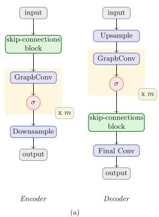

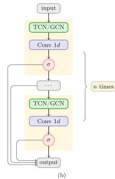  
Fig. 1. The encoder and decoder (a), and the skip-connections block (b)

passed to the next TCN/GNN layer as input and so on. In the architectures we have tested, the TCN/GNN layers are simply dilated causal 1d convolutions or a single graph convolution (followed by an activation function), but more involved designs are possible. At the end all the stored tensors are stacked together and passed to a series of $m$ graph convolutions, each one followed by an activation function. We tested the convolutions: GCN (cfr. [10]), Sage (cfr. [8]), GAT (cfr. [20]).

Finally the intermediate output produced by the graph convolutions is given to an optional 1d convolution with kernel size 1 to adjust the number of channels and then to either an average pooling layer or a max pooling layer that shrinks the time series. If the original time series had length $T$ , the output of the encoder has length $T / s$ , thus realizing the characteristic bottleneck of an autoencoder as described for instance in [9, 18]. We will refer to $s$ as the shrinking factor.

The decoder version changes the order of the blocks we just described, in a symmetric way. We assume not to change the directed graph structures of the time series of length $T$ between the blocks.

The GDL models we tested for classification are obtained as a concatenation of a model having the structure of the encoder described above and a multi-layer perceptron (MLP, see [12]) applied to the output of such an encoder (after a flattening or a meanPooling operation). For easiness of notation, from now on we will refer to classification models as TCNGraphClassifier if the skip-connections block uses TCN layers, TGraphClassifier/Regressor if it is built with graph convolutions. As for the autoencoders, we will use TCNGraphAE if the skip-connections block in the autoencoder uses TCN layers, TGraphAE if it is built with graph convolutions and TGraphMixedAE if the encoder uses graph convolutions and the decoder uses TCN layers. If the skip connections blocks consist only of dilated convolutions and we do not have a final graph convolution to filter the signal, we obtain an TCN autoencoder with a structure similar to the one described in [18]. We call this latter models TCNAE and TCNClassifier. We regard these models as state of the art models in this context and we use them as a benchmark.

Table 1. Results of the classifiers. Best scores are shown in bold.   

<table><tr><td rowspan="2">Model</td><td colspan="3">Positive class = label 1</td><td colspan="3">Positive class = label 0</td></tr><tr><td>Precision</td><td>Recall</td><td>Accuracy</td><td>Precision</td><td>Recall</td><td>Accuracy</td></tr><tr><td>TGraphClassifier</td><td>0.965 ± 0.002</td><td>0.991 ± 0.002</td><td>0.962 ± 0.003</td><td>0.941 ± 0.012</td><td>0.806 ± 0.011</td><td>0.962 ± 0.003</td></tr><tr><td>TCNGraphClassifier</td><td>0.939 ± 0.013</td><td>0.988 ± 0.006</td><td>0.936 ± 0.010</td><td>0.912 ± 0.044</td><td>0.653 ± 0.083</td><td>0.936 ± 0.010</td></tr><tr><td>TCNClassifier</td><td>0.975 ± 0.003</td><td>0.994 ± 0.002</td><td>0.973 ± 0.003</td><td>0.962 ± 0.011</td><td>0.863 ± 0.017</td><td>0.973 ± 0.003</td></tr></table>

We shall describe the pipeline for unsupervised anomaly detection in the next Section.

# 4 Experiments and Results

For our experiments we used a database made of ECG signals recorded with a ButterfLive medical device (see [16] for a discussion of its importance) at a sampling rate $512\mathrm{Hz}$ . A lowband Butterworth filter $48\mathrm{Hz}$ was applied to each signal. Then every 5s long piece of signal was manually labeled by a trained expert according to readability of the signal: label 1 was given to good quality signals, and label 0 was given to low quality/unreadable signals. In total we had a database made of 10590 5-second-long sequences. To each of the resulting sequences, a convolution smoother of window 20 was applied, and then we performed a downsample of ratio 4 (i.e. we kept one point every 4) so that the final time series considered had length 640. Finally, we gave to each time series $\mathbf{x} \in \mathrm{TS}(640,1)$ the same directed graph structure: each time step $\mathbf{x}_i$ is seen as a node and each node $\mathbf{x}_i$ was the head of an arrow $\mathbf{x}_k \rightarrow \mathbf{x}_i$ for each $k = i - 1, i - d, i - 2d, \dots, i - n\dots$ with $d = 4,8$ depending on the model. We call $n \cdot d$ the lookback window: this also varies with the model. All the graph convolutions employed in the models were implemented in their version for directed graphs. As a consequence, the graph convolutions we tested updated the node features of a node using only the information of nodes in the past.

A train/ validation/ test split was performed on the database with weights $0.3 / 0.35 / 0.35$ . Train, validation and test sets are made of signals coming from different recordings and the signals having label 0 are approximately the $18\%$ of each set. For the final evaluation of our algorithms, we run the models for 10 times, then, for each score, the best and the worst results were removed: the means and standard deviations of the remaining 8 runs are reported in Tables 1, 2.

The final objective of the experiments is the classification of each signal as either good or bad according to the labeling.

# 4.1 Supervised Classification

For the supervised task we trained and fine-tuned the models listed in Table 1, whose structure is described in Sect.3. We used 128 as our lookback window (1 s) and we set $d$ to be equal to 4. A lookback window of 1 s is particularly

Table 2. Results of the AE algorithms. Best scores are shown in bold and second best in italic.   

<table><tr><td rowspan="2">Model</td><td colspan="3">Positive class = label 1</td><td colspan="3">Positive class = label 0</td></tr><tr><td>Precision</td><td>Recall</td><td>Accuracy</td><td>Precision</td><td>Recall</td><td>Accuracy</td></tr><tr><td colspan="7">Kmeans, approach A</td></tr><tr><td>TGraphMixedAE</td><td>0.973 ± 0.006</td><td>0.974 ± 0.011</td><td>0.955 ± 0.006</td><td>0.854 ± 0.051</td><td>0.847 ± 0.035</td><td>0.955 ± 0.006</td></tr><tr><td>TGraphAE</td><td>0.960 ± 0.007</td><td>0.993 ± 0.006</td><td>0.959 ± 0.003</td><td>0.952 ± 0.040</td><td>0.765 ± 0.044</td><td>0.959 ± 0.003</td></tr><tr><td>TCNGraphAE1</td><td>0.967 ± 0.003</td><td>0.998 ± 0.002</td><td>0.968 ± 0.002</td><td>0.985 ± 0.014</td><td>0.806 ± 0.016</td><td>0.969 ± 0.002</td></tr><tr><td>TCNGraphAE2</td><td>0.965 ± 0.002</td><td>0.997 ± 0.001</td><td>0.966 ± 0.002</td><td>0.976 ± 0.007</td><td>0.796 ± 0.012</td><td>0.966 ± 0.002</td></tr><tr><td>TCNAE1</td><td>0.966 ± 0.012</td><td>0.995 ± 0.005</td><td>0.964 ± 0.009</td><td>0.966 ± 0.032</td><td>0.798 ± 0.074</td><td>0.964 ± 0.009</td></tr><tr><td>TCNAE2</td><td>0.949 ± 0.005</td><td>0.999 ± 0.001</td><td>0.951 ± 0.004</td><td>0.995 ± 0.006</td><td>0.692 ± 0.031</td><td>0.954 ± 0.004</td></tr><tr><td colspan="7">Dbscan, approach B</td></tr><tr><td>TGraphMixedAE</td><td>0.984 ± 0.005</td><td>0.944 ± 0.012</td><td>0.939 ± 0.007</td><td>0.745 ± 0.037</td><td>0.909 ± 0.028</td><td>0.939 ± 0.007</td></tr><tr><td>TGraphAE</td><td>0.968 ± 0.006</td><td>0.989 ± 0.006</td><td>0.962 ± 0.002</td><td>0.933 ± 0.034</td><td>0.813 ± 0.038</td><td>0.962 ± 0.002</td></tr><tr><td>TCNGraphAE1</td><td>0.971 ± 0.004</td><td>0.991 ± 0.005</td><td>0.966 ± 0.003</td><td>0.940 ± 0.028</td><td>0.829 ± 0.022</td><td>0.966 ± 0.003</td></tr><tr><td>TCNGraphAE2</td><td>0.979 ± 0.007</td><td>0.985 ± 0.006</td><td>0.967 ± 0.001</td><td>0.913 ± 0.031</td><td>0.877 ± 0.043</td><td>0.967 ± 0.001</td></tr><tr><td>TCNAE1</td><td>0.971 ± 0.007</td><td>0.985 ± 0.011</td><td>0.962 ± 0.007</td><td>0.913 ± 0.057</td><td>0.833 ± 0.043</td><td>0.962 ± 0.007</td></tr><tr><td>TCNAE2</td><td>0.973 ± 0.006</td><td>0.988 ± 0.005</td><td>0.966 ± 0.002</td><td>0.925 ± 0.027</td><td>0.846 ± 0.039</td><td>0.966 ± 0.002</td></tr></table>

appropriate for 5 s long signals as we can expect at least one heartbeat per second. For the graph convolutions involved in model TCNGraphClassifier we reversed the direction of the directed graph structure given to the time series as this resulted in a slightly higher accuracy compared to the models when the directions of the oriented graph were "going in the time direction": this results in the time dependencies to be read in the reversed direction by these layers. Such a mechanism mimics bidirectional architectures sometimes found in RNN-based models [17]: the good performance we found experimentally using this mechanism opens the door to future investigations of this phenomenon. The number of trainable parameters are approximately 8k, 30k, 40k respectively for TGraphClassifier, TCNGraphClassifier, TCNClassifier.

# 4.2 Unsupervised Anomaly Detection with Autoencoders

For our unsupervised experiments, the data was preprocessed and prepared as in the supervised case with the only difference that the signals were divided into pieces of one second and that the lookback window was set to 25. The choice of this lookback window has been motivated by the fact that it represented approximately $1/5$ of the signal length (as in the supervised setting): we tried also larger lookback windows but we noticed that the performance started to decrease as too many edges in our directed graphs were added, resulting in oversmoothing. Then, we trained the autoencoders to reconstruct these 1s long signals.

We used the following training procedure: first each model has been trained on the train set for 50-100 epochs. Then the worst reconstructed $20\%$ of signals was discarded. This decreased the percentage of unreadable data in the training set from approximately $18\%$ to $6\%$ for each model. Each model was then

  
Fig. 2. The reconstructed signals with TGraphAE. Better quality signals (top) are reconstructed better than the bad ones (bottom).

retrained from scratch for 150-325 epochs on the refined training set. The rationale of this choice is that, for autoencoders to be used effectively as anomaly detectors, the 'anomalies' should be as few as possible to prevent overfitting of the anomalies (see [18], where signals with too many anomalies were discarded). The trained models were then used to compute, for each signal in the validation set, the reconstruction loss and the Mahalanobis scores as in [18].

Both the resulting scores were then averaged and normalized for each labeled 5 second slice of signal. We thus obtained a set of pairs of scores, one for each 5s long signal in the validation set: we will refer to it as the errors validation set.

We used the errors validation set as a feature space to train two unsupervised cluster algorithms: Kmeans [14] and DBscan [4]. The usage of these two unsupervised algorithms is particularly important as it allows unsupervised labeling of the signals without recurring to supervised strategies. For DBscan we set the minimum number of points in a cluster to be equal to 4, as customary for 2 dimensional data, and we used as epsilon the mean of the distances of the points plus twice their standard deviation: points in the biggest cluster found were labeled as good signals while all the others as bad signals. For both, to get the final labels on the Test set, we used two different techniques. The first technique is to obtain the final labels for the Test set repeating exactly the procedure used for the validation set (approach A). The second technique goes as follows: first, we train an SVM (Support Vector Machines, see [3]) classifier on the errors validation set, labeled using the clustering provided by the unsupervised method. Then, we obtain an errors Test set applying the procedure described above for the validation set, but using the normalizers fitted on the errors validation set. Finally, we use the trained SVC to predict the labels of the Test signals (approach B). We report the results in Table 2.

The signals reconstructed by the autoencoders are displayed in Fig. 2. Notice that these methods are fully unsupervised and do not require the use of even a few labeled samples. As in the supervised setting, we reversed the direction of the directed graph structure given to the time series in models TGraphMixedAE, TCNGraphAE1 and TCNGraphAE1. The number of trainable parameters of the models TGraphMixedAE, TGraphAE, TCNGraphAE1, TCNGraphAE2, TCNAE1, TCNAE2 is respectively $145k$ , $44k$ , $33k$ , $258k$ , $19k$ and $208k$ .

# 4.3 Discussion

We obtained supervised and unsupervised algorithms to perform quality recognition of ECG signals recorded by the ButterFLife device with an approximated accuracy of $97\%$ : this is higher than the best accuracy we obtained by LSTM and KAN based supervised algorithms on the same problem for PPG signals in [15] (see op. cit. for the precise results). In the case of the supervised classification, a TCN classifier without the use of graph convolutions proved to be the best performing one. This is probably due to the effect of the final flattening layer that may provide the best mechanism in this context to link the encoder to the final MLP. The graph based model had a worse performance but achieved its best using a mean pooling mechanism, as it can be expected. However the graph based classifier obtained good results and had less than half of the parameters than the TCN classifier.

In the case of the unsupervised classification, the best performing models were on average the TCNGraphAE where graph convolutions were added right before and after the bottleneck. This gives a good indication of the fact that graph convolutions applied to digraphs with features can serve as good layers to filter signals coming from different layers. Also the second best performing model type overall is TGraphMixedAE having a graph based encoder and a TCN decoder, strengthening the hypothesis that graph convolutions can be used to improve the effectiveness of ordinary models or to reduce considerably the number of parameters of state of the art architectures without decreasing too much their performance. It has to be noted that in the best performing models, we reversed the direction of the directed graph structure given to the time series. As a consequence, in this case the graph convolutions learn time dependencies as if the features learnt by the first part of the encoder where reversed in time. Therefore two types of time dependencies were combined in the same algorithm in a parameter-efficient way.

Summing up, GNNs applied to digraphs with features coming from time series showed their effectiveness in improving established algorithms and also their potential to replace them. Moreover, effective fully unsupervised pipeline can be devised to solve anomaly detection and quality recognition problems using the models described in this paper: this is important as the labeling of an even limited part of the dataset might not be available for other datasets. We plan to continue the study of GNNs applied to time digraphs with features in the context of multivariate time series, constructing more complex time digraph structures and using more capable message passing mechanisms.

# A Artifact Description

We trained our model on a workstation provided with an RTX4090 GPU and we developed our models using the pyTorch library. The only non-deterministic part of the computations performed by our algorithms appears in the training of the models we used. To make our trainings reproducible provided that the same software and hardware is used, we used built-in pyTorch methods to seed

the random number generators called in the trainings we performed. Technical details and more information on the structure of the models, the optimizer we used and the hyperparameters we tested will be available on a GitHub page after the acceptance of the paper.

Table 3. Hyperparameters of the algorithms   

<table><tr><td colspan="8">Supervised Models</td></tr><tr><td>Model</td><td>Num Channels</td><td>Skip dims</td><td>GConv type</td><td>Pool type</td><td>MLP dims</td><td>Shrink</td><td>Params</td></tr><tr><td>TGraphClassifier</td><td>[32] * 4, 16</td><td>[16] * 4</td><td>Sage</td><td>Mean Pool</td><td>-</td><td>16</td><td>8k</td></tr><tr><td>TCNGraphClassifier</td><td>[32] * 7, 2</td><td>[16] * 7</td><td>Sage</td><td>Flattening</td><td>-</td><td>16</td><td>30k</td></tr><tr><td>TCNClassifier</td><td>[32] * 4</td><td>[16] * 4</td><td>-</td><td>Flattening</td><td>[30, 30]</td><td>16</td><td>20k</td></tr><tr><td colspan="8">Unsupervised Models</td></tr><tr><td>Model</td><td>Num Channels</td><td>Skip dims</td><td>GConv type</td><td>Downsample</td><td>Upsample</td><td>Shrink</td><td>Params</td></tr><tr><td>TGraphMixedAE</td><td>[64] * 7, 2</td><td>[32] * 7</td><td>Sage</td><td>Graph</td><td>Nearest</td><td>16</td><td>145k</td></tr><tr><td>TGraphAE</td><td>[64] * 4, 2</td><td>[32] * 4</td><td>GAT2H</td><td>Average</td><td>Nearest</td><td>16</td><td>44k</td></tr><tr><td>TCNGraphAE1</td><td>[32] * 3, 2</td><td>[16] * 3</td><td>GAT2H, [100]</td><td>Graph</td><td>Nearest</td><td>32</td><td>33k</td></tr><tr><td>TCNGraphAE2</td><td>[64] * 7, 4</td><td>[32] * 7</td><td>GAT2H, [100]</td><td>Graph</td><td>Nearest</td><td>32</td><td>258k</td></tr><tr><td>TCNAE1</td><td>[32] * 3, 2</td><td>[16] * 3</td><td>-</td><td>Max</td><td>Nearest</td><td>32</td><td>19k</td></tr><tr><td>TCNAE2</td><td>[64] * 7, 4</td><td>[32] * 7</td><td>-</td><td>Average</td><td>Nearest</td><td>32</td><td>208k</td></tr></table>

# B Models' Hyperparameters and Details

Table 3 lists all model hyperparameters, found via a gridsearch.

- Num Channels: Number of skip connection layers and their output dimensions (list). The value after the comma is the bottleneck channel dimension post-encoder's 1D graph convolution.   
- Skip dims: Skip dimensions as per Sect. 5.1.   
- GConv type: Graph convolution details (if present) following the skip block: convolution type and hidden dimensions. For GAT, it includes the number of heads (e.g., GAT2H for 2 heads).   
- Pool type, Downsample, Upsample: Standard layer notation is used (e.g., PyTorch Geometric).

For dilated convolutions, kernel sizes were 7 (autoencoders) and 8 (supervised models). Skip blocks with dilated convolutions used increasing dilations $2^0,\ldots ,2^n$ . We applied SiLU activation, batch normalization, and dropout. TGraphClassifier features a final 1D dilated convolution (dilation 1) after its decoder.

# References

1. Bai, S., Kolter, J.Z., Koltun, V.: An Empirical Evaluation of Generic Convolutional and Recurrent Networks for Sequence Modeling. ArXiv abs/1803.01271, 2018

2. Bronstein, M.M., Bruna, J., et al.: Geometric Deep Learning: Going beyond Euclidean data. IEEE Signal Process. Mag. 34, 18-42 (2016)   
3. Cortes, C., Vapnik, V.: Support-vector networks. Mach. Learn. 20(3) (1995)   
4. Martin, E., Kriegel, H.P., Sander, J., Xu., X.: A Density-Based Algorithm for Discovering Clusters in Large Spatial Databases with Noise. Knowledge Discovery and Data Mining (1996)   
5. Fey, M., Lenssen, J.E.: Fast Graph Representation Learning with PyTorch Geometric. ICLR Workshop on Representation Learning on Graphs and Manifolds (2019)   
6. Fioresi, R., Zanchetta, F.: Deep Learning and Geometric Deep Learning: an introduction for mathematicians and physicists. Int. J. Geometric Methods Modern Phys. 20 (2023)   
7. Hamilton, J.D.: Time Series Analysis, 2nd edn. Princeton University Press, Princeton (1994)   
8. Hamilton, W.L., Ying, Z., Leskovec, J.: Inductive Representation Learning on Large Graphs. In: NIPS (2017)   
9. Khandual, A., Dutta, et al.: MED-NET: a novel approach to ECG anomaly detection using LSTM auto-encoders. Int. J. Comput. Appl. Technol. 65, 343 (2021)   
10. Kipf, T., Welling, M.: Semi-Supervised Classification with Graph Convolutional Networks. ArXiv abs/1609.02907 (2016)   
11. Kiranyaz, S., Avci, O., et al.: 1D Convolutional Neural Networks and Applications: A Survey. ArXiv abs/1905.03554 (2019)   
12. LeCun, Y., Bengio, Y., Hinton, G.: Deep Learning. Nature 521, 436-444 (2015)   
13. LeCun, Y., Bottou, L., Bengio, Y., Haffner, P.: Gradient-based learning applied to document recognition. Proc. IEEE 86, 2278-2324 (1998)   
14. Lloyd, S.P.: Least squares quantization in PCM. IEEE Trans. Inf. Theory 28 (1982)   
15. Mehrab, A., Lapenna, et al.: Kolmogorov-Arnold and Long Short-Term Memory Convolutional Network Models for Supervised Quality Recognition of Photoplethysmogram Signals. ENTROPY, 27(4), 1-11, 2025   
16. Salton, F., Kette, S., et al.: Clinical Evaluation of the ButterfLife Device for Simultaneous Multiparameter Telemonitoring in Hospital and Home Settings. Diagnostics 12, 3115 (2022)   
17. Schuster, M., Paliwal, K.: Bidirectional recurrent neural networks. IEEE Trans. Signal Process. 45(11) (1997)   
18. Thill, M., Konen, W., Wang, H., Bäck, T.: Temporal convolutional autoencoder for unsupervised anomaly detection in time series. Appl. Soft Comput. 112, 107751 (2021)   
19. Tong, Z., Liang, Y., Sun, C., Rosenblum, D.S., Lim, A.: Directed Graph Convolutional Network. Arxiv 10.48550/arXiv.2004.13970 (2020)   
20. Velickovic, P., Cucurull, G., Casanova, A., Romero, A., Lio', P., Bengio, Y.: Graph Attention Networks. ArXiv abs/1710.10903 (2017)   
21. Wu, Z., Pan, S., Chen, F., Long, G., Zhang, C., Yu, P.S.: A comprehensive survey on graph neural networks. IEEE Trans. Neural Networks Learn. Syst. 32, 4-24 (2019)   
22. Wu, Z., Pan, S., Long, G., Jiang, J., Zhang, C.: Graph WaveNet for Deep Spatial-Temporal Graph Modeling. ArXiv (2019)

# WAN2DNS-PM: Weak Adversarial Networks for Solving 2D Incompressible Navier-Stokes Equations in Porous Media

Wen-Ran Li $^{1,2,6}$ , Miloud Bessafi $^{8}$ , Cédric Damour $^{3}$ , Yu Li $^{4}$ , Alain Miranville $^{5}$ , Rong Yang $^{6}$ , Xin-Guang Yang $^{7}$ , and Frederic Cadet $^{1(\boxtimes)}$

<sup>1</sup> University Paris City & University of Reunion, Inserm, BIGR, DSIMB, 75015 Paris, France  
frederic.cadet.run@gmail.com   
$^{2}$ ENERGY-Lab, University of Reunion, 92003 Saint-Denis, CS, France   
<sup>3</sup> School of Information Science and Technology and Beijing Institute of Artificial Intelligence, Beijing, China

$^{4}$ Laboratoire de Mathématiques Appliquées du Havre (LMAH), Université Le Havre Normandie, Le Havre, France   
$^{5}$ Faculty of Science, Beijing University of Technology, Ping Le Yuan 100, Chaoyang District, Beijing 100124, China   
$^{6}$ Department of Mathematics and Information Science, Henan Normal University, Xinxiang 453007, China

<sup>7</sup> PEACCEL, Artificial Intelligence Department, AI for Biologics, Paris, France

Energy-lab, University of La Réunion, 15, Avenue René Cassin, 97490

Sainte Clotilde, La Réunion, France

miloud.bessafi@univ-reunion.fr

Abstract. The use of neural networks has shown significant potential to reduce the computational costs associated with the dynamics of industrial computational fluids. Weak adversarial networks (WAN) leverage weak solution theory to transform the problem of solving PDEs into a Min-Max optimization problem, which is then solved by training a generative adversarial network. Although this method has been successfully applied to two-dimensional (2D) Navier-Stokes (NS) equations, previous work says nothing about the NS equation in porous media. In this study, we first leverage the stream function to introduce the biharmonic formulation of NS in porous media. Then, we extend the WAN framework to solve NS equations in porous media (WAN2DNS-PM) and provide free surface flow as a numerical experiment. Our results demonstrate the stability and accuracy of the proposed method, highlighting its advantages over the traditional Physic-Informed Neural Networks (PINNs) algorithm, particularly for problems lacking strong solutions. This work contributes to the growing research on AI-driven numerical methods for complex fluid dynamics problems, offering a promising approach for industrial applications.

Keywords: Weak adversarial networks $\cdot$ Navier-Stokes equations $\cdot$ porous media

# 1 Introduction

Neural networks impact the numerical solution of partial differential equations (PDE) [1,2]. Using Sobolev space theory [3] and the architecture of Generative adversarial networks (GAN) [4], Zang et al. [5] established the Weak Adversarial Network (WAN), transforming the problem of solving partial differential equations into a Min-Max problem. Their team also applied WAN to inverse problems [6] and constrained optimization problems [7]. Jiao et al. [8] conducted a WAN convergence analysis but changed the name of this model to the deep Galerkin method for weak solutions (DGMW). Building on WAN, P. V. Oliva et al. developed a new network called XNODE-WAN [9] and used it to solve high-dimensional parabolic equations. Dian et al. proposed the fractional Weak Adversarial Network (f-WAN) [10], specifically designed to solve fractional order advection-diffusion equations based on weak solution theory. Li et al. [11] applied WAN to solve 2D NS equations but did not mention the 2D NS equation in porous media [12], whose governing equations incorporate the Darcy drag term in addition to the standard NS terms.

The flow of an incompressible fluid through a porous media is governed by the continuity and momentum equation [13]. Consider the domain $\Omega \times [0,T]$ , for $(x,y)\in \Omega ,t\in [0,T]$ , NS in porous media can be described as

$$
\left\{ \begin{array}{l l} \nabla \cdot \mathbf {V} = 0, & (x, y, t) \in \Omega \times [ 0, T ], \\ \frac {\partial \mathbf {V}}{\partial t} + \rho (\mathbf {V} \cdot \nabla) \mathbf {V} = - \epsilon \nabla P + \mu \nabla^ {2} \mathbf {V} - \frac {\mu}{k} \mathbf {V} + \mathbf {f}, & (x, y, t) \in \Omega \times [ 0, T ], \\ \mathbf {V} = \mathbf {V} _ {b} (x, y, t) & (x, y) \in \partial \Omega , t \in [ 0, T ], \\ \mathbf {V} = \mathbf {V} _ {0} (x, y) & (x, y) \in \Omega \cup \partial \Omega , t = 0. \end{array} \right. \tag {1}
$$

where $\nabla$ denotes the divergence operator, $\mathbf{V}$ is the Darcy velocity vector, $t$ represents time, $\epsilon$ the porosity, $\rho$ the constant fluid density, $\mu$ the dynamic viscosity, $P$ the pressure field, $k$ the permeability tensor, $\mathbf{f}$ the body force vector, and $\nabla^2$ the Laplacian operator. Letting $u$ and $v$ denote the Cartesian components of $\mathbf{V}$ , the incompressible Navier-Stokes equations for porous media flow are expressed as:

$$
\frac {\partial u}{\partial x} + \frac {\partial v}{\partial y} = 0
$$

$$
\frac {\partial u}{\partial t} + \rho (u \frac {\partial u}{\partial x} + v \frac {\partial u}{\partial y}) = - \epsilon \frac {\partial P}{\partial x} + \mu (\frac {\partial^ {2} u}{\partial x ^ {2}} + \frac {\partial^ {2} u}{\partial y ^ {2}}) - \frac {\mu}{k} u + f _ {1} \qquad (2)
$$

$$
\frac {\partial v}{\partial t} + \rho (u \frac {\partial v}{\partial x} + v \frac {\partial v}{\partial y}) = - \epsilon \frac {\partial P}{\partial y} + \mu (\frac {\partial^ {2} v}{\partial x ^ {2}} + \frac {\partial^ {2} v}{\partial y ^ {2}}) - \frac {\mu}{k} v + f _ {2}
$$

The main aim of this paper is to solve the NS equations in porous media. The main contribution can be summarized as follows.

- We give the stream function form of the NS equations in porous media and their weak form; furthermore, we adapt this weak form to the WAN architecture and build a new algorithm to solve 2D NS in porous media.   
- We give free surface flow as an example and compare the results with PINNs [14] to show that WAN for NS in porous media can achieve higher accuracy.

# 2 Formulation of the Problem

We leverage the stream function to give a biharmonic form of the NS equation (see [17], also called the stream function form), and then define its weak solution. We built an adversarial neural network to solve this equation according to their definition of a weak solution.

# 2.1 Weak Solution for the Governing Equations

Let $T > 0$ , $\Omega = \{(x,y) || x| < 1, |y| < 1\}$ , and $\partial \Omega$ be its boundary. $\psi(x,y,t)$ is the stream function given by $u = \partial \psi / \partial y$ , $v = -\partial \psi / \partial x$ . For simplicity, let $\psi_t = \partial \psi / \partial t$ , $\psi_x = \partial \psi / \partial x$ , $\psi_y = \partial \psi / \partial y$ , and define $G(\psi, \phi) = \psi_y(\Delta \phi)_x - \psi_x(\Delta \psi)_y$ . By taking curl of Eq. (1), the NS equation about the velocity can be transformed into the equation about the stream function, and the pressure $P$ can be eliminated. Neglecting the external force term $f$ , the stream function form of Eq. (1) with initial and boundary conditions can be written as,

$$
\left\{ \begin{array}{l l} \frac {\partial}{\partial t} \Delta \psi + \rho G (\psi , \psi) - \mu \Delta^ {2} \psi - \frac {\mu}{k} \nabla^ {2} \psi = 0, & \text {i n} \Omega \times [ 0, T ], \\ \psi (x, y, t) = \psi_ {b} (x, y, t), & \text {o n} \partial \Omega \times (0, T ], \\ \psi (x, y, 0) = \psi_ {0} (x, y), & \text {i n} \Omega \cup \partial \Omega . \end{array} \right. \tag {3}
$$

For $\psi \in H^{2}(\varOmega)$ and $\phi ,\omega \in H_0^2 (\varOmega)$ , we define the trilinear form $J(\psi ,\phi ,\omega) =$ $(\Delta \phi ,\psi_y\omega_x - \psi_x\omega_y)$ . By integrating by parts, we obtain the relation of $G(\psi ,\phi)$ and $J(\psi ,\phi ,\omega)$ : $J(\psi ,\phi ,\omega) = -(G(\psi ,\phi),\omega)$ . For given initial and boundary function: $\psi_b(x,y)\in L^2 (0,T;H^{\frac{1}{2}}(\partial \varOmega))$ and $\psi_0(x,y)\in H^1 (\varOmega)$ , the weak solution of (3) is a function $\psi \in L^{2}(0,T;H^{2}(\varOmega))$ such that

$$
\left\{ \begin{array}{l} \left(\frac {\partial}{\partial t} \nabla \psi , \nabla \phi\right) + \mu (\Delta \psi , \Delta \phi) + \rho J (\psi , \psi , \phi) + \frac {\mu}{k} (\nabla \psi , \nabla \phi) = 0, \quad \forall \phi \in H _ {0} ^ {2} (\Omega), \\ \psi (x, y, 0) = \psi_ {0} (x, y). \\ \psi (x, y, t) = \psi_ {b} (x, y, t). \end{array} \right. \tag {4}
$$

where $\phi$ is the test function.

# 2.2 WAN Algorithm

Define a special operator

$$
\mathcal {A} _ {t} [ \psi ] := - \frac {\partial}{\partial t} \Delta \psi - \rho G (\psi , \psi) + \mu \Delta^ {2} \psi - \frac {\mu}{k} \nabla^ {2} \psi , \quad \psi \in L ^ {2} (0, T; H ^ {2} (\varOmega))
$$

and regard $\mathcal{A}_t[\psi] \in H^{-2}(\Omega)$ as a linear functional on $H_0^2(\Omega)$ for almost every $t \in [0, T]$ . The dual product $\langle \mathcal{A}_t[\psi], \phi \rangle$ can be calculated as follows:

$$
\langle \mathcal {A} _ {t} [ \psi ], \phi \rangle = (\frac {\partial}{\partial t} \nabla \psi , \nabla \phi) + \mu (\Delta \psi , \Delta \phi) + \rho J (\psi , \psi , \phi) + \frac {\mu}{k} (\nabla \psi , \nabla \phi).
$$

The norm of $\mathcal{A}_t[\psi]$ is non-negative.

$$
\left\| \mathcal {A} _ {t} [ \psi ] \right\| _ {o p} := \sup  _ {\phi \in H _ {0} ^ {2} (\Omega)} \frac {\langle \mathcal {A} _ {t} [ \psi ] , \phi \rangle}{\| \phi \| _ {H _ {0} ^ {2}}}, \text {f o r} t \in [ 0, T ], \tag {5}
$$

so the governing equation in Eq. (4) is equal to

$$
\min  _ {\psi \in H ^ {2}} \| \mathcal {A} _ {t} [ \psi ] \| _ {o p} ^ {2} = \min  _ {\psi \in H ^ {2}} \max  _ {\phi \in H _ {0} ^ {2}} \frac {\langle \mathcal {A} _ {t} [ \psi ] , \phi \rangle^ {2}}{\| \phi \| _ {H _ {0} ^ {2}} ^ {2}}. \tag {6}
$$

  
Fig. 1. WAN workflow for the stream function form of Navier Stokes in porous media.

So we can build a network as in Fig. 1 and train this network by setting their loss function for generator network as:

$$
L _ {\psi} (\theta , \eta) = L _ {e} (\theta , \eta) + \alpha L _ {i} (\theta) + \beta L _ {b} (\theta), \tag {7}
$$

where

$$
L _ {e} (\theta , \eta) = \frac {1}{N _ {e}} \sum_ {j = 1} ^ {N _ {e}} | \langle A _ {t} [ \psi_ {\theta} ] (x _ {j}, y _ {j}), \phi_ {\eta} (x _ {j}. y _ {j}) \rangle | ^ {2},
$$

$$
L _ {i} (\theta) = \frac {1}{N _ {I}} \sum_ {j = 1} ^ {N _ {I}} | \psi_ {\theta} (x _ {j}, y _ {j}) - \psi_ {0} (x _ {j}, y _ {j}) | ^ {2},
$$

$$
L _ {b} (\theta) = \frac {1}{N _ {b}} \sum_ {j = 1} ^ {N _ {b}} | \psi_ {\theta} (x _ {j}, y _ {j}) - \psi_ {b} (x _ {j}, y _ {j}) | ^ {2}.
$$

Set the loss function for the adversarial network as

$$
L _ {\phi} (\theta , \eta) = - L _ {e} (\theta , \eta) + L _ {b} (\eta), \tag {8}
$$

where $L_{b}(\eta) = \frac{1}{N_{b}}\sum_{j = 1}^{N_{b}}|\phi_{\eta}(x_{j},y_{j}) - 0|^{2}$ . Here, $\theta ,\eta$ denote the hyperparameter of the network simulating $\psi$ ans $\phi$ , $L_{e}$ , $L_{i}$ and $L_{b}$ represent the residuals corresponding to the equation, the initial condition, and the boundary condition, respectively. $N_{e}$ , $N_{I}$ , and $N_{b}$ denote the number of sampling points used to calculate different terms, respectively. $\alpha$ and $\beta$ are hyperparameters used to balance the weights of different terms.

All the above methods can be summarized as Algorithm 1.

Algorithm 1: WAN for solving 2D NS in porous media   
Input: Number of samples $N_{r},N_{b},N_{I}$ ; number of iterations $K,k_{\psi},k_{\phi}$ ; domain $\varOmega\times [0,T]$ Output: Weak solution $\psi_{\theta}(x,y,t)$ and the solution of original equation $u^{\theta}(x,y,t) = \frac{\partial\psi}{\partial y},v^{\theta}(x,y,t) = -\frac{\partial\psi}{\partial x}$ 1 Initialize: Network architecture $\psi_{\theta},\phi_{\eta}:\varOmega\times [0,T]\to \mathbb{R}^{n}$ and parameters $\theta ,\eta$ Number of steps $K$ ; learning rate $\tau_{\theta},\tau_{\eta}$ .   
2 for $i = 1,\dots,K$ do   
3 for $k = 1,\ldots ,k_{\psi}$ do   
4 $\begin{array}{rl}{|\theta \leftarrow \theta -\tau_{\theta}\nabla_{\theta}L_{\psi};}\\ {\mathrm{end}}\\ {\mathrm{for}k = 1,\ldots ,k_{\phi}\mathrm{do}}\\ {|\eta \leftarrow \eta -\tau_{\eta}\nabla_{\eta}L_{\phi}.}\\ {\mathrm{end}} \end{array}$ 5 end   
6 for $k = 1,\ldots ,k_{\phi}$ do   
7 end   
9 end

# 3 Numerical Experiments: Free Surface Flow

In this experiment, we consider the steady flow bounded between parallel plane boundaries inclined at $30^{\circ}$ $(\alpha = 30^{\circ})$ . When motion along the $x$ -direction arises from the combined effects of gravity and a steady pressure gradient in the $x$ -direction, the velocity becomes uniform in the $x$ -direction, with the flow velocity varying exclusively as a function of the $y$ -coordinate, expressed as $u = u(y)$ . The velocity $v$ of the fluid in the $y$ -direction is constant [15] (see Fig. 2). The boundary conditions for the problem are:

$$
u (x, 0) = u _ {0}, \quad u (x, h) = u _ {1}, \quad v (x, 0) = v (x, h) = v,
$$

where $u_{1}$ and $u_{0}$ are the constant velocities of the fluid at the two boundaries. $v(0) = v(h) = v$ is a constant. If we set $u_{0} = 0$ , $u_{1} = \rho gh^{2}\sin \theta /2\mu$ , $\epsilon = 1$ , $h = 1$ , we can get the analytical solution $u^{*}$ as follows:

  
Fig. 2. Illustration of free surface flow in a parallel-plate channel separated by distance $h$ . We investigate a 2D flow between two inclined plates ( $\theta = 30^\circ$ ) under gravity. The velocity field satisfies boundary conditions: $u = u_0$ at the lower wall ( $y = 0$ ) and $u = u_1$ at the upper wall ( $y = h$ ).

$$
u ^ {*} = \frac {\rho g h ^ {2} \sin \theta}{2 \mu} (2 \frac {y}{h} - (\frac {y}{h}) ^ {2}).
$$

There are 100 randomly selected points on each side of the square boundary, and 20,000 randomly selected points inside the domain to train the network. We apply Algorithm 1 to Eq. (7) and Eq. (8) with $K = 1$ , $k_{\psi} = 2$ , $k_{\phi} = 1$ , $\tau_{\theta} = 0.015$ , $\tau_{\eta} = 0.04$ . The generative network is built as a fully connected neural network with 6 layers, 20 units per layer, and the adversarial network has 6 layers, 50 units per layer.

Setting the same hyperparameter with WAN, we use the Python package DeepXDE [18] to train the PINNs for the NS equation in porous media. We illustrate our results in Fig. 3, The $L^2$ error trajectory of PINNs (implemented via the DeepXDE framework) is unavailable due to inherent package constraints. We can see that although PINNs achieve high accuracy, the WAN performs better and more accurately in the boundary area.


  
(a) $u_{WAN}$ (left), $u_{PINN}$ (middle) and $u^{*}$ (right).

  
(b) the $L^2$ error varies with the number of training iterations in WAN.

  
(c) Absolute error: $|u_{WAN} - u^{*}|$ (left) and $|u_{PINN} - u^{*}|$ (right).   
Fig. 3. The results of free surface flow. (a) Solutions visualized using a unified colorbar, demonstrating that both WAN and PINN achieve satisfactory agreement with the exact solution. (b): Evolution of $L^2$ error in WAN throughout training iterations, showing error stabilization at $10^{-2}$ magnitude. (c): Absolute error distributions under identical color mapping. Notably, WAN exhibits darker hues (lower errors) compared to PINNs lighter tones (higher errors), particularly pronounced in boundary regions. This contrast quantitatively confirms WAN superior accuracy over PINN.

# 4 Conclusion

This paper leverages the WAN algorithm into the NS equation in porous media. WAN is more accurate than traditional PINNs. For equations which do not have a strong solution, WAN provides a new way to solve them. However, this algorithm is more time-consuming than PINNs. We believe that the 3D equation will be closer to the real-world subject for future work.

Acknowledgments. W. Li is supported by a Ph.D. grant from the Region Reunion and the European Union (FEDER-FSE 2021/2027). PEACCEL was supported through a research program partially co-funded by the European Union (UE) and the Region Reunion (FEDER). We gratefully acknowledge Google Cloud for providing supportive access to their computational clusters.

# References

1. Dissanayake, M.W.M.G., Phan-Thien, N.: Neural-network-based approximations for solving partial differential equations. In: Proceedings of the 12th International Conference on Numerical Methods in Engineering, pp. 195-201. John Wiley & Sons, Sydney (1994)   
2. Weinan, E., Han, J., Jentzen, A.: Algorithms for solving high dimensional PDEs: from nonlinear Monte Carlo to machine learning. Nonlinearity 35(1), 278 (2021). https://doi.org/10.1088/1361-6544/ac3f0a   
3. Evans, L.: Partial differential equations. 2nd edn. American Mathematical Soc., vol. 19 (2010)   
4. Goodfellow, I., Pouget-Abadie, J., Mirza, M., Xu, B., Warde-Farley, D., Ozair, S., Courville, A., Bengio, Y.: Generative adversarial networks. Commun. ACM 63(11), 139-144 (2020)   
5. Zang, Y., Bao, G., Ye, X., Zhou, H.: Weak adversarial networks for high-dimensional partial differential equations. J. Comput. Phys. 411, 109409 (2020). https://doi.org/10.1016/j.jcp.2020.109409   
6. Bao, G., Ye, X., Zang, Y., Zhou, H.: Numerical solution of inverse problems by weak adversarial networks. Inverse Prob. 36(11), 115003 (2020). https://doi.org/10.1088/1361-6420/abb6e7   
7. Bao, G., Wang, D., Zou, B.: WANCO: weak adversarial networks for constrained optimization problems. arXiv preprint arXiv:2407.03647 (2024)   
8. Jiao, Y., Lai, Y., Wang, Y., Yang, H., Yang, Y.: Convergence analysis of the deep Galerkin method for weak solutions. arXiv preprint arXiv:2302.02405 (2023)   
9. Oliva, P.V., Wu, Y., He, C., Ni, H.: Towards fast weak adversarial training to solve high dimensional parabolic partial differential equations using xnode-wan. J. Comput. Phys. 463, 111233 (2022). https://doi.org/10.1016/j.jcp.2022.111233   
10. Feng, D., Yang, Z., Zou, S.: Fractional weak adversarial networks for the stationary fractional advection dispersion equations. arXiv preprint arXiv:2305.19571 (2023)   
11. Li, W.-R., Yang, R., Yang, X.-G.: Weak adversarial networks for solving forward and inverse problems involving 2D incompressible Navier-Stokes equations. Comput. Appl. Math. 43, 61 (2024). https://doi.org/10.1007/s40314-023-02574-6   
12. Khan, W., Yousafzai, F., Chohan, M.I., Zeb, A., Zaman, G., Jung, I.H.: Exact solutions of Navier-Stokes equations in porous media. Int. J. Pure Appl. Math. 96, 235-247 (2014). https://doi.org/10.12732/ijpam.v96i2.7   
13. Gebeci, T., Shao, J.P., Kafyeke, F., Laurendeau, E.: Computational Fluid Dynamics for Engineers: From Panel to Navier-Stokes Methods with Computer Programs. Springer, Heidelberg (2005). https://doi.org/10.1007/978-3-540-26379-6   
14. Raissi, M., Perdikaris, P., Karniadakis, G.E.: Physics-informed neural networks: a deep learning framework for solving forward and inverse problems involving nonlinear partial differential equations. J. Comput. Phys. 378, 686-707 (2019). https://doi.org/10.1016/j.jcp.2018.10.045   
15. Daly, E., Basser, H., Rudman, M.: Exact solutions of the Navier-Stokes equations generalized for flow in porous media. The European Physical Journal Plus 133(5), 1-13 (2018). https://doi.org/10.1140/epjp/i2018-11999-6   
16. Lagaris, I.E., Likas, A., Fotiadis, D.I.: Artificial neural networks for solving ordinary and partial differential equations. IEEE Trans. Neural Networks 9(5), 987-1000 (1998). https://doi.org/10.1109/72.712178

17. Guo, B.-Y., He, L.-P., Mao, D.-K.: On the two-dimensional navier-stokes equations in stream function form. J. Math. Anal. Appl. 205, 1-31 (1997). https://doi.org/10.1006/jmaa.1996.5174   
18. Lu, L., Meng, X., Mao, Z., Karniadakis, G.E.: DeepXDE: a deep learning library for solving differential equations. SIAM Rev. 63(1), 208-228 (2021). https://doi.org/10.1137/19M1274067

# Space Filling Positionality and the Spiroformer

M. Maurin<sup>1</sup>, M. Á. Evangelista-Alvarado<sup>2</sup>, and P. Suárez-Serrato<sup>1(2)</sup>

<sup>1</sup> Instituto de Matemáticas, Universidad Nacional Autónoma de México (UNAM), Tenochtitlan, Mexico

mmaurin@ciencias.unam.mx, pablo@im.unam.mx

<sup>2</sup> Universidad Nacional Rosario Castellanos, Mexico City, Mexico miguel.eva.alv@rcastellanos.cdmx.gob.mx

Abstract. Transformers excel when dealing with sequential data. Generalizing transformer models to geometric domains, such as manifolds, we encounter the problem of not having a well-defined global order. We propose a solution with attention heads following a space-filling curve. As a first experimental example, we present the Spiroformer, a transformer that follows a polar spiral on the 2-sphere.

Keywords: Transformers $\cdot$ Manifolds $\cdot$ Geometric Deep Learning

# 1 Introduction

The attention mechanism and transformer architectures [18], while revolutionizing sequence modeling and natural language processing, have primarily been developed and optimized for linearly ordered data.

This focus has led to significant advancements in domains where data inherently possesses a linear or grid-like structure, first on text and now even in images [7].

However, the inherent geometry of many real-world datasets, particularly in biological and social networks, often deviates significantly from Euclidean assumptions, demanding a more nuanced geometric approach to capture their underlying complexities. For example, in Fig. 1 we see global temperature data, represented spherically.

Incorporating geometric information into the positional encoding of transformer architectures presents a promising avenue for extending their capabilities beyond Euclidean domains. Traditional positional encodings, designed for linear sequences, fail

  
Fig.1. Spherical data may come from geometric domains, such as global environmental sensors (image from ClimateReanalyzer.org).

to capture the intricate relationships and non-Euclidean structures inherent in many datasets. By embedding geometric information—such as curvature,

geodesic distances, or manifold embeddings—directly into the positional encoding, transformers could gain the ability to learn and exploit the underlying geometry of the data, leading to improved performance on tasks involving complex, nonlinear relationships. This integration could unlock the potential for transformers to effectively model data from diverse fields such as network biology, social network analysis, and molecular modeling, where geometric structure plays a crucial role.

Recent efforts have focused on adapting transformer architectures to operate effectively on spherical data, addressing the limitations of traditional models designed for Euclidean spaces [4,12,15]. A spherical self-attention mechanism, that leverages spherical harmonics to respect the rotational symmetries inherent in spherical data has been proposed [17].

Further advancements introduced equivariance in neural networks for spherical data [2,5], emphasizing the importance of equivariance [3], ensuring that model predictions remain consistent under rotations of the input sphere, crucial for applications involving spherical images and other data where rotational invariance is paramount. These works highlight the growing recognition of the need for geometrically aware transformer models in domains where spherical data is prevalent, such as climate modeling and astrophysics.

In this paper, we explore the integration of global manifold structures into transformer positional encodings by employing a manifold-filling curve. Specifically, we utilize a spiral trajectory that traverses the 2-sphere, connecting its antipodal poles, to guide the positional encoding, thereby capturing the manifold's inherent geometry and global connectivity beyond local Euclidean approximations. We find promising experimental results pointing to this being a potentially good idea, as reported in Fig. 5. Given our current computational resources, the implementations we developed and explain in the following currently exhibit classic overfitting patterns. With larger sample sizes on machines with more local memory resources, validation could match training performance close to $90\%$ . We open new perspectives on how transformer architecture implementations can take into account the geometric context.

# 2 Methods

The goal of our model is to reconstruct hamiltonian vector fields over the sphere.

# 2.1 Geometric Preliminaries

Hamiltonian Vector Fields. A fundamental concept in mechanics and symplectic geometry, Hamiltonian vector fields arise from functions defined on symplectic manifolds. Recall that a symplectic manifold is a smooth manifold equipped with a closed, non-degenerate 2-form, which allows for the definition of a Poisson bracket and the generation of vector fields from scalar functions [14]. We include some examples of Hamiltonian vector fields on $S^2$ in Fig. 2. In the specific case of the two-dimensional sphere $S^2$ , we can describe these fields


  
Fig.2. A selection of spherical Hamiltonian vector fields, showing samples of vectors with base points on a spherical spiral.

using spherical coordinates $(\theta, \phi)$ , where $\theta$ represents the polar angle and $\phi$ the azimuthal angle. This representation is particularly useful for modeling physical phenomena that are constrained to spherical geometries, such as fluid flow on a spherical surface, or the dynamics of rotating bodies.

In general, let $(M,\omega)$ be a symplectic manifold, and $H:M\to \mathbf{R}$ be a smooth function. There exists a unique vector field on $M$ , denoted $X_{H}$ , which is determined by the following equation: $\iota_{X_H}\omega = dH$ . This vector field, $X_{H}$ , corresponds to a dynamical system governed by Hamilton's equations: $\frac{\partial H}{\partial q_j} = -\dot{p}_j$ and $\frac{\partial H}{\partial p_j} = \dot{q}_j$ , with $j$ ranging from 1 to $n$ . The terms $q_{j}$ stand for position coordinates, while $p_j$ represent the associated momenta; these collectively define the coordinates in the phase space. The function $H$ is called the Hamiltonian function, and the vector field $X_{H}$ is its corresponding Hamiltonian vector field. A system described by the triplet $(M,\omega ,H)$ is termed a Hamiltonian system [1]. Furthermore, the Hamiltonization problem addresses whether a given dynamical system on a smooth manifold can be cast into the Hamiltonian formulation.

In the case of $S^2$ the components of $X_H$ can be expressed in spherical coordinates. Consider the Poisson bivector $\pi = \sin(\theta) \partial_\theta \wedge \partial_\phi$ on $S^2$ . This bivector allows us to define a vector field from a given smooth function $H$ on $S^2$ , known as the Hamiltonian function [6].

The non-degeneracy of the symplectic form $\omega$ implies that it induces an isomorphism of vector bundles $\#_{\omega}: T^{*}M \to TM$ defined by $\omega(\#_{\omega}(\alpha), Y) = \alpha(Y)$ for any 1-form $\alpha$ and vector field $Y$ . The inverse of this map, denoted by $b_{\omega} = (\#_{\omega})^{-1}: TM \to T^{*}M$ , is given by $b_{\omega}(X) = \omega(X, \cdot)$ . We can use the isomorphism $\#_{\omega}$ to define a Poisson bivector $\pi$ on $M$ . A Poisson bivector is a section of the second exterior power of the tangent bundle, $\bigwedge^2 TM$ . For any two 1-forms $\alpha, \beta \in \Omega^1(M)$ , the Poisson bivector $\pi$ acts as:

$$
\pi (\alpha , \beta) = \omega (\# _ {\omega} (\alpha), \# _ {\omega} (\beta))
$$

In local coordinates $(q^i,p_i)$ where the symplectic form has the canonical form $\omega = \sum_{i}dq^{i}\wedge dp_{i}$ , the Poisson bivector is given by:

$$
\pi = \sum_ {i} \left(\frac {\partial}{\partial p _ {i}} \wedge \frac {\partial}{\partial q ^ {i}}\right) = \sum_ {i} \left(\frac {\partial}{\partial p _ {i}} \otimes \frac {\partial}{\partial q ^ {i}} - \frac {\partial}{\partial q ^ {i}} \otimes \frac {\partial}{\partial p _ {i}}\right)
$$

On a symplectic manifold $(M,\omega)$ with its associated Poisson bivector $\pi$ , for any smooth function $H\in C^{\infty}(M)$ (called the Hamiltonian function), the

Hamiltonian vector field $X_H$ is defined by its action on other smooth functions $f \in C^\infty(M)$ through the Poisson bracket $X_H(f) = \{H, f\}$ . The Poisson bracket $\{H, f\}$ can be expressed in terms of the Poisson bivector $\pi$ and the exterior derivatives of $H$ and $f$ , as $\{H, f\} = \pi(dH, df)$ . Using the relationship between the Poisson bivector and the symplectic form, we can rewrite this as:

$$
\{H, f \} = \omega (\# _ {\omega} (d H), \# _ {\omega} (d f))
$$

The Hamiltonian vector field $X_H$ is related to the Hamiltonian function $H$ through the symplectic form by the equalities $\omega(X_H, Y) = -dH(Y) = -Y(H)$ , for any vector field $Y$ on $M$ . This uniquely defines the Hamiltonian vector field $X_H$ , because $\omega$ is non-degenerate. In other words, $X_H = \#_{\omega}(-dH)$ .

In many applications, we encounter vector fields that are not inherently Hamiltonian. We may seek to approximate such a dynamical system with a Hamiltonian one. This is known as Hamiltonization. Using recent kernel-based methods the underlying Hamiltonian function may be recovered from data to guarantee that the learned model is Hamiltonian [13].

  
Fig.3. Visualizations of spherical harmonics.

Spherical Harmonics. Spherical harmonics $Y_{n}^{m}(\theta, \phi)$ are a set of orthogonal functions

on the sphere, indexed by integer degree $n \geq 0$ and order $m$ ( $|m| \leq l$ ). They form an orthonormal basis often used in physics and are defined using associated Legendre polynomials $P_{n}^{m}$ as:

$$
Y _ {n} ^ {m} (\theta , \phi) = \sqrt {\frac {(2 n + 1)}{4 \pi} \frac {(n - m) !}{(n + m) !}} P _ {n} ^ {m} (\cos \theta) e ^ {i m \phi}
$$

Here, in spherical coordinates, $\theta$ is the polar angle and $\phi$ is the azimuthal.

They form a complete orthonormal basis for the space of square-integrable functions, $L^2$ , on the sphere $S^2$ . So, any function defined on $S^2$ may be expressed as a linear combination of spherical harmonics. In Fig. 3 we include several examples of spherical harmonics.

Spiral Over the Sphere. To generate an ordered sequence of points on the sphere, we utilize a spherical spiral. This spiral serves as a space-filling curve, providing a continuous traversal of the sphere's surface. The concept of space-filling curves is central to our approach, as it allows us to impose an inherent order on the manifold, enabling the application of sequence-based models like transformers.

The parametric representation of our spherical spiral is given by:

$$
x = \sin (t) \cos (c t), \quad y = \sin (t) \sin (c t), \quad z = \cos (t)
$$

where $t \in [0, \pi]$ is the curve parameter, and $c$ is a constant that controls the number of turns the spiral makes around the $z$ -axis. Since we are working on the unit sphere $S^2$ , the radius $r$ is set to 1.

The spiral's space-filling property ensures that the sampled points cover the sphere in a relatively uniform manner, while maintaining a sequential order. This sequential ordering is crucial for our method, as it allows us to treat the spherical data as a sequence, making it compatible with transformer models that rely on positional embeddings.


  
Fig. 4. A spherical spiral (left), and a collection of points sampled on it (right).

Using this spherical spiral (see Fig. 4), we transform the problem of processing vector fields on a manifold into a sequence-based task. With this setup, we can now apply a Transformer model over the sphere.

# 2.2 Dataset Generation

To train a transformer-based model, we require the input data to possess a linear order due to the sequential nature of these models. However, the vector fields defined on the sphere $S^2$ lack an inherent order. Therefore, we must define an ordered sampling scheme that allows us to represent the vectors on the sphere in a sequential manner.

We consider the unit sphere $S^2$ and construct a collection of spherical harmonics that form the basis for defining our Hamiltonian vector fields. Spherical harmonics are defined by two parameters: $m$ (order) and $n$ (degree), where $m$ depends on $n$ . To simplify the problem, we fix a degree of $n = 32$ , which generates a total of $n^2 = 1024$ spherical harmonics. From each of these spherical harmonics, we compute the corresponding Hamiltonian vector fields.

We utilized the sympy library to generate symbolic expressions for the spherical harmonics. Subsequently, we employed the poissongeometry [8] python module to create symbolic expressions of the Hamiltonian vector fields, using the Poisson bivector defined in the previous section. A guide with examples of how the poissongeometry module works is available [10].

To obtain numerical values for the vectors on the sphere, we need a method to sample points in an ordered manner. We use the spherical spiral defined previously, which provides a continuous traversal of the sphere's surface. This spiral ensures that the sampled points cover the sphere relatively uniformly while maintaining a sequential order.

Specifically, we generated a discrete sphere using spherical coordinates with the geomstats [16] library. Then, we used the numericalpoisson geometry [9] module to numerically evaluate the Hamiltonian vector fields on this discrete sphere. Finally, we sampled the vector fields along the spiral to obtain the sequential data representation.

In summary, the data generation process consists of the following steps:

A) Symbolic Spherical Harmonics: We generated a list of symbolic spherical harmonics using sympy.   
B) Symbolic Hamiltonian Vector Fields: We created symbolic expressions for the Hamiltonian vector fields using the poissongeometry module and the Poisson bivector $\pi = \sin (\theta)\partial_{\theta}\wedge \partial_{\phi}$ mentioned above.   
C) Discrete Sphere Generation: We generated a discrete sphere using spherical coordinates with geomstats.   
D) Numerical Evaluation: We evaluated the Hamiltonian vector fields numerically on the discrete sphere using the numericalpoissongeometry module.   
E) Spiral Sampling: We sampled the vector fields along the spherical spiral to obtain the ordered sequence of vector samples.

This approach provides a structured and ordered dataset that is suitable for training sequence-based models like transformers.

# 2.3 Our Model: the Spiroformer

Our model leverages the transformer architecture to learn the dynamics of Hamiltonian vector fields on the sphere. The key idea is to transform the vector field reconstruction problem into a sequence-to-sequence learning task, where the input is a sequence of vector field samples along a spherical spiral, and the output is the prediction of the subsequent vector field sample.

We treat segments of the spherical spiral as "sentences", and individual vector field samples along the spiral as "tokens" within those sentences. This analogy allows us to directly apply transformer-based models, which have proven highly effective in capturing sequential dependencies.

Given a sequence of vector field samples $v_{1}, v_{2}, \ldots, v_{t}$ along the spiral, our model is trained to predict the next sample $v_{t+1}$ . By learning such ordered sequences, our model effectively learns to reconstruct Hamiltonian vector fields on the sphere.

Sequential Representation. The spherical spiral provides an intrinsic ordering of the vector field samples, allowing us to represent the data as sequences. This sequential representation is essential for applying transformer models.

Positional Encodings. To capture the spatial relationships within the vector field, we incorporate positional encodings. These encodings provide the model with information about the location of each vector field sample along the spiral.

Masking. During training, we employ masking techniques to prevent the model from "looking ahead" and using future vector field samples to predict the current one. This ensures that the model learns to predict based only on past information, accurately capturing the temporal evolution of the vector field along the spiral.

  
Fig. 5. The graph shows our Spiroformer training and validation performances. We used the Optuna optimizer for parameter search, always obtaining similar results. For this particular experiment we used 2 layers, 4 attention heads, a dropout rate of 0.2, and trained for 2000 epochs.

In essence, our model learns the evolution of the vector field as we traverse the sphere along the spiral. As shown in Fig. 5, our model experimentally demonstrates that we can reconstruct the dynamics of spherical Hamiltonian vector fields. The attained training accuracy confirms the validity of our methods.

# 2.4 Results

Our Spiroformer model achieves high accuracy during training, $\sim 90\%$ , as can be seen in Fig. 5. These experiments are reported with a database of vector fields, each of which is represented by their evaluation on 100 points on the sphere.

# 3 Conclusions

This work proposes space-filling curves as a new path to generalize transformers into geometric domains. We find that our Spiroformer model learns certain dynamical features and achieves high accuracy during training. However, the lower validation scores in Fig. 5 indicate overfitting. In addressing the critical

challenge of model generalization and mitigating overfitting, we propose to survey established strategies encompassing regularization methods (such as dropout and weight decay), data augmentation, optimization procedure refinements (like early stopping and learning rate scheduling), and architectural capacity control. These techniques collectively could guide the optimization process towards solutions within the parameter space that exhibit lower complexity and improved performance on unseen data.

A potential path to ensure the model's output is truly Hamiltonian may involve adapting a workflow similar to that of SymFlux [11]. Thus recovering the symbolic Hamiltonian function directly from vector field data. Applying this structure-preserving methodology to spherical data is beyond the scope of this paper and remains a compelling direction for future research.

Nevertheless, our contribution is to present a novel method for reading manifold information into a transformer model by following a space-filling curve adapted contextually to intrinsically geometric data.

Acknowledgments. PSS thanks the Geometric Intelligence Laboratory at UC Santa Barbara for the welcoming and stimulating environment during fall 2024, as well as the organizers of the AI in Mathematics and Theoretical Computer Science meeting at the Simons Institute for the Theory of Computing at UC Berkeley in spring 2025.

Disclosure of Interests. The authors have no competing interests to declare that are relevant to the content of this article.

# References

1. Arnold, V.I., Weinstein, A., Vogtmann, K.: Mathematical Methods of Classical Mechanics, 2nd edn. Springer, New York (1989)   
2. F. Ballerin, N. Blaser, E. Grong: $SO(3)$ -Equivariant Neural Networks for Learning Vector Fields on Spheres. arXiv preprint arXiv:2503.09456 (2025)   
3. A. Bogatskiy, S. Ganguly, T. Kipf, R. Kondor, D. W. Miller, D. Murnane, J. T. Offermann, M. Pettee, P. Shanahan, C. Shimmin, and S. Thais: Symmetry Group Equivariant Architectures for Physics, arXiv preprint arXiv:2203.06153, (2022)   
4. Cho, S., Jung, R., Kwon, J.: Sampling based spherical transformer for 360 degree image classification. Expert Syst. Appl. 238, 121853 (2024). https://doi.org/10.1016/j.eswa.2023.121853   
5. Cohen, T.S., Geiger, M., Kohler, J., Welling, M.: Spherical CNNs. In: Proceedings of the 6th International Conference on Learning Representations (ICLR) (2018). arXiv: 1801.10130   
6. Crainic, M., Fernandes,R.L., Marcut, I.: Lectures on Poisson Geometry. Graduate Studies in Mathematics, vol. 217. American Mathematical Society (2021)   
7. Dosovitskiy, A., et al.: An image is worth 16x16 words: transformers for image recognition at scale. Proceedings of the 9th International Conference on Learning Representations (ICLR) (2021). arXiv:2010.11929   
8. Evangelista-Alvarado, M.A., Ruiz-Pantaleón, J.C., Suárez-Serrato, P.: On computational Poisson geometry I: symbolic foundations. J. Geometric Mech. 13(4), 607-628 (2021). https://doi.org/10.3934/jgm.2021018

9. Evangelista-Alvarado, M.A., Ruiz-Pantaleón, J.C., Suárez-Serrato, P.: On computational Poisson geometry II: Numerical methods. J. Comput. Dynamics 8(3), 273-307 (2021). https://doi.org/10.3934/jcd.2021012   
10. Evangelista-Alvarado, M., Ruiz-Pantaleón, J.C., Suárez-Serrato, P.: Examples of Symbolic and Numerical Computation in Poisson Geometry. In: Nielsen, F., Barbaresco, F. (eds.) GSI 2021. LNCS, vol. 12829, pp. 200-208. Springer, Cham (2021). https://doi.org/10.1007/978-3-030-80209-7_23   
11. M. Evangelista-Alvarado, P. Suárez-Serrato: SymFlux: deep symbolic regression of Hamiltonian vector fields. arXiv preprint arXiv:2507.06342 [cs.LG] (2025)   
12. Guo, Y., Mokany, K., Levick, S.R., Yang, J., Moghadam, P.: Spatioformer: a geo-encoded transformer for large-scale plant species richness prediction. IEEE Trans. Geosci, Remote Sensing (2025)   
13. Hu, J., Ortega, J.-P., Yin, D.: A structure-preserving kernel method for learning Hamiltonian systems. arXiv preprint arXiv:2403.10070 (2025)   
14. Introduction to Symplectic Geometry: Lecture Notes in Computer Science, Springer. Singapore (2019). https://doi.org/10.1007/978-981-13-3987-5_6   
15. Lai, X., Chen, Y., Lu, F., Liu, J., Jia, J.: Spherical transformer for lidar-based 3d recognition. In: Proceedings of the IEEE/CVF Conference on Computer Vision and Pattern Recognition, pp. 17545-17555 (2023)   
16. Miolane, N., et al.: Geomstats: a python package for Riemannian geometry in machine learning. J. Mach. Learn. Res. 21(223), 1-9 (2020)   
17. Rußwurm, M., Klemmer, K., Rolf, E., Zbinden, R., Tuia, D.: Geographic location encoding with spherical harmonics and sinusoidal representation networks. In: Proceedings of the Twelfth International Conference on Learning Representations (2024)   
18. Vaswani, A., Shazeer, N., Parmar, N., Uszkoreit, J., Jones, L., Gomez, A.N., Kaiser, L., Polosukhin, I.: Attention is all you need. Advances in neural information processing systems, 30 (2017)

# Image Recognition via Vaisman-Neifeld's Geometry

Noémie C. Combe<sup>1(⊗)</sup> and Hanna K. Nencka<sup>2</sup>

<sup>1</sup> De Vinci Higher Education, De Vinci Research Center, Paris, France  
noemie.combe@devinci.fr

$^{2}$ Department of Mathematics, Baltic Institute of Mathematics, Domaniewska 24/106, 02-672 Warsaw, Poland https://noemie-combe-23.webself.net

Abstract. We introduce a new approach to the reconstruction of hidden structures from incomplete data, unifying techniques from geometric integration and topological analysis within the pioneering frameworks of Vaisman and Neifeld. Our method transcends traditional iterative schemes by employing a refined geometric decomposition of configuration spaces into invariant foliations and moment maps, thereby resolving the intrinsic ambiguities of underdetermined inverse problems. By synergistically combining Vaisman's deep insights into symmetry and Neifeld's analytic methodologies, we establish a robust, noise-resistant paradigm that not only ensures computational tractability but also fundamentally redefines the landscape of reconstruction in imaging and structural analysis. This framework paves the way for transformative applications across diverse scientific domains, heralding a new era in the synthesis of geometry and topology for inverse problem solving.

Keywords: Shape Space Theory $\cdot$ Geometric Learning $\cdot$ Fiber bundles and Foliations

# 1 Introduction

Reconstruction problems stand among the biggest challenges in mathematics and applied sciences: How does one rebuild a hidden structure from fragmented, incomplete, or distorted data? Whether it is deducing the three-dimensional conformation of a protein from blurry two-dimensional microscope images [1], or inferring the structure of a graph from partially observed subgraphs, these inverse problems lie at the core of diverse disciplines—ranging from cryo-electron microscopy and tomography to astronomy, radio-astronomy, medicine and graph theory as well as modern machine learning.

The intrinsic difficulty of reconstruction is underscored by the fact that infinitely many structures may be consistent with the same incomplete data. In practice, traditional methods, such as iterative algorithms, are hampered by three fundamental challenges:

1. Uniqueness: Does the available data suffice to uniquely determine the original structure?

2. Noise: How can one mitigate the deleterious effects of noise and measurement imperfections inherent in real-world data?   
3. Complexity: How does one efficiently navigate the vast, often combinatorially complex, space of potential solutions?

In this work, we develop a new framework for reconstruction that both unifies and generalizes previous approaches by harnessing the deep geometric insights of the Vaisman [6], Shurygin-Smolyakova [5] and Neifeld [4] methodologies. Our construction is firmly rooted in the contributions of Gelfand-Goncharov [2].

The Vaisman framework interprets reconstruction as a geometric unraveling of symmetry. It resolves the inherent multiplicity of solutions in underdetermined inverse problems by inducing a stratified decomposition of the configuration space into transverse foliations. Each foliation represents an equivalence class of solutions that are indistinguishable under a given projection operator, thereby transforming the ambiguity into a structured hierarchy of invariant submanifolds. The intersection of these orthogonal layers of constraints is isolated, which in turn guarantees unique solutions and robustness against noise. For instance, objects that yield identical two-dimensional images naturally lie on the same leaf of the foliation.

Applications of our method include medicine (reconstructing tumours from sparse MRI slices with error guarantees); quantum computing (inferring quantum states from noisy partial measurements) and artificial intelligence (training generative models to impute missing data through geometric manifold learning and differential topological constraints) (Fig. 1).

  
Fig. 1. Imaging process: each projection image corresponds to line integrals of a rotated molecule.

# 2 Projections and Inverse Morphisms

We consider at least two independent projections of a three-dimensional object onto distinct two-dimensional planes. The existence of such independent projec

tions is necessary to ensure sufficient information for reconstruction. This leads to the problem of defining an inverse function that maps the planar projections back to the original volumetric object.

- A single projection collapses 3D information onto a plane, losing depth and orientation data. For example, in electron microscopy, a single micrograph of a particle provides no information about its tilt angle relative to the imaging axis.   
- By considering projections along distinct planes, the system gains orthogonal constraints (e.g., tilt angles and rotation axes) that resolve ambiguities. This aligns with Gelfand and Goncharov's method, which uses statistical properties of projections, such as first moments of plane sections, to derive orientation parameters.

# 2.1 Gelfand-Goncharov's Viewpoint

The Radon transform $Rf(\theta, t)$ integrates a function $f(x, y, z)$ along planes parameterized by angle $\theta$ and offset $t$ . Its inverse requires integrating over all possible angles, but practical applications (e.g., cryo-EM) use finite projections.

For discrete objects (e.g., particles on a line), the inverse function can be constructed as a linear system where each projection contributes equations. Two independent projections ensure the system is determined (solvable) under nondegenerate conditions [2].

A key idea is to leverage the results of Neifeld on geometric projective 2-dimensional spaces. From these results, it follows that the independent projections induce a pair of independent connections. These connections allow us to extract curvature-related information in two dimensions, including the Riemann tensor and Ricci curvature. Understanding whether these curvature tensors arise from an associative or commutative algebraic structure further informs the reconstruction process.

Neifeld's involution principle bridges projective geometry and differential geometry, enabling a dual-connection framework for 3D reconstruction. By interpreting projections as inducing independent connections, this approach generalizes classical integral geometry methods and enhances their robustness, particularly in complex or symmetric settings. Further work could explore applications to quantum state tomography (via projective Hilbert spaces) or algebraic varieties in $\mathbb{CP}^n$ .

# 2.2 A Generalisation of Goncharov's Reconstruction Method

Goncharov's Construction via the Structure Diagram. We first recall Goncharov's construction, which discusses families of submanifolds using the language of double fibrations. Recall that a double fibration is a diagram of manifolds:


where $A$ is a manifold with projections $\pi_1: A \to B$ and $\pi_2: A \to T$ and the combined map

$$
\pi_ {1} \times \pi_ {2} \colon A \to B \times T
$$

is an embedding. For $x \in B$ and $t \in T$ , define

$$
B _ {t} := \pi_ {1} \big (\pi_ {2} ^ {- 1} (t) \big), \quad \Gamma_ {x} := \pi_ {2} \big (\pi_ {1} ^ {- 1} (x) \big).
$$

Thus, the double fibration determines a family $\{B_t\}$ of submanifolds in $B$ as well as a dual family $\{\Gamma_x\}$ of submanifolds in $T$ .

Geometric Realization. Conversely, a family $\{B_t\}$ of submanifolds in $B$ defines explicitly the incidence submanifold $A \subset B \times T$ as:

$$
A := \left\{(x, t) \in B \times T \mid x \in B _ {t} \right\}.
$$

The projections of $A$ onto the factors $B$ and $T$ then yield a double fibration and the embedded $A \subset B \times T$ is precisely the incidence submanifold $\{(x, t) \in B \times T \mid x \in B_t\}$ .

Remark 1. In integral geometry (e.g., Radon transforms), the incidence submanifold $A \subset B \times T$ is where the kernel of the integral operator is defined.

Goncharov introduces a Geometric Method for recovering the Mutual Orientation particles from the Projections ([3, Sec. 2]). Using Neifeld and Vaisman's geometrical approach, we generalize this below.

# 2.3 Our Generalization of Goncharov's Geometric Method

We start the generalisation by introducing the following proposition.

Theorem 1. Let $O \subset \mathbb{CP}^3$ be a smooth, non-symmetric 3D object (real 3-dimensional submanifold), and let $\Pi_1, \Pi_2 : \mathbb{CP}^3 \dashrightarrow \mathbb{CP}^2$ be two independent rational projections onto distinct complex projective planes. Assume:

1. Non-degeneracy of projections: The restrictions of $\Pi_1$ and $\Pi_2$ to $O$ are immersive (the differentials $d\Pi_i$ have full rank).   
2. Involution symmetry: The projections satisfy $\Pi_2 = \iota \circ \Pi_1$ , where $\iota : \mathbb{CP}^2 \to \mathbb{CP}^2$ is an anti-holomorphic involution (e.g., a polarity induced by the Fubini-Study metric).

Each projection $\Pi_i$ defines a holomorphic line bundle $L_i \to \mathbb{CP}^2$ equipped with a connection $\nabla_i$ derived from the Fubini-Study metric. Then, the involution $\iota$ induces a duality

$$
L _ {1} \leftrightarrow L _ {2} ^ {*},
$$

making $(\nabla_{1},\nabla_{2})$ a dual pair.

We make two remarks, before the proof:

(1) Notice that the immersiveness of the projection $\varPi_{i}$ , restricted to the object $O$ , for $i\in \{1,2\}$ cannot be assumed unconditionally. It depends on the relationship between the geometry of the object $O$ and the center of projection in $\mathbb{CP}^3$ . Precisely, let $q$ be the center of the projection, chosen generically (i.e. avoiding all tangent planes of $O$ ). Then $\varPi_{i}$ restricted to $O$ becomes immersive. Conversely, if $q$ lies on a tangent plane of $O$ then the center is no longer generic and the differential $\varPi_{i}$ restricted to $O$ is no longer immersive since $d\varPi_i|_O$ has a kernel.

(2) The polarity induced by the Fubini-Study metric is a long standing result of classical differential geometry. The Fubini-Study metric defines a Hermitian inner product $\langle -, - \rangle_{H}$ on $\mathbb{CP}^n$ . This allows us to assign to every point $[z]\in$ $\mathbb{CP}^2$ its polar hyperplane $\mathbf{H}_p$ (given by the set of points orthogonal to $[z]$ : $\{[w]\in \mathbb{CP}^2 |\langle z,w\rangle_H = 0\}$ ). These hyperplanes live in the dual projective space $(\mathbb{CP}^2)^\vee$ . The Fubini-Study metric provides a canonical identification $\mathbb{CP}^2\cong (\mathbb{CP}^2)^\vee$ . This construction defines an anti-holomorphic involution $\iota$ on $\mathbb{CP}^2$ , where the point $p$ is mapped to a point in $\mathbb{CP}^2$ corresponding to its orthogonal hyperplane $\mathbf{H}_p$ .

Proof. 1. We first discuss the duality of line bundles. Let $\mathcal{O}_{\mathbb{CP}^2}(1)$ be the hyperplane bundle on $\mathbb{CP}^2$ . Its dual is $\mathcal{O}_{\mathbb{CP}^2}(-1) = \mathcal{O}_{\mathbb{CP}^2}(1)^*$ . The involution $\iota$ is induced by the Fubini-Study polarity, which is defined by a Hermitian form $H$ on $\mathbb{C}^3$ . In homogeneous coordinates, for $z = [z_0: z_1: z_2] \in \mathbb{CP}^2$ , we have $\iota(z) = H^{-1}\overline{z}^T$ , where $H = \mathrm{diag}(1,1,1)$ in the standard case.

The key isomorphism is:

$$
\iota^ {*} \mathcal {O} _ {\mathbb {C P} ^ {2}} (1) \cong \mathcal {O} _ {\mathbb {C P} ^ {2}} (- 1).
$$

This holds because sections of $\mathcal{O}_{\mathbb{CP}^2}(1)$ are linear forms $s = \sum a_{i}z_{i}$ . The pullback section $\iota^{*}s$ is $s\circ \iota = \sum a_{i}(H^{-1}\overline{z}^{T})_{i}$ .

Since the Fubini-Study metric identifies $\overline{\mathcal{O}_{\mathbb{CP}^2}(1)} \cong \mathcal{O}_{\mathbb{CP}^2}(1)^*$ via $v \mapsto H(\cdot, v)$ , we obtain:

$$
\iota^ {*} \mathcal {O} _ {\mathbb {C P} ^ {2}} (1) \cong \mathcal {O} _ {\mathbb {C P} ^ {2}} (- 1).
$$

Thus, if $L_{1}$ is a line bundle on $\mathbb{CP}^2$ , and we define $L_{2} = \iota^{*}L_{1}$ , then $L_{2} \cong L_{1}^{*}$ .

2. We now discuss the duality of connections. The Chern connection $\nabla_{1}$ on $L_{1} = \mathcal{O}_{\mathbb{CP}^{2}}(1)$ is defined by the Fubini-Study metric. Its curvature is proportional to the Kähler form $\omega_{\mathrm{FS}}$ . Given a connection $\nabla$ on a vector bundle $E\to M$ , its curvature $F_{\nabla}$ is the 2-form-valued endomorphism measuring the failure of $\nabla$ to be flat. Formally:

$$
F _ {\nabla} (X, Y) = \nabla_ {X} \nabla_ {Y} - \nabla_ {Y} \nabla_ {X} - \nabla_ {[ X, Y ]},
$$

where $X,Y$ are vector fields on $M$

Since $\iota$ is an isometry (i.e., $\iota^{*}\omega_{\mathrm{FS}} = -\omega_{\mathrm{FS}}$ ), the pullback connection $\iota^{*}\nabla_{1}$ on $L_{2} = \iota^{*}L_{1}$ satisfies: $F_{\iota^{*}\nabla_{1}} = \iota^{*}F_{\nabla_{1}} = \iota^{*}(c\omega_{\mathrm{FS}}) = -c\omega_{\mathrm{FS}}$ , where $c$ is the scaling factor. The dual connection $\nabla_1^*$ on $L_{1}^{*}$ has curvature: $F_{\nabla_1^*} = -F_{\nabla_1} = -c\omega_{\mathrm{FS}}$ .

Thus, we conclude:

$$
F _ {\iota^ {*} \nabla_ {1}} = F _ {\nabla_ {1} ^ {*}}.
$$

Connections with equal curvature on a line bundle are gauge-equivalent. Since both $\iota^{*}\nabla_{1}$ and $\nabla_1^*$ are Hermitian (i.e., they preserve the respective Hermitian metrics), they must be equal:

$$
\nabla_ {2} = \iota^ {*} \nabla_ {1} = \nabla_ {1} ^ {*}.
$$

Therefore, we have shown that $L_{2} \cong L_{1}^{*}$ and that $\nabla_{2} = \nabla_{1}^{*}$ . Thus $(\nabla_{1}, \nabla_{2})$ form a dual pair under the involution $\iota$ .

# 2.4 Centroids

The centroid (or first moment) of a geometric shape is its "average position" in space, computed as the arithmetic mean of all points in the object. Specifically, when an optical device, such as a telescope or microscope, captures an image, it effectively applies a projection operator that maps a three-dimensional object onto a two-dimensional plane, resulting in data that represents the light intensity distribution across that plane. The centroid of this projection is defined as the "center of mass" of the light distribution, computed as the weighted average of the pixel positions, and it encapsulates essential spatial information about the object's location. This concept is crucial in modern technical devices, as accurately determining the centroid facilitates reconstruction, alignment, and tracking of objects from their projected images, thereby enhancing image processing and analysis.

For a projection

$$
\Pi_ {i}: \mathbb {R} ^ {3} \to \mathbb {R} ^ {2},
$$

the centroid $\bar{p}_i\in \mathbb{R}^2$ is given by

$$
\bar {p} _ {i} = \left(\frac {1}{N} \sum_ {k = 1} ^ {N} x _ {k}, \frac {1}{N} \sum_ {k = 1} ^ {N} y _ {k}\right),
$$

where $(x_{k},y_{k})$ are the coordinates of the projected points and $N$ is the total number of points.

The centroid encodes the translational symmetry of the projected data. For example, shifting the 3D object in space shifts the centroid linearly in the projection.

Moment Maps. A moment map generalizes the concept of centroids to algebraic/geometric settings, often encoding symmetry-invariant properties of an object.

The moment map

$$
\mu_ {i}: O \to \mathbb {C} ^ {2}
$$

assigns to the 3D object $O$ the centroid of its projection onto the plane $\Pi_i$ . If $O$ has a density distribution, $\mu_i$ computes the first statistical moment (mean) of the projection. For a line or curve, $\mu_i$ corresponds to the centroid of its projected trace.

Each $\mu_{i}$ provides a linear constraint on the orientation of $O$ . Combining $\mu_{1}$ and $\mu_{2}$ (from two distinct projections) resolves ambiguities in the 3D orientation.

# 2.5 Centroid as a Moment Map in Vaisman's Geometric Framework

In the framework pioneered by Vaisman, the centroid—or first moment—of projected data emerges as a fundamental geometric invariant in the reconstruction problem. Specifically, for a three-dimensional object projected onto a two-dimensional plane, the centroid encapsulates the "average position" of the object's mass distribution. In this setting, the centroids naturally assume the role of moment maps: algebraic invariants that impose linear constraints on the possible orientations and shapes of the original object.

# 2.6 Applications and Limitations

The centroid-based reconstruction framework finds natural applications across a broad spectrum of disciplines:

- Structural Biology: In cryo-electron microscopy, the centroids of 2D projections can determine particle orientations, facilitating the accurate reconstruction of protein structures.

- Network Analysis: In the study of graphs, classification may be achieved by focusing on zero-dimensional topological features (i.e., connected components), thus avoiding the complexity of higher-dimensional persistent invariants.

- Medical Imaging: Techniques for analyzing physiological signals, such as heart rate variability, can benefit from centroid-based approaches that reduce computational overhead without compromising the integrity of the reconstruction.

Theorem 2. Let $\mu_i: O \to \mathbb{C}^2$ be the first moment maps of $O$ for projections $\Pi_i$ , encoding the centroids of the projected data, and $\nabla_i$ Chern conections on bundles $E_i = \Pi_i^* T \mathbb{CP}^2$ with curvatures $F_{\nabla_i}$ .

Under these conditions:

- Uniqueness: The orientation of $O$ (i.e., its position modulo projective transformations) is uniquely determined by the compatibility of $\nabla_{1}$ and $\nabla_{2}$ acting on $\mu_{1}$ and $\mu_{2}$ .   
- Reconstruction: The original object $O$ can be reconstructed as the intersection of the parallel transports along $\nabla_{1}$ and $\nabla_{2}$ , applied to the moment maps $\mu_{1}$ and $\mu_{2}$ .

Explicitly, there exists a unique solution $v \in T\mathbb{CP}^3$ , a direction vector (modulo scaling) in the ambient space, satisfying:

$$
\left\{ \begin{array}{l} \nabla_ {1} \mu_ {1} = v \cdot \omega_ {1}, \\ \nabla_ {2} \mu_ {2} = v \cdot \omega_ {2}, \end{array} \right.
$$

where $\omega_{i}$ are connection 1-forms encoding the involution duality $\omega_{1} = \iota^{*}\omega_{2}$ ; $\nabla_{i}\mu_{i}$ is the covariant derivative of $\mu_{i}$ , resulting in a $\mathbb{C}^2$ -valued 1-form on $O^1$ .

Proof. 1. Orientation and Duality of Connections: We prove that the involution $\iota$ forces the connections $\nabla_{1}$ and $\nabla_{2}$ to be dual, with

$$
F _ {\nabla_ {1}} = - F _ {\nabla_ {2}},
$$

resolving orientation ambiguities.

By Theorem 1 $\varPi_{2}=\iota\circ\Pi_{1}$ , thus the pullback bundles satisfy:

$$
E _ {2} = \Pi_ {2} ^ {*} T \mathbb {C P} ^ {2} = (\iota \circ \Pi_ {1}) ^ {*} T \mathbb {C P} ^ {2} = \Pi_ {1} ^ {*} \left(\iota^ {*} T \mathbb {C P} ^ {2}\right).
$$

As $\iota$ is anti-holomorphic, we have: $\iota^{*}T\mathbb{CP}^{2}\cong \overline{T\mathbb{CP}^{2}}$ , so $E_{2}\cong \overline{E_{1}}$

The curvature $F_{\nabla_i}$ is the pullback of the curvature $\Theta$ of the bundle $(T\mathbb{CP}^2,g_{FS})$ , where $g_{FS}$ is the Fubini-Study metric. As $g_{FS}$ is Kähler-Einstein with Kähler form $\omega_{FS}$ and: $\iota^{*}\omega_{FS} = -\omega_{FS}$ , it follows that:

$$
\iota^ {*} \Theta = - \theta .
$$

Thus:

$$
F _ {\nabla_ {2}} = \Pi_ {2} ^ {*} \Theta = (\iota \circ \Pi_ {1}) ^ {*} \Theta = \Pi_ {1} ^ {*} (\iota^ {*} \Theta) = \Pi_ {1} ^ {*} (- \Theta) = - F _ {\nabla_ {1}}.
$$

This antisymmetry fixes the relative signs in parallel transport, resolving orientation ambiguities.

2. Uniqueness of Solution: Since the projections $\Pi_{i}$ are immersive, the differentials:

$$
d \Pi_ {i}: T _ {p} O \to T _ {\Pi_ {i} (p)} \mathbb {C P} ^ {2}
$$

$$
v \cdot \omega_ {i} = \left( \begin{array}{c} \omega_ {i} ^ {1} (v) \\ \omega_ {i} ^ {2} (v) \end{array} \right)
$$

are injective. This implies:

$$
\ker \left(\omega_ {1}\right) \cap \ker \left(\omega_ {2}\right) = \{0 \} \subset T _ {p} \mathbb {C P} ^ {3}.
$$

Locally, the forms $\omega_{1},\omega_{2}$ form a full-rank system on $T_{p}O$ . We build a linear system for $v\in T_p\mathbb{CP}^3$ :

$$
\left\{ \begin{array}{l} \nabla_ {1} \mu_ {1} = v \cdot \omega_ {1}, \\ \nabla_ {2} \mu_ {2} = v \cdot \omega_ {2}, \end{array} \right.
$$

The above system defines a linear map:

$$
A _ {p}: T _ {p} \mathbb {C P} ^ {3} \to \mathbb {C} ^ {4}, \quad A _ {p} (v) = (\omega_ {1} (v), \omega_ {2} (v)).
$$

The domain of $A_{p}$ is $\operatorname{dom} A_{p} = T_{p}\mathbb{CP}^{3}$ of real dimension 6 and the codomain is of real dimension 8. By the immersivity property, $\mathrm{rank}_{\mathbb{R}}A_p = 6$ (full rank) and so $\ker A_{p}$ is 0-dimensional. The compatibility condition $\omega_{1} = \iota^{*}\omega_{2}$ ensures that $\nabla_{i}\mu_{i}\in \operatorname {im}A_{p}$ , guaranteeing a unique solution:

$$
v _ {p} \in T _ {p} O \subset T _ {p} \mathbb {C P} ^ {3}.
$$

3. Reconstruction. The unique solution $v_{p} \in T_{p}O$ defines a smooth vector field $v$ on $O$ . To reconstruct the object $O$ , we introduce an initial point $p_0 \in \mathbb{CP}^3$ and solve the algebraic equations from projections and moments:

$$
\varPi_{1}(p_{0})=z_{1}, \quad \varPi_{2}(p_{0})=\iota(z_{1}), \quad \mu_{1}(p_{0})=c_{1}, \quad \mu_{2}(p_{0})=c_{2}.
$$

These define algebraic varieties: $V_{\Pi_i} = \{p \mid \Pi_i(p) = z_i\} \cong \mathbb{CP}^1$ (linear, degree 1), and $V_{\mu_i} = \{p \mid \mu_i(p) = c_i\}$ (degree $d_i$ in homogeneous coordinates). By Bézout's theorem, the intersection number is:

$$
\left[ V _ {\mu_ {1}} \right] \cdot \left[ V _ {\mu_ {2}} \right] \cdot \left[ V _ {I I _ {1}} \right] \cdot \left[ V _ {I I _ {2}} \right] = d _ {1} d _ {2} \times 1 \times 1.
$$

If $O$ is non-symmetric (no non-trivial automorphisms), the varieties intersect transversely, yielding a unique solution $p_0$ when $d_1d_2 = 1$ , e.g., when the $\mu_i$ are linear.

We discuss now the vector fields spanning $TO$ . The solution $v$ gives one vector field $v^{(1)}$ . We extend it to three independent vector fields $\{v^{(1)}, v^{(2)}, v^{(3)}\}$ spanning $TO$ , obtained by solving the reconstruction equations for basis vectors. We define $v^{(2)}, v^{(3)}$ by solving modified reconstruction equations. These are obtained by rotating the moment maps (i.e. such as $\nabla_{i}(\mathbf{R}_{\theta_{ik}}\mu_{i}) = v^{(k)} \cdot \omega_{i}$ where $\mathbf{R}_{\theta}$ is a rotation in $\mathbb{C}^2$ , the indices are $i = \{1, 2\}$ , $k = \{2, 3\}$ ). We choose the rotations so that $\{v^{(1)}, v^{(2)}, v^{(3)}\}$ span $T_{p}O$ , at each $p$ and so as to ensure full rank of the linear system $A_{p}v^{(k)} = b^{(k)}$ . Since $\mathrm{rk}_{\mathbb{R}}(A_p) = 6$ and $\dim = 3$ , the system admits solutions $v^{(k)} \in T_pO$ as long as $b^{(k)} \in \mathrm{im}(A_p)$ . This holds by the curvature duality $\omega_{1} = \iota^{*}\omega_{2}$ .

The vector fields $\{v^{(1)}, v^{(2)}, v^{(3)}\}$ span a 3D distribution $D \subset TO$ . To reconstruct $O$ as the integral manifold of $D$ , we must verify that $D$ is involutive. Due to curvature duality $F_{\nabla_1} = -F_{\nabla_2}$ , we have

$$
\left[ v ^ {(i)}, v ^ {(j)} \right] \in \operatorname {s p a n} \{v ^ {(1)}, v ^ {(2)}, v ^ {(3)} \} \quad \forall i, j.
$$

Frobenius' theorem ensures that the maximal integral manifold through $p_0 \in O$ is precisely $O$ itself.

Finally, the reconstruction step follows from integrating flows from $p_0$ (uniquely determined by Bezout).

# 3 Conclusion

In this paper, we have introduced a novel geometric framework for reconstruction problems, unifying elements of inverse problem theory with modern topological analysis. By harnessing the intrinsic invariants arising from Vaisman-Neifeld's approach—most notably, the concept of the Vaisman centroid—we have demonstrated that one can effectively resolve the ambiguity inherent in recovering hidden structures from incomplete and noisy data. This perspective, which departs fundamentally from traditional persistent homology methods, provides a robust and computationally tractable pathway for Topological Data Analysis.

Our approach recasts the reconstruction challenge as a stratification of the configuration space into transverse foliations, wherein the Vaisman centroid acts as a critical invariant for uniquely characterizing equivalence classes of solutions.

Acknowledgements. The authors thank Philippe Combe for comments and discussions on this paper. This research is part of the project No. 2022/47/P/ST1/01177 co-founded by the National Science Centre and the European Union's Horizon 2020 research and innovation program, under the Marie Sklodowska Curie grant agreement No. 945339. For the purpose of Open Access, the author has applied a CC-BY public copyright licence to any Author Accepted Manuscript (AAM) version arising from this

submission.


# References

1. Coifman, R.R., Shkolnisky, Y., Sigworth, F.J., Singer, A.: Reference free structure determination through eigenvectors of center of mass operators. Appl. Comput. Harmon. Anal. 28(3), 296-312 (2010)   
2. Gelfand, M.S., Goncharov, A.B.: Spatial rotational alignment of identical particles in the case of (almost) coaxial projections. Ultramicroscopy 27(3), 301-306 (1989)   
3. Goncharov, A.B.: Integral geometry and three-dimensional reconstruction of randomly oriented identical particles from their electron microphotos. Acta Appl. Math. 11, 199-211 (1988)   
4. Neifeld, E.G.: Normalized family of planes and the geometry of a surface of genus two. Trudy Geom. Sem. Kazan. Univ. 16, 69-81 (1984)   
5. Shurygin, V.V., Smolyakova, L.B.: An analog of the Vaisman-Molino cohomology for manifolds modelled on some types of modules over Weil algebras and its application. Lobachevskii J. Math. 9, 55-75 (2001)   
6. Vaisman, I.: Sur quelques formules du calcul de Ricci global. Commentarii Math. Helvetici 41, 73-87 (1966-1967)

# The Stick Model for Distance Geometry

Antonio Mucherino $(\text{凹})$

IRISA, University of Rennes, Rennes, France

antonio.mucherino@irisa.fr

Abstract. The Distance Geometry Problem (DGP) asks whether a simple weighted undirected graph $G$ can be realized in the Euclidean space so that the distances between embedded vertices correspond to the edge weights. The DGP is a rich and active research field, with many important applications. Several approaches to the DGP are based on the idea of directly placing the vertices of $G$ in space. Our model uses a completely new approach: we focus our attention on the edges, and not on the vertices, and we attempt placing in space the "sticks" that can be associated to each edge of the graph. Sticks have fixed length (hence they always satisfy all distance constraints), and they admit three total degrees of freedom (position of one vertex, plus the stick orientation) in 2D. The automatic satisfaction of all DGP constraints comes at the cost of possibly having several distinct positions associated to the same vertex, potentially a different one for every stick where each vertex is involved. Therefore, we formulate a problem consisting in finding stick configurations where all vertices involved in multiple sticks can find a unique position in space, implying in turn the definition of a valid realization for the original DGP. We initially focus the attention on DGPs where the information on the stick orientations is a priori given, so that to formulate a convex quadratic optimization problem with linear constraints. For the general case, we propose a heuristic which solves, at each iteration, an instance of the quadratic problem.

# 1 Introduction

Given a positive integer $K$ and a simple weighted undirected graph $G = (V, E, d)$ , where the weight function $d: \{u, v\} \in E \longrightarrow \mathbb{R}$ associates graph edges to strictly positive real numbers, the Distance Geometry Problem (DGP) asks whether there exists a realization $x: V \longrightarrow \mathbb{R}^K$ of the graph $G$ such that

$$
\forall \{u, v \} \in E, \quad | | x _ {u} - x _ {v} | | = d (u, v),
$$

where $||\cdot ||$ represents the Euclidean norm [9].

The DGP is NP-hard [15] and has several applications. In dimension $K = 1$ , the problem of synchronizing clocks in distributed systems can be seen as a DGP [17]. In dimension $K = 2$ , sensor network localization is one of the most relevant applications of the DGP [3,7]. In dimension $K = 3$ , the protein structure determination problem is the DGP application that attracted a lot attention in

recent times [9, 10]. Moreover, this interest is likely to become more important with the advent of AI tools for protein structure determination such as AlphaFold [6], because of the use they make of distance information during the prediction process. The interested reader can find many recent contributions to this research field in edited books and journal collections [11, 12, 14]. For a general discussion on the DGP in any dimensions, the reader is referred to [8].

In this short paper, we introduce (for the very first time, to the best of our knowledge) a novel mathematical model for the DGP, to which we give the name of stick model. The key difference with previously proposed models is about the way the satisfaction of the distance constraints in the realizations $x$ is enforced. In fact, while the general approach would directly position the vertices of $G$ in an attempt of satisfying all distance constraints, the stick model is conceived in such a way that it is impossible for the model to violate these distance constraints. Each available distance is associated to one of the sticks that take part to the mathematical formulation, and each stick has a fixed length $d(u,v)$ . It can be positioned in the Euclidean space through the coordinates of one of its vertices, together with the stick orientation (giving three total degrees of freedom in 2D). By using the information about the stick orientation, in fact, the position of one stick vertex can be obtained from the coordinates of the other one.

While it cannot violate distances (which is a quite positive point), the stick model cannot ensure that each vertex of $G$ , which may be involved in the definition of several sticks, is always placed in unique positions. In fact, while the model allows us to directly control the position of one of the two vertices related to each stick, it does not allow for a direct control of the other vertex, whose coordinates depend instead by the stick orientation. As a consequence, it is possible to have stick configurations where the same vertex appears in different locations in space. Naturally, this kind of configurations is to be avoided, because it cannot lead to the definition of a valid realization $x$ for $G$ . Therefore, the main idea in the stick model is to minimize the average variation in the locations that the same vertex can take.

Even if completely new, the stick model takes its main inspiration from some previous works in Points-of-Interest (POIs) relocation [5], in the context of adaptive maps [16]. In the POIs relocation problem, an original configuration of all vertices on a given "map" is available, together with a set of distance measurements between pairs of vertices that are not satisfied by such an initial configuration. The linear program presented in [5] is an attempt to relocate the graph vertices in such a way to have the new distances satisfied and, at the same time, to preserve the relative orientations of the vertices. This is indeed an important feature in the construction of adaptive maps, that tend this way to look more similar to the original (purely geographical) maps.

The remainder of the paper is organized as follows. Section 2 will introduce the mathematical formulation of the stick model. The model leads to the formulation of a convex quadratic optimization problem with linear constraints (see Sect. 2.1) in the hypothesis that the stick orientations are available. This is however an information that is generally not given in real-life applications: we

develop therefore a heuristic in Sect. 2.2, which is able to deal with the general case. Section 3 will present and discuss our preliminary computational experiments, where the core solution of the quadratic optimization problem induced by the stick model is performed by very well-known solver named IPOPT [2]. Conclusions will be drawn in Sect. 4, where some main lines for future works will also be briefly discussed.

# 2 The Stick Model

Let $G = (V, E, d)$ be a weighted undirected graph representing an instance of the DGP. Our graphs $G$ are supposed to be connected, because otherwise one may simply split them into connected components, and define and solve the associated DGPs independently. For simplicity, the following discussion is for $K = 2$ , for the model can be easily adapted to any dimensions $K > 0$ . We will make use of matrices, where missing distances are associated to zeros, and basic matrix operators are applied. As a consequence, we limit our discussion in this short paper to DGP instances where the distance information is always strictly positive (see definition given in the Introduction). Notice however that the model also applies to the more general case: it is only the formalism, chosen in this article for easy explanation, that does not allow for considering the general case. Notice moreover that there are very few real-life applications where the distances between vertices may need to be exactly equal to 0.

Let therefore $\mathcal{D}$ be the $n \times n$ symmetric matrix of real positive numbers corresponding to the distances given by the weight function $d$ of our input graph $G$ , where $n = |V|$ . In the stick model, the entries of $\mathcal{D}$ represent the lengths of the sticks involved in the model, each connecting two vertices of the original graph $G$ . As mentioned, missing distances are simply encoded with zeros, to which no sticks are associated. Likewise, the main diagonal elements of $\mathcal{D}$ are all zeros and are not meaningful. In the following discussion, we will employ the same notation, i.e. the symbol $\{u,v\}$ , to make reference to both graph edges, and to "sticks".

Let moreover $\mathcal{O}$ be an $n\times n$ anti-symmetric matrix of unit complex numbers representing the orientations of the sticks $\{u,v\}$ . One can think of these orientations as unit vectors positioned in first vertex $u$ , and pointing to the second vertex $v$ . Unlike the matrix $\mathcal{D}$ , the information about these stick orientations is not contained in the graph $G$ . In case a (even approximated) realization $x$ of $G$ is available, then the matrix $\mathcal{O}$ may be estimated by looking at $x$ ; in the more general situation, when this information is not available, one very simple but effective approach consists in trying to "guess" these orientations, and subsequently try to refine them (this is the basic idea of the heuristic presented in Sect. 2.2). Finally, the main diagonal elements of $\mathcal{O}$ are all zeros; the same applies to all matrix entries related to sticks for which the corresponding distance is not provided in $\mathcal{D}$ .

We introduce now the $n \times n$ squared matrix $\mathcal{C}$ of $(x, y)$ -coordinates for all the sticks involved in the model, which basically encapsulates the variables of the

stick model. More precisely, the entry $\mathcal{C}(u,v)$ is the pair $(x_u,y_u)$ of coordinates for the vertex $u$ of the stick $\{u,v\}$ . The entry $\mathcal{C}(v,u)$ , with inverted order of its indices, contains instead the coordinates $(x_v,y_v)$ of the vertex $v$ , while always making reference to the same stick $\{u,v\}$ . In order to ensure that our sticks cannot be deformed, we introduce the constraint:

$$
\forall \{u, v \} \in E, \quad \mathcal {C} (v, u) - \mathcal {C} (u, v) = \mathcal {D} (u, v) \cdot \mathcal {O} (u, v), \tag {1}
$$

where the complex numbers take part to the formula in the form $(\cos \theta, \sin \theta)$ . The main diagonal entries of $\mathcal{C}$ are meaningless, and they need all to be set to $(0,0)$ for consistency with the objective function given below.

As anticipated in the Introduction, the constraint in Eq. (1) ensures that all available distances are always satisfied in the model. However, the stick representation introduces multiple copies of the same vertex $v$ (all stored in the matrix $\mathcal{C}$ ), where the total number of copies for each $v$ corresponds to the degree of the vertex in $G$ . In order to ensure that we can actually place all the copies of the same vertex $v$ in one unique position (or, at least, in very near positions), we introduce the following objective function:

$$
f _ {\text {s t i c k}} (\mathcal {C}) = \sum_ {v \in V} \left(\sum_ {u _ {1} \in V \backslash \{v \}} \sum_ {u _ {2} \in V \backslash \{u _ {1}, v \}} | \mathcal {C} (v, u _ {1}) - \mathcal {C} (v, u _ {2}) | ^ {2}\right). \tag {2}
$$

Notice that pairs of coordinates initially set to $(0,0)$ will give no contribution to the objective function.

# 2.1 A Convex Quadratic Optimization Problem

In the hypothesis that the orientation matrix $\mathcal{O}$ is known (together with the distance matrix $\mathcal{D}$ ), the optimization problem having as objective function $f_{\mathrm{stick}}$ (see Eq. (2)), subject to the constraints in the Eq. (1), is a convex quadratic problem (with respect to the variables in $\mathcal{C}$ ) having linear constraints. The solution matrix $\mathcal{C}^*$ contains the several positions assigned to each vertex of $G$ , one for each available distance involving the vertex. Since the objective function attempts bringing all the various positions for the same vertex in a unique common point of the 2-dimensional space, we expect, in ideal conditions, to uniquely place each vertex at optimality. However, this may not be possible when the information stored in the two matrices $\mathcal{D}$ and $\mathcal{O}$ is incomplete, or noisy.

In presence of mildly noisy data, and when the two matrices are reasonably dense, we can still expect that the several positions for the same vertex remain clustered together in the solutions obtained by the stick model. As a consequence, one possible approach for constructing a realization $x$ from one obtained solution $\mathcal{C}^*$ is simply to take, by average, the center of all obtained coordinates for the each vertex. This is what the build operation in Algorithm 1 is supposed to perform at line 5 (see Sect. 2.2). Notice that this procedure for the construction of the realizations can generate realizations where some distances are violated.

The errors that the stick model may introduce in the vertex coordinates can in fact be transferred to the distances in the constructed realization.

Section 3 will begin by presenting some experiments where both distance matrix $\mathcal{D}$ and orientation matrix $\mathcal{O}$ are available. Since in the majority of the applications the matrix $\mathcal{O}$ is actually not available, we will introduce a simple heuristic in the next section where this information in not part of the input. In spite of the simplicity of this heuristic, the second group of experiments presented in Sect. 3 will show that it tends to converge towards good-quality solutions even when the search begins from completely random orientation matrices.

# 2.2 A Simple Heuristic

The basic idea in this heuristic is to begin the exploration of the solution space by artificially generating (in a random way) the orientations (i.e. unit complex numbers) stored in the matrix $\mathcal{O}$ , which is supposed to be a priori unavailable. All entries of $\mathcal{O}$ that are related to an undefined stick (i.e. the corresponding entry in $\mathcal{D}$ is equal to 0) are set to 0. Then, from every realization $x^{(i)}$ obtained through the stick model at iteration $i$ (by solving the optimization problem (2)-(1)), a new orientation matrix is computed by taking into consideration the current vertex coordinates. The stick model is subsequently solved again, in the upcoming iteration $i + 1$ , by considering the updated matrix $\mathcal{O}^{(i + 1)}$ .

Algorithm 1 below gives a sketch of this simple heuristic.

Algorithm 1. Stick heuristic (input: $\mathcal{D}$ , $\epsilon_h$ ; output: $x$ )

1: set $i = 0$   
2: randomly generate $\mathcal{O}^{(i)}$   
3: repeat   
4: solve the stick model (Eq. (2)) with $\mathcal{D}$ and $\mathcal{O}^{(i)}$ , obtain $\mathcal{C}^{(i+1)}$   
5: build the realization $x^{(i+1)}$ from $\mathcal{C}^{(i+1)}$   
6: compute the orientation matrix $\mathcal{O}^{(i + 1)}$ from $x^{(i + 1)}$   
7: update $i = i + 1$   
8: until $(\| \mathcal{O}^{(i)} - \mathcal{O}^{(i - 1)}\|_{F} <   \epsilon_{h})$   
9: return $x^{(i)}$

# end

Notice the use of the extra parameter $\epsilon_h > 0$ to indicate the tolerance error on the average orientations, estimated by computing the Frobenius norm $(||\cdot ||_F$ , on line 8) of the difference between two consecutive orientation matrices. This tolerance error is used to verify the convergence of the heuristic. At the current stage of research, we can provide no formal proof for convergence, but we conjecture that convergence is likely to be observed in most of the cases, even though it cannot be expected for all instances. As a consequence, it is recommended to couple this stopping criteria based on the tolerance error with another one, based for example on the maximum allowed number of iterations.

We remark that the basic approach of this heuristic, i.e. to make a guess on a part of the involved variables with the aim of reducing the problem to a form which can be more easily solved, is not new. One similar example can be found in the heuristic proposed in [4] in the context of feature selection in the context of machine learning.

# 3 Preliminary Computational Experiments

We have implemented the stick model, as well as the stick heuristic, in Julia programming language [1]. The code is available on a public GitHub repository<sup>1</sup>. All experiments have been performed on a laptop computer equipped with an $11^{th}$ Gen Intel(R) Core(TM) i7-1185G7 @ 3.00 GHz, running Linux. Julia's version is 1.8.1, and IPOPT's version is 1.4.0.

Table 1. Experiments with the stick model and the stick heuristic.   

<table><tr><td colspan="3">instance</td><td colspan="4">stick model</td><td colspan="4">stick heuristic</td></tr><tr><td>n</td><td>ε</td><td>Δ</td><td>err(x)</td><td>err(D)</td><td>err(O)</td><td>secs</td><td>err(x)</td><td>err(D)</td><td>#it</td><td>secs</td></tr><tr><td>10</td><td>0.001</td><td>0.9</td><td>0.0002</td><td>0.0002</td><td>0.0182</td><td>0.02</td><td>0.0094</td><td>0.0002</td><td>63</td><td>1.29</td></tr><tr><td>10</td><td>0.01</td><td>0.9</td><td>0.0018</td><td>0.0025</td><td>0.0586</td><td>0.02</td><td>0.0099</td><td>0.0024</td><td>56</td><td>1.12</td></tr><tr><td>10</td><td>0.1</td><td>0.9</td><td>0.0182</td><td>0.0267</td><td>0.1768</td><td>0.03</td><td>0.0097</td><td>0.0217</td><td>56</td><td>1.13</td></tr><tr><td>10</td><td>0.1</td><td>0.8</td><td>0.0164</td><td>0.0244</td><td>0.1593</td><td>0.02</td><td>0.0098</td><td>0.0566</td><td>53</td><td>1.05</td></tr><tr><td>10</td><td>0.1</td><td>0.7</td><td>0.0131</td><td>0.0234</td><td>0.1748</td><td>0.02</td><td>0.0098</td><td>0.0113</td><td>83</td><td>1.51</td></tr><tr><td>10</td><td>0.1</td><td>0.6</td><td>0.0127</td><td>0.0231</td><td>0.1839</td><td>0.04</td><td>0.0098</td><td>0.0367</td><td>83</td><td>1.51</td></tr><tr><td>10</td><td>0.1</td><td>0.5</td><td>0.0122</td><td>0.0185</td><td>0.1571</td><td>0.02</td><td>0.0094</td><td>0.0189</td><td>61</td><td>1.20</td></tr><tr><td>10</td><td>0.1</td><td>0.4</td><td>0.0055</td><td>0.0101</td><td>0.2153</td><td>0.03</td><td>0.0097</td><td>0.0206</td><td>75</td><td>1.41</td></tr><tr><td>15</td><td>0.1</td><td>0.4</td><td>0.0120</td><td>0.0266</td><td>0.1901</td><td>0.11</td><td>0.0099</td><td>0.0216</td><td>324</td><td>34.84</td></tr><tr><td>20</td><td>0.1</td><td>0.4</td><td>0.0105</td><td>0.0223</td><td>0.1856</td><td>0.49</td><td>0.0098</td><td>0.0321</td><td>79</td><td>38.79</td></tr><tr><td>25</td><td>0.1</td><td>0.4</td><td>0.0137</td><td>0.0269</td><td>0.2029</td><td>2.22</td><td>0.0100</td><td>0.0306</td><td>130</td><td>242.04</td></tr><tr><td>30</td><td>0.1</td><td>0.4</td><td>0.0120</td><td>0.0263</td><td>0.2053</td><td>7.12</td><td>0.0099</td><td>0.0335</td><td>286</td><td>1800.97</td></tr></table>

Our method for instance generation is based on the idea of randomly positioning points in a squared area having side equal to 1, and by subsequently constructing the corresponding sticks, with their lengths and orientations. Then, in order to make the generated instances more realistic, noise is introduced at two levels. First of all, the quality of the computed distances and orientations is lowered by introducing an error of order $\epsilon > 0$ . Naturally, in the case of the orientations, the value of $\epsilon$ should not exceed $2\pi$ , because it is on the angle represented by the unit complex number that the error is introduced. Secondly, some sticks may be removed from the input: the distance information, together with the information about the orientations, is replaced by zeros. This simple approach to erase information from the data by setting to 0 is the reason why

(as already indicated in the Introduction) we do not consider instances where the distance between two points can be exactly equal to 0.

Table 1 shows some experiments with the stick model and the stick heuristic. In the results shown in the middle column block, we consider instances where we suppose that the stick orientations are a priori known, and hence the model takes the form of a convex quadratic optimization problem with linear constraints, which we solve by invoking IPOPT through the standard interface available in Julia (we use the JuMP package). In the table, $n$ is the size of the instance, $\epsilon$ is the order of the introduced error in distances and orientations (not to be confused with $\epsilon_h$ which is rather an input parameter of the stick heuristic). Finally, $\Delta$ is the threshold we use to remove information: all sticks longer than $\Delta$ are deleted.

After the solution of the stick model, the realization $x$ is obtained by constructing the center, by average, of the cluster of positions obtained for each vertex. For every experiment, we provide the average $\mathrm{err}(x)$ , over the several involved vertices, of the maximal absolute deviation obtained when constructing each cluster center. We also provide the average error $\mathrm{err}(\mathcal{D})$ on the distances, and the average error $\mathrm{err}(\mathcal{O})$ on the orientations. We provide the computational time, expressed in seconds.

The experiments are separated in three main (row) blocks. In the first one, we reduce the quality of distances and orientations, while keeping a rather high quantity of input data ( $\Delta$ is constantly set to 0.9). We can remark that the introduced error is reflected in the error measures in the obtained solutions. In particular, $\mathrm{err}(x)$ and $\mathrm{err}(\mathcal{D})$ seem to be closely related, in all experiments.

In the second block of experiments, we reduce more and more the overall quantity of information (both distances and orientations), while keeping the value of $\epsilon$ constantly equal to 0.1. The model seems to be not sensitive to this increased sparsity in the input data, displaying in fact quite similar values for our error measures. It is important to remark that the obtained realizations (we wrote some lines in Julia for this visual comparison) may differ more and more from the original point configurations as the value of $\Delta$ decreases. This is not to be interpreted however as a reduced accuracy implied by the model: with fewer distances and orientations available, more realizations are likely to be found that agree with the input data. Finally, in the third block of experiments, we increase the size of our instances. The computational time increases accordingly, but we can notice that our error measures are not affected by the instance size.

In the experiments in right-most column block of Table 1, the original orientation matrix is not part of the input. As a consequence, when lowering the quality of the data ( $\epsilon$ parameter), and when "sparsifying" the data ( $\Delta$ parameter), we now only act on the distances. We invoke the stick heuristic to solve these instances, where the $\epsilon_h$ parameter is set to 0.001 in all experiments. Additionally to the previous error measures, we also provide the total number of iterations (#it) that our heuristic needs to execute in order to converge. In these experiments, we do not measure $\mathrm{err}(\mathcal{O})$ because we have no reference orientations.

The experiments show an important increase of computational time, which was expected because the stick model needs to be solved as many times as the

heuristic iterates before reaching convergence. The quality of the solutions is however similar to those obtained with stick model (see $\mathrm{err}(\mathcal{D})$ ), empirically proving that the heuristic is actually able to deal with the missing information about the orientations. We notice the rather constant value of the measured error $\mathrm{err}(x)$ , which is a direct consequence of the value given to the input parameter $\epsilon_h$ in all our experiments.

# 4 Conclusions

We have introduced the "stick model" for the DGP. Instead of constructing realizations for the original graph $G$ by placing its vertices in space, our model focuses the attention on the edges of $G$ , it associates suitable "sticks" to each of them, and attempts placing these sticks in the space in a coherent way. When the information about the stick orientations is supposed to be known, the stick model reduces to a convex quadratic optimization problem with linear constraints. For the general case, we have proposed a simple heuristic.

Future works on the stick model include: $(i)$ extending the model to DGPs having any dimensions $K > 0$ , as well as to DGPs where the distance between two given vertices can be exactly 0; $(ii)$ improving the stick heuristic by borrowing general ideas from meta-heuristic searches, as it was previously done for other combinatorial problems [4,13]; $(iii)$ exploring the use of the stick model in applications where some information about the orientations is available, such as the one studied in [5]; $(iv)$ performing a more extensive computational testing (with specific tools for quadratic optimization, instead of using the more generic IPOPT), as well as comparisons to existing tools such as classical MultiDimensional Scaling (MDS).

Acknowledgments. The main idea for this work directly stemmed from a discussion with Dhannajay Joshi (during one of my visits at the Academia Sinica of Taipei) on a related but different topic where it was matter of electric charges generating attractive and repulsive forces on atoms. None of this is topic of the present article, nevertheless I considered it was important to mention. Some months later I had the chance to discuss with Douglas S. Gonçalves (during one of my visits at the Federal University of Santa Catarina) some of the very early hypotheses around the stick model.

The author thanks these collaborators for the fruitful discussions, the anonymous referees for the suggestions to improve this work, and our funding agency ANR for the financial support (ANR-24-CE23-1621 EVARISTE).

# References

1. Bezanson, J., Edelman, A., Karpinski, S., Shah, V.B.: Julia: a fresh approach to numerical computing. SIAM Rev. 59(1), 65-98 (2017)   
2. Biegler, L.T., Zavala, V.M.: Large-scale nonlinear programming using IPOPT: an integrating framework for enterprise-wide dynamic optimization. Comput. Chem. Eng. 33(3), 575-582 (2009)

3. Biswas, P., Lian, T., Wang, T., Ye, Y.: Semidefinite programming based algorithms for sensor network localization. ACM Trans. Sens. Netw. 2(2), 188-220 (2006)   
4. Busygin, S., Prokopyev, O.A., Pardalos, P.M.: Feature selection for consistent biclustering via fractional 0-1 programming. J. Comb. Optim. 10, 7-21 (2005)   
5. Hengeveld, S.B., Plastria, F., Mucherino, A., Pelta, D.A.: A linear program for points of interest relocation in adaptive maps. In: Nielsen, F., Barbaresco, F. (eds.) GSI 2023. LNCS, vol. 14072, pp. 551-559. Springer, Cham (2023). https://doi.org/10.1007/978-3-031-38299-4_57   
6. Jumper, J., et al.: Highly accurate protein structure prediction with AlphaFold. Nature 596(7873), 583-589 (2021)   
7. Krislock, N., Wolkowicz, H.: Explicit sensor network localization using semidefinite representations and facial reductions. SIAM J. Optim. 20, 2679-2708 (2010)   
8. Liberti, L.: Distance geometry and data science. TOP 28(2), 271-339 (2020)   
9. Liberti, L., Lavor, C., Maculan, N., Mucherino, A.: Euclidean distance geometry and applications. SIAM Rev. 56(1), 3-69 (2014)   
10. Liberti, L., Lavor, C., Mucherino, A., Maculan, N.: Molecular distance geometry methods: from continuous to discrete. Int. Trans. Oper. Res. 18(1), 33-51 (2011)   
11. Mucherino, A., Lavor, C.: Applications of distance geometry. Optim. Lett. 14(2), 269-507 (2020)   
12. Mucherino, A., Lavor, C., Liberti, L., Maculan, N. (eds.): Distance Geometry: Theory, Methods and Applications, 410 p. Springer, Heidelberg (2013)   
13. Mucherino, A., Liberti, L.: A VNS-based heuristic for feature selection in data mining. In: Talbi, E.G. (ed.) Hybrid Metaheuristics. SCI, vol. 434, pp. 353-368. Springer, Berlin, Heidelberg (2013). https://doi.org/10.1007/978-3-642-30671-6-13   
14. Mucherino, A., Nixon, A., Sitharam, M., Wolkowicz, H.: Open problems and solutions: rigidity and distance geometry. Discrete Appl. Math. (2023). Virtual special issue 0166-218X   
15. Saxe, J.: Embeddability of Weighted Graphs in $k$ -Space is Strongly NP-hard. In: Proceedings of 17th Allerton Conference in Communications, Control and Computing, pp. 480-489 (1979)   
16. Torres, M., Pelta, D.A., Verdegay, J.L., Cruz, C.: Towards adaptive maps. Int. J. Intell. Syst. 34(3), 400-414 (2019)   
17. Veríssimo, P., Raynal, M.: Time in distributed system models and algorithms. In: Krakowiak, S., Shrivastava, S. (eds.) Advances in Distributed Systems. LNCS, vol. 1752, pp. 1-32. Springer, Heidelberg (2000). https://doi.org/10.1007/3-540-46475-1_1

# Generating Random Hyperfractal Cities

Geoffrey Deperle(☑) and Philippe Jacquet

INRIA Paris-Saclay, Palaiseau, France

geoffrey.deperle@inria.fr

Abstract. This paper focuses on the challenge of interactively modeling street networks. In this work, we extend the simple fractal model, which is particularly useful for describing small cities or individual districts, by constructing random cities based on a tiling structure over which hyperfractals are distributed. This approach enables the connection of multiple hyperfractal districts, providing a more comprehensive urban representation. Furthermore, we demonstrate how this decomposition can be used to segment a city into distinct districts through fractal analysis. Finally, we present tools for the numerical generation of random cities following this model.

Keywords: Information geometry of measures $\cdot$ Synthetic data generation

# 1 Introduction

In order to provide usable datasets for artificial intelligence applications, it is often necessary to generate random cities with adjustable parameters, such as the spatial extent of the city and its traffic distribution.

The first model describing the geometry of a city network is the fractal model [1]. Indeed, a city can be represented by a network that is auto-similar in the sense that big avenues split into large streets, which in turn split into smaller paths. The model is incomplete as it describes only the geometry of the roads but not their traffic. The hyperfractal model, as introduced by Jacquet et al. [4], provides a unified framework where both the geometry and the distribution of traffic can be described in a self-similar and hierarchical manner [5]. It offers a powerful way to simulate cities where traffic is concentrated on main roads and progressively diluted along increasingly finer streets. This distribution is well-known as a power-law distribution.

$$
\mathrm {f r e q u e n c y} \propto \frac {1}{(\mathrm {r a n k}) ^ {a}}
$$

In this work, we extend the hyperfractal framework to model full cities composed of interacting neighborhoods, each described by its own hyperfractal geometry. By combining tiling techniques with recursive traffic models, we introduce a new class of synthetic cities that better mimic the complexity of real urban systems.

# 2 Hyperfractal Model

# 2.1 Hyperfractal Model: The General Case

Definition 1. Let $\mu$ be a Borel measure on a compact metric space $(X,d)$ where $d$ is a distance (usually the Euclidean distance) and let $x\in X$ . Suppose there exists $D > 0$ such that

$$
\lim _ {\rho \to 0} \frac {\ln \mu (B _ {\rho} (x))}{\ln \rho} = D.
$$

Then $D$ is called the local dimension of $\mu$ at $x$ .

Example 1. Let $X = [0,1]^D$ be the $D$ -dimensional unit hypercube, and let $\mu$ be the Lebesgue measure on $[0,1]^D$ . Then, for every point $x \in [0,1]^D$ , the local dimension of $\mu$ at $x$ is equal to $D$ , since the volume of a Euclidean ball $B_{\rho}(x)$ is proportional to $\rho^D$ .

Definition 2. Let $\mu$ be a measure supported on a subset $\mathcal{A} \subset X$ (which we will later interpret as our network). If the local dimension of $\mu$ exists and is equal to $D$ at every accumulation point $x \in \overline{\mathcal{A}} \setminus \mathcal{A}$ , then we say that $\mu$ has dimension $D$ .

Definition 3. The measure $\mu$ is said to be hyperfractal if $D > 2$ (the dimension of the measure exceeds the measure of the support).

Although it may seem paradoxical, a measure can have a dimension larger than that of its support when its mass becomes extremely concentrated in a highly irregular way at small scales. This "explosive" behavior, often seen in recursive or random constructions, causes the measure to locally mimic a higher-dimensional distribution despite being supported on lower-dimensional structures.

It is well-known that in the setting of iterated function systems (IFS), one can compute the dimension of a self-similar measure in an explicit way. These measures are natural candidates when modeling recursive mass distributions, including in fractal and hyperfractal settings.

Theorem 2 (Dimension of the hyperfractal measure) [2]. Given a finite family $f_{i}(x) = \lambda_{i}x + t_{i}, i \in I$ of contraction similarities (that is, $|\lambda_i| < 1$ ) and a corresponding probability vector $(p_i)_{i \in I}$ there is a unique Borel probability measure $\mu$ such that $\mu = \sum_{i \in I} p_i f_i \mu$ . The dimension $\mu$ is then given by

$$
\dim (\mu) = \frac {\sum_ {i \in I} p _ {i} \log \left(\frac {1}{p _ {i}}\right)}{\sum_ {i \in I} p _ {i} \log \left(\frac {1}{\lambda_ {i}}\right)} = \frac {\text {e n t r o p y}}{\text {L y a p u n o v e x p o n e n t}}
$$

Computing the hyperfractal dimension is essential for solving certain urban network problems, such as the performance analysis of ad hoc networks, where modeling the city using its hyperfractal dimension as input data is crucial [3].

For clarity and to capture the essential features of many natural and urban networks, we restrict our attention to a self-similar setting where all segments are scaled by a fixed length ratio and the measure follows a uniform distribution with geometric scaling. This simplified model already exhibits rich behavior and serves as a foundation for more general constructions.

Definition 4. Let $(X,d)\subset \mathbb{R}^n$ be a metric space consisting of a countable collection of line segments constructed recursively. This network is said to be self-similar if, at each step $n\geq 0$ , a finite collection of segments $\{S_{n,i}\}_{1\leq i\leq N_n}$ is added, each of length

$$
\ell_ {n} = c \cdot s ^ {n}
$$

for some scaling factor $0 < s < 1$ and constant $c > 0$ .

The network $\mathcal{A}$ is then defined as the union of all segments at every step:

$$
\mathcal {A} = \bigcup_ {n \geq 0} \bigcup_ {i = 1} ^ {N _ {n}} S _ {n, i}.
$$

Definition 5. A uniform self-similar measure on the network $\mathcal{A}$ is a Borel measure $\mu$ satisfying the following:

1. $\mu$ is supported on the union of the segments $\{S_{n,i}\}$ ;   
2. On each segment $S_{n,i}$ , the measure is uniformly distributed:

$$
\mu_ {n, i} = \frac {m _ {n}}{\ell_ {n}} \cdot \lambda_ {S _ {n, i}},
$$

where $\lambda_{S_{n,i}}$ denotes the Lebesgue measure restricted to the segment;

3. The mass $m_{n}$ assigned to the segments at step $n$ follows a geometric growth or decay:

$$
m _ {n} = m _ {0} \cdot r ^ {n}, \quad w i t h r > 0.
$$

Theorem 3. Let $\mu$ be a uniform self-similar measure on a network as defined above, with $\ell_n = c \cdot s^n$ and $m_n = m_0 \cdot r^n$ . Then, for $\mu$ -almost every point $x$ , we have:

$$
\dim (\mu) (x) = \log_ {s} r = \frac {\ln r}{\ln s}.
$$

# 2.2 Hyperfractal Manhattan's Model

We introduce a toy model: the Hyperfractal Manhattan model, which captures the hyperfractal geometry of traffic in New York City's Manhattan borough. It defines a measure $\mu$ supported on an infinitely resolved street grid. At level 0, thick lines form the initial grid. Each subsequent level recursively subdivides the map into four regions, adding finer lines with scaled density, creating an increasingly detailed and hierarchical structure.

Let us denote this structure by $\mathcal{X} = \bigcup_{l=0}^{+\infty} \mathcal{X}_l$ with

$$
\begin{array}{l} \mathcal {X} _ {l} = \left\{\left(b 2 ^ {- (l + 1)}, y\right), b = 1, 3, \dots , 2 ^ {l + 1} - 1, y \in [ 0, 1 ] \right\} \\ \cup \left\{\left(x, b 2 ^ {- (l + 1)}\right), b = 1, 3, \dots , 2 ^ {l + 1} - 1, x \in [ 0, 1 ] \right\} \\ \end{array}
$$

where $l$ denotes the level and $m$ starts from 0 and $b$ is an odd integer (Fig. 1).

  
Fig. 1. Recursive procedure for constructing the Manhattan model

We denote the structure by $\mathcal{A}$ . Each segment has a depth $k$ in the structure. There is $2 \times 4^k$ segments of depth $k$ . Each segment of depth $k$ has a length of $\frac{1}{2^k}$ and a density of $\frac{p}{2} \left( \frac{q}{4} \right)^k$ . One can verify that $\mu$ is a probability measure.

$$
\mu (\mathcal {A}) = \sum_ {e \in \mathcal {A}} \mu (e) = \sum_ {k = 0} ^ {+ \infty} 2 \times 4 ^ {k} \frac {p}{2} \left(\frac {q}{4}\right) ^ {k} = \sum_ {k = 0} p q ^ {k} = 1
$$

The measure of the Manhattan's model is self-similar and by applying the theorem of the dimension of hyperfractal self-similar measure, we find that $\dim(\mu) = \frac{\ln\left(\frac{4}{q}\right)}{\ln 2}$ .

One can verify that for every $p \in [0,1]$ , $\dim(\mu) > 2$ . The measure is hyperfractal. As $p \to 0$ , the measure $\mu$ approaches a uniform distribution over $[0,1]^2$ , indicating evenly spread traffic and a fractal dimension $\dim(\mu)$ close to 2.

Conversely, as $p \to 1$ , $\dim(\mu) \to +\infty$ , meaning traffic concentrates on a few dominant streets, reflecting a highly hierarchical network structure (Fig. 2).


  
Fig.2. Example of 1000 points generated randomly on the Manhattan grid with the measure $\mu$ with the parameters $p = 0.1$ , $p = 0.3$ , $p = 0.5$ and $p = 0.8$ .

# 2.3 Estimation of the Hyperfractal Dimension

Suppose we have an hyperfractal measure $\mu$ . How can we compute the dimension of $\mu$ from observations of length and weights of a finite number of edges.

One can use this theorem: [6].

Theorem 4. If $S$ is a segment and $\mu(S)$ is the density of the segment, and $C_l(S)$ the accumulated length of the segments that have a larger density of $\mu(S)$ . For $\xi > 0$ , let's denote $\nu(\xi) = \mu(C_l^{-1}(\xi))$ where $C_l^{-1}(\xi)$ is the road segment $S$ with the smallest density such that $C_l(S) \leq \xi$ . The hyperfractal dimension $\dim(\mu)$ appear in the asymptotic estimate of $\nu(\xi)$ when $\xi \to +\infty$ with

$$
\nu (\xi) = O \left(\xi^ {1 - \dim (\mu)}\right)
$$

For the Manhattan's model for example,

If $S_{k}$ is a segment of order $k$ , the cumulative distance $C_l(S_k)$ is given by $2^{k + 1} - 1$ . So $\xi$ is in order of $\frac{\ln(\xi)}{2}$ and $\nu (\xi) = O\left(\xi^{\frac{\ln(\frac{q}{2})}{\ln(2)}}\right)$ which can be reduced to $O(\xi^{1 - \mathrm{dim}(\mu)})$ since $\dim (\mu) = \frac{\ln(\frac{4}{q})}{\ln 2}$ .

The procedure for the computation of the fractal dimension has the following four steps.

1. Collect street length and average annual traffic data.   
2. Subdivide each street into consecutive segments, ensuring the density variation between them is bounded by a fixed factor $A > 1$ . In the ideal case $(A = 1)$ , all segments have equal density.   
3. Rank the streets by decreasing density $\lambda_1 \geq \lambda_2 \geq \ldots$ , and compute the cumulative length accordingly.

4. Plot the density as a function of cumulative length and fit a power law to estimate the fractal dimension $\dim (\mu)$ .

# 3 Tessellation and Hyperfractal Model

The Manhattan's model is relevant at representing the city of Manhattan and cities where there is just one district. However, a city can be represented not by one, but by a union of neighborhood that are fractals following a hyperfractal model.

# 3.1 The Model

Let's consider the unit square $[0,1]^2$ and a finite convex tiling of the square. Each cell of the tiling is called a cell. Let's consider $C_1,\ldots ,C_n$ the different cells of the unit square. The idea is to draw an hyperfractal network on each cell.

Definition 6. We define a fractal city as a finite union of networks $\mathcal{A}^1, \ldots, \mathcal{A}^n$ that we call neighborhoods with measures $\mu_1, \ldots, \mu_n$ hyperfractal measures such as for $i \in [1, n]$ , $\mu_i$ is a hyperfractal measure on $\mathcal{A}_i$ .

To avoid overlaps of networks, we assume that each network is embedded in a convex set so that the fractal city is composed of a convex tiling where in each cell $C_1, \ldots, C_n$ corresponds to a network $\mathcal{A}^1, \ldots, \mathcal{A}^n$ and a measure $\mu_1, \ldots, \mu_n$ (Fig. 3).

  
Fig. 3. Example of a fractal city with a Voronoi tiling and each network is a Manhattan

In order to consider a measure on the fractal city, let's consider $p_0 \in [0,1]$ the weight of the roads that split the city into neighborhoods (the vertices of the diagram).

To each cell $C_i$ we associate a weight $q_i$ such that $\sum_{i=1}^{n} q_i = 1 - p_0$ that will be the total weight of the cell.

On each cell, we assign hyperfractal measures $\mu_1,\ldots ,\mu_n$ on $\mathcal{A}^1,\dots ,\mathcal{A}^n$ such that the total measure of each neighborhood is $q_{i}$

# 4 Generating Random Fractal Cities

We observe that in large North American cities, the main roads (often highways) delineate neighborhoods which can themselves be modeled using a hyperfractal model such as the Manhattan model.

Let us consider a model with $n$ neighborhoods represented by their center $x_{1},\ldots ,x_{n}\in [0,1]^{2}$ . Let $p_0$ be the total density of the diagram edges.

Each neighborhoods are modeled by a Manhattan's model where the main axis have a total density of $\lambda_{i}p_{i}$ and each quadrant is a replica with a scale factor of $\frac{1 - p_i}{4}$ .

# 4.1 Generating Cities with This Model

Given $n$ neighborhoods with centers $x_{1},\ldots ,x_{n}$ , weights $\lambda_1,\dots ,\lambda_n$ , and scale factors $p_1,\ldots ,p_n$ , a city can be generated by placing these centers and assigning a hyperfractal to each Voronoi cell. Instead of a uniform layout, neighborhood centers tend to cluster near the city center. This behavior can be modeled using a Gaussian distribution with a covariance matrix encoding the degree and direction of urban sprawl.

# 4.2 Urban Sprawling

Urban expansion is often constrained by geographical features, leading to anisotropic growth patterns. In particular, cities may develop preferentially along natural elements such as rivers, coastlines, or mountain ranges. To model this phenomenon, the distribution of neighborhood centers can be represented using a Gaussian distribution, with its variance matrix structured to reflect the directional characteristics of expansion.

Gaussian Distribution for Neighborhood Centers. Neighborhood centers can be generated by sampling from a multivariate normal distribution:

$$
\mathbf {x} \sim \mathcal {N} (\mu , \Sigma)
$$

where $\Sigma$ is the covariance matrix, which governs the dispersion of neighborhood centers around a mean location. In an unconstrained setting, isotropic urban expansion would be characterized by a diagonal covariance matrix with equal eigenvalues, leading to a uniform spread in all directions (Fig. 4).

However, in the presence of geographical constraints, urban expansion is often anisotropic, favoring certain directions over others.


  
Fig. 4. Example of a city generated with a covariance matrix $\left( \begin{array}{ll}0.1 & 0\\ 0 & 0.1 \end{array} \right)$ and $\left( \begin{array}{ll}0.5 & 0\\ 0 & 0.5 \end{array} \right)$

Eigenstructure of the Covariance Matrix. The covariance matrix $\Sigma$ is assumed to be symmetric and real, ensuring it is diagonalizable with an eigen-decomposition of the form: $\Sigma = Q\Lambda Q^T$ where $Q$ is an orthogonal matrix whose columns are the eigenvectors of $\Sigma$ , and $\Lambda$ is a diagonal matrix containing the corresponding eigenvalues.

- The eigenvectors of $\Sigma$ define the main directions of urban expansion. For example, if growth follows a river, one eigenvector aligns with its direction.   
- The eigenvalues control dispersion along each direction: larger values indicate greater spread, while smaller ones reflect constrained growth.

By adjusting the eigenstructure of $\Sigma$ , the model can represent various expansion patterns. In particular, higher eigenvalues can be assigned along preferred directions such as rivers or coastlines (Fig. 5).

  
Fig. 5. City generated with covariance matrix $\begin{pmatrix} 0.02 & 0 \\ 0 & 0.7 \end{pmatrix}$

# 5 Discussion

The hyperfractal city model introduced in this paper offers a powerful and flexible framework for generating synthetic urban environments that incorporate both geometric complexity and realistic traffic distributions. Nevertheless, several limitations remain and suggest directions for future research. First, the current model assumes uniform traffic density on each segment of a given level, which captures average behavior but fails to reflect local variability that occur in real cities. Moreover, the districts in the model are generated independently, whereas actual cities exhibit strong interdependencies between neighborhoods due to shared infrastructure, mobility flows, and historical development patterns. Another simplification is the use of idealized Manhattan grids; while effective for modeling planned urban zones, such grids may not represent more organic or irregular city layouts typically found in older urban centers. Despite these limitations, the model presents numerous opportunities for practical applications, including the testing of routing algorithms, and the generation of synthetic datasets for machine learning. The model can also be extended to a 3D version, which can represent, for instance, ant networks. It also opens up intriguing theoretical questions. For instance, the relationship between the fractal dimension of the measure and the efficiency of traffic propagation or information dissemination on the network remains largely unexplored. Lastly, the use of anisotropic Gaussian distributions to model urban sprawl along natural constraints such as rivers or coastlines suggests that the framework could be extended to incorporate temporal dynamics and geographic data, making it even more applicable to real-world urban studies.

# References

1. Batty, M., Longley, P.: Fractal Cities: A Geometry of Form and Function. Academic Press (1994)   
2. Geronimo, J., Hardin, D.P.: An exact formula for the measure dimensions associated with a class of piecewise linear maps (1989)   
3. Jacquet, P., Popescu, D.: Self-similar geometry for ad-hoc wireless networks: hyperfractals. In: 3rd conference on Geometric Science of Information. Société Mathématique de France, Paris (2017). https://inria.hal.science/hal-01561828   
4. Jacquet, P., Popescu, D.: Self-similarity in urban wireless networks: hyperfractals (2017). https://inria.hal.science/hal-01498987   
5. Popescu, D., Jacquet, P., Mans, B., Blaszczyszyn, B.: Characterizing the energy trade-offs of end-to-end vehicular communications using an hyperfractal urban modelling (2021). https://arxiv.org/abs/2102.01241   
6. Popescu, D., Jacquet, P., Mans, B., Dumitru, R., Pastrav, A., Puschita, E.: Information dissemination speed in delay tolerant urban vehicular networks in a hyperfractal setting (2019). https://arxiv.org/abs/1712.04054

# Shape Theory and TDA via the Atiyah-Molino Reconstruction

Noémie C. Combe<sup>1(⊗)</sup> and Hanna K. Nencka<sup>2</sup>

<sup>1</sup> De Vinci Higher Education, De Vinci Research Center, Paris, France  
noemie.combe@devinci.fr

$^{2}$ Baltic Institute of Mathematics, Department of Mathematics, Domaniewska 24/106, 02-672 Warsaw, Poland https://noemie-combe-23.webself.net

Abstract. Reconstruction problems lie at the very heart of both mathematics and science, posing the enigmatic challenge: How does one resurrect a hidden structure from the shards of incomplete, fragmented, or distorted data? In this paper, we introduce a new approach that harnesses the profound insights of the Vaisman Atiyah-Molino framework. In stark contrast to conventional methods that depend on persistent homology, our approach exploits the concept of the Vaisman centroid—an intrinsic invariant that encapsulates the averaged geometry of a data set—to resolve the inherent ambiguities of inverse problems. In the present paper, we focus on the theory and applications of the Vaisman centroid, offering an innovative perspective for Topological Data Analysis that eschews persistent homology in favour of a unified geometric paradigm. The subsequent paper will extend these ideas to a full reconstruction scheme via the Atiyah-Molino framework. Our method not only provides a robust and computationally tractable framework for the recovery of hidden structures but also opens new avenues for the analysis of high-dimensional and noisy data across the mathematical sciences.

Keywords: Shape Space Theory $\cdot$ Topological Data Analysis $\cdot$ Geometric Learning $\cdot$ Fiber bundles and Foliations $\cdot$ Lie algebras

# 1 Introduction

Reconstruction problems have long captivated mathematicians and applied scientists alike, posing the profound challenge of recovering hidden structures from incomplete, noisy, or fragmented data. Such problems are ubiquitous, arising in disciplines as varied as cryo-electron microscopy, tomography, and inverse problems in imaging and structural analysis, see for instance [2,4,5]. Traditional approaches to these inverse problems often rely on iterative algorithms which, while effective in certain regimes, suffer from intrinsic limitations: they are typically computationally intensive, sensitive to noise, and frequently unable to resolve the inherent ambiguities present in underdetermined systems.

In this work, we introduce a new paradigm that transcends the conventional iterative schemes. Our approach unifies techniques from geometric integration and topological analysis within the pioneering frameworks developed by Vaisman [9], Neifeld [7], Shurygin, Smolyakova [8] and Atiyah-Molino [1,6]. Rather than addressing each inverse problem in isolation, our approach employs a unified geometric language that recasts reconstruction as the extraction of hidden symmetries and invariants within the data. A longer version of the present work is available in [3].

By leveraging Vaisman's deep insights into symmetry and its manifestation in invariant foliations, together with Neifeld's analytic methodologies, we achieve a refined geometric decomposition. This decomposition, structured in terms of invariant foliations and moment maps, effectively isolates the ambiguities that naturally arise in reconstruction tasks, thereby ensuring both uniqueness and stability of the recovered solution.

Central to our method is the conceptual shift from traditional persistent homology and brute-force iteration toward a synthesis of geometric and topological invariants. The resulting framework is not only robust against noise but also computationally tractable, rendering it suitable for high-dimensional and large-scale applications. Our results demonstrate that by recasting the reconstruction problem in this unified geometric language, one can resolve the multiplicity of solutions and achieve error-bounded recovery in a manner that is both elegant and effective.

The Atiyah-Molino framework reinterprets the reconstruction problem as a fiber bundle phenomenon. By splitting the problem into tangent directions (encoding local deformations, such as the tilting of a protein) and normal directions (capturing global invariants such as centroids and moments), this approach achieves significant computational tractability. The Atiyah-Molino exact sequence decomposes the problem into algebraic equations, thereby obviating the need for brute-force searches. Furthermore, the introduction of the Haantjes tensor—a curvature-like invariant—provides a precise measure of noise propagation, thereby allowing for error-bounded reconstructions.

This synthesis of differential geometry, algebraic topology, and integral analysis not only resolves long-standing ambiguities in inverse problems but also paves the way for transformative applications across science and engineering. In the subsequent sections, we develop the theoretical underpinnings of our approach and demonstrate its efficacy in several paradigmatic reconstruction scenarios.

Applications of our method include:

- Medicine: Reconstructing tumours from sparse MRI slices with error guarantees.   
- Quantum Computing: Inferring quantum states from noisy partial measurements.   
- Artificial Intelligence: Training generative models to impute missing data through geometric manifold learning and differential topological constraints, as opposed to relying on conventional statistical priors or probabilistic inference frameworks.

# 2 Recollections on Vaisman-Neifeld's Setting

Let us recall the setting from Vaisman-Neifeld [7,9] and depicted in more detail in [3].

Let $M$ be the space of smooth, non-symmetric three-dimensional varieties (geometric objects) embedded in $\mathbb{CP}^3$ , and suppose that $M$ admits two independent rational projections $\Pi_1, \Pi_2: M \dashrightarrow \mathbb{CP}^2$ . We impose the following hypothesis:

- Algebraic structure: The space $M$ is defined over a commutative algebra $\mathcal{A}$ , which intrinsically encodes the moment maps $\mu_1, \mu_2$ and dual connections $\nabla_1, \nabla_2$ .

- Vaisman's B bijection. There exists a bijective correspondence between $M$ and a foliated Riemannian manifold $(\mathcal{F}, g)$ , where the foliation $\mathcal{F} = \{L_{\alpha}\}$ is smooth and $g$ is a Riemannian metric defined on the leaves. This identification provides a geometric realization of the underlying algebraic structure.

# 2.1 Foliation via Projection Equivalence

For each rational projection $\varPi_{i}$ , one may define a foliation $\mathcal{F}_i$ on $M$ by considering the fibers over the points of $\mathbb{CP}^2$ . Specifically, for every $p \in \mathbb{CP}^2$ , the corresponding leaf is given by

$$
L _ {i, p} = \{O \in M \mid \Pi_ {i} (O) = p \}.
$$

By invoking Vaisman's theorem, one deduces that $M$ decomposes into two mutually transverse foliations, $\mathcal{F}_1,\mathcal{F}_2$ . Each foliation is endowed with a Riemannian metric $g_{i}$ that is canonically induced by the Fubini-Study metric on $\mathbb{CP}^2$ , thereby transferring the intrinsic geometric structure of the projective plane to the leaf space of $M$ .

# 2.2 Leafwise Metric and Connections

Within Neifeld's formalism, the connections $\nabla_1,\nabla_2$ restrict to Levi-Civita connections on the leaves $L_{i,p}$ . Moreover, the involution $\iota$ -characterised by the relation $\varPi_2=\iota\circ\Pi_1$ induces an isometry between the foliated Riemannian spaces $(\mathcal{F}_1,g_1)$ and $(\mathcal{F}_2,g_2)$ . In particular, one has

$$
\iota^ {*} g _ {1} = g _ {2}, \quad \text {a n d} \quad \iota^ {*} \nabla_ {1} = \nabla_ {2},
$$

ensuring that both the metric and the associated connection structures are preserved under this involution.

# 2.3 Transverse Holonomy

The well-posedness of the reconstruction problem is dictated by the holonomy groups associated with the foliations $\mathcal{F}_1, \mathcal{F}_2$ . In the setting of non-symmetric geometric objects, the triviality of the holonomy allows for a global parallel transport of the moment maps $\mu_1$ and $\mu_2$ along the leaves, thereby reinforcing the uniqueness of the reconstruction.

# 3 Distributions, Haantjes Tensor Fields and Algebras

The emergence of Haantjes tensor fields in this framework intimates a richer underlying structure governing the solution space. In our study, we probe the nature of the algebraic operations inherent to the reconstruction process—specifically, whether they adhere to associativity or deviate into non-associativity. This distinction is pivotal, as it bears significant consequences for the global coherence behaviour of the reconstructed entity.

Definition 1. A distribution $D$ on a smooth manifold $M$ is a smooth assignment of a linear subspace $D_p \subset T_pM$ to each point $p \in M$ , where $T_pM$ is the tangent space at $p$ . Formally, it is the subbundle of the tangent bundle $TM$ .

A distribution is integrable if through every point $p \in M$ , there exists a submanifold $S \subset M$ such that $T_qS = D_p$ for all $q \in S$ . By the Frobenius theorem, a distribution $D$ is integrable if and only if it is closed under the Lie bracket:

$$
\forall X, Y \in \Gamma (D), [ X, Y ] \in \Gamma (D).
$$

# 3.1 Haantjes Tensor Fields

For vector fields $X, Y \in \Gamma(D)$ , the Haantjes tensor (restricted to $D$ ) is defined as:

$$
H (X, Y) = \nabla_ {X} Y - \nabla_ {Y} X - [ X, Y ],
$$

where $\nabla$ is a connection on $TM$ and $[-,-]$ is the Lie bracket.

It quantifies the failure of $D$ to integrate to a subfoliation. Specifically, if $\nabla$ preserves $D$ (i.e. $\nabla_X Y \in \Gamma(D)$ for all $X \in \Gamma(TM), Y \in \Gamma(D)$ ) then the condition that $H = 0$ implies that $D$ is integrable (Frobenius-compliant). Indeed this can be proved by the fact that if $\nabla$ preserves $D$ , then $H = 0$ implies that $[X, Y] = \nabla_X Y - \nabla_Y X \in \Gamma(D)$ , satisfying Frobenius' statement.

# 3.2 Quantifying Non-integrability

Let $M$ be the foliated reconstruction space described in Sect. 2, equipped with:

- Transverse foliations $\mathcal{F}_1, \mathcal{F}_2$ induced by projections $\Pi_1, \Pi_2$ .   
- A Haantjes tensor $H \in \Gamma(TM \otimes \Lambda^2 T^* M)$ , measuring the non-integrability of the transverse distributions $D_1, D_2$ tangent to $\mathcal{F}_1, \mathcal{F}_2$ .   
- An algebra $\mathcal{A}$ of parallel sections of $\nabla_1 \otimes \nabla_2$ , with product $\star$ defined by holonomy-corrected composition.

# 3.3 Associativity, Quasigroups and Quasigroupoids

Recall that an algebra $\mathcal{A}$ is associative if:

$$
(a \star b) \star c = a \star (b \star c) \quad \text {f o r a l l} a, b, c \in \mathcal {A}.
$$

A set with a binary operation $\star$ where for all $a, b$ , there exists a unique $x, y$ such that $a \star x = b$ and $y \star a = b$ . It is non-associative but satisfies the Latin square property.

A quasigroupoid is a category-like structure where morphisms between objects (in the sense of categories) are equipped with a partial binary operation $\star$ , defined only for compatible pairs. For morphisms $f, g$ , the product $f \star g$ exists if the codomain of $g$ matches the domain of $f$ . Division is possible (as in quasigroups), but associativity is not required.

Theorem 1. Suppose that $M$ is defined as above (Sect. 3.2) and equipped with transverse foliations $\mathcal{F}_1, \mathcal{F}_2$ , Haantjes tensors $H_1, H_2$ and the algebra $(\mathcal{A}, \star)$ . Then,

1. The algebra $\mathcal{A}$ is associative if and only if the Haantjes tensors $H_{1}, H_{2}$ vanish identically. Equivalently:

$$
\mathcal {A} \text {i s a s s o c i a t i v e} \iff H _ {i} = 0 (i = 1, 2).
$$

2. If $H_{i} \neq 0$ , the algebraic structure of $\mathcal{A}$ is governed by a Moufang-like identity:

$$
(a \star b) \star (c \star a) = a \star (b \star c) \star a, \quad \forall a, b, c \in \mathcal {A}
$$

reflecting the curvature of $\nabla_1\otimes \nabla_2$

3. - If the associative case holds, then the reconstruction problem has a unique solution $O \in M$ , and $M$ is globally biholomorphic to $\mathbb{CP}^3$ .

- If the non-associative case holds, then solutions form a quasigroupoid under $\star$ , with non-unique reconstructions parameterized by the cohomology class $[H_i] \in H^1(M, TM)$ .

# Proof.

(1) Haantjes Tensor as an Obstruction. The vanishing of the Haantjes tensor $H_{i}$ ensures that the corresponding distributions $D_{i}$ are integrable, thereby endowing the foliation $F_{i}$ with a Lie foliation structure. In this case, the induced connection $\nabla_{i}$ is necessarily flat, and the Leibniz rule forces the underlying algebra $\mathcal{A}$ to be associative. Reciprocally, if $\mathcal{A}$ is associative, the holonomy correction must be path-independent. Non-vanishing $H_{i}$ (torsion) introduces path-dependence in parallel transport via the torsion-twisted Lie bracket, causing non-associativity in $\star$ . Thus the associativity forces $H_{i} = 0$ . Therefore,

$$
\mathcal {A} \text {i s a s s o c i a t i v e} \iff H _ {i} = 0 (i = 1, 2).
$$

(2) Curvature and the Emergence of Non-Associativity. The vanishing of $H_{i}$ ensures associativity by eliminating path-dependence. Conversely, when $H_{i} \neq 0$ , the curvature $F_{\nabla_{i}}$ measures deviation from associativity. Indeed, the curvature $F_{\nabla_{i}}$ encodes the local holonomy and parallel transport deviations. For the tensor product connection $\nabla = \nabla_{1} \otimes \nabla_{2}$ , the curvature $F_{\nabla}$ governs the failure of associativity in $\mathcal{A}$ . Specifically, the associator $(a,b,c) = (a \star$

$b) \star c - a \star (b \star c)$ is non-zero. The Bianchi identity for the tensor product connection $\nabla_1 \otimes \nabla_2$ , is a differential constraint on curvature:

$$
d ^ {\nabla} F _ {\nabla} + \left[ F _ {\nabla} \wedge F _ {\nabla} \right] = 0,
$$

where $d^{\nabla}$ is the covariant exterior derivative. Under the imposed involution symmetry (an anti-automorphism $a \mapsto \overline{a}$ satisfying $\overline{a \star b} = \overline{b} \star \overline{a}$ ), the Bianchi identity forces the associator to satisfy a symmetrized relation. Naturally, this symmetry reduces the general non-associativity to the Moufang identity:

$$
(a \star b) \star (c \star a) = a \star (b \star c) \star a,
$$

which is a weaker, symmetric form of associativity, thereby reflecting the inherent non-associative structure.

(3) • Global Implications. In the associative setting, the triviality of holonomy guarantees a unique global parallel transport, thereby facilitating a coherent reconstruction. In contrast, non-associativity introduces nontrivial monodromy, which obstructs global uniqueness. In such circumstances, the quasigroupoid structure emerges from the Ehresmann connection defined on the product foliation $\mathcal{F}_1 \times \mathcal{F}_2$ .

- Quasigroupoid. The non-unique reconstructions (solutions) correspond to morphisms between objects, which are leaves of the foliations $\mathcal{F}_1, \mathcal{F}_2$ . The operation $\star$ is defined only for solutions sharing compatible projection data that is overlapping domains/codomains in the foliated space. The cohomology class $[H_i] \in H^1(M, TM)$ encodes deformations of the foliations, which act as automorphisms on the quasigroupoid structure. To summarise, the objects are leaves of $\mathcal{F}_1, \mathcal{F}_2$ , morphisms correspond to reconstructions $O$ , with compatible projections. The $\star$ operations correspond to composition of deformations along paths in $M$ .

Remark 1. The notion of quasigroupoid is employed in this framework to underscore the following aspects:

- Partial Operations: The reconstruction process yields solutions that are local, with composition operations defined only on restricted domains.   
- Categorical Structure: The interplay between morphisms, representing the reconstruction mappings, and objects, corresponding to the leaves of the foliation, interact via a binary operation denoted as $\star$ .   
- Cohomological Dependence: The cohomology class $[H_i]$ serves as a parameter space for deformations within this structure, analogous to the role of automorphisms in the classical groupoid settings.

# 4 Atiyah-Molino Space and Reconstruction Criterion

Let $M$ be the Atiyah-Molino space, associated with the reconstruction problem, defined as follows:

1. $M$ is the space of smooth, non-symmetric three-dimensional varieties $O \subset \mathbb{R}^3$ .

2. Foliation Structure: $M$ is equipped with two transverse foliations $\mathcal{F}_1, \mathcal{F}_2$ , where:

$$
\mathcal {F} _ {i}: \quad O \sim O ^ {\prime} \quad \text {i f} \quad \Pi_ {i} (O) = \Pi_ {i} (O ^ {\prime}),
$$

i.e., each leaf $L_{i,p}\in \mathcal{F}_i$ consists of all varieties projecting to $p\in \mathbb{R}^2$ under $\varPi_i$

3. Atiyah-Molino Sequence: The tangent bundle $TM$ splits as:

$$
0 \to T \mathcal {F} _ {1} \oplus T \mathcal {F} _ {2} \to T M \to N M \to 0,
$$

where $NM$ is the normal bundle encoding transverse deformations.

# 4.1 Atiyah-Molino Reconstruction Space

Theorem 2. A three-dimensional object $O \in M$ is uniquely reconstructible from its projections $\Pi_1(O)$ and $\Pi_2(O)$ if and only if:

1. The moment maps $\mu_{1}$ and $\mu_{2}$ are transverse sections of $NM$ , i.e.,

$$
d \mu_ {1} \wedge d \mu_ {2} \neq 0.
$$

2. The Haantjes tensor vanishes:

$$
H = 0.
$$

Moreover, when $H = 0$ , the Atiyah-Molino sequence splits holonomy-free, and $M$ is diffeomorphic to the total space of a trivial $\mathbb{R}^2$ -bundle over the leaf space $M / \mathcal{F}_1 \times \mathcal{F}_2$ . The moment maps $\mu_1$ and $\mu_2$ provide a global trivialization:

$$
M \cong \mathbb {R} ^ {2} \times \mathbb {R} ^ {2}, \quad O \mapsto \left(\mu_ {1} (O),   \mu_ {2} (O)\right).
$$

- The vanishing of $H$ ensures the algebra $\mathcal{A}$ of parallel sections of $NM$ is associative.   
- In contrast, non-vanishing $H$ induces a non-associative Moufang structure, thereby obstructing unique reconstruction.

Proof.

- Transversality of Moment Maps: The non-degeneracy condition

$$
d \mu_ {1} \wedge d \mu_ {2} \neq 0
$$

ensures that $\mu_{1}$ and $\mu_{2}$ locally parametrize $M$ , effectively lifting the projections to coordinate functions.

- Haantjes Tensor and Holonomy: When $H = 0$ , the foliations $\mathcal{F}_1$ and $\mathcal{F}_2$ are Lagrangian and integrable, which trivializes the reconstruction process. In contrast, if $H \neq 0$ , monodromy is introduced, causing the parallel transport to depend on the path and leading to non-associativity.

- Splitting of the Atiyah-Molino Sequence: The trivialization

$$
M \cong \mathbb {R} ^ {2} \times \mathbb {R} ^ {2}
$$

follows from the Frobenius theorem when $H = 0$ , with $\mu_1$ and $\mu_2$ serving as Cartesian coordinates.

# 4.2 Deformation Theory Under Non-vanishing Haantjes Tensor

Corollary 1. Let $(M, \mathcal{F}_1, \mathcal{F}_2, H)$ be an Atiyah-Molino reconstruction space equipped with a non-vanishing Haantjes tensor $H \in \Gamma(TM \otimes \Lambda^2 T^* M)$ . Then:

1. The space of non-unique reconstructions forms a quasigroupoid $Q$ , where:

- Objects are leaves of the foliations $\mathcal{F}_1$ and $\mathcal{F}_2$ .   
- Morphisms are deformations of solutions $O \in M$ , parameterized by the cohomology class $[H] \in H^1(M, TM)$ .   
- Partial Operation: The composition $\star$ is defined for deformations sharing compatible projection data, satisfying the Moufang identity:

$$
(a \star b) \star (c \star a) = a \star (b \star c) \star a.
$$

2. The first cohomology group $H^1(M, TM)$ classifies infinitesimal deformations of the quasigroupoid $Q$ , with $[H]$ acting as the obstruction class to:

- integrability of the foliations $\mathcal{F}_1$ and $\mathcal{F}_2$ .   
- Associativity of the reconstruction algebra.

The curvature $H$ induces a twisted Lie algebroid structure on $TM$ , where the bracket $[-, -]_H$ deviates from the standard Lie bracket by terns proportional to $H$ .

Proof. Non-integrability $(H \neq 0)$ forces the leaves of $\mathcal{F}_1$ and $\mathcal{F}_2$ to intersect non-transversely, yielding multiple solutions. These solutions form a category with partial composition $\star$ , satisfying the Moufang identity due to the Bianchi identity for $H$ .

The class $[H]$ parameterizes deformations via the Kodaira-Spencer map in deformation theory, where $H^1(M, TM)$ governs first-order deformations of $M$ .

Finally, concerning the twisted Lie Algebroid, the bracket

$$
[ X, Y ] _ {H} = [ X, Y ] + H (X, Y)
$$

defines a non-integrable algebroid, mirroring the non-associative algebra of $Q$ .

# 5 Conclusion

# 5.1 Applications

We suggest some possible applications of our method to generative models.

Goal and Key Idea. The goal is to train generative models to impute missing data (e.g., incomplete images, sparse sensor readings) using differential topology rather than statistical priors. Here we propose to model the data manifold $M$ using transverse foliations $\mathcal{F}_1, \mathcal{F}_2$ , where:

- $\mathcal{F}_1$ : Foliation of observed features (e.g., visible pixels),   
- $\mathcal{F}_2$ : Foliation of missing or masked features.

The reconstruction is governed by:

the Haantjes tensor $H_{i}$   
- the curvature of a chosen connection $F_{\nabla}$ , and   
- the reconstruction algebra $(A, \star)$ .

Data Embedding. Given a dataset $D \subset \mathbb{R}^n$ , learn an embedding via an autoencoder:

$$
\varphi : D \to M \subset \mathbb {R} ^ {d}, \quad (d \ll n),
$$

where $M$ approximates the intrinsic data manifold. Define a pair of transverse foliations:

$\mathcal{F}_1$ : leaves along observed features, $\mathcal{F}_2$ : leaves along missing features.

Connection $\nabla$ . Define a connection on the tensor bundle $T\mathcal{F}_1 \otimes T\mathcal{F}_2$ that preserves the geometric structure of $M$ , e.g., a Levi-Civita connection in the Riemannian case.

Algebra $\mathcal{A}$ . Let

$$
\mathcal {A} = \Gamma^ {\parallel} \left(T \mathcal {F} _ {1} \otimes T \mathcal {F} _ {2}\right),
$$

denote the space of parallel sections under $\nabla$ .

For $a, b \in \mathcal{A}$ representing data patches,

$$
(a \star b) (p) := \text {h o l o n o m y - c o r r e c t e d c o m p o s i t i o n a t} p.
$$

Input: Partial observation $x_{\mathrm{obs}}$ (a leaf of $\mathcal{F}_1$ ).

Output: Full reconstruction $x_{\mathrm{full}} \in M$ .

Process:

$$
x _ {\text {f u l l}} = x _ {\text {o b s}} \star g, \quad g \in \mathcal {A} (\text {p a r a l l e l s e c t i o n a l o n g} \mathcal {F} _ {2}).
$$

We now discuss the role of the Haantjes Tensor in this setting.

Uniqueness Criterion.

- If $H^{i} = 0$ : $\mathcal{F}_{i}$ is integrable $\Rightarrow$ unique imputation via associative algebra.   
- If $H^i \neq 0$ : $\mathcal{F}_i$ is non-integrable $\Rightarrow$ multiple imputations (quasigroupoid structure).

# 5.2 Final Word

The problem of reconstructing three-dimensional geometrical objects from planar projections is a rich mathematical challenge that draws from integration theory, differential geometry, and algebraic structures. Using methods pioneered by Gelfand, and informed by the work of Neifeld-Vaisman, we establish connections between integral geometry, curvature tensors, and foliations. This approach has enables us to redefine reconstruction via the theory of Atiyah-Molino, providing new insights into the nature of inverse problems in medical imaging and beyond, and solving important issues following from traditional methods.

Acknowledgements. The first author thanks Pawel Dlotko for friendly discussions concerning TDA. Both authors thank Philippe Combe for comments and discussions on this paper. This research is part of the project No. 2022/47/P/ST1/01177 cofounded by the National Science Centre and the European Union's Horizon 2020 research and innovation program, under the Marie Sklodowska Curie grant agreement No. 945339. For the purpose of Open Access, the author has applied a CC-BY public copyright licence to any Author Accepted Manuscript (AAM) version arising from this submission.

# References

1. Atiyah, M.F.: Complex analytic connections on fiber bundles. Trans. Am. Math. Soc. 85, 181-207 (1957)   
2. Coifman, R.R., Shkolnisky, Y., Sigworth, F.J., Singer, A.: Reference free structure determination through eigenvectors of center of mass operators. Appl. Comput. Harmon. Anal. 28(3), 296-312 (2010)   
3. Combe, N., Nencka, H.: Shape theory via the Atiyah-Molino reconstruction and deformations. ArXiv:2504.01831 (2025)   
4. Damon, J.: Determining the geometry of boundaries of objects from medial data. Int. J. Comput. Vision 63(1), 45-64 (2005)   
5. Damon, J., Giblin, P., Haslinger, G.: Local Features in Natural Images via Singularity Theory. Springer, Heidelberg (2016)   
6. Molino, P.: Propriétés cohomologiques et propriétés topologiques des feuilletages à connexion transverse projetable. Topology 12, 317-325 (1973)   
7. Neifeld, E.G.: Normalized family of planes and the geometry of a surface of genus two. Trudy Geom. Sem. Kazan. Univ. 16, 69-81 (1984)   
8. Shurygin, V.V., Smolyakova, L.B.: An analog of the Vaisman-Molino cohomology for manifolds modelled on some types of modules over Weil algebras and its application. Lobachevskii J. Math. 9, 55-75 (2001)   
9. Vaisman, I.: Sur quelques formules du calcul de Ricci global. Commentarii Math. Helvetici 41, 73-87 (1966-1967)

# Geometric Green Learning on Groups and Quotient Spaces

# Enhancing CNNs Robustness to Occlusions with Bioinspired Filters for Border Completion

Catarina P. Coutinho<sup>1</sup>, Aneeqa Merhab<sup>2</sup>, Janko Petkovic<sup>3</sup>, Ferdinand Zanchetta<sup>1</sup>, and Rita Fioresi<sup>1(2)</sup>

$^{1}$ FaBiT, University of Bologna, Via San Donato 15, 40127 Bologna, Italy {catarina.praefke2,ferdinando.zanchett2,rita.fioresisi}@unibo.it $^{2}$ Department of Mathematics, University of Ferrara, Via Ariosto 35, 44122 Ferrara, Italy aneeqa.mehrab@unife.it

<sup>3</sup> Institute of Experimental Epileptology and Cognition Research, University of Bonn Medical Centre, Venusberg-Campus 1, 53127 Bonn, Germany petkojan@uni-bonn.de

Abstract. We exploit the mathematical modeling of the visual cortex mechanism for border completion to define custom filters for CNNs. We see a consistent improvement in performance, particularly in accuracy, when our modified LeNet 5 is tested with occluded MNIST images.

Keywords: Convolutional Neural Networks $\cdot$ Visual Cortex

# 1 Introduction

Visual perception has evolved as a fundamental tool for living organisms to extract information from their surroundings and adapt their behavior. However, encoding visual information presents several challenges. One major issue is occlusion, i.e. an object's outline is partially hidden by an obstacle. In such cases, correctly identifying the object is far from straightforward. One functional solution is the orientation selectivity mechanism in the mammalian brain, [9,18]. This mechanism allows to construct a percept of orientation at every point of a perceived image, and it is implemented via a specific anatomical object, the hypercolumn [10]. The hypercolumn is, at its core, a group of cells, referred to as columns, each exhibiting maximal response to a specific orientation realizing what is called orientation tuning. This ultimately led to more sophisticated mathematical modeling [8], later on developed by others including [2,22] (see also [4] and refs. therein). When an image is processed, the hypercolumn's response is driven by the column corresponding to the dominant orientation at that location, and this information is relayed to higher cortical areas. Understanding how columnar orientation selectivity emerges and how differently tuned columns interact has been a major area of research since the discovery of

cortical hypercolumns, from experimental [24, 29], computational [7, 11, 28], and theoretical perspectives [13, 26, 27]. One crucial property enabled by the hypercolumnar structure is contour integration. First observed and investigated by the Gestalt school of psychology under the name of "law of good continuation" [15], this property allows the human (mammalian) brain to reconstruct occluded contours building up from the information present in the visible portion of the image [5]. This reconstruction can be understood in terms of neighbouring association fields, which integrate aligned orientation cues scattered throughout the input, and produce smooth, coherent contours [5]. This effect is, in fact, the behavioural counterpart of the hypercolumnar horizontal connectivity, i.e. the interneuronal connections that excite (or inhibit) collinear (or orthogonal) columns in adjacent hypercolumns. This mechanism effectively resolves the occlusion problem, as partially hidden contours can be induced from their visible portions, allowing the complete object to be fully perceived, see the seminal work [14], and later on in [3, 8, 17, 22] for mathematical modeling.

In this work we are interested in understanding if this biological mechanism can be implemented computationally in a neural network model to effectively increase its robustness against image occlusion during a classification task. The parallels between the cortical connectivity and the neural network is currently a lively field of research, [21,25], with bioinspired solutions leading to significant improvements in a variety of tasks [12, 19]. Building on these and other previous results [23] we show how LeNet 5, a CNN known for its strong similarities with the mammalian visual pathway, can benefit from the addition of biologically inspired directional filters, closely resembling the receptive field observed for the cortical hypercolumns. These filters could be seen as a more immediate and practical implementation of the PDE-G-CNN explored in [1, 16, 20], where the PDE layers are constrained to convection. We show that incorporating these filters significantly improves the model performance when classifying occluded images, i.e. images where a black, oriented striping has been applied, despite the model being trained on an unmodified dataset, thus realizing a contour integration, very similar to the human one [5]. Notably, this performance improvement does not stem from a simple increase in parameter count but appears to result from the specific geometric features of the introduced filters.

The structure of the paper is as follows. In Sect. 2, we recall briefly the mathematical modeling introduced in [6, 23], which is the base for our subsequent treatment. We also describe the bioinspired deep learning architecture, where we use predefined filters to mimic the action of the vector fields on a contour and the border detection operator. We also present our occluded dataset, obtained from MNIST, with diagonal occlusions, that we shall use for our testing. It is important to remark that at no stage of our training or validation, we employ such occluded dataset, reserving it only for testing. In Sect. 3, we discuss the results, namely we compare the accuracies obtained by vanilla LeNet 5 with the ones achieved with our enhanced CNN with border integration capabilities.

# 2 Methodology

In this section we describe the mathematical modeling of border perception as introduced in [6] and then the filter implementation mimicking the vector fields employed for the border completion. At the end, we explain the occluded dataset that we have created for our experiments.

Mathematical Model of Border Perception. Following [6], we think of an image as a smooth function $I \colon D \to \mathbb{R}$ , where $D \subset \mathbb{R}^2$ corresponds to a receptive field in the retina or equivalently in the visual cortex V1. We now give a key definition, which is the base for our subsequent bioinspired CNN.

Definition 1. Let $I \colon D \to \mathbb{R}$ be a smooth function, and $\operatorname{reg}(D) \subseteq D$ the subset of the regular points of $I$ , i.e., the points with nonvanishing gradient. We define the orientation map of $I$ as

$$
\Theta : \operatorname {r e g} (D) \rightarrow S ^ {1} \quad (x, y) \mapsto \Theta (x, y) = \operatorname {a r g m a x} _ {\theta \in S ^ {1}} \left\{Z (x, y, \theta) I (x, y) \right\}
$$

where

$$
Z := Z (x, y, \theta) = - \sin \theta \partial_ {x} + \cos \theta \partial_ {y},
$$

is called the orientation vector field.

Let $I: \mathrm{D} \longrightarrow \mathbb{R}$ be as above and $(x_0, y_0) \in \mathrm{D}$ a regular point. Then, there exists a unique $\theta_{x_0, y_0} \in S^1$ for which the function $\zeta_{x,y}: S^1 \longrightarrow \mathbb{R}$ , $\zeta_{x,y}(\theta) := Z(x,y,\theta) I(x,y)$ attains its maximum. Hence, the map $\Theta$ is well defined and differentiable. This is an immediate consequence of the implicit function theorem (see [6] for more details). Notice that the locality of the operator $Z$ (viewing vector fields as operators on functions) mirrors the locality of the hypercolumnar anatomical connections. In [6], we show that, employing $Z$ to obtain a differential constraint via a contact distribution, we can define a sub-Riemannian geodesic problem. The geodesic curves solutions to this problem appear close to the ones experimentally observed in [5], see Fig. 1.


  
Fig.1. The association field [5].

This highlights the key role of $Z$ and suggest the implementation of custom filter replicating the orientation map $\Theta$ .

# Deep Learning Models

We take into exam three CNN models: LeNet 5 (Vanilla LeNet) and two modified LeNet 5, that we call BorderNet and RandomNet, in which four custom filters were added at the beginning as a sequence of convolutions: see Fig. 2 for a scheme describing the structure of LeNet 5, BorderNet and RandomNet. For BorderNet these filters were created based on the analogy with the visual cortex, each filter featuring one orientation - horizontal, vertical, and both diagonals as in Fig. 3 (top row). For RandomNet the filters are assigned randomly, as in Fig. 3 (bottom row). In both cases filters were defined with a size of $7 \times 7$ pixels and a stripe width of 3 pixels. In each filter in BorderNet, the pixels belonging to the oriented stripe were set to the value of 1, while the remaining background was set to 0. In this fashion, a convolution with the filter would mimic the action of the vector field $Z$ as described above. RandomNet was obtained from Vanilla LeNet by adding four filters of the same dimension, but with randomly generated pixel values. In this way, we create a CNN with the same number of parameters as BorderNet, allowing us to check that the increased robustness to occlusion is due to the added filters and not the number of parameters increase.

  
Fig. 2. LeNet 5 (a), BorderNet (b), RandomNet (c) and our pipeline (d).

All the models were trained on the unoccluded MNIST training set, with ADAM optimizer, learning rate of 0.001, 10 epochs, and a batch size of 64. The testing was carried out using the occluded MNIST images, and model accuracy was assessed for each combination of occlusion stripe width and spacing.

Occlusions. To test robustness of our modified LeNet, i.e. BorderNet, we created a test dataset consisting of occluded images as in Fig. 4. As occlusion, we

  
Fig. 3. Oriented (top row) and random (bottom row) filters.

take a masking composed of diagonal straight stripes of width $w$ and inter-stripe spacing $s$ . To conduct a thorough benchmarking, we test all the models on all the occlusions obtained from the pairwise combination of $s, w \in [1, 10]$ (see Fig. 2 for a scheme of our pipeline).

  
Original image

  
Occluded $(w = 2, s = 4)$

  
Occluded $(w = 4,s = 1)$

  
Occluded $(w = 9, s = 5)$   
Fig. 4. A sample of occluded images used in the testing phase.

# 3 Results

In this section we report the results of testing of our three models on occluded images, focusing on the performance difference between BorderNet and the two control models (Vanilla LeNet and RandomNet). It is important to remark once more that each CNN received the same training, i.e. all CNNs were trained according to the method described in Sect.2 on unoccluded MNIST images (Fig. 5).

In Fig. 6 and 7 we display the accuracy improvement of BorderNet with respect to Vanilla LeNet and RandomNet respectively. Each accuracy improvement of BorderNet with respect to a given model $X$ has been computed subtracting 1 from the ratio of the accuracy achieved by BorderNet and the accuracy achieved by model $X$ and then multiplying the resulting number by 100. As we can see in Fig. 6, we have a significant performance enhancement by introducing our bioinspired custom filters, mimicking the action of the orientation vector field

  
(a) Vanilla LeNet

  
(b) BorderNet   
Fig. 5. Accuracies with occlusion stripe spacing and width for the Vanilla LeNet and BorderNet.

$Z$ , instrumental in our mathematical modeling of border completion. In Fig. 7 we see a consistent improvement when comparing BorderNet with RandomNet i.e. Vanilla LeNet equipped with random filters, suggesting that higher accuracies cannot be attributed solely to an increase in model parameter numbers. As a side remark, we notice that the negative performances occur only for severe occlusions, similar to the two right images in Fig. 4, thus not significant in the comparison.

Finally, in Table 1 we record the number of trainable and non-trainable parameters of all the models we used together with the shape of the tensors


  
Fig. 6. Accuracy improvement of BorderNet with respect to Vanilla LeNet.   
Fig. 7. Accuracy improvement of BorderNet with respect to RandomNet.

that the models take as an input. We notice that BorderNet and RandomNet have the same number of parameters and that the total number of parameters of Vanilla LeNet is only $1\%$ lower. Accordingly, the memory required to store all these models is approximately the same and there is no direct correlation between the performance gain BorderNet achieves over RandomNet and the difference of the number of their trainable parameters.

Table 1. Input shape ( $BS$ stands for batch size), number of trainable and non trainable parameters for each model - Vanilla LeNet, RandomNet and BorderNet.   

<table><tr><td></td><td>Input Shape</td><td># Trainable Param.</td><td># Non-Trainable Param.</td></tr><tr><td>Vanilla LeNet</td><td>[BS, 1, 32, 32]</td><td>60 806</td><td>-</td></tr><tr><td>RandomNet</td><td>[BS, 1, 32, 32]</td><td>61 256</td><td>196</td></tr><tr><td>BorderNet</td><td>[BS, 1, 32, 32]</td><td>61 256</td><td>196</td></tr></table>

# 4 Conclusions

Bioinspired custom filters improve the performance of CNNs, when tested on dataset showing adverse ambient conditions (occlusions). Our proof of concept shows the potential of a general improvement in performance of CNNs, by the use of suitable custom filters, inspired by biology and by its mathematical modeling. We expect to confirm our preliminary findings by testing and verifying in the near future these results with more types of occlusions and different types of benchmark datasets.

Acknowledgments. This research was funded by CaLISTA CA 21109, CaLIGOLA MSCA-2021-SE-01-101086123, MSCA-DN CaLiForNIA-101119552, PNRR MNESYS, the PNRR National Center for HPC, Big Data, and Quantum Computing, SimQuSec; INFN Sezione Bologna, Gast initiative and GNSAGA Indam. The research of the first author was supported by a research scholarship funded by the European Union-Next Generation EU, Missione 4 Component 1 CUP J33C24001310009.

Disclosure of Interests. The authors have no competing interests.

# References

1. Bellaard, G., Bon, D.L.J., Pai, G., Smets, B.M.N., Duits, R.: Analysis of (sub-)Riemannian PDE-G-CNNs. J. Math. Imaging Vis. 819-843 (2023)   
2. Bressloff, P.C., Cowan, J.D.: The visual cortex as a crystal. Physica D 173, 226-258 (2002)   
3. Citti, G., Sarti, A.: A cortical based model of perceptual completion in the roto-translation space. J. Math. Imaging 24, 307-326 (2006)   
4. Citti, G., Sarti, A.: Neuromathematics of vision (2014)   
5. Field, D.J., Hayes, A., Hess, R.F.: Contour integration by the human visual system: evidence for a local "association field". Vis. Res. 33(2), 173-193 (1993)   
6. Fioresi, R., Marraffa, A., Petkovic, J.: A new perspective on border completion in visual cortex as bicycle rear wheel geodesics paths via sub Riemannian Hamiltonian formalism. Differential Geometry and its Applications (2023)   
7. Goetz, L., Roth, A., Häusser, M.: Active dendrites enable strong but sparse inputs to determine orientation selectivity. Proc. Natl. Acad. Sci. U.S.A. 118 (2021)   
8. Hoffman, W.C.: The visual cortex is a contact bundle. Appl. Math. Comput. 32, 137-167 (1989)

9. Hubel, D.H., Wiesel, T.N.: Anatomical demonstration of columns in the monkey striate cortex. Nature 221, 747-750 (1969)   
10. Hubel, D.H., Wiesel, T.N.: Uniformity of monkey striate cortex: a parallel relationship between field size, scatter, and magnification factor. J. Comparative Neurol. 158 (1974)   
11. Kirchner, J.H., Gjorgjieva, J.: Emergence of local and global synaptic organization on cortical dendrites. Nat. Commun. 12 (2021)   
12. LeCun, Y., Bottou, L., Bengio, Y., Haffner, P.: Gradient-based learning applied to document recognition. Proc. IEEE 86, 2278-2324 (1998)   
13. Lindeberg, T.: Normative theory of visual receptive fields. Heliyon 7 (2017)   
14. Marr, D.C., Ullman, S.: Directional selectivity and its use in early visual processing. Proc. R. Soc. Lond. Ser. B. Biol. Sci. 211, 151-180 (1981)   
15. Mather, G.: Foundations of perception (2006)   
16. Montobbio, N.: A metric model of the visual cortex. Ph.D. thesis, Alma Mater Studiorum Università di Bologna (2019)   
17. Mumford, D.: Elastica and computer vision. Algebraic geometry and its applications, pp. 491-506 (1994)   
18. Niell, C.M., Stryker, M.P., Keck, W.M.: Highly selective receptive fields in mouse visual cortex. J. Neurosci. 28, 7520-7536 (2008)   
19. Pagkalos, M., Makarov, R.N., Poirazi, P.: Leveraging dendritic properties to advance machine learning and neuro-inspired computing. arXiv (2023)   
20. Pai, G., Bellaard, G., Smets, B.M.N., Duits, R.: Functional properties of PDE-based group equivariant convolutional neural networks. In: Nielsen, F., Barbaresco, F. (eds.) GSI 2023. LNCS, vol. 14071, pp. 63-72. Springer, Cham (2023). https://doi.org/10.1007/978-3-031-38271-0_7   
21. Pemberton, J., Chadderton, P., Costa, R.P.: Cerebellar-driven cortical dynamics can enable task acquisition, switching and consolidation. Nat. Commun. 15 (2024)   
22. Petitot, J., Tondut, Y.: Vers une neurogéométrie. fibrations corticales, structures de contact et contours subjectifs modaux (1999)   
23. Petkovic, J., Fioresi, R.: Spontaneous emergence of robustness to light variation in CNNs with a precortically inspired module. NECO 36, 1832-1853 (2024)   
24. Pfeffer, C.K., Xue, M., He, M., Huang, Z.J., Scanziani, M.: Inhibition of inhibition in visual cortex: the logic of connections between molecularly distinct interneurons. Nat. Neurosci. 16, 1068-1076 (2013)   
25. Poirazi, P., Brannon, T., Mel, B.W.: Pyramidal neuron as two-layer neural network. Neuron 37, 989-999 (2003)   
26. Schottdorf, M., Keil, W., Coppola, D.M., White, L.E., Wolf, F.: Random wiring, ganglion cell mosaics, and the functional architecture of the visual cortex. PLoS Comput. Biol. 11 (2015)   
27. Tal, D., Schwartz, E.L.: Topological singularities in cortical orientation maps: the sign theorem correctly predicts orientation column patterns in primate striate cortex. Netw. Comput. Neural Syst. 8, 229-238 (1997)   
28. Timón, L.B., Ekelmans, P., Konrad, S., Nold, A., Tchumatchenko, T.: Synaptic plasticity controls the emergence of population-wide invariant representations in balanced network models. Phys. Rev. Res. (2022)   
29. Vinje, W.E., Gallant, J.L.: Sparse coding and decorrelation in primary visual cortex during natural vision. Science 287(5456), 1273-1276 (2000)

# A New Model for Natural Groupings in High-Dimensional Data

Mireille Boutin $^{1,2(\boxtimes)}$ and Evzenie Coupkova $^{2}$

<sup>1</sup> Eindhoven Institute of Technology, P.O. Box 513, 5600 MB Eindhoven, The Netherlands m.boutin@tue.nl   
$^{2}$ Purdue University, 150 N. University St., West Lafayette, IN 47906, USA ecoupkov@purdue.edu

Abstract. Recent experiments have uncovered several high-dimensional datasets that form different binary groupings after projecting the data to randomly chosen one-dimensional subspaces. This paper describes a probability model for the data that could explain this phenomenon. It is a simple model to serve as a proof of concept for understanding the geometry of high-dimensional data. Our construction makes it clear that one needs to make a distinction between "groupings" and "clusters" in the original space. It also highlights the need to interpret any clustering found in projected data as merely one among potentially many other groupings in a dataset. From a machine learning perspective, it provides a discrete counterpart to manifold learning and suggests ways to develop low-cost alternatives for existing classification methods.

Keywords: Clustering $\cdot$ Multidimensional Bernoulli Random Variable $\cdot$ low-cost classification

# 1 Introduction

Unsupervised machine learning seeks to use random samples to build a model that encapsulates the structure of the probability model underlying a dataset. A common assumption is that the data is distributed following a mixture of uni-modal probability densities such as Gaussians. In low-dimension, the sample points of such a model tend to bundle together in space when they are drawn from the same uni-modal probability density. Thus, in low-dimension, a natural grouping of the points is often found by looking for regions of space in which points accumulate, in other words "clusters".

But high-dimensional datasets are typically very sparse and thus free of clusters. So one often groups the points by looking for clusters within low-dimensional projections of the dataset. However, projecting can also create structures. For example, a probability density function consisting of a large number of Dirac deltas sparsely distributed along two straight parallel lines would become a mixture of two deltas after projection on the plane perpendicular to the

lines. Thus, sample points may become agglomerated after projection to a lower-dimension. Such agglomerations are not "ghost" ones resulting from the sampling process; they result from structures that are present in the projected density function, and thus correspond to valid groupings among the sample points.

One way to explain this is by viewing the projection direction as a dimension containing information, and the remaining dimensions as containing noise. Since there are many ways to project a dataset, that is to say many ways to choose what is noise versus what is information, there can be many ways to create such groupings, and the different groupings so obtained need not be consistent. This means that points drawn from a high-dimensional density function may be grouped in different ways, and the different ways to group them, though inconsistent, may all be correct. In that scenario, a grouping is different from a clustering in the original space, in that a cluster is an accumulation of points in space, whereas a grouping is merely a meaningful division of the points into subsets. While the points may cluster (i.e., accumulate) after projection, thus defining a grouping, the points in the original space are not necessarily clustered in the sense of being clumped together.

We found the need to highlight this difference after observing a surprising experimental phenomenon with several image datasets [6]: the feature points used to represent images were found to often form bimodal histograms after a projection on a random line. Later work appeared to confirm the validity of these bimodal structures. In particular, a hierarchical clustering method consisting of a tree of random projections followed by thresholding turned out to be surprisingly accurate at clustering some high-dimensional benchmark datasets in [8]. This algorithm has been used as the basis for a practical method for measuring angles in archaeological finds [9].

For this paper, we asked ourselves: what kind of structure in the probability density model of the high-dimensional data would cause this to occur? More specifically, what kind of geometric constraint would a high-dimensional density model need to satisfy so that sample points drawn from it have a high probability of forming clusters after a projection on a random line. Again, this questioning is not about "ghost" structures, that is to say observations due to the fact that we are observing only a sample set, as opposed to the entire projected distribution. Indeed in [1], Bickel, Kur, and Nadler highlight the fact that, when projected to a lower-dimensional space, data points in high-dimension may appear to form structures that do not actually exist. In particular, they show that with a sample of points drawn independently and identically from a high-dimensional Gaussian distribution, such ghost structures can be created to mimic any distribution by choosing a projection specifically tailored to that sample. However, results by Diaconis and Freedman [5] imply that such projections must be carefully chosen, as most projections of a data set (satisfying some mild conditions) appear to be Gaussian. The fact that the binary clustering structures appear after a random choice of projection direction would therefore contradict the ghost structure hypothesis. This begs the question: from what kind of probability model can one draw samples and expect (i.e., not on accident) the sample points to be such

that a projection of the sample points on a random one-dimensional subspace is likely to yield a binary clustering of the points? This paper describes such a probability density model.

We begin by constructing an idealized probability density function that serves as a noiseless skeleton for the final probability density function (Sect. 2.2). This idealized density is a sparse mixture of Dirac deltas in $\mathbb{R}^D$ built from a multivariate Bernoulli model. The locations of the deltas can be chosen in such a way that they do not form any clusters. Yet, a projection of the density function on a random one-dimensional subspace is likely to yield a clear binary clustering. The final probability density is obtained (Sect. 2.4) by adding noise to the vertices and applying an affine transform. The resulting probability density model should be viewed as a proof of concept that illustrates the kind of structures that could be found in real datasets. More sophisticated probability models can be build from it (e.g., hierarchical models).

# 2 Model Construction

# 2.1 A Model with No Clusters but Groupable in Many Different Ways

Here we present a model in $\mathbb{R}^D$ that has meaningful structure in each of its dimensions. As a result, the structure can be divided into two groups in at least $D$ different ways by projection. However, the structure itself may not contain any cluster in $\mathbb{R}^D$ .

Let $Y = (Y_{1}, Y_{2}, \ldots, Y_{D})$ be composed of Bernoulli random variables $Y_{i}$ (i.e., a multivariate Bernoulli distribution). For now, we assume that they all have the same parameter $p = \frac{1}{2}$ and that they are independent, but these assumptions will be relaxed later in the full model. The multivariate random variable $Y$ takes as its values the vertices of a unit hypercube in $\mathbb{R}^{D}$ . Thus, its probability density function can be viewed as a mixture of Dirac deltas situated on the vertices of a unit hypercube. Since a hypercube in a $D$ -dimensional space has $2^{D}$ vertices, a very large number of non-repeated sample points can potentially be drawn following such a model. For example, in dimension $D = 20$ , over a million points could be put on the different vertices of the hypercube without any overlap.

Because of our choice of $p = \frac{1}{2}$ for all the Bernoulli random variables $Y_{i}$ , the Dirac deltas are equally weighted in the model. In other words, the random variable $Y$ has equal probability of lying on each of the vertices of the hypercube. This encapsulates the idea that there are many (independent) features in the model, which we hope to recover by projecting onto a subspace. Specifically, if we project onto one of the axes, say axis $i$ , then we would get a perfectly split bimodal distribution, that is to say a perfect classification for the two classes $Y_{i} = 0$ and $Y_{i} = 1$ . For any of these projections, the value of the minimum classification error by thresholding is $E = 0$ .

However, splitting the model after projection onto an axis would separate some points which are only one unit apart, while placing within a group points which are much farther apart, up to a maximum distance of $\sqrt{D}$ . Thus the

groups obtained by projection do not correspond to a clustering in $\mathbb{R}^D$ . In fact, any separation of the points into groups would have to intersect with at least one edge between two adjacent vertices, and thus by the same argument the dataset itself does not contain any cluster in $\mathbb{R}^D$ .

This situation does not present a high likelihood of finding structure by random projection, as the model fits the assumption of Theorems 1.1 and 1.2 in Diaconis and Freedman [5], which states that one-dimensional projections of points sampled from this distribution will generally be indistinguishable from points sampled from a Gaussian distribution.

# 2.2 Stretched Hypercube Model Construction

We now construct a model (potentially without any cluster) but likely to display a binary structure after random projection. We do this by modifying the model of Sect. 2.1 in such a way to increase the probability of finding a good linear separation by random projection. As stated earlier, we are motivated by empirical evidence [6] that linear separations are quite common; in order to ensure that they are likely in this model, we must violate one or both of the assumptions in Diaconis and Freedman [5]. This is done by carefully stretching the previous model. Specifically, let $X = (a_{1}Y_{1}, a_{2}Y_{2}, \ldots, a_{D}Y_{D})$ .

To simplify the discussion in this section, we identify our model with a dataset containing one point on each of the vertices of a stretched hypercube in $\mathbb{R}^D$ , with side lengths $a_1, a_2, \ldots, a_D$ . These points represent the location of the Dirac deltas in the mixture, in other words, the possible locations of sample points drawn from the mixture. Because of our choice of Bernoulli parameter $(p = \frac{1}{2})$ , a sample point is equally likely to lie in any of the vertices of the hypercube, thus we put exactly one point per vertex.

Set $a_1 = 1$ to fix scale. To motivate our choice of the other $a_i$ 's, recall that we consider a separation of the points to be a cluster if the within-class scatter is smaller than the between-class scatter. In our specific case, we would consider the split along axis $k$ to be a binary clustering of the modified hypercube if $a_k^2 > \sum_{i \neq k} a_i^2$ . One way of ensuring this never occurs is to simply take $a_k^2 = \sum_{i < k} a_i^2$ . This gives us a recursive definition for each $a_k$ , which resolves to the solution $a_k^2 = 2^{k-2}$ for $2 \leq k \leq D$ . Thus, a geometric progression of $a_k$ presents itself naturally. We consider below a generalization of this, where $a_k^2 = r^{k-2}$ for some $1 \leq r \leq 2$ . When $r = 1$ the model is precisely the hypercube considered in Sect. 2.1. When $r > 2$ , there is a cluster formed by separating the data along dimension $D$ . For $1 \leq r \leq 2$ , the model has no clusters in the original space.

Still, as we now show, the probability of finding a separable projection at random is not small. Although many types of clusterings may be possible after projection, we will restrict our attention to clusterings which correspond to one of the $Y_{k}$ , that is, where in one class we have $Y_{k} = 0$ and in the other class we have $Y_{k} = 1$ . Suppose we project via a vector $\mathbf{v} = (N_1,\dots ,N_D)$ where each $N_{i}$ is a standard Gaussian. We will consider the probability that this produces a good separation corresponding to $Y_{k}$ , for some $k\in \{1,2,\ldots ,D\}$ . Note that after

projection, each data point is of the form $\sum_{i=1}^{D} a_i Y_i N_i$ . Treating $a_i$ and $N_i$ as fixed constants, the within-class scatter with respect to $Y_k$ will be

$$
\operatorname {V a r} \left(\sum_ {i \neq k} a _ {i} Y _ {i} N _ {i}\right) = \sum_ {i \neq k} (a _ {i} N _ {i}) ^ {2} \operatorname {V a r} (Y _ {i}) = \frac {1}{4} \sum_ {i \neq k} (a _ {i} N _ {i}) ^ {2}.
$$

The between-class scatter is $\frac{1}{4} (a_kN_k)^2$ . Hence, we will have a clustering after projection corresponding to $Y_{k}$ when

$$
\sum_ {i \neq k} (a _ {i} N _ {i}) ^ {2} <   (a _ {k} N _ {k}) ^ {2}.
$$

We simulated 1,000,000 random vectors $\mathbf{v}$ and computed the fraction of these vectors for which $\sum_{i\neq k}(a_iN_i)^2 < (a_kN_k)^2$ for some $k$ . We performed this experiment for various values of $r$ and $D$ . The results are shown in Fig. 1(a). As the number of dimensions increases, the curves appear to approach a limiting curve. As we would predict, the probability of a good separation at $r = 1$ approaches zero as $D$ increases. However, for even a modest increase in $r$ the probability of finding a good separation remains at a reasonable level of at least $10\%$ .

# 2.3 Bounds on the Probability of a Separation Along the Largest Separation Direction

Above we demonstrated empirically that good separations are fairly likely even when $r$ is not large. In this section, we will provide a bound which explains this behavior in part, based on considering only one of the possible separation directions. Specifically, we will bound the probability that all the points where $Y_{D} = 0$ are separated from the points where $Y_{D} = 1$ .

Based on the above discussion, we are considering the probability that

$$
\sum_ {i <   D} (a _ {i} v _ {i}) ^ {2} <   (a _ {D} v _ {D}) ^ {2},
$$

where $(v_{1},\ldots ,v_{D})$ is a random projection vector. We bound this probability by making the simple observation that $a_{i}$ is an increasing sequence; this is a very loose bound, but it gets a few important points across so we explore it nonetheless. Observe that

$$
P \{\sum_ {i <   D} (a _ {i} v _ {i}) ^ {2} <   (a _ {D} v _ {D}) ^ {2} \} \geq P \{\sum_ {i <   D} (a _ {D - 1} v _ {i}) ^ {2} <   (a _ {D} v _ {D}) ^ {2} \} = P \{\sum_ {i <   D} v _ {i} ^ {2} <   r v _ {D} ^ {2} \}.
$$

Taking each $v_{i}$ sampled form a standard normal distribution, this has a familiar form. On the left, $\sum_{i < D} v_{i}^{2}$ has a chi-square distribution with $D - 1$ degrees of freedom, and the right $r v_{D}^{2}$ follows a scaled chi-square distribution with one degree of freedom. Using the formulas for these distributions we can compute this lower bound in terms of an integral; the result is shown in Fig. 1(b). Notice that

  
(a)

  
(b)   
Fig. 1. a) The probability of finding a good separation by random projection for various values of $r$ and $D$ . These curves were empirically computed by simulation, with 1,000,000 trials for each point. b) Bound on the probability of a separation along the longest axis.

this is a poor bound for high $D$ ; this is due to two factors. First, we are neglecting the other separation directions; each of them contributes some quantity to the probability that one of the directions is well-separated after projection. Second, we are ignoring the effect of each $a_{i} < a_{D - 1}$ which serve to diminish the right-hand side. We bring it up, however, to highlight two facts: (1) that the probability of a separation does increase monotonically toward 1 as $r$ increases and (2) this effect is not explained entirely as scale mixture of two very far away clusters. By contrasting Figs. 1(a) and (b) we can see the substantial contribution of the other projection directions.

# 2.4 General Model

We have observed that a mixture of equally weighted deltas on the vertices of a stretched hypercube in $\mathbb{R}^D$ with side length $a_i$ , $i = 1, \ldots, D$ is such that

1. there exist $D$ different 1D projection directions, namely the direction vectors of the edges, which result in a bimodal distribution (two deltas) in 1D, and   
2. the groupings obtained by different projections are different.

The random variable from this stretched hypercube model can be written as $X = (a_{1}B_{1},\ldots ,a_{D}B_{D})$ , for some $a_1,\dots ,a_D\in \mathbb{R}_{>0}$ where the $B_{i}$ are Bernoulli random variables with parameter $p_i$ . In general, the $p_i$ 's can take on any values in [0, 1] and the variables $B_{i}$ 's do not have to be independent. If we assume that the side-lengths $a_{i} = \sqrt{r^{i - 2}}$ , for some $r$ with $1 < r$ , then picking a random projection direction is likely to yield a 1D projected distribution that is bimodal. Furthermore, if $r < 2$ , then the binary grouping defined by a bimodal structure in 1D does not correspond to a clustering in the original space. The stretched hypercube model can be rotated, translated and flipped without losing its properties. More generally, an affine transform can be applied to map the stretched hypercube to a parallelotope in $\mathbb{R}^D$ , though this would change the probability of uncovering a binary cluster after a random 1D projection. Adding noise to the parallelotope leads to a more realistic model. For example, one can replace the Dirac deltas by Gaussians by setting

$$
X = t + g \left(a _ {1} Y _ {1}, \dots , a _ {D} Y _ {D}\right) + N, \quad \text {f o r s o m e} t \in \mathbb {R} ^ {D}, g \in G L (D),
$$

with $N$ a zero mean normal variable in $\mathbb{R}^D$ . The Gaussians are subgroups of the different binary groupings found after projection; they form a fine-scale grouping structure underneath the larger scale (overlapping) grouping structure defined by the 1D projections.

# 3 Numerical Experiments

In order to illustrate how a data-set would exhibit a parallelotope structure, we used the $1797 \times 8$ greyscale images representing hand-written digits available from scikit-learn [7]. The images are represented by vectors of length 64 whose

entries are the pixel values (concatenated) of the image. Below we show that certain projection lines, which were found among random lines, yield a binary clustering in 1D. Thus, the dataset exhibits a (noisy) parallelotope structure, namely one whose edges are parallel to the projection lines.

In order to obtain random projection lines, we generated points on a sphere in $\mathbb{R}^{64}$ and used these points as direction vectors for the lines. Then we projected the data onto those lines by computing the Euclidean inner product between all the image vectors and the random direction vectors.

Four good projection directions were selected among the randomly generated directions. In order to determine the "good" ones, we needed a way to measure to what extent a 1D data set is divided into two well-separated clusters. The measure we chose is the Minimum Description Length criterion, which we computed in a similar fashion as in [2]. The histograms for the four best projections directions with respect to our chosen criterion are shown in Fig. 2.

These four projection directions define the directions of the edges of a parallelotop in $\mathbb{R}^4$ ; each image in the dataset can then be associated to one of the 16 vertices of the parallelotope based on their cluster membership with respect to each of the four projections. The average of the images associated to each vertex is shown in Fig. 3. Note that there are four white average images, which correspond to vertices that are associated to zero images. Thus the Beroulli parameters controlling the presence of the associated features are not equal to $\frac{1}{2}$ , otherwise we would expect each vertex to be associated to roughly the same number of images.

  
(a)

  
(b)

  
(c)

  
(d)   
Fig. 2. Histogram of digit images projected onto 4 different lines. The red vertical line corresponds to mean of the clusters separated based on the Expectation Maximization algorithm. (Color figure online)

  
Fig. 3. Average of the 16 groups of digit images corresponding to the 16 vertices of the parallelotope defined by the projection directions corresponding to Fig. 2.


  
Fig. 4. Projection of the group of digit images corresponding to one vertex of the parallelotope defined by the projection directions from Fig. 2. This binary clustering shows the hierarchical nature of the hypercube model underlying the digit image dataset.   
Fig. 5. Average of the two groups corresponding to the two clusters from Fig. 4.

The data in that set appears to have a hierarchical cube structure, that is to say small cubes lying on the vertices of a cubes, which themselves lie on the vertices of a bigger cube, etc. For example, the images corresponding to the first vertex in the second row of Fig. 3 can be projected to form the bimodal structure shown in Fig. 4. As one can see from the average images shown in Fig. 5, the two resulting groups of images seem to correspond to images of a "4" or a "6", respectively. Note that the labels "4" and "6" do appear in previous groupings as well (see second row of Fig. 3).

In future work, we plan to develop a systematic way to build a hierarchical hypercube model to encode the structure of real datasets such as this one.

# 4 Conclusion and Future Work

We proposed a proof of concept probability density model for high-dimensional data. The model suggests a discrete alternative to manifold models, where manifold-like parts are separated from each other following Bernoulli processes. These processes can be discovered at random, which makes learning the classification extremely low-cost and generalizable [3]. Preliminary results indicate that they may provide reasonably accurate alternatives to more complex ones [4].

Acknowledgments. The authors have no competing interests to declare that are relevant to the content of this article.

Disclosure of Interests. The authors have no competing interests to declare that are relevant to the content of this article.

# References

1. Bickel, P.J., Kur, G., Nadler, B.: Projection pursuit in high dimensions. Proc. Natl. Acad. Sci. 115(37), 9151-9156 (2018)   
2. Bouman, C.A.: Cluster: an unsupervised algorithm for modeling Gaussian mixtures (1997). http://engineering.purdue.edu/~bouman   
3. Boutin, M., Coupkova, E.: Optimality and complexity of classification by random projection. arXiv preprint arXiv:2108.06339 (2024)   
4. Coupkova, E., Boutin, M.: On the Rashomon ratio of infinite hypothesis sets. arXiv preprint arXiv:2404.17746 (2024)   
5. Diaconis, P., Freedman, D.: Asymptotics of graphical projection pursuit. Ann. Statist. 12(3), 793-815 (1984)   
6. Han, S., Boutin, M.: The hidden structure of image datasets. In: 2015 IEEE International Conference on Image Processing (ICIP), pp. 1095-1099. IEEE (2015)   
7. Pedregosa, F., et al.: Scikit-learn: machine learning in Python. J. Mach. Learn. Res. 12, 2825–2830 (2011)   
8. Yellamraju, T., Boutin, M.: Clusterability and clustering of images and other "real" high-dimensional data. IEEE Trans. Image Process. 27(4), 1927-1938 (2018)   
9. Yezzi-Woodley, K., et al.: The virtual goniometer: Demonstrating a new method for measuring angles on archaeological materials using fragmentary bone. Archaeol. Anthropol. Sci. 13(7), 106 (2021)

# Information Geometry on the $\ell^2$ -Simplex via the $q$ -Root Transform

Levin Maier $(\boxtimes)$

Heidelberg University, Im Neuenheimer Feld 205, 69120 Heidelberg, Germany lmaier@mathi.uni-heidelberg.de

Abstract. In this paper, we introduce $\ell^p$ -information geometry, an infinite dimensional framework that shares key features with the geometry of the space of probability densities $\mathrm{Dens}(M)$ on a closed manifold, while also incorporating aspects of measure-valued information geometry. We define the $\ell^2$ -probability simplex with a noncanonical differentiable structure induced via the $q$ -root transform from an open subset of the $\ell^q$ -sphere. This structure renders the $q$ -root map an isometry, enabling the definition of Amari-Čencov $\alpha$ -connections in this setting.

We further construct gradient flows with respect to the $\ell^2$ -Fisher-Rao metric, which solve an infinite-dimensional linear optimization problem. These flows are intimately linked to an integrable Hamiltonian system via a momentum map arising from a Hamiltonian group action on the infinite-dimensional complex projective space.

Keywords: infinite-dimensional information geometry $\cdot$ $\ell^p$ -information geometry $\cdot$ Amari-Cencov $\alpha$ -connections $\cdot$ integrable Hamiltonian systems $\cdot$ infinite-dimensional linear programming

# 1 Introduction

Infinite-dimensional information geometry—particularly the geometry of the space of smooth probability densities $\mathrm{Dens}(M)$ on a closed Riemannian manifold equipped with the so-called Fisher-Rao metric—has received considerable attention; see [4, 6, 10, 11] and the references therein. Another possible generalization of finite-dimensional information geometry, as studied in [1, 3] and the references therein, to the infinite-dimensional setting would be the Fisher-Rao geometry of infinite-dimensional probability simplices, where each point has infinitely many coordinate entries. A canonical candidate for this is the probability simplex in $\ell_{\mathbb{R}}^2$ , called $\ell^2$ -probability simplex introduced in Sect. 2. Surprisingly, when equipped with its canonical differentiable structure inherited from the ambient space, the Fisher-Rao metric fails to be well-defined. We overcome this issue by pulling back, via the so-called $q$ -root transform (5), the differentiable structure of an open subset of the $\ell^q$ sphere to the probability simplex in $\ell^2$ , which turns out to be stronger than rapid decay conditions on the sequences. This allows us to define the $\ell^2$ -Fisher-Rao metric (4)—the $\ell^2$ analogue of the Fisher-Rao

© The Author(s), under exclusive license to Springer Nature Switzerland AG 2026  
F. Nielsen and F. Barbaresco (Eds.): GSI 2025, LNCS 16033, pp. 286-296, 2026.  
https://doi.org/10.1007/978-3-032-03918-7_30

metric—as well as the $\ell^q$ -Fisher-Rao metric (6) on the $\ell^2$ -probability simplex. The latter serves as the $\ell^q$ analogue of the $L^q$ -Fisher-Rao metric introduced in [6]. Moreover, even more is true: when equipped with one of these metrics, the $\ell^2$ -probability simplex is isometric to an open subset of the $\ell^q$ sphere equipped with the $\ell^q$ metric; see Theorem 1 for the $\ell^2$ case and Theorem 2 for the $\ell^q$ case. These correspond to the $\ell^2$ and $\ell^q$ versions, respectively, of [10, Thm. 3.1] and [6, Thm. 4.10]. Before moving on, the author hopes that the $\ell^2$ -probability simplex, equipped with this pullback differentiable structure, can serve as a toy model for the Fisher-Rao geometry of the space of probability densities on non-compact, unbounded Riemannian manifolds. As a first illustration of the previously developed $\ell^2$ -information geometry, we extend in Sect. 3 and Sect. 4 the connection between the information-geometric perspective on linear programming problems and the totally integrable Hamiltonian system introduced in [8] to the infinite-dimensional setting of $\ell^2$ geometry. Specifically, in Sect. 3, we solve an infinite-dimensional linear programming problem in the $\ell^2$ setting via a gradient flow with respect to the $\ell^2$ -FisherRao metric. In Theorem 3, we show that this gradient flow originates from a totally integrable, infinite-dimensional Hamiltonian system defined on an infinite-dimensional Kähler manifold.

# 2 Introducing $\ell^2$ and $\ell^q$ -Information Geometry

We begin by introducing the setting in detail. We denote by $\left(\ell_{\mathbb{R}}^{2},\langle \cdot ,\cdot \rangle_{\ell^{2}}\right)$ the space of real-valued sequences $(x_{n})_{n\in \mathbb{N}}\subset \mathbb{R}$ satisfying $\sum_{n = 0}^{\infty}x_n^2 <  \infty$ . For convenience, we will later denote such sequences simply by $(x_{n})$ . This space is equipped with the inner product $\langle (x_n),(y_n)\rangle_{\ell^2} = \sum_{n = 0}^{\infty}x_ny_n$ . So the unit sphere in $\ell_{\mathbb{R}}^{2}$ is

$$
\mathbb {S} \left(\ell_ {\mathbb {R}} ^ {2}\right) = \left\{(x _ {n}) \in \ell_ {\mathbb {R}} ^ {2}: \sum_ {n = 0} ^ {\infty} x _ {n} ^ {2} = 1 \right\},
$$

with the tangent space at the point $(x_{n})\in \mathbb{S}(\ell_{\mathbb{R}}^{2})$ given by

$$
T _ {(x _ {n})} \mathbb {S} (\ell_ {\mathbb {R}} ^ {2}) = \left\{(v _ {n}) \in \ell_ {\mathbb {R}} ^ {2}: \langle (x _ {n}), (v _ {n}) \rangle_ {\ell_ {\mathbb {R}} ^ {2}} = 0 \right\}.
$$

In this setting, the round metric $\mathcal{G}^{\ell^2}$ , respectively the $\ell^2$ -metric, is precisely the restriction of $\langle \cdot ,\cdot \rangle_{\ell^2}$ onto $\mathbb{S}(\ell_{\mathbb{R}}^{2})$ . It is well known that $(\mathbb{S}(\ell_{\mathbb{R}}^{2}),\mathcal{G}^{\ell^{2}})$ is a strong Riemannian Hilbert manifold in the sense of [12]; that is, $\mathcal{G}^{\ell^2}$ induces a bundle isomorphism $T\mathbb{S}(\ell_{\mathbb{R}}^{2})\to T^{*}\mathbb{S}(\ell_{\mathbb{R}}^{2})$ . The open subset of strictly positive sequences is denoted by

$$
\mathcal {U} := \left\{\left(x _ {n}\right) \in \mathbb {S} \left(\ell_ {\mathbb {R}} ^ {2}\right): x _ {n} > 0 \quad \forall n \in \mathbb {N} \right\}, \tag {1}
$$

is as an open subset of $(\mathbb{S}(\ell_{\mathbb{R}}^2),g)$ equipped with the round metric $\mathcal{G}^{\ell^2}$ also an strong Riemannian Hilbert manifold. We move on by introducing the $\ell_{\mathbb{R}}^2$ -analogue of the space of probability densities, the $\ell_{\mathbb{R}}^2$ -probability simplex, defined by

$$
\Delta := \left\{\left(p _ {n}\right) \in \ell_ {\mathbb {R}} ^ {1}: \sum_ {n = 0} ^ {\infty} p _ {n} = 1 \quad \text {a n d} \quad p _ {n} > 0 \quad \forall n \in \mathbb {N} \right\}. \tag {2}
$$

Note, that at this point, we have several choices for how to equip $\Delta$ with a differentiable structure. We choose the differentiable structure on $\Delta$ so that the following homeomorphism, called the square-root map, becomes a diffeomorphism:

$$
\Phi : \Delta \longrightarrow \mathcal {U}, \quad (p _ {n}) \mapsto (\sqrt {p _ {n}}).
$$

This structure is completely different from the differentiable structure induced by the ambient space $\ell_{\mathbb{R}}^2$ . The tangent space to $\varDelta$ at a point $(p_n)\in \varDelta$ , with respect to this differentiable structure, is given by

$$
T _ {\left(p _ {n}\right)} \Delta = \left\{\left(v _ {n}\right) \in \ell_ {\mathbb {R}} ^ {1}: \sum_ {n = 0} ^ {\infty} v _ {n} = 0 \quad \text {a n d} \quad \left(\frac {v _ {n}}{\sqrt {p _ {n}}}\right) \in \ell_ {\mathbb {R}} ^ {2} \right\}. \tag {3}
$$

By introducing the $\ell^2$ -Fisher-Rao metric as:

$$
\mathcal {G} _ {(p _ {n})} ^ {\mathrm {F R}} \left(\left(v _ {n}\right), \left(w _ {n}\right)\right) := \frac {1}{4} \sum_ {n = 0} ^ {\infty} \frac {v _ {n} \cdot w _ {n}}{p _ {n}}, \quad \forall \left(v _ {n}\right), \left(w _ {n}\right) \in T _ {\left(p _ {n}\right)} \Delta , \tag {4}
$$

the space $(\varDelta,\mathcal{G}^{\mathrm{FR}})$ becomes a strong Riemannian Hilbert manifold. Before we move on, we note the following:

Remark 1. A condition similar to the one on $\left(\frac{v_n}{\sqrt{p_n}}\right)$ in (3) also appears in [9, §2]. Without this condition, the $\ell^2$ -FisherRao metric (4) is not well-defined. Even under decay assumptions analogous to those in [13, §3.5], one can construct rapidly decaying sequences in $\Delta$ such that the $\ell^2$ -FisherRao metric fails to be finite on all tangent vectors.

Subject to our chosen differentiable structure in (3), and by a computation similar to [10, Thm. 3.1], it follows directly that:

Theorem 1. The square-root map $\varPhi$ defined by

$$
\varPhi : (\varDelta , \mathcal {G} ^ {\mathrm {F R}}) \longrightarrow (\mathcal {U}, \mathcal {G} ^ {\mathrm {L} ^ {2}}), \quad (p _ {n}) \mapsto (\sqrt {p _ {n}}),
$$

is an isometry.

Remark 2. This result can be seen as a blend of [10, Thm. 3.1] and the methods in [9], but does not follow immediately from them. Accordingly, Theorem 1 provides yet another infinite-dimensional analogue of [3, Proposition 2.1], and it relies crucially on the differentiable structure chosen in (3), as emphasized in Remark 1. Interestingly, finite-dimensional probability simplices $\varDelta^{N}$ cannot be embedded as totally geodesic submanifolds into the infinite-dimensional simplex $\varDelta$ . Indeed, $\varDelta^{N} \subseteq \partial \varDelta$ , which illustrates how $\ell_{\mathbb{R}}^{2}$ -information geometry differs fundamentally from its finite-dimensional counterpart. Moreover, an element of $\varDelta$ can be interpreted as a discretization of a probability measure subject to infinitely many measurements. Note that Theorem 1 is effectively illustrated by the Fig. 1.

  
Fig. 1. Illustration of the square-root map as an isometry.

A natural question that arises for readers familiar with infinite-dimensional information geometry is the following: What is the analogue of [4] in the setting of $\ell^2$ information geometry?

As a first illustration of Theorem 1, we observe that $(\varDelta,\mathcal{G}^{\mathrm{FR}})$ is geodesically convex; that is, for every pair of points, there exists a length-minimizing geodesic connecting them. This follows directly from the well-known fact that $(\mathbb{S}\left(\ell_{\mathbb{R}}^{2}\right),\mathcal{G}^{\ell^{2}})$ is geodesically convex, and consequently, $(\mathcal{U},\mathcal{G}^{\ell^{2}})$ is also geodesically convex. Therefore, by Theorem 1, we obtain:

Corollary 1. The $\ell^2$ -probability simplex $\Delta$ , equipped with the $\ell^2$ -FisherRao metric $\mathcal{G}^{\mathrm{FR}}$ , is geodesically convex.

Remark 3. At this point, we note that the HopfRinow theorem is quite delicate in the context of infinite-dimensional Riemannian Hilbert manifolds, as it does not hold in full generality [2,7]. Moreover, geodesic completeness does not necessarily imply geodesic convexity. Interestingly, the latter does hold for half-Lie groups equipped with a strong right-invariant Riemannian metric [5].

We conclude this section by presenting the $\ell_{\mathbb{R}}^q$ -analogue of the recent and intriguing work of BauerLe BrigantLuMaor [6]. Here, $\ell_{\mathbb{R}}^q$ denotes the space of all real sequences $(x_{n})$ such that the $\ell_{\mathbb{R}}^q$ -norm $\| \cdot \|_{\ell^q}$ is finite, i.e., $\| (x_n)\|_{\ell^q} := (\sum_{n = 0}^{\infty}x_n^q)^{1 / q} < \infty$ , where $q\in (1,\infty)$ . We adopt the notation $q$ instead of $p$ , as used in [6], to avoid confusion with elements $(p_n)\in \varDelta$ .

We define $\mathcal{U}_q$ as an open subset of the $\ell_{\mathbb{R}}^q$ unit sphere $\mathbb{S}(\ell_{\mathbb{R}}^q)$ , given by

$$
\mathcal {U} _ {q} := \left\{\left(x _ {n}\right) \in \mathbb {S} \left(\ell_ {\mathbb {R}} ^ {q}\right): x _ {n} > 0 \quad \forall n \in \mathbb {N} \right\}.
$$

We equip $\Delta$ with a differentiable structure such that the homeomorphism, called the $q$ -root transform, defined by

$$
\Phi_ {q}: \Delta \longrightarrow \mathcal {U} _ {q}, \quad \left(p _ {n}\right) \mapsto \left(p _ {n} ^ {1 / q}\right), \tag {5}
$$

becomes a diffeomorphism. For $q \neq 2$ , we denote by $\Delta^q$ the set $\Delta$ equipped with this differentiable structure. The tangent space at a point $(p_n) \in \Delta^q$ is given by

$$
T _ {(p _ {n})} \Delta^ {q} := \left\{(v _ {n}) \in \ell_ {\mathbb {R}} ^ {1}: \sum_ {n = 0} ^ {\infty} v _ {n} = 0 \quad \text {a n d} \quad \left(v _ {n} p _ {n} ^ {(1 / q - 1)}\right) \in \ell_ {\mathbb {R}} ^ {q} \right\}.
$$

We introduce the $\ell^q$ -FisherRao metric, which is a Finsler metric for any $q \in (1,\infty)$ , by

$$
\mathcal {F} _ {\left(p _ {n}\right)} ^ {q} \left(\left(v _ {n}\right)\right) := \left(\sum_ {n = 0} ^ {\infty} \left| \frac {v _ {n}}{p _ {n}} \right| ^ {q} \cdot p _ {n}\right) ^ {\frac {1}{q}}, \quad \forall \left(\left(p _ {n}\right), \left(v _ {n}\right)\right) \in T \Delta^ {q}. \tag {6}
$$

Following a computation along the lines of [6, Thm. 3.12], we obtain the following:

Theorem 2. The $q$ -root transform $\Phi_q$ is an isometry between $(\Delta^q, \mathcal{F}^q)$ and $(\mathcal{U}_q, \| \cdot \|_{\ell^q})$ .

Remark 4. The construction of Amaričencov $\alpha$ -connections in [6, Lemma 4.1] and the Chern connection in [6, Thm. 4.6] can also be adapted to $(\varDelta^{q},\mathcal{F}^{q})$ using Theorem 2, but this is omitted here for reasons of space.

# 3 $\ell^2$ -Information Geometry of an Optimization Problem

The aim of this section is to use the previously developed geometric framework, $\ell^2$ -information geometry, to extend the finite-dimensional information geometry approach from [8], originally used to solve finite-dimensional linear programming problems, to the infinite-dimensional setting. We consider the following linear programming (LP) problem on the closure $\bar{\Delta}$ of the $\ell^2$ -probability simplex:

$$
\max  _ {(p _ {n}) \in \bar {\Delta}} \langle (c _ {n}), (p _ {n}) \rangle_ {\ell_ {\mathbb {R}} ^ {2}}, \quad (c _ {n}) \in \ell_ {2} ^ {\mathbb {R}}. \tag {LP}
$$

By defining the smooth function $F_{(c_n)}(p_n) \coloneqq \langle (c_n), (p_n) \rangle_{\ell^2}$ on $(\Delta, \mathcal{G})$ , the problem (LP) can be understood as finding the maximum of this function on $\bar{\Delta}$ . We now describe the gradient flow lines of $F_{(c_n)}$ and prove that they converge exponentially fast to solutions of (LP):

Proposition 1. Let $t \mapsto (p_n)(t)$ be a gradient flow line of $F_{(c_n)}$ with initial value $(p_n)(0) = (p_n)_0 \in \Delta$ . Then, for all $n \in \mathbb{N}$ and $t \in [0,\infty)$ , the components of $(p_n)(t)$ are given by

$$
p _ {n} (t) = \frac {p _ {n} (0) e ^ {c _ {n} t}}{\sum_ {k = 0} ^ {\infty} p _ {k} (0) e ^ {c _ {k} t}}. \tag {7}
$$

If in addition the sequence $(c_n)$ in (LP) is strictly monotonic decreasing, then the limit

$$
p _ {\max } := \lim  _ {t \rightarrow \infty} (p _ {n}) (t)
$$

exists and is a solution of (LP).

Remark 5. To the authors' best knowledge, an analogue of Proposition 1 is not known for the space of probability densities on closed manifolds equipped with the FisherRao metric. In an extended version of the present article, this analysis will be carried out in detail, and the case of the space of probability densities on non-compact manifolds without boundary will also be included.

Proof. The proof closely follows the argument in [8, p. 2], with a minor but easily verifiable adaptation. Specifically, the gradient of $F_{(c_n)}(p_n) \coloneqq \langle (c_n), (p_n) \rangle_{\ell^2}$ on $(\varDelta, \mathcal{G})$ satisfies a global Lipschitz condition and is invariant under reparametrizations of the form $(c_n) \mapsto (c_n - \| (c_n) \|)$ . For the sake of completeness, the full details are provided in Appendix A.

We close this section with a note of independent interest. In finite-dimensional information geometry, the analogues of the gradient flow lines in Proposition 1 are known as $e$ -geodesics—geodesics with respect to a certain affine connection.

Conjecture. In analogy with finite-dimensional information geometry [1,3], we conjecture that the gradient flow lines in Proposition 1 can be interpreted as $e$ -geodesics with respect to a suitable affine connection on $\Delta$ .

# 4 An Infinite Dimensional Integrable Hamiltonian System

The aim of this section is to explore the Hamiltonian nature of the gradient flows in Sect. 3 to study the underlying symmetries.

For this, we denote the space of complex-valued sequences $(z_{n})\subset \mathbb{C}$ such that $\| (z_n)\|_{\ell^2}:= \sum_{n = 0}^{\infty}|z_n|^2 < \infty$ by $\ell_{\mathbb{C}}^{2}$ , equipped with the standard Hermitian $\ell^2$ -inner product $\langle \cdot ,\cdot \rangle_{\ell^2}$ , which defines an infinite-dimensional Kähler manifold, as $\Re \langle \mathrm{i}\cdot ,\cdot \rangle_{\ell^2} = \Im \langle \cdot ,\cdot \rangle_{\ell^2}$ , where $\mathrm{i} = \sqrt{-1}$ . The action $\mathbb{S}^1\curvearrowright \ell_{\mathbb{C}}^2$ , where $\S^1 = \{e^{it}:t\in$ $\mathbb{R}\}$ , given by $e^{it}\cdot (z_n)\coloneqq (e^{it}z_n)$ acts by Kähler morphisms and is Hamiltonian, with momentum map

$$
\mu_ {\mathbb {S} ^ {1}}: \ell_ {\mathbb {C}} ^ {2} \longrightarrow \mathrm {i} \mathbb {R}, \quad (z _ {n}) \mapsto \mathrm {i} \langle (z _ {n}), (z _ {n}) \rangle_ {\ell^ {2}}. \tag {8}
$$

Since $i$ is a regular value of $\mu_{\mathbb{S}^1}$ , we obtain by Kähler reduction that the quotient $\mu_{\mathbb{S}^1}^{-1}(i) / \mathbb{S}^1$ is a Kähler manifold. As $\mu_{\mathbb{S}^1}^{-1}(i)$ is precisely the unit sphere $\mathbb{S}(\ell_{\mathbb{C}}^2)$ in $\ell_{\mathbb{C}}^2$ , we obtain that $\mu_{\mathbb{S}^1}^{-1}(i) / \mathbb{S}^1 = \mathbb{CP}^\infty$ , where the Kähler structure we obtained is precisely the FubiniStudy metric $\mathcal{G}^{\mathrm{FS}}$ and the FubiniStudy form $\varOmega^{\mathrm{FS}}$ . We refer, for example, to [11, §2] for the explicit form of this Kähler structure. We identify the infinite-dimensional torus $\mathbb{T}^\infty := \prod_{n=1}^\infty \mathbb{S}^1$ , where each element in $\mathbb{T}^\infty$ is of the form $(e^{it_n})$ , which inherits its topology naturally as a subgroup of the diagonal unitary operators of $\ell_{\mathbb{C}}^2$ by identifying each element $(e^{it_n}) \simeq \operatorname{Diag}((e^{it_n}))$ . We obtain a Hamiltonian action of $\mathbb{T}^\infty$ on $\mathbb{CP}^\infty$ through Kähler morphisms given by $(e^{it_n}) \cdot [(z_n)] := [(e^{it_n})z_n]$ . The corresponding moment map is

$$
\mu_ {\mathbb {T} ^ {\infty}}: \mathbb {C P} ^ {\infty} \rightarrow (\operatorname {L i e} (\mathbb {T} ^ {\infty})) ^ {*}, \quad [ (z _ {n}) ] \mapsto \frac {1}{2} (| z _ {n} | ^ {2}). \tag {9}
$$

Using the identification $(\| z_n\|^2) = (\bar{z}_n)^T\operatorname {Diag}(1)(z_n)$ and noting that $\operatorname {Diag}(1)$ defines a bounded operator, the moment map $\mu_{\mathbb{T}^{\infty}}$ in (9) takes values in $(\mathrm{i}\ell_{\mathbb{R}}^{2})^{*}$ . By identifying $\ell_{\mathbb{R}}^{2}$ with its dual, we obtain the following commutative diagram:

$$
\mathbb {S} \left(\ell_ {\mathbb {C}} ^ {2}\right) \xrightarrow {\Psi} \mathrm {i} \ell_ {\mathbb {R}} ^ {2} \tag {10}
$$

where $\varPsi(z):=\frac{\mathrm{i}}{2}(|z_n|^2)$ and $\pi$ denotes the Hopf fibration. Using $\mathcal{U}\subseteq \mathbb{S}\left(\ell_{\mathbb{C}}^{2}\right)$ and the explicit form of the inverse of the square root map $\varPhi$ in Theorem 1, we see that the restriction of $\varPsi$ to $\mathcal{U}$ is equal to $\frac{2}{\mathrm{i}}\varPhi^{-1}$ . Thus, we obtain:

Lemma 1. The restriction of $\varPsi$ to $\mathcal{U}$ is a diffeomorphism onto $\frac{\mathrm{i}}{2}\Delta$ , and the image of the momentum map is given by

$$
\mu_ {\mathbb {T} ^ {\infty}} (\mathbb {C P} ^ {\infty}) = \frac {\mathrm {i}}{2} \varDelta .
$$

Remark 6. The map $\mu_{\mathbb{T}^{\infty}}$ can be interpreted as an $\ell^2$ -version of the inverse of the Madelung transform in the density component, as described in [11, Prop. 4.3].

For a choice of $(c_{n})\in \ell_{\mathbb{R}}^{2}$ , we define the Hamiltonian

$$
H _ {(c _ {n})}: \mathbb {C} P ^ {\infty} \longrightarrow \mathbb {R}, [ z _ {n} ] \mapsto \left\langle (c _ {n}), 2 \bar {\mathrm {i}} \cdot \mu_ {\mathbb {T} ^ {\infty}} ([ z _ {n} ]) \right\rangle_ {\ell^ {2}} = \left\langle (c _ {n}), (| z _ {n} | ^ {2}) \right\rangle_ {\ell^ {2}}. (1 1)
$$

Recall that since $\varOmega^{\mathrm{FS}}$ is a strong symplectic form, the Hamiltonian vector field $X_{H_{(c_n)}}$ is uniquely determined by the identity $\varOmega^{\mathrm{FS}}(X_{H_{(c_n)}},\cdot) = \mathrm{d}H_{(c_n)}$ . Moreover, since $(\mathbb{CP}^{\infty},\mathcal{G}^{\mathrm{FS}},\varOmega^{\mathrm{FS}})$ is a Kähler manifold, the gradient and Hamiltonian vector fields of $H_{(c_n)}$ are related by multiplication with i. The flow $\varphi_{H_{(c_n)}}$ of the vector field $X_{H_{(c_n)}}$ is called the Hamiltonian flow of $H_{(c_n)}$ . This flow preserves the level sets $H_{(c_n)}^{-1}(\kappa)$ for all levels of the energy $\kappa \in \mathbb{R}$ . This Hamiltonian system has two remarkable and surprising properties:

Theorem 3. The Hamiltonian system $(\mathbb{CP}^{\infty},\Omega^{\mathrm{FS}},H_{(c_n)})$ is completely integrable; that is, it possesses infinitely many Poisson-commuting conserved quantities.

Moreover let $(x_{n})(t)$ be a gradient flow line of the restriction of the gradient flow of $H_{(c_n)}$ on $(\mathbb{CP}^{\infty},\mathcal{G}^{\mathrm{FS}})$ to $\mathcal{U}$ . Then the limit $p_{\max} \coloneqq \lim_{t\to \infty}\varPhi ((x_n)(t))$ exists and solves (LP).

Proof. For each $n \in \mathbb{N}$ , we define the sequence $(b_m)$ by

$$
b _ {m} := \left\{ \begin{array}{l l} c _ {n}, & \quad \text {f o r} \quad m = n \\ 0, & \quad \text {e l s e} \end{array} \right.
$$

and by this the Hamiltonian

$$
H _ {n}: \mathbb {C} P ^ {\infty} \longrightarrow \mathbb {R}, \quad [ z _ {m} ] \mapsto \sum_ {n = 0} ^ {\infty} b _ {m} | z _ {m} | ^ {2} = c _ {n} | z _ {n} | ^ {2}. \tag {12}
$$

From which we observe that the Hamiltonian flow $\varphi_{H_n}$ fixes all coordinates except the $n$ -th, where it acts as a phase rotation. Moreover, it is a straightforward exercise in symplectic geometry to verify that all the Hamiltonians $H_{n}$ Poisson commute—both with each other and with $H_{(c_n)}$ . The precise details of this construction are carried out in Appendix B.

By identifying $\mathcal{U}$ with its image in $\mathbb{CP}^{\infty}$ , and using Theorem 1, along with the identity $H_{(c_n)}\circ \varPhi = F_{(c_n)}$ on $\varDelta$ , where $(F_{(c_n)})$ is defined as in the line following (LP), the proof is complete.

# 5 Further Directions

In upcoming work, the author will generalize the results from Sect. 2 to define the FisherRao metric and the $L^p$ FisherRao metric on the space of probability densities $\mathrm{Dens}(M)$ over non-compact, unbounded manifolds. This generalization will make the $p$ -root transform an isometry and will develop the associated geometry in detail. These developments lie beyond the scope of the present paper, as they require working for example with tame Fréchet manifolds.

Independently, it would also be interesting to address more complex optimization problems, as in Sect. 3, within the framework of $\ell^q$ -information geometry developed in Sect. 2.

We conclude this paper with a speculative remark: since finite-dimensional information geometry has proven to be a powerful tool in reinforcement learning with finitely many actions, it is natural to ask whether $\ell^2$ -information geometry or $\ell^p$ -information geometry could find similar applications in reinforcement learning with infinitely many actions.

Acknowledgments. The author thanks P. Albers, M. Bleher, J. Cassel, Y. Elshiaty, and F. Schlindwein for valuable discussions. The author acknowledges funding by the Deutsche Forschungsgemeinschaft (DFG, German Research Foundation) 281869850 (RTG 2229), 390900948 (EXC-2181/1) and 281071066 (TRR 191). The author would like to acknowledge the excellent working conditions and interactions at Erwin Schrödinger International Institute for Mathematics and Physics, Vienna, during the thematic programme "Infinite-dimensional Geometry: Theory and Applications" where part of this work was completed. The author gratefully acknowledges the anonymous referees for their insightful comments and suggestions, which have improved the quality of the paper.

Disclosure of Interests. The authors declare that they have no competing interests.

# A Proof of Proposition 1

By applying Theorem 1 and noting that the square root map extends to a homeomorphism from the closure $\bar{\Delta}$ onto $\bar{\mathcal{U}}$ , we find that (LP) is equivalent to the following optimization problem over the closure $\bar{\mathcal{U}}$ of $\mathcal{U}$ in $\mathbb{S}(\ell_{\mathbb{R}}^2)$ :

$$
\max  _ {(x _ {n}) \in \bar {\mathcal {U}}} \left\langle \left(c _ {n}\right), \left(x _ {n} ^ {2}\right) \right\rangle_ {\ell_ {\mathbb {R}} ^ {2}}, \quad \left(c _ {n}\right) \in \ell_ {2} ^ {\mathbb {R}}. \tag {NLP}
$$

To analyze this, we define the smooth function $H_{(c_n)}((x_n)) \coloneqq \langle (c_n), (x_n)^2 \rangle_{\ell^2}$ where $(c_n) \in \ell_{\mathbb{R}}^2$ is fixed. The problem (NLP) then reduces to maximizing $H_{(c_n)}$ over $\bar{U}$ . The gradient of $H_{(c_n)}$ in the ambient Hilbert space is given by

$$
\nabla H _ {(c _ {n})} = 2 \operatorname {D i a g} (x _ {n}) (c _ {n}) := 2 (x _ {n} c _ {n}).
$$

Projecting this vector onto the tangent space $T_{(x_n)}\mathcal{U}$ using the orthogonal projection

$$
P _ {(x _ {n})} (v _ {n}) = (v _ {n}) - \langle (v _ {n}), (x _ {n}) \rangle_ {\ell^ {2}} (x _ {n}),
$$

yields the Riemannian gradient of $H_{(c_n)}$ on the sphere $(\mathcal{U},\mathcal{G}^{\ell^2})$ :

$$
\operatorname {g r a d} ^ {\mathcal {G} ^ {\ell^ {2}}} \left(H _ {\left(c _ {n}\right)}\right) \left(x _ {n}\right) = P _ {\left(x _ {n}\right)} \left(2 \operatorname {D i a g} \left(x _ {n}\right) \left(c _ {n}\right)\right), \quad \forall \left(x _ {n}\right) \in \mathcal {U}. \tag {13}
$$

By invoking Theorem 1 once more, we obtain from (13) the Riemannian gradient of the function $F_{(c_n)}(p_n) \coloneqq \langle (c_n), (p_n) \rangle_{\ell^2}$ on the probability simplex $(\varDelta, \mathcal{G}^{\mathrm{FR}})$ :

$$
\operatorname {g r a d} ^ {\mathcal {G} ^ {\mathrm {F R}}} \left(F _ {\left(c _ {n}\right})\right) \left(p _ {n}\right) = \operatorname {D i a g} \left(p _ {n}\right) \left(c _ {n}\right) - \langle \left(p _ {n}\right), \left(c _ {n}\right) \rangle_ {\ell_ {\mathbb {R}} ^ {2}} \left(p _ {n}\right), \quad \forall \left(p _ {n}\right) \in \Delta , \tag {14}
$$

which we denote by $W_{(c_n)}$ for convenience. It is a standard argument in analysis to verify that $W_{(c_n)}$ satisfies a global Lipschitz condition. Hence, for any $(c_n) \in \ell_{\mathbb{R}}^2$ and initial condition $(p_n)_0 \in \Delta$ , there exists a unique solution to the initial value problem

$$
\frac {\mathrm {d}}{\mathrm {d} t} \left(p _ {n}\right) (t) = W _ {\left(c _ {n}\right)} \left(p _ {n}\right), \quad \left(p _ {n}\right) (0) = \left(p _ {n}\right) _ {0} \in \Delta , \tag {15}
$$

i.e., the gradient flow of $F_{(c_n)}$ is well-defined on $\varDelta$ .

Before analyzing the flow lines explicitly, we observe that the vector field $W_{(c_n)}$ is invariant under reparametrizations of the form $(c_n) \mapsto (c_n - \| (c_n) \|)$ . Another straightforward computation confirms that the curves $p_n(t)$ given in (7) are indeed solutions to (15).

Furthermore, if the sequence $(c_n)$ in (LP) is strictly monotonically decreasing, then the solution converges to the corner point

$$
p _ {\mathrm {m a x}} := \lim _ {t \to \infty} (p _ {n}) (t) = (1, 0, \ldots) \in \bar {\Delta},
$$

which is clearly a solution to (LP).

# B Proof of Theorem 3

This section provides the details for the Poisson-commuting Hamiltonians stated in Theorem 3. We begin by verifying that the Hamiltonians $H_{k}$ and $H_{n}$ , defined in (12), Poisson commute for all $k \neq n \in \mathbb{N}$ . It suffices to prove that their lifts $\hat{H}_k, \hat{H}_n$ to $\mathbb{S}(\ell_{\mathbb{C}}^2)$ , which naturally extend to $\ell_{\mathbb{C}}^2$ , commute and are $\mathbb{S}^1$ -invariant. Recall that the canonical symplectic form on $\ell_{\mathbb{C}}^2$ is

$$
\omega_ {\mathrm {c a n}} = \frac {\mathrm {i}}{2} \sum_ {j = 0} ^ {\infty} \mathrm {d} z _ {j} \wedge \mathrm {d} \bar {z} _ {j},
$$

inducing the Poisson bracket

$$
\{f, g \} = 2 \mathrm {i} \sum_ {j = 0} ^ {\infty} \left(\frac {\partial f}{\partial \bar {z} _ {j}} \frac {\partial g}{\partial z _ {j}} - \frac {\partial f}{\partial z _ {j}} \frac {\partial g}{\partial \bar {z} _ {j}}\right).
$$

By definition,

$$
\hat {H} _ {k} (z) = c _ {k} | z _ {k} | ^ {2} = c _ {k} z _ {k} \bar {z} _ {k},
$$

with partial derivatives

$$
\frac {\partial \hat {H} _ {k}}{\partial z _ {j}} = c _ {k} \bar {z} _ {k} \delta_ {j k}, \quad \frac {\partial \hat {H} _ {k}}{\partial \bar {z} _ {j}} = c _ {k} z _ {k} \delta_ {j k}, \quad \forall j \in \mathbb {N},
$$

and analogously for $\hat{H}_m$ . Since $k \neq m$ , their derivatives have disjoint support, implying

$$
\{\hat {H} _ {k}, \hat {H} _ {m} \} = 0.
$$

Using $\mathbb{S}^1$ -invariance and the moment map description (8), it follows that

$$
\left\{H _ {k}, H _ {m} \right\} _ {\mathbb {C P} ^ {\infty}} = 0.
$$

Repeating this argument, we also find that $H_{(c_n)}$ Poisson-commutes with all $H_{n}$ , completing the proof.

# References

1. Amari, S., Nagaoka, H.: Methods of information geometry. Translations of Mathematical Monographs, vol. 191. American Mathematical Society, Providence, RI. Oxford University Press, Oxford (2000). https://doi.org/10.1090/mmono/191, translated from the 1993 Japanese original by Daishi Harada   
2. Atkin, C.J.: The Hopf-Rinow theorem is false in infinite dimensions. Bull. Lond. Math. Soc. 7(3), 261-266 (1975). https://doi.org/10.1112/blms/7.3.261   
3. Ay, N., Jost, J., Lé, H.V., Schwachhöfer, L.: Information geometry. Ergebnisse der Mathematik und ihrer Grenzgebiete. 3. Folge. A Series of Modern Surveys in Mathematics [Results in Mathematics and Related Areas, 3rd Series. A Series of Modern Surveys in Mathematics], vol. 64. Springer, Cham (2017). https://doi.org/10.1007/978-3-319-56478-4   
4. Bauer, M., Bruveris, M., Michor, P.W.: Uniqueness of the Fisher-Rao metric on the space of smooth densities. Bull. Lond. Math. Soc. 48(3), 499-506 (2016). https://doi.org/10.1112/blms/bdw020   
5. Bauer, M., Harms, P., Michor, P.W.: Regularity and completeness of half-Lie groups. J. Eur. Math. Soc. (2025). https://doi.org/10.4171/jems/1587   
6. Bauer, M., Le Brigant, A., Lu, Y., Maor, C.: The $L^p$ -Fisher-Rao metric and Amari-Cencov $\alpha$ -connections. Calc. Var. Partial. Differ. Equ. 63(2), 56 (2024). https://doi.org/10.1007/s00526-024-02660-5   
7. Ekeland, I.: The Hopf-Rinow theorem in infinite dimension. J. Differential Geom. 13(2), 287-301 (1978). http://projecte.uclid.org/euclid.jdg/1214434494   
8. Faybusovich, L.: Hamiltonian structure of dynamical systems which solve linear programming problems. Phys. D 53(2-4), 217-232 (1991). https://doi.org/10.1016/0167-2789(91)90062-E

9. Friedrich, T.: Die Fisher-information und symplektische Strukturren. Math. Nachr. 153, 273-296 (1991). https://doi.org/10.1002/mana.19911530125   
10. Khesin, B., Lenells, J., Misiol ek, G., Preston, S.C.: Geometry of diffeomorphism groups, complete integrability and geometric statistics. Geom. Funct. Anal. 23(1), 334-366 (2013). https://doi.org/10.1007/s00039-013-0210-2   
11. Khesin, B., Misiol ek, G., Modin, K.: Geometry of the Madelung transform. Arch. Ration. Mech. Anal. 234(2), 549-573 (2019). https://doi.org/10.1007/s00205-019-01397-2   
12. Lang, S.: Fundamentals of Differential Geometry. Graduate Texts in Mathematics, vol. 191. Springer, New York (1999). https://doi.org/10.1007/978-1-4612-0541-8   
13. Michor, P.W., Mumford, D.: A zoo of diffeomorphism groups on $\mathbb{R}^n$ . Ann. Global Anal. Geom. 44(4), 529-540 (2013). https://doi.org/10.1007/s10455-013-9380-2

# K-P Quantum Neural Networks

Elija Perrier(2)

Centre for Quantum Software and Information, University of Technology Sydney, Ultimo, Australia

elija.perrier@gmail.com

Abstract. We present an extension of K-P time-optimal quantum control solutions using global Cartan KAK decompositions for geodesic-based solutions. Extending recent time-optimal constant- $\theta$ control results, we integrate Cartan methods into equivariant quantum neural network (EQNN) for quantum control tasks. We show that a finite-depth limited EQNN ansatz equipped with Cartan layers can replicate the constant- $\theta$ sub-Riemannian geodesics for K-P problems. We demonstrate how, for certain classes of control problem on Riemannian symmetric spaces, gradient-based training using an appropriate cost function converges to global time-optimal solutions when satisfying simple regularity conditions. This generalises prior geometric control theory methods and clarifies how optimal geodesic estimation can be performed in quantum machine learning contexts.

Keywords: Quantum control $\cdot$ K-P problem $\cdot$ Equivariant QNN $\cdot$ Cartan decomposition $\cdot$ Optimal geodesics $\cdot$ Sub-Riemannian geometry $\cdot$ Machine learning

# 1 Introduction

Time-optimal control of quantum systems is central to many areas of quantum technology, ranging from fast gate synthesis in quantum computing to high-fidelity pulse shaping in nuclear magnetic resonance [5,7,12]. The $K - P$ problem [4] is a canonical formulation of such time-optimal tasks. K-P problems involve a semisimple Lie algebra $\mathfrak{g}$ into $\mathfrak{k} \oplus \mathfrak{p}$ under a Cartan (or involution-based) decomposition [8]. The horizontal controls come from $\mathfrak{p}$ , while the compact part $\mathfrak{k} = [\mathfrak{p}, \mathfrak{p}]$ must be generated indirectly via commutators. Previous work has shown that sub-Riemannian geometry on $\mathfrak{g}$ yields geodesics for locally time-optimal motion [2,6]. Recently, a new method of optimal control was demonstrated [14] employing global Cartan $KAK$ decompositions and enforcing a constant- $\theta$ condition, one obtains an analytically solvable geodesic for quantum control problems on certain classes of Riemannian symmetric space. Other recent work has examined relaxing the requirement of full equivariance for qubit systems using variational quantum algorithms generated by horizontal elements $\mathfrak{p}$ of $KAK$ structures [16]. This partial respecting of symmetry translations is equivalent to classes of sub-Riemannian control problems invariant under translations $\mathfrak{p}$ but not generators of rotations $\mathfrak{k}$ . We extend these results in two directions:

1. $K - P$ QNN (EQNN) Integration. We show how to parameterise the same Cartan-based geodesics using a neural-network ansatz that is equivariant to the underlying symmetry group. Extending existing work, we show how as with full EQNNs, composing layer-wise networks using our global method which respects the $\mathfrak{k} / \mathfrak{p}$ partition enables the networks (and importantly, their outputs) to respect sub-Riemannian symmetries. We subsequently explore how $K - P$ respecting networks converge to approximate sub-Riemannian geodesics, without requiring the user to solve the geodesic equations symbolically.

2. Time-optimal QNNs We demonstrate how QNNs integrating the K-P structure give rise to time-optimal solutions. Specifically we show (i) the existence of a solution such that finite-depth EQNNs with appropriate Cartan layers can exactly represent the constant- $\theta$ geodesics found in [14]; and (ii) the uniqueness of a solution such that that any local optimum of a suitably chosen cost function (fidelity plus sub-Riemannian penalty) may, under certain circumstances, converge to the global optimum (where target unitaries $U_{target}$ are not in the centralizer of $G$ ).

Section 2 reviews the K-P setup and the essential Cartan machinery for the constant- $\theta$ approach. Section 3 introduces $K - P$ quantum neural networks subRiemannian layers. Section 4 states and proves the main theorems on existence and uniqueness for global optimality specific choices of target not in the centralizer of $\mathfrak{g}$ . Section 5 provides examples and numerical illustrations. Finally, Sect. 6 offers concluding remarks on open problems.

# 2 Background

# 2.1 The $K - P$ Problem

The $K - P$ problem in control theory is a specific class of problems that seeks, for spaces $G$ decomposable into symmetric $K$ and anti-symmetric $P$ subspaces, the optimal horizontal control $H(t) \in \mathfrak{p}$ with $\| H(t)\| \leq \Omega$ solution that evolves $U(0) = \mathbb{I}$ to a given $U_{\mathrm{target}} \in G$ in minimum time $T$ . This problem can equivalently be framed as seeking the minimal sub-Riemannian length $\int_0^T\| H_{\mathfrak{p}}(t)\|\mathrm{d}t$ over all horizontal curves on the symmetric space $G / K$ satisfying identical endpoint constraints. Geodesic solutions on the compact symmetric space $G / K$ of the corresponding Schrödinger equation can be shown to remain within $K\exp (i\Theta)K$ orbits (which are effectively fixed once the Carten element $\Theta$ is chosen).

# 2.2 Cartan Decompositions

Let $G$ be a connected semisimple Lie group (compact for simplicity of exposition) with Lie algebra $\mathfrak{g}$ . A Cartan involution $\chi$ partitions $\mathfrak{g} = \mathfrak{k} \oplus \mathfrak{p}$ , where $\mathfrak{k}$ is the $+1$ eigenspace $(\chi(X) = +X$ for $X \in \mathfrak{k}$ ) and $\mathfrak{p}$ the $-1$ eigenspace $(\chi(X) = -X$ for

$X \in \mathfrak{p})$ . In many quantum applications, $G \subseteq U(n)$ and $\mathfrak{k}$ is the maximal compact part while $\mathfrak{p}$ is noncompact. This gives rise to Cartan commutation relations [8]:

$$
[ \mathfrak {k}, \mathfrak {k} ] \subseteq \mathfrak {k}, [ \mathfrak {p}, \mathfrak {p} ] \subseteq \mathfrak {k}, [ \mathfrak {k}, \mathfrak {p} ] \subseteq \mathfrak {p}. \tag {1}
$$

$K = \exp(\mathfrak{k})$ is a subgroup of $G$ . If $G$ is compact and semisimple then $K$ is typically a maximal torus. A typical quantum control scenario involves Hamiltonians comprising generators in $\mathfrak{p}$ , while the evolution generated by the $\mathfrak{k}$ part arises via the commutators in (1). We want to implement a target $U_{\mathrm{target}} \in G$ in minimal time subject to an energy cutoff $\|H(t)\| \leq \Omega$ , with $H(t) \in \mathfrak{p}$ . In sub-Riemannian geometric terms, $\mathfrak{p}$ defines the horizontal distribution. $\mathfrak{k}$ is the vertical direction that can be reached by curvature forms $[\mathfrak{p}, \mathfrak{p}] \subset \mathfrak{k}$ [10]. The corresponding group $KAK$ decomposition is given by $G = K\exp(\mathfrak{a})K$ , where $\mathfrak{a} \subset \mathfrak{p}$ is an abelian subalgebra (maximally non-compact Cartan). Elements in $\mathfrak{a}$ typically look like $i\Theta$ , with $\Theta$ real diagonal in a suitable representation. Then any $U \in G$ can be written:

$$
U = k \exp (i \Theta) c \quad \text {f o r s o m e} k, c \in K, \Theta \in \mathfrak {a}.
$$

[14] showed that the time-optimal solutions $\gamma(t)$ can be simplified if we impose $d\Theta(t) = 0$ along the path, the so-called constant- $\theta$ condition. Under such conditions, this yields a closed-form geodesic and the minimal time $T$ is related to $|\sin(\mathrm{ad}_{\Theta})(\varPhi)|$ , with $\varPhi \in \mathfrak{k}$ in the commutant of $\varTheta$ . The result in [14] can be expressed as follows. Fixing $\dot{\varTheta} = 0$ selects the representative in each $K$ -orbit that minimises the Cartan energy functional. This can be expressed in terms of the following theorem.

Theorem 1 (Constant- $\theta$ K-P Geodesics). Let $\mathfrak{g} = \mathfrak{k} \oplus \mathfrak{p}$ be a Cartan decomposition of a compact semisimple Lie algebra and let $\Theta \in \mathfrak{a} \cap \mathfrak{p}$ be in the non-compact Cartan subalgebra. Suppose $\Phi \in \mathfrak{k}$ commutes with $\Theta$ . Then if $H(t) \in \mathfrak{p}$ saturates $\|H\| = \Omega$ and satisfies the minimal connection plus $\dot{\Theta}(t) = 0$ , the minimum time $T$ optimal path from $U(0) = \exp(\mathrm{i}\Theta)$ to $U(T) = \exp(-\mathrm{i}X)$ ( $X \in \mathfrak{k}$ a target) has length

$$
\Omega T = | \sin (\mathrm {a d} _ {\Theta}) (\Phi) | \tag {2}
$$

subject to $X = (1 - \cos (\mathrm{ad}_{\Theta}))(\varPhi)$

This solution leads to:

$$
U (t) = \exp (- \mathrm {i} \Lambda t) \sin (\mathrm {a d} _ {\Theta}) (\Phi) \exp (+ \mathrm {i} \Lambda t) \quad \text {w i t h} \quad \Lambda = \frac {\cos (\mathrm {a d} _ {\Theta}) (\Phi)}{T}. \tag {3}
$$

See [13, 14] for proofs and exposition. Theorem 1 shows that for certain classes of quantum control problem corresponding to symmetric spaces, there exist globally optimal controls can be solved analytically. Below, we adapt and integrate Theorem 1 into a quantum neural network setting.

# 3 K-P QNNs

EQNNs architect neural networks to respect group symmetries in ways that facilitate task optimisation [11, 15] and have shown success in quantum optimisation tasks. EQNNs have layers designed so that transformations by a group $G$ act consistently on inputs and outputs [9]. The K-P problem has an explicit decomposition $\mathfrak{g} = \mathfrak{k} \oplus \mathfrak{p}$ associated with the involution $\chi$ . A route to building an QNN respecting K-P structure is to make the layer transformations equivariant with respect to symmetry subgroup $K$ (the subgroup generated by $\mathfrak{k}$ ). In this formulation, unitary conjugation $k \in K$ transforms the QNN parameters consistent with Eq. (1) above. In the simplest sense, an K-P layer can be written:

$$
\mathcal {L} _ {\boldsymbol {\theta}} (\rho) = \exp (- \mathrm {i} H _ {\mathrm {p}} (\boldsymbol {\theta})) \rho \exp (+ \mathrm {i} H _ {\mathrm {p}} (\boldsymbol {\theta})), \tag {4}
$$

where $H_{\mathfrak{p}}(\theta) \in \mathfrak{p}$ is restricted to the horizontal subalgebra $\mathfrak{p}$ . Conjugation by $\mathfrak{k}$ then implements a vertical shift, but is consistent with the underlying symmetry (cycling generators within $\mathfrak{k}$ and $\mathfrak{p}$ respectively). The key relation is set by $[\mathfrak{p}, \mathfrak{p}] \subset \mathfrak{k}$ which allows generalised rotations to be synthesised in a controlled manner using generators in $\mathfrak{p}$ , we can keep the distribution structure. In K-P tasks we typically want controls only in $\mathfrak{p}$ . To replicate the constant- $\theta$ geodesics of [14], we construct layer Eq. (4) in a way that fixes $\Theta$ and so that the net effect on $\mathfrak{k}$ arises from commutators $[\mathfrak{p}, \mathfrak{p}]$ . In [14], the minimal connection is given by:

$$
k ^ {- 1} d k = - \cos (\mathrm {a d} _ {\Theta}) (d c c ^ {- 1}),
$$

and hence $U(t)$ could be generated purely by $\mathfrak{p}$ . We encode such constraints into the QNN layer as follows:

1. Initialise $\Theta$ . First, we choose an element $\Theta \in \mathfrak{a} \cap \mathfrak{p}$ (so it is in the noncompact Cartan subalgebra). In an $n$ -qubit representation, this might be a block diagonal or simple diagonal with real entries.   
2. Parameterise commutant $\varPhi\in\mathrm{Comm}(\varTheta)\cap\mathfrak{k}$ . Because $\varPhi$ commutes with $\Theta$ , $\mathrm{Ad}_{\exp (\mathrm{i}\Theta)}(\varPhi)=\varPhi$ .   
3. Generate horizontal pulses. The net effect of turning on $\varPhi$ plus $\sin (\mathrm{ad}_{\Theta})(\varPhi)\in$ $\mathfrak{p}$ replicates the constant- $\theta$ geodesic. The layer exponentiates $\sin (\mathrm{ad}_{\Theta})(\varPhi)$ for a certain amplitude $\alpha$ , while also exponentiating $\varPhi$ for a turning rate $\lambda$   
4. Repeat in a multi-layer QNN. Several such layers can be stacked or interleaved with standard universal gates. If the objective is to achieve the final $U_{\mathrm{target}}$ with minimal $\| H\| T$ , the network can be trained via a cost function $C = 1 - \mathrm{fidelity} + \kappa \cdot (\mathrm{time~penalty})$ , just as in typical VQA approaches [3].

Because the layer is built from $\{\Theta, \Phi\}$ with $\Theta$ fixed, the QNN is automatically equivariant under transformations in $K$ that fix $\Theta$ (or map it to an isomorphic subalgebra). In practice, the numerical training need not solve the entire geodesic system explicitly, but the final result (provided local minima are avoided) ought to match the sub-Riemannian solution (that is, a global length-minimising horizontal curve).

# 4 Existence and Uniqueness of K-P Circuits

We now set out results showing (1) the existence of a finite-depth EQNN with Cartan layers can represent the constant- $\theta$ K-P solution, and (2) the uniqueness of cost function minima via convergence with global minima once subRiemannian constraints are imposed. First, we show the existence of a finite-depth EQNN circuit for the constant- $\theta$ solution.

Theorem 2 (K-P QNN Circuit (Existence)). Consider a quantum system whose algebra $\mathfrak{g}$ has a Cartan decomposition $\mathfrak{k} \oplus \mathfrak{p}$ . Let $\Theta \in \mathfrak{a} \cap \mathfrak{p}$ , and let $\Phi \in \mathfrak{k}$ commute with $\Theta$ . Then there is a finite-depth EQNN ansatz,

$$
U (\boldsymbol {\alpha}) = \prod_ {j = 1} ^ {m} \exp \left(\mathrm {i} \alpha_ {j} ^ {(\mathfrak {p})} Y _ {j} ^ {(\mathfrak {p})}\right) \exp \left(\mathrm {i} \alpha_ {j} ^ {(\mathfrak {k})} Y _ {j} ^ {(\mathfrak {k})}\right), \tag {5}
$$

with $Y_{j}^{(\mathfrak{p})} \in \mathfrak{p}$ , $Y_{j}^{(\mathfrak{k})} \in \mathfrak{k}$ and controls $\alpha \in \mathbb{R}^n$ (for $n = \dim \mathfrak{g}$ ), that can exactly realize the constant- $\theta$ solution in Theorem 1 for any choice of $\Theta, \Phi$ . In particular, $U(\alpha^{*}) = U(T)$ from Theorem 1 for some $\alpha^{*}$ .

Proof. As $\varPhi\in\mathrm{Comm}(\varTheta)$ , then $\mathrm{Ad}_{\exp (\mathrm{i}\varTheta)}(\varPhi)=\varPhi$ , and $\mathrm{ad}_{\varTheta}(\varPhi)=[\varTheta,\varPhi]$ remains in $\mathfrak{p}$ . The Trotter expansions of $\exp (\sin (\mathrm{ad}_{\varTheta})(\varPhi))$ can be compiled into a finite product of exponentials in $\mathfrak{p}$ and $\mathfrak{k}$ . Letting $Y_{1}^{\mathfrak{p}}=[\varTheta,\varPhi]\in\mathfrak{p}$ , we see that $\sin (\mathrm{ad}_{\varTheta})(\varPhi)$ is a linear combination of repeated commutators of $Y_{1}^{\mathfrak{p}}$ with $\varTheta$ . Repeated commutators remain in $\mathfrak{p}$ or $\mathfrak{k}$ by the standard Cartan relations. Hence, we can approximate $\exp \bigl (i\sin (\mathrm{ad}_{\varTheta})(\varPhi)\bigr)$ as a product of exponentials of $\mathfrak{p}$ or $\mathfrak{k}$ . Appending a single factor $\exp (\mathrm{i}\Lambda t)$ in $\mathfrak{k}$ recovers the $\cos (\mathrm{ad}_{\varTheta})(\varPhi)$ term. Thus, (5) suffices to represent $U(T)$ . The condition that $\alpha\mapsto(Y_j^{(\mathfrak{p})},Y_j^{(\mathfrak{k})})$ behaves in an equivariant manner (i.e. transforms consistently under $k\in K$ ) follows from choosing the $Y_{j}$ in each layer to be sums of $\mathfrak{p}$ or $\mathfrak{k}$ sub-blocks, respecting $\chi$ .

Because the generators generate a dense subgroup of $G$ (by the Cartan decomposition), the Lie-Trotter approximation in principle allows approximation to arbitrary accuracy up to Trotter error $\varepsilon$ using a finite product of $\mathfrak{p}$ and $\mathfrak{k}$ exponentials. The control parameters $\alpha$ may be learnt and optimised according to a typical VQA optimisation algorithm. Next, we show that any local optimum of a standard cost function in the EQNN approach must coincide with the global sub-Riemannian geodesic solution.

Theorem 3 (K-P Stationary Points: Uniqueness). Let $U(\alpha)$ be a finite-depth circuit of the form (5), where each layer is generated by operators in $\mathfrak{p}$ (the "horizontal" subalgebra) with or without additional commutator-generated rotations from $\mathfrak{k}$ . Define the cost function

$$
C (\boldsymbol {\alpha}) = \left[ 1 - \operatorname {F i d} (U (\boldsymbol {\alpha}), U _ {\text {t a r g e t}}) \right] + \gamma (\mathcal {L} (\boldsymbol {\alpha}) - \Omega T) ^ {2} \tag {6}
$$

where $\operatorname{Fid}(\cdot, \cdot)$ is a fidelity-like measure between unitaries (e.g. $1 - \operatorname{Re}\{\operatorname{Tr}[U^{\dagger}(\pmb{\alpha}) U_{\mathrm{target}}]\}$ ), $\gamma > 0$ is a weighting constant, and $\mathcal{L}(\pmb{\alpha}) = \int_0^T \|H_{\mathfrak{p}}(t)\| dt$

represents the sub-Riemannian path length of the trajectory $U(\alpha)$ if $\| H_{\mathfrak{p}}(t)\| \leq \Omega$ . Suppose that

$$
\nabla_ {\alpha} C \left(\boldsymbol {\alpha} ^ {*}\right) = 0 \quad a n d \quad \| H _ {\mathfrak {p}} (t) \| \leq \Omega \forall t. \tag {7}
$$

Then $U(\alpha^{*})$ coincides with the constant- $\theta$ geodesic from Theorem 1 and is (globally) time-optimal under the $K - P$ constraints.

Proof. By Pontryagin's Maximum Principle and standard sub-Riemannian geometry arguments (see [2,5] for details), the unique path of minimal $\mathfrak{p}$ -length $\int_0^T\| H_{\mathfrak{p}}(t)\| dt$ subject to $\| H_{\mathfrak{p}}(t)\| \leq \Omega$ and $U(0) = \mathbb{I}$ , $U(T) = U_{\mathrm{target}}$ must satisfy the minimal connection equations and yield the constant- $\theta$ solution (2) in Theorem 1. Since (6) strictly penalizes both infidelity and any suboptimal $\mathfrak{p}$ -length $\mathcal{L}(\alpha) - \Omega T$ , a stationary point $\alpha^{*}$ with zero gradient (7) cannot be a spurious local minimum unrelated to the sub-Riemannian geodesic. Hence the only possible local minimiser is the globally optimal constant- $\theta$ solution. Because (5) shows such a solution is exactly representable by the finite-depth circuit, it follows that $U(\alpha^{*})$ must coincide with the time-optimal geodesic.

Because the optimal Hamiltonian here is normal (otherwise failing to satisfy the maximum principle), abnormal trajectories are excluded. Stationary points with $\mathcal{L} \geq \Omega T$ are precluded by assumptions that $\nabla_{\alpha} C = 0$ and $\lambda (\mathcal{L} - \Omega T) = 0$ and $\lambda \geq 0$ . Theorems 2 and 3 show that (for certain choices of subgroup $K$ (and thus symmetric space) that K-P QNNs can be made both complete and globally convergent: (i) the finite-depth circuit is guaranteed to express a minimal-time path; and (ii) gradient-based optimisation (with an appropriate cost) can avoid spurious local minima. We briefly illustrate how K-P QNNs with a can discover the same time-optimal solution as an analytic or geometric approach.

# 5 Evaluation: $\Lambda$ -Systems and $SU(3)$

Consider the three-level $\Lambda$ -system studied in [14] where results from [1] were reproduced using the constant- $\theta$ method. $\mathrm{SU}(3)$ , has a representation in terms of Gell-Mann generators which can be decomposed into a horizontal subalgebra $\mathfrak{p} \subset \mathfrak{g}$ (those used as direct controls) and a vertical subalgebra $\mathfrak{k} \subset \mathfrak{g}$ (generated indirectly via commutators). The $\Lambda$ system is a three-level model with horizontal transitions $\mathfrak{p}$ coupling two ground states to an excited state. To evaluate our K-P QNN, we construct python code to test its efficacy at reproducing the $\Lambda$ -system optimisation results in [14]. We select:

$$
\mathfrak {k} = \operatorname {s p a n} \left\{- i \lambda_ {3}, - i \lambda_ {6}, - i \lambda_ {7}, - i \lambda_ {8} \right\}, \quad \mathfrak {p} = \operatorname {s p a n} \left\{- i \lambda_ {1}, - i \lambda_ {2}, - i \lambda_ {4}, - i \lambda_ {5} \right\}.
$$

We construct a finite-depth product of exponentials:

$$
U (\boldsymbol {\alpha}) = \prod_ {j = 1} ^ {L} \exp \left(\mathrm {i} \sum_ {a \in \mathfrak {k}} \alpha_ {j, a} ^ {(\mathfrak {k})} Y _ {a}\right) \exp \left(\mathrm {i} \sum_ {b \in \mathfrak {p}} \alpha_ {j, b} ^ {(\mathfrak {p})} X _ {b}\right).
$$

Here, $\{Y_{a}\} \subset \mathfrak{k}$ and $\{X_b\} \subset \mathfrak{p}$ are the basis elements. We implement this as the function circuit_forward, which sequentially multiplies each layer's matrix exponential (see Theorem 2). From Theorem 3 (cf. Eq. (6)), we define a cost that has two main terms:

$$
C (\pmb {\alpha}) = \big [ 1 - \mathrm {F i d} \big (U (\pmb {\alpha}), U _ {\mathrm {t a r g e t}} \big) \big ] + \gamma \big (\mathrm {p a t h \_ l e n g t h} (\pmb {\alpha}) \big).
$$

In the code, we approximate the sub-Riemannian path length by the sum of the $\ell_2$ -norms of the horizontal parameters $\alpha^{(\mathfrak{p})}$ encoded in path\_\length. This is a simplified version of $\int_0^T\| H_{\mathfrak{p}}(t)\| \mathrm{d}t$ , sufficient to demonstrate the principle of penalizing the magnitude of $\mathfrak{p}$ -controls. We apply a straightforward gradient descent (using JAX auto-differentiation). By Theorem 3, no spurious local minima exist if $\alpha$ saturates the bracket generation assumptions and $\| H(t)\| \leq \Omega$ . Convergence to fidelity $\approx 1$ and small path length indicates that the learned solution reproduces the sub-Riemannian geodesic. As shown in Fig. 1, after sufficient epochs, the cost function converges close to zero, and the final unitary $U(\alpha^{*})$ attains $\mathrm{Fid} \approx 1$ (specifically 0.9998576). Hence, the constant- $\theta$ time-optimal solution $\exp \left(-\frac{\mathrm{i}\pi}{4}\lambda_6\right)$ is accurately reconstructed, in agreement with the analytical results (cf. Sect. 4 and Eq. (2)). Thus the K-P QNN approach recovers the same geodesic solution from a purely data-driven perspective. The repository is available at https://github.com/eperrier/k-p-qnn.

  
Fig.1. K-P QNN Loss function (Eq. (6) showing convergence between $U(\alpha)$ and $U_{target}$ . Convergence of both terms shows that the K-P QNN learns the optimal unitary parametrised by controls $\alpha$ (reproducing targets in [1] and [14]).

# 6 Conclusions and Outlook

We have shown how K-P QNNs, a form of EQNNs can be constructed using the constant- $\theta$ Cartan decomposition approach to the K-P problem. The synergy arises from the geometric consistency: EQNN layers that keep $\Theta$ fixed and use pulses in $\mathfrak{p}$ effectively trace out the same sub-Riemannian geodesic described by [14]. Our results show that local optimality in a typical QNN variational cost function indeed implies global time-optimality for certain classes of quantum control problems on symmetric spaces $G / K$ . Limitations of our method include those set out in [14], particularly that time-optimal sequences are found for only certain targets in $\mathfrak{g}$ . We have also assumed no complications arising from cut or critical loci. Future research directions building on this work may consider:

- incorporating noise and decoherence by letting the cost function measure fidelity under realistic noise channels;   
- extending to non-compact or indefinite metrics (e.g. involving indefinite Killing forms or non-compact groups);   
- examining how critical and cut loci (local component Maxwell sets, conjugate points) affect numerically-obtained local minima;   
- experimental demonstration via implementation of EQNNs using NISQ superconducting devices.

Our work contributes to the growing literature connecting Cartan-based geodesic solutions to quantum machine learning protocols.

Acknowledgments. The author thanks Dr Chris Jackson for his considerable mentorship and discussions on the topic. This work was independently funded by the author. The author declares that they have no conflicts of interest.

# References

1. Albertini, F., D'Alessandro, D., Sheller, B.: Sub-Riemannian geodesics in $\mathrm{SU}(n) / \mathrm{S}(\mathrm{U}(n - 1)\times \mathrm{U}(1))$ and optimal control of three level quantum systems. IEEE Trans. Autom. Control 65(3), 1176-1191 (2020). https://doi.org/10.1109/TAC.2019.2950559   
2. Boscain, U., Chambrion, T., Gauthier, J.P.: On the $\mathrm{K} + \mathrm{P}$ problem for a three-level quantum system: optimality implies resonance. J. Dyn. Control Syst. 8(4), 547-572 (2002). https://doi.org/10.1023/A:1020767419671   
3. Cerezo, M., et al.: Variational quantum algorithms. Nat. Rev. Phys. 3(1), 625-644 (2021). https://doi.org/10.1038/s42254-021-00348-9   
4. Jurdjevic, V.: Hamiltonian point of view of non-Euclidean geometry and elliptic functions. Syst. Control Lett. 43(1), 25-41 (2001). https://doi.org/10.1016/S0167-6911(01)00093-7   
5. Jurdjevic, V., et al.: Geometric Control Theory. Cambridge Studies in Advanced Mathematics. Cambridge University Press (1997)   
6. Jurdjevic, V.: Optimal control on Lie groups and integrable Hamiltonian systems. Regular Chaotic Dyn. 16, 514-535 (2011)

7. Khaneja, N., Glaser, S.J.: Cartan decomposition of $\mathrm{SU}(2n)$ and control of spin systems. Chem. Phys. 267(1), 11-23 (2001). https://doi.org/10.1016/S0301-0104(01)00318-4   
8. Knapp, A.W., Knapp, A.W.: Lie Groups Beyond an Introduction, vol. 140. Springer, Cham (1996)   
9. Larocca, M., Sauvage, F., Sbahi, F.M., Verdon, G., Coles, P.J., Cerezo, M.: Group-invariant quantum machine learning. PRX Quantum 3(3), 030341 (2022). https://doi.org/10.1103/PRXQuantum.3.030341   
10. Montgomery, R., Society, A.M., Landweber, P., Loss, M., Ratiu, T., Stafford, J.: A Tour of Subriemannian Geometries, Their Geodesics, and Applications. Mathematical Surveys and Monographs. American Mathematical Society (2002)   
11. Nguyen, Q.T., et al.: Theory for equivariant quantum neural networks. PRX Quantum 5(2), 020328 (2024)   
12. Nielsen, M.A.: A geometric approach to quantum circuit lower bounds. Quantum Info. Comput. 6(3), 213-262 (2006)   
13. Perrier, E.: Quantum geometric machine learning. arXiv preprint arXiv:2409.04955 (2024)   
14. Perrier, E., Jackson, C.S.: Solving the KP problem with the global cartan decomposition (2024). arXiv:2404.02358   
15. Ragone, M., et al.: Representation theory for geometric quantum machine learning (2023). arXiv:2210.07980 [quant-ph, stat]   
16. Wiersema, R., Kemper, A.F., Bakalov, B.N., Killoran, N.: Geometric quantum machine learning with horizontal quantum gates. Phys. Rev. Res. 7(1), 013148 (2025)

# Infinite-Dimensional Siegel Disc as Symplectic and Kähler Quotient

Alice Barbara Tumpach<sup>1,2(☑)</sup>

$^{1}$ Wolfgang Pauli Institut, Oskar-Morgensternplatz 1, 1090 Vienna, Austria $^{2}$ Laboratoire Painlevé, Lille University, 59650 Villeneuve d'Ascq, France  
Alice-barbora.tumpach@univ-lille.fr  
http://www.geometricgreenlearning.com

Abstract. In this paper, we construct the restricted infinite-dimensional Siegel disc as a Marsden-Weinstein symplectic reduced space and as Kähler quotient of a weak Kähler manifold. The obtained symplectic form is invariant with respect to the left action of the infinite-dimensional restricted symplectic group and coincides with the Kirillov-Kostant-Souriau symplectic form of the restricted Siegel disc obtained via the identification with an affine coadjoint orbit of the restricted symplectic group, or equivalently with a coadjoint orbit of the universal central extension of the restricted symplectic group.

Keywords: Symplectic reduction $\cdot$ Kähler quotient $\cdot$ Siegel domain

# 1 Introduction

# 1.1 Finite-Dimensional Picture

Let us recall the theory of finite-dimensional dual pairs [30]. Consider the set $\mathrm{Mat}_{2n\times 2n}(\mathbb{R})$ of real $2n\times 2n$ matrices endowed with the complex structure $J_{n} = \left( \begin{array}{cc}0 & I_{n}\\ -I_{n} & 0 \end{array} \right)$ , where $I_{n}$ denotes the identity matrix of size $n\times n$ . Together with the scalar product $\langle u,v\rangle = \operatorname {Tr}u^T v$ , where $u,v\in \mathrm{Mat}_{2n\times 2n}(\mathbb{R})$ , the vector space $\mathrm{Mat}_{2n\times 2n}(\mathbb{R})$ is a Kähler flat space with symplectic form defined for $u,v\in \mathrm{Mat}_{2n\times 2n}(\mathbb{R})$ by $\Omega (u,v) = \langle u,Jv\rangle = \operatorname {Tr}u^{T}Jv$ . Since the group $\mathrm{GL}(2n,\mathbb{R})$ of invertible $2n\times 2n$ matrices is an open set in $\mathrm{Mat}_{2n\times 2n}(\mathbb{R})$ , hence stable under the complex structure $J_{n}$ , the Kähler structure of $\mathrm{Mat}_{2n\times 2n}(\mathbb{R})$ restricts to a Kähler structure on $\mathrm{GL}(2n,\mathbb{R})$ . Note that this Kähler structure is not invariant by left or right translations by elements of the group. Consider the following subgroups of $\mathrm{GL}(2n,\mathbb{R})$ :

$$
\operatorname {S p} (2 n, \mathbb {R}) = \left\{a \in \operatorname {G L} (2 n, \mathbb {R}), a ^ {T} J a = J \right\} \text {a n d} \operatorname {O} (2 n, \mathbb {R}) = \left\{a \in \operatorname {G L} (2 n, \mathbb {R}), a ^ {T} a = I _ {2 n} \right\}.
$$

Let $\operatorname{Sp}(2n, \mathbb{R})$ (resp. $\mathrm{O}(2n, \mathbb{R})$ ) act on the left (resp. right) on $\operatorname{GL}(2n, \mathbb{R})$ (more generally on $\operatorname{Mat}_{2n \times 2n}(\mathbb{R})$ ) by matrix multiplication. , commute and admit equivariant momentum maps:

$$
\begin{array}{c} \operatorname {G L} (2 n, \mathbb {R}) \\ \mu_ {\operatorname {S p}} \quad (\langle \cdot , \cdot \rangle , J, \Omega) \quad \searrow^ {\mu_ {\mathrm {O}}} \\ \mathfrak {s p} (2 n, \mathbb {R}) ^ {*} \simeq \mathfrak {s p} (2 n, \mathbb {R}) \end{array} \begin{array}{c} \operatorname {o} (2 n, \mathbb {R}) ^ {*} \simeq \mathfrak {o} (2 n, \mathbb {R}) \end{array}
$$

where, for $M \in \mathrm{GL}(2n,\mathbb{R})$ , $\mu_{\mathrm{Sp}}(M) = -\frac{1}{2} MM^T J$ and $\mu_{\mathrm{O}}(M) = -\frac{1}{2} M^T JM$ , with the identifications $\mathfrak{sp}(2n,\mathbb{R})^* \simeq \mathfrak{sp}(2n,\mathbb{R})$ and $\mathfrak{o}(2n,\mathbb{R})^* \simeq \mathfrak{o}(2n,\mathbb{R})$ given by (the real part of) the trace. It was shown in [30, Proposition 4.2] (see also [1,20]) that each level set of the momentum map for the $\mathrm{Sp}(2n,\mathbb{R})$ -action is a homogeneous space under $\mathrm{O}(2n,\mathbb{R})$ , and vice-versa, each level set of the momentum map for the $\mathrm{O}(2n,\mathbb{R})$ -action is a homogeneous space under $\mathrm{Sp}(2n,\mathbb{R})$ . This property is referred to as mutually transitive actions, and the groups $\mathrm{Sp}(2n,\mathbb{R})$ and $\mathrm{O}(2n,\mathbb{R})$ form a so-called dual pair. It was proved in [30, Proposition 2.8] that, given a pair of mutually transitive actions on a symplectic manifold $M$ , the symplectic reduction with respect to one group is symplectomorphic to a coadjoint orbit of the dual group. In particular, the symplectic quotient at $J \in \mathfrak{o}(2n,\mathbb{R}) \cap \mathrm{sp}(2n,\mathbb{R})$ defined as $\mu_{\mathrm{O}}^{-1}(J) / \mathrm{O}(2n,\mathbb{R})_J$ is symplectomorphic to a coadjoint orbit of $\mathrm{Sp}(2n,\mathbb{R})$ . In fact, the level set $\mu_{\mathrm{O}}^{-1}(J)$ is simply $\mathrm{Sp}(2n,\mathbb{R})$ and the stabilizer $\mathrm{O}(2n,\mathbb{R})_J$ of $J$ under the $\mathrm{O}(2n,\mathbb{R})$ -action is easily seen to be isomorphic to the unitary group $\mathrm{U}(n)$ . The quotient space is therefore $\mathrm{Sp}(2n,\mathbb{R}) / \mathrm{U}(n)$ and is isomorphic to the Siegel disc [25, Section 4], [2, 29]:

$$
\mathfrak {D} (n) = \left\{Z \in \operatorname {M a t} _ {n \times n} (\mathbb {C}) \mid Z ^ {T} = Z \text {a n d} \operatorname {i d} - Z ^ {*} Z \succ 0 \right\},
$$

where the notation $A\succ 0$ means $\langle Au,u\rangle >0$ , for all $u\in \mathbb{R}^{2n}$ , $u\neq 0$ . This symplectic reduction was used in [26] in order to relate two different formulations of the Gaussian wave packet dynamics commonly used in semiclassical mechanics. In line with the finite-dimensional theory, $\mathfrak{D}(n)$ can be realized as a $\mathrm{Sp}(2n,\mathbb{R})$ (co-)adjoint orbit, namely as the (co-)adjoint orbit of $J\in \mathfrak{sp}(2n,\mathbb{R})$ .

Another example of the theory of dual pairs is the pair $(\mathrm{U}(n),\mathrm{U}(m))$ acting by left and right multiplications on $\operatorname{Mat}_{n\times m}(\mathbb{C})$ . The realization of the Grassmannian $\mathrm{Gr}(m,n)$ as a symplectic quotient of $\mathrm{U}(m)$ is a crucial step in the geometric proof of the connectedness of the space of constant norm Parseval frames of $n$ vectors in $\mathbb{C}^m$ known in Signal Processing and Frame Theory as the Frame Homotopy Conjecture [8,24].

# 1.2 Infinite-Dimensional Picture

In the infinite dimensional setting, examples of dual pairs are known notably in fluid dynamics [10, 11] and in the theory of diffeomorphisms groups and their co-adjoint orbits [6, 17-19]. In the context of operator theory, we have shown in [31, 32] that (each connected component of the) restricted Grassmannian is a symplectic and Kähler quotient of a flat space of operators by the right action of a unitary group modeled on trace class operators. A. Weinstein then raised the question of whether the restricted Grassmannian could be realized as a coadjoint orbit of a unitary group. The answer has been given in [5] and is twofold: while the restricted Grassmannian is not a coadjoint orbit of the restricted unitary

group, it is an affine coadjoint orbit or, equivalently, a coadjoint orbit of the universal central extension of the restricted unitary group. Consequently, the restricted Grassmannian is an infinite-dimensional example that can be realized as symplectic quotient of one group and at the same time as the coadjoint orbit of a "dual" group. However, as far as we know, the general theory of dual pairs in this context has not been fully investigated.

The study of the infinite-dimensional counterpart of the Siegel disc is motivated on one hand by Teichmüller theory [33] and on the other hand by recent developments of the theory of Gaussian processes in infinite dimensions [21-23]. In particular, the (real) restricted Siegel disc appears in [21] as the parameter space of zero-mean Gaussian measures on an infinite-dimensional Hilbert space which are equivalent to a fixed non-degenerate Gaussian measure [21, Equ. 17]. In [9] it was shown that the restricted Siegel disc is a coadjoint orbit of the universal central extension of the restricted symplectic group (see Sect. 2 for the definition of this group). In the present paper, we give the mirror presentation of the restricted Siegel disc as symplectic and Kähler quotient.

# 1.3 Contributions

The present paper contains the following contributions:

- In Theorem 1, we prove that the proper subgroup $\mathrm{Sp}_{1,2}(\mathcal{V},\Omega) \subset \mathrm{Sp}_{\mathrm{res}}(\mathcal{V},\Omega)$ acts transitively on the restricted Siegel disc. Note that the restricted Siegel disc is a subset of the set of Hilbert-Schmidt operators, whereas $\mathrm{Sp}_{1,2}(\mathcal{V},\Omega)$ is built using both both trace class and Hilbert-Schmidt operators.   
- In Theorem 2, we compute the momentum map of the right action of the orthogonal group $\mathrm{O}_{1,2}(\mathcal{V})$ on a flat Kähler space $\mathcal{M}_{1,2}(\mathcal{V})$ , and we prove in Theorem 3 that this momentum map is not equivariant.   
- We show in Propositions 2 and 3 that the right action of the unitary group $\mathrm{U}_1(\mathcal{H}_+)$ preserves the Kähler structure of $\mathcal{M}_{1,2}(\mathcal{V})$ , as well as the zero level set of the momentum map.   
- In Theorem 4, we show that the Kähler reduced space at 0 is isomorphic to the restricted Siegel disc, and we compute explicitly in Theorem 5 the resulting symplectic form.

# 2 Mathematical Background

The General Linear Group $\mathrm{GL}(\mathcal{V})\subset \mathrm{GL}(\mathcal{H})$ . Consider a real infinite-dimensional separable Hilbert space $\mathcal{V}$ with inner product $\langle \cdot ,\cdot \rangle_{\mathcal{V}}$ . Endow $\mathcal{V}$ with a complex structure $J$ compatible with $\langle \cdot ,\cdot \rangle_{\mathcal{V}}$ (this is always possible in the infinite-dimensional case): $J^2 = -\mathrm{id}_{\mathcal{V}}$ and $\langle Ju,Jv\rangle_{\mathcal{V}} = \langle u,v\rangle_{\mathcal{V}}$ , and denote by $\Omega$ the strong symplectic bilinear form $\Omega (u,v) = \langle u,Jv\rangle_{\mathcal{V}}$ . The real infinite-dimensional Hilbert space $\mathcal{V}$ endowed with $(\langle \cdot ,\cdot \rangle_{\mathcal{V}},J,\Omega)$ is a (flat) Kähler space.

Let $\mathrm{GL}(\mathcal{V})$ be the general linear group of real linear bounded invertible operators on $\mathcal{V}$ . It is a Banach Lie group whose Banach Lie algebra $\mathfrak{gl}(\mathcal{V}) \coloneqq L(\mathcal{V})$

is the Banach space of all real linear bounded operators on $\mathcal{V}$ . Consider the complexification $\mathcal{H} \coloneqq \mathcal{V} \otimes \mathbb{C}$ of $\mathcal{V}$ with hermitian scalar product $\langle u, v \rangle_{\mathcal{H}} \coloneqq \langle \Re u, \Re v \rangle_{\mathcal{V}} + \langle \Im u, \Im v \rangle_{\mathcal{V}} + i \langle \Im u, \Re v \rangle_{\mathcal{V}} - i \langle \Re u, \Im v \rangle_{\mathcal{V}}$ , and extend $J$ and $\Omega$ by $\mathbb{C}$ -linearity to $\mathcal{H}$ and decompose $\mathcal{H}$ as $\mathcal{H} = \mathcal{H}_{+} \oplus \mathcal{H}_{-}$ , where $\mathcal{H}_{\pm} \coloneqq \operatorname{Eig}_{\pm i}(J)$ denotes the eigenspace of $J$ associated to $\pm i$ . With respect to this decomposition, the operators $a \in \mathfrak{gl}(\mathcal{V})$ that preserve the real subspace $\mathcal{V} \subset \mathcal{H}$ , extended complex linearly to $\mathcal{H}$ , have the block form $a = \left( \frac{g}{h} \frac{h}{g} \right)$ .

The General Linear Group $\mathrm{GL}_{1,2}(\mathcal{V})\subset \mathrm{GL}(\mathcal{V})$ . Let us define the following subset of the group of invertible operators

$$
\operatorname {G L} _ {1, 2} (\mathcal {V}) = \left\{\left( \begin{array}{c c} g & h \\ \bar {h} & \bar {g} \end{array} \right) \in \operatorname {G L} (\mathcal {H}), h \in L ^ {2} (\mathcal {H} _ {-}, \mathcal {H} _ {+}), g - \operatorname {i d} _ {\mathcal {H} _ {+}} \in L ^ {1} (\mathcal {H} _ {+}) \right\},
$$

where $L^1(\mathcal{H}_+)$ denotes the Banach space of the trace class operators on $\mathcal{H}_+$ , and $L^2(\mathcal{H}_-, \mathcal{H}_+)$ the Hilbert space of Hilbert-Schmidt operators from $\mathcal{H}_-$ to $\mathcal{H}_+$ . Due to the properties of Schatten ideals, $\mathrm{GL}_{1,2}(\mathcal{V})$ is in fact a group and a Banach Lie group modelled on the real Banach Lie algebra

$$
\mathfrak {g l} _ {1, 2} (\mathcal {V}) = \left\{\left( \begin{array}{c c} A _ {1} & A _ {2} \\ \bar {A} _ {2} & \bar {A} _ {1} \end{array} \right) \in \mathfrak {g l} (\mathcal {H}), A _ {1} \in L ^ {1} (\mathcal {H} _ {+}), A _ {2} \in L ^ {2} (\mathcal {H} _ {-}, \mathcal {H} _ {+}) \right\}
$$

endowed with the norm $\left\| \begin{pmatrix} A_1 & A_2 \\ A_2 & A_1 \end{pmatrix} \right\|_{1,2} = \| A_1 \|_1 + \| A_2 \|_2$ , where $\| \cdot \|_1$ denotes the Trace class norm and $\| \cdot \|_2$ denotes the Hilbert-Schmidt norm.

The Symplectic Linear Group $\mathrm{Sp}(\mathcal{V},\Omega)\subset \mathrm{GL}(\mathcal{V})$ . The expression of the complex bilinear form $\Omega$ with respect to the hermitian scalar product $\langle \cdot ,\cdot \rangle_{\mathcal{H}}$ reads $\Omega (u,v) = \langle u,\overline{Jv}\rangle_{\mathcal{H}} = \langle Jv,\overline{u}\rangle_{\mathcal{H}}$ . The symplectic linear group $\mathrm{Sp}(\mathcal{V},\Omega)$ is the subgroup of $\mathrm{GL}(\mathcal{V})$ which preserves the symplectic bilinear form. Note that $a\in \mathrm{Sp}(\mathcal{V},\Omega)$ if and only if $a\in \mathrm{GL}(\mathcal{V})$ and $a^{*}Ja = J$ . Using the block decomposition with respect to the direct sum $\mathcal{H} = \mathcal{H}_{+}\oplus \mathcal{H}_{-}$ , we conclude that $a = \left( \begin{array}{cc}g & h\\ \bar{h} & \bar{g} \end{array} \right)$ belongs to $\mathrm{Sp}(\mathcal{V},\Omega)$ iff $g^{*}g - h^{T}\bar{h} = \mathrm{id}_{\mathcal{H}_{+}}$ and $g^{*}h = h^{T}\bar{g}\in L(\mathcal{H}_{-},\mathcal{H}_{+})$ , where the transpose is defined by $h^T\coloneqq (\bar{h})^* \in L(\mathcal{H}_-, \mathcal{H}_+)$ .

The Restricted Symplectic Linear Group $\mathrm{Sp}_{\mathrm{res}}(\mathcal{V},\Omega)$ . The restricted symplectic group is

$$
\operatorname {S p} _ {\text {r e s}} (\mathcal {V}, \Omega) = \left\{\left( \begin{array}{l l} g & h \\ \bar {h} & \bar {g} \end{array} \right) \in \operatorname {S p} (\mathcal {V}, \Omega) \mid h \in L ^ {2} \left(\mathcal {H} _ {-}, \mathcal {H} _ {+}\right) \right\}. \tag {1}
$$

The Symplectic Linear Group $\mathrm{Sp}_{1,2}(\mathcal{V},\Omega)$ . The Banach Lie group $\mathrm{Sp}_{1,2}(\mathcal{V},\Omega)$ is defined as

$$
\operatorname {S p} _ {1, 2} (\mathcal {V}, \Omega) = \left\{\left. \left(\frac {g}{h} \frac {h}{\bar {g}}\right) \in \operatorname {S p} (\mathcal {V}, \Omega) \right| h \in L ^ {2} \left(\mathcal {H} _ {-}, \mathcal {H} _ {+}\right), g - \operatorname {i d} _ {\mathcal {H} _ {+}} \in L ^ {1} \left(\mathcal {H} _ {+}\right) \right\}. \tag {2}
$$

The Orthogonal Group $\mathrm{O}(\mathcal{V})$ . On the real Hilbert space $\mathcal{V}$ with scalar product $\langle \cdot, \cdot \rangle_{\mathcal{V}}$ acts the orthogonal group $\mathrm{O}(\mathcal{V})$ consisting of operators $a \in \mathrm{GL}(\mathcal{V})$ such that

$$
\langle a u, a v \rangle_ {\mathcal {V}} = \langle u, v \rangle_ {\mathcal {V}}.
$$

Note that $a \in \mathrm{O}(\mathcal{V})$ iff $a^T = a$ where the transpose $T$ denotes the adjoint with respect to the scalar product $\langle \cdot, \cdot \rangle_{\mathcal{V}}$ . The $\mathbb{C}$ -linear extension of $\mathrm{O}(\mathcal{V})$ to $\mathcal{H} = \mathcal{V} \oplus \mathbb{C}$ (also denoted by $\mathrm{O}(\mathcal{V})$ ) preserves $\mathcal{V}$ hence consists of operators $a$ such that

$$
a (\Re u + i \Im u) = a \Re u + i a \Im u = \Re (a u) + i \Im (a u).
$$

Consequently $a\Re u = \Re a u$ and $a\Im u = \Im a u$ and

$$
\begin{array}{l} \langle a u, a v \rangle_ {\mathcal {H}} := \langle \Re a u, \Re a v \rangle_ {\mathcal {V}} + \langle \Im a u, \Im a v \rangle_ {\mathcal {V}} + i \langle \Im a u, \Re a v \rangle_ {\mathcal {V}} - i \langle \Re a u, \Im a v \rangle_ {\mathcal {V}}, \\ = \langle a \Re u, a \Re v \rangle_ {\mathcal {V}} + \langle a \Im u, a \Im v \rangle_ {\mathcal {V}} + i \langle a \Im u, a \Re v \rangle_ {\mathcal {V}} - i \langle a \Re u, a \Im v \rangle_ {\mathcal {V}}, \\ = \langle u, v \rangle_ {\mathcal {H}} \\ \end{array}
$$

Therefore,

$$
a \in \mathrm {O} (\mathcal {V}) \Longleftrightarrow \left\{ \begin{array}{l} a \in \operatorname {G L} (\mathcal {V}) \subset \operatorname {G L} (\mathcal {H}) \\ a ^ {*} a = \operatorname {i d} _ {\mathcal {H}}. \end{array} \right. \tag {3}
$$

The Orthogonal Group $\mathrm{O}_{1,2}(\mathcal{V})$ . The orthogonal group $\mathrm{O}_{1,2}(\mathcal{V})$ is defined as

$$
\mathrm {O} _ {1, 2} (\mathcal {V}) = \left\{a = \left( \begin{array}{l l} g & h \\ \bar {h} & \bar {g} \end{array} \right) \in \operatorname {G L} _ {1, 2} (\mathcal {H}), a ^ {*} a = \operatorname {i d} _ {\mathcal {H}} \right\}. \tag {4}
$$

It is a Banach Lie group with Lie algebra

$$
\mathfrak {o} _ {1, 2} (\mathcal {V}) = \left\{A = \left( \begin{array}{l l} A _ {1} & A _ {2} \\ \bar {A} _ {2} & \bar {A} _ {1} \end{array} \right) \in \mathfrak {g l} _ {1, 2} (\mathcal {H}), A ^ {*} + A = 0 \right\}. \tag {5}
$$

The Infinite-Dimensional Restricted Siegel Disc $\mathfrak{D}_{\mathrm{res}}(\mathcal{H})$ . The infinite-dimensional restricted Siegel disc is, by definition,

$$
\mathfrak {D} _ {\text {r e s}} (\mathcal {H}) := \left\{Z \in L ^ {2} \left(\mathcal {H} _ {-}, \mathcal {H} _ {+}\right) \mid Z ^ {T} = Z \text {a n d} \operatorname {i d} _ {\mathcal {H} _ {-}} - Z ^ {*} Z \succ 0 \right\},
$$

where, for $A \in L(\mathcal{H}_{-},\mathcal{H}_{-})$ the notation $A \succ 0$ means $\langle Au,u\rangle_{\mathcal{H}_{-}} > 0$ , for all $u \in \mathcal{H}_{-}, u \neq 0$ , and where $Z^{T} = (\bar{Z})^{*} \in L(\mathcal{H}_{-},\mathcal{H}_{+})$ with $\bar{Z} u := \overline{Z\bar{u}}$ , $u \in \mathcal{H}_{+}$ . The infinite-dimensional restricted Siegel disc is an open set in the complex Hilbert space

$$
\mathcal {E} _ {\text {r e s}} (\mathcal {H}) := \left\{V \in L ^ {2} \left(\mathcal {H} _ {-}, \mathcal {H} _ {+}\right) \mid V ^ {T} = V \right\}. \tag {6}
$$

# 3 $\mathfrak{D}_{\mathrm{res}}(\mathcal{H})$ as Homogeneous Space Under $\mathrm{Sp}_{1,2}(\mathcal{V},\Omega)$

It was shown in [9, Theorem 1] that $\mathrm{Sp}_{\mathrm{res}}(\mathcal{V},\Omega)$ acts transitively on $\mathfrak{D}_{\mathrm{res}}(\mathcal{H})$ . In fact, the restriction of the $\mathrm{Sp}_{\mathrm{res}}(\mathcal{V},\Omega)$ -action to the proper subgroup $\mathrm{Sp}_{1,2}(\mathcal{V},\Omega) \subsetneq \mathrm{Sp}_{\mathrm{res}}(\mathcal{V},\Omega)$ is still transitive on $\mathfrak{D}_{\mathrm{res}}(\mathcal{H})$ .

Remark 1. In the present paper we use Bourbaki convention for quotient spaces: $G / H$ is the set of equivalence classes of the form $gH$ , $g \in G$ , where $H$ acts on the right on $G$ . This differs from [9] but is coherent with the notation used for symplectic and Kähler quotients [31].

Theorem 1. The map $\rho : \mathrm{Sp}_{1,2}(\mathcal{V},\Omega) \times \mathfrak{D}_{\mathrm{res}}(\mathcal{H}) \longrightarrow \mathfrak{D}_{\mathrm{res}}(\mathcal{H})$

$$
\left(\left( \begin{array}{l l} g & h \\ \bar {h} & \bar {g} \end{array} \right), Z\right) \longmapsto (g Z + h) (\bar {h} Z + \bar {g}) ^ {- 1} \tag {7}
$$

is a well-defined transitive action of the symplectic group $\mathrm{Sp}_{1,2}(\mathcal{V},\Omega)$ onto the restricted Siegel disc. The isotropy group of 0 is isomorphic to the unitary group

$$
\operatorname {S p} _ {1, 2} (\mathcal {V}, \Omega) _ {0} \simeq \mathrm {U} _ {1} (\mathcal {H} _ {+}) := \mathrm {U} (\mathcal {H} _ {+}) \cap \left\{\mathrm {i d} _ {\mathcal {H} _ {+}} + L ^ {1} (\mathcal {H} _ {+}) \right\}.
$$

Therefore, the orbit map induces a diffeomorphism of real Banach manifolds

$$
\operatorname {S p} _ {1, 2} (\mathcal {V}, \Omega) / \mathrm {U} _ {1} (\mathcal {H} _ {+}) \longrightarrow \mathfrak {D} _ {\text {r e s}} (\mathcal {H}), \quad \left[ \left(\frac {g}{h} \frac {h}{\bar {g}}\right) \right] _ {\mathrm {U} (\mathcal {H} _ {+})} \longmapsto h \bar {g} ^ {- 1}. \tag {8}
$$

Proof. Let us show that the action is transitive. A direct computation shows that

$$
\exp \left( \begin{array}{c c} 0 & A \\ A ^ {*} & 0 \end{array} \right) = \left( \begin{array}{c c} \cosh | A | & A \frac {\sinh | A |}{| A |} \\ A ^ {*} \frac {\sinh | A ^ {*} |}{| A ^ {*} |} & \cosh | A ^ {*} | \end{array} \right),
$$

where, for $A \in L^2(\mathcal{H}_-, \mathcal{H}_+)$ , $|A| = (A^* A)^{\frac{1}{2}}$ and $|A^*| = (AA^*)^{\frac{1}{2}}$ . In particular, for $A \in L^2(\mathcal{H}_-, \mathcal{H}_+)$ such that $A^T = A$ , one has $A^* = \bar{A}$ and

$$
\exp \left( \begin{array}{c c} 0 & A \\ \bar {A} & 0 \end{array} \right) = \left( \begin{array}{c c} \cosh | A | & A \frac {\sinh | A |}{| A |} \\ \bar {A} \frac {\sinh | \bar {A} |}{| A |} & \cosh | \bar {A} | \end{array} \right) \in \mathrm {S p} _ {1, 2} (\mathcal {V}, \Omega),
$$

since $A\frac{\sinh|A|}{|A|}\in L^2 (\mathcal{H}_-, \mathcal{H}_+)$ and $\cosh |A| = \sum_{n=0}^{\infty} \frac{|A|^{2n}}{(2n)!} \in \mathrm{id}_{\mathcal{H}_+} + L^1 (\mathcal{H}_+)$ .

$$
\exp \left( \begin{array}{c c} 0 & A \\ \bar {A} & 0 \end{array} \right) \cdot 0 = \left( \begin{array}{c c} \cosh | A | & A \frac {\sinh | A |}{| A |} \\ \frac {\sinh | A |}{| A |} \bar {A} & \cosh | A | \end{array} \right) \cdot 0 = A \frac {\sinh | A |}{| A |} (\cosh | A |) ^ {- 1} = A | A | ^ {- 1} \tanh | A |.
$$

For $Z \in L^{2}(\mathcal{H}_{-},\mathcal{H}_{+})$ such that $\mathrm{id}_{\mathcal{H}_-} - Z^* Z\succ 0$ , define

$$
A _ {Z} := Z \frac {\operatorname {a r g t a n h} | Z |}{| Z |} = Z \sum_ {k = 0} ^ {\infty} \frac {1}{2 k + 1} \left(Z ^ {*} Z\right) ^ {k} \in L ^ {2} \left(\mathcal {H} _ {-}, \mathcal {H} _ {+}\right). \tag {9}
$$

When $Z^T = Z$ we have $A_Z^T = A_Z$ . One has

$$
| A _ {Z} | ^ {2} = A _ {Z} ^ {*} A _ {Z} = \frac {\mathrm {a r g t a n h} | Z |}{| Z |} Z ^ {*} Z \frac {\mathrm {a r g t a n h} | Z |}{| Z |} = (\mathrm {a r g t a n h} | Z |) ^ {2},
$$

hence $|A_Z| = \mathrm{argtanh} |Z|$ and $A_Z |A_Z|^{-1} \tanh |A_Z| = Z$ . This proves that the action of $\operatorname{Sp}_{1,2}(\mathcal{V},\Omega)$ is transitive. The remainder of the proof is straightforward and follows from the proof of Theorem 1 in [9] together with the fact that the isotropy group of 0 is complemented in $\operatorname{Sp}_{1,2}(\mathcal{V},\Omega)$ .

# 4 The Restricted Siegel Disc as Kähler Quotient

# 4.1 The Group $\mathbf{GL}_{1,2}(\mathcal{V})$ as Open Set in a Weak Kähler Space

Infinite-dimensional symplectic and Kähler quotients in the Banach context were studied in details in [31]. Kähler manifolds possess a Riemannian metric, a symplectic form and a compatible formally integrable structure [31, Definition 2.12], see also [12,13]. Consider the affine space $\mathcal{M}_{1,2}(\mathcal{V})\coloneqq \mathrm{id}_{\mathcal{H}} + \mathfrak{gl}_{1,2}(\mathcal{V})$

Proposition 1. The affine space $\mathcal{M}_{1,2}(\mathcal{V})\coloneqq id_{\mathcal{H}} + \mathfrak{gl}_{1,2}(\mathcal{V})$ is a weak Kähler space with the following scalar product $g_{\mathcal{M}}$ , complex structure $J_{\mathcal{M}}$ and symplectic bilinear form $\omega_{\mathcal{M}}$ :

$$
\left\{ \begin{array}{l} g _ {\mathcal {M}} (V _ {1}, V _ {2}) = \operatorname {T r}   V _ {1} ^ {*} V _ {2} \\ \operatorname {J} _ {\mathcal {M}}   V _ {1} = J V _ {1} \\ \omega_ {\mathcal {M}} (V _ {1}, V _ {2}) = \operatorname {T r}   V _ {1} ^ {*} J V _ {2}. \end{array} \right.
$$

where the tangent space to $\mathcal{M}_{1,2}(\mathcal{V})$ at any $M$ is identified with $\mathfrak{gl}_{1,2}(\mathcal{V})$ .

Proof. Since $\left( \begin{array}{cc}A_1 & A_2\\ \bar{A}_2 & \bar{A}_1 \end{array} \right)^* = \left( \begin{array}{cc}\bar{A}_1^T & A_2^T\\ \bar{A}_2^T & A_1^T \end{array} \right)$ , the Banach space $\mathfrak{gl}_{1,2}(\mathcal{V})$ is stable by the adjoint $^*$ with respect to the Hermitian scalar product $\langle \cdot ,\cdot \rangle_{\mathcal{H}}$ . Since it is also stable by product, $V_{1}^{*}V_{2}$ belong to $\mathfrak{gl}_{1,2}(\mathcal{V})$ for any $V_{1},V_{2}\in \mathfrak{gl}_{1,2}(\mathcal{V})$ . Therefore $\mathrm{g}_{\mathcal{M}}$ takes real values, and is clearly non-degenerate. Moreover, $J$ stabilizes $\mathfrak{gl}_{1,2}(\mathcal{V})$ , i.e. $JV_{2}\in \mathfrak{gl}_{1,2}(\mathcal{V})$ for any $V_{2}\in \mathfrak{gl}_{1,2}(\mathcal{V})$ . Therefore $\omega_{\mathcal{M}}$ is also real-valued. Consequently $\operatorname {Tr}(V_1^* JV_2) = \operatorname {Tr}(V_1^* JV_2)^* = \operatorname {Tr}V_2^* J^* V_1$ . The anti-symmetry then follows from $J^{*} = -J$ . The non-degeneracy of $\omega_{\mathcal{M}}$ is clear.

Corollary 1. As open set in $\mathcal{M}_{1,2}(\mathcal{V})$ , $\mathrm{GL}_{1,2}(\mathcal{V})$ inherits a flat Kähler structure.

Remark 2. Note that this Kähler structure is not invariant by left and right multiplications by arbitrary elements in $\mathrm{GL}_{1,2}(\mathcal{V})$ , and does not make sense on the larger group $\mathrm{GL}_{\mathrm{res}}(\mathcal{V}) = \left\{\left(\frac{gh}{h}\bar{g}\right)\in \mathrm{GL}(\mathcal{V},\Omega)\Bigg{|}h\in L^2 (\mathcal{H}_-, \mathcal{H}_+)\right\}$ .

# 4.2 Momentum Map for the Right Action of $\mathrm{O}_{1,2}(\mathcal{V})$ on $\mathcal{M}_{1,2}(\mathcal{V})$

Recall that a momentum map for the action of a Lie group $G$ on the symplectic manifold $(\mathcal{M}_{1,2}(\mathcal{V}),\omega_{\mathcal{M}})$ is a function $\mu_G$ on $\mathcal{M}_{1,2}(\mathcal{V})$ with values in the dual $\mathfrak{g}^*$ of the Lie algebra $\mathfrak{g}$ of $G$ such that the differential $d\mu_G$ of $\mu_G$ satisfies

$$
\langle d _ {M} \mu_ {G} (V) | A \rangle_ {G} = \omega_ {\mathcal {M}} \left(X ^ {A} (M), V\right), \tag {10}
$$

where $M \in \mathcal{M}_{1,2}(\mathcal{V})$ , $V \in T_M\mathcal{M}_{1,2}(\mathcal{V})$ is a tangent vector to $\mathcal{M}_{1,2}(\mathcal{V})$ at $M$ , and $X^A$ denotes the vector field generated by $A \in \mathfrak{g}$ on $\mathcal{M}_{1,2}(\mathcal{V})$ . The momentum map of a right action is called equivariant when $\mu_G(M \cdot g) = \mathrm{Ad}^*(g) (\mu_G(M))$ , where $\mathrm{Ad}^*$ denotes the coadjoint action of $G$ on $\mathfrak{g}^*$ defined by $\mathrm{Ad}^*(g)\xi(A) = \xi(\mathrm{Ad}(g)(A))$ , $\xi \in \mathfrak{g}^*$ , $A \in \mathfrak{g}$ .

Theorem 2. The right action of $\mathrm{O}_{1,2}(\mathcal{V},\Omega)$ on $\mathcal{M}_{1,2}(\mathcal{V})$ admits an momentum map $\mu_{\mathrm{O}}:\mathcal{M}_{1,2}(\mathcal{V})\longrightarrow \mathfrak{o}_{1,2}^{*}(\mathcal{V},\Omega)$ defined by

$$
\langle \mu_ {\mathrm {O}} (M) | A \rangle_ {\mathrm {O}} := - \frac {1}{2} \operatorname {T r} \left((M ^ {*} J M - J) A\right) \tag {11}
$$

where $M \in \mathcal{M}_{1,2}(\mathcal{V})$ , $A \in \mathfrak{o}_{1,2}(\mathcal{V},\Omega)$ , and where $\langle \cdot |\cdot \rangle_{\mathrm{O}}$ denotes the duality pairing between $\mathfrak{o}_{1,2}^{*}(\mathcal{V})$ and $\mathfrak{o}_{1,2}(\mathcal{V})$ .

Proof. First note that, for $M = \mathrm{id}_{\mathcal{H}} + X$ with $X \in \mathfrak{gl}_{1,2}(\mathcal{V})$ , one has

$$
M ^ {*} J M - J = \left(J + J X + X ^ {*} J + X ^ {*} J X\right) - J = J X + X ^ {*} J + X ^ {*} J X,
$$

hence $M^{*}JM - J$ belongs to $\mathfrak{gl}_{1,2}(\mathcal{V})$ . Therefore $(M^{*}JM - J)A$ is trace class for any $A \in \mathfrak{o}_{1,2}(\mathcal{V})$ . This proves that $\mu_{\mathrm{O}}$ is well-defined. The differential of $\mu_{\mathrm{O}}$ at $M \in \mathcal{M}_{1,2}(\mathcal{V})$ reads

$$
\langle d _ {M} \mu_ {\mathrm {O}} (V) | A \rangle_ {\mathrm {O}} := - \frac {1}{2} \operatorname {T r} \left(V ^ {*} J M + M ^ {*} J V\right) A = - \frac {1}{2} \left[ \operatorname {T r} \left(V ^ {*} J M A\right) + \operatorname {T r} \left(A M ^ {*} J V\right) \right].
$$

Since $(AM^{*}JV)\in \mathfrak{gl}_{1,2}(\mathcal{V})$ , $\operatorname {Tr}(AM^{*}JV)$ is real and equals $\operatorname {Tr}(AM^{*}JV)^{*}$ , hence

$$
\left. \right. \langle d _ {M} \mu_ {\mathrm {S p}} (V) | A \rangle_ {\mathrm {S p}} = - \frac {1}{2} \left[ \operatorname {T r} \left(V ^ {*} J M A\right) + \operatorname {T r} \left(V ^ {*} J ^ {*} M A ^ {*}\right)\right] = - \frac {1}{2} \left[ \operatorname {T r} \left(V ^ {*} J M A\right) - \operatorname {T r} \left(V ^ {*} J M A ^ {*}\right)\right],
$$

where we have used $J^{*} = -J$ . Since for $A \in \mathfrak{o}_{1,2}(\mathcal{V})$ one has $A^{*} + A = 0$ ,

$$
\langle d _ {M} \mu_ {\mathrm {O}} (V) | A \rangle_ {\mathrm {O}} = - [ \operatorname {T r} (V ^ {*} J M A) ] = - \omega_ {\mathcal {M}} (V, M A) = \omega_ {\mathcal {M}} (M A, V).
$$

Theorem 3. The momentum map $\mu_{\mathrm{O}}$ is not equivariant. One has

$$
\langle \mu_ {\mathrm {O}} (M \cdot a) - \mathrm {A d} ^ {*} (a) (\mu_ {\mathrm {O}} (M)) | A \rangle = - \frac {1}{2} \mathrm {T r} (a ^ {- 1} J a - J) A
$$

Proof. One has $\langle \mu_{\mathrm{O}}(M\cdot a)|A\rangle_{\mathrm{O}} = -\frac{1}{2}\operatorname {Tr}(a^{*}M^{*}JMa - J)A$ and $\langle \mu_{\mathrm{O}}(M)|$ $aAa^{-1}\rangle = -\frac{1}{2}\mathrm{Tr}(M^{*}JM - J)aAa^{-1}$ . The proposition follows from $a^* = a^{-1}$ , $a\in \mathrm{O}_{1,2}(\mathcal{V},\Omega)$ .

Remark 3. The mismatch between the finite-dimensional expression of the momentum map given in Sect.1.1 and the expression above comes from the fact the operator $J$ is not trace class. This is related to the fact that the restricted Siegel disc is not a coadjoint orbit of the restricted symplectic group, but rather a coadjoint orbit of the universal central extension of the restricted symplectic group [9].

# 4.3 The Restricted Siegel Disc as Kähler Reduced Space

Proposition 2. The right action of $\mathrm{U}_1(\mathcal{H}_+)\simeq \mathrm{O}_{1,2}(\mathcal{V})\cap \mathrm{Sp}_{1,2}(\mathcal{V},\Omega)$ preserves the Kähler structure of $\mathrm{GL}_{1,2}(\mathcal{V})$

Proof. For $a \in \mathrm{U}_1(\mathcal{H}_+) \simeq \mathrm{O}_{1,2}(\mathcal{V}) \cap \mathrm{Sp}_{1,2}(\mathcal{V},\Omega)$ , one has $a^*Ja = J$ and $a^* = a^{-1}$ . Hence, for $V_1, V_2 \in \mathfrak{gl}_{1,2}(\mathcal{V})$ , one has

$$
\left\{ \begin{array}{l} \mathrm {g} _ {\mathcal {M}} (V _ {1} \cdot a, V _ {2} \cdot a) = \operatorname {T r} a ^ {*} V _ {1} ^ {*} V _ {2} a = \operatorname {T r} V _ {1} ^ {*} V _ {2} = \mathrm {g} _ {\mathcal {M}} (V _ {1}, V _ {2}) \\ \mathrm {J} _ {\mathcal {M}} (V _ {1} \cdot a) = J V _ {1} a = \mathrm {J} _ {\mathcal {M}} (V _ {1}) \cdot a \\ \omega_ {\mathcal {M}} (V _ {1} \cdot a, V _ {2} \cdot a) = \operatorname {T r} a ^ {*} V _ {1} ^ {*} J V _ {2} a = \operatorname {T r} V _ {1} ^ {*} J V _ {2} = \omega_ {\mathcal {M}} (V _ {1}, V _ {2}). \end{array} \right.
$$

Proposition 3. The right action of $\mathrm{U}_1(\mathcal{H}_+)\simeq \mathrm{O}_{1,2}(\mathcal{V})\cap \mathrm{Sp}_{1,2}(\mathcal{V},\Omega)$ preserves the level set $\mu_{\mathrm{O}}^{-1}(0)\subset \mathrm{GL}_{1,2}(\mathcal{V})$

Proof. It follows from Theorem 3, that for $a \in \mathrm{U}_1(\mathcal{H}_+)\simeq \mathrm{O}_{1,2}(\mathcal{V})\cap \mathrm{Sp}_{1,2}(\mathcal{V},\Omega)$ , $\langle \mu_{\mathrm{O}}(M\cdot a) - \mathrm{Ad}^{*}(a)(\mu_{\mathrm{O}}(M))|A\rangle = -\frac{1}{2}\operatorname {Tr}(a^{-1}Ja - J)A = -\frac{1}{2}\operatorname {Tr}(a^{*}Ja - J)A = 0$ for any $A \in \mathfrak{o}_{1,2}(\mathcal{V})$ . Hence $\mathrm{U}_1(\mathcal{H}_+)$ acts equivariantly on the momentum map. In particular $\mathrm{U}_1(\mathcal{H}_+)$ preserves $\mu_{\mathrm{O}}^{-1}(0)$ .

Theorem 4. The quotient space $\mathcal{Q} \coloneqq \mu_{\mathrm{O}}^{-1}(0) / \mathrm{U}_1(\mathcal{H}_+)$ inherits from $\operatorname{GL}_{1,2}(\mathcal{V})$ a symplectic and Kähler structure and is isomorphic to the restricted Siegel disc:

$$
\mu_ {\mathrm {O}} ^ {- 1} (0) / \mathrm {U} _ {1} (\mathcal {H} _ {+}) \simeq \mathrm {S p} _ {1, 2} (\mathcal {V}, \Omega) / \mathrm {U} _ {1} (\mathcal {H} _ {+}) \simeq \mathfrak {D} _ {\mathrm {r e s}} (\mathcal {H})
$$

Proof. The $\mathrm{O}_{1,2}(\mathcal{V})$ -action on $\mathcal{M}_{1,2}(\mathcal{V})$ preserves the open set $\mathrm{GL}_{1,2}(\mathcal{V}) \subset \mathcal{M}_{1,2}(\mathcal{V})$ (Corollary 1). Consequently the momentum map for the $\mathrm{O}_{1,2}(\mathcal{V})$ -action on $\mathcal{M}_{1,2}(\mathcal{V})$ restricts to $\mathrm{GL}_{1,2}(\mathcal{V})$ . The zero level set $\mu_{\mathrm{O}}^{-1}(0)$ of the restriction of the momentum map to $\mathrm{GL}_{1,2}(\mathcal{V})$ consists of operators $a \in \mathrm{GL}_{1,2}(\mathcal{V})$ such that $a^{*}Ja = J$ , hence $\mu_{\mathrm{O}}^{-1}(0)$ equals $\mathrm{Sp}_{1,2}(\mathcal{V},\Omega)$ . In particular $\mathrm{Sp}_{1,2}(\mathcal{V},\Omega)$ acts transitively on the zero level set by left multiplications. At $\mathrm{id}_{\mathcal{H}} \in \mathrm{Sp}_{1,2}(\mathcal{V},\Omega) = \mu_{\mathrm{O}}^{-1}(0)$ , the tangent space to the $\mathrm{U}_1(\mathcal{H}_+)-$ orbit at $\mathrm{id}_{\mathcal{H}}$ is the Lie algebra $\mathfrak{u}_1(\mathcal{H}_+)$ and admits a closed complement $\mathfrak{m} = \left\{\left( \begin{array}{cc}0 & A\\ A & 0 \end{array} \right)\big|A \in L^2 (\mathcal{H}_-, \mathcal{H}_+)$ , $A^T = A\right\}$ . Therefore the quotient space is a smooth manifold [7, Proposition 11, §1.6, Chap.III]. The remainder of the proof is a consequence of [31, Proposition 2.9] and [31, Theorem 2.13].

Remark 4. Formally integrable complex structures are examples of Nijenhuis operators. The construction of Nijenhuis operators on quotients of Banach Lie groups using conditions on their Lie algebras where studied in [13, 14].

Theorem 5. The resulting symplectic structure on $\mathcal{Q} := \mu_{\mathrm{O}}^{-1}(0) / \mathrm{U}_1(\mathcal{H}_+)$ is invariant by the left action of $\mathrm{Sp}_{1,2}(\mathcal{V},\Omega)$ and coincide (modulo a multiplicative constant) with the Kirillov-Kostant-Souriau symplectic form of $\mathfrak{D}_{\mathrm{res}}(\mathcal{H})$ after identification with an affine coadjoint orbit of $\mathrm{Sp}_{res}(\mathcal{V},\Omega)$ . More precisely, for $\tilde{U}$ , $\tilde{V} \in T_Z\mathfrak{D}_{\mathrm{res}}(\mathcal{H})$ with $Z = h\bar{g}^{-1}$ , we have

$$
\omega_ {\mathcal {Q}} (Z) (\tilde {U}, \tilde {V}) = 2 \Im \operatorname {T r} \left(\left(\mathrm {i d} _ {\mathcal {H} _ {+}} - \bar {Z} Z\right) ^ {- 1} \tilde {U} ^ {*} \left(\mathrm {i d} _ {\mathcal {H} _ {+}} - Z \bar {Z}\right) ^ {- 1} \tilde {V}\right). \tag {12}
$$

Proof. Since $\mathrm{Sp}_{1,2}(\mathcal{V},\Omega)$ preserves the symplectic form $\omega_{\mathcal{M}}$ of $\mathcal{M}_{1,2}(\mathcal{V})$ , the resulting quotient symplectic form $\omega_{\mathcal{Q}}$ is $\mathrm{Sp}_{1,2}(\mathcal{V},\Omega)$ -invariant. At $[\mathrm{id}_{\mathcal{H}}]_{\mathrm{U}_1(\mathcal{H}_+)} \in \mathcal{Q}$ the symplectic form $\omega_{\mathcal{Q}}$ reads:

$$
\begin{array}{l} \omega_ {\mathcal {Q}} \left(\left[ \mathrm {i d} _ {\mathcal {H}} \right] _ {\mathrm {U} _ {1} \left(\mathcal {H} _ {+}\right)}\right) \left(\left[ \left( \begin{array}{l l} A _ {1} & A _ {2} \\ \bar {A} _ {2} & \bar {A} _ {1} \end{array} \right) \right] _ {\mathrm {u} _ {1} \left(\mathcal {H} _ {+}\right)}, \left[ \left( \begin{array}{l l} B _ {1} & B _ {2} \\ \bar {B} _ {2} & \bar {B} _ {1} \end{array} \right) \right] _ {\mathrm {u} _ {1} \left(\mathcal {H} _ {+}\right)}\right) \\ = \operatorname {T r} \left( \begin{array}{c c} 0 & A _ {2} \\ \bar {A} _ {2} & 0 \end{array} \right) ^ {*} \left( \begin{array}{c c} i & 0 \\ 0 & - i \end{array} \right) \left( \begin{array}{c c} 0 & B _ {2} \\ \bar {B} _ {2} & 0 \end{array} \right) = i   \operatorname {T r} (\bar {A} _ {2} B _ {2} - \bar {B} _ {2} A _ {2}) = 2 \Im   \operatorname {T r} (A _ {2} ^ {*} B _ {2}). \\ \end{array}
$$

The left action of $\left( \begin{array}{cc}g & h\\ \bar{h} & \bar{g} \end{array} \right)\in \mathrm{Sp}_{1,2}(\mathcal{V},\Omega)$ maps a vector $U\in T_0\mathfrak{D}_{\mathrm{res}}(\mathcal{H})$ to $\tilde{U} = gU\bar{g}^{-1} - h\bar{g}^{-1}\bar{h} U\bar{g}^{-1} = (\mathrm{id}_{\mathcal{H}_+} - Z\bar{Z})gU\bar{g}^{-1} = (g^*)^{-1}U\bar{g}^{-1}$ . Therefore the expression of the symplectic form at $Z = h\bar{g}^{-1}\in \mathfrak{D}_{\mathrm{res}}(\mathcal{H})$ reads

$$
\begin{array}{l} \omega_ {\mathcal {Q}} (Z) (\tilde {U}, \tilde {V}) = \omega_ {\mathcal {Q}} (0) (U, V) = 2 \Im \operatorname {T r} \left(\left(g ^ {*} \tilde {U} \bar {g}\right) ^ {*} g ^ {*} \tilde {V} \bar {g}\right) = - 2 \Im \operatorname {T r} \left(g g ^ {*} \tilde {U} \bar {g} \bar {g} ^ {*} \overline {{\tilde {V}}}\right) \\ = - 2 \Im \mathrm {T r} \left(\left(\mathrm {i d} _ {\mathcal {H} _ {+}} - Z \bar {Z}\right) ^ {- 1} \tilde {U} \left(\mathrm {i d} _ {\mathcal {H} _ {+}} - \bar {Z} Z\right) ^ {- 1} \overline {{\tilde {V}}}\right), \\ \end{array}
$$

where we have used $\mathrm{id}_{\mathcal{H}_+} - Z\bar{Z} = \mathrm{id}_{\mathcal{H}_+} - (g^*)^{-1}h^T\bar{h} g^{-1} = (g^*)^{-1}g^{-1} = (gg^*)^{-1}$ . Note that since $Z \in \mathfrak{D}_{\mathrm{res}}(\mathcal{H})$ is a Hilbert-Schmidt operator, it follows that $\mathrm{id}_{\mathcal{H}_+} - Z\bar{Z}$ is a Fredholm operator with index zero. Since $\mathrm{id}_{\mathcal{H}_+} - Z\bar{Z}$ is also positive definite, it is a bijection. As shown in [9, Section 5], the resulting symplectic form on $\mathfrak{D}_{\mathrm{res}}(\mathcal{H})$ coincide (modulo a multiplicative constant) with the Kirillov-Kostant-Souriau symplectic form of the corresponding affine coadjoint orbit of $\mathrm{Sp}_{\mathrm{res}}(\mathcal{V},\Omega)$ . More precisely, $\omega_{\mathcal{Q}} = -\frac{1}{2\gamma}\omega_{\gamma}$ where $\omega_{\gamma}$ is the KKS symplectic form of the coadjoint orbit of $(0,\gamma)$ in the universal central extension of $\mathrm{Sp}_{\mathrm{res}}(\mathcal{V},\Omega)$ [9, Equ. 36].

Remark 5. The symplectic form obtained coincides with (-2 times) the imaginary part of the Hermitian metric of the restricted Siegel disc which is a generalization to Hilbert-Schmidt operators of the finite-dimensional formulas, see [25, Equation 98, Sect.4] and [2,3]. Note that the complex structure obtained by Kähler quotient differs from the homogeneous complex structure of the restricted Siegel disc induced by its injection in $\mathcal{E}_{\mathrm{res}}(\mathcal{H})$ defined by (6).

Acknowledgments. This research is funded by FWF under the grant numbers I-5015-N and PAT1179524. The author would like to acknowledge the excellent working 0conditions and interactions at Erwin Schroedinger Institut, Vienna, during the thematic programme "Infinite-dimensional Geometry: Theory and Applications" where part of this work was completed.

Disclosure of Interests. The author has no competing interests to declare that are relevant to the content of this article.

# References

1. Balleier, C., Wurzbacher, T.: On the geometry and quantization of symplectic Howe pairs. Math. Z. 271(1-2), 577-591 (2012)   
2. Barbaresco, F.: Robust statistical Radar Processing in Fréchet metric space: OS-HDR-CFAR and OS-STAP Processing in Siegel homogeneous bounded domains., 12th International Radar Symposium (IRS). Leipzig, Germany 2011, 639-644 (2011)   
3. Barbaresco, F.: Information Geometry of Covariance Matrix: Cartan-Siegel Homogeneous Bounded Domains, Mostow/Berger Fibration and Fréchet Median. In: Nielsen, F., Bhatia, R. (eds.) Matrix Information Geometry. Springer, Berlin, Heidelberg (2013)   
4. Beltita, D. Integrability of analytic almost complex structures on Banach manifolds. Ann. Glob. Anal. Geom., 28(1):59-73, 2005. URL http://dx.doi.org/10.1007/s10455-005-2960-z   
5. Beltita, D., Ratiu, T.S., Trumpach, A.B.: The restricted Grassmannian, Banach Lie-Poisson spaces and coadjoint orbits. J. Functional Analysis 247, 138-168 (2007)   
6. Blaga, A.M., Salazar, M.A., Tortorella, A.G., Vizman, C.: Contact Dual Pairs. Int. Math. Res. Not. IMRN 2020(22), 8818-8877 (2020)   
7. Bourbaki, N., Groupes et algèbres de Lie. Chapités 2 et 3. Herman, Paris (1972)   
8. Dykema, K., Strawn, N.: Manifold structure of spaces of spherical tight frames. International Journal of Pure and Applied Mathematics 28(2), 217-256 (2006)   
9. Gay-Balmaz, F., Ratiu, T.S., Trumpach, A.B. (2024). The Restricted Siegel Disc as Coadjoint Orbit. In: Kielanowski, P., Beltita, D., Dobrogowska, A., Golinski, T. (eds) Geometric Methods in Physics XL. WGMP 2022. Trends in Mathematics. Birkhäuser, Cham. https://doi.org/10.1007/978-3-031-62407-0 6 Springer, 2023   
10. Gay-Balmaz, F., Vizman, C.: Dual pairs in fluid dynamics. Ann. Global Anal. Geom. 41(1), 1-24 (2012)   
11. Gay-Balmaz, F., Vizman, C.: A dual pair for free boundary fluids. International Journal of Geometric Methods in Modern Physics 12(07), 1550068 (2015)   
12. Golinski, T., Larotonda, B. and Tumpach, A.B., On the Kähler Geometry of infinite-dimensional coadjoint orbits of Unitary groups, in preparation   
13. Golinski, T., Larotonda, B., Trumpach, A.B.: Nijenhuis operators on Banach homogeneous spaces. Rend. Lincei Mat. Appl. 35, 713-739 (2024). https://doi.org/10.4171/RLM/1057   
14. Golinski, T., Larotonda, B. and Trumpach, A.B., Nijenhuis operators on homogeneous spaces related to $C^*$ -algebras, International Journal of Geometric Methods in Modern Physics, https://doi.org/10.1142/S0219887825400407   
15. Golinski, T., Odzijewicz, A. Hierarchy of Hamilton equations on Banach Lie-Poisson spaces related to restricted Grassmannian. J. Funct. Anal., 258:3266-3294, 2010. URL http://dx.doi.org/10.1016/j.jfa.2010.01.019

16. Golinski, T., Trumpach, A.B. Geometry of integrable systems related to the restricted Grassmannian. SIGMA, 20, 2024. URL http://dx.doi.org/10.3842/SIGMA.2024.104   
17. Haller, S., Vizman, C.: Non-linear Grassmannians as coadjoint orbits. Math. Ann. 329, 771-785 (2004)   
18. Haller, S., Vizman, C.: A dual pair for the contact group. Math. Z., 1-37 (2022). https://doi.org/10.1007/s00209-022-03002-x   
19. Haller, S., and Vizman, C., A dual pair for the group of volume preserving diffeomorphisms, arXiv preprint arXiv:2405.10737 (2024)   
20. Libermann, P. and Marle, C.-M., Symplectic geometry and analytical mechanics, D. Reidel Publishing Company (1987)   
21. Minh, H.Q.: Fisher-Rao geometry of equivalent Gaussian measures on infinite-dimensional Hilbert spaces. Info. Geo. 7(Suppl 2), 781-843 (2024)   
22. Minh, H.Q., Kullback-Leibler and Renyi divergences in reproducing kernel Hilbert space and Gaussian process settings, arXiv:2207.08406   
23. Minh, H.Q.: Entropic Regularization of Wasserstein Distance Between Infinite-Dimensional Gaussian Measures and Gaussian Processes. J Theo Prob 36, 201-296 (2023)   
24. Needham, T., Shonkwiler, C.: Symplectic geometry and connectivity of spaces of frames. Adv. Comput. Math. 47(1), 1-18 (2021). https://doi.org/10.1007/s10444-020-09842-7   
25. Nielsen, F.: The Siegel-Klein Disk: Hilbert Geometry of the Siegel Disk Domain. Entropy 22, 1019 (2020)   
26. Ohsawa, T.: The Siegel Upper Half Space is a Marsden-Weinstein Quotient: Symplectic Reduction and Gaussian Wave Packets. Lett. Math. Phys. 105, 1301-1320 (2015)   
27. Ortega, J.-P., Ratiu, T.S.: Momentum maps and Hamiltonian reduction, vol. 222. Progress in Mathematics, Birkhäuser (2004)   
28. Simon, B., Trace Ideals and Their Applications: Second Edition, Mathematical Surveys and Monographs, Volume 120, AMS   
29. Siegel, C.L.: Symplectic geometry. Am. J. Math. 65(1), 1-86 (1943)   
30. Skerritt, P., Vizman, C.: Dual pairs for matrix Lie groups. Journal of Geometric Mechanics 11(2), 255-275 (2019). https://doi.org/10.3934/jgm.2019014   
31. Tumpach, A.B.: Hyperkähler structures and infinite-dimensional Grassmannians. J. Funct. Anal. 243(1), 158-206 (2007)   
32. Tumpach, A.B., A.B. Variétés kähleriennes et hyperkähleriennes de dimension infinie, Ph.D. thesis, École Polytechnique, 2005   
33. Trumpach, A.B.: An Example of Banach and Hilbert Manifold: The Universal Teichmüller Space. Presented at the (2019). https://doi.org/10.1007/978-3-030-01156-7_42   
34. Weinstein, A.: The local structure of Poisson manifolds. J. Diff. Geom. 18, 523-557 (1983)

# Hyperkähler Marriage of the Two Sphere with the Hyperbolic Space

Alice Barbora Tumpach $^{1,2(\boxtimes)}$

<sup>1</sup> Wolfgang Pauli Institut, Oskar-Morgensternplatz 1, 1090 Vienna, Austria  
<sup>2</sup> Laboratoire Painlevé, Lille University, 59650 Villeneuve d'Ascq, France  
alice-barbora.tumpach@univ-lille.fr

Abstract. The Eguchi-Hanson metric is a natural metric on the total space of the cotangent bundle $T^{*}\mathbb{CP}(1)$ of the complex projective line $\mathbb{CP}(1)\simeq \mathbb{S}^2$ , which extends the Fubini-Study metric of $\mathbb{CP}(1)$ . By virtue of the Mostow decomposition theorem, $T^{*}\mathbb{CP}(1)$ is isomorphic, as $SU(2)$ -equivariant fiber bundle over $\mathbb{CP}(1)$ , to a complex (co-)adjoint orbit of $SL(2,\mathbb{C})$ . In fact, this complex (co-)adjoint orbit is fibered over $\mathbb{CP}(1)\simeq \mathbb{S}^2$ with each fiber isomorphic to the hyperbolic disc $\mathbb{H}^2$ . In this paper, we are interested in the complex structure inherited on the hyperbolic disc $\mathbb{H}^2$ by the hyperkähler extension of the 2-sphere. Contrary to what is generally believed, we show that it differs from the natural complex structure of $\mathbb{H}^2\subset \mathbb{C}$ inherited from its embedding in $\mathbb{C}$ . In other words, the embedding of $\mathbb{H}^2$ with its Hermitian-symmetric structure into the hyperkähler manifold $T^{*}\mathbb{CP}(1)$ is not holomorphic.

Keywords: hyperkähler manifold $\cdot$ Kähler structures $\cdot$ symplectic structures $\cdot$ coadjoint orbits $\cdot$ Hermitian symmetric spaces

# 1 Introduction

The states of quantum systems are described by wave functions which correspond to probability densities or elements of the complex projective space of a Hilbert space. In classical probability theory, the Fisher information metric can be used to define a distance between probability densities. The link between the Fubini-Study metric and the Fisher Quantum Information metric tensor is given for instance in [11]. The complex projective space $\mathbb{CP}(1)$ with its Fubini-Study Kähler metric is a toy example for Quantum mechanics. In this paper, we consider the hyperkähler extension of the complex projective space $\mathbb{CP}(1)$ , which can be identified either with $T^{*}\mathbb{CP}(1)$ or with a complex coadjoint orbit of $SL(2,\mathbb{C})$ , and we study the complex structure induced by it on the hyperbolic disc $\mathbb{H}^2$ .

# 1.1 Definition of Hyperkähler Metrics

A hyperkähler manifold can be defined as a smooth manifold $\mathcal{M}$ endowed with

- one Riemannian metric g,   
- three (formally integrable) complex structures $I_1, I_2, I_3$ satisfying the same identities as the quaternions, in particular $I_1I_2I_3 = -1$ ,   
- three symplectic forms $\omega_{1},\omega_{2},\omega_{3}$ linked to the Riemannian metric g and the complex structures $I_{i}$ by $\omega_{i}(X,Y) = g(X,I_{i}Y)$ .

Note that, in this setting, $\mathcal{M}$ endowed with $I_{1}$ and $\omega_{\mathbb{C}} := \omega_{2} + i\omega_{3}$ is a complex symplectic manifold. In fact, for any $(a,b,c) \in \mathbb{S}^2$ , $I_{(a,b,c)} = aI_1 + bI_2 + cI_3$ is a complex structure on $\mathcal{M}$ . Consequently, any hyperkähler manifold admits a family of complex symplectic structures indexed by the two-sphere of complex structures defined by $I_{1}, I_{2}, I_{3}$ . Any hyperkähler manifold has a real dimension multiple of 4.

# 1.2 Hyperkähler Metrics on Cotangent Bundles

The first non-flat example of hyperkähler metric goes back to 1978 with the work of Eguchi and Hanson [10] who constructed a hyperkähler metric, now called Eguchi-Hanson metric, on the cotangent bundle of the complex projective line. Note that the real dimension of $T^{*}\mathbb{CP}(1)$ is 4, which is the minimal dimension for a hyperkähler manifold. The construction of Eguchi and Hanson was then generalized by Calabi [9] to the cotangent bundle of the complex projective space of any finite dimension, and in [15] to the complex projective space of an infinite-dimensional Hilbert space. Existence of hyperkähler metrics, for instance on K3 surfaces, can be deduced from Calabi-Yau theorem [18]. However explicit formulas for hyperkähler metrics are rare. In the particular case of cotangent bundles of Hermitian-symmetric spaces, Biquard and Gauduchon [6] gave an explicit formula for the hyperkähler metric, generalizing the case of $T^{*}\mathbb{CP}(n)$ . This construction has been used recently to compute the Gromov width and the Hofer-Zehnder capacity of magnetically twisted tangent bundles of Hermitian symmetric spaces [2]. For the computation of Hofer-Zehnder capacities on other types of manifolds see [3-5]. Note that for Hermitian-symmetric spaces of noncompact type, the open set on which the hyperkähler metric is defined is linked to the Mané critical value [2].

# 1.3 Isomorphism Between Cotangent Bundles and Complex Coadjoint Orbits

It is a non trivial fact that cotangent bundles of Hermitian-symmetric spaces of compact type are actually isomorphic to complex coadjoint orbits. This is a consequence of Mostow decomposition theorem [1,12,13,17], which Biquard and Gauduchon [7,8] used to derive further formulas for the hyperkähler structures mentioned above. In particular, their approach illustrates that the natural complex symplectic structure of the cotangent bundle of a Hermitian-symmetric

space of compact type and that of the Kirillov-Kostant-Souriau complex symplectic form of the corresponding complex coadjoint orbit are in fact compatible and form a hyperkähler metric. The expression of this hyperkähler metric from the point of view of the complex coadjoint orbit will be recalled in Sect. 1.5. It uses the fact that the complex coadjoint orbit is fibered over the Hermitian-symmetric space of compact type, each fiber being isomorphic to the dual Hermitian-symmetric space of non-compact type. This fibration exists for more general orbits than the Hermitian-symmetric ones, as was shown in [13, section 2.1] (see Sect. 1.4 below). However, as far as we know, this fibration was not used to understand hyperkähler structures on more general coadjoint orbits. In the Hermitian-symmetric case, containing in particular Grassmannians and Siegel domains, the constructions of hyperkähler metrics mentioned above have been generalized to the infinite-dimensional setting in [14-16].

# 1.4 Fibre Bundle Structure of Complex Coadjoint Orbits

Let $G$ be a semi-simple connected compact Lie group with Lie algebra $\mathfrak{g}$ , $G^{\mathbb{C}}$ the connected Lie group with Lie algebra $\mathfrak{g}^{\mathbb{C}} \coloneqq \mathfrak{g} \oplus i\mathfrak{g}$ . Using the Killing form, one can identify adjoint and coadjoint orbits of $G^{\mathbb{C}}$ . Let $x$ be an element in $\mathfrak{g}$ . Denote by $\mathcal{O}_x$ the adjoint orbit of $x$ under $G$ and by $\mathcal{O}_x^{\mathbb{C}}$ the adjoint orbit of $x$ under $G^{\mathbb{C}}$ . Let $p: T\mathcal{O}_x \twoheadrightarrow \mathcal{O}_x$ be the canonical projection of the tangent space $T\mathcal{O}_x$ onto the compact orbit $\mathcal{O}_x$ . We recall the following theorem, consequence of Mostow decomposition theorem of $G^{\mathbb{C}}$ , [13, Theorem 2.1]:

Theorem 1 ([13]). There exists a $G$ -equivariant projection $\pi : \mathcal{O}_x^{\mathbb{C}} \twoheadrightarrow \mathcal{O}_x$ and a $G$ -equivariant diffeomorphism $\Phi : T\mathcal{O}_x \to \mathcal{O}_x^{\mathbb{C}}$ which commutes with the projections $p$ and $\pi$ .

Using the explicit Mostow decomposition of $SL(2,\mathbb{C})$ given in Sect. 2.3, we give the concrete illustration of previous theorem in the case where $\mathcal{O}_x\simeq \mathbb{CP}(1)$ see Theorem 3.

# 1.5 Hyperkähler Structures on Complexifications of Hermitian-Symmetric Orbits of Compact Type

The following theorem goes back to [6-8] and has been generalized to the case of affine coadjoint orbits of $L^*$ -groups in [15, 16]. In the setting of previous section, consider a Hermitian-symmetric coadjoint orbit of compact type $\mathcal{O}_x$ , $x \in \mathfrak{g}$ . This means that the Lie algebra of $\mathfrak{g}$ decomposes into $\mathfrak{g} = \mathfrak{t}_x \oplus \mathfrak{m}_x$ , with the following commutation relations $[\mathfrak{t}_x, \mathfrak{m}_x] \subset \mathfrak{m}_x$ and $[\mathfrak{m}_x, \mathfrak{m}_x] \subset \mathfrak{t}_x$ , where $\mathfrak{t}_x$ is the stabilizer of $x \in \mathfrak{g}$ for the adjoint action and $\mathfrak{m}_x$ its orthogonal complement in $\mathfrak{g}$ with respect to the Killing form. Note that the operator $\mathrm{ad}_x := [x, \cdot]$ is anti-symmetric with respect to the Killing form, hence $-\mathrm{ad}_x^2$ is symmetric and diagonalizes in an orthonormal basis with respect to the Killing form. Since for $t \in \mathfrak{t}_x$ , $\mathrm{ad}_t := [t, \cdot]$ and $\mathrm{ad}_x$ commute, the eigenspaces of $-\mathrm{ad}_x^2$ are stable by the adjoint action of the isotropy $\mathfrak{t}_x$ . In what follows, we will suppose that

$\mathcal{O}_x$ is irreducible, i.e. the isotropy acts in an irreducible way on $T_{x}\mathcal{O}_{x}$ . In this case, there exists a constant $\alpha$ such that $\mathrm{ad}_x^2 = -\alpha^2$ on $\mathfrak{m}_x$ . In particular, the complex structure of the Hermitian-symmetric space $\mathcal{O}_x$ is given at $T_{x}\mathcal{O}_{x}$ by the endomorphism $I_{x}:= \frac{1}{\alpha}\mathrm{ad}_{x}$ .

Let $p: T\mathcal{O}_x \to \mathcal{O}_x$ be the canonical projection of the tangent space $T\mathcal{O}_x$ onto the compact orbit $\mathcal{O}_x$ and $\pi: \mathcal{O}_x^{\mathbb{C}} \to \mathcal{O}_x$ the $G$ -equivariant projection from the complex orbit onto the compact one given in Theorem 1. In particular, the fiber $\pi^{-1}(x)$ is isomorphic to the orbit of non-compact type $\mathcal{O}_x^{n.c.} = \mathrm{Ad}(e^{im})(x)$ . Endow $\mathfrak{g}^{\mathbb{C}}$ with the hermitian scalar product defined by

$$
\langle \mathfrak {a}, \mathfrak {b} \rangle = \kappa \left(\mathfrak {a} ^ {*}, \mathfrak {b}\right), \mathfrak {a}, \mathfrak {b} \in \mathfrak {g} ^ {\mathbb {C}}, \tag {1}
$$

where $\mathfrak{a}^* = -\mathfrak{a}$ if $\mathfrak{a} \in \mathfrak{g}$ and $\mathfrak{a}^* = \mathfrak{a}$ if $\mathfrak{a} \in i\mathfrak{g}$ , and $\kappa(\cdot, \cdot)$ denotes the Killing form. We will need to distinguish an element $\mathfrak{c} \in \mathfrak{g}^{\mathbb{C}}$ and the vector field $X^{\mathfrak{c}}$ that $\mathfrak{c}$ generates on $\mathcal{O}_x^{\mathbb{C}}$ by infinitesimal adjoint action: $X^{\mathfrak{c}}(y) = [\mathfrak{c}, y]$ .

# Theorem 2 ([6-8]).

1. The complex adjoint orbit $\mathcal{O}_x^{\mathbb{C}}$ admits a $G$ -invariant hyperkähler structure compatible with the complex symplectic form $\omega_{\mathbb{C}}$ of Kirillov-Kostant-Souriau and extending the natural Kähler structure of the Hermitian-symmetric orbit of compact type $\mathcal{O}_x$ .

2. The Kähler form $\omega_{1}$ associated with the natural complex structure $I_{1} \coloneqq i$ of the complex orbit $\mathcal{O}_x^{\mathbb{C}}$ is given by $\omega_{1} = dd^{c}K$ , where the potential $K$ has the following expression

$$
K (y) = \alpha \operatorname {R e} \langle y, \pi (y) \rangle , w h e r e y \in \mathcal {O} _ {x} ^ {\mathbb {C}}, \tag {2}
$$

where the constant $\alpha$ is defined by $ad_x^2 = -\alpha^2$ on $\mathfrak{m}_x$ .

3. The explicit expression of the symplectic form $\omega_{1}$ is the following

$$
\omega_ {1} \left(X ^ {\mathfrak {c} + i \mathfrak {c} ^ {\prime}}, X ^ {\mathfrak {d} + \mathrm {i} \mathfrak {d} ^ {\prime}}\right) = \alpha \operatorname {I m} \left(\left\langle X ^ {i \mathfrak {c} ^ {\prime}}, \pi_ {*} (X ^ {\mathfrak {d}}) \right\rangle - \left\langle X ^ {i \mathfrak {d} ^ {\prime}}, \pi_ {*} (X ^ {\mathfrak {c}}) \right\rangle\right), \tag {3}
$$

where $\mathfrak{c},\mathfrak{c}^{\prime},\mathfrak{d}$ and $\mathfrak{d}'$ belong to $\mathfrak{m}_x$ .

4. The Riemannian metric is given by

$$
g \left(X ^ {\mathfrak {c}}, X ^ {\mathfrak {d}}\right) = g \left(X ^ {i \mathfrak {c}}, X ^ {i \mathfrak {d}}\right) = \alpha \operatorname {R e} \left\langle X ^ {\mathfrak {c}}, \pi_ {*} \left(X ^ {\mathfrak {d}}\right) \right\rangle , \quad g \left(X ^ {\mathfrak {c}}, X ^ {i \mathfrak {d}}\right) = 0, \tag {4}
$$

where $\mathfrak{c},\mathfrak{c}^{\prime},\mathfrak{d}$ and $\mathfrak{d}'$ belong to $\mathfrak{m}_x$

5. The complex structure $I_{2}$ , extending the complex structure $I$ of the Hermitian-symmetric space of compact type $\mathcal{O}_x$ , is given at $y \in \pi^{-1}(x)$ by

$$
I _ {2} X ^ {\mathfrak {d}} = X ^ {\frac {1}{\alpha} a d _ {x} \mathfrak {d}}, \quad I _ {2} X ^ {i \mathfrak {d}} = - X ^ {\frac {1}{\alpha} a d _ {x} i \mathfrak {d}}, \tag {5}
$$

where $\mathfrak{c}$ and $\mathfrak{d}$ belong to $\mathfrak{m}_x$ .

# 1.6 Contributions

Summary: Mostow decomposition theorem leads to an identification of $T^{*}\mathbb{CP}(1)$ with the space $\mathcal{O}_x^{\mathbb{C}}$ consisting of pairs $(\ell_1,\ell_2)$ of complex lines in $\mathbb{C}^2$ such that $\ell_1\oplus \ell_2 = \mathbb{C}^2$ . This latter space is a coadjoint orbit of $SL(2,\mathbb{C})$ and is fibered over $\mathbb{CP}(1)$ with fibers isomorphic with the hyperbolic disc $\mathbb{H}^2$ . The hyperkähler structure on $\mathcal{O}_x^{\mathbb{C}}$ defined in Theorem 2 gives a complex structure $I_{2}$ which preserves $\mathbb{H}^2$ but differs from the natural complex structure on $\mathbb{H}^2$ induced by its embedding in $\mathbb{C}$ . An analogue statement can be deduced for any Hermitian symmetric space of compact type and its non-compact dual.

# Key Points:

- In Proposition 1, an explicit parameterization of the orbit of non-compact type $\mathcal{O}_x^{n.c}$ , embedded in the complex coadjoint orbit $\mathcal{O}_x^{\mathbb{C}}$ , is given, as well as a diffeomorphism with $\mathbb{H}^2$ .   
- In Proposition 2, Mostow decomposition of $SL(2,\mathbb{C})$ is computed explicitly.   
- In Theorem 3, the fibration of $\mathcal{O}_x^{\mathbb{C}}$ over $\mathcal{O}_x$ is given, based on Mostow decomposition of $SL(2,\mathbb{C})$ . This allows to define the $SU(2)$ -equivariant diffeomorphism $\Phi$ between $\mathcal{O}_x^{\mathbb{C}}$ and $T\mathbb{CP}(1) \simeq T^{*}\mathbb{CP}(1)$ .   
- In Theorem 4, the complex structure induced on $\mathbb{H}^2$ by the complex structure $I_2$ of $\mathcal{O}_x^{\mathbb{C}}$ defined by (5) is computed. It differs from the natural complex structure of $\mathbb{H}^2$ as open subset of $\mathbb{C}$ .   
- A visualization of the complex structure induced by $I_{2}$ on $\mathbb{H}_2$ is given in Fig. 1.

# 2 The 2-Sphere and the Hyperbolic Disc Are Living in the Same Coadjoint Orbit of $SL(2,\mathbb{C})$

# 2.1 Presentation of the Protagonists and Their Relatives

In the following, we will identify the 2-sphere with the complex projective line $\mathbb{CP}(1)$ endowed with its Kähler metric known as the Fubini-Study metric. The corresponding Riemannian metric is $\frac{1}{4}$ times the Riemannian metric of the round sphere of radius 1, and the complex structure is the one of the Riemannian sphere $\mathbb{S}^2\simeq \mathbb{C}\cup \{\infty \}$ . The hyperbolic Poincaré disc will be denoted by $\mathbb{H}^2 = \{z\in \mathbb{C},|z| < 1\}$ . For the remainder of the paper, we will restrict our attention to the Lie group

$$
G = S U (2) := \left\{\left( \begin{array}{c c} a & - \bar {b} \\ b & \bar {a} \end{array} \right)   |   | a | ^ {2} + | b | ^ {2} = 1, a, b \in \mathbb {C} \right\},
$$

with Lie algebra $\mathfrak{g} = \mathfrak{su}(2) := \left\{\left( \begin{array}{cc}i\alpha & -\bar{\beta}\\ \beta & -i\alpha \end{array} \right)\mid \alpha \in \mathbb{R},\beta \in \mathbb{C}\right\}$ . It is a maximal compact subgroup of the complex Lie group

$$
G ^ {\mathbb {C}} = S L (2, \mathbb {C}) := \left\{\left( \begin{array}{c c} a & b \\ c & d \end{array} \right) \mid a d - b c = 1, a, b, c, d \in \mathbb {C} \right\},
$$

with Lie algebra $\mathfrak{g}^{\mathbb{C}} = \mathfrak{sl}(2,\mathbb{C})\coloneqq \left\{\left( \begin{array}{cc}a & b\\ c & -a \end{array} \right)\mid a,b,c\in \mathbb{C}\right\}$

# 2.2 Compact (co-)adjoint Orbit $\mathcal{O}_x$ , Complex (co-)adjoint Orbit $\mathcal{O}_x^{\mathbb{C}}$ and Non-compact (co-)adjoint Orbit $\mathcal{O}_x^{n.c}$

Consider the element

$$
x := \left( \begin{array}{c c} i & 0 \\ 0 & - i \end{array} \right) \in \mathfrak {s u} (2).
$$

Let $G$ and $G^{\mathbb{C}}$ act by adjoint action on their Lie algebras, and denote by $\mathcal{O}_x$ the compact adjoint orbit of $x$ under $G$ , and $\mathcal{O}_x^{\mathbb{C}}$ the complex adjoint orbit of $x$ under $G^{\mathbb{C}}$ . One has:

$$
\begin{array}{c} \mathcal {O} _ {x} \\ \left( \begin{array}{c c} a & - \bar {c c} \\ c & \bar {a} \end{array} \right) \left( \begin{array}{c c} i & 0 \\ 0 & - i \end{array} \right) \left( \begin{array}{c c} a & - \bar {c c} \\ c & \bar {a} \end{array} \right) ^ {- 1} \mapsto \operatorname {E i g} (i) = \mathbb {C} \left( \begin{array}{c} a \\ c \end{array} \right), \end{array}
$$

where $\operatorname{Eig}(i)$ is the eigenspace for the eigenvalue $i$ , and similarly

$$
\begin{array}{c} \mathcal {O} _ {x} ^ {\mathbb {C}} \\ \left( \begin{array}{c c} a & b \\ c & d \end{array} \right) \left( \begin{array}{c c} i & 0 \\ 0 & - i \end{array} \right) \left( \begin{array}{c c} a & b \\ c & d \end{array} \right) ^ {- 1} \mapsto \left(\operatorname {E i g} (i) = \mathbb {C} \left( \begin{array}{c} a \\ c \end{array} \right), \operatorname {E i g} (- i) = \mathbb {C} \left( \begin{array}{c} b \\ d \end{array} \right)\right). \end{array}
$$

The stabilizers of $x$ for the adjoint actions of $G$ and $G^{\mathbb{C}}$ are respectively:

$$
\operatorname{Stab}_{SU(2)}(x) = U(1) = \left\{\left( \begin{array}{cc}e^{i\theta} & 0\\ 0 & e^{-i\theta} \end{array} \right),\theta \in \mathbb{R}\right\} ,
$$

$$
\operatorname {S t a b} _ {S L (2, \mathbb {C})} (x) = \mathbb {C} ^ {*} = \left\{\left( \begin{array}{c c} a & 0 \\ 0 & \frac {1}{a} \end{array} \right), a \in \mathbb {C} ^ {*} \right\}.
$$

Denote by $\mathfrak{t}$ the Lie algebra of $\operatorname{Stab}_{SU(2)}(x)$ . Then the Lie algebra of $\operatorname{Stab}_{SL(2,\mathbb{C})}(x)$ is $\mathfrak{t}^{\mathbb{C}} = \mathfrak{t} \oplus i\mathfrak{t}$ :

$$
\mathsf {t} = \left\{\left( \begin{array}{c c} i \theta & 0 \\ 0 & - i \theta \end{array} \right), \theta \in \mathbb {R} \right\},
$$

$$
\mathfrak {t} ^ {\mathbb {C}} = \mathfrak {t} \oplus i \mathfrak {t} = \left\{\left( \begin{array}{c c} a & 0 \\ 0 & - a \end{array} \right), a \in \mathbb {C} \right\}.
$$

Let us introduce the orthogonal $\mathfrak{m}$ of $\mathfrak{t}$ in $\mathfrak{su}(2)$ with respect to the Killing form $\kappa(A, B) := \operatorname{Tr}(\operatorname{ad}(A)\operatorname{ad}(B)) = 4\operatorname{Tr}AB$ :

$$
\mathfrak {m} := \left\{\left( \begin{array}{c c} 0 & - \bar {c} \\ c & 0 \end{array} \right), c \in \mathbb {C} \right\}.
$$

Then $\mathfrak{g} = \mathfrak{su}(2) = \mathfrak{t} \oplus \mathfrak{m}$ and $\mathfrak{g}^{\mathbb{C}} = \mathfrak{sl}(2, \mathbb{C}) = \mathfrak{t} \oplus \mathfrak{m} \oplus i\mathfrak{t} \oplus i\mathfrak{m}$ , with the commutation relations $[\mathfrak{t}, \mathfrak{m}] \subset \mathfrak{m}$ and $[\mathfrak{m}, \mathfrak{m}] \subset \mathfrak{t}$ . Denote by

$$
\mathfrak{g}^{n.c.}:= \mathfrak{su}(1,1) = \mathfrak{t}\oplus i\mathfrak{m} = \left\{\left( \begin{array}{cc}i\theta & \bar{\beta}\\ \beta & -i\theta \end{array} \right),\theta \in \mathbb{R},\beta \in \mathbb{C}\right\}
$$

the Lie algebra of the non-compact semi-simple Lie group $SU(1,1)$ :

$$
S U (1, 1) := \left\{\left( \begin{array}{l l} a & b \\ \bar {b} & \bar {a} \end{array} \right), a, b \in \mathbb {C}, | a | ^ {2} - | b | ^ {2} = 1 \right\}. \tag {6}
$$

Note that $x \coloneqq \left( \begin{array}{cc}i & 0\\ 0 & -i \end{array} \right) \in \mathfrak{su}(2) \cap \mathfrak{su}(1,1) = \mathfrak{t}$ , and that the stabilizer of $x$ under the adjoint action of $SU(1,1)$ is $U(1)$ . It follows that the non-compact (co-)adjoint orbit $\mathcal{O}_x^{n.c.}$ of $x$ under the adjoint action of $SU(1,1)$ is diffeomorphic to the hyperbolic 2-space presented as the hyperbolic disc $\mathbb{H}^2$ . More explicitly, one has:

Proposition 1. The non-compact orbit $\mathcal{O}_x^{n.c.}$ is diffeomorphic to the quotient space $SU(1,1) / U(1)$ hence to $\mathbb{H}^2$ ,

$$
\mathcal {O} _ {x} ^ {n. c.} \simeq S U (1, 1) / U (1) \simeq \mathbb {H} ^ {2}
$$

and can be parameterized by $\beta \in \mathbb{C}$ as follows

$$
\begin{array}{c} \mathcal {O} _ {x} ^ {n. c.} \\ A d \left( \begin{array}{c c} \cosh | \beta | & \frac {\beta}{| \beta |} \sinh | \beta | \\ \frac {\beta}{| \beta |} \sinh | \beta | & \cosh | \beta | \end{array} \right) (x) \longmapsto \left[ \left( \begin{array}{c c} \cosh | \beta | & \frac {\beta}{| \beta |} \sinh | \beta | \\ \frac {\beta}{| \beta |} \sinh | \beta | & \cosh | \beta | \end{array} \right) \right] _ {U (1)} \longmapsto \frac {\beta}{| \beta |} \tanh  | \beta |. \end{array}
$$

The inverse diffeomorphisms are given by

$$
\begin{array}{r c l} \mathbb {H} ^ {2} & \longrightarrow & S U (1, 1) / U (1) \\ r e ^ {i \theta} & \longmapsto & \left[ \left( \begin{array}{c c} \cosh \frac {1}{2} \ln \left(\frac {1 + r}{1 - r}\right) & e ^ {i \theta} \sinh \frac {1}{2} \ln \left(\frac {1 + r}{1 - r}\right) \\ e ^ {- i \theta} \sinh \frac {1}{2} \ln \left(\frac {1 + r}{1 - r}\right) & \cosh \frac {1}{2} \ln \left(\frac {1 + r}{1 - r}\right) \end{array} \right) \right] _ {U (1)} \\ & & \longmapsto A d \left( \begin{array}{c c} \cosh \frac {1}{2} \ln \left(\frac {1 + r}{1 - r}\right) & e ^ {i \theta} \sinh \frac {1}{2} \ln \left(\frac {1 + r}{1 - r}\right) \\ e ^ {- i \theta} \sinh \frac {1}{2} \ln \left(\frac {1+ r}{1 - r}\right) & \cosh \frac {1}{2} \ln \left(\frac {1 + r}{1 - r}\right) \end{array} \right) (x). \end{array}
$$

Proof. We omit the computation which can be easily deduced from the polar decomposition $SU(1,1) = \exp i\mathfrak{m}\times U(1)$ .

# 2.3 Explicit Mostow Decomposition of $SL(2,\mathbb{C})$

Mostow decomposition Theorem [12, 13, 17] gives a diffeomorphism

$$
S L (2, \mathbb {C}) = S U (2) \times \exp i \mathfrak {m} \times \exp i \mathfrak {t}, \tag {7}
$$

where $i\mathfrak{t} \coloneqq \left\{\left( \begin{array}{cc}\alpha & 0\\ 0 & -\alpha \end{array} \right),\alpha \in \mathbb{R}\right\}$ and $i\mathfrak{m} = \left\{\left( \begin{array}{c}0\bar{\beta}\\ \beta 0 \end{array} \right),\beta \in \mathbb{C}\right\}$ .

Proposition 2. Mostow decomposition $SL(2,\mathbb{C}) = SU(2) \times \exp i\mathfrak{m} \times \exp i\mathfrak{t}$ , maps a matrix $\left( \begin{array}{cc}a & b\\ c & d \end{array} \right) \in SL(2,\mathbb{C})$ to the product $k \cdot f \cdot e$ , where

$$
e := \left( \begin{array}{c c} \alpha & 0 \\ 0 & 1 / \alpha \end{array} \right) \in \exp i \mathfrak {t}, w i t h   \alpha := \sqrt {\frac {| a | ^ {2} + | c | ^ {2}}{| b | ^ {2} + | d | ^ {2}}},
$$

$$
f := \left( \begin{array}{c c} \cosh | \beta | & \frac {\beta}{| \beta |} \sinh | \beta | \\ \frac {\bar {\beta}}{| \beta |} \sinh | \beta | & \cosh | \beta | \end{array} \right) \in \exp i \mathfrak {m},
$$

with

$$
\beta := \frac {\bar {a} b + \bar {c} d}{| \bar {a} b + \bar {c} d |} \frac {\ln \left(\sqrt {(| a | ^ {2} + | c | ^ {2}) (| b | ^ {2} + | d | ^ {2})} + | \bar {a} b + \bar {c} d |\right)}{2} a n d k := \left( \begin{array}{l l} a & b \\ c & d \end{array} \right) e ^ {- 1} f ^ {- 1}.
$$

Proof. Indeed, one has

$$
e f ^ {2} e = \left( \begin{array}{c c} a & b \\ c & d \end{array} \right) ^ {*} \left( \begin{array}{c c} a & b \\ c & d \end{array} \right) = \left( \begin{array}{c c} | a | ^ {2} + | c | ^ {2} & \bar {a} b + \bar {c} d \\ \bar {b} a + \bar {d} c & | b | ^ {2} + | d | ^ {2} \end{array} \right), \tag {8}
$$

and

$$
e f ^ {2} e = \left( \begin{array}{c c} \alpha^ {2} \cosh 2 | \beta | & \frac {\beta}{| \beta |} \sinh 2 | \beta | \\ \frac {\bar {\beta}}{| \beta |} \sinh 2 | \beta | & \frac {1}{\alpha^ {2}} \cosh 2 | \beta | \end{array} \right),
$$

with $\cosh 2|\beta| = \sqrt{(|a|^2 + |c|^2)(|b|^2 + |d|^2)}$ and $\sinh 2|\beta| = |\bar{a}b + \bar{c}d|$ . Note that since $\operatorname*{det}\left( \begin{array}{cc}a & b \\ c & d \end{array} \right) = 1$ , the determinant of the right hand side of (8) is 1. Hence, one verifies that $\cosh^2 2|\beta| - \sinh^2 2|\beta| = (|a|^2 + |c|^2)(|b|^2 + |d|^2) - |\bar{a}b + \bar{c}d|^2 = 1$ .

# 2.4 Diffeomorphism Between $T\mathbb{CP}(1)$ and $\mathcal{O}_x^{\mathbb{C}}$

Theorem 3. 1. There is a $SU(2)$ -equivariant fibration $\pi : \mathcal{O}_x^{\mathbb{C}} \to \mathcal{O}_x$ of the complex (co-)adjoint orbit

$$
\mathcal {O} _ {x} ^ {\mathbb {C}} \simeq \left\{\left(\ell_ {1}, \ell_ {2}\right) \in \mathbb {C P} (1) \times \mathbb {C P} (1), \ell_ {1} \oplus \ell_ {2} = \mathbb {C} ^ {2} \right\}
$$

over the compact (co-) adjoint orbit $\mathcal{O}_x\simeq \mathbb{CP}(1)\simeq \mathbb{S}^2$ given by

$$
\pi : \begin{array}{c} \mathcal {O} _ {x} ^ {\mathbb {C}} \\ A d (k \cdot f \cdot e) (x) \longmapsto A d (k) (x), \end{array} \longrightarrow \begin{array}{c} \mathcal {O} _ {x} \\ \longrightarrow \end{array}
$$

where $(k,f,e)\in SU(2)\times \exp i\mathfrak{m}\times \exp i\mathfrak{t}.$ In particular, the fiber $\pi^{-1}(x)$ over $x\in \mathcal{O}_x^{\mathbb{C}}$ is $Ad(e^{i\mathfrak{m}})(x) = \mathcal{O}_x^{n.c.}\simeq \mathbb{H}^2.$ 2. Moreover the complex (co-)adjoint orbit is isomorphic to the (co-)tangent bundle of $\mathbb{CP}(1)$ via the following $SU(2)$ -equivariant diffeomorphism

$$
\begin{array}{c c} \Phi : & T \mathbb {C P} (1) = T \mathcal {O} _ {x} \\ & \left(z = g   x   g ^ {- 1}, v = g   \mathfrak {a}   g ^ {- 1}\right) w i t h g \in S U (2) a n d \mathfrak {a} \in \mathfrak {m} \longmapsto g   e ^ {i \mathfrak {a}}   x   e ^ {- i \mathfrak {a}}   g ^ {- 1} \end{array}
$$

In other words, $\mathcal{O}_x^{\mathbb{C}}$ is the complexification of the compact orbit $\mathcal{O}_x\simeq \mathbb{CP}(1)$ and is isomorphic to the tangent bundle of $\mathbb{CP}(1)$ . The hyperbolic space $\mathbb{H}^2$ sits inside $\mathcal{O}_x^{\mathbb{C}}$ as the fiber over $x\in \mathcal{O}_x\simeq \mathbb{CP}(1)$ and is the orbit of $x$ under the adjoint action of $SU(1,1)\subset SL(2,\mathbb{C})$ .

Proof. The map $\pi$ is well-defined by the uniqueness of Mostow decomposition (7) together with the fact that $\operatorname{exp} \mathfrak{it}$ stabilizes $x \in \mathcal{O}_x$ . The tangent space at $x \in \mathbb{CP}(1)$ is identified with $\mathfrak{m} = \mathfrak{g} / \mathfrak{t}$ , and the tangent space at $gxg^{-1} \in \mathbb{CP}(1)$ is identified with $g\mathfrak{m}g^{-1}$ . Note that $\mathfrak{m}$ is stable under the adjoint action of the isotropy group. The diffeomorphism $\Phi$ maps the fibers of the canonical projection $p: T\mathbb{CP}(1) \to \mathbb{CP}(1)$ to the fibers of $\pi: \mathcal{O}_x^{\mathbb{C}} \to \mathcal{O}_x$ and is clearly a diffeomorphism.

# 3 The Hyperbolic Disc $\mathbb{H}^2$ Inside $T\mathbb{CP}(1)\simeq \mathcal{O}_x^{\mathbb{C}}$

# 3.1 The Complex Structure of $\mathbb{CP}(1)$ Viewed as Coadjoint Orbit

As before, consider $G = SU(2)$ , $G^{\mathbb{C}} = SL(2,\mathbb{C})$ and the adjoint orbits $\mathcal{O}_x = G \cdot x$ and $\mathcal{O}_x^{\mathbb{C}} = G^{\mathbb{C}} \cdot x$ of $x := \begin{pmatrix} i & 0 \\ 0 & -i \end{pmatrix} \in \mathfrak{su}(2)$ . Then $\operatorname{ad}_x$ acts on $T_x\mathcal{O}_x \simeq \mathfrak{m} := \left\{\left( \begin{array}{cc} 0 & -\bar{c} \\ c & 0 \end{array} \right), c \in \mathbb{C}\right\}$ by $\operatorname{ad}_x\left( \begin{array}{cc} 0 & -\bar{c} \\ c & 0 \end{array} \right) = 2\left( \begin{array}{cc} 0 & -i\bar{c} \\ -ic & 0 \end{array} \right)$ hence the constant $\alpha$ appearing in Theorem 2 is $\alpha = \frac{1}{2}$ and the complex structure $I$ of the Hermitian-symmetric orbit $\mathcal{O}_x \simeq \mathbb{CP}(1)$ is given at $T_x\mathcal{O}_x$ by $IX^{\mathfrak{c}} := X^{\frac{1}{2}\operatorname{ad}_x\mathfrak{c}}$ , $\mathfrak{c} \in \mathfrak{m}$ .

# 3.2 The Complex Structure $I_{2}$ of the Hyperkähler Manifold $T\mathbb{CP}(1)\simeq \mathcal{O}_x^{\mathbb{C}}$

Theorem 4. The complex structure $I_{2}$ defined in (5) on the hyperkähler manifold $\mathcal{O}_x^{\mathbb{C}} \simeq T^{*}\mathbb{CP}(1)$ and extending the complex structure of $\mathbb{CP}(1)$ , restricts to a complex structure on $\pi^{-1}(x) = \mathcal{O}_x^{n.c.} \simeq \mathbb{H}^2$ which differs from the natural complex structure of $\mathbb{H}^2 = \{z \in \mathbb{C}, |z| < 1\}$ induced by its embedding into $\mathbb{C}$ , see Fig. 1.

Corollary 1. The diffeomorphism between $\mathcal{O}_x^{n.c.}$ and $\mathbb{H}^2$ in Proposition 1 is not holomorphic when $\mathcal{O}_x^{n.c.}$ is endowed with the complex structure $I_2$ inherited from $\mathcal{O}_x^{\mathbb{C}}\simeq T^*\mathbb{CP}(1)$ and $\mathbb{H}^2$ is endowed with the complex structure inherited from the inclusion $\mathbb{H}^2\subset \mathbb{C}$ .

Proof. The complex structure $I_{2}$ on $\mathcal{O}_x^{\mathbb{C}}$ defined by (5) extends the complex structure $I$ of $\mathcal{O}_x = \mathbb{CP}(1)$ . Moreover $I_{2}$ restricts to a complex structure on $\pi^{-1}(x) = \mathcal{O}_x^{n.c.} \simeq \mathbb{H}^2$ given at

$$
y := \mathrm {A d} \left( \begin{array}{c c} \cosh | \beta | & \frac {\beta}{| \beta |} \sinh | \beta | \\ \frac {\bar {\beta}}{| \beta |} \sinh | \beta | & \cosh | \beta | \end{array} \right) (x) \in \mathcal {O} _ {x} ^ {n. c.}
$$

by the endomorphism of the tangent space $T_y\mathcal{O}_x^{n.c.}$ which maps the tangent vector $X^{i\mathfrak{d}}(y)$ generated by $i\mathfrak{d} := \begin{pmatrix} 0 & c \\ \bar{c} & 0 \end{pmatrix}$ to the tangent vector $I_2X^{i\mathfrak{d}}(y)$ given by

$$
I _ {2} X ^ {i \vartheta} (y) = I _ {2} \left[ \left( \begin{array}{c c} 0 & c \\ \bar {c c} & 0 \end{array} \right), y \right] = - \left[ \frac {1}{2} \left[ \left( \begin{array}{c c} i & 0 \\ 0 & - i \end{array} \right), \left( \begin{array}{c c} 0 & c \\ \bar {c c} & 0 \end{array} \right) \right], y \right] = \left[ \left( \begin{array}{c c} 0 & - i c \\ i \bar {c c} & 0 \end{array} \right), y \right].
$$

Recall that $SU(1,1)$ acts on $\mathbb{H}^2$ by Möbius transformations: $\left( \begin{array}{cc}a & b\\ \bar{b} & \bar{a} \end{array} \right)\cdot Z = \frac{aZ + b}{bZ + \bar{a}}$ . In particular the base point $0\in \mathbb{H}^2$ is mapped to $\frac{b}{\bar{a}}$ . The isotropy of $0\in \mathbb{H}^2$ is $U(1)$ , hence the quotient space $SU(1,1) / U(1)$ is identified with the orbit of 0 by

$$
\left[ \left( \begin{array}{c c} a & b \\ \bar {b} & \bar {a} \end{array} \right) \right] _ {U (1)} \mapsto \frac {b}{\bar {a}} \in \mathbb {H} ^ {2}.
$$

Given a tangent vector $X$ in $T_y\mathcal{O}_x^{n.c.}$ written as the velocity vector of a curve of the form $c(t) = \mathrm{Ad}(g(t))(x)$ , with $g(t) = \begin{pmatrix} a(t) & b(t) \\ b(t) & a(t) \end{pmatrix} \in SU(1,1)$ , the corresponding tangent vector to the quotient space $SU(1,1)/U(1)$ is the velocity vector of the curve $\left[\left(\frac{a(t)}{\bar{b}(t)}\frac{b(t)}{\bar{a}(t)}\right)\right]_{U(1)}$ , and the corresponding vector in $\mathbb{H}^2$ is the velocity of the curve $\tilde{c}(t) = \frac{b(t)}{\bar{a}(t)}$ . We will consider the following two tangent vectors spanning the tangent space $T_y\mathcal{O}_x^{n.c.}$ :

$$
X _ {1} = \left[ \left( \begin{array}{c c} 0 & i \\ - i & 0 \end{array} \right), y \right] \text {a n d} X _ {2} = \left[ \left( \begin{array}{c c} 0 & 1 \\ 1 & 0 \end{array} \right), y \right].
$$

Note that $I_2X_1 = X_2$ and $I_2X_2 = -X_1$ . One has

$$
\begin{array}{l} X _ {1} = \frac {d}{d t} \operatorname * {a d} \left(\exp t \left( \begin{array}{c c} 0 & i \\ - i & 0 \end{array} \right)\right) (y) = \frac {d}{d t} \operatorname * {a d} \left(\exp t \left( \begin{array}{c c} 0 & i \\ - i & 0 \end{array} \right) \cdot \exp \left( \begin{array}{c c} 0 & \beta \\ \bar {\beta} & 0 \end{array} \right)\right) (x) \\ = \frac {d}{d t} \operatorname * {A d} \left(\left( \begin{array}{c c} \cosh t & i \sinh t \\ - i \sinh t & \cosh t \end{array} \right) \cdot \left( \begin{array}{c c} \cosh | \beta | & \frac {\beta}{| \beta |} \sinh | \beta | \\ \frac {\beta}{| \beta |} \sinh | \beta | & \cosh | \beta | \end{array} \right)\right) (x) \\ = \frac {d}{d t} \operatorname * {A d} \left( \begin{array}{c c} \cosh t \cosh | \beta | + \frac {i \beta}{| \beta |} \sinh t \sinh | \beta | & \frac {\beta}{| \beta |} \cosh t \sinh | \beta | + i \sinh t \cosh | \beta | \\ - i \sinh t \cosh | \beta | + \frac {\beta}{| \beta |} \cosh t \sinh | \beta | & - i \frac {\beta}{| \beta |} \sinh t \sinh | \beta | + \cosh t \cosh | \beta | \end{array} \right) (x) \\ \end{array}
$$

where the matrix appearing in the last line belongs to $SU(1,1)$ defined in (6). Similarly

$$
\begin{array}{l} X _ {2} = \frac {d}{d t} \big | _ {t = 0} \mathrm {A d} \left(\exp t \left( \begin{array}{c c} 0 & 1 \\ 1 & 0 \end{array} \right)\right) (y) = \frac {d}{d t} \big | _ {t = 0} \mathrm {A d} \left(\exp t \left( \begin{array}{c c} 0 & 1 \\ 1 & 0 \end{array} \right) \cdot \exp \left( \begin{array}{c c} 0 & \beta \\ \tilde {\beta} & 0 \end{array} \right)\right) (x) \\ = \frac {d}{d t} \operatorname * {a d} \left(\left( \begin{array}{c c} \cosh t & \sinh t \\ \sinh t & \cosh t \end{array} \right) \cdot \left( \begin{array}{c c} \cosh | \beta | & \frac {\beta}{| \beta |} \sinh | \beta | \\ \frac {\beta}{| \beta |} \sinh | \beta | & \cosh | \beta | \end{array} \right)\right) (x) \\ = \frac {d}{d t} \operatorname * {A d} \left( \begin{array}{c c} \cosh t \cosh | \beta | + \frac {\beta}{| \beta |} \sinh t \sinh | \beta | & \frac {\beta}{| \beta |} \cosh t \sinh | \beta | + \sinh t \cosh | \beta | \\ \sinh t \cosh | \beta | + \frac {\beta}{| \beta |} \cosh t \sinh | \beta | & \frac {\beta}{| \beta |} \sinh t \sinh | \beta | + \cosh t \cosh | \beta | \end{array} \right) (x) \\ \end{array}
$$

It follows that the tangent vector $X_{1}$ (resp. $X_{2}$ ) corresponds to the tangent vector $\tilde{X}_1$ (resp. $\tilde{X}_2$ ) at $Z = \frac{\beta}{|\beta|} \tanh |\beta| \in \mathbb{H}^2$ given by

$$
\begin{array}{l} \tilde {X} _ {1} = \frac {d}{d t} \bigg | _ {t = 0} \left(\frac {\frac {\beta}{| \beta |} \cosh t \sinh | \beta | + i \sinh t \cosh | \beta |}{- i \frac {\beta}{| \beta |} \sinh t \sinh | \beta | + \cosh t \cosh | \beta |}\right) = i \frac {\cosh^ {2} | \beta | + \frac {\beta^ {2}}{| \beta | ^ {2}} \sinh^ {2} | \beta |}{\cosh^ {2} | \beta |} = i \left(1 + \frac {\beta^ {2}}{| \beta | ^ {2}} \tanh ^ {2} | \beta |\right) = i (1 + Z ^ {2}) \\ \tilde {X} _ {2} = \frac {d}{d t} \bigg | _ {t = 0} \left(\frac {\frac {\beta}{| \beta |} \cosh t \sinh | \beta | + \sinh t \cosh | \beta |}{\frac {\beta}{| \beta |} \sinh t \sinh | \beta | + \cosh t \cosh | \beta |}\right) = \frac {\cosh^ {2} | \beta | - \frac {\beta^ {2}}{| \beta | ^ {2}} \sinh^ {2} | \beta |}{\cosh^ {2} | \beta |} = 1 - Z ^ {2} \\ \end{array}
$$

Note that, in the basis $\{\tilde{X}_1,\tilde{X}_2\}$ of $T_Z\mathbb{H}^2$ , the complex structure induced by $I_{2}$ on $\mathbb{H}^2$ reads $\left( \begin{array}{cc}0 & -1\\ 1 & 0 \end{array} \right)$ . However $\{\tilde{X}_1,\tilde{X}_2\}$ is not an orthonormal basis for the Euclidean metric on $\mathbb{C}\simeq \mathbb{R}^2$ . At $Z = re^{i\theta}$ , the expressions of $\tilde{X}_1$ and $\tilde{X}_2$ in the canonical basis of $\mathbb{R}^2$ are the columns of the following matrix

$$
P = \left( \begin{array}{c c} - r ^ {2} \sin (2 \theta) & 1 - r ^ {2} \cos (2 \theta) \\ 1 + r ^ {2} \cos (2 \theta) & - r ^ {2} \sin (2 \theta) \end{array} \right)
$$

In particular, for $\theta = 0$ , the matrix $P$ reduces to $P_{|\theta = 0} = \left( \begin{array}{cc}0 & 1 - r^2\\ 1 + r^2 & 0 \end{array} \right)$ , and the complex structure induced by $I_{2}$ at $Z = r\in \mathbb{R}$ is:

$$
I _ {2} = P \left( \begin{array}{c c} 0 & - 1 \\ 1 & 0 \end{array} \right) P ^ {- 1} = \left( \begin{array}{c c} 0 & \frac {1 - r ^ {2}}{1 + r ^ {2}} \\ - \frac {1 + r ^ {2}}{1 - r ^ {2}} & 0 \end{array} \right) = \left( \begin{array}{c c} 0 & (\cosh | \beta |) ^ {- 1} \\ - \cosh | \beta | & 0 \end{array} \right) \neq \left( \begin{array}{c c} 0 & - 1 \\ 1 & 0 \end{array} \right),
$$

where $r = \tanh |\beta|$ . The general case for $Z = re^{i\theta}$ can be deduced either from the case $\theta = 0$ by U(1)-symmetry of using the singular value decomposition of $P$ , $P = USV$ , which allows to write the complex structure induced by $I_{2}$ at $T_{Z}\mathbb{H}^{2}$ as the endomorphism of $\mathbb{R}^2$ given by

$$
P \left( \begin{array}{c c} 0 & - 1 \\ 1 & 0 \end{array} \right) P ^ {- 1} = U S \left( \begin{array}{c c} 0 & - 1 \\ 1 & 0 \end{array} \right) S ^ {- 1} U ^ {- 1} = U \left( \begin{array}{c c} 0 & - \frac {\lambda_ {1}}{\lambda_ {2}} \\ \frac {\lambda_ {2}}{\lambda_ {1}} & 0 \end{array} \right) U,
$$

where $S$ is a diagonal matrix containing the singular values $\lambda_1, \lambda_2$ of $P$ ordered in decreasing order, and $U$ and $V$ are orthogonal matrices. Denote by $U_1$ and $U_2$ the columns of $U$ . The complex structure at $Z = r e^{i\theta}$ maps $U_1$ to $\frac{\lambda_2}{\lambda_1} U_2$

  
Fig. 1. Representation of the complex structure induced on $\mathbb{H}^2$ by the complex structure $I_{2}$ of the hyperkähler coadjoint orbit $\mathcal{O}_x^{\mathbb{C}}\simeq T^{*}\mathbb{CP}(1)$ . Each ellipse represents the complex structure $I_{2}$ at the center of the ellipse. The complex structure maps the tangent vector given at the center of each ellipse by half of one axis to the tangent vector given by half of the other axis.

and $U_{2}$ to $-\frac{\lambda_1}{\lambda_2} U_{1}$ . In Fig. 1, the complex structure is illustrated at $Z = r e^{i\theta}$ for $r = \{0,0.2,0.35,0.5,0.65,0.8,0.9\}$ and $\theta = k\frac{2\pi}{8}, k = 0,\dots,8$ . Half of the great axis of each ellipse corresponds to a multiple of $U_{1}$ and its image by the complex structure is the vector corresponding to half of the small axis of the ellipse and making an angle of $+\frac{\pi}{2}$ with the previous one.

Acknowledgments. This research is funded by FWF under the grant numbers I-5015-N and PAT1179524. The author would like to thank Milan Niestijl for discussions on the subject at the "Higher Structures and Field Theory" conference held at Erwin Schroedinger Institut in Vienna, and for careful reading of the manuscript. We acknowledge the excellent working conditions and interactions at Erwin Schroedinger Institut, Vienna, during the thematic programme "Infinite-dimensional Geometry: Theory and Applications" where part of this work was completed. We would like to thank the anonymous reviewers for their careful reading and pertinent comments, which improved the quality of this manuscript.

Disclosure of Interests. The author has no competing interests to declare that are relevant to the content of this article.

# References

1. Barbaresco, F.: Information geometry of covariance matrix: Cartan-siegel homogeneous bounded domains, Mostow/Berger Fibration and Fréchet median. In: Nielsen, F., Bhatia, R. (eds.) Matrix Information Geometry. Springer, Berlin, Heidelberg (2013)   
2. Bimmermann, J.: On symplectic geometry of tangent bundles of Hermitian symmetric spaces. ArXiv preprint arXiv2406.16440   
3. Bimmermann, J.: Hofer-Zehnder capacity of disc tangent bundles of projective spaces (2023). arXiv preprint arXiv:2306.11382   
4. Bimmermann, J.: Hofer-Zehnder capacity of magnetic disc tangent bundles over constant curvature surfaces, Archiv der Mathematik, pages 1-9 (2024)   
5. Bimmermann, J., Maier, L.: Magnetic billiards and the Hofer-Zehnder capacity of disk tangent bundles of lens spaces (2024). arXiv preprint arXiv:2403.06761   
6. Biquard, O., Gauduchon, P.: Hyperkähler metrics on cotangent bundles of hermitian symmetric spaces, in Geometry and Physics. J. Andersen, J. Dupont, H. Pedersen and A. Swann, editors, Lect. Notes Pure Appl. Math. Ser. 184, Marcel Dekker, pp. 287-298 (1996)   
7. Biquard, O., et Gauduchon, P.: La métrique hyperkählerienne des orbites coadjointes de type symétrique d'un groupe de Lie complexe semi-simple, C. R. Acad. Sci. Paris, t. 323, série I, 1259-1264 (1996)   
8. Biquard, O., et Gauduchon, P.: Géométrie hyperkählerienne des espaces hermitiens symétriques complexifiés Séminaire de théorie spectrale et géométrie, vol. 16, 127-173 (1997-1998)   
9. Calabi, E.: Métriques kähleriennes et fibrés holomorphes. Ann. Ec. Norm. Sup. 12, 269-294 (1979)   
10. Eguchi, T., Hanson, A.J.: Asymptotically flat self-dual solutions to Euclidean gravity. Phys. Lett. 74B, 249-251 (1978)

11. Facchi, P., Kulkarni, R., Man'ko, V.I., Marmo, G., Sudarshan, E.C.G., Ventriglia, F.: Classical and quantum Fisher information in the geometrical formulation of quantum mechanics. Phys. Lett. A 374(48), 4801-4803 (2010)   
12. Mostow, G.D.: Some new decomposition theorems for semi-simple groups. Mem. Amer. Math. Soc. 1955(14), 31-54 (1955)   
13. Trumpach, A.B.: Mostow's Decomposition Theorem for $L^*$ -groups and applications to affine coadjoint orbits and stable manifolds, J. Geom. Phys. 191 (2023)   
14. Trumpach, A.B.: Hyperkähler structures and infinite-dimensional Grassmannians. J. Funct. Anal. 243, 158-206 (2007)   
15. Trumpach, A.B.: Infinite-dimensional hyperkähler manifolds associated with Hermitian-symmetric affine coadjoint orbits, Annales de l'Institut Fourier Tome 59, fascicule 1, 167-197 (2009)   
16. Trumpach, A.B.: Variétés kähleriennes et hyperkähleriennes de dimension infinie, PhD thesis, Ecole Polytechnique, Palaiseau, France   
17. Trumpach, A.B., Larotonda, G.: Totally geodesic submanifolds in the manifold SPD of symmetric positive-definite real matrices. Inf. Geom. 7(Suppl 2), 913-942 (2024)   
18. Yau, S.T.: On Calabi's conjecture and some new results in algebraic geometry. Proc. Nat. Acad. Sci. USA 74, 1798-1799 (1977)

# Divergences in Statistics and Machine Learning

# Minimum of Divergences with Relaxation: a Hilbertian Alternative to Duality Approach

Valérie Girardin $^{1(\boxtimes)}$ and Pierre Maréchal $^{2}$

<sup>1</sup> Laboratoire de Mathématiques N. Oresme, UMR6139, Université de Caen Normandie, BP5186, Caen 14032, France valerie.girardin@unicaen.fr

2 Université de Toulouse, Toulouse, France

pierre.marechal@math.univ-toulouse.fr

https://girardin/users.lmno.cnrs.fr/,

https://perso.math.univ-toulouse.fr/marechal/

Abstract. Generalized moment problems -called feature moments in the area of machine learning- are here considered with and without relaxation. The solution is the minimum of $\varphi$ -divergences, according to an extended Maximum Entropy Principle. Inference from sampled data constraints leads to balance the divergence by a relaxation term. In the literature, the form of the minimizing solution is obtained by resorting to Fenchel's duality theorem or the method of Lagrange multipliers. An alternative method, resorting to Hilbert spaces, presented here, yields a necessary and sufficient condition under second order assumptions. It is based on a decomposition via a nested procedure of the relaxed problem into two successive problems, one of which without relaxation.

Keywords: Divergences $\cdot$ Maximum Entropy Principle $\cdot$ Feature Constraints $\cdot$ Generalized Moment Problems

# 1 Introduction

In this work, we consider the Maximum Entropy (ME) principle for statistical inference via the method of moments. More precisely, we infer a probability distribution satisfying feature constraints from a statistical sample of the distribution, by minimizing a divergence functional with a relaxation term taking into account the uncertainty of the observations.

According to the ME principle, a distribution is chosen to maximize the entropy among all solutions to the feature constraints. In terms of machine learning, this amounts to a built-in regularization mechanism that avoids overfitting the training data. Considering divergences extends the principle to choosing the solution the closest in terms of information to some reference function.

Most of the applied literature on such ME principle problems makes use of the Lagrange multipliers method. The solution takes the same form in both

the relaxed and exact cases. This can be rigorously established via a generalization of Fenchel's duality theorem. The complete proof relies on conjugacy results for convex integral functionals; see for instance Altun et al. (2006) and Keziou (2003) for minimization of $f$ -divergences for exact problems Nghiem (2024) and Maréchal et al. (2025) for maximum of Shannon entropy for problems with relaxation. See also Sears (2008) for a thorough introduction to the ME principle for feature constraints applied to parameter estimation in machine learning and statistics.

Our main objective is to propose an approach that does not resort to the classical duality machinery. In Girardin (1997) for entropy and Girardin (2007) for divergences, an alternative approach is proposed for the exact problem, in the area of generalized moment problems for spectral densities of ARMA processes, thus aiming to solutions that are generalized rational fractions. This leads to the so-called Hilbertian approach, relying on scalar product properties for distributions that belong to the Hilbert set $\mathbb{L}^2(S)$ , the set of all distributions with finite second moment.

The application of this alternative approach to the exact problem will be detailed in Sect. 4. Since it applies only to the exact problem, a necessary step is to express in Sect. 3 the relaxed problem as the nested embedding of two optimization problems, of which one is an exact problem. We will begin by some necessary basics on minimum of divergence under feature constraints in Sect. 2.

# 2 Definition of the Relaxed and Exact Problems

We will infer a positive measure on $S \subset \mathbb{R}^d$ , $d \geq 1$ , say $P \in \mathcal{M}(S)$ , satisfying empirical feature constraints obtained from a statistical sample by minimizing a divergence functional, for instance the Kullback-Leibler divergence

$$
\mathbb {K} (P \| P _ {0}) = \left\{ \begin{array}{l l} \int_ {S} \ln \frac {\mathrm {d} P}{\mathrm {d} P _ {0}}   \mathrm {d} P \text {i f} P \ll P _ {0}, \\ \infty \qquad \qquad \text {o t h e r w i s e}. \end{array} \right.
$$

Here, $S$ is endowed with the $\sigma$ -algebra of its Borel sets and a reference measure, say $P_0$ . The distribution $P$ is supposed to be absolutely continuous with respect to $P_0$ , in short $P \ll P_0$ . Note that the value $\infty$ in the definition of $\mathbb{K}(P \| P_0)$ discards all measures $P$ that are not.

More generally, following Csiszár (1967), we will suppose that $P_0 \ll \mu$ , for some reference measure $\mu$ on $S$ , and denote the respective densities $p = \mathrm{d}P / \mathrm{d}\mu$ and $p_{\circ} = \mathrm{d}P_0 / \mathrm{d}\mu$ . In the following, to simplify notation, $\mu$ will be supposed to be the Lebesgue measure on $\mathbb{R}^d$ .

On that assumption, a $\varphi$ -divergence is a functional of the form

$$
\mathbb {D} _ {\varphi} [ p \| p _ {\circ} ] = \int_ {S} \varphi (p (\mathbf {x}), p _ {\circ} (\mathbf {x})) \mathrm {d} \mathbf {x},
$$

where $\varphi : \mathbb{R}^{+} \times \mathbb{R}^{+} \to \mathbb{R}^{+}$ is a strictly convex function, twice continuously differentiable with respect to the first variable; see Table 1 and Basseville (2013)

Table 1. Some $\varphi$ -divergences associated to their names of general use, and parameters $q,r,s,t$ ; see Girardin et al. (2015) for details.   

<table><tr><td>φ(x,y)</td><td>φ - divergences</td></tr><tr><td>x log(x/y)</td><td>Kullback-Leibler</td></tr><tr><td>(x/y) - log(x/y) - 1</td><td>Itakura-Saito</td></tr><tr><td>(x - y)2/y</td><td>χ2</td></tr><tr><td>(1 - 21-r)-1[(x/y) - (x/y)r]</td><td>Read-Cressie Tsallis</td></tr><tr><td>(t - r)-1[(x/y)r - (x/y)t]</td><td>Sharma-Taneja</td></tr><tr><td>y1+s - (1 + 1/s)xys + x1+s/s</td><td>Basu-Harris-Hjort-Jones</td></tr><tr><td>x lnq*(x/y)</td><td>dual Tsallis</td></tr><tr><td>s-1(1 + sx) log[(1 + sx)/(1 + sy)]</td><td>Ferreri</td></tr><tr><td>y(x - y)2/(x + y)2</td><td>Balakrishnan-Sanghvi</td></tr><tr><td>(q - 1)-1x(xq-1 - yq-1) - (x - y)q-1</td><td>Venkatesan</td></tr><tr><td>2-1/t(xt + yt)1/t</td><td>harmonic mean</td></tr></table>

and also Girardin et al. (2015) for many other examples. Note that $\mathbb{D}_{\varphi}[p\| p_{\circ}]\geq 0$ with $\mathbb{D}_{\varphi}[p\| p_{\circ}] = 0$ if and only if $p = p_{\circ}$ .

The class of $\varphi$ -divergences includes the so-called $f$ -divergences for $\varphi(x, y) = xf(x / y)$ , and Bregman divergences for $\varphi(x, y) = f(x) - f(y) - (x - y)f'(y)$ , with necessary assumptions on functions $f$ .

Given feature functions $f_{1},\ldots ,f_{m}\colon S\to \mathbb{R}$ , observations of the available statistical sample, say $\mathbf{x}_1,\dots ,\mathbf{x}_n$ , give rise to the statistical means

$$
\langle f _ {k} \rangle = \frac {1}{n} \sum_ {j = 1} ^ {n} f _ {k} (\mathbf {x} _ {j}), \quad k = 1, \ldots , m.
$$

Let us set $\mathbf{f} = (f_1, \dots, f_m)$ and $\mathbf{y} = \langle \mathbf{f} \rangle = (\langle f_1 \rangle, \dots, \langle f_m \rangle) \in \mathbb{R}^m$ , and define the operators

$$
\mathbb {F} (p) = \int_ {S} \mathbf {f} (\mathbf {x}) \mathrm {d} P (\mathbf {x}) \quad \mathrm {a n d} \quad \mathbb {I} (p) = \int_ {S} \mathrm {d} P (\mathbf {x}).
$$

Note that the linear operators $\mathbb{F}$ and $\mathbb{I}$ are well-defined on the space $\mathcal{D}(S)$ of all nonnegative measurable functions $p$ -densities of measures $P\in \mathcal{M}(S)$ , such that

$$
\int_ {S} p (\mathbf {x}) \mathrm {d} \mathbf {x} <   \infty , \quad \int_ {S} p (\mathbf {x}) \left| f _ {k} (\mathbf {x}) \right| \mathrm {d} \mathbf {x} <   \infty , \quad k = 1, \ldots , m.
$$

Coupling the ME principle with the method of moments gives rise to an optimization program of the form

$$
\begin{array}{l l} (\mathcal {P}) & \left| \begin{array}{c} \text {M i n i m i z e} \left[ \mathbb {D} _ {\varphi} [ p \| p _ {\circ} ] + \frac {1}{\alpha} V (\mathbf {y} - \mathbb {F} (p)) \right], \\ p \text {s u c h t h a t} 1 = \mathbb {I} (p) \end{array} \right. \end{array}
$$

in which the function $V$ is used to relax the feature constraints, and the positive parameter $\alpha$ balances the relative influence of the fit term $V(\mathbf{y} - \mathbb{F}(p))$ versus the divergence term $\mathbb{D}_{\varphi}[p \| p_{\circ}]$ . Note that searching a solution to the program $(\mathcal{P})$ is equivalent to characterizing

$$
\overline {{p}} = \operatorname {A r g m i n} _ {\{p \in \mathcal {D} (S): 1 = \mathbb {I} (p) \}} \left[ \mathbb {D} _ {\varphi} [ p \| p _ {\circ} ] + \frac {1}{\alpha} V (\mathbf {y} - \mathbb {F} (p)) \right]. \qquad (1)
$$

A very special case of $(\mathcal{P})$ is the not relaxed, say exact- classical problem

$$
(\mathcal {P} [ \mathbf {y} ]) \quad \left| \begin{array}{l} \text {M i n i m i z e} \mathbb {D} _ {\varphi} [ p \| p _ {\circ} ] \\ p \text {s u c h t h a t} 1 = \mathbb {I} (p), \mathbf {y} = \mathbb {F} (p), \end{array} \right.
$$

or, in the alternative form,

$$
\overline {{p}} = \operatorname {A r g m i n} _ {\{p \in \mathcal {D} (S): 1 = \mathbb {I} (p), \mathbf {y} = \mathbb {F} (p) \}} \mathbb {D} _ {\varphi} [ p \| p _ {\circ} ]. \tag {2}
$$

Here $V$ is merely the indicator function of the singleton $\{\mathbf{0}\}$ . In other words, $\mathbf{y}$ is supposed to represent the exact values of the vector of generalized moments of $P$ (with respect to $\mathbf{f}$ ) instead of mere empirical values $\langle \mathbf{f} \rangle$ .

Under appropriate qualification conditions, it can be shown that the solution $\overline{p}$ in Eq. 1 to $(\mathcal{P})$ -when it exists, is unique; see Girardin (1997) and the references therein.

For example, the solution of the exact problem for the Kullback-Leibler divergence is shown through duality to pertain to the exponential family, given by

$$
\bar {p} (\mathbf {x}) = \frac {\exp \left\langle \bar {\lambda} , \mathbf {f} (\mathbf {x}) \right\rangle}{\int_ {S} \exp \left\langle \bar {\lambda} , \mathbf {f} (\mathbf {x}) \right\rangle \mathrm {d} \mathbf {x}}, \quad \mathbf {x} \in S, \tag {3}
$$

in which the parameter $\overline{\lambda}$ maximizes the so-called dual function

$$
\widetilde {D} (\boldsymbol {\lambda}) = \langle \boldsymbol {\lambda}, \mathbf {y} \rangle - V ^ {*} (\boldsymbol {\lambda}) - \ln \int_ {S} \exp \langle \boldsymbol {\lambda}, \mathbf {f} (\mathbf {x}) \rangle \mathrm {d} \mathbf {x},
$$

where the function $V^{*}$ is the convex conjugate of $V$ . See Maréchal et al. (2024) and the references therein for details. Note that Eq. 3 is the Kullback-Leibler application of Eq. 5 below, that states the form of the solution for general $\varphi$ -divergences, as obtained through the Hilbertian approach.

# 3 Nested Optimization Problems

In order to bypass the duality, we will reformulate Problem $(\mathcal{P})$ as the nested embedding of two exact optimization problems.

Let $(\mathcal{R}_{\mathbf{y}})$ denote the exact minimization problem

$$
\begin{array}{c c} (\mathcal {R} _ {\mathbf {y}}) & \left| \operatorname {M i n i m i z e} \left[ J _ {\mathbf {y}} (\mathbf {z}) + \frac {1}{\alpha} V (\mathbf {z}) \right], \right. \\ & \quad \quad \quad \mathbf {z} \in \mathbb {R} ^ {m} \end{array}
$$

where

$$
J _ {\mathbf {y}} (\mathbf {z}) = \inf  _ {p} \left\{\mathbb {D} _ {\varphi} [ p \| p _ {\circ} ] \mid 1 = \mathbb {I} (p), \mathbf {y} - \mathbf {z} = \mathbb {F} (p) \right\}
$$

is also exact.

Note that as a value function of a convex program, $J_{\mathbf{y}}$ is convex. By definition, if the constraint set $\{p \in \mathcal{P}(S) : 1 = \mathbb{I}(p); \mathbf{y} - \mathbf{z} = \mathbb{F}(p)\}$ is empty, then $J_{\mathbf{y}}(\overline{\mathbf{z}}) = \infty$ .

Proposition 1 If $\overline{\mathbf{z}}$ solves $(\mathcal{R}_{\mathbf{y}})$ and $\overline{p}$ solves $(\mathcal{P}[\mathbf{y} - \overline{\mathbf{z}}])$ , then $\overline{p}$ solves $(\mathcal{P})$ .

Proof We can write $(\mathcal{P})$ as

$$
\begin{array}{l} \inf  _ {p} \left\{\mathbb {D} _ {\varphi} [ p \| p _ {\circ} ] + \frac {1}{\alpha} V (\mathbf {y} - \mathbb {F} (p)) \Big | 1 = \mathbb {I} (p) \right\} \\ = \inf  _ {p, \mathbf {z}} \left\{\mathbb {D} _ {\varphi} [ p \| p _ {\circ} ] + \frac {1}{\alpha} V (\mathbf {z}) \Big | 1 = \mathbb {I} (p), \mathbf {z} = \mathbf {y} - \mathbb {F} (p) \right\} \\ = \inf  _ {\mathbf {z}} \left\{\inf  _ {p} \left\{\mathbb {D} _ {\varphi} [ p \| p _ {\circ} ] \mid 1 = \mathbb {I} (p), \mathbf {y} - \mathbf {z} = \mathbb {F} (p) \right\} + \frac {1}{\alpha} V (\mathbf {z}) \right\} \\ = \inf  _ {\mathbf {z}} \left\{J _ {\mathbf {y}} (\mathbf {z}) + \frac {1}{\alpha} V (\mathbf {z}) \right\}. \\ \end{array}
$$

which proves the result.

□

# 4 Exact Optimization Problem: the Hilbertian Approach

We are here concerned with the form of the solution $\overline{p}$ minimizing Eq. 2 among densities $p\in \mathbb{L}^2 (S)$ that satisfy feature constraints $\mathbb{F}(p) = \mathbf{y}$ .

Setting $f_0(\mathbf{x}) = 1$ , for all $\mathbf{x} \in S$ , allows us to include the constraint $\mathbb{I}(p) = 1$ as an added feature constraint, that leads to solve

$$
\int_ {S} f _ {k} (\mathbf {x}) p (\mathbf {x}) \mathrm {d} \mathbf {x} = y _ {k}, \quad k = 0, \dots , m, \tag {4}
$$

where $\mathbf{y} = (y_k)$ is a $m$ -tuple of real or complex numbers with $y_0 = 1$ . Let $\mathbb{P}_{(f_i,\ldots ,f_m)}$ denote the set of polynomials of $\mathbb{L}^2 (S)$ spanned by $(f_{i},\dots ,f_{m})$ .

We obtain a condition for a function to minimize a divergence under moment-type constraints. On the one hand, the condition is both necessary and sufficient, which the method of Lagrange multipliers fails to provide. On the other hand, all densities $p \in \mathbb{L}^2(S)$ have to be locally bounded on $S$ , say $p \in \mathbb{L}_{\mathrm{lb}}^2(S)$ -which the duality approach does not require.

The Hilbertian construction is based on the projection of $f_{0}$ onto $\mathbb{P}_{(f_1,\dots ,f_m)}$ for the scalar product $\langle f_j,f_k\rangle = \int_S f_j(\mathbf{x})f_k(\mathbf{x})p(\mathbf{x})\mathrm{d}\mathbf{x}$ , and on its connection to the usual scalar product on $\mathbb{L}^2 (S)$ . The proof follows the same lines as for the minimization results of Girardin (2007), devoted to spectral densities of a rational fraction type for ARMA processes.

For the sake of simplicity, let $\partial_1^i\varphi$ , $i = 1,2$ , denote the first and second partial derivatives of $\varphi$ with respect to the first variable.

Theorem 1. Let $\varphi$ be a twice differentiable function such that $\partial_1^2\varphi$ is nonnegative. If $\overline{p} \in L_{\mathrm{lb}}^2(S)$ is a solution of (4) such that $\mathbb{D}_{\varphi}[\overline{p}\| p_{\circ}] < \infty$ and

$$
\partial_ {1} ^ {1} \varphi (\bar {p} (\mathbf {x}), p _ {\circ} (\mathbf {x})) = \sum_ {k = 0} ^ {m} \lambda_ {k} f _ {k} (\mathbf {x}), \quad \mathbf {x} \in S, \tag {5}
$$

for some $\lambda_{k}$ , then $\mathbb{D}_{\varphi}$ is minimum at $\overline{p}$ among solutions $p \in L_{\mathrm{lb}}^{2}(S)$ of (4).

Conversely, if $\mathbb{D}_{\varphi}$ is minimum at $\overline{p} \in L_{\mathrm{lb}}^2(S)$ among all solutions of (4), then $\overline{p}$ satisfies (5).

Proof. Let $p$ satisfying (4) be such that $\mathbb{D}[p\| p_{\circ}] < +\infty$ . Then the function $p_t = tp + (1 - t)\overline{p}$ satisfies (4) for any $t \in [0,1]$ . Since both $p$ and $\overline{p}$ are locally bounded on $S$ , both

$$
\int_ {C} \varphi (p (\mathbf {x}), p _ {\circ} (\mathbf {x})) \mathrm {d} \mathbf {x} \quad \mathrm {a n d} \quad \int_ {C} \varphi (\overline {{p}} (\mathbf {x}), p _ {\circ} (\mathbf {x})) \mathrm {d} \mathbf {x}
$$

are finite for any compact $C \subset S$ , and the function $(p - \overline{p})\partial_1^1\varphi(p_t, p_\circ)$ is bounded on $C$ .

Thus, the Lebesgue differentiation theorem applies to the function $d(t) = \mathbb{D}_{\varphi}[p_t \| p_\circ]$ to get

$$
d ^ {\prime} (t) = \int_ {S} [ p ((\mathbf {x})) - \bar {p} (\mathbf {x}) ] \partial_ {1} ^ {1} \varphi \left(p _ {t} (\mathbf {x}), p _ {\circ} (\mathbf {x})\right) d \mathbf {x}.
$$

By (5), we have

$$
\int_ {S} p (\mathbf {x}) \partial_ {1} ^ {1} \varphi (\bar {p} (\mathbf {x}), p _ {\circ} (\mathbf {x})) \mathrm {d} \mathbf {x} = \int_ {S} \bar {p} (\mathbf {x}) \partial_ {1} ^ {1} \varphi (\bar {p} (\mathbf {x}), p _ {\circ} (\mathbf {x})) \mathrm {d} \mathbf {x} = \sum_ {k = 0} ^ {m} \lambda_ {k} y _ {k},
$$

and hence $d'(0) = 0$ .

Similarly,

$$
d ^ {\prime \prime} (t) = \int_ {S} [ p ((\mathbf {x})) - \bar {p} (\mathbf {x}) ] ^ {2} \partial_ {1} ^ {2} \varphi \left(p _ {t} (\mathbf {x}), p _ {\circ} (\mathbf {x})\right) d \mathbf {x}.
$$

Since $\partial_1^2\varphi$ is positive, $d''$ is positive on $[0,1]$ and hence $d(1)\geq d(0)$ , or $\mathbb{D}_{\varphi}[p||p_{\circ}]\geq$ $\mathbb{D}_{\varphi}[\overline{p} ||p_{\circ}]$ .

Conversely, let $g \in \mathbb{L}^2(S)$ be a continuous function with compact support $C$ , that is orthogonal to $\mathbb{P}_{(f_0, f_1, \ldots, f_m)}$ in $\mathbb{L}^2(S)$ . Set $p_{s,g} = \overline{p} + sg$ for $s \in \mathbb{R}$ . Since $\overline{p}$ is locally bounded away from 0 and $g$ is bounded on $C$ , a neighborhood $\mathcal{V}_0$ of 0 exists such that for any $s \in \mathcal{V}_0$ , the function $p_{s,g}$ is non-negative over $S$ . Moreover, $\overline{p}$ satisfies (4), and $g$ is orthogonal to $\mathbb{P}_{(f_0, f_1, \ldots, f_m)}$ ; therefore $p_{s,g}$ satisfies (4), too.

Set $d_g(s) = \mathbb{D}_{\varphi}[p_{s,g}\| p_\circ]$ . Since $\partial_1^1\varphi$ is continuous, the function $g\partial_1^1\varphi(p_{s,g},p_\circ)$ is bounded on $\mathcal{V}_0 \times C$ , and hence

$$
d _ {g} ^ {\prime} (s) = \int_ {C} g (\mathbf {x}) \partial_ {1} ^ {1} \varphi \left(p _ {s, g} (\mathbf {x}), p _ {\circ} (\mathbf {x})\right) \mathrm {d} \mathbf {x}.
$$

Since the function $d_g$ is minimum at $s = 0$ , we have $d_g'(0) = 0$ , or

$$
\int_ {C} g (\mathbf {x}) \partial_ {1} ^ {1} \varphi (\overline {{p}} (\mathbf {x}), p _ {\circ} (\mathbf {x})) \mathrm {d} \mathbf {x} = 0.
$$

Hence $\partial_1^1\varphi (\overline{p},p_\circ)\in \mathbb{P}_{(f_0,f_1,\dots ,f_m)}$ and the result is proven.


# References

Lugosi, G., Simon, H.U. (eds.): COLT 2006. LNCS (LNAI), vol. 4005. Springer, Heidelberg (2006). https://doi.org/10.1007/11776420   
Basseville, M.: Divergence measures for statistical data processing-anannotated bibliography. J. Signal Process. 93, 621-633 (2013)   
Csiszar I.: On topological properties of f-divergences, Studia Scientiarum Mathematicarum Hungarica 329-339 (1967)   
Girardin, V.: Méthodes de réalisation de produit scalaire et de problème de moments avec maximisation d'entropie. Stud. Math. 124, 199-213 (1997)   
Girardin, V.: Relative entropy and spectral constraints: some invariance properties of the ARMA class. J. Time Ser. Anal. 28, 844-866 (2007)   
Girardin, V., Lhote, L.: Rescaling entropy and divergence rates. IEEE Trans. Inf. Theory 61, 5868-5882 (2015)   
Keziou, A.: Dual representation of $\phi$ -divergences and applications. Comptes Rendus Mathématiques de l'Académie des Sciences 336, 857-862 (2003)   
Maréchal P., Navarrete Y., Davis S.: On the foundations of the maximum entropy principle using Fenchel duality for Shannon and Tsallis entropies, Physica Scripta 99 (2024)   
Maréchal P., Nghiem T. L.: On maximum entropy multivariate density estimation. Submitted (2025)   
Nghiem T. L.: Contributions à la gestion du traffic aérien : prédiction des trajectoires par réseaux de neurones et cartes de complexité par maximum d'entropie. Thèse de doctorat de l'université de Toulouse (2024)   
Sears T. D.: Generalized Maximum Entropy, Convexity and Machine Learning. PhD Thesis, The Australian National University (2008)

# Relationship Between Hölder Divergence and Functional Density Power Divergence: Intersection and Generalization

Masahiro Kobayashi(2)

Information and Media Center, Toyohashi University of Technology, 1-1 Hibarigaoka, Tempaku-cho, Toyohashi 441-8580, Aichi, Japan kobayashi@imc.tut.ac.jp

Abstract. In this study, we discuss the relationship between two families of density-power-based divergences with functional degrees of freedom—the Hölder divergence and the functional density power divergence (FDPD)—based on their intersection and generalization. These divergence families include the density power divergence and the $\gamma$ -divergence as special cases. First, we prove that the intersection of the Hölder divergence and the FDPD is limited to a general divergence family introduced by Jones et al. (Biometrika, 2001). Subsequently, motivated by the fact that Hölder's inequality is used in the proofs of nonnegativity for both the Hölder divergence and the FDPD, we define a generalized divergence family, referred to as the $\xi$ -Hölder divergence. The nonnegativity of the $\xi$ -Hölder divergence is established through a combination of the inequalities used to prove the nonnegativity of the Hölder divergence and the FDPD. Furthermore, we derive an inequality between the proper composite scoring rules corresponding to different FDPDs based on the $\xi$ -Hölder divergence. Finally, we prove that imposing the mathematical structure of the Hölder score on a proper composite scoring rule results in the $\xi$ -Hölder divergence.

Keywords: Hölder divergence $\cdot$ Functional density power divergence $\cdot$ JHHB divergence family $\cdot$ Proper composite scoring rule

# 1 Introduction

In robust inference, the density power divergence (DPD), also known as $\beta$ -divergence, is widely used [1]. The DPD has a power parameter $\gamma \geq 0$ that controls the trade-off between model efficiency and robustness against outliers. The $\gamma$ -divergence [5,9] is another density-power-based divergence. Similarly to the DPD, the $\gamma$ -divergence provides a trade-off between efficiency and robustness. The $\gamma$ -divergence can reduce the latent bias to zero, even when the proportion of outliers in the data is large [5].

These divergences are defined to ensure that the true distribution can be replaced by the empirical distribution, expressed as a sum of Dirac delta functions. Such divergences are called non-kernel [8] or decomposable [2], and this

  
Fig.1. Relationships among the density power divergence (DPD), the $\gamma$ -divergence, and their generalized divergence families. This paper (a) clarifies the intersection of the Hölder divergence and the functional density power divergence (FDPD), which constitutes the JHHB divergence family, and (b) proposes the $\xi$ -Hölder divergence, characterized by Hölder's inequality, as a generalization that encompasses both the Hölder divergence and the FDPD (hatched area).

property is important for practical statistical inference. Motivated by the same consideration, the divergence induced by a proper composite scoring rule [11] has been proposed and will be explained in Sect. 2. Furthermore, several generalized divergences that include the DPD and the $\gamma$ -divergence as special cases have been developed in the class of non-kernel divergences. Examples of two- or three-parameter divergence families include the JHHB divergence family [9], the Bregman-Hölder divergence (BHD) [11], and the bridge density power divergence (BDPD) [6,14].

The DPD and the $\gamma$ -divergence can be generalized into three classes of divergences with functional degrees of freedom, within which the two- and three-parameter divergence families are positioned as special subclasses (Fig. 1). The first class is the (functional or non-separable) Bregman divergence [4], which is defined using a convex functional. This divergence can be represented using proper scoring rules, and the estimation problem can be reduced to M-estimation [7]. Recently, we have proposed a norm-based Bregman divergence (NBD) [13],

which is subclass of Bregman divergences characterized by density-power-based formulations. The second class is the Hölder divergence [11], which is characterized by invariance under affine transformations. The third class is the functional density power divergence (FDPD) [16], which is defined based on the mathematical structure shared by the DPD and the $\gamma$ -divergence. Specifically, the FDPD is defined by applying a functional transformation to each term of the DPD. Ray et al. [16] clarified the necessary and sufficient conditions for the function such that the FDPD is valid as a divergence. Investigating the intersection of different divergence families causes a deeper understanding and characterization of their structural properties. Kanamori and Fujisawa [11] derived the BHD as the intersection of the Bregman divergence and the Hölder divergence. Recently, we demonstrated that the intersection of the Bregman divergence and the FDPD is the BDPD [13]. However, the relationship between the Hölder divergence and the FDPD has not been discussed.

In this study, we discuss the relationship between the Hölder divergence and the FDPD from two perspectives. First, we prove that the intersection of the Hölder divergence and the FDPD is limited to the JHHB divergence family (Fig. 1(a)). Furthermore, we derive the function $\eta$ corresponding to the Hölder divergence when the JHHB divergence family is expressed in the form of a Hölder divergence. Subsequently, we define a $\xi$ -Hölder divergence (Fig. 1(b)) that includes both the Hölder divergence and the FDPD as special cases. Furthermore, we derive an inequality between proper composite scoring rules corresponding to different FDPDs based on the $\xi$ -Hölder divergence. Finally, we prove that the $\xi$ -Hölder divergence can be derived by imposing the mathematical structure of the Hölder score on a proper composite scoring rule. The proofs of the theorems omitted from the main text are presented in the appendix of the arXiv version of this paper [12].

# 2 Notation and Definitions

In this section, we introduce certain mathematical definitions. The set of nonnegative real numbers is denoted by $\mathbb{R}_+$ . Let $X \subseteq \mathbb{R}^d$ be a subset of the Euclidean space, and define a measure space $(X, \mathcal{B}, \nu)$ . The set of nonnegative functions is denoted by $\mathcal{L}_0 = \{f : X \to \mathbb{R} \mid f \text{ is measurable on } (X, \mathcal{B}, \nu), f \geq 0, f \neq 0\}$ . For $f \in \mathcal{L}_0$ , we write the integral with respect to the Lebesgue measure $\nu$ as $\langle f \rangle = \int_X f(x) d\nu(x)$ . Suppose that $\mathcal{F} \subseteq \mathcal{L}_0$ , and define the set of probability distributions as $\mathcal{P} = \{p \in \mathcal{F} \mid \langle p \rangle = 1\}$ . We assume $\mathcal{F}_{\gamma} = \{f \in \mathcal{L}_0 | \langle f^{1 + \gamma} \rangle < \infty\}$ for a fixed $\gamma \geq 0$ . Here, we define a specific form of composite scoring rule discussed in [11].

Definition 1 (Proper composite scoring rule and divergence [11]). Let $U, V: \mathbb{R}_+ \to \mathbb{R}$ , and $T: \mathbb{R}^2 \to \mathbb{R}$ be given functions. The composite scoring rule $S: \mathcal{F} \times \mathcal{F} \to \mathbb{R}$ is defined as

$$
S (g, f) = T \left(\langle g U (f) \rangle , \langle V (f) \rangle\right).
$$

The composite scoring rule $S$ is proper if and only if the following conditions hold:

$$
\forall g, f \in \mathcal {F}, S (g, f) \geq S (g, g),
$$

$$
\forall q, p \in \mathcal {P}, S (q, p) = S (q, q), i f a n d o n l y i f q = p a l m o s t e v e r y w h e r e.
$$

A divergence is defined as the difference between proper composite scoring rules. From the properties of proper composite scoring rule, the following properties of the divergence hold:

$$
\forall g, f \in \mathcal {F}, D (g, f) = S (g, f) - S (g, g) \geq 0,
$$

$$
\forall q, p \in \mathcal {P}, D (q, p) = 0 \text {i f a n d o n l y i f} q = p \text {a l m o s t e v e r y w h e r e}.
$$

Definition 2 (Equivalence of composite scoring rules [11]). Two composite scoring rules $\tilde{S}(g,f)$ and $S(g,f)$ are equivalent if and only if there exists a strictly increasing function $\tau: \mathbb{R} \to \mathbb{R}$ such that $\tilde{S}(g,f) = \tau(S(g,f))$ , for all $g,f \in \mathcal{F}$ . This equivalence also holds for probability distributions $q,p \in \mathcal{P}$ .

The estimator is preferably designed to transform consistently when the data is transformed. An affine transformation of a data is expressed by $\pmb{x} \mapsto \pmb{\Sigma}^{-1}(\pmb{x} - \pmb{\mu})$ , where $\pmb{\Sigma} \in \mathbb{R}^{d \times d}$ is an invertible matrix and $\pmb{\mu} \in \mathbb{R}^d$ is a $d$ -dimensional vector. The corresponding probability distribution transforms as $q(\pmb{x}) \mapsto q_{\pmb{\Sigma}, \pmb{\mu}}(\pmb{x}) = |\det \pmb{\Sigma}| q(\pmb{\Sigma} \pmb{x} + \pmb{\mu})$ . When the affine transformation of the statistical model $\hat{p}$ , estimated from the original data $\{\pmb{x}_1, \dots, \pmb{x}_n\}$ is equal to the model $\widehat{p_{\Sigma, \mu}}$ estimated from the affinely transformed data $\{\pmb{\Sigma}^{-1}(\pmb{x}_1 - \pmb{\mu}), \dots, \pmb{\Sigma}^{-1}(\pmb{x}_n - \pmb{\mu})\}$ , i.e., when $(\hat{p})_{\Sigma, \mu} = \widehat{p_{\Sigma, \mu}}$ holds, the estimator is called an affine invariant estimator [11]. A divergence that yields an affine invariant estimator is referred to as an affine invariant divergence. Here, we define the affine invariant divergence on the space of nonnegative functions.

Definition 3 (Affine invariant divergence [11]). A divergence $D$ is affine invariant if there exists a real-valued function $h$ such that

$$
h (\boldsymbol {\Sigma}, \boldsymbol {\mu}) D (g _ {\boldsymbol {\Sigma}, \boldsymbol {\mu}}, f _ {\boldsymbol {\Sigma}, \boldsymbol {\mu}}) = D (g, f).
$$

# 3 Related Divergences

# 3.1 Hölder Divergence

Definition 4 (Holder score and divergence [11]). Let $\gamma \geq 0$ . When $\gamma > 0$ , suppose that $\eta: \mathbb{R}_+ \to \mathbb{R}$ satisfies $\eta(1) = -1$ and $\eta(z) \geq -z^{1 + \gamma}$ for all $z \geq 0$ . Subsequently, the Hölder score between nonnegative functions $g, f \in \mathcal{F}_{\gamma}^1$ is defined by

$$
S _ {\eta , \gamma} (g, f) = \left\{ \begin{array}{l l} \eta \left(\frac {\langle g f ^ {\gamma} \rangle}{\langle f ^ {1 + \gamma} \rangle}\right) \left\langle f ^ {1 + \gamma} \right\rangle , & (\gamma > 0), \\ - \langle g \log f \rangle + \langle f \rangle , & (\gamma = 0). \end{array} \right. \tag {1a}
$$

The Hölder divergence is defined as the difference of the Hölder scores:

$$
D _ {\eta , \gamma} (g, f) = \left\{ \begin{array}{l l} \eta \left(\frac {\langle g f ^ {\gamma} \rangle}{\langle f ^ {1 + \gamma} \rangle}\right) \left\langle f ^ {1 + \gamma} \right\rangle + \left\langle g ^ {1 + \gamma} \right\rangle , & (\gamma > 0), \\ \left\langle g \log \frac {q}{f} \right\rangle - \left\langle g \right\rangle + \left\langle f \right\rangle , & (\gamma = 0). \end{array} \right.
$$

The Hölder divergence reduces to several known divergences depending on the choice of $\eta$ . Specifically, if $\eta(z) = \gamma - (1 + \gamma)z$ , it becomes the DPD [1]; if $\eta(z) = -z^{1 + \gamma}$ , it generates the pseudo-spherical (PS) type $\gamma$ -divergence [5,9]. For $\eta(z) = -|\kappa z - \kappa + 1|^{\frac{1 + \gamma}{\kappa}} \mathrm{sign}(\kappa z - \kappa + 1)$ , $\kappa \geq 1$ , the Hölder divergence corresponds to the BHD [11], where $\mathrm{sign}(z) = z / |z|$ denotes the sign function with $\mathrm{sign}(0) = 0$ . This divergence reduces to the DPD when $\kappa = 1 + \gamma$ , and to the PS type $\gamma$ -divergence when $\kappa = 1$ . Although this relationship has not been demonstrated in the existing literature, we will show in Sect.4 that the JHHB divergence family [9] is a subclass of the Hölder divergence.

# 3.2 Functional Density Power Divergence

Ray et al. [16] introduced the FDPD between probability distributions. In this section, we extend the definition of the FDPD to nonnegative functions.

Definition 5 (Functional density power score and divergence [16]). Let $\psi : [-\infty, \infty) \to [-\infty, \infty]$ be a continuous, strictly increasing, and convex function, as well as define $\varphi : [0, \infty) \to [-\infty, \infty]$ by $\psi(z) = \varphi(e^z)$ . For $\gamma \geq 0$ , define FDPD between nonnegative functions $g, f \in \mathcal{F}_{\gamma}$ (footnote 1) as

$$
D _ {\varphi , \gamma} (g, f) = \left\{ \begin{array}{l l} \frac {1}{\gamma} \varphi (\langle g ^ {1 + \gamma} \rangle) - \frac {1 + \gamma}{\gamma} \varphi (\langle g f ^ {\gamma} \rangle) + \varphi (\langle f ^ {1 + \gamma} \rangle), & (\gamma > 0), (2 a) \\ \varphi^ {\prime} (\langle g \rangle) \left\langle g \log \frac {g}{f} \right\rangle - \varphi (\langle g \rangle) + \varphi (\langle f \rangle), & (\gamma = 0), (2 b) \end{array} \right.
$$

where $\varphi'$ denotes the derivative of $\varphi$ . The corresponding functional density power score (FDPS) is denoted by

$$
S _ {\varphi , \gamma} (g, f) = \left\{ \begin{array}{l l} \gamma \varphi \left(\langle f ^ {1 + \gamma} \rangle\right) - (1 + \gamma) \varphi \left(\langle g f ^ {\gamma} \rangle\right), & (\gamma > 0), \\ - \varphi^ {\prime} (\langle g \rangle) \langle g \log f \rangle + \varphi (\langle f \rangle), & (\gamma = 0). \end{array} \right. \tag {3b}
$$

Remark 1. When $\gamma >0$ , (3a) defines a composite scoring rule for any function $\varphi$ with $U(z) = z^{\gamma}$ , $V(z) = z^{1 + \gamma}$ , and $T(x,y) = -(1 + \gamma)\varphi (x) + \gamma \varphi (y)$ in Definition 1. However, when $\gamma = 0$ , (3b) does not yield a composite scoring rule unless $\varphi '(z)$ is constant.

The FDPD (2b) at $\gamma = 0$ can be derived as the limit of $\gamma \rightarrow 0$ . The FDPD remains invariant under affine transformations of $\varphi$ , that is, $D_{a\varphi + b, \gamma}(g, f) = a D_{\varphi, \gamma}(g, f)$ , where $a > 0$ and $b \in \mathbb{R}$ are constants. When $\varphi(z) = z$ , the FDPD becomes the DPD; when $\varphi(z) = \log z$ , it becomes the $\gamma$ -divergence. For $\varphi(z) = (z^{\zeta} - 1)/\zeta$ , ( $\zeta > 0$ ), it reduces to JHHB divergence family [9], and for $\varphi(z) = \log (\lambda_1 + \lambda_2 z)/\lambda_2$ , ( $\lambda_1 \geq 0$ , $\lambda_2 > 0$ ), it becomes the BDPD [6, 14].

# 4 Intersection of Hölder Divergence and FDPD

In this section, we prove that the intersection of the Hölder divergence and the FDPD corresponds to a generalized divergence family introduced by Jones et al. [9]. Based on Definition 3, we derive the function $\varphi$ for which the FDPD satisfies affine invariance, and obtain the following theorem.

Theorem 1. The FDPD is affine invariant if and only if the function $\varphi$ is given by $(z^{\zeta} - 1) / \zeta$ for $\zeta >0$ , or $\log z$ . The scale function of the affine transformation is given by $h(\pmb {\Sigma},\pmb {\mu}) = |\operatorname *{det}\pmb {\Sigma}|^{-\gamma \zeta}$ for $\gamma >0$ or $h(\pmb {\Sigma},\pmb {\mu}) = |\operatorname *{det}\pmb {\Sigma}|^{-\zeta}$ for $\gamma = 0$ .

From Theorem 1, the affine invariant FDPD is denoted by

$$
D _ {\zeta , \gamma} (g, f) = \left\{ \begin{array}{l l} \frac {1}{\gamma \zeta} \left\langle g ^ {1 + \gamma} \right\rangle^ {\zeta} - \frac {1 + \gamma}{\gamma \zeta} \left\langle g f ^ {\gamma} \right\rangle^ {\zeta} + \frac {1}{\zeta} \left\langle f ^ {1 + \gamma} \right\rangle^ {\zeta}, & (\gamma > 0, \zeta > 0), \\ \frac {1}{\gamma} \log \left\langle g ^ {1 + \gamma} \right\rangle - \frac {1 + \gamma}{\gamma} \log \left\langle g f ^ {\gamma} \right\rangle + \log \left\langle f ^ {1 + \gamma} \right\rangle , & (\gamma > 0, \zeta = 0), \\ \left\langle g \right\rangle^ {\zeta - 1} \left\langle g \log \frac {g}{f} \right\rangle - \frac {1}{\zeta} \left\langle g \right\rangle^ {\zeta} + \frac {1}{\zeta} \left\langle f \right\rangle^ {\zeta}, & (\gamma = 0, \zeta > 0), \\ \frac {1}{\langle g \rangle} \left\langle g \log \frac {g}{f} \right\rangle - \log \left\langle g \right\rangle + \log \left\langle f \right\rangle , & (\gamma = 0, \zeta = 0). \end{array} \right. (4 a)
$$

In this study, we refer to this divergence as the JHHB divergence family. Equations (4a) and (4b) were introduced by Jones et al. [9] as a divergence that bridges the DPD $(\zeta = 1)$ [1] and the $\gamma$ -divergence $(\zeta = 0)$ [5,9]. From Theorem 1 and Theorem 4.2 in [11], the following corollary holds.

Corollary 1. Under Assumption of Theorem 4.2 in [11], the intersection of the Hölder divergence and the FDPD is limited to the JHHB divergence family, specifically (4a), (4b), and (4c) (with $\zeta = 1$ for (4c) only).

Proof. According to Theorem 4.2 in [11], any affine invariant proper composite scoring rule is equivalent to the Hölder score. From Theorem 1 and Remark 1, the affine invariant FDPD that is represented by the proper composite scoring rule is expressed in (4a), (4b), and (4c), with $\zeta = 1$ applying to (4c) only. Therefore, the intersection of the Hölder divergence and the FDPD is limited to JHHB divergence family, specifically (4a), (4b), and (4c) with $\zeta = 1$ .

The following theorem provides the function $\eta$ corresponding to the case where the JHHB divergence family is expressed as a Hölder divergence.

Theorem 2. For $\gamma >0$ and $\zeta \geq 0$ , the JHHB divergence families (4a) and (4b) can be represented as a Hölder divergence with the generating function

$$
\eta (z) = \left\{ \begin{array}{ll} - \big|(1 + \gamma)z^{\zeta} - \gamma \big|^{\frac{1}{\zeta}}\cdot \text{sign}\big((1 + \gamma)z^{\zeta} - \gamma \big), & (\zeta >0),\\ -z^{1 + \gamma}, & (\zeta = 0). \end{array} \right.
$$

# 5 Generalization of Hölder Divergence and FDPD

The nonnegativity of the Hölder divergence and the FDPD is established via a two-step inequality: the first step involves a condition on the function $\eta$ or $\varphi$ , and the second relies on Hölder's inequality. Considering that both divergences have their nonnegativity established through Hölder's inequality, we define their generalization as follows.

Definition 6 ( $\xi$ -Hölder score and divergence). Let $\gamma > 0$ , and let $\eta: \mathbb{R}_+ \to \mathbb{R}$ be a function satisfying $\eta(1) = -1$ and $\eta(z) \geq -z^{1+\gamma}$ for all $z \geq 0$ . Let $\psi: [-\infty, \infty) \to [-\infty, \infty]$ be a continuous, strictly increasing, and convex function, and define $\xi: [0,\infty) \to [0,\infty]$ by $\xi(z) = \exp(\psi(\log(z)))$ . The $\xi$ -Hölder score between nonnegative functions $g, f \in \mathcal{F}_{\gamma}$ is defined as

$$
S _ {\eta , \xi , \gamma} (g, f) = \eta \left(\frac {\xi (\langle g f ^ {\gamma} \rangle)}{\xi (\langle f ^ {1 + \gamma} \rangle)}\right) \xi (\langle f ^ {1 + \gamma} \rangle). \tag {5}
$$

The $\xi$ -Hölder divergence is defined as the difference of the $\xi$ -Hölder scores:

$$
D _ {\eta , \xi , \gamma} (g, f) = \eta \left(\frac {\xi (\langle g f ^ {\gamma} \rangle)}{\xi (\langle f ^ {1 + \gamma} \rangle)}\right) \xi (\langle f ^ {1 + \gamma} \rangle) + \xi (\langle g ^ {1 + \gamma} \rangle). \tag {6}
$$

The nonnegativity of the $\xi$ -Hölder divergence (6) is established as follows:

$$
\eta \left(\frac {\xi (\langle g f ^ {\gamma} \rangle)}{\xi (\langle f ^ {1 + \gamma} \rangle)}\right) \xi (\langle f ^ {1 + \gamma} \rangle) \stackrel {(a)} {\geq} - \frac {\xi (\langle g f ^ {\gamma} \rangle) ^ {1 + \gamma}}{\xi (\langle f ^ {1 + \gamma} \rangle) ^ {\gamma}} \stackrel {(b)} {\geq} - \xi (\langle g ^ {1 + \gamma} \rangle).
$$

Inequality (a) follows from the condition $\eta(z) \geq -z^{1 + \gamma}$ , while inequality (b) is derived from the two-step inequality used in the FDPD, which is based on the strict monotonicity and convexity of $\psi(z) = \log \xi(e^z)$ , along with Hölder's inequality. When $\xi(z) = z$ , the $\xi$ -Hölder score (5) reduces to the Hölder score (1a). Furthermore, when $\eta(z) = \gamma - (1 + \gamma)z$ , the $\xi$ -Hölder score (5) reduces to the FDPS (3a) defined by $\varphi(z) = \xi(z)$ . Similarly, when $\eta(z) = -z^{1 + \gamma}$ , the $\xi$ -Hölder score (5) reduces to the FDPS (3a) defined by $\varphi(z) = \log \xi(z)$ . Because $\gamma - (1 + \gamma)z \geq -z^{1 + \gamma}$ , the FDPS has lower bound as described in the following theorem.

Theorem 3. The FDPS (3a) defined by $\varphi$ has the lower bound:

$$
\gamma \varphi (\langle f ^ {1 + \gamma} \rangle) - (1 + \gamma) \varphi (\langle g f ^ {\gamma} \rangle) \geq - \exp \left(- \left[ \gamma \varphi_ {*} (\langle f ^ {1 + \gamma} \rangle) - (1 + \gamma) \varphi_ {*} (\langle g f ^ {\gamma} \rangle) \right]\right),
$$

where $\varphi_{*}(z) = \log \varphi (z)$ . The lower bound is an FDPS defined by $\varphi_{*}$ if and only if $\varphi (e^{z})$ is a strictly increasing and log-convex function.

This inequality can be regarded as a generalization with respect to $\varphi$ of the inequality between the density power score and the PS score, which is recovered when $\varphi(z) = z$ .

We prove that the $\xi$ -Hölder score (5) can be derived by imposing the mathematical structure of the Hölder score on a proper composite scoring rule. The Hölder score (1a) has the property that when the argument of the function $\eta$ is equal to one, i.e., when $\langle gf^{\gamma} \rangle = \langle f^{1 + \gamma} \rangle$ , the coefficient $\langle f^{1 + \gamma} \rangle$ in $\eta$ represents an (negative) Hölder entropy, because $S(g, g) = -\langle g^{1 + \gamma} \rangle$ . Generalizing this idea, we express the generalized Hölder score using functions $\bar{u}, \bar{v}$ as follows

$$
\bar {S} (g, f) = \eta \left(\frac {\bar {u} (g , f)}{\bar {v} (f)}\right) \bar {v} (f).
$$

If we require that $\bar{S} (g,g) = -\bar{v} (g)$ , it must follow that

$$
\forall g \in \mathcal {F}, \bar {u} (g, g) = \bar {v} (g).
$$

Assuming that the generalized Hölder score is a proper composite scoring rule (Definition 1), the functions $\bar{u}$ and $\bar{v}$ must be representable in the form $\bar{u}(g, f) = u(\langle gU(f) \rangle)$ and $\bar{v}(f) = v(\langle V(f) \rangle)$ for functions $u$ and $v$ , respectively. Accordingly, we impose the following assumption.

Assumption 1. Let $u$ be a strictly monotonic function on $\mathbb{R}$ , and let $v$ be a function on $\mathbb{R}$ . For $\gamma > 0$ , let $\eta: \mathbb{R}_+ \to \mathbb{R}$ be a function such that $\eta(1) = -1$ and $\eta(z) \geq -z^{1 + \gamma}$ holds for all $z \geq 0$ . We assume that the proper composite scoring rule can be expressed as follows:

$$
S (g, f) = \eta \left(\frac {u (\langle g U (f) \rangle)}{v (\langle V (f) \rangle)}\right) v (\langle V (f) \rangle). \tag {7}
$$

Furthermore, we suppose that for any nonnegative function $g \in \mathcal{F}$ such that both integrals are finite, the following holds:

$$
u (\langle g U (g) \rangle) = v (\langle V (g) \rangle).
$$

Remark 2. Equation (7) corresponds to the composite scoring rule in Definition 1 with $T(x,y) = \eta \left(\frac{u(x)}{v(y)}\right)v(y)$ . In Assumption 4.2 of [11], the functions $U$ , $V$ , and $T$ are assumed to be twice continuously differentiable. Therefore, in Theorem 4, the functions $u$ and $v$ are implicitly assumed to be twice continuously differentiable as well.

Theorem 4. Under Assumptions 4.1 and 4.2 in [11], and Assumption 1, the functions $U$ and $V$ are uniquely determined and given by $U(z) = cz^{\gamma}$ and $V(z) = \frac{c}{a} z^{1 + \gamma}$ , respectively, for $\gamma > 0$ , where $a, c \in \mathbb{R} \setminus \{0\}$ are constants. The functions $u$ and $v$ satisfy the relation $u(az) = v(z)$ . Subsequently, the composite scoring rule is given by

$$
S (g, f) = \eta \left(\frac {u \left(c \langle g f ^ {\gamma} \rangle\right)}{u \left(c \langle f ^ {1 + \gamma} \rangle\right)}\right) u \left(c \langle f ^ {1 + \gamma} \rangle\right). \tag {8}
$$

By Theorem 4, it has been shown that the composite scoring rule is expressed in the form (8). However, it remains unclear what conditions on a constant $c \in \mathbb{R} \setminus \{0\}$ and the function $u$ are necessary for (8) to define a proper composite scoring rule. The following theorem clarifies this point.

Theorem 5. Let $\psi(z) = \log u(ce^z)$ . The composite scoring rule (8) is proper if and only if $\psi : [-\infty, \infty) \to [-\infty, \infty]$ is a strictly increasing and convex function, $u : \{x \in \mathbb{R} \mid cx \geq 0\} \to [0, \infty]$ , and $c \in \mathbb{R} \setminus \{0\}$ .

Proof. By calculating the lower bound of (8), we obtain

$$
S (g, f) = \eta \left(\frac {u (c \langle g f ^ {\gamma} \rangle)}{u (c \langle f ^ {1 + \gamma} \rangle)}\right) u (c \langle f ^ {1 + \gamma} \rangle) \stackrel {(a)} {\geq} - \frac {u (c \langle g f ^ {\gamma} \rangle) ^ {1 + \gamma}}{u (c \langle f ^ {1 + \gamma} \rangle) ^ {\gamma}} \stackrel {(b)} {\geq} - u (c \langle g ^ {1 + \gamma} \rangle),
$$

where inequality (a) follows from $\eta(z) \geq -z^{1 + \gamma}$ for all $z \geq 0$ and inequality (b) must hold because $S(g, f) \geq S(g, g) = -u(c\langle g^{1 + \gamma} \rangle)$ for all $g, f \in \mathcal{F}_{\gamma}$ . By rewriting inequality (b), we obtain the following inequality:

$$
\log u (c \langle g ^ {1 + \gamma} \rangle) - (1 + \gamma) \log u (c \langle g f ^ {\gamma} \rangle) + \gamma \log u (c \langle f ^ {1 + \gamma} \rangle) \geq 0.
$$

Let $\varphi(z) = \log u(cz)$ . Subsequently, we obtain the following inequality. A constant multiple of the left-hand side of this inequality corresponds to the FDPD,

$$
\varphi (\langle g ^ {1 + \gamma} \rangle) - (1 + \gamma) \varphi (\langle g f ^ {\gamma} \rangle) + \gamma \varphi (\langle f ^ {1 + \gamma} \rangle) \geq 0.
$$

From Corollary 2 in [12], the necessary and sufficient condition for the FDPD to be a divergence is that $\psi (z) = \varphi (e^{z})$ is strictly increasing and convex. Therefore, the necessary and sufficient condition for the composite scoring rule (8) to be proper is that $\log u(ce^z)$ is strictly increasing and convex. The function $u$ is strictly increasing on $[0,\infty)$ when $c > 0$ , and strictly decreasing on $(-\infty ,0]$ when $c < 0$ . Moreover, because $\varphi :[0,\infty)\to [-\infty ,\infty ]$ , it follows that $u:\{x\in \mathbb{R}\mid cx\geq 0\} \to [0,\infty ]$ , where $c\in \mathbb{R}\setminus \{0\}$ .

Thus, without loss of generality, by setting $c = 1$ in (8) and replacing $u$ with $\xi$ , we obtain the $\xi$ -Hölder score (5).

# 6 Conclusion and Future Directions

In this study, we discussed the relationship between the Hölder divergence and the FDPD from two perspectives. First, we proved that the intersection of Hölder divergence and the FDPD is limited to the JHHB divergence family. Second, we focused on the fact that Hölder's inequality guarantees the nonnegativity of both the Hölder divergence and the FDPD, and constructed the $\xi$ -Hölder divergence based on this property. Furthermore, we proved that the $\xi$ -Hölder divergence can be derived by imposing the mathematical structure of the Hölder score on proper composite scoring rule. Future directions include extending the $\xi$ -Hölder divergence to negative $\gamma$ [10] and to non-composite score based divergences, such as the $\alpha\beta$ -divergence families [3,15], which are characterized by Hölder's inequality.

Acknowledgement. We thank the anonymous reviewers for their valuable comments. Based on their suggestions, we revisited Assumption 1 and found that the strict monotonicity of the function $v$ is not required. This work was supported by JSPS KAKENHI Grant number JP23K16849.

# References

1. Basu, A., Harris, I.R., Hjort, N.L., Jones, M.C.: Robust and efficient estimation by minimising a density power divergence. Biometrika 85(3), 549-559 (1998). https://doi.org/10.1093/biomet/85.3.549   
2. Broniatowski, M., Toma, A., Vajda, I.: Decomposable pseudodistances and applications in statistical estimation. J. Stat. Plann. Inference 142(9), 2574-2585 (2012). https://doi.org/10.1016/j.jspi.2012.03.019   
3. Cichocki, A., Amari, S.: Families of alpha- beta- and gamma- divergences: flexible and robust measures of similarities. Entropy 12(6), 1532-1568 (2010). https://doi. org/10.3390/e12061532   
4. Frigyik, B.A., Srivastava, S., Gupta, M.R.: Functional Bregman divergence and Bayesian estimation of distributions. IEEE Trans. Inf. Theory 54(11), 5130-5139 (2008). https://doi.org/10.1109/TIT.2008.929943   
5. Fujisawa, H., Eguchi, S.: Robust parameter estimation with a small bias against heavy contamination. J. Multivar. Anal. 99(9), 2053-2081 (2008). https://doi.org/10.1016/j.jmva.2008.02.004   
6. Gayen, A., Roy, S., Gangopadhyay, A.K.: A unified approach to the Pythagorean identity and projection theorem for a class of divergences based on M-estimations. Statistics 58(4), 842–880 (2024). https://doi.org/10.1080/02331888.2024.2372596   
7. Gneiting, T., Raftery, A.E.: Strictly proper scoring rules, prediction, and estimation. J. Am. Stat. Assoc. 102(477), 359-378 (2007). https://doi.org/10.1198/016214506000001437   
8. Jana, S., Basu, A.: A characterization of all single-integral, non-kernel divergence estimators. IEEE Trans. Inf. Theory 65(12), 7976-7984 (2019). https://doi.org/10.1109/TIT.2019.2937527   
9. Jones, M.C., Hjort, N.L., Harris, I.R., Basu, A.: A comparison of related density-based minimum divergence estimators. Biometrika 88(3), 865-873 (2001). https://doi.org/10.1093/biomet/88.3.865   
10. Kanamori, T.: Scale-invariant divergences for density functions. Entropy 16(5), 2611-2628 (2014). https://doi.org/10.3390/e16052611   
11. Kanamori, T., Fujisawa, H.: Affine invariant divergences associated with proper composite scoring rules and their applications. Bernoulli 20(4), 2278-2304 (2014). https://doi.org/10.3150/13-BEJ557   
12. Kobayashi, M.: Relationship between Hölder divergence and functional density power divergence: intersection and generalization. arXiv preprint arXiv:2504.17008 (2025). https://doi.org/10.48550/arXiv.2504.17008   
13. Kobayashi, M.: A unified representation of density-power-based divergences reducible to M-estimation. arXiv preprint arXiv:2501.16287 (2025). https://doi.org/10.48550/arXiv.2501.16287   
14. Kuchibhotla, A.K., Mukherjee, S., Basu, A.: Statistical inference based on bridge divergences. Ann. Inst. Stat. Math. 71(3), 627-656 (2019). https://doi.org/10.1007/s10463-018-0665-x

15. Nielsen, F., Sun, K., Marchand-Maillet, S.: On Hölder projective divergences. Entropy 19(3) (2017). https://doi.org/10.3390/e19030122   
16. Ray, S., Pal, S., Kar, S.K., Basu, A.: Characterizing the functional density power divergence class. IEEE Trans. Inf. Theory 69(2), 1141-1146 (2023). https://doi.org/10.1109/TIT.2022.3210436

# Bayesian-Like Estimation with Unnormalized Model

Takashi Takenouchi $^{1,2(\boxtimes)}$

$^{1}$ National Graduate Institute for Policy Studies, GRIPS, Minato, Japan t-takenouchi@grips.ac.jp   
2 Riken AIP, Chuo, Japan

Abstract. Parameter estimation of probabilistic models for discrete variables is often infeasible due to the calculation of the normalization constant required to ensure the model represents a valid probability distribution, and various approaches have been developed to resolve this problem. In this paper, we consider a computationally feasible estimator for discrete probabilistic models based on a concept of empirical localization. Furthermore, we propose a computationally feasible estimator similar to the MAP estimator in Bayesian estimation by extending the above estimator.

Keywords: Bregman divergence $\cdot$ Unnormalized model $\cdot$ MAP estimator

# 1 Introduction

Parameter estimation of probabilistic models is a classical but important issue in fields of machine learning and statistics. For instance, the Boltzmann machine (with hidden variables) [2,10] or the restricted Boltzmann machine (RBM) [8,9] attracts great attention due to recent development of deep learning technique. When we construct an estimator for probabilistic models on discrete space, a difficulty is caused by calculation of a normalization constant which requires the targeted model being probability, and exhaustive computational cost is frequently needed for the calculation of the normalization constant. While the maximum likelihood estimation (MLE) is typically used estimator, an explicit expression of the MLE cannot be obtained in general and then the gradient-based optimization is usually employed. However, the calculation of the gradient requires calculation of the normalization constant in each step of the optimization and then its computational cost is often infeasible.

To resolve the problem of computational cost, a lot of approximation methods have been proposed. One approach tries to approximate operations with the target probabilistic model by these with a tractable model or sampling techniques. The mean-field approximation makes the target model tractable by assuming independence among variables [13]. The contrastive divergence [7] and the noise contrastive estimation [6] are another directions and smartly avoids the exhaustive calculation using the sampling technique. Another approach is based on a localization technique. For probabilistic models of continuous variables, a score

matching method utilizing gradient of log-density with respect to the data vector rather than parameters was proposed [11] and makes it possible to estimate parameters without calculation of the normalization constant by focusing on the shape of the density function. The score matching method is extended to discrete variables, which utilizes information of "neighbor" by contrasting probability with that of a flipped variable [12] and the above framework is extended with the Bregman divergence [5]. A generalized local scoring rules on discrete sample spaces is proposed in [4] and a class of scoring rules for appropriate estimation is theoretically discussed. In [15], a specific class of models on discrete space and an asymptotically consistent estimator with the Itakura-Saito distance is discussed. [18] combined an unnormalized model (which does not include the normalization constant) and homogeneous divergence having a weak coincidence axiom, and achieved to construct asymptotically efficient estimator without calculation of the normalization constant.

While naive estimation is becoming increasingly efficient with above methods, the framework for incorporating prior knowledge into estimators, as is done in Bayesian inference, is not yet fully established. In this paper, we aim to construct an estimator which is easily computable and allows the incorporation of some prior knowledge.

Basic settings are described in Sect. 2. In Sect. 3, we briefly review the Bregman divergence and the empirical localization and construct an estimator based on these two ideas in Sect. 4. In Sect. 5, we propose a Bayesian-like estimator and investigate its properties.

# 2 Settings

Let $\mathcal{X}$ be a discrete space such as $\{+1, -1\}^d$ or the set of natural numbers $\{1, 2, \ldots\}$ . The bracket $\langle f \rangle$ for a real-valued function $f$ on $\mathcal{X}$ denotes the sum of $f(\pmb{x})$ over $\mathcal{X}$ i.e., $\langle f \rangle = \sum_{\pmb{x} \in \mathcal{X}} f(\pmb{x})$ . In this paper, we focus on parameter estimation of a probabilistic model $\bar{q}_{\theta}(\pmb{x})$ on $\mathcal{X}$ that is written as

$$
\bar {q} _ {\theta} (\boldsymbol {x}) = \frac {q _ {\theta} (\boldsymbol {x})}{Z _ {\theta}} \tag {1}
$$

where $\pmb{\theta}$ is an $m$ -dimensional vector of parameters, $q_{\pmb{\theta}}(\pmb{x})$ is an unnormalized model and $Z_{\pmb{\theta}} = \langle q_{\pmb{\theta}} \rangle$ is the normalization constant. The equality $\langle q_{\pmb{\theta}} \rangle = \sum_{\pmb{x} \in \mathcal{X}} q_{\pmb{\theta}}(\pmb{x}) = 1$ does not necessarily hold for unnormalized models and typically the normalization constant $Z_{\pmb{\theta}}$ requires a high computational cost. Throughout the paper, we assume, without loss of generality, that the unnormalized model $q_{\pmb{\theta}}(\pmb{x})$ can be written as

$$
q _ {\boldsymbol {\theta}} (\boldsymbol {x}) = \exp \left(\psi_ {\boldsymbol {\theta}} (\boldsymbol {x})\right), \tag {2}
$$

where $\psi_{\pmb{\theta}}(\pmb{x})$ be an arbitrary function on $\mathcal{X}$ with the parameter $\pmb{\theta}$ . Note that by setting $\psi_{\pmb{\theta}}(\pmb{x})$ as $\psi_{\pmb{\theta}}(\pmb{x}) - \log Z_{\pmb{\theta}}$ , the normalized model (1) can be written as (2).

Example 1. A function $\psi_{\theta}(x) = \theta x$ is associated with the Bernoulli distribution on $\mathcal{X} = \{+1, -1\}$ .

Example 2. With a function $\psi_{\pmb{\theta},k}(\pmb{x}) = (x_1,\dots,x_d,x_1x_2,\dots,x_{d - 1}x_d,x_1x_2$ $x_{3},\ldots)\pmb{\theta}$ in which monomials of degree up to $k$ appear, we can define a $k$ -th order Boltzmann machine [10, 14].

Example 3. Let $\pmb{x}_o \in \{+1, -1\}^{d_1}$ and $\pmb{x}_h \in \{+1, -1\}^{d_2}$ be an observed vector and hidden vector, respectively, and $\pmb{x} = (\pmb{x}_o^T, \pmb{x}_h^T) \in \{+1, -1\}^{d_1 + d_2}$ where $T$ indicates the transpose, be a concatenated vector. The Boltzmann machine with hidden variables is defined as $q_{h,\pmb{\theta}}(\pmb{x}_o) = \exp(\psi_{h,\pmb{\theta}}(\pmb{x}_o))$ where the function $\psi_{h,\pmb{\theta}}(\pmb{x}_o)$ is $\psi_{h,\pmb{\theta}}(\pmb{x}_o) = \log \sum_{\pmb{x}_h} \exp(\psi_{\pmb{\theta},2}(\pmb{x}))$ and $\sum_{\pmb{x}_h}$ denotes the summation with respect to the hidden variable $\pmb{x}_h$ .

Suppose that a dataset $\mathcal{D} = \{\pmb{x}_i\}_{i=1}^n$ generated from an underlying distribution $p(\pmb{x})$ is observed. Let $\mathcal{O}$ be a set of all observed patterns in the dataset $\mathcal{D}$ . An empirical distribution $\tilde{p}(\pmb{x})$ associated with the dataset $\mathcal{D}$ is defined as

$$
\tilde {p} (\boldsymbol {x}) = \left\{ \begin{array}{l l} \frac {n _ {x}}{n} & \boldsymbol {x} \in \mathcal {O}, \\ 0 & \text {o t h e r w i s e}, \end{array} \right. \tag {3}
$$

where $n_{\pmb{x}}$ is the number of pattern $\pmb{x}$ in the dataset $\mathcal{D}$ . To estimate the parameter $\pmb{\theta}$ , the MLE $\hat{\pmb{\theta}}_{\mathrm{mle}} = \operatorname{argmax}_{\pmb{\theta}} L(\pmb{\theta})$ is frequently employed, where $L(\pmb{\theta}) = \frac{1}{n}\sum_{i=1}^{n}\log \bar{q}_{\pmb{\theta}}(\pmb{x}_i) = \langle \tilde{p}\log \bar{q}_{\pmb{\theta}}\rangle = \langle \tilde{p}\psi_{\pmb{\theta}}\rangle - \langle \log Z_{\pmb{\theta}}\rangle$ is the log-likelihood of $\pmb{\theta}$ with the normalized model $\bar{q}_{\pmb{\theta}}$ . The MLE is asymptotically consistent and efficient but does not have an explicit solution in general. Then the optimization of the log-likelihood function can be computationally demanding for normalized models on huge discrete sample spaces. In fact, the gradient of $L(\pmb{\theta})$ is written as $\frac{\partial L}{\partial\pmb{\theta}} = \langle \tilde{p}\psi_{\pmb{\theta}}^{\prime}\rangle - \langle \bar{q}_{\pmb{\theta}}\psi_{\pmb{\theta}}^{\prime}\rangle$ where $\psi_{\pmb{\theta}}^{\prime} = \frac{\partial\psi_{\pmb{\theta}}}{\partial\pmb{\theta}}$ and the second term $\langle \bar{q}_{\pmb{\theta}}\psi_{\pmb{\theta}}^{\prime}\rangle$ typically requires large computational cost while the first term $\langle \tilde{p}\psi_{\pmb{\theta}}^{\prime}\rangle$ (empirical mean) is easily calculated.

When we employ a prior distribution $\pi(\pmb{\theta})$ of $\pmb{\theta}$ and consider the maximum a posteriori (MAP) estimator, we face the same problem. The MAP estimator is defined as

$$
\hat {\boldsymbol {\theta}} _ {m a p} = \underset {\boldsymbol {\theta}} {\operatorname {a r g m a x}} \prod_ {i = 1} ^ {n} \bar {q} _ {\boldsymbol {\theta}} \left(\boldsymbol {x} _ {i}\right) \pi (\boldsymbol {\theta}) = \underset {\boldsymbol {\theta}} {\operatorname {a r g m a x}} \left\{n L (\boldsymbol {\theta}) + \log \pi (\boldsymbol {\theta}) \right\}. \tag {4}
$$

For some special cases, we can explicitly drive the MAP estimator using the conjugate prior distribution, but in general, calculation of gradient of $nL(\pmb{\theta}) + \log \pi(\pmb{\theta})$ requires the intractable calculation of the normalization constant $Z_{\pmb{\theta}}$ and is computationally infeasible as the case of MLE.

To overcome the problem, we propose a computationally feasible Bayesian-like estimator.

# 3 Bregman Divergence and Empirical Localization

As a preparation for an estimator without the calculation of the normalization constant, let us define two components, the Bregman divergence and the empirical localization. For two arbitrary positive measures $p, q$ , we define a Bregman divergence as follows.

Definition 1. Let $U$ be a strictly convex function. Then the Bregman divergence for $p, q$ is defined as

$$
D _ {U} (p, q) = \left\langle \Phi_ {U} (p, q) \right\rangle \tag {5}
$$

where

$$
\Phi_ {U} (p, q) = U (q (\boldsymbol {x})) - U (p (\boldsymbol {x})) - U ^ {\prime} (p (\boldsymbol {x})) (q (\boldsymbol {x}) - p (\boldsymbol {x})).
$$

Note that the function $\varPhi_U$ is always non-negative because of the convexity of $U$ . Note that estimators constructed by $\mathrm{argmin}_{\pmb{\theta}}D_{U}(\tilde{p},q_{\pmb{\theta}})$ or $\mathrm{argmin}_{\pmb{\theta}}D_U(\tilde{p},\bar{q}_\pmb{\theta})$ do not resolve the problem of computational cost associated with the normalization constant $Z_{\theta}$ , because calculation of $\langle U(q_{\pmb{\theta}})\rangle$ or $\langle U(\bar{q}_{\pmb{\theta}})\rangle$ requires the same order of computational cost as $Z_{\pmb{\theta}}$ .

The empirical localization of the unnormalized model (2) by $p(\pmb{x})$ (or $\tilde{p}(\pmb{x})$ ) with ratio $\alpha$ is defined as follows.

Definition 2. For $0 \leq \alpha \leq 1$ , the empirically localized model $r_{\alpha, \theta}(\pmb{x})$ ( $\tilde{r}_{\alpha, \theta}(\pmb{x})$ ) of $\bar{q}_{\theta}(\pmb{x})$ and distributions $p(\pmb{x})$ ( $\tilde{p}(\pmb{x})$ ) [18] is defined by

$$
\begin{array}{l} r _ {\alpha , \boldsymbol {\theta}} (\boldsymbol {x}) = \frac {p (\boldsymbol {x}) ^ {\alpha} \bar {q} _ {\boldsymbol {\theta}} (\boldsymbol {x}) ^ {1 - \alpha}}{\langle p ^ {\alpha} \bar {q} _ {\boldsymbol {\theta}} ^ {1 - \alpha} \rangle} = \frac {p (\boldsymbol {x}) ^ {\alpha} q _ {\boldsymbol {\theta}} (\boldsymbol {x}) ^ {1 - \alpha}}{\langle p ^ {\alpha} q _ {\boldsymbol {\theta}} ^ {1 - \alpha} \rangle}, \\ \tilde {r} _ {\alpha , \boldsymbol {\theta}} (\boldsymbol {x}) = \frac {\tilde {p} (\boldsymbol {x}) ^ {\alpha} \bar {q} _ {\boldsymbol {\theta}} (\boldsymbol {x}) ^ {1 - \alpha}}{\langle \tilde {p} ^ {\alpha} \bar {q} _ {\boldsymbol {\theta}} ^ {1 - \alpha} \rangle} = \frac {\tilde {p} (\boldsymbol {x}) ^ {\alpha} q _ {\boldsymbol {\theta}} (\boldsymbol {x}) ^ {1 - \alpha}}{\langle \tilde {p} ^ {\alpha} q _ {\boldsymbol {\theta}} ^ {1 - \alpha} \rangle}. \\ \end{array}
$$

If $p$ or $q$ takes zero, the parameter $\alpha$ is properly restricted. Note that the empirical localization corresponds to the concept of $e$ -geodesic [1] and $r_{0,\theta}(\pmb{x}) = \tilde{r}_{0,\theta}(\pmb{x}) = \bar{q}_{\theta}(\pmb{x})$ , $r_{1,\theta}(\pmb{x}) = p(\pmb{x})$ , $\tilde{r}_{1,\theta}(\pmb{x}) = \tilde{p}(\pmb{x})$ hold. The empirically localized model is a probability distribution, i.e., $\langle r_{\alpha,\theta} \rangle = \langle \tilde{r}_{\alpha,\theta} \rangle = 1$ holds and can be constructed only with the unnormalized model (2) because the normalization constant $Z_{\theta}$ of $\bar{q}_{\theta}(\pmb{x})$ is canceled out. Also if $p(\pmb{x}) = \bar{q}_{\theta_0}(\pmb{x})$ , $r_{\alpha,\theta_0}(\pmb{x}) = \bar{q}_{\theta_0}(\pmb{x})$ holds for an arbitrary $\alpha$ .

The empirically localized model $\tilde{r}_{\alpha,\theta}$ is rewritten as

$$
\tilde {r} _ {\alpha , \boldsymbol {\theta}} (\boldsymbol {x}) = \left\{ \begin{array}{l l} \frac {\left(\frac {n _ {\boldsymbol {x}}}{n}\right) ^ {\alpha} \exp ((1 - \alpha) \psi_ {\boldsymbol {\theta}} (\boldsymbol {x}))}{\sum_ {\boldsymbol {x} \in \mathcal {O}} \left(\frac {n _ {\boldsymbol {x}}}{n}\right) ^ {\alpha} \exp ((1 - \alpha) \psi_ {\boldsymbol {\theta}} (\boldsymbol {x}))} & \boldsymbol {x} \in \mathcal {O}, \\ 0 & \text {o t h e r w i s e}. \end{array} \right.
$$

Note that the term $\tilde{r}_{\alpha,\theta}$ can be calculated only on the domain $\mathcal{O}$ of observed examples and we can ignore a domain of unobserved examples. This implies that the calculation of $\tilde{r}_{\alpha,\theta}$ requires $\mathcal{O}(n)$ summations and computational cost for $\tilde{r}_{\alpha,\theta}$ is drastically reduced compared with those of $\bar{q}_{\theta}$ or $Z_{\theta}$ (which can be $\mathcal{O}(2^d)$ for $\mathcal{X} = \{\pm 1\}^d$ ).

# 4 Estimator by Bregman Divergence and Empirical Localization

To overcome the difficulty caused by the calculation of $Z_{\theta}$ , [17] considered an estimator by minimizing the Bregman divergence between two different empirically localized models, as

$$
\hat {\boldsymbol {\theta}} _ {U} = \underset {\boldsymbol {\theta}} {\operatorname {a r g m i n}} D _ {U} \left(\tilde {r} _ {\alpha , \boldsymbol {\theta}}, \tilde {r} _ {\alpha^ {\prime}, \boldsymbol {\theta}}\right), \tag {6}
$$

where $\alpha, \alpha' \neq 0$ , $\alpha \neq \alpha'$ . Note that the estimator (6) depends on choice of the function $U$ .

Remark 1. The proposed estimator does not require the calculation of the normalization constant $Z_{\theta}$ because the normalization constant is canceled out in the empirically localized model $\tilde{r}_{\alpha,\theta}$ . Also, its computational cost is $\mathcal{O}(n)$ because we can ignore the domain of unobserved examples.

The minimization problem (6) can be solved using arbitrary optimization methods, and we do not care about the point in this paper.

While detailed statistical properties of the proposed estimator depend on a choice of $U$ , the estimator (6) is Fisher consistent regardless of choice of $U$ , as follows.

Proposition 1. When the underlying distribution of dataset is written as $p(\pmb{x}) = \bar{q}_{\pmb{\theta}_0}(\pmb{x})$ , the estimator $\hat{\pmb{\theta}}_U$ is Fisher consistent, i.e.,

$$
\boldsymbol {\theta} _ {0} = \underset {\boldsymbol {\theta}} {\operatorname {a r g m i n}} D _ {U} \left(r _ {\alpha , \boldsymbol {\theta}}, r _ {\alpha^ {\prime}, \boldsymbol {\theta}}\right) \tag {7}
$$

holds and $\pmb{\theta}_0$ is a stationary point of the risk function $D_U(r_{\alpha, \pmb{\theta}}, r_{\alpha', \pmb{\theta}})$ .

Proof. The equilibrium condition of the estimator associated $p = \bar{q}_{\theta_0}$ is written as

$$
\begin{array}{l} 0 = \left. \frac {\partial}{\partial \theta} D _ {U} \left(r _ {\alpha , \theta}, r _ {\alpha^ {\prime}, \theta}\right) \right| _ {\theta = \hat {\theta} _ {U}} \\ = \left\langle (1 - \alpha^ {\prime}) \left\{U ^ {\prime} \left(r _ {\alpha^ {\prime}, \theta}\right) - U ^ {\prime} \left(r _ {\alpha , \theta}\right) \right\} r _ {\alpha^ {\prime}, \theta} \left(\psi_ {\theta} ^ {\prime} - \mu_ {\alpha}\right) \right. \\ - (1 - \alpha) \left(r _ {\alpha^ {\prime}, \theta} - r _ {\alpha , \theta}\right) U ^ {\prime \prime} \left(r _ {\alpha , \theta}\right) r _ {\alpha , \theta} \left(\psi_ {\theta} ^ {\prime} - \mu_ {\alpha}\right) \bigg \rangle \bigg | _ {\theta = \hat {\theta} _ {U}}, \tag {8} \\ \end{array}
$$

where $\pmb{\mu}_{\alpha} = \langle r_{\alpha, \pmb{\theta}} \psi_{\pmb{\theta}}' \rangle$ . Because $r_{\alpha, \pmb{\theta}_0} = \bar{q}_{\pmb{\theta}_0}$ holds for an arbitrary $\alpha$ , $\hat{\pmb{\theta}}_U = \pmb{\theta}_0$ satisfies (8).

# 5 Proposed Bayesian-Like Estimator

By extending the estimator (6), we can construct a Bayesian-like estimator without calculation of the normalization constant. For $\alpha, \alpha' (\alpha \neq \alpha')$ ,

$$
\hat {\boldsymbol {\theta}} _ {U, \eta} = \underset {\boldsymbol {\theta}} {\operatorname {a r g m i n}} D _ {U} \left(\tilde {r} _ {\alpha , \boldsymbol {\theta}, \eta}, \tilde {r} _ {\alpha^ {\prime}, \boldsymbol {\theta}, \eta}\right) \tag {9}
$$

where $\eta(\pmb{x})$ ( $0 \leq \eta(\pmb{x}) < q_{\theta}(\pmb{x})$ ) is an arbitrary non-negative function corresponding to some prior knowledge and

$$
\tilde {r} _ {\alpha , \theta , \eta} (\boldsymbol {x}) = \frac {\tilde {p} (\boldsymbol {x}) ^ {\alpha} \left(q _ {\theta} (\boldsymbol {x}) - \eta (\boldsymbol {x})\right) ^ {1 - \alpha}}{\langle \tilde {p} ^ {\alpha} \left(q _ {\theta} - \eta\right) ^ {1 - \alpha} \rangle}. \tag {10}
$$

Note that the condition $\eta(\pmb{x}) < q_{\theta}(\pmb{x})$ yields a restriction for the feasible space of the parameter and then implementing $\max \{q_{\theta}(\pmb{x}) - \eta(\pmb{x}), \epsilon\}$ with a small nonnegative constant $\epsilon$ would be a practical approach. The mode (10) can be easily calculated because the denominator of (10) is rewritten as

$$
\langle \tilde {p} ^ {\alpha} \left(q _ {\boldsymbol {\theta}} - \eta\right) ^ {1 - \alpha} \rangle = \left\{ \begin{array}{l l} \sum_ {\boldsymbol {x} \in \{O \}} \left(\frac {n _ {x}}{n}\right) ^ {\alpha} \left(q _ {\boldsymbol {\theta}} (\boldsymbol {x}) - \eta (\boldsymbol {x})\right) ^ {1 - \alpha} & \boldsymbol {x} \in \mathcal {O}, \\ 0 & \text {o t h e r w i s e .} \end{array} \right. \tag {11}
$$

The divergence $D_U(\tilde{r}_{\alpha', \theta, \eta}, \tilde{r}_{\alpha, \theta, \eta})$ is 0 if $\tilde{r}_{\alpha, \theta, \eta}(\pmb{x}) = \tilde{r}_{\alpha', \theta, \eta}(\pmb{x})$ holds, or equivalently

$$
\tilde {p} (\boldsymbol {x}) = \left(\frac {\langle \tilde {p} ^ {\alpha} (q _ {\boldsymbol {\theta}} - \eta) ^ {1 - \alpha} \rangle}{\langle \tilde {p} ^ {\alpha^ {\prime}} (q _ {\boldsymbol {\theta}} - \eta) ^ {1 - \alpha^ {\prime}} \rangle}\right) ^ {\frac {1}{\alpha - \alpha^ {\prime}}} \left(q _ {\boldsymbol {\theta}} (\boldsymbol {x}) - \eta (\boldsymbol {x})\right) \tag {12}
$$

holds. Terms $\langle \tilde{p}^{\alpha}(q_{\theta}(\boldsymbol{x}) - \eta)^{1 - \alpha}\rangle$ and $\langle \tilde{p}^{\alpha'}(q_{\theta}(\boldsymbol{x}) - \eta)^{1 - \alpha'}\rangle$ do not depend on $\boldsymbol{x}$ and then the condition (12) is rewritten as

$$
\tilde {p} (\boldsymbol {x}) = \frac {q _ {\boldsymbol {\theta}} (\boldsymbol {x}) - \eta (\boldsymbol {x})}{\langle q _ {\boldsymbol {\theta}} - \eta \rangle}, \tag {13}
$$

or equivalently

$$
\bar {q} _ {\boldsymbol {\theta}} (\boldsymbol {x}) = \left(1 - \frac {\langle \eta \rangle}{Z _ {\boldsymbol {\theta}}}\right) \tilde {p} (\boldsymbol {x}) + \frac {\langle \eta \rangle}{Z _ {\boldsymbol {\theta}}} \frac {\eta (\boldsymbol {x})}{\langle \eta \rangle} = \left(1 - \frac {\langle \eta \rangle}{Z _ {\boldsymbol {\theta}}}\right) \tilde {p} (\boldsymbol {x}) + \frac {\langle \eta \rangle}{Z _ {\boldsymbol {\theta}}} \bar {\eta} (\boldsymbol {x}) \tag {14}
$$

where $\bar{\eta}(\pmb{x}) = \frac{\eta(\pmb{x})}{\langle\eta\rangle}$ is a normalized version of $\eta(\pmb{x})$ , satisfying $\langle \bar{\eta} \rangle = 1$ . The estimated model $\bar{q}_{\theta}(\pmb{x})$ is represented as a mixture of the original distribution $\tilde{p}(\pmb{x})$ and the normalized $\bar{\eta}(\pmb{x})$ . The ratio $\frac{\langle\eta\rangle}{Z_{\theta}}$ of mixture is less than 1 because of the condition $\eta(\pmb{x}) < q_{\theta}(\pmb{x})$ and we can control the ratio by multiplying a positive constant $c$ as $c\eta(\pmb{x})$ (The normalized version $\bar{\eta}(\pmb{x})$ is not influenced by $c$ ). The relation (14) implies that $\hat{\theta}_{U,\eta}$ generally does not have the Fisher consistency which the original estimator (6) satisfies and some properties of such kind of mixture models have been discussed in [3,16] in the context of robust classification.

A typical choice of the function $\eta(\pmb{x})$ is a constant not depending on $\pmb{x}$ . With this setting, (14) is a mixture of the original distribution $\tilde{p}(\pmb{x})$ and the uniform distribution on $\mathcal{X}$ , and this may correspond to the MAP estimator with the non-informative prior distribution. In the following, we consider the abstract version of the divergence $D_U(r_{\alpha,\theta,\eta}, r_{\alpha',\theta,\eta})$ which is defined with the underlying distribution $p(\pmb{x})$ rather than the empirical distribution $\tilde{p}(\pmb{x})$ , and investigate how the estimator $\hat{\pmb{\theta}}_{U,\eta}$ is affected by $\eta(\pmb{x})$ .

Proposition 2. Assume that $p(\boldsymbol{x}) = \bar{q}_{\boldsymbol{\theta}_0}(\boldsymbol{x})$ and $\hat{\boldsymbol{\theta}}_{U,\eta} = \mathrm{argmin}_{\boldsymbol{\theta}}D_U(r_{\alpha,\boldsymbol{\theta},\eta}, r_{\alpha',\boldsymbol{\theta},\eta})$ satisfies

$$
\bar {q} _ {\hat {\theta} _ {U, \eta}} (\boldsymbol {x}) = \left(1 - \frac {\langle \eta \rangle}{Z _ {\hat {\theta} _ {U , \eta}}}\right) \bar {q} _ {\boldsymbol {\theta} _ {0}} (\boldsymbol {x}) + \frac {\langle \eta \rangle}{Z _ {\hat {\theta} _ {U , \eta}}} \bar {\eta} (\boldsymbol {x}). \tag {15}
$$

Also assume that $||\hat{\pmb{\theta}}_{U,\eta} - \pmb{\theta}_0|| \ll 1$ holds. Then we observe

$$
\hat {\boldsymbol {\theta}} _ {U, \eta} - \boldsymbol {\theta} _ {0} = V _ {\boldsymbol {\theta} _ {0}} ^ {- 1} \frac {\langle \eta \rangle}{Z _ {\boldsymbol {\theta} _ {0}}} \left\{\left\langle \bar {\eta} \psi_ {\boldsymbol {\theta} _ {0}} ^ {\prime} \right\rangle - \mu_ {\boldsymbol {\theta} _ {0}} \right\} \tag {16}
$$

where $\mu_{\pmb{\theta}_0} = \langle p\psi_{\pmb{\theta}_0}'\rangle$ and $V_{\pmb{\theta}_0} = \langle p(\psi_{\pmb{\theta}_0}' - \mu_{\pmb{\theta}_0})(\psi_{\pmb{\theta}_0}' - \mu_{\pmb{\theta}_0})^T\rangle$ are mean and variance of $\psi_{\pmb{\theta}_0}'(\pmb{x})$ , respectively.

Proof. By expanding $q_{\hat{\pmb{\theta}}_{U,\eta}}(\pmb{x}) = \exp \left(\psi_{\hat{\pmb{\theta}}_{U,\eta}}(\pmb{x})\right)$ at $\pmb{\theta}_0$ , we get

$$
\left. q _ {\hat {\boldsymbol {\theta}} _ {U, \eta}} (\boldsymbol {x}) = q _ {\boldsymbol {\theta} _ {0}} (\boldsymbol {x}) + q _ {\boldsymbol {\theta} _ {0}} (\boldsymbol {x}) \psi_ {\boldsymbol {\theta} _ {0}} ^ {\prime} (\boldsymbol {x}) ^ {T} \left(\hat {\boldsymbol {\theta}} _ {U, \eta} - \boldsymbol {\theta} _ {0}\right) + o \left(\left| \left| \hat {\boldsymbol {\theta}} _ {U, \eta} - \boldsymbol {\theta} _ {0} \right| \right|\right). \right. \tag {17}
$$

Using the relation (13), we have

$$
\begin{array}{l} q _ {\hat {\theta} _ {U, \eta}} (\boldsymbol {x}) = \bar {q} _ {\theta_ {0}} (\boldsymbol {x}) \left\langle q _ {\hat {\theta} _ {U, \eta}} - \eta \right\rangle + \eta (\boldsymbol {x}) (18) \\ = \bar {q} _ {\theta_ {0}} (\boldsymbol {x}) \left\langle q _ {\theta_ {0}} (\boldsymbol {x}) + q _ {\theta_ {0}} (\boldsymbol {x}) \psi_ {\theta_ {0}} ^ {\prime} (\boldsymbol {x}) ^ {T} \left(\hat {\boldsymbol {\theta}} _ {U, \eta} - \boldsymbol {\theta} _ {0}\right) - \eta \right\rangle + \eta (\boldsymbol {x}) + o \left(\left| \left| \hat {\boldsymbol {\theta}} _ {U, \eta} - \boldsymbol {\theta} _ {0} \right| \right|\right). (19) \\ \end{array}
$$

By dividing these equations with $Z_{\theta_0}$ and ignoring the term $o(||\hat{\pmb{\theta}}_{U,\eta} - \pmb{\theta}_0||)$ , we observe that

$$
p (\boldsymbol {x}) + p (\boldsymbol {x}) \psi_ {\boldsymbol {\theta} _ {0}} ^ {\prime} (\boldsymbol {x}) ^ {T} \left(\hat {\boldsymbol {\theta}} _ {U, \eta} - \boldsymbol {\theta} _ {0}\right) = p (\boldsymbol {x}) \left(1 + \left\langle p \psi_ {\boldsymbol {\theta} _ {0}} ^ {\prime} \right\rangle^ {T} \left(\hat {\boldsymbol {\theta}} _ {U, \eta} - \boldsymbol {\theta} _ {0}\right) - \frac {\left\langle \eta \right\rangle}{Z _ {\boldsymbol {\theta} _ {0}}}\right) + \frac {\eta (\boldsymbol {x})}{Z _ {\boldsymbol {\theta} _ {0}}}, \tag {20}
$$

or equivalently

$$
p (\boldsymbol {x}) \left(\psi_ {\boldsymbol {\theta} _ {0}} ^ {\prime} (\boldsymbol {x}) - \langle p \psi_ {\boldsymbol {\theta} _ {0}} ^ {\prime} \rangle\right) ^ {T} (\hat {\boldsymbol {\theta}} _ {U, \eta} - \boldsymbol {\theta} _ {0}) = \frac {\langle \eta \rangle}{Z _ {\boldsymbol {\theta} _ {0}}} (\bar {\eta} (\boldsymbol {x}) - p (\boldsymbol {x})) \tag {21}
$$

holds. Multiplying both sides by $\psi_{\pmb{\theta}_0}'(\pmb{x}) - \langle p\psi_{\pmb{\theta}_0}'\rangle$ and summing up with respect to $\pmb{x}$ , we conclude (16).

# 6 Conclusions

In this paper, we focus on the problem of parameter estimation for probabilistic models of discrete variables, which often requires a vast amount of computational cost. By combining the Bregman divergence and empirical localization, a computationally feasible estimator can be constructed. In addition, we propose a computationally feasible estimator similar to the MAP estimator by deforming the original model and investigated how the deformation of the model affects the constructed estimator.

Disclosure of Interests. The authors have no competing interests to declare that are relevant to the content of this article.

# References

1. Amari, S., Nagaoka, H.: Methods of Information Geometry, Translations of Mathematical Monographs, vol. 191. Oxford University Press (2000)   
2. Amari, S.I., Kurata, K., Nagaoka, H.: Information geometry of Boltzmann machines. IEEE Trans. Neural Netw. 3(2), 260-271 (1992)   
3. Copas, J.B.: Binary regression models for contaminated data. J. Roy. Stat. Soc. B 50, 225-265 (1988)   
4. Dawid, A.P., Lauritzen, S., Parry, M.: Proper local scoring rules on discrete sample spaces. Ann. Stat. 40(1), 593-608 (2012)   
5. Gutmann, M., Hirayama, J.I.: Bregman divergence as general framework to estimate unnormalized statistical models. In: Proceedings of Conference on Uncertainty in Artificial Intelligence (UAI 2011) (2011)   
6. Gutmann, M., Hyvarinen, A.: Noise-contrastive estimation: a new estimation principle for unnormalized statistical models. In: Proceedings of the Thirteenth International Conference on Artificial Intelligence and Statistics, pp. 297-304 (2010)   
7. Hinton, G.E.: Training products of experts by minimizing contrastive divergence. Neural Comput. 14(8), 1771-1800 (2002)   
8. Hinton, G.E.: A practical guide to training restricted Boltzmann machines. Momentum 9(1), 926 (2010)   
9. Hinton, G.E., Salakhutdinov, R.R.: A better way to pretrain deep Boltzmann machines. In: Advances in Neural Information Processing Systems, pp. 2447-2455 (2012)   
10. Hinton, G.E., Sejnowski, T.J.: Learning and Relearning in Boltzmann Machines, vol. 1, pp. 282-317. MIT Press, Cambridge (1986)   
1. Hyvarinen, A.: Estimation of non-normalized statistical models by score matching. J. Mach. Learn. Res. 6, 695-708 (2005)   
2. Hyvarinen, A.: Some extensions of score matching. Comput. Stat. Data Anal. 51(5), 2499-2512 (2007)   
3. Opper, M., Saad, D. (eds.): Advanced Mean Field Methods: Theory and Practice. MIT Press, Cambridge (2001)   
4. Sejnowski, T.J.: Higher-order Boltzmann machines. In: American Institute of Physics Conference Series, vol. 151, pp. 398-403 (1986)   
5. Takenouchi, T.: A novel parameter estimation method for Boltzmann machines. Neural Comput. 27(11), 2423-2446 (2015)   
16. Takenouchi, T., Eguchi, S.: Robustifying AdaBoost by adding the naive error rate. Neural Comput. 16(4), 767-787 (2004)   
17. Takenouchi, T.: Parameter estimation with generalized empirical localization. In: Nielsen, F., Barbaresco, F. (eds.) GSI 2019. LNCS, vol. 11712, pp. 368-376. Springer, Cham (2019). https://doi.org/10.1007/978-3-030-26980-7_38   
18. Takenouchi, T., Kanamori, T.: Empirical localization of homogeneous divergences on discrete sample spaces. In: Advances in Neural Information Processing Systems, pp. 820-828 (2015)

# Some Smooth Divergences for $\ell_1$ -Approximations

Pierre Bertrand<sup>1</sup> and Wolfgang Stummer<sup>2(2)</sup>

<sup>1</sup> AMSE, Aix-Marseille Université, 5-9 Boulevard Maurice Bourdet, CS 50498, 13205 Marseille, France   
$^{2}$ Department of Mathematics, Friedrich-Alexander-Universität Erlangen-Nürnberg (FAU), Cauerstrasse 11, 91058 Erlangen, Germany stummer@math.fau.de

Abstract. For some smooth special case of generalized $\varphi$ -divergences as well as of new divergences (called scaled shift divergences), we derive approximations of the omnipresent (weighted) $\ell_1$ -distance and (weighted) $\ell_1$ -norm.

Keywords: generalized $\varphi$ -divergences $\cdot \ell_1$ -distance/norm

# 1 The Generalized $\varphi$ -Divergence Case

It is well known that a divergence is a real-valued function $D$ on (a subset of) $\mathbb{R}^K \times \mathbb{R}^K$ which has the following two properties: (i) $D(\mathbf{Q},\mathbf{P}) \geq 0$ for $K$ -dimensional vectors $\mathbf{Q},\mathbf{P}$ , and (ii) $D(\mathbf{Q},\mathbf{P}) = 0$ if and only if $\mathbf{Q} = \mathbf{P}$ . Since in general, $D(\mathbf{Q},\mathbf{P}) \neq D(\mathbf{P},\mathbf{Q})$ and the triangle inequality is not satisfied, $D(\mathbf{Q},\mathbf{P})$ can be interpreted as a directed distance; accordingly, the divergence $D$ can be connected to geometric issues in various different ways, see e.g. the detailed discussion in Sect. 1.5 of [2], and [14]. Typically, a divergence $D$ is generated by some function $\varphi$ . For the latter, we require for the rest of the paper:

(G1) $\varphi :] - \infty ,\infty [ \to [0,\infty ]$ is lower semicontinuous and convex, with $\varphi (1) = 0$ (G2) the effective domain $dom(\varphi)\coloneqq \{t\in \mathbb{R}:\varphi (t) <   \infty \}$ has interior int $(dom(\varphi))$ of the form int $(dom(\varphi)) = ]a,b[$ for some $-\infty \leq a <   1<$ $b\leq \infty$   
(G3) $t \mapsto \varphi(t)$ is strictly convex at $t = 1$ (i.e. it is not identically zero in the open interval $]1 - \varepsilon, 1 + \varepsilon[$ for any $\varepsilon > 0$ , see e.g. Liese & Miescke [11]).

Also, we set $\varphi(a) \coloneqq \lim_{t \downarrow a} \varphi(t)$ and $\varphi(b) \coloneqq \lim_{t \uparrow b} \varphi(t)$ . For $\mathbf{P} \coloneqq (p_1, \ldots, p_K) \in \mathbb{R}_{>0}^K \coloneqq \{\mathbf{R} \coloneqq (r_1, \ldots, r_K) \in \mathbb{R}^K : r_i > 0 \text{ for all } i = 1, \ldots, K\}$ and $\mathbf{Q} \coloneqq (q_1, \ldots, q_K) \in \Omega \subset \mathbb{R}^K$ , we define as directed distance the generalized $\varphi$ -divergence (generalized Csiszár-Ali-Silvey-Morimoto divergence)

$$
D _ {\varphi} (\mathbf {Q}, \mathbf {P}) := \sum_ {k = 1} ^ {K} p _ {k} \cdot \varphi \left(\frac {q _ {k}}{p _ {k}}\right); \tag {1}
$$

for a comprehensive technical treatment, see e.g. [1]. Comprehensive overviews on these important (generalized) $\varphi$ -divergences are given in e.g. [2,3,12,17], and

the references therein. Notice that the $\ell_1$ -distance—also called total variation distance— $D_{\varphi_{TV}}(\mathbf{Q}, \mathbf{P}) := \sum_{k=1}^{K} p_k \cdot \varphi_{TV}\left(\frac{q_k}{p_k}\right) = \sum_{k=1}^{K} |p_k - q_k|$ with $\varphi_{TV}(t) := |t - 1|$ is covered here. Another interesting example is given as follows: for any parameter-triple $\alpha, \beta, \widetilde{c} \in ]0, \infty[$ we choose $]a, b[ := ] - \infty, \infty[$ and

$$
\varphi_ {\alpha , \beta , \widetilde {c}} (t) := \left\{ \begin{array}{l l} \widetilde {c} \alpha \Big \{\sqrt {1 + \beta^ {2} \cdot \Big (\frac {1 - t}{\alpha} \Big) ^ {2}} - 1 + \log \frac {2 \cdot \Big (\sqrt {1 + \beta^ {2} \cdot \Big (\frac {1 - t}{\alpha} \Big) ^ {2}} - 1 \Big)}{\beta^ {2} \cdot \Big (\frac {1 - t}{\alpha} \Big) ^ {2}} \Big \} \in ] 0, \infty [, \\ \qquad \text {i f} t \in ] - \infty , 1 [ \cup ] 1, \infty [, \\ 0, \qquad \text {i f} t = 1, \end{array} \right. \tag {2}
$$

(see Broniatowski & Stummer [3]). Notice that $\varphi_{\alpha,\beta,\widetilde{c}}(1) = 0$ , $\varphi_{\alpha,\beta,\widetilde{c}}'(1) = 0$ , $\varphi_{\alpha,\beta,\widetilde{c}}(-\infty) = \infty$ and $\varphi_{\alpha,\beta,\widetilde{c}}(\infty) = \infty$ . Moreover, $\varphi_{\alpha,\beta,\widetilde{c}}'(-\infty) = \varphi_{\alpha,\beta,\widetilde{c}}'(a) = -\widetilde{c} \cdot \beta$ and $\varphi_{\alpha,\beta,\widetilde{c}}'(\infty) = \varphi_{\alpha,\beta,\widetilde{c}}'(b) = \widetilde{c} \cdot \beta$ . Furthermore, $\varphi_{\alpha,\beta,\widetilde{c}}(\cdot)$ is strictly convex and smooth (i.e. of $C^\infty$ -type), and $\varphi_{\alpha,\beta,\widetilde{c}}(t) \leq \widetilde{c} \cdot \beta \cdot |t - 1|$ with equality iff $t = 1$ . From (2), we construct the generalized $\varphi$ -divergence

$$
\begin{array}{l} D _ {\varphi_ {\alpha , \beta , \tilde {c}}} (\mathbf {Q}, \mathbf {P}) = \sum_ {k = 1} ^ {K} p _ {k} \cdot \varphi_ {\alpha , \beta , \tilde {c}} \left(\frac {q _ {k}}{p _ {k}}\right) \\ = \left\{ \begin{array}{l} \widetilde {c} \cdot \alpha \cdot \sum_ {k = 1} ^ {K} p _ {k} \cdot \left\{\sqrt {1 + \beta^ {2} \cdot \left(\frac {1 - \frac {q _ {k}}{p _ {k}}}{\alpha}\right) ^ {2}} - 1 + \log \frac {2 \cdot \left(\sqrt {1 + \beta^ {2} \cdot \left(\frac {1 - \frac {q _ {k}}{p _ {k}}}{\alpha}\right) ^ {2}} - 1\right)}{\beta^ {2} \cdot \left(\frac {1 - \frac {q _ {k}}{p _ {k}}}{\alpha}\right) ^ {2}} \right\}, \\ \text {i f} \mathbf {P} \in \mathbb {R} _ {> 0} ^ {K}, \mathbf {Q} \in \mathbb {R} ^ {K} \backslash \{\mathbf {P} \}, \\ 0, \quad \text {i f} \mathbf {Q} = \mathbf {P}. \end{array} \right. \tag {3} \\ \end{array}
$$

As a background, in [3] we have shown that for any fixed $\mathbf{P} \in \mathbb{R}_{>0}^{K}$ with $M_{\mathbf{P}} = \sum_{i=1}^{K} p_i \in ]0, \infty[$ the divergence-generator $\varphi := \varphi_{\alpha, \beta, \tilde{c}}$ satisfies the important condition

$$
\varphi (t) = \frac {1}{M _ {\mathbf {P}}} \cdot \sup _ {z \in \mathbb {R}} \Big (z \cdot t - \log \int_ {\mathbb {R}} e ^ {z y} d \widetilde {\zeta} (y) \Big), \qquad t \in \mathbb {R},
$$

for some probability distribution $\widetilde{\zeta}$ on the real line such that the function $z\mapsto MGF_{\widetilde{\zeta}}(z)\coloneqq \int_{\mathbb{R}}e^{zy}d\widetilde{\zeta} (y)$ is finite on some open interval containing zero. Indeed, the corresponding distribution $\widetilde{\zeta} [\cdot ]\coloneqq \widetilde{\zeta}_{\alpha ,\beta ,\widetilde{c}}[\cdot ]\coloneqq \Pi [\widetilde{W}\in \cdot ]$ is the comfortably simulable generalized Laplace distribution of a random variable $\widetilde{W}\coloneqq 1 + \widetilde{Z}_1 - \widetilde{Z}_2$ on an underlying probability space $(\mathcal{X},\mathcal{A},\Pi)$ , where $\widetilde{Z}_1$ and $\widetilde{Z}_2$ are auxiliary random variables which are independent and identically $GAMMA(M_{\mathbf{P}}\cdot \widetilde{c}\cdot \beta ,M_{\mathbf{P}}\cdot$ $\widetilde{c}\cdot \alpha)$ distributed. Accordingly, $\widetilde{W}$ has expectation 1 and variance $2\cdot \frac{(M_{\mathbf{P}}\cdot\widetilde{c}\cdot\alpha)^2}{M_{\mathbf{P}}\cdot\widetilde{c}\cdot\beta} = 2M_{\mathbf{P}}\cdot \widetilde{c}\cdot \frac{\alpha^2}{\beta}$ .

In the following, we show how the $\varphi$ -divergence (3) can be employed to achieve smooth approximations of the $\ell_1$ -distance as well as the $\ell_1$ -norm:

Proposition 1. (a) For all $t \in ] - \infty, \infty [, \beta \in ]0, \infty [$ and $\widetilde{c} \in ]0, \infty [$ we obtain

$$
\lim  _ {\alpha \to 0 _ {+}} \varphi_ {\alpha , \beta , \widetilde {c}} (t) = \widetilde {c} \cdot \beta \cdot | t - 1 |.
$$

(b) For all $t\in ] - \infty ,\infty [,\alpha \in ]0,\infty [and\beta \in ]0,\infty [we get$

$$
\lim_{\substack{\frac{\alpha}{\beta}\to 0_{+}}}\varphi_{\alpha ,\beta ,1 / \beta}(t) = |t - 1|.
$$

(c) For all $\beta \in ]0,\infty [,\widetilde{c}\in ]0,\infty [,\mathbf{Q}\in \mathbb{R}^{K}$ and $\mathbf{P}\in \mathbb{R}_{>0}^{K}$ we obtain

$$
\lim  _ {\alpha \rightarrow 0 _ {+}} D _ {\varphi_ {\alpha , \beta , \tilde {c}}} (\mathbf {Q}, \mathbf {P}) = \widetilde {c} \cdot \beta \cdot \sum_ {k = 1} ^ {K} | q _ {k} - p _ {k} | = \widetilde {c} \cdot \beta \cdot \| \mathbf {Q} - \mathbf {P} \| _ {1}.
$$

(d) For all $\alpha \in ]0,\infty [,\beta \in ]0,\infty [,\mathbf{Q}\in \mathbb{R}^{K}$ and $\mathbf{P}\in \mathbb{R}_{>0}^{K}$ we get

$$
\lim  _ {\frac {\alpha}{\beta} \rightarrow 0 _ {+}} D _ {\varphi_ {\alpha , \beta , 1 / \beta}} (\mathbf {Q}, \mathbf {P}) = \sum_ {k = 1} ^ {K} | q _ {k} - p _ {k} | = \| \mathbf {Q} - \mathbf {P} \| _ {1}. \tag {4}
$$

(e) For all $\alpha \in ]0,\infty [,\beta \in ]0,\infty [,\widetilde{c}\in ]0,\infty [,\mathbf{Q}\in \mathbb{R}^{K}$ and all sequences $(\mathbf{P}_m)_{m\in \mathbb{N}}$ in $\mathbb{R}_{>0}^{K}$ which tend (component-wise) to $\mathbf{0}$ (i.e. $\mathbf{P}_m\xrightarrow{m\to\infty}\mathbf{0}$ ) we obtain

$$
\lim  _ {m \rightarrow \infty} D _ {\varphi_ {\alpha , \beta , \bar {c}}} (\mathbf {Q}, \mathbf {P} _ {m}) = \tilde {c} \cdot \beta \cdot \sum_ {k = 1} ^ {K} | q _ {k} | = \tilde {c} \cdot \beta \cdot \| \mathbf {Q} \| _ {1}; \tag {5}
$$

especially for $\mathbf{P}_m\coloneqq \frac{1}{m}\cdot \mathbf{1}$ (i.e. each of the $K$ components has value $\frac{1}{m}$ ) one has

$$
\lim  _ {m \rightarrow \infty} D _ {\varphi_ {\alpha , \beta , \tilde {c}}} (\mathbf {Q}, \frac {1}{m} \cdot \mathbf {1}) = \widetilde {c} \cdot \beta \cdot \sum_ {k = 1} ^ {K} | q _ {k} | = \widetilde {c} \cdot \beta \cdot \| \mathbf {Q} \| _ {1}.
$$

The proof of Proposition 1 will be given in Sect. 4 below.

# 2 The Case of the Scaled Shift-Divergence Case

Instead of the generalized $\varphi$ -divergence (1), let us now construct--for $\mathbf{S} := (s_1, \ldots, s_K) \in \mathbb{R}_{>0}^K$ , $\mathbf{Q} \in \mathbb{R}^K$ , $\mathbf{Q}^* \in \mathbb{R}^K$ and $\pmb{\sigma} := (\sigma_1, \dots, \sigma_K) \in \mathbb{R}_{>0}^K$ --the new scaled shift divergence (which to our knowledge has not been explicitly used before)

$$
D _ {\varphi , \mathbf {S}, \sigma} ^ {n e w} (\mathbf {Q}, \mathbf {Q} ^ {*}) := \sum_ {k = 1} ^ {K} s _ {k} \cdot \varphi \left(\frac {q _ {k} - q _ {k} ^ {*}}{s _ {k} \cdot \sigma_ {k}} + 1\right)
$$

where the divergence generator $\varphi$ has the general properties (G1) to (G3) declared in the beginning of Sect.1. Clearly, one gets the divergence properties $D_{\varphi ,\mathbf{S},\sigma}^{new}(\mathbf{Q},\mathbf{Q}^*)\geq 0$ , with equality if and only if $\mathbf{Q} = \mathbf{Q}^*$ ; for direct

uses of $D_{\varphi, \mathbf{S}, \sigma}^{new}(\mathbf{Q}, \mathbf{Q}^*)$ in high-dimensional optimization problems, the reader is referred to forthcoming work. For the special choice $\varphi \coloneqq \varphi_{\alpha, \beta, \tilde{c}}$ (see (2)) we end up with

$$
\begin{array}{l} D _ {\varphi_ {\alpha , \beta , \tilde {c}}, \mathbf {S}, \sigma} ^ {n e w} (\mathbf {Q}, \mathbf {Q} ^ {*}) := \sum_ {k = 1} ^ {K} s _ {k} \cdot \varphi_ {\alpha , \beta , \tilde {c}} \left(\frac {q _ {k} - q _ {k} ^ {*}}{s _ {k} \cdot \sigma_ {k}} + 1\right) \\ = \left\{ \begin{array}{l l} \widetilde {c} \alpha \sum_ {k = 1} ^ {K} s _ {k} \cdot \left\{\sqrt {1 + \frac {\beta^ {2}}{\alpha^ {2}} \cdot \left(\frac {q _ {k} - q _ {k} ^ {*}}{s _ {k} \cdot \sigma_ {k}}\right) ^ {2}} - 1 + \log \frac {2 \cdot \left(\sqrt {1 + \frac {\beta^ {2}}{\alpha^ {2}} \cdot \left(\frac {q _ {k} - q _ {k} ^ {*}}{s _ {k} \cdot \sigma_ {k}}\right) ^ {2}} - 1\right)}{\frac {\beta^ {2}}{\alpha^ {2}} \cdot \left(\frac {q _ {k} - q _ {k} ^ {*}}{s _ {k} \cdot \sigma_ {k}}\right) ^ {2}} \right\} \in ] 0, \infty [, \\ \mathrm {i f} \mathbf {Q} \in \mathbb {R} ^ {K} \backslash \{\mathbf {Q} ^ {*} \}, \\ 0, \mathrm {i f} \mathbf {Q} = \mathbf {Q} ^ {*}. \end{array} \right. \\ \end{array}
$$

For this, we can deduce the following weighted $\ell_1$ -distance approximations:

Proposition 2. (a) For all $\beta \in ]0,\infty [,\widetilde{c}\in ]0,\infty [,\mathbf{Q}\in \mathbb{R}^{K},\mathbf{Q}^{*}\in \mathbb{R}^{K},\mathbf{S}\in \mathbb{R}_{>0}^{K}$ and $\pmb {\sigma}\in \mathbb{R}_{>0}^{K}$ we obtain

$$
\lim  _ {\alpha \rightarrow 0 _ {+}} D _ {\varphi_ {\alpha , \beta , \tilde {c}}, \mathbf {S}, \boldsymbol {\sigma}} ^ {n e w} (\mathbf {Q}, \mathbf {Q} ^ {*}) = \widetilde {c} \cdot \beta \cdot \sum_ {k = 1} ^ {K} \frac {\left| q _ {k} - q _ {k} ^ {*} \right|}{\sigma_ {k}}
$$

where the latter is (a multiple of) a weighted $\ell_1$ -distance between $\mathbf{Q}$ and $\mathbf{Q}^*$ . (b) For all $\alpha \in ]0,\infty [,\beta \in ]0,\infty [,\mathbf{Q}\in \mathbb{R}^{K},\mathbf{Q}^{*}\in \mathbb{R}^{K},\mathbf{S}\in \mathbb{R}_{>0}^{K},\pmb {\sigma}\in \mathbb{R}_{>0}^{K}$ we get

$$
\lim  _ {\frac {\alpha}{\beta} \rightarrow 0 _ {+}} D _ {\varphi_ {\alpha , \beta , 1 / \beta}, \mathbf {S}, \sigma} ^ {\text {n e w}} (\mathbf {Q}, \mathbf {Q} ^ {*}) = \sum_ {k = 1} ^ {K} \frac {\left| q _ {k} - q _ {k} ^ {*} \right|}{\sigma_ {k}}. \tag {6}
$$

(c) For all $\alpha \in ]0,\infty [,\beta \in ]0,\infty [,\widetilde{c}\in ]0,\infty [,\mathbf{Q}\in \mathbb{R}^{K},\mathbf{Q}^{*}\in \mathbb{R}^{K},\pmb {\sigma}\in \mathbb{R}_{>0}^{K}$ and all sequences $(\mathbf{S}_m)_{m\in \mathbb{N}}$ in $\mathbb{R}_{>0}^{K}$ which tend to 0 (i.e. $\mathbf{S}_m\xrightarrow{m\to\infty}\mathbf{0}$ ) we get

$$
\lim  _ {m \rightarrow \infty} D _ {\varphi_ {\alpha , \beta}, \bar {c}, \mathbf {S} _ {m}, \sigma} ^ {n e w} (\mathbf {Q}, \mathbf {Q} ^ {*}) = \widetilde {c} \cdot \beta \cdot \sum_ {k = 1} ^ {K} \frac {\left| q _ {k} - q _ {k} ^ {*} \right|}{\sigma_ {k}}; \tag {7}
$$

in particular, for $\mathbf{S}_m\coloneqq \frac{1}{m}\cdot \mathbf{1}$ we obtain

$$
\lim  _ {m \to \infty} D _ {\varphi_ {\alpha , \beta}, \tilde {c}, \frac {1}{m} \cdot \mathbf {1}, \sigma} ^ {n e w} (\mathbf {Q}, \mathbf {Q} ^ {*}) = \tilde {c} \cdot \beta \cdot \sum_ {k = 1} ^ {K} \frac {\left| q _ {k} - q _ {k} ^ {*} \right|}{\sigma_ {k}}.
$$

For the special choice $\mathbf{Q}^{*} = \mathbf{0}$ in (a), (b), (c) we immediately obtain the corresponding limit assertions for the weighted $\ell_{1}$ -norm. The proof of Proposition 2 will be given in Sect. 4 below.

# 3 Some Visualizations

In the following, we visualize some of the above convergences in a concrete context, say, at a LASSO minimizer point (see Tibshirani [16])

$$
\widehat {\mathbf {Q}} \in \operatorname * {a r g m i n} _ {\mathbf {Q} \in \mathbb {R} ^ {K}} \left(\sum_ {i = 1} ^ {n} \left(y _ {i} - \sum_ {k = 1} ^ {K} x _ {i, k} \cdot q _ {k}\right) ^ {2} + \lambda \cdot | | \mathbf {Q} | | _ {1}\right),
$$

with data observations $y_{i}$ ( $i = 1, \dots, n$ ), deterministic explanatory variables $x_{i,k}$ and $\ell_1$ -norm-regularization (penalization) parameter $\lambda \geq 0$ . This LASSO task is—as e.g. discussed in Chap. 9 of Theodoridis [15]—equivalent to finding the minimizer for the basis pursuit denoising problem (see Donoho et al. [8], see also e.g. Candès et al. [5], Lustig et al. [13], Candès [6], Candès et al. [7], Goldstein & Osher [10], Zhang et al. [18], Edgar et al. [9])

$$
\min  _ {\mathbf {Q} \in \Omega} \| \mathbf {Q} \| _ {1} \tag {8}
$$

$$
\text {w i t h} \quad \boldsymbol {\Omega} := \left\{\mathbf {Q} \in \mathbb {R} ^ {K}: \sum_ {i = 1} ^ {n} \left(y _ {i} - \sum_ {k = 1} ^ {K} x _ {i, k} \cdot q _ {k}\right) ^ {2} \leq \varepsilon \right\}
$$

for chosen fitting-quality parameter $\varepsilon > 0$ . In the light of this, and in order to prepare for forthcoming studies dealing with the (smooth bare-simulation-type, see [3,4]) optimization of the corresponding smoothed version of (8), it is reasonable to compare $||\widehat{\mathbf{Q}} ||_1$ with its smoother approximations $D_{\varphi_{\alpha,\beta,1/\beta}}\left(\widehat{\mathbf{Q}}, \frac{1}{m} \cdot \mathbf{1}\right)$ and $D_{\varphi_{\alpha,\beta,1/\beta}, \frac{1}{m} \cdot \mathbf{1}, \mathbf{1}}^{new}(\widehat{\mathbf{Q}}, \mathbf{0})$ for various different parameter constellations $(\alpha, \beta, m)$ (see Proposition 1(d) and Proposition 2(b)). In the following, we analyse this for the LASSO-solution generated by the Scikit-learn package by the code given in Fig. 1(a), where $K = 5001$ . Accordingly, we get $||\widehat{\mathbf{Q}} ||_1 = 142970.51$ (with a performance score of about 0.9997). In order to visually demonstrate the approximations for some of the above-mentioned limits, let us always choose (say) $\alpha = 1$ . Concerning (4) with $\mathbf{P} = \frac{1}{m} \cdot \mathbf{1}$ , we plot on a logarithmic scale—in Fig. 1(b) the function $\beta \mapsto ||\widehat{\mathbf{Q}} ||_1 - D_{\varphi_{1,\beta,1/\beta}}(\widehat{\mathbf{Q}}, \frac{1}{m} \cdot \mathbf{1})$ with

$$
D _ {\varphi_ {1, \beta , 1 / \beta}} (\widehat {\mathbf {Q}}, \frac {1}{m} \cdot \mathbf {1}) = \frac {1}{m \cdot \beta} \sum_ {k = 1} ^ {K} \Bigl \{\sqrt {1 + \beta^ {2} \cdot (1 - m \cdot q _ {k}) ^ {2}} - 1 + \log \frac {2}{\sqrt {1 + \beta^ {2} \cdot (1 - m \cdot q _ {k}) ^ {2}} + 1} \Bigr \}
$$

for increasingly large $\beta$ , with several different values (in different colours) of large $m$ as a family parameter; in Fig. 1(c), the roles of $\beta$ and $m$ are switched. Concerning (6) with $\mathbf{S} = \frac{1}{m} \cdot \mathbf{1}$ , $\pmb{\sigma} = \mathbf{1}$ and $\mathbf{Q}^* = \mathbf{0}$ , we plot in Fig. 1(d) the function $\beta \mapsto ||\widehat{\mathbf{Q}}||_1 - D_{\varphi_{1,\beta,1/\beta}, \frac{1}{m} \cdot \mathbf{1}, \mathbf{1}}^{new}(\widehat{\mathbf{Q}}, \mathbf{0})$ with

$$
D _ {\varphi_ {1, \beta , 1 / \beta}, \frac {1}{m} \cdot \mathbf {1}, \mathbf {1}} ^ {n e w} (\widehat {\mathbf {Q}}, \mathbf {0}) = \frac {1}{m \cdot \beta} \cdot \sum_ {k = 1} ^ {K} \left\{\sqrt {1 + (m \cdot \beta \cdot q _ {k}) ^ {2}} - 1 + \log \frac {2}{\sqrt {1 + (m \cdot \beta \cdot q _ {k}) ^ {2}} + 1} \right\}
$$

for increasingly large $\beta$ , with several different values of large $m$ as a family parameter.

# 4 Proofs

Proof of Proposition 1. (a) For fixed $t \in ] - \infty, 0[ \cup ]0, \infty [, \beta \in ]0, \infty [$ and $\widetilde{c} \in ]0, \infty [,$ one gets by (2)—with the help of $y := \frac{t}{\alpha}$ —by De l'Hospital's rule

$$
\begin{array}{l} \lim _ {\alpha \rightarrow 0 +} \varphi_ {\alpha , \beta , \widetilde {c}} (t + 1) \\ = \lim  _ {\alpha \rightarrow 0 _ {+}} \left(\widetilde {c} \cdot \alpha \cdot \left\{\sqrt {1 + \beta^ {2} \cdot \frac {t ^ {2}}{\alpha^ {2}}} - 1 + \log \frac {2 \cdot \left(\sqrt {1 + \beta^ {2} \cdot \frac {t ^ {2}}{\alpha^ {2}}} - 1\right)}{\beta^ {2} \cdot \frac {t ^ {2}}{\alpha^ {2}}} \right\}\right) \\ = \widetilde {c} \cdot \left\{\beta \cdot | t | + \lim _ {\alpha \to 0 _ {+}} \alpha \cdot \log \frac {2 \cdot \left(\sqrt {1 + \beta^ {2} \cdot \frac {t ^ {2}}{\alpha^ {2}}} - 1\right)}{\beta^ {2} \cdot \frac {t ^ {2}}{\alpha^ {2}}} \right\} \\ = \widetilde {c} \cdot \left\{\beta \cdot | t | + \lim  _ {| y | \rightarrow \infty} \frac {t}{y} \cdot \log \frac {2 \cdot \left(\sqrt {1 + \beta^ {2} \cdot y ^ {2}} - 1\right)}{1 + \beta^ {2} \cdot y ^ {2} - 1} \right\} (9) \\ = \widetilde {c} \cdot \left\{\beta \cdot | t | + t \cdot \lim  _ {| y | \rightarrow \infty} \frac {1}{y} \cdot \log \frac {2}{\sqrt {1 + \beta^ {2} \cdot y ^ {2}} + 1} \right\} (10) \\ = \widetilde {c} \cdot \left\{\beta \cdot | t | + t \cdot \lim _ {| y | \to \infty} \frac {\sqrt {1 + \beta^ {2} \cdot y ^ {2}}}{y} \cdot \lim _ {| y | \to \infty} \frac {1}{\sqrt {1 + \beta^ {2} \cdot y ^ {2}}} \cdot \log \frac {2}{\sqrt {1 + \beta^ {2} \cdot y ^ {2}} + 1} \right\} \\ = \widetilde {c} \cdot \beta \cdot | t |. (11) \\ \end{array}
$$

Moreover, for $t = 0$ one has $\varphi_{\alpha ,\beta ,\tilde{c}}(t + 1) = \varphi_{\alpha ,\beta ,\tilde{c}}(1) = 0$ even for all $\alpha \in ]0,\infty [$   
(b) This works analogously to the proof of (a).   
(c) By means of (a) we get for all $\beta \in ]0,\infty [,\widetilde{c}\in ]0,\infty [,\mathbf{Q}\in \mathbb{R}^{K}$ and $\mathbf{P}\in \mathbb{R}_{>0}^{K}$

$$
\lim  _ {\alpha \rightarrow 0 _ {+}} D _ {\varphi_ {\alpha , \beta , \tilde {c}}} (\mathbf {Q}, \mathbf {P}) = \sum_ {k = 1} ^ {K} p _ {k} \cdot \lim  _ {\alpha \rightarrow 0 _ {+}} \varphi_ {\alpha , \beta , \tilde {c}} \left(\frac {q _ {k}}{p _ {k}}\right) = \tilde {c} \cdot \beta \cdot \sum_ {k = 1} ^ {K} p _ {k} \cdot \left| \frac {q _ {k}}{p _ {k}} - 1 \right|.
$$

(d) This works analogously to the proof of (c).

(e) Let us arbitrarily fix $\alpha \in ]0,\infty [,\beta \in ]0,\infty [$ and $\widetilde{c}\in ]0,\infty [.$ For all $p\in ]0,\infty [$ and $q\in ]0,\infty [$ ( $k = 1,\dots ,K$ ) one can derive—by setting $x\coloneqq \frac{q}{p} >0$ and $y\coloneqq \frac{x - 1}{\alpha}$ by De l'Hospital's rule

$$
\begin{array}{l} \lim  _ {p \to 0 _ {+}} p \cdot \varphi_ {\alpha , \beta , \widetilde {c}} \Big (\frac {q}{p} \Big) = \lim  _ {p \to 0 _ {+}} q \cdot \frac {1}{\frac {q}{p}} \cdot \varphi_ {\alpha , \beta , \widetilde {c}} \Big (\frac {q}{p} \Big) = q \cdot \lim  _ {x \to \infty} \frac {1}{x} \cdot \varphi_ {\alpha , \beta , \widetilde {c}} (x) \\ = q \cdot \lim  _ {x \rightarrow \infty} \left(\widetilde {c} \cdot \frac {x - 1}{x} \cdot \frac {\alpha}{x - 1} \cdot \left\{\sqrt {1 + \beta^ {2} \cdot \frac {(x - 1) ^ {2}}{\alpha^ {2}}} - 1 \right.\right. \\ \left. + \log \frac {2 \cdot \left(\sqrt {1 + \beta^ {2} \cdot \frac {(x - 1) ^ {2}}{\alpha^ {2}}} - 1\right)}{\beta^ {2} \cdot \frac {(x - 1) ^ {2}}{\alpha^ {2}}} \right\} \\ = q \cdot \widetilde {c} \cdot \left\{\beta + \lim _ {y \to \infty} \frac {1}{y} \cdot \log \frac {2 \cdot \left(\sqrt {1 + \beta^ {2} \cdot y ^ {2}} - 1\right)}{1 + \beta^ {2} \cdot y ^ {2} - 1} \right\} = q \cdot \widetilde {c} \cdot \beta , \\ \end{array}
$$

where the last equality follows as in (9), (10) and (11) above. Analogously, for all $p \in ]0, \infty[$ and $q \in ]-\infty, 0[$ one can derive—by setting $x := -\frac{q}{p} > 0$ and $y := \frac{x + 1}{\alpha}$ —by De l'Hospital's rule

$$
\begin{array}{l} \lim  _ {p \to 0 _ {+}} p \cdot \varphi_ {\alpha , \beta , \widetilde {c}} \Big (\frac {q}{p} \Big) = \lim  _ {p \to 0 _ {+}} q \cdot \frac {1}{\frac {q}{p}} \cdot \varphi_ {\alpha , \beta , \widetilde {c}} \Big (\frac {q}{p} \Big) = - q \cdot \lim  _ {x \to \infty} \frac {1}{x} \cdot \varphi_ {\alpha , \beta , \widetilde {c}} (- x) \\ = - q \cdot \lim  _ {x \rightarrow \infty} \left(\widetilde {c} \cdot \frac {x + 1}{x} \cdot \frac {\alpha}{x + 1} \cdot \left\{\sqrt {1 + \beta^ {2}} \cdot \frac {(x + 1) ^ {2}}{\alpha^ {2}} - 1 \right.\right. \\ \left. \left. + \log \frac {2 \cdot \left(\sqrt {1 + \beta^ {2} \cdot \frac {(x + 1) ^ {2}}{\alpha^ {2}}} - 1\right)}{\beta^ {2} \cdot \frac {(x + 1) ^ {2}}{\alpha^ {2}}} \right\}\right) \\ = - q \cdot \widetilde {c} \cdot \left\{\beta + \lim _ {y \to \infty} \frac {1}{y} \cdot \log \frac {2 \cdot \left(\sqrt {1 + \beta^ {2} \cdot y ^ {2}} - 1\right)}{1 + \beta^ {2} \cdot y ^ {2} - 1} \right\} = - q \cdot \widetilde {c} \cdot \beta . \\ \end{array}
$$

Moreover, for all $p \in ]0, \infty[$ and $q = 0$ one has $\lim_{p \to 0_+} p \cdot \varphi_{\alpha, \beta, \widetilde{c}}\left(\frac{q}{p}\right) = \lim_{p \to 0_+} p \cdot \varphi_{\alpha, \beta, \widetilde{c}}(0) = 0 = q \cdot \widetilde{c} \cdot \beta$ since $\varphi_{\alpha, \beta, \widetilde{c}}(0) \in ]0, \infty[$ . Summing up, we have shown for all $p \in ]0, \infty[$ and $q \in ]-\infty, \infty[$ that $\lim_{p \to 0_+} p \cdot \varphi_{\alpha, \beta, \widetilde{c}}\left(\frac{q}{p}\right) = \widetilde{c} \cdot \beta \cdot |q|$ . From this and the notation $\mathbf{P}_m := (p_{m,1}, \ldots, p_{m,K})$ , (5) follows immediately from

$$
\lim  _ {m \to \infty} D _ {\varphi_ {\alpha , \beta , \tilde {c}}} (\mathbf {Q}, \mathbf {P} _ {m}) = \lim  _ {m \to \infty} \sum_ {k = 1} ^ {K} p _ {m, k} \cdot \varphi_ {\alpha , \beta , \tilde {c}} \left(\frac {q _ {k}}{p _ {m , k}}\right) = \tilde {c} \cdot \beta \cdot \sum_ {k = 1} ^ {K} | q _ {k} |,
$$

where we have employed that $p_{m,k} \stackrel{m \to \infty}{\longrightarrow} 0$ for all $k = 1, \ldots, K$ .

Proof of Proposition 2. (a) By means of Proposition 1(a), we get for all $\beta \in ]0,\infty [,\widetilde{c}\in ]0,\infty [,\mathbf{Q}\in \mathbb{R}^{K},\mathbf{Q}^{*}\in \mathbb{R}^{K},\mathbf{S}\in \mathbb{R}_{>0}^{K}$ and $\pmb {\sigma}\in \mathbb{R}_{>0}^{K}$

$$
\begin{array}{l} \lim  _ {\alpha \rightarrow 0 _ {+}} D _ {\varphi_ {\alpha , \beta , \tilde {c}}, \mathbf {S}, \sigma} ^ {n e w} (\mathbf {Q}, \mathbf {Q} ^ {*}) = \sum_ {k = 1} ^ {K} s _ {k} \cdot \lim  _ {\alpha \rightarrow 0 _ {+}} \varphi_ {\alpha , \beta , \tilde {c}} \left(\frac {q _ {k} - q _ {k} ^ {*}}{s _ {k} \cdot \sigma_ {k}} + 1\right) \\ = \widetilde {c} \cdot \beta \cdot \sum_ {k = 1} ^ {K} s _ {k} \cdot \left| \frac {q _ {k} - q _ {k} ^ {*}}{s _ {k} \cdot \sigma_ {k}} \right|. \\ \end{array}
$$

(b) With the help of Proposition 1(b), we get for all $\alpha \in ]0,\infty [,\beta \in ]0,\infty [,$ $\mathbf{Q}\in \mathbb{R}^K$ $\mathbf{Q}^{*}\in \mathbb{R}^{K}$ $\mathbf{S}\in \mathbb{R}_{>0}^{K}$ $\pmb {\sigma}\in \mathbb{R}_{>0}^{K}$

$$
\begin{array}{l} \lim  _ {\frac {\alpha}{\beta} \rightarrow 0 _ {+}} D _ {\varphi_ {\alpha , \beta , 1 / \beta}, \mathbf {S}, \sigma} ^ {n e w} (\mathbf {Q}, \mathbf {Q} ^ {*}) = \sum_ {k = 1} ^ {K} s _ {k} \cdot \lim  _ {\frac {\alpha}{\beta} \rightarrow 0 _ {+}} \varphi_ {\alpha , \beta , 1 / \beta} \left(\frac {q _ {k} - q _ {k} ^ {*}}{s _ {k} \cdot \sigma_ {k}} + 1\right) \\ = \sum_ {k = 1} ^ {K} s _ {k} \cdot \left| \frac {q _ {k} - q _ {k} ^ {*}}{s _ {k} \cdot \sigma_ {k}} \right|. \\ \end{array}
$$

(c) Let us arbitrarily fix $\alpha \in ]0,\infty [,\beta \in ]0,\infty [$ and $\widetilde{c}\in ]0,\infty [.$ For all $s\in ]0,\infty [$ and $\check{q}\in ]0,\infty [$ one can derive—by setting $x\coloneqq \frac{\check{q}}{s} >0$ and $y\coloneqq \frac{x}{\alpha} >0$ by De

```python
from sklearn.linear_model import Lasso   
from sklearn.datasets import make_regression   
import numpy as np   
from matplotlib import pyplot   
import matplotlib.pyplot as plt   
X,y, true coef = make_regression(n_samples=100000, n_features=5000, n_informative=3000, coef=True, random_state=43)   
clf = Lasso()   
clf.fit(X,y)   
theta = clf.coef_   
norm1_theta = np.sum(np.abs(theta))   
norm1_theta, clf.score(X,y) 
```

```csv
（142970.51112655792，0.9996807626545938）
```

  
(a)

  
(b)   
(c)

  
(d)   
Fig. 1.

l'Hospital's rule

$$
\begin{array}{l} \lim  _ {s \to 0 _ {+}} s \cdot \varphi_ {\alpha , \beta , \widetilde {c}} \Big (\frac {\check {q}}{s} + 1 \Big) = \lim  _ {s \to 0 _ {+}} \check {q} \cdot \frac {1}{\frac {\check {q}}{s}} \cdot \varphi_ {\alpha , \beta , \widetilde {c}} \Big (\frac {\check {q}}{s} + 1 \Big) \\ = \check {q} \cdot \lim  _ {x \rightarrow \infty} \frac {1}{x} \cdot \varphi_ {\alpha , \beta , \tilde {c}} (x + 1) \\ = \check {q} \cdot \lim  _ {x \rightarrow \infty} \left(\widetilde {c} \cdot \frac {\alpha}{x} \cdot \left\{\sqrt {1 + \beta^ {2}} \cdot \frac {x ^ {2}}{\alpha^ {2}} - 1 + \log \frac {2 \cdot \left(\sqrt {1 + \beta^ {2}} \cdot \frac {x ^ {2}}{\alpha^ {2}} - 1\right)}{\beta^ {2} \cdot \frac {x ^ {2}}{\alpha^ {2}}} \right\}\right) \\ = \check {q} \cdot \widetilde {c} \cdot \left\{\beta + \lim  _ {y \rightarrow \infty} \frac {1}{y} \cdot \log \frac {2 \cdot \left(\sqrt {1 + \beta^ {2} \cdot y ^ {2}} - 1\right)}{1 + \beta^ {2} \cdot y ^ {2} - 1} \right\} = \check {q} \cdot \widetilde {c} \cdot \beta = | \check {q} | \cdot \widetilde {c} \cdot \beta , \\ \end{array}
$$

where the last equality follows as in (9), (10) and (11) above. Analogously, for all $s \in ]0, \infty[$ and $\check{q} \in ]-\infty, 0[$ one can derive—by setting $x := -\frac{\check{q}}{s} > 0$ and $y := \frac{x}{\alpha} > 0$ —by De l'Hospital's rule

$$
\begin{array}{l} \lim _ {s \to 0 _ {+}} s \cdot \varphi_ {\alpha , \beta , \widetilde {c}} \Big (\frac {\check {q}}{s} + 1 \Big) = \lim _ {s \to 0 _ {+}} \check {q} \cdot \frac {1}{\frac {\check {q}}{s}} \cdot \varphi_ {\alpha , \beta , \widetilde {c}} \Big (\frac {\check {q}}{s} + 1 \Big) \\ = - \check {q} \cdot \lim  _ {x \rightarrow \infty} \frac {1}{x} \cdot \varphi_ {\alpha , \beta , \tilde {c}} (- x + 1) \\ = - \check {q} \cdot \lim  _ {x \rightarrow \infty} \left(\widetilde {c} \cdot \frac {\alpha}{x} \cdot \left\{\sqrt {1 + \beta^ {2} \cdot \frac {x ^ {2}}{\alpha^ {2}}} - 1 + \log \frac {2 \cdot \left(\sqrt {1 + \beta^ {2} \cdot \frac {x ^ {2}}{\alpha^ {2}}} - 1\right)}{\beta^ {2} \cdot \frac {x ^ {2}}{\alpha^ {2}}} \right\}\right) \\ = - \check {q} \cdot \widetilde {c} \cdot \left\{\beta + \lim  _ {y \rightarrow \infty} \frac {1}{y} \cdot \log \frac {2 \cdot \left(\sqrt {1 + \beta^ {2} \cdot y ^ {2}} - 1\right)}{1 + \beta^ {2} \cdot y ^ {2} - 1} \right\} = - \check {q} \cdot \widetilde {c} \cdot \beta = | \check {q} | \cdot \widetilde {c} \cdot \beta . \\ \end{array}
$$

Moreover, for all $s \in ]0, \infty[$ and $\check{q} = 0$ one has $s \cdot \varphi_{\alpha,\beta,\widetilde{c}}\left(\frac{\check{q}}{s} + 1\right) = s \cdot \varphi_{\alpha,\beta,\widetilde{c}}(1) = 0 = |\check{q}| \cdot \widetilde{c} \cdot \beta$ . Summing up, we have shown for all $s \in ]0, \infty[$ and $\check{q} \in ]-\infty, \infty[$ that $\lim_{s \to 0+} s \cdot \varphi_{\alpha,\beta,\widetilde{c}}\left(\frac{\check{q}}{s} + 1\right) = \widetilde{c} \cdot \beta \cdot |\check{q}|$ . From this and the notation $\mathbf{S}_m := (s_{m,1}, \ldots, s_{m,K})$ , the desired limit relation (7) follows immediately from

$$
\begin{array}{l} \lim  _ {m \rightarrow \infty} D _ {\varphi_ {\alpha , \beta , \tilde {c}}, \mathbf {S} _ {m}, \boldsymbol {\sigma}} ^ {n e w} (\mathbf {Q}, \mathbf {Q} ^ {*}) = \lim  _ {m \rightarrow \infty} \sum_ {k = 1} ^ {K} s _ {m, k} \cdot \varphi_ {\alpha , \beta , \tilde {c}} \left(\frac {q _ {k} - q _ {k} ^ {*}}{\sigma_ {k} \cdot s _ {m , k}} + 1\right) \\ = \widetilde {c} \cdot \beta \cdot \sum_ {k = 1} ^ {K} \frac {\left| q _ {k} - q _ {k} ^ {*} \right|}{\sigma_ {k}}, \\ \end{array}
$$

where we have employed that $s_{m,k} \stackrel{m \to \infty}{\longrightarrow} 0$ for all $k = 1, \ldots, K$ .

Acknowledgements. We would like to thank the three reviewers for their useful suggestions and comments. W. Stummer is grateful to the Sorbonne Université Paris for its multiple partial financial support and especially to the LPSM for its multiple great hospitality.

# References

1. Broniatowski, M., Stummer, W.: Some universal insights on divergences for statistics, machine learning and artificial intelligence. In: Nielsen, F. (ed.) Geometric Structures of Information. SCT, pp. 149-211. Springer, Cham (2019). https://doi.org/10.1007/978-3-030-02520-5_8   
2. Broniatowski, M., Stummer, W.: A unifying framework for some directed distances in statistics. In: Nielsen, F., Rao, A.S.R.S., Rao, C.R. (eds.) Geometry and Statistics. Handbook of Statistics, vol. 46, pp. 145-223. Academic Press, Cambrigde (2022)   
3. Broniatowski, M., Stummer, W.: A precise bare simulation approach to the minimization of some distances. I. Foundations. IEEE Trans. Inf. Theory 69(5), 3062-3120 (2023)   
4. Broniatowski, M., Stummer, W.: A precise bare simulation approach to the minimization of some distances. II. Further foundations. 77 pages, arXiv:2402.08478v1 (2024)   
5. Candès, E.J., Romberg J.K., Tao, T.: Stable signal recovery from incomplete and inaccurate measurements. Commun. Pure Appl. Math. LIX, 1207-1223 (2006)   
6. Candès, E.J.: The restricted isometry property and its implications for compressed sensing. C. R. Acad. Sci. Paris Ser. I 346, 589-592 (2008)   
7. Candès, E.J., Wakin, M.B., Boyd, S.P.: Enhancing sparsity by reweighted $\ell_1$ minimization. J. Fourier Anal. Appl. 14, 877-905 (2008)   
8. Donoho, D.L., Elad, M., Temlyakov, V.N.: Stable recovery of sparse overcomplete representations in the presence of noise. IEEE Trans. Inf. Theory 52(1), 6-18 (2006)   
9. Edgar, M.P., Gibson, G.M., Padgett, M.J.: Principles and prospects for single-pixel imaging. Nat. Photonics 13, 13-20 (2019)   
0. Goldstein, T., Osher, S.: The split Bregman method for $L1$ -regularized problems. SIAM J. Imaging Sci. 2(2), 323-343 (2009)   
1. Liese, F., Miescke, K.J.: Statistical Decision Theory: Estimation, Testing, and Selection. Springer, New York (2008)   
2. Liese, F., Vajda, I.: Convex Statistical Distances. Teubner, Leipzig (1987)   
3. Lustig, M., Donoho, D., Pauly, J.M.: Sparse MRI: the application of compressed sensing for rapid MR imaging. Magnetic Reson. Med. 58, 1182-1195 (2007)   
14. Roensch, B., Stummer, W.: 3D insights to some divergences for robust statistics and machine learning. In: Nielsen, F., Barbaresco, F. (eds.) GSI 2017. LNCS, vol. 10589, pp. 460-469. Springer, Cham (2017). https://doi.org/10.1007/978-3-319-68445-1 54   
15. Theodoridis, S.: Machine Learning; A Bayesian and Optimization Perspective, 2nd edn. Academic Press, London (2020)   
16. Tibshirani, R.: Regression shrinkage and selection via the LASSO. J. R. Stat. Soc. B 58(1), 267-288 (1996)   
17. Vajda, I.: Theory of Statistical Inference and Information. Kluwer, Dordrecht (1989)   
18. Zhang, Y., Peterson, B.S., Ji, G., Dong, Z.: Energy preserved sampling for compressed sensing MRI. Comput. Mathem. Meth. Med. 2014(546814) (2014). https://doi.org/10.1155/2014/546814

# A Connection Between Learning to Reject and Bhattacharyya Divergences

Alexander Soen1,2(）

$^{1}$ Australian National University, Canberra, Australia  
alexander.soen@anu.edu.au

2 RIKEN AIP, Tokyo, Japan

Abstract. Learning to reject provides a learning paradigm which allows for our models to abstain from making predictions. One way to learn the rejector is to learn an ideal marginal distribution (w.r.t. the input domain)—which characterizes a hypothetical best marginal distribution—and compares it to the true marginal distribution via a density ratio. In this paper, we consider learning a joint ideal distribution over both inputs and labels; and develop a link between rejection and thresholding different statistical divergences. We further find that when one considers a variant of the log-loss, the rejector obtained by considering the joint ideal distribution corresponds to the thresholding of the skewed Bhattacharyya divergence between class-probabilities. This is in contrast to the marginal case—that is equivalent to a typical characterization of optimal rejection, Chow's Rule—which corresponds to a thresholding of the Kullback-Leibler divergence. In general, we find that rejecting via a Bhattacharyya divergence is less aggressive than Chow's Rule.

Keywords: Learning to Reject $\cdot$ Bhattacharyya Divergence $\cdot$ Statistical Divergence

# 1 Introduction

Learning to reject [3,5,18,20,26] is a learning setting in ML which allows for models to abstain from making a prediction—where abstained inputs can eventually handled by a human expert or another model downstream. This can be particularly important in ML tasks where the cost of prediction can be socially or financially catastrophic, e.g., healthcare [17]. From a formal perspective, we consider the classification task between an input domain $\mathcal{X}$ and a space of labels $\mathcal{Y} \doteq [L]$ . We assume that examples for the classification task are produced via a joint distribution $\mathrm{P} \in \triangle(\mathcal{X} \times \mathcal{Y})$ , where $\triangle(\mathcal{Z})$ denote the probability simplex for the space $\mathcal{Z}$ . In addition, we define a space related to the labels $\tilde{Y}$ in which our models will produce outputs to, e.g., the space of logits $\tilde{\mathcal{Y}}$ versus the space of labels $\mathcal{Y}$ . Now, given a prediction model $h \colon \mathcal{X} \to \tilde{\mathcal{Y}}$ , we seek to find a combined model $h^{(\mathrm{rej})} \colon \mathcal{X} \to \tilde{\mathcal{Y}} \cup \{\mathbb{R}\}$ such that

$$
h ^ {(\mathbf {r e j})} (x) = \left\{ \begin{array}{l l} h (x) & \text {i f} r (x) = 0 \\ \mathbb {R} & \text {i f} r (x) = 1, \end{array} \right. \tag {1}
$$

where $\mathbb{R}$ is a rejection token signifying abstention and $r\colon \mathcal{X}\to \{0,1\}$ is a binary function which controls when inputs are abstained, i.e., when $r(x) = 1$ the input $x$ is being abstained for the model $h$ .

From an optimization perspective, there are various choices which can be made on which objects we learn in the learning to reject pipeline. In this paper, we will focus on the post-hoc rejection setting in which the model $h$ is considered fixed and we only wish to optimize for a rejecting function $r$ [11, 14, 19]. To learn a rejector $r$ in the post-hoc case, one can consider the following optimization problem [7, 9]:

$$
\min  _ {r: \mathcal {X} \rightarrow \{0, 1 \}} \quad \underset {(\mathsf {X}, \mathsf {Y}) \sim \mathrm {P}} {\mathbb {E}} \left[ (1 - r (\mathsf {X})) \cdot \ell (\mathsf {Y}, h (\mathsf {X})) \right] + c \cdot \mathrm {P} [ r (\mathsf {X}) = 1 ], \tag {2}
$$

where $c \geq 0$ corresponds to a cost of rejection and $\ell \colon \mathcal{Y} \times \tilde{\mathcal{Y}} \to \mathbb{R}_{\geq 0}$ is a loss function to punish miss-prediction, e.g., log-loss / cross-entropy. In the general case, $c$ can be made to depend on $x \in \mathcal{X}$ .

One common approach in the learning to reject literature is to consider the zero-one loss function $\ell = \ell_{01}$ in Eq. (2) and then seek to minimize surrogate loss functions of the zero-one rejection objective [2,4,15]. Recently, an alternative perspective has been proposed which involves the optimization of an ideal distribution $Q_{\mathbf{x}} \in \triangle (\mathcal{X})$ in which a rejection mechanism can be derived via the thresholding of a density ratio $\rho \colon \mathcal{X} \to \mathbb{R}_{\geq 0}$ [24]. Concretely, the ideal distribution $Q$ can be obtained via the optimization

$$
\underset {Q _ {x} \in \bigtriangleup (\mathcal {X})} {\arg \min } \quad \underset {X \sim Q _ {x}} {\mathbb {E}} \left[ \underset {Y \sim \eta^ {\star} (X)} {\mathbb {E}} [ \ell (Y, h (X)) ] \right] + \lambda \cdot D \left(Q _ {x} \| P _ {x}\right), \tag {3}
$$

where $\eta^{\star}(x) \in \triangle(\mathcal{Y})$ corresponds to the Bayes posterior / ground-truth class-probability function of the prediction task and $\mathrm{P_x}$ corresponds to the marginal distribution of the prediction task, i.e., $\mathrm{P}_x(x) = \mathrm{P}_x(x) \cdot \eta_y^{\star}(x)$ . The weighted latter term in the objective corresponds to a dissimilarity function $\mathrm{D} \colon \triangle(\mathcal{X}) \times \triangle(\mathcal{X}) \to \mathbb{R}_{\geq 0}$ , where we assume that $\lambda \geq 0$ . The constant $\lambda$ controls how far the ideal distribution can deviate from the true data marginal $\mathrm{P_x}$ .

The final rejector $r \colon \mathcal{X} \to \{0,1\}$ is obtained via the thresholding

$$
\rho (x) = \frac {\mathrm {d} Q _ {\mathrm {x}}}{\mathrm {d} P _ {\mathrm {x}}} (x); \quad r ^ {(\mathrm {d} \mathbf {r})} (x; \tau) = [   [ \rho (x) \leq \tau ]   ], \tag {4}
$$

where $\llbracket p\rrbracket$ are Iverson brackets [12] which evaluate to 1 when the predicate $p$ is true and evaluate to 0 when $p$ is false.

From an intuitive perspective, the shift from finding a binary function $r$ directly (in Eq. (2)) to finding a distribution $\mathrm{Q}_{\mathrm{x}}$ (in Eq. (3)) can be seen as optimizing for the reweighted distribution of $\mathrm{P}_{\mathrm{x}}$ corresponding to $(1 - r(x))$ .

$\mathrm{P_x}(x)$ . Instead of penalizing frequent rejection via $\mathrm{P}[r(\mathsf{X}) = 1]$ , we penalize deviation of $\mathrm{Q_x}$ from the ground-truth $\mathrm{P}$ via a dissimilarity function $\mathrm{D}(\mathrm{Q_x} \parallel \mathrm{P_x})$ .

It has been shown that if one takes the dissimilarity function in Eq. (3) to be the Kullback-Leibler divergence (KL divergence), then the well-known criteria for optimal rejection—Chow's Rule [3]—is recovered [24, Theorem 4.2]. However, if one deviates from the density ratio derived from utilizing the KL divergence in Eq. (4), then what is considered optimal will differ.

In this paper, we consider a modification to the density ratio rejection framework and seek to learn a joint ideal distribution (in $\triangle (\mathcal{X}\times \mathcal{Y})$ ) instead of an ideal marginal distribution in $Q_{\mathrm{x}}\in \triangle (\mathcal{X})$ . A rejector can then be derived from this joint ideal distribution via first marginalizing the labels $\mathcal{Y}$ and then thresholding a density ratio (similar to Eq. (4)). When one considers a variant of the log-loss $\ell = \tilde{\ell}_{\log}$ , we find that optimal rejector derived from this joint ideal distribution actually corresponds to the thresholding of skewed Bhattacharyya divergences [1] between estimated and ground-truth class-probability functions.

This paper is organized as follows: in Sect. 2 we review the classical notion of rejection—Chow's rule—and review how the density ratio framework of rejection in Eqs. (3) and (4) recovers it. In Sect. 3 we outline the joint variant of the density ratio framework. Finally, in Sect. 4 we demonstrate the novel connection to the Bhattacharyya divergence and associated quantities.

# 2 Chow's Rule and Optimal Rejection

To be more concrete, we assume that $\tilde{\mathcal{Y}} = \mathbb{R}^L$ , i.e., the space of logit values. That is the codomain of the models $h$ correspond to $\mathbb{R}^L$ and one can map a model's output to the simplex $\triangle (\mathcal{Y})$ via $\eta_y(x) \propto \exp (h_y(x)) \in [0,1]$ , i.e., $\eta (x) \in \triangle (\mathcal{Y})$ . This mapping to the simplex corresponds to the common softmax function. Using this probability mapping, we can also provide a predictor $f(x) = \arg \max_{y\in \mathcal{Y}}\eta_y(x)$ .

Given the optimization problem of Eq. (2), it is possible to characterize Chow's Rule, an optimal notion of rejection.

Theorem 1 (Chow's Rule). The optimal rejector $r^{\star}$ of Eq. (2) is given by

$$
r ^ {\star} (x; c) = \llbracket \underset {Y \sim \eta^ {\star} (x)} {\mathbb {E}} [ \ell (Y, h (x)) ] \geq c \rrbracket . \tag {5}
$$

The result follows from factorizing the objective in Eq. (2) w.r.t. $r$ and minimizing point-wise for the binary outcomes of $r(x)$ . The inner expectation in Eq. (5) has been called the conditional risk of the loss $\ell$ [23].

Example 1. Suppose we consider the log-loss / cross-entropy loss

$$
\ell_ {\log} (y, h (x)) = - \log \eta_ {y} (x). \tag {6}
$$

From the definition of the log-loss, the optimal rejector can be written as a function of the KL divergence between the estimated class probabilities $\boldsymbol{\eta}$ and the Bayes posterior $\boldsymbol{\eta}^{\star}$ . Indeed, defining $\mathrm{KL}(\mu \| \nu) \doteq \mathbb{E}_{\mu}[\log \frac{\mathrm{d}\mu}{\mathrm{d}\nu}]$ , we have that

$$
r _ {\log} ^ {\star} (x; c) = \llbracket \mathrm {K L} (\eta^ {\star} (x) \| \eta (x)) \geq c ^ {\prime} (x) \rrbracket , \tag {7}
$$

where $c'(x) = c - \mathrm{H}(\eta^{\star}(x))$ with $\mathrm{H}(\mu) \doteq \mathbb{E}_{\mu}[-\log \mu]$ corresponding to Shannon entropy. Notice that the threshold $c'(x)$ of the KL divergence is not constant.

So far we have considered (optimal) rejectors derived from the classically considered learning to reject objective, Eq. (2). The optimal rejector determined by the density ratio framework outlined by Eqs. (3) and (4) can also be found in closed form when considering (differentiable) $f$ -divergences [6] as the chosen dissimilarity function $\mathrm{D}(\cdot \| \cdot)$ [24]. In this paper, we will focus on the case where we consider the canonical KL divergence.

Theorem 2 ([24, Corollary 4.1]). Consider the optimization problem in Eq. (3) where $\mathrm{D} = \mathrm{KL}$ . In this case, the optimal density ratio $\rho$ is given by

$$
\rho (x) = \frac {1}{Z} \cdot \exp \left(- \frac {\mathbb {E} _ {\Upsilon \sim \eta^ {\star} (x)} [ \ell (\Upsilon , h (x)) ]}{\lambda}\right), \tag {8}
$$

where $Z = \mathbb{E}_{\mathsf{X}\sim \mathrm{P}_{\mathbf{x}}}\left[\exp \left(-\mathbb{E}_{\mathsf{Y}\sim \mathfrak{n}^{\star}(\mathsf{X})}\left[\ell (\mathsf{Y},h(\mathsf{X}))\right] / \lambda\right)\right]$ .

The ideal distribution $\mathrm{Q_x}$ can also be found with Theorem 2 via $\mathrm{Q_x = P_x\cdot\rho}$ . In other words, the ideal distribution when considering the KL divergence is an exponential reweighting of the true (marginal) data distribution $\mathbf{P}$ . In the sequel, we will denote $r^{(\mathrm{dr})}(x;\tau)\doteq [[\rho (x)\geq \tau ]]$ with $\rho$ defined by Eq. (8).

Via the monotonicity of $z \mapsto \exp(-z / \lambda)$ for $\lambda > 0$ , a rejector $r^{(\mathrm{dr})}$ obtained by thresholding $\rho$ ( $c.f. \tau$ in Theorem 3) is equivalent to the optimal rejector $r^{\star}$ described by Theorem 1.

Theorem 3 ([24, Theorem 4.2]). Let $\lambda > 0$ . For any cost $c \geq 0$ , there exists a density ratio rejector $r^{(\mathrm{dr})}$ that is equivalent to optimal rejection given by Theorem 1. That is, there exists a $\tau$ such that $r^{(\mathrm{dr})}(\cdot; \tau) = r^{\star}(\cdot; c)$ .

# 3 Rejection Through Joint Ideal Distributions

The ideal distribution $\mathrm{Q}_{\mathbf{x}}$ found via the optimization problem of Eq. (3) can intuitively be thought of as a hypothetical distribution in which the classifier $h$ performs best on. The ideal distributions described so far only correspond to distributions on the input space $\mathcal{X}$ . In the following section, we outline how ideal distributions can be extended to joint distributions on $\mathcal{X} \times \mathcal{Y}$ and consider a 'joint' variant of rejection via density ratios.

We first consider how one can learn a joint ideal distribution. To do so, we simply replace the optimization of the marginal in Eq. (3) to optimization of a joint distribution:

$$
\underset { \begin{array}{l} \mathrm {Q} \in \bigtriangleup (\mathcal {X} \times \mathcal {Y}) \end{array} } {\arg \min } \quad \underset {\mathcal {X} \sim \mathrm {Q}} {\mathbb {E}} [ \ell (\mathrm {Y}, h (\mathrm {X})) ] + \lambda \cdot \mathrm {D} (\mathrm {Q} \| \mathrm {P}). \tag {9}
$$

A solution to Eq. (9) provides a joint ideal distribution $\mathbf{Q} \in \triangle(\mathcal{X} \times \mathcal{Y})$ . However, as we are interested in rejection, the dependence on $\mathcal{Y}$ makes it inadequate

for use at test-time, i.e., if we want to evaluate the joint ideal distribution, we would need the true label $y$ that we are trying to predict a-priori. As such, to consider a density ratio rejector which is not a function of $\mathcal{Y}$ , we first marginalize the joint ideal distribution to yield the following rejector:

$$
\mathrm {Q} _ {\mathrm {j}} (x) = \int_ {\mathcal {Y}} \mathrm {Q} (x, y) \mathrm {d} y; \quad \rho_ {\mathrm {j}} (x) = \frac {\mathrm {d Q} _ {\mathrm {j}}}{\mathrm {d P} _ {\mathrm {x}}} (x); \quad r _ {\mathrm {j}} ^ {(\mathrm {d r})} (x; \tau) = [   [ \rho_ {\mathrm {j}} (x) \leq \tau ]   ]. \tag {10}
$$

We call $\rho_{\mathrm{j}}$ and $r_{\mathrm{j}}^{(\mathrm{d}\mathbf{r})}$ the joint ideal density ratio and the joint ideal density ratio rejector, respectively. Similar to the marginal ideal density ratio, the joint ideal density ratio can be expressed in an analytical form when considering the KL divergence as a measure of dissimilarity.

Theorem 4. Consider the optimization problem in Eq. (9) where $\mathrm{D} = \mathrm{KL}$ . In this case, the optimal joint density ratio $\rho_{\mathrm{j}}$ is given by

$$
\rho_ {\mathrm {j}} (x) = \frac {1}{Z _ {\mathrm {j}}} \cdot \underset {\Upsilon \sim \eta^ {*} (x)} {\mathbb {E}} \left[ \exp \left(- \frac {\ell (\Upsilon , h (x))}{\lambda}\right) \right], \tag {11}
$$

where $Z_{\mathrm{j}} = \mathbb{E}_{(\mathsf{X},\mathsf{Y})\sim \mathrm{P}}[\exp (-\ell (\mathsf{Y},h(\mathsf{X})) / \lambda)]$

Theorem 4 corresponds to the joint version of Theorem 2. One might notice that the difference between the marginal in Theorem 2 and the joint density ratio obtained in Theorem 4 is the location where the condition expectation (w.r.t. $\eta^{\star}$ ) is evaluated. This difference can also be interpreted as a result from applying Jensen's inequality. This inequality results in the following relation between the marginal and joint density ratios.

Lemma 1. For the KL divergence ideal density ratios, we have that

$$
Z \cdot \rho (x) \leq Z _ {\mathrm {j}} \cdot \rho_ {\mathrm {j}} (x), \tag {12}
$$

where $\frac{Z}{Z_{\mathrm{j}}} \leq 1$ . Furthermore, for $\tau' = \frac{Z}{Z_{\mathrm{j}}} \cdot \tau$ , the corresponding rejectors have that

$$
r ^ {(\mathrm {d r})} (x; \tau) \geq r _ {\mathrm {j}} ^ {(\mathrm {d r})} (x; \tau^ {\prime}). \tag {13}
$$

From Lemma 1, we have that with an appropriate scaling of the threshold decision $\tau$ , the joint ideal density ratio rejector is less aggressive. That is whenever $r_{\mathrm{j}}^{(\mathrm{dr})}(x;\tau)$ rejects, $r^{(\mathrm{dr})}(x;\tau')$ must reject. It should also be noted that the inequality in Eqs. (12) and (13) solely comes from Jensen's inequality. As such, Eq. (13) has equality iff the loss of the model $\ell(h(x),y)$ is constant. However, this would imply the model performance of $h$ is constant (w.r.t. the loss) and thus rejection either rejects all or no examples. Hence, in general, the joint ideal density ratio rejector is less aggressive.

# 4 Connection to the Bhattacharyya Divergence

In the following section, we develop a connection between the joint density ratio rejector outlined in Theorem 4 and the family of skewed Bhattacharyya divergences [1,21]. To do so, we consider a slight modification to the log-loss $\ell_{\log}$ . To establish this connection we first define the Bhattacharyya divergence.

Definition 1. The skewed Bhattacharyya Divergence $\mathcal{B}_{\beta}(\mathrm{Q}\parallel \mathrm{P})$ for $\beta \in (0,1)$ is defined by

$$
\mathcal {B} _ {\beta} (\mathrm {Q} \| \mathrm {P}) \doteq - \log \mathcal {C} _ {\beta} (\mathrm {Q} \| \mathrm {P}) \tag {14}
$$

where $\mathcal{C}_{\beta}(\mathrm{Q}\parallel \mathrm{P})$ is the skewed Bhattacharyya coefficient defined by

$$
\mathcal {C} _ {\beta} (\mathrm {Q} \| \mathrm {P}) \dot {=} \int_ {\mathbb {Z}} \mathrm {Q} (z) ^ {\beta} \mathrm {P} (z) ^ {1 - \beta} \mathrm {d} z. \tag {15}
$$

To connect rejection via a joint density ratio rejector to Bhattacharyya, we first define the following variant of the log-loss $\ell_{\log}$ discussed in Example 1:

$$
\tilde {\ell} _ {\log} (y, h (x)) \doteq - \log \eta_ {y} (x) + \log \eta_ {y} ^ {\star} (x) = - \log \frac {\eta_ {y} (x)}{\eta_ {y} ^ {\star} (x)}. \tag {16}
$$

It should be noted that $\tilde{\ell}_{\log}$ depends on $x$ implicitly in its arguments.

Remark 1. Although Eq. (16) appears to be an odd choice of loss function, it actually corresponds to learning a rejector by comparing the loss of $h$ to the ground-truth. Indeed, considering the original rejection objective in Eq. (2) with $\ell = \tilde{\ell}_{\log}$ one gets the following simplification:

$$
\begin{array}{l} \underset {(\mathsf {X}, \mathsf {Y}) \sim \mathrm {P}} {\mathbb {E}} \left[ (1 - r (\mathsf {X})) \cdot \ell_ {\log} (\mathsf {Y}, h (\mathsf {X})) + r (\mathsf {X}) \cdot \ell_ {\log} (\mathsf {Y}, h ^ {\star} (\mathsf {X})) \right] \\ + c \cdot \mathrm {P} [ r (\mathrm {X}) = 1 ] + \underset {\mathrm {X} \sim \mathrm {P} _ {\mathrm {x}}} {\mathbb {E}} \left[ \mathrm {H} \left(\eta^ {\star} (\mathrm {X})\right) \right], \tag {17} \\ \end{array}
$$

where $h^\star$ corresponds to the optimal model obtained by utilizing the Bayes optimal posterior $\mathfrak{n}^\star$ .

Intuitively, Eq. (17) essentially defers to the optimal model $h^{\star}$ whenever the rejector $r(x) = 1$ would reject. That is, instead of paying a constant cost when we would reject (when considering $\ell = \ell_{\log}$ ), we pay for the potential uncertainty of $\eta^{\star}$ . This is equivalent to considering a model cascade setting: instead of learning a rejection function just for $h$ , we want to learn a router $r$ which determines whether examples $x$ should go to model $h$ or $h^{\star}$ [11]. Typically, the second model is also an estimate of $h^{\star}$ and has a larger cost of evaluation at inference time, i.e., is a bigger model than the first model $h$ . Equation (17) can be interpreted as assuming that the second model corresponds to the Bayes posterior, which is similar in assumption to the distillation learning setting in ML [10, 16].

Now taking the modified log-loss $\tilde{\ell}_{\mathrm{log}}$ , we establish a connection between the joint ideal density ratio rejector and the skewed Bhattacharyya divergences.

Theorem 5. Let $\ell = \bar{\ell}_{\mathrm{log}}$ . When $\lambda > 1$ , the optimal joint density ratio $\rho_{\mathrm{j}}$ can be expressed as

$$
\rho_ {\mathrm {j}} (x) = \frac {1}{Z _ {\mathrm {j}}} \cdot \mathcal {C} _ {1 / \lambda} (\eta (x) \| \eta^ {\star} (x)). \tag {18}
$$

Furthermore, for $\kappa_{\mathrm{j}} = -\log (Z_{\mathrm{j}}\cdot \tau)$

$$
r _ {j} ^ {(\mathrm {d r})} (x; \tau) = r _ {j} ^ {(\mathrm {d r})} (x; \kappa_ {\mathrm {j}}) \dot {=} [   [ \mathcal {B} _ {1 - \frac {1}{\lambda}} (\eta^ {\star} (x) \| \eta (x)) \geq \kappa_ {\mathrm {j}} ]   ]. \tag {19}
$$

In Theorem 5—with slight abuse of notation—we introduce a reparameterization of the thresholding in the rejector to be a function of $\kappa_{\mathrm{j}}$ for simplicity. It should be noted that the restriction of $\lambda > 1$ in Theorem 5 is only to ensure that $\beta = 1 - (1 / \lambda)$ is a valid skew as per Definition 1. Despite this, the functional form will also hold for $\lambda > 0$ . One could also consider a rejector as a function of the Bhattacharyya coefficient $\mathcal{C}_{1 / \lambda}(\eta(x) \parallel \eta^{\star}(x))$ . A benefit of using the Bhattacharyya coefficient for rejection is its bounded property $\mathcal{C}_{1 / \lambda}(\eta(x) \parallel \eta^{\star}(x)) \in [0,1]$ (a result of Hölder's inequality) [22].

It should be noted that switching from a traditional log-loss $\ell_{\mathrm{log}}$ to the modified log-loss $\tilde{\ell}_{\mathrm{log}}$ still makes rejection decisions via Chow's Rule (or an optimal marginal density ratio rejector) which depends on the KL divergence. The difference is that instead of depending on a thresholding cost $c'(x)$ that is a function of $\mathcal{X}$ (as per Example 1), the thresholding of the KL divergence becomes a constant.

Corollary 1. Let $\ell = \bar{\ell}_{\log}$ . For $\kappa = -\lambda \cdot \log (Z\cdot \tau)$ , the optimal marginal density ratio rejector is given by

$$
r ^ {(\mathrm {d r})} (x; \tau) = r ^ {(\mathrm {d r})} (x; \kappa) \doteq [   [ \mathrm {K L} (\eta^ {\star} (x) \| \eta (x)) \geq \kappa ] ]. \tag {20}
$$

Similar to Theorem 5, in Corollary 1 we provide a parameterization by $\kappa$ for the rejector for simplicity.

Now comparing the density ratio rejectors obtained via Theorem 5 and Corollary 1, it can clearly be seen that the difference in rejection is the type of divergence being utilized to threshold. An interesting point of comparison is the role of $\lambda$ in each rejector. In the marginal case, $\lambda$ only changes the threshold point of rejection. In the joint case, $\lambda$ changes the skew of the Bhattacharyya divergence that we consider to determine rejection—which changes the boundary an example is rejected, rather than just the threshold value.

There is a strong connection between the skewed Bhattacharyya divergences and the KL divergence. The Bhattacharyya divergence has many connections to other divergences. For instance, the Bhattacharyya coefficients are also commonly known as Hellinger integrals [13]. For our result, we recall the connection between Bhattacharyya divergences and Rényi divergences [22], where the Bhattacharyya coefficient and divergence have been previously called the $\alpha$ -Rényi affinity and the unnormalized Rényi divergence, respectively [8]. The monotonicity of $\alpha$ -Rényi divergences can then be exploited, where we note that the $(\alpha = 1)$ -Rényi divergence corresponds to the KL divergence [25, Theorem 3].

Lemma 2. For $\lambda >1$ , we have that

$$
\mathcal {B} _ {1 - \frac {1}{\lambda}} \left(\eta^ {\star} (x) \| \eta (x)\right) \leq \frac {1}{\lambda} \cdot \operatorname {K L} \left(\eta^ {\star} (x) \| \eta (x)\right). \tag {21}
$$

As a result, for $\ell = \bar{\ell}_{\log}$ and a divergence threshold $\kappa$

$$
r ^ {(\mathrm {d r})} (x; \lambda \cdot \kappa) \geq r _ {\mathrm {j}} ^ {(\mathrm {d r})} (x; \kappa). \tag {22}
$$

Lemma 2 provides a divergence specific perspective of the connection between marginal and joint rejectors for the $\ell = \tilde{\ell}_{\log}$ case. In contrast to the more general connection in Lemma 1, the change in thresholding in Lemma 2 is independent of the normalization constants $Z$ and $Z_{\mathrm{j}}$ .

Acknowledgments. We thank Richard Nock and Hisham Husain for initial discussions on joint ideal distributions for rejection. We thank Frank Nielsen for their feedback on the manuscript and their help on finding key references. We additionally thank the reviewers for GSI for suggesting improvements for the paper.

Disclosure of Interests. Alexander Soen has no competing interests.

# References

1. Bhattacharyya, A.: On a measure of divergence between two statistical populations defined by their probability distribution. Bull. Calcutta Math. Soc. 35, 99-110 (1943)   
2. Cao, Y., et al.: Generalizing consistent multi-class classification with rejection to be compatible with arbitrary losses. Adv. Neural. Inf. Process. Syst. 35, 521-534 (2022)   
3. Chow, C.: On optimum recognition error and reject tradeoff. IEEE Trans. Inf. Theory 16(1), 41-46 (1970)   
4. Cortes, C., DeSalvo, G., Mohri, M.: Boosting with abstention. Adv. Neural Inform. Proces. Syst. 29 (2016)   
5. Cortes, C., DeSalvo, G., Mohri, M.: Learning with rejection. In: Ortner, R., Simon, H.U., Zilles, S. (eds.) ALT 2016. LNCS (LNAI), vol. 9925, pp. 67-82. Springer, Cham (2016). https://doi.org/10.1007/978-3-319-46379-7_5   
6. Csiszár, I.: On information-type measure of difference of probability distributions and indirect observations. Studia Sci. Math. Hungar. 2, 299-318 (1967)   
7. Franc, V., Prusa, D., Voracek, V.: Optimal strategies for reject option classifiers. J. Mach. Learn. Res. 24(11), 1-49 (2023)   
8. Grünwald, P.D.: The minimum description length principle. MIT press (2007)   
9. Hendrickx, K., Perini, L., Van der Plas, D., Meert, W., Davis, J.: Machine learning with a reject option: a survey. Mach. Learn. 113(5), 3073-3110 (2024)   
10. Hinton, G., Vinyals, O., Dean, J.: Distilling the knowledge in a neural network. In: NIPS Deep Learning and Representation Learning Workshop (2015). http:// arxiv.org/abs/1503.02531   
11. Jitkrittum, W., Gupta, N., Menon, A.K., Narasimhan, H., Rawat, A., Kumar, S.: When does confidence-based cascade deferral suffice? Adv. Neural. Inf. Process. Syst. 36, 9891-9906 (2023)   
12. Knuth, D.E.: Two notes on notation. Am. Math. Mon. 99(5), 403-422 (1992)   
13. Liese, F., Vajda, I.: Convex Statistical Distances. Teubner, Leipzig (1987)   
14. Mao, A., Mohri, M., Zhong, Y.: Predictor-rejector multi-class abstention: theoretical analysis and algorithms. In: International Conference on Algorithmic Learning Theory, pp. 822-867. PMLR (2024)   
15. Mao, A., Mohri, M., Zhong, Y.: Realizable $H$ -consistent and bayes-consistent loss functions for learning to defer. Adv. Neural Inf. Process. Syst. 37, 73638-73671 (2024)

16. Menon, A.K., Rawat, A.S., Reddi, S., Kim, S., Kumar, S.: A statistical perspective on distillation. In: International Conference on Machine Learning, pp. 7632-7642. PMLR (2021)   
17. Mozannar, H., Lang, H., Wei, D., Sattigeri, P., Das, S., Sontag, D.: Who should predict? exact algorithms for learning to defer to humans. In: International Conference On Artificial Intelligence and Statistics, pp. 10520-10545. PMLR (2023)   
18. Mozannar, H., Sontag, D.: Consistent estimators for learning to defer to an expert. In: International Conference on Machine Learning, pp. 7076-7087. PMLR (2020)   
19. Narasimhan, H., Jitkrittum, W., Menon, A.K., Rawat, A., Kumar, S.: Post-hoc estimators for learning to defer to an expert. Adv. Neural. Inf. Process. Syst. 35, 29292-29304 (2022)   
20. Ni, C., Charoenphakdee, N., Honda, J., Sugiyama, M.: On the calibration of multiclass classification with rejection. Adv. Neural Inform. Process. Syst. 32 (2019)   
21. Nielsen, F.: The chord gap divergence and a generalization of the Bhattacharyya distance. In: 2018 IEEE International Conference on Acoustics, Speech and Signal Processing (ICASSP), pp. 2276-2280. IEEE (2018)   
22. Nielsen, F.: Revisiting Chernoff information with likelihood ratio exponential families. Entropy 24(10), 1400 (2022)   
23. Reid, M.D., Williamson, R.C.: Information, divergence and risk for binary experiments. J. Mach. Learn. Res. 12(3) (2011)   
24. Soen, A., Husain, H., Schulz, P., Nguyen, V.: Rejection via learning density ratios. In: The Thirty-eighth Annual Conference on Neural Information Processing Systems (2024)   
25. Van Erven, T., Harremos, P.: Rényi divergence and Kullback-Leibler divergence. IEEE Trans. Inf. Theory 60(7), 3797-3820 (2014)   
26. Zaoui, A., Denis, C., Hebiri, M.: Regression with reject option and application to knn. Adv. Neural. Inf. Process. Syst. 33, 20073-20082 (2020)

# Author Index

# A

Absil, P.-A. II-12, III-133

Aeschlimann, Yanis III-194

Alata, Olivier III-83

Alcalde, Carlos Alberto I-146

Almeida, Guilherme F. I-92

Angulo, Gustavo Jesus I-43

Arnaudon, Marc II-431

Ay, Nihat II-91, III-417

# B

Ballarin, Giovanni III-53

Ban, Michael II-303

Barbaresco, Frederic II-312, III-367

Baspinar, Emre III-183

Bekkers, Erik J. III-224

Bellaard, G. I-13

Bellaard, Gijs I-24, I-34

Bénéfice, Magalie II-431

Bergmann, Ronny III-162

Bergshoeff, Eric A. II-323

Bertrand,Pierre I-359

Bessafi, Miloud I-208

Bisson, Olivier III-194

Bloch, Anthony III-3, III-11

Bousquet, Nicolas II-32

Boutin, Mireille I-3, I-276

Boyom, Michel Nguiffo I-139

Bucci, Andrea I-170

# C

Cadet, Frederic I-208

Campolo, Domenico III-93

Carballal, Oscar III-311

Cardall, Christian Y. II-384

Casale, Guy II-366

Cavalcante, Charles Casimiro II-111

Cellier-Devaux, Alexandre III-280

Cheong, Jian Wei II-173

Chevallier, Emmanuel III-263

Chevallier, Sylvain III-142

Chew, Lock Yue II-173, II-193

Choi, Jaehyung II-161

Chretien, Stéphane III-83

Ciaglia, Florio M. I-73, II-253

Citti, G. III-205

Colombo, Leonardo III-3, III-11, III-30, III-303

Combe, Noémie C. I-226, I-254

Concha, Patrick II-323

Conrad, Tim II-290

Costantino, Francesco II-32

Costanza, Federico I-161

Coupkova, Evzenie I-276

Coutinho, Catarina P. I-267

Crespo,Mewen II-366

Cruzheiro, Ana Bela II-397

# D

Da Costa, Nathael III-125

Dahia, Karim III-290

Damour, Cédric I-208

Datar, Adwait II-91

de León, Manuel II-347, III-30

de Maujouy, Jérémie Pierard III-389

de Saxce, Gery II-303, II-357

de Surrel, Thibault III-142

Deperle,Geoffrey I-245

Deslauriers-Gauthier, Samuel III-194

Di Cosmo,F. II-253

Di Meglio, Matthew II-262

Diamantakis, Theo II-416

Diez,VeronicaErrasti III-320

Dubois, François II-332

Duits, Remco I-13, I-24, III-224

# E

Eggermont, Rob I-3

Eltzner, Benjamin II-60

Eufrazio, Rafael Pereira II-111

Evangelista-Alvarado, M. Á. I-217

Eyrea Irazú, María Emma III-30

# F

Feppon, Florian III-133

Fierro, Octavio II-323

Fioresi, Rita I-267

Florin, Franck I-121

Frelik, Tymon III-337

Fujita,Hajime III-408

# G

Galeotti, M. III-205

Gamboa, Fabrice II-32

Gao, Ben III-83

García, María Eugenia III-303

García-Redondo, Inés II-22

Gay-Balmaz, François II-182, II-193, II-204, II-214, II-225, II-234

Gimeno i Garcia, Vicent II-41

Girardin, Valerie I-333

Giremus, Audrey II-431

Gluza, Marek III-105

Gonzalez-Bravo, L. II-253

Goyens, Florentin III-133

Grigoryeva, Lyudmila III-53

# H

Hanik, Martin III-162

Harakeh, Mohamad II-303

Hennig, Philipp III-125

Heunen, Chris II-262

Hirche, Christoph I-112

Hu, Jianyu III-93

Hu, Ruiao II-416

Huang, Qiao II-406

Huckemann, Stephan F. II-60

# 1

Ibanez, M. Victoria II-41

Inoue, Hiroto III-237

Iooss, Bertrand II-32

Irazú, María Emma Eyrea III-303

# J

Jacquet, Philippe I-245

Jiménez, Víctor M. II-347

# K

Kemper, Gregor I-3

Ketema, Baalu Belay II-32

Kirchhoff, Jonas II-242

Kobayashi, Hikozo I-65

Kobayashi, Masahiro I-340

Kushner, Sarah I-178

# L

Labsir, Samy III-271

Lange, J. III-328

Le Marrec, Loic II-366

Lemay, J. S. II-262

Lesouple, Julien III-271

Li, Tianzhi II-204, II-225

Li, Wen-Ran I-208

Li, Wuchen II-80

Li, Yu I-208

Liontou, Vasiliki III-215

Loayza-Romero, Estefania III-115

Lopez, Enzo III-290

López-Gordón, Asier III-30, III-303

Lotte, Fabien III-142

Lucas, Javier de III-354

# M

Maier,Levin I-286

Maignant, Elodie II-290

Mardia, Kanti V. II-60

Maréchal, Pierre I-333

Marmo, Giuseppe I-73

Martínez-Crespo, David II-182

Maschiella, Alain III-290

Maschke, Bernhard II-242

Mataigne, Simon II-12

Maurin, M. I-217

Merhab,Aneeqa I-267

Merlinge, Nicolas III-290

Minchella, Paul III-73

Minh, Hà Quang II-69

Miolane,Nina I-178,II-12

Miranville, Alain I-208

Modi, Vismay I-178

Molitor, Mathieu III-400

Monod, Anthea II-22

Montesuma, Eduardo Fernandes II-111, II-121

Moosath, K. S. Subrahamanian II-102

Mostajeran, Cyrus III-172

Mucherino, Antonio I-236

Mucsanyi, Balint III-125

Musso, Christian III-290

# N

Naudts, Jan II-270

Nava-Yazdani, Esfandiar II-3

Neff, Patrizio II-366

Nencka, Hanna K. I-226, I-254

Nicolet, Andre III-263

Nielsen, Frank II-69, II-131, III-263

# 0

Okuda, Takayuki I-65

Okuwaki, Kenshin III-40

Olikier, Guillaume II-50

Ortega, Juan-Pablo III-53, III-93

Ouzeri, Adam II-375

# P

Pacelli, Marco I-73

Palma, Michele I-170

Patracone, Jordan III-83

Pene, Serigne Daouda III-271

Pennec, Xavier II-50, III-194

Perrier,Elija I-297

Perrone, Paolo II-262

Petkovic, Janko I-267

Pradana, Andri II-173

# R

Rifá, Jordi Gaset III-320

Rioul, Olivier II-280

Rodriguez,Evelyn II-323

Rojas-Quintero, Juan Antonio II-332

Rosseel, Jan II-323

# S

Said, Salem III-172

Salmon, Louis Grimaud III-280

Sansonetto, Nicola III-20

Sarti, A. III-205

Schiavone, Luca I-73

Schwachhöfer, Lorenz J. III-417

Seidel, Raphael III-105

Sherry, Finn M. I-54, III-224

Shi, Donghua II-204, II-225

Simó, Amelia II-41

Simoes, Alexandre Anahory III-3, III-11

Simonetti, Angelica I-198

Simpson, Lachlan I-161

Siri, Paola I-130

Smets, Bart M. N. I-24, I-34, I-54

Sobczak, Tomasz III-337

Soen, Alexander I-369

Sommer, Stefan I-188

Stein, Dario II-262

Stein,Viktor II-80

Steinert, Franziskus III-172

Stokke, Jo Andersson III-162

Stratoglou, Efstratos III-3, III-11

Stummer, Wolfgang I-359

Suárez-Serrato, P. I-217

Sueur, Roman II-32

Suri, Ali II-397

Szwagier, Tom II-50

# T

Takenouchi, Takashi I-351

Tanaka,Fuyuhiko II-151

Tanaka, Hisatoshi III-152

Tangue Ndawa, Bertuel II-343

Tarama, Daisuke III-379, III-389

Tian, Xiwei I-102

Tojo, Koichi III-246, III-254

Tourneret, Jean-Yves III-271

Trindade, Gabriel III-263

Trivellato, Barbara I-130

Tronci, Cesare II-182

Tumpach, A. B. I-13

Tumpach, Alice Barbara I-306

Tumpach, Alice Barbora I-318

# U

Uohashi, Keiko I-83

# V

Valcazar, Manuel Lainz III-320

Valero, Jorge II-41

van de Geijn, Chase III-224

Vaquero del Pino, Héctor II-193

Vaucher, Rémi III-65, III-73

Vilarino, S. III-346

Vishwakarma, Amit II-102

von Tycowicz, Christoph II-290, III-162

# W

Wang, Jinzhi II-204, II-225

Wang, Qiquan II-22

Welker, Kathrin III-115

Winter-Bonnet, Benedicte III-290

Wong, Ting-Kam Leonard I-102

# X

Xiaoyue,Li III-105

# Y

Yamaguchi, Kentaro III-408

Yang, Gefan I-188

Yang, Jiaowen I-102

Yang, Rong I-208

Yang, Xin-Guang I-208

Yger, Florian III-142

Yi,Zelin II-141

Yin, Daiying III-93

Yoshimura, Hiroaki II-193, II-214, II-234, III-40

Yoshino, Taro III-246, III-254

Yoshioka, Masaki II-151

# Z

Zajac, Marcin III-354

Zambrini, Jean-Claude II-406

Zampini, Alessandro I-73

Zanchetta, Ferdinand I-198, I-267

Zander, René III-105

Zawora, B. M. III-328

Zhang, Jun I-102, II-141

Zhou, Jingchao I-188

Zoppello, Marta III-20

Zuccalli, Marcela III-303