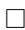
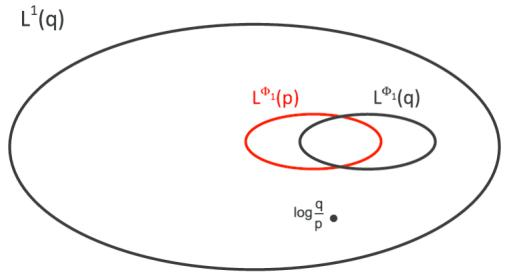
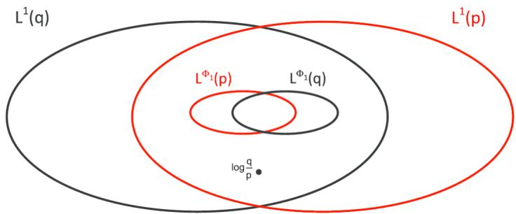
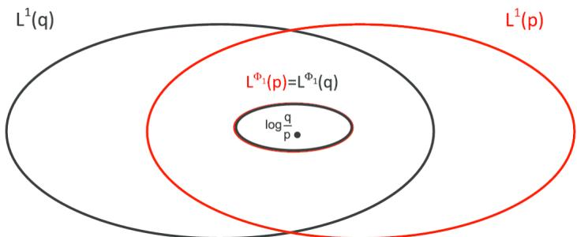

# New results on mixture and exponential models by Orlicz spaces

MARINA SANTACROCE*, PAOLA SIRI** and BARBARA TRIVELLATO†

$^{1}$ Dipartimento di Scienze Matematiche “G.L. Lagrange,” Politecnico di Torino, Corso Duca degli Abruzzi 24, 10129 Torino, Italy.

E-mail: *marina.santacroce@polito.it; **paola.siri@polito.it; † barbara.trivellato@polito.it

New results and improvements in the study of nonparametric exponential and mixture models are proposed. In particular, different equivalent characterizations of maximal exponential models, in terms of open exponential arcs and Orlicz spaces, are given. Our theoretical results are supported by several examples and counterexamples and provide an answer to some open questions in the literature.

Keywords: exponential model; information geometry; Kullback-Leibler divergence; mixture model; Orlicz space

# 1. Introduction

The geometry of statistical models, called Information Geometry, started with a paper of Radhakrishna Rao [10] and has been described in its modern formulation by Amari [1, 2] and Amari and Nagaoka [3]. Until the nineties, the theory was developed only in the parametric case. The first rigorous infinite dimensional extension has been formulated by Pistone and Sempi [9]. In this work, the set of (strictly) positive densities has been endowed with a structure of exponential Banach manifold, using the Orlicz space associated to an exponentially growing Young function. The geometry of nonparametric exponential models and its analytical properties in the topology of the exponential Orlicz space has been also studied in subsequent works, for example, by Gibilisco and Pistone [5], Pistone and Rogantin [8], Cena and Pistone [4].

In this paper, we develop some ideas contained in Cena and Pistone [4] and we add several new results and improvements in the study of nonparametric exponential and mixture models. In particular, a novelty is represented by the introduction in this context of the time dependence, which could allow to change the perspective from static to dynamic.

In the exponential framework, the starting point is the notion of maximal exponential model centered at a given positive density $p$ , introduced by Pistone and Sempi [9]. One

This is an electronic reprint of the original article published by the ISI/BS in Bernoulli, 2016, Vol. 22, No. 3, 1431-1447. This reprint differs from the original in pagination and typographic detail.

of the main results of Cena and Pistone [4] states that any density belonging to the maximal exponential model centered at $p$ is connected by an open exponential arc to $p$ and vice versa (by "open," we essentially mean that the two densities are not the extremal points of the arc). In this work, we give a proof of this result, which is at the same time simpler and more rigorous than the one in Cena and Pistone [4]. Moreover, we additionally prove that the equality of the maximal exponential models centered at two (connected) densities $p$ and $q$ is equivalent to the equality of the Orlicz spaces referred to the same densities. Our achievements highlight the role of the Orlicz spaces in the theory of nonparametric exponential models and its connection with the divergence between densities, and thus, with Information Theory. Our theoretical results are supported by several examples and counterexamples, which provide an answer to some open questions, filling some gaps in the literature.

A second part of the work is devoted to the study of open mixture arcs and contains results which are the counterpart of those obtained for open exponential arcs. More specifically, we give the characterization of open mixture models by establishing the equivalence between the open mixture connection and the boundedness of the densities ratios $\frac{a}{n}$ and $\frac{p}{q}$ .

The paper is organized as follows. In Section 2, some basic notions in the theory of Orlicz spaces are briefly recalled. The definitions of open mixture and exponential arcs are given in Section 3. Section 4 contains our main results. More specifically, the characterizations of exponential and mixture models are dealt with in Section 4.1. Densities time evolution and some geometric properties of exponential and mixture models, namely the convexity and the $L^1$ closure, are studied, respectively, in Sections 4.2 and 4.3.

# 2. Preliminaries on Orlicz spaces

In this section, we recall some known results from the theory of Orlicz spaces, which will be useful in the sequel. For further details on Orlicz spaces, the reader is referred to Rao and Ren [11, 12].

Let $(\mathcal{X},\mathcal{F},\mu)$ be a fixed measure space. Young functions can be seen as generalizations of the functions $f(x) = \frac{|x|^a}{a}$ , with $a > 1$ , and consequently, Orlicz spaces are generalizations of the Lebesgue spaces $L^a (\mu)$ . Now, we give the definition of Young function and of the related Orlicz space.

Definition 2.1. A Young function $\Phi$ is an even, convex function $\Phi : \mathbb{R} \to [0, +\infty]$ such that

(i) $\Phi (0) = 0$   
(ii) $\lim_{x\to \infty}\Phi (x) = +\infty$   
(iii) $\Phi (x) <   + \infty$ in a neighborhood of 0.

The conjugate function $\Psi$ of $\Phi$ , is defined as $\Psi(y) = \sup_{x \in \mathbb{R}} \{xy - \Phi(x)\}$ , $\forall y \in \mathbb{R}$ and it is itself a Young function. From the definition of $\Psi$ , the Fenchel-Young inequality

immediately follows:

$$
\left| x y \right| \leq \Phi (x) + \Psi (y), \quad x, y \in \mathbb {R}. \tag {1}
$$

This inequality is a generalization of the classical Young inequality $|xy| \leq \frac{|x|^a}{a} + \frac{|y|^b}{b}$ with $a, b > 0$ , $\frac{1}{a} + \frac{1}{b} = 1$ , used in the ordinary $L^a(\mu)$ spaces.

Now, let $L^0$ denote the set of all measurable functions $u:\mathcal{X}\to \mathbb{R}$ defined on $(\mathcal{X},\mathcal{F},\mu)$ .

Definition 2.2. The Orlicz space $L^{\Phi}(\mu)$ associated to the Young function $\Phi$ is defined as

$$
L ^ {\Phi} (\mu) = \left\{u \in L ^ {0}: \exists \alpha > 0 s. t. \int_ {\mathcal {X}} \Phi (\alpha u) d \mu <   + \infty \right\}. \tag {2}
$$

The Orlicz space $L^{\Phi}(\mu)$ is a vector space. Moreover, one can show that it is a Banach space when endowed with the Luxembourg norm

$$
\left\| u \right\| _ {\Phi , \mu} = \inf  \left\{k > 0: \int_ {\mathcal {X}} \Phi \left(\frac {u}{k}\right) \mathrm {d} \mu \leq 1 \right\}. \tag {3}
$$

Consider the Orlicz space $L^{\Phi}(\mu)$ with the Luxembourg norm $\| \cdot \|_{\Phi ,\mu}$ and denote by $B(0,1)$ the open unit ball and by $\overline{B(0,1)}$ the closed one. Let us observe that

$$
u \in B (0, 1) \quad \Longleftrightarrow \quad \exists \alpha > 1 \text {s . t .} \int_ {\mathcal {X}} \Phi (\alpha u)   \mathrm {d} \mu \leq 1,
$$

$$
u \in \overline {{B (0 , 1)}} \quad \Longleftrightarrow \quad \int_ {\mathcal {X}} \Phi (u)   \mathrm {d} \mu \leq 1.
$$

Moreover, the Luxembourg norm is equivalent to the Orlicz norm

$$
N _ {\Phi , \mu} (u) = \sup  _ {v \in L ^ {\Psi} (\mu): \int_ {\mathcal {X}} \Psi (v) \mathrm {d} \mu \leq 1} \left\{\int_ {\mathcal {X}} | u v | \mathrm {d} \mu \right\}, \tag {4}
$$

where $\Psi$ is the conjugate function of $\Phi$ .

It is worth to recall that the same Orlicz space can be related to different equivalent Young functions.

Definition 2.3. Two Young functions $\Phi$ and $\Phi'$ are said to be equivalent if there exists $x_0 > 0$ , and two positive constants $c_1 < c_2$ such that, $\forall x \geq x_0$ ,

$$
\Phi (c _ {1} x) \leq \Phi^ {\prime} (x) \leq \Phi (c _ {2} x).
$$

In such a case the Orlicz spaces $L^{\Phi}(\mu)$ and $L^{\Phi'}(\mu)$ are equal as sets and have equivalent norms as Banach spaces.

From now on, we consider a probability space $(\mathcal{X},\mathcal{F},\mu)$ and we denote with $\mathcal{P}$ the set of all densities which are positive $\mu$ -a.s. Moreover, we use $\mathbb{E}_p$ to denote the integral with respect to $p\mathrm{d}\mu$ , for each fixed $p\in \mathcal{P}$ .

In the sequel, we use the Young function $\Phi_1(x) = \cosh (x) - 1$ , which is equivalent to the more commonly used $\Phi_2(x) = \mathrm{e}^{|x|} - |x| - 1$ .

We recall that the conjugate function of $\Phi_1(x)$ is $\Psi_{1}(y) = \int_{0}^{y}\sinh^{-1}(t)\mathrm{d}t$ , which, in its turn, is equivalent to $\Psi_{2}(y) = (1 + |y|)\log (1 + |y|) - |y|$ .

Finally, in order to stress that we are working with densities $p \in \mathcal{P}$ , we will denote with $L^{\Phi_1}(p)$ the Orlicz space associated to $\Phi_1$ , defined with respect to the measure induced by $p$ , that is,

$$
L ^ {\Phi_ {1}} (p) = \{u \in L ^ {0}: \exists \alpha > 0 \text {s . t .} \mathbb {E} _ {p} \left(\Phi_ {1} (\alpha u)\right) <   + \infty \}. \tag {5}
$$

It is worth to note that, in order to prove that a random variable $u$ belongs to $L^{\Phi_1}(p)$ , it is sufficient to check that $\mathbb{E}_p(\mathrm{e}^{\alpha u}) < +\infty$ , with $\alpha$ belonging to an open interval containing 0.

# 3. Mixture and exponential arcs

In this section, we recall the definitions of mixture and exponential arcs, and some related results.

Definition 3.1. Two densities $p, q \in \mathcal{P}$ are connected by an open mixture arc if there exists an open interval $I \supset [0,1]$ such that $p(\theta) = (1 - \theta)p + \theta q$ belongs to $\mathcal{P}$ , for every $\theta \in I$ .

Definition 3.2. Two densities $p, q \in \mathcal{P}$ are connected by an open exponential arc if there exists an open interval $I \supset [0,1]$ such that $p(\theta) \propto p^{(1 - \theta)}q^{\theta}$ belongs to $\mathcal{P}$ , for every $\theta \in I$ .

In the following proposition, we give an equivalent definition of exponential connection by arcs.

Proposition 3.3. $p, q \in \mathcal{P}$ are connected by an open exponential arc iff there exist an open interval $I \supset [0,1]$ and a random variable $u \in L^{\Phi_1}(p)$ , such that $p(\theta) \propto \mathrm{e}^{\theta u} p$ belongs to $\mathcal{P}$ , for every $\theta \in I$ and $p(0) = p, p(1) = q$ .

Proof. Let us assume that $p, q \in \mathcal{P}$ are connected by an open exponential arc, that is, $\int_{\mathcal{X}} p^{(1 - \theta)} q^{\theta} \mathrm{d}\mu < +\infty$ , for any $\theta \in I$ . Since

$$
\int_ {\mathcal {X}} p ^ {(1 - \theta)} q ^ {\theta} \mathrm {d} \mu = \mathbb {E} _ {p} \left(\left(\frac {q}{p}\right) ^ {\theta}\right) = \mathbb {E} _ {p} \left(\mathrm {e} ^ {\theta u}\right) \quad \text {w i t h} u = \log \frac {q}{p},
$$

then $u \in L^{\Phi_1}(p)$ . Moreover $p(\theta) \propto \mathrm{e}^{\theta u} p$ belongs to $\mathcal{P}$ , for every $\theta \in I$ and $p(0) = p, p(1) = q$ .

The converse follows immediately, observing that $q = p(1) \propto \mathrm{e}^{u}p$ , that is, $u = \log \frac{q}{p} + c$ .

The connections by open mixture arcs and by open exponential arcs are equivalence relations (see Cena and Pistone [4] for the proofs).

In the following, we recall the definition of the cumulant generating functional and its properties, in order to introduce the notion of maximal exponential model. In the next section, the maximal exponential model at $p$ is proved to coincide with the set of all densities $q \in \mathcal{P}$ which are connected to $p$ by an open exponential arc.

Let us denote

$$
L _ {0} ^ {\Phi_ {1}} (p) = \{u \in L ^ {\Phi_ {1}} (p): \mathbb {E} _ {p} (u) = 0 \}.
$$

Definition 3.4. The cumulant generating functional is the map

$$
\begin{array}{l} K _ {p} \colon L _ {0} ^ {\Phi_ {1}} (p) \longrightarrow [ 0, + \infty ], \tag {6} \\ u \longmapsto \log \mathbb {E} _ {p} \left(\mathrm {e} ^ {u}\right). \\ \end{array}
$$

Theorem 3.5. The cumulant generating functional $K_{p}$ satisfies the following properties:

(i) $K_{p}(0) = 0$ ; for each $u\neq 0$ $K_{p}(u) > 0$   
(ii) $K_{p}$ is convex and lower semicontinuous, moreover its proper domain

$$
\operatorname {d o m} K _ {p} = \left\{u \in L _ {0} ^ {\Phi_ {1}} (p): K _ {p} (u) <   + \infty \right\}
$$

is a convex set which contains the open unit ball of $L_0^{\Phi_1}(p)$ . In particular, its interior $\mathrm{dom}K_{p}$ is a nonempty convex set.

For the proof, one can see Pistone and Sempi [9].

Definition 3.6. For every density $p \in \mathcal{P}$ , the maximal exponential model at $p$ is

$$
\mathcal {E} (p) = \left\{q = \mathrm {e} ^ {u - K _ {p} (u)} p: u \in \mathrm {d o m} ^ {\circ} K _ {p} \right\} \subseteq \mathcal {P}.
$$

Remark 3.7. We have defined $K_{p}$ on the set $L_0^{\Phi_1}(p)$ because centered random variables guarantee the uniqueness of the representation of $q \in \mathcal{E}(p)$ .

# 4. Main results on mixture and exponential models

# 4.1. Characterizations

In the sequel, we use the notation $D(q\| p)$ to indicate the Kullback-Leibler divergence of $q\cdot \mu$ with respect to $p\cdot \mu$ and we simply refer to it as the divergence of $q$ from $p$ .

We first state two results related to Orlicz spaces, which will be used in the sequel. Their proofs can be found in Cena and Pistone [4].

Proposition 4.1. Let $p$ and $q$ belong to $\mathcal{P}$ and let $\Phi$ be a Young function.

The Orlicz spaces $L^{\Phi}(p)$ and $L^{\Phi}(q)$ coincide if and only if their norms are equivalent.

Lemma 4.2. Let $p, q \in \mathcal{P}$ , then $D(q \| p) < +\infty \Longleftrightarrow \frac{q}{p} \in L^{\Psi_1}(p) \Longleftrightarrow \log \frac{q}{p} \in L^1(q)$ .

From Lemma 4.2, we can prove the following result.

Theorem 4.3. Let $p, q \in \mathcal{P}$ . If $D(q \| p) < +\infty$ then $L^{\Phi_1}(p) \subseteq L^1(q)$ .

Proof. Let us consider $u \in L^{\Phi_1}(p)$ , i.e. $\mathbb{E}_p(\Phi_1(\alpha u)) < +\infty$ for some $\alpha > 0$ .

Note that, by Lemma 4.2, the hypothesis $D(q\| p) < +\infty$ is equivalent to $\frac{q}{p} \in L^{\Psi_1}(p)$ , i.e. $\mathbb{E}_p(\Psi_1(\beta \frac{a}{p})) < +\infty$ for some $\beta > 0$ .

Thus, using the Fenchel-Young inequality (1) and taking the expectation, we deduce that

$$
\alpha \beta \mathbb {E} _ {q} (| u |) = \alpha \beta \mathbb {E} _ {p} \left(| u | \frac {q}{p}\right) \leq \mathbb {E} _ {p} \left(\Phi_ {1} (\alpha u)\right) + \mathbb {E} _ {p} \left(\Psi_ {1} \left(\beta \frac {q}{p}\right)\right) <   + \infty .
$$

Remark 4.4. In Theorem 4.3, $\mathbb{E}_p(\Psi_1(\beta \frac{q}{p})) < +\infty$ for some $\beta > 0$ equals $\mathbb{E}_p(\Psi_1(\frac{q}{p})) < +\infty$ . In fact, $\Psi_1$ is equivalent to $\Psi_2$ and it is easy to check that $\Psi_2$ satisfies the generalized $\Delta_2$ condition

$$
\Psi_ {2} (\beta y) \leq \max  \left(\beta^ {2}, 1\right) \Psi_ {2} (y).
$$

Assume $y > 0$ and observe that $\Psi_2(y) = (1 + |y|)\log (1 + |y|) - |y|$ admits the representation

$$
\psi_ {2} (y) = \int_ {0} ^ {y} \frac {y - \tau}{1 + \tau} d \tau .
$$

Therefore,

$$
\psi_ {2} (\beta y) = \beta^ {2} \int_ {0} ^ {y} \frac {y - \tau}{1 + \beta \tau} d \tau \leq \max  (\beta^ {2}, 1) \Psi_ {2} (y).
$$

Figures 1 and 2 show the geometry described in Theorem 4.3.

The next two results are technical preliminaries to Theorem 4.7. In particular, Proposition 4.6 gives a sufficient condition on Orlicz norms in order to have $\log \frac{q}{p} \in L^1(p)$ .

  
Figure 1. The case when $\log \frac{q}{p} \in L^1(q)$ , i.e. $D(q \| p) < +\infty$ .

  
Figure 2. The case when $\log \frac{q}{p} \in L^{1}(q) \cap L^{1}(p)$ , i.e. $D(q \| p) < +\infty$ and $D(p \| q) < +\infty$ .

Lemma 4.5. Let $p$ and $q$ belong to $\mathcal{P}$ and let $M$ be any positive constant. Then

$$
\left\| \mathbb {1} _ {(q / p > M)} \log \frac {q}{p} \right\| _ {\Phi_ {1}, p} <   + \infty .
$$

Proof. Let us denote $A = \{\frac{q}{p} > M\}$ and recall that $\mathbb{1}_A \log \frac{q}{p} \in L^{\Phi_1}(p)$ if and only if $\mathbb{E}_p(\mathrm{e}^{\alpha \mathbb{1}_A \log q / p}) < +\infty$ for any $\alpha \in (-\varepsilon, +\varepsilon)$ with $\varepsilon$ sufficiently small. Since

$$
\mathbb {E} _ {p} \big (\mathrm {e} ^ {\alpha \mathbb {1} _ {A} \log (q / p)} \big) \leq 1 + \mathbb {E} _ {p} \left(\mathbb {1} _ {A} \left(\frac {q}{p}\right) ^ {\alpha}\right),
$$

when $0 < \alpha < \varepsilon < 1$ , by Jensen inequality

$$
\mathbb {E} _ {p} \left(\mathbb {1} _ {A} \left(\frac {q}{p}\right) ^ {\alpha}\right) \leq \mathbb {E} _ {p} \left(\left(\frac {q}{p}\right) ^ {\alpha}\right) \leq 1,
$$

while, when $-\varepsilon <  \alpha <  0$

$$
\mathbb {E} _ {p} \left(\mathbb {1} _ {A} \left(\frac {q}{p}\right) ^ {\alpha}\right) \leq M ^ {\alpha}.
$$

Proposition 4.6. If $\| \cdot \|_{\Phi_1,p}\leq c\| \cdot \|_{\Phi_1,q}$ , then $\log \frac{q}{p}\in L^{\Phi_1}(p)$ .

Proof. First, we write

$$
\begin{array}{l} \log {\frac {q}{p}} = \mathbb {1} _ {(q / p > M)} \log {\frac {q}{p}} + \mathbb {1} _ {(q / p \leq M)} \log {\frac {q}{p}} \\ = \mathbb {1} _ {(q / p > M)} \log \frac {q}{p} - \mathbb {1} _ {(p / q \geq M ^ {- 1})} \log \frac {p}{q}. \\ \end{array}
$$

By hypothesis, we have $\| \cdot \|_{\Phi_1,p}\leq c\| \cdot \|_{\Phi_1,q}$ . Therefore,

$$
\left\| \log \frac {q}{p} \right\| _ {\Phi_ {1}, p} \leq \left\| \mathbb {1} _ {(q / p > M)} \log \frac {q}{p} \right\| _ {\Phi_ {1}, p} + c \left\| \mathbb {1} _ {(p / q \geq M ^ {- 1})} \log \frac {p}{q} \right\| _ {\Phi_ {1}, q}.
$$

Now, the conclusion immediately follows from Lemma 4.5, noting that its result holds also when the strict inequality $\frac{q}{p} > M$ is replaced by $\frac{q}{p} \geq M$ .

The following theorem is an important improvement of Theorem 21 of Cena and Pistone [4]. In particular, the main point is the equivalence between the equality of the exponential models $\mathcal{E}(p)$ and $\mathcal{E}(q)$ and the equality of the Orlicz spaces $L^{\Phi_1}(p)$ and $L^{\Phi_1}(q)$ . Moreover, we show that if a density belongs to the maximal exponential model at $p$ , there exists an open exponential arc connecting the two densities and vice versa. This result was first stated in Theorem 21 of Cena and Pistone [4]. However, the proof is somehow involved and imprecise in some steps. Here, we give a simpler and rigorous one.

Theorem 4.7. Let $p, q \in \mathcal{P}$ . The following statements are equivalent:

(i) $q\in \mathcal{E}(p)$   
(ii) $q$ is connected to $p$ by an open exponential arc;   
(iii) $\mathcal{E}(p) = \mathcal{E}(q)$   
(iv) $L^{\Phi_1}(p) = L^{\Phi_1}(q)$   
(v) $\log \frac{q}{p} \in L^{\Phi_1}(p) \cap L^{\Phi_1}(q)$ ;   
(vi) $\frac{q}{p} \in L^{1 + \varepsilon}(p)$ and $\frac{p}{q} \in L^{1 + \varepsilon}(q)$ , for some $\varepsilon > 0$ .

Proof. We first show the equivalence of the first two statements. If $q \in \mathcal{E}(p)$ , $q \propto \mathrm{e}^u p$ for some $u \in \operatorname{dom} \overset{\circ}{K}_p$ . Since also $0 \in \operatorname{dom} \overset{\circ}{K}_p$ and $\operatorname{dom} \overset{\circ}{K}_p$ is an open convex set, we deduce that $p(\theta) \propto \mathrm{e}^{\theta u} p$ is an open exponential arc containing $p$ and $q$ , for $\theta$ in an open interval $I \supset [0,1]$ .

Vice versa, assume $q$ is connected to $p$ by an open exponential arc $p(\theta) \propto \mathrm{e}^{\theta u}p$ with $q = p(1)$ . Since the exponential arc is defined for $\theta$ in an open interval $I \supset [0,1]$ , we can always choose $\overline{\theta} u \in \operatorname{dom} K_p$ , with $\overline{\theta} > 1$ . We conclude that $q \in \mathcal{E}(p)$ , by observing that $u$ is a convex combination of $\overline{\theta} u$ and $0 \in \operatorname{dom}^\circ K_p$ , and thus, it belongs to $\operatorname{dom}^\circ K_p$ .

Note that (iii) immediately implies (i). On the other hand, if we assume there exists an open exponential arc connecting $p$ and $q$ , the equality of the exponential models (iii) follows from the fact that the connection through open exponential arcs is an equivalence relation.

The equivalence of the previous statements with (v) is clearly proved in Theorem 21 of [4]. Let us show the equivalence with (iv). $(\mathrm{ii})\Rightarrow (\mathrm{iv})$ is proved in Theorem 19 of Cena and Pistone [4].

Conversely, if we assume $L^{\Phi_1}(p) = L^{\Phi_1}(q)$ , by Propositions 4.1 and 4.6, $\log \frac{q}{p} \in L^{\Phi_1}(p) = L^{\Phi_1}(q)$ . Denoting $u = \log \frac{q}{p}$ , one can observe that, for any $\theta \in (-\varepsilon, +\varepsilon)$ with $\varepsilon > 0$ , $\mathbb{E}_p(\mathrm{e}^{\theta u}) < +\infty$ and $\mathbb{E}_q(\mathrm{e}^{\theta u}) = \mathbb{E}_p(\mathrm{e}^{(1 + \theta)u}) < +\infty$ . Therefore, using also Jensen inequality, one concludes that there exists an open exponential arc connecting $p$ and $q$ .

The equivalence between (v) and (vi) easily follows from the definition of Orlicz spaces.

The geometry of Theorem 4.7 is shown in Figure 3.

  
Figure 3. The particular case of Figure 2 when $\log \frac{q}{p} \in L^{\Phi_1}(p) \cap L^{\Phi_1}(q)$ i.e. $q \in \mathcal{E}(p)$ .

Corollary 4.8. If $q \in \mathcal{E}(p)$ , then the divergences $D(q\| p) < +\infty$ and $D(p\| q) < +\infty$ .

Proof. The thesis follows from (vi) of Theorem 4.7, taking into account that $\frac{q}{p} \in L^{1 + \varepsilon}(p)$ is a sufficient condition for $D(q\| p) < +\infty$ .

The converse of this corollary does not hold. In the following, we provide a counterexample, which at the same time, answers to an open question raised by Cena and Pistone [4].

Counterexample 4.9. Let us denote by $\mathcal{X} = [0,1]$ , $\mathcal{F} = \mathcal{B}([0,1])$ and $\mu$ the corresponding Lebesgue measure. We consider the trivial density $p(x) = 1$ and

$$
q (x) = C \sum_ {n = 1} ^ {\infty} \frac {1}{n ^ {3} C _ {n}} \left(x - \left(1 - \frac {1}{n}\right)\right) ^ {- n / (n + 1)} \mathbb {1} _ {(1 - 1 / n, 1 - 1 / (n + 1) ]} (x), \tag {7}
$$

where

$$
C _ {n} = \int_ {1 - 1 / n} ^ {1 - 1 / (n + 1)} \left(x - \left(1 - \frac {1}{n}\right)\right) ^ {- n / (n + 1)} \mathrm {d} x = \frac {n + 1}{\sqrt [ n + 1 ]{n (n + 1)}}, \tag {8}
$$

$$
C = \left(\sum_ {n = 1} ^ {\infty} \frac {1}{n ^ {3}}\right) ^ {- 1}. \tag {9}
$$

Now we prove that, $\forall \varepsilon >0$

$$
\begin{array}{l} \mathbb {E} _ {\mu} \left(q ^ {1 + \varepsilon}\right) = \int_ {0} ^ {1} q (x) ^ {1 + \varepsilon} d x = \sum_ {n = 1} ^ {\infty} \left(\frac {C}{n ^ {3} C _ {n}}\right) ^ {1 + \varepsilon} \int_ {1 - 1 / n} ^ {1 - 1 / (n + 1)} \left(x - \left(1 - \frac {1}{n}\right)\right) ^ {- n (1 + \varepsilon) / (n + 1)} d x \\ = + \infty . \\ \end{array}
$$

In fact,

$$
\int_ {1 - 1 / n} ^ {1 - 1 / (n + 1)} \left(x - \left(1 - \frac {1}{n}\right)\right) ^ {- n (1 + \varepsilon) / (n + 1)} d x
$$

converges when $\frac{n(1 + \varepsilon)}{n + 1} < 1$ , that is when $n\varepsilon < 1$ . Then, for any choice of $\varepsilon > 0$ , we can find infinitely many $n > \frac{1}{\varepsilon}$ , such that the integral above does not converge and, as a consequence, $\mathbb{E}_{\mu}(q^{1 + \varepsilon}) = +\infty$ . Therefore, by (vi) of Theorem 4.7, we deduce that $q \notin \mathcal{E}(1)$ .

On the other hand, it can be proved that both $D(q\| p) < +\infty$ and $D(p\| q) < +\infty$ and this concludes the counterexample.

We prove the last statements in the Appendix.

Remark 4.10. From a geometric point of view, equality $L^{\Phi_1}(p) = L^{\Phi_1}(q)$ in Theorem 4.7 is important. On the one hand, it implies that the exponential transport mapping, or $e$ -transport, ${}^e\mathbb{U}_p^q: u \to u - \mathbb{E}_q(u)$ from $L_0^{\Phi_1}(p)$ to $L_0^{\Phi_1}(q)$ is well defined. On the other hand, due to Proposition 22 of Cena and Pistone [4], it also implies that $L^{\Psi_1}(p) = \frac{q}{p} L^{\Psi_1}(q)$ . As a consequence, the mixture transport mapping, or $m$ -transport, ${}^m\mathbb{U}_p^q: v \to \frac{p}{q} v$ from $L_0^{\Psi_1}(p)$ to $L_0^{\Psi_1}(q)$ is well-defined. For details on the applications of nonparametric information geometry to statistical physics, see Pistone [7].

The next theorem is the counterpart of Theorem 4.7 for open mixture arcs. One of the equivalences is an improvement of Proposition 15 in Cena and Pistone [4]. In Cena and Pistone [4], it is shown that densities connected by open mixture arcs have bounded away from zero ratios. Here, we additionally show the converse implication, giving a characterization of open mixture models. Moreover, one can see that the key role for being connected by open mixture either exponential arcs is played by the ratios $\frac{q}{p}$ and $\frac{p}{q}$ which have to be bounded or integrable in some sense.

Given $p \in \mathcal{P}$ , we denote by $\mathcal{M}(p)$ the set of all densities $q \in \mathcal{P}$ which are connected to $p$ by an open mixture arc.

Theorem 4.11. Let $p, q \in \mathcal{P}$ . The following statements are equivalent:

(i) $q\in \mathcal{M}(p)$   
(ii) $\mathcal{M}(p) = \mathcal{M}(q)$   
(iii) $\frac{q}{p},\frac{p}{q}\in L^{\infty}.$

Proof. The equivalence between (i) and (ii) follows since the relation of connection through open mixture arcs is an equivalence relation.

Now we show that $p, q \in \mathcal{P}$ are connected by open mixture arcs if and only if

$$
c _ {1} <   \frac {q}{p} <   c _ {2} \qquad \text {w i t h} 0 <   c _ {1} <   1 <   c _ {2}.
$$

Assume $p$ and $q$ are connected by an open mixture arc that is $p(\lambda) = \lambda q + (1 - \lambda)p$ belongs to $\mathcal{P}$ for all $\lambda \in (-\alpha, 1 + \beta) \supset [-\varepsilon, 1 + \varepsilon]$ with $\varepsilon > 0$ . Since $p(-\varepsilon)$ and $p(1 + \varepsilon) \in \mathcal{P}$ , it is easy to see that $\frac{\varepsilon}{1 + \varepsilon} < \frac{q}{p} < \frac{1 + \varepsilon}{\varepsilon}$ .

To check the other implication, one observes that $p(\lambda) = \lambda q + (1 - \lambda)p$ belongs to $\mathcal{P}$ for any $\lambda \in \left(\frac{1}{1 - c_2},\frac{1}{1 - c_1}\right)$ .

Proposition 4.12. Let $p, q \in \mathcal{P}$ . If $p$ and $q$ are connected by an open mixture arc, then they are also connected by an open exponential arc.

Proof. The result immediately follows from Theorems 4.7 and 4.11. $\square$

The converse implication does not hold, as the following counterexample shows.

Counterexample 4.13. Consider the family of beta densities $p(\beta) \propto x^{\beta - 1}$ , $x \in [0,1]$ , with $\beta \in (0, +\infty)$ .

It is easy to see that given two densities $p = p(\beta_1)$ and $q = p(\beta_2)$ , $\beta_1 < \beta_2$ , they are connected by an open exponential arc but they are not connected by an open mixture arc. In fact, on the one hand the open exponential arc $p(\theta) \propto p^{1 - \theta}q^{\theta} \propto x^{(1 - \theta)\beta_1 + \theta \beta_2 - 1}$ is still in the family of beta densities for any $\theta \in (-\frac{\beta_1}{\beta_2 - \beta_1}, +\infty) \supset [0,1]$ .

On the other hand, by Theorem 4.11, it does not exist an open mixture arc connecting $p$ and $q$ , since the ratio $\frac{q}{p} \propto x^{\beta_2 - \beta_1}$ is not bounded below by a positive constant.

Remark 4.14. In Proposition 15 of Cena and Pistone [4], by different arguments, it is shown that if $p$ and $q$ are connected by an open mixture arc, then the Orlicz spaces $L^{\Phi}(p)$ and $L^{\Phi}(q)$ coincide for any Young function $\Phi$ . When $\Phi = \Phi_1$ the result immediately follows from Theorems 4.7 and 4.11.

# 4.2. Exponential models and densities time evolution

In this paragraph, we introduce the time perspective in the study of exponential models. As far as we are aware, this is the first attempt in this direction.

Let us consider a filtration $\mathcal{F} = \{\mathcal{F}_t\colon t\in [0,T]\}$ on the probability space $(\mathcal{X},\mathcal{F},\mu)$ such that $\mathcal{F} = \mathcal{F}_T$ . Let $p\in \mathcal{P}$ and denote by $p_t = \mathbb{E}_{\mu}(p|\mathcal{F}_t)$ .

The following proposition gives a condition for the exponential connection stability of the restrictions $p_t$ over time. From a geometrical point of view, this result means that divergence finiteness is preserved.

Proposition 4.15. Let $t_1, t_2 \in [0, T]$ , $t_1 \leq t_2$ . If $p_{t_2} \in \mathcal{E}(p_{t_1})$ then $p_s \in \mathcal{E}(p_{t_1})$ , $\forall t_1 \leq s < t_2$ .

Proof. Let $t_1 \leq s < t_2$ . From condition (vi) of Theorem 4.7, it is enough to prove that $\mathbb{E}_{p_{t_1}}((\frac{p_s}{p_{t_1}})^{1 + \varepsilon}) < +\infty$ and $\mathbb{E}_{p_s}((\frac{p_{t_1}}{p_s})^{1 + \varepsilon}) < +\infty$ , starting from the hypothesis that $\mathbb{E}_{p_{t_1}}((\frac{p_{t_2}}{p_t})^{1 + \varepsilon}) < +\infty$ and $\mathbb{E}_{p_{t_2}}((\frac{p_{t_1}}{p_{t_2}})^{1 + \varepsilon}) < +\infty$ .

Since $x^{1 + \varepsilon}$ is a convex function, by Jensen inequality we get

$$
\left(\frac {p _ {s}}{p _ {t _ {1}}}\right) ^ {1 + \varepsilon} = \left(\mathbb {E} _ {\mu} \left(p _ {t _ {2}} \mid \mathcal {F} _ {s}\right)\right) ^ {1 + \varepsilon} \frac {1}{p _ {t _ {1}} ^ {1 + \varepsilon}} \leq \mathbb {E} _ {\mu} \left(p _ {t _ {2}} ^ {1 + \varepsilon} \mid \mathcal {F} _ {s}\right) \frac {1}{p _ {t _ {1}} ^ {1 + \varepsilon}}. \tag {10}
$$

Since $t_1 \leq s$ we have $\mathbb{E}_{\mu}(\cdot|\mathcal{F}_s) = \mathbb{E}_{p_{t_1}}(\cdot|\mathcal{F}_s)$ . Then, taking the expectation with respect to $p_{t_1}$ in (10), we deduce that

$$
\mathbb {E} _ {p _ {t _ {1}}} \left(\left(\frac {p _ {s}}{p _ {t _ {1}}}\right) ^ {1 + \varepsilon}\right) \leq \mathbb {E} _ {p _ {t _ {1}}} \left(\mathbb {E} _ {p _ {t _ {1}}} (p _ {t _ {2}} ^ {1 + \varepsilon} | \mathcal {F} _ {s}) \frac {1}{p _ {t _ {1}} ^ {1 + \varepsilon}}\right) \leq \mathbb {E} _ {p _ {t _ {1}}} \left(\left(\frac {p _ {t _ {2}}}{p _ {t _ {1}}}\right) ^ {1 + \varepsilon}\right) <   + \infty .
$$

Since also $x^{-(1 + \varepsilon)}$ is a convex function, the other condition follows in a similar way.

Remark 4.16. As a consequence of the previous proposition, it is straightforward to observe that if $p_{s_0} \notin \mathcal{E}(p_{t_1})$ for some $s_0 \geq t_1$ , then $p_s \notin \mathcal{E}(p_{t_1}) \forall s_0 \leq s \leq T$ .

From the above proposition, we immediately get the following result.

Corollary 4.17. If $p \in \mathcal{E}(1)$ then $p_s \in \mathcal{E}(1)$ , $\forall 0 \leq s < T$ .

As an application of this corollary, we can use the family of beta densities introduced in the previous paragraph to give a concrete example of a density belonging to $\mathcal{E}(1)$ , along with its restrictions.

Example 4.18. Let us denote by $\mathcal{X} = [0,1]$ , $\mathcal{F} = \mathcal{B}([0,1])$ and $\mu$ the corresponding Lebesgue measure. Define the filtration $\mathcal{F} = \{\mathcal{F}_t\colon t\in [0,T]\}$ on $\mathcal{X}$ , by choosing $\mathcal{F}_t = \sigma ([0,s]\colon 0\leq s\leq t)$ . Let $p$ be any density on $(\mathcal{X},\mathcal{F},\mu)$ . Then, due to the particular choice of the filtration, the restriction $p_t = \mathbb{E}_{\mu}(p|\mathcal{F}_t)$ can be written as

$$
p _ {t} (x) = p (x) \mathbb {1} _ {[ 0, t ]} (x) + \frac {1 - F (t)}{1 - t} \mathbb {1} _ {(t, 1 ]} (x), \tag {11}
$$

where $F(t) = \int_0^t p(x)\mathrm{d}x,\forall t\in [0,1]$

It is worth noting that $p_1 = p$ and $p_0 = 1$ a.s.

Let us now fix $p(x) = \beta x^{\beta - 1}$ , with $\beta > 0$ . It is easy to find an $\varepsilon > 0$ such that

$$
\mathbb {E} _ {\mu} \left(p ^ {1 + \varepsilon}\right) = \int_ {0} ^ {1} \beta^ {1 + \varepsilon} x ^ {(\beta - 1) (1 + \varepsilon)} d x <   + \infty ,
$$

$$
\mathbb {E} _ {\mu} (p ^ {- \varepsilon}) = \int_ {0} ^ {1} \beta^ {- \varepsilon} x ^ {(\beta - 1) (- \varepsilon)} d x <   + \infty .
$$

So, from (vi) of Theorem 4.7, we can conclude that $p \in \mathcal{E}(1)$ .

With this choice of $p$ , by (11),

$$
p _ {t} (x) = \beta x ^ {\beta - 1} \mathbb {1} _ {[ 0, t ]} (x) + \frac {1 - t ^ {\beta}}{1 - t} \mathbb {1} _ {(t, 1 ]} (x) \qquad \forall t \in [ 0, 1 ],
$$

and we can prove that $p_t \in \mathcal{E}(1)$ , in a similar way.

In general, the converse of Proposition 4.15 does not hold and below we give a counterexample with $t_1 = 0$ and $t_2 = \frac{1}{2}$ .

Using the same counterexample, we also define a density $q \in \mathcal{E}(1)$ (along with its restrictions) such that, $\forall t \leq t_0$ , $p_t = \mathbb{E}_\mu(q|\mathcal{F}_t)$ , for a fixed $t_0 < \frac{1}{2}$ .

Counterexample 4.19. Using the same filtered probability space as in Example 4.18, we consider the density

$$
\begin{array}{l} p (x) = C \sum_ {n = 1} ^ {\infty} \frac {1}{n ^ {3} C _ {n}} \left[ \left(x - \left(\frac {1}{2} - \frac {1}{2 n}\right)\right) ^ {- n / (n + 1)} \mathbb {1} _ {(1 / 2 - 1 / (2 n), 1 / 2 - 1 / (2 (n + 1)) ]} (x) \right. \\ \left. + \left(\left(\frac {1}{2} + \frac {1}{2 n}\right) - x\right) ^ {- n / (n + 1)} \mathbb {1} _ {[ 1 / 2 + 1 / (2 (n + 1)), 1 / 2 + 1 / (2 n))} (x) \right], \tag {12} \\ \end{array}
$$

where

$$
\begin{array}{l} C _ {n} = \int_ {1 / 2 - 1 / (2 n)} ^ {1 / 2 - 1 / (2 (n + 1))} \left(x - \left(\frac {1}{2} - \frac {1}{2 n}\right)\right) ^ {- n / (n + 1)} d x \\ + \int_ {1 / 2 + 1 / (2 (n + 1))} ^ {1 / 2 + 1 / (2 n)} \left(\left(\frac {1}{2} + \frac {1}{2 n}\right) - x\right) ^ {- n / (n + 1)} d x, (13) \\ C = \left(\sum_ {n = 1} ^ {\infty} \frac {1}{n ^ {3}}\right) ^ {- 1}. (14) \\ \end{array}
$$

This density is quite similar to the one introduced in Counterexample 4.9 and, in the same way we can prove that $p \notin \mathcal{E}(1)$ .

In order to see wether $p_t$ belongs to $\mathcal{E}(1)$ or not, we remark that the same convergence problem arises whenever we integrate the function $p^{1 + \varepsilon}$ over any interval containing $\frac{1}{2}$ . As a consequence, using the explicit formula (11) for the restriction $p_t$ , we can prove that $p_t \notin \mathcal{E}(1)$ , $\forall t \geq \frac{1}{2}$ . On the other hand, for any $t < \frac{1}{2}$ , we can find some $\varepsilon > 0$ (depending on $t$ ), such that $\mathbb{E}_{\mu}(p_t^{1 + \varepsilon}) < +\infty$ . Moreover, the condition $\mathbb{E}_{\mu}(p_t^{-\varepsilon}) < +\infty$ is trivially satisfied, so that $p_t \in \mathcal{E}(1)$ .

Finally, let us fix $t_0 < \frac{1}{2}$ and define the density

$$
q (x) = p (x) \mathbb {1} _ {[ 0, t _ {0} ]} (x) + \frac {1 - F (t _ {0})}{1 - t _ {0} ^ {\beta}} \beta x ^ {\beta - 1} \mathbb {1} _ {(t _ {0}, 1 ]} (x),
$$

with $\beta > 0$ . This function differs from the restriction $p_{t_0}$ only over $(t_0,1]$ , where $p_{t_0}$ is constant, while $q$ is proportional to a beta density.

Using the arguments above and those in Example 4.18 on beta densities, we conclude that $q \in \mathcal{E}(1)$ (and $q_{t} \in \mathcal{E}(1)$ , $\forall 0 \leq t < T$ ). On the other hand, by construction, $p_{t} = \mathbb{E}_{\mu}(p|\mathcal{F}_{t}) = \mathbb{E}_{\mu}(q|\mathcal{F}_{t})$ , $\forall t \leq t_{0}$ .

Remark 4.20. In a similar way, the density defined in Counterexample 4.9 provides also a counterexample of Corollary 4.17.

# 4.3. Convexity and $L^1(\mu)$ -closure

Given $p \in \mathcal{P}$ , we denote by $\mathcal{M}(p)$ the set of all densities $q \in \mathcal{P}$ which are connected to $p$ by an open mixture arc. Moreover, let us recall that, by Theorem 4.7, $\mathcal{E}(p)$ coincides with the set of all densities $q \in \mathcal{P}$ which are connected to $p$ by an open exponential arc.

Proposition 4.21. Let $p \in \mathcal{P}$ . Then $\mathcal{E}(p)$ and $\mathcal{M}(p)$ are convex.

Proof. Note that for any $q, r \in \mathcal{E}(p)$ , since $\mathcal{E}(q) = \mathcal{E}(r) = \mathcal{E}(p)$ , it is not restrictive to consider $r = p$ . Suppose $q \in \mathcal{E}(p)$ , and consider $p(\lambda) = \lambda p + (1 - \lambda)q$ for any $\lambda \in [0,1]$ . We show that $p(\lambda) \in \mathcal{E}(p)$ by proving that $\mathbb{E}_{\mu}(p(\lambda)^{\theta}p^{1 - \theta}) < +\infty$ for $\theta \in (-\varepsilon, 1 + \varepsilon)$ .

If $\theta \in (0,1)$ , it follows by Jensen inequality

$$
\mathbb {E} _ {\mu} (p (\lambda) ^ {\theta} p ^ {1 - \theta}) = \mathbb {E} _ {p} \left(\left(\frac {p (\lambda)}{p}\right) ^ {\theta}\right) \leq 1.
$$

If $\theta \in (-\varepsilon, 0) \cup (1, 1 + \varepsilon)$ , by the convexity of $x^{\theta}$ we have

$$
\mathbb {E} _ {\mu} (p (\lambda) ^ {\theta} p ^ {1 - \theta}) = \mathbb {E} _ {p} \left(\left(\frac {\lambda p + (1 - \lambda) q}{p}\right) ^ {\theta}\right) \leq \lambda + (1 - \lambda) \mathbb {E} _ {p} \left(\left(\frac {q}{p}\right) ^ {\theta}\right) <   + \infty ,
$$

where the last inequality is due to $q \in \mathcal{E}(p)$ .

On the other hand, one can easily see that $\mathcal{M}(p)$ is convex, since the relation between open mixture arcs is an equivalence relation and, thus, $q\in \mathcal{M}(p)$ implies $\mathcal{M}(p) = \mathcal{M}(q)$ .

In the following theorem we prove that the open mixture model $\mathcal{M}(p)$ is $L^1 (\mu)$ -dense in the set of all densities $\mathcal{P}_{>}$ .

Since from Proposition 4.12 $\mathcal{M}(p) \subseteq \mathcal{E}(p)$ , we deduce that $\mathcal{E}(p)$ is $L^1(\mu)$ -dense in $\mathcal{P}_{\geq}$ . This result was proved in Imparato and Trivellato [6], Theorem 19.1.

In the proof we use Scheffé's theorem and, in particular, that if $q, \{q_n\}_{n \geq 1}$ are in $\mathcal{P}_{\geq}$ and such that $q_n \to q$ , as $n \to +\infty$ , $\mu$ -a.e., then $q_n \to q$ in $L^1(\mu)$ .

We remark that the $L^1(\mu)$ convergence when restricted to the set of nonnegative densities $\mathcal{P}_{\geq}$ , is equivalent to the convergence in $\mu$ -probability.

Theorem 4.22. For any $p \in \mathcal{P}$ the open mixture model $\mathcal{M}(p)$ is $L^1(\mu)$ -dense in the nonnegative densities $\mathcal{P}_{\geq}$ , that is $\overline{\mathcal{M}(p)} = \mathcal{P}_{\geq}$ , where the overline denotes the closure in the $L^1(\mu)$ -topology.

Proof. We show $\overline{\mathcal{M}(p)} = \mathcal{P}_{\geq}$ , by checking the double inclusions $\overline{\mathcal{M}(p)} \subseteq \mathcal{P}_{\geq}$ and $\overline{\mathcal{M}(p)} \supseteq \mathcal{P}_{\geq}$ .

The first is straightforward, since by definition $\mathcal{M}(p) \subseteq \mathcal{P}$ and, therefore, $\overline{\mathcal{M}(p)} \subseteq \overline{\mathcal{P}} = \mathcal{P}_{\geq}$ . With regard to the second implication, we will start by showing that any simple density $q \in \mathcal{P}_{>}^{}$ is the $\mu$ -a.e. limit of a sequence of densities $q_{n} \in \mathcal{M}(p)$ .

Let us fix a simple density $q \in \mathcal{P}_{\geq}$ and denote $\Omega' = \operatorname{Supp} q = \{\omega : q(\omega) > 0\}$ and $\Omega'' = (\Omega')^c = \{\omega : q(\omega) = 0\}$ . Moreover, define the sequence $p_n$ by

$$
p _ {n} = \frac {1}{n} \mathbb {1} _ {(p <   1 / n)} + p \mathbb {1} _ {(1 / n \leq p \leq n)} + n \mathbb {1} _ {(p > n)},
$$

and note that $p_n \to p$ pointwise. For $n \geq 1$ , construct the sequence of densities in $\mathcal{P}$

$$
q _ {n} = \left\{ \begin{array}{l l} \frac {q p}{p _ {n}} \frac {1}{c _ {n}}, & \text {i f} \omega \in \Omega^ {\prime}, \\ \frac {a _ {n} p}{c _ {n}}, & \text {i f} \omega \in \Omega^ {\prime \prime}, \end{array} \right.
$$

where $a_{n}$ denotes a positive numerical sequence converging to 0 as $n\to +\infty$ and $c_{n} = \int_{\Omega^{\prime}}\frac{qp}{p_n}\mathrm{d}\mu +a_n\mathbb{P}(\Omega^{\prime \prime})$ the normalization constant. As $q$ is a simple density whose support is $\Omega^\prime$ , there exist two positive constants $a,A$ such that $a\leq q(\omega)\leq A$ if $\omega \in \Omega^{\prime}$ .

Note that $q_{n} \in \mathcal{M}(p)$ by Theorem 4.11, since $\frac{q_n}{p}$ is bounded from below and above, respectively, by two positive constants:

$$
\frac {\operatorname* {m i n} (a / n , a _ {n})}{c _ {n}} \leq \frac {q _ {n}}{p} \leq \frac {\operatorname* {m a x} (A n , a _ {n})}{c _ {n}}.
$$

In order to check that $q_{n}\to q$ , as $n\to +\infty$ , $\mu$ -a.e., it is sufficient to prove that $c_{n}\rightarrow 1$ . In fact, since $\frac{p}{p_n}\leq \max (1,p)$ and the function $q\max (1,p)\mathbb{1}_{\Omega^{\prime}}\in L^{1}(\mu)$ , we can apply the dominated convergence theorem and find

$$
\lim  _ {n \rightarrow + \infty} c _ {n} = \int_ {\Omega^ {\prime}} \lim  _ {n \rightarrow + \infty} \frac {q p}{p _ {n}} d \mu = \int_ {\Omega^ {\prime}} q d \mu = 1.
$$

Thus, by Scheffé's theorem the sequence $q_{n} \to q$ in $L^{1}(\mu)$ .

Since any density $\mathcal{P}_{\geq}$ can be written as the limit of simple densities in $L^1 (\mu)$ , we have proved that $\overline{\mathcal{M}(p)}\supseteq \mathcal{P}_{\geq}$ . This concludes the proof of the theorem.

The next corollary shows that the positive densities with finite Kullback-Leibler divergence with respect to any $p \in \mathcal{P}$ is $L^1(\mu)$ -dense in the set of all densities $\mathcal{P}_{\geq}$ . This corresponds to the choice $\varphi(x) = x (\log(x))^+$ in the following result.

Corollary 4.23. Assume $\varphi : (0, +\infty) \to (0, +\infty)$ is a continuous function. Then the set

$$
\mathcal {P} _ {\varphi} = \left\{q \in \mathcal {P}: \mathbb {E} _ {p} \left(\varphi \left(\frac {q}{p}\right)\right) <   + \infty \right\}
$$

is $L^1 (\mu)$ -dense in $\mathcal{P}_{\geq}$

Proof. Let $q \in \mathcal{P}_{\geq}$ . The result immediately follows from Theorem 4.22, since the sequence $q_{n} \in \mathcal{M}(p)$ converging to $q$ in $L^{1}(\mu)$ is in $\mathcal{P}_{\varphi}$ , that is it satisfies $\mathbb{E}_p(\varphi (\frac{q_n}{p})) < +\infty$ .

# Appendix

In this appendix we refer to Counterexample 4.9 and we prove that both $D(q\| p) < +\infty$ and $D(p\| q) < +\infty$ .

In fact,

$$
\begin{array}{l} D (q \| p) = \mathbb {E} _ {\mu} (q \log q) = \int_ {0} ^ {1} q (x) \log q (x) \mathrm {d} x \\ = \sum_ {n = 1} ^ {\infty} \int_ {1 - 1 / n} ^ {1 - 1 / (n + 1)} \frac {C}{n ^ {3} C _ {n}} \left(x - \left(1 - \frac {1}{n}\right)\right) ^ {- n / (n + 1)} \\ \times \log \left(\frac {C}{n ^ {3} C _ {n}} \left(x - \left(1 - \frac {1}{n}\right)\right) ^ {- n / (n + 1)}\right) d x \\ = \sum_ {n = 1} ^ {\infty} \left[ \frac {C}{n ^ {3} C _ {n}} \log \left(\frac {C}{n ^ {3} C _ {n}}\right) \int_ {1 - 1 / n} ^ {1 - 1 / (n + 1)} \left(x - \left(1 - \frac {1}{n}\right)\right) ^ {- n / (n + 1)} d x \right. \\ + \frac {C}{n ^ {3} C _ {n}} \int_ {1 - 1 / n} ^ {1 - 1 / (n + 1)} \left(x - \left(1 - \frac {1}{n}\right)\right) ^ {- n / (n + 1)} \\ \times \log \left(\left(x - \left(1 - \frac {1}{n}\right)\right) ^ {- n / (n + 1)}\right) d x \Bigg ] \\ = \sum_ {n = 1} ^ {\infty} \left[ \frac {C}{n ^ {3}} \log \left(\frac {C}{n ^ {3} C _ {n}}\right) - \frac {C}{n ^ {3} C _ {n}} \int_ {0} ^ {1 / (n (n + 1))} \frac {n}{n + 1} y ^ {- n / (n + 1)} \log y d y \right] \\ = \sum_ {n = 1} ^ {\infty} \left[ \frac {C}{n ^ {3}} \log \left(\frac {C}{n ^ {3} C _ {n}}\right) - \frac {C}{n ^ {3}} \frac {n}{n + 1} (- \log (n (n + 1)) - (n + 1)) \right] \\ = \sum_ {n = 1} ^ {\infty} \left[ \frac {C \log C}{n ^ {3}} - \frac {3 C \log n}{n ^ {3}} + \frac {C}{n ^ {3} (n + 1)} \log (n (n + 1)) - \frac {C}{n ^ {3}} \log (n + 1) \right. \\ \left. + \frac {C}{n ^ {2} (n + 1)} \log (n (n + 1)) + \frac {C}{n ^ {2}} \right]. \\ \end{array}
$$

Since the general term of the last series defines an infinitesimal sequence of the same order as $\frac{1}{n^2}$ , when $n \to \infty$ , we deduce that $D(q \| p) < +\infty$ .

In the same way,

$$
\begin{array}{l} D (p \| q) = \mathbb {E} _ {\mu} \left(\log \frac {1}{q}\right) = \int_ {0} ^ {1} \log \frac {1}{q (x)} d x \\ = \sum_ {n = 1} ^ {\infty} \int_ {1 - 1 / n} ^ {1 - 1 / (n + 1)} \log \left(\frac {C}{n ^ {3} C _ {n}} \left(x - \left(1 - \frac {1}{n}\right)\right) ^ {- n / (n + 1)}\right) ^ {- 1} \mathrm {d} x \\ = \sum_ {n = 1} ^ {\infty} \int_ {1 - 1 / n} ^ {1 - 1 / (n + 1)} \log \left(\frac {n ^ {3} C _ {n}}{C} \left(x - \left(1 - \frac {1}{n}\right)\right) ^ {n / (n + 1)}\right) d x \\ = \sum_ {n = 1} ^ {\infty} \left[ \log \left(\frac {n ^ {3} C _ {n}}{C}\right) \frac {1}{n (n + 1)} + \int_ {0} ^ {1 / (n (n + 1))} \frac {n}{n + 1} \log y d y \right] \\ = \sum_ {n = 1} ^ {\infty} \left[ \log \left(\frac {n ^ {3} C _ {n}}{C}\right) \frac {1}{n (n + 1)} + \frac {1}{(n + 1) ^ {2}} (- \log (n (n + 1)) - 1) \right] \\ = \sum_ {n = 1} ^ {\infty} \left[ \frac {3 \log n}{n (n + 1)} - \frac {\log C}{n (n + 1)} + \frac {\log (n + 1)}{n (n + 1)} - \frac {\log (n (n + 1))}{n (n + 1) ^ {2}} \right. \\ \left. - \frac {\log (n (n + 1))}{(n + 1) ^ {2}} - \frac {1}{(n + 1) ^ {2}} \right]. \\ \end{array}
$$

As before, since the general term of the series defines an infinitesimal sequence of the same order as $\frac{\log n}{n^2}$ , when $n\to \infty$ , we get that $D(p\| q) < +\infty$ .

# Acknowledgements

The authors are grateful to Vincenzo Recupero for his fruitful suggestions on Counterexamples 4.9 and 4.19. M. Santacroce gratefully acknowledges the hospitality of the Department of Mathematics of the University of Texas at Austin.

# References

[1] AMARI, S.-I. (1982). Differential geometry of curved exponential families - Curvatures and information loss. Ann. Statist. 10 357-385. MR0653513   
[2] AMARI, S.-I. (1985). Differential-Geometrical Methods in Statistics. Lecture Notes in Statistics 28. New York: Springer. MR0788689   
[3] AMARI, S.-I. and NAGAOKA, H. (2000). Methods of Information Geometry. Translations of Mathematical Monographs 191. Oxford: Oxford Univ. Press. MR1800071   
[4] CENA, A. and PISTONE, G. (2007). Exponential statistical manifold. Ann. Inst. Statist. Math. 59 27-56. MR2396032   
[5] GIBILISCO, P. and PISTONE, G. (1998). Connections on non-parametric statistical manifolds by Orlicz space geometry. Infin. Dimens. Anal. Quantum Probab. Relat. Top. 1 325-347. MR1628177

[6] IMPARATO, D. and TRIVELLATO, B. (2010). Geometry of extended exponential models. In Algebraic and Geometric Methods in Statistics 307-326. Cambridge: Cambridge Univ. Press. MR2642674   
[7] PISTONE, G. (2013). Examples of the application of nonparametric information geometry to statistical physics. Entropy 15 4042-4065. MR3130268   
[8] PISTONE, G. and ROGANTIN, M.P. (1999). The exponential statistical manifold: Mean parameters, orthogonality and space transformations. Bernoulli 5 721-760. MR1704564   
[9] PISTONE, G. and SEMPI, C. (1995). An infinite-dimensional geometric structure on the space of all the probability measures equivalent to a given one. Ann. Statist. 23 1543-1561. MR1370295   
[10] RADHAKRISHNA RAO, C. (1945). Information and the accuracy attainable in the estimation of statistical parameters. Bull. Calcutta Math. Soc. 37 81-91. MR0015748   
[11] RAO, M.M. and REN, Z.D. (1991). Theory of Orlicz Spaces. Monographs and Textbooks in Pure and Applied Mathematics 146. New York: Dekker. MR1113700   
[12] RAO, M.M. and REN, Z.D. (2002). Applications of Orlicz Spaces. Monographs and Textbooks in Pure and Applied Mathematics 250. New York: Dekker. MR1890178

Received June 2014