# Possible Generalization of Boltzmann-Gibbs Statistics

Constantino Tsallis

Received November 12, 1987; revision received March 8, 1988

With the use of a quantity normally scaled in multifractals, a generalized form is postulated for entropy, namely $S_{q} \equiv k[1 - \sum_{i=1}^{W} p_{i}^{q}] / (q - 1)$ , where $q \in \mathbb{R}$ characterizes the generalization and $\{p_{i}\}$ are the probabilities associated with $W$ (microscopic) configurations ( $W \in \mathbb{N}$ ). The main properties associated with this entropy are established, particularly those corresponding to the microcanonical and canonical ensembles. The Boltzmann-Gibbs statistics is recovered as the $q \to 1$ limit.

KEY WORDS: Generalized statistics; entropy; multifractals; statistical ensembles.

Multifractal concepts and structures are quickly acquiring importance in many active areas of research (e.g., nonlinear dynamical systems, growth models, commensurate/incommensurate structures). This is due to their utility as well as to their elegance. Within this framework, the quantity that is normally scaled is $p_i^q$ , where $p_i$ is the probability associated with an event and $q$ is any real number.(1) I shall use this quantity to generalize the standard expression of the entropy $S$ in information theory, namely $S = -k\sum_{i=1}^{W}p_i\ln p_i$ , where $W \in \mathbb{N}$ is the total number of possible (microscopic) configurations and $\{p_i\}$ is the associated probabilities. I postulate for the entropy

$$
S _ {q} \equiv k \frac {1 - \sum_ {i = 1} ^ {W} p _ {i} ^ {q}}{q - 1} \quad (q \in \mathbb {R}) \tag {1}
$$

where $k$ is a conventional positive constant and $\sum_{i=1}^{W} p_i = 1$ . It is immediately verified that

$$
\begin{array}{l} S _ {1} \equiv \lim  _ {q \rightarrow 1} S _ {q} = k \lim  _ {q \rightarrow 1} \frac {1 - \sum_ {i = 1} ^ {W} p _ {i} \exp [ (q - 1) \ln p _ {i} ]}{q - 1} \\ = - k \sum_ {i = 1} ^ {W} p _ {i} \ln p _ {i} \tag {1'} \\ \end{array}
$$

where I have used the replica-trick type of expansion. Figure 1 illustrates definition (1). One can rewrite $S_{q}$ as follows:

$$
S _ {q} = \frac {k}{q - 1} \sum_ {i = 1} ^ {W} p _ {i} \left(1 - p _ {i} ^ {q - 1}\right) \tag {2}
$$

which makes evident that $S_q \geqslant 0$ in all cases. It vanishes for $W = 1, \forall q$ , as well as for $W > 1$ , $q > 0$ , and only one event with probability one (all the others having vanishing probabilities).

Microcanonical Ensemble. We want to extremize $S_{q}$ with the condition $\sum_{i=1}^{W} p_{i} = 1$ . By introducing a Lagrange parameter, it is straightforward to obtain that $S_{q}$ is extremized, for all values of $q$ , in the case of equiprobability, i.e., $p_{i} = 1 / W$ , $\forall i$ , and consequently

$$
S _ {q} = k \frac {W ^ {1 - q} - 1}{1 - q} \tag {3}
$$

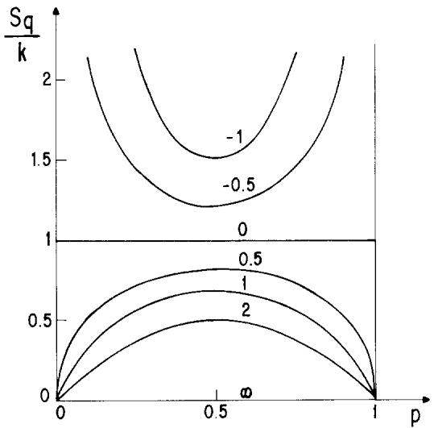  
Fig. 1. Plot of $S_{q}(\{p_{i}\})$ for $W = 2$ and typical values of $q$ (numbers on curves). Notice the monotonic influence of $q$ , a fact that reappears in a variety of properties.

It is immediately verified that

$$
S _ {1} = k \ln W \tag {3'}
$$

thus recovering the celebrated Boltzmann expression. Figure 2 illustrates Eq. (3). The $S_{q}$ given by Eq. (3) diverges if $q \leqslant 1$ and saturates [at $S_{q} = k / (q - 1)$ ] if $q > 1$ , in the $W \to \infty$ limit. It is straightforward to prove that the extremum indicated in Eq. (3) is a maximum (minimum) for $q > 0$ ( $q < 0$ ); for $q = 0$ , $S_{q}(\{p_{i}\}) = k(W - 1)$ for all $\{p_{i}\}$ . Finally, Eq. (3) implies

$$
\frac {S _ {q}}{k} = \frac {e ^ {(1 - q) S _ {1} / k} - 1}{1 - q} \tag {4}
$$

Concavity. Let us extend here a property already mentioned, namely that $q > 0$ ( $q < 0$ ) implies that the extremum of $S_{q}$ is a maximum (minimum). Let $\{p_i\}$ and $\{p_i'\}$ be two sets of probabilities corresponding to a unique set of $W$ possibilities, and $\lambda$ such that $0 < \lambda < 1$ . Define an intermediate probability law as follows:

$$
p _ {i} ^ {\prime \prime} \equiv \lambda p _ {i} + (1 - \lambda) p _ {i} ^ {\prime} \quad (\forall i) \tag {5}
$$

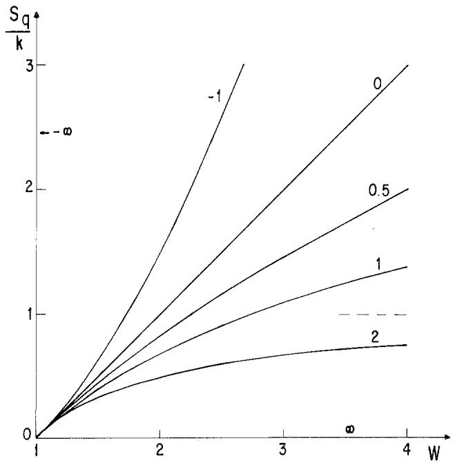  
Fig. 2. Value of the entropy at its extremum for typical values of $q$ (numbers on curves). The dashed line indicates the $W \to \infty$ asymptote of $S_2 / k$ .

and also

$$
\Delta_ {q} \equiv S _ {q} \left(\left\{p _ {i} ^ {\prime \prime} \right\}\right) - \left[ \lambda S _ {q} \left(\left\{p _ {i} \right\}\right) + (1 - \lambda) S _ {q} \left(\left\{p _ {i} ^ {\prime} \right\}\right) \right] \tag {6}
$$

It is straightforward to prove that $\varDelta_q\geqslant 0$ if $q > 0,\varDelta_q\leqslant 0$ if $q <   0$ , and $\varDelta_q=0$ if $q = 0$ . The equalities hold for $q\neq 0$ for $p_i = p_i^{\prime}$ $\forall i$

Additivity. Let us assume two independent systems $A$ and $B$ with ensembles of configurational possibilities $\Omega^A \equiv \{1, 2, \dots, i, \dots, W_A\}$ and $\Omega^B \equiv \{1, 2, \dots, j, \dots, W_B\}$ , respectively, the corresponding probabilities being $\{p_i^A\}$ and $\{p_j^B\}$ . Now consider $A \cup B$ , the ensemble of possibilities being $\Omega^{A \cup B} \equiv \{(1, 1), (1, 2), \dots, (i, j), \dots, (W_A, W_B)\}$ ; let $p_{ij}^{A \cup B}$ denote the corresponding probabilities. The independence of the systems means that $p_{ij}^{A \cup B} = p_i^A p_j^B$ , $\forall (i, j)$ , hence

$$
\sum_ {i, j} ^ {W _ {A} W _ {B}} \left(p _ {i j} ^ {A \cup B}\right) ^ {q} = \left[ \sum_ {i = 1} ^ {W _ {A}} \left(p _ {i} ^ {A}\right) ^ {q} \right] \left[ \sum_ {j = 1} ^ {W _ {B}} \left(p _ {j} ^ {B}\right) ^ {q} \right]
$$

Hence [using Eq. (1)]

$$
\bar {S} _ {q} ^ {A \cup B} = \bar {S} _ {q} ^ {A} + \bar {S} _ {q} ^ {B} \quad (\text {a d d i t i v i t y}) \tag {7}
$$

with

$$
\bar {S} _ {q} \equiv k \frac {\ln [ 1 + (1 - q) S _ {q} / k ]}{1 - q} \tag {8}
$$

In the $q \to 1$ limit, Eq. (7) becomes $S_1^A \cup B = S_1^A + S_1^B$ , thus recovering the standard additivity of the entropies of independent systems. For arbitrary $q$ , $\overline{S}_q$ reproduces the Renyi entropy. $^{(2)}$

To study the case of correlated systems [i.e., $p_{ij}^{A \cup B}$ is not equal to $(\sum_{i=1}^{W_A} p_{ij}^{A \cup B})(\sum_{j=1}^{W_B} p_{ij}^{A \cup B})$ for all $(i,j)$ ], it is useful to define

$$
\Gamma_ {q} (\{p _ {i j} ^ {A \cup B} \}) \equiv \overline {{{S}}} _ {q} ^ {A \cup B} (\{p _ {i j} ^ {A \cup B} \}) - \overline {{{S}}} _ {q} ^ {A} \left(\left\{\sum_ {j = 1} ^ {W _ {B}} p _ {i j} ^ {A \cup B} \right\}\right) - \overline {{{S}}} _ {q} ^ {B} \left(\left\{\sum_ {i = 1} ^ {W _ {A}} p _ {i j} ^ {A \cup B} \right\}\right)
$$

It is clear from Eq. (7) that independence (no correlation) implies $\Gamma_q = 0$ , $\forall q$ . For arbitrary and fixed $\{p_{ij}^{A \cup B}\}$ implying correlation, it is easy to prove that $\Gamma_1 < 0$ (subadditivity of the standard entropies of correlated systems) and $\Gamma_0 = 0$ . For arbitrary values of $q$ , $\Gamma_q$ presents a great sensitivity to $\{p_{ij}^{A \cup B}\}$ , it might be positive or negative for $q \gg 1$ as well as for $q \ll -1$ , and typically exhibits more than one extremum. Extensive and systematic computer verification indicates that, generally speaking, $\Gamma_q$ varies smoothly with $q$ , but presents no particular regularities besides $\Gamma_0 = 0$ and $\Gamma_1 \leqslant 0$ .

When $\{p_{ij}^{A\cup B}\}$ gradually approach vanishing correlation, $\Gamma_q$ gradually flattens until eventually achieving $\Gamma_q = 0, \forall q$ .

Canonical Ensemble. We want to extremize $S_{q}$ with the conditions $\sum_{i=1}^{W} p_{i} = 1$ and

$$
\sum_ {i = 1} ^ {W} p _ {i} \varepsilon_ {i} = U _ {q} \tag {9}
$$

where $\{\varepsilon_i\}$ and $U_{q}$ are known real numbers (the same value $\varepsilon_{i}$ might be associated with more than one possible configuration); they will be referred to as generalized spectrum and generalized internal energy. I introduce the $\alpha$ and $\beta$ Lagrange parameters and define the quantity

$$
\phi_ {q} \equiv \frac {S _ {q}}{k} + \alpha \sum_ {k = 1} ^ {W} p _ {i} - \alpha \beta (q - 1) \sum_ {i = 1} ^ {W} p _ {i} \varepsilon_ {i} \tag {10}
$$

which is written this way for future convenience. Imposing $\partial \phi_q / \partial p_i = 0$ , $\forall i$ , one obtains $p_i \propto [1 - \beta (q - 1)\varepsilon_i]^{1 / (q - 1)}$ ; hence,

$$
p _ {i} = \frac {\left[ 1 - \beta (q - 1) \varepsilon_ {i} \right] ^ {1 / (q - 1)}}{Z _ {q}} \tag {11}
$$

with

$$
Z _ {q} \equiv \sum_ {l = 1} ^ {W} [ 1 - \beta (q - 1) \varepsilon_ {l} ] ^ {1 / (q - 1)} \tag {12}
$$

It is immediately verified that, in the $q\to 1$ limit, one recovers

$$
p _ {i} = e ^ {- \beta \varepsilon_ {i}} / Z _ {1} \tag {11'}
$$

with

$$
Z _ {1} \equiv \sum_ {l = 1} ^ {W} e ^ {- \beta \varepsilon_ {l}} \tag {12'}
$$

It is straightforward to see that an alternative manner for obtaining the power-law distribution expressed in Eq. (11) is to extremize $S_{q}$ (or equivalently $\bar{S}_{q}$ ) with the condition $\sum_{i=1}^{W} p_{i}^{q} \varepsilon_{i} = U_{q}$ [instead of Eq. (9)].

If $A$ and $B$ are two independent systems with probabilities (spectrum) $\{p_i^A\} (\{\varepsilon_i^A\})$ and $\{p_j^B\} (\{\varepsilon_j^B\})$ , respectively, the probabilities corresponding to $A \cup B$ satisfy $p_{ij}^{A \cup B} = p_i^A p_j^B, \forall (i,j)$ . This implies

$$
1 - \beta (q - 1) \varepsilon_ {i j} ^ {A \cup B} = [ 1 - \beta (q - 1) \varepsilon_ {i} ^ {A} ] [ 1 - \beta (q - 1) \varepsilon_ {j} ^ {B} ] \tag {13}
$$

or equivalently

$$
\bar {\varepsilon} _ {i j} ^ {A \cup B} = \bar {\varepsilon} _ {i} ^ {A} + \bar {\varepsilon} _ {j} ^ {B} \tag {14}
$$

with

$$
\bar {\varepsilon} \equiv \frac {\ln [ 1 + \beta (1 - q) \varepsilon ]}{\beta (1 - q)} \tag {15}
$$

In the $q\to 1$ limit (and/or $\beta \rightarrow 0$ limit), Eq. (14) becomes $\varepsilon_{ij}^{A\cup B} = \varepsilon_{i}^{A} + \varepsilon_{j}^{B}$ thus recovering the standard energy additivity. The property (14), together with the factorization of probabilities, placed in Eq. (9) yields

$$
\bar {U} _ {q} ^ {A \cup B} = \bar {U} _ {q} ^ {A} + \bar {U} _ {q} ^ {B} \tag {16}
$$

with

$$
\bar {U} _ {q} \equiv \frac {\ln [ 1 + \beta (1 - q) U _ {q} ]}{\beta (1 - q)} \tag {17}
$$

In the $q \to 1$ limit (and/or $\beta \to 0$ limit), Eq. (16) becomes $U_1^{A \cup B} = U_1^A + U_1^B$ , thus recovering the standard additivity of the internal energies of independent systems.

I now discuss the main characteristics of the distribution law (11). First, notice that this distribution is invariant under the transformation

$$
[ 1 - \beta (q - 1) \varepsilon_ {l} ] \rightarrow [ 1 - \beta (q - 1) \varepsilon_ {l} ] [ 1 - \beta (q - 1) \varepsilon_ {0} ]
$$

for all $l$ , $\varepsilon_0$ being an arbitrary fixed real number. In other words, the distribution (11) is invariant under $\bar{\varepsilon}_l \rightarrow \bar{\varepsilon}_l + \bar{\varepsilon}_0$ [this is in fact a trivial consequence of the fact that the distribution can be formally rewritten as $p_i \propto \exp(-\beta \bar{\varepsilon}_i)$ ]. For $\beta (q - 1) \to 0$ , we recover the well-known invariance of the Boltzmann-Gibbs statistics under uniform translation of the energy spectrum. Figure 3 illustrates distribution (11). Notice that, for $q > 1$ , $p_i = 0$ for all levels such that $\varepsilon_i \geqslant 1 / [\beta (q - 1)]$ ( $\varepsilon_i \leqslant -1 / [|\beta| (q - 1)]$ ) if $\beta > 0$ ( $\beta < 0$ ), i.e., positive (negative) "temperatures." On the other hand, for $q < 1$ , the levels such that $\varepsilon_i \leqslant -1[\beta (1 - q)]$ ( $\varepsilon_i \geqslant 1 / [|\beta| (1 - q)]$ ) are, if $\beta > 0$ ( $\beta < 0$ ), highly occupied, in a way that is clearly reminiscent of the Bose-Einstein condensation.

To better realize the unusual properties of the present statistics, it is instructive to analyze the following situation. Assume $q > 1$ , $\beta > 0$ , and $\{\varepsilon_i\}$ such that $0 < \varepsilon_1 < \varepsilon_2 < \dots < \varepsilon_W$ ( $W$ might even diverge). When $1 / \beta$ is above $(q - 1)\varepsilon_{W}$ , all levels have a finite occupancy probability; when $(q - 1)\varepsilon_{W - 1} < 1 / \beta < (q - 1)\varepsilon_{W}$ , then $p_1 > p_2 > \dots > p_{W - 1} > p_W = 0$ . The

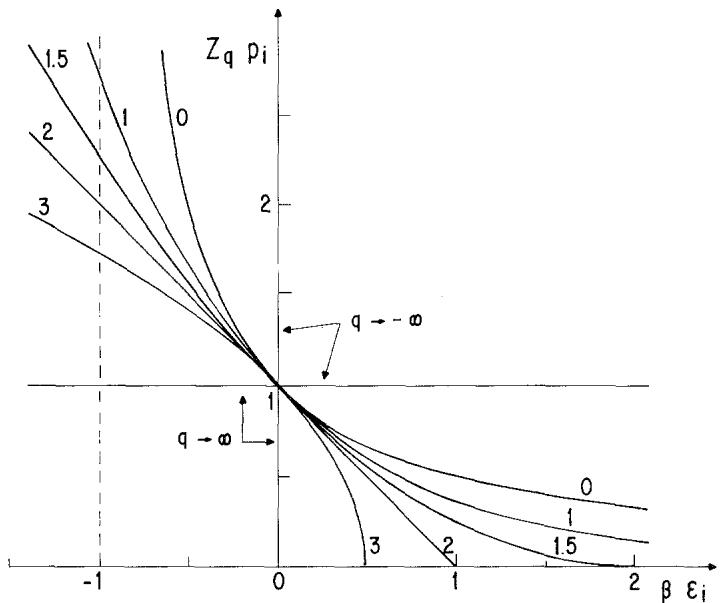  
Fig. 3. The distribution law of Eq. (11) as a function of $\beta \varepsilon_{i}$ . The curves are parametrized by $q$ : $q = 1$ , standard exponential law; $q > 1$ , the distribution presents a cutoff at $\beta \varepsilon_{i} = 1 / (q - 1)$ (with a slope of 0, $-1$ , and $-\infty$ for $q < 2$ , $q = 2$ , and $q > 2$ , respectively) and diverges for $\beta \varepsilon_{i} \to -\infty$ ; $q < 1$ , the distribution diverges at $\beta \varepsilon_{i} = -1 / (1 - q)$ (the dashed line indicates the asymptote for $q \to 0$ ) and vanishes for $\beta \varepsilon_{i} \to +\infty$ .

probabilities successively vanish while $1 / \beta$ decreases. One eventually arrives at $(q - 1)\varepsilon_{1} < 1 / \beta < (q - 1)\varepsilon_{2}$ , which implies $p_1 = 1$ . Finally, the temperatures $1 / \beta$ in the interval $[0, (q - 1)\varepsilon_1]$ are physically unaccessible, thus generalizing the nonaccessibility of $1 / \beta = 0$ in standard thermodynamics. A simple example will illustrate this and similar facts.

Application. Consider two nondegenerate levels with values $\varepsilon_1 \equiv \varepsilon - \delta$ and $\varepsilon_2 \equiv \varepsilon + \delta$ ( $\delta > 0$ ; $\varepsilon \stackrel{=}{=} 0$ ). The quantity $U_q(\beta)$ is given by $U_q = \varepsilon_1 p_1 + \varepsilon_2 p_2$ . A straightforward calculation yields

$$
y _ {q} = - \frac {\left[ 1 - (q - 1) (\varepsilon / \delta - 1) / x \right] ^ {1 / (q - 1)} - \left[ 1 - (q - 1) (\varepsilon / \delta + 1) / x \right] ^ {1 / (q - 1)}}{\left[ 1 - (q - 1) (\varepsilon / \delta - 1) / x \right] ^ {1 / (q - 1)} + \left[ 1 - (q - 1) (\varepsilon / \delta + 1) / x \right] ^ {1 / (q - 1)}} \tag {18}
$$

with $x \equiv 1 / \beta \delta$ and $y_{q} = (U_{q} - \varepsilon) / \delta \in [-1,1]$ . Equation (18) is invariant under $(x,y_{q},q - 1,\varepsilon /\delta)\to (x,y_{q}, - (q - 1), - \varepsilon /\delta)$ and also under $(x,y_{q},q,\varepsilon /\delta)\to (-x, - y_{q},q, - \varepsilon /\delta)$ . Consequently, it suffices to discuss $q\geqslant 1$ and $\varepsilon /\delta \geqslant 0$ . In the limit $q\rightarrow 1$ , one obtains $y_{1} = -\mathrm{th}(1 / x)$ , $\forall \varepsilon /\delta$ . For $q\neq 1$ , $y_{q}(x)$ depends on $\varepsilon /\delta$ : see Figs. 4 and 5.

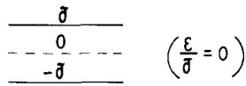  
(a)

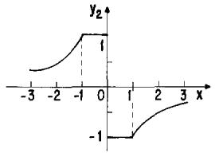

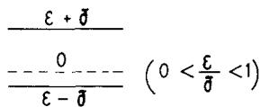  
(b）

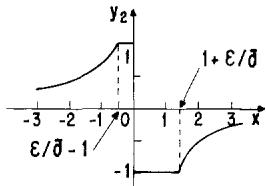

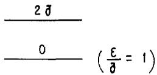  
(c）

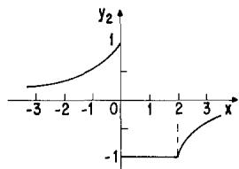

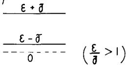  
(d)

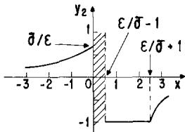  
Fig. 4. The $q = 2$ reduced internal "energy" as a function of the reduced "temperature" (see text) for a nondegenerate two-level system and typical values of $\varepsilon/\delta$ . The dashed region in (d) indicates the inaccessible "temperatures."

I conclude by recalling that, using the quantity normally scaled for multifractals, I have postulated an expression for the entropy that generalizes the usual one (recovered for the parameter $q \to 1$ ). By preserving the standard variational principle, I have established the microcanonical and canonical distributions, as well as several other properties. Some of the emerging peculiar characteristics are illustrated through a simple example. One of the most interesting is the fact that the unaccessible "temperatures" might belong to a finite interval that shrinks on the $T = 0$ point in the $q \to 1$ limit. Finally, the fact that $S_{q} / k$ , $\beta \varepsilon_{i}$ , and $\beta U_{q}$ are additive under one and the same functional form $\{ \text{namely } f(x) \equiv \ln [1 + (1 - q)x] / (q - 1) \}$ opens the door to the generalization of standard thermodynamics through the introduction of appropriate generalized thermodynamic potentials. Applications of these generalized equilibrium

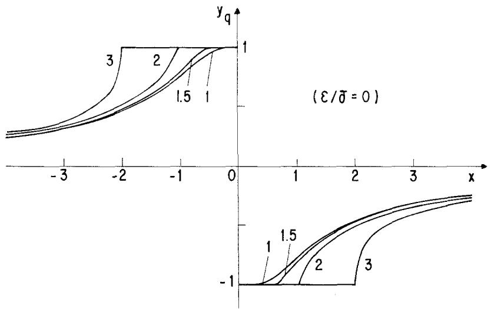  
Fig. 5. Reduced internal "energy" as a function of the reduced "temperature" (see text) for a nondegenerate two-level system and typical values of $q$ (numbers on curves).

statistics in physics (e.g., fractals, multifractals), information theory, or any other branch of knowledge using probabilistic concepts would be extremely welcome.

# ACKNOWLEDGMENTS

I am very indebted to E. M. F. Curado, H. J. Herrmann, R. Maynard, and A. Coniglio for very stimulating discussions. Computational assistance by S. Cannas as well as useful remarks by S. R. A. Salinas, F. C. Sa Barreto, S. Coutinho, and J. S. Helman are also gratefully acknowledged.

# REFERENCES

1. H. G. E. Hentschel and I. Procaccia, Physica D 8:435 (1983); T. C. Halsley, M. H. Jensen, L. P. Kadanoff, I. Procaccia, and B. I. Shraiman, Phys. Rev. A 33:1141 (1986); G. Paladin and A. Vulpiani, Phys. Rep. 156:147 (1987).   
2. A. Rényi, Probability Theory (North-Holland, 1970).

Communicated by J. L. Lebowitz