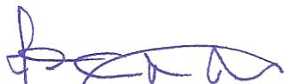
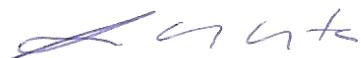
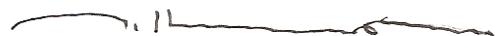
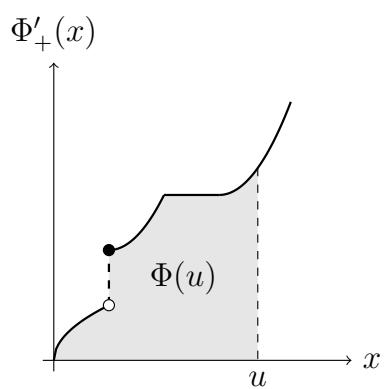
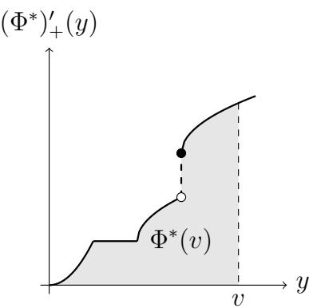
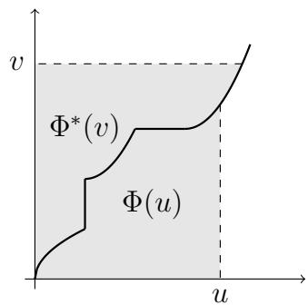
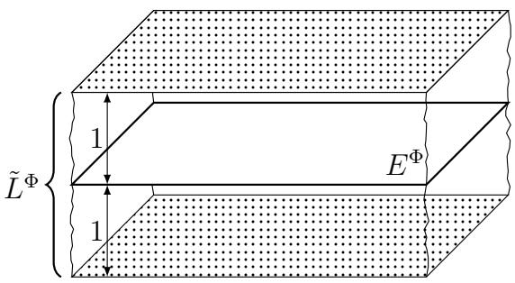
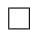
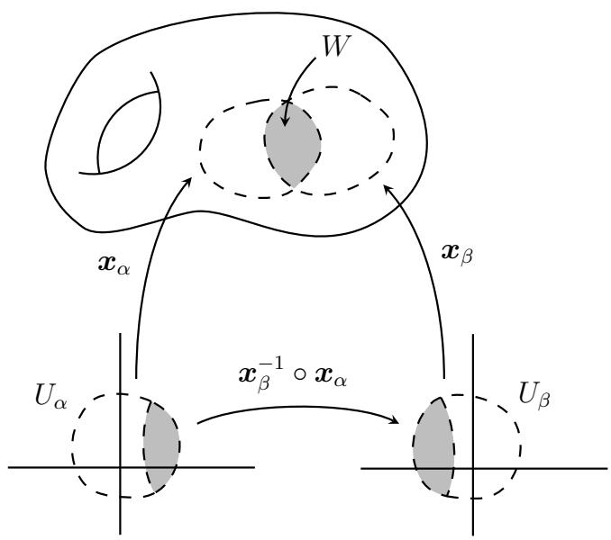
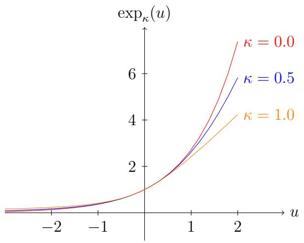

UNIVERSIDADE FEDERAL DO CEARÁ

CENTRO DE TECNOLOGIA

DEPARTAMENTO DE ENGENHARIA DE TELEINFORMATÁTICA

PROG. DE PÓS-GRADUÇÃO EM ENG. DE TELEINFORMATÁTICA

# On Musielak-Orlicz Function Spaces and Applications to Information Geometry

Autor:

Rui Facundo Vigelis

Orientador:

Prof. Dr. Charles Casimiro Cavalcante

Tese aparecido à Coordenação do Programa de Pós-graduação em Engenharia de Teleinformática da Universidade Federal do Ceará como parte dos requisitos exigidos para obtenção do grau de Doutor em Engenharia de Teleinformática.

Ficha CATALOGária - Biblioteca de Pós-Graduação em Engenharia da UFC

V73 Vigelis, Rui Facundo

On Musielak-Orlicz function spaces and applications to information geometry / Rui Facundo Vigelis, 2011.

122 f.; il.; enc.

Orientador: Prof. Dr. Charles Casimiro Cavalcante

Área de concentração: Sinai e sistemas

Tese (Doutorado) – Universidade Federal do Ceará, Centro de Tecnologia, Departamento de Engenharia de Teleinformática, Fortaleza, 2011.

1. Teleinformática. 2. Matemática aplicada. 3. Física aplicada.

I. Cavalcante, Charles Casimiro (orient.). II. Universidade Federal do Ceará – Programa de Pós-Graduação em Engenharia de Teleinformática. III. Titulo.

CDD 621.38

# RUI FACUNDO VIGELIS

# ON MUSIELAK--ORLICZ FUNCTION SPACES AND APPLICATIONS TO INFORMATION GEOMETRY

Tese submetida à Coordenação do Campo de Pós-Graduação em Engenharia de Teleinformática, da Universidade Federal do Ceará, como requisito parcial para a obtenção do grau de Doutor em Engenharia de Teleinformática. Área de concentração Sinais e Sistemas.

Aprovada em 22/06/2011.

# BANCA EXAMINADORA

BANCA EXAMINADGAY

Prof. Dr. Charles Casimiro Cavalcante (Orientador)  
Universidade Federal do Ceará - UFC

Prof. Dr. João Cesar Moura Mota  
Universidade Federal do Ceará - UFC

Prof. Dr. Ronaldo Dias  
Universidade Estadual de Campinas - Unicamp

Profa. Dra. Sueli Irene Rodrigues Costa Universidade Estadual de Campinas - Unicamp

Prof. Dr. Jorge Herbert Soares de Lira  
Universidade Federal do Ceará - UFC

lntws lamil m.neto

Prof. Dr. Antônio Caminha Muniz Neto  
Universidade Federal do Ceará - UFC

Esta tese é dedicada

à minha avó Adélia (in memoriam)

e aes meus pais Vytautas e Veronica

# Agradecimientos

À Fundação Cearense de Apoio ao Desenvolvimento Científico e Tecnológico (FUNCAP), e à Coordenação de Aperfeiçoamento de Pessoal de Nível Superior (CAPES), pelo apoio financeiro e a Opportunity de poder realizar este trabalho.

Ao Prof. Charles Cavalcante,PGA, e pela excelente contribuiao atraves de discussoes, sugestoes e crticas construtivas.

Aos Profs. Antonio Caminha, Jorge Herbert e João Cesar, membros da banca examinadora,culos valiosos comenteiros e sugestões,que em muito contribuiram na melhoria da qualidade da tese.

Aos Profs. Ronaldo Dias e Sueli Costa, por terem aceito o convite de participar da banca examinatora, e pela minuciosa análise da tese.

A meus pais Vytautas e Verónica, por todo apoio e compreensão durante este doutorado.

# Resumo

Nesta tese, os espacços de Musielak-Orlicz são aplicados à Geometria da Informação, em que $\varphi$ -fármalias de distribuições de probabilitadade são construções. Usando notation e terminologia uniformes, reunimos os resultados principales dos espacços de Musielak-Orlicz. Embora às vezes espacços tenham sido estudos extensively, algumas questões não foram respondidas completeness. Nós nos focamos na extensão de algunos resultados e tecnicas para funções de Musielak-Orlicz arbitrarias (não necessariamente limitas). Em algumas dessas extensões, usamos fornulas mais geralis para a componente continua em ordem e a componente singular de funções lineares limitados. Não entrainamos condições necessarias e suficientes para a suavidade da norma de Orlicz, para funções de Musielak-Orlicz arbitrarias. Numa $\varphi$ -fármia, subconjuntos de espacços de Musielak-Orlicz são usados como conjuntos de coordenadas. As $\varphi$ -fármias são obtidas a partir de uma generalização das famílias exponentiais. A funcção exponential encontrar nas famílias exponentiais é substituição por uma $\varphi$ -função. Numa $\varphi$ -fármia, o análgo da funcção geradora de cumulantes é uma funcção de normalização. Definimos a $\varphi$ -divergência como a divergência de Bregman associada à funcção de normalização, fornecendo uma generalização da divergência de Kullback-Leibler.

# Abstract

In this thesis, Musielak-Orlicz spaces are applied to Information Geometry, where $\varphi$ -families of probability distributions are constructed. Using unified notation and terminology, we collected some standard results of Musielak-Orlicz spaces. Although these spaces have been studied extensively, some questions were not answered completely. We have focused on the extension of some results and techniques to arbitrary (not necessarily finite) Musielak-Orlicz functions. In some extensions, we made use of more general formulas for the order continuous and singular components of bounded linear functionals. We found necessary and sufficient conditions for the smoothness of the Orlicz norm for arbitrary Musielak-Orlicz functions. In a $\varphi$ -family, subsets of Musielak-Orlicz spaces are used as coordinate sets. We obtained $\varphi$ -families by a generalization of exponential families. The exponential function found in exponential families is replaced by a $\varphi$ -function. In a $\varphi$ -family, the analogous of the cumulant-generating functional is a normalizing function. We defined the $\varphi$ -divergence as the Bregman divergence associated to the normalizing function, providing a generalization of the Kullback-Leibler divergence.

# Contents

# 1 Introduction 1

1.1 Summary of contributions 2   
1.2 Structure of the thesis 3

# 2 Musielak-Orlicz functions 5

2.1 Definitions 5   
2.2 Comparisons between Musielak-Orlicz functions 8   
2.3 The $\Delta_{2}$ and $\nabla_{2}$ -conditions 11   
2.4 Some indices concerning Musielak-Orlicz functions 13

# 3 Musielak-Orlicz function spaces 16

3.1 Introduction 16   
3.2 The Orlicz norm 20   
3.3 The Amemiya norm 24   
3.4 Extensions to arbitrary Musielak-Orlicz functions 28   
3.5 Embeddings between Musielak-Orlicz spaces 32   
3.6 The Morse-Transue space 35

# 4 The dual of $L^{\Phi}$ 41

# 5 Compactness in $E^{\Phi}$ 54

# 6 Some geometric properties of $L^{\Phi}$ 61

6.1 Strict convexity 61   
6.2 Smoothness 70   
6.3 Uniform convexity 78

# 7 Upper and lower estimates between Musielak-Orlicz spaces 90

# 8 Applications to Information Geometry 96

8.1 Introduction 96   
8.2 Musielak-Orlicz function spaces 97   
8.3 The exponential statistical manifold 99

8.4 Construction of the $\varphi$ -family of probability distributions 101   
8.5 Divergence 107

# 9 Conclusions and perspectives 113

# Bibliography 114

# List of symbols 119

# Index 121

# 1 Introduction

Motivated by the construction of $\varphi$ -families of probabilities distributions, we collected the standard results of Musielak-Orlicz spaces. There was a need of having a reference with unified notation and terminology. For a deeper progress with these families, it is essential a knowledge on Musielak-Orlicz spaces. For example, in a subsequent line of investigation, some properties of the $\varphi$ -divergence, like its smoothness or uniform convexity, depends on their counterparts in the underlying Musielak-Orlicz space. We also filled some gaps in the theory of Musielak-Orlicz spaces. The gaps were mainly related to the extension of some results or techniques to arbitrary (not necessarily finite) Musielak-Orlicz functions.

The theory of Musielak-Orlicz spaces begins in 1931 with a paper of W. Orlicz [46], where variable $L^p$ spaces on the real line are defined. In a paper [47] of 1932, W. Orlicz introduces the spaces that now bear his name, the so-called Orlicz spaces, with an additional condition (the $\Delta_2$ -condition). Later in a work [48] of 1936, W. Orlicz presents the Orlicz spaces in full generality (without the $\Delta_2$ -condition). Orlicz spaces are a generalization of the classical $L^p$ spaces. The function $|\cdot|^p$ defining the classical $L^p$ spaces is replaced by an Orlicz function $\Phi(\cdot)$ in the Orlicz spaces. Let $(T, \Sigma, \mu)$ be a measure space. Given an Orlicz function, the Orlicz space $L^\Phi$ is defined as the set of all measurable functions $u: T \to \mathbb{R}$ for which

$$
I _ {\Phi} (\lambda u) = \int_ {T} \Phi (| \lambda u |) d \mu <   \infty , \quad \text {f o r s o m e} \lambda > 0. \tag {1.1}
$$

In the subsequent years to the seminal work of W. Orlicz, the theory of Orlicz spaces was developed, culminating in the book of M. A. Krasnosel'skii and Ja. B. Rutickii [37], the first systematic work treating Orlicz spaces. In this book, Orlicz spaces are restricted to $N$ -functions and Lebesgue measures on compact subsets of $\mathbb{R}^n$ , although much of the work could be extended directly to non-atomic, finite measures. The general theory without these restrictions and some geometrical properties were investigated by several authors [40, 30, 22, 26]. The general setting for Orlicz functions and non-atomic measures (when necessary) can be found in the books of M. M. Rao and Z. D. Ren [54, 55].

Musielak-Orlicz functions are an extension of Orlicz spaces. Replacing the Orlicz function $\Phi(\cdot)$ in (1.1) by a Musielak-Orlicz function $\Phi(t, \cdot)$ , depending on a parame

ter $t \in T$ , we get a Musielak-Orlicz space. This extension was presented initially by H. Nakano in 1950 [44], and developed by J. Musielak and W. Orlicz in 1959 [43], in the context of modular spaces. J. Musielak in 1983 collected standard results on Musielak-Orlicz spaces in his book [42]. Since the 1980's, many advances have been conceived by numerous researchers, with emphasis by the Polish mathematicians H. Hudzik [24, 25, 27, 23] and A. Kamińska [29, 32, 33]. Recently, efforts have been directed to the investigation of variable $L^p$ spaces [36, 15, 14], in particular to the maximal operator and other operators [13, 10].

The nonparametric (or infinite-dimensional) exponential statistical manifold was at first constructed by G. Pistone and C. Sempi in 1995 [53]. They showed how $\mathcal{P}_{\mu}$ , the set of all probability measures equivalent to $\mu$ , can be endowed with a structure of $C^\infty$ -Banach manifold. Each connected component of the exponential statistical manifold constitutes an exponential families of probability distributions. The coordinate sets used in the construction are subsets $\mathcal{B}_p$ of Orlicz spaces $L^{\Phi_1}(p)$ , where $\Phi_1$ is an exponentially growing Orlicz function, and $p$ is a probability density in $\mathcal{P}_{\mu}$ . In subsequent works [52, 9], further properties of the exponential manifold were investigated. Information Geometry [41, 3, 19] consists in providing families of probability distributions with differential geometrical structures. In a finite-dimensional exponential family, one can define on it a Riemannian metric simply as a Hessian of the cumulant-generating functional. In the nonparametric case, the exponential family cannot be equipped with a Riemannian metric. P. Gibilisco and G. Pistone in [18] provide how the exponential connection can be defined on exponential statistical manifolds. A. Cena in [8] investigates further this connection, and M. R. Grasselli in [20, 21] deals with the notion of dual connections. In recent years, some attempts have been made in the construction of families of probability distributions where the exponential function is replaced by another function. In [51] the nonparametric $\kappa$ -exponential family is constructed, and in [2, 4] the geometry of finite-dimensional $q$ -exponential families is investigated. In this thesis we endow $\mathcal{P}_{\mu}$ with a structure of $C^\infty$ -Banach manifold, using a $\varphi$ -function in the place of the exponential function.

# 1.1 Summary of contributions

The contributions are distributed throughout the thesis. We present them concisely in this section. In Chapter 2, we show how the two inequalities used as criteria for embeddings between Musielak-Orlicz spaces are related. With this result, the formula involving Simonenko indices is extended to Musielak-Orlicz functions. Some standard results in the theory of Musielak-Orlicz spaces are just known for finite-valued Musielak-Orlicz functions. In Section 3.4, we provide some extensions to arbitrary Musielak-Orlicz functions. The characterization of a singular linear func

tional as a non-trivial continuous linear functional vanishing in the Morse-Transue space cannot be used when the Musielak-Orlicz function is not finite-valued. Exploiting the fact that Musielak-Orlicz spaces are Banach lattices [1], we found more general formulas for the order continuous and singular components of bounded linear functionals, which can be employed in the determination of their norms for arbitrary Musielak-Orlicz functions. In Chapter 5, we extend for Musielak-Orlicz functions some results found in [37, §13.3], which presents how a collection of functions with equi-absolutely continuous norms is related to an Orlicz function increasing essentially more rapidly than another. H. Hudzik and Z. Zbaszyniak in [27] gives necessary and sufficient criteria for the smoothness of the Orlicz norm for finite-valued Musielak-Orlicz functions. Using our previous extensions, we generalize these criteria for arbitrary Musielak-Orlicz functions. Arguing as in [29], where the type and cotype of Musielak-Orlicz spaces are characterized, we give in Chapter 7 some criteria for the upper and lower estimates between Musielak-Orlicz spaces. In Chapter 8, Musielak-Orlicz spaces are applied in the construction of $\varphi$ -families of probability distributions. The exponential function in an exponential family is replaced by a $\varphi$ -function in a $\varphi$ -family. The analogue of the Kullback-Leibler divergence is the $\varphi$ -divergence. As Kullback-Leibler divergences, $\varphi$ -divergences are Bregman divergences.

# 1.2 Structure of the thesis

The organization of the thesis is as follows. In Chapter 2, we begin by presenting the Musielak-Orlicz functions and some inequalities relating them. Chapter 3 deals with standard results of Musielak-Orlicz (function) spaces. In this chapter, the Luxemburg, Orlicz and Amemiya norms are introduced. We show that the Musielak-Orlicz space is complete with respect to any of these norm, which are equivalent. Some inequalities presented in Chapter 2 are used in Section 3.5 as conditions for the embedding between Musielak-Orlicz spaces. In Section 3.6, we study some properties of Morse-Transue spaces. Chapter 4 aims to provide an account of the dual of Musielak-Orlicz spaces from the point of view of Banach lattices [1]. We can find more general formulas for the order continuous and singular components of continuous linear functionals. Chapter 5 deals with the compactness of subsets of Morse-Transue spaces. In Chapter 6, one can find necessary and sufficient criteria for the strict convexity and smoothness of the Luxemburg and Orlicz norms, and for the uniform convexity of the Orlicz norm. Chapter 7 provides criteria for upper and lower estimates between Musielak-Orlicz spaces. In Chapter 8, the $\varphi$ -family of probability distributions is constructed. In this chapter, $\varphi$ -divergences are obtained as the Bregman divergence of normalizing functions, which replace the cumulant

generating functional. Finally, some conclusions and future directions of research are presented in Chapter 9.

# 2 Musielak-Orlicz functions

# 2.1 Definitions

Let $(T,\Sigma ,\mu)$ be a measure space. We say $\Phi \colon T\times [0,\infty ]\to [0,\infty ]$ is a $\Phi$ -function when, for $\mu$ -a.e. $t\in T$

(i) $\Phi(t, \cdot)$ is non-decreasing and continuous, except possibly at $b \in (0, \infty)$ where $\lim_{u \uparrow b} \Phi(t, u) = \Phi(t, b) < \infty$ , and $\Phi(t, u) = \infty$ for all $u > b$ ,   
(ii) $\Phi (t,0) = 0$ and $\Phi (t,\infty) = \infty$   
(iii) $\Phi (\cdot ,u)$ is measurable for all $u\geq 0$

Item (ii) and the continuity of $\Phi(t, \cdot)$ guarantee that $\Phi(t, \cdot)$ is not equal to 0 or $\infty$ on the interval $(0, \infty)$ . In addition to the definition of $\Phi$ -functions, if

(iv) $\Phi (t,\cdot)$ is convex, for $\mu$ -a.e. $t\in T$

then $\Phi$ is called a Musielak-Orlicz function. If a Musielak-Orlicz function $\Phi$ satisfies, for $\mu$ -a.e. $t \in T$ ,

(v) $\Phi (t,u) <   \infty$ for $u\in (0,\infty)$   
(vi) $\frac{\Phi(t,u)}{u}\to 0$ as $u\downarrow 0$ , and   
(vii) $\frac{\Phi(t,u)}{u}\to \infty$ as $u\to \infty$

we say that $\Phi$ is an $N$ -function. A Musielak-Orlicz function $\Phi$ is said to be an Orlicz function if the functions $\Phi(t, \cdot)$ are identical for $\mu$ -a.e. $t \in T$ . We do not use a different notation for $\Phi$ -functions or $N$ -functions for which $\Phi(t, \cdot)$ are the same for $\mu$ -a.e. $t \in T$ . In the rest of the text, if not specified, it will be assumed that a property regarding the functions $\Phi(t, \cdot)$ holds for $\mu$ -a.e. $t \in T$ . For example, when we mention that $\Phi$ or $\Phi(t, \cdot)$ is finite-valued, we are saying that $\Phi(t, \cdot)$ is finite-valued for $\mu$ -a.e. $t \in T$ .

The complementary function $\Phi^* \colon T \times [0, \infty] \to [0, \infty]$ to a Musielak-Orlicz function $\Phi$ is defined as

$$
\Phi^ {*} (t, v) = \sup  _ {u > 0} (u v - \Phi (t, u)), \quad \text {f o r a l l} v \geq 0, \tag {2.1}
$$

  
Figure 2.1: Pair of complementary Musielak-Orlicz functions.

i.e., $\Phi^{*}(t,\cdot)$ is the Fenchel conjugate of $\Phi (t,\cdot)$ . The complementary function $\Phi^*$ satisfies (i)-(iv) in the definition of Musielak-Orlicz functions. A proper function equals its biconjugate (the Fenchel conjugate of the Fenchel conjugate) if and only if it is convex and lower semi-continuous (see [56, Theorem 12.2]). Thus, in virtue of the left-continuity of $\Phi (t,\cdot)$ , the Fenchel conjugate of $\Phi^{*}(t,\cdot)$ results in $\Phi (t,\cdot)$ . The following equality holds:

$$
\Phi (t, u) = \sup  _ {v > 0} (u v - \Phi^ {*} (t, v)), \quad \text {f o r a l l} u \geq 0. \tag {2.2}
$$

Denote by $\Phi_{-}^{\prime}(t,\cdot)$ and $\Phi_{+}^{\prime}(t,\cdot)$ the left- and right-derivatives of the Musielak-Orlicz function $\Phi (t,\cdot)$ , whose left- and right-continuous inverses are

$$
(\Phi^ {*}) _ {-} ^ {\prime} (t, v) = \inf  \{u \geq 0: \Phi_ {-} ^ {\prime} (t, u) \geq v \}, \quad \mathrm {f o r a l l} v \geq 0,
$$

and

$$
(\Phi^ {*}) _ {+} ^ {\prime} (t, v) = \sup \{u \geq 0: \Phi_ {+} ^ {\prime} (t, u) \leq v \}, \quad \mathrm {f o r a l l} v \geq 0,
$$

respectively. We also denote $\partial \Phi (t,u) = [\Phi_{-}^{\prime}(t,u),\Phi_{+}^{\prime}(t,u)]$ . The functions $\Phi$ and $\Phi^{*}$ are expressed as

$$
\Phi (t, u) = \int_ {0} ^ {u} \Phi_ {+} ^ {\prime} (t, x) d x \quad \text {a n d} \quad \Phi^ {*} (t, v) = \int_ {0} ^ {v} (\Phi^ {*}) _ {+} ^ {\prime} (t, y) d y, \tag {2.3}
$$

for all $u, v \geq 0$ . In virtue of the equalities in (2.1) or (2.2), the functions $\Phi$ and $\Phi^*$ satisfy the Young's inequality

$$
u v \leq \Phi (t, u) + \Phi^ {*} (t, v), \quad \text {f o r a l l} u, v \geq 0. \tag {2.4}
$$

The Young's inequality reduces to an equality when $v \in \partial \Phi(t, u)$ if $u$ is given, or when $u \in \partial \Phi^*(t, v)$ if $v$ is given. (See Figure 2.1.)

Define, for all $t\in T$

$$
a _ {\Phi} (t) = \sup  \{u \geq 0: \Phi (t, u) = 0 \}, \tag {2.5}
$$

$$
b _ {\Phi} (t) = \sup  \{u \geq 0: \Phi (t, u) <   \infty \}, \tag {2.6}
$$

and

$$
c _ {\Phi} (t) = \lim  _ {u \downarrow 0} \frac {\Phi (t , u)}{u} = \lim  _ {u \downarrow 0} \Phi_ {-} ^ {\prime} (t, u) = \lim  _ {u \downarrow 0} \Phi_ {+} ^ {\prime} (t, u), \tag {2.7}
$$

$$
d _ {\Phi} (t) = \lim  _ {u \rightarrow \infty} \frac {\Phi (t , u)}{u} = \lim  _ {u \rightarrow \infty} \Phi_ {-} ^ {\prime} (t, u) = \lim  _ {u \rightarrow \infty} \Phi_ {+} ^ {\prime} (t, u). \tag {2.8}
$$

In virtue of 2.3, we have

$$
a _ {\Phi^ {*}} (t) = c _ {\Phi} (t) \quad \mathrm {a n d} \quad b _ {\Phi^ {*}} (t) = d _ {\Phi} (t).
$$

Clearly, a Musielak-Orlicz function $\Phi$ is an $N$ -function if, and only if, $c_{\Phi}(t) = 0$ and $d_{\Phi}(t) = \infty$ . Thus the complementary function to any $N$ -function is also an $N$ -function.

Example 2.1 (Variable exponent function). For a measurable function $p \colon T \to [1, \infty]$ , called the variable exponent function, the function $\Phi(t, u) = u^{p(t)}$ , where for $p(t) = \infty$ we use the convention

$$
u ^ {\infty} = \left\{ \begin{array}{l l} 0, & \mathrm {i f} 0 \leq u \leq 1, \\ \infty , & \mathrm {i f} 1 <   u, \end{array} \right.
$$

defines a Musielak-Orlicz function. Denote $p_* = \operatorname{ess} \inf p(t) \geq 1$ and $p^* = \operatorname{ess} \sup p(t) \leq \infty$ . With the assumption $1 < p_* \leq p^* < \infty$ , we have that $\Phi(t, u) = u^{p(t)}$ is an $N$ -function. For given $p \colon T \to [1, \infty]$ , we define its conjugate function as

$$
p ^ {\prime} (t) = \left\{ \begin{array}{l l} p (t) / (p (t) - 1), & \text {f o r} p (t) \in (1, \infty), \\ \infty , & \text {f o r} p (t) = 1, \\ 1, & \text {f o r} p (t) = \infty . \end{array} \right.
$$

Then the complementary function to $\Phi(t, u) = |u|^{p(t)}$ is given as

$$
\Phi^ {*} (t, u) = \left\{ \begin{array}{l l} p (t) \frac {1}{p ^ {\prime} (t)} | u / p (t) | ^ {p ^ {\prime} (t)}, & \mathrm {f o r} p (t) \in (1, \infty), \\ u ^ {\infty}, & \mathrm {f o r} p (t) = 1, \\ u, & \mathrm {f o r} p (t) = \infty . \end{array} \right.
$$

The variable exponent function is used in the definition of the variable $L^p$ space

(see Example 3.1), which generalizes the classical $L^p$ space.

Example 2.2. Let $\varphi \colon \mathbb{R} \to (0, \infty)$ be a strictly increasing, continuous function such that $\varphi(x) \to 0$ as $x \to -\infty$ , and $\varphi(x) \to \infty$ as $x \to \infty$ . For a measurable function $c \colon T \to \mathbb{R}$ , we define the $\Phi$ -function $\Phi(t, u) = \varphi(c(t) + u) - \varphi(c(t))$ . Clearly $\Phi$ is a Musielak-Orlicz function if $\varphi$ is convex. Denoting by $\varphi^{*}$ the Fenchel conjugate of $\varphi$ , the complementary function $\Phi^{*}$ can be expressed as $\Phi^{*}(t, v) = \varphi^{*}(v) - c(t)v + \varphi(c(t))$ .

# 2.2 Comparisons between Musielak-Orlicz functions

Let $\Phi$ and $\Psi$ be Musielak-Orlicz functions. We denote by $\tilde{L}^{\Phi}$ the set of all real-valued, measurable functions $u$ for which $\int_{T}\Phi (t,|u(t)|)d\mu < \infty$ . For constants $\alpha ,\lambda >0$ , a non-negative function $f\in \tilde{L}^{\Psi}$ , and an integrable function $h\colon T\to [0,\infty)$ , we will consider the inequalities

$$
\alpha \Psi (t, u) \leq \Phi (t, \lambda u), \quad \text {f o r a l l} u > f (t), \tag {2.9}
$$

and

$$
\alpha \Psi (t, u) \leq \Phi (t, \lambda u) + h (t), \quad \text {f o r a l l} u \geq 0. \tag {2.10}
$$

These inequalities are somewhat equivalent. If (2.9) is satisfied, then (2.10) follows with $h(t) = \alpha \Psi(t, f(t))$ . The converse implication is not satisfied in general. However, the following result can be verified.

Proposition 2.3. Let $\Phi$ and $\Psi$ be Musielak-Orlicz functions. Suppose that, for constants $\alpha, \lambda > 0$ , there exists an integrable function $h \colon T \to [0, \infty)$ such that

$$
\alpha \Psi (t, u) \leq \Phi (t, \lambda u) + h (t), \quad f o r a l l u \geq 0.
$$

Then, for constants $\alpha' \in (0, \alpha)$ and $\lambda' = \lambda$ , or $\alpha' = \alpha$ and $\lambda' > \lambda$ , a non-negative function $f \in \tilde{L}^{\Psi}$ can be found such that

$$
\alpha^ {\prime} \Psi (t, u) \leq \Phi (t, \lambda^ {\prime} u), \quad f o r a l l u > f (t).
$$

Proof. Let $\Psi^{-1}(t,\cdot)$ denote the left-continuous inverse of $\Psi(t,\cdot)$ . We recall that $\Psi^{-1}(t,\cdot)$ satisfies the inequalities $\Psi(t,\Psi^{-1}(t,v)) \leq v$ and $\Psi(t,\Psi^{-1}(t,v) + \varepsilon) \geq v$ , for all $v \geq 0$ , and arbitrary $\varepsilon > 0$ . For $\alpha' \in (0,\alpha)$ and $\lambda' = \lambda$ , take $f(t) = \Psi^{-1}(t, \frac{1}{\alpha - \alpha'} h(t))$ . Clearly, $f \in \tilde{L}^{\Psi}$ . From $(\alpha - \alpha')\Psi(t,f(t) + \varepsilon) \geq h(t)$ , for any $\varepsilon > 0$ , we have

$$
\alpha^ {\prime} \Psi (t, u) \leq \Phi (t, \lambda u) + h (t) - (\alpha - \alpha^ {\prime}) \Psi (t, u) \leq \Phi (t, \lambda u), \quad \mathrm {f o r a l l} u > f (t).
$$

Now, for $\alpha' = \alpha$ and $\lambda' > \lambda$ , we can find, by the arguments above, a non-negative function $f \in \tilde{L}^{\Psi}$ such that

$$
\frac {\lambda^ {\prime}}{\lambda} \big (\frac {\lambda}{\lambda^ {\prime}} \alpha \big) \Psi (t, u) \leq \frac {\lambda^ {\prime}}{\lambda} \Phi (t, \lambda u) \leq \Phi (t, \lambda^ {\prime} u), \quad \mathrm {f o r a l l} u > f (t),
$$

and the proof is finished.

By the left-continuity of $\Phi$ and $\Psi$ , inequality (2.9) may not be satisfied for $u = f(t)$ . This case is illustrated by the following example. For some integrable function $w: T \to [0, \infty)$ , take the functions $\Psi(t, u) = w(t)u$ , for all $u \geq 0$ , and

$$
\Phi (t, u) = \left\{ \begin{array}{l l} 0, & \mathrm {i f} 0 \leq u \leq 1, \\ \infty , & \mathrm {i f} 1 <   u. \end{array} \right.
$$

Thus inequality (2.9) follows with $\alpha = \lambda = 1$ and $f = 1$ . However, for $0 < u \leq f(t) = 1$ , we have $\Psi(t,u) > \Phi(t,u)$ .

The functions $f$ and $h$ in (2.9) and (2.10) can be replaced by the functions

$$
f _ {\alpha , \lambda} (t) = \sup  \{u \geq 0: \alpha \Psi (t, u) > \Phi (t, \lambda u) \} \tag {2.11}
$$

and

$$
h _ {\alpha , \lambda} (t) = \sup  _ {u \geq 0} (\alpha \Psi (t, u) - \Phi (t, \lambda u)), \tag {2.12}
$$

respectively, where $\sup \varnothing = 0$ . A function similar to $f_{\alpha,\lambda}$ was studied in [58], in the context of inclusions between Musielak-Orlicz spaces. One can easily show that these functions are measurable. We verify the measurably of $f_{\alpha,\lambda}$ in the lemma below, since this result will be used later.

Lemma 2.4. Let $\Phi$ and $\Psi$ be Musielak-Orlicz functions. For constants $\alpha, \lambda > 0$ , the non-negative function $f_{\alpha, \lambda}(t) = \sup \{u \geq 0 : \alpha \Psi(t, u) > \Phi(t, \lambda u)\}$ is the limit of a non-decreasing sequence of non-negative simple functions $\{f_n\}$ such that $\alpha \Psi(t, f_n(t)) > \Phi(t, \lambda f_n(t))$ , for $\mu$ -a.e. $t \in T$ . Consequently, the function $f_{\alpha, \lambda}$ is measurable.

Proof. For every rational number $r > 0$ , define the measurable sets $A_r = \{t \in T : \alpha \Psi(t, r) > \Phi(t, \lambda r)\}$ and the simple functions $u_r = r \chi_{A_r}$ , where $\chi_A$ denotes the characteristic function of a subset $A \subseteq T$ . For $r = 0$ , set $u_r = 0$ . By the left-continuity of $\Phi(t, \cdot)$ and $\Psi(t, \cdot)$ , we have $f_{\alpha, \lambda}(t) = \sup u_r(t)$ , for $\mu$ -a.e. $t \in T$ . Let $\{r_k\}$ be a rearrangement of the non-negative rational numbers with $r_1 = 0$ . Clearly,

the non-negative simple functions $f_{n}(t) = \max_{1\leq k\leq n}u_{r_{k}}(t)$ satisfy the properties stated in the lemma.

We write $\Psi \preceq \Phi$ or $\Phi \succeq \Psi$ if there exist constants $\alpha, \lambda > 0$ , and a non-negative function $f \in \tilde{L}^{\Phi}$ for which the inequality (2.9) is satisfied. Moreover, $\Psi \simeq \Phi$ denotes that the relations $\Psi \preceq \Phi$ and $\Psi \succeq \Phi$ hold.

We will show that “ $\preceq$ ” is transitive. Assume that the Musielak-Orlicz functions $\Psi, \Phi$ and $\Upsilon$ satisfy the relations $\Psi \preceq \Phi$ and $\Phi \preceq \Upsilon$ . Then there exist constants $\alpha_{1}, \lambda_{1} > 0$ and $\alpha_{2}, \lambda_{2} > 0$ , and non-negative functions $f_{1} \in \tilde{L}^{\Psi}$ and $f_{2} \in \tilde{L}^{\Phi}$ , for which

$$
\alpha_ {1} \Psi (t, u) \leq \Phi (t, \lambda_ {1} u), \quad \mathrm {f o r a l l} u > f _ {1} (t),
$$

and

$$
\alpha_ {2} \Phi (t, u) \leq \Upsilon (t, \lambda_ {2} u), \quad \mathrm {f o r a l l} u > f _ {2} (t).
$$

From these inequalities, it follows that

$$
\alpha_ {1} \alpha_ {2} \Psi (t, u) \leq \alpha_ {2} \Phi (t, \lambda_ {1} u) \leq \Upsilon (t, \lambda_ {1} \lambda_ {2} u), \quad \text {f o r a l l} u > f _ {3} (t),
$$

where $f_{3}(t) = \max (f_{1}(t),\frac{1}{\lambda_{1}} f_{2}(t))$ , which belongs to $\tilde{L}^{\Psi}$ . Therefore, the relation $\Psi \preceq \Upsilon$ holds. Consequently, " $\preceq$ " is transitive, i.e., if $\Psi \preceq \Phi$ and $\Phi \preceq \Upsilon$ are satisfied, then $\Psi \preceq \Upsilon$ follows.

By the lemma below, we have that $\Psi \preceq \Phi$ if and only if $\Phi^{*}\preceq \Psi^{*}$

Lemma 2.5. Let $\Phi^{*}$ and $\Psi^{*}$ denote the complementary functions to the Musielak-Orlicz functions $\Phi$ and $\Psi$ , respectively. Suppose that, for constants $\alpha, \lambda > 0$ , there exists a non-negative function $f \in \tilde{L}^{\Psi}$ such that

$$
\alpha \Psi (t, u) \leq \Phi (t, \lambda u), \quad f o r a l l u > f (t).
$$

Then, for constants $\alpha' = \frac{1}{\alpha}$ and $\lambda' > \frac{\lambda}{\alpha}$ , or $\alpha' \in (0, \frac{1}{\alpha})$ and $\lambda' = \frac{\lambda}{\alpha}$ , a non-negative function $g \in \tilde{L}^{\Phi^{*}}$ can be found such that

$$
\alpha^ {\prime} \Phi^ {*} (t, v) \leq \Psi^ {*} (t, \lambda^ {\prime} v), \quad f o r a l l v > g (t).
$$

Proof. An integrable function $h \colon T \to [0, \infty)$ can be found such that

$$
\alpha \Psi (t, u) \leq \Phi (t, \lambda u) + \alpha h (t), \quad \mathrm {f o r a l l} u \geq 0.
$$

Calculating the Fenchel conjugate of the functions in the inequality above, we obtain

$$
\frac {1}{\alpha} \Phi^ {*} (t, v) \leq \Psi^ {*} (t, \frac {\lambda}{\alpha} v) + h (t), \quad \mathrm {f o r a l l} v \geq 0.
$$

From Proposition 2.3, the proof is finished.

Definition 2.6. Let $\Phi$ and $\Psi$ be Musielak-Orlicz functions. If for each $\varepsilon >0$ there exists a non-negative function $f_{\varepsilon}\in \tilde{L}^{\Psi}$ such that

$$
\Psi (t, u) \leq \Phi (t, \varepsilon u), \quad \text {f o r a l l} u > f _ {\varepsilon} (t),
$$

then $\Phi$ is said to increase essentially more rapidly than $\Psi$ , which is denoted by $\Phi \gg \Psi$ (or $\Psi \ll \Phi$ ).

Let $\Phi^{*}$ and $\Psi^{*}$ denote the complementary functions of $\Phi$ and $\Psi$ , respectively. In virtue of Lemma 2.5, we have that $\Phi \gg \Psi$ if, and only if, $\Psi^{*} \gg \Phi^{*}$ .

# 2.3 The $\Delta_{2}$ - and $\nabla_{2}$ -conditions

Definition 2.7. Let $\Phi$ be a Musielak-Orlicz function. If there exist a constant $\alpha >0$ , and a non-negative function $f\in \tilde{L}^{\Phi}$ such that

$$
\alpha \Phi (t, u) \leq \Phi (t, \frac {1}{2} u), \quad \text {f o r a l l} u > f (t), \tag {2.13}
$$

then $\Phi$ is said to satisfy the $\Delta_2$ -condition, or to belong to the $\Delta_2$ -class (denoted as $\Phi \in \Delta_2$ ). If we can find a constant $\gamma > 0$ , and a non-negative function $f \in \tilde{L}^{\Phi}$ such that

$$
\gamma \Phi (t, u) \leq \Phi (t, \frac {1}{2} \gamma u), \quad \text {f o r a l l} u > f (t), \tag {2.14}
$$

then we say that $\Phi$ satisfies the $\nabla_{2}$ -condition, or belong to the $\nabla_{2}$ -class (written as $\Phi \in \nabla_{2}$ ).

Remark 2.8. (i) Since $\frac{1}{2}\Phi(t,u) \geq \Phi(t,\frac{1}{2}u)$ for all $u \geq 0$ , we have the constant $\alpha$ in the definition of the $\Delta_2$ -condition satisfies $0 < \alpha \leq \frac{1}{2}$ .

(ii) If $\Phi$ satisfies the $\Delta_{2}$ -condition, then $\Phi(t, \cdot)$ is finite-valued. Assuming $b_{\Phi}(t) < \infty$ , we have $\infty = \alpha \Phi(t, u) > \Phi(t, \frac{1}{2}u)$ for $b_{\Phi}(t) < u < 2b_{\Phi}(t)$ , which implies that $\Phi$ cannot satisfy the $\Delta_{2}$ -condition.   
(iii) If $\frac{1}{2}\gamma \leq 1$ , then $\gamma \Phi(t,u) > \frac{1}{2}\gamma \Phi(t,u) \geq \Phi(t,\frac{1}{2}\gamma u)$ for all $u > 0$ . Consequently, the constant $\gamma$ in the definition of the $\nabla_{2}$ -condition satisfies $\gamma > 2$ .   
(iv) We note also that, if $\Phi$ satisfies the $\nabla_{2}$ -condition, then $\frac{\Phi(t,u)}{u} \to \infty$ as $u \to \infty$ . Rewriting (2.14) as

$$
\frac {\Phi (t , u)}{u} \leq \frac {1}{2} \frac {\Phi (t , \frac {1}{2} \gamma u)}{\frac {1}{2} \gamma u}, \quad \text {f o r a l l} u > f (t),
$$

we conclude that $d_{\Phi}(t) \leq \frac{1}{2} d_{\Phi}(t)$ . Consequently, $d_{\Phi}(t) = \infty$ .

Lemma 2.9. The $\Delta_2$ -condition is equivalent to the statement that, for every $\lambda \in (0,1)$ , there exist a constant $\alpha_{\lambda} \in (0,1)$ , and a non-negative function $f_{\lambda} \in \tilde{L}^{\Phi}$ such that

$$
\alpha_ {\lambda} \Phi (t, u) \leq \Phi (t, \lambda u), \quad \text {f o r a l l} u > f _ {\lambda} (t). \tag {2.15}
$$

The $\nabla_{2}$ -condition is equivalent to the statement that, for any $\lambda \in (0,1)$ , there exist a constant $\gamma_{\lambda} > 1$ , and a non-negative function $f_{\lambda} \in \tilde{L}^{\Phi}$ such that

$$
\gamma_ {\lambda} \Phi (t, u) \leq \Phi (t, \lambda \gamma_ {\lambda} u), \quad f o r a l l u > f _ {\lambda} (t). \tag {2.16}
$$

Proof. Suppose that (2.13) holds. If the natural number $n \geq 1$ is such that $2^{-n} \leq \lambda$ , then $\alpha^n \Phi(t, u) \leq \Phi(t, 2^{-n}u) \leq \Phi(t, \lambda u)$ , for all $u > 2^{n-1}f(t)$ . Conversely, if $\Phi$ satisfies (2.15) and the natural number $n \geq 1$ is chosen such that $\lambda^n \leq \frac{1}{2}$ , then $\alpha_\lambda^n \Phi(t, u) \leq \Phi(t, \lambda^n u) \leq \Phi(t, \frac{1}{2} u)$ , for all $u > \lambda^{-n+1}f_\lambda(t)$ .

Assume that (2.14) is satisfied. If the natural number $n \geq 1$ is such that $2^{-n} \leq \lambda$ , then $\gamma^n \Phi(t, u) \leq \Phi(t, 2^{-n} \gamma^n u) \leq \Phi(t, \lambda \gamma^n u)$ , for all $u > f(t)$ . Conversely, if (2.16) holds and the natural number $n \geq 1$ is chosen such that $\lambda^n \leq \frac{1}{2}$ , then $\gamma_\lambda^n \Phi(t, u) \leq \Phi(t, \lambda^n \gamma_\lambda^n u) \leq \Phi(t, \frac{1}{2} \gamma_\lambda^n u)$ , for all $u > f(t)$ .

Now we can obtain how these conditions are related.

Theorem 2.10. A Musielak-Orlicz function $\Phi$ satisfies the $\nabla_{2}$ -condition if, and only if, its complementary function $\Phi^{*}$ satisfies the $\Delta_{2}$ -condition.

The following result extends Theorems 4.1 and 4.3 in [37].

Proposition 2.11. The function $\Phi$ satisfies the $\Delta_2$ -condition if, and only if, there exist a constant $q \in [1,\infty)$ and a non-negative function $f \in \tilde{L}^{\Phi}$ such that

$$
u \Phi_ {+} ^ {\prime} (t, u) \leq q \Phi (t, u), \quad \text {f o r a l l} u > f (t). \tag {2.17}
$$

The function $\Phi$ satisfies the $\nabla_{2}$ -condition if, and only if, there exist a constant $p\in (1,\infty ]$ and a non-negative function $f\in \tilde{L}^{\Phi}$ such that

$$
u \Phi_ {-} ^ {\prime} (t, u) \geq p \Phi (t, u), \quad \text {f o r a l l} u > f (t). \tag {2.18}
$$

Proof. The cases $q = 1$ and $p = \infty$ are trivial. For $1 < q, p < \infty$ it follows from the result below.

Lemma 2.12. Expressions (2.17) and (2.18) for $1 < p, q < \infty$ are equivalent to the formulas

$$
\Phi (t, \lambda u) \leq \lambda^ {q} \Phi (t, u), \quad \text {f o r a l l} \lambda \geq 1 \text {a n d} u > f (t), \tag {2.19}
$$

and

$$
\Phi (t, \lambda u) \geq \lambda^ {p} \Phi (t, u), \quad f o r a l l \lambda \geq 1 a n d u > f (t), \tag {2.20}
$$

respectively.

Proof. We just show the equivalence for (2.17), since the proof for (2.18) is analogous. From (2.17), we can write for any $\lambda \geq 1$ and $u > f(t)$

$$
\ln \frac {\Phi (t , \lambda u)}{\Phi (t , u)} = \int_ {u} ^ {\lambda u} \frac {\Phi_ {+} ^ {\prime} (t , x)}{\Phi (t , x)} d x \leq q \int_ {u} ^ {\lambda u} \frac {1}{x} d x = q \ln (\lambda),
$$

and then (2.19) follows. Conversely, (2.19) implies for all $\lambda \geq 1$ and $u > f(t)$

$$
u \Phi_ {+} ^ {\prime} (t, u) \leq \frac {1}{\lambda - 1} \int_ {u} ^ {\lambda u} \Phi_ {+} ^ {\prime} (t, x) d x = \frac {1}{\lambda - 1} (\Phi (t, \lambda u) - \Phi (t, u)) \leq \frac {\lambda^ {q} - 1}{\lambda - 1} \Phi (t, u).
$$

Letting $\lambda \downarrow 1$ in the above expression, we obtain (2.17).

Definition 2.13. Let $\Phi$ be a Musielak-Orlicz function. If there exist a constant $\alpha >0$ , and a non-negative function $f\in \tilde{L}^{\Phi}$ such that

$$
\Phi (t, \lambda u) \leq \alpha \lambda^ {q} \Phi (t, u), \quad \text {f o r a l l} \lambda \geq 1 \text {a n d} u > f (t),
$$

then $\Phi$ is said to satisfy the $\Delta^q$ -condition, or to belong to the $\Delta^q$ -class (denoted as $\Phi \in \Delta^q$ ). If we can found a constant $\alpha > 0$ , and a non-negative function $f \in \tilde{L}^\Phi$ such that

$$
\Phi (t, \lambda u) \geq \alpha \lambda^ {p} \Phi (t, u), \quad \mathrm {f o r a l l} \lambda \geq 1 \mathrm {a n d} u > f (t),
$$

then we say that $\Phi$ satisfies the $\nabla^p$ -condition, or belong to the $\nabla^p$ -class (written as $\Phi \in \nabla^p$ ).

# 2.4 Some indices concerning Musielak-Orlicz functions

For a given Musielak-Orlicz function $\Phi$ , we define $q_{\Phi}$ as the infimum of all $q \in [1, \infty)$ for which a non-negative function $f \in \tilde{L}^{\Phi}$ can be found such that

$$
u \Phi_ {+} ^ {\prime} (t, u) \leq q \Phi (t, u), \quad \mathrm {f o r a l l} u > f (t)
$$

(if $q$ does not exist, we set $q_{\Phi} = \infty$ ); and we define $p_{\Phi}$ as the supremum of all $p \in (1,\infty]$ for which we can find a non-negative function $f \in \tilde{L}^{\Phi}$ such that

$$
u \Phi_ {-} ^ {\prime} (t, u) \geq p \Phi (t, u), \quad \mathrm {f o r a l l} u > f (t)
$$

(if $p$ cannot be found, we put $p_{\Phi} = 1$ ). The indices $q_{\Phi}$ and $p_{\Phi}$ generalize the Simonenko indices [57] for Orlicz functions:

$$
q _ {\Phi} ^ {\infty} = \lim _ {u \to \infty} \inf \frac {u \Phi_ {+} ^ {\prime} (u)}{\Phi (u)}, \qquad p _ {\Phi} ^ {\infty} = \lim _ {u \to \infty} \sup \frac {u \Phi_ {-} ^ {\prime} (u)}{\Phi (u)}.
$$

Proposition 2.14. Let $\Phi^*$ denote the complementary function to the Musielak-Orlicz function $\Phi$ . Then

$$
\Phi \in \Delta_ {2} \Leftrightarrow q _ {\Phi} <   \infty a n d \Phi^ {*} \in \Delta_ {2} \Leftrightarrow p _ {\Phi} > 1.
$$

Moreover,

$$
\frac {1}{q _ {\Phi}} + \frac {1}{p _ {\Phi *}} = 1. \tag {2.21}
$$

Proof. The first assertion follows from Propositions 2.10 and 2.11. If $\Phi$ does not satisfy the $\Delta_{2}$ -condition, then $q_{\Phi} = \infty$ and $p_{\Phi^{*}} = 1$ , and the equality in (2.21) follows. Assume that $\Phi$ satisfies the $\Delta_{2}$ -condition. If $q_{\Phi} = 1$ we obtain $p_{\Phi^{*}} = \infty$ , and hence (2.21) follows. Thus we can assume $1 < q_{\Phi} < \infty$ and $1 < p_{\Phi^{*}} < \infty$ . For any $\varepsilon > 0$ , there exists a non-negative function $f \in \tilde{L}^{\Phi}$ such that

$$
u \Phi_ {+} ^ {\prime} (t, u) \leq \left(q _ {\Phi} + \varepsilon\right) \Phi (t, u), \quad \text {f o r a l l} u > f (t). \tag {2.22}
$$

In virtue of Remark 2.8-(ii), we have that $\Phi(t, \cdot)$ is finite-valued. Thus the inequality in (2.22) is satisfied for $u \geq f(t)$ . Let $g$ be a measurable function such that $g(t) = \Phi_{+}'(t, f(t))$ . The function $g$ satisfies

$$
\Phi^ {*} (t, g (t)) \leq f (t) \Phi_ {+} ^ {\prime} (t, f (t)) \leq (q _ {\Phi} + \varepsilon) \Phi (t, f (t)),
$$

and hence $g \in \tilde{L}^{\Phi^{*}}$ . For any $v \geq 0$ , denote $u = (\Phi^{*})_{-}^{\prime}(t,v)$ . In virtue of the monotonicity of $y \mapsto \Phi^{*}(t,y) / y$ , and $\Phi_{+}^{\prime}(t,u) = \Phi_{+}^{\prime}(t,(\Phi^{*})_{-}^{\prime}(t,v)) \geq v$ , we can write

$$
\frac {v (\Phi^ {*}) _ {-} ^ {\prime} (t , v)}{\Phi^ {*} (t , v)} = \frac {u}{\Phi^ {*} (t , v) / v} \geq \frac {u \Phi_ {+} ^ {\prime} (t , u)}{\Phi^ {*} (t , \Phi_ {+} ^ {\prime} (t , u))} = \frac {u \Phi_ {+} ^ {\prime} (t , u)}{u \Phi_ {+} ^ {\prime} (t , u) - \Phi (t , u)}.
$$

If $v > g(t)$ , then for some $\eta > 0$ such that $v > g(t) + \eta$ , we have that $u = (\Phi^{*})_{-}^{\prime}(t, v) \geq (\Phi^{*})_{-}^{\prime}(t, g(t) + \eta) \geq f(t)$ . Since $\frac{x}{x - 1}$ decreases as $x$ increases, it follows that

$$
\begin{array}{l} \frac {v \left(\Phi^ {*}\right) _ {-} ^ {\prime} (t , v)}{\Phi^ {*} (t , v)} \geq \frac {u \Phi_ {+} ^ {\prime} (t , u) / \Phi (t , u)}{u \Phi_ {+} ^ {\prime} (t , u) / \Phi (t , u) - 1} \\ \geq \frac {q _ {\Phi} + \varepsilon}{q _ {\Phi} + \varepsilon - 1} > 1, \quad \mathrm {f o r a l l} v > g (t). \\ \end{array}
$$

By the arbitrariness of $\varepsilon$ , we obtain $p_{\Phi^*} \geq \frac{q_\Phi}{q_\Phi - 1}$ , or $\frac{1}{q_\Phi} + \frac{1}{p_{\Phi^*}} \leq 1$ .

Now, for any $p_{\Phi^*} - 1 > \varepsilon >0$ , a non-negative function $g\in \tilde{L}^{\Phi^{*}}$ can be found such that

$$
v \left(\Phi^ {*}\right) _ {-} ^ {\prime} (t, v) \geq \left(q _ {\Phi^ {*}} - \varepsilon\right) \Phi^ {*} (t, v), \quad \text {f o r a l l} v > g (t).
$$

Consequently, we can write

$$
(q _ {\Phi^ {*}} - \varepsilon) \Phi^ {*} (t, v) \leq v (\Phi^ {*}) _ {-} ^ {\prime} (t, v) + h (t), \quad \text {f o r a l l} v \geq 0,
$$

where $h(t) = (q_{\Phi^*} - \varepsilon)\Phi^*(t, g(t))$ . Using the equality case in the Young's inequality, we can write

$$
\begin{array}{l} (q _ {\Phi^ {*}} - \varepsilon) (u \Phi_ {+} ^ {\prime} (t, u) - \Phi (t, u)) = (q _ {\Phi^ {*}} - \varepsilon) \Phi^ {*} (t, \Phi_ {+} ^ {\prime} (t, u)) \\ \leq \Phi_ {+} ^ {\prime} (t, u) \left(\Phi^ {*}\right) _ {-} ^ {\prime} (t, \Phi_ {+} ^ {\prime} (t, u)) + h (t) \\ \leq u \Phi_ {+} ^ {\prime} (t, u) + h (t), \quad \text {f o r a l l} u \geq 0, \\ \end{array}
$$

and hence

$$
\frac {q _ {\Phi^ {*}} - \varepsilon - 1}{q _ {\Phi^ {*}} - \varepsilon} u \Phi_ {+} ^ {\prime} (t, u) \leq \Phi (t, u) + \frac {1}{q _ {\Phi^ {*}} - \varepsilon} h (t), \quad \mathrm {f o r a l l} u \geq 0.
$$

Proceeding as in the proof of Proposition 2.3, we can find, for small $\eta >0$ , a measurable function $f\colon T\to [0,\infty)$ satisfying $\int_{T}\Phi (t,f(t))d\mu \leq \int_{T}f(t)\Phi_{+}^{\prime}(t,f(t))d\mu < \infty$ and such that

$$
u \Phi_ {+} ^ {\prime} (t, u) \leq \left(\frac {q _ {\Phi^ {*}} - \varepsilon - 1}{q _ {\Phi^ {*}} - \varepsilon} - \eta\right) ^ {- 1} \Phi (t, u), \quad \mathrm {f o r a l l} u > f (t).
$$

Since $\varepsilon, \eta > 0$ are arbitrary, and

$$
\left(\frac {q _ {\Phi^ {*}} - \varepsilon - 1}{q _ {\Phi^ {*}} - \varepsilon} - \eta\right) ^ {- 1} \geq \frac {q _ {\Phi^ {*}} - \varepsilon}{q _ {\Phi^ {*}} - \varepsilon - 1} \geq \frac {q _ {\Phi^ {*}}}{q _ {\Phi^ {*}} - 1},
$$

we obtain $p_{\Phi} \leq \frac{q_{\Phi^*}}{q_{\Phi^*} - 1}$ , and hence $\frac{1}{p_{\Phi}} + \frac{1}{q_{\Phi^*}} \geq 1$ .

# 3 Musielak-Orlicz function spaces

# 3.1 Introduction

Let $L^0$ denote the space of all real-valued measurable functions on $T$ , with equality $\mu$ -a.e. For a $\Phi$ -function or a Musielak-Orlicz function $\Phi$ , the functional

$$
I _ {\Phi} (u) = \int_ {T} \Phi (t, | u (t) |) d \mu , \quad \text {f o r a n y} u \in L ^ {0}, \tag {3.1}
$$

gives rise to the Musielak-Orlicz (function) class

$$
\tilde {L} ^ {\Phi} = \{u \in L ^ {0}: I _ {\Phi} (u) <   \infty \}.
$$

The Musielak-Orlicz (function) space $L^{\Phi}$ and the Morse-Transue (function) space $E^{\Phi}$ are defined as the smallest subspace of $L^0$ that contains $\tilde{L}^{\Phi}$ , and the largest subspace of $L^0$ that is contained in $\tilde{L}^{\Phi}$ , respectively, i.e.,

$$
L ^ {\Phi} = \{u \in L ^ {0}: I _ {\Phi} (\lambda u) <   \infty \mathrm {f o r s o m e} \lambda > 0 \}
$$

and

$$
E ^ {\Phi} = \{u \in L ^ {0}: I _ {\Phi} (\lambda u) <   \infty \mathrm {f o r a l l} \lambda > 0 \}.
$$

If $\Phi$ is a $\Phi$ -function, the Musielak-Orlicz space $L^{\Phi}$ can be equipped with the norm

$$
\left| u \right| _ {\Phi} = \inf  \left\{\lambda > 0: I _ {\Phi} \left(\frac {u}{\lambda}\right) \leq \lambda \right\}, \quad \text {f o r} u \in L ^ {\Phi}. \tag {3.2}
$$

Assuming that $\Phi$ is a Musielak-Orlicz function, the Luxemburg norm is given as

$$
\left\| u \right\| _ {\Phi} = \inf  \left\{\lambda > 0: I _ {\Phi} \left(\frac {u}{\lambda}\right) \leq 1 \right\}, \quad \text {f o r} u \in L ^ {\Phi}. \tag {3.3}
$$

Proceeding as in [42, Theorem 1.5] and [37, p. 79], one can verify that the expressions in (3.2) and (3.3) define norms in $L^{\Phi}$ .

Example 3.1 (Variable $L^p$ spaces). Let $p \colon T \to [1, \infty]$ be a variable exponent function (see Example 2.1). The so-called variable $L^p$ space, or $L^{p(\cdot)}$ space, is

defined as the Musielak-Orlicz space associated to the functional

$$
I _ {p (\cdot)} (u) = \int_ {T} | u (t) | ^ {p (t)} d \mu , \quad \text {f o r a l l} u \in L ^ {0}.
$$

The variable $L^p$ spaces generalize the classical $L^p$ spaces; when $p(t) = p_0$ is constant, there holds $L^{p(\cdot)} = L^{p_0}$ . More detailed results of variable $L^p$ spaces can be found in [36, 15, 14].

Example 3.2 (Luxemburg norm of characteristic functions). Assume that $\Phi(t, u) \coloneqq \Phi(u) < \infty$ for every $t \in T$ . Let $A \subseteq T$ be a measurable set with finite measure $0 < \mu(A) < \infty$ . Since $I_{\Phi}(\Phi^{-1}(1 / \mu(A))\chi_A) = 1$ , we get

$$
\| \chi_ {A} \| _ {\Phi} = \frac {1}{\Phi^ {- 1} (1 / \mu (A))}.
$$

Lemma 3.3. The closed unit ball in $L^{\Phi}$ endowed with the Luxemburg norm coincides with the set $\{u \in \tilde{L}^{\Phi} : I_{\Phi}(u) \leq 1\}$ . Moreover, for every $u \in \tilde{L}^{\Phi}$ , there hold

$$
I _ {\Phi} (u) \leq \| u \| _ {\Phi} \text {w h e n e v e r} \| u \| _ {\Phi} \leq 1,
$$

and

$$
I _ {\Phi} (u) \geq \| u \| _ {\Phi} \text {w h e n e v e r} \| u \| _ {\Phi} > 1.
$$

Proof. Suppose $\| u \|_{\Phi} \leq 1$ . Then, by the convexity of $\Phi$ ,

$$
\frac {1}{\| u \| _ {\Phi}} I _ {\Phi} (u) \leq I _ {\Phi} \bigg (\frac {u}{\| u \| _ {\Phi}} \bigg) \leq 1,
$$

which implies $I_{\Phi}(u) \leq \| u \|_{\Phi}$ . On the other hand, if $\| u \|_{\Phi} > 1$ and $\varepsilon > 0$ is sufficiently small such that $\| u \|_{\Phi} - \varepsilon > 1$ , we have

$$
\frac {1}{\| u \| _ {\Phi} - \varepsilon} I _ {\Phi} (u) \geq I _ {\Phi} \bigg (\frac {u}{\| u \| _ {\Phi} - \varepsilon} \bigg) > 1,
$$

and, consequently, $I_{\Phi}(u)\geq \| u\|_{\Phi}$

In order to show the completeness of $L^{\Phi}$ with respect to the Luxemburg norm, we will use the following result.

Lemma 3.4. A sequence of functions $\{u_n\} \subset L^\Phi$ converges in Luxemburg norm to $u \in L^\Phi$ if and only if $I_\Phi(\lambda(u - u_n)) \to 0$ as $n \to \infty$ , for every $\lambda > 0$ . Moreover, the condition that the sequence $\{u_n\} \subset L^\Phi$ is Cauchy with respect to the Luxemburg

norm is equivalent to the condition that $I_{\Phi}(\lambda (u_m - u_n)) \to 0$ as $m, n \to \infty$ , for every $\lambda > 0$ .

Proof. We will just show the first part of the lemma, since the proof of the other part is analogous. Without loss of generality, we can assume $u = 0$ . Take any $\lambda > 0$ . If $I_{\Phi}(\lambda u_n) \to 0$ , then there exists $n_0 \geq 1$ such that $I_{\Phi}(\lambda u_n) \leq 1$ for every $n \geq n_0$ . Hence $\| u_n \|_{\Phi} \leq \frac{1}{\lambda}$ for all $n \geq n_0$ . Since $\lambda > 0$ is arbitrary, we have that $\| u_n \|_{\Phi} \to 0$ . Conversely, assume that $\| u_n \|_{\Phi} \to 0$ . Then $\| \lambda u_n \|_{\Phi} \to 0$ for any $\lambda > 0$ . For arbitrary $0 < \varepsilon < 1$ , there exists an $n_0$ such that $\| \lambda u_n \|_{\Phi} < \varepsilon$ for all $n \geq n_0$ . In virtue of Lemma 3.3, it follows that $I_{\Phi}(\lambda u_n) \leq \| \lambda u_n \|_{\Phi} < \varepsilon$ for all $n \geq n_0$ . Therefore, $I_{\Phi}(\lambda u_n) \to 0$ .

Theorem 3.5. The Musielak-Orlicz space $L^{\Phi}$ is complete with respect to the Luxemburg norm.

Proof. Let $\{u_n\}$ be a sequence in $L^{\Phi}$ such that $S = \sum_{i=1}^{\infty} \| u_i \|_{\Phi} < \infty$ . Denote $w_n = \sum_{i=1}^{n} |u_i|$ and $w = \sum_{i=1}^{\infty} |u_i|$ . Since $\| w_n \|_{\Phi} \leq \sum_{i=1}^{n} \| u_i \|_{\Phi} = S_n$ , we can write $I_{\Phi}(w_n / S) \leq I_{\Phi}(w_n / S_n) \leq 1$ . By the Monotone Convergence Theorem, it follows that $I_{\Phi}(w / S) \leq 1$ . Hence $w \in L^{\Phi}$ and $\sum_{i=1}^{n} |u_i(t)|$ converges for $\mu$ -a.e. $t \in T$ . Then we can define $u = \sum_{i=1}^{\infty} u_i$ . Since $|u| \leq w$ , we have $u \in L^{\Phi}$ . Now fix any $\lambda > 0$ . Denote $R_n = \sum_{i=n+1}^{\infty} \| u_i \|_{\Phi}$ . For arbitrary $0 < \varepsilon \leq 1$ , we can find $n_0 \geq 1$ such that $R_n \leq \varepsilon / \lambda$ for every $n \geq n_0$ . Hence we can write, for any $n \geq n_0$ ,

$$
I _ {\Phi} \Big (\lambda \Big (u - \sum_ {i = 1} ^ {n} u _ {i} \Big) \Big) \leq I _ {\Phi} \Big (\varepsilon \frac {1}{R _ {n}} \sum_ {i = n + 1} ^ {\infty} u _ {i} \Big) \leq \varepsilon .
$$

Thus, $I_{\Phi}(\lambda (u - \sum_{i = 1}^{n}u_{i}))\to 0$ . Since $\lambda >0$ is arbitrary, it follows that $\| u - \sum_{i = 1}^{n}u_{i}\|_{\Phi}\to 0$ . Therefore, $L^{\Phi}$ is complete with respect to the Luxemburg norm.

Lemma 3.6 ([31], [35, Lemma 2]). Assume that the measure $\mu$ is $\sigma$ -finite, and let $\Phi$ be a Musielak-Orlicz function. Then there is a sequence of non-decreasing, measurable sets $\{T_i\}$ satisfying $\mu(T_i) < \infty$ and $\mu(T \setminus \bigcup_i T_i) = 0$ such that

(a) if $\Phi(t, u) > 0$ , for all $u > 0$ , then

$$
\operatorname {e s s} \inf _ {t \in T _ {i}} \Phi (t, u) > 0,
$$

for every $u > 0$ , and every $i \geq 1$ ;

(b) if $\Phi(t, u) < \infty$ , for all $u \geq 0$ , then

$$
\operatorname {e s s} \sup _ {t \in T _ {i}} \Phi (t, u) <   \infty ,
$$

for every $u > 0$ , and every $i \geq 1$ ;

(c) if $0 < \Phi(t, u) < \infty$ , for all $u > 0$ , then

$$
\operatorname {e s s} \inf _ {t \in T _ {i}} \Phi (t, u) > 0 a n d \operatorname {e s s} \sup _ {t \in T _ {i}} \Phi (t, u) <   \infty ,
$$

for every $u > 0$ , and every $i \geq 1$ .

Proof. The proofs of (a) and (b) are analogous to their respective parts in the proof of (c), which is presented below.

Let $\{A_l\}$ be a sequence of pairwise disjoint, measurable sets such that $\mu(A_l) < \infty$ and $\mu(T \setminus \bigcup_{l=1}^{\infty} A_l) = 0$ . Define

$$
A _ {n, m} ^ {l} = \left\{t \in A _ {l}: \Phi (t, \frac {1}{n}) \geq \frac {1}{m} \text {a n d} \Phi (t, n) \leq m \right\}.
$$

Obviously, $\mu(A_{l} \setminus \bigcup_{m=1}^{\infty} A_{n,m}^{l}) = 0$ and $A_{n,m}^{l} \subseteq A_{n,m+1}^{l}$ , for every $m \geq 1$ . Hence $\mu(A_{l} \setminus A_{n,m}^{l}) \to 0$ as $m \to \infty$ , for each $l, n \geq 1$ . Fix any $\varepsilon > 0$ . For every $n \geq 1$ , we can find a $m_{n}^{l} \geq 1$ such that $\mu(A_{l} \setminus A_{n,m_{n}^{l}}^{l}) < \frac{\varepsilon}{2^{n}}$ . Denoting $B_{\varepsilon}^{l} = \bigcap_{n=1}^{\infty} A_{n,m_{n}^{l}}^{l}$ , we have $\mu(A_{l} \setminus B_{\varepsilon}^{l}) \leq \sum_{n=1}^{\infty} \mu(A_{l} \setminus A_{n,m_{n}^{l}}^{l}) < \varepsilon$ . Hence

$$
\operatorname {e s s} \inf _ {t \in B _ {\varepsilon} ^ {l}} \Phi (t, \frac {1}{n}) \geq \frac {1}{m _ {n} ^ {l}} > 0 \quad \mathrm {a n d} \quad \operatorname {e s s} \sup _ {t \in B _ {\varepsilon} ^ {l}} \Phi (t, n) \leq m _ {n} ^ {l} <   \infty ,
$$

for every $l, n \geq 1$ . Construct sets $B_{j}^{l} \coloneqq B_{\varepsilon_{j}}^{l}$ as above, with $\varepsilon_{j} = 2^{-j}$ , for $j \geq 1$ and define $T_{i} = \bigcup_{l=1}^{i} \bigcup_{j=1}^{i} B_{j}^{l}$ , for each $i \geq 1$ . Obviously, $\{T_{i}\}$ is a non-decreasing sequence of sets. From $\mu(A_{l} \setminus \bigcup_{j=1}^{\infty} B_{j}^{l}) \leq \mu(A_{l} \setminus B_{j}^{l}) < 2^{-j}$ , for any $j \geq 1$ , we obtain $\mu(A_{l} \setminus \bigcup_{j=1}^{\infty} B_{j}^{l}) = 0$ for every $l \geq 1$ . Consequently, $\mu(T \setminus \bigcup_{i=1}^{\infty} T_{i}) = \sum_{l=1}^{\infty} \mu(A_{l} \setminus \bigcup_{j=1}^{\infty} B_{j}^{l}) = 0$ . For every $u > 0$ , and a natural number $n$ chosen such that $\frac{1}{n} < u$ and $u < n$ , we have

$$
\operatorname {e s s} \inf  _ {t \in T _ {i}} \Phi (t, u) \geq \min  \left\{\operatorname {e s s} \inf  _ {t \in B _ {j} ^ {l}} \Phi (t, \frac {1}{n}): 1 \leq l \leq i, 1 \leq j \leq i \right\} > 0
$$

and

$$
\operatorname {e s s} \sup  _ {t \in T _ {i}} \Phi (t, u) \leq \max  \left\{\operatorname {e s s} \sup  _ {t \in B _ {j} ^ {l}} \Phi (t, n): 1 \leq l \leq i, 1 \leq j \leq i \right\} <   \infty ,
$$

for each $i\geq 1$

Assume that the Musielak-Orlicz function $\Phi$ is finite. Let $\{T_n\}$ be the sequence of measurable sets in Lemma 3.6. For any $u \in L^{\Phi}$ , define for each $n \geq 1$ the function

$$
u _ {n} = u \chi_ {\{| u | \leq n \} \cap T _ {n}}. \tag {3.4}
$$

Clearly, the functions $u_{n}$ are in $E^{\Phi}$ and satisfy the convergence $|u - u_n| = |u| - |u_n| \downarrow 0$ . Now suppose that $u$ belongs to $E^{\Phi}$ . According to Fatou's Lemma, for every $\lambda > 0$ ,

we have that $I_{\Phi}(\lambda (u - u_n)) \to 0$ as $n \to \infty$ . Therefore, the sequence $\{u_n\}$ converges to $u$ in Luxemburg norm.

Lemma 3.7. Let $\Phi$ be a finite-valued Musielak-Orlicz function. For any function $u$ in $L^{\Phi}$ , there exists a sequence $\{u_n\} \subset E^{\Phi}$ such that $|u - u_n| = |u| - |u_n| \downarrow 0$ . Each function $u_n$ can be chosen belonging to $L^{\infty}$ and vanishing outside a set of measure zero. In addition, if the function $u$ belongs to $E^{\Phi}$ , then $\{u_n\}$ converges to $u$ in Luxemburg norm.

# 3.2 The Orlicz norm

The Orlicz norm of any $u \in L^{\Phi}$ is given as

$$
\| u \| _ {\Phi , 0} = \sup  \left\{\left| \int_ {T} u v d \mu \right|: v \in \tilde {L} ^ {\Phi^ {*}} \text {a n d} I _ {\Phi^ {*}} (v) \leq 1 \right\}. \tag {3.5}
$$

It follows that the expression in (3.5) defines a norm in $L^{\Phi}$ . The verification that $\| \cdot \|_{\Phi,0}$ is positive homogeneous and satisfies the triangle inequality is trivial. Clearly, for $u = 0$ we have $\| u \|_{\Phi,0} = 0$ . On the other hand, if $\| u \|_{\Phi,0} = 0$ then we get $u = 0$ , since we can always make $uv \geq 0$ in the integral in (3.5). The Musielak-Orlicz space equipped with the Orlicz norm will be denoted by $L_0^{\Phi}$ .

Example 3.8 (Orlicz norm of characteristic functions). Suppose that $\Phi(t, u) \coloneqq \Phi(u) < \infty$ for every $t \in T$ . For a measurable set $A \subseteq T$ satisfying $0 < \mu(A) < \infty$ , we will show that

$$
\| \chi_ {A} \| _ {\Phi , 0} = (\Phi^ {*}) ^ {- 1} (1 / \mu (A)) \mu (A).
$$

If $v \in \tilde{L}^{\Phi^{*}}$ is such that $I_{\Phi^{*}}(v) \leq 1$ , then by Jensen's inequality,

$$
\Phi^ {*} \left(\frac {\int_ {A} | v | d \mu}{\mu (A)}\right) \leq \frac {\int_ {A} \Phi^ {*} (| v |) d \mu}{\mu (A)} \leq \frac {1}{\mu (A)},
$$

and, consequently,

$$
\begin{array}{l} \| \chi_ {A} \| _ {\Phi , 0} = \sup  \left\{\left| \int_ {T} \chi_ {A} v d \mu \right|: v \in \tilde {L} ^ {\Phi^ {*}} \text {a n d} I _ {\Phi^ {*}} (v) \leq 1 \right\} \\ \leq \left(\Phi^ {*}\right) ^ {- 1} (1 / \mu (A)) \mu (A). \\ \end{array}
$$

On the other hand, if $v_{0} = (\Phi^{*})^{-1}(1 / \mu (A))\chi_{A}$ , then $I_{\Phi^*}(v_0) = 1$ and $\int_T\chi_Av_0d\mu = (\Phi^*)^{-1}(1 / \mu (A))\mu (A)$ . Therefore, $\| \chi_{A}\|_{\Phi ,0} = (\Phi^{*})^{-1}(1 / \mu (A))\mu (A)$ .

Theorem 3.9 (Hölder's Inequality). For every $u \in L^{\Phi}$ and $v \in L^{\Phi^{*}}$ , there hold

$$
\left| \int_ {T} u v d \mu \right| \leq \| u \| _ {\Phi , 0} \| v \| _ {\Phi^ {*}}, \quad a n d \quad \left| \int_ {T} u v d \mu \right| \leq \| u \| _ {\Phi} \| v \| _ {\Phi^ {*}, 0}.
$$

Proof. These inequalities follow from the fact that $I_{\Phi}\left(\frac{u}{\|u\|_{\Phi}}\right) \leq 1$ and $I_{\Phi^*}\left(\frac{v}{\|v\|_{\Phi^*}}\right) \leq 1$ , for any $u \in L^{\Phi}$ and $v \in L^{\Phi^*}$ .

Lemma 3.10. Let $\Phi$ be a finite-valued Musielak-Orlicz function. The Orlicz and Luxemburg norms can be written respectively as

$$
\begin{array}{l} \| u \| _ {\Phi , 0} = \sup  \left\{\left| \int_ {T} u v d \mu \right|: v \in L ^ {\Phi^ {*}} a n d \| v \| _ {\Phi^ {*}} \leq 1 \right\} (3.6) \\ = \sup  \left\{\left| \int_ {T} u v d \mu \right|: v \in E ^ {\Phi^ {*}} a n d \| v \| _ {\Phi^ {*}} \leq 1 \right\} (3.7) \\ \end{array}
$$

and

$$
\begin{array}{l} \| u \| _ {\Phi} = \sup  \left\{\left| \int_ {T} u v d \mu \right|: v \in L ^ {\Phi^ {*}} a n d \| v \| _ {\Phi^ {*}, 0} \leq 1 \right\} (3.8) \\ = \sup  \left\{\left| \int_ {T} u v d \mu \right|: v \in E ^ {\Phi^ {*}} a n d \| v \| _ {\Phi^ {*}, 0} \leq 1 \right\}. (3.9) \\ \end{array}
$$

Proof. The equality in (3.6) follows from Lemma 3.3. We shall show that (3.8) holds. Without loss of generality, we assume that $u$ is non-negative and $\| u \|_{\Phi} = 1$ . By Hölder's Inequality, the expression in (3.8) is less than or equal to 1. We will prove that this expression is greater than or equal to 1. In virtue of Lemma 3.3, for any $\varepsilon > 0$ , we have $I_{\Phi}((1 + \varepsilon)u) \geq \| (1 + \varepsilon)u \|_{\Phi} = 1 + \varepsilon$ . According to Lemma 3.7, there exists a sequence of non-negative functions $\{u_n\}$ in $E^{\Phi}$ such that $u_n \uparrow u$ . Define the functions

$$
v _ {n} (t) = \frac {\Phi_ {+} ^ {\prime} (t , (1 + \varepsilon) u _ {n} (t))}{1 + I _ {\Phi^ {*}} (\Phi_ {+} ^ {\prime} (t , (1 + \varepsilon) u _ {n} (t)))}, \quad \mathrm {f o r a l l} n \geq 1.
$$

From the inequalities

$$
\Phi^ {*} (t, \Phi_ {+} ^ {\prime} (t, u)) \leq \Phi (t, u) + \Phi^ {*} (t, \Phi_ {+} ^ {\prime} (t, u)) = u \Phi_ {+} ^ {\prime} (t, u) \leq \int_ {u} ^ {2 u} \Phi_ {+} ^ {\prime} (t, x) d x \leq \Phi (t, 2 u),
$$

we obtain that $\Phi_{+}^{\prime}(t,(1 + \varepsilon)u_{n}(t))\in E^{\Phi^{*}}$ . Consequently, the functions $v_{n}$ belong to $E^{\Phi^{*}}$ . For a sufficiently large $n_0$ , there holds $I_{\Phi}((1 + \varepsilon)u_n) > 1$ , for every $n\geq n_0$ . Then, for $n\geq n_0$ , we can write

$$
\begin{array}{l} \left| \int_ {T} u v _ {n} d \mu \right| \geq \frac {1}{1 + \varepsilon} \int_ {T} (1 + \varepsilon) u _ {n} v _ {n} d \mu \\ = \frac {1}{1 + \varepsilon} \frac {I _ {\Phi} \left(\left(1 + \varepsilon\right) u _ {n}\right) + I _ {\Phi^ {*}} \left(\Phi_ {+} ^ {\prime} (t , (1 + \varepsilon) u _ {n} (t))\right)}{1 + I _ {\Phi^ {*}} \left(\Phi_ {+} ^ {\prime} (t , (1 + \varepsilon) u _ {n} (t))\right)} \\ > \frac {1}{1 + \varepsilon}. \\ \end{array}
$$

By the Young's inequality, the functions $v_{n}$ satisfy $\| v_{n}\|_{\Phi^{*},0}\leq 1$ , and hence

$$
\sup \Bigg\{\left| \int_ {T} u v d \mu \right|: v \in L ^ {\Phi^ {*}} \mathrm {a n d} \| v \| _ {\Phi^ {*}, 0} \leq 1 \Bigg\} \geq \sup _ {n \geq 1} \left| \int_ {T} u v _ {n} d \mu \right| > \frac {1}{1 + \varepsilon}.
$$

Since $\varepsilon > 0$ is arbitrary, we have that $\sup \left\{\left|\int_{T} u v d \mu\right| : v \in L^{\Phi^{*}} \text{ and } \|v\|_{\Phi^{*},0} \leq 1\right\} \geq 1$ . Therefore, the expression in the right-hand side of (3.8) equals $\|u\|_{\Phi} = 1$ .

Now we will show that the expressions in the right-hand side of (3.6) and (3.8) are equal to the expressions in the right-hand side of (3.7) and (3.9), respectively. Let $\| \cdot \| _1$ and $\| \cdot \| _2$ denote $\| \cdot \|_{\Phi ,0}$ and $\| \cdot \|_{\Phi^*}$ , or $\| \cdot \|_{\Phi}$ and $\| \cdot \|_{\Phi^{*},0}$ , respectively. Clearly,

$$
\begin{array}{l} \| u \| _ {1} = \sup  \left\{\left| \int_ {T} u v d \mu \right|: v \in L ^ {\Phi^ {*}} \text {a n d} \| v \| _ {2} \leq 1 \right\} \\ \geq \sup  \left\{\left| \int_ {T} u v d \mu \right|: v \in E ^ {\Phi^ {*}} \text {a n d} \| v \| _ {2} \leq 1 \right\}. \tag {3.10} \\ \end{array}
$$

We shall show that the above expression is satisfied with the inequality in the opposite direction. For arbitrary $\varepsilon > 0$ , a function $v_0 \in L^{\Phi^*}$ satisfying $\| v_0 \|_2 \leq 1$ can be found such that $\left| \int_T uv_0 d\mu \right| \geq \| u \|_1 - \frac{\varepsilon}{2}$ . In virtue of Lemma 3.7, a sequence of functions $\{v_n\}$ in $E^{\Phi^*}$ can be found such that $|v_0 - v_n| = |v_0| - |v_n| \downarrow 0$ almost everywhere. Clearly, $\| v_n \|_2 \leq \| v_0 \|_2 \leq 1$ . By the Dominated Convergence Theorem, for a sufficiently large $n \geq 1$ , we have

$$
\left| \int_ {T} u v _ {n} d \mu \right| \geq \left| \int_ {T} u v _ {0} d \mu \right| - \frac {\varepsilon}{2} \geq \| u \| _ {1} - \varepsilon .
$$

Consequently,

$$
\sup  \left\{\left| \int_ {T} u v d \mu \right|: v \in E ^ {\Phi^ {*}} \text {a n d} \| v \| _ {2} \leq 1 \right\} \geq \| u \| _ {1} - \varepsilon .
$$

Since $\varepsilon > 0$ is arbitrary, the inequality sign in (3.10) can be replaced by an equality sign. Therefore, (3.7) and (3.9) are satisfied.

Lemma 3.11. Let $\Phi$ be a finite-valued Musielak-Orlicz function. If $u$ is a function in $L^{\Phi}$ such that $\| u\|_{\Phi ,0}\leq \alpha \leq 1$ , then the function $v(t) = \operatorname {sgn}u(t)\cdot \Phi_+^\prime (t,|u(t)|)$ satisfies $I_{\Phi^{*}}(v)\leq \alpha \leq 1$ .

Proof. Without loss of generality, we assume $u \geq 0$ . We will consider $I_{\Phi}(u) > 0$ , since $I_{\Phi}(u) = 0$ implies $v = 0$ . Let $\{T_n\}$ be the sequence of measurable sets provided by Lemma 3.6. Define the functions $u_n = u \chi_{\{u \leq n\} \cap T_n}$ , and set $v_n(t) = \Phi_+^\prime (t,u_n(t))$ . Clearly, $v_n \uparrow v$ . In virtue of the inequalities

$$
\Phi^ {*} (t, \Phi_ {+} ^ {\prime} (t, u)) \leq \Phi (t, u) + \Phi^ {*} (t, \Phi_ {+} ^ {\prime} (t, u)) = u \Phi_ {+} ^ {\prime} (t, u) \leq \int_ {u} ^ {2 u} \Phi_ {+} ^ {\prime} (t, x) d x \leq \Phi (t, 2 u),
$$

we have that $I_{\Phi^*}(v_n) < \infty$ . Suppose that $\alpha < I_{\Phi^*}(v)$ . A sufficiently large $n \geq 1$ can be found such that $I_{\Phi}(u_n) > 0$ and $\alpha < I_{\Phi^*}(v_n)$ . By the equality case in the Young's inequality, it follows that

$$
I _ {\Phi^ {*}} (v _ {n}) <   I _ {\Phi} (u _ {n}) + I _ {\Phi^ {*}} (v _ {n}) = \int_ {T} u _ {n} v _ {n} d \mu .
$$

We cannot have $\alpha < I_{\Phi^*}(v_n) \leq 1$ , since we would obtain $\alpha < I_{\Phi^*}(v_n) < \int_T u_n v_n d\mu \leq \|u_n\|_{\Phi,0} \leq \alpha$ . Suppose that $1 < I_{\Phi^*}(v_n)$ . In virtue of $I_{\Phi^*}\left(\frac{v_n}{I_{\Phi^*}(v_n)}\right) \leq \frac{1}{I_{\Phi^*}(v_n)} I_{\Phi^*}(v_n) = 1$ , we have $\int_T u_n v_n d\mu \leq \|u_n\|_{\Phi,0} \cdot I_{\Phi^*}(v_n)$ . Consequently,

$$
I _ {\Phi^ {*}} (v _ {n}) <   \int_ {T} u _ {n} v _ {n} d \mu \leq \| u _ {n} \| _ {\Phi , 0} \cdot I _ {\Phi^ {*}} (v _ {n}),
$$

which provides the contradiction $1 < \| u_{n}\|_{\Phi ,0}\leq \| u\|_{\Phi ,0}$ . Therefore, we have that $I_{\Phi^{*}}(v)\leq \alpha$

Lemma 3.12. Let $\Phi$ be a finite-valued Musielak-Orlicz function. If $u$ is a function in $L^{\Phi}$ such that $\| u\|_{\Phi ,0}\leq 1$ , then $u$ is in $\tilde{L}^{\Phi}$ , and $I_{\Phi}(u)\leq \| u\|_{\Phi ,0}$ . Consequently, for every $u\in L^{\Phi}$ , there holds $I_{\Phi}\left(\frac{u}{\|u\|_{\Phi,0}}\right)\leq 1$ .

Proof. Define $v(t) = \operatorname{sgn} u(t) \cdot \Phi_{+}'(t, |u(t)|)$ . According to Lemma 3.11, we have $I_{\Phi^{*}}(v) \leq 1$ . By the equality case in the Young's inequality, it follows that

$$
I _ {\Phi} (u) \leq I _ {\Phi} (u) + I _ {\Phi^ {*}} (v) = \int_ {T} u v d \mu \leq \| u \| _ {\Phi , 0},
$$

and the proof is finished.

Theorem 3.13. Let $\Phi$ be a finite-valued Musielak-Orlicz function. Then

$$
\| u \| _ {\Phi} \leq \| u \| _ {\Phi , 0} \leq 2 \| u \| _ {\Phi}, \quad f o r a l l u \in L ^ {\Phi}.
$$

Proof. The first inequality follows from Lemma 3.12. For every $v \in L^{\Phi^{*}}$ such that $I_{\Phi^{*}}(v) \leq 1$ , we have

$$
\int_ {T} \frac {u}{\| u \| _ {\Phi}} v d \mu \leq I _ {\Phi} \Big (\frac {u}{\| u \| _ {\Phi}} \Big) + I _ {\Phi^ {*}} (v) \leq 2.
$$

Therefore, $\| u\|_{\Phi ,0}\leq 2\| u\|_{\Phi}$

Lemma 3.14. If $u\colon T\to \mathbb{R}$ is a measurable function such that

$$
\left| \int_ {T} u v d \mu \right| <   \infty , \quad f o r e a c h v \in L ^ {\Phi^ {*}},
$$

then

$$
\sup  \left\{\left| \int_ {T} u v d \mu \right|: v \in \tilde {L} ^ {\Phi^ {*}} \text {a n d} I _ {\Phi^ {*}} (v) \leq 1 \right\} <   \infty . \tag {3.11}
$$

Proof. Without loss of generality, we can assume $u, v \geq 0$ . If the implication fails, then a sequence of non-negative functions $\{v_n\}$ satisfying $I_{\Phi^*}(v_n) \leq 1$ can be found such that

$$
\int_ {T} u v _ {n} d \mu \geq 2 ^ {n}, \quad \mathrm {f o r a l l} n \geq 1.
$$

Set $w_{m} = \sum_{n=1}^{m} v_{n} / 2^{n}$ and $w = \sum_{n=1}^{\infty} v_{n} / 2^{n}$ . By the convexity of $\Phi^{*}(t, \cdot)$ , we have $I_{\Phi^{*}}(w) \leq 1$ . Thus the series defining $w$ converges $\mu$ -a.e. In addition,

$$
\int_ {T} u w d \mu = \lim _ {n \to \infty} \int_ {T} u w _ {n} d \mu \geq n, \quad \mathrm {f o r a l l} n \geq 1,
$$

which contradicts the hypothesis over $u$ .

Theorem 3.15. Assume that the Musielak-Orlicz function $\Phi$ is finite-valued. If $u\colon T\to \mathbb{R}$ is a measurable function such that

$$
\left| \int_ {T} u v d \mu \right| <   \infty , \quad f o r e a c h v \in L ^ {\Phi^ {*}},
$$

then $u\in L^{\Phi}$

Proof. From Lemma 3.14, we have that (3.11) is satisfied. Notice that the proofs of Lemma 3.11 and Lemma 3.12 can be repeated without the assumption that $u \in L^{\Phi}$ , replacing $\| u \|_{\Phi,0}$ by the supremum in (3.11). Thus $I_{\Phi}\left(\frac{u}{\|u\|_{\Phi,0}}\right) \leq 1$ and $u \in L^{\Phi}$ .

# 3.3 The Amemiya norm

The Musielak-Orlicz space $L^{\Phi}$ can be equipped with the Amemiya norm

$$
\left\| u \right\| _ {\Phi , A} = \inf  _ {k > 0} \frac {1}{k} (1 + I _ {\Phi} (k u)), \quad \text {f o r} u \in L ^ {\Phi}. \tag {3.12}
$$

The proof that the expression in (3.12) defines a norm in $L^{\Phi}$ can be found in [42, Theorem 1.10]. The Amemiya norm is a special case of the $p$ -Amemiya norm for $p = 1$ . For more details on $p$ -Amemiya norms we refer to [11].

Theorem 3.16. Let $\Phi$ be a finite-valued Musielak-Orlicz function. The Orlicz and Amemiya norms coincide, i.e., for any $u\in L^{\Phi}$ , we have

$$
\| u \| _ {\Phi , 0} = \inf _ {k > 0} \frac {1}{k} (1 + I _ {\Phi} (k u)).
$$

Proof. Let $u$ be an arbitrary function in $L^{\Phi}$ . By the Young's inequality, we can write for any $k > 0$

$$
\begin{array}{l} \| u \| _ {\Phi , 0} = \frac {1}{k} \sup  \left\{\left| \int_ {T} k u v d \mu \right|: v \in \tilde {L} ^ {\Phi^ {*}} \text {a n d} I _ {\Phi^ {*}} (v) \leq 1 \right\} \\ \leq \frac {1}{k} (1 + I _ {\Phi} (k u)), \\ \end{array}
$$

and, consequently,

$$
\| u \| _ {\Phi , 0} \leq \inf  _ {k > 0} \frac {1}{k} (1 + I _ {\Phi} (k u)) = \| u \| _ {\Phi , A}.
$$

We have to verify the inequality above in the opposite direction.

Initially we show that the proof can be restricted to the case $\Phi(t, \cdot)$ is continuously differentiable. For any $\varepsilon > 0$ , define the Musielak-Orlicz function

$$
\Phi_ {\varepsilon} (t, u) = \frac {1}{\ln (1 + \varepsilon)} \int_ {u} ^ {(1 + \varepsilon) u} \frac {\Phi (t , x)}{x} d x.
$$

Clearly, $\Phi_{\varepsilon}(t,\cdot)$ has continuous derivative, and satisfies the inequalities

$$
\Phi (t, u) \leq \Phi_ {\varepsilon} (t, u) \leq \Phi (t, (1 + \varepsilon) u).
$$

It follows that the spaces $L^{\Phi}$ and $L^{\Phi_{\varepsilon}}$ coincide as sets, and the Amemiya and Orlicz norms are related as

$$
\left\| u \right\| _ {\Phi , A} \leq \left\| u \right\| _ {\Phi_ {\varepsilon}, A} \leq (1 + \varepsilon) \left\| u \right\| _ {\Phi , A}
$$

and

$$
\| u \| _ {\Phi , 0} \leq \| u \| _ {\Phi_ {\varepsilon}, 0} \leq (1 + \varepsilon) \| u \| _ {\Phi , 0}.
$$

Supposing $\| u\|_{\Phi_{\varepsilon},0} = \| u\|_{\Phi_{\varepsilon},A}$ for every $u\in L^{\Phi_{\varepsilon}}$ , from these inequalities, we have

$$
\begin{array}{l} \frac {1}{1 + \varepsilon} \| u \| _ {\Phi , 0} \leq \frac {1}{1 + \varepsilon} \| u \| _ {\Phi_ {\varepsilon}, 0} = \frac {1}{1 + \varepsilon} \| u \| _ {\Phi_ {\varepsilon}, A} \\ \leq \| u \| _ {\Phi , A} \leq \| u \| _ {\Phi_ {\varepsilon}, A} = \| u \| _ {\Phi_ {\varepsilon}, 0} \leq (1 + \varepsilon) \| u \| _ {\Phi , 0}. \\ \end{array}
$$

Since $\varepsilon$ is arbitrary, the equality $\| u\|_{\Phi ,0} = \| u\|_{\Phi ,A}$ holds for all $u\in L^{\Phi}$ .

Assume that $\Phi(t, \cdot)$ has continuous derivative $\Phi'(t, \cdot)$ . Define the functions $u_n \in E^\Phi$ as in Lemma 3.7, with $|u - u_n| = |u| - |u_n| \downarrow 0$ almost everywhere. In virtue of

$$
\Phi^ {*} (\Phi^ {\prime} (t, u)) \leq \Phi (u) + \Phi^ {*} (\Phi^ {\prime} (t, u)) = u \Phi^ {\prime} (t, u) \leq \int_ {u} ^ {2 u} \Phi^ {\prime} (t, x) d x \leq \Phi (t, 2 u),
$$

and the Dominated Convergence Theorem, the map $k\mapsto I_{\Phi^{*}}(\Phi^{\prime}(t,k|u_n(t)|))$ is finite-

valued and continuous for all $k \geq 0$ , attaining zero at $k = 0$ , and tending to $\infty$ as $k \to \infty$ . Thus, for every $n \geq 1$ , a number $k_n > 0$ can be found such that $I_{\Phi^*}(\Phi'(t, k_n | u_n(t))) = 1$ . Since $\int_T |u_n(t)| \Phi'(t, k_n | u_n(t)) d\mu \leq \| u_n \|_{\Phi, 0}$ , it follows that

$$
\| u _ {n} \| _ {\Phi , 0} = \frac {1}{k _ {n}} (1 + I _ {\Phi} (k _ {n} u _ {n})).
$$

Clearly, the sequence $\{k_n\}$ is non-increasing. Moreover, according to

$$
\frac {1}{k _ {n}} <   \frac {1}{k _ {n}} (1 + I _ {\Phi} (k _ {n} u _ {n})) = \| u _ {n} \| _ {\Phi , 0} \leq \| u \| _ {\Phi , 0},
$$

the sequence $\{k_n\}$ converges to some $k^* > 0$ . By Fatou's Lemma, we have

$$
1 + I _ {\Phi} \left(k ^ {*} u\right) \leq \operatorname * {l i m i n f} _ {n \rightarrow \infty} \left(1 + I _ {\Phi} \left(k _ {n} u _ {n}\right)\right) \leq \operatorname * {l i m i n f} _ {n \rightarrow \infty} k _ {n} \| u \| _ {\Phi , 0} = k ^ {*} \| u \| _ {\Phi , 0},
$$

and, consequently,

$$
\| u \| _ {\Phi , A} \leq \frac {1}{k ^ {*}} \left(1 + I _ {\Phi} \left(k ^ {*} u\right)\right) \leq \| u \| _ {\Phi , 0}.
$$

Therefore, the proof is finished.

Lemma 3.17. Suppose that for $u \in L^{\Phi}$ there exists $k > 0$ such that $I_{\Phi^{*}}(\Phi_{+}^{\prime}(t, |ku(t)|)) = 1$ . Then

$$
\| u \| _ {\Phi , 0} = \int_ {T} \Phi_ {+} ^ {\prime} (t, | k u (t) |) | u (t) | d \mu .
$$

Proof. Using the equality condition in Young's Inequality, we have

$$
\begin{array}{l} \| u \| _ {\Phi , 0} \leq \frac {1}{k} (1 + I _ {\Phi} (k u)) \\ = \frac {1}{k} \left(I _ {\Phi^ {*}} \left(\Phi_ {+} ^ {\prime} (t, | k u (t) |\right)\right) + I _ {\Phi} (k u)) \\ = \int_ {T} \Phi_ {+} ^ {\prime} (t, | k u (t) |) | u (t) | d \mu . \\ \end{array}
$$

The inequality in the opposite direction follows by the definition of Orlicz norms.

Lemma 3.18. Let $u \in L^{\Phi}$ .

(i) If $I_{\Phi^{*}}(b_{\Phi^{*}}\chi_{\mathrm{supp}u}) > 1$ , and we denote

$$
k _ {u} ^ {*} = \inf  \{k > 0: I _ {\Phi^ {*}} \left(\Phi_ {+} ^ {\prime} (t, | k u (t) |\right) \geq 1 \}
$$

$$
k _ {u} ^ {* *} = \sup  \{k > 0: I _ {\Phi^ {*}} (\Phi_ {+} ^ {\prime} (t, | k u (t) |)) \leq 1 \},
$$

then $[k_u^*, k_u^{**}] \neq \emptyset$ and $\|u\|_{\Phi,0} = \frac{1}{k} (1 + I_\Phi(ku))$ if and only if $k \in [k_u^*, k_u^{**}]$ .

(ii) If $I_{\Phi^*}(b_{\Phi^*}\chi_{\mathrm{supp}u}) \leq 1$ , then $\| u\|_{\Phi,0} = \int_T|u|b_{\Phi^*}d\mu$

Proof. (i) For any $k_1, k_2 > 0$ satisfying $I_{\Phi}(k_1u) < \infty$ , $I_{\Phi^*}(\Phi_+^\prime(t, |k_1u(t)|)) < \infty$ and $I_{\Phi}(k_2u) < \infty$ , we can write

$$
I _ {\Phi} (k _ {2} u) \geq \int_ {T} | k _ {2} u (t) | \Phi_ {+} ^ {\prime} (t, | k _ {1} u (t) |) d \mu - I _ {\Phi^ {*}} (\Phi_ {+} ^ {\prime} (t, | k _ {1} u (t) |))
$$

and

$$
I _ {\Phi} (k _ {1} u) = \int_ {T} | k _ {1} u (t) | \Phi_ {+} ^ {\prime} (t, | k _ {1} u (t) |) d \mu - I _ {\Phi^ {*}} (\Phi_ {+} ^ {\prime} (t, | k _ {1} u (t) |)).
$$

Then we obtain

$$
\begin{array}{l} \frac {1}{k _ {2}} \left(1 + I _ {\Phi} \left(k _ {2} u\right)\right) - \frac {1}{k _ {1}} \left(1 + I _ {\Phi} \left(k _ {1} u\right)\right) = \frac {1}{k _ {2}} \left[ I _ {\Phi} \left(k _ {2} u\right) - I _ {\Phi} \left(k _ {1} u\right) \right] \\ - \frac {k _ {2} - k _ {1}}{k _ {1} k _ {2}} [ I _ {\Phi} (k _ {1} u) + 1 ] \\ \geq \frac {k _ {2} - k _ {1}}{k _ {1} k _ {2}} \left(\int_ {T} | k _ {1} u (t) | \Phi_ {+} ^ {\prime} (t, | k _ {1} u (t) |) d \mu \right. \\ \left. - I _ {\Phi} \left(k _ {1} u\right) - 1\right) \\ = \frac {k _ {2} - k _ {1}}{k _ {1} k _ {2}} \left(I _ {\Phi^ {*}} \left(\Phi_ {+} ^ {\prime} (t, | k _ {1} u (t) |\right)\right) - 1). \tag {3.13} \\ \end{array}
$$

Suppose that $k_{2} < k_{1} < k_{u}^{*}$ . By the definition of $k_{u}^{*}$ , it follows that $I_{\Phi^{*}}(\Phi_{+}^{\prime}(t, |k_{1}u(t)|)) < 1$ . Thus, from (3.13), we can infer that $J(k) = \frac{1}{k} (1 + I_{\Phi}(ku))$ is strictly decreasing on the interval $(0, k_u^*)$ . Now consider $k_{2} > k_{1} > k_{u}^{**}$ . Hence we have that $I_{\Phi^{*}}(\Phi_{+}^{\prime}(t, |k_{1}u(t)|)) > 1$ . In virtue of (3.13), the function $J(k)$ is strictly increasing on $(k_u^{**}, 1 / \theta(u))$ . If $k_{u}^{*} = k_{u}^{**}$ , then $J(k)$ attains its minimum at $k = k_u^* = k_u^{**}$ . Assuming $k_{u}^{*} < k_{u}^{**}$ , then we have that $I_{\Phi^{*}}(\Phi_{+}^{\prime}(t, |ku(t)|)) = 1$ , for every $k \in (k_u^*, k_u^{**})$ . In virtue of Lemma 3.17, it follows that $\| u \|_{\Phi, 0} = \int_T \Phi_{+}^{\prime}(t, |ku(t)|) |u(t)| d\mu = \frac{1}{k} (1 + I_{\Phi}(ku))$ , for all $k \in (k_u^*, k_u^{**})$ . By the continuity of $J(k)$ , we obtain that $\| u \|_{\Phi, 0} = \frac{1}{k} (1 + I_{\Phi}(ku))$ , for all $k \in [k_u^*, k_u^{**}]$ .

(ii) It follows by the definition of the Orlicz norm $\| u\|_{\Phi ,0}$

Lemma 3.19. If $u \in L^{\Phi}$ is such that $K(u) = \emptyset$ , then $\| u \|_{\Phi,0} = \int_T |u| b_{\Phi^*} d\mu$ .

Proof. By the Monotone Convergence Theorem, we can write

$$
\begin{array}{l} \| u \| _ {\Phi , 0} = \lim  _ {k \rightarrow \infty} \frac {1}{k} (1 + I _ {\Phi} (k u)) \\ = \lim  _ {k \rightarrow \infty} \int_ {\operatorname {s u p p} u} | u (t) | \frac {\Phi (t , k | u (t) |)}{k | u (t) |} d \mu \\ = \int_ {\operatorname {s u p p} u} | u | d _ {\Phi} d \mu = \int_ {T} | u | d _ {\Phi} d \mu , \\ \end{array}
$$

and hence the proof is finished.

# 3.4 Extensions to arbitrary Musielak-Orlicz functions

In this section some of the results for finite-valued Musielak-Orlicz functions are extended to arbitrary Musielak-Orlicz functions.

Lemma 3.20. Every Musielak-Orlicz function $\Phi$ is the limit of a non-decreasing sequence of finite-valued Musielak-Orlicz functions $\{\Phi_n\}$ , i.e., such that $\Phi_n(t,u) \uparrow \Phi(t,u)$ , for all $u \geq 0$ , and $\mu$ -a.e. $t \in T$ .

Proof. Define the Musielak-Orlicz functions $\Phi_n$ according to

$$
\Phi_ {n} (t, u) = \int_ {0} ^ {u} n \wedge \Phi_ {+} ^ {\prime} (t, x) d x.
$$

For $\Phi_{+}^{\prime}(t,u) < n$ , we have $(\Phi_n)'_+(t,u) = \Phi'_+(t,u)$ , and then $\Phi_n(t,u) = \Phi(t,u)$ . Clearly, $\Phi_n(t,u) \uparrow \Phi(t,u)$ for all $u \geq 0$ .

The functional $\theta_{\Phi}$ is defined for each $u \in L^{\Phi}$ by

$$
\theta_ {\Phi} (u) = \inf  \left\{\lambda > 0: I _ {\Phi} (u / \lambda) <   \infty \right\}. \tag {3.14}
$$

In Section 3.6, we will show how this functional is related to $E^{\Phi}$ .

Proposition 3.21. Suppose that a Musielak-Orlicz function $\Phi$ , and a sequence $\{\Phi_n\}$ of finite-valued Musielak-Orlicz functions satisfy $\Phi_n(t,u) \uparrow \Phi(t,u)$ , for all $u \geq 0$ and $\mu$ -a.e. $t \in T$ . Assume that $u \in L^{\Phi_n}$ for all $n \geq 1$ .

(a) If the sequence $\{\theta_{\Phi_n}(u)\}$ is bounded, then $u \in L^{\Phi}$ and $\theta_{\Phi_n}(u) \uparrow \theta_{\Phi}(u)$ .   
(b) If the sequence $\{\| u\|_{\Phi_n}\}$ is bounded, then $u\in L^{\Phi}$ and $\| u\|_{\Phi_n}\uparrow \| u\|_{\Phi}$   
(c) If the sequence $\{\| u\|_{\Phi_n,0}\}$ is bounded, then $u\in L^{\Phi}$ and $\| u\|_{\Phi_n,0}\uparrow \| u\|_{\Phi ,0}$   
(d) If the sequence $\{\| u\|_{\Phi_n,A}\}$ is bounded, then $u\in L^{\Phi}$ and $\| u\|_{\Phi_n,A}\uparrow \| u\|_{\Phi ,A}$

Proof. (a) Since $I_{\Phi_m}(u / \lambda) \leq I_{\Phi_n}(u / \lambda)$ for any $m < n$ and $\lambda > 0$ , we obtain $\theta_{\Phi_m}(u) \leq \theta_{\Phi_n}(u)$ . Thus there exists a $c > 0$ such that $\theta_{\Phi_n}(u) \uparrow c$ . From

$$
I _ {\Phi} (u / \lambda) \leq \lim  _ {n \rightarrow \infty} \inf  _ {n <   \infty} I _ {\Phi_ {n}} (u / \lambda) <   \infty , \quad \text {f o r a n y} \lambda > c,
$$

it follows that $u \in L^{\Phi}$ and $\theta_{\Phi}(u) \leq c$ . If $\lambda < c$ then for a sufficiently large $n \geq 1$ we have $\lambda < \theta_{\Phi_n}(u)$ , and consequently,

$$
I _ {\Phi} (u / \lambda) \geq I _ {\Phi_ {n}} (u / \lambda) > \infty .
$$

Thus, $\theta_{\Phi}(u) = c$

(b) Similar to the proof of (a).   
(c) Since $\Phi^{*}(t,v)\leq \Phi_{m}^{*}(t,v)\leq \Phi_{n}^{*}(t,v)$ for every $m > n$ , it follows that $B(L^{\Phi_n^*})\subseteq B(L^{\Phi_m^*})\subseteq B(L^{\Phi^*})$ , and consequently

$$
\left\| u \right\| _ {\Phi_ {n}, 0} \leq \left\| u \right\| _ {\Phi_ {m}, 0} \leq \left\| u \right\| _ {\Phi , 0}.
$$

Given $\varepsilon > 0$ , there exists $v \in L^{\Phi^{*}}$ such that $I_{\Phi^{*}}(v) \leq 1$ and

$$
\int_ {T} u v d \mu \geq \| u \| _ {\Phi , 0} - \varepsilon . \tag {3.15}
$$

Choose a measurable set $S$ with finite measure $\mu(S) < \infty$ such that

$$
\int_ {S} u v d \mu \geq \int_ {T} u v d \mu - \varepsilon \tag {3.16}
$$

and $I_{\Phi^*}(v\chi_S) < 1$ . For any function $f \colon \mathbb{R}^n \to (-\infty, \infty]$ , denote by $\operatorname{cl}(f)$ the greatest lower semi-continuous function (not necessarily finite) majorized by $f$ . In virtue of [56, Theorem 16.5], we have

$$
\Phi^ {*} (t, v) = \operatorname {c l} \left(\inf  _ {n} \Phi_ {n} ^ {*} (t, v)\right), \quad \text {f o r a l l} v \geq 0.
$$

Thus, $\Phi_n^*(t,v) \downarrow \Phi^*(t,v)$ for every $v \geq 0$ , possibly except at $v = b_{\Phi^*}(t)$ . For $0 < \alpha < 1$ , since $|\alpha v(t)| < b_{\Phi^*}(t)$ , there holds $\Phi_n^*(t,\alpha v(t)) \downarrow \Phi^*(t,\alpha v(t))$ , for $\mu$ -a.e. $t \in T$ . Let $V_0 = \{t \in S : \Phi^*(t,|v(t)|) = 0\}$ . For each $n \geq 1$ , define the measurable sets

$$
A _ {n} = \left\{t \in S \backslash V _ {0}: \Phi_ {n} ^ {*} (t, | \alpha v (t) |) > \Phi^ {*} (t, | v (t) |) \right\}
$$

and

$$
B _ {n} = \{t \in V _ {0}: \Phi_ {n} ^ {*} (t, | \alpha v (t) |) > (1 - I _ {\Phi^ {*}} (v \chi_ {S})) / \mu (V _ {0}) \}.
$$

Clearly, $A_{n} \downarrow \emptyset$ and $B_{n} \downarrow \emptyset$ . Hence there exists a number $n_{0} \geq 1$ such that for all $n \geq n_{0}$ we have

$$
\int_ {S \backslash \left(A _ {n} \cup B _ {n}\right)} u v d \mu \geq \int_ {S} u v d \mu - \varepsilon \tag {3.17}
$$

For every $n \geq 1$ , define $w_{n} = \alpha v\chi_{S \setminus (A_{n} \cup B_{n})}$ . From the definitions of $A_{n}, B_{n}$ , we can write

$$
\begin{array}{l} I _ {\Phi_ {n} ^ {*}} (w _ {n}) = \int_ {(S \backslash V _ {0}) \backslash A _ {n}} \Phi_ {n} ^ {*} (t, | \alpha v (t) |) d \mu + \int_ {V _ {0} \backslash B _ {n}} \Phi_ {n} ^ {*} (t, | \alpha v (t) |) d \mu \\ \leq \int_ {(S \backslash V _ {0}) \backslash A _ {n}} \Phi^ {*} (t, | v (t) |) d \mu + \int_ {V _ {0} \backslash B _ {n}} (1 - I _ {\Phi^ {*}} (v \chi_ {S})) / \mu (V _ {0}) d \mu \\ \end{array}
$$

$$
\leq I _ {\Phi^ {*}} (v \chi_ {S}) + (1 - I _ {\Phi^ {*}} (v \chi_ {S})) = 1.
$$

Collecting inequalities (3.15), (3.16) and (3.17), we obtain

$$
\| u \| _ {\Phi_ {n, 0}} \geq \int_ {T} u w _ {n} d \mu \geq \alpha (\| u \| _ {\Phi , 0} - 3 \varepsilon).
$$

Therefore, by the arbitrariness of $\varepsilon > 0$ and $0 < \alpha < 1$ , it follows that $\| u \|_{\Phi_n, A} \uparrow \| u \|_{\Phi, A}$ .

(d) Clearly, $\| u \|_{\Phi_n, A} \leq \| u \|_{\Phi_{m,A}} \leq \| u \|_{\Phi, A}$ for every $m > n$ . Given $\varepsilon > 0$ , for each $n \geq 1$ , take a positive number $k_n$ such that

$$
\| u \| _ {\Phi_ {n}, A} \leq \frac {1}{k _ {n}} (1 + I _ {\Phi_ {n}} (k _ {n} u)) \leq \| u \| _ {\Phi_ {n}, A} + \varepsilon .
$$

Obviously, $\{k_n\}$ is bounded from below by some positive number. We consider the following cases.

Case 1. Suppose that $\{k_n\}$ is bounded from above. Taking a subsequence if necessary, we may assume that $k_{n} \to k_{0} < \infty$ . Hence

$$
\begin{array}{l} \| u \| _ {\Phi , A} \leq \frac {1}{k _ {0}} (1 + I _ {\Phi} (k _ {0} u)) \\ = \frac {1}{k _ {0}} \left(1 + \int_ {T} \lim  _ {n \rightarrow \infty} \inf  _ {\Phi_ {n}} (t, | k _ {n} u (t) |) d \mu\right) \\ \leq \liminf _ {n \rightarrow \infty} \frac {1}{k _ {n}} (1 + I _ {\Phi_ {n}} (k _ {n} u)) \\ \leq \operatorname * {l i m i n f} _ {n \to \infty} \| u \| _ {\Phi_ {n}, A} + \varepsilon . \\ \end{array}
$$

Since $\varepsilon > 0$ is arbitrary, we obtain that $\| u \|_{\Phi_n, A} \uparrow \| u \|_{\Phi, A}$ .

Case 2. Now assume that $k_{n} \to \infty$ . Select a number $m \geq 1$ such that $m \geq 1 / 2\varepsilon$ . For any $n \geq 1$ such that $k_{n} \geq m$ , by the convexity of $\Phi_n(t, \cdot)$ , we can write

$$
\frac {1}{m} (1 + I _ {\Phi_ {n}} (m u)) \leq \frac {1}{k _ {n}} I _ {\Phi_ {n}} (k _ {n} u) + \frac {1}{k _ {n}} + \frac {1}{m} - \frac {1}{k _ {n}} \leq \| u \| _ {\Phi_ {n}, A} + \varepsilon .
$$

Thus,

$$
\| u \| _ {\Phi , A} \leq \frac {1}{m} (1 + I _ {\Phi} (m u)) = \lim _ {n \to \infty} \frac {1}{m} (1 + I _ {\Phi_ {n}} (m u)) \leq \lim _ {n \to \infty} \| u \| _ {\Phi_ {n}, A} + \varepsilon
$$

By the arbitrariness of $\varepsilon > 0$ , it follows that $\|u\|_{\Phi_{n,A}} \uparrow \|u\|_{\Phi,A}$ .

Corollary 3.22. For any Musielak-Orlicz function $\Phi$ , the Orlicz and Luxemburg norm are identical, i.e.,

$$
\| u \| _ {\Phi , 0} = \| u \| _ {\Phi , A}, \quad \text {f o r a l l} u \in L ^ {\Phi}.
$$

Lemma 3.23. Let $\Phi$ be an arbitrary Musielak-Orlicz function. The Orlicz and Luxemburg norms can be expressed respectively as

$$
\| u \| _ {\Phi , 0} = \sup  \left\{\left| \int_ {T} u v d \mu \right|: v \in L ^ {\Phi^ {*}} a n d \| v \| _ {\Phi^ {*}} \leq 1 \right\} \tag {3.18}
$$

and

$$
\left\| u \right\| _ {\Phi} = \sup  \left\{\left| \int_ {T} u v d \mu \right|: v \in L ^ {\Phi^ {*}} a n d \left\| v \right\| _ {\Phi^ {*}, 0} \leq 1 \right\}. \tag {3.19}
$$

Proof. The equality in (3.6) follows from Lemma 3.3. Let $\{\Phi_n\}$ be the sequence found in the proof of Lemma 3.20. Clearly, $\Phi^*(t,v) \leq \Phi_n^*(t,v)$ for every $n \geq 1$ . Hence if $v \in L^{\Phi_n^*}$ is such that $\|v\|_{\Phi_n^*,0} \leq 1$ , we will have that $v \in L^{\Phi^*}$ and $\|v\|_{\Phi^*,0} \leq 1$ . Then we can write

$$
\begin{array}{l} \| u \| _ {\Phi_ {n}} = \sup  \left\{\left| \int_ {T} u v d \mu \right|: v \in L ^ {\Phi_ {n} ^ {*}} \text {a n d} \| v \| _ {\Phi_ {n} ^ {*}, 0} \leq 1 \right\} \\ \leq \sup  \left\{\left| \int_ {T} u v d \mu \right|: v \in L ^ {\Phi^ {*}} \text {a n d} \| v \| _ {\Phi^ {*}, 0} \leq 1 \right\} \\ \leq \| u \| _ {\Phi}, \\ \end{array}
$$

where the equality follows from Lemma 3.10, and the second inequality follows from Hölder's Inequality. According to Proposition 3.21, we have that $\| u \|_{\Phi_n} \uparrow \| u \|_{\Phi}$ . Therefore, (3.19) is verified.

Lemma 3.24. Let $\Phi$ be an arbitrary Musielak-Orlicz function. If $u$ is a function in $L^{\Phi}$ such that $\| u\|_{\Phi ,0}\leq \alpha \leq 1$ , then the function $v(t) = \mathrm{sgn}u(t)\cdot \Phi_+^\prime (t,|u(t)|)$ satisfies $I_{\Phi^{*}}(v)\leq \alpha \leq 1$ .

Proof. Let $\{\Phi_n\}$ be the sequence constructed in the proof of Lemma 3.20. In virtue of $\| u\|_{\Phi_{n,0}}\leq \| u\|_{\Phi ,0}\leq \alpha \leq 1$ , we get that the function $v_{n}(t) = \mathrm{sgn}u(t)\cdot (\Phi_{n})_{+}^{\prime}(t,|u(t)|)$ satisfies $I_{\Phi_n^*}(v_n)\leq \alpha \leq 1$ . Since $(\Phi_n)_{+}^{\prime}(t,u) = n\wedge \Phi_{+}^{\prime}(t,u)$ and

$$
\Phi_ {n} ^ {*} (t, v) = \left\{ \begin{array}{l l} \Phi^ {*} (t, v), & \text {f o r} 0 \leq v \leq n, \\ \infty , & \text {f o r} n <   v, \end{array} \right.
$$

it follows that $|v_{n}| \uparrow |v|$ and $I_{\Phi^{*}}(v_{n}) = I_{\Phi_{n}^{*}}(v_{n}) \leq \alpha \leq 1$ . Thus $I_{\Phi^{*}}(v_{n}) \uparrow I_{\Phi^{*}}(v)$ , which implies that $I_{\Phi^{*}}(v) \leq \alpha \leq 1$ .

Proceeding as in the proof of Lemma 3.12 and Theorem 3.13, we obtain the result below.

Proposition 3.25. Let $\Phi$ be an arbitrary Musielak-Orlicz function. Then

$$
\| u \| _ {\Phi} \leq \| u \| _ {\Phi , 0} \leq 2 \| u \| _ {\Phi}, \quad f o r a l l u \in L ^ {\Phi}.
$$

Proposition 3.26. Let $\Phi$ be an arbitrary Musielak-Orlicz function. If $u\colon T\to \mathbb{R}$ is a measurable function such that

$$
\left| \int_ {T} u v d \mu \right| <   \infty , \quad f o r e a c h v \in L ^ {\Phi^ {*}},
$$

then $u\in L^{\Phi}$

Proof. According to Lemma 3.20, we can find a sequence $\{\Phi_n\}$ of finite-valued Musielak-Orlicz functions such that $\Phi_n(t,u)\uparrow \Phi (t,u)$ , for all $u\geq 0$ , and $\mu$ -a.e. $t\in T$ . Since $\Phi^{*}(t,v)\leq \Phi_{m}^{*}(t,v)\leq \Phi_{n}^{*}(t,v)$ for every $m > n$ , it follows that $B(L^{\Phi_n^*})\subseteq B(L^{\Phi_m^*})\subseteq B(L^{\Phi^*})$ , and consequently

$$
\sup _ {v \in B (L ^ {\Phi_ {n} ^ {*}})} \left| \int_ {T} u v d \mu \right| \leq \sup _ {v \in B (L ^ {\Phi_ {m} ^ {*}})} \left| \int_ {T} u v d \mu \right| \leq \sup _ {v \in B (L ^ {\Phi^ {*}})} \left| \int_ {T} u v d \mu \right| <   \infty .
$$

Thus $v \in L^{\Phi_n}$ for every $n \geq 1$ , and $\| v \|_{\Phi_{n,0}} \leq \| v \|_{\Phi_{m,0}}$ for every $m > n$ . Moreover, $\| v \|_{\Phi_n} \leq \| v \|_{\Phi_{n,0}} \leq \sup_{v \in B(L^\Phi)} \left| \int_T uvd\mu \right| < \infty$ . Then we can use Proposition 3.21, from which we obtain that $u \in L^\Phi$ .

# 3.5 Embeddings between Musielak-Orlicz spaces

We will give necessary and sufficient criteria for the inclusion between Musielak-Orlicz spaces. We begin with the following technical result.

Lemma 3.27. Suppose that the measure $\mu$ is non-atomic. Let $\{\alpha_{n}\}$ be a sequence of positive, real numbers, and let $\{u_{n}\}$ be a sequence of finite, non-negative, measurable functions. Assume that

$$
\int_ {T} u _ {n} d \mu \geq 2 ^ {n} \alpha_ {n}, \quad f o r a l l n \geq 1.
$$

Then there exist an increasing sequence $\{n_i\}$ of integers and a sequence $\{A_i\}$ of pairwise disjoint, measurable sets such that

$$
\int_ {A _ {i}} u _ {n _ {i}} d \mu = \alpha_ {n _ {i}}, \quad f o r a l l i \geq 1.
$$

Proof. Clearly, the measure mapping any measurable set $E$ to $\int_{E} u_{n} d\mu$ is non-atomic. Its is known [5, Corollary 1.12.10.] that if a measure $\nu$ is non-atomic and $A$ is a

measurable set with $\nu(A) > 0$ , then for any real number $b$ satisfying $\nu(A) > b > 0$ there exists a measurable set $B \subset A$ such that $\nu(B) = b$ . Hence we can find a measurable set $B_1$ for which $\int_{B_1} u_1 d\mu = \alpha_1$ . For each $n > 1$ , at least one of the following inequalities holds:

$$
\int_ {B _ {1}} u _ {n} d \mu \geq 2 ^ {n - 1} \alpha_ {n} \tag {3.20}
$$

or

$$
\int_ {T \backslash B _ {1}} u _ {n} d \mu \geq 2 ^ {n - 1} \alpha_ {n}. \tag {3.21}
$$

If there exists a subsequence $\{(u_{n_i^1},\alpha_{n_i^1})\}$ of the sequence $\{(u_n,\alpha_n)\}$ such that (3.21) is satisfied for every $i\geq 1$ , we take $A_{1} = B_{1}$ and $n_1 = 1$ . If this subsequence cannot be found, then there is a subsequence $\{(u_{n_i^1},\alpha_{n_i^1})\}$ of $\{(u_n,\alpha_n)\}$ such that (3.21) holds for every $i\geq 1$ . In this last case, since $\int_{T\setminus B_1}u_1d\mu \geq \alpha_1$ , we choose a measurable subset $A_{1}\subseteq T\setminus B_{1}$ satisfying $\int_{A_1}u_1d\mu = \alpha_1$ and set $n_1 = 1$ . In order to define $A_{2}$ and $n_2$ , we proceed as above with $T\setminus A_{1}$ and $\{(u_{n_i^1},\alpha_{n_i^1})\}$ in the place of $T$ and $\{(u_n,\alpha_n)\}$ , respectively. Then we obtain a subsequence $\{(u_{n_i^2},\alpha_{n_i^2})\}$ of $\{(u_{n_i^1},\alpha_{n_i^1})\}$ , a measurable subset $A_{2}$ of $T\setminus A_{1}$ and an index $n_2 = n_1^1 >n_1$ . In the next step, we replace $T\setminus A_{1}$ by $T\setminus (A_1\cup A_2)$ , and $\{(u_{n_i^1},\alpha_{n_i^1})\}$ by $\{(u_{n_i^2},\alpha_{n_i^2})\}$ , and obtain a measurable set $A_{3}$ and $n_3 = n_1^2 >n_2$ . The induction leads to sequences $\{n_i\}$ and $\{A_i\}$ satisfying the required conditions.

Lemma 3.28. Suppose that the measure $\mu$ is non-atomic. Let $\Phi$ and $\Psi$ be finite-valued Musielak-Orlicz functions. For some $\lambda > 0$ , suppose that do not exist constants $0 < \lambda_1 < \lambda$ and $\alpha > 0$ , and a non-negative function $f \in \tilde{L}^{\Psi}$ such that

$$
\alpha \Psi (t, u) \leq \Phi (t, \lambda_ {1} u), \quad f o r a l l u > f (t). \tag {3.22}
$$

Then we can find a strictly increasing sequence $\{\lambda_n\}$ such that $\lambda_{n}\uparrow \lambda$ , and sequences $\{u_n\}$ and $\{A_{n}\}$ of finite-valued, measurable functions, and pairwise disjoint, measurable sets, respectively, such that

$$
I _ {\Psi} (u _ {n} \chi_ {A _ {n}}) = 1 a n d I _ {\Phi} (\lambda_ {n} u _ {n} \chi_ {A _ {n}}) \leq 2 ^ {- n}, f o r a l l n \geq 1.
$$

If (3.22) is not satisfied for $\lambda_1 = \lambda > 0$ , then $\lambda_n$ can be taken equal to $\lambda$ , for every $n \geq 1$ .

Proof. Let $\{\lambda_m^{\prime}\}$ be a sequence of strictly increasing positive numbers such that

$\lambda_{m}^{\prime}\uparrow \lambda$ . Define the non-negative, measurable functions

$$
f _ {m} (t) = \sup \{u \geq 0: 2 ^ {- m} \Psi (t, u) > \Phi (t, \lambda_ {m} ^ {\prime} u) \}, \quad \mathrm {f o r a l l} m \geq 1.
$$

Since (3.22) is not satisfied, we have $I_{\Psi}(f_m) = \infty$ , for all $m \geq 1$ . In virtue of Lemma 2.4 and the Monotone Convergence Theorem, for each $m \geq 1$ , we can find a simple function $v_m$ satisfying $f_m \geq v_m \geq 0$ and $2^{-m}\Psi(t,v_m(t)) \geq \Phi(t,\lambda_m'v_m(t))$ , such that $I_{\Psi}(v_m) \geq 2^m$ . By Lemma 3.27, there exist an increasing sequence $\{m_n\}$ of indices and a sequence $\{A_n\}$ of pairwise disjoint, measurable sets such that $I_{\Psi}(v_{m_n}\chi_{A_n}) = 1$ . Thus, $\lambda_n = \lambda_{m_n}'$ , $u_n = v_{m_n}$ and $A_n$ satisfy the statements in the lemma. If (3.22) does not hold for $\lambda_1 = \lambda > 0$ , we can repeat the above arguments with $\lambda_m' = \lambda$ .

Theorem 3.29. Assume that the measure $\mu$ is non-atomic. Let $\Phi$ and $\Psi$ be finite-valued Musielak-Orlicz functions. Then $\tilde{L}^{\Phi} \subseteq \tilde{L}^{\Psi}$ if, and only if, there exist a constant $\alpha > 0$ and a non-negative function $f \in \tilde{L}^{\Psi}$ such that

$$
\alpha \Psi (t, u) \leq \Phi (t, u), \quad f o r a l l u > f (t). \tag {3.23}
$$

Moreover, $L^{\Phi} \subseteq L^{\Psi}$ if, and only if, there exist constants $\alpha, \lambda > 0$ and a non-negative function $f \in \tilde{L}^{\Psi}$ such that

$$
\alpha \Psi (t, u) \leq \Phi (t, \lambda u), \quad f o r a l l u > f (t). \tag {3.24}
$$

Proof. If the functions $\Phi$ and $\Psi$ satisfy (3.23), then obviously $\tilde{L}^{\Phi} \subseteq \tilde{L}^{\Psi}$ . Now assume that the inclusion $\tilde{L}^{\Phi} \subseteq \tilde{L}^{\Psi}$ holds, and that (3.23) is not satisfied. According to Lemma 3.28, there exist sequences $\{u_n\}$ and $\{A_n\}$ of finite-valued, measurable functions, and pairwise disjoint, measurable sets, respectively, such that

$$
I _ {\Psi} (u _ {n} \chi_ {A _ {n}}) = 1 \quad \text {a n d} \quad I _ {\Phi} (u _ {n} \chi_ {A _ {n}}) \leq 2 ^ {- n}, \quad \text {f o r a l l} n \geq 1.
$$

Define $u = \sum_{n=1}^{\infty} u_n \chi_{A_n}$ . Then we have $I_{\Psi}(u) = \infty$ and $I_{\Phi}(u) \leq 1$ . This provides a contradiction, since $\tilde{L}^{\Phi} \subseteq \tilde{L}^{\Psi}$ . Thus, there exist a constant $\alpha > 0$ and a non-negative function $f \in \tilde{L}^{\Psi}$ such that (3.23) is satisfied.

The part of the proof concerning the inclusion $L^{\Phi} \subseteq L^{\Psi}$ follows similar arguments. Clearly, if (3.24) is satisfied, then $L^{\Phi} \subseteq L^{\Psi}$ . Conversely, assume $L^{\Phi} \subseteq L^{\Psi}$ and that (3.24) does not hold. Then the use of Lemma 3.28 provides a sequence $\{\lambda_n\}$ of strictly increasing positive numbers such that $\lambda_{n}\uparrow \infty$ , and sequences $\{u_n\}$ and $\{A_{n}\}$ of finite-valued, measurable functions, and pairwise disjoint, measurable sets, respectively, such that

$$
I _ {\Psi} (u _ {n} \chi_ {A _ {n}}) = 1 \quad \mathrm {a n d} \quad I _ {\Phi} (\lambda_ {n} u _ {n} \chi_ {A _ {n}}) \leq 2 ^ {- n}, \quad \mathrm {f o r a l l} n \geq 1.
$$

Define $u = \sum_{n=1}^{\infty} \lambda_n u_n \chi_{A_n}$ . Then we have $I_\Phi(u) \leq 1$ . For every $l > 0$ , and a natural number $n_0$ chosen such that $l \lambda_{n_0} \geq 1$ , we have that $I_\Psi(lu) = \sum_{n=1}^{\infty} I_\Psi(l \lambda_n u_n \chi_{A_n}) \geq \sum_{n=n_0}^{\infty} I_\Psi(u_n \chi_{A_n}) = \infty$ . Thus, $u \in L^\Phi$ and $u \notin L^\Psi$ . Therefore, (3.24) holds for some constants $\alpha, \lambda > 0$ and a non-negative function $f \in \tilde{L}^\Psi$ .

Proposition 3.30. Suppose that the measure $\mu$ is non-atomic. Let $\Phi$ and $\Psi$ be finite-valued Musielak-Orlicz functions. If $L^{\Phi} \subseteq L^{\Psi}$ , then $L^{\Phi}$ is continuously embedded into $L^{\Psi}$ .

Proof. Let $\{u_n\}$ be a sequence in $L^{\Phi}$ that converges to some $u \in L^{\Phi}$ . Then, for every $\lambda > 0$ , we have that $I_{\Phi}(k(u_n - u)) \to 0$ as $n \to \infty$ . According to Theorem 3.29, we can find constants $\alpha, \lambda > 0$ and a non-negative function $f \in \tilde{L}^{\Psi}$ such that

$$
\alpha \Psi (t, u) \leq \Phi (t, \lambda u), \quad \mathrm {f o r a l l} u > f (t).
$$

Hence we can write

$$
\begin{array}{l} \alpha I _ {\Psi} (k (u _ {n} - u)) = \alpha I _ {\Psi} (k (u _ {n} - u) \chi_ {\{k | u _ {n} - u | > f \}}) + \alpha I _ {\Psi} (k (u _ {n} - u) \chi_ {\{k | u _ {n} - u | \leq f \}}) \\ \leq I _ {\Phi} \left(\lambda k \left(u _ {n} - u\right)\right) + \alpha I _ {\Psi} \left(k \left(u _ {n} - u\right) \chi_ {\{k \mid u _ {n} - u \mid \leq f \}}\right). \tag {3.25} \\ \end{array}
$$

The first term in the right-hand side of (3.25) tends to zero as $n \to \infty$ . The second one converges to zero, by the Dominated Convergence Theorem, since $I_{\Psi}(k(u_n - u)\chi_{\{k|u_n - u|\leq f\}}) \leq I_{\Psi}(f) < \infty$ . Then, for every $k > 0$ , we have that $I_{\Psi}(k(u_n - u)) \to 0$ as $n \to \infty$ . Consequently, the sequence $\{u_n\}$ converges to $u$ in $L^{\Psi}$ . Therefore, $L^{\Phi}$ is continuously embedded in $L^{\Psi}$ .

# 3.6 The Morse-Transue space

Assume that the finite-valued Musielak-Orlicz function $\Phi$ does not satisfy the $\Delta_2$ -condition. We will show that there exist functions $u_*$ and $u^*$ in $L^{\Phi}$ such that

$$
\left\{ \begin{array}{l l} I _ {\Phi} \left(\lambda u _ {*}\right) <   \infty , & \text {f o r} 0 \leq \lambda \leq 1, \\ I _ {\Phi} \left(\lambda u _ {*}\right) = \infty , & \text {f o r} 1 <   \lambda , \end{array} \right. \tag {3.26}
$$

and

$$
\left\{ \begin{array}{l l} I _ {\Phi} \left(\lambda u ^ {*}\right) <   \infty , & \text {f o r} 0 \leq \lambda <   1, \\ I _ {\Phi} \left(\lambda u ^ {*}\right) = \infty , & \text {f o r} 1 \leq \lambda . \end{array} \right. \tag {3.27}
$$

According to (2.15), for any $0 < \lambda < 1$ , does not exist a constant $0 < \alpha < 1$ and a non-negative function $f \in \tilde{L}^{\Phi}$ such that

$$
\alpha \Phi (t, u) \leq \Phi (t, \lambda u), \quad \mathrm {f o r a l l} u > f (t).
$$

Thus we can apply Lemma 3.28, which provides a sequence $\{\lambda_n\}$ of strictly increasing positive numbers such that $\lambda_{n}\uparrow 1$ , and sequences $\{u_n\}$ and $\{A_{n}\}$ of finite-valued, measurable functions, and pairwise disjoint, measurable sets, respectively, such that

$$
I _ {\Phi} (u _ {n} \chi_ {A _ {n}}) = 1 \quad \mathrm {a n d} \quad I _ {\Phi} (\lambda_ {n} u _ {n} \chi_ {A _ {n}}) \leq 2 ^ {- n}, \quad \mathrm {f o r a l l} n \geq 1.
$$

Define $u_{*} = \sum_{n=1}^{\infty} \lambda_{n} u_{n} \chi_{A_{n}}$ and $u^{*} = \sum_{n=1}^{\infty} u_{n} \chi_{A_{n}}$ . We verify that the functions $u_{*}$ and $u^{*}$ satisfy (3.26) and (3.27), respectively. Indeed, for $\lambda \leq 1$ , we have $I_{\Phi}(\lambda u_{*}) \leq 1$ . If $\lambda > 1$ and the natural number $n_{0}$ is such that $\lambda \lambda_{n_{0}} \geq 1$ , we can write

$$
I _ {\Phi} (\lambda u _ {*}) = \sum_ {n = 1} ^ {\infty} I _ {\Phi} (\lambda \lambda_ {n} u _ {n} \chi_ {A _ {n}}) \geq \sum_ {n = 1} ^ {n _ {0} - 1} I _ {\Phi} (\lambda \lambda_ {n} u _ {n} \chi_ {A _ {n}}) + \sum_ {n = n _ {0}} ^ {\infty} I _ {\Phi} (u _ {n} \chi_ {A _ {n}}) = \infty .
$$

Considering $u^{*}$ , for $\lambda \geq 1$ , we have $I_{\Phi}(\lambda u^{*}) = \infty$ . If $\lambda < 1$ and the natural number $n_0$ is such that $\lambda \leq \lambda_{n_0}$ , we obtain

$$
I _ {\Phi} (\lambda u ^ {*}) = \sum_ {n = 1} ^ {\infty} I _ {\Phi} (\lambda u _ {n} \chi_ {A _ {n}}) \leq \sum_ {n = 1} ^ {n _ {0} - 1} I _ {\Phi} (\lambda u _ {n} \chi_ {A _ {n}}) + \sum_ {n = n _ {0}} ^ {\infty} I _ {\Phi} (\lambda_ {n} u _ {n} \chi_ {A _ {n}}) <   \infty .
$$

Thus, $u_{*}$ and $u^{*}$ satisfy the desired assumptions.

Remark 3.31. The sequences $\{u_n\}$ and $\{\lambda_n\}$ are useful in showing that a Musielak-Orlicz space $L^{\Phi}$ , whose function $\Phi$ does not satisfy the $\Delta_2$ -condition, is not strictly convex with respect to the Luxemburg norm $\| \cdot \|_{\Phi}$ . Define the functions

$$
u = \sum_ {n = 1} ^ {\infty} \lambda_ {n} u _ {n} \chi_ {A _ {n}} \quad \mathrm {a n d} \quad v = \sum_ {n = 2} ^ {\infty} \lambda_ {n} u _ {n} \chi_ {A _ {n}}.
$$

Clearly, we have $I_{\Phi}(v) < I_{\Phi}(u) \leq 1$ , and $I_{\Phi}(\frac{1}{\lambda} u) > I_{\Phi}(\frac{1}{\lambda} v) = \infty$ , for $0 < \lambda < 1$ . Hence $\| u \|_{\Phi} = \| v \|_{\Phi} = 1$ . In addition, we can write $I_{\Phi}(\frac{u + v}{2}) < I_{\Phi}(u) \leq 1$ , and $I_{\Phi}(\frac{u + v}{\lambda}) > I_{\Phi}(\frac{2}{\lambda} v) = \infty$ , for $0 < \lambda < 2$ . Consequently, $\| \frac{u + v}{2} \|_{\Phi} = 1$ . This shows that $L^{\Phi}$ is not strictly convex with respect to the Luxemburg norm $\| \cdot \|_{\Phi}$

Clearly, every Musielak-Orlicz function $\Phi$ that is not finite-valued satisfies that $E^{\Phi} \subsetneq L^{\Phi}$ . Therefore, for a Musielak-Orlicz function $\Phi$ that does not satisfy the $\Delta_2$ -condition, we have that $E^{\Phi} \subsetneq L^{\Phi}$ . According to (2.13) defining the $\Delta_2$ -condition, it follows that if a Musielak-Orlicz function $\Phi$ satisfies the $\Delta_2$ -condition, then $L^{\Phi} = E^{\Phi}$ . We obtained the following result:

Theorem 3.32. Let $\Phi$ be an arbitrary Musielak-Orlicz function. Then $L^{\Phi} = E^{\Phi}$ if and only if $\Phi$ satisfies the $\Delta_2$ -condition.

Let $W$ be any subset of $L^{\Phi}$ . We denote by $B_0(W,r)$ the set of all functions $u \in L^{\Phi}$ such that $d_0(u,W) = \inf_{w \in W} \|u - w\|_{\Phi,0} < r$ . The closure of $B_0(W,r)$ will

  
Figure 3.1: Musielak-Orlicz class $\tilde{L}^{\Phi}$ .

be denoted by $\overline{B}_0(W,r)$ . If $B_0(u,r)$ is the open ball of radius $r$ centered at $u\in L^{\Phi}$ , with respect to the Orlicz norm, then clearly $B_{0}(W,r) = \bigcup_{w\in W}B_{0}(w,r)$ .

Proposition 3.33. Suppose that the Musielak-Orlicz function $\Phi$ does not satisfy the $\Delta_2$ -condition. Then $B_0(E^\Phi, 1) \subsetneq \tilde{L}^\Phi \subsetneq \overline{B}_0(E^\Phi, 1)$ . (See Figure 3.1.)

Proof. Assume that the functions $u_0 \in E^\Phi$ and $u \in L^\Phi$ and the number $\alpha > 0$ satisfy $\| u - u_0\|_{\Phi,0} < \alpha < 1$ . From Lemma 3.11, we have that $(u - u_0) / \alpha \in \tilde{L}^\Phi$ . Clearly, $u_0 / (1 - \alpha) \in E^\Phi \subset \tilde{L}^\Phi$ . By the convexity of $\tilde{L}^\Phi$ , it follows that the function $u = \alpha (u - u_0) / \alpha + (1 - \alpha) u_0 / (1 - \alpha)$ belongs to $\tilde{L}^\Phi$ . Therefore, the inclusion $B_0(E^\Phi, 1) \subseteq \tilde{L}^\Phi$ holds. We will show that every function $u \in \tilde{L}^\Phi$ satisfies $d_0(u, E^\Phi) \leq 1$ . In virtue of Lemma 3.7, for any $\varepsilon > 0$ , a function $u_\varepsilon \in E^\Phi$ can be found such that $I_\Phi(u - u_\varepsilon) < \varepsilon$ . Then we obtain that $d_0(u, E^\Phi) \leq \| u - u_\varepsilon \|_{\Phi,0} < 1 + \varepsilon$ . Since $\varepsilon$ is arbitrary, $d_0(u, E^\Phi) \leq 1$ . Consequently, $\tilde{L}^\Phi \subseteq \overline{B}_0(E^\Phi, 1)$ .

The functions $u_*$ and $u^*$ given in (3.26) and (3.27) show that the inclusions are proper. We know that $u_* \in \tilde{L}^\Phi$ and $u^* \notin \tilde{L}^\Phi$ . We claim that the function $u_*$ does not belong to $B_0(E^\Phi, 1)$ . Indeed, if $d(u_*, E^\Phi) < 1$ , we could find an $\alpha > 1$ such that

$$
d _ {0} \left(\alpha u _ {*}, E ^ {\Phi}\right) = \inf  _ {w \in E ^ {\Phi}} \| \alpha u _ {*} - w \| _ {\Phi , 0} = \alpha \inf  _ {w \in E ^ {\Phi}} \| u _ {*} - w \| _ {\Phi , 0} <   1.
$$

This fact implies $\alpha u_{*} \in B_{0}(E^{\Phi}, 1) \subseteq \tilde{L}^{\Phi}$ , which contradicts how $u_{*}$ was constructed. We shall show that $u^{*} \in \overline{B}_{0}(E^{\Phi}, 1)$ . The function $u^{*}$ does not satisfy $d_{0}(u^{*}, E^{\Phi}) > 1$ , since an $\alpha < 1$ could be found such that $d_{0}(\alpha u^{*}, E^{\Phi}) > 1$ . Thus, we have $d_{0}(u^{*}, E^{\Phi}) = 1$ , and, consequently, $u^{*} \in \overline{B}_{0}(E^{\Phi}, 1)$ .

Recall the definition of $\theta_{\Phi}(\cdot)$ given in (3.14).

Theorem 3.34. Let $\Phi$ be a finite-valued Musielak-Orlicz function. For any $u \in L^{\Phi}$ , consider the sequence $\{u_n\} \subseteq E^{\Phi}$ defined in (3.4). Then

$$
\lim  _ {n \rightarrow \infty} \| u - u _ {n} \| _ {\Phi , 0} = d _ {0} (u, E ^ {\Phi}) = \lim  _ {n \rightarrow \infty} \| u - u _ {n} \| _ {\Phi} = d (u, E ^ {\Phi}) = \theta_ {\Phi} (u). \tag {3.28}
$$

Proof. The functions $|u - u_n| = |u| - |u_n|$ are non-increasing, and thus their norms do not increase and have a limit. For any $\lambda \in (0, \theta_{\Phi}(u))$ , we have $I_{\Phi}(u / \lambda) = \infty$ , and then $I_{\Phi}((u - u_n) / \lambda) = I_{\Phi}(u / \lambda) - I_{\Phi}(u_n / \lambda) = \infty$ . Consequently, $\| u - u_n \|_{\Phi} \geq \theta_{\Phi}(u)$ for all $n \geq 1$ . Hence

$$
\lim  _ {n \rightarrow \infty} \| u - u _ {n} \| _ {\Phi , 0} \geq \lim  _ {n \rightarrow \infty} \| u - u _ {n} \| _ {\Phi} \geq \theta_ {\Phi} (u). \tag {3.29}
$$

Now, for $\lambda >\theta_{\Phi}(u)$ , we have $I_{\Phi}(u / \lambda) < \infty$ , and then $\lim_{n\to \infty}I_{\Phi}((u - u_n) / \lambda) = 0$ . By the Amemiya expression for the Orlicz norm, we can write

$$
\| u - u _ {n} \| _ {\Phi , 0} \leq \lambda (1 + I _ {\Phi} ((u - u _ {n}) / \lambda)) \to \lambda , \quad \mathrm {a s} n \to \infty .
$$

Thus, $\lim_{n\to \infty}\| u - u_n\|_{\Phi ,0}\leq \theta_{\Phi}(u)$ , and the inequalities in (3.29) are reduced to equalities. Since

$$
\theta_ {\Phi} (u) = \lim _ {n \to \infty} \| u - u _ {n} \| _ {\Phi} = \lim _ {n \to \infty} \| u - u _ {n} \| _ {\Phi , 0} \geq d _ {0} (u, E ^ {\Phi}) \geq d (u, E ^ {\Phi}),
$$

the proof will be finished if we show that $d(u,E^{\Phi})\geq \theta_{\Phi}(u)$

Pick up any $\varepsilon \in (0, \theta_{\Phi}(u))$ . Take any function $v \in E^{\Phi}$ , and define

$$
v _ {n} = v \chi_ {B _ {n}},
$$

where $B_{n} = \{t\in T_{n}:|u(t)|\leq n$ and $|v(t)|\leq n\}$ . The sequence of measurable sets $\{B_n\}$ is increasing and $\mu (T\setminus \bigcup_{n = 1}^{\infty}B_n) = 0$ . By the Dominated Convergence Theorem, we have that

$$
I _ {\Phi} ((v - v _ {n}) / \varepsilon) = I _ {\Phi} (v \chi_ {T \backslash B _ {n}} / \varepsilon) \rightarrow 0, \quad \mathrm {a s} n \rightarrow \infty .
$$

There is $n_0 \geq 1$ such that $I_{\Phi}((v - v_n) / \varepsilon) \leq 1$ , and then $\| v - v_n \|_{\Phi} \leq \varepsilon$ , for all $n \geq n_0$ . Now, since $v_n$ vanishes outside the set $B_n$ , we can write

$$
\begin{array}{l} I _ {\Phi} ((u - v _ {n}) / (\theta_ {\Phi} (u) - \varepsilon)) = I _ {\Phi} ((u - v _ {n}) \chi_ {B _ {n}} / (\theta_ {\Phi} (u) - \varepsilon)) + I _ {\Phi} (u \chi_ {T \backslash B _ {n}} / (\theta_ {\Phi} (u) - \varepsilon)) \\ \geq I _ {\Phi} \left(u \chi_ {T \backslash B _ {n}} / \left(\theta_ {\Phi} (u) - \varepsilon\right)\right) = \infty . \\ \end{array}
$$

Thus, $\| u - v_{n}\|_{\Phi}\geq \theta_{\Phi}(u) - \varepsilon$ . For any $n\geq n_0$ , we obtain

$$
\| u - v \| _ {\Phi} \geq \| u - v _ {n} \| _ {\Phi} - \| v - v _ {n} \| _ {\Phi} \geq \theta_ {\Phi} (u) - \varepsilon - \varepsilon = \theta_ {\Phi} (u) - 2 \varepsilon .
$$

Since $w \in E^{\Phi}$ and $\varepsilon > 0$ are arbitrary, we get that $d(u, E^{\Phi}) \geq \theta_{\Phi}(u)$ .

# 3.6.1 Convergence in mean

A sequence $\{u_n\} \subset L^\Phi$ is said to converge in mean to a function $u \in L^\Phi$ if $I_\Phi(u_n - u) \to 0$ as $n \to \infty$ . In virtue of Lemma 3.11, convergence in norm implies convergence in mean. But generally the converse is not true. We will construct a sequence that illustrates this when the Musielak-Orlicz function $\Phi$ does not satisfy the $\Delta_2$ -condition.

Suppose that $\Phi$ does not satisfy the $\Delta_{2}$ -condition. Then we cannot find a constant $\alpha > 0$ and a non-negative function $f \in \tilde{L}^{\Phi}$ such that

$$
\alpha \Phi (t, u) \leq \Phi (t, \frac {1}{2} u), \quad \mathrm {f o r a l l} u \geq f (t).
$$

From Lemma 3.28, there exist sequences $\{u_n\}$ and $\{A_n\}$ of finite-valued, measurable functions, and pairwise disjoint, measurable sets, respectively, such that

$$
I _ {\Phi} (u _ {n} \chi_ {A _ {n}}) = 1 \quad \mathrm {a n d} \quad I _ {\Phi} (\frac {1}{2} u _ {n} \chi_ {A _ {n}}) \leq 2 ^ {- n}, \quad \mathrm {f o r a l l} n \geq 1.
$$

For each $n \geq 1$ , define the functions $v_{n} = \frac{1}{2} u_{n}\chi_{A_{n}}$ . Clearly, the sequence $\{v_{n}\}$ converges in mean to 0. According to Lemma 3.12, we have $\lim_{n \to \infty} I_{\Phi}(2v_n) \leq \lim_{n \to \infty} \|2v_n\|_{\Phi,0} = 0$ . Since $I_{\Phi}(2v_n) = I_{\Phi}(u_n\chi_{A_n}) = 1$ , we obtain that $\{v_{n}\}$ does not converge in norm to 0.

Theorem 3.35. Convergence in mean is equivalent to convergence in norm if, and only if, the Musielak-Orlicz function $\Phi$ satisfies the $\Delta_2$ -condition.

Proof. The sequence $\{v_m\}$ constructed above shows that if convergence in mean is equivalent to convergence in norm, then $\Phi$ satisfies the $\Delta_2$ -condition. Conversely, assume that the $\Delta_2$ -condition holds for the function $\Phi$ . Let $\{u_n\}$ be a sequence in $L^{\Phi}$ converging in mean to $u \in L^{\Phi}$ , i.e., such that $I_{\Phi}(u_n - u) \to 0$ as $n \to \infty$ . We can find a constant $\alpha > 0$ and a non-negative function $f \in \tilde{L}^{\Phi}$ such that

$$
\alpha \Phi (t, u) \leq \Phi (t, \frac {1}{2} u), \quad \mathrm {f o r a l l} u > f (t).
$$

Iterating $m$ times the above inequality, we obtain $\Phi(t, 2^m u) \leq \alpha^{-m} \Phi(t, u)$ , for all $u > f(t)$ . Thus,

$$
\begin{array}{l} I _ {\Phi} (2 ^ {m} (u _ {n} - u)) = I _ {\Phi} (2 ^ {m} (u _ {n} - u) \chi_ {\{| u _ {n} - u | > f \}}) + I _ {\Phi} (2 ^ {m} (u _ {n} - u) \chi_ {\{| u _ {n} - u | \leq f \}}) \\ \leq \alpha^ {- m} I _ {\Phi} (u _ {n} - u) + I _ {\Phi} \left(2 ^ {m} (u _ {n} - u) \chi_ {\{| u _ {n} - u | \leq f \}}\right). \tag {3.30} \\ \end{array}
$$

Since $\{u_n\}$ converges in mean to $u$ , the first term in the right-hand side of (3.30) tends to zero as $n \to \infty$ . The second one converges to zero, by the Dominated Convergence Theorem. Then, for every $m \geq 1$ , we have that $I_{\Phi}(2^m (u_n - u)) \to 0$

as $n\to \infty$ . A natural number $n_0$ can be found such that $I_{\Phi}(2^{m}(u_{n} - u))\leq 1$ , for every $n\geq n_0$ . Consequently, $\| u_n - u\|_{\Phi}\leq 2^{-m}$ for all $n\geq n_0$ . Since $m$ is arbitrary, the sequence $\{u_n\}$ converges to $u$ in norm.

# 4 The dual of $L^{\Phi}$

We denote by $(L^{\Phi})'$ the collection of all linear functionals on $L^{\Phi}$ . A functional $f\in (L^{\Phi})'$ is said to be positive whenever $f(u)\geq 0$ for every function $u\geq 0$ in $L^{\Phi}$ . For any $f,g\in (L^{\Phi})'$ , the relation $f\geq g$ (or $g\leq f$ ) will denote that $f - g$ is positive.

Lemma 4.1. Let $f$ be a linear functional on $L^{\Phi}$ such that $\sup \{|f(v)| : |v| \leq u\}$ is finite for any $u \in L_{+}^{\Phi}$ . Then the modulus $|f| := \sup \{f, -f\}$ exists, and the equality

$$
| f | (u) = \sup \{| f (v) |: | v | \leq u \}
$$

holds for each $u\in L_{+}^{\Phi}$

Proof. Since $\sup \{|f(v)|: |v| \leq u\}$ is finite for any $u \in L_{+}^{\Phi}$ , we can define the function $\tilde{f} \colon L_{+}^{\Phi} \to \mathbb{R}$ given by $\tilde{f}(u) = \sup \{|f(v)|: |v| \leq u\}$ , for each $u \in L_{+}^{\Phi}$ . Clearly, $\tilde{f}(u) = \sup \{f(v): |v| \leq u\}$ , for each $u \in L_{+}^{\Phi}$ . We will show that $\tilde{f}$ is additive on $L_{+}^{\Phi}$ . Let $u, v \in L_{+}^{\Phi}$ . If $|a| \leq u$ and $|b| \leq v$ , then $|a + b| \leq |a| + |b| \leq u + v$ , and $f(a) + f(b) = f(a + b) \leq \tilde{f}(u + v)$ . Hence $\tilde{f}(u) + \tilde{f}(v) \leq \tilde{f}(u + v)$ . For $|a| \leq u + v$ , take $a_1$ and $a_2$ with $a = a_1 + a_2$ such that $|a_1| \leq u$ and $|a_2| \leq v$ . We can write $f(a) = f(a_1) + f(a_2) \leq \tilde{f}(u) + \tilde{f}(v)$ , and then $\tilde{f}(u + v) \leq \tilde{f}(u) + \tilde{f}(v)$ . Therefore, $\tilde{f}(u + v) = \tilde{f}(u) + \tilde{f}(v)$ .

For any $u \in L^{\Phi}$ we denote its positive and negative parts by

$$
u ^ {+} = \max (0, u), \qquad u ^ {-} = \max (0, - u), \tag {4.1}
$$

respectively. The functional $\tilde{f} \colon L_{+}^{\Phi} \to \mathbb{R}$ extends to a unique linear functional on $L^{\Phi}$ (which is also denoted by $\tilde{f}$ ) defined by $\tilde{f}(u) = \tilde{f}(u^{+}) - \tilde{f}(u^{-})$ for each $u \in L^{\Phi}$ . Clearly, $\tilde{f}$ satisfies $\tilde{f} \geq \pm f$ . We will show that $\tilde{f}$ is the supremum of $\{f, -f\}$ . Let $g$ be any functional in $(L^{\Phi})'$ such that $g \geq \pm f$ . Notice that $g$ is positive. For any $u \in L_{+}^{\Phi}$ and $v \in L^{\Phi}$ such that $|v| \leq u$ , we have

$$
f (v) = f (v ^ {+}) - f (v ^ {-}) \leq g (v ^ {+}) + g (v ^ {-}) = g (| v |) \leq g (u).
$$

Consequently, $\tilde{f}(u) \leq g(u)$ holds for all $u \in L_{+}^{\Phi}$ . Therefore, $\tilde{f}$ is the supremum of $\{f, -f\}$ in $(L^{\Phi})'$ .

A set $S \subseteq L^{\Phi}$ is called order bounded if there exists some $u \in L_{+}^{\Phi}$ such that $|v| \leq u$ for all $v \in S$ . A functional $f \in (L^{\Phi})'$ is said to be order bounded if it maps order bounded sets in $L^{\Phi}$ to bounded sets in $\mathbb{R}$ . The set of all order bounded functionals in $(L^{\Phi})'$ is denoted by $(L^{\Phi})^{\sim}$ , called the order dual of $L^{\Phi}$ .

Lemma 4.2. For every $f, g \in (L^{\Phi})^{\sim}$ , the supremum $f \vee g = \sup \{f, g\}$ and infimum $f \wedge g = \inf \{f, g\}$ exist, and the expressions

$$
(f \vee g) (u) = \sup  \{f (v) + g (w): v, w \in L _ {+} ^ {\Phi} a n d v + w = u \}
$$

$$
(f \wedge g) (u) = \inf  \{f (v) + g (w): v, w \in L _ {+} ^ {\Phi} a n d v + w = u \}
$$

hold for all $u\in L_{+}^{\Phi}$

Proof. According to Lemma 4.1, the modulus of any functional in $(L^{\Phi})^{\sim}$ exists and belongs to $(L^{\Phi})^{\sim}$ . Let $f,g\in (L^{\Phi})^{\sim}$ . The existence of $f\vee g$ and $f\wedge g$ follows from

$$
f \vee g = \frac {1}{2} (f + g + | f - g |)
$$

and

$$
f \wedge g = \frac {1}{2} (f + g - | f - g |).
$$

Fix any $u \in L_{+}^{\Phi}$ . It is easily verified that two functions $v, w \in L_{+}^{\Phi}$ satisfy $v + w = u$ if, and only if, there exists some function $|z| \leq u$ with $v = \frac{1}{2}(u + z)$ and $w = \frac{1}{2}(u - z)$ . Hence we can write

$$
\begin{array}{l} (f \vee g) (u) = \frac {1}{2} (f (u) + g (u) + | f - g | (u)) \\ = \frac {1}{2} \sup  \{f (u) + g (u) + f (z) - g (z): | z | \leq u \} \\ = \sup  \{f (v) + g (w): v, w \in L _ {+} ^ {\Phi} \text {a n d} v + w = u \}. \\ \end{array}
$$

The expression for $f \wedge g$ is proved analogously.

Thus, for any $f \in (L^{\Phi})^{\sim}$ , its positive part $f^{+} = 0 \vee f$ and negative part $f^{-} = 0 \vee (-f)$ satisfy

$$
f ^ {+} (u) = \sup  \{f (v): 0 \leq v \leq u \},
$$

$$
f ^ {-} (u) = \sup  \{- f (v): 0 \leq v \leq u \},
$$

for each $u\in L_{+}^{\Phi}$

A sequence $\{u_n\}$ in $L^{\Phi}$ is said to be order convergent to a function $u \in L^{\Phi}$ (written $u_n \stackrel{\mathrm{o}}{\to} u$ ) whenever there exists another sequence $\{v_n\}$ in $L_{+}^{\Phi}$ satisfying

$v_{n} \downarrow 0$ and $|u_{n} - u| \leq v_{n}$ for all $n \geq 1$ . A functional $f \in (L^{\Phi})'$ is said to be order continuous if $u_{n} \stackrel{\mathrm{o}}{\to} u$ in $L^{\Phi}$ implies $f(u_{n}) \to f(u)$ . The collection of all order continuous functionals in $(L^{\Phi})'$ is denoted by $(L^{\Phi})_{\mathrm{c}}^{\sim}$ .

Lemma 4.3. $(L^{\Phi})_{\mathrm{c}}^{\sim} \subseteq (L^{\Phi})^{\sim}$ .

Proof. Let $f \in (L^{\Phi})_{\mathrm{c}}^{\sim}$ . For any $u \in L_{+}^{\Phi}$ , consider the sequence $u_{n} = \frac{1}{n} u$ . Since $u_{n} \downarrow 0$ and $f(u_{n}) \to 0$ , for some $n_0 \geq 1$ it follows that $|f(u_n)| \leq 1$ for every $n \geq n_0$ . Thus $|f(u)| \leq n_0$ . Hence $f$ maps any order bounded set in $L^{\Phi}$ to a bounded set in $\mathbb{R}$ .

Lemma 4.4. For a functional $f \in (L^{\Phi})'$ , the following statements are equivalent:

(a) $f$ is order continuous;   
(b) if $u_{n}\downarrow 0$ in $L^{\Phi}$ , then $f(u_{n})\to 0$   
(c) $f^{+}$ and $f^{-}$ are order continuous;   
(d) $|f|$ is order continuous.

Proof. (a) $\Rightarrow$ (b). The implication is trivial.

$(\mathrm{b}) \Rightarrow (\mathrm{c})$ . Let $\{u_n\}$ be a sequence in $L^{\Phi}$ such that $u_n \downarrow 0$ . Thus $f^{+}(u_{n}) \downarrow \varepsilon$ for some $\varepsilon \geq 0$ . We will show that $\varepsilon = 0$ . Denote $u = u_{1}$ . For any $0 \leq v \leq u$ , we have

$$
0 \leq v - v \wedge u _ {n} = v \wedge u - v \wedge u _ {n} \leq u - u _ {n},
$$

from which we can write

$$
f (v) - f (v \wedge u _ {n}) = f (v - v \wedge u _ {n}) \leq f ^ {+} (u - u _ {n}) = f ^ {+} (u) - f ^ {+} (u _ {n}).
$$

Thus, for any $0 \leq v \leq u$ , there holds

$$
0 \leq \varepsilon \leq f ^ {+} (u _ {n}) \leq f ^ {+} (u) + | f (v \wedge u _ {n}) | - f (v).
$$

By the hypothesis, $v \wedge u_n \downarrow 0$ implies that $f(v \wedge u_n) \to 0$ . Hence it follows that $0 \leq \varepsilon \leq f^+(u) - f(v)$ for all $0 \leq v \leq u$ . Since $f^+(u) = \sup \{f(v) : 0 \leq v \leq u\}$ , we conclude that $\varepsilon = 0$ . Thus $f^+$ is order continuous. The order continuity of $f^-$ is provided by the equality $f^- = f^+ - f$ .

$(\mathrm{c})\Rightarrow (\mathrm{d})$ . It follows from $|f| = f^{+} + f^{-}$   
$(\mathrm{d}) \Rightarrow (\mathrm{a})$ . The implication is a consequence of the inequality $|f(u)| \leq |f|(|u|)$ , for any $u \in L^{\Phi}$ .

If $A$ is a nonempty subset of $(L^{\Phi})^{\sim}$ , then its disjoint complement $A^{\mathrm{d}}$ is defined by

$$
A ^ {\mathrm {d}} = \left\{f \in (L ^ {\Phi}) ^ {\sim}: | f | \wedge | g | = 0 \text {f o r a l l} g \in A \right\}.
$$

Note that $A \cap A^{\mathrm{d}} = \{0\}$ . We denote by $(L^{\Phi})_{\mathrm{s}}^{\sim}$ the disjoint complement of $(L^{\Phi})_{\mathrm{c}}^{\sim}$ . A functional in $(L^{\Phi})_{\mathrm{s}}^{\sim}$ will be said to be purely singular.

Theorem 4.5. The space $(L^{\Phi})^{\sim}$ admits the direct sum decomposition $(L^{\Phi})^{\sim} = (L^{\Phi})_{\mathrm{c}}^{\sim} \oplus (L^{\Phi})_{\mathrm{s}}^{\sim}$ . Hence every functional $f \in (L^{\Phi})^{\sim}$ is uniquely represented as $f = f_{\mathrm{c}} + f_{\mathrm{s}}$ , where $f_{\mathrm{c}} \in (L^{\Phi})_{\mathrm{c}}^{\sim}$ and $f_{\mathrm{s}} \in (L^{\Phi})_{\mathrm{s}}^{\sim}$ are called the order continuous and singular component of $f$ , respectively.

Proof. Let $f$ be any positive functional in $(L^{\Phi})^{\sim}$ . Denote $D = \{g \in (L^{\Phi})_{\mathrm{c}}^{\sim} : 0 \leq g \leq f\}$ . Indexing $D$ by itself (i.e., $f_{\alpha} = \alpha$ for $\alpha \in D$ ), we get a net $\{f_{\alpha}\}_{\alpha \in D}$ with $D$ ordered by “ $\leq$ ”. For each $u \in L_{+}^{\Phi}$ , we define $f_{\mathrm{c}}(u)$ as the limit $f_{\alpha}(u) \uparrow f_{\mathrm{c}}(u)$ . Clearly, $f_{\mathrm{c}}$ is additive on $L_{+}^{\Phi}$ . Thus $f_{\mathrm{c}}$ extends to a unique functional in $(L^{\Phi})'$ (which is also denoted by $f_{\mathrm{c}}$ ) defined by $f_{\mathrm{c}}(u) = f_{\mathrm{c}}(u^{+}) - f_{\mathrm{c}}(u^{-})$ for each $u \in L^{\Phi}$ . Next we show that $f_{\mathrm{c}}$ belongs to $(L^{\Phi})_{\mathrm{c}}^{\sim}$ . Let $0 \leq u_n \uparrow u$ for any $u \in L_{+}^{\Phi}$ . We can write

$$
0 \leq f _ {\mathrm {c}} (u - u _ {n}) \leq \left(f _ {\mathrm {c}} - f _ {\alpha}\right) (u) + f _ {\alpha} (u - u _ {n}).
$$

Since $u - u_{n} \downarrow 0$ and $f_{\alpha} \in (L^{\Phi})_{\mathrm{c}}^{\sim}$ , it follows that $0 \leq \inf f_{\mathrm{c}}(u - u_n) \leq (f_{\mathrm{c}} - f_{\alpha})(u)$ . From $f_{\alpha}(u) \uparrow f_{\mathrm{c}}(u)$ , we get $\inf f_{\mathrm{c}}(u - u_n) = 0$ , and hence $f_{\mathrm{c}}(u_n) \uparrow f_{\mathrm{c}}(u)$ . Therefore, $f_{\mathrm{c}} \in (L^{\Phi})_{\mathrm{c}}^{\sim}$ .

Now denote $f_{\mathrm{s}} = f - f_{\mathrm{c}} \geq 0$ . Take any positive functional $g \in (L^{\Phi})_{\mathrm{c}}^{\sim}$ . Clearly, $0 \leq f_{\mathrm{s}} \wedge g \in (L^{\Phi})_{\mathrm{c}}^{\sim}$ . From $0 \leq f_{\mathrm{c}} + f_{\mathrm{s}} \wedge g \in (L^{\Phi})_{\mathrm{c}}^{\sim}$ and

$$
f _ {\mathrm {c}} + f _ {\mathrm {s}} \wedge g \leq \left(f _ {\mathrm {c}} + f _ {\mathrm {s}}\right) \wedge \left(f _ {\mathrm {c}} + g\right) = f \wedge \left(f _ {\mathrm {c}} + g\right) \leq f,
$$

it follows that $f_{\mathrm{c}} + f_{\mathrm{s}} \wedge g \leq f_{\mathrm{c}}$ . Consequently, $f_{\mathrm{s}} \wedge g = 0$ . Since $g \in (L^{\Phi})_{\mathrm{c}}^{\sim}$ is arbitrary, $f_{\mathrm{s}}$ belongs to the disjoint complement of $(L^{\Phi})_{\mathrm{c}}^{\sim}$ , i.e., $f_{\mathrm{s}} \in (L^{\Phi})_{\mathrm{s}}^{\sim}$ . Thus $f = f_{\mathrm{c}} + f_{\mathrm{s}}$ implies $(L^{\Phi})^{\sim} = (L^{\Phi})_{\mathrm{c}}^{\sim} \oplus (L^{\Phi})_{\mathrm{s}}^{\sim}$ .

Lemma 4.6. Let $f$ be a positive, purely singular functional in $(L^{\Phi})^{\sim}$ . If the positive, order continuous functional $g \in (L^{\Phi})^{\sim}$ satisfies $0 \leq g \leq f$ , then $g = 0$ .

Proof. Let $u \in L_{+}^{\Phi}$ . Since $f \wedge g = 0$ , for any $\varepsilon > 0$ we can find $v, w \in L_{+}^{\Phi}$ satisfying $v + w = u$ such that $f(v) \leq \varepsilon$ and $g(w) \leq \varepsilon$ . Hence we have

$$
g (u) = g (v) + g (w) \leq f (v) + \varepsilon \leq 2 \varepsilon .
$$

Since $\varepsilon > 0$ is arbitrary, it follows that $g(u) = 0$ for all $u \in L_{+}^{\Phi}$ .

Theorem 4.7. For any positive functional $f \in (L^{\Phi})^{\sim}$ , the expressions

$$
f _ {\mathrm {c}} (u) = \inf  \left\{\sup  f \left(u _ {n}\right): 0 \leq u _ {n} \uparrow u \right\} \tag {4.2}
$$

and

$$
f _ {\mathrm {s}} (u) = \sup  \left\{\inf  f \left(u _ {n}\right): u \geq u _ {n} \downarrow 0 \right\} \tag {4.3}
$$

hold for all $u\in L_{+}^{\Phi}$

In the proof of the result above, we will make use of the next two lemmas.

Lemma 4.8. For any positive functional $f \in (L^{\Phi})^{\sim}$ , the expression

$$
P _ {\mathrm {c}} (f) (u) = \inf  \left\{\sup  f \left(u _ {n}\right): 0 \leq u _ {n} \uparrow u \right\}, \quad \text {f o r a n y} u \in L _ {+} ^ {\Phi}, \tag {4.4}
$$

defines a positive functional in $(L^{\Phi})^{\sim}$ . Moreover, for any positive $f, g \in (L^{\Phi})^{\sim}$ , we have $P_{\mathrm{c}}(f + g) = P_{\mathrm{c}}(f) + P_{\mathrm{c}}(g)$ .

Proof. We will show that $P_{\mathrm{c}}(f)$ is additive on $L_{+}^{\Phi}$ . Let $u, v \in L_{+}^{\Phi}$ . For any $\varepsilon > 0$ , we can find sequences $0 \leq u_n \uparrow u$ and $0 \leq v_n \uparrow v$ satisfying

$$
\sup  f (u _ {n}) \leq P _ {\mathrm {c}} (f) (u) + \varepsilon ,
$$

$$
\sup  f (v _ {n}) \leq P _ {\mathrm {c}} (f) (v) + \varepsilon .
$$

Since $(u_{n} + v_{n})\uparrow (u + v)$ , we obtain

$$
\begin{array}{l} P _ {\mathrm {c}} (f) (u + v) \leq \sup  f \left(u _ {n} + v _ {n}\right) = \sup  f \left(u _ {n}\right) + \sup  f \left(v _ {n}\right) \\ \leq P _ {\mathrm {c}} (f) (u) + P _ {\mathrm {c}} (f) (v) + 2 \varepsilon . \\ \end{array}
$$

By the arbitrariness of $\varepsilon > 0$ , we have $P_{\mathrm{c}}(f)(u + v) \leq P_{\mathrm{c}}(f)(u) + P_{\mathrm{c}}(f)(v)$ . Given any $\varepsilon > 0$ , a sequence $0 \leq w_{n} \uparrow (u + v)$ can be found such that $\sup f(w_{n}) \leq P_{\mathrm{c}}(f)(u + v) + \varepsilon$ . Define the sequences $u_{n} = w_{n} \wedge u$ and $v_{n} = u + v - w_{n} \wedge u$ . Hence $0 \leq u_{n} \uparrow u$ and $0 \leq v_{n} \uparrow v$ , and we can write

$$
\begin{array}{l} P _ {\mathrm {c}} (f) (u) + P _ {\mathrm {c}} (f) (v) \leq \sup  f (u _ {n}) + \sup  f (v _ {n}) = \sup  f (w _ {n}) \\ \leq P _ {\mathrm {c}} (f) (u + v) + \varepsilon . \\ \end{array}
$$

Since $\varepsilon > 0$ is arbitrary, it follows that $P_{\mathrm{c}}(f)(u + v) = P_{\mathrm{c}}(f)(u) + P_{\mathrm{c}}(f)(v)$ .

Next we show that $P_{\mathrm{c}}(f + g) = P_{\mathrm{c}}(f) + P_{\mathrm{c}}(g)$ , for any positive $f, g \in (L^{\Phi})^{\sim}$ . Let $u \in L_{+}^{\Phi}$ . For any $\varepsilon > 0$ , a sequence $0 \leq u_n \uparrow u$ can be found such that $\sup (f + g)(u_n) \leq P_{\mathrm{c}}(f + g)(u) + \varepsilon$ . We can write

$$
\begin{array}{l} P _ {\mathrm {c}} (f) (u) + P _ {\mathrm {c}} (g) (u) \leq \sup  f (u _ {n}) + \sup  g (u _ {n}) = \sup  (f + g) (u _ {n}) \\ \leq P _ {\mathrm {c}} (f + g) (u) + \varepsilon . \\ \end{array}
$$

Hence $P_{\mathrm{c}}(f)(u) + P_{\mathrm{c}}(g)(u) \leq P_{\mathrm{c}}(f + g)(u)$ . Let $\{v_n\}$ and $\{w_n\}$ be sequences satisfying $0 \leq v_n \uparrow u$ and $0 \leq w_n \uparrow u$ such that

$$
\sup  f (v _ {n}) \leq P _ {\mathrm {c}} (f) (u) + \varepsilon ,
$$

$$
\sup  g \left(w _ {n}\right) \leq P _ {\mathrm {c}} (g) (u) + \varepsilon .
$$

Denoting $u_{n} = v_{n}\wedge w_{n}$ , we can write

$$
\begin{array}{l} P _ {c} (f + g) (u) \leq \sup  (f + g) \left(u _ {n}\right) = \sup  f \left(u _ {n}\right) + \sup  g \left(u _ {n}\right) \\ \leq \sup  f (v _ {n}) + \sup  g (w _ {n}) \\ \leq P _ {\mathrm {c}} (f) (u) + P _ {\mathrm {c}} (g) (u) + 2 \varepsilon . \\ \end{array}
$$

Therefore, $P_{\mathrm{c}}(f + g)(u) = P_{\mathrm{c}}(f)(u) + P_{\mathrm{c}}(g)(u)$ , for all $u \in L_{+}^{\Phi}$ .

Lemma 4.9. The functional $P_{\mathrm{c}}(f)$ given in (4.4) is order continuous.

Proof. Fixed any $u \in L_{+}^{\Phi}$ , let $0 \leq u_n \uparrow u$ . We will show that $P_{\mathrm{c}}(f)(u - u_n) \downarrow 0$ . For any $\varepsilon \in (0,1)$ , let $f_{n}$ be the functional in $(L^{\Phi})^{\sim}$ that equals $f$ on the support of $(\varepsilon u - u_n)^+$ and vanishes on the support of $(\varepsilon u - u_n)^-$ , i.e., $f_{n}(v) = f(v\chi_{\mathrm{supp}(\varepsilon u - u_{n})^{+}})$ for all $v \in L^{\Phi}$ . Thus $f \geq f_{n} \downarrow g$ for some $g \in (L^{\Phi})'$ . Since $0 = f_{n}((u_{n} - \varepsilon u)^+) \geq g((u_{n} - \varepsilon u)^+)$ holds for all $n \geq 1$ , and $0 \leq (u_{n} - \varepsilon u)^{+} \uparrow (1 - \varepsilon)u$ , we have that $P_{\mathrm{c}}(g)(u) = 0$ . From

$$
0 \leq u - u _ {n} \leq (1 - \varepsilon) u + (\varepsilon u - u _ {n}) ^ {+},
$$

we obtain

$$
0 \leq P _ {\mathrm {c}} (f) \left(u - u _ {n}\right) \leq (1 - \varepsilon) P _ {\mathrm {c}} (f) (u) + P _ {\mathrm {c}} (f) \left(\left(\varepsilon u - u _ {n}\right) ^ {+}\right). \tag {4.5}
$$

Since $f(v) = f_{n}(v)$ for $0 \leq v \leq (\varepsilon u - u_{n})^{+}$ , we can write

$$
\begin{array}{l} P _ {\mathrm {c}} (f) \left(\left(\varepsilon u - u _ {n}\right) ^ {+}\right) = \inf  \left\{\sup  f \left(v _ {i}\right): 0 \leq v _ {i} \uparrow \left(\varepsilon u - u _ {n}\right) ^ {+} \right\} \\ = \inf  \left\{\sup  f _ {n} \left(v _ {i}\right): 0 \leq v _ {i} \uparrow \left(\varepsilon u - u _ {n}\right) ^ {+} \right\} \\ = P _ {\mathrm {c}} \left(f _ {n}\right) \left(\left(\varepsilon u - u _ {n}\right) ^ {+}\right) \leq P _ {\mathrm {c}} \left(f _ {n}\right) (u). \tag {4.6} \\ \end{array}
$$

In virtue of $P_{\mathrm{c}}(g - f_n)(v) \leq (g - f_n)(v) \downarrow 0$ for all $v \in L_{+}^{\Phi}$ , and the additivity of $P_{\mathrm{c}}$ , it follows that $P_{\mathrm{c}}(f_n)(u) \downarrow P_{\mathrm{c}}(g)(u) = 0$ . From (4.6), we obtain $P_{\mathrm{c}}(f)((\varepsilon u - u_n)^+) = 0$ for all $n \geq 1$ ; and hence (4.5) results in

$$
0 \leq \inf  P _ {\mathrm {c}} (f) (u - u _ {n}) \leq (1 - \varepsilon) P _ {\mathrm {c}} (f) (u),
$$

for all $\varepsilon \in (0,1)$ . Thus, $P_{\mathrm{c}}(f)(u_n) \uparrow P_{\mathrm{c}}(f)(u)$ .

Proof of Theorem 4.7. Clearly, $P_{\mathrm{c}}(f) = f$ supposing that $f$ is order continuous. By Lemma 4.6 and Lemma 4.9, the inequality $P(f) \leq f$ implies that $P(f) = 0$ if $f$ is purely singular. Thus, in virtue of Lemma 4.8, it follows that $P_{\mathrm{c}}(f) = P_{\mathrm{c}}(f_{\mathrm{c}}) + P_{\mathrm{c}}(f_{\mathrm{s}}) = f_{\mathrm{c}}$ .

Let $(L^{\Phi})^{*}$ denote the topological dual of $L^{\Phi}$ , i.e., the set of all continuous linear functionals on $L^{\Phi}$ .

Theorem 4.10. $(L^{\Phi})^{*} = (L^{\Phi})^{\sim}$

Proof. Clearly, $(L^{\Phi})^{*} \subseteq (L^{\Phi})^{\sim}$ . Suppose that $f \in (L^{\Phi})^{\sim}$ is not continuous. Without loss of generality, we may assume that $f \geq 0$ . For every $n \geq 1$ , there exists $\{u_n\} \subset L_+^{\Phi}$ such that $\| u_n \|_{\Phi} \leq 2^{-n}$ and $|f(u_n)| \geq n$ . Let $u = \sum_{n=1}^{\infty} u_n$ . Since $L^{\Phi}$ is complete in norm, we have that $u \in L_+^{\Phi}$ . It follows that $|f(u)| \geq |f(u_n)| \geq n$ for all $n \geq 1$ . This is a contradiction. Hence $f$ is continuous.

For any $f\in (L^{\Phi})^{*}$ , we define the norms

$$
\| f \| _ {0} = \sup  _ {u \in L ^ {\Phi}} \frac {| f (u) |}{\| u \| _ {\Phi}}, \qquad \text {a n d} \qquad \| f \| = \sup  _ {u \in L _ {0} ^ {\Phi}} \frac {| f (u) |}{\| u \| _ {\Phi , 0}},
$$

i.e., the norm of $f$ is denoted by $\| f \|_0$ when $L^{\Phi}$ is equipped with the Luxemburg norm, and is denoted by $\| f \|$ when $L^{\Phi}$ is equipped with the Orlicz norm.

Theorem 4.11. For each order continuous, linear functional $f \colon L^{\Phi} \to \mathbb{R}$ , there corresponds a unique $v \in L^{\Phi^{*}}$ such that

$$
f (u) = \int_ {T} u v d \mu , \quad f o r a l l u \in L ^ {\Phi}. \tag {4.7}
$$

Moreover, $\| f\| _0 = \| v\|_{\Phi^*,0}$ and $\| f\| = \| v\|_{\Phi^*}$ .

Proof. If the linear functional $f \colon L^{\Phi} \to \mathbb{R}$ is given as in (4.7), then by the Dominated Convergence Theorem it follows that $f$ is order continuous.

Conversely, given any order continuous, linear functional $f\colon L^{\Phi}\to \mathbb{R}$ , we will find a $v\in L^{\Phi^{*}}$ such that $f(u) = \int_{T}uvd\mu$ , for all $u\in L^{\Phi}$ . We can find a sequence $\{T_n\}$ of pairwise disjoint, measurable sets satisfying $\mu (T_n) < \infty$ and $\mu (T\setminus \bigcup_{n = 1}^{\infty}T_{n}) = 0$ such that $\chi_{T_n}\in L^\Phi$ . For each $n\geq 1$ , we define functions $\nu_{n}\colon \Sigma \to \mathbb{R}$ as $\nu_{n}(A) = f(\chi_{A\cap T_{n}})$ , for any measurable set $A$ . Obviously, $\nu_{n}(\emptyset) = 0$ . Let $\{A_i\}$ be a sequence of pairwise disjoint, measurable sets. Denote $A = \bigcup_{i = 1}^{\infty}A_{i}$ and $B_{j} = \bigcup_{i = 1}^{j}A_{i}$ . Hence $\chi_{B_j\cap T_n}\uparrow \chi_{A\cap T_n}$ as $j\rightarrow \infty$ . The order continuity of $f$ implies that $\nu_{n}(A) = \sum_{i = 1}^{\infty}\nu_{n}(A_{i})$ . Thus, $\nu_{n}$ is a measure. Clearly, $\nu_{n}$ is absolutely continuous with respect

to $\mu$ . For any measurable set $A$ , we have $|\nu_{n}(A)| = |f(\chi_{T_{n} \cap A})| \leq \| f\| \|\chi_{T_{n} \cap A}\|_{\Phi} \leq \| f\| \|\chi_{T_{n}}\|_{\Phi}$ . Thus, the measure $\nu_{n}$ has finite total variation $|\nu_{n}|(T) \leq 2 \sup \{|\nu_{n}(A)| : A \in \Sigma\} \leq 2 \| f\| \|\chi_{T_{n}}\|_{\Phi}$ . The Radon-Nikodym Theorem provides a $\mu$ -integrable function $v_{n} \colon T \to \mathbb{R}$ such that $\nu_{n}(A) = \int_{T} \chi_{A} v_{n} d\mu$ , for every measurable set $A$ . Clearly, $v_{n}(t) = 0$ for $\mu$ -a.e. $t \in T \setminus T_{n}$ . Define $v = \sum_{n=1}^{\infty} v_{n}$ . Then, for any measurable set $A$ such that $\chi_{A} \in L^{\Phi}$ , we have

$$
\begin{array}{l} f (\chi_ {A}) = \sum_ {n = 1} ^ {\infty} f (\chi_ {A \cap T _ {n}}) = \sum_ {n = 1} ^ {\infty} \nu_ {n} (A) \\ = \sum_ {n = 1} ^ {\infty} \int_ {T} \chi_ {A} v _ {n} d \mu = \int_ {T} \chi_ {A} v d \mu . \\ \end{array}
$$

Consequently, the equality $f(u) = \int_{T} u v d\mu$ holds for every simple function $u \in L^{\Phi}$ . Let $u$ be any function in $L^{\Phi}$ . There exists a sequence $\{u_n\}$ of simple functions in $L^{\Phi}$ such that $|u - u_n| = |u| - |u_n| \downarrow 0$ . Since $\int_{T} |u_n v| d\mu = f(\operatorname{sign}(v) |u_n|) \leq \|f\| \|u_n\|_{\Phi} \leq \|f\| \|u\|_{\Phi}$ and $\int_{T} |u_n v| d\mu \uparrow \int_{T} |uv| d\mu$ , we have that $uv \in L^1$ . Then we can apply the Dominated Convergence Theorem to the sequence $\{u_n v\}$ , which provides $f(u) = \lim_{n \to \infty} f(u_n) = \lim_{n \to \infty} \int_{T} u_n v d\mu = \int_{T} uv d\mu$ . Therefore, the equality $f(u) = \int_{T} uv d\mu$ holds for every $u \in L^{\Phi}$ . In virtue of Proposition 3.26, the function $v$ belongs to $L^{\Phi^*}$ . The assertions relative to the norm of $f$ follow from Lemma 3.23.

Reciprocally, every functional $f$ defined as in (6.2) by a function $v \in L^{\Phi^{*}}$ is order continuous. Thus we have the identification $(L^{\Phi})_{\mathrm{c}}^{\sim} \simeq L^{\Phi^{*}}$ , and we can write

$$
\left(L ^ {\Phi}\right) ^ {*} = L ^ {\Phi^ {*}} \oplus \left(L ^ {\Phi}\right) _ {\mathrm {s}} ^ {\sim}.
$$

Every functional $f\in (L^{\Phi})^{*}$ can be uniquely expressed as

$$
f = f _ {v} + f _ {\mathrm {s}},
$$

where, for some $v \in L^{\Phi^{*}}$ , the functional $f_{v}$ is given by $f_{v}(u) = \int_{T} u v d\mu$ for all $u \in L^{\Phi}$ , and $f_{\mathrm{s}}$ is the singular component of $f$ .

Assuming that the Musielak-Orlicz function $\Phi$ is finite-valued, we obtain further that $(E^{\Phi})^{*} \simeq L^{\Phi^{*}}$ . In order to show this identification, another characterization of $E^{\Phi}$ is given.

Theorem 4.12. Let $\Phi$ be a finite-valued Musielak-Orlicz function. Then $E^{\Phi}$ coincides with the set $E^{a}$ composed by all functions $u\in L^{\Phi}$ such that for every sequence of measurable functions $0\downarrow u_{n}\leq |u|$ there holds $\| u_n\|_{\Phi}\downarrow 0$

Proof. Suppose that $u \in E^{\Phi}$ . For any $\lambda > 0$ , we have $I_{\Phi}(\lambda u_n) \leq I_{\Phi}(\lambda u) < \infty$ . By the Dominated Convergence Theorem, it follows that $I_{\Phi}(\lambda u_n) \downarrow 0$ for any $\lambda > 0$ . Therefore, $\| u_n \|_{\Phi} \downarrow 0$ and $u \in E^{a}$ . Conversely, assume that $u \in E^{a}$ . Take the functions $u_n$ as in Lemma 3.7. Thus the functions $v_n = |u - u_n| = |u| - |u_n|$ satisfy $0 \downarrow v_n \leq |u|$ . By the assumption that $u \in E^{a}$ , we have $\| v_n \|_{\Phi} = \| u - u_n \|_{\Phi} \downarrow 0$ . In virtue of Theorem 3.34, it follows that $u \in E^{\Phi}$ .

From (4.3), if $f \in (L^{\Phi})^{*}$ is singular, then $f(u) = 0$ for all $u \in E^{\Phi}$ . On the other hand, in virtue of (4.2), a bounded linear functional $f$ such that $f|_{E^{\Phi}} = 0$ has order continuous component $f_{\mathrm{c}} = 0$ . Thus a bounded linear functional is singular if, and only if, its restriction to $E^{\Phi}$ is zero.

Assume that $f \in (L^{\Phi})^{*}$ is order continuous. The functional $f$ is completely characterized by its restriction to $E^{\Phi}$ . For any $u \in L^{\Phi}$ , there exists a sequence $\{u_n\} \subseteq E^{\Phi}$ such that $u_{n} \to u$ and $|u_{n}| \uparrow |u|$ , and then the order continuous functional $f$ satisfies $f(u_{n}) \to f(u)$ . Every $f \in (E^{\Phi})^{*}$ is order continuous, and consequently $f$ extends uniquely to an order continuous functional in $L^{\Phi}$ . Therefore, $(E^{\Phi})^{*} \simeq (L^{\Phi})_{\mathrm{c}}^{\sim} \simeq L^{\Phi^{*}}$ .

For each $u \in L^{\Phi}$ , we associate the values

$$
Q _ {\Phi} (u) = \sup  \left\{\inf  \| u _ {n} \| _ {\Phi}: | u | \geq u _ {n} \downarrow 0 \right\}, \tag {4.8}
$$

and

$$
Q _ {\Phi , 0} (u) = \sup  \left\{\inf  \| u _ {n} \| _ {\Phi , 0}: | u | \geq u _ {n} \downarrow 0 \right\}. \tag {4.9}
$$

These functionals are intrinsically related to the norm of a singular functional. We provide a partial generalization of Theorem 3.34 for arbitrary Musielak-Orlicz functions, where the limits in (3.28) are replaced by the functionals $Q_{\Phi}(\cdot)$ and $Q_{\Phi,0}(\cdot)$ .

Proposition 4.13. For every $u \in L^{\Phi}$ , there hold the equalities $\theta_{\Phi}(u) = Q_{\Phi}(u) = Q_{\Phi,0}(u)$ .

Proof. Let $\{u_n\}$ be a sequence in $L^{\Phi}$ satisfying $|u| \geq u_n \downarrow 0$ and $Q_{\Phi,0}(u) - \varepsilon \leq \inf \| u_n \|_{\Phi,0}$ . Take any $\lambda > \theta_{\Phi}(u)$ . Since $I_{\Phi}(u / \lambda) < \infty$ , we obtain $I_{\Phi}(u_n / \lambda) \downarrow 0$ . Thus

$$
Q _ {\Phi , 0} (u) - \varepsilon \leq \inf \| u _ {n} \| _ {\Phi , 0} \leq \inf \lambda (1 + I _ {\Phi} (u _ {n} / \lambda)) = \lambda .
$$

Hence by the arbitrariness of $\varepsilon > 0$ and $\lambda > \theta_{\Phi}(u)$ , we have that $Q_{\Phi,0}(u) \leq \theta_{\Phi}(u)$ . It is obvious that $Q_{\Phi}(u) \leq Q_{\Phi,0}(u)$ . Let $\{\Phi_n\}$ be a sequence of finite-valued Musielak-Orlicz functions such that $\Phi_n(t,u) \uparrow \Phi(t,u)$ , for all $u \geq 0$ , and $\mu$ -a.e. $t \in T$ . In virtue of Theorem 3.34, it follows that $\theta_{\Phi_n}(u) \leq Q_{\Phi_n}(u)$ , and hence $\theta_{\Phi_n}(u) = Q_{\Phi_n}(u)$ for

every $n\geq 1$ . Then we can write

$$
\theta_ {\Phi_ {n}} (u) = Q _ {\Phi_ {n}} (u) \leq Q _ {\Phi} (u) \leq Q _ {\Phi , 0} \leq \theta_ {\Phi} (u),
$$

for each $n \geq 1$ . From Proposition 3.21, we have that $\theta_{\Phi_n}(u) \uparrow \theta_{\Phi}(u)$ . Thus $\theta_{\Phi}(u) = Q_{\Phi}(u) = Q_{\Phi,0}$ .

Proposition 4.14. If the functional $f \in (L^{\Phi})^{*}$ is purely singular, then

$$
\| f \| _ {0} = \sup  _ {u \in L ^ {\Phi}} \frac {| f (u) |}{Q _ {\Phi} (u)}, \quad \text {a n d} \quad \| f \| = \sup  _ {u \in L ^ {\Phi}} \frac {| f (u) |}{Q _ {\Phi , 0} (u)}, \tag {4.10}
$$

or, equivalently,

$$
\| f \| _ {0} = \| f \| = \sup  _ {u \in \tilde {L} ^ {\Phi}} | f (u) | = \sup  _ {u \in L ^ {\Phi}} \frac {| f (u) |}{\theta_ {\Phi} (u)}. \tag {4.11}
$$

Proof. Without loss of generality, we assume that $f$ is positive. The equivalence between (4.10) and (4.11) follows from Proposition 4.13. For any $u \in L_{+}^{\Phi}$ , we have

$$
\begin{array}{l} f (u) = \sup  \left\{\inf  f \left(u _ {n}\right): u \geq u _ {n} \downarrow 0 \right\} \\ \leq \sup  \left\{\inf  \| f \| \| u _ {n} \| _ {\Phi , 0}: u \geq u _ {n} \downarrow 0 \right\} \\ = \| f \| \sup  \left\{\inf  \| u _ {n} \| _ {\Phi , 0}: u \geq u _ {n} \downarrow 0 \right\} \\ = \| f \| Q _ {\Phi , 0} (u) = \| f \| \theta_ {\Phi} (u). \\ \end{array}
$$

Since $\| u\|_{\Phi}\leq \| u\|_{\Phi ,0}$ for any $u\in L^{\Phi}$ , it follows that

$$
\| f \| = \sup  _ {u \in L ^ {\Phi}} \frac {| f (u) |}{\| u \| _ {\Phi , 0}} \leq \sup  _ {u \in L ^ {\Phi}} \frac {| f (u) |}{\| u \| _ {\Phi}} = \| f \| _ {0}.
$$

In virtue of $B(L^{\Phi})\subset \tilde{L}^{\Phi}$ , and $\theta_{\Phi}(u)\leq 1$ if $u\in \tilde{L}^{\Phi}$ , we can write

$$
\begin{array}{l} \| f \| _ {0} \leq \sup  _ {u \in \tilde {L} ^ {\Phi}} | f (u) | \leq \sup  _ {u \in \tilde {L} ^ {\Phi}} \frac {| f (u) |}{\theta_ {\Phi} (u)} \\ \leq \sup  _ {u \in L ^ {\Phi}} \frac {| f (u) |}{\theta_ {\Phi} (u)} = \sup  _ {u \in L _ {+} ^ {\Phi}} \frac {f (u)}{\theta_ {\Phi} (u)} \\ \leq \| f \|. \\ \end{array}
$$

Thus (4.11) is verified.

Proposition 4.15. Every functional $f = f_{\mathrm{c}} + f_{\mathrm{s}} \in (L^{\Phi})^{*}$ satisfies $\| f \|_0 = \| f_{\mathrm{c}} \|_0 + \| f_{\mathrm{s}} \|_0$ .

Proof. Without loss of generality, we can assume that $f$ is positive. Clearly, $\| f \|_0 \leq \| f_{\mathrm{c}} \|_0 + \| f_{\mathrm{s}} \|_0$ . Given any $\varepsilon > 0$ , positive functions $u, v \in S(L^{\Phi})$ can be found such

that

$$
f _ {\mathrm {c}} (u) \geq \| f _ {\mathrm {c}} \| _ {0} - \varepsilon , \qquad \mathrm {a n d} \qquad f _ {\mathrm {s}} (v) \geq \| f _ {\mathrm {s}} \| _ {0} - \varepsilon .
$$

In virtue of (4.3), there exists a sequence $v \geq v_n \downarrow 0$ satisfying $\inf f_{\mathbf{s}}(v_n) \geq f_{\mathbf{s}}(v) - \varepsilon$ . Denote $w_n = u \lor v_n$ . For $\eta > 0$ , there exists $n_0 \geq 1$ such that $I_{\Phi}(v_n) \leq \eta$ , for every $n \geq n_0$ . By the inequalities

$$
I _ {\Phi} (w _ {n}) \leq I _ {\Phi} (u) + I _ {\Phi} (v _ {n}) \leq 1 + \eta ,
$$

we have that $\| w_{n}\|_{\Phi}\leq 1 + \eta$ , for every $n\geq n_0$ . Hence we can write, for $n\geq n_0$

$$
\begin{array}{l} (1 + \eta) \| f \| _ {0} \geq \| w _ {n} \| _ {\Phi} \| f \| _ {0} \geq f (w _ {n}) = f _ {\mathrm {c}} (w _ {n}) + f _ {\mathrm {s}} (w _ {n}) \\ \geq f _ {\mathrm {c}} (u) + f _ {\mathrm {s}} \left(v _ {n}\right) \geq f _ {\mathrm {c}} (u) + f _ {\mathrm {s}} (v) - \varepsilon \\ \geq \left\| f _ {\mathrm {c}} \right\| _ {0} + \left\| f _ {\mathrm {s}} \right\| _ {0} - 3 \varepsilon . \\ \end{array}
$$

Since $\varepsilon, \eta > 0$ are arbitrary, it follows that $\|f\|_0 \geq \|f_{\mathrm{c}}\|_0 + \|f_{\mathrm{s}}\|_0$ .

Proposition 4.16. For every functional $f = f_{v} + f_{\mathrm{s}} \in (L_0^\Phi)^*$ , we have that $\| f \| = \inf \{ \lambda > 0 : I_{\Phi^*}(v / \lambda) + \| f_{\mathrm{s}} / \lambda \| \leq 1 \}$ .

Lemma 4.17. Let $u \colon T \to [0, \infty)$ be a measurable function satisfying $\Phi(t, u(t)) < \infty$ for $\mu$ -a.e. $t \in T$ . Then there exists a sequence $\{u_n\} \subseteq \tilde{L}_+^\Phi$ such that $u_n \uparrow u$ .

Proof. Let $\{T_n\}$ be a non-decreasing sequence of measurable sets, with finite measure, such that $T_{n} \uparrow T$ . We define the functions $u_{n} = u\chi_{A_{n}}$ , where $A_{n} = \{t \in T_{n} : \Phi(t, u(t)) \leq n\}$ , for $n \geq 1$ . Clearly, $u_{n} \uparrow u$ . Moreover, we have that $I_{\Phi}(u_{n}) \leq n\mu(T_{n})$ , and hence $u_{n} \in \tilde{L}_{+}^{\Phi}$ .

Proof of Proposition 4.16. Without loss of generality, we assume that $\| f \| = 1$ and $f \geq 0$ . Let $u \in S(L_0^\Phi)$ . Take any $\lambda > 0$ satisfying $I_{\Phi^*}(v / \lambda) + \| f_{\mathrm{s}} / \lambda \| \leq 1$ . For $k \geq 0$ such that $I_{\Phi}(ku) < \infty$ , we get

$$
\begin{array}{l} \frac {1}{\lambda} f (u) = \frac {1}{k} \left(\frac {1}{\lambda} f _ {v} (k u) + \frac {1}{\lambda} f _ {\mathrm {s}} (k u)\right) \\ \leq \frac {1}{k} \left(I _ {\Phi} (k u) + I _ {\Phi^ {*}} (v / \lambda) + \| f _ {\mathrm {s}} / \lambda \|\right) \\ \leq \frac {1}{k} (1 + I _ {\Phi} (k u)), \\ \end{array}
$$

which implies that $\frac{1}{\lambda} f(u) \leq \| u \|_{\Phi,0} = 1$ . By the arbitrariness of $u \in S(L_0^\Phi)$ and $\lambda > 0$ satisfying $I_{\Phi^*}(v / \lambda) + \| f_{\mathrm{s}} / \lambda \| \leq 1$ , it follows that

$$
\left\| f \right\| \leq \inf  \left\{\lambda > 0: I _ {\Phi^ {*}} (v / \lambda) + \left\| f _ {\mathrm {s}} / \lambda \right\| \leq 1 \right\}. \tag {4.12}
$$

Now suppose that the inequality above is strict. Then, clearly, there exists $\delta > 0$ such that $I_{\Phi^*}(v) + \| f_{\mathrm{s}}\| > 1 + \delta$ . According to Proposition 4.14, we can find $w \in \tilde{L}_+^\Phi$ such that

$$
I _ {\Phi^ {*}} (v) + f _ {\mathrm {s}} (w) > 1 + \delta / 2.
$$

In virtue of Theorem 4.7, there exists a sequence $\{w_{n}\}$ satisfying $w\geq w_{n}\downarrow 0$ and $\inf f_{\mathrm{s}}(w_n)\geq f_{\mathrm{s}}(w) - \delta /4$ . Thus we can write for every $n\geq 1$

$$
\begin{array}{l} I _ {\Phi^ {*}} (v) + f _ {\mathrm {s}} \left(w _ {n}\right) \geq I _ {\Phi^ {*}} (v) + f _ {\mathrm {s}} (w) - \delta / 4 \\ > 1 + \delta / 4. \tag {4.13} \\ \end{array}
$$

For every non-negative function $u \in B(L_0^\Phi)$ , we have that

$$
| f _ {v} (u) | \leq | f _ {v} (u) + f _ {\mathrm {s}} (u) | = | f (u) | \leq 1.
$$

It follows that $\| v\|_{\Phi} = \| f_v\| \leq 1$ , and hence $I_{\Phi^{*}}(v)\leq 1$ . Define $u(t) = (\Phi^{*})_{+}^{\prime}(t,v(t))$ and

$$
v _ {n} (t) = \max  (0, v (t) - 1 / n), \tag {4.14}
$$

$$
u _ {n} (t) = \left(\Phi^ {*}\right) _ {+} ^ {\prime} (t, v _ {n} (t)). \tag {4.15}
$$

By $v_{n} \uparrow v$ , we have $I_{\Phi^{*}}(v_{n_0}) \geq I_{\Phi^{*}}(v) - \delta / 8$ for some $n_0 \geq 1$ . Since $v_{n_0} < \infty$ and $v_{n_0} < b_{\Phi^*}$ , it follows that $\Phi(t, u_{n_0}(t)) < \infty$ , for $\mu$ -a.e. $t \in T$ . According to Lemma 4.17, there exists a non-decreasing sequence $\{u_{n_0,i}\} \subseteq \tilde{L}_+^\Phi$ converging to $u_{n_0}$ . Now define $u_i' = w_i \lor u_{n_0,i}$ . Clearly, $u_i' \uparrow u_{n_0}$ . By the Dominated Convergence Theorem, we have that

$$
\int_ {T} [ u _ {i} ^ {\prime} (t) v _ {n _ {0}} (t) - \Phi (t, u _ {i} ^ {\prime} (t)) ] d \mu \rightarrow I _ {\Phi^ {*}} (v _ {n _ {0}}).
$$

Thus, for some $n_1 \geq 1$ , we get $\int_T u_{n_1}' v_{n_0} d\mu - I_\Phi(u_{n_1}') \geq I_{\Phi^*}(v_{n_0}) - \delta/8$ . Hence we can write

$$
\begin{array}{l} f _ {v} \left(u _ {n _ {1}} ^ {\prime}\right) = \int_ {T} u _ {n _ {1}} ^ {\prime} v d \mu \geq \int_ {T} u _ {n _ {1}} ^ {\prime} v _ {n _ {0}} d \mu \\ \geq I _ {\Phi} \left(u _ {n _ {1}} ^ {\prime}\right) + I _ {\Phi^ {*}} \left(v _ {n _ {0}}\right) - \delta / 8 \\ \geq I _ {\Phi} \left(u _ {n _ {1}} ^ {\prime}\right) + I _ {\Phi^ {*}} (v) - \delta / 4. \tag {4.16} \\ \end{array}
$$

In virtue of (4.13) and (4.16), we have

$$
\begin{array}{l} f \left(u _ {n _ {1}} ^ {\prime}\right) = f _ {v} \left(u _ {n _ {1}} ^ {\prime}\right) + f _ {\mathrm {s}} \left(u _ {n _ {1}} ^ {\prime}\right) \\ \geq I _ {\Phi} (u _ {n _ {1}} ^ {\prime}) + I _ {\Phi^ {*}} (v) - \delta / 4 + f _ {\mathrm {s}} (w _ {n _ {1}}) \\ > 1 + I _ {\Phi} \left(u _ {n _ {1}} ^ {\prime}\right) \\ \end{array}
$$

$$
\geq \left\| u _ {n _ {1}} ^ {\prime} \right\| _ {\Phi , 0}.
$$

Then we get $\| f \| > 1$ , which contradicts $\| f \| = 1$ . Therefore, the inequality in (4.12) is not strict.

Remark 4.18. With the sequences $v_{n}$ and $u_{n}$ in (4.14) and (4.15), respectively, we avoided the case where $u(t) = \infty$ for $t$ in a set of non-zero measure. The finiteness of $v$ does not provide that $u(t) = (\Phi^{*})_{-}^{\prime}(t,v(t)) < \infty$ . Defining the sets $B = \{t\in T:\Phi^{*}(t,b_{\Phi^{*}}(t)) < \infty \text{ and } (\Phi^{*})_{-}^{\prime}(t,b_{\Phi^{*}}(t)) = \infty \}$ and $F = \{t\in T:v(t) = b_{\Phi^{*}}(t)\}$ we have $u(t) = \infty$ for $t\in B\cap F$ .

# 5 Compactness in $E^{\Phi}$

A non-empty collection $\mathcal{F} \subset L^{\Phi}$ is said to have equi-absolutely continuous norms if

$$
\lim  _ {\delta \rightarrow 0} \sup  \left\{\| u \chi_ {B} \| _ {\Phi}: u \in \mathcal {F} \text {a n d} B \in \Sigma \text {w i t h} \mu (B) \leq \delta \right\} = 0, \tag {5.1a}
$$

and, for every $\varepsilon > 0$ , there exists a measurable set $A \in \Sigma$ with finite measure $\mu(A) < \infty$ such that

$$
\sup  _ {u \in \mathcal {F}} \| u \chi_ {T \backslash A} \| _ {\Phi} \leq \varepsilon . \tag {5.1b}
$$

We say that $u \in L^{\Phi}$ has absolutely continuous norm if $\{u\}$ has equi-absolutely continuous norms.

Clearly, if a collection $\mathcal{F} \subset L^{\Phi}$ has equi-absolutely continuous norms, then every $u \in \mathcal{F}$ will have absolutely continuous norm; a finite collection $\{u_i\}_{i=1}^n \subset L^{\Phi}$ has equi-absolutely continuous norms precisely when each function $u_i$ has absolutely continuous norm.

Remark 5.1. Expression (5.1a) is equivalent, for each $\varepsilon >0$ , to the existence of a $\delta >0$ such that $\| u\chi_B\|_{\Phi}\leq \varepsilon$ for every $u\in \mathcal{F}$ and $B\in \Sigma$ with $\mu (B)\leq \delta$ . Since $\| u\chi_B\|_{\Phi}\leq \varepsilon$ implies $I_{\Phi}(\frac{1}{\varepsilon} u\chi_B)\leq 1$ , we get that the functions $\Phi (t,\cdot)$ are finite-valued for $\mu$ -a.e. $t\in \operatorname {supp}u$ , for each $u\in \mathcal{F}$ . Thus we can assume that $\Phi$ is finite-valued.

Proposition 5.2. A collection $\mathcal{F} \subset L^{\Phi}$ has equi-absolutely continuous norms if, and only if, for every $\varepsilon > 0$ , there exists a non-negative function $f \in E^{\Phi}$ such that

$$
\sup  _ {u \in \mathcal {F}} \| u \chi_ {\{| u | \geq f \}} \| _ {\Phi} \leq \varepsilon . \tag {5.2}
$$

Proof. Assume that (5.2) is satisfied. Fix any $\varepsilon > 0$ . In virtue of $f \in E^{\Phi}$ , we have that $\Phi(t, |\frac{1}{\varepsilon} f(t)|)$ is integrable. Thus we can find $A \in \Sigma$ with $\mu(A) < \infty$ such that $I_{\Phi}(\frac{1}{\varepsilon} f \chi_{T \setminus A}) \leq 1$ . Consequently, $\|f \chi_{T \setminus A}\|_{\Phi} \leq \varepsilon$ . In addition, there exists $\delta > 0$ such that $I_{\Phi}(\frac{1}{\varepsilon} f \chi_{B}) \leq 1$ for every $B \in \Sigma$ with $\mu(B) \leq \delta$ . Then $\|f \chi_{B}\|_{\Phi} \leq \varepsilon$ for every $B \in \Sigma$ with $\mu(B) \leq \delta$ . Since $\varepsilon > 0$ is arbitrary, we get that $f$ has absolutely continuous norm. For any measurable set $E$ , we can write

$$
\left\| u \chi_ {E} \right\| _ {\Phi} \leq \left\| u \chi_ {E \cap \{| u | <   f \}} \right\| _ {\Phi} + \left\| u \chi_ {E \cap \{| u | \geq f \}} \right\| _ {\Phi}
$$

$$
\leq \| f \chi_ {E} \| _ {\Phi} + \| u \chi_ {\{| u | \geq f \}} \| _ {\Phi}. \tag {5.3}
$$

Since $f$ has absolutely continuous norm, it follows that (5.3) and (5.2) imply (5.1).

Conversely, assume that $\mathcal{F}$ has equi-absolutely continuous norms. Fix any $\varepsilon > 0$ . We can find a measurable set $A_{\varepsilon} \in \Sigma$ with finite measure $\mu(A_{\varepsilon}) < \infty$ such that $\sup_{u \in \mathcal{F}} \| u \chi_{T \setminus A_{\varepsilon}} \|_{\Phi} \leq \frac{\varepsilon}{3}$ . Let $\delta \in (0,2)$ be such that $\sup_{u \in \mathcal{F}} \| u \chi_{B} \|_{\Phi} \leq \frac{\varepsilon}{3}$ for every measurable set $B \in \Sigma$ with $\mu(B) \leq \delta$ . Select a measurable set $A \in \Sigma$ contained in $A_{\varepsilon}$ such that $\mu(A_{\varepsilon} \setminus A) \leq \delta$ and $\chi_{A} \in E^{\Phi}$ . Since $\Phi(t,u) \to \infty$ as $u \to \infty$ for $\mu$ -a.e. $t \in T$ , we can find $\lambda > 0$ for which the set $B_{\lambda} = \{t \in A : \Phi(t,\lambda) \geq 1\}$ satisfies $\mu(A \setminus B_{\lambda}) \leq \frac{\delta}{2}$ . Denote $M = \sup_{u \in \mathcal{F}} \| u \|_{\Phi}$ and choose $a > 0$ such that $\frac{1}{a}\lambda M \leq \frac{\delta}{2}$ . Hence, for all $u \in \mathcal{F}$ , we have

$$
\| \lambda \chi_ {A \cap \{| u | \geq a \}} \| _ {\Phi} \leq \frac {1}{a} \| \lambda u \chi_ {A \cap \{| u | \geq a \}} \| _ {\Phi} \leq \frac {1}{a} \lambda M \leq \frac {\delta}{2}.
$$

Since $\frac{\delta}{2} \in (0,1)$ , it follows that $I_{\Phi}(\lambda \chi_{A \cap \{|u| \geq a\}}) \leq \frac{\delta}{2}$ , and we can write

$$
\frac {\delta}{2} \geq I _ {\Phi} (\lambda \chi_ {A \cap \{| u | \geq a \}}) \geq I _ {\Phi} (\lambda \chi_ {A \cap \{| u | \geq a \} \cap B _ {\lambda}}) \geq \mu (A \cap \{| u | \geq a \} \cap B _ {\lambda}).
$$

Therefore, for any $u\in \mathcal{F}$

$$
\mu (A \cap \{| u | \geq a \}) \leq \mu (A \cap \{| u | \geq a \} \cap B _ {\lambda}) + \mu (A \setminus B _ {\lambda}) \leq \frac {\delta}{2} + \frac {\delta}{2} = \delta .
$$

From the way $\delta$ was defined, we get $\sup_{u\in \mathcal{F}}\| u\chi_{A\cap \{|u|\geq a\}}\|_{\Phi}\leq \frac{\varepsilon}{3}$ . Taking $f = a\chi_{A}$ , it follows that for all $u\in \mathcal{F}$

$$
\| u \chi_ {\{| u | \geq f \}} \| _ {\Phi} \leq \| u \chi_ {A \cap \{| u | \geq a \}} \| _ {\Phi} + \| u \chi_ {A _ {\varepsilon} \setminus A} \| _ {\Phi} + \| u \chi_ {T \setminus A _ {\varepsilon}} \| _ {\Phi} \leq \varepsilon .
$$

Hence (5.2) is satisfied.

Corollary 5.3. A function $u \in L^{\Phi}$ has absolutely continuous norm if and only if $u \in E^{\Phi}$ .

Lemma 5.4. In $L^{\Phi}$ convergence in norm is stronger than convergence in measure.

Proof. Let $\{u_n\}$ be a sequence in $L^{\Phi}$ converging in norm to $u \in L^{\Phi}$ . Take any measurable set $A \in \Sigma$ with finite measure $\mu(A) < \infty$ . For arbitrary $\varepsilon > 0$ , denote $A_n = \{t \in A : |u_n(t) - u(t)| > \varepsilon\}$ . Since $\Phi(t, u) \to \infty$ as $u \to \infty$ for $\mu$ -a.e. $t \in T$ , we can find $\lambda > 0$ for which the set $B_\lambda = \{t \in A : \Phi(t, \lambda\varepsilon) \geq 1\}$ satisfies $\mu(A \setminus B_\lambda) \leq \frac{\varepsilon}{2}$ . The convergence $\|u_n - u\|_{\Phi} \to 0$ yields $I_\Phi(\lambda(u_n - u)) \to 0$ . Thus, there exists $n_0 \geq 1$ such that for all $n \geq n_0$ ,

$$
\frac {\varepsilon}{2} \geq I _ {\Phi} (\lambda (u _ {n} - u) \chi_ {A}) \geq I _ {\Phi} (\lambda \varepsilon \chi_ {A _ {n}})
$$

$$
\geq I _ {\Phi} (\lambda \varepsilon \chi_ {A _ {n} \cap B _ {\lambda}}) \geq \mu (A _ {n} \cap B _ {\lambda}).
$$

Consequently, for any $n\geq n_0$

$$
\mu (A _ {n}) \leq \mu (A _ {n} \cap B _ {\lambda}) + \mu (A \setminus B _ {\lambda}) \leq \frac {\varepsilon}{2} + \frac {\varepsilon}{2} = \varepsilon .
$$

Therefore, $u_{n}\to u$ in measure.

Theorem 5.5. A sequence $\{u_n\}$ in $E^{\Phi}$ converges in norm to 0 if, and only if, it converges in measure to 0 and $\mathcal{F} = \{u_n\}$ has equi-absolutely continuous norms.

Proof. $(\Leftarrow)$ : For $\varepsilon \in (0,2)$ , there exists a measurable set $A_{\varepsilon}$ with finite measure $\mu(A_{\varepsilon}) < \infty$ such that $\sup_{n \geq 1} \|u_n \chi_{T \setminus A_{\varepsilon}}\|_{\Phi} \leq \frac{1}{2}\varepsilon$ . Since $\lambda \mathcal{F} = \{\lambda u_n\}$ is equi-absolutely continuous for $\lambda > 0$ , we can find $\delta > 0$ such that $\sup_{n \geq 1} I_{\Phi}(\lambda u_n \chi_B) \leq \sup_{n \geq 1} \|A_{\varepsilon} \|_{\Phi} \leq \frac{1}{2}\varepsilon$ , for every measurable set $B$ with measure $\mu(B) < \delta$ . For arbitrary subsequence $\{u_{n_k}\} \subseteq \{u_n\}$ , we can find another subsequence $\{v_i\} \subseteq \{u_{n_k}\}$ converging to $0$ . Clearly, $\Phi(t, |\lambda v_i(t)|) \to 0$ for $\mu$ -a.e. $t \in T$ . By Egoroff's Theorem, there exists a measurable set $B_\delta \subseteq A_\varepsilon$ such that $\mu(A_\varepsilon \setminus B_\delta) < \delta$ and $\Phi(t, |\lambda v_i(t)|) \to 0$ uniformly in $B_\delta$ . Thus, for sufficiently large $i \geq 1$ ,

$$
I _ {\Phi} \left(\lambda v _ {i} \chi_ {A _ {\varepsilon}}\right) = I _ {\Phi} \left(\lambda v _ {i} \chi_ {B _ {\delta}}\right) + I _ {\Phi} \left(\lambda v _ {i} \chi_ {A _ {\varepsilon} \backslash B _ {\delta}}\right) \leq \varepsilon .
$$

Consequently, $I_{\Phi}(\lambda v_i \chi_{A_\varepsilon}) \to 0$ for every $\lambda > 0$ , and so $\| v_i \chi_{A_\varepsilon} \|_{\Phi} \to 0$ . Hence, for sufficiently large $i \geq 1$ ,

$$
\left\| v _ {i} \right\| _ {\Phi} \leq \left\| v _ {i} \chi_ {T \backslash A _ {\varepsilon}} \right\| _ {\Phi} + \left\| v _ {i} \chi_ {A _ {\varepsilon}} \right\| _ {\Phi} \leq \varepsilon ,
$$

which shows that $\| v_{i}\|_{\Phi}\to 0$ . Therefore, $u_{n}\rightarrow 0$ in norm.

$(\Rightarrow)$ : Fix any $\varepsilon > 0$ . We can find $n_0 \geq 1$ such that $\|u_n\|_{\Phi} \leq \varepsilon$ for every $n > n_0$ . Since the finite collection $\{u_n\}_{n=1}^{n_0}$ has equi-absolutely continuous norms, there exist $\delta > 0$ such that

$$
\sup  _ {B \in \Sigma , \mu (B) \leq \delta} \| u _ {n} \chi_ {B} \| _ {\Phi} \leq \varepsilon , \quad \text {f o r} n = 1, \dots , n _ {0}, \tag {5.4}
$$

and a measurable set $A \in \Sigma$ with finite measure $\mu(A) < \infty$ satisfying

$$
\left\| u _ {n} \chi_ {T \backslash A} \right\| _ {\Phi} \leq \varepsilon , \quad \text {f o r} n = 1, \dots , n _ {0}. \tag {5.5}
$$

Clearly, the inequalities in (5.4) and (5.5) hold for every $n > n_0$ . By the arbitrariness of $\varepsilon > 0$ , the collection $\mathcal{F} = \{u_n\}$ has equi-absolutely continuous norms.

Theorem 5.6. A collection $\mathcal{F} \subset E^{\Phi}$ is relatively compact if, and only if,

(a) $\mathcal{F}$ has equi-absolutely continuous norms, and   
(b) every sequence $\{u_n\} \subseteq \mathcal{F}$ contains a subsequence $\{u_{n_k}\}$ that converges in measure to some $u\in E^{\Phi}$ .

Proof. $(\Leftarrow)$ : In virtue of Theorem 5.5, the subsequence $\{u_{n_k}\}$ in (b) also converges in norm to $u \in E^{\Phi}$ . Thus $\mathcal{F}$ is relatively compact.

$(\Rightarrow)$ : Every sequence $\{u_n\} \subseteq \mathcal{F}$ contains a subsequence $\{u_{n_k}\}$ that converges in norm to some $u \in E^{\Phi}$ . Since convergence in norm is stronger than convergence in measure, (b) follows. Next we show (a). By the relative compactness of $\mathcal{F}$ , for any $\varepsilon > 0$ , we can find $\{u_i\}_{i=1}^n \subseteq \mathcal{F}$ such that for every $u \in \mathcal{F}$ , there exists some $u_i$ , $1 \leq i \leq n$ , satisfying $\| u - u_i \|_{\Phi} < \frac{\varepsilon}{2}$ . We can find $\delta > 0$ for which

$$
\sup  _ {B \in \Sigma , \mu (B) \leq \delta} \| u _ {i} \chi_ {B} \| _ {\Phi} \leq \frac {\varepsilon}{2}, \quad \text {f o r} 1 \leq i \leq n, \tag {5.6}
$$

and a measurable set $A \in \Sigma$ with finite measure $\mu(A) < \infty$ satisfying

$$
\left\| u _ {i} \chi_ {T \backslash A} \right\| _ {\Phi} \leq \frac {\varepsilon}{2}, \quad \text {f o r} 1 \leq i \leq n. \tag {5.7}
$$

Given arbitrary $u \in \mathcal{F}$ and $E \in \Sigma$ , for some $1 \leq i \leq n$ , we can write

$$
\| u \chi_ {E} \| _ {\Phi} \leq \| u _ {i} \chi_ {E} \| _ {\Phi} + \| (u - u _ {i}) \chi_ {E} \| _ {\Phi} \leq \| u _ {i} \chi_ {E} \| _ {\Phi} + \frac {\varepsilon}{2}.
$$

Then we obtain from (5.6),

$$
\sup _ {B \in \Sigma , \mu (B) \leq \delta} \| u \chi_ {B} \| _ {\Phi} \leq \sup _ {B \in \Sigma , \mu (B) \leq \delta} \| u _ {i} \chi_ {B} \| _ {\Phi} + \frac {\varepsilon}{2} \leq \varepsilon ,
$$

and from (5.7),

$$
\| u \chi_ {T \backslash A} \| _ {\Phi} \leq \| u _ {i} \chi_ {T \backslash A} \| _ {\Phi} + \frac {\varepsilon}{2} \leq \varepsilon .
$$

Hence the collection $\mathcal{F}$ has equi-absolutely continuous norms.

Definition 5.7. Let $\Phi$ and $\Psi$ be Musielak-Orlicz functions. If for each $\varepsilon >0$ there exists a non-negative function $f_{\varepsilon}\in \tilde{L}^{\Psi}$ such that

$$
\Psi (t, u) \leq \Phi (t, \varepsilon u), \quad \text {f o r a l l} u > f _ {\varepsilon} (t), \tag {5.8}
$$

then $\Phi$ is said to increase essentially more rapidly than $\Psi$ , which is denoted by $\Phi \gg \Psi$ (or $\Psi \ll \Phi$ ).

Let $\Phi^{*}$ and $\Psi^{*}$ denote the complementary functions of $\Phi$ and $\Psi$ , respectively. In virtue of Lemma 2.5, we have that $\Phi \gg \Psi$ if, and only if, $\Psi^{*} \gg \Phi^{*}$ .

Proposition 5.8. Let $\Phi$ and $\Psi$ be Musielak-Orlicz functions such that $\Phi$ increases essentially more rapidly than $\Psi$ . Then every collection $\mathcal{F} \subset L^{\Phi}$ whose norms in $L^{\Phi}$ are uniformly bounded has equi-absolutely continuous norms in $L^{\Psi}$ .

Proof. Let $M = \sup_{u\in \mathcal{F}}\| u\|_{\Phi ,0}$ . For $\varepsilon \in (0,2)$ , denote $\gamma = 2M / \varepsilon$ . Since $\Psi^{*}$ increases essentially more rapidly than $\Phi^{*}$ , for any $\eta \in (0,1)$ there exists a non-negative function $f_{\eta}\in \tilde{L}^{\Phi^{*}}$ , which can be assumed $f_{\eta}\geq a_{\Phi^{*}}$ , such that

$$
\Phi^ {*} (t, u) \leq \Psi^ {*} (t, \frac {\eta}{\gamma} u), \quad \text {f o r a l l} u > f _ {\eta} (t).
$$

For every function $v \in L^{\Psi^{*}}$ belonging to $B(L^{\Psi^{*}}) \coloneqq \{v \in \tilde{L}^{\Psi^{*}} : I_{\Psi^{*}}(v) \leq 1\}$ , we have

$$
\int_ {\{| \gamma v | > f _ {\eta} \}} \Phi^ {*} (t, | \gamma v (t) |) d \mu \leq \int_ {\{| \gamma v | > f _ {\eta} \}} \Psi^ {*} (t, | \eta v (t) |) d \mu \leq \eta .
$$

Since $f_{\eta} \in \tilde{L}^{\Phi^{*}}$ and $\{t \in T : \Phi^{*}(t, |\gamma v(t)|) > \Phi^{*}(t, f_{\eta}(t))\} = \{|\gamma v| > f_{\eta}\}$ by $f_{\eta} \geq a_{\Phi^{*}}$ , it follows that the functions $\Phi^{*}(t, |\gamma v(t)|)$ , for $v \in B(L^{\Psi^{*}})$ , have equi-absolutely continuous integrals. Hence there exists $\delta > 0$ such that

$$
\sup _ {B \in \Sigma , \mu (B) \leq \delta} \int_ {B} \Phi^ {*} (t, | \gamma v (t) |) d \mu \leq \frac {\varepsilon}{2},
$$

and a measurable set $A \in \Sigma$ with finite measure $\mu(A) < \infty$ satisfying

$$
\int_ {T \backslash A} \Phi^ {*} (t, | \gamma v (t) |) d \mu \leq \frac {\varepsilon}{2},
$$

for all $v \in B(L^{\Psi^{*}})$ . Letting $E$ denote $T \setminus A$ or any measurable set $B \in \Sigma$ with measure $\mu(B) \leq \delta$ , we have for all $u \in \mathcal{F}$ , and $v \in B(L^{\Psi^{*}})$ ,

$$
\left| \int_ {E} u v d \mu \right| \leq I _ {\Phi} (u / \gamma) + I _ {\Phi^ {*}} (\gamma v \chi_ {E}) \leq \| u / \gamma \| _ {\Phi , 0} + \frac {\varepsilon}{2} = \varepsilon ,
$$

and then

$$
\left\| u \chi_ {E} \right\| _ {\Psi , 0} \leq \varepsilon , \quad \text {f o r a l l} u \in \mathcal {F}.
$$

Since $\varepsilon \in (0,2)$ is arbitrary, the collection $\mathcal{F}$ has equi-absolutely continuous norms in $L^{\Psi}$ .

Proposition 5.9. Let $\mathcal{F} \subset E^{\Psi}$ be a collection whose norms in $L^{\Psi}$ are equi-absolutely continuous. Then there exists a Musielak-Orlicz function $\Phi$ , increasing essentially more rapidly than $\Psi$ , for which the collection $\mathcal{F}$ has uniformly bounded norms in $L^{\Phi}$ .

Proof. In virtue of Proposition 5.2, we can find a sequence of positive functions

$\{f_n\} \subseteq E^\Psi$ such that

$$
\sup  _ {u \in \mathcal {F}} I _ {\Psi} \left(n u \chi_ {\{| n u | > f _ {n} \}}\right) \leq 2 ^ {- n}, \quad \text {f o r e v e r y} n \geq 1.
$$

Clearly, the sequence $\{f_n\}$ can be chosen non-decreasing. We define the Musielak-Orlicz function

$$
\Phi (t, u) = \sum_ {n = 1} ^ {\infty} \Psi (t, n u - f _ {n} (t)) \chi_ {(f _ {n} (t), \infty)} (n u),
$$

for every $u \geq 0$ , and $\mu$ -a.e. $t \in T$ . Taking arbitrary $\varepsilon > 0$ , and for some $n_0 \geq 1$ such that $n_0\varepsilon \geq 2$ , we can write

$$
\begin{array}{l} \Phi (t, \varepsilon u) \geq \Psi (t, n _ {0} \varepsilon u - f _ {n} (t)) \chi_ {(f _ {n} (t), \infty)} (n _ {0} \varepsilon u) \\ \geq \Psi (t, 2 u - f _ {n} (t)) \geq \Psi (t, u), \\ \end{array}
$$

for all $u > f_n(t)$ . Hence $\Phi$ increases essentially more rapidly than $\Psi$ . Now, for every $u \in \mathcal{F}$ , we have

$$
\begin{array}{l} I _ {\Phi} (u) = \sum_ {n = 1} ^ {\infty} I _ {\Psi} \left((n | u | - f _ {n}) \chi_ {\{n | u | > f _ {n} \}}\right) \\ \leq \sum_ {n = 1} ^ {\infty} I _ {\Psi} \left(n u \chi_ {\{| n u | > f _ {n} \}}\right) \leq 1. \\ \end{array}
$$

Therefore, the collection $\mathcal{F} \subset L^{\Phi}$ has uniformly bounded norms in $L^{\Phi}$ .

Lemma 5.10. Let $\Phi$ and $\Psi$ be Musielak-Orlicz functions such that $\Phi$ does not increase essentially more rapidly than $\Psi$ . Then there exists a sequence of nonnegative simple functions $\{u_n\}$ , having pairwise disjoint supports, whose Luxemburg norms in $L^{\Psi}$ are equal to 1, and whose Luxemburgs norms in $L^{\Phi}$ are uniformly bounded.

Proof. For some $\varepsilon_0 > 0$ , the non-negative, measurable function

$$
f (t) = \sup \{u \geq 0: \Psi (t, u) > \Phi (t, \varepsilon_ {0} u) \}
$$

does not belong to $\tilde{L}^{\Psi}$ . In virtue of Lemma 2.4 and the Monotone Convergence Theorem, for each $m \geq 1$ , we can find a simple function $v_{m}$ satisfying $f \geq v_{m} \geq 0$ and $\Psi(t, v_{m}(t)) \geq \Phi(t, \varepsilon_{0} v_{m}(t))$ , such that $I_{\Psi}(v_{m}) \geq 2^{m}$ . By Lemma 3.27, there exist an increasing sequence $\{m_{n}\}$ of indices and a sequence $\{A_{n}\}$ of pairwise disjoint, measurable sets such that $I_{\Psi}(v_{m_{n}} \chi_{A_{n}}) = 1$ . Denote $u_{n} = v_{m_{n}} \chi_{A_{n}}$ . By the construction above, we have $\| u_{n} \|_{\Psi} = 1$ and $\| u_{n} \|_{\Phi} \leq \frac{1}{\varepsilon_{0}}$ .

Proposition 5.11. Let $\Phi$ and $\Psi$ be Musielak-Orlicz functions satisfying $\Phi \succeq \Psi$ .

Suppose that every collection $\mathcal{F} \subset L^{\Phi}$ , whose norms in $L^{\Phi}$ are uniformly bounded, has equi-absolutely continuous norms in $L^{\Psi}$ . Then $\Phi$ increases essentially more rapidly than $\Psi$ .

Proof. Assume that $\Phi$ does not increase essentially more rapidly than $\Psi$ . From Lemma 5.10, we obtain a sequence of non-negative simple functions $\{u_n\}$ , having pairwise disjoint supports, such that $\| u_n \|_{\Psi} = 1$ and $\| u_n \|_{\Phi} \leq M$ , for some $M > 0$ and all $n \geq 1$ . Thus $\{u_n\}$ has equi-absolutely continuous norms in $L^{\Psi}$ . For any $\varepsilon \in (0, \frac{1}{2})$ , there exists a $\delta > 0$ satisfying

$$
\sup  _ {B \in \Sigma , \mu (B) \leq \delta} \| u _ {n} \chi_ {B} \| _ {\Psi} \leq \varepsilon , \quad \text {f o r a l l} n \geq 1,
$$

and a measurable set $A \in \Sigma$ with finite measure $\mu(A) < \infty$ such that

$$
\sup  _ {n \geq 1} \| u _ {n} \chi_ {T \backslash A} \| _ {\Psi} \leq \varepsilon .
$$

In virtue of

$$
\begin{array}{l} \left\| u _ {n} \chi_ {A} \right\| _ {\Psi} \geq \left\| u _ {n} \right\| _ {\Psi} - \left\| u _ {n} \chi_ {T \backslash A} \right\| _ {\Psi} \\ \geq 1 - \varepsilon > \varepsilon , \tag {5.9} \\ \end{array}
$$

we have that $\mu(A \cap \operatorname{supp} u_n) > 0$ for every $n \geq 1$ . Since the functions $u_n$ have pairwise disjoint supports, we can find some $n_0 \geq 1$ such that $\mu(A \cap \operatorname{supp} u_n) \leq \delta$ for all $n \geq n_0$ . Consequently, $\|u_n \chi_A\|_{\Psi} \leq \varepsilon$ for all $n \geq n_0$ . This contradicts (5.9). Hence we have that $\Phi$ increases essentially more rapidly than $\Psi$ .

A classical result due to De La Vallée Poussin [12, Theorem II-22] states that, when the measure $\mu$ is finite, a necessary and sufficient condition for the uniform integrability of a collection $\mathcal{F} \subset L^1$ is the existence of a convex function $\Phi: [0, \infty) \to [0, \infty)$ such that $\frac{\Phi(u)}{u} \to \infty$ as $u \to \infty$ and $\sup_{f \in \mathcal{F}} I_{\Phi}(f) < \infty$ .

In order to extend the Theorem of De La Vallée Poussin to arbitrary measures, the assumption that $\frac{\Phi(u)}{u} \to \infty$ as $u \to \infty$ is replaced by the following one: for any $M > 0$ , there exists a non-negative function $f_M \in L^1$ such that

$$
\frac {\Phi (t , u)}{u} \geq M, \quad \text {f o r a l l} u > f _ {M} (t). \tag {5.10}
$$

Notice that the inclusion $L^{\Phi} \subset L^{1}$ is satisfied.

Proposition 5.12. A set $\mathcal{F} \subset L^1$ is uniformly integrable if, and only if, there exists a Musielak-Orlicz function $\Phi$ for which (5.10) is satisfied and $\sup_{u \in \mathcal{F}} I_\Phi(u) < \infty$ .

# 6 Some geometric properties of $L^{\Phi}$

In this chapter we give necessary and sufficient conditions for the strict convexity and smoothness of the Luxemburg and Orlicz norms, and for the uniform convexity of the Orlicz norm. We assume that the measure $\mu$ is non-atomic.

# 6.1 Strict convexity

A normed linear space $(X, \| \cdot \|$ is said to be strictly convex (or to have a strictly convex norm) whenever, for any vectors $x$ and $y$ in $X$ that are not parallel, we have

$$
\left\| x + y \right\| <   \left\| x \right\| + \left\| y \right\|.
$$

A point $x$ in a convex set $K \subset X$ is said to be an extreme point of $K$ if $x$ cannot be expressed as a nontrivial convex combination of distinct points in $K$ . In other words, $x$ is an extreme point of $K$ if and only if $y$ and $z$ in $K$ are such that $x = (y + z)/2$ , then $y = z = x$ . Let $S(X)$ and $B(X)$ denote the unit sphere and the closed unit ball in $X$ , respectively. It can be shown that $X$ is strictly convex if and only if each element of $S(X)$ is an extreme point of $B(X)$ . Equivalently, $X$ is strictly convex if and only if for every $x \neq y$ in $X$ with $\|x\| = \|y\| = 1$ we have $\|(x + y)/2\| < 1$ .

We denote by $\mathrm{SC}_{\Phi}(t)$ the set of all points in the real line where $\Phi(t, \cdot)$ is strict convex.

# 6.1.1 Strict convexity of $L^{\Phi}$

Lemma 6.1. If the function $u \in \tilde{L}^{\Phi}$ satisfies $I_{\Phi}(\lambda u) = \infty$ for any $\lambda > 1$ , then there exist non-increasing sequences of measurable sets $\{A_i\}$ and $\{B_i\}$ , converging to the empty set, such that $A_i \cap B_i = \emptyset$ and $I_{\Phi}(\lambda u \chi_{A_i}) = I_{\Phi}(\lambda u \chi_{B_i}) = \infty$ for any $\lambda > 1$ , for all $i \geq 1$ .

Proof. We divide the proof into three cases.

Case 1. Suppose that there exists some $\overline{\lambda} > 1$ for which $\Phi(t, |\overline{\lambda}u(t)|) < \infty$ for $\mu$ -a.e. $t \in T$ . Let $\{\lambda_n\}$ be a decreasing sequence in $(1, \overline{\lambda})$ such that $\lambda_n \downarrow 1$ . Since $\mu$ is $\sigma$ -finite, we can find a non-decreasing sequence $\{T_n\}$ of measurable sets, with finite measure, such that $T = \bigcup_{n=1}^{\infty} T_n$ . Define the measurable sets $E_n = \{t \in T_n :$

$\Phi(t,|\lambda_nu(t)|)\leq n\}$ for all $n\geq 1$ . Clearly, $E_{n}\uparrow T$ . In virtue of $I_{\Phi}(\lambda_nu) = \infty$ for every $n\geq 1$ , we can find $n_1\geq 1$ such that $F_{1} = E_{n_{1}}$ satisfies the inequality $2\leq I_{\Phi}(\lambda_{n_1}u\chi_{F_1})\leq n_1\mu (T_{n_1}) < \infty$ . Obviously, $I_{\Phi}(\lambda_nu_{\chi_T\setminus F_{n_1}}) = \infty$ for any $n\geq n_1$ . Similarly, we can find $n_2 > n_1$ such that defining $F_{2} = E_{n_{2}}\cap (T\setminus F_{1})$ we get $F_{1}\cap F_{2} = \emptyset$ and $2\leq I_{\Phi}(\lambda_{n_2}u\chi_{F_2})\leq n_2\mu (T_{n_2}) < \infty$ . Thus, $I_{\Phi}(\lambda_nu_{\chi_T\setminus (F_1\cup F_2)}) = \infty$ for any $n\geq n_2$ . Repeating these steps we obtain a sequence $\{F_j\}$ of pairwise disjoint sets such that $2\leq I_{\Phi}(\lambda_{n_j}u\chi_{F_j}) < \infty$ for all $j\geq 1$ . By $E_{n}\uparrow T$ , we have that $T = \bigcup_{j = 1}^{\infty}F_{j}$ . Since the measure $\mu$ is non-atomic, there exist disjoint, measurable sets $G_{j}$ and $H_{j}$ , whose union is $F_{j} = G_{j}\cup H_{j}$ , such that

$$
I _ {\Phi} (\lambda_ {n _ {j}} u \chi_ {G _ {j}}) = I _ {\Phi} (\lambda_ {n _ {j}} u \chi_ {H _ {j}}) = \frac {1}{2} I _ {\Phi} (\lambda_ {n _ {j}} u \chi_ {F _ {j}}) \geq 1.
$$

Now, for each $i \geq 1$ , define the disjoint sets

$$
A _ {i} = \bigcup_ {j = i} ^ {\infty} G _ {j}, \qquad B _ {i} = \bigcup_ {j = i} ^ {\infty} H _ {j}.
$$

Taking arbitrary $\lambda > 1$ and $i \geq 1$ , we can find $k \geq i$ such that $\lambda \geq \lambda_{n_k}$ , and hence

$$
I _ {\Phi} (\lambda u \chi_ {A _ {i}}) = \sum_ {j = i} ^ {\infty} I _ {\Phi} (\lambda u \chi_ {G _ {j}}) \geq \sum_ {j = k} ^ {\infty} I _ {\Phi} (\lambda_ {n _ {j}} u \chi_ {G _ {j}}) = \infty .
$$

Similarly, we obtain that $I_{\Phi}(\lambda u \chi_{B_i}) = \infty$ for any $\lambda > 1$ , and all $i \geq 1$ .

Case 2. Suppose that for some measurable set $E$ , with measure $\mu(E) > 0$ , we have that $|u(t)| = b_{\Phi}(t)$ for all $t \in E$ . Let $\{A_i\}$ and $\{B_i\}$ be any non-increasing sequences of measurable sets, converging to the empty set, such that $A_i \cap B_i = \emptyset$ and satisfying $0 < \mu(A_1) < \mu(E)$ and $0 < \mu(B_1) < \mu(E)$ . Clearly, for all $i \geq 1$ , we have that $I_{\Phi}(\lambda u \chi_{A_i}) = I_{\Phi}(\lambda u \chi_{B_i}) = \infty$ for any $\lambda > 1$ .

Case 3. Assume that $|u| < b_{\Phi}$ , and for any $\lambda > 1$ , we have that $|\lambda u(t)| > b_{\Phi}(t)$ for $t$ in a set of positive measure. Let $\{\lambda_n\}$ be a decreasing sequence in $(1, \infty)$ satisfying $\lambda_n \downarrow 1$ . For every $n \geq 1$ , denote

$$
F _ {n} = \{t \in T: | \lambda_ {n} u (t) | > b _ {\Phi} (t) \}.
$$

Clearly, $F_{n} \downarrow \emptyset$ . For each $n \geq 1$ , take disjoint, measurable sets $G_{n}$ and $H_{n}$ , whose union is $F_{n} \setminus F_{n+1} = G_{n} \cup H_{n}$ , and such that $\mu(G_{n}) > 0$ and $\mu(H_{n}) > 0$ if $\mu(F_{n} \setminus F_{n+1}) > 0$ , or $\mu(G_{n}) = \mu(H_{n}) = 0$ if $\mu(F_{n} \setminus F_{n+1}) = 0$ . Now we define the disjoint sets $A_{i} = \bigcup_{n=i}^{\infty} G_{n}$ and $B_{i} = \bigcup_{n=i}^{\infty} H_{n}$ . Thus, for any $i \geq 1$ , it follows that $\mu(A_{i}) > 0$ and $\mu(B_{i}) > 0$ . For arbitrary $\lambda > 1$ and $i \geq 1$ , we can find $k \geq i$ such that $\lambda \geq \lambda_{k}$ ,

and hence

$$
I _ {\Phi} (\lambda u \chi_ {A _ {i}}) = \sum_ {n = i} ^ {\infty} I _ {\Phi} (\lambda u \chi_ {G _ {n}}) \geq \sum_ {n = k} ^ {\infty} I _ {\Phi} (\lambda_ {n} u \chi_ {G _ {n}}) = \infty .
$$

Similarly, we obtain that $I_{\Phi}(\lambda u\chi_{B_i}) = \infty$ for any $\lambda > 1$ , and all $i \geq 1$ .

Lemma 6.2. If the function $u \in S(L^{\Phi})$ satisfies $I_{\Phi}(\lambda u) = \infty$ for all $\lambda > 1$ , then there exist disjoint, measurable sets $A$ and $B$ such that $T = A \cup B$ and

$$
\left\| u \chi_ {A} \right\| _ {\Phi} = \left\| u \chi_ {B} \right\| _ {\Phi} = 1.
$$

Proof. In virtue of Lemma 6.1, we can find non-increasing sequences of measurable sets $\{A_i\}$ and $\{B_i\}$ , converging to the empty set, such that $A_i \cap B_i = \emptyset$ and $I_{\Phi}(\lambda u \chi_{A_i}) = I_{\Phi}(\lambda u \chi_{B_i}) = \infty$ for any $\lambda > 1$ , for all $i \geq 1$ . Denote $A = A_1$ and $B = T \setminus A_1$ . We have that $I_{\Phi}(u \chi_A) \leq I_{\Phi}(u) \leq 1$ and $I_{\Phi}(u \chi_B) \leq I_{\Phi}(u) \leq 1$ . Moreover, it is clear that $I_{\Phi}(\lambda u \chi_A) = \infty$ and $I_{\Phi}(\lambda u \chi_B) = \infty$ for all $\lambda > 1$ . Therefore, it follows that $\|u \chi_A\|_{\Phi} = \|u \chi_B\|_{\Phi} = 1$ .

Lemma 6.3. If $\Phi$ is not finite-valued, then $L^{\Phi}$ is not strictly convex.

Proof. Let $\{\varepsilon_n\}$ be a positive sequence satisfying $\varepsilon_{n} \downarrow 0$ . Denote $E = \{t \in T : b_{\Phi}(t) > 0\}$ . For each $n \geq 1$ , we can find pairwise disjoint, measurable sets $A_{n} \subset E$ with positive measure, such that

$$
I _ {\Phi} ((b _ {\Phi} - \varepsilon_ {n}) \chi_ {A _ {n}}) \leq 2 ^ {- (n + 1)} \min (1, I _ {\Phi} (b _ {\Phi})).
$$

Denoting $u = \sum_{n=1}^{\infty}(b_{\Phi} - \varepsilon_n)\chi_{A_n}$ , we have

$$
I _ {\Phi} (u) = \sum_ {n = 1} ^ {\infty} I _ {\Phi} ((b _ {\Phi} - \varepsilon_ {n}) \chi_ {A _ {n}}) \leq \frac {1}{2}.
$$

For any $\alpha \in (0,1)$ , there exists a sufficiently large $n \geq 1$ such that $(b_{\Phi}(t) - \varepsilon_n) / \alpha > b_{\Phi}(t)$ for $t$ in a set of non-zero measure. Hence $I_{\Phi}(u / \alpha) = \infty$ for any $\alpha \in (0,1)$ . Thus $\| u \|_{\Phi,0} = 1$ . Repeating the same steps, we can find $v \in (L^{\Phi})$ , whose support is disjoint from the support of $u$ , such that $I_{\Phi}(v) \leq \frac{1}{2}$ and $I_{\Phi}(v / \alpha) = \infty$ for any $\alpha \in (0,1)$ . From the way $u$ and $v$ was constructed, we get that $\| u + v \|_{\Phi,0} = 1$ and $\| u - v \|_{\Phi,0} = 1$ . Thus $u \in S(L^{\Phi})$ is not and extreme point of $B(L^{\Phi})$ .

Lemma 6.4. Let $\Phi$ be a continuous Musielak-Orlicz function. If the function $u \in S(L^{\Phi})$ satisfies $I_{\Phi}(u) < 1$ , then there exist functions $v, w \in S(L^{\Phi})$ with $v \neq w$ such that $u = \frac{1}{2} (v + w)$ .

Proof. From the continuity of $\Phi$ and $\| u\|_{\Phi ,0} = \inf \{\alpha >0:I_{\Phi}(u / \alpha)\leq 1\}$ , it follows that $I_{\Phi}(\lambda u) = \infty$ for any $\lambda >1$ . We can find $\varepsilon >0$ and a measurable set $E$ such that $0 < I_{\Phi}((1 + \varepsilon)u\chi_{E})\leq 2(1 - I_{\Phi}(u))$ . Since the measure $\mu$ is non-atomic, there exist disjoint, measurable sets $A$ and $B$ , whose union is $E = A\cup B$ , such that

$$
I _ {\Phi} ((1 + \varepsilon) u \chi_ {A}) = I _ {\Phi} ((1 + \varepsilon) u \chi_ {B}) = \frac {1}{2} I _ {\Phi} ((1 + \varepsilon) u \chi_ {E}) \leq (1 - I _ {\Phi} (u)).
$$

Define the functions

$$
\begin{array}{l} v = (1 + \varepsilon) u \chi_ {A} + (1 - \varepsilon) u \chi_ {B} + u \chi_ {T \backslash E} \\ w = (1 - \varepsilon) u \chi_ {A} + (1 + \varepsilon) u \chi_ {B} + u \chi_ {T \backslash E}. \\ \end{array}
$$

Clearly, $v \neq w$ and $u = \frac{1}{2} (v + w)$ . Hence we get

$$
\begin{array}{l} I _ {\Phi} (v) = I _ {\Phi} \left(\left(1 + \varepsilon\right) u \chi_ {A}\right) + I _ {\Phi} \left(\left(1 - \varepsilon\right) u \chi_ {B}\right) + I _ {\Phi} \left(u \chi_ {T \backslash E}\right) \\ \leq I _ {\Phi} \left(\left(1 + \varepsilon\right) u \chi_ {A}\right) + I _ {\Phi} (u) \leq 1. \\ \end{array}
$$

Similarly, $I_{\Phi}(w) \leq 1$ . Taking arbitrary $\lambda > 1$ , we have that $I_{\Phi}(\lambda v) \geq I_{\Phi}(\lambda u_{\chi T \setminus E}) = \infty$ . Therefore, $v, w \in S(L^{\Phi})$ .

Theorem 6.5. Let $\Phi$ be a continuous Musielak-Orlicz function. Necessary and sufficient conditions for $u \in S(L^{\Phi})$ be an extreme point of $B(L^{\Phi})$ are that

(a) $I_{\Phi}(u) = 1$ ，and  
(b) $|u(t)|\in \mathrm{SC}_{\Phi}(t)$ for $\mu$ -a.e. $t\in T$

Proof. Necessity. The necessity of (a) follows from Lemma 6.4. Suppose that (b) is not satisfied. Thus we have that the set

$$
H _ {1} = \{t \in T: | u (t) | = 0 \mathrm {a n d} a _ {\Phi} (t) > 0 \}
$$

has non-zero measure, or, for some $\varepsilon > 0$ , the set

$$
H _ {2} = \left\{t \in T: | u (t) | > 0 \text {a n d} 2 \Phi (t, | u (t) |) = \Phi (t, | (1 + \varepsilon) u (t) |) + \Phi (t, | (1 - \varepsilon) u (t) |) \right\}
$$

has non-zero measure. If $\mu(H_1) > 0$ , we denote

$$
\begin{array}{l} v = a _ {\Phi} \chi_ {H _ {1}} + u \chi_ {T \backslash H _ {1}} \\ w = - a _ {\Phi} \chi_ {H _ {1}} + u \chi_ {T \backslash H _ {1}}. \\ \end{array}
$$

Clearly, $v \neq w$ and $u = \frac{1}{2}(v + w)$ . Since $I_{\Phi}(v) = I_{\Phi}(w) = 1$ , we have $\| v \|_{\Phi,0} = \| w \|_{\Phi,0} = 1$ . Thus $u \in S(L^{\Phi})$ is not and extreme point of $B(L^{\Phi})$ . Assume $\mu(H_2) > 0$ .

Then we can find measurable functions $a, b\colon H_2 \to [0, \infty)$ such that $\Phi(t, u) = a(t)u + b(t)$ for all $t \in [|1 + \varepsilon)u(t)|, |(1 - \varepsilon)u(t)|]$ , and for $\mu$ -a.e. $t \in H_2$ . Let $E$ and $F$ be disjoint, measurable sets such that $H_2 = E \cup F$ and $\int_E a(t)|u(t)| d\mu = \int_F a(t)|u(t)| d\mu$ . Define

$$
v = (1 + \varepsilon) u \chi_ {E} + (1 - \varepsilon) u \chi_ {F} + u \chi_ {T \backslash H _ {2}}
$$

$$
w = (1 - \varepsilon) u \chi_ {E} + (1 + \varepsilon) u \chi_ {F} + u \chi_ {T \backslash H _ {2}}.
$$

These functions satisfy $v \neq w$ and $u = \frac{1}{2} (v + w)$ . Moreover, we can write

$$
\begin{array}{l} I _ {\Phi} (v) = I _ {\Phi} \left((1 + \varepsilon) u \chi_ {E}\right) + I _ {\Phi} \left((1 - \varepsilon) u \chi_ {F}\right) + I _ {\Phi} \left(u \chi_ {T \backslash H _ {2}}\right) \\ = \int_ {E} [ a (t) | (1 + \varepsilon) u (t) | + b (t) ] d \mu \\ + \int_ {F} [ a (t) | (1 - \varepsilon) u (t) | + b (t) ] d \mu + I _ {\Phi} \left(u \chi_ {T \backslash H _ {2}}\right) \\ = \int_ {E} [ a (t) | u (t) | + b (t) ] d \mu \\ + \int_ {F} [ a (t) | u (t) | + b (t) ] d \mu + I _ {\Phi} (u \chi_ {T \backslash H _ {2}}) \\ = I _ {\Phi} \left(u \chi_ {E}\right) + I _ {\Phi} \left(u \chi_ {F}\right) + I _ {\Phi} \left(u \chi_ {T \backslash H _ {2}}\right) \\ = I _ {\Phi} (u) = 1, \\ \end{array}
$$

from which we have that $\| v\|_{\Phi} = 1$ . Analogously, it follows that $\| w\|_{\Phi} = 1$ . Hence $u\in S(L^{\Phi})$ is not an extreme point of $B(L^{\Phi})$ . Therefore, $|u(t)|\in \mathrm{SC}_{\Phi}(t)$ for $\mu$ -a.e. $t\in T$ .

Sufficiency. Assume that (a) and (b) are satisfied but $u$ is not an extreme point of $B(L^{\Phi})$ . We can find $v, w \in S(L^{\Phi})$ such that $v \neq w$ and $u = \frac{1}{2}(v + w)$ . Then we have

$$
1 = I _ {\Phi} (u) \leq \frac {1}{2} (I _ {\Phi} (v) + I _ {\Phi} (w)) \leq 1.
$$

Hence we obtain the equality $2\Phi(t, x + y) = \Phi(t, x) + 2\Phi(t, y)$ for every $x, y \in [\min(|v(t)|, |w(t)|), \max(|v(t)|, |w(t)|)]$ , for $\mu$ -a.e. $t \in T$ . Thus (b) is not satisfied, a contradiction. Therefore, $u \in S(L^{\Phi})$ is an extreme point of $B(L^{\Phi})$ .

Theorem 6.6. A Musielak-Orlicz space $L^{\Phi}$ is strictly convex if, and only if,

(a) $\Phi$ satisfies the $\Delta_2$ -condition, and   
(b) $\Phi (t,\cdot)$ is strictly convex for $\mu$ -a.e. $t\in T$

Proof. In Lemma 6.2, $u_{\chi_A}$ is not an extreme point of $B(L^{\Phi})$ , since $\| u_{\chi_A} + u_{\chi_B} \| = 1$ and $\| u_{\chi_A} - u_{\chi_B} \| = 1$ . Thus $\Phi$ satisfies the $\Delta_2$ -condition, and for every $u \in S(L^{\Phi})$ we have that $I_{\Phi}(u) = 1$ . According to Lemma 6.3, $\Phi$ is finite-valued. By Theorem

6.5, we have that $\Phi(t, \cdot)$ is strictly convex for $\mu$ -a.e. $t \in T$ . Conversely, if (a) and (b) are satisfied, then Theorem 6.5 implies that $L^{\Phi}$ is strictly convex.

# 6.1.2 Strict convexity of $L_0^\Phi$

Lemma 6.7. Let $u \in L^{\Phi}$ . If $K(u)$ consists of one element in $(0, \infty)$ , then $\| u \|_{\Phi, 0} < \int_T |u| d_\Phi d\mu$ .

Proof. Let $K(u) = \{k_0\}$ . From the proof of Lemma 3.18, we have, for any $k_2, k_1 > 0$ ,

$$
\frac {1}{k _ {2}} \left(1 + I _ {\Phi} \left(k _ {2} u\right)\right) \geq \frac {k _ {2} - k _ {1}}{k _ {1} k _ {2}} \left(I _ {\Phi^ {*}} \left(\Phi_ {+} ^ {\prime} (t, | k _ {1} u (t) |\right) - 1\right) + \frac {1}{k _ {1}} \left(1 + I _ {\Phi} \left(k _ {1} u\right)\right). \tag {6.1}
$$

Since $k_0 = k_u^{**}$ , it follows that $I_{\Phi^*}(\Phi_+^\prime (t,|ku(t)|)) > 1$ whenever $k > k_0$ . From 6.1, we have $\frac{1}{k} (1 + I_{\Phi}(ku)) > \frac{1}{k_0} (1 + I_{\Phi}(k_0u)) = \| u\|_{\Phi ,0}$ for any $k > k_0$ . Then we can write

$$
\begin{array}{l} \int_ {T} | u | d _ {\Phi} d \mu = \int_ {\operatorname {s u p p} u} \lim  _ {k \rightarrow \infty} \frac {\Phi (t , | k u (t) |)}{| k u (t) |} | u (t) | d \mu \\ = \lim  _ {k \rightarrow \infty} \frac {1}{k} (1 + I _ {\Phi} (k u)) \\ > \frac {1}{k _ {0}} (1 + I _ {\Phi} (k _ {0} u)) \\ = \| u \| _ {\Phi , 0}. \\ \end{array}
$$

Hence the conclusion of the lemma follows.

Theorem 6.8. Necessary and sufficient conditions for $u \in S(L_0^\Phi)$ be an extreme point of $B(L_0^\Phi)$ are that

(a) the set $K(u)$ consists of one element in $(0, \infty)$ , and   
(b) $|ku(t)|\in \mathrm{SC}_{\Phi}(t)$ for $\mu$ -a.e. $t\in T$ , where $k\in K(u)$

Proof. Necessity. Let $u \in S(L_0^\Phi)$ be an extreme point of $B(L_0^\Phi)$ satisfying $K(u) = \emptyset$ . According to Lemma 3.19, we have that $\| u \|_{\Phi,0} = \int_T |u| d_\Phi d\mu$ . Take disjoint measurable sets $T_1$ and $T_2$ such that $T = T_1 \cup T_2$ and $\int_{T_1} |u| d_\Phi d\mu = \int_{T_2} |u| d_\Phi d\mu$ . For any $\varepsilon \in (0,1)$ , we define the functions

$$
\begin{array}{l} v = (1 + \varepsilon) u \chi_ {T _ {1}} + (1 - \varepsilon) u \chi_ {T _ {2}} \\ w = (1 - \varepsilon) u \chi_ {T _ {1}} + (1 + \varepsilon) u \chi_ {T _ {2}}. \\ \end{array}
$$

Clearly, $v \neq w$ and $u = \frac{1}{2} (v + w)$ . Hence we can write

$$
\left\| v \right\| _ {\Phi , 0} \leq \int_ {T} | v | d _ {\Phi} d \mu
$$

$$
\begin{array}{l} = \int_ {T _ {1}} | (1 + \varepsilon) u | d _ {\Phi} d \mu + \int_ {T _ {2}} | (1 - \varepsilon) u | d _ {\Phi} d \mu \\ = \int_ {T _ {1}} | u | d _ {\Phi} d \mu + \int_ {T _ {2}} | u | d _ {\Phi} d \mu \\ = \int_ {T} | u | d _ {\Phi} d \mu = 1. \\ \end{array}
$$

Similarly, we get $\| w\|_{\Phi ,0}\leq 1$ . Thus $u\in S(L_0^\Phi)$ is not and extreme point of $B(L_0^{\Phi})$ . Hence $K(u)\neq \emptyset$

Fixing any $k \in K(u)$ , suppose that $|ku(t)| \notin \mathrm{SC}_{\Phi}(t)$ for $t$ in a set of non-zero measure. Thus we have that the set

$$
H _ {1} = \{t \in T: | u (t) | = 0 \mathrm {a n d} a _ {\Phi} (t) > 0 \}
$$

has non-zero measure, or, for some $\varepsilon > 0$ , the set

$$
H _ {2} = \left\{t \in T: | u (t) | > 0 \text {a n d} 2 \Phi (t, | u (t) |) = \Phi (t, | (1 + \varepsilon) u (t) |) + \Phi (t, | (1 - \varepsilon) u (t) |) \right\}
$$

has non-zero measure. If $\mu (H_1) > 0$ , we denote

$$
\begin{array}{l} v = \frac {1}{2 k} a _ {\Phi} \chi_ {H _ {1}} + u \chi_ {T \backslash H _ {1}} \\ w = - \frac {1}{2 k} a _ {\Phi} \chi_ {H _ {1}} + u \chi_ {T \backslash H _ {1}}. \\ \end{array}
$$

Clearly, $v \neq w$ and $u = \frac{1}{2} (v + w)$ . We have

$$
\begin{array}{l} \| v \| _ {\Phi , 0} \leq \frac {1}{k} (1 + I _ {\Phi} (k v)) \\ = \frac {1}{k} \left(1 + I _ {\Phi} \left(k u \chi_ {T \backslash H _ {1}}\right)\right) \\ \leq \frac {1}{k} (1 + I _ {\Phi} (k u)) = \| u \| _ {\Phi , 0} = 1. \\ \end{array}
$$

Similarly, $\| w\|_{\Phi ,0}\leq 1$ . Thus $u\in S(L_0^\Phi)$ is not and extreme point of $B(L_0^\Phi)$ .

Assuming that $\mu(H_2) > 0$ , we can find measurable functions $a, b: H_2 \to [0, \infty)$ such that $\Phi(t, u) = a(t)u + b(t)$ for all $t \in [|k(1 + \varepsilon)u(t)|, |k(1 - \varepsilon)ku(t)|]$ , and for $\mu$ -a.e. $t \in H_2$ . Let $E$ and $F$ be disjoint, measurable sets such that $H_2 = E \cup F$ and $\int_E a(t)|u(t)| d\mu = \int_F a(t)|u(t)| d\mu$ . Define

$$
\begin{array}{l} v = (1 + \varepsilon) u \chi_ {E} + (1 - \varepsilon) u \chi_ {F} + u \chi_ {T \backslash H _ {2}} \\ w = (1 - \varepsilon) u \chi_ {E} + (1 + \varepsilon) u \chi_ {F} + u \chi_ {T \backslash H _ {2}}. \\ \end{array}
$$

These functions satisfy $v \neq w$ and $u = \frac{1}{2} (v + w)$ . In virtue of

$$
\begin{array}{l} I _ {\Phi} (k (1 + \varepsilon) u \chi_ {E}) + I _ {\Phi} (k (1 - \varepsilon) u \chi_ {F}) = \int_ {E} [ a (t) | k (1 + \varepsilon) u (t) | + b (t) ] d \mu \\ + \int_ {F} [ a (t) | k (1 - \varepsilon) u (t) | + b (t) ] d \mu \\ = \int_ {E} [ a (t) | k u (t) | + b (t) ] d \mu \\ + \int_ {F} [ a (t) | k u (t) | + b (t) ] d \mu \\ = I _ {\Phi} \left(k u \chi_ {E}\right) + I _ {\Phi} \left(k u \chi_ {F}\right), \\ \end{array}
$$

we can write

$$
\begin{array}{l} \| v \| _ {\Phi , 0} \leq \frac {1}{k} (1 + I _ {\Phi} (k v)) \\ = \frac {1}{k} [ 1 + I _ {\Phi} ((1 + \varepsilon) k u \chi_ {E}) + I _ {\Phi} ((1 - \varepsilon) k u \chi_ {F}) + I _ {\Phi} (k u \chi_ {T \backslash (E \cup F)}) ] \\ = \frac {1}{k} \left[ 1 + I _ {\Phi} \left(k u \chi_ {E}\right) + I _ {\Phi} \left(k u \chi_ {F}\right) + I _ {\Phi} \left(k u \chi_ {T \backslash (E \cup F)}\right) \right] \\ = \frac {1}{k} [ 1 + I _ {\Phi} (k u) ] = \| u \| _ {\Phi , 0} = 1. \\ \end{array}
$$

Analogously, we have that $\| w\|_{\Phi ,0}\leq 1$ . Hence $u\in S(L_0^\Phi)$ is not an extreme point of $B(L_0^{\Phi})$ , a contradiction. Therefore, $|ku(t)|\in \mathrm{SC}_{\Phi}(t)$ for $\mu$ -a.e. $t\in T$ .

Now, suppose that $k_{1}, k_{2} \in K(u)$ satisfy $k_{1} \neq k_{2}$ . Denoting $k = 2k_{1}k_{2} / (k_{1} + k_{2})$ , we can write

$$
\begin{array}{l} \| u \| _ {\Phi , 0} + \| u \| _ {\Phi , 0} = \frac {k _ {1} + k _ {2}}{k _ {1} k _ {2}} \Big [ 1 + \frac {k _ {2}}{k _ {1} + k _ {2}} I _ {\Phi} (k _ {1} u) + \frac {k _ {1}}{k _ {1} + k _ {2}} I _ {\Phi} (k _ {2} u) \Big ] \\ \geq \frac {k _ {1} + k _ {2}}{k _ {1} k _ {2}} \left[ 1 + I _ {\Phi} \left(\frac {k _ {2}}{k _ {1} + k _ {2}} k _ {1} u + \frac {k _ {1}}{k _ {1} + k _ {2}} k _ {2} u\right) \right] \\ = \frac {k _ {1} + k _ {2}}{k _ {1} k _ {2}} \left[ 1 + I _ {\Phi} \left(\frac {2 k _ {1} k _ {2}}{k _ {1} + k _ {2}} u\right) \right] \\ = 2 \frac {1}{k} (1 + I _ {\Phi} (k u)) = 2 \| u \| _ {\Phi , 0}, \\ \end{array}
$$

which implies that $\| u\|_{\Phi ,0} = \frac{1}{k} (1 + I_{\Phi}(ku))$ and

$$
\Phi (t, | k u (t) |) = \frac {k _ {2}}{k _ {1} + k _ {2}} \Phi (t, | k _ {1} u (t) |) + \frac {k _ {1}}{k _ {1} + k _ {2}} \Phi (t, | k _ {2} u (t) |).
$$

Since $|k_{1}u(t)| \neq |k_{2}u(t)|$ for $\mu$ -a.e. $t \in \operatorname{supp} u$ , we have that $|ku(t)| \notin \mathrm{SC}_{\Phi}$ for $\mu$ -a.e. $t \in \operatorname{supp} u$ . This provides a contradiction. Thus $K(u)$ is composed by one element in $(0, \infty)$ .

Sufficiency. We shall prove that for $u, v, w \in S(L_0^\Phi)$ such that $u = \frac{1}{2}(v + w)$ we

have that at least one of the sets $K(v)$ or $K(w)$ is nonempty. Suppose that $K(v) = \emptyset$ and $K(w) = \emptyset$ . By Lemma 6.7, we can write

$$
\begin{array}{l} 1 = \| \frac {1}{2} (v + w) \| _ {\Phi , 0} <   \int_ {T} | \frac {1}{2} (v + w) | d _ {\Phi} d \mu \\ \leq \frac {1}{2} \int_ {T} | v | d _ {\Phi} d \mu + \frac {1}{2} \int_ {T} | w | d _ {\Phi} d \mu \\ = \frac {1}{2} \| v \| _ {\Phi , 0} + \frac {1}{2} \| w \| _ {\Phi , 0} = 1, \\ \end{array}
$$

which provides an absurd. Thus $K(v) \neq \emptyset$ or $K(w) \neq \emptyset$ . Now we will show that the sets $K(v)$ and $K(w)$ are non-empty. Assume that $K(v) \neq \emptyset$ and $K(w) = \emptyset$ . For $\alpha, \beta \in (0,1)$ , we denote

$$
v _ {\alpha} = (1 - \alpha) v + \alpha u,
$$

$$
w _ {\beta} = (1 - \beta) u + \beta w.
$$

Suppose that $K(v_{\alpha_0}) = \emptyset$ for some $\alpha_0 \in (0,1)$ . From $v = 2u - w$ , we have

$$
v _ {\alpha_ {0}} = (1 - \alpha_ {0}) (2 u - w) + \alpha_ {0} u = (2 - \alpha_ {0}) u - (1 - \alpha_ {0}) w,
$$

and hence $u = \frac{1}{2 - \alpha_0} v_{\alpha_0} + \frac{1 - \alpha_0}{2 - \alpha_0} w$ . Then, by Lemma 6.7, we obtain

$$
\begin{array}{l} 1 = \| u \| _ {\Phi , 0} <   \int_ {T} \left| \frac {1}{2 - \alpha_ {0}} v _ {\alpha_ {0}} + \frac {1 - \alpha_ {0}}{2 - \alpha_ {0}} w \right| d _ {\Phi} d \mu \\ \leq \frac {1}{2 - \alpha_ {0}} \int_ {T} | v _ {\alpha_ {0}} | d _ {\Phi} d \mu + \frac {1 - \alpha_ {0}}{2 - \alpha_ {0}} \int_ {T} | w | d _ {\Phi} d \mu \\ = \frac {1}{2 - \alpha_ {0}} \| v _ {\alpha_ {0}} \| _ {\Phi , 0} + \frac {1 - \alpha_ {0}}{2 - \alpha_ {0}} \| w \| _ {\Phi , 0} = 1, \\ \end{array}
$$

which shows that the assumption that $K(v_{\alpha_0}) = \emptyset$ cannot be satisfied. Therefore, $K(v_{\alpha}) \neq \emptyset$ for all $\alpha \in (0,1)$ . Now assume that there exists $\beta_0 \in (0,1)$ for which $K(w_{\beta_0}) \neq \emptyset$ . Then we can find $\alpha_1 \in (0,1)$ satisfying $u = \frac{1}{2} (w_{\beta_0} + v_{\alpha_1})$ . In addition, there exist $k_{\beta_0}, k_{\alpha_1} \geq 1$ such that

$$
\| w _ {\beta_ {0}} \| _ {\Phi , 0} = \frac {1}{k _ {\beta_ {0}}} (1 + I _ {\Phi} (k _ {\beta_ {0}} w _ {\beta_ {0}})), \qquad \| v _ {\alpha_ {1}} \| _ {\Phi , 0} = \frac {1}{k _ {\alpha_ {1}}} (1 + I _ {\Phi} (k _ {\alpha_ {1}} v _ {\alpha_ {1}})).
$$

Hence we can write

$$
\begin{array}{l} 2 = 2 \| u \| _ {\Phi , 0} \leq \frac {k _ {\beta_ {0}} + k _ {\alpha_ {1}}}{k _ {\beta_ {0}} k _ {\alpha_ {1}}} \Big (1 + I _ {\Phi} \Big (\frac {2 k _ {\beta_ {0}} k _ {\alpha_ {1}}}{k _ {\beta_ {0}} + k _ {\alpha_ {1}}} u \Big) \Big) \\ = \frac {k _ {\beta_ {0}} + k _ {\alpha_ {1}}}{k _ {\beta_ {0}} k _ {\alpha_ {1}}} \left[ 1 + I _ {\Phi} \left(\frac {k _ {\alpha_ {1}}}{k _ {\beta_ {0}} + k _ {\alpha_ {1}}} k _ {\beta_ {0}} w _ {\beta_ {0}} + \frac {k _ {\beta_ {0}}}{k _ {\beta_ {0}} + k _ {\alpha_ {1}}} k _ {\alpha_ {1}} v _ {\alpha_ {1}}\right) \right] \\ \end{array}
$$

$$
\begin{array}{l} \leq \frac {k _ {\beta_ {0}} + k _ {\alpha_ {1}}}{k _ {\beta_ {0}} k _ {\alpha_ {1}}} \left[ 1 + \frac {k _ {\alpha_ {1}}}{k _ {\beta_ {0}} + k _ {\alpha_ {1}}} I _ {\Phi} \left(k _ {\beta_ {0}} w _ {\beta_ {0}}\right) + \frac {k _ {\beta_ {0}}}{k _ {\beta_ {0}} + k _ {\alpha_ {1}}} I _ {\Phi} \left(k _ {\alpha_ {1}} v _ {\alpha_ {1}}\right) \right] \\ = \frac {1}{k _ {\beta_ {0}}} \left(1 + I _ {\Phi} \left(k _ {\beta_ {0}} w _ {\beta_ {0}}\right)\right) + \frac {1}{k _ {\alpha_ {1}}} \left(1 + I _ {\Phi} \left(k _ {\alpha_ {1}} v _ {\alpha_ {1}}\right)\right) \\ = \left\| w _ {\beta_ {0}} \right\| _ {\Phi , 0} + \left\| v _ {\alpha_ {1}} \right\| _ {\Phi , 0} = 2. \\ \end{array}
$$

Therefore, denoting $k = 2k_{\beta_0}k_{\alpha_1} / (k_{\beta_0} + k_{\alpha_1})$ , it follows that $K(u) = \{k\}$ and

$$
\Phi (t, | k u (t) |) = \frac {k _ {\alpha_ {1}}}{k _ {\beta_ {0}} + k _ {\alpha_ {1}}} \Phi (t, | k _ {\beta_ {0}} w _ {\beta_ {0}} (t) |) + \frac {k _ {\beta_ {0}}}{k _ {\beta_ {0}} + k _ {\alpha_ {1}}} \Phi (t, | k _ {\alpha_ {1}} v _ {\alpha_ {1}} (t) |).
$$

Since $|ku(t)| \in \mathrm{SC}_{\Phi}(t)$ for $\mu$ -a.e. $t \in T$ , we get the equalities $|ku| = |k_{\beta_0}w_{\beta_0}| = |k_{\alpha_1}v_{\alpha_1}|$ . From $w_{\beta_0}, v_{\alpha_1}, u \in S(L_0^\Phi)$ , we have $k = k_{\beta_0} = k_{\alpha_0}$ , and hence $|u| = |w_{\beta_0}| = |v_{\alpha_1}|$ . This contradicts $|w_{\beta_0}| \neq |v_{\alpha_1}|$ (in fact, $|w_{\beta_0}(t)| \neq |v_{\alpha_1}(t)|$ for $\mu$ -a.e. $t \in \sup u$ ). Thus $K(w_{\beta}) = \emptyset$ for all $\beta \in (0,1)$ . And, in virtue of Lemma 3.19, $\| w_{\beta}\|_{\Phi,0} = \int_T|w_{\beta}|d_{\Phi}d\mu$ for all $\beta \in (0,1)$ . By

$$
\| w _ {\beta} - u \| _ {\Phi , 0} = \| (1 - \beta) u + \beta w - u \| _ {\Phi , 0} \leq \beta \| u \| _ {\Phi , 0} + \beta \| w \| _ {\Phi , 0},
$$

we have that $\lim_{\beta \downarrow 0}\| w_{\beta} - u\|_{\Phi ,0} = 0$ , and hence $\lim_{\beta \downarrow 0}\| w_{\beta}\|_{\Phi ,0} = \| u\|_{\Phi ,0}$ . Thus we get the following absurd:

$$
\| u \| _ {\Phi , 0} = \lim  _ {\beta \downarrow 0} \| w _ {\beta} \| _ {\Phi , 0} = \lim  _ {\beta \downarrow 0} \int_ {T} | w _ {\beta} | d _ {\Phi} d \mu \geq \int_ {T} | u | d _ {\Phi} d \mu > \| u \| _ {\Phi , 0}.
$$

Therefore, $K(v) \neq \emptyset$ and $K(w) \neq \emptyset$ . Now, repeating the same steps as given above, with $v$ and $w$ in the place of $v_{\alpha_1}$ and $w_{\beta_0}$ , respectively, we obtain that $|u| = |v| = |w|$ . Consequently, $u$ is an extreme point of $B(L_0^\Phi)$ .

Corollary 6.9. $L_0^\Phi$ is strictly convex if, and only if,

(a) $\Phi^{*}(t,b_{\Phi^{*}}(t)) = \infty$ for $\mu$ -a.e. $t\in T$ , and   
(b) $\Phi (t,\cdot)$ is strictly convex for $\mu$ -a.e. $t\in T$

# 6.2 Smoothness

Let $(X, \| \cdot \|$ be a normed linear space. For any $x \in X \setminus \{0\}$ , a functional $f \in X^*$ satisfying $\| f \| = 1$ and $f(x) = \| x \|$ is said to be a support functional at $x$ . The Hahn-Banach Theorem ensures the existence of at least one support functional functional. If $x \in X \setminus \{0\}$ admits a unique support functional, then $x$ is said to be a smooth point. We say that $X$ is smooth (or has smooth norm) if there exists exactly one support functional at each $x \in X \setminus \{0\}$ . Clearly, it is enough to

check only norm one vectors $x$ when testing for smoothness. It can be verified that a normed linear space is smooth if and only if its norm has directional derivatives in each direction.

Let $\mathrm{SM}_{\Phi}(t)$ denote the set of all points in the real line where $\Phi(t, \cdot)$ has continuous derivative. The set of all support functionals at $u \in L^{\Phi}$ is denoted by $\operatorname{Grad}(u)$ , and $\operatorname{RGrad}(u)$ denotes the set of all order continuous functionals in $\operatorname{Grad}(u)$ .

# 6.2.1 Smoothness of $L^{\Phi}$

Lemma 6.10. If $u \in S(L^{\Phi})$ and $I_{\Phi}(\lambda u) < \infty$ for some $\lambda > 1$ , then every $f \in \operatorname{Grad}(u)$ is order continuous.

Proof. Let $f \in \operatorname{Grad}(u)$ . Since $|u| \in S(L^{\Phi})$ and $|f| \in S((L^{\Phi})^{*})$ , we can write

$$
\begin{array}{l} f ^ {+} \left(u ^ {+}\right) + f ^ {-} \left(u ^ {-}\right) \leq f ^ {+} \left(u ^ {+}\right) + f ^ {-} \left(u ^ {-}\right) + f ^ {+} \left(u ^ {-}\right) + f ^ {-} \left(u ^ {+}\right) \\ = | f | (| u |) \leq 1 \\ \end{array}
$$

In virtue of

$$
f ^ {+} (u ^ {+}) + f ^ {-} (u ^ {-}) - f ^ {+} (u ^ {-}) - f ^ {-} (u ^ {+}) = f (u) = 1
$$

it follows that $f^{+}(u^{-}) = 0$ and $f^{-}(u^{+}) = 0$ . Thus, without loss of generality, we can assume that $u \geq 0$ and $f \geq 0$ . Suppose $f_{\mathrm{s}} \neq 0$ . Fix a $\lambda_0 > 1$ such that $I_{\Phi}(\lambda_0 u) < \infty$ . According to (4.3), for any $0 < \varepsilon < \|f_{\mathrm{s}}\|_0(1 - 1 / \lambda_0)$ , we can find a sequence $0 \downarrow u_n \leq u$ such that $f_{\mathrm{s}}(u) \leq \inf f(u_n) + \varepsilon$ . Since $f_{\mathrm{c}}$ is order continuous, we have $f_{\mathrm{c}}(u_n) \downarrow 0$ , and then

$$
f _ {\mathrm {s}} (u) \leq \inf f (u _ {n}) + \varepsilon \leq \inf f _ {\mathrm {s}} (u _ {n}) + \varepsilon \leq \| f _ {\mathrm {s}} \| \inf \| u _ {n} \| _ {\Phi} + \varepsilon .
$$

Since we can find $n_0 \geq 1$ such that $I_{\Phi}(\lambda_0 u_n) \leq 1$ for all $n \geq n_0$ , we obtain $\inf \| u_n \|_{\Phi} \leq 1 / \lambda_0 < 1$ . Hence we can write

$$
\begin{array}{l} \left\| f _ {\mathrm {c}} \right\| _ {0} + \left\| f _ {\mathrm {s}} \right\| _ {0} = \left\| f \right\| _ {0} = f (u) = f _ {\mathrm {c}} (u) + f _ {\mathrm {s}} (u) \\ \leq \left\| f _ {\mathrm {c}} \right\| _ {0} + \left\| f _ {\mathrm {s}} \right\| _ {0} \inf  \left\| u _ {n} \right\| _ {\Phi} + \varepsilon \\ <   \| f _ {\mathrm {c}} \| _ {0} + \| f _ {\mathrm {s}} \| _ {0} \left(1 / \lambda_ {0}\right) + \| f _ {\mathrm {s}} \| _ {0} \left(1 - 1 / \lambda_ {0}\right) \\ = \| f _ {\mathrm {c}} \| _ {0} + \| f _ {\mathrm {s}} \| _ {0}, \\ \end{array}
$$

which provides an absurd. Therefore, $f_{\mathrm{s}} = 0$ .

Lemma 6.11. Let $\Phi$ be a finite-valued Musielak-Orlicz function. Assume that the function $u\in L^{\Phi}$ satisfies $I_{\Phi}(\lambda u / \| u\|_{\Phi}) < \infty$ for some $\lambda >1$ . Then $f_{v}\in \mathrm{RGrad}(u)$

if, and only if, $v \in L^{\Phi^{*}}$ can be written as

$$
v (t) = \frac {\left[ \operatorname {s g n} u (t) \right] w (t)}{\int_ {T} \left(\left| u \right| / \left\| u \right\| _ {\Phi}\right) w d \mu}, \tag {6.2}
$$

where $w$ is a measurable function such that $w(t) \in \partial \Phi(t, |u(t)| / \| u \|_{\Phi})$ for $\mu$ -a.e. $t \in T$ . Consequently, $\operatorname{RGrad}(u) \neq \emptyset$ .

Proof. By the assumptions, we have that $I_{\Phi}(u / \| u\|_{\Phi}) = 1$ . Assume that $f_{v} \in \operatorname{Grad}(u)$ for some $v \in L^{\Phi^{*}}$ . We will show that $K(v) \neq \emptyset$ . Supposing that $K(v) = \emptyset$ , we have $\| v\|_{\Phi^{*},0} = \int_{T}b_{\Phi}|v|d\mu = 1$ . In virtue of

$$
1 = \int_ {T} (u / \| u \| _ {\Phi}) v d \mu \leq \int_ {T} (| u | / \| u \| _ {\Phi}) | v | d \mu \leq \int_ {T} b _ {\Phi} | v | d \mu = 1,
$$

it follows that $|u(t)| / \| u\|_{\Phi} = b_{\Phi}(t)$ for $\mu$ -a.e. $t \in \operatorname{supp} v$ . This contradicts the assumption that $I_{\Phi}(\lambda u / \| u\|_{\Phi}) < \infty$ for some $\lambda > 1$ . Thus we can find $0 < k < \infty$ such that $\| v\|_{\Phi^{*},0} = \frac{1}{k} (1 + I_{\Phi^{*}}(kv)) = 1$ . We can write

$$
1 + I _ {\Phi^ {*}} (k v) = k = \int_ {T} (u / \| u \| _ {\Phi}) k v d \mu \leq I _ {\Phi} (u / \| u \| _ {\Phi}) + I _ {\Phi^ {*}} (k v) = 1 + I _ {\Phi^ {*}} (k v).
$$

Then we obtain that $\operatorname{sgn} v = \operatorname{sgn} u$ and $|kv(t)| \in \partial \Phi(t, |u(t)| / \|u\|_{\Phi})$ for $\mu$ -a.e. $t \in T$ . Denoting $w = |kv|$ , we get

$$
f _ {v} (z) = \frac {1}{k} \int_ {T} z ([ \operatorname {s g n} u ] w) d \mu , \qquad \mathrm {f o r e v e r y} z \in L ^ {\Phi}.
$$

Since $f_{v}(u) = \| u\|_{\Phi ,0}$ , it follows that $k = \int_{T}(|u| / \| u\|_{\Phi})wd\mu$ . Therefore, $v$ is expressed in the form given in (6.2).

Conversely, it is clear that the function $v$ in (6.2) belongs to $\operatorname{Grad}(u)$ if we show that $v \in L^{\Phi^{*}}$ . Take $\lambda > 1$ for which $I_{\Phi}(\lambda u / \| u \|_{\Phi}) < \infty$ . In virtue of the inequalities (where $u$ is a variable)

$$
\begin{array}{l} \Phi^ {*} (t, \Phi_ {+} ^ {\prime} (t, u)) \leq \Phi (t, u) + \Phi^ {*} (t, \Phi_ {+} ^ {\prime} (t, u)) = u \Phi_ {+} ^ {\prime} (t, u) \\ \leq \frac {1}{\lambda - 1} \int_ {u} ^ {\lambda u} \Phi_ {+} ^ {\prime} (t, x) d x \leq \frac {1}{\lambda - 1} \Phi (t, \lambda u), \\ \end{array}
$$

we can conclude that $I_{\Phi^*}(w) < \infty$ . Hence $v \in L^{\Phi^*}$ .

Theorem 6.12. A function $u \in S(L^{\Phi})$ is a smooth point if, and only if,

(a) $I_{\Phi}(\lambda u) < \infty$ for some $\lambda > 1$ , and   
(b) $u(t)\in \mathrm{SM}_{\Phi}(t)$ for $\mu$ -a.e. $t\in T$

Proof. Sufficiency. In virtue of Lemma 6.10, (a) implies that every $f \in \operatorname{Grad}(u)$ is order continuous, i.e., $f = f_v$ for some $v \in L^{\Phi^*}$ . By Lemma 6.11 and (b), the functional $f_v \in \operatorname{Grad}(u)$ is uniquely written in the form given in (6.2).

Necessity. Suppose that $u$ does not satisfy (a). According to Lemma 6.2, there exist disjoint, measurable sets $A$ and $B$ such that $T = A \cup B$ and $\| u\chi_A\|_{\Phi} = \| u\chi_B\|_{\Phi} = 1$ . Denote $u_1 = u\chi_A$ and $u_2 = u\chi_B$ . Let $f_1 \in \operatorname{Grad}(u_1)$ and $f_2 \in \operatorname{Grad}(u_2)$ , i.e.,

$$
\| f _ {i} \| _ {0} = f _ {i} (u _ {i}) = \| u _ {i} \| _ {\Phi} = 1, \quad \text {f o r} i = 1, 2.
$$

Hence we can write

$$
1 \pm f _ {1} (u _ {2}) = f _ {1} (u _ {1} \pm u _ {2}) \leq \| f _ {1} \| _ {0} \| u _ {1} \pm u _ {2} \| _ {\Phi} \leq 1,
$$

which implies that $f_{1}(u_{2}) = 0$ . Analogously, it follows that $f_{2}(u_{1}) = 0$ . Therefore, $f_{1} \neq f_{2}$ . We also have

$$
f _ {i} (u) = f _ {i} \left(u _ {1} + u _ {2}\right) = f _ {i} \left(u _ {i}\right) = 1, \quad \text {f o r} i = 1, 2.
$$

Consequently, $f_{1}, f_{2} \in \operatorname{Grad}(u)$ , which means that $u$ is not a smooth point.

Now assume that $\Phi$ satisfies (a) but does not satisfy (b). From Lemma 6.11, $\operatorname{RGrad}(u)$ is not empty, and every functional $f_v \in \operatorname{Grad}(u)$ is expressed as in (6.2). Since (b) is not satisfied, $\operatorname{Grad}(u)$ is not composed by a unique element. Therefore, (b) is a necessary condition for the smoothness of $u$ .

Corollary 6.13. $L^{\Phi}$ is smooth if, and only if,

(a) $\Phi$ satisfies the $\Delta_2$ -condition, and   
(b) $\Phi (t,\cdot)$ is continuously differentiable for $\mu$ -a.e. $t\in T$

# 6.2.2 Smoothness of $L_0^\Phi$

Lemma 6.14. Let $u \in S(L_0^\Phi)$ . If $K(u) \neq \emptyset$ , then necessary and sufficient conditions for $f = f_v + f_{\mathrm{s}} \in \operatorname{Grad}(u)$ are that, for any $k \in K(u)$ ,

(i) $I_{\Phi^{*}}(v) + \| f_{\mathrm{s}}\| = 1,$   
(ii) $\| f_{\mathrm{s}}\| = f_{\mathrm{s}}(ku)$ , and   
(iii) $\operatorname{sgn} v(t) = \operatorname{sgn} u(t)$ and $|v(t)| \in \partial \Phi(t, |ku(t)|)$ for $\mu$ -a.e. $t \in T$ .

Proof. Suppose that (i)-(iii) are satisfied. By (iii), for any $k \in K(u)$ , we have that $\int_{T} ku v d\mu = I_{\Phi}(ku) + I_{\Phi^{*}}(v)$ . Then we can write

$$
f (u) = \frac {1}{k} \left(f _ {v} (k u) + f _ {\mathrm {s}} (k u)\right)
$$

$$
\begin{array}{l} = \frac {1}{k} \left(I _ {\Phi} (k u) + I _ {\Phi} (v) + f _ {\mathrm {s}} (k u)\right) \\ = \frac {1}{k} \left(I _ {\Phi} (k u) + I _ {\Phi} (v) + \| f _ {\mathrm {s}} \|\right) \\ = \frac {1}{k} (1 + I _ {\Phi} (k u)) = 1. \\ \end{array}
$$

From (i), we have that $\| f\| \leq 1$ , and hence $\| f\| = 1$ since $f(u) = 1$ . Therefore, $f$ is a support functional of $u$ . Conversely, let us assume that $f = f_{v} + f_{\mathrm{s}} \in \operatorname{Grad}(u)$ . For any $k \in K(u)$ , it follows that $f_{v}(u) + f_{\mathrm{s}}(u) = \frac{1}{k} (1 + I_{\Phi}(ku))$ . Hence we have

$$
\begin{array}{l} 1 = f _ {v} (k u) - I _ {\Phi} (k u) + f _ {\mathrm {s}} (k u) \\ \leq I _ {\Phi^ {*}} (v) + f _ {\mathrm {s}} (k u) \\ \leq I _ {\Phi^ {*}} (v) + \left\| f _ {\mathrm {s}} \right\| \leq 1. \\ \end{array}
$$

Thus $I_{\Phi^*}(v) + \| f_{\mathrm{s}} \| = 1$ , $\| f_{\mathrm{s}} \| = f_{\mathrm{s}}(ku)$ , and $f_v(ku) = I_{\Phi^*}(v) + I_{\Phi}(ku)$ , from which we have that $\operatorname{sgn} v(t) = \operatorname{sgn} u(t)$ and $|v(t)| \in \partial \Phi(t, |ku(t)|)$ for $\mu$ -a.e. $t \in T$ .

Lemma 6.15. If the function $u \in \tilde{L}^{\Phi}$ satisfies $I_{\Phi}(\lambda u) = \infty$ for any $\lambda > 1$ , then there exist two purely singular functionals $s_1 \neq s_2$ in $(L_0^\Phi)^*$ , with norms $\| s_1 \| = \| s_2 \| = 1$ and such that $s_1(u) = s_2(u) = 1$ .

Proof. Without loss of generality, we suppose that $u \geq 0$ . According to Lemma 6.1, there exist non-increasing sequences of measurable sets $\{A_i\}$ and $\{B_i\}$ , converging to the empty set, such that $A_i \cap B_i = \emptyset$ and $I_{\Phi}(\lambda u \chi_{A_i}) = I_{\Phi}(\lambda u \chi_{B_i}) = \infty$ for any $\lambda > 1$ , and all $i \geq 1$ . Let us denote the subspaces

$$
\mathcal {E} _ {1} = \left\{w \in L ^ {\Phi}: \operatorname {s u p p} w \in T \backslash A _ {i} \text {f o r s o m e} i \geq 1 \right\},
$$

$$
\mathcal {E} _ {2} = \left\{w \in L ^ {\Phi}: \operatorname {s u p p} w \in T \backslash B _ {i} \text {f o r s o m e} i \geq 1 \right\}.
$$

Since $I_{\Phi}(\lambda u \chi_{A_i}) = I_{\Phi}(\lambda u \chi_{B_i}) = \infty$ for any $\lambda > 1$ , it follows that $\| u \chi_{A_i} \|_{\Phi} \geq 1$ . Hence we can write

$$
\inf  \left\{\| u - w \| _ {\Phi}: w \in \mathcal {E} _ {1} \right\} = \inf  _ {i \geq 1} \| u \chi_ {A _ {i}} \| _ {\Phi} \geq 1.
$$

Thus $u$ does not belong to the closure of $\mathcal{E}_1$ . Similarly $u$ is not in the closure of $\mathcal{E}_2$ . By the Hahn-Banach Theorem, we can find functionals $s_1, s_2 \in (L_0^\Phi)^*$ , with norms $\| s_1 \| = \| s_2 \| = 1$ , and satisfying $s_1(u) = s_2(u) = 1$ and

$$
s _ {1} (w) = 0, \quad \text {f o r e v e r y} w \in \mathcal {E} _ {1},
$$

$$
s _ {2} (w) = 0, \quad \text {f o r e v e r y} w \in \mathcal {E} _ {2}.
$$

Since $B_{i}\subseteq T\setminus A_{i}$ , we have that $s_1(u\chi_{B_i}) = 0$ and $s_2(u\chi_{B_i}) = 1$ . Hence $s_1\neq s_2$ .

Clearly, the positive and negative parts of $s_1$ vanish on $\mathcal{E}_1$ . For any non-negative $w \in L^{\Phi}$ , we have

$$
\begin{array}{l} \left(\left(s _ {1}\right) _ {\pm}\right) _ {\mathrm {c}} (w) = \inf  \left\{\sup  \left(s _ {1}\right) _ {\pm} \left(w _ {n}\right): 0 \leq w _ {n} \uparrow w \right\} \\ \leq \sup  _ {i \geq 1} (s _ {1}) _ {\pm} (w \chi_ {T \backslash A _ {i}}) = 0. \\ \end{array}
$$

Therefore, $s_1$ is purely singular. Analogously, we have that $s_2$ is purely singular.

Lemma 6.16. If $u \in S(L_0^\Phi)$ is a smooth point and $K(u) \neq \emptyset$ , then any $f \in \operatorname{Grad}(u)$ is order continuous.

Proof. Suppose that every $f = f_v + f_{\mathrm{s}} \in \operatorname{Grad}(u)$ has non-zero singular component $f_{\mathrm{s}} \neq 0$ . According to Lemma 6.14, we have that $I_{\Phi^*}(v) + \|f_{\mathrm{s}}\| = 1$ and $\|f_{\mathrm{s}}\| = f_{\mathrm{s}}(ku)$ for $k \in K(u)$ . Since $\|f_{\mathrm{s}}\| = \sup \{|f_{\mathrm{s}}(u)| : u \in \tilde{L}^\Phi\}$ , it follows that $\theta_{\Phi}(u) = 1 / k > 0$ . Hence $u / \theta_{\Phi}(u) = ku \in \tilde{L}^\Phi$ and $I_{\Phi}(\lambda u / \theta_{\Phi}(u)) = \infty$ for any $\lambda > 1$ . In virtue of Lemma 6.15, we can find two purely singular functionals $s_1 \neq s_2$ in $(L_0^\Phi)^*$ , with norms $\|s_1\| = \|s_2\| = 1$ , and such that $s_1(u) = s_2(u) = 1$ . Define the functionals

$$
f _ {i} = f _ {v} + \left\| f _ {\mathrm {s}} \right\| s _ {i}, \qquad \mathrm {f o r} i = 1, 2,
$$

which satisfy $f_{1} \neq f_{2}$ . For any $\lambda > 0$ , we can write

$$
I _ {\Phi^ {*}} (v / \lambda) + \| (f _ {i}) _ {\mathrm {s}} / \lambda \| = I _ {\Phi^ {*}} (v / \lambda) + \| f _ {\mathrm {s}} \| \| s _ {i} / \lambda \| = I _ {\Phi^ {*}} (v / \lambda) + \| f _ {\mathrm {s}} / \lambda \| = 1.
$$

This provides that $\| f_i \| = 1$ , for $i = 1, 2$ . From $s_i(u) = \theta_{\Phi}(u) \geq f_{\mathrm{s}}(u) / \| f_{\mathrm{s}} \|$ , we can write

$$
f _ {i} (u) = f _ {v} (u) + \| f _ {\mathrm {s}} \| s _ {i} (u) \geq f _ {v} (u) + f _ {\mathrm {s}} (u) = f (u) = \| u \| _ {\Phi , 0} = 1.
$$

Since $|f_i(u)| \leq \| f_i\| \| u\|_{\Phi,0} = \| u\|_{\Phi,0} = 1$ , we obtain that $f_i(u) = \| u\|_{\Phi,0} = 1$ . Then $f_1, f_2 \in \operatorname{Grad}(u)$ , and hence $u$ is not a smooth point. Therefore, every $f \in \operatorname{Grad}(u)$ is order continuous.

Theorem 6.17. $L_0^\Phi$ is smooth if, and only if,

(a) $\Phi^{*}(t,b_{\Phi^{*}}(t)) = \infty$ for $\mu$ -a.e. $t\in T$   
(b) $\Phi$ satisfies the $\Delta_2$ -condition,   
(c) $\Phi(t, \cdot)$ is continuously differentiable for $\mu$ -a.e. $t \in T$ .

Proof. Sufficiency. Let $u \in S(L_0^\Phi)$ . For any $k > 0$ and $\lambda > 1$ , we can write

$$
\Phi^ {*} (t, \Phi_ {+} ^ {\prime} (t, k u)) \leq \Phi (t, k u) + \Phi^ {*} (t, \Phi_ {+} ^ {\prime} (t, k u)) = k u \Phi_ {+} ^ {\prime} (t, k u)
$$

$$
\leq \frac {1}{\lambda - 1} \int_ {k u} ^ {\lambda k u} \Phi_ {+} ^ {\prime} (t, x) d x \leq \frac {1}{\lambda - 1} \Phi (t, \lambda k u).
$$

From (b), we obtain $I_{\Phi^*}(\Phi_+^\prime(t, |ku(t)|)) < \infty$ , for any $k > 0$ . Since $\Phi^*(t, b_{\Phi^*}(t)) = \infty$ and $\Phi_+^\prime(t, u) \to d_{\Phi}(t) = b_{\Phi^*}(t)$ as $u \to \infty$ , it follows that $I_{\Phi^*}(\Phi_+^\prime(t, |ku(t)|)) \to \infty$ as $k \to \infty$ . The continuity of $\Phi_+^\prime(t, \cdot)$ yields the uniqueness of a $k_0 \in (0, \infty)$ such that $I_{\Phi^*}(\Phi_+^\prime(t, |k_0u(t)|)) = 1$ . Clearly, $k_0 \in K(u)$ . In virtue of Lemma 6.14, there exist only one support functional $f_v \in \operatorname{Grad}(u)$ , where $v(t) = \operatorname{sgn} u(t) \cdot \Phi_+^\prime(t, |k_0u(t)|)$ .

Necessity. Denote $E = \{t \in T : \Phi^*(t, b_{\Phi^*}(t)) < \infty\}$ and suppose that $\mu(E) > 0$ . Let $0 \neq u \in \tilde{L}^\Phi$ be such that $\text{supp } u \subseteq E$ . Choose disjoint, measurable sets $A, B \subseteq E$ , with non-zero measure, and such that

$$
I _ {\Phi^ {*}} (b _ {\Phi^ {*}} \chi_ {A}) \leq \frac {1}{2}, \qquad \mathrm {a n d} \qquad I _ {\Phi^ {*}} (b _ {\Phi^ {*}} \chi_ {B}) \leq \frac {1}{2}.
$$

Hence, by Lemma 3.18, we obtain that $\| u\chi_A\|_{\Phi ,0} = \int_T|u\chi_A|b_{\Phi^*}d\mu$ . Denote

$$
\begin{array}{l} v _ {1} = (\operatorname {s g n} u) b _ {\Phi^ {*}} \chi_ {A}, \\ v _ {2} = (\operatorname {s g n} u) b _ {\Phi^ {*}} \chi_ {A} + b _ {\Phi^ {*}} \chi_ {B}. \\ \end{array}
$$

Clearly, $\| v_{1}\|_{\Phi} = \| v_{2}\|_{\Phi} = 1$ . In addition, we have

$$
f _ {v _ {i}} (u \chi_ {A}) = \int_ {T} (u \chi_ {A}) v _ {i} d \mu = \int_ {T} | u \chi_ {A} | b _ {\Phi^ {*}} d \mu = \| u \chi_ {A} \| _ {\Phi , 0}.
$$

Consequently, $f_{v_1}, f_{v_2} \in \mathrm{Grad}(u\chi_A)$ . Therefore, if $L_0^\Phi$ is smooth, we have $\Phi^*(t, b_{\Phi^*}(t)) = \infty$ for $\mu$ -a.e. $t \in T$ .

In order to show that $\Phi$ satisfies the $\Delta_2$ -condition, we use the Bishop-Phelps Theorem [50, Theorem 3.19], which asserts that, in a Banach space $(X,\| \cdot \|)$ , the set of all functionals $x^{*}\in X^{*}$ which satisfy $x^{*}(x) = \| x^{*}\|$ for some $x\in X$ with $\| x\| = 1$ , is norm dense in $X^{*}$ . Supposing that $\Phi$ does not satisfy the $\Delta_2$ -condition, we have that $(L^{\Phi})_{\mathrm{s}}^{\sim}\neq \{0\}$ . Let $\mathcal{G}$ denote the set composed by every functional $f\in (L_0^\Phi)^*$ , for which there exists some $u\in S(L_0^\Phi)$ satisfying $f(u) = \| f\|$ . If every functional in $\mathcal{G}$ is order continuous, then the closure of $\mathcal{G}$ will be contained in $L^{\Phi^{*}}$ . Since $(L_0^\Phi)^* = L^{\Phi^*}\oplus (L^\Phi)_{\mathrm{s}}^{\sim}$ , with $(L^{\Phi})_{\mathrm{s}}^{\sim}\neq \{0\}$ , we obtain that the closure of $\mathcal{G}$ is not $(L_0^\Phi)^*$ . This violates the Bishop-Phelps Theorem. Therefore, there exists some $u\in S(L_0^\Phi)$ having a support functional $f = f_{v} + f_{\mathrm{s}}\in \operatorname {Grad}(u)$ , whose singular component $f_{\mathrm{s}}$ is non-zero. Since $\Phi^{*}(t,b_{\Phi^{*}}(t)) = \infty$ for $\mu$ -a.e. $t\in T$ , we get $K(u)\neq \emptyset$ . In virtue of Lemma 6.16, $u$ is not a smooth point. Thus, if $L_0^\Phi$ is smooth, we have that $\Phi$ satisfies the $\Delta_2$ -condition.

Suppose that $\Phi(t, \cdot)$ is not continuously differentiable for $\mu$ -a.e. $t \in T$ . For any

$\varepsilon >0$ , we define the function

$$
u _ {\varepsilon} (t) = \inf \{u \geq 0: [ \Phi (t, u + \varepsilon) - \Phi (t, u) ] / \varepsilon - [ \Phi (t, u) - \Phi (t, (u - \varepsilon) _ {+}) ] / \varepsilon \geq \varepsilon \},
$$

where we use the convention $\inf \{\emptyset\} = \infty$ . We verify that $u_{\varepsilon}$ is measurable. For every rational number $r > 0$ , define the measurable sets

$$
A _ {\varepsilon , r} = \{t \in T: [ \Phi (t, r + \varepsilon) - \Phi (t, r) ] / \varepsilon - [ \Phi (t, r) - \Phi (t, (r - \varepsilon) _ {+}) ] / \varepsilon \geq \varepsilon \}.
$$

By the continuity of $\Phi(t, \cdot)$ , we have that $u_{\varepsilon} = \inf \{r \chi_{A_{\varepsilon, r}} + \infty \chi_{T \setminus A_{\varepsilon, r}} : r \text{ rational}\}$ for $\mu$ -a.e. $t \in T$ . Thus $u_{\varepsilon}$ is measurable. Letting $\varepsilon \downarrow 0$ , we have that $u_{\varepsilon}$ converges $\mu$ -a.e. to

$$
u (t) = \inf  \{u \geq 0: \Phi_ {-} ^ {\prime} (t, u) <   \Phi_ {+} ^ {\prime} (t, u) \}.
$$

From the assumption that $\Phi(t, \cdot)$ is not continuously differentiable for $\mu$ -a.e. $t \in T$ , it follows that the set $H = \{t \in T : u(t) < \infty\}$ has non-zero measure. Hence we can find a measurable set $A \subseteq H$ , with measure $\mu(A) > 0$ , such that

$$
I _ {\Phi} (u \chi_ {A}) <   \infty \qquad \mathrm {a n d} \qquad I _ {\Phi^ {*}} (\Phi_ {+} ^ {\prime} (t, u (t) \chi_ {A} (t))) \leq 1.
$$

Since the measure $\mu$ is non-atomic, there exist disjoint, measurable sets $E$ and $F$ , with non-zero measure, satisfying $A = E \cup F$ and

$$
\int_ {E} [ \Phi^ {*} (\Phi_ {+} ^ {\prime} (t, u (t))) - \Phi^ {*} (\Phi_ {-} ^ {\prime} (t, u (t))) ] d \mu = \int_ {F} [ \Phi^ {*} (\Phi_ {+} ^ {\prime} (t, u (t))) - \Phi^ {*} (\Phi_ {-} ^ {\prime} (t, u (t))) ] d \mu ,
$$

from which we can write

$$
\begin{array}{l} I _ {\Phi^ {*}} \left(\Phi_ {+} ^ {\prime} (t, u (t) \chi_ {E} (t))\right) + I _ {\Phi^ {*}} \left(\Phi_ {-} ^ {\prime} (t, u (t) \chi_ {F} (t))\right) \\ = I _ {\Phi^ {*}} \left(\Phi_ {+} ^ {\prime} (t, u (t) \chi_ {E} (t))\right) + I _ {\Phi^ {*}} \left(\Phi_ {-} ^ {\prime} (t, u (t) \chi_ {F} (t))\right) = c \leq 1. \\ \end{array}
$$

Let $\{T_i\}$ be an increasing sequence of measurable sets satisfying $0 < \mu(T_i) < \infty$ and $\mu(T \setminus \bigcup_{i=1}^{\infty} T_i) = 0$ , and such that

$$
\operatorname {e s s} \sup _ {t \in T _ {i}} \Phi (t, u) <   \infty ,
$$

for every $u > 0$ , and every $n \geq 1$ . We can find a sufficiently large $n_0 \geq 1$ satisfying $I_{\Phi^*}(\Phi_+^\prime (t,n_0\chi_{T_{n_0}\setminus A})) \geq 1$ . Let $B$ be a measurable subset of $T_{n_0} \setminus A$ such that $I_{\Phi^*}(\Phi_+^\prime (t,n_0\chi_B)) = 1 - c$ . We define the functions

$$
\begin{array}{l} v _ {1} = \Phi_ {+} ^ {\prime} (t, u (t) \chi_ {E} (t)) + \Phi_ {-} ^ {\prime} (t, u (t) \chi_ {F} (t)) + \Phi_ {+} ^ {\prime} (t, n _ {0} \chi_ {B} (t)), \\ v _ {2} = \Phi_ {-} ^ {\prime} (t, u (t) \chi_ {E} (t)) + \Phi_ {+} ^ {\prime} (t, u (t) \chi_ {F} (t)) + \Phi_ {+} ^ {\prime} (t, n _ {0} \chi_ {B} (t)). \\ \end{array}
$$

In virtue of $I_{\Phi^*}(v_1) = I_{\Phi^*}(v_2) = 1$ , we have that $\| v_1 \|_{\Phi^*} = \| v_2 \|_{\Phi^*} = 1$ . Now we define

$$
\widetilde {u} = u \chi_ {A} + n _ {0} \chi_ {B}.
$$

Clearly, $v_{i}\in \partial \Phi (t,\widetilde{u} (t))$ . Then we can write

$$
\| \widetilde {u} \| _ {\Phi , 0} \leq I _ {\Phi} (\widetilde {u}) + 1 = I _ {\Phi} (\widetilde {u}) + I _ {\Phi^ {*}} (v _ {i}) = \int_ {T} \widetilde {u} v _ {i} d \mu = f _ {v _ {i}} (\widetilde {u}).
$$

Since $|f_{v_i}(\widetilde{u})| \leq \| v_i\|_{\Phi}\| \widetilde{u}\|_{\Phi ,0} = \| \widetilde{u}\|_{\Phi ,0}$ , it follows that $f_{v_i}(\widetilde{u}) = \| \widetilde{u}\|_{\Phi ,0}$ . Hence $v_{1},v_{2} \in \mathrm{Grad}(\widetilde{u})$ , which contradicts the assumption that $u$ is a smooth point. Therefore, $\Phi (t,\cdot)$ is continuously differentiable for $\mu$ -a.e. $t \in T$ .

# 6.3 Uniform convexity

A normed linear space $(X, \| \cdot \|)$ is said to be uniformly convex (or to have uniformly convex norm) if, for each $\varepsilon > 0$ , there is a $\delta = \delta(\varepsilon) > 0$ such that for every $x, y \in X$ with $\| x \| \leq 1$ , $\| y \| \leq 1$ and $\| x - y \| \geq \varepsilon$ we have

$$
\left\| \frac {x + y}{2} \right\| \leq 1 - \delta .
$$

Any uniformly convex space $X$ is also strictly convex, but there are strictly convex spaces that are not uniformly convex. The definition of uniform convexity could be reformulated in terms of vectors $x, y$ with $\| x \| = \| y \| = 1$ and $\| x - y \| = \varepsilon$ .

We state without proof the following useful observation.

Lemma 6.18. A normed linear space $X$ is uniformly convex if, and only if, for any sequences $\{x_n\}$ and $\{y_n\}$ in $X$ with $\| x_n \| \leq 1$ and $\| y_n \| \leq 1$ , we have that $\| (x_n + y_n) / 2 \| \to 1$ implies $\| x_n - y_n \| \to 0$ .

# 6.3.1 Uniform convexity of $L_0^\Phi$

We will give necessary and sufficient criteria for the uniform convexity of $L_0^\Phi$ . We begin with the definition below.

Definition 6.19. We say that a Musielak-Orlicz function $\Phi$ is uniformly convex if for any $\varepsilon \in (0,1)$ , there exist a $\delta_{\varepsilon} \in (0,1)$ and a non-negative function $f = f_{\varepsilon} \in \tilde{L}^{\Phi}$ such that

$$
\Phi (t, \frac {u + v}{2}) \leq (1 - \delta_ {\varepsilon}) \frac {\Phi (t , u) + \Phi (t , v)}{2}, \tag {6.3}
$$

for all $u, v \geq 0$ such that $|u - v| \geq \varepsilon \max(u, v) \geq \varepsilon f(t)$ .

Suppose that, for any $\varepsilon > 0$ , there exist a $\delta_{\varepsilon} \in (0,1)$ and a non-negative function

$f = f_{\varepsilon}\in \tilde{L}^{\Phi}$ such that

$$
\Phi \Big (t, \frac {u + (1 - \varepsilon) u}{2} \Big) \leq (1 - \delta_ {\varepsilon}) \frac {\Phi (t , u) + \Phi (t , (1 - \varepsilon) u)}{2}, \qquad \mathrm {f o r a l l} u \geq f (t).
$$

We will show that $\Phi$ is uniformly convex. Define $J(t,v) = (\Phi (t,u) + \Phi (t,v)) / 2 - \Phi (t,(u + v) / 2)$ , for $v\in (0,u)$ . If $v\in (0,u)$ satisfies $\Phi '(t,v) = \Phi_{+}'(t,v) = \Phi_{-}'(t,v)$ , then we have that $J^{\prime}(t,v) = \Phi^{\prime}(t,v) / 2 - \Phi^{\prime}(t,(u + v) / 2) / 2\leq 0$ . Thus $J(t,v)$ is decreasing for $v\in (0,u)$ , and hence

$$
v \mapsto \frac {\Phi (t , (u + v) / 2)}{(\Phi (t , u) + \Phi (t , v)) / 2}
$$

is increasing. Consequently,

$$
\Phi \left(t, \frac {u + v}{2}\right) \leq (1 - \delta_ {\varepsilon}) \frac {\Phi (t , u) + \Phi (t , v)}{2},
$$

for all $u > v\geq 0$ such that $u - v\geq \varepsilon u\geq \varepsilon f(t)$ . Therefore, $\Phi$ is uniformly convex.

Theorem 6.20. A Musielak-Orlicz function $\Phi$ is uniformly convex if, and only if, for any $\lambda \in (0,1)$ , there exist a $\delta_{\lambda} \in (0,1)$ and a non-negative function $f = f_{\lambda} \in \tilde{L}^{\Phi}$ such that

$$
\Phi \Big (t, \frac {u + \lambda u}{2} \Big) \leq (1 - \delta_ {\lambda}) \frac {\Phi (t , u) + \Phi (t , \lambda u)}{2}, \qquad f o r a l l u \geq f (t).
$$

Lemma 6.21. Let $\Phi$ be a uniformly convex Musielak-Orlicz function. Then for any $\varepsilon \in (0,1)$ , there exist a $\delta_{\varepsilon} \in (0,1)$ and a non-negative function $f \in \tilde{L}^{\Phi}$ such that

$$
\left. \Phi (t, \left| \frac {u + v}{2} \right|\right) \leq (1 - \delta_ {\varepsilon}) \frac {\Phi (t , | u |) + \Phi (t , | v |)}{2}, \tag {6.4}
$$

for all $u, v \in \mathbb{R}$ such that $|u - v| \geq \varepsilon \max(|u|, |v|) \geq \varepsilon f(t)$ .

Proof. Fix $\varepsilon > 0$ , and denote $\varepsilon' = \frac{\varepsilon}{2}$ . Since $\Phi$ is uniformly convex, we can find some $\delta_{\varepsilon'} \in (0,1)$ and a non-negative function $f \in \tilde{L}^{\Phi}$ such that

$$
\Phi \left(t, \frac {u + v}{2}\right) \leq \left(1 - \delta_ {\varepsilon^ {\prime}}\right) \frac {\Phi (t , u) + \Phi (t , v)}{2},
$$

for all $u, v \geq 0$ such that $|u - v| \geq \varepsilon' \max(u, v) \geq \varepsilon' f(t)$ . For $u, v \in \mathbb{R}$ , assume that $|u - v| \geq \varepsilon \max(|u|, |v|) \geq \varepsilon f(t)$ . In the case $|u| - |v| \geq \varepsilon' \max(|u|, |v|)$ , we have that (6.4) is satisfied with $\delta_{\varepsilon'}$ in the place of $\delta_{\varepsilon}$ . Assume $|u| - |v| < \varepsilon' \max(|u|, |v|)$ . Then we can write

$$
| u - v | \geq \varepsilon \max (| u |, | v |) = 2 \varepsilon^ {\prime} \max (| u |, | v |) > 2 | | u | - | v | |.
$$

Therefore,

$$
\begin{array}{l} \left| \frac {u + v}{2} \right| ^ {2} = \frac {| u | ^ {2}}{2} + \frac {| v | ^ {2}}{2} - \left| \frac {u - v}{2} \right| ^ {2} \\ <   \frac {| u | ^ {2}}{2} + \frac {| v | ^ {2}}{2} - \frac {3}{4} \left| \frac {u - v}{2} \right| ^ {2} - \left(\frac {| u | - | v |}{2}\right) ^ {2} \\ = \left(\frac {| u | + | v |}{2}\right) ^ {2} - \frac {3}{4} \left| \frac {u - v}{2} \right| ^ {2}. \\ \end{array}
$$

Since $|u - v| \geq \varepsilon \max(|u|, |v|) \geq \varepsilon^{\frac{|u| + |v|}{2}}$ , it follows that

$$
\left| \frac {u + v}{2} \right| ^ {2} <   \left(1 - \frac {3 \varepsilon^ {2}}{1 6}\right) \left(\frac {| u | + | v |}{2}\right) ^ {2}.
$$

Denoting $\tilde{\delta} = 1 - \sqrt{1 - 3\varepsilon^2 / 16} >0$ , we write $|\frac{u + v}{2}| < (1 - \tilde{\delta})\frac{|u| + |v|}{2}$ . Thus, by the convexity of $\Phi$ , we obtain

$$
\Phi \Big (t, \left| \frac {u + v}{2} \right| \Big) \leq (1 - \tilde {\delta}) \Phi \Big (t, \frac {| u | + | v |}{2} \Big) \leq (1 - \tilde {\delta}) \frac {\Phi (t , | u |) + \Phi (t , | v |)}{2}.
$$

Hence (6.4) follows for $\delta_{\varepsilon} = \min (\delta_{\varepsilon^{\prime}},\tilde{\delta})$ , and for all $u,v\in \mathbb{R}$ such that $|u - v|\geq \varepsilon \max (|u|,|v|)\geq \varepsilon f(t)$ .

Proposition 6.22. Suppose that the Musielak-Orlicz function $\Phi$ is uniformly convex. Then, for any $\lambda \in (0,1)$ , there exist $\alpha \in (0,1)$ and a non-negative function $g \in \tilde{L}^{\Phi}$ such that

$$
\Phi_ {+} ^ {\prime} (t, \lambda u) \leq \alpha \Phi_ {-} ^ {\prime} (t, u), \tag {6.5}
$$

for all $u \geq g(t)$ . In addition, (6.5) implies that $\Phi$ satisfies the $\nabla_{2}$ -condition.

Proof. Assuming that (6.3) is satisfied, set $\lambda = (1 - \varepsilon)$ . We rewrite (6.3) with $v = \lambda u$ as

$$
1 + \delta_ {\varepsilon} \frac {\Phi (t , u) + \Phi (t , \lambda u)}{\Phi (t , (u + \lambda u) / 2) - \Phi (t , \lambda u)} \leq \frac {\Phi (t , u) - \Phi (t , (u + \lambda u) / 2)}{\Phi (t , (u + \lambda u) / 2) - \Phi (t , \lambda u)}. \tag {6.6}
$$

By the convexity of $\Phi(t, \cdot)$ , we have

$$
1 \leq \frac {\Phi (t , u) + \Phi (t , \lambda u)}{\Phi (t , (u + \lambda u) / 2) - \Phi (t , \lambda u)} \tag {6.7}
$$

and

$$
\frac {\Phi (t , u) - \Phi (t , (u + \lambda u) / 2)}{\Phi (t , (u + \lambda u) / 2) - \Phi (t , \lambda u)} \leq \frac {\Phi_ {-} ^ {\prime} (t , u)}{\Phi_ {+} ^ {\prime} (t , \lambda u)}. \tag {6.8}
$$

Inserting (6.8) and (6.7) into (6.6), we get

$$
\Phi_ {+} ^ {\prime} (t, \lambda u) \leq \frac {1}{1 + \delta_ {\varepsilon}} \Phi_ {-} ^ {\prime} (t, u).
$$

Then (6.5) follows with $\lambda = 1 - \varepsilon$ , $\alpha = 1 / (1 + \delta_{\varepsilon})$ and $g = f$ .

By the first part of the proof, for $\lambda = \frac{1}{2}$ , there exist $\alpha \in (0,1)$ and a non-negative function $g\in \tilde{L}^{\Phi}$ such that

$$
\Phi_ {+} ^ {\prime} (t, u) \leq \alpha \Phi_ {-} ^ {\prime} (t, 2 u), \quad \text {f o r a l l} u \geq \frac {1}{2} g (t).
$$

Iterating this inequality $n$ times, we have

$$
\Phi_ {+} ^ {\prime} (t, u) \leq \alpha^ {n} \Phi_ {-} ^ {\prime} (t, 2 ^ {n} u), \quad \mathrm {f o r a l l} u \geq \frac {1}{2} g (t).
$$

Since $\Phi(t, 2u) \geq u\Phi_{-}'(t, u)$ and $u\Phi_{+}'(t, u) \geq \Phi(t, u)$ for all $u \geq 0$ , it follows that

$$
\begin{array}{l} \frac {2 ^ {n}}{\alpha^ {n}} \Phi (t, u) \leq \frac {2 ^ {n}}{\alpha^ {n}} u \Phi_ {+} ^ {\prime} (t, u) \leq 2 ^ {n} u \Phi_ {-} ^ {\prime} (t, 2 ^ {n} u) \\ \leq \Phi (t, 2 ^ {n + 1} u) = \Phi (t, (2 \alpha^ {n}) \frac {2 ^ {n}}{\alpha^ {n}} u), \quad \mathrm {f o r a l l} u \geq \frac {1}{2} g (t). \\ \end{array}
$$

Thus, taking a sufficiently large $n \geq 1$ such that $\alpha^n < 1/2$ , we obtain that $\Phi$ satisfies the $\nabla_2$ -condition.

Corollary 6.23. Every uniformly convex Musielak-Orlicz function $\Phi$ satisfies the $\nabla_{2}$ -condition.

Proposition 6.24. Let $\Phi$ be a Musielak-Orlicz function satisfying the $\Delta_2$ -condition. Suppose that, for any $\lambda \in (0,1)$ , there exist $\alpha \in (0,1)$ and a non-negative function $g \in \tilde{L}^{\Phi}$ such that

$$
\Phi_ {+} ^ {\prime} (t, \lambda u) \leq \alpha \Phi_ {-} ^ {\prime} (t, u), \quad \text {f o r a l l} u \geq g (t).
$$

Then $\Phi$ is uniformly convex.

Proof. Let $\varepsilon \in (0,1)$ . Then there exist $\alpha \in (0,1)$ and a non-negative function $g \in \tilde{L}^{\Phi}$ such that

$$
\Phi_ {+} ^ {\prime} (t, (1 - \frac {\varepsilon}{2}) u) \leq \alpha \Phi_ {-} ^ {\prime} (t, u), \qquad \text {f o r a l l} u \geq g (t).
$$

Denote $f = (1 - \frac{\varepsilon}{2})^{-1}g$ . We fix any $u > v \geq 0$ such that $u - v \geq \varepsilon u \geq \varepsilon f(t)$ . Define $J(t,w) = (\Phi(t,u) + \Phi(t,w)) / 2 - \Phi(t,(u + w) / 2)$ , for $w \in (0,u)$ . If $w \in (0,u)$ satisfies $\Phi'(t,w) = \Phi'_+(t,w) = \Phi'_-(t,w)$ , then we have that $J'(t,w) = \Phi'(t,w) / 2 - \Phi'(t,(u + w) / 2) / 2 \leq 0$ . Thus $J(t,w)$ is decreasing for $w \in (0,u)$ . Since $(1 - \varepsilon)u \geq v$ and $(1 - \frac{\varepsilon}{2})u \geq (1 - \frac{\varepsilon}{2})f = g$ , we can write

$$
\begin{array}{l} \frac {\Phi (t , u) + \Phi (t , v)}{2} - \Phi \left(t, \frac {u + v}{2}\right) \geq \frac {\Phi (t , u) + \Phi (t , (1 - \varepsilon) u)}{2} - \Phi (t, (1 - \frac {\varepsilon}{2}) u) \\ = \frac {1}{2} \int_ {(1 - \frac {\varepsilon}{2}) u} ^ {u} (\Phi_ {-} ^ {\prime} (t, x) - \Phi_ {+} ^ {\prime} (t, x - \frac {\varepsilon}{2} u)) d x \\ \end{array}
$$

$$
\begin{array}{l} \geq \frac {1}{2} \int_ {(1 - \frac {\varepsilon}{2}) u} ^ {u} \left(\Phi_ {-} ^ {\prime} (t, x) - \Phi_ {+} ^ {\prime} (t, (1 - \frac {\varepsilon}{2}) x)\right) d x \\ \geq \frac {1}{2} \int_ {(1 - \frac {\varepsilon}{2}) u} ^ {u} (1 - \alpha) \Phi_ {-} ^ {\prime} (t, x) d x \\ = \frac {1 - \alpha}{2} \left(\Phi (t, u) - \Phi (t, (1 - \frac {\varepsilon}{2}) u)\right) \\ \geq \frac {1 - \alpha}{2} (\Phi (t, u) - (1 - \frac {\varepsilon}{2}) \Phi (t, u)) \\ = \frac {\varepsilon (1 - \alpha)}{4} \frac {\Phi (t , u) + \Phi (t , u)}{2} \\ \geq \frac {\varepsilon (1 - \alpha)}{4} \frac {\Phi (t , u) + \Phi (t , v)}{2}. \\ \end{array}
$$

Thus (6.3) is satisfied with $\delta_{\varepsilon} = \varepsilon (1 - \alpha) / 4$

Lemma 6.25. If the uniformly convex Musielak-Orlicz function $\Phi$ is strictly convex, then for any $\eta >0$ the inequality (6.3) is satisfied for some $\delta_{\varepsilon ,\eta} = \delta_{\varepsilon}\in (0,1)$ and a non-negative function $f_{\eta} = f\in \tilde{L}^{\Phi}$ such that $I_{\Phi}(f_{\eta})\leq \eta$

Proof. Assume that (6.3) holds for some $\delta_{\varepsilon} \in (0,1)$ and a non-negative $f \in \tilde{L}^{\Phi}$ , not necessarily satisfying $I_{\Phi}(f) \leq \eta$ . Take a measurable set $T_0 \subseteq T$ such that $I_{\Phi}(f\chi_{T \setminus T_0}) \leq \eta/2$ , and then select some $\alpha > 0$ for which $I_{\Phi}(\alpha f\chi_{T_0}) \leq \eta/4$ . Since the set $S(t) = \{u, v \geq 0 : f(t) \geq u \geq \alpha f(t), (1 - \varepsilon)u \geq v \geq 0\}$ is compact and $\Phi(t, \cdot)$ is strictly convex, the function $2\Phi(t, (u + v)/2)/(\Phi(t, u) + \Phi(t, v))$ attains a maximum $1 - \delta(t)$ with $\delta(t) \in (0,1)$ . Choose a sufficiently small $\delta_0 > 0$ for which the set $A = \{t \in T_0 : \delta(t) > \delta_0\}$ satisfies $I_{\Phi}(f\chi_{T_0 \setminus A}) \leq \eta/4$ . Set $\delta_{\varepsilon,\eta} = \min(\delta_0, \delta_{\varepsilon})$ and $f_\eta = f\chi_{T \setminus A} + \alpha f\chi_A$ . The function $f_\eta$ satisfies

$$
\begin{array}{l} I _ {\Phi} \left(f _ {\eta}\right) = I _ {\Phi} \left(f \chi_ {T \backslash T _ {0}}\right) + I _ {\Phi} \left(f \chi_ {T _ {0} \backslash A}\right) + I _ {\Phi} \left(\alpha f \chi_ {A}\right) \\ \leq \eta / 2 + \eta / 4 + \eta / 4 = \eta . \\ \end{array}
$$

Moreover, it follows that

$$
\Phi \Big (t, \frac {u + v}{2} \Big) \leq (1 - \delta_ {\varepsilon , \eta}) \frac {\Phi (t , u) + \Phi (t , v)}{2},
$$

for all $u, v \geq 0$ such that $|u - v| \geq \varepsilon \max(u, v) \geq \varepsilon f_{\eta}(t)$ .

Lemma 6.26. Let $f(t, \cdot) \colon S \to \mathbb{R}$ be a convex function, for a convex set $S \subseteq \mathbb{R}$ , for $\mu$ -a.e. $t \in T$ . For some $\delta, \lambda_0 \in (0,1)$ , and $u, v \geq 0$ , suppose that $f(t, \lambda_0u + (1 - \lambda_0)v) \leq (1 - \delta)(\lambda_0f(t,u) + (1 - \lambda_0)f(t,v))$ , for $\mu$ -a.e. $t \in T$ . Then for any subset $[\alpha, \beta] \subset (0,1)$ , there exists $\overline{\delta} \in (0,\delta]$ such that $f(t, \lambda u + (1 - \lambda)v) \leq (1 - \overline{\delta})(\lambda f(t,u) + (1 - \lambda)f(t,v))$ , for all $\lambda \in [\alpha, \beta]$ , and $\mu$ -a.e. $t \in T$ .

Proof. Let us consider the continuous function $\delta'(\lambda) = \delta \frac{\max(\lambda, \lambda_0)^{-1} - 1}{\min(\lambda, \lambda_0)^{-1} - 1}$ for $\lambda \in (0, 1)$ . Set $\overline{\delta} = \inf_{\lambda \in [\alpha, \beta]} \delta'(\lambda)$ . Clearly, $\overline{\delta} \in (0, \delta]$ . If $\alpha \leq \lambda < \lambda_0$ , then $\delta'(\lambda) = \delta \frac{\lambda(1 - \lambda_0)}{\lambda_0(1 - \lambda)}$ , and we can write

$$
\begin{array}{l} f (t, \lambda u + (1 - \lambda) v) = f \left(t, \frac {\lambda}{\lambda_ {0}} (\lambda_ {0} u + (1 - \lambda_ {0}) v) + \frac {\lambda_ {0} - \lambda}{\lambda_ {0}} v\right) \\ \leq \frac {\lambda}{\lambda_ {0}} (1 - \delta) (\lambda_ {0} f (t, u) + (1 - \lambda_ {0}) f (t, v)) + \frac {\lambda_ {0} - \lambda}{\lambda_ {0}} f (t, v) \\ = (1 - \delta) \lambda f (t, u) + \left(1 - \delta \frac {\lambda \left(1 - \lambda_ {0}\right)}{\lambda_ {0} (1 - \lambda)}\right) (1 - \lambda) f (t, v) \\ \leq (1 - \bar {\delta}) (\lambda f (t, u) + (1 - \lambda) f (t, v)). \\ \end{array}
$$

On the other hand, if $\lambda_0\leq \lambda \leq \beta$ , we have $\delta^{\prime}(\lambda) = \delta \frac{\lambda_{0}(1 - \lambda)}{\lambda(1 - \lambda_{0})}$ , and then

$$
\begin{array}{l} f (t, \lambda u + (1 - \lambda) v) = f \left(t, \frac {1 - \lambda}{1 - \lambda_ {0}} \left(\lambda_ {0} u + (1 - \lambda_ {0}) v\right) + \frac {\lambda - \lambda_ {0}}{1 - \lambda_ {0}} u\right) \\ \leq \frac {1 - \lambda}{1 - \lambda_ {0}} (1 - \delta) (\lambda_ {0} f (t, u) + (1 - \lambda_ {0}) f (t, v)) + \frac {\lambda - \lambda_ {0}}{1 - \lambda_ {0}} f (t, u) \\ = \left(1 - \delta \frac {\lambda_ {0} (1 - \lambda)}{\lambda (1 - \lambda_ {0})}\right) \lambda f (t, u) + (1 - \delta) (1 - \lambda) f (t, v) \\ \leq (1 - \bar {\delta}) (\lambda f (t, u) + (1 - \lambda) f (t, v)), \\ \end{array}
$$

which finishes the proof.

Theorem 6.27 ([7, Theorem 1]). For a Musielak-Orlicz function $\Phi$ , we denote

$$
k _ {\Phi} = \sup _ {\| u \| _ {\Phi , 0} = 1} \Bigl \{k > 0: \| u \| _ {\Phi , 0} = \frac {1}{k} (1 + I _ {\Phi} (k u)) \Bigr \}.
$$

A necessary and sufficient condition for $k_{\Phi} < \infty$ is $\Phi \in \nabla_2$ .

Proof. Necessity. Assume that $\Phi$ does not satisfy the $\nabla_{2}$ -condition. Then, for any $\lambda \in (0,1)$ , and $\gamma > 1 / \lambda$ , the function

$$
u _ {\lambda , \gamma} (t) = \sup  \{u \geq 0: \gamma \Phi (t, u) > \Phi (t, \lambda \gamma u) \}
$$

does not belong to $\tilde{L}^{\Phi}$ . For every rational number $r > 0$ , define the measurable sets $A_r = \{t \in T : \gamma \Psi(t, r) > \Phi(t, \lambda \gamma r)\}$ and the simple functions $u_r = r \chi_{A_r}$ . Let $\{r_k\}$ be a rearrangement of the non-negative rational numbers with $r_1 = 0$ . By the left-continuity of $\Phi(t, \cdot)$ , the functions $u_n(t) = \max_{1 \leq k \leq n} u_{r_k}(t)$ converge upward to $u_{\lambda, \gamma}(t)$ , for $\mu$ -a.e. $t \in T$ . For a sufficiently large $n_0 \geq 1$ , we have that $I_{\Phi}(u_{n_0}) \geq 1$ . Since $\lambda \gamma > 1$ , its is clear that $\Phi(t, u_{n_0}(t)) < \infty$ , for $\mu$ -a.e. $t \in T$ . It is easy to check that we can find a measurable set $S$ such that the function $u = u_{n_0} \chi_S$ satisfies

$\| u\|_{\Phi ,0} = 1$ . For $k\in K(u)$ , which satisfies $k\geq 1$ , we can write

$$
\begin{array}{l} \frac {1}{k} + I _ {\Phi} (u) \leq \frac {1}{k} (1 + I _ {\Phi} (u)) = \| u \| _ {\Phi , 0} = 1 \\ \leq \frac {1}{\lambda \gamma} (1 + I _ {\Phi} (\lambda \gamma u)) \\ <   \frac {1}{\lambda \gamma} (1 + \gamma I _ {\Phi} (u)) \\ = \frac {1}{\lambda \gamma} + \frac {1}{\lambda} I _ {\Phi} (u). \\ \end{array}
$$

Letting $\lambda \uparrow 1$ and $\gamma \to \infty$ , the inequality $\frac{1}{k} < \frac{1}{\lambda\gamma} + (\frac{1}{\lambda} - 1)I_{\Phi}(u)$ implies that $k$ can be arbitrarily large. This contradicts the assumption $k_{\Phi} < \infty$ . Thus $\Phi$ satisfies the $\nabla_2$ -condition.

Sufficiency. Assuming that $\Phi$ satisfies the $\nabla_{2}$ -condition, we can find, for any $\gamma > 2$ , a non-negative function $u_{\gamma} \in \tilde{L}^{\Phi}$ for which

$$
\gamma \Phi (t, u) \leq \Phi (t, \frac {1}{2} \gamma u), \quad \text {f o r a l l} u > u _ {\gamma} (t).
$$

Take $\lambda > 0$ such that $\lambda - 1 - I_{\Phi}(u_{\gamma}) \geq 1$ . For any $u \in L^{\Phi}$ with $\| u \|_{\Phi,0} = 1$ , denote $H_{u} = \{t \in T : |\lambda u(t)| > u_{\gamma}(t)\}$ . Since $1 = \| u \|_{\Phi,0} \leq \frac{1}{\lambda} (1 + I_{\Phi}(\lambda u))$ , we obtain

$$
\begin{array}{l} I _ {\Phi} \left(\lambda u \chi_ {H _ {u}}\right) = I _ {\Phi} (\lambda u) - I _ {\Phi} \left(\lambda u \chi_ {T \backslash H _ {u}}\right) \\ \geq \lambda - 1 - I _ {\Phi} \left(u _ {\gamma} \chi_ {T \backslash H _ {u}}\right) \\ \geq \lambda - 1 - I _ {\Phi} (u _ {\gamma}) \geq 1. \\ \end{array}
$$

According to Remark 2.8, we have that $d_{\Phi} = \infty$ . Then there exists some $k > 0$ for which $1 = \| u \|_{\Phi,0} = \frac{1}{k} (1 + I_{\Phi}(ku))$ . If $k > \lambda$ , then for $j \geq 1$ such that $(\frac{1}{2}\gamma)^{j-1}\lambda < k \leq (\frac{1}{2}\gamma)^j\lambda$ , we can write

$$
\begin{array}{l} (\frac {1}{2} \gamma) ^ {j} \lambda \geq k = 1 + I _ {\Phi} (k u) > I _ {\Phi} (k u \chi_ {H _ {u}}) \\ \geq I _ {\Phi} \left(\left(\frac {1}{2} \gamma\right) ^ {j - 1} \lambda u \chi_ {H _ {u}}\right) \geq \gamma^ {j - 1} I _ {\Phi} \left(\lambda u \chi_ {H _ {u}}\right) \\ \geq \gamma^ {j - 1}, \\ \end{array}
$$

from which we have $j \leq \log_2(\gamma \lambda)$ , implying $k \leq (\frac{1}{2}\gamma)^{\log_2(\lambda/\gamma)}\lambda$ . Therefore, $k_{\Phi} < \infty$ .

Theorem 6.28. The Musielak-Orlicz space $L_0^\Phi$ is uniformly convex if, and only if,

(a) $\Phi$ satisfies the $\Delta_2$ -condition,   
(b) $\Phi (t,\cdot)$ is strictly convex for $\mu$ -a.e. $t\in T$ , and   
(c) $\Phi$ is uniformly convex.

Proof. Necessity. Since a uniformly convex space is reflexive and strictly convex, we have that $\Phi$ satisfies the $\Delta_{2}$ - and $\nabla_{2}$ -conditions. In virtue of Corollary 6.9, $\Phi(t, \cdot)$ is strictly convex for $\mu$ -a.e. $t \in T$ . Suppose that $\Phi$ is not uniformly convex. From Proposition 6.24 and Lemma 6.25, there exist $\lambda \in (0,1)$ and $\varepsilon > 0$ for which the functions

$$
f _ {n} (t) = \sup  \{u > 0: \Phi_ {-} ^ {\prime} (t, \lambda u) > (1 + 1 / n) ^ {- 1} \Phi_ {-} ^ {\prime} (t, u) \}
$$

satisfy $I_{\Phi}(f_n) \geq 3\varepsilon$ . Notice that $\{f_n\}$ is non-increasing. For every rational number $r > 0$ , define the measurable sets $A_{n,r} = \{t \in T : \Phi_{-}'(t, \lambda r) > (1 + 1/n)^{-1} \Phi_{-}'(t, r)\}$ . For $r = 0$ , set $A_{n,r} = \emptyset$ . By the left-continuity of $\Phi_{-}'(t, \cdot)$ , we have $f_n = \sup r \chi_{A_{n,r}}$ . Let $\{r_i\}$ be a rearrangement of the non-negative rational numbers with $r_1 = 0$ . Clearly, the non-negative simple functions $u_{n,k} = \max_{1 \leq i \leq n} r_i \chi_{A_{n,r_i}}$ converge upward to $f_n$ . For each $n \geq 1$ , we take $k_n \geq 1$ such that $I_{\Phi}(u_{n,k_n}) \geq 2\varepsilon$ . Denote $u_n = u_{n,k_n}$ . We have

$$
\Phi_ {-} ^ {\prime} (t, \lambda u _ {n} (t)) \geq (1 + 1 / n) ^ {- 1} \Phi_ {-} ^ {\prime} (t, u _ {n} (t)), \quad \text {f o r a l l} n \geq 1. \tag {6.9}
$$

Since $f_{1} \geq f_{n} \geq u_{n}$ , we can find a measurable set $T_{0}$ , with positive measure, such that $I_{\Phi}(u_n \chi_{T \setminus T_0}) \leq \varepsilon$ , for all $n \geq 1$ . Hence

$$
\int_ {T _ {0}} u _ {n} (t) \Phi_ {-} ^ {\prime} (t, u _ {n} (t)) d \mu \geq I _ {\Phi} (u _ {n} \chi_ {T _ {0}}) = I _ {\Phi} (u _ {n}) - I _ {\Phi} (u _ {n} \chi_ {T \setminus T _ {0}}) \geq \varepsilon .
$$

Thus, for each $n \geq 1$ , we can find $B_n \subseteq T_0$ such that

$$
\int_ {B _ {n}} u _ {n} (t) \Phi_ {-} ^ {\prime} (t, u _ {n} (t)) d \mu = \varepsilon .
$$

Take $a > 0$ and $\widetilde{A} \subset T \setminus T_0$ such that $\chi_{\widetilde{A}} \in L^{\Phi}$ and $I_{\Phi^*}(\Phi_{-}'(t, a\chi_{\widetilde{A}}(t))) = 1$ . Then we can find $A_0 \subseteq \widetilde{A}$ such that $\chi_{A_0}$ belongs to $L^{\Phi^*}$ and $I_{\Phi^*}(\Phi_{-}'(t, a\chi_{A_0}(t))) = 1 - \varepsilon$ . Take a sequence of measurable sets $\{A_n\}$ such that $A_0 \subseteq A_n \subseteq \widetilde{A}$ and

$$
I _ {\Phi^ {*}} (\Phi_ {-} ^ {\prime} (t, a \chi_ {A _ {n}} (t))) + I _ {\Phi^ {*}} (\Phi_ {-} ^ {\prime} (t, u _ {n} (t)) \chi_ {B _ {n}}) = 1.
$$

Define

$$
v _ {n} = \frac {1}{k _ {n}} (a \chi_ {A _ {n}} + u _ {n} \chi_ {B _ {n}})
$$

$$
w _ {n} = \frac {1}{l _ {n}} (a \chi_ {A _ {n}} + \lambda u _ {n} \chi_ {B _ {n}}),
$$

where

$$
k _ {n} = \int_ {A _ {n}} a \Phi_ {-} ^ {\prime} (t, a) d \mu + \int_ {B _ {n}} u _ {n} (t) \Phi_ {-} ^ {\prime} (t, u _ {n} (t)) d \mu
$$

$$
l _ {n} = \int_ {A _ {n}} a \Phi_ {-} ^ {\prime} (t, a) d \mu + \int_ {B _ {n}} \lambda u _ {n} (t) \Phi_ {-} ^ {\prime} (t, \lambda u _ {n} (t)) d \mu .
$$

By $I_{\Phi^*}(\Phi_-^\prime (t,k_nv_n(t))) = 1$ , we get $\| v_{n}\|_{\Phi ,0} = 1$ . We can write

$$
\begin{array}{l} \| w _ {n} \| _ {\Phi , 0} \leq \frac {1}{l _ {n}} (1 + I _ {\Phi} (l _ {n} w _ {n})) \\ = \frac {1}{l _ {n}} \left(I _ {\Phi^ {*}} \left(\Phi_ {-} ^ {\prime} (t, a \chi_ {A _ {n}} (t))\right) + I _ {\Phi^ {*}} \left(\Phi_ {-} ^ {\prime} (t, u _ {n} (t)) \chi_ {B _ {n}}\right) \right. \\ + I _ {\Phi} \left(a \chi_ {A _ {n}}\right) + I _ {\Phi} \left(\lambda u _ {n} \chi_ {B _ {n}}\right)) \\ = \frac {1}{l _ {n}} \left(\int_ {A _ {n}} a \Phi_ {-} ^ {\prime} (t, a) d \mu + \int_ {B _ {n}} \lambda u _ {n} (t) \Phi_ {-} ^ {\prime} (t, \lambda u _ {n} (t)) d \mu \right. \\ \left. + I _ {\Phi^ {*}} \left(\Phi_ {-} ^ {\prime} (t, u _ {n} (t)) \chi_ {B _ {n}}\right) - I _ {\Phi^ {*}} \left(\Phi_ {-} ^ {\prime} (t, \lambda u _ {n} (t)) \chi_ {B _ {n}}\right)\right) \\ = 1 + \frac {1}{l _ {n}} \left(I _ {\Phi^ {*}} \left(\Phi_ {-} ^ {\prime} (t, u _ {n} (t)) \chi_ {B _ {n}}\right) - I _ {\Phi^ {*}} \left(\Phi_ {-} ^ {\prime} (t, \lambda u _ {n} (t)) \chi_ {B _ {n}}\right)\right) \\ \end{array}
$$

The sequence $\{l_n\}$ is bounded from below, since

$$
l _ {n} \geq \int_ {A _ {0}} a \Phi_ {-} ^ {\prime} (t, a) d \mu \geq I _ {\Phi^ {*}} \left(\Phi_ {-} ^ {\prime} (t, a \chi_ {A _ {0}} (t))\right) = 1 - \varepsilon .
$$

Moreover, we have

$$
\begin{array}{l} I _ {\Phi^ {*}} \left(\Phi_ {-} ^ {\prime} (t, u _ {n} (t)) \chi_ {B _ {n}}\right) - I _ {\Phi^ {*}} \left(\Phi_ {-} ^ {\prime} (t, \lambda u _ {n} (t)) \chi_ {B _ {n}}\right) \\ = \int_ {B _ {n}} \int_ {\Phi_ {-} ^ {\prime} (t, \lambda u _ {n} (t))} ^ {\Phi_ {-} ^ {\prime} (t, u _ {n} (t))} (\Phi^ {*}) _ {-} ^ {\prime} (t, x) d x d \mu \\ \leq \int_ {B _ {n}} \left[ \Phi_ {-} ^ {\prime} (t, u _ {n} (t)) - \Phi_ {-} ^ {\prime} (t, \lambda u _ {n} (t)) \right] \left(\Phi^ {*}\right) _ {-} ^ {\prime} (t, \Phi_ {-} ^ {\prime} (t, u _ {n} (t))) d \mu \\ \leq \int_ {B _ {n}} \left[ \Phi_ {-} ^ {\prime} (t, u _ {n} (t)) - \Phi_ {-} ^ {\prime} (t, \lambda u _ {n} (t)) \right] u _ {n} (t) d \mu . \\ \end{array}
$$

Collecting these results, and using (6.9), we obtain

$$
\begin{array}{l} \left\| w _ {n} \right\| _ {\Phi , 0} \leq 1 + \frac {1}{1 - \varepsilon} \int_ {B _ {n}} \left[ \Phi_ {-} ^ {\prime} (t, u _ {n} (t))\right) - \Phi_ {-} ^ {\prime} (t, \lambda u _ {n} (t)) ] u _ {n} (t) d \mu \\ \leq 1 + \frac {1}{1 - \varepsilon} \frac {1}{n} \int_ {B _ {n}} \Phi_ {-} ^ {\prime} (t, u _ {n} (t))) u _ {n} (t) d \mu \\ = 1 + \frac {1}{n} \frac {\varepsilon}{1 - \varepsilon} \rightarrow 1. \\ \end{array}
$$

Now, in virtue of $I_{\Phi^{*}}(\Phi_{-}^{\prime}(t,k_{n}v_{n}(t))) = 1$ , we can write

$$
\begin{array}{l} \| v _ {n} + w _ {n} \| _ {\Phi , 0} \geq \int_ {T} (v _ {n} (t) + w _ {n} (t)) \Phi_ {-} ^ {\prime} (t, k _ {n} v _ {n} (t)) d \mu \\ = 1 + \frac {1}{l _ {n}} \int_ {T} (a \chi_ {A _ {n}} + \lambda u _ {n} \chi_ {B _ {n}}) \Phi_ {-} ^ {\prime} (t, a \chi_ {A _ {n}} + u _ {n} \chi_ {B _ {n}}) d \mu \\ = 1 + \frac {1}{l _ {n}} \int_ {A _ {n}} a \Phi_ {-} ^ {\prime} (t, a) d \mu + \frac {1}{l _ {n}} \int_ {B _ {n}} \lambda u _ {n} \Phi_ {-} ^ {\prime} (t, u _ {n} (t)) d \mu \\ \geq 1 + \frac {1}{l _ {n}} \left(\int_ {A _ {n}} a \Phi_ {-} ^ {\prime} (t, a) d \mu + \int_ {B _ {n}} \lambda u _ {n} \Phi_ {-} ^ {\prime} (t, \lambda u _ {n} (t)) d \mu\right) \\ = 2. \\ \end{array}
$$

Consequently, $\| v_{n}\|_{\Phi ,0} = 1$ , $\| w_{n}\|_{\Phi ,0}\to 1$ and $\| v_{n} + w_{n}\|_{\Phi ,0}\to 2$ . From

$$
\begin{array}{l} k _ {n} - l _ {n} \geq \int_ {B _ {n}} u _ {n} (t) \Phi_ {-} ^ {\prime} (t, u _ {n} (t)) d \mu - \int_ {B _ {n}} \lambda u _ {n} (t) \Phi_ {-} ^ {\prime} (t, \lambda u _ {n} (t)) d \mu \\ \geq \int_ {B _ {n}} (1 - \lambda) u _ {n} (t) \Phi_ {-} ^ {\prime} (t, u _ {n} (t)) d \mu \\ = \varepsilon (1 - \lambda), \\ \end{array}
$$

we obtain

$$
\int_ {T} (v _ {n} - w _ {n}) \chi_ {A _ {0}} d \mu = \int_ {A _ {0}} \Big (\frac {a}{k _ {n}} - \frac {a}{l _ {n}} \Big) d \mu = \frac {k _ {n} - l _ {n}}{k _ {n} l _ {n}} a \mu (A _ {0}) \geq \frac {1}{k _ {\Phi} ^ {2}} \varepsilon (1 - \lambda) a \mu (A _ {0}).
$$

Hence $\| v_{n} - w_{n}\|_{\Phi ,0}$ does not converge to 0. This result contradicts the uniform convexity of $L^{\Phi}$ . Therefore, $\Phi$ is uniformly convex.

Sufficiency. Let $\{u_n\}$ and $\{v_n\}$ be sequences in $S(L_0^\Phi)$ such that $\|(u_n + v_n) / 2\|_{\Phi,0} \to 0$ . Take $\varepsilon > 0$ satisfying $\varepsilon k_\Phi \leq 1$ . Since $\Phi$ is uniformly convex, there exist a $\delta_\varepsilon \in (0,1)$ and a non-negative function $f \in \tilde{L}^\Phi$ satisfying $I_\Phi(f) \leq \varepsilon$ such that

$$
\Phi \left(t, \left| \frac {u + v}{2} \right|\right) \leq (1 - \delta_ {\varepsilon}) \frac {\Phi (t , | u |) + \Phi (t , | v |)}{2},
$$

for all $u, v \in \mathbb{R}$ such that $|u - v| \geq \varepsilon \max(|u|, |v|) \geq \varepsilon f(t)$ . From Corollary 6.23, $\Phi$ satisfies the $\nabla_{2}$ -condition, and hence $d_{\Phi} = \infty$ . Thus $\| u \|_{\Phi,0} = \frac{1}{k_n} (1 + I_{\Phi}(k_n u_n))$ and $\| u \|_{\Phi,0} = \frac{1}{l_n} (1 + I_{\Phi}(l_n u_n))$ , for some $k_n, l_n \in (0, \infty)$ . Define

$$
\begin{array}{l} A _ {n} = \{t \in T: | k _ {n} u _ {n} (t) - l _ {n} v _ {n} (t) | <   \varepsilon \max  (| k _ {n} u _ {n} (t) |, | l _ {n} v _ {n} (t) |) \} \\ B _ {n} = \left\{t \in T: \max  \left(\left| k _ {n} u _ {n} (t) \right|, \left| l _ {n} v _ {n} (t) \right|\right) <   f (t) \right\}, \\ \end{array}
$$

and

$$
F _ {n} = T \setminus (A _ {n} \cup B _ {n}).
$$

Then we can write

$$
\begin{array}{l} I _ {\Phi} \big (\frac {1}{2} (k _ {n} u _ {n} - l _ {n} v _ {n}) \big) \leq I _ {\Phi} \big (\frac {1}{2} (k _ {n} u _ {n} - l _ {n} v _ {n}) \chi_ {A _ {n}} \big) \\ + I _ {\Phi} \left(\frac {1}{2} (k _ {n} u _ {n} - l _ {n} v _ {n}) \chi_ {B _ {n}}\right) + I _ {\Phi} \left(\frac {1}{2} (k _ {n} u _ {n} - l _ {n} v _ {n}) \chi_ {F _ {n}}\right). (6. 1 0) \\ \end{array}
$$

For the first and second terms in the right-side of the expression above, we have

$$
\begin{array}{l} I _ {\Phi} (\frac {1}{2} (k _ {n} u _ {n} - l _ {n} v _ {n}) \chi_ {A _ {n}}) \leq I _ {\Phi} (\frac {1}{2} \varepsilon \max (| k _ {n} u _ {n} |, | l _ {n} v _ {n} |) \chi_ {A _ {n}}) \\ \leq I _ {\Phi} \big (\frac {1}{2} \varepsilon k _ {n} u _ {n} \chi_ {A _ {n}} \big) + I _ {\Phi} \big (\frac {1}{2} \varepsilon l _ {n} v _ {n} \chi_ {A _ {n}} \big) \\ \leq \frac {1}{2} \varepsilon k _ {\Phi} [ I _ {\Phi} (u _ {n} \chi_ {A _ {n}}) + I _ {\Phi} (v _ {n} \chi_ {A _ {n}}) ] \\ \leq \varepsilon k _ {\Phi}, \tag {6.11} \\ \end{array}
$$

and

$$
\begin{array}{l} I _ {\Phi} \big (\frac {1}{2} (k _ {n} u _ {n} - l _ {n} v _ {n}) \chi_ {B _ {n}} \big) \leq I _ {\Phi} \big (\max (| k _ {n} u _ {n} |, | l _ {n} v _ {n} |) \chi_ {B _ {n}} \big) \\ \leq I _ {\Phi} \left(f \chi_ {B _ {n}}\right) \leq \varepsilon . \tag {6.12} \\ \end{array}
$$

Since $|k_{n}u_{n}(t) - l_{n}v_{n}(t)| \geq \varepsilon \max (|k_{n}u_{n}(t)|, |l_{n}v_{n}(t)|) \geq \varepsilon f(t)$ for $\mu$ -a.e. $t \in F_{n}$ , we obtain

$$
\Phi \Big (t, \Big | \frac {k _ {n} u _ {n} (t) + l _ {n} v _ {n} (t)}{2} \Big | \Big) \leq (1 - \delta_ {\varepsilon}) \frac {\Phi (t , | k _ {n} u _ {n} (t) |) + \Phi (t , | l _ {n} v _ {n} (t) |)}{2},
$$

for $\mu$ -a.e. $t \in F_n$ . From $1 \leq k_n, l_n \leq k_\Phi$ , it follows that $\frac{l_n}{k_n + l_n}$ and $\frac{k_n}{k_n + l_n}$ are in $[\frac{1}{1 + k_\Phi}, \frac{k_\Phi}{1 + k_\Phi}]$ , for every $n \geq 1$ . Using Lemma 6.26, we can find $\overline{\delta}_\varepsilon \in (0, \delta_\varepsilon]$ such that

$$
\begin{array}{l} \Phi \left(t, \left| \frac {l _ {n}}{k _ {n} + l _ {n}} k _ {n} u _ {n} (t) + \frac {k _ {n}}{k _ {n} + l _ {n}} l _ {n} v _ {n} (t) \right|\right) \\ \leq (1 - \overline {{\delta}} _ {\varepsilon}) \Big (\frac {l _ {n}}{k _ {n} + l _ {n}} \Phi (t, | k _ {n} u _ {n} (t) |) + \frac {k _ {n}}{k _ {n} + l _ {n}} \Phi (t, | l _ {n} v _ {n} (t) |) \Big), \\ \end{array}
$$

for $\mu$ -a.e. $t \in F_n$ . Thus we can write

$$
\begin{array}{l} 2 - \left\| u _ {n} + v _ {n} \right\| _ {\Phi , 0} = \left\| u _ {n} \right\| _ {\Phi , 0} + \left\| v _ {n} \right\| _ {\Phi , 0} - \left\| u _ {n} + v _ {n} \right\| _ {\Phi , 0} \\ \geq \frac {1}{k _ {n}} (1 + I _ {\Phi} (k _ {n} u _ {n})) + \frac {1}{l _ {n}} (1 + I _ {\Phi} (l _ {n} u _ {n})) \\ - \frac {k _ {n} + l _ {n}}{k _ {n} l _ {n}} \Big (1 + I _ {\Phi} \Big (\frac {k _ {n} l _ {n}}{k _ {n} + l _ {n}} (u _ {n} + v _ {n}) \Big) \Big) \\ \end{array}
$$

$$
\begin{array}{l} \geq \frac {k _ {n} + l _ {n}}{k _ {n} l _ {n}} \Big (\frac {l _ {n}}{k _ {n} + l _ {n}} I _ {\Phi} (k _ {n} u _ {n} \chi_ {F _ {n}}) \\ + \frac {k _ {n}}{k _ {n} + l _ {n}} I _ {\Phi} (l _ {n} v _ {n} \chi_ {F _ {n}}) - I _ {\Phi} \Big (\frac {k _ {n} l _ {n}}{k _ {n} + l _ {n}} (u _ {n} + v _ {n}) \chi_ {F _ {n}} \Big) \Big) \\ \end{array}
$$

$$
\begin{array}{l} \geq \frac {k _ {n} + l _ {n}}{k _ {n} l _ {n}} \overline {{\delta}} _ {\varepsilon} \Big (\frac {l _ {n}}{k _ {n} + l _ {n}} I _ {\Phi} (k _ {n} u _ {n} \chi_ {F _ {n}}) + \frac {k _ {n}}{k _ {n} + l _ {n}} I _ {\Phi} (l _ {n} v _ {n} \chi_ {F _ {n}}) \Big) \\ \geq \frac {2 \bar {\delta} _ {\varepsilon}}{k _ {\Phi}} \frac {I _ {\Phi} (k _ {n} u _ {n} \chi_ {F _ {n}}) + I _ {\Phi} (l _ {n} v _ {n} \chi_ {F _ {n}})}{2} \\ \geq \frac {2 \overline {{\delta}} _ {\varepsilon}}{k _ {\Phi}} I _ {\Phi} (\frac {1}{2} (k _ {n} u _ {n} - l _ {n} v _ {n}) \chi_ {F _ {n}}). \\ \end{array}
$$

Since $\| (u_n + v_n) / 2 \|_{\Phi,0} \to 1$ , we have that $I_{\Phi} \left( \frac{1}{2} (k_n u_n - l_n v_n) \chi_{F_n} \right) \to 0$ . From (6.10), (6.11) and (6.12), it follows that

$$
\lim _ {n \to \infty} I _ {\Phi} (\frac {1}{2} (k _ {n} u _ {n} - l _ {n} v _ {n})) \leq \varepsilon (1 + k _ {\Phi}).
$$

By the arbitrariness of $\varepsilon > 0$ , we get $I_{\Phi} \left( \frac{1}{2} (k_n u_n - l_n v_n) \right) \to 0$ . Since $\Phi$ satisfies the $\Delta_2$ -condition, $\| k_n u_n - l_n v_n \|_{\Phi, 0} \to 0$ . Then we have

$$
\begin{array}{l} \left\| u _ {n} - v _ {n} \right\| _ {\Phi , 0} = \left\| u _ {n} - \frac {l _ {n}}{k _ {n}} v _ {n} + \frac {l _ {n}}{k _ {n}} v _ {n} - v _ {n} \right\| _ {\Phi , 0} \\ \leq \left\| u _ {n} - \frac {l _ {n}}{k _ {n}} v _ {n} \right\| _ {\Phi , 0} + \left| \frac {l _ {n}}{k _ {n}} - 1 \right| \| v _ {n} \| _ {\Phi , 0} \\ \leq k _ {n} \| u _ {n} - \frac {l _ {n}}{k _ {n}} v _ {n} \| _ {\Phi , 0} + \left| \| u _ {n} \| _ {\Phi , 0} - \frac {l _ {n}}{k _ {n}} \| v _ {n} \| _ {\Phi , 0} \right| \\ \leq \left\| k _ {n} u _ {n} - l _ {n} v _ {n} \right\| _ {\Phi , 0} + \left\| u _ {n} - \frac {l _ {n}}{k _ {n}} v _ {n} \right\| _ {\Phi , 0} \\ \leq 2 \| k _ {n} u _ {n} - l _ {n} v _ {n} \| _ {\Phi , 0} \rightarrow 0. \\ \end{array}
$$

Therefore, $L_0^\Phi$ is uniformly convex.

# 7 Upper and lower estimates between Musielak-Orlicz spaces

Let $X$ and $Y$ be Banach lattices with norms $\| \cdot \|_X$ and $\| \cdot \|_Y$ such that $X$ is contained in $Y$ . For $1 < p, q < \infty$ , we say that $X$ upper $p$ -estimate $Y$ , respectively, $Y$ lower $q$ -estimate $X$ , if there exists a finite constant $M > 0$ such that for any finite collection of pairwise disjoint elements $\{x_i\}_{i=1}^n$ in $X$ , we have

$$
\left\| \sum_ {i = 1} ^ {n} x _ {i} \right\| _ {Y} \leq M \Bigg (\sum_ {i = 1} ^ {n} \| x _ {i} \| _ {X} ^ {p} \Bigg) ^ {p},
$$

respectively,

$$
\left\| \sum_ {i = 1} ^ {n} x _ {i} \right\| _ {X} \geq M ^ {- 1} \left(\sum_ {i = 1} ^ {n} \| x _ {i} \| _ {Y} ^ {q}\right) ^ {q}.
$$

When $X$ is upper $p$ -estimate itself, respectively, $X$ lower $q$ -estimate itself, then $X$ is said to satisfy an upper $p$ -estimate, respectively, lower $q$ -estimate.

Definition 7.1. Let $\Phi$ and $\Psi$ be Musielak-Orlicz functions. If there exist a constant $\alpha >0$ , and a non-negative function $f\in \tilde{L}^{\Phi}$ such that

$$
\Psi (t, \lambda u) \leq \alpha \lambda^ {q} \Phi (t, u), \quad \text {f o r a l l} \lambda \geq 1 \text {a n d} u \geq f (t), \tag {7.1}
$$

then $\Psi$ and $\Phi$ are said to be $\Delta^q$ -conditioned. If we can find a constant $\alpha > 0$ , and a non-negative function $f \in \tilde{L}^{\Psi}$ such that

$$
\alpha \lambda^ {p} \Psi (t, u) \leq \Phi (t, \lambda u), \quad \text {f o r a l l} \lambda \geq 1 \text {a n d} u > f (t), \tag {7.2}
$$

then we say that $\Psi$ and $\Phi$ are $\nabla^p$ -conditioned.

Definition 7.2. Let $\Phi$ be a Musielak-Orlicz function. If there exist a constant $\alpha >0$ , and a non-negative function $f\in \tilde{L}^{\Phi}$ such that

$$
\Phi (t, \lambda u) \leq \alpha \lambda^ {q} \Phi (t, u), \quad \text {f o r a l l} \lambda \geq 1 \text {a n d} u > f (t), \tag {7.3}
$$

then $\Phi$ is said to satisfy the $\Delta^q$ -condition, or to belong to the $\Delta^q$ -class (denoted as $\Phi \in \Delta^q$ ). If we can find a constant $\alpha > 0$ , and a non-negative function $f \in \tilde{L}^\Phi$

such that

$$
\Phi (t, \lambda u) \geq \alpha \lambda^ {p} \Phi (t, u), \quad \text {f o r a l l} \lambda \geq 1 \text {a n d} u > f (t), \tag {7.4}
$$

then we say that $\Phi$ satisfies the $\nabla^p$ -condition, or belong to the $\nabla^p$ -class (written as $\Phi \in \nabla^p$ ).

Theorem 7.3. The Musielak-Orlicz functions $\Psi$ and $\Phi$ are $\Delta^q$ -conditioned, respectively, $\nabla^p$ -conditioned, if and only if $L^{\Psi}$ lower $q$ -estimate $L^{\Phi}$ , respectively, $L^{\Phi}$ upper $p$ -estimate $L^{\Psi}$ .

Corollary 7.4. A Musielak-Orlicz function $\Phi$ satisfies the $\Delta^q$ -condition, respectively, the $\nabla^p$ -condition, if and only if $L^{\Phi}$ satisfies a lower $q$ -estimate, respectively, an upper $p$ -estimate.

Theorem 7.5. If the Musielak-Orlicz functions $\Psi$ and $\Phi$ are $\Delta^q$ -conditioned, respectively, $\nabla^p$ -conditioned, then $L^{\Psi}$ lower $q$ -estimate $L^{\Phi}$ , respectively, $L^{\Phi}$ upper $p$ -estimate $L^{\Psi}$ .

Proof. Let $\{u_i\}_{i=1}^n$ be any sequence of pairwise disjoint functions in $L^\Phi$ . Suppose that $\Psi$ and $\Phi$ are $\Delta^q$ -conditioned. Since in (7.1) there holds $\alpha \geq 1$ , we have $M := \alpha(1 + I_\Psi(f)) \geq 1$ . Denote $b_i = \|u_i\|_\Psi$ and $b = (\sum_{i=1}^n \|u_i\|_\Psi^q)^{1/q}$ , for $i = 1, \ldots, n$ . Clearly, $b_i / b \leq 1$ . Taking the measurable set $A = \{t \in T : \frac{1}{M^{-1}b} \sum_{i=1}^n u_i(t) > f(t)\}$ , we can write

$$
\begin{array}{l} 1 + I _ {\Psi} (f) = \frac {M}{\alpha} \sum_ {i = 1} ^ {n} \left(\frac {b _ {i}}{b}\right) ^ {q} I _ {\Psi} \left(\frac {u _ {i}}{b _ {i}}\right) \leq \frac {1}{\alpha} \sum_ {i = 1} ^ {n} \left(\frac {b _ {i}}{b}\right) ^ {q} I _ {\Psi} \left(\frac {b}{b _ {i}} \frac {u _ {i}}{M ^ {- 1} b} \left(\chi_ {A} + \chi_ {T \backslash A}\right)\right) \\ \leq \sum_ {i = 1} ^ {n} I _ {\Phi} \left(\frac {u _ {i}}{M ^ {- 1} b} \chi_ {A}\right) \\ + \frac {1}{\alpha} \sum_ {i = 1} ^ {n} \left(\frac {b _ {i}}{b}\right) ^ {q} I _ {\Psi} \left(\frac {b}{b _ {i}} f \chi_ {T \backslash A} \chi_ {\operatorname {s u p p} u _ {i}}\right) \\ \leq I _ {\Phi} \left(\frac {\sum_ {i = 1} ^ {n} u _ {i}}{M ^ {- 1} b}\right) + I _ {\Psi} (f). \\ \end{array}
$$

Thus, from the inequality $1 \leq I_{\Phi}(\sum_{i=1}^{n} u_i / (M^{-1}b))$ , it follows that $\| \sum_{i=1}^{n} u_i \|_{\Phi} \geq M^{-1}(\sum_{i=1}^{n} \| u_i \|_{\Psi}^q)^{1/q}$ .

Assume that $\Psi$ and $\Phi$ are $\nabla^p$ -conditioned. In (7.2) we have $\alpha \leq 1$ , and then $M := 1 / \alpha + I_{\Psi}(f) \geq 1$ . Denote $a_i = \|u_i\|_{\Phi}$ and $a = (\sum_{i=1}^{n} \|u_i\|_{\Phi}^p)^{1/p}$ , for $i = 1, \ldots, n$ . Obviously, $a_i / a \leq 1$ . Denoting the measurable set $A = \{t \in T : \sum_{i=1}^{n} u_i(t) / c > f(t)\}$ , we can write

$$
I _ {\Psi} \Big (\frac {1}{M a} \sum_ {i = 1} ^ {n} u _ {i} \Big) \leq \frac {1}{M} I _ {\Psi} \Big (\sum_ {i = 1} ^ {n} \frac {u _ {i}}{a} (\chi_ {A} + \chi_ {T \backslash A}) \Big)
$$

$$
\leq \frac {1}{M} \Big (\frac {1}{\alpha} \sum_ {i = 1} ^ {n} \frac {a _ {i} ^ {p}}{a ^ {p}} I _ {\Phi} \Big (\frac {u _ {i}}{a _ {i}} \chi_ {A} \Big) + I _ {\Psi} (f) \Big) \leq 1.
$$

Therefore, $\| \sum_{i = 1}^{n}u_{i}\|_{\Psi}\leq M(\sum_{i = 1}^{n}\| u_{i}\|_{\Phi}^{p})^{1 / p}$

Lemma 7.6. The Musielak-Orlicz functions $\Psi$ and $\Phi$ are $\Delta^q$ -conditioned if, and only if, the function

$$
\overline {{f}} _ {\alpha , n} = \sup  _ {i \geq n} f _ {\alpha , i}
$$

belongs to $\tilde{L}^{\Phi}$ for some $\alpha > 0$ and $n \geq 1$ , where

$$
f _ {\alpha , i} (t) = \sup  \left\{u \geq 0: \Psi \left(t, 2 ^ {i} u\right) > \alpha 2 ^ {i q} \Phi (t, u) \right\}. \tag {7.5}
$$

Proof. If $\Psi$ and $\Phi$ are $\Delta^q$ -conditioned, then clearly $\overline{f}_{\alpha,n} \leq f \in \tilde{L}^\Phi$ , where $f$ is the function found in (7.1).

Suppose that $\overline{f}_{\alpha,n} \in \tilde{L}^{\Phi}$ with $f_{\alpha,i}$ given in (7.5). Denoting for any $\lambda \geq 1$

$$
f _ {\alpha} ^ {\lambda} (t) = \sup  \{u \geq 0: \Psi (t, \lambda u) > \alpha \lambda^ {q} \Phi (t, u) \},
$$

we have $\overline{f}_{\alpha,n} = \sup_{i\geq n}f_{\alpha}^{2^i}$ . We will show that the function $\sup_{\lambda \geq 1}f_{\alpha_0}^\lambda$ is in $\tilde{L}^{\Phi}$ for a suitably chosen $\alpha_0 > 0$ . Take some $\alpha_0\geq \alpha 2^{nq}$ . Thus we can write

$$
\begin{array}{l} \sup  _ {1 \leq \lambda \leq 2 ^ {n}} f _ {\alpha_ {0}} ^ {\lambda} (t) \leq \sup  \{u \geq 0: \Psi (t, 2 ^ {n} u) > \alpha_ {0} \Phi (t, u) \} \\ \leq \sup  \{u \geq 0: \Psi (t, 2 ^ {n} u) > \alpha 2 ^ {n q} \Phi (t, u) \} \\ \leq f _ {\alpha , n} (t). \\ \end{array}
$$

Assuming $\lambda > 2^n$ , select an integer $i > 1$ for which $2^{i - 1} < \lambda \leq 2^i$ , and then

$$
\begin{array}{l} f _ {\alpha_ {0}} ^ {\lambda} (t) \leq \sup \{u \geq 0: \Psi (t, 2 ^ {i} u) > \alpha_ {0} 2 ^ {(i - 1) q} \Phi (t, u) \} \\ \leq \sup  \{u \geq 0: \Psi (t, 2 ^ {i} u) > \alpha 2 ^ {i q} \Phi (t, u) \} \\ \leq f _ {\alpha , i} (t) \leq \overline {{f}} _ {\alpha , n} (t). \\ \end{array}
$$

Hence $\sup_{0 < \lambda \leq 1}f_{\alpha_0}^{\lambda}\leq \overline{f}_{\alpha ,n}\in \tilde{L}^{\Phi}$ . Therefore, $\Psi$ and $\Phi$ are $\Delta^q$ -conditioned.

Lemma 7.7. If the Musielak-Orlicz functions $\Psi$ and $\Phi$ are not $\Delta^q$ -conditioned, then we can find a sequence of pairwise disjoint functions $\{u_n\}$ in $L^{\Phi}$ such that $\| \sum_{n=1}^{\infty} u_n \|_{\Phi} < \infty$ and $\sum_{n=1}^{\infty} \| u_n \|_{\Psi}^{q} = \infty$ .

Proof. Let $\{r_j\}$ be the set of non-negative rational numbers indexed by $j \in \mathbb{N}$ . Define the measurable set

$$
A _ {k, i} ^ {j} = \{t \in T: \Psi (t, 2 ^ {i} r _ {j}) > 2 ^ {k} 2 ^ {i q} \Phi (t, r _ {j}) \}.
$$

We can find sufficiently large integers $i_1, \{n_i\}_{i=1}^{i_1}$ such that the function

$$
u _ {1} = \max  _ {1 \leq i \leq i _ {1}} u _ {1, i}, \quad \text {w h e r e} \quad u _ {1, i} = \max  _ {1 \leq j \leq n _ {i}} r _ {j} \chi_ {A _ {1, i} ^ {j}}, \tag {7.6}
$$

satisfies the inequality $I_{\Phi}(u_1) \geq 2$ . Clearly, the functions $u_{k,i,n} = \max_{1 \leq j \leq n} r_j \chi_{A_{k,i}^j}$ converge upward as $n \to \infty$ to

$$
f _ {k, i} (t) = \sup \{u \geq 0: \Phi (t, 2 ^ {i} u) > 2 ^ {k} 2 ^ {i q} \Phi (t, u) \}.
$$

From Lemma 7.6, the assumption that $\Phi$ does not satisfy the $\Delta^q$ -condition guarantees that $I_{\Phi}(\max_{1\leq i\leq i_1}f_{1,i}) > 2$ for some integer $i_1\geq 1$ . Hence we can select sufficiently large integers $\{n_i\}_{i = 1}^{i_1}$ in (7.6) so that $I_{\Phi}(u_1)\geq 2$ .

Pick up recursively the integers $0 = i_0 < i_1 < \dots < i_k < \dots$ and $n_i \geq 1$ such that the functions

$$
u _ {k} = \max _ {i _ {k - 1} <   i \leq i _ {k}} u _ {k, i}, \qquad \mathrm {w h e r e} \qquad u _ {k, i} = \max _ {1 \leq j \leq n _ {i}} r _ {j} \chi_ {A _ {k, i} ^ {j}},
$$

satisfies the inequality $I_{\Phi}(u_k) \geq 2$ for all $k \geq 1$ .

For each $i \in I_k$ , where $I_k \coloneqq \{i_{k-1} + 1, \ldots, i_k\}$ , we take the disjoint sets

$$
M _ {k, i} = \{t \in T: u _ {k} (t) = u _ {k, i} (t) > u _ {k, j} (t) \mathrm {f o r} i _ {k - 1} <   j <   i \}.
$$

Writing $u_{k} = \sum_{i\in I_{k}}u_{k,i}\chi_{M_{k,i}}$ , we denote $V_{k}(t) = \sum_{i\in I_{k}}\frac{1}{2^{iq}}\Psi (t,2^{i}u_{k,i}(t)\chi_{M_{k,i}}(t))$ . The way the function $u_{k}$ was defined provides the inequality $V_{k}(t)\geq 2^{k}\Phi (t,u_{k}(t))$ , which implies

$$
\int_ {T} V _ {k} d \mu \geq 2 ^ {k} I _ {\Phi} (u _ {k}) \geq 2 \cdot 2 ^ {k}.
$$

In virtue of Lemma 3.27, we can find measurable measurable sets $\{A_l\}$ and integers $k_1 < \dots < k_l < \dots$ such that

$$
\int_ {A _ {l}} V _ {k _ {l}} d \mu = 2, \quad \mathrm {f o r a l l} l \geq 1.
$$

In order to avoid a notation overload, we continue using $\{V_k\}$ in the place of $\{V_{k_l}\}$ , i.e., we assume $\int_{A_k} V_k d\mu = 2$ , for all $k \geq 1$ .

Denote $M_{k,i}^{\prime} = M_{k,i}\cap A_{k}$ . For each $k\geq 1$ , we take the following subset of $I_{k}$ :

$$
S _ {k} = \{i \in I _ {k}: I _ {\Psi} (2 ^ {i} u _ {k, i} \chi_ {M _ {k, i} ^ {\prime}}) \leq 1 \}.
$$

From the expressions

$$
\sum_ {i \in S _ {k}} \frac {1}{2 ^ {i q}} I _ {\Psi} (2 ^ {i} u _ {k, i} \chi_ {M _ {k, i} ^ {\prime}}) \leq 1, \quad \mathrm {a n d} \quad \sum_ {i \in I _ {k}} \frac {1}{2 ^ {i q}} I _ {\Psi} (2 ^ {i} u _ {k, i} \chi_ {M _ {k, i} ^ {\prime}}) = 2,
$$

we obtain that $S_{k}$ is a proper subset of $I_{k}$ , and denoting $I_k' = I_k \setminus S_k \neq \emptyset$ , we can write

$$
\sum_ {i \in I _ {k} ^ {\prime}} \frac {1}{2 ^ {i q}} I _ {\Psi} (2 ^ {i} u _ {k, i} \chi_ {M _ {k, i} ^ {\prime}}) \geq 1.
$$

Since every $i \in I_k'$ satisfies $I_\Psi(2^i u_{k,i} \chi_{M_{k,i}'}') > 1$ , we can find $m_{k,i} = \lfloor I_\Psi(2^i u_{k,i} \chi_{M_{k,i}'}') \rfloor \geq 1$ disjoint subsets $B_{k,i}^1, \ldots, B_{k,i}^{m_{k,i}}$ of $M_{k,i}'$ such that

$$
I _ {\Psi} (2 ^ {i} u _ {k, i} \chi_ {B _ {k, i} ^ {j}}) > 1, \quad \mathrm {f o r} j = 1, \ldots , m _ {k, i}.
$$

Thus, the functions $u_{k,i}^{j} \coloneqq u_{k,i}\chi_{B_{k,i}^{j}}$ satisfy $\| u_{k,i}^{j}\|_{\Psi} \geq 2^{-i}$ . Observing that $m_{k,i} \geq \frac{1}{2}(m_{k,i} + 1) > \frac{1}{2}I_{\Psi}(2^{i}u_{k,i}\chi_{M_{k,i}^{\prime}})$ , we get

$$
\begin{array}{l} \sum_ {k = 1} ^ {\infty} \sum_ {i \in I _ {k} ^ {\prime}} \sum_ {j = 1} ^ {m _ {k, i}} \| u _ {k, i} ^ {j} \| _ {\Psi} ^ {q} \geq \sum_ {k = 1} ^ {\infty} \sum_ {i \in I _ {k} ^ {\prime}} \sum_ {j = 1} ^ {m _ {k, i}} \frac {1}{2 ^ {i q}} = \sum_ {k = 1} ^ {\infty} \sum_ {i \in I _ {k} ^ {\prime}} \frac {m _ {k , i}}{2 ^ {i q}} \\ > \sum_ {k = 1} ^ {\infty} \frac {1}{2} \sum_ {i \in I _ {k} ^ {\prime}} \frac {1}{2 ^ {i q}} I _ {\Psi} (2 ^ {i} u _ {k, i} \chi_ {M _ {k, i} ^ {\prime}}) \\ \geq \sum_ {k = 1} ^ {\infty} \frac {1}{2} = \infty . \\ \end{array}
$$

In addition, the inequalities

$$
\begin{array}{l} I _ {\Phi} \Big (\sum_ {k = 1} ^ {\infty} \sum_ {i \in I _ {k} ^ {\prime}} \sum_ {j = 1} ^ {m _ {k, i}} u _ {k, i} ^ {j} \Big) = \sum_ {k = 1} ^ {\infty} \sum_ {i \in I _ {k} ^ {\prime}} I _ {\Phi} \Big (\sum_ {j = 1} ^ {m _ {k, i}} u _ {k, i} ^ {j} \Big) \\ \leq \sum_ {k = 1} ^ {\infty} \sum_ {i \in I _ {k} ^ {\prime}} I _ {\Phi} (u _ {k, i} \chi_ {M _ {k, i} ^ {\prime}}) \\ \leq \sum_ {k = 1} ^ {\infty} \frac {2}{2 ^ {k}} <   \infty \\ \end{array}
$$

show that the sequence $\{u_{k,i}^j\}$ satisfies the properties stated in the lemma.

Lemma 7.8. Let $\Phi$ and $\Psi$ be Musielak-Orlicz. If $L^{\Phi}$ upper $p$ -estimate $L^{\Psi}$ , then $\Psi$ and $\Phi$ are $\nabla^{p}$ -conditioned.

Proof. Since $L^{\Phi}$ upper $p$ -estimate $L^{\Psi}$ , there exists a finite constant $M > 0$ such that $\| \sum_{i=1}^{n} u_i \|_{\Psi} \leq M (\sum_{i=1}^{n} \| u_i \|_{\Phi}^p)^{1/p}$ for every sequence of pairwise disjoint functions

$\{u_i\}_{i = 1}^n$ in $L^{\Phi}$ . Let $\{v_{i}\}_{i = 1}^{n}$ be a sequence of pairwise disjoint functions in $L^{\Psi^{*}}$ . Then, for $q > 1$ such that $\frac{1}{p} +\frac{1}{q} = 1$ ,

$$
\begin{array}{l} \left(\sum_ {i = 1} ^ {n} \| v _ {i} \| _ {\Phi^ {*}} ^ {q}\right) ^ {1 / q} = \sup  \left\{\int_ {T} \left(\sum_ {i = 1} ^ {n} u _ {i} v _ {i}\right) d \mu : \left(\sum_ {i = 1} ^ {n} \| u _ {i} \| _ {\Phi} ^ {p}\right) ^ {1 / p} \leq 1 \right\} \\ \leq \sup  \left\{\int_ {T} \left(\sum_ {i = 1} ^ {n} u _ {i} v _ {i}\right) d \mu : \left\| \sum_ {i = 1} ^ {n} u _ {i} \right\| _ {\Psi} \leq M \right\} \\ = M \left\| \sum_ {i = 1} ^ {n} v _ {i} \right\| _ {\Psi^ {*}}, \\ \end{array}
$$

where the sequence $\{u_i\}_{i=1}^n \subset L^\Phi$ in the suprema above are taken pairwise disjoint and $|u_i| \wedge |v_j| = 0$ for every $1 \leq i \neq j \leq n$ . Consequently, $L^\Phi$ lower $q$ -estimate $L^{\Psi^*}$ . In virtue of Lemma 7.7, the functions $\Phi^*$ and $\Psi^*$ are $\Delta^q$ -conditioned:

$$
\Phi^ {*} (t, \lambda u) \leq \alpha \lambda^ {q} \Psi^ {*} (t, u), \quad \text {f o r a l l} \lambda \geq 1 \text {a n d} u \geq f (t),
$$

for some constant $\alpha > 0$ and a non-negative function $f \in \tilde{L}^{\Psi^{*}}$ . Hence we can write

$$
\frac {1}{\alpha \lambda^ {q}} \Phi^ {*} (t, u) \leq \Psi^ {*} (t, \frac {1}{\lambda} u) + h (t), \quad \mathrm {f o r a l l} \lambda \geq 1 \mathrm {a n d} u \geq 0,
$$

where $h(t) = \Psi^{*}(t,f(t))$ . Calculating the Fenchel conjugate of the functions in the expression above, we obtain

$$
\Psi (t, \lambda u) \leq \frac {1}{\alpha \lambda^ {q}} \Phi (t, \alpha \lambda^ {q} u) + h (t), \quad \mathrm {f o r a l l} \lambda \geq 1 \mathrm {a n d} u \geq 0,
$$

and, with the appropriate substitutions,

$$
\Psi (t, u) \leq \frac {1}{\alpha^ {1 - p} \lambda^ {p}} \Phi (t, \lambda u) + h (t), \quad \text {f o r a l l} \lambda \geq 1 \text {a n d} u \geq 0.
$$

Proceeding as in the proof of Proposition 2.3, we get the inequality

$$
\beta \lambda^ {p} \Psi (t, u) \leq \Phi (t, \lambda u), \quad \mathrm {f o r a l l} \lambda \geq 1 \mathrm {a n d} u > f _ {\beta} (t),
$$

for $\beta \in (0,\alpha^{1 - q})$ and $f_{\beta}(t) = \Phi^{-1}(t,\frac{\alpha^{1 - q}}{\alpha^{1 - q} - \beta} h(t))$ . Therefore, the functions $\Psi$ and $\Phi$ are $\nabla^p$ -conditioned.

# 8 Applications to Information Geometry

In this chapter Musielak-Orlicz spaces are applied to Information Geometry. We generalize the exponential family of probability distributions $\mathcal{E}_p$ . The exponential function is replaced by a $\varphi$ -function, resulting in a $\varphi$ -family of probability distributions $\mathcal{F}_c^\varphi$ . We show how $\varphi$ -families are constructed. In a $\varphi$ -family, the analogous of the cumulant-generating functional is a normalizing function. We define the $\varphi$ -divergence as the Bregman divergence associated to the normalizing function, providing a generalization of the Kullback-Leibler divergence. A formula for the $\varphi$ -divergence where the $\varphi$ -function is the Kaniadakis' $\kappa$ -exponential function is derived.

# 8.1 Introduction

Let $(T,\Sigma ,\mu)$ be a $\sigma$ -finite, non-atomic measure space. We denote by $\mathcal{P}_{\mu} = \mathcal{P}(T,\Sigma ,\mu)$ the family of all probability measures on $T$ that are equivalent to the measure $\mu$ The probability family $\mathcal{P}_{\mu}$ can be represented as (we adopt the same symbol $\mathcal{P}_{\mu}$ for this representation)

$$
\mathcal {P} _ {\mu} = \{p \in L ^ {0}: p > 0 \mathrm {a n d} \mathbb {E} [ p ] = 1 \},
$$

where $L^0$ is the linear space of all real-valued, measurable functions on $T$ , with equality $\mu$ -a.e., and $\mathbb{E}[\cdot]$ denotes the expectation with respect to the measure $\mu$ .

The family $\mathcal{P}_{\mu}$ can be equipped with a structure of $C^\infty$ -Banach manifold, using the Orlicz space $L^{\Phi_1}(p) = L^{\Phi_1}(T,\Sigma ,p\cdot \mu)$ associated to the Orlicz function $\Phi_1(u) = \exp (u) - 1$ , for $u\geq 0$ . With this structure, $\mathcal{P}_{\mu}$ is called the exponential statistical manifold, whose construction was proposed in [53] and developed in [52, 9, 21]. Each connected component of the exponential statistical manifold gives rise to an exponential family of probability distributions $\mathcal{E}_p$ (for each $p\in \mathcal{P}_{\mu}$ ). Each element of $\mathcal{E}_p$ can be expressed as

$$
\boldsymbol {e} _ {p} (u) = e ^ {u - K _ {p} (u)} p, \quad \text {f o r} u \in \mathcal {B} _ {p}, \tag {8.1}
$$

for a subset $\mathcal{B}_p$ of the Orlicz space $L^{\Phi_1}(p)$ . $K_{p}$ is the cumulant-generating functional $K_{p}(u) = \log \mathbb{E}_{p}[e^{u}]$ , where $\mathbb{E}_p[\cdot ]$ is the expectation with respect to $p\cdot \mu$ . If $c$ is a

measurable function such that $p = e^c$ , then (8.1) can be rewritten as

$$
\boldsymbol {e} _ {p} (u) = e ^ {c + u - K _ {p} (u) \cdot \mathbf {1} _ {T}}, \qquad \mathrm {f o r} u \in \mathcal {B} _ {p}, \tag {8.2}
$$

where $\mathbf{1}_A$ is the indicator function of a subset $A\subseteq T$

In the $\varphi$ -family of probability distributions $\mathcal{F}_c^\varphi$ , which we propose, the exponential function is replaced by the so called $\varphi$ -function $\varphi \colon T \times \overline{\mathbb{R}} \to [0, \infty]$ . The function $\varphi(t, \cdot)$ has a "shape" which is similar to that of an exponential function, with an arbitrary rate of increasing. For example, we found that the $\kappa$ -exponential function satisfies the definition of $\varphi$ -functions. As in the exponential family, the $\varphi$ -families are the connected component of $\mathcal{P}_{\mu}$ , which is endowed with a structure of $C^\infty$ -Banach manifold, using $\varphi$ in the place of an exponential function. Let $c$ be any measurable function such that $\varphi(t, c(t))$ belongs to $\mathcal{P}_{\mu}$ . The elements of the $\varphi$ -family of probability distributions $\mathcal{F}_c^\varphi$ are given by

$$
\varphi_ {c} (u) (t) = \varphi (t, c (t) + u (t) - \psi (u) u _ {0} (t)), \qquad \mathrm {f o r} u \in \mathcal {B} _ {c} ^ {\varphi}, \qquad \qquad (8. 3)
$$

for a subset $\mathcal{B}_c^\varphi$ of a Musielak-Orlicz space $L_c^\varphi$ . The normalizing function $\psi \colon \mathcal{B}_c^\varphi \to [0, \infty)$ and the measurable function $u_0 \colon T \to [0, \infty)$ in (8.3) replaces $K_p$ and $\mathbf{1}_T$ in (8.2), receptively. The function $u_0$ is not arbitrary. In the text, we will show how $u_0$ can be chosen.

We define the $\varphi$ -divergence as the a Bregman divergence associated to the normalizing function $\psi$ , providing a generalization of the Kullback-Leibler divergence. Then geometrical aspects related to the $\varphi$ -family can be developed, since the Fisher information (from which the Information Geometry [3, 41] is based) is derived from the divergence. A formula for the $\varphi$ -divergence where the $\varphi$ -function is the Kaniadakis' $\kappa$ -exponential [34] function is derived, which we called the $\kappa$ -divergence.

We expect that an extension of our work will provide advances in other areas, like in Information Geometry or in the non-parametric, non-commutative setting [19, 49]. The rest of this chapter is organized as follows. Section 8.2 deals with the topics of Musielak-Orlicz spaces we will use in the construction of the $\varphi$ -family of probability distributions. In Section 8.3, the exponential statistical manifold is reviewed. The construction of the $\varphi$ -family of probability distributions is given in Section 8.4. Finally, the $\varphi$ -divergence is derived in Section 8.5.

# 8.2 Musielak-Orlicz function spaces

The purpose of this section is to make the chapter self contained. In this section we provide a brief introduction to Musielak-Orlicz (function) spaces, which are used in

the construction of the exponential and $\varphi$ -families.

We say that $\Phi \colon T \times [0, \infty] \to [0, \infty]$ is a Musielak-Orlicz function when, for $\mu$ -a.e. $t \in T$ ,

(i) $\Phi (t,\cdot)$ is convex and lower semi-continuous,   
(ii) $\Phi (t,0) = \lim_{u\downarrow 0}\Phi (t,u) = 0$ and $\Phi (t,\infty) = \infty$   
(iii) $\Phi (\cdot ,u)$ is measurable for all $u\geq 0$

Items (i)-(ii) guarantee that $\Phi(t, \cdot)$ is not equal to 0 or $\infty$ on the interval $(0, \infty)$ . A Musielak-Orlicz function $\Phi$ is said to be an Orlicz function if the functions $\Phi(t, \cdot)$ are identical for $\mu$ -a.e. $t \in T$ .

Define the functional $I_{\Phi}(u) = \int_{T} \Phi(t, |u(t)|) d\mu$ , for any $u \in L^0$ . The Musielak-Orlicz space, Musielak-Orlicz class, and Morse-Transue space, are given by

$$
\begin{array}{l} L ^ {\Phi} = \left\{u \in L ^ {0}: I _ {\Phi} (\lambda u) <   \infty \mathrm {f o r s o m e} \lambda > 0 \right\}, \\ \tilde {L} ^ {\Phi} = \{u \in L ^ {0}: I _ {\Phi} (u) <   \infty \}, \\ \end{array}
$$

and

$$
E ^ {\Phi} = \{u \in L ^ {0}: I _ {\Phi} (\lambda u) <   \infty \mathrm {f o r a l l} \lambda > 0 \},
$$

respectively. If the underlying measure space $(T, \Sigma, \mu)$ have to be specified, we write $L^{\Phi}(T, \Sigma, \mu)$ , $\tilde{L}^{\Phi}(T, \Sigma, \mu)$ and $E^{\Phi}(T, \Sigma, \mu)$ in the place of $L^{\Phi}$ , $\tilde{L}^{\Phi}$ and $E^{\Phi}$ , respectively. Clearly, $E^{\Phi} \subseteq \tilde{L}^{\Phi} \subseteq L^{\Phi}$ . The Musielak-Orlicz space $L^{\Phi}$ can be interpreted as the smallest vector subspace of $L^0$ that contains $\tilde{L}^{\Phi}$ , and $E^{\Phi}$ is the largest vector subspace of $L^0$ that is contained in $\tilde{L}^{\Phi}$ .

The Musielak-Orlicz space $L^{\Phi}$ is a Banach space when it is endowed with the Luxemburg norm

$$
\| u \| _ {\Phi} = \inf \left\{\lambda > 0: I _ {\Phi} \left(\frac {u}{\lambda}\right) \leq 1 \right\},
$$

or the Orlicz norm

$$
\| u \| _ {\Phi , 0} = \sup  \bigg \{\left| \int_ {T} u v d \mu \right|: v \in \tilde {L} ^ {\Phi^ {*}} \mathrm {a n d} I _ {\Phi^ {*}} (v) \leq 1 \bigg \},
$$

where $\Phi^{*}(t,v) = \sup_{u\geq 0}(uv - \Phi (t,u))$ is the Fenchel conjugate of $\Phi (t,\cdot)$ . These norms are equivalent and the inequalities $\| u\|_{\Phi}\leq \| u\|_{\Phi ,0}\leq 2\| u\|_{\Phi}$ hold for all $u\in L^{\Phi}$ .

If we can find a non-negative function $f \in \tilde{L}^{\Phi}$ and a constant $K > 0$ such that

$$
\Phi (t, 2 u) \leq K \Phi (t, u), \quad \mathrm {f o r a l l} u \geq f (t),
$$

  
Figure 8.1: Transition map.

then we say that $\Phi$ satisfies the $\Delta_{2}$ -condition, or belong to the $\Delta_{2}$ -class (denoted by $\Phi \in \Delta_{2}$ ). When the Musielak-Orlicz function $\Phi$ satisfies the $\Delta_{2}$ -condition, $E^{\Phi}$ coincides with $L^{\Phi}$ . On the other hand, if $\Phi$ is finite-valued and does not satisfy the $\Delta_{2}$ -condition, then the Musielak-Orlicz class $\tilde{L}^{\Phi}$ is not open and its interior coincides with

$$
B _ {0} (E ^ {\Phi}, 1) = \{u \in L ^ {\Phi}: \inf _ {v \in E ^ {\Phi}} \| u - v \| _ {\Phi , 0} <   1 \},
$$

or, equivalently, $B_0(E^\Phi, 1) \subsetneq \tilde{L}^\Phi \subsetneq \overline{B}_0(E^\Phi, 1)$ .

# 8.3 The exponential statistical manifold

This section starts with the definition of a $C^k$ -Banach manifold [38]. A $C^k$ -Banach manifold is a set $M$ and a collection of pairs $(U_{\alpha}, \boldsymbol{x}_{\alpha})$ ( $\alpha$ belonging to some indexing set), composed by open subsets $U_{\alpha}$ of some Banach space $X_{\alpha}$ , and injective mappings $\boldsymbol{x}_{\alpha} \colon U_{\alpha} \to M$ , satisfying the following conditions:

(bm1) the sets $\pmb{x}_{\alpha}(U_{\alpha})$ cover $M$ , i.e., $\bigcup_{\alpha} \pmb{x}_{\alpha}(U_{\alpha}) = M$ ;   
(bm2) for any pair of indices $\alpha, \beta$ such that $\pmb{x}_{\alpha}(U_{\alpha}) \cap \pmb{x}_{\beta}(U_{\beta}) = W \neq \emptyset$ , the sets $\pmb{x}_{\alpha}^{-1}(W)$ and $\pmb{x}_{\beta}^{-1}(W)$ are open in $X_{\alpha}$ and $X_{\beta}$ , respectively; and   
(bm3) the transition map $\pmb{x}_{\beta}^{-1} \circ \pmb{x}_{\alpha} \colon \pmb{x}_{\alpha}^{-1}(W) \to \pmb{x}_{\beta}^{-1}(W)$ is a $C^k$ -isomorphism (see Figure 8.1).

The pair $(U_{\alpha},\pmb{x}_{\alpha})$ with $p\in \pmb{x}_{\alpha}(U_{\alpha})$ is called a parametrization (or system of coordinates) of $M$ at $p$ ; and $\pmb{x}_{\alpha}(U_{\alpha})$ is said to be a coordinate neighborhood at $p$ .

The set $M$ can be endowed with a topology in a unique way such that each $\pmb{x}_{\alpha}(U_{\alpha})$ is open, and the $\pmb{x}_{\alpha}$ 's are topological isomorphisms. We note that if $k \geq 1$ and two parametrizations $(U_{\alpha}, \pmb{x}_{\alpha})$ and $(U_{\beta}, \pmb{x}_{\beta})$ are such that $\pmb{x}_{\alpha}(U_{\alpha})$ and $\pmb{x}_{\beta}(U_{\beta})$ have a non-empty intersection, then from the derivative of $\pmb{x}_{\beta}^{-1} \circ \pmb{x}_{\alpha}$ we have that $X_{\alpha}$ and $X_{\beta}$ are isomorphic.

Two collections $\{(U_{\alpha},\pmb{x}_{\alpha})\}$ and $\{(V_{\beta},\pmb{x}_{\beta})\}$ satisfying (bm1)-(bm3) are said to be $C^k$ -compatible if their union also satisfies (bm1)-(bm3). It can be verified that the relation of $C^k$ -compatibility is an equivalence relation. An equivalence class of $C^k$ -compatible collections $\{(U_{\alpha},\pmb{x}_{\alpha})\}$ on $M$ is said to define a $C^k$ -differentiable structure on $X$ .

Now we review the construction of the exponential statistical manifold. We consider the Musielak-Orlicz space $L^{\Phi_1}(p) = L^{\Phi_1}(T, \Sigma, p \cdot \mu)$ , where the Orlicz function $\Phi_1 \colon [0, \infty) \to [0, \infty)$ is given by $\Phi_1(u) = e^u - 1$ , and $p$ is a probability density in $\mathcal{P}_{\mu}$ . The space $L^{\Phi_1}(p)$ corresponds to the set of all functions $u \in L^0$ whose moment-generating function $\widehat{u}_p(\lambda) = \mathbb{E}_p[e^{\lambda u}]$ is finite in a neighborhood of 0.

For every function $u \in L^0$ we define the moment-generating functional

$$
M _ {p} (u) = \mathbb {E} _ {p} [ e ^ {u} ],
$$

and the cumulant-generating functional

$$
K _ {p} (u) = \log M _ {p} (u).
$$

Clearly, these functionals are not expected to be finite for every $u \in L^0$ . Denote by $\mathcal{K}_p$ the interior of the set of all functions $u \in L^{\Phi_1}(p)$ whose moment-generating functional $M_p(u)$ is finite. Equivalently, a function $u \in L^{\Phi_1}(p)$ belongs to $\mathcal{K}_p$ if and only if $M_p(\lambda u)$ is finite for every $\lambda$ in some neighborhood of $[0,1]$ . The closed subspace of $p$ -centered random variables

$$
B _ {p} = \{u \in L ^ {\Phi_ {1}} (p): \mathbb {E} _ {p} [ u ] = 0 \}
$$

is taken to be the coordinate Banach space. The exponential parametrization $\pmb{e}_p\colon \mathcal{B}_p\to \mathcal{E}_p$ maps $\mathcal{B}_p = B_p\cap \mathcal{K}_p$ to the exponential family $\mathcal{E}_p = e_p(\mathcal{B}_p)\subseteq \mathcal{P}_\mu$ , according to

$$
\pmb {e} _ {p} (u) = e ^ {u - K _ {p} (u)} p, \quad \mathrm {f o r a l l} u \in \mathcal {B} _ {p}.
$$

$\pmb{e}_{p}$ is a bijection from $\mathcal{B}_p$ to its image $\mathcal{E}_p = \pmb {e}_p(\mathcal{B}_p)$ , whose inverse $\pmb{e}_p^{-1}\colon \mathcal{E}_p\to \mathcal{B}_p$ can be expressed as

$$
\pmb {e} _ {p} ^ {- 1} (q) = \log \left(\frac {q}{p}\right) - \mathbb {E} _ {p} \Big [ \log \left(\frac {q}{p}\right) \Big ], \quad \mathrm {f o r} q \in \mathcal {E} _ {p}.
$$

Since $K_{p}(u) < \infty$ for every $u \in \mathcal{K}_p$ , we have that $\boldsymbol{e}_{p}$ can be extended to $\mathcal{K}_p$ . The restriction of $\boldsymbol{e}_{p}$ to $\mathcal{B}_p$ guarantees that $\boldsymbol{e}_{p}$ is bijective.

Given two probability densities $p$ and $q$ in the same connected component of $\mathcal{P}_{\mu}$ , the exponential probability families $\mathcal{E}_p$ and $\mathcal{E}_q$ coincide, and the exponential spaces $L^{\Phi_1}(p)$ and $L^{\Phi_1}(q)$ are isomorphic (see [52, Proposition 5]). Hence $\mathcal{B}_p = e_p^{-1}(\mathcal{E}_p \cap \mathcal{E}_q)$ and $\mathcal{B}_q = e_q^{-1}(\mathcal{E}_p \cap \mathcal{E}_q)$ . The transition map $e_q^{-1} \circ e_p : \mathcal{B}_p \to \mathcal{B}_q$ , which can be written as

$$
\pmb {e} _ {q} ^ {- 1} \circ \pmb {e} _ {p} (u) = u + \log \Big (\frac {p}{q} \Big) - \mathbb {E} _ {q} \Big [ u + \log \Big (\frac {p}{q} \Big) \Big ], \quad \mathrm {f o r a l l} u \in \mathcal {B} _ {p},
$$

is a $C^\infty$ -function. Clearly, $\bigcup_{p \in \mathcal{P}_{\mu}} e_p(\mathcal{B}_p) = \mathcal{P}_{\mu}$ . Thus the collection $\{(\mathcal{B}_p, \boldsymbol{e}_p)\}_{p \in \mathcal{P}_{\mu}}$ satisfies (bm1)-(bm2). Hence $\mathcal{P}_{\mu}$ is a $C^\infty$ -Banach manifold, which is called the exponential statistical manifold.

# 8.4 Construction of the $\varphi$ -family of probability distributions

The generalization of the exponential family is based on the replacement of the exponential function by a $\varphi$ -function $\varphi \colon T \times \overline{\mathbb{R}} \to [0, \infty]$ that satisfies the following properties, for $\mu$ -a.e. $t \in T$ :

(a1) $\varphi (t,\cdot)$ is convex and injective,   
(a2) $\varphi (t, - \infty) = 0$ and $\varphi (t,\infty) = \infty$   
(a3) $\varphi (\cdot ,u)$ is measurable for all $u\in \mathbb{R}$

In addition, we assume a positive, measurable function $u_0\colon T\to (0,\infty)$ can be found such that, for every measurable function $c\colon T\to \mathbb{R}$ for which $\varphi (t,c(t))$ is in $\mathcal{P}_{\mu}$ , we have that

(a4) $\varphi (t,c(t) + \lambda u_0(t))$ is $\mu$ -integrable for all $\lambda > 0$ .

The choice for $\varphi(t, \cdot)$ injective with image $[0, \infty]$ is justified by the fact that a parametrization of $\mathcal{P}_{\mu}$ maps real-valued functions to positive functions. Moreover, by (a1), $\varphi(t, \cdot)$ is continuous and strictly increasing. From (a3), the function $\varphi(t, u(t))$ is measurable if and only if $u: T \to \mathbb{R}$ is measurable. Replacing $\varphi(t, u)$ by $\varphi(t, u_0(t)u)$ , a "new" function $u_0 = 1$ is obtained satisfying (a4).

Example 8.1. The Kaniadakis' $\kappa$ -exponential $\exp_{\kappa} \colon \mathbb{R} \to (0, \infty)$ for $\kappa \in [-1, 1]$ is defined as (see Figure 8.2)

$$
\exp_ {\kappa} (u) = \left\{ \begin{array}{l l} (\kappa u + \sqrt {1 + \kappa^ {2} u ^ {2}}) ^ {1 / \kappa}, & \mathrm {i f} \kappa \neq 0, \\ \exp (u), & \mathrm {i f} \kappa = 0. \end{array} \right.
$$

  
Figure 8.2: Kaniadakis' $\kappa$ -exponential function $\exp_{\kappa}$ .

The inverse of $\exp_{\kappa}$ is the Kaniadakis' $\kappa$ -logarithm

$$
\ln_ {\kappa} (u) = \left\{ \begin{array}{l l} \frac {u ^ {\kappa} - u ^ {- \kappa}}{2 \kappa}, & \mathrm {i f} \kappa \neq 0, \\ \ln (u), & \mathrm {i f} \kappa = 0. \end{array} \right.
$$

Some algebraic properties of the ordinary exponential and logarithm functions are preserved:

$$
\exp_ {\kappa} (u) \exp_ {\kappa} (- u) = 1, \quad \ln_ {\kappa} (u) + \ln_ {\kappa} (u ^ {- 1}) = 0.
$$

For a measurable function $\kappa \colon T \to [-1, 1]$ , we define the variable $\kappa$ -exponential $\exp_{\kappa} \colon T \times \mathbb{R} \to (0, \infty)$ as

$$
\exp_ {\kappa} (t, u) = \exp_ {\kappa (t)} (u),
$$

whose inverse is called the variable $\kappa$ -logarithm:

$$
\ln_ {\kappa} (t, u) = \ln_ {\kappa (t)} (u).
$$

Assuming that $\kappa_{-} = \operatorname{ess}\inf |\kappa(t)| > 0$ , the variable $\kappa$ -exponential $\exp_{\kappa}$ satisfies (a1)-(a4). The verification of (a1)-(a3) is easy. Moreover, we notice that $\exp_{\kappa}(t,\cdot)$ is strictly convex. We can write for $\alpha \geq 1$

$$
\begin{array}{l} \exp_ {\kappa} (t, \alpha u) = (\kappa (t) \alpha u + \alpha \sqrt {1 / \alpha^ {2} + \kappa (t) ^ {2} u ^ {2}}) ^ {1 / \kappa} \\ \leq \alpha^ {1 / | \kappa |} (\kappa (t) u + \sqrt {1 + \kappa (t) ^ {2} u ^ {2}}) ^ {1 / \kappa} \\ \leq \alpha^ {1 / \kappa_ {-}} \exp_ {\kappa} (t, u). \\ \end{array}
$$

By the convexity of $\exp_{\kappa}(t,\cdot)$ , we obtain for any $\lambda \in (0,1)$

$$
\exp_ {\kappa} (t, c + u) \leq \lambda \exp_ {\kappa} (t, \lambda^ {- 1} c) + (1 - \lambda) \exp_ {\kappa} (t, (1 - \lambda) ^ {- 1} u)
$$

$$
\leq \lambda^ {1 - 1 / \kappa_ {-}} \exp_ {\kappa} (t, c) + (1 - \lambda) ^ {1 - 1 / \kappa_ {-}} \exp_ {\kappa} (t, u).
$$

Thus any positive function $u_0$ such that $\mathbb{E}[\exp_{\kappa}(u_0)] < \infty$ satisfies (a4).

Let $c\colon T\to \mathbb{R}$ be a measurable function such that $\varphi (t,c(t))$ is $\mu$ -integrable. We define the Musielak-Orlicz function

$$
\Phi (t, u) = \varphi (t, c (t) + u) - \varphi (t, c (t)).
$$

and denote $L^{\Phi}$ , $\tilde{L}^{\Phi}$ and $E^{\Phi}$ by $L_c^\varphi$ , $\tilde{L}_c^\varphi$ and $E_c^\varphi$ , respectively. Since $\varphi(t, c(t))$ is $\mu$ -integrable, the Musielak-Orlicz space $L_c^\varphi$ corresponds to the set of all functions $u \in L^0$ for which $\varphi(t, c(t) + \lambda u(t))$ is $\mu$ -integrable for every $\lambda$ contained in some neighborhood of 0. By the convexity of $\varphi(t, \cdot)$ , we have

$$
u \varphi^ {\prime} (t, c (t)) \leq \varphi (t, c (t) + u) - \varphi (t, c (t)), \text {f o r a l l} u \in \mathbb {R}, \tag {8.4}
$$

where $\varphi_{+}^{\prime}(t,\cdot)$ denotes the right-derivative of $\varphi (t,\cdot)$ . Hence every function $u$ in $L_c^\varphi$ belongs to the weighted Lebesgue space $L_w^1 (\mu)$ where $w(t) = \varphi '(t,c(t))$ .

Let $\mathcal{K}_c^\varphi$ be the set of all functions $u\in L_c^\varphi$ such that $\varphi (t,c(t) + \lambda u(t))$ is $\mu$ -integrable for every $\lambda$ in a neighborhood of $[0,1]$ . Denote by $\varphi$ the operator acting on the set of real-valued functions $u\colon T\to \mathbb{R}$ given by $\varphi (u)(t) = \varphi (t,u(t))$ . For each probability density $p\in \mathcal{P}_{\mu}$ , we can take a measurable function $c\colon T\to \mathbb{R}$ such that $p = \varphi (c)$ . The first import result in the construction of the $\varphi$ -family is given below.

Lemma 8.2. The set $\mathcal{K}_c^\varphi$ is open in $L_c^\varphi$ .

Proof. Take any $u \in \mathcal{K}_c^\varphi$ . We can find $\varepsilon \in (0,1)$ such that $\mathbb{E}[\pmb{\varphi}(c + \alpha u)] < \infty$ for every $\alpha \in [-\varepsilon, 1 + \varepsilon]$ . Let $\delta = [\frac{2}{\varepsilon}(1 + \varepsilon)(1 + \frac{\varepsilon}{2})]^{-1}$ . For any function $v \in L_c^\varphi$ in the open ball $B_{\delta} = \{w \in L_c^\varphi : \| w \|_{\Phi} < \delta\}$ , we have $I_{\Phi}(\frac{v}{\delta}) \leq 1$ . Thus $\mathbb{E}[\pmb{\varphi}(c + \frac{1}{\delta}|v|)] \leq 2$ . Taking any $\alpha \in (0,1 + \frac{\varepsilon}{2})$ , we denote $\lambda = \frac{\alpha}{1 + \varepsilon}$ . In virtue of

$$
\frac {\alpha}{1 - \lambda} = \frac {\alpha}{1 - \frac {\alpha}{1 + \varepsilon}} \leq \frac {1 + \frac {\varepsilon}{2}}{1 - \frac {1 + \frac {\varepsilon}{2}}{1 + \varepsilon}} = \frac {2}{\varepsilon} (1 + \varepsilon) (1 + \frac {\varepsilon}{2}) = \frac {1}{\delta},
$$

it follows that

$$
\begin{array}{l} \varphi (c + \alpha (u + v)) = \varphi (\lambda (c + \frac {\alpha}{\lambda} u) + (1 - \lambda) (c + \frac {\alpha}{1 - \lambda} v)) \\ \leq \lambda \varphi (c + \frac {\alpha}{\lambda} u) + (1 - \lambda) \varphi (c + \frac {\alpha}{1 - \lambda} v) \\ \leq \lambda \varphi (c + (1 + \varepsilon) u) + (1 - \lambda) \varphi (c + \frac {1}{\delta} | v |). \tag {8.5} \\ \end{array}
$$

For $\alpha \in (-\frac{\varepsilon}{2},0)$ , we can write

$$
\varphi (c + \alpha (u + v)) \leq \frac {1}{2} \varphi (c + 2 \alpha u) + \frac {1}{2} \varphi (c + 2 \alpha v)
$$

$$
\leq \frac {1}{2} \varphi (c + 2 \alpha u) + \frac {1}{2} \varphi (c + | v |). \tag {8.6}
$$

By (8.5) and (8.6), we get $\mathbb{E}[\varphi(c + \alpha(u + v))] < \infty$ , for any $\alpha \in (-\frac{\varepsilon}{2}, 1 + \frac{\varepsilon}{2})$ . Hence the ball of radius $\delta$ centered at $u$ is contained in $\mathcal{K}_c^\varphi$ . Therefore, the set $\mathcal{K}_c^\varphi$ is open.

Clearly, for $u \in \mathcal{K}_c^\varphi$ the function $\varphi(c + u)$ is not necessarily in $\mathcal{P}_{\mu}$ . The normalizing function $\psi: \mathcal{K}_c^\varphi \to \mathbb{R}$ is introduced in order to make the density

$$
\boldsymbol {\varphi} (c + u - \psi (u) u _ {0})
$$

contained in $\mathcal{P}_{\mu}$ , for any $u \in \mathcal{K}_c^\varphi$ . We have to find the functions for which the normalizing function exists. For a function $u \in L_c^\varphi$ , suppose that $\varphi(c + u - \alpha u_0)$ is $\mu$ -integrable for some $\alpha \in \mathbb{R}$ . Then $u$ is in the closure of the set $\mathcal{K}_c^\varphi$ . Indeed, for any $\lambda \in (0,1)$ ,

$$
\begin{array}{l} \varphi (c + \lambda u) = \varphi (\lambda (c + u - \alpha u _ {0}) + (1 - \lambda) (c + \frac {\lambda}{1 - \lambda} \alpha u _ {0})) \\ \leq \lambda \varphi (c + u - \alpha u _ {0}) + (1 - \lambda) \varphi (c + \frac {\lambda}{1 - \lambda} \alpha u _ {0}). \\ \end{array}
$$

Since the function $u_0$ satisfies (a4), we obtain that $\varphi(c + \lambda u)$ is $\mu$ -integrable. Hence the maximal, open domain of $\psi$ is contained in $\mathcal{K}_c^\varphi$ .

Proposition 8.3. If the function $u$ is in $\mathcal{K}_c^\varphi$ , then there exists a unique $\psi(u) \in \mathbb{R}$ for which $\varphi(c + u - \psi(u)u_0)$ is a probability density in $\mathcal{P}_{\mu}$ .

Proof. We will show that if the function $u$ is in $\mathcal{K}_c^\varphi$ , then $\varphi(c + u + \alpha u_0)$ is $\mu$ -integrable for every $\alpha \in \mathbb{R}$ . Since $u$ is in $\mathcal{K}_c^\varphi$ , we can find $\varepsilon > 0$ such that $\varphi(c + (1 + \varepsilon)u)$ is $\mu$ -integrable. Taking $\lambda = \frac{1}{1 + \varepsilon}$ , we can write

$$
\begin{array}{l} \varphi (c + u + \alpha u _ {0}) = \varphi (\lambda (c + \frac {1}{\lambda} u) + (1 - \lambda) (c + \frac {1}{1 - \lambda} \alpha u _ {0})) \\ \leq \lambda \varphi (c + \frac {1}{\lambda} u) + (1 - \lambda) \varphi (c + \frac {1}{1 - \lambda} \alpha u _ {0}). \\ \end{array}
$$

Thus $\varphi(c + u + \alpha u_0)$ is $\mu$ -integrable. By the Dominated Convergence Theorem, the map $\alpha \mapsto J(\alpha) = \mathbb{E}[\varphi(c + u + \alpha u_0)]$ is continuous, tends to 0 as $\alpha \to -\infty$ , and goes to infinity as $\alpha \to \infty$ . Since $\varphi(t, \cdot)$ is strictly increasing, it follows that $J(\alpha)$ is also strictly increasing. Therefore, there exists a unique $\psi(u) \in \mathbb{R}$ for which $\varphi(c + u - \psi(u)u_0)$ is a probability density in $\mathcal{P}_{\mu}$ .

The function $\psi \colon \mathcal{K}_c^\varphi \to \mathbb{R}$ can take both positive and negative values. However, if the domain of $\psi$ is restricted to a subspace of $L_c^\varphi$ , its image will be contained in $[0,\infty)$ . Denote the closed subspace

$$
B _ {c} ^ {\varphi} = \{u \in L _ {c} ^ {\varphi}: \mathbb {E} [ u \pmb {\varphi} _ {+} ^ {\prime} (c) ] = 0 \},
$$

and let $\mathcal{B}_c^\varphi = B_c^\varphi \cap \mathcal{K}_c^\varphi$ . Supposing that $u \in \mathcal{B}_c^\varphi$ , it follows that $\mathbb{E}[u\varphi_+^\prime (c)] = 0$ and $\mathbb{E}[\varphi (c + u)] < \infty$ ; and, according to inequality (8.4), we have

$$
1 = \mathbb {E} [ u \varphi_ {+} ^ {\prime} (c) ] + \mathbb {E} [ \varphi (c) ] \leq \mathbb {E} [ \varphi (c + u) ] <   \infty .
$$

If $u \in \mathcal{K}_c^\varphi$ belongs to the subspace $B_c^\varphi$ , the integral of $\varphi(c + u)$ is greater than or equal to 1. Subtracting $\psi(u)u_0$ , the integral decreases to 1, and we obtain that $\varphi(c + u - \psi(u)u_0)$ is in $\mathcal{P}_{\mu}$ .

For each measurable function $c\colon T\to \mathbb{R}$ such that the probability density $p = \varphi (c)$ belongs to $\mathcal{P}_{\mu}$ , we associate a parametrization $\varphi_{c}\colon \mathcal{B}_{c}^{\varphi}\rightarrow \mathcal{F}_{c}^{\varphi}$ that maps each function $u$ in $\mathcal{B}_c^\varphi$ to a probability density in $\mathcal{F}_c^\varphi = \varphi_c(\mathcal{B}_c^\varphi)\subseteq \mathcal{P}_\mu$ according to

$$
\varphi_ {c} (u) = \varphi (c + u - \psi (u) u _ {0}).
$$

Clearly, we have $\mathcal{P}_{\mu} = \bigcup \{\mathcal{F}_c^\varphi : \varphi(c) \in \mathcal{P}_{\mu}\}$ . Moreover, the map $\varphi_c$ is a bijection from $\mathcal{B}_c^\varphi$ to $\mathcal{F}_c^\varphi$ . If the functions $u, v \in \mathcal{B}_c^\varphi$ are such that $\varphi_c(u) = \varphi_c(v)$ , then the difference $u - v = (\psi(u) - \psi(v))u_0$ is in $B_c^\varphi$ . Consequently, $\psi(u) = \psi(v)$ and then $u = v$ .

Suppose that the measurable functions $c_{1}, c_{2} \colon T \to \mathbb{R}$ are such that $p_{1} = \varphi(c_{1})$ and $p_{2} = \varphi(c_{2})$ belong to $\mathcal{P}_{\mu}$ . The parametrizations $\varphi_{c_{1}} \colon \mathcal{B}_{c_{1}}^{\varphi} \to \mathcal{F}_{c_{1}}^{\varphi}$ and $\varphi_{c_{2}} \colon \mathcal{B}_{c_{2}}^{\varphi} \to \mathcal{F}_{c_{2}}^{\varphi}$ related to these functions have transition map

$$
\varphi_ {c _ {2}} ^ {- 1} \circ \varphi_ {c _ {1}} \colon \varphi_ {c _ {1}} ^ {- 1} (\mathcal {F} _ {c _ {1}} ^ {\varphi} \cap \mathcal {F} _ {c _ {2}} ^ {\varphi}) \to \varphi_ {c _ {2}} ^ {- 1} (\mathcal {F} _ {c _ {1}} ^ {\varphi} \cap \mathcal {F} _ {c _ {2}} ^ {\varphi}).
$$

Let $\psi_{1}\colon \mathcal{B}_{c_{1}}^{\varphi}\to \mathbb{R}$ and $\psi_{2}\colon \mathcal{B}_{c_{2}}^{\varphi}\to \mathbb{R}$ be the normalizing functions associated to $c_{1}$ and $c_{2}$ , respectively. Assume that the functions $u\in \mathcal{B}_{c_1}^\varphi$ and $v\in \mathcal{B}_{c_2}^\varphi$ are such that $\varphi_{c_1}(u) = \varphi_{c_2}(v)\in \mathcal{F}_{c_1}^\varphi \cap \mathcal{F}_{c_2}^\varphi$ . Then we can write

$$
v = c _ {1} - c _ {2} + u - (\psi_ {1} (u) - \psi_ {2} (v)) u _ {0}.
$$

Since the function $v$ is in $B_{c_2}^\varphi$ , if we multiply this equation by $\varphi_{+}'(c_{2})$ and integrate with respect to the measure $\mu$ , we obtain

$$
0 = \mathbb {E} [ (c _ {1} - c _ {2} + u) \pmb {\varphi} _ {+} ^ {\prime} (c _ {2}) ] - (\psi_ {1} (u) - \psi_ {2} (v)) \mathbb {E} [ u _ {0} \pmb {\varphi} _ {+} ^ {\prime} (c _ {2}) ].
$$

Thus the transition map $\varphi_{c_2}^{-1}\circ \varphi_{c_1}$ can be expressed as

$$
\varphi_ {c _ {2}} ^ {- 1} \circ \varphi_ {c _ {1}} (w) = c _ {1} - c _ {2} + w - \frac {\mathbb {E} [ (c _ {1} - c _ {2} + w) \varphi_ {+} ^ {\prime} (c _ {2}) ]}{\mathbb {E} [ u _ {0} \varphi_ {+} ^ {\prime} (c _ {2}) ]} u _ {0}, \tag {8.7}
$$

for every $w \in \varphi_{c_1}^{-1}(\mathcal{F}_{c_1}^\varphi \cap \mathcal{F}_{c_2}^\varphi)$ . Clearly, this transition map will be of class $C^\infty$ if we show that the functions $w$ and $c_1 - c_2$ are in $L_{c_2}^\varphi$ , and the spaces $L_{c_1}^\varphi$ and $L_{c_2}^\varphi$ have equivalent norms. It is not hard to verify that if two Musielak-Orlicz spaces are equal as sets, then their norms are equivalent (see [42, Theorem 8.5]). We make use of the following:

Proposition 8.4. Assume that the measurable functions $\widetilde{c}, c: T \to \mathbb{R}$ satisfy $\mathbb{E}[\varphi(t, \widetilde{c}(t))] < \infty$ and $\mathbb{E}[\varphi(t, c(t))] < \infty$ . Then $L_{\widetilde{c}}^{\varphi} \subseteq L_{c}^{\varphi}$ if and only if $\widetilde{c} - c \in L_{c}^{\varphi}$ .

Proof. Suppose that $\widetilde{c} - c$ is not in $L_c^\varphi$ . Let $A = \{t \in T : \widetilde{c}(t) < c(t)\}$ . For $\lambda \in [0,1]$ , we have

$$
\begin{array}{l} \mathbb {E} [ \boldsymbol {\varphi} (c + \lambda (\widetilde {c} - c)) ] = \mathbb {E} [ \boldsymbol {\varphi} (c + \lambda (\widetilde {c} - c)) \mathbf {1} _ {T \backslash A} ] + \mathbb {E} [ \boldsymbol {\varphi} (c + \lambda (\widetilde {c} - c)) \mathbf {1} _ {A} ] \\ \leq \mathbb {E} [ \boldsymbol {\varphi} (c + (\widetilde {c} - c)) \mathbf {1} _ {T \backslash A} ] + \mathbb {E} [ \boldsymbol {\varphi} (c) \mathbf {1} _ {A} ] \\ \leq \mathbb {E} [ \varphi (\widetilde {c}) ] + \mathbb {E} [ \varphi (c) ] <   \infty . \\ \end{array}
$$

Since $\widetilde{c} - c \notin L_c^\varphi$ , for any $\lambda > 0$ , there holds $\mathbb{E}[\pmb{\varphi}(c - \lambda (\widetilde{c} - c))] = \infty$ . From

$$
\begin{array}{l} \mathbb {E} \left[ \boldsymbol {\varphi} (c - \lambda (\widetilde {c} - c)) \right] = \mathbb {E} \left[ \boldsymbol {\varphi} (c - \lambda (\widetilde {c} - c)) \mathbf {1} _ {T \backslash A} \right] + \mathbb {E} \left[ \boldsymbol {\varphi} (c - \lambda (\widetilde {c} - c)) \mathbf {1} _ {A} \right] \\ \leq \mathbb {E} [ \boldsymbol {\varphi} (c + \lambda (c - \widetilde {c})) \mathbf {1} _ {A} ], \\ \end{array}
$$

we obtain that $(c - \widetilde{c})\mathbf{1}_A$ does not belong to $L_c^\varphi$ . Clearly, $(c - \widetilde{c})\mathbf{1}_A \in L_c^\varphi$ . Consequently, $L_{\widetilde{c}}^{\varphi}$ is not contained in $L_c^\varphi$ .

Conversely, assume $\widetilde{c} - c \in L_c^\varphi$ . Let $w$ be any function in $L_{\widetilde{c}}^{\varphi}$ . We can find $\varepsilon > 0$ such that $\mathbb{E}[\pmb{\varphi}(\widetilde{c} + \lambda w)] < \infty$ , for every $\lambda \in (-\varepsilon, \varepsilon)$ . Consider the convex function

$$
g (\alpha , \lambda) = \mathbb {E} [ \pmb {\varphi} (c + \alpha (\widetilde {c} - c) + \lambda w) ].
$$

This function is finite for $\lambda = 0$ and $\alpha$ in the interval $(- \eta, 1]$ , for some $\eta > 0$ . Moreover, $g(1, \lambda)$ is finite for every $\lambda \in (-\varepsilon, \varepsilon)$ . By the convexity of $g$ , we have that $g$ is finite in the convex hull of the set $1 \times (-\varepsilon, \varepsilon) \cup (-\eta, 1] \times 0$ . We obtain that $g(0, \lambda)$ is finite for every $\lambda$ in some neighborhood of 0. Consequently, $w \in L_c^\varphi$ . Since $w \in L_c^\varphi$ is arbitrary, the inclusion $L_c^\varphi \subseteq L_c^\varphi$ follows.

Lemma 8.5. If the function $u$ is in $\mathcal{K}_c^\varphi$ and we denote $\widetilde{c} = c + u - \psi(u)u_0$ , then the spaces $L_c^\varphi$ and $L_{\widetilde{c}}^{\varphi}$ are equal as sets.

Proof. The inclusion $L_{\widetilde{c}}^{\varphi} \subseteq L_{c}^{\varphi}$ follows from Proposition 8.4. Since $u \in \mathcal{K}_c^\varphi$ , we have

$$
\mathbb {E} [ \varphi (\widetilde {c} + \lambda u) ] \leq \mathbb {E} [ \varphi (c + (1 + \lambda) u) ] <   \infty ,
$$

for every $\lambda$ in a neighborhood of 0. Thus $c - \widetilde{c} = -u + \psi(u) u_0$ belongs to $L_{\widetilde{c}}^{\varphi}$ . From Proposition 8.4, we obtain $L_{\widetilde{c}}^{\varphi} \subseteq L_{c}^{\varphi}$ .

By Lemma 8.5, if we denote $c_{1} + u - \psi_{1}(u)u_{0} = \widetilde{c} = c_{2} + v - \psi_{2}(v)u_{0}$ , we have that the spaces $L_{c_1}^\varphi$ , $L_{\widetilde{c}}^{\varphi}$ and $L_{c_2}^{\varphi}$ are equal as sets. In (8.7), the function $w$ is in $L_{c_2}^{\varphi}$ and consequently $c_{1} - c_{2}$ is in $L_{c_2}^{\varphi}$ . Therefore, the transition map $\varphi_{c_2}^{-1}\circ \varphi_{c_1}$ is of class $C^\infty$ .

Since $\varphi_{c_2}^{-1}\circ \varphi_{c_1}$ is of class $C^\infty$ , the set $\varphi_{c_1}^{-1}(\mathcal{F}_{c_1}^\varphi \cap \mathcal{F}_{c_2}^\varphi)$ is open $B_{c_1}^\varphi$ . The $\varphi$ -families $\mathcal{F}_c^\varphi$ are maximal in the sense that if two $\varphi$ -families $\mathcal{F}_{c_1}^\varphi$ and $\mathcal{F}_{c_2}^\varphi$ have non-empty intersection, then they coincide.

Lemma 8.6. For a function $u$ in $\mathcal{B}_c^\varphi$ , denote $\widetilde{c} = c + u - \psi(u)u_0$ . Then $\mathcal{F}_c^\varphi = \mathcal{F}_{\widetilde{c}}^\varphi$ .

Proof. Let $v$ be a function in $\mathcal{B}_c^\varphi$ . Then there exists $\varepsilon > 0$ such that, for every $\lambda \in (-\varepsilon, 1 + \varepsilon)$ , the function $\varphi(c + \lambda v + (1 - \lambda)u)$ is $\mu$ -integrable. Consequently, $\varphi(\widetilde{c} + \lambda(v - u))$ is $\mu$ -integrable for all $\lambda \in (-\varepsilon, 1 + \varepsilon)$ . Thus the difference $v - u$ is in $\mathcal{K}_{\widetilde{c}}^{\varphi}$ and

$$
w = v - u - \frac {\mathbb {E} [ (v - u) \varphi_ {+} ^ {\prime} (\widetilde {c}) ]}{\mathbb {E} [ u _ {0} \varphi_ {+} ^ {\prime} (\widetilde {c}) ]} u _ {0} \tag {8.8}
$$

belongs to $\mathcal{B}_{\widetilde{c}}^{\varphi}$ . Let $\widetilde{\psi} \colon \mathcal{B}_{\widetilde{c}}^{\varphi} \to [0, \infty)$ be the normalizing function associated to $\widetilde{c}$ . Then the probability density $\varphi(\widetilde{c} + w - \widetilde{\psi}(w)u_0)$ is in $\mathcal{F}_{\widetilde{c}}^{\varphi}$ . This probability density can be expressed as $\varphi(c + v - ku_0)$ for a constant $k$ . According to Proposition 8.3, there exists a unique $\psi(u) \in \mathbb{R}$ such that the probability density $\varphi(c + v - \psi(v)u_0)$ is in $\mathcal{F}_{c}^{\varphi}$ . Therefore, $\mathcal{F}_{c}^{\varphi} \subseteq \mathcal{F}_{\widetilde{c}}^{\varphi}$ .

Using the same arguments as in the previous paragraph, we obtain that $c = \widetilde{c} + w - \widetilde{\psi}(w)u_0$ , where the function $w \in \mathcal{B}_{\widetilde{c}}^{\varphi}$ is given in (8.8) with $v = 0$ . Thus $\mathcal{F}_{\widetilde{c}}^{\varphi} \subseteq \mathcal{F}_{c}^{\varphi}$ .

By Lemma 8.6, if we denote $c_{1} + u - \psi_{1}(u)u_{0} = \widetilde{c} = c_{2} + v - \psi_{2}(v)u_{0}$ , then we have the equality $\mathcal{F}_{c_1}^{\varphi} = \mathcal{F}_{\widetilde{c}}^{\varphi} = \mathcal{F}_{c_2}^{\varphi}$ .

The results obtained in these lemmas are summarized in the next Proposition.

Proposition 8.7. Let $c_1, c_2 \colon T \to \mathbb{R}$ be measurable functions such that the probability densities $p_1 = \varphi(c_1)$ and $p_2 = \varphi(c_2)$ are in $\mathcal{P}_{\mu}$ . Suppose $\mathcal{F}_{c_1}^{\varphi} \cap \mathcal{F}_{c_2}^{\varphi} \neq \emptyset$ . Then the Musielak-Orlicz spaces $L_{c_1}^{\varphi}$ and $L_{c_2}^{\varphi}$ are equal as sets, and have equivalent norms. Moreover, $\mathcal{F}_{c_1}^{\varphi} = \mathcal{F}_{c_2}^{\varphi}$ .

The collection $\{(\mathcal{B}_c^\varphi, \varphi_c)\}_{\varphi(c) \in \mathcal{P}_\mu}$ satisfies (bm1)-(bm2), equipping $\mathcal{P}_\mu$ with a $C^\infty$ -differentiable structure.

# 8.5 Divergence

In this section we define the divergence between two probability distributions. The entities found in Information Geometry [3, 41], like the Fisher information, connections, geodesics, etc., are all derived from the divergence taken in the considered

family. The divergence we will found is the Bregman divergence [6] associated to the normalizing function $\psi \colon \mathcal{K}_c^\varphi \to [0,\infty)$ . We show that our divergence does not depend on the parametrization of the $\varphi$ -family $\mathcal{F}_c^\varphi$ .

Let $S$ be a convex subset of a Banach space $X$ . Given a convex function $f\colon S\to \mathbb{R}$ , the Bregman divergence $B_{f}\colon S\times S\to [0,\infty)$ is defined as

$$
B _ {f} (y, x) = f (y) - f (x) - \partial_ {+} f (x) (y - x),
$$

for all $x, y \in S$ , where $\partial_{+}f(x)(h) = \lim_{t\downarrow 0}(f(x + th) - f(x)) / t$ denotes the right-directional derivative of $f$ at $x$ in the direction of $h$ . The right-directional derivative $\partial_{+}f(x)(h)$ exists and defines a sublinear functional. If the function $f$ is strictly convex, the divergence satisfies $B_{f}(y,x) = 0$ if and only if $x = y$ .

Let $X$ and $Y$ be Banach spaces, and $U \subseteq X$ be an open set. A function $f\colon U \to Y$ is said to be Gâteaux-differentiable at $x_0 \in U$ if there exists a bounded linear map $A\colon X \to Y$ such that

$$
\lim _ {t \to 0} \frac {1}{t} \| f (x _ {0} + t h) - f (x _ {0}) - A h \| = 0,
$$

for every $h \in X$ . The Gâteaux derivative of $f$ at $x_0$ is denoted by $A = \partial f(x_0)$ . If the limit above can be taken uniformly for every $h \in X$ such that $\| h \| \leq 1$ , then the function $f$ is said to be Fréchet-differentiable at $x_0$ . The Fréchet derivative of $f$ at $x_0$ is denoted by $A = Df(x_0)$ .

Now we verify that $\psi \colon \mathcal{K}_c^\varphi \to \mathbb{R}$ is a convex function. Take any $u, v \in \mathcal{K}_c^\varphi$ such that $u \neq v$ . Clearly, the function $\lambda u + (1 - \lambda)v$ is in $\mathcal{K}_c^\varphi$ , for any $\lambda \in (0,1)$ . By the convexity of $\varphi(t,\cdot)$ , we can write

$$
\begin{array}{l} \mathbb {E} \left[ \varphi (c + \lambda u + (1 - \lambda) v - \lambda \psi (u) u _ {0} - (1 - \lambda) \psi (v) u _ {0}) \right] \\ \leq \lambda \mathbb {E} [ \boldsymbol {\varphi} (c + u - \psi (u) u _ {0}) ] + (1 - \lambda) \mathbb {E} [ \boldsymbol {\varphi} (c + v - \psi (v) u _ {0}) ] = 1. \\ \end{array}
$$

Since $\varphi (c + \lambda u + (1 - \lambda)v - \psi (\lambda u + (1 - \lambda)v)u_0)$ has $\mu$ -integral equal to 1, we can conclude that the following inequality holds:

$$
\psi (\lambda u + (1 - \lambda) v) \leq \lambda \psi (u) + (1 - \lambda) \psi (v).
$$

So we can define the Bregman divergence $B_{\psi}$ from to the normalizing function $\psi$

The Bregman divergence $B_{\psi} \colon \mathcal{B}_c^\varphi \times \mathcal{B}_c^\varphi \to [0, \infty)$ associated to the normalizing function $\psi \colon \mathcal{B}_c^\varphi \to [0, \infty)$ is given by

$$
B _ {\psi} (v, u) = \psi (v) - \psi (u) - \partial_ {+} \psi (u) (v - u).
$$

Then we define the divergence $D_{\psi}\colon \mathcal{B}_c^\varphi \times \mathcal{B}_c^\varphi \to [0,\infty)$ related to the $\varphi$ -family $\mathcal{F}_c^\varphi$ as

$$
D _ {\psi} (u, v) = B _ {\psi} (v, u).
$$

The entries of $B_{\psi}$ are inverted in order that $D_{\psi}$ corresponds in some way to the Kullback-Leibler divergence $D_{\mathrm{KL}}(p,q) = \mathbb{E}[p\log (\frac{p}{q})]$ . Assuming that $\varphi (t,\cdot)$ is continuously differentiable, we will find an expression for $\partial \psi (u)$ .

Lemma 8.8. Assume that $\varphi(t, \cdot)$ is continuously differentiable. For any $u \in \mathcal{K}_c^\varphi$ , the linear functional $f_u \colon L_c^\varphi \to \mathbb{R}$ given by $f_u(v) = \mathbb{E}[v \varphi'(c + u)]$ is bounded.

Proof. Every function $v \in L_c^\varphi$ with norm $\| v \|_{\Phi,0} \leq 1$ satisfies $I_\Phi(v) \leq \| u \|_{\Phi,0}$ . Then we obtain

$$
\mathbb {E} [ \pmb {\varphi} (c + | v |) ] = I _ {\Phi} (v) + \mathbb {E} [ \pmb {\varphi} (c) ] \leq 2.
$$

Since $u \in \mathcal{K}_c^\varphi$ , we can find $\lambda \in (0,1)$ such that $\mathbb{E}[\pmb{\varphi}(c + \frac{1}{\lambda} u)] < \infty$ . We can write

$$
\begin{array}{l} (1 - \lambda) \mathbb {E} [ | v | \varphi^ {\prime} (c + u) ] \leq \mathbb {E} [ \varphi (c + u + (1 - \lambda) | v |) ] - \mathbb {E} [ \varphi (c + u) ] \\ = \mathbb {E} [ \boldsymbol {\varphi} (\lambda (c + \frac {1}{\lambda} u) + (1 - \lambda) (c + | v |)) ] - \mathbb {E} [ \boldsymbol {\varphi} (c + u) ] \\ \leq \lambda \mathbb {E} [ \varphi (c + \frac {1}{\lambda} u) ] + (1 - \lambda) \mathbb {E} [ \varphi (c + | v |) ] - \mathbb {E} [ \varphi (c + u) ]. \\ \end{array}
$$

Thus the absolute value of $f_{u}(v) = \mathbb{E}[v\varphi'(c + u)]$ is bounded by some constant for $\| v \|_{\Phi,0} \leq 1$ .

Lemma 8.9. Assume that $\varphi(t, \cdot)$ is continuously differentiable. Then the normalizing function $\psi: \mathcal{K}_c^\varphi \to \mathbb{R}$ is Gâteaux-differentiable and

$$
\partial \psi (u) v = \frac {\mathbb {E} \left[ v \varphi^ {\prime} \left(c + u - \psi (u) u _ {0}\right) \right]}{\mathbb {E} \left[ u _ {0} \varphi^ {\prime} \left(c + u - \psi (u) u _ {0}\right) \right]}. \tag {8.9}
$$

Proof. According to Lemma 8.8, the expression in (8.9) defines a bounded linear functional. Fix functions $u \in \mathcal{K}_c^\varphi$ and $v \in L_c^\varphi$ . In virtue of Proposition 8.4, we can find $\varepsilon > 0$ such that $\mathbb{E}[\varphi(c + u + \lambda | v|)] < \infty$ , for every $\lambda \in [-\varepsilon, \varepsilon]$ . Define

$$
g (\lambda , k) = \mathbb {E} [ \varphi (c + u + \lambda v - k u _ {0}) ],
$$

for any $\lambda \in (-\varepsilon, \varepsilon)$ and $k \geq 0$ . Since $\mathcal{K}_c^\varphi$ is open, there exist a sufficiently small $\alpha_0 > 0$ such that $u + \lambda v + \alpha |v|$ is in $\mathcal{K}_c^\varphi$ for all $\alpha \in [-\alpha_0, \alpha_0]$ . We can write

$$
\frac {g (\lambda + \alpha , k) - g (\lambda , k)}{\alpha} = \mathbb {E} \Big [ \frac {1}{\alpha} \big \{\varphi (c + u + (\lambda + \alpha) v - k u _ {0}) - \varphi (c + u + \lambda v - k u _ {0}) \big \} \Big ].
$$

The function in the expectation above is dominated by the $\mu$ -integrable function $\frac{1}{\alpha_0}\{\varphi(c + u + \lambda v + \alpha_0 | v| - ku_0) - \varphi(c + u + \lambda v - ku_0)\}$ . By the Dominated Convergence

Theorem,

$$
\begin{array}{l} \mathbb {E} \left[ \frac {1}{\alpha} \left\{\varphi (c + u + (\lambda + \alpha) v - k u _ {0}) - \varphi (c + u + \lambda v - k u _ {0}) \right\} \right] \\ \rightarrow \mathbb {E} \left[ v \varphi^ {\prime} (c + u + \lambda v - k u _ {0}) \right], \quad \text {a s} \alpha \rightarrow 0, \\ \end{array}
$$

and, consequently,

$$
\frac {\partial g}{\partial \lambda} (\lambda , k) = \mathbb {E} [ v \varphi^ {\prime} (c + u + \lambda v - k u _ {0}) ].
$$

Since $v\varphi'(c + u + \lambda v - ku_0)$ is dominated by the $\mu$ -integrable function $|v| \varphi'(c + u + \varepsilon |v| - ku_0)$ , we obtain for any sequence $\lambda_n \to \lambda$ ,

$$
\mathbb {E} [ v \pmb {\varphi} ^ {\prime} (c + u + \lambda_ {n} v - k u _ {0}) ] \to \mathbb {E} [ v \pmb {\varphi} ^ {\prime} (c + u + \lambda v - k u _ {0}) ], \quad \mathrm {a s} n \to \infty .
$$

Thus $\frac{\partial g}{\partial\lambda} (\lambda ,k)$ is continuous with respect to $\lambda$ . Analogously, it can be shown that

$$
\frac {\partial g}{\partial k} (\lambda , k) = - \mathbb {E} [ u _ {0} \varphi^ {\prime} (c + u + \lambda v - k u _ {0}) ],
$$

and $\frac{\partial g}{\partial k} (\lambda ,k)$ is continuous with respect to $k$ . The equality $g(\lambda ,k(\lambda)) = \mathbb{E}[\pmb {\varphi}(c + u + \lambda v - k(\lambda)u_0)] = 1$ defines $k(\lambda) = \psi (u + \lambda v)$ as an implicit function of $\lambda$ . Notice that $\frac{\partial g(0,k)}{\partial k} < 0$ . By the Implicit Function Theorem, the function $k(\lambda) = \psi (u + \lambda v)$ is continuously differentiable in a neighborhood of 0, and has derivative

$$
\frac {\partial k}{\partial \lambda} (0) = - \frac {(\partial g / \partial \lambda) (0 , k (0))}{(\partial g / \partial k) (0 , k (0))}.
$$

Consequently,

$$
\partial \psi (u) (v) = \frac {\partial \psi (u + \lambda v)}{\partial \lambda} (0) = \frac {\mathbb {E} [ v \varphi^ {\prime} (c + u - \psi (u) u _ {0}) ]}{\mathbb {E} [ u _ {0} \varphi^ {\prime} (c + u - \psi (u) u _ {0}) ]}.
$$

Thus the expression in (8.9) is the Gâteaux-derivative of $\psi$ .

Lemma 8.10. Assume that $\varphi(t, \cdot)$ is continuously differentiable. Then the divergence $D_{\psi}$ does not depend on the parametrization of $\mathcal{F}_c^\varphi$ .

Proof. For any $w \in \mathcal{B}_c^\varphi$ , we denote $\widetilde{c} = c + w - \psi(w)u_0$ . Given $u, v \in \mathcal{B}_c^\varphi$ , select $\widetilde{u}, \widetilde{v} \in \mathcal{B}_c^\varphi$ such that $\varphi_{\widetilde{c}}(\widetilde{u}) = \varphi_c(u)$ and $\varphi_{\widetilde{c}}(\widetilde{v}) = \varphi_c(v)$ . Let $\widetilde{\psi} \colon \mathcal{B}_c^\varphi \to [0,\infty)$ be the normalizing function associated to $\widetilde{c}$ . These definitions provide

$$
\widetilde {c} + \widetilde {u} - \widetilde {\psi} (\widetilde {u}) u _ {0} = c + u - \psi (u) u _ {0},
$$

and

$$
\widetilde {c} + \widetilde {v} - \widetilde {\psi} (\widetilde {v}) u _ {0} = c + v - \psi (v) u _ {0}.
$$

Subtracting these equations, we obtain

$$
[ - \widetilde {\psi} (\widetilde {v}) + \widetilde {\psi} (\widetilde {u}) ] u _ {0} + (\widetilde {v} - \widetilde {u}) = [ - \psi (v) + \psi (u) ] u _ {0} + (v - u)
$$

and, consequently,

$$
\begin{array}{l} \widetilde {\psi} (\widetilde {v}) - \widetilde {\psi} (\widetilde {u}) - \frac {\mathbb {E} [ (\widetilde {v} - \widetilde {u}) \varphi^ {\prime} (\widetilde {c} + \widetilde {u} - \widetilde {\psi} (\widetilde {u}) u _ {0}) ]}{\mathbb {E} [ u _ {0} \varphi^ {\prime} (\widetilde {c} + \widetilde {u} - \widetilde {\psi} (\widetilde {u}) u _ {0}) ]} \\ = \psi (v) - \psi (u) - \frac {\mathbb {E} [ (v - u) \varphi^ {\prime} (c + u - \psi (u) u _ {0}) ]}{\mathbb {E} [ u _ {0} \varphi^ {\prime} (c + u - \psi (u) u _ {0}) ]}. \\ \end{array}
$$

Therefore, $D_{\widetilde{\psi}}(\widetilde{u},\widetilde{v}) = D_{\psi}(u,v)$

Let $p = \varphi_c(u)$ and $q = \varphi_c(v)$ , for $u, v \in \mathcal{B}_c^\varphi$ . We denote the divergence between the probability densities $p$ and $q$ by

$$
D (p \parallel q) = D _ {\psi} (u, v).
$$

According to Lemma 8.10, $D(p\| q)$ is well-defined if $p$ and $q$ are in the same $\varphi$ -family. We will find an expression for $D(p\| q)$ where $p$ and $q$ are given explicitly. For $u = 0$ , we have $D(p\| q) = D_{\psi}(0,v) = \psi(v)$ , and then

$$
D (p \parallel q) = \frac {\mathbb {E} [ (- v + \psi (v) u _ {0}) \varphi^ {\prime} (c) ]}{\mathbb {E} [ u _ {0} \varphi^ {\prime} (c) ]}.
$$

Therefore, the divergence between probability densities $p$ and $q$ in the same $\varphi$ -family can be expressed as

$$
D (p \parallel q) = \frac {\mathbb {E} \left[ \frac {\varphi^ {- 1} (p) - \varphi^ {- 1} (q)}{(\varphi^ {- 1}) ^ {\prime} (p)} \right]}{\mathbb {E} \left[ \frac {u _ {0}}{(\varphi^ {- 1}) ^ {\prime} (p)} \right]}. \tag {8.10}
$$

Clearly, the expectation in (8.10) may not be defined if $p$ and $q$ are not in the same $\varphi$ -family. We extend the divergence in (8.10) by setting $D(p\parallel q) = \infty$ if $p$ and $q$ are not in the same $\varphi$ -family. With this extension, the divergence is denoted by $D_{\varphi}$ and is called the $\varphi$ -divergence. By the strict convexity of $\varphi (t,\cdot)$ , we have the inequality $\varphi^{-1}(t,u) - \varphi^{-1}(t,v)\geq (\varphi^{-1})'(t,u)(u - v)$ for any $u,v > 0$ , with equality if and only if $u = v$ . Hence $D_{\varphi}$ is always non-negative, and $D_{\varphi}(p\parallel q)$ is equal to zero if and only if $p = q$ .

Example 8.11. With the variable $\kappa$ -exponential $\exp_{\kappa}(t,u) = \exp_{\kappa(t)}(u)$ in the place of $\varphi(t,u)$ , whose inverse $\varphi^{-1}(t,u)$ is the variable $\kappa$ -logarithm $\ln_{\kappa}(t,u) = \ln_{\kappa(t)}(u)$ ,

we rewrite (8.10) as

$$
D (p \parallel q) = \frac {\mathbb {E} \left[ \frac {\ln_ {\kappa} (p) - \ln_ {\kappa} (q)}{\ln_ {\kappa} ^ {\prime} (p)} \right]}{\mathbb {E} \left[ \frac {u _ {0}}{\ln_ {\kappa} ^ {\prime} (p)} \right]}, \tag {8.11}
$$

where $\ln_{\kappa}(p)$ denotes $\ln_{\kappa(t)}(p(t))$ . Since the $\kappa$ -logarithm $\ln_{\kappa}(u) = \frac{u^{\kappa} - u^{-\kappa}}{2\kappa}$ has derivative $\ln_{\kappa}'(u) = \frac{1}{u} \frac{u^{\kappa} + u^{-\kappa}}{2}$ , the numerator and denominator in (8.11) result in

$$
\mathbb {E} \left[ \frac {\ln_ {\kappa} (p) - \ln_ {\kappa} (q)}{\ln_ {\kappa} ^ {\prime} (p)} \right] = \mathbb {E} \left[ \frac {\frac {p ^ {\kappa} - p ^ {- \kappa}}{2 \kappa} - \frac {q ^ {\kappa} - q ^ {- \kappa}}{2 \kappa}}{\frac {1}{p} \frac {p ^ {\kappa} + p ^ {- \kappa}}{2}} \right] = \frac {1}{\kappa} \mathbb {E} _ {p} \left[ \frac {p ^ {\kappa} - p ^ {- \kappa}}{p ^ {\kappa} + p ^ {- \kappa}} - \frac {q ^ {\kappa} - q ^ {- \kappa}}{p ^ {\kappa} + p ^ {- \kappa}} \right]
$$

and

$$
\mathbb {E} \left[ \frac {u _ {0}}{\mathbf {l n} _ {\kappa} ^ {\prime} (p)} \right] = \mathbb {E} _ {p} \left[ \frac {2 u _ {0}}{p ^ {\kappa} + p ^ {- \kappa}} \right],
$$

respectively. Thus (8.11) can be rewritten as

$$
D _ {\kappa} (p \parallel q) = \frac {1}{\kappa} \frac {\mathbb {E} _ {p} \left[ \frac {p ^ {\kappa} - p ^ {- \kappa}}{p ^ {\kappa} + p ^ {- \kappa}} - \frac {q ^ {\kappa} - q ^ {- \kappa}}{p ^ {\kappa} + p ^ {- \kappa}} \right]}{\mathbb {E} _ {p} \left[ \frac {2 u _ {0}}{p ^ {\kappa} + p ^ {- \kappa}} \right]},
$$

which we called the $\kappa$ -divergence.

# 9 Conclusions and perspectives

Musielak-Orlicz spaces have gained maturity as more applications have been found. Recently, these spaces have been studied extensively in the context of Lebesgue and Sobolev spaces with variable exponent. We expect that the application to Information Geometry will contribute to the pursuing of further advances, and to the dissemination of these spaces. With the construction of $\varphi$ -families of probability distributions, a new line of research in Information Geometry has been created. A refined investigation on geometrical aspects of $\varphi$ -families is a direct consequence of this construction.

Standard properties of Musielak-Orlicz spaces were collected in this thesis. Besides our efforts, further progress has to be made. In Section 3.5, where criteria for embeddings between Musielak-Orlicz spaces were given, we have assumed that the Musielak-Orlicz functions were finite-valued. Criteria for arbitrary Musielak-Orlicz functions have to be found. We have not investigated weak compactness in Chapter 5. The discussions [45] involving weak compactness are restricted to solid sets. We consider that this restriction is very strong and should be avoided, necessitating further investigations. Obviously, not all topics related to Musielak-Orlicz spaces were included. The choice of the material in Chapters 2-7 were guided by its usefulness in future developments of $\varphi$ -families of probabilities distributions. This thesis can be complemented with isometries of Musielak-Orlicz spaces (see [16, 28, 32] and [17, Ch. 5]) and interpolation between Musielak-Orlicz spaces (see [39] and [42, §14]).

Some of the subjects in the theory of Musielak-Orlicz spaces has a counterpart in a $\varphi$ -family context. For example, we can consider inclusions or interpolations between $\varphi$ -families. Some properties of the $\varphi$ -divergence require further investigations. We do not know how convergence in Luxemburg norm and convergence in $\varphi$ -divergence (the analogue of convergence in Kullback-Leibler divergence) are related. Moreover, we have to find criteria for the smoothness or uniform convexity of $\varphi$ -divergences. Its is essential the knowledge of these properties if someone wishes to develop some estimation technique based on a $\varphi$ -divergence minimization.

# Bibliography

[1] Charalambos D. Aliprantis and Owen Burkinshaw. Positive operators. Springer, Dordrecht, 2006. Reprint of the 1985 original.   
[2] Shun-ichi Amari and Andrzej Cichocki. Information geometry of divergence functions. Bull. Polish Acad. Sci. Tech. Sci., 58(1):183-195, 2010.   
[3] Shun-ichi Amari and Hiroshi Nagaoka. Methods of information geometry, volume 191 of *Translations of Mathematical Monographs*. American Mathematical Society, Providence, RI, 2000. Translated from the 1993 Japanese original by Daishi Harada.   
[4] Shun-ichi Amari and Atsumi Ohara. Geometry of $q$ -exponential distributions. Submitted to Entropy. Version February 8, 2011.   
[5] V. I. Bogachev. Measure theory. Vol. I, II. Springer-Verlag, Berlin, 2007.   
[6] L. M. Bregman. The relaxation method of finding the common point of convex sets and its application to the solution of problems in convex programming. *USSR Computational Mathematics and Mathematical Physics*, 7(3):200-217, 1967.   
[7] Lianying Cao and Tingfu Wang. Criteria for $k_{M} < \infty$ in Musielak-Orlicz spaces. Comment. Math. Univ. Carolin., 42(2):259-266, 2001.   
[8] Alberto Cena. Geometric Structures on the Non-parametric Statistical Manifold. PhD thesis, Facoltà di Matematica, Università Degli Studi di Milano, 2002.   
[9] Alberto Cena and Giovanni Pistone. Exponential statistical manifold. Ann. Inst. Statist. Math., 59(1):27-56, 2007.   
[10] D. Cruz-Uribe, A. Fiorenza, J. M. Martell, and C. Pérez. The boundedness of classical operators on variable $L^p$ spaces. Ann. Acad. Sci. Fenn. Math., 31(1):239-264, 2006.

[11] Yunan Cui, Lifen Duan, Henryk Hudzik, and Marek Wisla. Basic theory of $p$ -Amemiya norm in Orlicz spaces (1 ≤ $p \leq \infty$ ): extreme points and rotundity in Orlicz spaces endowed with these norms. Nonlinear Anal., 69(5-6):1796-1816, 2008.   
[12] Claude Dellacherie and Paul-André Meyer. Probabilities and potential, volume 29 of North-Holland Mathematics Studies. North-Holland Publishing Co., Amsterdam, 1978.   
[13] Lars Diening. Maximal function on Musielak-Orlicz spaces and generalized Lebesgue spaces. Bull. Sci. Math., 129(8):657-700, 2005.   
[14] Lars Diening, Petteri Harjulehto, Peter Hästö, and Michael Rüžička. *Lebesgue and Sobolev spaces with variable exponents*, volume 2017 of Lecture Notes in Mathematics. Springer, Berlin, 2011.   
[15] Xianling Fan and Dun Zhao. On the spaces $L^{p(x)}(\Omega)$ and $W^{m,p(x)}(\Omega)$ . J. Math. Anal. Appl., 263(2):424-446, 2001.   
[16] R. J. Fleming, J. E. Jamison, and A. Kamińska. Isometries of Musielak-Orlicz spaces. In Function spaces (Edwardsville, IL, 1990), volume 136 of Lecture Notes in Pure and Appl. Math., pages 139–154. Dekker, New York, 1992.   
[17] Richard J. Fleming and James E. Jamison. Isometries on Banach spaces: function spaces, volume 129 of Chapman & Hall/CRC Monographs and Surveys in Pure and Applied Mathematics. Chapman & Hall/CRC, Boca Raton, FL, 2003.   
[18] Paolo Gibilisco and Giovanni Pistone. Connections on non-parametric statistical manifolds by Orlicz space geometry. Infin. Dimens. Anal. Quantum Probab. Relat. Top., 1(2):325-347, 1998.   
[19] Paolo Gibilisco, Eva Riccomagno, Maria Piera Rogantin, and Henry P. Wynn, editors. Algebraic and geometric methods in statistics. Cambridge University Press, Cambridge, 2010.   
[20] Matheus R. Grasselli. Classical and Quantum Information Geometry. PhD thesis, Department of Mathematics, King's College London, 2001.   
[21] Matheus R. Grasselli. Dual connections in nonparametric classical information geometry. Ann. Inst. Statist. Math., 62(5):873-896, 2010.   
[22] R. Grzaslewicz and H. Hudzik. Smooth points of Orlicz spaces equipped with Luxemburg norm. Mathematische Nachrichten, 155(1):31-45, 1992.

[23] H. Hudzik, L. Wang, and T. Wang. Smooth, very smooth and strongly smooth points in Musielak-Orlicz function spaces equipped with the Luxemburg norm. Comment. Math. Univ. Carolin., 42(3):487-497, 2001.   
[24] Henryk Hudzik. Strict convexity of Musielak-Orlicz spaces with Luxemburg's norm. Bull. Acad. Polon. Sci. Sér. Sci. Math., 29(5-6):235-247, 1981.   
[25] Henryk Hudzik. Uniform convexity of Musielak-Orlicz spaces with Luxemburg's norm. Comment. Math. Prace Mat., 23(1):21-32, 1983.   
[26] Henryk Hudzik and Marek Wisla. On extreme points of Orlicz spaces with Orlicz norm. Collectanea Mathematica, 44(1-3):135-146, 1993.   
[27] Henryk Hudzik and Zenon Zbąszyniak. Smoothness in Musielak-Orlicz spaces equipped with the Orlicz norm. Collect. Math., 48(4-6):543-561, 1997. Fourth International Conference on Function Spaces (Zielona Góra, 1995).   
[28] J. E. Jamison, A. Kamińska, and Pei-Kee Lin. Isometries of Musielak-Orlicz spaces. II. Studia Math., 104(1):75–89, 1993.   
[29] A. Kamińska and B. Turett. Type and cotype in Musielak-Orlicz spaces. In Geometry of Banach spaces (Strobl, 1989), volume 158 of London Math. Soc. Lecture Note Ser., pages 165–180. Cambridge Univ. Press, Cambridge, 1990.   
[30] Anna Kamińska. The criteria for local uniform rotundity of Orlicz spaces. Studia Mathematica, 79:201-215, 1984.   
[31] Anna Kamińska. Some convexity properties of Musielak-Orlicz spaces of Bochner type. In Proceedings of the 13th winter school on abstract analysis (Srní, 1985), number 10, pages 63–73 (1986), 1985.   
[32] Anna Kamińska. Isometries of Musielak-Orlicz spaces equipped with the Orlicz norm. Rocky Mountain J. Math., 24(4):1475-1486, 1994.   
[33] Anna Kamińska. On Musielak-Orlicz spaces isometric to $L_{2}$ or $L_{\infty}$ . Collectanea Mathematica, 48(4-6):563-569, 1997.   
[34] G. Kaniadakis. Statistical mechanics in the context of special relativity. Phys. Rev. E (3), 66(5):056125, 17, 2002.   
[35] Paweł Kolwicz and Ryszard Pluciennik. On $P$ -convex Musielak-Orlicz spaces. Comment. Math. Univ. Carolin., 36(4):655-672, 1995.   
[36] Ondrej Kováčik and Jiří Rákosník. On spaces $L^{p(x)}$ and $W^{k,p(x)}$ . Czechoslovak Math. J., 41(116)(4):592-618, 1991.

[37] M. A. Krasnosel'skii and Ja. B. Rutickii. Convex functions and Orlicz spaces. Translated from the first Russian edition by Leo F. Boron. P. Noordhoff Ltd., Groningen, 1961.   
[38] Serge Lang. Differential and Riemannian manifolds, volume 160 of Graduate Texts in Mathematics. Springer-Verlag, New York, third edition, 1995.   
[39] Lech Malignanda. Orlicz spaces and interpolation, volume 5 of Seminários de Matemática [Seminars in Mathematics]. Universidade Estadual de Campinas, Departamento de Matemática, Campinas, 1989.   
[40] Harold Willis Milnes. Convexity of Orlicz spaces. Pacific J. Math., 7:1451-1483, 1957.   
[41] Michael K. Murray and John W. Rice. Differential geometry and statistics, volume 48 of Monographs on Statistics and Applied Probability. Chapman & Hall, London, 1993.   
[42] Julian Musielak. Orlicz spaces and modular spaces, volume 1034 of Lecture Notes in Mathematics. Springer-Verlag, Berlin, 1983.   
[43] Julian Musielak and Władysław Orlicz. On modular spaces. Studia Math., 18:49-65, 1959.   
[44] Hidegorô Nakano. Modulated Semi-Ordered Linear Spaces. Maruzen Co. Ltd., Tokyo, 1950.   
[45] Marian Nowak. Weak compactness in Köthe-Bochner spaces and Orlicz-Bochner spaces. Indag. Math. (N.S.), 10(1):73-86, 1999.   
[46] Władysław Orlicz. Über konjugierte Exponentenfolgen. Studia Math., 3:200-211, 1931.   
[47] Władysław Orlicz. Über eine gewisse Klasse von Räumen vom Typus B. Bull. Int. Acad. Polon. Sci. A, 1932(8-9):207-220, 1932.   
[48] Władysław Orlicz. Über Räumen $(L^M)$ . Bull. Int. Acad. Polon. Sci. A, 1936:93-107, 1936.   
[49] Dénes Petz. Quantum information theory and quantum statistics. Theoretical and Mathematical Physics. Springer-Verlag, Berlin, 2008.   
[50] Robert R. Phelps. Convex functions, monotone operators and differentiability, volume 1364 of Lecture Notes in Mathematics. Springer, Berlin, second edition, 1993.

[51] Giovanni Pistone. $\kappa$ -exponential models from the geometrical viewpoint. *Eur. Phys.* J. B, 70(1):29-37, 2009.   
[52] Giovanni Pistone and Maria Piera Rogantin. The exponential statistical manifold: mean parameters, orthogonality and space transformations. Bernoulli, 5(4):721-760, 1999.   
[53] Giovanni Pistone and Carlo Sempi. An infinite-dimensional geometric structure on the space of all the probability measures equivalent to a given one. Ann. Statist., 23(5):1543-1561, 1995.   
[54] M. M. Rao and Z. D. Ren. Theory of Orlicz spaces, volume 146 of Monographs and Textbooks in Pure and Applied Mathematics. Marcel Dekker Inc., New York, 1991.   
[55] M. M. Rao and Z. D. Ren. Applications of Orlicz spaces, volume 250 of Monographs and Textbooks in Pure and Applied Mathematics. Marcel Dekker Inc., New York, 2002.   
[56] R. Tyrrell Rockafellar. Convex analysis. Princeton Mathematical Series, No. 28. Princeton University Press, Princeton, N.J., 1970.   
[57] I. B. Simonenko. Interpolation and extrapolation of linear operators in Orlicz spaces. Mat. Sb. (N.S.), 63 (105):536-553, 1964.   
[58] P. Turpin. Conditions de bornitude et espaces de fonctions mesurables. Studia Math., 56(1):69-91, 1976.

# List of symbols

$(L^{\Phi})'$ collection of all linear functionals on $L^{\Phi}$ , 41

$(L^{\Phi})^{*}$ topological dual of $L^{\Phi}$ , 47

$(L^{\Phi})^{\sim}$ order dual of $L^{\Phi}$ , 42

$(L^{\Phi})_{\mathrm{c}}^{\sim}$ collection of all order continuous functionals in $(L^{\Phi})'$ , 43

$(L^{\Phi})_{\mathrm{s}}^{\sim}$ collection of all purely singular functionals in $(L^{\Phi})'$ , 44

$\chi_{A}$ characteristic function of a subset $A\subseteq T$ , 9

$\mathbb{E}[\cdot ]$ （20 expectation with respect to the measure $\mu$ , 96

$\mathbb{E}_p[\cdot ]$ expectation with respect to the measure $p\cdot \mu$ , 96

$\operatorname{Grad}(u)$ set of all support functionals at $u \in L^{\Phi}$ , 71

$\mathbf{1}_A$ indicator function of a subset $A\subseteq T$ , 97

$\mathcal{P}_{\mu}$ family of all probability measures that are equivalent to the measure $\mu$ , 96

$\mathrm{SC}_{\Phi}(t)$ set of all points in the real line where $\Phi (t,\cdot)$ is strict convex, 61

$\mathrm{SM}_{\Phi}(t)$ set of all points in the real line where $\Phi (t,\cdot)$ has continuous derivative, 71

$\| \cdot \|_{\Phi ,0}$ Orlicznorm,see (3.5),20

$\| \cdot \|_{\Phi ,A}$ Amemiya norm, see (3.12), 24

$\| \cdot \|_{\Phi}$ Luxemburg norm, see (3.3), 16

$\partial \Phi (t,u)$ interval $[\Phi_{-}^{\prime}(t,u),\Phi_{+}^{\prime}(t,u)]$ , 6

$\Phi$ Musielak-Orlicz function, 5

$\Phi^{*}$ complementary function to $\Phi$ , 5

$\Phi^{*}(t,\cdot)$ Fenchel conjugate of $\Phi (t,\cdot)$ , see (2.1), 6

$\Phi_{+}^{\prime}(t,\cdot)$ right-derivative of $\Phi (t,\cdot)$ , 6

$\Phi_{-}^{\prime}(t,\cdot)$ left-derivative of $\Phi (t,\cdot)$ , 6

$\operatorname{RGrad}(u)$ set of all order continuous functionals in $\operatorname{Grad}(u)$ , 71

$\theta_{\Phi}(\cdot)$ see (3.14), 28

$\tilde{L}^{\Phi}$ Musielak-Orlicz class, 16

$A^{\mathrm{d}}$ disjoint complement of a set $A\subset (L^{\Phi})^{\sim}$ , 43

$a_{\Phi}$ see (2.5), 7

$B(X)$ closed unit ball in the normed linear space $X$ , 61

$b_{\Phi}$ see (2.6), 7

$c_{\Phi}$ see (2.7), 7

$d_{\Phi}$ see (2.8), 7

$E^{\Phi}$ Morse-Transue space, 16

$f\vee g$ supremum of functionals $f$ and $g$ in $(L^{\Phi})^{\sim}$ ，42

$f\wedge g$ infimum of functionals $f$ and $g$ in $(L^{\Phi})^{\sim}$ , 42

$f^{+}$ positive part of a functional $f\in (L^{\Phi})^{\sim}$ , 42

$f^{-}$ negative part of a functional $f\in (L^{\Phi})^{\sim}$ , 42

$f_{\mathrm{c}}$ order continuous component of $f\in (L^{\Phi})^{\sim}$ , 44

$f_{\mathrm{s}}$ singular component of $f\in (L^{\Phi})^{\sim}$ , 44

$I_{\Phi}(\cdot)$ see (3.1), 16

$L^{\Phi}$ Musielak-Orlicz space, 16

$L_0^\Phi$ the Musielak-Orlicz space equipped with the Orlicz norm, 20

$Q_{\Phi ,0}(\cdot)$ see (4.9), 49

$Q_{\Phi}(\cdot)$ see (4.8), 49

$S(X)$ unit sphere in the normed linear space $X$ , 61

$u^{+}$ positive part of a function $u\in L^{\Phi}$ , see (4.1), 41

$u^{-}$ negative part of a function $u\in L^{\Phi}$ , see (4.1), 41

$u_{n}\stackrel {\mathrm{o}}{\to}u$ order convergence, 42

# Index

absolutely continuous norm, 54

Amemiya norm, 24

biconjugate, 6

Bregman divergence, 108

$C^k$ -Banach manifold, 99

$C^k$ -compatibility, 100

$C^k$ -differentiable structure,100

complementary function, 5

convergence in mean, 39

coordinate neighborhood, 99

cumulant-generating functional, 100

$\Delta^q$ -class, 90

$\Delta^q$ -condition, 90

$\Delta^q$ -conditioned, 90

$\Delta_{2}$ -class, 11, 13, 99

$\Delta_{2}$ -condition,99

$\Delta_{2}$ -condition,11,13

disjoint complement, 43

equi-absolutely continuous norms, 54

essentially more rapidly increasing, 11, 57

exponential family of probability distributions, 96, 100

exponential parametrization, 100

exponential statistical manifold, 96, 101

extreme point, 61

Fenchel conjugate, 6, 98

Frechet derivative, 108

Frechet-differentiable, 108

Gateaux derivative, 108

Gateaux-differentiable, 108

Kaniadakis' $\kappa$ -exponential, 101

Kaniadakis' $\kappa$ -logarithm, 102

$\kappa$ -divergence, 97, 112

Kullback-Leibler divergence, 109

$L^{p(\cdot)}$ space, 16

lower $q$ -estimate,90

lower $q$ -estimate between Banach lattices, 90

Luxemburgnorm,16,98

moment-generating function, 100

moment-generating functional, 100

Morse-Transuepace,98

Morse-Transue function space, 16

Musielak-Orlicz class, 98

Musielak-Orlicz function, 5, 98

Musielak-Orlicz function class, 16

Musielak-Orlicz function space, 16

Musielak-Orlicz space, 98

$N$ -function, 5

$\nabla^p$ -class, 91

$\nabla^p$ -condition, 91

$\nabla^p$ -conditioned, 90

$\nabla_{2}$ -class,11,13

$\nabla_{2}$ -condition,11,13

normalizing function, 97, 104

orderbounded,42

order continuous component, 44

order continuous linear functional, 43

order convergent, 42

orderdual,42

Orlicz function, 5, 98

Orlicznorm,20,98

$p$ -centered random variable, 100

parametrization, 99

$\Phi$ -function, 5

positive linear functional, 41

purely singular functional, 44

right-directional derivative, 108

Simonenkoindices,14

singular component, 44

smooth norm, 70

smooth normed linear space, 70

smooth point, 70

strictly convex norm, 61

strictlyconvexnormedlinear space,61

supportfunctional,70

system of coordinates, 99

transition map, 99

uniformly convex, 78

uniformly convex norm, 78

uniformly convex normed linear space, 78

upper $p$ -estimate, 90

upper $p$ -estimate between Banach lattices, 90

variable $L^p$ space, 7, 16

variable exponent function, 7

variable $\kappa$ -exponential, 102

variable $\kappa$ -logarithm, 102

$\varphi$ -divergence, 97, 111

$\varphi$ -family of probability distributions, 97

$\varphi$ -function, 97

$\varphi$ -function, 101

Young's inequality, 6