# INTRODUCTION TO THE COHOMOLOGY OF THE FLAG VARIETY

SARA C. BILLEY, YIBO GAO, AND BRENDAN PAWLOWSKI

ABSTRACT. One hundred years ago, Hilbert gave a list of important open problems in mathematics in his day. Hilbert's 15th problem asked for the development of a rigorous calculus to explain the enumerative results derived by Hermann Schubert in the later 1800s with regard to intersecting varieties based on constraints imposed by rank conditions on vector spaces. Today by way of many contributions in algebraic topology, geometry, and combinatorics, we consider this problem to be fully solved. Yet, deep questions remain in terms of the subtleties of actually carrying out the process. In this chapter, we hope to summarize the contributions that have lead up to the rigorous development of what has become known as Schubert calculus. We will survey some of the major developments in the past few decades with an eye toward computation. We will discuss Grassmannian varieties and flag varieties. We will give a description of their cohomology rings in algebraic terms inspired by the Chow ring of a smooth variety, building on Monk's constructive approach. From this description, we will derive formulas for Schur polynomials and Schubert polynomials which are the cohomology classes of Schubert varieties in these cases. The Grassmannians, flag varieties, cohomology rings, Chow rings, Schubert polynomials, Schur polynomials, etc. can be generalized in many ways. In this chapter, we will hint at the vast literature in this area and point you to the other references in the Handbook for more information. Finally, we will identify some open problems that remain a challenge even with all of the modern tools at our fingertips in hopes of inspiring further contributions in this fascinating field.

Note to Readers: This article is intended to be the first chapter of a book entitled "Handbook of Combinatorial Algebraic Geometry: Subvarieties of the Flag Variety" that is a compendium of topics in this area. The book is being edited by Erik Insko, Martha Precup, and Ed Richmond. In addition to this introductory chapter, the other chapters, describing many of the other types of subvarieties of the flag varieties and Grassmannians and some of their generalizations, will each be written by experts in those areas. For example, there are Kazhdan-Lusztig varieties (Chapter 2), generalized smooth Schubert varieties (Chapter 3), Richardson varieties and positroid varieties (Chapter 4), K-orbit closures (Chapter 5), torus orbit closures (Chapter 6), spanning line configurations (Chapter 7), different flavors of Hessenberg varieties (Chapters 8-11), and generalizations to all Kac-Moody flag varieties (Chapter 12). We hope you will enjoy this chapter enough to seek out the others which are either on the arXiv already or coming soon! In the meantime, we hope you will send us any comments or corrections you find as you read this article. We hope to have it polished up soon for publication in 2025. Also note, the exercises presented here vary in difficulty. The ones prefaced by a citation are related to published work, so expect them to be the more challenging problems. You will benefit from attacking them in the same way you would the easier problems, but you can always consult the references for hints or more details.

  
In Memoriam: Lakshmibai

This chapter is dedicated to the memory of Lakshmibai, who passed away on December 2, 2023. Her research contributions deeply enriched our understanding of flag varieties and Grassmannian varieties. She was a dear friend and colleague, inspiring mathematicians around the world. May her legacy endure in the annals of mathematical history. Some of her work is highlighted in this chapter and beyond in later chapters of the book.

# CONTENTS

1. Introduction 4   
2. Enumerative Algebraic Geometry and Hilbert's 15th Problem 4

2.1. Solving Schubert Problems in 1900 4   
2.2. Solving Schubert Problems in 2000

3. Introduction to Flag Varieties and Schubert Varieties 8

3.1.Complete Flags 8   
3.2. Permutations 13

3.3. Schubert Cells and Schubert Varieties 17   
3.4. Bruhat Order on Permutations 21

3.5. Grassmannians and Partial Flag Varieties 26   
3.6. Permutation Arrays and Modern Schubert Problems 29

3.7. Schubert Calculus and Cohomology of Flag Varieties 38   
3.8. Schubert Structure Constants 42   
3.9. Transition Equations and Schubert Polynomials 53   
3.10. Solving Schubert Problems in 2000 (Reprise) 63

4. Combinatorics of Schubert Polynomials 66

4.1. Games: Pipe Dreams and Little Bumps 66   
4.2. The nil-Coxeter Algebra and Divided Differences 82   
4.3.More Games: Mitosis 85   
4.4. Balanced Tableaux and Balanced Labellings 87   
4.5. Bumpless Pipe Dreams 89   
4.6. Schubitopes, Saturated Newton Polytopes and Vanishing Coefficients 99   
4.7. 1-2-3 Step Flags and Puzzles 103   
4.8. Stanley Symmetric Functions 112

5. Combinatorial Algebraic Geometry of Schubert Varieties 122

5.1. Plücker Coordinates and Relations 122   
5.2.Matrix Schubert Varieties 127   
5.3. Schubert Calculus and Hermitian Eigenvalue Problems 134   
5.4. Degeneracy Loci and Double Schubert Polynomials 136   
5.5. Singular Loci and Permutation Patterns 147   
5.6. Isomorphism Classes of Schubert Varieties 164

6. And Beyond 168

6.1.From $\mathrm{GL}_n$ to more general Lie groups: or, "what about type B?" 168   
6.2. Generalized Cohomology Theories 171   
6.3. Connections to Representation Theory 173   
6.4. Flag varieties over other fields 175   
6.5. Further Topics 175

7. Notation 177   
8. Acknowledgments 178

References 179

# 1. INTRODUCTION

What is "Schubert calculus"? What is a Schubert variety? What is a flag variety? What is a cohomology ring? What can I do with all of that information if I were to learn about it? Good questions!

The study of Schubert calculus and the associated structures in algebraic geometry, algebraic topology, combinatorics, and representation theory inspired some of the great advances in mathematics in the twentieth century. Inherently, the subject rests firmly on the study of matrices, determinants, intersections of linear spaces (meaning vector spaces and their translates), symmetry, and computation. If you know enough linear algebra, you know the basic tools used in this chapter. You can fill in missing details as you go along using the references provided. Our hope is that this chapter will motivate you to learn more mathematics in the context of Schubert calculus that also comes up in many applications in pure and applied math. The reason to learn this material now is because linear algebra is revolutionizing our world. Applications of linear algebra in web search, linear optimization of business and government systems, graphics, machine learning, DNA advances in biology, chemistry, and physics can fill volumes. Building a deep understanding of matrices will serve you well no matter what hard problems you choose to attack in the future.

# 2. ENUMERATIVE ALGEBRAIC GEOMETRY AND HILBERT'S 15TH PROBLEM

2.1. Solving Schubert Problems in 1900. The German and Italian schools of algebraic geometry were flourishing in the mid 1800's. One area of intense study concerned questions in enumerative geometry.

(1) How many points are in the intersection of two lines in $\mathbb{R}^2$ ?

Answer: 0 or 1 or $\infty$ .

(2) Given 2 circles in the plane, how many common tangents do they have?

Answer: 0, 1, 2, 3, 4, or $\infty$ . Draw pictures!

(3) Given 3 circles in the plane, how many circles are tangent to all 3?

Answer: 0, 1, 2, 3, 4, 5, 6, 8, or $\infty$ . The generic solution has 8 circles known as the Circles of Apollonius, ca 200 BC. The picture below has colorfully rendered all 8 of the circles tangent to the three black circles.

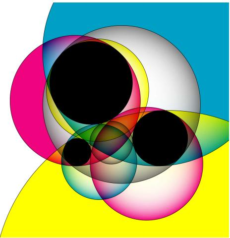  
https://commons.wikimedia.org/wiki/File:Apollonius8ColorMultiplyV2.svg

Note, there are 33 different combinatorial types of circle configurations to consider. For example, the original circles could all be the same or they could all be different but concentric. It is quite interesting that there is no way to get exactly 7 circles tangent to 3 given circles.

What other enumerative questions might you ask about common objects from geometry? For example, how many intersection points are there in the plane of two curves, one defined by a homogeneous polynomial of degree $d_{1}$ and one of degree $d_{2}$ ? A classical result known as Bézout's Theorem from 1779 gives a precise answer: either there are an infinite number of intersections or there are $d_{1}d_{2}$ intersection points, provided we count the intersection points with appropriate multiplicity. This type of product formula generalizes to counting intersection points for any $n$ hypersurfaces defined by homogeneous polynomials of degrees $d_{1},\ldots ,d_{n}$ . Another famous fact from classical algebraic geometry is that a smooth cubic surface contains exactly 27 lines; we will return to this result in Example 5.61. Yet another impressive number along these lines is 3264, which is the number of plane conics tangent to five general plane conics [114].

Hermann Cäsar Hannibal Schubert (1848-1911) was a German mathematician working in enumerative geometry. He was particularly interested in counting configurations of subspaces in given arrangements. The classic "Schubert problem" is:

How many lines in $\mathbb{R}^3$ intersect 4 given lines?

The possible answers are 0, 1, 2, or infinity. If three distinct lines intersect a given family of 4 lines, then there must be an infinite number of others because the position of the given family of lines is not generic (cf. Exercise 5.12). For example, if the 4 given lines lie in a plane, then an infinite number of other lines in that plane will intersect all 4. If you take 4 distinct parallel lines where three are in the $z = 0$ plane and one is the $z = 1$ plane, then there are no lines in $\mathbb{R}^3$ that go through all 4. However, this is again not the generic situation. In the generic situation, that answer is always 2. While this question was originally inspired by pure mathematical research, it also finds applications in modern day computer graphics [172].

More generally, Schubert was interested in testing when a family of linear spaces in certain relative positions was intersected by only a finite number of other linear spaces and determining the generic number of solutions. Today, we call these types of questions Schubert problems. These types of relative positions give rise to sets of matrices satisfying certain conditions on their determinantal minors as we will explain in detail below. His computations were all on paper, without computers, modern tools in mathematics, or the notation for matrices that we use today. How did he do it? It remains a mystery how Schubert accomplished as much as he did using the tools at his disposal. There was a sense among mathematicians of his day that the theory Schubert was developing was not rigorous enough to give formal algorithms.

One difficulty lies in properly interpreting the word "generic". Suppose we are trying to count the solutions to a polynomial system whose coefficients are themselves polynomials in some parameters, as in a Schubert problem. This number can, in principle, be determined by checking polynomial equations and inequalities in the parameters. For a simple example, the number of solutions to a linear system of equations—or more generally, the dimension of the solution space—is determined by the vanishing and nonvanishing of appropriate matrix minors. The subset of parameters where a polynomial equation holds will be strictly lower-dimensional, and so for almost every choice of parameters, none of the equations will hold. The number of solutions in this case is the generic number. For instance, as described above there will be exactly 2 lines intersecting 4 fixed lines in $\mathbb{R}^3$ unless the configuration of 4 lines

is degenerate in some way, and the degeneracy conditions can be expressed as polynomial equations in some parameters describing the lines.

Here is the trouble: Schubert's counting techniques relied on first choosing a special kind of configuration which is easier to work with. In our running example, if we choose two generic planes $P, Q \subseteq \mathbb{R}^3$ and generic lines $\ell_1, \ell_2 \subseteq P$ and $\ell_3, \ell_4 \subseteq Q$ , then it is easy to find two lines intersecting $\ell_1, \ldots, \ell_4$ , namely, the line $P \cap Q$ , and the line through the points $\ell_1 \cap \ell_2$ and $\ell_3 \cap \ell_4$ . However, it is completely unclear if this special configuration is actually generic in the required sense.

In 1900, David Hilbert famously summarized 10 major open problems in Mathematics at the Paris conference of the International Congress of Mathematicians (ICM) and published 23 problems in his follow-up article in the Bulletin of the American Mathematical Society [170]. Some information about the current status of these 23 turn of the 20th century problems is tracked on Wikipedia [369]. Among these influential problems was Hilbert's 15th problem.

# 15. RIGOROUS FOUNDATION OF SCHUBERT'S NUMERATIVE CALCULUS.

The problem consists in this: To establish rigorously and with an exact determination of the limits of their validity those geometrical numbers which Schubert † especially has determined on the basis of the so-called principle of special position, or conservation of number, by means of the enumerative calculus developed by him.

Although the algebra of to-day guarantees, in principle, the possibility of carrying out the processes of elimination, yet for the proof of the theorems of enumerative geometry decidedly more is requisite, namely, the actual carrying out of the process of elimination in the case of equations of special form in such a way that the degree of the final equations and the multiplicity of their solutions may be foreseen.

The problem of finding a "rigorous foundation of Schubert's enumerative calculus" is not as specific as, say, the Riemann Hypothesis (Problem 8). One can still debate if Hilbert's 15th problem is completely solved or not. In our attempt to explain the state of the art on solving Schubert-type problems, we will describe an algorithm by which one could in principle solve any given problem which is completely rigorous and has exact determination of the limits of its validity. Hence, we could say at this point that Hilbert's 15th problem is completely solved. That technology was a culmination of research over the 20th century. However, these problems are bumping into the limits of the computational hierarchy that has developed around the Millennium Problem of determining if $P = NP$ ? or other steps leading to the collapse of the polynomial hierarchy, which is considered by many experts to be highly unlikely. If Schubert was able to do some of his more impressive calculations by hand, then we must be missing something!

Schubert's calculus and Hilbert's 15th problem inspired many developments in singular homology, cohomology, de Rham cohomology, Chow rings, equivariant cohomology, quantum cohomology, intersection theory, cobordism, combinatorics, representation theory and beyond over the past 150 years. Over the years, vocabulary and methods have been developed that Schubert himself never used. Around 1960, roughly a century after Hermann Schubert first started working in this area, Bert Kostant named the corresponding sets of solutions to intersection conditions on linear spaces Schubert varieties. The notion has been generalized

far beyond the range of problems Schubert himself was working on. So, a warning to the reader is in order. One might need to ask ...

Honey, where are my Schubert varieties?

You will need to be mindful of the context for Schubert varieties. Are they in a Grassmannian manifold or a flag manifold or do they live in the setting of a classical Lie group, or an arbitrary Lie group, or a Kac-Moody group, etc. The context will require a change in the definition of a Schubert variety.

2.2. Solving Schubert Problems in 2000. A modern Schubert problem may be stated as follows.

What is the expected number of points in the intersection of a given family of Schubert varieties?

To solve a Schubert problem in the 21st century, one computes the product of two Schubert polynomials expanded in the basis of Schubert polynomials and extracts a particular coefficient of a basis element. This approach leads to explicit algorithms using linear algebra and avoids explicit computations of intersections and questions of genericity. However, these problems still become intractable in high dimensions even with modern computers. Narayanan has shown that Schubert problems are at least as hard as the computation class of $\# P$ problems [293], which includes hard problems such as counting the number of Hamiltonian cycles in a graph and finding the number of solutions to a binary linear optimization problem.

The goal of this essay is a Revisionist History of Schubert problems, how to solve them in the 21st century, and what it continues to inspire. We will follow a different presentation path than what is considered the standard approach in the literature. The standard approach would begin with the work of Bernstein-Gelfand-Gelfand [28] and Demazure [100] introducing divided difference operators, the definition of Schubert polynomials via the divided difference recurrence due to Lascoux-Schützenberger [250], follow Macdonald's "Notes on Schubert Polynomials" [265], and arrive at the modern approach to solving Schubert problems. Instead, in Section 3 and Section 4, we will follow Monk's earlier approach to solving Schubert problems more directly as intersection problems on Schubert varieties [288], which naturally could have led to the Lascoux-Schützenberger transition equations for defining Schubert polynomials, and their visualizations using pipe dreams or the most recent tool bumpless pipe dreams, and then we will prove the divided difference recurrence as an easy consequence of this approach in Section 4.2. We believe this nonstandard approach will be more intuitive and constructive for the readers. Along the way, we will define Schubert varieties in a few different contexts. We will survey some of the beautiful known results on Schubert structure constants and related combinatorics. The last section returns to the geometry of Schubert varieties, the exact equations defining them as projective varieties, finding their singular loci, and some of the connections to Kazhdan-Lusztig theory.

It is encouraged that readers do computations by hand and computer as you read this chapter. There are some computer packages available to help you get started coding in Macaulay 2 [5] and Sage [351].

# 3. INTRODUCTION TO FLAG VARIETIES AND SCHUBERT VARIETIES

This section lays out the basic definitions and notation that we will need. It builds on the ideas in Fulton's book on "Young Tableaux: With Applications to Representation Theory and Geometry" [136, Part 3]. More information on these topics can also be found in [37, 151, 228, 231, 230, 265, 270]. See also a video version of this chapter given by the first author in 2021 at an online conference at ICERM [49].

We do expect the readers to be familiar with some linear algebra, combinatorics, and algebraic geometry. Some excellent references along these lines include the book by Cox, Little and O'Shea entitled "Ideals, Varieties, and Algorithms: An Introduction to Computational Algebraic Geometry and Commutative Algebra," Richard Stanley's "Enumerative Combinatorics, Volumes 1 and 2," and Gilbert Strang's book "Introduction to Linear Algebra" [98, 349, 348, 354].

3.1. Complete Flags. We begin with the basic definitions of flags in a complex $n$ -dimensional vector space, their matrix representations, and the intuitive pictures we have in mind. The field of complex numbers can be replaced with other fields, but there are places where we are assuming the field has characteristic zero and other places where we need the field to be algebraically closed. For this level of exposition, we do not want to distract the reader with some of these subtleties.

Definition 3.1. Fix a positive integer $n$ . A complete flag $F_{\bullet} = (F_1 \subset \dots \subset F_n)$ in $\mathbb{C}^n$ is a nested sequence of subspaces such that $\dim(F_i) = i$ for $1 \leq i \leq n$ . A complete flag $F_{\bullet}$ is determined by an ordered basis $(f_1, f_2, \ldots, f_n)$ where $F_i = \operatorname{span}\langle f_1, \ldots, f_i \rangle$ . Let $\operatorname{Fl}(n)$ denote the complete flag variety, which is the set of all complete flags in $\mathbb{C}^n$ .

More generally, given any subset $\mathbf{d} = \{d_1 < \dots < d_m\} \subseteq [n - 1]$ , a partial flag with dimensions $\mathbf{d}$ is a sequence of subspaces $F_{1} \subset \dots \subset F_{m} \subseteq \mathbb{C}^{n}$ with $\dim F_i = d_i$ . Our main focus is on the complete flags, so unless otherwise specified a "flag" means a complete flag.

Example 3.2. If $n = 4$ , let $(e_1, e_2, e_3, e_4)$ be the standard ordered basis where $e_i$ has a 1 in the $i^{th}$ coordinate and 0's elsewhere. The corresponding standard flag is denoted $E_{\bullet} = (E_1, E_2, E_3, E_4)$ where each subspace $E_i$ is the span of $e_1, \ldots, e_i$ . The ordered basis

$$
\left(6 e _ {1} + 3 e _ {2}, \quad 4 e _ {1} + 2 e _ {3}, \quad 9 e _ {1} + e _ {3} + e _ {4}, \quad e _ {2}\right)
$$

determines another flag $F_{\bullet} = (F_1 \subset F_2 \subset F_3 \subset F_4) \in \mathrm{Fl}(4)$ where $F_1$ is the 1-dimensional subspace containing the origin and the point $6e_1 + 3e_2$ , $F_2$ is the 2-dimensional subspace containing $F_1$ and the point $4e_1 + 2e_3$ , $F_3$ is the 3-dimensional subspace containing $F_2$ and the point $9e_1 + e_3 + e_4$ , and $F_4 = \mathbb{C}^4$ . The reader should verify that these four vectors are independent so each subspace $F_i$ has dimension $i$ .

Every 1-dimensional subspace of $\mathbb{C}^n$ can be thought of as a line through the origin. Every 2-dimensional subspace can be thought of as a plane containing the origin. It is already hard to visualize planes in say, $\mathbb{C}^4$ , which is an 8-dimensional space. Intuitively, we prefer to think about $\mathbb{R}^2$ or $\mathbb{R}^3$ . However, that will still limit our intuition to small dimensions. One additional trick that allows us to visualize flags in $\mathbb{R}^4$ is to identify its linear subspaces by their intersection with a fixed hyperplane at some distance from the origin. The hyperplane is a flat 3-dimensional real object. A typical line through the origin meets the fixed hyperplane in exactly one point. We can ignore the case of a line being parallel to our chosen hyperplane by perturbing it a little bit if necessary. Every 2-dimensional subspace containing the origin in

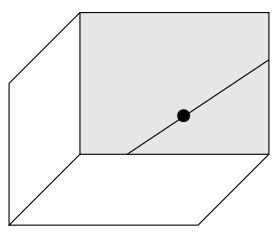  
FIGURE 1. Projective representation of a flag in $\mathbb{R}^4$ as a point on a line in a plane, which is spanned by one wall of a shoebox.

$\mathbb{R}^4$ meets the hyperplane in a line. Every 3-dimensional subspace of $\mathbb{R}^4$ meets the hyperplane in a plane. Therefore, drawn projectively, a flag in $\operatorname{Fl}(4)$ is a point, on a line, in a plane, contained in one side of a shoebox, which represents $\mathbb{C}^4$ projected on the fixed hyperplane. See Figure 1. A point, on a line, in a plane is reminiscent of a flag on a flag pole such as we see in Figure 2, hence the name "flag".2

  
FIGURE 2. A flag on a flag pole. Go Schubert Team!

For each pair of flags, we can consider how their subspaces relate to each other. We can classify such pairs according to the intersection table of dimensions of the $i^{th}$ subspace in the first flag intersected with the $j^{th}$ subspace of the second flag. For example, again in $n = 4$ , consider a flag $B_{\bullet}$ drawn in black and $R_{\bullet}$ drawn in red as in Figure 3. The tables of dimensions $\dim(B_i \cap R_j)$ are shown below each shoebox drawing. Think of these drawings as planes cutting through a box with a chosen special line and plane. $^3$ The first pair is in the most general position, and they get successively more specialized in the sense that there are more incidences between the components of the flags.

Recall that every complete flag $F_{\bullet}$ can be represented by an ordered basis $(f_1, f_2, \ldots, f_n)$ . In turn, every ordered basis of $\mathbb{C}^n$ can be represented by an $n \times n$ complex invertible matrix in $GL_n(\mathbb{C})$ . However, there are many different ordered bases that represent the same flag, so we need to spell out our conventions carefully. Assume there is a fixed standard ordered basis $(e_1, e_2, \ldots, e_n)$ of $\mathbb{C}^n$ and the $f_j$ 's are expressed in the standard basis as $f_j = \sum_{i=1}^{n} m_{i,j} e_i$ . The column-wise matrix associated to an ordered basis $(f_1, f_2, \ldots, f_n)$ is the matrix $M = M(f_1, f_2, \ldots, f_n) = (m_{i,j}) \in GL_n(\mathbb{C})$ . The coefficients of the $f_j$ 's expressed in terms of the $e_i$ 's become the columns of the matrix. If we rescale a column of $M$ by a nonzero complex number, the new matrix would represent the same complete flag. Furthermore, we could add any linear combination of columns $1, 2, \ldots, i$ to column $i+1$ and again the new matrix would again represent the same flag $F_{\bullet}$ . Thus, an infinite number of different matrices in $GL_n(\mathbb{C})$ represent the same complete flag.

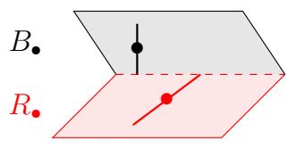

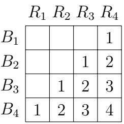

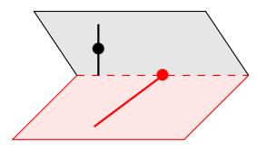

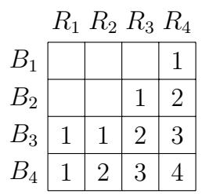

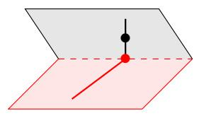

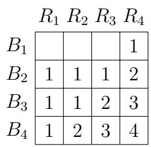  
FIGURE 3. Pairs of flags in 3 different relative positions along with their intersection tables. The rows and columns are labeled the same way in each case. The zero-dimensional intersections are represented by empty cells in these tables for ease of reading.

Continuing with Example 3.2, the flag

$$
F _ {\bullet} = \left(6 e _ {1} + 3 e _ {2}, 4 e _ {1} + 2 e _ {3}, 9 e _ {1} + e _ {3} + e _ {4}, e _ {2}\right)
$$

can be represented by the matrices

$$
\left[ \begin{array}{l l l l} 6 & 4 & 9 & 0 \\ 3 & 0 & 0 & 1 \\ 0 & 2 & 1 & 0 \\ 0 & 0 & 1 & 0 \end{array} \right] \sim \left[ \begin{array}{l l l l} 2 & 2 & 9 & - 2 \\ 1 & 0 & 0 & 0 \\ 0 & 1 & 1 & 0 \\ 0 & 0 & 1 & 0 \end{array} \right] \sim \left[ \begin{array}{l l l l} 2 & 2 & 7 & 1 \\ 1 & 0 & 0 & 0 \\ 0 & 1 & 0 & 0 \\ 0 & 0 & 1 & 0 \end{array} \right]. \tag {3.1}
$$

Hence, $F_{\bullet}$ also can be determined by the ordered bases

$$
\left(2 e _ {1} + e _ {2}, \quad 2 e _ {1} + e _ {3}, \quad 9 e _ {1} + e _ {3} + e _ {4}, \quad - 2 e _ {1}\right)
$$

or

$$
\left(2 e _ {1} + e _ {2}, 2 e _ {1} + e _ {3}, 7 e _ {1} + e _ {4}, e _ {1}\right).
$$

Let $B$ be the set of upper triangular matrices in $GL_{n}(\mathbb{C})$ , and let $B_{-}$ be the set of lower triangular matrices in $GL_{n}(\mathbb{C})$ . Let $w_{0} = [n, n - 1, n - 2, \ldots, 1]$ be the permutation that reverses the normal order on $\{1, 2, \ldots, n\}$ . We can represent $w_{0}$ as the matrix with 1's along the antidiagonal and 0's elsewhere. Then, $B = w_{0}B_{-}w_{0}$ . Both subgroups are called Borel subgroups, hence the standard notation is to use the letter $B$ . In general, a Borel subgroup of a linear algebraic group like $GL_{n}$ is a maximal closed, connected, solvable algebraic subgroup. We won't need the full generality of Borel subgroups in this chapter, but they do play a key role in the theory of flag varieties more broadly. Choosing a Borel subgroup is on par with choosing an ordered basis for $\mathbb{C}^{n}$ .

Exercise 3.3. Given a complete flag $F_{\bullet}$ represented by the ordered basis $(f_1, f_2, \ldots, f_n)$ , let $M = M(f_1, f_2, \ldots, f_n) \in GL_n(\mathbb{C})$ . Then, the set of all matrices in $GL_n(\mathbb{C})$ that represent the same flag $F_{\bullet}$ are exactly the matrices of the form $Mb$ for $b \in B$ .

By Exercise 3.3, the set of all complete flags in $\operatorname{Fl}(n)$ are in bijection with the cosets in $GL_n(\mathbb{C}) / B$ . Therefore, some authors write $GL_{n} / B$ instead of $\operatorname{Fl}(n)$ to denote the complete

flag variety. More generally, $G / B$ might refer to the complete flags or to the cosets of another linear algebraic group $G$ such as $SL_n$ , $Sp_{2n}$ or $O_n$ modulo a Borel subgroup. We will stick with $G = GL_n(\mathbb{C})$ in this chapter, and will simply write $\mathrm{GL}_n$ unless we explicitly want a different field or to emphasize the field $\mathbb{C}$ .

It is always beneficial in any mathematical and/or computational setting to choose a canonical representative of each object in question. This helps us determine when two objects are equal. For example, we could verify 6/14 and 1047/2443 are equal by reducing both to their canonical representative 3/7. We use Gaussian elimination as the guide to finding such a canonical representative for a flag, but we must be mindful not to change the flag!

To perform column reduction on a matrix $M$ that represents a flag, one can do a sequence of elementary column operations of the form:

- multiply column $j$ by a nonzero complex number, or   
- add a nonzero multiple of column $i$ to column $j$ for $i < j$ .

The first type of elementary operation can be executed by multiplying $M$ on the right by a diagonal matrix with 1's in every entry except $(j,j)$ which is the nonzero complex number. The second type of elementary operation can be executed by multiplying $M$ on the right by an upper triangular matrix with 1's along the diagonal, a nonzero value in position $(i,j)$ , and 0's everywhere else. The group these two types of matrices generate is exactly the Borel subgroup $B$ of invertible upper triangular matrices. Note, we cannot swap two columns of $M$ without changing the flag, so we may not be able to do the full reduction to the column echelon form for $M$ . However, every matrix representing a flag $F_{\bullet}$ will result in the same matrix after column reduction.

Definition 3.4. A canonical matrix in $GL_{n}$ is one that is column-reduced, so it has exactly one pivot 1 in each row and column, 0's below each pivot 1, and 0's to the right of each pivot 1. Let $M(F_{\bullet})$ denote the canonical matrix representing a flag $F_{\bullet}$ .

Continuing Example 3.2, the canonical matrix representing $F_{\bullet}$ is the simplest matrix in (3.1), namely

$$
M \left(6 e _ {1} + 3 e _ {2}, \quad 4 e _ {1} + 2 e _ {3}, \quad 9 e _ {1} + e _ {3} + e _ {4}, \quad e _ {2}\right) = \left[ \begin{array}{c c c c} 2 & 2 & 7 & 1 \\ 1 & 0 & 0 & 0 \\ 0 & 1 & 0 & 0 \\ 0 & 0 & 1 & 0 \end{array} \right]. \tag {3.2}
$$

The pivot 1's are in positions $(2,1),(3,2),(4,3),(1,4)$

Consider the following random experiment on a computer. Fill an $8 \times 8$ matrix $M$ with random real numbers between 0 and 1. Since the determinant is a degree 8 polynomial in the 64 entries, $\operatorname{det}(M)$ will almost surely not be zero. Therefore, $M$ is almost surely invertible so it will correspond to a flag $F_{\bullet}$ in $\mathrm{Fl}(8)$ . Furthermore, the (8,1) entry of the chosen matrix is almost surely not 0, so $F_{1} \not\subset E_{i}$ for any $i < 8$ and the column reduced matrix will have a 1 in position (8,1) after rescaling and 0's to its right. Similarly, the lower left $2 \times 2$ submatrix of the matrix will almost surely be invertible so the (7,2) entry of the canonical matrix of $F_{\bullet}$ will be a pivot 1 with 0's to its right. In fact, every lower left submatrix of $M$ is almost surely invertible. Thus, the canonical matrix of $F_{\bullet}$ will almost surely be in the column-reduced form

$$
\left[ \begin{array}{c c c c c c c c} * & * & * & * & * & * & * & 1 \\ * & * & * & * & * & * & 1 & 0 \\ * & * & * & * & * & 1 & 0 & 0 \\ * & * & * & * & 1 & 0 & 0 & 0 \\ * & * & * & 1 & 0 & 0 & 0 & 0 \\ * & * & 1 & 0 & 0 & 0 & 0 & 0 \\ * & 1 & 0 & 0 & 0 & 0 & 0 & 0 \\ 1 & 0 & 0 & 0 & 0 & 0 & 0 & 0 \end{array} \right] \tag {3.3}
$$

with the stars replaced by real numbers. If we could choose an $8 \times 8$ matrix of complex numbers uniformly at random, we would see the same type of canonical matrix with the stars replaced by complex numbers. Such an experiment, if it could be done, would produce a generically chosen flag. However, we cannot choose a flag uniformly at random this way since there is no way to even choose a single complex number uniformly at random. See Exercise 3.7 for one approach to randomly generating flags. On the other hand, a less generic flag may have canonical matrix of the form

$$
\left[ \begin{array}{c c c c c c c c} * & * & * & * & * & * & * & 1 \\ * & * & 1 & 0 & 0 & 0 & 0 & 0 \\ * & * & 0 & * & * & 1 & 0 & 0 \\ 1 & 0 & 0 & 0 & 0 & 0 & 0 & 0 \\ 0 & * & 0 & * & * & 0 & 1 & 0 \\ 0 & 1 & 0 & 0 & 0 & 0 & 0 & 0 \\ 0 & 0 & 0 & * & 1 & 0 & 0 & 0 \\ 0 & 0 & 0 & 1 & 0 & 0 & 0 & 0 \end{array} \right]. \tag {3.4}
$$

Observe from the definition of the canonical matrix representing $F_{\bullet}$ that the pivot 1's in $M(F_{\bullet})$ form a permutation matrix. Which permutation is associated to a given set of pivot 1's? Again we have some choices about how we label the corresponding permutation matrix using an ordered list of the numbers $1,2,\ldots ,n$ . Let's take a step back to review some terminology on permutations before we make that choice.

Exercise 3.5. There are at least 8 natural ways to label a permutation matrix using an ordered list on $\{1,2,\ldots ,n\}$ . These labels correspond with taking any combination of the three bijections $w\rightarrow w^{-1}$ , $w\rightarrow w_0w$ , and $w\rightarrow ww_{0}$ . What does each of the corresponding 8 bijections do to a permutation matrix in terms of rotation, reflection, etc? How would you label the permutation matrix with 1's in the positions shown in the matrix in (3.4)?

Exercise 3.6. Prove that every complete flag in $\mathbb{C}^n$ can be represented by an $n\times n$ unitary matrix. Furthermore, there is a bijection between $GL_{n}(\mathbb{C}) / B$ and $\mathrm{U}_n / T$ . Here $\mathrm{U}_n$ is the set of $n\times n$ unitary matrices and $T$ is the $n\times n$ diagonal unitary matrices. Therefore, $\operatorname {Fl}(n)$ naturally forms a compact topological space.

Exercise 3.7. [103] Let $A, B$ be independent random variables with the standard normal distribution. Let $M$ be an $n \times n$ matrix with entries given by $n^2$ independent samples drawn from $A + Bi$ . Let $F_{\bullet}(M)$ be the random flag determined by $M$ . What is the corresponding distribution on $\operatorname{Fl}(n)$ ?

3.2. Permutations. Permutations are fundamentally bijections on the set of numbers $[n] := \{1, 2, \ldots, n\}$ to itself, or shuffles of a deck of cards, or seating assignments on a full airplane given a numbering of the seats and passengers, etc. One may represent a permutation $w: [n] \to [n]$ in one-line notation as $w = [w(1), w(2), \ldots, w(n)] = [w_1, \ldots, w_n]$ or just $w_1w_2 \ldots w_n$ in examples where $n < 10$ so the commas are not needed. An ascent in $w$ is a position $i$ such that $w(i) < w(i + 1)$ , and a descent in $w$ is a position $i$ such that $w(i) > w(i + 1)$ . More generally, an inversion in $w$ is a pair of positions $(i,j)$ such that $i < j$ and $w(i) > w(j)$ . If $i < j$ and $w(i) < w(j)$ , then $(i,j)$ is a non-inversion. Let

- $\operatorname{inv}(w) = \# \{(i,j) \in [n]^2 \mid i < j, w(i) > w(j)\}$ be the number of inversions in $w$ , and   
- $\operatorname{des}(w) = \# \{i \in [n - 1] \mid w(i) > w(i + 1)\}$ be the number of descents in $w$ .

The set of all permutations on $[n]$ is the symmetric group $S_{n}$ . By an easy counting argument, there are $n!$ permutations in $S_{n}$ . There are two $q$ -analogs of $n!$ that have inspired a wealth of research over the past century going back to Euler and MacMahon,

$$
A _ {n} (q) := \sum_ {w \in S _ {n}} q ^ {\operatorname {d e s} (w)}
$$

and

$$
[ n ] _ {q}! := \sum_ {w \in S _ {n}} q ^ {\operatorname {i n v} (w)} = \prod_ {k = 1} ^ {n - 1} \left(1 + q + q ^ {2} + \dots + q ^ {k}\right). \tag {3.5}
$$

The Eulerian polynomials $A_{n}(q)$ are so rich in structure that Kyle Petersen [304] wrote a 456 page book about them! The standard $q$ -analog of $n!$ given by $[n]_q!$ is much more important in the context of flags as we shall see.

Multiplication in the symmetric group is given by function composition $v \circ w : [n] \to [n]$ , so

$$
v w = \left[ v (w (1)), v (w (2)), \dots , v (w (n)) \right] \tag {3.6}
$$

in one-line notation for permutations $v, w \in S_n$ . This rule is not commutative. For example [1, 3, 2][2, 1, 3] = [3, 1, 2] while [2, 1, 3][1, 3, 2] = [2, 3, 1]. Let $t_{ij}$ be the permutation in $S_n$ that swaps $i$ and $j$ and fixes all other elements in $[n]$ as a bijection. Then, the one-line notation of $vt_{ij}$ for $i < j$ is

$$
v t _ {i j} = \left[ v _ {1}, \dots , v _ {i - 1}, v _ {j}, v _ {i + 1}, \dots , v _ {j - 1}, v _ {i}, v _ {j + 1}, \dots , v _ {n} \right].
$$

The permutations $t_{ij}$ are called transpositions and they play a critical role in the theory that follows. Among the transpositions are the simple transpositions $s_i = t_{i,i+1}$ for $1 \leq i \leq n$ . The simple transpositions are a minimal set of generators for all of $S_n$ with the relations

$$
\begin{array}{l l} s _ {i} ^ {2} = \mathrm {i d}, \\ s _ {i} s _ {j} = s _ {j} s _ {i} & \text {f o r a l l} | i - j | \geq 2, \\ s _ {i} s _ {i + 1} s _ {i} = s _ {i + 1} s _ {i} s _ {i + 1} & \text {f o r a l l} 1 \leq i \leq n - 2. \end{array} \tag {3.7}
$$

We encourage the reader to check these relations hold. Proving these relations generate all possible relations among the simple transpositions is more difficult. See [52, 184] for details.

Let $M_w$ be the permutation matrix for $w \in S_n$ , so $M_w$ has a 1 in position $(w_j, j)$ for each $j \in [n]$ and 0's everywhere else. For example,

$$
M _ {[ 4, 2, 6, 1, 3, 5 ]} = \left[ \begin{array}{l l l l l l} 0 & 0 & 0 & 1 & 0 & 0 \\ 0 & 1 & 0 & 0 & 0 & 0 \\ 0 & 0 & 0 & 0 & 1 & 0 \\ 1 & 0 & 0 & 0 & 0 & 0 \\ 0 & 0 & 0 & 0 & 0 & 1 \\ 0 & 0 & 1 & 0 & 0 & 0 \end{array} \right].
$$

The canonical matrices shown in (3.4) have the pivot 1's in the same positions as the permutation matrix $M_{[4,6,2,8,7,3,5,1]}$ .

The transpose of $M_w$ is the permutation matrix for $w^{-1}$ . Matrix multiplication agrees with permutation multiplication in the sense that $M_vM_w = M_{vw}$ . The identity matrix corresponds with the identity permutation mapping each value $i$ to itself. The reader should verify each of these claims about the group structure of matrices and permutations.

Remark 3.8. We note that some authors use the transpose matrix instead of $M_w$ . We chose this convention so that matrix multiplication agrees with permutation multiplication, while $M_w^{-1}M_v^{-1} = M_x^{-1}$ flips the order if $vw = x$ .

Permutations can be described in many other ways in addition to one-line notation and permutation matrices. Here are some of the most important ways in the context of flag varieties. You may want to look ahead at Example 3.9 and Table 1 for a preview.

The northwest rank table $rk(w)$ is obtained from $w$ by setting

$$
\operatorname {r k} (w) [ i, j ] = \# \{h \in [ j ] \mid w (h) \leq i \}. \tag {3.8}
$$

The value $\mathrm{rk}(w)[i,j]$ is the rank of the northwest submatrix of $M_w$ with upper left corner $(1,1)$ and lower right corner $(i,j)$ . One could similarly compute the southwest, northeast, or southeast rank table for a permutation.

A string diagram of a permutation $w$ is a braid with the strings proceeding from the initial order to the permuted order given by $w = w_{1}w_{2}\dots w_{n}$ in such a way that no three strings cross at any point; see Example 3.9. A wiring diagram is a more rigidly drawn string diagram with exactly one crossing in each row and piecewise straight strings, or you may see such diagrams transposed to save space on paper as in Figure 20. Reading the rows from top to bottom, we can associate a reduced word to a wiring diagram by labeling each crossing with one more than the number of strings to its left. A permutation can have many reduced words. For 321, there are two reduced words (1,2,1) and (2,1,2) corresponding to the two minimal length expressions for $321 = s_{1}s_{2}s_{1} = s_{2}s_{1}s_{2}$ using the simple transpositions. All reduced words for $w$ have the same length, denoted $\ell(w)$ . Furthermore, the length of $w$ is equal to the number of inversions for $w$ ,

$$
\ell (w) = \operatorname {i n v} (w) = \# \left\{(i, j) \in [ n ] ^ {2} \mid i <   j, w (i) > w (j) \right\}. \tag {3.9}
$$

Note, $\ell(w)$ is a number between 0 and $\binom{n}{2}$ for any permutation in $S_{n}$ . The longest permutation in $S_{n}$ is the unique permutation $w_{0} = [n, n-1, \ldots, 2, 1]$ with $\ell(w_{0}) = \binom{n}{2}$ . The identity permutation, denoted $\mathrm{id} = [1, 2, \ldots, n]$ , is the unique permutation in $S_{n}$ with length equal to 0. In the context of Schubert varieties, $\ell(w)$ is more common than $\operatorname{inv}(w)$ so we will use that notation in this chapter unless we want to emphasize the connection with inversions.

The diagram of a permutation $w$ is obtained from the matrix of $w^{-1}$ by removing all cells in an $n \times n$ array which are weakly to the right or below a 1 in $w^{-1}$ . The remaining cells form the diagram $D(w)$ . See Figure 4. Thus,

$$
D (w) = \{(i, j) \in [ n ] ^ {2} \mid j <   w (i) \text {a n d} i <   w ^ {- 1} (j) \}. \tag {3.10}
$$

Equivalently, the cells of $D(w)$ are in bijection with the inversions of $w$ , so

$$
D (w) = \{(i, w (j)) \in [ n ] ^ {2} \mid i <   j \text {a n d} w (i) > w (j) \}. \tag {3.11}
$$

It is unfortunate that the diagram is defined in terms of $w^{-1}$ , but that is the most common convention in the literature [265]. Sometimes $D(w)$ is called the Rothe diagram of $w$ .

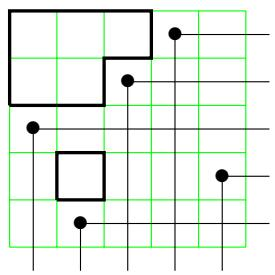  
FIGURE 4. The diagram of $w = 43152$ is the set of outlined cells, so $D(w) = \{(1,1), (1,2), (1,3), (2,1), (2,2), (4,2)\}$ .

One more notation for a permutation $w \in S_n$ is its Lehmer code, or simply its code, which is the $n$ -tuple

$$
c (w) = \left(c (w) _ {1}, c (w) _ {2}, \dots , c (w) _ {n}\right) \tag {3.12}
$$

where $c(w)_i$ denotes the number of inversions $(i,j)$ with first coordinate $i$ , or equivalently, $c(w)_i$ is the number of boxes on row $i$ of $D(w)$ . Note, $0 \leq c(w)_i \leq n - i$ for all $1 \leq i \leq n$ . Hence, the Lehmer code gives a natural bijection between $S_n$ and the product of sets $[n] \times [n - 1] \times \dots \times [2] \times [1]$ .

Example 3.9. For the permutation $w = [2,3,4,1]$ , we have the following equivalent representations of $w$ shown in Table 1.

TABLE 1. Eight different ways to represent the same permutation 2341   

<table><tr><td>2341
one-line notation</td><td>[1 2 3 4]
2 3 4 1] 
two-line notation</td><td>(1,2,3) 
reduced word</td><td>(1,1,1,0)
code</td></tr><tr><td>[0 0 0 1]
1 0 0 0
0 1 0 0
0 0 1 0] 
matrix notation</td><td>[0 0 0 1]
1 1 1 2
1 2 2 3
1 2 3 4] 
rank table</td><td>Rothe diagram</td><td>1 2 3 4
2 3 4 1
string diagram</td></tr></table>

Example 3.10. Try drawing the permutation diagram for 83617254 for yourself. Then observe that the stars in the canonical matrices given in (3.4) appear exactly in the positions corresponding with the diagram of $D(83617254)$ and $[4, 6, 2, 8, 7, 3, 5, 1]^{-1} = [8, 3, 6, 1, 7, 2, 5, 4]$ .

Another crucial concept that appears everywhere in Schubert calculus is pattern avoidance. See Section 5.5 and several of the other chapters in this book for more applications of pattern avoidance and variations on that theme.

Definition 3.11. A permutation $w \in S_n$ contains the pattern $\pi \in S_k$ if there exists indices $1 \leq a_1 < a_2 < \dots < a_k \leq n$ such that $w(a_i) < w(a_j)$ if and only if $\pi(i) < \pi(j)$ for all $1 \leq i < j \leq k$ . We say that $w \in S_n$ avoids $\pi \in S_k$ if $w$ does not contain the pattern $\pi$ .

In other words, $w$ contains the pattern $\pi$ if in one-line notation, there exists a (not necessarily consecutive) subsequence of $w$ with the same relative ordering as $\pi$ . One can also think of a pattern $\pi$ in $w$ as a submatrix of the matrix $M_w$ .

Example 3.12. The permutation $w = 625431$ contains the subsequence 6231 which has the same inversion set as 4231, so $w$ contains a 4231 pattern. However, $w$ avoids the patterns 2143 and 3412.

The early history of permutation pattern avoidance goes back to MacMahon [266], Knuth [205], Tarjan [356], and Pratt [314]. An early result shows that for every $\pi \in S_3$ , the number of permutations in $S_n$ avoiding $\pi$ equals $\frac{1}{n+1}\binom{2n}{n}$ , the $n^{th}$ Catalan number [266, 336].

Exercise 3.13 (Exchange Lemma). Use string diagrams to prove that if $(a_{1}, a_{2}, \ldots, a_{p})$ and $(b_{1}, b_{2}, \ldots, b_{p})$ are both reduced words for $w \in S_{n}$ , then there exists an $i$ such that $(a_{1}, b_{1}, \ldots, \widehat{b}_{i}, \ldots, b_{p})$ is also a reduced word for $w$ .

Exercise 3.14 (Tits/Matsumoto Theorem). Let $G_w$ be the graph on all reduced words for $w$ with edges connecting two words if they differ by a commutation relation $s_i s_j = s_j s_i$ or braid relation $s_i s_{i+1} s_i = s_{i+1} s_i s_{i+1}$ (3.7). Prove $G_w$ is connected.

Exercise 3.15. [357, P0062] A permutation $w \in S_n$ is Grassmannian if it has at most one descent. What set of patterns characterize the Grassmannian permutations?

Exercise 3.16. [357, P0063] We say $w$ is bigrassmannian if both $w$ and $w^{-1}$ are Grassmannian. What set of permutation patterns characterizes the bigrassmannian permutations? How can you characterize them in terms of their Rothe diagrams? See Remark 3.103 for applications.

Exercise 3.17. Describe how $w \in S_n$ can be recovered from its rank table, string diagram, Rothe diagram, or its inversion set.

Exercise 3.18. Prove Equation (3.5) using the bijection between permutations and their Lehmer codes, so

$$
[ n ] _ {q}! := \sum_ {w \in S _ {n}} q ^ {\mathrm {i n v} (w)} = \prod_ {k = 1} ^ {n - 1} (1 + q + q ^ {2} + \dots + q ^ {k}).
$$

Exercise 3.19. For $w \in S_n$ , fill the cells in $D(w)$ with positive integers as follows. For each $1 \leq i \leq n$ , starting with the leftmost cell in row $i$ , fill the cells from left to right consecutively with values $i, i + 1, i + 2, \ldots$ . Prove that the word obtained by reading along the rows from top to bottom, right to left is a reduced word for $w$ . In fact, it is the largest reduced word for $w$ in reverse lexicographic order.

One fun fact about Lehmer codes is that they determine the positions of the permutations in $S_{n}$ when written out in lexicographic order. We leave this as an exercise for the reader.

Exercise 3.20. Let $L_{n} = (w^{(0)}, w^{(1)}, \ldots, w^{(n! - 1)})$ be the list of all permutations in $S_{n}$ in lexicographic order, so $w^{(0)}$ is the identity and $w^{(n! - 1)}$ is the longest permutation $w_{0}$ . For $w \in S_{n}$ with Lehmer code $c(w) = (c_{1}, c_{2}, \ldots, c_{n})$ , show that $w = w^{(j)}$ for $j = \sum c_{i}(n - i)!$ .

3.3. Schubert Cells and Schubert Varieties. Recall that we have chosen a fixed ordered basis $(e_1, e_2, \ldots, e_n)$ for $\mathbb{C}^n$ to bijectively identify $\operatorname{Fl}(n)$ with $GL_n / B$ . Let $E_{\bullet} = (E_1, E_2, \ldots, E_n)$ be the flag that corresponds with this fixed ordered basis, so $E_i$ is spanned by $\{e_1, e_2, \ldots, e_i\}$ . Each flag $F_{\bullet}$ has a position relative to this fixed flag, which is determined by the matrix of values $\dim(E_i \cap F_j)$ . By considering the canonical matrix representative of $F_{\bullet}$ , we observe that such a table is always the rank table of some permutation $w \in S_n$ , so we write position $(E_{\bullet}, F_{\bullet}) = w$ . The flags $E_{\bullet}, F_{\bullet}$ are in transverse position or general position if position $(E_{\bullet}, F_{\bullet}) = w_0$ .

A table of intersection dimensions is reminiscent of the Schubert problems we discussed in the introduction. We could ask which other flags intersect the subspaces $E_1, E_2, \ldots, E_n$ in the same table of intersection dimensions? This gives rise to the concept of a Schubert cell in the complete flag variety and its closure which is called a Schubert variety. We spell out the details and give examples below.

Definition 3.21. For a permutation $w \in S_n$ , the Schubert cell $C_w(E_\bullet) \subset \mathrm{Fl}(n)$ is the set of all flags $F_\bullet$ with position $(E_\bullet, F_\bullet) = w$ . Equivalently, we can write $C_w(E_\bullet)$ using the northwest rank table of $w$ as

$$
C _ {w} (E _ {\bullet}) = \left\{F _ {\bullet} \in \operatorname {F l} (n) \mid \dim (E _ {i} \cap F _ {j}) = \operatorname {r k} (w) [ i, j ] \text {f o r a l l} 1 \leq i, j \leq n \right\}.
$$

If the fixed flag is clear from context, we may write $C_w$ instead of $C_w(E_\bullet)$ .

Note, each permutation $w \in S_n$ gives rise to a special flag $w_\bullet$ given by the ordered basis $(e_{w(1)}, e_{w(2)}, \ldots, e_{w(n)})$ . The matrix corresponding to $w_\bullet$ is the permutation matrix $M_w$ , which is in canonical form. By definition, $w_\bullet \in C_w(E_\bullet)$ , so each Schubert cell is nonempty.

Example 3.22. Identifying the flag from Example 3.2 with its canonical matrix shown in (3.2), we have

$$
F _ {\bullet} = \left[ \begin{array}{c c c c} 2 & 2 & 7 & ① \\ ① & 0 & 0 & 0 \\ 0 & ① & 0 & 0 \\ 0 & 0 & ① & 0 \end{array} \right] \in C _ {2 3 4 1} = \left\{\left[ \begin{array}{c c c c} x & y & z & 1 \\ 1 & 0 & 0 & 0 \\ 0 & 1 & 0 & 0 \\ 0 & 0 & 1 & 0 \end{array} \right]: x, y, z \in \mathbb {C} \right\} \subset G L _ {4} / B.
$$

The $x, y, z$ variables parameterize the Schubert cell $C_{2341}$ : every choice of complex numbers for these 3 variables gives rise to a distinct flag in $C_{2341}$ . Here $F_{\bullet}$ is the flag with ordered basis $(2e_1 + e_2, 2e_1 + e_3, 7e_1 + e_4, e_1)$ . We see $F_1$ is spanned by $2e_1 + e_2$ so $E_1 \cap F_1$ is just the origin and $F_1 \subset E_2$ so $\dim(E_1 \cap F_1) = 0$ and $\dim(E_i \cap F_1) = 1$ for all $i \geq 2$ . We can similarly compute $\dim(E_i \cap F_j)$ for all $1 \leq i, j \leq 4$ which is the rank table for $w = 2341$ ,

$$
\left[ \begin{array}{l l l l} 0 & 0 & 0 & 1 \\ 1 & 1 & 1 & 2 \\ 1 & 2 & 2 & 3 \\ 1 & 2 & 3 & 4 \end{array} \right]. \tag {3.13}
$$

Every other flag with the same table of intersection dimensions with $E_{\bullet}$ is also in the Schubert cell $C_{2341}(E_{\bullet})$ . One could think of $C_w(E_{\bullet})$ as the equivalence class of flags in the same position $w$ with respect to $E_{\bullet}$ . Each equivalence class is determined by a set of incidence relations. We can visualize the equivalence class $C_{2341}(E_{\bullet})$ using shoebox diagrams. Draw the standard flag in black in a shoebox. Then add a red flag $R_{\bullet}$ in $C_{2341}(E_{\bullet})$ to the picture. The red plane and the black plane meet in a line, which is the red line since $\dim (E_3 \cap R_2) = 2$ . The red point is at the point of intersection between the red line and the black line since $\dim (E_2 \cap R_1) = 1$ and $R_1 \subset R_2$ .

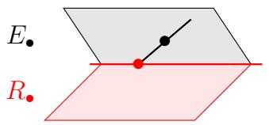  
FIGURE 5. A shoebox diagram of two flags in $\mathrm{Fl}(4)$ . The black flag represents the standard flag $E_{\bullet}$ . The red flag $R_{\bullet}$ is an element of $C_{2341}(E_{\bullet})$ .

From the intersection conditions for $C_w(E_\bullet)$ in Definition 3.21, one can observe that there is a close connection between the diagram $D(w^{-1})$ and the canonical matrix representatives for $C_w(E_\bullet)$ . A flag $F_\bullet$ is in $C_w(E_\bullet)$ if and only if its canonical matrix representative $M(F_\bullet)$ has 1's in the same positions as the permutation matrix $M_w$ . Any other nonzero entries in $M(F_\bullet)$ must appear in positions $(i,j) \in D(w^{-1})$ . Therefore, the elements in $D(w^{-1})$ determine a parametrization of the Schubert cell $C_w(E_\bullet)$ . Since $\mathrm{inv}(w) = \mathrm{inv}(w^{-1})$ , we conclude that the complex dimension of a Schubert cell is the number of inversions of the permutation,

$$
\dim \left(C _ {w} \left(E _ {\bullet}\right)\right) = \ell (w) = \operatorname {i n v} (w). \tag {3.14}
$$

The dimension of $\operatorname{Fl}(n)$ is $\binom{n}{2}$ since $\dim(GL_n) = n^2$ and $\dim(B) = \binom{n+1}{2}$ . Thus, the codimension of $C_w(E_\bullet)$ , denoted $\operatorname{codim}(C_w(E_\bullet)) = \binom{n}{2} - \ell(w)$ , is the number of noninversions. We will denote this coinversion statistic by $\operatorname{coinv}(w) := \binom{n}{2} - \ell(w)$ combining codimension and noninversion.

Recall that if a matrix $M$ represents a flag, then every matrix $Mb$ for $b \in B$ represents the same flag. What about multiplication on the left? Multiplication on the left by upper triangular matrices in $B$ can be described as adding scalar multiples of row $j$ in $M$ to row $i$ for $i \leq j$ . Assume $M$ is a canonical matrix so it is column-reduced. If a column of $M$ represents a vector in $E_i$ , then it has zeros below row $i$ . Thus, every matrix of the form $bM$ for $b \in B$ , will also have zeros below row $i$ in that column. If the flag represented by $M$ satisfies the intersection conditions for $C_w(E_\bullet)$ then so does every other flag represented by $bM$ for some $b \in B$ . The matrices in the orbit $BM$ may not be in column-reduced form. However, since we know that every flag in $C_w(E_\bullet)$ can be represented by a matrix in canonical form with pivot 1's in positions corresponding with the permutation matrix $M_w$ and any other nonzero entries only occurring in positions in $D(w)$ , we conclude that every flag in $C_w(E_\bullet)$ can be represented by a matrix in the orbit $BM_w$ . Hence, $C_w(E_\bullet)$ is exactly the $B$ -orbit of the flag $w_\bullet = (e_{w(1)}, e_{w(2)}, \ldots, e_{w(n)})$ under the action of left multiplication induced from the matrix representatives. Equating flags with their matrix representatives, one may write $C_w(E_\bullet) = BM_w$ .

Example 3.23. For arbitrary $b_{i,j}$ 's with $b_{1,1}, b_{2,2}, b_{3,3}, b_{4,4}$ nonzero, we have

$$
\left[ \begin{array}{c c c c} b _ {1, 1} & b _ {1, 2} & b _ {1, 3} & b _ {1, 4} \\ 0 & b _ {2, 2} & b _ {2, 3} & b _ {2, 4} \\ 0 & 0 & b _ {3, 3} & b _ {3, 4} \\ 0 & 0 & 0 & b _ {4, 4} \end{array} \right] \left[ \begin{array}{c c c c} 0 & 0 & 0 & 1 \\ 1 & 0 & 0 & 0 \\ 0 & 1 & 0 & 0 \\ 0 & 0 & 1 & 0 \end{array} \right] = \left[ \begin{array}{c c c c} b _ {1, 2} & b _ {1, 3} & b _ {1, 4} & b _ {1, 1} \\ b _ {2, 2} & b _ {2, 3} & b _ {2, 4} & 0 \\ 0 & b _ {3, 3} & b _ {3, 4} & 0 \\ 0 & 0 & b _ {4, 4} & 0 \end{array} \right] \in C _ {2 3 4 1}.
$$

The Bruhat decomposition of $\operatorname{Fl}(n)$ is the disjoint union of the space into Schubert cells, each of which is a nonempty $B$ -orbit:

$$
\operatorname {F l} (n) = \bigcup_ {w \in S _ {n}} C _ {w} \left(E _ {\bullet}\right). \tag {3.15}
$$

This decomposition was initially studied by Bruhat in the 1950s and extended to other Lie groups $G$ and Borel subgroups $B$ [68]. In 2010, Lusztig wrote a nice overview of the contributions of Bruhat in [264], and says "Bruhat decomposition is indispensable for the understanding of both the structure and representations of $G$ ."

Definition 3.24. The Schubert variety $X_w(E_\bullet)$ of a permutation $w$ is defined to be the closure of $C_w(E_\bullet)$ under the Euclidean topology, or equivalently the Zariski topology (see below). As in the case for Schubert cells, $X_w(E_\bullet)$ can be expressed in terms of intersection dimensions as

$$
X _ {w} \left(E _ {\bullet}\right) = \left\{F _ {\bullet} \in \operatorname {F l} (n) \mid \dim \left(E _ {i} \cap F _ {j}\right) \geq \operatorname {r k} (w) [ i, j ] \text {f o r a l l} 1 \leq i, j \leq n \right\}. \tag {3.16}
$$

If the fixed flag is clear from context, we may write $X_w$ instead of $X_w(E_\bullet)$ .

Example 3.25. By definition $\dim(E_2 \cap F_1) \geq 1$ and $\dim(E_3 \cap F_3) \geq 3$ so $F_3 = E_3$ for all $F_\bullet \in X_{2314}(E_\bullet)$ . These are the only binding conditions on the flags in $X_{2314}(E_\bullet)$ . Therefore, every flag in $X_{2314}(E_\bullet)$ is determined by a choice of the 1-dimensional subspace $F_1$ in $E_3$ .

As described above, each Schubert cell is a $B$ -orbit. Similarly, one can observe from (3.16) that $BX_{w} = X_{w}$ since left multiplication by $B$ never decreases the northwest rank table of a matrix. So $X_{w}$ is the union of a finite number of $B$ -orbits.

Example 3.26. By checking the intersection conditions, we see that all flags in the Schubert cell $C_{1342}(E_{\bullet})$ are in $X_{2341}(E_{\bullet})$ , so

$$
C _ {1 3 4 2} (E _ {\bullet}) = \left\{\left[ \begin{array}{c c c c} 1 & 0 & 0 & 0 \\ 0 & * & * & 1 \\ 0 & 1 & 0 & 0 \\ 0 & 0 & 1 & 0 \end{array} \right] \right\} \subset X _ {2 3 4 1} (E _ {\bullet}) = \overline {{\left\{\left[ \begin{array}{c c c c} * & * & * & 1 \\ 1 & 0 & 0 & 0 \\ 0 & 1 & 0 & 0 \\ 0 & 0 & 1 & 0 \end{array} \right] \right\}}},
$$

where each star represents a free parameter of the Schubert cell as we saw with $x, y, z$ in Example 3.22. We can also see $C_{1342}$ is contained in the closure of $C_{2341}$ inherited from the Euclidean topology as follows. For $a \neq 0$ , the following matrices all represent the same flag in $C_{2341}$ :

$$
\left[ \begin{array}{c c c c} a & 0 & 0 & 1 \\ 1 & 0 & 0 & 0 \\ 0 & 1 & 0 & 0 \\ 0 & 0 & 1 & 0 \end{array} \right] \sim \left[ \begin{array}{c c c c} 1 & 0 & 0 & 1 \\ a ^ {- 1} & 0 & 0 & 0 \\ 0 & 1 & 0 & 0 \\ 0 & 0 & 1 & 0 \end{array} \right] \sim \left[ \begin{array}{c c c c} 1 & 0 & 0 & 0 \\ a ^ {- 1} & 0 & 0 & - a ^ {- 1} \\ 0 & 1 & 0 & 0 \\ 0 & 0 & 1 & 0 \end{array} \right] \sim \left[ \begin{array}{c c c c} 1 & 0 & 0 & 0 \\ a ^ {- 1} & 0 & 0 & 1 \\ 0 & 1 & 0 & 0 \\ 0 & 0 & 1 & 0 \end{array} \right].
$$

Letting $a \to \infty$ gives the permutation matrix $M_{1342}$ , which therefore lies in the (Euclidean) closure $\overline{C_{2341}}$ . Since $X_{2341} = \overline{C_{2341}}$ is $B$ -stable, $M_{1342} \in X_{2341}$ implies $BM_{1342} = C_{1342} \subseteq \overline{C_{2341}} = X_{2341}$ .

The Zariski topology is used in algebraic geometry as the topology on affine and projective varieties. In that context, a variety is defined as the set of solutions to a system of polynomial equations, and such sets form the closed sets of a topology. For instance, the statement of Example 3.26 that $C_{1342} \subseteq \overline{C_{2341}}$ also holds when the closure is taken in the Zariski topology, where it means that every polynomial vanishing on $C_{2341}$ also vanishes on $C_{1342}$ .

The equations defining a Schubert variety come from the southwest rank conditions and setting certain determinants of submatrices equal to 0. However, note that a general polynomial function of the entries of a matrix $M$ is not well-defined when we view $M$ as an element of $GL_n / B$ . We postpone further discussion of this issue and of the equations of a Schubert variety to §3.5, and for now just view Schubert varieties as sets.

There was nothing special about the use of the flag $E_{\bullet}$ in Definition 3.24: for every pair of flags $B_{\bullet}$ and $R_{\bullet}$ in $\operatorname{Fl}(n)$ we can consider the table of intersection dimensions $\dim(B_i \cap R_j)$ . This table will again correspond with a permutation in $S_n$ . The concept of a Schubert cell carries over as well, so $C_w(B_{\bullet})$ is the set of all flags $R_{\bullet}$ in position $w$ with respect to the base flag $B_{\bullet}$ , equivalently $\dim(B_i \cap R_j) = \operatorname{rk}(w)[i,j]$ for all $i,j$ . Schubert varieties can be generalized similarly. Changing the base flag gives a convenient way to move a Schubert cell or Schubert variety around inside $\operatorname{Fl}(n)$ while preserving most aspects of the geometry.

The standard flag $E_{\bullet} = (e_1, e_2, \ldots, e_n)$ is most commonly used. The next most common flag is obtained by reversing the standard basis, say $\mathcal{H}_{\bullet} = (e_n, e_{n-1}, \ldots, e_1)$ . Schubert varieties with respect to $\mathcal{H}_{\bullet}$ are called opposite Schubert varieties. You may see these designated in the literature as $X^w$ or $\Omega_w$ . Every ordered basis $(f_1, \ldots, f_n)$ gives rise to a flag $F_{\bullet}$ and an opposite flag with ordered basis $(f_n, \ldots, f_1)$ , which we could denote by $J_{\bullet}$ . The key observation is that $F_{\bullet} \in X_{w_0}(J_{\bullet})$ and $J_{\bullet} \in X_{w_0}(F_{\bullet})$ so opposite flags are in transverse position.

The position of a flag with respect to a given flag $F_{\bullet}$ can be different from the position of the flag with respect to $\mathcal{H}_{\bullet}$ . For example, the flag with ordered basis $(e_3 + 7e_4, e_2 - e_4, e_1 + 5e_4, e_4)$ is in position 4321 with respect to $E_{\bullet}$ and in position 2341 with respect to $\mathcal{H}_{\bullet}$ .

Exercise 3.27. Prove that a flag $G_{\bullet} \in C_w(\mathcal{E}_{\bullet})$ can be represented by an ordered basis $(g_1, g_2, \ldots, g_n)$ such that $g_j$ is in the span of $\{e_n, e_{n-1}, \ldots, e_{n-w_j+1}\}$ for each $j \in [n]$ . By considering the possible elementary column operations, describe a canonical representation of a flag with respect to $\mathcal{E}_{\bullet} = (e_n, e_{n-1}, \ldots, e_1)$ .

Exercise 3.28. Show $GL_{n}$ acts transitively on the complete flags in the flag variety via left multiplication, so $\operatorname{Fl}(n)$ is a smooth manifold.

Exercise 3.29. Return to the projective drawings we saw in Figure 3. With respect to the black flag $B_{\bullet}$ , which Schubert cell $C_w(B_{\bullet})$ does each of the red flags lie in? In the other direction, try drawing out a typical flag in $C_{1432}(B_{\bullet})$ and $C_{4123}(R_{\bullet})$ using a shoebox drawing. How many flags are in $C_{1432}(B_{\bullet}) \cap C_{4123}(R_{\bullet})$ if $B_{\bullet}$ and $R_{\bullet}$ are chosen generically? If there are any, draw one in the shoebox picture.

Exercise 3.30. Prove that the reverse standard flag $\mathcal{E}_{\bullet}$ has an affine neighborhood $C_{w_0}$ of dimension $\binom{n}{2}$ and a local coordinate system. Similarly, prove that a flag with canonical matrix $g$ has an affine neighborhood $gw_0 C_{w_0}$ in $\operatorname{Fl}(n)$ .

3.4. Bruhat Order on Permutations. Since Schubert cells are $B$ -orbits, Schubert varieties are invariant under left multiplication by $B$ as well. So, each Schubert variety is equal to a disjoint union of Schubert cells. Which cells are contained in $X_w$ ? The containment relation on Schubert varieties $C_v \subset X_w$ defines a partial order on permutations $v \leq w$ . We write

$$
X _ {w} = \bigcup_ {v \leq w} C _ {v} \tag {3.17}
$$

similar to the Bruhat decomposition of $\operatorname{Fl}(n)$ in (3.15). This poset on $S_{n}$ is called Bruhat order. One way to verify if $v \leq w$ is to compare their rank tables by (3.16). In particular, $v \leq w$ in Bruhat order if and only if $\operatorname{rk}(v)[i,j] \geq \operatorname{rk}(w)[i,j]$ for all $1 \leq i,j \leq n$ . Note that before Bruhat's work on Lie groups, this partial order on $S_{n}$ was studied by Ehresmann around 1934 [113], and generalized to other Weyl groups by Chevalley in the 1950's [88]. Bruhat did not invent this partial order, but this naming convention is prevalent in the literature and it is closely aligned with the Bruhat decomposition.

Bruhat order has a nice description in terms of a set of generating relations. For a permutation $w \in S_n$ and integers $1 \leq i < j \leq n$ , one can check by using the rank tables that $w(i) < w(j)$ if and only if $w < wt_{ij}$ . On the other hand, if $v < w$ then there exists a pair $c < d$ such that $v(c) < v(d)$ and $\mathrm{rk}(vt_{cd})[i,j] \geq \mathrm{rk}(w)[i,j]$ for all $i,j$ . For example, take $c$ to be the first column where the rank tables of $v$ and $w$ differ. Let $r$ be the first row where they differ in column $c$ . Then $\mathrm{rk}(v)[r,c] > \mathrm{rk}(w)[r,c]$ since $v < w$ , $v(b) = w(b)$ for $1 \leq b < c$ , $v(c) = r$ and $w(c) > r$ . Since $w(c) \notin \{v(1), v(2), \ldots, v(c)\}$ , we know there exists a minimal $d > c$ such that $v(c) < v(d)$ . By considering rank tables again, one can verify $v < vt_{cd} \leq w$ . Furthermore, $\ell(vt_{cd}) = \ell(v) + 1$ since $vt_{cd}$ has exactly one more inversion than $v$ . By induction on the length difference $\ell(w) - \ell(v)$ , there exists a sequence of transpositions each moving up in Bruhat order $v < vt_{c,d} < \dots \leq w$ . Hence, Bruhat order is equivalently defined to be the transitive closure of the relations determined by transpositions: $w < wt_{ij}$ for all $i < j$ and $w(i) < w(j)$ .

The Hasse diagram of a poset is a directed graph that encodes a minimal set of generators for the poset under the transitive closure. The edges in the Hasse diagram are the covering relations for the poset. In general, any directed acyclic graph gives rise to a partial order by taking the transitive closure of its edges, but the Hasse diagram is the unique minimal directed acyclic graph generating the poset, also called its transitive reduction.

To draw the Hasse diagram for Bruhat order, note that not all of the transposition relations, $w < wt_{ij}$ if $w(i) < w(j)$ and $i < j$ , are required. For example $123 < 321$ in Bruhat order on $S_3$ and $321 = 123 \cdot t_{13}$ , but we also have $123 < 213 < 231 < 321$ , so the Hasse diagram of Bruhat order for $S_3$ does not contain an edge connecting 123 and 321. It is a good exercise for the reader to show that the minimal set of transposition relations also requires $\ell(wt_{ij}) = \ell(w) + 1$ . Thus, Bruhat order is a ranked poset with rank function given by the number of inversions of a permutation. By MacMahon's theorem, we know the rank generating function is given by the standard $t$ -analog of $n!$ , namely

$$
\sum_ {w \in S _ {n}} t ^ {\operatorname {i n v} (w)} = \sum_ {w \in S _ {n}} t ^ {\ell (w)} = \prod_ {k = 1} ^ {n - 1} (1 + t + t ^ {2} + \dots + t ^ {k}) = [ n ] _ {t}!.
$$

The polynomial $[n]_t!$ is also called the length generating function of $S_{n}$ .

Example 3.31. The following is the Hasse diagram of the Bruhat order on $S_3$ . There is an edge connecting $u$ and $w$ if $u \leq w$ and no $v$ exists such that $u < v < w$ . We omit the

arrows in this directed graph because they are implied by the height of the elements. A larger element is above a smaller element in a Hasse diagram.

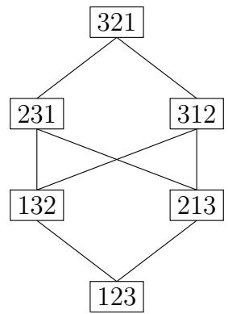

Example 3.32. The Hasse diagram of $S_4$ is drawn in Figure 6.

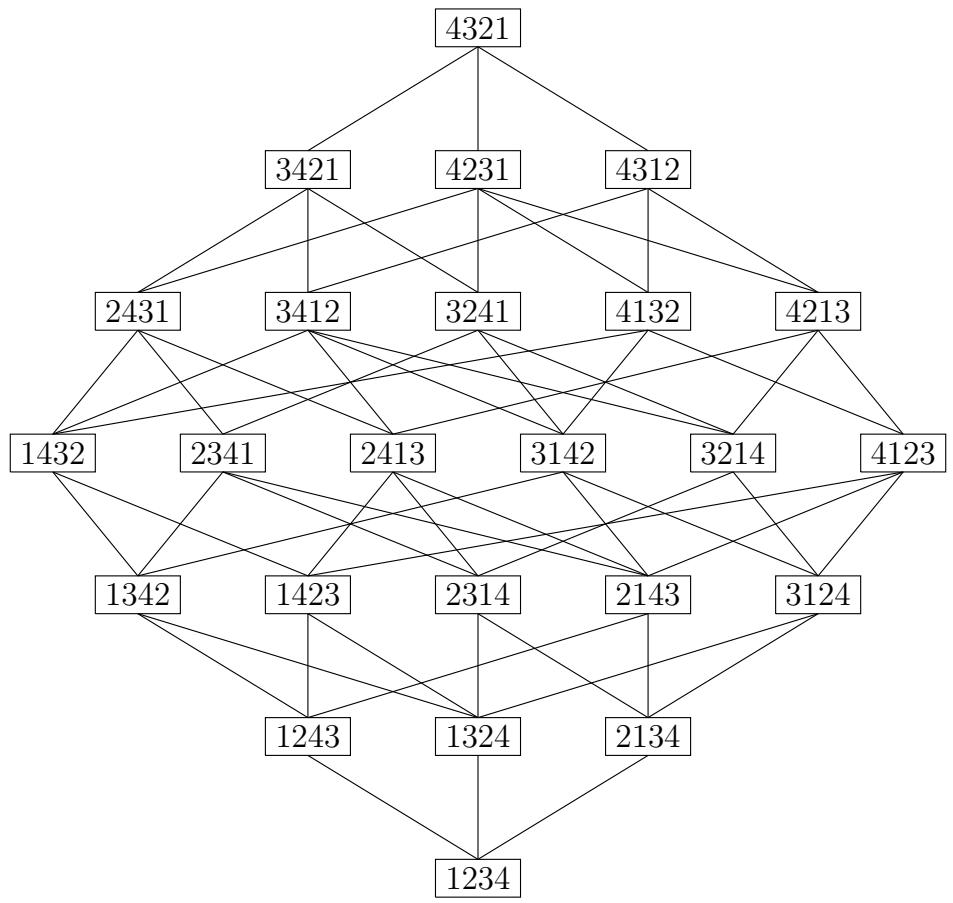  
FIGURE 6. The Hasse diagram of $S_4$

Exercise 3.33. Prove that the Hasse diagram of $S_{n}$ is self-dual, rank-symmetric and rank-unimodal.

Testing if $v \leq w$ in Bruhat order via the transposition relations can be cumbersome since one would need to consider many possible paths from $v$ to $w$ . A more efficient criteria was given by Ehresmann [113] and improved upon by Björner and Brenti [51]. This criteria

depends on another representation of a permutation $w = [w_{1}, \ldots, w_{n}]$ as a tableau (table in English) of numbers where each row is the sorted list of initial values $\{w_{1}, \ldots, w_{i}\}$ . Since we only care about the numbers in the rows and not any particular order, one might left justify or right justify such a tableau as we have done below in an example. The criteria then compares $v$ and $w$ in Bruhat order by comparing the rows of the tableau in what is sometimes now referred to as the Gale order [143] because of his studies in matroid theory in the 1960s, well after Ehresmann.

Definition 3.34. (Gale order) If $A = \{a_1 \leq \dots \leq a_p\}$ and $B = \{b_1 \leq \dots \leq b_p\}$ are subsets of $[n]$ with their elements listed in increasing order, we say $A \trianglelefteq B$ if and only if $a_i \leq b_i$ for all $1 \leq i \leq p$ .

Theorem 3.35 (The Ehresmann Tableau Criterion). [113] For $v, w \in S_n$ , we have $v \leq w$ in Bruhat order if and only if $\{v_1, \ldots, v_j\} \triangleleft \{w_1, \ldots, w_j\}$ for each $j \in [n]$ .

Theorem 3.36. [51, Cor. 5] For $v, w \in S_n$ , we have $v \leq w$ in Bruhat order if and only if $\{v_1, \ldots, v_j\} \trianglelefteq \{w_1, \ldots, w_j\}$ whenever $v_j > v_{j+1}$ .

Continuing Example 3.26, we can test $1324 < 2341$ by checking the tableau conditions

$$
\begin{array}{r c l} 1 & \triangleleft & 2 \\ 1 3 & \triangleleft & 2 3 \\ 1 2 3 & \triangleleft & 2 3 4 \\ 1 2 3 4 & \triangleleft & 1 2 3 4. \end{array}
$$

However, $1423 \not\leq 2314$ since $14 \not\leq 23$ .

The proof of Ehresmann's tableau criterion follows from the rank tables and intersection conditions for Schubert varieties. We can think of the rows of the tableau for $w$ as another way of stating the defining rank conditions on the flags in $C_w(E_\bullet)$ . By construction, row $j$ contains $\{w_1, \ldots, w_j\}$ in increasing order, say $\{w_1, \ldots, w_j\} = \{a_1 < a_2 < \dots < a_j\}$ . Considering the canonical form matrix representing a flag $F_\bullet \in C_w(E_\bullet)$ , one can observe that $\dim(E_i \cap F_j) = 0$ for $i < a_1$ , the dimension jumps up to $\dim(E_i \cap F_j) = 1$ for $a_1 \leq i < a_2$ , and then jumps again $\dim(E_i \cap F_j) = 2$ for $a_2 \leq i < a_3$ , etc. The $a_i$ 's determine the "jumps" in dimension as we consider the list of intersections of $F_j$ with $E_1, E_2, \ldots, E_n$ . Some authors refer to these required jumps as Schubert conditions. Ehresmann's criterion just encodes the fact that for each $j$ , the jumps for $F_j$ must come at least as early as $v$ as in $w$ in order to have $v \leq w$ . The Björner-Brenti improvement (Theorem 3.36) encodes the fact that the rows $j$ for which $v_j > v_{j+1}$ are more binding than the others, so the Schubert conditions from other rows follow from these.

One of the benefits of Bruhat order is a description of the Poincaré polynomials of Schubert varieties. Since a Schubert variety is the disjoint union of Schubert cells, there is a way to obtain a basis for the associated cohomology ring of $X_w$ , denoted $H^*(X_w)$ , indexed by the permutations $v \leq w$ . See Section 3.7 for more discussion on cohomology rings. For now, we just note that the cohomology ring of $X_w$ is a graded ring and its Hilbert series is the same as the Poincaré polynomial of $X_w$ , namely

$$
P _ {w} (t) = \sum_ {v \leq w} t ^ {2 \ell (v)}.
$$

Because only even exponents appear in the Poincaré polynomials above, we often abuse notation and define

$$
P _ {w} (t) = \sum_ {v \leq w} t ^ {\ell (v)}
$$

using complex dimension instead of real dimension.

Example 3.37. For $w = 3412$ , the following permutations shown in Figure 7 are in the interval below 3412 in Bruhat order, denoted [id, 3412] = \{v \in S_n \mid v \leq 3412\}. The number on the left is the number of inversions for all permutations on that row. So $P_{3412}(t) = 1 + 3t + 5t^2 + 4t^3 + t^4$ .

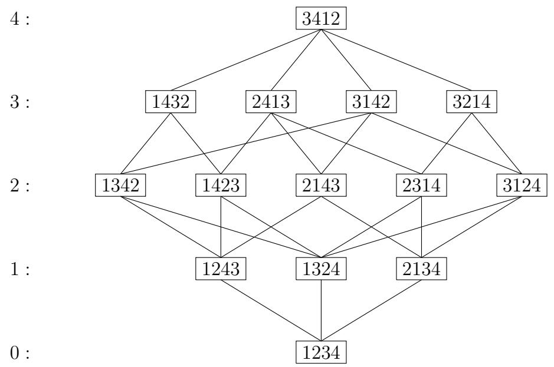  
FIGURE 7. The lower interval in the Bruhat order below 3412

One can see that the Schubert variety $X_{3412}$ is not a smooth manifold since its Poincaré polynomial is not symmetric (palindromic) which implies that Poincaré duality does not hold for $H^{*}(X_{3412})$ .

There are many additional interesting facts about Bruhat order as a partial order on $S_{n}$ . Here are some examples. We will encounter some more of them in the rest of this book. See [52, Ch 2] and [184] for more background and generalizations to all Coxeter groups.

(1) Bruhat order is $k$ -Sperner for all $k$ [346].   
(2) It has the nicest possible Möbius function: $\mu(v, w) = (-1)^{\ell(w) - \ell(v)}$ [364].   
(3) The intervals $[x,y]$ determine the composition series for Verma modules [363].   
(4) The interval $[\mathrm{id},w]$ is rank symmetric if and only if $X_{w}$ is nonsingular as a variety [83]. See also Section 5.5.   
(5) The order complex of $(u,v)$ is shellable [53].   
(6) It is amenable to pattern avoidance [1].

Exercise 3.38. Let $v, w \in S_n$ . The following are equivalent:

(1) $v\leq w$

(2) $v^{-1} \leq w^{-1}$ ,   
(3) $w w_{0} \leq v w_{0}$ ,   
(4) $w_0 w \leq w_0 v$ .

Exercise 3.39. Prove that the boundary of $X_w$ has irreducible components given by the Schubert varieties $X_v$ such that $v$ is covered by $w$ in Bruhat order. Show $w$ covers $v$ if and only if $v = wt_{ij} < w$ for some $i < j$ with $w_i > w_j$ and $\ell(v) = \ell(w) - 1$ .

Exercise 3.40. Prove that $C_w(F_\bullet)$ is a dense open set in $X_w(F_\bullet)$ for any $F_\bullet \in \operatorname{Fl}(n)$ .

Exercise 3.41. [29, Lemma 2.1] Given any sequence of distinct real numbers $r_1 \ldots r_m$ , define the flattening function $\mathrm{fl}(r_1 \ldots r_m)$ to be the permutation $v \in S_m$ such that $r_i < r_j$ if and only if $v_i < v_j$ . Recall that a permutation is uniquely defined by its inversion set, so this condition uniquely defines $v$ . Prove that if two permutations $v, w \in S_n$ agree in position $i$ , then $v \leq w$ in Bruhat order on $S_n$ if and only if $\mathrm{fl}(v_1 \ldots \widehat{v}_i \ldots v_n) \leq \mathrm{fl}(w_1 \ldots \widehat{w}_i \ldots w_n)$ in Bruhat order on $S_{n-1}$ .

Exercise 3.42. What is the Poincaré polynomial for $H^{*}(\operatorname{Fl}(n))$ for $n = 3, 4, 5$ ?

Exercise 3.43. Let $\mathcal{H}_{\bullet} = (e_n,\ldots ,e_1)$ . Which permutation matrices represent flags in $X_{w}(\mathcal{H}_{\bullet})$ for $w\in S_n$ ?

Exercise 3.44. For $v, w \in S_n$ , show $v \leq w$ if and only if some reduced word for $v$ is a subword of some (any) reduced word for $w$ .

Exercise 3.45. Recall the bigrassmannian permutations defined in Exercise 3.16. Prove that the bigrassmannian permutations are the join-irreducible elements in Bruhat order, and so $v \leq w$ in Bruhat order if and only if the set of all bigrassmannian permutations below $v$ is a subset of the bigrassmannian permutations below $w$ [254].

Exercise 3.46. [319, Prop. 4.2] For $w \in S_n$ , prove that the minimal elements in $\{y \in S_n \mid y \not\leq w\}$ are all bigrassmannian permutations. Can you explicitly determine which bigrassmannian permutations are the minimal elements in the complement of $[\mathrm{id}, w]$ ?

Open Problem 3.47. If $v, w$ are chosen uniformly in $S_{n}$ , what is the probability that $v \leq w$ ? See [167].

Björner showed that each interval $[u, w] = \{v \in S_n \mid u \leq v \leq w\}$ of rank $k$ in Bruhat order is the order poset for a CW-complex on the sphere of dimension $k - 2$ [50]. For $k = 2$ , each interval is a diamond. For $k = 3$ , each interval is a $k$ -crown. Hultman identified each possible interval type for $k = 4$ [181]. For each $k$ , there are only a finite number of possible interval types according to a theorem of Dyer [111].

Open Problem 3.48. Can the set of all possible Bruhat intervals be characterized for arbitrary $k$ ? Conversely, given an abstract poset $P$ with a unique minimal and maximal element, what is the computational complexity of determining if $P$ is isomorphic to an interval in Bruhat order in $S_{n}$ for some $n$ ?

The following conjecture was made independently by Dyer and Lusztig, see also Brenti-Casselli-Martinelli [62]. The Kazhdan-Lusztig polynomials are an important family of polynomials in $\mathbb{Z}[q]$ which are indexed by two permutations $u \leq v$ in Bruhat order. We will give their classical definition via an existence statement in Theorem 5.76. More generally, these polynomials can be defined for any two elements in a Coxeter group related by Bruhat order.

Open Problem 3.49. The Combinatorial Invariance Conjecture. The Kazhdan-Lusztig polynomials $P_{u,v}(q)$ and $P_{w,x}(q)$ are equal if the intervals $[u,v]$ and $[w,x]$ are isomorphic as abstract posets.

The converse of this statement does not hold. For example $P_{123,321} = 1 = P_{123,123}$ but the corresponding intervals are different.

3.5. Grassmannians and Partial Flag Varieties. Where did the notion of a complete flag come from? This was in some sense a natural extension of projective space. The projective space of $\mathbb{C}^n$ , denoted $\mathbb{P}^{n-1}$ , is the collection of complex lines in $\mathbb{C}^n$ through the origin. Each such line can be represented by a nonzero $n$ -dimensional vector. Rescaling the vector by a nonzero complex number results in another representation of the same line. This space has dimension $n-1$ , hence the superscript on $\mathbb{P}^{n-1}$ . A point in $\mathbb{P}^{n-1}$ is represented by homogeneous coordinates $[p_1:p_2:\dots:p_n]$ where $[p_1:p_2:\dots:p_n] = [\lambda p_1:\lambda p_2:\dots:\lambda p_n]$ for all $\lambda \in \mathbb{C}$ such that $\lambda \neq 0$ . We call $\mathbb{P}^1$ the projective line, and $\mathbb{P}^2$ is the projective plane. One can think of the projective plane as an open disk (points with $p_2 \neq 0$ ), plus the circle on the boundary minus a point (points with $p_2 = 0, p_1 \neq 0$ ), plus that last point $[1:0:0]$ . This gives a cell decomposition of $\mathbb{P}^2$ , similar to the cell decomposition of the flag variety into Schubert cells.

Projective spaces are better behaved than complex spaces in some ways. A finite dimensional projective space is compact. It can be covered by open charts, so a projective space is a manifold. Furthermore, any two subspaces of complementary dimension intersect, perhaps at $\infty$ . For example, two parallel lines in a plane meet somewhere in the closure of the plane, "off at $\infty$ ".

Why stop at 1-dimensional subspaces? The Grassmannian variety $\mathrm{Gr}(k,n)$ is the collection of $k$ -dimensional subspaces of $\mathbb{C}^n$ . Such subspaces can be represented by $k$ linearly independent vectors, or equivalently by a $n\times k$ matrix of full rank $k$ . We can get a canonical representation of each $k$ -dimensional subspace by using the reduced column echelon form of any matrix $M$ representing it. The determinantal minors of a full rank $n\times k$ matrix $M$ can be used to embed $\mathrm{Gr}(k,n)$ into a projective space as follows. For a size $k$ subset $I\subset [n]$ , let $\Delta_I(M)$ represent the determinant of the submatrix of $M$ in rows $I$ and columns $[k]$ . If we organize the size $k$ minors of $M$ into a list

$$
P _ {k} (M) = \left[ \Delta_ {I _ {1}} (M): \dots : \Delta_ {I _ {\binom {n} {k}} (M)} \right] \tag {3.18}
$$

where the subsets of size $k$ appear in lexicographic order, we get a homogeneous coordinate for some point in $\mathbb{P}^{\binom{n}{k}-1}$ , called the Plücker coordinates. Two matrices $M$ and $N$ represent the same $k$ -dimensional subspace $V \in \mathrm{Gr}(k,n)$ if and only if $N = MA$ for some $A \in GL_k$ , in which case the homogeneous coordinates $P_k(M)$ and $P_k(N)$ agree because multiplication by $A$ just rescales the homogeneous coordinate $P_k(M)$ by the determinant of $A$ . Therefore, we call $P_k(M)$ the Plücker coordinates for $V$ . In fact, one can recover the reduced column echelon form of the matrix representing $V$ from $P_k(M)$ , so the Plücker coordinates give an embedding of the Grassmannian variety $\mathrm{Gr}(k,n)$ into the projective space $\mathbb{P}^{\binom{n}{k}-1}$ . The image of the Plücker embedding is all points in $\mathbb{P}^{\binom{n}{k}-1}$ satisfying certain quadratic polynomials called the Plücker relations. The Plücker relations play a central role in the theory of Grassmannians, $S_n$ representation theory, and $GL_n$ representation theory. Fulton's book Young Tableaux does a wonderful job of telling this story so we refer the reader to [136] for more details. We will return to these relations in Section 5.

Recall from Definition 3.1 that a partial flag with dimensions $\mathbf{d}$ is a sequence of subspaces $F_{1} \subseteq \dots \subseteq F_{m} \subseteq \mathbb{C}^{n}$ with $\dim F_{i} = d_{i}$ for any given subset $\mathbf{d} = \{d_{1} < \dots < d_{m}\} \subseteq [n - 1]$ . The set of all such partial flags is the partial flag variety $\operatorname{Fl}(n; \mathbf{d})$ . For example, the Grassmannian is $\operatorname{Gr}(k, n) = \operatorname{Fl}(n; \{k\})$ . Using minors of different sizes, one can give $\operatorname{Fl}(n; \mathbf{d})$ the structure of a compact smooth manifold or a projective complex variety in more or less the same way as $\operatorname{Gr}(k, n)$ or $\operatorname{Fl}(n)$ . Some authors say "Grassmannian manifold" or "flag manifold" instead of Grassmannian variety and flag variety when they wish to emphasize the manifold structure with local coordinate charts similar to what we saw in Exercise 3.30. Note also that $\operatorname{GL}_n$ still acts transitively on $\operatorname{Fl}(n; \mathbf{d})$ by left multiplication, as in Exercise 3.28. Furthermore, $\operatorname{Fl}(n; \mathbf{d})$ is isomorphic to a quotient $\operatorname{GL}_n / P$ where $P$ is the set of invertible, block upper triangular matrices with zeros strictly southwest of the entries $(d_i, d_i)$ for $1 \leq i \leq m$ .

There is an obvious projection map $\pi : \mathrm{Fl}(n) \to \mathrm{Fl}(n; \mathbf{d})$ which "forgets" those components of a complete flag with dimensions not in $\mathbf{d}$ . It can be shown that the partial flag varieties $\mathrm{Fl}(n; \mathbf{d})$ account for all of the compact quotients of $\mathrm{GL}_n$ , and one reason for the ubiquity of the complete flag variety is that it is maximal among them, in the sense that it projects to all others via these projections $\pi$ . In particular, Schubert varieties in the flag variety project to varieties in $\mathrm{Fl}(n; \mathbf{d})$ . The image of such a projection in a partial flag variety or Grassmannian is also called a Schubert variety. So, take some care to note where your Schubert varieties live. In this chapter, we will stay focused on Schubert varieties in the complete flag variety as they present a very rich structure from which most results on partial flag varieties can be deduced.

We now return to the topic of equations defining Schubert varieties, as promised in §3.3. Generalizing the notation used for Grassmannians, let $\Delta_{I,J}(M)$ be the determinant of the submatrix of $M$ in rows $I$ and columns $J$ for $I, J \subset [n]$ of the same size. All such minors $\Delta_{I,J}$ can be expressed as homogeneous polynomial functions in the entries of a matrix using variables $\{z_{ij} \mid 1 \leq i, j \leq n\}$ . A flag minor is one of the form $\Delta_{I,[j]}$ for $j \leq n$ . Viewing $\operatorname{Fl}(n)$ as a subset of $\operatorname{Gr}(1,n) \times \operatorname{Gr}(2,n) \times \dots \times \operatorname{Gr}(n-1,n)$ and then applying the Plücker embedding for Grassmannians gives an embedding $\operatorname{Fl}(n) \hookrightarrow \mathbb{P}_{(1)}^{(n)-1} \times \mathbb{P}_{(2)}^{(n)-1} \times \dots \times \mathbb{P}_{(1)}^{(n-1)-1}$ . The flag given by a matrix $M$ embeds as a point with coordinates on the $j^{\text{th}}$ factor of this product given by the flag minors $\Delta_{I,[j]}(M)$ for all $j$ -subsets $I \subseteq [n]$ . If $f$ is a polynomial in the flag minors which is homogeneous in a suitable sense, then the equation $f = 0$ defines a subset of $\mathbb{P}_{(1)}^{(n)-1} \times \mathbb{P}_{(2)}^{(n)-1} \times \dots \times \mathbb{P}_{(1)}^{(n-1)-1}$ , which is itself a projective variety via the Segre embedding (see Exercise 3.50). We will return to projective varieties in Section 5.

Exercise 3.50. Show that the image of the Segre embedding $\mathbb{P}^m \times \mathbb{P}^n \longrightarrow \mathbb{P}^{(n+1)(m+1)-1}$ defined by $[x_0 : \cdots : x_m][y_0 : \cdots : y_n] \to [x_i y_j : i \in \{0,1,\ldots,m\}, j \in \{0,1,\ldots,n\}]$ is a projective variety in $\mathbb{P}^{(n+1)(m+1)-1}$ .

A Schubert variety is the solution set to a collection of polynomial equations in the ring generated by the flag minors. This is because the Schubert conditions $\dim(E_i \cap F_j) \geq \operatorname{rk}(w)[i, j]$ are equivalent to bounding the southwest rank table of a matrix representing $F_{\bullet}$ by the southwest rank table of $M_w$ , which in turn is equivalent to requiring certain minors to vanish.

Example 3.51. For $n = 4$ , consider polynomials in the entries of a matrix using variables $\{z_{ij} \mid 1 \leq i, j \leq 4\}$ . For example, $\Delta_{\{3,4\}, \{1,2\}} = z_{31}z_{42} - z_{32}z_{41}$ . If $M$ is a matrix representing a flag in $X_{2341}(E_\bullet)$ then its southwest rank conditions are bounded above by the table

(3.19)

$$
\left[ \begin{array}{c c c c} 1 & 2 & 3 & 4 \\ 1 & 2 & 3 & 3 \\ 0 & 1 & 2 & 2 \\ 0 & 0 & 1 & 1 \end{array} \right].
$$

Therefore, the flag minors

$$
\Delta_ {\{3 \}, \{1 \}} = z _ {3 1}, \quad \Delta_ {\{1, 4 \}, \{1, 2 \}} = z _ {1 1} z _ {4 2} - z _ {1 2} z _ {4 1},
$$

$$
\Delta_ {\{4 \}, \{1 \}} = z _ {4 1}, \quad \Delta_ {\{2, 4 \}, \{1, 2 \}} = z _ {2 1} z _ {4 2} - z _ {2 2} z _ {4 1},
$$

$$
\Delta_ {\{3, 4 \}, \{1, 2 \}} = z _ {3 1} z _ {4 2} - z _ {3 2} z _ {4 1},
$$

evaluate to 0 on $M$ . Conversely, the vanishing of these minors implies the southwest rank conditions bounded above by (3.19) all hold, so $X_{2341}(E_{\bullet})$ is the set of flags that have matrix representations which are solutions to the five equations $\Delta_{\{3\}, \{1\}} = \Delta_{\{4\}, \{1\}} = \Delta_{\{1,4\}, \{1,2\}} = \Delta_{\{2,4\}, \{1,2\}} = \Delta_{\{3,4\}, \{1,2\}} = 0$ .

It can be fruitful to consider more general minors vanishing on $M$ . The set of minors vanishing on a general $M$ as above is

$$
\left\{z _ {3 1}, z _ {4 1}, z _ {4 2}, z _ {1 1} z _ {4 2} - z _ {1 2} z _ {4 1}, z _ {2 1} z _ {4 2} - z _ {2 2} z _ {4 1}, z _ {3 1} z _ {4 2} - z _ {3 2} z _ {4 1} \right\}. \tag {3.20}
$$

However, $\Delta_{\{1,4\},\{1,2\}}$ , $\Delta_{\{2,4\},\{1,2\}}$ and $\Delta_{\{3,4\},\{1,2\}}$ are in the ideal generated by $\{z_{31}, z_{41}, z_{42}\}$ so it suffices to check the three entries in positions $(3,1)$ , $(4,1)$ , $(4,2)$ are 0 in any matrix $M$ representing a flag in $X_{2341}$ . One should be a bit careful here: $z_{42}$ is not a flag minor, and does not correspond to any coordinate of the Plücker embedding of $\operatorname{Fl}(n)$ itself, even in a projective sense. However, $X_{2341}(E_{\bullet})$ as a set can be also determined as the flags represented by the subset of $GL_4$ where $\{z_{31}, z_{41}, z_{42}\}$ vanish.

Note that if $b \in B$ , then the southwest rank tables of $M$ and $Mb$ agree everywhere, so it does not matter which representative of the coset $MB$ we choose to represent a flag. Conversely, if every minor in (3.20) vanishes on a matrix $M \in GL_4$ , then its southwest rank table is bounded above by (3.19), or equivalently its northwest rank table is bounded below by (3.13). Hence, the flag defined by $M$ is in $X_{2341}(E_\bullet)$ . We will return to the equations defining a Schubert variety both in projective space and in the affine space of all $n \times n$ matrices in §5.

Exercise 3.52. For a $k$ -subset $I \subset [n]$ , let $C_I$ be the set of $k$ -planes in $\mathrm{Gr}(k,n)$ such that $\Delta_I$ is the first nonvanishing Plücker coordinate in lex order. Show that $C_I$ is a cell in the sense that it has a parametrization as $\mathbb{C}^d$ for some $d$ , and these cells partition $\mathrm{Gr}(k,n)$ . What canonical matrices represent the subspaces in $C_I$ ? (The sets $C_I$ are again called Schubert cells, and their closures Schubert varieties; in §4.7 we will explain how they relate to Schubert cells and varieties in $\operatorname{Fl}(n)$ .)

Exercise 3.53. Let $X_{I} = \overline{C}_{I}$ be the Schubert variety in $\mathrm{Gr}(k,n)$ , defined by the closure of the cell $C_I$ , for any subset $I$ of size $k$ of [n]. Describe the containment relation on Grassmannian Schubert varieties using a variation on the Ehresmann criterion for Bruhat order from Theorem 3.35.

Exercise 3.54. Identify all minors $\Delta_{I,J}$ which evaluate to be zero on every matrix representing a flag in $X_{4132}(E_{\bullet})$ . Also, identify all flag minors $\Delta_{I,[j]}$ which are zero on $X_{4132}(E_{\bullet})$ .

Exercise 3.55. Prove that every one dimensional Schubert variety in $\operatorname{Fl}(n)$ is isomorphic to $\mathbb{P}^1$ and that every two dimensional Schubert variety in $\operatorname{Fl}(n)$ is isomorphic to $\mathbb{P}^2$ or $\mathbb{P}^1 \times \mathbb{P}^1$ .

Exercise 3.56. Does the classification of isomorphism types for Schubert varieties of dimensions 1 and 2 from Exercise 3.55 hold in all partial flag varieties?

3.6. Permutation Arrays and Modern Schubert Problems. Now that we have some of the vocabulary of Schubert cells and varieties in our repertoire, let's return to the topic of modern Schubert problems. Schubert was interested in enumerative geometry problems where an intersection of geometric objects has a finite number of possibilities in the generic case. Modern Schubert calculus is the study of the intersection numbers that arise for the intersections of Schubert varieties in the generic case.

Each Schubert variety is defined with respect to a fixed reference flag. When we consider intersecting Schubert varieties, we do so by first moving them into general position. This minimizes the overlap as one would expect in the generic case. Moving a Schubert variety is as simple as changing the reference flag. Minimizing overlap of two varieties means the codimensions of the varieties add up to the codimension of the intersection. If the codimensions of the subvarieties being intersected add up to the dimension of the ambient variety containing them and the subvarieties are in general position, then the intersection is 0-dimensional. A 0-dimensional variety is a finite number of points. Thus a modern Schubert problem on the flag variety would ask:

How many flags are in the intersection $X_{u}(E_{\bullet}) \cap X_{v}(F_{\bullet}) \cap \dots \cap X_{w}(G_{\bullet})$ assuming the reference flags are chosen generically and the intersection is 0-dimensional?

Such a Schubert problem would require us to specify all of the required dimensions of each intersection of subspaces over all the reference flags and flags in the intersection. This data structure is a higher dimensional array of intersection conditions, beyond just a matrix.

In [117] and [118], Eriksson and Linusson developed a $d$ -dimensional analog of a permutation matrix toward characterizing all possible tables of intersection dimensions for $d$ flags in $\operatorname{Fl}(n)$ . One way to generalize permutation matrices is to consider all $d$ -dimensional arrays of 0's and 1's with a single 1 in each hyperplane with a single fixed coordinate. They claim that a better way is to consider a permutation matrix to be a two-dimensional array of 0's and 1's such that the rank of any northwest submatrix is equal to the number of occupied rows in that submatrix or equivalently equal to the number of occupied columns in that submatrix. The locations of the 1's in a permutation matrix will be the elements in the corresponding permutation array. We will summarize their work here and refer the reader to their well-written papers for further details.

Let $P$ be any collection of $d$ -tuples in $[n]^d \coloneqq \{1, 2, \dots, n\}^d$ . We think of these $d$ -tuples as the locations of dots in an $[n]^d$ -dot array. Define a partial order on $[n]^d$ by

$$
x = (x _ {1}, \ldots , x _ {d}) \preceq y = (y _ {1}, \ldots , y _ {d}),
$$

read " $x$ is dominated by $y$ ", if $x_{i}\leq y_{i}$ for all $1\leq i\leq d$ . This poset is a lattice with meet and join operation defined by

$$
x \lor y = z \qquad \text {i f} z _ {i} = \max  (x _ {i}, y _ {i}) \text {f o r a l l} i,
$$

$$
x \wedge y = z \quad \text {i f} z _ {i} = \min  \left(x _ {i}, y _ {i}\right) \text {f o r a l l} i.
$$

These operations extend to any set of points $R$ by taking $\bigvee R = z$ where $z_{i}$ is the maximum value in coordinate $i$ over the whole set, and similarly for $\bigwedge R$ .

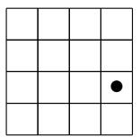

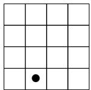

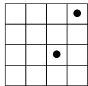

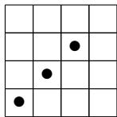  
FIGURE 8. Slices of a permutation array.

For each $y \in [n]^d$ , let $P[y] = \{x \in P \mid x \preceq y\}$ be the principal subarray of $P$ containing all points of $P$ which are dominated by $y$ . Define

$$
\operatorname {r k} _ {j} P = \# \{1 \leq k \leq n \mid \mathrm {t h e r e e x i s t s} x \in P \mathrm {w i t h} x _ {j} = k \}.
$$

$P$ is rankable of rank $r$ if $\mathrm{rk}_j P = r$ for all $1 \leq j \leq d$ . $P$ is totally rankable if every principal subarray of $P$ is rankable.

Example 3.57. The array $Q = \{(1,2),(2,2)\} \subseteq [2]^2$ is not rankable since $\mathrm{rk}_1(Q) = 2$ and $\mathrm{rk}_2(Q) = 1$ .

Example 3.58. For example with $n = 4$ , $d = 3$ , the following subset of $[4]^3$ is a totally rankable dot array:

$$
P = \{(3, 4, 1), (4, 2, 2), (1, 4, 3), (3, 3, 3), (2, 3, 4), (3, 2, 4), (4, 1, 4) \}. \tag {3.21}
$$

We picture this dot array as four 2-dimensional slices according to the last coordinate, where the first one is "slice 1" and the last is "slice 4". See Figure 8. Here, $(3,4,1)$ corresponds to the dot in the first slice from the left in Figure 8, and $(4,2,2)$ corresponds to the dot in the second slice. The two dots in the third slice in correspond to $(1,4,3)$ and $(3,3,3)$ , etc.

To verify this set $P \subset [4]^3$ is totally rankable, we need to verify the rank is well defined for each principal subarray $P[i,j,k]$ with $i,j,k \in [4]$ . For example, the points in $P$ dominated by (3,4,4) are the principal subarray

$$
P [ 3, 4, 4 ] = \{(3, 4, 1), (1, 4, 3), (3, 3, 3), (2, 3, 4), (3, 2, 4) \} \subset P.
$$

These are the dots in $P$ that are visible to (3,4,4) when looking north, west, and down in Figure 8 since the slices should be considered as a 3-dimensional transparent stack.

Note, that the first coordinate among these 3-tuples takes on values $\{1,2,3\}$ , so $\mathrm{rk}_1P[3,4,4] = 3$ . Similarly, the second coordinate takes on values $\{2,3,4\}$ and the third coordinate takes on values $\{1,3,4\}$ , so $\mathrm{rk}_2P[3,4,4] = \mathrm{rk}_3P[3,4,4] = 3$ also. Since $\mathrm{rk}_jP[3,4,4] = 3$ for all $j \in [3]$ , $P[3,4,4]$ is rankable and the rank of $P[3,4,4]$ equal to 3. For the drawings below, we think of $\{1,2,3\}$ as the occupied rows for the dots in $P[3,4,4]$ , $\{2,3,4\}$ are the occupied columns, and $\{1,3,4\}$ are the occupied slices for $P[3,4,4]$ . Continuing in the same way checking that the number of occupied rows equals the number of occupied columns equals the number of occupied slices for all $P[i,j,k]$ , we find $P$ is totally rankable. The full 3-dimensional rank table for $P$ is represented by the list of tables in Figure 9 showing one layer at a time.

The rank table in Figure 9 is realizable as the intersection table for 3 flags in $\mathbb{C}^4$ , call them $B_{\bullet}, R_{\bullet}, G_{\bullet}$ for black, red, and green this time. Here we will think of the rows of the tables as being indexed by $B_1, B_2, B_3, B_4$ and the columns of each table as $R_1, R_2, R_3, R_4$ , as before. The $k^{th}$ slice from left to right determines $\dim(B_i \cap R_j \cap G_k)$ for $1 \leq i, j \leq 4$ .

A shoebox diagram of $B_{\bullet}, G_{\bullet}, R_{\bullet}$ with this intersection data is shown in Figure 10. Let's compare the intersection table with the picture. We see $\dim(B_3 \cap R_4 \cap G_1) = 1$ and we

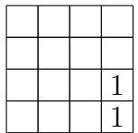

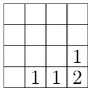

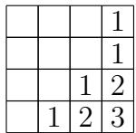

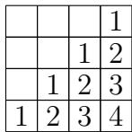  
FIGURE 9. Rank table for $P = \{(3,4,1), (4,2,2), (1,4,3), (3,3,3), (2,3,4), (3,2,4), (4,1,4)\}$ , where the empty boxes mean the rank is 0 for readability.

know $G_{1} \subset G_{3}$ so the green point in the shoebox diagram corresponding to $G_{1}$ is contained in the line at the intersection of the black plane corresponding to $B_{3}$ and the green plane corresponding to $G_{3}$ . The green dot is not coincident to either the black point or the black line according to the data in the first two slices for $G_{1}$ and $G_{2}$ . Since $R_{4} = \mathbb{C}^{4}$ , no additional constraints are imposed on $G_{1}$ by the red flag. However, $\dim(B_{4} \cap R_{2} \cap G_{2}) = 1$ so the green line intersects the red line in the point where the red line meets the green plane. What is the dimension of the set of flags $B_{\bullet}, R_{\bullet}, G_{\bullet}$ that satisfy exactly the constraints imposed by $P$ ? What if $B_{\bullet}$ and $R_{\bullet}$ are fixed?

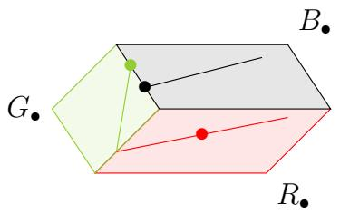  
FIGURE 10. Flags in position determined by the permutation array $P$ from (3.21).

Example 3.59. A subset of a totally rankable array may or may not be rankable. Consider the subset of $P$ above given by the array $A = \{(3,4,1), (4,2,2), (2,3,4)\}$ ; then one can check $A$ is totally rankable. On the other hand, the array $B = \{(3,4,1), (4,2,2), (1,4,3)\} \subset P$ , is not totally rankable since the rank function is not well-defined at every position in $[4]^3$ . For example, $B = B[4,4,4]$ is not rankable. Indeed, the tuples in $B$ only have two distinct values appearing in the second index $\{2,4\}$ (occupied columns) and three in the first and third, $\{1,3,4\}$ and $\{1,2,3\}$ (occupied rows and slices) respectively. So $\mathrm{rk}_1B[4,4,4] = \mathrm{rk}_3B[4,4,4] = 3$ , while $\mathrm{rk}_2B[4,4,4] = 2$ .

Many pairs $P, P'$ of totally rankable dot arrays are rank equivalent, i.e. $\mathrm{rk}_j P[x] = \mathrm{rk}_j P'[x]$ , for all $x$ and $j$ . However, among all rank equivalent dot arrays there is a unique one with a minimal number of dots [117, Prop. 4.1]. In order to characterize the minimal totally rankable dot arrays, we give the following two definitions.

Definition 3.60. A position $y \in [n]^d$ is redundant in $P$ if there exists a collection of dots $R \subset P \setminus \{y\}$ such that $y = \bigvee R$ , $\# R > 1$ , and every $x \in R$ has at least one $x_i = y_i$ . A position $y$ is covered by dots in $P$ if $y$ is redundant for some $R \subset P \setminus \{y\}$ , and for each $1 \leq j \leq d$ there exists some $x \in R$ such that $x_j < y_j$ .

For example, consider the totally rankable array $P$ in Example 3.58 again. The position $(3,4,3)$ is redundant in $P$ since $(3,4,3) = (1,4,3) \lor (3,3,3)$ and $(1,4,3)$ , $(3,3,3) \in P$ . However, the set $\{(1,4,3), (3,3,3)\}$ does not cover $(3,4,3)$ since both of these dots have the same third coordinate as $(1,4,3)$ . The set $R = \{(1,4,3), (3,3,3), (3,4,1)\}$ has join equal to $x = (3,4,3)$ and $R$ does contain an element with first coordinate $1 < x_{1} = 3$ , second coordinate $3 < x_{2} = 4$ , and third coordinate $1 < x_{3} = 3$ , so the position $(3,4,3)$ is both redundant and covered in $P$ . On the other hand, the position $(2,4,3)$ is not redundant in $P$ , and hence not covered.

Theorem 3.61. [118, Theorem 3.2] Let $P$ be a dot array. The following are equivalent:

(1) $P$ is totally rankable.   
(2) Every two dimensional projection of every principal subarray is totally rankable.   
(3) Every redundant position is covered by dots in $P$ .   
(4) If there exist dots in $P$ in positions $y$ and $z$ and integers $i, j$ such that $y_i < z_i$ and $y_j = z_j$ , then there exists a dot in some position $x \preceq (y \lor z)$ such that $x_i = z_i$ and $x_j < z_j$ .

Define a permutation array in $[n]^d$ to be a totally rankable dot array of rank $n$ with no redundant dots (or equivalently, no covered dots). The permutation arrays are the unique representatives of each rank equivalence class of totally rankable dot arrays with no redundant dots. These arrays are Eriksson and Linusson's analogs of permutation matrices.

For example, if $n = 1$ and $d$ is any positive integer, there is a unique permutation array $P = \{(1,1,\dots,1)\} = [1]^d$ . If $d = 1$ and $n$ is a positive integer, there is a unique permutation array $P' = \{(i) \mid i \in [n]\} = [n]^1$ . For $d = 2$ , the permutation arrays are in bijection with permutations. Just as permutations determine all possible tables of intersection dimensions for two flags, the definition of permutation arrays was motivated because they include all possible relative configurations of flags such as the one depicted in Figure 10.

Theorem 3.62. [118, Thm. 3.1] Given $d$ complete flags $E_{\bullet}^{1}, E_{\bullet}^{2}, \ldots, E_{\bullet}^{d}$ in $\mathbb{C}^n$ , there exists an $[n]^d$ -permutation array $P$ with rank table equal to the table of all intersection dimensions as follows. For each $x \in [n]^d$ ,

$$
\operatorname {r k} (P [ x ]) = \dim \left(E _ {x _ {1}} ^ {1} \cap E _ {x _ {2}} ^ {2} \cap \dots \cap E _ {x _ {d}} ^ {d}\right). \tag {3.22}
$$

The feature of permutation arrays is that they are much more manageable as data sets than the full table of intersection dimensions. The elements in a permutation array determine the minimal jumps in dimension in the table of intersection dimensions of flags, and therefore naturally correspond to critical vectors in the geometry.

Based on many examples, Eriksson and Linusson [118, Conj. 3.2] asked

Can every permutation array be realized by flags?

We refer to this question as the Realizability Conjecture. This question is motivated by more than curiosity. A fundamental question is: what are the possible relative configurations of $d$ flags? In other words: what rank tables (intersection dimension) are possible? For $d = 2$ , the answer leads to the theory of Schubert cells and varieties discussed earlier.

The Realizability Conjecture is true for $d = 1,2,3$ . For $d = 1$ , the only permutation array is $[n]$ . The rank table for $[n]$ encodes the dimensions of the subspaces in every flag in $\operatorname{Fl}(n)$ . For $d = 2$ , the permutation arrays are in bijection with the permutation matrices, hence they are all realizable for some pair of flags. Realizability of all permutation arrays in the case

$d = 3$ follows from [335] (as described in [118, §3.2]), see also [361, §4.8]. The case $n \leq 2$ is fairly clear, involving only one-dimensional subspaces of a two-dimensional vector space (or projectively, points on $\mathbb{P}^1$ ), cf. [118, Lemma 4.3]. Nonetheless, the conjecture is false. Counterexamples based on the Fano plane and Pappus' Theorem were first given in [40]. It is interesting that the combinatorics of permutation arrays prevent some naive attempts at counterexamples from working; somehow, permutation arrays see some subtle linear algebraic information, but not all.

Open Problem 3.63. Which permutation arrays in $[n]^d$ can be realized by $d$ complete flags $E_{\bullet}^{1}, E_{\bullet}^{2}, \ldots, E_{\bullet}^{d}$ in $\mathbb{C}^n$ ?

Eriksson and Linusson also gave an algorithm for producing all permutation arrays in $[n]^d$ recursively from the permutation arrays in $[n]^{d-1}$ [118, Sect. 2.3]. We review their algorithm, which we call the EL-algorithm below, as this is key to an algorithm for intersecting Schubert varieties. Warning: this may get a bit technical! It will not be used again in later subsections, so it may be skipped by the reader without losing insight in later material.

Let $A$ be any antichain of dots in $P$ under the dominance order. Let $C(A)$ be the set of positions covered by dots in $A$ . Define the downsizing operator $D(A, P)$ with respect to $A$ on $P$ to be the result of the following process.

(1) Set $Q_{1} = P \setminus A$ .   
(2) Set $Q_{2} = Q_{1}\cup C(A)$   
(3) Set $D(A, P) = Q_2 \setminus R(Q_2)$ where $R(Q)$ is the set of redundant positions of $Q$ .

The downsizing of a totally rankable array $P$ is successful if the resulting array is again totally rankable and has rank $\operatorname{rk}(P) - 1$ .

Theorem 3.64. (The EL-Algorithm) For positive integers $d, n > 1$ , the set of all permutation arrays in $[n]^d$ can be obtained recursively by the following depth-first search algorithm.

(1) Choose a permutation array $P_{n}$ in $[n]^{d - 1}$ .   
(2) If $P_{n}, \ldots, P_{i}$ have been defined and $i > 2$ , then choose a nonempty antichain $A_{i}$ of dots in $P_{i}$ such that the downsizing $D(A_{i}, P_{i})$ is successful, set $P_{i-1} = D(A_{i}, P_{i})$ .   
(3) Set $A_{1} = P_{1}$ .   
(4) Set $P = \bigcup_{i=1}^{n} \{(x_1, \ldots, x_{d-1}, i) \mid (x_1, \ldots, x_{d-1}) \in A_i\}$ . Add $P$ to the list of permutation arrays in $[n]^d$ constructed thus far.

Furthermore, each permutation array $P$ is constructed from a unique $P_n$ in $[n]^{d-1}$ and a unique sequence of nonempty antichains.

Example 3.65. Let $d = 2$ and $n = 4$ . Start with the 2-dimensional permutation array

$$
P _ {4} = \left\{\left(1, 4\right), \left(2, 3\right), \left(3, 1\right), \left(4, 2\right) \right\} \in [ 4 ] ^ {2}
$$

corresponding to the 1's in the permutation matrix for $w = 3421$ . We run through the algorithm as follows. In the figure below, dots correspond to elements in $P_{i}$ and circled dots correspond to elements in $A_{i}$ .

$$
\begin{array}{l} P _ {4} = \{(1, 4), (2, 3), (3, 1), (4, 2) \} \quad A _ {4} = \{(1, 4), (2, 3) \} \\ P _ {3} = \{(2, 4), (3, 1), (4, 2) \} \quad A _ {3} = \{(3, 1) \} \\ P _ {2} = \{(2, 4), (4, 2) \} \quad A _ {2} = \{(2, 4), (4, 2) \} \\ P _ {1} = \{(4, 4) \} \quad A _ {1} = \{(4, 4) \} \\ \end{array}
$$

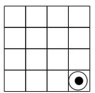

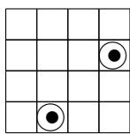

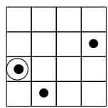

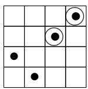

These choices lead to the 3-dimensional array

$$
P = \{(4, 4, 1), (2, 4, 2), (4, 2, 2), (3, 1, 3), (1, 4, 4), (2, 3, 4) \}, \tag {3.23}
$$

which the reader should check is a totally rankable array with no redundant dots of rank 4.

We prefer to display 3-dimensional dot-arrays as 2-dimensional number-arrays as in [118, 361] where a square $(i,j)$ contains the number $k$ if $(i,j,k) \in P$ . The number-array

<table><tr><td></td><td></td><td></td><td>4</td></tr><tr><td></td><td></td><td>4</td><td>2</td></tr><tr><td>3</td><td></td><td></td><td></td></tr><tr><td></td><td>2</td><td></td><td>1</td></tr></table>

also encodes $P$ from (3.23), or equivalently the antichains $A_{1}, A_{2}, A_{3}, A_{4}$ above. Note that there is at most one number in any square of the number-array representing the permutation array. We claim this holds in general, not just this example. Why? By Theorem 3.61 Part 4, if two dots $y, z$ in a totally rankable array $P$ existed such that $y_{1} = z_{1}, y_{2} = z_{2}, y_{3} < z_{3}$ , then there exists a third dot $x \preceq (y \vee z) = z$ in $P$ with $x_{3} = z_{3}$ and $x_{1} < z_{1}$ , but this implies that $z$ is redundant for the set $R = \{x, y\}$ , contradicting the fact that $P$ is a permutation array.

Corollary 3.66. Using the notation defined in Theorem 3.64, each $P_i$ is a totally rankable array of rank $i$ in $[n]^{d-1}$ . Furthermore, if $P$ determines the rank table for flags $E_\bullet^1, \ldots, E_\bullet^d$ , then $P_i$ determines the rank table for $E_\bullet^1, \ldots, E_\bullet^{d-1}$ intersecting the subspace $E_i^d$ , i.e.

$$
\operatorname {r k} \left(P _ {i} [ x ]\right) = \dim \left(E _ {x _ {1}} ^ {1} \cap E _ {x _ {2}} ^ {2} \cap \dots \cap E _ {x _ {d - 1}} ^ {d - 1} \cap E _ {i} ^ {d}\right).
$$

Proof. Observe $P_{i}$ is the totally rankable array obtained from the projection

$$
\left\{\left(x _ {1}, \dots , x _ {d}\right) \mid \left(x _ {1}, \dots , x _ {d}, x _ {d + 1}\right) \in P \text {a n d} x _ {d + 1} \leq i \right\}
$$

by removing all covered elements.

To represent a 4-dimensional permutation array $P$ , we often draw the $n$ 3-dimensional permutation arrays $P_{1},\ldots ,P_{n}$ from the EL-algorithm. For example, when $n = 4$ , the number-arrays

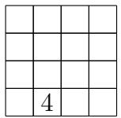

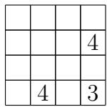

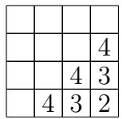

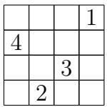

represent the 4-dimensional permutation array $P$ with entries

$$
\begin{array}{l} (4, 2, 4, 1), (2, 4, 4, 2), (4, 4, 3, 2), (3, 3, 4, 3), (3, 4, 3, 3), (4, 3, 3, 3), \\ (4, 4, 2, 3), (1, 4, 1, 4), (2, 1, 4, 4), (3, 3, 3, 4), (4, 2, 2, 4). \\ \end{array}
$$

Here, $(4,2,4,1)$ encodes the fact that in position $(4,2)$ there is a 4 in the slice $P_{1}$ above. Note, there are fewer elements in $P$ than there are numbers on the four slices above. This is because the permutation array $P$ has no redundant dots by definition, while the union of $P_{1}, P_{2}, P_{3}, P_{4}$ does have redundant dots in this case.

As an application, consider again a modern Schubert problem in $\operatorname{Fl}(n)$ . Let $E_{\bullet}^{1}, \ldots, E_{\bullet}^{d}$ be fixed flags in $\mathbb{C}^n$ , and let $w^{1}, w^{2}, \ldots, w^{d}$ be permutations in $S_{n}$ . The permutations are not required to be distinct. Let

$$
X = X _ {w ^ {1}} \left(E _ {\bullet} ^ {1}\right) \cap X _ {w ^ {2}} \left(E _ {\bullet} ^ {2}\right) \cap \dots \cap X _ {w ^ {d}} \left(E _ {\bullet} ^ {d}\right). \tag {3.24}
$$

If $\sum_{i}\mathrm{coinv}(w^{i}) = \binom{n}{2}$ , then $X$ is 0-dimensional. The associated Schubert problem is to find the maximum number of flags in $X$ over all choices of the $d$ fixed flags such that $X$ is a finite set. This maximum number is the intersection number for $w^{1}, w^{2}, \ldots, w^{d}$ . The intersection number is the answer to the statement of a modern Schubert problem in beginning of Section 2.2.

By Definition 3.24, a flag $F_{\bullet}$ is in $X = X_{w^{1}}(E_{\bullet}^{1}) \cap X_{w^{2}}(E_{\bullet}^{2}) \cap \dots \cap X_{w^{d}}(E_{\bullet}^{d})$ if and only if

$$
\dim \left(E _ {i} ^ {a} \cap F _ {j}\right) \geq \operatorname {r k} \left(w ^ {a}\right) [ i, j ]
$$

for all $1 \leq i, j \leq n$ and all $1 \leq a \leq d$ . Such a flag also gives rise to a $(d + 1)$ -dimensional table of intersection dimensions

$$
\dim \left(E _ {x _ {1}} ^ {1} \cap E _ {x _ {2}} ^ {2} \cap \dots \cap E _ {x _ {d}} ^ {d} \cap F _ {x _ {d + 1}}\right). \tag {3.25}
$$

By Theorem 3.62, this table of intersection dimensions is encoded by some permutation array $P \subset [n]^{d + 1}$ . In this case, we say $F_{\bullet}$ has relative position $P$ with respect to $E_{\bullet}^{1}, \ldots, E_{\bullet}^{d}$ . Since $E_{n}^{a} = \mathbb{C}^{n}$ for all $a \in [d]$ , one can recover the 2-dimensional tables $\dim(E_{i}^{a} \cap F_{j})$ from the rank table for $P$ , or equivalently from the table (3.25), by taking all $x_{i} = n$ except for $i = a$ . Therefore, if any other flag $G_{\bullet}$ and $E_{\bullet}^{1}, \ldots, E_{\bullet}^{d}$ also have relative position $P$ , then $G_{\bullet} \in X$ as well.

For a permutation array $P \subset [n]^d$ , let $C_P(E_\bullet^1, \ldots, E_\bullet^d) \subset \mathrm{Fl}(n)$ be the set of all flags $F_\bullet$ with relative position $P$ with respect to $E_\bullet^1, \ldots, E_\bullet^d$ . Again, if $E_\bullet^1, \ldots, E_\bullet^d$ are fixed, we can suppress the list and just write $C_P$ . The $C_P$ 's are generalizations of Schubert cells. It follows that $X$ decomposes as a union of $C_P$ 's. This holds even when $X$ is not a 0-dimensional intersection or if the reference flags are not in generic position.

Billey-Vakil [40, Sect. 5] showed that in the case $E_{\bullet}^{1}, \ldots, E_{\bullet}^{d}$ are generically chosen, there is a unique permutation array $P$ such that $X = C_P$ provided $X$ is nonempty, and furthermore $P$ can be identified by an explicit recursive algorithm. They also showed how to use $P$ to write down equations for $X$ . These equations can also be used to determine if $E_{\bullet}^{1}, \ldots, E_{\bullet}^{d}$ are sufficiently general for computing the generic number of flags in the intersection assuming the $d$ permutations in $S_n$ are fixed and the reference flags are allowed to vary. The number of solutions will always be either infinite or no greater than the expected number. The expected number is achieved on a dense open subset of $\operatorname{Fl}(n)^d$ . Following [40], there are two key statements needed to identify the unique permutation array $P$ for this problem when $X$ is nonempty. Lemma 3.67 below could be a good exercise for the reader.

Lemma 3.67. The permutation array corresponding to $d$ generically chosen flags $E_{\bullet}^{1}, \ldots, E_{\bullet}^{d}$ is given by the transverse permutation array

$$
T _ {n, d} = \left\{\left(x _ {1}, \dots , x _ {d}\right) \in [ n ] ^ {d} \mid \sum x _ {i} = (d - 1) n + 1 \right\}. \tag {3.26}
$$

This permutation array corresponds to the transverse rank table

$$
\operatorname {r k} \left(T _ {n, d} [ x ]\right) = \max  \left(0, n - \sum_ {i = 1} ^ {d} \left(n - x _ {i}\right)\right)
$$

for all $x = (x_{1},\ldots ,x_{d})\in [n]^{d}$

Remark 3.68. The nomenclature comes from the geometry of linear spaces. Two subspaces $U$ and $V$ in $\mathbb{C}^n$ are said to be in transverse position provided their intersection is just the origin unless $\dim(U) + \dim(V) \geq n$ , and if $\dim(U) + \dim(V) \geq n$ , then the dimension of $U \cap V$ is $\dim(U) + \dim(V) - n$ , which is between 0 and $n$ . The terminology carries over to manifolds and varieties by considering their tangent spaces at any point. The concept generalizes the notion of two lines in "general position" in $\mathbb{R}^3$ . Two generically chosen flags $F_\bullet$ and $G_\bullet$ will have subspaces $F_i$ and $G_j$ in transverse position. It is very difficult to specify a generic choice of flags in practice since we are restricted by the limits of computation with modern computers. However, testing for transversality is easy in comparison. See [40, Cor 5.2] for a sufficient criterion for genericity.

Example 3.69. In the case $n = 4, d = 3$ , the transverse permutation array is

$$
T _ {4, 3} = \begin{array}{c c c c} \hline & & & 4 \\ \hline & & 4 & 3 \\ \hline & 4 & 3 & 2 \\ \hline 4 & 3 & 2 & 1 \\ \hline \end{array} .
$$

To describe the unique permutation array $P$ corresponding to a Schubert problem with permutations $w^{1},\ldots ,w^{d}$ , note that each intersection of the form

$$
E _ {x _ {1}} ^ {1} \cap E _ {x _ {2}} ^ {2} \cap \dots \cap E _ {x _ {d}} ^ {d} \cap F _ {x _ {d + 1}}
$$

can be simplified if $x_{i} = n$ since $E_{n}^{i} = \mathbb{C}^{n}$ . Furthermore, by construction $\dim(E_{i}^{a} \cap F_{j})$ is determined by the rank table corresponding to the permutation $w^{a}$ . Thus, to determine $\operatorname{rk}(P[x])$ for $x = (x_{1}, \ldots, x_{d}, j)$ , it suffices to consider the dimensions of intersections of the form

$$
d _ {j} (s _ {1}, s _ {2}, \dots , s _ {k}) := \dim \left(E _ {x _ {s _ {1}}} ^ {s _ {1}} \cap E _ {x _ {s _ {2}}} ^ {s _ {2}} \cap \dots \cap E _ {x _ {s _ {k}}} ^ {s _ {k}} \cap F _ {j}\right) = \operatorname {r k} (P [ x ])
$$

where $1 \leq s_1 < s_2 < \dots < s_k \leq d$ , $k \geq 2$ , and $1 \leq x_{s_j} \leq n - 1$ for each $1 \leq j \leq k$ , and $x_i = n$ for all $i \notin \{s_1, s_2, \ldots, s_k\}$ . Proposition 3.70 can be derived from the algorithm given in [40, Sect. 5], but did not appear explicitly there.

Proposition 3.70. [40, Sect. 5] The unique permutation array $P$ corresponding to a Schubert problem $X$ as in (3.24) with permutations $w^1, \ldots, w^d$ satisfying $\sum \operatorname{codim}(w^a) = \binom{n}{2}$ is determined by the table of intersection dimensions satisfying the recurrence

$$
d _ {j} (s _ {1}, s _ {2}, \ldots , s _ {k}) = \max \left\{ \begin{array}{l} d _ {j} (s _ {1}) + d _ {j} (s _ {2}, \ldots , s _ {k}) - j \\ d _ {j - 1} (s _ {1}, s _ {2}, \ldots , s _ {k}) \end{array} \right.
$$

where $1 \leq s_1 < s_2 < \dots < s_k \leq d$ , $k \geq 2$ , $1 \leq x_{s_i} \leq n - 1$ for each $1 \leq i \leq k$ , $\dim(F_0) := 0$ , and for all $F_\bullet \in X$ the value $d_j(s_i) = \dim(E_{x_{s_i}}^{s_i} \cap F_j)$ is determined by the rank table corresponding to the permutation $w^{s_i}$ .

Proof. One can determine $\mathrm{rk}(P[x])$ at any fixed $x = (x_{1},\ldots ,x_{d},j)$ with $1\leq x_{s_j}\leq n - 1$ for each $1\le j\le k$ , and $x_{i} = n$ for all $i\notin \{s_1 < s_2 < \dots < s_k\}$ by induction on $j,k\geq 0$ . The base case when $j = 0$ is given by $d_0(s_1,s_2,\ldots ,s_k) = 0$ for all $1\leq s_1 < s_2 < \dots < s_k\leq d$ since $\dim (F_0) = 0$ . If $k = 0$ , we have $\mathrm{rk}(P[x]) = j$ . If $k = 1$ , then $\mathrm{rk}(P[x])$ is determined by the hypothesis $d_{j}(s_{1}) = \dim \left(E_{x_{s_{1}}}^{s_{1}}\cap F_{j}\right) = \mathrm{rk}(P[x])$ .

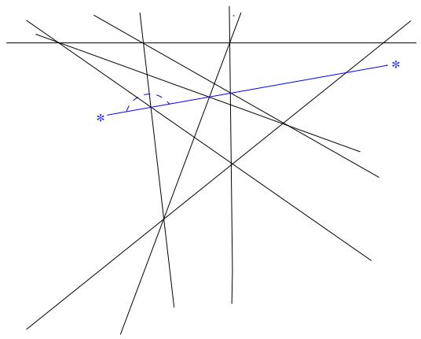  
FIGURE 11. The Pappus line configuration on 9 lines. The arc represents an impossible "hop" by the *blue line* over an intersection. This leads to an unrealizable permutation array.

For $j > 0$ and $k > 1$ , assume $d_{j}(s_{1}), d_{j}(s_{2},\ldots ,s_{k})$ , and $d_{j - 1}(s_1,s_2,\dots ,s_k)$ are known by induction. Since $F_{j - 1}\subset F_j$ , we know

$$
d _ {j} \left(s _ {1}, s _ {2}, \dots , s _ {k}\right) \geq d _ {j - 1} \left(s _ {1}, s _ {2}, \dots , s _ {k}\right).
$$

For any two subspaces $U, V$ in $F_{j}$ , we know $\dim(U \cap V) \geq \dim(U) + \dim(V) - j$ . Therefore,

$$
d _ {j} (s _ {1}, s _ {2}, \dots , s _ {k}) \geq d _ {j} (s _ {1}) + d _ {j} (s _ {2}, \dots , s _ {k}) - j.
$$

Since the base flags $E_{\bullet}^{s_1}, E_{\bullet}^{s_2}, \ldots, E_{\bullet}^{s_k}$ are generic, $\mathrm{rk}(P[x]) = d_j(s_1, s_2, \ldots, s_k)$ is the minimal value satisfying these two inequalities.

Remark 3.71. Note in [40], the Schubert variety labeled by $w$ is our $X_{ww_0}$ , but the difference is only in the label. The rank conditions are written the same way. So, in their work, $\operatorname{codim}(X_w) = \ell(w)$ , and a 0-dimensional intersection has $\sum \ell(w^{(i)}) = \binom{n}{2}$ .

In [361], Vakil gave an algorithm to determine intersection numbers for Schubert varieties in Grassmannian varieties using a "checkers game". Each step of this game corresponds geometrically to a torus degeneration that takes the moving flag one step closer to the base flag, in a specified way. In each step, the corresponding intersection either corresponds with one checker configuration or it branches into two components. The black checkers in the game play the role of the permutation array determining the table of intersections between the two complete flags. The white checkers determine another permutation array that determines the table of intersections of a subspace $V$ in the intersection of two Grassmannian Schubert varieties with the subspaces formed by intersecting the subspaces in the two flags. In the end, the moving flag and the base flag become the same, and at that point, each white checker configuration determines exactly one irreducible component of the intersection. The intersection numbers are given by counting the different types of terminal checkers games.

Exercise 3.72. For a permutation array $P$ with rank table $\operatorname{rk}(P[x])$ for all $x \in [n]^d$ , describe an algorithm to reconstruct $P$ from the data in the rank table.

Exercise 3.73. The Pappus configuration of lines is shown in Figure 11. First, find a permutation array that goes with the Pappus configuration by choosing a special point on each line. Second, find the permutation array that goes with the line configuration shown in

Figure 11 where the blue line somehow does not intersect the leftmost crossing. Note, this picture is drawn projectively so each line represents a 2-dimensional plane, which all contain the origin.

Open Problem 3.74. Is there a method to compute intersection numbers for $\operatorname{Fl}(n)$ via moving the dots in a permutation array in some specified way?

3.7. Schubert Calculus and Cohomology of Flag Varieties. Intersection of sets is a commutative relation, just like multiplication in a commutative ring. What if we could convert Schubert problems in enumerative geometry into problems in polynomial rings? This question leads to the topics of intersection theory, Schubert calculus, cohomology rings, and Chow rings. We will survey this approach here and refer the interested reader to the two books by William Fulton on the topic [133, 134], which laid out the rigorous foundation of the theory. See also the book by Eisenbud-Harris called "3264 & All That: Intersection Theory in Algebraic Geometry" [114] and the recent book by Anderson-Fulton "Equivariant Cohomology" [9].

The integral cohomology ring of a topological space $X$ is a graded-commutative ring, denoted $H^{*}(X) = \bigoplus H^{i}(X)$ . We will consider cohomology only over the integers, but rational numbers and other choices of coefficient rings are important as well. If two spaces are homotopy equivalent, then their cohomology rings are isomorphic. There are different ways to define cohomology such as singular cohomology or de Rham cohomology. The Chow ring is another variation on this theme. It is notable that for the flag varieties $\operatorname{Fl}(n)$ , these different cohomology theories agree. In each case, one could ask for an algebraic model of the cohomology ring of $X$ , for instance as a polynomial ring modulo an ideal. For example, complex projective space $\mathbb{P}^n$ , consisting of complex lines through the origin in $\mathbb{C}^{n+1}$ , has integral cohomology ring isomorphic to $\mathbb{Z}[x] / \langle x^{n+1} \rangle$ , where $x$ is an indeterminate of degree 2. Here $x$ has degree 2 because $\mathbb{C} \simeq \mathbb{R}^2$ .

In the 1950's, Armand Borel was a visionary in algebraic topology and algebraic groups, not to be confused with Emile Borel of Borel measure fame. One of his celebrated results relates the cohomology ring of the flag varieties to the coinvariant algebra from invariant theory. His work generalizes to all flag varieties $G / B$ for semisimple Lie groups $G$ and Borel subgroups $B$ [55]. A key fact used to prove his result is that $G / B$ can also be represented by a compact Lie group modulo a maximal torus, $U_{n} / T$ ; see Exercise 3.6. Borel was a member of the Bourbaki group, along with Bruhat, Cartan, Chevelley and Ehresmann [16]. The Bourbaki text "Groupes et Algèbres de Lie" is a classic text related to generalized flag varieties, Weyl groups, root systems, and invariant theory [57]. These days much of the material in [57] is also covered by [52] and [184], but some of the motivation from flag varieties has been omitted.

Definition 3.75. The coinvariant algebra $R_{n}$ is the quotient of the polynomial ring $\mathbb{Z}[x_1, x_2, \ldots, x_n]$ modulo the ideal $I_{n}^{+}$ generated by all homogeneous polynomials of positive degree that are invariant under the natural $S_{n}$ action permuting the variables.

The Fundamental Theorem of Invariant Theory says that the ring of symmetric polynomials in $\mathbb{Z}[x_1, x_2, \ldots, x_n]$ is exactly the freely generated polynomial ring $\mathbb{Z}[h_1, h_2, \ldots, h_n]$ , where the homogeneous symmetric polynomial of degree $k$ is

$$
h _ {k} = h _ {k} (x _ {1}, \dots , x _ {n}) = \sum x _ {1} ^ {i _ {1}} x _ {2} ^ {i _ {2}} \dots x _ {n} ^ {i _ {n}} \tag {3.27}
$$

and the sum is over all monomials of degree $k = i_1 + \ldots + i_n$ . Therefore, the ideal $I_n^+$ is minimally generated by $h_1, h_2, \ldots, h_n$ .

Theorem 3.76. [55] The Borel Presentation. The cohomology ring of the flag variety is isomorphic to the coinvariant algebra,

$$
H ^ {*} (\operatorname {F l} (n), \mathbb {Z}) \simeq \mathbb {Z} [ x _ {1}, x _ {2}, \dots , x _ {n} ] / I _ {n} ^ {+} = R _ {n}
$$

Exercise 3.77. Use the fact that $I_{n}^{+} = \langle h_{1},h_{2},\ldots ,h_{n}\rangle$ to prove $R_{n}$ has a linear basis of monomials of the form $x_{1}^{c_{1}}x_{2}^{c_{2}}\dots x_{n}^{c_{n}}$ where $0\leq c_{i}\leq n - i$ . Hence, $\dim (R_n) = n!$ .

To connect the Borel presentation with modern Schubert problems, we give a brief introduction to the Chow ring of a variety, instead of using singular cohomology. Since the two rings are isomorphic for the flag variety, one can use either variation. Given a smooth variety $Z$ , each of its irreducible subvarieties $X \subset Z$ gives rise to an element in the Chow ring of $Z$ , called its Chow class and denoted $[X]$ . We consider two irreducible subvarieties $X, Y \subset Z$ to give rise to the same element in the Chow ring if they are rationally equivalent, denoted $X \sim Y$ . Roughly speaking, $X \sim Y$ means we can smoothly deform $X$ from its current position in $Z$ to align with $Y$ . Let $A^{*}(Z) = \bigoplus A^{d}(Z)$ denote the Chow ring of $Z$ with elements given by linear combinations of cohomology classes modulo rational equivalence. The graded component $A^{d}(Z)$ is spanned by classes $[X]$ where $\operatorname{codim}(X) = d$ .

Every ring has a rule for addition and a rule for multiplication. Addition in the Chow ring is just formal addition. If $X, Y$ are subvarieties of $Z$ , the sum of the corresponding classes is denoted $[X] + [Y]$ . The additive identity is the class of the empty set, which is a subvariety of $Z$ itself. We write $0 = [\emptyset]$ . Furthermore, if $Y \subset Z$ is the union of irreducible subvarieties $X_1 \cup \dots \cup X_k$ , then the class of $Y$ decomposes as $[Y] = [X_1] + \dots + [X_k]$ . Some of these components $X_i$ may be rationally equivalent, so coefficients other than 0 or 1 can appear in the expansion of $[Y]$ .

Multiplication in the Chow ring is modeled on the intersection problems discussed in this chapter and later in this book. To multiply the classes $[X] \cdot [Y]$ , first we "move" $Y$ into transverse position with respect to $X$ via rational equivalence to obtain $Y'$ , and then take the class of the intersection. So by definition $[X] \cdot [Y] = [X \cap Y']$ . The class $[X \cap Y']$ is well defined and any generic choice of $Y' \sim Y$ suffices to identify the class of the intersection. Furthermore, if $[X] \in A^d(Z)$ and $[Y] \in A^e(Z)$ , then $[X][Y] \in A^{d + e}$ reflects the fact that $\operatorname{codim}(X) + \operatorname{codim}(Y) = \operatorname{codim}(X \cap Y)$ provided the intersection is nonempty and $X, Y$ are in transverse position. Thus, the Chow ring $A^*(Z)$ is a graded, commutative, associative ring with multiplicative identity given by $[Z]$ . We should note that the process of "moving" $Y$ to an appropriate $Y'$ is a subtle construction for arbitrary varieties $Z$ , but in the case of flag varieties it is straightforward, as discussed below.

Defining rational equivalence explicitly is beyond the scope of this chapter because it is a subtle concept in general, and we can simply state the facts we need in the context of Schubert varieties. Instead, we offer some examples to build some intuition for the concept. Any two hypersurfaces defined by polynomial equations $f = 0$ and $g = 0$ in $\mathbb{R}^n$ are rationally equivalent, because we can let $t$ vary from 0 to 1 in the family $tf + (1 - t)g = 0$ . So every line in $\mathbb{R}^2$ is rationally equivalent to every other line, and they are also equivalent to a parabola. Rational equivalence is more interesting in projective space. For instance, suppose $X$ is the subvariety $\{[x:y] \in \mathbb{P}^1 : y = 0\} = \{[1:0]\}$ and $Y$ is the subvariety defined by $x^2 - y^2 = 0$ consisting of the two points $[1:1]$ , $[1 - 1]$ . We cannot consider the family of hypersurfaces

defined by $t(x^2 - y^2) + (1 - t)y = 0$ since this equation is not homogeneous in $x, y$ . We could homogenize the equation to get $t(x^2 - y^2) + (1 - t)y^2 = 0$ , but letting $t$ vary from 0 to 1 now shows that $Y$ is rationally equivalent to the subvariety defined by $y^2 = 0$ . In the algebraic setting of the Chow ring, we must view this as defining the point $[1:0]$ with multiplicity 2, which is not the same as $X$ . With a little more work it can be shown that $X$ and $Y$ are not rationally equivalent because the multiplicity does matter.

As described above, the Chow ring $A^{*}(Z)$ may be infinitely generated as a ring. However, it has a very nice structure as an abelian group in the following special but important case. We say $Z$ has a cellular decomposition or affine paving if there is a chain of subvarieties $\emptyset = Z_{0} \subseteq Z_{1} \subseteq \dots \subseteq Z_{m} = Z$ such that each $Z_{i} \setminus Z_{i-1}$ is a disjoint union $\bigcup_{j} C_{ij}$ where each $C_{ij}$ is isomorphic, as a complex variety, to some affine space $\mathbb{C}^d$ . The sets $C_{ij}$ are called the cells of $Z$ . Cellular decompositions are algebraic analogs of the notion of a CW-decomposition in topology.

If the cells of $Z$ are $\{C_1, \ldots, C_k\}$ , then their Zariski closures $\overline{C}_i$ are subvarieties in $Z$ by definition. The corresponding classes $\{[\overline{C}_i] \mid i \in [k]\}$ form a linear basis for the Chow ring of $Z$ , which is free abelian of rank $k$ . More specifically, the $d^{th}$ graded component $A^d(Z)$ is spanned by all of the classes $[\overline{C}_i]$ such that $\operatorname{codim}(C_i) = d$ . One can further show that $A^*(Z)$ is isomorphic to the singular cohomology ring $H^*(Z; \mathbb{Z})$ when $Z$ is smooth and has a cellular decomposition; see [133, Ch. 1 and Ch. 19].

Exercise 3.78. Describe the Chow ring of $\mathbb{P}^n$ by identifying a cellular decomposition of the space so that the additive and multiplicative structure is isomorphic to $\mathbb{Z}[x] / \langle x^{n + 1}\rangle$ .

Exercise 3.79. Describe the Chow ring $A^{*}(\mathbb{C}^{n})$ .

Related varieties have related Chow rings. To be precise, if $f: Y \to Z$ is a map between smooth varieties, there is a ring homomorphism $f^{*}: A^{*}(Z) \to A^{*}(Y)$ induced in the opposite direction [133, Ch. 6]. This assignment is functorial in the sense that $(f \circ g)^{*} = g^{*} \circ f^{*}$ and the identity map on a variety induces the identity map on its Chow ring. In general the action of $f^{*}$ can be non-trivial to describe, but we use only the following special cases.

# Proposition 3.80.

(a) Suppose $f$ is a closed embedding. Given $[X] \in A^{*}(Z)$ , choose a subvariety $X' \subseteq Z$ rationally equivalent to $X$ and transverse to $f(Y)$ , so that $[X][f(Y)] = [X' \cap f(Y)]$ . Then $f^{*}([X]) = [f^{-1}(X' \cap f(Y))]$ .   
(b) Suppose $Y$ and $Z$ are smooth and irreducible, and $\dim f^{-1}(z)$ is constant for $z \in Z$ . Then $f^{*}([X]) = [f^{-1}(X)]$ .

See [133, Ch. 6] and [133, §1.7, §8.3]. For example, suppose $f: \mathbb{P}^n \to \mathbb{P}^{n+1}$ is the embedding sending $[z_0: \dots: z_n]$ to $[z_0: \dots: z_n: 0]$ . Using the isomorphism from Exercise 3.78, $f^*$ is the quotient map $\mathbb{Z}[x] / \langle x^{n+1} \rangle \to \mathbb{Z}[x] / \langle x^n \rangle$ .

The complete flag variety $\operatorname{Fl}(n)$ is a smooth variety and it has a nice cell decomposition, so its Chow ring $A^{*}(\operatorname{Fl}(n))$ serves as a fundamental example for this theory. There is a smooth path through $GL_{n}(\mathbb{C})$ connecting every invertible matrix with any other by left multiplication, and this action carries over to flags in $G / B \simeq \operatorname{Fl}(n)$ . Therefore, $X_{w}(E_{\bullet})$ is rationally equivalent to $X_{w}(F_{\bullet})$ for all $F_{\bullet} \in \operatorname{Fl}(n)$ . The choice of base flag is irrelevant in terms of computing cohomology classes in the Chow ring. So, we denote the Schubert classes $[X_{w}(E_{\bullet})] = [X_{w}(F_{\bullet})]$ simply by $[X_w]$ .

To identify an affine paving of $\operatorname{Fl}(n)$ , one can use the rank function on Bruhat order and equation (3.17). Set

$$
Z_{i} = \bigcup_{\substack{w\in S_{n}:\\ \ell (w) = i}}X_{w} = \bigcup_{\substack{v\in S_{n}:\\ \ell (v)\leq i}}C_{v}
$$

for $0 \leq i \leq \binom{n}{2}$ . It is straightforward to verify that $\emptyset = Z_0 \subseteq Z_1 \subseteq \dots \subseteq Z_m = Z$ and each $Z_i \setminus Z_{i-1}$ is a disjoint union of cells in this case, namely the Schubert cells $C_w$ for $w \in S_n$ with $i$ inversions. Therefore, the Schubert classes $\{[X_w] \mid w \in S_n\}$ form a basis of the Chow ring of $\operatorname{Fl}(n)$ , and hence, every subvariety of the flag variety is rationally equivalent to a union of translates of Schubert varieties $X_w(F_\bullet)$ for possibly different base flags. Since the complex codimension of $C_w$ is the number of non-inversions of $w$ , denoted $\operatorname{coinv}(w)$ , we know the $2d^{th}$ graded component of the Chow ring of $\operatorname{Fl}(n)$ is spanned by all of the Schubert classes $[X_w]$ such that $\operatorname{coinv}(w) = d$ . Furthermore, $[X_u] = [X_v]$ in $A^*(\operatorname{Fl}(n))$ if and only if $u = v$ , by linear independence.

In summary, the Chow ring of $\operatorname{Fl}(n)$ , denoted

$$
A ^ {*} (\operatorname {F l} (n)) = \bigoplus_ {d = 0} ^ {\binom {n} {2}} A ^ {2 d} \tag {3.28}
$$

is a commutative graded ring such that $A^{2d}$ is spanned by $\{[X_w] \mid \operatorname{coinv}(w) = d\}$ and $A^{2d+1}$ is 0. Therefore, its Poincaré-Hilbert series is

$$
\sum_ {d \geq 0} \dim (A ^ {d}) q ^ {d} = [ n ] _ {q ^ {2}}! := \sum_ {w \in S _ {n}} q ^ {2 \operatorname {c o i n v} (w)} = \prod_ {k = 1} ^ {n - 1} \left(1 + q ^ {2} + q ^ {4} + \dots + q ^ {2 k}\right). \tag {3.29}
$$

Since the Chow ring and the cohomology ring of $\operatorname{Fl}(n)$ are isomorphic, we know (3.29) is the Poincaré polynomial of $\operatorname{Fl}(n)$ and the Euler characteristic of $\operatorname{Fl}(n)$ is $n!$ since

$$
\chi (\operatorname {F l} (n)) = \sum_ {d \geq 0} (- 1) ^ {d} \dim (A ^ {d}) = \left[ \prod_ {k = 1} ^ {n - 1} (1 + q ^ {2} + q ^ {4} + \dots + q ^ {2 k}) \right] _ {q = - 1} = n!.
$$

Remark 3.81. Warning, many authors dispense with the technicality that $\mathbb{C}$ is 2-dimensional and just work with complex dimensions. In that case, $A^d (\operatorname {Fl}(n))$ is spanned by the set of all Schubert classes $[X_w]$ for $w\in S_n$ such that $\operatorname {coinv}(w) = d$ . Perhaps the only place this technicality matters is when determining the Euler characteristic. The functions $[n]_{q^2}!$ and $[n]_q!$ are not equal, and they remain not equal when $q = -1$ . In fact, $[n]_{q = -1}! = 0$ for $n\geq 2$ .

Next we consider multiplication in the Chow ring of the flag variety. Recall $X_{w_0}$ is the whole flag variety itself, so $[X_{w_0}][X_w] = [X_w]$ in the Chow ring. In other words, $[X_{w_0}]$ plays the role of the identity element in the ring $A^{*}(\operatorname{Fl}(n))$ .

The Schubert class $[X_{\mathrm{id}}]$ also plays a special role in the Chow ring. The intersection conditions in Definition 3.24 imply $X_{\mathrm{id}}(E_{\bullet})$ contains exactly the one flag $E_{\bullet}$ . We know $GL_n(\mathbb{C})$ acts transitively on $\operatorname{Fl}(n)$ , so every flag is rationally equivalent to every other flag as a point in the flag variety. Hence, multiplication in the Chow ring is closely related to the 0-dimensional Schubert problems discussed in Section 3.6. The following theorem equates the geometry of Schubert intersection problems to the algebraic problem of computing product expansions of Schubert classes in the Schubert basis of Chow rings. This is the

fundamental advantage of using Chow rings! The proof follows directly from the discussion.

Theorem 3.82 (Intersection to Chow Ring Multiplication). The number of flags in the intersection

$$
X = X _ {w ^ {1}} \left(E _ {\bullet} ^ {1}\right) \cap X _ {w ^ {2}} \left(E _ {\bullet} ^ {2}\right) \cap \dots \cap X _ {w ^ {d}} \left(E _ {\bullet} ^ {d}\right),
$$

assuming the reference flags are chosen generically and the intersection is 0-dimensional, is exactly the coefficient of $[X_{\mathrm{id}}]$ in the class $[X] = [X_{w^1}][X_{w^2}]\dots [X_{w^d}]$ when expanded in the basis of Schubert classes.

3.8. Schubert Structure Constants. The Schubert structure constants $c_{uv}^w$ in the Chow ring of the flag variety are the coefficients that arise when we expand $[X_u][X_v]$ into the basis of Schubert classes $\{[X_w] \mid w \in S_n\}$ . Define the constants $c_{uv}^w$ by

$$
[ X _ {u} ] [ X _ {v} ] = \sum c _ {u v} ^ {w} [ X _ {w} ]. \tag {3.30}
$$

As we will show, each structure constant $c_{uv}^w$ is a nonnegative integer. This is a special property of structure constants in the Chow ring of the flag variety! As we will see, the product $[X_u][X_v]$ in the Chow ring is determined by the variety $X_u(E_\bullet) \cap X_v(\mathbb{Z}_\bullet)$ , known as the Richardson variety for $u, v \in S_n$ . Despite the name, these varieties had previously been studied by Kazhdan-Lusztig [196]. Richardson varieties are irreducible subvarieties of the flag variety [321]. The sum on the right side of (3.30) is not necessarily a single Schubert class, so these irreducible intersections can be rationally equivalent to a nontrivial union of Schubert varieties in general position since the Chow ring of the flag manifold is spanned by Schubert classes.

Recall from Section 3.6 that modern Schubert calculus is the study of the intersection numbers that arise in the intersections of Schubert varieties in the generic case. Once one knows the Schubert structure constants, one also knows how to expand any product $[X_{w^1}][X_{w^2}]\dots [X_{w^d}]$ in the basis of Schubert classes. Furthermore, we can use the following lemma to show each Schubert structure constant $c_{uv}^{w}$ is determined by a 0-dimensional Schubert problem depending on intersecting three Schubert varieties in sufficiently generic position.

Lemma 3.83. Let $E_{\bullet}$ be the standard base flag, and let $\mathcal{E}_{\bullet} = (e_n, e_{n-1}, \ldots, e_1)$ be the flag associated to the standard basis in reverse order. Then $X_w(E_{\bullet}) \cap X_{w_0w}(\mathcal{E}_{\bullet})$ contains exactly one flag, namely $w_{\bullet} = (e_{w_1}, e_{w_2}, \ldots, e_{w_n})$ . More generally, $X_w(F_{\bullet}) \cap X_{w_0w}(G_{\bullet})$ contains exactly one flag for any pair of transverse flags $F_{\bullet}$ and $G_{\bullet}$ .

Proof. Consider the Schubert cells defined with respect to $\mathcal{H}_{\bullet} = (e_n, e_{n-1}, \ldots, e_1)$ . By Definition 3.21 and Exercise 3.27, a flag $G_{\bullet} \in C_w(\mathcal{H}_{\bullet})$ can be represented by an ordered basis $(g_1, g_2, \ldots, g_n)$ such that $g_j$ is in the span of $\{e_n, e_{n-1}, \ldots, e_{n-w_j+1}\}$ for each $j \in [n]$ . Such a flag can be represented by a variation on the canonical matrices from Definition 3.4 that are upside down from those defined with respect to $E_{\bullet}$ . Each pivot 1 in such a canonical representative has 0's to its right and above. A flag is in $C_w(\mathcal{H}_{\bullet})$ if the pivot 1's in its canonical matrix with respect to $\mathcal{H}_{\bullet}$ are in positions $(n - w_j + 1, j)$ , or equivalently in position $w$ if we count up from the bottom instead of the usual matrix notation. By matrix multiplication, one can check that the permutation $[n - w_1 + 1, n - w_2 + 1, \ldots, n - w_n + 1]$ is equal to $w_0w$ . Therefore, the flag $w_{\bullet}$ is the only flag in $C_w(E_{\bullet}) \cap C_{w_0w}(\mathcal{H}_{\bullet})$ . See Figure 12 for a specific example.

$$
\left[ \begin{array}{c c c c c c c c} * & * & * & * & * & * & 1 \\ * & * & 1 & 0 & 0 & 0 & 0 & 0 \\ * & * & 0 & * & * & 1 & 0 & 0 \\ 1 & 0 & 0 & 0 & 0 & 0 & 0 & 0 \\ 0 & * & 0 & * & * & 0 & 1 & 0 \\ 0 & 1 & 0 & 0 & 0 & 0 & 0 & 0 \\ 0 & 0 & 0 & * & 1 & 0 & 0 & 0 \\ 0 & 0 & 0 & 1 & 0 & 0 & 0 & 0 \end{array} \right] \cap \left[ \begin{array}{c c c c c c c c} 0 & 0 & 0 & 0 & 0 & 0 & 0 & 1 \\ 0 & 0 & 1 & 0 & 0 & 0 & 0 & 0 \\ 0 & 0 & * & 0 & 0 & 1 & 0 & 0 \\ 1 & 0 & 0 & 0 & 0 & 0 & 0 & 0 \\ * & 0 & * & 0 & 0 & * & 1 & 0 \\ * & 1 & 0 & 0 & 0 & 0 & 0 & 0 \\ * & * & * & 0 & 1 & 0 & 0 & 0 \\ * & * & * & 1 & 0 & 0 & 0 & 0 \end{array} \right] = \left[ \begin{array}{c c c c c c c c} 0 & 0 & 0 & 0 & 0 & 0 & 0 & 1 \\ 0 & 0 & 1 & 0 & 0 & 0 & 0 & 0 \\ 0 & 0 & 0 & 0 & 0 & 1 & 0 & 0 \\ 1 & 0 & 0 & 0 & 0 & 0 & 0 & 0 \\ 0 & 0 & 0 & 0 & 0 & 0 & 1 & 0 \\ 0 & 1 & 0 & 0 & 0 & 0 & 0 & 0 \\ 0 & 0 & 0 & 0 & 1 & 0 & 0 & 0 \\ 0 & 0 & 0 & 1 & 0 & 0 & 0 & 0 \end{array} \right].
$$

FIGURE 12. $C_{46287351}(E_{\bullet}) \cap C_{53712648}(\mathcal{H}_{\bullet})$ contains only the flag corresponding with the permutation matrix of 46287351.

We claim the cells of $X_w(E_\bullet)$ of dimension strictly smaller than $C_w$ do not intersect $X_{w_0w}(\mathcal{E}_\bullet)$ . To prove the claim, recall from Exercise 3.39 that the boundary of $X_w(E_\bullet)$ is the union of Schubert varieties $X_v(E_\bullet)$ where $v = wt_{ij}$ for some $i < j$ with $w_i > w_j$ and $\ell(v) = \ell(w) - 1$ . In particular, any flag $G_\bullet \in X_v(E_\bullet)$ would have

$$
\dim (E _ {v _ {i}} \cap G _ {i}) \geq \operatorname {r k} (v) [ v _ {i}, i ] > \operatorname {r k} (w) [ v _ {i}, i ],
$$

so any matrix $M$ representing a flag $G_{\bullet} \in X_v(E_{\bullet})$ would have rank strictly larger than $\mathrm{rk}(w)[v_i, i]$ in the northwest submatrix with lower right corner at $(v_i, i)$ . On the other hand, any flag in $X_{w_0w}(\mathbb{E}_{\bullet})$ must be represented by a matrix with rank at most $\mathrm{rk}(w)[v_i, i]$ in the northwest submatrix with lower right corner at $(v_i, i)$ by considering the canonical matrix representatives with 0's above and to the right of the pivot 1's. So $X_v(E_{\bullet}) \cap X_{w_0w}(\mathbb{E}_{\bullet}) = \emptyset$ . This completes the proof of the first statement.

More generally, if $F_{\bullet}$ and $G_{\bullet}$ are transverse, then the dimension of $F_{i} \cap G_{n - i + 1}$ is exactly 1 for each $1 \leq i \leq n$ . Let $f_{i}$ be a nonzero vector in $F_{i} \cap G_{n - i + 1}$ . Then $F_{\bullet} = (f_{1}, \ldots, f_{n})$ and $G_{\bullet} = (f_{n}, \ldots, f_{1})$ so with respect to the $v$ -basis, the generic situation reduces to the case above.

Exercise 3.84. Say $w, y \in S_n$ and $\ell(w) = \ell(y)$ , but $w \neq y$ . Prove $X_w(E_\bullet) \cap X_{w_0y}(\mathcal{H}_\bullet) = \emptyset$ where $\mathcal{H}_\bullet = (e_n,.., e_1)$ is the reverse standard flag. Conclude that $[X_w][X_{w_0y}] = 0$ in $A^*(\mathrm{Fl}(n))$ . Hint: consider the relationship between $w$ and $y$ in Bruhat order.

Lemma 3.85. Assume $w, y \in S_n$ and $\ell(w) + \ell(y) = \binom{n}{2}$ . Then we have the simple product formula

$$
[ X _ {w} ] [ X _ {y} ] = \left\{ \begin{array}{l l} [ X _ {\mathrm {i d}} ] & y = w _ {0} w \\ 0 & y \neq w _ {0} w. \end{array} \right.
$$

Proof. If $y = w_0w$ , then $X_w(F_\bullet) \cap X_{w_0w}(G_\bullet)$ contains exactly one flag for any pair of transverse flags $F_\bullet$ and $G_\bullet$ by Lemma 3.83. Every flag in $\operatorname{Fl}(n)$ is an irreducible variety consisting of one point that is rationally equivalent to the unique Schubert variety containing exactly one point, namely $X_{\mathrm{id}}(E_\bullet)$ . So, by the definition of multiplication in the Chow ring

$$
[ X _ {w} ] [ X _ {w _ {0} w} ] = [ X _ {w} (F _ {\bullet}) \cap X _ {w _ {0} w} (G _ {\bullet}) ] = [ X _ {\mathrm {i d}} ].
$$

On the other hand, if $y \neq w_0w$ , then $[X_w][X_y] = 0$ by Exercise 3.84.

Remark 3.86. Recall in Theorem 3.82 we observed that any Schubert problem can be equated with a product of Schubert classes in the Chow ring. The problem of expanding

a product of many Schubert classes reduces to the problem of expanding the product of any two Schubert classes into the Schubert basis using the Schubert structure constants recursively. The following theorem interprets the Schubert structure constants as solutions to Schubert problems themselves, which means they are always nonnegative integers. Thus, the 0-dimensional triple intersections/products are the key for all of Schubert calculus related to the flag variety since these intersections determine all of the structure constants for the Chow ring. In fact, these structure constants determine the structure constants for the Chow rings of all partial flag varieties as well, including the Grassmannian varieties, as we will explain in Section 4.7. We say the Schubert basis in the Chow ring of $\operatorname{Fl}(n)$ and any partial flag variety has the positivity property because $[X_u][X_v]$ always expands into a positive integral sum of Schubert classes.

Theorem 3.87 (Geometry Implies Positivity). For $u, v, w \in S_n$ , the structure constant $c_{uv}^w = 0$ unless $\mathrm{coinv}(w) = \mathrm{coinv}(u) + \mathrm{coinv}(v)$ . Furthermore, if $\mathrm{coinv}(u) + \mathrm{coinv}(v) = \mathrm{coinv}(w)$ , then $c_{uv}^w$ is the number of flags in the $\theta$ -dimensional intersection $X_u(E_\bullet) \cap X_v(F_\bullet) \cap X_{w_0w}(G_\bullet)$ whenever flags $E_\bullet, F_\bullet, G_\bullet \in \operatorname{Fl}(n)$ are generic.

Proof. Recall from (3.30) that $c_{uv}^w$ is defined by expanding the product $[X_u][X_v]$ into the Schubert basis:

$$
[ X _ {u} ] [ X _ {v} ] = \sum c _ {u v} ^ {w} [ X _ {w} ]. \tag {3.31}
$$

Since the Chow ring is a graded ring, $[X_u] \in A^{2\operatorname{coinv}(u)}$ , and $[X_v] \in A^{2\operatorname{coinv}(v)}$ , we know the product $[X_u][X_v]$ is in $A^{2\operatorname{coinv}(u) + 2\operatorname{coinv}(v)}$ . Every $[X_w]$ that appears with nonzero coefficient in the expansion of $[X_u][X_v]$ must have 2 coinv $(w) = 2\operatorname{coinv}(u) + 2\operatorname{coinv}(v)$ . Therefore, $c_{uv}^w = 0$ unless $\operatorname{coinv}(w) = \operatorname{coinv}(u) + \operatorname{coinv}(v)$ .

Assume $y \in S_n$ and $\operatorname{coinv}(y) = \operatorname{coinv}(u) + \operatorname{coinv}(v)$ . Multiply both sides of (3.31) by $[X_{w_0y}]$ to get

$$
[ X _ {u} ] [ X _ {v} ] [ X _ {w _ {0} y} ] = \sum c _ {u v} ^ {w} [ X _ {w} ] [ X _ {w _ {0} y} ].
$$

By Exercise 3.84, $[X_w][X_{w_0y}] = 0$ if $w \neq y$ . If $w = y$ , then Lemma 3.83 implies $[X_w][X_{w_0w}] = [X_{\mathrm{id}}]$ . Therefore,

$$
[ X _ {u} ] [ X _ {v} ] [ X _ {w _ {0} y} ] = c _ {u v} ^ {y} [ X _ {\mathrm {i d}} ]. \qquad \qquad (3. 3 2)
$$

The triple product $[X_u][X_v][X_{w_0y}]$ can also be computed as the class of the intersection $X_{u}(E_{\bullet})\cap X_{v}(F_{\bullet})\cap X_{w_{0}y}(G_{\bullet})$ in the Chow ring, provided the flags are chosen generically.

Since $\mathrm{coinv}(y) = \mathrm{coinv}(u) + \mathrm{coinv}(v)$ by assumption, we know $\mathrm{coinv}(u) + \mathrm{coinv}(v) + \mathrm{coinv}(w_0y) = \binom{n}{2}$ and $X_{u}(E_{\bullet}) \cap X_{v}(F_{\bullet}) \cap X_{w_0y}(G_{\bullet})$ is 0-dimensional. So $X_{u}(E_{\bullet}) \cap X_{v}(F_{\bullet}) \cap X_{w_0y}(G_{\bullet})$ is a finite number of points, which must equal $c_{uv}^y$ by (3.32) and the fact that the Schubert classes form a basis for the Chow ring of flag variety so the expansion is unique.

The following symmetries among Schubert structure constants follow from the fact that intersection is a commutative relation. Other symmetry relations will be presented in Exercise 3.122.

Corollary 3.88. For $u, v, w \in S_n$ such that $\operatorname{coinv}(w) = \operatorname{coinv}(u) + \operatorname{coinv}(v)$ , we have

$$
c _ {u v} ^ {w} = c _ {v u} ^ {w} = c _ {u, w _ {0} w} ^ {w _ {0} v}.
$$

In the case $n = 4$ , all of the structure constants can be computed by using the shoebox pictures described in Section 3.1 and the Hasse diagram of $S_{4}$ shown in Figure 6. Let's dig

into these computations with pictures and compute $c_{uv}^{w}$ for some triples of permutations. By Theorem 3.87, we know the identity

$$
c _ {u v} ^ {w} [ X _ {\mathrm {i d}} ] = \left[ X _ {u} (B _ {\bullet}) \cap X _ {v} (R _ {\bullet}) \cap X _ {w _ {0} w} (G _ {\bullet}) \right]
$$

holds in $A^{*}(\mathrm{Fl}(4))$ for three transverse reference flags $B_{\bullet}, R_{\bullet}$ , and $G_{\bullet}$ in $\mathbb{C}^4$ . We can't draw $\mathbb{C}^4$ , so we consider a shadow of this elusive space by considering the projective picture of $\mathbb{R}^4$ into $\mathbb{R}^3$ , which we try to draw on this 2-dimensional platform. Hopefully you can see how these pictures suffice to make the necessary calculations.

To compute Schubert structure constants for $n = 4$ , draw $B_{\bullet}$ in black, $R_{\bullet}$ in red, and $G_{\bullet}$ in green. We saw in Figure 1 how to draw two transverse flags. Extend this to three flags in transverse position as in Figure 13. Here each flag has its special point on its special line in its special plane, and they all sit in the same shoebox. The planes of three flags $B_{3}, R_{3}, G_{3}$ are not necessarily orthogonal, and they do not necessarily meet at the origin in this projective picture. In fact, if they were orthogonal or met at the origin, that would not be generic, but they would be transverse.

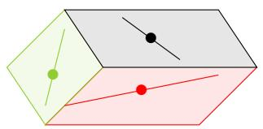  
FIGURE 14. Tables of intersection dimensions for $F_{\bullet} \in X_{3421}(B_{\bullet})$ on the left, $F_{\bullet} \in X_{4231}(R_{\bullet})$ in the middle, and $F_{\bullet} \in X_{3124}(G_{\bullet})$ on the right from Example 3.89.

FIGURE 13. Projective representation of three transverse flags in $\mathbb{C}^4$ looking into a shoebox bounded by the three planes.

$$
\left[ \begin{array}{l l l l} 0 & 0 & 0 & 1 \\ 0 & 0 & 1 & 2 \\ 1 & 1 & 2 & 3 \\ 1 & 2 & 3 & 4 \end{array} \right]
$$

$$
\dim (B _ {i} \cap F _ {j})
$$

$$
\left[ \begin{array}{l l l l} 0 & 0 & 0 & 1 \\ 0 & 1 & 1 & 2 \\ 0 & 1 & 2 & 3 \\ 1 & 2 & 3 & 4 \end{array} \right]
$$

$$
\dim (R _ {i} \cap F _ {j})
$$

$$
\left[ \begin{array}{l l l l} 0 & 1 & 1 & 1 \\ 0 & 1 & 2 & 2 \\ 1 & 2 & 3 & 3 \\ 1 & 2 & 3 & 4 \end{array} \right]
$$

$$
\dim (G _ {i} \cap F _ {j})
$$

Example 3.89. Let $u = 3421$ , $v = 4231$ , and $w = 2431$ . We want to prove $c_{uv}^w = 1$ in this case. Observe that $2 = \mathrm{coinv}(3421) + \mathrm{coinv}(4231) = \mathrm{coinv}(2431)$ , so it is possible $c_{uv}^w$ is not zero by Theorem 3.87. Compute $w_0 w = 3124$ . Any flag

$$
F _ {\bullet} \in X _ {3 4 2 1} (B _ {\bullet}) \cap X _ {4 2 3 1} (R _ {\bullet}) \cap X _ {3 1 2 4} (G _ {\bullet}) \tag {3.33}
$$

must satisfy the intersection conditions given by the tables in Figure 14.

Let's translate that into conditions on the possible shoebox drawings containing $F_{\bullet}$ , along with the black, red, and green flags.

(1) From $\dim(B_3 \cap F_1) = 1$ we see $F_1$ is special, it must be a one-dimensional subspace of $B_3$ . In the drawing, this means the point of any $F_\bullet$ must be drawn in the black plane.   
(2) From $\dim(R_2 \cap F_2) = 1$ we see $F_2$ is special, it must intersect $R_2$ in a one-dimensional subspace. So, the line for $F_\bullet$ will intersect the red line.   
(3) From $\dim(G_1 \cap F_2) = 1$ , we see $F_2$ contains $G_1$ . From $\dim(G_3 \cap F_3) = 3$ , we see $F_3 = G_3$ . So, the plane for $F_\bullet$ is exactly the green plane, and the line for $F_\bullet$ must lie in the green plane and pass through the green point.

These conditions together uniquely determine a flag, hence $c_{uv}^w = 1$ . We draw this unique flag $F_{\bullet}$ in purple in Figure 15. The purple plane agrees with the green plane. The purple line representing $F_{2}$ must be in the green plane, go through the green dot, and go through the point of intersection between the red line with the green plane. The purple line meets the black plane in one point, which must be the purple point representing $F_{1}$ .

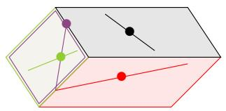  
FIGURE 15. The purple flag represents the unique flag $X_{3421}(B_{\bullet}) \cap X_{4231}(R_{\bullet}) \cap X_{3124}(G_{\bullet})$ .

Example 3.90. Let $u = 3421$ , $v = 4231$ , and $w = 4132$ . We want to prove $c_{uv}^w = 0$ in this case. Observe that $2 = \operatorname{coinv}(3421) + \operatorname{coinv}(4231) = \operatorname{coinv}(4132)$ , so it is possible $c_{uv}^w$ is not zero by Theorem 3.87. Compute $w_0 w = 1423$ . Any flag $F_\bullet$ in

$$
X _ {3 4 2 1} \left(B _ {\bullet}\right) \cap X _ {4 2 3 1} \left(R _ {\bullet}\right) \cap X _ {1 4 2 3} \left(G _ {\bullet}\right) \tag {3.34}
$$

must satisfy the intersection conditions given by the following tables,

$$
\left[ \begin{array}{l l l l} 0 & 0 & 0 & 1 \\ 0 & 0 & 1 & 2 \\ 1 & 1 & 2 & 3 \\ 1 & 2 & 3 & 4 \end{array} \right]
$$

$$
\dim (B _ {i} \cap F _ {j})
$$

$$
\left[ \begin{array}{l l l l} 0 & 0 & 0 & 1 \\ 0 & 1 & 1 & 2 \\ 0 & 1 & 2 & 3 \\ 1 & 2 & 3 & 4 \end{array} \right]
$$

$$
\dim (R _ {i} \cap F _ {j})
$$

$$
\left[ \begin{array}{l l l l} 1 & 1 & 1 & 1 \\ 1 & 1 & 2 & 2 \\ 1 & 1 & 2 & 3 \\ 1 & 2 & 3 & 4 \end{array} \right]
$$

$$
\dim (G _ {i} \cap F _ {j}).
$$

Now, $\dim(B_3 \cap F_1) = 1$ and $\dim(G_1 \cap F_1) = 1$ is not possible if $B_\bullet$ and $G_\bullet$ are in transverse position. That would imply the purple dot is both in the black plane and equal to the green dot, which is not the case in the drawing of three flags in transverse position. Hence $c_{3421,4231}^{4132} = 0$ . The same type of argument also shows $c_{3421,4231}^{4213} = 0$ .

We turn now to the computation of $c_{uv}^w$ in some special cases, but for arbitrary $n$ . These are the celebrated Monk's formula and Pieri rule. David Monk's paper from 1959 is a gem [288]. His work builds on important contributions from Borel, Ehresmann, Hirzebruch, and Hodge. It follows a line of reasoning counting flags in 0-dimensional triple intersections.

Along similar lines, the Pieri formula for the Grassmannian was generalized to the flag variety by Frank Sottile in 1996 [339]. This was a huge leap in Schubert calculus that led to many further developments including the development by Bergeron-Sottile of the $k$ -Bruhat order [27], a generalization to quantum cohomology by Ciocan-Fontanine [92] and Postnikov [309], and to more exotic cohomology theories [258, 259, 262]. We will return to the Pieri formula in Theorem 3.125 below.

Monk considered the family of Schubert varieties $X_{w}(E_{\bullet})$ in the special case $w = w_{0}s_{i}$ for some $1 \leq i < n$ . Recall, $s_i$ is the simple transposition that interchanges $i, i + 1$ . The varieties $X_{w_0s_i}$ are hypersurfaces in $\operatorname{Fl}(n)$ . In one-line notation $w_{0}s_{i}$ is a decreasing sequence interrupted by one ascent after position $i$ ,

$$
w _ {0} s _ {i} = [ n, n - 1, \ldots , n - i + 2, n - i, n - i + 1, n - i - 1, \ldots , 1 ].
$$

We know $X_{w_0}$ is the whole flag variety, and so each $X_{w_0s_i}$ has codimension 1. To begin, we consider the question,

Question: What flags are in $X_{w_0s_i}(E_\bullet)$ ?

Example 3.91. Let $n = 5$ , and $w = w_0 s_2 = 53421$ . A flag $F_{\bullet}$ in $X_w(E_{\bullet})$ must have $\dim(E_3 \cap F_2) \geq 1$ by definition. This condition is also sufficient to prove $F_{\bullet} \in X_w(E_{\bullet})$ , because this is the only binding rank condition. Thus, for every $F_{\bullet} \in X_w(E_{\bullet})$ there exists an ordered basis $F_{\bullet} = (f_1, f_2, f_3, f_4, f_5)$ such that $f_1$ or $f_2$ in $E_3$ .

Monk describes the flags in $X_{w_0s_i}(E_\bullet)$ as the set of flags with $F_i$ chosen from a pencil of $i$ -planes over $E_{n - i}$ . This evokes the image of a pencil of lines through a point, meaning all lines that go through one point in the plane. If we choose a different flag $G_\bullet$ as the reference flag, then $X_{w_0s_i}(G_\bullet)$ is still the set of flags such that $F_i$ intersects $G_{n - i}$ in a subspace of dimension at least 1, which would not happen if $F_i$ was chosen generically. Since $X_{w_0s_i}(G_\bullet)$ is relatively easy to describe, Monk was able to give a simple formula for certain products of Schubert classes in the Chow ring of the flag variety.

Theorem 3.92 (Monk's Formula). [288, Thm.3] Let $w \in S_n$ and $i \in [n - 1]$ , then

$$
\left[ X _ {w _ {0} s _ {i}} \right] \left[ X _ {w} \right] = \sum_ {\substack {h \leq i <   j: \\ \ell (w t _ {h j}) = \ell (w) - 1}} \left[ X _ {w t _ {h j}} \right]. \tag{3.35}
$$

It is quite remarkable that the coefficients on the right side of Monk's formula in (3.35) are all 0 or 1. In general, the Schubert structure constants can be large positive integers.

Example 3.93. Let $n = 5$ , $w = 45132$ , and $i = 2$ . Monk's formula says to consider $w = 45|132$ separated after the second position. Find all pairs of positions $h \leq 2 < j$ such that $w_{h} > w_{j}$ and all values in between positions $h$ and $j$ are not in the range $[w_{j}, w_{h}]$ . This ensures $\ell(wt_{h,j}) = \ell(w) - 1$ . For every such pair, we get a term in the expansion so

$$
\left[ X _ {5 3 4 2 1} \right] \left[ X _ {4 5 | 1 3 2} \right] = \left[ X _ {1 5 | 4 3 2} \right] + \left[ X _ {3 5 | 1 4 2} \right] + \left[ X _ {4 1 | 5 3 2} \right] + \left[ X _ {4 3 | 1 5 2} \right].
$$

Note the value 2 is not swapped with 4 or 5 since the 3 is in between.

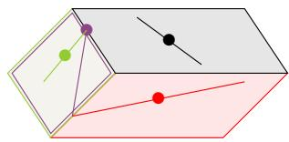  
FIGURE 16. The purple flag represents the unique flag in position 3421 with respect to the black flag, in position 4231 with respect to the red flag, and in position 2314 with respect to the green flag.

Example 3.94. Let $n = 4$ , $w = 3421$ , and $i = 2$ . Monk's formula implies

$$
\left[ X _ {4 2 3 1} \right] \left[ X _ {3 4 | 2 1} \right] = \left[ X _ {2 4 | 3 1} \right] + \left[ X _ {3 2 | 4 1} \right].
$$

Note, $3421 = w_0s_1$ , so one can compute the same expansion by looking for transpositions reducing the number of inversions by 1 over the bar in 4|231 as well. We can confirm this expansion by considering shoebox diagrams. We only need to consider terms in the expansion of the form $[X_v]$ with $\ell(v) = \ell(w) - 1 = 5 - 1 = 4$ . The permutations with 4 inversions are

$$
4 2 1 3, 4 1 3 2, 3 4 1 2, 3 2 4 1, 2 4 3 1.
$$

We know from Example 3.89 that $c_{3421,4231}^{2431} = 1$ . Since $A^*(\mathrm{Fl}(n))$ is commutative, $c_{4231,3421}^{2431} = 1$ . We also know from Example 3.90 that $c_{3421,4231}^{4132} = 0$ and $c_{3421,4231}^{4213} = 0$ . It remains to show $c_{3421,4231}^{3241} = 1$ and $c_{3421,4231}^{3412} = 0$ .

To see $c_{3421,4231}^{3241} = 1$ , we follow the same procedure as in Example 3.89. Compute $w_03241 = 2314$ . Any flag $F_{\bullet}$ in

$$
X _ {3 4 2 1} \left(B _ {\bullet}\right) \cap X _ {4 2 3 1} \left(R _ {\bullet}\right) \cap X _ {2 3 1 4} \left(G _ {\bullet}\right) \tag {3.36}
$$

must satisfy the intersection conditions given by the following tables,

$$
\left[ \begin{array}{l l l l} 0 & 0 & 0 & 1 \\ 0 & 0 & 1 & 2 \\ 1 & 1 & 2 & 3 \\ 1 & 2 & 3 & 4 \end{array} \right] \qquad \left[ \begin{array}{l l l l} 0 & 0 & 0 & 1 \\ 0 & 1 & 1 & 2 \\ 0 & 1 & 2 & 3 \\ 1 & 2 & 3 & 4 \end{array} \right] \qquad \left[ \begin{array}{l l l l} 0 & 0 & 1 & 1 \\ 1 & 1 & 2 & 2 \\ 1 & 2 & 3 & 3 \\ 1 & 2 & 3 & 4 \end{array} \right]
$$

$$
\dim (B _ {i} \cap F _ {j}) \qquad \dim (R _ {i} \cap F _ {j}) \qquad \dim (G _ {i} \cap F _ {j}).
$$

This translates into exactly one flag $F_{\bullet}$ drawn in purple in Figure 16. Here $F_{1} = B_{3} \cap G_{2}$ so the purple dot is at the intersection of the green line and the black plane. The purple line goes through the purple dot and the intersection of the red line with the green plane since $F_{1} \subset F_{2}$ and $\dim(R_{2} \cap F_{2}) \geq 1$ . Finally, $\dim(G_{3} \cap F_{3}) \geq 3$ , so the green plane and the purple plane agree.

The final calculation for $c_{3421,4231}^{3412} = 0$ follows the same procedure. Here $w_03412 = 2143$ . Writing out the intersection tables for $F_{\bullet}$ in the triple intersection we see $F_{2} = G_{2}$ and $\dim (F_2 \cap R_2) \geq 1$ . Since $G_{\bullet}$ and $R_{\bullet}$ are assumed to be in transverse position, these two conditions cannot happen. So no flags are in the triple intersection $X_{3421}(B_{\bullet}) \cap X_{4231}(R_{\bullet}) \cap X_{2143}(G_{\bullet})$ .

To outline the proof of Monk's formula, we need to find the number of flags in the appropriate triple intersections of Schubert varieties with respect to 3 generic flags by Theorem 3.87. For any 3 generic flags, we can always find a change of basis for $\mathbb{C}^n$ to move two of the flags so

that they become $E_{\bullet}$ and $\mathcal{E}_{\bullet}$ . Thus, it suffices to compute $c_{w,w_0s_i}^v$ for all $v \in S_n$ by finding the number of flags in a 0-dimensional triple intersection of the form

$$
X _ {w} (E _ {\bullet}) \cap X _ {w _ {0} v} (\mathbb {I} _ {\bullet}) \cap X _ {w _ {0} s _ {i}} (G _ {\bullet}) \tag {3.37}
$$

assuming $G_{\bullet}$ is generic and $\ell(v) = \ell(w) - 1$ . The proof then follows from the following statements and properties of the Bruhat order from Section 3.4. Note, Exercise 3.99 is significantly harder than the other exercises. Monk uses a characterization of the irreducible hyperplane sections of $\operatorname{Fl}(n)$ and an interesting identity he proves on multinomial coefficients.

Exercise 3.95. For $u, w \in S_n$ , the Richardson variety $X_u^w = X_w(E_\bullet) \cap X_{w_0u}(\mathcal{E}_\bullet)$ is nonempty if and only if $u \leq w$ . In particular, $v_\bullet \in X_u^w$ if and only if $v \in [u, w]$ .

Exercise 3.96. [288, §9, Prop 5] For $w \in S_n$ and $v = w t_{hj}$ covered by $w$ in Bruhat order, the intersection $X_w(E_\bullet) \cap X_{w_0v}(\mathcal{H}_\bullet)$ consists of flags $F_\bullet$ such that

(1) the subspaces $F_{i}$ for $h \leq i < j$ must contain the span of $\{e_1, \ldots, e_{h-1}, e_{h+1}, \ldots, e_i\}$ and must be contained in the span of $\{e_1, \ldots, e_k, e_j\}$ , and   
(2) the initial and final subspaces in $F_{\bullet}$ are given by $F_{i} = E_{i}$ for $1 \leq i < h$ and $j \leq i \leq n$ .

Exercise 3.97. For any generic flag $G_{\bullet}$ and $v = w t_{h,j}$ such that $\ell(v) = \ell(w) - 1$ , the intersection in (3.37) is empty unless $h \leq i < j$ .

Exercise 3.98. [288, Thm. 1] Prove

$$
\left(\sum_ {k = 1} ^ {n - 1} \left[ X _ {w _ {0} s _ {k}} \right]\right) ^ {\binom {n} {2}} = \binom {n} {2}! \left[ X _ {\mathrm {i d}} \right].
$$

Exercise 3.99. [288, §11] For any generic flag $G_{\bullet}$ and $v = w t_{h,j}$ such that $h \leq i < j$ and $\ell(v) = \ell(w) - 1$ , the intersection in (3.37) contains exactly one flag. Hint: Positivity in this case is implied by Exercise 3.95, so the task is to prove there is not more than 1 flag in the intersection. Assume there are at least 2 flags in some such intersection so the coefficients in the expansion of $[X_{w_0 s_i}][X_w]$ in (3.35) are not multiplicity free, then prove that then the coefficient would be strictly larger than $\binom{n}{2}!$ , contradicting Exercise 3.98.

Remark 3.100. Around the same time as Monk was working on his formula, Claude Chevalley found another proof. His work went unpublished until 1994 and was posthumously published by Borel in [89]. This paper was highly influential even though only a few copies existed before it was published. The reader may wish to compare Monk's proof to Chevalley's proof for the final details of proving Exercise 3.99.

Miraculously, Monk's rule for multiplying by the special Schubert classes suffices to compute the structure constants for the Chow ring of the full flag variety. Every Schubert class can be expanded as a sum of products of special classes.

Theorem 3.101. The set $\{[X_{w_0s_i}] \mid 1 \leq i < n\}$ generates the Chow ring $A^*(\mathrm{Fl}(n))$ .

Proof. Consider the subring $R$ generated by the special classes $[X_{w_0s_i}]$ . Since $\{[X_w] \mid w \in S_n\}$ is a linear basis for $A^{*}(\mathrm{Fl}(n))$ , we only need to show that every $[X_w]$ is in $R$ to prove the statement. The empty product of generators in a ring is defined to be the multiplicative identity. In $A^{*}(\mathrm{Fl}(n))$ , we know $1 = [X_{w_0}]$ , so $[X_{w_0}] \in R$ and each $[X_{w_0s_i}] \in R$ . Assume by induction that $[X_w] \in R$ for all $w$ such that $\binom{n}{2} \geq \ell(w) > k$ for some $k$ .

Let $v \in S_n$ be a permutation with $\ell(v) = k$ . Since $k < \binom{n}{2}$ , $v$ has an ascent in one-line notation. Let $r$ be the position of the last ascent in $v$ , so $v_r < v_{r+1} > v_{r+2} > \dots > v_n$ . Let $s$ be the largest value such that $v_r < v_s$ , so $r < s \leq n$ . The pair $(r, s)$ is the lexicographically largest (lex) non-inversion for $v$ . Let $w = vt_{rs}$ , then $\ell(w) = k + 1$ . By Monk's formula,

$$
\left[ X _ {w _ {0} s _ {r}} \right] \left[ X _ {w} \right] = \left[ X _ {v} \right] + \sum_ { \begin{array}{c} h \leq r <   j: \\ \ell (w t _ {h j}) = k \\ (r, s) \neq (h, j) \end{array} } \left[ X _ {w t _ {h j}} \right]. \tag {3.38}
$$

If $r > 1$ , the product $[X_{w_0 s_{r-1}}][X_w]$ has an expansion that is very similar to (3.38) but does not include $[X_v]$ . After cancellation and rearranging terms, one can conclude

$$
\left[ X _ {v} \right] = \left[ X _ {w _ {0} s _ {r}} \right] \left[ X _ {w} \right] - \left[ X _ {w _ {0} s _ {r - 1}} \right] \left[ X _ {w} \right] + \sum_ {\substack {h <   r: \\ \ell (w t _ {h r}) = k}} \left[ X _ {w t _ {h r}} \right] - \sum_ {\substack {r <   j \neq s: \\ \ell (w t _ {r j}) = k}} \left[ X _ {w t _ {r j}} \right].
$$

If $s < j$ , then all permutations of the form $wt_{rj}$ have $\ell(wt_{rj}) < k$ since $w$ is decreasing after position $r$ so $w_r > w_s = v_r > w_j = v_j$ . If $r < j < s$ , then $w_r = v_s < v_j = w_j$ , so $\ell(wt_{rj}) = \ell(w) + 1 = k + 2$ . Therefore the negative sum is empty, and

$$
\left[ X _ {v} \right] = \left[ X _ {w _ {0} s _ {r}} \right] \left[ X _ {w} \right] - \left[ X _ {w _ {0} s _ {r - 1}} \right] \left[ X _ {w} \right] + \sum_ {\substack {h <   r: \\ \ell (w t _ {h r}) = k}} \left[ X _ {w t _ {h r}} \right]. \tag{3.40}
$$

Furthermore, if $(r', s')$ is the largest pair of positions corresponding with a non-inversion in $w_{thr}$ indexing a term in the positive sum, then either $(r' < r)$ or $(r' = r$ and $s' < s)$ . Hence, by a second induction over lex order on the largest non-inversions of permutations with $k$ inversions, all terms on the right side of (3.40) are in $R$ , hence $[X_v] \in R$ .

If $r = 1$ , then the sum on the right of (3.38) is empty by an argument similar to the negative sum above. Hence, $[X_v] \in R$ since $[X_{w_0s_i}][X_w]$ is in $R$ by induction.

Monk clearly recognized that the special Schubert classes $[X_{w_0s_i}]$ generated the cohomology ring of the flag variety. He also shows constructively that the ring is isomorphic to the coinvariant algebra by relating the special classes $[X_{w_0s_i}]$ with polynomial representatives in the quotient modulo $I_n^+$ . Monk argued that if $x_i = [X_{w_0s_{i-1}}] - [X_{w_0s_i}]$ for $1 < i < n$ , $x_1 = -[X_{w_0s_1}]$ , and $x_n = [X_{w_0s_{n-1}}]$ , then the corresponding elementary symmetric polynomials $e_k(x_1, \ldots, x_n)$ vanish, which is well known to be another generating set for $I_n^+$ in symmetric function theory. This reproves Borel's theorem if by a great leap of faith one assumes the Chow ring and the singular cohomology ring of the flag variety are isomorphic, or one studies intersection theory carefully. In a sense, Monk's formula determines the entire ring structure for the cohomology ring of a flag variety!

The real power of Monk's work is that it provides a concrete path toward identifying polynomials in the coinvariant algebra that represent the Schubert classes. In general, it is much easier to multiply polynomials and expand them in the basis of polynomials than it is to work out the details of finding the expansion of a class into Schubert classes via rational equivalence. Working modulo the ideal $I_{n}^{+}$ provides some challenges, but is possible using the theory of Gröbner bases.

How should the map from $A^{*}(\operatorname{Fl}(n))$ to $R_{n}$ be constructed? We need to identify polynomials that represent the Schubert classes and form an independent set in the coinvariant algebra

$R_{n} = \mathbb{Z}[x_{1},x_{2},\ldots ,x_{n}] / I_{n}^{+}$ . Plus, the map should respect the grading on both rings. It is very instructive to try this on your own before reading the construction below.

Given the way multiplication works in any graded ring, a Schubert class $[X_w] \in A^{2d}$ should map to a polynomial of degree $d$ in $\mathbb{Z}[x_1, x_2, \ldots, x_n]$ . We consider $\deg(x_i) = 1$ for each $i$ . So, the complex codimension of the variety should be the degree of the polynomial representing its class. Monk suggested mapping

$$
\left[ X _ {w _ {0} s _ {i}} \right] \mapsto - \left(x _ {1} + x _ {2} + \dots + x _ {i}\right),
$$

but he notes there is an "ambiguity of sign" [288, Sect. 10]. His computations in the case of $n = 4$ are given in [288, Sect. 15]. See Figure 17. He notes that the stated polynomial representatives alternate in sign depending on the degree. However, then Monk abandons this path toward realizing the full power of the polynomial map because of the negative signs.

What if Monk had made a different choice when he noticed the "ambiguity of sign"? Could it lead to a nicer family of polynomials?

We now outline another natural choice for the polynomial representatives for the special classes $[X_{w_0s_i}]$ , which has opened many doors in mathematical research. In a "revisionist history", we explore what could have been done in the 1950's.

Assume $f: A^{*}(\mathrm{Fl}(n)) \longrightarrow R_{n} = \mathbb{Z}[x_{1}, \ldots, x_{n}] / I_{n}^{+}$ is a ring homomorphism defined so that $[X_{w_0}] = 1$ and for each $i \in [n - 1]$ ,

$$
\left[ X _ {w _ {0} s _ {i}} \right] \mapsto x _ {1} + x _ {2} + \dots + x _ {i}.
$$

Then, by (3.40) in the proof of Theorem 3.101, the image of $[X_v]$ under the map $f$ can be computed by the recurrence

$$
f([X_{v}]) = x_{r}f([X_{w}]) + \sum_{\substack{h <   r:\\ \ell (v) = \ell (wt_{hr})}}f([X_{w t_{hr}}]), \tag{3.41}
$$

where $(r,s)$ is the lex largest non-inversion for $v$ and $w = vt_{rs}$ . One can observe by induction that the polynomial representative for $f([X_v])$ determined by the recurrence in (3.41) will be a homogeneous nonnegative integer combination of monomials in the $x_i$ 's of degree $\operatorname{coinv}(v)$ . From the proof of Monk's formula Theorem 3.92 and the details in his paper, we know that if $x_i = [X_{w_0 s_{i-1}}] - [X_{w_0 s_i}]$ for $1 < i < n$ , $x_1 = -[X_{w_0 s_1}]$ , and $x_n = [X_{w_0 s_{n-1}'}]$ , then the corresponding elementary symmetric polynomial $e_k(x_1, \ldots, x_n)$ vanishes. This still holds if we negate the variables. Therefore, if the set $\{f([X_v]) \mid v \in S_n\}$ also spans the coinvariant algebra $R_n$ , then $f: A^*(\mathrm{Fl}(n)) \longrightarrow R_n$ is a ring isomorphism. We will prove this claim and more in Theorem 3.115.

The family of polynomials determined by the recurrence in (3.41) and the map $f([X_{w_0s_i}]) = x_1 + \dots +x_i$ have become known as the Schubert polynomials, denoted $\mathfrak{S}_w(x_1,\ldots ,x_n) = \mathfrak{S}_w$ for $w\in S_{n}$ . They were not systematically studied until 20 years after Monk's work by Alain Lascoux and Marcel-Paul Schützenberger. They also added the twist $f([X_w]) = \mathfrak{S}_{w_0w}$ , so $\ell (w) = \deg (\mathfrak{S}_w)$ . We will systematically study the Schubert polynomials below and relate them back to solving Schubert problems in the rest of this section.

We conclude this subsection by returning to the cohomology ring of the flag variety $H^{*}(\mathrm{Fl}(n),\mathbb{Z})$ . Thanks to the work of Borel, Fulton, Monk and others, we know $H^{*}(\mathrm{Fl}(n),\mathbb{Z})$

15. Properties of $F(4)$   

<table><tr><td>Dimension</td><td>Symbol</td><td>Expression in terms of basis (4.6)</td><td>Order</td></tr><tr><td>6</td><td>(3210)</td><td></td><td>720</td></tr><tr><td rowspan="3">5</td><td>(2310)</td><td>-γ0</td><td>220</td></tr><tr><td>(3120)</td><td>-γ0-γ1</td><td>280</td></tr><tr><td>(3201)</td><td>-γ0-γ1-γ2</td><td>220</td></tr><tr><td rowspan="5">4</td><td>(1320)</td><td>γ02</td><td>48</td></tr><tr><td>(2130)</td><td>γ0γ1</td><td>46</td></tr><tr><td>(2301)</td><td>γ02+γ0γ1+γ0γ2</td><td>78</td></tr><tr><td>(3021)</td><td>γ02+γ0γ1+γ12</td><td>46</td></tr><tr><td>(3102)</td><td>γ0γ1+γ0γ2+γ1γ2</td><td>48</td></tr><tr><td rowspan="6">3</td><td>(0321)</td><td>-γ03</td><td>6</td></tr><tr><td>(1230)</td><td>-γ02γ1</td><td>16</td></tr><tr><td>(1302)</td><td>-γ02γ1-γ02γ2</td><td>14</td></tr><tr><td>(2031)</td><td>-γ02γ1-γ0γ12</td><td>12</td></tr><tr><td>(3012)</td><td>-γ02γ1-γ02γ2-γ0γ12-γ0γ1γ2-γ12γ2</td><td>16</td></tr><tr><td>(2103)</td><td>-γ0γ1γ2</td><td>6</td></tr><tr><td rowspan="5">2</td><td>(0231)</td><td>γ03γ1</td><td>3</td></tr><tr><td>(0312)</td><td>γ03γ1+γ03γ2</td><td>3</td></tr><tr><td>(1032)</td><td>γ02γ12</td><td>2</td></tr><tr><td>(1203)</td><td>γ02γ1γ2</td><td>3</td></tr><tr><td>(2013)</td><td>γ02γ1γ2+γ0γ12γ2</td><td>3</td></tr><tr><td rowspan="3">1</td><td>(0132)</td><td>-γ03γ12</td><td>1</td></tr><tr><td>(0213)</td><td>-γ03γ1γ2</td><td>1</td></tr><tr><td>(1023)</td><td>-γ03γ1γ2</td><td>1</td></tr><tr><td>0</td><td>(0123)</td><td>γ03γ12γ2</td><td>1</td></tr></table>

FIGURE 17. Monk's representatives of Schubert classes in $\mathbb{Z}[\gamma_1,\ldots ,\gamma_n]$ . He writes permutations in $S_{n}$ as bijections on the set $\{0,1,2,\dots ,n - 1\}$ . The "order" column gives the degree of the corresponding Schubert variety as a projective variety when one embeds $\operatorname {Fl}(n)$ into a product of projective spaces via the Plücker embedding (see Section 5.1), and then into a single projective space via the Segre embedding. Formulas for these degrees can be found in [108] and [312].

is isomorphic to the Chow ring $A^{*}(\mathrm{Fl}(n))$ and the coinvariant algebra $R_{n} = \mathbb{Z}[x_{1},\ldots ,x_{n}] / I_{n}^{+}$ . These rings have linear bases given by Schubert classes $f([X_w]) = \mathfrak{S}_{w_0w}$ for $w\in S_n$ . Algebraically, they are generated by the special classes of the form $[X_{w_0s_i}]$ , or equivalently $\mathfrak{S}_{s_i}$ , via Monk's formula and the transition equations. By Theorem 3.87, their structure constants are determined by 0-dimensional triple intersections.

Remark 3.102. From here on out, we will refer to this family of isomorphic rings as the cohomology ring of the flag variety $H^{*}(\mathrm{Fl}(n),\mathbb{Z})$ in keeping with the literature, unless we

want to emphasize some particular aspect from the point of view in the Chow ring or the polynomial quotient. We will also dispense with the notation for the map $f$ , so we will just say $[X_w] = \mathfrak{S}_{w_0w}$ , meaning that the polynomial $\mathfrak{S}_{w_0w}$ represents the Schubert class $[X_w]$ modulo the ideal $I_n^+$ in $R_n$ .

Remark 3.103. The cohomology ring of a Schubert variety, or equivalently its Chow ring, has a nice presentation as a quotient of a polynomial ring as well. For $w \in S_n$ , we have an inclusion $i_w : X_w \hookrightarrow \operatorname{Fl}(n)$ . The induced ring homomorphism $i^* : H^*(\operatorname{Fl}(n)) \to H^*(X_w)$ is surjective, and $H^*(X_w)$ is isomorphic to $R_n / I_w$ where $I_w$ is generated by the Schubert polynomials $\mathfrak{S}_v$ for $v \not\leq w$ in $S_n$ . This theorem is due to Akyildüz-Lascoux-Pragacz [4] and independently to Carrell [82, Cor. 4.4]. See also Reiner-Woo-Yong's results on finding an efficient presentation of these rings and the problem they pose of finding a minimal generating set for the ideal $J_w$ such that $H^*(X_w) \simeq R_n / J_w$ [319]. Their conjecture was proved by St. Dizier and Yong in [344, Thm. 1.2] by explicit construction of a minimal generating set for the ideal generated by all Schubert polynomials $\mathfrak{S}_w$ such that $v \not\leq w$ . See Section 5.6 for more details on the cohomology of Schubert varieties and detecting isomorphisms between Schubert varieties.

3.9. Transition Equations and Schubert Polynomials. The celebrated Schubert polynomials were defined by Lascoux and Schützenberger in their 1982 paper "Polynômes de Schubert" [250]. They form a basis for all polynomials in countably many variables $\mathbb{Z}[x_1, x_2, \ldots]$ . Therefore, the product of two Schubert polynomials expands in the basis of Schubert polynomials to produce expansion coefficients on par with the Schubert structure constants. Remarkably, Lascoux and Schützenberger built on work of Bernstein-Gelfand-Gelfand [28] and Demazure [100] to prove their polynomials represent Schubert classes in the coinvariant algebra, so the Schubert structure constants are determined by Schubert polynomials.

The following definition for Schubert polynomials is not the original definition due to Lascoux and Schützenberger, but they did show it is equivalent shortly after their introduction using Monk's formula and the ring homomorphism (3.41) [252]. See also [265, 4.16]. We present this definition first because it follows directly from Monk's work from the 1950's and it is more efficient for computations than the original formula based on divided differences. Furthermore, the definition below using the transition equation is directly related to the geometry of Schubert problems since it is derived from Monk's formula leading quickly to the Inherited Positivity Theorem 3.115. This way we bypass the work of Bernstein-Gelfand-Gelfand showing how divided differences applied to the Vandermonde determinant modulo $I_{n}^{+}$ can produce a family of representatives for Schubert classes in the coinvariant algebra. While their approach has been highly influential over the past half century, it is not as direct as Monk's approach and the transition equation.

The definition below is stated in terms of a recurrence based on the lexicographically (lex) largest inversion $(r,s)$ for $w$ assuming $w\neq \mathrm{id}$ , where as usual an inversion means $r < s$ and $w(r) > w(s)$ . Note that $r$ is the position of the largest descent in $w$ , and $s$ is the largest value such that $w(r) > w(s)$ .

Definition 3.104 (Transition Equation for Schubert polynomials [252]). For $w \in S_n$ , define the Schubert polynomial $\mathfrak{S}_w \in \mathbb{Z}[x_1, x_2, \ldots, x_n]$ by the recurrence relation

$$
\mathfrak{S}_{w} = x_{r}\mathfrak{S}_{v} + \sum_{\substack{h <   r:\\ \ell (w) = \ell (vt_{hr})}}\mathfrak{S}_{vt_{hr}}
$$

where $(r,s)$ is the lex largest inversion in $w$ , and $v = w t_{rs}$ . The base case of the recurrence is $\mathfrak{S}_{\mathrm{id}} = 1$ .

Example 3.105. For $w = 1432$ , the lex largest inversion is between positions (3,4), so set $r = 3, s = 4$ , and $v = wt_{3,4} = 1423$ . By the transition equation, we have

$$
\mathfrak {S} _ {1 4 3 2} = x _ {3} \mathfrak {S} _ {1 4 2 3} + \mathfrak {S} _ {2 4 1 3}.
$$

The lex largest inversion for 2413 is (2,4) so

$$
\mathfrak {S} _ {2 4 1 3} = x _ {2} \mathfrak {S} _ {2 3 1 4} + \mathfrak {S} _ {3 2 1 4}.
$$

If we continue to use the transition equation, we find $\mathfrak{S}_{2314} = x_1x_2$ and $\mathfrak{S}_{3214} = x_1^2 x_2$ so

$$
\mathfrak {S} _ {2 4 1 3} = x _ {2} \mathfrak {S} _ {2 3 1 4} + \mathfrak {S} _ {3 2 1 4} = x _ {1} x _ {2} ^ {2} + x _ {1} ^ {2} x _ {2}.
$$

Similarly, we also have $\mathfrak{S}_{1423} = x_2\mathfrak{S}_{1324} + \mathfrak{S}_{3124} = x_2(x_1 + x_2) + x_1^2$ . Therefore,

$$
\mathfrak {S} _ {1 4 3 2} = x _ {1} ^ {2} x _ {2} + x _ {1} ^ {2} x _ {3} + x _ {1} x _ {2} ^ {2} + x _ {1} x _ {2} x _ {3} + x _ {2} ^ {2} x _ {3}. \tag {3.43}
$$

Let's analyze the details in the transition equations in terms of the diagram of the permutation for $w$ . The lex largest inversion of $w$ , called $(r, s)$ above, corresponds with the rightmost cell in $D(w)$ on the lowest occupied row of the diagram. It has coordinates $(r, w_s)$ . Removing $(r, w_s)$ from $D(w)$ we obtain the diagram of $v = w t_{rs}$ . So, $\ell(v) = \ell(w) - 1$ .

Every permutation $w' = vt_{hr}$ with $h < r$ and $\ell(w) = \ell(vt_{hr})$ appears on the right side of (3.42). This set may be empty. This happens whenever $v_h > v_r$ for all $h < r$ . To find all $h < r$ with $\ell(w) = \ell(vt_{hr})$ , consider the pivot dot in position $(r, v_r)$ in $D(v)$ . From $(r, v_r)$ look northwest to find all pivot dots $(h, v_h)$ such that the rectangle formed by $(h, v_h)$ and $(r, v_r)$ don't contain any other pivot dots. In this case, $v_h < v_r$ and $\ell(w) = \ell(v) + 1 = \ell(vt_{hr})$ so $vt_{hr}$ contributes a term to the right side of the transition equation.

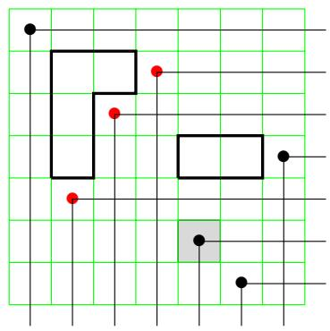

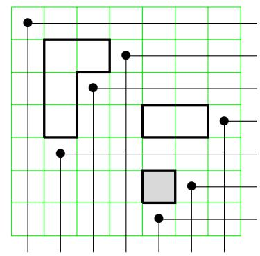  
FIGURE 18. The diagrams of $v = 1437256$ and $w = 1437265$ with the difference highlighted in gray.

Example 3.106. For $w = 1437265 \in S_7$ , we have $r = 6, s = 7$ so $v = w t_{rs} = 1437256$ . See Figure 18. The set of permutations appearing in the sum of the transition equation correspond with the 3 dots in the diagram of $v$ that are northwest of the dot in position $(r, w_s) = (6, 5)$ that form a rectangle with (6, 5) not containing any other dots (these are colored red in the figure). Therefore,

$$
\mathfrak {S} _ {1 4 3 7 2 6 5} = x _ {6} \mathfrak {S} _ {1 4 3 7 2 5 6} + \mathfrak {S} _ {1 5 3 7 2 4 6} + \mathfrak {S} _ {1 4 5 7 2 3 6} + \mathfrak {S} _ {1 4 3 7 5 2 6}.
$$

The permutations in $S_{n}$ naturally embed into $S_{n+1}$ by adding a final fixed point. The inversion set for $w \in S_{n}$ , the diagram of $w$ , and the reduced words for $w$ are stable under this embedding. Identifying two permutations if they have the same inversion set, let

$$
S _ {\infty} = \bigcup_ {n \geq 1} S _ {n} \tag {3.44}
$$

be the set of all permutations on $\mathbb{Z}_{+}$ which fix all but a finite number of the positive integers.

Schubert polynomials are also stable under the natural embedding $S_{n} \hookrightarrow S_{n+1}$ . This follows from the transition equation since if $w \in S_{n}$ then all of the permutations that appear on the right side of the transition equation also are in $S_{n}$ . So it makes sense to extend the definition of $\mathfrak{S}_{w}$ to all $w \in S_{\infty}$ .

Definition 3.107. We define the inversion order $\prec$ on permutations in $S_{\infty}$ as follows. Given $w \in S_{\infty}$ , let $\operatorname{Inv}(w)$ be the ordered list of inversions in antilex order. The antilex order is like reading a dictionary backwards. Therefore, $\operatorname{Inv}(w)$ begins with the lex largest inversion of $u$ . Then, for $v \in S_{\infty}$ , we say $v \prec w$ provided $\operatorname{Inv}(v) < \operatorname{Inv}(w)$ in lex order as lists. For example, $\operatorname{Inv}(1432) = ((3,4), (2,4), (2,3))$ and $\operatorname{Inv}(2413) = ((2,4), (2,3), (1,3))$ , so $2413 \prec 1432$ in inversion order.

Definition 3.108. The revlex order on monomials is defined so that $x_{n} < x_{n - 1} < \dots < x_{1}$ and we consider a monomial $x_{1}^{a_{1}}x_{2}^{a_{2}}\dots x_{n}^{a_{n}}$ to be a list of variables with $x_{n}$ listed $a_{n}$ times, followed by $x_{n - 1}$ listed $a_{n - 1}$ times, etc., and put these lists in antilex order. So, $x_{4}^{2}x_{3} = x_{4}x_{4}x_{3}$ comes before $x_{4}x_{3}^{2} = x_{4}x_{3}x_{3}$ .

Lemma 3.109. Let $w \in S_{\infty}$ .

(1) The Schubert polynomial $\mathfrak{S}_w$ is a homogeneous polynomial of degree $\ell(w)$ with nonnegative integer coefficients.   
(2) The leading monomial in revlex order in $\mathfrak{S}_w$ is $x^{c(w)}$ where $c(w)$ is the Lehmer code defined in (3.12), and all monomials that occur with nonzero coefficient are in the set $\{x_1^{c_1}x_2^{c_2}\dots x_n^{c_n}\mid 0\leq c_i\leq n - i,\forall 1\leq i\leq n\}$ provided $w\in S_{n}$   
(3) If $w \neq \mathrm{id}$ , then $\mathfrak{S}_w \in \mathbb{Z}[x_1, x_2, \ldots, x_r]$ , where $r$ is the position of the last descent in $w$ .

Proof. The statements hold for the base case $\mathfrak{S}_{\mathrm{id}} = 1$ . All of the permutations on the right hand side of (3.42) are strictly smaller than $w$ in inversion order by construction. Furthermore, the permutations on the right hand side of (3.42) are in $S_{n}$ provided $w \in S_{n}$ . Hence there are only a finite number of terms in the expansion of a Schubert polynomial. Apply induction over this finite set to complete the proofs, noting how the transitions work on the diagram of the permutation of $w$ .

Exercise 3.110. For any simple transposition $s_r \in S_\infty$ , use the Transition Equation to prove the Schubert polynomial $\mathfrak{S}_{s_r}$ is $x_1 + x_2 + \dots + x_r$ .

Exercise 3.111. Let $w = s_{i}s_{i + 1}\dots s_{j}$ for $i\leq j$ . Show $\mathfrak{S}_w$ is the elementary symmetric polynomial $e_k(x_1,x_2,\ldots ,x_j)$ where $k = \ell (w) = j - i + 1$ . Here $e_k(x_1,x_2,\ldots ,x_j)$ is the sum over all square-free monomials in $x_{1},x_{2},\ldots ,x_{j}$ of degree $k$ with coefficient 1.

Exercise 3.112. Recall, $h_k(x_1, x_2, \ldots, x_n)$ is the sum over all monomials in $x_1, x_2, \ldots, x_n$ of degree $k$ with coefficient 1 from (3.27). Let $w = s_j s_{j-1} \cdots s_i$ for $i \leq j$ . Show $\mathfrak{S}_w$ is the homogeneous symmetric polynomial $h_k(x_1, x_2, \ldots, x_i)$ where $k = \ell(w) = j - i + 1$ .

Exercise 3.113. Show $\mathfrak{S}_{w_0} = x_1^{n - 1}x_2^{n - 2}\dots x_{n - 1}^1 x_n^0$ , where $w_{0} = [n,n - 1,\ldots ,2,1]$ is the longest permutation in $S_{n}$ . More generally, show the following are equivalent for any $w\in S_{\infty}$ . Such permutations are called dominant.

(1) The code of $w$ is a weakly decreasing sequence.   
(2) The Schubert polynomial has exactly one term, so $\mathfrak{S}_w = x^{c(w)}$ .   
(3) The permutation $w$ avoids the pattern 132.

One special feature of Schubert polynomials as representatives of the Schubert classes $[X_w]$ is that calculations which a priori should be done in the quotient ring $R_n \simeq A^*(\mathrm{Fl}(n))$ can actually be done in the polynomial ring $\mathbb{Z}[x_1, x_2, \ldots]$ (Theorem 3.115 below). The price to be paid for this pleasant property is the following technical lemma relating the rings $A^*(\mathrm{Fl}(n))$ for different values of $n$ . We could also prove this for the rings $R_n$ and $R_{n+1}$ algebraically, but in keeping with our geometric theme we will give a proof by calculating explicit intersections.

Lemma 3.114. Let $g_{n}:\mathbb{Z}[x_{1},x_{2},\ldots ]\to A^{*}(\operatorname {Fl}(n))$ be the ring homomorphism defined by

$$
g _ {n} (x _ {i}) = \left\{ \begin{array}{l l} [ X _ {w _ {0} s _ {i}} ] - [ X _ {w _ {0} s _ {i - 1}} ] & i f i \leq n \\ 0 & o t h e r w i s e \end{array} , \right.
$$

where the expression $[X_{w_0s_i}]$ is to be interpreted as 0 if $i < 1$ or $i > n - 1$ . Let $w \in S_{\infty}$ . Then $g_n(\mathfrak{S}_w) = [X_{w_0w}]$ if $w \in S_n$ and $g_n(\mathfrak{S}_w) = 0$ otherwise.

Identifying the variable $x_{i}$ with the difference $[X_{w_0s_i}] - [X_{w_0s_{i-1}}]$ is natural in the study of cohomology rings in terms of line bundles. The variables represent the first Chern class of a quotient bundle determined by comparing flags in $X_{w_0s_i}$ versus $X_{w_0s_{i-1}}$ . We will discuss these ideas somewhat informally in Section 5.4. See also [136, Sect. 10 and Appendix B] for more details, in particular Lemma 9 in Section 10.3.

Proof. The natural embedding $\mathbb{C}^n\hookrightarrow \mathbb{C}^{n + 1}$ sending $(x_{1},\ldots ,x_{n})\mapsto (x_{1},\ldots ,x_{n},0)$ lets us view a flag in $\mathbb{C}^n$ as a flag in $\mathbb{C}^{n + 1}$ , so defines an embedding $i:\operatorname {Fl}(n)\hookrightarrow \operatorname {Fl}(n + 1)$ . Recall that this induces a ring homomorphism $i^{*}:A^{*}(\operatorname {Fl}(n + 1))\to A^{*}(\operatorname {Fl}(n))$ satisfying $i^{*}([Z]) = [i^{-1}(Z\cap i(\operatorname {Fl}(n)))]$ whenever $Z$ and $i(\operatorname {Fl}(n))$ are transverse. Write $w_0^n$ and $w_0^{n + 1}$ to distinguish the long elements in $S_{n}$ and $S_{n + 1}$ , and likewise $\mathcal{H}_{\bullet}^{n}\in \mathrm{Fl}(n)$ and $\mathcal{H}_{\bullet}^{n + 1}\in \mathrm{Fl}(n + 1)$ . We claim that

$$
X _ {w _ {0} ^ {n + 1} w} \left(\mathbb {E} _ {\bullet} ^ {n + 1}\right) \cap i (\operatorname {F l} (n)) = \left\{ \begin{array}{l l} \emptyset & \text {i f} w \in S _ {n + 1} \backslash S _ {n} \\ i \left(X _ {w _ {0} ^ {n} w} \left(\mathbb {E} _ {\bullet} ^ {n}\right)\right) & \text {i f} w \in S _ {n} \end{array} , \right. \tag {3.45}
$$

from which we'll get a formula for $i^*$ . Assume $F_{\bullet}$ is in $X_{w_0^{n+1}w}(\mathcal{E}_{\bullet}) \cap i(\mathrm{Fl}(n))$ from the left side of (3.45). First we consider the case where $w \in S_{n+1} \setminus S_n$ . Setting $j = w^{-1}(n+1)$ , we have $w_0^{n+1}w(j) = 1$ and $j < n+1$ , so the rank conditions for $X_{w_0^{n+1}w}$ say $\dim(\mathcal{E}_1 \cap F_j) \geq 1$ . But

this says $e_{n+1} \in F_j \subseteq F_n$ , while $F_\bullet \in i(\operatorname{Fl}(n))$ requires $F_n = \mathbb{C}^n$ , a contradiction. Therefore $X_{w_0^{n+1}w}(\mathcal{I}_\bullet) \cap i(\operatorname{Fl}(n)) = \emptyset$ as claimed.

Next, suppose $w \in S_n$ . Since $F_{\bullet} \in i(\mathrm{Fl}(n))$ , we have $F_{n} = \langle e_{1}, \ldots, e_{n} \rangle$ , so $\mathcal{H}_{i+1}^{n+1} \cap F_{j} = \mathcal{H}_{i}^{n} \cap F_{j}$ . Since $F_{\bullet} \in X_{w_0^{n+1}w}(\mathcal{H}_{\bullet})$ also, we know

$$
\dim \left(\mathcal {H} _ {i} ^ {n} \cap F _ {j}\right) = \dim \left(\mathcal {H} _ {i + 1} ^ {n + 1} \cap F _ {j}\right) \geq \operatorname {r k} \left(w _ {0} ^ {n + 1} w\right) [ i + 1, j ] \tag {3.46}
$$

for all $i,j\leq n$ . But $\mathrm{rk}(w_0^{n + 1}w)[i + 1,j] = \mathrm{rk}(w_0^n w)[i,j]$ (draw the permutation matrices!). Therefore, $F_{\bullet}\in X_{w_0^{n + 1}w}(\mathcal{I}_{\bullet})$ if and only if the truncated flag $i^{-1}(F_{\bullet}) = (F_{1}\subseteq \dots \subseteq F_{n})\in \operatorname {Fl}(n)$ is in $X_{w_0^n w}(\mathcal{H}_\bullet^n)$ . Thus $X_{w_0^{n + 1}w}(\mathcal{H}_\bullet^{n + 1})\cap i(\operatorname {Fl}(n)) = i(X_{w_0^{n + 1}w}(\mathcal{H}_\bullet^n))$ , proving (3.45).

The intersection in (3.45) is transverse because $i(\operatorname{Fl}(n)) = X_{w_0^n}(E_\bullet^{n+1})$ , so we conclude that

$$
i ^ {*} [ X _ {w _ {0} ^ {n + 1} w} ] = \left\{ \begin{array}{l l} 0 & \text {i f} w \in S _ {n + 1} \setminus S _ {n} \\ {[ X _ {w _ {0} ^ {n} w} ]} & \text {i f} w \in S _ {n}. \end{array} \right.
$$

In particular, $i^{*}[X_{w_{0}^{n + 1}s_{i}}] = [X_{w_{0}^{n}s_{i}}]$ if $i \leq n - 1$ and $i^{*}[X_{w_{0}^{n + 1}s_{n}}] = 0$ . Therefore $i^{*} \circ g_{n + 1} = g_{n}$ , and so if $w \in S_{n + 1} \setminus S_{n}$ then $g_{n}(\mathfrak{S}_{w}) = (i^{*} \circ g_{n + 1})(\mathfrak{S}_{w}) = i^{*}[X_{w_{0}^{n + 1}w}] = 0$ . This argument can be iterated to conclude the same for any $w \in S_{\infty} \setminus S_{n}$ .

We are now in a position to relate the Schubert polynomials with the Schubert structure constants $c_{uv}^{w}$ defined in Section 3.8 by

$$
[ X _ {u} ] [ X _ {v} ] = \sum c _ {u v} ^ {w} [ X _ {w} ]. \tag {3.47}
$$

Recall each $c_{uv}^w$ is a nonnegative integer by the Geometry Implies Positivity Theorem 3.87.

Theorem 3.115 (Inherited Positivity). Let $n$ be a positive integer.

(a) The set of all Schubert polynomials $\{\mathfrak{S}_w\mid w\in S_\infty \}$ forms a basis for $\mathbb{Z}[x_1,x_2,\ldots ]$   
(b) The set $\{\mathfrak{S}_w\mid w\in S_n\}$ represents a basis for the coinvariant algebra $R_{n} = \mathbb{Z}[x_{1},\ldots ,x_{n}] / I_{n}^{+}$   
(c) The linear map $f: A^{*}(\mathrm{Fl}(n)) \longrightarrow R_{n}$ sending $[X_w]$ to $\mathfrak{S}_{w_0w}$ is a ring isomorphism.   
(d) The natural inclusion $\mathbb{Z}[x_1,\ldots ,x_n]\hookrightarrow \mathbb{Z}[x_1,x_2,\ldots ]$ induces a ring isomorphism

$$
R _ {n} \simeq \mathbb {Z} [ x _ {1}, x _ {2}, \dots ] / (\mathfrak {S} _ {w}: w \in S _ {\infty} \backslash S _ {n}).
$$

(e) For $u, v, w \in S_n$ , the Schubert structure constant $c_{uv}^w$ is the coefficient of $\mathfrak{S}_{w_0w}$ in the product $\mathfrak{S}_{w_0u}\mathfrak{S}_{w_0v}$ where $w_0$ is the longest permutation in $S_n$ . This is true regardless of whether the product is computed in $\mathbb{Z}[x_1,x_2,\ldots]$ or in the quotient ring $R_n$ .   
(f) Products of Schubert polynomials expand in the basis of Schubert polynomials with positive integer coefficients.

# Proof.

(a) Let $\mathcal{P}_{\infty} = \mathbb{Z}[x_1, x_2 \ldots]$ , and denote the standard monomial basis by $\{x^{\alpha}\}$ , where $x^{\alpha} = x_{1}^{\alpha_{1}} x_{2}^{\alpha_{2}} \cdots$ . Recall the (Lehmer) code gives a natural bijection between $S_{n}$ and the product of sets $[n] \times [n-1] \times \cdots \times [2] \times [1]$ . The code of a permutation is invariant under the embedding $S_{n} \hookrightarrow S_{n+1}$ , so the code also gives a bijection between permutations in $S_{\infty}$ and monomials in $\mathcal{P}_{\infty}$ . By Lemma 3.109, the leading term of $\mathfrak{S}_{w}$ is $x^{c(w)}$ appearing with coefficient 1, so each Schubert polynomial is determined by its leading term. Hence, Schubert polynomials form a basis of $\mathcal{P}_{\infty}$ with an invertible triangular change of basis matrix to the standard monomial basis $\{x^{\alpha}\}$ .

(b) By Exercise 3.77, we know the monomials

$$
\mathcal {B} = \left\{x _ {1} ^ {c _ {1}} x _ {2} ^ {c _ {2}} \dots x _ {n} ^ {c _ {n}} \mid 0 \leq c _ {i} \leq n - i \forall 1 \leq i \leq n \right\} \tag {3.48}
$$

form a basis for the coinvariant algebra $R_{n}$ . These are the leading terms of the Schubert polynomials $\mathfrak{S}_w$ for $w \in S_n$ . Furthermore, all monomials appearing with nonzero coefficient in $\mathfrak{S}_w$ are in $\mathcal{B}$ . Therefore the same argument as in (a) works.

(c) Let $J_{n}$ be the ideal $(\mathfrak{S}_w : w \in S_{\infty} \setminus S_n) \subseteq \mathcal{P}_{\infty}$ . By Lemma 3.114, there is a ring homomorphism $g : \mathcal{P}_{\infty} / J_{n} \to A^{*}(\mathrm{Fl}(n))$ with $g(\mathfrak{S}_w) = [X_{w_0w}]$ for $w \in S_{n}$ . We know the Schubert classes $[X_{w_0w}]$ for $w \in S_{n}$ form a basis for $A^{*}(\mathrm{Fl}(n))$ and the Schubert polynomials form a basis for $\mathcal{P}_{\infty}$ , so the Schubert polynomials $\mathfrak{S}_w$ must represent a basis for the quotient $\mathcal{P}_{\infty} / J_{n}$ and $g$ is a ring isomorphism.

We claim that the inclusion $\mathbb{Z}[x_1,\ldots ,x_n]\to \mathcal{P}_{\infty}$ descends to an isomorphism $R_{n}\simeq$ $\mathcal{P}_{\infty} / J_{n}$ . Indeed, Exercise 3.111 says $e_k(x_1,\dots,x_n) = \mathfrak{S}_{s_{n - k + 1}s_{n - k + 2}\dots s_n}\in J_n$ , so $I_n^+ \subseteq J_n$ . Therefore $R_{n}\rightarrow \mathcal{P}_{\infty} / J_{n}$ is a well-defined ring homomorphism, and sends the basis of Schubert polynomials to the basis of Schubert polynomials. The desired isomorphism $f$ is the inverse of the composition $R_{n}\to \mathcal{P}_{\infty} / J_{n}\stackrel {g}{\to}A^{*}(\mathrm{Fl}(n))$ .

(d) Proved in the proof of (c).   
(e) Since Schubert polynomials form a $\mathbb{Z}$ -basis of $\mathcal{P}_{\infty}$ , we can write $\mathfrak{S}_{w_0u}\mathfrak{S}_{w_0v} = \sum_{z\in S_\infty}a_{uv}^z\mathfrak{S}_z$ . with $a_{uv}^{z}\in \mathbb{Z}$ . By (d), this expression is equal to $\sum_{z\in S_n}a_{uv}^z\mathfrak{S}_z$ in the quotient ring $R_{n}$ . On the other hand, applying the map $f$ from (c) to (3.47) shows $\sum_{z\in S_n}a_{uv}^z\mathfrak{S}_z = \sum_{w\in S_n}c_w^w\mathfrak{S}_{w_0w}$ , so $a_{uv}^{w_0w} = c_{uv}^w$ since $\{\mathfrak{S}_w:w\in S_n\}$ is a basis of $R_{n}$ by (b).   
(f) This follows from (e) since each $c_{uv}^w$ is a nonnegative integer as stated above.

Monk's formula (Theorem 3.92) gives rise to a product formula for Schubert polynomials in the special case of multiplication by a degree 1 Schubert polynomial. This is a fundamental result in the literature on Schubert polynomials. The expansion depends only on the covering relations in Bruhat order. A permutation $w'$ covers $w$ in Bruhat order if there is no $v$ with $w' > v > w$ , or equivalently, $w' > w$ and $\ell(w') = \ell(w) + 1$ . The covering relations correspond with the edges in the Hasse diagram of Bruhat order as shown in in Figure 6.

Theorem 3.116 (Monk's Formula for Schubert Polynomials). For $w \in S_{\infty}$ and a positive integer $r$ ,

$$
\mathfrak{S}_{s_{r}}\mathfrak{S}_{w} = (x_{1} + \dots +x_{r})\mathfrak{S}_{w} = \sum_{\substack{k\leq r <   l\\ wt_{k,l}\geq w}}\mathfrak{S}_{wt_{k,l}}. \tag{3.49}
$$

Here, $w' > w$ means that $w'$ covers $w$ in Bruhat order.

Proof. Let $n$ be large enough so that all permutations appearing in (3.49) have only fixed points after $n$ . By Inherited Positivity Theorem 3.115, it suffices to prove (3.49) holds in $R_{n}$ . The polynomials $\mathfrak{S}_w$ for $w \in S_n$ are defined by the transition equation in Definition 3.104. By Theorem 3.115, $\{\mathfrak{S}_w \mid w \in S_n\}$ forms a basis for $R_{n}$ . By Exercise 3.110, we know that $\mathfrak{S}_{s_r} = x_1 + x_2 + \dots + x_r$ for all $1 \leq r < n$ . Recall the ring isomorphism $f: A^{*}(\operatorname{Fl}(n)) \longrightarrow R_{n} = \mathbb{Z}[x_{1}, \ldots, x_{n}] / I_{n}^{+}$ defined by (3.41). So,

$$
\mathfrak {S} _ {s _ {r}} = x _ {1} + x _ {2} + \dots + x _ {r} = f ([ X _ {w _ {0} s _ {r}} ])
$$

<table><tr><td>degree</td><td>Schubert polynomial</td></tr><tr><td>0</td><td>S1234 = 1</td></tr><tr><td>1</td><td>S2134 = x1
S1324 = x2 + x1
S1243 = x3 + x2 + x1</td></tr><tr><td>2</td><td>S3124 = x12
S2314 = x1x2
S2143 = x1x3 + x1x2 + x12
S1423 = x22 + x1x2 + x12
S1342 = x2x3 + x1x3 + x1x2</td></tr><tr><td>3</td><td>S4123 = x13
S3214 = x12x2
S2413 = x1x22 + x12x2
S3142 = x12x3 + x12x2
S1432 = x22x3 + x1x2x3 + x12x3 + x12x2 + x12x2
S2341 = x1x2x3</td></tr><tr><td>4</td><td>S4213 = x13x2
S4132 = x13x3 + x13x2
S3412 = x12x22
S3241 = x12x2x3
S2431 = x1x22x3 + x12x2x3</td></tr><tr><td>5</td><td>S4312 = x13x22
S4231 = x13x2x3
S3421 = x12x2x3</td></tr><tr><td>6</td><td>S4321 = x13x22x3</td></tr></table>

FIGURE 19. Schubert polynomials for permutations in $S_4$ .

and for $\ell(w) > 1$ , we have $\mathfrak{S}_w = f([X_{w_0w}])$ by comparing (3.41) and Definition 3.104. Therefore, the Schubert polynomials multiply as in Monk's formula Theorem 3.92. Therefore, (3.49) follows by applying the map $w \to w_0w$ .

Example 3.117. If $n = 4$ , we have $\mathfrak{S}_{1324}\mathfrak{S}_{2134} = \mathfrak{S}_{3124} + \mathfrak{S}_{2314}$ by Monk's formula. We also can verify this example using Figure 19 and/or from Example 3.94. Note, unlike Monk's original formula in Theorem 3.92, we need to consider permutations to always be in $S_{\infty}$ for products of Schubert polynomials. For example, $\mathfrak{S}_{s_2}\mathfrak{S}_{41|32} = \mathfrak{S}_{51|324} + \mathfrak{S}_{42|31} + \mathfrak{S}_{43|12}$ .

The Schubert polynomials $\{\mathfrak{S}_w|w\in S_n\}$ can also be recursively computed by the recurrence

$$
\mathfrak {S} _ {w} = \left\{ \begin{array}{l l} x _ {1} ^ {n - 1} x _ {2} ^ {n - 2} \dots x _ {n - 1} & \text {i f} w = [ n, n - 1, \dots , 1 ] \\ \partial_ {i} \mathfrak {S} _ {w s _ {i}} (x) & \text {i f} w (i) <   w (i + 1), \end{array} \right. \tag {3.50}
$$

where the divided difference operator $\partial_i$ acts on polynomials by

$$
\partial_ {i} f = \frac {f - s _ {i} f}{x _ {i} - x _ {i + 1}}.
$$

This is the approach Lascoux and Schützenberger originally used to define Schubert polynomials building on the divided difference operators used by Bernstein-Gelfand-Gelfand [28] and Demazure [100]. See Lemma 9 and the proof of Proposition 4 in [136, Section 10.3] for the cohomological interpretation of the divided difference operators in terms of a composition of a pullback and a pushforward of natural projection operations on flags. We will prove this recurrence using the nil-Coxeter algebra in Section 4.2 as part of our revisionist history of Schubert calculus. See also Exercise 3.127 for an outline of the classical proof.

Example 3.118. To compute $\mathfrak{S}_{4132}$ via divided differences, we observe $4132 = w_{0}s_{3}s_{2}$ . Hence,

$$
\mathfrak {S} _ {4 1 3 2} = \partial_ {2} \partial_ {3} x _ {1} ^ {3} x _ {2} ^ {2} x _ {3}.
$$

In steps, first apply $\partial_3$

$$
\partial_ {3} x _ {1} ^ {3} x _ {2} ^ {2} x _ {3} = \frac {x _ {1} ^ {3} x _ {2} ^ {2} x _ {3} - x _ {1} ^ {3} x _ {2} ^ {2} x _ {4}}{x _ {3} - x _ {4}} = x _ {1} ^ {3} x _ {2} ^ {2},
$$

and then apply $\partial_2$ to the result to get

$$
\partial_ {2} x _ {1} ^ {3} x _ {2} ^ {2} = \frac {x _ {1} ^ {3} x _ {2} ^ {2} - x _ {1} ^ {3} x _ {3} ^ {2}}{x _ {2} - x _ {3}} = x _ {1} ^ {3} (x _ {2} + x _ {3}).
$$

Therefore, $\mathfrak{S}_{4132} = x_1^3 x_2 + x_1^3 x_3$ , which agrees with the data in Figure 19.

Exercise 3.119. Prove the divided difference operators act linearly on the polynomial ring of countably many variables $P_{\infty} = \mathbb{Z}[x_1, x_2, \ldots]$ .

Exercise 3.120. Prove that for each positive integer $i$ , the kernel and the image of $\partial_i$ is the subalgebra of polynomials symmetric in $x_i$ and $x_{i+1}$ . In particular, $\mathfrak{S}_w$ is symmetric in $x_i$ and $x_{i+1}$ if and only if $w_i < w_{i+1}$ . Furthermore, the following relations on the divided difference operators hold:

$\partial_i^2 = 0$   
- $\partial_i\partial_j = \partial_j\partial_i$ if $|i - j|\geq 2$   
- $\partial_i\partial_{i + 1}\partial_i = \partial_{i + 1}\partial_i\partial_{i + 1}$ for $1\leq i\leq n - 2$   
- Leibniz rule: For polynomials $f, g$ , we have $\partial_i(fg) = (\partial_if)g + (s_if)(\partial_ig)$ .

Exercise 3.121. Given a reduced word $(r_1, r_2, \ldots, r_p)$ for $w \in S_{\infty}$ , define $\partial_w : P_{\infty} \longrightarrow P_{\infty}$ by the composition of divided difference operators $\partial_w = \partial_{r_1} \partial_{r_2} \cdots \partial_{r_p}$ . Prove $\partial_w$ is well-defined as an operator on $P_{\infty}$ , and hence $\mathfrak{S}_w$ is well-defined by (3.50).

A more challenging exercise is the following.

Exercise 3.122. [210, Prop. 3.1] Say $u, v, w \in S_n$ such that $\operatorname{coinv}(w) = \operatorname{coinv}(u) + \operatorname{coinv}(v)$ . If there exists an $i$ such that $u s_i > u$ and $w s_i < w$ , then use properties of divided differences to prove the following descent cycling symmetries for Schubert structure constants.

(1) If $vs_i > v$ , then $c_{uv}^w = 0$ .   
(2) If $vs_{i} < v$ , then $c_{uv}^{w} = c_{u,v s_{i}}^{ws_{i}}$

Some properties of Schubert polynomials are more readily apparent via the transition equation (such as monomial positivity) and some via the divided differences (such as symmetry properties and descent cycling). We will do a deep dive into the rich combinatorics of Schubert

polynomials in Section 4. In particular, we explore some symmetry properties of Schubert polynomials in Section 4.7.1 and identify the set of Schur polynomials from symmetric function theory and the representation theory of $S_{n}$ and $GL_{n}$ as particular Schubert polynomials. For example, we saw in Exercise 3.111 and Exercise 3.112 that the elementary symmetric polynomials and the homogeneous symmetric polynomials in any finite alphabet are Schubert polynomials. These are special cases of Schur polynomials from $S_{n}$ representation theory [136, 332]. It is well known that the Schur polynomials indexed by partitions represent the Schubert classes in the cohomology ring of the Grassmannian manifold $\mathrm{Gr}(k,n)$ . See the Math Monthly article by Kleiman-Laksov from 1972 for a history up to that point [200]. The structure constants for Schur polynomials give rise to the Littlewood-Richardson coefficients. Therefore, an important philosophy guiding the research in Schubert polynomials over the past 40 years is as follows.

# Remark 3.123. Every tool used to study Schur polynomials has a potential analog for Schubert polynomials.

We conclude this subsection with one beautiful example of this philosophy: a generalization of the Pieri formula to Schubert polynomials due to Frank Sottile [339]. His proof has a similar feel to the proof of Monk's formula outlined above. See [339, Sect. 5] for the "Geometry of Intersections" in this case. His paper also outlines the connections to prior work on Pieri formulas.

Let $b, d$ be positive integers. Let

$$
r [ b, d ] = [ 1, 2, \dots , b - 1, b + d, b, b + 1, \dots ] = s _ {b + d - 1} \dots s _ {b + 1} s _ {b} \tag {3.51}
$$

where the indices on the simple transpositions are consecutive and decreasing. Note that the permutation diagram $D(r[b,d])$ is entirely contained in row $b$ , so we call $r[b,d]$ a one-row permutation. Exercise 3.112 implies the Schubert polynomial $\mathfrak{S}_{r[b,d]} = h_d(x_1,x_2,\ldots ,x_b)$ , the homogeneous symmetric polynomial of degree $d$ . The permutation $r[b,d]$ is of the special type called Grassmannian from Exercise 3.15 since it has one descent. These will be important in Section 4.8.

Similarly, define the one-column permutation

$$
(3. 5 2) c [ b, d ] = [ 1, 2, \dots , b - d, b - d + 2, \dots , b + 1, b - d + 1, b + 2, b + 3, \dots ] = s _ {b - d + 1} \dots s _ {b - 1} s _ {b}
$$

for any positive integers $b, d$ such that $b \geq d$ . Here the indices on the simple transposition are consecutive and increasing. The diagram of the permutation $D(c[b, d])$ is contained in column $b - d + 1$ . The permutation $c[b, d]$ is also a Grassmannian permutation, and the Schubert polynomial $\mathfrak{S}_{c[b, d]} = e_d(x_1, x_2, \ldots, x_b)$ , the elementary symmetric polynomial of degree $d$ as seen in Exercise 3.111.

Example 3.124. From the diagram in Example 3.9, one can observe that 2341 is a one-column permutation, namely $c[3,3]$ . The permutation $13452 = s_2s_3s_4 = c[4,3]$ , and $(13452)^{-1} = 15234 = s_4s_3s_2 = r[2,3]$ .

Theorem 3.125 (Pieri Formula for Schubert Polynomials). [339] Given $v \in S_{\infty}$ and any one-column permutation $c[b, d]$ ,

$$
\mathfrak {S} _ {c [ b, d ]} \mathfrak {S} _ {v} = e _ {d} (x _ {1}, \dots , x _ {b}) \mathfrak {S} _ {v} = \sum \mathfrak {S} _ {w} \tag {3.53}
$$

where the sum runs over all distinct $w = vt_{k_1l_1}t_{k_2l_2}\dots t_{k_d l_d}$ with $k_{1},k_{2},\ldots ,k_{d}$ distinct, each

$k_{i}\leq b <   l_{i},$ and $\ell (vt_{k_1l_1}\cdot \cdot \cdot t_{k_ili_i}) = \ell (v) + i$ for $1\leq i\leq d$

Similarly, given any one-row permutation $r[b,d]$ ,

$$
\mathfrak {S} _ {r [ b, d ]} \mathfrak {S} _ {v} = h _ {d} \left(x _ {1}, \dots , x _ {b}\right) \mathfrak {S} _ {v} = \sum \mathfrak {S} _ {w} \tag {3.54}
$$

where the sum indexing is the same as above except that $l_{1}, l_{2}, \ldots, l_{d}$ are distinct this time.

Example 3.126. We saw $\mathfrak{S}_{s_2}\mathfrak{S}_{41|32} = \mathfrak{S}_{51|324} + \mathfrak{S}_{42|31} + \mathfrak{S}_{43|12}$ in Example 3.117. The permutation $s_2 = 132 = r[2,1] = c[2,1]$ . Next consider the one-row permutation $r[2,2] = s_3s_2 = 1423$ . By the Pieri formula for Schubert polynomials, we obtain the expansion of $\mathfrak{S}_{r[2,2]}\mathfrak{S}_{41|32}$ by starting with $\mathfrak{S}_{s_2}\mathfrak{S}_{41|32} = \mathfrak{S}_{51|324} + \mathfrak{S}_{42|31} + \mathfrak{S}_{43|12}$ and applying all transpositions $t_{kl}$ such that $k \leq 2 < l$ to the right side while ensuring the position $l$ was not moved in the first application of Monk's formula. By Monk's formula,

$$
\mathfrak {S} _ {s _ {2}} \mathfrak {S} _ {5 1 | 3 2 4} = \mathfrak {S} _ {6 1 | 3 2 4 5} + \mathfrak {S} _ {5 3 | 1 2 4} + \mathfrak {S} _ {5 2 | 3 1 4},
$$

$$
\mathfrak {S} _ {s _ {2}} \mathfrak {S} _ {4 2 | 3 1} = \mathfrak {S} _ {5 2 | 3 1 4} + \mathfrak {S} _ {4 3 | 2 1},
$$

and

$$
\mathfrak {S} _ {s _ {2}} \mathfrak {S} _ {4 3 | 1 2} = \mathfrak {S} _ {5 3 | 1 2 4} + \mathfrak {S} _ {4 5 | 1 2 3}.
$$

Each term on the right side in the three equations above will contribute to the expansion of $\mathfrak{S}_{r^{[2,2]}}\mathfrak{S}_{41|32}$ since each transposed position to the right of the line is distinct. Note, $\mathfrak{S}_{52|314}$ appears in two of the products above, but we only need to know the set of terms appearing in the expansion above. Therefore,

$$
\mathfrak {S} _ {r [ 2, 2 ]} \mathfrak {S} _ {4 1 | 3 2} = \mathfrak {S} _ {6 1 | 3 2 4 5} + \mathfrak {S} _ {5 3 | 1 2 4} + \mathfrak {S} _ {5 2 | 3 1 4} + \mathfrak {S} _ {4 5 | 1 2 3} + \mathfrak {S} _ {4 3 | 2 1}. \tag {3.55}
$$

Exercise 3.127. Recall, Lascoux and Schützenberger defined Schubert polynomials for $w \in S_n$ by the formula

$$
\mathfrak {S} _ {w} = \left\{ \begin{array}{l l} x _ {1} ^ {n - 1} x _ {2} ^ {n - 2} \dots x _ {n} ^ {0} & w = w _ {0} \\ \partial_ {i} \mathfrak {S} _ {w s _ {i}} & w _ {i} <   w _ {i + 1}. \end{array} \right.
$$

The following steps outline a proof that shows these polynomials satisfy the Transition Equation (3.42). Prove each step using the following notation. Let $P_{\infty} = \mathbb{Z}[x_1, x_2, \ldots]$ and $P_n = \mathbb{Z}[x_1, x_2, \ldots, x_n]$ . Let $A_n$ be the $\mathbb{Z}$ -span of the Artin monomials $\{x^\alpha \mid 0 \leq \alpha_i \leq n - i\}$ as a finite dimensional subspace of $P_n \subset P_{\infty}$ . These steps follow the outline in [265].

(1) Prove

$$
\partial_ {v} \partial_ {w} = \left\{ \begin{array}{l l} \partial_ {v w} & \text {i f} \ell (v) + \ell (w) = \ell (v w) \\ 0 & \text {o t h e r w i s e .} \end{array} \right.
$$

Hence, $\partial_v\mathfrak{S}_w = \mathfrak{S}_{ww^{-1}}$ if $\ell (wv^{-1}) = \ell (w) - \ell (v)$ or 0 otherwise.

(2) If $f = \sum c_w \mathfrak{S}_w \in P_\infty$ , prove $c_w$ is the constant term of $\partial_w(f)$ .   
(3) For $1 \leq i < n$ , show $\partial_i$ acts on $A_n$ and $P_n$ .   
(4) If $w \in S_n$ is dominant of shape $\lambda$ , then $\mathfrak{S}_w = x^\lambda$ including the cases $\mathfrak{S}_{\mathrm{id}} = 1$ and $\mathfrak{S}_{(n-1,n-2,\dots,1,n)} = x_1^{n-2}x_2^{n-3}\cdots x_{n-1}^0$ . Hence, $\mathfrak{S}_w$ is stable as $S_n \hookrightarrow S_{n+1} \hookrightarrow \dots$ .   
(5) Prove $\{\mathfrak{S}_w\mid w\in S_n\}$ is a basis for $A_{n}$ , $\{\mathfrak{S}_w\mid w\in S_\infty \}$ is a basis for $P_{\infty}$ , and $\{\mathfrak{S}_w\mid w_{n + 1} < w_{n + 2} < \dots \}$ is a basis for $P_{n}$ .

(6) Let $f = \sum c_{i}x_{i}\in P_{\infty}$ be a linear polynomial, and let $w\in S_{\infty}$ . Then the product of $f$ and $\mathfrak{S}_w$ expands in the Schubert basis as

$$
f \mathfrak {S} _ {w} = \sum_ {\ell (w t _ {i j}) = \ell (w) + 1} (c _ {i} - c _ {j}) \mathfrak {S} _ {w t _ {i j}}.
$$

(7) Prove

$$
x _ {r} \mathfrak {S} _ {w} = \sum_ {r <   j: \ell (w t _ {r j}) = \ell (w) + 1} \mathfrak {S} _ {w t _ {r j}} - \sum_ {i <   r: \ell (w t _ {i r}) = \ell (w) + 1} \mathfrak {S} _ {w t _ {i r}}.
$$

(8) For $\mathrm{id} \neq w \in S_{\infty}$ , let $(r, s)$ be its lex largest inversion. Let $v = wt_{rs}$ . Prove

$$
x _ {r} \mathfrak {S} _ {v} = \mathfrak {S} _ {w} - \sum_ {i <   r: \ell (v t _ {i r}) = \ell (w)} \mathfrak {S} _ {v t _ {i r}},
$$

and use this identity to complete the proof that the Schubert polynomials as defined by divided difference operators satisfy $\mathfrak{S}_{id} = 1$ and the Transition Equation for $w\neq \mathrm{id}$

3.10. Solving Schubert Problems in 2000 (Reprise). Going back to the beginning of the story, Hilbert asked mathematicians to put Schubert's calculus on a rigorous foundation. In the context of flag varieties, partial flag varieties and Grassmannians, this task is complete and rigorous.

Recall from Section 2.1 that Hermann Cäsar Hannibal Schubert (1848-1911) was interested in counting configurations of subspaces in given arrangements. The classic "Schubert Problem" is:

How many lines in $\mathbb{R}^3$ intersect 4 given lines?

The possible answers are 0, 1, 2, or infinity. In the generic situation, that answer is always 2. We have phrased Schubert's question over $\mathbb{R}$ for readers to visualize this problem. In the following discussions, we will, however, stick with $\mathbb{C}$ , as before in our discussion of the Chow ring and cohomology. It turns out that in this particular question, the generic answer is the same in both $\mathbb{R}$ and $\mathbb{C}$ [340, Thm C]. Real Schubert calculus is another massive field of its own and we will not discuss it in this chapter except briefly in Section 6.4. See [341] for details.

Let's calculate the answer 2 to the classic Schubert problem with the modern tools of Schubert calculus. We have been drawing pictures of flags projectively. A flag in $\operatorname{Fl}(4)$ is represented projectively as a point, on a line, in a plane, in a shoebox. The shoebox represents an affine hyperplane $V$ in $\mathbb{C}^4$ . If one specifies 4 lines $L_1, L_2, L_3, L_4$ in $V$ , let $\tilde{L}_1, \tilde{L}_2, \tilde{L}_3, \tilde{L}_4$ represent the corresponding planes in $\mathbb{C}^4$ . Consider the set of all flags $F_\bullet$ such that $\dim(F_2 \cap \tilde{L}_i) \geq 1$ for all $i$ . Such flags would be drawn projectively with $F_2$ represented as a line $L \subset V$ that intersects all 4 given lines in the shoebox if such an $F_\bullet$ exists. How can we describe these flags as a set or as a subvariety of $\operatorname{Fl}(4)$ ?

For a fixed affine line $L$ in $V$ , choose a flag $H_{\bullet} \in \mathrm{Fl}(4)$ with $H_2 = \tilde{L}$ , the span of the vectors intersecting $L$ . The set of all flags $F_{\bullet}$ such that $F_{2}$ "meets" the given plane $\tilde{L} = H_{2}$ , is determined by the single binding intersection condition $\dim (H_2 \cap F_2) \geq 1$ , along with the

necessary conditions $\dim (H_i\cap F_j)\geq i + j - n$ for any $i,j\in [4]$ . The required rank conditions are bounded below by

$$
\operatorname {r k} (4 2 3 1) = \begin{array}{c c c c} \hline 0 & 0 & 0 & 1 \\ \hline 0 & 1 & 1 & 2 \\ \hline 0 & 1 & 2 & 3 \\ \hline 1 & 2 & 3 & 4 \\ \hline \end{array}
$$

and these bounds are tight, so the set of all flags $F_{\bullet}$ such that $F_{2}$ "meets" the given plane $\tilde{L} = H_{2}$ is exactly the Schubert variety

$$
X _ {4 2 3 1} (H _ {\bullet}) = \left\{F _ {\bullet} \in \operatorname {F l} (4) \mid \dim (H _ {i} \cap F _ {j}) \geq \operatorname {r k} (4 2 3 1) [ i, j ] \text {f o r a l l} 1 \leq i, j \leq 4 \right\}.
$$

Similarly, the set of all flags $F_{\bullet}$ such that $F_{2}$ equals the fixed plane $\tilde{L} = H_{2}$ , is determined by the single binding intersection condition $\dim (H_2 \cap F_2) \geq 2$ , along with $\dim (H_i \cap F_j) \geq i + j - n$ for all $i, j \in [4]$ . Observe, $\dim (H_2 \cap F_2) \geq 2$ forces $\dim (H_1 \cap F_2) \geq 1$ and $\dim (H_2 \cap F_1) \geq 1$ by the nesting conditions on the subspaces in flags. These rank conditions are tightly bounded below by

$$
\operatorname {r k} (2 1 4 3) = \begin{array}{c c c c} \hline 0 & 1 & 1 & 1 \\ \hline 1 & 2 & 2 & 2 \\ \hline 1 & 2 & 2 & 3 \\ \hline 1 & 2 & 3 & 4 \\ \hline \end{array}
$$

so the set of all flags $F_{\bullet}$ such that $F_{2} = \tilde{L}$ is precisely the Schubert variety $X_{2143}(H_{\bullet})$

Putting these computations together with the classic Schubert problem, let $G_{\bullet}^{(1)}, G_{\bullet}^{(2)}, G_{\bullet}^{(3)}, G_{\bullet}^{(4)}$ be 4 flags chosen so that $G_2^{(i)} = L_i$ for each $i \in [4]$ . Then

$$
F _ {\bullet} \in X _ {4 2 3 1} \left(G _ {\bullet} ^ {(1)}\right) \cap X _ {4 2 3 1} \left(G _ {\bullet} ^ {(2)}\right) \cap X _ {4 2 3 1} \left(G _ {\bullet} ^ {(3)}\right) \cap X _ {4 2 3 1} \left(G _ {\bullet} ^ {(4)}\right)
$$

if and only if $\dim(F_2 \cap L_i) \geq 1$ for each $i$ , that is the line for $F_2$ will be drawn intersecting $L_i$ projectively. We don't want to overcount flags since there are an infinite number of flags with $F_2$ as their second component. Collecting them up according to their second component is the same as determining how many irreducible components of $X_{4231}(G_{\bullet}^{(1)}) \cap X_{4231}(G_{\bullet}^{(2)}) \cap X_{4231}(G_{\bullet}^{(3)}) \cap X_{4231}(G_{\bullet}^{(4)})$ are rationally equivalent to $X_{2143}(H_{\bullet})$ . This is easy to do via Monk's formula for Schubert classes in the Chow ring, and the answer does not depend on any choice of flags made above. Since the lines $L_1, L_2, L_3, L_4$ are assumed to be generically chosen, we can assume $G_{\bullet}^{(1)}, G_{\bullet}^{(2)}, G_{\bullet}^{(3)}, G_{\bullet}^{(4)}$ are 4 generic flags. Then,

$$
[ X _ {4 2 3 1} (G _ {\bullet} ^ {(1)}) \cap X _ {4 2 3 1} (G _ {\bullet} ^ {(2)}) \cap X _ {4 2 3 1} (G _ {\bullet} ^ {(3)}) \cap X _ {4 2 3 1} (G _ {\bullet} ^ {(4)}) ] = [ X _ {4 2 3 1} ] ^ {4}.
$$

Applying Monk's formula for multiplication by the special class $[X_{4231}]$ three times, we have

$$
\begin{array}{l} \left[ X _ {4 2 3 1} \right] ^ {4} = \left[ X _ {4 2 3 1} \right] ^ {2} \left(\left[ X _ {3 2 4 1} \right] + \left[ X _ {4 1 3 2} \right]\right) \\ = \left[ X _ {4 2 3 1} \right] \left(\left[ X _ {3 1 4 2} \right] + \left[ X _ {3 1 4 2} \right]\right) \\ = \left(\left[ X _ {2 1 4 3} \right] + \left[ X _ {2 1 4 3} \right]\right) \\ = 2 \left[ X _ {2 1 4 3} \right]. \\ \end{array}
$$

Therefore, 4 generic 2-dimensional subspaces $\tilde{L}_1,\tilde{L}_2,\tilde{L}_3,\tilde{L}_4$ in $\mathbb{C}^4$ will all intersect nontrivially with exactly 2 additional 2-dimensional subspaces. Hence, we have used the power of the cohomology ring of the flag variety to completely rigorously compute the generic answer "2" to Schubert's classic problem of "How many lines meet 4 given lines in 3-dimensional space?"

To solve the same classic Schubert problem using Schubert polynomials, we just need to compute $[X_{4231}]^4 = \mathfrak{S}_{1324}^4 = (x_1 + x_2)^4$ and expand this polynomial in the basis of Schubert polynomials by Inherited Positivity Theorem 3.115. The coefficient of $[X_{2143}] = \mathfrak{S}_{3412}$ should be 2 in the expansion using the calculations above. Indeed,

$$
\left(\mathfrak {S} _ {1 3 2 4}\right) ^ {4} = \left(x _ {1} + x _ {2}\right) ^ {4} = 2 \mathfrak {S} _ {3 4 1 2} + 3 \mathfrak {S} _ {2 5 1 3 4} + \mathfrak {S} _ {1 6 2 3 4 5}. \tag {3.56}
$$

Exercise 3.128. What is the geometric interpretation of the coefficient 3 in (3.56)?

More generally, Schubert was interested in testing when a family of linear spaces in certain relative positions was intersected by only a finite number of other linear spaces and determining the number of generic solutions. These types of relative positions give rise to problems about intersecting Schubert varieties with respect to certain flags. Each of these intersection problems can in principle be done by expanding the corresponding product of Schubert polynomials and expanding in the Schubert basis to find the specific coefficients in the product that determine the generic multiplicity for the given Schubert problem. Thus, the generic solutions can be found by polynomial arithmetic and some linear algebra. The theory is completely rigorous. However, the problem then becomes one of computational complexity.

Finding the most efficient possible algorithm to compute Schubert structure constants remains an open problem. Both time and memory become an issue for large $n$ , meaning $n \geq 10$ on a typical home/office computer of today. This is closely related to combinatorial rules for computing Littlewood-Richardson coefficients, which are the structure constants for Schur functions. The best-known combinatorial interpretations of the Littlewood-Richardson coefficients use the skew semistandard tableaux with reverse lattice reading word which correspond with paths in Young's lattice, jeu de taquin, Mondrian tableaux [97], the Remmel-Whitney rule [320], and Vakil's checkers game [361]. The first two can be found in standard textbooks such as [136, 332]. We will describe two more Littlewood-Richardson rules in Section 4.7 and Section 4.8 using puzzles and leaves in the transition tree.

Open Problem 3.129. Find an interpretation for the Schubert structure constants in terms of counting some sort of combinatorial objects such as paths in Bruhat order, Mondrian tableaux, labeled diagrams, permutation arrays, or $n$ -dimensional chess games.

Bergeron and Sottile refined this problem to looking at paths in what they call $k$ -Bruhat order [27]. This is a subposet of Bruhat order on $S_{n}$ that can be naturally obtained from the conditions in Monk's formula: $w < _{k}wt_{ij}$ if $i\leq k < j$ . See [27, Equation (1)]. The Pieri formula is a perfect example of the sort of rule one would like for all products of Schubert classes.

Remark 3.130. Note, the Schubert structure constants already count the number of points in a certain type of generic 0-dimensional intersection by Geometry Implies Positivity Theorem 3.87. Perhaps one could call this a combinatorial interpretation, since they do count something! However, it is very difficult to test if flags are truly in generic position, even though presumably almost anything you could choose would suffice. Furthermore, solving the equations for a 0-dimensional intersection of varieties in anything but small dimensions such as $n \leq 6$ is prohibitive. Therefore, developing further combinatorial tools to avoid both the genericity problem and the solving of equations would be useful. This is why the problem above is still considered a major open problem in this field.

Remark 3.131. A warning about this open problem is in order. The Schubert structure constants include the Littlewood-Richardson coefficients for Schur polynomials as a proper subset [265]. In 2006, Narayanan showed that computing the Littlewood-Richardson coefficients is $\# P$ -complete [293] for binary inputs. However, for arbitrary Schubert problems, one might prefer unary inputs, which is an alternative notation for the same objects using the unary numeral system [370]. Conjecturally, computing Schubert structure constants remains $\# P$ -hard for unary inputs [300]. Recent work of Pak and Robichaux has proven that deciding the vanishing of Schubert structure constants lies in the second level of the polynomial hierarchy, assuming the Generalized Riemann Hypothesis, that all nontrivial zeros of $L$ -functions have real part $1/2$ [301]. They provide an overview of many aspects of the theory of computation related to the Schubert problem.

As mentioned above, there are some ideas for improving on the approach to computing Schubert structure constants by using Schubert polynomials and linear algebra, but they all might necessarily include special cases which are known to be as hard or harder than counting the number of Hamiltonian paths in a graph, assuming unary inputs. Is computing Schubert structure constants on par with traveling salesman problems [12] or computing irreducible characters for $S_{n}$ [187] or finding a perfect strategy for an $n \times n$ board chess game [132]? Maybe you will help answer this question.

# 4. COMBINATORICS OF SCHUBERT POLYNOMIALS

Schubert polynomials are special multivariate polynomials with nonnegative integer coefficients invented by Lascoux and Schützenberger in the early 1980s [250]. They generalize the Schur polynomials, which play a critical role in $S_{n}$ and $GL_{n}(\mathbb{C})$ representation theory as well as the cohomology of Grassmannian varieties. Schubert polynomials have been widely used and studied over the past 40 years. An excellent summary of the early work on these polynomials appears in Macdonald's notes [265]; see Manivel's book [270] for a more recent treatment. In this section, we take an alternative approach to defining Schubert polynomials using pipe dreams, and then use the nil-Coxeter algebra to prove they satisfy the original recurrence due to Lascoux and Schützenberger using divided difference operators. The algorithms described here are reminiscent of games, including chutes/ladders, Little bumps, and mitosis.

This section can be read independently from the previous sections. Just know that the main motivation comes from Schubert calculus. Specifically, we will show that the generating functions for reduced pipe dreams equal the Schubert polynomials by bijectively proving that they satisfy the transition equation of Definition 3.104. The map itself is quite simple, but there are many details to check. Once this first combinatorial interpretation for the monomials in a Schubert polynomial is established, several others follow easily.

4.1. Games: Pipe Dreams and Little Bumps. We will review some basic notation and definitions relating to permutations, in addition to the material covered in Section 3.2. Recall $S_{n}$ is the symmetric group of all permutations on $[n] = \{1,\dots ,n\}$ . Multiplication of permutations is defined via composition, $vw(i)\coloneqq v(w(i))$ . We write $t_{ij}$ for the transposition $(i j)$ which swaps $i$ and $j$ , and we write $s_i = t_{i,i + 1}$ $(1\leq i\leq n - 1)$ . The $s_i$ are called simple transpositions; they generate $S_{n}$ as a Coxeter group. An inversion of $w\in S_{n}$ is an ordered pair $(i,j)$ such that $i < j$ and $w(i) > w(j)$ . The length $\ell (w)$ is the number of inversions of $w$ .

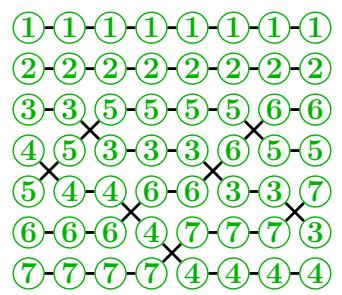

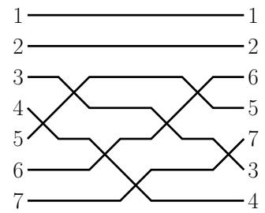

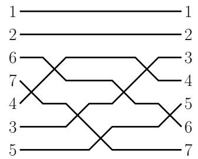  
FIGURE 20. The wiring diagram for the reduced word $(4,3,5,6,4,3,5) \in R(1265734)$ notated in three different ways: with the intermediate permutations $w^{(t)}$ shown on the left, the left-labelling in the middle, and the right-labelling on the right. The crossings in columns 2 and 6 are both at row 3.

Let $w \in S_n$ be a permutation. A word for $w$ is a list of positive integers $\mathbf{a} = (a_1, \ldots, a_k)$ such that

$$
s _ {a _ {1}} s _ {a _ {2}} \ldots s _ {a _ {k}} = w.
$$

If $k = \ell(w)$ , then we say that $\mathbf{a}$ is a reduced word for $w$ . The reduced words are precisely the minimum-length ways of representing $w$ as a product of simple transpositions. For instance, the permutation $[3,2,1] \in S_3$ has two reduced words: $(1,2,1)$ and $(2,1,2)$ . The empty word () is the unique reduced word for the identity permutation $[1,2,\ldots,n] \in S_n$ . As with permutations, the ascent set of a word $\mathbf{a} = (a_1,\dots,a_k)$ is $\{i \mid a_i < a_{i+1}\} \subseteq \{1,\dots,k-1\}$ . The descent set of $\mathbf{a}$ is the complement in $[k-1]$ .

Write $R(w)$ for the set of all reduced words of the permutation $w$ . The set $R(w)$ has been extensively studied, in part due to interest in Bott-Samelson varieties and Schubert calculus. Its size has an interpretation in terms of counting standard tableaux and the Stanley symmetric functions [250, 260, 347], which will be presented in Section 4.8.

We visualize a word as a dynamical system using its wiring diagram. Wiring diagrams are more rigidly drawn versions of the string diagrams introduced in Section 3.2. See Figure 20 for an example.

Definition 4.1. Let $\mathbf{a} = (a_1, \ldots, a_k)$ be a word for $w$ . For each $0 \leq t \leq k$ , define the permutation $w^{(t)} \in S_n$ at time $t$ by

$$
w ^ {(t)} = s _ {a _ {1}} s _ {a _ {2}} \dots s _ {a _ {t}},
$$

with the convention that $w^{(0)}$ is the identity, while $w^{(k)} = w$ . The $i$ -wire (or the wire with label $i$ ) of $\mathbf{a}$ is defined to be the piecewise linear path joining the points $(w_{i}^{(t)}, t)$ for $0 \leq t \leq k$ . We use "matrix coordinates", that is, $(w_{i}^{(t)}, t)$ refers to row $w^{(t)}(i)$ (numbered from the top of the diagram) and column $t$ (numbered from the left). The wiring diagram is the union of these $n$ wires. The diagram is left-labeled because the wires are labeled in order $1, 2, \ldots, n$ down the left side and they retain the label as they proceed to the right where they appear in order $w_{1}, w_{2}, \ldots, w_{n}$ reading down the right side. The right-labeled wiring diagram for $\mathbf{a}$ is the same union of piecewise linear paths, but it has wires labeled $1, 2, \ldots, n$ down the right side of the wiring diagram, so the labels appear in the order $w^{-1}(1), w^{-1}(2), \ldots, w^{-1}(n)$ reading down the left side.

For all $t \geq 1$ , observe that between columns $t - 1$ and $t$ in the wiring diagram for $\mathbf{a}$ , precisely two wires $i$ and $j$ intersect. This intersection is called a crossing. One can identify

a crossing by its column $t$ . We call $a_{t}$ the row of the crossing at column $t$ . When the word $\mathbf{a}$ is reduced, the minimality of the length of $\mathbf{a}$ ensures that any two wires cross at most once. In this case, we can also identify a crossing by the unordered pair of wire labels that are involved, i.e. the pair $\{w^{(t)}(a_t), w^{(t)}(a_{t+1})\}$ .

Note that the terms row and column have slightly different meaning when we refer to a crossing versus a wire. The upper left corner of a wiring diagram is at $(1,0)$ . When we say a crossing is in row $i$ column $j$ it means the intersection of the crossing is at $(i + \frac{1}{2}, j - \frac{1}{2})$ . When we say wire $r$ is in row $i$ at column $j$ , we mean that $w^{(j)}(i) = r$ , so that the $r$ -wire passes through the point $(i, j)$ .

Observe that for $i < j$ , wires $w(i)$ and $w(j)$ cross in the wiring diagram for $\mathbf{a} \in R(w)$ if and only if $w(i) > w(j)$ . This occurs if and only if $(i,j)$ is an inversion of $w$ , which in turn is equivalent to the wire labels $(w(j),w(i))$ being an inversion of $w^{-1}$ . Let

$$
\operatorname {I n v} (w) = \{(i, j) \mid i <   j, w _ {i} > w _ {j} \} \tag {4.1}
$$

denote the inversion set of $w$ indexed by positions. Note $\operatorname{inv}(w) = \ell(w)$ is the number of inversions, while $\operatorname{Inv}(w)$ is the set of pairs indexing the inversions.

Sorry, dear readers! Defining inversion sets as $\mathrm{Inv}(w) = \{(i,j)\mid i < j,w_i > w_j\}$ is another choice that we just need to live with. Sometimes one may prefer $\mathrm{Inv}(w^{-1}) = \{(w_j,w_i)\mid i < j,w_i > w_j\}$ , which one may also call the inversion set of $w$ indexed "by values". The advantage of $\mathrm{Inv}(w^{-1})$ is that the $i$ -wire and the $j$ -wires cross in the left-labeled wiring diagram of $\mathbf{a}$ if and only if $(i,j)\in \mathrm{Inv}(w^{-1})$ . Check that in Figure 20! However, reversing any word for $w$ gives a word for $w^{-1}$ . Thus, if we label the wires 1, 2, 3, ... in increasing order down the right side of a wiring diagram instead of the left, then the corresponding wires travel right to left, and appear in order $w^{-1}$ down the left side. Also, the $i$ -wire and the $j$ -wire cross in the right-labeled wiring diagram for $\mathbf{a}\in R(w)$ if and only if $(i,j)\in \mathrm{Inv}(w)$ using positions. Hence, it can be helpful to have both the right-labeled and left-labeled wiring diagram for $\mathbf{a}$ in mind. Either way, the wiring diagram of $\mathbf{a}$ is the same union of unlabeled piecewise linear paths.

We advise the reader to choose a favorite permutation which is not its own inverse to keep in mind throughout this chapter and use it to test your understanding of the notation. A simple example is $2413 \in S_4$ . It has two reduced words: (1,3,2) and (3,1,2).

4.1.1. Pipe Dreams. Let's consider a variation on the idea of wiring diagrams.

Definition 4.2. A pipe dream $D$ is a finite subset of $\mathbb{Z}_{+} \times \mathbb{Z}_{+}$ . We usually draw a pipe dream by placing a $\boxplus$ -tile, called a "cross", at every $(i,j) \in D$ , and a $\boxminus$ -tile, called a "bump" or an "elbow", at every $(i,j) \in \mathbb{Z}_{+} \times \mathbb{Z}_{+} \setminus D$ , creating pipes (or wires) connecting the left boundary to the top boundary (in matrix coordinates).

If the wires are numbered $1,2,3,\ldots$ across the top, then the corresponding wires read along the left side of the diagram from top to bottom form a permutation $w$ of the positive integers that fixes all but finitely many values. We call $w$ the permutation of $D$ following the literature. Following the terminology for reduced words, we say that $D$ is reduced if $w$ is the permutation of $D$ and $\ell(w) = |D|$ . We write $\mathrm{RP}(w)$ for the set of all reduced pipe dreams for $w$ .

We only need to draw a finite number of wires in a triangular array to represent a pipe dream since it necessarily contains only a finite number of crossings. See Figure 21 for an example of a pipe dream for $w = 314652$ .

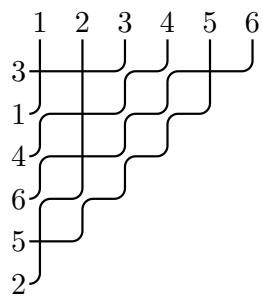

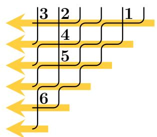

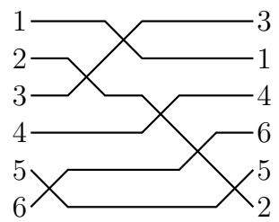  
FIGURE 21. Left: a reduced pipe dream $D$ for $w = [3,1,4,6,5,2]$ . Middle: the reading order for the crossings, with numbers indicating position in the order. The associated reduced word is $\mathbf{r}_D = (5,2,1,3,4,5) \in R(w)$ . Reading the sequence of row numbers and column numbers in the same order we obtain $\mathbf{i}_D = (1,1,1,2,3,5)$ and $\mathbf{j}_D = (5,2,1,2,2,1)$ respectively. Right: the left-labeled wiring diagram of the associated reduced word $\mathbf{r}_D = (5,2,1,3,4,5) \in R(w)$ .

We call the elements of a pipe dream $D \subset \mathbb{Z}_{+} \times \mathbb{Z}_{+}$ its crossings or occupied positions, and the elements $(i,j)$ of $\mathbb{Z}_{+} \times \mathbb{Z}_{+} \setminus D$ the unoccupied positions. Each crossing involves two wires, which are said to enter the crossing horizontally and vertically.

Two wires labeled $i < j$ cross somewhere in a pipe dream $D \in \mathrm{RP}(w)$ if and only if $(i,j) \in \mathrm{Inv}(w^{-1})$ . Observe that the larger labeled wire necessarily enters the crossing horizontally in a reduced pipe dream as it proceeds down and left.

One can easily read off a reduced word $\mathbf{r}_D$ for $w$ from a reduced pipe dream $D \in \mathrm{RP}(w)$ . Order the crossings in $D$ in the order given by reading rows from top to bottom, and from right to left within each row, as in the middle diagram of Figure 21. We call this the reading order on $D$ . We construct three words from the ordered list of crossings: the row numbers of the crossings $\mathbf{i}_D = (i_1, i_2, \ldots, i_p)$ , the column numbers $\mathbf{j}_D = (j_1, j_2, \ldots, j_p)$ and the diagonal numbers $\mathbf{r}_D = (i_1 + j_1 - 1, i_2 + j_2 - 1, \ldots, i_p + j_p - 1) = \mathbf{j}_D + \mathbf{i}_D - 1$ , which is the corresponding reduced word of $D$ . Any two of $\mathbf{i}_D, \mathbf{j}_D, \mathbf{r}_D$ suffice to determine $D$ .

For example, Figure 21 shows the pipe dream $D$ with the reduced word $\mathbf{r}_D = (5,2,1,3,4,5)$ , row numbers $\mathbf{i}_D = (1,1,1,2,3,5)$ , and column numbers $\mathbf{j}_D = (5,2,1,2,2,1)$ . Observe that the associated wiring diagram looks significantly different than the pipe dream. Can you see how to reflect, rotate, and stretch the pipe dream to get the crossings to appear in the same order?

From the reading order of a reduced pipe dream $D$ , one can observe that $(\mathbf{r}_D, \mathbf{i}_D) = ((r_1, \ldots, r_p), (i_1, \ldots, i_p))$ satisfies three compatibility conditions

$$
\begin{array}{l} \bullet \quad i _ {1} \leq i _ {2} \leq \dots \leq i _ {p}, \\ \bullet \quad i _ {k} \leq r _ {k}, \quad \forall 1 \leq k \leq p, \tag {4.2} \\ \bullet \quad \text {i f} r _ {k} <   r _ {k + 1}, \text {t h e n} i _ {k} <   i _ {k + 1} \forall 1 \leq k \leq p. \\ \end{array}
$$

For any reduced word $\mathbf{r}$ , say the sequence $\mathbf{i}$ is compatible with $\mathbf{r}$ if it satisfies the conditions above. A reduced word can have many compatible sequences or it may have none. For example, the reduced word $(2,3,1) \in R(3142)$ has none, while $(2,1,3)$ has compatible sequences $(1,1,2)$ and $(1,1,3)$ .

Definition 4.3. [36] For a permutation $w$ , a pair of positive integer sequences of the same length $(\mathbf{a},\mathbf{i}) = \big((a_1,\ldots ,a_\ell),(i_1,\ldots ,i_\ell)\big)$ is called a compatible pair for $w$ if $\mathbf{a}\in R(w)$ is a reduced word for $w$ and $(\mathbf{a},\mathbf{i})$ satisfies the compatibility conditions in (4.2).

Exercise 4.4. Prove that the reduced pipe dreams for $w$ are in bijection with the compatible pairs for $w$ . The forward direction was done in the observation above. For the converse statement, one must show that any biword $((a_{1}, a_{2}, \ldots, a_{p}), (i_{1}, i_{2}, \ldots, i_{p}))$ such that $\mathbf{a} = (a_{1}, a_{2}, \ldots, a_{p})$ is a reduced word and $(i_{1}, i_{2}, \ldots, i_{p})$ is compatible with $\mathbf{a}$ gives rise to a reduced pipe dream for the permutation $s_{a_{1}} s_{a_{2}} \cdots s_{a_{p}}$ .

The monomial weight of a pipe dream $D$ is given by the product over row numbers of the crossings

$$
x ^ {D} := \prod_ {(i, j) \in D} x _ {i} = x _ {i _ {1}} x _ {i _ {2}} \dots x _ {i _ {p}}
$$

where $x_{1}, x_{2}, \ldots$ are formal commuting variables. Adding a second set of commuting variables, $y_{1}, y_{2}, \ldots$ one can also record the column numbers. By convention, we associate to $D$ the polynomial

$$
(x - y) ^ {D} = \prod_ {(i, j) \in D} (x _ {i} - y _ {j}).
$$

For example, the pipe dream of Figure 21 has weight $x^{D} = x_{1}^{3}x_{2}x_{3}x_{5}$ and

$$
(x - y) ^ {D} = (x _ {1} - y _ {1}) (x _ {1} - y _ {2}) (x _ {1} - y _ {5}) (x _ {2} - y _ {2}) (x _ {3} - y _ {2}) (x _ {5} - y _ {1}).
$$

The following important theorem in this theory shows that each Schubert polynomial is the generating function for reduced pipe dreams weighted by their monomials as follows. This formula could serve as the definition of Schubert polynomials in analogy with the definition of Schur functions as the sum over semistandard tableaux in symmetric function theory.

Theorem 4.5. The Schubert polynomial of $w \in S_n$ is

$$
\mathfrak {S} _ {w} = \mathfrak {S} _ {w} (x _ {1}, x _ {2}, \ldots , x _ {n}) := \sum_ {D \in \mathrm {R P} (w)} x ^ {D}.
$$

Corollary 4.6 (The BJS Formula). The Schubert polynomial of $w \in S_n$ is

$$
\mathfrak {S} _ {w} = \mathfrak {S} _ {w} (x _ {1}, x _ {2}, \ldots , x _ {n}) := \sum x _ {i _ {1}} x _ {i _ {2}} \dots x _ {i _ {p}}
$$

summed over all compatible pairs $(\mathbf{a},\dot{\mathbf{i}}) = ((a_{1},\ldots ,a_{p}),(i_{1},\ldots ,i_{p}))$ for $w$ .

Remark 4.7. This theorem and corollary build on work of many people, so we pause for a historical note. Recall, Lascoux-Schützenberger [250] invented the Schubert polynomials as a solution to the divided difference equations using the specific choice of representative for the cohomology class of a point given by $[X_{\mathrm{id}}] = \mathfrak{S}_{w_0} = x_1^{n - 1}x_2^{n - 2}\dots x_{n - 1}$ as we saw in Section 3.9 in the early 1980s. In the early 1990s, Stanley conjectured the monomial expansion for the Schubert polynomial $\mathfrak{S}_w$ in terms of biwords consisting of reduced word and compatible sequence pairs for $w$ , Corollary 4.6. He had used compatible pairs to study the number of reduced expressions for $w_0$ in his celebrated paper [347]. His conjecture was first proved in 1992 by Billey-Jockusch-Stanley [36] using a different recurrence than the transition equation. Shortly after, Fomin-Stanley [130] gave another proof related to the nil-Coxeter algebra, which we will return to in Section 4.2. Fomin-Kirillov [129] gave an interpretation of the compatible pairs as pseudo-line arrangements, which are more free-form

than the wiring diagrams drawn so far. Billey-Bergeron were the first to use pipe dreams as we have drawn them above [24], though they called them $RC$ -graphs since they are a visualization of the reduced word and compatible sequence pairs $(\mathbf{r}_D, \mathbf{i}_D)$ . They used them to get a bijective proof of Monk's formula using an insertion algorithm, and developed the chute and ladder moves connecting all reduced pipe dreams for $w$ . Knutson-Miller coined the name "pipe dreams", which seems to have stuck, in their paper [212] where they give other geometric and algebraic interpretations of individual pipe dreams. See also Kogan's work related to toric varieties and pipe dreams [219]. Recently, Nadeau-Spink-Tewari have surveyed many of the combinatorial objects related to Schubert polynomials and given an all positive monomial expansion using new creation operators starting at $\mathfrak{S}_{\mathrm{id}} = 1$ instead of divided difference operators starting at $\mathfrak{S}_{w_0}$ [291].

There are many proofs now of Theorem 4.5 or its equivalent formulation in Corollary 4.6. Our goal is to present a proof that could have come shortly after Monk's work in the 1950's. This approach is a bijective proof based on the transition equation in Definition 3.104. The base case says $\mathfrak{S}_{\mathrm{id}} = 1$ , which corresponds with the unique pipe dream with no crossings. To prove the recurrence holds for the weight generating function over pipe dreams of $w$ , we will use a variation on Little's bumping algorithm [260], also known as a "Little bump". It is a map on the set of all possible reduced words. It was introduced to study the decomposition of Stanley symmetric functions into Schur functions in a bijective way. Later, the Little algorithm was found to be related to the Robinson-Schensted-Knuth map [261] and the Edelman-Greene map [166]; it has been extended to signed permutations [35], affine permutations [238], and the subset of involutions in $S_{n}$ [161].

Before we move on to Little bumps, you might be asking: how does one find all reduced pipe dreams for $w \in S_n$ ? Drawing one at random is a challenge. Luckily, there are a couple that are straightforward to find, and these can be used to find all of the others. Recall the code of a permutation is $c(w) = (c(w)_1, c(w)_2, \ldots, c(w)_n)$ where $c(w)_i = |\{j \in [n] \mid (i,j) \in \mathrm{Inv}(w)\}|$ . We construct the bottom pipe dream for $w$ , denoted $D_{\mathrm{bot}}(w)$ , by placing $c_i(w)$ left-justified cross tiles on row $i$ for each $1 \leq i \leq n$ . Since $0 \leq c_i(w) \leq n - i$ , the pipe dream $D_{\mathrm{bot}}(w)$ can be represented by a pipe dream with $n$ wires. The $c_1(w)$ tiles on row 1 will lead the wire labeled $w_1 = c_1(w) + 1$ along at the top to turn left and exit on the first row. By induction, wires $w_2, \ldots, w_n$ will exit on the left in rows 2, 3, ..., $n$ , proving $D_{\mathrm{bot}}(w) \in \mathrm{RP}(w)$ .

We get a second pipe dream for $w$ by transposing $D_{\mathrm{bot}}(w^{-1})$ . This is called the top pipe dream, denoted $D_{\mathrm{top}}(w)$ . It will have its $\boxplus$ -tiles all top-justified in the columns.

For example, if $w = 25143$ , then $c(w) = (1, 3, 0, 1, 0)$ and $c(w^{-1}) = (2, 0, 2, 1, 0)$ , so

$$
D _ {\mathrm {b o t}} (w) = \begin{array}{c c c c} + & . & . & . \\ + & + & + \\ . & . & & \\ + & & & . \end{array} \qquad D _ {\mathrm {t o p}} (w) = \begin{array}{c c c c} + & . & + & + \\ . & . & & \\ . & & & \\ . & & & \end{array}
$$

by definition. Note that we may omit any $\boxplus$ -tiles, since all the information of a pipe dream is contained in the $\boxplus$ -tiles. The reader should compare these pipe dreams to the diagram $D(w)$ from (3.10) since the code of $w$ also counts the number of elements in $D(w)$ on each row.

There are two types of moves on pipe dreams that preserve the permutation: chute moves (Figure 22) and ladder moves (Figure 23). A chute move can be thought of as swapping a $\boxplus$ -tile with the first $\boxus$ -tile on the row below and to the left in such a way as to preserve the permutation. Formally, $(i,j+k+1) \in D$ moves to $(i+1,j) \notin D$ if $(i+a,j+b) \in D$ for

all $a \in \{0,1\}$ , $b \in \{1,2,\ldots,k\}$ and $(i,j)$ , $(i+1,j+k+1) \notin D$ , for some $k \geq 0$ . Similarly, a ladder move swaps a $\boxplus$ -tile with the first $\boxplus$ -tile on the column to the right and above in such a way as to preserve the permutation. Formally, $(i+k+1,j) \in D$ moves to $(i,j+1) \notin D$ if $(i+a,j+b) \in D$ for all $a \in \{1,2,\ldots,k\}$ , $b \in \{0,1\}$ and $(i,j)$ , $(i+k+1,j+1) \notin D$ for some $k \geq 0$ . It is easy to see from the wires in each case that the chute and ladder moves on pipe dreams preserve the underlying permutation.

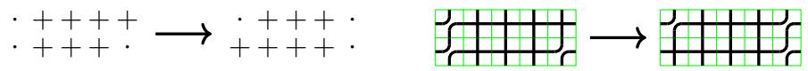  
FIGURE 22. Chute moves on pipe dreams move one cross to the left and preserve the permutation.

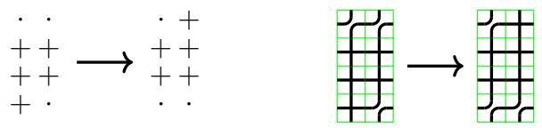  
FIGURE 23. Ladder moves on pipe dreams move one cross to the right and preserve the permutation.

Theorem 4.8. [24, Thm 3.7] For any $w \in S_n$ , every reduced pipe dream for $w$ can be obtained from a sequence of ladder moves on $D_{bot}(w)$ , and every reduced pipe dream for $w$ can be obtained from a sequence of chute moves on $D_{top}(w)$ .

Example 4.9. The reduced pipe dreams for $w = 1432$ are shown in Figure 24. Note that the code is $c(1432) = (0,2,1,0)$ , so $D_{\mathrm{bot}}(1432)$ is the leftmost pipe dream. Therefore by Theorem 4.8, as computed in (3.43) of Example 3.105,

$$
\mathfrak {S} _ {1 4 3 2} = x _ {1} ^ {2} x _ {2} + x _ {1} ^ {2} x _ {3} + x _ {1} x _ {2} ^ {2} + x _ {1} x _ {2} x _ {3} + x _ {2} ^ {2} x _ {3}. \tag {4.3}
$$

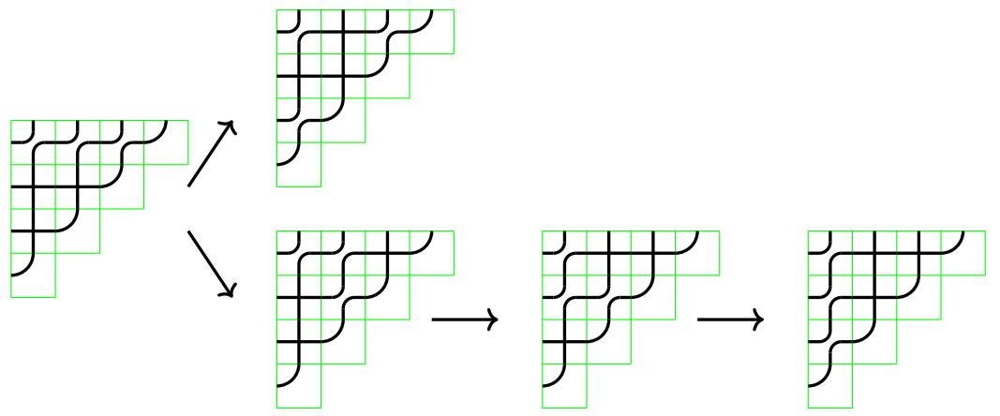  
FIGURE 24. Construction of $\mathrm{RP}(w)$ by ladder moves on $D_{\mathrm{bot}}(1432)$ .

Lascoux-Schützenberger [250] also defined the double Schubert polynomials using divided difference operators, similar to (3.50), by the formula

$$
(4. 4) \mathfrak {S} _ {w} (X; Y) = \mathfrak {S} _ {w} (x _ {1}, \ldots , x _ {n}; y _ {1}, \ldots , y _ {n}) = \left\{ \begin{array}{l l} \prod_ {i + j \leq n} (x _ {i} - y _ {j}) & \text {i f} w = [ n, n - 1, \ldots , 1 ] \\ \partial_ {i} \mathfrak {S} _ {w s _ {i}} (X; Y) & \text {i f} w (i) <   w (i + 1). \end{array} \right.
$$

Here the divided difference operators act on the $x$ -variables, and treat polynomials in the $y$ -variables alone as scalars. The double Schubert polynomials can be written in terms of the single Schubert polynomials as

$$
\mathfrak {S} _ {w} (X; Y) = \sum (- 1) ^ {\ell (v)} \mathfrak {S} _ {u} (X) \mathfrak {S} _ {v} (Y)
$$

where the sum is taken over all factorizations $v^{-1}u = w$ such that $\ell(u) + \ell(v) = \ell(w)$ [265, (6.3)]. Fomin-Kirillov [129] also gave the monomial expansion of the double Schubert polynomials,

$$
\mathfrak {S} _ {w} (x _ {1}, \dots , x _ {n}; y _ {1}, \dots , y _ {n}) = \sum_ {D \in \mathrm {R P} (w)} (x - y) ^ {D}. \tag {4.5}
$$

See also Knutson's co-transition formula in [209] and a variation for the Grothendieck polynomials in $K$ -theory. Bergeron-Billey also gave a double Schubert polynomial formula using ladder moves applied to $D_{\mathrm{bot}}(w)$ allowing the crossings to move above the first row [24, Thm. 4.1]. The double Schubert polynomials play a key role in the equivariant Schubert calculus discussed in successive chapters of this book. We will return to the double Schubert polynomials in Section 5.2 when we discuss matrix Schubert varieties and the "naturality" of pipe dreams.

Exercise 4.10. Use pipe dreams to show $\mathfrak{S}_{2413} = x_1x_2^2 +x_1^2 x_2$

Exercise 4.11. Prove there is exactly one reduced pipe dream for $w_0 = [n, n - 1, \ldots, 1]$ .

Exercise 4.12. Prove that the reduced word $\mathbf{r}_{D_{\mathrm{bot}}(w)}$ is largest in reverse lexicographic order among all reduced words for $w$ . Similarly, $\mathbf{r}_{D_{\mathrm{top}}(w)}$ is the smallest reduced word for $w$ in lexicographic order.

Exercise 4.13. Recall the dominant permutations from Exercise 3.113 index the Schubert polynomials with exactly one monomial in their expansion, hence they have exactly one reduced pipe dream. Why are there no valid ladder moves on $D_{\mathrm{bot}}$ in this case? What can you say about Schubert polynomials with at most $k$ reduced pipe dreams?

Exercise 4.14. Use pipe dreams to compute the double Schubert polynomial $\mathfrak{S}_{1432}(X;Y)$ .

Exercise 4.15. Given a reduced pipe dream $D$ for a permutation in $S_{n}$ and $k \in [n]$ , color the pipes red that exit on rows $1, 2, \ldots, k$ and color the remaining pipes blue. Remove all blue pipes leaving a tiling using red elbows, red crosses, and red horizontal line segments. Contract all of the red horizontal line segments. Prove the resulting tiling is a reduced pipe dream for a permutation in $S_{k}$ . This algorithm is used by Bergeron-Ceballos-Pilaud to construct the coproduct that they use to construct a Hopf algebra on pipe dreams [25].

4.1.2. Little Bumps. Recall that Schubert polynomials were defined in this chapter using the transition equation of Definition 3.104. Therefore, in order to prove Theorem 4.5 we need to show that the generating functions for reduced pipe dreams satisfy the same recurrence via a bijection. We will give a bijection that proves this recurrence using the Little bump algorithm and a variation on that theme. The map itself is quite simple, but there are many details to check to complete the proof.

The idea of a Little bump is to push a crossing in a reduced wiring diagram up or down, depending on the chosen direction of travel, and then to iteratively try to correct the resulting wiring diagram if it is not reduced by pushing up or down again at another specified crossing. Figure 25 shows an example. This will translate to pushing a crossing in a pipe dream left or right on each step so the monomial weight of the pipe dream $x^{D}$ will be preserved throughout the process. We will now discuss the specific details of the algorithms.

Definition 4.16. Let $\mathbf{a} = (a_1, \ldots, a_k)$ be a word. Define the decrement-push, increment-push, deletion and insertion of $\mathbf{a}$ at column $t$ , respectively, to be

$$
\begin{array}{l} \mathcal {P} _ {t} ^ {-} \mathbf {a} = (a _ {1}, \ldots , a _ {t - 1}, a _ {t} - 1, a _ {t + 1}, \ldots , a _ {k}); \\ \mathcal {P} _ {t} ^ {+} \mathbf {a} = (a _ {1}, \ldots , a _ {t - 1}, a _ {t} + 1, a _ {t + 1}, \ldots , a _ {k}); \\ \mathcal {D} _ {t} \mathbf {a} = (a _ {1}, \dots , a _ {t - 1}, a _ {t + 1}, \dots , a _ {k}); \\ \mathcal {I} _ {t} ^ {x} \mathbf {a} = (a _ {1}, \dots , a _ {t - 1}, x, a _ {t}, \dots , a _ {k}). \\ \end{array}
$$

Definition 4.17. Let $\mathbf{a} = (a_{1},\ldots ,a_{k})$ be a word, and assume $1\leq t\leq k$ . If $\mathcal{D}_t\mathbf{a}$ is reduced, then we say that $\mathbf{a}$ is nearly reduced at $t$ .

The term "nearly reduced" is inspired by Lam [235, Chapter 3], who uses the terminology " $t$ -marked nearly reduced". Words that are nearly reduced at $t$ may or may not also be reduced, and words that are reduced may not be nearly reduced at $t$ . However, every reduced word $\mathbf{a}$ is nearly reduced at some index $t$ . For instance, a reduced word $\mathbf{a}$ of length $k$ is nearly reduced at 1 and at $k$ .

Exercise 4.18. [260, 238] Assume $\mathbf{a}$ is not reduced, but is nearly reduced at $t$ . Prove that in the wiring diagram of $\mathbf{a}$ , the two wires crossing in column $t$ cross in exactly one other column $t'$ . Furthermore, $\mathcal{D}_{t'}\mathbf{a}$ is reduced.

Definition 4.19. In the situation of Exercise 4.18, we say that $t'$ forms a defect with $t$ in $\mathbf{a}$ , and write $\mathrm{Defect}_t(\mathbf{a}) = t'$ .

A crucial point is that the definitions of "reduced", "nearly reduced", and the "Defect map" make sense even if we are given only the word $\mathbf{a}$ , but not the corresponding permutation $w \in S_{n}$ , nor even its size $n$ . Indeed, we can take $n$ to be any integer greater than the largest element of $\mathbf{a}$ . We typically draw the wiring diagram of $\mathbf{a}$ using the minimal number of wires.

Definition 4.20. A word $\mathbf{b}$ is a bounded word for another word $\mathbf{a}$ if the words have the same length and $1 \leq b_i \leq a_i$ for all $i$ . A bounded pair (for a permutation $w$ ) is an ordered pair $(\mathbf{a}, \mathbf{b})$ such that $\mathbf{a}$ is a reduced word (for $w$ ) and $\mathbf{b}$ is a bounded word for $\mathbf{a}$ . Let BoundedPairs $(w)$ be the set of all bounded pairs for $w$ .

For example, for the simple transposition $s_k$ , the set is

$$
\operatorname {B o u n d e d P a i r s} (s _ {k}) = \left\{\big ((k), (i) \big): 1 \leq i \leq k \right\}.
$$

For $w = 321$ , the set BoundedPairs(321) has 6 elements,

$$
\begin{array}{l} \left(\left(1, 2, 1\right), \left(1, 1, 1\right)\right), \left(\left(1, 2, 1\right), \left(1, 2, 1\right)\right), \left(\left(2, 1, 2\right), \left(1, 1, 1\right)\right), \\ ((2, 1, 2), (1, 1, 2)), ((2, 1, 2), (2, 1, 1)), ((2, 1, 2), (2, 1, 2)). \\ \end{array}
$$

# Algorithm 4.21 (Bounded Bump Algorithm,[43]).

Input: $(\mathbf{a},\mathbf{b},t_0,\epsilon)$ , where $\mathbf{a}$ is a word that is nearly reduced at $t_0$ , $\mathbf{b}$ is a bounded word for $\mathbf{a}$ , and $\epsilon \in \{-, + \} = \{-1, + 1\}$ is a direction.

Output: $\mathcal{B}_{t_0}^\epsilon (\mathbf{a},\mathbf{b}) = (\mathbf{a}',\mathbf{b}',i,j,\mathrm{outcome})$ , where $\mathbf{a}'$ is a reduced word, $\mathbf{b}'$ is a bounded word for $\mathbf{a}'$ , $i$ is the row and $j$ is the column of the last crossing pushed in the algorithm, and outcome is a binary indicator explained below.

(1) Initialize $\mathbf{a}' \gets \mathbf{a}$ , $\mathbf{b}' \gets \mathbf{b}$ , $t \gets t_0$ .   
(2) Push in direction $\epsilon$ at column $t$ , i.e. set $\mathbf{a}' \gets \mathcal{P}_t^\epsilon \mathbf{a}'$ and $\mathbf{b}' \gets \mathcal{P}_t^\epsilon \mathbf{b}'$ .   
(3) If $b_{t}^{\prime} = 0$ , return $(\mathcal{D}_t\mathbf{a}',\mathcal{D}_t\mathbf{b}',\mathbf{a}_t',t, \text{deleted})$ and $\mathbf{stop}$ .   
(4) If $\mathbf{a}'$ is reduced, return $(\mathbf{a}', \mathbf{b}', \mathbf{a}_t', t,$ bumped) and $\mathbf{stop}$ .   
(5) Otherwise, set $t \gets \operatorname{Defect}_t(\mathbf{a}')$ and return to step 2.

Example 4.22. Consider the bounded bump algorithm on

$$
\mathbf {a} = (4, 3, 5, 6, 4, 3, 5), \mathbf {b} = (2, 2, 2, 2, 2, 2, 2), t _ {0} = 4, \text {a n d} \epsilon = -.
$$

The result is

$$
\mathcal {B} _ {4} ^ {-} (\mathbf {a}, \mathbf {b}) = \left((3, 2, 4, 5, 4, 3, 4), (1, 1, 1, 1, 2, 2, 1), 2, 2, \text {b u m p e d}\right).
$$

The sequence of pushes used to obtain the output reduced word $(3,2,4,5,4,3,4)$ is shown in Figure 25. The corresponding bounded word $(1,1,1,1,2,2,1)$ is obtained from $\mathbf{b} = (2,2,2,2,2,2,2)$ by decrementing each position corresponding to a column that was pushed by the bump algorithm. On the other hand, with input $\widetilde{\mathbf{b}} = (2,2,2,2,2,2,1)$ and the same $\mathbf{a}$ the bounded bump algorithm stops after the third push in the sequence because $\widetilde{b}_7 = 1$ , so

$$
\mathcal {B} _ {4} ^ {-} (\mathbf {a}, \widetilde {\mathbf {b}}) = \big ((4, 3, 4, 5, 4, 3), (2, 2, 1, 1, 2, 2), 4, 7, \text {d e l e t e d} \big).
$$

The original Little bump algorithm, defined by David Little in [260], inspired the bounded bump algorithm. In his algorithm, the bounded word is essentially fixed to be the same as the input reduced word. The key difference is in Step 3. Instead of deleting a letter when $b_{t}^{\prime} = 0$ , add 1 to each letter in $\mathbf{a}^{\prime}$ and return the resulting reduced word. Let $\mathbf{a}^{\prime} + 1$ denote the word obtained from $\mathbf{a}^{\prime}$ by adding 1 to each entry.

# Algorithm 4.23 (Little Bump Algorithm,[260]).

Input: $(\mathbf{a},t_0,\epsilon)$ , where $\mathbf{a}$ is a reduced word that is nearly reduced at $t_0$ , and $\epsilon \in \{-, + \}$ .

Output: $\mathcal{LB}_{t_0}^{\epsilon}(\mathbf{a}) = \mathbf{a}'$ , where $\mathbf{a}'$ is a reduced word.

(1) Initialize $\mathbf{a}' \gets \mathbf{a}$ , $t \gets t_0$ .   
(2) Set $\mathbf{a}' \gets \mathcal{P}_t^\epsilon \mathbf{a}'$ .   
(3) If $a_{t}^{\prime} = 0$ , return $\mathbf{a}^{\prime} + 1$ and stop.   
(4) If $\mathbf{a}'$ is reduced, return $\mathbf{a}'$ and stop.   
(5) Otherwise, set $t \gets \operatorname{Defect}_t(\mathbf{a}')$ and return to step 2.

We now make some remarks about the Little bump and bounded bump algorithms. Since we will use the bounded bump algorithm below, we will focus on that variation. The initial input word $\mathbf{a}$ may or may not be reduced, but, if we reach step 5 then $\mathbf{a}'$ is always not reduced but nearly reduced at $t$ , so the Defect map is defined on $\mathbf{a}'$ .

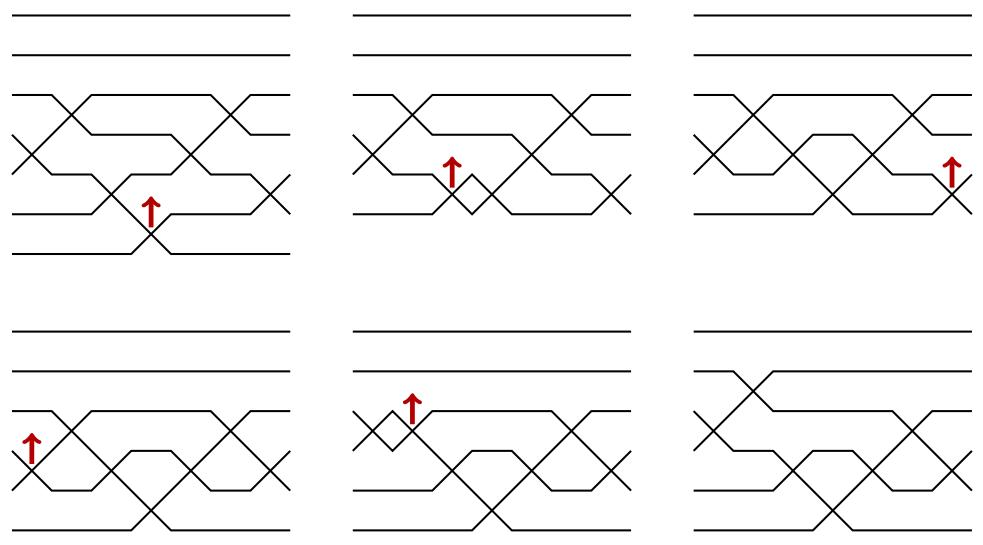  
FIGURE 25. An example of the sequence of wiring diagrams for the words $\mathbf{a}'$ which appear when running the bounded bump algorithm on input $\mathbf{a} = (4,3,5,6,4,3,5)$ , $\mathbf{b} = (2,2,2,2,2,2,2)$ , $t_0 = 4$ , and $\epsilon = -$ . The arrows indicate which crossing will move in the next step. After the first step, row 7 contains a wire with no swaps, which is therefore not shown.

Suppose that the input word $\mathbf{a}$ is a word for a permutation $w\in S_{n}$ . pushes may in general result in words with elements outside the interval $[1,n - 1]$ . Specifically, in the case $\epsilon = +$ , step 2 may result in a word $\mathbf{a}'$ with an element $a_t' = n$ . As mentioned above, this can be interpreted as a word for a permutation in $S_{n + 1}$ . In fact, in this case the algorithm will immediately stop at step 4, since this new word is necessarily reduced. On the other hand, in the case $\epsilon = -$ , if step 2 ever results in a word with $a_t' = 0$ , we must have $b_t' = 0$ as well, so the algorithm will immediately stop at step 3, and the 0 will be deleted. Note that it is also possible for a non-zero element of $\mathbf{a}$ to be deleted at step 3, since $b_i' < a_i'$ is possible. Thus, the bounded bump algorithm clearly terminates in a finite number of steps. In fact, each position gets pushed at most once during either the bounded bump algorithm or the Little bump algorithm.

The exercises below collect several technical facts about the bounded bump algorithm that are analogous to facts proved by Little about his algorithm [260]. These statements may be checked by essentially the same arguments as in [260] - the inclusion of $\mathbf{b}$ has scant effect here. We encourage readers to find their own proof and peek at the article as needed. In each exercise, we assume $\mathbf{a}$ is a word that is nearly reduced at $t$ , and $\mathbf{b}$ is a bounded word for $\mathbf{a}$ , and let $\epsilon \in \{+, -\}$ . Assume $\mathcal{B}_t^\epsilon (\mathbf{a},\mathbf{b}) = (\mathbf{a}',\mathbf{b}',i,j,\mathrm{outcome})$ .

Exercise 4.24. Suppose $\mathbf{a}$ is reduced, not just nearly reduced. Then, Algorithm 4.21 is reversible in the sense that we can recover the inputs by negating the direction $\epsilon$ and using the output parameters $i,j$ , outcome to reverse process. More specifically, say $\mathcal{B}_{t_0}^{\epsilon}(\mathbf{a},\mathbf{b}) = (\mathbf{a}',\mathbf{b}',i,j,\mathrm{outcome})$ , and consider the two possible cases for outcome. If outcome = deleted, then it must be that $\epsilon = -1$ , so reverse the bump by inserting an $i$ into position $j$ and initiating the bumping algorithm there starting with a positive push to recover $(\mathbf{a},\mathbf{b})$ and $t$ ,

denoted

$$
\mathcal {B} _ {j} ^ {- \epsilon} \left(\mathcal {I} _ {j} ^ {i} \mathbf {a} ^ {\prime}, \mathcal {I} _ {j} ^ {0} \mathbf {b} ^ {\prime}\right) = (\mathbf {a}, \mathbf {b}, \mathbf {a} _ {t}, t, \text {b u m p e d}).
$$

If outcome $=$ bumped, then initiate the bumping algorithm starting at $j$ in the reverse direction

$$
\mathcal {B} _ {j} ^ {- \epsilon} (\mathbf {a} ^ {\prime}, \mathbf {b} ^ {\prime}) = (\mathbf {a}, \mathbf {b}, \mathbf {a} _ {t}, t, \text {b u m p e d}).
$$

In particular, both result in a final push which is a bumped and not a deleted outcome in the reverse direction.

Exercise 4.25. If $\mathbf{a} \in R(w)$ , then $\mathcal{D}_t\mathbf{a} \in R(wt_{k,l})$ , where $(k < l)$ is the inversion of $w$ whose wires cross in column $t$ of the right-labeled wiring diagram for $\mathbf{a}$ . If outcome = bumped, then $\mathbf{a}' \in R(wt_{k,l}t_{x,y})$ where $\{x < y\}$ is the crossing in column $j$ of the word $\mathbf{a}'$ for $wt_{k,l}t_{x,y}$ . Furthermore, if $\epsilon = +$ , then $l = x$ . If $\epsilon = -$ , then $k = y$ .

Exercise 4.26. Suppose $\mathcal{D}_t\mathbf{a} \in R(v)$ . After every iteration of step 2 in the bounded bump algorithm computing $\mathcal{B}_t^\epsilon(\mathbf{a}, \mathbf{b})$ , the pair $(\mathcal{D}_t\mathbf{a}', \mathcal{D}_t\mathbf{b}')$ is also a bounded pair for $v$ . In particular, if outcome = deleted, then $\mathbf{a}' \in R(v)$ .

Exercise 4.27. If outcome $=$ bumped, then the input and output words $\mathbf{a}$ and $\mathbf{a}'$ have the same ascent set. If outcome $=$ deleted, then the ascent set of $\mathcal{I}_j^i(\mathbf{a}')$ is the same as the ascent set of $\mathbf{a}$ .

A pipe dream for a permutation $w$ may be interpreted as a bounded pair of a special type for the same $w$ . To make this precise, we use the biword $(\mathbf{r}_D, \mathbf{j}_D)$ to encode a pipe dream $D$ . Recall, $\mathbf{r}_D$ is the corresponding word for $w$ , and $\mathbf{j}_D$ is the sequence of column numbers read along rows top to bottom, right to left as shown in Figure 21. Since $r_k = i_k + j_k - 1$ for each $k$ , it is clear that $r_k \geq j_k$ so $\mathbf{j}_D$ is a bounded word for $\mathbf{r}_D$ . Note, $\mathbf{j}_D$ is a bounded word for $\mathbf{r}_D$ even if $D$ is not a reduced pipe dream.

Exercise 4.28. Not every bounded pair corresponds to a pipe dream. Consider for example (121, 121). Prove that a bounded pair $(\mathbf{a}, \mathbf{b}) = ((a_1, \ldots, a_p), (b_1, \ldots, b_p))$ corresponds to a pipe dream if and only if the list $[(i_1, b_1), \ldots, (i_p, b_p)]$ has $p$ distinct elements which are increasing in the reading order shown in Figure 21. Here $i_k = a_k - b_k + 1$ for $1 \leq k \leq p$ is the sequence of row numbers, and $(b_1, \ldots, b_p)$ is the sequence of column numbers. Equivalently, $(\mathbf{a}, \mathbf{b})$ corresponds to a pipe dream if and only if the pairs $(i_1, -b_1), \ldots, (i_p, -b_p)$ are in strictly increasing lex order.

Given any pipe dream $D$ , we can apply the bounded bump algorithm to the corresponding bounded pair $(\mathbf{r}_D, \mathbf{j}_D)$ at any position $t_0$ such that $\mathbf{r}_D$ is nearly reduced at $t_0$ and in either direction $\epsilon \in \{+, -\}$ . One may observe that the bounded pairs encountered during the steps of the bounded bump algorithm do not all encode pipe dreams, but it will turn out that the departures from "pipe dream encoding status" are temporary, and have a straightforward structure that will be analyzed in the proof of Lemma 4.29 below where we develop the notion of a stack push. It may be helpful to look ahead at Figure 27 to understand the proof of Lemma 4.29.

Lemma 4.29. Let $D$ be a reduced pipe dream, and suppose that $\mathbf{r}_D$ is nearly reduced at position $t$ . Let $\epsilon \in \{+, -\}$ and suppose

$$
\mathcal {B} _ {t} ^ {\epsilon} (\mathbf {r} _ {D}, \mathbf {j} _ {D}) = \left(\mathbf {a} ^ {\prime}, \mathbf {b} ^ {\prime}, i, j, \text {o u t c o m e}\right).
$$

Then, the bounded pair $(\mathbf{a}', \mathbf{b}')$ also encodes a reduced pipe dream.

Proof. Consider the effect of the bounded bumping algorithm in terms of pipe dreams. To be concrete, assume $\epsilon = -$ ; the case $\epsilon = +$ being similar. Recalling Definition 4.17, $\mathbf{r}_D$ is nearly reduced at position $t$ if and only if removing the $t^{\text{th}}$ crossing of $D$ in reading order results in a reduced pipe dream. Observe that when we initially decrement-push $(\mathbf{r}_D, \mathbf{j}_D)$ in column $t$ , it has the effect of moving the $t^{\text{th}}$ crossing in the reading order on $D$ , say in position $(i,j) \in D$ , one column to the left to position $(i,j-1)$ . If this location is already occupied, that is if $(i,j-1) \in D$ , then $\mathcal{P}_t^- \mathbf{r}_D$ returns a nearly reduced word with letter $i+j-2$ in both positions $t$ and $t+1$ . The resulting bounded pair does not encode a pipe dream. Then, the next step of the bounded bumping algorithm will decrement-push at $t+1$ . If $(i,j-2) \in D$ also, then $\mathbf{a}' = \mathcal{P}_{t+1}^- \mathcal{P}_t^- \mathbf{r}_D$ will again have duplicate copies of the letter $i+j-3$ in positions $t+1$ and $t+2$ so the next decrement-push will be in position $t+2$ , and so on. Note that since the algorithm decrement-pushes both of the words in the bounded pair in the same position at each iteration, the entrywise differences $\mathbf{a}' - \mathbf{b}' = \mathbf{r}_D - \mathbf{j}_D$ agree, so the original row numbers $\mathbf{i}_D$ are maintained throughout the bounded bumping algorithm unless a deletion occurs.

We can group the push steps along one row so a decrement-push in position $(i,j)$ pushes all of the adjacent $+$ 's to its left over by one as a stack. See Figure 26 for example. Thus, the effect of the bounded bumping algorithm on the pipe dream amounts to a sequence of such "stack pushes". If at the end of a stack push, $a +$ in column 1 of the pipe dream is decrement-pushed, the bounded bump algorithm terminates by deleting that position because there will be a 0 in the bounded word. Otherwise, a stack push ends with a bounded pair that corresponds to a pipe dream, which may or may not be reduced. If it is reduced, the algorithm stops and returns outcome $=$ bumped. Otherwise, we find the defect and continue with another stack push in a different row. In either case, the final bounded pair $(\mathbf{a}',\mathbf{b}')$ encodes a reduced pipe dream.

Definition 4.30. A stack push on a (not necessarily reduced) pipe dream $D$ starting at $(i,j)$ is the result of applying the consecutive sequence of pushes on adjacent letters in $\mathbf{r}_D$ that correspond with crossings on row $i$ when applying the bounded bump algorithm until the defect is resolved or moves to another row. Such stack pushes necessarily correspond with a substring of $\mathbf{r}_D$ of consecutive increasing or decreasing integers.

Exercise 4.31. For the pipe dream $D$ with $r_D = (8,7,6)$ , $i_D = (2,2,2)$ , and $j_D = (7,6,5)$ , verify $\mathcal{B}_1^- (\mathbf{r}_D,\mathbf{j}_D) = ((7,6,5),(6,5,4))$ can be done with one stack push on row 2. In particular, show the bounded pair $((7,6,5),(6,5,4))$ is the reduced word and column word for a reduced pipe dream $D'$ and $i_{D'} = (2,2,2)$ , so all crossings are on the same row as $D$ .

Next, we give the promised bijective proof of Theorem 4.5 that proves the generating function for reduced pipe dreams for a permutation $w$ satisfies the recurrence given by the transition equation (Definition 3.104) for Schubert polynomials. The idea is to take any $D \in \mathrm{RP}(w)$ , find the lex largest inversion $(r,s) \in \mathrm{Inv}(w)$ , and initiate the decrementing bounded bump algorithm (so $\epsilon = -1$ ) in the position of $D$ where wires $w_{r}$ and $w_{s}$ cross. The first push initiates a stack push to the left so a $\boxplus$ -tile either gets pushed out of the diagram into column 0 or it moves to the first empty position, denoted by a bump $\boxplus$ -tile, to its left if one exists. In the first case, this only happens if the initial crossing is on row $r$ and the remaining diagram is a reduced pipe dream for $v = wt_{rs}$ . In the second case, the resulting pipe dream may not be reduced, but we know it will be nearly reduced so it has a well defined defect crossing, and we try to rectify the situation by stack pushing the defect crossing one step to its left and continue similarly until the defect is resolved. The key point is that the

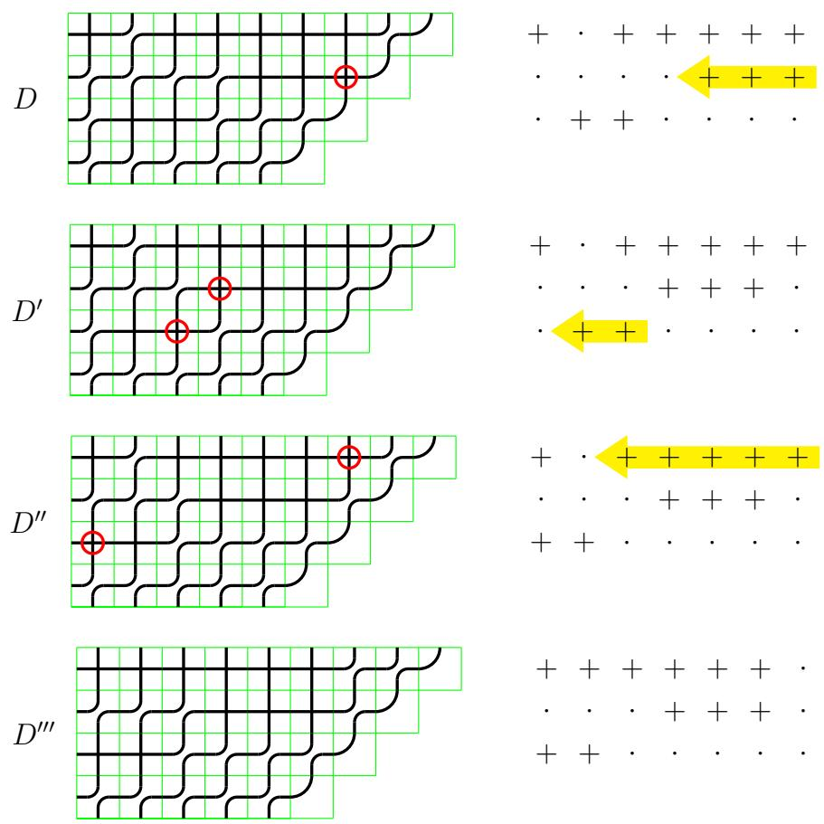  
FIGURE 26. Computing $\mathcal{B}_6^-(\mathbf{r}_D, j_D)$ for $D$ starting in position $(2,7)$ with $r_D = (7,6,5,4,3,1,8,7,6,5,4)$ and $i_D = (1,1,1,1,1,1,2,2,2,3,3)$ via 3 stack pushes.

$\epsilon = -1$ bounded bump applied to the crossing of the $w_{r}$ -wire and the $w_{s}$ -wire in $D$ always terminates in a reduced pipe dream either for $v$ or for one of the permutations $vt_{hr}$ appearing in the transition equation from Definition 3.104, and the process is reversible provided $h, r$ are known. See Figure 27 for an example. Pinning down the details of this bijection does take some work. The proof given here follows the exposition in [43], where interested readers can find further technical details. Essentially the same construction has been given by Buch according to [210, p.11]. We begin by describing how the bounded bump algorithm acts on reduced pipe dreams to formally define the transition map and its inverse.

Warning! For this algorithm and proofs below, it is useful to relabel the wires in a pipe dream by listing the positive integers in increasing order from top to bottom on the left side and in order of $w^{-1}$ on the top. Then $(i,j) \in \mathrm{Inv}(w)$ if and only if the $\{i,j\}$ -wires cross. This relabelling does not change the monomial weight. Similarly, we will use right-labeled wiring diagrams of reduced words for the same reason.

Proof of Theorem 4.5. In the case $w = \mathrm{id}$ , we know $\mathfrak{S}_w = 1$ and the only reduced pipe dream for the identity is the empty pipe dream with no crossings, so the theorem holds trivially. So,

assume $w \neq \mathrm{id}$ , $(r, s)$ is the lex largest inversion for $w$ , and $v = wt_{r,s}$ . Let

$$
\mathcal{U}(w):= \mathrm{RP}(v)\cup \bigcup_{\substack{h <   r:\\ \ell (w) = \ell (vt_{hr})}}\mathrm{RP}(vt_{hr}). \tag{4.6}
$$

We think of $v = vt_{r,r}$ so each pipe dream in $\mathcal{U}(w)$ is for a permutation of the form $vt_{h,r}$ with $1 \leq h \leq r$ , though not all such $vt_{h,r}$ necessarily occur. We will give a bijection $T_w: \mathrm{RP}(w) \longrightarrow \mathcal{U}(w)$ that preserves weight, except in the cases $T_w(D) = E \in \mathrm{RP}(v)$ , where the weight will change by $x_r$ , so $x^D = x_r x^E$ . Therefore, this bijection will show that $\sum_{D \in \mathrm{RP}(w)} x^D$ satisfies the transition equation for all permutations $w \in S_\infty$ with $\ell(w) > 0$ . Since the transition equation along with the initial condition $\mathfrak{S}_{\mathrm{id}} = 1$ was used initially to define the Schubert polynomial $\mathfrak{S}_w$ in Definition 3.104, we will obtain the desired equality.

Algorithm 4.32 (Transition Map). Suppose $w \neq \mathrm{id}$ is given, and let $(r,s)$ and $v$ be defined as above.

Input: $D$ , a non-empty reduced pipe dream for $w$ encoded as the biword $(\mathbf{r}_D,\mathbf{j}_D)$ .

Output: $T_{w}(D) = E \in \mathcal{U}(w)$ .

(1) Let $t_0$ be the unique column containing the $\{r, s\}$ -wiring crossing in the right-labeled wiring diagram for $\mathbf{r}_D$ .   
(2) Compute $\mathcal{B}_{t_0}^{-}(\mathbf{r}_D,\mathbf{j}_D) = (\mathbf{a}',\mathbf{b}',i,j,\mathrm{outcorme})$   
(3a) If outcome $=$ deleted, then $i = r - 1$ , $j = \ell(w)$ , and $(\mathbf{a}', \mathbf{b}')$ encodes a pipe dream $E \in \mathrm{RP}(v) \subset \mathcal{U}(w)$ . Return $E$ and $\mathbf{stop}$ .   
(3b) If outcome $=$ bumped, then $(\mathbf{a}',\mathbf{b}')$ encodes a pipe dream $E \in \mathrm{RP}(vt_{hr})$ for some $h < r$ with $\ell (w) = \ell (vt_{hr})$ . Thus, $E \in \mathcal{U}(w)$ . Return $E$ and stop.

We claim that $T_w$ is a weight-preserving bijection. This claim follows from Exercise 4.24 since the bounded bump algorithm is reversible. We leave the details to the reader as an exercise.

Example 4.33. In Figure 27, we give an example computing $T_{w}(D)$ for $w = 1265734$ . Note that a defect can occur either above or below the pushed crossing. Going from the fourth to the fifth pipe dream, two consecutive pushes on the same row are combined into one step. This is an example of a nontrivial stack push (cf. Definition 4.30). Here the curves in the elbow tiles have been straightened out, which can be helpful visually. Coloring the wires can also be helpful.

We note that the transition map on pipe dreams used in the proof of Theorem 4.5 is very close to, but different than, an algorithm used earlier by Billey-Bergeron in [24] to give a bijective proof of Monk's formula

$$
\mathfrak{S}_{s_{r}}\mathfrak{S}_{w} = \bigl(x_{1} + \dots +x_{r}\bigr)\mathfrak{S}_{w} = \sum_{\substack{k\leq r <   l\\ wt_{k,l} > w}}\mathfrak{S}_{wt_{k,l}}.
$$

The key difference is the need to map pipe dreams for $w$ to those for $wt_{kl}$ where $k \leq r < l$ with $\ell(wt_{kl}) = \ell(w) + 1$ when inserting $x_i$ for $1 \leq i \leq r$ . This has to be built into the algorithm. We briefly review the BB-insertion algorithm for comparison.

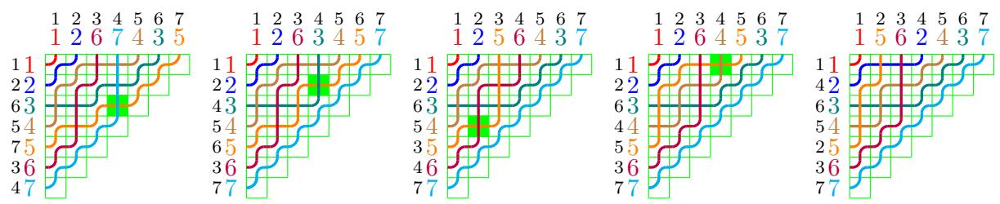  
FIGURE 27. If $D$ is the pipe dream on the left with reduced word $\mathbf{r}_D = (4,3,5,6,4,3,5)$ , then $T_w(D)$ is the pipe dream on the right. In between we show the stack pushes in the bounded bump algorithm. The crossing initiating a stack push is highlighted for each step. Here, $w = [1265734]$ , hence $w^{-1} = [1267435]$ , $r = 5$ , $s = 7$ , $v = [1265437]$ . In this case, $T_w(D)$ is a pipe dream for $vt_{25} = [1465237]$ so $q = 2$ .

# Algorithm 4.34 (BB-insertion)

Input: An integer $1 \leq i \leq r$ and $D \in \mathrm{RP}(w)$ with wires labeled in increasing order down the left side.

Output: $I(D, i, r) = E$ , a reduced pipe dream for $wt_{kl}$ for some $k \leq r < l$ such that $\ell(wt_{k,l}) = \ell(w) + 1$ .

(1) Identify the smallest column $j$ on row $i$ such that there is a bump tile in position $(i, j)$ and the wire $k$ from the left and the wire $l$ from below satisfy the insertion condition

$$
k \leq r <   l. \tag {4.7}
$$

Change the tile at $(i,j)$ to a cross to obtain the pipe dream $E$ . Note, such a pair of wires always exists assuming one can use the invisible wire labeled $n + 1$ if necessary since the $i$ wire enters row $i$ on the left edge and some wire on row $i$ (possibly invisible) has larger label than $r$ .

(2) If $E$ is reduced, stop and return $E \in \mathrm{RP}(wt_{kl})$ .   
(3) If $E$ is not reduced, then wires $(k,l)$ cross again say in entry $(i',j')$ such that $i' < i$ . Remove the crossing at $(i',j')$ from $E$ and add another crossing on row $i'$ in the largest column $j'' < j'$ such that two wires $k' < l'$ come together but don't cross satisfying the insertion condition $k' \leq r < l'$ . Again such an entry must exist. Update $E$ to be the resulting pipe dream, $i \gets i'$ , $j \gets j''$ , and repeat step 2.

For example, consider the reduced pipe dream for 21534

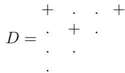

The reader may want to draw the wires into the pipe dreams above and below. To compute $I(D,2,3)$ , we insert a cross at position (2,3) where the 3-wire and 5-wire bump,

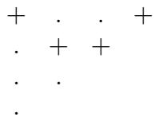

but this is not reduced. Remove the $+$ at $(1,4)$ and reinsert it further left on row 1, as follows. Position $(1,3)$ is a bump tile with wires 4 and 5, so we skip that and consider position $(1,2)$ where wires 1 and 4 bump. Since $1 \leq r = 3 < 4$ , we place a plus tile at $(1,2)$ to get

$$
E = \begin{array}{c c c c} + & + & . & . \\ \cdot & + & + \\ \cdot & \cdot \\ \cdot & \end{array}
$$

Now $E$ is reduced for $v = 31524 = wt_{14}$ , so $I(D,2,3) = E$ . Note, the BB-insertion algorithm doesn't just stack push the crossing on row 1, but instead removes it and reinserts in a way that maintains the insertion condition. It also always finds the defect in a smaller row as it proceeds through the steps.

Exercise 4.35. Write out the inverse map for BB-insertion.

4.2. The nil-Coxeter Algebra and Divided Differences. Fomin and Stanley [130] utilized the nil-Coxeter algebra to study Schubert polynomials. In their setup, pipe dreams are "natural" combinatorial objects to study. In our revisionist history, we will use their proof in reverse to prove that Schubert polynomials satisfy the divided difference recurrence given in Equation (3.50). See the later chapter [329] in this handbook for more on Nil-Hecker rings.

Definition 4.36. The nil-Coxeter algebra $\mathcal{N}_n$ has generators $u_1, u_2, \ldots, u_{n-1}$ with coefficients in $\mathbb{Z}[x_1, x_2, \ldots, x_n]$ and the following relations:

$u_{i}^{2} = 0$   
- $u_{i}u_{j} = u_{j}u_{i}$ if $|i - j| \geq 2$ ,   
- $u_{i}u_{i + 1}u_{i} = u_{i + 1}u_{i}u_{i + 1}$ for $1\leq i\leq n - 2$

Note that these relations are reminiscent of those for the symmetric group generated by the simple transpositions $s_i$ 's in (3.7). Consequently, we know that $\mathcal{N}_n$ has a linear basis given by $\{u_w\}_{w \in S_n}$ where

$$
u _ {w} = u _ {i _ {1}} u _ {i _ {2}} \dots u _ {i _ {\ell (w)}}
$$

and $s_{i_1} s_{i_2} \cdots s_{i_{\ell(w)}}$ is a reduced word for $w$ . Since $u_{\mathrm{id}}$ is the multiplicative identity in $\mathcal{N}_n$ , we sometimes represent it by the identity 1 in $\mathbb{Z}[x_1, x_2, \ldots, x_n]$ . For example, $(x_1 + x_2)u_{231} + x_3^2 u_{123} = (x_1 + x_2)u_{231} + x_3^2 \in \mathcal{N}_3$ .

With $n$ fixed, define the following expressions:

$h_i(x) = 1 + xu_i$ for $i = 1,\ldots ,n - 1$   
- $A_{i}(x) = h_{n - 1}(x)h_{n - 2}(x)\dots h_{i}(x)$ for $i = 1,\ldots ,n - 1$ , and   
- $\mathfrak{S}(\mathbf{x}) = \mathfrak{S}(x_1, \ldots, x_n) = A_1(x_1)A_2(x_2)\dots A_{n - 1}(x_{n - 1}).$

In other words, $\mathfrak{S}(\mathbf{x})$ is a product of the $\binom{n}{2}$ binomials

$$
\mathfrak {S} (\mathbf {x}) = (1 + x _ {1} u _ {n - 1}) (1 + x _ {1} u _ {n - 2}) \dots (1 + x _ {1} u _ {2}) (1 + x _ {1} u _ {1})
$$

$$
(1 + x _ {2} u _ {n - 1}) \dots (1 + x _ {2} u _ {3}) (1 + x _ {2} u _ {2})
$$

(4.8)

$$
\begin{array}{l} \begin{array}{c c c} \ddots & & \vdots \\ & & \end{array} \\ (1 + x _ {n - 1} u _ {n - 1}). \\ \end{array}
$$

Pipe dreams are hidden in plain sight in (4.8). Each factor in Equation (4.8) consists of two terms: 1 which means a "bump"-tile and $x_{i}u_{j}$ which means a "cross"-tile on row $i$ that contributes $s_{j}$ to the resulting reduced expression.

Example 4.37. Let $n = 4$ . Consider the following underlined term in $\mathfrak{S}(w)$ with its corresponding pipe dream on the side in Figure 28. This pipe dream has weight $x_{1}x_{2}^{2}$ that contributes to the permutation $w = s_{1}s_{3}s_{2} = 2413$ . There is a horizontal reflection between

$$
\begin{array}{l} (\underline {{1}} + x _ {1} u _ {3}) (\underline {{1}} + x _ {1} u _ {2}) (1 + \underline {{x _ {1} u _ {1}}}) \\ (1 + \underline {{x _ {2} u _ {3}}}) (1 + \underline {{x _ {2} u _ {2}}}) \\ (\underline {{1}} + x _ {3} u _ {3}) \\ \end{array}
$$

  
FIGURE 28. A term in $\mathfrak{S}(w)$ and its corresponding pipe dream

the two pictures due to the order that we read the crossings in a pipe dream as shown in Figure 21.

As a result of the observation that each factor in Equation (4.8) consists of two terms corresponding with the bump and cross tiles, we deduced the following lemma.

Lemma 4.38. [130] The coefficients of $\mathfrak{S}(\mathbf{x})$ expanded in the $\{u_w\}$ basis are the Schubert polynomials,

$$
\mathfrak {S} (\mathbf {x}) = \sum_ {w \in S _ {n}} \mathfrak {S} _ {w} (x _ {1}, \dots , x _ {n}) u _ {w}.
$$

Recall, a central player in Schubert calculus is the divided difference operator $\partial_i$ , for $i = 1,2,\ldots,n-1$ that acts on polynomials by

$$
\partial_ {i} f = \frac {f - s _ {i} f}{x _ {i} - x _ {i + 1}},
$$

where $s_i$ acts by swapping $x_i$ and $x_{i+1}$ . We extend the action of $\partial_i$ to the nil-Coxeter algebra where $\partial_i$ acts on the coefficients in $\mathbb{Z}[x_1, \ldots, x_n]$ . Recall from Exercise 3.120 that these operators satisfy the following relations:

$\partial_j^2 = 0$   
- $\partial_i\partial_j = \partial_j\partial_i$ if $|i - j|\geq 2$   
- $\partial_i\partial_{i + 1}\partial_i = \partial_{i + 1}\partial_i\partial_{i + 1}$ for $1\leq i\leq n - 2$

The key algebraic computation in [130] is the following lemma.

Lemma 4.39. [130, Lemma 3.5] For every $i = 1,\ldots ,n - 1$

$$
\partial_ {i} \mathfrak {S} (\mathbf {x}) = \mathfrak {S} (\mathbf {x}) u _ {i}. \tag {4.9}
$$

Establishing Lemma 4.39 boils down to proving the identity

$$
\partial_ {i} \big (A _ {i} (x _ {i}) A _ {i + 1} (x _ {i + 1}) \big) = A _ {i} (x _ {i}) A _ {i + 1} (x _ {i + 1}) u _ {i},
$$

which is a straightforward algebraic manipulation. We omit the details here. Interested readers can check out [130] and [270].

By comparing the coefficients of $u_{w}$ on both sides of Equation (4.9), we obtain the following recurrence for the Schubert polynomials. This formula is more widely known as the definition of Schubert polynomials by Lascoux and Schützenberger [249]. However, in our approach the following theorem is a consequence of the proof of [130, Thm 2.2].

Theorem 4.40. [130, 249] For $w \in S_n$ ,

$$
\mathfrak {S} _ {w} (x _ {1}, \ldots , x _ {n}) = \left\{ \begin{array}{l l} x _ {1} ^ {n - 1} x _ {2} ^ {n - 2} \dots x _ {n - 1} & i f w = w _ {0} = [ n, \ldots , 1 ], \\ \partial_ {i} \mathfrak {S} _ {w s _ {i}} (x _ {1}, \ldots , x _ {n}) & i f w (i) <   w (i + 1). \end{array} \right.
$$

The framework of the nil-Coxeter algebra has more applications. Let $\mathfrak{S}(x,\ldots ,x)$ be the result of substituting a single indeterminate $x$ in for all $x_{1},x_{2},\ldots ,x_{n}$ in $\mathfrak{S}(\mathbf{x})$ .

Lemma 4.41. [130, Lemma 5.1] For indeterminates $x,y$ , we have

$$
\mathfrak {S} (x, \ldots , x) \mathfrak {S} (y, \ldots , y) = \mathfrak {S} (x + y, \ldots , x + y).
$$

The proof of Lemma 4.41 can be done via explicit calculation. We encourage the reader to try the cases $n = 3, 4$ .

Lemma 4.42. [130] We have

$$
\mathfrak {S} (x, \ldots , x) = \exp \bigl (x (u _ {1} + 2 u _ {2} + \dots + (n - 1) u _ {n - 1}) \bigr).
$$

Proof. By Lemma 4.41, one may assume there exists $f \in \mathcal{N}_n$ such that $\mathfrak{S}(x, \ldots, x) = \exp(xf)$ . To solve for $f$ , observe that we must have

$$
f = \frac {d}{d x} \exp (x f) | _ {x = 0} = \frac {d}{d x} \mathfrak {S} (x, \ldots , x) | _ {x = 0} = u _ {1} + 2 u _ {2} + \dots + (n - 1) u _ {n - 1}
$$

since $u_{i}$ appears in $i$ linear factors in Equation (4.8).

Theorem 4.43 (Macdonald's identity). [265, (6.11)] For $w \in S_n$ , the number of reduced pipe dreams of $w$ equals

$$
| \mathrm {R P} (w) | = \mathfrak {S} _ {w} (1, \dots , 1) = \frac {1}{\ell !} \sum_ {(a _ {1}, \dots , a _ {\ell}) \in R (w)} a _ {1} a _ {2} \dots a _ {\ell}.
$$

Proof. The first equality follows from Theorem 4.5. The second equality follows from Lemma 4.42 by setting $x = 1$ comparing the coefficient of $u_{w}$ on both sides of the resulting identity.

We will outline an additional proof of Theorem 4.43 that has been inspirational in the literature. With Lemma 4.42, Fomin and Stanley in the 90's hinted at taking derivatives of Schubert structures from a certain perspective. This concept was further developed by Hamaker, Pechenik, Speyer and Weigandt [165] in 2020, who were motivated by Stanley's operator as an attempt to establish the Sperner property of the weak Bruhat order. Curiously, Stanley presented his operator during FominFest in 2018, a celebration for Fomin's 60 birthday. The Sperner property of the weak Bruhat order on the symmetric group is first proved by Gaetz and Gao [141, 142], while Hamaker et al. [165] followed up to prove the full determinantal conjecture by Stanley [350].

Theorem 4.44. [165] For any fixed positive integer $n$ ,

$$
\nabla = \frac {\partial}{\partial x _ {1}} + \frac {\partial}{\partial x _ {2}} + \dots + \frac {\partial}{\partial x _ {n}}.
$$

Then applying $\nabla$ to the Schubert polynomial for $w\in S_n$ , we have

$$
\nabla \mathfrak {S} _ {w} (x _ {1}, \ldots , x _ {n}) = \sum_ {k: s _ {k} w <   w} k \mathfrak {S} _ {s _ {k} w} (x _ {1}, \ldots , x _ {n}).
$$

Exercise 4.45. Use Theorem 4.44 to prove Macdonald's identity Theorem 4.43.

We end this section by remarking that the setup here is much more powerful than what's presented. In particular, Fomin and Kirillov [129] are able to derive the pipe dream formula for double Schubert polynomials from the divided difference operators. Furthermore, a $q$ -analog of Macdonald's identity can be proved.

Theorem 4.46 (Theorem 2.4 of [130]). For a permutation $w \in S_n$ ,

$$
\mathfrak {S} _ {w} (1, q, \dots , q ^ {n - 1}) = \frac {1}{[ \ell ] _ {q} !} \sum_ {(a _ {1}, \dots , a _ {\ell}) \in R (w)} [ a _ {1} ] _ {q} \dots [ a _ {\ell} ] _ {q} q ^ {\sum_ {a _ {i} <   a _ {i + 1}} i}
$$

where $[a]_q = 1 + q + \dots + q^{a - 1}$ , and $[m]_q! = [1]_q \cdots [m]_q$ .

A bijective proof of Theorem 4.46 was given in [43] using the bounded bump algorithm Algorithm 4.21 and a generalization of the Transition Equation. Holroyd proposed studying the distribution on reduced expressions for the longest permutation $w_0 = [n, \dots, 1] \in S_n$ where $(a_1, \ldots, a_\ell)$ is chosen with probability proportional to the product $a_1 \cdots a_\ell$ . Does this distribution have nice properties as with the uniform distribution studied in [11, 99]? The bounded bump algorithm can be used to select random reduced words according to this distribution.

Recently, Nadeau and Tewari recognized an interesting similarity between Macdonald's identity and an identity due to Klyachko in his study of the closure of the orbit of a generic flag in $\operatorname{Fl}(n)$ under the action of the invertible diagonal matrices [292, 203]. In addition, they describe a $q$ -deformation of what they call the Klyachko algebra on noncommuting indeterminates $u_1', \ldots, u_n'$ in a style similar to the nil-Coxeter algebra in order to give a $q$ -Klyachko-Macdonald identity

$$
\mathfrak {S} _ {w} (u _ {1} ^ {\prime}, u _ {2} ^ {\prime} - u _ {1} ^ {\prime}, \ldots) = \frac {1}{[ \ell ] _ {q} !} \sum_ {(a _ {1}, \ldots , a _ {\ell}) \in R (w)} u _ {a _ {1}} ^ {\prime} \dots u _ {a _ {\ell}} ^ {\prime} q ^ {\sum_ {a _ {i} <   a _ {i + 1}} i}
$$

They connect this identity to the geometry of certain Deligne-Lusztig varieties connected to the representation of finite group of Lie type using results of Kim [198].

4.3. More Games: Mitosis. If Schubert calculus had started with Monk's formula, the transition equation, and pipe dreams, would we have discovered the divided difference recurrence for Schubert polynomials? Good question, maybe not. But, in this revisionist history of Schubert polynomials, one could ask if there is a combinatorial game style procedure that relates to the divided difference recurrence (3.50)? Yes! This was given by Knutson-Miller in their "mitosis" algorithm [212]. We follow [280] in this exposition. See also [23, 256] for other variations on this theme.

Given a pipe dream \( D \), let \( \mathrm{start}_i(D) \) be the column index of the leftmost \( \mathbb{Z} \)-tile in row \( i \), and let \( C_i(D) = \{q < \mathrm{start}_i(D) \mid (i + 1, q) \text{ is an } \mathbb{Z} \)-tile in } D\} \). For each \( q \in C_i(D) \), the offspring \( D_{i,q} \) is obtained from \( D \) by deleting the cross tile at \( (i, q) \) and then moving all crosses \( (i, p) \) in row \( i \) one step down to \( (i + 1, p) \) for all \( p < q \) and \( p \in C_i(D) \). See Figure 29 for example.

Definition 4.47. The $i$ th mitosis operator acts on each pipe dream $D$ by producing its set of $i$ -offspring

$$
\operatorname {m i t o s i s} _ {i} (D) = \left\{D _ {i, q} \mid q \in C _ {i} (D) \right\}.
$$

We also write $\mathrm{mitosis}_i(\mathcal{D}) = \bigcup_{D\in \mathcal{D}}\mathrm{mitosis}_i(D)$ for a set of pipe dreams $\mathcal{D}$ .

Exercise 4.48. Prove the following statements.

(1) If $i$ is an ascent of $w$ , then $\mathrm{mitosis}_i(\mathrm{RP}(w)) = \emptyset$ .   
(2) If $i$ is a descent of $w$ , then every $D' \in \mathrm{mitosis}_i(\mathrm{RP}(w))$ is a pipe dream of $ws_i$ .

The main theorem of this section is that all pipe dreams can be generated via mitosis from the unique pipe dream of the longest permutation $w_0 \in S_n$ . Readers are referred to [280] for a detailed proof.

Theorem 4.49. [212, 280] For any $w \in S_n$ with $\ell(ws_i) < \ell(w)$ , there is a partition of $\mathrm{RP}(ws_i)$ into a disjoint union of offspring given by

$$
\mathrm {R P} (w s _ {i}) = \bigsqcup_ {D \in \mathrm {R P} (w)} \mathrm {m i t o s i s} _ {i} (D).
$$

As a result, let $D_0$ be the unique pipe dream for the longest permutation $w_0 \in S_n$ , then

$$
\mathrm {R P} (w) = \mathrm {m i t o s i s} _ {i _ {\ell}} \cdot \cdot \cdot \mathrm {m i t o s i s} _ {i _ {1}} (D _ {0})
$$

where $s_{i_1} \cdots s_{i_\ell}$ is any reduced word for $w_0w$ .

Example 4.50. Consider the following pipe dream $D \in \mathrm{RP}(261453)$ in Figure 29. We see that $\mathrm{start}_2(D) = 5$ and $C_2(D) = \{1, 3, 4\}$ with the three offspring in $\mathrm{mitosis}_2(D)$ shown on the right in Figure 29, all of which are pipe dreams of $216453 = 261453s_2$ .

  
FIGURE 29. Example of the mitosis operator

The monomial weight of the pipe dream $D$ is $x^{D} = x_{1}x_{2}^{4}x_{3}x_{4}$ , and we can calculate that

$$
\partial_ {2} x ^ {D} = x _ {1} x _ {2} ^ {3} x _ {3} x _ {4} + x _ {1} x _ {2} ^ {2} x _ {3} ^ {2} x _ {4} + x _ {1} x _ {2} x _ {3} ^ {3} x _ {4} = x ^ {D _ {2, 1}} + x ^ {D _ {2, 3}} + x ^ {D _ {2, 4}}.
$$

This calculation may be a little bit misleading in general, but it is the main idea of how mitosis is related to the divided difference operators.

Exercise 4.51. Let $D'$ be the pipe dream obtained from $D$ in Figure 29 by 3 chute moves from row 2 to row 1, so

$$
D ^ {\prime} = \{(1, 1), (1, 3), (1, 4), (1, 5), (2, 1), (3, 2), (4, 2) \}.
$$

Compute $\partial_2x^{D'}$ , $C_2(D')$ , and $\mathrm{mitosis}_2(D')$ . How do $\partial_2x^D$ and $\mathrm{mitosis}_2(D')$ contribute to the computation of $\mathfrak{S}_{261453s_2}$ in this case?

4.4. Balanced Tableaux and Balanced Labellings. In this section, we introduce the notion of balanced labellings of permutation diagrams, which also provides a combinatorial interpretation for the Schubert polynomials, due to Fomin, Greene, Reiner, Shimozono [126]. Balanced labellings can be viewed as generalizations of balanced tableaux used by Edelman and Greene [112]. This celebrated paper [112], originally aimed at solving enumeration problems related to Stanley symmetric functions [347], introduced the Edelman-Greene insertion algorithm with great importance towards many aspects of algebraic combinatorics. This section will not focus on the insertion algorithm, but rather the more general setting of balanced labellings.

Definition 4.52. A diagram $D$ is a finite subset of boxes of the $\mathbb{Z}_{+} \times \mathbb{Z}_{+}$ grid, drawn using matrix coordinates. A tableau (or a labelling) of shape $D$ is a filling of the cells of $D$ by positive integers, or equivalently, a map $D \to \mathbb{Z}_{>0}$ . A tableau $T$ has content $\alpha = (\alpha_{1}, \alpha_{2}, \ldots)$ if there are $\alpha_{i}$ copies of $i$ , and we write $x^{T} = x_{1}^{\alpha_{1}} x_{2}^{\alpha_{2}} \cdots$ .

The concept of a tableau of partition shape is prevalent in the representation theory of the symmetric group [136, 332]. Permutation diagrams defined in (3.10) fit this definition of a diagram, so it is natural to consider fillings in that context as well. Using the crossings in a wiring diagram or pipe dream, they too can be interpreted as diagrams.

The key definition from [112] is that of a balanced hook. "Balanced" in this context refers to a stability property.

Definition 4.53. To each cell $(i,j)$ of a diagram $D$ , we associate the hook $H_{i,j} = H_{i,j}(D)$ consisting of cells $(i',j')$ of $D$ such that either $i' = i$ and $j' \geq j$ or $i' \geq i$ and $j' = j$ . A labelling of the hook $H_{i,j}$ is balanced if when one rearranges the labels within the hook so that the values increase weakly from right to left and from top to bottom, the corner entry stays the same.

Example 4.54. On the left is a balanced hook, with the rearrangement of its values into increasing order moving left and down shown on the right:

Definition 4.55. [112, 126] Let $D$ be a diagram with $\ell$ cells. A labelling of $D$ is

- balanced if each hook $H_{i,j}(D)$ is balanced;   
- bijective if each of the labels $1, 2, \ldots, \ell$ appears exactly once;   
- column-injective if there is at most one copy of $i$ in each column, for all $i$ ;   
- flagged if all numbers in row $i$ do not exceed $i$ , for all $i$ .

Denote the set of bijective balanced labellings for a diagram $D$ as $\mathrm{BBL}(D)$ . An example of a bijective balanced labelling of a diagram is shown in Figure 31. If $D = D(w)$ is the Rothe diagram of a permutation $w$ , we use the shorthand $\mathrm{BBL}(w)$ , and if $D$ is a partition shape $\lambda$ , we use $\mathrm{BBL}(\lambda)$ . Similarly, denote the set of column-injective flagged balanced labellings for a diagram $D$ as $\mathrm{CFBL}(D)$ , and write $\mathrm{CFBL}(w)$ for $\mathrm{CFBL}(D(w))$ . If $D$ is the Young diagram of a partition, then the bijective balanced labellings of $D$ have a nice bijection with standard tableaux. See Figure 30 for an example of the bijection.

Theorem 4.56. [112] Let $\lambda$ be a partition. Then $|\mathrm{BBL}(\lambda)| = |\mathrm{SYT}(\lambda)|$ where SYT is the set of standard Young tableaux of shape $\lambda$ .

  
FIGURE 30. Balanced labellings (top) and standard Young tableaux (bottom) for $\lambda = (3,2)$

One intuition towards the balanced condition on permutation diagrams is in connection with reflection orders. Recall that $R(w)$ denotes the set of reduced words for a permutation $w \in S_n$ . For $\mathbf{a} = (a_1, \ldots, a_\ell) \in R(w)$ , define an ordered pair $\gamma_i = (s_{a_1} \cdots s_{a_{i-1}}(a_i), s_{a_1} \cdots s_{a_{i-1}}(a_i + 1))$ which represents two values that are adjacent and necessarily in increasing order in the intermediate permutation $w^{(i-1)} = s_{a_1} \cdots s_{a_{i-1}}$ . In $w^{(i)} = s_{a_1} \cdots s_{a_{i-1}} s_{a_i}$ these two values are switched. Since $\mathbf{a}$ is reduced, these two values will not switch again in the successive intermediate permutations $w^{(i+1)}, \ldots, w^{(\ell)} = w$ so they correspond with an inversion in $w$ , but written in terms of values instead of positions. The set $\{(w_j, w_i) | i < j, w_i > w_j\}$ is the inversion set of $w^{-1}$ as defined in (4.1), and there is an obvious bijection with $\operatorname{Inv}(w)$ .

This sequence $\gamma_1, \ldots, \gamma_\ell$ is a total order of the pairs $\{(w_j, w_i) \mid i < j, w_i > w_j\}$ . By considering the wiring diagram of $\mathbf{a}$ , one can observe that if there exists a 321-pattern $i < j < k$ such that $w_i > w_j > w_k$ then $(w_k, w_i)$ must appear between $(w_j, w_i)$ and $(w_k, w_j)$ in the total order $\gamma_1, \ldots, \gamma_\ell$ . Conversely, one can show that any total order on $\{(w_j, w_i) \mid i < j, w_i > w_j\}$ that can be extended to a total order on all pairs $(i,j)$ for $1 \leq i < j \leq n$ satisfying the rule for all 321-patterns corresponds with some reduced word for $w$ . Such an order is called a reflection order. See [52] for more background on reflection orders. The point here is that balanced labellings are another way of recording reduced words, reflection orders, and the condition on 321-patterns.

Definition 4.57. [126] For a reduced word $\mathbf{a} = (a_1, \ldots, a_\ell) \in R(w)$ , define a tableau $T_{\mathbf{a}}$ of shape $D(w)$ such that $T_{\mathbf{a}}(i,j) = k$ if the simple transposition $s_{a_k}$ switches the values $j < w_i$ in the intermediate permutation $w^{(k-1)} = s_{a_1} \cdots s_{a_{k-1}}$ .

Exercise 4.58. Given the definition of $D(w)$ in (3.10), show each $(i,j) \in D(w)$ is assigned a value by the map $T_{\mathbf{a}}$ .

Theorem 4.59. [126] The map $a \mapsto T_{\mathbf{a}}$ is a bijection between $R(w)$ and $\mathrm{BBL}(w)$ .

Edelman and Greene used Definition 4.57 and Theorem 4.59 in the case where $w_0 = [n, \dots, 1]$ is the longest permutation in $S_n$ , whose Rothe diagram is the staircase partition shape $(n - 1, n - 2, \dots, 1)$ . Together with the celebrated Edelman-Greene insertion algorithm which provides a bijection between $R(w_0)$ and the standard Young tableaux of the staircase shape, they established Theorem 4.56 for the staircase shape, which serves as the base case for any partition shape $\lambda$ . The current presentation of Definition 4.57 and Theorem 4.59 is due to Fomin-Greene-Reiner-Shimozono [126].

Exercise 4.60. Prove Theorem 4.59 by constructing the inverse map.

Example 4.61. Consider $w = 43152$ and its reduced word $\mathbf{a} = (2,3,2,1,4,2) \in R(w)$ . The procedure of generating $T_{\mathbf{a}}$ and the final result is shown in Figure 31. One can indeed check that $T_{\mathbf{a}}$ is balanced.

<table><tr><td>k</td><td>ak</td><td>w(k)</td><td>cell</td></tr><tr><td>1</td><td>2</td><td>13245</td><td>(2,2)</td></tr><tr><td>2</td><td>3</td><td>13425</td><td>(1,2)</td></tr><tr><td>3</td><td>2</td><td>14325</td><td>(1,3)</td></tr><tr><td>4</td><td>1</td><td>41325</td><td>(1,1)</td></tr><tr><td>5</td><td>4</td><td>41352</td><td>(4,2)</td></tr><tr><td>6</td><td>2</td><td>43152</td><td>(2,1)</td></tr></table>

  
FIGURE 31. Construction of the tableau $T_{\mathbf{a}}$ for $\mathbf{a} = (2,3,2,1,4,2) \in R(43152)$ .

Schubert polynomials can also be expanded using the idea of balanced labellings. To be precise, Schubert polynomials are generating functions for column-injective flagged balanced labellings of permutation diagrams.

Theorem 4.62. [126] For a permutation $w$ , $\mathfrak{S}_w = \sum_{T \in \mathrm{CFBL}(w)} x^T$ .

Example 4.63. Consider $w = 1432$ with $\mathfrak{S}_w = x_1^2 x_2 + x_1^2 x_3 + x_1 x_2^2 + x_1 x_2 x_3 + x_2^2 x_3$ . The column-injective flagged balanced labellings of shape $D(w)$ are shown in Figure 32.

  
FIGURE 32. Column-injective flagged balanced labellings of shape $D(1432)$

4.5. Bumpless Pipe Dreams. Lam, Lee, and Shimozono [237] introduced bumpless pipe dreams (BPDs) in their work on the infinite flag variety and back-stable Schubert calculus and used them to give a formula for (double) Schubert polynomials. Since then, the rich combinatorial, algebraic and geometric properties of bumpless pipe dreams have been extensively explored by the community, and it appears that there are still many exciting developments on the horizon.

Definition 4.64. A bumpless pipe dream (abbreviated as BPD) $D$ is a tiling of the $\mathbb{Z}_{+} \times \mathbb{Z}_{+}$ grid with matrix coordinates using the following six types of tiles:

forming pipes that travel in the northeast direction. A bumpless pipe dream is reduced if no two pipes cross twice. A reduced bumpless pipe dream corresponds to a permutation $w \in S_{\infty}$ if pipe $i$ goes from $(\infty, i)$ to $(w(i), \infty)$ for all $i$ . Let $\text{blank}(D)$ and $\text{cross}(D)$ be the coordinates of blank tiles $\square$ and cross tiles $\boxplus$ in a bumpless pipe dream $D$ , respectively. The weight of a bumpless pipe dream $D$ is given by the product of variables indexed by the row numbers of its blank tiles

$$
x ^ {D} := \prod_ {(i, j) \in \mathrm {b l a n k} (D)} x _ {i}.
$$

For a permutation $w$ , let $\mathrm{BPD}(w)$ be the set of reduced bumpless pipe dreams of $w$ .

The name "bumpless" comes from the fact that the bump tile $\boxdot$ that was used to construct the original pipe dreams is not allowed in such a tiling. Note that unlike the original pipe dreams, a bumpless pipe dream is not determined by either $\mathrm{blank}(D)$ or $\mathrm{cross}(D)$ . For a permutation $w \in S_{n}$ , we typically draw a bumpless pipe dream of $w$ in a $n \times n$ grid. See Figure 33 for example.

Exercise 4.65. Show that in a bumpless pipe dream $D$ , we have $|\mathrm{blank}(D)| = |\mathrm{cross}(D)|$ .

Exercise 4.66. Show that a bumpless pipe dream $D$ is determined by $\operatorname{blank}(D)$ and $\operatorname{cross}(D)$ together.

Remarkably, Lam-Lee-Shimozono proved that the reduced bumpless pipe dreams for $w$ enumerate monomials in the corresponding Schubert polynomial, just like the classic pipe dreams. Their proof was via considerations on the cohomology of the flag variety and special positroid varieties known as graph Schubert varieties, not via an explicit bijection. See Exercise 4.150 below for more on these varieties.

Theorem 4.67. [237] For all $w \in S_n$ , the Schubert polynomial satisfies

$$
\mathfrak {S} _ {w} (x _ {1}, x _ {2}, \dots , x _ {n}) = \sum_ {D \in \mathrm {B P D} (w)} x ^ {D}.
$$

Example 4.68. We have $\mathfrak{S}_{2143} = x_1^2 +x_1x_2 + x_1x_3$ with the following reduced bumpless pipe dreams shown in Figure 33. We also provide the pipe dreams in Figure 34. Try to identify a natural bijection between these two sets.

  
FIGURE 33. Reduced bumpless pipe dreams for 2143.

  
FIGURE 34. Reduced pipe dreams for 2143.

Remark 4.69. It is shown in [237] that bumpless pipe dreams can also compute double Schubert polynomials. After adding variables $y_{1},y_{2},\ldots$ , the weight of a bumpless pipe dream $D$ becomes

$$
(x - y) ^ {D} := \prod_ {(i, j) \in \operatorname {b l a n k} (D)} (x _ {i} - y _ {j}).
$$

Lam-Lee-Shimozono showed that

$$
\mathfrak {S} _ {w} \left(x _ {1}, \dots , x _ {n}; y _ {1}, \dots , y _ {n}\right) = \sum_ {D \in \operatorname {B P D} (w)} (x - y) ^ {D}. \tag {4.10}
$$

Although both pipe dream models provide combinatorial formulae for double Schubert polynomials, the factored sums are very different. Continuing Example 4.68, we observe from the bumpless pipe dreams in Figure 33 that

$$
\mathfrak {S} _ {2 1 4 3} (X; Y) = \left(x _ {1} - y _ {1}\right) \left(x _ {3} - y _ {3}\right) + \left(x _ {1} - y _ {1}\right) \left(x _ {2} - y _ {1}\right) + \left(x _ {1} - y _ {1}\right) \left(x _ {1} - y _ {2}\right),
$$

while from the pipe dreams in Figure 34 and (4.5), we have

$$
\mathfrak {S} _ {2 1 4 3} (X; Y) = \left(x _ {1} - y _ {1}\right) \left(x _ {1} - y _ {3}\right) + \left(x _ {1} - y _ {1}\right) \left(x _ {2} - y _ {2}\right) + \left(x _ {1} - y _ {1}\right) \left(x _ {3} - y _ {1}\right).
$$

Hence, $\mathfrak{S}_{2143}(X;Y)$ can be expressed as a sum of products of differences in different ways.

Weigandt [367] observed that the (not necessarily reduced) bumpless pipe dreams on the $n \times n$ grid are in natural bijection with alternating sign matrices of size $n$ . Let's recall the definition of an ASM.

Definition 4.70. An alternating sign matrix (ASM) of size $n$ is an $n \times n$ matrix with entries in $\{-1,0,1\}$ such that within each row and each column, the nonzero entries sum up to 1 and alternate between 1 and -1.

There is an incredibly rich literature and history around ASMs in enumerative and algebraic combinatorics. Famously, the number of ASMs of size $n$ has a beautiful product formula,

$$
\prod_ {k = 0} ^ {n - 1} \frac {(3 k + 1) !}{(n + k) !}.
$$

The formula was conjectured by Mills-Robbins-Rumsey in 1983 [282] and proved in 1992 by Zeilberger [383], connected to the six vertex state model by Kuperberg [229], and an operator formula on monotone triangles by Fischer [124]. On the other hand, the number of ASMs of size $n$ equals the number of totally symmetric self-complementary plane partitions (TSSCPP) of size $n$ [10]. It is still open to find an explicit bijection between ASMs and TSSCPPs, while some progress has been made with the perspective of bumpless pipe dreams [178]. The ASMs also arise as the Dedekind-MacNeille completion of the Bruhat order to a lattice [254].

Given a (not necessarily reduced) bumpless pipe dream, we can obtain an ASM by translating a $\square$ -tile to 1, a $\square$ -tile to $-1$ and all other tiles to 0. Knowing the set of up and down elbow tiles in a bumpless pipe dream determines the entire set of tiles since the pipes progress up and to the right. Therefore, it is not hard to see that this map establishes a bijection. An example is seen in Figure 35. It is not very easy to tell from the data of an

  
FIGURE 35. The bijection between BPDs and ASMs

ASM whether its corresponding BPD is reduced. Not necessarily reduced BPDs (and also not necessarily reduced PDs) are utilized to compute Grothendieck polynomials [367], the $K$ -theoretic analogs of Schubert polynomials. It is worth noting that Lascoux [246] was the first to write down Grothendieck polynomials as weighted sums over ASMs.

Pipe dreams and bumpless pipe dreams have a lot of similarities pictorially, as both can be viewed as certain versions of wiring diagrams for a fixed permutation. We highlight some notable comparisons between these two combinatorial objects. For the rest of this section, a (bumpless) pipe dream is assumed to be reduced, but some of the material will carry over to the non-reduced case as well.

- Both PDs and BPDs can be used to immediately show the stability of Schubert polynomials by extending the diagrams in the SE direction.   
- One can extend a BPD in the NW direction and consider permutations in $S_{\mathbb{Z}} \supset S_{\infty}$ to obtain back stable Schubert polynomials [237]. A similar backward extension for pipe dreams gives another formula for double Schubert polynomials [24, Thm 4.1].   
- A PD is determined by the positions of its $\boxplus$ -tiles. However, a BPD cannot be determined by the data of its $\boxplus$ -tiles or $\square$ -tiles alone, but can be determined by both data together (Exercise 4.66).   
- Both PDs and BPDs of a fixed permutation are connected by local moves, called "chute" / "ladder" moves (discussed in Section 4.1.1) and "droop" moves (Definition 4.72) respectively. Moreover, one can start with the bottom (bumpless) pipe dream and apply these local moves to obtain all other (bumpless) pipe dreams (Theorem 4.8, Lemma 4.74).

Let us discuss these local moves in more details. The following definition generalizes both chute moves and ladder moves that we have seen in Section 4.1.1.

Definition 4.71. [24] For a pipe dream $D$ , a generalized chute move from $(i,j)$ to $(i - a,j + b)$ with $a,b\in \mathbb{Z}_{+}$ is a local change that removes $(i,j)$ from $D$ and adds $(i - a,j + b)$ to $D$ provided that $(i',j')\in D$ for all $i - a\leq i'\leq i$ and $j\leq j'\leq j + b$ except $(i - a,j),(i,j + b),(i - a,j + b)\notin D$ .

See Figure 36 for a much clearer explanation of Definition 4.71 with diagrams. One can easily check that a generalized chute move preserves the corresponding permutation by inspection after drawing in the corresponding pipes.

Recall that the bottom pipe dream of a permutation $w$ is defined to be the pipe dream that contains $c(w)_i \coloneqq |\{j > i \mid w(j) < w(i)\}|$ left-adjusted $\boxplus$ -tiles in row $i$ , for each $i$ , and that

  
FIGURE 36. Generalized chute moves

any pipe dream of $w$ can be obtained from the bottom pipe dream of $w$ using (generalized) chute moves (Theorem 4.8). A parallel story exists for bumpless pipe dreams.

Definition 4.72. [237] For a (reduced) bumpless pipe dream $D$ , a droop move from a $\square$ -tile at $(i,j)$ to a $\square$ -tile at $(i + a,j + b)$ with $a,b \in \mathbb{Z}_{+}$ is a local modification of a pipe $p$ that travels $(i + a,j) \to (i,j) \to (i,j + b)$ to $(i + a,j) \to (i + a,j + b) \to (i,j + b)$ such that the end result is still a (reduced) bumpless pipe dream. See Figure 37 for visualization. A droop move is called a min-droop if all tiles in the rectangle $[i,i + a] \times [j,j + b]$ are $\boxplus$ -tiles except the four corners.

  
FIGURE 37. A droop move (but not a min-droop) on bumpyless pipe dreams

Definition 4.73. [237] The Rothe bumpless pipe dream (or the bottom bumpless pipe dream) for a permutation $w$ is the bumpless pipe dream where pipe $i$ only turns once at the $\square$ -tile at $(i, w(i))$ , for all $i$ .

Lemma 4.74. [237] Any bumpless pipe dream of $w$ can be obtained from the Rothe bumpless pipe dream of $w$ using droop moves.

Although generalized chute moves on pipe dreams and droop moves on bumpless pipe dreams have a similar flavor, their respective poset structures are different. To be precise, fix a permutation $w$ . Then, one can construct a poset on $\mathrm{RP}(w)$ under generalized chute moves with the bottom pipe dream as the unique minimal element $\hat{0}$ , and one can construct a poset on $\mathrm{BPD}(w)$ under droop moves with the Rothe bumpless pipe dream as $\hat{0}$ . These two posets have the same number of elements, but they hardly have anything else in common. Recall, there is a top pipe dream $D_{\mathrm{top}}(w)$ for all permutations $w$ (Section 4.1), but there is only a top bumpless pipe dream in some cases (Exercise 4.76). See Figure 38 for further comparison.

There is a fun conjecture by Rubey [330] on the structure of generalized chute moves, stated below. Certain special cases of Conjecture 4.75 are known, including dominant permutations, vexillary permutations, and 1432-avoiding permutations, but the conjecture is still open in general. Recall from Exercise 3.113 that the dominant permutations are those which have exactly one reduced pipe dream, or equivalently, the 132-avoiding permutations. Vexillary permutations are those avoiding 2143 and will be discussed more extensively in §4.8.

Conjecture 4.75. [330] For any permutation $w$ , the poset on $\mathrm{RP}(w)$ under generalized chute moves is a lattice.

Exercise 4.76. Fix a permutation $w \in S_n$ . Show that the poset on $\mathrm{BPD}(w)$ under droop moves has a unique maximal element if and only if $w$ is vexillary. Furthermore, show that when $w$ is vexillary, this poset is a lattice.

  
FIGURE 38. The posets of pipe dreams and of bumpless pipe dreams for 1432

Of course, one immediate question is to describe an explicit and "natural" weight-preserving bijection between reduced pipe dreams and reduced bumpless pipe dreams. Since both objects compute Schubert polynomials with relevant theorems established independently, a weight-preserving bijection is guaranteed to exist. It is the exact description that is important. This question is answered by Gao and Huang [146], and we will mainly follow their exposition here. Recall we are still assuming all (bumpless and classic) pipe dreams are reduced in what remains of this subsection.

Recall from Section 4.1 that pipe dreams $D$ are cryptomorphic to their corresponding biwords $(\mathbf{r}_D, \mathbf{j}_D)$ and $(\mathbf{r}_D, \mathbf{i}_D)$ . We will use the $(\mathbf{r}_D, \mathbf{i}_D)$ encoding as compatible pairs with the conditions described in Exercise 4.28 to give a bijection between bumpless pipe dreams and pipe dreams. Recall that we index each pipe of a bumpless pipe dream by the column that it starts off from the south boundary.

Definition 4.77. [146] Given a permutation $w \neq \mathrm{id}$ and $D \in \operatorname{BPD}(w)$ , the following procedure produces $\nabla D \in \operatorname{BPD}(w')$ for some $w' = s_a w$ such that $\ell(w') = \ell(w) - 1$ and outputs a pair of positive integers $\operatorname{pop}(D) = (r, i)$ .

(1) Let $i$ be the smallest row index that contains a $\square$ -tile. Mark the rightmost $\square$ -tile in row $i$ with a label $\times$ , say in position $(x, y)$ . Here $x = i$ initially. Let $p$ be the unique pipe passing through $(x, y + 1)$ , which must exist by the choice of blank tile.   
(2) If $p \leq y$ , there is a $\square$ -tile at some coordinate $(x', y + 1)$ with $x' > x$ belonging to pipe $p$ . Undroop this pipe from $(x', y + 1)$ to $(x, y)$ , and place the label $\times$ at $(x', y + 1)$ . See Figure 39.   
(3) Next, move $\times$ to the rightmost $\square$ -tile among its horizontally contiguous block of $\square$ -tiles, and update $(x,y)$ to be its coordinates. There is a unique pipe $p$ that passes through $(x,y + 1)$ again. Repeat step (2), (3) with the updated $x,y,p$ .   
(4) If $p = y + 1$ , pipe $y$ must intersect pipe $p = y + 1$ at coordinate $(x', y + 1)$ with $x' > x$ . Remove this crossing and remove the label $\times$ by replacing the $\boxplus$ -tile at $(x', y + 1)$ with a $\boxminus$ -tile temporarily and undrooping its $\square$ -part to $(x, y)$ . See Figure 40. The whole process ends here. Finally, let $r = y$ , and return $(r, i)$ .

Note, this definition of $\nabla$ is different than the one defined in Theorem 4.44. Both uses of this notation indicate the concept of going down in Bruhat order and decreasing the degree by 1. At this point, the reader may guess what we are doing next to get the desired bijection.

  
FIGURE 39. Step (2) of Definition 4.77

  
FIGURE 40. Step (4) of Definition 4.77

Definition 4.78. [146] For $D \in \mathrm{BPD}(w)$ with $\ell(w) = \ell$ , define

$$
\varphi (D) = \left(\mathbf {r} = \left(r _ {1}, \dots , r _ {\ell}\right), \mathbf {i} = \left(i _ {1}, \dots , i _ {\ell}\right)\right)
$$

where $\mathrm{pop}(\nabla^{k - 1}D) = (r_k,i_k)$ for $k = 1,\ldots ,\ell$

Example 4.79. Consider $D \in \mathrm{BPD}(w)$ with $w = 2157346$ in Figure 41, which shows the steps of Definition 4.77 that result in $\nabla D \in \mathrm{BPD}(2147356)$ and $\mathrm{pop}(D) = (4,1)$ where $r = 4$ , $i = 1$ . The edge labels in the figure are the different values of $y$ in the algorithm. If we continue the process as in Definition 4.78, we eventually end up with the compatible sequence

$$
\left(\mathbf {r} = (4, 1, 6, 5, 3, 4), \mathbf {i} = (1, 1, 2, 3, 3, 4)\right)
$$

that corresponds to the pipe dream as in Figure 42.

  
FIGURE 41. Steps for obtaining $\nabla D$ from $D$ by the algorithm in Definition 4.77.

Theorem 4.80. [146] The map $\varphi$ in Definition 4.78 is a weight-preserving bijection from reduced bumpless pipe dreams to reduced compatible pairs of a fixed permutation.

  
FIGURE 42. The bijection between BPDs and PDs

To prove the theorem given $D \in \mathrm{BPD}(w)$ , it is straightforward to check $\varphi(D)$ has the same monomial weight. To prove $\varphi(D)$ is a reduced compatible sequence for the same permutation is not so hard. Given that Theorem 4.67 has already been established, it then suffices to show $\varphi$ is an injection. However, the "canonical nature" of $\varphi$ as the right bijection is significantly harder and richer to prove.

As shown in Section 4.1, insertion rules on pipe dreams can be used to bijectively prove the Transition Formula (3.104) and Monk's rule (3.49). Consider the following related product formula for one variable times a Schubert polynomial, where the terms shown are all positive and have coefficient 1.

Theorem 4.81 (Variation on Monk's rule). For $w \in S_{\infty}$ and $\alpha \in \mathbb{Z}_{>0}$ ,

$$
x_{\alpha}\mathfrak{S}_{w} + \sum_{\substack{k <   \alpha \\ wt_{k,\alpha} > w}}\mathfrak{S}_{wt_{k,\alpha}} = \sum_{\substack{l > \alpha \\ wt_{\alpha ,l} > w}}\mathfrak{S}_{wt_{\alpha ,l}}. \tag{4.11}
$$

It is not hard to see that Equation (4.11) is equivalent to Monk's rule (Equation (3.49)) after a step of subtraction. We see that Equation (4.11) is the transition equation (Equation (3.41)) if the right hand side has a single term. Equation (4.11) is called a cotransition equation whenever the left hand side has a single term $x_{\alpha}\mathfrak{S}_w$ .

Theorem 4.81 can also be proved bijectively using bumpless pipe dreams. To construct the weight-preserving bijection from the objects enumerated by the left hand side to that of the right hand side in (4.11), we will define two maps $x_{\alpha} \rightsquigarrow$ and $m_{k,\alpha}$ ,

$$
\left\{\begin{array}{l l}m _ {k, \alpha}:&\mathrm {B P D} (w t _ {k, \alpha}) \to \bigcup_ {\substack {l > \alpha\\w t _ {\alpha , l} \geqslant w}} \mathrm {B P D} (w t _ {\alpha , l}), k <   \alpha , w t _ {k, \alpha} \geqslant w\\x _ {\alpha} \rightsquigarrow :&\mathrm {B P D} (w) \to \bigcup_ {\substack {l > \alpha\\w t _ {\alpha , l} \geqslant w}} \mathrm {B P D} (w t _ {\alpha , l})\end{array}\right.
$$

that were first described by Huang [174]. The $m_{k,\alpha}$ map is a way of "moving" a crossing. The $x_{\alpha} \rightsquigarrow D$ map is defined via an insertion algorithm.

Definition 4.82. [174] Under the assumption that $k < \alpha$ and $wt_{k,\alpha} > w$ , for $D \in \mathrm{BPD}(wt_{k,\alpha})$ , the bumpless pipe dream $m_{k,\alpha}(D)$ is constructed as follows:

(1) Locate the $\boxplus$ -tile at coordinate $(x, y)$ between pipe $w^{-1}(k)$ and $w^{-1}(\alpha)$ and turn it temporarily into $\boxdot$ .   
(2) Do a min-droop at $(x,y)$ to $(x^{\prime},y^{\prime})$ , allowing a temporary $\square$ if $(x^{\prime},y^{\prime})$ contained a $\square$ . (a) If $(x^{\prime},y^{\prime})$ was $\square$ , then it is now $\square$ , update $(x,y)$ to be the coordinate of the unique $\square$ -tile in row $x^{\prime}$ from the same pipe passing through $(x^{\prime},y^{\prime})$ and repeat step (2).

(b) If $(x', y')$ was $\boxdot$ , then it is now $\boxdot$ , and we turn it into $\boxplus$ . If these two pipes cross somewhere else, the position must be unique, say at $(x'', y'')$ . Replace that tile with $\boxdot$ , update $(x, y) = (x'', y'')$ , and repeat step (2). Otherwise stop, and return the updated tiling.

Definition 4.83. For $D \in \mathrm{BPD}(w)$ , $x_{\alpha} \rightsquigarrow D$ is constructed by first locating the rightmost $\square$ -tile in row $\alpha$ , say in position $(x, y)$ . Do a min-droop at $(x, y)$ as in step (2) of Definition 4.82 and continue as in this step until the algorithm outputs a tiling.

Theorem 4.84. [174] Both $x_{\alpha} \rightsquigarrow$ and $m_{k,\alpha}$ map bumpless pipe dreams to bumpless pipe dreams. Furthermore, together they define a weight-preserving bijection between the objects on the left and right side of (4.11).

The maps described in Theorem 4.84 are in the spirit of adding a crossing and adjusting the crossing iteratively if we encounter a double crossing, similar to Section 4.1.1. See Figure 43 for an example.

  
FIGURE 43. An example of the map $x_{\alpha} \rightsquigarrow$ on BPD with $\alpha = 1$ and $w = 21534$ .

We can define analogous maps $x_{\alpha} \rightsquigarrow$ and $m_{k,\alpha}$ on pipe dreams to prove Theorem 4.81 bijectively. We will not spell out the details on these maps to avoid confusion with earlier material in Section 4.1 on little bumps. The bijection $\varphi$ in Definition 4.78 preserves the combinatorial proof of the variation of Monk's rule (Theorem 4.81) using both PDs and BPDs, which establishes its canonical nature. The proof is technical with many cases to analyze, so we will not include it here. Much of the difficulty comes from the fact that generalized chute moves on pipe dreams and droop moves on bumpless pipe dreams have few structural similarities. To be precise, we have the following theorem.

Theorem 4.85. [146] The following diagrams commute for $w \in S_{\infty}$ :

There has been a lot of exciting development around bumpless pipe dreams since they were introduced. The above bijection can be generalized to marked bumpless pipe dreams and not-necessarily-reduced bumpless pipe dreams [177], both of which can be used to compute the $\beta$ -Grothendieck polynomials. Also, as an attempt to further understand the relations between pipe dreams and bumpless pipe dreams, Knutson and Udell [217] defined and studied hybrid pipe dreams, where each row of the tiling can be either ordinary or bumpless.

Definition 4.86. A hybrid pipe dream of type $\tau = \tau_{1}\dots \tau_{n}\in \{O,B\}^{n}$ is a tiling of the $n\times n$ square grid such that

- if $\tau_{i} = O$ , called ordinary, then its $i$ th row is filled with tiles $\boxplus, \boxminus, \square, \square, \square, \square, \square$ .   
- if $\tau_{i} = B$ , calledbumpless, then itsith row is filled with tiles $\boxplus, \boxminus, \boxdot, \boxtri, \box�, \Box$ ,

forming pipes that go from the north boundary to the west and east boundaries, where no two pipes land on the same row and no two pipes cross twice. We label the pipes via the column numbers that they start with as before. Write the pipe labels on the endpoints on the west and east boundaries. We then obtain the corresponding permutation $w$ by reading the pipe labels in the counterclockwise direction from the west boundary to the south boundary to the east boundary. The monomial weight of a hybrid pipe dream of type $\tau$ is given by

$$
x ^ {D} := \left(\prod_ {\tau_ {i} = O} \prod_ {D (i, j) = \boxplus \text {o r} \square} x _ {i}\right) \left(\prod_ {\tau_ {i} ^ {\prime} = B} \prod_ {D (i ^ {\prime}, j) = \square} x _ {i} ^ {\prime}\right).
$$

Write $\mathrm{HPD}(w,\tau)$ for all hybrid pipe dreams of $w$ of type $\tau$ .

  
FIGURE 44. A hybrid pipe dream of $w = 13542$ and type $\tau = OBOBO$ with weight $x_{1}x_{3}x_{4}x_{5}$ .

Theorem 4.87. [217] For all $w \in S_n$ and all $\tau \in \{O, B\}^n$ , the Schubert polynomial satisfies

$$
\mathfrak {S} _ {w} (x _ {1}, x _ {2}, \dots , x _ {n}) = \sum_ {D \in \mathrm {H P D} (w, \tau)} x ^ {D}.
$$

In fact, the notion of hybrid pipe dreams gives us $2^{n}$ different models for Schubert polynomials! We have just scratched the surface here since much of the theory around hybrid pipe dreams, including their relations with the above defined bijection $\varphi$ , is still in development. It is also worth noting that Yu [382] has also provided $(n - 1)$ ! different models for Schubert polynomials using Bruhat chains. Furthermore, Knutson and Zinn-Justin investigated generating functions over generic pipe dreams with a mixture of the bumpless and bump tiles in their work on lower-upper varieties and ways to interpolate between the classical and bumpless pipe dreams.

Let $D$ be a non-reduced classical or bumpless pipe dream in the $n \times n$ grid. Recall, we read the "word" of a classical pipe dream in the reading order in Figure 21. For bumpless pipe dreams the reading order for the crossings goes up the columns from left to right. We can associate the natural permutation to $D$ in the usual way by observing the order of the exiting pipes or we can associate the Demazure permutation to $D$ by taking the Demazure product of the reading word. The Demazure product is defined recursively by saying $w \circ s_i$ is $ws_i$ if $w < ws_i$ and $w$ if $w > ws_i$ . One can visualize the Demazure permutation of $D$ by considering

the crossings in reading order one at a time, and if the pipes crossing at $(i,j)$ have previously crossed, replace the crossing at $(i,j)$ with a bump tile. The Demazure permutation for $D$ is the permutation naturally associated with the exiting pipes in $D$ . This is the product used for computing Grothendieck polynomials.

Exercise 4.88. Prove that the natural permutation and the Demazure permutation for a pipe dream $D$ agree if and only if $D$ is reduced.

Exercise 4.89. [367, Lem. 7.2] Prove that $w \in S_n$ is vexillary if and only if every (not-necessarily-reduced) bumpless pipe dream with Demazure permutation $w$ is reduced. Does the same property hold for classical pipe dreams?

4.6. Schubitopes, Saturated Newton Polytopes and Vanishing Coefficients. In this section, we continue our study on the rich combinatorial structures of pipe dreams and related objects, with connections to polytopes, matroids and computational complexity.

Definition 4.90. For any $\alpha = (\alpha_{1},\ldots ,\alpha_{n})\in \mathbb{Z}_{\geq 0}^{n}$ , let $x^{\alpha}$ denote the monomial $x^{\alpha} = x_{1}^{\alpha_{1}}\dots x_{1}^{\alpha_{n}}$ . The Newton polytope of a polynomial $f = \sum_{\alpha \in \mathbb{Z}_{\geq 0}^{n}}c_{\alpha}x^{\alpha}$ is the convex hull of its exponent vectors

$$
N (f) := \operatorname {c o n v} \left(\left\{\alpha \mid c _ {\alpha} \neq 0 \right\}\right) \in \mathbb {R} ^ {n}.
$$

We say that a polynomial $f$ has saturated Newton polytope (SNP) if $c_{\alpha} \neq 0$ whenever $\alpha \in N(f) \cap \mathbb{Z}_{\geq 0}^{n}$ .

Many polynomials that arise naturally in algebra and combinatorics have SNP. Unsurprisingly, we will be focusing on the Newton polytope of the Schubert polynomials, which are called Schubitopes defined by Monical, Tokcan, and Yong [287].

Recall from Definition 4.52 that a diagram is a subset of boxes in the grid $[n]^2$ . For a diagram $D$ , let

$$
D _ {j} = \{i \mid (i, j) \in D \} \tag {4.12}
$$

denote the rows of the boxes in the $j^{th}$ column of $D$ , for $j = 1, \ldots, n$ .

Definition 4.91. [287] Let $D \subset [n]^2$ be a diagram. For $I \subset [n]$ and $j \in [n]$ , construct $\mathrm{word}_{j,I}(D)$ by reading through column $j$ of $D$ from top to bottom and recording:

- (if $(i,j) \notin D$ and $i \in I$ ;   
$\bullet$ ) if $(i,j)\in D$ and $i\notin I$   
$\bullet *$ if $(i,j)\in D$ and $i\in I$

Then define $\theta_D^j (I) = \#$ paired $(.)^{\prime}s$ in $\mathrm{word}_{j,I}(D) + \# *s$ in $\mathrm{word}_{j,I}(D)$ , and define

$$
\theta_ {D} (I) = \sum_ {j = 1} ^ {n} \theta_ {D} ^ {j} (I).
$$

The Schubitope $S_{D}$ associated to $D$ is the polytope

$$
\mathcal {S} _ {D} := \left\{\left(\alpha_ {1}, \dots , \alpha_ {n}\right) \in \mathbb {R} _ {\geq 0} ^ {n}: \sum \alpha_ {i} = \# D \text {a n d} \sum_ {i \in I} \alpha_ {i} \leq \theta_ {D} (I) \text {f o r a l l} I \subset [ n ] \right\}.
$$

For a permutation $w \in S_n$ , its Schubitope $\mathcal{S}_w$ is defined as $\mathcal{S}_{D(w)}$ where $D(w)$ is the Rothe diagram of $w$ .

  
FIGURE 45. Left: a diagram $D$ ; middle: construction for word $_{j,I}$ for $I = \{1,2\}$ ; right: construction for word $_{j,I}$ for $I = \{3\}$ .

Example 4.92. Consider the diagram $D \in [4]^2$ in Figure 45 with $n = 4$ and $D_1 = \{1,2\}$ , $D_2 = \{1\}$ , $D_3 = \emptyset$ , $D_4 = \{4\}$ . Take $I = \{1,2\}$ and fill in the squares according to Definition 4.91. We see that $\theta_D^1(\{1,2\}) = 2$ , $\theta_D^2(\{1,2\}) = 1$ , $\theta_D^3(\{1,2\}) = 0$ and $\theta_D^4(\{1,2\}) = 1$ where one pair of () is formed and contributes to $\theta_D^4(\{1,2\})$ . Thus, $\theta_D(\{1,2\}) = 4$ . For $I = \{3\}$ , we see that there are no *'s and only one pair of () can be formed, which is in column 4. Therefore, $\theta_D(\{3\}) = 1$ . So each $(\alpha_1, \alpha_2, \alpha_3, \alpha_4) \in S_D$ satisfies the equations $\alpha_1 + \alpha_2 \leq 4$ and $\alpha_3 \leq 1$ . In fact, one can check that the following selections of $I$ are sufficient to define the Schubitope

$$
\mathcal {S} _ {D} = \left\{\left. \begin{array}{c c} & \alpha_ {1} + \alpha_ {3} + \alpha_ {4} \leq 3 \\ \left(\alpha_ {1}, \alpha_ {2}, \alpha_ {3}, \alpha_ {4}\right) \in \mathbb {R} _ {\geq 0} ^ {4} & \alpha_ {2} + \alpha_ {3} + \alpha_ {4} \leq 2 \\ & \alpha_ {3} + \alpha_ {4} \leq 1 \\ & \alpha_ {1} + \alpha_ {2} + \alpha_ {3} + \alpha_ {4} = 4 \end{array} \right\}. \right. \tag {4.13}
$$

Theorem 4.93 (Conjectured by Monical-Tokcan-Yong [287], proved by Fink-Mészáros-St. Dizier [122]). The Schubert polynomial $\mathfrak{S}_w$ has saturated Newton polytope given by $\mathcal{S}_w = \mathcal{S}_{D(w)}$ .

In fact, Fink, Mészáros and St. Dizier [122] showed that the Newton polytopes of Schubert polynomials, or more generally, the Newton polytopes of dual characters of flagged Weyl modules, can be written as a Minkowski sum of matroid polytopes. Kraskiewicz and Pragacz [225] showed that Schubert polynomials are dual characters of flagged Weyl modules, establishing the connection. We explain here how this decomposition works, see Theorem 4.95. See also [6] for an alternative approach.

Before stating the theorem, we need some notation and vocabulary from the theory of matroids. See [13, 299] for more background on matroids if needed. Let $M$ be a matroid of rank $k$ on ground set $[n]$ represented by its collection of bases. The bases of $M$ are size $k$ subsets of $[n]$ . Recall from Definition 3.34 that the Gale partial order on subsets of $[n]$ of size $k$ is defined by $A \triangleleft B$ if and only if after sorting $A = \{a_1 < \dots < a_k\}$ , $B = \{b_1 < \dots < b_k\}$ , we have $a_i \leq b_i$ for all $i = 1, \ldots, k$ . Hence the Gale order induces a partial order on the bases of $M$ . Let $e_A = \sum_{i \in A} e_i \in \mathbb{R}^n$ where $e_i$ is the $i^{th}$ standard basis vector with a 1 in position 1 and 0's elsewhere. Let $P(M)$ denote the matroid polytope of $M$ , which is the convex hull of the vectors $e_B$ for each base $B$ of $M$ . Putting these concepts together gives rise to the Schubert matroid and polytope.

Definition 4.94. Let $\mathrm{SM}_n(B)$ denote the Schubert matroid whose bases are precisely all the sets $A$ that are less than or equal to $B$ in the Gale order. For $B\subset [n]$ of size $k$ , the Schubert matroid polytope is

$$
P (\mathrm {S M} _ {n} (B)) := \operatorname {c o n v} (\{e _ {A} \mid A \triangleleft B \mathrm {i n G a l e o r d e r} \}).
$$

Theorem 4.95. [122] For $w \in S_n$ , the Newton polytope of the Schubert polynomial is a Minkowski sum of Schubert matroid polytopes. That is,

$$
N \left(\mathfrak {S} _ {w}\right) = \mathcal {S} _ {w} = \sum_ {j = 1} ^ {n} P \left(\mathrm {S M} _ {n} \left(D _ {j}\right)\right),
$$

where $D_{j} = \{i\mid (i,j)\in D(w)\}$

In particular, Theorem 4.95 is saying that the Newton polytope of a Schubert polynomial is a generalized permutation, introduced by Postnikov [311] and now widely used in combinatorics.

Example 4.96. Consider $w = 32154$ with the Schubert polynomial

$$
\mathfrak {S} _ {3 2 1 5 4} = x _ {1} ^ {3} x _ {2} + x _ {1} ^ {2} x _ {2} ^ {2} + x _ {1} ^ {2} x _ {2} x _ {3} + x _ {1} ^ {2} x _ {2} x _ {4} = x _ {1} ^ {2} x _ {2} \left(x _ {1} + x _ {2} + x _ {3} + x _ {4}\right) \tag {4.14}
$$

with permutation diagram given in Figure 45. One can verify from the monomial expansion that its Schubitope is $S_{D(w)}$ from Figure 45. Let's list the nontrivial Minkowski summands of $S_{32154}$ as in Theorem 4.95:

$$
\begin{array}{l} D _ {1} = \{1, 2 \}, \quad \operatorname {S M} _ {n} (D _ {1}) = \operatorname {c o n v} (\left\{e _ {1} + e _ {2} \right\}), \\ D _ {2} = \{1 \}, \quad \operatorname {S M} _ {n} (D _ {2}) = \operatorname {c o n v} (\left\{e _ {1} \right\}), \\ D _ {4} = \{4 \}, \quad \operatorname {S M} _ {n} (D _ {4}) = \operatorname {c o n v} (\{e _ {1}, e _ {2}, e _ {3}, e _ {4} \}). \\ \end{array}
$$

Comparing (4.14), one observes that $S_{32154} = P(\mathrm{SM}_n(D_1)) + P(\mathrm{SM}_n(D_2)) + P(\mathrm{SM}_n(D_4))$ in this case as expected from the theorem.

As an application of the framework of Theorem 4.93, Adve-Robichaux-Yong [2] gave a polynomial time algorithm deciding whether a certain coefficient $x^{\alpha}$ of a Schubert polynomial $\mathfrak{S}_w$ vanishes or not. Note that there are $O(2^n)$ inequalities in the description of the Schubitope (Definition 4.91). Many of these inequalities are redundant. The first step is to find a "short witness" for all these inequalities.

Definition 4.97. [2] A tableau of diagram shape $D$ is called perfect if the following two conditions are satisfied:

- column-injectivity: there is at most one copy of $i$ in each column, for all $i$ ;   
- flaggedness: all numbers in row $i$ do not exceed $i$ , for all $i$ .

Theorem 4.98. [2] There exists a perfect tableau of shape $D(w)$ and content $\alpha$ if and only if the coefficient of $x^{\alpha}$ in the Schubert polynomial $\mathfrak{S}_w$ is positive. Moreover, in such cases, there exists a perfect tableau which increases along columns.

Theorem 4.98 should be contrasted to Theorem 4.62. Essentially, the balanced condition from Definition 4.55 provides the correct coefficient, whereas column-injectivity and flagged can already indicate whether the coefficient of interest is zero or not.

The proof of Theorem 4.98 depends on the characterizations of the Schubitope in Definition 4.91 and Theorem 4.93.

Example 4.99. Consider $w = 1432$ with $\mathfrak{S}_w = x_1^2 x_2 + x_1^2 x_3 + x_1 x_2^2 + x_1 x_2 x_3 + x_2^2 x_3$ . The perfect tableaux of shape $D(w)$ are shown in Figure 46. See Figure 32 for a comparison with column-injective balanced labellings of the same shape.

  
FIGURE 46. Perfect tableaux of shape $D(1432)$

We can represent the data of a perfect tableau using a matrix $\{a_{ij}\}_{i,j=1}^n$ where $a_{ij}$ denotes the number of $i$ 's in column $j$ . Rewriting the conditions from Definition 4.97, we arrive at the following system of linear inequalities:

$$
\left\{ \begin{array}{l l} \text {c o l u m n - i n j e c t i v i t y :} & 0 \leq a _ {i j} \leq 1, \text {f o r} 1 \leq i, j \leq n, \\ \text {c o n t e n t :} & \sum_ {j = 1} ^ {n} a _ {i j} = \alpha_ {i}, \text {f o r} 1 \leq j \leq n, \\ \text {f l a g g e d :} & \sum_ {i = k + 1} ^ {n} a _ {i j} \leq \# \{s > k \mid s \in D _ {j} \}, \text {f o r} 1 \leq j, k \leq n. \end{array} \right. \tag {4.15}
$$

A perfect tableau of shape $D$ and content $\alpha$ exists if and only if the system of linear inequalities in (4.15) has an integral solution. Integer linear programming is unfortunately still NP-hard, but the good news in our case is that all the constraints from (4.15) are totally unimodular. The phrase totally unimodular means that if we write down all the linear inequalities using $M\vec{a} \leq \vec{b}$ where $\vec{a}$ is the vector consisting of all $a_{ij}'s$ , then all the maximal minors of $M$ have determinants belonging to $\{0, \pm 1\}$ . By Cramer's rule, the polytope defined by the inequalities in (4.15) has integral vertices. Therefore, this polytope contains a lattice point if and only if it is nonempty. Determining if a polytope is non-empty is a much easier problem in general. In fact, there are polynomial-time algorithms to solve linear programming problems without the integer constraint. For example, the ellipsoid algorithm [197] from optimization works in polynomial time. In summary, determining the nonzero coefficients of a Schubert polynomial is relatively easy compared to determining its coefficients explicitly.

Theorem 4.100. [2] There exists a perfect tableau of shape $D$ and content $\alpha$ if and only if there exists a solution for (4.15) in $\mathbb{R}^{n^2}$ . Consequently, deciding whether the coefficient of $x^{\alpha}$ in $\mathfrak{S}_w$ equals 0 can be done in polynomial time.

Given that the Newton polytope of the Schubert polynomial $\mathfrak{S}_w$ is saturated (Theorem 4.93), it is natural to ask when $\mathfrak{S}_w$ precisely equals the sum of monomials in $S_w$ ? In other words, when does the monomial expansion of $\mathfrak{S}_w$ have coefficients in $\{0,1\}$ ? Such Schubert polynomials are called zero-one polynomials or multiplicity-free. These were completely characterized by Fink-Mészáros-St. Dizier [123] using pattern avoidance (Definition 3.11).

Theorem 4.101. [123] The Schubert polynomial $\mathfrak{S}_w$ is zero-one if and only if $w$ avoids the 12 patterns

12543, 13254, 13524, 13542, 21543, 125364,

125634, 215364, 215634, 315264, 315624, 315642.

A generalization of Theorem 4.101 classifying zero-one dual characters of flagged Weyl modules is conjectured by [278] and established by [158].

Exercise 4.102. What is the coefficient of $x_{1}^{5}x_{2}^{6}x_{3}^{5}x_{4}^{3}x_{5}^{2}x_{6}x_{7}$ in $\mathfrak{S}_{289745316}$ ?

Exercise 4.103. Let $w = 31285476 \in S_8$ . Let $P_w(2)$ be the set of vectors $(\alpha_1, \alpha_2)$ such that there exists a vector $\alpha = (\alpha_1, \alpha_2, \ldots, \alpha_8)$ such that $x^\alpha$ appears in $\mathfrak{S}_w$ with nonzero coefficient.

(1) Sketch $P_w(2)$ .

(2) Is $P_w(2)$ a Minkowski sum of Schubitopes? If so, what are the Minkowski summands. If not, explain why it cannot be so.   
(3) For each $(i,j)\in P_w(2)$ , find the set $R_{w}(i,j)$ of all realizable coefficients $c_{\alpha}$ such that $\alpha_{1} = i$ and $\alpha_{2} = j$ in the expansion $\mathfrak{S}_w = \sum c_\alpha x^\alpha$ . Add these sets to your sketch of $P_w(2)$ . How do the sets $R_{w}(i,j)$ relate to each other? Formulate a conjecture about some phenomena you may observe. Then, try to prove your conjecture holds for all $w\in S_n$ or find a counterexample to disprove it.

Exercise 4.104. [84, 287] Do the double Schubert polynomials $\mathfrak{S}_w(X,Y)$ have the saturated Newton polytope property?

4.7. 1-2-3 Step Flags and Puzzles. In our hurry to mine the rich structure of the complete flag variety, we have skipped over the Schubert calculus of some simpler related spaces like projective space, Grassmannians, and partial flag varieties. Let's start by recalling some notation from Section 3.5 to connect the Schubert varieties in partial flag varieties with the corresponding special Schubert polynomials. The corresponding Schubert structure constants can be seen through the lens of "puzzles," first introduced by Knutson and built upon by many authors including [74, 75, 215, 216, 218]. We start by reviewing some vocabulary from Section 3.5.

Definition 4.105. Given a subset $\mathbf{d} = \{d_1 < \dots < d_m\} \subseteq [n - 1]$ , a partial flag with dimensions $\mathbf{d}$ is a sequence of $m$ nested subspaces $F_{1} \subseteq \dots \subseteq F_{m} \subseteq \mathbb{C}^{n}$ with $\dim F_i = d_i$ . The set of all such partial flags is the partial flag variety $\operatorname{Fl}(n; \mathbf{d})$ . We say $f \in \operatorname{Fl}(n; \mathbf{d})$ is an $m$ -step flag if $|\mathbf{d}| = m$ .

One can give $\operatorname{Fl}(n; \mathbf{d})$ the structure of a compact smooth manifold or a projective complex variety in more or less the same way as $\operatorname{Fl}(n)$ . There is an obvious projection map $\pi: \operatorname{Fl}(n) \to \operatorname{Fl}(n; \mathbf{d})$ which "forgets" those components of a complete flag with dimensions not in $\mathbf{d}$ .

Example 4.106. The Grassmannian of $k$ -planes in $\mathbb{C}^n$ is

$$
\operatorname {G r} (k, n) = \operatorname {F l} (n; \{k \}) = \left\{V \subseteq \mathbb {C} ^ {n} \text {a l i n e a r s u b s p a c e} \mid \dim V = k \right\}.
$$

In particular, $\mathrm{Gr}(1,n)$ is complex projective space $\mathbb{CP}^{n - 1}$ , the space of (complex) lines through the origin in $\mathbb{C}^n$ . The partial flag variety $\operatorname {Fl}(n;\{1,n - 1\})$ is the space of pairs $(L,H)$ where $L$ is a line contained in a hyperplane $H$ . Fixing an inner product on $\mathbb{C}^n$ and sending $(L,H)\mapsto (L,H^{\perp})$ gives an isomorphism to the space of pairs of orthogonal lines in $\mathbb{C}^n$ .

Given $E_{\bullet} \in \mathrm{Fl}(n)$ and a permutation $w \in S_n$ , we define an associated Schubert variety in $\operatorname{Fl}(n; \mathbf{d})$ almost exactly as in the complete flag variety, namely

$$
X _ {w} \left(E _ {\bullet}; \mathbf {d}\right) = \left\{F _ {\bullet} \in \operatorname {F l} (n; \mathbf {d}) \mid \dim \left(E _ {i} \cap F _ {j}\right) \geq \operatorname {r k} (w) [ i, j ] \text {f o r a l l} (i, j) \in [ n ] \times \mathbf {d} \right\}.
$$

The Schubert cell $C_w(E_\bullet; \mathbf{d})$ is defined the same way but replacing $\geq$ with $=$ . Evidently the projection $\pi(C_w(E_\bullet)) = C_w(E_\bullet; \mathbf{d})$ . As before, we drop the $E_\bullet$ or the $\mathbf{d}$ from the notation when clear from context. Just as in the complete flag variety, we have:

Each $C_w$ is isomorphic to an affine space.   
- $X_w$ is the Zariski (or Euclidean) closure of $\overline{C}_w$ .   
- The left $B$ -orbits on $\operatorname{Fl}(n; \mathbf{d})$ are the distinct Schubert cells.

Example 4.107. Recall from Section 3.10 that lines in $\mathbb{RP}^3$ naturally correspond to 2-planes through the origin in $\mathbb{R}^4$ . Given a line $L$ in $\mathbb{RP}^3$ , let $E_{\bullet}^{L}$ be any flag in $\operatorname{Fl}(4)$ with ordered

basis over $\mathbb{R}$ such that $E_2^L$ is the 2-plane corresponding to $L$ . Then

$$
X _ {4 2 3 1} (E _ {\bullet} ^ {L}; \{2 \}) = \left\{V \in \mathrm {G r} _ {\mathbb {R}} (2, 4) \mid \dim (V \cap E _ {2} ^ {L}) \geq 1 \right\} = \left\{\ell \in \mathbb {R P} ^ {3} \mid \ell \cap L \neq \emptyset \right\}.
$$

Recall, the classic Schubert problem states that given any four generic lines $L_{1},\ldots ,L_{4}$ in 3-space, there are exactly 2 lines intersecting all of them from Section 2.1 and the reprise in Section 3.10. We now see how to phrase this in terms of Schubert varieties in a partial flag variety: the intersection $\bigcap_{j = 1}^{4}X_{4231}(E_{\bullet}^{L_j};\{2\})$ consists of two points.

Our indexing is somewhat problematic as $X_w(E_\bullet; \mathbf{d})$ does not uniquely determine $w$ when $\mathbf{d} \neq [n - 1]$ . For instance, we could have used $w = 4213$ instead of 4231 in Example 4.107, given that $X_w(E_\bullet^L; \{2\})$ only depends on column 2 of the rank table $\mathrm{rk}[w]$ .

Proposition 4.108. Fix a partial flag variety $\operatorname{Fl}(n; \mathbf{d})$ and a flag $E_{\bullet} \in \operatorname{Fl}(n)$ . Let $v, w \in S_n$ .

(a) The (partial flag) Schubert varieties $X_{v}(E_{\bullet}; \mathbf{d})$ and $X_{w}(E_{\bullet}; \mathbf{d})$ are equal if and only if $v([d_j + 1, d_{j+1}]) = w([d_j + 1, d_{j+1}])$ for $j = 0, \ldots, m$ , where we set $d_0 = 0$ and $d_{m+1} = n$ .   
(b) If $w$ is decreasing on each interval $[d_j + 1, d_{j+1}]$ , then $\pi^{-1}(X_w(E_\bullet, \mathbf{d})) = X_w(E_\bullet) \subset \mathrm{Fl}(n)$ .

Proof.

(a) Modifying $v$ by permuting the entries $v(d_{j} + 1), v(d_{j} + 2), \ldots, v(d_{j + 1})$ among themselves does not change the rank table $\mathrm{rk}[v]$ in columns $d_{1}, \ldots, d_{m}$ , which is all the data needed to determine $X_{v}(E_{\bullet}; \mathbf{d})$ . We leave it as an exercise to check the converse: that if one of these columns is changed, then so is $X_{v}(E_{\bullet}; \mathbf{d})$ .   
(b) Let $X_w$ denote the Schubert variety in $\operatorname{Fl}(n)$ indexed by $w$ with respect to $E_\bullet$ , and let $X_w(\mathbf{d})$ denote the projection in $\operatorname{Fl}(n; \mathbf{d})$ . Since $\pi(X_w) = X_w(\mathbf{d})$ , we have $\pi^{-1}(X_w(\mathbf{d})) = \bigcup_{v \in S} X_v$ where $S = \{ v \in S_n \mid X_v(\mathbf{d}) = X_w(\mathbf{d}) \}$ by Part (a). If $w$ is decreasing on each interval $[d_j + 1, d_{j+1}]$ as in (b), then $w \geq v$ in Bruhat order for all $v \in S$ by the Ehresmann Tableau Criterion Theorem 3.35. Therefore, by definition of the Bruhat order

$$
\pi^ {- 1} \left(X _ {w} (\mathbf {d})\right) = \bigcup_ {v \in S} X _ {v} = X _ {w}.
$$

Let $S_{\mathbf{d}}$ be the parabolic subgroup (or Young subgroup) of $S_{n}$ whose elements map each interval $[d_j + 1, d_{j+1}]$ to itself. Then Proposition 4.108(a) says that $X_v(\mathbf{d}) = X_w(\mathbf{d})$ if and only if $vS_{\mathbf{d}} = wS_{\mathbf{d}}$ . Each right coset of $S_{\mathbf{d}}$ contains a unique Bruhat-maximal element and a unique Bruhat-minimal element. Since Proposition 4.108(b) uses the Bruhat-maximal elements, we identify the cosets in $S_n / S_{\mathbf{d}}$ with the set of such maximal permutations and use them to index the distinct Schubert cells and varieties in $\mathrm{Fl}(n, \mathbf{d}) = \bigcup_{v \in S_n / S_{\mathbf{d}}} C_v(\mathbf{d})$ . Bruhat order on $S_{n}$ induces the partial order given by containment of Schubert varieties for the partial flag variety also, so

$$
X_{w}(\mathbf{d}) = \bigcup_{\substack{v\in S_{n} / S_{\mathbf{d}}\\ v\leq w}}C_{v}(\mathbf{d}). \tag{4.16}
$$

Recall that the cohomology class $[X_w]$ can be represented in the coinvariant algebra $R_n$ by $\mathfrak{S}_{w_0w}$ by the Inherited Positivity Theorem 3.115, so if $w$ is Bruhat-maximal in its coset, then $w_0w$ is Bruhat-minimal in its coset. As in the full flag variety case, Schubert polynomials form a basis for $H^{*}(\mathrm{Fl}(n;\mathbf{d}))$ as shown in the following theorem.

Theorem 4.109. The span of $\{\mathfrak{S}_{w_0w}:w\in S_n / S_{\mathbf{d}}\}$ in the coinvariant algebra $R_{n}\simeq A^{*}(\mathrm{Fl}(n))$ is a subring isomorphic to $A^{*}(\operatorname {Fl}(n;\mathbf{d}))\simeq H^{*}(\operatorname {Fl}(n;\mathbf{d}))$ via the map $\mathfrak{S}_{w_0w}\mapsto [X_w(\mathbf{d})]$ .

Proof sketch. The projection map $\pi : \operatorname{Fl}(n) \to \operatorname{Fl}(n; \mathbf{d})$ induces a ring homomorphism $\pi^{*}: A^{*}(\operatorname{Fl}(n; \mathbf{d})) \to A^{*}(\operatorname{Fl}(n))$ sending the class of a variety $[Z] \in A^{*}(\operatorname{Fl}(n; \mathbf{d}))$ to $[\pi^{-1}(Z)] \in A^{*}(\operatorname{Fl}(n))$ . Just as in $\operatorname{Fl}(n)$ , one can use Bruhat order restricted to $S_{n} / S_{\mathbf{d}}$ to show that the Schubert varieties $X_{w}(\mathbf{d})$ for $w \in S_{n} / S_{\mathbf{d}}$ form an affine paving of $\operatorname{Fl}(n; \mathbf{d})$ . Therefore $A^{*}(\operatorname{Fl}(n; \mathbf{d}))$ is a free abelian group on $\{[X_{w}(\mathbf{d})] \mid w \in S_{n} / S_{\mathbf{d}}\}$ . This implies that $\pi^{*}$ is injective because $\pi^{*}[X_{w}(\mathbf{d})] = [\pi^{-1}X_{w}(\mathbf{d})] = [X_{w}]$ for $w \in S_{n} / S_{\mathbf{d}}$ by Proposition 4.108, and we already know that all Schubert classes in $A^{*}(\operatorname{Fl}(n))$ are linearly independent from the introduction to the Chow ring in Section 3.7. Therefore, $A^{*}(\operatorname{Fl}(n; \mathbf{d}))$ is isomorphic to the subring of $A^{*}(\operatorname{Fl}(n))$ spanned by $\{[X_{w}(\mathbf{d})] \mid w \in S_{n} / S_{\mathbf{d}}\}$ . Similarly, the affine paving also implies $A^{*}(\operatorname{Fl}(n; \mathbf{d})) \simeq H^{*}(\operatorname{Fl}(n; \mathbf{d}))$ . Therefore, since the cohomology class $[X_{w}]$ is represented by $\mathfrak{S}_{w_0w}$ in $R_{n}$ , the set $\{\mathfrak{S}_{w_0w} \mid w \in S_n / S_{\mathbf{d}}\}$ in the coinvariant algebra spans the subring in $R_{n}$ isomorphic to $A^{*}(\operatorname{Fl}(n; \mathbf{d}))$ .

Along with Inherited Positivity Theorem 3.115, Theorem 4.109 says that Schubert polynomials for $S_{n}$ encode all of Schubert calculus on every partial flag variety, which is why we have focused on that more general case—but this also makes Schubert problems for $\operatorname{Fl}(n)$ maximally difficult. We will analyze the special cases of 1, 2, 3-step flag varieties where the Schubert structure constants can be interpreted as counting certain combinatorial objects.

4.7.1. Grassmannians. We now consider the case of Grassmannians more carefully. In this case, $\mathrm{Gr}(k,n)$ is the partial flag variety $\operatorname{Fl}(n;\mathbf{d})$ for $\mathbf{d} = \{k\}$ . So Grassmannians are the 1-step flag varieties. The parabolic subgroup $S_{\{k\}}$ is generated by all simple reflections except for $s_k$ . The permutations indexing Schubert varieties and Schubert cells in $\mathrm{Gr}(k,n)$ are indexed by the Bruhat-maximal elements in the cosets of $S_n / S_{\{k\}}$ . By Theorem 4.109, the corresponding Schubert polynomials are indexed by the Bruhat-minimal elements in their right $S_{\{k\}}$ cosets. A permutation $w \in S_n$ is $k$ -Grassmannian if $w_i > w_{i+1}$ implies $i = k$ ; these are the Bruhat-minimal representatives in their cosets. Similarly, $w$ is $k$ -anti-Grassmannian if $w_i < w_{i+1}$ implies $i = k$ ; these are exactly the Bruhat-maximal elements in their cosets. By the bijection $w \mapsto w_0w$ we can toggle between the two sets. Furthermore, sending $w \mapsto \{w_1, \ldots, w_k\}$ gives a well-defined bijection from the cosets $S_n / S_{\{k\}}$ to the collection $\binom{n}{k}$ of $k$ -subsets of $[n]$ , and from now on we will usually index Schubert varieties in $\mathrm{Gr}(k,n)$ by $k$ -subsets. Therefore, if $w \in S_n$ and $I = \{w_1, \ldots, w_k\}$ , then the Schubert cell $C_w(E_\bullet; \{k\})$ will be denoted by $C_I(E_\bullet)$ or just $C_I$ if the fixed flag is known from context. Schubert varieties $X_I$ will be defined similarly.

Example 4.110. Let $E_{\bullet}$ be the standard flag in $\mathbb{C}^5$ . Then $C_{\{2,3,5\}}(E_{\bullet}) \subseteq \mathrm{Gr}(3,5)$ is the set of 3-planes of the form

$$
\operatorname {c o l s p a n} \left[ \begin{array}{l l l} * & * & * \\ * & * & 1 \\ * & 1 & 0 \\ * & 0 & 0 \\ 1 & 0 & 0 \end{array} \right] = \operatorname {c o l s p a n} \left[ \begin{array}{l l l} * & * & * \\ 0 & 0 & 1 \\ 0 & 1 & 0 \\ * & 0 & 0 \\ 1 & 0 & 0 \end{array} \right] = \operatorname {c o l s p a n} \left[ \begin{array}{l l l} * & * & * \\ 1 & 0 & 0 \\ 0 & 1 & 0 \\ 0 & 0 & * \\ 0 & 0 & 1 \end{array} \right]
$$

by Gauss elimination. Recall from Proposition 4.108 that $C_{\{2,3,5\}}$ is the image of every $C_w$ for $w \in S_5$ projected to $\operatorname{Gr}(3,5)$ such that $\{2,3,5\} = \{w_1, w_2, w_3\}$ . For example, the first matrix above looks like the first three columns of the canonical form for matrices representing flags

in the Schubert cell $C_{53241} \subset \mathrm{Fl}_5$ and the last one looks like the Schubert cell $C_{23514} \subset \mathrm{Fl}_5$ . Here 53241 is a 3-anti-Grassmannian permutation, and 23514 is the unique 3-Grassmannian permutation in the same $S_{\{3\}} \simeq S_3 \times S_2$ coset. By Theorem 4.109, the class $[X_{\{2,3,5\}}]$ in $H^{*}(\operatorname{Gr}(3,5))$ is represented by the Schubert polynomial indexed by $w_0$ 53241 = 13425, which is another 3-Grassmannian permutation. Observe that $\dim(C_{\{2,3,5\}}) = \ell(23514) = 4$ and $\ell(13425) = \operatorname{codim}(C_{\{2,3,5\}}) = 2$ .

The $k$ -subsets indexing Grassmannian Schubert cells record the "jump set" of the dimensions $\dim(V \cap E_i)$ : the set $I = \{i \mid \dim(V \cap E_i) > \dim(V \cap E_{i-1})\}$ is the unique $I$ with $V \in C_I(E_\bullet)$ . In Example 4.110, the indexing set $\{2,3,5\}$ equals the row numbers with the pivots in the canonical matrices, so we see the "jumps" must occur in these positions. Alternatively, we can describe Grassmannian Schubert cells and varieties as follows:

$$
\begin{array}{l} C _ {I} \left(E _ {\bullet}\right) = \left\{V \in \operatorname {G r} (k, n) \mid \dim (V \cap E _ {i}) = | I \cap [ i ] | \text {f o r a l l} i \in [ n ] \right\} \tag {4.17} \\ X _ {I} (E _ {\bullet}) = \left\{V \in \operatorname {G r} (k, n) \mid \dim (V \cap E _ {i}) \geq | I \cap [ i ] | \text {f o r a l l} i \in [ n ] \right\}. \\ \end{array}
$$

Each Grassmannian Schubert variety decomposes into Grassmannian Schubert cells as in the complete flag manifold. From Equation (4.17), we see

$$
X _ {I} \left(E _ {\bullet}\right) = \bigcup C _ {H} \left(E _ {\bullet}\right) \tag {4.18}
$$

over all $H \triangleleft I$ in Gale order. This is reminiscent of the construction of the Schubert matroid in Definition 4.94.

There is also another common indexing of Grassmannian Schubert varieties used in the literature. Consider the region in the plane $[0, n - k] \times [0, k]$ as a $k \times (n - k)$ grid of unit squares. Given a $k$ -subset $I \subseteq [n]$ , let $p$ be the lattice path from $(0, 0)$ in the lower left corner to $(n - k, k)$ in the upper right corner which moves upward one unit on step $i$ if $i \in I$ , and rightward otherwise. For instance, here are the paths corresponding to the subsets $\{2, 3, 5\}$ and $\{1, 3, 5\}$ of [5]:

The set of squares weakly northwest of $p$ is the Young diagram of an integer partition $\lambda(I) = (\lambda_1(I) \geq \dots \geq \lambda_k(I) \geq 0)$ , where $\lambda_i(I)$ is the number of squares in the $i^{\text{th}}$ row from the top. In the example above, $\lambda(\{2,3,5\}) = (2,1,1)$ and $\lambda(\{1,3,5\} = (2,1,0)$ . This sets up a bijection between $\binom{n}{k}$ and the integer partitions whose Young diagram fits in a $k \times (n-k)$ rectangle, and accordingly we will write $X_I$ or $X_{\lambda(I)}$ as convenient.

Write $\lambda = (\lambda_1, \dots, \lambda_\ell) \subseteq k \times (n - k)$ to mean that (the Young diagram) of $\lambda$ fits in a $k \times (n - k)$ rectangle, i.e. $\lambda_1 \leq n - k$ and $\lambda$ has at most $k$ nonzero parts. The size of $\lambda$ , $|\lambda| = \lambda_1 + \dots + \lambda_\ell$ . If $p$ is the path defining $\lambda$ , then observe that southeast of $p$ in the $k \times (n - k)$ rectangle there is another partition shape rotated by $180^\circ$ , which we will call the box complement $\lambda^\vee$ . Observe that $\lambda_i^\vee = n - k - \lambda_{k - i + 1}$ .

Exercise 4.111. Let $C_I$ be a Schubert variety in $\mathrm{Gr}(k,n)$ . Show that if a general element of $C_I$ is written as the column span of a matrix $M$ in reduced column echelon form, like the third matrix in Example 4.110, then the pattern of * entries in $M^T$ is the Young diagram of $\lambda(I)$ . Hence, the dimension of $X_I = X_{\lambda(I)}$ is $|\lambda(I)|$ . Furthermore, the codimension of $C_I$ is the size of the box complement $\lambda^\vee(I)$ .

The dimension and codimension of $C_I$ can also be found in terms of permutations associated to $I$ . Furthermore, there is a close connection between these permutations and the box complement operation.

Exercise 4.112. For a $k$ -subset $I \subset [n]$ , let $w$ be the $k$ -Grassmannian permutation such that $I = \{w_1, \ldots, w_k\}$ .

(1) Show $\dim (C_I) = \ell (w)$   
(2) If $I' = \{n - w_1 + 1, \ldots, n - w_k + 1\}$ and $w'$ is the $k$ -Grassmannian permutation $w'$ such that $I' = \{w_1', \ldots, w_k'\}$ , then show $\operatorname{codim}(C_I) = \ell(w')$ .   
(3) Prove the box complement of $\lambda(I)$ is $\lambda(I')$ .

The Schubert polynomials representing Grassmannian Schubert classes are particularly nice from an algebraic point of view. These are the cohomology classes for the Schubert varieties in Grassmannian varieties by Theorem 4.109.

Proposition 4.113. If $w \in S_n$ is $k$ -Grassmannian, then $\mathfrak{S}_w$ is a symmetric polynomial in $\mathbb{Z}[x_1, \ldots, x_k]$ , i.e., is invariant under all permutations of its variables $x_1, \ldots, x_k$ .

Proof. By Lemma 3.109 and Exercise 3.120, we know the Schubert polynomial $\mathfrak{S}_w$ is symmetric in all of the variables $x_{1}, x_{2}, \ldots, x_{k}$ and does not depend on any other variables by Lemma 3.109.

Definition 4.114. For any permutation $w \in S_{\infty}$ , define an associated partition shape $\lambda(w)$ by sorting the code $c(w)$ into weakly decreasing order.

Exercise 4.115. Show that if $w$ is $k$ -Grassmannian, then $\lambda(w)$ equals $\lambda(\{w_1, \ldots, w_k\})$ . Note, this is not true for permutations which are not $k$ -Grassmannian.

Definition 4.116. Given an integer partition $\lambda = (\lambda_{1} \geq \dots \geq \lambda_{k} \geq 0)$ with at most $k$ parts, the Schur polynomial $s_{\lambda}(x_1, \ldots, x_k)$ is $\mathfrak{S}_w$ where $w$ is the unique $k$ -Grassmannian permutation in $S_{\infty}$ with $\lambda = \lambda(w)$ .

Example 4.117. The permutation $w = 346125$ is 3-Grassmannian. Its code is $c(w) = (2,2,3,0,0,0)$ so its shape is $\lambda(w) = (3,2,2)$ . Via the transition equation or ladder moves on pipe dreams (Theorem 4.8), one can verify that

$$
\mathfrak {S} _ {w} = x _ {1} ^ {2} x _ {2} ^ {2} x _ {3} ^ {2} (x _ {1} + x _ {2} + x _ {3}) = s _ {(3, 2, 2)} (x _ {1}, x _ {2}, x _ {3}).
$$

Similarly, $1 \times w = 1457236$ is 4-Grassmannian and $\mathfrak{S}_{1 \times w} = s_{(3,2,2)}(x_1, x_2, x_3, x_4)$ . Try drawing out the diagram of these permutations and the corresponding bottom pipe dreams to compare with the partition shape for (3,2,2).

For readers who are familiar with the Schur polynomials as generating functions for semistandard Young tableaux, you may be asking is there a bijection from Grassmannian reduced pipe dreams to these tableaux? Yes! See Exercise 4.147 below.

Exercise 4.118. Verify the stability property of Schur polynomials that $s_{\lambda}(x_1, \ldots, x_k, 0) = s_{\lambda}(x_1, \ldots, x_k)$ using the transition equation for Schubert polynomials Definition 3.104.

Exercise 4.119. Show that if $\lambda = (\lambda_1 \geq \dots \geq \lambda_\ell > 0)$ has exactly $\ell$ nonzero parts, then $s_\lambda(x_1, \ldots, x_\ell)$ is divisible by $x_1 x_2 \dots x_\ell$ . (Hint: use pipe dreams.)

Example 4.120. The nonidentity 1- and 2-Grassmannian permutations in $S_4$ and corresponding Schur polynomials are

$$
\begin{array}{l} w = 1 3 2 4 \quad s _ {\square} \left(x _ {1}, x _ {2}\right) = x _ {1} + x _ {2} \\ w = 2 1 3 4 \quad s _ {\square} \left(x _ {1}\right) = x _ {1} \quad w = 1 4 2 3 \quad s _ {\square} \left(x _ {1}, x _ {2}\right) = x _ {1} ^ {2} + x _ {1} x _ {2} + x _ {2} ^ {2} \\ w = 3 1 2 4 \quad s _ {\square} (x _ {1}) = x _ {1} ^ {2} \quad w = 2 3 1 4 \quad s _ {\boxminus} (x _ {1}, x _ {2}) = x _ {1} x _ {2} \\ w = 4 1 2 3 \quad s _ {\square \square} (x _ {1}) = x _ {1} ^ {3} \qquad \qquad w = 2 4 1 3 \quad s _ {\square \square} (x _ {1}, x _ {2}) = x _ {1} ^ {2} x _ {2} + x _ {1} x _ {2} ^ {2} \\ w = 3 4 1 2 \quad s _ {\boxplus} ^ {-} (x _ {1}, x _ {2}) = x _ {1} ^ {2} x _ {2} ^ {2} \\ \end{array}
$$

Exercise 4.121. Using the fact that the leading term of $\mathfrak{S}_w$ in lex order is $x_1^{c(w)_1}\dots x_n^{c(w)_n}$ (by Lemma 3.109 or Theorem 4.8), show that the Schur polynomials $s_{\lambda}(x_1,\ldots ,x_k)$ are a $\mathbb{Z}$ -basis for the ring of symmetric polynomials in $\mathbb{Z}[x_1,\ldots ,x_k]$ as $\lambda$ runs over integer partitions of length $\leq k$ .

We can now describe the cohomology ring of $\mathrm{Gr}(k,n)$ in terms of Schur polynomials. Let $\mathbb{Z}[x_1,\ldots ,x_k]^{S_k}$ be the subring of symmetric polynomials in $\mathbb{Z}[x_1,\dots,x_k]$ . A basis for this ring is given by Schur polynomials by indexed by partitions $\lambda \subseteq k\times (n - k)$ by Exercise 4.121.

Theorem 4.122. For positive integers $k \leq n$ , the linear map

$$
H ^ {*} (\mathrm {G r} (k, n)) \to \mathbb {Z} [ x _ {1}, \ldots , x _ {k} ] ^ {S _ {k}} / (s _ {\lambda} (x _ {1}, \ldots , x _ {k}): \lambda \not \subsetneq k \times (n - k))
$$

sending the Schubert class $[X_{\lambda}] \in H^{*}(\mathrm{Gr}(k, n))$ to the Schur polynomial $s_{\lambda^{\vee}}(x_1, \ldots, x_k)$ is a ring isomorphism.

Proof. Let $\mathcal{S}_{k,n} = \mathbb{Z}[x_1, \ldots, x_k]^{S_k} / (s_\lambda(x_1, \ldots, x_k) : \lambda \not\subset k \times (n - k))$ . By Theorem 3.115, there is a ring homomorphism $f: \mathbb{Z}[x_1, x_2, \ldots] \to H^*(\mathrm{Fl}(n))$ with $f(\mathfrak{S}_w) = [X_{w_0w}]$ if $w \in S_n$ and $f(\mathfrak{S}_w) = 0$ if $w \in S_\infty \setminus S_n$ . If $\lambda_1 > n - k$ and $\lambda$ has length $\leq k$ , then $s_\lambda(x_1, \ldots, x_k) = \mathfrak{S}_w$ for some $k$ -Grassmannian permutation $w \in S_\infty \setminus S_n$ , so $f(s_\lambda(x_1, \ldots, x_k)) = 0$ . If $\lambda$ has more than $k$ nonzero parts, then $s_\lambda(x_1, \ldots, x_k) = 0$ by Exercises 4.118 and 4.119. The restriction of $f$ to $\mathbb{Z}[x_1, \ldots, x_k]^{S_k}$ therefore descends to a ring homomorphism

$$
j: \mathcal {S} _ {k, n} \to H ^ {*} (\operatorname {F l} (n)).
$$

For each $I \in \binom{[n]}{k}$ , we have $j(\mathfrak{S}_w) = [X_{w_0w}]$ where $w$ is the $k$ -Grassmannian permutation with $I = \{w_1, \ldots, w_k\}$ . By Theorem 4.109, the image of $j$ can be identified with $H^{*}(\mathrm{Gr}(k,n))$ , in which case our convention for Grassmannian Schubert classes then identifies $[X_{w_0w}]$ with the Grassmannian Schubert class $[X_{\lambda(I')}']$ where $I' = \{n - w_1 + 1, \ldots, n - w_k + 1\}$ . By definition, $\mathfrak{S}_w = s_{\lambda(I)}(x_1, \ldots, x_k)$ , while $\lambda(I') = \lambda(I)^{\vee}$ by Exercise 4.112. Since $I \mapsto \lambda(I)$ is a bijection between $k$ -subsets and partitions $\lambda \subseteq k \times (n - k)$ , this gives a ring homomorphism $j': S_{k,n} \to H^{*}(\mathrm{Gr}(k,n))$ sending $s_{\lambda}(x_1, \ldots, x_k)$ to $[X_{\lambda^{\vee}}]$ . The map $j'$ sends the spanning set $\{s_{\lambda}(x_1, \ldots, k): \lambda \subseteq k \times (n - k)\}$ of $S_{k,n}$ to the Schubert basis of $H^{*}(\mathrm{Gr}(k,n))$ , so that spanning set is actually a basis and $j'$ is an isomorphism.

Exercise 4.123. Review the statements in the Inherited Positivity Theorem 3.115. How do each of these statements descend to the Grassmannian varieties?

We end this subsection by discussing Schubert structure constants for the Grassmannian varieties. Recall from Remark 3.86 that all Schubert problems can be solved by computing the Schubert structure constants. By the Inherited Positivity Theorem 3.115, these constants can be computed by multiplying Schubert polynomials and expanding the product into the basis of Schubert polynomials as a positive integral sum. In special cases, these constants are

known to also count certain combinatorial objects, leading to a deeper understanding of the related processes. One well-known special case worth reviewing is the expansion coefficients for the product of Schubert polynomials indexed by $k$ -Grassmannian permutations, which correspond to the product of two Schur polynomials.

Definition 4.124. The Littlewood-Richardson coefficients $c_{\lambda \mu}^{\nu}$ are defined by the expression

$$
s _ {\lambda} (X _ {k}) s _ {\mu} (X _ {k}) = \sum_ {\nu} c _ {\lambda \mu} ^ {\nu} s _ {\nu} (X _ {k})
$$

where $\nu$ ranges over partitions with length at most $k$ , and we have abbreviated the variable list $x_{1},\ldots ,x_{k}$ as $X_{k}$ . Via the bijection from $k$ -subsets to integer partitions that fit in the $k\times (n - k)$ rectangle, the Littlewood-Richardson coefficients may also be written as $c_{I,J}^{K}$ .

For example, $s_{\square}(X_2)^2 = s_{\square \square}(X_2) + s_{\square}(X_2)$ , which shows that $c_{\square, \square}^{\boxplus} = c_{\square, \square}^{\boxminus} = 1$ . We could also get $c_{\square, \square}^{\boxplus} = 1$ from the simpler expression $s_{\square}(x_1)^2 = x_1^2 = s_{\square \square}(x_1)$ , but one should not make the mistake of concluding that $c_{\square, \square}^{\boxminus}$ is zero from this: to compute $c_{\lambda \mu}^{\nu}$ correctly we need to work in at least as many variables as the lengths of $\lambda$ , $\mu$ , and $\nu$ . A common fix for this annoyance is to define the Schur function

$$
s _ {\lambda} = \lim  _ {k \rightarrow \infty} s _ {\lambda} \left(x _ {1}, \dots , x _ {k}\right), \tag {4.19}
$$

a symmetric formal power series in $x_{1}, x_{2}, \ldots$ , in which case we have $s_{\lambda} s_{\mu} = \sum_{\nu} c_{\lambda \mu}^{\nu} s_{\nu}$ with the sum ranging over all partitions $\nu$ of size $|\lambda| + |\mu|$ .

Schur functions and Littlewood-Richardson coefficients appear in a remarkable variety of different contexts. We will name a few of them.

- It follows from the discussion of structure constants for Schubert varieties, Geometry Implies Positivity Theorem 3.87, and the definition of Schur functions given above that the coefficient $c_{\lambda \mu}^{\nu}$ is the number of points in the intersection $X_{\lambda^{\vee}}(E_{\bullet}) \cap X_{\mu^{\vee}}(F_{\bullet}) \cap X_{\nu}(G_{\bullet})$ with respect to generic flags $E_{\bullet}, F_{\bullet}, G_{\bullet}$ .   
- The Schur polynomials $s_{\lambda}(X_k)$ are the characters of irreducible polynomial representations of $\mathrm{GL}_k(\mathbb{C})$ . Upon decomposing the tensor product of two such representations into irreducibles, the multiplicities are the Littlewood-Richardson coefficients [136, Part II].   
- As described below in §5.3, the set of possible spectra of triples of Hermitian matrices $(A,B,A + B)$ is a convex polytope whose facets correspond to those $c_{\lambda \mu}^{\nu}$ equal to 1.   
- A nilpotent linear operator $T: V \to V$ on a finite-dimensional vector space over an algebraically closed field is characterized up to conjugacy by its Jordan type $\lambda(T) = (\lambda_1 \geq \dots \geq \lambda_k > 0)$ , the list of block sizes in the Jordan normal form of $T$ . A short exact sequence of such operators $T_1, T_2, T_3$ is a commuting diagram

$$
\begin{array}{c} 0 \longrightarrow V _ {1} \xrightarrow {f} V _ {2} \xrightarrow {g} V _ {3} \longrightarrow 0 \\ \Biggl \downarrow_ {T _ {1}} \qquad \Biggl \downarrow_ {T _ {2}} \qquad \Biggl \downarrow_ {T _ {3}} \\ 0 \longrightarrow V _ {1} \xrightarrow {f} V _ {2} \xrightarrow {g} V _ {3} \longrightarrow 0 \end{array}
$$

where $f$ and $g$ are linear maps and the rows are exact. Fixing $T_{1}, T_{2}, T_{3}$ , there exists such a sequence if and only if $c_{\lambda(T_1), \lambda(T_3)}^{\lambda(T_2)} > 0$ , see [202].

There are many different Littlewood-Richardson rules known, i.e. families of combinatorial objects which are enumerated by $c_{\lambda \mu}^{\nu}$ . We describe the puzzle rule of Knutson and Tao [215]. Here the natural encoding for the Littlewood-Richardson coefficients corresponding with the structure constants in $\mathrm{Gr}(k,n)$ is in terms of $k$ -subsets of $[n]$ encoded as binary sequences instead of partitions. Given a $k$ -subset $I \subseteq [n]$ , let $b(I)$ be the binary word of length $n$ with $b(I)_i = 0$ if and only if $i \in I$ .

Definition 4.125. A puzzle is any assembly of the tiles

$$
\begin{array}{c c c} \bigwedge_ {1} ^ {1} & \quad \bigcirc_ {0} ^ {0} & \quad \bigcirc_ {0} ^ {1 0} \text {a n d t h e i r r o t a t i o n s} \end{array}
$$

into an equilateral triangle (oriented the same way), where the labels along any edge shared by two tiles must match.

Theorem 4.126. [215] Let $I, J, K \subseteq [n]$ be $k$ -subsets. Then $c_{I,J}^{K} = c_{\lambda(I), \lambda(J)}^{\lambda(K)}$ is the number of puzzles of the form

$$
\begin{array}{c} b (I) \bigwedge_ {b (K)} b (J) \\ \hline \end{array}
$$

where the word formed by the labels along of the three edges is read left to right.

Example 4.127. We compute the Schubert class expansion of $[X_{\boxplus}]^2$ in $H^{*}(\mathrm{Gr}(2,4))$ using the puzzle rule. Since $[X_{\boxplus}]$ corresponds to the Schur function $s_{\square}$ by Theorem 4.109, we must compute all coefficients $c_{\square,\square}^{\nu}$ where the Young diagram of $\nu$ fits in a $2\times 2$ box. The partition (1) in the $2\times 2$ box corresponds to the subset $\{1,3\} \subseteq [4]$ , so the edge labels of the two non-horizontal sides are $b(\{1,3\}) = 0101$ . This already forces part of a puzzle:

At this point there are two possible choices for the tile incident to the 1 marked with $\rightarrow$ , but making a choice uniquely determines the rest of the puzzle, giving the two possibilities

Reading off the words on the bottom boundary, we see that $c_{\square, \square}^{\square} = c_{\square, \square}^{\square} = 1$ .

4.7.2. 2,3-step flag varieties. Can the other Schubert structure constants be interpreted as counting variations on puzzles? For some cases, the answer is known to be "yes". Recall, we think of the Grassmannian varieties as 1-step flag varieties since $\mathrm{Gr}(k,n) = \mathrm{Fl}(n;\{k\})$ . The 2-step flag variety is the partial flag variety $\operatorname{Fl}(n;\mathbf{d})$ with $\mathbf{d} = \{d_1 < d_2\} \subseteq [n - 1]$ . Knutson conjectured a puzzle rule for the 2-step flag variety that uses more pieces with a larger collection of labels on the triangles than we see in Definition 4.125. Knutson's conjecture was proved by Buch-Kresch-Purbhoo-Tamvakis in [74], which extends to equivariant cohomology [71]. In the 2-step puzzle rule, there are 7 puzzle pieces that can be used to fill the larger triangle and again they must align on the boundaries. See Figure 47.

  
FIGURE 47. The seven labeled triangular puzzle pieces used in the Buch-Kresch-Purbhoo-Tamvakis proof [74] of the 2-step puzzle rule for Schubert calculus.

There is also a 3-step puzzle rule conjectured by Knutson-Buch and proved by Knutson and Zinn-Justin [218]. See also the special cases proved earlier by Buch [72]. The 3-step rule uses approximately 30 tiles with edges labeled by letters, numbers, or pairs of numbers that have to match on their boundaries. Some tiles are triangles and some can be combined into diamonds. See Figure 48 for an example. Here, we obtain a permutation from a string by reading the positions of the 0's, then the positions of the 1's and so on. For example, a string 1301220 corresponds to the permutation 3714562 as 0's appear in positions 3 and 7, 1's appear in positions 1 and 4, 2's appear in positions 5 and 6, and the unique 3 appears in position 2.

Alas, the consensus is there will never be an all-positive formula for $d$ -step flags for $d \geq 4$ using only a finite number of puzzle pieces [207, 218]. The representation theory involved in the 1,2,3-step flags follows the patterns for simply laced Dynkin diagrams. However, for $d = 4$ , this approach leads to some negative puzzle pieces and for $d \geq 5$ infinite-dimensional representations always occur. For more details, we recommend Allen Knutson's well-performed and insightful video on the history and applications of puzzles in Schubert calculus [208].

  
FIGURE 48. All three completed puzzles used to compute $c_{u,v}^{w}$ using the 3-step puzzle rule for Schubert calculus [72] where $u = 2314$ , $v = 2143$ with the resulting permutation $w = 4213$ , 3412 and 3241 from left to right.

4.8. Stanley Symmetric Functions. Symmetric functions are power series in the formal power series ring $\mathbb{Z}[[x_1, x_2, \ldots]]$ that are invariant under interchanging any two variables and have finite degree. The symmetric functions form a subring of the power series ring, generally referred to as SYM. Symmetric functions routinely appear in many aspects of mathematics and theoretical physics, and they even have importance in quantum computation. The symmetric functions are contained in a bigger subring of the formal power series ring called QSYM or the ring of quasisymmetric functions. QSYM is the subring of formal power series of finite degree $f(x_1, x_2, \ldots)$ , which are invariant under a shift of indices:

for every sequence of positive integers $a_1, a_2, \ldots, a_k$ , the coefficient of $x_{i_1}^{a_1}x_{i_2}^{a_2}\dots x_{i_k}^{a_k}$ in $f$ equals the coefficient of $x_{j_1}^{a_1}x_{j_2}^{a_2}\dots x_{j_k}^{a_k}$ in $f$ whenever $i_1 < i_2 < \dots < i_k$ and $j_1 < j_2 < \dots < j_k$ .

For comparison, $f(x_{1},x_{2},\ldots)$ is a symmetric function provided the coefficient of $x_{i_1}^{a_1}x_{i_2}^{a_2}\dots x_{i_k}^{a_k}$ equals the coefficient of $x_{j_1}^{a_1}x_{j_2}^{a_2}\dots x_{j_k}^{a_k}$ in $f$ whenever $(i_1,i_2,\dots ,i_k)$ is any permutation of $j_{1} < j_{2} < \dots < j_{k}$ . Both SYM and QSYM have a wide range of applications related to Schubert calculus and beyond [45, 150, 345].

The constants in $\mathbb{Z}[[x_1, x_2, \ldots]]$ are of course both symmetric and quasisymmetric. The rings SYM and QSYM also agree in degrees 1 and 2, but for higher degrees the homogeneous symmetric functions are a proper subset of the homogeneous quasisymmetric functions of the same degree. One important family of examples is the fundamental quasisymmetric functions given by

$$
(4. 2 0) F _ {S} ^ {(d)} = \sum x _ {i _ {1}} x _ {i _ {2}} \dots x _ {i _ {d}}
$$

summed over all weakly increasing sequences of positive integers $(i_1 \leq i_2 \leq \dots \leq i_d)$ such that $i_k < i_{k+1}$ for all $k \in S \subset [d-1]$ . For $d = 0$ and $S = \emptyset$ , define $F_{\emptyset}^{(0)} = 1$ . The set $S$ is the required jump sequence, but additional jumps may occur or not. For $d = 3$ and $S = \{1\}$ , we have $F_S^{(3)} = x_1x_2^2 + x_1x_2x_3 + x_1x_3^2 + x_1x_2x_4 + \dots$ , where the expansion has two types of exponents $(1,2)$ and $(1,1,1)$ , but not $(2,1)$ , so $F_{\{1\}}^{(3)}$ is not in SYM.

The homogeneous symmetric functions of degree $d > 0$ have a natural basis of monomial symmetric functions $m_{\lambda}$ indexed by partitions $\lambda = (\lambda_1 \geq \lambda_2 \geq \dots \geq \lambda_k)$ such that each $\lambda_i$ is a positive integer and $\sum \lambda_i = d$ . Here $m_{\lambda}$ is the sum over all monomials of the form $x_{i_1}^{\lambda_1}x_{i_2}^{\lambda_2}\dots x_{i_k}^{\lambda_k}$ with $i_1,i_2,\ldots ,i_k$ distinct positive integers. Similarly, the homogeneous quasisymmetric functions of degree $d$ have a natural basis of monomial quasisymmetric functions indexed by compositions $\alpha = (\alpha_{1},\alpha_{2},\ldots ,\alpha_{k})$ such that each $\alpha_{i}$ is a positive integer and $\sum \alpha_{i} = d$ given by

$$
M _ {\alpha} = \sum_ {i _ {1} <   i _ {2} <   \dots <   i _ {k}} x _ {i _ {1}} ^ {\alpha_ {1}} x _ {i _ {2}} ^ {\alpha_ {2}} \dots x _ {i _ {k}} ^ {\alpha_ {k}}. \tag {4.21}
$$

As mentioned in the introduction, we expect the readers to have some familiarity with symmetric function theory and the classical bases of SYM such as monomial symmetric functions, elementary symmetric functions $e_{\lambda}$ and Schur functions $s_{\lambda}$ . In particular, recall from Section 4.7 that the Schur function $s_{\lambda}$ equals the limit $\lim_{k\to \infty}s_{\lambda}(x_1,\ldots ,x_k)$ for a partition $\lambda$ . We don't expect any advanced knowledge of QSYM, but we recommend the reader try expanding $m_{\lambda}$ in terms of the $M_{\alpha}^{\prime}s$ in some cases for practice.

The set of fundamental quasisymmetric functions $\{F_S^{(d)}\mid S\subset [d - 1]\}$ forms another basis of the homogeneous elements of QSYM of degree $d$ . Gessel first developed this basis and named the quasisymmetric functions in his influential paper on $P$ -partitions [150]. In that paper, he showed that the Schur functions $s_\lambda$ have an elegant expansion into the basis of fundamental quasisymmetric functions. To state his theorem, we need some notation. Let $\lambda = (\lambda_{1}\geq \dots \geq \lambda_{k})$ be a partition of $d$ with its Young diagram drawn in English notation with $\lambda_{1}$ boxes on the top row and $\lambda_{k}$ boxes on the bottom, all left justified. Recall, $\mathrm{SYT}(\lambda)$ is the set of standard Young tableaux of shape $\lambda$ , which are bijective fillings of the boxes of $\lambda$ by values $1,2,\ldots ,d$ increasing along rows and down the columns (see Section 4.4). The reading word of $T\in \mathrm{SYT}(\lambda)$ is the permutation obtained by reading the values in $T$ from left to right along rows going bottom to top. The ascent set of $T$ , denoted $A(T)$ , is the set of indices $i$ such that $i$ appears before $i + 1$ in the reading word of $T$ . The ascent set of $T$ is also the ascent set of the inverse permutation for the reading word. For example,

$$
T = \begin{array}{c c c} \hline 1 & 3 & 7 \\ \hline 2 & 4 & 8 \\ \hline 5 & 6 \\ \hline \end{array}
$$

is a standard Young tableau of shape $\lambda = (3, 3, 2)$ with ascent set $A(T) = \{2, 5, 6\}$ since the reading word is 56248137. The inverse permutation 63.741.2.85 has ascents in exactly the positions $A(T)$ , as marked by periods. The following theorem has been highly inspirational in the theory of quasisymmetric functions and for everything that follows in this subsection.

Theorem 4.128. [150] For any partition $\lambda$ , the Schur function expansion into the basis of fundamental quasisymmetric functions is given by

$$
s _ {\lambda} = s _ {\lambda} \left(x _ {1}, x _ {2}, \dots\right) = \sum_ {T \in \operatorname {S Y T} (\lambda)} F _ {A (T)} ^ {(d)}. \tag {4.23}
$$

Compare the definition of the fundamental quasisymmetric functions (4.20) with the definition of compatible pairs for a permutation $w$ in Exercise 4.4 and the BJS formula for Schubert polynomials in Corollary 4.6 given by

$$
\mathfrak{S}_{w} = \mathfrak{S}_{w}(x_{1},x_{2},\ldots ,x_{n}):= \sum_{(r_{1},\ldots ,r_{p})\in R(w)}\sum_{\substack{(i_{1}\leq i_{2}\leq \dots \leq i_{p}):\\ i_{k} <   i_{k + 1}\text{if} r_{k} <   r_{k + 1}\\ i_{k}\leq r_{k}}}x_{i_{1}}x_{i_{2}}\dots x_{i_{p}}. \tag{4.24}
$$

By removing the upper bound constraints $i_k \leq r_k$ , we get a quasisymmetric variation of $\mathfrak{S}_w$ which happens to be a symmetric function. These functions were originally defined by Stanley in order to count the number of reduced words for a given permutation [347], as below.

Definition 4.129. Let $w \in S_{\infty}$ be a permutation with $p$ inversions. Define the Stanley symmetric function by

$$
G_{w} = G_{w}(x_{1},x_{2},\ldots):= \sum_{(r_{1},\ldots ,r_{p})\in R(w)}\sum_{\substack{(i_{1}\leq i_{2}\leq \dots \leq i_{p}):\\ i_{k} <   i_{k + 1}\text{if} r_{k} <   r_{k + 1}}}x_{i_{1}}x_{i_{2}}\dots x_{i_{p}} = \sum_{\mathbf{r}\in R(w)}F^{(p)}_{A(\mathbf{r})}
$$

where $A(\mathbf{r}) = \{k\in [p - 1]\mid r_k <   r_{k + 1}\}$ is the ascent set of $\mathbf{r} = (r_1,\dots ,r_p)\in R(w)$

Example 4.130. If $w = 1432$ then $R(w) = \{232, 323\}$ , so

$$
\begin{array}{l} G _ {1 4 3 2} = F _ {\{1 \}} ^ {(3)} + F _ {\{2 \}} ^ {(3)} \\ = \left(x _ {1} x _ {2} ^ {2} + x _ {1} x _ {2} x _ {3} + x _ {1} x _ {3} ^ {2} + x _ {1} x _ {2} x _ {4} + \dots\right) + \left(x _ {1} ^ {2} x _ {2} + x _ {1} x _ {2} x _ {3} + x _ {1} ^ {2} x _ {3} + x _ {1} x _ {2} x _ {4} + \dots\right) \\ = s _ {(2, 1)}. \\ \end{array}
$$

Note that the coefficient of $x_{1}x_{2}\dots x_{p}$ in $G_{w}$ will be exactly the number of reduced words for $w$ , since $(1,2,3,\ldots ,p)$ appears with coefficient 1 in every $F_{A(\mathbf{r})}$ with $\mathbf{r}\in R(w)$ . This observation does not immediately help us to compute the number of reduced words for $w$ , but it does give some indication that these quasisymmetric functions are relevant to the problem. The key observation made by Lascoux and Schützenberger is that $G_{w}$ is the limit of a sequence of certain Schubert polynomials related to $w$ [247]. Let's spell out this connection and use pipe dreams again to prove it.

For $w = [w_{1}, \ldots, w_{n}] \in S_{n}$ , let $1 \times w$ be the shift of $w$ : the permutation with one-line notation $[1, w_{1} + 1, w_{2} + 1, \ldots, w_{n} + 1]$ . More generally, let $1^{k} \times w = [1, 2, \ldots, k, w_{1} + k, w_{2} + k, \ldots, w_{n} + k]$ be the result of applying this operation $k$ times.

Theorem 4.131. For $w \in S_{\infty}$ , $G_{w}$ is a symmetric function and

$$
G _ {w} = \lim  _ {k \rightarrow \infty} \mathfrak {S} _ {1 ^ {k} \times w}.
$$

Proof. Note that $w$ and $1 \times w$ have the same number of reduced words and

$$
G _ {w} = G _ {1 \times w} \tag {4.26}
$$

since there is an easy bijection between $R(w)$ and $R(1 \times w)$ , which preserves the ascent set. On the other hand, the reduced pipe dreams for $w$ bijectively correspond with the subset of pipe dreams for $1 \times w$ with empty first row by Theorem 4.8, using only ladder moves preserving the top row. So $|\mathrm{RP}(w)| \leq |\mathrm{RP}(1 \times w)|$ , and the inequality is strict provided $w$ is not the identity.

Recall, the Schubert polynomial $\mathfrak{S}_w$ is symmetric in $x_{i}$ and $x_{i + 1}$ if and only if $w_{i} < w_{i + 1}$ by Exercise 3.120. So $\mathfrak{S}_{1\times w}$ is symmetric in $x_{1}$ and $x_{2}$ . If we shift the permutation again, then $\mathfrak{S}_{1^2\times w}$ will certainly be symmetric in $x_{1},x_{2},x_{3}$ . Continuing this way, we see $\mathfrak{S}_{1^k\times w}$ is symmetric in the first $k$ variables. As $k$ gets larger, the upper bound constraints $i_k\leq r_k$ from (4.24) get weaker until they are no longer binding in the limit, exactly matching Definition 4.129.

We briefly review a few facts on Grassmannian permutations from Section 4.7.1. Recall that a permutation $w \in S_{\infty}$ is Grassmannian if it has at most one descent. The permutation $w$ is $k$ -Grassmannian if $w_{1} < w_{2} < \dots < w_{k}$ and $w_{k+1} < w_{k+2} < \dots$ . The identity permutation is $k$ -Grassmannian for all positive integers $k$ . The Schur polynomials are exactly the Schubert polynomials indexed by Grassmannian permutations by Definition 4.116. Specifically, if $w$ is $k$ -Grassmannian then $\mathfrak{S}_w = s_{\lambda(w)}(x_1, \ldots, x_k)$ where $\lambda(w)$ is the partition obtained by sorting the code $c(w)$ into decreasing order, discarding any 0's.

Corollary 4.132. If $w$ is Grassmannian, then $G_w = s_{\lambda(w)}$ .

Proof. Write $\lambda = \lambda(w)$ , so $\mathfrak{S}_w = s_{\lambda}(x_1, \ldots, x_k)$ . Observe that the shapes $\lambda(w)$ and $\lambda(1 \times w)$ are the same, since the code $c(1 \times w)$ is obtained from $c(w)$ by prepending a 0 on the front.

Thus, $\mathfrak{S}_{1\times w} = s_{\lambda}(x_1,\ldots ,x_k,x_{k + 1})$ . By Theorem 4.131, the Stanley symmetric function of $w$ is then

$$
G _ {w} = \lim  _ {k \rightarrow \infty} \mathfrak {S} _ {1 ^ {k} \times w} = \lim  _ {k \rightarrow \infty} s _ {\lambda} \left(x _ {1}, \dots , x _ {k}\right) = s _ {\lambda}, \tag {4.27}
$$

where $s_{\lambda}$ is the Schur function defined above via the limit of Schur polynomials.

Example 4.133. In Example 4.117, we considered the case where $w = 346125$ is 3-Grassmannian. Every $1^k \times w$ is $(k + 3)$ -Grassmannian and $\mathfrak{S}_{1^k \times w} = s_{(3,2,2)}(x_1, x_2, \ldots, x_{k + 3})$ . Therefore, $G_{346125}$ is the Schur function $s_{(3,2,2)}(x_1, x_2, \ldots)$ .

Theorem 4.131 allows us to connect the Stanley symmetric functions $G_{w}$ with the transition equations for Schubert polynomials (Definition 3.104). Specifically, we get a recurrence relation for Stanley symmetric functions whose base case is the family of Grassmannian permutations, for which we know that $G_{w}$ is a single Schur function. The precise statement is given in Theorem 4.136, and Example 4.137 shows the simplest nontrivial case. The reader may also wish to look ahead to Example 4.143 for the resulting Schur expansion of a more complicated Stanley symmetric function.

Definition 4.134. For $w \in S_{\infty}$ with $w \neq id$ , let $(r, s)$ be the lex largest inversion of $w$ and $v = w t_{rs}$ . Let

$$
T (w) = \{w ^ {\prime} = v t _ {i r} \in S _ {\infty} \mid 1 \leq i <   r \mathrm {a n d} \ell (v t _ {i r}) = \ell (w) \}
$$

denote the transition set of $w$ .

Example 4.135. Let $w = 4312$ . Then the lex largest inversion is $(r, s) = (2, 4)$ , $v = wt_{rs} = 4213$ , and the set $T(w)$ is empty. On the other hand, the lex largest inversion of $1 \times w = 15423$ is $(3, 5)$ , and $T(1 \times w) = \{35124\} = \{(1 \times w)t_{35}t_{13}\}$ .

Theorem 4.136 (Transition Equation for Stanley Symmetric Functions). For $w \in S_{\infty}$ , the Stanley symmetric function $G_{w}$ is a Schur positive symmetric function, and its expansion into Schur functions can be found recursively via the recurrence

$$
G _ {w} = \sum_ {w ^ {\prime} \in T (1 \times w)} G _ {w ^ {\prime}} = \left\{ \begin{array}{l l} \sum_ {w ^ {\prime} \in T (w)} G _ {w ^ {\prime}} & T (w) \neq \emptyset \\ \sum_ {w ^ {\prime} \in T (1 \times w)} G _ {w ^ {\prime}} & T (w) = \emptyset \end{array} \right. \tag {4.28}
$$

along with the base case that $G_{w} = s_{\lambda (w)}$ whenever $w$ is Grassmannian.

Proof. If $w$ is Grassmannian, then by Corollary 4.132 we know $G_w = s_{\lambda(w)}(x_1, x_2, \ldots)$ . This includes the case $w$ is the identity permutation for which $G_{\mathrm{id}} = s_{\emptyset} = \mathfrak{S}_{\mathrm{id}} = 1$ . Hence, the proof of the base case is complete.

The transition set $T(w)$ may be empty, but if it is nonempty, then there is a bijection from $T(w)$ to $T(1 \times w)$ simply by mapping $w' \mapsto 1 \times w'$ . Furthermore, the set $T(1 \times w)$ is nonempty for every permutation $w$ other than the identity. It is clear from the bijection between $R(w)$ and $R(1 \times w)$ that $G_w = G_{1 \times w}$ for all $w$ , hence the second equality in the theorem follows. This equality is useful for computations, since it sometimes saves us from having to move into a larger symmetric group.

To prove $G_{w}$ expands into a positive integral sum of Schur functions, observe that the recursion in (4.28) leads to a transition tree with $w$ as the root, each $w' \in T(1 \times w)$ as the children of $w$ , each of which have children in $T(1 \times w')$ , and continuing recursively until the leaves are all Grassmannian permutations. Each branch of the tree will terminate. This

is not as obvious as in the case of the proof of Lemma 3.109 using inversion order from Definition 3.107 since we move into progressively larger symmetric groups as the recursion proceeds. One way to prove each branch is finite is to observe that the number of southeast corners of the connected components of the corresponding Rothe diagrams are compressed along each branch until they end up only in the lowest occupied row which implies the Grassmannian property [38, Remark 5.16]. Thus, it remains to prove that the recursion in (4.28) holds for permutations which are not Grassmannian.

There are two slick proofs of (4.28). The first follows from the transition equations for Schubert polynomials (Definition 3.104, Theorem 4.131) and the stability properties of $T(1^k \times w)$ for large enough $k$ .

The second proof of (4.28) uses the Little Bump Algorithm 4.23 to give an ascent preserving bijective map

$$
R (w) \longrightarrow \bigcup_ {w ^ {\prime} \in T (w)} R (w ^ {\prime}),
$$

so by Definition 4.129 one observes that (4.28) holds. We outline the steps here following Little's approach in [260]. Assume $w$ is not Grassmannian, and hence not the identity permutation. For simplicity we assume $T(w)$ is nonempty, replacing $w$ with $1 \times w$ if necessary as described above.

Consider the wiring diagram of a reduced word $\mathbf{r} \in R(w)$ , labelling the wires in order on the right and by $w^{-1}$ on the left. Find the crossing corresponding with the lex largest inversion $(r,s)$ of $w$ . Apply a decrement push to the $(r,s)$ crossing to initiate the Little bump algorithm. In the notation of Algorithm 4.23, compute $\mathbf{r}' = \mathcal{L}\mathcal{B}_{t_0}^-(\mathbf{r})$ where $t_0$ is the column in which the crossing corresponding to inversion $(r,s)$ occurs. One can observe from the Little bump algorithm that the ascent set of the input word is preserved under this map. The details of proving that the resulting $\mathbf{r}'$ is a reduced word for some $w' \in T(w)$ and the map is a bijection as in (4.8) is similar to the proof of Theorem 3.104 and left to the reader. That is where the miracles happen!

Example 4.137. Let $w = 2143$ . Then $T(w) = T(2143) = \{2314, 3124\}$ , so $G_{2143} = G_{2314} + G_{3124}$ by (4.136). Both 2314 and 3124 are Grassmannian, with respective shapes $\lambda = (1, 1)$ and $\lambda = (2)$ , so $G_{2143} = s_{11} + s_{2}$ by Corollary 4.132.

Remark 4.138. The history of Theorem 4.136 involved several steps in addition to the citations given in the proof. Stanley first proved each $G_w$ is symmetric in [347]. He conjectured that $G_w$ also expands into a positive integral sum of Schur functions. Schur positivity was originally proved by Edelman-Greene in their paper on balanced tableaux [112]. See also Lascoux and Schützenberger's work on the plastic monoid for an alternate approach [248]. Edelman and Greene gave a variation on the Robinson-Schensted-Knuth (RSK) correspondence that applies to all reduced words. Assuming familiarity with RSK, the Edelman-Greene correspondence requires only one slight change: if when inserting an $i$ into row $j$ and an $i$ already exists in row $j$ , then skip row $j$ and insert $i + 1$ into row $j + 1$ . Under the Edelman-Greene correspondence, every reduced word $\mathbf{r} \in R(w)$ maps to a pair of tableaux $(P(\mathbf{r}), Q(\mathbf{r}))$ of the same partition shape where $Q(\mathbf{r})$ is a standard Young tableau recording the order in which boxes are added, and $P(\mathbf{r})$ is the insertion tableau which will necessarily be increasing along rows and columns but not necessarily standard. One can reverse the Edelman-Greene insertion process to recover $\mathbf{r} \in R(w)$ as with RSK. Furthermore, for each tableau $P$ of shape $\lambda$ that occurs as $P(\mathbf{r})$ for some reduced word $\mathbf{r} \in R(w)$ , and

for each $Q \in \mathrm{SYT}(\lambda)$ , there exists some $\mathbf{r}' \in R(w)$ such that $(P, Q) = (P(\mathbf{r}'), Q(\mathbf{r}'))$ . Thus, reading up the columns of $P$ from left to right must yield a reduced word for $w$ as well. Hamaker-Young observed that the set $\{P(\mathbf{r}) \mid \mathbf{r} \in R(w)\}$ can be recovered using the leaves of the transition tree for $w$ and the inverse Little bump algorithm in [166]. Therefore, the combinatorics of reduced words and the Edelman-Green correspondence is quite rich. We highlight the following two important theorems.

Theorem 4.139. [112] For $w \in S_{\infty}$ , if $G_{w} = \sum_{\lambda} a_{\lambda} s_{\lambda}$ , then each $a_{\lambda}$ is a nonnegative integer and the number of reduced words for $w$ is given by

$$
| R (w) | = \sum_ {\lambda} a _ {\lambda} | \mathrm {S Y T} (\lambda) | \tag {4.29}
$$

where $|\mathrm{SYT}(\lambda)|$ is easily determined by the Frame-Robinson-Thrall Hook Length Formula.

Proof. The first statement follows recursively from Theorem 4.136. Observe from Definition 4.129 that if $\ell(w) = p$ , then the coefficient of $x_1 x_2 \cdots x_p$ in $G_w$ is exactly $|R(w)|$ . Similarly, the coefficient of $x_1 x_2 \cdots x_p$ in $s_\lambda$ is exactly $|\mathrm{SYT}(\lambda)|$ by Gessel's Theorem 4.128. Therefore, Equation (4.29) follows by comparing coefficients on both sides of the equation $G_w = \sum_\lambda a_\lambda s_\lambda$ .

In [156], Greene, Nijenhuis, and Wilf gave a beautiful algorithm to find a standard tableau of a given shape $\lambda$ uniformly at random by what they call the "Hook Walk Algorithm". Briefly, if $\lambda$ is a partition of $d$ , then to place the letter $d$ in the diagram of $\lambda$ , choose any cell $c$ uniformly at random. If $c$ is a corner cell, place $d$ in that cell. If $c$ is not a corner cell, uniformly at random choose a different cell $c'$ in the hook of $c$ , meaning either directly to the right of $c$ or directly below it. If $c'$ is in a corner cell, place $d$ there, and if not, again choose a different cell in the hook of $c'$ , etc., until a corner cell is found and $d$ is placed. Then continue similarly to place $d - 1$ in the remaining partition shape, etc. The Hook Walk Algorithm terminates when the values $1, 2, \ldots, d$ are all placed. The result is guaranteed to be standard. The next result combines the Hook Walk Algorithm with the insertion algorithm of Edelman-Greene mentioned in Remark 4.138.

Theorem 4.140. For $w \in S_{\infty}$ , let $\mathcal{P} = \{P(\mathbf{r}) \mid \mathbf{r} \in R(w)\}$ . A random reduced word for $w$ can be found by choosing a partition $\mu$ of $\ell(w)$ with probability

$$
\frac {a _ {\mu} | \mathrm {S Y T} (\mu) |}{\sum a _ {\lambda} | \mathrm {S Y T} (\lambda) |},
$$

choosing $P$ uniformly among all tableaux in $\mathcal{P}$ of shape $\mu$ , using the Hook Walk Algorithm to choose $Q \in \mathrm{SYT}(\mu)$ uniformly, and then applying inverse Edelman-Greene insertion to $(P, Q)$ to find $\mathbf{r} \in R(w)$ .

The following class of permutations has many interesting properties relating to Stanley symmetric functions, some of which are included in the next theorem.

Definition 4.141. If $w \in S_{\infty}$ avoids the pattern 2143, then $w$ is a vexillary permutation.

In fact, we have already seen vexillary permutations in Exercise 4.76. They were first recognized and named by Lascoux and Schützenberger in the 1980's. The word vexillary comes from Roman times and could be translated as "one of a special class of soldiers carrying

a certain flag," hence the connection with flag varieties. Continuing the theme, one can also find patriotic and heroic permutations in the literature [36].4

Theorem 4.142. For all $w \in S_{\infty}$ , the following are equivalent.

(1) The permutation $w$ is vexillary.   
(2) The Stanley symmetric function is a single Schur function $G_{w} = s_{\lambda (w)}$ , where $\lambda (w)$ is the partition obtained from the code $c(w)$ by sorting into decreasing order.   
(3) The number of reduced words for $w$ is $|\mathrm{SYT}(\lambda(w))|$ .   
(4) Every reduced word $\mathbf{r} \in R(w)$ inserts to the same tableau $P = P(\mathbf{r})$ under Edelman-Greene insertion. Furthermore, $P$ is easily found by inserting any reduced word for $w$ , so choosing a reduced word for $w$ uniformly at random is efficiently done via the hook walk algorithm.   
(5) The Schubert polynomial $\mathfrak{S}_w$ is a flagged Schur function, which is the sum over all semistandard tableaux satisfying the flagged conditions in Definition 4.55. The flagged Schur functions can also be computed as a determinant analogous to the Jacobi-Trudi formula.   
(6) The rows and the columns of $D(w)$ can be ordered by containment.

Proof. The equivalence of (1), (2) and (6) is a good exercise for the reader. See Exercise 4.148. Statements (2) and (3) are equivalent by Theorem 4.139. The equivalence with (4) follows from Remark 4.138. The proof of (5) that vexillary Schubert polynomials are flagged Schur functions is due to Wachs [365]. $\square$

Another application of Stanley symmetric functions and transitions is to the computation of the Littlewood-Richardson coefficients for Schur functions from Definition 4.124. Say we want to expand the product $s_{\lambda}(X_k)s_{\mu}(X_k)$ into a sum of Schur polynomials. We know we can use the puzzle rule as described in Theorem 4.126. Alternatively, assuming $s_{\lambda}(X_k)s_{\mu}(X_k)$ is not zero, one can find the unique $k$ -Grassmannian permutations $u, v \in S_{\infty}$ such that their shapes match the input shapes $\lambda(u) = \lambda$ and $\lambda(v) = \mu$ . By Corollary 4.132 and Exercise 4.149, we know $G_{u \times v} = G_uG_v = s_{\lambda}s_{\mu}$ . On the other hand, we can expand $G_{u \times v}$ into Schur functions by using the transition equation (4.28). As $k \to \infty$ , the expansion coefficients stabilize in the sense that if

$$
s _ {\lambda} (X) s _ {\mu} (X) = \sum c _ {\lambda , \mu} ^ {\nu} s _ {\nu} (X)
$$

where $X$ is the countably infinite set of variables $x_{1}, x_{2}, \ldots$ , then

$$
s _ {\lambda} (X _ {k}) s _ {\mu} (X _ {k}) = \sum c _ {\lambda , \mu} ^ {\nu} s _ {\nu} (X _ {k})
$$

where the second sum is restricted to those $\nu$ with at most $k$ parts. This approach to computing Littlewood-Richardson coefficients is due to Lascoux-Schützenberger [252]. It is reminiscent of the Remmel-Whitney rule [320].

Example 4.143. Consider the case $\lambda = (3,2)$ , $\mu = (1,1)$ . To find the expansion of $s_{(3,2)} s_{(1,1)}$ into Schur functions, we set $u = 35124$ and $v = 231$ so $u \times v = 35124786$ . The lex largest inversion for 35124786 is $(r, s) = (7,8)$ and the transition set is $T(w) = \{35124768t_{27}, 35124768t_{57}\}$ . Then we apply the transition equation to both of these permutation in $T(w)$ recursively creating the transition tree shown in Figure 49. We chose to terminate the branches as soon as the leaves are vexillary permutations since the corresponding Stanley symmetric functions

are then easily computed by Part (2) of Theorem 4.142. Therefore, we obtain the Schur expansion

$$
G _ {3 5 1 2 4 7 8 6} = s _ {(3, 2)} s _ {(1, 1)} = s _ {(3, 2, 1, 1)} + s _ {(3, 3, 1)} + s _ {(4, 2, 1)} + s _ {(4, 3)}.
$$

  
FIGURE 49. The transition tree for 35124786 terminating with vexillary leaves.

The same expansion can also be obtained via the Edelman-Greene map (Figure 50).

  
FIGURE 50. The $P$ -tableaux using the Edelman-Greene correspondence for the permutation 35124786

Theorem 4.122 shows that the cohomology class of any subvariety $Z \subseteq \mathrm{Gr}(k, n)$ can be represented as a nonnegative linear combination of Schur functions. This suggests an inverse question:

Given a Schur-positive symmetric function, does it represent the class of a subvariety of $\operatorname{Gr}(k,n)$ ?

If reducible subvarieties are allowed, the answer is trivially yes (take an appropriate union of Schubert varieties), so let us insist the subvariety be irreducible. Such questions can be very hard. For instance, the permutohedral variety $X_{A_n}$ is the closure of the orbit of invertible diagonal matrices $T$ acting by left multiplication on a generic flag $F_\bullet \in \mathrm{Fl}(n + 1)$ , and Huh [179] showed that deciding whether a Chow class $\alpha \in A^*(X_{A_n})$ comes from a subvariety of $X_{A_n}$ is at least as hard as deciding representability of a matroid. However, there turns out to be a nice answer for the Stanley symmetric functions $G_w$ .

To describe a subvariety whose cohomology class is represented by $G_{w}$ , we will generalize the notion of a Grassmannian Schubert variety. Fix a basis $e_1, \ldots, e_n$ of $\mathbb{C}^n$ , choose a sequence of integers $m_0, m_1, \ldots, m_n \geq 0$ , and consider the set

$$
Y = \left\{V \in \operatorname {G r} (k, n) \mid \dim (V \cap \langle e _ {1}, \dots , e _ {j} \rangle) \geq m _ {j} \text {f o r a l l} j \in [ n ] \right\}.
$$

Recall from (4.17) that if $0 = m_0 \leq m_1 \leq \dots \leq m_n = n$ and $m_i - m_{i-1} \in \{0,1\}$ for all $i$ , then $Y$ is just the Schubert variety $X_I(E_\bullet)$ where $I = \{i \in [n] \mid m_i > m_{i-1}\}$ and $E_j = \langle e_1, \ldots, e_j \rangle$ . In general, such a $Y$ is Zariski-closed and is closed under the $B$ -action on $\operatorname{Gr}(k,n)$ . Therefore, it is a union of closures of $B$ -orbits, which are exactly the Schubert varieties in $\operatorname{Gr}(k,n)$ .

Now generalize the definition further to allow arbitrary intervals of basis vectors. That is, choose an array $(m_{ij})_{1\leq i\leq j\leq n}$ of nonnegative integers and consider the varieties of the form

$$
Y ^ {\prime} = \left\{V \in \operatorname {G r} (k, n) \mid \dim \left(V \cap \langle e _ {i}, \dots , e _ {j} \rangle\right) \geq m _ {i j} \text {f o r a l l} 1 \leq i \leq j \leq n \right\}. \tag {4.30}
$$

One can give combinatorial conditions on the array $(m_{ij})$ guaranteeing that the associated $Y'$ is irreducible, in which case it is called an interval positroid variety. In general, such a $Y'$ is a union of interval positroid varieties. In [303], Pawlowski showed that these varieties have the desired cohomology classes.

Theorem 4.144. [303, Theorem 26] The cohomology class of an interval positroid variety is represented by a Stanley symmetric function.

Theorem 4.144 gives a positive answer to our question in the case of Stanley symmetric functions. However, we would like to be more explicit and give a specific variety with cohomology class $G_{w}$ , for any given $w \in S_{n}$ . For this, a dual perspective is useful. Define $\Sigma_w^\circ \subseteq \mathrm{Gr}(n,2n)$ as the set of $n$ -planes $\operatorname{Span}\{v_1,\ldots ,v_n\} \subseteq \mathbb{C}^{2n}$ with each $v_{i} \in \operatorname{Span}\{e_{j} \mid j \in [w(i),n + i]\}$ . For example, $\Sigma_{231}^{\circ}$ is the set of points

$$
\operatorname {c o l s p a n} \left[ \begin{array}{l l l} 0 & 0 & * \\ * & 0 & * \\ * & * & * \\ * & * & * \\ 0 & * & * \\ 0 & 0 & * \end{array} \right]
$$

in $\operatorname{Gr}(3,6)$ . This is an irreducible set, so its closure $\Sigma_w = \overline{\Sigma}_w^\circ$ is an irreducible subvariety of $\operatorname{Gr}(n,2n)$ .

Theorem 4.145. [211, §6]. The cohomology class $[\Sigma_w]$ is represented by $G_w$ in $H^*(\mathrm{Gr}(n, 2n))$ .

It is natural to broaden this definition to $\mathrm{Gr}(k,n)$ and allow any set of $k$ intervals in $[n]$ in place of $\{[w(i),n + i] \mid i \in [n]\}$ . This results in the family of rank varieties introduced by Billey and Coskun [33], also called dual interval positroid varieties [206]. No new cohomology classes are obtained this way, as can be shown by combining general results on matroid duality with Theorem 4.144.

A very interesting further generalization is obtained by modifying (4.30) to allow for cyclic intervals of vectors, i.e. ordinary intervals together with those of the form $\langle e_j,\ldots ,e_n,e_1,\ldots ,e_i\rangle$ . The resulting irreducible varieties are called positroid varieties. As the names suggest, this family of varieties includes both the interval positroid varieties and the dual interval positroid varieties. Knutson, Lam, and Speyer [211] introduced positroid varieties building on work of Postnikov [310], and showed that their cohomology classes are represented by affine Stanley symmetric functions. The nontrivial content of Theorem 4.144 is then that ordinary Stanley symmetric functions actually suffice in the case of interval positroid varieties. Positroid varieties also have a surprising connection to quantum field theory via their relationship to the amplituhedron [15]; see also [58] for a friendly introduction.

Positroid varieties can also be defined by collections of minors such that some subspace $V \in \mathrm{Gr}(k, n)$ has all positive Plücker coordinates on those minors and all others vanish. Such subsets determine a special type of matroid, called a positroid [310]. A famous theorem of Mnev [285] asserts that, for general subsets $\mathcal{P} \subseteq \binom{[n]}{k}$ , the matroid variety $\overline{X_{\mathcal{P}}}$ given by certain Plücker coordinates vanishing can have arbitrarily complicated singularities. By contrast, positroid varieties have very nice geometric and combinatorial properties, as will be discussed further in Chapter 4 [342].

Exercise 4.146. For a composition $\alpha$ of $d$ , find the expansion of $M_{\alpha}$ in terms of the fundamental basis $F_{S}^{(d)}$ . Similarly, find the inverse expansion giving $F_{S}^{(d)}$ in terms of monomial quasisymmetric functions $M_{\alpha}$ .

Exercise 4.147. Let $w$ be a Grassmannian permutation with unique descent in position $k$ . Prove $\mathfrak{S}_w$ is the Schur polynomial $s_{\lambda(w)}(x_1, \ldots, x_k)$ by giving a bijection from pipe dreams in $\mathrm{RP}(w)$ to semistandard Young tableaux of shape $\lambda(w)$ on the alphabet $\{1, 2, \ldots, k\}$ . (Hint, consider the crossings along one string at a time, or see [334] for a nice bijection along with many others.)

Exercise 4.148. Prove the following are equivalent for any permutation $w \in S_{\infty}$ .

(1) The permutation $w$ is vexillary, so it avoids the pattern 2143.   
(2) Expanding the transition set $T(w)$ recursively via Theorem 4.136 leads to a transition tree for $w$ that is a path from $w$ to a Grassmannian permutation.   
(3) The rows of the diagram $D(w)$ are all comparable in the sense that if you labeled each bubble in $D(w)$ by its column number, then the subset of values appearing in row $i$ and the subset appearing in row $j$ are comparable by subset inclusion for all $i, j$ .   
(4) The columns of the diagram $D(w)$ are all comparable as subsets of occupied rows   
(5) The last two properties imply there is a permutation of the rows and permutation of the columns that sort the bubbles in $D(w)$ into the shape of a Young diagram. Prove that every diagram for a permutation in the transition tree of a vexillary permutation sorts to the same partition shape.

Exercise 4.149. Say $u \in S_m$ and $v \in S_n$ . Given two permutations $u = (u_1, u_2, \ldots, u_m)$ and $v = (v_1, \ldots, v_n)$ , define

$$
u \times v = (u _ {1}, u _ {2}, \dots , u _ {m}, v _ {1} + m, v _ {2} + m, \dots , v _ {n} + m) \in S _ {m + n}.
$$

Show that $G_{u \times v} = G_{v \times u} = G_{u}G_{v}$ .

Exercise 4.150. The graph Schubert variety $\mathrm{GX}_w$ of $w\in S_n$ is the Zariski closure of the set of points colspan $[A] \in \operatorname{Gr}(n,2n)$ where $I$ is an $n\times n$ identity matrix and $A$ represents a flag in the opposite Schubert cell $C_w(\mathcal{H}_{\bullet})$ . Show that the interval positroid variety $\Sigma_w$ is the graph Schubert variety $\mathrm{GX}_{w_0w}$ . (The terminology comes from the fact that $\operatorname{colspan}[A]$ is the graph $\{(Av,A)\mid v\in \mathbb{C}^n\} \subseteq \mathbb{C}^n\times \mathbb{C}^n$ of the linear function $A$ . If the reader consults our citation for Theorem 4.145, they will find graph Schubert varieties rather than our varieties $\Sigma_w$ : the point of the exercise is that there is no difference.)

Recall a Schubert polynomial $\mathfrak{S}_w$ expands with only zero-one coefficients if and only if $w$ avoids 12 permutation patterns by Theorem 4.101. Similar pattern avoiding characterizations can be stated for Stanley symmetric functions [38]. Say $G_w$ is zero-one if $G_w = \sum c_\alpha x^\alpha$ and all $c_\lambda \in \{0,1\}$ , and say $G_w$ is multiplicity-free if $G_w = \sum a_\lambda s_\lambda$ and all $a_\lambda \in \{0,1\}$ . The two notions of zero-one coefficients are studied further in [171].

Exercise 4.151. The Stanley symmetric function $G_{w}$ is zero-one if and only if $|R(w)| = 1$ .

Conjecture 4.152. [38, Conj. 1] The multiplicity-free Stanley symmetric functions $G_{w}$ are characterized by avoiding 189 patterns in $S_{6}$ to $S_{11}$ [357, P0045].

# 5. COMBINATORIAL ALGEBRAIC GEOMETRY OF SCHUBERT VARIETIES

In this chapter, we will present some of the algebraic geometry and commutative algebra associated with Schubert varieties. We first describe the homogeneous equations defining Schubert varieties in all partial flag varieties and their projective embeddings using Plücker coordinates and Plücker relations. Then we describe a family of affine varieties with the same equations. These are called matrix Schubert varieties as first defined by Fulton. Knutson and Miller gave a very insightful theorem on matrix Schubert varieties showing that the pipe dream formula for double Schubert polynomials gives rise to the associated multidegree. One might call this a "geometric reason" that Schubert polynomials are indeed the right choice of representatives for Schubert classes in the Borel presentation of the cohomology ring. Schubert varieties in the Grassmannians have also been used in the study and proof of Horn's conjecture on eigenvalues of Hermitian matrices. We will survey this important topic here using the Schubert structure constants and intersection theory. We also discuss the theory of degeneracy loci for vector bundles, which allows the theory we have developed for flag varieties be extended to varieties whose points have vector spaces associated with them, such as the tangent space at a point or a vector assigned by a vector field. We will give an overview of the study of the singular locus of Schubert varieties. The theory of pattern avoidance of permutations plays a key role in this topic highlighting a fundamental tool in the computational side of Schubert varieties and connections to combinatorial machine learning. Finally, we will present the complete characterization of all isomorphism types of Schubert varieties in all flag varieties due to Richmond-Slofstra, which is elegant and surprisingly simple to state. Furthermore, it was only discovered while this chapter has been in preparation, proving this topic is very much alive in modern research.

5.1. Plücker Coordinates and Relations. In order to view each Schubert variety $X_w(E_\bullet) \subset \mathrm{Fl}(n)$ as a projective variety, we embed it into a product of projective spaces using Plücker coordinates and flag minors. This procedure is closely related to the Plücker coordinates from (3.18) used to embed the Grassmannian variety $\operatorname{Gr}(k,n)$ in projective space in Section 3.5. Let $\binom{[n]}{k}$ denote the size $k$ subsets of [n]. For $I \in \binom{[n]}{k}$ and an $n \times n$ matrix $M$ , let $\Delta_I(M)$ be the determinant of the submatrix of $M$ in rows $I$ and columns $[k] = \{1,2,\ldots,k\}$ . The polynomial functions $\{\Delta_I : I \in \binom{[n]}{k}\}$ are called flag minors because of their connection with flag varieties. They also play a critical role in cluster algebras [131, Ch. 1].

Definition 5.1. For $F_{\bullet} = (F_{1} \subset F_{2} \subset \dots \subset F_{n}) \in \mathrm{Fl}(n)$ , let $P_{k}(F_{\bullet}) = P_{k}(M) \in \mathbb{P}^{\binom{n}{k}-1}$ be the list of all flag minors $\Delta_I(M)$ in lex order on the $k$ -subsets $I \subset [n]$ for any $n \times n$ invertible matrix $M$ representing $F_{\bullet}$ . The list $P_{k}(F_{\bullet})$ thought of as a homogeneous coordinate constitutes the Plücker coordinates of the $k$ -dimensional subspace $F_{k}$ . The concatenation $P(F_{\bullet}) = P_{1}(F_{\bullet}) \times P_{2}(F_{\bullet}) \times \dots \times P_{n-1}(F_{\bullet})$ gives the Plücker coordinates of $F_{\bullet}$ . For partial flags in $\mathrm{Fl}(n; \mathbf{d})$ , the Plücker coordinates are restricted to the subspaces indexed by $\mathbf{d}$ .

Observe that if $M$ is invertible and represents $F_{\bullet}$ , at least one of the $\binom{n}{k}$ flag minors of size $k \times k$ is nonzero for each $1 \leq k \leq n$ , so each $P_k(F_{\bullet})$ is indeed a valid homogeneous coordinate. Furthermore, for any $b \in B$ , we have $\Delta_I(Mb) = \Delta_I(M)\Delta_I(b)$ , since columns $k + 1, \ldots, n$ in $b$

will have no effect on the first $k$ columns of the product $Mb$ . Therefore, the homogeneous coordinates $P(F_{\bullet})$ are the same no matter which $M$ in its coset $MB$ is chosen to represent it, up to overall rescaling. Since $P_{n}(F_{\bullet}) = [1]$ always, we don't need to include it in the Plücker coordinates of $F_{\bullet}$ .

Example 5.2. Recall the flag $F_{\bullet} = (2e_1 + e_2, 2e_1 + e_3, 7e_1 + e_4, e_1)$ represented by matrices in (3.1). Then,

$$
P \left(F _ {\bullet}\right) = [ 2: 1: 0: 0 ] \times [ - 2: 2: 0: 1: 0: 0 ] \times [ 7: - 2: 2: 1 ]. \tag {5.1}
$$

Exercise 5.3. Prove that a basis for each subspace in a flag $F_{\bullet} \in \operatorname{Fl}(n)$ can be recovered from its Plücker coordinates $P(F_{\bullet})$ . Hence, one can recover the canonical matrix $M(F_{\bullet})$ from $P(F_{\bullet})$ . Consider the canonical matrix representative of the flag from Definition 3.4.

Determinants of matrices have many interesting properties. Since the flag minors are determinantal functions, some of these properties lead to relations among the values in the Plücker coordinates of a subspace or a flag. For example, Sylvester's Lemma gives relations on the product of determinants for two square matrices. The proof below is based on a sign reversing involution given by Konvalinka. See also the proof in [136, Lemma 2, §8.2] which cites Sylvester (1851).

Lemma 5.4 (Sylvester's Lemma). For $n \times n$ matrices $A$ and $B$ and any fixed proper subset $T \subset [n]$ , we have

$$
\det  (A) \det  (B) = \sum_ {S \in \binom {[ n ]} {r}} \det  (A _ {S}) \det  (B _ {S}) \tag {5.2}
$$

where $r = |T|$ , $A_{S}$ is obtained from $A$ by replacing the columns indexed by $S = \{s_1 < \dots < s_r\}$ with the columns of $B$ indexed by $T = \{t_1 < t_2 < \dots < t_r\}$ in order, and $B_{S}$ is obtained from $B$ by replacing the columns indexed by $T$ with the columns of $A$ indexed by $S$ , again maintaining the order.

Proof. By rearranging the columns of $B$ and each $B_{S}$ by a fixed permutation if necessary, it suffices to prove the lemma in the case $T = [r]$ by the alternating property of determinants. The determinant of $A = (a_{i,j})$ can be written as a signed sum over permutations as

$$
\det  (A) = \sum_ {\pi \in S _ {n}} (- 1) ^ {\operatorname {i n v} (\pi)} a _ {\pi (1), 1} a _ {\pi (2), 2} \dots a _ {\pi (n), n}.
$$

Similarly, by construction if $B = (b_{i,j})$ , we have

$$
\det (A _ {S}) = \sum_ {\pi \in S _ {n}} (- 1) ^ {\mathrm {i n v} (\pi)} \prod_ {c \in [ n ] \backslash S} a _ {\pi (c), c} \cdot \prod_ {d = 1} ^ {r} b _ {\pi (s _ {d}), d}
$$

and

$$
\det (B _ {S}) = \sum_ {\sigma \in S _ {n}} (- 1) ^ {\mathrm {i n v} (\sigma)} \prod_ {e = 1} ^ {r} a _ {\sigma (e), s _ {e}} \cdot \prod_ {f = r + 1} ^ {n} b _ {\sigma (f), f}.
$$

Therefore, if we expand the right side of (5.2), each term corresponds to a triple $(S,\pi ,\sigma)$ where $S = \{s_1 < \dots < s_r\} \in \binom {[n]} {r}$ and $\pi ,\sigma \in S_n$ . The weight of the $(S,\pi ,\sigma)$ term is

$$
\prod_ {c \in [ n ] \backslash S} a _ {\pi (c), c} \cdot \prod_ {d = 1} ^ {r} b _ {\pi \left(s _ {d}\right), d} \cdot \prod_ {e = 1} ^ {r} a _ {\sigma (e), s _ {e}} \cdot \prod_ {f = r + 1} ^ {n} b _ {\sigma (f), f} \tag {5.3}
$$

and the sign is

$$
(- 1) ^ {\operatorname {i n v} (\pi) + \operatorname {i n v} (\sigma)}. \tag {5.4}
$$

We want to find a weight-preserving, sign-reversing involution on these terms with $(n!)^2$ fixed points that bijectively map to the terms on the left side of (5.2), and the final bijection must also preserve sign and weight.

Define a map $\iota$ on the triple $(S, \pi, \sigma)$ as follows. If $\pi(S) = \sigma([r])$ as sets, the triple is a fixed point under $\iota$ . Otherwise, there exists a pair $(i, j)$ so that $i \notin S$ , $j \leq r$ , and $\pi(i) = \sigma(j)$ . If there are several such pairs, select the one for which the value $\pi(i) = \sigma(j)$ is minimal. Assume first that $i < s_j$ , and let $s_h$ be the smallest element of $S$ larger than $i$ . Observe that $h \leq j$ since $i < s_j$ . Then, set $\iota(S, \pi, \sigma) = (S', \pi', \sigma')$ where

- $S' = S \setminus \{s_j\} \cup \{i\}$ ,   
$\pi^{\prime} = \pi \cdot (i,s_{h},s_{h + 1},\ldots ,s_{j}),$   
$\bullet \sigma^{\prime} = \sigma \cdot (j,j - 1,\ldots ,h).$

On the other hand, if $s_j < i$ , assume that $s_h$ is the largest element of $S$ smaller than $i$ . Note $h \geq j$ since $s_j < i$ . Then, set $\iota(S, \pi, \sigma) = (S', \pi', \sigma')$ , where

- $S' = S \setminus \{s_j\} \cup \{i\}$ ,   
$\bullet \pi^{\prime} = \pi \cdot (i,s_{h},s_{h - 1},\ldots ,s_{j}),$   
$\bullet \sigma^{\prime} = \sigma \cdot (j,j + 1,\dots ,h).$

In the case $i < s_j$ , we note $\sigma'(h) = \sigma(j) = \pi(i) = \pi'(s_j)$ is minimal among $\{\sigma'(1), \ldots, \sigma'(r)\}$ intersected with the complement of $\pi'(S')$ , and furthermore $i$ is the $h^{th}$ largest element of $S'$ by choice of $h$ . Thus when computing $\iota(S', \pi', \sigma')$ the value $i$ and $s_j$ have swapped roles. Similarly, in the case $i > s_j$ we also observe that $\sigma'(h) = \sigma(j) = \pi(i) = \pi'(s_j)$ is minimal among $\{\sigma'(1), \ldots, \sigma'(r)\}$ intersected with the complement of $\pi'(S')$ and $i$ is the $h^{th}$ largest element of $S'$ by choice of $h$ , so again $i$ and $s_j$ have swapped roles. By permutation multiplication, one can verify $\pi'' = \pi$ , $\sigma'' = \sigma$ , and the weight of the $(S, \pi, \sigma)$ and $(S', \pi', \sigma')$ terms are exactly the same, though they appear in a permuted order. Furthermore, by construction of $\iota$

$$
(- 1) ^ {\operatorname {i n v} (\pi) + \operatorname {i n v} (\sigma)} = - (- 1) ^ {\operatorname {i n v} (\pi^ {\prime}) + \operatorname {i n v} (\sigma^ {\prime})}.
$$

Thus, $\iota$ is a weight-preserving, sign-reversing involution, and hence the right side of (5.2) reduces to a signed sum of over the $(n!)^2$ fixed points of $\iota$ .

A fixed point of the involution $(S,\pi ,\sigma)$ can be mapped bijectively to a term from the left side (5.2) indexed by of the same sign and weight by a pair $(\rho ,\tau)\in S_n^2$ , as follows. Define $\rho ,\tau$ by

$$
\rho (i) = \left\{ \begin{array}{l l} \pi (i) & i \notin S, \\ \sigma (j) & i = s _ {j} \in S \end{array} \right. \tag {5.5}
$$

and

$$
\tau (i) = \left\{ \begin{array}{l l} \pi \left(s _ {i}\right) & i \leq r \\ \sigma (i) & i > r \end{array} \right. \tag {5.6}
$$

for all $1 \leq i \leq n$ . The set $S = \{s_1 < \dots < s_r\}$ can be recovered from $(\rho, \tau)$ by considering the positions of the values $\{\tau(1), \tau(2), \ldots, \tau(r)\}$ in $\rho$ , so $\pi$ and $\sigma$ can also be recovered. Therefore, the map is an injection between two sets of the same size, hence a bijection. The

pair $(\rho, \tau) \in S_n^2$ is specifically constructed so that the weight of $(S, \pi, \sigma)$ given in (5.3) is the same as the weight of the $(\rho, \tau)$ term

$$
\prod_ {i \in [ n ]} a _ {\rho (i), i} b _ {\tau (i), i}
$$

after commuting the factors. It remains to prove this bijection preserves the sign. We leave this as an exercise for the reader, see Exercise 5.6.

Example 5.5. Let $n = 6$ , $r = 4$ . Assume $A = (a_{i,j}), B = (b_{i,j})$ are $6 \times 6$ matrices. If $S = \{1,3,4,6\}$ , $\pi = 513264$ , and $\sigma = 245136$ , then the triple $(S,\pi ,\sigma)$ indexes the term on the right side of (5.2) given by the determinant of the product of matrices

$$
\begin{array}{r l r} & & {(5. 7) \qquad M _ {(S, \pi , \sigma)} = \left( \begin{array}{l l l l l l} 0 & a _ {1, 2} & 0 & 0 & 0 & 0 \\ 0 & 0 & 0 & b _ {2, 3} & 0 & 0 \\ 0 & 0 & b _ {3, 2} & 0 & 0 & 0 \\ 0 & 0 & 0 & 0 & 0 & b _ {4, 4} \\ b _ {5, 1} & 0 & 0 & 0 & 0 & 0 \\ 0 & 0 & 0 & 0 & a _ {6, 5} & 0 \end{array} \right) \left( \begin{array}{l l l l l l} 0 & 0 & 0 & a _ {1, 6} & 0 & 0 \\ a _ {2, 1} & 0 & 0 & 0 & 0 & 0 \\ 0 & 0 & 0 & 0 & b _ {3, 5} & 0 \\ 0 & a _ {4, 3} & 0 & 0 & 0 & 0 \\ 0 & 0 & a _ {5, 4} & 0 & 0 & 0 \\ 0 & 0 & 0 & 0 & 0 & b _ {6, 6} \end{array} \right).} \end{array}
$$

Note, the columns are determined by $A_S, B_S$ and the nonzero entries in each column are determined by $\pi, \sigma$ respectively. To compute $\iota(S, \pi, \sigma)$ , observe $\pi(S) = \{5, 3, 2, 4\}$ and $\sigma([4]) = \{2, 4, 5, 1\}$ are not equal. The smallest value in $\sigma([4])$ not in $\pi(S)$ is $1 = \sigma(4) = \pi(2)$ , so $i = 2$ and $j = 4$ . Sorting $\pi(S)$ we get $s_1 = 2, s_2 = 3, s_3 = 4, s_4 = 6$ , so $s_j = 6$ . Since $i < j$ , we observe $s_h = 3$ is the smallest value of $S$ that is bigger than $i = 2$ . Now we have all of the data to compute $\iota(S, \pi, \sigma) = (S', \pi', \sigma')$ with

$$
S ^ {\prime} = S \setminus \{s _ {j} \} \cup \{i \} = S \setminus \{6 \} \cup \{2 \} = \{1, 2, 3, 4 \} \tag {5.8}
$$

$$
\pi^ {\prime} = \pi (2, 3, 4, 6) = 5 3 2 4 6 1 \tag {5.9}
$$

$$
\sigma^ {\prime} = \sigma (4, 3, 2) = 2 1 4 5 3 6. \tag {5.10}
$$

The term corresponding with $(S',\pi ',\sigma ')$ is the determinant of the product

$$
\begin{array}{l l} (5. 1 1) & M _ {(S ^ {\prime}, \pi^ {\prime}, \sigma^ {\prime})} = \left( \begin{array}{c c c c c c} 0 & 0 & 0 & 0 & 0 & a _ {1, 6} \\ 0 & 0 & b _ {2, 3} & 0 & 0 & 0 \\ 0 & b _ {3, 2} & 0 & 0 & 0 & 0 \\ 0 & 0 & 0 & b _ {4, 4} & 0 & 0 \\ b _ {5, 1} & 0 & 0 & 0 & 0 & 0 \\ 0 & 0 & 0 & 0 & a _ {6, 5} & 0 \end{array} \right) \left( \begin{array}{c c c c c c} 0 & a _ {1, 2} & 0 & 0 & 0 & 0 \\ a _ {2, 1} & 0 & 0 & 0 & 0 & 0 \\ 0 & 0 & 0 & 0 & b _ {3, 5} & 0 \\ 0 & 0 & a _ {4, 3} & 0 & 0 & 0 \\ 0 & 0 & 0 & a _ {5, 4} & 0 & 0 \\ 0 & 0 & 0 & 0 & 0 & b _ {6, 6} \end{array} \right). \end{array}
$$

It is straightforward to observe $\operatorname*{det}(M_{(S,\pi ,\sigma)}) = -\operatorname*{det}(M_{(S',\pi ',\sigma ')})$ , as expected since $\iota$ is a weight preserving, sign reversing involution. We leave it to the reader to verify that $\iota (S^{\prime},\pi^{\prime},\sigma^{\prime}) = (S,\pi ,\sigma)$ by confirming $\pi^{\prime}(6) = 1 = \sigma^{\prime}(2)$ implies 2,6 swap roles in the algorithm.

Exercise 5.6. Let $(S,\pi ,\sigma)$ be a fixed point of $\iota$ with $S = \{s_1 < \dots < s_r\} \subset [n]$ , and $\pi ,\sigma \in S_{n}$ . If $(\rho ,\tau)$ are given by (5.5) and (5.6), then

$$
(- 1) ^ {\operatorname {i n v} (\pi) + \operatorname {i n v} (\sigma)} = (- 1) ^ {\operatorname {i n v} (\rho) + \operatorname {i n v} (\tau)}.
$$

Similarly, the Plücker coordinates of two subspaces $V \in \mathrm{Gr}(k,n)$ and $W \in \mathrm{Gr}(\ell,n)$ with $k < \ell$ satisfy certain incidence relations if and only if $V \subset W$ . These incidence relations can be verified by considering Gauss elimination on a matrix with columns consisting of a union of a basis for $V$ and a basis for $W$ . Such a matrix has rank equal to $\dim(W)$ if and only if $V \subset W$ . These rank conditions in turn can be encoded by checking that all size $\ell + 1$ minors vanish. Such minors will always vanish if $V, W$ are two nested subspaces in a flag $F_{\bullet}$ , hence the Plücker coordinates $P(F_{\bullet})$ must satisfy these additional incidence relations. It is remarkable that these relations can also be encoded as identities among flag minors in a very similar way to Sylvester's Lemma, and that these identities suffice to generate all relations on the Plücker coordinates of flags as stated in the following theorem. The full proof of this theorem is established in [136, §8.1-9.1] using some essential ingredients from $GL_n$ representation theory and invariant theory. We encourage the reader to work through those details.

Theorem 5.7 (Plücker relations). For any $n \times n$ matrix $M$ , the flag minors satisfy the relations

$$
\Delta_ {I} (M) \Delta_ {J} (M) = \sum \Delta_ {I ^ {\prime}} (M) \Delta_ {J ^ {\prime}} (M)
$$

where the sum is over all pairs $(I', J')$ obtained from $(I, J)$ by swapping a fixed subset of $J$ with every subset of $I'$ of the same size. Furthermore, for every point $p = (p_I : I \subsetneq [n]) \in \prod_{k=1}^{n-1} \mathbb{P}_{(k)}^{(n)-1}$ such that

$$
p _ {I} p _ {J} = \sum p _ {I ^ {\prime}} p _ {J ^ {\prime}},
$$

where the sum is over all pairs $(I', J')$ as above, there exists a flag $F_{\bullet} \in \mathrm{Fl}(n)$ such that $p = P(F_{\bullet})$ . Therefore, these relations over all subsets $I, J \subset [n]$ determine the image of $\mathrm{Fl}(n)$ in $\prod_{k=1}^{n-1} \mathbb{P}_{(k)}^{(n)-1}$ as a projective subvariety.

Example 5.8. Up to rearrangement of terms, there is just one nontrivial Plücker relation using size 2 subsets of [4], namely

$$
\Delta_ {1, 2} \Delta_ {3, 4} - \Delta_ {1, 3} \Delta_ {2, 4} + \Delta_ {1, 4} \Delta_ {2, 3} = 0. \tag {5.12}
$$

That is, a point $[p_{12}: p_{13}: p_{14}: p_{23}: p_{24}: p_{34}]$ in $\mathbb{P}^5$ is the list of Plücker coordinates of a 2-plane in $\mathbb{C}^4$ (or $F^4$ for any field $F$ ) if and only if (5.12) holds.

The Plücker relations are quadratic relations in the freely generated polynomial ring $\mathcal{P}_n$ on the symbols $\Delta_K$ 's for $K \subset [n]$ . They give rise to a family of (nonzero) polynomials

$$
f _ {I, J} = \Delta_ {I} \Delta_ {J} - \sum \Delta_ {I ^ {\prime}} \Delta_ {J ^ {\prime}} \in \mathcal {P} _ {n}
$$

for each pair of proper subsets $I, J \subset [n]$ . Each $f_{I,J}$ is multihomogenous in the sense that for each $j$ , every term of $f_{I,J}$ has the same degree in the variables $\Delta_K$ as $K$ varies over the size $j$ subsets. Therefore, $f_{I,J}$ is a well defined function on the product of projective spaces $\prod_{k=1}^{n-1} \mathbb{P}_{(k)}^{(n)-1}$ where $\Delta_K$ is the coordinate function corresponding to $K$ . Multihomogeneity is an essential part of the following corollary of Theorem 5.7.

Corollary 5.9. [136, Prop. 1, §9.1] The flag variety (and each partial flag variety) is an irreducible projective variety. The equations derived from the Plücker relations generate the prime ideal of all polynomial functions on $\prod_{k=1}^{n-1} \mathbb{P}_{\binom{n}{k}-1}^{\binom{n}{k}-1}$ that vanish on the image of $P(\operatorname{Fl}(n))$ in $\prod_{k=1}^{n-1} \mathbb{P}_{\binom{n}{k}-1}^{\binom{n}{k}-1}$ .

The ideal of quadratic polynomials coming from the Plücker relations is central in both the representation theory of $GL_{n}$ and the study of Schubert varieties. Fulton's book on Young tableaux highlights these relations in different contexts. We state the following important consequence and refer the interested readers to [136] for more information.

Recall that $\mathrm{rk}(w)[i,j]$ is the rank of the submatrix of $M_w$ weakly northwest of $(i,j)$ . The southwest rank table of a matrix $A$ , whose $(i,j)$ entry is the rank of the submatrix of $A$ weakly southwest of $(i,j)$ , will be denoted as $\mathrm{rk}_{\mathrm{SW}}(A)[i,j]$ . We write $\mathrm{rk}_{\mathrm{SW}}(w)[i,j]$ for $\mathrm{rk}_{\mathrm{SW}}(M_w)[i,j]$ as before.

Corollary 5.10. For $w \in S_n$ , the vanishing minors of $C_w(E_\bullet)$ are determined by the southwest rank table for $w$ . Therefore, the Schubert variety $X_w(E_\bullet)$ is isomorphic to the projective variety determined by the Plücker relations, the incidence relations, plus the vanishing minors $\Delta_{I,J}$ on rows $I$ , columns $J$ for all $1 \leq i,j \leq n$ and pairs of subsets $I \subset \{i + 1,i + 2,\ldots ,n\}$ and $J \subset [j]$ of size $\mathrm{rk}_{\mathrm{SW}}(w)[i,j] + 1$ .

Exercise 5.11. Identify the Schubert variety $X_{2314}$ with a subvariety of a product of projective spaces by specifying all of the necessary multihomogenous equations.

For the reader familiar with exterior algebras, recall that a $k$ -plane $V = \langle v_{1},\ldots ,v_{k}\rangle$ uniquely determines a line $\bigwedge^{k}(V) = \mathbb{C}\cdot v_{1}\wedge \dots \wedge v_{k}\subseteq \bigwedge^{k}(\mathbb{C}^{n})$ , i.e. a point in the projective space $\mathbb{P}(\bigwedge^{k}(\mathbb{C}^{n}))\simeq \mathbb{P}^{\binom{n}{k}-1}$ . The Plücker coordinates of $V$ are the projective coordinates of $\bigwedge^{k}(V)$ with respect to the basis $\{e_{i_1}\wedge \dots \wedge e_{i_k}\mid 1\leq i_1 < \dots < i_k\leq n\}$ of $\bigwedge^{k}(\mathbb{C}^{n})$ . However, a typical element of $\bigwedge^{k}(\mathbb{C}^{n})$ cannot be written as a single pure tensor $v_{1}\wedge \dots \wedge v_{k}$ , only a sum of several, in which case it does not represent any $k$ -plane. The subset of pure tensors in $\bigwedge^{k}(\mathbb{C}^{n})$ is exactly the subset where the Plücker relations hold. For instance, $\alpha = \sum_{1\leq i < j\leq 4}\alpha_{ij}e_i\wedge e_j$ represents a 2-plane in $\mathbb{C}^4$ if and only if the relation (5.12) holds, i.e.

$$
\alpha_ {1 2} \alpha_ {3 4} - \alpha_ {1 3} \alpha_ {2 4} + \alpha_ {1 4} \alpha_ {2 3} = 0. \tag {5.13}
$$

# Exercise 5.12.

(a) If $P$ is a line in $\mathbb{C}^3$ , let $\lambda(P) \in \bigwedge^{2}(\mathbb{C}^{4})$ denote any element representing the 2-plane passing through $P$ and the origin in $\mathbb{C}^4$ . Verify that $P \cap Q \neq \emptyset$ if and only if $\lambda(P) \wedge \lambda(Q) = 0$ . Also show that $\alpha \in \bigwedge^{2}(\mathbb{C}^{4})$ satisfies the Plücker relation (5.13) if and only if $\alpha \wedge \alpha = 0$ .   
(b) Show that if $K \subseteq \bigwedge^{2}(\mathbb{C}^{4})$ is a linear subspace of dimension at least 3, then there are infinitely many distinct 2-planes $V \in \mathrm{Gr}(2,4)$ represented by pure tensors in $K$ .   
(c) Deduce that if $P_1, P_2, P_3, P_4$ and $Q_1, Q_2, Q_3$ are distinct lines in $\mathbb{C}^3$ such that $Q_i \cap P_j \neq 0$ for all $i, j$ , then there are infinitely many lines intersecting all 4 of $P_1, \ldots, P_4$ .   
(d) Show by example that if $\mathbb{C}$ is replaced by $\mathbb{R}$ , then (b) need not hold. Prove nevertheless that (c) still holds over $\mathbb{R}$ .

5.2. Matrix Schubert Varieties. Although we have seen some of the elegant combinatorics and algebra surrounding pipe dreams, the cohomology class $[X_w]$ could be represented by any polynomial congruent to $\mathfrak{S}_{w_0w}$ modulo the ideal of positive degree invariants $I_n^+$ . Why choose this representative? One good reason is that it expands as a positive sum of terms. In this subsection, we describe a second good reason for this choice. We outline a specific geometric interpretation for the pipe dreams that clarifies their relationship to the geometry. Kogan [219] was the first to find such a connection; he showed that certain toric varieties are determined by pipe dreams. Here we describe the related approach of Knutson and Miller [212]. See also [281] for a more detailed exposition of the material sketched in this section.

In order to describe the geometric interpretation for pipe dreams, we consider affine varieties that are inspired by Schubert varieties, but which contain slightly more information coming from including non-invertible matrices. We will also replace the Chow ring with the equivariant Chow ring, which also records extra information coming from a torus action. This machinery will produce a Schubert polynomial exactly, rather than just a polynomial modulo an ideal. Moreover, the terms in the monomial decomposition of the Schubert polynomial will correspond to pieces in a deformation of the variety into a union of linear subspaces.

Let $\mathrm{Mat}_n(S)$ be the space of $n\times n$ matrices with entries in the set $S$ . Given $A\in \mathrm{Mat}_n(\mathbb{C})$ , write $A_{i}$ for the span of the leftmost $i$ columns of $A$ . Note, $A_{\bullet} = (A_{1}\subset \dots \subset A_{n})\in \operatorname{Fl}_{n}(\mathbb{C})$ if $A$ is invertible, and $A_{\bullet}$ is still a nested list of subspaces even if $A$ is not invertible. Let $E_{\bullet}$ be the "standard flag" with $E_{i} = \operatorname {span}\langle e_{1},\ldots ,e_{i}\rangle$

Recall, we used the southwest rank table associated to $w$ to give equations for $X_w$ in Corollary 5.10. Similar rank conditions are used to define an affine analog of Schubert varieties.

Definition 5.13. The matrix Schubert variety of $w \in S_n$ is

$$
M X _ {w} = \left\{A \in \operatorname {M a t} _ {n} (\mathbb {C}) \mid \operatorname {r k} _ {\mathrm {S W}} (A) [ i, j ] \leq \operatorname {r k} _ {\mathrm {S W}} (w) [ i, j ] \text {f o r a l l} 1 \leq i, j \leq n \right\}. \tag {5.14}
$$

Exercise 5.14. Prove that

$$
M X _ {w} \cap \mathrm {G L} _ {n} (\mathbb {C}) = \{A \in \mathrm {M a t} _ {n} (\mathbb {C}) \mid \dim (E _ {i} \cap A _ {j}) \geq \mathrm {r k} (w) [ i, j ] \mathrm {f o r a l l} 1 \leq i, j \leq n \},
$$

and show that $M X_{w} \cap \mathrm{GL}_{n}(\mathbb{C}) / B = X_{w} \subset G / B$ .

The rank conditions in Definition 5.13 are equivalent to the vanishing of all size $\mathrm{rk}_{\mathrm{SW}}(w)[i,j] + 1$ minors in the submatrix of $A$ southwest of $(i,j)$ , so $MX_{w}$ is indeed an affine variety in $\mathrm{Mat}_n(\mathbb{C}) \simeq \mathbb{C}^{n \times n}$ . In fact, something stronger is true. Let $I(MX_{w})$ be the defining ideal in $\mathbb{C}[z_{11}, z_{12}, \ldots, z_{nn}]$ of all polynomials vanishing on $MX_{w}$ . The ideal of polynomials vanishing on an irreducible affine variety is always prime [98]. Let $[z_{pq}]$ denote the $n \times n$ matrix of variables.

Theorem 5.15. [135, Prop. 3.3] The ideal $I(MX_w)$ is generated by the $\mathrm{rk}_{\mathrm{SW}}(w)[i,j] + 1$ minors of $[z_{pq}]_{i \leq p \leq n, 1 \leq q \leq j}$ for all $i,j$ .

Most of the rank conditions just described are redundant: for instance, the conditions with $i = n$ or $j = n$ are completely vacuous. Fulton identified the minimal set of irredundant rank conditions using the essential set in the diagram of a permutation [135]. Recall, the diagram $D(w)$ is based on the matrix for $w^{-1}$ by (3.10). Also let $D_{\mathrm{SW}}(w)$ be the southwest Rothe diagram of $w$ : the subset of $[n]^2$ obtained by removing all cells which are weakly right of or above a 1 in the matrix of $w^{-1}$ .

Definition 5.16. [135] The essential set of $w$ is the set of northeastern most elements of the connected components of $D_{\mathrm{SW}}(w^{-1})$ , denoted in using matrix coordinates as

$$
\operatorname {E s s} (w) = \{(i, j) \in D _ {\mathrm {S W}} (w ^ {- 1}) \mid (i - 1, j), (i, j + 1) \notin D _ {\mathrm {S W}} (w ^ {- 1}) \}.
$$

Exercise 5.17. Show that the conditions defining $MX_w$ appearing in Equation (5.14) still hold if we only let $(i,j)$ range over $\operatorname{Ess}(w)$ .

Example 5.18. Recall we saw the permutation diagrams $D(1437256)$ and $D(1437265)$ in Figure 18. Compare those (northwest) diagrams with the southwest diagrams shown in Figure 51 for the same two permutations. The essential sets of $v = 1532674 = (1437256)^{-1}$ and $w = 1532764 = (1437265)^{-1}$ are the cells shaded green in these diagrams.

  
FIGURE 51. The essential sets (shaded) of $v = 1532674 = (1437256)^{-1}$ and $w = 1532764 = (1437265)^{-1}$

  
FIGURE 52. The southwest rank table and essential set for 3124.

Theorem 5.19 (Fulton's Essential Set Theorem). The ideal $I(MX_w)$ is generated by the size $\mathrm{rk}_{\mathrm{SW}}(w)[i,j] + 1$ minors of $[z_{pq}]_{i \leq p \leq n, 1 \leq q \leq j}$ for all $(i,j) \in \operatorname{Ess}(w)$ . Furthermore, no subset of these essential set rank equations determines $I(MX_w)$ .

Exercise 5.17 asks the reader to prove the first statement in this theorem. The second statement is shown by an explicit construction. See Exercise 5.20 below. See [135, Lemmas 3.10 and 3.14] for more details.

Exercise 5.20. For $w \in S_n$ and $(p, q) \in \operatorname{Ess}(w)$ , let $A = (a_{ij}) \in \operatorname{Mat}_n(\mathbb{C})$ be defined by the partial permutation matrix with $a_{ij} = 1$ if $w(j) = i$ , $i \geq p$ , and $j \leq q$ , and $a_{ij} = 0$ otherwise. Let $A'$ be obtained from $A$ by additionally setting $a_{p,q} = 1$ . Prove that $A'$ satisfies $\operatorname{rk}_{\mathrm{SW}}(A)[p, q] = \operatorname{rk}_{\mathrm{SW}}(w)[p, q] + 1$ and $\operatorname{rk}_{\mathrm{SW}}(A)[i, j] \leq \operatorname{rk}_{\mathrm{SW}}(w)[i, j]$ for all $(i, j) \in \operatorname{Ess}(w) \setminus \{(p, q)\}$ .

Example 5.21. Consider a smaller example for the purpose of explicit calculation. The southwest rank table of $3124 = (2314)^{-1}$ and $D_{SW}(2314)$ are shown in Figure 52. Therefore, the green shaded cells form $\operatorname{Ess}(3124) = \{(2,2),(4,3)\}$ . Hence $MX_{3124}$ is the set of $4 \times 4$ matrices $(a_{ij})_{1 \leq i,j \leq 4}$ with

$$
\operatorname {r a n k} \left[ \begin{array}{c c c} a _ {4 1} & a _ {4 2} & a _ {4 3} \end{array} \right] = 0 \quad \text {a n d} \quad \operatorname {r a n k} \left[ \begin{array}{c c} a _ {2 1} & a _ {2 2} \\ a _ {3 1} & a _ {3 2} \\ a _ {4 1} & a _ {4 2} \end{array} \right] \leq 1,
$$

or equivalently the vanishing set for the equations $z_{41} = z_{42} = z_{43} = z_{21}z_{32} - z_{22}z_{31} = 0$ .

Eriksson-Linusson showed the average size of the essential set for $w \in S_n$ is asymptotically $(1/36)n^2$ [116], less than the average size of the diagram of a permutation which is $\frac{1}{2}\binom{n}{2}$ . However, Theorem 5.19 does not necessarily give a minimal generating set for $I(MX_w)$ :

indeed, two of the three $2 \times 2$ minors in Example 5.21 are redundant. S. Gao and Yong described a subset of the essential minors which do form a minimal generating set [144].

Next we introduce some vocabulary from representation theory that applies to all affine varieties with a torus action, including matrix Schubert varieties. See [138, 183] for more detailed background. A nice overview of the representation theory related to Grassmannians, Gröbner basis, and Schubert varieties appears in [279, Sect. 10].

Suppose $V$ is a vector space with an action of the complex torus $T \simeq (\mathbb{C}^{\times})^{n}$ . Fixing an isomorphism $t \mapsto (t_1, \ldots, t_n)$ , the weight space of $\mathbf{a} \in \mathbb{Z}^n$ in $V$ is

$$
V _ {\mathbf {a}} = \left\{v \in V \mid t v = t _ {1} ^ {a _ {1}} \dots t _ {n} ^ {a _ {n}} v \text {f o r a l l} t \in T \right\}.
$$

The character of $V$ is then $\mathrm{char}(V) = \sum_{\mathbf{a} \in \mathbb{Z}^n} \dim(V_{\mathbf{a}}) x_1^{a_1} \cdots x_n^{a_n}$ viewed as a formal power series in indeterminates $x_1^{\pm 1}, \ldots, x_n^{\pm n}$ , i.e. the formal trace of the action of $t = (t_1, \ldots, t_n) \in T$ as a function on $V$ . We call an element $v \in V_{\mathbf{a}}$ a weight vector of weight $\mathrm{wt}(v) = \mathbf{a}$ . We will only be concerned with representations nice enough that all $\dim(V_{\mathbf{a}})$ are finite and $V = \bigoplus_{\mathbf{a} \in \mathbb{Z}^n} V_{\mathbf{a}}$ , so the character is well-defined and determines $V$ . If we define the exponential weight $\exp(\mathrm{wt}(v)) = x_1^{\mathrm{wt}(v)_1} \cdots x_n^{\mathrm{wt}(v)_n}$ , then the character can be written as $\sum_v \exp(\mathrm{wt}(v))$ , where $v$ runs over a basis of $V$ consisting of weight vectors.

Now assume $V$ is finite-dimensional, and let $I(Z)$ be the ideal of an affine variety $Z \subseteq V$ , which is defined by

$$
I (Z) = \left\{f \in \mathbb {C} [ V ] \mid f | _ {Z} = 0 \right\}
$$

where $\mathbb{C}[V] \simeq \operatorname{Sym}^*(V^*)$ is the ring of polynomial functions on $V$ . The ring of polynomial functions on $Z$ is $\mathbb{C}[V]/I(Z)$ . If $Z$ is $T$ -stable, then the corresponding $T$ -action on $\mathbb{C}[V]/I(Z)$ determines another representation of $T$ . Its character is the multigraded Hilbert series of $I(Z)$ (or just of $Z$ ), denoted

$$
\mathcal {H} (I (Z)) = \mathrm {c h a r} (\mathbb {C} [ V ] / I (Z)).
$$

Definition 5.22. The $K$ -polynomial of $I(Z)$ (or just $Z$ ) is $\mathcal{K}(I(Z)) = \mathcal{H}(I(Z)) / \mathcal{H}(0)$ , and the multidegree $\mathcal{M}(I(Z))$ is the lowest degree component of the power series resulting from making the substitutions $t_j \mapsto 1 - t_j$ in $\mathcal{K}(I(Z))$ .

Example 5.23. Identify $(t_1, \ldots, t_n) \in T = (\mathbb{C}^\times)^n$ with the $n \times n$ diagonal matrix with diagonal $t_1, \ldots, t_n$ , and let $T \times T$ act on $V = \operatorname{Mat}_n(\mathbb{C})$ on both sides by the formula $(s, t) \cdot A = t^{-1}As$ . Write $\mathbb{C}[\operatorname{Mat}_n(\mathbb{C})] \simeq \mathbb{C}[z_{11}, \ldots, z_{nn}] = \mathbb{C}[z_{ij}]$ . The induced $T \times T$ -action on $\mathbb{C}[z_{ij}]$ is then given by $(s, t) \cdot z_{ij} = s_j t_i^{-1} z_{ij}$ , so monomials in the $z_{ij}$ 's give a basis of weight vectors for $\mathbb{C}[\operatorname{Mat}_n(\mathbb{C})]$ with weights in $\mathbb{Z}^{n \times n}$ , which could also be written as $\operatorname{Mat}_n(\mathbb{Z}_{\geq 0})$ . If $Z = V$ , then $I(Z) = (0)$ and the multigraded Hilbert series is

$$
\mathcal {H} (0) = \sum_ {\mathbf {e} \in \mathrm {M a t} _ {n} (\mathbb {Z} ^ {\geq 0})} \exp \mathrm {w t} \left(\prod_ {i, j = 1} ^ {n} z _ {i j} ^ {e _ {i j}}\right) = \sum_ {\mathbf {e}} \prod_ {i, j = 1} ^ {n} x _ {j} ^ {e _ {i j}} y _ {i} ^ {- e _ {i j}} = \prod_ {i, j = 1} ^ {n} \frac {1}{1 - x _ {j} y _ {i} ^ {- 1}},
$$

where we have used $x_{1},\ldots ,x_{n},y_{1},\ldots ,y_{n}$ as the indeterminates in our exponential weights.

For a slightly more interesting example, let $Y = \{A \in \mathrm{Mat}_2(\mathbb{C}) \mid \det A = 0\}$ , so $I(Y) = (z_{11}z_{22} - z_{12}z_{21})$ . As a basis of $\mathbb{C}[z_{ij}] / I(Y)$ we may take all monomials in $z_{11}, z_{12}, z_{21}, z_{22}$ not divisible by $z_{11}z_{22}$ , so $\mathcal{H}(I(Y))$ is

$$
\mathcal {H} (0) - \mathcal {H} (0) \exp \mathrm {w t} (z _ {1 1} z _ {2 2}) = \frac {1 - x _ {1} x _ {2} y _ {1} ^ {- 1} y _ {2} ^ {- 1}}{(1 - x _ {1} y _ {1} ^ {- 1}) (1 - x _ {1} y _ {2} ^ {- 1}) (1 - x _ {2} y _ {1} ^ {- 1}) (1 - x _ {2} y _ {2} ^ {- 1})}.
$$

The K-polynomial of $Y$ is $\mathcal{K}(I(Y)) = 1 - x_1x_2y_1^{-1}y_2^{-1}$ . Also, the multidegree of $Y$ is the linear term of

$$
1 - (1 - x _ {1}) (1 - x _ {2}) (1 - y _ {1}) ^ {- 1} (1 - y _ {2}) ^ {- 1},
$$

namely $\mathcal{M}(I(Y)) = x_1 + x_2 - y_1 - y_2$

Returning to the more general setting, we explain how both the multidegree $\mathcal{M}(I(Z))$ and the K-polynomial $\mathcal{K}(I(Z))$ represent analogs of the Chow class or cohomology class for $Z$ . The K-polynomial is named this way because it represents a class in K-theory, which is a more exotic cohomology theory that we will not discuss here. We will focus on the cohomology theory that pertains to multidegrees of varieties, namely equivariant cohomology.

One can define the $T$ -equivariant Chow ring $A_T^*(V)$ similarly to the Chow ring from Section 3.7. We will briefly introduce the topic here. For a more thorough development of equivariant cohomology with an eye towards Schubert calculus, we recommend Anderson and Fulton's book [9].

In $A_T^*(V)$ , a codimension $d$ , $T$ -invariant subvariety $Z \subseteq X$ defines a class $[Z] \in A_T^d(V)$ where $[Z] = [Z']$ if $Z$ and $Z'$ are related by a suitable $T$ -equivariant deformation, and multiplication comes from intersection of varieties as before. See [9, §17.1] for example. It turns out that sending $[Z]$ to the multidegree of $Z$ defines an injective homomorphism from $A_T^*(V)$ to the polynomial ring $\mathbb{Z}[x_1, \ldots, x_n]$ . Note that the torus action is what makes any of this interesting, as the ordinary Chow ring $A^*(V) = \mathbb{Z}$ trivially since it is one cell. Alternatively, one can use the equivariant cohomology ring $H_T^*(V)$ , which in this case is isomorphic to $A_T^*(V)$ but has the advantage of being defined for the action of any topological group on a space.

Recall that $\mathrm{RP}(w)$ is the set of reduced pipe dreams of $w$ from Definition 4.2. In the next theorem, $T\times T$ acts on $\operatorname{Mat}_n(\mathbb{C})$ as in Example 5.23. Also recall from (4.5) that the double Schubert polynomial of $w\in S_{n}$ is

$$
\mathfrak {S} _ {w} (X; Y) = \mathfrak {S} _ {w} \left(x _ {1}, \dots , x _ {n}; y _ {1}, \dots , y _ {n}\right) = \sum_ {D \in \mathrm {R P} (w)} \prod_ {(i, j) \in D} \left(x _ {i} - y _ {j}\right). \tag {5.15}
$$

The following theorem is due to Knutson-Miller [212, Thm. A] in this language. See also the earlier work by Fehér-Rimányi [121, Thm 4.2], where double Schubert polynomials were interpreted at Thom polynomials.

Theorem 5.24. Under the $T \times T$ -action on $\mathrm{Mat}_n(\mathbb{C})$ , the multidegree of the matrix Schubert variety $MX_w$ is the double Schubert polynomial, $\mathcal{M}(I(MX_w)) = \mathfrak{S}_{w_0w}(x_1, \ldots, x_n; y_n, \ldots, y_1)$ . If we forget the left action of $T$ and just use the right action, then the multidegree of $MX_w$ is the single Schubert polynomial $\mathfrak{S}_{w_0w} = \mathfrak{S}_{w_0w}(X; 0)$ .

To connect all this back to flag varieties and ordinary Chow rings, we make use of a ring homomorphism $A_T^*(\mathrm{Mat}_n(\mathbb{C})) \to A^*(\mathrm{Fl}(n))$ , which sends $[Z]$ to $[(Z \cap \mathrm{GL}_n(\mathbb{C})) / B]$ whenever $Z \subseteq \mathrm{Mat}_n(\mathbb{C})$ is a $B$ -invariant variety. Furthermore, the following diagram commutes:

Note that $M X_{w} \cap \mathrm{GL}_{n}(\mathbb{C})$ is exactly the set of matrices representing a flag in the Schubert variety $X_{w}$ . The upshot is that the multidegree $\mathcal{M}(MX_w)$ is necessarily a polynomial

representing the ordinary Chow ring class $[X_w]$ , so Theorem 5.24 provides a good reason to choose the Schubert polynomial $\mathfrak{S}_{w_0w}$ in particular to represent this class.

We will point out some key steps in the proof of Theorem 5.24 below. The reader is encouraged to consider the full proof in [212].

Example 5.25. The matrix Schubert variety $MX_{312}$ is $\{A = (a_{ij}) \in \mathrm{Mat}_3(\mathbb{C}) \mid a_{21}a_{32} - a_{31}a_{22} = 0\}$ , which has multidegree $x_1 + x_2 - y_2 - y_3$ as calculated (up to reindexing) in Example 5.23. This agrees with $\mathfrak{S}_{132}(x_1, x_2; y_1, y_2) = (x_1 - y_2) + (x_2 - y_1)$ , calculated using the two pipe dreams $\vdots^+$ and $\vdots^-$ of $132 = w_0312$ .

Finally, we explain how pipe dreams naturally appear in the process of calculating the multidegree $\mathcal{M}(MX_w)$ . Fix a total order $\prec$ on monomials in which (a) 1 is minimal and (b) $m_1\prec m_2$ implies $mm_{1}\prec mm_{2}$ for any monomial $m$ : such a total order is called a term order. Each nonzero polynomial $f$ has a leading monomial meaning the smallest monomial with nonzero coefficient appearing in $f$ with respect to the fixed term order. Let $I\subseteq \mathbb{C}[z_1,\ldots ,z_m]$ be an ideal. The initial ideal of $I$ is the ideal $\mathrm{in}(I)$ generated by the leading monomials of all $f\in I$ . The operation $I\rightsquigarrow \mathrm{in}(I)$ preserves multigraded Hilbert series, and hence K-polynomials and multidegrees, reducing the problem of computing these quantities to the case of monomial ideals. In turn, generators for the monomial ideal $\mathrm{in}(I)$ can be computed by finding a Gröbner basis of $I$ , which is a generating set whose leading terms generate $\mathrm{in}(I)$ . See [98] for more background on initial ideals and Gröbner bases.

Call a term order on $\mathbb{C}[z_{ij}]$ antidiagonal if the leading term of any minor $\Delta_{I,J} := \operatorname*{det}[z_{ij}]_{i\in I,j\in J}$ is the antidiagonal term. That is, if $I = \{i_1 < \dots < i_r\}$ and $J = \{j_1 < \dots < j_r\}$ , the leading term of $\Delta_{I,J}$ should be $z_{i_1j_r}z_{i_2j_{r-1}}\cdots z_{i_rj_1}$ . The next theorem is due to Knutson and Miller [212].

Theorem 5.26. The determinantal minors which generate $I(MX_w)$ according to Theorem 5.15 also form a Gröbner basis with respect to any antidiagonal term order.

Theorem 5.26 implies that $\operatorname{in}(I(MX_w))$ is actually generated by squarefree monomials, which simplifies the process of computing multidegrees.

Exercise 5.27. Suppose $J \subseteq \mathbb{C}[z_1, \ldots, z_m]$ is an ideal generated by squarefree monomials. Assume there is a $T$ -action on $\operatorname{span}\{z_1, \ldots, z_m\}$ for which the variables $z_j$ are weight vectors, so that $J$ is $T$ -stable for the induced action on $\mathbb{C}[z_1, \ldots, z_m]$ . Let $(z_i : i \in I)$ denote the ideal generated by the $z_i$ 's for $i \in I \subset [m]$ . Prove the following statements hold.

(a) $J$ is an intersection $\bigcap_{I\in \mathcal{I}}(z_i:i\in I)$ over some collection $\mathcal{L}$ of subsets of $[m]$ .   
(b) Each ideal $(z_{i}:i\in I)$ has multidegree $\prod_{i\in I}\langle \mathrm{wt}(z_i),(x_1,\ldots ,x_m)\rangle$ , where $\langle ,\rangle$ is dot product.   
(c) $J$ has multidegree $\sum_{I\in \mathcal{I}}\prod_{i\in I}\langle \mathrm{wt}(z_i),(x_1,\ldots ,x_m)\rangle$ where $\mathcal{I}$ is the same as in (a).

For instance, in Example 5.23 the torus element $(s_1,\ldots ,s_n,t_1,\ldots ,t_n)$ acts on the variable $z_{ij}$ with weight $(0,\dots ,1,\dots ,0,0,\dots , - 1,\dots ,0)$ , where the 1 and $-1$ are in positions $j$ and $n + i$ respectively. Thus $\langle \mathrm{wt}(z_{ij}),(x_1,\dots ,x_n,y_1,\dots ,y_n)\rangle = x_j - y_i$ , so for any subset $D\subset [n]\times [n]$ the ideal $(z_{ij}:(i,j)\in D)$ would have multidegree $\prod_{(i,j)\in D}(x_j - y_i)$ according to Exercise 5.27(b).

Theorem 5.28. [212] For all $w \in S_n$ ,

$$
\operatorname {i n} (I (M X _ {w})) = \bigcap_ {D \in \mathrm {R P} (w _ {0} w)} \left(z _ {n - j + 1, i}: (i, j) \in D\right)
$$

where $\operatorname{in}(I(MX_w))$ is taken with respect to any antidiagonal term order.

It follows by Exercise 5.27 that $MX_{w}$ has multidegree $\sum_{D\in \mathrm{RP}(w_0w)}\prod_{(i,j)\in D}(x_i - y_{n - j + 1})$ , proving Theorem 5.24.

Example 5.29. Let $w = 3124$ . Using Example 5.21, we have

$$
\operatorname {i n} (I (M X _ {w})) = \left(z _ {4 1}, z _ {4 2}, z _ {4 3}, z _ {2 1} z _ {3 2}\right) = \left(z _ {4 1}, z _ {4 2}, z _ {4 3}, z _ {2 1}\right) \cap \left(z _ {4 1}, z _ {4 2}, z _ {4 3}, z _ {3 2}\right)
$$

corresponding to the two pipe dreams of $w_0w = 2431$

$$
\left\{ \begin{array}{c c c} + & + & \\ + & \vdots & \vdots \\ + & \vdots & \vdots \\ \vdots & \vdots & \vdots \end{array} , \quad \begin{array}{c c c} + & \vdots & \vdots \\ + & \vdots & \vdots \\ \vdots & \vdots & \vdots \end{array} \right\} = \mathrm {R P} (w).
$$

Hence $\mathcal{M}(I(MX_{3124})) = (x_1 - y_4)(x_2 - y_4)(x_3 - y_4)(x_1 - y_2) + (x_1 - y_4)(x_2 - y_4)(x_3 - y_4)(x_2 - y_3)$ .

Remark 5.30. One cannot recover the weights of the $T$ -action on $\mathbb{C}[V] / I$ uniquely from the multidegree $\mathcal{M}(I)$ . By Exercise 5.27, any $T \times T$ -stable subvariety $Z \subseteq \mathrm{Mat}_n(\mathbb{C})$ will have a multidegree which is a positive integer combination of products of the binomials $x_i - y_j$ , but such expansions are not unique. For instance, $(x_1 - y_2) + (x_2 - y_1) = (x_1 - y_1) + (x_2 - y_2)$ is the multidegree of the ideal $(z_{12}z_{21})$ and also of $(z_{11}z_{22})$ . These are the initial ideals of $I = (z_{11}z_{22} - z_{12}z_{21})$ with respect to two different term orders, so this ambiguity actually reflects some of the power and flexibility of the multidegree, namely the fact that $\mathcal{M}(I)$ can be computed as $\mathcal{M}(\mathrm{in}(I))$ with respect to any choice of term order. See also Example 4.68.

The operation of taking initial ideals can be understood in terms of the Chow ring. The ideals $I(Z)$ and $\mathrm{in}(I(Z))$ are part of a continuous (more technically, flat) family of ideals: intuitively, one can insert parameters in front of the non-leading terms of polynomials in $I(Z)$ and then send them to 0. This corresponds to deforming $Z$ into a union of linear subspaces (possibly with multiplicities), and this is exactly the kind of deformation that preserves Chow ring or cohomology ring classes.

Corollary 5.31. The reduced pipe dreams index the pieces in a deformation of a matrix Schubert variety into linear subspaces, and each piece contributes a single monomial term to the multidegree.

This corollary completes our geometric interpretation of pipe dreams. Reflecting back on this section, it is natural to wonder what happens if a diagonal term order is used rather than an antidiagonal one. The situation becomes more difficult: the initial ideal in $(I(MX_w))$ may depend on the particular choice of diagonal term order, it need not be generated by squarefree monomials, and Gröbner bases are not known for arbitrary term orders. Nevertheless, the multidegree can still be defined by taking appropriate multiplicities into account, and Klein and Weigandt [201] derive the bumpless pipe dream formula in Theorem 4.67 for $\mathfrak{S}_w$ by applying the tools described here to appropriate diagonal term orders.

Another interesting open problem concerns symmetric matrix Schubert varieties, defined just like $MX_w$ with the added constraint that the matrices be symmetric (so $w$ should satisfy $w = w^{-1}$ ). Theorems 5.15 and 5.26 describing Gröbner bases for their ideals seem to hold verbatim, but remain unproven. Marberg and Pawlowski [273] proved an analogue in the skew-symmetric case. As explained in [272], these varieties bear the same relationship to the orbit closures described in Chapter 5 as $MX_w$ does to the Schubert variety.

5.3. Schubert Calculus and Hermitian Eigenvalue Problems. Hermitian matrices in $\mathrm{Mat}_n(\mathbb{C})$ have the property that they are equal to their complex conjugate transpose, denoted $H = H^{*}$ . By the Spectral Theorem, they have all real eigenvalues and an orthonormal basis of eigenvectors. Let $\lambda (H) = (\lambda_{1}(H)\geq \dots \geq \lambda_{n}(H))$ denote the vector of eigenvalues of a Hermitian matrix $H$ , sorted in decreasing order. In this subsection, we consider the set of all possible triples of eigenvalue vectors

$$
\mathcal {A} _ {n} := \left\{\left(\lambda \left(H _ {1}\right), \lambda \left(H _ {2}\right), \lambda \left(H _ {1} + H _ {2}\right)\right) \mid H _ {1}, H _ {2} n \times n \text {H e r m i t i a n m a t r i c e s} \right\} \subseteq \mathbb {R} ^ {3 n}. \tag {5.16}
$$

Starting with Weyl, many inequalities have been found relating $\lambda(H_1 + H_2)$ to $\lambda(H_1)$ and $\lambda(H_2)$ ; see [137] for a detailed survey of this and related topics. In 1962, Horn [173] conjectured that $\mathcal{A}_n$ is a convex polyhedron defined by a specific finite set of linear inequalities defined recursively in terms of $n$ . Horn's conjecture was eventually resolved in full by work of Knutson and Tao [214]; a crucial step was a characterization of $\mathcal{A}_n$ in terms of Schubert calculus on the Grassmannian by Klyachko [204], which we describe in this section.

Some eigenvalue problems can be phrased as optimization problems. For example, it is easy to prove using the Spectral Theorem that

$$
\lambda_ {n} (H) = \min  _ {| v | = 1} v ^ {*} H v \quad \text {a n d} \quad \lambda_ {1} (H) = \max  _ {| v | = 1} v ^ {*} H v \tag {5.17}
$$

when $H$ is an $n \times n$ Hermitian matrix. The next result, due to Hersch and Zwahlen [169], realizes any partial sum of eigenvalues

$$
\lambda_ {I} (H) = \lambda_ {i _ {1}} (H) + \dots + \lambda_ {i _ {k}} (H) \tag {5.18}
$$

for $I = \{i_1 < \dots < i_k\} \subseteq [n]$ as the solution to a similar optimization problem. The formulation uses Schubert varieties in the Grassmannian variety $\mathrm{Gr}(k,n)$ of $k$ -dimensional subspaces in $\mathbb{C}^n$ as defined in Section 3.5 and further developed in Section 4.7.1. Given a $k$ -dimensional subspace $L \in \mathrm{Gr}(k,n)$ , let $U_{L}$ denote any $n \times k$ matrix whose columns form an orthonormal basis for $L$ . Then, $U_{L}^{*}HU_{L}$ is an $k \times k$ matrix with real values down the diagonal, since $v^{*}Hv$ is real for all complex vectors $v$ . Let $\operatorname{tr}(U_L^* H U_L)$ denote the trace. Recall that

$$
I ^ {\vee} = \{n - i + 1 \mid i \in I \}. \tag {5.19}
$$

Let $\Lambda_{\bullet}^{\geq}(H)$ be the flag $\langle v_1\rangle \subseteq \langle v_1,v_2\rangle \subseteq \dots \subseteq \mathbb{C}^n$ where $v_{1},\ldots ,v_{n}$ is an ordered orthonormal basis of eigenvectors of $H$ whose eigenvalues come in weakly decreasing order. Similarly, let $\Lambda_{\bullet}^{<}(H)$ denote the flag defined by the basis $v_{n},\ldots ,v_{1}$ in reverse order. Recall, the Grassmannian Schubert variety indexed by a $k$ -subset $I$ is

$$
X _ {I} \left(F _ {\bullet}\right) = \left\{L \in \operatorname {G r} (k, n) \mid \dim \left(L \cap F _ {i _ {h}}\right) \geq h \text {f o r} h = 1, \dots , k \right\} \tag {5.20}
$$

for a fixed flag $F_{\bullet} \in \operatorname{Fl}(n)$ . Here we will consider Schubert varieties with respect to the flags $\Lambda_{\bullet}^{>} (H)$ and $\Lambda_{\bullet}^{< } (H)$ .

Lemma 5.32. [169] For an $n \times n$ Hermitian matrix $H$ and $k$ -subset $I \subseteq [n]$ ,

$$
\lambda_ {I} (H) = \min _ {L \in X _ {I} (\Lambda_ {\bullet} ^ {>} (H))} \mathrm {t r} (U _ {L} ^ {*} H U _ {L}) a n d \lambda_ {I ^ {\vee}} (H) = \max _ {L \in X _ {I} (\Lambda_ {\bullet} ^ {<  } (H))} \mathrm {t r} (U _ {L} ^ {*} H U _ {L})
$$

For a given pair of Hermitian matrices $(H_1, H_2)$ , we have the identity

$$
0 = \operatorname {t r} \left(U _ {L} ^ {*} H _ {1} U _ {L}\right) + \operatorname {t r} \left(U _ {L} ^ {*} H _ {2} U _ {L}\right) - \operatorname {t r} \left(U _ {L} ^ {*} \left(H _ {1} + H _ {2}\right) U _ {L}\right). \tag {5.21}
$$

For all $k$ -subsets $I, J, K \subset [n]$ such that

$$
X _ {I ^ {\vee}} \left(\Lambda_ {\bullet} ^ {<  } (H _ {1})\right) \cap X _ {J ^ {\vee}} \left(\Lambda_ {\bullet} ^ {<  } (H _ {2})\right) \cap X _ {K} \left(\Lambda_ {\bullet} ^ {>} (H _ {1} + H _ {2})\right) \tag {5.22}
$$

is non-empty, we can choose $L$ from the intersection and deduce the inequality

$$
\lambda_ {I} \left(H _ {1}\right) + \lambda_ {J} \left(H _ {2}\right) \geq \lambda_ {K} \left(H _ {1} + H _ {2}\right) \tag {5.23}
$$

by applying Lemma 5.32 to each term of (5.21) simultaneously.

Recall from §4.7.1 that the Littlewood-Richardson coefficient $c_{IJ}^{K}$ is the number of points in the intersection $X_{I^{\vee}}(E_{\bullet}) \cap X_{J^{\vee}}(F_{\bullet}) \cap X_{K}(G_{\bullet})$ with $E_{\bullet}, F_{\bullet}, G_{\bullet}$ being generic flags. Here, we are using the bijection between $k$ -subsets of $[n]$ and partitions whose Young diagrams are contained in a $k \times (n - k)$ rectangle in order to write $c_{IJ}^{K}$ rather than the more common notation $c_{\lambda \mu}^{\nu}$ for partitions $\lambda, \mu, \nu$ . Although the flags in (5.22) may not be in general position, one can show that this can only increase the size of the intersection compared to the generic case. In particular, if $c_{IJ}^{K} \neq 0$ , then the intersection (5.22) is always nonempty, and therefore the inequality (5.23) holds for that triple $(I,J,K)$ and all Hermitian matrices $H_{1}$ and $H_{2}$ . That all these inequalities must hold for points $(\lambda(H_1), \lambda(H_2), \lambda(H_1 + H_2)) \in \mathcal{A}_n$ was observed by Johnson [191]. Klyachko proved the converse stated below, yielding a concrete description of $\mathcal{A}_n$ as a convex polyhedron with specified inequalities.

Theorem 5.33. [204] Let $\alpha = (\alpha_{1},\ldots ,\alpha_{n}),\beta = (\beta_{1},\ldots ,\beta_{n}),\gamma = (\gamma_{1},\ldots ,\gamma_{n})\in \mathbb{R}^{n}$ be three decreasing sequences. Then, there are $n\times n$ Hermitian matrices $A,B,C$ with $A + B = C$ and $\lambda (A) = \alpha$ $\lambda (B) = \beta$ $\lambda (C) = \gamma$ if and only if $\sum_{i = 1}^{n}\alpha_{i} + \sum_{i = 1}^{n}\beta_{i} = \sum_{i = 1}^{n}\gamma_{i}$ and $\alpha ,\beta ,\gamma$ satisfy

$$
\sum_ {i \in I} \alpha_ {i} + \sum_ {j \in J} \beta_ {j} \geq \sum_ {k \in K} \gamma_ {k} \tag {5.24}
$$

for all subsets $I, J, K \subset [n]$ of the same size such that $c_{IJ}^{K} \neq 0$ .

Independently, Belkale [19] and Knutson and Tao [214] later showed that it suffices to take exactly those inequalities determined by triples $(I,J,K)$ for which $c_{IJ}^{K} = 1$ . That is, to define Horn's polyhedron, it suffices to consider the inequalities in (5.24) for all $(I,J,K)$ with $c_{IJ}^{K} = 1$ , and this list is minimal.

Example 5.34. Consider the case $n = 2$ . There is no real loss of generality in assuming $A, B, C$ have trace zero, so say their eigenvalues are $\pm \alpha, \pm \beta, \pm \gamma$ with $\alpha, \beta, \gamma \geq 0$ . The nonzero Littlewood-Richardson coefficients with $n = 2$ are witnessed by the three puzzles

so the Littlewood-Richardson coefficients

$$
1 = c _ {\{1 \} \{2 \}} ^ {\{2 \}} = c _ {\{2 \} \{1 \}} ^ {\{2 \}} = c _ {\{1 \} \{1 \}} ^ {\{1 \}}
$$

determine the facets of $\mathcal{A}_2$ . Alternatively, one can compute the relevant Littlewood-Richardson coefficients via intersection of Schubert varieties in $\mathrm{Gr}(1,2) = \mathbb{CP}^1$ . Here $X_{\{1\}}$ is a point and $X_{\{2\}} = \mathbb{CP}^1$ , so the corresponding nonempty zero dimensional intersections are easy to identify. These coefficients give the three inequalities

$$
\lambda_ {1} (A) + \lambda_ {2} (B) \geq \lambda_ {2} (C), \quad \lambda_ {2} (A) + \lambda_ {1} (B) \geq \lambda_ {2} (C), \quad \text {a n d} \quad \lambda_ {1} (A) + \lambda_ {1} (B) \geq \lambda_ {1} (C),
$$

or equivalently

$$
\alpha - \beta \geq - \gamma , \quad - \alpha + \beta \geq - \gamma , \quad \text {a n d} \quad \alpha + \beta \geq \gamma .
$$

  
FIGURE 53. A projection of the Horn polyhedron for $n = 2$ .

To visualize this polyhedron, divide through by $\alpha$ and plot $\gamma/\alpha$ against $\beta/\alpha$ to get a rectangular polyhedron as show in in Figure 53. Then $\mathcal{A}_2$ is a cone over this region times a factor of $\mathbb{R} \times \mathbb{R}$ accounting for $\operatorname{tr}(A)$ and $\operatorname{tr}(B)$ .

In the context of this chapter, one might ask

Is there a natural generalization of this eigenvalue problem for which Schubert structure constants in the flag varieties are relevant?

See the work of Belkale [20], Belkale-Kumar [22], and Richmond [323] for interesting generalizations of these eigenvalue problems in a broader context.

5.4. Degeneracy Loci and Double Schubert Polynomials. In this section, we consider a profitable extension of the material of §3 to a more general setting where the matrices have entries parameterized by a topological space. A vector bundle $E$ over a space $X$ is, roughly, an assignment of vector spaces $E_x$ to points $x \in X$ which fit together appropriately to make $E = \bigcup_{x} E_x$ itself a space. Locally, we should be able to identify $E$ and $X \times V$ for a fixed vector space $V$ , in the same way that a manifold looks locally like Euclidean space. The projection $\pi: E \to X$ sending every $v \in E_x$ to $x$ should correspond under this identification to the projection $X \times V \to X$ . Accordingly, the vector spaces $E_x$ are called the fibers of the bundle, since they are the sets $\pi^{-1}(x)$ . See [284] for more details than we provide below.

If $X$ is connected, then $\dim E_x$ is constant and is called the rank of $E$ . A vector bundle of rank 1 is called a line bundle. We have not specified the field of scalars; choosing $\mathbb{R}$ or $\mathbb{C}$ defines real or complex vector bundles respectively.

Example 5.35. Here are some commonly seen vector bundles.

- The rank $n$ trivial bundles $\mathbb{R}^n \times X$ and $\mathbb{C}^n \times X$ , including the $n = 0$ case $X$ .   
- The Möbius bundle $E$ over the circle $S^1 \subseteq \mathbb{C}$ , where $E_{e^{i\theta}} = \mathbb{R}e^{i\theta /2}$ .   
- If $M$ is a smooth manifold, the tangent bundle $TM$ , where $(TM)_x = T_xM$ is the tangent space at $x$ .   
- The rank $k$ tautological bundle $E$ over $\operatorname{Gr}(k, n)$ , where $E_V = V$ .

A key special case of the last example is the tautological bundle over $\mathbb{CP}^n$ , often denoted $\mathcal{O}(-1)$ , but beware that this common notation omits the base space $\mathbb{CP}^n$ ! Each $\mathcal{O}(-1)$ is a complex line bundle. Also write $\mathcal{O}(-1)_{\mathbb{R}}$ for the tautological bundle over $\mathbb{RP}^n$ .

Example 5.36. Say $E$ is a real line bundle over $S^1$ , which we view as the unit circle in the $xy$ -plane. View each fiber $E_z \simeq \mathbb{R}$ as a line perpendicular to $S^1$ at $z$ , and then identify that line with the unit interval inside it. This gives a picture of $E$ inside $\mathbb{R}^3$ . Figure 54 shows the trivial line bundle and the Möbius bundle drawn this way.

  
FIGURE 54. A trivial bundle and the Möbius bundle over $S^1$ .

To be precise, we have drawn some of the fibers $E_z$ , and $E$ is the surface formed by all $E_z$ . The projection $\pi$ sends each point in the fiber $E_z$ (in blue) to the point $z$ where that fiber intersects the base space $S^1$ (in red).

Observe that $S^1$ is isomorphic to $\mathbb{RP}^1$ by identifying a point on the unit circle in the upper half-plane of $\mathbb{R}^2$ with a line through the origin in $\mathbb{R}^2$ intersecting that point, and also identifying the antipodes $(-1,0)$ and $(1,0)$ . Realizing $\mathbb{R}^2$ as the complex plane, this is the map $e^{i\theta} \mapsto \mathbb{R}e^{i\theta /2}$ . Under that identification, the Möbius bundle $E$ has fibers $E_{e^{i\theta}} = E_{\mathbb{R}e^{i\theta /2}} = \mathbb{R}e^{i\theta /2}$ , so the Möbius bundle $E$ is isomorphic to the tautological bundle $\mathcal{O}(-1)_{\mathbb{R}}$ .

Many basis-independent constructions from linear algebra can be upgraded to vector bundles by using them on each fiber $E_{x}$ separately: linear maps, direct sums, quotients, duals, tensor products, etc. For instance, a morphism of vector bundles $f: E \to F$ over $X$ is a suitably continuous collection of linear maps $f_{x}: E_{x} \to F_{x}$ for $x \in X$ . As another example, the double dual $E^{**}$ is isomorphic to $E$ , but the dual bundle $E^{*}$ is typically not isomorphic as a vector bundle to $E$ when $E$ is complex. A construction that does not carry over well to vector bundles is the kernel of a morphism. For example, the map $f: (x, v) \mapsto (x, xv)$ is a morphism on the trivial bundle $\mathbb{R} \times \mathbb{R}$ over $\mathbb{R}$ , but $\dim \ker f_{x}$ is not constant on $\mathbb{R}$ , so $\ker f$ is not naturally a vector bundle over the first factor.

There is some special notation surrounding the tautological line bundles $\mathcal{O}(-1)$ . One writes $\mathcal{O}(1) = \mathcal{O}(-1)^*$ for the dual tautological bundle, and $\mathcal{O}(\pm r) = \mathcal{O}(\pm 1)^{\otimes r}$ for $r > 0$ .

Example 5.37. Let $E = \mathcal{O}(-1)_{\mathbb{R}}$ as in Example 5.36. Then the dual $E^{*} = \mathcal{O}(1)_{\mathbb{R}}$ and $E \otimes E = \mathcal{O}(-2)_{\mathbb{R}}$ . Their fibers over $e^{i\theta}$ are $\mathbb{R}e^{-i\theta /2}$ and $\mathbb{R}e^{i\theta}$ respectively as shown in Figure 55. There is an obvious isomorphism between $\mathcal{O}(1)_{\mathbb{R}}$ and $\mathcal{O}(-1)_{\mathbb{R}}$ : reflect across the $xy$ -plane. In turn, this means $\mathcal{O}(-2)_{\mathbb{R}} \simeq \mathcal{O}(1)_{\mathbb{R}} \otimes \mathcal{O}(-1)_{\mathbb{R}}$ , which is isomorphic to the trivial line bundle by the map $\lambda \otimes v \mapsto \lambda(v)$ . More concretely, the morphism $\phi_z : (E \otimes E)_z = \mathbb{R}z$ to $\mathbb{R}$ defined by $v \mapsto vx^{-1}$ is an isomorphism. We leave it to the reader to picture the resulting homeomorphism between the cylinder $S^1 \times [-1,1]$ and the doubly twisted Möbius strip on the right above.

A special case of a morphism of vector bundles deserving its own term is a section of $E$ . A section is specifically a morphism of vector bundles $\phi : L \to E$ over the same space $X$ where $L$ is a trivial line bundle. Equivalently, a section is determined by a continuous map $s : X \to E$ such that $s(x) \in E_x$ for all $x$ .

  
FIGURE 55. The bundles $\mathcal{O}(1)_{\mathbb{R}}$ and $\mathcal{O}(-2)_{\mathbb{R}}$ over $S^1$ .

Example 5.38. Let us work out what it means to have a section $\phi$ of the line bundle $\mathcal{O}(r)$ over $\mathbb{CP}^n$ for a positive integer $r$ . By definition, this means $\phi (\mathbb{C}v)$ is a linear functional on the line $(\mathbb{C}v)^{\otimes r}\subseteq (\mathbb{C}^{n + 1})^{\otimes r}$ for each $v\in \mathbb{C}^{n + 1}\setminus \{0\}$ . Since $\{v^{\otimes r}\}$ is a basis of that line, $\phi$ is determined by the formula $\phi (\mathbb{C}v)(cv^{\otimes r}) = cf(v)$ for all $c\in \mathbb{C}$ , where $f:\mathbb{C}^{n + 1}\setminus \{0\} \to \mathbb{C}$ is some function. However, not just any $f$ will do, because we must have $\phi (\mathbb{C}v) = \phi (\mathbb{C}av)$ for all $a\in \mathbb{C}^\times$ . Thus,

$$
f (v) = \phi (\mathbb {C} v) (v ^ {\otimes r}) = \phi (\mathbb {C} a v) (v ^ {\otimes r}) = \phi (\mathbb {C} a v) (a ^ {- r} (a v) ^ {\otimes r}) = a ^ {- r} f (a v),
$$

so $f(av) = a^{r}f(v)$ for all $a$ . Conversely, if $f$ is homogeneous of degree $r$ , then the formula for $\phi$ above is well-defined and we get a section of $\mathcal{O}(r)$ .

Definition 5.39. Let $r$ be a nonnegative integer. The $r^{th}$ degeneracy locus of a morphism $f: E \to F$ of vector bundles over $X$ is $\Omega_r(f) = \{x \in X \mid \operatorname{rank} f_x \leq r\}$ . If $r = 0$ , one usually says $\Omega_0(f)$ is the zero locus.

Example 5.40. Here are some familiar examples of degeneracy loci.

(a) The zero locus of the morphism $\mathbb{R} \times \mathbb{R} \to \mathbb{R} \times \mathbb{R}$ , $(x, v) \mapsto (x, xv)$ , both viewed as bundles over the first factor, is $\{0\}$ .   
(b) A vector field on a smooth manifold is a section of the tangent bundle $TM$ . The zero locus is its set of zeros.   
(c) A map $f: M \to N$ between smooth manifolds induces a morphism $df: TM \to TN$ , the differential of $f$ . The set of critical points of $f$ is the set in $M$ where $df$ has less than full rank, i.e. the $r^{\text{th}}$ degeneracy locus of $df$ where $r = \min(\dim M, \dim N) - 1$ . A minor technical detail is that $df$ is not a morphism according to our definition, since $df$ maps the fiber $(TM)_x$ not to itself but to $(TN)_{f(x)}$ . This can be fixed by replacing $TN$ with the pullback bundle $df^*(TN)$ over $M$ , which has fibers $(df^*(TN))_x = (TN)_{f(x)}$ for $x \in M$ .   
(d) Recall from Example 5.38 that if $f$ is any homogeneous function of degree $r$ , then there is corresponding section of $\mathcal{O}(r)$ . If we restrict $f$ to be a polynomial, this shows that degree $r$ hypersurfaces in $\mathbb{CP}^n$ are the same thing as the zero loci of sections of $\mathcal{O}(r)$ .

With appropriate assumptions on $X$ and $f: E \to F$ , each degeneracy locus determines a cohomology class $[\Omega_r(f)] \in H^*(X)$ . Thom observed the remarkable fact that, for generic $f$ , this class $[\Omega_r(f)]$ equals the evaluation of a universal polynomial, depending only on $r$ , rank $E$ , and rank $F$ , at certain cohomological invariants of $E$ and $F$ . An early example of this phenomenon is the Poincaré-Hopf Theorem [283, p. 35] in the case of real manifolds.

Theorem 5.41 (Poincaré-Hopf Theorem). Let $V$ be a vector field on a compact smooth manifold $M$ with isolated zeros. If $V_{x} = 0$ , let $\mathrm{index}_V(x)$ be the degree of the map $y \mapsto V_y / |V_y|$ from a sufficiently small sphere around $x$ to $S^{\dim M - 1}$ , having chosen local coordinates. Then, $\sum_{x} \mathrm{index}_V(x) = \chi(M)$ where the sum is over all $x$ such that $V_x = 0$ and $\chi(M)$ is the Euler characteristic of $M$ .

The hairy ball theorem [283, p. 30] is a well-known corollary. It says that any vector field on a real even-dimensional sphere must have a zero. This follows from the fact that $\chi(S^{2m}) = 2$ .

Our goal in this subsection is to state a formula for the cohomology classes $[\Omega_r(f)]$ in terms of double Schubert polynomials. These classes will be polynomials evaluated at invariants of a vector bundle called Chern classes. Chern classes are defined for any complex vector bundle $E$ over a smooth manifold $X$ , so from now on we assume all vector bundles are complex bundles over a smooth base space. In general, if $E$ is a rank $r$ bundle over $X$ , there are associated Chern classes $c_i(E) \in H^{2i}(X; \mathbb{Z})$ for each $0 \leq i \leq r$ .

We start with the simplest case: the Chern class $c_{1}(L)$ of a line bundle $L$ over a compact smooth manifold. Recall the following facts from §3.7.

- $H^{*}(\mathbb{CP}^{n};\mathbb{Z}) = \mathbb{Z}[\alpha] / (\alpha^{n + 1})$ where $\alpha \in H^{2}(\mathbb{CP}^{n})$ is the cohomology class of a linear hyperplane (cf. Exercise 3.78).   
- A map $f: X \to Y$ induces a ring homomorphism $f^*: H^*(Y) \to H^*(X)$ , and if $g$ is homotopic to $f$ then $g^* = f^*$ .

Like cohomology classes, vector bundles can be pulled back along maps. If $E$ is a bundle over $Y$ and $f: X \to Y$ is a smooth map, the associated pullback bundle $f^{*}E$ over $X$ has fibers $(f^{*}E)_{x} = E_{f(x)}$ .

Example 5.42. Take $\ell = [x_1 : x_2 : x_3] \in \mathbb{CP}^2$ . If $e_1, e_2, e_3$ is a basis of $\mathbb{C}^3$ then $\{e_i \otimes e_j : i, j \in [3]\}$ is a basis of $\mathbb{C}^3 \otimes \mathbb{C}^3 \simeq \mathbb{C}^9$ , and in this basis the line $\ell \otimes \ell$ has coordinates $[x_i x_j : 1 \leq i, j \leq 3]$ . Alternatively, this is the image of $(\ell, \ell)$ under the Segre embedding (cf. Exercise 3.50). We compute

$$
(f ^ {*} \mathcal {O} (- 1)) _ {\ell} = \mathcal {O} (- 1) _ {f (\ell)} = \mathcal {O} (- 1) _ {\ell \otimes \ell} = \ell \otimes \ell ,
$$

hence $f^{*}\mathcal{O}(-1) = \mathcal{O}(-2)$

Definition 5.43. A classifying map for a complex line bundle $L$ over $X$ is a smooth map $g: X \to \mathbb{CP}^n$ , for some $n$ , such that $L$ is the pullback $g^{*}\mathcal{O}(1)$ . The first Chern class of $L$ is $c_{1}(L) = g^{*}(\alpha) \in H^{2}(X;\mathbb{Z})$ where $\alpha \in H^{2}(\mathbb{CP}^{n};\mathbb{Z})$ is the class of a hyperplane.

When $X$ is a compact smooth manifold, a classifying map always exists and is uniquely determined up to homotopy by $L$ , making $c_{1}(L)$ well-defined. Intuitively, compactness allows all (dual) fibers $L_{x}^{*}$ to be identified as lines in one sufficiently large $\mathbb{C}^{n + 1}$ , and then $g(x) = L_{x}^{*}\in \mathbb{CP}^{n}$ . It is more common to define a classifying map using $\mathcal{O}(-1)$ instead of $\mathcal{O}(1)$ , but this way seems more convenient for defining $c_{1}$ . For a more detailed development of vector bundles over smooth manifolds, see [284], especially §5 and §14 on classifying maps and Chern classes.

# Example 5.44.

(a) If $L = X \times \mathbb{C}$ is trivial, the constant map $X \to \mathbb{CP}^0$ is a classifying map for $L$ , so $c_1(L) = 0$ . The reader should verify this statement.   
(b) The identity map $X = \mathbb{CP}^1 \to \mathbb{CP}^1$ is a classifying map for $\mathcal{O}(1)$ , so $c_1(\mathcal{O}(1)) = \alpha$ .

(c) Taking duals in Example 5.42 shows that $f$ is a classifying map for $\mathcal{O}(2)$ over $\mathbb{CP}^2$ .   
(d) The complex conjugation map $\theta : \mathbb{CP}^n \to \mathbb{CP}^n$ , $\ell \mapsto \overline{\ell}$ is a classifying map for the tautological bundle $\mathcal{O}(-1)$ . Our Chow ring approach to cohomology is not well-suited to computing the induced map $\theta^*$ on $H^{*}(\mathbb{CP}^{n})$ since $\theta$ is not a morphism of complex varieties, but one can show using more topological tools that $\theta^{*}(\alpha) = -\alpha$ . More generally, if $f$ is a classifying map for a line bundle $L$ , then $\theta \circ f$ is a classifying map for $L^{*}$ , which implies the general formula $c_{1}(L^{*}) = -c_{1}(L)$ .   
(e) Consider the external tensor product bundle $\mathcal{O}(-1)\boxtimes \mathcal{O}(-1)$ over $\mathbb{CP}^m\times \mathbb{CP}^n$ , whose fiber at $(\ell_1,\ell_2)$ is $\ell_1\otimes \ell_2$ . The Segre embedding $f:\mathbb{CP}^m\times \mathbb{CP}^n\to \mathbb{CP}^{(m + 1)(n + 1) - 1}$ is a classifying map for $\mathcal{O}(-1)\boxtimes \mathcal{O}(-1)$ . One can show $f^{*}(\alpha) = \alpha_{1} + \alpha_{2}$ where $\alpha_{i} = \pi_{i}^{*}(\alpha)$ with $\pi_1,\pi_2$ the projections from $\mathbb{CP}^m\times \mathbb{CP}^n$ onto its two factors. In turn, this implies the general formula $c_{1}(L_{1}\otimes L_{2}) = c_{1}(L_{1}) + c_{1}(L_{2})$ .   
(f) Let $T_i$ be the rank $i$ tautological bundle over $\operatorname{Fl}(n)$ , with $(T_i)_{V_\bullet} = V_i$ . Then the quotient bundle $T_i / T_{i-1}$ is a line bundle over $\operatorname{Fl}(n)$ and $x_i = c_1((T_i / T_{i-1})^*)$ are the "standard" generators of $H^*(\operatorname{Fl}(n); \mathbb{Z})$ with respect to which the Schubert variety $X_w$ has cohomology class $\mathfrak{S}_{w_0w}(x_1, \ldots, x_n)$ .

Definition 5.43 can be understood by thinking of the line bundle $L$ as providing a particular notion of "functions on $X$ " and $c_{1}(L)$ as a "hyperplane class" with respect to such a function. Indeed, a hyperplane in $\mathbb{CP}^n$ is the zero set of a homogeneous linear polynomial, which is not quite a valid function on $\mathbb{CP}^n$ , but rather a section of $\mathcal{O}(1)$ as per Example 5.40(d). More generally, we have the following theorem from [136, Appendix E].

Theorem 5.45. If $f$ is a generic section of a line bundle $L$ over a smooth projective variety $X$ , then $c_{1}(L) \in H^{2}(X;\mathbb{Z})$ is the cohomology class of the zero locus of $f$ .

Example 5.46. As discussed in Example 5.40(d), the zero locus of a generic section of $\mathcal{O}(r)$ is a degree $r$ hypersurface $Z \subseteq \mathbb{CP}^n$ , so $c_1(\mathcal{O}(r)) = [Z] \in H^2(\mathbb{CP}^n)$ . If $H_1, \ldots, H_n$ are generic linear hyperplanes in $\mathbb{CP}^n$ , then they intersect in a point by basic linear algebra, so $\alpha^n = [H_1] \cdots [H_n] = [H_1 \cap \cdots \cap H_n]$ is the class of a point. On the other hand, $Z \cap H_1 \cap \cdots \cap H_{n-1}$ is generically the union of $r$ points by Bézout's theorem, so $c_1(\mathcal{O}(r))\alpha^{n-1} = r\alpha^n$ . Since $c_1(\mathcal{O}(r)) \in H^2(\mathbb{CP}^n) = \mathbb{Z}\alpha$ , this forces $c_1(\mathcal{O}(r)) = r\alpha$ .

One might be tempted to use Theorem 5.45 as a definition of $c_{1}(L)$ . This does not work in our algebraic setting because there are line bundles that have no nonzero algebraic sections. For instance, for $1 < i < n$ the Chern classes $x_{i} = c_{1}((T_{i} / T_{i - 1})^{*})$ in Example 5.44(f) are not positive linear combinations of Schubert polynomials in $H^{*}(\mathrm{Fl}(n))$ , which by Inherited Positivity Theorem 3.115 means that they are not the cohomology classes of any subvarieties.

Theorem 5.45 is a simple example of a nice degeneracy locus formula in cohomology. We can now state a much more general formula. Suppose $E_{\bullet}, F_{\bullet}$ are complete flags of vector bundles over $X$ with a morphism $f: E_{\bullet} \to F_{\bullet}$ , meaning that there are bundles $E_1, \ldots, E_n, F_1, \ldots, F_n$ with rank $E_j = \operatorname{rank} F_j = j$ and morphisms

$$
0 = E _ {0} \hookrightarrow E _ {1} \hookrightarrow \dots \hookrightarrow E _ {n} \stackrel {f} {\to} F _ {n} \twoheadrightarrow \dots \twoheadrightarrow F _ {1} \twoheadrightarrow F _ {0} = 0.
$$

Given $w \in S_n$ , define the flagged degeneracy locus

$$
\Omega_ {w} (f) = \left\{x \in X \mid \operatorname {r a n k} \left(f _ {x}: \left(E _ {i}\right) _ {x} \rightarrow \left(F _ {j}\right) _ {x}\right) \leq \operatorname {r k} (w) [ i, j ] \right\}, \tag {5.25}
$$

where by $f: E_i \to F_j$ we really mean the composition $E_i \hookrightarrow E_n \overset{f}{\to} F_n \twoheadrightarrow F_j$ . The reader should be careful to note that the rank conditions defining $\Omega_w(f)$ are those defining the opposite Schubert variety $X_{w_0 w}(\mathcal{H}_\bullet)$ , which is analyzed further in Example 5.51.

Theorem 5.47 (Fulton's flagged degeneracy locus formula [135]). Say $X$ is a smooth complex projective variety and $f: E_{\bullet} \to F_{\bullet}$ is a morphism of flagged vector bundles over $X$ . If all irreducible components of $\Omega_w(f)$ have codimension $\ell(w)$ , then

$$
[ \Omega_ {w} (f) ] = \mathfrak {S} _ {w} (x _ {1}, \ldots , x _ {n}; y _ {1}, \ldots , y _ {n}) \in H _ {T} ^ {*} (X)
$$

where $x_{i} = c_{1}(\ker (F_{i}\twoheadrightarrow F_{i - 1}))$ and $y_{i} = c_{1}(E_{i} / E_{i - 1})$ .

Note that no part of the expression $\mathfrak{S}_w(x_1,\ldots ,x_n;y_1,\ldots ,y_n)$ depends on $f$ . In this sense, the double Schubert polynomials are the universal polynomials which yield the classes of all suitably generic flagged degeneracy loci upon substituting appropriate Chern classes for the variables.

Example 5.48. The simplest nontrivial example of Theorem 5.47 has $w = s_1 = 21345 \cdots n \in S_n$ . It is convenient to use the essential set to reduce the number of rank conditions under consideration (cf. Exercise 5.17), but we must remember that $\Omega_w$ is defined using opposite Schubert conditions, namely the Schubert conditions for $w_0w$ . Our pictures therefore get flipped across a horizontal axis of symmetry compared to §5.2, and the appropriate set is the northwest essential set $\operatorname{Ess}_{\mathrm{NW}}(w)$ : the set of southeasternmost elements of the connected components of the northwest Rothe diagram $D(w^{-1})$ . Figure 56 gives an example of the northwest essential set for 4123, which we will come back to later. When $w = s_1$ , the diagram $D(w^{-1})$ is a single box in the northwest corner, so $\operatorname{Ess}_{\mathrm{NW}}(w) = \{(1,1)\}$ and $\operatorname{rank}(w)[1,1] = 0$ regardless of $n$ . Hence,

$$
\Omega_ {w} (f) = \left\{x \in X: \operatorname {r a n k} \left(f _ {x}: \left(E _ {1}\right) _ {x} \rightarrow \left(F _ {1}\right) _ {x}\right) = 0 \right\}.
$$

Since $\mathfrak{S}_w(x_1,x_2,\ldots ;y_1,y_2,\ldots) = \mathfrak{S}_{21}(x_1;y_1) = x_1 - y_1$ , Theorem 5.47 says that

$$
[ \Omega_ {w} (f) ] = x _ {1} - y _ {1} = c _ {1} (\ker (F _ {1} \rightarrow F _ {0})) - c _ {1} (E _ {1}) = c _ {1} (F _ {1}) - c _ {1} (E _ {1}). \tag {5.26}
$$

if every component of $\Omega_w(f)$ has codimension $\ell(21345 \cdots n) = 1$ .

Although relatively simple, this example illustrates a few important aspects of Fulton's degeneracy locus formula.

- If $E_{1}$ is a trivial bundle, then (5.26) becomes $[\Omega_w(f)] = c_1(F_1)$ . In this case, $f$ is a section of the line bundle $F_{1}$ and $\Omega_w(f)$ is its zero locus, and the formula $[\Omega_w(f)] = c_1(F_1)$ agrees with Theorem 5.45 interpreting Chern classes in terms of zero loci. Fulton's formula can therefore be regarded as a substantial generalization of Theorem 5.45.   
- Although Fulton's flagged degeneracy locus formula assumes flags of bundles $E_{\bullet}$ and $F_{\bullet}$ , only $E_{1}$ and $F_{1}$ were actually relevant. The example applies to any pair of line bundles $E_{1}$ and $F_{1}$ , since we could extend them to flags trivially by setting $E_{i} = E_{1} \oplus \mathbb{C}^{i - 1}$ and $F_{i} = F_{1} \oplus \mathbb{C}^{i - 1}$ .   
- The degeneracy loci $\Omega_{21}(f), \Omega_{213}(f), \Omega_{2134}(f), \ldots$ over a fixed base $X$ are all exactly the same, so we can simplify matters by just considering $\Omega_{21}(f)$ . More generally, $\Omega_{w \times 1^m}(f)$ is independent of $m$ since $\operatorname{Ess}_{\mathrm{NW}}(w \times 1^m)$ is. This stability property provides some justification for our switch to opposite Schubert conventions in this subsection, as it would be rather less apparent if the indexing permutations were 12, 231, 3421, ...

  
FIGURE 56. The northwest rank table and northwest essential set for 4123.

Example 5.49. Fix a nondegenerate symmetric bilinear form $\langle ,\rangle$ on $\mathbb{C}^4$ , like the standard dot product $\langle u,v\rangle = \sum_{i}u_{i}v_{i}$ . We use Fulton's formula to calculate the cohomology class of the subvariety $Z = \{F_{\bullet}\in \mathrm{Fl}(4):F_3 = F_1^\perp \}$ . Note that we are not using a Hermitian inner product where $F_{1}\subseteq F_{1}^{\perp}$ would be impossible and our algebraic tools would not apply. The form $\langle ,\rangle$ induces an linear isomorphism $\alpha :\mathbb{C}^4\to (\mathbb{C}^*)^4$ by the formula $\alpha (v)(w) = \langle v,w\rangle$ . View $\alpha$ as a morphism between the trivial bundles $\mathbb{C}^4\times \operatorname {Fl}(4)$ and $(\mathbb{C}^{*})^{4}\times \operatorname {Fl}(4)$ , each flagged by tautological bundles where

$$
T _ {1} \subseteq T _ {2} \subseteq T _ {3} \subseteq T _ {4} = \mathbb {C} ^ {4} \times \operatorname {F l} (4) \xrightarrow {\alpha} (\mathbb {C} ^ {*}) ^ {4} \times \operatorname {F l} (4) = T _ {4} ^ {*} \rightsquigarrow T _ {3} ^ {*} \rightsquigarrow T _ {2} ^ {*} \rightsquigarrow T _ {1} ^ {*}.
$$

Each map $T_{i}^{*} \twoheadrightarrow T_{i-1}^{*}$ restricts linear functionals on $T_{i}$ to the subbundle $T_{i-1}$ . In terms of $\alpha$ and these maps, $Z$ is the set of flags $F_{\bullet}$ such that $\mathrm{rank}(\alpha : F_3 \to F_1^*) = 0$ . We can write $Z$ as $\bigcup_{w} \Omega_w(\alpha)$ with the union running over all $w \in S_4$ with $\mathrm{rk}(w)[3,1] = 0$ , i.e. with $w_1 = 4$ . Since $\Omega_w$ is defined using opposite Schubert conditions, we have $\Omega_v(f) \supseteq \Omega_w(f)$ whenever $v \leq w$ in Bruhat order. The set $\{w \in S_4 : w_1 = 4\} = \{4123, 4132, 4213, 4231, 4312, 4321\}$ has 4123 as its unique minimal element in Bruhat order, so $Z = \Omega_{4123}(\alpha)$ . The fact that $\operatorname{Ess}_{\mathrm{NW}}(4123) = \{(3,1)\}$ and $\mathrm{rk}(4123)[3,1] = 0$ as shown in Figure 56 confirms this calculation.

Next we compute the appropriate Chern classes. First, $c_{1}(T_{i} / T_{i - 1}) = -c_{1}((T_{i} / T_{i - 1})^{*}) = -x_{i}$ is the negative of the "standard" generator $x_{i}\in H^{*}(\mathrm{Fl}(n))$ , by Example 5.44(d,f). As for $c_{1}(\ker (T_{i}^{*}\Rightarrow T_{i - 1}^{*}))$ , note that $\ker (T_i^*\to T_{i - 1}^*)$ is the subspace of linear functionals on $T_{i}$ vanishing on $T_{i - 1}$ , which is naturally isomorphic to $(T_{i} / T_{i - 1})^{*}$ . Hence $c_{1}(\ker (T_{i}^{*}\Rightarrow T_{i - 1}^{*}))$ is $c_{1}((T_{i} / T_{i - 1})^{*}) = x_{i}$ . Theorem 5.47 then says

$$
[ Z ] = \mathfrak {S} _ {4 1 2 3} (x _ {1}, \ldots , x _ {4}; - x _ {1}, \ldots , - x _ {4}) = 2 x _ {1} (x _ {1} + x _ {2}) (x _ {1} + x _ {3}),
$$

at least provided that every irreducible component of $Z$ has codimension $\ell(4123) = 3$ , or equivalently dimension $\dim \operatorname{Fl}(4) - \ell(4123) = \binom{6}{2} - 3 = 3$ .

We give a parameterization of $Z$ from which we can compute $\dim Z$ . First, note that the subspaces $F_{1}$ and $F_{3}$ of any $F_{\bullet} \in Z$ are completely determined by the choice of a line $F_{1} \in \mathbb{CP}^{3}$ satisfying $\langle F_1,F_1\rangle = 0$ , since $F_{3}$ is determined as $F_{1}^{\perp}$ . The space of appropriate lines $F_{1}$ has dimension 2 because it is defined by one equation on $\mathbb{CP}^3$ . For example, the line spanned by $(1,i,0,0)$ is perpendicular to itself. Once $F_{1}$ has been fixed, a full flag $F_{\bullet} \in Z$ is determined by the choice of a 2-plane $F_{2}$ containing $F_{1}$ and contained in $F_{1}^{\perp}$ . This is equivalent to choosing a line in the 2-dimensional space $F_{1}^{\perp} / F_{1}$ , i.e. a point of $\mathbb{CP}^1$ . In total, this shows $\dim Z = 2 + 1 = 3$ . We leave it to the reader to verify $Z$ is irreducible.

Example 5.50. We give a non-example continuing on from Example 5.49 which illustrates the importance of the expected codimension condition in Theorem 5.47. A flag $F_{\bullet} \in \mathrm{Fl}(n)$ is isotropic if $F_{i}^{\perp} = F_{n - i}$ for all $i \leq n / 2$ . Let $\mathrm{IFl}(n)$ be the subvariety of isotropic flags in $\mathrm{Fl}(n)$ . Using the notation of Example 5.49, $\mathrm{IFl}(4)$ is the set of flags $F_{\bullet}$ with $\mathrm{rank}(\alpha : F_3 \to$

$F_{1}^{*}) = \mathrm{rank}(\alpha :F_{2}\to F_{2}^{*}) = 0$ , and arguing as in Example 5.49 gives $\operatorname {IFl}(4) = \Omega_{4312}(\alpha)$ . The expected codimension is therefore $\ell (4312) = 5$

We claim $\mathrm{IFl}(4)$ is 2-dimensional. Indeed, the family of pairs $(F_{1} \subseteq F_{3} = F_{1}^{\perp})$ is 2-dimensional as explained in Example 5.49, and completing such a pair to an isotropic flag is equivalent to choosing a line $\ell$ in $F_{3} / F_{1}$ with $\langle \ell, \ell \rangle = 0$ . The latter is a nontrivial quadratic equation on $\mathbb{CP}^{1}$ and its solution set is zero-dimensional so $\mathrm{IFl}(4)$ is also 2-dimensional as claimed. Hence, $\operatorname{codim} \mathrm{IFl}(4) = \dim \mathrm{Fl}(4) - 2 = 4$ , so $[\mathrm{IFl}(4)]$ has degree 4 and cannot be represented as any evaluation of the degree 5 double Schubert polynomial $\mathfrak{S}_{4312}$ .

Example 5.51. A Schubert variety is a basic example of a flagged degeneracy locus, although the rank conditions given in (5.25) are those of an opposite Schubert variety, so a little translation of conventions is required. Let $G_{\bullet}$ be a fixed flag, but viewed as a trivial flagged bundle over $\operatorname{Fl}(n)$ , and let $T_{\bullet}$ be the flag of tautological bundles over $\operatorname{Fl}(n)$ as in Example 5.44. Set $E_i = (\mathbb{C}^n / G_{n - i})^*$ and $F_j = T_j^*$ , and let $f: E_n \to F_n$ be the identity. Then $f: E_i \to F_j$ is the map which takes a linear functional vanishing on $G_{n - i}$ and restricts it to $T_j$ , so $f$ has image $(T_j / (G_{n - i} \cap T_j))^*$ .

Now consider the flagged degeneracy locus $\Omega_w(f)$ . By the previous paragraph, this is the set of $H_{\bullet} \in \operatorname{Fl}(n)$ with

$$
\dim (H _ {j} / (G _ {n - i} \cap H _ {j})) ^ {*} = j - \dim (G _ {n - i} \cap H _ {j}) \leq \mathrm {r k} (w) [ i, j ], \forall i, j \in [ n ]
$$

or equivalently, $\dim (G_i\cap H_j)\geq j - \mathrm{rk}(w)[n - i,j]$ for all $i,j\in [n]$ . The upper left $(n - i)\times j$ corner of the permutation matrix $M_w$ and the lower left $i\times j$ corner together contain exactly $j$ many 1's, which shows $j - \mathrm{rk}(w)[n - i,j] = \mathrm{rk}(w_0w)[i,j]$ . Thus $\Omega_w(f)$ is the Schubert variety $X_{w_0w}(G_\bullet)$ . Finally,

- $c_{1}(\ker (F_{i}\to F_{i - 1})) = c_{1}((T_{i} / T_{i - 1})^{*})$ is the standard generator $x_{i}\in H^{*}(\mathrm{Fl}(n))$   
- $c_{1}(E_{i} / E_{i - 1}) = 0$ since the bundles $E_{i}$ are trivial bundles.

Theorem 5.47 therefore says $[X_{w_0w}(G_\bullet)] = \mathfrak{S}_w(x_1,\ldots ,x_n;0,\ldots ,0) = \mathfrak{S}_w(x_1,\ldots ,x_n)$ .

Exercise 5.52. Consider a dual version of Example 5.51. Set $E_{i} = T_{i}$ and $F_{j} = \mathbb{C}^{n} / G_{n - j}$ for a fixed flag $G_{\bullet}$ , all over $\operatorname{Fl}(n)$ as before. Letting $f: E_{n} \to F_{n}$ be the identity, show that the flagged degeneracy locus $\Omega_{w^{-1}}(f)$ is again the Schubert variety $X_{w_0 w}(G_{\bullet})$ , hence

$$
[ \Omega_ {w ^ {- 1}} (f) ] = \mathfrak {S} _ {w} \left(x _ {1}, \dots , x _ {n}\right). \tag {5.27}
$$

Also for comparison, prove (5.27) using Fulton's flagged degeneracy locus formula and the identity $c_{1}(L^{*}) = -c_{1}(L)$ .

Example 5.53. Suppose $A$ is an $n \times n$ matrix where each $A_{ij} = A_{ij}(x_0, \ldots, x_d)$ is a homogeneous polynomial of degree $a_i + b_j > 0$ where the $a_i, b_i$ are nonnegative integers. This condition guarantees that all minors of $A$ are homogeneous. For $w \in S_n$ , let $\Omega_w$ be the set

$$
\{[ x _ {0}: \dots : x _ {d} ] \in \mathbb {C P} ^ {d}: \mathrm {r k} [ A _ {p q} (x _ {0}, \ldots , x _ {d}) ] _ {p \leq i, q \leq j} \leq \mathrm {r k} (w) [ i, j ] \forall i, j \}.
$$

One can reason, as in Example 5.40(d), that specifying a matrix $A$ as described is equivalent to specifying a vector bundle morphism $f:\bigoplus_{i = 1}^{n}\mathcal{O}(-a_i)\to \bigoplus_{i = 1}^{n}\mathcal{O}(b_i)$ over $\mathbb{CP}^d$ . Then $\Omega_w$ is the flagged degeneracy locus $\Omega_w(f)$ , and the Schubert polynomial evaluation of Theorem 5.47 is

$$
\mathfrak {S} _ {w} \left(b _ {1}, \dots , b _ {n}; - a _ {1}, \dots , - a _ {n}\right) \alpha^ {\ell (w)} \tag {5.28}
$$

where $\alpha \in H^{2}(\mathbb{CP}^{n})$ is the cohomology class of a linear hyperplane from Exercise 3.78. This means that for generic $f$ (i.e. generic polynomials $A_{ij}$ ), the subvariety $\Omega_w(f) \subseteq \mathbb{CP}^d$ has degree $\mathfrak{S}_w(b_1, \ldots, b_n; -a_1, \ldots, -a_n)$ and codimension $\ell(w)$ .

Here is an application of this degree calculation in (5.28) from [106]. Suppose $X \subseteq \mathbb{R}^N$ is a real algebraic variety of codimension $c$ and we wish to determine the closest points on $X$ to some fixed $u = (u_1, \ldots, u_N) \in \mathbb{R}^N$ . These are the minimizers of $\delta(x) = \sum_{i=1}^{N} (x_i - u_i)^2$ restricted to $X$ and are always critical points of $\delta$ on $X$ . For general $u$ it turns out there are a finite number of critical points to check—but how many?

The set $C$ of critical points can be characterized as the locus where an appropriate Jacobian matrix of polynomials has prescribed rank. Thus, $C$ is a degeneracy locus of the type considered in this example, and if $C$ is 0-dimensional then its degree as a variety is just the cardinality $|C|$ . It can be shown using Bézout's theorem and the calculation above that, if $X$ is defined by polynomial equations $f_{1} = \dots = f_{k} = 0$ of degrees $d_{1} \geq \dots \geq d_{k}$ and $c = \operatorname{codim} X$ , then $|C| \leq d_{1} \cdots d_{c} \sum_{i=0}^{N-c} h_{i}(d_{1} - 1, \ldots, d_{c} - 1)$ . Here, $h_{i}(x_{1}, \ldots, x_{c})$ is the degree $i$ homogeneous symmetric function in $c$ variables.

We close this section by returning to the $r^{\mathrm{th}}$ degeneracy locus

$$
\Omega_ {r} (f) = \{x \in X \mid \mathrm {r a n k} f _ {x} \leq r \}
$$

from Definition 5.39 and giving a formula for the cohomology class $[\Omega_r(f)]$ for any generic morphism of vector bundles $f: E \to F$ . Set $p = \operatorname{rank} E, q = \operatorname{rank} F$ , and suppose for the moment that $E = E_p$ and $F = F_q$ fit into flags of bundles as in Theorem 5.47. Let $w(p, q, r) \in S_n$ be the unique permutation in $S_n$ such that the (transposed) Rothe diagram $D(w(p, q, r)^{-1})$ is the rectangle $[r + 1, p] \times [r + 1, q]$ . Explicitly, $w(p, q, r)$ is the $q$ -Grassmannian permutation

$$
[ 1, 2, \dots , r, p + 1, p + 2, \dots , p + q - r, r + 1, r + 2, \dots , p, p + q - r + 1, \dots , n ].
$$

Since $\operatorname{Ess}_{\mathrm{NW}}(w(p,q,r)) = \{(p,q)\}$ and $\operatorname{rk}(w(p,q,r))[p,q] = r$ , we have $\Omega_r(f) = \Omega_{w(p,q,r)}(f)$ . If every component of $\Omega_r(f)$ has the expected codimension $\ell(w(p,q,r)) = (p-r)(q-r)$ , then Fulton's formula gives

$$
[ \Omega_ {r} (f) ] = \mathfrak {S} _ {w (p, q, r)} (X, Y), \tag {5.29}
$$

where $x_{i} = c_{1}(\ker (F_{i}\Rightarrow F_{i - 1}))$ and $y_{i} = c_{1}(E_{i} / E_{i - 1})$ .

This is not completely satisfying for several reasons. First, we might hope for a more explicit expression for $\mathfrak{S}_{w(p,q,r)}(X,Y)$ . A more serious problem is that the bundles $E$ and $F$ may not fit into a complete flag of bundles, making the analysis above impossible. The solution is to work with more general Chern classes and classifying maps.

Definition 5.54. A classifying map of a rank $k$ complex vector bundle $F$ over $X$ is a map $g: X \to \operatorname{Gr}(k, n)$ such that $g^{*}(T_{k}^{*}) = F$ , where $T_{k}$ is the tautological bundle over $\operatorname{Gr}(k, n)$ . The $d^{th}$ Chern class $c_{d}(F)$ is defined as $g^{*}(e_{d})$ where the elementary symmetric polynomial $e_{d}(x_{1}, \ldots, x_{k})$ corresponds to an element of $H^{*}(\operatorname{Gr}(k, n))$ as in Theorem 4.122.

This is completely analogous to Definition 5.43 for the first Chern class of a line bundle. If $X$ is a compact smooth manifold, then classifying maps always exist and are unique up to homotopy [284, §5]. So, the class $c_{d}(F) \in H^{d}(X)$ is uniquely determined by Definition 5.54.

Proposition 5.55. If $L_{1},\ldots ,L_{n}$ are line bundles, then

$$
c _ {d} \left(L _ {1} \oplus \dots \oplus L _ {n}\right) = e _ {d} \left(c _ {1} \left(L _ {1}\right), \dots , c _ {1} \left(L _ {n}\right)\right).
$$

The reader might find it instructive to prove this proposition by constructing a classifying map for $L_{1} \oplus \dots \oplus L_{n}$ from classifying maps for the individual $L_{i}$ , then using Theorem 4.122. This statement is even more useful than it appears because every short exact sequence of vector bundles over a smooth manifold splits: if $E \subseteq F$ are vector bundles over $X$ , then there is a subbundle $E' \subseteq F$ such that $F = E \oplus E'$ , so $E' \simeq F / E$ . One way to prove this is to use the fact that every smooth manifold has a Riemannian metric and take $E'$ to be the orthogonal complement $E^{\perp}$ . Now if $0 = E_{0} \subseteq E_{1} \subseteq \dots \subseteq E_{k}$ is a flag of bundles, repeated use of this splitting technique shows that $E_{k} \simeq \bigoplus_{i=1}^{k} E_{i} / E_{i-1}$ . Therefore Proposition 5.55 gives $c_{d}(E_{k}) = e_{d}(X_{k})$ where $x_{i} = c_{1}(E_{i} / E_{i-1})$ and $X_{k}$ denotes the variable set $\{x_{1},\ldots,x_{k}\}$ .

This framework allows for a completely general version of (5.29). Since $w(p,q,r)$ is $q$ -Grassmannian and its inverse is $p$ -Grassmannian, Proposition 4.113 and the identity $\mathfrak{S}_w(X;Y) = (-1)^{\ell(w)}\mathfrak{S}_{w^{-1}}(Y;X)$ imply that $\mathfrak{S}_{w(p,q,r)}(X;Y)$ is symmetric in $x_1,\ldots,x_q$ and in $y_1,\ldots,y_p$ separately. Therefore, $\mathfrak{S}_{w(p,q,r)}(X;Y)$ can be written uniquely as a polynomial in the elementary symmetric polynomials

$$
\{e _ {d} (X _ {q}): 0 \leq d \leq q \} \quad \text {a n d} \quad \{e _ {d} (Y _ {p}): 0 \leq d \leq p \}.
$$

Theorem 5.56. Let $f: E \to F$ be a morphism of complex vector bundles, and set $p = \operatorname{rank} E$ , $q = \operatorname{rank} F$ . If every component of $\Omega_r(f)$ has codimension $(p - r)(q - r) = \ell(w(p, q, r))$ , then $[\Omega_r(f)]$ is obtained by making the substitutions $e_d(X_q) \mapsto c_d(F)$ and $e_d(Y_p) \mapsto c_d(E)$ in $\mathfrak{S}_{w(p, q, r)}$ .

If the vector bundles $E$ and $F$ fit into complete flags of bundles, then this is equivalent to (5.29) by Proposition 5.55. However, the point of the formulation in Theorem 5.56 is that it holds for any $E$ and $F$ , regardless of whether they fit into complete flags.

Example 5.57. Say $f: E \to F$ where $\operatorname{rank}(E) = 3$ and $\operatorname{rank}(F) = 2$ . Then, to compute $[\Omega_1(f)]$ , observe

$$
\begin{array}{l} \mathfrak {S} _ {w (3, 2, 1)} (X; Y) = \mathfrak {S} _ {1 4 2 3} (X; Y) = x _ {1} ^ {2} + x _ {1} x _ {2} + x _ {2} ^ {2} - x _ {1} y _ {1} - x _ {2} y _ {1} - x _ {1} y _ {2} - x _ {2} y _ {2} - x _ {1} y _ {3} - x _ {2} y _ {3} \\ + y _ {1} y _ {2} + y _ {1} y _ {3} + y _ {2} y _ {3} \\ = e _ {1} \left(x _ {1}, x _ {2}\right) ^ {2} - e _ {2} \left(x _ {1}, x _ {2}\right) - e _ {1} \left(x _ {1}, x _ {2}\right) e _ {1} \left(y _ {1}, y _ {2}, y _ {3}\right) + e _ {2} \left(y _ {1}, y _ {2}, y _ {3}\right). \\ \end{array}
$$

Thus, if $\Omega_1(f)$ has codimension $2 = \deg \mathfrak{S}_{1423} = \ell(1423)$ , then

$$
[ \Omega_ {1} (f) ] = c _ {1} (F) ^ {2} - c _ {2} (F) - c _ {1} (F) c _ {1} (E) + c _ {2} (E).
$$

We can make Theorem 5.56 more explicit yet. Since $w(p,q,r)$ is vexillary, $\mathfrak{S}_{w(p,q,r)}(X;Y)$ is a flagged double Schur function (cf. Theorem 4.142), which satisfy a determinantal formula in terms of elementary symmetric functions. To be precise, the double elementary symmetric function $e_d(X;Y)$ is $\sum_{i=0}^{d} (-1)^{d-i} e_i(X) h_{d-i}(Y)$ . Then, one can derive the following formula from [265, (6.15)]:

$$
\mathfrak {S} _ {w (p, q, r)} (X; Y) = \det  \left[ e _ {q - r + j - i} \left(X _ {q}; Y _ {p}\right) \right] _ {i, j \in [ p - r ]}. \tag {5.30}
$$

Let $c_{k}(F - E)$ denote the result of expanding $e_{k}(X_{q};Y_{p})$ as a polynomial in the elementary symmetric functions $\{e_d(X_q):0\leq d\leq q\}$ and $\{e_d(Y_p):0\leq d\leq p\}$ , then making all substitutions $e_d(X_q)\mapsto c_d(F)$ and $e_d(Y_p)\mapsto c_d(E)$ . Here $F - E$ should be regarded as just a formal symbol. Combining (5.30) with Theorem 5.56 gives, finally, the Thom-Porteous formula expressing $[\Omega_r(f)]$ as a polynomial in the Chern classes of $E$ and $F$ , all independent of $f$ assuming $f$ generic.

Theorem 5.58 (Thom-Porteous formula [308]). Suppose $f: E \to F$ is a morphism of complex vector bundles over a smooth complex projective variety $X$ , and set $p = \operatorname{rank} E$ , $q = \operatorname{rank} F$ . If every component of $\Omega_r(f)$ has codimension $(p - r)(q - r) = \ell(w(p, q, r))$ , then

$$
[ \Omega_ {r} (f) ] = \det  [ c _ {q - r + j - i} (F - E) ] _ {i, j \in [ p - r ]}.
$$

Example 5.59. Continue with the setup of Example 5.57. We have

$$
e _ {2} (X _ {2}; Y _ {3}) = e _ {2} (X _ {2}) - e _ {1} (X _ {2}) h _ {1} (Y _ {3}) + h _ {2} (Y _ {3}) = e _ {2} (X _ {2}) - e _ {1} (X _ {2}) e _ {1} (Y _ {3}) + e _ {1} (Y _ {3}) ^ {2} - e _ {2} (Y _ {3}),
$$

which means $c_{2}(F - E) = c_{2}(F) - c_{1}(F)c_{1}(E) + c_{1}(E)^{2} - c_{2}(E)$ . Similarly, the expansions $e_{1}(X_{2};Y_{3}) = e_{1}(X_{2}) - e_{1}(Y_{3})$ and $e_0(X_2;Y_3) = 1$ give $c_{1}(F - E) = c_{1}(F) - c_{1}(E)$ and $c_{0}(F - E) = 1$ . The Thom-Porteous formula (Theorem 5.58) now says that for generic $f$ , the class $[\Omega_1(f)]$ equals

det $\left[ \begin{array}{cc}c_1(F - E) & c_2(F - E)\\ c_0(F - E) & c_1(F - E) \end{array} \right] = \operatorname *{det}\left[ \begin{array}{cc}c_1(F) - c_1(E) & c_2(F) - c_1(F)c_1(E) + c_1(E)^2 -c_2(E)\\ 1 & c_1(F) - c_1(E) \end{array} \right]$

$$
\begin{array}{l} = (c _ {1} (F) - c _ {1} (E)) ^ {2} - (c _ {2} (F) - c _ {1} (F) c _ {1} (E) + c _ {1} (E) ^ {2} - c _ {2} (E)) \\ = c _ {1} (F) ^ {2} - c _ {1} (E) c _ {1} (F) - c _ {2} (F) + c _ {2} (E), \\ \end{array}
$$

agreeing with Example 5.57.

Here is a useful special case of the Thom-Porteous formula (Theorem 5.58), derived by letting $E$ be trivial of rank 1 and $r = 0$ . It provides a simple interpretation of the top Chern class of a vector bundle, generalizing Theorem 5.45.

Proposition 5.60. Suppose $F$ is a complex vector bundle of rank $q$ over a smooth projective variety $X$ , with $f$ an algebraic section of $F$ and $Z$ its zero locus. If every component of $Z$ has codimension $q$ , then $[X] = c_q(F)$ .

Example 5.61. A cubic surface in $\mathbb{CP}^3$ is the vanishing set of a homogeneous cubic polynomial $s(x_0, x_1, x_2, x_3)$ . A famous fact from classical algebraic geometry is that a smooth cubic surface contains exactly 27 lines. Here is a proof using Chern classes, modulo some technical details.

Recall our trick from §3.10 of identifying lines in $\mathbb{CP}^3$ with planes in $\mathbb{C}^4$ , i.e. points in the Grassmannian $\mathrm{Gr}(2,4)$ . Fix a smooth cubic surface $S = \{[x_0:x_1:x_2:x_3]\in \mathbb{CP}^3\mid s(x_0,\ldots ,x_3) = 0\}$ , and let $Z\subseteq \mathrm{Gr}(2,4)$ be the set of planes whose corresponding lines lie in $S$ . We view $s$ in a coordinate-free way as an element of $\mathrm{Sym}^3 ((\mathbb{C}^4)^*)$ . The restriction of $s$ to a plane $P\subseteq \mathbb{C}^4$ is an element $s|_{P}\in \mathrm{Sym}^{3}(P^{*})$ . This vector space has dimension 4: if $P^{*} = \langle y,z\rangle$ , then $\mathrm{Sym}^3 (P^*) = \langle y^3,y^2 z,yz^2,z^3\rangle$ . With this notation,

$$
Z = \left\{P \in \operatorname {G r} (2, 4): s | _ {P} = 0 \right\}. \tag {5.31}
$$

We can rephrase the above in terms of vector bundles. Let $T$ be the tautological bundle over $\operatorname{Gr}(2,4)$ , and set $F = \operatorname{Sym}^3(T^*)$ , a rank 4 vector bundle. Each $s|_P$ lies in the fiber $F_P$ by definition, so the map $P \mapsto s|_P$ is a section of $F$ , and its zero locus is $Z$ by (5.31). By Proposition 5.60, $[Z] = c_4(F)$ if every component of $Z$ has codimension 4. Since $\dim \operatorname{Gr}(2,4) = 4$ , this is the same as requiring that $Z$ be finite. Note that this condition is not true for every cubic surface, e.g. $x_0x_1x_2 = 0$ contains infinitely many lines. The fact that it holds for smooth cubic surfaces is one technical detail we are eliding.

Assuming $Z$ is finite and none of its points occur with multiplicity (another missing technical detail!), the class $[Z] \in H^{*}(\mathrm{Gr}(2,4))$ is just $|Z|$ times the class of a point. Recall

from §4.7.1 that the Schubert variety $X_{\lambda} \subseteq \mathrm{Gr}(k, n)$ has dimension $|\lambda|$ and cohomology class represented by the Schur polynomial $s_{\lambda^{\vee}}(x_1, \ldots, x_k)$ . In our case, this means the class of a point must be $[X_{\emptyset}] = s_{(2,2)}(x_1, x_2)$ . Thus, we wish to show $[Z] = c_4(F) = 27[X_{\emptyset}]$ .

By Theorem 4.122, the projection $\pi : \operatorname{Fl}(n) \to \operatorname{Gr}(k,n)$ induces an inclusion of rings $\pi^{*}: H^{*}(\operatorname{Gr}(k,n)) \to H^{*}(\operatorname{Fl}(n))$ , which is in fact how we identified elements of $H^{*}(\operatorname{Gr}(k,n))$ with symmetric polynomials. This means nothing is lost by considering $\pi^{*}c_{4}(F) = c_{4}(\operatorname{Sym}^{3}(T_{2}^{*}))$ instead, where $T_{j}$ is the tautological rank $j$ bundle over $\operatorname{Fl}(4)$ . The advantage of this perspective is that we can decompose $T_{2}^{*}$ into line bundles, specifically $T_{2}^{*} \simeq L_{1} \oplus L_{2}$ where $L_{1} = T_{1}^{*}$ and $L_{2} = (T_{2} / T_{1})^{*}$ .

Consider the general formula

$$
\operatorname {S y m} ^ {n} \left(L _ {1} \oplus L _ {2}\right) \simeq \bigoplus_ {i = 0} ^ {n} L _ {1} ^ {\otimes i} \otimes L _ {2} ^ {\otimes (n - i)}. \tag {5.32}
$$

This is nothing more than the fact that $\operatorname{Sym}^n(\langle y, z \rangle)$ has basis $\{y^i z^{n-i} : 0 \leq i \leq n\}$ , applied fiberwise. Now by (5.32) and Proposition 5.55,

$$
\begin{array}{l} c _ {4} \left(\operatorname {S y m} ^ {3} \left(T _ {2} ^ {*}\right)\right) = e _ {4} \left(c _ {1} \left(L _ {1} ^ {\otimes 3}\right), c _ {1} \left(L _ {1} ^ {\otimes 2} \otimes L _ {2}\right), c _ {1} \left(L _ {1} \otimes L _ {2} ^ {\otimes 2}\right), c _ {1} \left(L _ {2} ^ {\otimes 3}\right)\right) \\ = e _ {4} \left(3 x _ {1}, 2 x _ {1} + x _ {2}, x _ {1} + 2 x _ {2}, 3 x _ {2}\right) \quad (\text {b y E x a m p l e 5 . 4 4 (e)}) \\ = 9 x _ {1} x _ {2} \left(2 x _ {1} + x _ {2}\right) \left(x _ {1} + 2 x _ {2}\right) = 1 8 x _ {1} ^ {3} x _ {2} + 1 8 x _ {1} x _ {2} ^ {3} + 5 4 x _ {1} ^ {2} x _ {2} ^ {2} \\ = 1 8 s _ {3 1} \left(x _ {1}, x _ {2}\right) + 2 7 s _ {2 2} \left(x _ {1}, x _ {2}\right). \\ \end{array}
$$

The first term is zero in $H^{*}(\mathrm{Gr}(2,4))$ since the partition (3,1) does not fit in a $2\times 2$ rectangle (Theorem 4.122), so $[Z] = c_{4}(F) = 27[X_{\emptyset}]$ as desired.

5.5. Singular Loci and Permutation Patterns. Say we wish to determine which Schubert varieties in $\operatorname{Fl}(n)$ or any partial flag variety are smooth, and which are not. Questions along these lines were first addressed around the 1970s by Chevalley, Demazure, Lakshmibai, Musili, and Seshadri, and were a major interest at the Tata Institute around that time. There are several combinatorial and geometrical observations which make this determination easier to characterize than for a typical variety. In this section, we will give an overview of the beautiful interplay between the combinatorics, algebra and geometry involved in the study of singular loci of Schubert varieties. This subsection is based on the expository article by Abe and Billey called "Consequences of the Lakshmibai-Sandhya Theorem: the ubiquity of permutation patterns in Schubert calculus and related geometry" [1]. For more details, see also the books [37] and [228].

For background, an affine variety is smooth at a point if the dimension of its tangent space equals the dimension of the variety near that point [98, Ch.9.6]. If the variety is given in terms of the vanishing set of certain polynomials, then one can check the dimension of the tangent space by computing the rank of the Jacobian matrix for those polynomials evaluated at the point. The rank is smaller than expected if and only if all minors of a certain size vanish. A point that is not smooth is singular. Thus, the set of points where the variety is not smooth is itself a variety called the singular locus. Smooth/singular points in projective varieties are defined similarly since locally near a point every projective variety looks like an affine variety.

A priori, to determine if a variety is smooth at every point, one must check the dimension of the tangent space at every point. For Schubert varieties, we make some easy observations that turn this problem into a finite verification. Recall from (3.17) that the Schubert variety

$X_{w}$ is equal to the union $\bigcup_{v\leq w}C_v$ as a subset of $\operatorname {Fl}(n)$ . As in Section 3.3, we will assume the Schubert cells and Schubert varieties are defined with respect to the standard flag $E_{\bullet}$ . Each Schubert cell $C_v$ is a $B$ -orbit. Thus, every point in the same $B$ -orbit looks locally the same as every other point in its orbit as viewed in $X_{w}$ or in the complete flag variety. Hence the dimension of the tangent space to $X_{w}$ at any point in a $B$ -orbit $C_v\subset X_w$ has the same dimension. Therefore, a point $p\in C_v\subset X_w$ is singular in $X_{w}$ if and only if every point in $C_v$ is singular in $X_{w}$ . Furthermore, if $X_{w}$ is singular at any $p\in C_v$ , then it is also singular at every point in $X_{v} = \bigcup_{u\leq v}C_{u}$ since the singular locus is a closed subvariety of $X_{w}$ . This reasoning implies two important facts.

(1) The Schubert variety $X_w$ is smooth if and only if $X_w$ is smooth at the standard flag $E_\bullet$ , which is represented by the identity matrix.   
(2) The singular locus of a Schubert variety $X_w$ is the union of certain Schubert varieties $X_v$ for $v < w$ .

One can check if $X_w$ is singular at the identity matrix $I$ , or equivalently the standard flag $E_\bullet$ , by writing down the determinantal equations defining $X_w$ for an affine neighborhood of $X_w$ around $I$ and then checking the rank of the Jacobian matrix of these defining polynomials evaluated at $I$ . One example of an affine neighborhood of $I$ is given by $X_w \cap w_0 C_{w_0}$ , and the equations of $X_w$ were given in Corollary 5.10. However, there are many equations to consider, so this is not as efficient as possible. There is another way which provides a more unified tool for the study of singularities of Schubert varieties using Lie algebras. This line of thought leads to a complete description of the singular locus in Theorem 5.82 given toward the end of the section.

Recall from Section 3.1 that the flag variety can be identified with the quotient

$$
\operatorname {F l} (n) = G L _ {n} (\mathbb {C}) / B = S L _ {n} / (B \cap S L _ {n}).
$$

The tangent space of $SL_n$ at the identity is isomorphic as a complex vector space to its Lie algebra, which is known to be the $n \times n$ trace zero matrices over $\mathbb{C}$ [182]. The Lie algebra of $B \cap SL_n$ is the subalgebra in $\operatorname{Lie}(SL_n)$ of upper triangular matrices with trace zero. Let $\mathfrak{g} = \operatorname{Lie}(SL_n)$ and $\mathfrak{b} = \operatorname{Lie}(B \cap SL_n)$ . Then the tangent space of $G / B$ at the identity matrix is isomorphic to $\mathfrak{g} / \mathfrak{b}$ as a vector space. Denoting by $E_{i,j}$ the $n \times n$ matrix with 1 in the $(i,j)$ -entry and 0's elsewhere, we obtain a basis for $\mathfrak{g} / \mathfrak{b}$ by

$$
\mathfrak {g} / \mathfrak {b} = \operatorname {s p a n} \left\{E _ {j, i} \mid 1 \leq i <   j \leq n \right\}.
$$

Observe that there is a natural bijection between the basis elements $\{E_{j,i} \mid i < j\}$ and $R := \{t_{i,j} \mid i < j\}$ the set of transpositions in $S_n$ , also known as reflections.

More generally, for any $v \in S_n$ , we will think of $v_{\bullet} = (e_{v(1)}, \ldots, e_{v(n)})$ as a point in $G / B$ represented by its permutation matrix $M_v$ . The coset $M_vB \in G / B$ is fixed by the left action of the subgroup $M_vBM_v^{-1} \subset G$ , so $M_v(G / B)M_v^{-1} = G / (M_vBM_v^{-1})$ is an isomorphic copy of the flag variety $G / B$ but with respect to the base flag $v_{\bullet}$ . Therefore, the tangent space to $G / B$ at $v_{\bullet}$ is

$$
T _ {v} (G / B) \simeq M _ {v} (\mathfrak {g} / \mathfrak {b}) M _ {v} ^ {- 1} \tag {5.33}
$$

with basis $\{E_{v(j),v(i)}\mid 1\leq i <   j\leq n\}$

Exercise 5.62. Let $v \in S_n$ . Prove that for any $1 \leq i < j \leq n$ , we have the identities

$$
M _ {v} E _ {i j} M _ {v} ^ {- 1} = E _ {v (i), v (j)},
$$

$$
t _ {v (i), v (j)} \: v = v \: t _ {i j}
$$

for all $v\in S_{n}$

Exercise 5.63. Let $T$ be the $n \times n$ invertible diagonal matrices. Prove that the permutation matrices are in bijection with the flags in $\operatorname{Fl}(n)$ that are fixed under left multiplication by $T$ .

The next theorem gives us an explicit description of a basis of the tangent space of each Schubert variety at the permutation matrices, or equivalently the $T$ -fixed points by Exercise 5.63. Thus, it can be used to identify the singular locus of $X_w$ .

Theorem 5.64 (Lakshmibai-Seshadri [233]). For $v \leq w \in S_n$ , the tangent space of $X_w$ at $v$ is given by

$$
T _ {v} \left(X _ {w}\right) \cong \operatorname {s p a n} \left\{E _ {v (j), v (i)} \mid i <   j, v t _ {i j} \leq w \right\},
$$

and hence we obtain

$$
\dim T _ {v} (X _ {w}) = \# \left\{\left(i <   j\right) \mid v t _ {i j} \leq w \right\}.
$$

Proof. Assume $1 \leq i < j \leq n$ . By definition of the tangent space, $E_{v(j), v(i)} \in T_v(X_w)$ if and only if $(I + \varepsilon E_{v(j), v(i)}) v_\bullet \in X_w$ for infinitesimal $\varepsilon > 0$ where we can assume $\varepsilon^2 = 0$ . Think of $(I + \varepsilon E_{v(j), v(i)})$ as a matrix in $G$ acting on the left of the flag $v_\bullet$ by moving the flag a little bit in the direction of $E_{v(j), v(i)}$ . Hence, $E_{v(j), v(i)} \in T_v(X_w)$ if and only if $M_v + \varepsilon E_{v(j), i} \in X_w$ because as matrices

$$
(I + \varepsilon E _ {v (j), v (i)}) M _ {v} = M _ {v} + \varepsilon E _ {v (j), v (i)} M _ {v} = M _ {v} + \varepsilon E _ {v (j), i}. \tag {5.34}
$$

Recall, $v(i) > v(j)$ if and only if $vt_{ij} < v$ . If $v(i) > v(j)$ , then $M_v + \varepsilon E_{v(j),i} \in X_v$ by the rank conditions defining a Schubert variety given in Definition 3.24. Since $v \leq w$ implies $T_v(X_v) \subset T_v(X_w)$ , we see that $E_{v(j),v(i)}$ is in $T_v(X_w)$ whenever $vt_{ij} < v$ by the claim above.

On the other hand, if $v(i) < v(j)$ then $M_v + \varepsilon E_{v(j),i} \in C_{vt_{ij}}$ . So $E_{v(j),v(i)} \in T_v(X_w)$ if and only if $C_{vt_{ij}} \subset X_w$ , which happens if and only if $vt_{ij} \leq w$ . Thus, in either case $E_{v(j),v(i)} \in T_v(X_w)$ if and only if $vt_{ij} \leq w$ , which implies

$$
\operatorname {s p a n} \left\{E _ {v (j), v (i)} \mid i <   j, v t _ {i j} \leq w \right\} \subset T _ {v} \left(X _ {w}\right). \tag {5.35}
$$

To prove $T_{v}(X_{w}) \subset \operatorname{span}\{E_{v(j), v(i)} \mid i < j, vt_{ij} \leq w\}$ , assume there exist coefficients $a_{i,j}$ for $1 \leq i < j \leq n$ such that $\sum a_{i,j} E_{v(j), i} \in T_{v}(X_{w})$ . By definition of the tangent space, this implies $M_{v} + \varepsilon \sum a_{i,j} E_{v(j), i} \in X_{w}$ . Say $M_{v} + \varepsilon \sum a_{i,j} E_{v(j), i} \in C_{v'}$ for some $v' \leq w$ . Since $\varepsilon \ll 1$ , none of the minors in $M_{v}$ which are nonzero will vanish in $M_{v} + \varepsilon \sum a_{i,j} E_{v(j), i}$ , so the rank table for $M_{v} + \varepsilon \sum a_{i,j} E_{v(j), i}$ dominates the rank table for $M_{v}$ in every position. Hence, $v \leq v' \leq w$ . Thus, for each $a_{i,j} \neq 0$ , we have $M_{v} + \varepsilon E_{v(j), i} \in X_{w}$ so $E_{v(j), v(i)} \in T_{v}(X_{w})$ by the claim above, which in turn occurs if and only if $vt_{ij} \leq w$ . Therefore, $\sum a_{i,j} E_{v(j), i} \in \operatorname{span}\{E_{v(j), v(i)} \mid i < j, vt_{ij} \leq w\}$ .

Corollary 5.65. The Schubert variety $X_w$ is smooth at $v \in S_n$ if and only if

$$
\# \left\{\left(i <   j\right) \mid v t _ {i j} \leq w \right\} = \ell (w)
$$

or equivalently if and only if

$$
\# \{(i <   j) \mid v <   v t _ {i j} \leq w \} = \ell (w) - \ell (v).
$$

  
FIGURE 57. The Hasse diagram of the interval [id, 4231]

Therefore, the singular locus of $X_w$ is the union of Schubert varieties

$$
\operatorname {S i n g} (X _ {w}) = \bigcup X _ {v}
$$

over all $v \leq w$ in $S_{n}$ such that $\# \{(i < j) \mid vt_{ij} \leq w\} > \ell(w)$ .

Remark 5.66. We will return to the question of finding the singular locus of a Schubert variety in Theorem 5.82 using permutation patterns and in Theorem 5.89 using double Schubert polynomials.

Example 5.67. Consider the case $n = 4$ and $w = 4231$ . Figure 57 shows the Hasse diagram of the interval $[ \mathrm{id}, w ]$ in Bruhat order. From the Hasse diagram, we can determine that the Schubert variety $X_{4231}$ is not smooth at the point $v = 2143$ because for all 6 transpositions in $t_{ij} \in S_4$ , we have $vt_{ij} \leq w$ , but $\ell(w) = 5$ . Also, we see $6 = \# \{t_{ij} \leq 4231\} = \dim T_{\mathrm{id}}(X_{4231}) > \ell(4231) = 5$ . Similarly, by referring back to the Hasse diagram in Example 3.37, one can check $X_{3412}$ is not smooth at $v = 1324$ and is smooth at all $v' \leq w$ such that $v' \not\leq v$ . It follows that

$$
\operatorname {S i n g} \left(X _ {4 2 3 1}\right) = X _ {2 1 4 3}
$$

$$
\operatorname {S i n g} \left(X _ {3 4 1 2}\right) = X _ {1 3 2 4}.
$$

All other Schubert varieties $X_w$ for $w$ in $S_4$ are smooth. Note that $3412 = w_02143 = 2143w_0$ and $4231 = w_01324 = 1324w_0$ ; however, this is not a pattern that extends beyond $S_4$ .

Exercise 5.68. Find the singular locus of $X_{45312}$ .

5.5.1. Bruhat graphs. The combinatorial data required to test smoothness of Schubert varieties in Corollary 5.65 gives rise to a graph which contains the Hasse diagram of a Bruhat interval as a subgraph. This graph plays a pivotal role in the geometry of the Schubert varieties and higher cohomology theories.

Definition 5.69. For a permutation $w$ , the Bruhat graph for $w$ is a graph whose vertex set is the identity interval for $w$ , denoted $[\mathrm{id}, w] = \{v \in S_n \mid v \leq w\}$ , with an edge between $v$ and $vt_{ij}$ if and only if both $v, vt_{ij} \leq w$ .

For example, the Bruhat graph of $w = 4213$ is drawn in Figure 58. Observe that the degree of $v$ (i.e. the number of edges connected to $v$ ) in the Bruhat graph for $w$ is $\dim T_v(X_w)$ . Hence, this Bruhat graph is regular!

To describe the geometric interpretation of a Bruhat graph, let $T \subset GL_n(\mathbb{C})$ be the set of invertible diagonal matrices as above. One can verify that the permutation matrices exactly represent the $T$ -fixed points in $GL_n / B$ and have the following properties.

(i) The permutations in $[\mathrm{id},w]$ are in bijection with the $T$ -fixed points of $X_w$ by Exercise 5.63.   
(ii) If $v, vt_{ij} \leq w$ , then the edge between $v$ and $vt_{ij}$ in the Bruhat graph for $w$ , corresponds to a 1-parameter curve in $\operatorname{Fl}(n)$ passing through the flags $v_{\bullet}$ and $(vt_{ij})_{\bullet}$ represented by matrices

$$
L _ {v} = \left\{M _ {v} + z E _ {v (j), i} \mid z \in \mathbb {C} \right\} \cup \left\{v t _ {i j} \right\} \simeq \mathbb {P} ^ {1}.
$$

This curve is $T$ -invariant, and pointwise fixed by a torus $T' \subset T$ of codimension 1. Schubert varieties are examples of GKM-spaces studied by Goresky-Kottwitz-MacPherson [153] and others. It turns out that much of the $T$ -equivariant topology or geometry of GKM spaces can be described in terms of their moment graph. The moment graph for a Schubert variety $X_w$ is the Bruhat graph for $w$ .

  
FIGURE 58. The Bruhat graph of $w = 4213$

5.5.2. The Lakshmibai-Sandhya Theorem. There is a simple criterion for characterizing smooth Schubert varieties using permutation pattern avoidance. Recall from Definition 3.11 that $w \in S_n$ avoids a pattern $v \in S_k$ for $k \leq n$ provided no subsequence $1 \leq i_1 < i_2 < \dots < i_k \leq n$ exists such that the inversions of $[w(i_1), w(i_2), \ldots, w(i_k)]$ in terms of positions are the same as for $v$ . We have seen some pattern avoidance characterizations before for zero-one Schubert polynomials (Theorem 4.101) and vexillary permutations (Theorem 4.142). Today, many families of permutations are characterized by pattern avoidance or variations on that idea.

Lakshmibai-Sandhya proved the following criterion for the singularity of Schubert varieties in 1990. See also the mutually independent work by Haiman (unpublished), Ryan [331], and Wolper [372]. This result has been highly influential on the field in terms of bringing this technique into the study of Schubert varieties.

Theorem 5.70 (Lakshmibai-Sandhya Theorem [232]). The Schubert variety $X_w$ is smooth if and only if $w$ avoids 3412 or 4231.

Proof. Let us sketch one approach to proving Theorem 5.70 by applying Theorem 5.64. Say $w$ contains a 3412 or 4231 pattern in positions $i_1 < i_2 < i_3 < i_4$ . Let $v$ be the permutation obtained from $w$ by rearranging the numbers $w_{i_1}w_{i_2}w_{i_3}w_{i_4}$ according to the pattern for the corresponding singular locus in $S_4$ as determined in Example 5.67. Specifically, if $w_{i_1}w_{i_2}w_{i_3}w_{i_4}$ is a 4231-pattern then replace $w_{i_1}w_{i_2}w_{i_3}w_{i_4}$ by the 2143-pattern $w_{i_2}w_{i_4}w_{i_1}w_{i_3}$ in the same positions. If $w_{i_1}w_{i_2}w_{i_3}w_{i_4}$ is a 3412-pattern then replace $w_{i_1}w_{i_2}w_{i_3}w_{i_4}$ by the 1324-pattern $w_{i_3}w_{i_1}w_{i_4}w_{i_2}$ in the same positions. For example, if $w = 625431$ and we use the 6241 instance of the pattern 4231, then $v = 215634$ which contains a 2143 pattern among the values 1, 2, 4, 6.

We claim that $X_w$ is singular at the point $v$ by construction. The proof proceeds by comparing $\ell(w) - \ell(v)$ with the number of $t_{ij}$ such that $v < vt_{ij} \leq w$ . For $i, j \in \{i_1, i_2, i_3, i_4\}$ , we know there will be strictly more such transpositions than the length difference in these positions. Since $vt_{ij}$ and $w$ differ in at most 6 positions, we can apply Exercise 3.41 to reduce the problem to a finite computer verification on permutations in $S_6$ , where we need to identify all pairs $v, w$ such that

$$
\# \left\{t _ {i j} \mid v <   v t _ {i j} \leq w \right\} > \ell (w) - \ell (v).
$$

It is a good exercise for the reader to do this computer verification on your own, especially if computer assisted proofs are not part of your standard repertoire of proof techniques.

In the other direction, assume that $w \in S_n$ avoids the patterns 3412 and 4231. We use induction on permutation length to show that $\# \{t_{ij} \mid t_{ij} \leq w\} = \ell(w)$ , which implies the standard flag $E_\bullet$ is a smooth point in $X_w = X_w(E_\bullet)$ and hence every point is smooth. The base case is when $w$ is the identity permutation in which case the formula holds trivially. If $w(n) = n$ , then we reduce to the case of $w \in S_{n-1}$ , since all permutations below such $w$ must have $n$ as a fixed point in Bruhat order. So assume $w(n) < n$ , and write $w(n) = n - k$ with $k \geq 1$ . We will do a detailed analysis of what the permutation matrix $M_w$ looks like when $w$ avoids 3412 and 4231.

Consider the four regions of the matrix created by removing row $w(n)$ and column $w^{-1}(n)$ , and define sets

$$
A = \left\{\left(w (i), i\right) \mid i <   w ^ {- 1} (n), w (i) <   w (n) \right\},
$$

$$
B = \left\{\left(w (i), i\right) \mid i > w ^ {- 1} (n), w (i) <   w (n) \right\},
$$

$$
C = \left\{\left(w (i), i\right) \mid i <   w ^ {- 1} (n), w (i) > w (n) \right\},
$$

$$
D = \left\{\left(w (i), i\right) \mid i > w ^ {- 1} (n), w (i) > w (n) \right\},
$$

  
FIGURE 59. The matrix for the permutation $w = 319827546$ with $w' = 31872654$ is shown with a dot in each position $(w(i), i)$ and regions $A, B, C, D$ noted. For example, $D = \{(8,4), (7,6)\}$ .

as in Figure 59. In the figure, we put a dot in each position $(w(i),i)$ for $1\leq i\leq 9$ for visualization. Since $w$ avoids 3412, one of $B$ and $C$ must be empty. By the symmetry of $w$ and $w^{-1}$ , we can assume that $C = \emptyset$ . Moreover, as $w$ avoids 4231, entries in $D$ must correspond with a decreasing subsequence in the one-line notation for $w$ . In particular, when $C = \emptyset$ , we know $D$ consists precisely of all dots in rows $n - 1,\ldots ,n - k + 1$ .

Let $w' = \mathrm{fl}(w(1), \ldots, w(n-1)) \in S_{n-1}$ be the flattening of $w$ in the first $n-1$ indices. Since $w$ avoids 3412 and 4231, $w'$ also avoids 3412 and 4231. We see that $\ell(w) - \ell(w') = k \geq 1$ since $w(n) = n - k$ creates precisely $k$ inversions with earlier indices. By induction on permutation length, we can assume $\# \{t_{ij} \mid t_{ij} \leq w\} = \ell(w')$ . It is also straightforward to check that $\{t_{in} \mid t_{in} \leq w\} = \{t_{in} \mid n - k \leq i < n\}$ , and this set has cardinality $k$ . Hence, in order to prove $\# \{t_{ij} \mid t_{ij} \leq w\} = \ell(w)$ , it suffices to show

$$
\left\{t _ {i j} \mid t _ {i j} \leq w ^ {\prime} \right\} = \left\{t _ {i j} \mid i <   j <   n, t _ {i j} \leq w \right\}. \tag {5.36}
$$

By Theorem 3.35, the Ehresmann Tableau Criterion for the Bruhat order, the “ $\subseteq$ ” direction of (5.36) is immediate. For the “ $\supseteq$ ” direction, consider any $t_{ij} \leq w$ with $i < j < n$ . If $t_{ij} \not\leq w'$ , then

$$
\{1, 2, \dots , i - 1, j, i + 1, \dots , i + m \} \leqslant \{w (1), \dots , w (i + m) \}, \text {a n d} \tag {5.37}
$$

$$
\{1, 2, \dots , i - 1, j, i + 1, \dots , i + m \} \not \nsubseteq \{w ^ {\prime} (1), \dots , w ^ {\prime} (i + m) \} \tag {5.38}
$$

in Gale order for some minimal $0 \leq m < j - i$ . When $m = 0$ , the above set on the left-hand side means $\{1,2,\ldots,i-1,j\}$ by convention. These conditions imply $i + m \geq w^{-1}(n)$ , since otherwise the two sets on the right-hand side are the same by construction. Hence, $\max \{w'(1),\dots,w'(i+m)\} = n - 1$ . Since $i + m < j \leq n - 1 = \max \{w'(1),\dots,w'(i+m)\}$ , in order for (5.37) to hold, we must have that $\{w'(1),\dots,w'(i+m)\}$ contains $\{1,\dots,i\}$ . At the same time, $\{w(1),\dots,w(i+m)\}$ does not contain all of $\{1,\dots,i\}$ by (5.38). Because $w'$ was obtained by flattening $w(1),\dots,w(n-1)$ , the only possible explanation is that

$$
1, 2, \dots , i - 1, i + 1 \in \{w (1), \dots , w (i + m) \},
$$

$i \notin \{w(1), \ldots, w(i + m)\}$ , and the dot in row $i + 1$ of the permutation matrix $M_w$ must be in the region $D$ . Since entries in the region $D$ are decreasing, if $i + 1 \in \{w(1), \ldots, w(i + m)\}$ , then any $i' \geq i + 1$ is also in $\{w(1), \ldots, w(i + m)\}$ . Therefore, $[n] \setminus \{i\} \subset \{w(1), \ldots, w(i + m)\}$ ,

so $i + m \geq n - 1$ . However, $i + m \geq n - 1$ contradicts the hypotheses $i + m < j < n$ . Thus, $t_{ij} \leq w'$ , and the argument is now complete.

Haiman's proof also contained the following enumerative formula as a corollary. Since his paper was never published due to the overlapping content with [232], it wasn't until 2007 that this result had a proof in the literature, due to Bousquet-Mélou and Butler [59].

Corollary 5.71. [59] There is a closed form for the generating function $V(t)$ for the sequence counting the number of permutations $w \in S_n$ such that the Schubert variety $X_w$ is smooth:

$$
\begin{array}{l} V (t) = \frac {1 - 5 t + 3 t ^ {2} + t ^ {2} \sqrt {1 - 4 t}}{1 - 6 t + 8 t ^ {2} - 4 t ^ {3}} \tag {5.39} \\ = 1 + t + 2 t ^ {2} + 6 t ^ {3} + 2 2 t ^ {4} + 8 8 t ^ {5} \\ + 3 6 6 t ^ {6} + 1 5 5 2 t ^ {7} + 6 6 5 2 t ^ {8} + O (t ^ {9}). \\ \end{array}
$$

Note that by the Lakshmibai-Sandhya theorem, testing for smoothness of Schubert varieties can be done naively in polynomial time, $O(n^4)$ , based on the characterization of avoiding 3412 and 4231. Remarkably, Guillemot and Marx [157] showed that for every permutation $v \in S_k$ there exists an algorithm to test if $w \in S_n$ contains $v$ which runs in linear time, $O(n)!$ . This is a major improvement over brute force verification. It is often far from obvious that an $O(n)$ time algorithm exists for the geometric or algebraic properties characterized by pattern avoidance. However, combining the Lakshmibai-Sandhya and Guillemot-Marx theorems, we know the problem of determining if a Schubert varieties $X_w$ for $w \in S_n$ is smooth, denoted (SmoothSchubert?), has linear time complexity, $O(n)$ .

Another major advantage of permutation pattern characterizations is that they provide efficient fingerprints for theorems [46]. Tenner's Database of Permutation Pattern Avoidance (DPPA) provides a growing collection of known properties characterized by patterns with references to the literature [357]. This allows researchers to connect new theorems and conjectures with known results in a format free of language or notational differences.

The Lakshmibai-Sandhya Theorem 5.70 from 1990 had a major impact on the field. Many researchers initiated a form of machine learning for Schubert geometry to find permutation patterns characterizing geometrical and algebraic concepts. In [1], many properties from Schubert geometry and related areas characterized by pattern avoidance are spelled out with references and examples. Here we will just focus on the primary example of smooth permutations and all of the amazing properties related to them and the Lakshmibai-Sandhya theorem. We will give 10 such properties first, and then given the notation and references after the theorem.

Theorem 5.72. The following are equivalent for $w \in S_n$ .

(1) The permutation $w$ avoids 3412 and 4231.   
(2) $X_w$ is smooth.   
(3) The tangent space dimension test holds: $\ell (w) = \# \{t_{ij}\leq w\}$   
(4) The Bruhat graph for $w$ is regular and every vertex has degree $\ell(w)$ .   
(5) The Poincaré polynomial for $w$ , $P_w(t) = \sum_{v < w} t^{\ell(v)}$ is palindromic.   
(6) The Poincaré polynomial for $w$ factors as

$$
P _ {w} (t) = \prod_ {i = 1} ^ {k} (1 + t + t ^ {2} + \dots + t ^ {e _ {i}})
$$

for positive integers $\{e_1, e_2, \ldots, e_k\}$ called generalized exponents, with $\ell(w) = \sum e_i$ .

(7) The Poincaré polynomial $P_w(t)$ is equal to the generating function $R_w(t)$ for the number of regions $r$ in the complement of the inversion hyperplane arrangement weighted by the distance of each region to the fundamental region. In symbols,

$$
R _ {w} (t) = \sum_ {r} t ^ {d (r)} = \sum_ {v \leq w} t ^ {\ell (v)} = P _ {w} (t).
$$

Here, $d(r)$ is the number of hyperplanes crossed in a walk starting at the fundamental region and going to the region $r$ .

(8) The inversion arrangement for $w$ is free and the number of chambers of the arrangement is equal to the size of the Bruhat interval [id, $w$ ].   
(9) The Kazhdan-Lusztig polynomial $P_{v,w}(t) = 1$ for all $v \leq w$ .   
(10) The Kazhdan-Lusztig polynomial $P_{\mathrm{id},w}(t) = 1$ .

We have already discussed the equivalence of the first three items in Theorem 5.64 and Theorem 5.70. Items (4), (5), (9), and (10) are due to Carrell and Peterson [83]. We will define the Kazhdan-Lusztig polynomials $P_{v,w}(t)$ below and expand on some of their key properties. Note, Carrell is the sole author on the paper cited, but he always acknowledges Peterson as a collaborator on this work so we give them both credit. The term palindromic refers to the sequence of coefficients of the polynomial, so the coefficient of $t^i$ equals the coefficient of $t^{d - i}$ in a palindromic polynomial of degree $d$ .

Item (6) about factoring Poincaré polynomials is due to Gasharov [147]. This factorization implies that the geometry of smooth Schubert varieties has particularly nice structure in terms of iterated fiber bundles over Grassmannians [149, 324, 325, 331, 372].

Example 5.73. The permutation $w = 4321$ avoids the patterns 3412 and 4231. It has a palindromic Poincaré polynomial that also factors nicely,

$$
\begin{array}{l} P _ {4 3 2 1} (t) = (1 + t) \left(1 + t + t ^ {2}\right) \left(1 + t + t ^ {2} + t ^ {3}\right) \\ = 1 + 3 t + 5 t ^ {2} + 6 t ^ {3} + 5 t ^ {4} + 3 t ^ {5} + t ^ {6}. \\ \end{array}
$$

Example 5.74. Recall from Example 5.67 or Theorem 5.70 that 3412 and 4231 index the only two singular Schubert varieties in $S_4$ . Therefore, we expect in each case the Poincaré polynomial does not have the nice factorization, nor the palindromic property. Here

$$
P _ {3 4 1 2} (t) = 1 + 3 t + 5 t ^ {2} + 4 t ^ {3} + t ^ {4}.
$$

What is $P_{4231}(t)$ ?

Item (7) about the inversion hyperplane arrangement is due to Oh-Postnikov-Yoo [296]. This arrangement is the collection of hyperplanes in $\mathbb{R}^n$ defined by $x_{i} - x_{j} = 0$ for all $1\leq i < j\leq n$ such that $w(i) > w(j)$ . This generalizes the notion of the Coxeter arrangement of type $A_{n - 1}$ given by all the hyperplanes $x_{i} - x_{j} = 0$ for all $i < j$ , so it is the inversion arrangement for $w_0\in S_n$ . The Coxeter arrangement has $n!$ regions corresponding to all permutations. In this case, the statistic $d(w)$ equals $\ell (w)$ . No explicit bijective proof of Item (7) is known. See Chapter 3 of this book by Oh and Richmond for more [297].

Item (8) is due to Slofstra [337]. Here a central hyperplane arrangement in a Euclidean space $V$ is said to be free if the module of derivations of the complexified arrangement is free as a module over the polynomial ring $\mathbb{C}[V_{\mathbb{C}}]$ . Note he also gives an algebraic interpretation

for the generalized exponents in terms of degrees of a homogeneous basis for the module of derivations.

As discussed below, the Kazhdan-Lusztig polynomials $P_{v,w}(q)$ are closely related to the singularities in Schubert varieties. They also play an important role in representation theory and the study of Verma modules. Vazirani has a list of applications on her website [286]. We recall the definitions here, highlight some important developments, and refer the reader to the textbooks by Humphreys [184] and Björner-Brenti [52] for more details.

The Hecke algebra $\mathcal{H}$ associated with $S_{n}$ is the algebra over $\mathbb{Z}[q^{\frac{1}{2}}, q^{-\frac{1}{2}}]$ generated by $\{T_{i} \mid 1 \leq i \leq n - 1\}$ with the relations

(1) $(T_{i})^{2} = (q - 1)T_{i} + q,$   
(2) $T_{i}T_{j} = T_{j}T_{i}$ if $|i - j| > 1$ ,   
(3) $T_{i}T_{i + 1}T_{i} = T_{i + 1}T_{i}T_{i + 1}$ for all $1\leq i\leq n - 2$

This definition is a variation on the relations for the symmetric group $S_{n}$ written in terms of its generating set of simple transpositions and their relations in (3.7). If we take the specialization $q = 1$ , then the resulting algebra is the group algebra of $S_{n}$ . The relations (2) and (3) are called the braid relations. The braid relations imply that $T_{w} = T_{i_{1}}T_{i_{2}}\dots T_{i_{p}}$ is well-defined for any reduced expression $w = s_{i_1}s_{i_2}\ldots s_{i_p}$ . We will use the notation $T_{\mathrm{id}} = 1\in \mathcal{H}$ for the empty product of generators. Note, $T_{\mathrm{id}}$ and $T_{1}$ are different elements of $\mathcal{H}$ .

An easy observation is that $\{T_w \mid w \in S_n\}$ is a vector space basis for $\mathcal{H}$ over $\mathbb{Z}[q^{\frac{1}{2}}, q^{-\frac{1}{2}}]$ . One can also observe that the $T_w$ 's are invertible over $\mathbb{Z}[q, q^{-1}]$ , which can be seen as follows. First check that $(T_i)^{-1} = q^{-1}T_i - (1 - q^{-1})$ by multiplying by $T_i$ and using the stated relations. Then, we have $(T_w)^{-1} = (T_{i_p})^{-1} \cdots (T_{i_1})^{-1}$ for any reduced expression $w = s_{i_1} s_{i_2} \ldots s_{i_p}$ . Kazhdan and Lusztig observed that $\{(T_w)^{-1} \mid w \in S_n\}$ is also a basis for $\mathcal{H}$ . The change of basis matrix is determined by a family of polynomials $R_{v,w}(q)$ which appear prominently in the literature. The $R$ -polynomials can be computed recursively from the expansion

$$
\left(T _ {w}\right) ^ {- 1} = \sum_ {v} q ^ {- \ell (v)} R _ {v, w} (q) T _ {v}.
$$

The $R$ -polynomials contain geometric information that is closely related to intersections of Schubert cells. Deodhar proved the following theorem, see [101, Thm 1.3] and the subsequent paragraph for the proof.

Theorem 5.75. If the flag variety $\operatorname{Fl}(n)$ over a finite field with $q$ elements, then $R_{v,w}(q)$ counts the number of flags in the open Richardson variety $C_w(E_\bullet) \cap C_{w_0v}(\mathbb{H}_\bullet)$ .

Kazhdan-Lusztig also considered an involution on the Hecke algebra given by the $\mathbb{Z}$ -linear transformation $i: \mathcal{H} \to \mathcal{H}$ sending $T_w$ to $(T_{w^{-1}})^{-1}$ and $q$ to $q^{-1}$ , respectively.

Theorem 5.76 (Kazhdan-Lusztig [195]). There exists a unique basis $\{C_w' \mid w \in S_n\}$ for the Hecke algebra $\mathcal{H}$ over $\mathbb{Z}[q^{\frac{1}{2}}, q^{-\frac{1}{2}}]$ such that

(i) $i(C_w') = C_w'$ .   
(ii) The change of basis matrix from $\{C_w'\}$ to $\{T_w\}$ is upper triangular when the elements of $S_n$ are listed in any total order respecting Bruhat order, and the expansion coefficients $P_{v,w}(q)$ in

$$
C _ {w} ^ {\prime} = q ^ {- \frac {1}{2} \ell (w)} \sum_ {v \leq w} P _ {v, w} (q) T _ {v} \tag {5.40}
$$

have the properties $P_{w,w} = 1$ and for all $v < w$ , $P_{v,w}(q) \in \mathbb{Z}[q]$ with degree at most

$$
\frac {\ell (w) - \ell (v) - 1}{2}. \tag {5.41}
$$

The basis $\{C_w' \mid w \in S_n\}$ is called the Kazhdan-Lusztig basis for $\mathcal{H}$ , and $P_{v,w}(q)$ is the Kazhdan-Lusztig polynomial for $v, w \in S_n$ . This theorem easily generalizes to all Coxeter groups for the reader familiar with that topic. Note, there is a related construction for a basis $\{C_w \mid w \in S_n\}$ using $P_{v,w}(q^{-1})$ , but in this context it is more natural to use the polynomial form $P_{v,w}(q)$ , instead of the Laurent polynomial form.

Example 5.77. We exhibit some computations with the Kazhdan-Lusztig basis indexed by permutations with the aid of Theorem 5.76. First, it is easy to verify

$$
C _ {s _ {i}} ^ {\prime} = q ^ {- \frac {1}{2}} (1 + T _ {i}) = q ^ {\frac {1}{2}} (1 + T _ {i} ^ {- 1})
$$

because of the degree bound (5.41). Then, for $i \neq j$ , the computation

$$
C _ {s _ {i}} ^ {\prime} C _ {s _ {j}} ^ {\prime} = q ^ {- 1} (1 + T _ {i}) (1 + T _ {j}) = q ^ {- 1} (1 + T _ {i} + T _ {j} + T _ {i} T _ {j})
$$

shows that $C_{s_is_j}' = C_{s_i}'C_{s_j}'$ for $i \neq j$ since the coefficients of $C_{s_i}'C_{s_j}'$ satisfy the requirements from Theorem 5.76. Also, in the computation

$$
\begin{array}{l} C _ {s _ {1}} ^ {\prime} C _ {s _ {2}} ^ {\prime} C _ {s _ {1}} ^ {\prime} = q ^ {- \frac {3}{2}} (1 + T _ {1}) (1 + T _ {2}) (1 + T _ {1}) \\ = q ^ {- \frac {3}{2}} \left(1 + 2 T _ {1} + T _ {2} + T _ {1} T _ {2} + T _ {2} T _ {1} + T _ {1} ^ {2} + T _ {1} T _ {2} T _ {1}\right) \\ = q ^ {- \frac {3}{2}} \left(1 + 2 T _ {1} + T _ {2} + T _ {1} T _ {2} + T _ {2} T _ {1} \right. \\ + \left((q - 1) T _ {1} + q\right) + T _ {1} T _ {2} T _ {1}), \\ \end{array}
$$

one notices that $qT_{1} + q$ , which comes from $(T_{1})^{2}$ , should not appear for $C_{s_{1}s_{2}s_{1}}^{\prime}$ because the degree of the polynomial coefficient of $T_{1}$ and $T_{\mathrm{id}}$ are too large. We need a correction term. Since $C_{s_i}' = q^{-\frac{1}{2}}(1 + T_i)$ , one can check that $C_{s_1s_2s_1}' = C_{s_1}'C_{s_2}'C_{s_1}' - C_{s_1}'$ by Theorem 5.76.

Exercise 5.78. If $i_1, \dots, i_k \in [n-1]$ are distinct, prove that

$$
C _ {s _ {i _ {1}} \dots s _ {i _ {k}}} ^ {\prime} = C _ {s _ {i _ {1}}} ^ {\prime} \dots C _ {s _ {i _ {k}}} ^ {\prime}.
$$

More generally, a permutation $w \in S_n$ has the Deodhar property if $C_w' = C_{s_{i_1}}' C_{s_{i_2}}' \cdots C_{s_{i_p}}'$ for some reduced expression $w = s_{i_1} s_{i_2} \cdots s_{i_p}$ . Prove these permutations are characterized by avoiding the five patterns 321, 56781234, 56718234, 46781235, 46718235. These 5 patterns are known as the 321-hexagon avoiding permutations [41, 44].

Example 5.79. The Kazhdan-Lusztig polynomials $P_{\mathrm{id},w}$ for $w \in S_5$ are completely determined by the following table and the fact that $P_{\mathrm{id},w} = 1$ if and only if $w$ is 3412- and 4231-avoiding.

<table><tr><td colspan="3">w</td><td>Pid,w</td></tr><tr><td>14523</td><td>15342</td><td>24513</td><td rowspan="9">q+1</td></tr><tr><td>25341</td><td>34125</td><td>34152</td></tr><tr><td>35124</td><td>35142</td><td>35241</td></tr><tr><td>35412</td><td>41523</td><td>42315</td></tr><tr><td>42351</td><td>42513</td><td>42531</td></tr><tr><td>43512</td><td>45132</td><td>45213</td></tr><tr><td>51342</td><td>52314</td><td>52413</td></tr><tr><td>52431</td><td>53142</td><td>53241</td></tr><tr><td>53421</td><td>54231</td><td></td></tr><tr><td>34512</td><td>45123</td><td>2q+1</td><td></td></tr><tr><td>45231</td><td>53412</td><td></td><td></td></tr><tr><td colspan="3">52341</td><td>q2+2q+1</td></tr><tr><td colspan="3">45312</td><td>q2+1</td></tr></table>

The reader might notice that all coefficients of Kazhdan-Lusztig polynomials shown so far are non-negative integers. In their 1979 paper, this property was stated as a conjecture for all Kazhdan-Lusztig polynomials. In 1980, Kazhdan and Lusztig proved their own conjecture using intersection homology as introduced by Goresky and MacPherson in 1974, see [154] as a good starting point for that theory.

Theorem 5.80. [196] If $W$ is a Weyl group or affine Weyl group then

$$
P _ {v, w} (q) = \sum \dim \mathcal {I H} _ {v} ^ {i} (X _ {w}) q ^ {i}.
$$

Corollary 5.81. The coefficients of $P_{v,w}(q)$ are non-negative integers with constant term 1.

In 1990, Soergel gave another proof that the coefficients of $P_{v,w}(q)$ are non-negative integers using certain modules over the cohomology ring of the flag variety in the case $W$ is a Weyl group. However, it was an open problem to prove the same property holds more generally for all Kazhdan-Lusztig polynomials for all Coxeter groups. This conjecture was proved by Elias and Williamson [115] in 2014. Their proof uses Soergel's bimodules.

As stated above (Theorem 5.72), Kazhdan-Lusztig polynomials can be used to determine smoothness of Schubert varieties (in type A). There are several other interesting properties of Kazhdan-Lusztig polynomials that have emerged since they were defined in 1979. We cover some of them here and recommend the Wikipedia page [95] for a very nice survey.

(1) In 1981, Beilinson-Bernstein, and independently Brylinski-Kashiwara, proved another important conjecture due to Kazhdan and Lusztig. They showed that the multiplicities which appear when expressing the formal character of a Verma module in terms of the formal character for the corresponding simple highest weight module are determined by evaluating Kazhdan-Lusztig polynomials at $q = 1$ [18, 69].   
(2) The coefficients of Kazhdan-Lusztig polynomials are increasing as one goes down in Bruhat order, while keeping the second index fixed. Specifically, if $u \leq v \leq w$ , then $\operatorname{coef}_{q^k} P_{u,w}(q) \geq \operatorname{coef}_{q^k} P_{v,w}(q)$ . This monotonicity property was first published in 1988 by Ron Irving [189], using the socle filtration of a Verma module. In 2001, Braden and MacPherson gave a different proof using intersection homology [60, Cor. 3.7].   
(3) Every polynomial with constant term 1 and nonnegative integer coefficients is the Kazhdan-Lusztig polynomial of some pair of permutations. This is due to Patrick Polo,

published in 1999 [307]. He gives an explicit construction of a pair of permutations for every such polynomial. This was a surprising result because from the small data that we can compute, say for $n \leq 9$ , the polynomials seem quite special. They must get increasingly complex as $n$ grows.

(4) Let $\mu(v, w)$ be the coefficient of $q^{\frac{\ell(w) - \ell(v) - 1}{2}}$ in $P_{v, w}$ . Note, $\mu(v, w)$ can be 0, so $q^{\frac{\ell(w) - \ell(v) - 1}{2}}$ is not necessarily the leading term of $P_{v, w}(q)$ . For $v, w \in S_9$ , $\mu(v, w) \in \{0, 1\}$ . MacLarnen and Warrington found an example in $S_{10}$ where $\mu(v, w) = 5$ [276]. Prior to their publication in 2003, this was referred to as the "0-1 Conjecture for Kazhdan-Lusztig polynomials." This again demonstrates the increasing complexity as $n$ grows. The reader might be wondering how anyone could have believed the 0-1 Conjecture after seeing Polo's theorem in (3). However, Polo's theorem does not contradict the 0-1 Conjecture because in his construction the length difference between $w$ and $v$ is large enough that the leading term in $P_{v, w}(q)$ is typically not the $\mu$ -coefficient.

In special cases, Jones showed the 0-1 conjecture holds and classified which pairs lead to $\mu(v, w) = 1$ in those cases [192]. Furthermore, Lusztig considered the statistic on permutations $w \in S_n$ given by $a(w) = \frac{1}{2} \sum \lambda_i (\lambda_i - 1)$ where $\lambda = (\lambda_1, \dots, \lambda_p)$ is the transposed shape of the RSK tableaux for $w$ , see [263] and [52, Ch.6, Ex. 10]. In [380], Xi proved that $\mu(v, w) \in \{0, 1\}$ whenever $a(v) < a(w)$ .

(5) There exists a formula for $P_{v,w}(q)$ which only depends on the abstract interval [id, w] in Bruhat order. See the work of du Cloux (2003) [107], Brenti (2004) [61] and Brenti-Caselli-Marietti (2006) [62], and Open Problem 5.94 below.

The next pattern property connects the 4231 and 3412 patterns to the determination of the singular locus of a Schubert variety. Recall from Fact (2) from the start of Section 5.5 that the singular locus of a Schubert variety $X_w$ is a union of certain Schubert varieties $X_v$ with $v < w$ . Because Bruhat order characterizes when $X_u \subset X_v$ , one just needs to identify the maximal permutations $v < w$ such that $v_\bullet$ is a singular point in $X_w$ . The theorem below shows that all such maximal singular permutations are obtained from $w$ by right multiplication by a cycle determined by a subset of the 4231, 3412, and 45312 patterns in $w$ . The permutation 45312 contains a 3412 pattern, but for the sake of identifying the maximal singular permutations for $w$ it is useful to consider it separately.

Theorem 5.82. [47, 96, 194, 269] The Schubert variety $X_{v}$ is an irreducible component of the singular locus of $X_{w}$ if and only if the following conditions hold.

(1) $v = w\cdot (\alpha_{1},\ldots ,\alpha_{m},\beta_{k},\ldots ,\beta_{1})$ for a pair of disjoint sequences

$$
1 \leq \alpha_ {1} <   \dots <   \alpha_ {m} \leq n, w i t h w (\alpha_ {1}) > \dots > w (\alpha_ {m}), a n d
$$

$$
1 \leq \beta_ {1} <   \dots <   \beta_ {k} \leq n, w i t h w (\beta_ {1}) > \dots > w (\beta_ {k}).
$$

(2) The permutation matrices for $v$ and $w$ differ in one of three ways shown in Figure 60 depending on 4231, 3412, or 45312 patterns.   
(3) The interiors of the shaded regions determined by $w$ and $(\alpha_{1},\ldots ,\alpha_{m},\beta_{k},\ldots ,\beta_{1})$ shown in Figure 60 do not contain any other 1's in the permutation matrix of $w$ , except in the third case where the 1's in the central region are allowed provided they form a decreasing sequence.

Theorem 5.82 could be called the *Billey-Warrington*, Kassel-Lascoux-Reutenauer, Manivel, Cortez Theorem. The result was found around 2000 by 7 authors in 4 papers, plus Gasharov

  
FIGURE 60. Patterns for the singular locus of $X_w$ in the 4231, 3412, and 45312 cases respectively. Here o's denote 1's in $w$ only, •'s denote 1's in $v$ only, and the circle around a dot denotes a 1 in both $v, w$ . Multiplication of $w$ by the cycle $(\alpha_1, \ldots, \alpha_m, \beta_1, \ldots, \beta_m)$ rotates the identified 1's in $w$ clockwise around the boundary of the shaded region to obtain $v$ .

proved one direction of the conjecture [148] around the same time. It must have been ripe for discovery. It refined and proved a conjecture due to Lakshmibai and Sandhya [232]. For the sake of history, we note that the authors of [47] were the first to report this result to Lakshmibai.

Example 5.83. The permutation $w = 87432651$ has a 4231 pattern given by the subsequence 7251, so $X_w$ is singular. To determine if 7251 gives rise to a maximal singular permutation for $w$ , we use the 4231 pattern shown in Figure 60 on the left. One must extend the subsequence 7251 to include as many 1's as possible in $M_w$ along the northwest and southeast boundaries of the shaded region. In this case, the subsequence 7251 in $w$ extends to include 7432651 and there are indeed no additional 1's in the interior of the corresponding region. To find the $\alpha$ and $\beta$ sequence in this case, divide the extended subsequence at its unique descent; then the first decreasing sequence is indexed by the positions in $\alpha$ and the second decreasing sequence is in positions indexed by $\beta$ . Here the extended subsequence is 7432|651, which appears in positions 2 to 8 in $w$ . The $\alpha$ sequence is $2 < 3 < 4 < 5$ , and the $\beta$ sequence is $6 < 7 < 8$ . The cycle $(2 \mapsto 3 \mapsto 4 \mapsto 5 \mapsto 8 \mapsto 7 \mapsto 6) = 134582567$ in one-line notation. By Theorem 5.82, $v = w \cdot 134582567 = 84321765$ indexes a maximal singular permutation for $w$ . Note, all 4231 patterns in 7432651 give rise to the same extended subsequence in this case. All of the 4231 patterns in $w$ starting with 8 will give rise to a shaded region containing the 1 in position (7,2) in $M_w$ , so none of them will give rise to a maximal singular permutation, and $w$ contains no 3412 patterns. Thus, $\operatorname{Sing}(X_{87432651}) = X_{84321765}$ by Theorem 5.82.

Corollary 5.84. The codimension of the singular locus of a Schubert variety $X_w$ is at least 3 for any $w \in S_n$ .

Proof. From Theorem 5.82, we observe that each maximal singular permutation for $w$ has at least 3 fewer inversions than $w$ . Hence, the statement follows from (3.14).

The corollary is in fact true for all simply laced types, meaning types $A, D, E$ in the classification of simple Lie groups and their Weyl groups (cf. Section 6.1). However, it is not

true in type $B_{n}$ where the Weyl group is the signed permutations. The codimension of the singular locus of a Schubert variety in that case can be 2.

Inspired by the Lakshmibai-Sandhya Theorem 5.70 and the construction of the singular locus of a Schubert variety in Theorem 5.82, Woo and Yong [374] defined the notion of interval pattern avoidance. Given permutations $u < v \in S_m$ and $x < y \in S_n$ for $m < n$ , say $[u, v]$ interval pattern embeds into $[x, y]$ provided

(1) there exist indices $1 \leq i_1 < i_2 < \ldots < i_m \leq n$ such that $\mathrm{fl}(x_{i_1},\ldots ,x_{i_m}) = u$ and $\mathrm{fl}(y_{i_1},\ldots ,y_{i_m}) = v$ respectively,   
(2) the permutations $x, y$ agree in all positions other than $1 \leq i_1 < i_2 < \ldots < i_m \leq n$ , and   
(3) the Bruhat intervals $[u,v]$ and $[x,y]$ are isomorphic as posets.

In fact, if $x, y$ agree everywhere outside of the indices $1 \leq i_1 < i_2 < \ldots < i_m \leq n$ and $u = \mathrm{fl}(x_{i_1},\dots,x_{i_m})$ , $v = \mathrm{fl}(y_{i_1},\dots,y_{i_m})$ then $[u,v]$ interval embeds in $[x,y]$ if and only if $\ell(v) - \ell(u) = \ell(y) - \ell(x)$ [374, Lemma 2.1]. Furthermore, if $[u,v]$ interval pattern embeds into $[x,y]$ , then for all $w \in S_n$ such that $x < w < y$ , $w$ also agrees everywhere with $y$ outside of the sequence and $[\mathrm{fl}(w_{i_1},\dots,w_{i_m}),v]$ also interval embeds in $[x,y]$ [374, Lemma 2.4]. Combining these results with Theorem 5.82, one obtains the following result. The verification is a useful exercise for the reader.

Corollary 5.85. The maximal singular locus of a Schubert variety is determined by interval pattern conditions.

Woo and Yong gave the following far-reaching generalization of this observation. This demonstrates the interplay between the combinatorial data of permutations and the geometrical properties of Schubert varieties.

Theorem 5.86. [374, Thm. 4.2] Suppose $[u,v]\subset S_m$ interval pattern embeds into $[x,y]\in S_n$ . Then there exist affine neighborhoods of $X_{v}\subset \mathrm{Fl}(m)$ and $X_{y}\subset \mathrm{Fl}(n)$ respectively of $u_{\bullet}$ and $x_{\bullet}$ which are isomorphic up to Cartesian products with affine space.

Corollary 5.87. [374, Cor. 6.3] Suppose $[u,v]\subset S_m$ interval pattern embeds into $[x,y]\in S_n$ . Then the Kazhdan-Lusztig polynomials $P_{u,v}(q)$ and $P_{x,y}(q)$ are equal.

For more details on interval pattern avoidance, see the chapter titled "Schubert Geometry and Combinatorics" by Woo and Yong in this book [375]. They use interval pattern avoidance to characterize many different properties of Schubert varieties where simple pattern avoidance was insufficient including factoriality, multiplicity, Gorensteinness, and Cohen-Macaulay type. Even more variations on this theme appear in [359].

Remark 5.88. A reader more familiar with symplectic geometry might notice that a similar result to Theorem 5.87 could be obtained using the tools for intersection homology as explained by Braden-MacPherson [60].

We conclude this section by uniting the theory of double Schubert polynomials $\mathfrak{S}(X,Y)$ as defined in (4.4) with the singular locus of a Schubert variety in the flag variety $\operatorname{Fl}(n)$ . To our knowledge, this has not been stated explicitly in the literature previously. This theorem is derived from Kumar's test for smoothness in the nil-Hecke algebra [227] and Billey's work on Kostant polynomials [31]. Kumar's test is the most general test for smoothness of Schubert varieties that extends uniformly to all Kac-Moody groups, but we are only using the type $A$ special case below. Our presentation of the proof builds on [37, Ch. 7].

Theorem 5.89. Let $v \leq w$ in $S_{n}$ . Then $X_{w}$ is smooth at the flag $v_{\bullet}$ if and only if

$$
\mathfrak{S}_{ww_{0}}(y_{vw_{0}(1)},y_{vw_{0}(2)},\ldots ,y_{vw_{0}(n)};y_{1},y_{2},\ldots ,y_{n}) = \prod_{\substack{1\leq i <   j\leq n\\ t_{ij}v\not\leq w}}(y_{j} - y_{i}).
$$

Proof. Fix a reduced word $\mathbf{b} = (b_{1}, b_{2}, \ldots, b_{p}) \in R(w)$ , define a sequence of degree one polynomials in $\mathbb{Z}[y_{1}, \ldots, y_{n}]$ by

$$
r _ {\mathbf {b}} (j) = s _ {b _ {1}} s _ {b _ {2}} \dots s _ {b _ {j}} (y _ {b _ {j} + 1} - y _ {b _ {j}})
$$

for all $1 \leq j \leq p$ , where the action is defined by $w(y_k) = y_{w(k)}$ . The ordered list of polynomials $r_{\mathbf{b}}(1), \ldots, r_{\mathbf{b}}(p)$ is closely related to the reflection order defined by $\mathbf{b}$ in Section 4.4. For all $v, w \in S_n$ , let

$$
d _ {w, v} (Y) = \sum_ {b _ {i _ {1}} b _ {i _ {2}} \dots b _ {i _ {k}} \in R (v)} r _ {\mathbf {b}} \left(i _ {1}\right) r _ {\mathbf {b}} \left(i _ {2}\right) \dots r _ {\mathbf {b}} \left(i _ {k}\right) \in \mathbb {Z} \left[ y _ {1}, \dots , y _ {n} \right] \tag {5.42}
$$

where the sum is over all subsequences $1 \leq i_1 < i_2 < \dots < i_k \leq p$ such that $b_{i_1}b_{i_2}\ldots b_{i_k}$ is a reduced word for $v$ . By definition, $d_{w,v}(Y) = 0$ if $v \not\leq w$ . As suggested in [31, Section 8, Remark 1], the polynomial $d_{w,v}(Y)$ is exactly the double Schubert polynomial $\mathfrak{S}_w(X,Y)$ with the $X$ variables evaluated at the permuted $Y$ variables given by $v.Y = (y_{v_1},y_{v_2},\ldots ,y_{v_n})$ . Therefore,

$$
d _ {w, v} (Y) = \mathfrak {S} _ {w} (v. Y, Y) \quad \text {f o r a l l} v, w \in S _ {n}. \tag {5.43}
$$

In particular, the polynomial $d_{w,v}(Y)$ is well-defined and does not depend on the choice of $\mathbf{b} \in R(w)$ .

By [37, Cor. 7.2.8], $X_{vw_0}$ is smooth at the flag corresponding with $ww_0$ if and only if

$$
d_{w,v} = \prod_{\substack{1\leq i <   j\leq n\\ v\preceq t_{ij}w}}(y_{j} - y_{i}).
$$

Note, $v \leq t_{ij}w$ if and only if $t_{ij}ww_0 \leq vw_0$ since multiplication on the right by $w_0$ is order-reversing by Exercise 3.38. Therefore, the result now follows by swapping indices $w \mapsto vw_0$ and $v \mapsto ww_0$ .

Example 5.90. Consider $w = 3241$ . Since $w$ avoids both 3412 and 4231, $X_w$ is smooth, and in particular, it is smooth at $v = w = 3241$ . Now the double Schubert polynomial of $ww_0 = 1423$ is

$$
\mathfrak {S} _ {1 4 2 3} (X, Y) = (x _ {2} - y _ {1}) (x _ {2} - y _ {2}) + (x _ {2} - y _ {1}) (x _ {1} - y _ {3}) + (x _ {1} - y _ {2}) (x _ {1} - y _ {3}).
$$

Since $vw_0 = 1423$ , replace $x_1$ with $y_1$ and $x_2$ with $y_4$ (only since there are no $x_3$ 's or $x_4$ 's) to obtain

$$
\begin{array}{l} \mathfrak {S} _ {w w _ {0}} (v w _ {0} Y, Y) = (y _ {4} - y _ {1}) (y _ {4} - y _ {2}) + (y _ {4} - y _ {1}) (y _ {1} - y _ {3}) + (y _ {1} - y _ {2}) (y _ {1} - y _ {3}) \\ = (y _ {4} - y _ {2}) (y _ {4} - y _ {3}). \\ \end{array}
$$

The factored form of $\mathfrak{S}_{ww_0}(vw_0Y,Y)$ has roots indexed by $\{1\leq i < j\leq 4\mid t_{ij}v\not\leq w\}$ since $t_{24}3241 = 3421 > 3241$ , $t_{34}3241 = 4231 > 3241$ , and all other transpositions multiplied on the right of 3241 reduce the number of inversions. Therefore, $\mathfrak{S}_{ww_0}(vw_0Y,Y)$ has the factored form given in Theorem 5.89.

On the other hand, if $w = 4231$ , then $ww_0 = 1324$ . The double Schubert polynomial of 1324 is $\mathfrak{S}_{1324}(X,Y) = (x_2 - y_1) + (x_1 - y_2)$ . Replacing $x_2$ with $y_3$ and $x_1$ by $y_4$ , we have $\mathfrak{S}_{1324}(4321.Y,Y) = (y_3 - y_1) + (y_4 - y_2)$ , which cannot be written as a product of binomials. Hence, $X_{4231}$ is singular at 1234 as expected.

There are several interesting but difficult open problems in Kazhdan-Lusztig theory and its connections with singular loci of Schubert varieties. There are many partial answers to these questions in the literature, but we don't know of a complete source at this time. Perhaps there is a need for someone to start a wiki page. See Vazirani's webpage for a snapshot from 2005 [286]. The following exercises lead into some conjectures.

Exercise 5.91. Let $v \leq w$ in $S_{n}$ . What is the minimum value of $\ell(w) - \ell(v)$ such that $P_{v,w}(1) > 1, 2$ , and 3?

Exercise 5.92. [373] Characterize the permutations $w$ such that $P_w(1) = 2$ .

The following conjecture has been tested through $S_{8}$ . Let $\mathrm{maxing}(w)$ denote the set of permutations indexing the irreducible components of the singular locus of $X_{w}$ .

Conjecture 5.93. [373, Conj. A.5] Let $w \in S_n$ .

(1) If $P_{\mathrm{id},w}(1) \leq 3$ then $|\max \sin (w)| \leq 3$ .   
(2) If $P_{\mathrm{id},w}(1) = 3$ and $|\max \sin (w)| = 1$ then $P_{\mathrm{id},w} = 1 + q^a +q^b$ for some $0 < a < b$ .   
(3) If $P_{\mathrm{id},w}(1) = 3$ and $|\max \sin (w)| = 2$ then $P_{\mathrm{id},w} = 1 + q^a +q^b$ for some $0 < a < b$ .   
(4) If $P_{\mathrm{id},w}(1) = 3$ and $|\max \sin (w)| = 3$ then $P_{\mathrm{id},w} = 1 + 2q^a$ for some $0 < a$ .

Open Problem 5.94 (Combinatorial Invariance Conjecture due to Lusztig and Dyer independently). $P_{v,w}(q) = P_{x,y}(q)$ whenever $[v,w]$ and $[x,y]$ are isomorphic as posets.

This conjecture has inspired a great deal of research. For example, recall the special case proved by Woo and Yong using interval pattern avoidance stated above in Corollary 5.87. Also, Item 5 on page 159 provides a weaker version of this conjecture. Note that knowing the abstract poset $[v,w]$ is not equivalent to knowing the abstract poset $[\mathrm{id},w]$ since $[\mathrm{id},w]$ contains much more information in general. For further background and special cases, see for example [110, 62, 302, 54].

Open Problem 5.95. What is the computational complexity of computing the coefficients of $P_{v,w}(q)$ ? Is there a combinatorial interpretation for the coefficients that would give a positivity test in polynomial time?

For example, Deodhar proposed that $P_{v,w}(q)$ can be expressed as a generating function over subexpressions of a reduced expression for $w$ using the "defect statistic", but the indexing set for such a sum has been elusive in the general case [102]. It is known in the case $w$ is a 321-hexagon avoiding permutation [41]. See also Lascoux's algorithm for the case $w$ is 3412-avoiding (co-vexillary) [245] or [37, §6.3.28].

Open Problem 5.96. What is the degree of $P_{v,w}(q)$ in the case $\mu(v,w) = 0$ ? Here $\mu(v,w)$ is the coefficient of $q^{\frac{\ell(w) - \ell(v) - 1}{2}}$ in $P_{v,w}$ .

Open Problem 5.97. Let $w \in S_n$ be a permutation such that $X_w$ is singular. Assume the permutations $v^{(1)}, \ldots, v^{(s)}$ index the irreducible components of $\operatorname{Sing}(X_w)$ , as determined by Theorem 5.82. How does the lattice on the intersections $X_{v^{(i_1)}} \cap \dots X_{v^{(i_k)}}$ ordered by containment relate to the computation of the Kazhdan-Lusztig polynomials $P_{u,w}(q)$ for all $u \leq w$ ?

5.6. Isomorphism Classes of Schubert Varieties. How can we determine if two Schubert varieties are isomorphic either in the same flag variety or from different flag varieties $\operatorname{Fl}(m)$ and $\operatorname{Fl}(n)$ ? Having the same dimension is certainly a necessary condition, but it is not sufficient. For example, $X_{4231}$ is singular and $X_{3421}$ is smooth, so they cannot be isomorphic even though both have dimension 5. For every simple transposition $s_i$ , we know $X_{s_i}$ is isomorphic to $\mathbb{P}^1$ so the 1-dimensional Schubert varieties in all flag varieties are all isomorphic. What about the 2-dimensional Schubert varieties? Hopefully, you solved the 2-dimensional isomorphism problem in Exercise 3.55. For example, one can see via rank conditions that $X_{2314}$ is isomorphic to $\mathbb{P}^2$ , while $X_{2143}$ is isomorphic to $\mathbb{P}^1 \times \mathbb{P}^1$ . In fact, every 2-dimensional Schubert variety in $\operatorname{Fl}(4)$ other than $X_{2143}$ is isomorphic to $\mathbb{P}^2$ . Observe that the Bruhat intervals for [id, 2143] and [id, 2314] are "diamonds" so their intervals are isomorphic as posets. Hence, isomorphism of Bruhat intervals also does not suffice to distinguish isomorphism classes. What is different about 2143 and 2314? For one thing, the group structure on the supporting generators is different: $s_1s_3 = s_3s_1$ and $s_1s_2 \neq s_2s_1$ . Does that matter?

Can we use the cohomology rings for $X_{v}$ and $X_{w}$ to distinguish the isomorphism classes? Each Schubert variety is the union of cells, whose closures give rise to Schubert classes in cohomology. They aren't all smooth however, so we cannot rely on the Chow ring machinery from Section 3.7 where smoothness is a hypothesis. Recall, $X_{w_0} = \operatorname{Fl}(n)$ and $H^{*}(\operatorname{Fl}(n),\mathbb{Z})$ is isomorphic to the coinvariant algebra $R_{n} = \mathbb{Z}[x_{1},x_{2},\ldots ,x_{n}] / I_{n}^{+}$ via the Borel presentation in Theorem 3.76. Thus, a presentation of $H^{*}(X_{w},\mathbb{Z})$ should be of the form $R_{n} / I_{w}$ . The following theorem makes this precise. See [82, Cor. 4.4] or [4] for the proof.

Theorem 5.98. For $w \in S_n$ ,

$$
H ^ {*} (X _ {w}, \mathbb {Z}) \simeq R _ {n} / I _ {w} \simeq \mathbb {Z} [ x _ {1}, x _ {2}, \ldots ] / J _ {w}
$$

where $I_w$ is the ideal generated by the Schubert polynomials $\mathfrak{S}_y$ for $y \not\leq w$ in Bruhat order on $S_n$ , and $J_w$ is the ideal generated by the Schubert polynomials $\mathfrak{S}_y$ for $y \not\leq w$ in Bruhat order on $S_\infty$ . The polynomials $\{\mathfrak{S}_v \mid v \leq w\}$ form the Schubert basis for $H^*(X_w, \mathbb{Z})$ in this presentation, and multiplication is determined by $\mathfrak{S}_u \mathfrak{S}_v$ modulo $J_w$ .

Akyildiz-Lascoux-Pragacz [4, Thm 2.2] improved on Theorem 5.98 by showing both $I_w$ and $J_w$ can be generated by those $\mathfrak{S}_u$ such that $u$ is Grassmannian and $u \not\leq w$ . Reiner-Woo-Yong [319] further reduced the number of Schubert polynomials needed to generate the ideals, and they conjectured a minimal set of generators. This was proved by St. Dizier and Yong in [344, Thm. 1.2].

To determine the structure constants in the Schubert basis for $H^{*}(X_{w},\mathbb{Z})$ by Theorem 5.98, consider

$$
\mathfrak {S} _ {u} \mathfrak {S} _ {v} = \sum_ {w ^ {\prime} \in S _ {n}} c _ {u, v} ^ {w ^ {\prime}} \mathfrak {S} _ {w ^ {\prime}}
$$

as polynomials. Then, the expansion of $\mathfrak{S}_u\mathfrak{S}_v$ modulo $J_{w}$ is given by

$$
\mathfrak {S} _ {u} \mathfrak {S} _ {v} = \sum_ {w ^ {\prime} \leq w} c _ {u, v} ^ {w ^ {\prime}} \mathfrak {S} _ {w ^ {\prime}}
$$

as elements in $H^{*}(X_{w},\mathbb{Z})$ . Hence, the $c_{u,v}^{w'}$ are either the same as in $H^{*}(\mathrm{Fl}(n),\mathbb{Z})$ or 0 depending on whether $w' \leq w$ or not.

Example 5.99. If $w = 2314 \in S_4$ , then $w = s_1s_2$ so [id, $w$ ] contains the 4 elements $\{\mathrm{id}, s_1, s_2, w\}$ . By Monk's formula for Schubert polynomials (Theorem 3.116), we can compute

all of the nontrivial products of Schubert classes in $H^{*}(X_{w})$ to be

$$
\left(\mathfrak {S} _ {2 1 3 4}\right) ^ {2} = \quad \mathfrak {S} _ {3 1 2 4} \equiv 0 \quad \text {m o d u l o} J _ {w}
$$

$$
\left(\mathfrak {S} _ {1 3 2 4}\right) ^ {2} = \mathfrak {S} _ {1 4 2 3} + \mathfrak {S} _ {2 3 1 4} \equiv \mathfrak {S} _ {w} \quad \text {m o d u l o} J _ {w}
$$

$$
\mathfrak {S} _ {1 3 2 4} \mathfrak {S} _ {2 1 3 4} = \mathfrak {S} _ {3 1 2 4} + \mathfrak {S} _ {2 3 1 4} \equiv \mathfrak {S} _ {w} \quad \text {m o d u l o} J _ {w}.
$$

On the other hand, if $y = 2143 \in S_5$ , then $[\mathrm{id},y]$ contains the 4 elements $\{\mathrm{id},s_1,s_3,y\}$ , and the nontrivial products of Schubert classes in $H^{*}(X_{y})$ are

$$
\left(\mathfrak {S} _ {2 1 3 4}\right) ^ {2} = \quad \mathfrak {S} _ {3 1 2 4} \equiv 0 \quad \text {m o d u l o} J _ {w}
$$

$$
\mathfrak {S} _ {1 2 4 3} ^ {2} = \mathfrak {S} _ {1 3 4 2} + \mathfrak {S} _ {1 2 5 3 4} \equiv 0 \quad \text {m o d u l o} J _ {w}
$$

$$
\mathfrak {S} _ {1 2 4 3} \mathfrak {S} _ {2 1 3 4} = \mathfrak {S} _ {2 1 4 3} = \mathfrak {S} _ {y}.
$$

Thus, the Schubert classes have different structure constants in the rings $H^{*}(X_{w},\mathbb{Z})$ and $H^{*}(X_{y},\mathbb{Z})$ . Indeed, we know $X_{w}$ and $X_{y}$ are not isomorphic varieties. There is a graded ring isomorphism of $H^{*}(X_{w},\mathbb{Q})$ and $H^{*}(X_{y},\mathbb{Q})$ given by mapping $\mathfrak{S}_{2134}$ to itself and $\mathfrak{S}_{1324}$ to $\frac{1}{2} (\mathfrak{S}_{2134} + \mathfrak{S}_{1243})$ , so the coefficient ring does matter for differentiating isomorphism classes.

Due to a remarkable theorem of Richmond-Slofstra [327] building on the intuition from Example 5.99, there is a simple criterion to detect Schubert variety isomorphism classes in complete flag varieties in terms of the group structure generated by the simple transpositions below a permutation. Their characterization can be stated much more generally in terms of the Cartan matrix for all Kac-Moody groups $G$ and their generalized flag varieties $G / B$ . We will summarize their results in the case of Schubert varieties indexed by permutations.

Let $w \in S_{\infty}$ . The support of $w$ is the subset of simple transpositions

$$
S (w) = \left\{i \mid s _ {i} \leq w \right\}
$$

under Bruhat order. Define $G(w)$ to be the simple graph on vertex set $S(w)$ with an edge $(i,j)$ if $s_{i}s_{j} \neq s_{j}s_{i}$ . Because $w$ is in some $S_{n}$ , we know $G(w)$ is a union of path graphs, and its edges encode the noncommuting pairs of generators in $S(w)$ . Let $A(w)$ be the adjacency matrix of $G(w)$ , where $A(w)_{i,j} = 1$ if $s_{i}s_{j} \neq s_{j}s_{i}$ , and $A(w)_{i,j} = 0$ otherwise. Technically, the Cartan matrix associated to the group generated by $\{s_i \mid i \in S(w)\}$ is $2I - A(w)$ , but we won't need this here.

Definition 5.100. [327, Def. 1.2] Let $v, w \in S_{\infty}$ . The permutation $v$ is Cartan equivalent to $w$ if there exists a bijection on the supports $\sigma : S(v) \longrightarrow S(w)$ such that

(1) there exists a reduced word $a_1a_2\cdots a_p \in R(v)$ with $\sigma(a_1)\sigma(a_2)\cdots\sigma(a_p) \in R(w)$ , and   
(2) if $s_i s_j \leq v$ for any $i \neq j \in S(v)$ , then $A(v)_{i,j} = A(w)_{\sigma(i), \sigma(j)}$ .

Note, the definition of Cartan equivalence is not symmetric in $v$ and $w$ . However, it is an instructive exercise to show Cartan equivalence is indeed an equivalence relation.

Exercise 5.101. Prove that if $v$ is Cartan equivalent to $w$ via the bijection $\sigma$ , then $w$ is Cartan equivalent to $v$ via the bijection $\sigma^{-1}$ . Furthermore, prove $\sigma$ maps every reduced word for $v$ to a reduced word for $w$ . Thus, $\sigma$ extends to an poset isomorphism from $[\mathrm{id}, v]$ to $[\mathrm{id}, w]$ .

The classification of all isomorphism types of Schubert varieties in complete flag varieties is determined by Cartan equivalence. As mentioned above, this characterization extends to Schubert varieties beyond $\mathrm{GL}_n / B$ as well. We refer the reader to [327, Thm. 1.3] for complete details. See also [328] for the isomorphism types in partial flag varieties of cominuscul type.

Theorem 5.102 (Richmond-Slofstra Isomorphism Theorem [327]). Let $v \in S_m$ and $w \in S_n$ . Then, the following are equivalent.

(1) The permutations $v$ and $w$ are Cartan equivalent.   
(2) The Schubert varieties $X_{v} \subset \operatorname{Fl}(m)$ and $X_{w} \subset \operatorname{Fl}(n)$ are isomorphic as projective varieties.   
(3) There is a graded ring isomorphism $\phi : H^{*}(X_{v},\mathbb{Z}) \longrightarrow H^{*}(X_{w},\mathbb{Z})$ mapping the Schubert basis to the Schubert basis.

Following [327], we briefly sketch the proof of Theorem 5.102 which follows the (1) implies (2) implies (3) implies (1) approach. Assuming $v$ and $w$ are Cartan equivalent via the bijection $\sigma : S(v) \to S(w)$ , then there is also a bijection between the inversion sets of $v$ and $w$ . Inversion sets have two nice properties. For any $i < j < k$ ,

(1) if $(i,j)$ and $(j,k)$ are in the inversion set of $w$ , then $(i,k)$ is also, and   
(2) if $(i,k)$ is in the inversion set, then either $(i,j)$ or $(j,k)$ is also.

The converse also holds: any set of size 2 subsets of positive integers such that (1) and (2) hold are the inversion set of some permutation [381, Prop. 2.2] These nice properties imply that $\sigma$ also induces an isomorphism between the subgroups generated by the supports determined by the generators in $S(v)\simeq S(w)$ , the corresponding Lie algebras of parabolic subgroups of $\mathrm{GL}_n$ , and the finite dimensional nilpotent Lie subalgebras associated with the span of the root spaces indexed by the inversion sets of $v$ and $w$ , denoted $\mathfrak{n}_v^+$ and $\mathfrak{n}_w^+$ . Furthermore, there exist suitably chosen maximal, integrable, highest weight modules $V,W$ for the Lie algebra of the parabolic subgroup of $\mathrm{GL}_n$ associated with the group generated by $S(v)$ and $S(w)$ respectively with the same highest weight $\lambda$ , so $\pi :V\to W$ is an isomorphism. By construction, $\mathfrak{n}_v^+$ and $\mathfrak{n}_w^+$ act on $V$ and $W$ respectively and choosing the dominant integral weights in $V,W$ there exists a natural surjection $\pi :V\to W$ . They observe that each point $bu\in X(v)$ can be expressed uniquely as a product with $b = \exp (x)$ , $x\in \mathfrak{n}_v^+$ , and $u\leq v$ in Bruhat order. Applying $bu$ to any fixed highest weight vector $\omega$ of weight $\lambda$ in $V$ gives an embedding of $X(v)$ into $\mathbb{P}(V)$ . Similarly, there is an embedding of $X(w)$ into $\mathbb{P}(W)$ using the highest weight vector $\omega^{\prime} = \pi (\omega)$ . Using the fact that Schubert varieties are normal over algebraically closed fields [316], they conclude $\pi$ induces an isomorphism of $X(v)$ and $X(w)$ of Zariski closed subsets of $\mathbb{P}(W)$ coming directly from $\sigma :S(w)\to S(w)$ and a suitable choice of highest weight modules, completing (1) implies (2).

Given the explicit construction of an isomorphism $X(v)$ and $X(w)$ of Zariski closed sets embedded in the same projective space, the corresponding isomorphism of cohomology rings maps Schubert basis to Schubert basis as graded rings. So (2) implies (3).

To complete the proof sketch, observe that the adjacency matrices $A(v)$ and $A(w)$ can be determined from the Schubert basis structure constants and restricting Monk's formula to permutations in the intervals [id, $v$ ] and [id, $w$ ], as we have already seen in Example 5.99. Thus, a ring isomorphism $\phi : H^{*}(X_{v},\mathbb{Z}) \longrightarrow H^{*}(X_{w},\mathbb{Z})$ mapping the Schubert basis to the Schubert basis induces a bijection $\sigma : S(v) \to S(w)$ proving that $v, w$ are Cartan equivalent, completing (3) implies (1) and our summary of Richmond-Slofstra's proof of Theorem 5.102.

The Richmond-Slofstra Isomorphism Theorem gives us an easy way to compute the first few terms of the sequence $I(d)$ counting the number of distinct isomorphism classes of Schubert varieties in complete flag varieties of dimension $d$ . For $d = 0, \ldots, 8$ , we have

$$
1, 1, 2, 6, 1 4, 3 9, 1 0 6, 2 9 8, 8 3 9.
$$

These numbers were calculated as follows. A permutation $w$ is said to be connected if $S(w) = [n - 1]$ for some $n$ . For example, $2341 = s_1s_2s_3$ is connected, while $2143 = s_1s_3$ and

$1342 = s_{2}s_{3}$ are not. The connected permutations in $S_{n}$ are enumerated in the sequence [295, A003319]. The involution $\sigma :[n - 1]\to [n - 1]$ mapping $i$ to $n - i$ for all $1\leq i < n$ induces a group homomorphism on $S_{n}$ sending $s_i\rightarrow s_{n - i} = w_0s_iw_0$ . Note, $\sigma$ is the only automorphism on the path graph with $n - 1$ vertices. Therefore, if $w$ is connected, its Cartan equivalence class restricted to $S_{n}$ is exactly $\{w,w_0ww_0\}$ , which could have one or two elements. Let $CI(d)$ be the number of connected-isomorphism-types of dimension $d$ , meaning the number of $w\in S_{\infty}$ such that $\ell (w) = d$ , $S(w) = [n - 1]$ for some $n\geq 1$ , and $w$ is maximal in lexicographic order in its Cartan equivalence class. The sequence $CI(d)$ starts out for $d = 0,1,2,\ldots ,8$ with

$$
1, 1, 1, 4, 7, 2 1, 4 9, 1 3 9, 3 6 2.
$$

For example, the 7 connected permutations of length 4 which are maximal in their Cartan equivalence classes are

$$
4 2 1 3, 4 1 3 2, 3 4 1 2, 5 1 2 3 4, 2 5 1 3 4, 3 1 5 2 4, 4 1 2 5 3
$$

written in one-line notation. They correspond with the reduced words

$$
(3 2 1 2), (3 2 1 3), (2 1 3 2), (4 3 2 1), (1 4 3 2), (2 1 4 3), (3 2 1 4).
$$

Note, we consider the identity element in $S_{1}$ to be the unique connected permutation with $\ell(w) = 0$ . The Schubert varieties indexed by identity elements in any $\operatorname{Fl}(n)$ are all isomorphic to a point.

Corollary 5.103. For any positive integer $d$ , the number of distinct isomorphism classes of Schubert varieties of dimension $d$ in all complete flag varieties is

$$
I (d) = \sum_ {\lambda = \left(1 ^ {m _ {1}} 2 ^ {m _ {2}} \dots\right) \vdash d} \prod_ {j \geq 1} \binom {C I (j) + m _ {j} - 1} {m _ {j}}. \tag {5.44}
$$

Remark 5.104. Does the formula above have a simpler closed form?

Proof. For $\mathrm{id} \neq w \in S_n$ , assume $G(w)$ has $k$ connected components, which we know are each isomorphic to a nonempty path. By Theorem 5.102, the isomorphism type of the Schubert variety $X_w$ as a subvariety of the complete flag manifold $\operatorname{Fl}(n)$ is determined by the factorization of $w = v^{(1)} \cdots v^{(k)}$ as a product of commuting permutations indexed by the connected component of $G(w)$ . Each factor $v^{(i)}$ is Cartan equivalent to a unique connected permutation with the same number of inversions and the same size support which is also lexicographically maximal in its equivalence class representing its isomorphism type, call it $C(v^{(i)})$ . The isomorphism type of $X_w$ is determined by the multiset $m(w) = \{C(v^{(1)}), \ldots, C(v^{(k)})\}$ . Hence, the number $I(d)$ of Schubert variety isomorphism types for dimension $d$ in all complete flag varieties $\operatorname{Fl}(n)$ for $n \geq 1$ can be determined by enumerating the number of multisets of connected-isomorphism-types whose dimensions sum to $d$ .

Say $\lambda = (\lambda_{1} \geq \lambda_{2} \geq \dots \geq \lambda_{k} > 0)$ is a partition of $d > 0$ . If $\lambda \vdash d$ has $m_{j}$ copies of the value $j$ , then the number of multisets of size $m_{j}$ of connected-isomorphism-types of dimension $j$ is given by $\binom{CI(j)+m_j-1}{m_j}$ . The formula for $I(d)$ in (5.44) now follows by enumerating over all partitions of $d$ since each submultiset of $m(w)$ of dimension $j$ connected-isomorphism-types can each be chosen independently.

Exercise 5.105. Prove that $X_w$ and $X_{w^{-1}}$ need not be isomorphic by identifying such a $w \in S_4$ .

Open Problem 5.106. Find a complete characterization of all isomorphism types for Schubert varieties in all partial flag varieties.

# 6. AND BEYOND

Many of the constructions in this introductory chapter can be fruitfully generalized, often simultaneously, leading to a dizzying array of further advances in the field and potential research problems. We end this chapter with a survey of some of these further directions. The rest of book will further develop many of the beautiful structures inspired by the study of Schubert varieties.

6.1. From $\mathrm{GL}_n$ to more general Lie groups: or, "what about type B?". A generalized flag variety (over $\mathbb{C}$ ) is a smooth projective variety of the form $G / P$ where $G$ is a complex connected linear algebraic group and $P$ is a parabolic subgroup, meaning it contains a maximal connected solvable subgroup or Borel subgroup $B$ of $G$ . There are finitely many parabolic subgroups containing each fixed $B$ , but every conjugate of a Borel subgroup is again a Borel subgroup. Every Borel subgroup $B$ contains a maximal torus $T$ , generalizing the role of the invertible diagonal matrices. One natural reason to study general parabolic subgroups $P$ is that they are those for which the quotient $G / P$ is a compact manifold.

The permutation matrices are special in $\mathrm{GL}_n$ because they form a finite subgroup representing the entire set of flags in $\mathrm{GL}_n / B$ that are fixed by the action of left multiplication by $T$ . Furthermore, their left $B$ -orbits are the Schubert cells in $\mathrm{GL}_n / B$ . Note, the key property for a flag $wB$ to be a $T$ -fixed point is that for every $t \in T$ , $tw = wt'$ for some $t' \in T$ . To generalize the symmetric group, we consider the normalizer of $T$ in $G$ , denoted $N_G(T)$ , modulo $T$ . The Weyl group associated with $G$ , defined as $W = N_G(T) / T$ , is a finite group much like the symmetric group. It is also isomorphic to a group generated by reflections in some Euclidean space $\mathbb{R}^d$ , and hence is a Coxeter group with a presentation similar to the simple transpositions with their commutation and braid relations. By choosing coset representatives, one can view $W = N(T) / T$ as a subset of $G / B$ , which necessarily consists of the $T$ -fixed points under left multiplication. Therefore, much of the basic algebraic and geometric theory we have developed surrounding flag varieties can be adapted to the generalized flag variety case.

Familiar examples of complex connected linear algebraic groups include the special linear groups $\mathrm{SL}_n$ , as well as the special orthogonal groups $\mathrm{SO}_n$ and symplectic groups $\mathrm{Sp}_{2n}$ over $\mathbb{C}$ . These are called the classical groups. Their Weyl groups are generalizations of permutations where one allows a possible sign flip on each entry in the one-line notation, much like a little kid shuffling a deck of cards and not caring if the cards all face up or down. The simply connected complex Lie groups are linear algebraic groups that are completely classified by their Dynkin diagram types given by the finite list

$$
A _ {n}, B _ {n}, C _ {n}, D _ {n}, E _ {6}, E _ {7}, E _ {8}, F _ {4}, G _ {2},
$$

where the subscript is called the rank of the Lie group and of its Weyl group. The case we have studied throughout this chapter is technically $A_{n-1}$ , where $G$ is equivalently given by $\mathrm{GL}_n(\mathbb{C})$ or $\mathrm{SL}_n(\mathbb{C})$ and the Weyl group is $S_n$ . When people ask "What about type $B_n$ ?" they mean the case $G = \mathrm{SO}_{2n+1}$ with its Weyl group given by the set of all signed permutations on $[n]$ . Type $C_n$ is the case $G = \mathrm{Sp}_{2n}$ , and it just so happens to have an isomorphic Weyl group, but its Dynkin diagram, which is a labeled multigraph, is a slightly different encoding some of the algebraic and geometric differences. Type $D_n$ is the case $G = \mathrm{SO}_{2n}$ , and its Weyl group is the subgroup of signed permutations on $[n]$ with an even number of negative values.

A remarkable classification reduces the study of generalized flag varieties to a manageable list of cases, as follows. Specifically, any $G / P$ is a product of the form $G_{1} / P_{1} \times \dots \times G_{m} / P_{m}$

where each $G_{i}$ is simple and $P_{i}$ is a parabolic subgroup. It can be shown that every Borel subgroup $B$ contains the center $Z(G)$ , which implies that if $G / Z(G) \simeq G' / Z(G')$ , then $G$ and $G'$ have the same generalized flag varieties. In turn, the classification of the simple Lie groups by their Dynkin diagrams as listed above gives rise to the same classification for simple complex linear algebraic groups modulo the equivalence relation $G \sim G'$ if $G / Z(G) \simeq G' / Z(G')$ . Hence, by studying the flag varieties for simple Lie groups, one essentially understands all generalized flag varieties.

What are the Schubert cells and Schubert varieties in generalized flag varieties? The reader may go back and review how the definitions from Section 3 generalize to other matrix groups, even though the generalization of a flag might not necessarily be so clear. Let's go through the basic setup. Let $G$ be a complex linear algebraic group. The $B$ -orbits on $G / B$ under left multiplication are exactly the $B$ -orbits of the elements $w \in W$ , once again called Schubert cells in $G / B$ . The closure of the Schubert cells are the Schubert varieties. The cohomology ring (or Chow ring) $H^{*}(G / B; \mathbb{Z})$ is isomorphic to a polynomial ring over $\mathbb{Z}$ modulo the ideal generated by positive degree $W$ -invariants. Again, the cohomology ring has an integral basis given by the classes of its Schubert varieties. Similar statements can be derived for any generalized flag variety $G / P$ by projecting from $G / B$ , as in §4.7.

Much work has been done to adapt the combinatorial theory surrounding Schubert polynomials to other Lie groups, but $G = \mathrm{GL}_n(\mathbb{C})$ remains by far the best-understood case. Historically, Bernstein-Gelfand-Gelfand (BGG) [28] and Demazure [100] gave a uniform description of polynomial representatives for Schubert classes for all simple Lie group types. For example, the BGG formula for the analog of $[X_{\mathrm{id}}]$ is the product of all positive roots as a polynomial function on $\operatorname{Lie}(T)$ , where the roots are a special finite set of vectors in $\mathbb{R}^n$ invariant under the action of the Weyl group, and the positive ones lie on the positive side of a hyperplane. The other Schubert classes are all obtained by the analog of the divided difference recurrence (3.50). The BGG and Demazure representatives do not all have positive expansions into monomials, and there are no known combinatorial or geometrical interpretations for the terms. Furthermore, using these representatives to compute Schubert structure constants requires multiplying and expanding modulo the ideal generated by the positive degree invariants. Lascoux and Schützenberger made a huge contribution to the development of Schubert calculus when they discovered the Schubert polynomials, which can be multiplied and expanded in the basis of Schubert polynomials without the need to work modulo the ideal!

During the 1980s, a major open problem was to find polynomial representatives for the Schubert classes corresponding with the classical Lie groups that had the nice properties of the type $A_{n}$ Schubert polynomials: they are stable under inclusion, they are a basis for the space they span, and they have structure constants equal to the intersection numbers of the corresponding Schubert classes. The first solution to this problem was given by Billey-Haiman (1995) [34]. Their generalized Schubert polynomials are defined via a formula summing terms over all reduced expressions for the corresponding Weyl group element in analogy with the BJS formula Corollary 4.6, resulting in polynomials in the ring $\mathbb{Q}[x_1, x_2, \ldots; p_1, p_3, p_5, \ldots]$ where $p_k = x_1^k + x_2^k + \dots$ is the $k^{th}$ -power sum in the countably infinite set of variables $x_1, x_2, \ldots$ . Chevalley had shown that the homogeneous finite degree power series in $x_1, x_2, \ldots$ that are invariant under the action of all signed permutations are exactly the even power sums $p_{2n}$ [87]. Hence, $\mathbb{Q}[x_1, x_2, \ldots; p_1, p_3, p_5, \ldots]$ is the limiting case of the analog of the coinvariant algebra (Definition 3.75) for types $B, C, D$ . Note that the odd power sums and

variables $x_{i}$ are algebraically independent in the power series ring $\mathbb{Q}[[x_1,x_2,\ldots]]$ , so one can treat $\mathbb{Q}[x_1,x_2,\ldots;p_1,p_3,p_5,\ldots]$ as a freely generated polynomial ring in two sets of variables. Taking $W_{n}$ to be the Weyl group of one of the classical groups $G$ of type $A_{n}$ , $B_{n}$ , $C_{n}$ , or $D_{n}$ , let $W_{\infty} = \bigcup_{n}W_{n}$ . The flag variety of rank $n$ for that classical group will be of the form $G / B$ . For example, $\mathrm{Sp}_{10} / B$ is the symplectic flag variety of rank 5, with Weyl group $W_{5}$ given by the signed permutations on $\{1,2,3,4,5\}$ . The generalization of Schubert polynomials given by the Billey-Haiman polynomials have the following key properties proved in [34] unless otherwise cited.

(1) Within each classical type, the flag variety of rank $n$ embeds naturally into the one of order $n + 1$ as a Schubert variety, inducing maps on cohomology that send Schubert classes to Schubert classes. Using this embedding, the Billey-Haiman polynomials are stable under the inclusion of the corresponding Weyl groups $W_{n} \hookrightarrow W_{n + 1}$ .   
(2) They are the unique solutions to the infinite system of BGG divided difference equations together with the condition that the constant term is 1 if and only if the indexing element is the identity. In particular, they include the type $A$ Schubert polynomials indexed by permutations.   
(3) They generalize the Schubert classes for isotropic Grassmannians in terms of Schur $P$ -functions, denoted $P_{\lambda}$ , when $G = \mathrm{SO}_n$ and Schur $Q$ -functions, denoted $Q_{\lambda}$ , when $G = \mathrm{Sp}_{2n}$ in analogy with the relationship between Grassmannians and Schur functions in type $A_{n-1}$ . Both the Schur $P$ -functions and Schur $Q$ -functions have combinatorial interpretations as sums over shifted tableaux. The shifted analog of the Littlewood-Richardson coefficients was given by Sagan [333] and Worley [377]. The isotropic Grassmannian Schubert calculus was developed by Pragacz [313].   
(4) They form a basis for $\mathbb{Q}[x_1, x_2, \ldots; p_1, p_3, p_5, \ldots]$ , and their structure constants are exactly the Schubert structure constants for each classical type.   
(5) They expand positively as a sum of monomials of the form $x^{\alpha}P_{\lambda}$ or $x^{\alpha}Q_{\lambda}$ depending on the Lie group type.   
(6) They satisfy an analog of the transition equation following from Monk's formula, which is more generally referred to as Chevalley's formula [30, 89].   
(7) They have a pipe dream formula [338].   
(8) They can be obtained as the specialization of a generalization of double Schubert polynomials as defined by Ikeda-Mihalcea-Naruse in [185].   
(9) The limits of the Schubert polynomials indexed by $1^k \times w$ as $k$ goes to infinity give rise to types $B_n, C_n, D_n$ -Stanley symmetric functions, which also have an expression as the sum over reduced words $\mathbf{r}$ for $w$ of terms given by the quasisymmetric functions

$$
\Theta_ {P (\mathbf {r})} ^ {n} = \sum_ {i _ {1} \leq i _ {2} \leq \dots \leq i _ {p}} 2 ^ {| \mathbf {i} |} x _ {i _ {1}} x _ {i _ {2}} \dots x _ {i _ {p}}
$$

summed over all weakly increasing sequences $\mathbf{i} = (i_1 \leq i_2 \leq \dots \leq i_p)$ such that if $r_j$ is a peak, meaning $r_{j-1} < r_j > r_{j+1}$ , then $i_{j-1}, i_j, i_{j+1}$ are not all equal. These quasisymmetric functions are the shifted analog of the fundamental quasisymmetric functions indexed by the peak sets of $\mathbf{r}$ instead of the descent set [34, §3]. Gessel's Theorem 4.128 for expanding Schur functions into fundamental quasisymmetric functions has the analog

$$
Q _ {\mu} = \sum \Theta_ {P (T)} ^ {n}
$$

summed over all shifted standard tableaux of shape $\mu$ [34, Prop. 3.2]. The proof of this result uses Haiman's theory of dual equivalence for shifted shapes [159]. Further variations on $B, C, D$ -Stanley symmetric functions also appeared around the same time in [128, 223, 241, 242, 353].

(10) Peak sets have inspired a rich area of combinatorics. The shifted quasisymmetric functions SQSYM spanned by the $\Theta_{P(\mathbf{a})}^{n}$ 's over the rational numbers form a subspace of QSYM containing both the Schur $P$ -functions and Schur $Q$ -functions. It also contains the closely related peak subalgebra introduced by Stembridge in connection with enriched $P$ -partitions [352]. The peak subalgebra of QSYM was shown to be a Hopf algebra, but SQSYM is only known to be a coalgebra [26]. There is also a peak algebra of the symmetric group algebra, given by the linear span of sums of permutations in $S_{n}$ with a given peak set as defined by Nyman [294]. The number of permutations in $S_{n}$ with a given peak set has a simple enumerative formula in terms of peak polynomials [32], a positive expansion in the binomial basis [104], and extensions to other Coxeter group types [105, 85]

There are some properties of type $A_{n}$ Schubert polynomials that the Billey-Haiman polynomials do not satisfy. One such key property is a finite expansion into $x^{\alpha}$ monomials. After the Billey-Haiman polynomials were defined, Fomin-Kirillov examined several different ways of defining Schubert polynomials for type $B_{n}$ in [128] using different subsets of nice properties that occur for type $A_{n}$ Schubert polynomials. They proved that no family of representatives for Schubert classes in types $B, C, D$ satisfy all such properties.

Around the same time, Fulton (1996) gave another approach to computing the classes of degeneracy loci in all classical types generalizing his formula Theorem 5.47. In his approach, the class corresponding with the identity in each type is given by the determinant of a matrix with polynomial entries similar to a Vandermonde matrix, but in two sets of variables. Therefore, his approach was the first analog of double Schubert polynomials for the classical groups. More recently (2018), Anderson-Fulton [8] returned to the topic of Chern class formulas for degeneracy loci for classical groups using the double Schubert polynomials of Ikeda-Mihalcea-Naruse along with the multi-theta and multi-eta polynomials introduced by Buch-Kresch-Tamvakis [77, 78] and Tamvakis-Wilson [355]. Their degeneracy loci formulas cover all isotropic Grassmannians of types $B_{n}$ , $C_{n}$ , $D_{n}$ , they generalize the previously known Pfaffian and determinantal formulas, and they have (what they claim are) simple direct geometric proofs.

The Lakshmibai-Sandhya Theorem 5.70 characterizing the smooth Schubert varieties $X_w$ by avoiding the patterns 3412 and 4231 has been generalized in many ways. Billey-Postnikov generalized the notion of pattern avoidance using root subsystems in order to completely characterize all Schubert varieties in $G / B$ for all complex semisimple Lie groups $G$ independent of the type [39]. Their generalization of pattern avoidance extends to all Coxeter groups and has applications in terms of Kazhdan-Lusztig polynomials [42]. Slofstra-Richmond have found enumerative formulas to count all smooth Schubert varieties in all simple Lie group types [326]. See Chapters 2, 3, and 5 of this book for more pattern avoidance connections beyond type $A$ [274, 298, 376]. There is also a complete characterization for smooth positroid varieties using a circular analog of permutation patterns [48], patterns characterizing smoothness for Hessenberg Schubert varieties [90], and patterns characterizing spherical varieties [140].

6.2. Generalized Cohomology Theories. After over a century of development, the basic notion of a cohomology ring for a topological space has been generalized in many directions,

such as quantum, equivariant, K-theory, and cobordism. In fact, there are an infinite number of cohomology theories to consider. See [94] for some historical background. Which ones will be most beneficial? That's hard to say at this time. It depends on the applications and how finely one needs to detect differences in the topological objects of study. However, studying flag varieties, Grassmannians, Schubert varieties, and Richardson varieties in any cohomology theory will lead to motivational examples. Here, we briefly mention some of the many known results about Schubert varieties in these more "exotic" cohomology theories.

At the end of the inspirational paper by Bernstein-Gelfand-Gelfand [28], they also identified another uniform description of polynomial representatives for Schubert classes for all simple Lie types, which they attribute to Bertram Kostant. These representatives of Schubert classes are defined by certain vanishing conditions instead of an explicit formula. The Kostant polynomials were studied further by Kostant-Kumar [221] and Billey [31]. In particular, Billey [31] described a uniform algorithm to obtain Schubert structure constants using the Kostant polynomial extending to Kac-Moody groups. Another uniform approach to computing these constants is due to Duan [109]. Kostant-Kumar developed the nil-Hecke approach to cohomology that will be further examined in Chapter 12 of this book.

The Kostant polynomials are closely related to evaluations of the double Schubert polynomials, see [31, Remark 1 in Sec.8] in type $A$ . Kostant's approach and the so-called AJS/Billey formula, used in (5.42), has since led to explicit representatives for the equivariant cohomology classes of Schubert varieties extending even beyond semisimple Lie groups to all Kac-Moody groups. The proof relies on the theory of GKM spaces due to Goresky-Kottwitz-MacPherson [153] who proved that any family of polynomial functions satisfying the right vanishing properties on the Bruhat graph must be the Schubert classes in equivariant cohomology. For a survey on applications to combinatorics, geometry and topology, see [358]. In [155], Graham proved that products of the polynomial functions giving rise to equivariant cohomology classes of Schubert varieties expand in the equivariant Schubert class basis with structure constants in the positive span of monomials in the simple roots, proving conjectures of Billey and Peterson. This notion of Graham positivity plays the role of the nonnegativity of structure constants in ordinary cohomology for the flag variety.

For a comprehensive treatment of equivariant cohomology rings for Schubert varieties and degeneracy loci see the book by Anderson-Fulton [9]. Another helpful resource on equivariant cohomology and equivariant intersection theory was written by Brion [63]. He spells out some of the connections between the study of singular points in projective varieties with a group action and equivariant cohomology, as hinted at in Theorem 5.89.

There is another generalization of the cohomology ring of a nonsingular projective variety $X$ called the Grothendieck ring of $X$ , denoted $K(X)$ , related to the coherent sheaves and vector bundles on $X$ modulo certain relations. The product structure comes from the tensor product of vector bundles on $X$ . Like with the Chow groups, the addition rule is formal addition of symbols $[\mathcal{F}] + [\mathcal{G}]$ modulo commutation relations coming from short exact sequences. We briefly mentioned K-theory in connection with the K-polynomial of an ideal (Definition 5.22). The analogs of Schubert polynomials in this setting are the Grothendieck polynomials defined by Lascoux and Schützenberger [251]. Fomin-Kirillov proved that the Grothendieck polynomials can be realized as solutions to Yang-Baxter equations [127]. Weigandt gave a formula for double Grothendieck polynomials as a sum over marked bumpless pipe dreams [367]. Fulton-Lascoux [139] gave an analog of Monk's formula for the K-theory of generalized flag varieties, and these results were extended to generalized flag varieties by Pittie-Ram [306].

See also Lenart's variation on Monk's formula for K-theory [255]. Buch first studied the analog of the Littlewood-Richardson coefficients for the Grothendieck ring of a Grassmannian using set-valued tableaux [70]. Ikeda-Naruse considered the set-valued tableau analogs of Schur $P$ -functions and Schur $Q$ -functions to obtain Schubert classes in the K-theory of torus equivariant coherent sheaves on the maximal isotropic Grassmannians of symplectic and orthogonal types [186]. Brion proved a conjecture of Buch's for the structure constants in the Grothendieck ring of a flag variety in [64]. More generally, these classes were studied by Demazure [100] and Kostant-Kumar [222]. A nice survey of K-theory related to flag varieties was given in "Lectures on the geometry of flag varieties" by Brion [65]. As mentioned above, it can be productive to consider combining cohomology theories. See [80, Sect. 8] for a brief introduction to the equivariant K-theory of Grassmannians and flag varieties in connection with matroids.

Quantum cohomology is a variation incorporating ideas from intersection theory with string theory in physics related to the work of Vafa [360] and Witten [371]. The quantum cohomology ring of the flag variety is a deformation of the classical cohomology of a space depending on additional parameters incorporated to measure the deformation. Fomin-Gelfand-Postnikov gave the quantum analog of Schubert polynomials and the quantum variation of Monk's formula [125]. This paper inspired great interest and many extensions to equivariant quantum cohomology. See for example [7, 76, 93, 86, 152].

The additive structure in quantum cohomology is similar to that of ordinary cohomology as described via the Chow ring in Section 3.7. As an abelian group, it is isomorphic to $H^{*}(\mathrm{Fl}(n),\mathbb{Z}) \otimes \mathbb{Z}[q_{1},\ldots ,q_{n}]$ with an analogous basis of Schubert classes. Using this basis, the structure constants for multiplication in quantum cohomology are known as the 3-point Gromov-Witten invariants of genus 0. Instead of counting points in an intersection, they count equivalence classes of certain rational curves in $\operatorname {Fl}(n)$ . Recall from Section 5.3 that the Littlewood-Richardson coefficients control all possible relations between eigenvalues of Hermitian matrices $H_{1},H_{2},H_{1} + H_{2}$ . Agnihotri and Woodward [3] and Belkale [21] showed that 3-point Gromov-Witten invariants for Grassmannians solve the analogous multiplicative problem, relating the possible eigenvalues of unitary matrices $U_{1},U_{2},U_{1}U_{2}$ . For an interesting application of this result to quantum computing, see [305]—beware that the two appearances of the word "quantum" are unrelated!

New insights into the geometry and combinatorics of quantum Schubert calculus came from a surprising connection with the $k$ -Schur functions originally defined by Lapointe-Lascoux-Morse [243] in the context of studying Macdonald polynomials. Shimozono conjectured, and Lam proved, that the $k$ -Schur functions evaluated at $q = 1$ represent the Schubert basis for the homology ring of the affine Grassmannians [234] inside the isomorphic ring of symmetric functions. Lapointe-Morse showed that the quantum Schubert structure constants, and therefore also the ordinary Schubert structure constants, are given by certain structure constants for $k$ -Schur functions [244]. Many further developments in this "Quantum = Affine" direction combining combinatorics, geometry, and representation theory are further described in [235, 236, 239, 240].

6.3. Connections to Representation Theory. The importance of the Schur polynomials in representation theory stems from the fact that they are the irreducible characters of general linear groups. To elaborate, suppose $W$ is a polynomial representation of $\mathrm{GL}_n(\mathbb{C})$ , meaning that there is a group homomorphism $\phi : \mathrm{GL}_n(\mathbb{C}) \to \mathrm{GL}(W)$ for which the matrix entries of $\phi(A)$ are polynomials in the entries of $A$ . Its character $\operatorname{char}(W)$ is defined as in

Section 5.2 with respect to the action of any $n$ -dimensional torus $T \subseteq \mathrm{GL}_n(\mathbb{C})$ . It can be shown that $\operatorname{char}(W)$ is independent of the choice of $T$ , and that it completely determines $W$ up to isomorphism. Concretely, $\operatorname{char}(W)$ is the trace of $\rho(\operatorname{diag}(x_1, \ldots, x_n))$ . This is a symmetric polynomial in $x_1, \ldots, x_n$ (exercise!) and it turns out that a symmetric polynomial $f(x_1, \ldots, x_n)$ is a character if and only if $f$ is a nonnegative linear combination of the Schur polynomials $s_\lambda(x_1, \ldots, x_n)$ .

Given that Schubert polynomials generalize Schur polynomials, one might wonder if they too have representation-theoretic meaning. Kraśkiewicz and Pragacz gave one answer, realizing each Schubert polynomial $\mathfrak{S}_w$ as the character of a $B$ -representation [226]. Magyar later explained their construction in terms of a very classical method of obtaining representations of Lie groups, which we outline now. Suppose $G$ and $B$ are as in §6.1, and $\lambda : B \to \mathbb{C}^{\times}$ is a group homomorphism. Define a topological space $L_{\lambda}$ as $G \times \mathbb{C}$ modulo the equivalence relation $(g,x) \sim (gb^{-1},\lambda (b)x)$ for all $b \in B$ . The projection $\pi : L_{\lambda} \to G / B$ given by $(g,x) \mapsto gB$ makes $L_{\lambda}$ into a line bundle on $G / B$ . Let $H^{0}(G / B,L_{\lambda})$ denote the vector space of holomorphic sections of the vector bundle $L_{\lambda}$ with base space $G / B$ . Explicitly, sections of $L_{\lambda}$ correspond to functions $s: G \to \mathbb{C}$ such that $s(gb) = \lambda (b)s(g)$ for all $g \in G, b \in B$ . If $h \in G$ and $s$ is such a function, then so is the function $h \cdot s : g \mapsto s(h^{-1}g)$ . This $G$ -action makes $H^{0}(G / B,L_{\lambda})$ into a representation of $G$ .

Theorem 6.1 (Borel-Weil Theorem). [91, §6.1.11] Every irreducible holomorphic representation of $G$ has the form $H^0(G / B, L_\lambda)$ for some $\lambda$ .

Magyar realized Schubert polynomials in the style of the Borel-Weil Theorem, as characters of $B$ -representations $\operatorname{char} H^0 (Z,L)$ for some line bundles $L$ on Bott-Samelson varieties $Z$ [268]. The Bott-Samelson varieties are resolutions of singularities for Schubert varieties based on reduced expressions [56]. In fact, Magyar obtained characters of more general flagged Schur modules [267], whose combinatorial properties were explored by Reiner and Shimozono [318]. Magyar's approach to defining Bott-Samelson varieties is elegantly explained in the context of the combinatorics of commutation classes of reduced expressions and Elnitsky tilings in [119].

Alternatively, consider the line bundle $L_{\lambda}$ restricted to the Schubert variety $X_w \subseteq \mathrm{Fl}(n)$ . Then $H^0(X_w, L_{\lambda})$ is also a $B$ -representation, and its character is known as a key polynomial $\kappa_{w,\lambda}(x_1, \ldots, x_n)$ . These polynomials are monomial-positive, and Schubert polynomials expand positively into key polynomials with explicit combinatorial formulas [253], among other interesting properties. The key polynomials can be computed using Kohnert's bubble rule on a key diagram, which was the inspiration for chutes and ladder moves on pipe dreams [220].

There has been some work leveraging this point of view to understand Schubert polynomials and Stanley symmetric functions in the context of representation theory [123, 38, 366]. However, compared to the substantial body of results connecting Schubert polynomials to the geometry of Schubert varieties, cohomology of flag varieties, and so on, this representation-theoretic perspective on Schubert polynomials as characters seems underused. That said, the Borel-Weil theorem is foundational in the broader field of geometric representation theory. For more insight on representation theory in connection with the geometry of the flag variety, see [275].

Many other combinatorial and representation-theoretic interpretations of Schubert polynomials can be found in the literature. See for example [17, 224, 317, 368].

6.4. Flag varieties over other fields. From the beginning of this chapter we have worked with flags in $\mathbb{C}^n$ . Why not replace $\mathbb{C}$ with some other field $\mathbb{K}$ ? All of the basic definitions of flag varieties, Schubert varieties, Grassmannians, etc. still work, and some properties such as dimension counts, the Bruhat decomposition, and Bruhat order are unchanged. For example, recall Deodhar's Theorem 5.75 for counting the number of flags in an open Richardson variety over a finite field. The trouble begins when we start taking intersections. The problem can be seen easily in the Plücker embedding, where intersecting Schubert varieties amounts to solving some linear equations in the Plücker coordinates together with the quadratic Plücker relations. These quadratic equations may not have as many solutions in $\mathbb{K}$ as they do in its algebraic closure.

Consider the Grassmannian case first. Fix partitions $\lambda^1, \ldots, \lambda^m$ fitting into a $k \times (n - k)$ rectangle such that $\sum_{j} |\lambda^j| = k(n - k)$ . We would at least like to know that there exist some flags $E_\bullet^1, \ldots, E_\bullet^m$ such that $X_{(\lambda^1)^\vee}(E_\bullet^1) \cap \dots \cap X_{(\lambda^m)^\vee}(E_\bullet^m)$ is 0-dimensional with cardinality matching the number computed by Chow ring techniques. Vakil [362] showed that this is indeed the case for various fields $\mathbb{K}$ , including the real numbers, any algebraically closed field, and sufficiently large finite fields (compared to the fixed data $k, n, \lambda^1, \ldots, \lambda^m$ ).

However, Vakil's result is abstract and does not explain how the flags $E_{\bullet}^{i}$ may be chosen. An earlier conjecture of Shapiro and Shapiro suggested an explicit choice of flags for the important case $\mathbb{K} = \mathbb{R}$ . This conjecture was eventually proven in a more general form by Mukhin, Tarasov, and Varchenko [289, 290], providing a way to choose flags in $\mathbb{R}^n$ making any desired intersection of Grassmannian Schubert cells transverse and with expected cardinality. Their remarkable proof passes through representation theory, integrable systems, and differential operators, and along the way provides a direct explanation for why the Littlewood-Richardson coefficients decompose both products of Grassmannian Schubert classes as well as tensor products of $\mathrm{GL}_n$ representations. A related result which is closer to the language and ideas used in Section 3 is due to Karp-Purbhoo [193], which interprets the eigenvalues of a commuting family of Hermitian operators in the group algebra $\mathbb{C}[S_d]$ as Plücker coordinates for real points in $\mathrm{Gr}(k,n)$ . See [341] for an introduction to real algebraic geometry with an emphasis on Schubert calculus and the Mukhin-Tarasov-Varchenko theorem.

The method of Frobenius splitting developed by Mehta and Ramanathan [277] uses the Frobenius automorphism of a field of characteristic $p$ to prove strong geometric results about families of varieties. As one example, this method applies to the family of Schubert varieties in $\operatorname{Fl}(n)$ with respect to a fixed flag $E_{\bullet}$ , and implies that any union or intersection of Schubert varieties is reduced. In algebraic terms this means that any intersection or sum of their defining ideals is automatically a radical ideal. The truth of this statement in characteristic $p$ for every $p$ even implies it in characteristic 0! For an introduction to Frobenius splitting methods, see [66]. More generally, flag varieties and Schubert varieties over arbitrary fields play an important role in representation theory for algebraic groups, as in Jantzen's book on the topic [190].

6.5. Further Topics. There are of course an uncountable number of subvarieties of a flag variety, and almost as large a number have been studied. A few have already appeared in this chapter, with more to come in later chapters such as Kazhdan-Lusztig varieties (Chapter 2), generalized smooth Schubert varieties (Chapter 3), Richardson varieties and positroid

varieties (Chapter 4), K-orbit closures (Chapter 5), torus orbit closures (Chapter 6), spanning line configurations (Chapter 7), different flavors of Hessenberg varieties (Chapters 8-11), and generalizations to all Kac-Moody flag varieties (Chapter 12). In this final subsection, we attempt to list some topics that seem deserving of mention but have not fit in anywhere else.

- Many aspects of Schubert calculus can be generalized to $K$ -orbits on a flag variety $G / B$ where $K$ is a spherical subgroup—which just means there are a finite number of orbits. There are analogues of weak and strong Bruhat order [188, 322], Schubert and Grothendieck polynomials and associated pipe dream and transition combinatorics [81, 160, 162, 164, 378], reduced words and Stanley symmetric functions [79, 163, 168, 271], and matrix Schubert varieties [272], among other topics [140, 145]. Smoothness for spherical orbits will be discussed in Chapter 5. Most of these results are specific to the $G = \mathrm{GL}_n$ case, however, so much work remains.   
- Generalizing Schubert varieties often results in interesting degeneracy locus formulas. For instance, one might consider vector bundles equipped with a bilinear form and impose conditions based on it [8, 379]; these loci are related to type B, C, and D Schubert varieties and to the spherical orbits mentioned above. Results on quiver loci generalize Fulton's flagged degeneracy locus theorem by placing a vector bundle at every vertex of a directed multigraph and a morphism along each arrow [73, 120, 199, 213].   
- Insertion algorithms such as the Robinson-Schensted-Knuth correspondence and Edelman-Greene insertion have inspired other types of insertion algorithms. For example, on the combinatorial side we have [175, 176, 236, 257]. There are also geometric variations such as [67] and representation theory variations such as [315].   
- How can we further our understanding of the computational complexity issues in the area of Schubert calculus along the lines of the recent results mentioned at the end of Section 3 such as [187, 293, 300, 301]? This area is a rich source of problems and results at the intersection of algebra, combinatorics, geometry, and complexity theory.   
- As mentioned at the end of Section 4.2 and in Section 4.8, the permutohedral variety $X_{A_n}$ is the closure of the orbit of invertible diagonal matrices $T$ acting by left multiplication on a generic flag $F_\bullet \in \mathrm{Fl}(n + 1)$ . It is also the toric variety associated to the braid fan. It was studied by Huh [179, 180] and Klyachko [203] among many others. A gentle introduction to the Chow ring of the permutohedral variety can be found in the survey article by Ardila-Mantilla [14], which covers many exciting recent developments related to intersection theory and matroids.   
- "Schubert varieties and generalizations" by Tonny Springer is a survey with more directions you could go, including Kac-Moody groups, spherical varieties, and the Steinberg variety [343].

Dear Readers, We hope you have enjoyed this introduction the cohomology of the flag variety and the chapters to follow. It is a rich subject that ties together so many different aspects of mathematics. We have tried to give you an overview of many gems in the field. However, the list is endless! And, we hope you find many interesting ways to push the frontier even further.

# 7. NOTATION

List of notation for use in Handbook of Combinatorial Algebraic Geometry: Subvarieties of the Flag Variety.

- $[n] := \{1, 2, \dots, n\}$   
- $S_{n}$ for the symmetric group on $[n]$ ; $u, v, w$ permutations   
- $\ell(w)$ and $\mathrm{inv}(w)$ both denote the (Coxeter) length of $w$ or equivalently the number of inversions of $w$   
- Partitions of a number $n$ are denoted by $\lambda = (\lambda_1, \lambda_2, \dots, \lambda_k) \vdash n$   
- We denote the one-line notation of a permutation $w \in S_n$ by $w(1)w(2)\ldots w(n)$ or $[w_1, w_2, \ldots, w_n]$ if the commas are helpful.   
- The flag variety is $\operatorname{Fl}(n) \coloneqq \{F_{\bullet} \coloneqq (F_1 \subset F_2 \subset \dots \subset F_n = \mathbb{C}^n) \mid \dim V_i = i\}$ .   
- Generic flags $G_{\bullet}, H_{\bullet} \in \mathrm{Fl}(n)$ .   
- The standard flag is $E_{\bullet} \in \mathrm{Fl}(n)$ and its opposite flag is $\mathcal{H}_{\bullet}$ .   
- $C_w = C_w(E_\bullet = BwB / B$ denotes the Schubert cell with respect to $E_\bullet$ .   
- Schubert variety with respect to a flag $F_{\bullet}$ :

$$
X _ {w} = X _ {w} \left(F _ {\bullet}\right) := \left\{V _ {\bullet} \in \operatorname {F l} (n) \mid \dim \left(F _ {i} \cap V _ {j}\right) \geq r _ {w} (i, j) \right\}
$$

where $r_w(i,j)$ is the rank of the submatrix of the permutation matrix for $w$ weakly northwest of $(i,j)$ .

- Grassmannian: $\operatorname{Gr}(k, n) := \{V \subset \mathbb{C}^n \mid \dim(V) = k\}$ .   
- Cohomology ring $H^{*}(X,\mathbb{Z})$ of a topological space $X$ over the integers, and its equivariant Cohomology is denoted $H_T^* (X,\mathbb{Z})$ ,   
- $R_{n} = \mathbb{Z}[x_{1},x_{2},\ldots ,x_{n}] / I_{n}^{+}$ is the coinvariant algebra, which is isomorphic to $H^{*}(\operatorname {Fl}(n),\mathbb{Z})$ via the Borel presentation   
- The Schubert class $[X_w] = \mathfrak{S}_{w_0w}$ where Schubert polynomial for $w$ is $\mathfrak{S}_w$ ; a general cohomology class for a variety $X$ is $[X]$ .   
- $G$ denotes an algebraic group; $\mathfrak{g}$ its Lie algebra   
- $GL_n(\mathbb{C})$ denotes the algebraic group of $n \times n$ invertible matrices over $\mathbb{C}$ with Lie algebra $\mathfrak{gl}_n(\mathbb{C})$   
- $B$ denotes a (fixed) Borel subgroup, and $P, Q$ typically denote parabolic subgroups, with corresponding Lie algebras $\mathfrak{b}, \mathfrak{p}, \mathfrak{q}$ , respectively   
- $U$ denotes the unipotent subgroup of $B$ , $\mathfrak{u}$ the Lie algebra of $U$   
- $T$ is the maximal torus in $B$   
- Denote the (generalized) flag variety of $G$ by $G / B$ .   
- $W$ denotes the Weyl group of $G$ , and $S \subseteq W$ the subset of simple reflections   
- Given $J \subseteq S$ let $W^{J}$ denote the set of shortest cosets representatives for the left cosets $W / W_{J}$ . Similarly, one can use $W^{P}$ for a standard parabolic subgroup $P$ .   
- Given a parabolic subgroup $P_J$ with Weyl group $W_J$ , denote by $X_w^J$ the Schubert variety in the partial flag variety $G / P_J$ for each $w \in W^J$ . Similarly, the notation $X_w^P$ may be used.

# 8. ACKNOWLEDGMENTS

We would like to thank many people for discussions, insights, and contributions to this manuscript. First, we would like to warmly thank Erik Insko, Martha Precup, and Edward Richmond for their initiative and inspiration to collect this material in a book format. We would also like to thank the other authors of chapters for their contributions. We believe this will strengthen the field and make the subject more accessible. Next, we thank William Fulton both for his contributions to the field and for adding some historical context about Schubert and the Italian school of algebraic geometry. Many people encouraged us along the way to write this chapter and contributed to the final outcome. We thank Lakshmibai, George Lusztig, Brendan Rhoades, Richard Stanley, and Greg Warrington for helpful suggestions that have been incorporated into this work. We thank Dave Anderson, Agnes Beaudry, Mackenzie Bookamer, Anders Buch, Herman Chau, Elena Hafner, Clare Minnerath, Jasper Moxuan Liu, Bryan Lu, Connor McCausland, Igor Pak, Richard Rimányi, Colleen Robichaux, Garcia Sun, Sheila Sundaram, Joshua Swanson, Vasu Tewari, Rachel Wu, and Michael Ruofan Zeng for feedback on an early draft. We thank Matjaž Konvalinka for explaining the proof we included for Sylvester's Lemma. We are still hoping to get more feedback and comments so your name could go here ...

# REFERENCES

[1] H. ABE AND S. BILLEY, Consequences of the Lakshmibai-Sandhya Theorem: the ubiquity of permutation patterns in Schubert calculus and related geometry, in Schubert Calculus — Osaka 2012, Mathematical Society of Japan, 2016, pp. 1–52.   
[2] A. ADVE, C. ROBICHaux, AND A. YONG, An efficient algorithm for deciding vanishing of Schubert polynomial coefficients, Adv. Math., 383 (2021).   
[3] S. AGNIHOTRI AND C. WOODWARD, Eigenvalues of products of unitary matrices and quantum Schubert calculus, Math. Res. Lett., 5 (1998), pp. 817-836.   
[4] E. AKYILDIZ, A. LASCOUX, AND P. PRAGACZ, Cohomology of Schubert subvarieties of $\mathrm{GL}_n / P$ , J. Differential Geom., 35 (1992), pp. 511-519.   
[5] A. ALMOUSA, D. HUANG, P. KLEIN, A. LACLAIR, Y. LUO, AND J. McDONOUGH, MatrixSchubert - matrix Schubert varieties and ASM varieties, Macaulay 2 Development Team, 2023. https://macaulay2.com/doc/Macaulay2/share/doc/Macaulay2/MatrixSchubert/html/index.html.   
[6] D. ANDERSON, Filtrations and recursions for schubert modules, arXiv, (2024).   
[7] D. ANDERSON AND L. CHEN, Positivity of equivariant Gromov-Witten invariants, Math. Res. Lett., 22 (2015), pp. 1-9.   
[8] D. ANDERSON AND W. FULTON, Chern class formulas for classical-type degeneracy loci, Compos. Math., 154 (2018), pp. 1746-1774.   
[9] D. ANDERSON AND W. FULTON, Equivariant Cohomology in Algebraic Geometry, Cambridge University Press, Cambridge, UK, 2023.   
[10] G. E. ANDREWS, Plane partitions. V. The TSSCPP conjecture, J. Combin. Theory Ser. A, 66 (1994), pp. 28-39.   
[11] O. ANGEL, A. E. HOLROYD, D. ROMIK, AND B. VIRÁG, Random sorting networks, Advances in Mathematics, 215 (2007), pp. 839-868.   
[12] D. L. APPLEGATE, R. E. BIXBY, V. CHVÁTAL, AND W. J. COOK, The Traveling Salesman Problem, Princeton Series in Applied Mathematics, Princeton University Press, Princeton, NJ, 2006. A computational study.   
[13] F. ARDILA-MANTILLA, The geometry of geometries: matroid theory, old and new, in ICM—International Congress of Mathematicians. Vol. 6. Sections 12–14, EMS Press, Berlin, 2023, pp. 4510–4541.   
[14] F. ARDILA-MANTILLA, Intersection theory of matroids: variations on a theme, arXiv, (2024).   
[15] N. ARKANI-HAMED, J. BOURJAILY, F. CACHAZO, A. GONCHAROV, A. POSTNIKOV, AND J. TRNKA, Grassmannian geometry of scattering amplitudes, Cambridge University Press, Cambridge, 2016.   
[16] J. ARTHUR, E. BOMBIERI, K. CHANDRASEKHARAN, F. HIRZEBRUCH, G. PRASAD, J.-P. SERRE, T. A. SPRINGER, AND J. TITS, Armand Borel (1923-2003), Notices Amer. Math. Soc., 51 (2004), pp. 498-524.   
[17] S. ASSAF AND D. SEARLES, Schubert polynomials, slide polynomials, Stanley symmetric functions and quasi-Yamanouchi pipe dreams, Adv. Math., 306 (2017), pp. 89-122.   
[18] A. BEILINSON AND J. BERNSTEIN, Localization of $\mathfrak{g}$ -modules, C. R. Acad. Sci. Paris Ser. I Math, 292 (1981), pp. 15-18.   
[19] P. BELKALE, Local systems on $\mathbb{P}^1 - s$ for $s$ finite set, Comp. Math., 129 (2001), p. 67-86.   
[20] ——, Geometric proofs of Horn and saturation conjectures, J. Algebraic Geom., 15 (2006), pp. 133-173.   
[21] P. BELKALE, Quantum generalization of the Horn conjecture, J. Amer. Math. Soc., 21 (2008), pp. 365-408.   
[22] P. BELKALE AND S. KUMAR, Eigenvalue problem and a new product in cohomology of flag varieties, Invent. Math., 166 (2006), pp. 185-228.   
[23] N. BERGERON, A combinatorial construction of the Schubert polynomials, J. Combin. Theory Ser. A, 60 (1992), pp. 168-182.   
[24] N. BERGERON AND S. BILLEY, RC-graphs and Schubert polynomials, Experimental Mathematics, 2 (1993), pp. 257-269.   
[25] N. BERGERON, C. CEBALLOS, AND V. PILAUD, Hopf dreams and diagonal harmonics, J. Lond. Math. Soc. (2), 105 (2022), pp. 1546-1600.   
[26] N. BERGERON, S. MYKYTIUK, F. SOTTILE, AND S. VAN WILLIGENBURG, Shifted quasi-symmetric functions and the Hopf algebra of peak functions, Discrete Math., 246 (2002), pp. 57-66.

[27] N. BERGERON AND F. SOTTILE, Schubert polynomials, the Bruhat order, and the geometry of flag manifolds, Duke Math. J., 95(2) (1998), pp. 373-423.   
[28] I. BERNSTEIN, I. GELFAND, AND S. GELFAND, Schubert cells and cohomology of the spaces $G / P$ , Russian Math. Surveys, 28 (1973), pp. 1-26.   
[29] S. BILLEY, Pattern avoidance and rational smoothness of Schubert varieties, Adv. in Math., 139 (1998), pp. 141-156.   
[30] ——, Transition Equations for Isotropic Flag Manifolds, Discrete Math., 193 (1998), pp. 93-116.   
[31] ——, Kostant polynomials and the cohomology ring for $G / B$ , Duke Math. J., 96 (1999), pp. 205-224.   
[32] S. BILLEY, K. BURDZY, AND B. E. SAGAN, Permutations with given peak set, J. Integer Seq., 16 (2013), pp. Article 13.6.1, 18.   
[33] S. BILLEY AND I. COSKUN, Singularities of generalized Richardson varieties, Comm. Algebra, 40 (2012), pp. 1466-1495.   
[34] S. BILLEY AND M. HAIMAN, Schubert polynomials for the classical groups, J. Amer. Math. Soc., 8 (1995), pp. 443-482.   
[35] S. BILLEY, Z. HAMAKER, A. ROBERTS, AND B. YOUNG, Coxeter-Knuth graphs and a signed Little map for type $B$ reduced words, Electron. J. Combin., 21 (2014), pp. Paper 4.6, 39.   
[36] S. BILLEY, W. JOCKUSCH, AND R. P. STANLEY, Some combinatorial properties of Schubert polynomials, J. Algebraic Combin., 2 (1993), pp. 345-374.   
[37] S. BILLEY AND V. LAKSHMIBAI, Singular Loci of Schubert Varieties, no. 182 in Progress in Mathematics, Birkhäuser, 2000.   
[38] S. BILLEY AND B. PAWLOWSKI, Permutation patterns, Stanley symmetric functions, and generalized Specht modules, J. Combin. Theory Ser. A, 127 (2014), pp. 85-120.   
[39] S. BILLEY AND A. POSTNIKOV, Smoothness of Schubert varieties via patterns in root subsystems, Adv. in Appl. Math., 34 (2005), pp. 447-466.   
[40] S. BILLEY AND R. VAKIL, Intersections of Schubert varieties and other permutation array schemes, IMA Volumes in Mathematics and its Applications, 146 (2007), pp. 21-54.   
[41] S. BILLEY AND G. S. WARRINGTON, Kazhdan-Lusztig polynomials for 321-hexagon-avoiding permutations, J. Algebraic Combin., 13 (2001), pp. 111-136.   
[42] S. C. BILLEY AND T. BRADEN, Lower bounds for Kazhdan-Lusztig polynomials from patterns, Transform. Groups, 8 (2003), pp. 321-332.   
[43] S. C. BILLEY, A. E. HOLROYD, AND B. J. YOUNG, A bijective proof of Macdonald's reduced word formula, Algebra. Comb., 2 (2019), pp. 217-248.   
[44] S. C. BILLEY AND B. C. JONES, Embedded factor patterns for Deodhar elements in Kazhdan-Lusztig theory, Ann. Comb., 11 (2007), pp. 285-333.   
[45] S. C. BILLEY AND P. R. W. McNAMARA, The contributions of Stanley to the fabric of symmetric and quasisymmetric functions, in The mathematical legacy of Richard P. Stanley, Amer. Math. Soc., Providence, RI, 2016, pp. 83-104.   
[46] S. C. BILLEY AND B. E. TENNER, Fingerprint databases for theorems, Notices of the AMS, 60 (2013).   
[47] S. C. BILLEY AND G. S. WARRINGTON, Maximal singular loci of Schubert varieties in $\operatorname{SL}(n)/B$ , Trans. Amer. Math. Soc., 355 (2003), pp. 3915-3945.   
[48] S. C. BILLEY AND J. E. WEAVER, Criteria for smoothness of positroid varieties via pattern avoidance, Johnson graphs, and spirographs, Trans. Am. Math. Soc., Ser. B, 12 (2025), pp. 112-164.   
[49] BILLEY, SARA C., Basic Schubert calculus, 2021. Online. Part 1: https://icerm.brown.edu/video_archive/?play=459, and Part 2: https://icerm.brown.edu/video_archive/?play=2427.   
[50] A. BJÖRNER, Posets, regular CW complexes and Bruhat order, European J. Combin., 5 (1984), pp. 7-16.   
[51] A. BJÖRNER AND F. BRENTI, An improved tableau criterion for Bruhat order, Electron. J. Combin., 3 (1996).   
[52] A. BJÖRNER AND F. BRENTI, Combinatorics of Coxeter Groups, vol. 231 of Graduate Texts in Mathematics, Springer, New York, 2005.   
[53] A. BJÖRNER AND M. WACHS, Bruhat order of Coxeter groups and shellability, Adv. in Math., 43 (1982), pp. 87-100.   
[54] C. BLUNDELL, L. BUESING, A. DAVIES, P. VELICKOVIĆ, AND G. WILLIAMSON, Towards combinatorial invariance for Kazhdan-Lusztig polynomials, Represent. Theory, 26 (2022), pp. 1145-1191.

[55] A. BOREL, Sur la cohomologie des espaces fibrés principaux et des espaces homogènes de groupes de Lie compacts, Ann. of Math. (2), 57 (1953), pp. 115-207.   
[56] R. BOTT AND H. SAMELSON, Applications of the theory of Morse to symmetric spaces, American Journal of Mathematics, 80 (1958), pp. 964-1029.   
[57] N. BOURBAKI, Groupes et Algebres de Lie, Masson, 1957.   
[58] J. BOURJAILY AND H. THOMAS, What is... the amplituhedron, Not. Amer. Math. Soc., 65 (2018), pp. 167-169.   
[59] M. BOUSQUET-MÉLOU AND S. BUTLER, Forest-like permutations, Ann. Comb., 11 (2007), pp. 335-354.   
[60] T. BRADEN AND R. MACPHERSON, From moment graphs to intersection cohomology, Mathematische Annalen, 321 (2001), pp. 533-551.   
[61] F. BRENTI, The intersection cohomology of Schubert varieties is a combinatorial invariant, European J. Combin., 25 (2004), pp. 1151-1167.   
[62] F. BRENTI, F. CASELLI, AND M. MARIETTI, Special matchings and Kazhdan-Lusztig polynomials, Adv. Math., 202 (2006), pp. 555-601.   
[63] M. BRION, Equivariant cohomology and equivariant intersection theory, in Representation theories and algebraic geometry. Proceedings of the NATO Advanced Study Institute, Montreal, Canada, July 28-August 8, 1997, Dordrecht: Kluwer Academic Publishers, 1998, pp. 1-37. (Notes by Alvaro Rittatore).   
[64] , Positivity in the Grothendieck group of complex flag varieties., J. Algebra, 258 (2002), pp. 137-159.   
[65] ——, Lectures on the geometry of flag varieties, in Topics in cohomological studies of algebraic varieties, Trends Math., Birkhäuser, Basel, 2005, pp. 33-85.   
[66] M. BRION AND S. KUMAR, Frobenius Splitting Methods in Geometry and Representation Theory, vol. 231 of Progress in Mathematics, Birkhäuser Boston, 2005.   
[67] B. BRUBAKER, G. FRIEDEN, P. PYLYAVSKYY, AND T. SCrimshaw, Crystal invariant theory. I: Geometric RSK, Math. Z., 310 (2025), p. 43. Id/No 5.   
[68] F. BRUHAT, Sur les représentations induites des groupes de Lie, Bull. Soc. Math. France, 84 (1956), pp. 97-205.   
[69] J.-L. BRYLINSKI AND M. KASHIWARA, Kazhdan-Lusztig conjectures and holonomic systems, Invent. Math., 64 (1981), pp. 387-410.   
[70] A. S. Buch, A Littlewood-Richardson rule for the $K$ -theory of Grassmannians, Acta mathematica, 189 (2002), pp. 37-78.   
[71] _, Mutations of puzzles and equivariant cohomology of two-step flag varieties, Ann. Math. (2), 182 (2015), pp. 173-220.   
[72] ——, *Puzzles for projections from 3-step flag varieties*. https://sites.math.rutgers.edu/~asbuch/talks/guangzhou2017.pdf, Nov 2017.   
[73] A. S. BUCH AND W. FULTON, Chern class formulas for quiver varieties, Invent. Math., 135 (1999), pp. 665-687.   
[74] A. S. BUCH, A. KRESCH, K. PURBHOO, AND H. TAMVAKIS, The puzzle conjecture for the cohomology of two-step flag manifolds, J. Algebraic Combin., 44 (2016), pp. 973-1007.   
[75] A. S. BUCH, A. KRESCH, AND H. TAMVAKIS, Gromov-Witten invariants on Grassmannians, J. Amer. Math. Soc., 16 (2003), pp. 901-915.   
[76] ——, Gromov-Witten invariants on Grassmannians, J. Am. Math. Soc., 16 (2003), pp. 901-915.   
[77] ——, A Giambelli formula for even orthogonal Grassmannians, J. Reine Angew. Math., 708 (2015), pp. 17-48.   
[78] ——, A Giambelli formula for isotropic Grassmannians, Selecta Math. (N.S.), 23 (2017), pp. 869-914.   
[79] B. BURKS AND B. PAWLOWSKI, Reduced words for clans, arXiv, (2018).   
[80] A. CAMERON, R. DINU, M. MICHALEK, AND T. SEYNNAEVE, Flag matroids: algebra and geometry, in Interactions with lattice polytopes. Selected papers based on the presentations at the workshop, Magdeburg, Germany, September 14-16, 2017, Cham: Springer, 2022, pp. 73-114.   
[81] M. B. CAN, M. JOYCE, AND B. WYSER, *Chains in weak order posets associated to involutions*, Journal of Combinatorial Theory, Series A, 137 (2016), pp. 207-225.   
[82] J. B. CARRELL, Some remarks on regular weyl group orbits and the cohomology of Schubert varieties, Contemporary Mathematics, 139 (1992).

[83] ——, The Bruhat graph of a Coxeter group, a conjecture of Deodhar, and rational smoothness of Schubert varieties, Proceedings of Symposia in Pure Math., 56 (1994), pp. 53-61.   
[84] F. CASTILLO, Y. CID-RIUZ, F. MOHAMMADI, AND J. MONTANO, Double schubert polynomials do have saturated newton polytopes, Forum of Mathematics, Sigma, 11 (2023).   
[85] F. CASTRO-VELEZ, A. DIAZ-LOPEZ, R. ORELLANA, J. PASTRANA, AND R. ZEVALLOS, Number of permutations with same peak set for signed permutations, J.Comb, 8 (2013), pp. 631–652.   
[86] L. CHEN, Quantum cohomology of flag manifolds., Adv. Math., 174 (2003), pp. 1-34.   
[87] C. CHEVALLEY, Invariants of finite groups generated by reflections, Am. J. Math., 77 (1955), pp. 778-782.   
[88] C. CHEVALLEY, Classification de groupes de lie algébriques, séminaire, Secrétariat mathématique, II. (1958), pp. 1956-58. rue Pierre-Curie, Paris.   
[89] C. CHEVALLEY, Sur les décompositions cellulaires des espaces $G / B$ , in Algebraic Groups and their generalizations: Classical methods, vol. 56, Part 1 of Proceedings of Symposia in Pure Mathematics (University Park, PA, 1991), American Mathematical Society, 1994, pp. 1-23.   
[90] S. CHO, J. HUH, AND S. PARK, Towards combinatorial characterization of the smoothness of Hessenberg Schubert varieties. Preprint, arXiv:2307.13334 [math.CO] (2023), 2023.   
[91] N. CHRISS AND V. GINZBURG, Representation Theory and Complex Geometry, Birkhäuser Boston, MA, 2009.   
[92] I. CIOCAN-FONTANINE, On quantum cohomology rings of partial flag varieties, Duke Math. J., 98 (1999), pp. 485-524.   
[93] I. CIOCAN-FONTANINE, On quantum cohomology rings of partial flag varieties, Duke Math. J., 98 (1999), pp. 485-524.   
[94] P. E. CONNER AND E. E. FLOYD, Differentiable periodic maps, vol. 33 of Ergeb. Math. Grenzgeb., Springer-Verlag, Berlin, 1964.   
[95] W. CONTRIButors, Kazhdan-Lusztig polynomial — Wikipedia, the free encyclopedia, 2025. [Online; accessed 1-March-2025].   
[96] A. CORTEZ, Singularités génériques et quasi-résolutions des variétés de Schubert pour le groupe linéaire, Adv. Math., 178 (2003).   
[97] I. COSKUN, A Littlewood-Richardson rule for two-step flag varieties, Invent. Math., 176 (2009), pp. 325-395.   
[98] D. A. Cox, J. LITTLE, AND D. O'SHEA, Ideals, varieties, and algorithms, Undergraduate Texts in Mathematics, Springer, Cham, fourth ed., 2015. An introduction to computational algebraic geometry and commutative algebra.   
[99] D. DAUVERGNE, The Archimedean limit of random sorting networks, J. Amer. Math. Soc., 35 (2022), pp. 1215-1267.   
[100] M. DEMAZURE, Désingularization des Variétés de Schubert Généralisées, Ann. Sc. E.N.S., 4 (1974), pp. 53-58.   
[101] V. DEODHAR, On some geometric aspects of Bruhat orderings. I: A finer decomposition of Bruhat cells, Invent. Math., (1985), pp. 499-511.   
[102] V. DEODHAR, A combinatorial setting for questions in Kazhdan-Lusztig theory, Geom. Dedicata, 36 (1990), pp. 95-119.   
[103] P. DIACONIS, Patterns in eigenvalues: the 70th Josiah Willard Gibbs lecture, Bull. Am. Math. Soc., New Ser., 40 (2003), pp. 155-178.   
[104] A. DIAZ-LOPEZ, P. E. HARRIS, E. INSKO, AND M. OMAR, A proof of the peak polynomial positivity conjecture, J. Combin. Theory Ser. A, 149 (2017), pp. 21-29.   
[105] A. DIAZ-LOPEZ, P. E. HARRIS, E. INSKO, AND D. PEREZ-LAVIN, Peak sets of classical Coxeter groups, Involve, 10 (2017), pp. 263–290.   
[106] J. DRAISMA, E. HOROBE T, G. OTTAVIANI, B. STURMFELS, AND R. THOMAS, The Euclidean distance degree of an algebraic variety, Found. Comput. Math, 16 (2016), pp. 99-149.   
[107] F. DU CLOUX, Rigidity of Schubert closures and invariance of Kazhdan-Lusztig polynomials, Adv. Math., 180 (2003), pp. 146-175.   
[108] H. Duan, The degree of a Schubert variety, Adv. Math., 180 (2003), pp. 112-133.   
[109] ——, Multiplicative rule of Schubert classes, Invent. Math., 159 (2005), pp. 407-436.   
[110] M. DYER, Hecke algebras and reflections in Coxeter groups, PhD thesis, University of Sydney, 1987.

[111] ——, On the “Bruhat graph” of a Coxeter system, Compositio Math., 78 (1991), pp. 185–191.   
[112] P. EDELMAN AND C. GREENE, Balanced Tableaux, Adv. Math., 63 (1987), pp. 42-99.   
[113] C. EHRESMANN, Sur la topologie de certains espaces homogènes, Ann. of Math. (2), 35 (1934), pp. 396-443.   
[114] D. EISENBUD AND J. HARRIS, 3264 and All That: A Second Course in Algebraic Geometry, Cambridge University Press, 2016.   
[115] B. ELIAS AND G. WILLIAMSON, The Hodge theory of Soergel bimodules, Ann. of Math. (2), 180 (2014), pp. 1089-1136.   
[116] K. ERIKSSON AND S. LINUSSON, Combinatorics of Fulton's essential set, Duke Math. J., 85 (1996), pp. 61-76.   
[117] , A combinatorial theory of higher-dimensional permutation arrays, Adv. in Appl. Math., 25 (2000), pp. 194-211.   
[118] , A decomposition of $\mathrm{Fl}(n)^d$ indexed by permutation arrays, Adv. in Appl. Math., 25 (2000), pp. 212-227.   
[119] L. ESCOBAR, O. PECHENIK, B. E. TENNER, AND A. YONG, Rhombic tilings and Bott-Samelson varieties, Proc. Am. Math. Soc., 146 (2018), pp. 1921-1935.   
[120] L. FEHÉR AND R. RIMÁNYI, Classes of degeneracy loci for quivers: The Thom polynomial point of view, Duke Math. J., 114 (2002), pp. 193-213.   
[121] L. M. FEHER AND R. RIMÁNYI, Schur and Schubert polynomials as Thom polynomials—cohomology of moduli spaces, Cent. Eur. J. Math., 1 (2003).   
[122] A. FINK, K. MÉSZÁROS, AND A. ST. DIZIER, Schubert polynomials as integer point transforms of generalized permutahedra, Adv. Math., 332 (2018), pp. 465-475.   
[123] ——, Zero-one Schubert polynomials, Math. Z., 297 (2021), pp. 1023-1042.   
[124] I. FISCHER, A new proof of the refined alternating sign matrix theorem, J. Combin. Theory Ser. A, 114 (2007), pp. 253-264.   
[125] S. FOMIN, S. GELFAND, AND A. POSTNIKOV, Quantum Schubert polynomials, J. Am. Math. Soc., 10 (1997), pp. 565-596.   
[126] S. FOMIN, C. GREENE, V. REINER, AND M. SHIMOZONO, Balanced labellings and Schubert polynomials, European Journal of Combinatorics, 18 (1997), pp. 373-389.   
[127] S. FOMIN AND A. N. KIRILLOV, Grothendieck polynomials and the Yang-Baxter equation, in Proc. Formal Power Series and Alg. Comb, 1994, pp. 183-190.   
[128] S. FOMIN AND A. N. KIRILLOV, Combinatorial $B_{n}$ analogues of Schubert polynomials, Trans. of AMS, 348 (1996), pp. 3591-3620.   
[129] ——, Yang-Baxter equation, symmetric functions, and Schubert polynomials, Discrete Mathematics, 153 (1996), pp. 123-143.   
[130] S. FOMIN AND R. P. STANLEY, Schubert polynomials and the nil-Coxeter algebra, Adv. Math., 103 (1994), pp. 196-207.   
[131] S. FOMIN, L. WILLIAMS, AND A. ZELEVINSKY, Introduction to Cluster Algebras, arXiv preprint arXiv:2106.02160, (2025).   
[132] A. S. FRAENKEL AND D. LICHTENSTEIN, Computing a perfect strategy for $n \times n$ chess requires time exponential in $n$ , J. Combin. Theory Ser. A, 31 (1981), pp. 199-214.   
[133] W. FULTON, Intersection Theory, Springer-Verlag, New York, 1984.   
[134] ——, Introduction to Intersection Theory in Algebraic Geometry, no. 54 in CBMS Regional Conference Series in Mathematics, Amer.Math. Soc., 1984.   
[135] ——, Flags, Schubert polynomials, degeneracy loci, and determinantal formulas, Duke Math. J., 65 (1992), pp. 381-420.   
[136] W. FULTON, Young Tableaux; With Applications To Representation Theory And Geometry, vol. 35 of London Mathematical Society Student Texts, Cambridge University Press, New York, 1997.   
[137] W. FULTON, Eigenvalues, invariant factors, highest weights, and Schubert calculus, Bull. Amer. Math. Soc., 37 (2000), pp. 209-249.   
[138] W. FULTON AND J. HARRIS, Representation Theory, vol. 129 of Graduate Texts in Mathematics, Springer-Verlag, New York, 1991. A first course, Readings in Mathematics.   
[139] W. FULTON AND A. LASCOUX, A Pieri formula in the Grothendieck ring of a flag bundle, Duke Math. J., 76 (1994), pp. 711-729.

[140] C. GAETZ, Spherical Schubert varieties and pattern avoidance, Sel. Math., New Ser., 28 (2022), p. 9. Id/No 44.   
[141] C. GAETZ AND Y. GAO, A combinatorial duality between the weak and strong Bruhat orders, J. Combin. Theory Ser. A, 171 (2020), pp. 105178, 14.   
[142] , A combinatorial $\mathfrak{sl}_2$ -action and the Sperner property for the weak order, Proc. Amer. Math. Soc., 148 (2020), pp. 1-7.   
[143] D. GALE, Optimal assignments in an ordered set: An application of matroid theory, J. Combinatorial Theory, 4 (1968), pp. 176-180.   
[144] S. GAO AND A. YONG, Minimal equations for matrix Schubert varieties, J. Commut. Algebra, 16 (2024), pp. 267-273.   
[145] Y. GAO, R. HODGES, AND A. YONG, Levi-spherical Schubert varieties, Adv. Math., 439 (2024), p. 109486.   
[146] Y. GAO AND D. HUANG, The canonical bijection between pipe dreams andbumpless pipe dreams, Int. Math.Res.Not.IMRN,(2023),pp.18629-18663.   
[147] V. GASHAROV, Factoring the Poincaré polynomials for the Bruhat order on $S_{n}$ , Combinatorial Theory, Series A, 83 (1998), pp. 159-164.   
[148] V. GASHAROV, Sufficiency of Lakshmibai-Sandhya singularity conditions for Schubert varieties, Compositio Math., 126 (2001), pp. 47-56.   
[149] V. GASHAROV AND V. REINER, Cohomology of smooth Schubert varieties in partial flag manifolds, Journal of the London Mathematical Society (2), 66 (2002), pp. 550-562.   
[150] I. M. GESSEL, Multipartite $P$ -partitions and inner products of skew Schur functions, in Combinatorics and algebra (Boulder, Colo., 1983), vol. 34 of Contemp. Math., Amer. Math. Soc., Providence, RI, 1984, pp. 289-317.   
[151] M. GILLESPIE, Variations on a theme of Schubert calculus, in Recent trends in algebraic combinatorics, vol. 16 of Assoc. Women Math. Ser., Springer, Cham, 2019, pp. 115-158.   
[152] A. GIVENTAL AND B. KIM, Quantum cohomology of flag manifolds and Toda lattices, Commun. Math. Phys., 168 (1995), pp. 609-641.   
[153] M. GORESKY, R. KOTTWITZ, AND R. MACPHERSON, Equivariant cohomology, Koszul duality, and the localization theorem, Invent. Math., 131 (1998), pp. 25-83.   
[154] M. GORESKY AND R. MACPHERSON, Intersection homology. II, Invent. Math., 72 (1983), pp. 77-129.   
[155] W. GRAHAM, Positivity in equivariant Schubert calculus, Duke Math. J., 109 (2001), pp. 599-614.   
[156] C. GREENE, A. NIJENHUIS, AND H. S. WILF, A probabilistic proof of a formula for the number of Young tableaux of a given shape, Adv. in Math., 31 (1979), pp. 104-109.   
[157] S. GUILLEMOT AND D. MARX, Finding small patterns in permutations in linear time, SIAM, 2013, pp. 82-101.   
[158] P. L. Guo, Z. LIN, AND S. C. PENG, Zero-one dual characters of flagged Weyl modules, arXiv preprint arXiv:2411.10933, (2024).   
[159] M. D. HAIMAN, Dual equivalence with applications, including a conjecture of Proctor, Discrete Mathematics, 99 (1992), pp. 79-113.   
[160] Z. HAMAKER, E. MARBERG, AND B. PAWLOWSKI, *Involution words: Counting problems and connections to Schubert calculus for symmetric orbit closures*, Journal of Combinatorial Theory, Series A, 160 (2018), pp. 217-260.   
[161] Z. HAMAKER, E. MARBERG, AND B. PAWLOWSKI, Transition formulas for involution Schubert polynomials, Selecta Math. (N.S.), 24 (2018), pp. 2991-3025.   
[162] Z. HAMAKER, E. MARBERG, AND B. PAWLOWSKI, Transition formulas for involution Schubert polynomials, Selecta Math., 24 (2018), pp. 2991-3025.   
[163] ——, Schur $P$ -positivity and involution Stanley symmetric functions, Int. Math. Res. Not., 2019 (2019), pp. 5389-5440.   
[164] ——, *Involution pipe dreams*, Canad. J. Math., 74 (2022), pp. 1310–1346.   
[165] Z. HAMAKER, O. PECHENIK, D. E. SPEYER, AND A. WEIGANDT, Derivatives of Schubert polynomials and proof of a determinant conjecture of Stanley, Algebr. Comb., 3 (2020), pp. 301-307.   
[166] Z. HAMAKER AND B. YOUNG, Relating Edelman-Greene insertion to the Little map, J. Algebraic Combin., 40 (2014), pp. 693-710.

[167] A. HAMMETT AND B. PITTEL, On the likelihood of comparability in Bruhat order, arXiv preprint math/0605490, (2006).   
[168] M. HANSSON AND A. HULTMAN, A word property for twisted involutions in Coxeter groups, Journal of Combinatorial Theory, Series A, 161 (2019), pp. 220-235.   
[169] J. HERsCH AND B. ZWAHLEN, Évaluations par défaut pour une summe quelconque de valeurs propres $\gamma_{k}$ d'un opérateur $C = A + B$ , à l'aide de valeurs propres $\alpha_{i}$ de $A$ et $\beta_{j}$ de $B$ , C. R. Acad. Sci. Paris, 254 (1962), pp. 1559-1561.   
[170] D. HILBERT, Mathematical problems, Bull. Amer. Math. Soc., 8 (1902), pp. 437-479.   
[171] R. HODGES AND A. YONG, Coxeter combinatorics and spherical Schubert geometry, J. Lie Theory, 32 (2022), pp. 447-474.   
[172] M. E. HOHMeyer AND S. J. TELLER, Computing the lines piercing four lines, Journal of Graphics Tools, 4 (1999), pp. 11-22.   
[173] A. HORN, Eigenvalues of sums of Hermitian matrices, Pacific J. Math., 12 (1962), pp. 225-241.   
[174] D. HuANG, Bijective proofs of Monk's rule for Schubert and double Schubert polynomials with bumpeess pipe dreams, Electron. J. Combin., 30 (2023), pp. Paper No. 3.4, 14.   
[175] D. HUANG AND S. NGUYEN, Growth diagrams for Schubert RSK, 2023.   
[176] D. HUANG AND P. PYLYAVSKYY, Bumpless pipe dream RSK, growth diagrams, and Schubert structure constants, 2022.   
[177] D. HUANG, M. SHIMOZONO, AND T. YU, Marked bumpless pipedreams and compatible pairs, arXiv preprint arXiv:2407.18160, (2024).   
[178] D. HUANG AND J. STRIKER, A pipe dream perspective on totally symmetric self-complementary plane partitions, Forum Math. Sigma, 12 (2024), pp. Paper No. e17, 19.   
[179] J. HuH, Rota's conjecture and positivity of algebraic cycles in permutohedral varieties, PhD thesis, University of Michigan, 2014.   
[180] J. HUH, *Tropical geometry of matroids*, in Current developments in mathematics 2016. Papers based on selected lectures given at the conference, Harvard University, Cambridge, MA, USA, November 2016, Somerville, MA: International Press, 2018, pp. 1-46.   
[181] A. HULTMAN, Bruhat intervals of length 4 in Weyl groups, J. Combin. Theory Ser. A, 102 (2003), pp. 163-178.   
[182] J. E. HUMPHREYS, Introduction to Lie Algebras and Representation Theory, no. 9 in GTM, Springer-Verlag, New York, 1972.   
[183] Linear Algebraic Groups, vol. 21 of Graduate texts in mathematics, Springer-Verlag, New York, 1975.   
[184] J. E. HUMPHREYS, Reflection groups and Coxeter groups, vol. 29 of Cambridge Studies in Advanced Mathematics, Cambridge University Press, Cambridge, 1990.   
[185] T. IKEDA, L. C. MIHALCEA, AND H. NARUSE, Double Schubert polynomials for the classical groups, Advances in Mathematics, 226 (2011), pp. 840-886.   
[186] T. IKEDA AND H. NARUSE, K-theoretic analogues of factorial schur $P$ - and $Q$ -functions, Adv. Math., 243 (2013), pp. 22-66.   
[187] C. IKENMEYER, I. PAK, AND G. PANOVA, Positivity of the symmetric group characters is as hard as the polynomial time hierarchy, Int. Math. Res. Not., 2024 (2024), pp. 8442-8458.   
[188] F. INCITTI, Bruhat order on the involutions of classical Weyl groups, Adv. in Appl. Math., 37 (2006), pp. 68-111.   
[189] R. S. IRVING, The socle filtration of a Verma module, Ann. Sci. École Norm. Sup. (4), 21 (1988), pp. 47-65.   
[190] J. C. JANTZEN, Moduln mit einem hochsten Gewicht, vol. 750 of Lecture Notes in Mathematics, Springer, Berlin, 1979.   
[191] S. JOHNSON, The Schubert calculus and eigenvalue inequalities for sums of Hermitian matrices, PhD thesis, University of California, Santa Barbara, 1979.   
[192] B. C. JONES, Leading coefficients of Kazhdan-Lusztig polynomials for Deodhar elements., J. Algebra. Comb., 29 (2009), pp. 229-260.   
[193] S. KARP AND K. PURBHOO, Universal Plücker coordinates for the Wronski map and positivity in real Schubert calculus, arXiv preprint arXiv:2309.04645, (2023).

[194] C. KASSEL, A. LASCOUX, AND C. REUTENAUER, The singular locus of a Schubert variety, J. Algebra, 269 (2003), pp. 74-108.   
[195] D. KAZHDAN AND G. LUSZTIG, Representations of Coxeter groups and Hecke algebras, Invent. Math., 53 (1979), pp. 165-184.   
[196] D. KAZHDAN AND G. LUSZTIG, Schubert varieties and Poincaré duality, Proc. Symp. Pure. Math., A.M.S., 36 (1980), pp. 185-203.   
[197] L. G. KHACHIYAN, A polynomial algorithm in linear programming, Dokl. Akad. Nauk SSSR, 244 (1979), pp. 1093-1096.   
[198] D. KIM, Homology class of a Deligne-Lusztig variety and its analogs, Int. Math. Res. Not., 2020 (2020), pp. 1246-1280.   
[199] R. KINSER AND J. RAJCHGOT, Type A quiver loci and Schubert varieties, J. Comm. Alg., 7 (2015), pp. 265-301.   
[200] S. L. KLEIMAN AND D. LAKSOV, Schubert calculus, Amer. Math. Monthly, 79 (1972), pp. 1061-1082.   
[201] P. KLEIN AND A. WEIGANDT, Bumpless pipe dreams encode Gröbner geometry of Schubert polynomials, Sém. Lothar. Combin., 86B (2022), pp. Art. 84, 12.   
[202] T. KLEIN, The multiplication of Schur-functions and extensions of $p$ -modules, J. Lond. Math. Soc., 43 (1968), pp. 1-43.   
[203] A. A. KLYACHKO, Orbits of a maximal torus on a flag space, Funct. Anal. Appl., 19 (1985), pp. 65-66.   
[204] A. A. KLYACHKO, Stable bundles, representation theory and Hermitian operators, Selecta Math. (N.S.), 4 (1998), pp. 419-445.   
[205] D. E. KNUTH, The Art of Computer Programming, Addison-Wesley Publishing Co., Reading, Mass.-London-Amsterdam, second ed., 1975. Volume 1: Fundamental algorithms, Addison-Wesley Series in Computer Science and Information Processing.   
[206] A. KNUTSON, Schubert calculus and shifting of interval positroid varieties. arXiv:1408.1261 [math.AG], 2014.   
[207] ——, Schubert calculus and quiver varieties, in Proceedings of the International Congress of Mathematicians 2022: Volume 6, EMS Press., 2022, pp. 4582-4605.   
[208] ——, Schubert calculus and quiver varieties - ICM 2022 Allen Knutson. https://www.youtube.com/watch?v=vsnLOSWDNsI, Aug 2022.   
[209] A. KNUTSON, Schubert polynomials, pipe dreams, equivariant classes, and a co-transition formula, in Facets of algebraic geometry. Vol. II, vol. 473 of London Math. Soc. Lecture Note Ser., Cambridge Univ. Press, Cambridge, 2022, pp. 63-83.   
[210] A. KNUTSON, Schubert polynomials and symmetric functions; notes for the Lisbon combinatorics summer school 2012, unpublished, (July 28, 2012). http://www.math.cornell.edu/~allenk/schubnotes.pdf.   
[211] A. KNUTSON, T. LAM, AND D. E. SPEYER, Positroid varieties: juggling and geometry, Compos. Math., 149 (2013), pp. 1710-1752.   
[212] A. KNUTSON AND E. MILLER, Gröbner geometry of Schubert polynomials, Ann. of Math. (2), 161 (2005), pp. 1245-1318.   
[213] A. KNUTSON, E. MILLER, AND M. SHIMOZONO, Four positive formulae for type A quiver polynomials, Invent. Math., 166 (2006), pp. 229-325.   
[214] A. KNUTSON AND T. TAO, The honeycomb model of $\mathrm{GL}_n(\mathbb{C})$ tensor products. I. Proof of the Saturation Conjecture, J. Amer. Math. Soc., 12 (1999), pp. 1055-1090.   
[215] A. KNUTSON AND T. TAO, Puzzles and (equivariant) cohomology of Grassmannians, Duke Math. J., 119 (2003), pp. 221-260.   
[216] A. KNUTSON, T. TAO, AND C. WOODWARD, The honeycomb model of $\mathrm{GL}_n(\mathbb{C})$ tensor products. II. Puzzles determine facets of the Littlewood-Richardson cone, J. Amer. Math. Soc., 17 (2004), pp. 19-48.   
[217] A. KNUTSON AND G. UDELL, Interpolating between classic and bumpless pipe dreams, Sém. Lothar. Combin., 89B (2023), pp. Art. 89, 12.   
[218] A. KNUTSON AND P. ZINN-JUSTIN, Schubert puzzles and integrability I: invariant trilinear forms, arXiv preprint arXiv:1706.10019, (2017).   
[219] M. KOGAN, Schubert Geometry of Flag Varieties and Gelfand-Cetlin Theory, PhD thesis, Massachusetts Institute of Technology, 2000.   
[220] A. KOHNERT, Weintrauben, Polynome, Tableaux, Bayreuther Math, 38 (1990), pp. 1-97.

[221] B. KOSTANT AND S. KUMAR, The Nil Hecke Ring and Cohomology of $G / P$ for a Kac-Moody Group $G^{*}$ , Advances in Math., 62 (1986), pp. 187-237.   
[222] B. KOSTANT AND S. KUMAR, T-equivariant $K$ -theory of generalized flag varieties, J. Differ. Geom., 32 (1990), pp. 549-603.   
[223] W. KRÁSKIEWICZ, Reduced decompositions in hyperoctahedral groups, CR Acad. Sci. Paris Sér. I Math, 309 (1989), pp. 903-904.   
[224] W. KRAISKIEWICZ AND P. PRAGACZ, Schubert polynomials and Schubert functors, Preprint., (1986).   
[225] W. KRAISKIEWICZ AND P. PRAGACZ, Foncteurs de Schubert, C. R. Acad. Sci. Paris Sér. I Math., 304 (1987), pp. 209-211.   
[226] W. KRAISKIEWICZ AND P. PRAGACZ, Schubert functors and Schubert polynomials, European Journal of Combinatorics, 25 (2004), pp. 1327-1344.   
[227] S. KUMAR, The nil Hecke ring and singularity of Schubert varieties, Inventiones Math., 123 (1996), pp. 471-506.   
[228] ——, *Kac-Moody Groups*, Their Flag Varieties and Representation Theory, vol. 204 of Progress in Mathematics, Birkhauser, 2002.   
[229] G. KUPERBERG, Another proof of the alternating-sign matrix conjecture, Internat. Math. Res. Notices, (1996), pp. 139-150.   
[230] V. LAKSHMIBAI AND J. BROWN, Flag Varieties, vol. 53 of Texts and Readings in Mathematics, Hindustan Book Agency, New Delhi, 2009. An interplay of geometry, combinatorics, and representation theory.   
[231] ——, The Grassmannian variety, vol. 42 of Developments in Mathematics, Springer, New York, 2015. Geometric and representation-theoretic aspects.   
[232] V. LAKSHMIBAI AND B. SANDHYA, Criterion for smoothness of Schubert varieties in $SL(n) / B$ , Proc. Indian Acad. Sci. (Math Sci.), 100 (1990), pp. 45-52.   
[233] V. LAKSHMIBAI AND C. S. SESHADRI, Singular locus of a Schubert variety, Bull. Amer. Math. Soc. (N.S.), 11 (1984), pp. 363-366.   
[234] T. LAM, Schubert polynomials for the affine Grassmannian, J. Amer. Math. Soc., 21 (2008), pp. 259-281.   
[235] T. LAM, L. LAPOINTE, J. MORSE, A. SCHILLING, M. SHIMOZONO, AND M. ZABROCKI, $k$ -Schur functions and affine Schubert calculus, vol. 33 of Fields Institute Monographs, Springer, New York; Fields Institute for Research in Mathematical Sciences, Toronto, ON, 2014.   
[236] T. LAM, L. LAPOINTE, J. MORSE, AND M. SHIMOZONO, Affine insertion and Pieri rules for the affine Grassmannian, Mem. Amer. Math. Soc., 208 (2010), pp. xii+82.   
[237] T. LAM, S. J. LEE, AND M. SHIMOZONO, Back stable Schubert calculus, Compos. Math., 157 (2021), pp. 883-962.   
[238] T. LAM AND M. SHIMOZONO, A Little bijection for affine Stanley symmetric functions, Sém. Lothar. Combin., 54A (2005).   
[239] ——, Quantum cohomology of $G / P$ and homology of affine Grassmannian, Acta Math., 204 (2010), pp. 49-90.   
[240] , From quantum Schubert polynomials to $k$ -Schur functions via the Toda lattice, Math. Res. Lett., 19 (2012), pp. 81-93.   
[241] T. K. LAM, B and D Analogues of Stable Schubert Polynomials and Related Insertion Algorithms, PhD thesis, MIT, 1995.   
[242] , $B_{n}$ Stanley Symmetric Functions, Discrete Math, 157 (1996), pp. 241-270.   
[243] L. LAPOINTE, A. LASCOUX, AND J. MORSE, Tableau atoms and a new Macdonald positivity conjecture, Duke Math. J., 116 (2003), pp. 103-146.   
[244] L. LAPOINTE AND J. MORSE, Quantum cohomology and the $k$ -Schur basis, Trans. Am. Math. Soc., 360 (2008), pp. 2021-2040.   
[245] A. LASCOUX, Polynômes de Kazhdan-Lusztig pour les variétés de Schubert vexillaires., C. R. Acad. Sci. Paris Sér. I Math., 321 (1995), pp. 667-670.   
[246] A. LASCOUX, Chern and Yang through ice, Selecta Mathematica, (2008), p. 10pp.   
[247] A. LASCOUX AND M.-P. SCHützENBERGER. Personal communication.   
[248] A. LASCOUX AND M.-P. SCHÜTZENBERGER, *Le monoïde plaxique*, in Noncommutative structures in algebra and geometric combinatorics (Naples, 1978), vol. 109 of Quad. "Ricerca Sci.", CNR, Rome, 1981, pp. 129-156.

[249] A. LASCOUX AND M.-P. SCHÜTZENBERGER, Polynômes de Kazhdan & Lusztig pour les grassmanniennes, in Young tableaux and Schur functors in algebra and geometry (Toruń, 1980), vol. 87 of Astérisque, Soc. Math. France, Paris, 1981, pp. 249-266.   
[250] A. LASCOUX AND M.-P. SCHÜTZENBERGER, Polynômes de Schubert, C.R. Acad. Sci. Paris, 294 (1982), pp. 447-450.   
[251] ——, Structure de Hopf de l'anneau de cohomologie et de l'anneau de Grothendieck d'une variete de drapeaux, Comptes Rendus Acad. Sci. Paris Ser. I Math., 295 (1982), pp. 629-633.   
[252] ——, Schubert Polynomials and the Littlewood-Richardson Rule, Letters in Math. Physics, 10 (1985), pp. 111-124.   
[253] , Tableaux and non-commutative Schubert Polynomials, Funk. Anal. and Appl., 23 (1989), pp. 63- 64.   
[254] A. LASCOUX AND M.-P. SCHützenBERGER, Treillis et bases des groupes de Coxeter, Electron. J. Combin., 3 (1996), pp. Research paper 27, approx. 35.   
[255] C. LENART, A $K$ -theory version of Monk's formula and some related multiplication formulas, J. Pure Appl. Algebra, 179 (2003), pp. 137-158.   
[256] , A unified approach to combinatorial formulas for Schubert polynomials, J. Algebraic Combin., 20 (2004), pp. 263-299.   
[257] C. LENART, Growth diagrams for the Schubert multiplication, Journal of Combinatorial Theory, Series A, 117 (2010), pp. 842-856.   
[258] C. LENART AND F. SOTTILE, A Pieri-type formula for the $K$ -theory of a flag manifold, Trans. Amer. Math. Soc., 359 (2007), pp. 2317-2342.   
[259] C. LI, V. RAVIKUMAR, F. SOTTILE, AND M. YANG, A geometric proof of an equivariant Pieri rule for flag manifolds, Forum Math., 31 (2019), pp. 779-783.   
[260] D. P. LITTLE, Combinatorial aspects of the Lascoux-Schützenberger tree, Advances in Mathematics, 174 (2003), pp. 236-253.   
[261] , Factorization of the Robinson-Schensted-Knuth correspondence, Journal of Combinatorial Theory, Series A, 110 (2005), pp. 147-168.   
[262] R. I. LIU, Twisted Schubert polynomials, Selecta Math. (N.S.), 28 (2022), pp. Paper No. 87, 23.   
[263] G. Lusztig, *Cells in affine Weyl groups*, in Algebraic groups and related topics (Kyoto/Nagoya, 1983), vol. 6 of Adv. Stud. Pure Math., North-Holland, Amsterdam, 1985, pp. 255-287.   
[264] G. Lusztig, Bruhat decomposition and applications, arXiv, math/1006.5004 (2010).   
[265] I. MACDONALD, Notes on Schubert Polynomials, vol. 6, Publications du LACIM, Université du Québec à Montréal, 1991. https://lacim.uqam.ca/les-parutions/LACIM-Publications-Volume-06.pdf.   
[266] P. A. MACMAHON, Combinatory analysis. Vol. I, II (bound in one volume), Dover Publications, Inc., Mineola, NY, 1915,1916.   
[267] P. MAGYAR, Borel-Weil theorem for configuration varieties and schur modules, Advances in Mathematics, 134 (1998), pp. 328-366.   
[268] ——, Schubert polynomials and Bott-Samelson varieties, Comment. Math. Helv., 73 (1998), pp. 603-636.   
[269] L. MANIVEL, Le lieu singulier des variétés de Schubert, Internat. Math. Res. Notices, (2001), pp. 849-871.   
[270] L. MANIVEL, Symmetric Functions, Schubert Polynomials and Degeneracy Loci, vol. 6 of SMF/AMS Texts and Monographs, American Mathematical Society, 2001.   
[271] E. MARBERG AND B. PAWLOWSKI, Stanley symmetric functions for signed involutions, Journal of Combinatorial Theory, Series A, 168 (2019), pp. 288-317.   
[272] ——, $K$ -theory formulas for orthogonal and symplectic orbit closures, Adv. Math., 372 (2020), p. 107299.   
[273] Gröbner geometry for skew-symmetric matrix Schubert varieties, Adv. Math., 405 (2022), p. 108488.   
[274] W. M. McGOVERN, Pattern avoidance and $K$ -orbit closures, 2022.   
[275] W. M. McGOVERN, Representation theory and geometry of the flag variety, vol. 90 of De Gruyter Stud. Math., Berlin: De Gruyter, 2023.   
[276] T. J. McLARNAN AND G. S. WARRINGTON, Counterexamples to the 0-1 conjecture, Represent. Theory, 7 (2003), pp. 181-195.   
[277] V. B. MEHTA AND A. RAMANATHAN, Frobenius splitting and cohomology vanishing for Schubert varieties, Ann. of Math., 122 (1985), pp. 27-40.

[278] K. MÉSZÁROS, A. ST. DIZIER, AND A. TANJAYA, *Principal specialization of dual characters of flagged Weyl modules*, Electron. J. Combin., 28 (2021), pp. Paper No. 4.17, 12.   
[279] M. MICHALEK AND B. STURMFELS, Invitation to nonlinear algebra, vol. 211 of Graduate Studies in Mathematics, American Mathematical Society, Providence, RI, [2021] ©2021.   
[280] E. MILLER, Mitosis recursion for coefficients of Schubert polynomials, J. Combin. Theory Ser. A, 103 (2003), pp. 223-235.   
[281] E. MILLER AND B. STURMFELS, Combinatorial Commutative Algebra, Springer, New York, 2004.   
[282] W. H. MILLS, D. P. ROBBINS, AND H. RUMSEY, JR., Alternating sign matrices and descending plane partitions, J. Combin. Theory Ser. A, 34 (1983), pp. 340-359.   
[283] J. MILNOR, Topology from the differentiable viewpoint, The University Press of Virginia, 1965.   
[284] J. MILNOR AND J. STASHEFF, Characteristic Classes, Princeton University Press and Tokyo University Press, 1974.   
[285] N. E. Mnev, The universality theorems on the classification problem of configuration varieties and convex polytopes varieties, in Topology and Geometry: Rohlin Seminar, O. Y. Viro, ed., vol. 1346 of Lecture Notes in Mathematics, Springer, 1988, pp. 527-543.   
[286] MONICA VAZIRANI, Math 280 spring 2005, 2005. Online. https://www.math.ucdavis.edu/~vazirani/S05/KL/details.html.   
[287] C. MONICAL, N. TOKCAN, AND A. YONG, Newton polytopes in algebraic combinatorics, Selecta Math. (N.S.), 25 (2019).   
[288] D. MONK, The geometry of flag manifolds, Proc. London Math. Soc., 3 (1959), pp. 253-286.   
[289] E. MUKHIN, V. TARASOV, AND A. VARCHENKO, The B. and M. Shapiro conjecture in real algebraic geometry and the Bethe ansatz, Ann. Math. (2), 170 (2009), pp. 863-881.   
[290] ——, Schubert calculus and representations of the general linear group, J. Amer. Math. Soc., 22 (2009), pp. 909-940.   
[291] P. NADEAU, H. SPINK, AND V. TEWARI, Schubert polynomial expansions revisited, arXiv, (2024).   
[292] P. NADEAU AND V. TEWARI, A $q$ -deformation of an algebra of klyachko and macdonald's reduced word formula, to appear in TAMS, (2021).   
[293] H. NARAYANAN, On the complexity of computing Kostka numbers and Littlewood-Richardson coefficients, J. Algebraic Combin., 24 (2006), pp. 347-354.   
[294] K. L. NYMAN, The peak algebra of the symmetric group, J. Algebra. Comb., 17 (2003), pp. 309-322.   
[295] OEIS FOUNDATION INC., The On-Line Encyclopedia of Integer Sequences, 2025. Online. http://oeis.org.   
[296] S. OH, A. POSTNIKOV, AND H. YOO, Bruhat order, smooth Schubert varieties, and hyperplane arrangements, J. Comb. Theory, Series A, 115 (2008), pp. 1156-166.   
[297] S. OH AND E. RICHMOND, Coxeter groups and Billey-Postnikov decompositions, arXiv, 2409.03096 (2024).   
[298] ——, Coxeter groups and Billey-Postnikov decompositions, 2024.   
[299] J. Oxley, Matroid Theory, vol. 21 of Oxford Graduate Texts in Mathematics, Oxford University Press, Oxford, second ed., 2011.   
[300] I. PAK, What is a combinatorial interpretation?, arXiv preprint arXiv:2209.06142, (2022).   
[301] I. PAK AND C. ROBICHAUX, Vanishing of Schubert coefficients, arXiv:math, 2412.02064 (2024).   
[302] L. PATIMO, A combinatorial formula for the coefficient of $q$ in Kazhdan-Lusztig polynomials, Int. Math. Res. Not., 2021 (2021), pp. 3203-3223.   
[303] B. PAWLOWSKI, Cohomology classes of interval positroid varieties and a conjecture of Liu, Electronic Journal of Combinatorics, 25 (2018).   
[304] T. K. PETERSEN, Eulerian Numbers, Birkhäuser Advanced Texts: Basler Lehrbücher, Birkhäuser/Springer, New York, 2015. With a foreword by Richard Stanley.   
[305] E. C. PETERSON, G. E. CROOKS, AND R. S. SMITH, Fixed-depth two-qubit circuits and the monodromy polytope, Quantum, 4 (2020), p. 247.   
[306] H. PITTIE AND A. RAM, A Pieri-Chevalley formula in the $K$ -theory of a $G / B$ -bundle, Electron. Res. Announc. Am. Math. Soc., 5 (1999), pp. 102-107.   
[307] P. POLO, Construction of arbitrary Kazhdan-Lusztig polynomials in symmetric groups, Represent. Theory, 3 (1999), pp. 90-104.

[308] I. R. PORTEOUS, Simple singularities of maps, in Proceedings of Liverpool Singularities — Symposium I, C. Wall, ed., Springer Berlin Heidelberg, 1971, pp. 286-307.   
[309] A. POSTNIKOV, On a quantum version of Pieri's formula, in Advances in Geometry, vol. 172 of Progr. Math., Birkhäuser Boston, Boston, MA, 1999, pp. 371-383.   
[310] , Total positivity, Grassmannians, and networks, arXiv preprint math/0609764, (2006).   
[311] , Permutohedra, associahedra, and beyond, Int. Math. Res. Not. IMRN, (2009), pp. 1026-1106.   
[312] A. POSTNIKOV AND R. P. STANLEY, Chains in the Bruhat order, Journal of Algebraic Combinatorics, 29 (2009), pp. 133-174.   
[313] P. PRAGACZ, *Algebra-Geometric applications of Schur S- and Q-polynomials*, vol. 1478, Springer Lecture Notes in Mathematics, 1991, ch. 6, pp. 130–191.   
[314] V. R. PRATT, Computing permutations with double-ended queues, parallel stacks and parallel queues, in Proceedings of the fifth annual ACM symposium on Theory of computing, STOC '73, ACM, 1973, pp. 268-277.   
[315] A. PRICE, A. STELZER, AND A. YONG, Representations from matrix varieties, and filtered rsk, 2024.   
[316] S. RAMANAN AND A. RAMANATHAN, Projective normality of flag varieties and Schubert varieties, Invent. Math., 79 (1985), pp. 217-224.   
[317] V. REINER AND M. SHIMOZONO, Plactification, J. Algebraic Combin., 4 (1995), pp. 331-351.   
[318] V. REINER AND M. SHIMOZONO, Percentage-avoiding, northwest shapes and peelable tableaux, Journal of Combinatorial Theory, Series A, 82 (1998), pp. 1-73.   
[319] V. REINER, A. WOO, AND A. YONG, Presenting the cohomology of a Schubert variety, Trans. Amer. Math. Soc., 363 (2011), pp. 521-543.   
[320] J. B. REMMEL AND R. WHITNEY, Multiplying Schur functions, J. Algorithms, 5 (1984), pp. 471-487.   
[321] R. W. RICHARDSON, Intersections of double cosets in algebraic groups, Indag. Math. (N.S.), 3 (1992), pp. 69-77.   
[322] R. W. RICHARDSON AND T. SPRINGER, The Bruhat order on symmetric varieties, Geom. Dedicata, 35 (1990), pp. 389-436.   
[323] E. RICHMOND, A partial Horn recursion in the cohomology of flag varieties, J. Algebraic Combin., 30 (2009), pp. 1-17.   
[324] E. RICHMOND AND W. SLOFSTRA, Rationally smooth elements of Coxeter groups and triangle group avoidance, J. Algebraic Combin., 39 (2014), pp. 659-681.   
[325] ——, *Billey-Postnikov decompositions and the fibre bundle structure of Schubert varieties*, Math. Ann., 366 (2016), pp. 31–55.   
[326] E. RICHMOND AND W. SLOFSTRA, Staircase diagrams and enumeration of smooth Schubert varieties, Journal of Combinatorial Theory, Series A, 150 (2017), pp. 328-376.   
[327] ——, The isomorphism problem for Schubert varieties, ArXiv e-prints:, 2103.08114 (2022).   
[328] E. RICHMOND, M. TARIGRADSCHI, AND W. Xu, The isomorphism problem for cominuscule Schubert varieties, Sel. Math., New Ser., 30 (2024), p. 17. Id/No 38.   
[329] E. RICHMOND AND K. ZAINOULLINE, Nil-Hecke rings and the Schubert calculus, arXiv preprint arXiv:2310.01167, (2023).   
[330] M. RUBEY, Maximal 0-1-fillings of moon polyominoes with restricted chain lengths and rc-graphs, Adv. in Appl. Math., 48 (2012), pp. 290-305.   
[331] K. M. RYAN, On Schubert varieties in the flag manifold of $SL(n,\mathbb{C})$ , Math. Ann., (1987).   
[332] B. SAGAN, The Symmetric Group, Wadsworth, Inc., Belmont, CA, 1991.   
[333] B. E. SAGAN, Shfted tableaux, Schur $Q$ -functions, and a conjecture of R. Stanley, Journal of Combinatorial Theory (A), 45 (1987), pp. 62-103.   
[334] L. SERRANO AND C. STUMP, Maximal fillings of moon polyominoes, simplicial complexes, and Schubert polynomials, Electron. J. Combin., 19 (2012).   
[335] B. SHAPIRO, M. SHAPIRO, AND A. VAINShteIN, On combinatorics and topology of pairwise intersections of Schubert cells in $SL_n / B$ , in The Arnold-Gelfand mathematical seminars, Birkhäuser Boston, Boston, MA, 1997, pp. 397-437.   
[336] R. SIMION AND F. SCHMIDT, Restricted permutations, European J. of Combinatorics, 6 (1985), pp. 383-406.   
[337] W. SLOFSTRA, Rationally smooth Schubert varieties and inversion hyperplane arrangements, Adv. Math., 285 (2015), pp. 709-736.

[338] E. SMIRNOV AND A. TUTUBALINA, Pipe dreams for Schubert polynomials of the classical groups, European J. Combin., 107 (2023), pp. Paper No. 103613, 46.   
[339] F. SOTTILE, Pieri's formula for flag manifolds and Schubert polynomial, Ann. Inst. Fourier, 46 (1996), pp. 89-110.   
[340] ——, Enumerative geometry for the real Grassmannian of lines in projective space, Duke Math. J., 87 (1997), pp. 59-85.   
[341] F. SOTTILE, Real solutions to equations from geometry, vol. 57 of University Lecture Series, American Mathematical Society, Providence, RI, 2011.   
[342] D. E. SPEYER, Richardson varieties, projected Richardson varieties and positroid varieties, 2024.   
[343] T. A. SPRINGER, Schubert varieties and generalizations, Springer Netherlands, 1998, pp. 413-440.   
[344] A. ST. DIZIER AND A. YONG, Presenting the cohomology of a Schubert variety: proof of the minimality conjecture, J. Lond. Math. Soc. (2), 109 (2024), pp. Paper No. e12832, 22.   
[345] R. STANLEY, Ordered structures and partitions, Memoirs Amer. Math. Soc., (1972). American Mathematical Society, Providence, RI.   
[346] R. P. STANLEY, Weyl groups, the hard Lefschetz theorem, and the Sperner property, SIAM J. Alg. Disc. Meth., 1 (1980), pp. 168-184.   
[347] , On the number of reduced decompositions of elements of Coxeter groups, Europ. J. Combinatorics, 5 (1984), pp. 359-372.   
[348] R. P. STANLEY, Enumerative Combinatorics. Vol. 2, vol. 62 of Cambridge Studies in Advanced Mathematics, Cambridge University Press, Cambridge, 1999.   
[349] ——, Enumerative Combinatorics. Vol. 1, vol. 49 of Cambridge Studies in Advanced Mathematics, Cambridge University Press, Cambridge, second ed., 2012.   
[350] R. P. STANLEY, Some Schubert shenanigans, arXiv preprint arXiv:1704.00851, (2017).   
[351] W. STEIN ET AL., Sage Mathematics Software (Version 5.3), The Sage Development Team, 2012. https://doc.sagemath.org/html/en/reference/combinat/sage/combinat/shubert_polynomial.html.   
[352] J. R. STEMBRIDGE, Enriched $P$ -partitions, Trans. Amer. Math. Soc., 349 (1997), pp. 763-788.   
[353] , Some combinatorial aspects of reduced words in finite Coxeter groups, Trans. Amer. Math. Soc., 349 (1997), pp. 1285-1332.   
[354] G. STRANG, Introduction to Linear Algebra, Wellesley-Cambridge Press, sixth ed., 2023.   
[355] H. TAMVAKIS AND E. WILSON, Double theta polynomials and equivariant Giambelli formulas, Math. Proc. Cambridge Philos. Soc., 160 (2016), pp. 353-377.   
[356] R. TARJAN, Sorting using networks of queues and stacks, J. Assoc. Comput. Mach., 19 (1972), pp. 341-346.   
[357] B. E. TENNER, Database of permutation pattern avoidance. published electronically at http://math.depaul.edu/bridget/patterns.html, Sep 2015.   
[358] J. Tymoczko, *Billey's formula in combinatorics*, geometry, and topology, in Schubert calculus - Osaka 2012. Proceedings of the 5th Mathematical Society of Japan-Seasonal Institute, MSJ-SI, Osaka, Japan, July 17-27, 2012, Tokyo: Mathematical Society of Japan (MSJ), 2016, pp. 499-518.   
[359] H. ULFARSSON, A unification of permutation patterns related to Schubert varieties, PU.M.A., Pure Math. Appl., 22 (2011), pp. 273-296.   
[360] C. Vafa, Topological mirrors and quantum rings, in Essays on mirror manifolds, Cambridge, MA: International Press, 1992, pp. 96-119.   
[361] R. VAKIL, A geometric Littlewood-Richardson rule, Ann. of Math. (2), 164 (2006), pp. 371-421. Appendix A written with A. Knutson.   
[362] , Schubert induction, Ann. of Math. (2), 164 (2006), pp. 489-512.   
[363] D.-N. VERMA, Structure of certain induced representations of complex semisimple Lie algebras, Bull. Amer. Math. Soc., 74 (1968), pp. 160-166.   
[364] D.-N. VERMA, Möbius inversion for the Bruhat ordering on a Weyl group, Ann. Sci. École Norm. Sup. (4), 4 (1971), pp. 393-398.   
[365] M. L. WACHS, Flagged Schur functions, Schubert polynomials, and symmetrizing operators, Journal of Combinatorial Theory, Series A, 40 (1985), pp. 276-289.   
[366] M. WATANABE, An approach towards Schubert positivities of polynomials using Kraśkiewicz-Pragacz modules, European Journal of Combinatorics, 58 (2016), pp. 17-33.

[367] A. WEIGANDT, Bumpless pipe dreams and alternating sign matrices, J. Combin. Theory Ser. A, 182 (2021).   
[368] A. WEIGANDT AND A. YONG, The prism tableau model for Schubert polynomials, J. Combin. Theory Ser. A, 154 (2018), pp. 551-582.   
[369] WIKIPEDIA CONTRIBUTORS, Hilbert's problems — Wikipedia, the free encyclopedia, 2025. [Online; accessed 23-March-2025].   
[370] ——, *Unary numeral system — Wikipedia*, the free encyclopedia, 2025. [Online; accessed 7-January-2025].   
[371] E. WITTEN, Two-dimensional gravity and intersection theory on moduli space, in Surveys in differential geometry. Vol. I: Proceedings of the conference on geometry and topology, held at Harvard University, Cambridge, MA, USA, April 27-29, 1990, Providence, RI: American Mathematical Society; Bethlehem, PA: Lehigh University, 1991, pp. 243-310.   
[372] J. S. WolPER, A combinatorial approach to the singularities of Schubert varieties, Adv. Math, 76 (1989), pp. 184-193.   
[373] A. Woo, Permutations with Kazhdan-Lusztig polynomial $P_{id,w}(q) = 1 + q^h$ , Electron. J. Combin., 16 (2009), pp. Research Paper 10, 32. With an appendix by Sara Billey and Jonathan Weed.   
[374] A. WOO AND A. YONG, Governing singularities of Schubert varieties, J. Algebra, 320 (2008), pp. 495-520.   
[375] A. WOO AND A. YONG, Schubert geometry and combinatorics, arXiv.: 2303.01436 (2023).   
[376] ——, Schubert geometry and combinatorics, 2023.   
[377] D. R. Worley, A theory of shifted Young tableaux, PhD thesis, MIT, 1984.   
[378] B. WYSER AND A. YONG, Polynomials for symmetric orbit closures in the flag variety, Transform. Groups, 22 (2017), pp. 267-290.   
[379] B. J. WYSER, $K$ -orbit closures on $G / B$ as universal degeneracy loci for flagged vector bundles with symmetric or skew-symmetric bilinear form, Transform. Groups, 18 (2013), pp. 557-594.   
[380] N. Xi, The leading coefficient of certain Kazhdan-Lusztig polynomials of the permutation group $S_{n}$ , J. Algebra, 285 (2005), pp. 136-145.   
[381] T. YANAGIMOTO AND M. OKAMOTO, Partial orderings of permutations and monotonicity of a rank correlation statistic, Ann. Inst. Stat. Math., 21 (1969), pp. 489-506.   
[382] T. Yu, Embedding bumpless pipedreams as Bruhat chains, arXiv preprint arXiv:2407.05904, (2024).   
[383] D. ZEILBERGER, Proof of the alternating sign matrix conjecture, Electron. J. Combin., 3 (1996), pp. Research Paper 13, approx. 84. The Foata Festschrift.

SB: DEPARTMENT OF MATHEMATICS, UNIVERSITY OF WASHINGTON, SEATTLE, WA, US

Email address: billey@math.washington.edu

YG: BEIJING INTERNATIONAL CENTER FOR MATHEMATICAL RESEARCH, PEKING UNIVERSITY. BEIJING, CHINA

Email address: gaoyibo@bicmr.pku.edu.cn

BP: HRL LABORATORIES. LOS ANGELES, CA

Email address: br.pawlowski@gmail.com