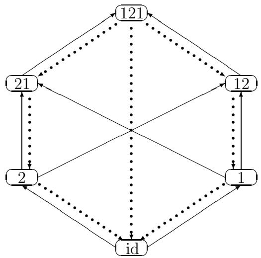

# Quantum double Schubert polynomials, quantum Schubert polynomials and Vafa-Intriligator formula.

Anatol N. Kirillov* and Toshiaki Maeno†

Department of Mathematical Sciences, University of Tokyo, Komaba, Meguro-ku, Tokyo 153, Japan

# Abstract

We study the algebraic aspects of equivariant quantum cohomology algebra of the flag manifold. We introduce and study the quantum double Schubert polynomials $\widetilde{\mathfrak{S}}_w(x,y)$ , which are the Lascoux-Schützenberger type representatives of the equivariant quantum cohomology classes. Our approach is based on the quantum Cauchy identity. We define also quantum Schubert polynomials $\widetilde{\mathfrak{S}}_w(x)$ as the Gram-Schmidt orthogonalization of some set of monomials with respect to the scalar product, defined by the Grothendieck residue. Using quantum Cauchy identity, we prove that $\widetilde{\mathfrak{S}}_w(x) = \widetilde{\mathfrak{S}}_w(x,y)|_{y=0}$ and as corollary obtain a simple formula for the quantum Schubert polynomials $\widetilde{\mathfrak{S}}_w(x) = \partial_{ww_0}^{(y)}\widetilde{\mathfrak{S}}_{w_0}(x,y)|_{y=0}$ . We also prove the higher genus analog of Vafa-Intriligator's formula for the flag manifolds and study the quantum residues generating function. We introduce the extended Ehresman-Bruhat order on the symmetric group and formulate the equivariant quantum Pieri rule.

# 1 Introduction.

The structure constants of the quantum cohomology ring are given by the third derivatives of the Gromov-Witten potential $F$ . The Gromov-Witten potential $F$ is a generating function of the Gromov-Witten invariants. The axioms of the tree level Gromov-Witten invariants

$$
\langle I _ {0, m, \beta} ^ {V} \rangle : H ^ {*} (V, \mathbf {Q}) ^ {\otimes m} \longrightarrow \mathbf {Q},
$$

$\beta \in H_2(V,\mathbf{Z})$ , for a target space $V$ are given by Kontsevich and Manin [KM]. Let $X_{1},\ldots ,X_{m}$ be cycles on $V$ and $X_{1}^{*},\ldots ,X_{m}^{*}$ their dual classes. Then the invariant $\langle I_{0,m,\beta}^V\rangle (X_1^*\otimes \dots \otimes X_m^*)$ can be considered as the virtual number of the stable maps $f$ from $m$ -pointed rational curve $(\mathbf{P}^1;p_1,\ldots ,p_m)$ to $V$ , such that the image of $f$ represents the homology class $\beta$ and $f(p_i)\in X_i$ .

In case of flag variety $Fl_{n} \coloneqq SL_{n} / B$ of type $A_{n-1}$ the potential $F$ is given as follows. Let $\Omega_{v}$ be the dual class of the Schubert cycle $X_{v}$ corresponding to a permutation $v \in S_{n}$ . Then the potential $F_{\omega}((t_v)_{v \in S_n})$ is defined by

$$
F _ {\omega} ((t _ {v}) _ {v \in S _ {n}}) = \sum_ {\beta} \sum_ {m = \Sigma m _ {v} \geq 3} \exp (- \int_ {\beta} \omega) \frac {\langle I _ {0 , m , \beta} ^ {V} \rangle (\bigotimes \Omega_ {v} ^ {\otimes m _ {v}})}{\prod_ {v \in S _ {n}} m _ {v} !} \prod_ {v \in S _ {n}} t ^ {m _ {v}},
$$

where $\omega$ is a Kähler form. For each point $t\in H^{*}(Fl_{n})$ , the quantum multiplication law is given by

$$
\Omega_ {u} * \Omega_ {v} = \sum_ {w \in S _ {n}} \frac {\partial^ {3} F _ {\omega}}{\partial t _ {u} \partial t _ {v} \partial t _ {w}} (t) \Omega_ {w w _ {0}},
$$

where $w_{0}$ is the permutation of maximal length. The algebra with this multiplication law is called a quantum cohomology ring, which is denoted by $QH_{t}^{*}(Fl_{n})$ . The associativity of the quantum multiplication is equivalent to the Witten-Dijkgraaf-Verlinde-Verlinde (WDVV) equation

$$
\sum_ {v \in S _ {n}} \frac {\partial^ {3} F _ {\omega}}{\partial t _ {u _ {1}} \partial t _ {u _ {2}} \partial t _ {v}} \frac {\partial^ {3} F _ {\omega}}{\partial t _ {v w _ {0}} \partial t _ {u _ {3}} \partial t _ {u _ {4}}} = \sum_ {v \in S _ {n}} \frac {\partial^ {3} F _ {\omega}}{\partial t _ {u _ {2}} \partial t _ {u _ {3}} \partial t _ {v}} \frac {\partial^ {3} F _ {\omega}}{\partial t _ {v w _ {0}} \partial t _ {u _ {1}} \partial t _ {u _ {4}}},
$$

for any $u_{1}, u_{2}, u_{3}, u_{4} \in S_{n}$ . From [KM, Proposition 4.4], the potential $F_{\omega}$ satisfies

$$
F _ {\omega} (t) = F _ {\omega - t ^ {(2)}} (t - t ^ {(2)}),
$$

where $t^{(2)} = \sum_{l(v) = 1} t_v \Omega_v$ . Hence, we may assume $\omega = 0$ . The potential $F$ is decomposed as a sum of the classical part $f_{\mathrm{cl}}$ and the quantum correction $f$ , where

$$
f _ {\mathrm {c l}} = \frac {1}{6} t _ {i d} \left(\sum_ {u, v} \delta_ {u, v w _ {0}} t _ {u} t _ {v}\right),
$$

and

$$
f = \sum_ {\beta} \sum_ {m = \Sigma m _ {v} \geq 3} \frac {\langle I _ {0 , m , \beta} ^ {F l} \rangle (\bigotimes \Omega_ {v} ^ {\otimes m _ {v}})}{\prod_ {l (v) \geq 1} ^ {l (v) \geq 1} m _ {v} !} \prod_ {l (v) \geq 1} t ^ {m _ {v}}.
$$

From the axioms of the Gromov-Witten invariants ([KM,(2.2.4)]), we have

$$
\langle I _ {0, m, \beta} ^ {F l} \rangle (\bigotimes_ {l (v) \geq 1} \Omega_ {v} ^ {\otimes m _ {v}}) = \langle I _ {0, m - \Sigma_ {l (u) = 1} m _ {u}, \beta} ^ {F l} \rangle (\bigotimes_ {l (v) > 1} \Omega_ {v} ^ {\otimes m _ {v}}) \prod_ {l (u) = 1} \left(\int_ {\beta} \Omega_ {u}\right).
$$

Hence, the quantum correction $f$ is expressed as

$$
f = \sum_ {m _ {v}, b _ {u}} N \left(\left(m _ {v}\right) _ {l (v) > 1} \mid \left(b _ {u}\right) _ {l (u) = 1}\right) \exp \left(\sum_ {l (u) = 1} \left(b _ {u} t _ {u}\right)\right) \prod_ {l (v) > 1} \frac {t _ {v} ^ {m _ {v}}}{m _ {v} !},
$$

where

$$
N \left(\left(m _ {v}\right) \mid \left(b _ {u}\right)\right) = \left\langle I _ {0, \Sigma m _ {v}, \Sigma b _ {u} X _ {u}} ^ {F l} \right\rangle \left(\bigotimes_ {l (v) > 1} \Omega_ {v} ^ {\otimes m _ {v}}\right).
$$

If $n = 3$ , the WDVV equations with the initial condition

$$
N (0, 0, 1 \mid 1, 0) = N (0, 0, 1 \mid 0, 1) = 1
$$

or

$$
N (2, 0, 0 \mid 1, 0) = N (0, 2, 0 \mid 0, 1) = 1
$$

determine all the coefficients $N(\lambda, \mu, \nu \mid a, b)$ uniquely. In fact, Di Francesco and Itzykson [FI] gave the coefficients $N(\lambda, \mu, \nu \mid a, b)$ for $a + b \leq 10$ .

Let $x_{1} = \Omega_{(1,2)}$ and $x_{i} = \Omega_{(i,i + 1)} - \Omega_{(i - 1,i)}$ for $2\leq i\leq n - 1$ , where $(i,j)$ is the transposition that interchanges $i$ and $j$ . Since the classical cohomology ring is generated by $x_{1},\ldots ,x_{n - 1}$ , the quantum cohomology ring $QH_{t}^{*}(Fl_{n})$ is also generated by $x_{1},\ldots ,x_{n - 1}$ in the neighborhood of the origin $t = 0$ . Moreover, we can choose a neighborhood of the origin on which $QH_{t}^{*}(Fl_{n})$

is a complete intersection ring. Then, let $\mathcal{I} \subset \mathbf{C}[x_1, \ldots, x_{n-1}]$ be the defining ideal of the quantum cohomology ring $QH_t^*(Fl_n)$ . The Schubert class $\Omega_v$ is expressed by the Schubert polynomial $\mathfrak{S}_v(x_1, \ldots, x_{n-1})$ in the classical cohomology ring. However, in the quantum cohomology ring, the class corresponding to the Schubert polynomial $\mathfrak{S}_v$ is no longer the Schubert class $\Omega_v$ . Hence, the polynomial $\widetilde{\mathfrak{S}}_v^t(x_1, \ldots, x_{n-1})$ expressing $\Omega_v$ gives a deformation of the Schubert polynomial. We call it a big quantum Schubert polynomial. We identify the residue pairing defined by $\mathcal{I}$ with the intersection form on the cohomology ring, so the big quantum Schubert polynomials are obtained by orthogonalization the basis consisting of the classical Schubert polynomials.

It is difficult to describe the defining ideal $\mathcal{I}$ of the big quantum cohomology ring for generic $t$ , so the big quantum Schubert polynomials are complicated in general. However, in the case where parameters $t_v = 0$ for all permutations $v \in S_n$ such that $l(v) > 1$ , the defining relations of the quantum cohomology ring are known by the results of A. Givental and B. Kim [GK] and I. Ciocan-Fontanine [C]. We call it the small quantum cohomology ring. The structure constants of the small quantum cohomology ring are given by

$$
\frac {\partial^ {3} F}{\partial t _ {v _ {1}} \partial t _ {v _ {2}} \partial t _ {v _ {3}}} (t ^ {(2)}) =
$$

$$
\begin{array}{l} \langle I _ {0, \Sigma m _ {u} + 3, \beta} ^ {F l} \rangle \left(\Omega_ {v _ {1}} \otimes \Omega_ {v _ {2}} \otimes \Omega_ {v _ {3}} \otimes \left(\bigotimes \Omega_ {u} ^ {\otimes m _ {u}}\right)\right) \\ = \sum_ {\beta} \sum_ {m _ {u} \geq 0} \frac {l (u) = 1}{\prod_ {l (u) = 1} m _ {u} !} \prod_ {l (u) = 1} t _ {u} ^ {m _ {u}} \\ = \sum_ {\beta} \left\langle I _ {0, 3, \beta} ^ {F l} \right\rangle \left(\Omega_ {v _ {1}} \otimes \Omega_ {v _ {2}} \otimes \Omega_ {v _ {2}}\right) e ^ {\Sigma b _ {i} t _ {(i, i + 1)}}, \\ \end{array}
$$

where the sum runs over

$$
\beta = b _ {1} X _ {(1, 2)} + \dots + b _ {n - 1} X _ {(n - 1, n)}
$$

with $b_{i} \in \mathbf{Z}_{\geq 0}$ . Hence the small quantum cohomology ring is determined by the invariants $\langle I_{0,3,\beta}^{Fl} \rangle$ . For a monomial $x_{i_1} * \dots * x_{i_m}$ , the $m$ -point correlation function determined by the small quantum cohomology ring (the so-called small quantum cohomology ring correlation function) is defined to be

$$
\left\langle x _ {i _ {1}} \cdot \cdot \cdot x _ {i _ {m}} \right\rangle = \int_ {F l _ {n}} x _ {i _ {1}} * \cdot \cdot \cdot * x _ {i _ {m}}.
$$

If $m \geq 4$ , the small quantum cohomology ring correlation function can be expressed as follows:

$$
\left\langle x _ {i _ {1}} \dots x _ {i _ {m}} \right\rangle =
$$

$$
\begin{array}{l} \sum_ {\beta = \beta_ {1} + \dots + \beta_ {m - 3}} \sum_ {v _ {1}, \dots , v _ {m - 3}} e ^ {- \int_ {\beta} \omega} \langle I _ {0, 3, \beta_ {1}} \rangle (x _ {i _ {1}} \otimes x _ {i _ {2}} \otimes \Omega_ {v _ {1}}) \langle I _ {0, 3, \beta_ {2}} \rangle (\Omega_ {v _ {1} w _ {0}} \otimes x _ {i _ {3}} \otimes \Omega_ {v _ {2}}) \\ \dots \langle I _ {0, 3, \beta_ {m - 2}} \rangle \left(\Omega_ {v _ {m - 3} w _ {0}} \otimes x _ {i _ {m - 1}} \otimes x _ {i _ {m}}\right). \\ \end{array}
$$

Hence, if $m \geq 4$ , the Gromov-Witten invariants $\langle I_{0,m,\beta} \rangle (x_{i_1} \otimes \dots \otimes x_{i_m})$ do not appear as coefficients of small quantum cohomology ring correlation functions.

Let us explain briefly the main results obtained in our paper. Follow to A. Givental and B. Kim [GK], and I. Ciocan-Fontanine [C], we define the quantum elementary symmetric polynomials $\widetilde{e}_1, \ldots, \widetilde{e}_n$ by the formula

$$
\begin{array}{l} \det  \left( \begin{array}{c c c c c c c} x _ {1} + t & q _ {1} & 0 & \ldots & \ldots & \ldots & 0 \\ - 1 & x _ {2} + t & q _ {2} & 0 & \ldots & \ldots & 0 \\ 0 & - 1 & x _ {3} + t & q _ {3} & 0 & \ldots & 0 \\ \vdots & \ddots & \ddots & \ddots & \ddots & \ddots & \vdots \\ 0 & \ldots & 0 & - 1 & x _ {n - 2} + t & q _ {n - 2} & 0 \\ 0 & \ldots & \ldots & 0 & - 1 & x _ {n - 1} + t & q _ {n - 1} \\ 0 & \ldots & \ldots & \ldots & 0 & - 1 & x _ {n} + t \end{array} \right) \\ = t ^ {n} + \tilde {e} _ {1} t ^ {n - 1} + \tilde {e} _ {2} t ^ {n - 2} + \dots + \tilde {e} _ {n}, \\ \end{array}
$$

where $q_{i} = e^{t_{(i,i + 1)}}$ . The defining ideal $\widetilde{I}$ of the small quantum cohomology ring is generated by the quantum elementary symmetric polynomials, namely

$$
Q H ^ {*} \left(F l _ {n}, \mathbf {Z}\right) := Q H ^ {*} \left(F l _ {n}\right) = \mathbf {Z} \left[ x _ {1}, \dots , x _ {n}; q _ {1}, \dots , q _ {n - 1} \right] / \left(\tilde {e} _ {1}, \dots , \tilde {e} _ {n}\right). \tag {1}
$$

In the classical case $q_{1} = \dots = q_{n - 1} = 0$ , on the quotient ring

$$
\mathfrak {A} := \mathbf {Z} [ x _ {1}, \dots , x _ {n} ] / (e _ {1} (x), \dots , e _ {n} (x)) \simeq H ^ {*} (F l _ {n}, \mathbf {Z})
$$

there exists a natural pairing $\langle f, g \rangle = \eta(\partial_{w_0}(fg))$ which comes from the intersection pairing in the homology group $H_*(Fl_n, \mathbf{Z})$ of the flag variety. We can interpret the pairing $\langle, \rangle$ as the Grothendieck residue pairing with respect to the ideal $I$ (see Subsection 2.5):

$$
\langle f, g \rangle = \mathrm {R e s} _ {I} (f g),
$$

where $I = \widetilde{I}\big|_{q = 0}$

Our first observation is that a natural residue pairing (we call it the quantum residue pairing)

$$
\langle f. g \rangle_ {Q} = \mathrm {R e s} _ {\widetilde {I}} (f g)
$$

on the quotient ring $\overline{\mathfrak{A}} := \mathbf{Z}[x_1, \ldots, x_n] / \widetilde{I}$ corresponds to the intersection pairing in quantum cohomology $QH^{*}(Fl_{n},\mathbf{Z})$ under a natural isomorphism (1).

It is well-known (e.g. [LS2], [M]) that the classical Schubert polynomials form an orthonormal basis (with respect to the pairing $\langle ,\rangle$ ) in the cohomology ring of flag manifold and also give a linear basis in the quantum cohomology ring $QH^{*}(Fl_{n},\mathbf{Z})$ , [GK], [MS]. However, the classical Schubert polynomials do not orthogonal with respect to the quantum pairing any more. Thus, it is natural to ask: what kind of polynomials one can obtain applying the Gram-Schmidt orthogonalization to the classical Schubert polynomials with respect to the quantum pairing $\langle ,\rangle_{Q}$ ? Omiting some details with ordering (see Definition 5), the answer is: quantum Schubert polynomials.

Our second observation is: to work with the equivariant quantum cohomology algebra ([GK], [K2]) is more convenient then with quantum cohomology ring itself. The main reason is that one can find Lascoux-Schützenberger's type representative for any equivariant quantum cohomology class. In other words, each quantum double Schubert polynomial $\widetilde{\mathfrak{S}}_w(x,y)$ can be obtained from the top one by using the divided difference operators acting on the $y$ variables.

Theorem-Definition A Let $x = (x_{1},\ldots ,x_{n})$ , $y = (y_{1},\ldots ,y_{n})$ be two sets of variables, and

$$
\widetilde {\mathfrak {S}} _ {w _ {0}} ^ {(q)} (x, y) := \prod_ {i = 1} ^ {n - 1} \Delta_ {i} (y _ {n - i} \mid x _ {1}, \ldots , x _ {i}),
$$

where $\Delta_k(t \mid x_1, \ldots, x_k) := \sum_{j=0}^{k} t^{k-j} e_j(x_1, \ldots, x_k \mid q_1, \ldots, q_{k-1})$ is the generating function for the quantum elementary symmetric functions in $x_1, \ldots, x_k$ .

Then $\tilde{\mathfrak{S}}_w^{(q)}(x,y) = \partial_{ww_0}^{(y)}\tilde{\mathfrak{S}}_{w_0}^{(q)}(x,y).$

We define the quantum Schubert polynomials $\widetilde{\mathfrak{S}}_w^{(q)}(x)$ as Gram-Schmidt's orthogonalization of the set of lexicographically ordered monomials

$\{x^{I}\mid I\subset (n - 1,n - 2,\ldots ,1,0)\}$ with respect to the quantum pairing $\langle ,\rangle_{Q}$ see Definition 5. One of our main results is the quantum analog of Cauchy's identity for (classical) Schubert polynomials, [M], (5.10).

Theorem B (Quantum Cauchy's identity)

$$
\sum_ {w \in S _ {n}} \widetilde {\mathfrak {S}} _ {w} ^ {(q)} (x) \mathfrak {S} _ {w w _ {0}} (y) = \widetilde {\mathfrak {S}} _ {w _ {0}} ^ {(q)} (x, y). \tag {2}
$$

We give a geometric proof of Theorem B in Section 7 using the arguments due to I. Ciocan-Fontanine [C]; more particularly, we reduce directly a proof of Theorem B to that of the following geometric statement:

Lemma Let $I \subset \delta = (n - 1, n - 2, \ldots, 1, 0)$ and $w \in S_n$ be a permutation, then

$$
\langle \widetilde {e} _ {I} (x), \widetilde {\mathfrak {S}} _ {w} (x) \rangle_ {Q} = \langle e _ {I} (x), \mathfrak {S} _ {w} (x) \rangle , \tag {3}
$$

where $e_I(x)\coloneqq \prod_{k = 1}^{n - 1}e_{i_k}(x_1,\ldots ,x_{n - k})$

$$
\left(\operatorname {r e s p.} \widetilde {e} _ {I} (x) := \prod_ {k = 1} ^ {n - 1} \widetilde {e} _ {i _ {k}} \left(x _ {1}, \dots , x _ {n - k} \mid q _ {1}, \dots , q _ {n - k - 1}\right)\right)
$$

is the elementary polynomial (resp. quantum elementary polynomial), see Section 5.2.

It is the formula (3) that we prove in Section 7 using the geometrical arguments from [C] and [K2]. By product, it follows from our proof that quantum Schubert polynomials $\hat{\mathfrak{S}}_w(x)$ defined geometrically (see Section 6) coincide with those defined algebraically (see Definition 5):

$$
\hat {\mathfrak {S}} _ {w} (x) \equiv \widetilde {\mathfrak {S}} _ {w ^ {- 1}} (x) (\mathrm {m o d} \widetilde {I}).
$$

It is interesting to note, that the intersection numbers $\langle e_I(x),\mathfrak{S}_w(x)\rangle$ (which are nonnegative!) are precisely the coefficients of corresponding Schubert polynomial:

$$
\mathfrak {S} _ {w} (x) = \sum_ {I \subset \delta} \langle e _ {I} (x), \mathfrak {S} _ {w} (x) \rangle x ^ {\delta - I}.
$$

The quantum Cauchy formula (2) plays the important role in our approach to the quantum Schubert polynomials. As a direct consequence of (2), we obtain the Lascoux-Schützenberger type formula for quantum Schubert polynomials (cf. Theorem-Definition A).

Theorem C Let $\widetilde{\mathfrak{S}}_{w_0}(x,y)$ be as in Theorem-Definition $A$ , then

$$
\widetilde {\mathfrak {S}} _ {w} (x) = \partial_ {w w _ {0}} ^ {(y)} \widetilde {\mathfrak {S}} _ {w _ {0}} (x, y) | _ {y = 0}.
$$

In Section 5 we introduce a quantization map

$$
P _ {n} \to \overline {{P}} _ {n}, f \mapsto \widetilde {f}.
$$

The quantization is a linear map which preserves the pairings, i.e.,

$$
\langle \widetilde {f}, \widetilde {g} \rangle_ {Q} = \langle f, g \rangle , f, g \in P _ {n}.
$$

Using the quantum Cauchy formula (2), we prove that quantum double Schubert polynomials are the quantization of classical ones. Another class of polynomials having a nice quantization is the set of elementary polynomials

$$
e _ {I} (x) := \prod_ {k = 1} ^ {n - 1} e _ {i _ {k}} (x _ {1}, \ldots x _ {n - k}), I = (i _ {1}, \ldots , i _ {n - 1}) \subset \delta .
$$

It follows from Theorem B that quantization $\widetilde{e}_I(x)$ of elementary polynomial $e_I(x)$ is given by

$$
\widetilde {e} _ {I} (x) = \prod_ {k = 1} ^ {n - 1} e _ {i _ {k}} \left(x _ {1}, \dots , x _ {n - k} \mid q _ {1}, \dots , q _ {n - k - 1}\right).
$$

More generally, we make a conjecture ("quantum Schur functions") that quantization of the flagged Schur function (see [M], (3.1), (4.9) and (6.16))

$$
s _ {\lambda / \mu} (X _ {1}, \ldots , X _ {n}) = \det  \left(h _ {\lambda_ {i} - \mu_ {j} - i + j} (X _ {i})\right) _ {1 \leq i, j \leq n}
$$

is given by

$$
\widetilde {s} _ {\lambda / \mu} (X _ {1}, \ldots , X _ {n}) = \det \left(\widetilde {h} _ {\lambda_ {i} - \mu_ {j} - i + j} (X _ {i})\right) _ {1 \leq i, j \leq n},
$$

where $\widetilde{h}_k(X)$ is the quantum complete homogeneous symmetric function of degree $k$ , and $X_1 \subset \dots \subset X_n$ are the flagged sets of variables (see Section 5).

In Section 5.2 we consider a problem how to quantize monomials. It seems to be difficult to find an explicit determinantal formula for a quantum monomial $\widetilde{x}^I$ , i.e., to find a quantum analog of the Billey-Jockusch-Stanley

formula for Schubert polynomials in terms of compatible sequences [BJS]. We prove the following formulae for quantum monomials

$$
\tilde {x} ^ {I} = \sum_ {w \in S _ {n}} \eta (\partial_ {w} x ^ {I}) \widetilde {\mathfrak {S}} _ {w} (x), I \subset \delta ,
$$

$$
\widetilde {\mathfrak {S}} _ {w _ {0}} (x, y) = \sum_ {I \subset \delta} \widetilde {x} ^ {I} e _ {\delta - I} (y).
$$

In section 8.1 we give a proof of the higher genus analog of the Vafa-Intriligator type formula for the flag manifold.

In Section 8.3 we study a problem how to compute the quantum residues. This is important for computation of small quantum cohomology ring correlation functions (or correlation functions, for short) and the Gromov-Witten invariants, see Introduction and Theorem 11. We introduce the generating function

$$
\Psi (t) = \langle \prod_ {i = 1} ^ {n - 1} \frac {t _ {i}}{t _ {i} - x _ {i}} \rangle
$$

for quantum residues and give a characterization of this function as the unique solution to some system of differential equations, see Proposition 14. In Appendix B we calculate the generating function $\Psi(t)$ for the case $n = 3$ explicitly.

In Section 9 we introduce the extended Ehresman-Bruhat order and give a sketch of a proof of equivariant quantum Pieri rule. Details will appear elsewhere.

In Appendix A one can find a list of explicit expressions for the quantum double Schubert polynomials for the symmetric group $S_4$ .

We would like to mention, that in the recent preprint "Quantum Schubert polynomials" by S. Fomin, S. Gelfand and A. Postnikov, [FGP], developed a different approach to the theory of quantum Schubert polynomials, based on the remarkable family of commuting operators $X_{i}$ ([FGP], (3.2)). Among main results, obtained by S. Fomin, S. Gelfand and A. Postnikov, are definitions, orthogonality, quantum Monk's formula and other properties of quantum Schubert polynomials; definition of quantization map and quantum multiplication.

Besides some overlap with the preprint of S. Fomin, S. Gelfand and A. Postnikov, our works were done independently and based on the different approaches, which allow to obtain the mutually complementary results.

# 2 Classical Schubert polynomials.

In this section we give a brief review of the theory of Schubert polynomials created by A. Lascoux and M.-P. Schützenberger. In exposition we follow to the I. Macdonald book [M1] where proofs and more details can be found.

# 2.1 Divided differences.

Let $x_{1},\ldots ,x_{n},\ldots$ be independent variables, and let

$$
P _ {n} := \mathbf {Z} [ x _ {1}, \dots , x _ {n} ]
$$

for each $n\geq 1$ , and

$$
P _ {\infty} := \mathbf {Z} [ x _ {1}, x _ {2}, \dots ] = \bigcup_ {n = 1} ^ {\infty} P _ {n}. \tag {4}
$$

Let us denote by $\Lambda_{n} := \mathbf{Z}[x_{1},\ldots ,x_{n}]^{S_{n}}\subset P_{n}$ the ring of symmetric polynomials in $x_{1},\ldots ,x_{n}$ , and by $H_{n}:= \{\sum_{I = (i_{1},\dots,i_{n})}a_{I}x^{I}\mid a_{I}\in \mathbf{Z}, 0\leq i_{k}\leq n - k,\forall k\}$ .

the additive subgroup of $P_{n}$ spanned by all monomials $x^{I} := x_{1}^{i_{1}}x_{2}^{i_{2}}\ldots x_{n}^{i_{n}}$ with $I\subset \delta \coloneqq \delta_n = (n - 1,n - 2,\dots ,1,0)$ . For $1\leq i\leq n - 1$ let us define a linear operator $\partial_i$ acting on $P_{n}$

$$
(\partial_ {i} f) (x) = \frac {f (x _ {1} , \ldots , x _ {i} , x _ {i + 1} , \ldots , x _ {n}) - f (x _ {1} , \ldots , x _ {i + 1} , x _ {i} , \ldots , x _ {n})}{x _ {i} - x _ {i + 1}}. \tag {5}
$$

Divided difference operators $\partial_i$ satisfy the following relations

$$
\begin{array}{r l r} {\partial_ {i} ^ {2}} & = & 0, \end{array}
$$

$$
\partial_ {i} \partial_ {j} = \partial_ {j} \partial_ {i}, \text {i f} | i - j | > 1, \tag {6}
$$

$$
\partial_ {i} \partial_ {i + 1} \partial_ {i} = \partial_ {i + 1} \partial_ {i} \partial_ {i + 1},
$$

and the Leibnitz rule

$$
\partial_ {i} (f g) = \partial_ {i} (f) g + s _ {i} (f) \partial_ {i} (g). \tag {7}
$$

It follows from (7) that $\partial_i$ is a $\Lambda_{n}$ -linear operator.

For any permutation $w \in S_n$ , let us denote by $R(w)$ the set of reduced words for $w$ , i.e. sequences $(a_1, \ldots, a_p)$ such that $w = s_{a_1} \cdots s_{a_p}$ , where

$p = l(w)$ is the length of permutation $w \in S_n$ , and $s_i = (i, i + 1)$ is the simple transposition that interchanges $i$ and $i + 1$ .

For any sequence $\mathbf{a} = (a_1, \ldots, a_p)$ of positive integers, we define

$$
\partial_ {\mathbf {a}} = \partial_ {a _ {1}} \dots \partial_ {a _ {p}}.
$$

Proposition 1 ([M1], (2.5), (2.6))

- If $\mathbf{a}, \mathbf{b} \in R(w)$ , then $\partial_{\mathbf{a}} = \partial_{\mathbf{b}}$ .   
- If $\mathbf{a}$ is not reduced, then $\partial_{\mathbf{a}} = 0$ .

From Proposition 1 it follows that an operator

$$
\partial_ {w} = \partial_ {\mathbf {a}}
$$

is well-defined, where $\mathbf{a}$ is any reduced word for $w$ . By (7), the operators $\partial_w$ , $w \in S_n$ , are $\Lambda_n$ linear, i.e. if $f \in \Lambda_n$ , then

$$
\partial_ {w} (f g) = f \partial_ {w} (g).
$$

# 2.2 Schubert polynomials.

Let $\delta = \delta_{n} = (n - 1,n - 2,\ldots ,1,0)$ , so that $x^{\delta} = x_{1}^{n - 1}x_{2}^{n - 2}\dots x_{n - 1}$ .

Definition 1 (Lascoux-Schützenberger [LS1]). For each permutation $w \in S_{n}$ the Schubert polynomial $\mathfrak{S}_w$ is defined to be

$$
\mathfrak {S} _ {w} (x) = \partial_ {w ^ {- 1} w _ {0}} \left(x ^ {\delta}\right),
$$

where $w_0$ is the longest element of $S_n$ .

Proposition 2 ([M1], (4.2), (4.5), (4.11), (4.15)).

- Let $v, w \in S_n$ . Then

$$
\partial_ {v} \mathfrak {S} _ {w} = \left\{ \begin{array}{l l} \mathfrak {S} _ {w v ^ {- 1}}, & \text {i f} l (w v ^ {- 1}) = l (w) - l (v), \\ 0, & \text {o t h e r w i s e}. \end{array} \right.
$$

- (Stability). Let $m > n$ and let $i: S_n \hookrightarrow S_m$ to be the natural embedding. Then

$$
\mathfrak {S} _ {w} = \mathfrak {S} _ {i (w)}.
$$

- The Schubert polynomials $\mathfrak{S}_w, w \in S_n$ form a $\mathbf{Z}$ -basis of $H_n$ .   
- (Monk's formula). Let $f = \sum_{i=1}^{n} \alpha_i x_i$ , $w \in S_n$ . Then

$$
f \mathfrak {S} _ {w} = \sum (\alpha_ {i} - \alpha_ {j}) \mathfrak {S} _ {w t _ {i j}},
$$

$$
\partial_ {w} (f g) = w (f) \partial_ {w} g + \sum (\alpha_ {i} - \alpha_ {j}) \partial_ {w t _ {i j}} g,
$$

where $t_{ij}$ is the transposition that interchanges $i$ and $j$ , and both sums are over all pairs $i < j$ such that $l(wt_{ij}) = l(w) + 1$ .

# 2.3 Scalar product.

Let us define a scalar product on $P_{n}$ with values in $\Lambda_{n}$ , by the rule

$$
\langle f, g \rangle = \partial_ {w _ {0}} (f g), f, g \in P _ {n}, \tag {8}
$$

where $w_0$ is the longest element of $S_{n}$

The scalar product $\langle, \rangle$ defines a non-degenerate pairing $\langle, \rangle_0$ on the quotient ring $P_n / I_n \cong H^*(Fl_n, \mathbf{Z})$ , where $I_n$ is the ideal in $P_n$ generated by the elementary symmetric polynomials $e_1(x), \ldots, e_n(x)$ .

Proposition 3 ([M1], (5.3), (5.4), (5.6), (4.13), (5.10)).

- If $f \in \Lambda_n$ , then $\langle fh, g \rangle = f \langle h, g \rangle$ ;   
- If $f, g \in P_n$ , $w \in S_n$ , then $\langle \partial_w f, g \rangle = \langle f, \partial_{w^{-1}} g \rangle$ ;   
- (Orthogonality) If $l(u) + l(v) = l(w_0)$ , then $\langle \mathfrak{S}_u, \mathfrak{S}_v \rangle = \left\{ \begin{array}{ll} 1, & \text{if } u = w_0 v, \\ 0, & \text{otherwise.} \end{array} \right.$ .   
- The Schubert polynomials $\mathfrak{S}_w$ , $w \in S_n$ , form a $\Lambda_n$ -basis of $P_n$ ;

- The Schubert polynomials $\mathfrak{S}_w$ , $w \in S^{(n)}$ , form a $\mathbf{Z}$ -basis of $P_n$ , where for each $n \geq 1$ , $S^{(n)}$ is the set of all permutations $w$ such that the code $w$ has length $\leq n$ ;

(Cauchy's formula)

$$
\sum_ {w \in S _ {n}} \mathfrak {S} _ {w} (x) \mathfrak {S} _ {w w _ {0}} (y) = \prod_ {i + j \leq n} \left(x _ {i} + y _ {j}\right).
$$

Proposition 4 Schubert polynomials are uniquely characterized by the following properties

1. (Orthogonality) $\langle \mathfrak{S}_u,\mathfrak{S}_v\rangle_0 = \left\{ \begin{array}{ll}1, & \text{if } u = w_0v,\\ 0, & \text{otherwise.} \end{array} \right.$   
2. Let $w$ be a permutation in $S_{n}$ and $c(w) = (c_{1}, c_{2}, \ldots, c_{n})$ its code, then

$$
\mathfrak {S} _ {w} (x) = x ^ {c (w)} + \sum \alpha_ {I} x ^ {I},
$$

where $I\subset \delta$ , $\alpha_{I} > 0$ and $I$ lexicographically smaller then $c(w)$ .

Remark 1 1) (Definition of the code, [M1], p.9).

For a permutation $w \in S_n$ , we define

$$
c _ {i} = \sharp \{j \mid i <   j, w (i) > w (j) \}.
$$

The sequence $c(w) = (c_1, c_2, \ldots, c_n)$ is called the code of $w$ .

2) Schubert polynomials are obtained as Gram-Schmidt's orthogonalization of the set of monomials $\{x^I\}_{I\subset \delta}$ ordered lexicographically.

# 2.4 Double Schubert polynomials.

Let $x = (x_{1},\ldots ,x_{n})$ , $y = (y_{1},\ldots ,y_{n})$ be two sets of independent variables, and

$$
\mathfrak {S} _ {w _ {0}} (x, y) := \prod_ {i + j \leq n} (x _ {i} + y _ {j}).
$$

Definition 2 (Lascoux-Schützenberger [LS2]). For each permutation $w \in S_n$ , the double Schubert polynomial $\mathfrak{S}_w(x,y)$ is defined to be

$$
\mathfrak {S} _ {w} (x, y) = \partial_ {w ^ {- 1} w _ {0}} ^ {(x)} \mathfrak {S} _ {w _ {0}} (x, y),
$$

where divided difference operator $\partial_{w^{-1}w_0}^{(x)}$ acts on the $x$ variables.

Proposition 5 ([M1], (6.3), (6.8)).

- $\mathfrak{S}_w(x,y) = \sum_u\mathfrak{S}_u(x)\mathfrak{S}_{uw^{-1}}(y),$ summed over all $u\in S_n$ , such that $l(u) + l(uw^{-1}) = l(w)$   
- (Interpolation formula). For all $f \in \mathbf{Z}[x_1, \ldots, x_n]$ we have

$$
f (x) = \sum_ {w} \mathfrak {S} _ {w} (x, - y) \partial_ {w} ^ {(y)} f (y)
$$

summed over all permutations $w \in S^{(n)}$ .

Double Schubert polynomials appear in algebra and geometry as cohomology classes related to degeneracy loci of flagged vector bundles. If $h: E \to F$ is a map of rank $n$ vector bundles on a smooth variety $X$ ,

$$
E _ {1} \subset E _ {2} \subset \dots \subset E _ {n} = E, F := F _ {n} \rightarrow F _ {n - 1} \rightarrow \dots \rightarrow F _ {1}
$$

are flags of subbundles and quotient bundles, then there is a degeneracy locus $\Omega_w(h)$ for each permutation $w$ in the symmetric group $S_n$ , described by the conditions

$$
\Omega_ {w} (h) = \{x \in X \mid \operatorname {r a n k} (E _ {p} (x) \to F _ {q} (x)) \leq \# \{i \leq q, w _ {i} \leq p \}, \forall p, q \}.
$$

For generic $h$ , $\Omega_w(h)$ is irreducible, $\operatorname{codim} \Omega_w(h) = l(w)$ , and the class $[\Omega_w(h)]$ of this locus in the Chow ring of $X$ is equal to the double Schubert polynomial $\mathfrak{S}_{w_0w}(x, -y)$ , where

$$
x _ {i} = c _ {1} (\ker (F _ {i} \to F _ {i - 1})),
$$

$$
y _ {i} = c _ {1} \left(E _ {i} / E _ {i - 1}\right), 1 \leq i \leq n.
$$

It is well-known [F] that the Chow ring of flag variety $Fl_{n}$ admits the following description

$$
C H ^ {*} (F l _ {n}) \cong \mathbf {Z} [ x _ {1}, \dots , x _ {n}, y _ {1}, \dots , y _ {n} ] / J,
$$

where $J$ is the ideal generated by

$$
e _ {i} \left(x _ {1}, \dots , x _ {n}\right) - e _ {i} \left(y _ {1}, \dots , y _ {n}\right), 1 \leq i \leq n,
$$

and $e_i(x)$ is the $i$ -th elementary symmetric function in the variables $x_1, \ldots, x_n$ .

- ([LS2], [KV]) The ring $\mathbf{Z}[x_1, \ldots, x_n, y_1, \ldots, y_n] / J$ is a free module of dimension $n!$ over the ring $R$ , with basis either $\mathfrak{S}_w(x)$ , or $\mathfrak{S}_w(x,y)$ , $w \in S_n$ , where

$$
R := \frac {\mathbf {Z} [ x _ {1} , \ldots , x _ {n} ] \otimes \mathbf {S y m} [ y _ {1} , \ldots , y _ {n} ]}{J}.
$$

# 2.5 Residue pairing.

Let $I$ be an ideal in $\bar{P}_n = R[x_1, \ldots, x_n]$ , $R \subset \mathbf{C}$ , generated by a regular system of parameters $\varphi_1, \ldots, \varphi_n$ , and $\mathfrak{A} := \bar{P}_n / I$ .

Proposition 6 ([GH], [EL]).

- $\dim_R\mathfrak{A} < \infty$   
$\bullet \mathcal{H}:= \operatorname *{det}\left(\frac{\partial\varphi_i}{\partial x_j}\right)\notin I.$

Let $d_0 \coloneqq \deg \mathcal{H}$ , where we assume that $\deg x_i = 1$ for all $1 \leq i \leq n$ .

Proposition 7 ([EL])

- If $f \in \bar{P}_n$ and $\deg f = d_0$ , then there exists a non-zero $\alpha \in R$ such that

$$
f \equiv \frac {\alpha}{n !} \mathcal {H} (\mathrm {m o d} I).
$$

- If $f \in \bar{P}_n$ , $f \neq 0$ , and $\deg f > d_0$ , then there exists $g \in \bar{P}_n$ such that $\deg g \leq d_0$ and $g \equiv f \pmod{I}$ .

Definition 3 (Grothendieck residue with respect to the ideal $I$ ).

Let $f \in \bar{P}_n$ and $\deg f < d_0$ , then we define

$$
\operatorname {R e s} _ {I} (f) = 0.
$$

If $\deg f = d_0$ , then $f \equiv \frac{\alpha}{n!} \mathcal{H} \pmod{I}$ and we define $\operatorname{Res}_I(f) \coloneqq \alpha$ .

Finally, if $\deg f > d_0$ , then choose $g \in \bar{P}_n$ such that $g \equiv f \pmod{I}$ and $\deg g \leq d_0$ , and define

$$
\operatorname {R e s} _ {I} (f) := \operatorname {R e s} _ {I} (g).
$$

We will use also notation $\langle f\rangle_I$ instead of $\operatorname{Res}_I(f)$ .

Finally, let us define a residue pairing $\langle ,\rangle_I$ on $\overline{P}_n$ using the Grothendieck residue

$$
\langle f, g \rangle_ {I} = \operatorname {R e s} _ {I} (f, g), \quad f, g \in \overline {{P}} _ {n}.
$$

Proposition 8 ([GH]).

- If $f \in I$ , then $\operatorname{Res}_I(f) = 0$ .   
- The residue pairing $\langle, \rangle_I$ induces a non-degenerate pairing on $\mathfrak{A} = \overline{P}/I$ .

We will use this general construction of residue pairing in the following two cases:

i) $R = \mathbf{Z}$ , $I_{n} \subset P_{n}$ is an ideal generated by elementary symmetric polynomials $e_1(x), \ldots, e_n(x)$ . It is well-known that if $Fl_{n} \coloneqq SL(n) / B$ is the flag variety of type $A_{n-1}$ , then

$$
H ^ {*} (F l _ {n}, \mathbf {Z}) \simeq P _ {n} / I _ {n},
$$

and residue pairing $\langle ,\rangle$ on $P_{n} / I_{n}$ coincides with the scalar product on $P_{n} / I_{n}$ induced by (8).

ii) $R = \mathbf{Z}[q_1, \ldots, q_{n-1}]$ , $\widetilde{I}_n \subset \overline{P}_n$ is an ideal generated by the quantum elementary symmetric functions $\widetilde{e}_1(x), \ldots, \widetilde{e}_n(x)$ . It is a result of A. Grivental and B. Kim, and I. Ciocan-Fontanine, that

$$
Q H ^ {*} (F l _ {n}) \simeq \overline {{P}} _ {n} / \widetilde {I} _ {n},
$$

and the residue pairing defined by $\widetilde{I}_n$ may be naturally identified with the intersection form on the quantum cohomology ring. We will call this residue pairing as quantum pairing on $\overline{P}_n / \widetilde{I}_n$ and denote it by $\langle ,\rangle_{Q}$ .

# 3 Quantum double Schubert polynomials.

Quantum double Schubert polynomials are closely related with the equivariant quantum cohomology. Let us remind the result of A. Givental and B. Kim [GK] (see also [K2]) on the structure of the equivariant quantum cohomology algebra of the flag variety $Fl_{n}$ :

$$
Q H _ {U _ {n}} ^ {*} (F l _ {n}) \cong \mathbf {Z} [ x _ {1}, \dots , x _ {n}, y _ {1}, \dots , y _ {n}, q _ {1}, \dots , q _ {n - 1} ] / \widetilde {J},
$$

where the ideal $\widetilde{J}$ generated by

$$
e _ {i} \left(x _ {1}, \dots , x _ {n} \mid q _ {1}, \dots , q _ {n - 1}\right) - e _ {i} \left(y _ {1}, \dots , y _ {n}\right), 1 \leq i \leq n.
$$

In classical case $q = 0$ , the double Schubert polynomials $\mathfrak{S}_w(x,y)$ represent the equivariant cohomology classes [F]. Quantum double Schubert polynomials have to play the similar role for the quantum equivariant cohomology ring. Let us define at first the "top" quantum double Schubert polynomial $\widetilde{\mathfrak{S}}_{w_0}(x,y)$ .

Let $x = (x_{1},\ldots ,x_{n})$ , $y = (y_{1},\ldots ,y_{n})$ be two sets of variables, put

$$
\widetilde {\mathfrak {S}} _ {w _ {0}} (x, y) := \widetilde {\mathfrak {S}} _ {w _ {0}} ^ {(q)} (x, y) = \prod_ {i = 1} ^ {n - 1} \Delta_ {i} (y _ {n - i} \mid x _ {1}, \ldots , x _ {i}),
$$

where $\Delta_k(t \mid x_1, \ldots, x_k) := \sum_{j=0}^{k} t^{k-j} e_j(x_1, \ldots, x_k \mid q_1, \ldots, q_{k-1})$ is the generating function for the quantum elementary symmetric polynomials in $x_1, \ldots, x_k$ ,

i.e. $\Delta_k(t|x) := \sum_{i=1}^k e_i(x|q)t^i =$

$$
\det  \left( \begin{array}{c c c c c c c} x _ {1} + t & q _ {1} & 0 & \dots & \dots & \dots & 0 \\ - 1 & x _ {2} + t & q _ {2} & 0 & \dots & \dots & 0 \\ 0 & - 1 & x _ {3} + t & q _ {3} & 0 & \dots & 0 \\ \vdots & \ddots & \ddots & \ddots & \ddots & \ddots & \vdots \\ 0 & \dots & 0 & - 1 & x _ {k - 2} + t & q _ {k - 2} & 0 \\ 0 & \dots & \dots & 0 & - 1 & x _ {k - 1} + t & q _ {k - 1} \\ 0 & \dots & \dots & \dots & 0 & - 1 & x _ {k} + t \end{array} \right). \tag {9}
$$

Definition 4 For each permutation $w \in S_n$ , the quantum double Schubert polynomial $\widetilde{\mathfrak{S}}_w(x,y)$ is defined to be

$$
\widetilde {\mathfrak {S}} _ {w} (x, y) = \partial_ {w w _ {0}} ^ {(y)} \widetilde {\mathfrak {S}} _ {w _ {0}} (x, y),
$$

where divided difference operator $\partial_{ww_0}^{(y)}$ acts on the $y$ variables.

Remark 2 $i)$ In the "classical limit" $q_{1} = \dots = q_{n - 1} = 0$

$$
\left. \tilde {\mathfrak {S}} _ {w} (x, y) \right| _ {q = 0} = \partial_ {w w _ {0}} ^ {(y)} \mathfrak {S} _ {w _ {0}} (x, y) = \mathfrak {S} _ {w ^ {- 1}} (y, x) = \mathfrak {S} _ {w} (x, y),
$$

i.e. $\left.\widetilde{\mathfrak{S}}_w(x,y)\right|_{q = 0} = \mathfrak{S}_w(x,y).$

ii) (Stability) Let $m > n$ and let $i:S_{n}\hookrightarrow S_{m}$ be the embedding. Then

$$
\widetilde {\mathfrak {S}} _ {w} (x, y) = \widetilde {\mathfrak {S}} _ {i (w)} (x, y).
$$

iii) One can check that the ring

$$
\mathbf {Z} \left[ x _ {1}, \dots , x _ {n}, y _ {1}, \dots , y _ {n}, q _ {1}, \dots , q _ {n - 1} \right] / \widetilde {J}
$$

is a free module of dimension $n!$ over the quotient ring $\widetilde{R}$ with basis either $\widetilde{\mathfrak{S}}_w(x)$ or $\widetilde{\mathfrak{S}}_w(x,y)$ , $w \in S_n$ , where

$$
\widetilde {R} := \frac {\mathbf {Z} [ x _ {1} , \ldots , x _ {n} , q _ {1} , \ldots , q _ {n - 1} ] \otimes \mathbf {S y m} [ y _ {1} , \ldots , y _ {n} ]}{\widetilde {J}}.
$$

Example. Quantum double Schubert polynomials for $S_3$ :

$$
\tilde {\mathfrak {S}} _ {s _ {1} s _ {2} s _ {1}} (x, y) = \left(x _ {1} + y _ {2}\right) \left(x _ {1} + y _ {1}\right) \left(x _ {2} + y _ {1}\right) + q _ {1} \left(x _ {1} + y _ {2}\right),
$$

$$
\tilde {\mathfrak {S}} _ {s _ {2} s _ {1}} (x, y) = \left(x _ {1} + y _ {1}\right) \left(x _ {1} + y _ {2}\right) - q _ {1},
$$

$$
\tilde {\mathfrak {S}} _ {s _ {1} s _ {2}} (x, y) = \left(x _ {1} + y _ {1}\right) \left(x _ {2} + y _ {1}\right) + q _ {1},
$$

$$
\widetilde {\mathfrak {S}} _ {s _ {1}} (x, y) = x _ {1} + y _ {1},
$$

$$
\tilde {\mathfrak {S}} _ {s _ {2}} (x, y) = x _ {1} + x _ {2} + y _ {1} + y _ {2},
$$

$$
\tilde {\mathfrak {S}} _ {\mathrm {i d}} (x, y) = 1.
$$

For the list of the quantum double Schubert polynomials corresponding to the symmetric group $S_4$ , see appendix A.

Theorem 1 Let $z = (z_{1},\ldots ,z_{n})$ be a third set of variables. Then

$$
\langle \widetilde {\mathfrak {S}} _ {w _ {0}} (x, y), \widetilde {\mathfrak {S}} _ {w _ {0}} (x, z) \rangle_ {Q} ^ {(x)} = C (y, z), \tag {10}
$$

where the upper index $x$ means that the quantum pairing is taken in the $x$ variables, and

$$
C (x, y) = \sum_ {w \in S _ {n}} \mathfrak {S} _ {w} (x) \mathfrak {S} _ {w _ {0} w} (y)
$$

is the "canonical" element in the tensor product $H^{*}(Fl_{n}) \otimes H^{*}(Fl_{n})$ .

Theorem 1 plays the important role in our approach to the quantum Schubert polynomials. We will give a proof later, and now let us consider some applications of the formula (10).

# 4 Quantum Schubert polynomials.

# 4.1 Definition.

Let us remind the result of A. Givental and B. Kim, and I. Ciocan-Fontanine on the structure of the small quantum cohomology ring of flag variety $Fl_{n}$

$$
Q H ^ {*} (F l _ {n}) \cong \mathbf {Z} [ x _ {1}, \dots , x _ {n}, q _ {1}, \dots , q _ {n - 1} ] / \widetilde {I},
$$

where the ideal $\widetilde{I}$ is generated by the quantum elementary symmetric polynomials $\widetilde{e}_i(x) \coloneqq e_i(x_1, \ldots, x_n | q_1, \ldots, q_{n-1})$ , $1 \leq i \leq n$ with generating function $\Delta_n(t|x)$ , see (9).

We define a pairing on the ring of polynomials $\mathbf{Z}[x;q]$ and the quantum cohomology ring $QH^{*}(Fl_{n})\simeq \mathbf{Z}[x;q] / \tilde{I}$ using the Grothendieck residue

$$
\langle f, g \rangle_ {Q} = \operatorname {R e s} _ {\widetilde {I}} (f g), f, g \in \mathbf {Z} [ x _ {1}, \dots , x _ {n}, q _ {1}, \dots , q _ {n - 1} ].
$$

Then

1) $\langle f,g\rangle_{Q} = 0$ if $f\in \widetilde{I}$   
2) $\langle f,g\rangle_{Q}$ defines a nondegenerate pairing in $QH^{*}(Fl_{n})$

Definition 5 Define the quantum Schubert polynomials $\widetilde{\mathfrak{S}}_w\coloneqq \widetilde{\mathfrak{S}}_w(x)$ as Gram-Schmidt's orthogonalization of the set of lexicographically ordered monomials $\{x^I\mid I\subset \delta \}$ with respect to the quantum residue pairing $\langle f,g\rangle_{Q}$ :

1) $\langle \widetilde{\mathfrak{S}}_u,\widetilde{\mathfrak{S}}_v\rangle_Q = \langle \mathfrak{S}_u,\mathfrak{S}_v\rangle = \left\{ \begin{array}{ll}1, & \text{if} v = w_0u\\ 0, & \text{otherwise} \end{array} \right.$   
2) $\widetilde{\mathfrak{S}}_w(x) = x^{c(w)} + \sum_{I < c(w)}a_I(q)x^I$ , where $a_{I}(q)\in \mathbf{Z}[q_{1},\ldots ,q_{n - 1}]$ and

$I < c(w)$ means the lexicographic order.

Here $c(w)$ is the code of a permutation $w \in S_n$ , [M1], p.9.

Remark 3 This definition is the analogue of the characterization of Schubert polynomials from Proposition 4.

Example. For the symmetric group $S_3$ , we have

$$
\langle x _ {1} ^ {2} x _ {2}, x _ {1} ^ {2} \rangle_ {Q} = q _ {1}, \quad \langle x _ {1} ^ {2} x _ {2}, x _ {1} x _ {2} \rangle_ {Q} = - 2 q _ {1}.
$$

Consequently,

$$
\widetilde {\mathfrak {S}} _ {1} = x _ {1}, \widetilde {\mathfrak {S}} _ {2} = x _ {1} + x _ {2}, \widetilde {\mathfrak {S}} _ {1 2} = x _ {1} x _ {2} + q _ {1}, \widetilde {\mathfrak {S}} _ {2 1} = x _ {1} ^ {2} - q _ {1}, \widetilde {\mathfrak {S}} _ {1 2 1} = x _ {1} ^ {2} x _ {2} + q _ {1} x _ {1}.
$$

Let us remark that in our example $(n = 3)$ $\widetilde{\mathfrak{S}}_{121} = \widetilde{\mathfrak{S}}_{w_0^{(3)}}(x) = \widetilde{e}_1(x_1)\widetilde{e}_2(x_1,x_2)$ . More generally, we have

Proposition 9 Let $w_0 \in S_n$ be the longest element. Then

$$
\widetilde {\mathfrak {S}} _ {w _ {0}} (x) = \widetilde {e} _ {1} (x _ {1}) \widetilde {e} _ {2} (x _ {1}, x _ {2}) \ldots \widetilde {e} _ {n - 1} (x _ {1}, \ldots x _ {n - 1}).
$$

In other words, the quantum Schubert polynomial corresponding to the longest element of the symmetric group $S_{n}$ , is equal to the product of all principal minors of the Jacobi matrix $\left(\frac{\partial e_i(x|q)}{\partial x_j}\right)_{1\leq i,j\leq n}$ . We can also compute the Grothendieck residue w.r.t. ideal $\widetilde{I}$ of the Jacobian $\operatorname*{det}\left(\frac{\partial e_i(x|q)}{\partial x_j}\right)_{1\leq i,j\leq n}$ .

Proposition 10 (cf. [EL])

$$
\det \left(\frac {\partial e _ {i} (x | q)}{\partial x _ {j}}\right) \equiv n! \widetilde {\mathfrak {S}} _ {w _ {0}} (x) (\mathrm {m o d} \widetilde {I}),
$$

where $e_i(x|q) = e_i(x_1, \ldots, x_n \mid q_1, \ldots, q_{n-1})$ , $1 \leq i \leq n$ , are the quantum elementary symmetric functions.

Remind that $n!$ is equal to the Euler number of $Fl_{n}$ .

# 4.2 Orthogonality.

We use the Jack-Macdonald type definition ([M2], Chapter VI) of the quantum Schubert polynomials, see Definition 5. On this way the orthogonality of quantum Schubert polynomials is valid by "definition". We are going to prove that the $y = 0$ specialization of quantum double Schubert polynomials $\widetilde{\mathfrak{S}}_w(x,0)$ also satisfies the conditions 1) and 2) of Definition 5. As a corollary, we obtain that the specialization $\widetilde{\mathfrak{S}}_w(x,0)$ coincides with the quantum Schubert polynomial $\widetilde{\mathfrak{S}}_w(x)$ from Definition 5.

Theorem 2 Let $v, w \in S_n$ . Then

$$
\langle \widetilde {\mathfrak {S}} _ {v} (x, 0), \widetilde {\mathfrak {S}} _ {w} (x, 0) \rangle_ {Q} = \left\{ \begin{array}{l l} 1, & \text {i f} w = w _ {0} v, \\ 0, & \text {o t h e r w i s e .} \end{array} \right.
$$

Proof. Let us apply the operator $\partial_{vw_0}^{(y)}\partial_{ww_0}^{(z)}$ to the both sides of (10). The LHS gives

$$
\partial_ {v w _ {0}} ^ {(y)} \partial_ {w w _ {0}} ^ {(z)} \langle \widetilde {\mathfrak {S}} _ {w _ {0}} (x, y), \widetilde {\mathfrak {S}} _ {w _ {0}} (x, z) \rangle_ {Q} ^ {(x)} = \langle \widetilde {\mathfrak {S}} _ {v} (x, y), \widetilde {\mathfrak {S}} _ {w} (x, z) \rangle_ {Q} ^ {(x)}.
$$

The RHS transforms to the following form $\sum_{u\in S_n}\partial_{vw_0}^{(y)}\mathfrak{S}_u(y)\partial_{ww_0}^{(z)}\mathfrak{S}_{w_0u}(z)$ . Now taking $y = z = 0$ we obtain an equality

$$
\langle \widetilde {\mathfrak {S}} _ {v} (x, 0) \widetilde {\mathfrak {S}} _ {w} (x, 0) \rangle_ {Q} = \sum_ {u \in S _ {n}} \eta (\partial_ {v w _ {0}} \mathfrak {S} _ {u}) \eta (\partial_ {w w _ {0}} \mathfrak {S} _ {w _ {0} u}), \tag {11}
$$

where $\eta : P_n \to \mathbf{Z}$ is the homomorphism defined by $\eta(x_i) = 0$ ( $1 \leq i \leq n$ ). It is clear that

$$
\eta (\partial_ {v} \mathfrak {S} _ {u}) = \left\{ \begin{array}{l l} 1, & \text {i f} v = u, \\ 0, & \text {o t h e r w i s e .} \end{array} \right.
$$

Thus, the RHS of (11) is equal to 1 if $w_0ww_0 = vw_0$ and is equal to 0 otherwise.

Remark 4 Orthogonality of quantum Schubert polynomials was proven in [FGP], using a combinatorial definition, see ibid, Section 5; the proof is highly non trivial.

# 4.3 Quantum Cauchy formula.

Theorem 3 Let $\widetilde{\mathfrak{S}}_w(x) \coloneqq \widetilde{\mathfrak{S}}_w(x,0)$ , then

$$
\sum_ {w \in S _ {n}} \tilde {\mathfrak {S}} _ {w} (x) \mathfrak {S} _ {w w _ {0}} (y) = \tilde {\mathfrak {S}} _ {w _ {0}} (x, y). \tag {12}
$$

Proof. Let us apply the divided difference operator $\partial_{ww_0}^{(z)}$ to the both sides of (10) and then take $z = 0$ . The right hand side transforms to the following form

$$
\sum_ {u \in S _ {n}} \mathfrak {S} _ {u} (y) \partial_ {w w _ {0}} ^ {(z)} \mathfrak {S} _ {w _ {0} u} (z) | _ {z = 0} = \mathfrak {S} _ {w _ {0} w w _ {0}} (y).
$$

As for the LHS, it takes the form $\langle \widetilde{\mathfrak{S}}_{w_0}(x,y),\widetilde{\mathfrak{S}}_w(x)\rangle_Q$ . Hence,

$$
\langle \widetilde {\mathfrak {S}} _ {w _ {0}} (x, y), \widetilde {\mathfrak {S}} _ {w} (x) \rangle_ {Q} = \mathfrak {S} _ {w _ {0} w w _ {0}} (y).
$$

The last identity is equivalent to (12).

More generally, we have

# Proposition 11

$$
\sum_ {w \in S _ {n}} \widetilde {\mathfrak {S}} _ {w} (x, z) \mathfrak {S} _ {w w _ {0}} (y, - z) = \widetilde {\mathfrak {S}} _ {w _ {0}} (x, y), \tag {13}
$$

$$
\sum_ {u \in S _ {n}, l (u) + l \left(u w ^ {- 1}\right) = l (w)} \widetilde {\mathfrak {S}} _ {u} (x, z) \mathfrak {S} _ {u w ^ {- 1}} (y, - z) = \widetilde {\mathfrak {S}} _ {w} (x, y). \tag {14}
$$

Proof. Let us apply the Interpolation formula to $f(x) = \widetilde{\mathfrak{S}}_{w_0}(x,y)$ and then divided difference operator $\partial_{ww_0}^{(y)}$ .

# Corollary 1

$$
C ^ {(q, q ^ {\prime})} (x, y) := \sum_ {w \in S _ {n}} \widetilde {\mathfrak {S}} _ {w} ^ {(q)} (x) \widetilde {\mathfrak {S}} _ {w _ {0} w} ^ {(q ^ {\prime})} (y) = \langle \widetilde {\mathfrak {S}} _ {w _ {0}} ^ {(q)} (x, z), \widetilde {\mathfrak {S}} _ {w _ {0}} ^ {(q ^ {\prime})} (y, z) \rangle^ {(z)},
$$

where the upper index $z$ means that the scalar product is taken in the $z$ variables.

# Corollary 2

$$
\sum_ {w \in S _ {n}} \Omega_ {w} \Omega_ {w} ^ {*} = C ^ {(q, q)} (x, x).
$$

One can show that

$$
C ^ {(q, q)} (x, x) = \sum_ {w \in S _ {n}} \widetilde {\mathfrak {S}} _ {w} (x) \widetilde {\mathfrak {S}} _ {w w _ {0}} (x) \equiv n! \widetilde {\mathfrak {S}} _ {w _ {0}} (x) (\mathrm {m o d} \widetilde {I}).
$$

Let us summarize our results. It follows from Theorem 2 that polynomials $\widetilde{\mathfrak{S}}_w(x,0)$ are orthogonal with respect to the quantum pairing $\langle ,\rangle_{Q}$ . It is also clear that $\widetilde{\mathfrak{S}}_w(x,0)|_{q = 0} = \mathfrak{S}_w(x)$ and $\widetilde{\mathfrak{S}}_w(x) = x^{c(w)} + \text{lower degree terms}$ w.r.t. lexicographic order on the set of monomials. These two properties characterize the polynomials $\widetilde{\mathfrak{S}}_w(x,0)$ uniquely, consequently, the polynomials $\widetilde{\mathfrak{S}}_w(x,0)$ coincide with the quantum Schubert polynomials $\widetilde{\mathfrak{S}}_w(x)$ from Definition 5. As a matter of fact, we obtain the Lascoux-Schützenberger type formula for quantum Schubert polynomials.

Theorem 4 Let $w \in S_n$ , then

$$
\widetilde {\mathfrak {S}} _ {w} (x) = \partial_ {w w _ {0}} ^ {(y)} \widetilde {\mathfrak {S}} _ {w _ {0}} (x, y) | _ {y = 0}.
$$

# 5 Quantization.

# 5.1 Definition.

Let $f \in P_n = \mathbf{Z}[x_1, \ldots, x_n]$ be a polynomial. According to the Interpolation formula,

$$
f (x) = \sum_ {w \in S ^ {(n)}} \partial_ {w} ^ {(y)} f (y) \mathfrak {S} _ {w} (x, y).
$$

We define a quantization $\widetilde{f}$ of the function $f$ by the rule

$$
\widetilde {f} (x) = \sum_ {w \in S ^ {(n)}} \partial_ {w} ^ {(y)} f (y) \widetilde {\mathfrak {S}} _ {w} (x, y) | _ {\overline {{P}} _ {n}}, \tag {15}
$$

where for a polynomial $f \in \overline{P}_{\infty}$ , the symbol $f|_{\overline{P}_m}$ means the restriction of $f$ to the ring of polynomials $\overline{P}_m$ , i.e. the specialization $x_{m+1} = x_{m+2} = \dots = 0$ and $q_m = q_{m+1} = \dots = 0$ .

Hence, the quantization is a $\mathbf{Z}[q_1,\ldots ,q_{n - 1}]$ -linear map $P_{n}\to \overline{P}_{n}$

The main property of quantization is that it preserves the pairings, i.e.

$$
\langle \tilde {f}, \tilde {g} \rangle_ {Q} = \langle f, g \rangle , f, g \in P _ {n}. \tag {16}
$$

It follows from (16) that the quantization map maps the ideal $I_{n} \subset \overline{P}_{n}$ into ideal $\tilde{I}_n \subset \overline{P}_n$ .

Remark 5 i) Quantization does not preserve multiplication, i.e. in general $\widetilde{f} \cdot \widetilde{g} \neq \widetilde{fg}$ . For example, if $f = \sum_{i=1}^{n} \alpha_i x_i$ is a linear form, then (quantum) Monk's formula, see [FGP] and our Section 9)

$$
\widetilde {f} \widetilde {\mathfrak {S}} _ {w} - \widetilde {f \mathfrak {S}} _ {w} = \sum \left(\lambda_ {i} - \lambda_ {j}\right) q _ {i j} \widetilde {\mathfrak {S}} _ {w t _ {i j}},
$$

summed over $i < j$ such that $l(w) = l(wt_{ij}) + l(t_{ij})$ . Here $q_{ij} = q_i q_{i+1} \ldots q_{j-1}$ .

ii) It is clear that if $f \in H_n$ , then $\widetilde{f} \in \overline{H}_n$ .

iii) It follows from Proposition 11, that the quantum double Schubert polynomials $\widetilde{\mathfrak{S}}_w(x,y)$ are the quantization of classical ones.

iv) It follows from Interpolation formula and quantization procedure, that   
- Quantum Schubert polynomials $\widetilde{\mathfrak{S}}_w(x)$ , $w \in S_n$ form a $\overline{I}$ -basis in $\overline{P}_n$ .   
- Quantum Schubert polynomials $\widetilde{\mathfrak{S}}_w(x)$ , $w \in S^{(n)}$ form a $\mathbf{Z}[q_1, \ldots, q_{n-1}]$ -basis of $\overline{P}_n$ .

- Quantum Schubert polynomials $\widetilde{\mathfrak{S}}_w(x)$ , $w \in S_n$ form a $\mathbf{Z}[q_1, \ldots, q_{n-1}]^{-}$ basis of $\overline{H}_n = H_n \otimes \mathbf{Z}[q_1, \ldots, q_{n-1}]$ .

The proof of the statement $iv)$ can be found in [FGP].

Now we are going to describe another families of polynomials having a nice quantization.

# 5.2 Elementary and complete polynomials.

Let $\delta := \delta_n = (n - 1, n - 2, \ldots, 1, 0)$ , and consider the set $\mathfrak{T}$ of sequences $I = (i_1, \ldots, i_n) \in \mathbf{Z}^n$ such that $0 \leq i_j \leq n - j$ for all $j = 1, \ldots, n$ . It is clear that $|\mathfrak{T}| = n!$ , and

- $P_{n}$ is a free $\Lambda_{n}$ -module of rank $n!$ with basis $\{x^{I} = x_{1}^{i_{1}}x_{2}^{i_{2}}\ldots x_{n}^{i_{n}}\mid I\in \mathfrak{T}\}$ .

Follow to [LS2], for each $I \in \mathfrak{T}$ let us define the elementary polynomial $e_I(x)$ as the following product

$$
\prod_ {k = 1} ^ {n - 1} e _ {i _ {k}} (x _ {1}, \ldots , x _ {n - k}).
$$

- (Lascoux-Schützenberger [LS2]) $P_{n}$ is a free $\Lambda_{n}$ -module of rank $n!$ with basis $\{e_I(x) \mid I \in \mathfrak{T}\}$ .

Definition 6 For each sequence $I \in \mathfrak{T}$ the quantum elementary polynomial $\widetilde{e}_I(x)$ is defined to be

$$
\widetilde {e} _ {I} (x) = \prod_ {k = 1} ^ {n - 1} \widetilde {e} _ {i _ {k}} (x _ {1}, \ldots , x _ {n - k}),
$$

where $\widetilde{e}_k(x_1,\ldots ,x_m)\coloneqq e_k(x_1,\ldots ,x_m\mid q_1,\ldots ,q_{m - 1})$ are the quantum elementary symmetric functions.

Theorem 5 Assume that $I \subset \delta$ . Then $\widetilde{e}_I(x)$ is the quantization of elementary polynomial $e_I(x)$ .

Proof. It is enough to prove the following

Proposition 12 If $I\subset \delta$ , then

$$
\tilde {e} _ {I} (x) = \sum_ {w \in S _ {n}} \tilde {\mathfrak {S}} _ {w} (x) \eta \left(\partial_ {w} e _ {I}\right). \tag {17}
$$

We are going to show that Proposition 12 follows from the quantum Cauchy formula. First of all, let us remark that

$$
\widetilde {\mathfrak {S}} _ {w _ {0}} (x, y) = \sum_ {I \subset \delta} \widetilde {e} _ {I} (x) y ^ {\delta - I},
$$

$$
\widetilde {\mathfrak {S}} _ {w _ {0}} (x, z) = \sum_ {w \in S _ {n}} \widetilde {\mathfrak {S}} _ {w _ {0} w w _ {0}} (x) \mathfrak {S} _ {w _ {0} w} (z).
$$

Substituting these two expressions in (17), we obtain a formula for the classical Schubert polynomials

$$
\mathfrak {S} _ {w} (y) = \sum_ {I \subset \delta} \langle \widetilde {e} _ {I} (x), \widetilde {\mathfrak {S}} _ {w _ {0} w w _ {0}} (x) \rangle_ {Q} y ^ {\delta - I}. \tag {18}
$$

It follows from (18) that

$$
\langle \widetilde {e} _ {I} (x), \widetilde {\mathfrak {S}} _ {w _ {0} w w _ {0}} (x) \rangle_ {Q} = \langle e _ {I} (x), \mathfrak {S} _ {w _ {0} w w _ {0}} (x) \rangle . \tag {19}
$$

Conversely, the quantum Cauchy formula (12) follows from the classical one and (19). To continue, let us remark that

$$
\langle e _ {I} (x), \mathfrak {S} _ {w _ {0} w w _ {0}} (x) \rangle = \langle e _ {I} (x), \partial_ {w _ {0} w ^ {- 1}} \mathfrak {S} _ {w _ {0}} (x) \rangle =
$$

$$
\left\langle \partial_ {w w _ {0}} e _ {I} (x), \mathfrak {S} _ {w _ {0}} (x) \right\rangle = \eta \left(\partial_ {w w _ {0}} e _ {I} (x)\right).
$$

As a corollary we obtain a formula for Schubert polynomials, which seems to be new,

$$
\mathfrak {S} _ {w} (x) = \sum_ {I \subset \delta} \eta \left(\partial_ {w w _ {0}} e _ {I} (x)\right) x ^ {\delta - I}. \tag {20}
$$

Formula (20) gives a geometric interpretation of the coefficients $a_{I,w}$ of the Schubert polynomial $\mathfrak{S}_w(x) = \sum_{I\subset \delta}a_{I,w}x^{\delta -I}$ as the intersection numbers

$$
a _ {I, w} = \eta (\partial_ {w w _ {0}} e _ {I} (x)) = \langle e _ {I} (x), \mathfrak {S} _ {w _ {0} w w _ {0}} (x) \rangle \geq 0.
$$

Finally, let us finish a proof of Theorem 5. We have

$$
\begin{array}{l} \sum_ {I \subset \delta} \mathrm {R H S} (1 7) y ^ {\delta - I} = \sum_ {w \in S _ {n}} \widetilde {\mathfrak {S}} _ {w} (x) \sum_ {I \subset \delta} \eta (\partial_ {w} e _ {I}) y ^ {\delta - I} \\ = \sum_ {w \in S _ {n}} \widetilde {\mathfrak {S}} _ {w} (x) \mathfrak {S} _ {w w _ {0}} (y) = \widetilde {\mathfrak {S}} _ {w _ {0}} (x, y) = \sum_ {I \subset \delta} \widetilde {e} _ {I} (x) y ^ {\delta - I}. \\ \end{array}
$$

Hence, $\mathrm{RHS}(17) = \widetilde{e}_I(x)$ .

Corollary 3 If $I$ and $J$ belong to $\mathfrak{T}$ , then

$$
\langle \widetilde {e} _ {I} (x), \widetilde {e} _ {J} (x) \rangle_ {Q} = \langle e _ {I} (x), e _ {J} (x) \rangle .
$$

Remark 6 In the next section we will give a proof of Corollary 3 using a geometric technique due to I. Ciocan-Fontanine [C] (see also [K1]). Repeating our arguments in the reverse order, we see that the quantum Cauchy formula (12), as well as Theorems 1 and 3, follow directly from Corollary 3.

Using quantum Cauchy formula (12), we can describe a transition matrix between quantum Schubert polynomials and quantum elementary polynomials.

Theorem 6

$$
\widetilde {\mathfrak {S}} _ {w} (x) = \sum_ {I \subset \delta} \widetilde {e} _ {I} (x) \eta (\partial_ {w w _ {0}} x ^ {\delta - I}).
$$

Proof. It follows from Cauchy's formula that

$$
\sum_ {w \in S _ {n}} \widetilde {\mathfrak {S}} _ {w} (x) \mathfrak {S} _ {w w _ {0}} (y) = \sum_ {I \subset \delta} \widetilde {e} _ {I} (x) y ^ {\delta - I}.
$$

Consequently,

$$
\widetilde {\mathfrak {S}} _ {w _ {0} w w _ {0}} (x) = \sum_ {I \subset \delta} \widetilde {e} _ {I} (x) \langle y ^ {\delta - I}, \mathfrak {S} _ {w} (y) \rangle .
$$

Now we have

$$
\langle y ^ {\delta - I}, \mathfrak {S} _ {w} (y) \rangle = \langle y ^ {\delta - I}, \partial_ {w ^ {- 1} w _ {0}} \mathfrak {S} _ {w _ {0}} (y) \rangle = \langle \partial_ {w _ {0} w} y ^ {\delta - I}, \mathfrak {S} _ {w _ {0}} (y) \rangle = \eta (\partial_ {w _ {0} w} y ^ {\delta - I}).
$$

Example. Take the permutation $w = 24531 \in S_5$ . It is easy to check that $ww_0 = 42135 = s_1s_2s_1s_3$ and there exists 6 monomials $x^I$ such that $I \subset (43210)$ and $\eta(\partial_{1213}x^I) \neq 0$ . They are

$$
x ^ {I}: x _ {1} ^ {2} x _ {2} x _ {3}, x _ {1} ^ {2} x _ {2} x _ {4}, x _ {1} ^ {2} x _ {3} ^ {2}, x _ {1} x _ {2} ^ {2} x _ {3}, x _ {1} x _ {2} ^ {2} x _ {4}, x _ {2} ^ {2} x _ {3} ^ {2}
$$

$$
\eta (\partial_ {1 2 1 3} x ^ {I}): \quad + 1 \quad - 1 \quad - 1 \quad - 1 \quad + 1 \quad + 1
$$

We can check using Theorem 4, that

$$
\widetilde {\mathfrak {S}} _ {2 4 5 3 1} (x) = \widetilde {e} _ {2 2 1 1} (x) - \widetilde {e} _ {2 2 2 0} (x) - \widetilde {e} _ {2 3 0 1} (x) - \widetilde {e} _ {3 1 1 1} (x) + \widetilde {e} _ {3 1 2 0} (x) + \widetilde {e} _ {4 1 0 1} (x).
$$

Now let us consider a problem how to quantize monomials.

Proposition 13 Let $I \in \mathfrak{T}$ , then

$$
x ^ {I} = \sum_ {w \in S _ {n}, l (w) = | I |} \eta (\partial_ {w} x ^ {I}) \mathfrak {S} _ {w} (x),
$$

$$
\tilde {x} ^ {I} = \sum_ {w \in S _ {n}, l (w) = | I |} \eta (\partial_ {w} x ^ {I}) \widetilde {\mathfrak {S}} _ {w} (x).
$$

Corollary 4 Let $v, w \in S_n$ , then

$$
\sum_ {I \subset \delta} \eta (\partial_ {v} x ^ {I}) \eta (\partial_ {w w _ {0}} e _ {\delta - I} (x)) = \delta_ {v, w}.
$$

Corollary 5

$$
\widetilde {\mathfrak {S}} _ {w} (x) = \sum_ {I \subset \delta} \eta (\partial_ {w w _ {0}} e _ {\delta - I} (x)) \widetilde {x} ^ {I}.
$$

Corollary 6

$$
\widetilde {\mathfrak {S}} _ {w _ {0}} (x, y) = \sum_ {I \subset \delta} \widetilde {x} ^ {I} e _ {\delta - I} (y).
$$

Now let us consider a problem how to quantize the complete homogeneous symmetric functions

$$
h _ {k} ^ {m} := \sum_ {i _ {1} + \dots + i _ {m} = k} x _ {1} ^ {i _ {1}} \dots x _ {m} ^ {i _ {m}}.
$$

We define the quantum complete homogeneous symmetric function $\widetilde{h}_k^m = \widetilde{h}_k(x_1, \ldots, x_m)$ of degree $k$ using the generating function

$$
H _ {m} (t \mid x) := H _ {m} (t \mid x _ {1}, \dots x _ {m}) = \left(t ^ {m} \Delta_ {m} (t ^ {- 1} \mid - x)\right) ^ {- 1} = \sum_ {k \geq 0} t ^ {k} \widetilde {h} _ {k} ^ {m}.
$$

It is clear that

$$
t ^ {m} \Delta_ {m} (t ^ {- 1} \mid x) = \sum_ {k \geq 0} t ^ {k} \widetilde {e} _ {k} ^ {m},
$$

and

$$
\Delta_ {m} (t ^ {- 1} \mid x) \cdot H _ {m} (t \mid - x) = 1.
$$

The last relation gives possibility to express the quantum complete homogeneous symmetric functions in terms of quantum elementary ones:

$$
\begin{array}{l} \tilde {h} _ {k} ^ {m} = \det \left(\tilde {e} _ {j - i + 1} ^ {m}\right) _ {1 \leq i, j \leq k} \\ = \left. \left(\det  \left(\tilde {e} _ {j - i + 1} ^ {m + k - i}\right) _ {1 \leq i, j \leq k}\right) \right| _ {\overline {{P}} _ {m}}. \tag {21} \\ \end{array}
$$

The equality (20) follows from the recurrence relation for $\widetilde{e}_k^N$ (see [C], [GK]):

$$
\tilde {e} _ {k} ^ {N} = \tilde {e} _ {k} ^ {N - 1} + x _ {N} \tilde {e} _ {k - 1} ^ {N - 1} + q _ {N - 1} \tilde {e} _ {k - 2} ^ {N - 2}.
$$

But each term in the expansion of the determinant (20) is a quantum elementary polynomial in $\overline{P}_{m + k}$ . Hence, it follows from Theorem 7 that the quantum complete homogeneous symmetric function $\tilde{h}_k^m$ is the quantization of classical one.

Finally, let us define the complete and quantum complete polynomials.

Definition 7 For each sequence $I \subset \delta_{n}$ the complete and quantum complete polynomials $h_{I}(x)$ and $\tilde{h}_I(x)$ are defined to be

$$
h _ {I} (x) = \prod_ {k = 1} ^ {n - 1} h _ {i _ {k}} \left(x _ {1}, \dots , x _ {k}\right), \tag {22}
$$

$$
\widetilde {h} _ {I} (x) = \prod_ {k = 1} ^ {n - 1} \widetilde {h} _ {i _ {k}} \left(x _ {1}, \dots , x _ {k}\right). \tag {23}
$$

Remark 8 It follows from (20) that if $m + k > n$ then $\widetilde{h}_k^m \in \widetilde{I}_n$ . Hence, if $I \not\subset \delta$ , then $h_I(x) \in I_n$ and $\widetilde{h}_I(x) \in \widetilde{I}_n$ .

It is not difficult to see that $P_{n}$ is a free $\Lambda_{n}$ -module of rank $n!$ with basis $\{h_{I}(x) \mid I \in \mathfrak{T}\}$ .

Theorem 5' If $I \subset \delta$ , then $\widetilde{h}_I(x)$ is the quantization of complete polynomial $h_I(x)$ .

Proof. See Remark 10 in Section 7.

# 5.3 Canonical involution $\omega$ .

There exists an involution $\omega$ of the ring $\overline{P}_n[y]$ given by $\omega(x) = \stackrel{\leftarrow}{x}$ , $\omega(y) = \stackrel{\leftarrow}{y}$ , $\omega(q) = \stackrel{\leftarrow}{q}$ , where for any sequences $z = (z_1, \ldots, z_m)$ we define $\stackrel{\leftarrow}{z}$ to be equal to

$(z_{m},z_{m - 1},\ldots ,z_{1})\coloneqq \overleftarrow{z}$ . It is clear from the definition of quantum elementary symmetric functions $e_i(x|q)$ , see (9), Section 3, that

$$
\omega (e _ {i} (x | q)) = e _ {i} (x | q)
$$

and thus the involution $\omega$ preserves the ideal $\widetilde{I}_n$ (as well as the ideals $I_{n}$ , $J_{n}$ and $\widetilde{J}_n$ ).

# Proposition 14

$$
\omega (\widetilde {\mathfrak {S}} _ {u} ^ {(q)} (x, y)) \equiv \epsilon (u) \widetilde {\mathfrak {S}} _ {w _ {0} u w _ {0}} ^ {(q)} (x, y) \bmod \widetilde {J} _ {n},
$$

where $\epsilon(u) = (-1)^{l(u)}$ .

Proof. First of all, if $u = w_0$ , then

$$
\omega \left(\widetilde {\mathfrak {S}} _ {w _ {0}} ^ {(q)} (x, y)\right) \equiv \epsilon \left(w _ {0}\right) \widetilde {\mathfrak {S}} _ {w _ {0}} ^ {\left(\stackrel {\leftarrow} {q}\right)} \left(\stackrel {\leftarrow} {x}, \stackrel {\leftarrow} {y}\right) \bmod \widetilde {J} _ {n}. \tag {24}
$$

But $\omega \partial_{u} = \epsilon (u)\partial_{w_{0}uw_{0}}\omega$ (see [M1], (2.12)). Thus, applying the divided difference operator $\epsilon (u)\partial_{w_0uw_0}^{(y)}$ to the both sides of (24), we obtain

$$
\omega (\widetilde {\mathfrak {S}} _ {u w _ {0}} ^ {(q)} (x, y)) \equiv \epsilon (w _ {0}) \widetilde {\mathfrak {S}} _ {w _ {0} u} ^ {(\overleftarrow {q})} (\overleftarrow {x}, \overleftarrow {y}) \bmod \widetilde {J} _ {n}.
$$

Finally, let us describe the action of involution $\omega$ on the elementary polynomials.

# Proposition 15

$$
\omega (\widetilde {e} _ {I} (x)) \equiv (- 1) ^ {| I |} \widetilde {h} _ {\leftarrow} (x) \bmod \widetilde {I} _ {n}.
$$

Remark 9 To our knowledge, originally, construction of the quantization map, using a remarkable family of commuting operators $X_{i}$ , appeared in [FGP]. We use a different definition of quantization map, but it can be shown that two forms of quantizations are equivalent. For original proofs of Theorem 5 and 5', and Proposition 15, see Corollary 4.6, Corollary 7.16 and Proposition 7.13 in [FGP].

# 6 Quantum cohomology ring of flag variety.

Quantum cohomology ring of the flag variety $Fl_{n}$ is a deformed ring of the ordinary cohomology ring $H^{*}(Fl_{n},\mathbf{Z})$ . The structure constants of the quantum cohomology ring are given by the Gromov-Witten invariants. Let $\Omega_{w_1},\ldots ,\Omega_{w_m}$ ( $w_{i}\in S_{n}$ ) be Schubert cycles. We denote by $M_{\bar{d}}(\mathbf{P}^{1},Fl_{n})$ the moduli space of morphisms from $\mathbf{P}^1$ to $Fl_{n}$ of multidegree $\bar{d} = (d_1,\dots ,d_{n - 1})$ . We consider the restriction of the universal map for $t\in \mathbf{P}^1$ :

$$
e v _ {t}: M _ {\bar {d}} \left(\mathbf {P} ^ {1}, F l _ {n}\right) \times \{t \} \hookrightarrow M _ {\bar {d}} \left(\mathbf {P} ^ {1}, F l _ {n}\right) \times \mathbf {P} ^ {1} \xrightarrow {e v} F l _ {n}, (f, p) \mapsto f (p).
$$

Let $\Omega_w(t) = e v_t^{-1}(\Omega_w)$ .

Theorem 7 (I. Ciocan-Fontanine). If $\sum_{i=1}^{m} l(w_i) = \frac{n(n-1)}{2} + 2\sum d_i$ and $t_1, \ldots, t_m \in \mathbf{P}^1$ are distinct, then for general translates of $\Omega_{w_i}$ , the number of points in $\bigcap_{i=1}^{m} \Omega_{w_i}(t_i)$ is finite and independent of $t_i$ and the translates of $\Omega_{w_i}$ .

Definition 8 The Gromov-Witten invariant is defined as an intersection number

$$
\langle \Omega_ {w _ {1}} \ldots \Omega_ {w _ {m}} \rangle_ {\bar {d}} = \left\{ \begin{array}{l l} \# \bigcap_ {i} \Omega_ {w _ {i}} (t _ {i}), & \text {i f} \sum l (w _ {i}) = \frac {n (n - 1)}{2} + 2 \sum d _ {i} \\ 0, & \text {o t h e r w i s e} \end{array} \right..
$$

Now we can define the quantum multiplication as a linear map

$$
m _ {q}: \operatorname {S y m} \left(H ^ {*} (F l _ {n}, \mathbf {Z}) [ q _ {1}, \dots , q _ {n - 1} ]\right) \to H ^ {*} (F l _ {n}, \mathbf {Z}) [ q _ {1}, \dots , q _ {n - 1} ]
$$

given by

$$
m _ {q} \left(\prod_ {i = 1} ^ {m} \Omega_ {w _ {i}}\right) = \sum_ {\bar {d}} q ^ {\bar {d}} \sum_ {w} \left\langle \Omega_ {w} \Omega_ {w _ {1}} \dots \Omega_ {w _ {m}} \right\rangle_ {\bar {d}} \Omega_ {w} ^ {*},
$$

where $q^{\bar{d}} = q_{1}^{d_{1}} \cdots q_{n - 1}^{d_{n - 1}}$ and $(\Omega_w^*)$ is the dual basis of $(\Omega_w)$ .

Then the quantum cohomology ring $QH^{*}(Fl_{n})$ is a commutative and associative $\mathbf{Z}[q_1, \ldots, q_{n-1}]$ -algebra.

Let $0 = E_0 \subset E_1 \subset \dots \subset E_n = \mathbf{C}^n \otimes \mathcal{O}_F$ be the universal flag of subbundles on $Fl_{n}$ .

Theorem 8 (A. Givental and B. Kim, I. Ciocan-Fontanine).

The small quantum cohomology ring is generated by $x_{i} = c_{1}(E_{n - i + 1} / E_{n - i})$ , $i = 1, \ldots, n$ , as a $\mathbf{Z}[q_1, \ldots, q_{n - 1}]$ -algebra and

$$
Q H ^ {*} (F l _ {n}) \cong \mathbf {Z} [ x _ {1}, \dots , x _ {n}, q _ {1}, \dots , q _ {n - 1} ] / (e _ {1} (x | q), \dots , e _ {n} (x | q)),
$$

where $e_i(x|q)$ is given by the expansion of the following determinant

$$
\begin{array}{l} \det  \left( \begin{array}{c c c c c c c} x _ {1} + t & q _ {1} & 0 & \ldots & \ldots & \ldots & 0 \\ - 1 & x _ {2} + t & q _ {2} & 0 & \ldots & \ldots & 0 \\ 0 & - 1 & x _ {3} + t & q _ {3} & 0 & \ldots & 0 \\ \vdots & \ddots & \ddots & \ddots & \ddots & \ddots & \vdots \\ 0 & \ldots & 0 & - 1 & x _ {n - 2} + t & q _ {n - 2} & 0 \\ 0 & \ldots & \ldots & 0 & - 1 & x _ {n - 1} + t & q _ {n - 1} \\ 0 & \ldots & \ldots & \ldots & 0 & - 1 & x _ {n} + t \end{array} \right) \\ = t ^ {n} + e _ {1} (x | q) t ^ {n - 1} + \dots + e _ {n} (x | q). \\ \end{array}
$$

It follows from Theorem 8 that any Schubert cycle $\Omega_w$ may be expressed as a polynomial $\widehat{\mathfrak{S}}_w(x,q)$ in $QH^{*}(Fl_{n})$ . The polynomial $\widehat{\mathfrak{S}}_w(x,q)$ is a deformation of the Schubert polynomial $\mathfrak{S}_w(x)$ and $\widehat{\mathfrak{S}}_w(x,0) = \mathfrak{S}_w(x)$ . Consider the correlation function

$$
\left\langle \Omega_ {w _ {1}} \dots \Omega_ {w _ {m}} \right\rangle = \sum_ {\bar {d}} q ^ {\bar {d}} \left\langle \Omega_ {w _ {1}} \dots \Omega_ {w _ {m}} \right\rangle_ {\bar {d}}.
$$

Then $\widehat{\mathfrak{S}}_w(x;q)$ is characterized by the condition

$$
\langle \Omega_ {w} \Omega_ {w _ {1}} \dots \Omega_ {w _ {m}} \rangle = \langle \hat {\mathfrak {S}} _ {w} (x, q) \Omega_ {w _ {1}} \dots \Omega_ {w _ {m}} \rangle
$$

for any $w_{1},\ldots ,w_{m}\in S_{n}$

$\widehat{\mathfrak{S}}_w(x;q)$ is called a geometric quantum Schubert polynomial. By definition $\widehat{\mathfrak{S}}_w(x;q)\in QH^{2l(w)}(Fl_n)$ .

# 7 Proofs of Theorem 3 and quantum Cauchy formula.

Theorem 9 Let $I \in \mathfrak{T}$ . Then

$$
\langle \widetilde {e} _ {I} (x), \widetilde {\mathfrak {S}} _ {w} (x) \rangle_ {Q} = \langle e _ {I} (x), \mathfrak {S} _ {w} (x) \rangle ,
$$

for any permutation $w \in S_n$ .

Proof. The proof is based on the arguments due to I. Ciocan-Fontanine [C]. To begin with, let us remind his results. We consider the hyper-quot scheme $\mathcal{HQ}_{\bar{d}}(\mathbf{P}^1, Fl_n)$ associated to $\mathbf{P}^1$ with multidegree $\bar{d} = (d_1, \ldots, d_{n-1})$ . Let

$$
\mathbf {C} ^ {n} \otimes \mathcal {O} \rightarrow \mathcal {T} _ {n - 1} \rightarrow \dots \rightarrow \mathcal {T} _ {2} \rightarrow \mathcal {T} _ {1} \rightarrow 0
$$

be the universal sequence of quotients on $\mathbf{P}^1\times \mathcal{H}\mathcal{Q}_{\bar{d}}(\mathbf{P}^1,Fl_n)$ and

$$
\mathcal {S} _ {i} = \operatorname {K e r} \left\{\mathbf {C} ^ {n} \otimes \mathcal {O} \rightarrow \mathcal {T} _ {n - i} \right\}.
$$

We also consider the dual sequence

$$
\mathbf {C} ^ {n} \otimes \mathcal {O} \to \mathcal {S} _ {n - 1} ^ {*} \to \dots \to \mathcal {S} _ {1} ^ {*}.
$$

We fix a flag

$$
0 = V _ {0} \subset V _ {1} \subset \dots \subset V _ {n} = \mathbf {C} ^ {n}
$$

and define the subscheme $D_w^{p,q}$ of $\mathbf{P}^1\times \mathcal{H}\mathcal{Q}_{\bar{d}}(\mathbf{P}^1,Fl_n)$ as the locus where $\mathrm{rank}(V_p\otimes \mathcal{O}\to \mathcal{S}_q^*)\leq r_w(q,p)$ , and $r_w(q,p)\coloneqq \sharp \{i\mid i\leq q,w_i\leq p\}$ . Let

$$
D _ {w} ^ {p, q} (t) = D _ {w} ^ {p, q} \bigcap \{\{t \} \times \mathcal {H Q} _ {\bar {d}} (\mathbf {P} ^ {1}, F l _ {n}) \}
$$

and

$$
\overline {{\Omega}} _ {w} (t) = \bigcap_ {p, q = 1} ^ {n - 1} D _ {w} ^ {p, q} (t).
$$

Then the class of $\bar{\Omega}_w(t)$ in the Chow ring $CH^{l(w)}(\mathcal{HQ}_{\bar{d}}(\mathbf{P}^1,Fl_n))$ is independent of $t\in \mathbf{P}^1$ and the flag $V_{0}\subset \dots \subset V_{n}$ .

The boundary $\mathcal{HQ}_{\bar{d}}(\mathbf{P}^1, Fl_n) \setminus M_{\bar{d}}(\mathbf{P}^1, Fl_n)$ consists of $n - 1$ divisors $\mathbf{D}_1, \ldots, \mathbf{D}_{n-1}$ , which are birational to

$$
\mathbf {P} ^ {1} \times \mathcal {H Q} _ {\bar {d} _ {1}} (\mathbf {P} ^ {1}, F l _ {n}), \dots , \mathbf {P} ^ {1} \times \mathcal {H Q} _ {\bar {d} _ {n - 1}} (\mathbf {P} ^ {1}, F l _ {n})
$$

respectively, where $\bar{d}_i = (d_1,\ldots ,d_i - 1,\ldots ,d_{n - 1})$ . Let $x_{i}(t) = \overline{\Omega}_{s_{i}}(t) - \bar{\Omega}_{s_{i - 1}}(t)$ , then for any permutation $w\in S_{n}$ there exists an element

$$
G _ {w} (t) \in C H _ {*} (\bigcup_ {i = 1} ^ {n - 2} \mathbf {D} _ {i})
$$

such that

$$
\bar {\Omega} _ {w ^ {- 1}} (t) - \mathfrak {S} _ {w} (x _ {1} (t), \ldots , x _ {n - 1} (t)) = j _ {*} (G _ {w ^ {- 1}} (t)),
$$

where

$$
j: \bigcup_ {i = 1} ^ {n - 2} \mathbf {D} _ {i} \to \mathcal {H Q} _ {\bar {d}} (\mathbf {P} ^ {1}, F l _ {n})
$$

is the inclusion.

Let $[m,k]\in S_n$ be the permutation

$$
\left( \begin{array}{c c c c c c c c c c c} 1 & 2 & \ldots & m - k - 1 & m - k & m - k + 1 & \ldots & m & m + 1 & \ldots & n \\ 1 & 2 & \ldots & m - k - 1 & m & m - k & \ldots & m - 1 & m + 1 & \ldots & n \end{array} \right).
$$

Then the geometric Schubert polynomial $\hat{\mathfrak{S}}_{[m,k]^{-1}}(x)$ is the elementary symmetric function in $x_{1},\ldots ,x_{m - 1}$ of degree $k$ . Let $I = (i_{1},\dots ,i_{n})$ . We have to calculate in $CH^{*}(\mathcal{HQ}_{\bar{d}}(\mathbf{P}^{\mathbf{1}},Fl_{n}))$

$$
\left(\overline {{\bigcap_ {\nu = 1} ^ {n - 1} \Omega_ {[ n - \nu + 1 , i _ {\nu} ] ^ {- 1}}}}\right) (t) \cdot \prod_ {j = 1} ^ {N} \overline {{\Omega}} _ {w _ {j}} (t _ {j}) - \prod_ {\nu = 1} ^ {n - 1} \mathfrak {S} _ {[ n - \nu + 1, i _ {\nu} ]} (x (t)) \cdot \prod_ {j = 1} ^ {N} \overline {{\Omega}} _ {w _ {j}} (t _ {j}), \quad (2 5)
$$

for distinct $t, t_1, \ldots, t_N$ and $w_1, \ldots, w_N \in S_n$ such that

$$
\sum_ {\nu = 1} ^ {n - 1} i _ {\nu} + \sum_ {j = 1} ^ {N} l (w _ {j}) = n (n - 1) / 2 + 2 \sum_ {k = 1} ^ {n - 1} d _ {k},
$$

where $\cap$ is the classical intersection product and

$$
\left(\overline {{\bigcap_ {\nu = 1} ^ {n - 1} \Omega_ {[ n - \nu + 1 , i _ {\nu} ] ^ {- 1}}}}\right) (t)
$$

is the corresponding degeneracy locus on $\mathcal{HQ}_{\bar{d}}(\mathbf{P}^1, Fl_n)$ . In order to calculate the expression (25), we are going to prove at first that

$$
\left(\overline {{\bigcap_ {\nu = 1} ^ {n - 1} \Omega_ {[ n - \nu + 1 , i _ {\nu} ] ^ {- 1}}}}\right) (t) \cdot \prod_ {j = 1} ^ {N} \bar {\Omega} _ {w _ {j}} (t _ {j}) - \prod_ {\nu = 1} ^ {n - 1} \bar {\Omega} _ {[ n - \nu + 1, i _ {\nu} ] ^ {- 1}} (t) \cdot \prod_ {j = 1} ^ {N} \bar {\Omega} _ {w _ {j}} (t _ {j}) = 0.
$$

The LHS of the last expression can be computed as the number of points in

$$
\prod_ {\nu = 1} ^ {n - 1} \bar {\Omega} _ {[ n - \nu + 1, i _ {\nu} ] ^ {- 1}} (t) \cdot \prod_ {j = 1} ^ {N} \bar {\Omega} _ {w _ {j}} (t _ {j})
$$

supported on $\cup_{i=1}^{n-2}\mathbf{D}_i$ . Let $j_{\bar{d}_k}$ be the natural rational map

$$
\mathbf {P} ^ {1} \times \mathcal {H Q} _ {\bar {d} _ {k}} (\mathbf {P} ^ {1}, F l _ {n}) - \rightarrow \mathcal {H Q} _ {\bar {d}} (\mathbf {P} ^ {1}, F l _ {n}).
$$

From Remark 3 in [C],

$$
\begin{array}{l} j _ {\bar {d} _ {k}} ^ {- 1} (\bar {\Omega} _ {[ n - \nu + 1, i _ {\nu} ] ^ {- 1}} (t)) = \\ \left\{ \begin{array}{c c} \mathbf {P} ^ {1} \times \bar {\Omega} _ {[ n - \nu + 1, i _ {\nu} ] ^ {- 1}} (t) \cup \bigcap_ {n - \nu - i _ {\nu} + 1 \leq p \leq n - \nu - 1} D _ {[ n - \nu + 1, i _ {\nu} ] ^ {- 1}} ^ {p, n - \nu - 1} (t), & \text {i f} k = n - \nu , \\ \mathbf {P} ^ {1} \times \bar {\Omega} _ {[ n - \nu + 1, i _ {\nu} ] ^ {- 1}} (t) & \text {o t h e r w i s e}, \end{array} \right. \\ \end{array}
$$

where

$$
\bigcap_ {n - \nu - i _ {\nu} + 1 \leq p \leq n - \nu - 1} D _ {[ n - \nu + 1, i _ {\nu} ] ^ {- 1}} ^ {p, n - \nu - 1} (t) = \{t \} \times \bar {\Omega} _ {[ n - \nu , i _ {\nu} - 1 ] ^ {- 1}} (t).
$$

Because, by assumption,

$$
\sum_ {\nu = 1} ^ {n - 1} i _ {\nu} + \sum_ {\nu = 1} ^ {n - 1} l (w _ {j}) = \frac {n (n - 1)}{2} + 2 \sum_ {k = 1} ^ {n - 1} d _ {k},
$$

we have

$$
\bar {\Omega} _ {[ k, i _ {n - k} - 1 ] ^ {- 1}} (t) \cdot \prod_ {\nu \neq n - k} \bar {\Omega} _ {[ n - \nu + 1, i _ {\nu} ] ^ {- 1}} (t) \cdot \prod_ {j = 1} ^ {N} \bar {\Omega} _ {w _ {j}} (t _ {j}) = 0
$$

on the hyper-quot scheme $\mathcal{HQ}_{\bar{d}_k}(\mathbf{P}^1, Fl_n)$ . Hence, we have equality

$$
\left(\overline {{\bigcap_ {\nu = 1} ^ {n - 1} \Omega_ {[ n - \nu + 1 , i _ {\nu} ] ^ {- 1}}}}\right) (t) \cdot \prod_ {j = 1} ^ {N} \bar {\Omega} _ {w _ {j}} (t _ {j}) = \prod_ {\nu = 1} ^ {n - 1} \bar {\Omega} _ {[ n - \nu + 1, i _ {\nu} ] ^ {- 1}} (t) \cdot \prod_ {j = 1} ^ {N} \bar {\Omega} _ {w _ {j}} (t _ {j}).
$$

Our next observation is that the intersection number in the RHS of the last equality is equal to

$$
\prod_ {\nu = 1} ^ {n - 1} \overline {{\Omega}} _ {[ n - \nu + 1, i _ {\nu} ] ^ {- 1}} (s _ {\nu}) \cdot \prod_ {j = 1} ^ {N} \overline {{\Omega}} _ {w _ {j}} (t _ {j}),
$$

where we can choose $s_1, \ldots, s_{n-1}$ , $t_1, \ldots, t_N \in P^1$ to be the pairwise distinct points, since the class $[\Omega_w(t')]'$ in the Chow ring $CH^*(\mathcal{H}Q_{\overline{d}}(P^1, Fl_n))$ does not depend on the choice of $t' \in P^1$ .

Now we are going to use the following identity

$$
\prod_ {k = 1} ^ {m} a _ {k} - \prod_ {k = 1} ^ {m} b _ {k} = \sum_ {k = 1} ^ {m} \prod_ {j = 1} ^ {k - 1} b _ {j} \left(a _ {k} - b _ {k}\right) \prod_ {j = k + 1} ^ {m} a _ {j}.
$$

Let us take in the last equality $m = n - 1$

$$
a _ {k} := \overline {{\Omega}} _ {[ n - k + 1, i _ {k} ] ^ {- 1}} (s _ {k}),
$$

$$
b _ {k} := \mathfrak {S} _ {[ n - k + 1, i _ {k} ]} (x (s _ {k})).
$$

Then we obtain the following equality

$$
\begin{array}{l} \prod_ {\nu = 1} ^ {n - 1} \overline {{\Omega}} _ {[ n - \nu + 1, i _ {\nu} ] ^ {- 1}} (s _ {\nu}) \prod_ {j = 1} ^ {N} \overline {{\Omega}} _ {w _ {j}} (t _ {j}) - \prod_ {\nu = 1} ^ {n - 1} \mathfrak {S} _ {[ n - \nu + 1, i _ {\nu} ]} (x (s _ {\nu})) \prod_ {j = 1} ^ {N} \overline {{\Omega}} _ {w _ {j}} (t _ {j}) \\ = \left\{\sum_ {k = 1} ^ {n - 1} \prod_ {j = 1} ^ {k - 1} \overline {{\Omega}} _ {[ n - j + 1, i _ {j} ] ^ {- 1}} (s _ {j}) \cdot j _ {*} (G _ {[ n, i _ {k} ] ^ {- 1}} (t)) \prod_ {j = k + 1} ^ {n - 1} \mathfrak {S} _ {[ n - j + 1, i _ {j} ]} (x (s _ {j})) \right\} \cdot B, \\ \end{array}
$$

where $B\coloneqq \prod_{j = 1}^{N}\overline{\Omega}_{w_j}(t_j)$

The contributions from $j_{*}((G_{[n,i_{k}]^{-1}}(t))$ , $1 \leq k \leq n - 1$ , can be computed by using the arguments in [C]. Indeed, as in the proof of Theorem 4 in [C], the intersection number $(1 \leq k \leq n - 1)$

$$
\prod_ {l = 1} ^ {k - 1} \overline {{\Omega}} _ {[ n - l + 1, i _ {l} ] ^ {- 1}} (s _ {l}) \cdot j _ {*} (G _ {[ n, i _ {k} ] ^ {- 1}} (t)) \prod_ {l = k + 1} ^ {n - 1} \mathfrak {S} _ {[ n - l + 1, i _ {l} ]} (x (s _ {l})) \cdot B
$$

is the number of points in

$$
\prod_ {l = 1} ^ {k - 1} \overline {{\Omega}} _ {[ n - l + 1, i _ {l} ] ^ {- 1}} (s _ {j}) \prod_ {l = k} ^ {n - 1} \mathfrak {S} _ {[ n - l + 1, i _ {l} ]} (x (s _ {l})) \cdot B
$$

supported on $\bigcup_{j=1}^{n-2} D_i$ . Hence, by induction, we have the following identity for correlation functions

$$
\langle \left(\bigcap_ {\nu = 1} ^ {n - 1} \Omega_ {[ n - \nu + 1, i _ {\nu} ] ^ {- 1}}\right) \cdot \prod_ {j = 1} ^ {N} \overline {{\Omega}} _ {w _ {j}} \rangle = \langle \prod_ {\nu = 1} ^ {n - 1} \widetilde {\mathfrak {S}} _ {[ n - \nu + 1, i _ {\nu} ]} \cdot \prod_ {j = 1} ^ {N} \overline {{\Omega}} _ {w _ {j}} \rangle ,
$$

where $\cap$ is the classical intersection product and $\cdot$ is the product in

$$
\begin{array}{l} \text {S y m} H ^ {*} (F l _ {n}, \mathbf {Z}) [ q _ {1}, \dots , q _ {n - 1} ]. \end{array}
$$

The last equality for correlation functions is equivalent to the following one

$$
m _ {q} (\Omega_ {[ n, i _ {1} ] ^ {- 1}} \cap \Omega_ {[ n - 1, i _ {2} ] ^ {- 1}}, \cap \ldots \cap \Omega_ {[ l, i _ {n - 1} ] ^ {- 1}}, *) = m _ {q} (\widetilde {e} _ {i _ {1}} \cdot \widetilde {e} _ {i _ {2}} \dots \widetilde {e} _ {i _ {n - 1}}, *).
$$

This completes the proof.

Remark 10 Using the similar geometrical arguments we can prove an analog of Theorem 9 for the quantum complete polynomials:

Theorem 9' Let $I \subset \delta_{n}$ . Then

$$
\langle \widetilde {h} _ {I} (x), \widetilde {\mathfrak {S}} _ {w} (x) \rangle_ {Q} = \langle h _ {I} (x), \mathfrak {S} _ {w} (x) \rangle ,
$$

for any permutation $\omega \in S_n$ .

It is easy to see that Theorem 5' is a corollary of Theorem 9'.

# 8 Correlation functions.

# 8.1 Higher genus correlation function and the Vafa-Intriligator type formula.

Fix a Riemann surface $C$ of genus $g$ . We denote by $M_{d}(C,F)$ the moduli space of morphism from $C$ to $Fl_{n}$ . One can define the higher genus Gromov-Witten invariants by method which is similar to that in the case of genus zero, [RT].

We have the following recursion relation for higher genus correlation function corresponding to the generating function for higher genus Gromov-Witten invariants

$$
\left\langle \Omega_ {w _ {1}} \dots \Omega_ {w _ {N}} \right\rangle_ {g} = \sum_ {v \in S _ {n}} \left\langle \Omega_ {w _ {1}} \dots \Omega_ {w _ {N}} \Omega_ {v} \Omega_ {v} ^ {*} \right\rangle_ {g - 1}
$$

(cf. Ruan-Tian [RT]).

From Corollary 2 and Theorem 11 we can deduce the Vafa-Intriligator type formula for higher genus correlation functions, namely, let $\langle P(x_1,\ldots ,x_n)\rangle_g$ be the genus $g$ correlation function corresponding to a polynomial $P$ , then

$$
\begin{array}{l} \langle P (x _ {1}, \dots , x _ {n}) \rangle_ {g} = \operatorname {R e s} _ {\hat {f}} (P \Phi^ {g}) = \\ = \sum_ {\widetilde {e} _ {1} = \dots = \widetilde {e} _ {n} = 0} P (x _ {1}, \ldots , x _ {n}) \det  \left(\frac {\partial \widetilde {e} _ {i}}{\partial x _ {j}}\right) ^ {- 1} (\Phi (x _ {1}, \ldots , x _ {n})) ^ {g}, \\ \end{array}
$$

where $\Phi (x) = \langle \widetilde{\mathfrak{S}}_{w_0}(x,y),\widetilde{\mathfrak{S}}_{w_0}(x,y)\rangle^{(y)} = \sum_{w\in S_n}\widetilde{\mathfrak{S}}_w(x)\widetilde{\mathfrak{S}}_{w_0w}(x) = C^{(q,q)}(x,x).$

To simplify the formula above, we use the following observations

$\bullet$ det $\left(\frac{\partial\widetilde{e}_i}{\partial x_j}\right)\equiv n!\widetilde{\mathfrak{S}}_{w_0}(x)$ (mod $\tilde{I}$ );   
- $\Phi(x) := C^{(q,q)}(x,x) \equiv n!\widetilde{\mathfrak{S}}_{w_0}(x) (\mathrm{mod} \widetilde{I})$ .

Hence, we obtain

Theorem 10 (Higher genus Vafa-Intriligator formula)

$$
\langle P (x _ {1}, \ldots , x _ {n}) \rangle_ {g} = \mathrm {R e s} _ {\widetilde {I}} (P \Phi^ {g}) = \sum_ {\widetilde {e _ {1}} = \dots = \widetilde {e _ {n}} = 0} P (x _ {1}, \ldots , x _ {n}) \left(\widetilde {\mathfrak {S}} _ {w _ {0}} (x)\right) ^ {g - 1},
$$

where $\widetilde{\mathfrak{S}}_{w_0}(x) = \widetilde{e}_\delta (x)\coloneqq \widetilde{e}_1(x_1)\widetilde{e}_2(x_1,x_2)\ldots \widetilde{e}_{n - 1}(x_1,\ldots ,x_{n - 1})$ , and $\widetilde{e}_i(z)$ is the quantum elementary polynomial of degree $i$ in the variable $z = (z_{1},\dots,z_{m})$ , see Section 5.2.

Remark 11 The polynomial

$$
C ^ {(q, q ^ {\prime})} (x, y) := \sum_ {w \in S _ {n}} \widetilde {\mathfrak {S}} _ {w} ^ {(q)} (x) \widetilde {\mathfrak {S}} _ {w _ {0} w} ^ {(q ^ {\prime})} (y)
$$

corresponds to the dual class of the diagonal in the quantum cohomology ring $QH^{*}(Fl_{n}\times Fl_{n},(q,q^{\prime})) = QH^{*}(Fl_{n},q)\otimes QH^{*}(Fl_{n},q^{\prime}).$

# 8.2 Witten-Dijkgraaf-Verlinde-Verlinde equations for symmetric group.

The Witten-Dijkgraaf-Verlinde-Verlinde equations (WDVV-equations) are equations on the correlation functions $\langle \widetilde{\mathfrak{S}}_u\widetilde{\mathfrak{S}}_v\widetilde{\mathfrak{S}}_w\rangle \in \mathbf{Z}[q_1,\ldots ,q_{n - 1}]$ , where $u,v,w\in S_n$ . The correlation functions satisfy the following conditions

1) Normalization:

$$
\left\langle 1 \widetilde {\mathfrak {S}} _ {v} \widetilde {\mathfrak {S}} _ {w} \right\rangle = \left\langle \mathfrak {S} _ {v}, \mathfrak {S} _ {w} \right\rangle .
$$

2) Initial data:

$$
\langle \widetilde {\mathfrak {S}} _ {s _ {k}} \widetilde {\mathfrak {G}} _ {s _ {k}} \widetilde {\mathfrak {G}} _ {w _ {0}} \rangle = q _ {k}.
$$

3) Degree conditions:

$$
\left\langle \widetilde {\mathfrak {S}} _ {u} \widetilde {\mathfrak {S}} _ {v} \widetilde {\mathfrak {S}} _ {w} \right\rangle = 0
$$

if either $l(u) + l(v) + l(w) < l(w_0)$ , or difference $l(u) + l(v) + l(w) - l(w_0)$ is an odd positive integer.

4)WDVV-equations:

$$
\sum_ {v} \langle \widetilde {\mathfrak {S}} _ {w _ {1}} \widetilde {\mathfrak {S}} _ {w _ {2}} \widetilde {\mathfrak {S}} _ {v} \rangle \langle \widetilde {\mathfrak {S}} _ {w _ {0} v} \widetilde {\mathfrak {S}} _ {w _ {3}} \widetilde {\mathfrak {S}} _ {w _ {4}} \rangle = \sum_ {v} \langle \widetilde {\mathfrak {S}} _ {w _ {2}} \widetilde {\mathfrak {S}} _ {w _ {3}} \widetilde {\mathfrak {S}} _ {v} \rangle \langle \widetilde {\mathfrak {S}} _ {w _ {0} v} \widetilde {\mathfrak {S}} _ {w _ {1}} \widetilde {\mathfrak {S}} _ {w _ {4}} \rangle .
$$

for any $w_{1},w_{2},w_{3},w_{4}\in S_{n}$

Conjecture 1 (Conditions 1)-4) uniquely determine the correlation functions $\langle \widetilde{\mathfrak{S}}_u\widetilde{\mathfrak{S}}_v\widetilde{\mathfrak{S}}_w\rangle$

Remark 12 1) Correlation function $\langle \widetilde{\mathfrak{S}}_{w_1}\widetilde{\mathfrak{S}}_{w_2}\widetilde{\mathfrak{S}}_{w_3}\rangle$ is a generating function for the Gromov-Witten invariants (see Definition 4):

$$
\left\langle \widetilde {\mathfrak {S}} _ {w _ {1}} \widetilde {\mathfrak {S}} _ {w _ {2}} \widetilde {\mathfrak {S}} _ {w _ {3}} \right\rangle := \sum_ {\overline {{d}}} q ^ {\overline {{d}}} \langle \widetilde {\mathfrak {S}} _ {w _ {1}} \widetilde {\mathfrak {S}} _ {w} \widetilde {\mathfrak {S}} _ {w _ {3}} \rangle_ {\overline {{d}}}.
$$

2) More generally,

$$
\langle \widetilde {\mathfrak {S}} _ {s _ {k}} \widetilde {\mathfrak {S}} _ {s _ {i j}} \widetilde {\mathfrak {S}} _ {w _ {0}} \rangle = \left\{ \begin{array}{l l} q _ {i} \dots q _ {j - 1}, & \text {i f} 1 \leq i \leq k <   j \leq n, \\ 0, & \text {o t h e r w i s e}. \end{array} \right.
$$

# 8.3 Residue formula.

Theorem 11 Correlation function $\langle P(x_1,\ldots ,x_n)\rangle$ is given by the formula

$$
\langle P (x _ {1}, \ldots , x _ {n}) \rangle = \sum_ {\widetilde {e} _ {1} (p) = \dots = \widetilde {e} _ {n} (p) = 0} \mathrm {R e s} _ {p} \left(\frac {P (x _ {1} , \ldots , x _ {n}) d x _ {1} \wedge \cdots \wedge d x _ {n}}{\widetilde {e} _ {1} \cdots \widetilde {e} _ {n}}\right).
$$

Proof. If the polynomial $P(x_{1},\ldots ,x_{n})$ is in the ideal generated by $\widetilde{e}_1,\dots ,\widetilde{e}_n$ , then the left and right hand sides of the formula are zero. Hence, it is enough to prove that

$$
\sum \mathrm {R e s} _ {p} \left(\frac {x _ {1} ^ {\nu_ {1}} \cdots x _ {n - 1} ^ {\nu_ {n - 1}} d x _ {1} \wedge \cdots \wedge d x _ {n}}{\widetilde {e} _ {1} \cdots \widetilde {e} _ {n}}\right)
$$

$$
= \left\{ \begin{array}{l l} 1, & \text {i f} (\nu_ {1}, \ldots , \nu_ {n - 1}) = (n - 1, n - 2, \ldots , 1) \\ 0, & \text {i f} 0 \leq \nu_ {1} + \dots + \nu_ {n - 1} <   n (n - 1) / 2, 0 \leq \nu_ {i} \leq n - i. \end{array} \right.
$$

We can extend the meromorphic form

$$
\omega = \frac {x _ {1} ^ {\nu_ {1}} \cdots x _ {n - 1} ^ {\nu_ {n - 1}} d x _ {1} \wedge \cdots \wedge d x _ {n}}{\widetilde {e} _ {1} \cdots \widetilde {e} _ {n}}
$$

on the affine space $\mathbf{A}_{(x_1,\ldots ,x_n)}^n$ to $(\mathbf{P}^{1})^{n}$ . For each subset $I\subset \{1,\dots ,n\}$ , we consider the coordinate chart $U_{J} = \mathbf{A}_{(z_{1}^{J},\dots,z_{n}^{J})}^{n}$ , where

$$
z _ {i} ^ {J} = \left\{ \begin{array}{l l} x _ {i}, & \text {i f} i \notin J, \\ 1 / x _ {i}, & \text {o t h e r w i s e .} \end{array} \right.
$$

Then

$$
(\mathbf {P} ^ {1}) ^ {n} = \bigcup_ {J} U _ {J}.
$$

Let

$$
\bar {e} _ {j} ^ {J} (z _ {1} ^ {J}, \dots , z _ {n} ^ {J}) = (\prod_ {i \in J} z _ {i} ^ {J}) \widetilde {e} _ {j} (x _ {1}, \dots , x _ {n}).
$$

Then

$$
\omega = (- 1) ^ {\sharp J} \frac {x _ {1} ^ {\nu_ {1}} \cdots x _ {n - 1} ^ {\nu_ {n - 1}} (\prod_ {i \in J} z _ {i} ^ {J}) ^ {n - 2} d z _ {1} ^ {J} \wedge \cdots \wedge d z _ {n} ^ {J}}{\bar {e} _ {1} ^ {J} \cdots \bar {e} _ {n} ^ {J}}
$$

on $U_{\phi} \cap U_{J}$ . If $\sharp J = j$ , then there exists a polynomial $Q_{i}(z_{1}^{J}, \ldots, z_{n}^{J})$ for $i \in J$ such that

$$
\bar {e} _ {j} ^ {I} (z _ {1} ^ {J}, \dots , z _ {n} ^ {J}) = 1 + \sum_ {i \in J} z _ {i} ^ {J} Q _ {i}.
$$

This follows from

$$
\tilde {e} _ {j} \left(x _ {1}, \dots , x _ {n}\right) = e _ {j} \left(x _ {1}, \dots , x _ {n}\right) + (\text {t e r m s o f l o w e r d e g r e e}).
$$

Therefore $\bar{e}_1^J,\ldots \bar{e}_n^J$ do not have common zero on

$$
B _ {J} = \left\{\left(z _ {1} ^ {J}, \dots , z _ {n} ^ {J}\right) \in U _ {J} \mid z _ {i} ^ {J} = 0, i \in J \right\}.
$$

From the residue theorem, if $0 \leq \nu_{1} + \dots + \nu_{n} < n(n - 1) / 2$ , $0 \leq \nu_{i} \leq n - i$ , then

$$
\sum \operatorname {R e s} _ {p} \left(\frac {x _ {1} ^ {\nu_ {1}} \cdots x _ {n - 1} ^ {\nu_ {n - 1}} d x _ {1} \wedge \cdots \wedge d x _ {n}}{\widetilde {e} _ {1} \cdots \widetilde {e} _ {n}}\right) = 0.
$$

On the other hand,

$$
\sum_ {\widetilde {e} _ {i} (p) = 0} \mathrm {R e s} _ {p} \left(\frac {x _ {1} ^ {n - 1} \cdots x _ {n - 1} d x _ {1} \wedge \cdots \wedge d x _ {n}}{\widetilde {e} _ {1} \cdots \widetilde {e} _ {n}}\right) = - \sum_ {p} \mathrm {R e s} _ {p} \omega ,
$$

where $p$ runs over the common zeros of $\bar{e}_1^J, \ldots, \bar{e}_n^J$ in $\bigcup_{1 \in J} B_J$ . Let $y_1 = 1 / x_1$ , $z = (y_1, x_2, \ldots, x_n)$ and

$$
\bar {e} _ {1} ^ {*} (z) = y _ {1} \bigl (1 + y _ {1} (x _ {2} + \dots + x _ {n}) \bigr).
$$

Then we have $-\sum_{p}\mathrm{Res}_{p}\omega =$

$$
\begin{array}{l} \sum_{\substack{\bar{e}_{1}^{*} = \bar{e}_{2}^{\{1\}} = \dots = \bar{e}_{n}^{\{1\}} = 0\\ \text{in the locus}\{y_{1} = 0\}}} \operatorname{Res}_{p}\left(\frac{x_{2}^{n - 2}\cdots x_{n - 1}dy_{1}\wedge\cdots\wedge dx_{n}}{\bar{e}_{1}^{*}(z)\cdot\bar{e}_{2}^{\{1\}}(z)\cdots\bar{e}_{N}^{\{1\}}(z)}\right) \\ = \sum_ {p} \operatorname {R e s} _ {p} \left(\frac {x _ {2} ^ {n - 2} \cdots x _ {n - 1} d x _ {2} \wedge \cdots \wedge d x _ {n}}{\tilde {e} _ {1} (x _ {2} , \ldots , x _ {n}) \cdots \tilde {e} _ {n - 1} (x _ {2} , \ldots , x _ {n})}\right) = 1, \\ \end{array}
$$

by induction.

From the residue formula, the correlation function is given by the quantum residue $\mathrm{Res}_{\widetilde{I}}$ , namely,

$$
\langle P (x _ {1}, \ldots , x _ {n - 1}) \rangle = \mathrm {R e s} _ {\widetilde {I}} P (t _ {1}, \ldots , t _ {n - 1}).
$$

In order to relate the quantum residue with the classical one, we consider the quantum residue generating function

$$
\Psi (t) = \langle \prod_ {i = 1} ^ {n - 1} \frac {t _ {i}}{t _ {i} - x _ {i}} \rangle = \sum_ {\nu \in (\mathbf {Z} _ {\geq 0}) ^ {n - 1}} \langle x ^ {\nu} \rangle t ^ {- \nu}.
$$

Then, we have

$$
\mathrm {R e s} _ {\widetilde {I}} P (t _ {1}, \ldots , t _ {n - 1}) = \mathrm {R e s} _ {I} \left(P (x _ {1}, \ldots , x _ {n - 1}) \Psi (x)\right).
$$

Hence, it is important to determine the generating function $\Psi (t)$ . Let

$$
f _ {i} (t) = t ^ {n} + \sum_ {j = 0} ^ {n - 1} \gamma_ {n - j} ^ {(i)} t ^ {j}
$$

be the characteristic polynomial of the quantum multiplication by $x_{i}$ with respect to the basis consisting of the quantum Schubert polynomials. Let us consider the $(n! + 1)\times (n! + 1)$ -matrix $C_n(t)$ such that

$$
(C _ {n} (t)) _ {1, j} = \frac {(- 1) ^ {j - 1} t ^ {n - j + 2}}{(j - 1) !};
$$

$$
(C _ {n} (t)) _ {i, j} = \left\{ \begin{array}{l l} \frac {(- 1) ^ {n}}{(j - 1) !} \binom {i - 2} {n - j + 1} t ^ {j - 2}, & \text {i f} i \geq 2, i + j \geq n + 2, \\ 0, & \text {o t h e r w i s e .} \end{array} \right.
$$

We define the differential operator $D_{i}$ by

$$
D _ {i} = (\gamma_ {n!} ^ {(i)}, \gamma_ {n! - 1} ^ {(i)}, \ldots , 1) \cdot C _ {n} (t _ {i}) \cdot^ {t} (1, \partial / \partial t _ {i}, \ldots , (\partial / \partial t _ {i}) ^ {n!}).
$$

Proposition 16 The generating function $\Psi(t)$ satisfies the system of differential equations

$$
D _ {i} \Psi (t) = 0, \quad 1 \leq i \leq n - 1.
$$

Conversely, these differential equations and the initial values $\langle x_1^{\nu_1}\dots x_{n - 1}^{\nu_{n - 1}}\rangle$ for $0\leq \nu_{i}\leq n! - 1$ determine the generating function uniquely.

Proof. Let $x$ be a variable. Since

$$
\left( \begin{array}{c} 1 \\ x \\ x ^ {2} \\ x ^ {3} \\ \vdots \\ x ^ {n!} \end{array} \right) = C _ {n} \cdot \left( \begin{array}{c} t (t - x) ^ {n!} \\ - x (t - x) ^ {n! - 1} \\ 2! x (t - x) ^ {n! - 2} \\ - 3! x (t - x) ^ {n! - 3} \\ \vdots \\ (- 1) ^ {n!} (n!)! x \end{array} \right),
$$

we have

$$
D _ {i} \Psi (t) = \langle \frac {f _ {i} (x _ {i})}{(t _ {i} - x _ {i}) ^ {n + 1}} \prod_ {j \neq i} \frac {t _ {j}}{t _ {j} - x _ {j}} \rangle = 0.
$$

On the other hand, the recursive relations

$$
\langle f _ {i} (x _ {i}) P (x _ {1}, \dots , x _ {n - 1}) \rangle = 0
$$

with the initial values $\langle x_1^{\nu_1}\dots x_{n - 1}^{\nu_{n - 1}}\rangle$ for $0\leq \nu_{i}\leq n! - 1$ determine the correlation function uniquely.

Remark 13 We can also consider another generating function

$$
\langle \exp (x _ {1} t _ {1} + \dots + x _ {n} t _ {n}) \rangle .
$$

This is the generating volume function in [GK]. This generating function satisfies

$$
\widetilde {e} _ {i} \left(\frac {\partial}{\partial t _ {1}}, \dots , \frac {\partial}{\partial t _ {n}}\right) \langle \exp (x _ {1} t _ {1} + \dots + x _ {n} t _ {n}) \rangle = 0,
$$

for $1\leq i\leq n$

In the case of $n = 3$ , we can calculate the generating function $\Psi(t)$ explicitly. The results of calculation one can find in the Appendix B.

# 9 Extended Ehresman-Bruhat order and quantum Pieri rule.

Let us remind that the Ehresman-Bruhat order denoted by $\leq$ , is the partial order on $S_{n}$ that is the transitive closure of the relation $\rightarrow$ . Relation $v \rightarrow w$ means that

1) $l(w) = l(v) + 1$   
2) $w = v \cdot t$ where $t$ is a transposition.

In other words, if $v$ and $w$ are permutations, $v \leq w$ means that there exists $r \geq 0$ and $v_0, v_1, \ldots, v_r$ in $S_n$ such that

$$
v = v _ {0} \rightarrow v _ {1} \rightarrow \dots \rightarrow v _ {r} = w.
$$

Now let us define the extended Ehresman-Bruhat order $v \Leftarrow w$ on $S_{n}$ . First of all, we define a relation $v \leftarrow w$ (see, also, [FGP]). Relation $v \leftarrow w$ means that

1) $w = v \cdot t$ , where $t$ is a transposition,   
2) $l(w)\geq l(v) + l(v^{-1}w)$

Remark 14 i) It follows from [M], (1.10), that condition 2) is equivalent to the following one

$2^{\prime}$ ) $w(i) <   w(j)$ and for all $k$ such that $i <   k <   j$ we have $w(i) <   w(k) <   w(j)$

ii) If $w = vt_{i,i+1}$ and $l(w) = l(v) + 1$ (i.e. $v \to w$ in the Bruhat order), then we have also an arrow $v \gets w$ . This is clear because in our case we have $l(w) = l(v) + l(t_{i,i+1})$ .

Example. Symmetric group $S_3$ (see Figure 1).

  
Figure 1: Extended Ehresman-Bruhat order for $S_3$ .

We define a weight of an arrow $v \gets w$ , denoted by $wt(v \gets w)$ , to be equal to the product $q_i \ldots q_{i+s-1}$ , if $t = t_{ij}$ and $2s \coloneqq l(w) + 1 - l(v)$ . We assume that weight of any arrow $v \to w$ is equal to 1 (see, also, [FGP]).

Let us say that an arrow $v \gets w$ (resp. $v \to w$ ) has a color $k$ if $w = vt_{ij}$ and $1 \leq i \leq k < j \leq n$ .

Extended Ehresman-Bruhat order on $S_{n}$ (notation $v \Leftarrow w$ ) is the transitive closure of the relations $\leftarrow$ , and $\rightarrow$ . In other words, there exists $r \geq 0$ and $v_{0}, v_{1}, \ldots, v_{r}$ in $S_{n}$ such that

$$
v = v _ {0} \rightleftharpoons v _ {1} \rightleftharpoons v _ {2} \rightleftharpoons \dots \rightleftharpoons v _ {r} = w, \tag {26}
$$

where symbol $v_{i} \rightleftharpoons v_{i + 1}$ means either $v_{i} \rightarrow v_{i + 1}$ or $v_{i} \leftarrow v_{i + 1}$ .

For given pair $v \Leftarrow w$ , we consider a sequence of arrows (26) as a path between $v$ and $w$ (notation $v \mapsto w$ ) in the extended Ehresman-Bruhat order and call it as a BE-path (Bruhat-Ehresman path). We denote the number $r$ in a representation (26) by $l(v \mapsto w)$ .

Let us define a weight of a BE-path $v \mapsto w$ as follows

$$
w t (v \mapsto w) = \prod_ {i = 0} ^ {r - 1} w t (v _ {i} \rightleftharpoons v _ {i + 1}).
$$

We will say that BE-path $v \mapsto w$ has a color $k$ , notation $v \stackrel{k}{\mapsto} w$ , if in the representation (26) all arrows $v_{i} \rightleftharpoons v_{i+1}$ ( $i = 0, \dots, r-1$ ) have the same color $k$ .

Theorem 12 (Quantum Pieri's rule). Let us consider the Grassmanian permutation $[b, d] = (1, 2, \ldots, b - d - 1, b, b - d, b - d + 1 \ldots, b - 1, b + 1, \ldots, n)$ , for $2 \leq b \leq n$ , $1 \leq d \leq b$ . Then

$$
\widetilde {\mathfrak {S}} _ {[ b, d ]} \cdot \widetilde {\mathfrak {S}} _ {v} \equiv \sum w t (v \mapsto^ {b} w) \widetilde {\mathfrak {S}} _ {w} (\mathrm {m o d} \widetilde {I} _ {n}),
$$

where the sum runs over all $BE$ -paths $v \mapsto w$ , s.t.

1) $l(v \mapsto w) = d$ ;   
2) if $v_{l} = v_{l + 1}(i_{l}j_{l})$ ( $l = 0, \dots, d - 1$ ), then all $i_{l}$ are different.

(Note that $\mathfrak{S}_{[b,d]} = e_d(x_1,\ldots ,x_{b - 1})$ ).

Sketch of the proof. It is enough to consider the case $d = 1$ (induction!). In the case $d = 1$ , we use a quantum analog of Kohnert-Veigneau's method [KV]. Namely, at first we prove the quantum Pieri rule (for $d = 1$ ) for double quantum Schubert polynomials and then take $y = 0$ (see Theorem 4).

Proposition 17 (Quantum Pieri's rule for $\widetilde{\mathfrak{S}}_{w_0}(x,y)$ ).

$$
\left(x _ {j} + y _ {n + 1 - j}\right) \widetilde {\mathfrak {S}} _ {w _ {0}} (x, y) \equiv \sum_ {i <   j} q _ {i j} \widetilde {\mathfrak {S}} _ {w _ {0} t _ {i j}} (x, y) - \sum_ {j <   k} q _ {j k} \widetilde {\mathfrak {S}} _ {w _ {0} t _ {j k}} (x, y) (\mathrm {m o d} \widetilde {J}), \tag {27}
$$

where $q_{ij} \coloneqq q_i q_{i+1} \dots q_{j-1}$ , if $i < j$ ;

$\tilde{J}$ is the ideal in the ring $\mathbf{Z}[x_1, x_2, \ldots, x_n, y_1, \ldots, y_n, q_1, \ldots, q_{n-1}]$ generated by

$$
e _ {i} \left(x _ {1}, \dots x _ {n} \mid q _ {1}, \dots , q _ {n - 1}\right) + (- 1) ^ {i - 1} e _ {i} \left(y _ {1}, \dots , y _ {n}\right), 1 \leq i \leq n,
$$

and $e_k(x_1, \ldots, x_n \mid q_1, \ldots, q_{n-1})$ is the $k$ -th quantum elementary symmetric function.

Applying to (27) the generalized Monk formula (see Section 2.2), we obtain

Corollary 7 (Equivariant quantum Pieri's rule)

$$
\begin{array}{l} x _ {j} \widetilde {\mathfrak {S}} _ {w} (x, y) + y _ {w _ {j}} \widetilde {\mathfrak {S}} _ {w} (x, y) \equiv \\ \equiv \sum_ {j <   k, l (w t _ {j k}) = l (w) + 1} \widetilde {\mathfrak {S}} _ {w t _ {j k}} (x, y) + \sum_ {j <   k, l (w) = l (w t _ {j k}) + l (t _ {j k})} q _ {j k} \widetilde {\mathfrak {S}} _ {w t _ {j k}} (x, y) \\ - \sum_ {i <   j, l (w t _ {i j}) = l (w) + 1} \widetilde {\mathfrak {S}} _ {w t _ {i j}} (x, y) - \sum_ {i <   j, l (w) = l (w t _ {i j}) + l (t _ {i j})} q _ {i j} \widetilde {\mathfrak {S}} _ {w t _ {i j}} (x, y) (\mathrm {m o d} \widetilde {J}). \\ \end{array}
$$

Remark 15 $i)$ $\widetilde{\mathfrak{S}}_{[b,d]} = e_d(x_1,\ldots ,x_b\mid q_1,\ldots ,q_{b - 1})$ coincides with quantum elementary symmetric function.

ii) It is clear that (initial data)

$$
\widetilde {\mathfrak {S}} _ {s k} ^ {2} = \widetilde {\mathfrak {S}} _ {s _ {k + 1} s _ {k}} + \widetilde {\mathfrak {S}} _ {s _ {k - 1} s _ {k}} + q _ {k},
$$

i.e. $\langle \widetilde{\mathfrak{S}}_k\widetilde{\mathfrak{S}}_k\widetilde{\mathfrak{S}}_{w_0}\rangle = q_k$

iii) To our knowledge, in the classical case $q = 0$ , the Pieri rule for Schubert polynomials was first stated in [LS1], (2.2). Our formulation of Theorem 12 is very close to that given in [BB]. The difference is: we use the paths in the extended Ehresman-Bruhat order (quantum case) instead of the paths in the ordinary Ehresman-Bruhat order (classical case). Very transparent proof of Monk's formula one can find in the I. Macdonald book [M1], (4.15). It is the proof that was generalized in [FGP] to the case of quantum Schubert polynomials. Recently, F. Sotile [S] gave a proof of the Pieri rule based on geometrical approach.

Acknowledgement. We would like to acknowledge our special indebtedness to Dr. N.A. Liskova for the inestimable help in preparing the manuscript for publication.

# Appendix A

# Quantum double Schubert polynomials for $S_4$ .

$$
\begin{array}{l} \tilde {\mathfrak {S}} _ {1 2 1 3 2 1} (x, y) = \Delta_ {1} \left(y _ {3} \mid x _ {1}\right) \Delta_ {2} \left(y _ {2} \mid x _ {1}, x _ {2}\right) \Delta_ {3} \left(y _ {1} \mid x _ {1}, x _ {2}, x _ {3}\right), \\ \tilde {\mathfrak {S}} _ {2 1 3 2 1} (x, y) = q _ {1} ^ {2} x _ {1} + q _ {1} q _ {2} x _ {1} - q _ {2} x _ {1} ^ {3} + 2 q _ {1} x _ {1} ^ {2} x _ {2} + x _ {1} ^ {3} x _ {2} ^ {2} + q _ {1} x _ {1} ^ {2} y _ {1} - q _ {2} x _ {1} ^ {2} y _ {1} \\ + q _ {1} x _ {1} x _ {2} y _ {1} + x _ {1} ^ {3} x _ {2} y _ {1} + x _ {1} ^ {2} x _ {2} ^ {2} y _ {1} + q _ {1} x _ {1} y _ {1} ^ {2} + x _ {1} ^ {2} x _ {2} y _ {1} ^ {2} + q _ {1} x _ {1} ^ {2} y _ {2} \\ - q _ {2} x _ {1} ^ {2} y _ {2} + q _ {1} x _ {1} x _ {2} y _ {2} + x _ {1} ^ {3} x _ {2} y _ {2} + x _ {1} ^ {2} x _ {2} ^ {2} y _ {2} - q _ {2} x _ {1} y _ {1} y _ {2} + x _ {1} ^ {3} y _ {1} y _ {2} \\ + 2 x _ {1} ^ {2} x _ {2} y _ {1} y _ {2} + x _ {1} x _ {2} ^ {2} y _ {1} y _ {2} + x _ {1} ^ {2} y _ {1} ^ {2} y _ {2} + x _ {1} x _ {2} y _ {1} ^ {2} y _ {2} + q _ {1} x _ {1} y _ {2} ^ {2} \\ + x _ {1} ^ {2} x _ {2} y _ {2} ^ {2} + x _ {1} ^ {2} y _ {1} y _ {2} ^ {2} + x _ {1} x _ {2} y _ {1} y _ {2} ^ {2} + x _ {1} y _ {1} ^ {2} y _ {2} ^ {2} + q _ {1} ^ {2} y _ {3} + q _ {1} q _ {2} y _ {3} \\ - q _ {2} x _ {1} ^ {2} y _ {3} + 2 q _ {1} x _ {1} x _ {2} y _ {3} + x _ {1} ^ {2} x _ {2} ^ {2} y _ {3} + q _ {1} x _ {1} y _ {1} y _ {3} - q _ {2} x _ {1} y _ {1} y _ {3} \\ + q _ {1} x _ {2} y _ {1} y _ {3} + x _ {1} ^ {2} x _ {2} y _ {1} y _ {3} + x _ {1} x _ {2} ^ {2} y _ {1} y _ {3} + q _ {1} y _ {1} ^ {2} y _ {3} + x _ {1} x _ {2} y _ {1} ^ {2} y _ {3} \\ + \quad q _ {1} x _ {1} y _ {2} y _ {3} - q _ {2} x _ {1} y _ {2} y _ {3} + q _ {1} x _ {2} y _ {2} y _ {3} + x _ {1} ^ {2} x _ {2} y _ {2} y _ {3} + x _ {1} x _ {2} ^ {2} y _ {2} y _ {3} \\ - q _ {2} y _ {1} y _ {2} y _ {3} + x _ {1} ^ {2} y _ {1} y _ {2} y _ {3} + 2 x _ {1} x _ {2} y _ {1} y _ {2} y _ {3} + x _ {2} ^ {2} y _ {1} y _ {2} y _ {3} + x _ {1} y _ {1} ^ {2} y _ {2} y _ {3} \\ + x _ {2} y _ {1} ^ {2} y _ {2} y _ {3} + q _ {1} y _ {2} ^ {2} y _ {3} + x _ {1} x _ {2} y _ {2} ^ {2} y _ {3} + x _ {1} y _ {1} y _ {2} ^ {2} y _ {3} + x _ {2} y _ {1} y _ {2} ^ {2} y _ {3} \\ + \quad y _ {1} ^ {2} y _ {2} ^ {2} y _ {3}, \\ \end{array}
$$

$$
\begin{array}{l} \tilde {\mathfrak {S}} _ {1 2 3 2 1} (x, y) = - q _ {1} q _ {2} x _ {1} + q _ {2} x _ {1} ^ {3} - q _ {1} ^ {2} x _ {3} + q _ {1} x _ {1} ^ {2} x _ {3} - q _ {1} x _ {1} x _ {2} x _ {3} + x _ {1} ^ {3} x _ {2} x _ {3} \\ - q _ {1} ^ {2} y _ {1} - q _ {1} q _ {2} y _ {1} + q _ {1} x _ {1} ^ {2} y _ {1} + q _ {2} x _ {1} ^ {2} y _ {1} - q _ {1} x _ {1} x _ {2} y _ {1} + x _ {1} ^ {3} x _ {2} y _ {1} \\ - q _ {1} x _ {1} x _ {3} y _ {1} + x _ {1} ^ {3} x _ {3} y _ {1} - q _ {1} x _ {2} x _ {3} y _ {1} + x _ {1} ^ {2} x _ {2} x _ {3} y _ {1} - q _ {1} x _ {1} y _ {1} ^ {2} + x _ {1} ^ {3} y _ {1} ^ {2} \\ - q _ {1} x _ {2} y _ {1} ^ {2} + x _ {1} ^ {2} x _ {2} y _ {1} ^ {2} - q _ {1} x _ {3} y _ {1} ^ {2} + x _ {1} ^ {2} x _ {3} y _ {1} ^ {2} - q _ {1} y _ {1} ^ {3} + x _ {1} ^ {2} y _ {1} ^ {3} + q _ {2} x _ {1} ^ {2} y _ {2} \\ + q _ {1} x _ {1} x _ {3} y _ {2} + x _ {1} ^ {2} x _ {2} x _ {3} y _ {2} + q _ {1} x _ {1} y _ {1} y _ {2} + q _ {2} x _ {1} y _ {1} y _ {2} + x _ {1} ^ {2} x _ {2} y _ {1} y _ {2} \\ + x _ {1} ^ {2} x _ {3} y _ {1} y _ {2} + x _ {1} x _ {2} x _ {3} y _ {1} y _ {2} + x _ {1} ^ {2} y _ {1} ^ {2} y _ {2} + x _ {1} x _ {2} y _ {1} ^ {2} y _ {2} + x _ {1} x _ {3} y _ {1} ^ {2} y _ {2} \\ + x _ {1} y _ {1} ^ {3} y _ {2} + q _ {2} x _ {1} ^ {2} y _ {3} + q _ {1} x _ {1} x _ {3} y _ {3} + x _ {1} ^ {2} x _ {2} x _ {3} y _ {3} + q _ {1} x _ {1} y _ {1} y _ {3} \\ + q _ {2} x _ {1} y _ {1} y _ {3} + x _ {1} ^ {2} x _ {2} y _ {1} y _ {3} + x _ {1} ^ {2} x _ {3} y _ {1} y _ {3} + x _ {1} x _ {2} x _ {3} y _ {1} y _ {3} + x _ {1} ^ {2} y _ {1} ^ {2} y _ {3} \\ + x _ {1} x _ {2} y _ {1} ^ {2} y _ {3} + x _ {1} x _ {3} y _ {1} ^ {2} y _ {3} + x _ {1} y _ {1} ^ {3} y _ {3} + q _ {2} x _ {1} y _ {2} y _ {3} + q _ {1} x _ {3} y _ {2} y _ {3} \\ + x _ {1} x _ {2} x _ {3} y _ {2} y _ {3} + q _ {1} y _ {1} y _ {2} y _ {3} + q _ {2} y _ {1} y _ {2} y _ {3} + x _ {1} x _ {2} y _ {1} y _ {2} y _ {3} \\ + x _ {1} x _ {3} y _ {1} y _ {2} y _ {3} + x _ {2} x _ {3} y _ {1} y _ {2} y _ {3} + x _ {1} y _ {1} ^ {2} y _ {2} y _ {3} + x _ {2} y _ {1} ^ {2} y _ {2} y _ {3} \\ + \quad x _ {3} y _ {1} ^ {2} y _ {2} y _ {3} + y _ {1} ^ {3} y _ {2} y _ {3}, \\ \end{array}
$$

$$
\begin{array}{l} \tilde {\mathfrak {S}} _ {1 2 1 3 2} (x, y) = q _ {1} q _ {2} x _ {1} + q _ {2} x _ {1} ^ {2} x _ {2} + q _ {1} ^ {2} x _ {3} + 2 q _ {1} x _ {1} x _ {2} x _ {3} + x _ {1} ^ {2} x _ {2} ^ {2} x _ {3} + q _ {1} ^ {2} y _ {1} \\ + q _ {1} q _ {2} y _ {1} + 2 q _ {1} x _ {1} x _ {2} y _ {1} + q _ {2} x _ {1} x _ {2} y _ {1} + x _ {1} ^ {2} x _ {2} ^ {2} y _ {1} + q _ {1} x _ {1} x _ {3} y _ {1} \\ + q _ {1} x _ {2} x _ {3} y _ {1} + x _ {1} ^ {2} x _ {2} x _ {3} y _ {1} + x _ {1} x _ {2} ^ {2} x _ {3} y _ {1} + q _ {1} x _ {1} y _ {1} ^ {2} + q _ {1} x _ {2} y _ {1} ^ {2} \\ + x _ {1} ^ {2} x _ {2} y _ {1} ^ {2} + x _ {1} x _ {2} ^ {2} y _ {1} ^ {2} + q _ {1} x _ {3} y _ {1} ^ {2} + x _ {1} x _ {2} x _ {3} y _ {1} ^ {2} + q _ {1} y _ {1} ^ {3} + x _ {1} x _ {2} y _ {1} ^ {3} \\ \end{array}
$$

$$
\begin{array}{l} + \quad q _ {2} x _ {1} ^ {2} y _ {2} + q _ {2} x _ {1} x _ {2} y _ {2} + q _ {1} x _ {1} x _ {3} y _ {2} + q _ {1} x _ {2} x _ {3} y _ {2} + x _ {1} ^ {2} x _ {2} x _ {3} y _ {2} \\ + x _ {1} x _ {2} ^ {2} x _ {3} y _ {2} + q _ {1} x _ {1} y _ {1} y _ {2} + q _ {2} x _ {1} y _ {1} y _ {2} + q _ {1} x _ {2} y _ {1} y _ {2} + q _ {2} x _ {2} y _ {1} y _ {2} \\ + x _ {1} ^ {2} x _ {2} y _ {1} y _ {2} + x _ {1} x _ {2} ^ {2} y _ {1} y _ {2} + x _ {1} ^ {2} x _ {3} y _ {1} y _ {2} + 2 x _ {1} x _ {2} x _ {3} y _ {1} y _ {2} + x _ {2} ^ {2} x _ {3} y _ {1} y _ {2} \\ + x _ {1} ^ {2} y _ {1} ^ {2} y _ {2} + 2 x _ {1} x _ {2} y _ {1} ^ {2} y _ {2} + x _ {2} ^ {2} y _ {1} ^ {2} y _ {2} + x _ {1} x _ {3} y _ {1} ^ {2} y _ {2} + x _ {2} x _ {3} y _ {1} ^ {2} y _ {2} \\ + x _ {1} y _ {1} ^ {3} y _ {2} + x _ {2} y _ {1} ^ {3} y _ {2} + q _ {2} x _ {1} y _ {2} ^ {2} + q _ {1} x _ {3} y _ {2} ^ {2} + x _ {1} x _ {2} x _ {3} y _ {2} ^ {2} + q _ {1} y _ {1} y _ {2} ^ {2} \\ + \quad q _ {2} y _ {1} y _ {2} ^ {2} + x _ {1} x _ {2} y _ {1} y _ {2} ^ {2} + x _ {1} x _ {3} y _ {1} y _ {2} ^ {2} + x _ {2} x _ {3} y _ {1} y _ {2} ^ {2} + x _ {1} y _ {1} ^ {2} y _ {2} ^ {2} \\ + \quad x _ {2} y _ {1} ^ {2} y _ {2} ^ {2} + x _ {3} y _ {1} ^ {2} y _ {2} ^ {2} + y _ {1} ^ {3} y _ {2} ^ {2}, \\ \end{array}
$$

$$
\begin{array}{l} \tilde {\mathfrak {S}} _ {1 3 2 1} (x, y) = - q _ {1} ^ {2} - q _ {1} q _ {2} + q _ {1} x _ {1} ^ {2} - q _ {1} x _ {1} x _ {2} + x _ {1} ^ {3} x _ {2} - q _ {1} x _ {1} y _ {1} + x _ {1} ^ {3} y _ {1} \\ - q _ {1} x _ {2} y _ {1} + x _ {1} ^ {2} x _ {2} y _ {1} - q _ {1} y _ {1} ^ {2} + x _ {1} ^ {2} y _ {1} ^ {2} + q _ {1} x _ {1} y _ {2} + x _ {1} ^ {2} x _ {2} y _ {2} \\ + x _ {1} ^ {2} y _ {1} y _ {2} + x _ {1} x _ {2} y _ {1} y _ {2} + x _ {1} y _ {1} ^ {2} y _ {2} + q _ {1} x _ {1} y _ {3} + x _ {1} ^ {2} x _ {2} y _ {3} + x _ {1} ^ {2} y _ {1} y _ {3} \\ + x _ {1} x _ {2} y _ {1} y _ {3} + x _ {1} y _ {1} ^ {2} y _ {3} + q _ {1} y _ {2} y _ {3} + x _ {1} x _ {2} y _ {2} y _ {3} + x _ {1} y _ {1} y _ {2} y _ {3} \\ + \quad x _ {2} y _ {1} y _ {2} y _ {3} + y _ {1} ^ {2} y _ {2} y _ {3}, \\ \end{array}
$$

$$
\begin{array}{l} \widetilde {\mathfrak {S}} _ {2 3 2 1} (x, y) = - q _ {1} ^ {2} - q _ {1} q _ {2} + q _ {1} x _ {1} ^ {2} - q _ {1} x _ {1} x _ {2} + x _ {1} ^ {3} x _ {2} - 2 q _ {1} x _ {1} x _ {3} + x _ {1} ^ {3} x _ {3} \\ - q _ {1} x _ {2} x _ {3} - q _ {1} x _ {1} y _ {1} + x _ {1} ^ {3} y _ {1} - q _ {1} x _ {2} y _ {1} + x _ {1} ^ {2} x _ {2} y _ {1} - q _ {1} x _ {3} y _ {1} \\ + x _ {1} ^ {2} x _ {3} y _ {1} - q _ {1} y _ {1} ^ {2} + x _ {1} ^ {2} y _ {1} ^ {2} - q _ {1} x _ {1} y _ {2} + x _ {1} ^ {3} y _ {2} - q _ {1} x _ {2} y _ {2} + x _ {1} ^ {2} x _ {2} y _ {2} \\ - q _ {1} x _ {3} y _ {2} + x _ {1} ^ {2} x _ {3} y _ {2} - q _ {1} y _ {1} y _ {2} + 2 x _ {1} ^ {2} y _ {1} y _ {2} + x _ {1} x _ {2} y _ {1} y _ {2} + x _ {1} x _ {3} y _ {1} y _ {2} \\ + x _ {1} y _ {1} ^ {2} y _ {2} - q _ {1} y _ {2} ^ {2} + x _ {1} ^ {2} y _ {2} ^ {2} + x _ {1} y _ {1} y _ {2} ^ {2} + q _ {1} x _ {1} y _ {3} + x _ {1} ^ {2} x _ {2} y _ {3} - q _ {1} x _ {3} y _ {3} \\ + x _ {1} ^ {2} x _ {3} y _ {3} + x _ {1} ^ {2} y _ {1} y _ {3} + x _ {1} x _ {2} y _ {1} y _ {3} + x _ {1} x _ {3} y _ {1} y _ {3} + x _ {1} y _ {1} ^ {2} y _ {3} \\ + x _ {1} ^ {2} y _ {2} y _ {3} + x _ {1} x _ {2} y _ {2} y _ {3} + x _ {1} x _ {3} y _ {2} y _ {3} + 2 x _ {1} y _ {1} y _ {2} y _ {3} + x _ {2} y _ {1} y _ {2} y _ {3} \\ + \quad x _ {3} y _ {1} y _ {2} y _ {3} + y _ {1} ^ {2} y _ {2} y _ {3} + x _ {1} y _ {2} ^ {2} y _ {3} + y _ {1} y _ {2} ^ {2} y _ {3}, \\ \end{array}
$$

$$
\begin{array}{l} \tilde {\mathfrak {S}} _ {2 1 3 2} (x, y) = q _ {1} ^ {2} + q _ {1} q _ {2} - q _ {2} x _ {1} ^ {2} + 2 q _ {1} x _ {1} x _ {2} + x _ {1} ^ {2} x _ {2} ^ {2} + q _ {1} x _ {1} y _ {1} - q _ {2} x _ {1} y _ {1} \\ + q _ {1} x _ {2} y _ {1} + x _ {1} ^ {2} x _ {2} y _ {1} + x _ {1} x _ {2} ^ {2} y _ {1} + q _ {1} y _ {1} ^ {2} + x _ {1} x _ {2} y _ {1} ^ {2} + q _ {1} x _ {1} y _ {2} \\ - q _ {2} x _ {1} y _ {2} + q _ {1} x _ {2} y _ {2} + x _ {1} ^ {2} x _ {2} y _ {2} + x _ {1} x _ {2} ^ {2} y _ {2} - q _ {2} y _ {1} y _ {2} + x _ {1} ^ {2} y _ {1} y _ {2} \\ + 2 x _ {1} x _ {2} y _ {1} y _ {2} + x _ {2} ^ {2} y _ {1} y _ {2} + x _ {1} y _ {1} ^ {2} y _ {2} + x _ {2} y _ {1} ^ {2} y _ {2} + q _ {1} y _ {2} ^ {2} + x _ {1} x _ {2} y _ {2} ^ {2} \\ + \quad x _ {1} y _ {1} y _ {2} ^ {2} + x _ {2} y _ {1} y _ {2} ^ {2} + y _ {1} ^ {2} y _ {2} ^ {2}, \\ \end{array}
$$

$$
\begin{array}{l} \tilde {\mathfrak {S}} _ {1 2 1 3} (x, y) = q _ {2} x _ {1} ^ {2} + q _ {1} x _ {1} x _ {3} + x _ {1} ^ {2} x _ {2} x _ {3} + q _ {1} x _ {1} y _ {1} + q _ {2} x _ {1} y _ {1} + x _ {1} ^ {2} x _ {2} y _ {1} \\ { + } { x _ { 1 } ^ { 2 } x _ { 3 } y _ { 1 } + x _ { 1 } x _ { 2 } x _ { 3 } y _ { 1 } + x _ { 1 } ^ { 2 } y _ { 1 } ^ { 2 } + x _ { 1 } x _ { 2 } y _ { 1 } ^ { 2 } + x _ { 1 } x _ { 3 } y _ { 1 } ^ { 2 } + x _ { 1 } y _ { 1 } ^ { 3 } } \\ + \quad q _ {2} x _ {1} y _ {2} + q _ {1} x _ {3} y _ {2} + x _ {1} x _ {2} x _ {3} y _ {2} + q _ {1} y _ {1} y _ {2} + q _ {2} y _ {1} y _ {2} + x _ {1} x _ {2} y _ {1} y _ {2} \\ + \quad x _ {1} x _ {3} y _ {1} y _ {2} + x _ {2} x _ {3} y _ {1} y _ {2} + x _ {1} y _ {1} ^ {2} y _ {2} + x _ {2} y _ {1} ^ {2} y _ {2} + x _ {3} y _ {1} ^ {2} y _ {2} + y _ {1} ^ {3} y _ {2}, \\ \end{array}
$$

$$
\widetilde {\mathfrak {S}} _ {1 2 3 2} (x, y) = q _ {2} x _ {1} ^ {2} + q _ {2} x _ {1} x _ {2} + q _ {1} x _ {1} x _ {3} + q _ {1} x _ {2} x _ {3} + x _ {1} ^ {2} x _ {2} x _ {3} + x _ {1} x _ {2} ^ {2} x _ {3}
$$

$$
\begin{array}{l} + q _ {1} x _ {1} y _ {1} + q _ {2} x _ {1} y _ {1} + q _ {1} x _ {2} y _ {1} + q _ {2} x _ {2} y _ {1} + x _ {1} ^ {2} x _ {2} y _ {1} + x _ {1} x _ {2} ^ {2} y _ {1} \\ + x _ {1} ^ {2} x _ {3} y _ {1} + 2 x _ {1} x _ {2} x _ {3} y _ {1} + x _ {2} ^ {2} x _ {3} y _ {1} + x _ {1} ^ {2} y _ {1} ^ {2} + 2 x _ {1} x _ {2} y _ {1} ^ {2} + x _ {2} ^ {2} y _ {1} ^ {2} \\ + x _ {1} x _ {3} y _ {1} ^ {2} + x _ {2} x _ {3} y _ {1} ^ {2} + x _ {1} y _ {1} ^ {3} + x _ {2} y _ {1} ^ {3} + q _ {2} x _ {1} y _ {2} + q _ {1} x _ {3} y _ {2} \\ + x _ {1} x _ {2} x _ {3} y _ {2} + q _ {1} y _ {1} y _ {2} + q _ {2} y _ {1} y _ {2} + x _ {1} x _ {2} y _ {1} y _ {2} + x _ {1} x _ {3} y _ {1} y _ {2} \\ + x _ {2} x _ {3} y _ {1} y _ {2} + x _ {1} y _ {1} ^ {2} y _ {2} + x _ {2} y _ {1} ^ {2} y _ {2} + x _ {3} y _ {1} ^ {2} y _ {2} + y _ {1} ^ {3} y _ {2} + q _ {2} x _ {1} y _ {3} \\ + \quad q _ {1} x _ {3} y _ {3} + x _ {1} x _ {2} x _ {3} y _ {3} + q _ {1} y _ {1} y _ {3} + q _ {2} y _ {1} y _ {3} + x _ {1} x _ {2} y _ {1} y _ {3} + \\ + \quad x _ {1} x _ {3} y _ {1} y _ {3} + x _ {2} x _ {3} y _ {1} y _ {3} + x _ {1} y _ {1} ^ {2} y _ {3} + x _ {2} y _ {1} ^ {2} y _ {3} + x _ {3} y _ {1} ^ {2} y _ {3} + y _ {1} ^ {3} y _ {3}, \\ \end{array}
$$

$$
\begin{array}{l} \widetilde {\mathfrak {S}} _ {1 2 1} (x, y) = q _ {1} x _ {1} + x _ {1} ^ {2} x _ {2} + x _ {1} ^ {2} y _ {1} + x _ {1} x _ {2} y _ {1} + x _ {1} y _ {1} ^ {2} + q _ {1} y _ {2} + x _ {1} x _ {2} y _ {2} \\ + \quad x _ {1} y _ {1} y _ {2} + x _ {2} y _ {1} y _ {2} + y _ {1} ^ {2} y _ {2}, \\ \end{array}
$$

$$
\begin{array}{l} \tilde {\mathfrak {S}} _ {1 3 2} (x, y) = q _ {1} x _ {1} - q _ {2} x _ {1} + q _ {1} x _ {2} + x _ {1} ^ {2} x _ {2} + x _ {1} x _ {2} ^ {2} - q _ {2} y _ {1} + x _ {1} ^ {2} y _ {1} + 2 x _ {1} x _ {2} y _ {1} \\ + x _ {2} ^ {2} y _ {1} + x _ {1} y _ {1} ^ {2} + x _ {2} y _ {1} ^ {2} + q _ {1} y _ {2} + x _ {1} x _ {2} y _ {2} + x _ {1} y _ {1} y _ {2} + x _ {2} y _ {1} y _ {2} \\ + y _ {1} ^ {2} y _ {2} + q _ {1} y _ {3} + x _ {1} x _ {2} y _ {3} + x _ {1} y _ {1} y _ {3} + x _ {2} y _ {1} y _ {3} + y _ {1} ^ {2} y _ {3}, \\ \end{array}
$$

$$
\begin{array}{l} \widetilde {\mathfrak {S}} _ {2 3 2} (x, y) = q _ {1} x _ {1} + q _ {1} x _ {2} + q _ {2} x _ {2} + x _ {1} ^ {2} x _ {2} + x _ {1} x _ {2} ^ {2} - q _ {1} x _ {3} + x _ {1} ^ {2} x _ {3} + x _ {1} x _ {2} x _ {3} \\ + x _ {2} ^ {2} x _ {3} + x _ {1} ^ {2} y _ {1} + 2 x _ {1} x _ {2} y _ {1} + x _ {2} ^ {2} y _ {1} + x _ {1} x _ {3} y _ {1} + x _ {2} x _ {3} y _ {1} + x _ {1} y _ {1} ^ {2} \\ + x _ {2} y _ {1} ^ {2} + x _ {1} ^ {2} y _ {2} + 2 x _ {1} x _ {2} y _ {2} + x _ {2} ^ {2} y _ {2} + x _ {1} x _ {3} y _ {2} + x _ {2} x _ {3} y _ {2} + 2 x _ {1} y _ {1} y _ {2} \\ + 2 x _ {2} y _ {1} y _ {2} + x _ {3} y _ {1} y _ {2} + y _ {1} ^ {2} y _ {2} + x _ {1} y _ {2} ^ {2} + x _ {2} y _ {2} ^ {2} + y _ {1} y _ {2} ^ {2} + q _ {1} y _ {3} + q _ {2} y _ {3} \\ + x _ {1} x _ {2} y _ {3} + x _ {1} x _ {3} y _ {3} + x _ {2} x _ {3} y _ {3} + x _ {1} y _ {1} y _ {3} + x _ {2} y _ {1} y _ {3} + x _ {3} y _ {1} y _ {3} \\ + y _ {1} ^ {2} y _ {3} + x _ {1} y _ {2} y _ {3} + x _ {2} y _ {2} y _ {3} + x _ {3} y _ {2} y _ {3} + y _ {1} y _ {2} y _ {3} + y _ {2} ^ {2} y _ {3}, \\ \end{array}
$$

$$
\begin{array}{l} \tilde {\mathfrak {S}} _ {1 2 3} (x, y) = q _ {2} x _ {1} + q _ {1} x _ {3} + x _ {1} x _ {2} x _ {3} + q _ {1} y _ {1} + q _ {2} y _ {1} + x _ {1} x _ {2} y _ {1} + x _ {1} x _ {3} y _ {1} \\ + \quad x _ {2} x _ {3} y _ {1} + x _ {1} y _ {1} ^ {2} + x _ {2} y _ {1} ^ {2} + x _ {3} y _ {1} ^ {2} + y _ {1} ^ {3}, \\ \end{array}
$$

$$
\begin{array}{l} \tilde {\mathfrak {S}} _ {2 1 3} (x, y) = q _ {1} x _ {1} + x _ {1} ^ {2} x _ {2} - q _ {1} x _ {3} + x _ {1} ^ {2} x _ {3} + x _ {1} ^ {2} y _ {1} + x _ {1} x _ {2} y _ {1} + x _ {1} x _ {3} y _ {1} + x _ {1} y _ {1} ^ {2} \\ + x _ {1} ^ {2} y _ {2} + x _ {1} x _ {2} y _ {2} + x _ {1} x _ {3} y _ {2} + 2 x _ {1} y _ {1} y _ {2} + x _ {2} y _ {1} y _ {2} + x _ {3} y _ {1} y _ {2} + y _ {1} ^ {2} y _ {2} \\ + \quad x _ {1} y _ {2} ^ {2} + y _ {1} y _ {2} ^ {2}, \\ \end{array}
$$

$$
\begin{array}{l} \tilde {\mathfrak {S}} _ {3 2 1} (x, y) = - 2 q _ {1} x _ {1} + x _ {1} ^ {3} - q _ {1} x _ {2} - q _ {1} y _ {1} + x _ {1} ^ {2} y _ {1} - q _ {1} y _ {2} + x _ {1} ^ {2} y _ {2} + x _ {1} y _ {1} y _ {2} \\ - q _ {1} y _ {3} + x _ {1} ^ {2} y _ {3} + x _ {1} y _ {1} y _ {3} + x _ {1} y _ {2} y _ {3} + y _ {1} y _ {2} y _ {3}, \\ \end{array}
$$

$$
\begin{array}{l} \widetilde {\mathfrak {S}} _ {2 3} (x, y) = q _ {1} + q _ {2} + x _ {1} x _ {2} + x _ {1} x _ {3} + x _ {2} x _ {3} + x _ {1} y _ {1} + x _ {2} y _ {1} + x _ {3} y _ {1} + y _ {1} ^ {2} \\ + x _ {1} y _ {2} + x _ {2} y _ {2} + x _ {3} y _ {2} + y _ {1} y _ {2} + y _ {2} ^ {2}, \\ \end{array}
$$

$$
\begin{array}{l} \tilde {\mathfrak {S}} _ {3 2} (x, y) = - q _ {1} - q _ {2} + x _ {1} ^ {2} + x _ {1} x _ {2} + x _ {2} ^ {2} + x _ {1} y _ {1} + x _ {2} y _ {1} + x _ {1} y _ {2} + x _ {2} y _ {2} \\ + \quad y _ {1} y _ {2} + x _ {1} y _ {3} + x _ {2} y _ {3} + y _ {1} y _ {3} + y _ {2} y _ {3}, \\ \end{array}
$$

$$
\tilde {\mathfrak {S}} _ {1 3} (x, y) = x _ {1} ^ {2} + x _ {1} x _ {2} + x _ {1} x _ {3} + 2 x _ {1} y _ {1} + x _ {2} y _ {1} + x _ {3} y _ {1} + y _ {1} ^ {2} + x _ {1} y _ {2} + y _ {1} y _ {2}
$$

$$
+ \quad x _ {1} y _ {3} + y _ {1} y _ {3},
$$

$$
\widetilde {\mathfrak {S}} _ {1 2} (x, y) = q _ {1} + x _ {1} x _ {2} + x _ {1} y _ {1} + x _ {2} y _ {1} + y _ {1} ^ {2},
$$

$$
\tilde {\mathfrak {S}} _ {2 1} (x, y) = - q _ {1} + x _ {1} ^ {2} + x _ {1} y _ {1} + x _ {1} y _ {2} + y _ {1} y _ {2},
$$

$$
\tilde {\mathfrak {S}} _ {3} (x, y) = x _ {1} + x _ {2} + x _ {3} + y _ {1} + y _ {2} + y _ {3},
$$

$$
\widetilde {\mathfrak {S}} _ {2} (x, y) = x _ {1} + x _ {2} + y _ {1} + y _ {2},
$$

$$
\tilde {\mathfrak {S}} _ {1} (x, y) = x _ {1} + y _ {1},
$$

$$
\tilde {\mathfrak {S}} _ {i d} (x, y) = 1.
$$

# Appendix B

# Quantum residue generating function $\Psi (t)$ for $S_{3}$

We define the functions $g_v(t_1)$ and $h_v(t_2)$ by the formulas

$$
\frac {t _ {1}}{t _ {1} - x _ {1}} = \sum_ {v \in S _ {3}} g _ {v} (t _ {1}) \mathcal {S} _ {v} ^ {q},
$$

$$
\frac {t _ {2}}{t _ {2} - x _ {2}} = \sum_ {v \in S _ {3}} h _ {v} (t _ {2}) \mathcal {S} _ {v} ^ {q}
$$

in the quantum cohomology ring $QH^{*}(Fl_{3})$ . Then, we have

$$
\langle \frac {t _ {1}}{t _ {1} - x _ {1}} \frac {t _ {2}}{t _ {2} - x _ {2}} \rangle = \sum_ {v \in S _ {3}} g _ {v} (t _ {1}) h _ {v w _ {0}} (t _ {2}).
$$

Since $\langle x_1^5\rangle = q_1$ , $x_{2} = q_{1}^{-1}x_{1}^{3} - 2x_{1}$ and

$$
Q H ^ {*} (F l _ {3}) \simeq {\bf Z} [ q _ {1}, q _ {2} ] [ x _ {1} ] / (f _ {1} (x _ {1})),
$$

the correlation function $\langle P(x_1,x_2)\rangle$ is expressed as

$$
\langle P (x _ {1}, x _ {2}) \rangle = q _ {1} \mathrm {R e s} _ {f _ {1}} P (x _ {1}, q _ {1} ^ {- 1} x _ {1} ^ {3} - 2 x _ {1}) = q _ {1} \sum_ {f _ {1} (\mu) = 0} \frac {1}{f _ {1} ^ {\prime} (\mu)} P (\mu , q _ {1} ^ {- 1} \mu^ {3} - 2 \mu).
$$

Similarly, it also holds that

$$
\langle P (x _ {1}, x _ {2}) \rangle = (q _ {2} - q _ {2}) \sum_ {f _ {2} (\mu) = 0} \frac {1}{f _ {2} ^ {\prime} (\mu)} P ((q _ {1} - q _ {2}) ^ {- 1} (\mu^ {3} - (2 q _ {1} + q _ {2}) \mu), \mu).
$$

The functions $g_{v}$ and $h_v$ are given as follows:

$$
f _ {1} (t _ {1}) g _ {1 2 1} (t _ {1}) = q _ {1} t _ {1},
$$

$$
f _ {1} (t _ {1}) g _ {1 2} (t _ {1}) = q _ {1} t _ {1} ^ {2},
$$

$$
f _ {1} \left(t _ {1}\right) g _ {2 1} \left(t _ {1}\right) = t _ {1} ^ {2} \left(t _ {1} ^ {2} - q _ {1}\right),
$$

$$
f _ {1} \left(t _ {1}\right) g _ {2} \left(t _ {1}\right) = q _ {1} t _ {1} \left(t _ {1} ^ {2} - q _ {1}\right),
$$

$$
f _ {1} (t _ {1}) g _ {1} (t _ {1}) = t _ {1} \left(t _ {1} ^ {4} - q _ {1} t _ {1} ^ {2} + q _ {1} ^ {2}\right),
$$

$$
f _ {1} (t _ {1}) g _ {i d} (t _ {1}) = t _ {1} ^ {2} \left(t _ {1} ^ {4} - q _ {1} t _ {1} ^ {2} + q _ {1} ^ {2}\right),
$$

$$
f _ {2} \left(t _ {2}\right) h _ {1 2 1} \left(t _ {2}\right) = \left(q _ {2} - q _ {1}\right) t _ {2},
$$

$$
f _ {2} (t _ {2}) h _ {1 2} (t _ {2}) = t _ {2} ^ {2} \left(2 q _ {1} + q _ {2} - t _ {2} ^ {2}\right),
$$

$$
f _ {2} (t _ {2}) h _ {2 1} (t _ {2}) = t _ {2} ^ {2} \left(q _ {1} + 2 q _ {2} - t _ {2} ^ {2}\right),
$$

$$
f _ {2} (t _ {2}) h _ {2} (t _ {2}) = \frac {(q _ {1} + q _ {2}) t _ {2} ^ {5} - q _ {1} (q _ {1} + q _ {2}) t _ {2} ^ {3} + q _ {1} q _ {2} (2 q _ {2} - q _ {1}) t _ {2}}{(q _ {1} - q _ {2})},
$$

$$
f _ {2} \left(t _ {2}\right) h _ {1} \left(t _ {2}\right) = - t _ {2} ^ {5} + \left(2 q _ {1} + q _ {2}\right) t _ {2} ^ {3} + q _ {1} \left(q _ {2} - q _ {1}\right) t _ {2},
$$

$$
f _ {2} (t _ {2}) h _ {i d} (t _ {2}) = \frac {(q _ {1} + q _ {2}) t _ {2} ^ {6} - 2 q _ {1} t _ {2} ^ {2} + (q _ {1} ^ {3} + 2 q _ {1} ^ {2} q _ {2} - q _ {2} ^ {3}) t _ {2} ^ {2}}{(q _ {1} - q _ {2})}.
$$

The characteristic polynomials $f_{1}$ and $f_{2}$ are given by

$$
f _ {1} (t) = \left(t ^ {2} - q _ {1}\right) ^ {3} - q _ {1} ^ {2} q _ {2},
$$

$$
f _ {2} (t) = t ^ {6} - 3 (q _ {1} + q _ {2}) t ^ {4} + 3 (q _ {1} ^ {2} + q _ {1} q _ {2} + q _ {2} ^ {2}) t ^ {2} - q _ {1} ^ {3} + q _ {1} ^ {2} q _ {2} + q _ {1} q _ {2} ^ {2} - q _ {2} ^ {3}.
$$

Hence, we have

$$
\begin{array}{l} {D _ {1}} {= \frac {1}{7 2 0 t _ {1}} f _ {1} (t _ {1}) \frac {\partial^ {6}}{\partial t _ {1} ^ {6}} + \left(\frac {q _ {1} ^ {3} + q _ {1} ^ {2} q _ {2}}{1 2 0 t _ {1} ^ {2}} + \frac {1}{4 0} q _ {1} ^ {2} - \frac {3}{4 0} q _ {1} t _ {1} ^ {2} + \frac {1}{2 4} t _ {1} ^ {4}\right) \frac {\partial^ {5}}{\partial t _ {1} ^ {5}}} \\ + \left(- \frac {q _ {1} ^ {3} + q _ {1} ^ {2} q _ {2}}{2 4 t _ {1} ^ {3}} - \frac {3}{8} q _ {1} t _ {1} + \frac {5}{1 2} t _ {1} ^ {3}\right) \frac {\partial^ {4}}{\partial t _ {1} ^ {4}} + \left(\frac {q _ {1} ^ {3} + q _ {1} ^ {2} q _ {2}}{6 t _ {1} ^ {4}} - \frac {1}{2} q _ {1} + \frac {5}{3} t _ {1} ^ {2}\right) \frac {\partial^ {3}}{\partial t _ {1} ^ {3}} \\ + \left(- \frac {q _ {1} ^ {3} + q _ {1} ^ {2} q _ {2}}{2 t _ {1} ^ {5}} + \frac {5}{2} t _ {1}\right) \frac {\partial^ {2}}{\partial t _ {1} ^ {2}} + \left(\frac {q _ {1} ^ {3} + q _ {1} ^ {2} q _ {2}}{t _ {1} ^ {6}} + 1\right) \frac {\partial}{\partial t _ {1}} - \frac {q _ {1} ^ {3} + q _ {1} ^ {2} q _ {2}}{t _ {1} ^ {7}}, \\ D _ {2} = \frac {f _ {2} (t _ {2})}{7 2 0 t _ {2}} \frac {\partial^ {6}}{\partial t _ {2} ^ {6}} \\ + \left(\frac {q _ {1} ^ {3} - q _ {1} ^ {2} q _ {2} - q _ {1} q _ {2} ^ {2} + q _ {2} ^ {3}}{1 2 0 t _ {2} ^ {2}} + \frac {q _ {1} ^ {2} + q _ {1} q _ {2} + q _ {2} ^ {2}}{4 0} + \frac {3}{4 0} (q _ {1} + q _ {2}) t _ {2} ^ {2} + \frac {t _ {2} ^ {4}}{2 4}\right) \frac {\partial^ {5}}{\partial t _ {2} ^ {5}} \\ \end{array}
$$

$$
\begin{array}{l} + \left(- \frac {q _ {1} ^ {3} - q _ {1} ^ {2} q _ {2} - q _ {1} q _ {2} ^ {2} + q _ {2} ^ {3}}{2 4 t _ {2} ^ {3}} - \frac {3}{8} (q _ {1} + q _ {2}) t _ {2} + \frac {5}{1 2} t _ {2} ^ {3}\right) \frac {\partial^ {4}}{\partial t _ {2} ^ {4}} \\ + \left(\frac {q _ {1} ^ {3} - q _ {1} ^ {2} q _ {2} - q _ {1} q _ {2} ^ {2} + q _ {2} ^ {3}}{6 t _ {2} ^ {4}} - \frac {1}{2} (q _ {1} + q _ {2}) + \frac {5}{3} t _ {2} ^ {2}\right) \frac {\partial^ {3}}{\partial t _ {2} ^ {3}} \\ + \left(- \frac {q _ {1} ^ {3} - q _ {1} ^ {2} q _ {2} - q _ {1} q _ {2} ^ {2} + q _ {2} ^ {3}}{2 t _ {2} ^ {5}} + \frac {5}{2} t _ {2}\right) \frac {\partial^ {2}}{\partial t _ {2} ^ {2}} \\ + \left(\frac {q _ {1} ^ {3} - q _ {1} ^ {2} q _ {2} - q _ {1} q _ {2} ^ {2} + q _ {2} ^ {3}}{t _ {2} ^ {6}} + 1\right) \frac {\partial}{\partial t _ {2}} - \frac {q _ {1} ^ {3} - q _ {1} ^ {2} q _ {2} - q _ {1} q _ {2} ^ {2} + q _ {2} ^ {3}}{t _ {2} ^ {7}}. \\ \end{array}
$$

# References

[BB] Bergeron N. and Billey S., RC-graphs and Schubert polynomials, Experimental Math. 2, 1993, p.257-269;   
[BJS] Billey S., Jockusch W., Stanley R., Some combinatorial properties of Schubert polynomials, Journal of Algebraic Combinatorics, 1993, v.2, 345-374;   
[C] Ciocan-Fontanine I., Quantum cohomology of flag varieties, Intern. Math. Research Notes, 1995, n.6, p.263-277;   
[EL] Eisenbud D., Levine H., An algebraic formula for the degree of a $C^\infty$ map germ, Ann. of Math., 1977, v.106, p.19-38;   
[Fl] Di Francesco P., Itzykson C., Quantum intersection rings, in The Moduli Space of Curves, Progress in Mathematics, Birkhäuser, 1995, v.129, p.81-148;   
[F] Fulton W., Flags, Schubert polynomials, degeneracy loci, and determinantal formulas, Duke Math. J., 1991, v.65, p.381-420;   
[FGP] Fomin S, Gelfand S. and Postnikov A., Quantum Schubert polynomials, Preprint, 1996, 44p.;   
[GK] Givental A., Kim B., Quantum cohomology of flag manifolds and Toda lattices, Comm.Math.Phys., 1995, v.168, p.609-641;

[GH] Griffiths Ph., Harris J., Principles of algebraic geometry, John Wiley& Sons, New York, 1978.   
[K1] Kim B., Quot schemes for flags and Gromov invariants for flag varieties, Prepr., 1995, alg-geom/9512003;   
[K2] Kim B., On equivariant quantum cohomology, Prepr., 1995, q-alg/9509029;   
[K3] Kim B., Quantum cohomology of flag manifolds $G / B$ and quantum Toda lattices, 1996, Prepr., alg-geom/9607001;   
[KV] Kohnert A., Veigneau S., Using Schubert toolkit to compute with polynomials in several variables, in 8-th International Conf. on Formal Power Series and Algebraic Combinatorics, Univ. of Minnesota, 1996, p.283-293;   
[KM] Kontsevich M., Manin Yu., Gromov-Witten classes, quantum cohomology, and enumerative geometry, Comm.Math.Phys., 1994, v.164, p.525-562;   
[LS1] Lascoux A., Schützenberger M.-P., Polynômes de Schubert, C.R. Acad. Sc. Paris, t.294, 1982, p.447-450;   
[LS2] Lascoux A., Schützenberger M.-P., Symmetry and flag manifolds, Lect. Notes in Math., 1983, v.996, p.118-144;   
[M1] Macdonald I.G., Notes on Schubert polynomials, Publ. LCIM, 1991, Univ. de Quebec a Montreal;   
[M2] Macdonald I.G., Symmetric Functions and Hall Polynomials, second edition, Oxford University Press, new York/London, 1995;   
[MS] McDuff D., Salamon D., J-holomorphic curves and quantum cohomology, Univ. Lect., v.6, 1994, AMS;   
[RT] Ruan Y., Tian G., Mathematical theory of quantum cohomology, J.Diff.Geom., 1995, v.42, n.2, p.259-367;   
[S] Sotile F., Pieri's rule for flag manifolds and Schubert polynomials, Preprint, 1995, 20p.