# Certain identities on the quantum product of Schubert classes

李长征

中山大学

珠海代数与组合研讨会

2023年10月28日

# Enumerative Geometry: a branch of Algebraic Geometry

- Counting numbers of solutions to geometric questions

# Theorem (Apollonius of Perga (c. 262 BC -190 BC))

The number of circles tangent to 3 given circles in a plane is 8.

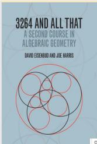

$\triangleright$ Ask the geometric questions properly.   
Hope the number of solutions to be a constant.

# Remark (Steiner 1848; Jonquieres 1859; Fulton-MacPherson 1978)

The number of conics tangent to 5 given conics in $\mathbb{CP}^2$ is 3264 (1859).

# A toy example on Schubert calculus

# Question

How many lines in the 3-space $\mathbb{CP}^3$ intersect four random lines $\ell_1, \ell_2, \ell_3, \ell_4$ ?

# A toy example on Schubert calculus

# Answer

Hermann Schubert (1848-1911): there are 2 such lines.

In 1879 H. Schubert published "Calculus of Enumerative Geometry"

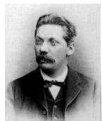

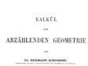

- Summit of the intersection theory in the 19th century.   
- Amazing applications to enumerative geometry, such as

The number of quadric surfaces tangent to 9 given quadric surfaces in general position in 3-space 666,841,088.   
The number of twisted cubic curves tangent to 12 given quadric surfaces in general position in 3-space is 5,819,539,783,680.

"Conservation of number principle":

$\sharp(solutions) < \infty$ for a special case $\Rightarrow$ Same number for general cases (assuming multiplicities have been counted properly).

David Hilbert (ICM 1900)

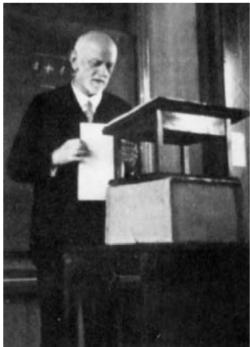

15. RIGOROUS FOUNDATION OF SCHUBERT'S NUMERATIVE CALCULUS.

The problem consists in this: To establish rigorously and with an exact determination of the limits of their validity those geometrical numbers which Schubert $\dagger$ especially has determined on the basis of the so-called principle of special position, or conservation of number, by means of the enumerative calculus developed by him.

Although the algebra of to-day guarantees, in principle, the possibility of carrying out the processes of elimination, yet for the proof of the theorems of enumerative geometry decidedly more is requisite, namely, the actual carrying out of the process of elimination in the case of equations of special form in such a way that the degree of the final equations and the multiplicity of their solutions may be foreseen.

A.Weil published "Foundations of Algebraic Geometry" in 1962

obtained a rigorous definition of the intersection number of subvarieties of a projective manifold   
The classical Schubert calculus amounts to the determination of the intersection rings of flag manifolds", i.e. the study of $H^{*}(G / P)$ .

# A quick review of cohomology

$X$ : nice space. $H^{*}(X) = H^{*}(X,\mathbb{Z})$ is a $\mathbb{Z}$ -algebra $\Longrightarrow$

- Can add and multiply two elements.   
Can tell $\sharp$ (intersection points of subspaces).

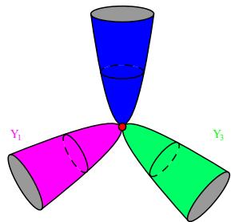

Reason: Nice subspaces $Z_{i} \subset X$ represent classes $[Z_i] \in H^* (X)$ s.t.

$\triangleright [Z_1 \cap Z_2] = [Z_1] \cdot [Z_2]$ .   
If $\dim Z_1 + \dim Z_2 = \dim X$ , then

$$
[ Z _ {1} ] \cdot [ Z _ {2} ] = \sharp (Z _ {1} \cap Z _ {2}) [ \mathrm {p t} ].
$$

# Quantum cohomology $QH^{*}$ and counting curves

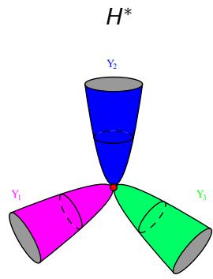

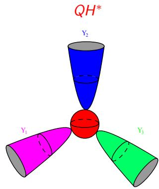

- $QH^{*}$ can solve difficult problems in enumerative geometry.   
- Quantum Schubert calculus: the study of $QH^{*}(G / P)$ .

# (Quantum) Schubert calculus and related fields

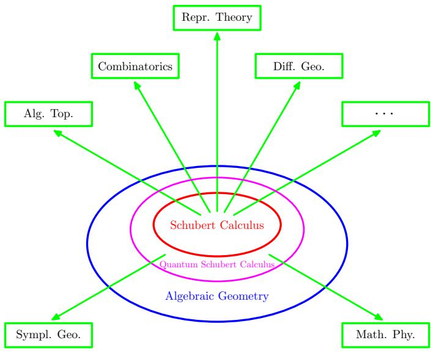

Warning: Distorted Proportion!

# Counting lines in 3-space: the cohomology approach.

$$
\begin{array}{l} X := \left\{\text {l i n e s} \in \mathbb {C P} ^ {3} \right\}. \\ \Omega_ {\ell_ {i}} := \{\text {l i n e s} \mathbb {C P} ^ {3} \text {i n t e r s e c t i n g} \ell_ {i} \} \subset X. \\ \left(\dim_ {\mathbb {C}} X = 4\right) \\ \left(\dim_ {\mathbb {C}} \Omega_ {\ell_ {i}} = 3\right) \\ \end{array}
$$

Question (Reinterpretation of the question of counting lines:)

$$
\# \left(\Omega_ {\ell_ {1}} \cap \Omega_ {\ell_ {2}} \cap \Omega_ {\ell_ {3}} \cap \Omega_ {\ell_ {4}}\right) = ?
$$

# Counting lines in 3-space: the cohomology approach.

$$
\begin{array}{l} X := \left\{\text {l i n e s} \in \mathbb {C P} ^ {3} \right\}. \\ \Omega_ {\ell_ {i}} := \{\text {l i n e s} \mathbb {C P} ^ {3} \text {i n t e r s e c t i n g} \ell_ {i} \} \subset X. \\ \left(\dim_ {\mathbb {C}} X = 4\right) \\ \left(\dim_ {\mathbb {C}} \Omega_ {\ell_ {i}} = 3\right) \\ \end{array}
$$

Question (Reinterpretation of the question of counting lines:)

$$
\# \left(\Omega_ {\ell_ {1}} \cap \Omega_ {\ell_ {2}} \cap \Omega_ {\ell_ {3}} \cap \Omega_ {\ell_ {4}}\right) = ?
$$

Schubert's idea in terms of the cohomological approach:

- $[\Omega_{\ell}] := [\Omega_{\ell_1}] = [\Omega_{\ell_2}] = [\Omega_{\ell_3}] = [\Omega_{\ell_4}] \in H^*(X)$ .

$$
[ \Omega_ {\ell} ] ^ {4} = [ \Omega_ {\ell_ {1}} \cap \Omega_ {\ell_ {2}} \cap \Omega_ {\ell_ {3}} \cap \Omega_ {\ell_ {4}} ] = \sharp (\Omega_ {\ell_ {1}} \cap \Omega_ {\ell_ {2}} \cap \Omega_ {\ell_ {3}} \cap \Omega_ {\ell_ {4}}) [ p t ].
$$

Remark

$$
X := \left\{\text {l i n e s i n} \mathbb {C P} ^ {3} \right\} = \left\{V \leqslant \mathbb {C} ^ {4} \mid \dim_ {\mathbb {C}} V = 2 \right\} =: G r (2, 4).
$$

# Schubert calculus for $H^{*}(Gr(2,4))$

$H^{*}(Gr(2,4))$ has a basis of Schubert classes, indexed by Young diagrams:

(0)

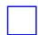

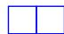

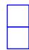

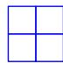

Here $[\Omega_{\ell}] = 1 \times 1$ rectangle, $[pt] = 2 \times 2$ rectangle.

Hence, answer $= 2$ , following from the following Pieri rule (Schubert calculus).

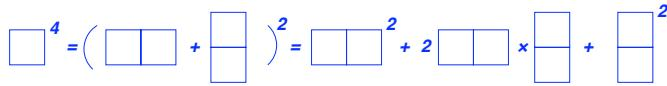

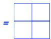

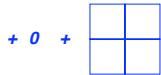

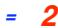

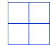

# Flag varieties $G / P \iff (\Delta, \Delta_P)$

- $G$ : a simply-connected complex simple Lie group (of rank $n$ ).

- $P$ : a parabolic subgroup of $G$ , i.e. a Lie subgroup of $G$ such that $G / P$ is a projective manifold.

- $G$ : a simply-connected complex simple Lie group (of rank $n$ ).

$G$ corresponds to one of the following Dynkin diagrams

$$
A _ {n}: \begin{array}{c c c c c} & \underset {\alpha_ {1}} {\circ \circ} & \underset {\alpha_ {2}} {\circ \circ} & \ldots & \underset {\alpha_ {n - 1}} {\circ \circ} \\ \hline & \alpha_ {2} & \alpha_ {3} & \alpha_ {n - 1} & \alpha_ {n} \end{array}
$$

$E_{6}$ ：

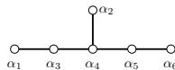

$$
B _ {n}: \quad \begin{array}{c c c c} \longrightarrow & \longrightarrow & \longrightarrow & \longrightarrow \\ \alpha_ {1} & \alpha_ {2} & - \longrightarrow & \alpha_ {n - 2} \\ \alpha_ {n - 1} & \alpha_ {n - 1} & \longrightarrow & \alpha_ {n} \end{array}
$$

$E_{7}$ ：

$$
C _ {n}: \quad \begin{array}{c c c c} \hline \alpha_ {1} & \alpha_ {2} & - \dots & \alpha_ {n - 1} \\ \hline \alpha_ {n - 1} & \alpha_ {n - 1} & \alpha_ {n - 1} & \alpha_ {n} \end{array}
$$

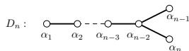

$E_{8}$ ：

$$
F _ {4}: \quad \begin{array}{c c c c} & \bigcirc & \bigcirc & \bigcirc \\ & \alpha_ {1} & \alpha_ {2} & \alpha_ {3} \\ & \alpha_ {4} & \alpha_ {5} & \alpha_ {6} \end{array}
$$

$G_{2}$ ：

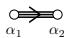

- $P$ : a parabolic subgroup of $G$ , i.e. a Lie subgroup of $G$ such that $G / P$ is a projective manifold.

- $G$ : a simply-connected complex simple Lie group (of rank $n$ ).

$G$ corresponds to one of the following Dynkin diagrams

$$
A _ {n}: \quad \begin{array}{c} \text {\raisebox {- 1 . 0 p t} {\scalebox {1 . 5} {\circ}}} \\ \alpha_ {1} \end{array} \quad \begin{array}{c} \text {\raisebox {- 1 . 0 p t} {\scalebox {1 . 5} {\circ}}} \\ \alpha_ {2} \end{array} \quad \begin{array}{c} \text {\raisebox {- 1 . 0 p t} {\scalebox {1 . 5} {\circ}}} \\ \alpha_ {3} \end{array} \quad \begin{array}{c} \text {\raisebox {- 1 . 0 p t} {\scalebox {1 . 5} {\circ}}} \\ \alpha_ {n - 1} \end{array} \quad \begin{array}{c} \text {\raisebox {- 1 . 0 p t} {\scalebox {1 . 5} {\circ}}} \\ \alpha_ {n} \end{array}
$$

$E_{6}$ ：

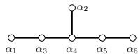

$$
B _ {n}: \quad \begin{array}{c c c c} \longrightarrow & \longrightarrow & \longrightarrow & \longrightarrow \\ \alpha_ {1} & \alpha_ {2} & - \longrightarrow & \alpha_ {n - 2} \\ \alpha_ {n - 1} & \alpha_ {n - 1} & \longrightarrow & \alpha_ {n} \end{array}
$$

$E_{7}$ ：

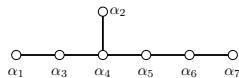

$$
C _ {n}: \quad \begin{array}{c c c c} \hline \alpha_ {1} & \alpha_ {2} & - \dots & \alpha_ {n - 1} \\ \hline \alpha_ {n - 1} & \alpha_ {n - 1} & \alpha_ {n - 1} & \alpha_ {n} \end{array}
$$

$$
D _ {n}: \begin{array}{c} \bigcirc \\ \alpha_ {1} \end{array} \begin{array}{c} \bigcirc \\ \alpha_ {2} \end{array} - \begin{array}{c} \bigcirc \\ \alpha_ {n - 3} \end{array} \begin{array}{c} \bigcirc \\ \alpha_ {n - 2} \end{array} \Bigg \langle \begin{array}{c} \bigcirc \\ \alpha_ {n - 1} \\ \alpha_ {n} \end{array}
$$

$E_{8}$ ：

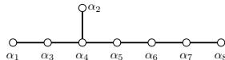

$$
F _ {4}: \quad \begin{array}{c c c c} & \bigcirc & \bigcirc & \bigcirc \\ & \alpha_ {1} & \alpha_ {2} & \alpha_ {3} \\ & \alpha_ {4} & \alpha_ {5} & \alpha_ {6} \end{array}
$$

$G_{2}$ ：

$\Delta \coloneqq \{\alpha_{1},\dots ,\alpha_{n}\}$ is a base.

- $P$ : a parabolic subgroup of $G$ , i.e. a Lie subgroup of $G$ such that $G / P$ is a projective manifold.

$P$ corresponds to a subset $\Delta_P$ of $\Delta$ . $B \leftrightarrow \Delta_B = \emptyset$

# Flag varieties of type $A_{n}$ : $G = SL\big(n + 1,\mathbb{C}\big)$

$$
\begin{array}{l} G / P = \left\{V _ {n _ {1}} \leqslant \dots \leqslant V _ {n _ {r}} \leqslant \mathbb {C} ^ {n + 1} \mid \dim V _ {n _ {j}} = n _ {j}, j = 1, \dots , r \right\} \\ =: F \ell_ {n _ {1}, \dots , n _ {r}; n + 1}, \quad \text {w h e r e} 1 \leq n _ {1} <   n _ {2} <   \dots <   n _ {r} \leq n. \\ \end{array}
$$

$$
\begin{array}{l} \begin{array}{l} \square G / B = F \ell_ {1, 2, \dots , n; n + 1} =: F \ell_ {n + 1}. \end{array} \\ F \ell_ {4} = \left\{V _ {1} \leqslant V _ {2} \leqslant V _ {3} \leqslant \mathbb {C} ^ {4} \mid \dim V _ {j} = j, 1 \leq j \leq 3 \right\} \\ \end{array}
$$

$$
G / P = G r (k, n + 1) = F \ell_ {k; n + 1}, \text {t h e n} \Delta_ {P} = \Delta \backslash \left\{\alpha_ {k} \right\}.
$$

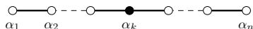

- $W = S_{n}, \quad W^{P} = \{w \in S_{n} \mid w(i) < w(i + 1), \forall i \notin \{n_{1}, \dots, n_{r}\}\}$

$$
\ell : W \to \mathbb {Z} _ {\geq 0}
$$

$w_{0} = \overline{n\cdots 21}$ : the longest element in $W$ .

- Schubert varieties $X_{w}(E_{\bullet})$ of codimension $\ell(w)$ w.r.t. a complete flag:

$$
X _ {w} \left(E _ {\bullet}\right) = \left\{V _ {\bullet} \in F \ell_ {n _ {\bullet}} \mid \dim \left(V _ {n i} \cap E _ {j}\right) \geq m \left(n _ {i}, j\right), \forall i, j \right\}
$$

Schubert classes $\sigma_w = P.D.[X_w(E_\bullet)]\in H^{2\ell (w)}(F\ell_{n_\bullet},\mathbb{Z})$

$$
H ^ {*} (F \ell_ {n _ {\bullet}}, \mathbb {Z}) = \bigoplus_ {w \in W ^ {P}} \mathbb {Z} \sigma_ {w}, \qquad H ^ {2} (F \ell_ {n _ {\bullet}}, \mathbb {Z}) = \bigoplus_ {i = 1} ^ {r} \mathbb {Z} \sigma_ {s _ {n _ {i}}}.
$$

# Example: $F\ell_{n_{\bullet}} = Gr(k, n)$

$W^{P} = \{w\in S_{n}\Big|_{\substack{w(1) <   w(2) <   \dots <  w(k),\\ w(k + 1) <   w(k + 2) <   \dots <  w(n)}}^{\substack{w(1) <   w(2) <   \dots <  w(k),\\ w(k + 1) <   w(k + 2) <   \dots <  w(n)}}$ .

$$
\mathcal {P} _ {k, n} = \{\lambda \in \mathbb {Z} ^ {k} \mid n - k \geq \lambda_ {1} \geq \lambda_ {2} \geq \dots \geq \lambda_ {k} \geq 0 \}.
$$

$$
W ^ {P} \xrightarrow {\cong} \mathcal {P} _ {k, n}; w \mapsto \lambda (w) = (w (k) - k, \dots , w (2) - 2, w (1) - 1)
$$

Example $(\lambda = (5,2,1,1)\in \mathcal{P}_{4,10})$

Young diagram of $\lambda$ : $\begin{array}{c} \square \quad \square \quad \square \quad \square \\ \square \quad \square \\ \square \quad \square \\ \square \end{array}$ $(w(1),\dots ,w(k)) = (2,3,5,9)$

Schubert varieties $X_{w}(E_{\bullet}) = X_{\lambda (w)}(E_{\bullet})$

$$
X _ {\lambda (w)} \left(E _ {\bullet}\right) = \{V \in G r (k, n) \mid \dim \left(V \cap E _ {n - k + j - \lambda_ {j}}\right) \geq j, \forall 1 \leq j \leq k \}.
$$

# Quantum cohomology of $F\ell_{n_{\bullet}}$

- $QH^{*}(F\ell_{n_{\bullet}}) = (H^{*}(F\ell_{n_{\bullet}})\otimes \mathbb{Q}[q_{1},\dots ,q_{r}],\star)$

$$
\sigma_ {u} \star \sigma_ {v} = \sum_ {w \in W ^ {P}, d \in H _ {2} (F \ell_ {n _ {\bullet}}, \mathbb {Z})} N _ {u, v} ^ {w, d} q ^ {d} \sigma_ {w}
$$

$\begin{array}{r}N_{u,v}^{w,d} = \sharp \{\text{rational curves of degree } d\text{ passing through} X_u(E_\bullet),X_v(\tilde{E}_\bullet),X_{w_0w}(\hat{E}_\bullet)\} \in \mathbb{Z}_{\geq 0} \end{array}$   
$\begin{array}{r}N_{u,v}^{w,d} = \int_{\overline{\mathcal{M}}_{0,3}}(F\ell_{n_{\bullet}},d)ev_1^* (\sigma_u)\cup ev_2^* (\sigma_v)\cup ev_3^* (\sigma_{w_0w}):genus 0, \end{array}$ 3-point Gromov-Witten invariant   
$\begin{array}{r}\mathcal{N}_{u,v}^{w,d} = 0\mathrm{unless}\ell (u) + \ell (v) = \ell (w) + \langle c_1(F\ell_{n_\bullet}),d\rangle \end{array}$ and $d\geq 0$

$$
c _ {1} \left(F \ell_ {n _ {\bullet}}\right) = \sum_ {j = 1} ^ {r} \left(n _ {j + 1} - n _ {j - 1}\right) \sigma_ {s _ {n _ {j}}} \quad \left(n _ {0} := 0, n _ {r + 1} := n\right)
$$

$\sigma_{u}\star \sigma_{v}|_{\mathbf{q} = \mathbf{0}} = \sigma_{u}\cup \sigma_{v}$

# Example: $QH^{*}(X)$ for $X = \mathbb{CP}^1 = \mathbb{C}\bigsqcup \{\infty\}$ .

- $[\mathbb{CP}^1]$ and [pt] form a $\mathbb{Z}[q]$ -basis of $QH^{*}(\mathbb{CP}^{1})$ .   
Gromov-Witten invariant $N_{[pt],[pt]}^{[\mathbb{CP}^1],1} = 1$

# Example: $QH^{*}(X)$ for $X = \mathbb{CP}^{1} = \mathbb{C}\bigsqcup \{\infty\}$ .

- $[\mathbb{CP}^1]$ and [pt] form a $\mathbb{Z}[q]$ -basis of $QH^{*}(\mathbb{CP}^{1})$ .   
Gromov-Witten invariant $N_{[pt],[pt]}^{[\mathbb{CP}^1],1} = 1$

- Stable maps: $f \in \operatorname{Aut}(\mathbb{CP}^1)$ is uniquely determined by 3 points.

# Example: $QH^{*}(X)$ for $X = \mathbb{CP}^1 = \mathbb{C}\bigsqcup \{\infty\}$ .

- $[\mathbb{CP}^1]$ and [pt] form a $\mathbb{Z}[q]$ -basis of $QH^{*}(\mathbb{CP}^{1})$ .   
Gromov-Witten invariant $N_{[pt],[pt]}^{[\mathbb{CP}^1],1} = 1$

- Stable maps: $f \in \operatorname{Aut}(\mathbb{CP}^1)$ is uniquely determined by 3 points.   
$\triangleright$ Geometrically,

represented by (denote $z\coloneqq [\mathrm{pt}],e = [\mathbb{CP}^1 ]$ )

$$
z \star z = 1 \cdot q \cdot e
$$

# Example: $QH^{*}(X)$ for $X = \mathbb{CP}^1 = \mathbb{C}\bigsqcup \{\infty\}$ .

- $[\mathbb{CP}^1]$ and [pt] form a $\mathbb{Z}[q]$ -basis of $QH^{*}(\mathbb{CP}^{1})$ .   
Gromov-Witten invariant $N_{[pt],[pt]}^{[\mathbb{CP}^1],1} = 1$

- Stable maps: $f \in \operatorname{Aut}(\mathbb{CP}^1)$ is uniquely determined by 3 points.   
$\triangleright$ Geometrically,

represented by (denote $z\coloneqq [\mathrm{pt}],e = [\mathbb{CP}^1 ]$ )

$$
z \star z = 1 \cdot q \cdot e
$$

In fact,

$$
Q H ^ {*} (\mathbb {C P} ^ {1}) \stackrel {{\mathrm {a l g}}} {{=}} \frac {\mathbb {Q} [ z , q ]}{\langle z ^ {2} - q \rangle}.
$$

- Quantum cohomology/Gromov-Witten invariants are defined under a much more general framework.   
- NON-trivial fact: $QH^{*}(X)$ is an associative algebra.   
- Lack of functoriality: $f: X \to Y \not\Rightarrow Qf^{*}: QH^{*}(Y) \to QH^{*}(X)$ (Note $f$ induces an algebra morphism $f^{*}: H^{*}(Y) \to H^{*}(X).$ )   
- Closely related with mirror symmetry in mathematical physics.

A (nice) presentation $QH^{*}(G / P) = \mathbb{Q}[\mathbf{x}] / I$ .

Example (Givental-Kim (1990s),...)

$$
Q H ^ {*} (F \ell_ {n}) = \frac {\mathbb {Q} [ x _ {1} , \ldots , x _ {n} , q _ {1} , \ldots , q _ {n - 1} ]}{(E _ {1} (x) , \ldots , E _ {n} (x))}
$$

where $E_{i}(x)$ is the coefficient of the characteristic polynomial of

$$
\left[ \begin{array}{c c c c c} x _ {1} & - 1 & 0 & \dots & 0 \\ q _ {1} & x _ {2} & - 1 & \dots & 0 \\ 0 & q _ {2} & x _ {3} & \dots & 0 \\ \vdots & \vdots & \vdots & \ddots & \vdots \\ 0 & 0 & 0 & \dots & x _ {n} \end{array} \right]
$$

$$
q = 0 \quad \rightsquigarrow \quad H ^ {*} (F \ell_ {n}) = \frac {\mathbb {Q} [ x _ {1} , \ldots , x _ {n} ]}{(e _ {1} (x) , \ldots , e _ {n} (x))}
$$

A (nice) presentation $QH^{*}(G / P) = \mathbb{Q}[\mathbf{x}] / I$ .   
Schubert polynomial of $\sigma_w$   
A (positive) combinatorial formula/algorithm for $N_{u,v}^{w,d}$   
4 1

# Remark

Equivariant/K-theoretic (quantum)/affine Schubert calculus

- A fascinating geometric phenomenon discovered in string theory.

Symplectic geometry

A-model

X: Fano

Complex geometry

B-model

$$
f: \check {X} \to \mathbb {C}
$$

Expectations:

$\begin{array}{rlr}{QH^{*}(X)} & \cong & {Jac(f)} \end{array}$   
$\triangleright$ {eigenvalues of $c_{1}\} \longleftrightarrow \{$ critical values of $f\}$   
$\triangleright$ Isomorphism as $D$ -modules   
$\triangleright$ Isomorphism as Frobenius manifolds.   
…

- Hori-Vafa mirror for (complete intersections in) toric manifolds (1990s)   
- "toric mirror" for $X = F\ell_{a_1,\dots ,a_k;n + 1}$ : $Y = (\mathbb{C}^{*})^{N}$ .

$\triangleright Gr(k,n + 1)$ : Eguchi-Hori-Xiong (1997)   
$\nvdash$ $F\ell_{n + 1}$ :Givental (1998)   
$\triangleright$ $F\ell_{a_1,\dots ,a_k;n + 1}$ : Batyrev-Ciocan-Fontanine-Kim-Straten (2000), Nishinou-Nohara-Ueda (2010)

- Rietsch's mirror: $Y = G^{\vee} / P^{\vee} \backslash -K_{G^{\vee} / P^{\vee}}$

$G / P$ :Rietsch (2008)   
$\triangleright$ Gr(k,n+1): Marsh-Rietsch (2020)   
$\nvdash$ $F \ell_{n_{\bullet}}$ : Li-Rietsch-Yang-Zhang

- Other mirrors

$\nvdash$ $F\ell_{n_*}$ : Kalashnikov (2020)   
V//G: Gu - Sharpe (2018)

# Main Results (in progress)

# Theorem (L.-Rietsch-Yang-Zhang)

Express Rietsch's superpotential in Plücker coordinates for all $F\ell_{n_{\bullet}}$

# Theorem (L.-Rietsch-Yang-Zhang)

$c_{1}\mapsto [f_{\mathrm{Rie}}]$ for all $F\ell_{n_{\bullet}}$

- Consequently, eigenvalues of $c_{1}$ correspond to critical values of $f_{\mathrm{Rie}}$ .   
- Toric Fano manifolds: Auroux (2007)

# Rietsch's superpotential in Plücker coordinates

- For $Gr(k, n)$ : $f_{MR} = f_{+}$   
#

# Theorem (L.-Rietsch-Yang-Zhang)

Let $(q_{n_1},\dots ,q_{n_r})$ denote the coordinates of $(\mathbb{C}^*)^r = \prod_{i\in I^Q}\mathbb{C}_q^*$ . The superpotential $f_{-}:F_{\ell_{n_{\bullet}}}\setminus -K_{F_{\ell_{n_{\bullet}}}}\times (\mathbb{C}^{*})^{r}\longrightarrow \mathbb{C}$ is precisely given by

$$
\begin{array}{l} f _ {-} = \sum_ {i = 1} ^ {n _ {1} - 1} \frac {p _ {[ n ] \backslash (\{i \} \cup [ i + 2 , n - n _ {1} + i ])}}{p _ {[ n ] \backslash [ i + 1 , n - n _ {1} + i ]}} + \sum_ {j = 1} ^ {r - 1} \sum_ {i = n _ {j} + 1} ^ {n _ {j + 1} - 1} S _ {i} ^ {(j)} + \sum_ {i = n _ {r} + 1} ^ {n - 1} \frac {p _ {[ i - n _ {r} + 1 , i + 1 ] \backslash \{i \}}}{p _ {[ i - n _ {r} + 1 , i ]}} \\ + \sum_ {j = 1} ^ {r} \frac {p _ {[ n _ {j} - 1 ] \cup \{n _ {j} + 1 \}}}{p _ {[ n _ {j} ]}} + \sum_ {j = 1} ^ {r} q _ {n _ {j}} \frac {p _ {\{n - n _ {j + 1} + 1 \} \cup [ n - n _ {j} + 1 , n ] \backslash \{n - n _ {j - 1} \}}}{p _ {[ n - n _ {j} + 1 , n ]}}; \\ \end{array}
$$

# Rietsch's superpotential in Plücker coordinates

$$
\begin{array}{l} S_{i}^{(j)} = \frac{\sum_{\substack{J\in\binom{\left[\min\{i + 1,\hat{i}\} \right]\setminus\{i\}}{i - n_{j}}}\epsilon(J)(-1)^{|J|}p_{[i - 1]\cup\{i + 1\} \setminus J}\cdot p_{J\cup[\hat{i} +1,n]}}{\sum_{J\in\binom{\left[\min\{i,\hat{i}\}\right]}{i - n_{j}}}(-1)^{|J|}p_{[i}\setminus J}\cdot p_{J\cup[\hat{i} +1,n]}} \\ \text {w h e r e} \hat {i} = n - n _ {j + 1} + i - n _ {j} \text {a n d} \epsilon (J) = \left\{ \begin{array}{l l} 1, & \text {i f} i + 1 \notin J, \\ - 1, & \text {i f} i + 1 \in J. \end{array} \right. \\ \end{array}
$$

$$
\begin{array}{l} \text {E x a m p l e} \left(F I _ {3}: z _ {2 3} = z _ {2} z _ {1 3} - z _ {3}\right) \\ \bullet f _ {-} = z _ {2} + z _ {1 3} + q _ {1} \frac {z _ {2}}{z _ {3}} + q _ {2} \frac {z _ {1 3}}{z _ {2 3}} \\ \end{array}
$$

# Example: $f_{-}$ for $F\ell_{1,n - 1;n}$

The superpotential of $F\ell_{1,n-1;n}$ is

$$
f _ {-} = \sum_ {i = 1} ^ {n - 1} \frac {p _ {i + 1} p _ {\hat {i}}}{\sum_ {l = 1} ^ {i} (- 1) ^ {i - l} p _ {l} p _ {\hat {l}}} + q _ {1} \frac {p _ {2}}{p _ {n}} + q _ {n - 1} \frac {p _ {n - 1}}{p _ {\hat {1}}}
$$

where $p_{j} \coloneqq p_{[1,n] \setminus \{j\}}$ , $p_{I}$ are Plucker coordinates the following matrix

$$
\left( \begin{array}{c c c c c c} * & * & \ldots & * & * & 1 \\ * & * & \ldots & * & - 1 & 0 \\ * & * & \ddots & \ddots & 0 & 0 \\ \vdots & \vdots & \ddots & \ddots & \vdots & \vdots \\ * & - 1 & 0 & \dots & 0 & 0 \\ (- 1) ^ {n - 1} & 0 & 0 & \dots & 0 & 0 \end{array} \right) _ {n \times n}.
$$

# Theorem (Example)

There is a ring isomorphism $\theta: \operatorname{Jac}(f) \longrightarrow QH(F\ell_{1,n-1;n})$ . Moreover,

$\theta \left(\frac{p_{i + 1}p_i}{\sum_{l = 1}^{i}(-1)^{i - l}p_lp_l}\right) = \sigma_{s_{n - 1}}$ if $i = 1$   
$\theta \left(\frac{p_{i + 1}p_i}{\sum_{l = 1}^{i}(-1)^{i - l}p_lp_l}\right) = \sigma_{s_1} + \sigma_{s_{n - 1}}$ if $2\leq i\leq n - 2$   
$\theta \left(\frac{p_{i + 1}p_{\hat{i}}}{\sum_{l = 1}^{i}(-1)^{i - l}p_{l}p_{\hat{l}}}\right) = \sigma_{s_1},$ if $i = n - 1$   
$\theta \left(q_{1}\frac{p_{2}}{p_{n}}\right) = \sigma_{s_{1}}$   
$\theta \left(q_{n - 1}\frac{p_{n - 1}}{p_1}\right) = \sigma_{s_{n - 1}}$

In particular,

$$
\theta (f) = c _ {1}.
$$

# Identities arising from mirror symmetry

Assuming $n_j + n_{j+1} \leq n$ for some $j$ , and for any $n - n_{j+1} < i < n - n_j$ , let $d := i - n + n_{j+1}$ . Then for any $J = \{j_1 < \dots < j_d\} \subseteq [n_j + d]$ , we define a permutation $w_J$ explicitly, we find

# Theorem (L.-Rietsch-Yang-Zhang)

The following identity holds in $QH^{*}(F\ell_{n_{\bullet}})$ .

$$
\sum_ {J} (- 1) ^ {| J |} \sigma_ {w _ {J}} \sigma_ {[ n _ {j} + d ] \backslash J} = 0
$$

where $|J| \coloneqq j_1 + \dots + j_d$ .

# The definition of $w_{J}$

Let $\{x_{1} <   \dots <  x_{i - d}\} \coloneqq [i]\backslash J$

If $n_j \geq d$ , then $w_j$ is the following

$$
\begin{array}{l} \{w (1) <   \dots <   w \left(n _ {j}\right) \} = \left\{j _ {1} <   j _ {2} <   \dots <   j _ {d} <   i + 1 <   i + 2 <   \dots <   i + n _ {j} - d \right\} \\ \{w \left(n _ {j} + 1\right) <   \dots <   w \left(n _ {j + 1}\right) \} = \left\{x _ {1} <   i + n _ {j} - d + 1 <   i + n _ {j} - d + 2 <   \dots <   n - 1 \right\} \\ \{w \left(n _ {j + 1} + 1\right) <   \dots <   w \left(n _ {j + 2}\right) \} = \left\{x _ {2} <   \dots <   x _ {n _ {j + 2} - n _ {j + 1}} <   n \right\} \\ \{w (n _ {j + 2} + 1) <   \dots <   w (n) \} = \left\{x _ {n _ {j + 2} - n _ {j + 1} + 1} <   \dots <   x _ {i - d} \right\} \\ \end{array}
$$

If $n_j < d$ , then $w_{J}$ is defined only when $x_{1} < j_{hj + 1}$ .

$$
\begin{array}{l} \{w (1) <   \dots <   w \left(n _ {j}\right) \} = \left\{1 <   \dots <   x _ {1} - 1 <   x _ {1} + 1 <   \dots <   n _ {j} + 1 \right\} \\ \{w \left(n _ {j} + 1\right) <   \dots <   w \left(n _ {j + 1}\right) \} = \left\{x _ {1} <   j _ {n _ {j} + 1} <   \dots <   j _ {d} <   i + 1 <   \dots <   n - 1 \right\} \\ \{w (n _ {j + 1} + 1) <   \dots <   w (n _ {j + 2}) \} = \{x _ {2} <   \dots <   x _ {n _ {j + 2} - n _ {j + 1}} <   n \} \\ \{w (n _ {j + 2} + 1) <   \dots <   w (n) \} = \left\{x _ {n _ {j + 2} - n _ {j + 1} + 1} <   \dots <   x _ {i - d} \right\} \\ \end{array}
$$

We have $n_j = 2$ , $n_{j+1} = 4$ and $i = 4, d = 1$ , the identity is

$$
\sigma_ {1 5 2 6 3 4 7} \cdot \sigma_ {2 3 1 4 5 6 7} - \sigma_ {2 5 1 6 3 4 7} \cdot \sigma_ {1 3 2 4 5 6 7} + \sigma_ {3 5 1 6 2 4 7} \cdot \sigma_ {1 2 3 4 5 6 7} = 0
$$

$$
\sigma_ {1 5 2 6 3 4 7} \star \sigma_ {2 3 1 4 5 6 7} - \sigma_ {2 5 1 6 3 4 7} \star \sigma_ {1 3 2 4 5 6 7} + \sigma_ {3 5 1 6 2 4 7} \star \sigma_ {1 2 3 4 5 6 7} = 0
$$

The assumption $n_j + n_{j+1} \leq n$ can be removed. For example in $F\ell_{3,5;7}$ we find the following identity

$$
\sigma_ {1 4 5 2 6 3 7} \cdot \sigma_ {2 3 4 1 5 6 7} - \sigma_ {2 4 5 1 6 3 7} \cdot \sigma_ {1 3 4 2 5 6 7} + \sigma_ {3 4 5 1 6 2 7} \cdot \sigma_ {1 2 4 3 5 6 7} = 0
$$

$$
\sigma_ {1 4 5 2 6 3 7} \star \sigma_ {2 3 4 1 5 6 7} - \sigma_ {2 4 5 1 6 3 7} \star \sigma_ {1 3 4 2 5 6 7} + \sigma_ {3 4 5 1 6 2 7} \star \sigma_ {1 2 4 3 5 6 7} = 0
$$

# The proof of the identity

The key observation of the proof is that $w_{J}$ is always a 321-avoiding permutation.

# Definition

A permutation $w$ is called 321-avoiding if there does not exist $i < j < k$ such that $w(i) > w(j) > w(k)$ .

# Lemma

$w_{J}$ is always a 321-avoiding permutation.

# Remark

Therefore we can use the (quantum version) determinantal formula for Schubert class indexed by a 321-avoiding permutation.

# The skew partition of a 321-avoiding permutation

# Definition

Let $w \in S_n$ be a permutation, then the code of $w$ is defined as $c(w) = (c_1, c_2, \dots)$ , where $c_i := \sharp \{j | i < j, w(j) < w(i)\}$ .

# Definition

Let $w$ be a 321-avoiding permutation with code $c(w) = (c_1, \dots, c_n)$ .

The flag of the partition is defined as

$\phi(w) = \{j_1 < j_2 < \dots < j_l\} := \{j | c_j > 0\}$ . We define a skew partition $\lambda / \mu$ by embedding it into $\mathbb{Z} \times \mathbb{Z}$ as follows:

$$
\begin{array}{l} \lambda_ {k} - \mu_ {k} = c _ {j _ {k}} \\ \lambda / \mu = \left\{\left(k, h\right): 1 \leq k \leq l, k - j _ {k} - c _ {j _ {k}} + 1 \leq h \leq k - j _ {k} \right\} \\ \end{array}
$$

If $w = 1526347$ , then the code of $w$ is $c(w) = (0, 3, 0, 2, 0, 0, 0)$ . And we have $\{j_1 < j_2\} = \{2 < 4\}$ with $l = 2$ . Then we have

$$
k = 1, 1 - 2 - 3 + 1 \leq h \leq 1 - 2
$$

$$
k = 2, 2 - 4 - 2 + 1 \leq h \leq 2 - 4
$$

Therefore, the skew partition is $\square \square \square$ with $\lambda = (3,2)$ and $\mu = (0,0)$ .

If $w = 2516347$ , then the code of $w$ is $c(w) = (1, 3, 0, 2, 0, 0, 0)$ with flag $\phi(w) = \{1, 2, 4\}$ . Then

$$
k = 1, 1 - 1 - 1 + 1 \leq h \leq 1 - 1
$$

$$
k = 2, 2 - 2 - 3 + 1 \leq h \leq 2 - 2
$$

$$
k = 3, 3 - 4 - 2 + 1 \leq h \leq 3 - 4
$$

Therefore, the skew partition is $\lambda / \mu = \square$ with $\lambda = (3, 3, 2)$ and $\mu = (2, 0, 0)$ .

If $w = 3516247$ , then the code of $w$ is $c(w) = (2, 3, 0, 2, 0, 0, 0)$ with flag $\phi(w) = \{1, 2, 4\}$ . Then

$$
k = 1, 1 - 1 - 2 + 1 \leq h \leq 1 - 1
$$

$$
k = 2, 2 - 2 - 3 + 1 \leq h \leq 2 - 2
$$

$$
k = 3, 3 - 4 - 2 + 2 + 1 \leq h \leq 3 - 4
$$

Therefore, the skew partition is $\lambda / \mu = \begin{bmatrix} & & \\ & & \\ & & \end{bmatrix}$ with $\lambda = (3, 3, 2)$ and $\mu = (1, 0, 0)$ .

# Theorem (S.Billey, W. Jockusch and R.P. Stanley)

Let $w$ be a 321-avoiding permutation with flag $\phi(w) = (\phi_1 < \dots < \phi_k)$ and skew partition $\lambda / \mu$ . Let $X_i = (x_1, x_2, \dots, x_i)$ . Then we have

$$
\mathfrak {S} _ {w} = \det  \left(h _ {\lambda_ {i} - \mu_ {j} - i + j} \left(X _ {\phi_ {i}}\right)\right) _ {1 \leq i, j \leq k}
$$

where $h_r(X_i)$ is the complete homogeneous symmetric function in the variables $X_i$ of degree $r$ .

The quantum version of the above determinantal formula is conjectured by A.N. Kirillov. We prove the conjecture in the quantum cohomology ring of the complete flag variety $F\ell_{n}$ .

# Theorem

Let $w$ be a 321-avoiding permutation with flag $\phi(w) = (\phi_1 < \dots < \phi_k)$ and skew partition $\lambda/\mu$ . Let $X_i = (x_1, x_2, \dots, x_i)$ . Then in $\mathbb{Z}[q, x]/I_n^q \cong QH^*(F\ell_n)$ we have

$$
\mathfrak {S} _ {w} ^ {q} = \det  \big (H _ {\lambda_ {i} - \mu_ {j} - i + j} \big (X _ {\phi_ {i}} \big) \big) _ {1 \leq i, j \leq k}
$$

# Proving the identity in $QH(F\ell_{n})$

Using the above formula, we are able to establish the identity in $QH(F\ell_{n})$ with the same $w_{J}$ from $F\ell_{n_1,\dots ,n_r;n}$ , however.

In order to prove

$$
\sigma_ {1 5 2 6 3 4 7} \cdot \sigma_ {2 3 1 4 5 6 7} - \sigma_ {2 5 1 6 3 4 7} \cdot \sigma_ {1 3 2 4 5 6 7} + \sigma_ {3 5 1 6 2 4 7} \cdot \sigma_ {1 2 3 4 5 6 7} = 0
$$

$$
\sigma_ {1 5 2 6 3 4 7} = \det  \left( \begin{array}{c c c} 1 & h _ {4} (X _ {1}) & h _ {5} (X _ {1}) \\ 0 & h _ {3} (X _ {2}) & h _ {4} (X _ {2}) \\ 0 & h _ {1} (X _ {4}) & h _ {2} (X _ {4}) \end{array} \right), \sigma_ {2 3 1 4 5 6 7} = \det  \left( \begin{array}{c c} h _ {1} (X _ {2}) & h _ {2} (X _ {1}) \\ h _ {0} (X _ {2}) & h _ {1} (X _ {1}) \end{array} \right)
$$

$$
\sigma_ {2 5 1 6 3 4 7} = \det  \left( \begin{array}{c c c} h _ {1} (X _ {1}) & h _ {4} (X _ {1}) & h _ {5} (X _ {1}) \\ h _ {0} (X _ {2}) & h _ {3} (X _ {2}) & h _ {4} (X _ {2}) \\ h _ {- 2} (X _ {4}) & h _ {1} (X _ {4}) & h _ {2} (X _ {4}) \end{array} \right), \sigma_ {1 3 2 4 5 6 7} = \det  \left( \begin{array}{c c} h _ {1} (X _ {2}) & h _ {2} (X _ {1}) \\ h _ {- 1} (X _ {2}) & h _ {0} (X _ {1}) \end{array} \right)
$$

$$
\sigma_ {3 5 1 6 2 4 7} = \det  \left( \begin{array}{c c c} h _ {2} (X _ {1}) & h _ {4} (X _ {1}) & h _ {5} (X _ {1}) \\ h _ {1} (X _ {2}) & h _ {3} (X _ {2}) & h _ {4} (X _ {2}) \\ h _ {- 1} (X _ {4}) & h _ {1} (X _ {4}) & h _ {2} (X _ {4}) \end{array} \right), \sigma_ {1 2 3 4 5 6 7} = \det  \left( \begin{array}{c c} h _ {0} (X _ {2}) & h _ {1} (X _ {1}) \\ h _ {- 1} (X _ {2}) & h _ {0} (X _ {1}) \end{array} \right)
$$

# It suffices to prove that

$$
\begin{array}{l} 1 \times \det  \left( \begin{array}{c c} h _ {1} (X _ {2}) & h _ {2} (X _ {1}) \\ h _ {0} (X _ {2}) & h _ {1} (X _ {1}) \end{array} \right) - h _ {1} (X _ {1}) \det  \left( \begin{array}{c c} h _ {1} (X _ {2}) & h _ {2} (X _ {1}) \\ h _ {- 1} (X _ {2}) & h _ {0} (X _ {1}) \end{array} \right) + h _ {2} (X _ {1}) \det  \left( \begin{array}{c c} h _ {0} (X _ {2}) & h _ {1} (X _ {1}) \\ h _ {- 1} (X _ {2}) & h _ {0} (X _ {1}) \end{array} \right) = 0 \\ - h _ {0} (X _ {2}) \det {\left( \begin{array}{c c} h _ {1} (X _ {2}) & h _ {2} (X _ {1}) \\ h _ {- 1} (X _ {2}) & h _ {0} (X _ {1}) \end{array} \right)} + h _ {1} (X _ {2}) \det {\left( \begin{array}{c c} h _ {0} (X _ {2}) & h _ {1} (X _ {1}) \\ h _ {- 1} (X _ {2}) & h _ {0} (X _ {1}) \end{array} \right)} = 0 \\ \end{array}
$$

These follow from the Laplace expansion of

$$
\begin{array}{l} \det  \left( \begin{array}{c c c} h _ {2} (X _ {1}) & h _ {1} (X _ {2}) & h _ {2} (X _ {1}) \\ h _ {1} (X _ {1}) & h _ {0} (X _ {2}) & h _ {1} (X _ {1}) \\ 1 = h _ {0} (X _ {1}) & h _ {- 1} (X _ {2}) & h _ {0} (X _ {1}) \end{array} \right) = 0 \\ \det  \left( \begin{array}{c c c} h _ {1} (X _ {2}) & h _ {1} (X _ {2}) & h _ {2} (X _ {1}) \\ h _ {0} (X _ {2}) & h _ {0} (X _ {2}) & h _ {1} (X _ {1}) \\ 0 = h _ {- 1} (X _ {2}) & h _ {- 1} (X _ {2}) & h _ {0} (X _ {1}) \end{array} \right) = 0 \\ \end{array}
$$

The above strategy works in general, therefore we have

# Lemma

With same notations as before, the following identity holds in the quantum cohomology ring $QH^{*}(F\ell_{n})$ .

$$
\sum_ {J} (- 1) ^ {| J |} \sigma_ {w _ {J}} \sigma_ {[ 1, n _ {j} + d ] \backslash J} = 0
$$

# Remark

A "further argument" reduces the above identity to that for $QH^{*}\bigl (F\ell \bigl (n_{1},\dots ,n_{r};n\bigr).$

# Thank you!!…