# Schubert calculus– A brief introduction

Changzheng Li

Sun Yat-sen University

J-BJI, October 12, 2023

# "Algebra" in mind

$$
\begin{array}{l} \mathbb {N} = \{0, 1, 2, \dots \} \\ \begin{array}{c c c c c} \mathbb {Z}, & \mathbb {Q}, & \mathbb {R}, & \mathbb {C} & (\mathbb {H}, \quad \mathbb {O}) \end{array} \\ \bullet a x = b \quad \Longrightarrow \quad x =? \\ \bullet (\mathbb {Q}, +, \cdot , 0, 1) \\ \end{array}
$$

$$
(a + b) (c + d) = a c + a d + b c + b d
$$

# "Geometry" in mind

- Geometric objects (with figure from https://snexplores.org/article/scientists-say-geometry)

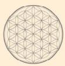

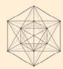

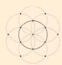

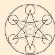

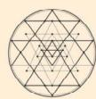

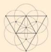

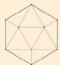

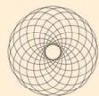

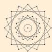

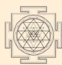

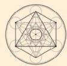

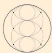

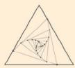

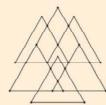

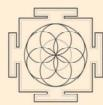

# Enumerative Geometry: a branch of Algebraic Geometry

- Counting numbers of solutions to geometric questions

# Theorem (Apollonius of Perga (c. 262 BC -190 BC))

The number of circles tangent to 3 given circles in a plane is 8.

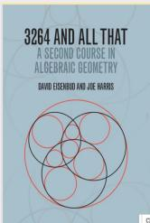

In general,

$\triangleright$ Ask the geometric questions property.   
- Hope the number of solutions to be a constant, independent of the positions of given geometric objects.

Example.

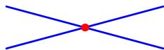

Line $\cap$ Line $=$ pt

Line $\cap$ Line $=\emptyset$

Example.

Line $\cap$ Line $=$ pt

Line $\cap$ Line $= \emptyset$

Image: Line $\cap$ Line $=$ "oo".

number of solutions stay the same.

# Intersections in the plane: $\sharp \left(\text { Line } \cap \text { Conic }\right) = ?$

Conic:

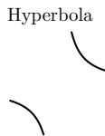

# Intersections in the plane: $\sharp \left(\text { Line } \cap \text { Conic }\right) = ?$

Conic:

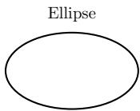

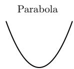

Example. Line: $y = a$ . Parabola: $y = x^2$ .

$\sharp (\text{Line} \bigcap \text{Parabola}) = \sharp \{\text{solutionst to } x^2 = a\}$ .

# Intersections in the plane: $\sharp \left(\text { Line } \cap \text { Conic }\right) = ?$

Conic:

Example. Line: $y = a$ . Parabola: $y = x^2$ .

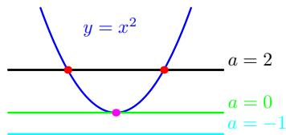

$$
\sharp (\text {L i n e} \bigcap \text {P a r a b o l a}) = \sharp \{\text {s o l u t i o n s t o} x ^ {2} = a \}.
$$

$$
\equiv 2, \mathrm {I F}
$$

Solve the equation over $\mathbb{C}$ and count multiplicities of the roots.

# Complex projective spaces $\mathbb{CP}^n$

Aim: number of solutions stay the same for a given geometric problem.

# Complex projective spaces $\mathbb{CP}^n$

Aim: number of solutions stay the same for a given geometric problem. Conclusion:

Work in $n$ -space $\mathbb{CP}^n$ (a compactification of $\mathbb{C}^n$

- Count "multiplicities".

# Complex projective spaces $\mathbb{CP}^n$

# Aim: number of solutions stay the same for a given geometric problem. Conclusion:

Work in $n$ -space $\mathbb{CP}^n$ (a compactification of $\mathbb{C}^n$

1-space: $\mathbb{CP}^1 = \mathbb{C}\bigsqcup \{\infty \}$

C-viewpoint

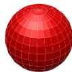

$\mathbb{R}$ -viewpoint

- Count "multiplicities".

# Complex projective spaces $\mathbb{CP}^n$

# Aim: number of solutions stay the same for a given geometric problem. Conclusion:

Work in $n$ -space $\mathbb{CP}^n$ (a compactification of $\mathbb{C}^n$

1-space: $\mathbb{CP}^1 = \mathbb{C}\bigsqcup \{\infty \}$

$\mathbb{C}$ -viewpoint

$\mathbb{R}$ -viewpoint

2-space: $\mathbb{CP}^2 = \mathbb{C}^2\big{\lfloor}\big{\lfloor}\mathbb{CP}^1.$

- Count "multiplicities".

# Complex projective spaces $\mathbb{CP}^n$

# Aim: number of solutions stay the same for a given geometric problem. Conclusion:

Work in $n$ -space $\mathbb{CP}^n$ (a compactification of $\mathbb{C}^n$

1-space: $\mathbb{CP}^1 = \mathbb{C}\bigsqcup \{\infty \}$

C-viewpoint

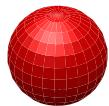

$\mathbb{R}$ -viewpoint

2-space: $\mathbb{CP}^2 = \mathbb{C}^2\big{\lfloor}\big{\lfloor}\mathbb{CP}^1.$

.

$\mathbb{CP}^n \coloneqq \{\text{lines in } \mathbb{C}^{n+1} \text{ passing through the origin}\}$ .

- Count "multiplicities".

Remark (Steiner 1848; Jonquieres 1859; Fulton-MacPherson 1978)

The number of conics tangent to 5 given conics in $\mathbb{CP}^2$ is 3264 (1859).

# Remark

When geometric figures are characterized by polynomial systems, problems of enumerative geometry could have the following formulation:

The fundamental problem of algebra: Given a polynomial system over $\mathbb{C}$ , find the number of solutions to the system:

$$
\left\{ \begin{array}{l} f _ {1} (x _ {1}, \dots , x _ {m}) = 0, \\ \dots \\ f _ {m} (x _ {1}, \dots , x _ {m}) = 0. \end{array} \right.
$$

When $n = 1$ , this is known as "The fundamental theorem of algebra", solved by Gauss in 1799.

# A toy example on Schubert calculus

# Question

How many lines in the 3-space $\mathbb{CP}^3$ intersect four random lines $\ell_1, \ell_2, \ell_3, \ell_4$ ?

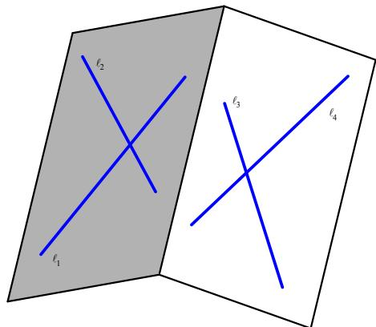

# A toy example on Schubert calculus

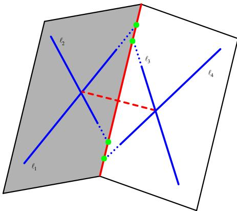

# Answer

Hermann Schubert (1848-1911): there are 2 such lines.

In 1879 H. Schubert published "Calculus of Enumerative Geometry"

- Summit of the intersection theory in the 19th century.   
- Amazing applications to enumerative geometry, such as

The number of quadric surfaces tangent to 9 given quadric surfaces in general position in 3-space 666,841,088.   
The number of twisted cubic curves tangent to 12 given quadric surfaces in general position in 3-space is 5,819,539,783,680.

Schubert's "Conservation of number principle":

$\sharp(solutions) < \infty$ for a special case $\Rightarrow$ Same number for general cases (assuming multiplicities have been counted properly).

# Hilbert 15th problem

- Schubert's works were controversial at his time.

"He gave no definition of intersection multiplicity, no way to find it nor to calculate it"—Van der Waerden (1993).

David Hilbert (ICM 1900)

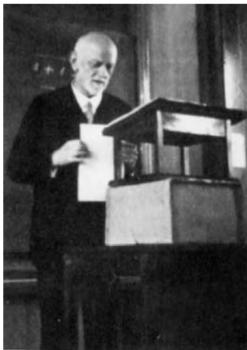

15. RIGOROUS FOUNDATION OF SCHUBERT'S NUMERATIVE CALCULUS.

The problem consists in this: To establish rigorously and with an exact determination of the limits of their validity those geometrical numbers which Schubert † especially has determined on the basis of the so-called principle of special position, or conservation of number, by means of the enumerative calculus developed by him.

Although the algebra of to-day guarantees, in principle, the possibility of carrying out the processes of elimination, yet for the proof of the theorems of enumerative geometry decidedly more is requisite, namely, the actual carrying out of the process of elimination in the case of equations of special form in such a way that the degree of the final equations and the multiplicity of their solutions may be foreseen.

# Parts of the study of Hilbert 15th problem

- Began with the Italian school, headed by Segre, Enriques and Severi.   
- The Gottingen school: Van der Waerden published "Topological foundation of Enumerative geometry" in 1930.

The aim of all enumerative problems is to compute the products in the cohomology of the relevant projective manifolds.

- The Bourbaki: C. Ehresmann (1934) discovered that The parameter spaces of the geometric figures concerned by Schubert are essentially certain cases of "flag manifolds $G / P$ of a Lie group $G$ "   
A.Weil published "Foundations of Algebraic Geometry" in 1962

obtained a rigorous definition of the intersection number of subvarieties of a projective manifold   
The classical Schubert calculus amounts to the determination of the intersection rings of flag manifolds", i.e. the study of $H^{*}(G / P)$ .

# A quick review of cohomology

$X$ : nice space. $H^{*}(X) = H^{*}(X,\mathbb{Z})$ is a $\mathbb{Z}$ -algebra $\Longrightarrow$

- Can add and multiply two elements.   
Can tell $\sharp$ (intersection points of subspaces).

# A quick review of cohomology

$X$ : nice space. $H^{*}(X) = H^{*}(X,\mathbb{Z})$ is a $\mathbb{Z}$ -algebra $\Longrightarrow$

- Can add and multiply two elements.   
Can tell $\sharp$ (intersection points of subspaces).

Reason: Nice subspaces $Z_{i} \subset X$ represent classes $[Z_i] \in H^* (X)$ s.t.

$\triangleright [Z_1 \cap Z_2] = [Z_1] \cdot [Z_2]$ .   
If $\dim Z_1 + \dim Z_2 = \dim X$ , then

$$
[ Z _ {1} ] \cdot [ Z _ {2} ] = \sharp (Z _ {1} \cap Z _ {2}) [ p t ].
$$

# Counting lines in 3-space: the cohomology approach.

$$
\begin{array}{l} X := \left\{\text {l i n e s} \in \mathbb {C P} ^ {3} \right\}. \\ \Omega_ {\ell_ {i}} := \{\text {l i n e s} \mathbb {C P} ^ {3} \text {i n t e r s e c t i n g} \ell_ {i} \} \subset X. \\ \left(\dim_ {\mathbb {C}} X = 4\right) \\ \left(\dim_ {\mathbb {C}} \Omega_ {\ell_ {i}} = 3\right) \\ \end{array}
$$

Question (Reinterpretation of the question of counting lines:)

$$
\# \left(\Omega_ {\ell_ {1}} \cap \Omega_ {\ell_ {2}} \cap \Omega_ {\ell_ {3}} \cap \Omega_ {\ell_ {4}}\right) = ?
$$

# Counting lines in 3-space: the cohomology approach.

$$
\begin{array}{l} X := \left\{\text {l i n e s} \in \mathbb {C P} ^ {3} \right\}. \\ \Omega_ {\ell_ {i}} := \{\text {l i n e s} \mathbb {C P} ^ {3} \text {i n t e r s e c t i n g} \ell_ {i} \} \subset X. \\ \left(\dim_ {\mathbb {C}} X = 4\right) \\ \left(\dim_ {\mathbb {C}} \Omega_ {\ell_ {i}} = 3\right) \\ \end{array}
$$

Question (Reinterpretation of the question of counting lines:)

$$
\# \left(\Omega_ {\ell_ {1}} \cap \Omega_ {\ell_ {2}} \cap \Omega_ {\ell_ {3}} \cap \Omega_ {\ell_ {4}}\right) =?
$$

Schubert's idea in terms of the cohomological approach:

- $[\Omega_{\ell}] := [\Omega_{\ell_1}] = [\Omega_{\ell_2}] = [\Omega_{\ell_3}] = [\Omega_{\ell_4}] \in H^*(X)$ .

$$
[ \Omega_ {\ell} ] ^ {4} = [ \Omega_ {\ell_ {1}} \cap \Omega_ {\ell_ {2}} \cap \Omega_ {\ell_ {3}} \cap \Omega_ {\ell_ {4}} ] = \sharp (\Omega_ {\ell_ {1}} \cap \Omega_ {\ell_ {2}} \cap \Omega_ {\ell_ {3}} \cap \Omega_ {\ell_ {4}}) [ p t ].
$$

Remark

$$
X := \left\{\text {l i n e s i n} \mathbb {C} \mathbb {P} ^ {3} \right\} = \left\{V \leqslant \mathbb {C} ^ {4} \mid \dim_ {\mathbb {C}} V = 2 \right\} =: G r (2, 4).
$$

# Schubert calculus for $H^{*}(Gr(2,4))$

$H^{*}(Gr(2,4))$ has a basis of Schubert classes, indexed by Young diagrams:

(0)

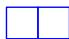

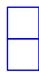

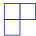

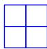

Here $[\Omega_{\ell}] = 1 \times 1$ rectangle, $[pt] = 2 \times 2$ rectangle.

Hence, answer $= 2$ , following from the following Pieri rule (Schubert calculus).

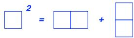

Schubert Calculus

Algebraic Geometry

# Schubert calculus and related fields

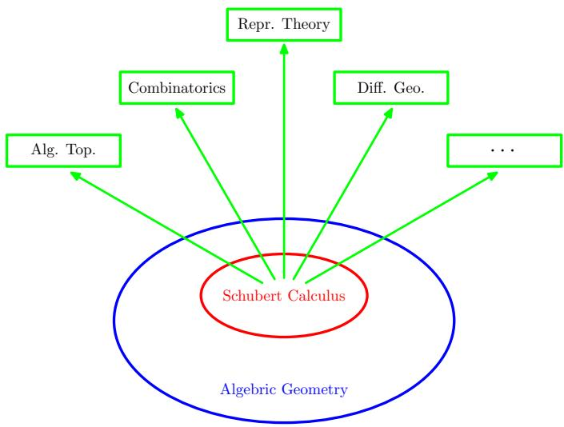

# Schubert calculus and related fields

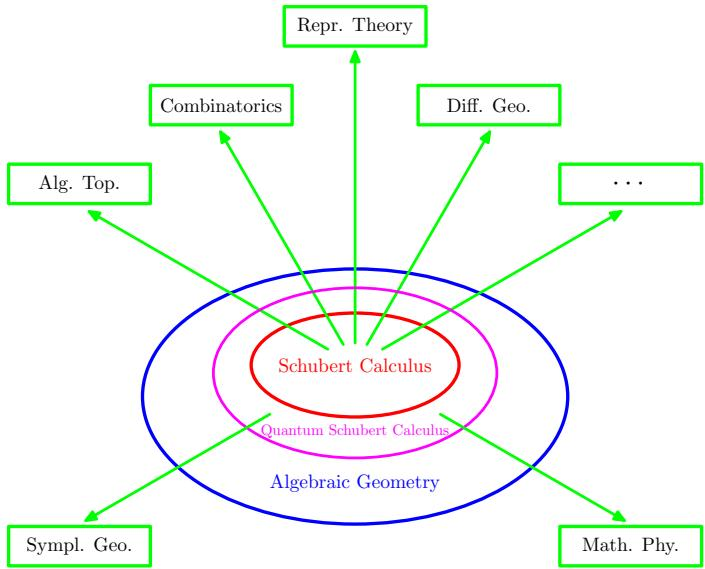

Warning: Distorted Proportion!

# International Festival in Schubert Calculus

PART I MINI-SCHOOL ON SCHUBERT CALCULUS, NOV. 6, 2017

PART II: INTERNATIONAL CONFERENCE ON THE TRENDS IN SCHUBERT CALCULUS, NOV 7-10, 2017

  
Guangzhou,CHINA

# Mini-course speakers:

Konstanze Rietsch (King's College London) Richard Rimanyi (University of North Carolina at Chapel Hill)

# Conference speakers

Hiraku Abe (OCAMI)

David E. Anderson (Ohio State University)

Sara C.Billey (University of Washington)

Anders S. Buch (Rutgers University)

Baptiste Calms (Universite d'Artois)

Bill (Yongchuan) Chen (Tianjin University & Nankai University)

Halbao Duan (Chinese Academy of Sciences)

Vassily Gorbounov (University of Aberdeen)

Tatsuya Horl胶囊 (Osaka University/OCAMI)

Takeshi Ikeda (Okayama University of Science)

Bumslg Klm (Korea Institute for Advanced Study)

Valentina Klitchenko (Higher School of Economics)

Allen Knutson (Cornell University)

Seung Jin Lee (Seoul National University)

Tomoo Matsumura (Okayama University of Science)

Leonardo C. Mihalcea (Virginia Tech)

Oliver Pechenk (University of Michigan)

Nicolas Perrin (Université de Versailles)

Plotr Pragacz (Polish Academy of Sciences)

Arun Ram (University of Melbourne)

Vijay Ravikumar (Chennai Mathematical Institute)

Mark Shlmozono (Virginia Tech)

Changjian Su (IHES)

Valentin Tonita (MPIM Bonn)

Andrzej Marek Weber (University of Warsaw)

Changlong Zhong (SUNY-Albany)

Organizers

Jianxun Hu , Changzheng Li (Sun Yat-sen University) & Leonardo C . Mihalcea (Virginia Tech)

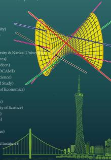

Springer Proceedings in Mathematics & Statistics

Jianxun Hu  
Changzheng Li  
Leonardo C. Mihalcea Editors

Schubert Calculus and Its Applications in Combinatorics and Representation Theory

Guangzhou, China, November 2017

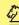

Springer

# Classical Schubert Calculus: study of $H^{*}(G / P)$

- Flag variety $G / P$ (figure from Prof. Sara Billey's ppt)

$$
S L (n, \mathbb {C}) / P = \left\{V _ {n _ {1}} \leqslant V _ {n _ {2}} \leqslant \dots \leqslant V _ {n _ {k}} \leqslant \mathbb {C} ^ {n} \mid \dim V _ {n _ {j}} = n _ {j}, 1 \leq j \leq k \right\}
$$

$$
S L (4, \mathbb {C}) / B = \left\{V _ {1} \leqslant V _ {2} \leqslant V _ {3} \leqslant \mathbb {C} ^ {4} \mid \dim V _ {j} = j, 1 \leq j \leq 3 \right\}
$$

Central problem:

Find a (manifestly positive) formula for Schubert structure constants

Haibao Duan (2005): nice algorithm for any $H^{*}(G / P)$ with sign cancelation involved.

# Quantum cohomology $QH^{*}$ and counting curves

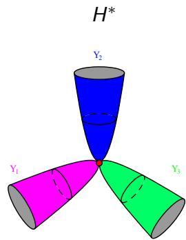

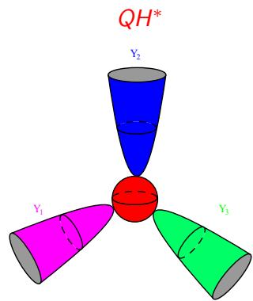

$QH^{*}$ can solve difficult problems in enumerative geometry.

# Quantum cohomology and counting curves

# Question

$N_{d} \coloneqq \sharp \left( \text{rational curves of degree } d \text{ in } \mathbb{CP}^{2} \text{ pass through } 3d - 1 \text{ points in general position} \right)$ . $N_{d} = ?$

$\bullet \quad \triangleright \quad d = 1\left(\mathbb{CP}^1\right)$

$d = 2(\mathrm{Conic}):x^{2} + a_{1}xy + a_{2}y^{2} + a_{3}x + a_{4}y + a_{5} = 0.$ $\Rightarrow N_2 = 1$ (A conic is uniquely determined by five points $(x_i,y_i)$ ).

# Quantum cohomology and counting curves

# Question

$N_{d} := \sharp\big(\text{rational curves of degree } d \text{ in } \mathbb{CP}^{2} \text{ pass through } 3d - 1 \text{ points in general position}\big)$ . $N_{d} = ?$

$\bullet \quad \triangleright \quad d = 1\left(\mathbb{CP}^1\right)$

$d = 2(\mathrm{Conic}):x^{2} + a_{1}xy + a_{2}y^{2} + a_{3}x + a_{4}y + a_{5} = 0.$ $\Rightarrow N_2 = 1$ (A conic is uniquely determined by five points $(x_i,y_i)$ ).   
$N_{3} = 12$ (Rational Cubic). $N_{4} = 620$ (Zeuthen, 1873).

# Quantum cohomology and counting curves

# Question

$N_{d} \coloneqq \sharp \left( \text{rational curves of degree } d \text{ in } \mathbb{CP}^{2} \text{ pass through } 3d - 1 \text{ points in general position} \right)$ . $N_{d} = ?$

$\bullet \quad \triangleright \quad d = 1\left(\mathbb{CP}^1\right): \quad \boxed{\mathbb{CP}^2} \Rightarrow N_1 = 1.$

$d = 2(\mathrm{Conic}):x^{2} + a_{1}xy + a_{2}y^{2} + a_{3}x + a_{4}y + a_{5} = 0.$ $\Rightarrow N_2 = 1$ (A conic is uniquely determined by five points $(x_i,y_i)$ ).   
$N_{3} = 12$ (Rational Cubic). $N_{4} = 620$ (Zeuthen, 1873).   
$N_{5} = 87304$ , and ALL $N_{d}$ (Kontsevich, 1993).

# Quantum cohomology and counting curves

# Question

$N_{d} \coloneqq \sharp \left( \text{rational curves of degree } d \text{ in } \mathbb{CP}^{2} \text{ pass through } 3d - 1 \text{ points in general position} \right)$ . $N_{d} = ?$

$\bullet \quad \triangleright \quad d = 1\left(\mathbb{CP}^1\right): \quad \boxed{\mathbb{CP}^2} \Rightarrow N_1 = 1.$   
$d = 2(\mathrm{Conic}):x^{2} + a_{1}xy + a_{2}y^{2} + a_{3}x + a_{4}y + a_{5} = 0.$ $\Rightarrow N_2 = 1$ (A conic is uniquely determined by five points $(x_i,y_i)$ ).   
$N_{3} = 12$ (Rational Cubic). $N_{4} = 620$ (Zeuthen, 1873).   
$N_{5} = 87304$ , and ALL $N_{d}$ (Kontsevich, 1993).

■ Kontsevich was awarded Fields Medal in 1998, partially because of this work.   
■ Kontsevich's approach: interpret $N_{d}$ as Gromov-Witten invariants $\rightsquigarrow$ (BIG/SMALL) quantum cohomology of $\mathbb{CP}^2$ .

# Schubert basis and Gromov-Witten invariants

Schubert Basis: $QH^{*}(Gr(k,n))$ is a $\mathbb{Z}[q]$ -algebra, and it has a $\mathbb{Z}[q]$ -basis of Schubert classes $[\Omega_u]$ .   
Multiplication:

$$
[ \Omega_ {u} ] \star [ \Omega_ {v} ] = \sum_ {w, d} N _ {u, v} ^ {w, d} q ^ {d} [ \Omega_ {w} ]
$$

where $N_{u,v}^{w,d} \in \mathbb{Z}_{\geq 0}$ are Gromov-Witten invariants, defined by intersections on moduli spaces of stable maps.

# Schubert basis and Gromov-Witten invariants

Schubert Basis: $QH^{*}(Gr(k,n))$ is a $\mathbb{Z}[q]$ -algebra, and it has a $\mathbb{Z}[q]$ -basis of Schubert classes $[\Omega_u]$ .   
Multiplication:

$$
[ \Omega_ {u} ] \star [ \Omega_ {v} ] = \sum_ {w, d} N _ {u, v} ^ {w, d} q ^ {d} [ \Omega_ {w} ]
$$

where $N_{u,v}^{w,d} \in \mathbb{Z}_{\geq 0}$ are Gromov-Witten invariants, defined by intersections on moduli spaces of stable maps.

$\triangleright$ C-viewpoint: rational curves of degree $d$ passing through $\Omega_u, \Omega_v, \Omega_{\hat{w}}$   
$\triangleright$ $\mathbb{R}$ -viewpoint: spheres of fixed volume

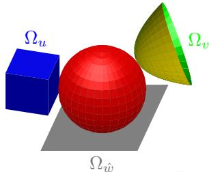

# Example: $QH^{*}(X)$ for $X = \mathbb{CP}^1 = \mathbb{C}\bigsqcup \{\infty\}$ .

- $[\mathbb{CP}^1]$ and [pt] form a $\mathbb{Z}[q]$ -basis of $QH^{*}(\mathbb{CP}^{1})$ .   
Gromov-Witten invariant $N_{[pt],[pt]}^{[\mathbb{CP}^1],1} = 1.$

# Example: $QH^{*}(X)$ for $X = \mathbb{CP}^1 = \mathbb{C}\bigsqcup \{\infty\}$ .

- $[\mathbb{CP}^1]$ and [pt] form a $\mathbb{Z}[q]$ -basis of $QH^{*}(\mathbb{CP}^{1})$ .   
Gromov-Witten invariant $N_{[pt],[pt]}^{[\mathbb{CP}^1],1} = 1.$

- Stable maps: $f \in \operatorname{Aut}(\mathbb{CP}^1)$ is uniquely determined by 3 points.

# Example: $QH^{*}(X)$ for $X = \mathbb{CP}^1 = \mathbb{C}\bigsqcup \{\infty\}$ .

- $[\mathbb{CP}^1]$ and [pt] form a $\mathbb{Z}[q]$ -basis of $QH^{*}(\mathbb{CP}^{1})$ .   
Gromov-Witten invariant $N_{[pt],[pt]}^{[\mathbb{CP}^1],1} = 1$

- Stable maps: $f \in \operatorname{Aut}(\mathbb{CP}^1)$ is uniquely determined by 3 points.   
$\triangleright$ Geometrically,

represented by (denote $z\coloneqq [\mathrm{pt}],e = [\mathbb{CP}^1 ]$ )

$$
z \star z = 1 \cdot q \cdot e
$$

# Example: $QH^{*}(X)$ for $X = \mathbb{CP}^1 = \mathbb{C}\bigsqcup \{\infty\}$ .

- $[\mathbb{CP}^1]$ and [pt] form a $\mathbb{Z}[q]$ -basis of $QH^{*}(\mathbb{CP}^{1})$ .   
Gromov-Witten invariant $M_{[pt],[pt]}^{[\mathbb{CP}^1],1} = 1.$

- Stable maps: $f \in \operatorname{Aut}(\mathbb{CP}^1)$ is uniquely determined by 3 points.   
$\triangleright$ Geometrically,

represented by (denote $z\coloneqq [\mathrm{pt}],e = [\mathbb{CP}^1 ]$

$$
z \star z = 1 \cdot q \cdot e
$$

In fact,

$$
Q H ^ {*} (\mathbb {C P} ^ {1}) \stackrel {{\mathrm {a l g}}} {{=}} \frac {\mathbb {Z} [ z , q ]}{\langle z ^ {2} - q \rangle}.
$$

# Remark

In general, $QH^{*}(\text{flag variety})$ is a $\mathbb{Z}[q_1, \dots, q_r]$ -algebra, where $r$ is the second Betti number of the flag variety.

# Remarks on quantum cohomology $QH^{*}(X)$

- Quantum cohomology/Gromov-Witten invariants are defined under a much more general framework.   
- NON-trivial fact: $QH^{*}(X)$ is an associative algebra.   
- Lack of functoriality: $f: X \to Y \Rightarrow Qf^{*}: QH^{*}(Y) \to QH^{*}(X)$ (Note $f$ induces an algebra morphism $f^{*}: H^{*}(Y) \to H^{*}(X).$ )   
- Closely related with mirror symmetry in mathematical physics.   
- Quantum Schubert Calculus: study of $QH^{*}(G / P)$

Find a manifestly positive formula for quantum Schubert structure constants $\mathcal{N}_{u,v}^{w,d}$ , which remains unknown except for $Gr(k,n)$ .

# Quantum cohomology and related problems

Problems accessible to undergraduate students:

- Eigenvalue problem (Conjecture $\mathcal{O}$ ).   
- Morphisms between projective manifolds.

- Introduced by Shiing-Shen Chern in 1946 ("Characteristic classes of Hermitian Manifolds", Annals of Mathematics, 47 (1): 85-121.)

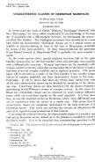

- Topological class $c(E)$ associated with complex vector bundles $E \to X$ . In particular, for complex manifold $X$ of $\dim_{\mathbb{C}}X = n$ ,

$$
c _ {i} (X) := c _ {i} (T X), \quad c (X) := c (T X) = 1 + \sum_ {i = 1} ^ {n} c _ {i} (T X) \in H ^ {*} (X, \mathbb {Z}).
$$

- Fundamental concept in many subjects, such as algebraic topology, differential geometry and algebraic geometry, string theory, Chern-Simons theory, knot theory, Gromov-Witten invariants.

# Definition

A Fano manifold $X$ is a compact complex manifold whose anti-canonical line bundle $-K_X$ is ample (i.e. $c_1(X) > 0$ ).

# Example

- Flag varieties $G / P$ , including $Gr(k, n)$ .   
- $\{f = 0\} \subset \mathbb{P}^n$ : a smooth hypersurface of degree $d < n + 1$ .   
- Classification for small $n$ :

$n = 1$ .. $\mathbb{P}^1$   
$n = 2$ : called as a del Pezzo surface, i.e. $\mathbb{P}^1\times \mathbb{P}^1$ $\mathbb{P}^2$ , or

$X_{k}(1\leq k\leq 8)$ : blowup of $\mathbb{P}^2$ at $k$ points in general position;   
$n = 3$ : a complete list.

# Conjecture $\mathcal{O}$ (Galkin-Golyshev-Iritani, 2016)

Let $X$ be a Fano manifold, and denote by $\operatorname{Spec}(\hat{c}_1)$ the set of eigenvalues of the following linear operator $\hat{c}_1$ induced by quantum multiplication $\star$ .

$$
\hat {c} _ {1}: H ^ {\mathrm {e v e n}} (X, \mathbb {C}) \longrightarrow H ^ {\mathrm {e v e n}} (X, \mathbb {C}); \beta \mapsto c _ {1} (X) \star \beta | _ {\mathbf {q} = \mathbf {1}}.
$$

Then the following should hold.

(i) $\rho \coloneqq \max_{\delta \in \operatorname{Spec}(\hat{c}_1)} |\delta|$ belongs to $\operatorname{Spec}(\hat{c}_1)$ ; mult. $\rho = 1$ .   
(ii) $r\coloneqq \max \{k\in \mathbb{Z}\mid \frac{c_1(X)}{k}\in H^2 (X,\mathbb{Z})\} .\forall \delta \in Spec\bigl (\hat{c}_1\bigr)$ with $|\delta | = \rho$

$$
\left(\delta / \rho\right) ^ {r} = 1.
$$

# Conjecture $\mathcal{O}$ holds if ...

# Example

Conjecture $\mathcal{O}$ holds if $X = \mathbb{P}^1$ .

- $H^{*}(\mathbb{P}^{1},\mathbb{Z}) = \mathbb{Z}\oplus \mathbb{Z}x$ , where $x = P.D.[\mathbb{P}^0 ]\in H^2 (\mathbb{P}^1,\mathbb{Z})$ .   
$c_{1}(\mathbb{P}^{1}) = 2x\quad \Longrightarrow \quad r(\mathbb{P}^{1}) = 2.$

# Conjecture $\mathcal{O}$ holds if ...

# Example

Conjecture $\mathcal{O}$ holds if $X = \mathbb{P}^1$ .

- $H^{*}(\mathbb{P}^{1},\mathbb{Z}) = \mathbb{Z}\oplus \mathbb{Z}x$ , where $x = P.D.[\mathbb{P}^0 ]\in H^2 (\mathbb{P}^1,\mathbb{Z})$ .   
$c_{1}(\mathbb{P}^{1}) = 2x\quad \Longrightarrow \quad r(\mathbb{P}^{1}) = 2.$   
- $QH^{*}(\mathbb{P}^{1}) = \mathbb{C}[x,q] / (x^{2} - q)$

$QH^{\mathrm{ev}}(\mathbb{P}^{1})|_{q = 1} = \mathbb{C}[x] / (x^{2} - 1) = \mathbb{C}\oplus \mathbb{C}x$   
$\hat{c}_1\left( \begin{array}{l}1\\ x \end{array} \right) = 2x\star \left( \begin{array}{l}1\\ x \end{array} \right)\big|_{q = 1} = \left( \begin{array}{l}2x\\ 2 \end{array} \right) = \left( \begin{array}{ll}0 & 2\\ 2 & 0 \end{array} \right)\left( \begin{array}{l}1\\ x \end{array} \right)$

$$
\Rightarrow \operatorname {S p e c} (\hat {c} _ {1}) = \operatorname {S p e c} \left( \begin{array}{l l} 0 & 2 \\ 2 & 0 \end{array} \right) = \{2, - 2 \}
$$

- Mirror symmetry

A fascinating geometric phenomenon discovered in string theory.   
A duality between two central branches of geometry:

Symplectic geometry A-model

Complex geometry B-model

#

X: Fano

$f:\check{X}\to \mathbb{C}$

Expectations:

$\begin{array}{rlr}{QH^{*}(X)} & \cong & {Jac(f)} \end{array}$   
$\triangleright$ {eigenvalues of $\hat{c}_1\})\longleftrightarrow \{\mathrm{critical~values~of}f\}$   
$\triangleright$ ...

# Viewpoint from mirror symmetry: What is...?

- Analogue of Conjecture $\mathcal{O}$ on the $B$ -side:

$f$ has a critical value $\rho \in \mathbb{R}^+$ that satisfies (a) $\sharp f^{-1}(\rho) = 1$ and (b) $\rho \geq |u|$ for any critical value $u$ of $f$ ;   
$(u / \rho)^{r} = 1$ for any critical value $u$ of $f$ satisfying $|u| = \rho$

- (Weak) Landau-Ginzburg $B$ -models for $X = Gr(2,4)$ .

$$
\text {E x a m p l e} \left(\check {X} _ {\mathrm {H V}} = \left(\mathbb {C} ^ {*}\right) ^ {4}; \check {X} _ {\mathrm {R i e}} = \mathbb {C} ^ {4} \backslash \left\{z _ {1 4} z _ {2 3} \left(z _ {1 3} z _ {2 4} - z _ {1 4} z _ {2 3}\right) \right\}.)\right.
$$

$$
f _ {\mathrm {H V}} \left(d _ {1 1}, d _ {1 2}, d _ {2 1}, d _ {2 2}\right) = d _ {1 1} + \frac {d _ {2 1}}{d _ {1 1}} + \frac {d _ {2 2}}{d _ {1 2}} + \frac {d _ {1 2}}{d _ {1 1}} + \frac {d _ {2 2}}{d _ {2 1}} + \frac {q}{d _ {2 2}}
$$

$$
f _ {\mathrm {R i e}} (z _ {1 3}, z _ {1 4}, z _ {2 3}, z _ {2 4}) = z _ {1 3} + \frac {z _ {2 4}}{z _ {2 3}} + \frac {z _ {2 4}}{z _ {1 4}} + \frac {z _ {1 3} q}{z _ {1 3} z _ {2 4} - z _ {1 4} z _ {2 3}}
$$

$$
C r i t i c a l \quad v a l u e s \quad a t \quad q = 1: \left\{4 \sqrt {- 2}, - 4 \sqrt {- 2}, 0, 0, 4 \sqrt {2}, - 4 \sqrt {2} \right\}. \quad (r (X) = 4)
$$

# Viewpoint from mirror symmetry

# Galkin-Golyshev-Iritani:

Each Morse function of $f$ associates a vanishing cycle, which gives an object of the Fukaya-Seidel category of $f$ . Under homological mirror symmetry, the vanishing cycle associated to $\rho$ should correspond to the structure sheaf $\mathcal{O}$ of $X$ . (Gamma conjecture I)   
- More generally, each simple eigenvalue of $\hat{c}_1$ should correspond to an exceptional object in $\mathcal{D}_{\mathrm{coh}}^b (X)$ . (Gamma conjecture II)

- Flag varieties $G / P$ of arbitrary Lie type: Cheong-L. 2017.

$\triangleright$ Complex Grassmannians: Rietsch 2003, Galkin-Golyshev 2006.   
$\triangleright$ Lagrangian and orthogonal Grassmannians: Cheong 2017.

Fano 3-folds:

$\triangleright$ Picard rank one: Golshev-Zagier 2016.   
Bott-Samelson varieties: Withrow 2018.

- Horospherical varieties: L.-Mihalcea-Shifler 2017; Bones-Fowler-Schneider-Shifler 2018   
- Fano complete intersections in $\mathbb{P}^n$ : Galkin-Iritani 2015; Sanda-Shamoto 2017; Ke 2023.

Theorem (Hu-Ke-L.-Tuo Yang; Adv. Math. 2021)

Both conjecture $\mathcal{O}$ and Gamma conjecture I hold for del Pezzo surfaces.

# Perron-Frobenius theorem

# Definition

A nonnegative matrix $M$ is called reducible if the induced operator has a nontrivial invariant coordinate subspace, i.e., if

$$
M = Q \left( \begin{array}{c c} A & B \\ 0 & D \end{array} \right) Q ^ {T} \quad \text {f o r s o m e p e r m u t a t i o n m a t r i x} Q.
$$

irreducible $=$ not reducible

# Perron-Frobenius theorem

# Definition

A nonnegative matrix $M$ is called reducible if the induced operator has a nontrivial invariant coordinate subspace, i.e., if

$$
M = Q \left( \begin{array}{c c} A & B \\ 0 & D \end{array} \right) Q ^ {T} \quad \text {f o r s o m e p e r m u t a t i o n m a t r i x} Q.
$$

irreducible $=$ not reducible

# Theorem (Perron(1907)-Frobenius(1912))

Every irreducible nonnegative matrix $M$ has a real eigenvalue $\delta_0$ of multiplicity one such that $\delta_0 \geq |\delta|$ for all $\delta \in \operatorname{Spec}(M)$ .   
All eigenvalues $\delta$ with $|\delta| = \delta_0$ are simple, and precisely the solutions of $\delta_0^h - \delta^h = 0$ for some $h \in \mathbb{Z}_{>0}$ . (inv.by e $\frac{2\pi\sqrt{-1}}{\mathrm{r}}$ r|h)

# Key point for Conjecture $\mathcal{O}$ for del Pezzo surfaces

# Theorem (Generalized Perron-Frobenius Theorem)

Suppose that a real matrix $M = (m_{ij})$ satisfies the following properties:

$\sum_{j}m_{ij} > 0$ for any $i$   
$M^k$ is an irreducible nonnegative matrix for some $k$ .

Then $M$ has a real eigenvalue $\delta_0$ of multiplicity one such that $\delta_0 \geq |\delta|$ for all $\delta \in \operatorname{Spec}(M)$ .

# Remark

Generalized Perron-Frobenius Theorem is also applicable if

- $X$ is the Bott-Samelson resolution of $F\ell_{3}$ .   
- $X$ is the blowup of $\mathbb{P}^4$ at a point.

# Morphisms between projective manifolds

Morphisms: "holomorphic maps"

- There are a lot of non-constant holomorphic maps $f: \mathbb{C}^2 \to \mathbb{C}^1$ .   
- $f: \mathbb{CP}^2 \to \mathbb{C}^1$ holomorphic $\Rightarrow$ $f$ is a constant map.   
- $f: \mathbb{CP}^2 \to \mathbb{CP}^1$ holomorphic $\Rightarrow$ $f$ is a constant map.

Tango's proof.

Recall $H^{*}(\mathbb{CP}^{1}) = \mathbb{C}[x] / (x^{2})$ , where $x = c_{1}(\mathcal{L})$ with $\mathcal{L} = \mathcal{O}_{\mathbb{P}}(1)$ an ample line bundle over $\mathbb{P}^1$ . We have

$$
0 = f ^ {*} (0) = f ^ {*} (x \cup x) = f ^ {*} (x) \cup f ^ {*} (x),
$$

implying $c_{1}(f^{*}\mathcal{L}) = f^{*}(c_{1}(\mathcal{L})) = f^{*}(x) = 0$

Then $f$ must be a constant map.

# Key notion: Effective good divisibility

# Definition (Muñoz-Occhetta-Solá Conde)

A complex projective manifold $M$ is said to have effective good divisibility up to degree $s$ , denoted as e.d. $(M) = s$ , if $s$ is the maximum integer such that $x_i \cup x_j \neq 0$ for any effective classes $x_i \in H^{2i}(M) \setminus \{0\}$ , $x_j \in H^{2j}(M) \setminus \{0\}$ and any $i, j$ satisfying $i + j \leq s$ .

e.d. $(\mathbb{CP}^1) = 1$ e.d. $(\mathbb{CP}^2) = 2$

Theorem (Muñoz-Occhetta-Solá Conde; Haoqiang Hu-L.-Zhaoyang Liu)

Let $G / P$ be of classical Lie type, and $M$ be a connected complex projective manifold. If e.d. $(M) > \mathrm{e.d.}(G / P)$ , then any morphism $M \to G / P$ is constant.

# Effective good divisibility of $G / P$

By $\mathcal{D}(m)$ we mean the Grassmannian $G / P_{m}$ with $G$ being of type $\mathcal{D}$ .

Theorem (Hu-L.-Liu; accepted by Mathematische Zeitschrift)

Theorem 1.1. The effective good divisibility e.d. $(\mathcal{D}(m))$ is given in Table 1.

TABLE 1. Effective good divisibility e.d. of $\mathcal{D}\left( m\right)$   

<table><tr><td>D</td><td rowspan="2">An(m)</td><td rowspan="2">Bn(m)</td><td rowspan="2">Cn(m)</td><td colspan="5">Dn+1(m)</td><td colspan="3">F4</td><td rowspan="2">G2(m)</td></tr><tr><td>m</td><td colspan="2">1,n,n+1</td><td colspan="2">2≤m&lt;n</td><td>1,4</td><td colspan="3">2,3</td></tr><tr><td>e.d.</td><td>n</td><td>2n-1</td><td>2n-1</td><td colspan="2">2n-1</td><td colspan="2">2n</td><td>12</td><td colspan="3">14</td><td>5</td></tr><tr><td>D</td><td colspan="2">E6</td><td colspan="4">E7</td><td colspan="6">E8</td></tr><tr><td>m</td><td>1,6</td><td>2,3,5</td><td>4</td><td>1</td><td>2,6</td><td>3</td><td>4,5</td><td>7</td><td>1</td><td>2,3,5</td><td>4</td><td>6</td></tr><tr><td>e.d.</td><td>12</td><td>14</td><td>15</td><td>22</td><td>23</td><td>24</td><td>25</td><td>19</td><td>46</td><td>50</td><td>51</td><td>48</td></tr></table>

Theorem 1.2. The effective good divisibility of $G / P$ of any type $\mathcal{D}$ is given by

$$
\mathrm {e . d .} (G / P) = \min  \left\{\mathrm {e . d .} (\mathcal {D} (m)) \mid m \in \Delta \backslash \Delta_ {P} \right\}.
$$

# Remark

Muñoz-Occhetta-Solá Conde computed e.d. $(G / P)$ for $G$ of classical type.

- For minuscule Grassmannians of classical type, e.g. $X = Gr(m,n)$ .

$c(\mathcal{S})c(\mathcal{Q}) = 1$ where $S|_{[V]} = V$ and

$$
0 \to \mathcal {S} \to \mathbb {C} ^ {n} \to \mathcal {Q} \to 0.
$$

$$
\Longrightarrow \mathrm {e . d .} (X) <   n
$$

$\triangleright$ $\equiv^{\text{三}}$ holds if $n = \deg q > |\lambda| + |\mu|$ :

$$
0 \neq [ \Omega_ {\lambda} ] \star [ \Omega_ {\mu} ] \stackrel {*} {=} [ \Omega_ {\lambda} ] \cup [ \Omega_ {\mu} ]
$$

$$
\Rightarrow \mathrm {e . d .} (X) \geq n - 1
$$

- For Grassmannians of classical type B, C or D, e.g.

$$
X = O G (m, 2 n + 1).
$$

Schubert classes are indexed by $k$ -strict partitions $\lambda = (\lambda_1, \dots, \lambda_m)$ , where $k = n - m$ , $\lambda_1 \leq 2n - m$ and $\lambda_i > k \Rightarrow \lambda_i > \lambda_{i+1}$ .   
$\left[\Omega_{\lambda}\right] \cup \left[\Omega_{\mu}\right] \neq 0 \Longleftrightarrow \mathcal{P}\left(\lambda^{\vee}\right) \leq \mathcal{P}(\mu)$ (standard partial order for $\mathbb{R}^{n}$ )   
Reduced to the following property:

$$
f (\lambda , j) := j - 1 - \# \left\{i <   j: \lambda_ {i} + \lambda_ {j} \leq 2 n + 1 - 2 m + j - i \right\}
$$

# Proposition

Let $\lambda, \mu$ be $k$ -strict partitions. If $|\lambda| + |\mu| < 2n$ , then for all $j$ , the inequality $f(\lambda, m + 1 - j) + f(\mu, j) \leq n + k - \lambda_{m + 1 - j} - \mu_j$ holds.

- For Grassmannians of exceptional type.

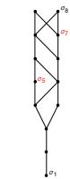

$F_{4}(1)$

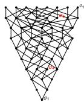

$F_{4}(2)$

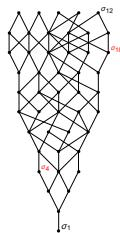

$E_{6}(2)$

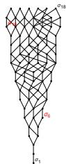

$E_7(1)$

# - For Grassmannians of exceptional type.

TABLE 3. An incomparable pair $\left( {u,w}\right)$ for $\mathcal{D}\left( m\right)$   

<table><tr><td>D</td><td>m</td><td>u</td><td>v</td><td>w=w0w1w2p_m</td><td>L</td></tr><tr><td rowspan="4">F4</td><td>1</td><td>s12321</td><td>s12342321</td><td>s2342321</td><td>13</td></tr><tr><td>2</td><td>s12329</td><td>s12342312312</td><td>s23423212</td><td>15</td></tr><tr><td>3</td><td>s4323</td><td>s4321234243</td><td>s23212343</td><td>15</td></tr><tr><td>4</td><td>s43234</td><td>s43212342</td><td>s2312324</td><td>13</td></tr><tr><td rowspan="4">E6</td><td>1</td><td>s65431</td><td>s13452431</td><td>s13452431</td><td>13</td></tr><tr><td>2</td><td>s1342</td><td>s65432451342</td><td>s3456245342</td><td>15</td></tr><tr><td>3</td><td>s1345243</td><td>s65432413</td><td>s34256453424342</td><td>15</td></tr><tr><td>4</td><td>s654324</td><td>s1345624534</td><td>s5341325464312451324</td><td>16</td></tr><tr><td rowspan="7">E7</td><td>1</td><td>s765431</td><td>s76543245613452431</td><td>s5643245613452431</td><td>23</td></tr><tr><td>2</td><td>s765432451342</td><td>s765432451342</td><td>s56433451342457634132456432451342</td><td>24</td></tr><tr><td>3</td><td>s765432413</td><td>s7654324561345243</td><td>s564351342456754313245643245134243</td><td>25</td></tr><tr><td>4</td><td>s76543245134</td><td>s765432456134524</td><td>s5642543134245675431324563413245341324</td><td>26</td></tr><tr><td>5</td><td>s76543245</td><td>s76543245613452456</td><td>s5462543134245675431324563413245341324</td><td>26</td></tr><tr><td>6</td><td>s765432456</td><td>s76543245671345246</td><td>s345624531342456754313245643132456</td><td>24</td></tr><tr><td>7</td><td>s7654324567</td><td>s7654324567134526</td><td>s13456245313424567</td><td>20</td></tr><tr><td>D</td><td>m</td><td>u</td><td>v</td><td>L</td><td></td></tr><tr><td rowspan="8">E8</td><td>1</td><td>s876543245613452431</td><td>s87654324567813452465342431</td><td>47</td><td></td></tr><tr><td>2</td><td>s87654324567134524532</td><td>s87654324567813452465341342</td><td>51</td><td></td></tr><tr><td>3</td><td>s87654324567134524531</td><td>s8765432456781345246534243</td><td>51</td><td></td></tr><tr><td>4</td><td>s87654324567134524531324</td><td>s876543245678134524653424</td><td>52</td><td></td></tr><tr><td>5</td><td>s87654324567813452465</td><td>s87654324567134524653413245</td><td>51</td><td></td></tr><tr><td>6</td><td>s8765432456781345246</td><td>s87654324567134524653413245</td><td>49</td><td></td></tr><tr><td>7</td><td>s876543245671345267</td><td>s8765432456713452465341324567</td><td>46</td><td></td></tr><tr><td>8</td><td>s876543245678</td><td>s87654324567134524653413245678</td><td>41</td><td></td></tr><tr><td colspan="6">W = w0w1w2p_m</td></tr><tr><td rowspan="6">E8</td><td>1</td><td>s245673454264313425678475341342567543134256432451342</td><td>s245673454264313425675431342565432451342</td><td></td><td></td></tr><tr><td>2</td><td>s43245673454265431342567845342564324513425675434251342</td><td></td><td></td><td></td></tr><tr><td>3</td><td>s43245313425678543134134526754342513425678543425134124567</td><td></td><td></td><td></td></tr><tr><td>4</td><td>s432453134256754313413452675434251341245678543425134124567</td><td></td><td></td><td></td></tr><tr><td>5</td><td>s432453134256754313413452675434251341245678543425134124567</td><td></td><td></td><td></td></tr><tr><td>6</td><td>s432453134256754313413452675434251341245678543425134124567</td><td></td><td></td><td></td></tr></table>

# Thank you!!…