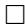

# POSITIVITY IN EQUIVARIANT QUANTUM SCHUBERT CALCULUS

LEONARDO CONSTANTIN MIHALCEA

ABSTRACT. A conjecture of D. Peterson, proved by W. Graham [Gr], states that the structure constants of the $(T - )$ equivariant cohomology of a homogeneous space $G / P$ satisfy a certain positivity property. In this paper we show that this positivity property holds in the more general situation of equivariant quantum cohomology.

# 1. INTRODUCTION

It is well known that the (integral) cohomology of the homogeneous space $X = G / P$ (for $G$ a connected, semisimple, complex Lie group and $P$ a parabolic subgroup) satisfies a positivity property: its structure constants are nonnegative integers equal to the number of intersection points of three Schubert varieties, in general position, whose codimensions add up to the dimension of $X$ .

Recently, Graham ([Gr]) has proved a conjecture of Peterson ([P]), asserting that $H_T^\star(X)$ , the $T$ -equivariant cohomology of $X$ , where $T \simeq (\mathbb{C}^\star)^r$ is a maximal torus in $G$ , enjoys a more general positivity property.

Fix $B \supset T$ a Borel subgroup of $G$ and let $W$ and $W_{P}$ be the Weyl groups of $G$ and $P$ respectively. Let $\Delta = \{\alpha_{1},\dots,\alpha_{r}\}$ be the (positive) simple roots associated to $W$ and $\Delta_P = \{\alpha_1,\ldots ,\alpha_s\}$ be those roots in $\Delta$ canonically determined by $P$ . The equivariant cohomology of $X$ , denoted $H_T^\star (X)$ , is a $\Lambda = H_T^\star (pt)$ -algebra, with a $\Lambda$ -basis consisting of Schubert classes $\sigma (w)^T = [X(w)]_T$ . These are determined by the equivariant Schubert varieties $X(w)_T$ defined with respect to the Borel group $B$ , are indexed by the minimal length representatives $w$ in $W / W_{P}$ and have degree $2c(w)$ , where $c(w)$ is the (complex) codimension of $X(w)$ in $X$ (see §2 below for more details). Assume, for simplicity, that $G$ is of adjoint type. Then the equivariant cohomology of a point is equal to the polynomial ring $\Lambda = \mathbb{Z}[x_1,\dots,x_r]$ where $x_{i}$ 's are the negative simple roots in $W$ (see §3 below). Graham's Theorem asserts that the coefficients $c_{u,v}^w$ in $\Lambda$ appearing in the product

$$
\boldsymbol {\sigma} (\boldsymbol {u}) ^ {T} \cdot \boldsymbol {\sigma} (\boldsymbol {v}) ^ {T} = \sum c _ {u, v} ^ {w} \boldsymbol {\sigma} (\boldsymbol {w}) ^ {T}
$$

are polynomials in $x_{1}, \ldots, x_{r}$ with nonnegative coefficients.

The aim of this paper is to show that a similar positivity result holds in the more general context of $(T-)$ equivariant quantum cohomology. This object was introduced by Givental and Kim ([GK]) for general groups $G$ and it was initially used to compute presentations of the small quantum cohomology of (partial) flag manifolds ([GK, Kim1, Kim2, AS, Kim3]). Related ideas have played a fundamental role in Mirror Symmetry ([G]).

The equivariant quantum cohomology is a deformation of both the equivariant and quantum cohomology. It is a graded $\Lambda[q]$ -algebra, where $q = (q_i)$ is indexed by the roots in $\Delta \setminus \Delta_P$ (or, equivalently, by a basis in $H^2(G/P)$ ). The multidegree of $q$ will be given later ( $\S 4$ ). The basis $\{\sigma(w)^T\}$ in equivariant cohomology determines a basis denoted $\{\sigma(w)\}$ in its quantum version. If we write $\circ$ for the equivariant quantum multiplication, the product $\sigma(u) \circ \sigma(v)$ can be expanded as

$$
\sigma (u) \circ \sigma (v) = \sum_ {d} \sum_ {w} q ^ {d} c _ {u, v} ^ {w, d} \sigma (w)
$$

where $d = (d_{i})$ is a multidegree and $q^{d}$ is the product $\prod q_{i}^{d_{i}}$ . The coefficients $c_{u,v}^{w,d}$ are called equivariant Littlewood-Richardson coefficients (EQLR) and are polynomials in $\Lambda$ of degree $c(u) + c(v) - c(w) - \sum d_{i} \cdot \deg(q_{i})$ . There is an effective algorithm to compute these coefficients if $X$ is a Grassmannian ([Mil]), which is a consequence of an equivariant quantum Pieri/Monk rule (i.e., a multiplication with a divisor class). It is not clear from this algorithm that the EQLR coefficients enjoy any positivity property. The main result of this paper is that they do, and, as in the equivariant cohomology, this positivity holds in the more general context of homogeneous spaces $G / P$ :

Theorem. The equivariant quantum Littlewood-Richardson coefficient $c_{u,v}^{w,d}$ is a polynomial in the variables $x_1, \ldots, x_r$ with nonnegative integer coefficients.

The idea of proof is to use a projection formula to reduce the computation of the EQLR coefficient to a situation where we can apply Graham's positivity theorem ([Gr], Theorem 3.2).

Acknowledgments: I am grateful to my advisor, W. Fulton, whose suggestions improved the presentation of this paper. I also thank the referee for valuable comments.

# 2. COHOMOLOGY OF $G / P$

In this section we recall the basic facts about the cohomology of the homogeneous spaces $G / P$ . References about this subject can be found in [Hi] §3.3, [FH] especially Ch. 23, [LG], esp. Chapters 2 and 3 or [Bo], esp. Ch. 3 and 4. The reader can also consult the papers [BGG] or [FW](§3).

Unless otherwise specified, throughout the paper we use the following notation (recall from the introduction): $X$ is the homogeneous space $G / P$ , with $G$ a complex, connected, semisimple Lie group and $P$ a parabolic subgroup. $B \subset P$ is a (fixed) Borel subgroup, $T \simeq (\mathbb{C}^{\star})^{r}$ the maximal torus in $B$ and $U$ the unipotent radical of $B$ . Recall the Levi decomposition of $B$ as the semidirect product $T \cdot U$ . The set of positive simple roots $\{\alpha_{1},\dots,\alpha_{r}\}$ is denoted by $\Delta$ ; $\Delta_P = \{\alpha_1,\dots,\alpha_s\}$ denotes the subset of $\Delta$ canonically determined by the parabolic subgroup $P$ . We write $W = N(T) / T$ for the Weyl group of $G$ , where $N(T)$ is the normalizer of $T$ in $G$ . The Weyl group is generated by the simple reflections $s_\alpha$ indexed by the elements in $\Delta$ . The parabolic subgroup $P$ determines the subgroup $W_{P}$ of $W$ generated by all the simple reflections in $\Delta_P$ . The length $l(w)$ of an element $w$ in $W$ is the smallest number of reflections whose product is $w$ ; $w_{0}$ denotes the longest element in $W$ . We write $B^{-}$ for $w_{0}Bw_{0}$ , the opposite Borel subgroup, and $U^{-}$ for its unipotent radical.

It is a well-known fact that each coset in $W / W_{P}$ has a unique representative $w \in W$ of minimal length (see e.g. [LG], §3.5.1); the dual of such $w$ , denoted $w^{\vee}$ , is defined to be the minimal length coset representative of $w_{0}wW_{P}$ . Denote by $W^{P} \subset W$ the set of minimal length coset representatives for $W / W_{P}$ . With this notation, $X$ is a smooth variety of dimension equal to the length of the longest element in $W^{P}$ .

Each $w \in W^{P}$ determines an element $wP$ in $X$ (in fact, one should replace $w$ by a representative in $N(T)$ , and then consider the associated coset in $X$ . However, since this process is independent of choices, we denote the result by $wP$ ). The set $\{wP\}_{w \in W^P}$ is precisely the set of the $T$ -fixed points of $X$ via the left-multiplication action ([LG], §3.6). For each $w$ in $W^{P}$ let $X(w)^o$ be the $U$ -orbit $U \cdot wP$ of $wP$ in $X$ . This is the Schubert cell, isomorphic (over $\mathbb{C}$ ) to the affine space $\mathbb{A}^{l(w)}$ . By the Bruhat decomposition, the Schubert cells cover $X$ with disjoint affine spaces, so their closures $X(w) = cl(X(w)^o)$ (the Schubert varieties) determine a basis $\{\sigma(w)\}$ for the cohomology of $G / P$ , where $\sigma(w) = [X(w)]$ is of degree $2c(w) = 2(\dim X - l(w))$ . Here $[X(w)]$ denotes the cohomology class in $H^{2c(w)}(X)$ determined by the fundamental class of $X(w)$ via Poincaré duality.

Similarly, one can define the opposite Schubert cell $Y(w)^o \simeq \mathbb{A}^{c(w)}$ to be the $U^{-}$ -orbit of $wP$ in $X$ . (In the notation from [Mi1], the Schubert variety $\Omega_{\lambda}(F_{\bullet}^{opp})$ corresponding to the partition $\lambda$ and the opposite of the standard flag $F_{\bullet}^{opp}$ corresponds to $Y(w^{\vee})$ , where $w$ is the permutation corresponding to $\lambda$ .) As before, the opposite Schubert varieties $Y(w) = cl(Y(w)^o)$ determine a basis $\{\widetilde{\sigma}(w)\}$ for the cohomology of $X$ , where $\widetilde{\sigma}(w) = [Y(w)]$ is in $H^{2l(w)}(X)$ . Note that $w_0Y(w) = X(w^{\vee})$ , and, since the translations yield the same cohomology class, one has that $\widetilde{\sigma}(w) = \sigma(w^{\vee})$ in $H^{2l(w)}(X)$ .

The bases $\{\sigma(w)\}$ and $\{\widetilde{\sigma}(w)\}$ are dual to each other in the following sense: if $\pi : X \longrightarrow pt$ denotes the structure morphism of $X$ , the cohomology push-forward $\pi_{\star}(\sigma(u) \cdot \widetilde{\sigma}(v))$ is equal to $1 \in H^0(pt)$ if $u = v$ and 0 otherwise. (See Appendix ( $\S 8$ below) for more about this push forward.) This follows from the fact that the Schubert varieties $X(u)$ and $Y(v)$ intersect properly in $X$ , and, if $c(u) + l(v) = \dim X$ , the intersection $X(u) \cap Y(v)$ is empty unless $u = v$ , when consists of the $T$ -fixed point $uP$ , with multiplicity 1.

Consider the expansion of the product $\sigma(u) \cdot \sigma(v)$ in the cohomology of $X$ :

$$
\sigma (u) \cdot \sigma (v) = \sum_ {w} c _ {u, v} ^ {w} \sigma (w).
$$

The coefficients $c_{u,v}^{w}$ are the Littlewood-Richardson coefficients (LR). They are nonnegative integers, equal to the number of points in the intersection of 3 general translates of the Schubert varieties $X(u), X(v)$ and $X(w^{\vee})$ if $c(u) + c(v) = c(w)$ , and 0 otherwise. The duality of the bases $\{\sigma(w)\}$ and $\{\widetilde{\sigma}(w)\}$ implies that the LR coefficients can also be computed as the coefficient of the fundamental class of a point in $H^{0}(pt)$ :

$$
c _ {u, v} ^ {w} = \pi_ {\star} (\sigma (u) \cdot \sigma (v) \cdot \widetilde {\sigma} (w)).
$$

# 3. EQUIVARIANT COHOMOLOGY

3.1. General facts. Let $X$ be a complex algebraic variety with a $T \simeq (\mathbb{C}^{\star})^{r}$ -action. Denote by $p: ET \longrightarrow BT$ the universal $T$ -bundle. $T$ acts on the product $ET \times X$ by $t \cdot (e, x) = (et^{-1}, tx)$ . Denote by $X_{T}$ the quotient $(ET \times X) / T$ . The

$T$ -equivariant cohomology of $X$ , denoted $H_T^\star(X)$ , is by definition the ordinary cohomology $H^\star(X_T)$ of the mixed space $X_T$ . The $X$ -bundle $\pi: X_T \longrightarrow BT$ gives the equivariant cohomology of $X$ a structure of $H^\star(BT) = H_T^\star(pt)$ -algebra.

We restrict ourselves to the situation from the previous section, where $T \subset B \subset G$ is the maximal torus of a complex, semisimple Lie group $G$ , with a Borel subgroup $B$ . Assume, for simplicity, that the group $G$ is of adjoint type, so that its root lattice is the same as the weight lattice of $T$ (see e.g. [Hum], §31.1). Then one can describe the equivariant cohomology of a point as follows (cf. [Br1], §1): let $\widehat{T} = \operatorname{Hom}(T, \mathbb{C}^{\star})$ be the set of characters of $T$ . It is a free abelian group of rank $r$ , and the set of positive simple roots $\Delta = \{\alpha_1, \dots, \alpha_r\}$ form a basis. Each character $\chi \in \widehat{T}$ corresponds canonically to a 1-dimensional $T$ -module $\mathbb{C}_{\chi}$ which determines a line bundle

$$
L (\chi) = E T \times_ {T} \mathbb {C} _ {\chi} \longrightarrow B T
$$

over $BT$ , with Chern class $c(\chi)$ ( $T$ acts on the right on $ET$ , and on the left on $\mathbb{C}_{\chi}$ ). Let $Sym(\widehat{T})$ be the symmetric algebra of the character group. This is isomorphic to the polynomial ring $\mathbb{Z}[\alpha_1, \dots, \alpha_r]$ where the complex degree of $\alpha_i$ is equal to 1. Then the characteristic homomorphism

$$
c: S y m (\widehat {T}) \longrightarrow H _ {T} ^ {\star} (p t)
$$

sending $\chi$ to $c(\chi)$ is a ring isomorphism, doubling the degrees. Recall the notation $\Lambda = H_T^\star(pt)$ . In this paper however, for positivity reasons, we use the negative simple roots $-\alpha_i$ , which we denote by $x_i$ , as the generators of $\Lambda$ ; thus $\Lambda = \mathbb{Z}[x_1, \ldots, x_r]$ .

There are certain properties of the equivariant cohomology that carry on from the non-equivariant case. If $X$ is a nonsingular variety (now with a $T$ -action), any $T$ -stable subvariety $V$ determines a cohomology class $[V]_T$ in $H_T^{2(\dim X - \dim V)}(X)$ ; if $f: X \longrightarrow Y$ is a $T$ -equivariant map of topological spaces, it induces a pull-back map in cohomology $f^{\star}: H_T^i(Y) \longrightarrow H_T^i(X)$ for any integer $i$ . In certain situations, for such a $T$ -equivariant map, there is also a Gysin map in cohomology:

$$
f _ {\star} ^ {T}: H _ {T} ^ {i} (X) \longrightarrow H _ {T} ^ {i - 2 d} (Y)
$$

where $d = \dim(X) - \dim(Y)$ . For the purpose of this paper, we consider only the situation when $X$ and $Y$ are projective algebraic varieties and $Y$ is smooth. (For more general situations, such as $X$ or $Y$ noncompact, or being able to find an "orientation" for the map $f$ , one can consult e.g. [FM], or [F2], Ch. 19.) The definition of this Gysin map can be found in the Appendix. In what follows we state some of its properties, in the form we use them, then we sketch the main steps of their proof.

1. Projection formula: Let $X_{1}, X_{2}$ be projective $T$ -varieties, with $X_{2}$ smooth, and $f: X_{1} \to X_{2}$ a $T$ -equivariant map. Let $a, b$ be equivariant cohomology classes in $H_T^i(X_2)$ and $H_T^j(X_1)$ respectively. Then

$$
f _ {\star} ^ {T} \left(f _ {T} ^ {\star} (a) \cdot b\right) = a \cdot f _ {\star} ^ {T} (b) \tag {1}
$$

in $H_T^{i + j - 2d}(X_2)$ , where $d = \dim X_1 - \dim X_2$ .

2. Push-forward formula: Consider the following diagram of projective $T$ -varieties and $T$ -equivariant maps:

$$
\begin{array}{l} X _ {1} \xrightarrow {g} X _ {3} \\ f \Bigg {\downarrow} \\ X _ {2} \\ \end{array}
$$

where $X_{2}$ and $X_{3}$ are smooth. Let $V$ be a $T$ -invariant subvariety of $X_{3}$ of (complex) codimension $c$ . Assume that the irreducible components $V_{1},\ldots ,V_{k}$ of $g^{-1}(V)$ have all codimension $c$ in $X_{1}$ and are $T$ -invariant. Let $m_{i}$ be the (algebraic) multiplicity of $V_{i}$ in $g^{-1}(V)$ . Then

$$
f _ {\star} \left(g ^ {\star} [ V ] _ {T}\right) = \sum_ {i} m _ {i} \cdot a _ {i} \left[ f \left(V _ {i}\right) \right] _ {T} \tag {2}
$$

in $H_T^{2c - 2d}(X_2)$ , where $a_i$ is a positive integer equal to the degree of $f_{|V_i}: V_i \longrightarrow f(V_i)$ or $0$ if $\dim V_i > \dim f(V_i)$ ; $d$ denotes again the difference $\dim X_1 - \dim X_2$ .

Both formulae follow from their non-equivariant counterparts, using the definition of the equivariant Gysin morphisms, via the finite dimensional approximations (see §8). In the non-equivariant case, (1) is a consequence of the usual projection formula, while (2) follows from the following fact:

Fact: Let $f: X \to Y$ be a morphism of projective algebraic varieties, and let $V$ (resp. $W$ ) be a subvariety of $X$ (resp. $Y$ ) of (complex) codimension $c$ (resp. $k$ ). Then:

(2') $f_{\star}[V] = a[f(V)]$ in $H_{2\dim X - 2c}(Y)$ for $[V] \in H_{2\dim X - 2c}(X)$ , where $a$ is the degree of the map $f_{|V}: V \to f(V)$ or it is equal to zero if $\dim V$ it is not equal to $\dim f(V)$ (see e.g. [F1], Appendix B). Here $[V]$ is the homology class determined by the fundamental class of $V$ in $X$ ([ $f(V)$ ] is defined similarly).   
(2") Assume $Y$ is smooth and let $[W]$ be the cohomology class in $H^{2k}(Y)$ determined by $W$ . Assume also that $f^{-1}(W)$ has irreducible components $V_{i}$ of (the same) codimension $k$ and algebraic multiplicity $m_{i}$ . Then

$$
f ^ {\star} [ W ] \cap [ X ] = \sum_ {i} m _ {i} [ V _ {i} ]
$$

in $H_{2\dim X - 2k}(X)$ . (The codimension assumption and smoothness of $Y$ ensure that $f^{*}[W]\cap [X]$ is equal to the cycle $[f^{-1}(W)]$ determined by the scheme $f^{-1}(W)$ (see e.g. [F2], Prop. 19.2). More details about this will be given in my thesis [Mi].)

A particular case of an equivariant Gysin map, which will play an important role in what follows, is the "integration along the fibres" $\pi_{\star}^{T}:H_{T}^{i}(X)\longrightarrow H_{T}^{i - 2\dim (X)}(pt)$ induced by the $T$ -equivariant map $\pi :X\longrightarrow pt$ . It determines a $\Lambda$ -pairing

$$
\langle \cdot , \cdot \rangle_ {T}: H _ {T} ^ {\star} (X) \otimes_ {\Lambda} H _ {T} ^ {\star} (X) \longrightarrow \Lambda
$$

defined by

$$
\langle a, b \rangle_ {T} = \pi_ {\star} ^ {T} (a \cup b)
$$

More about this pairing will be given in Prop. 3.1 below.

3.2. Equivariant Schubert calculus on $G / P$ . In this section $X$ denotes the homogeneous space $G / P$ . Note that the Schubert varieties $X(w)$ and $Y(w)$ defined in §2 are $T$ -invariant. Since $X$ is smooth, these varieties determine equivariant cohomology classes $\sigma(w)^T = [X(w)]_T$ in $H_T^{2c(w)}(X)$ and $\widetilde{\sigma}(w)^T = [Y(w)]_T$ in $H_T^{2l(w)}(X)$ . Contrary to the non-equivariant case, $\sigma(w^\vee)^T$ is not equal to $\widetilde{\sigma}(w)^T$ . (In fact, there is an isomorphism $\overline{\varphi}: H_T^\star(X) \to H_T^\star(X)$ sending $[X(w^\vee)]_T$ to $[Y(w)]_T$ , induced by the involution $\varphi: X \to X$ given by $\varphi(x) = w_0 \cdot x$ . This map is not $T$ -equivariant, but it is equivariant with respect to the map $T \to T$ defined by $t \to w_0 t w_0^{-1} = w_0 t w_0$ , hence over $H_T^\star(pt)$ the isomorphism $\overline{\varphi}$ sends $c(\chi)$ to $c(w_0\chi)$ , where $(w_0\chi)(t) = \chi(w_0 t w_0)$ .) Since $\{\sigma(w)\}_{w \in W^P}$ (resp. $\{\widetilde{\sigma}(w)\}_{w \in W^P}$ ) is a basis for the classical cohomology of $X$ , the Leray-Hirsch Theorem ([Hus] Ch.16), applied to the $X$ -bundle $X_T \to B T$ , implies that the set $\{\sigma(w)^T\}_{w \in W^P}$ (resp. $\{\widetilde{\sigma}(w)^T\}_{w \in W^P}$ ) is a basis for the $T$ -equivariant cohomology of $X$ . There is an equivariant version of the duality theorem, described using the $H_T^\star(pt)$ -bilinear pairing

$$
\langle \cdot , \cdot \rangle_ {T}: H _ {T} ^ {\star} (X) \otimes_ {H _ {T} ^ {\star} (p t)} H _ {T} ^ {\star} (X) \longrightarrow H _ {T} ^ {\star} (p t)
$$

given by $x \otimes y \to \pi_{\star}^{T}(x \cdot y)$ , where $\pi_{\star}^{T}: H_{T}^{i}(X) \longrightarrow H_{T}^{i - 2\dim X}(pt)$ is the integration along the fibers. One has the following result:

Proposition 3.1 (Equivariant Poincaré Duality). The bases $\{\sigma(w)^T\}$ and $\{\widetilde{\sigma}(w)^T\}$ are dual to each other i.e. $\langle \sigma(u)^T, \widetilde{\sigma}(v)^T \rangle_T$ is equal to 1 if $u = v$ and 0 otherwise.

Proof. See Lemma 1 in [K2], for an approach coming from symplectic geometry or Lemma 4.2 in [Gr] (attributed to D. Peterson [P]) for an algebro-geometric approach. In [Gr], $X$ is equal to $G / B$ ; the $G / P$ case is similar.

As in the non-equivariant case, this duality implies a formula for the equivariant Littlewood-Richardson (ELR) coefficients $c_{u,v}^{w}$ obtained from the expansion

$$
\sigma (u) ^ {T} \cdot \sigma (v) ^ {T} = \sum_ {w} c _ {u, v} ^ {w} \sigma (w) ^ {T}.
$$

They can be computed as follows:

$$
c _ {u, v} ^ {w} = \pi_ {\star} ^ {T} (\sigma (u) ^ {T} \cdot \sigma (v) ^ {T} \cdot \widetilde {\sigma} (w) ^ {T}).
$$

From either of these descriptions it follows that the ELR coefficient $c_{u,v}^w$ is a polynomial in $H_T^\star(pt) = \mathbb{Z}[x_1, \ldots, x_r]$ of degree $c(u) + c(v) - c(w)$ . Proving a conjecture of D. Peterson ([P]), Graham showed that the ELR coefficients $c_{u,v}^w$ are polynomials in variables $x_1, \ldots, x_r$ with nonnegative coefficients (cf. [Gr]). (Graham's result deals with the case $X = G / B$ . The more general situation when $X = G / P$ follows from the fact that the $T$ -invariant projection $p: G / B \longrightarrow G / P$ induces an injective map $p_T^\star: H_T^\star(G / P) \longrightarrow H_T^\star(G / B)$ in equivariant cohomology.) A positive combinatorial formula for these coefficients was obtained in [KT] when $X$ is a Grassmannian. The key to that was a certain recursive formula for the ELR coefficients, which holds in that case (cf. [MS, O, KT]). Another recursive formula for any $G / B$ was obtained in [K].

# 4. QUANTUM COHOMOLOGY OF $G / P$

The (small) quantum cohomology of $X = G / P$ is a graded $\mathbb{Z}[q]$ -algebra, having a $\mathbb{Z}[q]$ -basis consisting of Schubert classes $\sigma(w)$ , for $w$ in $W^P$ . Here $q$ stands for

the indeterminates sequence $(q_{i})$ , indexed by a basis of $H^{2}(X)$ , hence (recall) by the simple roots in $\Delta \setminus \Delta_P$ . The complex degree of $q_{i}$ is

$$
\deg q _ {i} = \int_ {X (s _ {\alpha_ {i}})} c _ {1} (T X) = \pi_ {\star} (\sigma (\alpha_ {i}) \cdot c _ {1} (T X))
$$

where $\pi : X \longrightarrow pt$ is the structure morphism and $TX$ is the tangent bundle of $X$ (for an explicit computation of this degree, see e.g. [FW] §3). The quantum multiplication, denoted $\star$ , is given by

$$
\sigma (u) \star \sigma (v) = \sum_ {d} \sum_ {w} c _ {u, v} ^ {w, d} q ^ {d} \sigma (w)
$$

where the first sum is over all sequences of nonnegative integers $d = (d_{i})$ (same number of components as $q$ ). Recall from the introduction that $q^{d}$ stands for the product $\prod q_{i}^{d_{i}}$ . The coefficients $c_{u,v}^{w,d}$ are the (3-pointed, genus 0) Gromov-Witten invariants, equal to the number of rational curves $f: (\mathbb{P}^1, p_1, p_2, p_3) \longrightarrow X$ of multidegree $d = (d_{i})$ from $\mathbb{P}^1$ with three marked points $p_1, p_2, p_3$ to $X$ having the property that $f(p_1)$ is in $g_1X(u)$ , $f(p_2)$ is in $g_2X(v)$ and $f(p_3)$ is in $g_3Y(w)$ for $g_1, g_2, g_3$ general in $G$ . This number is set to be equal to 0 if $c(u) + c(v)$ is not equal to $c(w) + \sum \deg q_i \cdot d_i$ . We call the coefficient $c_{u,v}^{w,d}$ a quantum Littlewood-Richardson coefficient.

The fact that such a multiplication gives an associative operation was proved, using algebro-geometric methods, in [KM] (also see [FP] and references therein). Computations and properties of the (small) quantum cohomology algebra were done e.g. in [W, Be, BCF, Po] for Grassmanians, [C, Ch, FGP, FW, Wo] for (partial) flag manifolds and in [KTa] for the Lagrangian and orthogonal Grassmannian. Recently, a simplification of the methods used to prove results about the quantum cohomology of the Grassmannian was achieved by Buch ([Bu1]). Similar ideas were since used in [Bu2, Bu3, BKT] for more general situations.

We recall an equivalent definition of the coefficient $c_{u,v}^{w,d}$ , which will be generalized in the next section. Let $\overline{\mathcal{M}}_{0,3}(X,d)$ be Kontsevich' moduli space of stable maps. This is a projective algebraic variety of dimension $\dim X + \sum d_i \cdot (\deg q_i)$ , whose (closed) points consist of rational maps $f: (C,p_1,p_2,p_3) \longrightarrow X$ of multidegree $d$ , where $C$ is a tree of $\mathbb{P}^1$ 's. There are evaluation maps $ev_i: \overline{\mathcal{M}}_{0,3}(X,d) \longrightarrow X$ which send a point $(C,p_1,p_2,p_3; f)$ to $f(p_i)$ ( $i = 1,2,3$ ), and a contraction map $\pi: \overline{\mathcal{M}}_{0,3}(X,d) \longrightarrow \overline{\mathcal{M}}_{0,3} \simeq pt$ (for details see e.g. [FP]). Then the quantum LR coefficient is given by

$$
c _ {u, v} ^ {w, d} = \pi_ {\star} \left(e v _ {1} ^ {\star} (\sigma (u)) \cdot e v _ {2} ^ {\star} (\sigma (v)) \cdot e v _ {3} ^ {\star} (\widetilde {\sigma} (w))\right)
$$

in $H^0 (pt)$

# 5. EQUIVARIANT QUANTUM COHOMOLOGY

The definition of the equivariant quantum cohomology is analogous to the definition of the quantum cohomology, using now the $T$ -equivariant classes and equivariant Poincaré duality (Prop. 3.1). We keep the notation from the previous section.

The moduli space of stable maps $\overline{\mathcal{M}}_{0,3}(X,d)$ has a $T$ -action given by:

$$
t \cdot (C, p _ {1}, p _ {2}, p _ {3}; f) := (C, p _ {1}, p _ {2}, p _ {3}; \tilde {f})
$$

where $\tilde{f}(x) \coloneqq t \cdot f(x)$ , for $x$ in $C$ and $t$ in $T$ . Let $\overline{\mathcal{M}}_{0,3}(X,d)_T$ be its homotopic quotient, as in §3.1. Note that the evaluation maps $ev_i : \overline{\mathcal{M}}_{0,3}(X,d) \longrightarrow X$ and the contraction map $\pi : \overline{\mathcal{M}}_{0,3}(X,d) \longrightarrow pt$ are $T$ -equivariant. Fix $u,v,w$ three elements in $W^P$ , and $d = (d_i)$ a multidegree. Following [Kim2] §3.1 define the equivariant Gromov-Witten invariant

$$
c _ {u, v} ^ {w, d} = \pi_ {\star} ^ {T} \big ((e v _ {1} ^ {T}) ^ {\star} (\sigma (u) ^ {T}) \cdot (e v _ {2} ^ {T}) ^ {\star} (\sigma (v) ^ {T}) \cdot (e v _ {3} ^ {T}) ^ {\star} (\widetilde {\sigma} (w) ^ {T}) \big).
$$

By definition, $c_{u,v}^{w;d}$ is a homogeneous polynomial of (complex) degree $c(u) + c(v) - c(w) - \sum d_i \cdot \deg q_i$ . Recall that $\Lambda$ denotes $H_T^\star(pt) = \mathbb{Z}[x_1, \dots, x_r]$ (see §3.1).

Let $(A, \circ)$ be the graded $\Lambda[q]$ -module, where $q = (q_i)$ and the grading is as before, with a $\Lambda[q]$ -basis $\{\sigma(u)\}$ indexed by elements in $W^P$ . Define a multiplication, denoted $\circ$ , among the basis elements of $A$ as follows:

$$
\sigma (u) \circ \sigma (v) = \sum_ {d} \sum_ {w} c _ {u, v} ^ {w, d} q ^ {d} \cdot \sigma (w).
$$

The next result was proved by Kim:

Proposition 5.1 ([Kim2]). $(A,\circ)$ is a commutative, associative $\Lambda[q]$ -algebra with unit. There are canonical isomorphisms

(1) $A / \langle \Lambda^{+}\cdot A\rangle \simeq QH^{\star}(X)$ as $\mathbb{Z}[q]$ -algebras.   
(2) $A / \langle q\cdot A\rangle \simeq H_T^\star (X)$ as $\Lambda$ -algebras.

sending a basis element $\sigma(u)$ to the corresponding $\sigma(u)$ in $QH^{\star}(X)$ , respectively to $\sigma(u)^T$ in $H_T^{\star}(X)$ , where $\Lambda^{+}$ denotes the ideal of elements in $\Lambda$ of (strictly) positive degree.

Proof. The main thing to prove is the associativity. This was proved in [Kim2] §3.3, using a slightly different (but equivalent) definition of the equivariant Gromov-Witten invariants. A proof of the equivalence, as well as proofs for the other statements can be found in [Mi1], Prop. 3.1, when $X$ is a Grassmannian. The general case will be given in my thesis.

It is useful, however, to note that the canonical isomorphisms in the proposition follow from the fact that the equivariant Gromov-Witten invariants specialize to both equivariant and quantum Littlewood-Richardson coefficients: if $d = 0$ , $c_{u,v}^{w,d}$ is the equivariant LR coefficient $c_{u,v}^w$ , while if $c(u) + c(v) = c(w) + \sum d_i\cdot \deg q_i$ (i.e. if $c_{u,v}^{w,d}$ has polynomial degree 0), it is equal to the quantum LR coefficient $c_{u,v}^{w,d}$ .

The algebra $(A,\circ)$ from the previous proposition is the equivariant quantum cohomology of $X$ and it is denoted by $QH_T^* (X)$ . We call its structure constants, $c_{u,v}^{w,d}$ , the equivariant quantum Littlewood-Richardson coefficients (EQLR).

# 6. THE POSITIVITY THEOREM

6.1. Preliminaries. As usual $X$ denotes the homogeneous space $G / P$ and $B = T \cdot U$ a (fixed) Borel subgroup together with its Levi decomposition (see §2). There are two main ingredients in the proof of the positivity theorem. The first is to consider the space $X \times X$ with the semidirect product $B' = T \cdot (U^- \times U^-)$ acting by

$$
t \cdot (u _ {1}, u _ {2}) (\bar {g} _ {1}, \bar {g} _ {2}) = (t u _ {1} \bar {g} _ {1}, t u _ {2} \bar {g} _ {2})
$$

$((\bar{g}_1,\bar{g}_2)\in X\times X)$ , then to prove that any subvariety $V$ of $X\times X$ satisfies a positivity property. This is where we use Graham's results. The second ingredient

is to reduce the computation of an EQLR coefficient to a computation taking place on $X \times X$ , and then use the positivity property there. This is done in §6.2, using a projection formula. We begin by stating a special case of the key result in [Gr]:

Proposition 6.1 (see [Gr] Thm. 3.2). Let $X \times X$ with the $B'$ action defined above. Let $\beta_1, \ldots, \beta_d$ in the character group of $T$ denote the weights of the adjoint action of $T$ on the Lie algebra $\operatorname{Lie}(U^- \times U^-)$ of the unipotent radical of $B'$ . Let $V$ be a $T$ -stable subvariety of $X \times X$ . Then there exist $B'$ -stable subvarieties $D_1, \ldots, D_t$ of $X \times X$ such that in $H_T^\star(X \times X)$ ,

$$
[ V ] _ {T} = \sum f _ {i} [ D _ {i} ] _ {T}
$$

where each $f_{i} \in H_{T}^{\star}(pt)$ can be written as a linear combination of monomials in $\beta_{1}, \ldots, \beta_{d}$ with nonnegative integer coefficients.

Remark: Graham's result deals with the more general situation of a variety $Y$ , possibly singular, a connected, solvable group $B' = T'U'$ acting on it and a $T'$ -stable subvariety $V$ of $Y$ . $V$ determines only an equivariant homology class $[V]_{T'} \in H_{2\dim V}^{T'}(Y)$ , therefore his positivity result takes place in $H_{\star}^{T'}(Y)$ . If $Y$ is smooth the equivariant homology and cohomology are identified via equivariant Poincaré duality ([Br2] §1), and one recovers Prop. 6.1 (for $Y = X \times X$ ).

Corollary 6.2. Let $X \times X$ be endowed with the previous $B'$ -action, and $V$ a $T$ -stable subvariety. Then $[V]_T$ can be written uniquely as

$$
[ V ] _ {T} = \sum f _ {i} [ Y (u) \times Y (v) ] _ {T}
$$

in $H_T^\star (X\times X)$ where each $f_{i}$ is a polynomial in $x_{1},\ldots ,x_{r}$ with nonnegative coefficients.

Proof. Note first that the weights of $T$ acting on $Lie(U')$ ( $= Lie(U^-) \times Lie(U^-)$ ) are the same as the weights of $T$ acting on $Lie(U^-)$ , which are the negative roots of $G$ . To finish the proof, it is enough to show that the $B'$ -stable subvarieties of $X \times X$ are precisely the products of Schubert varieties $Y(u) \times Y(v)$ , and that they determine a basis for the equivariant cohomology of $X \times X$ .

To do that, recall that $X$ has finitely many $U^{-}$ -orbits, the Schubert cells $Y(w)^o$ . These orbits are $B^{-}$ -stable (they are $B^{-}$ -orbits of the $T$ -fixed points), and they cover $X$ with disjoint affine spaces. (The fact that $X$ has finitely many orbits implies that any $U^{-}$ -orbit is $B^{-}$ -stable holds in a more general context, see [Gr], Lemma 3.3.) Then the unipotent radical $U' = U^{-} \times U^{-}$ of $B'$ acts on $X \times X$ with finitely many orbits $Y(u)^o \times Y(v)^o$ ( $u, v \in W^P$ ), and these orbits cover $X \times X$ with disjoint affine spaces. Their closures are products of Schubert varieties $Y(u) \times Y(v)$ , and determine a basis $[Y(u) \times Y(v)]_T$ for the equivariant cohomology $H_T^\star(X \times X)$ . Moreover, since any $U'$ -orbit is $B'$ -stable, it follows that any irreducible $B'$ -stable variety must be one of $Y(u) \times Y(v)$ .

We state next a result which is based on Kleiman's transversality theorem and on a lemma about translates of Schubert varieties (cf. [FW] §7):

Lemma 6.3 ([FW], Lemma 7.2). Let $Z$ be an irreducible $G$ -variety and let $F: Z \longrightarrow X \times X$ be a $G$ -equivariant morphism, where $G$ acts diagonally on $X \times X$ . Then, for any $u$ and $v$ in $W^P$ , the subscheme $F^{-1}(X(u) \times Y(v))$ is reduced, locally irreducible, of codimension $c(u) + l(v)$ .

Given $v \in W^{P}$ , we apply Lemma 6.3 to $Z = \overline{\mathcal{M}}_{0,3}(X,d)$ (with the $G$ -action induced from $X$ , as in §5), $F = (ev_{3}, ev_{3})$ (recall that $ev_{3}$ is the evaluation map, cf. §4) and $u = w_{0}$ (the longest element in $W^{P}$ ). $\overline{\mathcal{M}}_{0,3}(X,d)$ is irreducible by [KP, T] and $F$ is clearly $G$ -equivariant. Then $ev_{3}^{-1}(Y(v)) = F^{-1}(X \times Y(v))$ is reduced, locally irreducible, of codimension $l(v)$ . Next result shows slightly more:

Lemma 6.4. The inverse image $ev_3^{-1}(Y(v))$ of $Y(v)$ is a disjoint union of $T$ -stable, reduced, irreducible components, each of them with codimension equal to $l(v)$ , the codimension of $Y(v)$ in $X$ .

Proof. It remains to show that each component $V_{i}$ of $ev_3^{-1}(Y(v))$ (which is also a connected component) is $T$ -stable. Since the whole preimage is $T$ -stable, it follows that the $T$ -action sends one connected component to another. But the identity $id$ in $T$ fixes all the $V_{i}$ 's so each component must be $T$ -stable.

6.2. Proof of the Theorem. The idea of proof is to use the projection formula (1) and the push-forward formula (2) from §3.1 to reduce the computation of the EQLR coefficients from an (equivariant) intersection problem on a moduli space to an (equivariant) intersection problem on the product $X \times X$ , where we apply Corollary 6.2. If $Y$ is a variety, denote by $\pi_Y$ the structure morphism $\pi: Y \longrightarrow pt$ . Denote by $\overline{\mathcal{M}}$ the moduli space $\overline{\mathcal{M}}_{0,3}(X,d)$ and by $\pi_{\overline{\mathcal{M}}}$ the morphism $\pi_{\overline{\mathcal{M}}_{0,3}(X,d)}$ .

Theorem 1. Let $u, v, w$ in $W^P$ and $d$ a multidegree. Then the equivariant quantum Littlewood-Richardson coefficient $c_{u,v}^{w,d}$ is a polynomial in the (negative) simple roots $x_1, \ldots, x_r$ with nonnegative coefficients.

Proof. Let $F: \overline{\mathcal{M}} \longrightarrow X \times X$ be $(ev_1, ev_2)$ . Clearly, $F$ is $T$ -equivariant and proper. The main point of the proof is the following Claim:

Claim: The EQLR coefficient $c_{u,v}^{w,d}$ is equal to

$$
\sum a _ {i} \left(\pi_ {X \times X}\right) _ {\star} ^ {T} \left(\left[ X (u) \times X (v) \right] _ {T} \cdot \left[ F \left(V _ {i}\right) \right] _ {T}\right)
$$

in $H_T^\star(pt)$ , where the sum is over the components $V_i$ of $ev_3^{-1}(Y(w))$ and $a_i$ is the degree of the map $F_{|V_i}: V_i \to F(V_i)$ or 0 if $\dim V_i > \dim F(V_i)$ .

We postpone the proof of the Claim until later, and we show first how the Claim implies the theorem. Clearly, it is enough to show that each

$$
\left(\pi_ {X \times X}\right) _ {\star} ^ {T} \left(\left[ X (u) \times X (v) \right] _ {T} \cdot \left[ F \left(V _ {i}\right) \right] _ {T}\right) \tag {3}
$$

is nonnegative in the sense of the theorem. By Corollary 6.2, each $[F(V_i)]_T$ can be written as a combination $\sum f_j^i [Y(u_j)\times Y(v_j)]_T$ , with $u_{j},v_{j}$ in $W^{P}$ , where each $f_{j}^{i}$ is a nonnegative polynomial in variables $x_{1},\ldots ,x_{r}$ . Projection formula (1) implies that the expression (3) can be written as a combination

$$
\sum P _ {j} ^ {i} (\pi_ {X \times X}) _ {\star} ^ {T} \left([ X (u) \times X (v) ] _ {T} \cdot [ Y (u _ {j}) \times Y (v _ {j}) ] _ {T}\right)
$$

with each of $P_{j}^{i}$ a nonnegative sum of $f_{j}^{i}$ 's, hence also nonnegative. Write $pr_{i}: X \times X \longrightarrow X$ for the projection to the $i$ -th component of $X$ ( $i = 1,2$ ). Then

$$
\left(\pi_ {X \times X}\right) _ {\star} ^ {T} \left(\left[ X (u) \times X (v) \right] _ {T} \cdot \left[ Y \left(u _ {j}\right) \times Y \left(v _ {j}\right) \right] _ {T}\right)
$$

can be written as

$$
\begin{array}{l} \left(\pi_ {X \times X}\right) _ {\star} ^ {T} \left(\left[ X (u) \times X (v) \right] _ {T} \cdot \left[ Y \left(u _ {j}\right) \times Y \left(v _ {j}\right) \right] _ {T}\right) = \\ \left(\pi_ {X \times X}\right) _ {\star} ^ {T} \left(\left(p r _ {1} ^ {T}\right) ^ {\star} (\sigma (u) ^ {T}) \cdot \left(p r _ {2} ^ {T}\right) ^ {\star} (\sigma (v) ^ {T}) \cdot \left[ Y \left(u _ {j}\right) \times Y \left(v _ {j}\right) \right] _ {T}\right) = \\ \left(\pi_ {X}\right) _ {\star} ^ {T} \left(\sigma (u) ^ {T} \cdot \left[ Y (u _ {j}) \right] _ {T}\right) \cdot \left(\pi_ {X}\right) _ {\star} ^ {T} \left(\sigma (v) ^ {T} \cdot \left[ Y (v _ {j}) \right] _ {T}\right) = \delta_ {u, u _ {j}} \cdot \delta_ {v, v _ {j}} \\ \end{array}
$$

The first equality follows from the fact that $[X(u) \times X(v)]_T = (pr_1^T)^\star (\sigma(u)^T) \cdot (pr_2^T)^\star (\sigma(v)^T)$ , the second equality is Lemma 2.3 from [Gr] and the third equality follows from equivariant Poincaré duality (Prop. 3.1). This proves the positivity theorem.

Proof of the Claim. Recall (§5) that $c_{u,v}^{w,d}$ is defined by

$$
c _ {u, v} ^ {w, d} = \left(\pi_ {\overline {{\mathcal {M}}}}\right) _ {\star} ^ {T} \left(\left(e v _ {1} ^ {T}\right) ^ {\star} (\sigma (u) ^ {T}) \cdot \left(e v _ {2} ^ {T}\right) ^ {\star} (\sigma (v) ^ {T}) \cdot \left(e v _ {3} ^ {T}\right) ^ {\star} (\sigma (w) ^ {T})\right)
$$

Consider the composite

$$
\overline {{\mathcal {M}}} _ {T} \xrightarrow {\left(F ^ {T} , e v _ {3} ^ {T}\right)} (X \times X) _ {T} \times X _ {T} \simeq \left(X _ {T} \times_ {B T} X _ {T}\right) \times X _ {T}
$$

Then

$$
\begin{array}{l} (e v _ {1} ^ {T}) ^ {\star} (\sigma (u) ^ {T}) \cdot (e v _ {2} ^ {T}) ^ {\star} (\sigma (v) ^ {T}) \cdot (e v _ {3} ^ {T}) ^ {\star} (\widetilde {\sigma} (w) ^ {T}) = \\ (F ^ {T}) ^ {\star} \big ([ X (u) \times X (v) ] _ {T} \big) \cdot \left(e v _ {3} ^ {T}\right) ^ {\star} (\widetilde {\sigma} (w) ^ {T}) \\ \end{array}
$$

But the composite

$$
\overline {{\mathcal {M}}} \xrightarrow {F} X \times X \xrightarrow {\pi_ {X \times X}} p t
$$

is equal to $\pi_{\overline{\mathcal{M}}}$ , therefore $c_{u,v}^{w,d}$ is equal to

$$
c _ {u, v} ^ {w, d} = \left(\pi_ {X \times X}\right) _ {\star} ^ {T} F _ {\star} ^ {T} \left(\left(F ^ {T}\right) ^ {\star} \left(\left[ X (u) \times X (v) \right] _ {T}\right) \cdot \left(e v _ {3} ^ {T}\right) ^ {\star} \left(\widetilde {\sigma} (w) ^ {T}\right)\right)
$$

By projection formula (1)

$$
F _ {\star} ^ {T} \big ((F ^ {T}) ^ {\star} ([ X (u) \times X (v) ] _ {T}) \cdot (e v _ {3} ^ {T}) ^ {\star} (\widetilde {\sigma} (w) ^ {T}) \big) = [ X (u) \times X (v) ] _ {T} \cdot F _ {\star} ^ {T} \big ((e v _ {3} ^ {T}) ^ {\star} (\widetilde {\sigma} (w) ^ {T}) \big)
$$

By Lemma 6.4, $ev_3^{-1}(Y(w))$ is a disjoint union of $T$ -stable, reduced, irreducible components $V_i$ . Then, by the push-forward formula (2),

$$
F _ {\star} ^ {T} \left(\left(e v _ {3} ^ {T}\right) ^ {\star} [ Y (w) ] _ {T}\right) = \sum a _ {i} [ F (V _ {i}) ] _ {T}
$$

where $a_{i}$ are as in the Claim. To conclude, we have obtained that

$$
c _ {u, v} ^ {w, d} = \sum a _ {i} (\pi_ {X \times X}) _ {\star} ^ {T} \left([ X (u) \times X (v) ] _ {T} \cdot [ F (V _ {i}) ] _ {T}\right)
$$

which proves the Claim.

# 7. POSITIVITY FOR A DIFFERENT TORUS ACTION

Let $X$ be the variety of partial flags $F_{m_1} \subset \ldots \subset F_{m_k}$ in $\mathbb{C}^m$ (dim $F_{m_i} = m_i$ ), seen as the quotient $PGL(m) / P$ ( $P$ parabolic). There is a $T' = (\mathbb{C}^\star)^m$ -action on $X$ induced by the one of the maximal torus $T = (\mathbb{C}^\star)^m / \mathbb{C}^\star$ in $PGL(m)$ , via the quotient morphism $\varphi : (\mathbb{C}^\star)^m \to (\mathbb{C}^\star)^m / \mathbb{C}^\star$ . Hence for $t' \in T'$ and $x \in X$

$$
t ^ {\prime} \cdot x = \varphi (t ^ {\prime}) x.
$$

The goal of this section is to interpret the positivity result using this action, which is the one used in [Mil1] when $X$ was a Grassmannian. Besides using a different action in loc. cit., we have also used different (but standard) generators

for $H_{T'}^\star(pt)$ . We recall their definition. Let $p: ET_n' \longrightarrow BT_n'$ be the family of finite-dimensional $T'$ -bundles

$$
p: (\mathbb {C} ^ {n + 1} \setminus 0) ^ {m} \longrightarrow \prod_ {i = 1} ^ {m} \mathbb {P} ^ {n}
$$

approximating the universal $T'$ -bundle $ET' \to BT'$ ([Hus] §4.11 or Ch. 7, [Br1, Br2], [EG] §3.1). If $Y$ is a $T'$ -space, the equivariant cohomology $H_{T'}^{\star}(Y)$ can be computed as a limit of the ordinary cohomology of the finite dimensional approximations: $H_{T'}^i(Y) = \lim_{n \to \infty} H^i(Y_{T',n})$ , where $Y_{T',n} = ET_n' \times_{T'} Y$ . Then the equivariant cohomology of a point is $H_{T'}^{\star}(pt) = \lim_{n \to \infty} H^{\star}(BT_n') = \mathbb{Z}[T_1, \dots, T_m]$ , where $T_j$ is the first Chern class of the bundle $\mathcal{O}(1)$ on the $j$ -th factor of $\prod_{j=1}^{m} \mathbb{P}^n$ .

The EQLR coefficients in $T'$ equivariant quantum cohomology are obtained as the images of those in $T$ equivariant quantum cohomology via the morphism

$$
\overline {{\varphi}}: H _ {T} ^ {i} (p t) \to H _ {T ^ {\prime}} ^ {i} (p t)
$$

induced by $\varphi$ . Using the identification of the $H_T^\star(pt)$ (resp. $H_{T'}^\star(pt)$ ) with the character group $\widehat{T} = \operatorname{Hom}(T, \mathbb{C}^\star)$ (resp. with $\widehat{T'} = \operatorname{Hom}(T', \mathbb{C}^\star)$ ) (cf. §3.1), one sees that $\overline{\varphi}$ sends the first Chern class of the line bundle $L(x_j)$ associated to the negative simple root $x_j$ in $H_T^2(pt)$ (so $x_j$ is the character $x_j\big((z_1, \dots, z_m) \mathbb{C}^\star\big) = \frac{z_{j+1}}{z_j}$ ) to the first Chern class of the line bundle corresponding to the canonical lift of this character to $\widehat{T'}$ . It turns out that the latter Chern class is equal to $T_j - T_{j+1}$ , defined in the previous paragraph. Then the positivity theorem implies:

Corollary 7.1. The EQLR coefficient $c_{u,v}^{w,d}$ in the $T'$ -equivariant quantum cohomology of $X$ is a polynomial in the variables $T_1 - T_2, \ldots, T_{m-1} - T_m$ with nonnegative coefficients.

# 8. APPENDIX - EQUIVARIANT GYSIN MORPHISMS

The aim of this Appendix is to define the equivariant Gysin maps used in §3. Let $f: X \longrightarrow Y$ be a morphism of projective varieties, with $Y$ smooth. Let $d = \dim(X) - \dim(Y)$ (complex dimensions). Define a Gysin map $f_{\star}: H^{i}(X) \longrightarrow H^{i-2d}(Y)$ by the composite

$$
H ^ {i} (X) \xrightarrow {\cap [ X ]} H _ {2 \dim (X) - i} (X) \xrightarrow {f _ {\star}} H _ {2 \dim (X) - i} (Y) \simeq H ^ {i - 2 d} (Y)
$$

where $[X]$ is the fundamental class of $X$ in the singular homology group $H_{2\dim X}(X)$ , and the middle $f_{\star}$ is the singular homology push-forward (if $X$ or $Y$ were not compact, one should use Borel-Moore homology). The last isomorphism is given by Poincaré duality. We need the following property of the Gysin map:

Lemma 8.1. Consider the following fiber square of projective varieties:

$$
\begin{array}{c} X ^ {\prime} \xrightarrow {i} X \\ f ^ {\prime} \Big \downarrow \qquad \qquad f \Big \downarrow \\ Y ^ {\prime} \xrightarrow {j} Y \end{array}
$$

where $Y, Y'$ are smooth and $i, j$ are regular embeddings of the same (complex) codimension $c$ . Then $f_{\star}'i^{\star} = j^{\star}f_{\star}$ as maps $H^{i}(X) \to H^{i - 2d}(Y')$ .

Proof. The proof is given in my thesis [Mi] (one could also see [FM]).

□

Assume the map $f: X \to Y$ (with $Y$ smooth) is $T$ -equivariant. Then it determines a Gysin map of the cohomology of the finite-dimensional approximations (see §7) $f_{\star, n}: H^i(X_{T,n}) \longrightarrow H^{i-2d}(Y_{T,n})$ . Define the equivariant Gysin map $f_{\star}^T: H_T^i(X) \longrightarrow H_T^{i-2d}(Y)$ as the unique map that makes the following diagram commute:

$$
H ^ {i} (X _ {T, n}) \xleftarrow {r e s} H _ {T} ^ {i} (X)
$$

$$
f _ {\star , n} \Bigg \downarrow \quad f _ {\star} ^ {T} \Bigg \downarrow
$$

$$
H ^ {i - 2 d} \left(Y _ {T, n}\right) \xleftarrow {r e s} H _ {T} ^ {i - 2 d} (Y)
$$

for every integer $n$ . The horizontal maps $res$ are the cohomology pull-backs induced by the inclusions $X_{T,n} \to X_T$ (resp. $Y_{T,n} \to Y_T$ ). The existence and uniqueness of $f_{\star}^{T}$ follow from the fact that the equivariant cohomology can be computed by passing to the limit on the ordinary cohomology of the finite dimensional approximations. The only thing one has to check is that the ordinary Gysin maps are compatible to each other, in the sense that the diagram

$$
H ^ {i} \left(X _ {T, n _ {1}}\right) \xleftarrow {\text {r e s}} H ^ {i} \left(X _ {T, n _ {2}}\right)
$$

$$
f _ {\star , n _ {1}} \Bigg \downarrow \quad f _ {\star , n _ {2}} \Bigg \downarrow
$$

$$
H ^ {i - 2 d} \left(Y _ {T, n _ {1}}\right) \xleftarrow {r e s} H ^ {i - 2 d} \left(Y _ {T, n _ {2}}\right)
$$

is commutative for any integers $n_1 < n_2$ . This follows by applying Lemma 8.1 to the fiber square

$$
X _ {T, n _ {1}} \xrightarrow {i} X _ {T, n _ {2}}
$$

$$
f _ {n _ {1}} \Bigg \downarrow \qquad \qquad f _ {n _ {2}} \Bigg \downarrow
$$

$$
Y _ {T, n _ {1}} \xrightarrow {j} Y _ {T, n _ {2}}
$$

# REFERENCES

[AS] Astashkhevich, A., Sadow, V., Quantum cohomology of partial flag manifolds $F_{n_1,\dots,n_k}$ , Commun. Math. Phys. 170 (1995), 503-528.   
[BGG] Bernstein, I. N., Gel'fand, I. M., Gel'fand, S. I., Schubert cells and the cohomology of the spaces $G / P$ , Uspehi Mat. Nauk 28 (1973), no. 3 (171), 3-26.   
[Be] Bertram, A., Quantum Schubert calculus, Adv. Math, 128 (1997), no. 2, 289-305.   
[BCF] Bertram, A., Ciocan-Fontanine, I., Fulton, W., Quantum multiplication of Schur polynomials, Journal of Algebra 219 (1999), no.2, 728-746.   
[Bo] Borel, A., Linear Algebraic Groups, Springer-Verlag, Second Enlarged Edition 1997.   
[Br1] Brion, M., Equivariant cohomology and Equivariant Intersection Theory, NATO Adv. Sci. Inst. Ser. C Math. Phys. Sci., 514, Representation theories and algebraic geometry (Montreal, PQ, 1997), 1-37, Kluwer Acad. Publ., Dordrecht, 1998.   
[Br2] Brion, M., Poincaré Duality and Equivariant (Co)homology, Michigan Math. J. - Special volume in honor of William Fulton 48 2000, 77-92.   
[Bul] Buch, A. S., Quantum cohomology of Grassmannians, arXiv: math.AG/0106268, to appear in Compositio Math.   
[Bu2] Buch, A., S., A direct proof of the quantum Monk formula Proc. Amer. Math. Soc. 131 (2003), no. 7, 2037-2042 (electronic).   
[Bu3] Buch, A. S., Quantum cohomology of the partial flag manifolds, arXiv: math.AG/0303245, to appear in Trans. of AMS.   
[BKT] Buch, A. S., Kresch A., Tamvakis H., Gromov-Witten invariants on Grassmannians, J. Amer. Math. Soc. 16 (2003), no. 4, 901-915 (electronic).   
[C] Ciocan-Fontanine, I., Quantum cohomology of flag varieties, Internat. Math. Res. Notices (1995), 263-277.

[Ch] Chen, L., Quantum cohomology of flag manifolds, Adv. Math. 174 (2003), no. 1, 1-34.   
[EG] Edidin, D., Graham, W., Equivariant intersection Theory (with an appendix by Angelo Vistoli: The Chow ring of $\mathcal{M}_2$ ), Invent. Math. 131, (1998) 595-634.   
[FGP] Fomin, S., Gelfand, S., Postnikov, A., Quantum Schubert Polynomials, J. Amer. Math. Soc. 10 (1997), 565-596.   
[F1] Fulton, W., Young Tableaux, Cambridge University Press, Cambridge, 1997.   
[F2] Fulton, W., Intersection Theory, Springer Verlag 2nd edition (1998).   
[FH] Fulton, W., Harris, J., Representation Theory - A First Course, Graduate texts in mathematics, Springer Verlag, 1991.   
[FP] Fulton, W., Pandharipande, R., Notes On Stable Maps And Quantum Cohomology, Proc. Sympos. Pure Math. 62, Part 2, Amer. Math. Soc., Providence, RI, 1997.   
[FM] Fulton, W., MacPherson, R., Categorical framework for the study of singular spaces, *Mem-oirs of AMS*, 1981 vol. 31 no. 243.   
[FW] Fulton, W., Woodward, C., On the quantum product of Schubert classes, arXiv: math.AG/0112183, to appear in J. of Alg. Geom.   
[G] Givental, A., Equivariant Gromov-Witten invariants, IMRN (1996) 613-663.   
[GK] Givental, A., Kim, B., Quantum cohomology of flag manifolds and Toda lattices, Comm. Math. Phys. 168 (1995), 609-641.   
[Gr] Graham, W., Positivity in equivariant Schubert calculus, Duke Math. J. 109 (2001), no. 3, 599-614.   
[Hi] Hiller, H., Geometry of Coxeter groups, Research Notes in Mathematics, 54 Pitman (Advanced Publishing Program), Boston, Mass.-London, 1982.   
[Hum] Humphreys, J., Linear Algebraic Groups, Graduate Texts in Mathematics, vol. 21, Springer-Verlag, New-York (1975).   
[Hus] Husemoller, D., Fibre Bundles, Springer-Verlag (1975) 2nd edition.   
[Kim1] Kim, B., Quantum Cohomology of partial flag manifolds and a residue formula for their intersection pairings, IMRN 1995, no.1, 1-15.   
[Kim2] Kim, B., On equivariant quantum cohomology, IMRN 17 (1996), 841-851.   
[Kim3] Kim, B., Quantum cohomology of flag manifolds G/B and quantum Toda lattices, Annals of Math. 149 (1999), 129-148.   
[KP] Kim, B., Pandharipande, R., The connectedness of the moduli space of maps to homogeneous spaces Symplectic geometry and mirror symmetry (Seoul, 2000), 187-201, World Sci. Publishing, River Edge, NJ, 2001.   
[KM] Kontsevich, M., Manin, Y., Gromov-Witten classes, quantum cohomology and enumerative geometry, Comm. Math. Phys. 164 (1994), 525-562.   
[K] Knutson, A., A Schubert calculus recurrence from the noncomplex $W$ -action on $G / B$ , arXiv: math.CO/0306304.   
[K2] Knutson, A., A Littelmann-type formula for Duistermaat-Heckman measures, Invent. Math. 135 (1999), no. 1, 185-200.   
[KT] Knutson, A., Tao, T., Puzzles and equivariant cohomology of Grassmannians, Duke Math. J. 119 (2003), no. 2, 221-260.   
[KTa] Kresch, A., Tamvakis, H., Quantum cohomology of Lagrangian and orthogonal Grassmannians, J. Algebraic Geom. 12 (2003), no. 4, 777-810.   
[LG] Lakshmibai, V., Gonciulea, N., Flag varieties, Hermann - Editeurs des sciences et des arts (2001).   
[Mi] Mihalcea, L.C., Ph.D. Thesis, University of Michigan.   
[Mi1] Mihalcea, L. C., Equivariant quantum Schubert calculus, arXiv: math.AG/0406066.   
[MS] Molev, A. I., Sagan B., A Littlewood-Richardson rule for factorial Schur functions, Trans. Amer. Math. Soc. 351 (1999), no. 11, 4429-4443.   
[O] Okounkov A., Quantum immanants and higher Capelli identities, *Transformations Groups* 1 (1996), 99-126.   
[P] Peterson, D., lectures 1997.   
[Po] Postnikov, A., Affine approach to quantum Schubert calculus, arXiv: math.CO/0205165, to appear in Duke Math. J.   
[T] Thomsen, J. F., Irreducibility of $\overline{M}_{0,n}(G / P,\beta)$ Internat. J. Math. 9 (1998), no. 3, 367-376.   
[W] Witten, E., The Verlinde algebra and the cohomology of the Grassmannian, Geometry, Topology and Physics, Internat. Press, Cambridge, MA, 1995, 357-422.

[Wo] Woodward, C., On D. Peterson's comparison formula for Gromov-Witten invariants, math.AG/0206073, to appear in Proc. of Amer. Math. Soc.   
UNIVERSITY OF MICHIGAN, DEPT. OF MATHEMATICS, EAST HALL, 525 E. UNIVERSITY, ANN ARBOR MI 48109-1109 E-mail address: lmihalce@umich.edu